# Eichordnung (EO 1988)

Ausfertigungsdatum
:   1988-08-12

Fundstelle
:   BGBl I: 1988, 1657

Zuletzt geändert durch
:   Art. 1 V v. 6.6.2011 I 1035

## Eingangsformel

Der Bundesminister für Wirtschaft verordnet

-   auf Grund des § 6 Abs. 6, des § 8 Abs. 1 bis 3, des § 9 Abs. 2 Satz 4,
    Abs. 5 und 6, des § 13 Abs. 1 Nr. 4 und 5, des § 19 Nr. 1 bis 3 und
    des § 26 des Eichgesetzes in der Fassung der Bekanntmachung vom 22.
    Februar 1985 (BGBl. I S. 410),

-   auf Grund des § 4 Abs. 2, 3 und 7 des Eichgesetzes, der gemäß Artikel
    12 Nr. 1 der Dritten Zuständigkeitsanpassungs-Verordnung vom 26.
    November 1986 (BGBl. I S. 2089) geändert worden ist, nach Anhörung von
    Sachverständigen aus Kreisen der Ärzteschaft, der Wissenschaft und der
    Wirtschaft im Einvernehmen mit den Bundesministern für Arbeit und
    Sozialordnung und für Jugend, Familie, Frauen und Gesundheit,

-   auf Grund des § 8 Abs. 4 Nr. 1 und 2 und Abs. 5 Nr. 1 des
    Eichgesetzes, der gemäß Artikel 12 Nr. 2 der genannten Verordnung
    geändert worden ist, im Einvernehmen mit den Bundesministern für
    Umwelt, Naturschutz und Reaktorsicherheit und für Arbeit und
    Sozialordnung,

-   auf Grund des § 8 Abs. 4 Nr. 4 und Abs. 5 Nr. 3 des Eichgesetzes, der
    gemäß Artikel 12 Nr. 1 der genannten Verordnung geändert worden ist,
    im Einvernehmen mit den Bundesministern für Jugend, Familie, Frauen
    und Gesundheit und für Ernährung, Landwirtschaft und Forsten,

-   auf Grund des § 13 Abs. 1 Nr. 1 und 2 und Abs. 2 des Eichgesetzes, der
    gemäß Artikel 12 Nr. 2 der genannten Verordnung geändert worden ist,
    im Einvernehmen mit dem Bundesminister für Umwelt, Naturschutz und
    Reaktorsicherheit und

-   auf Grund des § 13 Abs. 1 Nr. 6 und Abs. 2 des Eichgesetzes im
    Einvernehmen mit dem Bundesminister für Ernährung, Landwirtschaft und
    Forsten

mit Zustimmung des Bundesrates:

## Teil 1 - Pflichten beim Inverkehrbringen, Verwenden und Bereithalten von Meßgeräten

### § 1 Medizinische Messgeräte

(1) Messkolben, Büretten, Pipetten, Kolbenbüretten, Kolbenhubpipetten,
Dispenser und Dilutoren dürfen in medizinischen Laboratorien nur
verwendet oder bereitgehalten werden, wenn sie zugelassen sind und die
Übereinstimmung der Messgeräte mit der Zulassung bescheinigt ist.

(2) Absatz 1 gilt nicht für Messgeräte, die auf Grund ihrer Merkmale
nach der vom Hersteller festgelegten Zweckbestimmung speziell für In-
vitro-Untersuchungen zu verwenden und nach § 9 des
Medizinproduktegesetzes mit der CE-Kennzeichnung zu versehen sind.

(3) Bereitgehalten im Sinne dieser Rechtsverordnung wird ein
Messgerät, wenn es ohne besondere Vorbereitung in Gebrauch genommen
werden kann.

### § 2 Strahlenschutzmeßgeräte

(1) Strahlenschutzdosimeter für Röntgen- und Gammastrahlen, deren
Energienenngebrauchsbereich ganz oder teilweise in den
Photonenenergiebereich von 0,005 bis 7 Megaelektronvolt fällt, müssen
in diesem Bereich geeicht sein, wenn sie verwendet werden, um

1.  für die physikalische Strahlenschutzkontrolle die Messung

    a)  der Personendosis nach § 41 Abs. 1 Satz 1, Abs. 3 Satz 5 oder Abs. 5
        Satz 1 der Strahlenschutzverordnung oder § 35 Abs. 4 Satz 1, Abs. 6
        Satz 1 oder Abs. 8 Nr. 3 der Röntgenverordnung,

    b)  der Ortsdosis oder Ortsdosisleistung nach § 41 Abs. 1 Satz 2 Nr. 1 der
        Strahlenschutzverordnung oder § 34 Abs. 1 Satz 1 oder § 35 Abs. 8 Nr.
        1 der Röntgenverordnung,

    c)  der Ortsdosisleistung nach den Vorschriften über die Beförderung
        gefährlicher Güter,

2.  Messungen zur Abgrenzung von Strahlenschutzbereichen oder zur
    Festlegung von Aufenthaltszeiten von Personen in
    Strahlenschutzbereichen,

3.  Messungen nach den §§ 3, 4 und § 16 Abs. 2 der Röntgenverordnung oder,

4.  amtliche Überwachungsaufgaben hinsichtlich der Nummern 1 bis 3

durchzuführen.

(2) Strahlenschutzdosimeter im Sinne des Absatzes 1 sind die
nachstehenden Dosimeter, deren Meßbereich ganz oder teilweise
innerhalb der nachfolgenden Grenzen liegt:

1.  Personendosimeter zur Bestimmung der Personendosis zwischen
    10(hoch)-5 Sievert und 10 Sievert,

2.  ortsveränderliche Ortsdosimeter zur Bestimmung der Ortsdosisleistung
    zwischen
    10(hoch)-7 Sievert durch Stunde und 10 Sievert durch Stunde oder zur
    Bestimmung der Ortsdosis zwischen
    10(hoch)-7 Sievert und 10 Sievert,

3.  ortsfeste Ortsdosimeter zur Bestimmung der Ortsdosisleistung zwischen
    10(hoch)-7 Sievert durch Stunde und
    10(hoch)2 Sievert durch Stunde oder zur Bestimmung der Ortsdosis
    zwischen
    10(hoch)-7 Sievert und 10 Sievert, wenn sie aufgrund einer Festlegung
    der zuständigen atomrechtlichen Behörde einem Zweck nach Absatz 1 Nr.
    1 oder 2 dienen,

4.  Diagnostikdosimeter zur Bestimmung der Luftkerma zwischen
    10(hoch)-6 Gray und 0,3 Gray, oder zur Bestimmung des Luftkerma-
    Längenproduktes oberhalb von
    5 x 10(hoch)-6 Gray mal Meter zur Bestimmung der Luftkermaleistung
    zwischen
    10(hoch)-7 Gray durch Sekunde und
    10(hoch)-2 Gray durch Sekunde.

(3) Absatz 1 gilt nicht für Thermolumineszenz-Dosimeter,
Photolumineszenz-Dosimeter, Exoelektronen-Dosimeter und Filmdosimeter.
Die Sonden dieser Dosimeter dürfen zu den in Absatz 1 genannten
Zwecken nur verwendet werden, wenn sie von einer Dosimetriestelle
ausgegeben werden; sie sind der Dosimetriestelle nach der Verwendung
zur Auswertung zurückzugeben. Die Dosimetriestelle darf
Dosimetersonden nur ausgeben und auswerten, wenn die Bauarten der
Dosimeter zugelassen sind und sie regelmäßig an Vergleichsmessungen
teilnimmt und die dabei gestellten Anforderungen einhält. Die
Zulassung kann aufgrund einer Bauartprüfung oder einmal durchgeführter
erweiterter Vergleichsmessungen erfolgen. Die Vergleichsmessungen nach
Satz 3 werden von der Bundesanstalt oder von einer Institution
veranstaltet, die von der zuständigen Behörde im Benehmen mit der
Bundesanstalt anerkannt ist. Die Dosimetriestelle hat der zuständigen
Behörde die Teilnahme an Vergleichsmessungen nach Satz 3 und deren
Ergebnis mitzuteilen. Der Leiter der Dosimetriestelle hat dafür zu
sorgen, daß die Vorschriften der Sätze 3 und 6 eingehalten werden.

(4) Elektronische Personendosimeter, die für amtliche
Überwachungsaufgaben zur physikalischen Strahlenschutzkontrolle in den
in Absatz 1 Nr. 1 Buchstabe a genannten Fällen verwendet werden,
müssen

1.  die Feststellung der gemessenen Personendosis mittels elektronischer
    Datenkommunikation zulassen,

2.  mit Dosimetersonden und, soweit vorhanden, mit Anzeigegeräten versehen
    sein, die eine Bauartzulassung besitzen, und

3.  auf Veranlassung der Leitung der Dosimetriestelle geeicht sein.

Die Feststellung der Personendosis muss durch die Dosimetriestelle
mittels elektronischer Datenkommunikation erfolgen.

### § 3 Sonstige Meßgeräte

(1) Geeicht sein müssen:

1.  Schallpegelmeßgeräte, wenn sie im Bereich des Arbeits- oder
    Umweltschutzes zum Zwecke

    a)  der Durchführung öffentlicher Überwachungsaufgaben,

    b)  der Erstattung von Gutachten für staatsanwaltschaftliche oder
        gerichtliche Verfahren, Schiedsverfahren oder für andere amtliche
        Zwecke oder

    c)  der Erstattung von Schiedsgutachten

    verwendet werden, ausgenommen Pegelmeßglieder von
    Schallpegelmeßeinrichtungen, die mit einer geeichten
    Kontrollvorrichtung nach Anlage 21 Abschnitt 3 Nr. 2.3 überprüft
    werden,

2.  Meßgeräte für die Abgasuntersuchung von Kraftfahrzeugen, wenn sie für
    die amtliche Überwachung des Straßenverkehrs, in Betrieben des
    Kraftfahrzeuggewerbes, in öffentlichen Tankstellen oder sonst
    geschäftsmäßig verwendet oder bereitgehalten werden,

3.  Atemalkoholmeßgeräte für die amtliche Überwachung des Straßenverkehrs.

(2) Volumenmeßgeräte für Laboratoriumszwecke der Anlage 12 dürfen im
geschäftlichen oder amtlichen Verkehr oder bei der Herstellung oder
Prüfung von Arzneimitteln nur verwendet oder bereitgehalten werden,
wenn sie zugelassen sind und die Übereinstimmung des Meßgeräts mit der
Zulassung bescheinigt ist.

### § 3a Ausschankmaße

(1) § 9 Abs. 2 des Eichgesetzes ist nicht anzuwenden auf

1.  Ausschankmaße für alkoholhaltige Mischgetränke, die unmittelbar vor
    dem Ausschank aus mehr als zwei Getränken gemischt werden,

2.  Ausschankmaße für Kaffee-, Tee-, Kakao- oder Schokoladengetränke oder
    für Getränke, die auf ähnliche Art zubereitet werden,

3.  Ausschankmaße für Kaltgetränke, die in Automaten durch Zusatz von
    Wasser hergestellt werden,

4.  Ausschankmaße, die zur Ausfuhr nach Staaten außerhalb des Europäischen
    Wirtschaftsraums bestimmt sind.

(2) Bei der Verwendung und Bereithaltung für den Ausschank sind
Ausschankmaße nur mit einem Nennvolumen von 1, 2, 4, 5 oder 10
Zentiliter oder 0,1, 0,2, 0,25, 0,3, 0,4, 0,5, 1, 1,5, 2, 3, 4 oder 5
Liter zulässig.

### § 4

(weggefallen)

### § 5 Konformitätsbescheinigung

(1) Die Übereinstimmung von Meßgeräten mit der Zulassung wird vom
Hersteller oder von der zuständigen Behörde durch Anbringung des
Konformitätszeichens bescheinigt (Ausstellung der
Konformitätsbescheinigung).

(2) Wer die Konformitätsbescheinigung ausstellt, hat zu prüfen, ob die
Meßgeräte der Zulassung entsprechen. Zur Konformitätsprüfung dürfen
nur Normale benutzt werden, die rückverfolgbar an ein nationales
Normal angeschlossen sind und hinreichend kleine Fehlergrenzen
einhalten; soweit in den Anlagen kein besonderer Wert festgelegt ist,
gilt die Fehlergrenze als hinreichend klein, wenn sie ein Drittel der
Fehlergrenze des zu prüfenden Meßgerätes nicht überschreitet.

(3) Meßgeräte, die der Zulassung entsprechen, sind nach der Prüfung
mit dem Konformitätszeichen nach Anhang D Nr. 1 dauerhaft zu
kennzeichnen. Bei Meßgeräten zur einmaligen Verwendung darf das
Zeichen auf der Verpackung aufgebracht sein. Meßgeräte, die der
Zulassung nicht entsprechen, dürfen mit dem Konformitätszeichen nicht
gekennzeichnet werden.

(4) Geräteteile, die einen Eingriff in meßtechnische Funktionen
ermöglichen, sind, soweit die Zulassung dies vorsieht, nach der
Prüfung durch Plomben, Klebemarken oder in sonst geeigneter Weise zu
sichern.

(5) Wer die Konformitätsbescheinigung ausstellt, hat über die
Prüfungen nachprüfbare Unterlagen zu fertigen und für die Dauer von
fünf Jahren aufzubewahren. Wer eingeführte Meßgeräte in den Verkehr
bringt, hat Unterlagen über im Ausland durchgeführte Prüfungen ab der
Einfuhr für die Dauer von fünf Jahren bereitzuhalten.

(6) Meßgeräte mit einem Konformitätszeichen, deren Art oder Bauart
nicht zur Ausstellung einer Konformitätsbescheinigung zugelassen ist
oder die mit der Zulassung nicht übereinstimmen, dürfen nicht in den
Verkehr gebracht, verwendet oder bereitgehalten werden.

(7) Wenn Tatsachen vorliegen, aus denen sich die Unzuverlässigkeit des
Herstellers in Bezug auf die Ausstellung von
Konformitätsbescheinigungen ergibt, kann die zuständige Behörde

1.  dem Hersteller die Ausstellung von Konformitätsbescheinigungen oder

2.  dem Einführer von Messgeräten dieses Herstellers das Inverkehrbringen

untersagen.

### § 6 Aufstellung, Gebrauch und Wartung

(1) Wer ein Meßgerät nach § 25 Abs. 1 des Eichgesetzes, nach den §§ 1
bis 3 und 7h oder § 7b dieser Verordnung verwendet oder bereithält,
muß

1.  das Messgerät so aufstellen, anschließen, handhaben und warten, dass
    die Richtigkeit der Messung und die zuverlässige Ablesung der Anzeige
    gewährleistet sind,

2.  den Hauptstempel des Meßgeräts und eine zusätzliche Angabe "Geeicht
    bis ..." entwerten, sobald die Gültigkeit der Eichung nach § 13
    vorzeitig erloschen ist,

3.  eine in der Zulassung vorgeschriebene Wartungs- und Gebrauchsanweisung
    so beim Gerät aufbewahren, daß sie jederzeit verfügbar ist.

(1a) Wer ein Messgerät nach § 25 Abs. 1 des Eichgesetzes oder nach den
§§ 2 bis 3 und 7h oder 7b dieser Verordnung verwendet, darf
Fehlergrenzen nicht planmäßig zu seinem Vorteil ausnutzen.

(2) Wer nach Anlage 13 Abschnitt 6 Nr. 5 oder Anlage 18 Abschnitt 9
Nr. 4 oder Abschnitt 10 Nr. 4 oder nach der Zulassung verpflichtet
ist, Meßgeräte zu warten oder von einem Wartungsdienst warten zu
lassen, hat übersichtliche Aufzeichnungen zu führen, aus denen der
Zeitpunkt der Wartung, die durchgeführten Wartungsarbeiten sowie der
Name der Person oder die Firma, die die Arbeiten durchgeführt hat,
hervorgehen. Diese Aufzeichnungen sind für die Dauer von fünf Jahren
aufzubewahren.

(3) Wer ein Meßgerät in offenen Verkaufsstellen verwendet, muß das
Meßgerät so aufstellen und benutzen, daß der Käufer den Meßvorgang
beobachten kann.

(4) Wer eine Straßenfahrzeugwaage im geschäftlichen oder amtlichen
Verkehr verwendet, darf das Gesamtgewicht des Fahrzeugs nicht durch
achsweises Wägen ermitteln, wenn die Beruhigungsstrecken vor oder
hinter der Waagenbrücke nicht mit dieser auf gleicher Höhe liegen und
nicht gerade und waagerecht ausgeführt sind. Darauf ist durch ein
Schild hinzuweisen. Achsweises Wägen ist außerdem unzulässig, wenn das
Wägegut flüssig ist.

(5) Soweit in den Anlagen oder in anderen Rechtsvorschriften nicht
anderes bestimmt ist, dürfen Waagen nur verwendet oder bereitgehalten
werden, wenn sie mindestens der Genauigkeitsklasse III (Handelswaagen)
angehören oder dieser Klasse vergleichbare Genauigkeitsanforderungen
erfüllen.

### § 7 Pflichten bei der Eichung

(1) Meßgeräte sind für die Eichung zu reinigen und ordnungsgemäß
herzurichten. Meßgeräte, die nicht am Gebrauchsort geeicht werden,
sind bei der zuständigen Behörde oder an einem von ihr angegebenen
Prüfungsort zur Eichung vorzuführen und nach der Eichung dort
abzuholen.

(2) Meßgeräte, die am Gebrauchsort geeicht werden, müssen ungehindert
und gefahrlos zugänglich sein. Für ihre Eichung hat der Antragsteller
Arbeitshilfe und Arbeitsräume zur Verfügung zu stellen.

(3) Die zuständige Behörde kann verlangen, daß der Antragsteller den
Transport der Prüfmittel veranlaßt oder besondere Prüfmittel
bereitstellt.

(4) Wird die Eichung eines Meßgeräts beantragt, für das eine EWG-
Bauartzulassung nicht von der Bundesanstalt erteilt worden ist, so
kann die zuständige Behörde vom Antragsteller die Vorlage einer
Ausfertigung des Zulassungsscheines verlangen.

## Teil 1a - Besondere Vorschriften für nichtselbsttätige Waagen

### § 7a Nichtselbsttätige Waagen

Die Vorschriften dieses Teils gelten für nichtselbsttätige Waagen; die
§§ 25 und 26 des Eichgesetzes und die §§ 9, 14a bis 25a, 28a, 29, 34
und 35 dieser Verordnung sind auf nichtselbsttätige Waagen nicht
anzuwenden.

### § 7b Inverkehrbringen, Inbetriebnahme, Verwendung und Bereithaltung

(1) Nichtselbsttätige Waagen dürfen nur in den Verkehr gebracht
werden, wenn sie geeicht sind oder mindestens folgende Angaben gut
sichtbar, leicht lesbar und dauerhaft tragen

1.  Fabrikmarke oder Name des Herstellers,

2.  Höchstlast in der Form: Max.....

(2) Nichtselbsttätige Waagen dürfen zur

1.  Bestimmung der Masse (des Gewichts) für Zwecke des geschäftlichen
    Verkehrs,

2.  Bestimmung des Gewichts zur Berechnung einer Gebühr, eines Zolles oder
    einer anderen öffentlichen Abgabe, einer Vertrags- oder Kriminalstrafe
    oder eines Bußgeldes, eines Entgelts oder eines Zusatzentgelts, einer
    Entschädigung oder ähnlicher Zahlungen,

3.  Bestimmung des Gewichts im Hinblick auf die Anwendung von
    Rechtsvorschriften und die Erstellung von Gutachten für gerichtliche
    Zwecke,

4.  Bestimmung des Körpergewichts bei der Ausübung der Heilkunde aus
    Gründen der ärztlichen Überwachung, Untersuchung und Behandlung,

5.  Bestimmung des Gewichts für die Herstellung von Arzneimitteln in
    Apotheken aufgrund ärztlicher Verschreibung und Bestimmung des
    Gewichts bei Analysen in medizinischen und pharmazeutischen
    Laboratorien,

6.  Bestimmung des Preises nach dem Gewicht für den Verkauf in
    öffentlichen Verkaufsstellen und zur Bestimmung des Preises nach dem
    Gewicht bei der Herstellung von Fertigpackungen

nur in Betrieb genommen, verwendet oder bereitgehalten werden, wenn
sie geeicht sind. Eine nichtselbsttätige Waage wird bereitgehalten,
wenn sie ohne besondere Vorbereitung verwendet werden kann.

(3) Von der Eichpflicht ausgenommen sind

1.  rückwirkungsfreie Zusatzeinrichtungen an nichtselbsttätigen Waagen,
    wenn die Zusatzeinrichtungen nicht zu den in Absatz 2 genannten
    Zwecken verwendet oder bereitgehalten werden und auf den
    Zusatzeinrichtungen das Zeichen nach Anhang D Nr. 10.2 gut sichtbar,
    leicht lesbar und dauerhaft angebracht ist;

2.  rückwirkungsfreie Zusatzeinrichtungen an nichtselbsttätigen Waagen,
    die Meßwerte zusätzlich darstellen, wenn

    a)  die zugehörige Waagen oder eine zur Waage gehörende andere geeichte
        Zusatzeinrichtung die ermittelten Meßwerte unverändert und unlöschbar
        aufzeichnet oder speichert,

    b)  diese Meßwerte beiden von der Messung betroffenen Parteien zugänglich
        sind,

    c)  bei Waagen in offenen Verkaufsstellen die Zusatzeinrichtungen nicht
        der Information des Verkäufers oder Käufers dienen und

    d)  auf den Zusatzeinrichtungen das Zeichen nach Anhang D Nr. 10.2 gut
        sichtbar, leicht lesbar und dauerhaft angebracht ist;

3.  nichtselbsttätige Waagen, die zur Ausfuhr in einen Staat außerhalb des
    Geltungsbereichs des Abkommens über den Europäischen Wirtschaftsraum
    bestimmt sind.

### § 7c Zulassung, Eichung und Anforderungen

(1) Die Ersteichung erfolgt als EG-Eichung durch eine nach § 7g
benannte Stelle oder als EG-Eichung durch den Hersteller
(Qualitätssicherung für die Produktion).

(2) Für die Zulassung zur Eichung, für das Verfahren der Zulassung und
der Eichung und für die technischen Anforderungen an die
nichtselbsttätigen Waagen gelten die Vorschriften der Anlage 9.

### § 7d Kennzeichnung der nichtselbsttätigen Waagen

(1) Nichtselbsttätige Waagen, bei denen die EG-Eichung durchgeführt
worden ist, müssen die folgenden Zeichen tragen:

1.  die CE-Kennzeichnung, gefolgt von den beiden letzten Stellen der
    Jahreszahl des Jahres ihrer Anbringung,

2.  das Zeichen für die EG-Eichung und

3.  die Kennummer der benannten Stelle, die die EG-Eichung vorgenommen hat
    oder die EG-Überwachung nach Anlage 9 Nr. 4.4 durchführt.

Die Zeichen sind gut sichtbar, leicht lesbar und dauerhaft und
deutlich einander zugeordnet anzubringen.

(2) Die Ausführung der Zeichen ist in Anhang D festgelegt.

(3) Die Zeichen nach Absatz 1 Nr. 1 und 2 dürfen nur angebracht
werden, wenn die Waagen den Anforderungen dieser Verordnung
entsprechen und, sofern eine Bauartzulassung vorgeschrieben ist, mit
dem in der EG-Bauartzulassung beschriebenen Baumuster übereinstimmen.

(4) Unterliegen die Waagen auch anderen Vorschriften, in denen die CE-
Kennzeichnung vorgesehen ist, so darf die CE-Kennzeichnung nur
angebracht werden, wenn die Waagen auch diesen Vorschriften
entsprechen. Steht jedoch nach diesen Vorschriften dem Hersteller
während einer Übergangszeit ihre Anwendung frei, so wird durch die CE-
Kennzeichnung lediglich die Konformität mit den vom Hersteller
angewandten Vorschriften angezeigt. In diesem Fall müssen die gemäß
diesen Vorschriften den Waagen beiliegenden Unterlagen, Hinweise oder
Anleitungen die Nummern der jeweils angewandten Richtlinien
entsprechend ihrer Veröffentlichung im Amtsblatt der Europäischen
Gemeinschaften tragen.

(5) Auf den Waagen dürfen keine Kennzeichnungen angebracht werden,
durch die Dritte hinsichtlich der Bedeutung und des Schriftbildes der
CE-Kennzeichnung irregeführt werden könnten. Jede andere Kennzeichnung
darf auf den Waagen angebracht werden, wenn sie Sichtbarkeit und
Lesbarkeit der CE-Kennzeichnung nicht beeinträchtigt.

(6) Die Waagen sind bei der Nacheichung mit dem innerstaatlichen
Eichzeichen zu kennzeichnen. Die Zeichen nach Absatz 1 sind bei der
Nacheichung nicht zu entfernen, zu entwerten oder unkenntlich zu
machen.

(7) Wird eine nichtselbsttätige Waage für vorschriftswidrig befunden
und kann sie nicht unmittelbar in einen ordnungsgemäßen Zustand
versetzt werden, ist sie als vorschriftswidrig zu kennzeichnen.

### § 7e Gegenseitige Anerkennung

Einer im Geltungsbereich dieser Verordnung nach § 7d als geeicht
gekennzeichneten nichtselbsttätigen Waage steht eine nichtselbsttätige
Waage gleich, die in einem anderen Staat rechtmäßig mit den in § 7d
vorgeschriebenen Zeichen versehen worden ist.

### § 7f Vorschriftswidrige nichtselbsttätige Waagen

(1) Entsprechen nichtselbsttätige Waagen, die mit der CE-Kennzeichnung
versehen sind, nicht den Anforderungen nach Anlage 9 Nr. 3.1, auch
wenn sie ordnungsgemäß aufgestellt und zweckentsprechend benutzt
werden, hat die zuständige Behörde

1.  das Inverkehrbringen, die Inbetriebnahme, die Verwendung und die
    Bereithaltung des Messgeräts zu untersagen oder zu beschränken,

2.  den Rückruf oder die Rücknahme des Messgeräts anzuordnen oder

3.  das Messgerät sicherzustellen.

Die Maßnahmen sind vorrangig gegen den Hersteller, seinen in der
Gemeinschaft ansässigen Bevollmächtigten oder den Einführer zu
richten. Die §§ 12 und 13 bleiben unberührt.

(2) Entsprechen nichtselbsttätige Waagen, die mit der CE-Kennzeichnung
versehen sind, aus anderen Gründen nicht dieser Verordnung, kann die
zuständige Behörde Maßnahmen nach Absatz 1 ergreifen. Maßnahmen nach
Absatz 1 sind zu ergreifen, wenn einer vorherigen Aufforderung der
zuständigen Behörde nach Herstellung des rechtmäßigen Zustandes nicht
nachgekommen wurde.

(3) (weggefallen)

### § 7g Benannte Stellen für nichtselbsttätige Waagen

(1) Benannte Stelle für die Durchführung der EG-Eichung nach Anlage 9
Nr. 4 ist:

1.  eine Stelle, die nach Absatz 2 anerkannt worden ist;

2.  eine Stelle, die insoweit der Kommission der Europäischen
    Gemeinschaften und den anderen Mitgliedstaaten der Europäischen Union
    auf Grund des Europäischen Gemeinschaftsrechts von einem Vertragsstaat
    des Abkommens über den Europäischen Wirtschaftsraum mitgeteilt worden
    ist.

(2) Eine Stelle wird als benannte Stelle auf Antrag durch das
Bundesministerium für Wirtschaft und Technologie anerkannt, wenn
mindestens die nachstehenden Voraussetzungen erfüllt sind:

1.  Die Stelle verfügt über das erforderliche Personal, die erforderliche
    Ausstattung und die erforderlichen Geräte.

2.  Das Personal besitzt ausreichende technische Kompetenz und berufliche
    Integrität.

3.  Die Stelle arbeitet bei der Durchführung der Prüfungen, der
    Ausarbeitung der Berichte, der Ausstellung der Bescheinigungen und der
    Überwachung nach Anlage 9 Nr. 4.4 unabhängig von Kreisen, Gruppen oder
    Einzelpersonen, die ein unmittelbares oder mittelbares Interesse an
    nichtselbsttätigen Waagen haben.

4.  Das Personal wahrt das Berufsgeheimnis.

5.  Sofern nicht der Staat für die Tätigkeit der Stelle haftet, muss eine
    nach Art und Höhe ausreichende Haftpflichtversicherung bestehen.

(3) Die Anerkennung nach Absatz 2 ist zurückzunehmen, soweit
nachträglich bekannt wird, dass eine benannte Stelle bei der
Anerkennung nicht die Voraussetzungen für eine Anerkennung erfüllt
hat. Die Anerkennung ist zu widerrufen, soweit die Voraussetzungen für
eine Anerkennung nachträglich weggefallen sind. Die
verwaltungsverfahrensrechtlichen Vorschriften über die Aufhebung von
Verwaltungsakten bleiben unberührt.

(4) Das Bundesministerium für Wirtschaft und Technologie teilt der
Kommission der Europäischen Gemeinschaften und den anderen
Vertragsstaaten des Abkommens über den Europäischen Wirtschaftsraum
die benannten Stellen nach Absatz 1 Nr. 1 sowie die Entscheidungen
nach Absatz 3 mit.

## Teil 1b - Besondere Vorschriften für Messgeräte der Richtlinie  2004/22/EG des Europäischen Parlaments und des Rates vom 31. März 2004 über  Messgeräte

### § 7h Messgeräte der Richtlinie 2004/22/EG

Die Vorschriften dieses Teils gelten für Wasserzähler, Gaszähler und
Mengenumwerter, Elektrizitätszähler für Wirkverbrauch, Wärmezähler,
Messanlagen für die kontinuierliche und dynamische Messung von
Flüssigkeiten außer Wasser, selbsttätige Waagen, Taxameter,
Maßverkörperungen mit Ausnahme der Ausschankmaße nach § 3a Absatz 1,
Geräte zur Messung von Längen und ihrer Kombinationen sowie
Abgasanalysatoren, auf die die Richtlinie 2004/22/EG des Europäischen
Parlaments und des Rates vom 31. März 2004 über Messgeräte (ABl. EU
Nr. L 135 S. 1) und das Eichgesetz anwendbar sind. Die §§ 14a bis 28,
28a, 29 und 30 sind auf diese Messgeräte nicht anwendbar; die §§ 34
und 35 sind bei der Konformitätsbewertung nach § 7k auf diese
Messgeräte nicht anwendbar.

### § 7i Begriffsbestimmungen

(1) Ein Messgerät ist ein Gerät oder System für die Messung und
Anzeige einer oder mehrerer Messgrößen.

(2) Ein Teilgerät ist ein als solches in den Anlagen bezeichnetes
unabhängig arbeitendes Gerät, das entweder zusammen mit anderen daran
anschließbaren Teilgeräten oder mit anderen daran anschließbaren
Messgeräten ein Messgerät bildet.

(3) Inverkehrbringen ist das erste entgeltliche oder unentgeltliche
Verfügbarmachen eines für einen Endnutzer bestimmten Messgeräts in der
Europäischen Gemeinschaft.

(4) Inbetriebnahme ist die erste Verwendung eines für einen Endnutzer
bestimmten Messgeräts für den beabsichtigten Zweck.

(5) Hersteller ist die natürliche oder juristische Person, die im
Hinblick auf das Inverkehrbringen des Messgeräts unter ihrem eigenen
Namen oder dessen Inbetriebnahme für eigene Zwecke für die Konformität
des Messgeräts mit den Anforderungen dieser Verordnung verantwortlich
ist.

(6) Bevollmächtigter ist eine in der Europäischen Gemeinschaft
niedergelassene natürliche oder juristische Person, die von einem
Hersteller schriftlich bevollmächtigt wird, bestimmte Aufgaben nach
dieser Verordnung in seinem Auftrag zu erfüllen.

(7) Harmonisierte Norm ist eine technische Spezifikation, die von
einer europäischen Normenorganisation nach den in der Richtlinie
98/34/EG des Europäischen Parlaments und des Rates vom 22. Juni 1998
über ein Informationsverfahren auf dem Gebiet der Normen und
technischen Vorschriften und der Vorschriften für die Dienste der
Informationsgesellschaft (ABl. EG Nr. L 204 S. 37), geändert durch die
Richtlinie 98/48/EG des Europäischen Parlaments und des Rates vom 20.
Juli 1998 (ABl. EG Nr. L 217 S. 18), festgelegten Verfahren angenommen
und deren Fundstelle im Amtsblatt der Europäischen Union
veröffentlicht worden ist.

(8) Normatives Dokument ist ein Dokument mit technischen
Spezifikationen, das von der Internationalen Organisation für das
gesetzliche Messwesen ausgearbeitet und dessen Fundstelle im Amtsblatt
der Europäischen Union veröffentlicht wurde.

### § 7j Inverkehrbringen und Inbetriebnahme

(1) Messgeräte dürfen nur in Verkehr gebracht und in Betrieb genommen
werden, wenn sie

1.  die unter dem Titel "Anforderungen" des Anhangs I der Richtlinie
    2004/22/EG genannten Bedingungen erfüllen,

2.  die in den jeweils anzuwendenden Anlagen 1, 2, 5, 6, 7, 10, 18, 20 und
    22 unter dem Titel "EG-Anforderungen" genannten Bedingungen erfüllen,

3.  einem in den jeweils anzuwenden Anlagen 1, 2, 5, 6, 7, 10, 18, 20 und
    22 unter dem Titel "Konformitätsbewertung" vorgeschriebenen
    Konformitätsbewertungsverfahren unterzogen wurden und

4.  nach § 7m Abs. 1, 3 und 4 gekennzeichnet sind.

(2) Auf Messen, Ausstellungen und Vorführungen dürfen Messgeräte, die
nicht die Anforderungen des Absatzes 1 erfüllen, gezeigt werden, wenn
auf diese Tatsache sichtbar hingewiesen wird und ausgeschlossen ist,
dass diese Geräte in Verkehr gebracht werden können.

(3) Messgeräte, deren Konformität in einem vorgeschriebenen
Konformitätsbewertungsverfahren festgestellt wurde, und die richtig
gekennzeichnet sind, gelten als erstgeeicht.

(4) Legen die Anlagen Teilgeräte fest, gelten die Absätze 1 bis 3 für
Teilgeräte entsprechend.

### § 7k Konformitätsbewertung

(1) Die Bewertung der Konformität mit den jeweils anwendbaren
grundlegenden Anforderungen erfolgt nach einem vom Hersteller
auszuwählenden Konformitätsbewertungsverfahren nach Maßgabe der in den
Anlagen genannten gemeinschaftsrechtlichen Anforderungen (EG-
Anforderungen) in Verbindung mit den Anhängen A bis H1 der Richtlinie
2004/22/EG.

(2) Stimmt das Messgerät ganz oder teilweise mit harmonisierten Normen
oder normativen Dokumenten überein, wird widerleglich vermutet, dass
es insoweit die grundlegenden Anforderungen des Anhangs I der
Richtlinie 2004/22/EG und die in den Anlagen genannten EG-
Anforderungen erfüllt. Satz 1 gilt nicht, wenn der Hersteller
gleichwertige technische Lösungen wählt. Die benannte Stelle geht von
der Einhaltung der jeweiligen Prüfvorschriften aus, wenn das
entsprechende Prüfprogramm gemäß den in Satz 1 genannten Dokumenten
durchgeführt wurde und die Prüfergebnisse die Einhaltung der
grundlegenden Anforderungen gewährleisten.

(3) Die zur Bewertung der Konformität erforderlichen technischen
Unterlagen nach Artikel 10 der Richtlinie 2004/22/EG sind vom
Hersteller zu erstellen. Die Unterlagen sind in deutscher Sprache
abzufassen. Die benannte Stelle kann Ausnahmen von Satz 2 zulassen.

### § 7l Einschränkung, Aussetzung und Zurückziehung von Bescheinigungen

Stellt eine benannte Stelle fest, dass die Voraussetzungen zur
Ausstellung einer von ihr im Rahmen eines
Konformitätsbewertungsverfahrens ausgestellten Bescheinigung vom
Hersteller oder seinem Bevollmächtigten nicht oder nicht mehr
eingehalten werden, hat sie, soweit erforderlich, die ausgestellte
Bescheinigung einzuschränken, auszusetzen oder zu entziehen, es sei
denn, der Hersteller oder der Bevollmächtigte gewährleistet durch
geeignete Abhilfemaßnahmen die Übereinstimmung mit den
Ausstellungsvoraussetzungen. Vor der Entscheidung über eine Maßnahme
nach Satz 1 ist der Hersteller oder der Bevollmächtigte zu hören. Die
benannte Stelle unterrichtet die Bundesanstalt unverzüglich über
Maßnahmen nach Satz 1.

### § 7m Kennzeichnung und Informationen auf Messgeräten

(1) Messgeräte erhalten die CE-Kennzeichnung nach Anhang D Nr. 8 und
die Metrologie-Kennzeichnung. Die Metrologie-Kennzeichnung besteht aus
dem Buchstaben "M" und den letzten beiden Ziffern des Jahres, in dem
die Kennzeichnung angebracht wurde, eingerahmt durch ein Rechteck. Die
Höhe des Rechtecks muss der Höhe der CE-Kennzeichnung entsprechen. Der
CE-Kennzeichnung und der Metrologie-Kennzeichnung muss die Kennnummer
der benannten Stelle hinzugefügt werden, die an der Durchführung des
Konformitätsbewertungsverfahrens beteiligt war.

(2) Die CE-Kennzeichnung und die Metrologie-Kennzeichnung werden vom
Hersteller oder unter seiner Verantwortung angebracht. Sie können
während der Herstellung auf dem Messgerät angebracht werden, wenn dies
sinnvoll ist.

(3) Besteht ein Messgerät aus mehreren funktionell zusammengehörenden
Geräten, die keine Teilgeräte sind, sind die Kennzeichnungen auf dem
Hauptgerät anzubringen. Ist ein Messgerät zu klein oder zu
empfindlich, um die Kennzeichnungen anzubringen, sind sie auf der
Verpackung und den nach dieser Verordnung erforderlichen Unterlagen
anzubringen.

(4) Die CE-Kennzeichnung, die Metrologie-Kennzeichnung und die
Kennnummer der benannten Stelle sind deutlich sichtbar, gut lesbar und
dauerhaft anzubringen. Die Metrologie-Kennzeichnung ist unmittelbar
hinter der CE-Kennzeichnung anzubringen.

(5) Auf dem Messgerät dürfen keine Kennzeichnungen angebracht werden,
durch die Dritte hinsichtlich der Bedeutung oder Form der CE-
Kennzeichnung und der Metrologie-Kennzeichnung irregeführt werden
können. Andere Kennzeichnungen dürfen auf dem Messgerät angebracht
werden, wenn sie die Sichtbarkeit und Lesbarkeit der CE-Kennzeichnung
und der Metrologie-Kennzeichnung nicht beeinträchtigen.

(6) Sind auf das mit der CE-Kennzeichnung versehene Messgerät auch
andere Rechtsvorschriften, die eine CE-Kennzeichnung vorsehen,
anwendbar, muss das Messgerät auch diesen Rechtsvorschriften
entsprechen. In diesem Fall ist in den Unterlagen, die nach diesen
Vorschriften dem Messgerät beizufügen sind, die Fundstelle der mit
diesen Vorschriften umgesetzten EG-Richtlinie anzugeben.

(7) Bei der Nacheichung sind Messgeräte mit dem innerstaatlichen
Eichzeichen zu kennzeichnen. Die Zeichen nach Absatz 1 dürfen bei der
Nacheichung nicht entfernt, entwertet oder unkenntlich gemacht werden.

(8) Die auf dem Gerät anzubringenden oder dem Gerät beizufügenden
Informationen nach den Nummern 9.1 bis 9.3 des Anhangs I der
Richtlinie 2004/22/EG und nach den Anlagen sind in deutscher Sprache
abzufassen.

### § 7n Benannte Stellen für Messgeräte der Richtlinie 2004/22/EG

(1) Benannte Stelle für die Konformitätsbewertung nach § 7k ist:

1.  die Bundesanstalt;

2.  die zuständige Behörde in dem Umfang, der durch die oberste
    Landesbehörde dem Bundesministerium für Wirtschaft und Technologie
    mitgeteilt wird; der Umfang der Benennung ist im Bundesanzeiger
    bekannt zu machen;

3.  eine Stelle, die nach Absatz 2 anerkannt worden ist;

4.  eine Stelle, die insoweit der Kommission der Europäischen
    Gemeinschaften und den anderen Mitgliedstaaten der Europäischen Union
    auf Grund des Europäischen Gemeinschaftsrechts von einem Vertragsstaat
    des Abkommens über den Europäischen Wirtschaftsraum mitgeteilt worden
    ist.

(2) Eine Stelle wird auf Antrag als benannte Stelle anerkannt, wenn
die innerhalb der Bundesanstalt mit den Aufgaben des Deutschen
Kalibrierdienstes betraute Organisationseinheit festgestellt hat, dass
sie die Voraussetzungen des Artikels 12 der Richtlinie 2004/22/EG
erfüllt. Im Fall einer sonstigen Akkreditierung auf der Basis von
harmonisierten Normen gelten die jeweiligen Voraussetzungen des
Artikels 12 der Richtlinie 2004/22/EG als erfüllt. Für die Erteilung
der Anerkennung ist das Bundesministerium für Wirtschaft und
Technologie zuständig.

(3) Die Anerkennung nach Absatz 2 ist zurückzunehmen, soweit
nachträglich bekannt wird, dass eine benannte Stelle im Zeitpunkt der
Anerkennung nicht die Voraussetzungen für eine Anerkennung erfüllt
hat. Die Anerkennung ist zu widerrufen, soweit die Voraussetzungen für
die Anerkennung nachträglich weggefallen sind. Die
verwaltungsverfahrensrechtlichen Vorschriften über die Aufhebung von
Verwaltungsakten bleiben unberührt.

(4) Das Bundesministerium für Wirtschaft und Technologie teilt der
Kommission der Europäischen Gemeinschaften und den anderen
Vertragsstaaten des Abkommens über den Europäischen Wirtschaftsraum
die benannten Stellen nach Absatz 1 Nr. 1 bis 3 sowie die
Entscheidungen nach Absatz 3 mit.

(5) Benannte Stellen arbeiten mit den anderen benannten Stellen
zusammen und erteilen einander die notwendigen Auskünfte. Satz 1 gilt
entsprechend für die Zusammenarbeit mit den benannten Stellen und den
zuständigen Behörden der anderen Vertragsstaaten des Abkommens über
den Europäischen Wirtschaftsraum.

### § 7o Überwachung der benannten Stellen

(1) Das Bundesministerium für Wirtschaft und Technologie überwacht im
Fall des § 7n Abs. 1 Nr. 3 die Einhaltung der
Anerkennungsvoraussetzungen. Es kann von der benannten Stelle und
ihrem mit der Leitung und der Durchführung der Fachaufgaben
beauftragten Personal die zur Erfüllung seiner Überwachungsaufgaben
erforderlichen Auskünfte und sonstige Unterstützung verlangen sowie
die dazu erforderlichen Anordnungen treffen. Das Bundesministerium für
Wirtschaft und Technologie und seine Beauftragten sind befugt, zu den
Betriebs- und Geschäftszeiten Grundstücke und Geschäftsräume sowie
Prüflaboratorien zu betreten und zu besichtigen und die Vorlage von
Unterlagen zu verlangen. Die Auskunftspflichtigen haben die Maßnahmen
nach Satz 3 zu dulden. Sie können die Auskunft auf solche Fragen
verweigern, deren Beantwortung sie selbst oder einen der in § 383 Abs.
1 Nr. 1 bis 3 der Zivilprozessordnung bezeichneten Angehörigen der
Gefahr strafrechtlicher Verfolgung oder eines Verfahrens nach dem
Gesetz über Ordnungswidrigkeiten aussetzen würde. Sie sind über ihr
Recht zur Auskunftsverweigerung zu belehren.

(2) Benannte Stellen haben im Fall der Vergabe von Unteraufträgen bei
der Konformitätsbewertung Nachweise zur Bewertung der technischen
Befähigung des Unterauftragnehmers und der von ihm im Rahmen des
Unterauftrags ausgeführten Arbeiten vorzuhalten und im Fall des

1.  § 7n Abs. 1 Nr. 1 und 3 dem Bundesministerium für Wirtschaft und
    Technologie,

2.  § 7n Abs. 1 Nr. 2 der zuständigen Behörde

auf Anforderung zu übergeben.

### § 7p Marktaufsicht und Schutzklauselverfahren

(1) Die zuständige Behörde hat eine wirksame Überwachung des
Inverkehrbringens von Messgeräten und der in Verkehr gebrachten
Messgeräte auf der Grundlage eines Überwachungskonzepts zu
gewährleisten. Die zuständigen obersten Landesbehörden stellen die
Koordinierung der länderübergreifenden Marktaufsicht sowie die
Entwicklung und Fortschreibung des Überwachungskonzepts sicher. Die
Bundesanstalt berät und unterstützt die zuständigen Behörden.

(2) Ist ein Messgerät nicht gekennzeichnet oder entspricht ein
gekennzeichnetes Messgerät nicht den grundlegenden Anforderungen an
die Messleistung, hat die zuständige Behörde

1.  das Inverkehrbringen und die Inbetriebnahme zu untersagen oder zu
    beschränken,

    2\. 1. die Verwendung und die Bereithaltung des Messgeräts zu
    untersagen oder zu beschränken,

3.  den Rückruf oder die Rücknahme des Messgeräts anzuordnen oder

4.  das Messgerät sicherzustellen.

(3) Wenn das Messgerät den grundlegenden Anforderungen an die
Messleistung entspricht, jedoch andere Anforderungen entsprechend der
Kennzeichnung nicht erfüllt sind, kann die zuständige Behörde
Maßnahmen nach Absatz 2 ergreifen. Maßnahmen nach Absatz 2 sind zu
ergreifen, wenn einer vorherigen Aufforderung der zuständigen Behörde
nach Herstellung des rechtmäßigen Zustandes nicht nachgekommen wurde.

(4) Stellt die zuständige Behörde fest, dass alle Messgeräte oder ein
Teil eines bestimmten Messgerätetyps nach den Vorschriften dieser
Verordnung gekennzeichnet und ordnungsgemäß eingebaut sind sowie nach
den Anweisungen des Herstellers verwendet werden, aber nicht den
grundlegenden Anforderungen bezüglich der Messleistung entsprechen,
hat sie die Maßnahmen nach Absatz 2 zu ergreifen. Besteht der Verdacht
einer vorsätzlichen Nichterfüllung der Anforderungen, unterrichtet sie
hiervon unter Angabe der Gründe unverzüglich das Bundesministerium für
Wirtschaft und Technologie, das die Information an die Kommission der
Europäischen Gemeinschaften weiterleitet.

(5) Maßnahmen nach den Absätzen 2 bis 4 sind vorrangig an den
Hersteller, seinen Bevollmächtigten oder den Einführer zu richten.

### § 7q Zusammenarbeit

Die zuständigen Behörden informieren über das Bundesministerium für
Wirtschaft und Technologie die zuständigen Behörden und benannten
Stellen der anderen Vertragsstaaten des Abkommens über den
Europäischen Wirtschaftsraum

1.  inwieweit die von ihnen geprüften Messgeräte dieser Verordnung
    entsprechen und die Ergebnisse derartiger Prüfungen,

2.  über von den benannten Stellen ausgestellte EG-
    Baumusterprüfbescheinigungen und EG-Entwurfsprüfbescheinigungen
    einschließlich der dazugehörigen Anlagen sowie Ergänzungen, Änderungen
    und Widerrufe früherer Bescheinigungen,

3.  über von den benannten Stellen erteilte Anerkennungen, Ablehnungen und
    Widerrufe von Qualitätsmanagementsystemen,

4.  über von den benannten Stellen erstellte Bewertungsberichte, wenn sie
    von anderen Behörden angefordert wurden.

## Teil 2 - Ausnahmen von der Eichpflicht

### § 8 Meßgeräte

Von der Eichpflicht ausgenommen sind Meßgeräte nach Anhang A.

### § 9 Zusatzeinrichtungen

Von der Eichpflicht ausgenommen sind folgende Zusatzeinrichtungen,
wenn sie keine Wirkung auf das Meßgerät ausüben können
(rückwirkungsfreie Zusatzeinrichtungen):

1.  rückwirkungsfreie Zusatzeinrichtungen, die nicht für Zwecke verwendet
    oder bereitgehalten werden, für die die Verwendung geeichter Meßgeräte
    vorgeschrieben ist,

2.  im geschäftlichen Verkehr rückwirkungsfreie Zusatzeinrichtungen, die
    Meßwerte zusätzlich darstellen, wenn

    a)  das zugehörige Meßgerät oder eine zu dem Meßgerät gehörende andere
        geeichte Zusatzeinrichtung die ermittelten Meßwerte unverändert und
        unlöschbar aufzeichnet oder speichert und

    b)  diese Meßwerte beiden von der Messung betroffenen Parteien zugänglich
        sind,

3.  im geschäftlichen Verkehr über Versorgungsleitungen rückwirkungsfreie
    Zusatzeinrichtungen, die bei Meßgeräten für Elektrizität, Gas, Wasser
    oder Wärme Meßwerte zusätzlich darstellen, auch soweit die
    Voraussetzungen nach Nummer 2 nicht vorliegen,

4.  im geschäftlichen Verkehr über Versorgungsleitungen zwischen
    Versorgungsunternehmen rückwirkungsfreie Zusatzeinrichtungen, die neue
    Meßwerte bilden,

5.  in offenen Verkaufsstellen rückwirkungsfreie Zusatzeinrichtungen zur
    Ermittlung des Preises und zur zusätzlichen Angabe von Meßwerten und
    Preisen, wenn das zugehörige Meßgerät oder eine zum Meßgerät gehörende
    andere geeichte Zusatzeinrichtung die ermittelten Meßwerte und
    zugehörigen Preise (Grund- und Verkaufspreis) unverändert auf einem
    Beleg abdruckt, der dem Käufer auf sein Verlangen zur Verfügung steht,

6.  im amtlichen Verkehr, im Verkehrswesen und bei Meßgeräten nach § 2
    Abs. 2 Nr. 4 und § 3 Abs. 1 Nr. 1 und 2 rückwirkungsfreie
    Zusatzeinrichtungen, die Meßwerte zusätzlich darstellen, wenn die
    Voraussetzungen nach Nummer 2 erfüllt sind oder der dargestellte
    Meßwert mit der Anzeige des zugehörigen Meßgerätes unmittelbar
    verglichen werden kann,

7.  rückwirkungsfreie Zusatzeinrichtungen an Meßgeräten, die bei der
    Herstellung und Analyse von Arzneimitteln verwendet werden.

## Teil 3 - Angaben im geschäftlichen und amtlichen Verkehr

### § 10 Größenangaben

(1) Im geschäftlichen und amtlichen Verkehr dürfen für die in § 25
Abs. 1 Nr. 1 des Eichgesetzes  genannten Größen Werte nur angegeben
werden, wenn sie mit einem Meßgerät bestimmt sind.

(2) Abweichend von Absatz 1 dürfen Werte angegeben werden für

1.  das Gewicht von Formstählen, Stahlrohren und Betonstahl, wenn die
    Länge mit einem Meßgerät bestimmt und das Gewicht nach den anerkannten
    Regeln der Technik ermittelt worden ist,

2.  das Gewicht von Milch, die einem Unternehmen der Be- oder Verarbeitung
    von Milch (Molkerei) angeliefert wird, wenn das Volumen der Milch mit
    einem Meßgerät bestimmt und mit dem Faktor 1,020 multipliziert oder
    nach einem von der Molkerei errechneten, mindestens durch
    wöchentliches Nachwägen der Milch überprüften Faktor in Gewicht
    umgerechnet worden ist,

3.  die thermische Energie und thermische Leistung von Gas, wenn sie nach
    den anerkannten Regeln der Technik ermittelt worden ist,

4.  das Gewicht von Mineralölen und das Volumen von Mineralölen bei der
    Abrechnungstemperatur, wenn die Größen nach den anerkannten Regeln der
    Technik bestimmt worden sind und die im Betriebszustand gemessenen
    Werte für Volumen oder Gewicht und Temperatur oder Dichte zusätzlich
    angegeben werden,

5.  losen Sand und Kies bei Abgabe in Mengen bis zu 2 Kubikmeter.

### § 10a Angabe von Gewichtswerten

Im geschäftlichen Verkehr mit losen Erzeugnissen dürfen Gewichtswerte,
die der Preisermittlung zugrundeliegen, nur als Nettowerte angegeben
werden. Hiervon ausgenommen ist die Abgabe von Erzeugnissen an
Personen, die das Erzeugnis in ihrer selbständigen beruflichen oder
gewerblichen oder in ihrer behördlichen oder dienstlichen Tätigkeit
verwenden.

### § 10b Abgabe von leichtem Heizöl

(1) Wird Gasöl, das auf Grund des § 2 Absatz 3 Nummer 1 des
Energiesteuergesetzes gekennzeichnet ist und zum Verheizen verwendet
wird (leichtes Heizöl), im geschäftlichen Verkehr nach Volumen
abgegeben, ist das Volumen im Betriebszustand nach den allgemein
anerkannten Regeln der Technik auf eine Temperatur von 15 Grad Celsius
umzurechnen und das umgerechnete Volumen der Abrechnung zugrunde zu
legen.

(2) Wird die Umrechnung nicht mit einem geeichten Meßgerät
vorgenommen, müssen außer dem umgerechneten Volumen auch die im
Betriebszustand gemessenen Werte für das Volumen und die Temperatur
angegeben werden. Die Temperatur im Betriebszustand ist in diesem Fall
mit einem geeichten Thermometer in der Nähe des Zählers zu bestimmen.

### § 11 EWG-Schüttdichte

(1) Die Bezeichnung "EWG-Schüttdichte" darf im geschäftlichen Verkehr
nur verwendet werden, wenn die Schüttdichte mit Meßgeräten gemessen
worden ist, die den EWG-Anforderungen nach Anlage 11 Abschnitt 1
genügen.

(2) Im geschäftlichen Verkehr mit anderen Mitgliedstaaten der
Europäischen Gemeinschaften oder mit anderen Vertragsstaaten des
Abkommens über den Europäischen Wirtschaftsraum ist zur Angabe der
Schüttdichte die EWG-Schüttdichte zu verwenden.

## Teil 4 - Gültigkeitsdauer der Eichung

### § 12 Allgemeines

(1) Die Gültigkeitsdauer der Eichung ist auf zwei Jahre befristet,
soweit sich nicht aus diesem Teil oder aus Anhang B etwas anderes
ergibt.

(2) Die Bundesanstalt kann bei der Erteilung einer befristeten oder
inhaltlich beschränkten Bauartzulassung eine kürzere Gültigkeitsdauer
der Eichung festlegen. Das gilt nicht für die auf zehn Jahre
befristete EWG-Bauartzulassung.

(3) Beträgt die Gültigkeitsdauer der Eichung ein Jahr oder mehr,
beginnt die Gültigkeitsdauer mit Ablauf des Kalenderjahres, in dem das
Messgerät zuletzt geeicht wurde. Bei einer verspäteten Nacheichung in
den ersten drei Monaten eines Kalenderjahres wird die Gültigkeitsdauer
im Anschluss an die Gültigkeitsdauer der vorhergehenden Eichung
bemessen.

(4) Beträgt die Gültigkeitsdauer der Eichung weniger als zwölf Monate,
beginnt die Gültigkeitsdauer mit Ablauf des Kalendermonats, in dem das
Messgerät zuletzt geeicht wurde.

(5) Bei Messgeräten nach § 7h beginnt die erste Gültigkeitsdauer der
Eichung mit Ablauf des Kalenderjahres, in dem die Metrologie-
Kennzeichnung nach § 7m Absatz 1 auf dem Messgerät angebracht wurde.

### § 13 Vorzeitiges Erlöschen

(1) Die Gültigkeit der Eichung erlischt vorzeitig, wenn

1.  das Meßgerät die Verkehrsfehlergrenzen nicht einhält,

2.  ein Eingriff vorgenommen wird, der Einfluß auf die meßtechnischen
    Eigenschaften des Geräts haben kann oder seinen Verwendungsbereich
    erweitert oder beschränkt,

3.  die vorgeschriebene Bezeichnung des Meßgeräts geändert oder eine
    unzulässige Bezeichnung, Aufschrift, Meßgröße, Einteilung oder
    Hervorhebung einer Einteilung angebracht wird,

4.  der Hauptstempel, ein Sicherungsstempel oder Kennzeichnungen nach § 7m
    unkenntlich, entwertet oder vom Messgerät entfernt sind,

5.  das Meßgerät mit einer Zusatzeinrichtung verbunden wird, deren
    Anfügung nicht zulässig ist, oder

6.  das Inverkehrbringen, die Inbetriebnahme, die Verwendung oder die
    Bereithaltung von Meßgeräten untersagt oder einstweilen verboten wird.

(2) Absatz 1 Nr. 1, 2 und 4 gilt nicht für instandgesetzte Meßgeräte,
wenn das Meßgerät nach der Instandsetzung die Verkehrsfehlergrenzen
einhält, die erneute Eichung unverzüglich beantragt wird und die
Instandsetzung durch das Zeichen des Instandsetzers nach Anhang D Nr.
6 kenntlich gemacht ist.

### § 14 Verlängerung

Wird die Meßrichtigkeit von Meßgeräten vor Ablauf der Gültigkeitsdauer
der Eichung durch eine Stichprobenprüfung nachgewiesen, verlängert
sich die Gültigkeitsdauer um den in Anhang B festgelegten Zeitraum.
Die Stichprobenprüfung muß nach dem in Anhang B genannten Verfahren
durchgeführt werden.

## Teil 5 - Zulassung

### § 14a Eichfähigkeit

(1) Ein Meßgerät ist eichfähig, wenn seine Bauart durch die
Bundesanstalt oder die Art des Maßgerätes allgemein zur Eichung
zugelassen ist.

(2) Der von der Bundesanstalt erteilten EWG-Bauartzulassung steht die
durch einen anderen Mitgliedstaat der Europäischen Gemeinschaften oder
einen anderen Vertragsstaat des Abkommens über den Europäischen
Wirtschaftsraum erteilte EWG-Bauartzulassung gleich. Sie ist in allen
Mitgliedstaaten der Europäischen Gemeinschaften und in allen anderen
Vertragsstaaten des Abkommens über den Europäischen Wirtschaftsraum
gültig.

### § 15 Allgemeine Zulassung

(1) Meßgerätearten sind zur Eichung allgemein zugelassen, soweit dies
in den Anlagen bestimmt ist. Meßgeräte einer allgemein zugelassenen
Art müssen den Anforderungen dieser Verordnung und den anerkannten
Regeln der Technik entsprechen.

(2) Die allgemeine innerstaatliche Zulassung ist die Zulassung von
Meßgerätearten zur innerstaatlichen Eichung.

(3) Die allgemeine EWG-Zulassung ist die Zulassung von Meßgerätearten
zur EWG-Ersteichung und zur innerstaatlichen Eichung.

### § 16 Bauartzulassung

(1) Die innerstaatliche Bauartzulassung ist die Zulassung von
Meßgerätebauarten zur innerstaatlichen Eichung.

(2) Die Bauart eines Meßgeräts, die nicht zu einer allgemein
zugelassenen Art gehört, wird zur innerstaatlichen Eichung zugelassen,
wenn die Bauart richtige Meßergebnisse und eine ausreichende
Meßbeständigkeit erwarten läßt (Meßsicherheit). Die Bauart muß den
Anforderungen dieser Verordnung und den anerkannten Regeln der Technik
entsprechen. Soweit die Verordnung keine Anforderungen an die Bauart
enthält oder anerkannte Regeln der Technik nicht bestehen, werden die
Anforderungen bei der Zulassung festgelegt.

(3) Die Bauart eines Meßgeräts, die von den Anforderungen dieser
Verordnung oder den anerkannten Regeln der Technik abweicht, wird zur
innerstaatlichen Eichung zugelassen, wenn die gleiche Meßsicherheit
auf andere Weise gewährleistet ist. Die Anforderungen an die Bauart
werden bei der Bauartzulassung festgelegt.

(4) Die EWG-Bauartzulassung ist die Zulassung von Meßgerätebauarten
zur EWG-Ersteichung und zur innerstaatlichen Eichung. Eine EWG-
Bauartzulassung kann erteilt werden für

1.  Messgeräte zur Bestimmung der EWG-Schüttdichte im Sinne der Richtlinie
    71/347/EWG des Rates vom 12. Oktober 1971 zur Angleichung der
    Rechtsvorschriften der Mitgliedstaaten über die Messung der
    Schüttdichte von Getreide (ABl. EG Nr. L 239 S. 1), zuletzt geändert
    durch die Akte über die Bedingungen des Beitritts der Tschechischen
    Republik, der Republik Estland, der Republik Zypern, der Republik
    Lettland, der Republik Litauen, der Republik Ungarn, der Republik
    Malta, der Republik Polen, der Republik Slowenien und der Slowakischen
    Republik und die Anpassungen der die Europäische Union begründenden
    Verträge - Anhang II: Liste nach Artikel 20 der Beitrittsakte - 1.
    Freier Warenverkehr - D. Gesetzliches Messwesen und Fertigpackungen
    (ABl. EU Nr. L 236 S. 64),

2.  Alkoholometer und Aräometer im Sinne der Richtlinie 76/765/EWG des
    Rates vom 27. Juli 1976 zur Angleichung der Rechtsvorschriften der
    Mitgliedstaaten über Alkoholometer und Aräometer für Alkohol (ABl. EG
    Nr. L 262 S. 143), geändert durch die Richtlinie 82/624/EWG der
    Kommission vom 1. Juli 1982 (ABl. EG Nr. L 252 S. 8),

3.  Luftdruckmessgeräte für Kraftfahrzeugreifen im Sinne der Richtlinie
    86/217/EWG des Rates vom 26. Mai 1986 zur Angleichung der
    Rechtsvorschriften der Mitgliedstaaten über Luftdruckmessgeräte für
    Kraftfahrzeugreifen (ABl. EG Nr. L 152 S. 48),

wenn die Bauart den Anforderungen der jeweiligen Richtlinie
entspricht.

(5) Ist eine EWG-Ersteichung nicht vorgeschrieben, so gilt die EWG-
Bauartzulassung als Genehmigung für den Vertrieb und die
Inbetriebnahme.

### § 17 Zulassungsantrag

(1) Die Bauartzulassung wird von der Bundesanstalt auf schriftlichen
Antrag des Herstellers oder seines Beauftragten erteilt. Aus dem
Antrag muß hervorgehen, ob eine innerstaatliche Bauartzulassung oder
eine EWG-Bauartzulassung beantragt wird.

(2) Der Antrag auf eine EWG-Bauartzulassung kann nur vom Hersteller
oder seinem in einem Mitgliedstaat der Europäischen Gemeinschaften
oder in einem anderen Vertragsstaat des Abkommens über den
Europäischen Wirtschaftsraum ansässigen Beauftragten gestellt werden.
Für eine bestimmte Gerätebauart kann der Antrag nur in einem einzigen
Mitgliedstaat der Europäischen Gemeinschaften oder anderen
Vertragsstaat des Abkommens über den Europäischen Wirtschaftsraum
gestellt werden.

(3) Dem Antrag sind die zu seiner Prüfung erforderlichen Unterlagen
beizufügen.

### § 18 Zulassungsprüfung

Die Bundesanstalt kann verlangen, daß der Antragsteller

1.  für die Untersuchung von Meßgerätemustern ein oder mehrere Meßgeräte
    oder Teile der Meßgeräte, einschließlich der erforderlichen
    Einrichtungen und Hilfsmittel, betriebsfertig vorstellt,

2.  die zur Prüfung erforderlichen Normalgeräte sowie angemessene
    Prüfmittel und fachkundiges Personal zur Verfügung stellt.

### § 19 Zulassungserteilung

(1) Genügt die Bauart den Anforderungen der Zulassungsprüfung, so
erteilt die Bundesanstalt einen Zulassungsschein. Im Zulassungsschein
sind die Anforderungen an die Meßgeräte festzulegen. Die Zulassung
kann inhaltlich beschränkt, mit einer Befristung oder Bedingung
erlassen oder mit einer Auflage verbunden werden. Die EWG-
Bauartzulassung ist zehn Jahre gültig; sie kann um jeweils bis zehn
Jahre verlängert oder kürzer befristet werden.

(2) Auf Antrag des Zulassungsinhabers kann festgelegt werden, daß
zugelassene Bauarten von Meßgeräten oder Teile davon mit demselben
Zulassungszeichen auch unter dem Namen oder dem Zeichen einer anderen
Firma oder unter einer anderen Handelsbezeichnung in den Verkehr
gebracht werden dürfen.

### § 20 Gültigkeit der Zulassung

(1) Die Gültigkeit einer befristeten Bauartzulassung kann nach einer
Änderung der Anforderungen nur verlängert werden, wenn die
Bauartzulassung auch aufgrund der neuen Anforderungen hätte erteilt
werden können.

(2) Wird die Gültigkeit einer befristeten Bauartzulassung nicht
verlängert oder die Bauartzulassung widerrufen, so gelten die im
Gebrauch befindlichen Meßgeräte weiterhin als zugelassen.

### § 21 Inhaltliche Beschränkung der Zulassung

(1) Die Anzahl der Meßgeräte, die in Übereinstimmung mit der
zugelassenen Bauart hergestellt werden dürfen, ist nicht beschränkt,
soweit sich nicht aus Absatz 2 etwas anderes ergibt.

(2) Bei Anwendung neuer Techniken, die nicht in dieser Verordnung
vorgesehen sind, kann eine inhaltlich beschränkte Bauartzulassung
erteilt werden. Sie kann folgende Beschränkungen enthalten:

1.  Begrenzung der Anzahl der zugelassenen Meßgeräte,

2.  Verpflichtung, den zuständigen Behörden den jeweiligen Aufstellungsort
    mitzuteilen,

3.  Beschränkung des Anwendungsbereichs,

4.  besondere einschränkende Bestimmungen in bezug auf die angewandte
    Technik.

(3) Ist eine Bauart nach Absatz 2 zur innerstaatlichen Eichung
zugelassen, so können auch nach der Zulassung besondere Prüfungen an
einigen Meßgeräten dieser Bauart vorgenommen werden.

(4) Die Zulassung nach Absatz 2 darf als EWG-Bauartzulassung nur
erteilt werden, wenn

1.  die EWG-Einzelrichtlinie für die betreffende Meßgeräteart in Kraft
    getreten ist,

2.  Fehlergrenzen für die Meßgeräteart festgelegt sind und

3.  zu erwarten ist, daß die Meßgeräte der Bauart die festgelegten
    Fehlergrenzen einhalten.

Die Gültigkeitsdauer einer solchen Zulassung beträgt bis zu zwei
Jahre. Sie kann um bis zu drei weitere Jahre verlängert werden.

### § 22 Verwahrung und Hinterlegung von Mustern und Unterlagen

(1) Die Bundesanstalt kann verlangen, daß der Zulassungsinhaber bis
zum Ablauf von fünf Jahren nach Beendigung der Herstellung von
Meßgeräten der zugelassenen Bauart Teile eines Meßgerätes, Modelle
oder Zeichnungsunterlagen der zugelassenen Bauart bei ihr hinterlegt
oder bei sich verwahrt, soweit dies zur Feststellung der
Übereinstimmung eines Meßgeräts mit der zugelassenen Bauart
erforderlich ist; reicht dies nicht aus, so kann sie statt dessen die
Hinterlegung oder Verwahrung eines Mustergeräts verlangen.

(2) Die Bundesanstalt ist berechtigt, vom Zulassungsinhaber zu
verwahrende Geräte oder Geräteteile gegen Eingriffe zu sichern.

### § 23 Bekanntmachung der Zulassung

(1) Bauartzulassungen, ihre Nachträge, ihr Widerruf oder ihre
Rücknahme werden im Amts- und Mitteilungsblatt der Bundesanstalt (PTB-
Mitteilungen) bekanntgemacht.

(2) Der Zulassungsinhaber hat der Bundesanstalt auf ihre Anforderung
die Zulassungsunterlagen in der zur Unterrichtung der
Eichaufsichtsbehörden erforderlichen Anzahl vorzulegen.

### § 24 Zulassungszeichen

Zulassungszeichen für die innerstaatliche Bauartzulassung und die EWG-
Bauartzulassung sind die Zeichen nach Anhang D Nr. 2.

### § 25 Anbringen des Zulassungszeichens

(1) Der Zulassungsinhaber muß das im Zulassungsschein erteilte
Zulassungszeichen auf allen Meßgeräten der zugelassenen Bauart an
sichtbarer Stelle anbringen, soweit eine Zulassung erforderlich ist
und in den Anlagen oder in der Zulassung nichts anderes bestimmt ist.
Meßgeräte einer nicht zugelassenen Bauart darf er nicht mit einem
Zulassungszeichen versehen.

(2) Ist eine Meßgeräteart allgemein zur EWG-Ersteichung zugelassen, so
kann der Hersteller diese Meßgeräte unter seiner Verantwortung mit dem
Zeichen nach Anhang D Nr. 2.5 versehen, wenn sie den Anforderungen an
diese Meßgeräteart genügen.

### § 25a Rücknahme und Widerruf, einstweiliges Verbot

(1) Die Bauartzulassung ist zurückzunehmen, wenn bekannt wird, daß bei
ihrer Erteilung die Meßsicherheit nicht gewährleistet war. Die
Zulassung ist zu widerrufen, wenn nachträglich Tatsachen eintreten,
welche die Meßsicherheit beeinträchtigen; sie kann widerrufen werden,
wenn

1.  der Inhaber der Zulassung nach ihrer Erteilung im Zulassungsschein
    bezeichnete Merkmale der Meßgeräte ändert oder inhaltliche
    Beschränkungen oder Bedingungen nicht beachtet oder Auflagen nicht
    innerhalb einer ihm gesetzten Frist erfüllt,

2.  Meßgeräte, für deren Bauart eine Zulassung erteilt worden ist, dieser
    Zulassung nicht entsprechen.

(2) Wird festgestellt, daß Meßgeräte einer Bauart, für die von einem
anderen Mitgliedstaat der Europäischen Gemeinschaften oder einem
anderen Vertragsstaat des Abkommens über den Europäischen
Wirtschaftsraum eine EWG-Bauartzulassung erteilt worden ist, bei ihrer
Verwendung einen Fehler allgemeiner Art erkennen lassen, der sie für
ihre Zwecke ungeeignet macht, so kann die Bundesanstalt das
Inverkehrbringen und die Inbetriebnahme der Meßgeräte einstweilen
verbieten. Das gleiche gilt für Meßgeräte, für die eine EWG-
Ersteichung nicht erforderlich ist, wenn die Meßgeräte die
Anforderungen der EWG-Bauartzulassung oder der beschränkten EWG-
Bauartzulassung nicht einhalten und der Hersteller nach erfolgter
Abmahnung die Übereinstimmung mit diesen Anforderungen nicht
herbeigeführt hat.

### § 26 Änderung der zugelassenen Bauart

(1) Der Inhaber einer von der Bundesanstalt erteilten Zulassung hat
die Bundesanstalt über alle Änderungen zu unterrichten, die er an der
zugelassenen Bauart vornehmen will.

(2) Änderungen einer zugelassenen Bauart und Anfügungen an Meßgeräte
einer zugelassenen Bauart bedürfen einer Ergänzung zur
Bauartzulassung, wenn sie die Meßergebnisse oder die normalen
Verwendungsbedingungen des Meßgeräts beeinflussen oder beeinflussen
können. Die Bundesanstalt darf nur solche Bauartzulassungen ergänzen,
die sie selbst erteilt hat.

(3) Nach einer Änderung der Anforderungen darf eine Bauartzulassung
nur geändert werden, wenn die geänderte Bauart weiterhin den zur Zeit
der Zulassungserteilung geltenden Vorschriften entspricht. Andernfalls
darf nur eine neue Bauartzulassung erteilt werden.

### § 27 Zulassungsübertragung

Eine Bauartzulassung kann mit Zustimmung des Inhabers auf einen
anderen übertragen werden. Die Übertragung der Zulassung setzt einen
Antrag desjenigen voraus, auf den die Zulassung übertragen werden
soll.

### § 28 Zulassung ohne Eichung

Für die Zulassung von Meßgeräten, für die keine Eichung vorgesehen
ist, gelten die Vorschriften über die Zulassung zur Eichung sinngemäß.

## Teil 6 - Eichung

### § 28a Eichung

(1) Meßgeräte sind als geeicht zu stempeln, wenn sie eichfähig sind
und den Anforderungen der Zulassung genügen.

(2) Die Eichung kann in einer Eichung für das Inland oder in einer
Ersteichung mit Wirkung für den Bereich der Mitgliedstaaten der
Europäischen Gemeinschaften und der anderen Vertragsstaaten des
Abkommens über den Europäischen Wirtschaftsraum (EWG-Ersteichung)
bestehen. Einem von der zuständigen Behörde als geeicht gestempelten
Meßgerät steht ein Meßgerät gleich, das von einem anderen
Mitgliedstaat der Europäischen Gemeinschaften oder einem anderen
Vertragsstaat des Abkommens über den Europäischen Wirtschaftsraum mit
dem Zeichen für die EWG-Ersteichung versehen worden ist.

(3) Die eichtechnische Prüfung kann als Einzelprüfung oder in den
Fällen des § 29 Abs. 3 stichprobenweise als Sammelprüfung nach
statistischen Methoden vorgenommen werden.

### § 29 Durchführung der Eichung

(1) Die Eichung besteht aus der eichtechnischen Prüfung und der
Stempelung eines eichfähigen Meßgeräts durch die zuständige Behörde.

(2) Die eichtechnische Prüfung kann in einem Vorgang erfolgen oder aus
einer oder mehreren Vorprüfungen und einer Prüfung am Gebrauchsort
bestehen.

(3) Die eichtechnische Prüfung kann bei der innerstaatlichen Eichung
als Sammelprüfung nach statistischen Methoden für nachfolgende
Meßgerätearten vorgenommen werden:

1.  (weggefallen)

2.  Fässer aus Kunststoff oder Metall,

3.  (weggefallen)

4.  (weggefallen)

5.  Meßgeräte oder Teile von Meßgeräten, die nur zum einmaligen Gebrauch
    bestimmt sind.

(4) (weggefallen)

### § 30 Ersteichung

(1) Allgemein zur Eichung zugelassene Meßgeräte können erstgeeicht
werden, wenn sie den zum Zeitpunkt der ersten Eichung geltenden
Anforderungen entsprechen.

(2) Neue oder erneuerte Meßgeräte mit einer Bauartzulassung können
erstgeeicht werden, wenn sie den zum Zeitpunkt der Zulassungserteilung
geltenden Anforderungen und der Bauartzulassung entsprechen.

### § 31 Nacheichung

(1) Geeichte Meßgeräte können nachgeeicht werden, wenn sie die
geltenden Eichfehlergrenzen einhalten und den sonstigen Anforderungen
entsprechen, die bei ihrer Ersteichung gegolten haben.

(1a) Messgeräte nach § 7h können nachgeeicht werden, wenn sie die
Eichfehlergrenzen einhalten und den sonstigen Anforderungen
entsprechen, die zum Zeitpunkt des Inverkehrbringens gegolten haben.
Die Nacheichung besteht aus der eichtechnischen Prüfung und der
Stempelung eines nach § 7m Abs. 1 gekennzeichneten Messgeräts durch
die zuständige Behörde.

(2) Meßgeräte mit einer Gültigkeitsdauer der Eichung von zwei Jahren
oder weniger, die in den letzten vier Monaten vor Ende eines Jahres
geeicht, aber nicht verwendet oder bereitgehalten wurden, können in
den ersten beiden Monaten des folgenden Jahres mit einer vereinfachten
Prüfung nachgeeicht werden (Jahreswendeverfahren).

### § 32 Befundprüfung

(1) Durch die Befundprüfung wird festgestellt, ob ein eichfähiges
Meßgerät die Verkehrsfehlergrenzen einhält und den sonstigen
Anforderungen der Zulassung entspricht.

(1a) Bei Messgeräten nach § 7h wird durch die Befundprüfung
festgestellt, ob sie die Verkehrsfehlergrenzen einhalten und den
sonstigen Anforderungen entsprechen, die zum Zeitpunkt des
Inverkehrbringens gegolten haben.

(2) Die Befundprüfung kann von jedem, der ein begründetes Interesse an
der Meßrichtigkeit des Meßgerätes darlegt, bei der zuständigen Behörde
oder einer staatlich anerkannten Prüfstelle beantragt werden.

(3) Bei der Befundprüfung an einem geeichten Meßgerät gelten die
Verkehrsfehlergrenzen und die sonstigen Anforderungen, die zum
Zeitpunkt der Eichung gegolten haben. In allen anderen Fällen gelten
die zum Zeitpunkt des Antrages auf Befundprüfung maßgebenden
Verkehrsfehlergrenzen und sonstigen Anforderungen.

### § 33 Fehlergrenzen

(1) Die Fehlergrenzen sind die zulässigen Höchstbeträge für positive
oder negative Abweichungen vom richtigen Wert. Als richtig gilt der
Wert des Normals oder der Normalmeßeinrichtung.

(2) Bei der Ersteichung und den Nacheichungen gelten die
Eichfehlergrenzen.

(3) Bei der Verwendung und der Befundprüfung gelten die
Verkehrsfehlergrenzen.

(4) Die Eichfehlergrenzen sind in den Anlagen festgesetzt. Die
Verkehrsfehlergrenzen betragen das Doppelte der Eichfehlergrenzen,
soweit in den Anlagen nichts anderes festgesetzt ist.

(5) Die Eichfehlergrenzen der Meßgeräte einer Bauart, deren Art nicht
in den Anlagen aufgeführt ist, werden bei der Zulassung festgesetzt.
Die Verkehrsfehlergrenzen dieser Meßgeräte betragen das Doppelte
dieser Fehlergrenzen, sofern bei der Zulassung nichts anderes bestimmt
wird.

(6) Bei Messgeräten nach § 7h entsprechen die Eichfehlergrenzen den
Fehlergrenzen der entsprechenden messgerätespezifischen Anhänge der
Richtlinie 2004/22/EG.

### § 34 Stempelzeichen

(1) Stempelzeichen sind:

1.  das innerstaatliche Eichzeichen,

2.  das EWG-Eichzeichen,

3.  das Jahreszeichen für die innerstaatliche Eichung,

4.  die Jahresbezeichnung für die innerstaatliche Eichung,

5.  das Jahreszeichen für die EWG-Ersteichung und

6.  das Entwertungszeichen.

(2) Eichzeichen und Jahreszeichen oder Eichzeichen und
Jahresbezeichnung bilden zusammen den Hauptstempel.

(3) Das Eichzeichen wird als Sicherungsstempel und bei der Eichung in
Stufen (Vorprüfung) als Stempelzeichen für die Vorprüfung verwendet.
Zur Sicherung kann auch der Hauptstempel verwendet werden.

(4) Die Ausführung der Stempelzeichen ist in Anhang D Nr. 3
festgelegt.

### § 35 Kennzeichnung der Meßgeräte

(1) Zur innerstaatlichen Eichung zugelassene Meßgeräte werden bei der
Eichung nach Maßgabe der Absätze 2 bis 4 mit innerstaatlichen
Stempelzeichen gekennzeichnet.

(2) Meßgeräte mit befristeter Gültigkeitsdauer der Eichung - mit
Ausnahme der Meßgeräte nach Absatz 4 - werden mit Stempelzeichen nach
Anhang D Nr. 3.1 und 3.3 als geeicht gekennzeichnet. Der Hauptstempel
oder das Meßgerät darf mit dem Zusatz "Geeicht bis ..." in Verbindung
mit der vollständigen Jahreszahl versehen sein.

(3) Meßgeräte mit unbefristeter Gültigkeitsdauer der Eichung werden
mit Stempelzeichen nach Anhang D Nr. 3.1 und 3.4 als geeicht
gekennzeichnet.

(4) Meßgeräte im geschäftlichen Verkehr bei der Abgabe von
Elektrizität, Gas, Wasser oder Wärme werden mit Stempelzeichen nach
Anhang D Nr. 3.1 und 3.4 als geeicht gekennzeichnet. Der Hauptstempel
oder das Meßgerät darf mit dem Zusatz "Geeicht bis ..." in Verbindung
mit der vollständigen Jahreszahl versehen sein.

(5) Zur EWG-Ersteichung zugelassene Meßgeräte werden bei der
Ersteichung mit EWG-Stempelzeichen nach Anhang D Nr. 3.2 und 3.5 oder
3\.6 gekennzeichnet. Sie können mit innerstaatlichen Stempelzeichen
gekennzeichnet werden, wenn ihre Verwendung im Geltungsbereich dieser
Verordnung vorgesehen ist. Bei der Nacheichung sind sie mit dem
innerstaatlichen Stempelzeichen zu kennzeichnen.

(6) Bei der Vorprüfung sind die in der jeweiligen Stufe geprüften
Teile mit dem Eichzeichen, gegebenenfalls in Verbindung mit einem
Datumszeichen, zu kennzeichnen.

(7) Wird ein geeichtes Meßgerät für vorschriftswidrig befunden und
kann es nicht unmittelbar in einen ordnungsgemäßen Zustand versetzt
werden, so ist der Hauptstempel zu entwerten.

## Teil 7 - Allgemeine Anforderungen an Meßgeräte für die innerstaatliche Zulassung und Eichung

### § 36 Meßrichtigkeit

(1) Meßgeräte müssen so gebaut sein, daß sie für ihren
bestimmungsgemäßen Verwendungszweck geeignet sind und unter
Nenngebrauchsbedingungen richtige Meßergebnisse erwarten lassen.

(2) Referenzbedingungen für die meßtechnische Prüfung und
Nenngebrauchsbedingungen sind in den Anlagen aufgeführt oder können
bei der Bauartzulassung festgelegt werden.

### § 37 Meßbeständigkeit

(1) Als meßbeständig gelten Meßgeräte, die richtige Meßergebnisse über
einen ausreichend langen Zeitraum erwarten lassen. Bei eichpflichtigen
Meßgeräten muß dieser Zeitraum mindestens der Gültigkeitsdauer der
Eichung entsprechen.

(2) Bei der Zulassung kann gefordert werden, daß bei falschen
Meßergebnissen

1.  deren Ausgabe verhindert wird,

2.  die Meßergebnisse deutlich als falsch erkennbar sind,

3.  der Meßvorgang selbsttätig unterbrochen oder

4.  selbsttätig auf ein Ersatzmeßgerät umgeschaltet wird.

### § 38 Prüfbarkeit

Meßgeräte müssen so ausgeführt sein, daß sie gefahrlos und ohne
besonderen Aufwand an Prüfmitteln und Zeit geprüft werden können.

### § 39 Zusatzeinrichtungen, Geräteverbindungen

(1) Die vorschriftsmäßige Verwendung von Meßgeräten darf durch den
Anschluß von Zusatzeinrichtungen oder anderen Geräten nicht
beeinträchtigt werden.

(2) Bei nicht vernachlässigbaren Rückwirkungen darf der Anschluß nur
erfolgen, soweit dies bei der Zulassung der Zusatzeinrichtung oder bei
der des Meßgeräts geregelt ist.

(3) Vorrichtungen zur Geräteverbindung müssen so ausgeführt und
gekennzeichnet sein, daß die richtige und sichere Verbindung
gewährleistet ist.

### § 40 Schutz gegen Eingriffe und Bedienungsfehler

(1) Meßgeräte müssen gegen eine Verfälschung von Meßwerten durch
Bedienungsfehler und Eingriffe hinreichend geschützt sein.

(2) Die richtige und zuverlässige Erfassung, Speicherung, Verarbeitung
und Ausgabe der Daten muß unter den üblichen Betriebsbedingungen
gewährleistet sein.

### § 41 Darstellung von Meßwerten und Daten

(1) Zahlenwerte und Einheitennamen oder Einheitenzeichen müssen
einander eindeutig zugeordnet sein.

(2) Zahlenwerte als Brüche müssen in Form von Dezimalbrüchen angegeben
werden, sofern in der Zulassung nichts anderes bestimmt ist.

(3) Skalen, Ziffernanzeigen und Strichmarken müssen so ausgeführt und
angeordnet sein, daß der Meßwert eindeutig und gut erkennbar abgelesen
werden kann. Bei ihrer Ausführung sind die anerkannten Regeln der
Technik zu beachten.

(4) Die Ausgabe von zusätzlichen Informationen darf nicht zu
Verwechslungen mit Angaben führen, auf die sich die Eichung bezieht.
Zur Unterscheidung können bei der Zulassung besondere Kennzeichnungen
oder eine räumliche Trennung der Ausgaben gefordert werden.

### § 42 Verwendungshinweise, Bezeichnungen und Aufschriften

(1) Auf Meßgeräten einer zugelassenen Bauart müssen zusätzlich zum
Zulassungszeichen der Name des Zulassungsinhabers oder sein
Firmenzeichen, die Fabriknummer und das Baujahr angegeben sein, soweit
in den Anlagen oder in der Zulassung nichts anderes bestimmt ist.

(2) Bei der Zulassung können weitere Verwendungshinweise,
Bezeichnungen und Aufschriften gefordert werden.

(3) Ist die Verwendung eines Meßgeräts eingeschränkt, so müssen Art
und Umfang der Einschränkung auf dem Meßgerät angegeben sein.

(4) Vorgeschriebene Verwendungshinweise, Bezeichnungen und
Aufschriften müssen deutlich lesbar, dauerhaft und, soweit
erforderlich, gut sichtbar angebracht sein. Schilder mit diesen
Angaben müssen fest mit dem Meßgerät verbunden sein oder durch Stempel
gesichert werden können.

(5) Wartungs-, Gebrauchs- und Überwachungsanweisungen, deren Beifügung
vorgeschrieben ist, sowie vorgeschriebene Verwendungshinweise,
Bezeichnungen und Aufschriften müssen in deutscher Sprache abgefaßt
sein; das gilt nicht für Meßgeräte, die zur Ausfuhr bestimmt sind. Die
zuständigen Behörden können weitere Ausnahmen genehmigen.

(6) Firmenzeichen und Firmenaufschriften müssen so ausgeführt sein,
daß sie nicht mit amtlichen Zeichen oder vorgeschriebenen Aufschriften
verwechselt werden können.

(7) Verwendungshinweise, Bezeichnungen und Aufschriften dürfen nicht
irreführend sein und die Ablesbarkeit des Meßgeräts nicht
beeinträchtigen.

### § 43 Stempelstellen

(1) An den Meßgeräten muß eine geeignete Stelle für vorgeschriebene
Stempel und Zeichen vorhanden sein (Hauptstempelstelle). Die
Stempelstelle muß leicht zugänglich und so beschaffen und befestigt
sein, daß die Stempelzeichen deutlich erkennbar sind.

(2) Sofern in den Anlagen oder bei der Zulassung nichts anderes
festgelegt ist, erhält jedes Meßgerät nur einen Hauptstempel;
Teilgeräte, die einzeln geprüft werden dürfen, können einen eigenen
Hauptstempel erhalten.

(3) Darf die Hauptstempelstelle nach den Anlagen oder der Zulassung
geteilt werden, so müssen beide Teile so nahe, wie nach Ausführung des
Meßgeräts möglich, beieinander liegen und so beschaffen sein, daß auf
dem einen das Eichzeichen und auf dem anderen das Jahreszeichen
aufgebracht werden kann.

(4) Zur Sicherung der Meßgeräte gegen Eingriffe, das Abtrennen oder
Auswechseln von Teilen oder andere Änderungen müssen geeignete Stellen
zum Aufbringen von Sicherungsstempeln vorgesehen sein
(Sicherungsstempelstellen).

(5) An Meßgeräten oder Teilen von Meßgeräten, die einer Vorprüfung
unterzogen werden, müssen geeignete Stellen zum Aufbringen der
Stempelzeichen für die Vorprüfung vorgesehen sein.

(6) Sofern Meßgeräte aus mehreren Teilen bestehen, die nicht fest
zusammengebaut werden können, oder das Zerlegen von Meßgeräten
gestattet ist, müssen geeignete Stellen zum Aufbringen von Kennzeichen
vorgesehen sein, welche die Zusammengehörigkeit der Teile erkennen
lassen.

## Teil 8 - 

### (XXXX) §§ 44 bis 46 (weggefallen)

## Teil 9 - Prüfstellen für die Eichung von Meßgeräten für Elektrizität, Gas, Wasser oder Wärme

### 1. Abschnitt - Anerkennung

#### § 47 Voraussetzungen

(1) Prüfstellen für die Eichung von Meßgeräten für Elektrizität, Gas,
Wasser oder Wärme können auf Antrag staatlich anerkannt werden, wenn

1.  sie über geeignete Räume und von der Bundesanstalt anerkannte
    Prüfeinrichtungen verfügen,

2.  sie mit dem erforderlichen fachkundigen und zuverlässigen Personal
    ausgestattet sind und

3.  der zu erwartende Umfang der Prüftätigkeit ihre Errichtung
    rechtfertigt.

(2) Der Antragsteller (Träger der Prüfstelle) muß die Gewähr dafür
bieten, daß er in der Lage ist,

1.  die für die Unterhaltung und den ordnungsgemäßen Betrieb
    erforderlichen Mittel aufzubringen,

2.  den Schaden zu ersetzen, der dem Land, dessen Behörde über die
    Anerkennung zu entscheiden hat, wegen seiner Haftung für
    Amtspflichtverletzungen des Prüfstellenpersonals entstehen kann.

#### § 48 Antrag

Der Antrag auf staatliche Anerkennung einer Prüfstelle ist an die
zuständige Behörde zu richten. Dem Antrag müssen die für die
Beurteilung der Anerkennungsvoraussetzungen erforderlichen Angaben und
Unterlagen beigefügt sein.

#### § 49 Anerkennung

(1) Die zuständige Behörde erkennt die Prüfstelle für den
Geltungsbereich dieser Verordnung im Benehmen mit der Bundesanstalt
an.

(2) In der Anerkennung sind die Messgerätearten, die die Prüfstelle
eichen darf, und die Messbereiche, innerhalb derer Eichungen
vorgenommen werden dürfen, zu bezeichnen.

#### § 50 Rücknahme und Widerruf

(1) Die Anerkennung kann außer nach den Vorschriften der
Verwaltungsverfahrensgesetze widerrufen werden, wenn inhaltliche
Beschränkungen der Anerkennung nicht beachtet werden.

(2) Rücknahme und Widerruf der Anerkennung bedürfen der Schriftform.

#### § 50a Aufsicht

Die zuständige Behörde führt die Aufsicht über die Prüfstelle.

### 2. Abschnitt - Prüfstellenleitung

#### § 51 Leiter und Stellvertreter

Die Prüfstelle muß einen Leiter und mindestens einen stellvertretenden
Leiter (Stellvertreter) haben. Als Leiter oder Stellvertreter darf nur
beschäftigt werden, wer von der zuständigen Behörde öffentlich
bestellt und verpflichtet ist.

#### § 52 Antrag

(1) Der Bewerber hat seine Bestellung bei der zuständigen Behörde
schriftlich zu beantragen; er hat das Einverständnis des Trägers der
Prüfstelle nachzuweisen.

(2) Die öffentliche Bestellung ist zu versagen, wenn

1.  der zu Bestellende oder einer seiner Angehörigen im Sinne des § 383
    Abs. 1 Nr. 1 bis 3 der Zivilprozeßordnung an dem Trägerunternehmen
    nicht nur geringfügig beteiligt ist,

2.  Tatsachen die Annahme rechtfertigen, daß der zu Bestellende die
    erforderliche Zuverlässigkeit für die Leitung der Prüfstelle oder die
    Stellvertretung nicht besitzt, insbesondere nicht die Gewähr für
    Unparteilichkeit bietet oder in ungeordneten Vermögensverhältnissen
    lebt oder

3.  die erforderliche Sachkunde nicht nachgewiesen ist.

#### § 53 Sachkunde

(1) Den Nachweis der erforderlichen Sachkunde hat erbracht

1.  für die Leitung einer Prüfstelle, wer

    a)  bei Prüfstellen mit der Befugnis zur Eichung von Messgeräten für
        Wärme, Messwandlern für Elektrizitätszähler, elektronischen
        Tarifgeräten, Gas- oder Wasserdurchflußintegratoren,
        Brennwertmeßgeräten oder anderen ähnlich schwierig zu prüfenden
        Meßgeräten eine Ausbildung an einer wissenschaftlichen Hochschule oder
        Universität als Ingenieur auf einem einschlägigen Fachgebiet oder als
        Physiker abgeschlossen hat;

    b)  bei den übrigen Prüfstellen eine sonstige Ausbildung als Ingenieur auf
        einem einschlägigen Fachgebiet abgeschlossen hat

    und mindestens ein Jahr bei einer entsprechenden Prüfstelle tätig war,

2.  für die Stellvertretung des Leiters einer Prüfstelle, wer

    a)  bei Prüfstellen nach Nummer 1 Buchstabe a eine Ausbildung nach Nummer
        1 Buchstabe b besitzt,

    b)  bei den übrigen Prüfstellen die Meisterprüfung auf einem einschlägigen
        Fachgebiet abgelegt hat oder eine gleichwertige Fachausbildung besitzt

    und mindestens ein Jahr bei einer entsprechenden Prüfstelle tätig war.

(2) Die zuständige Behörde kann außerdem verlangen, daß die Sachkunde
durch eine Prüfung nachgewiesen wird.

(3) Die zuständige Behörde kann im Benehmen mit der Bundesanstalt
Ausnahmen von den Vorschriften des Absatzes 1 zulassen.

#### § 54 Bestellung und Verpflichtung

(1) Leiter und Stellvertreter werden für die Tätigkeit an einer
bestimmten Prüfstelle öffentlich bestellt. Die Bestellung kann
inhaltlich beschränkt, mit einer Bedingung oder Befristung erlassen
oder mit einer Auflage verbunden werden. Die Bestellung erfolgt durch
Aushändigung einer Bestellungsurkunde.

(2) Die Verpflichtung erfolgt in der Weise, daß der mit der
Verpflichtung beauftragte Beamte an den zu Verpflichtenden die Worte
richtet:
"Sie schwören, daß Sie die Ihnen als öffentlich bestellter Leiter
(stellvertretender Leiter) der Prüfstelle ... obliegenden Pflichten
gewissenhaft und unparteiisch erfüllen und das Prüfstellenpersonal zu
Gleichem anhalten werden."
und der zu Verpflichtende hierauf die Worte spricht:
"Ich schwöre es, so wahr mir Gott helfe".

(3) Der zu Verpflichtende soll bei der Eidesleistung die rechte Hand
erheben. Werden mehrere Personen gleichzeitig verpflichtet, so ist die
Eidesformel von jeder Person zu sprechen.

(4) Der Eid kann auch ohne religiöse Beteuerung geleistet werden. Gibt
der zu Verpflichtende an, dass er aus Glaubens- oder Gewissensgründen
keinen Eid leisten wolle, so richtet der Beamte an ihn die Worte: „Sie
geloben, dass Sie die Ihnen als bestellter Leiter (stellvertretender
Leiter) obliegenden Pflichten jederzeit gewissenhaft und unparteiisch
erfüllen werden.“ Der zu Verpflichtende spricht hierauf die Worte:
„Ich gelobe es.“ Das Gelöbnis steht dem Eid gleich.

(5) Gibt der zu Verpflichtende an, dass er als Mitglied einer
Religions- oder Bekenntnisgemeinschaft eine Beteuerungsformel dieser
Gemeinschaft verwenden wolle, so kann er sie dem Eid oder dem Gelöbnis
anfügen.

#### § 55 Rücknahme und Widerruf

(1) Die Bestellung kann außer nach den Vorschriften der
Verwaltungsverfahrensgesetze widerrufen werden, wenn der Bestellte
inhaltliche Beschränkungen der Bestellung nicht beachtet oder ihm
obliegende Pflichten grob verletzt, insbesondere Prüfungen nicht
unparteiisch ausführt oder ausführen läßt.

(2) Rücknahme und Widerruf der Bestellung bedürfen der Schriftform.

### 3. Abschnitt - Betrieb der Prüfstelle

#### § 56 Betriebsaufnahme

Eine Prüfstelle darf ihren Betrieb erst aufnehmen, wenn die zuständige
Behörde die Betriebserlaubnis schriftlich erteilt hat.

#### § 57 Bezeichnung der Prüfstelle

Die Prüfstellen führen die Bezeichnung "Staatlich anerkannte
Prüfstelle" mit einem Zusatz, der auf die Art der zu eichenden
Messgeräte und den Träger der Prüfstelle hinweist.

#### § 58 Pflichten des Trägers der Prüfstelle

(1) Der Träger der Prüfstelle hat die Prüfstelle als organisatorisch
selbständige Einheit so einzurichten und zu unterhalten, daß ein
ordnungsgemäßer Betrieb der Prüfstelle gewährleistet ist. Er ist
insbesondere dafür verantwortlich, daß während des Betriebs die
Voraussetzungen des § 47 Abs. 1 Nr. 1 und 2 und Abs. 2 erfüllt
bleiben. Er hat ferner dafür zu sorgen, daß das Prüfstellenpersonal in
der Ausübung seiner Tätigkeit unabhängig ist.

(2) Der Träger der Prüfstelle hat der zuständigen Eichbehörde die
Einstellung des Betriebs der Prüfstelle sowie die Aufnahme und
Beendigung der Beschäftigung der bestellten Personen unverzüglich
anzuzeigen.

(3) Der Träger der Prüfstelle hat die für die Durchführung der
Aufsicht über die Prüfstelle erforderlichen Hilfskräfte und
Einrichtungen zur Verfügung zu stellen.

#### § 59 Eichung durch Prüfstellen

(1) Für die Durchführung der Eichung durch die staatlich anerkannten
Prüfstellen gelten die §§ 28a bis 35, soweit sich nicht aus den
Absätzen 2 und 3 etwas anderes ergibt.

(2) Stempelzeichen sind das Eichzeichen der Prüfstelle und die
Jahresbezeichnung. Eichzeichen der Prüfstelle und Jahresbezeichnung
bilden zusammen den Hauptstempel. Das Eichzeichen für die EWG-
Ersteichung darf nur von einer Prüfstelle bei einem Herstellerbetrieb
angebracht werden.

(3) Die Ausführung der Stempelzeichen ist in Anhang D Nr. 4
festgelegt.

#### § 60 Befundprüfung und Sonderprüfung

(1) Die Prüfstellen sind im Rahmen ihrer Prüfbefugnisse berechtigt und
verpflichtet, auf Antrag Befundprüfungen nach § 32 vorzunehmen.

(2) Durch eine Sonderprüfung wird festgestellt, ob die meßtechnischen
Eigenschaften eines nicht eichfähigen Meßgeräts den meßtechnischen
Eigenschaften eines vergleichbaren eichfähigen Meßgeräts entsprechen.
Eine Prüfstelle darf Sonderprüfungen nur vornehmen, soweit sie von der
zuständigen Behörde hierzu ermächtigt ist.

(3) Befundprüfungen und Sonderprüfungen dürfen in einer Prüfstelle nur
von dem Leiter der Prüfstelle oder einem Stellvertreter oder unter
ihrer unmittelbaren Aufsicht vorgenommen werden. Mit der staatlichen
Anerkennung verbundene Auflagen, Bedingungen und inhaltliche
Beschränkungen gelten auch für diese Prüfungen.

#### § 61 Prüfungsunterlagen

Die Prüfstellen haben über die von ihnen durchgeführten Eichungen,
Befundprüfungen und Sonderprüfungen jederzeit nachprüfbare Unterlagen
zu fertigen und zwei Jahre aufzubewahren.

#### § 62 Verantwortung des Prüfstellenleiters

(1) Der Leiter der Prüfstelle oder bei seiner Abwesenheit der
Stellvertreter ist insbesondere dafür verantwortlich, daß

1.  nur eichfähige Meßgeräte geeicht und nur bei nicht eichfähigen
    Meßgeräten Sonderprüfungen durchgeführt werden,

2.  die Prüfungen ordnungsgemäß vorgenommen und dabei Auflagen,
    Bedingungen und inhaltliche Beschränkungen der staatlichen Anerkennung
    beachtet werden,

3.  Prüfungen, die weder Eichungen noch Befundprüfungen oder
    Sonderprüfungen sind, nicht als von einer staatlich anerkannten
    Prüfstelle ausgeführt bezeichnet und hierbei keine auf die Prüfstelle
    hinweisenden Prüfzeichen verwendet werden,

4.  Prüfstempel und Stempelmarken gegen mißbräuchliche Verwendung
    ausreichend gesichert sind.

(2) Sind Leiter und Stellvertreter an der Leitung der Prüfstelle
verhindert, dürfen keine Eichungen vorgenommen werden.

#### § 63 Haftung

(1) Begeht ein Angehöriger der Prüfstelle bei Ausübung seiner
Tätigkeit eine Amtspflichtverletzung, so haftet der Träger der
Prüfstelle dem Land, dessen Behörde die Prüfstelle anerkannt hat, für
den daraus entstehenden Schaden einschließlich der gerichtlichen und
außergerichtlichen Kosten, die durch die Verteidigung gegen geltend
gemachte Ansprüche entstehen. Die Möglichkeit des Rückgriffs wird
hiervon nicht berührt.

(2) Die zuständige Behörde kann von dem Träger der Prüfstelle den
Abschluß einer nach Art und Höhe ausreichenden Haftpflichtversicherung
und den Nachweis ihres Bestehens verlangen.

## Teil 10 - Einrichtungen und Betriebe im Bereich des gesetzlichen Meßwesens

### 1. Abschnitt - Öffentliche Waagen

#### § 64 Pflichten des Betreibers einer öffentlichen Waage

Der Betreiber einer öffentlichen Waage hat

1.  die Einrichtungen bereitzustellen und zu unterhalten, die
    ordnungsgemäße Wägungen an öffentlichen Waagen (öffentliche Wägungen)
    sowie den vorschriftsmäßigen Nachweis der Wägeergebnisse ermöglichen,

2.  die öffentliche Waage mit einem außen angebrachten Schild mit der
    deutlich lesbaren Aufschrift zu kennzeichnen:

    "Öffentliche Waage

    Wägebereich von ... kg bis ... kg";

    dem Wort "Waage" können Hinweise auf die Art der Waage, ihren
    Verwendungszweck oder ihren Inhaber beigefügt werden,

3.  an der öffentlichen Waage nur Betriebspersonal zu beschäftigen, das
    über den Nachweis der erforderlichen Sachkunde verfügt; der Betreiber
    darf die Waage nur dann selbst bedienen, wenn er über den Nachweis der
    Sachkunde verfügt,

4.  Namen und Namenszug des an der Waage tätigen Betriebspersonals für den
    Auftraggeber deutlich lesbar auszuhängen.

#### § 64a Anzeigepflicht

Wer den Betrieb einer öffentlichen Waage anfängt oder einstellt, hat
dies der zuständigen Behörde unverzüglich anzuzeigen.

#### § 64b Untersagung des Betriebs von öffentlichen Waagen

Der Betrieb einer öffentlichen Waage ist zu untersagen, wenn Tatsachen
vorliegen, welche die Unzuverlässigkeit des Betreibers eines
Wägebetriebs oder einer mit der Leitung des Betriebs beauftragten
Person in bezug auf den Wägebetrieb dartun.

#### § 65 (weggefallen)

#### § 66 Nachweis der Sachkunde

(1) Die Sachkunde ist durch Prüfung vor der zuständigen Behörde
nachzuweisen. Die Prüfung ist bei der zuständigen Behörde schriftlich
zu beantragen.

(2) Gegenstand der Prüfung sind

1.  die Bedienung und Behandlung der Art von Waagen, für die der Nachweis
    der Sachkunde beantragt ist,

2.  die Rechtsvorschriften, die im Hinblick auf einen ordnungsgemäßen
    Wiegevorgang zu beachten sind,

3.  das Rechnen in dem erforderlichen Umfang.

(3) Die zuständige Behörde hat den Antragsteller über den Gegenstand
der Prüfung zu unterrichten.

(4) Dem Nachweis der erforderlichen Sachkunde gleichzustellen ist die
öffentliche Bestellung als öffentlicher Wäger, wenn diese am 17. Juni
2011 gültig war.

(5) Dem Sachkundenachweis nach Absatz 1 stehen Ausbildungs- und
Befähigungsnachweise gleich, wenn diese

1.  in einem anderen Mitgliedstaat der Europäischen Union oder in einem
    anderen Vertragsstaat des Abkommens über den Europäischen
    Wirtschaftsraum ausgestellt wurden, und

2.  gleichwertig sind oder aus ihnen hervorgeht, dass der Antragsteller
    die betreffenden Anforderungen des Absatzes 2 erfüllt.

Dabei sind auch Nachweise anzuerkennen, aus denen hervorgeht, dass der
Antragsteller im Ausstellungsstaat bereits gleichwertigen oder auf
Grund ihrer Zielsetzung im Wesentlichen vergleichbaren Anforderungen
und Kontrollen unterworfen ist. Die Sachkunde gilt ferner dann als
nachgewiesen, wenn der Antragsteller in einem der in Satz 1 genannten
Staaten innerhalb der letzten zehn Jahre mindestens zwei Jahre als
Wäger tätig war.

(6) Nachweise nach Absatz 5 sind der zuständigen Behörde vor Aufnahme
der Tätigkeit im Original oder in Kopie vorzulegen. Die zuständige
Behörde kann eine Beglaubigung der Kopie sowie eine deutsche
Übersetzung verlangen. Sie bescheinigt auf Antrag die Gleichwertigkeit
der Nachweise.

(7) Ergibt eine Nachprüfung, dass ein wesentlicher Unterschied
zwischen der Qualifikation des Antragstellers und der nach Absatz 2
erforderlichen Qualifikation besteht, der nicht durch Berufserfahrung
ausgeglichen werden kann, kann dem Antragsteller nach seiner Wahl eine
Eignungsprüfung oder ein Anpassungslehrgang auferlegt werden. Die
zuständige Behörde bestätigt innerhalb eines Monats den Empfang der
von dem Antragsteller eingereichten Unterlagen und teilt
gegebenenfalls mit, welche Unterlagen noch nachzureichen sind. Das
Verfahren für die Prüfung des Antrags auf Anerkennung muss innerhalb
von drei Monaten nach Einreichen der vollständigen Unterlagen
abgeschlossen sein. Diese Frist kann in begründeten Fällen um einen
Monat verlängert werden.

(8) Wer zur Durchführung von Wägungen in einem anderen Mitgliedstaat
der Europäischen Union oder in einem Vertragsstaat des Abkommens über
den Europäischen Wirtschaftsraum rechtmäßig niedergelassen ist und nur
vorübergehend im Inland tätig werden will, hat diese Absicht vorher
schriftlich der zuständigen Behörde anzuzeigen.

#### § 67 (weggefallen)

#### § 68 (weggefallen)

#### § 69 Pflichten bei der Durchführung öffentlicher Wägungen

Der Betreiber öffentlicher Waagen und das Betriebspersonal haben
öffentliche Wägungen

1.  gewissenhaft und unparteiisch vorzunehmen,

2.  abzulehnen, wenn der Betreiber der öffentlichen Waage, das die Wägung
    durchführende Betriebspersonal, oder einer ihrer Angehörigen im Sinne
    des § 383 Absatz 1 Nummer 1 bis 3 der Zivilprozessordnung ein
    unmittelbares Interesse an dem Wägeergebnis hat.

#### § 70 Nachweis des Wägeergebnisses

(1) Wägeergebnisse darf nur derjenige bescheinigen, der diese selbst
ermittelt hat.

(2) Das Wägeergebnis ist durch Unterschrift nach den Vorgaben der
Sätze 2 bis 4 zu bescheinigen. Ort und Datum sowie der Auftraggeber
und die Art des Wägegutes sind anzugeben. Beim Wägen von
Kraftfahrzeugen oder Anhängern ist das amtliche Kennzeichen in den
Wägeunterlagen einzutragen. Bei einer selbsttätigen Waage, die mit
Zählwerk ausgerüstet ist, müssen der Stand des Zählwerks vor und nach
der öffentlichen Wägung sowie das ermittelte Wägeergebnis angegeben
werden.

(3) Der Betreiber der öffentlichen Waage muss die bei ihm vorhandenen
Unterlagen über die bescheinigten öffentlichen Wägungen für die Dauer
von zwei Jahren, gerechnet ab dem Zeitpunkt der Beendigung des
Wiegevorgangs, aufbewahren.

#### § 71 Wägen in besonderen Fällen

(1) Beim Wägen von Lastzügen muß der Teil des Lastzugs, der auf der
Waagenbrücke steht, von dem anderen Teil abgekuppelt und abgetrennt
sein. Unterbleibt in Ausnahmefällen das Abkuppeln und Abtrennen, so
ist bei dem Wägeergebnis die Angabe: "Nicht abgekuppelt gewogen" zu
vermerken.

(2) Das Gesamtgewicht eines Fahrzeuges darf nur aus zwingenden Gründen
durch achsweises Wägen ermittelt werden; hierbei muß das Fahrzeug
ungebremst auf der Waagenbrücke stehen. In diesem Falle ist bei dem
Wägeergebnis die Angabe: "Achsweise gewogen" zu vermerken. § 6 Abs. 4
bleibt unberührt.

### 2. Abschnitt - Instandsetzungsbetriebe und Wartungsdienste

#### § 72 Instandsetzungsbetriebe

(1) Die zuständige Behörde kann Betrieben, die geeichte Meßgeräte
instand setzen (Instandsetzer), auf Antrag die Befugnis erteilen,
instandgesetzte Meßgeräte durch ein Zeichen kenntlich zu machen
(Instandsetzerkennzeichen), wenn sie mit den zur Reparatur und
Justierung erforderlichen Einrichtungen und mit sachkundigem Personal
ausgestattet sind.

(2) Die zuständige Behörde kann Angaben und Unterlagen zum Nachweis
der in Absatz 1 genannten Voraussetzungen verlangen. Die Befugnis wird
schriftlich für bestimmte Meßgerätearten erteilt. Dem Instandsetzer
wird ein Instandsetzerkennzeichen zugeteilt.

(3) Die Befugnis kann außer nach den Vorschriften der
Verwaltungsverfahrensgesetze widerrufen werden, wenn der Instandsetzer
die eichrechtlichen Vorschriften nicht beachtet.

(4) Für Meßgeräte nach § 57b der Straßenverkehrszulassungsordnung kann
anstelle des Instandsetzerkennzeichens das dort vorgesehene
Einbauschild verwendet werden.

(5) Der Instandsetzer darf nur Meßgeräte mit dem
Instandsetzerkennzeichen versehen, die von ihm instandgesetzt worden
sind und bei denen die Gültigkeitsdauer nach § 12 noch nicht
abgelaufen ist. Er hat im unteren Feld des Instandsetzerkennzeichens
das Datum seiner Anbringung einzutragen und die zuständige Behörde von
der Anbringung unverzüglich schriftlich zu verständigen.

(6) Der Instandsetzer hat den Hauptstempel und eine zusätzliche Angabe
"Geeicht bis ..." nach der Instandsetzung zu entwerten. Entfernte
Sicherungsstempel hat der Instandsetzer durch sein Stempelzeichen zu
ersetzen.

(7) Stellt der Instandsetzer seine Tätigkeit ein, hat er die
zuständige Behörde unverzüglich zu verständigen und ihr sämtliche
Instandsetzerkennzeichen und Stempelzeichen zu übergeben.

(8) Die Ausführung des Instandsetzerkennzeichens und des
Stempelzeichens ist in Anhang D Nr. 6 festgelegt.

#### § 73

(weggefallen)

## Teil 11 - Ordnungswidrigkeiten, Übergangs- und Schlußvorschriften

### § 74 Ordnungswidrigkeiten

Ordnungswidrig im Sinne des § 19 Abs. 1 Nr. 4 des Eichgesetzes
handelt, wer vorsätzlich oder fahrlässig

1.  entgegen § 1 Abs. 1 Messgeräte verwendet oder bereithält,

2.  nicht geeichte Meßgeräte entgegen § 2 Abs. 1 oder § 3 Abs. 1 verwendet
    oder entgegen § 3 Abs. 1 Nr. 2 bereithält,

3.  entgegen § 2 Abs. 3 Satz 2 Dosimetersonden verwendet oder nicht
    zurückgibt,

4.  entgegen § 2 Abs. 3 Satz 7 nicht dafür sorgt, daß die dort genannten
    Vorschriften eingehalten werden,

5.  entgegen § 3 Abs. 2 Volumenmeßgeräte verwendet oder bereithält,

6\. u. 7. (weggefallen)

8.  als Hersteller von Meßgeräten,

    a)  entgegen § 5 Abs. 2 Satz 2 Normale benutzt, die den dort bezeichneten
        Anforderungen nicht entsprechen,

    b)  entgegen § 5 Abs. 3 Satz 3 Meßgeräte mit dem Konformitätszeichen
        kennzeichnet,

    c)  entgegen § 5 Abs. 4 Geräteteile nicht oder nicht in der
        vorgeschriebenen Weise sichert oder

    d)  entgegen § 5 Abs. 5 Satz 1 Unterlagen nicht fertigt oder sie nicht
        oder nicht für die vorgeschriebene Dauer aufbewahrt,

9.  entgegen § 5 Abs. 5 Satz 2 Unterlagen nicht oder nicht für die
    vorgeschriebene Dauer bereithält,

10. entgegen § 5 Abs. 6 Meßgeräte in den Verkehr bringt, verwendet oder
    bereithält,

11. entgegen § 6 Abs. 1 Nr. 1 ein Messgerät nicht in der vorgeschriebenen
    Weise aufstellt, anschließt, handhabt oder wartet,

12. entgegen § 6 Abs. 1 Nr. 2 oder § 72 Abs. 6 Satz 1 den Hauptstempel
    oder eine zusätzliche Angabe nicht entwertet,

13. entgegen § 6 Abs. 1 Nr. 3 eine Wartungs- und Gebrauchsanweisung nicht
    oder nicht in der vorgeschriebenen Weise aufbewahrt,

14. entgegen § 6 Abs. 2 Aufzeichnungen nicht, nicht richtig, nicht
    vollständig oder nicht in der vorgeschriebenen Weise führt oder nicht
    oder nicht für die vorgeschriebene Dauer aufbewahrt,

15. entgegen § 6 Abs. 3 Meßgeräte nicht in der vorgeschriebenen Weise
    aufstellt oder benutzt,

16. entgegen § 6 Abs. 4 Satz 1 oder 3 achsweise wägt,

17. entgegen § 6 Abs. 5 Waagen verwendet oder bereithält,

17a. entgegen § 7b Abs. 1 nichtselbsttätige Waagen in den Verkehr bringt
    oder entgegen § 7b Abs. 2 Satz 1 nichtselbsttätige Waagen in Betrieb
    nimmt, verwendet oder bereithält,

17b. entgegen § 7d Abs. 3 Zeichen anbringt,

17c. entgegen § 7d Abs. 5 Satz 1 oder § 7m Abs. 5 Satz 1 Kennzeichnungen
    anbringt,

17d. einer vollziehbaren Anordnung nach § 7f Abs. 1 Satz 1 Nr. 1 oder 2
    oder Abs. 2 Satz 1 in Verbindung mit Abs. 1 Satz 1 Nr. 1 oder 2 oder §
    7p Abs. 2 Satz 1 Nr. 2 oder 3, Abs. 3 Satz 1 oder Abs. 4 Satz 1
    jeweils in Verbindung mit Abs. 2 Satz 1 Nr. 2 oder 3 zuwiderhandelt,

17e. entgegen § 7j Abs. 1 ein Messgerät in Verkehr bringt oder in Betrieb
    nimmt,

18. entgegen § 10 Abs. 1 Werte angibt, die nicht mit einem Meßgerät
    bestimmt sind,

18a. entgegen § 10a Satz 1 Gewichtswerte nicht als Nettowerte angibt,

18b. entgegen § 10b Abs. 1 das Volumen nicht oder nicht ordnungsgemäß
    umrechnet oder das umgerechnete Volumen der Abrechnung nicht
    zugrundelegt,

19. entgegen § 11 Abs. 1 die Bezeichnung "EWG-Schüttdichte" verwendet,

20. entgegen § 11 Abs. 2 zur Angabe der Schüttdichte nicht die EWG-
    Schüttdichte verwendet,

21. entgegen § 25 Abs. 1 Satz 2 Meßgeräte mit einem Zulassungszeichen
    versieht,

22. entgegen § 26 Abs. 1 die Bundesanstalt nicht über Änderungen
    unterrichtet,

22a. (weggefallen)

23. (weggefallen)

24. entgegen § 64 Nummer 3 an der Waage Betriebspersonal beschäftigt oder
    selbst die Waage bedient,

25. entgegen § 64a eine Anzeige nicht, nicht richtig, nicht vollständig
    oder nicht rechtzeitig erstattet,

26. entgegen § 69 Nummer 2 eine öffentliche Wägung nicht ablehnt,

27. entgegen § 70 Absatz 1 ein Wägeergebnis bescheinigt,

28. entgegen § 70 Absatz 2 Satz 1 ein Wägeergebnis nicht richtig, nicht
    vollständig oder nicht in der vorgeschriebenen Weise bescheinigt,

29. entgegen § 70 Absatz 3 eine Unterlage nicht oder nicht mindestens zwei
    Jahre aufbewahrt,

30. entgegen § 71 Absatz 1 Satz 2 oder Absatz 2 Satz 2 eine dort genannte
    Angabe nicht vermerkt,

31. als Instandsetzer

    a)  entgegen § 72 Abs. 5 Satz 1 Meßgeräte mit dem Instandsetzerkennzeichen
        versieht,

    b)  entgegen § 72 Abs. 5 Satz 2 das Datum nicht einträgt oder die
        zuständige Behörde nicht oder nicht rechtzeitig verständigt,

    c)  entgegen § 72 Abs. 6 Satz 2 entfernte Sicherungsstempel nicht durch
        sein Stempelzeichen ersetzt oder

    d)  entgegen § 72 Abs. 7 die zuständige Behörde nicht oder nicht
        rechtzeitig verständigt oder Instandsetzerkennzeichen oder
        Stempelzeichen nicht übergibt oder

32. entgegen § 77 Absatz 3 in Verbindung mit § 45 Absatz 1 Satz 1 oder §
    46 der Eichordnung in der am 12. Februar 2007 geltenden Fassung ein
    Schankgefäß in Verkehr bringt oder in Betrieb nimmt.

### § 75 Bezugsquelle und Niederlegung technischer Regeln

Die technischen Regeln des DIN Deutsches Institut für Normung e. V.,
auf die in dieser Verordnung verwiesen wird, sind beim Deutschen
Patentamt in München archivmäßig gesichert niedergelegt und beim Beuth
Verlag GmbH, Berlin und Köln, erschienen.

### § 76 Ausnahmen

(1) Das Bundesministerium der Verteidigung kann für Meßgeräte der
Bundeswehr, die den §§ 1 und 2 unterliegen, Ausnahmen von den
Vorschriften dieser Verordnung zulassen, wenn zwingende Gründe der
Verteidigung, einschließlich der Besonderheiten eingelagerten Geräts,
oder die Erfüllung zwischenstaatlicher Verpflichtungen der
Bundesrepublik Deutschland dies erfordern und die Meßsicherheit auf
andere Weise gewährleistet ist.

(2) Die für die zivile Verteidigung und den Katastrophenschutz
zuständigen obersten Bundes- und Landesbehörden können für Meßgeräte,
die für Zwecke der zivilen Verteidigung und des Katastrophenschutzes
verwendet werden oder eingelagert sind und den §§ 1 und 2 unterliegen,
Ausnahmen von den Vorschriften dieser Verordnung zulassen, wenn die
Meßsicherheit auf andere Weise gewährleistet ist.

### § 77 Übergangsvorschriften

(1) Messgeräte nach § 7h, die den bis zum 12. Februar 2007 geltenden
Vorschriften entsprechen, dürfen bis zum Ablauf der Gültigkeit der für
diese Messgerätearten erteilten Bauartzulassung oder im Falle einer
unbefristet gültigen Bauartzulassung für einen Zeitraum bis längstens
zum 30. Oktober 2016 nach den bis zum 12. Februar 2007 geltenden
Vorschriften in den Verkehr gebracht und in Betrieb genommen werden.

(2) Vor dem 13. Februar 2007 allgemein zur Eichung zugelassene
Messgeräte nach § 7h können bis zum 30. Oktober 2016 nach den bis zum
12\. Februar 2007 geltenden Vorschriften in den Verkehr gebracht und in
Betrieb genommen werden.

(3) Schankgefäße dürfen bis zum 30. Oktober 2016 nur nach den §§ 44
bis 46 der Eichordnung in der am 12. Februar 2007 geltenden Fassung in
Verkehr gebracht und in Betrieb genommen werden.

(4) Messgeräte nach den Absätzen 1 und 2 können bis zum 30. Oktober
2016 nach den bis zum 12. Februar 2007 durch die zuständigen Behörden
und die staatlich anerkannten Prüfstellen nach den bis zum 12. Februar
2007 geltenden Vorschriften erstgeeicht werden.

(5) Messgeräte nach den Absätzen 1 und 2, die den vor dem 13. Februar
2007 anwendbaren Vorschriften entsprechen und die nach diesen
Vorschriften bereits geeicht wurden, dürfen weiterhin nachgeeicht
werden, wenn in den Anlagen nichts anderes bestimmt ist.

(6) Vor dem 1. September 2000 erstgeeichte Orts- und Personendosimeter
nach § 2 Abs. 1, deren Nenngebrauchsbereich für die Energie 3
Megaelektronvolt nicht übersteigt, können unbefristet für Messungen in
Strahlungsfeldern mit Energien zwischen 3 und 7 Megaelektronvolt
weiterverwendet werden.

(7) Messgeräte nach § 1 Abs. 1 und § 3 Abs. 2, die bereits geeicht
worden sind, bedürfen keiner Konformitätsbescheinigung.

### § 78 Außerkrafttreten von Vorschriften

(1) Mit dem Inkrafttreten dieser Verordnung treten außer Kraft

1.  die Eichordnung vom 15. Januar 1975 (BGBl. I S. 233), zuletzt geändert
    durch Verordnung vom 8. März 1985 (BGBl. I S. 568),

2.  die Prüfstellenverordnung vom 18. Juni 1970 (BGBl. I S. 795), zuletzt
    geändert durch Artikel 21 des Gesetzes vom 18. Februar 1986 (BGBl. I
    S. 265),

3.  die Wägeverordnung vom 18. Juni 1970 (BGBl. I S. 799), zuletzt
    geändert durch Artikel 21 des Gesetzes vom 18. Februar 1986 (BGBl. I
    S. 265),

4.  die Schankgefäßverordnung vom 5. November 1971 (BGBl. I S. 1782),
    zuletzt geändert durch Verordnung vom 14. Dezember 1979 (BGBl. I S.
    2218),

5.  die Verordnung über die Pflichten der Besitzer von Meßgeräten vom 4.
    Juli 1974 (BGBl. I S. 1444), geändert durch Verordnung vom 14.
    Dezember 1979 (BGBl. I S. 2218),

6.  die Zweite Verordnung über die Eichpflicht von Meßgeräten vom 6.
    August 1975 (BGBl. I S. 2161), zuletzt geändert durch Verordnung vom
    8\. Mai 1981 (BGBl. I S. 422),

7.  die Dritte Verordnung über die Eichpflicht von Meßgeräten vom 26. Juli
    1978 (BGBl. I S. 1139), zuletzt geändert durch Artikel 3 des Gesetzes
    vom 21. Februar 1985 (BGBl. I S. 401),

8.  die Eichgültigkeitsverordnung vom 5. August 1976 (BGBl. I S. 2082),
    zuletzt geändert durch Verordnung vom 16. Juni 1983 (BGBl. I S. 707),

9.  die Eichpflicht-Ausnahmeverordnung vom 15. Dezember 1982 (BGBl. I S.
    1745),

10. die Allgemeine Verwaltungsvorschrift für die Eichung von Meßgeräten -
    Eichanweisung - Allgemeine Vorschriften vom 12. Juni 1973 (BAnz. Nr.
    117 vom 28. Juni 1973 - Beilage),

11. die Allgemeinen Verwaltungsvorschriften für die Eichung von Meßgeräten
    - Eichanweisung - Besondere Vorschriften vom 3. März 1972 (BAnz. Nr.
    51 vom 14. März 1972 - Beilage),

12. die Allgemeinen Verwaltungsvorschriften für die Eichung von Meßgeräten
    - Eichanweisung - Besondere Vorschriften vom 13. Dezember 1977 (BAnz.
    Nr. 238 vom 21. Dezember 1977 - Beilage),

13. die Allgemeine Verwaltungsvorschrift für Prüfstellen nach § 6 des
    Eichgesetzes vom 11. Dezember 1970 (BAnz. Nr. 236), geändert durch die
    Allgemeine Verwaltungsvorschrift vom 3. März 1972 (BAnz. Nr. 51 vom
    14\. März 1972 - Beilage).

(2) Die Eichpflicht für die in § 40 Abs. 3 des Eichgesetzes
aufgeführten medizinischen Meßgeräte wird durch die in dieser
Verordnung getroffene Regelung ersetzt.

### § 79 EWG-Richtlinien

Richtlinien des Rates oder der Kommission der Europäischen
Gemeinschaften zur Änderung der in den Anlagen genannten Richtlinien
über einzelne Meßgerätearten gelten von dem Tage an, zu dem die
Bundesrepublik Deutschland diese Änderungsrichtlinien anzuwenden hat.

### § 80 Anerkennung

(1) Messgeräte, die nicht die CE-Kennzeichnung, die EWG-
Bauartzulassung oder die EWG-Ersteichung erhalten können, und die in
einem Mitgliedstaat der Europäischen Union oder der Türkei oder einem
EFTA-Staat, der Vertragspartei des Abkommens über den Europäischen
Wirtschaftsraum ist, rechtmäßig hergestellt oder in Verkehr gebracht
wurden, werden einschließlich der Prüfungen und Kennzeichen als
gleichwertig behandelt, wenn diese Messgeräte ein vergleichbares
Niveau des Schutzes des Verbrauchers, des Wettbewerbs und anderer im
öffentlichen Interesse bestehender Schutzgüter gewährleisten.

(2) Die Bundesanstalt stellt auf Antrag des Herstellers, seines
Bevollmächtigten oder Einführers das Vorliegen der Voraussetzungen der
Gleichwertigkeit nach Absatz 1 fest. Die Entscheidung ist für die
zuständige Behörde verbindlich.

(3) Die Bundesanstalt kann die Entscheidung nach Absatz 2 auch auf
Ersuchen der zuständigen Behörde treffen. Satz 1 gilt entsprechend für
die Entscheidung über die Aufhebung einer Entscheidung nach Absatz 2.

(4) Die Bundesanstalt macht die Entscheidungen nach den Absätzen 2 und
3 bekannt.

### § 81 Inkrafttreten

(1) Diese Verordnung tritt unbeschadet des Absatzes 2 am ersten Tage
des auf die Verkündung folgenden dritten Kalendermonats in Kraft.

(2) § 29 Abs. 4, Anlage 1 Abschnitt 1 Teil 1 und Anlage 15 Abschnitt 1
Teil 1 treten am Tage nach der Verkündung in Kraft.

(zu § 8)

### Anhang A Ausnahmen von der Eichpflicht

(Fundstelle: BGBl. I 1988, 1675 - 1677;
bzgl. der einzelnen Änderungen vgl. Fußnote)

Von der Eichpflicht ausgenommen sind

1.  Maßstäbe und Meßbänder mit einer Länge von 2 Meter oder weniger,

2.  Längenmeßgeräte zur Messung von Folien mit einer Dicke von 0,5
    Millimeter oder weniger, Kunststoffschnüren mit einem Durchmesser von
    1 Millimeter oder weniger, Bändern jeder Art, Litzen, Drahtgeflechten,
    Drahtgeweben, Dachpappen und Dämmstoffen,

3.  Meterzähler und Wickelautomaten mit eingebautem Lagenzähler für die
    Messung von Garnen bei Verkaufseinheiten von 10 000 Meter oder
    weniger,

4.  Wickellängen- und Dickenmeßgeräte für Naturdärme,

5.  Verbandstoffmeßmaschinen,

6.  Behälter für Fäkalien, Abfälle, Aushub und Abbruchmaterial,

7.  Maße mit einem Volumen von 20 Kubikzentimeter oder weniger für
    Obenschmieröle und andere Kraftstoffzusätze,

8.  Lagerbehälter für Bitumen,

9.  im geschäftlichen und amtlichen Verkehr formbeständige Behältnisse,
    die

    a)  bereitgehalten werden,

    b)  zur Ausfuhr bestimmt sind und im amtlichen Verkehr für die
        auszuführende Füllmenge nicht als Meßgerät dienen,

    c)  gefüllt eingeführt oder sonst in den Geltungsbereich des Eichgesetzes
        verbracht und ohne Umfüllung in den Verkehr gebracht werden,

10. Seeschiffe, die bei der mittelbaren Bestimmung der Masse ihrer Ladung
    als Meßgeräte für das Volumen des von ihnen verdrängten Wassers
    dienen,

11. nichtstationäre Volumenmeßanlagen, die ausschließlich in
    landwirtschaftlichen Betrieben zur Abgabe flüssiger oder verflüssigter
    Düngemittel eingesetzt werden,

12. Meßeinrichtungen an Sammelfahrzeugen für Altöl,

13. Meßgeräte für Wasser bei der Herstellung von Beton,

14. Meßgeräte zur Bestimmung der Dichte von Beton,

15. Volumen- und Durchflußmeßgeräte für Abwässer,

16. Messgeräte zur Füllung von Ausschankmaßen,

17. Messgeräte zur Bestimmung des Volumens oder der Masse, die in
    landwirtschaftlichen Betrieben im geschäftlichen Verkehr
    bereitgehalten und deutlich erkennbar als nicht geeicht gekennzeichnet
    sind,

18. Messbehälter für nichtflüssige Messgüter,

19. (weggefallen)

20. (weggefallen)

21. Maße mit einem Volumen von 50 Kubikzentimeter oder weniger für
    Feuchtebestimmer von Getreide und Ölfrüchten,

22. Volumenmeßgeräte für Laboratoriumszwecke der Anlage 12 im
    geschäftlichen und amtlichen Verkehr sowie bei der Herstellung und
    Prüfung von Arzneimitteln; § 3 Abs. 2 bleibt unberührt,

23. Meßgeräte zur Schnellbestimmung des Fettgehalts von Milch und
    Milcherzeugnissen nach einem optischen Verfahren, wenn die
    Meßergebnisse mindestens zweimal täglich mit einem geeichten Meßgerät
    für milchwirtschaftliche Untersuchungen überprüft werden,

24. Wegstreckenzähler in

    a)  Kraftomnibussen des Linienverkehrs nach den §§ 42 und 43 des
        Personenbeförderungsgesetzes,

    b)  Kraftfahrzeugen des Ausflugsfahrten- und des Ferienzielreiseverkehrs
        nach § 48 des Personenbeförderungsgesetzes,

    c)  Kraftfahrzeugen für Beförderungen auf Grund der Freistellungs-
        Verordnung vom 30. August 1962 (BGBl. I S. 601), zuletzt geändert
        durch die Verordnung vom 30. Juni 1989 (BGBl. I S. 1273),

    d)  Mietomnibussen nach § 49 Abs. 1 des Personenbeförderungsgesetzes,

    e)  Fahrzeugen des Güterkraftverkehrs,

    f)  (weggefallen)

    g)  Fahrzeugen für die ausschließliche Beförderung von Schwerbehinderten,
        Krankentransport- und Bestattungsfahrzeugen, wenn das
        Beförderungsentgelt nicht nach der gefahrenen Wegstrecke berechnet
        wird,

    h)  Selbstfahrervermietfahrzeugen,

    i)  Kundendienstfahrzeugen,

25. Wegstreckenzähler in Fahrtschreibern und Kontrollgeräten, die nach §
    57b der Straßenverkehrszulassungsordnung geprüft sind,

26. Parkuhren,

27. im geschäftlichen Verkehr über Versorgungsleitungen,

    a)  Meßgeräte in Erdöl- und Erdgasgewinnungsanlagen, die nur zur
        verhältnismäßigen Aufteilung einer Liefermenge auf verschiedene
        Geschäftspartner dienen,

    b)  Tarifschaltuhren an Meßgeräten für die Abgabe von Elektrizität, Gas,
        Wasser oder Wärme, deren Stand und deren eingestellte Schaltzeiten bei
        geschlossenem Gehäuse erkennbar sind; Zeitgeber für Maximumzähler, für
        Rundsteueranlagen und für Belastungsmeßgeräte für Gas, Wasser oder
        Wärme; Tonfrequenzrundsteuerempfänger,

    c)  Überschußblindverbrauchszähler, die aus Wirk- und
        Blindverbrauchszählern zusammengesetzt sind,

    d)  Zähler zur Bestimmung von Transformatorenverlusten,

    e)  Münzwerke,

28. Meßgeräte im geschäftlichen Verkehr über Versorgungsleitungen zwischen
    gleichbleibenden Partnern für

    a)  Wasser mit maximalem Durchfluß von mindestens 2 000
        cbm/h,

    b)  Wasserdampf,

    c)  Flüssigkeiten außer Wasser mit maximalem Durchfluß von mindestens 600
        cbm/h,

    d)  die Mengenmessung von Brenngasen mit maximalem Durchfluß von
        mindestens 150 000
        cbm/h im Normzustand,

    e)  Brenngase mit Brennwerten unter 6,5
        kWh/cbm, die unter einem Überdruck von weniger als 3 bar stehen, oder
        andere Gase außer Brenngase; dies gilt nur dann, wenn Lieferer und
        Empfänger die Liefermenge unabhängig voneinander messen oder die
        Meßgeräte gemeinsam durch fachkundiges Personal überwachen,

    f)  Elektrizität mit einer höchsten dauernd zulässigen Betriebsspannung
        von mindestens 123 000 V oder bei einer Nennstromstärke von mehr als 5
        000 A,

    g)  den Austausch thermischer Energie (Wärme- und Kältezähler) mit einer
        Nennleistung von mindestens 10 MW;

    wird die Abgabe an einen Partner mit mehreren Meßgeräten in einer
    Meßstation ermittelt, so gelten die genannten Maximalwerte für die
    Summe der Maximalwerte der einzelnen Meßgeräte,

29. im amtlichen Verkehr

    a)  Meßgeräte

        aa) für Messungen nach dem Zoll- und Steuerrecht sowie dem
            Branntweinmonopolrecht,

        bb) zur Erstattung von Gutachten für staatsanwaltschaftliche oder
            gerichtliche Verfahren, Schiedsverfahren oder für andere amtliche
            Zwecke oder

        cc) zur Erstattung von Schiedsgutachten,

        wenn die Voraussetzungen nach § 25 Abs. 1 Satz 2 Nr. 1 oder 2 des
        Gesetzes erfüllt sind,

    b)  zur Eichung zugelassene Zähler und Meßwerkzeuge für Branntwein, die
        nach dem Gesetz über das Branntweinmonopol und seinen
        Ausführungsbestimmungen geprüft und beglaubigt werden, sowie
        Messanlagen, die der Erfassung von Alkohol oder Alkohol-Wasser-
        Mischungen dienen,

    c)  Lager-, Haupt- und Zwischensammelgefäße nach dem
        Branntweinmonopolrecht, die vor dem 1. Juli 1973 in Gebrauch genommen
        und zollamtlich vermessen sind,

    d)

    e)  Dosiereinrichtungen zur Kennzeichnung von Mineralölen nach dem
        Mineralölsteuergesetz 1964,

    f)  Meßgeräte zur Messung der Rauchgastemperatur nach der Ersten
        Verordnung zur Durchführung des Bundes-Immissionsschutzgesetzes in der
        Fassung der Bekanntmachung vom 14. März 1997 (BGBl. I S. 490),

    g)  Reifenprofilmeßgeräte,

    h)  Bremsprüfstände,

    i)  Meßgeräte zur Prüfung der Einstellung von Scheinwerfern an Fahrzeugen,

30. Messgeräte im öffentlichen Vermessungswesen und im Markscheidewesen.

(zu den §§ 12 und 14)

### Anhang B Besondere Gültigkeitsdauer der Eichung

(Fundstelle: BGBl. I 1988, 1678 - 1680;
bzgl. der einzelnen Änderungen vgl. Fußnote)

*    *   Ordnungsnummer

    *   Meßgeräteart

    *   Gültigkeitsdauer in Jahren, sofern nicht anders angegeben

*    *   1.1

    *   mechanische Längenmeßgeräte mit Ausnahme von Längenmeßmaschinen
        ..............................

    *   nicht befristet

*    *   1.2

    *   Längenmeßmaschinen im Einzelhandel ..............

    *   nicht befristet

*    *   1.3

    *   Chorometer ...............................................

    *   1

*    *   2.1

    *   Flächenmeßwerkzeuge .............................

    *   nicht befristet

*    *   4.1

    *   Flüssigkeitsmaße ................................

    *   nicht befristet

*    *   4.2

    *   Messwerkzeuge für Flüssigkeiten mit Ausnahme der Messwerkzeuge nach
        Nummern 4.3 und 4.4 ...........

    *   3

*    *   4.3

    *   Messwerkzeuge für Flüssigkeiten mit festen Maßwänden, bei denen der
        Maßraum und die Maßraumeinstellung einsehbar sind ...............

    *   nicht befristet

*    *   4.4

    *   Volumenmessgeräte, bei denen die messwertbestimmenden Teile aus Glas
        sind ........

    *   nicht befristet

*    *   4.5

    *   Lagerbehälter und Lagergefäße, soweit sie nicht zu den Gefäßen nach
        Nummer 4.6 oder den Lagerbehältern nach Nummer 4.7 gehören ...........

    *   12

*    *   4.6

    *   Lagergefäße, Haupt- und Zwischensammelgefäße nach dem
        Branntweinmonopolrecht ......................

    *   nicht befristet

*    *   4.7

    *   Lagerbehälter, bei denen die Messbeständigkeit des Maßraums durch eine
        vollständige Vermessung frühestens 5 Jahre nach einer vorausgegangenen
        Eichung festgestellt ist und der Sumpf bei Behältern mit
        vollaufliegendem Boden nicht in den Maßraum einbezogen ist
        ..................................

    *   nicht befristet

*    *   4.8

    *   Transport-Messbehälter ...........................

    *   9

*    *   4.9

    *   Holzfässer und Kunststofffässer mit Ausnahme der Fässer nach Nummern
        4\.5 und 4.6 ..................

    *   5

*    *   4.10

    *   Metallfässer mit Ausnahme der Fässer nach Nummern 4.5, 4.6 und 4.11
        ........................

    *   8

*    *   4.11

    *   Fässer aus nichtrostendem Stahl Nummer 1.4301 nach DIN 17441, Ausgabe
        Juli 1985, oder aus einem gleichwertigen Werkstoff, mit oder ohne
        Kunststoffummantelung, die einen Innenüberdruck von 5 bar ohne
        bleibende Verformung aushalten ...

    *   nicht befristet

*    *   5.1

    *   Meßanlagen mit Zählern für verflüssigte Gase .....

    *   1

*    *   5.2

    *   Meßanlagen mit Volumenzählern für Milch ..........

    *   1

*    *   5.3

    *   Volumenzähler für mineralische Schmieröle mit Viskositäten größer als
        20 mPa x s im Messzustand

    *   4

*    *   5.4

    *   Ortsfeste Heizölzähler zur Versorgung einzelner Wohnungen
        ........................................

    *   10

*    *   6.1

    *   Wasserzähler für Kaltwasser und ihre mechanischen Zusatzeinrichtungen
        mit Ausnahme der Einrichtungen nach Nummer 6.4
        ..................................

    *   6

*    *   Wird die Meßrichtigkeit der Meßgeräte vor Ablauf der Gültigkeitsdauer
        der Eichung durch eine Stichprobenprüfung nach dem in den PTB-
        Mitteilungen 102 (1992) Nr. 4 S. 295 veröffentlichten Verfahren
        nachgewiesen, verlängert sich die Gültigkeitsdauer um jeweils 3 Jahre.

    *

*    *   6.2

    *   Wasserzähler für Warmwasser mit Ausnahme der Zähler nach Nummer 6.3
        ..................................

    *   5

*    *   6.2a

    *   Elektronische Zusatzeinrichtungen für Wasserzähler (Kalt- und
        Warmwasser), sofern diese netzbetrieben sind und bei
        batteriebetriebenen Geräten die Lebensdauer der Batterie mindestens
        für diesen Zeitraum ausreicht oder ein Batteriewechsel ohne
        Stempelverletzung möglich ist
        ..............................................

    *   8

*    *   6.3

    *   Kondensatwasserzähler ............................

    *   8

*    *   6.4

    *   Einrichtungen zur Meßwertübertragung einschließlich der zugehörigen
        Meßwertgeber an Wassermeßgeräten ................................

    *   nicht befristet

*    *   7.1

    *   Balgengaszähler mit einem maximalen Durchfluss von 10 cbm/h oder
        kleiner sowie Turbinenradgaszähler mit dauergeschmierten Lagern der
        Turbinenradwelle (ohne Schmierungseinrichtung) sowie
        Ultraschallgaszähler mit eine maximalen Durchfluss von mindestens 1
        600 cbm/h ...........................

    *   8

*    *   Wir die Meßrichtigkeit der Balgengaszähler vor Ablauf der
        Gültigkeitsdauer der Eichung durch eine Stichprobenprüfung nach dem in
        den PTB-Mitteilungen 102 (1992) Nr. 4 S. 297 und 107 (1997) Nr. 2 S.
        122 veröffentlichten Verfahren nachgewiesen, verlängert sich die
        Gültigkeitsdauer der Eichung um jeweils 4 Jahre.

    *

*    *   7.2

    *   Balgengaszähler mit einem maximalen Durchfluss von über 10 cbm/h und
        kleiner 25 cbm/h, Turbinenradgaszähler mit Schmierungseinrichtung mit
        einem maximalen Durchfluss von 4 000 cbm/h und kleiner sowie
        Wirbelgaszähler ................

    *   12

*    *   7.3

    *   Balgen- und Drehkolbengaszähler mit einem maximalen Durchfluss von 25
        m³/h bis 1 600 cbm/h ......

    *   16

*    *   7.4

    *   Turbinenradgaszähler mit Schmierungseinrichtung mit einem maximalen
        Durchfluss von über 4 000 cbm/h bis kleiner 16 000 m³/h ..

    *   16

*    *   7.5

    *   Drehkolbengaszähler mit einem maximalen Durchfluss von 2 500 cbm/h und
        größer sowie Turbinenradgaszähler mit Schmierungseinrichtung mit einem
        maximalen Durchfluss von 16 000 cbm/h und größer ..................

    *   nicht befristet

*    *   7.6

    *   Drehkolbengaszähler, Turbinenradgaszähler, Wirbelgaszähler und
        Ultraschallgaszähler im geschäftlichen Verkehr zwischen
        gleichbleibenden Partnern mit einem maximalen Durchfluss von
        mindestens 1 600 cbm/h Gas im Betriebszustand, wenn ein
        Vergleichszähler eingebaut ist, der zu Vergleichsmessungen in Reihe
        geschaltet werden kann, oder wenn in Dauerreihenschaltung ein
        Vergleichszähler mit unterschiedlichen physikalischen Messverfahren
        eingebaut ist, unter der Voraussetzung, dass Vergleichsmessungen bei
        der ersten Inbetriebnahme und nachfolgend mindestens einmal jährlich
        ausgeführt werden, deren Ergebnisse keine Veränderungen der
        Abweichungen von mehr als der Hälfte der Eichfehlergrenzen gegenüber
        den bei der Inbetriebnahme festgestellten Abweichungen zeigen
        ..........................................

    *   nicht befristet

*    *   7.7

    *   Brennwertmeßgeräte für Gase ......................

    *   1

*    *   7.8

    *   Wirkdruckgaszähler, wenn ein Filter vorgeschaltet ist, das durch
        Differenzdruckmessung mit Maximumanzeige überwacht wird
        ....................

    *   4

*    *   7.9

    *   Gasdruckregelgeräte zur thermischen Gasabrechnung, wenn Geräte der
        Genauigkeitsklassen AC 2,5 und AC 5 mindestens einmal jährlich und
        Geräte der Genauigkeitsklassen AC 10 mindestens in Zeitabständen, die
        der Eichgültigkeit der zugehörigen Gaszähler entsprechen, vom
        Versorgungsunternehmen nachgeprüft, gekennzeichnet und die Ergebnisse
        aufgezeichnet werden ............................

    *   nicht befristet

*    *   7.10

    *   Mengenumwerter für Gase ..........................

    *   5

*    *   Wird die Messrichtigkeit des Mengenumwerters innerhalb der
        Eichfehlergrenzen durch mindestens einmal jährlich von einer staatlich
        anerkannten Prüfstelle oder einer Eichbehörde durchgeführte
        Nachprüfungen am Betriebspunkt bestätigt und im Datenbuch des
        Mengenumwerters bescheinigt, verlängert sich die Gültigkeitsdauer um
        jeweils ein Jahr.

    *

*    *   7.11

    *   Mechanische Zusatzeinrichtungen für Gasmeßgeräte mit Ausnahme der
        Gebergeräte und der Schalteinrichtungen

    *   5

*    *   7.11a

    *   Elektronische Zusatzeinrichtungen für Gasmessgeräte, sofern diese
        netzbetrieben sind und bei batteriebetriebenen Geräten die Lebensdauer
        der Batterie mindestens für diesen Zeitraum ausreicht oder ein
        Batteriewechsel ohne Stempelverletzung möglich ist

    *   8

*    *   7.12

    *   Gebergeräte für Gasmeßgeräte und für deren Zusatzeinrichtungen
        .............................

    *   nicht befristet

*    *   7.13

    *   Umschalt- und Zuschalteinrichtungen für Gaszähler

    *   nicht befristet

*    *   7.14

    *   Gaszähler nach Anlage 7 Abschnitt 1, soweit nicht unter Nummer 7.1 bis
        Nummer 7.13 dieses Anhangs etwas anderes festgelegt ist ..........

    *   5

*    *   8.1

    *   Gewichtstücke mit Ausnahme der Gewichtstücke, die zu Waagen nach
        Nummer 9.7 gehören ................

    *   4

*    *   9.1

    *   Nichtselbsttätige Waagen mit einer Höchstlast von 3 000 Kilogramm oder
        mehr mit Ausnahme der Baustoffwagen
        ....................................

    *   3

*    *   9.2

    *   nichtselbsteinspielende Fein- und Präzisionswaagen, soweit sie nicht
        zu Waagen nach Nummer 9.7 gehören
        ..........................................

    *   4

*    *   9.3

    *   nichtselbsteinspielende Handelswaagen mit einer Höchstlast von weniger
        als 50 Kilogramm ..........

    *   4

*    *   9.4

    *   Personenwaagen einschließlich der Säuglingswaagen und der mechanischen
        Waagen zur Feststellung des Geburtsgewichts mit Ausnahme der
        Bettenwaagen und Waagen nach Nummer 9.5 ...........................

    *   4

*    *   9.5

    *   Personenwaagen, soweit sie nicht in Krankenhäusern aufgestellt sind
        ................................

    *   nicht befristet

*    *   9.6

    *   Behälterwaagen für verflüssigte Gase mit fest mit der Waage
        verbundenem Druckgasbehälter, dem das Meßgut stoßfrei zugeführt und
        entnommen wird .....

    *   4

*    *   9.7

    *   Waagen, die zur Erfüllung einer Vorschrift des Eichgesetzes oder einer
        auf Grund des Eichgesetzes erlassenen Rechtsverordnung oder sonstiger
        Rechtsvorschriften als geeichte Kontrollmeßgeräte verwendet werden
        .................................

    *   1

*    *   9.8

    *   Viehwagen in landwirtschaftlichen Betrieben ......

    *   4

*    *   9.9

    *   (weggefallen)

    *

*    *   10.1

    *   selbsttätige Kontrollwaagen einschließlich der selbsttätigen
        Sortierwaagen ......................

    *   1

*    *   10.2

    *   selbsttätige Waagen mit Etikettendruckwerk, die zur Herstellung von
        Fertigpackungen ungleicher Füllmenge verwendet werden
        .................................

    *   1

*    *   10.3

    *   Selbsttätige Gleiswaagen mit einer Höchstlast von 3 000 Kilogramm oder
        mehr .........

    *   3

*    *   11.1

    *   Getreideprober ...................................

    *   4

*    *   11.2

    *   (weggefallen)

    *

*    *   13.1

    *   Dichte- und Gehaltsmeßgeräte, bei denen die meßwertbestimmenden Teile
        aus Glas hergestellt sind
        .............................................

    *   nicht befristet

*    *   13.2

    *   Hydrostatische Waagen, Tauchkörper und Pyknometer aus Metall
        ............................

    *   4

*    *   14.1

    *   Flüssigkeits-Glasthermometer mit Ausnahme der Thermometer nach Nummer
        14\.2 .....................

    *   15

*    *   14.2

    *   Thermometer für Feuchtbestimmer und in Aräometer oder Pyknometer
        eingebaute Thermometer .

    *   nicht befristet

*    *   14.3

    *   (weggefallen)

    *

*    *   14.4

    *   Temperaturaufnehmer mit Meßwiderständen aus Platin oder Nickel zur
        Bestimmung der Temperatur in Lagerbehältern oder Rohrleitungen, wenn
        der Isolationswiderstand und die Richtigkeit der Temperaturanzeige
        ohne Ausbau des Temperaturaufnehmers in zweijährigem Abstand von der
        zuständigen Behörde überprüft werden .............

    *   6

*    *   14.5

    *   (weggefallen)

    *

*    *   15.1

    *   (weggefallen)

    *

*    *   15.2

    *   (weggefallen)

    *

*    *   15.3

    *   (weggefallen)

    *

*    *   15.4

    *   (weggefallen)

    *

*    *   15.5

    *   (weggefallen)

    *

*    *   15.6

    *   (weggefallen)

    *

*    *   16.1

    *   Überdruckmessgeräte der Klassen 0,1 bis 0,6 ......

    *   1

*    *   17.1

    *   Meßgeräte für milchwirtschaftliche Untersuchungen, bei denen die
        meßwertbestimmenden Teile aus Glas hergestellt sind
        ................................

    *   nicht befristet

*    *   18.1

    *   (weggefallen)

    *

*    *   18.2

    *   Taxameter in Kraftfahrzeugen .....................

    *   1

*    *   18.3

    *   Radlastmesser und Geschwindigkeitsmeßgeräte für die amtliche
        Überwachung des Straßenverkehrs .....

    *   1

*    *   18.4

    *   Meßgeräte für die Abgasuntersuchung von Kraftfahrzeugen
        ..................................

    *   1

*    *   18.5

    *   Atemalkoholmeßgeräte .............................

    *   6 Monate

*    *   19.1

    *   mechanische Stoppuhren ...........................

    *   1

*    *   20.1

    *   Einphasen- und Mehrphasen-Wechselstromzähler mit Induktionsmeßwerk
        einschließlich Doppeltarifzähler, mit Ausnahme der Zähler nach Nummer
        20\.2 ..........................

    *   16

*    *   Wird die Meßrichtigkeit der Zähler vor Ablauf der Gültigkeitsdauer der
        Eichung durch eine Stichprobenprüfung nach dem in den PTB-Mitteilungen
        110 (2000) Heft 1 S. 38 veröffentlichten Verfahren nachgewiesen,
        verlängert sich die Gültigkeitsdauer um jeweils 5 Jahre.

    *

*    *   20.2

    *   Einphasen- und Mehrphasen-Wechselstromzähler mit Induktionsmeßwerk als
        Meßwandlerzähler, als mechanische Mehrtarif-, Maximum- und
        Überverbrauchszähler sowie mechanische Zusatzeinrichtungen für
        Elektrizitätszähler .......

    *   12

*    *   20.3

    *   Einphasen- und Mehrphasen-Wechselstromzähler mit elektronischem
        Meßwerk für direkten Anschluß und Anschluß an Meßwandler sowie
        eingebaute und getrennt angeordnete elektronische Zusatzeinrichtungen
        für Elektrizitätszähler, sofern diese netzbetrieben sind und bei
        batteriebetriebenen Geräten die Lebensdauer der Batterie mindestens
        für diesen Zeitraum ausreicht oder ein Batteriewechsel ohne
        Stempelverletzung möglich ist ......................

    *   8

*    *   Wird die Meßrichtigkeit der Zähler und Zusatzeinrichtungen vor Ablauf
        der Gültigkeitsdauer der Eichung durch eine Stichprobenprüfung nach
        dem in den PTB-Mitteilungen 110 (2000) Heft 1 S. 38 veröffentlichten
        Verfahren nachgewiesen, verlängert sich die Gültigkeitsdauer um
        jeweils 5 Jahre.

    *

*    *   20.4

    *   Elektrizitätszähler für Gleichstrom ..............

    *   4

*    *   20.5

    *   Meßwandler ......................................

    *   nicht befristet

*    *   22.1

    *   Wärmezähler und Kältezähler ......................

    *   5

*    *   Wird die Meßrichtigkeit der Zähler vor Ablauf der Gültigkeitsdauer der
        Eichung durch eine Stichprobenprüfung nach dem in den PTB-Mitteilungen
        120 (2010) Nr. 1 S. 39 veröffentlichten Verfahren nachgewiesen,
        verlängert sich die Gültigkeitsdauer um jeweils 3 Jahre. Wird die
        Messrichtigkeit für die Teilgeräte Rechenwerk beziehungsweise
        drahtgewickelte Temperaturfühler sowie für lange (L > 70 mm)
        Temperaturfühler in Schichttechnik nach dem in Satz 1 näher
        bezeichneten Verfahren nachgewiesen, verlängert sich die
        Gültigkeitsdauer um jeweils fünf Jahre.

    *

*    *   22.2

    *   Warm- und Heißwasserzähler für Wärmetauscher-Kreislaufsysteme
        .................................

    *   5

*    *   22.3

    *   Elektronische Zusatzeinrichtungen für Wärme- und Kältezähler, sofern
        diese netzbetrieben sind, und bei batteriebetriebenen Geräten die
        Lebensdauer der Batterie mindestens für diesen Zeitraum ausreicht oder
        ein Batteriewechsel ohne Stempelverletzung möglich ist
        ......................................

    *   8

*    *   23.1

    *   Strahlenschutzmessgeräte mit geeigneter Kontrollvorrichtung (s.
        Anmerkung) mit Ausnahme der Messsysteme nach Nummer 23.3, wenn der
        Anwender im gesamten Messbereich bzw. im gesamten Nenngebrauchsbereich
        für die Dosisleistung Kontrollmessungen entsprechend der Zulassung
        durchführt, die Ergebnisse aufzeichnet und mindestens 6 Jahre
        aufbewahrt ...................

    *   nicht befristet

*    *   23.2

    *   Strahlenschutzmessgeräte mit geeigneter Kontrollvorrichtung (s.
        Anmerkung) mit Ausnahme der Messsysteme nach Nummer 23.3, wenn der
        Anwender nur in Teilen des Messbereichs bzw. in Teilen des
        Nenngebrauchsbereichs für die Dosisleistung Kontrollmessungen
        entsprechend der Zulassung durchführt, die Ergebnisse aufzeichnet und
        mindestens 6 Jahre aufbewahrt ................

    *   6

*    *   23.3

    *   allgemein zur Eichung zugelassene ortsfeste Strahlenschutz-Messsysteme
        .......................

    *   1

*    *   ----------------
        Anmerkung zu Nummern 23.1 und 23.2:
        Eine Kontrollvorrichtung ist geeignet, wenn sie die Kontrolle des
        gesamten Dosimeters (Detektor und Meßwerterfassungs- und
        Anzeigesystem) gestattet und ihre Bauart von der Bundesanstalt
        zugelassen ist. Kontrollmessungen müssen mindestens halbjährlich
        ausgeführt werden.

### Anhang C (weggefallen)

-

(zu den §§ 5, 7d, 13, 24, 25, 34, 35, 59, 68 und 72)

### Anhang D Verzeichnis der Stempel und Zeichen

(Fundstelle: BGBl. I 1988, 1682 - 1684;
bzgl. der einzelnen Änderungen vgl. Fußnote)

1   Konformitätszeichen (§ 5)

    Das Konformitätszeichen hat die Form eines "H". Es hat den Namen oder
    das Kennzeichen desjenigen zu enthalten, der die Übereinstimmung mit
    der Zulassung bescheinigt. Soweit in der Zulassung vorgesehen, ist
    außerdem das Jahr der Prüfung anzugeben.

    Beispiel:
    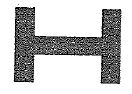

2   Zulassungszeichen (§ 24)

2.1 Das Zulassungszeichen besteht aus einer Kennzeichnung in einem Symbol.

2.2 Das Symbol für die innerstaatliche Bauartzulassung hat die Form eines
    stilisierten "Z".

    Die Kennzeichnung weist auf die Art und Bauart des Meßgeräts oder der
    Zusatzeinrichtung hin.

    Beispiel:
    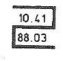

2.3 Das Symbol für die EWG-Bauartzulassung hat die Form eines stilisierten
    "Epsilon". Es enthält für die von der Bundesanstalt zugelassenen
    Meßgeräte im oberen Teil den Buchstaben "D" sowie die zwei letzten
    Ziffern des Zulassungsjahres. Die Kennzeichnung im unteren Teil weist
    auf die Art oder Bauart des Meßgeräts oder der Zusatzeinrichtung hin.

    Beispiel:
    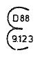

2.4 Bei einer beschränkten EWG-Bauartzulassung wird vor das Zeichen nach
    Nummer 2.3 ein "p" von gleicher Größe gesetzt.

2.5 Das Zulassungszeichen für allgemein zur EWG-Ersteichung zugelassene
    Meßgeräte hat die Form eines stilisierten spiegelbildlichen
    "Epsilon".

    Beispiel:
    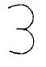

2.6 Das EWG-Zulassungszeichen eines Meßgeräts, für das keine EWG-
    Ersteichung vorgeschrieben ist, besteht aus dem Zeichen nach Nummer
    2\.3 in einem Sechseck.

    Beispiel:
    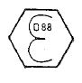

2.7 Symbol und Kennzeichnung können bei Platzmangel auch anders angeordnet
    werden. Einzelheiten werden bei der Zulassung festgelegt.

3   Stempelzeichen der Eichbehörden (§ 34)

3.1 Das Eichzeichen für die innerstaatliche Eichung besteht aus einem
    gewundenen Band mit dem Buchstaben D, der Ordnungszahl der jeweiligen
    Eichaufsichtsbehörde und einem sechsstrahligen Stern. Anstelle des
    Sterns kann auch die Ordnungszahl des prüfenden Eichamtes verwendet
    werden.

    Beispiel:
    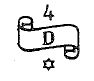

3.2 Das Eichzeichen für die EWG-Ersteichung besteht aus einem stilisierten
    "e". Es enthält in der oberen Hälfte das Kennzeichen D und die
    Ordnungszahl der jeweiligen Eichaufsichtsbehörde sowie in der unteren
    Hälfte die Ordnungszahl der prüfenden Eichbehörde.

    Beispiel:
    

3.3 Das Jahreszeichen für die innerstaatliche Eichung besteht aus den
    beiden letzten Ziffern des Jahres, in dem die Gültigkeit der Eichung
    endet, in Schildumrandung. Beträgt die Gültigkeitsdauer der Eichung
    weniger als zwölf Monate, besteht der Eichstempel aus einer runden
    Klebemarke mit den Monatszahlen 1 bis 12 am Rand sowie dem Eichzeichen
    und dem Jahreszeichen in der Mitte. Der Kalendermonat, in dem die
    Gültigkeit der Eichung endet, ist auf der Klebemarke kenntlich zu
    machen.

    Beispiel:
    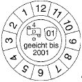

3.4 Die Jahresbezeichnung für die innerstaatliche Eichung besteht aus den
    beiden letzten Ziffern des Jahres der Eichung ohne Schildumrandung.

    Beispiel:
    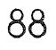

3.5 Das Jahreszeichen für die EWG-Ersteichung besteht aus den beiden
    letzten Ziffern des Jahres der Eichung in einer sechseckigen
    Umrandung.

    Beispiel:
    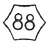

3.6 Hauptstempel für die EWG-Ersteichung von Längenmaßen, der anstelle des
    Zeichens nach Nummern 3.2 und 3.5 verwendet werden kann.

    Beispiel:
    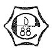

3.7 Das Entwertungszeichen besteht aus zwei sich tangierenden Halbkreisen
    in nachstehender Ausführung:

    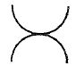

4   Stempelzeichen der staatlich anerkannten Prüfstellen (§ 59)

    Das Eichzeichen der Prüfstellen besteht aus dem Buchstaben E bei
    Meßgeräten für Elektrizität, G bei Meßgeräten für Gas, K bei
    Meßgeräten für Wärme und W bei Meßgeräten für Wasser sowie einem
    Kennbuchstaben der zuständigen Behörde und einer der Prüfstelle von
    der zuständigen Behörde zugeteilten Ordnungsnummer.

    Beispiel:
    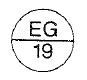
    Als Jahresbezeichnung wird das Zeichen nach Nummer 3.4 verwendet. Bei
    der EWG-Ersteichung sind die Zeichen nach Nummer 3.2 und 3.5 zu
    verwenden. Abweichend von Nummer 3.2 enthält das Eichzeichen in der
    unteren Hälfte die Ordnungsnummer der Prüfstelle.

5   (weggefallen)

6   Kennzeichen und Stempelzeichen des Instandsetzers (§ 72)

6.1 Das Instandsetzerkennzeichen besteht aus einer dreieckigen Klebemarke
    in nachstehender Ausführung:

    Beispiel:
    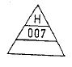
    Die Klebemarke enthält im oberen Feld den Kennbuchstaben der
    zuständigen Behörde, im mittleren Feld eine dem Instandsetzer
    zugeteilte Nummer. Das untere Feld ist für die Angabe des Datums der
    Instandsetzung bestimmt. Die Farbe des Feldes der Klebemarke ist
    signalrot, die Farbe von Schrift und Zeichen ist schwarz.

6.2 Das Stempelzeichen hat nachstehende Form:

    Beispiel:
    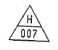
    Kennbuchstabe und Nummer des Stempelzeichens müssen mit den Angaben
    auf der Klebemarke übereinstimmen. Die Rückseite des Stempelzeichens
    in der Ausführung als Plombe darf mit einem Firmenzeichen versehen
    sein.

7   (weggefallen)

8.  CE-Kennzeichnung

    Die CE-Kennzeichnung besteht aus den Buchstaben "CE" mit folgendem
    Schriftbild:

    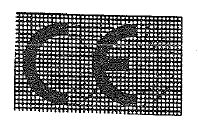
    Bei Verkleinerung oder Vergrößerung der CE-Kennzeichnung müssen die
    sich aus dem oben abgebildeten Raster ergebenden Proportionen
    eingehalten werden.

    Die verschiedenen Bestandteile der CE-Kennzeichnung müssen etwa gleich
    hoch sein; die Mindesthöhe beträgt 5 mm.

9.  Kennummer der benannten Stelle

    Die Kennummer der benannten Stelle ist die der benannten Stelle von
    der Kommission der Europäischen Gemeinschaften zugeteilte Nummer.

10. EG-Eichzeichen

10.1 Das Zeichen für die EG-Eichung besteht aus einer grünen quadratischen
    Marke mit einer Kantenlänge von mindestens 12,5 mm, die als schwarzen
    Aufdruck den Großbuchstaben "M" trägt. Es darf nur zusammen mit dem
    CE-Kennzeichnung aufgebracht werden.

10.2 Das Zeichen für Zusatzeinrichtungen, die von der EG-Eichung
    ausgenommen sind, besteht aus einem Quadrat mit einer Kantenlänge von
    mindestens 25 mm, das als schwarzen Aufdruck den Großbuchstaben M auf
    rotem Hintergrund trägt und diagonal durchkreuzt ist.

(zu § 7k)

### Anlage 1 Geräte zur Messung von Längen und ihrer Kombinationen

(Fundstelle des Originaltextes: BGBl. I 1988 Nr. 43, Anlageband S. 3 -
5;
bzgl. der einzelnen Änderungen vgl. Fußnote)

*    *   Abschnitt 1

    *   Verkörperte Längenmaße

*    *
    *   Teil 1: EG-Anforderungen

*    *
    *   Teil 2: Innerstaatliche Anforderungen

*    *   Abschnitt 2

    *   Längenmessgeräte, Flächenmessgeräte, mehrdimensionale Messgeräte

*    *
    *   Teil 1: EG-Anforderungen

*    *
    *   Teil 2: Innerstaatliche Anforderungen

*    *   Abschnitt 3

    *   (bleibt frei)

*    *   Abschnitt 4

    *   Rundholzmessanlagen

*    *   Abschnitt 5

    *   Choirometer

*
    *
        *
            *
                *
                    *   Abschnitt 1

                        Verkörperte Längenmaße

                        Teil 1 ****

                        **EG-Anforderungen**

    **1** **Begriffsbestimmung**

    1.1 Ein verkörpertes Längenmaß ist ein Gerät mit Einteilungsmarken, deren
        Abstände in gesetzlichen Längenmaßeinheiten angegeben sind.

    1.2 Verkörperte Längenmaße können ausgeführt sein als Maßstab,
        Gliedermaßstab, Messband, Peilbandmaß, Teleskopmessstab.

*
    **2** **Anforderungen**

        Für die messgerätespezifischen Anforderungen gelten die spezifischen
        Anforderungen nach Anhang MI-008 Kapitel I der Richtlinie 2004/22/EG
        in der jeweils geltenden Fassung.

*
    **3** **Konformitätsbewertung**

        Die in § 7k Abs. 1 genannten Konformitätsbewertungsverfahren, zwischen
        denen der Hersteller wählen kann, lauten wie folgt:

        F1 oder D1 oder B + D oder H oder G.

*
    *
        *
            *
                *
                    *   Teil 2 ****

                        **Innerstaatliche Anforderungen**

    **1** **Zulassung**

        Einlegemaße aus Papier oder Kunststoff sind allgemein zur
        innerstaatlichen Eichung zugelassen.

*
    **2** **Fehlergrenzen**

        Die Eichfehlergrenzen für Einlegemaße betragen 1
        L in mm – für
        L ist die ganze Zahl einzusetzen, welche die aufgerundete Nennlänge
        des zu prüfenden Abstandes in Meter angibt –. An jedem Meterstrich
        muss eine Stempelstelle für den Hauptstempel vorgesehen sein.

*
    **3** **Aufschriften**

        Auf Einlegemaßen muss der Hersteller oder sein Firmenzeichen angegeben
        sein.

*
    *
        *
            *
                *
                    *   Abschnitt 2

                        Längenmessgeräte, Flächenmessgeräte, mehrdimensionale Messgeräte

                        Teil 1 ****

                        **EG-Anforderungen**

    **1** **Begriffsbestimmungen**

    1.1 Längenmessgerät

        Ein Längenmessgerät (Längenmessmaschine) dient zur Bestimmung der
        Länge von länglichen Gebilden (z. B. Stoffen, Bändern und Kabeln)
        während einer Vorschubbewegung des Messguts.

        Längenmessgeräte können ausgeführt sein als Stoffmessmaschine,
        Stofflegemessmaschine, Draht- und Kabelmessmaschine,
        Tapetenmessmaschine, Bodenbelag-, Kunststoff- bzw. Folienmessmaschine.

    1.2 Flächenmessgerät

        Ein Flächenmessgerät dient zur Bestimmung der Fläche unregelmäßig
        begrenzter Objekte, z. B. Leder.

        Flächenmessgeräte können ausgeführt sein als Planimeter oder als
        abrollende oder projizierende Messmaschinen.

    1.3 Mehrdimensionales Messgerät

        Ein mehrdimensionales Messgerät dient zur Bestimmung der Kantenlänge
        (Länge, Höhe, Breite) der kleinsten umhüllenden Quader eines Messguts.

        Mehrdimensionale Messgeräte können ausgeführt sein als
        Messeinrichtungen für Frachtstücke.

*
    **2** **Anforderungen**

        Für die messgerätespezifischen Anforderungen gelten die spezifischen
        Anforderungen nach Anhang MI-009 der Richtlinie 2004/22/EG in der
        jeweils geltenden Fassung.

*
    **3** **Konformitätsbewertung**

        Die in § 7k Abs. 1 genannten Konformitätsbewertungsverfahren, zwischen
        denen der Hersteller wählen kann, lauten wie folgt:

    3.1 für mechanische oder elektromechanische Geräte:

        F1 oder E1 oder D1 oder B + F oder B + E oder B + D oder H oder H1
        oder G,

    3.2 für elektronische Geräte oder Geräte, die Software enthalten:

        B + F oder B + D oder H1 oder G.

*
    **4** **Verwendung**

        Abweichend von § 33 Abs. 4 betragen die Verkehrsfehlergrenzen für:

    4.1 Messmaschinen für den Kleinverkauf das Dreifache der Fehlergrenzen
        nach Nummer 2,

    4.2 Messgeräte nach den Nummern 1.1 und 1.2, ausgenommen der Messgeräte
        nach Nummer 4.1, das 1,5-fache der Fehlergrenzen nach Nummer 2.

*
    **5** **Übergangsvorschriften**

        Für Messmaschinen für den Kleinverkauf, die bis zum 13. Februar 2007
        zugelassen worden sind, gelten bei der Nacheichung bis zum 31.
        Dezember 2011 die für die Ersteichung vorgeschriebenen Fehlergrenzen,
        und die Verkehrsfehlergrenzen betragen das 1,5-fache dieser
        Eichfehlergrenzen.

Teil 2 ****
**Innerstaatliche Anforderungen**

*
    **1** **Zulassung**

    1.1 Besondere Längenmessgeräte

        Besondere mechanische Längenmessgeräte nach den Nummern 2.1.1 bis
        2\.1.6 sind allgemein zur innerstaatlichen Eichung zugelassen.

        Besondere Längenmessgeräte mit Messwertspeicherung oder -verarbeitung
        sowie Messräder für Wegstrecken bedürfen der innerstaatlichen
        Bauartzulassung.

    1.2 Flächenmesswerkzeuge

        Flächenmesswerkzeuge nach Nummer 2.2 sind allgemein zur
        innerstaatlichen Eichung zugelassen.

        Planimeter unterliegen den Anforderungen nach Teil 1.

*
    **2** **Messgerätearten**

    2.1 Besondere Längenmessgeräte können ausgeführt sein als

    2.1.1 Messkluppen mit einem Messbereich von 0 bis 2 m, in Stufen von jeweils
        0,1 m und einem Skalenteilungswert von 1 mm, 5 mm oder 10 mm,

    2.1.2 Fadenzähler mit einem Messbereich von 0 bis 20 mm und einem
        Skalenteilungswert von 1 mm,

    2.1.3 Messschieber,

    2.1.4 Tiefenmessschieber und Reifenprofilmessgeräte,

    2.1.5 Bügelmessschrauben und Innenmessschrauben,

    2.1.6 Messuhren,

    2.1.7 Messräder (Messmaschinen) für Wegstrecken.

    2.2 Flächenmesswerkzeuge

        Die folgenden Flächenmesswerkzeuge dienen zum Ausschneiden oder Messen
        von regelmäßig begrenzten Flächen bestimmter Form und Abmessungen in
        der Ausführung als

    2.2.1 Doppelschablonen zum Ausschneiden rechteckiger oder quadratischer
        Stoffproben,

    2.2.2 Probeschneider zum Ausschneiden kreisförmiger Stoffproben,

    2.2.3 Doppelscheren zum Ausschneiden streifenförmiger Stoffproben.

*
    **3** **Anforderungen**

        Die mit Messwerkzeugen nach Nummer 2.2 erzielten Flächen müssen
        betragen:

*    *   3.1

    *   bei Doppelschablonen

    *   4 qcm ( 2 cm x 2 cm)

*    *   8 qcm ( 2 cm x 4 cm)

*    *   100 qcm ( 5 cm x 20 cm)

*    *   500 qcm (10 cm x 50 cm)

*    *   3.2

    *   bei Probeschneidern

    *   Kreisflächen von 10 qcm, 50 qcm oder 100 qcm

*    *   3.3

    *   bei Doppelscheren

    *   Schnittbreiten von 5 mm und
        Schnittlängen von 80 mm bis 100 mm

*
    **4** **Aufschriften**

    4.1 Auf Doppelschablonen und Probeschneidern muss die Flächengröße mit der
        Einheit "Quadratzentimeter" oder dem Einheitenzeichen bezeichnet sein.

    4.2 Auf Doppelscheren muss die Schnittbreite mit der Einheit "Millimeter"
        oder dem Einheitenzeichen bezeichnet sein.

*
    **5** **Fehlergrenzen**

    5.1 Eichfehlergrenzen für besondere Längenmessgeräte nach Nummer 2.1:

5\.1.1   Messkluppen
a) für die Einteilung und für den Abstand der auseinandergeschobenen
Kluppstäbe
– Messbereich bis 1 m                           2 mm
– Messbereich bis 2 m                           4 mm,
b) für den Abstand der Messflächen bei zusammengeschobenen Kluppstäben
an einer beliebigen Stelle
– Messbereich bis 1 m                          +0,5 mm
– Messbereich bis 2 m                          +1 mm
5\.1.2   Fadenzähler
– Messbereich bis 20 mm                            0,05 mm
5\.1.3   Messschieber
– Messbereich bis 500 mm                           0,1 mm
– darüber hinaus 0,2 mm
5\.1.4   – Tiefenmessschieber, Reifenprofilmessgeräte       0,1 mm
5\.1.5   Bügelmessschrauben, Innenmessschrauben
– Messbereich bis 100 mm                           0,01 mm
– darüber hinaus                                   0,02 mm
5\.1.6   Messuhren
– Messbereich bis 10 mm                            0,02 mm
5\.1.7   Messräder (Messmaschinen) für Wegstrecken 1%,
jedoch nicht weniger als 40 mm.
5\.2     Eichfehlergrenzen für Flächenmesswerkzeuge nach Nummer 2.2:
5\.2.1   Doppelschablonen für die Längen
2 cm, 4 cm, 5 cm und 10 cm           0,2 mm
20 cm und 50 cm                      0,3 mm
5\.2.2   Probeschneider                       1,5% der ausgeschnittenen
Fläche
5\.2.3   Doppelscheren für die Schnittbreite  0,2 mm.

*
    5.3 Verkehrsfehlergrenzen

        Die Verkehrsfehlergrenzen betragen für Flächenmesswerkzeuge nach
        Nummer 2.2 das 1,5-fache der Eichfehlergrenzen.

*
    *
        *
            *
                *
                    *   Abschnitt 3

                        (bleibt frei)

*
    *
        *
            *
                *
                    *   Abschnitt 4

                        Rundholzmessanlagen

    1.  Zulassung

        Die Bauarten der Rundholzmessanlagen bedürfen der Zulassung zur
        innerstaatlichen Eichung.

    2.  Begriffsbestimmung

        Rundholzmessanlagen sind Messgeräte, die einen oder mehrere
        Durchmesser im Bereich der Holzstamm-Mitte und die Holzstamm-Länge
        messen und daraus das Holzvolumen berechnen.

    3.  Fehlergrenzen

        Die Eichfehlergrenzen betragen:

*    *   a) für den Einzeldurchmesser

    *   1 cm

*    *   b) für den arithmetischen Mittelwert aus 10 Messungen des Durchmessers

    *   2,5 mm

*    *   c) für die Stammlänge

    *   1% jedoch nicht weniger als 5 cm.

*
    *
        *
            *
                *
                    *   Abschnitt 5

                        Choirometer

    1.  Zulassung

        Die Bauarten der Choirometer bedürfen der Zulassung zur
        innerstaatlichen Eichung.

    2.  Begriffsbestimmung

        Choirometer sind Messgeräte, die an Schweineschlachtkörpern den
        Muskelfleischanteil feststellen

        -   über die Messung der Dicke von Speck- und Muskelschichten oder

        -   durch direkte Angabe des Muskelfleischanteils.

    3.  Fehlergrenzen

    3.1 Fehlergrenzen bei der Laboratoriumsprüfung

    3.1.1 Speck- und Muskelschichten feststellende Geräte

        Die Fehlergrenzen haben bei der laboratoriumsmäßigen Prüfung, die von
        dem Max Rubner-Institut, Bundesforschungsinstitut für Ernährung und
        Lebensmittel, an mindestens 120 Schlachtkörpern vorzunehmen ist,
        folgende Werte:

        Speckdicke:

*    *   arithmetischer Mittelwert der Abweichungen

    *   Am = 0,4 mm;

*    *   Standardabweichung der Einzelabweichungen

    *   s = 1,4 mm;

*    *   Muskeldicke: arithmetischer Mittelwert der Abweichungen

    *   AM = 1,0 mm;

*    *   Standardabweichung der Einzelabweichungen

    *   s = 3,0 mm.

*
    3.1.2 Muskelfleischanteile feststellende Geräte

*    *   arithmetischer Mittelwert der Abweichungen

    *   AM = 0,5%;

*    *   Standardabweichung der Einzelabweichungen

    *   s = 2,1%.

*
    3.2 Eichfehlergrenzen

    3.2.1 Die Eichfehlergrenzen für opto-elektronische Geräte betragen an einer
        vorgeschriebenen Prüfvorrichtung 0,5 mm. Weitere Grenzwerte werden in
        der Zulassung festgelegt.

    3.2.2 Die Eichfehlergrenzen für Ultraschall-Geräte und für direkt den
        Muskelfleischanteil feststellende Geräte werden in der Zulassung
        festgelegt.

(zu § 7k)
Ausschankmaße

### Anlage 2 EG-Anforderungen

Fundstelle des Originaltextes: BGBl. I 2007, 82

*
    **1** **Begriffsbestimmungen**

    1.1 Ausschankmaß

        Ein Hohlmaß (beispielsweise ein Maß in Form eines Trinkglases, Kruges
        oder Bechers), das für die Bestimmung eines festgelegten Volumens
        einer zum sofortigen Verbrauch verkauften Flüssigkeit (ausgenommen
        Arzneimittel) ausgelegt ist.

    1.2 Strichmaß

        Ein Ausschankmaß mit einer Strichmarkierung zur Anzeige des
        Nennfassungsvermögens (Nennfüllstandsmenge).

    1.3 Randmaß

        Ein Ausschankmaß, bei dem das Innenvolumen gleich dem
        Nennfassungsvermögen (Nennfüllstandsmenge) ist.

    1.4 Umfüllmaß

        Ein Ausschankmaß, aus dem die Flüssigkeit vor dem Verbrauch
        ausgeschenkt wird.

    1.5 Fassungsvermögen

        Das Fassungsvermögen ist bei Randmaßen das Innenvolumen bzw. bei
        Strichmaßen das Innenvolumen bis zur Füllstandmarkierung.

*
    **2** **Anforderungen**

        Für die messgerätespezifischen Anforderungen gelten die spezifischen
        Anforderungen nach Anhang MI-008 Kapitel II der Richtlinie 2004/22/EG
        in der jeweils geltenden Fassung.

*
    **3** **Konformitätsbewertung**

        Die in § 7k Abs. 1 genannten Konformitätsbewertungsverfahren, zwischen
        denen der Hersteller wählen kann, lauten wie folgt:

        A1 oder F1 oder D1 oder E1 oder B + E oder B + D oder H.

### Anlage 3 Volumenmeßgeräte für nichtflüssige Meßgüter

Fundstelle des Originaltextes: BGBl. I 1988 Nr. 43, Anlageband S. 8,
bzgl. der einzelnen Änderungen vgl. Fußnote

*    *   Abschnitt 1

    *   (weggefallen)

*    *   Abschnitt 2

    *

*
    *
        *
            *
                *
                    *   Abschnitt 1

                        (weggefallen)

*
    *
        *
            *
                *
                    *   Abschnitt 2

    1   **Zulassung**

        Die Bauarten der Meßeinrichtungen für nichtflüssige Meßgüter bedürfen
        der Zulassung zur innerstaatlichen Eichung.

    2   **Begriffsbestimmung**

        Meßeinrichtungen für nichtflüssige Meßgüter sind an Vorratsbehältern
        (Silos) befindliche spezielle Apparaturen, z.B. Dosierräder. Sie
        entnehmen das Meßgut und bestimmen sein Volumen.

    3   **Aufschriften**

        An den Meßeinrichtungen müssen die Meßgüter, für die sie zugelassen
        sind, angegeben sein.

    4   **Fehlergrenzen**

        Die Fehlergrenzen betragen 2% des abgemessenen Volumens.

### Anlage 4 Volumenmeßgeräte für Flüssigkeiten in ruhendem Zustand

Fundstelle des Originaltextes: BGBl. I 1988 Nr. 43, Anlageband S. 9 -
14;
bzgl. der einzelnen Änderungen vgl. Fußnote

*    *   Abschnitt 1

    *   Flüssigkeitsmaße, Meßwerkzeuge und deren Zusatzeinrichtungen

*    *   Abschnitt 2

    *   Lagerbehälter und deren Messgeräte

*    *   Abschnitt 3

    *   Transport-Meßbehälter

*    *   Abschnitt 4

    *   Fässer

*
    *
        *
            *
                *
                    *   Abschnitt 1

                        Flüssigkeitsmaße, Meßwerkzeuge und deren Zusatzeinrichtungen

    1   **Zulassung**

    1.1 Flüssigkeitsmaße, Meßwerkzeuge und deren mechanische
        Zusatzeinrichtungen sind allgemein zur innerstaatlichen Eichung
        zugelassen.

    1.2 Die Bauarten der Meßwerkzeuge mit elektrischen Einrichtungen bedürfen
        der Zulassung zur innerstaatlichen Eichung.

    2   **Begriffsbestimmungen**

    2.1 Bei Flüssigkeitsmaßen wird der Maßraum durch den Rand des Gefäßes oder
        durch Begrenzungsmarken in einen oder mehrere Volumenabschnitte
        abgegrenzt.

    2.2 Bei Meßwerkzeugen ist die Meßkammer zur Erleichterung der Messung oder
        der Füllung und Entleerung mit besonderen Einrichtungen (Hähne,
        Überlaufrohre, Schwimmeranzeigeeinrichtungen) versehen. Die Meßkammer
        ist in einen oder mehrere Volumenabschnitte abgegrenzt.

    3   **Aufschriften**

    3.1 Flüssigkeitsmaße und Meßwerkzeuge müssen mit Volumenangaben versehen
        sein. An Zusatzeinrichtungen muß die Volumeneinheit aufgebracht sein.

    3.2 An Meßwerkzeugen müssen angegeben sein

        -   Hersteller oder sein Firmenzeichen,

        -   Fabriknummer.

    3.3 Auswechselbare Teile der Meßwerkzeuge und einsetzbare
        Verdrängungskörper der Überlaufmeßwerkzeuge müssen mit mindestens den
        drei letzten Ziffern der Fabriknummer versehen sein.

    4   **Fehlergrenzen**

*    *   4.1

    *   Maße

*    *
    *   Volumen V

    *   Eichfehlergrenze

*    *   0,01

    *   0,2 ml

*    *   0,02

    *   0,4 ml

*    *   0,05

    *   0,5 ml

*    *   0,1 und 0,2

    *   1,0 ml

*    *   0,25

    *   1,25 ml

*    *   0,5

    *   1,5 ml

*    *   1 oder mehr

    *   0,0025 V

*    *   4.2

    *   Meßgläser, Meßeimer und Meßwerkzeuge

*    *
    *   Volumen einer Füllung, abgegebenes Volumen V

    *   Eichfehlergrenze

*    *   bis 0,025

    *   0,04 V

*    *   von 0,025 bis 0,05

    *   1 ml

*    *   von 0,05 bis 0,1

    *   0,02 V

*    *   von 0,1 bis 0,2

    *   2 ml

*    *   von 0,2 bis 0,5

    *   0,01 V

*    *   von 0,5 bis 1,0

    *   5 ml

*    *   von 1,0 oder mehr

    *   0,005 V

*
    *   Die Eichfehlergrenzen betragen jedoch nicht weniger als die Hälfte der
        Fehlergrenze für das Gesamtvolumen oder für den vollen messenden
        Kolbenhub.

    5   **Stempelstellen**

        Die Hauptstempelstelle muß an der Maßraumbegrenzung der
        Flüssigkeitsmaße und Meßwerkzeuge vorhanden sein. Bei Meßeimern, deren
        Skalenbleche durch Niete mit dem Gefäß verbunden sind, muß für jedes
        Skalenblech ein Niet als Sicherungsstempelstelle ausgebildet sein. Bei
        Meßwerkzeugen müssen Stempelstellen zur Sicherung der
        Unveränderlichkeit des Maßraums, der Funktion und der Anzeige
        vorhanden sein.

*
    *
        *
            *
                *
                    *   Abschnitt 2

                        Lagerbehälter und deren Meßgeräte

    1   **Zulassung**

    1.1 Lagerbehälter und deren Meßeinrichtungen

        -   Peilrohr und Peilstab,

        -   Peilöffnung oder Peilrohr und geeichtes Peilband,

        -   Standrohr und Skale,

        -   Schauglas in einer Behälterwand und Skale

        sind allgemein zur innerstaatlichen Eichung zugelassen.

    1.2 Die Bauarten der Füllstandsmeßgeräte und Tauchtiefenmeßgeräte sowie
        deren Zusatzeinrichtungen bedürfen der Zulassung zur innerstaatlichen
        Eichung.

    1.3 (weggefallen)

    2   **Begriffsbestimmungen**

    2.1 Als Lagerbehälter werden ortsfest aufgestellte Behälter verstanden,
        die als Meßbehälter verwendet werden. Das vermessene Volumen eines
        Lagerbehälters (Behälterkammer) ist das Volumen von der unteren bis
        zur oberen Maßraumbegrenzung.

    2.2 Mit Füllstandsanzeigern (Peileinrichtungen oder Füllstandsmeßgeräten)
        wird die Füllhöhe der in einem Behälter enthaltenen Flüssigkeit
        gemessen.

    2.3 Mit Tauchtiefenmeßgeräten wird die Eintauchtiefe eines Schwimmdaches
        oder einer Schwimmdecke in der Flüssigkeit gemessen.

    2.4 (weggefallen)

    3   **Aufschriften**

    3.1 An Lagerbehältern muß ein Schild vorhanden sein, auf dem die Nummer
        des Behälters und die Nummer des Eichscheins angegeben sind.

    3.2 Auf Peilstäben müssen die Behälternummer und die Eichscheinnummer
        angegeben sein. Wenn Peilstäbe für mehrere Behälter benutzt werden,
        müssen die Nummern der zugehörigen Behälter angegeben sein.

    3.3 Auf Peilstäben und Skalen, die nach Volumen eingeteilt sind, muß die
        Volumeneinheit oder deren Einheitenzeichen angegeben sein.

    3.4 Zusätzlich zu den Angaben nach § 42 Abs. 1 muß auf
        Füllstandsmeßgeräten mit Schwimmer angegeben sein

        -   der Meßbereich in Meter,

        -   der Durchmesser des Meßdrahtes (-seils) oder die Stärke des Bandes in
            Millimeter,

        -   die Masse des Schwimmers in Gramm.

    3.5 (weggefallen)

    4   **Fehlergrenzen**

    4.1 Eichfehlergrenzen sind für Lagerbehälter nicht festgesetzt.

    4.2 Das Volumen wird bei der Eichung ermittelt und angegeben. Die
        Unsicherheit der Volumenermittlung muß so klein sein, daß bei
        Volumenmessungen mit Hilfe der bei der Vermessung festgestellten
        Zahlenwerte (Skale, Peilstab, Füllungstafel) die Unsicherheit kleiner
        ist als 0,5% des jeweiligen Volumens. Die Unsicherheit braucht jedoch
        nicht kleiner zu sein als 0,5% des Kleinstraums.

        Der Kleinstraum des Behälters (Behälterkammer) ist das Volumen, das
        sich aus dem größten horizontalen Querschnitt und 200 mm Höhe ergibt.

        Der Kleinstraum der Lagerbehälter mit Schwimmdecke entspricht dem
        Volumen von 500 mm Höhe.

        Der Kleinstraum der Lagerbehälter mit Schwimmdach entspricht dem
        Volumen von 1.000 mm Höhe.

    4.3 Die Verkehrsfehlergrenzen betragen 1% des jeweiligen Volumens, jedoch
        nicht weniger als 1% des Kleinstraums.

    4.4 Für die Längeneinteilung der Peilstäbe und Skalen gelten die
        Fehlergrenzen der Genauigkeitsklasse II nach Anlage 1 Abschnitt 1 Teil
        1 Nr. 2.

    4.5 Bei Füllstandsmeßgeräten betragen die Eichfehlergrenzen für die
        Füllstandsanzeige 0,03% des Schwimmerweges, jedoch nicht weniger als 1
        mm.

    4.6 Bei Tauchtiefenmeßgeräten betragen die Eichfehlergrenzen für die
        Tauchtiefenanzeige 1 mm.

    4.7 (weggefallen)

    5   **Stempelstellen**

        Sicherungsstempelstellen müssen vorhanden sein

    5.1 bei Lagerbehältern

        -   auf den Schildern,

        -   an der Peilrohroberkante oder an der Peilöffnung,

        -   auf stehenden Peilstäben

            *   an ihrem unteren Ende,

                am Anfang und am Ende der Einteilung,

                an der Strichmarke oder an ihrem oberen Ende,

        -   auf hängenden Peilstäben

            *   am Anfang und am Ende der Einteilung,

                an der Verbindung zwischen dem Quersteg

                und dem Peilstab,

        -   an Peilplatten, wenn ihre Lage im Behälter nicht auf andere Weise
            gesichert ist,

        -   auf Skalen an Standrohren oder Schaugläsern an der Anfangsmarke und
            der Endmarke der Einteilung; bei Skalen, die aus mehreren Teilstücken
            bestehen, am Anfang und am Ende jedes Teilstücks,

        -   zur Lagesicherung der Skalen gegenüber dem Behälter,

        -   zur Sicherung der Unveränderlichkeit des Maßraums und der
            Meßeinrichtung,

        -   bei Lagerbehältern mit Schwimmdecke auf der Oberkante der
            Hilfspeilstutzen,

        -   bei Lagerbehältern mit Schwimmdach an der Anlegekante der
            Dachpeilstutzen,

    5.2 bei Füllstandsmeßgeräten

        -   gegen Eingriffe in das Meßgerät,

        -   auf dem Schwimmer,

        -   gegebenenfalls an den Schutzrohren.

*
    *
        *
            *
                *
                    *   Abschnitt 3

                        Transport-Meßbehälter

    1   Fe Zulassung

        Transport-Meßbehälter sind allgemein zur innerstaatlichen Eichung
        zugelassen.

    2   **Aufschriften**

    2.1 Das Volumen der Behälter oder der einzelnen Behälterkammern ist an der
        oberen Maßraumbegrenzung in Litern anzugeben.

    2.2 An Transport-Meßbehältern muß ein Schild mit folgenden Angaben
        angebracht sein:

        -   Gesamtvolumen und Volumen der einzelnen Kammer mit ihrer Nummer,

        -   Hersteller oder sein Firmenzeichen,

        -   Behälternummer und Baujahr,

        -   Meßgut bzw. Meßgutgruppe.

    2.3 Die Volumenangaben sind wie folgt zu runden:

*    *   Volumen V

    *   auf

*    *   100 bis 200

    *   0,2

*    *   > 200 bis 500

    *   0,5

*    *   > 500 bis 1.000

    *   1

*    *   > 1.000 bis 2.000

    *   2

*    *   > 2.000 bis 5.000

    *   5

*    *   > 5.000

    *   10

*
    *   Sind mehrere Kammern vorhanden, so ist als Gesamtvolumen die Summe der
        gerundeten Einzelvolumen anzugeben.

    3   **Fehlergrenzen**

        Soweit die Volumenangabe nicht bei der Eichung aufgebracht wird,
        betragen die Eichfehlergrenzen für jede Behälterkammer 0,5% des durch
        die obere Maßraumbegrenzung bestimmten Volumens.

    4   **Stempelstellen**

        Sicherungsstempelstellen müssen vorhanden sein

        -   auf dem Schild nach Nummer 2.2,

        -   an den Begrenzungsmarken im Dom neben jeder Volumenangabe,

        -   an der untersten und obersten Begrenzungsmarke von Nebenteilungen,

        -   an mit Strichmarken versehenen Trichtern oder schrägliegenden Blechen
            zur oberen Maßraumbegrenzung,

        -   am Domdeckel, am Mannlochdeckel und an sonstigen Zugängen zu den
            Maßräumen,

        -   am Neigungsmesser (Lot) gegen Abnehmen,

        -   an sonstigen abnehmbaren Teilen, die das Meßergebnis beeinflussen
            können.

*
    *
        *
            *
                *
                    *   Abschnitt 4

                        Fässer

    1   **Zulassung**

        Fässer sind allgemein zur innerstaatlichen Eichung zugelassen.

    2   **Begriffsbestimmungen**

        Das Volumen des Fasses ist der Raum, den die Flüssigkeit einnimmt,
        wenn sie das gesamte Luftvolumen im Innern des Fasses verdrängt hat
        und die innere Faßwand an der Füllöffnung berührt.

    3   **Aufschriften**

    3.1 Das Volumen der Fässer ist in Litern anzugeben, wobei die Ziffern
        mindestens 10 mm hoch sein müssen.

    3.2 An Fässern muss der Hersteller oder sein Firmenzeichen angegeben sein.

    3.3 An Fässern für kohlesäurehaltige Getränke muß in der Nähe der
        Volumenbezeichnung in mindestens gleicher Schrifthöhe der Buchstabe B
        aufgebracht sein, sofern das Meßgut nicht bereits aus einer anderen
        Aufschrift zu entnehmen ist.

    3.4 Bei Fässern aus massivem Holz, deren Dauben und Böden nur durch
        spanabhebende Bearbeitung geformt sind (Holzfässer), wird die
        Volumenbezeichnung bei der Eichung aufgebracht. Für die Aufbringung
        der Volumenbezeichnung darf ein auf dem Faß befestigter Rahmen mit
        auswechselbaren Ziffern vorhanden sein (Faßeichplatte). Das Volumen in
        I ist nach unten gerundet anzugeben, und zwar

*    *   bei einem Volumen V von

    *   bei Holzfässern für

*    *   kohlensäurehaltige Getränke auf

    *   kohlensäurefreie Flüssigkeiten auf

*    *   2 bis 5

    *   0,05

    *   0,05

*    *   > 5 bis 10

    *   0,1

    *   0,1

*    *   > 10 bis 15

    *   0,2

    *   0,1

*    *   > 15 bis 20

    *   0,2

    *   0,2

*    *   > 20 bis 40

    *   0,5

    *   0,2

*    *   > 40 bis 150

    *   1

    *   0,5

*    *   > 150 bis 400

    *   2

    *   1

*    *   > 400 bis 800

    *   5

    *   2

*    *   > 800 bis 1.500

    *   5

    *   5

*    *   > 1.500 bis 3.000

    *   10

    *   10

*    *   > 3.000

    *   20

    *   20

*
    4   **Fehlergrenzen**

    4.1 Die Eichfehlergrenzen für Fässer, mit Ausnahme der Holzfässer nach Nr.
        3\.4, betragen:

*    *
    *   Volumen V

    *   Eichfehlergrenze

*    *   2 bis 5

    *   0,02 V

*    *   5 bis 10

    *   0,1 I

*    *   10 bis 20

    *   0,01 V

*    *   20 bis 40

    *   0,2 I

*    *   40 oder mehr

    *   0,005 V

*    *
    *   Bei der Nacheichung betragen die Fehlergrenzen bei Volumenabweichungen
        nach Plus das Doppelte der Beträge.

*    *   4.2

    *   Für Holzfässer sind keine Eichfehlergrenzen festgesetzt.

*    *   4.3

    *   Die Verkehrsfehlergrenzen betragen bei Holzfässern:

*    *   4.3.1

    *   für kohlensäurehaltige Getränke

*    *
    *   Volumen V

    *   Verkehrsfehlergrenze

*    *   2 bis 50

    *   0,04 V

*    *   50 bis 100

    *   2 I

*    *   100 bis 600

    *   0,02 V

*    *   600 bis 800

    *   12 I

*    *   800 oder mehr

    *   0,015 V

*    *   4.3.2

    *   für kohlensäurefreie Flüssigkeiten

*    *
    *   Volumen V

    *   Verkehrsfehlergrenze

*    *   2 bis 5

    *   0,04 V

*    *   5 bis 10

    *   0,2 I

*    *   10 bis 50

    *   0,02 V

*    *   50 bis 100

    *   1 I

*    *   100 oder mehr

    *   0,01 V

*
    5   **Stempelstellen**

        Die Hauptstempelstelle muß in der Nähe der Volumenbezeichnung
        vorhanden sein.

        Bei Faßeichplatten muß die Hauptstempelstelle die Platte gegen
        Abnehmen und die Ziffern und Zeichen gegen Auswechseln sichern.

        Besteht die Stempelstelle aus Aluminium oder Stahl, so muß sie
        mindestens 50 mm mal 40 mm groß sein. Bei Fässern mit einem Volumen
        von 10 l oder weniger dürfen die Abmessungen 25 mm mal 20 mm betragen.

(zu § 7k)
Messanlagen für die kontinuierliche und dynamische Messung von Mengen
von Flüssigkeiten außer Wasser

### Anlage 5 EG-Anforderungen

Fundstelle des Originaltextes: BGBl. I 2007, 82 - 84

*
    **1** **Begriffsbestimmungen**

    1.1 Zähler

        Ein Gerät, das für das kontinuierliche Messen, das Speichern und das
        Anzeigen der Menge einer den Messwertaufnehmer in einer geschlossenen,
        vollständig gefüllten Leitung durchfließenden Flüssigkeit bei
        Betriebsbedingungen ausgelegt ist.

    1.2 Rechenwerk

        Teil eines Zählers, das die Ausgangssignale des (der)
        Messwertaufnehmer(s) und etwaiger verbundener Messgeräte aufnimmt und
        die Messergebnisse anzeigt.

    1.3 Verbundenes Messgerät

        Ein Gerät, das mit dem Rechenwerk verbunden ist und zum Zwecke einer
        Korrektur und/oder Umwertung bestimmte für die Flüssigkeit
        charakteristische Größen misst.

    1.4 Mengenumwerter

        Teil des Rechenwerks, das unter Berücksichtigung der Eigenschaften der
        Flüssigkeit (Temperatur, Dichte usw.), die mittels verbundener
        Messgeräte ermittelt werden oder in einem Speicher gespeichert sind,
        automatisch

        -   das im Messzustand ermittelte Volumen der Flüssigkeit in ein Volumen
            im Basiszustand und/oder in eine Masse oder

        –   die im Messzustand ermittelte Masse der Flüssigkeit in ein Volumen im
            Messzustand und/oder in ein Volumen im Basiszustand

        umrechnet.

        Anmerkung: Ein Mengenumwerter umfasst die betreffenden verbundenen
        Messgeräte.

    1.5 Basiszustand

        Der festgelegte Zustand, in den die bei Messbedingungen gemessene
        Flüssigkeitsmenge umgewertet wird.

    1.6 Messanlage

        Eine Anlage, die dazu bestimmt ist, Mengen (Volumen oder Massen) von
        Flüssigkeiten außer Wasser kontinuierlich und dynamisch zu messen und
        die den Zähler und alle Einrichtungen umfasst, die erforderlich sind,
        um eine korrekte Messung zu gewährleisten, oder dazu dienen, die
        Messvorgänge zu erleichtern.

    1.7 Kraftstoffzapfanlage (Kraftstoffzapfsäule)

        Eine Messanlage zur Betankung von Kraftfahrzeugen, kleinen Booten und
        kleinen Luftfahrzeugen.

    1.8 Selbstbedienungsanlage

        Eine Anlage, die es dem Kunden gestattet, eine Messanlage zum Zwecke
        des Erwerbs einer Flüssigkeit für den Eigenbedarf zu nutzen.

    1.9 Selbstbedienungskomponente

        Eine spezielle Komponente, die zu einer Selbstbedienungsanlage gehört
        und es einer oder mehreren Messanlagen ermöglicht, in dieser
        Selbstbedienungsanlage ihre Funktion zu erfüllen.

    1.10 Kleinste Messmenge (MMQ)

        Die kleinste Flüssigkeitsmenge, für die die Messung mit der Messanlage
        messtechnisch zulässig ist.

    1.11 Direktanzeige

        Die Anzeige des Volumens oder der Masse, das bzw. die der Messgröße
        entspricht, für deren Messung das Messgerät physikalisch geeignet ist.

        Anmerkung: Die Direktanzeige kann mittels eines Mengenumwerters in
        eine andere Größe umgewertet werden.

    1.12 Mit/ohne Unterbrechungsmöglichkeit

        Bei einer Messanlage gilt eine Unterbrechungsmöglichkeit als gegeben,
        wenn der Flüssigkeitsstrom leicht und schnell unterbrochen werden
        kann; ist dies nicht der Fall, so gilt sie als Anlage ohne
        Unterbrechungsmöglichkeit.

    1.13 Durchflussbereich

        Der Bereich zwischen dem Mindestdurchfluss
        (Q(tief)min) und dem Höchstdurchfluss
        (Q(tief)max).

*
    **2** **Anforderungen**

        Für die messgerätespezifischen Anforderungen gelten die spezifischen
        Anforderungen nach Anhang MI-005 der Richtlinie 2004/22/EG in der
        jeweils geltenden Fassung.

*
    **3** **Konformitätsbewertung**

        Die in § 7k Abs. 1 genannten Konformitätsbewertungsverfahren, zwischen
        denen der Hersteller wählen kann, lauten wie folgt:

        B + D oder B + F oder H1 oder G.

*
    **4** **Nacheichung**

    4.1 Die Nacheichung wird an der vollständigen Messanlage mit dem zur
        Verwendung vorgesehenen Produkt durchgeführt.

    4.2 Nach Reparatur oder Austausch von Geräten oder Teilen einer Messanlage
        oder bei ungültigen Stempelzeichen sind besondere Prüfungen dieser
        Geräte oder Teile ggf. auf einem Prüfstand erforderlich. Von diesen
        Prüfungen kann abgesehen werden, wenn der Hersteller oder autorisierte
        Reparaturbetrieb die Konformität dieser Geräte oder Teile nach einem
        geeigneten Verfahren erklärt.

    4.3 Die Temperatur-Mengenumwertung für leichtes Heizöl sowie für andere
        Produkte, die die Messanlage mit Temperatur-Mengenumwertung abgibt,
        ist bei der Nacheichung gegen ein Verstellen zu sichern. Die Abgabe
        eines Produkts wahlweise mit oder ohne Temperatur-Mengenumwertung darf
        nicht möglich sein.

*
    **5** **Verwendung**

        Abweichend von § 33 Abs. 4 entsprechen die Verkehrsfehlergrenzen für
        Messanlagen nach Nummer 1.6 einschließlich der Kraftstoffzapfsäulen
        nach Nummer 1.7 den Fehlergrenzen nach Nummer 2.

(zu § 7k)

### Anlage 6 Wasserzähler

(Fundstelle des Originaltextes: BGBl. I 2007, 84 - 86)

*
    *
        *
            *
                *
                    *   Teil 1 ****

                        **EG-Anforderungen**

    **1** **Begriffsbestimmungen**

    1.1 Wasserzähler

        Ein Gerät, das für das Messen, Speichern und Anzeigen der Menge des
        den Messwertaufnehmer durchströmenden sauberen Kalt- oder Warmwassers
        bei Betriebsbedingungen ausgelegt ist.

    1.2 Mindestdurchfluss
        (Q(tief)1)

        Der kleinste Durchfluss, bei dem der Wasserzähler Anzeigen liefert,
        die den Anforderungen hinsichtlich der Fehlergrenzen genügen.

    1.3 Übergangsdurchfluss
        (Q(tief)2)

        Der Übergangsdurchfluss ist der Durchflusswert, der zwischen dem
        Dauer- und dem Mindestdurchfluss liegt und den Durchflussbereich in
        zwei Zonen, den oberen und den unteren Belastungsbereich, unterteilt,
        für die jeweils verschiedene Fehlergrenzen gelten.

    1.4 Dauerdurchfluss
        (Q(tief)3)

        Der größte Durchfluss, bei dem der Wasserzähler unter normalen
        Einsatzbedingungen, d. h. unter gleichförmigen oder wechselnden
        Durchflussbedingungen, zufrieden stellend arbeitet.

    1.5 Überlastdurchfluss
        (Q(tief)4)

        Der Überlastdurchfluss ist der größte Durchfluss, bei dem der Zähler
        für einen kurzen Zeitraum ohne Beeinträchtigung zufrieden stellend
        arbeitet.

*
    **2** **Anforderungen**

    2.1 Für die messgerätespezifischen Anforderungen gelten die spezifischen
        Anforderungen nach Anhang MI-001 der Richtlinie 2004/22/EG in der
        jeweils geltenden Fassung, wenn der Zähler im Haushalt, im Gewerbe
        oder in der Leichtindustrie verwendet wird.

    2.2 Inbetriebnahme

        Die Anforderungen nach den Nummern 1, 2 und 3 des Anhangs MI-001 der
        Richtlinie 2004/22/EG müssen vom Versorgungsunternehmen so festgelegt
        werden, dass der Zähler den vorgesehenen oder voraussichtlichen
        Verbrauch richtig messen kann.

*
    **3** **Konformitätsbewertung**

        Die in § 7k Abs. 1 genannten Konformitätsbewertungsverfahren, zwischen
        denen der Hersteller wählen kann, lauten wie folgt:

        B + F oder B + D oder H1.

*
    **4** **Nacheichung**

        Die messtechnische Prüfung umfasst eine Genauigkeitsprüfung bei
        mindestens folgenden Durchflüssen:

        Q(tief)3 <= Q <= Q(tief)4
        Q(tief)2 <= Q <= 1,1 Q(tief)2
        Q(tief)1 <= Q <= 1,1 Q(tief)1

        Die Genauigkeitsprüfung bei Warm- und Heißwasserzählern muss mit
        Wasser durchgeführt werden, dessen Temperatur 50
        (+- 5) Grad C beträgt, soweit in der Baumuster- oder
        Entwurfsprüfbescheinigung nichts anderes festgelegt ist.

*
    *
        *
            *
                *
                    *   Teil 2 ****

                        **Innerstaatliche Anforderungen**

    **1** **Zulassung**

    1.1 Verbundzähler

        Die Bauarten der Verbundzähler bedürfen der Zulassung zur
        innerstaatlichen Eichung.

    1.2 Trommelzähler für Kondensatwasser

        Zähler für Kondensatwasser mit beweglichen Messkammern als
        Trommelzähler sind allgemein zur innerstaatlichen Eichung zugelassen.

*
    **2** **Anforderungen**

    2.1 Es gelten die Begriffsbestimmungen nach Teil 1 Nr. 1 und die
        Anforderungen nach Teil 1 Nr. 2.

    2.2 Verbundzähler

        Verbundzähler sind Messgeräte, bei denen Kaltwasserzähler
        unterschiedlichen Dauerdurchflusses oder zwei entsprechende
        Messeinsätze mit einer selbsttätigen Umschalteinrichtung kombiniert
        sind. Durch die Umschalteinrichtung wird je nach Durchfluss das Wasser
        entweder nur durch einen der beiden oder durch beide Wasserzähler
        geleitet. Den Zähler oder Messeinsatz mit dem kleineren
        Dauerdurchfluss
        Q(tief)3 bezeichnet man als Nebenzähler bzw. mit dem größeren
        Dauerdurchfluss
        Q(tief)3 als Hauptzähler.

        Zusätzlich zu den Anforderungen nach Teil 1 Nr. 2 gelten an die
        miteinander verbundenen Zähler (der Haupt- und der Nebenzähler)
        folgende Anforderungen:

*    *   2.2.1

    *   Die Durchflüsse von Verbundzählern sind

    *

*    *
    *   a) Mindestdurchfluss (Q(tief)1):

    *   Mindestdurchfluss Q(tief)1 des Nebenzählers

*    *
    *   b) Übergangsdurchfluss (Q(tief)2):

    *   Übergangsdurchfluss Q(tief)2 des Hauptzählers

*
    c)  Belastungsbereiche des Verbundzählers

        -   unterer Belastungsbereich:

            Mindestdurchfluss
            Q(tief)1 bis Übergangsdurchfluss
            Q(tief)2, Q(tief)2 selbst ausgenommen

        –   oberer Belastungsbereich:

            Übergangsdurchfluss
            Q(tief)2 bis Überlastdurchfluss
            Q(tief)4.

    2.2.2 Der Dauerdurchfluss
        Q(tief)3 des Nebenzählers muss größer als der Mindestdurchfluss
        Q(tief)1 des Hauptzählers sein. Die Umschaltung muss im unteren
        Belastungsbereich des Verbundzählers erfolgen.

    2.2.3 Bei Verbundzählern müssen auf dem Gehäusedeckel oder auf dem Gehäuse
        der Umschalteinrichtung

        a)  der Dauerdurchfluss
            (Q(tief)3) des Hauptzählers,

        b)  der Dauerdurchfluss
            (Q(tief)3) des Nebenzählers,

        c)  das bei der Bauartzulassung erteilte Zulassungszeichen

        angegeben sein.

    2.2.4 Als Nebenzähler muss ein geeichter oder nach § 7m Abs. 1
        gekennzeichneter Wasserzähler mit dem hierfür zugelassenen
        Dauerdurchfluss angebaut sein.

    2.3 Trommelzähler für Kondensatwasser

    2.3.1 Mehrere Messkammern sind zu einer Drehtrommel verbunden. Die Messung
        erfolgt durch aufeinander folgendes Füllen und Entleeren der Kammern,
        wobei die Anzeige des Zählwerks entsprechend dem Volumen einer
        Messkammer fortschreitet.

    2.3.2 Die untere Grenze des Belastungsbereichs ist 8% des Nenndurchflusses,
        die obere Grenze des Belastungsbereichs ist das Zweifache des
        Nenndurchflusses.

    2.3.3 Die Eichfehlergrenzen betragen 1% des abgegebenen Volumens.

*
    **3** **Eichung**

    3.1 Verbundzähler

        Die messtechnische Kontrolle umfasst eine Genauigkeitsprüfung bei
        mindestens folgenden Durchflüssen:

        a)  im oberen Belastungsbereich

            -   zwischen
                Q(tief)3 <= Q <= Q(tief)4 des Hauptzählers

            –   zwischen
                Q(tief)2 <= Q <= 1,1 Q(tief)2 des Hauptzählers,

        b)  im unteren Belastungsbereich

            –   bei einem steigend eingestellten Durchfluss unmittelbar vor dem Öffnen
                der Umschalteinrichtung, der nicht mehr als 300 l/h bei einem
                Nebenzähler mit
                Q(tief)3 <= 10 cbm/h bzw. 600 l/h bei einem Nebenzähler mit
                Q(tief)3 > 10 cbm/h unterhalb des Durchflusses zum Öffnen der
                Umschalteinrichtung liegt,

            –   bei einem fallend eingestellten Durchfluss unmittelbar vor dem
                Schließen der Umschalteinrichtung, der nicht mehr als 300 l/h bei
                einem Nebenzähler mit
                Q(tief)3 <= 10 cbm/h bzw. 600 l/h bei einem Nebenzähler mit
                Q(tief)3 > 10 cbm/h oberhalb des Durchflusses zum Schließen der
                Umschalteinrichtung liegt.

    3.2 Trommelzähler

    3.2.1 Es sind mindestens Prüfungen bei folgenden Volumendurchflüssen
        durchzuführen:

        -   zwischen
            0,9 Q(tief)max und
            1,0 Q(tief)max

        –   zwischen
            0,4 Q(tief)max und
            0,5 Q(tief)max

        –   zwischen
            0,04 Q(tief)max und
            0,05 Q(tief)max

        Die Prüfungen dürfen mit Kaltwasser vorgenommen werden. In diesem Fall
        gelten folgende Eichfehlergrenzen:

        -0,5% und + 1% des durchgeflossenen Volumens.

        Das Prüfvolumen ist so groß zu wählen, dass

        -   dem durchgeflossenen Wasservolumen mindestens eine oder mehrere volle
            Trommelumdrehungen entsprechen,

        –   die Durchflusszeit mindestens 1 Minute beträgt.

    3.2.2 Am Einbauort ist die Aufstellung des Zählers und seine Funktion zu
        prüfen.

*
    **4** **Stempelung**

    4.1 Verbundzähler

    4.1.1 Die Hauptstempelstelle des Verbundzählers befindet sich an der
        Umschalteinrichtung bzw. am Gehäusedeckel.

    4.1.2 Der angebaute Nebenzähler muss mit dem Hauptstempel oder vor der
        ersten Eichung mit den Kennzeichen nach § 7m versehen sein.

    4.2 Trommelzähler für Kondensatwasser brauchen erst nach der
        Funktionsprüfung am Einbauort gegen Eingriffe durch Stempelung
        gesichert zu werden. Der Hauptstempel darf erst nach der
        Funktionsprüfung am Einbauort angebracht werden.

### Anlage 7 (zu § 7k)

(Fundstelle des Originaltextes: BGBl. I 1988 Nr. 43, Anlageband S. 23
- 32,
bzgl. der einzelnen Änderungen vgl. Fußnote)

*    *   Abschnitt 1

    *   Gaszähler

*    *
    *   Teil 1: EG-Anforderungen

*    *
    *   Teil 2: Innerstaatliche Anforderungen

*    *   Abschnitt 2

    *   Wirkdruckgaszähler

*    *   Abschnitt 3

    *   Zusatzeinrichtungen

*    *   Abschnitt 4

    *   Mengenumwerter

*    *
    *   Teil 1: EG-Anforderungen

*    *
    *   Teil 2: Innerstaatliche Anforderungen

*    *   Abschnitt 5

    *   Gas-Druckregelgeräte

*    *   Abschnitt 6

    *   Brennwertmeßgeräte

*    *   Abschnitt 7

    *   Messgeräte für den Kohlenstoffdioxidanteil in Brenngasen

*
    *
        *
            *
                *
                    *   Abschnitt 1

                        Gaszähler

                        Teil 1 ****

                        **EG-Anforderungen**

    **1** **Begriffsbestimmungen**

    1.1 Gaszähler

        Ein Gerät, das für das Messen, Speichern und Anzeigen der das Gerät
        durchströmenden Menge Brenngas (Volumen oder Masse) ausgelegt ist.

        Gaszähler können ausgeführt sein als Verdrängungsgaszähler
        (volumetrische Gaszähler), wie Balgen- und Drehkolbengaszähler, als
        Strömungsgaszähler (nichtvolumetrische Gaszähler), wie Turbinenrad-,
        Wirbel-, Drall- und Ultraschallgaszähler, sowie als Gasmassezähler,
        wie Coriolisgaszähler.

    1.2 Temperaturumwertende Gaszähler

        Temperaturumwertende Gaszähler sind Gaszähler mit integrierter
        Umwertung, die lediglich das umgewertete Volumen im Basiszustand
        (siehe Abschnitt 4 Teil 1 Nr. 1.2) anzeigen.

    1.3 Mindestdurchfluss
        (Q(tief)min)

        Der kleinste Durchfluss, bei dem der Gaszähler Messwerte anzeigt, die
        innerhalb der geforderten Fehlergrenzen liegen.

    1.4 Höchstdurchfluss
        (Q(tief)max)

        Der größte Durchfluss, bei dem der Gaszähler Messwerte anzeigt, die
        innerhalb der geforderten Fehlergrenzen liegen.

    1.5 Übergangsdurchfluss
        (Q(tief)t)

        Der Übergangsdurchfluss ist der zwischen dem Höchst- und dem
        Mindestdurchfluss auftretende Durchfluss, bei dem der
        Durchflussbereich in zwei Zonen, den oberen Belastungsbereich und den
        unteren Belastungsbereich, getrennt wird, für die jeweils verschiedene
        Fehlergrenzen gelten.

    1.6 Überlastdurchfluss
        (Q(tief)r)

        Der Überlastdurchfluss ist der höchste Durchfluss, bei dem der Zähler
        für einen kurzen Zeitraum ohne Beeinträchtigung arbeitet.

*
    **2** **Anforderungen**

    2.1 Für die messgerätespezifischen Anforderungen gelten die spezifischen
        Anforderungen nach Anhang MI-002 Teil I der Richtlinie 2004/22/EG in
        der jeweils geltenden Fassung, wenn der Zähler im Haushalt, im Gewerbe
        oder in der Leichtindustrie verwendet wird.

    2.2 Inbetriebnahme

        Die Messung des Gasverbrauchs im Haushalt ist mit einem Gaszähler der
        Klasse 1,5 bzw. mit einem Gaszähler der Klasse 1,0, dessen Verhältnis
        Q(tief)max/Q(tief)min mindestens 150 beträgt, durchzuführen.

        Die Messung des Gasverbrauchs im gewerblichen Bereich oder der
        Leichtindustrie ist mit einem Gaszähler der Klasse 1,0 oder 1,5
        durchzuführen.

        Die Eigenschaften gemäß Anforderungen nach den Nummern 1.2 und 1.3 des
        Anhangs MI-002 der Richtlinie 2004/22/EG müssen vom
        Verteilerunternehmen so bestimmt werden, dass der Zähler den geplanten
        oder voraussichtlichen Verbrauch richtig messen kann.

        Für den richtigen Zusammenbau mit Teilgeräten (Abschnitt 4) ist das
        Verteilerunternehmen verantwortlich.

*
    **3** **Konformitätsbewertung**

        Die in § 7k Abs. 1 genannten Konformitätsbewertungsverfahren, zwischen
        denen der Hersteller wählen kann, lauten wie folgt:

        B + F oder B + D oder H1.

Teil 2 ****
**Innerstaatliche Anforderungen**

*
    **1** **Zulassung**

    1.1 Die Bauarten der Gaszähler, die nicht unter Teil 1 Nr. 2.1 fallen,
        bedürfen der Zulassung zur innerstaatlichen Eichung.

    1.2 Die Bauarten der temperaturumwertenden Gaszähler, die nicht unter Teil
        1 Nr. 2.1 fallen, bedürfen der Zulassung zur innerstaatlichen Eichung.

*
    **2** **Begriffsbestimmungen**

        Es gelten die Begriffsbestimmungen nach Teil 1 Nr. 1.

*
    **3** **Anforderungen**

        Es gelten die in Teil 1 Nr. 2.1 genannten Anforderungen. Davon
        abweichende Nennbetriebsbedingungen können vom Hersteller spezifiziert
        werden.

*
    *
        *
            *
                *
                    *   Abschnitt 2

                        Wirkdruckgaszähler

    **1** **Zulassung**

    1.1 Meßstrecken mit Drosselgerät als Teilgeräte von Wirkdruckgaszählern
        sind allgemein zur innerstaatlichen Eichung zugelassen.

    1.2 Die Bauarten der folgenden Teilgeräte von Wirkdruckgaszählern bedürfen
        der Zulassung zur innerstaatlichen Eichung:

    1.2.1 Meßaufnehmer für Wirkdruck, Druck, Temperatur, Dichte im
        Betriebszustand, Dichte im Normzustand und Brennwert.

    1.2.2 Rechner einschließlich eingebauter Analog/Digital-Umsetzer,
        Anzeigeeinrichtung sowie Trennglieder und Übertrager in Leitungen für
        die Signalübertragung zwischen Meßaufnehmer und Rechner.

*
    **2** **Begriffsbestimmungen**

    2.1 Wirkdruckgaszähler sind Mengenmeßeinrichtungen für Gase, die den
        Volumen- oder Massedurchfluß durch eine geschlossene Rohrleitung aus
        der mit einem Drosselgerät (Blende oder Düse) erzeugten Druckdifferenz
        (Wirkdruck) und weiterer Meßwerte (z.B. Dichte, Druck, Temperatur)
        bestimmen und aus diesen durch Integration über der Zeit das
        durchgeflossene Volumen oder die Masse ermitteln.

    2.2 Der Wirkdruckgaszähler besteht aus den folgenden Teilgeräten:

        -   Meßstrecke,

        -   Meßaufnehmer,

        -   Rechner.

    2.3 Zur Meßstrecke gehören:

        -   das Drosselgerät,

        -   die als störungsfreie Ein- und Auslaufstrecke erforderlichen geraden
            Rohre,

        -   die Anschlüsse und Absperrorgane für die Wirkdruckleitungen

            und, falls vorhanden

        -   Fassungsringe für das Drosselgerät,

        -   eine Blendenwechseleinrichtung.

    2.4 Eingangsgrößen des Rechners sind die folgenden von den Meßaufnehmern
        zugeführten Meßwerte:

        -   Wirkdruck (Differenzdruck am Drosselgerät),

        -   Dichte im Betriebszustand,

        -   Dichte im Normzustand (1013,25 mbar;
            0 Grad C),

        -   statischer Druck in der Meßstrecke

            (Absolutdruck an der Plus-Druckentnahme),

        -   Temperatur des Gases in der Meßstrecke,

        -   Brennwert.

    2.5 Ausgangsgrößen des Rechners sind folgende angezeigte Werte:

        -   das durchgeströmte Volumen im Normzustand

            oder die durchgeströmte Masse

            und gegebenenfalls

        -   die in diesem Volumen enthaltene thermische Energie.

*
    **3** **Aufschriften**

    3.1 Auf der Frontplatte des Rechners oder der Anzeigeeinrichtung müssen
        zusätzlich zu den Bezeichnungen nach § 42 Abs. 1 angegeben sein:

        a)  die Bezeichnung "Wirkdruckgaszähler",

        b)  Typbezeichnung,

        c)  der Festwert oder Bereich der relativen Feuchte,

        sowie die minimalen und maximalen Werte für

        d)  Durchfluß im Normzustand bzw. Massedurchfluß,

        e)  Differenzdruck,

        f)  statischen Druck vor dem Drosselgerät,

        g)  Betriebstemperatur,

        h)  Dichte im Betriebszustand,

        i)  Dichte im Normzustand,

        j)  Brennwert (im Fall der Energiemessung).

    3.2 Auf der Frontplatte des Rechners oder der Anzeigeeinrichtung müssen
        außerdem die folgenden Bezeichnungen des Drosselgeräts angegeben sein:

        a)  Art des Drosselgeräts sowie bei Blenden die Art der Druckentnahme,

        b)  der Hinweis auf die geltende Norm für das Drosselgerät,

        c)  Fabriknummer des Drosselgeräts,

        d)  Durchflußkoeffizient C im Auslegungspunkt des Drosselgeräts sowie die
            zugehörige Reynoldszahl
            Re(tief)D,

        e)  Rohrdurchmesser D (bei
            20 Grad C),

        f)  Durchmesser d der Drosselöffnung (bei
            20 Grad C)

        sowie zusätzlich, sofern die Meßstrecke bei Gastemperaturen unter
        0 Grad C oder über
        40 Grad C betrieben wird,

        g)  Durchmesser der Drosselöffnung bei der mittleren Betriebstemperatur
            und die mittlere Betriebstemperatur.

    3.3 In der Nähe der Anzeige für das Volumen im Normzustand muß der Hinweis
        "trockenes Gas im Normzustand 1013,25 mbar (oder hPa);
        0 Grad C (oder 273,15 K)" angebracht sein.

    3.4 An der Meßstrecke müssen in unmittelbarer Nähe des Drosselgeräts
        angegeben sein:

        -   die Bezeichnungen nach Nummer 3.2,

        -   Name und/oder Fabrikzeichen des Herstellers der Meßstrecke,

        -   Nenndruck der Meßstrecke.

    3.5 Auf dem Drosselgerät müssen angegeben sein:

        -   der Hinweis auf die geltende Norm für das Drosselgerät,

        -   Fabriknummer des Drosselgeräts,

        -   Durchmesser der Drosselöffnung (bei
            20 Grad C),

        -   Name und/oder Fabrikzeichen des Herstellers des Drosselgeräts,

        -   Baujahr des Drosselgeräts,

        -   Werkstoff des Drosselgeräts.

    3.6 Außerdem muß auf dem Drosselgerät die Strömungsrichtung gekennzeichnet
        sein, sofern diese aus der Bauweise nicht eindeutig erkennbar ist.

    3.7 Ist das Drosselgerät zwischen Fassungsringen eingebaut, muß auf diesen
        die Strömungsrichtung gekennzeichnet sein.

    3.8 Die Druckentnahmestutzen müssen als Plus- bzw. Minus-Entnahme
        gekennzeichnet sein.

    3.9 Einlaufrohr und Auslaufrohr sowie die Strömungsrichtung müssen
        gekennzeichnet sein.

    **4** **Fehlergrenzen**

        Für die einzelnen Teilgeräte gelten die folgenden Fehlergrenzen. Eine
        auf das Gesamtgerät anzuwendende Fehlergrenze wird nicht festgelegt.

    4.1 Meßstrecke mit Drosselgerät

    4.1.1 Die Eichfehlergrenzen betragen

        0,05% für den Öffnungsdurchmesser d und

        0,2% für den Rohrdurchmesser D

        bezogen auf die auf dem Schild nach Nummer 3.2 angegebenen Werte.

    4.1.2 Die sich nach DIN 1952, Ausgabe Juli 1982, ergebende
        Gesamtunsicherheit des Durchflußkoeffizienten C darf nicht größer als
        1,2% sein. Dies ist die Summe der Unsicherheit des
        Durchflußkoeffizienten selbst und gegebenenfalls der
        Zusatzunsicherheiten für einen Durchmessersprung und die Exzentrizität
        (DIN 1952 Nummer 6.5.1.3 bzw. 6.5.3.3).

    4.1.3 Bei Wirkdurchgaszählern, welche die Durchflußberechnung mit einem
        Festwert
        C x E x d(hoch)2 = const ausführen, darf im gesamten Durchflußbereich
        der tatsächliche Wert des Produkts
        C x E x d(hoch)2 um nicht mehr als 1% von dem vorgegebenen Festwert
        abweichen.

    4.2 Meßaufnehmer

        Die Eichfehlergrenzen betragen für Aufnehmer der Meßgrößen

*    *
        -   Wirkdruck (Differenzdruck)

    *   0,3% der Ausgangsspanne jedoch nicht mehr als 1,5% des Meßwerts

*    *
        -   Dichte im Betriebszustand

    *   0,5% des Meßwerts

*    *
        -   Dichte im Normzustand

    *   0,5% des Meßwerts

*    *
        -   statischer Druck

    *

*    *
        *   für die Dichtebestimmung

    *   0,5% des Meßwerts

*    *
        *   für die Berechnung von E

    *   1,5% des Meßwerts

*    *
        -   Temperatur

    *   0,5 Grad C

*    *
        -   Brennwert

    *   wie in Abschnitt 6 Nr. 4

*
    4.3 Rechner

        Für den Rechner einschließlich etwa eingebauter Analog/Digital-
        Umsetzer beträgt die Eichfehlergrenze 0,5% des angezeigten Volumens im
        Normzustand bzw. der Masse oder der Energie.

    4.4 Signalübertragung

        Ein gegebenenfalls durch die Übertragungseigenschaften der
        Trennglieder in der Signal-Übertragungsstrecke zwischen Meßaufnehmer
        und Rechner verursachter Fehler des Meßwerts ist zu dem Fehler des
        jeweiligen Meßaufnehmers oder des Rechners zu addieren.

    4.5 Einseitigkeit der Fehler

        Wenn alle bei der Eichung des Rechners oder eines Meßaufnehmers
        festgestellten Fehler das gleiche Vorzeichen haben, dürfen diese nicht
        sämtlich die Hälfte der zulässigen Fehlergrenzen überschreiten.

*
    **5** **Eichung**

    5.1 Die Teilgeräte nach Nummer 2.2 müssen einer Vorprüfung zur Eichung
        unterzogen werden.

    5.2 Die Vorprüfung der Meßstrecke kann am Ort des Herstellers der
        Meßstrecke oder am Gebrauchsort vorgenommen werden.

    5.3 Am Gebrauchsort ist eine Funktionsprüfung des gesamten
        Wirkdruckgaszählers vorzunehmen.

*
    *
        *
            *
                *
                    *   Abschnitt 3

                        Zusatzeinrichtungen

    **1** **Zulassung**

    1.1 Die Bauarten der Zusatzeinrichtungen für Meßgeräte für Gas, mit
        Ausnahme der unter Nummer 1.2 genannten Geräte, bedürfen der Zulassung
        zur innerstaatlichen Eichung.

    1.2 Elektrische Impulsgeber und Schalteinrichtungen sind allgemein zur
        innerstaatlichen Eichung zugelassen.

*
    **2** **Elektrische Impulsgeber**

    2.1 Anforderungen

    2.1.1 Bei elektrischen Impulsgebern, die hinter der Justierstufe des
        Gaszählers eingebaut oder angeschlossen sind, muß der Impulswert so
        gewählt sein, daß er als ganze Zahl oder Dezimalbruch fehlerfrei
        angegeben werden kann.

    2.1.2 Bei elektrischen Impulsgebern, die vor der Justierstufe des Gaszählers
        eingebaut sind, muß der Impulswert auf 6 Ziffern genau berechnet und
        angegeben sein, sofern er nicht mit weniger Ziffern exakt angegeben
        werden kann.

    2.2 Aufschriften

        Auf dem Hauptschild der Impulsgeber müssen angegeben sein

        -   Hersteller oder sein Firmenzeichen,

        -   Fabriknummer und Baujahr,

        -   der Impulswert in einer der folgenden Formen:

            "1 imp
            entspricht ... cbm" (oder cdm) oder "1 cbm entspricht ... imp" und

        -   bei anbaubaren Impulsgebern das Volumen für eine Umdrehung der
            Eingangswelle (Umdrehungswert) in der Form
            "1 tr entspricht ... cbm" und das erforderliche Antriebsmoment in der
            Form "M = ... Nmm".

    2.3 Fehlergrenzen

        Elektrische Impulsgeber müssen den Impulswert fehlerfrei darstellen.

    2.4 Stempelstellen

        Zusätzliche Sicherungsstempelstellen müssen an den Anschlüssen der
        Impulsleitungen vorgesehen sein.

*
    **3** **Schalteinrichtungen**

    3.1 Begriffsbestimmungen

    3.1.1 Umschalteinrichtungen für Gaszähler sind Zusatzeinrichtungen, die bei
        mehreren parallel angeordneten Gaszählern selbsttätig eine Umschaltung
        der Gaszähler in Abhängigkeit vom Durchfluß vornehmen.

    3.1.2 Zuschalteinrichtungen für Gaszähler sind Zusatzeinrichtungen, die bei
        mehreren parallel angeordneten Gaszählern selbsttätig eine Zu- bzw.
        Abschaltung der Gaszähler in Abhängigkeit vom Durchfluß vornehmen.

    3.2 Aufschriften

        Auf dem Hauptschild von Umschalteinrichtungen und
        Zuschalteinrichtungen müssen angegeben sein:

        -   Hersteller oder sein Firmenzeichen,

        -   Fabriknummer und Baujahr,

        -   die Bezeichnung "Umschalteinrichtung" oder "Zuschalteinrichtung",

        -   der minimale und maximale Durchfluß der einzelnen Zähler,

        -   der höchste Betriebsdruck in der Form
            "P(tief)max = ... bar",

        -   bei Umschalteinrichtungen der Nennwert des Umschaltdurchflusses in der
            Form
            "Q(tief)u = ... cbm/h".

    3.3 Stempelstellen

        Zusätzliche Sicherungsstempelstellen müssen vorgesehen sein

        -   für Einrichtungen, die zur Justierung der Schalteinrichtungen dienen
            und sich von außen betätigen lassen,

        -   an den Anschlüssen der Impulsleitungen.

*
    **4** **Meß- und Registriergeräte**

    4.1 Begriffsbestimmungen

        Nachfolgend wird unter Durchfluß der Momentanwert des Volumenstromes,
        unter Belastung dagegen der Mittelwert des Volumenstromes in einem
        Zeitintervall (Meßperiode) verstanden.

        Zu den Meß- und Registriergeräten gehören

    4.1.1 Fernzählwerke und Tarifzählgeräte,

    4.1.2 Datenregistriergeräte,

    4.1.3 Belastungsanzeigegeräte wie Belastungsschreiber,
        Höchstbelastungsschreiber und Höchstbelastungsdrucker,

    4.1.4 durchfluß- oder belastungsgesteuerte Wechsel- und Zuschaltzählgeräte,

    4.1.5 Mengen- und Belastungsschreiber mit Zeitvorschub sowie
        Belastungsregistriergeräte.

    4.2 Aufschriften

    4.2.1 Auf dem Hauptschild der durchflußgesteuerten Zählgeräte müssen
        zusätzlich zu den Bezeichnungen nach § 42 Abs. 1 angegeben sein

        -   die Bezeichnung "Wechselzählgerät" oder "Zuschaltzählgerät",

        -   die Größe des Gaszählers.

        Auf jedem Zählwerk muß ein Hinweis auf den Zweck der besonderen
        Zählung angegeben sein. Er kann in einer der Formen "Grundverbrauch",
        "Spitzenverbrauch" oder "Verbrauch bei hohem Durchfluß" erfolgen.

        Ist der Wert des Durchflusses, bei dem die Schaltung erfolgen soll,
        nicht einstellbar, so muß er in der Form "Schaltdurchfluß ... cbm/h"
        auf dem Hauptschild angegeben sein.

    4.2.2 Auf dem Hauptschild der Belastungsanzeiger und -schreiber müssen
        zusätzlich zu den Bezeichnungen nach § 42 Abs. 1 angegeben sein

        -   die Bezeichnung der Meßgeräteart,

        -   die Größe des Gaszählers,

        -   der Schreibbereich, z.B. in der Form "Papiervorschub ... mm/h",

        -   ggf. die Dauer der Meßperiode.

    4.2.3 Bei mechanisch angetriebenen Zusatzeinrichtungen muß zusätzlich die
        Drehrichtung und der Umdrehungswert der Eingangswelle angegeben sein.
        Die Eingangswelle muß außerdem mit der Angabe des erforderlichen
        Antriebs-Drehmomentes in der Form "M = ... Nmm" gekennzeichnet sein.

    4.2.4 Meß- und Registriergeräte, die an Impulsgeber angeschlossen werden,
        müssen eine Anzeigeeinrichtung für die den Eingangsimpulsen
        entsprechende Gasmenge haben. Der Impulswert muß in der Form
        "1 imp entspricht ... cbm" (oder cdm) oder
        "1 cbm entspricht ... imp" angegeben sein.

    4.3 Fehlergrenzen

    4.3.1 Die Fehlergrenzen gelten bei durchflußgesteuerten Zählgeräten für die
        Abweichung des Durchflusses, bei der die Schaltung erfolgen soll, in
        Hundertsteln des größten Schaltdurchflusses, bei
        Belastungsanzeigegeräten und bei Belastungsschreibern für die
        Abweichung der angezeigten oder aufgeschriebenen Belastung von der
        wahren Belastung in Hundertsteln des Skalenendwertes.

    4.3.2 Die Fehlergrenzen für Belastungsanzeigegeräte und für
        Belastungsschreiber gelten von dem 0,3fachen des Anzeige- bzw.
        Schreibbereichs ab.

    4.3.3 Die Eichfehlergrenzen für durchflußgesteuerte Zählgeräte,
        Belastungsanzeigegeräte, Belastungsschreiber und Belastungsdrucker
        betragen 1%.

    4.3.4 Die Fehler dürfen nicht sämtlich die Hälfte der Fehlergrenzen
        überschreiten, wenn sie alle das gleiche Vorzeichen haben.

    4.4 Stempelstellen

        Zusätzliche Sicherungsstempelstellen müssen vorgesehen sein

        -   für Einrichtungen, die zur Justierung der Zusatzeinrichtungen dienen
            und sich von außen betätigen lassen,

        -   an den Kappen für die freien Enden von Eingangs- und Ausgangswellen,

        -   an den Anschlüssen der Impulsleitungen.

*
    **5** **Gebergeräte und Hilfseinrichtungen**

    5.1 Begriffsbestimmungen

        Zu den Gebergeräten und Hilfseinrichtungen gehören

    5.1.1 Elektrische Spannungsgeber,

    5.1.2 Impulswandler und Summiergeräte,

    5.1.3 Impulsgesteuerte Antriebsgeräte.

    5.2 Aufschriften

        Auf dem Hauptschild der Zusatzeinrichtungen müssen zusätzlich zu den
        Bezeichnungen nach § 42 Abs. 1 angegeben sein

        -   bei Geräten nach Nummer 5.1.1 der Umdrehungswert in der Form
            "1 tr entspricht ... cbm" und das erforderliche Antriebsdrehmoment in
            der Form "M entspricht ... Nmm",

        -   bei Geräten nach Nummer 5.1.2 und 5.1.3 der Impulswert in einer der
            folgenden Formen:

            "1 imp entspricht ... cdm" (oder cdm) oder "1 cbm entspricht ... imp".

    5.3 Fehlergrenzen

        Impulswandler und Summiergeräte müssen die entsprechenden Impulswerte,
        impulsgesteuerte Antriebsgeräte den Impulswert und den entsprechenden
        Umdrehungswert fehlerfrei übertragen bzw. erzeugen.

    5.4 Stempelstellen

        Zusätzliche Sicherungsstempelstellen müssen vorgesehen sein

        -   für Einrichtungen, die zur Justierung der Zusatzeinrichtungen dienen
            und sich von außen betätigen lassen,

        -   an den Anschlüssen der Impulsleitungen.

    **6** **Übergangsvorschriften**

        Zusatzeinrichtungen für Meßgeräte für Gas, die nach § 9 in der bis zum
        31\. Dezember 1992 geltenden Fassung von der Eichpflicht ausgenommen
        waren, sind allgemein zur innerstaatlichen Eichung zugelassen. Sie
        müssen bis spätestens 1. Januar 2003 erstgeeicht sein und können
        unbefristet nachgeeicht werden. Für allgemeine zur Eichung
        zugelassenen Zusatzeinrichtungen gelten die in Nummer 4.3 angegebenen
        Eichfehlergrenzen von 1%.

*
    *
        *
            *
                *
                    *   Abschnitt 4

                        Mengenumwerter

                        Teil 1 ****

                        **EG-Anforderungen**

                        **1**

        **Begriffsbestimmung**

    1.1 Mengenumwerter

        Ein Mengenumwerter ist eine am Gaszähler angeschlossene Einrichtung,
        die automatisch die im Messzustand ermittelte Menge in eine Menge im
        Basiszustand umrechnet. Ein Mengenumwerter ist ein Teilgerät.

    1.2 Basiszustand

        Der festgelegte Gaszustand, auf den die gemessene Menge Brenngas
        umgerechnet wird.

    1.3 Mengenumwerter sind als Temperatur- oder Zustands-Mengenumwerter
        ausgeführt.

*
    **2** **Anforderungen**

        Für die messgerätespezifischen Anforderungen gelten die spezifischen
        Anforderungen nach Anhang MI-002 Teil II der Richtlinie 2004/22/EG in
        der jeweils geltenden Fassung, wenn der Mengenumwerter an einen im
        Haushalt, im Gewerbe oder in der Leichtindustrie verwendeten Gaszähler
        angeschlossen wird.

*
    **3** **Konformitätsbewertung**

        Die in § 7k Abs. 1 genannten Konformitätsbewertungsverfahren, zwischen
        denen der Hersteller wählen kann, lauten wie folgt:

        B + F oder B + D oder H1.

*
    *
        *
            *
                *
                    *   Teil 2 ****

                        **Innerstaatliche Anforderungen**

    **1** **Zulassung**

        Die Bauarten der Mengenumwerter, die nicht unter Teil 1 Nr. 2 fallen,
        bedürfen der Zulassung zur innerstaatlichen Eichung.

*
    **2** **Begriffsbestimmungen**

    2.1 Es gelten die Begriffsbestimmungen nach Teil 1 Nr. 1.

    2.2 Die Umwertung des Volumens im Betriebszustand erfolgt

    2.2.1 bei Zustands-Mengenumwertern

        -   mit der Zustandszahl auf das Volumen im Normzustand des trockenen
            Gases oder

        –   mit der Zustandszahl und der gemessenen oder vorgegebenen Dichte im
            Normzustand (Normdichte) auf die Masse,

    2.2.2 bei Dichte-Mengenumwertern

        -   mit der Dichte des Gases im Betriebszustand und mit der gemessenen
            oder vorgegebenen Normdichte auf das Volumen im Normzustand des
            trockenen Gases oder

        –   mit der Dichte des Gases im Betriebszustand auf die Masse,

    2.2.3 bei Brennwert-Mengenumwertern mit dem Brennwert des Gases und der
        Zustandszahl auf die Energie,

    2.2.4 bei Temperatur-Mengenumwertern mit der Temperatur des Gases auf das
        Volumen bei der Basistemperatur.

*
    **3** **Anforderungen**

    3.1 Es gelten die Anforderungen nach Teil 1 Nr. 2, soweit sich nicht aus
        den Nummern 3.2 bis 6 etwas anderes ergibt.

    3.2 Als Basiszustand für die Versorgung mit Brenngasen ist der Normzustand
        p = 1013,25 mbar und
        T = 273,15 K zu verwenden.

*
    **4** **Aufschriften**

        Auf dem Hauptschild der Mengenumwerter müssen zusätzlich zu den
        Bezeichnungen nach § 42 Abs. 1 die Art des Mengenumwerters, die
        jeweiligen Messbereiche und die für den Anschluss an die Gaszähler
        erforderlichen Daten angegeben sein.

*
    **5** **Fehlergrenzen**

    5.1 Die Fehlergrenzen gelten bei Mengenumwertern für die Abweichung der
        angezeigten Menge von der rechnerisch ermittelten Menge.

    5.2 Die Eichfehlergrenzen betragen für das umgewertete Volumen oder die
        Masse bei:

*    *   – Zustands-Mengenumwerter

    *   1%,

*    *   – Dichte-Mengenumwerter

    *   1%,

*    *   – Brennwert-Mengenumwerter ohne Berücksichtigung des Fehlers des
        angeschlossenen selbsttätigen Gas-Kalorimeters

    *   1%,

*    *   – Temperatur-Mengenumwerter

    *   0,5%.

*
    5.3 Die Fehler dürfen nicht sämtlich die Hälfte der Fehlergrenzen
        überschreiten, wenn sie alle das gleiche Vorzeichen haben.

*
    **6** **Stempelstellen**

        Zusätzliche Sicherungsstempelstellen müssen vorgesehen sein

        -   für Einrichtungen, die zur Justierung der Mengenumwerter dienen und
            sich von außen betätigen lassen,

        –   an den Kappen für die freien Enden von Eingangs- und Ausgangswellen,

        –   an den Anschlüssen der Impuls- und sonstigen Signalleitungen,

        –   an den Anschlüssen der Leitungen zur Druck- und Dichtemessung sowie
            den dazugehörigen Absperrhähnen.

*
    *
        *
            *
                *
                    *   Abschnitt 5

                        Gas-Druckregelgeräte

    **1** **Zulassung**

        Gas-Druckregelgeräte mit DIN-DVGW-Registernummer sind allgemein zur
        innerstaatlichen Eichung zugelassen.

*
    **2** **Begriffsbestimmungen**

        Gas-Druckregelgeräte halten ihren Ausgangs-Gasdruck (Überdruck am
        Meßort) innerhalb der Eichfehlergrenzen nach Nummer 4.4 konstant,
        schaffen einen definierten Bezugsdruck für die Volumenanzeige des
        angeschlossenen Gaszählers und ermöglichen so eine Umrechnung auf den
        Normzustand des durch den Zähler geströmten Gases ohne besondere
        meßtechnische Erfassung des Gasdruckes.

*
    **3** **Aufschriften**

        Auf dem Hauptschild der Druckregelgeräte müssen angegeben sein

        -   Hersteller oder sein Firmenzeichen,

        -   Fabriknummer und Baujahr,

        -   das DIN-DVGW-Zeichen und die Registernummer,

        -   die Genauigkeitsklasse AC ... und die Schließdruckgruppe SG ...,

        -   die Grenzwerte für den Eingangsdruck
            p(tief)e min und p(tief)e max in bar oder in mbar,

        -   der Sollwert des Ausgangsdruckes
            p(tief)as in mbar,

        -   der maximale Durchfluß im Betriebszustand (Ausgangszustand) in der
            Form
            "Q(tief)max = ... cbm/h",

        -   die Kennzeichnung der Gebrauchslage, falls die richtige Funktion von
            der Lage abhängt.

*
    **4** **Fehlergrenzen**

    4.1 Der relative Fehler eines Gas-Druckregelgerätes ist das Verhältnis der
        Abweichung zwischen angezeigtem und richtigem Wert des Ausgangsdruckes
        zu diesem richtigen Wert, ausgedrückt in Prozent.

    4.2 Die Fehlerkurve eines Gas-Druckregelgerätes ergibt sich aus den
        arithmetischen Mittelwerten der bei steigendem und abnehmendem
        Durchfluß festgestellten Werte des relativen Fehlers in Abhängigkeit
        vom Durchfluß.

    4.3 Die Hysterese ist die Differenz des bei steigendem und abnehmendem
        Durchfluß festgestellten relativen Fehlers. Die Hysterese wird wie der
        relative Fehler in Prozent des richtigen Wertes des Ausgangsdrucks
        ausgedrückt.

    4.4 Eichfehlergrenzen

        Die Eichfehlergrenzen, die zulässige Hysterese, die Genauigkeitsklasse
        und die Schließdruckgruppe sind in Abhängigkeit vom richtigen Wert des
        Ausgangsdruckes in der folgenden Tabelle festgelegt:

*    *
    *
    *
    *   Eichfehlergrenzen
        bei Durchflüssen

*    *   richtiger Wert
        des Ausgangsdrucks
        P(tief)as in mbar

    *   Genauigkeitsklasse

    *   Schließdruckgruppe

    *   Q < 0,1
        Q(tief)max

*    *   untere Eichfehlergrenze

    *   obere Eichfehlergrenze

*    *   > 500 bis 1.000

    *   AC 2,5

    *   SG 10

    *   2,5%

    *   10%

*    *   > 100 bis 500

    *   AC 5

    *   SG 10

    *   5%

    *   10%

*    *   > 30 bis 100

    *   AC 10

    *   SG 20

    *   10%

    *   20%

*    *
    *

*    *   Eichfehlergrenzen bei Durchflüssen

    *

*    *   0,1 Q(tief)max
        <= Q <=
        Q(tief)max

    *   Zulässige Hysterese

*    *   Eichfehlergrenze

*    *   2,5%

    *   4%

*    *   5%

    *   8%

*    *   10%

    *   10%

*
    *   Die Eichfehlergrenzen gelten für die Mittelwerte nach Nummer 4.2.
        Haben die Mittelwerte bei niedrigstem und höchstem Eingangsdruck im
        Bereich 0,1
        Q(tief)max bis Q(tief)max alle das gleiche Vorzeichen, so dürfen sie
        nicht sämtlich die Hälfte der Eichfehlergrenzen überschreiten.

    **5** **Stempelstellen**

        Zusätzliche Sicherungstempelstellen müssen an der Einstelleinrichtung
        für den richtigen Wert des Ausgangsdruckes vorgesehen sein.

*
    *
        *
            *
                *
                    *   Abschnitt 6

                        Brennwertmeßgeräte

    **1** **Zulassung**

        Die Bauarten der Brennwertmeßgeräte für Gase einschließlich der
        Brennwertschreiber und anderer Geräte wie Meßumformer,
        Halteverstärker, Trennverstärker, Analog-Digitalwandler und
        Fernanzeigen bedürfen der Zulassung zur innerstaatlichen Eichung.

*
    **2** **Begriffsbestimmungen**

    2.1 Brennwertmeßgeräte für Gase können selbsttätige Gas-Kalorimeter
        (Verbrennungskalorimeter) oder Meßgeräte sein, die den Brennwert von
        Gasen auf andere Weise ermitteln.

    2.2 Folgende Bestandteile der Brennwertmeßgeräte für Gase, die unmittelbar
        an der Ermittlung des Brennwerts beteiligt sind, werden als "messende
        Einrichtungen" bezeichnet:

        -   Gasmesser zum Abmessen des Gasvolumens,

        -   Wärmeträgermesser zum Abmessen des Wärmeträgers,

        -   Umwerter zum Umwerten der auf das Gasvolumen im Betriebszustand
            bezogenen Wärmemenge auf den Brennwert,

        -   Brennwertschreiber, Drucker o.ä. zur Anzeige und Registrierung des
            Brennwerts und die anderen unter Nummer 1 genannten Zusatzgeräte,

        -   andere Teile nach Festlegung in der jeweiligen Zulassung.

*
    **3** **Aufschriften**

    3.1 Zusätzlich zu den Bezeichnungen nach § 42 Abs. 1 muß der Brennwert-
        Meßbereich angegeben sein.

    3.2 An den in Nummer 2.2 bezeichneten messenden Einrichtungen müssen
        zusätzlich zu den Bezeichnungen nach § 42 Abs. 1 angegeben sein

        -   die Bezeichnung der Einrichtung,

        -   auf dem Gasmesser der Meßrauminhalt in der Form "V = ... cdm" und der
            Durchfluß in der Form "Q = ... cdm/h",

        -   die Kenndaten für den Anschluß.

    3.3 Der angegebene Brennwert muß mit dem Zusatz "trockenes Gas im
        Normzustand" versehen sein.

*
    **4** **Fehlergrenzen**

    4.1 Allgemeines

        Die Fehlergrenzen eines Brennwertmeßgerätes gelten

    4.1.1 für die Abweichung des vom Brennwertmeßgerät angezeigten Brennwerts
        vom amtlich bestätigten Brennwert eines kalorimetrischen
        Kalibriergases und

    4.1.2 für die Abweichung des errechneten Brennwerts (sofern eine
        "Handbestimmung" des Brennwerts möglich ist) vom amtlich bestätigten
        Brennwert eines kalorimetrischen Kalibriergases.

        Der errechnete Brennwert ergibt sich

        a)  bei Gas-Kalorimetern aus der Temperaturerhöhung des Wärmeträgers und
            dem Verhältnis Wärmeträgervolumen zu Gasvolumen unter Berücksichtigung
            von Druck und Temperatur des Gases,

        b)  bei anderen Brennwertmeßgeräten aus anderen, vorgegebenen und vom
            Meßgerät gelieferten Teilergebnissen.

    4.1.3 Die messenden Einrichtungen der Brennwertmeßgeräte müssen einer
        Vorprüfung zur Eichung unterzogen werden.

    4.2 Eichfehlergrenzen

*    *   4.2.1

    *   Die Eichfehlergrenzen für die Fehler nach Nummer 4.1 - bezogen auf den
        Meßbereichsendwert - betragen

    *   0,8%

*    *   4.2.2

    *   Bei Gaskalorimetern mit abschaltbarem Umwerter darf der Unterschied
        zwischen dem Fehler der Anzeige des Brennwerts und dem Fehler der
        Anzeige bezogen auf den Betriebszustand des Gases bei der Messung,
        jeweils bezogen auf den Meßbereichsendwert, dem Betrage nach nicht
        größer sein als

    *   1,0%

*    *   4.2.3

    *   Die Fehlergrenzen für die messenden Einrichtungen nach Nummer 2.2
        betragen

    *

*    *
    *
        -   für das Verhältnis des Volumens des Wärmeträgers zum Volumen des Gases

    *   0,3%

*    *
    *
        -   für den Gasmesser bei dem festgesetzten Durchfluß

    *   0,2%

*    *
    *
        -   für die durch den Umwerter zur Wirkung gebrachte Zustandszahl

    *   0,4%

*    *
    *
        -   für die Anzeige des Brennwertschreibers bezogen auf den
            Meßbereichsendwert

    *   0,5%

*    *
    *   - für Meßumformer (soweit in der Zulassung nichts anderes festgelegt
        ist) bezogen auf den Meßbereichsendwert

    *   0,2%

*    *
    *
        -   für Halteverstärker, Trennverstärker und Analog-Digitalwandler bezogen
            auf den Meßbereichsendwert

    *   0,2%

*    *
    *
        -   für Fernanzeigen bezogen auf den Meßbereichsendwert

    *   0,3%

*
    *
        *
            *
                *
                    *   Abschnitt 7

                        Messgeräte für den Kohlenstoffdioxidanteil in Brenngasen

    **1** **Zulassung**

        Die Bauarten der Messgeräte für den
        CO(tief)2-Anteil in Brenngasen der öffentlichen Gasversorgung, deren
        Messwerte kontinuierlich in festangeschlossenen Mengenumwertern zur
        Ermittlung der Kompressibilitätszahl nach anerkannten Verfahren
        dienen, bedürfen der Zulassung zur innerstaatlichen Eichung.

*
    **2** **Begriffsbestimmungen**

        Messgeräte für den Kohlenstoffdioxidanteil sind:

        -   selbständige Geräte oder

        -   Teil einer Messeinrichtung für weitere Messgrößen.

*
    **3** **Messbereich**

        Der Messbereich für den
        CO(tief)2-Anteil muss mindestens 0 bis 5 Stoffmengenanteile in Prozent
        betragen.

        Die Anzeige kann auch in Volumenanteilen in Prozent erfolgen.

*
    **4** **Aufschriften**

        Auf dem Hauptschild des Messgerätes oder der Messeinrichtung ist der
        jeweilige
        CO(tief)2-Messbereich anzugeben.

*
    **5** **Fehlergrenzen**

        Die Fehlergrenzen für Messgeräte und Messeinrichtungen für den
        CO(tief)2-Anteil betragen 0,5 Stoffmengenanteile in Prozent.

    **6** **Stempelstellen**

        Zusätzliche Stempelstellen müssen vorgesehen sein:

        -   am umschließenden Gehäuse,

        -   an den Anschlüssen von Signalausgängen.

### Anlage 8 Gewichtstücke

(Fundstelle des Originaltextes: BGBl. I 1988 Nr. 43, Anlageband S. 33
- 34,
bzgl. der einzelnen Änderungen vgl. Fußnote)

*    *   Teil 1:

    *   EWG-Anforderungen

*    *   Teil 2:

    *   Innerstaatliche Anforderungen

*
    *
        *
            *
                *
                    *   Teil 1 ****

                        **EWG-Anforderungen**

    1   **Zulassung**

        Gewichtstücke der Fehlergrenzenklassen E1, E2, F1, F2 und M1 sowie
        zylindrische Gewichtstücke und Blockgewichte der mittleren
        Fehlergrenzenklasse sind allgemein zur EWG-Ersteichung zugelassen.

    2   **Anforderungen**

    2.1 Für Gewichtstücke der Fehlergrenzenklassen E1, E2, F1, F2 und M1 gilt
        der Anhang der Richtlinie 74/148/EWG des Rates vom 4. März 1974 zur
        Angleichung der Rechtsvorschriften der Mitgliedstaaten über Wägestücke
        \*) von 1 mg bis 50 kg von höheren Genauigkeitsklassen als der
        mittleren Genauigkeit (ABl. EG Nr. L 84 S. 3) in der jeweils geltenden
        Fassung.

    2.2 Für zylindrische Gewichtstücke und Blockgewichte der mittleren
        Fehlergrenzenklasse gelten die Anhänge der Richtlinie 71/317/EWG des
        Rates vom 26. Juli 1971 zur Angleichung der Rechtsvorschriften der
        Mitgliedstaaten über Blockgewichte der mittleren Fehlergrenzenklasse
        von 5 bis 50 Kilogramm und über zylindrische Gewichtstücke der
        mittleren Fehlergrenzenklasse von 1 Gramm bis 10 Kilogramm (ABl. EG
        Nr. L 202 S. 14) in der jeweils geltenden Fassung.

----------

\*) "Wägestücke" ist eine nicht mehr gebräuchliche Bezeichnung für
    Gewichtstücke.

*
    *
        *
            *
                *
                    *   Teil 2 ****

                        **Innerstaatliche Anforderungen**

    1   **Zulassung**

        Gewichtstücke der Fehlergrenzenklassen E1, E2, F1, F2, M1, M3,
        zylindrische Gewichtstücke und Blockgewichte der mittleren
        Fehlergrenzenklasse sowie Karatgewichte sind allgemein zur
        innerstaatlichen Eichung zugelassen.

    2   **Begriffsbestimmungen**

    2.1 Gewichtstücke der Klasse F1 werden als Feingewichte, der Klasse M1 als
        Präzisionsgewichte und der Klasse M3 als Handelsgewichte bezeichnet.

    2.2 Die Nennwerte der Gewichtstücke sind konventionelle Wägewerte. Die
        Fehlergrenzen beziehen sich auf die konventionellen Wägewerte.

        Der konventionelle Wägewert
        m(tief)k eines Gewichtstücks der Masse m und der Dichte
        q bei 20 Grad C beträgt

Dichte - 1,2 kg m(hoch)-3
m(tief)k = m x --------------------
0,999850 x Dichte

*
    3   **Anforderungen**

    3.1 Für Gewichtstücke der Fehlergrenzenklassen E1, E2, F1, F2 und M1,
        zylindrische Gewichtstücke und Blockgewichte der mittleren
        Fehlergrenzenklasse gelten die Anforderungen nach Teil 1 Nr. 2.

    3.2 Gewichtstücke der Fehlergrenzenklasse M3

    3.2.1 Bauanforderungen

        Es gelten die Anforderungen nach DIN 1924 Teil 1, Ausgabe Oktober
        1982, oder die Anhänge der Richtlinie 71/317/EWG mit Ausnahme der
        Fehlergrenzen (Nr. 7 der Anhänge I und III). Gewichtstücke, die nach
        den Anhängen der Richtlinie 71/317/EWG ausgeführt sind, müssen
        zusätzlich mit "M3" gekennzeichnet sein.

        Das Herstellerzeichen darf fehlen.

*    *   3.2.2

    *   Fehlergrenzen

*    *
    *   Nennwert in g

    *   Eichfehlergrenzen in mg

*    *   1

    *   10

*    *   2

    *   12

*    *   5

    *   15

*    *   10

    *   20

*    *   20

    *   25

*    *   50

    *   30

*    *   100

    *   50

*    *   200

    *   100

*    *   500

    *   250

*    *
    *
    *
    *

*    *
    *   Nennwert in kg

    *   Eichfehlergrenzen in g

*    *   1

    *   0,5

*    *   2

    *   1,0

*    *   5

    *   2,5

*    *   10

    *   5,0

*    *   20

    *   10,0

*    *   50

    *   25,0

*    *   3.3

    *   Karatgewichte

*    *   3.3.1

    *   Bauanforderungen Es gelten die Anforderungen nach DIN 1924 Teil 3,
        Ausgabe Oktober 1982.

*    *   3.3.2

    *   Fehlergrenzen

*    *
    *   Nennwert

    *   Eichfehlergrenzen

*    *   in Kt

    *   in Kt

    *   in mg

*    *   0,01

    *   0,001

    *   0,2

*    *   0,02

*    *   0,05

    *   0,0025

    *   0,5

*    *   0,1

*    *   0,2

*    *   0,5

    *   0,005

    *   1

*    *   1

*    *   2

*    *   5

    *   0,01

    *   2

*    *   10

    *   0,015

    *   3

*    *   20

    *   0,03

    *   6

*    *   50

    *   0,05

    *   10

*    *   100

    *   0,075

    *   15

*    *   200

    *   0,125

    *   25

*    *   500

    *   0,15

    *   30

*
    4   **Verkehrsfehlergrenzen**                          % Die
        Verkehrsfehlergrenzen für zylindrische Gewichtstücke und für
        Blockgewichte der mittleren Fehlergrenzenklasse sind gleich
        +- f, wobei f die positive Eichfehlergrenze für das jeweilige
        Gewichtstück entsprechend der Nummer 7 der Anhänge I und III der
        Richtlinie 71/317/EWG ist.

    5   **Stempelung**

    5.1 Gewichtstücke von 1 g bis 10 g der mittleren Fehlergrenzenklasse sowie
        der Klassen F2 und M1 brauchen bei der Nacheichung keinen neuen
        Hauptstempel oder kein neues Jahreszeichen zu erhalten. Im übrigen
        gelten die Anhänge zu den Richtlinien 71/317/EWG und 74/148/EWG in der
        jeweils geltenden Fassung entsprechend.

    5.2 Karatgewichte von 2 Kt oder weniger werden bei der Eichung nur mit dem
        Eichzeichen gekennzeichnet.

    6   **Übergangsvorschriften**

    6.1 Gewichtstücke, die den Bauanforderungen für Präzisionsgewichte
        entsprechen, die vor dem 19. Dezember 1982 gegolten haben, können
        nachgeeicht werden, wenn sie das Dreifache der Eichfehlergrenzen für
        Gewichtstücke der Klasse M1 einhalten.

    6.2 Handelsgewichte mit den Nennwerten 125 g und 250 g, die den
        Bauanforderungen entsprechen, die vor dem 19. Dezember 1982 gegolten
        haben, können bis zum 31. Dezember 1992 erstgeeicht und unbegrenzt
        nachgeeicht werden. Es gelten die Eichfehlergrenzen für
        Handelsgewichte mit den nächstkleineren Nennwerten nach Nummer 3.2.2.

### Anlage 9 Nichtselbsttätige Waagen

(Fundstelle: BGBl. I 1992, S. 1660 - 1662,
bzgl. der einzelnen Änderungen vgl. Fußnote)

*
    1   **Begriffsbestimmung**

        Nichtselbsttätige Waagen im Sinne dieser Anlage sind Waagen zur
        Bestimmung der Masse eines Körpers auf der Grundlage der auf diesen
        Körper wirkenden Schwerkraft, die beim Wägen das Eingreifen einer
        Bedienungsperson erfordern. Eine nichtselbsttätige Waage kann auch
        dazu dienen, andere mit der Masse verbundene Größen, Mengen, Parameter
        oder Merkmale zu bestimmen.

    2   **Zulassung**

    2.1 Die Bauarten der nichtselbsttätigen Waagen, mit Ausnahme der Waagen
        nach Nummer 2.2, bedürfen zur Eichung der EG-Bauartzulassung.

    2.2 Nichtselbsttätige Waagen, in denen keine elektronische Einrichtung
        benutzt wird und deren Auswägeeinrichtung keine Feder zum Ausgleich
        der aufgebrachten Last benutzt, sind allgemein zur EG-Eichung
        zugelassen.

    2.3 Für die Erteilung der EG-Bauartzulassung gilt das Verfahren nach
        Anhang II Nr. 1 der Richtlinie 2009/23/EG des Europäischen Parlaments
        und des Rates vom 23. April 2009 über nichtselbsttätige Waagen
        (kodifizierte Fassung) (ABl. L 122 vom 16.5.2009, S. 6) in der jeweils
        geltenden Fassung.

    2.4 Die EG-Bauartzulassung wird von der Bundesanstalt erteilt. Sie ist in
        allen Mitgliedstaaten der Europäischen Gemeinschaften und in allen
        anderen Vertragsstaaten des Abkommens über den Europäischen
        Wirtschaftsraum gültig. Der von der Bundesanstalt erteilten EG-
        Bauartzulassung steht die von einer benannten Stelle eines anderen
        Mitgliedstaats der Europäischen Gemeinschaften oder eines anderen
        Vertragsstaates des Abkommens über den Europäischen Wirtschaftsraum
        erteilte EG-Bauartzulassung gleich.

    2.5 Die Bauartzulassung ist zurückzunehmen, wenn bekannt wird, daß die
        Bauart bei Erteilung der Zulassung den Anforderungen dieser Verordnung
        nicht genügt hat. Die Bauartzulassung kann außer nach den Vorschriften
        des Verwaltungsverfahrensgesetzes widerrufen werden, wenn
        nichtselbsttätige Waagen für die eine Bauartzulassung erteilt worden
        ist, dieser Zulassung nicht entsprechen.

    2.6 Wird die Gültigkeit der Bauartzulassung nicht verlängert oder die
        Bauartzulassung widerrufen, so gelten die im Gebrauch befindlichen
        nichtselbsttätigen Waagen weiterhin als zugelassen.

    3   **Anforderungen**

    3.1 Für Waagen nach den Nummern 2.1 und 2.2 gelten die Anforderungen nach
        Anhang I der Richtlinie 2009/23/EG in der jeweils geltenden Fassung.

    3.2 Bei der Erteilung der EG-Bauartzulassung wird von der Übereinstimmung
        der Bauart mit den Anforderungen nach Anhang I der Richtlinie
        2009/23/EG in der jeweils geltenden Fassung ausgegangen, wenn die
        Bauart mit den Normen übereinstimmt, deren Fundstelle vom
        Bundesministerium für Wirtschaft und Technologie im Bundesanzeiger
        bekanntgemacht worden ist.

    3.3 Die Waagen müssen die Aufschriften nach Anhang IV Nummer 1.1 Buchstabe
        c der Richtlinie 2009/23/EG in der jeweils geltenden Fassung gut
        sichtbar, leicht lesbar und dauerhaft und in der vorgeschriebenen Form
        tragen.

        Die Waagen müssen so beschaffen sein, daß diese Aufschriften und die
        Zeichen nach § 7d Abs. 1 entsprechend den Bestimmungen von Anhang IV
        Nummer 1.2 bis 1.5 dieser Richtlinie angebracht werden können.

    4   **EG-Eichung**

    4.1 EG-Eichung durch benannte Stellen

    4.1.1 Die EG-Eichung durch benannte Stellen ist das Verfahren, bei dem der
        Hersteller oder sein in der Gemeinschaft ansässiger Bevollmächtigter
        gewährleistet und erklärt, daß nach Nummer 4.1.4 geprüfte
        nichtselbsttätige Waagen den Anforderungen dieser Verordnung
        entsprechen und, sofern eine Bauartzulassung vorgeschrieben ist, mit
        dem in der EG-Bauartzulassung beschriebenen Baumuster übereinstimmen.

    4.1.2 Der Hersteller oder sein in der Gemeinschaft ansässiger
        Bevollmächtigter hat alle erforderlichen Maßnahmen zu treffen, damit
        der Fertigungsprozeß die Übereinstimmung der Waagen mit den
        Anforderungen dieser Verordnung und gegebenenfalls mit dem in der EG-
        Bauartzulassung beschriebenen Baumuster gewährleistet.

    4.1.3 Der Hersteller oder sein in der Gemeinschaft ansässiger
        Bevollmächtigter hat die Zeichen nach § 7d Abs. 1 Nr. 1 und 2
        anzubringen sowie eine schriftliche Konformitätserklärung
        auszustellen.

    4.1.4 Die benannte Stelle hat die entsprechenden Prüfungen und Versuche
        durch Kontrolle und Erprobung jeder einzelnen Waage gemäß Nummer 4.1.5
        vorzunehmen, um die Übereinstimmung der Waage mit den Anforderungen
        dieser Verordnung zu überprüfen.

    4.1.5 Alle Waagen sind einzeln zu prüfen, um ihre Übereinstimmung mit den
        Anforderungen dieser Verordnung und gegebenenfalls mit dem in der EG-
        Bauartzulassung beschriebenen Baumuster zu überprüfen. Die Prüfungen
        sind nach den Verfahren durchzuführen, die in den in Nummer 3.2
        genannten Normen festgelegt sind, oder nach Verfahren, die diesen
        gleichwertig sind. Die benannten Stellen haben bei der Prüfung von der
        Übereinstimmung mit den Anforderungen dieser Verordnung auszugehen,
        wenn die Waage mit den Anforderungen dieser Normen übereinstimmt.

    4.1.6 Die benannte Stelle hat an jeder Waage, deren Übereinstimmung mit den
        Anforderungen festgestellt worden ist, ihre Kennummer (§ 7d Abs. 1 Nr.
        3) anzubringen oder anbringen zu lassen und eine
        Konformitätsbescheinigung über die vorgenommenen Prüfungen
        auszustellen.

    4.1.7 Der Hersteller oder sein Bevollmächtigter muß auf Verlangen die
        Konformitätsbescheinigungen nach Nummer 4.1.6 vorlegen können.

    4.1.8 Die EG-Eichung durch benannte Stellen kann an einer nicht allgemein
        zugelassenen nichtselbsttätigen Waage, die für einen besonderen
        Verwendungszweck konstruiert ist oder bei der aus anderen Gründen eine
        Bauartzulassung nicht tunlich ist, auch ohne Bauartzulassung
        durchgeführt werden (EG-Einzeleichung). Dies gilt auch für die
        Nacheichung. Bei der EG-Einzeleichung wird die Waage daraufhin
        geprüft, ob sie die Anforderungen dieser Verordnung einhält.

    4.1.9 Bei allgemein zur EG-Eichung zugelassenen nichtselbsttätigen Waagen
        und bei der EG-Einzeleichung sind der benannten Stelle die für die
        Prüfung erforderlichen technischen Bauunterlagen nach Anhang III der
        Richtlinie 2009/23/EG in der jeweils geltenden Fassung zur Verfügung
        zu stellen.

    4.2 EG-Eichung durch den Hersteller (Qualitätssicherung für die
        Produktion)

    4.2.1 Die EG-Eichung durch den Hersteller (Qualitätssicherung für die
        Produktion) ist das Verfahren, mit dem der Hersteller, der die
        Voraussetzungen nach Nummer 4.2.3 erfüllt, sicherstellt und erklärt,
        daß nichtselbsttätige Waagen den Anforderungen dieser Verordnung
        entsprechen und, sofern eine Bauartzulassung vorgeschrieben ist, mit
        dem in der EG-Bauartzulassung beschriebenen Baumuster übereinstimmen.

    4.2.2 Der Hersteller oder sein in der Gemeinschaft ansässiger
        Bevollmächtigter hat an jeder Waage die Zeichen nach § 7d Abs. 1
        anzubringen und eine schriftliche Konformitätserklärung auszustellen.

    4.2.3 Der Hersteller muß über ein anerkanntes Qualitätssicherungssystem nach
        Nummer 4.3 verfügen und sich der EG-Überwachung nach Nummer 4.4
        unterstellen.

    4.3 Anerkennung des Qualitätssicherungssystems

    4.3.1 Der Hersteller hat die Anerkennung seines Qualitätssicherungssystems
        bei einer dafür benannten Stelle zu beantragen. Der Antrag muß
        enthalten:

    4.3.1.1 die Zusicherung, die sich aus dem anerkannten
        Qualitätssicherungssystem ergebenden Auflagen einzuhalten,

    4.3.1.2 die Zusicherung, das anerkannte Qualitätssicherungssystem im Hinblick
        auf seine kontinuierliche Eignung und Wirksamkeit fortzuschreiben.

    4.3.2 Der Hersteller hat der benannten Stelle alle einschlägigen
        Informationen, insbesondere die Dokumentation über das
        Qualitätssicherungssystem und die technischen Bauunterlagen der
        Meßgeräte zur Verfügung zu stellen.

    4.3.3 Mit dem Qualitätssicherungssystem muß sichergestellt werden, daß die
        Waagen den Anforderungen dieser Verordnung entsprechen und mit den in
        der EG-Bauartzulassung beschriebenen Baumustern übereinstimmen. Alle
        Elemente, Anforderungen und Bestimmungen, die der Hersteller zugrunde
        gelegt hat, müssen systematisch in Form von schriftlichen Ausführungen
        über Konzepte, Verfahren und Anweisungen dokumentiert sein. Diese
        Dokumentation muß ein angemessenes Verständnis der die
        Qualitätssicherung betreffenden Programme, Pläne, Handbücher und
        Aufzeichnungen gewährleisten. Die Dokumentation muß insbesondere eine
        angemessene Beschreibung folgender Punkte enthalten:

    4.3.3.1 der Qualitätsziele, der organisatorischen Struktur, des
        Verantwortungsbereichs und der Befugnisse des Managements im Hinblick
        auf die Produktqualität;

    4.3.3.2 der Fertigungsprozesse, der Qualitätsüberwachungs- und
        Qualitätssicherungstechniken und der systematisch durchgeführten
        Maßnahmen;

    4.3.3.3 der Prüfungen und Versuche, die vor, während und nach der Fertigung
        durchgeführt werden sowie deren Häufigkeit;

    4.3.3.4 der Mittel zur Überwachung der geforderten Produktqualität und der
        Wirksamkeit des Qualitätssicherungssystems.

    4.3.4 Die benannte Stelle prüft und bewertet das Qualitätssicherungssystem,
        um festzustellen, ob es die Anforderungen nach Nummer 4.3.3 erfüllt
        (Audit).Die Prüfung kann auch von einer anderen Stelle durchgeführt
        werden, die für die Prüfung von Qualitätssicherungssystemen
        akkreditiert ist. Bei der Prüfung und Bewertung muß wenigstens ein
        Mitglied des Auditorenteams über Erfahrungen im gesetzlichen Meßwesen
        verfügen.

        Bei einem Qualitätssicherungssystem, das voll den Bestimmungen
        harmonisierter Normen entspricht, ist davon auszugehen, daß die
        Anforderungen nach Nummer 4.3.3 erfüllt sind.

    4.3.5 Entspricht das Qualitätssicherungssystem den Anforderungen nach Nummer
        4\.3.3, erteilt die benannte Stelle die Anerkennung. Die benannte
        Stelle teilt ihre Entscheidung dem Hersteller mit und unterrichtet die
        übrigen benannten Stellen davon. Die Mitteilung an den Hersteller
        enthält das Endergebnis der Prüfung und im Falle der Ablehnung eine
        Begründung der Entscheidung.

    4.3.6 Der Hersteller hat die benannte Stelle über jede Aktualisierung des
        Qualitätssicherungssystems im Zusammenhang mit Änderungen zu
        unterrichten, die sich beispielsweise aus der Anwendung neuer
        Technologien oder Qualitätskonzepte ergeben.

    4.3.7 Die Anerkennung kann widerrufen werden, wenn festgestellt wird, daß
        der Hersteller die CE-Kennzeichnung zu Unrecht angebracht oder
        inhaltliche Beschränkungen der Anerkennung nicht beachtet hat. Der
        Widerruf der Anerkennung bedarf der Schriftform. Die benannte Stelle
        hat die übrigen benannten Stellen über den Widerruf zu unterrichten.

    4.4 EG-Überwachung

    4.4.1 Zweck der EG-Überwachung ist es sicherzustellen, daß der Hersteller
        seinen Verpflichtungen aus dem anerkannten Qualitätssicherungssystem
        ordnungsgemäß nachkommt.

    4.4.2 Der Hersteller hat der benannten Stelle zu Überwachungszwecken den
        Zutritt zu Fertigungs-, Prüfungs- und Lagerräumen zu ermöglichen. Er
        hat der benannten Stelle alle erforderlichen Informationen,
        insbesondere die Dokumentation über das Qualitätssicherungssystem, die
        technischen Bauunterlagen und die Aufzeichnungen über die
        Qualitätssicherung, wie beispielsweise Inspektionsberichte, Test- und
        Kalibrierdaten, Berichte über die Qualifikation des betreffenden
        Personals, zu geben.

        Die Aufzeichnungen sind für die Dauer von fünf Jahren aufzubewahren.

    4.4.3 Die benannte Stelle überwacht durch regelmäßige Audits, ob der
        Hersteller das Qualitätssicherungssystem anwendet und fortschreibt.
        Sie kann darüber hinaus auch ohne Voranmeldung Überwachungsmaßnahmen
        einschließlich von Voll- oder Teilaudits vornehmen. Sie übersendet dem
        Hersteller einen Bericht über die durchgeführten Audits und anderen
        Überwachungsmaßnahmen. Hat eine andere Stelle als die benannte Stelle
        das Qualitätssicherungssystem geprüft und führt diese Stelle
        regelmäßige Wiederholungsprüfungen durch, deren Ergebnisse der
        benannten Stelle und dem Hersteller mitgeteilt werden, kann die
        benannte Stelle bei der Überwachung von regelmäßigen Prüfungen
        absehen. Nummer 4.3.4 Satz 3 gilt entsprechend.

    4.5 Gemeinsame Bestimmungen für die EG-Eichung

    4.5.1 Die EG-Eichung kann im Betrieb des Herstellers oder an einem
        beliebigen anderen Ort durchgeführt werden, wenn die Beförderung der
        Waage zum Aufstellungsort nicht ihre Zerlegung und die Inbetriebnahme
        am Aufstellungsort keinen erneuten Zusammenbau oder sonstige
        technische Arbeiten erfordern, durch die die Anzeigegenauigkeit der
        Waage beeinträchtigt werden kann, und wenn die Fallbeschleunigung am
        Verwendungsort berücksichtigt wird oder wenn die Anzeigegenauigkeit
        der Waage nicht durch Änderungen der Fallbeschleunigung beeinflußt
        wird. In allen anderen Fällen hat die EG-Eichung am Aufstellungsort
        der Waage zu geschehen.

    4.5.2 Wird die Meßgenauigkeit der Waage durch Änderungen der
        Fallbeschleunigung beeinflußt, darf die EG-Eichung in zwei Stufen
        durchgeführt werden, wobei die zweite Stufe alle Prüfungen und
        Versuche, bei denen das Ergebnis von der Fallbeschleunigung abhängt,
        und die erste Stufe alle übrigen Prüfungen und Versuche umfaßt. Die
        zweite Stufe ist am Verwendungsort der Waage durchzuführen. Hat ein
        Mitgliedstaat auf seinem Hoheitsgebiet Gravitationszonen festgelegt,
        darf der Ausdruck "am Verwendungsort der Waage" auch als "in der
        Verwendungszone der Waage" verstanden werden.

    4.5.3 Wählt ein Hersteller die Durchführung der EG-Eichung in zwei Stufen
        und werden diese zwei Stufen durch verschiedene Stellen durchgeführt,
        so muß eine Waage, die die erste Stufe durchlaufen hat, die Kennummer
        der benannten Stelle tragen, die an der ersten Stufe beteiligt war.

    4.5.4 Wer die erste Stufe des Verfahrens durchgeführt hat, erteilt für jede
        einzelne Waage eine schriftliche Bescheinigung mit den für die
        Identifizierung der Waage notwendigen Angaben und einer Spezifizierung
        der durchgeführten Prüfungen und Versuche.

        Wer die zweite Stufe des Verfahrens durchführt, nimmt die Prüfungen
        und Versuche vor, die noch nicht durchgeführt worden sind.

    4.5.5 Der Hersteller, der in der ersten Stufe die EG-Eichung durch den
        Hersteller gewählt hat, darf für die zweite Stufe entweder dasselbe
        Verfahren benutzen oder die EG-Eichung durch eine benannte Stelle
        wählen.

    4.5.6 Die Zeichen nach § 7d Abs. 1 Nr. 1 und 2 sind nach Beendigung der
        zweiten Stufe zusammen mit der Kennummer der benannten Stelle, die bei
        der zweiten Stufe beteiligt war, an der Waage anzubringen.

    5   **Verwendungspflichten**

        Nichtselbsttätige Waagen der Genauigkeitsklasse IIII dürfen abweichend
        von § 6 Abs. 5 verwendet werden

    5.1 für Sand, Kies, Abfälle, Aushub und Abbruchmaterial,

    5.2 als Baustoffwaagen in Baustoffaufbereitungsanlagen für Transportbeton,
        Mörtel, Teersplit und ähnliche Baustoffe,

    5.3 zur amtlichen Überwachung des Straßenverkehrs,

    5.4 zur Feststellung des Geburtsgewichts.

    6   **Übergangsvorschriften**

    6.1 Nichtselbsttätige Waagen, die den bis zum 31. Dezember 1992 geltenden
        Vorschriften entsprechen, können bis zum 31. Dezember 2002 nach den
        bis zum 31. Dezember 1992 geltenden Vorschriften erstgeeicht, in den
        Verkehr gebracht und in Betrieb genommen werden. Bei
        nichtselbsttätigen Waagen, deren Bauart nach den bis zum 31. Dezember
        1992 geltenden Vorschriften zur innerstaatlichen Eichung zugelassen
        ist, kann die Ersteichung vom Hersteller vorgenommen werden, wenn er
        über ein anerkanntes und überwachtes Qualitätssicherungssystem
        verfügt. Das Qualitätssicherungssystem muß den in Nummer 4.3 und 4.4
        festgelegten Anforderungen entsprechen. Der Hersteller hat die Waagen
        bei der Eichung mit dem Konformitätszeichen nach Anhang D Nr. 1 und
        dem Jahr seiner Anbringung zu kennzeichnen.

    6.2 Nichtselbsttätige Waagen nach Nummer 6.1 können unbefristet
        nachgeeicht werden.

(zu § 7k)

### Anlage 10 Selbsttätige Waagen

(Fundstelle: BGBl. I 1988 Nr. 43, Anlageband S. 42 - 48,
bzgl. der einzelnen Änderungen vgl. Fußnote)

*    *   Abschnitt 1

    *   Selbsttätige Waagen (EG-Anforderungen)

*    *   Abschnitt 2

    *   (weggefallen)

*    *   Abschnitt 3

    *   (weggefallen)

*    *   Abschnitt 4

    *   (weggefallen)

*    *   Abschnitt 5

    *   Eiersortiermaschinen

*
    *
        *
            *
                *
                    *   Abschnitt 1

                        Selbsttätige Waagen

                        EG-Anforderungen ****

                        **1**

        **Begriffsbestimmungen**

    1.1 Selbsttätige Waage

        Ein Gerät, das dazu bestimmt ist, die Masse eines Körpers unter
        Nutzung der Wirkung der Schwerkraft auf diesen Körper ohne Eingreifen
        vom Bedienungspersonal zu bestimmen und dabei einem vorgegebenen
        automatischen, für das Gerät charakteristischen Programmablauf zu
        folgen.

        Als "Eingreifen vom Bedienungspersonal" gilt jede zielgerichtete
        Handlung, die das Ergebnis der Wägung beeinflusst, wie zum Beispiel

        -   Überwachung des Nullpunkts auf einer laufend aktualisierten Anzeige
            der Waage und gegebenenfalls Nullstellung der Waage,

        –   Feststellen der Einspiellage der Waage, Ablesen und Akzeptieren des
            Wägeergebnisses von einer laufend aktualisierten Anzeige der Waage
            gegebenenfalls nach Veränderung des Gewichts des zu wägenden Produkts.

    1.2 Mengenwaagen

    1.2.1 Selbsttätige Waage für Einzelwägungen (SWE)

        Eine selbsttätige Waage, die die Masse von vorgegebenen einzelnen
        Lasten (z. B. Fertigpackungen) oder von Einzellasten losen Materials
        bestimmt.

        a)  Gewichtsauszeichnungswaage

            Eine selbsttätige Waage für Einzelwägungen, die einzelne Güter mit
            Etiketten versieht, auf denen das Gewicht angegeben ist.

        b)  Preisauszeichnungswaage

            Eine selbsttätige Waage für Einzelwägungen, die einzelne Güter mit
            Etiketten versieht, auf denen Gewicht und Preis angegeben sind.

    1.2.2 Selbsttätige Kontrollwaage (SKW)

        Eine selbsttätige Waage für Einzelwägungen, die Güter
        unterschiedlicher Masse anhand des Wertes der Differenz ihrer Massen
        und eines nominalen Sollwerts in zwei oder mehr Teilgruppen aufteilt.

    1.3 Selbsttätige Waage zum Abwägen (SWA)

        Eine selbsttätige Waage, die Behälter (Gebinde) mit einer vorgegebenen
        und effektiv gleich bleibenden Masse eines Schüttguts füllt.

    1.4 Selbsttätige Waage zum Totalisieren (totalisierende Behälterwaage;
        SWT)

        Eine selbsttätige Waage, die ein Massengut durch Teilung in einzelne
        Lasten nacheinander wägt. Dabei wird die Masse jeder einzelnen Last
        nacheinander bestimmt, die Wägeergebnisse summiert und die einzelnen
        Lasten zur bereits abgewogenen Menge hinzugegeben.

    1.5 Selbsttätige Waage zum kontinuierlichen Totalisieren – Förderbandwaage
        (FBW)

        Eine selbsttätige Waage, die ein Massengut auf einem Förderband
        kontinuierlich wägt, ohne systematische Unterteilung der Masse und
        ohne Unterbrechung der Bewegung des Förderbandes.

    1.6 Selbsttätige Gleiswaage (SGW)

        Eine selbsttätige Waage, die einen Lastträger einschließlich Schienen
        für das Befahren mit Schienenfahrzeugen besitzt.

*
    **2** **Anforderungen**

        Für die messgerätespezifischen Anforderungen gelten die spezifischen
        Anforderungen nach Anhang MI-006 der Richtlinie 2004/22/EG in der
        jeweils geltenden Fassung.

*
    **3** **Konformitätsbewertung**

        Die in § 7k Abs. 1 genannten Konformitätsbewertungsverfahren, zwischen
        denen der Hersteller wählen kann, lauten wie folgt:

    3.1 für mechanische Geräte:

        B + D oder B + E oder B + F oder D1 oder F1 oder G oder H1,

    3.2 für elektromechanische Geräte:

        B + D oder B + E oder B + F oder G oder H1,

    3.3 für elektronische Geräte oder Software enthaltende Geräte:

        B + D oder B + F oder G oder H1.

*
    **4** **Verwendung**

        Abweichend von § 33 Abs. 4 betragen die Verkehrsfehlergrenzen bei
        folgenden Waagenbauarten:

    4.1 Selbsttätige Waagen für Einzelwägungen (SWE)

*    *   Nettolast (m) ausgedrückt in Eichwerten (e)

*    *   Y(I)

    *   Y(II)

    *   Y(a)

*    *   0 <m<= 50 000

    *   0 <m<= 5 000

    *   0 <m<= 500

*    *   50 000 <m<=200 000

    *   5 000 <m<= 20 000

    *   500 <m<= 2 000

*    *   200 000 <m

    *   20 000 <m<=100 000

    *   2 000 <m<=10 000

*    *

*    *
    *   Fehlergrenzen \*)

*    *   Y(b)

    *   Eichfehlergrenzen

    *   Verkehrsfehlergrenzen

*    *   0 <m<= 50

    *   +- 1 e

    *   +- 1,5 e

*    *   50 <m<= 200

    *   +- 1,5 e

    *   +- 2,5 e

*    *   200 <m<= 1 000

    *   +- 2 e

    *   +- 3,5 e

-----

*
    \*) Diese Fehlergrenzen sind anzusetzen bei Waagen, die in der Lage sind,
        den Messwert mit
        d <= 0,2 e digital anzuzeigen. Bei Waagen ohne die Möglichkeit einer
        Anzeige mit
        d <= 0,2 e muss der digitale Rundungsfehler berücksichtigt werden
        (Erhöhung der Fehlergrenzen um 0,5 e). Wenn der Nettowert durch
        Subtraktion der Ergebnisse zweier Einzelwägungen ermittelt wird,
        beziehen sich die Fehlergrenzen:

        -   entweder auf diese einzelnen Wägungen, wenn sie einzeln abgedruckt
            werden,

        –   oder auf den Nettowert, wenn nur der Nettowert abgedruckt wird.

    4.2 Selbsttätige Kontrollwaagen (SKW)

        Bei SKW entsprechen die Verkehrsfehlergrenzen des Mittelwertes dem
        Doppelten der Eichfehlergrenzen. Für die Standardabweichung gelten
        folgende Fehlergrenzen multipliziert mit dem Genauigkeitsfaktor x:

*    *   Nettowert der Masse m (g)

    *   Maximal zulässige Standardabweichung bei Genauigkeitsfaktor (x) = 1
        (in Prozent der Füllung m oder in g)

*    *   Eichfehlergrenzen

    *   Verkehrsfehlergrenzen

*    *   m<=

    *   50

    *   0,48 %

    *   0,6 %

*    *   50 <m<=

    *   100

    *   0,24 g

    *   0,3 g

*    *   100 <m<=

    *   200

    *   0,24 %

    *   0,3 %

*    *   200 <m<=

    *   300

    *   0,48 g

    *   0,6 g

*    *   300 <m<=

    *   500

    *   0,16 %

    *   0,2 %

*    *   500 <m<=

    *   1 000

    *   0,8 g

    *   1,0 g

*    *   1 000 <m<=

    *   10 000

    *   0,08 %

    *   0,1 %

*    *   10 000 <m<=

    *   15 000

    *   8 g

    *   10 g

*    *   15 000 <m

    *
    *   0,053%

    *   0,067%

*
    *   Für die Klassen XI und XII muss (x) kleiner als 1 sein.

        Für die Klasse XIII darf (x) nicht größer als 1 sein.

        Für die Klasse XIV muss (x) größer als 1 sein.

    4.3 Selbsttätige Waagen zum Abwägen (SWA)

*    *   Füllmenge m (g)

    *   Maximal zulässige Abweichung der Einzelfüllung vom Mittelwert aller
        Füllungen für Waagen der Genauigkeitsklasse X(1)
        (als prozentualer Anteil von m oder in g)

*    *   Eichfehlergrenzen

    *   Verkehrsfehlergrenzen

*    *   m<=

    *   50

    *   7,2 %

    *   9 %

*    *   50 <m<=

    *   100

    *   3,6 g

    *   4,5 g

*    *   100 <m<=

    *   200

    *   3,6 %

    *   4,5 %

*    *   200 <m<=

    *   300

    *   7,2 g

    *   9 g

*    *   300 <m<=

    *   500

    *   2,4 %

    *   3 %

*    *   500 <m<=

    *   1 000

    *   12 g

    *   15 g

*    *   1 000 <m<=

    *   10 000

    *   1,2 %

    *   1,5 %

*    *   10 000 <m<=

    *   15 000

    *   120 g

    *   150 g

*    *   15 000 <m

    *
    *   0,8 %

    *   1 %

*
    **5** **Genauigkeitsanforderungen an selbsttätige Waagen bei der
        Verwendung**

        Im geschäftlichen Verkehr dürfen selbsttätige Waagen nur verwendet
        oder bereitgehalten werden, wenn sie mindestens vergleichbare
        Genauigkeitsanforderungen der nichtselbsttätigen Waagen der
        Genauigkeitsklasse III (Handelswaagen) erfüllen. Dies sind:

        -   SWE der Genauigkeitsklasse Y(a),

            SWE der Genauigkeitsklasse Y(b) dürfen nur für Anwendungen gemäß EO 9
            Nummer 5 verwendet werden.

        –   SKW der Genauigkeitsklasse XIII(x) mit x = 1,

            SKW der Genauigkeitsklasse XIIII(2) dürfen nur für Anwendungen gemäß
            EO 9 Nummer 5 verwendet werden.

            –

        SWA der Genauigkeitsklasse X(x) mit x = 1,

        SWA der Genauigkeitsklasse X(2) dürfen nur für Anwendungen gemäß EO 9
        Nummer 5 verwendet werden.

        –   SWT der Genauigkeitsklasse 1,

            SWT der Genauigkeitsklasse 2 dürfen nur für Anwendungen gemäß EO 9
            Nummer 5 verwendet werden.

        –   FBW der Genauigkeitsklasse 1,

            FBW der Genauigkeitsklasse 2 dürfen nur für Anwendungen gemäß EO 9
            Nummer 5 verwendet werden.

        –   SGW der Genauigkeitsklasse 0.5,

            SGW der Genauigkeitsklasse 1 dürfen nur für Anwendungen gemäß EO 9
            Nummer 5 verwendet werden.

*
    **6** **Übergangsvorschriften**

    6.1 Selbsttätige Waagen mit Ausnahme der Förderbandwaagen, die den vor dem
        1\. September 2000 geltenden Vorschriften entsprechen, können bis zum
        Ablauf der Gültigkeit der für diese Waagen erteilten Bauartzulassung,
        längstens jedoch bis zum 30. Oktober 2016 erstgeeicht werden, wenn die
        Bezeichnungen und die bei der Prüfung einzuhaltenden Fehlergrenzen den
        Anforderungen nach Nummer 2 entsprechen.

    6.2 Selbsttätige Waagen mit Ausnahme der Förderbandwaagen, die den vor dem
        1\. September 2000 geltenden Vorschriften entsprechen und nach diesen
        erstgeeicht wurden, können bis zum 31. Dezember 2016 nach den bis zum
        1\. September 2000 geltenden Vorschriften nachgeeicht werden. Danach
        gelten für die Nacheichung die Fehlergrenzen und Bezeichnungen gemäß
        den Anforderungen nach Nummer 2.

*
    *
        *
            *
                *
                    *   Abschnitt 2 bis Abschnitt 4

                        (weggefallen)

*
    *
        *
            *
                *
                    *   Abschnitt 5

                        Eiersortiermaschinen

    **1** **Zulassung**

        Mechanische Eiersortiermaschinen sind allgemein zur innerstaatlichen
        Eichung zugelassen.

*
    **2** **Anforderungen**

    2.1 Eiersortiermaschinen müssen den Waagen für die Genauigkeitsklasse III
        nach Nummer 3.1 der Anlage 9 entsprechen, soweit anwendbar.

    2.2 Eiersortiermaschinen müssen in die nach der geltenden Verordnung über
        Vermarktungsnormen für Eier zulässigen Sortiergewichtsbereiche
        sortieren.

    2.3 Die untere Grenze jedes Sortiergewichtsbereichs darf einseitig
        verstellbar sein. Das kleinste einstellbare Grenzgewicht muß der
        unteren Grenze des jeweils zulässigen Sortiergewichtsbereichs
        entsprechen.

    2.4 Rückwirkungsfreie Zusatzeinrichtungen zum Zählen, Durchleuchten oder
        Stempeln der Eier dürfen angebaut sein.

*
    **3** **Aufschriften**

    3.1 An dem Teil der Maschine, der die Stützgelenke oder die Anschläge der
        Waagen trägt, müssen folgende Angaben vorhanden sein:

        -   "Eiersortiermaschine",

        -   Hersteller oder sein Firmenzeichen;

        -   Fabriknummer,

        -   Sortierleistung.

    3.2 Die Sortiergewichtsbereiche sind in eindeutiger Beziehung zu den
        sortierten Eiern z. B. entweder durch Beschriftung der Sammelfächer
        oder Aufdruck auf die Packungen anzugeben. Die Angabe kann in
        Masseneinheiten (z. B.: 55 g bis 60 g) oder in allgemein
        gebräuchlicher Gewichtsklassen-Kurzform erfolgen.

    3.3 Sind einzelne Sortierwaagen für bestimmte Sortiergewichtsbereiche
        ausbaubar, so müssen sie mit ihren Sortiergewichtsbereichen gemäß
        Nummer 3.2 Satz 2 gekennzeichnet sein.

*
    **4** **Fehlergrenzen**

    4.1 Eiersortiermaschinen dürfen bei der Prüfung mit Gebrauchsnormalen
        gleichzuachtenden Prüfeiern, deren Nennwert um 1 g von den Grenzen des
        jeweiligen Sortiergewichtsbereichs abweicht, die nachstehenden
        Fehlergrenzen nicht überschreiten.

    4.2 Eichfehlergrenzen

        Bei der Eichung darf jedes Prüfei bei jeweils 30 Prüfdurchgängen nicht
        mehr als dreimal falsch sortiert werden.

    4.3 Verkehrsfehlergrenzen

        Die Verkehrsfehlergrenzen betragen das Dreifache der
        Eichfehlergrenzen.

*
    **5** **Stempelstellen**

        Entweder muß jede einzelne Waage eine Stempelstelle haben oder mehrere
        Waagen sind durch eine gemeinsame Stempelstelle gegen Austausch zu
        sichern.

### Anlage 11 Meßgeräte zur Bewertung von Getreide und Ölsaaten

Fundstelle des Originaltextes: BGBl. I 1988 Nr. 43, Anlageband S. 49 -
50,
bzgl. der einzelnen Änderungen vgl. Fußnote

*    *   Abschnitt 1

    *   Getreideprober

*    *   Teil 1: EWG-Anforderungen

*    *   Teil 2: Innerstaatliche Anforderungen

*    *   Abschnitt 2

    *   Feuchtebestimmer für Getreide und Ölfrüchte

*
    *
        *
            *
                *
                    *   Abschnitt 1

                        Getreideprober

                        Teil 1 ****

                        **EWG-Anforderungen**

    1   **Zulassung**

        Die Bauarten der Zwanzigliterprober für die Bestimmung der EWG-
        Schüttdichte können eine Zulassung zur EWG-Ersteichung erhalten.

    2   **Begriffsbestimmung**

        Der Bezugswert für die Schüttdichte ist der mit dem Zwanzigliter-EWG-
        Normalprober ermittelte Wert (EWG-Schüttdichte). Er wird in kg/hl mit
        zwei Dezimalstellen hinter dem Komma angegeben.

    3   **Anforderungen**

        Es gelten die Anhänge I und II der Richtlinie 71/347/EWG des Rates vom
        12\. Oktober 1971 zur Angleichung der Rechtsvorschriften der
        Mitgliedstaaten über die Messung der Schüttdichte von Getreide (ABl.
        EG Nr. L 239 S. 1) in der jeweils geltenden Fassung.

*
    *
        *
            *
                *
                    *   Teil 2 ****

                        **Innerstaatliche Anforderungen**

    1   **Zulassung**

        Getreideprober als Zwanzigliterprober, Literprober oder
        Viertelliterprober sind allgemein zur innerstaatlichen Eichung
        zugelassen.

    2   **Anforderungen**

    2.1 Jedem Zwanzigliterprober muß eine Gebrauchsanweisung beigegeben sein.

    2.2 Bei Verwendung von Literprobern oder Viertelliterprobern ist die
        Schüttdichte unter Anwendung der von der Physikalisch-Technischen
        Bundesanstalt herausgegebenen "Amtlichen Tafeln zur Ermittlung der
        Schüttdichte für Getreideprober mit Vorlaufkörper der Bauart 1938 -
        Vierte Auflage 1967" zu ermitteln. Die amtlichen Tafeln, die auch eine
        Gebrauchsanweisung enthalten, müssen jedem Literprober oder
        Viertelliterprober beigegeben sein. Sie sind zu erhalten bei:
        Deutscher Eichverlag GmbH, Postfach 29 03, 3300 Braunschweig.

    2.3 Jedem Prober müssen eine geeichte Waage mindestens der
        Genauigkeitsklasse II und erforderlichenfalls ein Satz geeichter
        Gewichtstücke beigegeben sein.

    2.4 Der Eichwert der Wägeeinrichtung muß betragen beim

*    *   Zwanzigliterprober

    *   1 g oder weniger

*    *   Literprober

    *   0,5 g oder weniger

*    *   Viertelliterprober

    *   0,1 g oder weniger

*
    3   **Aufschriften**

    3.1 Bei jedem Getreideprober müssen auf dem Hohlmaß angegeben sein

        -   Nennwert des Volumens,

        -   Hersteller oder sein Firmenzeichen,

        -   Fabriknummer und Baujahr.

    3.2 Auf den übrigen Teilen jedes Getreideprobers muß eine mit Nummer 3.1
        übereinstimmende Fabriknummer angebracht sein.

    3.3 Bei Liter- und Viertelliterprobern muß auf einer Fläche des
        Abstreichmesser die Aufschrift "oben" angebracht sein.

    4   **Fehlergrenzen**

        Die Eichfehlergrenzen betragen

*    *   4.1

    *   für das Volumen des Hohlmaßes

    *   0,2% des Nennwerts

*    *   4.2

    *   für den Mittelwert aus sechs Einzelmeßwerten des Probers gegenüber dem
        Mittelwert des Normals

    *   0,5% des Normalwerts

*    *   4.3

    *   für die einzelnen Meßwerte des Probers gegenüber dem Mittelwert aus
        sechs Einzelmeßwerten

    *   0,3% des Mittelwerts

*
    4.4 Gewichtsstücke müssen mindestens die Eichfehlergrenzen für
        zylindrische Gewichtsstücke nach dem Anhang III der Richtlinie
        71/317/EWG des Rates vom 26. Juli 1981 zur Angleichung der
        Rechtsvorschriften der Mitgliedstaaten über Blockgewichte der
        mittleren Fehlergrenzenklasse von 5 bis 50 Kilogramm und über
        zylindrische Gewichtsstücke der mittleren Fehlergrenzenklasse von 1
        Gramm bis 10 Kilogramm (ABl. EG Nr. L 202 S. 14) in der jeweils
        geltenden Fassung einhalten. Für den Nennwert 500 mg gilt die
        Fehlergrenze des Nennwertes 1 g.

*
    *
        *
            *
                *
                    *   Abschnitt 2

                        Feuchtebestimmer für Getreide und Ölfrüchte

    1   **Zulassung**

    1.1 Die Bauarten der Feuchtebestimmer für Getreide und Ölfrüchte oder
        deren Teilgeräte wie Waage oder Schroter, ausgenommen der
        Trockenschrank, bedürfen der Zulassung zur innerstaatlichen Eichung.

    1.2 Trockenschränke sind allgemein zur innerstaatlichen Eichung
        zugelassen.

    2   **Anforderungen**

    2.1 Es gilt die von der Physikalisch-Technischen Bundesanstalt (PTB)
        herausgegebene deutschsprachige Fassung der Internationalen
        Meßtechnischen Empfehlung Nr. 59 "Feuchtebestimmer für Getreide und
        Ölsaaten - Ausgabe 1984" der Organisation Internationale de Metrologie
        Legale (OIML), (PTB-Mitteilungen 95 Heft 2/85 Seite 116).

    2.2 Teilgeräte

    2.2.1 Teilgeräte müssen die auf 1/3 reduzierten Fehlergrenzen nach Nummer
        2\.1 der gesamten Meßeinrichtung einhalten.

    2.2.2 Waagen müssen der Anlage 9 entsprechen und einen Eichwert e = 10 mg
        oder weniger aufweisen.

    3   **Gebrauchsanweisung**

        Jedem Feuchtebestimmer muß eine Gebrauchsanweisung beigegeben sein,
        die auch eine Beschreibung von Aufbau und Wirkungsweise des Meßgeräts
        enthalten muß. Der Wortlaut wird bei der Bauartzulassung festgelegt.

    4   **Aufschriften**

    4.1 Zusätzlich zu den Angaben nach § 42 Abs. 1 müssen angegeben sein

        -   vorgesehene Meßgüter,

        -   Meßbereich,

        -   Kategorie des Meßgeräts in der Form A oder B,

        -   Genauigkeitsklasse in der Form I oder II,

        -   Aufschrift "Gebrauchsanweisung beachten".

    4.2 Die für die Feuchtebestimmung wesentlichen Teile sowie
        Umrechnungstabellen, Korrekturtabellen und die Gebrauchsanweisung
        müssen mit der Fabriknummer gekennzeichnet sein.

        In der Gebrauchsanweisung muß außerdem das Zulassungszeichen angegeben
        sein.

### Anlage 12 Volumenmeßgeräte für Laboratoriumszwecke

(Fundstelle: BGBl. I 1988 Nr. 43, Anlageband S. 51 - 55,
bzgl. der einzelnen Änderungen vgl. Fußnote)

*
    1   **Zulassung**

        Folgende Volumenmeßgeräte sind allgemein zur Ausstellung einer
        Konformitätsbescheinigung zugelassen:

        -   Meßkolben,

        -   Meßzylinder für ein Volumen,

        -   Meßzylinder mit einer Skale,

        -   Büretten für Flüssigkeiten,

        -   Pipetten mit einzelnen Marken (Vollpipetten),

        -   Pipetten mit einer Skale (Meßpipetten),

        -   Einmal-Kapillar-Pipetten

        -   Büretten für Gase,

        -   Meßröhren für Gase,

        -   Mikroazotometer,

        -   Kolbenbüretten,

        -   Kolbenhubpipetten,

        -   Dispenser,

        -   Dilutoren.

    2   **Einheiten**

        Als Einheiten des Volumens dürfen verwendet werden

        -   das Kubikdezimeter oder Liter,

        -   das Kubikzentimeter oder Milliliter,

        -   das Kubikmillimeter oder Mikroliter.

    3   **Meßkolben**

    3.1 Meßkolben müssen auf Einguß justiert sein.

    3.2 Fehlergrenze

*    *   Volumen ml

    *   Fehlergrenzen ml

*    *   bis 10

    *   0,025

*    *   20

    *   0,04

*    *   25

    *   0,04

*    *   50

    *   0,06

*    *   100

    *   0,10

*    *   200

    *   0,15

*    *   250

    *   0,15

*    *   500

    *   0,25

*    *   1.000

    *   0,4

*    *   2.000

    *   0,6

*    *   3.000

    *   0,8

*    *   5.000

    *   1,2

*    *   10.000

    *   2,0

*
    3.3 Bei Zwischenwerten des Volumens gelten die Festsetzungen für das
        nächstliegende Volumen.

    3.4 Für Nebenmarken und Skalen betragen die Fehlergrenzen ein Zwanzigstel
        der Volumendifferenz gegenüber der Hauptmarke, bei Skalen jedoch nicht
        mehr als einen Skalenteilungswert.

    3.5 Die Meßkolben müssen das Klassenzeichen A als Aufschrift tragen.

    4   **Meßzylinder für ein Volumen**

    4.1 Meßzylinder für ein Volumen dürfen justiert sein

        a)  für Volumen von weniger als 100 ml nur auf Einguß,

        b)  für Volumen von 100 ml bis 2 l auf Einguß oder Ausguß oder zugleich
            auf Einguß und auf Ausguß.

    4.2 Fehlergrenzen

*    *   Volumen

    *   Fehlergrenzen

*    *   ml

    *   ml

    *   auf Ausguß ml

    *   auf Einguß ml

*    *
    *   bis 30

    *
    *   0,06

*    *   > 30

    *   bis 50

    *
    *   0,1

*    *   > 50

    *   bis 100

    *   0,4

    *   0,2

*    *   > 100

    *   bis 250

    *   1

    *   0,5

*    *   > 250

    *   bis 400

    *   2

    *   1,0

*    *   > 400

    *   bis 600

    *   3

    *   1,5

*    *   > 600

    *   bis 1.000

    *   5

    *   2,5

*    *   > 1.000

    *   bis 1.500

    *   8

    *   4

*    *   > 1.500

    *   bis 2.000

    *   10

    *   5

*
    5   **Meßzylinder mit einer Skale**

    5.1 Meßzylinder mit einer Skale dürfen justiert sein

        a)  für Volumen von weniger als 100 ml nur auf Einguß,

        b)  für Volumen von 100 ml bis 2 l auf Einguß oder auf Ausguß.

    5.2 Fehlergrenzen

        Der Betrag der Fehlergrenzen für Meßzylinder auf Ausguß ist gleich dem
        Skalenteilungswert, für Meßzylinder auf Einguß gleich der Hälfte des
        Skalenteilungswertes.

    6   **Büretten für Flüssigkeiten**

    6.1 Büretten für Flüssigkeiten dürfen ausgeführt sein als

        a)  Büretten Klasse A mit einem Gesamtvolumen von 10 ml, 25 ml, 50 ml oder
            100 ml,

        b)  Büretten Klasse AS mit einem Gesamtvolumen von 1 ml bis 500 ml.

        Sie müssen auf Ablauf justiert sein.

    6.2 Fehlergrenzen

    6.2.1 Büretten ohne Erweiterungen

        Klasse A und Klasse AS

*    *   Gesamtvolumen
        ml

    *   Fehlergrenzen
        ml

*    *   1

    *   0,01

*    *   2

    *   0,01

*    *   5

    *   0,01

*    *   10

    *   0,02

*    *   25

    *   0,03

*    *   50

    *   0,05

*    *   100

    *   0,08

*    *   150

    *   0,12

*    *   250

    *   0,2

*    *   350

    *   0,4

*    *   500

    *   0,6

*
    6.2.2 Für Büretten mit Zwischenwerten des Gesamtvolumens gelten die
        Festsetzungen für das nächstliegende Gesamtvolumen.

    6.3 Bei Büretten mit selbsttätiger Nullpunkteinstellung durch
        Hebeeinrichtung darf der Einstellfehler die Hälfte der Fehlergrenzen
        nicht überschreiten.

    6.4 Bei Büretten mit Erweiterungen gelten für die Teilskalen die
        Festsetzungen der Nummer 6.2.1.

    6.5 Büretten für Flüssigkeiten müssen das Klassenzeichen A oder AS tragen.

    7   **Pipetten mit einzelnen Marken (Vollpipetten)**

    7.1 Pipetten mit einzelnen Marken dürfen ausgeführt sein als

        a)  Vollpipetten auf Ablauf mit Ansaugrohr,

        b)  Vollpipetten auf Ablauf mit Fülleinrichtung,

        c)  Vollpipetten auf Einguß für ein oder zwei Volumen.

    7.2 Fehlergrenzen:

*    *   Volumen

    *   Fehlergrenzen bei Justierung auf

*    *   ml

    *   Ablauf ml

    *   Einguß ml

*    *   0,001

    *
    *   0,00004

*    *   0,002

    *
    *   0,00008

*    *   0,005

    *
    *   0,0002

*    *   0,01

    *
    *   0,0002

*    *   0,02

    *
    *   0,0004

*    *   0,05

    *
    *   0,0005

*    *   0,1

    *
    *   0,001

*    *   0,2

    *
    *   0,002

*    *   0,5

    *   0,005

    *   0,003

*    *   1

    *   0,007

    *   0,003

*    *   2

    *   0,01

    *   0,004

*    *   5

    *   0,015

    *   0,005

*    *   10

    *   0,02

    *   0,008

*    *   20

    *   0,03

    *   0,01

*    *   25

    *   0,03

    *   0,013

*    *   50

    *   0,05

    *   0,018

*    *   100

    *   0,08

    *   0,025

*    *   150

    *   0,08

    *   0,035

*    *   250

    *   0,08

    *   0,04

*    *   300

    *   0,1

    *

*    *   400

    *   0,12

    *

*    *   500

    *   0,14

    *

*    *   800

    *   0,18

    *

*    *   1.000

    *   0,2

    *

*    *   1.500

    *   0,25

    *

*    *   2.000

    *   0,4

    *

*
    7.2.1 Bei Zwischenwerten des Volumens gelten die Festsetzungen für das
        nächstliegende Volumen.

    7.2.2 Bei Vollpipetten auf Einguß für zwei Volumen richten sich die
        Anforderungen nach dem Gesamtvolumen.

    7.2.3 Vollpipetten auf Ablauf müssen das Klassenzeichen A oder AS tragen.

    8   **Pipetten mit einer Skale (Meßpipetten)**

    8.1 Pipetten mit einer Skale dürfen ausgeführt sein als

        a)  Meßpipetten Klasse A und Klasse AS auf vollständigen Ablauf,

        b)  Meßpipetten Klasse A und Klasse AS auf teilweisen Ablauf,

        c)  Meßpipetten auf Einguß.

    8.2 Fehlergrenzen für Meßpipetten auf Einguß

*    *   Gesamtvolumen

    *   Fehlergrenzen

*    *   Mikroliter

    *   Milliliter

    *   Mikroliter

    *   Milliliter

*    *   bis 20

    *
    *   0,2

    *

*    *   50

    *
    *   0,5

    *

*    *   100

    *
    *   1

    *

*    *   200

    *
    *   2

    *

*    *
    *   0,5 und 1

    *
    *   0,005

*    *
    *   2

    *
    *   0,01

*    *
    *   5

    *
    *   0,02

*    *
    *   10

    *
    *   0,025

*    *
    *   20 und 25

    *
    *   0,03

*    *
    *   50

    *
    *   0,05

## 8.3 Fehlergrenzen für Meßpipetten auf Ablauf

*    *   Gesamtvolumen

    *   Fehlergrenzen

*    *   Milliliter

    *   Milliliter

*    *   0,1

    *   0,003

*    *   0,2

    *   0,003

*    *   0,5

    *   0,005

*    *   1

    *   0,007

*    *   2

    *   0,01

*    *   5

    *   0,03

*    *   10

    *   0,05

*    *   20 und 25

    *   0,1

*
    8.4 Bei Zwischenwerten des Gesamtvolumens gelten die Festsetzungen für das
        nächstliegende Volumen.

    8.5 Meßpipetten auf Ablauf müssen das Klassenzeichen A oder AS tragen.

    9   **Büretten und Meßröhren für Gase**

    9.1 Büretten müssen auf Ablauf, Meßröhren müssen auf Einguß justiert sein.

    9.2 Der Betrag der Fehlergrenzen ist gleich dem Skalenteilungswert.

    10  **Mikroazotometer**

    10.1 Mikroazotometer müssen auf Einguß für Kalilauge mit dem Massenanteil
        50% als Absperrflüssigkeit justiert sein.

    10.2 Die Fehlergrenzen betragen für das Gesamtvolumen und für jedes
        Teilvolumen 3 Mikroliter.

    11  **Kolbenbüretten, Kolbenhubpipetten, Dispenser, Dilutoren**

    11.1 Fehlergrenzen

*    *   Nennvolumen

    *   Fehlergrenzen

*    *   Kolbenbüretten

    *   Kolbenhubpipetten

    *   Dispenser

    *   Dilutoren

*    *   myl

    *   ml

    *   myl

    *   ml

    *   myl

    *   myl

    *   ml

    *   myl

    *   ml

*    *   <= 5

    *
    *
    *
    *   0,3

    *   0,3

    *
    *   0,3

    *

*    *   10

    *
    *
    *
    *   0,3

    *   0,5

    *
    *   0,5

    *

*    *   20

    *
    *
    *
    *   0,4

    *   0,8

    *
    *   0,8

    *

*    *   50

    *
    *
    *
    *   0,8

    *   1,5

    *
    *   1,5

    *

*    *   100

    *
    *
    *
    *   1,5

    *   2

    *
    *   2

    *

*    *   200

    *
    *
    *
    *   2

    *   4

    *
    *   4

    *

*    *   500

    *
    *
    *
    *   5

    *   8

    *
    *   8

    *

*    *
    *   1

    *   3

    *
    *   10

    *
    *   0,01

    *
    *   0,01

*    *
    *   2

    *   6

    *
    *   20

    *
    *   0,02

    *
    *   0,02

*    *
    *   5

    *   15

    *
    *   50

    *
    *   0,04

    *
    *   0,04

*    *
    *   10

    *   30

    *
    *   100

    *
    *   0,08

    *
    *   0,08

*    *
    *   20

    *   60

    *
    *
    *
    *   0,15

    *
    *   0,15

*    *
    *   50

    *
    *   0,15

    *
    *
    *   0,4

    *
    *   0,4

*    *
    *   100

    *
    *   0,3

    *
    *
    *   0,8

    *
    *   0,8

*    *
    *   200

    *
    *
    *
    *
    *   1,5

    *
    *

*
    11.2 Bei Zwischengrößen des Nennvolumens gelten die Fehlergrenzen des
        nächstliegenden Nennvolumens.

    11.3 Jedem Meßgerät muß eine Gebrauchsanweisung beigegeben sein, auf die
        durch eine Aufschrift oder ein genormtes Zeichen auf dem Meßgerät
        hinzuweisen ist.

    11.4 Für auswechselbare Geräteteile, die das Meßergebnis beeinflussen
        können, gilt § 5 Abs. 3 sinngemäß. Zur Kennzeichnung der Geräteteile
        nach § 43 Abs. 6 darf das untere Feld des Konformitätszeichens
        verwendet werden.

    11.5 Nummer 12 Buchstabe c und e gilt nicht, wenn die Gebrauchsanweisung
        die entsprechenden Angaben enthält.

    12  **Einmal-Kapillar-Pipetten**

    12.1 Meßtechnische Begriffe:

        In den folgenden Tabellen bedeuten
        R(tief)max und V(tief)max die Obergrenzen für die relative Abweichung
        des Mittelwertes vom Nennvolumen und den Variationskoeffizienten.

        Es gilt die Bezeichnung:

        R = V(tief)N - m/V(tief)N

        Es bedeuten:

        R   relative Abweichung des Mittelwertes vom Nennvolumen

        V   Variationskoeffizient

            V(tief)N Nennvolumen

        m   Mittelwert

    12.2 Einmal-Kapillar-Pipetten auf Einguß

*    *
    *   a)

    *   mit Marke(n)

*    *   Nennvolumen myl

    *   R(tief)max %

    *   V(tief)max %

*    *   5 - 200

    *   0,3

    *   0,6

*    *   b)

    *   mit Volumenbegrenzung durch beide Enden

*    *   Nennvolumen myl

    *   R(tief)max %

    *   V(tief)max %

*    *   5 - 100

    *   0,5

    *   1,0

*    *   100 (kurz)

    *   0,5

    *   2,0

*    *   12.3

    *   Einmal-Kapillar-Pipetten auf Ablauf mit Marke(n)

*    *
    *   Nennvolumen myl

    *   R(tief)max %

    *   V(tief)max %

*    *
    *   200

    *   0,8

    *   1,0

*
    13  **Aufschriften**

        Auf den Meßgeräten muß angegeben sein, soweit in den besonderen
        Anforderungen der Nummer 3 bis 11 nichts anderes bestimmt ist,

        a)  zu einzelnen Marken das Volumen,

        b)  zu jeder Skale das Einheitenzeichen,

        c)  die Bezugstemperatur,

        d)  bei Justierung auf Einguß das Wort "Einguß" oder das Wort "In",

        e)  bei Justierung auf Ablauf und einer Wartezeit von nicht mehr als 3 s
            das Wort "Ablauf" oder das Wort "Ex",

        f)  bei Justierung auf Ablauf bzw. Ausguß und einer Wartezeit von 15 s
            oder 30 s

            -   auf Büretten und auf Pipetten auf Ablauf das Wort "Ablauf" oder das
                Wort "Ex" und die Wartezeit in der Form

                "Ablauf + 30 s" bzw. "Ablauf + 15 s" oder "Ex + 30 s" bzw. "Ex + 15
                s",

            -   auf Meßzylindern auf Ausguß das Wort "Ausguß" oder das Wort "Ex" und
                die Wartezeit in der Form

                "Ausguß + 30 s" oder "Ex + 30 s",

        g)  das Klassenzeichen entsprechend den Einzelanforderungen,

        h)  wenn die Justierung sich nicht auf Wasser bezieht, die Flüssigkeit,
            für die das Meßgerät justiert ist.

### Anlage 13 Dichte- und Gehaltsmeßgeräte

(Fundstelle: BGBl. I 1988 Nr. 43, Anlageband S. 56 - 61,
bzgl. der einzelnen Änderungen vgl. Fußnote)

*    *   Abschnitt 1

    *   Aräometer

*    *   Teil 1:

    *   EWG-Anforderungen

*    *   Teil 2:

    *   Innerstaatliche Anforderungen

*    *   Abschnitt 2

    *   Pyknometer

*    *   Abschnitt 3

    *   Hydrostatische Waagen

*    *   Abschnitt 4

    *   Tauchkörper

*    *   Abschnitt 5

    *   Refraktometer

*    *   Abschnitt 6

    *   Flüssigkeits-Dichtemessgeräte nach dem Schwingerprinzip

*
    *
        *
            *
                *
                    *   Abschnitt 1

                        Aräometer

                        Teil 1 ****

                        **EWG-Anforderungen**

    1   **Zulassung**

        Die Bauarten der Alkoholometer und Dichtearäometer für Alkohol können
        eine Zulassung zur EWG-Ersteichung erhalten.

    2   **Anforderungen**

        Es gilt der Anhang der Richtlinie 76/765/EWG des Rates vom 27. Juli
        1976 zur Angleichung der Rechtsvorschriften der Mitgliedstaaten über
        Alkoholometer und Dichtearäometer für Alkohol (ABl. EG Nr. L 262 S.
        143) sowie der Anhang der Richtlinie 76/766/EWG des Rates vom 27. Juli
        1976 zur Angleichung der Rechtsvorschriften der Mitgliedstaaten über
        Alkoholtafeln (ABl. EG Nr. L 262 S. 149) in der jeweils geltenden
        Fassung.

*
    *
        *
            *
                *
                    *   Teil 2 ****

                        **Innerstaatliche Anforderungen**

    1   **Zulassung**

        Die nachfolgend aufgeführten Aräometer sind allgemein zur
        innerstaatlichen Eichung zugelassen.

        Aräometer, die

        -   die Dichte von Flüssigkeiten angeben (Dichtearäometer),

        -   den Massenanteil oder die Volumenkonzentration bei
            20 Grad C an Ethanol in Alkohol-Wasser-Mischungen angeben
            (Alkoholometer),

        -   den Massenanteil oder die Massenkonzentration bei
            20 Grad C an Saccharose in Saccharose-Wasser-Lösungen oder in
            Bierwürze angeben (Saccharimeter).

    2   **Einheiten**

    2.1 Als Einheiten der Dichte dürfen benutzt werden

        -   das Kilogramm durch Kubikmeter,

        -   das Kilogramm durch Kubikdezimeter,

        -   das Gramm durch Kubikdezimeter,

        -   das Gramm durch Kubikzentimeter.

    2.2 Der Massenanteil und die Volumenkonzentration bei
        20 Grad C werden in Prozent mit dem Zeichen % angegeben.

    2.3 Die Massenkonzentration bei
        20 Grad C wird in den in Nummer 2.1 benannten Einheiten oder in Gramm
        durch Deziliter angegeben.

    2.4 Für das Kubikdezimeter darf der Name Liter und für das Kubikzentimeter
        der Name Milliliter verwendet werden.

    3   **Aufschriften**

    3.1 Auf Aräometern müssen angegeben sein

        -   eine Fabriknummer,

        -   der Firmenname oder die Fabrikmarke des Herstellers oder Händlers,

        -   auf jeder Skale das zugehörige Einheitenzeichen,

        -   die Bezugstemperatur,

        -   die höchste Gebrauchstemperatur, wenn sie mehr als
            60 Grad C beträgt, in der Form: max. ...
            Grad C.

    3.2 Zusätzlich zu den Aufschriften nach Nummer 3.1 müssen angegeben sein:

    3.2.1 auf Dichtearäometern

        -   die Oberflächenspannung in mN/m oder

        -   die Oberflächenspannungsklasse oder die Flüssigkeit, für die das
            Aräometer justiert ist,

    3.2.2 auf Alkoholometern für den Massenanteil die Aufschriften
        "Alkoholometer für den Massenanteil", nach dem Prozentzeichen das
        Kurzzeichen "mas" und als Kennzeichnung ein roter Längsstreifen auf
        der Massenanteilskale oder zwei rote Längsstreifen auf der Skale eines
        eingebauten Thermometers,

    3.2.3 auf Alkoholometern für die Volumenkonzentration die Aufschriften
        "Alkoholometer für die Volumenkonzentration", nach dem Prozentzeichen
        das Kurzzeichen "vol" und als Kennzeichnung ein blauer Längsstreifen
        auf der Konzentrationsskale oder zwei blaue Längsstreifen auf der
        Skale eines eingebauten Thermometers,

    3.2.4 auf Saccharimetern die Aufschrift "Saccharose-Massenanteil (bzw.
        -Massenkonzentration bei
        20 Grad C) in Saccharose-Wasser-Lösungen" (bzw. in Bierwürze),

    3.2.5 auf Aräometern für undurchsichtige Flüssigkeiten "Ablesung am oberen
        Wulstrand" oder "Ablesung oben",

    3.2.6 bei Aräometern mit eingebautem Thermometer auf der Skale des
        Thermometers die Fadenbezugstemperatur, sofern sie
        20 Grad C übersteigt, und die Eintauchtiefe,

    3.2.7 auf Flüssiggasaräometern für Dichtewerte kleiner als 600
        kg/cbm der höchstzulässige Betriebsdruck.

    4   **Fehlergrenzen**

    4.1 Die Eichfehlergrenzen betragen

    4.1.1 bei Dichtearäometern einen Skalenteilungswert,

    4.1.2 bei Alkoholometern und Saccharimetern

*    *   Skalenteilungswert

    *   Eichfehlergrenzen

    *   Skalenumfang

*    *   %

    *   %

    *   %

*    *   1

    *   0,8

    *   100

*    *   1

    *   0,4

    *   weniger als 100

*    *   0,5

    *   0,25

    *   -

*    *   0,2

    *   0,15

    *   -

*    *   0,1

    *   0,1

    *   -

*    *   0,05

    *   0,05

    *   -

## 4.1.3 bei eingebauten Thermometern

*    *   Skalenteilungswert

    *   Eichfehlergrenzen

*    *   Grad C

    *   Grad C

*    *   1,0

    *   0,5

*    *   0,5

    *   0,2

*    *   0,2

    *   0,2

*    *   0,1

    *   0,1

*
    *
        *
            *
                *
                    *   Abschnitt 2

                        Pyknometer

    1   **Zulassung**

        Pyknometer aus Glas mit Volumen von 1
        cbm bis 250 cbm und Pyknometer aus Metall mit Volumen von 50
        cbm oder 100 cbm sind allgemein zur innerstaatlichen Eichung
        zugelassen.

    2   **Einheiten**

        Als Einheit ist das Kubikzentimeter oder das Milliliter anzuwenden.

    3   **Aufschriften**

        Es müssen angegeben sein:

        -   die Bezugstemperatur,

        -   wenn das Pyknometer aus mehreren Teilen besteht, die das Volumen
            beeinflussen, die gleiche Nummer auf allen Teilen,

        -   bei Klasse B der Buchstabe B,

        bei Pyknometern aus Glas außerdem

        -   die Glasart, wenn sie nicht durch Farbstreifen gekennzeichnet ist,

        -   auf Pyknometern, die für Quecksilber justiert sind, eine darauf
            hinweisende Aufschrift,

        bei Pyknometern aus Metall außerdem das Volumen.

    4   **Fehlergrenzen**

    4.1 Pyknometer aus Metall

        Die Eichfehlergrenzen betragen 0,1% des Nennvolumens.

    4.2 Pyknometer aus Glas

        Folgende Eichfehlergrenzen gelten für Pyknometer, auf denen das
        Volumen angegeben ist:

*    *   Volumen
        in cbm

    *   Eichfehlergrenzen
        in cbmm

*    *   Klasse A

    *   Klasse B

*    *   1

    *   2

    *   -

*    *   2

    *   3

    *   -

*    *   5

    *   3

    *   -

*    *   10

    *   4

    *   -

*    *   25

    *   6

    *   -

*    *   50

    *   8

    *   15

*    *   100

    *   10

    *   15

*    *   200

    *   15

    *   -

*    *   250

    *   20

    *   -

*
    4.2.1 Bei den Zwischenwerten des Volumens gelten die Eichfehlergrenzen für
        das nächstliegende, im Grenzfall für das nächstkleinere in der Tabelle
        angegebene Volumen.

    4.2.2 Für Pyknometer ohne Angabe des Volumens wird das Volumen bei der
        Eichung festgestellt.

    4.3 Einsetzbare Thermometer

        Die Eichfehlergrenzen betragen

        0,15 Grad C beim Skalenteilungswert 0,2 Grad C

        0,10 Grad C beim Skalenteilungswert 0,1 Grad C

*
    *
        *
            *
                *
                    *   Abschnitt 3

                        Hydrostatische Waagen

    1   **Zulassung**

    1.1 Senkkörpereinrichtungen mit Senkkörpern und Nennvolumen von 10
        ccm, 50 ccm und 100 ccm als Zusatzeinrichtungen zu Fein- und
        Präzisionswaagen nach Anlage 9 sind allgemein zur innerstaatlichen
        Eichung zugelassen.

    1.2 Mohr-Westphal-Waagen mit Senkkörpereinrichtungen von 10
        ccm Nennvolumen sind allgemein zur innerstaatlichen Eichung
        zugelassen.

    2   **Fehlergrenzen**

    2.1 Mohr-Westphal-Waagen

        Die Eichfehlergrenzen für die Teilung des Waagebalkens betragen für
        jede Kerbe oder Schneide 3 mg. Für Reiter- und Anhängergewichte gelten
        folgende Eichfehlergrenzen:

*    *   Nennwert des Gewichtsstücks
        g

    *   Eichfehlergrenzen
        mg

*    *   10

    *   1

*    *   1

    *   0,5

*    *   0,1

    *   0,25

*    *   0,01

    *   0,1

*
    2.2 Senkkörpereinrichtung

        Eichfehlergrenzen für das Volumen des Senkkörpers

        Das Volumen des Senkkörpers einschließlich der unteren Hälfte des
        Aufhängedrahts muß auf
        +- 0,005 ccm abgeglichen sein, so daß bei der Bestimmung der Dichte
        des Wassers von
        20 Grad C höchstens folgende Fehler hervorgerufen werden:

*    *   +- 0,0005 g/ccm

    *   bei einer Senkkörpereinrichtung mit 10 ccm Nennvolumen,

*    *   +- 0,0001 g/ccm

    *   bei einer Senkkörpereinrichtung mit 50 ccm Nennvolumen,

*    *   +- 0,00005 g/ccm

    *   bei einer Senkkörpereinrichtung mit 100 ccm Nennvolumen.

*
    2.3 Waagen ohne Taraausgleichseinrichtung dürfen mit
        Senkkörpereinrichtungen nur zusammen mit besonders gekennzeichneten
        Gewichtsstücken für den Taraausgleich verwendet werden, deren Wägewert
        sich vom Wägewert der Senkkörpereinrichtung um höchstens 3 mg
        unterscheidet.

*
    *
        *
            *
                *
                    *   Abschnitt 4

                        Tauchkörper

    1   **Zulassung**

        Tauchkörper mit dem Nennvolumen 10
        ccm und sind allgemein zur innerstaatlichen Eichung zugelassen.

    2   **Einheiten**

        Als Einheit ist das Kubikzentimeter oder das Milliliter zu verwenden.

    3   **Aufschriften**

        Auf dem Haltestab müssen angegeben sein,

        -   das Nennvolumen des Tauchkörpers,

        -   die Bezugstemperatur,

        -   die Oberflächenspannung.

    4   **Fehlergrenzen**

        Die Eichfehlergrenzen betragen 0,1%.

*
    *
        *
            *
                *
                    *   Abschnitt 5

                        Refraktometer

    1   **Zulassung**

    1.1 Handrefraktometer und Abbe-Refraktometer sind allgemein zur
        innerstaatlichen Eichung zugelassen.

    1.2 Die Bauarten der selbsttätig und halbselbsttätig arbeitenden
        Refraktometer und Refraktometer mit automatischer
        Temperaturkompensation bedürfen der Zulassung zur innerstaatlichen
        Eichung.

    2   **Einheiten**

    2.1 Die Einheit der Brechzahl ist die Zahl 1.

    2.2 Als Einheit der Dichte dürfen verwendet werden

        -   das Kilogramm durch Kubikmeter,

        -   das Kilogramm durch Kubikdezimeter,

        -   das Gramm durch Kubikdezimeter,

        -   das Gramm durch Kubikzentimeter.

        Für das Kubikdezimeter darf der Name Liter und für das Kubikzentimeter
        darf der Name Milliliter verwendet werden.

    2.3 Der Massenanteil an Saccharose in Saccharose-Wasser-Lösungen ist in
        Prozent anzugeben.

    3   **Justierung**

    3.1 Die Beziehung zwischen der Dichte
        rho und der Brechzahl
        n(tief)D von Traubenmosten für die Wellenlänge
        lambda = 589 nm bei der Temperatur
        20 Grad C ist durch folgende Gleichung festgelegt:

        *   Dichte rho = 2.628,31 kg/cbm x n(tief)D - 2.501,87 kg/cbm.

        Diese Gleichung gilt im Bereich 1.040
        kg/cbm
        <= Dichte rho <= 1.120 kg/cbm.

    3.2 Zwischen dem Massenanteil an Saccharose in Saccharose-Wasser-Lösungen
        und der Brechzahl für die Wellenlänge
        rho = 589nm bei der Temperatur 20 Grad C gelten die in den PTB-
        Mitteilungen 85 (1975) Heft 6, Seite 461, veröffentlichten und in den
        PTB-Mitteilungen 86 (1976) Heft 4, Seite 267, berichtigten Werte.

    4   **Aufschriften**

    4.1 Auf dem Refraktometer müssen angegeben sein

        -   Hersteller oder sein Firmenzeichen,

        -   Fabriknummer und Baujahr,

        -   Meßbereich,

        -   bei Refraktometern nach Nummer 1.2 außerdem das Zulassungszeichen.

    4.2 Auf den Skalen müssen angegeben sein:

        a)  auf einer Brechzahlskale das Formelzeichen
            n(tief)D,

        b)  auf einer Dichteskale ein Einheitenzeichen nach Nummer 2.2,

        c)  auf einer Skale für Massenanteil die Bezeichnung "% mas",

        d)  bei Skalen nach Buchstaben b und c außerdem die Flüssigkeitsart, für
            die das Refraktometer justiert ist.

    5   **Fehlergrenzen**

    5.1 Die Eichfehlergrenzen betragen bei einer

*    *
    *   Strichskale

    *   1 Skalenteilungswert

*    *
    *   Ziffernskale

    *   1 Ziffernschritt.

*    *   5.2

    *   Der Meßwert für destilliertes Wasser von 20 Grad C + 0,5 Grad C darf
        um nicht mehr als die Hälfte des Skalenteilungswertes bzw. des
        Ziffernschrittes von folgenden Bezugswerten abweichen:

*    *
    *
    *

*    *
    *   Meßgröße

    *   Bezugswert

*    *
    *   Brechzahl

    *   1,33299

*    *
    *   Dichte

    *   998,201 kg/cbm

*    *
    *   Massenanteil

    *   0%

*    *

*
    6   **Übergangsvorschriften**

        Handrefraktometer, die § 15 Abs. 1 Satz 2 sowie den Festlegungen in
        Nummer 1.2 nicht entsprechen und vor dem

        1\. Januar 1990 in den Verkehr gebracht wurden, können bis zum 31.
        Dezember 1990 erstgeeicht werden, wenn sie die Fehlergrenzen nach
        Nummer 5 einhalten.

*
    *
        *
            *
                *
                    *   Abschnitt 6

                        Flüssigkeits-Dichtemessgeräte nach dem Schwingerprinzip

    1   Zulassung

        Die Bauarten der Flüssigkeits-Dichtemessgeräte nach dem
        Schwingerprinzip, nachfolgend Dichtemessgeräte genannt, bedürfen der
        Zulassung zur innerstaatlichen Eichung.

    2   Anwendungsbereich

        Die Dichtemessgeräte dienen der Messung der Dichte von Flüssigkeiten
        im Dichtebereich von
        450 kg/cbm bis
        2\.000 kg/cbm.

    3   Funktionsweise

    3.1 Eine schwingungsfähige Anordnung, die mit der zu messenden Flüssigkeit
        gefüllt oder von ihr umgeben ist, wird zur Schwingung angeregt. Die
        Periodendauer oder Frequenz dieser Schwingung hängt von der Dichte der
        Flüssigkeit ab.

    3.2 Die Dichte der Flüssigkeit wird auf der Grundlage von Gerätekonstanten
        aus der Periodendauer oder Frequenz berechnet.

    3.3 Es muss eine Einrichtung zur Messung der Flüssigkeitstemperatur, die
        für die gemessene Flüssigkeitsdichte gilt, vorhanden sein.

        Die Einrichtung zur Messung der Flüssigkeitstemperatur kann
        Bestandteil des Dichtemessgerätes oder ein separates Messgerät sein.

    4   Gebrauchsanweisung

        Jedem Dichtemessgerät muss eine bei der Bauartzulassung festgelegte
        Gebrauchsanweisung beigegeben sein.

    5   Wartung

        Die Dichtemessgeräte müssen unter den in der Gebrauchsanweisung
        angegebenen Bedingungen innerhalb der dort festgelegten Fristen
        gewartet werden. Die Wartung muss durch einen Wartungsdienst oder
        durch fachkundiges Personal des Messgerätebetreibers erfolgen; sie ist
        zu dokumentieren und auf dem Dichtemessgerät zu kennzeichnen.

    6   Einheiten

    6.1 Die Einheit der Dichte ist Kilogramm durch Kubikmeter
        (kg/cbm) oder Gramm durch Kubikzentimeter
        (g/ccm).

    6.2 Die Einheit der Temperatur ist Grad Celsius
        (Grad C).

    7   Fehlergrenzen

    7.1 Die Eichfehlergrenzen betragen bei einem

*    *   Ziffernschritt einer Ziffernskala

    *   Skalenteilungswert einer Strichskala

    *   Eichfehlergrenze

*    *   kg/cbm

    *   kg/cbm

    *   kg/cbm

*    *   0,1

    *   1,0

    *   1,0

*    *   0,1

    *   0,5

    *   0,5

*    *   0,01

    *   0,2

    *   0,2

*    *   0,01

    *   0,1

    *   0,1

*    *   0,01

    *   0,05

    *   0,05

*
    *   höchstens jedoch
        1 kg/cbm.

    7.2 Die Eichfehlergrenze muss an der Frontseite oder an anderer, gut
        sichtbarer Stelle angegeben sein oder angezeigt werden.

### Anlage 14 Temperaturmeßgeräte

(Fundstelle: BGBl. I 1988 Nr. 43, Anlageband S. 62 - 66,
bzgl. der einzelnen Änderungen vgl. Fußnote)

*    *   Abschnitt 1

    *   Flüssigkeits-Glasthermometer

*    *   Abschnitt 2

    *   Thermoelemente

*    *   Abschnitt 3

    *   Zeigerthermometer

*    *   Abschnitt 4

    *   Tragbare Elektrothermometer

*    *   Abschnitt 5

    *   Kühlthermometer

*
    *   Anmerkung: Für medizinische Thermometer nach § 1 Abs. 1 gilt Anlage 15
        Abschnitt 1.

*
    *
        *
            *
                *
                    *   Abschnitt 1

                        Flüssigkeits-Glasthermometer

    1   **Zulassung**

        Flüssigkeits-Glasthermometer sind allgemein zur innerstaatlichen
        Eichung zugelassen.

    2   **Begriffsbestimmung**

        Flüssigkeits-Glasthermometer sind Thermometer, bei denen die
        thermische Ausdehnung einer in einem Glasgefäß mit angeschlossener
        Glaskapillare befindlichen thermometrischen Flüssigkeit zur
        Temperaturmessung ausgenutzt wird. Zur Anzeige dient der Stand der
        thermometrischen Flüssigkeit in der mit einer Skale verbundenen
        Kapillare.

    3   **Einheiten**

        Als Einheiten der Temperatur dürfen Grad Celsius oder Kelvin verwendet
        werden. Bei Thermometern zur Ermittlung des Luftdrucks aus der
        Siedetemperatur des Wassers (Siedethermometer) dürfen die Einheiten
        Millibar oder Hektopascal verwendet werden.

    4   **Fehlergrenzen**

    4.1 Die Eichfehlergrenzen betragen

    4.1.1 bei Thermometern mit benetzender thermometrischer Flüssigkeit, die
        ganz eintauchend justiert sind,

*    *   Temperaturbereich Grad C

    *   Eichfehlergrenzen Grad C bei dem Skalenteilungswert Grad C

*    *   0,5

    *   1

    *   2

    *   5

*    *   - 200 bis < - 110

    *
    *   3

    *   4

    *   5

*    *   - 110 bis - 10

    *   1

    *   2

    *   4

    *   5

*    *   > - 10 bis 110

    *   1

    *   2

    *   3

    *   5

*    *   > 110 bis 210

    *
    *   3

    *   4

    *   5

## 4.1.2 bei Thermometern mit nicht benetzender Flüssigkeit und
Skalenteilungswerten von 0,05 Grad C bis 5 Grad C, die ganz
eintauchend justiert sind,

*    *   Temperaturbereich Grad C

    *   Eichfehlergrenzen bei dem Skalenteilungswert Grad C

*    *   0,05

    *   0,1

    *   0,2

    *   0,5

    *   1

    *   2

    *   5

*    *   - 58 bis <- 10

    *
    *   0,3

    *   0,4

    *   0,5

    *   1

    *   2

    *   5

*    *   - 10 bis 110

    *   0,1

    *   0,2

    *   0,3

    *   0,5

    *   1

    *   2

    *   5

*    *   > 110 bis 210

    *
    *
    *   0,4

    *   0,5

    *   1

    *   2

    *   5

*    *   > 210 bis 410

    *
    *
    *
    *   1

    *   2

    *   2

    *   5

*    *   > 410 bis 610

    *
    *
    *
    *
    *   3

    *   4

    *   5

*    *   > 610

    *
    *
    *
    *
    *
    *   10

    *   10

*
    4.1.3 bei Thermometern nach den Nummern 4.1.1 und 4.1.2, die teilweise
        eintauchend justiert sind und deren Skalenendwert nicht größer als
        210 Grad C ist, das Eineinhalbfache der in den Nummern 4.1.1 und 4.1.2
        festgesetzten Werte,

    4.1.4 bei Thermometern nach Nummer 4.1.2, die teilweise eintauchend justiert
        sind und der Skalenendwert größer als
        210 Grad C ist, das Doppelte der in Nummer 4.1.2 festgesetzten Werte.

    4.2 Der Unterschied der Anzeigefehler an zwei benachbarten Prüfpunkten
        darf nicht größer sein als die jeweilige Fehlergrenze nach den Nummern
        4\.1.1 bis 4.1.4. Gelten für zwei benachbarte Prüfpunkte verschiedene
        Fehlergrenzen, so darf der Unterschied der Anzeigefehler nicht größer
        sein als die größere Fehlergrenze.

    4.3 Bei Thermometern (mit Ausnahme von Beckmannthermometern) mit den
        Skalenteilungswerten
        0,01 Grad C und 0,02 Grad C, deren Anzeigebereich den Eispunkt
        enthält, betragen die Eichfehlergrenzen das Doppelte des
        Skalenteilungswertes.

    4.4 Bei Thermometern nach Nummer 4.3, deren Anzeigebereich den Eispunkt
        nicht enthält, betragen die Eichfehlergrenzen

*    *   Skalenteilungswert Grad C

    *   Eichfehlergrenzen Grad C

*    *   0,01

    *   0,04

*    *   0,02

    *   0,06

*
    4.5 Bei Siedethermometern mit den Skalenteilungswerten 0,5 mbar bis 2 mbar
        betragen die Eichfehlergrenzen das Doppelte des Skalenteilungswertes.

    4.6 Bei Thermometern nach Nummer 4.3 bis 4.5 darf der Unterschied der
        Anzeigefehler an zwei benachbarten Prüfpunkten das Doppelte des
        Skalenteilungswertes nicht überschreiten.

    4.7 Bei Thermometern, deren Skalenendwert größer als
        210 Grad C ist, darf eine 24stündige Erwärmung auf den Skalenendwert
        höchstens eine Änderung der Anzeigefehler von dem 0,3fachen des
        Skalenteilungswertes ergeben.

    4.8 Bei Beckmannthermometern betragen die Eichfehlergrenzen für jeden
        Skalenabschnitt

*    *   a)

    *   von dem 100fachen des Skalenteilungswertes oder weniger

    *   das Einfache des Skalenteilungswertes

*    *   b)

    *   von mehr als dem 100fachen des Skalenteilungswertes

    *   das Doppelte des Skalenteilungswertes

*
    *   Diese Werte gelten bei Einstellung des Thermometers auf
        20 Grad C.

    4.9 Bei Maximum-Thermometern mit Abreißeinrichtung darf sich die Anzeige
        durch eine Abkühlung des Thermometers um
        2 Grad C höchstens um das 0,5fache des Skalenteilungswertes, jedoch um
        nicht mehr als das 0,5fache der Fehlergrenzen ändern.

    4.10 Die Fehlergrenzen gelten

        a)  für senkrechte Stellung des Thermometers,

        b)  für den Außendruck 1 bar,

        c)  bei teilweise eintauchend justierten Thermometern für die
            Eintauchtiefe und Fadenbezugstemperatur, für die das Thermometer
            justiert ist.

*
    *
        *
            *
                *
                    *   Abschnitt 2

                        Thermoelemente

    1   **Zulassung**

    1.1 Thermopaare und Thermoelemente einschließlich Ausgleichsleitungen sind
        allgemein zur innerstaatlichen Eichung zugelassen.

    2   **Begriffsbestimmungen**

    2.1 Ein Thermopaar ist ein Leiterpaar aus unterschiedlichen Materialien,
        das an einem Ende verbunden ist und den thermoelektrischen Effekt für
        die Temperaturmessung nutzt.

    2.2 Das Thermoelement enthält außer dem Thermopaar

        -   die elektrische Isolation der Thermoschenkel,

        -   Teile zum Schutz gegen mechanische und chemische Einflüsse,

        -   Anschlüsse für elektrische Zuleitungen und Ausgleichsleitungen.

    2.3 Ausgleichsleitungen dienen zur Verlängerung der Thermopaare.

    3   **Aufschriften und Kennbuchstaben**

    3.1 Für Thermopaare und deren Grundwertreihen die folgenden
        Kennbuchstaben:

*    *   Kennbuchstabe

    *   Thermopaar

*    *   R

    *   Platin - 13% Rhodium/Platin

*    *   S

    *   Platin - 10% Rhodium/Platin

*    *   B

    *   Platin - 30% Rhodium/Platin

*    *
    *   - 6% Rhodium

*    *   J

    *   Eisen/Kupfer-Nickel

*    *   T

    *   Kupfer/Kupfer-Nickel

*    *   E

    *   Nickel-Chrom/Kupfer-Nickel

*    *   K

    *   Nickel-Chrom/Nickel

*    *   N

    *   Nickel-Chrom-Silizium/Nickel-Silizium

*
    3.2 Zur Kennzeichnung des Thermoelements sind folgende zusätzliche
        Aufschriften erforderlich:

    3.2.1 der Kennbuchstabe nach Nummer 3.1,

    3.2.2 die höchstzulässige Verwendungstemperatur,

    3.2.3 die Klasse nach Nummer 4.1.

    4   **Fehlergrenzen**

    4.1 Die Eichfehlergrenzen, bezogen auf die jeweilige Grundwertreihe,
        betragen

*    *
    *   Typ

    *   Temperaturbereich in Grad C

    *   Eichfehlergrenzen

*    *   4.1.1

    *   Klasse 1

*    *
    *   T

    *   - 40 bis 350

    *   0,5 Grad C oder 0,004 x t

*    *   E

    *   - 40 bis 800

    *

*    *   J

    *   - 40 bis 750

    *   1,5 Grad C oder 0,004 x t

*    *   K und N

    *   - 40 bis 1.000

    *

*    *   R und S

    *   0 bis 1.100

    *   1 Grad C

*    *
    *   oberhalb 1.100

    *   1 Grad C + 0,003

        (t-1.100 Grad C)

*    *   4.1.2

    *   Klasse 2

*    *
    *   T

    *   - 40 bis 350

    *   1 Grad C oder 0,0075 x t

*    *   E

    *   - 40 bis 900

    *

*    *   J

    *   - 40 bis 750

    *   2,5 Grad C oder 0,0075 x t

*    *   K und N

    *   - 40 bis 1.200

    *

*    *   R und S

    *   0 bis 1.600

    *

*    *   B

    *   600 bis 1.700

    *   1,5 Grad C oder 0,0025 x t

*    *   4.1.3

    *   Klasse 3

*    *
    *   T

    *   - 200 bis 40

    *   1 Grad C oder 0,015 x t

*    *   E

    *   - 200 bis 40

    *

*    *   K und N

    *   - 200 bis 40

    *   2,5 Grad C oder 0,015 x t

*    *   B

    *   600 bis 1.700

    *   4 Grad C oder 0,005 x t

*
    4.2 Als Eichfehlergrenzen gelten die festgelegten Werte in
        Grad C oder die auf die tatsächliche Temperatur t in Grad C bezogenen
        Prozentsätze. Es gilt jeweils der größere Wert.

*
    *
        *
            *
                *
                    *   Abschnitt 3

                        Zeigerthermometer

    1   **Zulassung**

    1.1 Zeigerthermometer als anzeigende Flüssigkeits-Federthermometer mit
        elastischem Meßglied und anzeigende Bimetallthermometer sind allgemein
        zur innerstaatlichen Eichung zugelassen.

    1.2 Die Bauarten der Federthermometer mit Ausnahme der Thermometer nach
        Nummer 1.1 und Zeigerthermometer mit Registriereinrichtung bedürfen
        der Zulassung zur innerstaatlichen Eichung.

    2   **Begriffsbestimmung**

    2.1 Zeigerthermometer sind anzeigende mechanische Temperaturmeßgeräte mit
        einer Skalenanzeige.

    2.2 Flüssigkeits-Federthermometer sind Meßgeräte, mit denen Temperaturen
        über ein elastisches Meßglied gemessen werden. Dieses Meßglied ist
        über ein metallisches Kapillarrohr mit einem metallischen Gefäß
        verbunden und mit einer thermometrischen Flüssigkeit gefüllt.

    2.3 Bimetallthermometer sind Meßgeräte, mit denen Temperaturen auf Grund
        verschiedener thermischer Ausdehnungskoeffizienten zweier Metalle
        gemessen werden.

    3   **Fehlergrenzen**

    3.1 Die Eichfehlergrenzen sind gleich dem Skalenteilungswert.

    3.2 Die Eichfehlergrenzen gelten für die festgelegten Bezugswerte der
        Einflußgrößen.

*
    *
        *
            *
                *
                    *   Abschnitt 4

                        Tragbare Elektrothermometer

    1   **Zulassung**

        Die Bauarten der tragbaren Elektrothermometer bedürfen der Zulassung
        zur innerstaatlichen Eichung.

    2   **Begriffsbestimmungen**

        Tragbare Elektrothermometer sind netzunabhängige Thermometer, bei
        denen eine temperaturabhängige elektrische Eigenschaft des
        Temperaturfühlers zur Temperaturmessung dient.

    3   **Meßbereich**

        Der Meßbereich muß sich mindestens von
        - 25,0 Grad C bis 40,0 Grad C erstrecken (Mindestmeßbereich).

    4   **Fehlergrenzen**

    4.1 Die Eichfehlergrenzen im Mindestmeßbereich betragen für das tragbare
        Elektrothermometer
        0,5 Grad C.

    4.2 Die Eichfehlergrenzen außerhalb des Mindestmeßbereiches werden bei der
        Bauartzulassung festgelegt.

    4.3 Sind Teilgeräte des Thermometers austauschbar, so werden getrennte
        Eichfehlergrenzen dafür festgelegt. Die Summe der Fehlergrenzen für
        die Teilgeräte darf die Fehlergrenzen nach Nummern 4.1 und 4.2 nicht
        überschreiten.

    5   **Tragbare Elektrothermometer zur amtlichen Kontrolle von
        Tiefkühlkost**

        Es gelten die Anforderungen in Anhang 2 Abschnitt 5 Buchstabe a bis d
        und g bis i der Richtlinie 92/2/EWG der Kommission vom 13. Januar 1992
        zur Festlegung des Probenahmeverfahrens und des gemeinschaftlichen
        Analyseverfahrens für die amtliche Kontrolle der Temperaturen von
        tiefgefrorenen Lebensmitteln (ABl. EG Nr. L 34 S. 30) in der jeweils
        geltenden Fassung.

*
    *
        *
            *
                *
                    *   Abschnitt 5

### Anlage 15

(weggefallen)

### Anlage 16 Überdruckmessgeräte

Fundstelle des Originaltextes: BGBl. I 2000, 1326 - 1327

*
    1   Zulassung

    1.1 Überdruckmessgeräte nach Nummer 2 sind allgemein zur innerstaatlichen
        Eichung zugelassen.

    1.2 Die Bauarten der Überdruckmessgeräte nach Nummer 2 mit einer
        Einrichtung für Fernmessung, Fernmeldung, Grenzwertmessung, Maximal-
        oder Minimalmessung bedürfen der Zulassung zur innerstaatlichen
        Eichung.

    2   Begriffsbestimmung

        Überdruckmessgeräte im Sinne dieser Anlage sind mechanische Messgeräte
        mit Rohrfedern, Plattenfedern oder Kapselfedern als elastische
        Messglieder mit direkter Anzeige durch Zeigerwerk, Zeiger und
        Strichskala.

    3   Fehlergrenzen

    3.1 Die Fehlergrenzen für Überdruckmessgeräte betragen:

*    *   Geräte der Klasse

    *   Eichfehlergrenzen  in %

    *   Verkehrsfehlergrenzen  in %

*    *   0,1

    *   0,1

    *   0,15

*    *   0,25

    *   0,25

    *   0,4

*    *   0,6

    *   0,6

    *   0,9

*    *   1,0

    *   1,0

    *   1,5

*    *   1,6

    *   1,6

    *   2,4

*    *   2,5

    *   2,5

    *   3,8

*    *   4,0

    *   4,0

    *   6,0

*
    *   Die Fehlergrenzen sind bezogen auf die Messspanne und gelten für die
        Referenztemperatur 20
        Grad C.

    3.2 Die Fehlergrenzen gelten für eine von
        20 Grad C abweichende Referenztemperatur, wenn diese auf dem
        Zifferblatt angegeben ist.

    3.3 Die Eich- und Verkehrsfehlergrenzen gelten bei zunehmendem und
        abnehmendem Betrag des Überdrucks an jeder Stelle des Anzeigebereichs.

    3.4 Die Messwert-Umkehrspanne, bezogen auf die Messspanne, darf die
        Eichfehlergrenze nicht überschreiten.

    3.5 Bei Überdruckmessgeräten mit einer Zusatzeinrichtung nach Nummer 1.2
        müssen die Anzeige und die mit Hilfe der Zusatzeinrichtung bestimmten
        Messwerte die Fehlergrenzen derselben Klasse einhalten.

    3.6 Für Überdruckmessgeräte mit zwei Messwerken gelten die Fehlergrenzen
        für jedes der beiden Messwerke unabhängig voneinander.

### Anlage 17 Meßgeräte für milchwirtschaftliche Untersuchungen

Fundstelle des Originaltextes: BGBl. I 1988 Nr. 43, Anlageband S. 81 -
82

*
    1   **Zulassung**

        Butyrometer, Volumenmeßgeräte zur butyrometrischen Fettbestimmung
        sowie Dichtearäometer sind allgemein zur innerstaatlichen Eichung
        zugelassen.

    2   **Begriffsbestimmungen**

    2.1 Butyrometer für Milch, Rahm oder Käse geben den Massenanteil an Fett
        in Prozent an.

    2.2 Volumenmeßgeräte für Milch und Amylalkohol zur butyrometrischen
        Fettbestimmung sind:

    2.2.1 Vollpipetten, Milchspritzen und selbsttätige Pipetten für Milch,

    2.2.2 Vollpipetten, Meßhähne und selbsttätige Pipetten für Amylalkohol,

    2.2.3 Geräte zur reihenweisen Füllung von Butyrometern mit Milch und
        Amylalkohol.

    2.3 Dichtearäometer können ausgeführt sein für:

        -   Milch,

        -   Magermilch,

        -   Buttermilchserum.

    3   **Aufschriften**

    3.1 Auf Butyrometern nach Nummer 2.1 müssen angegeben sein:

        -   auf der Skale das Zeichen "%",

        -   auf Butyrometern für Milch "Milch
            65 Grad C",

        -   auf Butyrometern für Rahm "5 g Rahm
            65 Grad C" oder bei einem Meßbereich von 70% bis 90% "5 g Butter 65
            Grad C",

        -   auf Butyrometern für Käse "3 g Käse
            65 Grad C",

        -   der Name oder das eingetragene Zeichen des Herstellers oder Händlers.

    3.2 Auf Volumenmeßgeräten nach Nummer 2.2 müssen angegeben sein:

        -   bei Pipetten und Milchspritzen

            "10,75 ml Milch
            20 Grad C",

        -   bei Pipetten mit Einstellmarke der Hinweis auf die Ablesungsart

            "Ablesung oben" oder "Ablesung unten",

        -   bei Meßgeräten für Amylalkohol die Aufschrift

            "1 ml Amylalkohol
            20 Grad C",

        -   bei Reihenmeßgeräten an gut sichtbarer Stelle

            "Pipetten zum Auslauf mindestens 15 s öffnen",

        -   der Name oder das eingetragene Zeichen des Herstellers oder Händlers.

    3.3 Auf Dichtearäometern nach Nummer 2.3 müssen angegeben sein:

        -   auf der Skale das zugehörige Einheitenzeichen,

        -   die Bezugstemperatur,

        -   die Oberflächenspannung in mN/m,

        -   die Gebrauchsflüssigkeit,

        -   auf Aräometern für Milch und Magermilch:

            "Ablesung am oberen Wulstrand" oder "Ablesung oben",

        -   auf Aräometern für Buttermilchserum:

            "Ablesung im Flüssigkeitsspiegel",

        -   eine Fabriknummer,

        -   der Name oder das eingetragene Zeichen des Herstellers oder Händlers.

    4   **Fehlergrenzen**

    4.1 Die Eichfehlergrenzen für Butyrometer nach Nummer 2.1 betragen für das
        Gesamtvolumen und jedes Teilvolumen des Skalenrohrs die Hälfte des
        Skalenteilungswerts.

    4.2 Die Eichfehlergrenzen betragen für

    4.2.1 Volumenmeßgeräte nach:

*    *
    *   a)

    *   Nummer 2.2.1

    *   0,075 ml

*    *   b)

    *   Nummer 2.2.2

    *   0,05 ml

*    *   c)

    *   Nummer 2.2.3

    *

*    *   - bei der Vorprüfung

    *   0,05 ml

*    *   - bei der Eichung des vollständigen Gerätes mit Amylalkohol

    *   0,05 ml

*    *   - bei der Eichung des vollständigen Gerätes mit Milch

    *   0,075 ml

*    *   4.2.2

    *   Dichtearäometer nach Nummer 2.3

    *

*    *   a)

    *   für Milch und Magermilch

    *   0,5 g/l

*    *   b)

    *   für Buttermilchserum

    *   0,2 g/l

*    *   4.2.3

    *   eingebaute Thermometer

    *   0,5 Grad C

(zu § 7k)

### Anlage 18 Meßgeräte im Straßenverkehr

(Fundstelle des Originaltextes: BGBl. I 1988 Nr. 43, Anlageband S. 83
- 90,
bzgl. der einzelnen Änderungen vgl. Fußnote)

*    *   Abschnitt 1

    *   Wegstreckenzähler in Kraftfahrzeugen

*    *   Abschnitt 2

    *   Taxameter in Kraftfahrzeugen
        Teil 1: EG-Anforderungen
        Teil 2: Innerstaatliche Anforderungen

*    *   Abschnitt 3

    *   Geschwindigkeitsmessgeräte in Kraftfahrzeugen

*    *   Abschnitt 4

    *   Fahrtschreiber in Kraftfahrzeugen

*    *   Abschnitt 5

    *   Bremsverzögerungsmessgeräte

*    *   Abschnitt 6

    *   Wegdrehzahlfeststeller für Kraftfahrzeuge

*    *   Abschnitt 7

    *   Atemalkoholmessgeräte

*    *   Abschnitt 8

    *   Reifendruckmessgeräte - EWG-Anforderungen

*    *   Abschnitt 9

    *   Abgasmessgeräte für Kompressionszündungsmotoren

*    *   Abschnitt 10

    *   Abgasanalysatoren für Fremdzündungsmotoren
        Teil 1: EG-Anforderungen
        Teil 2: Innerstaatliche Anforderungen

*    *   Abschnitt 11

    *   Geschwindigkeitsüberwachungsgeräte

*
    *   Anmerkung:

        1.  Für Radlastmesser gelten die Anforderungen an Grobwaagen der Anlage 9.

        2.  Für Reifenprofilmessgeräte gelten die Anforderungen nach Anlage 1
            Abschnitt 2.

*
    *
        *
            *
                *
                    *   Abschnitt 1

                        Wegstreckenzähler in Kraftfahrzeugen

    **1** **Zulassung**

        Wegstreckenzähler in Kraftfahrzeugen sind allgemein zur
        innerstaatlichen Eichung zugelassen.

*
    **2** **Begriffsbestimmungen**

        Wegstreckenzähler sind Meßgeräte, welche die vom Kraftfahrzeug
        zurückgelegte, durch Abrollen von Fahrzeugrädern bestimmten Umfangs
        gemessene Wegstrecke anzeigen. Sie sind ausgeführt als

    2.1 Wegstreckenzähler mit einem Zählwerk ohne Nullstelleinrichtung für
        Mietwagen ohne gestellten Fahrer für die Anzeige der insgesamt
        zurückgelegten Wegstrecke,

    2.2 Wegstreckenzähler mit zwei Zählwerken für Mietwagen mit gestelltem
        Fahrer und zwar mit einem Zählwerk mit Abschalt- und
        Nullstelleinrichtung für die Anzeige einzelner Wegstrecken und einem
        Zählwerk ohne Nullstelleinrichtung nach Nummer 2.1.

*
    **3** **Aufschriften**

    3.1 Auf Wegstreckenzählern nach Nummer 2.2 müssen angegeben sein

        -   Hersteller oder sein Firmenzeichen,

        -   Fabriknummer und Baujahr,

        -   Gerätekonstante k mit einer relativen Unsicherheit von höchstens 0,2%
            in der Form

U               Imp
k = ... -- oder k = ... ---
km              km.

*
    3.2 Ist der Wegstreckenzähler mit einem nicht geeichten
        Geschwindigkeitsmeßgerät verbunden, so muß Platz für die Aufschrift
        "Wegstreckenzähler geeicht" vorhanden sein.

*
    **4** **Fehlergrenzen**

    4.1 Die Fehlergrenzen nach den Nummern 4.3 und 4.4 gelten für das im
        Fahrzeug eingebaute Gerät.

    4.2 Die Eichfehlergrenzen gelten, wenn die Gerätekonstante k des
        Wegstreckenzählers und seiner Zusatzeinrichtungen bei folgendem
        mittleren Betriebszustand des Fahrzeugs an die Wegdrehzahl des
        Fahrzeugs angeglichen ist:

        a)  die Zuladung der Nutzfahrzeuge beträgt die Hälfte des zulässigen
            Wertes; Personenfahrzeuge sind mit zwei Personen einschließlich des
            Fahrers besetzt,

        b)  die Fahrzeugreifen haben den vom Fahrzeughersteller empfohlenen
            Überdruck und sind im verkehrssicheren Zustand,

        c)  das Fahrzeug fährt mit eigenem Antrieb mit einer Geschwindigkeit von
            50 km/h
            +- 5 km/h geradlinig über eine ebene Meßstrecke.

    4.2.1 Der mittlere Betriebszustand des Fahrzeugs kann aus anderen
        betrieblichen Zuständen durch Korrektur der zugehörigen Meßwerte
        rechnerisch angenähert werden.

    4.3 Die Eichfehlergrenzen betragen

    4.3.1 für Wegstreckenzähler nach Nummer 2.1

        3% des zurückgelegten Weges, mindestens jedoch 30 m,

    4.3.2 für Wegstreckenzähler nach Nummer 2.2

        2% des zurückgelegten Weges, mindestens jedoch 20 m.

    4.4 Die Verkehrsfehlergrenzen betragen

    4.4.1 für Wegstreckenzähler nach Nummer 2.1

        5% des zurückgelegten Weges, mindestens jedoch 50 m,

    4.4.2 für Wegstreckenzähler nach Nummer 2.2

        4% des zurückgelegten Weges, mindestens jedoch 40 m.

    4.5 Die Angaben eines Druckwerks für die zurückgelegte Wegstrecke an einem
        Wegstreckenzähler nach Nummer 2.2 dürfen von der im Augenblick des
        Abdrucks vorhandenen Anzeige des Zählwerks mit Nullstelleinrichtung
        nicht abweichen.

*
    **5** **Stempelstellen**

    5.1 Sicherungstempelstellen müssen vorgesehen sein zur Sicherung

    5.1.1 des die Inneneinrichtung umschließenden Gehäuses,

    5.1.2 der mechanischen oder elektrischen Antriebsverbindung des Meßgeräts
        mit dem Anschlußstutzen am Kraftfahrzeug einschließlich aller lösbaren
        Verbindungen an zwischengeschalteten Einrichtungen.

*
    *
        *
            *
                *
                    *   Abschnitt 2

                        Taxameter in Kraftfahrzeugen

                        Teil 1 ****

                        **EG-Anforderungen**

    **1** **Begriffsbestimmungen**

        Ein Taxameter ist ein Gerät, das zusammen mit einem
        Wegstreckensignalgeber \*) betrieben wird und mit diesem das Messgerät
        bildet.

        Dieses Gerät misst die Fahrtdauer und errechnet die Wegstrecke auf der
        Grundlage eines von einem Wegstreckensignalgeber übermittelten
        Signals. Außerdem errechnet es den für eine Fahrt zu entrichtenden
        Fahrpreis auf der Grundlage der errechneten Wegstrecke und/oder der
        gemessenen Fahrtdauer und zeigt diesen Preis an.

        -----

    \*) Anmerkung: Der Wegstreckensignalgeber fällt nicht in den Teil 1 dieses
        Abschnittes.

*
    **2** **Anforderungen**

        Für die messgerätespezifischen Anforderungen an Taxameter vor dem
        Einbau in das individuelle Fahrzeug gelten die spezifischen
        Anforderungen nach Anhang MI-007 der Richtlinie 2004/22/EG in der
        jeweils geltenden Fassung.

*
    **3** **Konformitätsbewertung**

        Die in § 7k Abs. 1 genannten Konformitätsbewertungsverfahren, zwischen
        denen der Hersteller wählen kann, lauten für Taxameter wie folgt:

        B + F oder B + D oder H1.

*
    *
        *
            *
                *
                    *   Teil 2 ****

                        **Innerstaatliche Anforderungen**

    **1** **Zulassung**

    1.1 Die Bauarten der Wegstreckensignalgeber einschließlich ggf.
        zwischengeschalteter Einrichtungen bedürfen vorbehaltlich der Nummer
        1\.2 der Zulassung zur innerstaatlichen Eichung.

    1.2 Die Bauarten der Wegstreckensignalgeber einschließlich ggf.
        zwischengeschalteter Einrichtungen, die im eingebauten Zustand vom
        Fahrzeughersteller zusammen mit dem Fahrzeug in Verkehr gebracht
        werden, sind allgemein zur Eichung zugelassen.

    1.3 Die Bauarten der Drucker bedürfen der Zulassung zur innerstaatlichen
        Eichung.

*
    **2** **Begriffsbestimmungen**

    2.1 Wegstreckensignalgeber

        Der Wegstreckensignalgeber einschließlich ggf. zwischengeschalteter
        Einrichtungen ist ein Gerät, das Signale bzw. Daten zur Berechnung der
        zurückgelegten Strecke liefert. Der Wegstreckensignalgeber bildet
        zusammen mit einem Taxameter nach Teil 1 das Messgerät.

    2.2 Drucker

        Ein Drucker ist ein Gerät zum Ausdruck der Preisdaten am Ende einer
        Fahrt, das an das Taxameter in Kraftfahrzeugen angeschlossen werden
        darf.

*
    **3** **Anforderungen**

    3.1 Temperaturbereich

        Im Temperaturbereich von -10
        Grad C bis 70 Grad C muss das Taxameter funktionssicher arbeiten und
        die Fehlergrenzen einhalten.

    3.2 Wegstreckensignalgeber

        Der Wegstreckensignalgeber muss:

        -   einen für die Übermittlung des Wegstreckensignals vorgesehenen Ausgang
            aufweisen,

        –   für Geschwindigkeiten mindestens ab 3 km/h Wegstreckensignale liefern,
            wie sie für das Taxameter spezifiziert sind.

        Hinsichtlich der Nennbetriebsbedingungen und Umgebungsklassen gelten
        für Wegstreckensignalgeber die Anforderungen nach Teil 1 Nr. 2 und
        Teil 2 Nr. 3.1.

    3.3 Drucker

        Wenn ein Drucker verwendet wird, so müssen die Quittungen am Ende der
        Fahrt die Preisdaten einer Fahrt umfassen, die in Anhang MI-007 Nr. 4
        der Richtlinie 2004/22/EG aufgeführt sind. Die auf den Quittungen
        gedruckten Werte dürfen sich nicht von den am Taxameter angezeigten
        Werten unterscheiden.

        Hinsichtlich der Nennbetriebsbedingungen und Umgebungsklassen gelten
        für Drucker die Anforderungen nach Teil 1 Nr. 2 und Teil 2 Nr. 3.1.

*
    **4** **Inbetriebnahme**

    4.1 Anpassung an das individuelle Fahrzeug

        Bei Einbau des Taxameters nach Teil 1 in ein (ggf. anderes) Fahrzeug
        ist eine Anpassung an das individuelle Fahrzeug bzw. den
        Wegstreckensignalgeber erforderlich. Nach einem solchen Einbau oder
        einem Tausch des Wegstreckensignalgebers ist eine Eichung vor der
        Inbetriebnahme mit den in den Nummern 4.2 bis 4.4 aufgeführten
        Anforderungen erforderlich.

    4.2 Anpassung an den lokal gültigen Tarif

    4.2.1 Die Anpassung an den Tarif ist bei einer Änderung des Tarifs
        erforderlich oder bei der Verwendung in einem anderen Tarifgebiet.
        Nach einer solchen Anpassung ist eine Eichung erforderlich.

    4.2.2 Bei der Realisierung der Tarife sind die folgenden Bedingungen zu
        erfüllen:

        -   Die Anfangsstrecke muss mindestens eine Fortschaltstrecke und die
            Anfangszeit mindestens eine Fortschaltzeit betragen. Ohne
            Antriebsumschaltung muss das Verhältnis zwischen der Anfangsstrecke
            und den Fortschaltstrecken unabhängig vom verwendeten Tarif gleich dem
            Verhältnis zwischen Anfangszeit und Fortschaltzeiten sein.

        –   Überzählige Tarifstufen dürfen nicht anwählbar sein. Nicht verwendete
            Parameter müssen den Wert "0" aufweisen oder auf andere Weise einfach
            kontrollierbar sein.

        –   Von der Betriebseinstellung BESETZT darf nur über die
            Betriebseinstellung KASSE nach Betriebseinstellung FREI geschaltet
            werden. Aus der Betriebseinstellung KASSE darf auch in die zuletzt
            verwendete Tarifstufe zurückgeschaltet werden.

    4.3 Fehlergrenzen für Taxameter in Kraftfahrzeugen

        Die Eichfehlergrenzen für den Gesamtfehler, d. h. für das im Fahrzeug
        eingebaute Messgerät, betragen

*    *   – für die Anfangszeit

    *   1,0 %

    *   dieser Zeit, mindestens jedoch 2 s,

*    *   – für die Fortschaltzeiten

    *   1,0 %

    *   der Summe dieser Zeiten,

*    *   – für die Anfangsstrecke

    *   2,0 %

    *   dieser Strecke, mindestens jedoch 20 m,

*    *   – für die Fortschaltstrecken

    *   2,0 %

    *   der Summe dieser Strecken,

*    *   – für die Echtzeituhr 300 s, wenn ein zeitabhängiger Tarif zum Einsatz
        kommt.

*
    4.4 Sicherungsmaßnahmen

        Es müssen Sicherungsmaßnahmen vorhanden sein zur Sicherung

        -   der Eingabe bzw. Änderung der Tarifdaten und der Gerätekonstanten,

        –   der Verbindung des Taxameters mit dem Wegstreckensignalgeber
            einschließlich ggf. zwischengeschalteter Einrichtungen und

        –   der Verbindung des Taxameters zum angeschlossenen Drucker und ggf.
            weiteren Zusatzeinrichtungen.

*
    **5** **Aufschriften**

        Gemäß Artikel 6 der Richtlinie 2004/22/EG sind für die Anzeigen auf
        Taxametern folgende Begriffe als Aufschriften zu verwenden:

        -   Fahrpreis,

        –   Zuschlag und

        –   Tarif (für die aktive Tarifstufe bzw. Betriebseinstellung).

*
    **6** **Übergangvorschriften**

        Für Messgeräte, die bis zum 13. Februar 2007 eine innerstaatliche
        Bauartzulassung erhalten haben, sind bei der Eichung die folgenden
        Fehlergrenzen für den Gesamtfehler (d. h. für das im Fahrzeug
        eingebaute Messgerät) zulässig:

        -   für die Anfangszeit 1,5 %, mindestens 9 s,

        –   für die Fortschaltzeiten 1,5 % der Summe dieser Zeiten.

*
    *
        *
            *
                *
                    *   Abschnitt 3

                        Geschwindigkeitsmeßgeräte in Kraftfahrzeugen

    **1** **Zulassung**

        Die Bauarten der Geschwindigkeitsmeßgeräte in Kraftfahrzeugen bedürfen
        der Zulassung zur innerstaatlichen Eichung.

*
    **2** **Begriffsbestimmung**

        Geschwindigkeitsmeßgeräte in Kraftfahrzeugen sind Geräte, die aufgrund
        des Umfangs und der jeweiligen Drehfrequenz der Fahrzeugräder die
        Geschwindigkeit des Fahrzeugs fortlaufend anzeigen und/oder
        aufschreiben.

*
    **3** **Aufschriften**

        Zusätzlich zu den Angaben nach § 42 Abs. 1 muß auf dem
        Geschwindigkeitsmeßgerät die Gerätekonstante k eines mit dem
        Geschwindigkeitsmeßgerät verbundenen Wegstreckenzählers mit einer
        relativen Unsicherheit von höchstens 0,2% in der Form

U               Imp
k = ... -- oder k = ... ---
km              km

*
    *   angegeben sein.

*
    **4** **Fehlergrenzen**

    4.1 Die Fehlergrenzen gelten

    4.1.1 für das Gerät selbst (Eigenfehler),

    4.1.2 für die Anzeige des in das Fahrzeug eingebauten Geräts (Gesamtfehler)
        bei einem mittleren Betriebszustand des Fahrzeugs nach Abschnitt 1 Nr.
        4\.2.

    4.2 Die Eichfehlergrenzen betragen bei der Anzeige und Aufzeichnung der
        Geschwindigkeit

    4.2.1 für den Eigenfehler des Meßgeräts bei Gerätetemperaturen von
        0 Grad C bis + 40 Grad C

        2 km/h bei Meßwerten bis 100 km/h und

        2% des richtigen Wertes bei Meßwerten oberhalb 100 km/h,

    4.2.2 für den Gesamtfehler

        3 km/h bei Meßwerten bis 100 km/h und

        3% des richtigen Wertes bei Meßwerten oberhalb 100 km/h.

    4.3 Die Verkehrsfehlergrenzen betragen für die Anzeige und Aufzeichnung
        der Geschwindigkeit für den Gesamtfehler

        5 km/h bei Meßwerten bis 100 km/h und

        5% des richtigen Wertes bei Meßwerten oberhalb 100 km/h.

    4.4 Für zusätzliche Wegstreckenzähler gelten die Fehlergrenzen nach
        Abschnitt 1 Nr. 4.3.2 und 4.4.2.

*
    **5** **Stempelstellen**

        Abschnitt 1 Nr. 5 gilt entsprechend.

*
    *
        *
            *
                *
                    *   Abschnitt 4

                        Fahrtschreiber in Kraftfahrzeugen

    **1** **Zulassung**

        Die Bauarten der Fahrtschreiber in Kraftfahrzeugen bedürfen der
        Zulassung zur innerstaatlichen Eichung. Fahrtschreiber, die als EG-
        Kontrollgerät zugelassen sind, sind allgemein zur innerstaatlichen
        Eichung zugelassen.

*
    **2** **Aufschriften**

    2.1 Zusätzlich zu den Angaben nach § 42 Abs. 1 muß auf dem Fahrtschreiber
        die Gerätekonstante k mit einer relativen Unsicherheit von höchstens
        0,2% in der Form

U               Imp
k = ... -- oder k = ... ---
km              km

*
    *   angegeben sein.

    2.2 Auf den Schaublättern müssen angegeben sein

        -   Hersteller oder sein Firmenzeichen,

        -   Zulassungszeichen des Fahrtschreibers für das Schaublatt,

        -   ggf. die Zulassungszeichen weiterer Fahrtschreiber, für die die
            Schaublätter auch verwendet werden dürfen,

        -   obere Grenze des Geschwindigkeitsmeßbereichs.

    2.3 Auf der Abdeckplatte des Fahrtschreibers müssen ggf. die
        Zulassungszeichen weiterer zulässiger Schaublätter angegeben sein.

*
    **3** **Fehlergrenzen**

    3.1 Für die Geschwindigkeitsmeßwerte an Fahrtschreibern gilt Abschnitt 3
        Nr. 4 entsprechend.

    3.2 Für die Wegstreckenmeßwerke an Fahrtschreibern gilt Abschnitt 1 Nr.
        4\.3.2 und 4.4.2 entsprechend.

    3.3 Für den Zeitantrieb der Schaublätter im Fahrtschreiber gelten als
        Eich- und Verkehrsfehlergrenzen 2 min/d, jedoch nicht mehr als 10 min
        in 7 d, wenn die aufziehfreie Laufzeit der Uhr mehr als 7 d beträgt.

*
    **4** **Stempelstellen**

        Abschnitt 1 Nr. 5 gilt entsprechend.

*
    *
        *
            *
                *
                    *   Abschnitt 5

                        Bremsverzögerungsmeßgeräte

    **1** **Zulassung**

        Bremsverzögerungsmeßgeräte nach dem Pendelprinzip sind allgemein zur
        innerstaatlichen Eichung zugelassen.

*
    **2** **Begriffsbestimmung**

        Bremsverzögerungsmeßgeräte sind Geräte, bei denen die am Fahrzeug
        auftretende Verzögerung wie folgt gemessen wird:

    2.1 durch Meßwerke mit einem Schwerependel oder

    2.2 durch Meßwerke mit einem Masse-Feder-Pendel.

*
    **3** **Aufschriften**

    3.1 Auf jedem Bremsverzögerungsmeßgerät müssen angegeben sein

        -   Hersteller oder sein Firmenzeichen,

        -   Fabriknummer und Baujahr.

    3.2 Auf dem Skalenblatt oder in der Nähe der Skala muß das
        Einheitenzeichen
        "m/s(hoch)2" oder die Angaben "Abbremsung in %" angegeben sein.

        Die Abbremsung in % ist

Bremskraft in N
------------------ x 100,
Gewichtskraft in N

*
    *   wobei 100% einer Verzögerung von 9,81
        m/s(hoch)2 entsprechen.

    3.3 Auf dem Skalenblatt oder auf dem Gerät muß der Meßbereich angegeben
        sein.

    3.4 Bei schreibenden Bremsverzögerungsmeßgeräten müssen auf dem Schaublatt
        der Meßbereich, die Typbezeichnung des Geräts, in dem das Schaublatt
        verwendet werden soll, sowie die Vorschubgeschwindigkeit des
        Schaublattes angegeben sein.

*
    **4** **Fehlergrenzen**

    4.1 Fehlergrenzen gelten für eine statische Prüfung auf einem Kipptisch,
        mit dem die Geräte um Winkel geneigt werden können, die bestimmten
        vorgegebenen Werten der Meßgröße entsprechen. Die Tischfläche soll
        eine in ihrer Ebene verlaufende reibungsmindernde Rüttelbewegung mit
        einer Amplitude von etwa 0,1 mm bei einer Frequenz von etwa 20 Hz
        ausführen.

    4.2 Die Eichfehlergrenzen betragen für die Anzeige und Aufzeichnung im
        gesamten Meßbereich
        0,2 m/s(hoch)2 oder 2% (gerundet) Abbremsung.

*
    *
        *
            *
                *
                    *   Abschnitt 6

                        Wegdrehzahlfeststeller für Kraftfahrzeuge

    **1** **Zulassung**

        Wegdrehzahlfeststeller sind allgemein zur innerstaatlichen Eichung
        zugelassen.

*
    **2** **Begriffsbestimmung**

        Wegdrehzahlfeststeller sind Geräte, welche die Anzahl der Umdrehungen
        am Anschlußstutzen für die biegsame Welle am Fahrzeug zählen, wenn das
        Fahrzeug im Schrittempo rollt. Die Anzahl der Umdrehungen kann auch in
        Form von Impulsen angegeben werden.

*
    **3** **Aufschriften**

        Auf Wegdrehzahlfeststellern müssen angegeben sein

        -   Hersteller oder sein Firmenzeichen,

        -   Fabriknummer und Baujahr,

        -   Zahl der Umdrehungen oder Impulse.

*
    **4** **Fehlergrenzen**

        Die Eichfehlergrenzen betragen 0,02 Umdrehungen oder die entsprechende
        Anzahl von Impulsen.

*
    *
        *
            *
                *
                    *   Abschnitt 7

                        Atemalkoholmeßgeräte

    **1** **Zulassung**

        Die Bauarten der Atemalkoholmeßgeräte bedürfen der Zulassung zur
        innerstaatlichen Eichung.

*
    **2** **Begriffsbestimmung**

        Atemalkoholmeßgeräte dienen zur Ermittlung der Ethanolkonzentration
        (Massenkonzentration) in der Atemluft von Personen bei der amtlichen
        Überwachung des Straßenverkehrs. Als Einheit der Massenkonzentration
        wird mg/l verwendet.

*
    **3** **Fehlergrenzen**

    3.1 Die Eichfehlergrenzen betragen:

        0,020 mg/l unterhalb 0,40 mg/l,

        5% vom Meßwert zwischen 0,40 mg/l und 1,00 mg/l,

        10% vom Meßwert zwischen 1,00 mg/l und 2,00 mg/l,

        20% vom Meßwert oberhalb von 2,00 mg/l.

    3.2 Die Verkehrsfehlergrenzen betragen das 1,5fache der Eichfehlergrenzen.

*
    *
        *
            *
                *
                    *   Abschnitt 8

                        Reifendruckmeßgeräte

    **1** **Zulassung**

        Die Bauarten der Reifendruckmeßgeräte bedürfen der Zulassung zur
        Eichung. Sie können eine Zulassung zur EWG-Ersteichung oder zur
        innerstaatlichen Eichung erhalten.

*
    **2** **Anforderungen**

        Es gilt der Anhang der Richtlinie 86/217/EWG des Rates vom 26. Mai
        1986 zur Angleichung der Rechtsvorschriften der Mitgliedstaaten über
        Luftdruckmeßgeräte für Kraftfahrzeugreifen (ABl. EG Nr. L 152 S. 48)
        in der jeweils geltenden Fassung.

*
    *
        *
            *
                *
                    *   Abschnitt 9

                        Abgasmeßgeräte für Kompressionszündungsmotoren

    **1** **Zulassung**

        Die Bauarten von Abgasmeßgeräten für Kompressionszündungsmotoren
        bedürfen der Zulassung zur innerstaatlichen Eichung.

*
    **2** **Begriffsbestimmung**

    2.1 Abgasmeßgeräte für Kompressionszündungsmotoren sind Meßgeräte zur
        Kontrolle des Abgasverhaltens von Kraftfahrzeugen mit
        Kompressionszündungsmotor. Sie können als Filterschwärzungsmeßgeräte
        \*) oder Trübungsmeßgeräte ausgeführt sein.

    2.2 Meßgrößen sind:

        -   bei Filterschwärzungsmeßgeräten die Schwärzung eines Filters durch den
            darauf aus dem Abgas gesammelten Ruß, angegeben als Schwärzungszahl;

        -   bei Trübungsmeßgeräten die Schwächung von transmittiertem Licht durch
            den im Abgas dispergierten Ruß, angegeben als Trübungskoeffizient
            (m(hoch)-1) und zusätzlich wahlweise als Trübungsgrad (%).

    2.3 Definition:

        -   Schwärzungszahl: 10 (1 -
            Dichte rho'),

            Dichte rho' Reflexionsgrad des geschwärzten Filters, bezogen auf den
            Wert 1 des ungeschwärzten Filters.

            Die Definition gilt für eine Länge der Abgassäule, aus der der Ruß auf
            dem Filterpapier abgeschieden wird, von 405 mm.

        -   Trübungsgrad (%): 100 (1 -
            tau),

            tau Transmissionsgrad.

            Die Definition gilt für eine Transmissionsweglänge von 430 mm.

1    1
-   Trübungskoeffizient
(m(hoch)-1): - in -
d    tau'
d Dicke der Rauchschicht.

*
    **3** **Gebrauchsanweisung**

        Jedem Meßgerät muß eine bei der Bauartzulassung festgelegte
        Gebrauchsanweisung beigegeben sein. Diese muß eine Beschreibung des
        Aufbaus und der Wirkungsweise des Gerätes sowie die
        Wartungsvorschriften enthalten. Bei Filterschwärzungsmeßgeräten muß
        das zu verwendende Filterpapier spezifiziert sein.

*
    **4** **Wartung**

        Die Meßgeräte müssen unter den in der Gebrauchsanweisung angegebenen
        Bedingungen innerhalb der dort festgelegten Fristen, längstens jedoch
        in Abständen von 6 Monaten, gewartet werden. Die Wartung kann durch
        einen Wartungsdienst oder durch fachkundiges Personal des
        Meßgerätebesitzers erfolgen; sie ist nachzuweisen und auf dem Meßgerät
        kenntlich zu machen.

*
    **5** **Aufschriften**

        Zusätzlich zu den Angaben nach § 42 Abs. 1 der Eichordnung müssen auf
        dem Meßgerät angegeben sein:

        -   die Typbezeichnung,

        -   die Worte "Gebrauchsanweisung beachten" oder das entsprechende
            genormte Zeichen,

        -   ein Hinweis auf die erforderliche Wartung.

*
    **6** **Fehlergrenzen**

    6.1 Die Eichfehlergrenzen betragen für:

        -   die Schwärzungszahl 0,3,

        -   den Trübungsgrad 5%,

        -   den Trübungskoeffizienten 0,3
            m(hoch)-1.

    6.2 Die Verkehrsfehlergrenzen betragen das 1,5fache der Eichfehlergrenzen.

*
    **7** **Übergangsvorschriften**

    7.1 Abgasmeßgeräte für Kompressionszündungsmotoren sind allgemein zur
        innerstaatlichen Eichung zugelassen, wenn sie die Anforderungen der
        Eichordnung erfüllen und ihre Eignung für die Abgasuntersuchung nach
        den in der Straßenverkehrs-Zulassungs-Ordnung angegebenen
        Prüfverfahren für Kraftfahrzeuge mit Kompressionszündungsmotor durch
        ein von der Bundesanstalt anerkanntes Sachverständigengutachten
        nachgewiesen und durch ein Prüfzeichen gekennzeichnet ist.

    7.2 Allgemein zur Eichung zugelassene Abgasmeßgeräte für
        Kompressionszündungsmotoren können bis zum 31. Dezember 1994
        erstgeeicht und unbefristet nachgeeicht werden.

----------

\*) Filterschwärzungsmeßgeräte sind für Untersuchungen nach § 47a StVZO
    nicht zugelassen.

*
    *
        *
            *
                *
                    *   Abschnitt 10

                        Abgasanalysatoren für Fremdzündungsmotoren

                        Teil 1 ****

                        **EG-Anforderungen**

    **1** **Begriffsbestimmungen**

    1.1 Abgasanalysator

        Ein Abgasanalysator ist ein Messgerät, das zur Ermittlung der
        Volumenanteile bestimmter Bestandteile des Abgases eines
        Kraftfahrzeugmotors mit Fremdzündung bei vorhandener Feuchtigkeit der
        analysierten Probe dient.

        Bei diesen Abgasbestandteilen handelt es sich um Kohlenmonoxid (CO),
        Kohlendioxid
        (CO(tief)2), Sauerstoff
        (O(tief)2) und Kohlenwasserstoffe (HC).

        Der Kohlenwasserstoff-Anteil ist als Konzentration an n-Hexan
        (C(tief)6H(tief)14) auszudrücken; die Messung erfolgt mit der
        Nahinfrarot-Absorptionstechnik.

        Die Volumenanteile der Abgasbestandteile CO,
        CO(tief)2 und
        O(tief)2 werden als Prozentsatz (vol %) ausgedrückt, die
        Volumenanteile der HC-Abgasbestandteile als Teile pro Million (ppm vol
        oder
        10-(hoch)6 vol).

        Darüber hinaus errechnet ein Abgasanalysator den Lambda-Wert aus den
        Volumenanteilen der Abgasbestandteile.

    1.2 Lambda-Wert

        Der Lambda-Wert ist ein dimensionsloser Wert zur Darstellung des
        Verbrennungswirkungsgrades eines Motors als Luft/Kraftstoff-Verhältnis
        in den Abgasen. Er wird mit einer genormten Referenzformel bestimmt.

*
    **2** **Anforderungen**

    2.1 Für die messgerätespezifischen Anforderungen gelten die spezifischen
        Anforderungen nach Anhang MI-010 der Richtlinie 2004/22/EG in der
        jeweils geltenden Fassung.

        Für Abgasanalysatoren sind zwei Geräteklassen (0 und I) definiert.

    2.2 Bedienungsanleitung

        Soweit in der Baumuster- bzw. Entwurfsprüfbescheinigung gefordert,
        muss jedem Messgerät eine Bedienungsanleitung beigegeben sein. Diese
        muss eine Beschreibung des Aufbaus und der Wirkungsweise des Gerätes
        sowie die Wartungsvorschriften enthalten.

*
    **3** **Konformitätsbewertung**

        Die in § 7k Abs. 1 genannten Konformitätsbewertungsverfahren, zwischen
        denen der Hersteller wählen kann, lauten wie folgt:

        B + F oder B + D oder H1.

*
    **4** **Verwendung**

    4.1 Abweichend von § 33 Abs. 4 entsprechen die Verkehrsfehlergrenzen den
        Fehlergrenzen nach Nummer 2.1.

    4.2 Wartung

        Die Messgeräte müssen unter den in der Bedienungsanleitung angegebenen
        Bedingungen innerhalb der dort festgelegten Fristen, längstens jedoch
        in Abständen von sechs Monaten, gewartet werden. Die Wartung kann
        durch einen Wartungsdienst oder durch fachkundiges Personal des
        Messgerätebesitzers erfolgen; sie ist nachzuweisen.

*
    *
        *
            *
                *
                    *   Teil 2 ****

                        **Innerstaatliche Anforderungen**

    **1** **Zulassung**

        Die Bauarten von Abgasmessgeräten für Fremdzündungsmotoren bedürfen
        der Zulassung zur innerstaatlichen Eichung, ausgenommen der
        Abgasanalysatoren nach Teil 1 Nr. 1.1.

*
    **2** **Begriffsbestimmung**

        Abgasmessgeräte für Fremdzündungsmotoren sind Messgeräte zur
        Bestimmung der Volumenkonzentration von bis zu drei der unter Nummer 6
        spezifizierten Abgaskomponenten von Kraftfahrzeugen mit
        Fremdzündungsmotor.

*
    **3** **Gebrauchsanweisung**

        Jedem Messgerät muss eine bei der Bauartzulassung festgelegte
        Gebrauchsanweisung beigegeben sein. Diese muss eine Beschreibung des
        Aufbaus und der Wirkungsweise des Gerätes sowie die
        Wartungsvorschriften enthalten.

*
    **4** **Wartung**

        Die Messgeräte müssen unter den in der Gebrauchsanweisung angegebenen
        Bedingungen innerhalb der dort festgelegten Fristen, längstens jedoch
        in Abständen von sechs Monaten, gewartet werden. Die Wartung muss
        durch einen Wartungsdienst oder durch fachkundiges Personal des
        Messgerätebesitzers erfolgen; sie ist nachzuweisen und auf dem
        Messgerät kenntlich zu machen.

*
    **5** **Aufschriften**

    5.1 Zusätzlich zu den Angaben nach § 42 Abs. 1 der Eichordnung müssen auf
        dem Messgerät angegeben sein:

        -   die Typbezeichnung,

        –   die Genauigkeitsklasse,

        –   die Worte "Gebrauchsanweisung beachten" oder das entsprechende
            genormte Zeichen,

        –   ein Hinweis auf die erforderliche Wartung,

        –   bei Messgeräten ohne Ortshöhen-Korrektureinrichtung die Aufschrift
            "Geeicht für Ortshöhe ... m. ü. N. N.
            +- ... m".

    5.2 Die Volumenkonzentration der Abgaskomponenten wird in "% vol CO", "%
        vol
        CO(tief)2",
        "10-(hoch)6 vol HC" oder "ppm vol HC" und "% vol
        O(tief)2" angegeben.

    5.3 Die Einheiten der Volumenkonzentrationen müssen so am Messgerät
        angebracht sein, dass sie der zugehörigen Messwertanzeige eindeutig
        zugeordnet sind.

*
    **6** **Fehlergrenzen**

    6.1 Eichfehlergrenzen für die Volumenkonzentration:

    6.1.1 Genauigkeitsklasse I:

        5 % vom richtigen Wert, aber nicht weniger als

        0,06 % vol für CO,

        0,5 % vol für
        CO(tief)2,

        12 x 10-(hoch)6 vol für HC,

        0,1 % vol für
        O(tief)2

    6.1.2 Genauigkeitsklasse II (gilt nur für die Messung von CO):

        10 % vom richtigen Wert, aber nicht weniger als 0,2 % vol CO.

    6.2 Verkehrsfehlergrenzen für die Volumenkonzentration:

    6.2.1 Genauigkeitsklasse I:

        Die Verkehrsfehlergrenzen sind gleich den Eichfehlergrenzen.

    6.2.2 Genauigkeitsklasse II:

        15 % vom richtigen Wert, aber nicht weniger als 0,3 % vol CO.

*
    **7** **Übergangsvorschriften**

    7.1 CO-Abgasmessgeräte, die bis zum 31. Dezember 1979 gemäß § 47 der
        Straßenverkehrs-Zulassungs-Ordnung (StVZO) nach den Richtlinien über
        Einrichtungen für die CO-Messung der Abgase von Ottomotoren nach
        Anlage Xl StVZO vom 27. November 1967 (VkBl. 1967 S. 649) ein
        Gutachten der Prüfstelle für die Abgase von Kraftfahrzeugen beim
        Rheinisch-Westfälischen Technischen Überwachungsverein, Essen,
        erhalten haben, sind allgemein zur innerstaatlichen Eichung
        zugelassen.

    7.2 Allgemein zur innerstaatlichen Eichung zugelassene CO-Abgasmessgeräte,
        die bis zum 31. Dezember 1984 erstgeeicht worden sind, können
        unbegrenzt nachgeeicht werden. Sie müssen die in diesem Abschnitt
        festgelegten Anforderungen mit Ausnahme der in den Nummern 5 und 6
        festgelegten Bestimmungen einhalten. Die Eichfehlergrenzen dieser
        Abgasmessgeräte betragen für die Volumenkonzentration 0,7 %, die
        Verkehrsfehlergrenzen 1 %.

    7.3 CO-Abgasmessgeräte, deren Bauart von der Bundesanstalt bis zum 31.
        Dezember 1992 zugelassen und die bis zum 31. Dezember 1995 erstgeeicht
        worden sind, können unbegrenzt nachgeeicht werden. Sie müssen die in
        diesem Abschnitt festgelegten Anforderungen mit Ausnahme der
        Bestimmungen in Nummer 6 einhalten. Die Eichfehlergrenzen dieser
        Abgasmessgeräte für die Volumenkonzentration betragen 0,5 %, die
        Verkehrsfehlergrenzen 0,7 %. Bei Mehrgasmessgeräten muss aus der
        Aufschrift hervorgehen, dass nur der CO-Kanal geeicht ist.

*
    *
        *
            *
                *
                    *   Abschnitt 11

                        Geschwindigkeitsüberwachungsgeräte

    **1** **Zulassung**

        Die Bauarten der Geschwindigkeitsüberwachungsgeräte bedürfen der
        Zulassung zur innerstaatlichen Eichung.

*
    **2** **Begriffsbestimmungen**

        Geschwindigkeitsüberwachungsgeräte in der Ausführung als
        Verkehrsradargeräte oder als Weg-Zeit-Meßgeräte dienen zur
        Geschwindigkeitsmessung vorbeifahrender Fahrzeuge.

*
    **3** **Aufschriften**

        Bei Geräteteilen, die den Meßwert anzeigen, muß zusätzlich zu den
        Angaben nach § 42 Abs. 1 der Meßbereich angegeben sein.

*
    **4** **Fehlergrenzen**

    4.1 Die Eichfehlergrenzen betragen

    4.1.1 bei der laboratoriumsmäßigen Prüfung und bei der Eingabe normierter
        Signale:

    4.1.1.1 Bei Meßgeräten mit Skalenanzeige

        1,5 km/h bei Meßwerten bis 100 km/h,

        1,5% des richtigen Wertes bei Meßwerten größer als 100 km/h;

        die Anzeige im Fototeil darf im Meßbereich von der Anzeige außerhalb
        des Fototeiles um nicht mehr als 1 km/h abweichen,

    4.1.1.2 bei Meßgeräten mit Ziffernanzeige

        1 km/h bei Meßwerten bis 150 km/h,

        2 km/h bei Meßwerten größer als 150 km/h;

        die Anzeige im Fototeil muß mit den übrigen Anzeigen übereinstimmen,

    4.1.2 bei der betriebsmäßigen Prüfung betragen die Fehlergrenzen für alle
        Anzeigen bei Skalen- und Ziffernanzeigen:

        3 km/h bei Meßwerten bis 100 km/h,

        3% des richtigen Wertes bei Meßwerten größer als 100 km/h;

        bei Meßwerten größer als 100 km/h sind bei Ziffernanzeigen die
        errechneten zulässigen größten Fehler auf den nächsten ganzzahligen
        Wert aufzurunden.

    4.2 Die Verkehrsfehlergrenzen sind gleich den Fehlergrenzen nach Nummer
        4\.1.2.

### Anlage 19 Zeitzähler - Stoppuhren

Fundstelle des Originaltextes: BGBl. I 1988 Nr. 43, Anlageband S. 91

*
    1   **Zulassung**

        Die Bauarten der Stoppuhren bedürfen der Zulassung zur
        innerstaatlichen Eichung.

    2   **Aufschriften**

        Bei mechanischen Stoppuhren müssen auf dem Ziffernblatt oder auf dem
        Gehäuse zusätzlich zu den Angaben nach § 42 Abs. 1 angegeben sein

        -   Meßbereich,

        -   Halbschwingungsdauer.

    3   **Fehlergrenzen**

    3.1 Die Eichfehlergrenzen für die einzelne Messung sind gleich dem
        kleinsten Skalenteilungswert bzw. Ziffernschritt vermehrt um 0,5
        Promille der gemessenen Zeit.

    3.2 Bei elektronischen Stoppuhren gelten die Fehlergrenzen im
        Temperaturbereich von
        - 10 Grad C bis 50 Grad C und im Spannungsbereich
        0,9 U(tief)0 bis U(tief)0, wobei U(tief)0 die Nennspannung der vom
        Hersteller empfohlenen Spannungsquelle ist.

    3.3 Bei mechanischen Stoppuhren gelten die Fehlergrenzen im
        Temperaturbereich von
        5 Grad C bis 35 Grad C.

    3.3.1 Die Fehlergrenzen gelten für alle Lagen, die um nicht mehr als
        30 Grad von den Lagen "Krone oben" und "Zifferblatt oben" abweichen.

    3.3.2 Bei Stoppuhren mit festgesetzter Gebrauchslage gelten die
        Fehlergrenzen für alle Lagen, die um nicht mehr als
        15 Grad von der festgesetzten Gebrauchslage abweichen.

(zu § 7k)

### Anlage 20 Meßgeräte für Elektrizität

(Fundstelle des Originaltextes: BGBl. I 1988 Nr. 43, Anlageband S. 92
- 96,
bzgl. der einzelnen Änderungen vgl. Fußnote)

*    *   Abschnitt 1

    *   Elektrizitätszähler

*    *   Teil 1: EG-Anforderungen

*    *   Teil 2: Innerstaatliche Anforderungen

*    *   Abschnitt 2

    *   Messwandler für Elektrizitätszähler

*
    *
        *
            *
                *
                    *   Abschnitt 1

                        Elektrizitätszähler

                        Teil 1 ****

                        **EG-Anforderungen**

    **1** **Begriffsbestimmungen**

    1.1 Ein Elektrizitätszähler für Wirkverbrauch ist eine Einrichtung, die
        die in einem Stromkreis verbrauchte elektrische Wirkenergie misst.

        Anmerkung: Elektrizitätszähler können je nach angewandter Messtechnik
        zusammen mit externen Messwandlern betrieben werden. Teil 1 erstreckt
        sich jedoch nur auf Elektrizitätszähler und nicht auf Messwandler.

    1.2 Formelzeichen für physikalische Größen

        Es gelten die Formelzeichen nach Anhang MI-003 der Richtlinie
        2004/22/EG.

*
    **2** **Anforderungen**

    2.1 Für die messgerätespezifischen Anforderungen gelten die spezifischen
        Anforderungen nach Anhang MI-003 der Richtlinie 2004/22/EG in der
        jeweils geltenden Fassung, wenn der Zähler im Haushalt, im Gewerbe
        oder in der Leichtindustrie verwendet wird.

    2.2 Inbetriebnahme

        Unter Anwendung von Abschnitt 7 des Anhangs MI-003 der Richtlinie
        2004/22/EG wird vorgeschrieben, dass an Messwandler angeschlossene
        Elektrizitätszähler (Messwandlerzähler) der Klasse B oder C angehören
        müssen.

*
    **3** **Konformitätsbewertung**

        Die in § 7k Abs. 1 genannten Konformitätsbewertungsverfahren, zwischen
        denen der Hersteller wählen kann, lauten wie folgt:

        B + F oder B + D oder H1.

*
    *
        *
            *
                *
                    *   Teil 2 ****

                        **Innerstaatliche Anforderungen**

    **1** **Zulassung**

        Die Bauarten der nachfolgend aufgeführten Elektrizitätszähler
        einschließlich der Zusatzeinrichtungen bedürfen der Zulassung zur
        innerstaatlichen Eichung, ausgenommen der Elektrizitätszähler für
        Wirkverbrauch, für die Teil 1 gilt:

        -   Wechselstrom-Wirkverbrauchszähler mit Induktionsmesswerk,

        –   Wechselstrom-Blindverbrauchszähler mit Induktionsmesswerk,

        –   Wechselstrom-Wirkverbrauchszähler mit elektronischem Messwerk,

        –   Wechselstrom-Blindverbrauchszähler mit elektronischem Messwerk,

        –   Scheinverbrauchszähler,

        –   Gleichstrom-Wattstundenzähler.

*
    **2** **Aufschriften**

    2.1 Zusätzlich zu den Angaben nach § 42 Abs. 1 müssen auf jedem Zähler
        angegeben sein

        -   die Ableseeinheit mit dem Namen der Einheiten

            "Kilowattstunden" (kWh) oder "Megawattstunden" (MWh),

            "Kilovarstunden" (kvarh) oder "Megavarstunden" (Mvarh),

            "Kilovoltamperestunden" (kVAh) oder "Megavoltamperestunden" (MVAh),

        –   die Nennfrequenz, Nennstromstärke (Grenzstromstärke, Nr. 2.1.1) und
            Nennspannung, bei Messsätzen aus Zählern und getrennten
            Nebenwiderständen oder Vorwiderständen die Nennstromstärke oder die
            Nennspannung des Messsatzes,

        –   die Zählerart sowie die Bauartbezeichnung des Herstellers,

        –   die Anzahl der Läuferumdrehungen oder bei statischen Zählern der
            Impulse je Ableseeinheit,

        –   der Schaltplan oder die Schaltungsnummer.

    2.1.1 Die Nennstromstärke und die Grenzstromstärke z. B. in der Form 10 (40)
        A für einen Zähler mit einer Nennstromstärke von 10 A und einer
        Grenzstromstärke von 40 A.

    2.1.2 Blindverbrauchszähler müssen entsprechend der Phasenverschiebung, für
        die die Zähler bestimmt sind, die Aufschrift "Für Voreilung" oder "Für
        Nacheilung" oder "Für negativen Blindstrom" oder "Für positiven
        Blindstrom" oder dergleichen tragen. Die genannten Aufschriften können
        bei Blindverbrauchszählern mit Rücklaufhemmung entfallen, die ohne
        Änderung der Einstelleinrichtungen lediglich durch entsprechenden
        Anschluss der äußeren Leitungen für vor- oder nacheilenden Blindstrom
        verwendbar und unter dieser Voraussetzung für beliebige
        Phasenverschiebung zugelassen sind.

    2.1.3 Messwandlerzähler müssen durch die Aufschrift "Messwandlerzähler"
        gekennzeichnet sein.

    2.2 Die Bezeichnungen und Aufschriften nach den Nummern 2.1 bis 2.1.3, mit
        Ausnahme des Schaltplanes, müssen angebracht sein

        a)  auf einem an der Vorderseite der Zählerkappe angebrachten Schild
            (Hauptschild, Leistungsschild) oder

        b)  auf einem Teil des Deckblatts des Zählwerks (Angabenteil des
            Deckblatts), der von dem die Anzeige umfassenden Teil des Deckblatts
            (Zifferblatt) deutlich getrennt ist.

    2.3 Die Fabriknummer des Zählers muss außer auf dem Hauptschild nach
        Nummer 2.2 Buchstabe a auch auf der Grundplatte außen sichtbar
        angebracht sein.

    2.3.1 Die Fabriknummer des Zählers muss auf zugehörigen getrennten Neben-
        und Vorwiderständen angebracht sein.

    2.3.2 Das Gleiche gilt für die von einem getrennten Nebenwiderstand zum
        Zähler führenden Leitungen, sofern diese nicht am Nebenwiderstand oder
        am Zähler dauernd fest angebracht sind.

    2.4 Bei Zählern mit getrennten Neben- oder Vorwiderständen müssen auf
        einem Schild (Zusatzschild) die Fabriknummern der Neben- und
        Vorwiderstände, der Widerstand, der Querschnitt und die gesamte Länge
        der zu den Widerständen gehörigen Leitungen sowie der Spannungsabfall
        am Nebenwiderstand bei Nennstromstärke unter angeschlossenem Zähler
        und der Spannungsabfall am Zähler bei Nennstromstärke unter
        angeschlossenem Nebenwiderstand angegeben sein.

    2.5 Bei Zählern mit Zusatzeinrichtung für die Anzeige der Höchstleistung
        (Maximumzähler) müssen auf der Maximumskale die Dauer der Messperiode,
        die Maximumkonstante und die Kupplungs- oder die Entkupplungsdauer des
        Mitnehmers vermerkt sein.

    2.5.1 Bei Zählern mit Zusatzeinrichtung für die Anzeige des Überverbrauchs
        muss die Registriergrenze des Überverbrauchs angegeben sein.

*
    **3** **Fehlergrenzen**

    3.1 Allgemeines

        Die Fehler eines Zählers müssen bei der Eichung die in den Nummern 3.2
        und 3.3 festgesetzten Beträge einhalten und dürfen nicht sämtlich nach
        derselben Richtung die Hälfte dieser Beträge überschreiten.

    3.2 Eichfehlergrenzen der Zähler für ein- und mehrphasigen Wechselstrom

    3.2.1 Die Fehler der Zähler dürfen die in den nachstehenden Zahlentafeln
        genannten Eichfehlergrenzen bei den angegebenen Stromstärken,
        Leistungsfaktoren und Belastungsarten nicht überschreiten. Die
        Fehlergrenzen gelten für die Nennfrequenz.

    3.2.2 In den nachstehenden Tabellen bedeuten

        -   I(tief)b die Nennstromstärke des Zählers,

        –   I(tief)max die Grenzstromstärke, sie beträgt bei normalbelastbaren
            Zählern und bei Messwandlerzählern das 1,2-fache und bei besonders
            belastbaren Zählern (Großbereichszählern) ganze Vielfache der
            Nennstromstärke,

        –   phi den Winkel, dessen Kosinus gleich dem Leistungsfaktor und dessen
            Sinus gleich dem Blindleistungsfaktor ist.

*    *   3.2.3

    *   Eichfehlergrenzen für Wirkverbrauchszähler und Wirkverbrauchs-
        Messwandlerzähler \*P

    *

*    *
    *   Stromstärke

    *   cos phi

    *   Zählerart
        E = Einphasen
        M = Mehrphasenzähler

    *   Belastungsart bei Mehrphasenzählern

*    *   \*PE

*    *   0,05 I(tief)b

    *   1

    *   E, M

    *   symmetrisch

*    *   0,1 I(tief)b bis I(tief)max

    *   1

    *   E, M

    *   symmetrisch

*    *   0,2 I(tief)b bis I(tief)b

    *   1

    *   M

    *   einseitig \*)

*    *   0,1 I(tief)b

    *   0,5

    *   E, M

    *   symmetrisch

*    *   0,2 I(tief)b bis I(tief)max

    *   0,5

    *   E, M

    *   symmetrisch

*    *   I(tief)b

    *   0,5

    *   M

    *   einseitig \*)

*    *   0,2 I(tief)b

    *   0,25

    *   E, M

    *   symmetrisch

*    *
    *

*    *   \*P

    *

*    *
    *   Eichfehlergrenzen in %

*    *   unmittelbar angeschlossene Zähler

    *   Messwandlerzähler

*    *   a)

    *   b)

*    *   \*PE

*    *   4,0

    *   0,2

    *   2,5

*    *   3,0

    *   0,2

    *   2,0

*    *   3,5

    *   0,3

    *   2,5

*    *   5,0

    *   0,3

    *   4,0

*    *   4,0

    *   0,3

    *   2,5

*    *   5,0

    *   0,4

    *   4,0

*    *   -

    *   0,5

    *   5,0

*    *
    *
        \*) bei symmetrischem Spannungsdreieck

        a)  Die Fehlergrenzen gelten für Zähler, die entsprechend den anerkannten
            Regeln der Technik der Klasse 0,2 S angehören und nach dem 31.
            Dezember 2006 eine innerstaatliche Bauartzulassung erhalten haben.

        b)  Die Fehlergrenzen gelten für die nicht Spalte a) zuzurechnenden
            Messwandlerzähler.

*    *

*    *   3.2.4

    *   Eichfehlergrenzen für Blindverbrauchszähler und Blindverbrauchs-
        Messwandlerzähler \*P

*    *
    *   Stromstärke

    *   sin phi

    *   Zählerart
        E = Einphasen
        M = Mehrphasenzähler

    *   Belastungsart bei Mehrphasenzählern

    *   Eichfehlergrenzen in %

*    *   unmittelbar angeschlossene Zähler

    *   Messwandlerzähler

*    *   \*PE

*    *   0,1 I(tief)b

    *   1

    *   E, M

    *   symmetrisch

    *   5,0

    *   4,0

*    *   0,2 I(tief)b bis I(tief)max

    *   1

    *   E, M

    *   symmetrisch

    *   4,0

    *   3,0

*    *   0,2 I(tief)b bis I(tief)b

    *   1

    *   M

    *   einseitig \*)

    *   6,0

    *   5,0

*    *   0,5 I(tief)b bis I(tief)max

    *   0,5

    *   E, M

    *   symmetrisch

    *   4,0

    *   3,0

*    *   I(tief)b

    *   0,5

    *   M

    *   einseitig \*)

    *   6,0

    *   5,0

*    *
    *
        \*) bei symmetrischem Spannungsdreieck

*    *

*    *   3.2.5

    *   Eichfehlergrenzen für Scheinverbrauchszähler und Scheinverbrauchs-
        Messwandlerzähler

    *

*    *
    *   Stromstärke

    *   Leistungsfaktor cos phi

    *   Eichfehlergrenzen in %

*    *   0,1 I(tief)b

    *   1 und 0

    *   5,0

*    *   0,2 I(tief)b bis I(tief)max

    *   1 und 0

    *   4,0

*    *   0,5 I(tief)b

    *   0,87 und 0,5

    *   5,0

*    *

*    *   3.3

    *   Eichfehlergrenzen der Gleichstromzähler

*    *   3.3.1

    *   Die Fehler der Gleichstromzähler dürfen bei den in der nachstehenden
        Zahlentafel angegebenen Werten der Leistung P als Vielfaches der
        Nennleistung P(tief)b folgende Eichfehlergrenzen nicht überschreiten:

*    *
    *   Leistung P

    *   0,05 P(tief)b

    *   0,1 P(tief)b

    *   0,5 P(tief)b

    *   1,0 P(tief)b

    *   1,25 P(tief)b

*    *   Fehlergrenzen in %

    *   9

    *   6

    *   3

    *   3

    *   4

*
    3.3.2 Bei Zwischenwerten der Leistung dürfen die Fehler des Zählers für
        keine Belastung größer sein, als dem Linienzug entspricht, der sich
        bei graphischer Darstellung durch geradlinige Verbindung der Werte
        vorstehender Zahlentafel ergibt.

    3.3.3 Bei Zählern, welche zusätzlich mit getrennten Neben- oder
        Vorwiderständen verwendet werden, gelten die Nummern 3.3.1 und 3.3.2
        für die Zähler einschließlich der Neben- oder Vorwiderstände.

*
    **4** **Stempelstellen**

        Am Zählergehäuse muss mindestens eine Hauptstempelstelle vorgesehen
        sein; sie darf geteilt sein. Anstelle von Sicherungsstempeln können
        mehrere Hauptstempel aufgebracht werden.

*
    **5** **Übergangsvorschriften**

        Zusatzeinrichtungen für Elektrizitätszähler, die nach § 9 in der bis
        zum 31. Dezember 1992 geltenden Fassung von der Eichpflicht
        ausgenommen waren, sind allgemein zur innerstaatlichen Eichung
        zugelassen. Sie müssen bis spätestens 1. Januar 2003 erstgeeicht sein
        und können unbefristet nachgeeicht werden.

        Für allgemein zur Eichung zugelassene Zusatzeinrichtungen betragen die
        Eichfehlergrenzen für

        -   mechanische Maximumwerke 2 %,

        –   elektronische Maximumwerke 1 %,

        –   mechanische Überverbrauchszählwerke 3 %,

        –   elektronische Überverbrauchszählwerke 1 %.

*
    *
        *
            *
                *
                    *   Abschnitt 2

                        Meßwandler für Elektrizitätszähler

    **1** **Zulassung**

        Die Bauarten der nachfolgend aufgeführten Meßwandler bedürfen der
        Zulassung zur innerstaatlichen Eichung:

    1.1 Stromwandler,

    1.2 Spannungswandler,

    1.3 kombinierter Wandler als Zusammenbau eines Stromwandlers und eines
        Spannungswandlers in einem gemeinsamen Gehäuse.

    **2** **Aufschriften**

    2.1 Zusätzlich zu den Angaben nach § 42 Abs. 1 müssen auf dem Wandler oder
        auf einem mit ihm fest verbundenen Schild angegeben sein:

        -   Bauartbezeichnung,

        -   primäre und sekundäre Nennwerte der Stromstärken oder der Spannungen,

        -   Nennleistung und Klassenzeichen,

        -   Nennfrequenz.

    2.2 Bei Stromwandlern mit mehreren Kernen oder Spannungswandlern mit
        mehreren Sekundärwicklungen müssen die Leistungsschilder die Angaben
        nach Nummer 2.1 für jeden Kern oder jede Sekundärwicklung enthalten.
        Die Zuordnung muß eindeutig gekennzeichnet sein.

    2.3 Die Anschlüsse der Primär- und Sekundärwicklungen müssen mit
        eindeutigen Bezeichnungen versehen sein.

    **3** **Fehlergrenzen**

    3.1 Stromwandler

    3.1.1 Jeder Stromwandler muß entsprechend seinem Klassenzeichen die
        folgenden Eichfehlergrenzen einhalten:

*    *   Klassenzeichen

    *   Eichfehlergrenzen in Abhängigkeit von Prozentwerten der
        Nennstromstärke

*    *   Stromfehler F(tief)i in %

    *   Fehlwinkel delta i

*    *   in Minuten

*    *   100 \*)

    *   20

    *   5

    *   1

    *   100 \*)

    *   20

    *   5

    *   1

*    *   0,1 ++)

    *   0,1

    *   0,2

    *   0,4

    *   -

    *   5

    *   8

    *   15

    *   -

*    *   0,2 ++)

    *   0,2

    *   0,35

    *   0,75

    *   -

    *   10

    *   15

    *   30

    *   -

*    *   0,5 ++)

    *   0,5

    *   0,75

    *   1,5

    *   -

    *   30

    *   45

    *   90

    *   -

*    *   0,2 S

    *   0,2

    *   0,2

    *   0,35

    *   0,75

    *   10

    *   10

    *   15

    *   30

*    *   0,5 S

    *   0,5

    *   0,5

    *   0,75

    *   1,5

    *   30

    *   30

    *   45

    *   90

*    *
    *

*    *
    *

*    *   Fehlwinkel delta i

*    *   in crad

*    *   100 \*)

    *   20

    *   5

    *   1

*    *   0,15

    *   0,24

    *   0,45

    *   -

*    *   0,3

    *   0,45

    *   0,9

    *   -

*    *   0,9

    *   1,35

    *   2,7

    *   -

*    *   0,3

    *   0,3

    *   0,45

    *   0,9

*    *   0,9

    *   0,9

    *   1,35

    *   2,7

*    *
        *
            \*) zusätzlich 150 bei allen Klassenbezeichnungen mit ext. 150% zusätzlich
                200 bei allen Klassenbezeichnungen mit ext. 200% bzw. G
                zusätzlich 120 bei den übrigen Klassenbezeichnungen

            ++) auch ext. 150% und ext. 200% = G

*
    3.1.2 Die Grenzen für Stromfehler und Fehlwinkel müssen bei Nennfrequenz für
        Nennleistungen über 2,5 VA bei Leistungen zwischen 1/4 und 1/1 und für
        Nennleistungen kleiner oder gleich 2,5 VA bei Leistungen zwischen 1/2
        und 1/1 der Nennleistung eingehalten werden. Als kleinster Wert der
        Prüfbelastung gilt 1 VA.

    3.1.3 Der Bürdenleistungsfaktor ist 0,8 induktiv. Ist die bei der
        Nennstromstärke von der Bürde aufgenommene Leistung kleiner als 5 VA,
        so ist der Leistungsfaktor 1.

    3.1.4 Bei Zusammenschaltung von Stromwandlern darf der Gesamtfehler der
        Zusammenschaltung die Fehlergrenze der Klasse 0,5 (0,5 ext. ..., 0,5
        S) nicht überschreiten.

    3.1.5 Bei Mehrkernstromwandlern muß jeder Kern seine Fehlergrenzen sowohl
        bei kurzgeschlossenen Sekundärwicklungen der übrigen Kerne als auch
        bei deren Nennbelastungen einhalten.

    3.1.6 Die Verkehrsfehlergrenzen für die Klasse 0,1, die Klasse 0,2 und die
        Klasse 0,5 betragen das Doppelte der Eichfehlergrenzen der Klasse 0,5.
        Die Verkehrsfehlergrenzen der Klassen 0,2 S und 0,5 S betragen das
        Doppelte der Eichfehlergrenzen der Klasse 0,5 S.

    3.2 Spannungswandler

    3.2.1 Jeder Spannungswandler muß entsprechend seinem Klassenzeichen die
        folgenden Eichfehlergrenzen einhalten:

*    *   Klassenzeichen

    *   Eichfehlergrenzen bei den Prüfpunkten
        80 - 100 - 120 % der Nennspannung

*    *   Spannungsfehler F(tief)u
        in %

    *   Fehlwinkel delta u

*    *   in Minuten

    *   in crad

*    *   0,1

    *   0,1

    *   5

    *   0,15

*    *   0,2

    *   0,2

    *   10

    *   0,3

*    *   0,5

    *   0,5

    *   20

    *   0,6

*
    3.2.2 Die Grenzen für Spannungsfehler und Fehlwinkel müssen bei Nennfrequenz
        und für kapazitive Spannungswandler im Bereich von 99% bis 101% der
        Nennfrequenz bei Leistungen zwischen 1/4 und 1/1 der Nennleistung und
        dem Leistungsfaktor 0,8 induktiv eingehalten werden. Ist die
        Nennleistung größer als 60 VA, muß die Fehlergrenze ab einer Leistung
        von 15 VA eingehalten werden.

    3.2.3 Bei Spannungswandlern mit mehreren Sekundärwicklungen muß die
        Fehlergrenze von jeder Sekundärwicklung sowohl bei Leerlauf als auch
        bei Nennbelastung der übrigen Sekundärwicklungen eingehalten werden;
        ausgenommen ist hiervon eine Wicklung für Erdschlußerfassung, die bei
        allen Richtigkeitsprüfungen an anderen Sekundärwicklungen unbelastet
        bleibt.

    3.2.4 Bei Zusammenschaltung von Spannungswandlern darf der Gesamtfehler der
        Zusammenschaltung die Fehlergrenze der Klasse 0,5 nicht überschreiten.

    3.2.5 Die Verkehrsfehlergrenzen für die Klasse 0,1, die Klasse 0,2 und die
        Klasse 0,5 betragen das Doppelte der Eichfehlergrenzen der Klasse 0,5.

    3.3 Strom- und Spannungswandler im Zusammenbau

    3.3.1 Beim Betrieb des Spannungswandlerteils mit 120% der Nennspannung darf
        der Stromwandlerteil die seiner Klasse entsprechende Fehlergrenze
        nicht überschreiten.

    3.3.2 Beim Betrieb des Stromwandlerteils mit der thermischen Nenn-
        Dauerstromstärke darf der Spannungswandlerteil die seiner Klasse
        entsprechende Fehlergrenze nicht überschreiten.

    3.4 Die Fehlergrenzen gelten

    3.4.1 für beliebige Einschaltdauer,

    3.4.2 für einen Temperaturbereich der Umgebungstemperatur zwischen einem
        Höchstwert des 24Stundenmittels von
        35 Grad C und einer niedrigsten Temperatur für Innenraumanlagen von
        - 5 Grad C und für Freiluftanlagen von - 25 Grad C,

    3.4.3 bei Stromwandlern für

    3.4.3.1 jede beliebige Lage der Anschlußleitungen, sofern in der Zulassung
        nichts anderes bestimmt ist; hierbei braucht eine geringere Entfernung
        des Rückleiters, als sie aus Gründen der Isolation für die höchste
        Spannung für Betriebsmittel
        U(tief)m erforderlich ist, nicht berücksichtigt zu werden,

    3.4.3.2 gekennzeichnete und geprüfte Anschlußzonen, die anzugeben sind, wenn
        zur Einhaltung der Fehlergrenzen eine größere Entfernung oder eine
        bestimmte Lage des Rückleiters erforderlich ist.

    **4** **Stempelstellen**

    4.1 Auf dem Leistungsschild oder in dessen Nähe muß eine
        Hauptstempelstelle vorgesehen sein.

    4.2 Die Abdeckung der Sekundäranschlüsse muß gesichert werden können.

### Anlage 21 Schallpegelmeßgeräte

Fundstelle des Originaltextes: BGBl. I 1988 Nr. 43, Anlageband S. 97 -
100;
bzgl. der einzelnen Änderungen vgl. Fußnote

*    *   Abschnitt 1

    *   Schallpegelmesser

*    *   Abschnitt 2

    *   Integrierende Schallpegelmesser

*    *   Abschnitt 3

    *   Schallpegelmesseinrichtungen

*
    *
        *
            *
                *
                    *   Abschnitt 1

                        Schallpegelmesser

    1   **Zulassung**

        Die Bauarten der Schallpegelmesser bedürfen der Zulassung zur
        innerstaatlichen Eichung.

    2   **Begriffsbestimmungen**

        Schallpegelmesser dienen zur Messung von frequenz- und zeitbewerteten
        Schalldruckpegeln. Sie bestehen im Wesentlichen aus einem Mikrofon,
        einem Verstärker mit bestimmten Frequenzbewertungen und einem
        Gleichrichtungs- und Anzeigeteil mit bestimmten Zeitbewertungen. Die
        Anzeige erfolgt in Dezibel; die Maßeinheit muss in Zusammenhang mit
        der Maßzahl dargestellt werden.

    3   **Anforderungen**

        Schallpegelmesser müssen nach den anerkannten Regeln der Technik
        aufgebaut sein und den dort festgelegten Anforderungen an Geräte der
        Klasse 1 oder 2 entsprechen. Dies gilt für

    3.1 Akustische Eigenschaften:

        -   Anzeige unter Bezugsbedingungen,

        -   Relativer Freifeld-Frequenzgang in Bezugsrichtung (Frequenzbewertung),

        -   Relativer Freifeld-Frequenzgang unter Einschluss von Zubehör,

        -   Richtcharakteristik,

        -   Einrichtung zum Prüfen und Korrigieren des kalibrierten Gerätes.

    3.2 Elektrische Eigenschaften:

        -   Effektivwert-Gleichrichter,

        -   Zeitbewertung (S, F, I, Peak),

        -   Spitzenwertanzeige,

        -   Messbereiche, differentielle Linearität, primärer Messbereich,

        -   Anzeigeeinrichtung,

        -   Pegellinearität,

        -   Übersteuerungsanzeige,

        -   Gleichspannungs- und Wechselspannungsausgang,

        -   Gleichmäßigkeit der Anzeige,

        -   Batteriespannung.

    3.3 Verhalten bei Einwirkung folgender Umgebungsbedingungen:

        Luftdruck, Temperatur, Feuchte, hohe Schalldruckpegel, mechanische
        Schwingungen, magnetische Wechselfelder, Immunität gegenüber
        elektromagnetischen Feldern.

    4   **Aufschriften**

    4.1 Zusätzlich zu den Angaben nach § 42 Abs. 1 müssen auf dem Messgerät
        angegeben sein:

        -   Klasse 1 oder 2,

        -   Typbezeichnungen aller Geräteteile,

        -   Fabriknummern aller Geräteteile mit individuell verschiedenen
            Eigenschaften,

        -   individuelle Empfindlichkeit des Mikrofons,

        -   Sollwert des Abgleiches mit einem Schallkalibrator oder einer internen
            Referenzspannung, sofern ein solches Justierverfahren vorgesehen ist.

    4.2 Jedem Schallpegelmesser muß eine Gebrauchsanweisung beigegeben sein,
        die die nach den anerkannten Regeln der Technik geforderten Angaben
        enthält.

    5   **Fehlergrenzen**

    5.1 Die Eichfehlergrenzen entsprechen für Geräte der Klasse 1 und 2 und
        die in Nummer 3 genannten Anforderungen den Fehlergrenzen nach den
        anerkannten Regeln der Technik unter den dort definierten
        Messbedingungen. Sie betragen für die Anzeige unter Bezugsbedingungen
        gemäß Nummer 3.1 für

        -   Geräte der Klasse
            1 +- 0,7 dB und

        -   Geräte der Klasse
            2 +- 1,0 dB.

    5.2 Verkehrsfehlergrenzen

        Die Verkehrsfehlergrenzen betragen das 1,25-fache der
        Eichfehlergrenzen, gerundet auf zehntel Dezibel.

    6   **Übergangsvorschriften**

    6.1 Schallpegelmesser, die bis zum 31. Dezember 1983 entsprechend den in
        der Zulassung genannten Anforderungen erstgeeicht worden sind, können
        unbefristet nachgeeicht werden, wenn sie die zum Zeitpunkt der
        Ersteichung geltenden Bauanforderungen und Fehlergrenzen einhalten.

    6.2 Zugelassene Bauarten von Schallpegelmessern, die den bis zum 1.
        September 2000 geltenden Vorschriften entsprechen, können
        vorbehaltlich der Geräte nach Nummer 6.1 unbefristet erst- und
        nachgeeicht werden.

*
    *
        *
            *
                *
                    *   Abschnitt 2

                        Integrierende Schallpegelmesser

    1   **Zulassung**

        Die Bauarten der Integrierenden Schallpegelmesser bedürfen der
        Zulassung zur innerstaatlichen Eichung.

    2   **Begriffsbestimmungen**

        Integrierende Schallpegelmesser dienen zur Messung von
        frequenzbewerteten und zeitlich gemittelten Schalldruckpegeln. Sie
        bestehen im Wesentlichen aus Mikrofon, Verstärker mit bestimmten
        Frequenzbewertungen, Mittelungseinrichtung und Anzeigeteil. Die
        Anzeige erfolgt in Dezibel; die Maßeinheit muss in Zusammenhang mit
        der Maßzahl dargestellt werden.

    3   **Anforderungen**

        Integrierende Schallpegelmesser müssen nach den anerkannten Regeln der
        Technik aufgebaut sein und den dort festgelegten Anforderungen an
        Geräte der Klasse 1 oder 2 entsprechen. Dies gilt für

    3.1 Akustische Eigenschaften:

        -   Anzeige unter Bezugsbedingungen,

        -   Relativer Freifeld-Frequenzgang in Bezugsrichtung (Frequenzbewertung),

        -   Relativer Freifeld-Frequenzgang unter Einschluss von Zubehör,

        -   Richtcharakteristik,

        -   Einrichtung zum Prüfen und Korrigieren des kalibrierten Gerätes.

    3.2 Elektrische Eigenschaften:

        -   Effektivwert-Gleichrichter,

        -   Zeitbewertung (S, F, I, Peak),

        -   Messbereiche, differentielle Linearität, primärer Messbereich, Impuls-
            Messbereich,

        -   Anzeigeeinrichtung,

        -   Übersteuerungsanzeige,

        -   Gleichspannungs- und Wechselspannungsausgang,

        -   Gleichmäßigkeit der Anzeige,

        -   Batteriespannung,

        -   Bildung des zeitlichen Mittelwertes
            L(tief)eq,

        -   A-bewerteter äquivalenter Dauerschalldruckpegel
            L(tief)Al,

        -   Rücksetzungsmöglichkeiten,

        -   Anzeige der Messzeit,

        -   Taktmaximalpegel-Anzeige,

        -   Pegelhäufigkeitsverteilung.

    3.3 Verhalten bei Einwirkung folgender Umgebungsbedingungen.

        Luftdruck, Temperatur, Feuchte, hohe Schalldruckpegel, mechanische
        Schwingungen, magnetische Wechselfelder, Immunität gegenüber
        elektromagnetischen Feldern.

    4   **Aufschriften**

    4.1 Zusätzlich zu den Angaben nach § 42 Abs. 1 müssen auf dem Meßgerät
        angegeben sein:

        -   Klasse 1 oder 2,

        -   Typbezeichnung aller Geräteteile,

        -   Fabriknummern aller Geräteteile mit individuell verschiedenen
            Eigenschaften, individuelle Empfindlichkeit des Mikrofons,

        -   Sollwert des Abgleiches mit einem Schallkalibrator oder einer internen
            Referenzspannung, sofern ein solches Justierverfahren vorgesehen ist.

    4.2 Jedem Integrierenden Schallpegelmesser muss eine Gebrauchsanweisung
        beigegeben sein, die die nach den anerkannten Regeln der Technik
        geforderten Angaben enthält.

    5   **Fehlergrenzen**

    5.1 Eichfehlergrenzen

        Die Eichfehlergrenzen entsprechen für Geräte der Klasse 1 und 2 und
        die in Nummer 3 genannten Anforderungen den Fehlergrenzen nach den
        anerkannten Regeln der Technik unter den dort definierten
        Messbedingungen. Sie betragen für die Anzeige unter Bezugsbedingungen
        gemäß Nummer 3.1 für

        -   Geräte der Klasse
            1 +- 0,7 dB und

        -   Geräte der Klasse
            2 +- 1,0 dB.

    5.2 Verkehrsfehlergrenzen

        Die Verkehrsfehlergrenzen betragen das 1,25fache der
        Eichfehlergrenzen, gerundet auf zehntel Dezibel.

    6   Übergangsvorschriften

    6.1 Integrierende Schallpegelmesser, die bis zum 31. Dezember 1983
        entsprechend den in der Zulassung genannten Anforderungen erstgeeicht
        worden sind, können unbefristet nachgeeicht werden, wenn sie die zum
        Zeitpunkt der Ersteichung geltenden Bauanforderungen und Fehlergrenzen
        einhalten.

    6.2 Zugelassene Bauarten von Schallpegelmessern, die den bis zum 1.
        September 2000 geltenden Vorschriften entsprechen, können
        vorbehaltlich der Geräte nach Nummer 6.1 unbefristet erst- und
        nachgeeicht werden.

*
    *
        *
            *
                *
                    *   Abschnitt 3

                        Schallpegelmesseinrichtungen

    1   **Zulassung**

    1.1 Die Bauarten der einzelnen Glieder der Schallpegelmesseinrichtungen
        bedürfen der Zulassung zur innerstaatlichen Eichung.

    1.2 Die Bauarten elektrischer Kontrollvorrichtungen für
        Schallpegelmesseinrichtungen bedürfen der Zulassung zur
        innerstaatlichen Eichung.

    2   **Begriffsbestimmungen**

    2.1 Schallpegelmesseinrichtungen dienen zur Messung von frequenzbewerteten
        und zeitbewerteten und/oder zur Messung von frequenzbewerteten und
        zeitlich gemittelten Schalldruckpegeln. Die Anzeige erfolgt in
        Dezibel; die Maßeinheit muss in Zusammenhang mit der Maßzahl
        dargestellt werden.

    2.2 Eine Schallpegelmesseinrichtung besteht aus folgenden Gliedern, die
        jeweils aus mehreren Einzelgeräten und/oder Geräteteilen bestehen
        können:

    2.2.1 einem Mikrofonglied,

    2.2.2 einem Pegelmessglied,

    2.2.3 einem Schallkalibrator oder einer äquivalenten Kalibriervorrichtung.

    2.3 Eine elektrische Kontrollvorrichtung ist eine Kalibriervorrichtung,
        welche die zur Überprüfung des Pegelmessglieds erforderlichen
        elektrischen Prüfsignale erzeugt.

    3   **Anforderungen**

    3.1 Schallpegelmesseinrichtungen werden entsprechend den Anforderungen
        nach Abschnitt 1 und 2 in die Klasse 1 oder 2 eingeteilt.

    3.2 Die eichtechnische Prüfung des Pegelmessgliedes muss mit elektrischen
        Signalen möglich sein.

    3.3 Für die einzelnen Glieder der Schallpegelmesseinrichtung müssen
        Gebrauchsanweisungen beigefügt sein, aus denen die Zusammenschaltung
        von Einzelgeräten eindeutig und unverwechselbar hervorgeht.

    3.4 Eine Gebrauchsanweisung für die elektrische Kontrollvorrichtung muss
        beigefügt sein. Die elektrische Kontrollvorrichtung muss beim Anwender
        der Schallpegelmesseinrichtung ständig verfügbar sein. Die
        Kontrollmessungen sind nach den Auflagen in der Zulassung
        durchzuführen. Über die Kontrollmessungen sind nachprüfbare Protokolle
        anzufertigen.

    3.5 Jeder Schallpegelmesseinrichtung muss eine Gebrauchsanweisung
        beigegeben sein, die alle nach den anerkannten Regeln der Technik
        geforderten Angaben enthält.

    4   **Aufschriften**

    4.1 Auf jedem Glied der Schallpegelmesseinrichtung und auf der
        Kontrollvorrichtung müssen zusätzlich zu den Angaben nach § 42 Abs. 1
        angegeben sein: -

        *   Klasse 1 oder 2,

        -   Typbezeichnungen der Einzelgeräte und/oder Geräteteile,

        -   Fabriknummern der Einzelgeräte und/oder Geräteteile mit individuell
            verschiedenen Eigenschaften.

    4.2 Bei der Zulassung ist festzulegen, wie die eindeutige Zuordnung der
        Glieder untereinander sichergestellt wird.

    4.3 Falls erforderlich, ist jedes Glied der Schallpegelmesseinrichtung mit
        einem Hinweisschild zu versehen, auf dem die eichamtlich geprüften
        Funktionen angegeben sind.

    5   **Fehlergrenzen**

    5.1 Eichfehlergrenzen

    5.1.1 Die Eichfehlergrenzen für die Glieder der Schallpegelmesseinrichtungen
        werden bei der Zulassung nach den anerkannten Regeln der Technik
        festgesetzt.

    5.1.2 Für den Taktmaximalpegel und für Werte aus der
        Pegelhäufigkeitsverteilung (Perzentilpegel) betragen die
        Eichfehlergrenzen 0,5 dB für Schallpegelmesseinrichtungen der Klasse 1
        und 1,0 dB für Schallpegelmesseinrichtungen der Klasse 2.

    5.2 Verkehrsfehlergrenzen

        Die Verkehrsfehlergrenzen betragen das 1,25fache der
        Eichfehlergrenzen, gerundet auf zehntel Dezibel.

(zu § 7k)

### Anlage 22 Messgeräte für thermische Energie

(Fundstelle des Originaltextes: BGBl. I 2007, 100 - 102)

*    *   Abschnitt 1

    *   Wärmezähler

*    *   (EG-Anforderungen)

*    *   Abschnitt 2

    *   Kältezähler

*    *   (Innerstaatliche Anforderungen)

*
    *
        *
            *
                *
                    *   Abschnitt 1

                        Wärmezähler

                        EG-Anforderungen ****

    **1** **Begriffsbestimmungen**

    1.1 Ein Wärmezähler ist ein Gerät, das dafür auslegt ist, in einem
        Wärmetauscher-Kreislauf die Wärme zu messen, die von einer als
        Wärmeträgerflüssigkeit bezeichneten Flüssigkeit im Heizbetrieb
        abgegeben wird.

    1.2 Ein Wärmezähler ist entweder ein vollständiger Wärmezähler oder ein
        kombinierter Wärmezähler, der aus den Teilgeräten Durchflusssensor,
        Temperaturfühlerpaar und Rechenwerk nach Artikel 4 Buchstabe b der
        Richtlinie 2004/22/EG oder einer Kombination davon besteht.

    1.3 Formelzeichen für physikalische Größen

        Es gelten die Formelzeichen nach Anhang MI-004 der Richtlinie
        2004/22/EG.

*
    **2** **Anforderungen**

    2.1 Für die messgerätespezifischen Anforderungen gelten die spezifischen
        Anforderungen nach Anhang MI-004 der Richtlinie 2004/22/EG in der
        jeweils geltenden Fassung, wenn der Zähler im Haushalt, im Gewerbe
        oder in der Leichtindustrie verwendet wird.

    2.2 Inbetriebnahme

        Die Messung des Wärmeverbrauchs in Wohnhaushalten oder zum Zwecke der
        Verteilung auf die Verbraucher ist mindestens mit einem Wärmezähler
        der Klasse 3 durchzuführen. Die Messung des Wärmeverbrauchs mit
        Durchflusssensoren der Ausführung
        q(tief)p >= 6 cbm/h ist im gewerblichen Bereich und/oder in der
        Leichtindustrie mit einem Wärmezähler mindestens der Klasse 2
        durchzuführen.

        Die Eigenschaften gemäß Anforderungen nach den Nummern 1.1 bis 1.4 des
        Anhangs MI-004 der Richtlinie 2004/22/EG müssen vom
        Versorgungsunternehmen so bestimmt werden, dass der Zähler den
        fortwährend akkumulierten Verbrauch messrichtig und messbeständig
        messen kann; für Neuinstallationen in Rohrleitungen kleiner/gleich DN
        25 ist der Einbau kurzer Fühler nur direkt eintauchend vorzusehen. Der
        Einbau von Durchflusssensoren und Wärmezählern in Messkapselausführung
        darf für Neuinstallationen nur nach der geltenden Norm erfolgen.

*
    **3** **Konformitätsbewertung**

    3.1 Wärmezähler und Teilgeräte nach Nummer 1.2 können unabhängig und
        getrennt konformitätsbewertet werden.

    3.2 Die in § 7k Abs. 1 genannten Konformitätsbewertungsverfahren, zwischen
        denen der Hersteller wählen kann, lauten wie folgt:

        B + F oder B + D oder H1.

*
    **4** **Übergangsvorschriften**

    4.1 Bei der Ersteichung gelten die Fehlergrenzen nach Nummer 2.1.

    4.2 Vollständige Wärmezähler und Teilgeräte gemäß den Nummern 2.3 bis
        2\.3.4 sowie der Nummer 6 der Anlage 22 in der bis zum 12. Februar 2007
        geltenden Fassung sind ausschließlich nach Klasse 3 gemäß Anhang
        MI-004 der Richtlinie 2004/22/EG zu eichen. Satz 1 gilt nicht für
        vollständige Wärmezähler und Teilgeräte gemäß Nummer 6 der Anlage 22
        in der bis zum 12. Februar 2007 geltenden Fassung; diese sind
        bezüglich der Genauigkeitsklasse gemäß Eintrag im innerstaatlichen
        Zulassungsschein zu eichen.

*
    *
        *
            *
                *
                    *   Abschnitt 2

                        Kältezähler

                        Innerstaatliche Anforderungen ****

    **1** **Zulassung**

        Die Bauarten der Kältezähler bedürfen der Zulassung zur
        innerstaatlichen Eichung. Teilgeräte nach Nummer 2.2 eines
        Kältezählers können eine eigene Zulassung zur innerstaatlichen Eichung
        erhalten.

*
    **2** **Begriffsbestimmungen**

    2.1 Ein Kältezähler ist ein Gerät, das dafür auslegt ist, in einem
        Wärmetauscher-Kreislauf die ausgetauschte Wärme zu messen, die von
        einer als Wärmeträgerflüssigkeit bezeichneten Flüssigkeit im
        Kühlbetrieb aufgenommen wird.

    2.2 Ein Kältezähler ist entweder ein vollständiger Kältezähler oder ein
        kombinierter Kältezähler, der aus den Teilgeräten Durchflusssensor,
        Temperaturfühlerpaar und Rechenwerk oder einer Kombination davon
        besteht.

    2.3 Formelzeichen für physikalische Größen

        Es gelten die Formelzeichen nach Abschnitt 1 Nr. 1.3 entsprechend für
        Kältezähler, ausgenommen die Temperaturdifferenz, die sich wie folgt
        bestimmt:

        delta theta = Temperaturdifferenz
        theta(tief)out – theta(tief)in mit
        delta theta >= 0.

*
    **3** **Anforderungen**

    3.1 Es gelten die Anforderungen nach Abschnitt 1 Nr. 2.1, wobei abweichend
        für den Zweck der Kältemessung die Werte der Nennbetriebsbedingungen
        vom Hersteller wie folgt eingeschränkt anzugeben sind:

        Verhältnis der oberen Grenze
        delta theta(tief)max zur unteren Grenze
        delta theta(tief)min:
        delta theta(tief)max/delta theta(tief)min
        >= 2 und
        delta theta(tief)min >= 3 K.

    3.2 Inbetriebnahme

        Die Messung der ausgetauschten Wärme in Wohnhaushalten und/oder zum
        Zwecke der Verteilung auf die Verbraucher ist mindestens mit einem
        Kältezähler der Klasse 3 durchzuführen. Die Messung der ausgetauschten
        Wärme mit Durchflusssensoren der Ausführung
        q(tief)p >= 6 cbm/h ist im gewerblichen Bereich und/oder in der
        Leichtindustrie mindestens mit einem Kältezähler der Klasse 2
        durchzuführen.

        Unter Beachtung der unter Nummer 3.1 angegebenen Einschränkungen
        müssen die Eigenschaften gemäß den Anforderungen nach den Nummern 1.1
        bis 1.4 des Anhangs MI-004 der Richtlinie 2004/22/EG vom
        Versorgungsunternehmen so bestimmt werden, dass der Zähler den
        fortwährend akkumulierten Verbrauch messrichtig und messbeständig
        messen kann; für Neuinstallationen in Rohrleitungen kleiner/gleich DN
        25 ist der Einbau kurzer Fühler nur direkt eintauchend vorzusehen. Der
        Einbau von Durchflusssensoren und Wärmezählern in Messkapselausführung
        darf für Neuinstallationen nur nach der geltenden Norm erfolgen.

*
    **4** **Aufschriften**

        Zusätzlich zu den Angaben nach § 42 Abs. 1 müssen auf dem Kältezähler
        angegeben sein:

        a)  Typenbezeichnung

        b)  die Grenzen des Temperaturbereichs
            (theta(tief)min und
            theta(tief)max)

        c)  die Grenzen für die Temperaturdifferenz
            (delta theta(tief)min und
            delta theta(tief)max)

        d)  die Grenzen für den Durchfluss
            (q(tief)i, q(tief)p und q(tief)s)

        e)  Einbauort des Durchflusssensors, wenn nicht Rücklauf

        f)  Einbaulage, wenn nicht horizontal

        g)  mindestens ein Pfeil zur Kennzeichnung der Durchflussrichtung

        h)  maximal zulässiger Betriebsdruck

        i)  Genauigkeitsklasse, wenn nicht Klasse 3

        j)  Umgebungsklasse, wenn nicht Klasse C

        k)  Wärmeträger, wenn nicht Wasser.

        Aufschriften auf den Teilgeräten werden sinngemäß nach den Buchstaben
        a bis k in der Zulassung festgelegt.

*
    **5** **Stempelstellen**

        Vollständige Geräte und Teilgeräte von Kältezählern nach Nummer 2.2
        müssen je eine Hauptstempelstelle aufweisen.

### Anlage 23 Strahlenschutzmeßgeräte

(Fundstelle des Originaltextes: BGBl. I 2000, 1841 - 1845;
bzgl. der einzelnen Änderungen vgl. Fußnote)

*    *   Abschnitt 1

    *   Ortsfeste Strahlenschutz-Messgeräte zur Messung der

*    *   Umgebungs-Äquivalentdosis und der

*    *   Umgebungs-Äquivalentdosisleistung

*    *   Abschnitt 2

    *   Personendosimeter zur Messung der Tiefen- und

*    *   Oberflächen-Personendosis

*    *   Abschnitt 3

    *   Ortsdosimeter zur Messung der Umgebungs- und

*    *   Richtungs-Äquivalentdosis und der Umgebungs- und

*    *   Richtungs-Äquivalentdosisleistung

*    *   Abschnitt 4

    *   Diagnostikdosimeter

*
    *
        *
            *
                *
                    *   Abschnitt 1

                        Ortsfeste Strahlenschutz-Messgeräte zur Messung der Umgebungs-
                        Äquivalentdosis und der Umgebungs-Äquivalentdosisleistung

    1.  Zulassung

    1.1 Die Bauarten der ortsfesten Strahlenschutz-Messsysteme nach § 2
        bedürfen der Zulassung zur innerstaatlichen Eichung.

    1.2 Die Bauarten der radioaktiven Kontrollvorrichtungen bedürfen der
        Zulassung zur innerstaatlichen Eichung.

    2.  Begriffsbestimmungen

    2.1 Ortsfeste Strahlenschutz-Messsysteme

        Ortsfeste Strahlenschutz-Messsysteme sind ortsfeste Ortsdosimeter nach
        § 2 Abs. 2 Nr. 3 mit mindestens einem Messkanal.

    2.2 Messkanal

        Ein Messkanal ist eine Kombination aus mindestens folgenden
        Komponenten: einer Sonde mit mindestens einem Detektor für
        ionisierende Strahlung und einem Messumformer, einer von der Sonde
        räumlich getrennten Messwerterfassung und -anzeige, einer Einrichtung
        zur Signalübermittlung zwischen Sonde und Messwerterfassung sowie
        einer Alarmeinrichtung, die zur Funktionsfehlererkennung mindestens
        das Unterschreiten eines unteren Grenzwertes für das Messsignal
        optisch oder akustisch erkennen lässt.

    2.3 Zusatzeinrichtungen

        Zusatzeinrichtungen sind Einrichtungen, die den Austausch von Daten
        mit dem Ortsdosimeter ermöglichen. Diese Daten können gegebenenfalls
        gespeichert oder weitergegeben werden. Die Zusatzeinrichtungen
        unterliegen - soweit anwendbar - den Anforderungen an ortsfeste
        Strahlenschutz-Messsysteme.

    2.4 Dosis- und Dosisleistungswarnschwellen

        Dosis- und Dosisleistungswarnschwellen sind fest eingestellte oder
        frei wählbare Schwellenwerte, bei deren Überschreitung ein akustischer
        oder optischer Alarm ausgelöst wird, der im Falle der
        Dosisleistungswarnschwelle bei Unterschreiten wieder erlischt. Sie
        sind bezüglich der Messrichtigkeit einer Anzeige gleichgestellt.

    2.5 Radioaktive Kontrollvorrichtung

        Eine radioaktive Kontrollvorrichtung ist ein Gerät zur Überprüfung der
        Einhaltung der Kontrollanzeigegrenzen für die Verlängerung der
        Eichgültigkeitsdauer. Sie kann aus mehreren Komponenten bestehen (z.
        B. Prüfstrahlern und Halterung).

    3.  Messgrößen und Einheiten

    3.1 Messgröße für die Ortsdosis durch Photonenstrahlung ist die Umgebungs-
        Äquivalentdosis, H\*(10).

    3.2 Messgröße für die Ortsdosisleistung ist die Umgebungs-
        Äquivalentdosisleistung,
        H\*(10).

    3.3 Die Einheit der Umgebungs-Äquivalentdosis ist das Sievert (Sv). Die
        Einheit der Umgebungs-Äquivalentdosisleistung ist das Sievert
        dividiert durch eine gesetzliche Einheit der Zeit.

    4.  Aufschriften, Beschreibung und Gebrauchsanweisung

    4.1 Ortsfeste Strahlenschutz-Messsysteme

        Zusätzlich zu § 42 Abs. 1 müssen die in den Nummern 4.2 bis 4.5
        gestellten Anforderungen erfüllt sein.

    4.2 Messkanal

        Die Komponenten jedes Messkanals müssen durch folgende Angaben
        gekennzeichnet sein:

        -   Hersteller,

        -   Typbezeichnung,

        -   Geräte- bzw. Fertigungsnummer (nur bei Geräten),

        -   zusätzlich auf der Sonde: Messbereich und Nenngebrauchsbereich für die
            Photonenenergie.

        Zusätzlich müssen an jeder Messwertanzeige erkennbar sein: Messgröße
        und Einheit, Messort und Messzeitpunkt für jeden Messwert, Messbereich
        und Nenngebrauchsbereich für die Photonenenergie für die betreffende
        Sonde.

    4.3 Bedienungselemente

        Aus der Beschriftung oder der Kennzeichnung der Bedienungselemente
        muss deren Funktion eindeutig und unverwechselbar zu erkennen sein.

    4.4 Bezugspunkt

        Die Lage des Bezugspunktes der Sonde mus auf dem Gehäuse
        gekennzeichnet sein. Ist dies nicht möglich, muss der Bezugspunkt in
        der Gebrauchsanweisung (Nr. 4.5) angegeben sein.

    4.5 Gebrauchsanweisung

        Jedem ortsfesten Strahlenschutz-Messsystem muss eine bei der Zulassung
        festgelegte Gebrauchsanweisung beigegeben sein.

    4.6 Radioaktive Kontrollvorrichtung

        Auf der radioaktiven Kontrollvorrichtung sind das Radionuklid, die
        Nennaktivität mit Bezugsdatum, der Hersteller, die Typbezeichnung, das
        Zulassungszeichen und eine Geräte- oder Fertigungsnummer anzugeben.

    5.  Fehlergrenzen

    5.1 Eichfehlergrenzen

        Die Eichfehlergrenzen betragen 30% bezogen auf den richtigen Wert
        unter Bezugsbedingungen bei der Eichung.

    5.2 Verkehrsfehlergrenzen

        Die Verkehrsfehlergrenzen gelten als eingehalten, wenn die unter den
        Bezugsbedingungen bei der Eichung nach Nummer 5.1 ermittelten
        Abweichungen vom richtigen Wert nicht mehr als 36% betragen.

    6.  Übergangsvorschriften

        Ortsfeste Strahlenschutz-Messsysteme zur Messung der Photonen-
        Äquivalentdosis und der Photonen-Äquivalentdosisleistung in der
        Ausführung der bis zum 1. August 2001 geltenden Vorschriften können
        bis zum 1. August 2006 erstgeeicht werden.

*
    *
        *
            *
                *
                    *   Abschnitt 2

                        Personendosimeter zur Messung der Tiefen- und Oberflächen-
                        Personendosis

    1.  Zulassung

    1.1 Die Bauarten der Personendosimeter nach § 2 bedürfen der Zulassung zur
        innerstaatlichen Eichung.

    1.2 Die Bauarten der radioaktiven Kontrollvorrichtungen bedürfen der
        Zulassung zur innerstaatlichen Eichung.

    2.  Begriffsbestimmungen

    2.1 Personendosimeter

        Personendosimeter sind Messgeräte zur Messung der Personendosis. Ein
        Personendosimeter besteht aus einer oder mehreren Dosimetersonden und
        einem Anzeigegerät. Bei Dosimetern nach § 2 Abs. 3

        -   müssen die Dosimetersonden vom gleichen Typ sein,

        -   sind die Dosimetersonden nicht mit dem Anzeigegerät verbunden und

        -   sind Zusatzgeräte Bestandteil des Dosimeters.

    2.2 Dosimetersonde

        Die Dosimetersonde besteht aus dem Detektor sowie im Allgemeinen aus
        zusätzlichen Bauteilen.

    2.3 Anzeigegerät

        Ein Anzeigegerät ist ein Gerät zur Umwandlung des physikalischen
        Messeffektes oder des von dem Detektor abgegebenen und aus dem
        physikalischen Messeffekt abgeleiteten Signals in eine Anzeige.
        Anzeigegerät und Dosimetersonde können eine Einheit bilden
        (elektronisches Personendosimeter, Stabdosimeter).

    2.4 Zusatzgerät

        Ein Zusatzgerät ist ein Gerät, das für die Auswertung, Kalibrierung
        und Wiederverwendung von Dosismetersonden benötigt wird, wie z. B. ein
        Ofen zur Wärmebehandlung oder ein Entwicklungsgerät zur
        Filmentwicklung.

    2.5 Zusatzeinrichtungen

        Zusatzeinrichtungen sind Einrichtungen, die den Austausch von Daten
        mit dem Personendosimeter ermöglichen. Diese Daten können
        gegebenenfalls gespeichert oder weitergegeben werden. Die
        Zusatzeinrichtungen unterliegen - soweit anwendbar - den Anforderungen
        an Personendosimeter.

    2.6 Dosiswarnschwellen

        Dosiswarnschwellen sind fest eingestellte oder frei wählbare
        Schwellenwerte, bei deren Überschreitung mindestens ein akustischer
        Alarm ausgelöst wird. Sie sind bezüglich der Messrichtigkeit einer
        Anzeige gleichgestellt.

    2.7 Radioaktive Kontrollvorrichtung

        Eine radioaktive Kontrollvorrichtung ist ein Gerät zur Überprüfung der
        Einhaltung der Kontrollanzeigegrenzen für die Verlängerung der
        Eichgültigkeitsdauer. Sie kann aus mehreren Komponenten bestehen (z.
        B. Prüfstrahlern und Halterung). Bei Dosimetern nach § 2 Abs. 3 kann
        die radioaktive Kontrollvorrichtung auch zur Bestimmung des
        Kalibrierfaktors dienen.

    3.  Messgröße und Einheit

    3.1 Messgrößen für die Personendosis sind die Tiefen-Personendosis,
        H(tief)p(10), und die Oberflächen-Personendosis,
        H(tief)p(0,07).

    3.2 Die Einheit für die Personendosismessgrößen ist das Sievert (Sv).

    4.  Aufschriften, Gebrauchsanweisung

    4.1 Personendosimeter

        Zusätzlich zu den Angaben nach § 42 Abs. 1 müssen auf dem
        Personendosimeter und auf externen Dosimetersonden die Messgröße und
        der Nenngebrauchsbereich der Photonenenergie angegeben sein. Bei
        Dosimetern nach § 2 Abs. 3 und 4 ist gegebenenfalls eine entsprechende
        Kennzeichnung der Dosimetersonde ausreichend. Bei Dosimetern mit
        Bereichsumschaltung muss der Messwert eindeutig ablesbar sein. Die
        Angabe des Baujahres kann entfallen. Ist eine vollständige
        Kennzeichnung nicht möglich, so sind Abkürzungen zulässig.

    4.2 Komponenten

        Besteht das Personendosimeter oder die radioaktive Kontrollvorrichtung
        aus mehreren nicht fest miteinander verbundenen Komponenten oder ist
        das Austauschen von Komponenten eines Dosimeters vorgesehen, so müssen
        alle Komponenten mindestens mit Typbezeichnungen und Fabriknummer
        gekennzeichnet sein.

    4.3 Bedienungselemente

        Aus der Kennzeichnung der Bedienungselemente muss deren Funktion
        eindeutig, unverwechselbar und dauerhaft zu erkennen sein.

    4.4 Bezugspunkt

        Die Lage des Bezugspunktes des Dosimeters bzw. der Dosimetersonde muss
        auf dem Gehäuse gekennzeichnet sein. Ist dies nicht möglich, so muss
        der Bezugspunkt in der Gebrauchsanweisung (Nr. 4.5) angegeben sein.

    4.5 Gebrauchsanweisung

        Jedem Personendosimeter muss eine bei der Zulassung festgelegte
        Gebrauchsanweisung beigefügt sein.

    4.6 Radioaktive Kontrollvorrichtung

        Auf der radioaktiven Kontrollvorrichtung sind das Radionuklid, die
        Nennaktivität mit Bezugsdatum, der Hersteller, die Typbezeichnung, das
        Zulassungszeichen und eine Geräte- oder Fertigungsnummer anzugeben.

    5.  Fehlergrenzen

    5.1 Eichfehlergrenzen

        Die Eichfehlergrenzen betragen 20% bezogen auf den richtigen Wert
        unter Bezugsbedingungen bei der Eichung.

    5.2 Verkehrsfehlergrenzen

        Die Verkehrsfehlergrenzen gelten als eingehalten, wenn die unter den
        Bezugsbedingungen bei der Eichung nach Nummer 5.1 ermittelten
        Abweichungen vom richtigen Wert nicht mehr als
        +- 24% betragen. 6.

        Übergangsvorschriften

    6.1 Personendosimeter mit Detektoren aus Thermolumineszenz-,
        Photolumineszenz-, Filmmaterial oder mit Detektoren, die Exoelektronen
        emittieren, zur Messung der Photonen-Äquivalentdosis in der Ausführung
        der bis zum 1. August 2001 geltenden Vorschriften können bis zum 1.
        August 2006 erstgeeicht werden.

    6.2 Personendosimeter zur Messung der Photonen-Äquivalentdosis und der
        Photonen-Äquivalentdosisleistung in der Ausführung der bis zum 1.
        August 2001 geltenden Vorschriften können bis zum 1. August 2006
        erstgeeicht werden.

*
    *
        *
            *
                *
                    *   Abschnitt 3

                        Ortsdosimeter zur Messung der Umgebungs- und Richtungs-Äquivalentdosis
                        und der Umgebungs- und Richtungs- Äquivalentdosisleistung

    1.  Zulassung

    1.1 Die Bauarten der Ortsdosimeter nach § 2 bedürfen der Zulassung zur
        innerstaatlichen Eichung.

    1.2 Die Bauarten der radioaktiven Kontrollvorrichtungen bedürfen der
        Zulassung zur innerstaatlichen Eichung.

    2.  Begriffsbestimmungen

    2.1 Ortsdosimeter

        Ortsdosimeter sind Messgeräte zur Messung der Ortsdosis und/oder der
        Ortsdosisleistung mit Ausnahme der Ortsdosimeter nach § 2 Abs. 2 Nr.
        3\. Ein Ortsdosimeter besteht aus einer oder mehreren Dosimetersonden
        und einem Anzeigegerät. Bei Dosimetern nach § 2 Abs. 3

        -   müssen die Dosimetersonden vom gleichen Typ sein,

        -   sind die Dosimetersonden nicht mit dem Anzeigegerät verbunden und

        -   sind Zusatzgeräte Bestandteil des Dosimeters.

    2.2 Dosimetersonde

        Die Dosimetersonde besteht aus dem Detektor sowie im Allgemeinen aus
        zusätzlichen Bauteilen.

    2.3 Anzeigegerät

        Ein Anzeigegerät ist ein Gerät zur Umwandlung des physikalischen
        Messeffektes oder des von dem Detektor abgegebenen und aus dem
        physikalischen Messeffekt abgeleiteten Signals in eine Anzeige.
        Anzeigegerät und Dosimetersonde können eine Einheit bilden
        (elektronisches Ortsdosisleistungsmessgerät).

    2.4 Zusatzgerät

        Ein Zusatzgerät ist ein Gerät, das für die Auswertung, Kalibrierung
        oder Wiederverwendung von Dosismetersonden benötigt wird, wie z. B.
        ein Ofen zur Wärmebehandlung.

    2.5 Zusatzeinrichtungen

        Zusatzeinrichtungen sind Einrichtungen, die den Austausch von Daten
        mit dem Ortsdosimeter ermöglichen. Diese Daten können gegebenenfalls
        gespeichert oder weitergegeben werden. Die Zusatzeinrichtungen
        unterliegen - soweit anwendbar - den Anforderungen an Ortsdosimeter.

    2.6 Dosis- und Dosisleistungswarnschwellen

        Dosis- und Dosisleistungswarnschwellen sind fest eingestellte oder
        frei wählbare Schwellenwerte, bei deren Überschreitung ein akustischer
        oder optischer Alarm ausgelöst wird, der im Falle der
        Dosisleistungswarnschwelle bei Unterschreiten wieder erlischt. Sie
        sind bezüglich der Messrichtigkeit einer Anzeige gleichgestellt.

    2.7 Radioaktive Kontrollvorrichtung

        Eine radioaktive Kontrollvorrichtung ist ein Gerät zur Überprüfung der
        Einhaltung der Kontrollanzeigegrenzen für die Verlängerung der
        Eichgültigkeitsdauer. Sie kann aus mehreren Komponenten bestehen (z.
        B. Prüfstrahlern und Halterung). Bei Dosimetern nach § 2 Abs. 3 kann
        die radioaktive Kontrollvorrichtung auch zur Bestimmung des
        Kalibrierfaktors dienen.

    3.  Messgröße und Einheit

    3.1 Messgrößen für die Ortsdosis sind die Umgebungs-Äquivalentdosis
        H\*(10) und die Richtungs-Äquivalentdosis
        H'(0,07,Omega).

    3.2 Messgrößen für die Ortsdosisleistung sind die Umgebungs-
        Äquivalentdosisleistung
        H\*(10) und die Richtungs-Äquivalentdosisleistung
        H'(0,07,Omega).

    3.3 Die Einheit für die Ortsdosismessgrößen ist das Sievert (Sv). Die
        Einheit für die Ortsdosisleistungsmessgrößen ist das Sievert dividiert
        durch eine gesetzliche Einheit der Zeit.

    4.  Aufschriften, Gebrauchsanweisung

    4.1 Ortsdosimeter

        Zusätzlich zu den Angaben nach § 42 Abs. 1 müssen auf dem
        Ortsdosimeter und auf externen Dosimetersonden die Messgröße und der
        Nenngebrauchsbereich der Photonenenergie angegeben sein. Bei
        Dosimetern nach § 2 Abs. 3 ist gegebenenfalls eine entsprechende
        Kennzeichnung der Dosimetersonde ausreichend. Die Angabe des Baujahres
        kann entfallen. Ist eine vollständige Kennzeichnung nicht möglich, so
        sind Abkürzungen zulässig.

    4.2 Komponenten

        Besteht das Ortsdosimeter oder die radioaktive Kontrollvorrichtung aus
        mehreren nicht fest miteinander verbundenen Komponenten oder ist das
        Austauschen von Komponenten eines Dosimeters vorgesehen, so müssen
        alle Komponenten mindestens mit Typbezeichnung und Fabriknummer
        gekennzeichnet sein.

    4.3 Bedienungselemente

        Aus der Kennzeichnung der Bedienungselemente muss deren Funktion
        eindeutig, unverwechselbar und dauerhaft zu erkennen sein.

    4.4 Bezugsort

        Die Lage des Bezugsortes des Dosimeters bzw. der Dosimetersonde muss
        auf dem Gehäuse gekennzeichnet sein. Ist dies nicht möglich, so muss
        der Bezugsort in der Gebrauchsanweisung (Nr. 4.5) angegeben sein.

    4.5 Gebrauchsanweisung

        Jedem Ortsdosimeter muss eine bei der Zulassung festgelegte
        Gebrauchsanweisung beigefügt sein.

    4.6 Radioaktive Kontrollvorrichtung

        Auf der radioaktiven Kontrollvorrichtung sind das Radionuklid, die
        Nennaktivität mit Bezugsdatum, der Hersteller, die Typbezeichnung, das
        Zulassungszeichen und eine Geräte- oder Fertigungsnummer anzugeben.

    5.  Fehlergrenzen

    5.1 Eichfehlergrenzen

        Die Eichfehlergrenzen betragen 20% bezogen auf den richtigen Wert
        unter Bezugsbedingungen bei der Eichung.

    5.2 Verkehrsfehlergrenzen

        Die Verkehrsfehlergrenzen gelten als eingehalten, wenn die unter den
        Bezugsbedingungen bei der Eichung nach Nummer 5.1 ermittelten
        Abweichungen vom richtigen Wert nicht mehr als 24% betragen. 6.

        Übergangsvorschriften

    6.1 Ortsdosimeter mit Detektoren aus Thermolumineszenz-,
        Photolumineszenz-, Filmmaterial oder mit Detektoren, die Exoelektronen
        emittieren, zur Messung der Photonen-Äquivalentdosis in der Ausführung
        der bis zum 1. August 2001 geltenden Vorschriften können bis zum 1.
        August 2006 erstgeeicht werden.

    6.2 Ortsdosimeter mit Ausnahme von ortsfesten Strahlenschutz-Messsystemen
        zur Messung der Photonen-Äquivalentdosis und der Photonen-
        Äquivalentdosisleistung in der Ausführung der bis zum 1. August 2001
        geltenden Vorschriften können bis zum 1. August 2006 erstgeeicht
        werden.

*
    *
        *
            *
                *
                    *   Abschnitt 4

                        Diagnostikdosimeter

    1   Zulassung

    1.1 Diagnostikdosimeter

        Die Bauarten der Diagnostikdosimeter zur Bestimmung der Dosis oder der
        Dosisleistung auf der Strahleneintritts- oder auf der
        Strahlenaustrittsseite eines patientenäquivalenten Phantoms sowie der
        Diagnostikdosimeter zur Bestimmung des Luftkerma-Längenproduktes an
        Computertomographieanlagen zur Untersuchung des Menschen bedürfen der
        Zulassung zur innerstaatlichen Eichung.

    1.2 Kontrollvorrichtungen

        Die Bauarten der radioaktiven und elektrischen Kontrollvorrichtungen
        zur Verlängerung der Eichgültigkeitsdauer sowie der
        Zusatzeinrichtungen bedürfen der Zulassung zur innerstaatlichen
        Eichung.

    2   Begriffsbestimmungen

    2.1 Diagnostikdosimeter

        Diagnostikdosimeter im Sinne dieser Verordnung sind Meßgeräte, die zur
        Durchführung von Mess- und Prüfaufgaben gemäß §§ 3, 4 oder 16 der
        Röntgenverordnung (RöV) im Nutzstrahlenbündel von diagnostischen
        Röntgenanlagen eingesetzt werden. Ein Diagnostikdosimeter besteht
        mindestens aus einem Detektor, einem Messwertwandler und einer
        Anzeige.

    2.2 Radioaktive Kontrollvorrichtung

        Eine radioaktive Kontrollvorrichtung ist ein Gerät zur Überprüfung des
        Dosimeters unter Einbeziehung seines Detektors oder seiner Detektoren.

    2.3 Elektrische Kontrollvorrichtung

        Eine elektrische Kontrollvorrichtung ist ein Gerät zur Überprüfung des
        Messwertwandlers.

    2.4 Zusatzeinrichtungen

        Zusatzeinrichtungen sind Geräte, die den Austausch von Daten mit dem
        Dosimeter ermöglichen. Diese Daten können gegebenenfalls gespeichert
        oder weiterverarbeitet werden.

    3   Messgrößen und Einheiten

        Messgröße für die Dosis ist die Luftkerma. Die Einheit der Luftkerma
        ist das Gray (Gy). Messgröße für die Dosisleistung ist die
        Luftkermaleistung. Die Einheit für die Luftkermaleistung ist das Gray
        geteilt durch eine gesetzliche Einheit der Zeit (s, min, h). Die
        Einheit des Luftkerma-Längenproduktes ist das Gray mal Meter.

    4   Aufschriften

    4.1 Dosimeter

        Das Dosimeter ist durch folgende Angaben zu kennzeichnen:

        -   Hersteller und Zulassungsinhaber,

        -   Typbezeichnung,

        -   Fabriknummer.

        Darüber hinaus soll der Detektor gekennzeichnet sein mit:

        -   einer Kurzbezeichnung für die vorgesehenen Strahlenqualitäten,

        -   dem Dosis- und/oder Dosisleistungsmessbereich und/oder Luftkerma-
            Längenproduktmessbereich.

    4.2 Komponenten

        Besteht ein Dosimeter aus mehreren, nicht fest miteinander verbundenen
        Teilen oder ist das Austauschen von Teilen eines Dosimeters
        vorgesehen, so müssen die Teile mindestens mit Typbezeichnung und
        Fabriknummer gekennzeichnet sein.

    4.3 Kennzeichnung des Detektors

        Die Lage des Bezugsortes eines Detektors soll soweit wie möglich auf
        dem Dosimeter- bzw. Detektorgehäuse gekennzeichnet sein. Ist eine
        Kennzeichnung aus technischen Gründen nicht möglich, muss die Lage des
        Bezugsortes in der Gebrauchsanweisung angegeben werden. Die dem Fokus
        zugewandte Seite des Detektors ist zu kennzeichnen.

    4.4 Radioaktive Kontrollvorrichtung

        Auf einer radioaktiven Kontrollvorrichtung sind anzugeben:

        -   Hersteller- und Zulassungsinhaber,

        -   Nuklid,

        -   Nennaktivität mit Bezugsdatum,

        -   Typbezeichnung,

        -   Fabriknummer.

    4.5 Elektrische Kontrollvorrichtung

        Auf einer elektrischen Kontrollvorrichtung sind anzugeben:

        -   Hersteller- und Zulassungsinhaber,

        -   Typbezeichnung,

        -   Fabriknummer.

    5   Fehlergrenzen

    5.1 Eichfehlergrenzen für Messungen hinter bzw. in dem Phantom

*    *
    *   Messgröße

    *   Bereich

    *   Eichfehlergrenze G

*    *   Luftkerma +)

    *   K >= 1,0 myGy

    *   G = 5%

*    *   Luftkermaleistung +)

    *   K < 1,0 myGy/s
        K >= 1,0 myGy/s

    *   G = (10 - 5 K)% \*)
        G = 5%

*    *   Luftkerma-Längenprodukt ++)

    *   K(tief)l >= 5 x 10(hoch)-6 Gy x m

    *   G = 5%

*    *
    *
        +)  Messungen hinter dem Phantom

*    *
    *
        ++) Messungen im Phantom

*    *
    *
        \*) K in myGy/s

*    *
    *

*    *   5.2

    *   Eichfehlergrenzen für Messungen ohne Phantom und an
        Mammographieanlagen

*    *
    *   Messgröße

    *   Bereich

    *   Eichfehlergrenze G

*    *   Luftkerma

    *   K < 100 myGy
        I > 100 myGy

    *   G = (10 - 0,05 K)% \*)
        G = 5%

*    *   Luftkermaleistung

    *   K < 100 myGy/s
        K >= 100 myGy/s

    *   G = (10 - 0,05 K)% ++)
        G = 5%

*    *   Luftkerma-Längenprodukt

    *   K(tief)l >= 5 x 10(hoch)-6 Gy x m

    *   G = 5%

*    *
    *
        \*) K in myGy

        ++) K in myGy/s

*
    5.3 Verkehrsfehlergrenzen

        Die Verkehrsfehlergrenzen gelten als eingehalten, wenn sie unter
        Referenzbedingungen bei der Eichung nicht mehr als das 1,2fache der in
        Nummer 5.1 oder Nummer 5.2 angegebenen Eichfehlergrenzen betragen.

    6   **Gebrauchsanweisung**

        Jedem Dosimeter muss eine Gebrauchsanweisung beigefügt sein.

    7   Übergangsvorschriften

        Diagnostikdosimeter zur Bestimmung des Luftkerma-Längenproduktes, die
        bis zum 31. Dezember 2000 in Verkehr gebracht wurden, sind allgemein
        zur Eichung zugelassen, wenn sie die Fehlergrenzen nach Nummer 5
        einhalten. Sie können bis zum 31. Dezember 2001 erstgeeicht und bis
        zum 31. Dezember 2010 nachgeeicht werden.

Auszug aus EinigVtr Anlage I Kapitel V Sachgebiet C Abschnitt III
(BGBl. II 1990, 889, 1002)

### Anhang EV - Maßgaben für das beigetretene Gebiet (Art. 3 EinigVtr) -

Abschnitt III
Bundesrecht tritt in dem in Artikel 3 des Vertrages genannten Gebiet
mit folgenden Maßgaben in Kraft:
...
Eichordnung vom 12. August 1988 (BGBl. I S. 1657)
mit folgenden Maßgaben:

*
    a)  Die Überleitungsregelung für Meßgeräte, die nach dem Eichgesetz
        eichpflichtig sind, gilt auch für Meßgeräte, die nach der Eichordnung
        eichpflichtig sind.

    b)  Die Gültigkeitsdauer der Eichung geeichter Meßgeräte, die sich am Tage
        des Wirksamwerdens des Beitritts in dem in Artikel 3 des Vertrages
        genannten Gebiet befinden, bestimmt sich bis zur nächsten Nacheichung
        nach den am Tage des Wirksamwerdens des Beitritts dort geltenden
        Vorschriften.

    c)  Für die in dem in Artikel 3 des Vertrages genannten Gebiet
        zugelassenen oder geeichten Meßgeräte gelten die Prüfzeichen nach den
        dort geltenden Vorschriften für die Dauer der Gültigkeit der Zulassung
        oder für die Dauer der Gültigkeit der Eichung. Ab 1. Januar 1991
        gelten für neu aufzubringende Prüfzeichen die Stempel und Zeichen nach
        der Eichordnung.

    d)  Die Vorschriften über die Konformitätsbescheinigung gelten in dem in
        Artikel 3 des Vertrages genannten Gebiet nicht für Meßgeräte, die dort
        bereits vor dem 31. Dezember 1992 verwendet oder bereitgehalten wurden
        und dort am Tage des Wirksamwerdens des Beitritts nicht eichpflichtig
        waren. § 77 Abs. 3 Satz 2 und 3 bleibt unberührt.

    e)  § 4 gilt bis zum 31. Dezember 1992 nicht für quantitative Analysen,
        die in dem in Artikel 3 des Vertrages genannten Gebiet durchgeführt
        und nach dem, am Tage des Wirksamwerdens des Beitritts dort geltenden
        Vorschriften überwacht werden.

