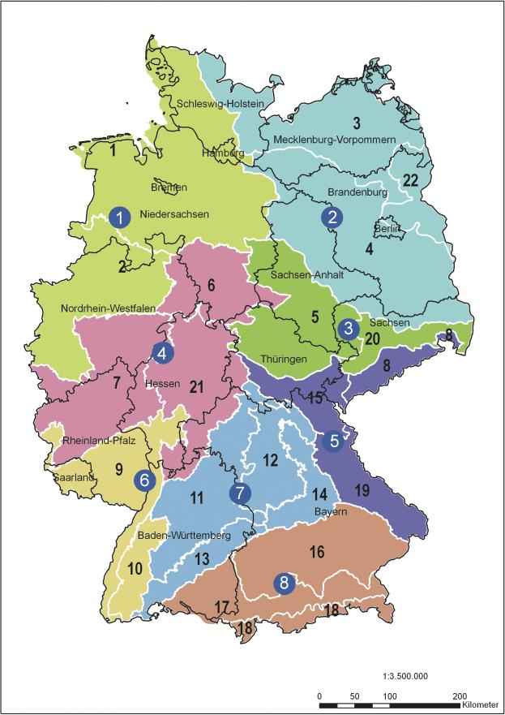

# Verordnung über das Inverkehrbringen von Saatgut von Erhaltungsmischungen (ErMiV)

Ausfertigungsdatum
:   2011-12-06

Fundstelle
:   BGBl I: 2011, 2641

## § 1 Anwendungsbereich

Die Verordnung gilt für das Inverkehrbringen von Saatgut von
Erhaltungsmischungen, welche neben Arten, die nicht im
Artenverzeichnis zum Saatgutverkehrsgesetz aufgeführt sind, auch
Saatgut der in Nummer 1.2 der Anlage zur Verordnung über das
Artenverzeichnis zum Saatgutverkehrsgesetz aufgeführten Arten
enthalten. Die Verordnung gilt nicht für Mulch, Grünschnitt, Mahdgut
und diasporenhaltigen Boden.

## § 2 Begriffsbestimmungen

Im Sinne dieser Verordnung sind

1.  Erhaltungsmischung:

    eine Mischung von Saatgut verschiedener Gattungen, Arten und
    Unterarten, die zur Bewahrung der natürlichen Umwelt im Rahmen der
    Erhaltung pflanzengenetischer Ressourcen beiträgt und als

    a)  direkt geerntete Mischung, oder,

    b)  angebaute Mischung

    in den Verkehr gebracht wird;

2.  direkt geerntete Mischung:

    eine Saatgutmischung, die so, wie am Entnahmeort geerntet, gereinigt
    oder ungereinigt, in den Verkehr gebracht wird;

3.  angebaute Mischung:

    eine Saatgutmischung, deren einzelne Arten am Entnahmeort geerntet, in
    dem Produktionsraum, in dem das dem Entnahmeort zugeordnete
    Ursprungsgebiet liegt, nach Arten getrennt vermehrt und in einer
    Zusammensetzung, die für die Art des Lebensraumes am Entnahmeort
    typisch ist oder die einer naturnahen Pflanzengesellschaft, wie sie
    unter den Bedingungen am Zielort entstehen würde, entspricht, gemischt
    worden ist;

4.  Quellgebiet:

    ein Gebiet,

    a)  das nach Artikel 4 Absatz 4 der Richtlinie
        92/43/EWG                          des Rates vom 21. Mai 1992 zur
        Erhaltung der natürlichen Lebensräume sowie der wildlebenden Tiere und
        Pflanzen (ABl. L 206 vom 22.7.1992, S. 7) ausgewiesen ist oder

    b)  das zum Erhalt pflanzengenetischer Ressourcen beiträgt und nach
        Merkmalen ausgewiesen worden ist, die mit denen der Artikel 4 Absatz 4
        in Verbindung mit Artikel 1 Buchstabe k und l der Richtlinie 92/43/EWG
        vergleichbar sind und das auf eine den Artikeln 6 und 11 der
        Richtlinie
        92/43/EWG                          entsprechende Weise verwaltet,
        geschützt und überwacht wird; hierzu zählen auch gesetzlich geschützte
        Biotope im Sinne des § 30 des Bundesnaturschutzgesetzes;

5.  Entnahmeort:

    der Teil eines in einem Ursprungsgebiet liegenden Quellgebietes, in
    dem

    a)  eine direkt geerntete Mischung entnommen wird,

    b)  Ausgangssaatgut für eine angebaute Mischung gesammelt wird;

6.  Ursprungsgebiet:

    ein als solches in der Anlage bezeichnetes Gebiet, in dessen
    Abgrenzung die zugehörigen Quellgebiete und Entnahmeorte liegen, das
    nach naturräumlichen Kriterien gegenüber anderen Gebieten abgrenzbar
    ist und in dem die Erhaltungsmischung in den Verkehr gebracht werden
    darf;

7.  Produktionsraum:

    das einem Ursprungsgebiet oder mehreren Ursprungsgebieten zugeordnete
    Gebiet, in dem sich die Vermehrungsflächen einer angebauten Mischung
    befinden, deren Entnahmeort in einem der diesem Produktionsraum
    zugeordneten Ursprungsgebiete liegt.

## § 3 Antrag auf Genehmigung des Inverkehrbringens einer Erhaltungsmischung

(1) Wer Erhaltungsmischungen in den Verkehr bringen will, bedarf der
Genehmigung. Diese ist vor dem erstmaligen Inverkehrbringen bei der
zuständigen Behörde zu beantragen. Der Antrag ist unter Angabe des
Namens, der Anschrift und der Telekommunikationsangaben zu stellen.

(2) Statt der in § 1 Absatz 1 Nummer 9 der
Saatgutaufzeichnungsverordnung für den Fall der Herstellung von
Saatgutmischungen vorgesehenen Daten, hat der Antragsteller für
Kontrollen durch die zuständige Behörde folgende Aufzeichnungen zu
fertigen und diese sechs Jahre aufzubewahren:

1.  die Angabe, ob es sich um eine direkt geerntete oder um eine angebaute
    Mischung handelt,

2.  die Erhaltungsmischungsnummer nach Absatz 3 und die von der jeweiligen
    Erhaltungsmischung in den Verkehr gebrachte Saatgutmenge,

3.  die prozentuale Zusammensetzung (Gewichtsprozent) der Mischung,

4.  bei angebauten Mischungen, bei denen das Saatgut der in Nummer 1.2 der
    Anlage zur Verordnung über das Artenverzeichnis zum
    Saatgutverkehrsgesetz aufgeführten Pflanzenarten die Anforderungen an
    die Keimfähigkeit für Handelssaatgut nach Anhang II Nummer III der
    Richtlinie 66/401/EWG des Rates vom 14. Juni 1966 über den Verkehr mit
    Futterpflanzensaatgut (ABl. L 125 vom 11.7.1966, S. 2298) in der
    jeweils geltenden Fassung nicht erfüllt, die jeweilige Keimfähigkeit,

5.  das Ursprungsgebiet,

6.  das Quellgebiet,

7.  den Entnahmeort, die Art des Lebensraumes am Entnahmeort und das Jahr
    der Entnahme,

8.  für eine angebaute Mischung zusätzlich den Produktionsraum und den
    Standort der Vermehrungsflächen der einzelnen Arten.

Im Falle des Satzes 1 Nummer 3 genügt es, bei direkt geernteten
Mischungen die Arten oder Unterarten anzugeben, die als Bestandteil
der Mischung für den Lebensraum am Entnahmeort typisch sind.

(3) Der Hersteller der Erhaltungsmischung vergibt für jede Mischung
eine Erhaltungsmischungsnummer, anhand der die Erhaltungsmischung
eindeutig identifiziert werden kann.

## § 4 Anforderungen an Saatgut von Erhaltungsmischungen

Saatgut von Erhaltungsmischungen darf nur in den Verkehr gebracht
werden, wenn

1.  eine Genehmigung nach § 3 Absatz 1 erteilt worden ist,

2.  am Entnahmeort der Erhaltungsmischung mindestens 40 Jahre lang vor
    Beantragung der Inverkehrbringensgenehmigung nach § 3 Absatz 1 kein
    Saatgut ausgesät worden ist, es sei denn, es handelt sich um Saatgut
    einer Erhaltungsmischung, das nach den Maßgaben dieser Verordnung
    erzeugt worden ist,

3.  eine direkt geerntete Mischung

    a)  hinsichtlich der prozentualen Zusammensetzung (Gewichtsprozent) und
        der Keimfähigkeit ihrer einzelnen Bestandteile geeignet ist, die Art
        des Lebensraumes des Entnahmeortes an einem anderen Ort
        wiederherzustellen,

    b)  nicht mehr als 1 Gewichtsprozent an Arten oder Unterarten enthält, die
        nicht die Anforderungen hinsichtlich der prozentualen Zusammensetzung
        nach Buchstabe a erfüllen und

    c)  kein Saatgut von Ambrosia artemisiifolia, Avena fatua, Avena sterilis,
        Bunias orientalis, Heracleum mantegazzianum und von Cuscuta spp.,
        außer von in Deutschland natürlich vorkommenden Cuscuta-Arten und
        nicht mehr als 0,05 Gewichtsprozent an Saatgut von Rumex spp., außer
        Rumex acetosa und Rumex acetosella, enthält,

4.  bei einer angebauten Mischung sichergestellt ist, dass

    a)  sie Arten oder Unterarten enthält, die typisch für die Art des
        Lebensraumes am Entnahmeort und von Bedeutung für die Bewahrung der
        natürlichen Umwelt im Rahmen der Erhaltung genetischer Ressourcen
        sind,

    b)  das Saatgut der Arten, die unter die Richtlinie
        66/401/EWG                          fallen, die Anforderungen an
        Handelssaatgut nach Anhang II Abschnitt III in Verbindung mit den
        Spalten 4 bis 15 der Tabelle in Abschnitt I Nummer 2 Buchstabe A des
        Anhangs II der Richtlinie 66/401/EWG erfüllt,

    c)  die Vermehrung der jeweiligen Bestandteile der Mischung nicht über
        mehr als fünf Generationen erfolgt ist.

Im Falle des Satzes 1 Nummer 4 Buchstaben c ist die Vermehrung auch
dann zulässig, wenn sich eine Vermehrungsfläche unmittelbar an der
Grenze zweier benachbarter Produktionsräume befindet und in den
benachbarten Produktionsraum hinein erstreckt.

## § 5 Überwachung durch Sichtkontrollen und Prüfungen

Die zuständige Behörde überwacht die Einhaltung der Anforderungen nach

1.  § 4 Nummer 3 durch Sichtkontrollen am Entnahmeort,

2.  § 4 Nummer 4 Buchstabe a und b durch Untersuchung von Saatgutproben,
    die den zum Inverkehrbringen aufbereiteten Bestandteilen von
    Saatgutmischungen oder den zum Inverkehrbringen aufbereiteten und
    verpackten Saatgutmischungen entnommen worden sind.

Für die Probenahme gelten die Vorschriften nach Artikel 7 Absatz 2 in
Verbindung mit Anlage 3 der Richtlinie 66/401/EWG. Die zuständige
Behörde hat die Durchführung der Überwachung aufzuzeichnen.

## § 6 Verschließung

(1) Packungen oder Behältnisse von Saatgut von Erhaltungsmischungen
sind von demjenigen zu schließen und mit einer Sicherung zu versehen,
der sie gekennzeichnet hat. § 34 Absatz 2 und 4 der Saatgutverordnung
gilt entsprechend.

(2) Die Sicherungen dürfen nach Farbe und Aufschrift nicht mit
Plomben, Banderolen oder Siegelmarken für Packungen anerkannten
Saatgutes verwechselbar sein.

(3) Ist eine Verschließung nach Absatz 1 bei direkt geernteten
Mischungen aus technischen Gründen nicht möglich, dann darf das
Saatgut dieser Mischungen auch in nicht geschlossenen Packungen oder
Behältnissen und ohne Verschlusssicherung in den Verkehr gebracht
werden.

## § 7 Kennzeichnung

(1) Saatgut einer Erhaltungsmischung darf nur in Packungen in den
Verkehr gebracht werden, auf denen sich ein Herstelleretikett, ein
Aufdruck oder ein Stempel mit folgenden Angaben befindet:

1.  die Angabe „EU-Norm“,

2.  Name und Anschrift des Herstellers,

3.  je nach Erntemethode die Angabe „direkt geerntete Mischung“ oder
    „angebaute Mischung“,

4.  das Jahr der Verschließung mit der Angabe „verschlossen ... “,

5.  das Ursprungsgebiet,

6.  das Quellgebiet,

7.  den Entnahmeort,

8.  die Angabe „Erhaltungsmischung“,

9.  die Erhaltungsmischungsnummer,

10. den Hinweis „enthält Saatgut einer Erhaltungssorte“, sofern eine
    angebaute Mischung Saatgut von Erhaltungssorten der in Nummer 1.2 der
    Anlage zur Verordnung über das Artenverzeichnis zum
    Saatgutverkehrsgesetz aufgeführten Pflanzenarten enthält,

11. die prozentuale Zusammensetzung (Gewichtsprozent) der Mischung; bei
    direkt geernteten Mischungen genügt es, die Arten oder Unterarten
    anzugeben, die als Bestandteil der Mischung für den Lebensraum am
    Entnahmeort typisch sind,

12. angegebenes Netto- oder Bruttogewicht,

13. bei Angaben des Gewichtes und im Falle der Verwendung von granulierten
    Pflanzenschutzmitteln, Granulierungsstoffen oder anderen festen
    Zusätzen, die Art des Zusatzstoffes und das ungefähre Verhältnis
    zwischen dem Gewicht des reinen Saatgutes und dem Gesamtgewicht,

14. die Keimfähigkeit für Bestandteile angebauter Mischungen nach § 3
    Absatz 2 Nummer 4; erfüllen mehr als fünf der in Frage kommenden
    Bestandteile der angebauten Mischung nicht die erforderlichen
    Keimfähigkeitsnormen, dann genügt die Angabe eines Durchschnittswertes
    der Keimfähigkeit.

(2) Wird der Erhaltungsmischung beim Inverkehrbringen ein Lieferschein
beigefügt, der die vollständigen Angaben nach Absatz 1 Nummer 1 bis 14
enthält, dann genügt es, auf dem Etikett nur die Angaben nach Absatz 1
Nummer 1 bis 5, 8 bis 10 sowie 12 und 13 aufzuführen. Wenn der Umfang
der Angaben nach Absatz 1 Nummer 6 und 7 die Lesbarkeit des
Lieferscheines erschwert, können diese Angaben auf dem Lieferschein
entfallen, soweit sich der Inverkehrbringer durch eine entsprechende
Erklärung auf dem Lieferschein verpflichtet, die entfallenen Angaben
dem Käufer der Erhaltungsmischung auf Verlangen schriftlich oder auf
elektronischem Wege unverzüglich mitzuteilen.

(zu § 2 Nummer 6 und 7)

## Anlage Ursprungsgebiete und Produktionsräume

(Fundstelle: BGBl. I 2011, 2644 - 2645)

*    *   Nr.

    *   Produktionsräume

    *   Nr.

    *   Ursprungsgebiete

*    *   1

    *   Nordwestdeutsches Tiefland

    *   1

    *   Nordwestdeutsches Tiefland

*    *   2

    *   Westdeutsches Tiefland mit Unterem Weserbergland

*    *   2

    *   Nordostdeutsches Tiefland

    *   3

    *   Nordostdeutsches Tiefland

*    *   4

    *   Ostdeutsches Tiefland

*    *   22

    *   Uckermark mit Odertal

*    *   3

    *   Mitteldeutsches Flach- und Hügelland

    *   5

    *   Mitteldeutsches Tief- und Hügelland

*    *   20

    *   Sächsisches Löss- und Hügelland

*    *   4

    *   Westdeutsches Berg- und Hügelland

    *   6

    *   Oberes Weser- und Leinebergland mit Harz

*    *   7

    *   Rheinisches Bergland

*    *   21

    *   Hessisches Bergland

*    *   5

    *   Südost- und ostdeutsches Bergland

    *   8

    *   Erz- und Elbsandsteingebirge

*    *   15

    *   Thüringer Wald, Fichtelgebirge und Vogtland

*    *   19

    *   Bayerischer und Oberpfälzer Wald

*    *   6

    *   Südwestdeutsches Berg- und Hügelland mit Oberrheingraben

    *   9

    *   Oberrheingraben mit Saarpfälzer Bergland

*    *   10

    *   Schwarzwald

*    *   7

    *   Süddeutsches Berg- und Hügelland

    *   11

    *   Südwestdeutsches Bergland

*    *   12

    *   Fränkisches Hügelland

*    *   13

    *   Schwäbische Alb

*    *   14

    *   Fränkische Alb

*    *   8

    *   Alpen und Alpenvorland

    *   16

    *   Unterbayerische Hügel- und Plattenregion

*    *   17

    *   Südliches Alpenvorland

*    *   18

    *   Nördliche Kalkalpen

Quelle, S. 26-28 aus: „Prasse, R., Kunzmann, D. & R. Schröder (2010):
Entwicklung und praktische Umsetzung naturschutzfachlicher
Mindestanforderungen an einen Herkunftsnachweis für gebietseigenes
Wildpflanzensaatgut krautiger Pflanzen. Abschlussbericht eines von der
DBU finanziell geförderten Forschungsprojekts des Instituts für
Umweltplanung der Gottlieb Wilhelm Leibniz Universität Hannover in
Kooperation mit dem Verband deutscher Wildsamen- und
Wildpflanzenproduzenten e. V., unveröffentlichtes Manuskript, 166 S.“

