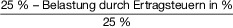

# Einkommensteuergesetz (EStG)

Ausfertigungsdatum
:   1934-10-16

Fundstelle
:   RGBl I: 1934, 1005

Neugefasst durch
:   Bek. v. 8.10.2009 I 3366, 3862;

Zuletzt geändert durch
:   Art. 3 G v. 3.6.2021 I 1498

Änderung durch
:   Art. 1 G v. 25.6.2021 I 2035 (Nr. 37) textlich nachgewiesen, dokumentarisch noch nicht abschließend bearbeitet

Änderung durch
:   Art. 5 G v. 25.6.2021 I 2050 (Nr. 37) textlich nachgewiesen, dokumentarisch noch nicht abschließend bearbeitet

Änderung durch
:   Art. 2 G v. 25.6.2021 I 2056 (Nr. 37) textlich nachgewiesen, dokumentarisch noch nicht abschließend bearbeitet

Änderung durch
:   Art. 2 G v. 16.7.2021 I 2993 (Nr. 46) textlich nachgewiesen, dokumentarisch noch nicht abschließend bearbeitet

Änderung durch
:   Art. 27 G v. 20.8.2021 I 3932 (Nr. 60) textlich nachgewiesen, dokumentarisch noch nicht abschließend bearbeitet

## I. - Steuerpflicht

### § 1 Steuerpflicht

(1)
1             Natürliche Personen, die im Inland einen Wohnsitz oder
ihren gewöhnlichen Aufenthalt haben, sind unbeschränkt
einkommensteuerpflichtig.
2             Zum Inland im Sinne dieses Gesetzes gehört auch der der
Bundesrepublik Deutschland zustehende Anteil

1.  an der ausschließlichen Wirtschaftszone, soweit dort

    a)  die lebenden und nicht lebenden natürlichen Ressourcen der Gewässer
        über dem Meeresboden, des Meeresbodens und seines Untergrunds
        erforscht, ausgebeutet, erhalten oder bewirtschaftet werden,

    b)  andere Tätigkeiten zur wirtschaftlichen Erforschung oder Ausbeutung
        der ausschließlichen Wirtschaftszone ausgeübt werden, wie
        beispielsweise die Energieerzeugung aus Wasser, Strömung und Wind oder

    c)  künstliche Inseln errichtet oder genutzt werden und Anlagen und
        Bauwerke für die in den Buchstaben a und b genannten Zwecke errichtet
        oder genutzt werden, und

2.  am Festlandsockel, soweit dort

    a)  dessen natürliche Ressourcen erforscht oder ausgebeutet werden;
        natürliche Ressourcen in diesem Sinne sind die mineralischen und
        sonstigen nicht lebenden Ressourcen des Meeresbodens und seines
        Untergrunds sowie die zu den sesshaften Arten gehörenden Lebewesen,
        die im nutzbaren Stadium entweder unbeweglich auf oder unter dem
        Meeresboden verbleiben oder sich nur in ständigem körperlichen Kontakt
        mit dem Meeresboden oder seinem Untergrund fortbewegen können; oder

    b)  künstliche Inseln errichtet oder genutzt werden und Anlagen und
        Bauwerke für die in Buchstabe a genannten Zwecke errichtet oder
        genutzt werden.

(2)
1             Unbeschränkt einkommensteuerpflichtig sind auch deutsche
Staatsangehörige, die

1.  im Inland weder einen Wohnsitz noch ihren gewöhnlichen Aufenthalt
    haben und

2.  zu einer inländischen juristischen Person des öffentlichen Rechts in
    einem Dienstverhältnis stehen und dafür Arbeitslohn aus einer
    inländischen öffentlichen Kasse beziehen,

sowie zu ihrem Haushalt gehörende Angehörige, die die deutsche
Staatsangehörigkeit besitzen oder keine Einkünfte oder nur Einkünfte
beziehen, die ausschließlich im Inland einkommensteuerpflichtig sind.
2             Dies gilt nur für natürliche Personen, die in dem Staat,
in dem sie ihren Wohnsitz oder ihren gewöhnlichen Aufenthalt haben,
lediglich in einem der beschränkten Einkommensteuerpflicht ähnlichen
Umfang zu einer Steuer vom Einkommen herangezogen werden.

(3)
1             Auf Antrag werden auch natürliche Personen als
unbeschränkt einkommensteuerpflichtig behandelt, die im Inland weder
einen Wohnsitz noch ihren gewöhnlichen Aufenthalt haben, soweit sie
inländische Einkünfte im Sinne des § 49 haben.
2             Dies gilt nur, wenn ihre Einkünfte im Kalenderjahr
mindestens zu 90 Prozent der deutschen Einkommensteuer unterliegen
oder die nicht der deutschen Einkommensteuer unterliegenden Einkünfte
den Grundfreibetrag nach § 32a Absatz 1 Satz 2 Nummer 1 nicht
übersteigen; dieser Betrag ist zu kürzen, soweit es nach den
Verhältnissen im Wohnsitzstaat des Steuerpflichtigen notwendig und
angemessen ist.
3             Inländische Einkünfte, die nach einem Abkommen zur
Vermeidung der Doppelbesteuerung nur der Höhe nach beschränkt
besteuert werden dürfen, gelten hierbei als nicht der deutschen
Einkommensteuer unterliegend.
4             Unberücksichtigt bleiben bei der Ermittlung der
Einkünfte nach Satz 2 nicht der deutschen Einkommensteuer
unterliegende Einkünfte, die im Ausland nicht besteuert werden, soweit
vergleichbare Einkünfte im Inland steuerfrei sind.
5             Weitere Voraussetzung ist, dass die Höhe der nicht der
deutschen Einkommensteuer unterliegenden Einkünfte durch eine
Bescheinigung der zuständigen ausländischen Steuerbehörde nachgewiesen
wird.
6             Der Steuerabzug nach § 50a ist ungeachtet der Sätze 1
bis 4 vorzunehmen.

(4) Natürliche Personen, die im Inland weder einen Wohnsitz noch ihren
gewöhnlichen Aufenthalt haben, sind vorbehaltlich der Absätze 2 und 3
und des § 1a beschränkt einkommensteuerpflichtig, wenn sie inländische
Einkünfte im Sinne des § 49 haben.

### § 1a

(1) Für Staatsangehörige eines Mitgliedstaates der Europäischen Union
oder eines Staates, auf den das Abkommen über den Europäischen
Wirtschaftsraum anwendbar ist, die nach § 1 Absatz 1 unbeschränkt
einkommensteuerpflichtig sind oder die nach § 1 Absatz 3 als
unbeschränkt einkommensteuerpflichtig zu behandeln sind, gilt bei
Anwendung von § 10 Absatz 1a und § 26 Absatz 1 Satz 1 Folgendes:

1.  Aufwendungen im Sinne des § 10 Absatz 1a sind auch dann als
    Sonderausgaben abziehbar, wenn der Empfänger der Leistung oder Zahlung
    nicht unbeschränkt einkommensteuerpflichtig ist.
    2                   Voraussetzung ist, dass

    a)  der Empfänger seinen Wohnsitz oder gewöhnlichen Aufenthalt im
        Hoheitsgebiet eines anderen Mitgliedstaates der Europäischen Union
        oder eines Staates hat, auf den das Abkommen über den Europäischen
        Wirtschaftsraum Anwendung findet und

    b)  die Besteuerung der nach § 10 Absatz 1a zu berücksichtigenden Leistung
        oder Zahlung beim Empfänger durch eine Bescheinigung der zuständigen
        ausländischen Steuerbehörde nachgewiesen wird;

1a. (weggefallen)

1b. (weggefallen)

2.  der nicht dauernd getrennt lebende Ehegatte ohne Wohnsitz oder
    gewöhnlichen Aufenthalt im Inland wird auf Antrag für die Anwendung
    des § 26 Absatz 1 Satz 1 als unbeschränkt einkommensteuerpflichtig
    behandelt.
    2                   Nummer 1 Satz 2 Buchstabe a gilt entsprechend.
    3                   Bei Anwendung des § 1 Absatz 3 Satz 2 ist auf die
    Einkünfte beider Ehegatten abzustellen und der Grundfreibetrag nach §
    32a Absatz 1 Satz 2 Nummer 1 zu verdoppeln.

(2) Für unbeschränkt einkommensteuerpflichtige Personen im Sinne des §
1 Absatz 2, die die Voraussetzungen des § 1 Absatz 3 Satz 2 bis 5
erfüllen, und für unbeschränkt einkommensteuerpflichtige Personen im
Sinne des § 1 Absatz 3, die die Voraussetzungen des § 1 Absatz 2 Satz
1 Nummer 1 und 2 erfüllen und an einem ausländischen Dienstort tätig
sind, gilt die Regelung des Absatzes 1 Nummer 2 entsprechend mit der
Maßgabe, dass auf Wohnsitz oder gewöhnlichen Aufenthalt im Staat des
ausländischen Dienstortes abzustellen ist.

## II. - Einkommen

### 1. - Sachliche Voraussetzungen für die Besteuerung

#### § 2 Umfang der Besteuerung, Begriffsbestimmungen

(1)
1             Der Einkommensteuer unterliegen

1.  Einkünfte aus Land- und Forstwirtschaft,

2.  Einkünfte aus Gewerbebetrieb,

3.  Einkünfte aus selbständiger Arbeit,

4.  Einkünfte aus nichtselbständiger Arbeit,

5.  Einkünfte aus Kapitalvermögen,

6.  Einkünfte aus Vermietung und Verpachtung,

7.  sonstige Einkünfte im Sinne des § 22,

die der Steuerpflichtige während seiner unbeschränkten
Einkommensteuerpflicht oder als inländische Einkünfte während seiner
beschränkten Einkommensteuerpflicht erzielt.
2             Zu welcher Einkunftsart die Einkünfte im einzelnen Fall
gehören, bestimmt sich nach den §§ 13 bis 24.

(2)
1             Einkünfte sind

1.  bei Land- und Forstwirtschaft, Gewerbebetrieb und selbständiger Arbeit
    der Gewinn (§§ 4 bis 7k und 13a),

2.  bei den anderen Einkunftsarten der Überschuss der Einnahmen über die
    Werbungskosten (§§ 8 bis 9a).

2             Bei Einkünften aus Kapitalvermögen tritt § 20 Absatz 9
vorbehaltlich der Regelung in § 32d Absatz 2 an die Stelle der §§ 9
und 9a.

(3) Die Summe der Einkünfte, vermindert um den
Altersentlastungsbetrag, den Entlastungsbetrag für Alleinerziehende
und den Abzug nach § 13 Absatz 3, ist der Gesamtbetrag der Einkünfte.

(4) Der Gesamtbetrag der Einkünfte, vermindert um die Sonderausgaben
und die außergewöhnlichen Belastungen, ist das Einkommen.

(5)
1             Das Einkommen, vermindert um die Freibeträge nach § 32
Absatz 6 und um die sonstigen vom Einkommen abzuziehenden Beträge, ist
das zu versteuernde Einkommen; dieses bildet die Bemessungsgrundlage
für die tarifliche Einkommensteuer.
2             Knüpfen andere Gesetze an den Begriff des zu
versteuernden Einkommens an, ist für deren Zweck das Einkommen in
allen Fällen des § 32 um die Freibeträge nach § 32 Absatz 6 zu
vermindern.

(5a)
1             Knüpfen außersteuerliche Rechtsnormen an die in den
vorstehenden Absätzen definierten Begriffe (Einkünfte, Summe der
Einkünfte, Gesamtbetrag der Einkünfte, Einkommen, zu versteuerndes
Einkommen) an, erhöhen sich für deren Zwecke diese Größen um die nach
§ 32d Absatz 1 und nach § 43 Absatz 5 zu besteuernden Beträge sowie um
die nach § 3 Nummer 40 steuerfreien Beträge und mindern sich um die
nach § 3c Absatz 2 nicht abziehbaren Beträge.
2             Knüpfen außersteuerliche Rechtsnormen an die in den
Absätzen 1 bis 3 genannten Begriffe (Einkünfte, Summe der Einkünfte,
Gesamtbetrag der Einkünfte) an, mindern sich für deren Zwecke diese
Größen um die nach § 10 Absatz 1 Nummer 5 abziehbaren
Kinderbetreuungskosten.

(5b) Soweit Rechtsnormen dieses Gesetzes an die in den vorstehenden
Absätzen definierten Begriffe (Einkünfte, Summe der Einkünfte,
Gesamtbetrag der Einkünfte, Einkommen, zu versteuerndes Einkommen)
anknüpfen, sind Kapitalerträge nach § 32d Absatz 1 und § 43 Absatz 5
nicht einzubeziehen.

(6)
1             Die tarifliche Einkommensteuer, vermindert um den
Unterschiedsbetrag nach § 32c Absatz 1 Satz 2, die anzurechnenden
ausländischen Steuern und die Steuerermäßigungen, vermehrt um die
Steuer nach § 32d Absatz 3 und 4, die Steuer nach § 34c Absatz 5 und
den Zuschlag nach § 3 Absatz 4 Satz 2 des Forstschäden-
Ausgleichsgesetzes in der Fassung der Bekanntmachung vom 26. August
1985 (BGBl. I S. 1756), das zuletzt durch Artikel 412 der Verordnung
vom 31. August 2015 (BGBl. I S. 1474) geändert worden ist, in der
jeweils geltenden Fassung, ist die festzusetzende Einkommensteuer.
2             Wurde der Gesamtbetrag der Einkünfte in den Fällen des §
10a Absatz 2 um Sonderausgaben nach § 10a Absatz 1 gemindert, ist für
die Ermittlung der festzusetzenden Einkommensteuer der Anspruch auf
Zulage nach Abschnitt XI der tariflichen Einkommensteuer
hinzuzurechnen; bei der Ermittlung der dem Steuerpflichtigen
zustehenden Zulage bleibt die Erhöhung der Grundzulage nach § 84 Satz
2 außer Betracht.
3             Wird das Einkommen in den Fällen des § 31 um die
Freibeträge nach § 32 Absatz 6 gemindert, ist der Anspruch auf
Kindergeld nach Abschnitt X der tariflichen Einkommensteuer
hinzuzurechnen; nicht jedoch für Kalendermonate, in denen durch
Bescheid der Familienkasse ein Anspruch auf Kindergeld festgesetzt,
aber wegen § 70 Absatz 1 Satz 2 nicht ausgezahlt wurde.

(7)
1              Die Einkommensteuer ist eine Jahressteuer.
2             Die Grundlagen für ihre Festsetzung sind jeweils für ein
Kalenderjahr zu ermitteln.
3             Besteht während eines Kalenderjahres sowohl
unbeschränkte als auch beschränkte Einkommensteuerpflicht, so sind die
während der beschränkten Einkommensteuerpflicht erzielten inländischen
Einkünfte in eine Veranlagung zur unbeschränkten
Einkommensteuerpflicht einzubeziehen.

(8) Die Regelungen dieses Gesetzes zu Ehegatten und Ehen sind auch auf
Lebenspartner und Lebenspartnerschaften anzuwenden.

#### § 2a Negative Einkünfte mit Bezug zu Drittstaaten

(1)
1             Negative Einkünfte

1.  aus einer in einem Drittstaat belegenen land- und
    forstwirtschaftlichen Betriebsstätte,

2.  aus einer in einem Drittstaat belegenen gewerblichen Betriebsstätte,

3.
    a)  aus dem Ansatz des niedrigeren Teilwerts eines zu einem
        Betriebsvermögen gehörenden Anteils an einer Drittstaaten-Körperschaft
        oder

    b)  aus der Veräußerung oder Entnahme eines zu einem Betriebsvermögen
        gehörenden Anteils an einer Drittstaaten-Körperschaft oder aus der
        Auflösung oder Herabsetzung des Kapitals einer Drittstaaten-
        Körperschaft,

4.  in den Fällen des § 17 bei einem Anteil an einer Drittstaaten-
    Kapitalgesellschaft,

5.  aus der Beteiligung an einem Handelsgewerbe als stiller Gesellschafter
    und aus partiarischen Darlehen, wenn der Schuldner Wohnsitz, Sitz oder
    Geschäftsleitung in einem Drittstaat hat,

6.
    a)  aus der Vermietung oder der Verpachtung von unbeweglichem Vermögen
        oder von Sachinbegriffen, wenn diese in einem Drittstaat belegen sind,
        oder

    b)  aus der entgeltlichen Überlassung von Schiffen, sofern der
        Überlassende nicht nachweist, dass diese ausschließlich oder fast
        ausschließlich in einem anderen Staat als einem Drittstaat eingesetzt
        worden sind, es sei denn, es handelt sich um Handelsschiffe, die

        aa) von einem Vercharterer ausgerüstet überlassen oder

        bb) an in einem anderen als in einem Drittstaat ansässige Ausrüster, die
            die Voraussetzungen des § 510 Absatz 1 des Handelsgesetzbuchs
            erfüllen, überlassen oder

        cc) insgesamt nur vorübergehend an in einem Drittstaat ansässige
            Ausrüster, die die Voraussetzungen des § 510 Absatz 1 des
            Handelsgesetzbuchs erfüllen, überlassen

        worden sind, oder

    c)  aus dem Ansatz des niedrigeren Teilwerts oder der Übertragung eines zu
        einem Betriebsvermögen gehörenden Wirtschaftsguts im Sinne der
        Buchstaben a und b,

7.
    a)  aus dem Ansatz des niedrigeren Teilwerts, der Veräußerung oder
        Entnahme eines zu einem Betriebsvermögen gehörenden Anteils an

    b)  aus der Auflösung oder Herabsetzung des Kapitals,

    c)  in den Fällen des § 17 bei einem Anteil an

    einer Körperschaft mit Sitz oder Geschäftsleitung in einem anderen
    Staat als einem Drittstaat, soweit die negativen Einkünfte auf einen
    der in den Nummern 1 bis 6 genannten Tatbestände zurückzuführen sind,

dürfen nur mit positiven Einkünften der jeweils selben Art und, mit
Ausnahme der Fälle der Nummer 6 Buchstabe b, aus demselben Staat, in
den Fällen der Nummer 7 auf Grund von Tatbeständen der jeweils selben
Art aus demselben Staat, ausgeglichen werden; sie dürfen auch nicht
nach § 10d abgezogen werden.
2             Den negativen Einkünften sind Gewinnminderungen
gleichgestellt.
3             Soweit die negativen Einkünfte nicht nach Satz 1
ausgeglichen werden können, mindern sie die positiven Einkünfte der
jeweils selben Art, die der Steuerpflichtige in den folgenden
Veranlagungszeiträumen aus demselben Staat, in den Fällen der Nummer 7
auf Grund von Tatbeständen der jeweils selben Art aus demselben Staat,
erzielt.
4             Die Minderung ist nur insoweit zulässig, als die
negativen Einkünfte in den vorangegangenen Veranlagungszeiträumen
nicht berücksichtigt werden konnten (verbleibende negative Einkünfte).
5             Die am Schluss eines Veranlagungszeitraums verbleibenden
negativen Einkünfte sind gesondert festzustellen; § 10d Absatz 4 gilt
sinngemäß.

(2)
1             Absatz 1 Satz 1 Nummer 2 ist nicht anzuwenden, wenn der
Steuerpflichtige nachweist, dass die negativen Einkünfte aus einer
gewerblichen Betriebsstätte in einem Drittstaat stammen, die
ausschließlich oder fast ausschließlich die Herstellung oder Lieferung
von Waren, außer Waffen, die Gewinnung von Bodenschätzen sowie die
Bewirkung gewerblicher Leistungen zum Gegenstand hat, soweit diese
nicht in der Errichtung oder dem Betrieb von Anlagen, die dem
Fremdenverkehr dienen, oder in der Vermietung oder der Verpachtung von
Wirtschaftsgütern einschließlich der Überlassung von Rechten, Plänen,
Mustern, Verfahren, Erfahrungen und Kenntnissen bestehen; das
unmittelbare Halten einer Beteiligung von mindestens einem Viertel am
Nennkapital einer Kapitalgesellschaft, die ausschließlich oder fast
ausschließlich die vorgenannten Tätigkeiten zum Gegenstand hat, sowie
die mit dem Halten der Beteiligung in Zusammenhang stehende
Finanzierung gilt als Bewirkung gewerblicher Leistungen, wenn die
Kapitalgesellschaft weder ihre Geschäftsleitung noch ihren Sitz im
Inland hat.
2             Absatz 1 Satz 1 Nummer 3 und 4 ist nicht anzuwenden,
wenn der Steuerpflichtige nachweist, dass die in Satz 1 genannten
Voraussetzungen bei der Körperschaft entweder seit ihrer Gründung oder
während der letzten fünf Jahre vor und in dem Veranlagungszeitraum
vorgelegen haben, in dem die negativen Einkünfte bezogen werden.

(2a)
1             Bei der Anwendung der Absätze 1 und 2 sind

1.  als Drittstaaten die Staaten anzusehen, die nicht Mitgliedstaaten der
    Europäischen Union sind;

2.  Drittstaaten-Körperschaften und Drittstaaten-Kapitalgesellschaften
    solche, die weder ihre Geschäftsleitung noch ihren Sitz in einem
    Mitgliedstaat der Europäischen Union haben.

2             Bei Anwendung des Satzes 1 sind den Mitgliedstaaten der
Europäischen Union die Staaten gleichgestellt, auf die das Abkommen
über den Europäischen Wirtschaftsraum anwendbar ist, sofern zwischen
der Bundesrepublik Deutschland und dem anderen Staat auf Grund der
Amtshilferichtlinie gemäß § 2 Absatz 2 des EU-Amtshilfegesetzes oder
einer vergleichbaren zwei- oder mehrseitigen Vereinbarung Auskünfte
erteilt werden, die erforderlich sind, um die Besteuerung
durchzuführen.

### 2. - Steuerfreie Einnahmen

#### § 3

Steuerfrei sind

1.
    a)  Leistungen aus einer Krankenversicherung, aus einer Pflegeversicherung
        und aus der gesetzlichen Unfallversicherung,

    b)  Sachleistungen und Kinderzuschüsse aus den gesetzlichen
        Rentenversicherungen einschließlich der Sachleistungen nach dem Gesetz
        über die Alterssicherung der Landwirte,

    c)  Übergangsgeld nach dem Sechsten Buch Sozialgesetzbuch und
        Geldleistungen nach den §§ 10, 36 bis 39 des Gesetzes über die
        Alterssicherung der Landwirte,

    d)  das Mutterschaftsgeld nach dem Mutterschutzgesetz, der
        Reichsversicherungsordnung und dem Gesetz über die Krankenversicherung
        der Landwirte, die Sonderunterstützung für im Familienhaushalt
        beschäftigte Frauen, der Zuschuss zum Mutterschaftsgeld nach dem
        Mutterschutzgesetz sowie der Zuschuss bei Beschäftigungsverboten für
        die Zeit vor oder nach einer Entbindung sowie für den Entbindungstag
        während einer Elternzeit nach beamtenrechtlichen Vorschriften;

2.
    a)  das Arbeitslosengeld, das Teilarbeitslosengeld, das Kurzarbeitergeld,
        der Zuschuss zum Arbeitsentgelt, das Übergangsgeld, der
        Gründungszuschuss nach dem Dritten Buch Sozialgesetzbuch sowie die
        übrigen Leistungen nach dem Dritten Buch Sozialgesetzbuch und den
        entsprechenden Programmen des Bundes und der Länder, soweit sie
        Arbeitnehmern oder Arbeitsuchenden oder zur Förderung der Aus- oder
        Weiterbildung oder Existenzgründung der Empfänger gewährt werden,

    b)  das Insolvenzgeld, Leistungen auf Grund der in § 169 und § 175 Absatz
        2 des Dritten Buches Sozialgesetzbuch genannten Ansprüche sowie
        Zahlungen des Arbeitgebers an einen Sozialleistungsträger auf Grund
        des gesetzlichen Forderungsübergangs nach § 115 Absatz 1 des Zehnten
        Buches Sozialgesetzbuch, wenn ein Insolvenzereignis nach § 165 Absatz
        1 Satz 2 auch in Verbindung mit Satz 3 des Dritten Buches
        Sozialgesetzbuch vorliegt,

    c)  die Arbeitslosenbeihilfe nach dem Soldatenversorgungsgesetz,

    d)  Leistungen zur Sicherung des Lebensunterhalts und zur Eingliederung in
        Arbeit nach dem Zweiten Buch Sozialgesetzbuch,

    e)  mit den in den Nummern 1 bis 2 Buchstabe d und Nummer 67 Buchstabe b
        genannten Leistungen vergleichbare Leistungen ausländischer
        Rechtsträger, die ihren Sitz in einem Mitgliedstaat der Europäischen
        Union, in einem Staat, auf den das Abkommen über den Europäischen
        Wirtschaftsraum Anwendung findet oder in der Schweiz haben;

3.
    a)  Rentenabfindungen nach § 107 des Sechsten Buches Sozialgesetzbuch,
        nach § 21 des Beamtenversorgungsgesetzes, nach § 9 Absatz 1 Nummer 3
        des Altersgeldgesetzes oder entsprechendem Landesrecht und nach § 43
        des Soldatenversorgungsgesetzes in Verbindung mit § 21 des
        Beamtenversorgungsgesetzes,

    b)  Beitragserstattungen an den Versicherten nach den §§ 210 und 286d des
        Sechsten Buches Sozialgesetzbuch sowie nach den §§ 204, 205 und 207
        des Sechsten Buches Sozialgesetzbuch, Beitragserstattungen nach den §§
        75 und 117 des Gesetzes über die Alterssicherung der Landwirte und
        nach § 26 des Vierten Buches Sozialgesetzbuch,

    c)  Leistungen aus berufsständischen Versorgungseinrichtungen, die den
        Leistungen nach den Buchstaben a und b entsprechen,

    d)  Kapitalabfindungen und Ausgleichszahlungen nach § 48 des
        Beamtenversorgungsgesetzes oder entsprechendem Landesrecht und nach
        den §§ 28 bis 35 und 38 des Soldatenversorgungsgesetzes;

4.  bei Angehörigen der Bundeswehr, der Bundespolizei, der Zollverwaltung,
    der Bereitschaftspolizei der Länder, der Vollzugspolizei und der
    Berufsfeuerwehr der Länder und Gemeinden und bei Vollzugsbeamten der
    Kriminalpolizei des Bundes, der Länder und Gemeinden

    a)  der Geldwert der ihnen aus Dienstbeständen überlassenen
        Dienstkleidung,

    b)  Einkleidungsbeihilfen und Abnutzungsentschädigungen für die
        Dienstkleidung der zum Tragen oder Bereithalten von Dienstkleidung
        Verpflichteten und für dienstlich notwendige Kleidungsstücke der
        Vollzugsbeamten der Kriminalpolizei sowie der Angehörigen der
        Zollverwaltung,

    c)  im Einsatz gewährte Verpflegung oder Verpflegungszuschüsse,

    d)  der Geldwert der auf Grund gesetzlicher Vorschriften gewährten
        Heilfürsorge;

5.
    a)  die Geld- und Sachbezüge, die Wehrpflichtige während des Wehrdienstes
        nach § 4 des Wehrpflichtgesetzes erhalten,

    b)  die Geld- und Sachbezüge, die Zivildienstleistende nach § 35 des
        Zivildienstgesetzes erhalten,

    c)  die Heilfürsorge, die Soldaten nach § 16 des Wehrsoldgesetzes und
        Zivildienstleistende nach § 35 des Zivildienstgesetzes erhalten,

    d)  das an Personen, die einen in § 32 Absatz 4 Satz 1 Nummer 2 Buchstabe
        d genannten Freiwilligendienst leisten, gezahlte Taschengeld oder eine
        vergleichbare Geldleistung,

    e)  Leistungen nach § 5 des Wehrsoldgesetzes;

6.  Bezüge, die auf Grund gesetzlicher Vorschriften aus öffentlichen
    Mitteln versorgungshalber an Wehrdienstbeschädigte, im Freiwilligen
    Wehrdienst Beschädigte, Zivildienstbeschädigte und im
    Bundesfreiwilligendienst Beschädigte oder ihre Hinterbliebenen,
    Kriegsbeschädigte, Kriegshinterbliebene und ihnen gleichgestellte
    Personen gezahlt werden, soweit es sich nicht um Bezüge handelt, die
    auf Grund der Dienstzeit gewährt werden.
    2                   Gleichgestellte im Sinne des Satzes 1 sind auch
    Personen, die Anspruch auf Leistungen nach dem Bundesversorgungsgesetz
    oder auf Unfallfürsorgeleistungen nach dem Soldatenversorgungsgesetz,
    Beamtenversorgungsgesetz oder vergleichbarem Landesrecht haben;

7.  Ausgleichsleistungen nach dem Lastenausgleichsgesetz, Leistungen nach
    dem Flüchtlingshilfegesetz, dem Bundesvertriebenengesetz, dem
    Reparationsschädengesetz, dem Vertriebenenzuwendungsgesetz, dem NS-
    Verfolgtenentschädigungsgesetz sowie Leistungen nach dem
    Entschädigungsgesetz und nach dem Ausgleichsleistungsgesetz, soweit
    sie nicht Kapitalerträge im Sinne des § 20 Absatz 1 Nummer 7 und
    Absatz 2 sind;

8.  Geldrenten, Kapitalentschädigungen und Leistungen im Heilverfahren,
    die auf Grund gesetzlicher Vorschriften zur Wiedergutmachung
    nationalsozialistischen Unrechts gewährt werden.
    2                   Die Steuerpflicht von Bezügen aus einem aus
    Wiedergutmachungsgründen neu begründeten oder wieder begründeten
    Dienstverhältnis sowie von Bezügen aus einem früheren
    Dienstverhältnis, die aus Wiedergutmachungsgründen neu gewährt oder
    wieder gewährt werden, bleibt unberührt;

8a. Renten wegen Alters und Renten wegen verminderter Erwerbsfähigkeit aus
    der gesetzlichen Rentenversicherung, die an Verfolgte im Sinne des § 1
    des Bundesentschädigungsgesetzes gezahlt werden, wenn rentenrechtliche
    Zeiten auf Grund der Verfolgung in der Rente enthalten sind.
    2                   Renten wegen Todes aus der gesetzlichen
    Rentenversicherung, wenn der verstorbene Versicherte Verfolgter im
    Sinne des § 1 des Bundesentschädigungsgesetzes war und wenn
    rentenrechtliche Zeiten auf Grund der Verfolgung in dieser Rente
    enthalten sind;

9.  Erstattungen nach § 23 Absatz 2 Satz 1 Nummer 3 und 4 sowie nach § 39
    Absatz 4 Satz 2 des Achten Buches Sozialgesetzbuch;

10. Einnahmen einer Gastfamilie für die Aufnahme eines Menschen mit
    Behinderungen oder von Behinderung bedrohten Menschen nach § 2 Absatz
    1 des Neunten Buches Sozialgesetzbuch zur Pflege, Betreuung,
    Unterbringung und Verpflegung, die auf Leistungen eines
    Leistungsträgers nach dem Sozialgesetzbuch beruhen.
    2                   Für Einnahmen im Sinne des Satzes 1, die nicht auf
    Leistungen eines Leistungsträgers nach dem Sozialgesetzbuch beruhen,
    gilt Entsprechendes bis zur Höhe der Leistungen nach dem Zwölften Buch
    Sozialgesetzbuch.
    3                   Überschreiten die auf Grund der in Satz 1
    bezeichneten Tätigkeit bezogenen Einnahmen der Gastfamilie den
    steuerfreien Betrag, dürfen die mit der Tätigkeit in unmittelbarem
    wirtschaftlichen Zusammenhang stehenden Ausgaben abweichend von § 3c
    nur insoweit als Betriebsausgaben abgezogen werden, als sie den Betrag
    der steuerfreien Einnahmen übersteigen;

11. Bezüge aus öffentlichen Mitteln oder aus Mitteln einer öffentlichen
    Stiftung, die wegen Hilfsbedürftigkeit oder als Beihilfe zu dem Zweck
    bewilligt werden, die Erziehung oder Ausbildung, die Wissenschaft oder
    Kunst unmittelbar zu fördern.
    2                   Darunter fallen nicht Kinderzuschläge und
    Kinderbeihilfen, die auf Grund der Besoldungsgesetze, besonderer
    Tarife oder ähnlicher Vorschriften gewährt werden.
    3                   Voraussetzung für die Steuerfreiheit ist, dass der
    Empfänger mit den Bezügen nicht zu einer bestimmten wissenschaftlichen
    oder künstlerischen Gegenleistung oder zu einer bestimmten
    Arbeitnehmertätigkeit verpflichtet wird.
    4                   Den Bezügen aus öffentlichen Mitteln wegen
    Hilfsbedürftigkeit gleichgestellt sind Beitragsermäßigungen und
    Prämienrückzahlungen eines Trägers der gesetzlichen
    Krankenversicherung für nicht in Anspruch genommene
    Beihilfeleistungen;

11a. zusätzlich zum ohnehin geschuldeten Arbeitslohn vom Arbeitgeber in der
    Zeit vom 1. März 2020 bis zum 31. März 2022 auf Grund der Corona-Krise
    an seine Arbeitnehmer in Form von Zuschüssen und Sachbezügen gewährte
    Beihilfen und Unterstützungen bis zu einem Betrag von 1 500 Euro;

12. aus einer Bundeskasse oder Landeskasse gezahlte Bezüge, die zum einen

    a)  in einem Bundesgesetz oder Landesgesetz,

    b)  auf Grundlage einer bundesgesetzlichen oder landesgesetzlichen
        Ermächtigung beruhenden Bestimmung oder

    c)  von der Bundesregierung oder einer Landesregierung

    als Aufwandsentschädigung festgesetzt sind und die zum anderen jeweils
    auch als Aufwandsentschädigung im Haushaltsplan ausgewiesen werden.
    2                   Das Gleiche gilt für andere Bezüge, die als
    Aufwandsentschädigung aus öffentlichen Kassen an öffentliche Dienste
    leistende Personen gezahlt werden, soweit nicht festgestellt wird,
    dass sie für Verdienstausfall oder Zeitverlust gewährt werden oder den
    Aufwand, der dem Empfänger erwächst, offenbar übersteigen;

13. die aus öffentlichen Kassen gezahlten Reisekostenvergütungen,
    Umzugskostenvergütungen und Trennungsgelder.
    2                   Die als Reisekostenvergütungen gezahlten
    Vergütungen für Verpflegung sind nur insoweit steuerfrei, als sie die
    Pauschbeträge nach § 9 Absatz 4a nicht übersteigen; Trennungsgelder
    sind nur insoweit steuerfrei, als sie die nach § 9 Absatz 1 Satz 3
    Nummer 5 und Absatz 4a abziehbaren Aufwendungen nicht übersteigen;

14. Zuschüsse eines Trägers der gesetzlichen Rentenversicherung zu den
    Aufwendungen eines Rentners für seine Krankenversicherung und von dem
    gesetzlichen Rentenversicherungsträger getragene Anteile (§ 249a des
    Fünften Buches Sozialgesetzbuch) an den Beiträgen für die gesetzliche
    Krankenversicherung;

15. Zuschüsse des Arbeitgebers, die zusätzlich zum ohnehin geschuldeten
    Arbeitslohn zu den Aufwendungen des Arbeitnehmers für Fahrten mit
    öffentlichen Verkehrsmitteln im Linienverkehr (ohne Luftverkehr)
    zwischen Wohnung und erster Tätigkeitsstätte und nach § 9 Absatz 1
    Satz 3 Nummer 4a Satz 3 sowie für Fahrten im öffentlichen
    Personennahverkehr gezahlt werden.
    2                   Das Gleiche gilt für die unentgeltliche oder
    verbilligte Nutzung öffentlicher Verkehrsmittel im Linienverkehr (ohne
    Luftverkehr) für Fahrten zwischen Wohnung und erster Tätigkeitsstätte
    und nach § 9 Absatz 1 Satz 3 Nummer 4a Satz 3 sowie für Fahrten im
    öffentlichen Personennahverkehr, die der Arbeitnehmer auf Grund seines
    Dienstverhältnisses zusätzlich zum ohnehin geschuldeten Arbeitslohn in
    Anspruch nehmen kann.
    3                   Die nach den Sätzen 1 und 2 steuerfreien
    Leistungen mindern den nach § 9 Absatz 1 Satz 3 Nummer 4 Satz 2
    abziehbaren Betrag;

16. die Vergütungen, die Arbeitnehmer außerhalb des öffentlichen Dienstes
    von ihrem Arbeitgeber zur Erstattung von Reisekosten, Umzugskosten
    oder Mehraufwendungen bei doppelter Haushaltsführung erhalten, soweit
    sie die nach § 9 als Werbungskosten abziehbaren Aufwendungen nicht
    übersteigen;

17. Zuschüsse zum Beitrag nach § 32 des Gesetzes über die Alterssicherung
    der Landwirte;

18. das Aufgeld für ein an die Bank für Vertriebene und Geschädigte
    (Lastenausgleichsbank) zugunsten des Ausgleichsfonds (§ 5 des
    Lastenausgleichsgesetzes) gegebenes Darlehen, wenn das Darlehen nach §
    7f des Gesetzes in der Fassung der Bekanntmachung vom 15. September
    1953 (BGBl. I S. 1355) im Jahr der Hingabe als Betriebsausgabe
    abzugsfähig war;

19. Weiterbildungsleistungen des Arbeitgebers oder auf dessen Veranlassung
    von einem Dritten

    a)  für Maßnahmen nach § 82 Absatz 1 und 2 des Dritten Buches
        Sozialgesetzbuch oder

    b)  die der Verbesserung der Beschäftigungsfähigkeit des Arbeitnehmers
        dienen.

    2                   Steuerfrei sind auch Beratungsleistungen des
    Arbeitgebers oder auf dessen Veranlassung von einem Dritten zur
    beruflichen Neuorientierung bei Beendigung des Dienstverhältnisses.
    3                   Die Leistungen im Sinne der Sätze 1 und 2 dürfen
    keinen überwiegenden Belohnungscharakter haben;

20. die aus öffentlichen Mitteln des Bundespräsidenten aus sittlichen oder
    sozialen Gründen gewährten Zuwendungen an besonders verdiente Personen
    oder ihre Hinterbliebenen;

21. (weggefallen)

22. (weggefallen)

23. Leistungen nach

    a)  dem Häftlingshilfegesetz,

    b)  dem Strafrechtlichen Rehabilitierungsgesetz,

    c)  dem Verwaltungsrechtlichen Rehabilitierungsgesetz,

    d)  dem Beruflichen Rehabilitierungsgesetz,

    e)  dem Gesetz zur strafrechtlichen Rehabilitierung der nach dem 8. Mai
        1945 wegen einvernehmlicher homosexueller Handlungen verurteilten
        Personen und

    f)  dem Gesetz zur Rehabilitierung der wegen einvernehmlicher
        homosexueller Handlungen, wegen ihrer homosexuellen Orientierung oder
        wegen ihrer geschlechtlichen Identität dienstrechtlich benachteiligten
        Soldatinnen und Soldaten;

24. Leistungen, die auf Grund des Bundeskindergeldgesetzes gewährt werden;

25. Entschädigungen nach dem Infektionsschutzgesetz vom 20. Juli 2000
    (BGBl. I S. 1045);

26. Einnahmen aus nebenberuflichen Tätigkeiten als Übungsleiter,
    Ausbilder, Erzieher, Betreuer oder vergleichbaren nebenberuflichen
    Tätigkeiten, aus nebenberuflichen künstlerischen Tätigkeiten oder der
    nebenberuflichen Pflege alter, kranker Menschen oder Menschen mit
    Behinderungen im Dienst oder im Auftrag einer juristischen Person des
    öffentlichen Rechts, die in einem Mitgliedstaat der Europäischen
    Union, in einem Staat, auf den das Abkommen über den Europäischen
    Wirtschaftsraum Anwendung findet, oder in der Schweiz belegen ist,
    oder einer unter § 5 Absatz 1 Nummer 9 des Körperschaftsteuergesetzes
    fallenden Einrichtung zur Förderung gemeinnütziger, mildtätiger und
    kirchlicher Zwecke (§§ 52 bis 54 der Abgabenordnung) bis zur Höhe von
    insgesamt 3 000 Euro im Jahr.
    2                   Überschreiten die Einnahmen für die in Satz 1
    bezeichneten Tätigkeiten den steuerfreien Betrag, dürfen die mit den
    nebenberuflichen Tätigkeiten in unmittelbarem wirtschaftlichen
    Zusammenhang stehenden Ausgaben abweichend von § 3c nur insoweit als
    Betriebsausgaben oder Werbungskosten abgezogen werden, als sie den
    Betrag der steuerfreien Einnahmen übersteigen;

26a. Einnahmen aus nebenberuflichen Tätigkeiten im Dienst oder Auftrag
    einer juristischen Person des öffentlichen Rechts, die in einem
    Mitgliedstaat der Europäischen Union, in einem Staat, auf den das
    Abkommen über den Europäischen Wirtschaftsraum Anwendung findet, oder
    in der Schweiz belegen ist, oder einer unter § 5 Absatz 1 Nummer 9 des
    Körperschaftsteuergesetzes fallenden Einrichtung zur Förderung
    gemeinnütziger, mildtätiger und kirchlicher Zwecke (§§ 52 bis 54 der
    Abgabenordnung) bis zur Höhe von insgesamt 840 Euro im Jahr.
    2                   Die Steuerbefreiung ist ausgeschlossen, wenn für
    die Einnahmen aus der Tätigkeit – ganz oder teilweise – eine
    Steuerbefreiung nach § 3 Nummer 12, 26 oder 26b gewährt wird.
    3                   Überschreiten die Einnahmen für die in Satz 1
    bezeichneten Tätigkeiten den steuerfreien Betrag, dürfen die mit den
    nebenberuflichen Tätigkeiten in unmittelbarem wirtschaftlichen
    Zusammenhang stehenden Ausgaben abweichend von § 3c nur insoweit als
    Betriebsausgaben oder Werbungskosten abgezogen werden, als sie den
    Betrag der steuerfreien Einnahmen übersteigen;

26b. Aufwandsentschädigungen nach § 1835a des Bürgerlichen Gesetzbuchs,
    soweit sie zusammen mit den steuerfreien Einnahmen im Sinne der Nummer
    26 den Freibetrag nach Nummer 26 Satz 1 nicht überschreiten.
    2                   Nummer 26 Satz 2 gilt entsprechend;

27. der Grundbetrag der Produktionsaufgaberente und das Ausgleichsgeld
    nach dem Gesetz zur Förderung der Einstellung der landwirtschaftlichen
    Erwerbstätigkeit bis zum Höchstbetrag von 18 407 Euro;

28. die Aufstockungsbeträge im Sinne des § 3 Absatz 1 Nummer 1 Buchstabe a
    sowie die Beiträge und Aufwendungen im Sinne des § 3 Absatz 1 Nummer 1
    Buchstabe b und des § 4 Absatz 2 des Altersteilzeitgesetzes, die
    Zuschläge, die versicherungsfrei Beschäftigte im Sinne des § 27 Absatz
    1 Nummer 1 bis 3 des Dritten Buches Sozialgesetzbuch zur Aufstockung
    der Bezüge bei Altersteilzeit nach beamtenrechtlichen Vorschriften
    oder Grundsätzen erhalten sowie die Zahlungen des Arbeitgebers zur
    Übernahme der Beiträge im Sinne des § 187a des Sechsten Buches
    Sozialgesetzbuch, soweit sie 50 Prozent der Beiträge nicht
    übersteigen;

28a. Zuschüsse des Arbeitgebers zum Kurzarbeitergeld und Saison-
    Kurzarbeitergeld, soweit sie zusammen mit dem Kurzarbeitergeld 80
    Prozent des Unterschiedsbetrags zwischen dem Soll-Entgelt und dem Ist-
    Entgelt nach § 106 des Dritten Buches Sozialgesetzbuch nicht
    übersteigen und sie für Lohnzahlungszeiträume, die nach dem 29.
    Februar 2020 beginnen und vor dem 1. Januar 2022 enden, geleistet
    werden;

29. das Gehalt und die Bezüge,

    a)  die die diplomatischen Vertreter ausländischer Staaten, die ihnen
        zugewiesenen Beamten und die in ihren Diensten stehenden Personen
        erhalten.
        2                         Dies gilt nicht für deutsche
        Staatsangehörige oder für im Inland ständig ansässige Personen;

    b)  der Berufskonsuln, der Konsulatsangehörigen und ihres Personals,
        soweit sie Angehörige des Entsendestaates sind.
        2                         Dies gilt nicht für Personen, die im Inland
        ständig ansässig sind oder außerhalb ihres Amtes oder Dienstes einen
        Beruf, ein Gewerbe oder eine andere gewinnbringende Tätigkeit ausüben;

30. Entschädigungen für die betriebliche Benutzung von Werkzeugen eines
    Arbeitnehmers (Werkzeuggeld), soweit sie die entsprechenden
    Aufwendungen des Arbeitnehmers nicht offensichtlich übersteigen;

31. die typische Berufskleidung, die der Arbeitgeber seinem Arbeitnehmer
    unentgeltlich oder verbilligt überlässt; dasselbe gilt für eine
    Barablösung eines nicht nur einzelvertraglichen Anspruchs auf
    Gestellung von typischer Berufskleidung, wenn die Barablösung
    betrieblich veranlasst ist und die entsprechenden Aufwendungen des
    Arbeitnehmers nicht offensichtlich übersteigt;

32. die unentgeltliche oder verbilligte Sammelbeförderung eines
    Arbeitnehmers zwischen Wohnung und erster Tätigkeitsstätte sowie bei
    Fahrten nach § 9 Absatz 1 Satz 3 Nummer 4a Satz 3 mit einem vom
    Arbeitgeber gestellten Beförderungsmittel, soweit die
    Sammelbeförderung für den betrieblichen Einsatz des Arbeitnehmers
    notwendig ist;

33. zusätzlich zum ohnehin geschuldeten Arbeitslohn erbrachte Leistungen
    des Arbeitgebers zur Unterbringung und Betreuung von nicht
    schulpflichtigen Kindern der Arbeitnehmer in Kindergärten oder
    vergleichbaren Einrichtungen;

34. zusätzlich zum ohnehin geschuldeten Arbeitslohn erbrachte Leistungen
    des Arbeitgebers zur Verhinderung und Verminderung von
    Krankheitsrisiken und zur Förderung der Gesundheit in Betrieben, die
    hinsichtlich Qualität, Zweckbindung, Zielgerichtetheit und
    Zertifizierung den Anforderungen der §§ 20 und 20b des Fünften Buches
    Sozialgesetzbuch genügen, soweit sie 600 Euro im Kalenderjahr nicht
    übersteigen;

34a. zusätzlich zum ohnehin geschuldeten Arbeitslohn erbrachte Leistungen
    des Arbeitgebers

    a)  an ein Dienstleistungsunternehmen, das den Arbeitnehmer hinsichtlich
        der Betreuung von Kindern oder pflegebedürftigen Angehörigen berät
        oder hierfür Betreuungspersonen vermittelt sowie

    b)  zur kurzfristigen Betreuung von Kindern im Sinne des § 32 Absatz 1,
        die das 14. Lebensjahr noch nicht vollendet haben oder die wegen einer
        vor Vollendung des 25. Lebensjahres eingetretenen körperlichen,
        geistigen oder seelischen Behinderung außerstande sind, sich selbst zu
        unterhalten oder pflegebedürftigen Angehörigen des Arbeitnehmers, wenn
        die Betreuung aus zwingenden und beruflich veranlassten Gründen
        notwendig ist, auch wenn sie im privaten Haushalt des Arbeitnehmers
        stattfindet, soweit die Leistungen 600 Euro im Kalenderjahr nicht
        übersteigen;

35. die Einnahmen der bei der Deutsche Post AG, Deutsche Postbank AG oder
    Deutsche Telekom AG beschäftigten Beamten, soweit die Einnahmen ohne
    Neuordnung des Postwesens und der Telekommunikation nach den Nummern
    11 bis 13 und 64 steuerfrei wären;

36. Einnahmen für Leistungen zu körperbezogenen Pflegemaßnahmen,
    pflegerischen Betreuungsmaßnahmen oder Hilfen bei der Haushaltsführung
    bis zur Höhe des Pflegegeldes nach § 37 des Elften Buches
    Sozialgesetzbuch, mindestens aber bis zur Höhe des Entlastungsbetrages
    nach § 45b Absatz 1 Satz 1 des Elften Buches Sozialgesetzbuch, wenn
    diese Leistungen von Angehörigen des Pflegebedürftigen oder von
    anderen Personen, die damit eine sittliche Pflicht im Sinne des § 33
    Absatz 2 gegenüber dem Pflegebedürftigen erfüllen, erbracht werden.
    2                   Entsprechendes gilt, wenn der Pflegebedürftige
    vergleichbare Leistungen aus privaten Versicherungsverträgen nach den
    Vorgaben des Elften Buches Sozialgesetzbuch oder nach den
    Beihilfevorschriften für häusliche Pflege erhält;

37. zusätzlich zum ohnehin geschuldeten Arbeitslohn vom Arbeitgeber
    gewährte Vorteile für die Überlassung eines betrieblichen Fahrrads,
    das kein Kraftfahrzeug im Sinne des § 6 Absatz 1 Nummer 4 Satz 2 ist;

38. Sachprämien, die der Steuerpflichtige für die persönliche
    Inanspruchnahme von Dienstleistungen von Unternehmen unentgeltlich
    erhält, die diese zum Zwecke der Kundenbindung im allgemeinen
    Geschäftsverkehr in einem jedermann zugänglichen planmäßigen Verfahren
    gewähren, soweit der Wert der Prämien 1 080 Euro im Kalenderjahr nicht
    übersteigt;

39. der Vorteil des Arbeitnehmers im Rahmen eines gegenwärtigen
    Dienstverhältnisses aus der unentgeltlichen oder verbilligten
    Überlassung von Vermögensbeteiligungen im Sinne des § 2 Absatz 1
    Nummer 1 Buchstabe a, b und f bis l und Absatz 2 bis 5 des Fünften
    Vermögensbildungsgesetzes in der Fassung der Bekanntmachung vom 4.
    März 1994 (BGBl. I S. 406), zuletzt geändert durch Artikel 2 des
    Gesetzes vom 7. März 2009 (BGBl. I S. 451), in der jeweils geltenden
    Fassung, am Unternehmen des Arbeitgebers, soweit der Vorteil insgesamt
    1 440 Euro im Kalenderjahr nicht übersteigt.
    2                   Voraussetzung für die Steuerfreiheit ist, dass die
    Beteiligung mindestens allen Arbeitnehmern offensteht, die im
    Zeitpunkt der Bekanntgabe des Angebots ein Jahr oder länger
    ununterbrochen in einem gegenwärtigen Dienstverhältnis zum Unternehmen
    stehen.
    3                   Als Unternehmen des Arbeitgebers im Sinne des
    Satzes 1 gilt auch ein Unternehmen im Sinne des § 18 des
    Aktiengesetzes.
    4                   Als Wert der Vermögensbeteiligung ist der gemeine
    Wert anzusetzen;

40. 40 Prozent

    a)  der Betriebsvermögensmehrungen oder Einnahmen aus der Veräußerung oder
        der Entnahme von Anteilen an Körperschaften, Personenvereinigungen und
        Vermögensmassen, deren Leistungen beim Empfänger zu Einnahmen im Sinne
        des § 20 Absatz 1 Nummer 1 und 9 gehören, oder an einer
        Organgesellschaft im Sinne des § 14 oder § 17 des
        Körperschaftsteuergesetzes, oder aus deren Auflösung oder Herabsetzung
        von deren Nennkapital oder aus dem Ansatz eines solchen
        Wirtschaftsguts mit dem Wert, der sich nach § 6 Absatz 1 Nummer 2 Satz
        3 ergibt, soweit sie zu den Einkünften aus Land- und Forstwirtschaft,
        aus Gewerbebetrieb oder aus selbständiger Arbeit gehören.
        2                         Dies gilt nicht, soweit der Ansatz des
        niedrigeren Teilwerts in vollem Umfang zu einer Gewinnminderung
        geführt hat und soweit diese Gewinnminderung nicht durch Ansatz eines
        Werts, der sich nach § 6 Absatz 1 Nummer 2 Satz 3 ergibt, ausgeglichen
        worden ist.
        3                         Satz 1 gilt außer für
        Betriebsvermögensmehrungen aus dem Ansatz mit dem Wert, der sich nach
        § 6 Absatz 1 Nummer 2 Satz 3 ergibt, ebenfalls nicht, soweit Abzüge
        nach § 6b oder ähnliche Abzüge voll steuerwirksam vorgenommen worden
        sind,

    b)  des Veräußerungspreises im Sinne des § 16 Absatz 2, soweit er auf die
        Veräußerung von Anteilen an Körperschaften, Personenvereinigungen und
        Vermögensmassen entfällt, deren Leistungen beim Empfänger zu Einnahmen
        im Sinne des § 20 Absatz 1 Nummer 1 und 9 gehören, oder an einer
        Organgesellschaft im Sinne des § 14 oder § 17 des
        Körperschaftsteuergesetzes.
        2                         Satz 1 ist in den Fällen des § 16 Absatz 3
        entsprechend anzuwenden.
        3                         Buchstabe a Satz 3 gilt entsprechend,

    c)  des Veräußerungspreises oder des gemeinen Werts im Sinne des § 17
        Absatz 2.
        2                         Satz 1 ist in den Fällen des § 17 Absatz 4
        entsprechend anzuwenden,

    d)  der Bezüge im Sinne des § 20 Absatz 1 Nummer 1 und der Einnahmen im
        Sinne des § 20 Absatz 1 Nummer 9.
        2                         Dies gilt nur, soweit sie das Einkommen der
        leistenden Körperschaft nicht gemindert haben.
        3                         Sofern die Bezüge in einem anderen Staat auf
        Grund einer vom deutschen Recht abweichenden steuerlichen Zurechnung
        einer anderen Person zugerechnet werden, gilt Satz 1 nur, soweit das
        Einkommen der anderen Person oder ihr nahestehender Personen nicht
        niedriger ist als bei einer dem deutschen Recht entsprechenden
        Zurechnung.
        4                         Satz 1 Buchstabe d Satz 2 gilt nicht, soweit
        eine verdeckte Gewinnausschüttung das Einkommen einer dem
        Steuerpflichtigen nahe stehenden Person erhöht hat und § 32a des
        Körperschaftsteuergesetzes auf die Veranlagung dieser nahe stehenden
        Person keine Anwendung findet,

    e)  der Bezüge im Sinne des § 20 Absatz 1 Nummer 2,

    f)  der besonderen Entgelte oder Vorteile im Sinne des § 20 Absatz 3, die
        neben den in § 20 Absatz 1 Nummer 1 und Absatz 2 Satz 1 Nummer 2
        Buchstabe a bezeichneten Einnahmen oder an deren Stelle gewährt
        werden,

    g)  des Gewinns aus der Veräußerung von Dividendenscheinen und sonstigen
        Ansprüchen im Sinne des § 20 Absatz 2 Satz 1 Nummer 2 Buchstabe a,

    h)  des Gewinns aus der Abtretung von Dividendenansprüchen oder sonstigen
        Ansprüchen im Sinne des § 20 Absatz 2 Satz 1 Nummer 2 Buchstabe a in
        Verbindung mit § 20 Absatz 2 Satz 2,

    i)  der Bezüge im Sinne des § 22 Nummer 1 Satz 2, soweit diese von einer
        nicht von der Körperschaftsteuer befreiten Körperschaft,
        Personenvereinigung oder Vermögensmasse stammen.

    2                   Dies gilt für Satz 1 Buchstabe d bis h nur in
    Verbindung mit § 20 Absatz 8.
    3                   Satz 1 Buchstabe a, b und d bis h ist nicht
    anzuwenden auf Anteile, die bei Kreditinstituten,
    Finanzdienstleistungsinstituten und Wertpapierinstituten dem
    Handelsbestand im Sinne des § 340e Absatz 3 des Handelsgesetzbuchs
    zuzuordnen sind; Gleiches gilt für Anteile, die bei Finanzunternehmen
    im Sinne des Kreditwesengesetzes, an denen Kreditinstitute,
    Finanzdienstleistungsinstitute oder Wertpapierinstitute unmittelbar
    oder mittelbar zu mehr als 50 Prozent beteiligt sind, zum Zeitpunkt
    des Zugangs zum Betriebsvermögen als Umlaufvermögen auszuweisen sind.
    4                   Satz 1 ist nicht anzuwenden bei Anteilen an
    Unterstützungskassen;

40a. 40 Prozent der Vergütungen im Sinne des § 18 Absatz 1 Nummer 4;

41. (weggefallen)

42. die Zuwendungen, die auf Grund des Fulbright-Abkommens gezahlt werden;

43. der Ehrensold für Künstler sowie Zuwendungen aus Mitteln der Deutschen
    Künstlerhilfe, wenn es sich um Bezüge aus öffentlichen Mitteln
    handelt, die wegen der Bedürftigkeit des Künstlers gezahlt werden;

44. Stipendien, die aus öffentlichen Mitteln oder von zwischenstaatlichen
    oder überstaatlichen Einrichtungen, denen die Bundesrepublik
    Deutschland als Mitglied angehört, zur Förderung der Forschung oder
    zur Förderung der wissenschaftlichen oder künstlerischen Ausbildung
    oder Fortbildung gewährt werden.
    2                   Das Gleiche gilt für Stipendien, die zu den in
    Satz 1 bezeichneten Zwecken von einer Einrichtung, die von einer
    Körperschaft des öffentlichen Rechts errichtet ist oder verwaltet
    wird, oder von einer Körperschaft, Personenvereinigung oder
    Vermögensmasse im Sinne des § 5 Absatz 1 Nummer 9 des
    Körperschaftsteuergesetzes gegeben werden.
    3                   Voraussetzung für die Steuerfreiheit ist, dass

    a)  die Stipendien einen für die Erfüllung der Forschungsaufgabe oder für
        die Bestreitung des Lebensunterhalts und die Deckung des
        Ausbildungsbedarfs erforderlichen Betrag nicht übersteigen und nach
        den von dem Geber erlassenen Richtlinien vergeben werden,

    b)  der Empfänger im Zusammenhang mit dem Stipendium nicht zu einer
        bestimmten wissenschaftlichen oder künstlerischen Gegenleistung oder
        zu einer bestimmten Arbeitnehmertätigkeit verpflichtet ist;

45. die Vorteile des Arbeitnehmers aus der privaten Nutzung von
    betrieblichen Datenverarbeitungsgeräten und Telekommunikationsgeräten
    sowie deren Zubehör, aus zur privaten Nutzung überlassenen System- und
    Anwendungsprogrammen, die der Arbeitgeber auch in seinem Betrieb
    einsetzt, und aus den im Zusammenhang mit diesen Zuwendungen
    erbrachten Dienstleistungen.
    2                   Satz 1 gilt entsprechend für Steuerpflichtige,
    denen die Vorteile im Rahmen einer Tätigkeit zugewendet werden, für
    die sie eine Aufwandsentschädigung im Sinne des § 3 Nummer 12
    erhalten;

46. zusätzlich zum ohnehin geschuldeten Arbeitslohn vom Arbeitgeber
    gewährte Vorteile für das elektrische Aufladen eines Elektrofahrzeugs
    oder Hybridelektrofahrzeugs im Sinne des § 6 Absatz 1 Nummer 4 Satz 2
    zweiter Halbsatz an einer ortsfesten betrieblichen Einrichtung des
    Arbeitgebers oder eines verbundenen Unternehmens (§ 15 des
    Aktiengesetzes) und für die zur privaten Nutzung überlassene
    betriebliche Ladevorrichtung;

47. Leistungen nach § 14a Absatz 4 und § 14b des
    Arbeitsplatzschutzgesetzes;

48. Leistungen nach dem Unterhaltssicherungsgesetz mit Ausnahme der
    Leistungen nach § 6 des Unterhaltssicherungsgesetzes;

49. (weggefallen)

50. die Beträge, die der Arbeitnehmer vom Arbeitgeber erhält, um sie für
    ihn auszugeben (durchlaufende Gelder), und die Beträge, durch die
    Auslagen des Arbeitnehmers für den Arbeitgeber ersetzt werden
    (Auslagenersatz);

51. Trinkgelder, die anlässlich einer Arbeitsleistung dem Arbeitnehmer von
    Dritten freiwillig und ohne dass ein Rechtsanspruch auf sie besteht,
    zusätzlich zu dem Betrag gegeben werden, der für diese Arbeitsleistung
    zu zahlen ist;

52. (weggefallen)

53. die Übertragung von Wertguthaben nach § 7f Absatz 1 Satz 1 Nummer 2
    des Vierten Buches Sozialgesetzbuch auf die Deutsche
    Rentenversicherung Bund.
    2                   Die Leistungen aus dem Wertguthaben durch die
    Deutsche Rentenversicherung Bund gehören zu den Einkünften aus
    nichtselbständiger Arbeit im Sinne des § 19.
    3                   Von ihnen ist Lohnsteuer einzubehalten;

54. Zinsen aus Entschädigungsansprüchen für deutsche Auslandsbonds im
    Sinne der §§ 52 bis 54 des Bereinigungsgesetzes für deutsche
    Auslandsbonds in der im Bundesgesetzblatt Teil III, Gliederungsnummer
    4139-2, veröffentlichten bereinigten Fassung, soweit sich die
    Entschädigungsansprüche gegen den Bund oder die Länder richten.
    2                   Das Gleiche gilt für die Zinsen aus
    Schuldverschreibungen und Schuldbuchforderungen, die nach den §§ 9, 10
    und 14 des Gesetzes zur näheren Regelung der Entschädigungsansprüche
    für Auslandsbonds in der im Bundesgesetzblatt Teil III,
    Gliederungsnummer 4139-3, veröffentlichten bereinigten Fassung vom
    Bund oder von den Ländern für Entschädigungsansprüche erteilt oder
    eingetragen werden;

55. der in den Fällen des § 4 Absatz 2 Nummer 2 und Absatz 3 des
    Betriebsrentengesetzes vom 19. Dezember 1974 (BGBl. I S. 3610), das
    zuletzt durch Artikel 8 des Gesetzes vom 5. Juli 2004 (BGBl. I S.
    1427) geändert worden ist, in der jeweils geltenden Fassung geleistete
    Übertragungswert nach § 4 Absatz 5 des Betriebsrentengesetzes, wenn
    die betriebliche Altersversorgung beim ehemaligen und neuen
    Arbeitgeber über einen Pensionsfonds, eine Pensionskasse oder ein
    Unternehmen der Lebensversicherung durchgeführt wird; dies gilt auch,
    wenn eine Versorgungsanwartschaft aus einer betrieblichen
    Altersversorgung auf Grund vertraglicher Vereinbarung ohne
    Fristerfordernis unverfallbar ist.
    2                   Satz 1 gilt auch, wenn der Übertragungswert vom
    ehemaligen Arbeitgeber oder von einer Unterstützungskasse an den neuen
    Arbeitgeber oder eine andere Unterstützungskasse geleistet wird.
    3                   Die Leistungen des neuen Arbeitgebers, der
    Unterstützungskasse, des Pensionsfonds, der Pensionskasse oder des
    Unternehmens der Lebensversicherung auf Grund des Betrags nach Satz 1
    und 2 gehören zu den Einkünften, zu denen die Leistungen gehören
    würden, wenn die Übertragung nach § 4 Absatz 2 Nummer 2 und Absatz 3
    des Betriebsrentengesetzes nicht stattgefunden hätte;

55a. die nach § 10 des Versorgungsausgleichsgesetzes vom 3. April 2009
    (BGBl. I S. 700) in der jeweils geltenden Fassung (interne Teilung)
    durchgeführte Übertragung von Anrechten für die ausgleichsberechtigte
    Person zu Lasten von Anrechten der ausgleichspflichtigen Person.
    2                   Die Leistungen aus diesen Anrechten gehören bei
    der ausgleichsberechtigten Person zu den Einkünften, zu denen die
    Leistungen bei der ausgleichspflichtigen Person gehören würden, wenn
    die interne Teilung nicht stattgefunden hätte;

55b. der nach § 14 des Versorgungsausgleichsgesetzes (externe Teilung)
    geleistete Ausgleichswert zur Begründung von Anrechten für die
    ausgleichsberechtigte Person zu Lasten von Anrechten der
    ausgleichspflichtigen Person, soweit Leistungen aus diesen Anrechten
    zu steuerpflichtigen Einkünften nach den §§ 19, 20 und 22 führen
    würden.
    2                   Satz 1 gilt nicht, soweit Leistungen, die auf dem
    begründeten Anrecht beruhen, bei der ausgleichsberechtigten Person zu
    Einkünften nach § 20 Absatz 1 Nummer 6 oder § 22 Nummer 1 Satz 3
    Buchstabe a Doppelbuchstabe bb führen würden.
    3                   Der Versorgungsträger der ausgleichspflichtigen
    Person hat den Versorgungsträger der ausgleichsberechtigten Person
    über die für die Besteuerung der Leistungen erforderlichen Grundlagen
    zu informieren.
    4                   Dies gilt nicht, wenn der Versorgungsträger der
    ausgleichsberechtigten Person die Grundlagen bereits kennt oder aus
    den bei ihm vorhandenen Daten feststellen kann und dieser Umstand dem
    Versorgungsträger der ausgleichspflichtigen Person mitgeteilt worden
    ist;

55c. Übertragungen von Altersvorsorgevermögen im Sinne des § 92 auf einen
    anderen auf den Namen des Steuerpflichtigen lautenden
    Altersvorsorgevertrag (§ 1 Absatz 1 Satz 1 Nummer 10 Buchstabe b des
    Altersvorsorgeverträge-Zertifizierungsgesetzes), soweit die Leistungen
    zu steuerpflichtigen Einkünften nach § 22 Nummer 5 führen würden.
    2                    Dies gilt entsprechend

    a)  wenn Anwartschaften aus einer betrieblichen Altersversorgung, die über
        einen Pensionsfonds, eine Pensionskasse oder ein Unternehmen der
        Lebensversicherung (Direktversicherung) durchgeführt wird, lediglich
        auf einen anderen Träger einer betrieblichen Altersversorgung in Form
        eines Pensionsfonds, einer Pensionskasse oder eines Unternehmens der
        Lebensversicherung (Direktversicherung) übertragen werden, soweit
        keine Zahlungen unmittelbar an den Arbeitnehmer erfolgen,

    b)  wenn Anwartschaften der betrieblichen Altersversorgung abgefunden
        werden, soweit das Altersvorsorgevermögen zugunsten eines auf den
        Namen des Steuerpflichtigen lautenden Altersvorsorgevertrages
        geleistet wird,

    c)  wenn im Fall des Todes des Steuerpflichtigen das
        Altersvorsorgevermögen auf einen auf den Namen des Ehegatten lautenden
        Altersvorsorgevertrag übertragen wird, wenn die Ehegatten im Zeitpunkt
        des Todes des Zulageberechtigten nicht dauernd getrennt gelebt haben
        (§ 26 Absatz 1) und ihren Wohnsitz oder gewöhnlichen Aufenthalt in
        einem Mitgliedstaat der Europäischen Union oder einem Staat hatten,
        auf den das Abkommen über den Europäischen Wirtschaftsraum anwendbar
        ist; dies gilt auch, wenn die Ehegatten ihren vor dem Zeitpunkt, ab
        dem das Vereinigte Königreich Großbritannien und Nordirland nicht mehr
        Mitgliedstaat der Europäischen Union ist und auch nicht wie ein
        solcher zu behandeln ist, begründeten Wohnsitz oder gewöhnlichen
        Aufenthalt im Vereinigten Königreich Großbritannien und Nordirland
        hatten und der Vertrag vor dem 23. Juni 2016 abgeschlossen worden ist;

55d. Übertragungen von Anrechten aus einem nach § 5a
    Altersvorsorgeverträge-Zertifizierungsgesetz zertifizierten Vertrag
    auf einen anderen auf den Namen des Steuerpflichtigen lautenden nach §
    5a Altersvorsorgeverträge-Zertifizierungsgesetz zertifizierten
    Vertrag;

55e. die auf Grund eines Abkommens mit einer zwischen- oder überstaatlichen
    Einrichtung übertragenen Werte von Anrechten auf Altersversorgung,
    soweit diese zur Begründung von Anrechten auf Altersversorgung bei
    einer zwischen- oder überstaatlichen Einrichtung dienen.
    2                   Die Leistungen auf Grund des Betrags nach Satz 1
    gehören zu den Einkünften, zu denen die Leistungen gehören, die die
    übernehmende Versorgungseinrichtung im Übrigen erbringt;

56. Zuwendungen des Arbeitgebers nach § 19 Absatz 1 Satz 1 Nummer 3 Satz 1
    aus dem ersten Dienstverhältnis an eine Pensionskasse zum Aufbau einer
    nicht kapitalgedeckten betrieblichen Altersversorgung, bei der eine
    Auszahlung der zugesagten Alters-, Invaliditäts- oder
    Hinterbliebenenversorgung entsprechend § 82 Absatz 2 Satz 2 vorgesehen
    ist, soweit diese Zuwendungen im Kalenderjahr 2 Prozent der
    Beitragsbemessungsgrenze in der allgemeinen Rentenversicherung nicht
    übersteigen.
    2                   Der in Satz 1 genannte Höchstbetrag erhöht sich ab
    1\. Januar 2020 auf 3 Prozent und ab 1. Januar 2025 auf 4 Prozent der
    Beitragsbemessungsgrenze in der allgemeinen Rentenversicherung.
    3                   Die Beträge nach den Sätzen 1 und 2 sind jeweils
    um die nach § 3 Nummer 63 Satz 1, 3 oder Satz 4 steuerfreien Beträge
    zu mindern;

57. die Beträge, die die Künstlersozialkasse zugunsten des nach dem
    Künstlersozialversicherungsgesetz Versicherten aus dem Aufkommen von
    Künstlersozialabgabe und Bundeszuschuss an einen Träger der
    Sozialversicherung oder an den Versicherten zahlt;

58. das Wohngeld nach dem Wohngeldgesetz, die sonstigen Leistungen aus
    öffentlichen Haushalten oder Zweckvermögen zur Senkung der Miete oder
    Belastung im Sinne des § 11 Absatz 2 Nummer 4 des Wohngeldgesetzes
    sowie öffentliche Zuschüsse zur Deckung laufender Aufwendungen und
    Zinsvorteile bei Darlehen, die aus öffentlichen Haushalten gewährt
    werden, für eine zu eigenen Wohnzwecken genutzte Wohnung im eigenen
    Haus oder eine zu eigenen Wohnzwecken genutzte Eigentumswohnung,
    soweit die Zuschüsse und Zinsvorteile die Vorteile aus einer
    entsprechenden Förderung mit öffentlichen Mitteln nach dem Zweiten
    Wohnungsbaugesetz, dem Wohnraumförderungsgesetz oder einem
    Landesgesetz zur Wohnraumförderung nicht überschreiten, der Zuschuss
    für die Wohneigentumsbildung in innerstädtischen Altbauquartieren nach
    den Regelungen zum Stadtumbau Ost in den Verwaltungsvereinbarungen
    über die Gewährung von Finanzhilfen des Bundes an die Länder nach
    Artikel 104a Absatz 4 des Grundgesetzes zur Förderung städtebaulicher
    Maßnahmen;

59. die Zusatzförderung nach § 88e des Zweiten Wohnungsbaugesetzes und
    nach § 51f des Wohnungsbaugesetzes für das Saarland und
    Geldleistungen, die ein Mieter zum Zwecke der Wohnkostenentlastung
    nach dem Wohnraumförderungsgesetz oder einem Landesgesetz zur
    Wohnraumförderung erhält, soweit die Einkünfte dem Mieter zuzurechnen
    sind, und die Vorteile aus einer mietweisen Wohnungsüberlassung im
    Zusammenhang mit einem Arbeitsverhältnis, soweit sie die Vorteile aus
    einer entsprechenden Förderung nach dem Zweiten Wohnungsbaugesetz,
    nach dem Wohnraumförderungsgesetz oder einem Landesgesetz zur
    Wohnraumförderung nicht überschreiten;

60. das Anpassungsgeld für Arbeitnehmer der Braunkohlekraftwerke und
    -tagebaue sowie Steinkohlekraftwerke, die aus Anlass einer
    Stilllegungsmaßnahme ihren Arbeitsplatz verloren haben;

61. Leistungen nach § 4 Absatz 1 Nummer 2, § 7 Absatz 3, §§ 9, 10 Absatz
    1, §§ 13, 15 des Entwicklungshelfer-Gesetzes;

62. Ausgaben des Arbeitgebers für die Zukunftssicherung des Arbeitnehmers,
    soweit der Arbeitgeber dazu nach sozialversicherungsrechtlichen oder
    anderen gesetzlichen Vorschriften oder nach einer auf gesetzlicher
    Ermächtigung beruhenden Bestimmung verpflichtet ist, und es sich nicht
    um Zuwendungen oder Beiträge des Arbeitgebers nach den Nummern 56, 63
    und 63a handelt.
    2                   Den Ausgaben des Arbeitgebers für die
    Zukunftssicherung, die auf Grund gesetzlicher Verpflichtung geleistet
    werden, werden gleichgestellt Zuschüsse des Arbeitgebers zu den
    Aufwendungen des Arbeitnehmers

    a)  für eine Lebensversicherung,

    b)  für die freiwillige Versicherung in der gesetzlichen
        Rentenversicherung,

    c)  für eine öffentlich-rechtliche Versicherungs- oder
        Versorgungseinrichtung seiner Berufsgruppe,

    wenn der Arbeitnehmer von der Versicherungspflicht in der gesetzlichen
    Rentenversicherung befreit worden ist.
    3                   Die Zuschüsse sind nur insoweit steuerfrei, als
    sie insgesamt bei Befreiung von der Versicherungspflicht in der
    allgemeinen Rentenversicherung die Hälfte und bei Befreiung von der
    Versicherungspflicht in der knappschaftlichen Rentenversicherung zwei
    Drittel der Gesamtaufwendungen des Arbeitnehmers nicht übersteigen und
    nicht höher sind als der Betrag, der als Arbeitgeberanteil bei
    Versicherungspflicht in der allgemeinen Rentenversicherung oder in der
    knappschaftlichen Rentenversicherung zu zahlen wäre;

63. Beiträge des Arbeitgebers aus dem ersten Dienstverhältnis an einen
    Pensionsfonds, eine Pensionskasse oder für eine Direktversicherung zum
    Aufbau einer kapitalgedeckten betrieblichen Altersversorgung, bei der
    eine Auszahlung der zugesagten Alters-, Invaliditäts- oder
    Hinterbliebenenversorgungsleistungen entsprechend § 82 Absatz 2 Satz 2
    vorgesehen ist, soweit die Beiträge im Kalenderjahr 8 Prozent der
    Beitragsbemessungsgrenze in der allgemeinen Rentenversicherung nicht
    übersteigen.
    2                   Dies gilt nicht, soweit der Arbeitnehmer nach § 1a
    Absatz 3 des Betriebsrentengesetzes verlangt hat, dass die
    Voraussetzungen für eine Förderung nach § 10a oder Abschnitt XI
    erfüllt werden.
    3                   Aus Anlass der Beendigung des Dienstverhältnisses
    geleistete Beiträge im Sinne des Satzes 1 sind steuerfrei, soweit sie
    4 Prozent der Beitragsbemessungsgrenze in der allgemeinen
    Rentenversicherung, vervielfältigt mit der Anzahl der Kalenderjahre,
    in denen das Dienstverhältnis des Arbeitnehmers zu dem Arbeitgeber
    bestanden hat, höchstens jedoch zehn Kalenderjahre, nicht übersteigen.
    4                   Beiträge im Sinne des Satzes 1, die für
    Kalenderjahre nachgezahlt werden, in denen das erste Dienstverhältnis
    ruhte und vom Arbeitgeber im Inland kein steuerpflichtiger Arbeitslohn
    bezogen wurde, sind steuerfrei, soweit sie 8 Prozent der
    Beitragsbemessungsgrenze in der allgemeinen Rentenversicherung,
    vervielfältigt mit der Anzahl dieser Kalenderjahre, höchstens jedoch
    zehn Kalenderjahre, nicht übersteigen;

63a. Sicherungsbeiträge des Arbeitgebers nach § 23 Absatz 1 des
    Betriebsrentengesetzes, soweit sie nicht unmittelbar dem einzelnen
    Arbeitnehmer gutgeschrieben oder zugerechnet werden;

64. bei Arbeitnehmern, die zu einer inländischen juristischen Person des
    öffentlichen Rechts in einem Dienstverhältnis stehen und dafür
    Arbeitslohn aus einer inländischen öffentlichen Kasse beziehen, die
    Bezüge für eine Tätigkeit im Ausland insoweit, als sie den Arbeitslohn
    übersteigen, der dem Arbeitnehmer bei einer gleichwertigen Tätigkeit
    am Ort der zahlenden öffentlichen Kasse zustehen würde.
    2                   Satz 1 gilt auch, wenn das Dienstverhältnis zu
    einer anderen Person besteht, die den Arbeitslohn entsprechend den im
    Sinne des Satzes 1 geltenden Vorschriften ermittelt, der Arbeitslohn
    aus einer öffentlichen Kasse gezahlt wird und ganz oder im
    Wesentlichen aus öffentlichen Mitteln aufgebracht wird.
    3                   Bei anderen für einen begrenzten Zeitraum in das
    Ausland entsandten Arbeitnehmern, die dort einen Wohnsitz oder
    gewöhnlichen Aufenthalt haben, ist der ihnen von einem inländischen
    Arbeitgeber gewährte Kaufkraftausgleich steuerfrei, soweit er den für
    vergleichbare Auslandsdienstbezüge nach § 55 des
    Bundesbesoldungsgesetzes zulässigen Betrag nicht übersteigt;

65.
    a)  Beiträge des Trägers der Insolvenzsicherung (§ 14 des
        Betriebsrentengesetzes) zugunsten eines Versorgungsberechtigten und
        seiner Hinterbliebenen an eine Pensionskasse oder ein Unternehmen der
        Lebensversicherung zur Ablösung von Verpflichtungen, die der Träger
        der Insolvenzsicherung im Sicherungsfall gegenüber dem
        Versorgungsberechtigten und seinen Hinterbliebenen hat,

    b)  Leistungen zur Übernahme von Versorgungsleistungen oder unverfallbaren
        Versorgungsanwartschaften durch eine Pensionskasse oder ein
        Unternehmen der Lebensversicherung in den in § 4 Absatz 4 des
        Betriebsrentengesetzes bezeichneten Fällen,

    c)  der Erwerb von Ansprüchen durch den Arbeitnehmer gegenüber einem
        Dritten im Fall der Eröffnung des Insolvenzverfahrens oder in den
        Fällen des § 7 Absatz 1 Satz 4 des Betriebsrentengesetzes, soweit der
        Dritte neben dem Arbeitgeber für die Erfüllung von Ansprüchen auf
        Grund bestehender Versorgungsverpflichtungen oder
        Versorgungsanwartschaften gegenüber dem Arbeitnehmer und dessen
        Hinterbliebenen einsteht; dies gilt entsprechend, wenn der Dritte für
        Wertguthaben aus einer Vereinbarung über die Altersteilzeit nach dem
        Altersteilzeitgesetz vom 23. Juli 1996 (BGBl. I S. 1078), zuletzt
        geändert durch Artikel 234 der Verordnung vom 31. Oktober 2006 (BGBl.
        I S. 2407), in der jeweils geltenden Fassung oder auf Grund von
        Wertguthaben aus einem Arbeitszeitkonto in den im ersten Halbsatz
        genannten Fällen für den Arbeitgeber einsteht und

    d)  der Erwerb von Ansprüchen durch den Arbeitnehmer im Zusammenhang mit
        dem Eintritt in die Versicherung nach § 8 Absatz 3 des
        Betriebsrentengesetzes.

    2                   In den Fällen nach Buchstabe a, b und c gehören
    die Leistungen der Pensionskasse, des Unternehmens der
    Lebensversicherung oder des Dritten zu den Einkünften, zu denen jene
    Leistungen gehören würden, die ohne Eintritt eines Falles nach
    Buchstabe a, b und c zu erbringen wären.
    3                   Soweit sie zu den Einkünften aus
    nichtselbständiger Arbeit im Sinne des § 19 gehören, ist von ihnen
    Lohnsteuer einzubehalten.
    4                   Für die Erhebung der Lohnsteuer gelten die
    Pensionskasse, das Unternehmen der Lebensversicherung oder der Dritte
    als Arbeitgeber und der Leistungsempfänger als Arbeitnehmer.
    5                   Im Fall des Buchstaben d gehören die
    Versorgungsleistungen des Unternehmens der Lebensversicherung oder der
    Pensionskasse, soweit sie auf Beiträgen beruhen, die bis zum Eintritt
    des Arbeitnehmers in die Versicherung geleistet wurden, zu den
    sonstigen Einkünften im Sinne des § 22 Nummer 5 Satz 1; soweit der
    Arbeitnehmer in den Fällen des § 8 Absatz 3 des Betriebsrentengesetzes
    die Versicherung mit eigenen Beiträgen fortgesetzt hat, sind die auf
    diesen Beiträgen beruhenden Versorgungsleistungen sonstige Einkünfte
    im Sinne des § 22 Nummer 5 Satz 1 oder Satz 2;

66. Leistungen eines Arbeitgebers oder einer Unterstützungskasse an einen
    Pensionsfonds zur Übernahme bestehender Versorgungsverpflichtungen
    oder Versorgungsanwartschaften durch den Pensionsfonds, wenn ein
    Antrag nach § 4d Absatz 3 oder § 4e Absatz 3 gestellt worden ist;

67.
    a)  das Erziehungsgeld nach dem Bundeserziehungsgeldgesetz und
        vergleichbare Leistungen der Länder,

    b)  das Elterngeld nach dem Bundeselterngeld- und Elternzeitgesetz und
        vergleichbare Leistungen der Länder,

    c)  Leistungen für Kindererziehung an Mütter der Geburtsjahrgänge vor 1921
        nach den §§ 294 bis 299 des Sechsten Buches Sozialgesetzbuch sowie

    d)  Zuschläge, die nach den §§ 50a bis 50e des Beamtenversorgungsgesetzes
        oder nach den §§ 70 bis 74 des Soldatenversorgungsgesetzes oder nach
        vergleichbaren Regelungen der Länder für ein vor dem 1. Januar 2015
        geborenes Kind oder für eine vor dem 1. Januar 2015 begonnene Zeit der
        Pflege einer pflegebedürftigen Person zu gewähren sind; im Falle des
        Zusammentreffens von Zeiten für mehrere Kinder nach § 50b des
        Beamtenversorgungsgesetzes oder § 71 des Soldatenversorgungsgesetzes
        oder nach vergleichbaren Regelungen der Länder gilt dies, wenn eines
        der Kinder vor dem 1. Januar 2015 geboren ist;

68. die Hilfen nach dem Gesetz über die Hilfe für durch Anti-D-
    Immunprophylaxe mit dem Hepatitis-C-Virus infizierte Personen vom 2.
    August 2000 (BGBl. I S. 1270);

69. die von der Stiftung „Humanitäre Hilfe für durch Blutprodukte HIV-
    infizierte Personen“ nach dem HIV-Hilfegesetz vom 24. Juli 1995 (BGBl.
    I S. 972) gewährten Leistungen;

70. die Hälfte

    a)  der Betriebsvermögensmehrungen oder Einnahmen aus der Veräußerung von
        Grund und Boden und Gebäuden, die am 1. Januar 2007 mindestens fünf
        Jahre zum Anlagevermögen eines inländischen Betriebsvermögens des
        Steuerpflichtigen gehören, wenn diese auf Grund eines nach dem 31.
        Dezember 2006 und vor dem 1. Januar 2010 rechtswirksam abgeschlossenen
        obligatorischen Vertrages an eine REIT-Aktiengesellschaft oder einen
        Vor-REIT veräußert werden,

    b)  der Betriebsvermögensmehrungen, die auf Grund der Eintragung eines
        Steuerpflichtigen in das Handelsregister als REIT-Aktiengesellschaft
        im Sinne des REIT-Gesetzes vom 28. Mai 2007 (BGBl. I S. 914) durch
        Anwendung des § 13 Absatz 1 und 3 Satz 1 des
        Körperschaftsteuergesetzes auf Grund und Boden und Gebäude entstehen,
        wenn diese Wirtschaftsgüter vor dem 1. Januar 2005 angeschafft oder
        hergestellt wurden, und die Schlussbilanz im Sinne des § 13 Absatz 1
        und 3 des Körperschaftsteuergesetzes auf einen Zeitpunkt vor dem 1.
        Januar 2010 aufzustellen ist.

    2                   Satz 1 ist nicht anzuwenden,

    a)  wenn der Steuerpflichtige den Betrieb veräußert oder aufgibt und der
        Veräußerungsgewinn nach § 34 besteuert wird,

    b)  soweit der Steuerpflichtige von den Regelungen der §§ 6b und 6c
        Gebrauch macht,

    c)  soweit der Ansatz des niedrigeren Teilwerts in vollem Umfang zu einer
        Gewinnminderung geführt hat und soweit diese Gewinnminderung nicht
        durch den Ansatz eines Werts, der sich nach § 6 Absatz 1 Nummer 1 Satz
        4 ergibt, ausgeglichen worden ist,

    d)  wenn im Fall des Satzes 1 Buchstabe a der Buchwert zuzüglich der
        Veräußerungskosten den Veräußerungserlös oder im Fall des Satzes 1
        Buchstabe b der Buchwert den Teilwert übersteigt.
        2                         Ermittelt der Steuerpflichtige den Gewinn
        nach § 4 Absatz 3, treten an die Stelle des Buchwerts die
        Anschaffungs- oder Herstellungskosten verringert um die vorgenommenen
        Absetzungen für Abnutzung oder Substanzverringerung,

    e)  soweit vom Steuerpflichtigen in der Vergangenheit Abzüge bei den
        Anschaffungs- oder Herstellungskosten von Wirtschaftsgütern im Sinne
        des Satzes 1 nach § 6b oder ähnliche Abzüge voll steuerwirksam
        vorgenommen worden sind,

    f)  wenn es sich um eine Übertragung im Zusammenhang mit Rechtsvorgängen
        handelt, die dem Umwandlungssteuergesetz unterliegen und die
        Übertragung zu einem Wert unterhalb des gemeinen Werts erfolgt.

    3                   Die Steuerbefreiung entfällt rückwirkend, wenn

    a)  innerhalb eines Zeitraums von vier Jahren seit dem Vertragsschluss im
        Sinne des Satzes 1 Buchstabe a der Erwerber oder innerhalb eines
        Zeitraums von vier Jahren nach dem Stichtag der Schlussbilanz im Sinne
        des Satzes 1 Buchstabe b die REIT-Aktiengesellschaft den Grund und
        Boden oder das Gebäude veräußert,

    b)  der Vor-REIT oder ein anderer Vor-REIT als sein Gesamtrechtsnachfolger
        den Status als Vor-REIT gemäß § 10 Absatz 3 Satz 1 des REIT-Gesetzes
        verliert,

    c)  die REIT-Aktiengesellschaft innerhalb eines Zeitraums von vier Jahren
        seit dem Vertragsschluss im Sinne des Satzes 1 Buchstabe a oder nach
        dem Stichtag der Schlussbilanz im Sinne des Satzes 1 Buchstabe b in
        keinem Veranlagungszeitraum die Voraussetzungen für die
        Steuerbefreiung erfüllt,

    d)  die Steuerbefreiung der REIT-Aktiengesellschaft innerhalb eines
        Zeitraums von vier Jahren seit dem Vertragsschluss im Sinne des Satzes
        1 Buchstabe a oder nach dem Stichtag der Schlussbilanz im Sinne des
        Satzes 1 Buchstabe b endet,

    e)  das Bundeszentralamt für Steuern dem Erwerber im Sinne des Satzes 1
        Buchstabe a den Status als Vor-REIT im Sinne des § 2 Satz 4 des REIT-
        Gesetzes vom 28. Mai 2007 (BGBl. I S. 914) bestandskräftig aberkannt
        hat.

    4                   Die Steuerbefreiung entfällt auch rückwirkend,
    wenn die Wirtschaftsgüter im Sinne des Satzes 1 Buchstabe a vom
    Erwerber an den Veräußerer oder eine ihm nahe stehende Person im Sinne
    des § 1 Absatz 2 des Außensteuergesetzes überlassen werden und der
    Veräußerer oder eine ihm nahe stehende Person im Sinne des § 1 Absatz
    2 des Außensteuergesetzes nach Ablauf einer Frist von zwei Jahren seit
    Eintragung des Erwerbers als REIT-Aktiengesellschaft in das
    Handelsregister an dieser mittelbar oder unmittelbar zu mehr als 50
    Prozent beteiligt ist.
    5                   Der Grundstückserwerber haftet für die sich aus
    dem rückwirkenden Wegfall der Steuerbefreiung ergebenden Steuern;

71. der aus einer öffentlichen Kasse gezahlte Zuschuss

    a)  für den Erwerb eines Anteils an einer Kapitalgesellschaft in Höhe von
        20 Prozent der Anschaffungskosten, höchstens jedoch 100 000 Euro.
        Voraussetzung ist, dass

        aa) der Anteil an der Kapitalgesellschaft länger als drei Jahre gehalten
            wird,

        bb) die Kapitalgesellschaft, deren Anteil erworben wird,

            aaa) nicht älter ist als sieben Jahre, wobei das Datum der Eintragung der
                Gesellschaft in das Handelsregister maßgeblich ist,

            bbb) weniger als 50 Mitarbeiter (Vollzeitäquivalente) hat,

            ccc) einen Jahresumsatz oder eine Jahresbilanzsumme von höchstens 10
                Millionen Euro hat und

            ddd) nicht an einem regulierten Markt notiert ist und keine solche
                Notierung vorbereitet,

        cc) der Zuschussempfänger das 18. Lebensjahr vollendet hat oder eine GmbH
            oder Unternehmergesellschaft ist, bei der mindestens ein
            Gesellschafter das 18. Lebensjahr vollendet hat und

        dd) für den Erwerb des Anteils kein Fremdkapital eingesetzt wird. Wird der
            Anteil von einer GmbH oder Unternehmergesellschaft im Sinne von
            Doppelbuchstabe cc erworben, gehören auch solche Darlehen zum
            Fremdkapital, die der GmbH oder Unternehmergesellschaft von ihren
            Anteilseignern gewährt werden und die von der GmbH oder
            Unternehmergesellschaft zum Erwerb des Anteils eingesetzt werden.

    b)  anlässlich der Veräußerung eines Anteils an einer Kapitalgesellschaft
        im Sinne von Buchstabe a in Höhe von 25 Prozent des
        Veräußerungsgewinns, wenn

        aa) der Veräußerer eine natürliche Person ist,

        bb) bei Erwerb des veräußerten Anteils bereits ein Zuschuss im Sinne von
            Buchstabe a gezahlt und nicht zurückgefordert wurde,

        cc) der veräußerte Anteil frühestens drei Jahre (Mindesthaltedauer) und
            spätestens zehn Jahre (Höchsthaltedauer) nach Anteilserwerb veräußert
            wurde,

        dd) der Veräußerungsgewinn nach Satz 2 mindestens 2 000 Euro beträgt und

        ee) der Zuschuss auf 80 Prozent der Anschaffungskosten begrenzt ist.

        Veräußerungsgewinn im Sinne von Satz 1 ist der Betrag, um den der
        Veräußerungspreis die Anschaffungskosten einschließlich eines
        gezahlten Agios übersteigt. Erwerbsneben- und Veräußerungskosten sind
        nicht zu berücksichtigen.

#### § 3a Sanierungserträge

(1)
1             Betriebsvermögensmehrungen oder Betriebseinnahmen aus
einem Schuldenerlass zum Zwecke einer unternehmensbezogenen Sanierung
im Sinne des Absatzes 2 (Sanierungsertrag) sind steuerfrei.
2             Sind Betriebsvermögensmehrungen oder Betriebseinnahmen
aus einem Schuldenerlass nach Satz 1 steuerfrei, sind steuerliche
Wahlrechte in dem Jahr, in dem ein Sanierungsertrag erzielt wird
(Sanierungsjahr) und im Folgejahr im zu sanierenden Unternehmen
gewinnmindernd auszuüben.
3             Insbesondere ist der niedrigere Teilwert, der nach § 6
Absatz 1 Nummer 1 Satz 2 und Nummer 2 Satz 2 angesetzt werden kann, im
Sanierungsjahr und im Folgejahr anzusetzen.

(2) Eine unternehmensbezogene Sanierung liegt vor, wenn der
Steuerpflichtige für den Zeitpunkt des Schuldenerlasses die
Sanierungsbedürftigkeit und die Sanierungsfähigkeit des Unternehmens,
die Sanierungseignung des betrieblich begründeten Schuldenerlasses und
die Sanierungsabsicht der Gläubiger nachweist.

(3)
1             Nicht abziehbare Beträge im Sinne des § 3c Absatz 4, die
in Veranlagungszeiträumen vor dem Sanierungsjahr und im Sanierungsjahr
anzusetzen sind, mindern den Sanierungsertrag.
2             Dieser Betrag mindert nacheinander

1.  den auf Grund einer Verpflichtungsübertragung im Sinne des § 4f Absatz
    1 Satz 1 in den dem Wirtschaftsjahr der Übertragung nachfolgenden 14
    Jahren verteilt abziehbaren Aufwand des zu sanierenden Unternehmens,
    es sei denn, der Aufwand ist gemäß § 4f Absatz 1 Satz 7 auf einen
    Rechtsnachfolger übergegangen, der die Verpflichtung übernommen hat
    und insoweit der Regelung des § 5 Absatz 7 unterliegt.
    2                   Entsprechendes gilt in Fällen des § 4f Absatz 2;

2.  den nach § 15a ausgleichsfähigen oder verrechenbaren Verlust des
    Unternehmers (Mitunternehmers) des zu sanierenden Unternehmens des
    Sanierungsjahrs;

3.  den zum Ende des dem Sanierungsjahr vorangegangenen Wirtschaftsjahrs
    nach § 15a festgestellten verrechenbaren Verlust des Unternehmers
    (Mitunternehmers) des zu sanierenden Unternehmens;

4.  den nach § 15b ausgleichsfähigen oder verrechenbaren Verlust derselben
    Einkunftsquelle des Unternehmers (Mitunternehmers) des
    Sanierungsjahrs; bei der Verlustermittlung bleibt der Sanierungsertrag
    unberücksichtigt;

5.  den zum Ende des dem Sanierungsjahr vorangegangenen Jahrs nach § 15b
    festgestellten verrechenbaren Verlust derselben Einkunftsquelle des
    Unternehmers (Mitunternehmers);

6.  den nach § 15 Absatz 4 ausgleichsfähigen oder nicht abziehbaren
    Verlust des zu sanierenden Unternehmens des Sanierungsjahrs;

7.  den zum Ende des dem Sanierungsjahr vorangegangenen Jahrs nach § 15
    Absatz 4 festgestellten in Verbindung mit § 10d Absatz 4 verbleibenden
    Verlustvortrag, soweit er auf das zu sanierende Unternehmen entfällt;

8.  den Verlust des Sanierungsjahrs des zu sanierenden Unternehmens;

9.  den ausgleichsfähigen Verlust aus allen Einkunftsarten des
    Veranlagungszeitraums, in dem das Sanierungsjahr endet;

10. im Sanierungsjahr ungeachtet des § 10d Absatz 2 den nach § 10d Absatz
    4 zum Ende des Vorjahrs gesondert festgestellten Verlustvortrag;

11. in der nachfolgenden Reihenfolge den zum Ende des Vorjahrs
    festgestellten und den im Sanierungsjahr entstehenden verrechenbaren
    Verlust oder die negativen Einkünfte

    a)  nach § 15a,

    b)  nach § 15b anderer Einkunftsquellen,

    c)  nach § 15 Absatz 4 anderer Betriebe und Mitunternehmeranteile,

    d)  nach § 2a,

    e)  nach § 2b,

    f)  nach § 23 Absatz 3 Satz 7 und 8,

    g)  nach sonstigen Vorschriften;

12. ungeachtet der Beträge des § 10d Absatz 1 Satz 1 die negativen
    Einkünfte nach § 10d Absatz 1 Satz 1 des Folgejahrs.
    2                   Ein Verlustrücktrag nach § 10d Absatz 1 Satz 1 ist
    nur möglich, soweit die Beträge nach § 10d Absatz 1 Satz 1 durch den
    verbleibenden Sanierungsertrag im Sinne des Satzes 4 nicht
    überschritten werden;

13. den zum Ende des Vorjahrs festgestellten und den im Sanierungsjahr
    entstehenden

    a)  Zinsvortrag nach § 4h Absatz 1 Satz 5,

    b)  EBITDA-Vortrag nach § 4h Absatz 1 Satz 3.
        2                         Die Minderung des EBITDA-Vortrags des
        Sanierungsjahrs und der EBITDA-Vorträge aus vorangegangenen
        Wirtschaftsjahren erfolgt in ihrer zeitlichen Reihenfolge.

3             Übersteigt der geminderte Sanierungsertrag nach Satz 1
die nach Satz 2 mindernden Beträge, mindern sich insoweit nach Maßgabe
des Satzes 2 auch der verteilt abziehbare Aufwand, Verluste, negative
Einkünfte, Zinsvorträge oder EBITDA-Vorträge einer dem
Steuerpflichtigen nahestehenden Person, wenn diese die erlassenen
Schulden innerhalb eines Zeitraums von fünf Jahren vor dem
Schuldenerlass auf das zu sanierende Unternehmen übertragen hat und
soweit der entsprechende verteilt abziehbare Aufwand, die Verluste,
negativen Einkünfte, Zinsvorträge oder EBITDA-Vorträge zum Ablauf des
Wirtschaftsjahrs der Übertragung bereits entstanden waren.
4             Der sich nach den Sätzen 2 und 3 ergebende Betrag ist
der verbleibende Sanierungsertrag.
5             Die nach den Sätzen 2 und 3 mindernden Beträge bleiben
endgültig außer Ansatz und nehmen an den entsprechenden Feststellungen
der verrechenbaren Verluste, verbleibenden Verlustvorträge und
sonstigen Feststellungen nicht teil.

(3a) Bei Zusammenveranlagung sind auch die laufenden Beträge und
Verlustvorträge des anderen Ehegatten einzubeziehen.

(4)
1             Sind Einkünfte aus Land- und Forstwirtschaft,
Gewerbebetrieb oder selbständiger Arbeit nach § 180 Absatz 1 Satz 1
Nummer 2 Buchstabe a oder b der Abgabenordnung gesondert
festzustellen, ist auch die Höhe des Sanierungsertrags nach Absatz 1
Satz 1 sowie die Höhe der nach Absatz 3 Satz 2 Nummer 1 bis 6 und 13
mindernden Beträge gesondert festzustellen.
2             Zuständig für die gesonderte Feststellung nach Satz 1
ist das Finanzamt, das für die gesonderte Feststellung nach § 180
Absatz 1 Satz 1 Nummer 2 der Abgabenordnung zuständig ist.
3             Wurden verrechenbare Verluste und Verlustvorträge ohne
Berücksichtigung des Absatzes 3 Satz 2 bereits festgestellt oder
ändern sich die nach Absatz 3 Satz 2 mindernden Beträge, ist der
entsprechende Feststellungsbescheid insoweit zu ändern.
4             Das gilt auch dann, wenn der Feststellungsbescheid
bereits bestandskräftig geworden ist; die Feststellungsfrist endet
insoweit nicht, bevor die Festsetzungsfrist des
Einkommensteuerbescheids oder Körperschaftsteuerbescheids für das
Sanierungsjahr abgelaufen ist.

(5)
1             Erträge aus einer nach den §§ 286 ff. der
Insolvenzordnung erteilten Restschuldbefreiung, einem Schuldenerlass
auf Grund eines außergerichtlichen Schuldenbereinigungsplans zur
Vermeidung eines Verbraucherinsolvenzverfahrens nach den §§ 304 ff.
der Insolvenzordnung oder auf Grund eines Schuldenbereinigungsplans,
dem in einem Verbraucherinsolvenzverfahren zugestimmt wurde oder wenn
diese Zustimmung durch das Gericht ersetzt wurde, sind, soweit es sich
um Betriebsvermögensmehrungen oder Betriebseinnahmen handelt,
ebenfalls steuerfrei, auch wenn die Voraussetzungen einer
unternehmensbezogenen Sanierung im Sinne des Absatzes 2 nicht
vorliegen.
2             Absatz 3 gilt entsprechend.

#### § 3b Steuerfreiheit von Zuschlägen für Sonntags-, Feiertags- oder Nachtarbeit

(1) Steuerfrei sind Zuschläge, die für tatsächlich geleistete
Sonntags-, Feiertags- oder Nachtarbeit neben dem Grundlohn gezahlt
werden, soweit sie

1.  für Nachtarbeit 25 Prozent,

2.  vorbehaltlich der Nummern 3 und 4 für Sonntagsarbeit 50 Prozent,

3.  vorbehaltlich der Nummer 4 für Arbeit am 31. Dezember ab 14 Uhr und an
    den gesetzlichen Feiertagen 125 Prozent,

4.  für Arbeit am 24. Dezember ab 14 Uhr, am 25. und 26. Dezember sowie am
    1\. Mai 150 Prozent

des Grundlohns nicht übersteigen.

(2)
1             Grundlohn ist der laufende Arbeitslohn, der dem
Arbeitnehmer bei der für ihn maßgebenden regelmäßigen Arbeitszeit für
den jeweiligen Lohnzahlungszeitraum zusteht; er ist in einen
Stundenlohn umzurechnen und mit höchstens 50 Euro anzusetzen.
2             Nachtarbeit ist die Arbeit in der Zeit von 20 Uhr bis 6
Uhr.
3             Sonntagsarbeit und Feiertagsarbeit ist die Arbeit in der
Zeit von 0 Uhr bis 24 Uhr des jeweiligen Tages.
4             Die gesetzlichen Feiertage werden durch die am Ort der
Arbeitsstätte geltenden Vorschriften bestimmt.

(3) Wenn die Nachtarbeit vor 0 Uhr aufgenommen wird, gilt abweichend
von den Absätzen 1 und 2 Folgendes:

1.  Für Nachtarbeit in der Zeit von 0 Uhr bis 4 Uhr erhöht sich der
    Zuschlagssatz auf 40 Prozent,

2.  als Sonntagsarbeit und Feiertagsarbeit gilt auch die Arbeit in der
    Zeit von 0 Uhr bis 4 Uhr des auf den Sonntag oder Feiertag folgenden
    Tages.

#### § 3c Anteilige Abzüge

(1) Ausgaben dürfen, soweit sie mit steuerfreien Einnahmen in
unmittelbarem wirtschaftlichen Zusammenhang stehen, nicht als
Betriebsausgaben oder Werbungskosten abgezogen werden; Absatz 2 bleibt
unberührt.

(2)
1             Betriebsvermögensminderungen, Betriebsausgaben,
Veräußerungskosten oder Werbungskosten, die mit den dem § 3 Nummer 40
zugrunde liegenden Betriebsvermögensmehrungen oder Einnahmen oder mit
Vergütungen nach § 3 Nummer 40a in wirtschaftlichem Zusammenhang
stehen, dürfen unabhängig davon, in welchem Veranlagungszeitraum die
Betriebsvermögensmehrungen oder Einnahmen anfallen, bei der Ermittlung
der Einkünfte nur zu 60 Prozent abgezogen werden; Entsprechendes gilt,
wenn bei der Ermittlung der Einkünfte der Wert des Betriebsvermögens
oder des Anteils am Betriebsvermögen oder die Anschaffungs- oder
Herstellungskosten oder der an deren Stelle tretende Wert mindernd zu
berücksichtigen sind.
2             Satz 1 ist auch für Betriebsvermögensminderungen oder
Betriebsausgaben im Zusammenhang mit einer Darlehensforderung oder aus
der Inanspruchnahme von Sicherheiten anzuwenden, die für ein Darlehen
hingegeben wurden, wenn das Darlehen oder die Sicherheit von einem
Steuerpflichtigen gewährt wird, der zu mehr als einem Viertel
unmittelbar oder mittelbar am Grund- oder Stammkapital der
Körperschaft, der das Darlehen gewährt wurde, beteiligt ist oder war.
3             Satz 2 ist insoweit nicht anzuwenden, als nachgewiesen
wird, dass auch ein fremder Dritter das Darlehen bei sonst gleichen
Umständen gewährt oder noch nicht zurückgefordert hätte; dabei sind
nur die eigenen Sicherungsmittel der Körperschaft zu berücksichtigen.
4             Die Sätze 2 und 3 gelten entsprechend für Forderungen
aus Rechtshandlungen, die einer Darlehensgewährung wirtschaftlich
vergleichbar sind.
5             Gewinne aus dem Ansatz des nach § 6 Absatz 1 Nummer 2
Satz 3 maßgeblichen Werts bleiben bei der Ermittlung der Einkünfte
außer Ansatz, soweit auf die vorangegangene Teilwertabschreibung Satz
2 angewendet worden ist.
6             Satz 1 ist außerdem ungeachtet eines wirtschaftlichen
Zusammenhangs mit den dem § 3 Nummer 40 zugrunde liegenden
Betriebsvermögensmehrungen oder Einnahmen oder mit Vergütungen nach §
3 Nummer 40a auch auf Betriebsvermögensminderungen, Betriebsausgaben
oder Veräußerungskosten eines Gesellschafters einer Körperschaft
anzuwenden, soweit diese mit einer im Gesellschaftsverhältnis
veranlassten unentgeltlichen Überlassung von Wirtschaftsgütern an
diese Körperschaft oder bei einer teilentgeltlichen Überlassung von
Wirtschaftsgütern mit dem unentgeltlichen Teil in Zusammenhang stehen
und der Steuerpflichtige zu mehr als einem Viertel unmittelbar oder
mittelbar am Grund-oder Stammkapital dieser Körperschaft beteiligt ist
oder war.
7             Für die Anwendung des Satzes 1 ist die Absicht zur
Erzielung von Betriebsvermögensmehrungen oder Einnahmen im Sinne des §
3 Nummer 40 oder von Vergütungen im Sinne des § 3 Nummer 40a
ausreichend.
8             Satz 1 gilt auch für Wertminderungen des Anteils an
einer Organgesellschaft, die nicht auf Gewinnausschüttungen
zurückzuführen sind.
9             § 8b Absatz 10 des Körperschaftsteuergesetzes gilt
sinngemäß.

(3) Betriebsvermögensminderungen, Betriebsausgaben oder
Veräußerungskosten, die mit den Betriebsvermögensmehrungen oder
Einnahmen im Sinne des § 3 Nummer 70 in wirtschaftlichem Zusammenhang
stehen, dürfen unabhängig davon, in welchem Veranlagungszeitraum die
Betriebsvermögensmehrungen oder Einnahmen anfallen, nur zur Hälfte
abgezogen werden.

(4)
1             Betriebsvermögensminderungen oder Betriebsausgaben, die
mit einem steuerfreien Sanierungsertrag im Sinne des § 3a in
unmittelbarem wirtschaftlichem Zusammenhang stehen, dürfen unabhängig
davon, in welchem Veranlagungszeitraum der Sanierungsertrag entsteht,
nicht abgezogen werden.
2             Satz 1 gilt nicht, soweit Betriebsvermögensminderungen
oder Betriebsausgaben zur Erhöhung von Verlustvorträgen geführt haben,
die nach Maßgabe der in § 3a Absatz 3 getroffenen Regelungen
entfallen.
3             Zu den Betriebsvermögensminderungen oder
Betriebsausgaben im Sinne des Satzes 1 gehören auch Aufwendungen im
Zusammenhang mit einem Besserungsschein und vergleichbare
Aufwendungen.
4             Satz 1 gilt für Betriebsvermögensminderungen oder
Betriebsausgaben, die nach dem Sanierungsjahr entstehen, nur insoweit,
als noch ein verbleibender Sanierungsertrag im Sinne von § 3a Absatz 3
Satz 4 vorhanden ist.
5             Wurden Betriebsvermögensminderungen oder
Betriebsausgaben im Sinne des Satzes 1 bereits bei einer
Steuerfestsetzung oder einer gesonderten Feststellung nach § 180
Absatz 1 Satz 1 der Abgabenordnung gewinnmindernd berücksichtigt, ist
der entsprechende Steuer- oder Feststellungsbescheid insoweit zu
ändern.
6             Das gilt auch dann, wenn der Steuer- oder
Feststellungsbescheid bereits bestandskräftig geworden ist; die
Festsetzungsfrist endet insoweit nicht, bevor die Festsetzungsfrist
für das Sanierungsjahr abgelaufen ist.

### 3. - Gewinn

#### § 4 Gewinnbegriff im Allgemeinen

(1)
1             Gewinn ist der Unterschiedsbetrag zwischen dem
Betriebsvermögen am Schluss des Wirtschaftsjahres und dem
Betriebsvermögen am Schluss des vorangegangenen Wirtschaftsjahres,
vermehrt um den Wert der Entnahmen und vermindert um den Wert der
Einlagen.
2             Entnahmen sind alle Wirtschaftsgüter (Barentnahmen,
Waren, Erzeugnisse, Nutzungen und Leistungen), die der
Steuerpflichtige dem Betrieb für sich, für seinen Haushalt oder für
andere betriebsfremde Zwecke im Laufe des Wirtschaftsjahres entnommen
hat.
3             Einer Entnahme für betriebsfremde Zwecke steht der
Ausschluss oder die Beschränkung des Besteuerungsrechts der
Bundesrepublik Deutschland hinsichtlich des Gewinns aus der
Veräußerung oder der Nutzung eines Wirtschaftsguts gleich; dies gilt
auf Antrag auch in den Fällen, in denen die Beschränkung des
Besteuerungsrechts der Bundesrepublik Deutschland hinsichtlich des
Gewinns aus der Veräußerung eines Wirtschaftsguts entfällt und in
einem anderen Staat eine Besteuerung auf Grund des Ausschlusses oder
der Beschränkung des Besteuerungsrechts dieses Staates hinsichtlich
des Gewinns aus der Veräußerung des Wirtschaftsguts erfolgt.
4             Ein Ausschluss oder eine Beschränkung des
Besteuerungsrechts hinsichtlich des Gewinns aus der Veräußerung eines
Wirtschaftsguts liegt insbesondere vor, wenn ein bisher einer
inländischen Betriebsstätte des Steuerpflichtigen zuzuordnendes
Wirtschaftsgut einer ausländischen Betriebsstätte zuzuordnen ist.
5             Satz 3 gilt nicht für Anteile an einer Europäischen
Gesellschaft oder Europäischen Genossenschaft in den Fällen

1.  einer Sitzverlegung der Europäischen Gesellschaft nach Artikel 8 der
    Verordnung (EG) Nr. 2157/2001 des Rates vom 8. Oktober 2001 über das
    Statut der Europäischen Gesellschaft (SE) (ABl. EG Nr. L 294 S. 1),
    zuletzt geändert durch die Verordnung (EG) Nr. 885/2004 des Rates vom
    26\. April 2004 (ABl. EU Nr. L 168 S. 1), und

2.  einer Sitzverlegung der Europäischen Genossenschaft nach Artikel 7 der
    Verordnung (EG) Nr. 1435/2003 des Rates vom 22. Juli 2003 über das
    Statut der Europäischen Genossenschaft (SCE) (ABl. EU Nr. L 207 S. 1).

6             Ein Wirtschaftsgut wird nicht dadurch entnommen, dass
der Steuerpflichtige zur Gewinnermittlung nach § 13a übergeht.
7             Eine Änderung der Nutzung eines Wirtschaftsguts, die bei
Gewinnermittlung nach Satz 1 keine Entnahme ist, ist auch bei
Gewinnermittlung nach § 13a keine Entnahme.
8             Einlagen sind alle Wirtschaftsgüter (Bareinzahlungen und
sonstige Wirtschaftsgüter), die der Steuerpflichtige dem Betrieb im
Laufe des Wirtschaftsjahres zugeführt hat; einer Einlage steht die
Begründung des Besteuerungsrechts der Bundesrepublik Deutschland
hinsichtlich des Gewinns aus der Veräußerung eines Wirtschaftsguts
gleich.
9             In den Fällen des Satzes 3 zweiter Halbsatz gilt das
Wirtschaftsgut als unmittelbar nach der Entnahme wieder eingelegt.
10             Bei der Ermittlung des Gewinns sind die Vorschriften
über die Betriebsausgaben, über die Bewertung und über die Absetzung
für Abnutzung oder Substanzverringerung zu befolgen.

(2)
1             Der Steuerpflichtige darf die Vermögensübersicht
(Bilanz) auch nach ihrer Einreichung beim Finanzamt ändern, soweit sie
den Grundsätzen ordnungsmäßiger Buchführung unter Befolgung der
Vorschriften dieses Gesetzes nicht entspricht; diese Änderung ist
nicht zulässig, wenn die Vermögensübersicht (Bilanz) einer
Steuerfestsetzung zugrunde liegt, die nicht mehr aufgehoben oder
geändert werden kann.
2             Darüber hinaus ist eine Änderung der Vermögensübersicht
(Bilanz) nur zulässig, wenn sie in einem engen zeitlichen und
sachlichen Zusammenhang mit einer Änderung nach Satz 1 steht und
soweit die Auswirkung der Änderung nach Satz 1 auf den Gewinn reicht.

(3)
1             Steuerpflichtige, die nicht auf Grund gesetzlicher
Vorschriften verpflichtet sind, Bücher zu führen und regelmäßig
Abschlüsse zu machen, und die auch keine Bücher führen und keine
Abschlüsse machen, können als Gewinn den Überschuss der
Betriebseinnahmen über die Betriebsausgaben ansetzen.
2             Hierbei scheiden Betriebseinnahmen und Betriebsausgaben
aus, die im Namen und für Rechnung eines anderen vereinnahmt und
verausgabt werden (durchlaufende Posten).
3             Die Vorschriften über die Bewertungsfreiheit für
geringwertige Wirtschaftsgüter (§ 6 Absatz 2), die Bildung eines
Sammelpostens (§ 6 Absatz 2a) und über die Absetzung für Abnutzung
oder Substanzverringerung sind zu befolgen.
4             Die Anschaffungs- oder Herstellungskosten für nicht
abnutzbare Wirtschaftsgüter des Anlagevermögens, für Anteile an
Kapitalgesellschaften, für Wertpapiere und vergleichbare nicht
verbriefte Forderungen und Rechte, für Grund und Boden sowie Gebäude
des Umlaufvermögens sind erst im Zeitpunkt des Zuflusses des
Veräußerungserlöses oder bei Entnahme im Zeitpunkt der Entnahme als
Betriebsausgaben zu berücksichtigen.
5             Die Wirtschaftsgüter des Anlagevermögens und
Wirtschaftsgüter des Umlaufvermögens im Sinne des Satzes 4 sind unter
Angabe des Tages der Anschaffung oder Herstellung und der
Anschaffungs- oder Herstellungskosten oder des an deren Stelle
getretenen Werts in besondere, laufend zu führende Verzeichnisse
aufzunehmen.

(4) Betriebsausgaben sind die Aufwendungen, die durch den Betrieb
veranlasst sind.

(4a)
1             Schuldzinsen sind nach Maßgabe der Sätze 2 bis 4 nicht
abziehbar, wenn Überentnahmen getätigt worden sind.
2             Eine Überentnahme ist der Betrag, um den die Entnahmen
die Summe des Gewinns und der Einlagen des Wirtschaftsjahres
übersteigen.
3             Die nicht abziehbaren Schuldzinsen werden typisiert mit
6 Prozent der Überentnahme des Wirtschaftsjahres zuzüglich der
Überentnahmen vorangegangener Wirtschaftsjahre und abzüglich der
Beträge, um die in den vorangegangenen Wirtschaftsjahren der Gewinn
und die Einlagen die Entnahmen überstiegen haben (Unterentnahmen),
ermittelt; bei der Ermittlung der Überentnahme ist vom Gewinn ohne
Berücksichtigung der nach Maßgabe dieses Absatzes nicht abziehbaren
Schuldzinsen auszugehen.
4             Der sich dabei ergebende Betrag, höchstens jedoch der um
2 050 Euro verminderte Betrag der im Wirtschaftsjahr angefallenen
Schuldzinsen, ist dem Gewinn hinzuzurechnen.
5             Der Abzug von Schuldzinsen für Darlehen zur Finanzierung
von Anschaffungs- oder Herstellungskosten von Wirtschaftsgütern des
Anlagevermögens bleibt unberührt.
6             Die Sätze 1 bis 5 sind bei Gewinnermittlung nach § 4
Absatz 3 sinngemäß anzuwenden; hierzu sind Entnahmen und Einlagen
gesondert aufzuzeichnen.

(5)
1             Die folgenden Betriebsausgaben dürfen den Gewinn nicht
mindern:

1.  Aufwendungen für Geschenke an Personen, die nicht Arbeitnehmer des
    Steuerpflichtigen sind.
    2                   Satz 1 gilt nicht, wenn die Anschaffungs- oder
    Herstellungskosten der dem Empfänger im Wirtschaftsjahr zugewendeten
    Gegenstände insgesamt 35 Euro nicht übersteigen;

2.  Aufwendungen für die Bewirtung von Personen aus geschäftlichem Anlass,
    soweit sie 70 Prozent der Aufwendungen übersteigen, die nach der
    allgemeinen Verkehrsauffassung als angemessen anzusehen und deren Höhe
    und betriebliche Veranlassung nachgewiesen sind.
    2                   Zum Nachweis der Höhe und der betrieblichen
    Veranlassung der Aufwendungen hat der Steuerpflichtige schriftlich die
    folgenden Angaben zu machen: Ort, Tag, Teilnehmer und Anlass der
    Bewirtung sowie Höhe der Aufwendungen.
    3                   Hat die Bewirtung in einer Gaststätte
    stattgefunden, so genügen Angaben zu dem Anlass und den Teilnehmern
    der Bewirtung; die Rechnung über die Bewirtung ist beizufügen;

3.  Aufwendungen für Einrichtungen des Steuerpflichtigen, soweit sie der
    Bewirtung, Beherbergung oder Unterhaltung von Personen, die nicht
    Arbeitnehmer des Steuerpflichtigen sind, dienen (Gästehäuser) und sich
    außerhalb des Orts eines Betriebs des Steuerpflichtigen befinden;

4.  Aufwendungen für Jagd oder Fischerei, für Segeljachten oder
    Motorjachten sowie für ähnliche Zwecke und für die hiermit
    zusammenhängenden Bewirtungen;

5.  Mehraufwendungen für die Verpflegung des Steuerpflichtigen.
    2                   Wird der Steuerpflichtige vorübergehend von seiner
    Wohnung und dem Mittelpunkt seiner dauerhaft angelegten betrieblichen
    Tätigkeit entfernt betrieblich tätig, sind die Mehraufwendungen für
    Verpflegung nach Maßgabe des § 9 Absatz 4a abziehbar;

6.  Aufwendungen für die Wege des Steuerpflichtigen zwischen Wohnung und
    Betriebsstätte und für Familienheimfahrten, soweit in den folgenden
    Sätzen nichts anderes bestimmt ist.
    2                   Zur Abgeltung dieser Aufwendungen ist § 9 Absatz 1
    Satz 3 Nummer 4 Satz 2 bis 6 und Nummer 5 Satz 5 bis 7 und Absatz 2
    entsprechend anzuwenden.
    3                    Bei der Nutzung eines Kraftfahrzeugs dürfen die
    Aufwendungen in Höhe des positiven Unterschiedsbetrags zwischen 0,03
    Prozent des inländischen Listenpreises im Sinne des § 6 Absatz 1
    Nummer 4 Satz 2 des Kraftfahrzeugs im Zeitpunkt der Erstzulassung je
    Kalendermonat für jeden Entfernungskilometer und dem sich nach § 9
    Absatz 1 Satz 3 Nummer 4 Satz 2 bis 6 oder Absatz 2 ergebenden Betrag
    sowie Aufwendungen für Familienheimfahrten in Höhe des positiven
    Unterschiedsbetrags zwischen 0,002 Prozent des inländischen
    Listenpreises im Sinne des § 6 Absatz 1 Nummer 4 Satz 2 für jeden
    Entfernungskilometer und dem sich nach § 9 Absatz 1 Satz 3 Nummer 5
    Satz 5 bis 7 oder Absatz 2 ergebenden Betrag den Gewinn nicht mindern;
    ermittelt der Steuerpflichtige die private Nutzung des Kraftfahrzeugs
    nach § 6 Absatz 1 Nummer 4 Satz 1 oder Satz 3, treten an die Stelle
    des mit 0,03 oder 0,002 Prozent des inländischen Listenpreises
    ermittelten Betrags für Fahrten zwischen Wohnung und Betriebsstätte
    und für Familienheimfahrten die auf diese Fahrten entfallenden
    tatsächlichen Aufwendungen; § 6 Absatz 1 Nummer 4 Satz 3 zweiter
    Halbsatz gilt sinngemäß.
    4                   § 9 Absatz 1 Satz 3 Nummer 4 Satz 8 und Nummer 5
    Satz 9 gilt entsprechend;

6a. die Mehraufwendungen für eine betrieblich veranlasste doppelte
    Haushaltsführung, soweit sie die nach § 9 Absatz 1 Satz 3 Nummer 5
    Satz 1 bis 4 abziehbaren Beträge und die Mehraufwendungen für
    betrieblich veranlasste Übernachtungen, soweit sie die nach § 9 Absatz
    1 Satz 3 Nummer 5a abziehbaren Beträge übersteigen;

6b. Aufwendungen für ein häusliches Arbeitszimmer sowie die Kosten der
    Ausstattung.
    2                   Dies gilt nicht, wenn für die betriebliche oder
    berufliche Tätigkeit kein anderer Arbeitsplatz zur Verfügung steht.
    3                   In diesem Fall wird die Höhe der abziehbaren
    Aufwendungen auf 1 250 Euro begrenzt; die Beschränkung der Höhe nach
    gilt nicht, wenn das Arbeitszimmer den Mittelpunkt der gesamten
    betrieblichen und beruflichen Betätigung bildet.
    4                   Liegt kein häusliches Arbeitszimmer vor oder wird
    auf einen Abzug der Aufwendungen für ein häusliches Arbeitszimmer nach
    den Sätzen 2 und 3 verzichtet, kann der Steuerpflichtige für jeden
    Kalendertag, an dem er seine betriebliche oder berufliche Tätigkeit
    ausschließlich in der häuslichen Wohnung ausübt und keine außerhalb
    der häuslichen Wohnung belegene Betätigungsstätte aufsucht, für seine
    gesamte betriebliche und berufliche Betätigung einen Betrag von 5 Euro
    abziehen, höchstens 600 Euro im Wirtschafts- oder Kalenderjahr;

7.  andere als die in den Nummern 1 bis 6 und 6b bezeichneten
    Aufwendungen, die die Lebensführung des Steuerpflichtigen oder anderer
    Personen berühren, soweit sie nach allgemeiner Verkehrsauffassung als
    unangemessen anzusehen sind;

8.  Geldbußen, Ordnungsgelder und Verwarnungsgelder, die von einem Gericht
    oder einer Behörde im Geltungsbereich dieses Gesetzes oder von einem
    Mitgliedstaat oder von Organen der Europäischen Union festgesetzt
    wurden sowie damit zusammenhängende Aufwendungen.
    2                   Dasselbe gilt für Leistungen zur Erfüllung von
    Auflagen oder Weisungen, die in einem berufsgerichtlichen Verfahren
    erteilt werden, soweit die Auflagen oder Weisungen nicht lediglich der
    Wiedergutmachung des durch die Tat verursachten Schadens dienen.
    3                   Die Rückzahlung von Ausgaben im Sinne der Sätze 1
    und 2 darf den Gewinn nicht erhöhen.
    4                   Das Abzugsverbot für Geldbußen gilt nicht, soweit
    der wirtschaftliche Vorteil, der durch den Gesetzesverstoß erlangt
    wurde, abgeschöpft worden ist, wenn die Steuern vom Einkommen und
    Ertrag, die auf den wirtschaftlichen Vorteil entfallen, nicht
    abgezogen worden sind; Satz 3 ist insoweit nicht anzuwenden;

8a. Zinsen auf hinterzogene Steuern nach § 235 der Abgabenordnung und
    Zinsen nach § 233a der Abgabenordnung, soweit diese nach § 235 Absatz
    4 der Abgabenordnung auf die Hinterziehungszinsen angerechnet werden;

9.  Ausgleichszahlungen, die in den Fällen der §§ 14 und 17 des
    Körperschaftsteuergesetzes an außenstehende Anteilseigner geleistet
    werden;

10. die Zuwendung von Vorteilen sowie damit zusammenhängende Aufwendungen,
    wenn die Zuwendung der Vorteile eine rechtswidrige Handlung darstellt,
    die den Tatbestand eines Strafgesetzes oder eines Gesetzes
    verwirklicht, das die Ahndung mit einer Geldbuße zulässt.
    2                   Gerichte, Staatsanwaltschaften oder
    Verwaltungsbehörden haben Tatsachen, die sie dienstlich erfahren und
    die den Verdacht einer Tat im Sinne des Satzes 1 begründen, der
    Finanzbehörde für Zwecke des Besteuerungsverfahrens und zur Verfolgung
    von Steuerstraftaten und Steuerordnungswidrigkeiten mitzuteilen.
    3                   Die Finanzbehörde teilt Tatsachen, die den
    Verdacht einer Straftat oder einer Ordnungswidrigkeit im Sinne des
    Satzes 1 begründen, der Staatsanwaltschaft oder der Verwaltungsbehörde
    mit.
    4                   Diese unterrichten die Finanzbehörde von dem
    Ausgang des Verfahrens und den zugrundeliegenden Tatsachen;

11. Aufwendungen, die mit unmittelbaren oder mittelbaren Zuwendungen von
    nicht einlagefähigen Vorteilen an natürliche oder juristische Personen
    oder Personengesellschaften zur Verwendung in Betrieben in
    tatsächlichem oder wirtschaftlichem Zusammenhang stehen, deren Gewinn
    nach § 5a Absatz 1 ermittelt wird;

12. Zuschläge nach § 162 Absatz 4 der Abgabenordnung;

13. Jahresbeiträge nach § 12 Absatz 2 des Restrukturierungsfondsgesetzes.

2             Das Abzugsverbot gilt nicht, soweit die in den Nummern 2
bis 4 bezeichneten Zwecke Gegenstand einer mit Gewinnabsicht
ausgeübten Betätigung des Steuerpflichtigen sind.
3             § 12 Nummer 1 bleibt unberührt.

(5a) (weggefallen)

(5b) Die Gewerbesteuer und die darauf entfallenden Nebenleistungen
sind keine Betriebsausgaben.

(6) Aufwendungen zur Förderung staatspolitischer Zwecke (§ 10b Absatz
2) sind keine Betriebsausgaben.

(7)
1             Aufwendungen im Sinne des Absatzes 5 Satz 1 Nummer 1 bis
4, 6b und 7 sind einzeln und getrennt von den sonstigen
Betriebsausgaben aufzuzeichnen.
2             Soweit diese Aufwendungen nicht bereits nach Absatz 5
vom Abzug ausgeschlossen sind, dürfen sie bei der Gewinnermittlung nur
berücksichtigt werden, wenn sie nach Satz 1 besonders aufgezeichnet
sind.

(8) Für Erhaltungsaufwand bei Gebäuden in Sanierungsgebieten und
städtebaulichen Entwicklungsbereichen sowie bei Baudenkmalen gelten
die §§ 11a und 11b entsprechend.

(9)
1             Aufwendungen des Steuerpflichtigen für seine
Berufsausbildung oder für sein Studium sind nur dann Betriebsausgaben,
wenn der Steuerpflichtige zuvor bereits eine Erstausbildung
(Berufsausbildung oder Studium) abgeschlossen hat.
2             § 9 Absatz 6 Satz 2 bis 5 gilt entsprechend.

(10) § 9 Absatz 1 Satz 3 Nummer 5b ist entsprechend anzuwenden.

#### § 4a Gewinnermittlungszeitraum, Wirtschaftsjahr

(1)
1             Bei Land- und Forstwirten und bei Gewerbetreibenden ist
der Gewinn nach dem Wirtschaftsjahr zu ermitteln.
2             Wirtschaftsjahr ist

1.  bei Land- und Forstwirten der Zeitraum vom 1. Juli bis zum 30. Juni.
    2                   Durch Rechtsverordnung kann für einzelne Gruppen
    von Land- und Forstwirten ein anderer Zeitraum bestimmt werden, wenn
    das aus wirtschaftlichen Gründen erforderlich ist;

2.  bei Gewerbetreibenden, deren Firma im Handelsregister eingetragen ist,
    der Zeitraum, für den sie regelmäßig Abschlüsse machen.
    2                   Die Umstellung des Wirtschaftsjahres auf einen vom
    Kalenderjahr abweichenden Zeitraum ist steuerlich nur wirksam, wenn
    sie im Einvernehmen mit dem Finanzamt vorgenommen wird;

3.  bei anderen Gewerbetreibenden das Kalenderjahr.
    2                   Sind sie gleichzeitig buchführende Land- und
    Forstwirte, so können sie mit Zustimmung des Finanzamts den nach
    Nummer 1 maßgebenden Zeitraum als Wirtschaftsjahr für den
    Gewerbebetrieb bestimmen, wenn sie für den Gewerbebetrieb Bücher
    führen und für diesen Zeitraum regelmäßig Abschlüsse machen.

(2) Bei Land- und Forstwirten und bei Gewerbetreibenden, deren
Wirtschaftsjahr vom Kalenderjahr abweicht, ist der Gewinn aus Land-
und Forstwirtschaft oder aus Gewerbebetrieb bei der Ermittlung des
Einkommens in folgender Weise zu berücksichtigen:

1.  Bei Land- und Forstwirten ist der Gewinn des Wirtschaftsjahres auf das
    Kalenderjahr, in dem das Wirtschaftsjahr beginnt, und auf das
    Kalenderjahr, in dem das Wirtschaftsjahr endet, entsprechend dem
    zeitlichen Anteil aufzuteilen.
    2                   Bei der Aufteilung sind Veräußerungsgewinne im
    Sinne des § 14 auszuscheiden und dem Gewinn des Kalenderjahres
    hinzuzurechnen, in dem sie entstanden sind;

2.  bei Gewerbetreibenden gilt der Gewinn des Wirtschaftsjahres als in dem
    Kalenderjahr bezogen, in dem das Wirtschaftsjahr endet.

#### § 4b Direktversicherung

1             Der Versicherungsanspruch aus einer Direktversicherung,
die von einem Steuerpflichtigen aus betrieblichem Anlass abgeschlossen
wird, ist dem Betriebsvermögen des Steuerpflichtigen nicht
zuzurechnen, soweit am Schluss des Wirtschaftsjahres hinsichtlich der
Leistungen des Versicherers die Person, auf deren Leben die
Lebensversicherung abgeschlossen ist, oder ihre Hinterbliebenen
bezugsberechtigt sind.
2             Das gilt auch, wenn der Steuerpflichtige die Ansprüche
aus dem Versicherungsvertrag abgetreten oder beliehen hat, sofern er
sich der bezugsberechtigten Person gegenüber schriftlich verpflichtet,
sie bei Eintritt des Versicherungsfalls so zu stellen, als ob die
Abtretung oder Beleihung nicht erfolgt wäre.

#### § 4c Zuwendungen an Pensionskassen

(1)
1             Zuwendungen an eine Pensionskasse dürfen von dem
Unternehmen, das die Zuwendungen leistet (Trägerunternehmen), als
Betriebsausgaben abgezogen werden, soweit sie auf einer in der Satzung
oder im Geschäftsplan der Kasse festgelegten Verpflichtung oder auf
einer Anordnung der Versicherungsaufsichtsbehörde beruhen oder der
Abdeckung von Fehlbeträgen bei der Kasse dienen.
2             Soweit die allgemeinen Versicherungsbedingungen und die
fachlichen Geschäftsunterlagen im Sinne des § 219 Absatz 3 Nummer 1
Buchstabe b des Versicherungsaufsichtsgesetzes nicht zum Geschäftsplan
gehören, gelten diese als Teil des Geschäftsplans.

(2) Zuwendungen im Sinne des Absatzes 1 dürfen als Betriebsausgaben
nicht abgezogen werden, soweit die Leistungen der Kasse, wenn sie vom
Trägerunternehmen unmittelbar erbracht würden, bei diesem nicht
betrieblich veranlasst wären.

#### § 4d Zuwendungen an Unterstützungskassen

(1)
1             Zuwendungen an eine Unterstützungskasse dürfen von dem
Unternehmen, das die Zuwendungen leistet (Trägerunternehmen), als
Betriebsausgaben abgezogen werden, soweit die Leistungen der Kasse,
wenn sie vom Trägerunternehmen unmittelbar erbracht würden, bei diesem
betrieblich veranlasst wären und sie die folgenden Beträge nicht
übersteigen:

1.  bei Unterstützungskassen, die lebenslänglich laufende Leistungen
    gewähren:

    a)  das Deckungskapital für die laufenden Leistungen nach der dem Gesetz
        als Anlage 1 beigefügten Tabelle.
        2                         Leistungsempfänger ist jeder ehemalige
        Arbeitnehmer des Trägerunternehmens, der von der Unterstützungskasse
        Leistungen erhält; soweit die Kasse Hinterbliebenenversorgung gewährt,
        ist Leistungsempfänger der Hinterbliebene eines ehemaligen
        Arbeitnehmers des Trägerunternehmens, der von der Kasse Leistungen
        erhält.
        3                         Dem ehemaligen Arbeitnehmer stehen andere
        Personen gleich, denen Leistungen der Alters-, Invaliditäts- oder
        Hinterbliebenenversorgung aus Anlass ihrer ehemaligen Tätigkeit für
        das Trägerunternehmen zugesagt worden sind;

    b)  in jedem Wirtschaftsjahr für jeden Leistungsanwärter,

        aa) wenn die Kasse nur Invaliditätsversorgung oder nur
            Hinterbliebenenversorgung gewährt, jeweils 6 Prozent,

        bb) wenn die Kasse Altersversorgung mit oder ohne Einschluss von
            Invaliditätsversorgung oder Hinterbliebenenversorgung gewährt, 25
            Prozent

        der jährlichen Versorgungsleistungen, die der Leistungsanwärter oder,
        wenn nur Hinterbliebenenversorgung gewährt wird, dessen Hinterbliebene
        nach den Verhältnissen am Schluss des Wirtschaftsjahres der Zuwendung
        im letzten Zeitpunkt der Anwartschaft, spätestens zum Zeitpunkt des
        Erreichens der Regelaltersgrenze der gesetzlichen Rentenversicherung
        erhalten können.
        2                         Leistungsanwärter ist jeder Arbeitnehmer
        oder ehemalige Arbeitnehmer des Trägerunternehmens, der von der
        Unterstützungskasse schriftlich zugesagte Leistungen erhalten kann und
        am Schluss des Wirtschaftsjahres, in dem die Zuwendung erfolgt,

        aa) bei erstmals nach dem 31. Dezember 2017 zugesagten Leistungen das 23.
            Lebensjahr vollendet hat,

        bb) bei erstmals nach dem 31. Dezember 2008 und vor dem 1. Januar 2018
            zugesagten Leistungen das 27. Lebensjahr vollendet hat oder

        cc) bei erstmals vor dem 1. Januar 2009 zugesagten Leistungen das 28.
            Lebensjahr vollendet hat;

        soweit die Kasse nur Hinterbliebenenversorgung gewährt, gilt als
        Leistungsanwärter jeder Arbeitnehmer oder ehemalige Arbeitnehmer des
        Trägerunternehmens, der am Schluss des Wirtschaftsjahres, in dem die
        Zuwendung erfolgt, das nach dem ersten Halbsatz maßgebende Lebensjahr
        vollendet hat und dessen Hinterbliebene die Hinterbliebenenversorgung
        erhalten können.
        3                         Das Trägerunternehmen kann bei der
        Berechnung nach Satz 1 statt des dort maßgebenden Betrags den
        Durchschnittsbetrag der von der Kasse im Wirtschaftsjahr an
        Leistungsempfänger im Sinne des Buchstabens a Satz 2 gewährten
        Leistungen zugrunde legen.
        4                         In diesem Fall sind Leistungsanwärter im
        Sinne des Satzes 2 nur die Arbeitnehmer oder ehemaligen Arbeitnehmer
        des Trägerunternehmens, die am Schluss des Wirtschaftsjahres, in dem
        die Zuwendung erfolgt, das 50. Lebensjahr vollendet haben.
        5                         Dem Arbeitnehmer oder ehemaligen
        Arbeitnehmer als Leistungsanwärter stehen andere Personen gleich,
        denen schriftlich Leistungen der Alters-, Invaliditäts- oder
        Hinterbliebenenversorgung aus Anlass ihrer Tätigkeit für das
        Trägerunternehmen zugesagt worden sind;

    c)  den Betrag des Beitrages, den die Kasse an einen Versicherer zahlt,
        soweit sie sich die Mittel für ihre Versorgungsleistungen, die der
        Leistungsanwärter oder Leistungsempfänger nach den Verhältnissen am
        Schluss des Wirtschaftsjahres der Zuwendung erhalten kann, durch
        Abschluss einer Versicherung verschafft.
        2                         Bei Versicherungen für einen
        Leistungsanwärter ist der Abzug des Beitrages nur zulässig, wenn der
        Leistungsanwärter die in Buchstabe b Satz 2 und 5 genannten
        Voraussetzungen erfüllt, die Versicherung für die Dauer bis zu dem
        Zeitpunkt abgeschlossen ist, für den erstmals Leistungen der
        Altersversorgung vorgesehen sind, mindestens jedoch bis zu dem
        Zeitpunkt, an dem der Leistungsanwärter das 55. Lebensjahr vollendet
        hat, und während dieser Zeit jährlich Beiträge gezahlt werden, die der
        Höhe nach gleich bleiben oder steigen.
        3                         Das Gleiche gilt für Leistungsanwärter, die
        das nach Buchstabe b Satz 2 jeweils maßgebende Lebensjahr noch nicht
        vollendet haben, für Leistungen der Invaliditäts- oder
        Hinterbliebenenversorgung, für Leistungen der Altersversorgung unter
        der Voraussetzung, dass die Leistungsanwartschaft bereits unverfallbar
        ist.
        4                         Ein Abzug ist ausgeschlossen, wenn die
        Ansprüche aus der Versicherung der Sicherung eines Darlehens dienen.
        5                         Liegen die Voraussetzungen der Sätze 1 bis 4
        vor, sind die Zuwendungen nach den Buchstaben a und b in dem
        Verhältnis zu vermindern, in dem die Leistungen der Kasse durch die
        Versicherung gedeckt sind;

    d)  den Betrag, den die Kasse einem Leistungsanwärter im Sinne des
        Buchstabens b Satz 2 und 5 vor Eintritt des Versorgungsfalls als
        Abfindung für künftige Versorgungsleistungen gewährt, den
        Übertragungswert nach § 4 Absatz 5 des Betriebsrentengesetzes oder den
        Betrag, den sie an einen anderen Versorgungsträger zahlt, der eine ihr
        obliegende Versorgungsverpflichtung übernommen hat.

    2                   Zuwendungen dürfen nicht als Betriebsausgaben
    abgezogen werden, wenn das Vermögen der Kasse ohne Berücksichtigung
    künftiger Versorgungsleistungen am Schluss des Wirtschaftsjahres das
    zulässige Kassenvermögen übersteigt.
    3                   Bei der Ermittlung des Vermögens der Kasse ist am
    Schluss des Wirtschaftsjahres vorhandener Grundbesitz mit 200 Prozent
    der Einheitswerte anzusetzen, die zu dem Feststellungszeitpunkt
    maßgebend sind, der dem Schluss des Wirtschaftsjahres folgt; Ansprüche
    aus einer Versicherung sind mit dem Wert des geschäftsplanmäßigen
    Deckungskapitals zuzüglich der Guthaben aus Beitragsrückerstattung am
    Schluss des Wirtschaftsjahres anzusetzen, und das übrige Vermögen ist
    mit dem gemeinen Wert am Schluss des Wirtschaftsjahres zu bewerten.
    4                   Zulässiges Kassenvermögen ist die Summe aus dem
    Deckungskapital für alle am Schluss des Wirtschaftsjahres laufenden
    Leistungen nach der dem Gesetz als Anlage 1 beigefügten Tabelle für
    Leistungsempfänger im Sinne des Satzes 1 Buchstabe a und dem
    Achtfachen der nach Satz 1 Buchstabe b abzugsfähigen Zuwendungen.
    5                   Soweit sich die Kasse die Mittel für ihre
    Leistungen durch Abschluss einer Versicherung verschafft, ist, wenn
    die Voraussetzungen für den Abzug des Beitrages nach Satz 1 Buchstabe
    c erfüllt sind, zulässiges Kassenvermögen der Wert des
    geschäftsplanmäßigen Deckungskapitals aus der Versicherung am Schluss
    des Wirtschaftsjahres; in diesem Fall ist das zulässige Kassenvermögen
    nach Satz 4 in dem Verhältnis zu vermindern, in dem die Leistungen der
    Kasse durch die Versicherung gedeckt sind.
    6                   Soweit die Berechnung des Deckungskapitals nicht
    zum Geschäftsplan gehört, tritt an die Stelle des geschäftsplanmäßigen
    Deckungskapitals der nach § 169 Absatz 3 und 4 des
    Versicherungsvertragsgesetzes berechnete Wert, beim zulässigen
    Kassenvermögen ohne Berücksichtigung des Guthabens aus
    Beitragsrückerstattung.
    7                   Gewährt eine Unterstützungskasse anstelle von
    lebenslänglich laufenden Leistungen eine einmalige Kapitalleistung, so
    gelten 10 Prozent der Kapitalleistung als Jahresbetrag einer
    lebenslänglich laufenden Leistung;

2.  bei Kassen, die keine lebenslänglich laufenden Leistungen gewähren,
    für jedes Wirtschaftsjahr 0,2 Prozent der Lohn- und Gehaltssumme des
    Trägerunternehmens, mindestens jedoch den Betrag der von der Kasse in
    einem Wirtschaftsjahr erbrachten Leistungen, soweit dieser Betrag
    höher ist als die in den vorangegangenen fünf Wirtschaftsjahren
    vorgenommenen Zuwendungen abzüglich der in dem gleichen Zeitraum
    erbrachten Leistungen.
    2                   Diese Zuwendungen dürfen nicht als
    Betriebsausgaben abgezogen werden, wenn das Vermögen der Kasse am
    Schluss des Wirtschaftsjahres das zulässige Kassenvermögen übersteigt.
    3                   Als zulässiges Kassenvermögen kann 1 Prozent der
    durchschnittlichen Lohn- und Gehaltssumme der letzten drei Jahre
    angesetzt werden.
    4                   Hat die Kasse bereits 10 Wirtschaftsjahre
    bestanden, darf das zulässige Kassenvermögen zusätzlich die Summe der
    in den letzten zehn Wirtschaftsjahren gewährten Leistungen nicht
    übersteigen.
    5                   Für die Bewertung des Vermögens der Kasse gilt
    Nummer 1 Satz 3 entsprechend.
    6                   Bei der Berechnung der Lohn- und Gehaltssumme des
    Trägerunternehmens sind Löhne und Gehälter von Personen, die von der
    Kasse keine nicht lebenslänglich laufenden Leistungen erhalten können,
    auszuscheiden.

2             Gewährt eine Kasse lebenslänglich laufende und nicht
lebenslänglich laufende Leistungen, so gilt Satz 1 Nummer 1 und 2
nebeneinander.
3             Leistet ein Trägerunternehmen Zuwendungen an mehrere
Unterstützungskassen, so sind diese Kassen bei der Anwendung der
Nummern 1 und 2 als Einheit zu behandeln.

(2)
1             Zuwendungen im Sinne des Absatzes 1 sind von dem
Trägerunternehmen in dem Wirtschaftsjahr als Betriebsausgaben
abzuziehen, in dem sie geleistet werden.
2             Zuwendungen, die bis zum Ablauf eines Monats nach
Aufstellung oder Feststellung der Bilanz des Trägerunternehmens für
den Schluss eines Wirtschaftsjahres geleistet werden, können von dem
Trägerunternehmen noch für das abgelaufene Wirtschaftsjahr durch eine
Rückstellung gewinnmindernd berücksichtigt werden.
3             Übersteigen die in einem Wirtschaftsjahr geleisteten
Zuwendungen die nach Absatz 1 abzugsfähigen Beträge, so können die
übersteigenden Beträge im Wege der Rechnungsabgrenzung auf die
folgenden drei Wirtschaftsjahre vorgetragen und im Rahmen der für
diese Wirtschaftsjahre abzugsfähigen Beträge als Betriebsausgaben
behandelt werden.
4             § 5 Absatz 1 Satz 2 ist nicht anzuwenden.

(3)
1             Abweichend von Absatz 1 Satz 1 Nummer 1 Satz 1 Buchstabe
d und Absatz 2 können auf Antrag die insgesamt erforderlichen
Zuwendungen an die Unterstützungskasse für den Betrag, den die Kasse
an einen Pensionsfonds zahlt, der eine ihr obliegende
Versorgungsverpflichtung ganz oder teilweise übernommen hat, nicht im
Wirtschaftsjahr der Zuwendung, sondern erst in den dem Wirtschaftsjahr
der Zuwendung folgenden zehn Wirtschaftsjahren gleichmäßig verteilt
als Betriebsausgaben abgezogen werden.
2             Der Antrag ist unwiderruflich; der jeweilige
Rechtsnachfolger ist an den Antrag gebunden.

#### § 4e Beiträge an Pensionsfonds

(1) Beiträge an einen Pensionsfonds im Sinne des § 236 des
Versicherungsaufsichtsgesetzes dürfen von dem Unternehmen, das die
Beiträge leistet (Trägerunternehmen), als Betriebsausgaben abgezogen
werden, soweit sie auf einer festgelegten Verpflichtung beruhen oder
der Abdeckung von Fehlbeträgen bei dem Fonds dienen.

(2) Beiträge im Sinne des Absatzes 1 dürfen als Betriebsausgaben nicht
abgezogen werden, soweit die Leistungen des Fonds, wenn sie vom
Trägerunternehmen unmittelbar erbracht würden, bei diesem nicht
betrieblich veranlasst wären.

(3)
1             Der Steuerpflichtige kann auf Antrag die insgesamt
erforderlichen Leistungen an einen Pensionsfonds zur teilweisen oder
vollständigen Übernahme einer bestehenden Versorgungsverpflichtung
oder Versorgungsanwartschaft durch den Pensionsfonds erst in den dem
Wirtschaftsjahr der Übertragung folgenden zehn Wirtschaftsjahren
gleichmäßig verteilt als Betriebsausgaben abziehen.
2             Der Antrag ist unwiderruflich; der jeweilige
Rechtsnachfolger ist an den Antrag gebunden.
3             Ist eine Pensionsrückstellung nach § 6a gewinnerhöhend
aufzulösen, ist Satz 1 mit der Maßgabe anzuwenden, dass die Leistungen
an den Pensionsfonds im Wirtschaftsjahr der Übertragung in Höhe der
aufgelösten Rückstellung als Betriebsausgaben abgezogen werden können;
der die aufgelöste Rückstellung übersteigende Betrag ist in den dem
Wirtschaftsjahr der Übertragung folgenden zehn Wirtschaftsjahren
gleichmäßig verteilt als Betriebsausgaben abzuziehen.
4             Satz 3 gilt entsprechend, wenn es im Zuge der Leistungen
des Arbeitgebers an den Pensionsfonds zu Vermögensübertragungen einer
Unterstützungskasse an den Arbeitgeber kommt.

#### § 4f Verpflichtungsübernahmen, Schuldbeitritte und Erfüllungsübernahmen

(1)
1             Werden Verpflichtungen übertragen, die beim ursprünglich
Verpflichteten Ansatzverboten, -beschränkungen oder
Bewertungsvorbehalten unterlegen haben, ist der sich aus diesem
Vorgang ergebende Aufwand im Wirtschaftsjahr der Schuldübernahme und
den nachfolgenden 14 Jahren gleichmäßig verteilt als Betriebsausgabe
abziehbar.
2             Ist auf Grund der Übertragung einer Verpflichtung ein
Passivposten gewinnerhöhend aufzulösen, ist Satz 1 mit der Maßgabe
anzuwenden, dass der sich ergebende Aufwand im Wirtschaftsjahr der
Schuldübernahme in Höhe des aufgelösten Passivpostens als
Betriebsausgabe abzuziehen ist; der den aufgelösten Passivposten
übersteigende Betrag ist in dem Wirtschaftsjahr der Schuldübernahme
und den nachfolgenden 14 Wirtschaftsjahren gleichmäßig verteilt als
Betriebsausgabe abzuziehen.
3             Eine Verteilung des sich ergebenden Aufwands
unterbleibt, wenn die Schuldübernahme im Rahmen einer Veräußerung oder
Aufgabe des ganzen Betriebes oder des gesamten Mitunternehmeranteils
im Sinne der §§ 14, 16 Absatz 1, 3 und 3a sowie des § 18 Absatz 3
erfolgt; dies gilt auch, wenn ein Arbeitnehmer unter Mitnahme seiner
erworbenen Pensionsansprüche zu einem neuen Arbeitgeber wechselt oder
wenn der Betrieb am Schluss des vorangehenden Wirtschaftsjahres die
Gewinngrenze des § 7g Absatz 1 Satz 2 Nummer 1 nicht überschreitet.
4             Erfolgt die Schuldübernahme in dem Fall einer
Teilbetriebsveräußerung oder -aufgabe im Sinne der §§ 14, 16 Absatz 1,
3 und 3a sowie des § 18 Absatz 3, ist ein Veräußerungs- oder
Aufgabeverlust um den Aufwand im Sinne des Satzes 1 zu vermindern,
soweit dieser den Verlust begründet oder erhöht hat.
5             Entsprechendes gilt für den einen aufgelösten
Passivposten übersteigenden Betrag im Sinne des Satzes 2.
6             Für den hinzugerechneten Aufwand gelten Satz 2 zweiter
Halbsatz und Satz 3 entsprechend.
7             Der jeweilige Rechtsnachfolger des ursprünglichen
Verpflichteten ist an die Aufwandsverteilung nach den Sätzen 1 bis 6
gebunden.

(2) Wurde für Verpflichtungen im Sinne des Absatzes 1 ein
Schuldbeitritt oder eine Erfüllungsübernahme mit ganzer oder
teilweiser Schuldfreistellung vereinbart, gilt für die vom
Freistellungsberechtigten an den Freistellungsverpflichteten
erbrachten Leistungen Absatz 1 Satz 1, 2 und 7 entsprechend.

#### § 4g Bildung eines Ausgleichspostens bei Entnahme nach § 4 Absatz 1 Satz 3

(1)
1             Der Steuerpflichtige kann in Höhe des
Unterschiedsbetrags zwischen dem Buchwert und dem nach § 6 Absatz 1
Nummer 4 Satz 1 zweiter Halbsatz anzusetzenden Wert eines
Wirtschaftsguts auf Antrag einen Ausgleichsposten bilden, soweit das
Besteuerungsrecht der Bundesrepublik Deutschland hinsichtlich des
Gewinns aus der Veräußerung des Wirtschaftsguts zugunsten eines
Staates im Sinne des § 36 Absatz 5 Satz 1 beschränkt oder
ausgeschlossen wird (§ 4 Absatz 1 Satz 3).
2             Der Ausgleichsposten ist für jedes Wirtschaftsgut
getrennt auszuweisen.
3             Der Antrag ist unwiderruflich.
4             Die Vorschriften des Umwandlungssteuergesetzes bleiben
unberührt.

(2)
1             Der Ausgleichsposten ist im Wirtschaftsjahr der Bildung
und in den vier folgenden Wirtschaftsjahren zu jeweils einem Fünftel
gewinnerhöhend aufzulösen.
2             Er ist in vollem Umfang gewinnerhöhend aufzulösen, wenn
ein Ereignis im Sinne des § 36 Absatz 5 Satz 4 eintritt oder wenn ein
künftiger Steueranspruch aus der Auflösung des Ausgleichspostens gemäß
Satz 1 gefährdet erscheint und der Steuerpflichtige dem Verlangen der
zuständigen Finanzbehörde auf Leistung einer Sicherheit nicht
nachkommt.

(3) (weggefallen)

(4)
1             Die Absätze 1 und 2 finden entsprechende Anwendung bei
der Ermittlung des Überschusses der Betriebseinnahmen über die
Betriebsausgaben gemäß § 4 Absatz 3.
2             Wirtschaftsgüter, für die ein Ausgleichsposten nach
Absatz 1 gebildet worden ist, sind in ein laufend zu führendes
Verzeichnis aufzunehmen.
3             Der Steuerpflichtige hat darüber hinaus Aufzeichnungen
zu führen, aus denen die Bildung und Auflösung der Ausgleichsposten
hervorgeht.
4             Die Aufzeichnungen nach den Sätzen 2 und 3 sind der
Steuererklärung beizufügen.

(5)
1             Der Steuerpflichtige ist verpflichtet, der zuständigen
Finanzbehörde die Entnahme oder ein Ereignis im Sinne des Absatzes 2
unverzüglich anzuzeigen.
2             Kommt der Steuerpflichtige dieser Anzeigepflicht, seinen
Aufzeichnungspflichten nach Absatz 4 oder seinen sonstigen
Mitwirkungspflichten im Sinne des § 90 der Abgabenordnung nicht nach,
ist der Ausgleichsposten dieses Wirtschaftsguts gewinnerhöhend
aufzulösen.
3             § 36 Absatz 5 Satz 8 gilt entsprechend.

(6) Absatz 2 Satz 2 ist mit der Maßgabe anzuwenden, dass allein der
Austritt des Vereinigten Königreichs Großbritannien und Nordirland aus
der Europäischen Union nicht dazu führt, dass ein als entnommen
geltendes Wirtschaftsgut als aus der Besteuerungshoheit der
Mitgliedstaaten der Europäischen Union ausgeschieden gilt.

#### § 4h Betriebsausgabenabzug für Zinsaufwendungen (Zinsschranke)

(1)
1             Zinsaufwendungen eines Betriebs sind abziehbar in Höhe
des Zinsertrags, darüber hinaus nur bis zur Höhe des verrechenbaren
EBITDA.
2             Das verrechenbare EBITDA ist 30 Prozent des um die
Zinsaufwendungen und um die nach § 6 Absatz 2 Satz 1 abzuziehenden,
nach § 6 Absatz 2a Satz 2 gewinnmindernd aufzulösenden und nach § 7
abgesetzten Beträge erhöhten und um die Zinserträge verminderten
maßgeblichen Gewinns.
3             Soweit das verrechenbare EBITDA die um die Zinserträge
geminderten Zinsaufwendungen des Betriebs übersteigt, ist es in die
folgenden fünf Wirtschaftsjahre vorzutragen (EBITDA-Vortrag); ein
EBITDA-Vortrag entsteht nicht in Wirtschaftsjahren, in denen Absatz 2
die Anwendung von Absatz 1 Satz 1 ausschließt.
4             Zinsaufwendungen, die nach Satz 1 nicht abgezogen werden
können, sind bis zur Höhe der EBITDA-Vorträge aus vorangegangenen
Wirtschaftsjahren abziehbar und mindern die EBITDA-Vorträge in ihrer
zeitlichen Reihenfolge.
5             Danach verbleibende nicht abziehbare Zinsaufwendungen
sind in die folgenden Wirtschaftsjahre vorzutragen (Zinsvortrag).
6             Sie erhöhen die Zinsaufwendungen dieser
Wirtschaftsjahre, nicht aber den maßgeblichen Gewinn.

(2)
1             Absatz 1 Satz 1 ist nicht anzuwenden, wenn

a)  der Betrag der Zinsaufwendungen, soweit er den Betrag der Zinserträge
    übersteigt, weniger als drei Millionen Euro beträgt,

b)  der Betrieb nicht oder nur anteilmäßig zu einem Konzern gehört oder

c)  der Betrieb zu einem Konzern gehört und seine Eigenkapitalquote am
    Schluss des vorangegangenen Abschlussstichtages gleich hoch oder höher
    ist als die des Konzerns (Eigenkapitalvergleich).
    2                   Ein Unterschreiten der Eigenkapitalquote des
    Konzerns um bis zu zwei Prozentpunkte ist unschädlich.

    3                   Eigenkapitalquote ist das Verhältnis des
    Eigenkapitals zur Bilanzsumme; sie bemisst sich nach dem
    Konzernabschluss, der den Betrieb umfasst, und ist für den Betrieb auf
    der Grundlage des Jahresabschlusses oder Einzelabschlusses zu
    ermitteln.
    4                   Wahlrechte sind im Konzernabschluss und im
    Jahresabschluss oder Einzelabschluss einheitlich auszuüben; bei
    gesellschaftsrechtlichen Kündigungsrechten ist insoweit mindestens das
    Eigenkapital anzusetzen, das sich nach den Vorschriften des
    Handelsgesetzbuchs ergeben würde.
    5                   Bei der Ermittlung der Eigenkapitalquote des
    Betriebs ist das Eigenkapital um einen im Konzernabschluss enthaltenen
    Firmenwert, soweit er auf den Betrieb entfällt, und um die Hälfte von
    Sonderposten mit Rücklagenanteil (§ 273 des Handelsgesetzbuchs) zu
    erhöhen sowie um das Eigenkapital, das keine Stimmrechte vermittelt –
    mit Ausnahme von Vorzugsaktien –, die Anteile an anderen
    Konzerngesellschaften und um Einlagen der letzten sechs Monate vor dem
    maßgeblichen Abschlussstichtag, soweit ihnen Entnahmen oder
    Ausschüttungen innerhalb der ersten sechs Monate nach dem maßgeblichen
    Abschlussstichtag gegenüberstehen, zu kürzen.
    6                   Die Bilanzsumme ist um Kapitalforderungen zu
    kürzen, die nicht im Konzernabschluss ausgewiesen sind und denen
    Verbindlichkeiten im Sinne des Absatzes 3 in mindestens gleicher Höhe
    gegenüberstehen.
    7                   Sonderbetriebsvermögen ist dem Betrieb der
    Mitunternehmerschaft zuzuordnen, soweit es im Konzernvermögen
    enthalten ist.

    8                   Die für den Eigenkapitalvergleich maßgeblichen
    Abschlüsse sind einheitlich nach den International Financial Reporting
    Standards (IFRS) zu erstellen.
    9                   Hiervon abweichend können Abschlüsse nach dem
    Handelsrecht eines Mitgliedstaats der Europäischen Union verwendet
    werden, wenn kein Konzernabschluss nach den IFRS zu erstellen und
    offen zu legen ist und für keines der letzten fünf Wirtschaftsjahre
    ein Konzernabschluss nach den IFRS erstellt wurde; nach den Generally
    Accepted Accounting Principles der Vereinigten Staaten von Amerika
    (US-GAAP) aufzustellende und offen zu legende Abschlüsse sind zu
    verwenden, wenn kein Konzernabschluss nach den IFRS oder dem
    Handelsrecht eines Mitgliedstaats der Europäischen Union zu erstellen
    und offen zu legen ist.
    10                   Der Konzernabschluss muss den Anforderungen an
    die handelsrechtliche Konzernrechnungslegung genügen oder die
    Voraussetzungen erfüllen, unter denen ein Abschluss nach den §§ 291
    und 292 des Handelsgesetzbuchs befreiende Wirkung hätte.
    11                   Wurde der Jahresabschluss oder Einzelabschluss
    nicht nach denselben Rechnungslegungsstandards wie der
    Konzernabschluss aufgestellt, ist die Eigenkapitalquote des Betriebs
    in einer Überleitungsrechnung nach den für den Konzernabschluss
    geltenden Rechnungslegungsstandards zu ermitteln.
    12                   Die Überleitungsrechnung ist einer prüferischen
    Durchsicht zu unterziehen.
    13                   Auf Verlangen der Finanzbehörde ist der Abschluss
    oder die Überleitungsrechnung des Betriebs durch einen Abschlussprüfer
    zu prüfen, der die Voraussetzungen des § 319 des Handelsgesetzbuchs
    erfüllt.

    14                   Ist ein dem Eigenkapitalvergleich zugrunde
    gelegter Abschluss unrichtig und führt der zutreffende Abschluss zu
    einer Erhöhung der nach Absatz 1 nicht abziehbaren Zinsaufwendungen,
    ist ein Zuschlag entsprechend § 162 Absatz 4 Satz 1 und 2 der
    Abgabenordnung festzusetzen.
    15                   Bemessungsgrundlage für den Zuschlag sind die
    nach Absatz 1 nicht abziehbaren Zinsaufwendungen.
    16                   § 162 Absatz 4 Satz 4 bis 6 der Abgabenordnung
    gilt sinngemäß.

2             Ist eine Gesellschaft, bei der der Gesellschafter als
Mitunternehmer anzusehen ist, unmittelbar oder mittelbar einer
Körperschaft nachgeordnet, gilt für die Gesellschaft § 8a Absatz 2 und
3 des Körperschaftsteuergesetzes entsprechend.

(3)
1             Maßgeblicher Gewinn ist der nach den Vorschriften dieses
Gesetzes mit Ausnahme des Absatzes 1 ermittelte steuerpflichtige
Gewinn.
2             Zinsaufwendungen sind Vergütungen für Fremdkapital, die
den maßgeblichen Gewinn gemindert haben.
3             Zinserträge sind Erträge aus Kapitalforderungen jeder
Art, die den maßgeblichen Gewinn erhöht haben.
4             Die Auf- und Abzinsung unverzinslicher oder niedrig
verzinslicher Verbindlichkeiten oder Kapitalforderungen führen
ebenfalls zu Zinserträgen oder Zinsaufwendungen.
5             Ein Betrieb gehört zu einem Konzern, wenn er nach dem
für die Anwendung des Absatzes 2 Satz 1 Buchstabe c zugrunde gelegten
Rechnungslegungsstandard mit einem oder mehreren anderen Betrieben
konsolidiert wird oder werden könnte.
6             Ein Betrieb gehört für Zwecke des Absatzes 2 auch zu
einem Konzern, wenn seine Finanz- und Geschäftspolitik mit einem oder
mehreren anderen Betrieben einheitlich bestimmt werden kann.

(4)
1             Der EBITDA-Vortrag und der Zinsvortrag sind gesondert
festzustellen.
2             Zuständig ist das für die gesonderte Feststellung des
Gewinns und Verlusts der Gesellschaft zuständige Finanzamt, im Übrigen
das für die Besteuerung zuständige Finanzamt.
3             § 10d Absatz 4 gilt sinngemäß.
4             Feststellungsbescheide sind zu erlassen, aufzuheben oder
zu ändern, soweit sich die nach Satz 1 festzustellenden Beträge
ändern.

(5)
1             Bei Aufgabe oder Übertragung des Betriebs gehen ein
nicht verbrauchter EBITDA-Vortrag und ein nicht verbrauchter
Zinsvortrag unter.
2             Scheidet ein Mitunternehmer aus einer Gesellschaft aus,
gehen der EBITDA-Vortrag und der Zinsvortrag anteilig mit der Quote
unter, mit der der ausgeschiedene Gesellschafter an der Gesellschaft
beteiligt war.
3             § 8c des Körperschaftsteuergesetzes ist auf den
Zinsvortrag einer Gesellschaft entsprechend anzuwenden, soweit an
dieser unmittelbar oder mittelbar eine Körperschaft als Mitunternehmer
beteiligt ist.

#### § 4i Sonderbetriebsausgabenabzug bei Vorgängen mit Auslandsbezug

1             Aufwendungen dürfen nicht als Sonderbetriebsausgaben
abgezogen werden, soweit sie auch die Steuerbemessungsgrundlage in
einem anderen Staat mindern.
2             Satz 1 gilt nicht, soweit diese Aufwendungen Erträge
desselben Steuerpflichtigen mindern, die bei ihm sowohl der
inländischen Besteuerung unterliegen als auch nachweislich der
tatsächlichen Besteuerung in dem anderen Staat.

#### § 4j Aufwendungen für Rechteüberlassungen

(1)
1             Aufwendungen für die Überlassung der Nutzung oder des
Rechts auf Nutzung von Rechten, insbesondere von Urheberrechten und
gewerblichen Schutzrechten, von gewerblichen, technischen,
wissenschaftlichen und ähnlichen Erfahrungen, Kenntnissen und
Fertigkeiten, zum Beispiel Plänen, Mustern und Verfahren, sind
ungeachtet eines bestehenden Abkommens zur Vermeidung der
Doppelbesteuerung nur nach Maßgabe des Absatzes 3 abziehbar, wenn die
Einnahmen des Gläubigers einer von der Regelbesteuerung abweichenden,
niedrigen Besteuerung nach Absatz 2 unterliegen (Präferenzregelung)
und der Gläubiger eine dem Schuldner nahestehende Person im Sinne des
§ 1 Absatz 2 des Außensteuergesetzes ist.
2             Wenn auch der Gläubiger nach Satz 1 oder eine andere dem
Schuldner nach Satz 1 nahestehende Person im Sinne des § 1 Absatz 2
des Außensteuergesetzes wiederum Aufwendungen für Rechte hat, aus
denen sich die Rechte nach Satz 1 unmittelbar oder mittelbar ableiten,
sind die Aufwendungen nach Satz 1 ungeachtet eines bestehenden
Abkommens zur Vermeidung der Doppelbesteuerung auch dann nur nach
Maßgabe des Absatzes 3 abziehbar, wenn die weiteren Einnahmen des
weiteren Gläubigers einer von der Regelbesteuerung abweichenden,
niedrigen Besteuerung nach Absatz 2 unterliegen und der weitere
Gläubiger eine dem Schuldner nach Satz 1 nahestehende Person im Sinne
des § 1 Absatz 2 des Außensteuergesetzes ist; dies gilt nicht, wenn
die Abziehbarkeit der Aufwendungen beim Gläubiger oder der anderen dem
Schuldner nahestehenden Person bereits nach dieser Vorschrift
beschränkt ist.
3             Als Schuldner und Gläubiger gelten auch Betriebsstätten,
die ertragsteuerlich als Nutzungsberechtigter oder
Nutzungsverpflichteter der Rechte für die Überlassung der Nutzung oder
des Rechts auf Nutzung von Rechten behandelt werden.
[^F798754_01_BJNR010050934BJNE039601123]
4             Die Sätze 1 und 2 sind nicht anzuwenden, soweit sich die
niedrige Besteuerung daraus ergibt, dass die Einnahmen des Gläubigers
oder des weiteren Gläubigers einer Präferenzregelung unterliegen, die
dem Nexus-Ansatz gemäß Kapitel 4 des Abschlussberichts 2015 zu
Aktionspunkt 5, OECD (2016) „Wirksamere Bekämpfung schädlicher
Steuerpraktiken unter Berücksichtigung von Transparenz und Substanz“,
OECD/G20 Projekt Gewinnverkürzung und Gewinnverlagerung
, entspricht.
5             Die Sätze 1 und 2 sind insoweit nicht anzuwenden, als
auf Grund der aus den Aufwendungen resultierenden Einnahmen ein
Hinzurechnungsbetrag im Sinne des § 10 Absatz 1 Satz 1 des
Außensteuergesetzes anzusetzen ist.

(2)
1             Eine niedrige Besteuerung im Sinne des Absatzes 1 liegt
vor, wenn die von der Regelbesteuerung abweichende Besteuerung der
Einnahmen des Gläubigers oder des weiteren Gläubigers zu einer
Belastung durch Ertragsteuern von weniger als 25 Prozent führt;
maßgeblich ist bei mehreren Gläubigern die niedrigste Belastung.
2             Bei der Ermittlung, ob eine niedrige Besteuerung
vorliegt, sind sämtliche Regelungen zu berücksichtigen, die sich auf
die Besteuerung der Einnahmen aus der Rechteüberlassung auswirken,
insbesondere steuerliche Kürzungen, Befreiungen, Gutschriften oder
Ermäßigungen.
3             Werden die Einnahmen für die Überlassung der Nutzung
oder des Rechts auf Nutzung von Rechten einer anderen Person ganz oder
teilweise zugerechnet oder erfolgt die Besteuerung aus anderen Gründen
ganz oder teilweise bei einer anderen Person als dem Gläubiger oder
dem weiteren Gläubiger, ist auf die Summe der Belastungen abzustellen.
4             § 8 Absatz 5 Satz 2 und 3 des Außensteuergesetzes gilt
entsprechend.

(3)
1             Aufwendungen nach Absatz 1 sind in den Fällen einer
niedrigen Besteuerung nach Absatz 2 nur zum Teil abziehbar.
2             Der nicht abziehbare Teil ist dabei wie folgt zu
ermitteln:

*    *        

   Amtlicher Hinweis: Zu beziehen unter OECD Publishing, Paris,
    http://dx.doi.org/10.1787/9789264258037-de.
[^F798754_01_BJNR010050934BJNE039601123]: 

#### § 4k Betriebsausgabenabzug bei Besteuerungsinkongruenzen

(1)
1             Aufwendungen für die Nutzung oder im Zusammenhang mit
der Übertragung von Kapitalvermögen sind insoweit nicht als
Betriebsausgaben abziehbar, als die den Aufwendungen entsprechenden
Erträge auf Grund einer vom deutschen Recht abweichenden steuerlichen
Qualifikation oder Zurechnung des Kapitalvermögens nicht oder
niedriger als bei dem deutschen Recht entsprechender Qualifikation
oder Zurechnung besteuert werden.
2             Satz 1 gilt nicht, soweit die Besteuerungsinkongruenz
voraussichtlich in einem künftigen Besteuerungszeitraum beseitigt wird
und die Zahlungsbedingungen einem Fremdvergleich standhalten.

(2)
1             Soweit nicht bereits die Voraussetzungen für die
Versagung des Betriebsausgabenabzugs nach Absatz 1 vorliegen, sind
Aufwendungen auch insoweit nicht als Betriebsausgaben abziehbar, als
die den Aufwendungen entsprechenden Erträge auf Grund einer vom
deutschen Recht abweichenden steuerlichen Behandlung des
Steuerpflichtigen oder auf Grund einer vom deutschen Recht
abweichenden steuerlichen Beurteilung von anzunehmenden
schuldrechtlichen Beziehungen im Sinne des § 1 Absatz 4 Satz 1 Nummer
2 des Außensteuergesetzes in keinem Staat einer tatsächlichen
Besteuerung unterliegen.
2             Handelt es sich bei dem Gläubiger der Erträge im Sinne
des Satzes 1 um einen unbeschränkt steuerpflichtigen, unmittelbaren
oder mittelbaren Gesellschafter einer ausländischen
vermögensverwaltenden Personengesellschaft oder um eine
Personengesellschaft, an der ein solcher Gesellschafter unmittelbar
oder mittelbar beteiligt ist, gilt § 39 Absatz 2 Nummer 2 der
Abgabenordnung nicht, soweit die in Satz 1 genannten Aufwendungen in
dem anderen Staat zum Abzug zugelassen sind und die den Aufwendungen
entsprechenden Erträge durch die vom deutschen Recht abweichende
Zurechnung keiner tatsächlichen Besteuerung unterliegen.
3             Satz 1 gilt nicht, soweit den Aufwendungen Erträge
desselben Steuerpflichtigen gegenüberstehen, die sowohl im Inland als
auch nachweislich in dem Staat des Gläubigers oder, wenn es sich bei
dem Gläubiger um eine Personengesellschaft handelt, im Staat des
unmittelbaren oder mittelbaren Gesellschafters beziehungsweise des
anderen Unternehmensteils im Rahmen einer anzunehmenden
schuldrechtlichen Beziehung einer tatsächlichen Besteuerung
unterliegen.

(3) Soweit nicht bereits die Voraussetzungen für die Versagung des
Betriebsausgabenabzugs nach den vorstehenden Absätzen vorliegen, sind
Aufwendungen auch insoweit nicht als Betriebsausgaben abziehbar, als
die den Aufwendungen entsprechenden Erträge auf Grund deren vom
deutschen Recht abweichender steuerlicher Zuordnung oder Zurechnung
nach den Rechtsvorschriften anderer Staaten in keinem Staat einer
tatsächlichen Besteuerung unterliegen.

(4)
1             Soweit nicht bereits die Voraussetzungen für die
Versagung des Betriebsausgabenabzugs nach den vorstehenden Absätzen
vorliegen, sind Aufwendungen auch insoweit nicht als Betriebsausgaben
abziehbar, als die Aufwendungen auch in einem anderen Staat
berücksichtigt werden.
2             Eine Berücksichtigung der Aufwendungen im Sinne des
Satzes 1 liegt bei unbeschränkt Steuerpflichtigen auch vor, wenn der
andere Staat den Abzug der Aufwendungen bereits nach seinen
Vorschriften nicht zulässt, die diesem oder den vorstehenden Absätzen
entsprechen; dies gilt nicht, wenn der Abzug der Aufwendungen in einem
anderen Staat auf Grund einer diesem Absatz entsprechenden Regelung
nicht zugelassen wird bei

1.  einem mittelbaren oder unmittelbaren Gesellschafter eines unbeschränkt
    Steuerpflichtigen im Sinne des § 1 des Körperschaftsteuergesetzes oder

2.  dem Steuerpflichtigen, sofern sich dessen Wohnsitz, Sitz oder Ort der
    Geschäftsleitung auch in einem anderen Mitgliedstaat der Europäischen
    Union befindet und dieser Staat den Steuerpflichtigen für Zwecke der
    Anwendung eines Abkommens zur Vermeidung der Doppelbesteuerung
    zwischen der Bundesrepublik Deutschland und diesem Staat als nicht in
    diesem Staat ansässig behandelt.

3             Satz 1 gilt nicht, soweit den Aufwendungen Erträge
desselben Steuerpflichtigen gegenüberstehen, die sowohl im Inland als
auch nachweislich in dem anderen Staat einer tatsächlichen Besteuerung
unterliegen.
4             Bei unbeschränkt Steuerpflichtigen, bei denen eine
Doppelbesteuerung durch Anrechnung oder Abzug der ausländischen Steuer
vermieden wird, finden die Sätze 1 bis 3 nur Anwendung, soweit die
Aufwendungen auch Erträge in einem anderen Staat mindern, die nicht
der inländischen Besteuerung unterliegen.

(5)
1             Soweit nicht bereits die Voraussetzungen für die
Versagung des Betriebsausgabenabzugs nach den vorstehenden Absätzen
vorliegen, sind Aufwendungen auch insoweit nicht als Betriebsausgaben
abziehbar, als den aus diesen Aufwendungen unmittelbar oder mittelbar
resultierenden Erträgen Aufwendungen gegenüberstehen, deren Abzug beim
Gläubiger, einem weiteren Gläubiger oder einer anderen Person bei
entsprechender Anwendung dieses Absatzes oder der Absätze 1 bis 4
versagt würde.
2             Satz 1 findet keine Anwendung, soweit der steuerliche
Vorteil infolge einer Besteuerungsinkongruenz im Sinne dieses Absatzes
oder der Absätze 1 bis 4 bereits beim Gläubiger, beim weiteren
Gläubiger oder bei der anderen Person im Sinne des Satzes 1 beseitigt
wird.

(6)
1             Die Absätze 1 bis 5 finden nur Anwendung, wenn der
Tatbestand dieser Absätze zwischen nahestehenden Personen im Sinne des
§ 1 Absatz 2 des Außensteuergesetzes oder zwischen einem Unternehmen
und seiner Betriebsstätte verwirklicht wird oder wenn eine
strukturierte Gestaltung anzunehmen ist.
2             Einer Person, die mit einer anderen Person durch
abgestimmtes Verhalten zusammenwirkt, werden für Zwecke dieses
Absatzes und der Absätze 1 bis 5 die Beteiligung, die Stimmrechte und
die Gewinnbezugsrechte der anderen Person zugerechnet.
3             Eine strukturierte Gestaltung im Sinne des Satzes 1 ist
anzunehmen, wenn der steuerliche Vorteil, der sich ohne die Anwendung
der vorstehenden Absätze ergeben würde, ganz oder zum Teil in die
Bedingungen der vertraglichen Vereinbarungen eingerechnet wurde oder
die Bedingungen der vertraglichen Vereinbarungen oder die den
vertraglichen Vereinbarungen zugrunde liegenden Umstände darauf
schließen lassen, dass die an der Gestaltung Beteiligten den
steuerlichen Vorteil erwarten konnten.
4             Ein Steuerpflichtiger wird nicht als Teil einer
strukturierten Gestaltung behandelt, wenn nach den äußeren Umständen
vernünftigerweise nicht davon auszugehen ist, dass ihm der steuerliche
Vorteil bekannt war und er nachweist, dass er nicht an dem
steuerlichen Vorteil beteiligt wurde.

(7) Die Absätze 1 bis 6 sind ungeachtet der Vorschriften eines
Abkommens zur Vermeidung der Doppelbesteuerung anzuwenden.

#### § 5 Gewinn bei Kaufleuten und bei bestimmten anderen Gewerbetreibenden

(1)
1             Bei Gewerbetreibenden, die auf Grund gesetzlicher
Vorschriften verpflichtet sind, Bücher zu führen und regelmäßig
Abschlüsse zu machen, oder die ohne eine solche Verpflichtung Bücher
führen und regelmäßig Abschlüsse machen, ist für den Schluss des
Wirtschaftsjahres das Betriebsvermögen anzusetzen (§ 4 Absatz 1 Satz
1), das nach den handelsrechtlichen Grundsätzen ordnungsmäßiger
Buchführung auszuweisen ist, es sei denn, im Rahmen der Ausübung eines
steuerlichen Wahlrechts wird oder wurde ein anderer Ansatz gewählt.
2             Voraussetzung für die Ausübung steuerlicher Wahlrechte
ist, dass die Wirtschaftsgüter, die nicht mit dem handelsrechtlich
maßgeblichen Wert in der steuerlichen Gewinnermittlung ausgewiesen
werden, in besondere, laufend zu führende Verzeichnisse aufgenommen
werden.
3             In den Verzeichnissen sind der Tag der Anschaffung oder
Herstellung, die Anschaffungs- oder Herstellungskosten, die Vorschrift
des ausgeübten steuerlichen Wahlrechts und die vorgenommenen
Abschreibungen nachzuweisen.

(1a)
1             Posten der Aktivseite dürfen nicht mit Posten der
Passivseite verrechnet werden.
2             Die Ergebnisse der in der handelsrechtlichen
Rechnungslegung zur Absicherung finanzwirtschaftlicher Risiken
gebildeten Bewertungseinheiten sind auch für die steuerliche
Gewinnermittlung maßgeblich.

(2) Für immaterielle Wirtschaftsgüter des Anlagevermögens ist ein
Aktivposten nur anzusetzen, wenn sie entgeltlich erworben wurden.

(2a) Für Verpflichtungen, die nur zu erfüllen sind, soweit künftig
Einnahmen oder Gewinne anfallen, sind Verbindlichkeiten oder
Rückstellungen erst anzusetzen, wenn die Einnahmen oder Gewinne
angefallen sind.

(3)
1             Rückstellungen wegen Verletzung fremder Patent-,
Urheber- oder ähnlicher Schutzrechte dürfen erst gebildet werden, wenn

1.  der Rechtsinhaber Ansprüche wegen der Rechtsverletzung geltend gemacht
    hat oder

2.  mit einer Inanspruchnahme wegen der Rechtsverletzung ernsthaft zu
    rechnen ist.

2             Eine nach Satz 1 Nummer 2 gebildete Rückstellung ist
spätestens in der Bilanz des dritten auf ihre erstmalige Bildung
folgenden Wirtschaftsjahres gewinnerhöhend aufzulösen, wenn Ansprüche
nicht geltend gemacht worden sind.

(4) Rückstellungen für die Verpflichtung zu einer Zuwendung anlässlich
eines Dienstjubiläums dürfen nur gebildet werden, wenn das
Dienstverhältnis mindestens zehn Jahre bestanden hat, das
Dienstjubiläum das Bestehen eines Dienstverhältnisses von mindestens
15 Jahren voraussetzt, die Zusage schriftlich erteilt ist und soweit
der Zuwendungsberechtigte seine Anwartschaft nach dem 31. Dezember
1992 erwirbt.

(4a)
1             Rückstellungen für drohende Verluste aus schwebenden
Geschäften dürfen nicht gebildet werden.
2             Das gilt nicht für Ergebnisse nach Absatz 1a Satz 2.

(4b)
1             Rückstellungen für Aufwendungen, die in künftigen
Wirtschaftsjahren als Anschaffungs- oder Herstellungskosten eines
Wirtschaftsguts zu aktivieren sind, dürfen nicht gebildet werden.
2             Rückstellungen für die Verpflichtung zur schadlosen
Verwertung radioaktiver Reststoffe sowie ausgebauter oder abgebauter
radioaktiver Anlagenteile dürfen nicht gebildet werden, soweit
Aufwendungen im Zusammenhang mit der Bearbeitung oder Verarbeitung von
Kernbrennstoffen stehen, die aus der Aufarbeitung bestrahlter
Kernbrennstoffe gewonnen worden sind und keine radioaktiven Abfälle
darstellen.

(5)
1             Als Rechnungsabgrenzungsposten sind nur anzusetzen

1.  auf der Aktivseite Ausgaben vor dem Abschlussstichtag, soweit sie
    Aufwand für eine bestimmte Zeit nach diesem Tag darstellen;

2.  auf der Passivseite Einnahmen vor dem Abschlussstichtag, soweit sie
    Ertrag für eine bestimmte Zeit nach diesem Tag darstellen.

2             Auf der Aktivseite sind ferner anzusetzen

1.  als Aufwand berücksichtigte Zölle und Verbrauchsteuern, soweit sie auf
    am Abschlussstichtag auszuweisende Wirtschaftsgüter des
    Vorratsvermögens entfallen,

2.  als Aufwand berücksichtigte Umsatzsteuer auf am Abschlussstichtag
    auszuweisende Anzahlungen.

(6) Die Vorschriften über die Entnahmen und die Einlagen, über die
Zulässigkeit der Bilanzänderung, über die Betriebsausgaben, über die
Bewertung und über die Absetzung für Abnutzung oder
Substanzverringerung sind zu befolgen.

(7)
1             Übernommene Verpflichtungen, die beim ursprünglich
Verpflichteten Ansatzverboten, -beschränkungen oder
Bewertungsvorbehalten unterlegen haben, sind zu den auf die Übernahme
folgenden Abschlussstichtagen bei dem Übernehmer und dessen
Rechtsnachfolger so zu bilanzieren, wie sie beim ursprünglich
Verpflichteten ohne Übernahme zu bilanzieren wären.
2             Dies gilt in Fällen des Schuldbeitritts oder der
Erfüllungsübernahme mit vollständiger oder teilweiser
Schuldfreistellung für die sich aus diesem Rechtsgeschäft ergebenden
Verpflichtungen sinngemäß.
3             Satz 1 ist für den Erwerb eines Mitunternehmeranteils
entsprechend anzuwenden.
4             Wird eine Pensionsverpflichtung unter gleichzeitiger
Übernahme von Vermögenswerten gegenüber einem Arbeitnehmer übernommen,
der bisher in einem anderen Unternehmen tätig war, ist Satz 1 mit der
Maßgabe anzuwenden, dass bei der Ermittlung des Teilwertes der
Verpflichtung der Jahresbetrag nach § 6a Absatz 3 Satz 2 Nummer 1 so
zu bemessen ist, dass zu Beginn des Wirtschaftsjahres der Übernahme
der Barwert der Jahresbeträge zusammen mit den übernommenen
Vermögenswerten gleich dem Barwert der künftigen Pensionsleistungen
ist; dabei darf sich kein negativer Jahresbetrag ergeben.
5             Für einen Gewinn, der sich aus der Anwendung der Sätze 1
bis 3 ergibt, kann jeweils in Höhe von vierzehn Fünfzehntel eine
gewinnmindernde Rücklage gebildet werden, die in den folgenden 14
Wirtschaftsjahren jeweils mit mindestens einem Vierzehntel
gewinnerhöhend aufzulösen ist (Auflösungszeitraum).
6             Besteht eine Verpflichtung, für die eine Rücklage
gebildet wurde, bereits vor Ablauf des maßgebenden Auflösungszeitraums
nicht mehr, ist die insoweit verbleibende Rücklage erhöhend
aufzulösen.

#### § 5a Gewinnermittlung bei Handelsschiffen im internationalen Verkehr

(1)
1             Anstelle der Ermittlung des Gewinns nach § 4 Absatz 1
oder § 5 ist bei einem Gewerbebetrieb mit Geschäftsleitung im Inland
der Gewinn, soweit er auf den Betrieb von Handelsschiffen im
internationalen Verkehr entfällt, auf unwiderruflichen Antrag des
Steuerpflichtigen nach der in seinem Betrieb geführten Tonnage zu
ermitteln, wenn die Bereederung dieser Handelsschiffe im Inland
durchgeführt wird.
2             Der im Wirtschaftsjahr erzielte Gewinn beträgt pro Tag
des Betriebs für jedes im internationalen Verkehr betriebene
Handelsschiff für jeweils volle 100 Nettotonnen (Nettoraumzahl)

*    *   0,92 Euro

    *   bei einer Tonnage bis zu 1 000 Nettotonnen,

*    *   0,69 Euro

    *   für die 1 000 Nettotonnen übersteigende Tonnage bis zu 10 000
        Nettotonnen,

*    *   0,46 Euro

    *   für die 10 000 Nettotonnen übersteigende Tonnage bis zu 25 000
        Nettotonnen,

*    *   0,23 Euro

    *   für die 25 000 Nettotonnen übersteigende Tonnage.

(2)
1             Handelsschiffe werden im internationalen Verkehr
betrieben, wenn eigene oder gecharterte Seeschiffe, die im
Wirtschaftsjahr überwiegend in einem inländischen Seeschiffsregister
eingetragen sind, in diesem Wirtschaftsjahr überwiegend zur
Beförderung von Personen oder Gütern im Verkehr mit oder zwischen
ausländischen Häfen, innerhalb eines ausländischen Hafens oder
zwischen einem ausländischen Hafen und der Hohen See eingesetzt
werden.
2             Zum Betrieb von Handelsschiffen im internationalen
Verkehr gehören auch ihre Vercharterung, wenn sie vom Vercharterer
ausgerüstet worden sind, und die unmittelbar mit ihrem Einsatz oder
ihrer Vercharterung zusammenhängenden Neben- und Hilfsgeschäfte
einschließlich der Veräußerung der Handelsschiffe und der unmittelbar
ihrem Betrieb dienenden Wirtschaftsgüter.
3             Der Einsatz und die Vercharterung von gecharterten
Handelsschiffen gilt nur dann als Betrieb von Handelsschiffen im
internationalen Verkehr, wenn gleichzeitig eigene oder ausgerüstete
Handelsschiffe im internationalen Verkehr betrieben werden.
4             Sind gecharterte Handelsschiffe nicht in einem
inländischen Seeschiffsregister eingetragen, gilt Satz 3 unter der
weiteren Voraussetzung, dass im Wirtschaftsjahr die Nettotonnage der
gecharterten Handelsschiffe das Dreifache der nach den Sätzen 1 und 2
im internationalen Verkehr betriebenen Handelsschiffe nicht
übersteigt; für die Berechnung der Nettotonnage sind jeweils die
Nettotonnen pro Schiff mit der Anzahl der Betriebstage nach Absatz 1
zu vervielfältigen.
5             Dem Betrieb von Handelsschiffen im internationalen
Verkehr ist gleichgestellt, wenn Seeschiffe, die im Wirtschaftsjahr
überwiegend in einem inländischen Seeschiffsregister eingetragen sind,
in diesem Wirtschaftsjahr überwiegend außerhalb der deutschen
Hoheitsgewässer zum Schleppen, Bergen oder zur Aufsuchung von
Bodenschätzen eingesetzt werden; die Sätze 2 bis 4 sind sinngemäß
anzuwenden.

(3)
1             Der Antrag auf Anwendung der Gewinnermittlung nach
Absatz 1 ist im Wirtschaftsjahr der Anschaffung oder Herstellung des
Handelsschiffs (Indienststellung) mit Wirkung ab Beginn dieses
Wirtschaftsjahres zu stellen.
2             Vor Indienststellung des Handelsschiffs durch den
Betrieb von Handelsschiffen im internationalen Verkehr erwirtschaftete
Gewinne sind in diesem Fall nicht zu besteuern; Verluste sind weder
ausgleichsfähig noch verrechenbar.
3             Bereits erlassene Steuerbescheide sind insoweit zu
ändern.
4             Das gilt auch dann, wenn der Steuerbescheid unanfechtbar
geworden ist; die Festsetzungsfrist endet insoweit nicht, bevor die
Festsetzungsfrist für den Veranlagungszeitraum abgelaufen ist, in dem
der Gewinn erstmals nach Absatz 1 ermittelt wird.
5             Wird der Antrag auf Anwendung der Gewinnermittlung nach
Absatz 1 nicht nach Satz 1 im Wirtschaftsjahr der Anschaffung oder
Herstellung des Handelsschiffs (Indienststellung) gestellt, kann er
erstmals in dem Wirtschaftsjahr gestellt werden, das jeweils nach
Ablauf eines Zeitraumes von zehn Jahren, vom Beginn des Jahres der
Indienststellung gerechnet, endet.
6             Die Sätze 2 bis 4 sind insoweit nicht anwendbar.
7             Der Steuerpflichtige ist an die Gewinnermittlung nach
Absatz 1 vom Beginn des Wirtschaftsjahres an, in dem er den Antrag
stellt, zehn Jahre gebunden.
8             Nach Ablauf dieses Zeitraumes kann er den Antrag mit
Wirkung für den Beginn jedes folgenden Wirtschaftsjahres bis zum Ende
des Jahres unwiderruflich zurücknehmen.
9             An die Gewinnermittlung nach allgemeinen Vorschriften
ist der Steuerpflichtige ab dem Beginn des Wirtschaftsjahres, in dem
er den Antrag zurücknimmt, zehn Jahre gebunden.

(4)
1             Zum Schluss des Wirtschaftsjahres, das der erstmaligen
Anwendung des Absatzes 1 vorangeht (Übergangsjahr), ist für jedes
Wirtschaftsgut, das unmittelbar dem Betrieb von Handelsschiffen im
internationalen Verkehr dient, der Unterschiedsbetrag zwischen
Buchwert und Teilwert in ein besonderes Verzeichnis aufzunehmen.
2             Der Unterschiedsbetrag ist gesondert und bei
Gesellschaften im Sinne des § 15 Absatz 1 Satz 1 Nummer 2 einheitlich
festzustellen.
3             Der Unterschiedsbetrag nach Satz 1 ist dem Gewinn
hinzuzurechnen:

1.  in den dem letzten Jahr der Anwendung des Absatzes 1 folgenden fünf
    Wirtschaftsjahren jeweils in Höhe von mindestens einem Fünftel,

2.  in dem Jahr, in dem das Wirtschaftsgut aus dem Betriebsvermögen
    ausscheidet oder in dem es nicht mehr unmittelbar dem Betrieb von
    Handelsschiffen im internationalen Verkehr dient,

3.  in dem Jahr des Ausscheidens eines Mitunternehmers hinsichtlich des
    auf ihn entfallenden Unterschiedsbetrags; mindert sich die Beteiligung
    des Mitunternehmers, ohne dass er aus der Mitunternehmerschaft
    ausscheidet, erfolgt eine Hinzurechnung entsprechend der Minderung der
    Beteiligung.

4             Satz 3 Nummer 3 gilt auch in den Fällen der §§ 20 und 24
des Umwandlungssteuergesetzes.
5             Wird ein Betrieb, Teilbetrieb oder Anteil eines
Mitunternehmers an einem Betrieb auf einen Rechtsnachfolger zum
Buchwert nach § 6 Absatz 3 übertragen, geht der Unterschiedsbetrag
insoweit auf den Rechtsnachfolger über.
6             § 182 Absatz 2 der Abgabenordnung gilt sinngemäß.
7             Die Sätze 1 bis 6 sind entsprechend anzuwenden, wenn der
Steuerpflichtige Wirtschaftsgüter des Betriebsvermögens dem Betrieb
von Handelsschiffen im internationalen Verkehr zuführt.

(4a)
1             Bei Gesellschaften im Sinne des § 15 Absatz 1 Satz 1
Nummer 2 tritt für die Zwecke dieser Vorschrift an die Stelle des
Steuerpflichtigen die Gesellschaft.
2             Der nach Absatz 1 ermittelte Gewinn ist den
Gesellschaftern entsprechend ihrem Anteil am Gesellschaftsvermögen
zuzurechnen.
3             Vergütungen im Sinne des § 15 Absatz 1 Satz 1 Nummer 2
und Satz 2 sind hinzuzurechnen.

(5)
1             Gewinne nach Absatz 1 umfassen auch Einkünfte nach § 16.
2             §§ 34, 34c Absatz 1 bis 3 und § 35 sind nicht
anzuwenden.
3             Rücklagen nach den §§ 6b und 6d sind beim Übergang zur
Gewinnermittlung nach Absatz 1 dem Gewinn im Erstjahr hinzuzurechnen;
bis zum Übergang in Anspruch genommene Investitionsabzugsbeträge nach
§ 7g Absatz 1 sind nach Maßgabe des § 7g Absatz 3 rückgängig zu
machen.
4             Für die Anwendung des § 15a ist der nach § 4 Absatz 1
oder § 5 ermittelte Gewinn zugrunde zu legen.

(6)
1             In der Bilanz zum Schluss des Wirtschaftsjahres, in dem
Absatz 1 letztmalig angewendet wird, ist für jedes Wirtschaftsgut, das
unmittelbar dem Betrieb von Handelsschiffen im internationalen Verkehr
dient, der Teilwert anzusetzen.
2             Für Wirtschaftsgüter des abnutzbaren Anlagevermögens
sind den weiteren Absetzungen für Abnutzung unverändert die
ursprünglichen Anschaffungs- oder Herstellungskosten zugrunde zu
legen.

#### § 5b Elektronische Übermittlung von Bilanzen sowie Gewinn- und Verlustrechnungen

(1)
1             Wird der Gewinn nach § 4 Absatz 1, § 5 oder § 5a
ermittelt, so ist der Inhalt der Bilanz sowie der Gewinn- und
Verlustrechnung nach amtlich vorgeschriebenem Datensatz durch
Datenfernübertragung zu übermitteln.
2             Enthält die Bilanz Ansätze oder Beträge, die den
steuerlichen Vorschriften nicht entsprechen, so sind diese Ansätze
oder Beträge durch Zusätze oder Anmerkungen den steuerlichen
Vorschriften anzupassen und nach amtlich vorgeschriebenem Datensatz
durch Datenfernübertragung zu übermitteln.
3             Der Steuerpflichtige kann auch eine den steuerlichen
Vorschriften entsprechende Bilanz nach amtlich vorgeschriebenem
Datensatz durch Datenfernübertragung übermitteln.
4             Im Fall der Eröffnung des Betriebs sind die Sätze 1 bis
4 für den Inhalt der Eröffnungsbilanz entsprechend anzuwenden.

(2)
1             Auf Antrag kann die Finanzbehörde zur Vermeidung
unbilliger Härten auf eine elektronische Übermittlung verzichten.
2             § 150 Absatz 8 der Abgabenordnung gilt entsprechend.

#### § 6 Bewertung

(1) Für die Bewertung der einzelnen Wirtschaftsgüter, die nach § 4
Absatz 1 oder nach § 5 als Betriebsvermögen anzusetzen sind, gilt das
Folgende:

1.  Wirtschaftsgüter des Anlagevermögens, die der Abnutzung unterliegen,
    sind mit den Anschaffungs- oder Herstellungskosten oder dem an deren
    Stelle tretenden Wert, vermindert um die Absetzungen für Abnutzung,
    erhöhte Absetzungen, Sonderabschreibungen, Abzüge nach § 6b und
    ähnliche Abzüge, anzusetzen.
    2                   Ist der Teilwert auf Grund einer voraussichtlich
    dauernden Wertminderung niedriger, so kann dieser angesetzt werden.
    3                   Teilwert ist der Betrag, den ein Erwerber des
    ganzen Betriebs im Rahmen des Gesamtkaufpreises für das einzelne
    Wirtschaftsgut ansetzen würde; dabei ist davon auszugehen, dass der
    Erwerber den Betrieb fortführt.
    4                   Wirtschaftsgüter, die bereits am Schluss des
    vorangegangenen Wirtschaftsjahres zum Anlagevermögen des
    Steuerpflichtigen gehört haben, sind in den folgenden
    Wirtschaftsjahren gemäß Satz 1 anzusetzen, es sei denn, der
    Steuerpflichtige weist nach, dass ein niedrigerer Teilwert nach Satz 2
    angesetzt werden kann.

1a. Zu den Herstellungskosten eines Gebäudes gehören auch Aufwendungen für
    Instandsetzungs- und Modernisierungsmaßnahmen, die innerhalb von drei
    Jahren nach der Anschaffung des Gebäudes durchgeführt werden, wenn die
    Aufwendungen ohne die Umsatzsteuer 15 Prozent der Anschaffungskosten
    des Gebäudes übersteigen (anschaffungsnahe Herstellungskosten).
    2                   Zu diesen Aufwendungen gehören nicht die
    Aufwendungen für Erweiterungen im Sinne des § 255 Absatz 2 Satz 1 des
    Handelsgesetzbuchs sowie Aufwendungen für Erhaltungsarbeiten, die
    jährlich üblicherweise anfallen.

1b. Bei der Berechnung der Herstellungskosten brauchen angemessene Teile
    der Kosten der allgemeinen Verwaltung sowie angemessene Aufwendungen
    für soziale Einrichtungen des Betriebs, für freiwillige soziale
    Leistungen und für die betriebliche Altersversorgung im Sinne des §
    255 Absatz 2 Satz 3 des Handelsgesetzbuchs nicht einbezogen zu werden,
    soweit diese auf den Zeitraum der Herstellung entfallen.
    2                   Das Wahlrecht ist bei Gewinnermittlung nach § 5 in
    Übereinstimmung mit der Handelsbilanz auszuüben.

2.  Andere als die in Nummer 1 bezeichneten Wirtschaftsgüter des Betriebs
    (Grund und Boden, Beteiligungen, Umlaufvermögen) sind mit den
    Anschaffungs- oder Herstellungskosten oder dem an deren Stelle
    tretenden Wert, vermindert um Abzüge nach § 6b und ähnliche Abzüge,
    anzusetzen.
    2                   Ist der Teilwert (Nummer 1 Satz 3) auf Grund einer
    voraussichtlich dauernden Wertminderung niedriger, so kann dieser
    angesetzt werden.
    3                   Nummer 1 Satz 4 gilt entsprechend.

2a. Steuerpflichtige, die den Gewinn nach § 5 ermitteln, können für den
    Wertansatz gleichartiger Wirtschaftsgüter des Vorratsvermögens
    unterstellen, dass die zuletzt angeschafften oder hergestellten
    Wirtschaftsgüter zuerst verbraucht oder veräußert worden sind, soweit
    dies den handelsrechtlichen Grundsätzen ordnungsmäßiger Buchführung
    entspricht.
    2                   Der Vorratsbestand am Schluss des
    Wirtschaftsjahres, das der erstmaligen Anwendung der Bewertung nach
    Satz 1 vorangeht, gilt mit seinem Bilanzansatz als erster Zugang des
    neuen Wirtschaftsjahres.
    3                   Von der Verbrauchs- oder Veräußerungsfolge nach
    Satz 1 kann in den folgenden Wirtschaftsjahren nur mit Zustimmung des
    Finanzamts abgewichen werden.

2b. Steuerpflichtige, die in den Anwendungsbereich des § 340 des
    Handelsgesetzbuchs fallen, haben die zu Handelszwecken erworbenen
    Finanzinstrumente, die nicht in einer Bewertungseinheit im Sinne des §
    5 Absatz 1a Satz 2 abgebildet werden, mit dem beizulegenden Zeitwert
    abzüglich eines Risikoabschlages (§ 340e Absatz 3 des
    Handelsgesetzbuchs) zu bewerten.
    2                   Nummer 2 Satz 2 ist nicht anzuwenden.

3.  Verbindlichkeiten sind unter sinngemäßer Anwendung der Vorschriften
    der Nummer 2 anzusetzen und mit einem Zinssatz von 5,5 Prozent
    abzuzinsen.
    2                   Ausgenommen von der Abzinsung sind
    Verbindlichkeiten, deren Laufzeit am Bilanzstichtag weniger als zwölf
    Monate beträgt, und Verbindlichkeiten, die verzinslich sind oder auf
    einer Anzahlung oder Vorausleistung beruhen.

3a. Rückstellungen sind höchstens insbesondere unter Berücksichtigung
    folgender Grundsätze anzusetzen:

    a)  bei Rückstellungen für gleichartige Verpflichtungen ist auf der
        Grundlage der Erfahrungen in der Vergangenheit aus der Abwicklung
        solcher Verpflichtungen die Wahrscheinlichkeit zu berücksichtigen,
        dass der Steuerpflichtige nur zu einem Teil der Summe dieser
        Verpflichtungen in Anspruch genommen wird;

    b)  Rückstellungen für Sachleistungsverpflichtungen sind mit den
        Einzelkosten und den angemessenen Teilen der notwendigen Gemeinkosten
        zu bewerten;

    c)  künftige Vorteile, die mit der Erfüllung der Verpflichtung
        voraussichtlich verbunden sein werden, sind, soweit sie nicht als
        Forderung zu aktivieren sind, bei ihrer Bewertung wertmindernd zu
        berücksichtigen;

    d)  Rückstellungen für Verpflichtungen, für deren Entstehen im
        wirtschaftlichen Sinne der laufende Betrieb ursächlich ist, sind
        zeitanteilig in gleichen Raten anzusammeln.
        2                         Rückstellungen für gesetzliche
        Verpflichtungen zur Rücknahme und Verwertung von Erzeugnissen, die vor
        Inkrafttreten entsprechender gesetzlicher Verpflichtungen in Verkehr
        gebracht worden sind, sind zeitanteilig in gleichen Raten bis zum
        Beginn der jeweiligen Erfüllung anzusammeln; Buchstabe e ist insoweit
        nicht anzuwenden.
        3                         Rückstellungen für die Verpflichtung, ein
        Kernkraftwerk stillzulegen, sind ab dem Zeitpunkt der erstmaligen
        Nutzung bis zum Zeitpunkt, in dem mit der Stilllegung begonnen werden
        muss, zeitanteilig in gleichen Raten anzusammeln; steht der Zeitpunkt
        der Stilllegung nicht fest, beträgt der Zeitraum für die Ansammlung 25
        Jahre;

    e)  Rückstellungen für Verpflichtungen sind mit einem Zinssatz von 5,5
        Prozent abzuzinsen; Nummer 3 Satz 2 ist entsprechend anzuwenden.
        2                         Für die Abzinsung von Rückstellungen für
        Sachleistungsverpflichtungen ist der Zeitraum bis zum Beginn der
        Erfüllung maßgebend.
        3                         Für die Abzinsung von Rückstellungen für die
        Verpflichtung, ein Kernkraftwerk stillzulegen, ist der sich aus
        Buchstabe d Satz 3 ergebende Zeitraum maßgebend; und

    f)  bei der Bewertung sind die Wertverhältnisse am Bilanzstichtag
        maßgebend; künftige Preis- und Kostensteigerungen dürfen nicht
        berücksichtigt werden.

4.  Entnahmen des Steuerpflichtigen für sich, für seinen Haushalt oder für
    andere betriebsfremde Zwecke sind mit dem Teilwert anzusetzen; die
    Entnahme ist in den Fällen des § 4 Absatz 1 Satz 3 erster Halbsatz mit
    dem gemeinen Wert und in den Fällen des § 4 Absatz 1 Satz 3 zweiter
    Halbsatz mit dem Wert anzusetzen, den der andere Staat der Besteuerung
    zugrunde legt, höchstens jedoch mit dem gemeinen Wert.
    2                   Die private Nutzung eines Kraftfahrzeugs, das zu
    mehr als 50 Prozent betrieblich genutzt wird, ist für jeden
    Kalendermonat mit 1 Prozent des inländischen Listenpreises im
    Zeitpunkt der Erstzulassung zuzüglich der Kosten für Sonderausstattung
    einschließlich Umsatzsteuer anzusetzen; bei der privaten Nutzung von
    Fahrzeugen mit Antrieb ausschließlich durch Elektromotoren, die ganz
    oder überwiegend aus mechanischen oder elektrochemischen
    Energiespeichern oder aus emissionsfrei betriebenen Energiewandlern
    gespeist werden (Elektrofahrzeuge), oder von extern aufladbaren
    Hybridelektrofahrzeugen, ist der Listenpreis dieser Kraftfahrzeuge

    1.  soweit die Nummern 2, 3 oder 4 nicht anzuwenden sind und bei
        Anschaffung vor dem 1. Januar 2023 um die darin enthaltenen Kosten des
        Batteriesystems im Zeitpunkt der Erstzulassung des Kraftfahrzeugs wie
        folgt zu mindern: für bis zum 31. Dezember 2013 angeschaffte
        Kraftfahrzeuge um 500 Euro pro Kilowattstunde der Batteriekapazität,
        dieser Betrag mindert sich für in den Folgejahren angeschaffte
        Kraftfahrzeuge um jährlich 50 Euro pro Kilowattstunde der
        Batteriekapazität; die Minderung pro Kraftfahrzeug beträgt höchstens
        10 000 Euro; dieser Höchstbetrag mindert sich für in den Folgejahren
        angeschaffte Kraftfahrzeuge um jährlich 500 Euro, oder

    2.  soweit Nummer 3 nicht anzuwenden ist und bei Anschaffung nach dem 31.
        Dezember 2018 und vor dem 1. Januar 2022 nur zur Hälfte anzusetzen;
        bei extern aufladbaren Hybridelektrofahrzeugen muss das Fahrzeug die
        Voraussetzungen des § 3 Absatz 2 Nummer 1 oder 2 des
        Elektromobilitätsgesetzes erfüllen, oder

    3.  bei Anschaffung nach dem 31. Dezember 2018 und vor dem 1. Januar 2031
        nur zu einem Viertel anzusetzen, wenn das Kraftfahrzeug keine
        Kohlendioxidemission je gefahrenen Kilometer hat und der
        Bruttolistenpreis des Kraftfahrzeugs nicht mehr als 60 000 Euro
        beträgt, oder

    4.  soweit Nummer 3 nicht anzuwenden ist und bei Anschaffung nach dem 31.
        Dezember 2021 und vor dem 1. Januar 2025 nur zur Hälfte anzusetzen,
        wenn das Kraftfahrzeug

        a)  eine Kohlendioxidemission von höchstens 50 Gramm je gefahrenen
            Kilometer hat oder

        b)  die Reichweite des Fahrzeugs unter ausschließlicher Nutzung der
            elektrischen Antriebsmaschine mindestens 60 Kilometer beträgt, oder

    5.  soweit Nummer 3 nicht anzuwenden ist und bei Anschaffung nach dem 31.
        Dezember 2024 und vor dem 1. Januar 2031 nur zur Hälfte anzusetzen,
        wenn das Kraftfahrzeug

        a)  eine Kohlendioxidemission von höchstens 50 Gramm je gefahrenen
            Kilometer hat oder

        b)  die Reichweite des Fahrzeugs unter ausschließlicher Nutzung der
            elektrischen Antriebsmaschine mindestens 80 Kilometer beträgt,

    die maßgebliche Kohlendioxidemission sowie die Reichweite des
    Kraftfahrzeugs unter ausschließlicher Nutzung der elektrischen
    Antriebsmaschine ist der Übereinstimmungsbescheinigung nach Anhang IX
    der Richtlinie 2007/46/EG oder aus der Übereinstimmungsbescheinigung
    nach Artikel 38 der Verordnung (EU) Nr. 168/2013 zu entnehmen.
    3                   Die private Nutzung kann abweichend von Satz 2 mit
    den auf die Privatfahrten entfallenden Aufwendungen angesetzt werden,
    wenn die für das Kraftfahrzeug insgesamt entstehenden Aufwendungen
    durch Belege und das Verhältnis der privaten zu den übrigen Fahrten
    durch ein ordnungsgemäßes Fahrtenbuch nachgewiesen werden; bei der
    privaten Nutzung von Fahrzeugen mit Antrieb ausschließlich durch
    Elektromotoren, die ganz oder überwiegend aus mechanischen oder
    elektrochemischen Energiespeichern oder aus emissionsfrei betriebenen
    Energiewandlern gespeist werden (Elektrofahrzeuge), oder von extern
    aufladbaren Hybridelektrofahrzeugen, sind

    1.  soweit die Nummern 2, 3 oder 4 nicht anzuwenden sind und bei
        Anschaffung vor dem 1. Januar 2023 die der Berechnung der Entnahme
        zugrunde zu legenden insgesamt entstandenen Aufwendungen um
        Aufwendungen für das Batteriesystem zu mindern; dabei ist bei zum
        Betriebsvermögen des Steuerpflichtigen gehörenden Elektro- und
        Hybridelektrofahrzeugen die der Berechnung der Absetzungen für
        Abnutzung zugrunde zu legende Bemessungsgrundlage um die nach Satz 2
        in pauschaler Höhe festgelegten Aufwendungen zu mindern, wenn darin
        Kosten für ein Batteriesystem enthalten sind, oder

    2.  soweit Nummer 3 nicht anzuwenden ist und bei Anschaffung nach dem 31.
        Dezember 2018 und vor dem 1. Januar 2022 bei der Ermittlung der
        insgesamt entstandenen Aufwendungen die Anschaffungskosten für das
        Kraftfahrzeug oder vergleichbare Aufwendungen nur zur Hälfte zu
        berücksichtigen; bei extern aufladbaren Hybridelektrofahrzeugen muss
        das Fahrzeug die Voraussetzungen des § 3 Absatz 2 Nummer 1 oder 2 des
        Elektromobilitätsgesetzes erfüllen, oder

    3.  bei Anschaffung nach dem 31. Dezember 2018 und vor dem 1. Januar 2031
        bei der Ermittlung der insgesamt entstandenen Aufwendungen die
        Anschaffungskosten für das Kraftfahrzeug oder vergleichbare
        Aufwendungen nur zu einem Viertel zu berücksichtigen, wenn das
        Kraftfahrzeug keine Kohlendioxidemission je gefahrenen Kilometer hat,
        und der Bruttolistenpreis des Kraftfahrzeugs nicht mehr als 60 000
        Euro beträgt oder

    4.  soweit Nummer 3 nicht anzuwenden ist und bei Anschaffung nach dem 31.
        Dezember 2021 und vor dem 1. Januar 2025 bei der Ermittlung der
        insgesamt entstandenen Aufwendungen die Anschaffungskosten für das
        Kraftfahrzeug oder vergleichbare Aufwendungen nur zur Hälfte zu
        berücksichtigen, wenn das Kraftfahrzeug

        a)  eine Kohlendioxidemission von höchstens 50 Gramm je gefahrenen
            Kilometer hat oder

        b)  die Reichweite des Kraftfahrzeugs unter ausschließlicher Nutzung der
            elektrischen Antriebsmaschine mindestens 60 Kilometer beträgt, oder

    5.  soweit Nummer 3 nicht anzuwenden ist und bei Anschaffung nach dem 31.
        Dezember 2024 und vor dem 1. Januar 2031 bei der Ermittlung der
        insgesamt entstandenen Aufwendungen die Anschaffungskosten für das
        Kraftfahrzeug oder vergleichbare Aufwendungen nur zur Hälfte zu
        berücksichtigen, wenn das Kraftfahrzeug

        a)  eine Kohlendioxidemission von höchstens 50 Gramm je gefahrenen
            Kilometer hat oder

        b)  die Reichweite des Kraftfahrzeugs unter ausschließlicher Nutzung der
            elektrischen Antriebsmaschine mindestens 80 Kilometer beträgt,

    die maßgebliche Kohlendioxidemission sowie die Reichweite des
    Kraftfahrzeugs unter ausschließlicher Nutzung der elektrischen
    Antriebsmaschine ist der Übereinstimmungsbescheinigung nach Anhang IX
    der Richtlinie 2007/46/EG oder aus der Übereinstimmungsbescheinigung
    nach Artikel 38 der Verordnung (EU) Nr. 168/2013 zu entnehmen.
    4                   Wird ein Wirtschaftsgut unmittelbar nach seiner
    Entnahme einer nach § 5 Absatz 1 Nummer 9 des
    Körperschaftsteuergesetzes von der Körperschaftsteuer befreiten
    Körperschaft, Personenvereinigung oder Vermögensmasse oder einer
    juristischen Person des öffentlichen Rechts zur Verwendung für
    steuerbegünstigte Zwecke im Sinne des § 10b Absatz 1 Satz 1
    unentgeltlich überlassen, so kann die Entnahme mit dem Buchwert
    angesetzt werden.
    5                   Satz 4 gilt nicht für die Entnahme von Nutzungen
    und Leistungen.
    6                   Die private Nutzung eines betrieblichen Fahrrads,
    das kein Kraftfahrzeug im Sinne des Satzes 2 ist, bleibt außer Ansatz.

5.  Einlagen sind mit dem Teilwert für den Zeitpunkt der Zuführung
    anzusetzen; sie sind jedoch höchstens mit den Anschaffungs- oder
    Herstellungskosten anzusetzen, wenn das zugeführte Wirtschaftsgut

    a)  innerhalb der letzten drei Jahre vor dem Zeitpunkt der Zuführung
        angeschafft oder hergestellt worden ist,

    b)  ein Anteil an einer Kapitalgesellschaft ist und der Steuerpflichtige
        an der Gesellschaft im Sinne des § 17 Absatz 1 oder Absatz 6 beteiligt
        ist; § 17 Absatz 2 Satz 5 gilt entsprechend, oder

    c)  ein Wirtschaftsgut im Sinne des § 20 Absatz 2 oder im Sinne des § 2
        Absatz 4 des Investmentsteuergesetzes ist.

    2                   Ist die Einlage ein abnutzbares Wirtschaftsgut, so
    sind die Anschaffungs- oder Herstellungskosten um Absetzungen für
    Abnutzung zu kürzen, die auf den Zeitraum zwischen der Anschaffung
    oder Herstellung des Wirtschaftsguts und der Einlage entfallen.
    3                   Ist die Einlage ein Wirtschaftsgut, das vor der
    Zuführung aus einem Betriebsvermögen des Steuerpflichtigen entnommen
    worden ist, so tritt an die Stelle der Anschaffungs- oder
    Herstellungskosten der Wert, mit dem die Entnahme angesetzt worden
    ist, und an die Stelle des Zeitpunkts der Anschaffung oder Herstellung
    der Zeitpunkt der Entnahme.

5a. In den Fällen des § 4 Absatz 1 Satz 8 zweiter Halbsatz ist das
    Wirtschaftsgut mit dem gemeinen Wert anzusetzen; unterliegt der
    Steuerpflichtige in einem anderen Staat einer Besteuerung auf Grund
    des Ausschlusses oder der Beschränkung des Besteuerungsrechts dieses
    Staates, ist das Wirtschaftsgut mit dem Wert anzusetzen, den der
    andere Staat der Besteuerung zugrunde legt, höchstens jedoch mit dem
    gemeinen Wert.

5b. Im Fall des § 4 Absatz 1 Satz 9 ist das Wirtschaftsgut jeweils mit dem
    Wert anzusetzen, den der andere Staat der Besteuerung zugrunde legt,
    höchstens jedoch mit dem gemeinen Wert.

6.  Bei Eröffnung eines Betriebs ist Nummer 5 entsprechend anzuwenden.

7.  Bei entgeltlichem Erwerb eines Betriebs sind die Wirtschaftsgüter mit
    dem Teilwert, höchstens jedoch mit den Anschaffungs- oder
    Herstellungskosten anzusetzen.

(2)
1             Die Anschaffungs- oder Herstellungskosten oder der nach
Absatz 1 Nummer 5 bis 6 an deren Stelle tretende Wert von abnutzbaren
beweglichen Wirtschaftsgütern des Anlagevermögens, die einer
selbständigen Nutzung fähig sind, können im Wirtschaftsjahr der
Anschaffung, Herstellung oder Einlage des Wirtschaftsguts oder der
Eröffnung des Betriebs in voller Höhe als Betriebsausgaben abgezogen
werden, wenn die Anschaffungs- oder Herstellungskosten, vermindert um
einen darin enthaltenen Vorsteuerbetrag (§ 9b Absatz 1), oder der nach
Absatz 1 Nummer 5 bis 6 an deren Stelle tretende Wert für das einzelne
Wirtschaftsgut 800 Euro nicht übersteigen.
2             Ein Wirtschaftsgut ist einer selbständigen Nutzung nicht
fähig, wenn es nach seiner betrieblichen Zweckbestimmung nur zusammen
mit anderen Wirtschaftsgütern des Anlagevermögens genutzt werden kann
und die in den Nutzungszusammenhang eingefügten Wirtschaftsgüter
technisch aufeinander abgestimmt sind.
3             Das gilt auch, wenn das Wirtschaftsgut aus dem
betrieblichen Nutzungszusammenhang gelöst und in einen anderen
betrieblichen Nutzungszusammenhang eingefügt werden kann.
4             Wirtschaftsgüter im Sinne des Satzes 1, deren Wert 250
Euro übersteigt, sind unter Angabe des Tages der Anschaffung,
Herstellung oder Einlage des Wirtschaftsguts oder der Eröffnung des
Betriebs und der Anschaffungs- oder Herstellungskosten oder des nach
Absatz 1 Nummer 5 bis 6 an deren Stelle tretenden Werts in ein
besonderes, laufend zu führendes Verzeichnis aufzunehmen.
5             Das Verzeichnis braucht nicht geführt zu werden, wenn
diese Angaben aus der Buchführung ersichtlich sind.

(2a)
1             Abweichend von Absatz 2 Satz 1 kann für die abnutzbaren
beweglichen Wirtschaftsgüter des Anlagevermögens, die einer
selbständigen Nutzung fähig sind, im Wirtschaftsjahr der Anschaffung,
Herstellung oder Einlage des Wirtschaftsguts oder der Eröffnung des
Betriebs ein Sammelposten gebildet werden, wenn die Anschaffungs- oder
Herstellungskosten, vermindert um einen darin enthaltenen
Vorsteuerbetrag (§ 9b Absatz 1), oder der nach Absatz 1 Nummer 5 bis 6
an deren Stelle tretende Wert für das einzelne Wirtschaftsgut 250
Euro, aber nicht 1 000 Euro übersteigen.
2             Der Sammelposten ist im Wirtschaftsjahr der Bildung und
den folgenden vier Wirtschaftsjahren mit jeweils einem Fünftel
gewinnmindernd aufzulösen.
3             Scheidet ein Wirtschaftsgut im Sinne des Satzes 1 aus
dem Betriebsvermögen aus, wird der Sammelposten nicht vermindert.
4             Die Anschaffungs- oder Herstellungskosten oder der nach
Absatz 1 Nummer 5 bis 6 an deren Stelle tretende Wert von abnutzbaren
beweglichen Wirtschaftsgütern des Anlagevermögens, die einer
selbständigen Nutzung fähig sind, können im Wirtschaftsjahr der
Anschaffung, Herstellung oder Einlage des Wirtschaftsguts oder der
Eröffnung des Betriebs in voller Höhe als Betriebsausgaben abgezogen
werden, wenn die Anschaffungs- oder Herstellungskosten, vermindert um
einen darin enthaltenen Vorsteuerbetrag (§ 9b Absatz 1), oder der nach
Absatz 1 Nummer 5 bis 6 an deren Stelle tretende Wert für das einzelne
Wirtschaftsgut 250 Euro nicht übersteigen.
5             Die Sätze 1 bis 3 sind für alle in einem Wirtschaftsjahr
angeschafften, hergestellten oder eingelegten Wirtschaftsgüter
einheitlich anzuwenden.

(3)
1             Wird ein Betrieb, ein Teilbetrieb oder der Anteil eines
Mitunternehmers an einem Betrieb unentgeltlich übertragen, so sind bei
der Ermittlung des Gewinns des bisherigen Betriebsinhabers
(Mitunternehmers) die Wirtschaftsgüter mit den Werten anzusetzen, die
sich nach den Vorschriften über die Gewinnermittlung ergeben, sofern
die Besteuerung der stillen Reserven sichergestellt ist; dies gilt
auch bei der unentgeltlichen Aufnahme einer natürlichen Person in ein
bestehendes Einzelunternehmen sowie bei der unentgeltlichen
Übertragung eines Teils eines Mitunternehmeranteils auf eine
natürliche Person.
2             Satz 1 ist auch anzuwenden, wenn der bisherige
Betriebsinhaber (Mitunternehmer) Wirtschaftsgüter, die weiterhin zum
Betriebsvermögen derselben Mitunternehmerschaft gehören, nicht
überträgt, sofern der Rechtsnachfolger den übernommenen
Mitunternehmeranteil über einen Zeitraum von mindestens fünf Jahren
nicht veräußert oder aufgibt.
3             Der Rechtsnachfolger ist an die in Satz 1 genannten
Werte gebunden.

(4) Wird ein einzelnes Wirtschaftsgut außer in den Fällen der Einlage
(§ 4 Absatz 1 Satz 8) unentgeltlich in das Betriebsvermögen eines
anderen Steuerpflichtigen übertragen, gilt sein gemeiner Wert für das
aufnehmende Betriebsvermögen als Anschaffungskosten.

(5)
1             Wird ein einzelnes Wirtschaftsgut von einem
Betriebsvermögen in ein anderes Betriebsvermögen desselben
Steuerpflichtigen überführt, ist bei der Überführung der Wert
anzusetzen, der sich nach den Vorschriften über die Gewinnermittlung
ergibt, sofern die Besteuerung der stillen Reserven sichergestellt
ist; § 4 Absatz 1 Satz 4 ist entsprechend anzuwenden.
2             Satz 1 gilt auch für die Überführung aus einem eigenen
Betriebsvermögen des Steuerpflichtigen in dessen
Sonderbetriebsvermögen bei einer Mitunternehmerschaft und umgekehrt
sowie für die Überführung zwischen verschiedenen
Sonderbetriebsvermögen desselben Steuerpflichtigen bei verschiedenen
Mitunternehmerschaften.
3             Satz 1 gilt entsprechend, soweit ein Wirtschaftsgut

1.  unentgeltlich oder gegen Gewährung oder Minderung von
    Gesellschaftsrechten aus einem Betriebsvermögen des Mitunternehmers in
    das Gesamthandsvermögen einer Mitunternehmerschaft und umgekehrt,

2.  unentgeltlich oder gegen Gewährung oder Minderung von
    Gesellschaftsrechten aus dem Sonderbetriebsvermögen eines
    Mitunternehmers in das Gesamthandsvermögen derselben
    Mitunternehmerschaft oder einer anderen Mitunternehmerschaft, an der
    er beteiligt ist, und umgekehrt oder

3.  unentgeltlich zwischen den jeweiligen Sonderbetriebsvermögen
    verschiedener Mitunternehmer derselben Mitunternehmerschaft

übertragen wird.
4             Wird das nach Satz 3 übertragene Wirtschaftsgut
innerhalb einer Sperrfrist veräußert oder entnommen, ist rückwirkend
auf den Zeitpunkt der Übertragung der Teilwert anzusetzen, es sei
denn, die bis zur Übertragung entstandenen stillen Reserven sind durch
Erstellung einer Ergänzungsbilanz dem übertragenden Gesellschafter
zugeordnet worden; diese Sperrfrist endet drei Jahre nach Abgabe der
Steuererklärung des Übertragenden für den Veranlagungszeitraum, in dem
die in Satz 3 bezeichnete Übertragung erfolgt ist.
5             Der Teilwert ist auch anzusetzen, soweit in den Fällen
des Satzes 3 der Anteil einer Körperschaft, Personenvereinigung oder
Vermögensmasse an dem Wirtschaftsgut unmittelbar oder mittelbar
begründet wird oder dieser sich erhöht.
6             Soweit innerhalb von sieben Jahren nach der Übertragung
des Wirtschaftsguts nach Satz 3 der Anteil einer Körperschaft,
Personenvereinigung oder Vermögensmasse an dem übertragenen
Wirtschaftsgut aus einem anderen Grund unmittelbar oder mittelbar
begründet wird oder dieser sich erhöht, ist rückwirkend auf den
Zeitpunkt der Übertragung ebenfalls der Teilwert anzusetzen.

(6)
1             Wird ein einzelnes Wirtschaftsgut im Wege des Tausches
übertragen, bemessen sich die Anschaffungskosten nach dem gemeinen
Wert des hingegebenen Wirtschaftsguts.
2             Erfolgt die Übertragung im Wege der verdeckten Einlage,
erhöhen sich die Anschaffungskosten der Beteiligung an der
Kapitalgesellschaft um den Teilwert des eingelegten Wirtschaftsguts.
3             In den Fällen des Absatzes 1 Nummer 5 Satz 1 Buchstabe a
erhöhen sich die Anschaffungskosten im Sinne des Satzes 2 um den
Einlagewert des Wirtschaftsguts.
4             Absatz 5 bleibt unberührt.

(7) Im Fall des § 4 Absatz 3 sind

1.  bei der Bemessung der Absetzungen für Abnutzung oder
    Substanzverringerung die sich bei der Anwendung der Absätze 3 bis 6
    ergebenden Werte als Anschaffungskosten zugrunde zu legen und

2.  die Bewertungsvorschriften des Absatzes 1 Nummer 1a und der Nummern 4
    bis 7 entsprechend anzuwenden.

#### § 6a Pensionsrückstellung

(1) Für eine Pensionsverpflichtung darf eine Rückstellung
(Pensionsrückstellung) nur gebildet werden, wenn und soweit

1.  der Pensionsberechtigte einen Rechtsanspruch auf einmalige oder
    laufende Pensionsleistungen hat,

2.  die Pensionszusage keine Pensionsleistungen in Abhängigkeit von
    künftigen gewinnabhängigen Bezügen vorsieht und keinen Vorbehalt
    enthält, dass die Pensionsanwartschaft oder die Pensionsleistung
    gemindert oder entzogen werden kann, oder ein solcher Vorbehalt sich
    nur auf Tatbestände erstreckt, bei deren Vorliegen nach allgemeinen
    Rechtsgrundsätzen unter Beachtung billigen Ermessens eine Minderung
    oder ein Entzug der Pensionsanwartschaft oder der Pensionsleistung
    zulässig ist, und

3.  die Pensionszusage schriftlich erteilt ist; die Pensionszusage muss
    eindeutige Angaben zu Art, Form, Voraussetzungen und Höhe der in
    Aussicht gestellten künftigen Leistungen enthalten.

(2) Eine Pensionsrückstellung darf erstmals gebildet werden

1.  vor Eintritt des Versorgungsfalls für das Wirtschaftsjahr, in dem die
    Pensionszusage erteilt wird, frühestens jedoch für das
    Wirtschaftsjahr, bis zu dessen Mitte der Pensionsberechtigte bei

    a)  erstmals nach dem 31. Dezember 2017 zugesagten Pensionsleistungen das
        23\. Lebensjahr vollendet,

    b)  erstmals nach dem 31. Dezember 2008 und vor dem 1. Januar 2018
        zugesagten Pensionsleistungen das 27. Lebensjahr vollendet,

    c)  erstmals nach dem 31. Dezember 2000 und vor dem 1. Januar 2009
        zugesagten Pensionsleistungen das 28. Lebensjahr vollendet,

    d)  erstmals vor dem 1. Januar 2001 zugesagten Pensionsleistungen das 30.
        Lebensjahr vollendet

    oder bei nach dem 31. Dezember 2000 vereinbarten Entgeltumwandlungen
    im Sinne von § 1 Absatz 2 des Betriebsrentengesetzes für das
    Wirtschaftsjahr, in dessen Verlauf die Pensionsanwartschaft gemäß den
    Vorschriften des Betriebsrentengesetzes unverfallbar wird,

2.  nach Eintritt des Versorgungsfalls für das Wirtschaftsjahr, in dem der
    Versorgungsfall eintritt.

(3)
1             Eine Pensionsrückstellung darf höchstens mit dem
Teilwert der Pensionsverpflichtung angesetzt werden.
2             Als Teilwert einer Pensionsverpflichtung gilt

1.  vor Beendigung des Dienstverhältnisses des Pensionsberechtigten der
    Barwert der künftigen Pensionsleistungen am Schluss des
    Wirtschaftsjahres abzüglich des sich auf denselben Zeitpunkt
    ergebenden Barwerts betragsmäßig gleich bleibender Jahresbeträge, bei
    einer Entgeltumwandlung im Sinne von § 1 Absatz 2 des
    Betriebsrentengesetzes mindestens jedoch der Barwert der gemäß den
    Vorschriften des Betriebsrentengesetzes unverfallbaren künftigen
    Pensionsleistungen am Schluss des Wirtschaftsjahres.
    2                   Die Jahresbeträge sind so zu bemessen, dass am
    Beginn des Wirtschaftsjahres, in dem das Dienstverhältnis begonnen
    hat, ihr Barwert gleich dem Barwert der künftigen Pensionsleistungen
    ist; die künftigen Pensionsleistungen sind dabei mit dem Betrag
    anzusetzen, der sich nach den Verhältnissen am Bilanzstichtag ergibt.
    3                   Es sind die Jahresbeträge zugrunde zu legen, die
    vom Beginn des Wirtschaftsjahres, in dem das Dienstverhältnis begonnen
    hat, bis zu dem in der Pensionszusage vorgesehenen Zeitpunkt des
    Eintritts des Versorgungsfalls rechnungsmäßig aufzubringen sind.
    4                   Erhöhungen oder Verminderungen der
    Pensionsleistungen nach dem Schluss des Wirtschaftsjahres, die
    hinsichtlich des Zeitpunktes ihres Wirksamwerdens oder ihres Umfangs
    ungewiss sind, sind bei der Berechnung des Barwerts der künftigen
    Pensionsleistungen und der Jahresbeträge erst zu berücksichtigen, wenn
    sie eingetreten sind.
    5                   Wird die Pensionszusage erst nach dem Beginn des
    Dienstverhältnisses erteilt, so ist die Zwischenzeit für die
    Berechnung der Jahresbeträge nur insoweit als Wartezeit zu behandeln,
    als sie in der Pensionszusage als solche bestimmt ist.
    6                   Hat das Dienstverhältnis schon vor der Vollendung
    des nach Absatz 2 Nummer 1 maßgebenden Lebensjahres des
    Pensionsberechtigten bestanden, gilt es als zu Beginn des
    Wirtschaftsjahres begonnen, bis zu dessen Mitte der
    Pensionsberechtigte das nach Absatz 2 Nummer 1 maßgebende Lebensjahr
    vollendet; bei nach dem 31. Dezember 2000 vereinbarten
    Entgeltumwandlungen im Sinne von § 1 Absatz 2 des
    Betriebsrentengesetzes gilt für davor liegende Wirtschaftsjahre als
    Teilwert der Barwert der gemäß den Vorschriften des
    Betriebsrentengesetzes unverfallbaren künftigen Pensionsleistungen am
    Schluss des Wirtschaftsjahres;

2.  nach Beendigung des Dienstverhältnisses des Pensionsberechtigten unter
    Aufrechterhaltung seiner Pensionsanwartschaft oder nach Eintritt des
    Versorgungsfalls der Barwert der künftigen Pensionsleistungen am
    Schluss des Wirtschaftsjahres; Nummer 1 Satz 4 gilt sinngemäß.

3             Bei der Berechnung des Teilwerts der
Pensionsverpflichtung sind ein Rechnungszinsfuß von 6 Prozent und die
anerkannten Regeln der Versicherungsmathematik anzuwenden.

(4)
1             Eine Pensionsrückstellung darf in einem Wirtschaftsjahr
höchstens um den Unterschied zwischen dem Teilwert der
Pensionsverpflichtung am Schluss des Wirtschaftsjahres und am Schluss
des vorangegangenen Wirtschaftsjahres erhöht werden.
2             Soweit der Unterschiedsbetrag auf der erstmaligen
Anwendung neuer oder geänderter biometrischer Rechnungsgrundlagen
beruht, kann er nur auf mindestens drei Wirtschaftsjahre gleichmäßig
verteilt der Pensionsrückstellung zugeführt werden; Entsprechendes
gilt beim Wechsel auf andere biometrische Rechnungsgrundlagen.
3             In dem Wirtschaftsjahr, in dem mit der Bildung einer
Pensionsrückstellung frühestens begonnen werden darf (Erstjahr), darf
die Rückstellung bis zur Höhe des Teilwerts der Pensionsverpflichtung
am Schluss des Wirtschaftsjahres gebildet werden; diese Rückstellung
kann auf das Erstjahr und die beiden folgenden Wirtschaftsjahre
gleichmäßig verteilt werden.
4             Erhöht sich in einem Wirtschaftsjahr gegenüber dem
vorangegangenen Wirtschaftsjahr der Barwert der künftigen
Pensionsleistungen um mehr als 25 Prozent, so kann die für dieses
Wirtschaftsjahr zulässige Erhöhung der Pensionsrückstellung auf dieses
Wirtschaftsjahr und die beiden folgenden Wirtschaftsjahre gleichmäßig
verteilt werden.
5             Am Schluss des Wirtschaftsjahres, in dem das
Dienstverhältnis des Pensionsberechtigten unter Aufrechterhaltung
seiner Pensionsanwartschaft endet oder der Versorgungsfall eintritt,
darf die Pensionsrückstellung stets bis zur Höhe des Teilwerts der
Pensionsverpflichtung gebildet werden; die für dieses Wirtschaftsjahr
zulässige Erhöhung der Pensionsrückstellung kann auf dieses
Wirtschaftsjahr und die beiden folgenden Wirtschaftsjahre gleichmäßig
verteilt werden.
6             Satz 2 gilt in den Fällen der Sätze 3 bis 5
entsprechend.

(5) Die Absätze 3 und 4 gelten entsprechend, wenn der
Pensionsberechtigte zu dem Pensionsverpflichteten in einem anderen
Rechtsverhältnis als einem Dienstverhältnis steht.

#### § 6b Übertragung stiller Reserven bei der Veräußerung bestimmter Anlagegüter

(1)
1             Steuerpflichtige, die
Grund und Boden,
Aufwuchs auf Grund und Boden mit dem dazugehörigen Grund und Boden,
wenn der Aufwuchs zu einem land- und forstwirtschaftlichen
Betriebsvermögen gehört,
Gebäude oder Binnenschiffe
veräußern, können im Wirtschaftsjahr der Veräußerung von den
Anschaffungs- oder Herstellungskosten der in Satz 2 bezeichneten
Wirtschaftsgüter, die im Wirtschaftsjahr der Veräußerung oder im
vorangegangenen Wirtschaftsjahr angeschafft oder hergestellt worden
sind, einen Betrag bis zur Höhe des bei der Veräußerung entstandenen
Gewinns abziehen.
2             Der Abzug ist zulässig bei den Anschaffungs- oder
Herstellungskosten von

1.  Grund und Boden,

    soweit der Gewinn bei der Veräußerung von Grund und Boden entstanden
    ist,

2.  Aufwuchs auf Grund und Boden mit dem dazugehörigen Grund und Boden,
    wenn der Aufwuchs zu einem land- und forstwirtschaftlichen
    Betriebsvermögen gehört,

    soweit der Gewinn bei der Veräußerung von Grund und Boden oder der
    Veräußerung von Aufwuchs auf Grund und Boden mit dem dazugehörigen
    Grund und Boden entstanden ist,

3.  Gebäuden,

    soweit der Gewinn bei der Veräußerung von Grund und Boden, von
    Aufwuchs auf Grund und Boden mit dem dazugehörigen Grund und Boden
    oder Gebäuden entstanden ist, oder

4.  Binnenschiffen,

    soweit der Gewinn bei der Veräußerung von Binnenschiffen entstanden
    ist.

3             Der Anschaffung oder Herstellung von Gebäuden steht ihre
Erweiterung, ihr Ausbau oder ihr Umbau gleich.
4             Der Abzug ist in diesem Fall nur von dem Aufwand für die
Erweiterung, den Ausbau oder den Umbau der Gebäude zulässig.

(2)
1             Gewinn im Sinne des Absatzes 1 Satz 1 ist der Betrag, um
den der Veräußerungspreis nach Abzug der Veräußerungskosten den
Buchwert übersteigt, mit dem das veräußerte Wirtschaftsgut im
Zeitpunkt der Veräußerung anzusetzen gewesen wäre.
2             Buchwert ist der Wert, mit dem ein Wirtschaftsgut nach §
6 anzusetzen ist.

(2a)
1             Werden im Wirtschaftsjahr der Veräußerung der in
Absatz 1 Satz 1 bezeichneten Wirtschaftsgüter oder in den folgenden
vier Wirtschaftsjahren in Absatz 1 Satz 2 bezeichnete Wirtschaftsgüter
angeschafft oder hergestellt oder sind sie in dem der Veräußerung
vorangegangenen Wirtschaftsjahr angeschafft oder hergestellt worden,
die einem Betriebsvermögen des Steuerpflichtigen in einem anderen
Mitgliedstaat der Europäischen Union oder des Europäischen
Wirtschaftsraums zuzuordnen sind, kann auf Antrag des
Steuerpflichtigen die festgesetzte Steuer, die auf den Gewinn im Sinne
des Absatzes 2 entfällt, in fünf gleichen Jahresraten entrichtet
werden; die Frist von vier Jahren verlängert sich bei neu
hergestellten Gebäuden auf sechs Jahre, wenn mit ihrer Herstellung vor
dem Schluss des vierten auf die Veräußerung folgenden
Wirtschaftsjahres begonnen worden ist.
2             Der Antrag kann nur im Wirtschaftsjahr der Veräußerung
der in Absatz 1 Satz 1 bezeichneten Wirtschaftsgüter gestellt werden.
3             § 36 Absatz 5 Satz 2 bis 5 ist sinngemäß anzuwenden.
4             Unterbleibt der Nachweis einer in Satz 1 genannten
Anschaffung oder Herstellung durch den Steuerpflichtigen, sind für die
Dauer des durch die Ratenzahlung gewährten Zahlungsaufschubs Zinsen in
entsprechender Anwendung des § 234 der Abgabenordnung zu erheben.
5             Unterschreiten die Anschaffungs- oder Herstellungskosten
der angeschafften oder hergestellten Wirtschaftsgüter den Gewinn im
Sinne des Absatzes 2, gilt Satz 4 mit der Maßgabe, dass die Zinsen nur
auf den Unterschiedsbetrag erhoben werden.
6             Bei der Zinsberechnung ist davon auszugehen, dass der
Unterschiedsbetrag anteilig auf alle Jahresraten entfällt.
7             Zu den nach Satz 1 angeschafften oder hergestellten
Wirtschaftsgütern gehören auch die einem Betriebsvermögen des
Steuerpflichtigen im Vereinigten Königreich Großbritannien und
Nordirland zuzuordnenden Wirtschaftsgüter, soweit der Antrag nach Satz
1 vor dem Zeitpunkt gestellt worden ist, ab dem das Vereinigte
Königreich Großbritannien und Nordirland nicht mehr Mitgliedstaat der
Europäischen Union ist und auch nicht wie ein solcher zu behandeln
ist.

(3)
1             Soweit Steuerpflichtige den Abzug nach Absatz 1 nicht
vorgenommen haben, können sie im Wirtschaftsjahr der Veräußerung eine
den steuerlichen Gewinn mindernde Rücklage bilden.
2             Bis zur Höhe dieser Rücklage können sie von den
Anschaffungs- oder Herstellungskosten der in Absatz 1 Satz 2
bezeichneten Wirtschaftsgüter, die in den folgenden vier
Wirtschaftsjahren angeschafft oder hergestellt worden sind, im
Wirtschaftsjahr ihrer Anschaffung oder Herstellung einen Betrag unter
Berücksichtigung der Einschränkungen des Absatzes 1 Satz 2 bis 4
abziehen.
3             Die Frist von vier Jahren verlängert sich bei neu
hergestellten Gebäuden auf sechs Jahre, wenn mit ihrer Herstellung vor
dem Schluss des vierten auf die Bildung der Rücklage folgenden
Wirtschaftsjahres begonnen worden ist.
4             Die Rücklage ist in Höhe des abgezogenen Betrags
gewinnerhöhend aufzulösen.
5             Ist eine Rücklage am Schluss des vierten auf ihre
Bildung folgenden Wirtschaftsjahres noch vorhanden, so ist sie in
diesem Zeitpunkt gewinnerhöhend aufzulösen, soweit nicht ein Abzug von
den Herstellungskosten von Gebäuden in Betracht kommt, mit deren
Herstellung bis zu diesem Zeitpunkt begonnen worden ist; ist die
Rücklage am Schluss des sechsten auf ihre Bildung folgenden
Wirtschaftsjahres noch vorhanden, so ist sie in diesem Zeitpunkt
gewinnerhöhend aufzulösen.

(4)
1             Voraussetzung für die Anwendung der Absätze 1 und 3 ist,
dass

1.  der Steuerpflichtige den Gewinn nach § 4 Absatz 1 oder § 5 ermittelt,

2.  die veräußerten Wirtschaftsgüter im Zeitpunkt der Veräußerung
    mindestens sechs Jahre ununterbrochen zum Anlagevermögen einer
    inländischen Betriebsstätte gehört haben,

3.  die angeschafften oder hergestellten Wirtschaftsgüter zum
    Anlagevermögen einer inländischen Betriebsstätte gehören,

4.  der bei der Veräußerung entstandene Gewinn bei der Ermittlung des im
    Inland steuerpflichtigen Gewinns nicht außer Ansatz bleibt und

5.  der Abzug nach Absatz 1 und die Bildung und Auflösung der Rücklage
    nach Absatz 3 in der Buchführung verfolgt werden können.

2             Der Abzug nach den Absätzen 1 und 3 ist bei
Wirtschaftsgütern, die zu einem land- und forstwirtschaftlichen
Betrieb gehören oder der selbständigen Arbeit dienen, nicht zulässig,
wenn der Gewinn bei der Veräußerung von Wirtschaftsgütern eines
Gewerbebetriebs entstanden ist.

(5) An die Stelle der Anschaffungs- oder Herstellungskosten im Sinne
des Absatzes 1 tritt in den Fällen, in denen das Wirtschaftsgut im
Wirtschaftsjahr vor der Veräußerung angeschafft oder hergestellt
worden ist, der Buchwert am Schluss des Wirtschaftsjahres der
Anschaffung oder Herstellung.

(6)
1             Ist ein Betrag nach Absatz 1 oder 3 abgezogen worden, so
tritt für die Absetzungen für Abnutzung oder Substanzverringerung oder
in den Fällen des § 6 Absatz 2 und Absatz 2a im Wirtschaftsjahr des
Abzugs der verbleibende Betrag an die Stelle der Anschaffungs- oder
Herstellungskosten.
2             In den Fällen des § 7 Absatz 4 Satz 1 und Absatz 5 sind
die um den Abzugsbetrag nach Absatz 1 oder 3 geminderten Anschaffungs-
oder Herstellungskosten maßgebend.

(7) Soweit eine nach Absatz 3 Satz 1 gebildete Rücklage gewinnerhöhend
aufgelöst wird, ohne dass ein entsprechender Betrag nach Absatz 3
abgezogen wird, ist der Gewinn des Wirtschaftsjahres, in dem die
Rücklage aufgelöst wird, für jedes volle Wirtschaftsjahr, in dem die
Rücklage bestanden hat, um 6 Prozent des aufgelösten Rücklagenbetrags
zu erhöhen.

(8)
1             Werden Wirtschaftsgüter im Sinne des Absatzes 1 zum
Zweck der Vorbereitung oder Durchführung von städtebaulichen
Sanierungs- oder Entwicklungsmaßnahmen an einen der in Satz 2
bezeichneten Erwerber übertragen, sind die Absätze 1 bis 7 mit der
Maßgabe anzuwenden, dass

1.  die Fristen des Absatzes 3 Satz 2, 3 und 5 sich jeweils um drei Jahre
    verlängern und

2.  an die Stelle der in Absatz 4 Nummer 2 bezeichneten Frist von sechs
    Jahren eine Frist von zwei Jahren tritt.

2             Erwerber im Sinne des Satzes 1 sind
Gebietskörperschaften, Gemeindeverbände, Verbände im Sinne des § 166
Absatz 4 des Baugesetzbuchs, Planungsverbände nach § 205 des
Baugesetzbuchs, Sanierungsträger nach § 157 des Baugesetzbuchs,
Entwicklungsträger nach § 167 des Baugesetzbuchs sowie Erwerber, die
städtebauliche Sanierungsmaßnahmen als Eigentümer selbst durchführen
(§ 147 Absatz 2 und § 148 Absatz 1 Baugesetzbuch).

(9) Absatz 8 ist nur anzuwenden, wenn die nach Landesrecht zuständige
Behörde bescheinigt, dass die Übertragung der Wirtschaftsgüter zum
Zweck der Vorbereitung oder Durchführung von städtebaulichen
Sanierungs- oder Entwicklungsmaßnahmen an einen der in Absatz 8 Satz 2
bezeichneten Erwerber erfolgt ist.

(10)
1             Steuerpflichtige, die keine Körperschaften,
Personenvereinigungen oder Vermögensmassen sind, können Gewinne aus
der Veräußerung von Anteilen an Kapitalgesellschaften bis zu einem
Betrag von 500 000 Euro auf die im Wirtschaftsjahr der Veräußerung
oder in den folgenden zwei Wirtschaftsjahren angeschafften Anteile an
Kapitalgesellschaften oder angeschafften oder hergestellten
abnutzbaren beweglichen Wirtschaftsgüter oder auf die im
Wirtschaftsjahr der Veräußerung oder in den folgenden vier
Wirtschaftsjahren angeschafften oder hergestellten Gebäude nach
Maßgabe der Sätze 2 bis 10 übertragen.
2             Wird der Gewinn im Jahr der Veräußerung auf Gebäude oder
abnutzbare bewegliche Wirtschaftsgüter übertragen, so kann ein Betrag
bis zur Höhe des bei der Veräußerung entstandenen und nicht nach § 3
Nummer 40 Satz 1 Buchstabe a und b in Verbindung mit § 3c Absatz 2
steuerbefreiten Betrags von den Anschaffungs- oder Herstellungskosten
für Gebäude oder abnutzbare bewegliche Wirtschaftsgüter abgezogen
werden.
3             Wird der Gewinn im Jahr der Veräußerung auf Anteile an
Kapitalgesellschaften übertragen, mindern sich die Anschaffungskosten
der Anteile an Kapitalgesellschaften in Höhe des Veräußerungsgewinns
einschließlich des nach § 3 Nummer 40 Satz 1 Buchstabe a und b in
Verbindung mit § 3c Absatz 2 steuerbefreiten Betrags.
4             Absatz 2, Absatz 4 Satz 1 Nummer 1, 2, 3, 5 und Satz 2
sowie Absatz 5 sind sinngemäß anzuwenden.
5             Soweit Steuerpflichtige den Abzug nach den Sätzen 1 bis
4 nicht vorgenommen haben, können sie eine Rücklage nach Maßgabe des
Satzes 1 einschließlich des nach § 3 Nummer 40 Satz 1 Buchstabe a und
b in Verbindung mit § 3c Absatz 2 steuerbefreiten Betrags bilden.
6             Bei der Auflösung der Rücklage gelten die Sätze 2 und 3
sinngemäß.
7             Im Fall des Satzes 2 ist die Rücklage in gleicher Höhe
um den nach § 3 Nummer 40 Satz 1 Buchstabe a und b in Verbindung mit §
3c Absatz 2 steuerbefreiten Betrag aufzulösen.
8             Ist eine Rücklage am Schluss des vierten auf ihre
Bildung folgenden Wirtschaftsjahres noch vorhanden, so ist sie in
diesem Zeitpunkt gewinnerhöhend aufzulösen.
9             Soweit der Abzug nach Satz 6 nicht vorgenommen wurde,
ist der Gewinn des Wirtschaftsjahres, in dem die Rücklage aufgelöst
wird, für jedes volle Wirtschaftsjahr, in dem die Rücklage bestanden
hat, um 6 Prozent des nicht nach § 3 Nummer 40 Satz 1 Buchstabe a und
b in Verbindung mit § 3c Absatz 2 steuerbefreiten aufgelösten
Rücklagenbetrags zu erhöhen.
10             Für die zum Gesamthandsvermögen von
Personengesellschaften oder Gemeinschaften gehörenden Anteile an
Kapitalgesellschaften gelten die Sätze 1 bis 9 nur, soweit an den
Personengesellschaften und Gemeinschaften keine Körperschaften,
Personenvereinigungen oder Vermögensmassen beteiligt sind.

#### § 6c Übertragung stiller Reserven bei der Veräußerung bestimmter Anlagegüter bei der Ermittlung des Gewinns nach § 4 Absatz 3 oder nach Durchschnittssätzen

(1)
1             § 6b mit Ausnahme des § 6b Absatz 4 Nummer 1 ist
entsprechend anzuwenden, wenn der Gewinn nach § 4 Absatz 3 oder die
Einkünfte aus Land- und Forstwirtschaft nach Durchschnittssätzen
ermittelt werden.
2             Soweit nach § 6b Absatz 3 eine Rücklage gebildet werden
kann, ist ihre Bildung als Betriebsausgabe (Abzug) und ihre Auflösung
als Betriebseinnahme (Zuschlag) zu behandeln; der Zeitraum zwischen
Abzug und Zuschlag gilt als Zeitraum, in dem die Rücklage bestanden
hat.

(2)
1             Voraussetzung für die Anwendung des Absatzes 1 ist, dass
die Wirtschaftsgüter, bei denen ein Abzug von den Anschaffungs- oder
Herstellungskosten oder von dem Wert nach § 6b Absatz 5 vorgenommen
worden ist, in besondere, laufend zu führende Verzeichnisse
aufgenommen werden.
2             In den Verzeichnissen sind der Tag der Anschaffung oder
Herstellung, die Anschaffungs- oder Herstellungskosten, der Abzug nach
§ 6b Absatz 1 und 3 in Verbindung mit Absatz 1, die Absetzungen für
Abnutzung, die Abschreibungen sowie die Beträge nachzuweisen, die nach
§ 6b Absatz 3 in Verbindung mit Absatz 1 als Betriebsausgaben (Abzug)
oder Betriebseinnahmen (Zuschlag) behandelt worden sind.

#### § 6d Euroumrechnungsrücklage

(1)
1             Ausleihungen, Forderungen und Verbindlichkeiten im Sinne
des Artikels 43 des Einführungsgesetzes zum Handelsgesetzbuch, die auf
Währungseinheiten der an der europäischen Währungsunion teilnehmenden
anderen Mitgliedstaaten oder auf die ECU im Sinne des Artikels 2 der
Verordnung (EG) Nr. 1103/97 des Rates vom 17. Juni 1997 (ABl. EG Nr. L
162 S. 1) lauten, sind am Schluss des ersten nach dem 31. Dezember
1998 endenden Wirtschaftsjahres mit dem vom Rat der Europäischen Union
gemäß Artikel 109l Absatz 4 Satz 1 des EG-Vertrages unwiderruflich
festgelegten Umrechnungskurs umzurechnen und mit dem sich danach
ergebenden Wert anzusetzen.
2             Der Gewinn, der sich aus diesem jeweiligen Ansatz für
das einzelne Wirtschaftsgut ergibt, kann in eine den steuerlichen
Gewinn mindernde Rücklage eingestellt werden.
3             Die Rücklage ist gewinnerhöhend aufzulösen, soweit das
Wirtschaftsgut, aus dessen Bewertung sich der in die Rücklage
eingestellte Gewinn ergeben hat, aus dem Betriebsvermögen ausscheidet.
4             Die Rücklage ist spätestens am Schluss des fünften nach
dem 31. Dezember 1998 endenden Wirtschaftsjahres gewinnerhöhend
aufzulösen.

(2)
1             In die Euroumrechnungsrücklage gemäß Absatz 1 Satz 2
können auch Erträge eingestellt werden, die sich aus der Aktivierung
von Wirtschaftsgütern auf Grund der unwiderruflichen Festlegung der
Umrechnungskurse ergeben.
2             Absatz 1 Satz 3 gilt entsprechend.

(3) Die Bildung und Auflösung der jeweiligen Rücklage müssen in der
Buchführung verfolgt werden können.

#### § 6e Fondsetablierungskosten als Anschaffungskosten

(1)
1             Zu den Anschaffungskosten von Wirtschaftsgütern, die ein
Steuerpflichtiger gemeinschaftlich mit weiteren Anlegern gemäß einem
von einem Projektanbieter vorformulierten Vertragswerk anschafft,
gehören auch die Fondsetablierungskosten im Sinne der Absätze 2 und 3.
2             Haben die Anleger in ihrer gesellschaftsrechtlichen
Verbundenheit keine wesentlichen Möglichkeiten zur Einflussnahme auf
das Vertragswerk, gelten die Wirtschaftsgüter im Sinne von Satz 1 als
angeschafft.

(2)
1             Fondsetablierungskosten sind alle auf Grund des
vorformulierten Vertragswerks neben den Anschaffungskosten im Sinne
von § 255 des Handelsgesetzbuchs vom Anleger an den Projektanbieter
oder an Dritte zu zahlenden Aufwendungen, die auf den Erwerb der
Wirtschaftsgüter im Sinne des Absatzes 1 Satz 1 gerichtet sind.
2             Zu den Anschaffungskosten der Anleger im Sinne des
Absatzes 1 Satz 2 gehören darüber hinaus alle an den Projektanbieter
oder an Dritte geleisteten Aufwendungen in wirtschaftlichem
Zusammenhang mit der Abwicklung des Projekts in der Investitionsphase.
3             Zu den Anschaffungskosten zählen auch die Haftungs- und
Geschäftsführungsvergütungen für Komplementäre,
Geschäftsführungsvergütungen bei schuldrechtlichem Leistungsaustausch
und Vergütungen für Treuhandkommanditisten, soweit sie auf die
Investitionsphase entfallen.

(3) Absatz 1 Satz 1 und Absatz 2 sind sinngemäß in den Fällen
anzuwenden, in denen Fondsetablierungskosten vergleichbare Kosten
außerhalb einer gemeinschaftlichen Anschaffung zu zahlen sind.

(4) Im Fall des § 4 Absatz 3 sind die Absätze 1 bis 3 entsprechend
anzuwenden.

(5) § 15b bleibt unberührt.

#### § 7 Absetzung für Abnutzung oder Substanzverringerung

(1)
1             Bei Wirtschaftsgütern, deren Verwendung oder Nutzung
durch den Steuerpflichtigen zur Erzielung von Einkünften sich
erfahrungsgemäß auf einen Zeitraum von mehr als einem Jahr erstreckt,
ist jeweils für ein Jahr der Teil der Anschaffungs- oder
Herstellungskosten abzusetzen, der bei gleichmäßiger Verteilung dieser
Kosten auf die Gesamtdauer der Verwendung oder Nutzung auf ein Jahr
entfällt (Absetzung für Abnutzung in gleichen Jahresbeträgen).
2             Die Absetzung bemisst sich hierbei nach der
betriebsgewöhnlichen Nutzungsdauer des Wirtschaftsguts.
3             Als betriebsgewöhnliche Nutzungsdauer des Geschäfts-
oder Firmenwerts eines Gewerbebetriebs oder eines Betriebs der Land-
und Forstwirtschaft gilt ein Zeitraum von 15 Jahren.
4             Im Jahr der Anschaffung oder Herstellung des
Wirtschaftsguts vermindert sich für dieses Jahr der Absetzungsbetrag
nach Satz 1 um jeweils ein Zwölftel für jeden vollen Monat, der dem
Monat der Anschaffung oder Herstellung vorangeht.
5             Bei Wirtschaftsgütern, die nach einer Verwendung zur
Erzielung von Einkünften im Sinne des § 2 Absatz 1 Satz 1 Nummer 4 bis
7 in ein Betriebsvermögen eingelegt worden sind, mindert sich der
Einlagewert um die Absetzungen für Abnutzung oder
Substanzverringerung, Sonderabschreibungen oder erhöhte Absetzungen,
die bis zum Zeitpunkt der Einlage vorgenommen worden sind, höchstens
jedoch bis zu den fortgeführten Anschaffungs- oder Herstellungskosten;
ist der Einlagewert niedriger als dieser Wert, bemisst sich die
weitere Absetzung für Abnutzung vom Einlagewert.
6             Bei beweglichen Wirtschaftsgütern des Anlagevermögens,
bei denen es wirtschaftlich begründet ist, die Absetzung für Abnutzung
nach Maßgabe der Leistung des Wirtschaftsguts vorzunehmen, kann der
Steuerpflichtige dieses Verfahren statt der Absetzung für Abnutzung in
gleichen Jahresbeträgen anwenden, wenn er den auf das einzelne Jahr
entfallenden Umfang der Leistung nachweist.
7             Absetzungen für außergewöhnliche technische oder
wirtschaftliche Abnutzung sind zulässig; soweit der Grund hierfür in
späteren Wirtschaftsjahren entfällt, ist in den Fällen der
Gewinnermittlung nach § 4 Absatz 1 oder nach § 5 eine entsprechende
Zuschreibung vorzunehmen.

(2)
1             Bei beweglichen Wirtschaftsgütern des Anlagevermögens,
die nach dem 31. Dezember 2019 und vor dem 1. Januar 2022 angeschafft
oder hergestellt worden sind, kann der Steuerpflichtige statt der
Absetzung für Abnutzung in gleichen Jahresbeträgen die Absetzung für
Abnutzung in fallenden Jahresbeträgen bemessen.
2             Die Absetzung für Abnutzung in fallenden Jahresbeträgen
kann nach einem unveränderlichen Prozentsatz vom jeweiligen Buchwert
(Restwert) vorgenommen werden; der dabei anzuwendende Prozentsatz darf
höchstens das Zweieinhalbfache des bei der Absetzung für Abnutzung in
gleichen Jahresbeträgen in Betracht kommenden Prozentsatzes betragen
und 25 Prozent nicht übersteigen.
3             Absatz 1 Satz 4 und § 7a Absatz 8 gelten entsprechend.
4             Bei Wirtschaftsgütern, bei denen die Absetzung für
Abnutzung in fallenden Jahresbeträgen bemessen wird, sind Absetzungen
für außergewöhnliche technische oder wirtschaftliche Abnutzung nicht
zulässig.

(3)
1             Der Übergang von der Absetzung für Abnutzung in
fallenden Jahresbeträgen zur Absetzung für Abnutzung in gleichen
Jahresbeträgen ist zulässig.
2             In diesem Fall bemisst sich die Absetzung für Abnutzung
vom Zeitpunkt des Übergangs an nach dem dann noch vorhandenen Restwert
und der Restnutzungsdauer des einzelnen Wirtschaftsguts.
3             Der Übergang von der Absetzung für Abnutzung in gleichen
Jahresbeträgen zur Absetzung für Abnutzung in fallenden Jahresbeträgen
ist nicht zulässig.

(4)
1             Bei Gebäuden sind abweichend von Absatz 1 als Absetzung
für Abnutzung die folgenden Beträge bis zur vollen Absetzung
abzuziehen:

1.  bei Gebäuden, soweit sie zu einem Betriebsvermögen gehören und nicht
    Wohnzwecken dienen und für die der Bauantrag nach dem 31. März 1985
    gestellt worden ist, jährlich 3 Prozent,

2.  bei Gebäuden, soweit sie die Voraussetzungen der Nummer 1 nicht
    erfüllen und die

    a)  nach dem 31. Dezember 1924 fertiggestellt worden sind, jährlich 2
        Prozent,

    b)  vor dem 1. Januar 1925 fertiggestellt worden sind, jährlich 2,5
        Prozent

der Anschaffungs- oder Herstellungskosten; Absatz 1 Satz 5 gilt
entsprechend.
2             Beträgt die tatsächliche Nutzungsdauer eines Gebäudes in
den Fällen des Satzes 1 Nummer 1 weniger als 33 Jahre, in den Fällen
des Satzes 1 Nummer 2 Buchstabe a weniger als 50 Jahre, in den Fällen
des Satzes 1 Nummer 2 Buchstabe b weniger als 40 Jahre, so können
anstelle der Absetzungen nach Satz 1 die der tatsächlichen
Nutzungsdauer entsprechenden Absetzungen für Abnutzung vorgenommen
werden.
3             Absatz 1 letzter Satz bleibt unberührt.
4             Bei Gebäuden im Sinne der Nummer 2 rechtfertigt die für
Gebäude im Sinne der Nummer 1 geltende Regelung weder die Anwendung
des Absatzes 1 letzter Satz noch den Ansatz des niedrigeren Teilwerts
(§ 6 Absatz 1 Nummer 1 Satz 2).

(5)
1             Bei Gebäuden, die in einem Mitgliedstaat der
Europäischen Union oder einem anderen Staat belegen sind, auf den das
Abkommen über den Europäischen Wirtschaftsraum (EWR-Abkommen)
angewendet wird, und die vom Steuerpflichtigen hergestellt oder bis
zum Ende des Jahres der Fertigstellung angeschafft worden sind, können
abweichend von Absatz 4 als Absetzung für Abnutzung die folgenden
Beträge abgezogen werden:

1.  bei Gebäuden im Sinne des Absatzes 4 Satz 1 Nummer 1, die vom
    Steuerpflichtigen auf Grund eines vor dem 1. Januar 1994 gestellten
    Bauantrags hergestellt oder auf Grund eines vor diesem Zeitpunkt
    rechtswirksam abgeschlossenen obligatorischen Vertrags angeschafft
    worden sind,

    *        *   –

        *   im Jahr der Fertigstellung und
            in den folgenden 3 Jahren

        *   jeweils 10 Prozent,

    *        *   –

        *   in den darauf folgenden
            3 Jahren

        *   jeweils 5 Prozent,

    *        *   –

        *   in den darauf folgenden
            18 Jahren

        *   jeweils 2,5 Prozent,

2.  bei Gebäuden im Sinne des Absatzes 4 Satz 1 Nummer 2, die vom
    Steuerpflichtigen auf Grund eines vor dem 1. Januar 1995 gestellten
    Bauantrags hergestellt oder auf Grund eines vor diesem Zeitpunkt
    rechtswirksam abgeschlossenen obligatorischen Vertrags angeschafft
    worden sind,

    *        *   –

        *   im Jahr der Fertigstellung
            und in den folgenden
            7 Jahren

        *   jeweils 5 Prozent,

    *        *   –

        *   in den darauf folgenden
            6 Jahren

        *   jeweils 2,5 Prozent,

    *        *   –

        *   in den darauf folgenden
            36 Jahren

        *   jeweils 1,25 Prozent,

3.  bei Gebäuden im Sinne des Absatzes 4 Satz 1 Nummer 2, soweit sie
    Wohnzwecken dienen, die vom Steuerpflichtigen

    a)  auf Grund eines nach dem 28. Februar 1989 und vor dem 1. Januar 1996
        gestellten Bauantrags hergestellt oder nach dem 28. Februar 1989 auf
        Grund eines nach dem 28. Februar 1989 und vor dem 1. Januar 1996
        rechtswirksam abgeschlossenen obligatorischen Vertrags angeschafft
        worden sind,

        *            *   –

            *   im Jahr der Fertigstellung und
                in den folgenden 3 Jahren

            *   jeweils 7 Prozent,

        *            *   –

            *   in den darauf folgenden
                6 Jahren

            *   jeweils 5 Prozent,

        *            *   –

            *   in den darauf folgenden
                6 Jahren

            *   jeweils 2 Prozent,

        *            *   –

            *   in den darauf folgenden
                24 Jahren

            *   jeweils 1,25 Prozent,

    b)  auf Grund eines nach dem 31. Dezember 1995 und vor dem 1. Januar 2004
        gestellten Bauantrags hergestellt oder auf Grund eines nach dem 31.
        Dezember 1995 und vor dem 1. Januar 2004 rechtswirksam abgeschlossenen
        obligatorischen Vertrags angeschafft worden sind,

        *            *   –

            *   im Jahr der Fertigstellung
                und in den folgenden
                7 Jahren

            *   jeweils 5 Prozent,

        *            *   –

            *   in den darauf folgenden
                6 Jahren

            *   jeweils 2,5 Prozent,

        *            *   –

            *   in den darauf folgenden
                36 Jahren

            *   jeweils 1,25 Prozent,

    c)  auf Grund eines nach dem 31. Dezember 2003 und vor dem 1. Januar 2006
        gestellten Bauantrags hergestellt oder auf Grund eines nach dem 31.
        Dezember 2003 und vor dem 1. Januar 2006 rechtswirksam abgeschlossenen
        obligatorischen Vertrags angeschafft worden sind,

        *            *   –

            *   im Jahr der Fertigstellung und
                in den folgenden 9 Jahren

            *   jeweils 4 Prozent,

        *            *   –

            *   in den darauf folgenden
                8 Jahren

            *   jeweils 2,5 Prozent,

        *            *   –

            *   in den darauf folgenden
                32 Jahren

            *   jeweils 1,25 Prozent,

der Anschaffungs- oder Herstellungskosten.
2             Im Fall der Anschaffung kann Satz 1 nur angewendet
werden, wenn der Hersteller für das veräußerte Gebäude weder
Absetzungen für Abnutzung nach Satz 1 vorgenommen noch erhöhte
Absetzungen oder Sonderabschreibungen in Anspruch genommen hat.
3             Absatz 1 Satz 4 gilt nicht.

(5a) Die Absätze 4 und 5 sind auf Gebäudeteile, die selbständige
unbewegliche Wirtschaftsgüter sind, sowie auf Eigentumswohnungen und
auf im Teileigentum stehende Räume entsprechend anzuwenden.

(6) Bei Bergbauunternehmen, Steinbrüchen und anderen Betrieben, die
einen Verbrauch der Substanz mit sich bringen, ist Absatz 1
entsprechend anzuwenden; dabei sind Absetzungen nach Maßgabe des
Substanzverzehrs zulässig (Absetzung für Substanzverringerung).

#### § 7a Gemeinsame Vorschriften für erhöhte Absetzungen und Sonderabschreibungen

(1)
1             Werden in dem Zeitraum, in dem bei einem Wirtschaftsgut
erhöhte Absetzungen oder Sonderabschreibungen in Anspruch genommen
werden können (Begünstigungszeitraum), nachträgliche
Herstellungskosten aufgewendet, so bemessen sich vom Jahr der
Entstehung der nachträglichen Herstellungskosten an bis zum Ende des
Begünstigungszeitraums die Absetzungen für Abnutzung, erhöhten
Absetzungen und Sonderabschreibungen nach den um die nachträglichen
Herstellungskosten erhöhten Anschaffungs- oder Herstellungskosten.
2             Entsprechendes gilt für nachträgliche
Anschaffungskosten.
3             Werden im Begünstigungszeitraum die Anschaffungs- oder
Herstellungskosten eines Wirtschaftsguts nachträglich gemindert, so
bemessen sich vom Jahr der Minderung an bis zum Ende des
Begünstigungszeitraums die Absetzungen für Abnutzung, erhöhten
Absetzungen und Sonderabschreibungen nach den geminderten
Anschaffungs- oder Herstellungskosten.

(2)
1             Können bei einem Wirtschaftsgut erhöhte Absetzungen oder
Sonderabschreibungen bereits für Anzahlungen auf Anschaffungskosten
oder für Teilherstellungskosten in Anspruch genommen werden, so sind
die Vorschriften über erhöhte Absetzungen und Sonderabschreibungen mit
der Maßgabe anzuwenden, dass an die Stelle der Anschaffungs- oder
Herstellungskosten die Anzahlungen auf Anschaffungskosten oder die
Teilherstellungskosten und an die Stelle des Jahres der Anschaffung
oder Herstellung das Jahr der Anzahlung oder Teilherstellung treten.
2             Nach Anschaffung oder Herstellung des Wirtschaftsguts
sind erhöhte Absetzungen oder Sonderabschreibungen nur zulässig,
soweit sie nicht bereits für Anzahlungen auf Anschaffungskosten oder
für Teilherstellungskosten in Anspruch genommen worden sind.
3             Anzahlungen auf Anschaffungskosten sind im Zeitpunkt der
tatsächlichen Zahlung aufgewendet.
4             Werden Anzahlungen auf Anschaffungskosten durch Hingabe
eines Wechsels geleistet, so sind sie in dem Zeitpunkt aufgewendet, in
dem dem Lieferanten durch Diskontierung oder Einlösung des Wechsels
das Geld tatsächlich zufließt.
5             Entsprechendes gilt, wenn anstelle von Geld ein Scheck
hingegeben wird.

(3) Bei Wirtschaftsgütern, bei denen erhöhte Absetzungen in Anspruch
genommen werden, müssen in jedem Jahr des Begünstigungszeitraums
mindestens Absetzungen in Höhe der Absetzungen für Abnutzung nach § 7
Absatz 1 oder 4 berücksichtigt werden.

(4) Bei Wirtschaftsgütern, bei denen Sonderabschreibungen in Anspruch
genommen werden, sind die Absetzungen für Abnutzung nach § 7 Absatz 1
oder 4 vorzunehmen.

(5) Liegen bei einem Wirtschaftsgut die Voraussetzungen für die
Inanspruchnahme von erhöhten Absetzungen oder Sonderabschreibungen auf
Grund mehrerer Vorschriften vor, so dürfen erhöhte Absetzungen oder
Sonderabschreibungen nur auf Grund einer dieser Vorschriften in
Anspruch genommen werden.

(6) Erhöhte Absetzungen oder Sonderabschreibungen sind bei der
Prüfung, ob die in § 141 Absatz 1 Nummer 4 und 5 der Abgabenordnung
bezeichneten Buchführungsgrenzen überschritten sind, nicht zu
berücksichtigen.

(7)
1             Ist ein Wirtschaftsgut mehreren Beteiligten zuzurechnen
und sind die Voraussetzungen für erhöhte Absetzungen oder
Sonderabschreibungen nur bei einzelnen Beteiligten erfüllt, so dürfen
die erhöhten Absetzungen und Sonderabschreibungen nur anteilig für
diese Beteiligten vorgenommen werden.
2             Die erhöhten Absetzungen oder Sonderabschreibungen
dürfen von den Beteiligten, bei denen die Voraussetzungen dafür
erfüllt sind, nur einheitlich vorgenommen werden.

(8)
1             Erhöhte Absetzungen oder Sonderabschreibungen sind bei
Wirtschaftsgütern, die zu einem Betriebsvermögen gehören, nur
zulässig, wenn sie in ein besonderes, laufend zu führendes Verzeichnis
aufgenommen werden, das den Tag der Anschaffung oder Herstellung, die
Anschaffungs- oder Herstellungskosten, die betriebsgewöhnliche
Nutzungsdauer und die Höhe der jährlichen Absetzungen für Abnutzung,
erhöhten Absetzungen und Sonderabschreibungen enthält.
2             Das Verzeichnis braucht nicht geführt zu werden, wenn
diese Angaben aus der Buchführung ersichtlich sind.

(9) Sind für ein Wirtschaftsgut Sonderabschreibungen vorgenommen
worden, so bemessen sich nach Ablauf des maßgebenden
Begünstigungszeitraums die Absetzungen für Abnutzung bei Gebäuden und
bei Wirtschaftsgütern im Sinne des § 7 Absatz 5a nach dem Restwert und
dem nach § 7 Absatz 4 unter Berücksichtigung der Restnutzungsdauer
maßgebenden Prozentsatz, bei anderen Wirtschaftsgütern nach dem
Restwert und der Restnutzungsdauer.

#### § 7b Sonderabschreibung für Mietwohnungsneubau

(1)
1             Für die Anschaffung oder Herstellung neuer Wohnungen,
die in einem Mitgliedstaat der Europäischen Union belegen sind, können
nach Maßgabe der nachfolgenden Absätze im Jahr der Anschaffung oder
Herstellung und in den folgenden drei Jahren Sonderabschreibungen bis
zu jährlich 5 Prozent der Bemessungsgrundlage neben der Absetzung für
Abnutzung nach § 7 Absatz 4 in Anspruch genommen werden.
2             Im Fall der Anschaffung ist eine Wohnung neu, wenn sie
bis zum Ende des Jahres der Fertigstellung angeschafft wird.
3             In diesem Fall können die Sonderabschreibungen nach Satz
1 nur vom Anschaffenden in Anspruch genommen werden.
4             Bei der Anwendung des Satzes 1 sind den Mitgliedstaaten
der Europäischen Union Staaten gleichgestellt, die auf Grund
vertraglicher Verpflichtung Amtshilfe entsprechend dem EU-
Amtshilfegesetz in einem Umfang leisten, der für die Überprüfung der
Voraussetzungen dieser Vorschrift erforderlich ist.

(2) Die Sonderabschreibungen können nur in Anspruch genommen werden,
wenn

1.  durch Baumaßnahmen auf Grund eines nach dem 31. August 2018 und vor
    dem 1. Januar 2022 gestellten Bauantrags oder einer in diesem Zeitraum
    getätigten Bauanzeige neue, bisher nicht vorhandene, Wohnungen
    geschaffen werden, die die Voraussetzungen des § 181 Absatz 9 des
    Bewertungsgesetzes erfüllen; hierzu gehören auch die zu einer Wohnung
    gehörenden Nebenräume,

2.  die Anschaffungs- oder Herstellungskosten
    3 000 Euro                    je Quadratmeter Wohnfläche nicht
    übersteigen und

3.  die Wohnung im Jahr der Anschaffung oder Herstellung und in den
    folgenden neun Jahren der entgeltlichen Überlassung zu Wohnzwecken
    dient; Wohnungen dienen nicht Wohnzwecken, soweit sie zur
    vorübergehenden Beherbergung von Personen genutzt werden.

(3) Bemessungsgrundlage für die Sonderabschreibungen nach Absatz 1
sind die Anschaffungs- oder Herstellungskosten der nach Absatz 2
begünstigten Wohnung, jedoch maximal 2 000 Euro je Quadratmeter
Wohnfläche.

(4)
1             Die nach Absatz 1 in Anspruch genommenen
Sonderabschreibungen sind rückgängig zu machen, wenn

1.  die begünstigte Wohnung im Jahr der Anschaffung oder Herstellung und
    in den folgenden neun Jahren nicht der entgeltlichen Überlassung zu
    Wohnzwecken dient,

2.  die begünstigte Wohnung oder ein Gebäude mit begünstigten Wohnungen im
    Jahr der Anschaffung oder der Herstellung oder in den folgenden neun
    Jahren veräußert wird und der Veräußerungsgewinn nicht der Einkommen-
    oder Körperschaftsteuer unterliegt oder

3.  die Baukostenobergrenze nach Absatz 2 Nummer 2 innerhalb der ersten
    drei Jahre nach Ablauf des Jahres der Anschaffung oder Herstellung der
    begünstigten Wohnung durch nachträgliche Anschaffungs- oder
    Herstellungskosten überschritten wird.

2             Steuer- oder Feststellungsbescheide, in denen
Sonderabschreibungen nach Absatz 1 berücksichtigt wurden, sind
insoweit aufzuheben oder zu ändern.
3             Das gilt auch dann, wenn die Steuer- oder
Feststellungsbescheide bestandskräftig geworden sind; die
Festsetzungsfristen für das Jahr der Anschaffung oder Herstellung und
für die folgenden drei Kalenderjahre beginnen insoweit mit Ablauf des
Kalenderjahres, in dem das Ereignis im Sinne des Satzes 1 eingetreten
ist.
4             § 233a Absatz 2a der Abgabenordnung ist insoweit nicht
anzuwenden.

(5)
1             Die Sonderabschreibungen nach Absatz 1 werden nur
gewährt, soweit die Voraussetzungen der Verordnung (EU) Nr. 1407/2013
der Kommission vom 18. Dezember 2013 über die Anwendung der Artikel
107 und 108 des Vertrags über die Arbeitsweise der Europäischen Union
auf De‑minimis-Beihilfen (ABl. L 352 vom 24.12.2013, S. 1) (De-
minimis-Verordnung) in der jeweils geltenden Fassung eingehalten sind.
2             Unter anderem darf hiernach der Gesamtbetrag der einem
einzigen Unternehmen gewährten De‑minimis‑Beihilfe in einem Zeitraum
von drei Veranlagungszeiträumen 200 000 Euro nicht übersteigen.
3             Bei dieser Höchstgrenze sind auch andere in diesem
Zeitraum an das Unternehmen gewährte De-minimis-Beihilfen gleich
welcher Art und Zielsetzung zu berücksichtigen.
4             Die Sonderabschreibungen werden erst gewährt, wenn der
Anspruchsberechtigte in geeigneter Weise den Nachweis erbracht hat, in
welcher Höhe ihm in den beiden vorangegangenen sowie im laufenden
Veranlagungszeitraum De‑minimis‑Beihilfen gewährt worden sind, für die
die vorliegende oder andere De-minimis-Verordnungen gelten, und nur
soweit, wie die Voraussetzungen der De-minimis-Verordnung bei dem
Unternehmen im Sinne der De-minimis-Verordnung eingehalten werden.

#### (XXXX) §§ 7c bis 7d (weggefallen)

#### § 7e (weggefallen)

-

#### § 7f (weggefallen)

#### § 7g Investitionsabzugsbeträge und Sonderabschreibungen zur Förderung kleiner und mittlerer Betriebe

(1)
1             Steuerpflichtige können für die künftige Anschaffung
oder Herstellung von abnutzbaren beweglichen Wirtschaftsgütern des
Anlagevermögens, die mindestens bis zum Ende des dem Wirtschaftsjahr
der Anschaffung oder Herstellung folgenden Wirtschaftsjahres vermietet
oder in einer inländischen Betriebsstätte des Betriebes ausschließlich
oder fast ausschließlich betrieblich genutzt werden, bis zu 50 Prozent
der voraussichtlichen Anschaffungs- oder Herstellungskosten
gewinnmindernd abziehen (Investitionsabzugsbeträge).
2             Investitionsabzugsbeträge können nur in Anspruch
genommen werden, wenn

1.  der Gewinn

    a)  nach § 4 oder § 5 ermittelt wird;

    b)  im Wirtschaftsjahr, in dem die Abzüge vorgenommen werden sollen, ohne
        Berücksichtigung der Investitionsabzugsbeträge nach Satz 1 und der
        Hinzurechnungen nach Absatz 2 200 000 Euro nicht überschreitet und

2.  der Steuerpflichtige die Summen der Abzugsbeträge und der nach den
    Absätzen 2 bis 4 hinzuzurechnenden oder rückgängig zu machenden
    Beträge nach amtlich vorgeschriebenen Datensätzen durch
    Datenfernübertragung übermittelt.
    2                   Auf Antrag kann die Finanzbehörde zur Vermeidung
    unbilliger Härten auf eine elektronische Übermittlung verzichten; §
    150 Absatz 8 der Abgabenordnung gilt entsprechend.
    3                   In den Fällen des Satzes 2 müssen sich die Summen
    der Abzugsbeträge und der nach den Absätzen 2 bis 4 hinzuzurechnenden
    oder rückgängig zu machenden Beträge aus den beim Finanzamt
    einzureichenden Unterlagen ergeben.

3             Abzugsbeträge können auch dann in Anspruch genommen
werden, wenn dadurch ein Verlust entsteht oder sich erhöht.
4             Die Summe der Beträge, die im Wirtschaftsjahr des Abzugs
und in den drei vorangegangenen Wirtschaftsjahren nach Satz 1
insgesamt abgezogen und nicht nach Absatz 2 hinzugerechnet oder nach
den Absätzen 3 oder 4 rückgängig gemacht wurden, darf je Betrieb
200 000 Euro nicht übersteigen.

(2)
1             Im Wirtschaftsjahr der Anschaffung oder Herstellung
eines begünstigten Wirtschaftsguts im Sinne von Absatz 1 Satz 1 können
bis zu 50 Prozent der Anschaffungs- oder Herstellungskosten
gewinnerhöhend hinzugerechnet werden; die Hinzurechnung darf die Summe
der nach Absatz 1 abgezogenen und noch nicht nach den Absätzen 2 bis 4
hinzugerechneten oder rückgängig gemachten Abzugsbeträge nicht
übersteigen.
2             Bei nach Eintritt der Unanfechtbarkeit der erstmaligen
Steuerfestsetzung oder der erstmaligen gesonderten Feststellung nach
Absatz 1 in Anspruch genommenen Investitionsabzugsbeträgen setzt die
Hinzurechnung nach Satz 1 voraus, dass das begünstigte Wirtschaftsgut
zum Zeitpunkt der Inanspruchnahme der Investitionsabzugsbeträge noch
nicht angeschafft oder hergestellt worden ist.
3             Die Anschaffungs- oder Herstellungskosten des
Wirtschaftsguts können in dem in Satz 1 genannten Wirtschaftsjahr um
bis zu 50 Prozent, höchstens jedoch um die Hinzurechnung nach Satz 1,
gewinnmindernd herabgesetzt werden; die Bemessungsgrundlage für die
Absetzungen für Abnutzung, erhöhten Absetzungen und
Sonderabschreibungen sowie die Anschaffungs- oder Herstellungskosten
im Sinne von § 6 Absatz 2 und 2a verringern sich entsprechend.

(3)
1             Soweit in Anspruch genommene Investitionsabzugsbeträge
nicht bis zum Ende des dritten auf das Wirtschaftsjahr des jeweiligen
Abzugs folgenden Wirtschaftsjahres nach Absatz 2 Satz 1 hinzugerechnet
wurden, sind die Abzüge nach Absatz 1 rückgängig zu machen; die
vorzeitige Rückgängigmachung von Investitionsabzugsbeträgen vor Ablauf
der Investitionsfrist ist zulässig.
2             Wurde der Gewinn des maßgebenden Wirtschaftsjahres
bereits einer Steuerfestsetzung oder einer gesonderten Feststellung
zugrunde gelegt, ist der entsprechende Steuer- oder
Feststellungsbescheid insoweit zu ändern.
3             Das gilt auch dann, wenn der Steuer- oder
Feststellungsbescheid bestandskräftig geworden ist; die
Festsetzungsfrist endet insoweit nicht, bevor die Festsetzungsfrist
für den Veranlagungszeitraum abgelaufen ist, in dem das dritte auf das
Wirtschaftsjahr des Abzugs folgende Wirtschaftsjahr endet.
4             § 233a Absatz 2a der Abgabenordnung ist nicht
anzuwenden.

(4)
1             Wird in den Fällen des Absatzes 2 ein begünstigtes
Wirtschaftsgut nicht bis zum Ende des dem Wirtschaftsjahr der
Anschaffung oder Herstellung folgenden Wirtschaftsjahres vermietet
oder in einer inländischen Betriebsstätte des Betriebes ausschließlich
oder fast ausschließlich betrieblich genutzt, sind die Herabsetzung
der Anschaffungs- oder Herstellungskosten, die Verringerung der
Bemessungsgrundlage und die Hinzurechnung nach Absatz 2 rückgängig zu
machen.
2             Wurden die Gewinne der maßgebenden Wirtschaftsjahre
bereits Steuerfestsetzungen oder gesonderten Feststellungen zugrunde
gelegt, sind die entsprechenden Steuer- oder Feststellungsbescheide
insoweit zu ändern.
3             Das gilt auch dann, wenn die Steuer- oder
Feststellungsbescheide bestandskräftig geworden sind; die
Festsetzungsfristen enden insoweit nicht, bevor die Festsetzungsfrist
für den Veranlagungszeitraum abgelaufen ist, in dem die
Voraussetzungen des Absatzes 1 Satz 1 erstmals nicht mehr vorliegen.
4             § 233a Absatz 2a der Abgabenordnung ist nicht
anzuwenden.

(5) Bei abnutzbaren beweglichen Wirtschaftsgütern des Anlagevermögens
können unter den Voraussetzungen des Absatzes 6 im Jahr der
Anschaffung oder Herstellung und in den vier folgenden Jahren neben
den Absetzungen für Abnutzung nach § 7 Absatz 1 oder Absatz 2
Sonderabschreibungen bis zu insgesamt 20 Prozent der Anschaffungs-
oder Herstellungskosten in Anspruch genommen werden.

(6) Die Sonderabschreibungen nach Absatz 5 können nur in Anspruch
genommen werden, wenn

1.  der Betrieb im Wirtschaftsjahr, das der Anschaffung oder Herstellung
    vorangeht, die Gewinngrenze des Absatzes 1 Satz 2 Nummer 1 nicht
    überschreitet, und

2.  das Wirtschaftsgut im Jahr der Anschaffung oder Herstellung und im
    darauf folgenden Wirtschaftsjahr vermietet oder in einer inländischen
    Betriebsstätte des Betriebs des Steuerpflichtigen ausschließlich oder
    fast ausschließlich betrieblich genutzt wird; Absatz 4 gilt
    entsprechend.

(7)
1             Bei Personengesellschaften und Gemeinschaften sind die
Absätze 1 bis 6 mit der Maßgabe anzuwenden, dass an die Stelle des
Steuerpflichtigen die Gesellschaft oder die Gemeinschaft tritt.
2             Vom Gewinn der Gesamthand oder Gemeinschaft abgezogene
Investitionsabzugsbeträge können ausschließlich bei Investitionen der
Personengesellschaft oder Gemeinschaft nach Absatz 2 Satz 1
gewinnerhöhend hinzugerechnet werden.
3             Entsprechendes gilt für vom Sonderbetriebsgewinn eines
Mitunternehmers abgezogene Investitionsabzugsbeträge bei Investitionen
dieses Mitunternehmers oder seines Rechtsnachfolgers in seinem
Sonderbetriebsvermögen.

#### § 7h Erhöhte Absetzungen bei Gebäuden in Sanierungsgebieten und städtebaulichen Entwicklungsbereichen

(1)
1             Bei einem im Inland belegenen Gebäude in einem förmlich
festgelegten Sanierungsgebiet oder städtebaulichen Entwicklungsbereich
kann der Steuerpflichtige abweichend von § 7 Absatz 4 und 5 im Jahr
der Herstellung und in den folgenden sieben Jahren jeweils bis zu 9
Prozent und in den folgenden vier Jahren jeweils bis zu 7 Prozent der
Herstellungskosten für Modernisierungs- und Instandsetzungsmaßnahmen
im Sinne des § 177 des Baugesetzbuchs absetzen.
2             Satz 1 ist entsprechend anzuwenden auf
Herstellungskosten für Maßnahmen, die der Erhaltung, Erneuerung und
funktionsgerechten Verwendung eines Gebäudes im Sinne des Satzes 1
dienen, das wegen seiner geschichtlichen, künstlerischen oder
städtebaulichen Bedeutung erhalten bleiben soll, und zu deren
Durchführung sich der Eigentümer neben bestimmten
Modernisierungsmaßnahmen gegenüber der Gemeinde verpflichtet hat.
3             Der Steuerpflichtige kann die erhöhten Absetzungen im
Jahr des Abschlusses der Maßnahme und in den folgenden elf Jahren auch
für Anschaffungskosten in Anspruch nehmen, die auf Maßnahmen im Sinne
der Sätze 1 und 2 entfallen, soweit diese nach dem rechtswirksamen
Abschluss eines obligatorischen Erwerbsvertrags oder eines
gleichstehenden Rechtsakts durchgeführt worden sind.
4             Die erhöhten Absetzungen können nur in Anspruch genommen
werden, soweit die Herstellungs- oder Anschaffungskosten durch
Zuschüsse aus Sanierungs- oder Entwicklungsförderungsmitteln nicht
gedeckt sind.
5             Nach Ablauf des Begünstigungszeitraums ist ein Restwert
den Herstellungs- oder Anschaffungskosten des Gebäudes oder dem an
deren Stelle tretenden Wert hinzuzurechnen; die weiteren Absetzungen
für Abnutzung sind einheitlich für das gesamte Gebäude nach dem sich
hiernach ergebenden Betrag und dem für das Gebäude maßgebenden
Prozentsatz zu bemessen.

(1a)
1             Absatz 1 ist nicht anzuwenden, sofern Maßnahmen zur
Herstellung eines neuen Gebäudes führen.
2             Die Prüfung, ob Maßnahmen zur Herstellung eines neuen
Gebäudes führen, obliegt der Finanzbehörde.

(2)
1             Der Steuerpflichtige kann die erhöhten Absetzungen nur
in Anspruch nehmen, wenn er durch eine nicht offensichtlich
rechtswidrige Bescheinigung der zuständigen Gemeindebehörde die
Voraussetzungen des Absatzes 1 für das Gebäude und die Maßnahmen
nachweist; die Bescheinigung hat die Höhe der Aufwendungen für die
Maßnahmen nach Absatz 1 Satz 1 und 2 zu enthalten.
2             Sind ihm Zuschüsse aus Sanierungs- oder
Entwicklungsförderungsmitteln gewährt worden, so hat die Bescheinigung
auch deren Höhe zu enthalten; werden ihm solche Zuschüsse nach
Ausstellung der Bescheinigung gewährt, so ist diese entsprechend zu
ändern.

(3) Die Absätze 1 bis 2 sind auf Gebäudeteile, die selbständige
unbewegliche Wirtschaftsgüter sind, sowie auf Eigentumswohnungen und
auf im Teileigentum stehende Räume entsprechend anzuwenden.

#### § 7i Erhöhte Absetzungen bei Baudenkmalen

(1)
1             Bei einem im Inland belegenen Gebäude, das nach den
jeweiligen landesrechtlichen Vorschriften ein Baudenkmal ist, kann der
Steuerpflichtige abweichend von § 7 Absatz 4 und 5 im Jahr der
Herstellung und in den folgenden sieben Jahren jeweils bis zu 9
Prozent und in den folgenden vier Jahren jeweils bis zu 7 Prozent der
Herstellungskosten für Baumaßnahmen, die nach Art und Umfang zur
Erhaltung des Gebäudes als Baudenkmal oder zu seiner sinnvollen
Nutzung erforderlich sind, absetzen.
2             Eine sinnvolle Nutzung ist nur anzunehmen, wenn das
Gebäude in der Weise genutzt wird, dass die Erhaltung der
schützenswerten Substanz des Gebäudes auf die Dauer gewährleistet ist.
3             Bei einem im Inland belegenen Gebäudeteil, das nach den
jeweiligen landesrechtlichen Vorschriften ein Baudenkmal ist, sind die
Sätze 1 und 2 entsprechend anzuwenden.
4             Bei einem im Inland belegenen Gebäude oder Gebäudeteil,
das für sich allein nicht die Voraussetzungen für ein Baudenkmal
erfüllt, aber Teil einer Gebäudegruppe oder Gesamtanlage ist, die nach
den jeweiligen landesrechtlichen Vorschriften als Einheit geschützt
ist, kann der Steuerpflichtige die erhöhten Absetzungen von den
Herstellungskosten für Baumaßnahmen vornehmen, die nach Art und Umfang
zur Erhaltung des schützenswerten äußeren Erscheinungsbildes der
Gebäudegruppe oder Gesamtanlage erforderlich sind.
5             Der Steuerpflichtige kann die erhöhten Absetzungen im
Jahr des Abschlusses der Baumaßnahme und in den folgenden elf Jahren
auch für Anschaffungskosten in Anspruch nehmen, die auf Baumaßnahmen
im Sinne der Sätze 1 bis 4 entfallen, soweit diese nach dem
rechtswirksamen Abschluss eines obligatorischen Erwerbsvertrags oder
eines gleichstehenden Rechtsakts durchgeführt worden sind.
6             Die Baumaßnahmen müssen in Abstimmung mit der in Absatz
2 bezeichneten Stelle durchgeführt worden sein.
7             Die erhöhten Absetzungen können nur in Anspruch genommen
werden, soweit die Herstellungs- oder Anschaffungskosten nicht durch
Zuschüsse aus öffentlichen Kassen gedeckt sind.
8             § 7h Absatz 1 Satz 5 ist entsprechend anzuwenden.

(2)
1             Der Steuerpflichtige kann die erhöhten Absetzungen nur
in Anspruch nehmen, wenn er durch eine nicht offensichtlich
rechtswidrige Bescheinigung der nach Landesrecht zuständigen oder von
der Landesregierung bestimmten Stelle die Voraussetzungen des Absatzes
1 für das Gebäude oder Gebäudeteil und für die Erforderlichkeit der
Aufwendungen nachweist.
2             Hat eine der für Denkmalschutz oder Denkmalpflege
zuständigen Behörden ihm Zuschüsse gewährt, so hat die Bescheinigung
auch deren Höhe zu enthalten; werden ihm solche Zuschüsse nach
Ausstellung der Bescheinigung gewährt, so ist diese entsprechend zu
ändern.

(3) § 7h Absatz 3 ist entsprechend anzuwenden.

#### § 7k (weggefallen)

### 4. - Überschuss der Einnahmen über die Werbungskosten

#### § 8 Einnahmen

(1)
1             Einnahmen sind alle Güter, die in Geld oder Geldeswert
bestehen und dem Steuerpflichtigen im Rahmen einer der Einkunftsarten
des § 2 Absatz 1 Satz 1 Nummer 4 bis 7 zufließen.
2             Zu den Einnahmen in Geld gehören auch zweckgebundene
Geldleistungen, nachträgliche Kostenerstattungen, Geldsurrogate und
andere Vorteile, die auf einen Geldbetrag lauten.
3             Satz 2 gilt nicht bei Gutscheinen und Geldkarten, die
ausschließlich zum Bezug von Waren oder Dienstleistungen berechtigen
und die Kriterien des § 2 Absatz 1 Nummer 10 des
Zahlungsdiensteaufsichtsgesetzes erfüllen.

(2)
1             Einnahmen, die nicht in Geld bestehen (Wohnung, Kost,
Waren, Dienstleistungen und sonstige Sachbezüge), sind mit den um
übliche Preisnachlässe geminderten üblichen Endpreisen am Abgabeort
anzusetzen.
2             Für die private Nutzung eines betrieblichen
Kraftfahrzeugs zu privaten Fahrten gilt § 6 Absatz 1 Nummer 4 Satz 2
entsprechend.
3             Kann das Kraftfahrzeug auch für Fahrten zwischen Wohnung
und erster Tätigkeitsstätte sowie Fahrten nach § 9 Absatz 1 Satz 3
Nummer 4a Satz 3 genutzt werden, erhöht sich der Wert in Satz 2 für
jeden Kalendermonat um 0,03 Prozent des Listenpreises im Sinne des § 6
Absatz 1 Nummer 4 Satz 2 für jeden Kilometer der Entfernung zwischen
Wohnung und erster Tätigkeitsstätte sowie der Fahrten nach § 9 Absatz
1 Satz 3 Nummer 4a Satz 3.
4             Der Wert nach den Sätzen 2 und 3 kann mit dem auf die
private Nutzung und die Nutzung zu Fahrten zwischen Wohnung und erster
Tätigkeitsstätte sowie Fahrten nach § 9 Absatz 1 Satz 3 Nummer 4a Satz
3 entfallenden Teil der gesamten Kraftfahrzeugaufwendungen angesetzt
werden, wenn die durch das Kraftfahrzeug insgesamt entstehenden
Aufwendungen durch Belege und das Verhältnis der privaten Fahrten und
der Fahrten zwischen Wohnung und erster Tätigkeitsstätte sowie Fahrten
nach § 9 Absatz 1 Satz 3 Nummer 4a Satz 3 zu den übrigen Fahrten durch
ein ordnungsgemäßes Fahrtenbuch nachgewiesen werden; § 6 Absatz 1
Nummer 4 Satz 3 zweiter Halbsatz gilt entsprechend.
5             Die Nutzung des Kraftfahrzeugs zu einer
Familienheimfahrt im Rahmen einer doppelten Haushaltsführung ist mit
0,002 Prozent des Listenpreises im Sinne des § 6 Absatz 1 Nummer 4
Satz 2 für jeden Kilometer der Entfernung zwischen dem Ort des eigenen
Hausstands und dem Beschäftigungsort anzusetzen; dies gilt nicht, wenn
für diese Fahrt ein Abzug von Werbungskosten nach § 9 Absatz 1 Satz 3
Nummer 5 Satz 5 und 6 in Betracht käme; Satz 4 ist sinngemäß
anzuwenden.
6             Bei Arbeitnehmern, für deren Sachbezüge durch
Rechtsverordnung nach § 17 Absatz 1 Satz 1 Nummer 4 des Vierten Buches
Sozialgesetzbuch Werte bestimmt worden sind, sind diese Werte
maßgebend.
7             Die Werte nach Satz 6 sind auch bei Steuerpflichtigen
anzusetzen, die nicht der gesetzlichen Rentenversicherungspflicht
unterliegen.
8             Wird dem Arbeitnehmer während einer beruflichen
Tätigkeit außerhalb seiner Wohnung und ersten Tätigkeitsstätte oder im
Rahmen einer beruflich veranlassten doppelten Haushaltsführung vom
Arbeitgeber oder auf dessen Veranlassung von einem Dritten eine
Mahlzeit zur Verfügung gestellt, ist diese Mahlzeit mit dem Wert nach
Satz 6 (maßgebender amtlicher Sachbezugswert nach der
Sozialversicherungsentgeltverordnung) anzusetzen, wenn der Preis für
die Mahlzeit 60 Euro nicht übersteigt.
9             Der Ansatz einer nach Satz 8 bewerteten Mahlzeit
unterbleibt, wenn beim Arbeitnehmer für ihm entstehende
Mehraufwendungen für Verpflegung ein Werbungskostenabzug nach § 9
Absatz 4a Satz 1 bis 7 in Betracht käme.
10             Die oberste Finanzbehörde eines Landes kann mit
Zustimmung des Bundesministeriums der Finanzen für weitere Sachbezüge
der Arbeitnehmer Durchschnittswerte festsetzen.
11             Sachbezüge, die nach Satz 1 zu bewerten sind, bleiben
außer Ansatz, wenn die sich nach Anrechnung der vom Steuerpflichtigen
gezahlten Entgelte ergebenden Vorteile insgesamt 50 Euro im
Kalendermonat nicht übersteigen; die nach Absatz 1 Satz 3 nicht zu den
Einnahmen in Geld gehörenden Gutscheine und Geldkarten bleiben nur
dann außer Ansatz, wenn sie zusätzlich zum ohnehin geschuldeten
Arbeitslohn gewährt werden.
12             Der Ansatz eines Sachbezugs für eine dem Arbeitnehmer
vom Arbeitgeber, auf dessen Veranlassung von einem verbundenen
Unternehmen (§ 15 des Aktiengesetzes) oder bei einer juristischen
Person des öffentlichen Rechts als Arbeitgeber auf dessen Veranlassung
von einem entsprechend verbundenen Unternehmen zu eigenen Wohnzwecken
überlassene Wohnung unterbleibt, soweit das vom Arbeitnehmer gezahlte
Entgelt mindestens zwei Drittel des ortsüblichen Mietwerts und dieser
nicht mehr als 25 Euro je Quadratmeter ohne umlagefähige Kosten im
Sinne der Verordnung über die Aufstellung von Betriebskosten beträgt.

(3)
1             Erhält ein Arbeitnehmer auf Grund seines
Dienstverhältnisses Waren oder Dienstleistungen, die vom Arbeitgeber
nicht überwiegend für den Bedarf seiner Arbeitnehmer hergestellt,
vertrieben oder erbracht werden und deren Bezug nicht nach § 40
pauschal versteuert wird, so gelten als deren Werte abweichend von
Absatz 2 die um 4 Prozent geminderten Endpreise, zu denen der
Arbeitgeber oder der dem Abgabeort nächstansässige Abnehmer die Waren
oder Dienstleistungen fremden Letztverbrauchern im allgemeinen
Geschäftsverkehr anbietet.
2             Die sich nach Abzug der vom Arbeitnehmer gezahlten
Entgelte ergebenden Vorteile sind steuerfrei, soweit sie aus dem
Dienstverhältnis insgesamt 1 080 Euro im Kalenderjahr nicht
übersteigen.

(4)
1             Im Sinne dieses Gesetzes werden Leistungen des
Arbeitgebers oder auf seine Veranlassung eines Dritten (Sachbezüge
oder Zuschüsse) für eine Beschäftigung nur dann zusätzlich zum ohnehin
geschuldeten Arbeitslohn erbracht, wenn

1.  die Leistung nicht auf den Anspruch auf Arbeitslohn angerechnet,

2.  der Anspruch auf Arbeitslohn nicht zugunsten der Leistung
    herabgesetzt,

3.  die verwendungs- oder zweckgebundene Leistung nicht anstelle einer
    bereits vereinbarten künftigen Erhöhung des Arbeitslohns gewährt und

4.  bei Wegfall der Leistung der Arbeitslohn nicht erhöht

wird.
2             Unter den Voraussetzungen des Satzes 1 ist von einer
zusätzlich zum ohnehin geschuldeten Arbeitslohn erbrachten Leistung
auch dann auszugehen, wenn der Arbeitnehmer arbeitsvertraglich oder
auf Grund einer anderen arbeits- oder dienstrechtlichen
Rechtsgrundlage (wie Einzelvertrag, Betriebsvereinbarung,
Tarifvertrag, Gesetz) einen Anspruch auf diese hat.

#### § 9 Werbungskosten

(1)
1             Werbungskosten sind Aufwendungen zur Erwerbung,
Sicherung und Erhaltung der Einnahmen.
2             Sie sind bei der Einkunftsart abzuziehen, bei der sie
erwachsen sind.
3             Werbungskosten sind auch

1.  Schuldzinsen und auf besonderen Verpflichtungsgründen beruhende Renten
    und dauernde Lasten, soweit sie mit einer Einkunftsart in
    wirtschaftlichem Zusammenhang stehen.
    2                   Bei Leibrenten kann nur der Anteil abgezogen
    werden, der sich nach § 22 Nummer 1 Satz 3 Buchstabe a Doppelbuchstabe
    bb ergibt;

2.  Steuern vom Grundbesitz, sonstige öffentliche Abgaben und
    Versicherungsbeiträge, soweit solche Ausgaben sich auf Gebäude oder
    auf Gegenstände beziehen, die dem Steuerpflichtigen zur
    Einnahmeerzielung dienen;

3.  Beiträge zu Berufsständen und sonstigen Berufsverbänden, deren Zweck
    nicht auf einen wirtschaftlichen Geschäftsbetrieb gerichtet ist;

4.  Aufwendungen des Arbeitnehmers für die Wege zwischen Wohnung und
    erster Tätigkeitsstätte im Sinne des Absatzes 4.
    2                   Zur Abgeltung dieser Aufwendungen ist für jeden
    Arbeitstag, an dem der Arbeitnehmer die erste Tätigkeitsstätte
    aufsucht eine Entfernungspauschale für jeden vollen Kilometer der
    Entfernung zwischen Wohnung und erster Tätigkeitsstätte von 0,30 Euro
    anzusetzen, höchstens jedoch 4 500 Euro im Kalenderjahr; ein höherer
    Betrag als 4 500 Euro ist anzusetzen, soweit der Arbeitnehmer einen
    eigenen oder ihm zur Nutzung überlassenen Kraftwagen benutzt.
    3                   Die Entfernungspauschale gilt nicht für
    Flugstrecken und Strecken mit steuerfreier Sammelbeförderung nach § 3
    Nummer 32.
    4                   Für die Bestimmung der Entfernung ist die kürzeste
    Straßenverbindung zwischen Wohnung und erster Tätigkeitsstätte
    maßgebend; eine andere als die kürzeste Straßenverbindung kann
    zugrunde gelegt werden, wenn diese offensichtlich verkehrsgünstiger
    ist und vom Arbeitnehmer regelmäßig für die Wege zwischen Wohnung und
    erster Tätigkeitsstätte benutzt wird.
    5                   Nach § 8 Absatz 2 Satz 11 oder Absatz 3
    steuerfreie Sachbezüge für Fahrten zwischen Wohnung und erster
    Tätigkeitsstätte mindern den nach Satz 2 abziehbaren Betrag; ist der
    Arbeitgeber selbst der Verkehrsträger, ist der Preis anzusetzen, den
    ein dritter Arbeitgeber an den Verkehrsträger zu entrichten hätte.
    6                   Hat ein Arbeitnehmer mehrere Wohnungen, so sind
    die Wege von einer Wohnung, die nicht der ersten Tätigkeitsstätte am
    nächsten liegt, nur zu berücksichtigen, wenn sie den Mittelpunkt der
    Lebensinteressen des Arbeitnehmers bildet und nicht nur gelegentlich
    aufgesucht wird.
    7                   Nach § 3 Nummer 37 steuerfreie Sachbezüge mindern
    den nach Satz 2 abziehbaren Betrag nicht; § 3c Absatz 1 ist nicht
    anzuwenden.
    8                   Zur Abgeltung der Aufwendungen im Sinne des Satzes
    1 ist für die Veranlagungszeiträume 2021 bis 2026 abweichend von Satz
    2 für jeden Arbeitstag, an dem der Arbeitnehmer die erste
    Tätigkeitsstätte aufsucht, eine Entfernungspauschale für jeden vollen
    Kilometer der ersten 20 Kilometer der Entfernung zwischen Wohnung und
    erster Tätigkeitsstätte von 0,30 Euro und für jeden weiteren vollen
    Kilometer

    a)  von 0,35 Euro für 2021 bis 2023,

    b)  von 0,38 Euro für 2024 bis 2026

    anzusetzen, höchstens 4 500 Euro im Kalenderjahr; ein höherer Betrag
    als 4 500 Euro ist anzusetzen, soweit der Arbeitnehmer einen eigenen
    oder ihm zur Nutzung überlassenen Kraftwagen benutzt.

4a. Aufwendungen des Arbeitnehmers für beruflich veranlasste Fahrten, die
    nicht Fahrten zwischen Wohnung und erster Tätigkeitsstätte im Sinne
    des Absatzes 4 sowie keine Familienheimfahrten sind.
    2                   Anstelle der tatsächlichen Aufwendungen, die dem
    Arbeitnehmer durch die persönliche Benutzung eines Beförderungsmittels
    entstehen, können die Fahrtkosten mit den pauschalen Kilometersätzen
    angesetzt werden, die für das jeweils benutzte Beförderungsmittel
    (Fahrzeug) als höchste Wegstreckenentschädigung nach dem
    Bundesreisekostengesetz festgesetzt sind.
    3                   Hat ein Arbeitnehmer keine erste Tätigkeitsstätte
    (§ 9 Absatz 4) und hat er nach den dienst- oder arbeitsrechtlichen
    Festlegungen sowie den diese ausfüllenden Absprachen und Weisungen zur
    Aufnahme seiner beruflichen Tätigkeit dauerhaft denselben Ort oder
    dasselbe weiträumige Tätigkeitsgebiet typischerweise arbeitstäglich
    aufzusuchen, gilt Absatz 1 Satz 3 Nummer 4 und Absatz 2 für die
    Fahrten von der Wohnung zu diesem Ort oder dem zur Wohnung
    nächstgelegenen Zugang zum Tätigkeitsgebiet entsprechend.
    4                   Für die Fahrten innerhalb des weiträumigen
    Tätigkeitsgebietes gelten die Sätze 1 und 2 entsprechend.

5.  notwendige Mehraufwendungen, die einem Arbeitnehmer wegen einer
    beruflich veranlassten doppelten Haushaltsführung entstehen.
    2                   Eine doppelte Haushaltsführung liegt nur vor, wenn
    der Arbeitnehmer außerhalb des Ortes seiner ersten Tätigkeitsstätte
    einen eigenen Hausstand unterhält und auch am Ort der ersten
    Tätigkeitsstätte wohnt.
    3                   Das Vorliegen eines eigenen Hausstandes setzt das
    Innehaben einer Wohnung sowie eine finanzielle Beteiligung an den
    Kosten der Lebensführung voraus.
    4                   Als Unterkunftskosten für eine doppelte
    Haushaltsführung können im Inland die tatsächlichen Aufwendungen für
    die Nutzung der Unterkunft angesetzt werden, höchstens 1 000 Euro im
    Monat.
    5                   Aufwendungen für die Wege vom Ort der ersten
    Tätigkeitsstätte zum Ort des eigenen Hausstandes und zurück
    (Familienheimfahrt) können jeweils nur für eine Familienheimfahrt
    wöchentlich abgezogen werden.
    6                   Zur Abgeltung der Aufwendungen für eine
    Familienheimfahrt ist eine Entfernungspauschale von 0,30 Euro für
    jeden vollen Kilometer der Entfernung zwischen dem Ort des eigenen
    Hausstandes und dem Ort der ersten Tätigkeitsstätte anzusetzen.
    7                   Nummer 4 Satz 3 bis 5 ist entsprechend anzuwenden.
    8                   Aufwendungen für Familienheimfahrten mit einem dem
    Steuerpflichtigen im Rahmen einer Einkunftsart überlassenen
    Kraftfahrzeug werden nicht berücksichtigt.
    9                   Zur Abgeltung der Aufwendungen für eine
    Familienheimfahrt ist für die Veranlagungszeiträume 2021 bis 2026
    abweichend von Satz 6 eine Entfernungspauschale für jeden vollen
    Kilometer der ersten 20 Kilometer der Entfernung zwischen dem Ort des
    eigenen Hausstandes und dem Ort der ersten Tätigkeitsstätte von 0,30
    Euro und für jeden weiteren vollen Kilometer

    a)  von 0,35 Euro für 2021 bis 2023,

    b)  von 0,38 Euro für 2024 bis 2026

    anzusetzen.

5a. notwendige Mehraufwendungen eines Arbeitnehmers für beruflich
    veranlasste Übernachtungen an einer Tätigkeitsstätte, die nicht erste
    Tätigkeitsstätte ist.
    2                   Übernachtungskosten sind die tatsächlichen
    Aufwendungen für die persönliche Inanspruchnahme einer Unterkunft zur
    Übernachtung.
    3                   Soweit höhere Übernachtungskosten anfallen, weil
    der Arbeitnehmer eine Unterkunft gemeinsam mit Personen nutzt, die in
    keinem Dienstverhältnis zum selben Arbeitgeber stehen, sind nur
    diejenigen Aufwendungen anzusetzen, die bei alleiniger Nutzung durch
    den Arbeitnehmer angefallen wären.
    4                   Nach Ablauf von 48 Monaten einer längerfristigen
    beruflichen Tätigkeit an derselben Tätigkeitsstätte, die nicht erste
    Tätigkeitsstätte ist, können Unterkunftskosten nur noch bis zur Höhe
    des Betrags nach Nummer 5 angesetzt werden.
    5                   Eine Unterbrechung dieser beruflichen Tätigkeit an
    derselben Tätigkeitsstätte führt zu einem Neubeginn, wenn die
    Unterbrechung mindestens sechs Monate dauert.

5b. notwendige Mehraufwendungen, die einem Arbeitnehmer während seiner
    auswärtigen beruflichen Tätigkeit auf einem Kraftfahrzeug des
    Arbeitgebers oder eines vom Arbeitgeber beauftragten Dritten im
    Zusammenhang mit einer Übernachtung in dem Kraftfahrzeug für
    Kalendertage entstehen, an denen der Arbeitnehmer eine
    Verpflegungspauschale nach Absatz 4a Satz 3 Nummer 1 und 2 sowie Satz
    5 zur Nummer 1 und 2 beanspruchen könnte.
    2                   Anstelle der tatsächlichen Aufwendungen, die dem
    Arbeitnehmer im Zusammenhang mit einer Übernachtung in dem
    Kraftfahrzeug entstehen, kann im Kalenderjahr einheitlich eine
    Pauschale von 8 Euro für jeden Kalendertag berücksichtigt werden, an
    dem der Arbeitnehmer eine Verpflegungspauschale nach Absatz 4a Satz 3
    Nummer 1 und 2 sowie Satz 5 zur Nummer 1 und 2 beanspruchen könnte,

6.  Aufwendungen für Arbeitsmittel, zum Beispiel für Werkzeuge und
    typische Berufskleidung.
    2                   Nummer 7 bleibt unberührt;

7.  Absetzungen für Abnutzung und für Substanzverringerung,
    Sonderabschreibungen nach § 7b und erhöhte Absetzungen.
    2                   § 6 Absatz 2 Satz 1 bis 3 ist in Fällen der
    Anschaffung oder Herstellung von Wirtschaftsgütern entsprechend
    anzuwenden.

(2)
1             Durch die Entfernungspauschalen sind sämtliche
Aufwendungen abgegolten, die durch die Wege zwischen Wohnung und
erster Tätigkeitsstätte im Sinne des Absatzes 4 und durch die
Familienheimfahrten veranlasst sind.
2             Aufwendungen für die Benutzung öffentlicher
Verkehrsmittel können angesetzt werden, soweit sie den im Kalenderjahr
insgesamt als Entfernungspauschale abziehbaren Betrag übersteigen.
3             Menschen mit Behinderungen,

1.  deren Grad der Behinderung mindestens 70 beträgt,

2.  deren Grad der Behinderung weniger als 70, aber mindestens 50 beträgt
    und die in ihrer Bewegungsfähigkeit im Straßenverkehr erheblich
    beeinträchtigt sind,

können anstelle der Entfernungspauschalen die tatsächlichen
Aufwendungen für die Wege zwischen Wohnung und erster Tätigkeitsstätte
und für Familienheimfahrten ansetzen.
4             Die Voraussetzungen der Nummern 1 und 2 sind durch
amtliche Unterlagen nachzuweisen.

(3) Absatz 1 Satz 3 Nummer 4 bis 5a sowie die Absätze 2 und 4a gelten
bei den Einkunftsarten im Sinne des § 2 Absatz 1 Satz 1 Nummer 5 bis 7
entsprechend.

(4)
1             Erste Tätigkeitsstätte ist die ortsfeste betriebliche
Einrichtung des Arbeitgebers, eines verbundenen Unternehmens (§ 15 des
Aktiengesetzes) oder eines vom Arbeitgeber bestimmten Dritten, der der
Arbeitnehmer dauerhaft zugeordnet ist.
2             Die Zuordnung im Sinne des Satzes 1 wird durch die
dienst- oder arbeitsrechtlichen Festlegungen sowie die diese
ausfüllenden Absprachen und Weisungen bestimmt.
3             Von einer dauerhaften Zuordnung ist insbesondere
auszugehen, wenn der Arbeitnehmer unbefristet, für die Dauer des
Dienstverhältnisses oder über einen Zeitraum von 48 Monaten hinaus an
einer solchen Tätigkeitsstätte tätig werden soll.
4             Fehlt eine solche dienst- oder arbeitsrechtliche
Festlegung auf eine Tätigkeitsstätte oder ist sie nicht eindeutig, ist
erste Tätigkeitsstätte die betriebliche Einrichtung, an der der
Arbeitnehmer dauerhaft

1.  typischerweise arbeitstäglich tätig werden soll oder

2.  je Arbeitswoche zwei volle Arbeitstage oder mindestens ein Drittel
    seiner vereinbarten regelmäßigen Arbeitszeit tätig werden soll.

5             Je Dienstverhältnis hat der Arbeitnehmer höchstens eine
erste Tätigkeitsstätte.
6             Liegen die Voraussetzungen der Sätze 1 bis 4 für mehrere
Tätigkeitsstätten vor, ist diejenige Tätigkeitsstätte erste
Tätigkeitsstätte, die der Arbeitgeber bestimmt.
7             Fehlt es an dieser Bestimmung oder ist sie nicht
eindeutig, ist die der Wohnung örtlich am nächsten liegende
Tätigkeitsstätte die erste Tätigkeitsstätte.
8             Als erste Tätigkeitsstätte gilt auch eine
Bildungseinrichtung, die außerhalb eines Dienstverhältnisses zum
Zwecke eines Vollzeitstudiums oder einer vollzeitigen Bildungsmaßnahme
aufgesucht wird; die Regelungen für Arbeitnehmer nach Absatz 1 Satz 3
Nummer 4 und 5 sowie Absatz 4a sind entsprechend anzuwenden.

(4a)
1             Mehraufwendungen des Arbeitnehmers für die Verpflegung
sind nur nach Maßgabe der folgenden Sätze als Werbungskosten
abziehbar.
2             Wird der Arbeitnehmer außerhalb seiner Wohnung und
ersten Tätigkeitsstätte beruflich tätig (auswärtige berufliche
Tätigkeit), ist zur Abgeltung der ihm tatsächlich entstandenen,
beruflich veranlassten Mehraufwendungen eine Verpflegungspauschale
anzusetzen.
3             Diese beträgt

1.  28 Euro für jeden Kalendertag, an dem der Arbeitnehmer 24 Stunden von
    seiner Wohnung und ersten Tätigkeitsstätte abwesend ist,

2.  jeweils 14 Euro für den An- und Abreisetag, wenn der Arbeitnehmer an
    diesem, einem anschließenden oder vorhergehenden Tag außerhalb seiner
    Wohnung übernachtet,

3.  14 Euro für den Kalendertag, an dem der Arbeitnehmer ohne Übernachtung
    außerhalb seiner Wohnung mehr als 8 Stunden von seiner Wohnung und der
    ersten Tätigkeitsstätte abwesend ist; beginnt die auswärtige
    berufliche Tätigkeit an einem Kalendertag und endet am nachfolgenden
    Kalendertag ohne Übernachtung, werden 14 Euro für den Kalendertag
    gewährt, an dem der Arbeitnehmer den überwiegenden Teil der insgesamt
    mehr als 8 Stunden von seiner Wohnung und der ersten Tätigkeitsstätte
    abwesend ist.

4             Hat der Arbeitnehmer keine erste Tätigkeitsstätte,
gelten die Sätze 2 und 3 entsprechend; Wohnung im Sinne der Sätze 2
und 3 ist der Hausstand, der den Mittelpunkt der Lebensinteressen des
Arbeitnehmers bildet sowie eine Unterkunft am Ort der ersten
Tätigkeitsstätte im Rahmen der doppelten Haushaltsführung.
5             Bei einer Tätigkeit im Ausland treten an die Stelle der
Pauschbeträge nach Satz 3 länderweise unterschiedliche Pauschbeträge,
die für die Fälle der Nummer 1 mit 120 sowie der Nummern 2 und 3 mit
80 Prozent der Auslandstagegelder nach dem Bundesreisekostengesetz vom
Bundesministerium der Finanzen im Einvernehmen mit den obersten
Finanzbehörden der Länder aufgerundet auf volle Euro festgesetzt
werden; dabei bestimmt sich der Pauschbetrag nach dem Ort, den der
Arbeitnehmer vor 24 Uhr Ortszeit zuletzt erreicht, oder, wenn dieser
Ort im Inland liegt, nach dem letzten Tätigkeitsort im Ausland.
6             Der Abzug der Verpflegungspauschalen ist auf die ersten
drei Monate einer längerfristigen beruflichen Tätigkeit an derselben
Tätigkeitsstätte beschränkt.
7             Eine Unterbrechung der beruflichen Tätigkeit an
derselben Tätigkeitsstätte führt zu einem Neubeginn, wenn sie
mindestens vier Wochen dauert.
8             Wird dem Arbeitnehmer anlässlich oder während einer
Tätigkeit außerhalb seiner ersten Tätigkeitsstätte vom Arbeitgeber
oder auf dessen Veranlassung von einem Dritten eine Mahlzeit zur
Verfügung gestellt, sind die nach den Sätzen 3 und 5 ermittelten
Verpflegungspauschalen zu kürzen:

1.  für Frühstück um 20 Prozent,

2.  für Mittag- und Abendessen um jeweils 40 Prozent,

der nach Satz 3 Nummer 1 gegebenenfalls in Verbindung mit Satz 5
maßgebenden Verpflegungspauschale für einen vollen Kalendertag; die
Kürzung darf die ermittelte Verpflegungspauschale nicht übersteigen.
9             Satz 8 gilt auch, wenn Reisekostenvergütungen wegen der
zur Verfügung gestellten Mahlzeiten einbehalten oder gekürzt werden
oder die Mahlzeiten nach § 40 Absatz 2 Satz 1 Nummer 1a pauschal
besteuert werden.
10             Hat der Arbeitnehmer für die Mahlzeit ein Entgelt
gezahlt, mindert dieser Betrag den Kürzungsbetrag nach Satz 8.
11             Erhält der Arbeitnehmer steuerfreie Erstattungen für
Verpflegung, ist ein Werbungskostenabzug insoweit ausgeschlossen.
12             Die Verpflegungspauschalen nach den Sätzen 3 und 5, die
Dreimonatsfrist nach den Sätzen 6 und 7 sowie die Kürzungsregelungen
nach den Sätzen 8 bis 10 gelten entsprechend auch für den Abzug von
Mehraufwendungen für Verpflegung, die bei einer beruflich veranlassten
doppelten Haushaltsführung entstehen, soweit der Arbeitnehmer vom
eigenen Hausstand im Sinne des § 9 Absatz 1 Satz 3 Nummer 5 abwesend
ist; dabei ist für jeden Kalendertag innerhalb der Dreimonatsfrist, an
dem gleichzeitig eine Tätigkeit im Sinne des Satzes 2 oder des Satzes
4 ausgeübt wird, nur der jeweils höchste in Betracht kommende
Pauschbetrag abziehbar.
13             Die Dauer einer Tätigkeit im Sinne des Satzes 2 an dem
Tätigkeitsort, an dem die doppelte Haushaltsführung begründet wurde,
ist auf die Dreimonatsfrist anzurechnen, wenn sie ihr unmittelbar
vorausgegangen ist.

(5)
1             § 4 Absatz 5 Satz 1 Nummer 1 bis 4, 6b bis 8a, 10, 12
und Absatz 6 gilt sinngemäß.
2             Die §§ 4j, 4k, 6 Absatz 1 Nummer 1a und § 6e gelten
entsprechend.

(6)
1             Aufwendungen des Steuerpflichtigen für seine
Berufsausbildung oder für sein Studium sind nur dann Werbungskosten,
wenn der Steuerpflichtige zuvor bereits eine Erstausbildung
(Berufsausbildung oder Studium) abgeschlossen hat oder wenn die
Berufsausbildung oder das Studium im Rahmen eines Dienstverhältnisses
stattfindet.
2             Eine Berufsausbildung als Erstausbildung nach Satz 1
liegt vor, wenn eine geordnete Ausbildung mit einer Mindestdauer von
12 Monaten bei vollzeitiger Ausbildung und mit einer Abschlussprüfung
durchgeführt wird.
3             Eine geordnete Ausbildung liegt vor, wenn sie auf der
Grundlage von Rechts- oder Verwaltungsvorschriften oder internen
Vorschriften eines Bildungsträgers durchgeführt wird.
4             Ist eine Abschlussprüfung nach dem Ausbildungsplan nicht
vorgesehen, gilt die Ausbildung mit der tatsächlichen planmäßigen
Beendigung als abgeschlossen.
5             Eine Berufsausbildung als Erstausbildung hat auch
abgeschlossen, wer die Abschlussprüfung einer durch Rechts- oder
Verwaltungsvorschriften geregelten Berufsausbildung mit einer
Mindestdauer von 12 Monaten bestanden hat, ohne dass er zuvor die
entsprechende Berufsausbildung durchlaufen hat.

#### § 9a Pauschbeträge für Werbungskosten

1             Für Werbungskosten sind bei der Ermittlung der Einkünfte
die folgenden Pauschbeträge abzuziehen, wenn nicht höhere
Werbungskosten nachgewiesen werden:

1.
    a)  von den Einnahmen aus nichtselbständiger Arbeit vorbehaltlich
        Buchstabe b:

        ein Arbeitnehmer-Pauschbetrag von 1 000 Euro;

    b)  von den Einnahmen aus nichtselbständiger Arbeit, soweit es sich um
        Versorgungsbezüge im Sinne des § 19 Absatz 2 handelt:

        ein Pauschbetrag von 102 Euro;

2.  (weggefallen)

3.  von den Einnahmen im Sinne des § 22 Nummer 1, 1a und 5:

    ein Pauschbetrag von insgesamt 102 Euro.

2             Der Pauschbetrag nach Satz 1 Nummer 1 Buchstabe b darf
nur bis zur Höhe der um den Versorgungsfreibetrag einschließlich des
Zuschlags zum Versorgungsfreibetrag (§ 19 Absatz 2) geminderten
Einnahmen, die Pauschbeträge nach Satz 1 Nummer 1 Buchstabe a und
Nummer 3 dürfen nur bis zur Höhe der Einnahmen abgezogen werden.

### 4a. - Umsatzsteuerrechtlicher Vorsteuerabzug

#### § 9b

(1) Der Vorsteuerbetrag nach § 15 des Umsatzsteuergesetzes gehört,
soweit er bei der Umsatzsteuer abgezogen werden kann, nicht zu den
Anschaffungs- oder Herstellungskosten des Wirtschaftsguts, auf dessen
Anschaffung oder Herstellung er entfällt.

(2)
1             Wird der Vorsteuerabzug nach § 15a des
Umsatzsteuergesetzes berichtigt, so sind die Mehrbeträge als
Betriebseinnahmen oder Einnahmen zu behandeln, wenn sie im Rahmen
einer der Einkunftsarten des § 2 Absatz 1 Satz 1 bezogen werden; die
Minderbeträge sind als Betriebsausgaben oder Werbungskosten zu
behandeln, wenn sie durch den Betrieb veranlasst sind oder der
Erwerbung, Sicherung und Erhaltung von Einnahmen dienen.
2             Die Anschaffungs- oder Herstellungskosten bleiben in den
Fällen des Satzes 1 unberührt.

### 5. - Sonderausgaben

#### § 10

(1) Sonderausgaben sind die folgenden Aufwendungen, wenn sie weder
Betriebsausgaben noch Werbungskosten sind oder wie Betriebsausgaben
oder Werbungskosten behandelt werden:

1.  (weggefallen)

1a. (weggefallen)

1b. (weggefallen)

2.
    a)  Beiträge zu den gesetzlichen Rentenversicherungen oder zur
        landwirtschaftlichen Alterskasse sowie zu berufsständischen
        Versorgungseinrichtungen, die den gesetzlichen Rentenversicherungen
        vergleichbare Leistungen erbringen;

    b)  Beiträge des Steuerpflichtigen

        aa) zum Aufbau einer eigenen kapitalgedeckten Altersversorgung, wenn der
            Vertrag nur die Zahlung einer monatlichen, auf das Leben des
            Steuerpflichtigen bezogenen lebenslangen Leibrente nicht vor
            Vollendung des 62. Lebensjahres oder zusätzlich die ergänzende
            Absicherung des Eintritts der Berufsunfähigkeit
            (Berufsunfähigkeitsrente), der verminderten Erwerbsfähigkeit
            (Erwerbsminderungsrente) oder von Hinterbliebenen
            (Hinterbliebenenrente) vorsieht.
            2                               Hinterbliebene in diesem Sinne sind
            der Ehegatte des Steuerpflichtigen und die Kinder, für die er Anspruch
            auf Kindergeld oder auf einen Freibetrag nach § 32 Absatz 6 hat.
            3                               Der Anspruch auf Waisenrente darf
            längstens für den Zeitraum bestehen, in dem der Rentenberechtigte die
            Voraussetzungen für die Berücksichtigung als Kind im Sinne des § 32
            erfüllt;

        bb) für seine Absicherung gegen den Eintritt der Berufsunfähigkeit oder
            der verminderten Erwerbsfähigkeit (Versicherungsfall), wenn der
            Vertrag nur die Zahlung einer monatlichen, auf das Leben des
            Steuerpflichtigen bezogenen lebenslangen Leibrente für einen
            Versicherungsfall vorsieht, der bis zur Vollendung des 67.
            Lebensjahres eingetreten ist.
            2                               Der Vertrag kann die Beendigung der
            Rentenzahlung wegen eines medizinisch begründeten Wegfalls der
            Berufsunfähigkeit oder der verminderten Erwerbsfähigkeit vorsehen.
            3                               Die Höhe der zugesagten Rente kann vom
            Alter des Steuerpflichtigen bei Eintritt des Versicherungsfalls
            abhängig gemacht werden, wenn der Steuerpflichtige das 55. Lebensjahr
            vollendet hat.

    2                   Die Ansprüche nach Buchstabe b dürfen nicht
    vererblich, nicht übertragbar, nicht beleihbar, nicht veräußerbar und
    nicht kapitalisierbar sein.
    3                   Anbieter und Steuerpflichtiger können vereinbaren,
    dass bis zu zwölf Monatsleistungen in einer Auszahlung zusammengefasst
    werden oder eine Kleinbetragsrente im Sinne von § 93 Absatz 3 Satz 2
    abgefunden wird.
    4                   Bei der Berechnung der Kleinbetragsrente sind alle
    bei einem Anbieter bestehenden Verträge des Steuerpflichtigen jeweils
    nach Buchstabe b Doppelbuchstabe aa oder Doppelbuchstabe bb
    zusammenzurechnen.
    5                   Neben den genannten Auszahlungsformen darf kein
    weiterer Anspruch auf Auszahlungen bestehen.
    6                   Zu den Beiträgen nach den Buchstaben a und b ist
    der nach § 3 Nummer 62 steuerfreie Arbeitgeberanteil zur gesetzlichen
    Rentenversicherung und ein diesem gleichgestellter steuerfreier
    Zuschuss des Arbeitgebers hinzuzurechnen.
    7                   Beiträge nach § 168 Absatz 1 Nummer 1b oder 1c
    oder nach § 172 Absatz 3 oder 3a des Sechsten Buches Sozialgesetzbuch
    werden abweichend von Satz 6 nur auf Antrag des Steuerpflichtigen
    hinzugerechnet;

3.  Beiträge zu

    a)  Krankenversicherungen, soweit diese zur Erlangung eines durch das
        Zwölfte Buch Sozialgesetzbuch bestimmten sozialhilfegleichen
        Versorgungsniveaus erforderlich sind und sofern auf die Leistungen ein
        Anspruch besteht.
        2                         Für Beiträge zur gesetzlichen
        Krankenversicherung sind dies die nach dem Dritten Titel des Ersten
        Abschnitts des Achten Kapitels des Fünften Buches Sozialgesetzbuch
        oder die nach dem Sechsten Abschnitt des Zweiten Gesetzes über die
        Krankenversicherung der Landwirte festgesetzten Beiträge.
        3                         Für Beiträge zu einer privaten
        Krankenversicherung sind dies die Beitragsanteile, die auf
        Vertragsleistungen entfallen, die, mit Ausnahme der auf das
        Krankengeld entfallenden Beitragsanteile, in Art, Umfang und Höhe den
        Leistungen nach dem Dritten Kapitel des Fünften Buches
        Sozialgesetzbuch vergleichbar sind; § 158 Absatz 2 des
        Versicherungsaufsichtsgesetzes gilt entsprechend.
        4                         Wenn sich aus den
        Krankenversicherungsbeiträgen nach Satz 2 ein Anspruch auf Krankengeld
        oder ein Anspruch auf eine Leistung, die anstelle von Krankengeld
        gewährt wird, ergeben kann, ist der jeweilige Beitrag um 4 Prozent zu
        vermindern;

    b)  gesetzlichen Pflegeversicherungen (soziale Pflegeversicherung und
        private Pflege-Pflichtversicherung).

    2                   Als eigene Beiträge des Steuerpflichtigen können
    auch eigene Beiträge im Sinne der Buchstaben a oder b eines Kindes
    behandelt werden, wenn der Steuerpflichtige die Beiträge des Kindes,
    für das ein Anspruch auf einen Freibetrag nach § 32 Absatz 6 oder auf
    Kindergeld besteht, durch Leistungen in Form von Bar- oder
    Sachunterhalt wirtschaftlich getragen hat, unabhängig von Einkünften
    oder Bezügen des Kindes.
    3                   Satz 2 gilt entsprechend, wenn der
    Steuerpflichtige die Beiträge für ein unterhaltsberechtigtes Kind
    trägt, welches nicht selbst Versicherungsnehmer ist, sondern der
    andere Elternteil.
    4                   Hat der Steuerpflichtige in den Fällen des
    Absatzes 1a Nummer 1 eigene Beiträge im Sinne des Buchstaben a oder
    des Buchstaben b zum Erwerb einer Krankenversicherung oder
    gesetzlichen Pflegeversicherung für einen geschiedenen oder dauernd
    getrennt lebenden unbeschränkt einkommensteuerpflichtigen Ehegatten
    geleistet, dann werden diese abweichend von Satz 1 als eigene Beiträge
    des geschiedenen oder dauernd getrennt lebenden unbeschränkt
    einkommensteuerpflichtigen Ehegatten behandelt.
    5                   Beiträge, die für nach Ablauf des
    Veranlagungszeitraums beginnende Beitragsjahre geleistet werden und in
    der Summe das Dreifache der auf den Veranlagungszeitraum entfallenden
    Beiträge überschreiten, sind in dem Veranlagungszeitraum anzusetzen,
    für den sie geleistet wurden;

3a. Beiträge zu Kranken- und Pflegeversicherungen, soweit diese nicht nach
    Nummer 3 zu berücksichtigen sind; Beiträge zu Versicherungen gegen
    Arbeitslosigkeit, zu Erwerbs- und Berufsunfähigkeitsversicherungen,
    die nicht unter Nummer 2 Satz 1 Buchstabe b fallen, zu Unfall- und
    Haftpflichtversicherungen sowie zu Risikoversicherungen, die nur für
    den Todesfall eine Leistung vorsehen; Beiträge zu Versicherungen im
    Sinne des § 10 Absatz 1 Nummer 2 Buchstabe b Doppelbuchstabe bb bis dd
    in der am 31. Dezember 2004 geltenden Fassung, wenn die Laufzeit
    dieser Versicherungen vor dem 1. Januar 2005 begonnen hat und ein
    Versicherungsbeitrag bis zum 31. Dezember 2004 entrichtet wurde; § 10
    Absatz 1 Nummer 2 Satz 2 bis 6 und Absatz 2 Satz 2 in der am 31.
    Dezember 2004 geltenden Fassung ist in diesen Fällen weiter
    anzuwenden;

4.  gezahlte Kirchensteuer; dies gilt nicht, soweit die Kirchensteuer als
    Zuschlag zur Kapitalertragsteuer oder als Zuschlag auf die nach dem
    gesonderten Tarif des § 32d Absatz 1 ermittelte Einkommensteuer
    gezahlt wurde;

5.  zwei Drittel der Aufwendungen, höchstens 4 000 Euro je Kind, für
    Dienstleistungen zur Betreuung eines zum Haushalt des
    Steuerpflichtigen gehörenden Kindes im Sinne des § 32 Absatz 1,
    welches das 14. Lebensjahr noch nicht vollendet hat oder wegen einer
    vor Vollendung des 25. Lebensjahres eingetretenen körperlichen,
    geistigen oder seelischen Behinderung außerstande ist, sich selbst zu
    unterhalten.
    2                   Dies gilt nicht für Aufwendungen für Unterricht,
    die Vermittlung besonderer Fähigkeiten sowie für sportliche und andere
    Freizeitbetätigungen.
    3                   Ist das zu betreuende Kind nicht nach § 1 Absatz 1
    oder Absatz 2 unbeschränkt einkommensteuerpflichtig, ist der in Satz 1
    genannte Betrag zu kürzen, soweit es nach den Verhältnissen im
    Wohnsitzstaat des Kindes notwendig und angemessen ist.
    4                   Voraussetzung für den Abzug der Aufwendungen nach
    Satz 1 ist, dass der Steuerpflichtige für die Aufwendungen eine
    Rechnung erhalten hat und die Zahlung auf das Konto des Erbringers der
    Leistung erfolgt ist;

6.  (weggefallen)

7.  Aufwendungen für die eigene Berufsausbildung bis zu 6 000 Euro im
    Kalenderjahr.
    2                   Bei Ehegatten, die die Voraussetzungen des § 26
    Absatz 1 Satz 1 erfüllen, gilt Satz 1 für jeden Ehegatten.
    3                   Zu den Aufwendungen im Sinne des Satzes 1 gehören
    auch Aufwendungen für eine auswärtige Unterbringung.
    4                   § 4 Absatz 5 Satz 1 Nummer 6b sowie § 9 Absatz 1
    Satz 3 Nummer 4 und 5, Absatz 2, 4 Satz 8 und Absatz 4a sind bei der
    Ermittlung der Aufwendungen anzuwenden.

8.  (weggefallen)

9.  30 Prozent des Entgelts, höchstens 5 000 Euro, das der
    Steuerpflichtige für ein Kind, für das er Anspruch auf einen
    Freibetrag nach § 32 Absatz 6 oder auf Kindergeld hat, für dessen
    Besuch einer Schule in freier Trägerschaft oder einer überwiegend
    privat finanzierten Schule entrichtet, mit Ausnahme des Entgelts für
    Beherbergung, Betreuung und Verpflegung.
    2                   Voraussetzung ist, dass die Schule in einem
    Mitgliedstaat der Europäischen Union oder in einem Staat belegen ist,
    auf den das Abkommen über den Europäischen Wirtschaftsraum Anwendung
    findet, und die Schule zu einem von dem zuständigen inländischen
    Ministerium eines Landes, von der Kultusministerkonferenz der Länder
    oder von einer inländischen Zeugnisanerkennungsstelle anerkannten oder
    einem inländischen Abschluss an einer öffentlichen Schule als
    gleichwertig anerkannten allgemein bildenden oder berufsbildenden
    Schul-, Jahrgangs- oder Berufsabschluss führt.
    3                   Der Besuch einer anderen Einrichtung, die auf
    einen Schul-, Jahrgangs- oder Berufsabschluss im Sinne des Satzes 2
    ordnungsgemäß vorbereitet, steht einem Schulbesuch im Sinne des Satzes
    1 gleich.
    4                   Der Besuch einer Deutschen Schule im Ausland steht
    dem Besuch einer solchen Schule gleich, unabhängig von ihrer
    Belegenheit.
    5                   Der Höchstbetrag nach Satz 1 wird für jedes Kind,
    bei dem die Voraussetzungen vorliegen, je Elternpaar nur einmal
    gewährt.

(1a)
1             Sonderausgaben sind auch die folgenden Aufwendungen:

1.  Unterhaltsleistungen an den geschiedenen oder dauernd getrennt
    lebenden unbeschränkt einkommensteuerpflichtigen Ehegatten, wenn der
    Geber dies mit Zustimmung des Empfängers beantragt, bis zu 13 805 Euro
    im Kalenderjahr.
    2                   Der Höchstbetrag nach Satz 1 erhöht sich um den
    Betrag der im jeweiligen Veranlagungszeitraum nach Absatz 1 Nummer 3
    für die Absicherung des geschiedenen oder dauernd getrennt lebenden
    unbeschränkt einkommensteuerpflichtigen Ehegatten aufgewandten
    Beiträge.
    3                   Der Antrag kann jeweils nur für ein Kalenderjahr
    gestellt und nicht zurückgenommen werden.
    4                   Die Zustimmung ist mit Ausnahme der nach § 894 der
    Zivilprozessordnung als erteilt geltenden bis auf Widerruf wirksam.
    5                   Der Widerruf ist vor Beginn des Kalenderjahres,
    für das die Zustimmung erstmals nicht gelten soll, gegenüber dem
    Finanzamt zu erklären.
    6                   Die Sätze 1 bis 5 gelten für Fälle der Nichtigkeit
    oder der Aufhebung der Ehe entsprechend.
    7                   Voraussetzung für den Abzug der Aufwendungen ist
    die Angabe der erteilten Identifikationsnummer (§ 139b der
    Abgabenordnung) der unterhaltenen Person in der Steuererklärung des
    Unterhaltsleistenden, wenn die unterhaltene Person der unbeschränkten
    oder beschränkten Steuerpflicht unterliegt.
    8                   Die unterhaltene Person ist für diese Zwecke
    verpflichtet, dem Unterhaltsleistenden ihre erteilte
    Identifikationsnummer (§ 139b der Abgabenordnung) mitzuteilen.
    9                   Kommt die unterhaltene Person dieser Verpflichtung
    nicht nach, ist der Unterhaltsleistende berechtigt, bei der für ihn
    zuständigen Finanzbehörde die Identifikationsnummer der unterhaltenen
    Person zu erfragen;

2.  auf besonderen Verpflichtungsgründen beruhende, lebenslange und
    wiederkehrende Versorgungsleistungen, die nicht mit Einkünften in
    wirtschaftlichem Zusammenhang stehen, die bei der Veranlagung außer
    Betracht bleiben, wenn der Empfänger unbeschränkt
    einkommensteuerpflichtig ist.
    2                   Dies gilt nur für

    a)  Versorgungsleistungen im Zusammenhang mit der Übertragung eines
        Mitunternehmeranteils an einer Personengesellschaft, die eine
        Tätigkeit im Sinne der §§ 13, 15 Absatz 1 Satz 1 Nummer 1 oder des §
        18 Absatz 1 ausübt,

    b)  Versorgungsleistungen im Zusammenhang mit der Übertragung eines
        Betriebs oder Teilbetriebs, sowie

    c)  Versorgungsleistungen im Zusammenhang mit der Übertragung eines
        mindestens 50 Prozent betragenden Anteils an einer Gesellschaft mit
        beschränkter Haftung, wenn der Übergeber als Geschäftsführer tätig war
        und der Übernehmer diese Tätigkeit nach der Übertragung übernimmt.

    3                   Satz 2 gilt auch für den Teil der
    Versorgungsleistungen, der auf den Wohnteil eines Betriebs der Land-
    und Forstwirtschaft entfällt.
    4                   Voraussetzung für den Abzug der Aufwendungen ist
    die Angabe der erteilten Identifikationsnummer (§ 139b der
    Abgabenordnung) des Empfängers in der Steuererklärung des Leistenden;
    Nummer 1 Satz 8 und 9 gilt entsprechend;

3.  Ausgleichsleistungen zur Vermeidung eines Versorgungsausgleichs nach §
    6 Absatz 1 Satz 2 Nummer 2 und § 23 des Versorgungsausgleichsgesetzes
    sowie § 1408 Absatz 2 und § 1587 des Bürgerlichen Gesetzbuchs, soweit
    der Verpflichtete dies mit Zustimmung des Berechtigten beantragt und
    der Berechtigte unbeschränkt einkommensteuerpflichtig ist.
    2                   Nummer 1 Satz 3 bis 5 gilt entsprechend.
    3                   Voraussetzung für den Abzug der Aufwendungen ist
    die Angabe der erteilten Identifikationsnummer (§ 139b der
    Abgabenordnung) des Berechtigten in der Steuererklärung des
    Verpflichteten; Nummer 1 Satz 8 und 9 gilt entsprechend;

4.  Ausgleichszahlungen im Rahmen des Versorgungsausgleichs nach den §§ 20
    bis 22 und 26 des Versorgungsausgleichsgesetzes und nach den §§ 1587f,
    1587g und 1587i des Bürgerlichen Gesetzbuchs in der bis zum 31. August
    2009 geltenden Fassung sowie nach § 3a des Gesetzes zur Regelung von
    Härten im Versorgungsausgleich, soweit die ihnen zu Grunde liegenden
    Einnahmen bei der ausgleichspflichtigen Person der Besteuerung
    unterliegen, wenn die ausgleichsberechtigte Person unbeschränkt
    einkommensteuerpflichtig ist.
    2                   Nummer 3 Satz 3 gilt entsprechend.

(2)
1             Voraussetzung für den Abzug der in Absatz 1 Nummer 2, 3
und 3a bezeichneten Beträge (Vorsorgeaufwendungen) ist, dass sie

1.  nicht in unmittelbarem wirtschaftlichen Zusammenhang mit steuerfreien
    Einnahmen stehen; ungeachtet dessen sind Vorsorgeaufwendungen im Sinne
    des Absatzes 1 Nummer 2, 3 und 3a zu berücksichtigen, soweit

    a)  sie in unmittelbarem wirtschaftlichen Zusammenhang mit in einem
        Mitgliedstaat der Europäischen Union oder einem Vertragsstaat des
        Abkommens über den Europäischen Wirtschaftsraum oder in der
        Schweizerischen Eidgenossenschaft erzielten Einnahmen aus
        nichtselbständiger Tätigkeit stehen,

    b)  diese Einnahmen nach einem Abkommen zur Vermeidung der
        Doppelbesteuerung im Inland steuerfrei sind und

    c)  der Beschäftigungsstaat keinerlei steuerliche Berücksichtigung von
        Vorsorgeaufwendungen im Rahmen der Besteuerung dieser Einnahmen
        zulässt;

    steuerfreie Zuschüsse zu einer Kranken- oder Pflegeversicherung stehen
    insgesamt in unmittelbarem wirtschaftlichen Zusammenhang mit den
    Vorsorgeaufwendungen im Sinne des Absatzes 1 Nummer 3,

2.  geleistet werden an

    a)  1                         Versicherungsunternehmen,

        aa) die ihren Sitz oder ihre Geschäftsleitung in einem Mitgliedstaat der
            Europäischen Union oder einem Vertragsstaat des Abkommens über den
            Europäischen Wirtschaftsraum haben und das Versicherungsgeschäft im
            Inland betreiben dürfen, oder

        bb) denen die Erlaubnis zum Geschäftsbetrieb im Inland erteilt ist.

        2                         Darüber hinaus werden Beiträge nur
        berücksichtigt, wenn es sich um Beträge im Sinne des Absatzes 1 Nummer
        3 Satz 1 Buchstabe a an eine Einrichtung handelt, die eine
        anderweitige Absicherung im Krankheitsfall im Sinne des § 5 Absatz 1
        Nummer 13 des Fünften Buches Sozialgesetzbuch oder eine der Beihilfe
        oder freien Heilfürsorge vergleichbare Absicherung im Sinne des § 193
        Absatz 3 Satz 2 Nummer 2 des Versicherungsvertragsgesetzes gewährt.
        3                         Dies gilt entsprechend, wenn ein
        Steuerpflichtiger, der weder seinen Wohnsitz noch seinen gewöhnlichen
        Aufenthalt im Inland hat, mit den Beiträgen einen Versicherungsschutz
        im Sinne des Absatzes 1 Nummer 3 Satz 1 erwirbt,

    b)  berufsständische Versorgungseinrichtungen,

    c)  einen Sozialversicherungsträger oder

    d)  einen Anbieter im Sinne des § 80.

2             Vorsorgeaufwendungen nach Absatz 1 Nummer 2 Buchstabe b
werden nur berücksichtigt, wenn die Beiträge zugunsten eines Vertrags
geleistet wurden, der nach § 5a des Altersvorsorgeverträge-
Zertifizierungsgesetzes zertifiziert ist, wobei die Zertifizierung
Grundlagenbescheid im Sinne des § 171 Absatz 10 der Abgabenordnung
ist.

(2a)
1             Bei Vorsorgeaufwendungen nach Absatz 1 Nummer 2
Buchstabe b hat der Anbieter als mitteilungspflichtige Stelle nach
Maßgabe des § 93c der Abgabenordnung und unter Angabe der Vertrags-
oder der Versicherungsdaten die Höhe der im jeweiligen Beitragsjahr
geleisteten Beiträge und die Zertifizierungsnummer an die zentrale
Stelle (§ 81) zu übermitteln.
2             § 22a Absatz 2 gilt entsprechend.
3             § 72a Absatz 4 und § 93c Absatz 4 der Abgabenordnung
finden keine Anwendung.

(2b)
1             Bei Vorsorgeaufwendungen nach Absatz 1 Nummer 3 hat das
Versicherungsunternehmen, der Träger der gesetzlichen Kranken- und
Pflegeversicherung, die Künstlersozialkasse oder eine Einrichtung im
Sinne des Absatzes 2 Satz 1 Nummer 2 Buchstabe a Satz 2 als
mitteilungspflichtige Stelle nach Maßgabe des § 93c der Abgabenordnung
und unter Angabe der Vertrags- oder der Versicherungsdaten die Höhe
der im jeweiligen Beitragsjahr geleisteten und erstatteten Beiträge
sowie die in § 93c Absatz 1 Nummer 2 Buchstabe c der Abgabenordnung
genannten Daten mit der Maßgabe, dass insoweit als Steuerpflichtiger
die versicherte Person gilt, an die zentrale Stelle (§ 81) zu
übermitteln; sind Versicherungsnehmer und versicherte Person nicht
identisch, sind zusätzlich die Identifikationsnummer und der Tag der
Geburt des Versicherungsnehmers anzugeben.
2             Satz 1 gilt nicht, soweit diese Daten mit der
elektronischen Lohnsteuerbescheinigung (§ 41b Absatz 1 Satz 2) oder
der Rentenbezugsmitteilung (§ 22a Absatz 1 Satz 1 Nummer 4) zu
übermitteln sind.
3             § 22a Absatz 2 gilt entsprechend.
4             Zuständige Finanzbehörde im Sinne des § 72a Absatz 4 und
des § 93c Absatz 4 der Abgabenordnung ist das Bundeszentralamt für
Steuern.
5             Wird in den Fällen des § 72a Absatz 4 der Abgabenordnung
eine unzutreffende Höhe der Beiträge übermittelt, ist die entgangene
Steuer mit 30 Prozent des zu hoch ausgewiesenen Betrags anzusetzen.

(3)
1             Vorsorgeaufwendungen nach Absatz 1 Nummer 2 sind bis zu
dem Höchstbeitrag zur knappschaftlichen Rentenversicherung,
aufgerundet auf einen vollen Betrag in Euro, zu berücksichtigen.
2             Bei zusammenveranlagten Ehegatten verdoppelt sich der
Höchstbetrag.
3             Der Höchstbetrag nach Satz 1 oder 2 ist bei
Steuerpflichtigen, die

1.  Arbeitnehmer sind und die während des ganzen oder eines Teils des
    Kalenderjahres

    a)  in der gesetzlichen Rentenversicherung versicherungsfrei oder auf
        Antrag des Arbeitgebers von der Versicherungspflicht befreit waren und
        denen für den Fall ihres Ausscheidens aus der Beschäftigung auf Grund
        des Beschäftigungsverhältnisses eine lebenslängliche Versorgung oder
        an deren Stelle eine Abfindung zusteht oder die in der gesetzlichen
        Rentenversicherung nachzuversichern sind oder

    b)  nicht der gesetzlichen Rentenversicherungspflicht unterliegen, eine
        Berufstätigkeit ausgeübt und im Zusammenhang damit auf Grund
        vertraglicher Vereinbarungen Anwartschaftsrechte auf eine
        Altersversorgung erworben haben, oder

2.  Einkünfte im Sinne des § 22 Nummer 4 erzielen und die ganz oder
    teilweise ohne eigene Beitragsleistung einen Anspruch auf
    Altersversorgung erwerben,

um den Betrag zu kürzen, der, bezogen auf die Einnahmen aus der
Tätigkeit, die die Zugehörigkeit zum genannten Personenkreis
begründen, dem Gesamtbeitrag (Arbeitgeber- und Arbeitnehmeranteil) zur
allgemeinen Rentenversicherung entspricht.
4             Im Kalenderjahr 2013 sind 76 Prozent der nach den Sätzen
1 bis 3 ermittelten Vorsorgeaufwendungen anzusetzen.
5             Der sich danach ergebende Betrag, vermindert um den nach
§ 3 Nummer 62 steuerfreien Arbeitgeberanteil zur gesetzlichen
Rentenversicherung und einen diesem gleichgestellten steuerfreien
Zuschuss des Arbeitgebers, ist als Sonderausgabe abziehbar.
6             Der Prozentsatz in Satz 4 erhöht sich in den folgenden
Kalenderjahren bis zum Kalenderjahr 2025 um je 2 Prozentpunkte je
Kalenderjahr.
7             Beiträge nach § 168 Absatz 1 Nummer 1b oder 1c oder nach
§ 172 Absatz 3 oder 3a des Sechsten Buches Sozialgesetzbuch vermindern
den abziehbaren Betrag nach Satz 5 nur, wenn der Steuerpflichtige die
Hinzurechnung dieser Beiträge zu den Vorsorgeaufwendungen nach Absatz
1 Nummer 2 Satz 7 beantragt hat.

(4)
1             Vorsorgeaufwendungen im Sinne des Absatzes 1 Nummer 3
und 3a können je Kalenderjahr insgesamt bis 2 800 Euro abgezogen
werden.
2             Der Höchstbetrag beträgt 1 900 Euro bei
Steuerpflichtigen, die ganz oder teilweise ohne eigene Aufwendungen
einen Anspruch auf vollständige oder teilweise Erstattung oder
Übernahme von Krankheitskosten haben oder für deren
Krankenversicherung Leistungen im Sinne des § 3 Nummer 9, 14, 57 oder
62 erbracht werden.
3             Bei zusammen veranlagten Ehegatten bestimmt sich der
gemeinsame Höchstbetrag aus der Summe der jedem Ehegatten unter den
Voraussetzungen von Satz 1 und 2 zustehenden Höchstbeträge.
4             Übersteigen die Vorsorgeaufwendungen im Sinne des
Absatzes 1 Nummer 3 die nach den Sätzen 1 bis 3 zu berücksichtigenden
Vorsorgeaufwendungen, sind diese abzuziehen und ein Abzug von
Vorsorgeaufwendungen im Sinne des Absatzes 1 Nummer 3a scheidet aus.

(4a)
1             Ist in den Kalenderjahren 2013 bis 2019 der Abzug der
Vorsorgeaufwendungen nach Absatz 1 Nummer 2 Buchstabe a, Absatz 1
Nummer 3 und Nummer 3a in der für das Kalenderjahr 2004 geltenden
Fassung des § 10 Absatz 3 mit folgenden Höchstbeträgen für den
Vorwegabzug

*    *   Kalenderjahr

    *   Vorwegabzug für
        den Steuerpflichtigen

    *   Vorwegabzug im
        Fall der Zusammen-
        veranlagung von
        Ehegatten

*    *   2013

    *   2 100

    *   4 200

*    *   2014

    *   1 800

    *   3 600

*    *   2015

    *   1 500

    *   3 000

*    *   2016

    *   1 200

    *   2 400

*    *   2017

    *   900

    *   1 800

*    *   2018

    *   600

    *   1 200

*    *   2019

    *   300

    *   600

zuzüglich des Erhöhungsbetrags nach Satz 3 günstiger, ist der sich
danach ergebende Betrag anstelle des Abzugs nach Absatz 3 und 4
anzusetzen.
2             Mindestens ist bei Anwendung des Satzes 1 der Betrag
anzusetzen, der sich ergeben würde, wenn zusätzlich noch die
Vorsorgeaufwendungen nach Absatz 1 Nummer 2 Buchstabe b in die
Günstigerprüfung einbezogen werden würden; der Erhöhungsbetrag nach
Satz 3 ist nicht hinzuzurechnen.
3             Erhöhungsbetrag sind die Beiträge nach Absatz 1 Nummer 2
Buchstabe b, soweit sie nicht den um die Beiträge nach Absatz 1 Nummer
2 Buchstabe a und den nach § 3 Nummer 62 steuerfreien
Arbeitgeberanteil zur gesetzlichen Rentenversicherung und einen diesem
gleichgestellten steuerfreien Zuschuss verminderten Höchstbetrag nach
Absatz 3 Satz 1 bis 3 überschreiten; Absatz 3 Satz 4 und 6 gilt
entsprechend.

(4b)
1             Erhält der Steuerpflichtige für die von ihm für einen
anderen Veranlagungszeitraum geleisteten Aufwendungen im Sinne des
Satzes 2 einen steuerfreien Zuschuss, ist dieser den erstatteten
Aufwendungen gleichzustellen.
2             Übersteigen bei den Sonderausgaben nach Absatz 1 Nummer
2 bis 3a die im Veranlagungszeitraum erstatteten Aufwendungen die
geleisteten Aufwendungen (Erstattungsüberhang), ist der
Erstattungsüberhang mit anderen im Rahmen der jeweiligen Nummer
anzusetzenden Aufwendungen zu verrechnen.
3             Ein verbleibender Betrag des sich bei den Aufwendungen
nach Absatz 1 Nummer 3 und 4 ergebenden Erstattungsüberhangs ist dem
Gesamtbetrag der Einkünfte hinzuzurechnen.
4             Nach Maßgabe des § 93c der Abgabenordnung haben Behörden
im Sinne des § 6 Absatz 1 der Abgabenordnung und andere öffentliche
Stellen, die einem Steuerpflichtigen für die von ihm geleisteten
Beiträge im Sinne des Absatzes 1 Nummer 2, 3 und 3a steuerfreie
Zuschüsse gewähren oder Vorsorgeaufwendungen im Sinne dieser
Vorschrift erstatten als mitteilungspflichtige Stellen, neben den nach
§ 93c Absatz 1 der Abgabenordnung erforderlichen Angaben, die zur
Gewährung und Prüfung des Sonderausgabenabzugs nach § 10
erforderlichen Daten an die zentrale Stelle zu übermitteln.
5             § 22a Absatz 2 gilt entsprechend.
6             § 72a Absatz 4 und § 93c Absatz 4 der Abgabenordnung
finden keine Anwendung.

(5) Durch Rechtsverordnung wird bezogen auf den Versicherungstarif
bestimmt, wie der nicht abziehbare Teil der Beiträge zum Erwerb eines
Krankenversicherungsschutzes im Sinne des Absatzes 1 Nummer 3
Buchstabe a Satz 3 durch einheitliche prozentuale Abschläge auf die
zugunsten des jeweiligen Tarifs gezahlte Prämie zu ermitteln ist,
soweit der nicht abziehbare Beitragsteil nicht bereits als gesonderter
Tarif oder Tarifbaustein ausgewiesen wird.

(6) Absatz 1 Nummer 2 Buchstabe b Doppelbuchstabe aa ist für
Vertragsabschlüsse vor dem 1. Januar 2012 mit der Maßgabe anzuwenden,
dass der Vertrag die Zahlung der Leibrente nicht vor der Vollendung
des 60. Lebensjahres vorsehen darf.

#### § 10a Zusätzliche Altersvorsorge

(1)
1             In der inländischen gesetzlichen Rentenversicherung
Pflichtversicherte können Altersvorsorgebeiträge (§ 82) zuzüglich der
dafür nach Abschnitt XI zustehenden Zulage jährlich bis zu 2 100 Euro
als Sonderausgaben abziehen; das Gleiche gilt für

1.  Empfänger von inländischer Besoldung nach dem Bundesbesoldungsgesetz
    oder einem Landesbesoldungsgesetz,

2.  Empfänger von Amtsbezügen aus einem inländischen Amtsverhältnis, deren
    Versorgungsrecht die entsprechende Anwendung des § 69e Absatz 3 und 4
    des Beamtenversorgungsgesetzes vorsieht,

3.  die nach § 5 Absatz 1 Satz 1 Nummer 2 und 3 des Sechsten Buches
    Sozialgesetzbuch versicherungsfrei Beschäftigten, die nach § 6 Absatz
    1 Satz 1 Nummer 2 oder nach § 230 Absatz 2 Satz 2 des Sechsten Buches
    Sozialgesetzbuch von der Versicherungspflicht befreiten Beschäftigten,
    deren Versorgungsrecht die entsprechende Anwendung des § 69e Absatz 3
    und 4 des Beamtenversorgungsgesetzes vorsieht,

4.  Beamte, Richter, Berufssoldaten und Soldaten auf Zeit, die ohne
    Besoldung beurlaubt sind, für die Zeit einer Beschäftigung, wenn
    während der Beurlaubung die Gewährleistung einer
    Versorgungsanwartschaft unter den Voraussetzungen des § 5 Absatz 1
    Satz 1 des Sechsten Buches Sozialgesetzbuch auf diese Beschäftigung
    erstreckt wird, und

5.  Steuerpflichtige im Sinne der Nummern 1 bis 4, die beurlaubt sind und
    deshalb keine Besoldung, Amtsbezüge oder Entgelt erhalten, sofern sie
    eine Anrechnung von Kindererziehungszeiten nach § 56 des Sechsten
    Buches Sozialgesetzbuch in Anspruch nehmen könnten, wenn die
    Versicherungsfreiheit in der inländischen gesetzlichen
    Rentenversicherung nicht bestehen würde,

wenn sie spätestens bis zum Ablauf des Beitragsjahres (§ 88) gegenüber
der zuständigen Stelle (§ 81a) schriftlich eingewilligt haben, dass
diese der zentralen Stelle (§ 81) jährlich mitteilt, dass der
Steuerpflichtige zum begünstigten Personenkreis gehört, dass die
zuständige Stelle der zentralen Stelle die für die Ermittlung des
Mindesteigenbeitrags (§ 86) und die Gewährung der Kinderzulage (§ 85)
erforderlichen Daten übermittelt und die zentrale Stelle diese Daten
für das Zulageverfahren verarbeiten darf.
2             Bei der Erteilung der Einwilligung ist der
Steuerpflichtige darauf hinzuweisen, dass er die Einwilligung vor
Beginn des Kalenderjahres, für das sie erstmals nicht mehr gelten
soll, gegenüber der zuständigen Stelle widerrufen kann.
3             Versicherungspflichtige nach dem Gesetz über die
Alterssicherung der Landwirte stehen Pflichtversicherten gleich; dies
gilt auch für Personen, die

1.  eine Anrechnungszeit nach § 58 Absatz 1 Nummer 3 oder Nummer 6 des
    Sechsten Buches Sozialgesetzbuch in der gesetzlichen
    Rentenversicherung erhalten und

2.  unmittelbar vor einer Anrechnungszeit nach § 58 Absatz 1 Nummer 3 oder
    Nummer 6 des Sechsten Buches Sozialgesetzbuch einer der im ersten
    Halbsatz, in Satz 1 oder in Satz 4 genannten begünstigten
    Personengruppen angehörten.

4             Die Sätze 1 und 2 gelten entsprechend für
Steuerpflichtige, die nicht zum begünstigten Personenkreis nach Satz 1
oder 3 gehören und eine Rente wegen voller Erwerbsminderung oder
Erwerbsunfähigkeit oder eine Versorgung wegen Dienstunfähigkeit aus
einem der in Satz 1 oder 3 genannten Alterssicherungssysteme beziehen,
wenn unmittelbar vor dem Bezug der entsprechenden Leistungen der
Leistungsbezieher einer der in Satz 1 oder 3 genannten begünstigten
Personengruppen angehörte; dies gilt nicht, wenn der Steuerpflichtige
das 67. Lebensjahr vollendet hat.
5             Bei der Ermittlung der dem Steuerpflichtigen zustehenden
Zulage nach Satz 1 bleibt die Erhöhung der Grundzulage nach § 84 Satz
2 außer Betracht.

(1a)
1             Sofern eine Zulagenummer (§ 90 Absatz 1 Satz 2) durch
die zentrale Stelle oder eine Versicherungsnummer nach § 147 des
Sechsten Buches Sozialgesetzbuch noch nicht vergeben ist, haben die in
Absatz 1 Satz 1 Nummer 1 bis 5 genannten Steuerpflichtigen über die
zuständige Stelle eine Zulagenummer bei der zentralen Stelle zu
beantragen.
2             Für Empfänger einer Versorgung im Sinne des Absatzes 1
Satz 4 gilt Satz 1 entsprechend.

(2)
1             Ist der Sonderausgabenabzug nach Absatz 1 für den
Steuerpflichtigen günstiger als der Anspruch auf die Zulage nach
Abschnitt XI, erhöht sich die unter Berücksichtigung des
Sonderausgabenabzugs ermittelte tarifliche Einkommensteuer um den
Anspruch auf Zulage.
2             In den anderen Fällen scheidet der Sonderausgabenabzug
aus.
3             Die Günstigerprüfung wird von Amts wegen vorgenommen.

(2a) (weggefallen)

(3)
1             Der Abzugsbetrag nach Absatz 1 steht im Fall der
Veranlagung von Ehegatten nach § 26 Absatz 1 jedem Ehegatten unter den
Voraussetzungen des Absatzes 1 gesondert zu.
2             Gehört nur ein Ehegatte zu dem nach Absatz 1
begünstigten Personenkreis und ist der andere Ehegatte nach § 79 Satz
2 zulageberechtigt, sind bei dem nach Absatz 1 abzugsberechtigten
Ehegatten die von beiden Ehegatten geleisteten Altersvorsorgebeiträge
und die dafür zustehenden Zulagen bei der Anwendung der Absätze 1 und
2 zu berücksichtigen.
3             Der Höchstbetrag nach Absatz 1 Satz 1 erhöht sich in den
Fällen des Satzes 2 um 60 Euro.
4             Dabei sind die von dem Ehegatten, der zu dem nach Absatz
1 begünstigten Personenkreis gehört, geleisteten
Altersvorsorgebeiträge vorrangig zu berücksichtigen, jedoch mindestens
60 Euro der von dem anderen Ehegatten geleisteten
Altersvorsorgebeiträge.
5             Gehören beide Ehegatten zu dem nach Absatz 1
begünstigten Personenkreis und liegt ein Fall der Veranlagung nach §
26 Absatz 1 vor, ist bei der Günstigerprüfung nach Absatz 2 der
Anspruch auf Zulage beider Ehegatten anzusetzen.

(4)
1             Im Fall des Absatzes 2 Satz 1 stellt das Finanzamt die
über den Zulageanspruch nach Abschnitt XI hinausgehende
Steuerermäßigung gesondert fest und teilt diese der zentralen Stelle
(§ 81) mit; § 10d Absatz 4 Satz 3 bis 5 gilt entsprechend.
2             Sind Altersvorsorgebeiträge zugunsten von mehreren
Verträgen geleistet worden, erfolgt die Zurechnung im Verhältnis der
nach Absatz 1 berücksichtigten Altersvorsorgebeiträge.
3             Ehegatten ist der nach Satz 1 festzustellende Betrag
auch im Fall der Zusammenveranlagung jeweils getrennt zuzurechnen; die
Zurechnung erfolgt im Verhältnis der nach Absatz 1 berücksichtigten
Altersvorsorgebeiträge.
4             Werden Altersvorsorgebeiträge nach Absatz 3 Satz 2
berücksichtigt, die der nach § 79 Satz 2 zulageberechtigte Ehegatte
zugunsten eines auf seinen Namen lautenden Vertrages geleistet hat,
ist die hierauf entfallende Steuerermäßigung dem Vertrag zuzurechnen,
zu dessen Gunsten die Altersvorsorgebeiträge geleistet wurden.
5             Die Übermittlung an die zentrale Stelle erfolgt unter
Angabe der Vertragsnummer und der Identifikationsnummer (§ 139b der
Abgabenordnung) sowie der Zulage- oder Versicherungsnummer nach § 147
des Sechsten Buches Sozialgesetzbuch.

(5)
1             Nach Maßgabe des § 93c der Abgabenordnung hat der
Anbieter als mitteilungspflichtige Stelle auch unter Angabe der
Vertragsdaten die Höhe der im jeweiligen Beitragsjahr zu
berücksichtigenden Altersvorsorgebeiträge sowie die Zulage- oder die
Versicherungsnummer nach § 147 des Sechsten Buches Sozialgesetzbuch an
die zentrale Stelle zu übermitteln.
2             § 22a Absatz 2 gilt entsprechend.
3             Die Übermittlung muss auch dann erfolgen, wenn im Fall
der mittelbaren Zulageberechtigung keine Altersvorsorgebeiträge
geleistet worden sind.
4             § 72a Absatz 4 der Abgabenordnung findet keine
Anwendung.
5             Die übrigen Voraussetzungen für den Sonderausgabenabzug
nach den Absätzen 1 bis 3 werden im Wege der Datenerhebung und des
automatisierten Datenabgleichs nach § 91 überprüft.
6             Erfolgt eine Datenübermittlung nach Satz 1 und wurde
noch keine Zulagenummer (§ 90 Absatz 1 Satz 2) durch die zentrale
Stelle oder keine Versicherungsnummer nach § 147 des Sechsten Buches
Sozialgesetzbuch vergeben, gilt § 90 Absatz 1 Satz 2 und 3
entsprechend.

(6)
1             Für die Anwendung der Absätze 1 bis 5 stehen den in der
inländischen gesetzlichen Rentenversicherung Pflichtversicherten nach
Absatz 1 Satz 1 die Pflichtmitglieder in einem ausländischen
gesetzlichen Alterssicherungssystem gleich, wenn diese
Pflichtmitgliedschaft

1.  mit einer Pflichtmitgliedschaft in einem inländischen
    Alterssicherungssystem nach Absatz 1 Satz 1 oder 3 vergleichbar ist
    und

2.  vor dem 1. Januar 2010 begründet wurde.

2             Für die Anwendung der Absätze 1 bis 5 stehen den
Steuerpflichtigen nach Absatz 1 Satz 4 die Personen gleich,

1.  die aus einem ausländischen gesetzlichen Alterssicherungssystem eine
    Leistung erhalten, die den in Absatz 1 Satz 4 genannten Leistungen
    vergleichbar ist,

2.  die unmittelbar vor dem Bezug der entsprechenden Leistung nach Satz 1
    oder Absatz 1 Satz 1 oder 3 begünstigt waren und

3.  die noch nicht das 67. Lebensjahr vollendet haben.

3             Als Altersvorsorgebeiträge (§ 82) sind bei den in Satz 1
oder 2 genannten Personen nur diejenigen Beiträge zu berücksichtigen,
die vom Abzugsberechtigten zugunsten seines vor dem 1. Januar 2010
abgeschlossenen Vertrags geleistet wurden.
4             Endet die unbeschränkte Steuerpflicht eines
Zulageberechtigten im Sinne des Satzes 1 oder 2 durch Aufgabe des
inländischen Wohnsitzes oder gewöhnlichen Aufenthalts und wird die
Person nicht nach § 1 Absatz 3 als unbeschränkt
einkommensteuerpflichtig behandelt, so gelten die §§ 93 und 94
entsprechend; § 95 Absatz 2 und 3 und § 99 Absatz 1 in der am 31.
Dezember 2008 geltenden Fassung sind anzuwenden.

(7) Soweit nichts anderes bestimmt ist, sind die Regelungen des § 10a
und des Abschnitts XI in der für das jeweilige Beitragsjahr geltenden
Fassung anzuwenden.

#### § 10b Steuerbegünstigte Zwecke

(1)
1             Zuwendungen (Spenden und Mitgliedsbeiträge) zur
Förderung steuerbegünstigter Zwecke im Sinne der §§ 52 bis 54 der
Abgabenordnung können insgesamt bis zu

1.  20 Prozent des Gesamtbetrags der Einkünfte oder

2.  4 Promille der Summe der gesamten Umsätze und der im Kalenderjahr
    aufgewendeten Löhne und Gehälter

als Sonderausgaben abgezogen werden.
2             Voraussetzung für den Abzug ist, dass diese Zuwendungen

1.  an eine juristische Person des öffentlichen Rechts oder an eine
    öffentliche Dienststelle, die in einem Mitgliedstaat der Europäischen
    Union oder in einem Staat belegen ist, auf den das Abkommen über den
    Europäischen Wirtschaftsraum (EWR-Abkommen) Anwendung findet, oder

2.  an eine nach § 5 Absatz 1 Nummer 9 des Körperschaftsteuergesetzes
    steuerbefreite Körperschaft, Personenvereinigung oder Vermögensmasse
    oder

3.  an eine Körperschaft, Personenvereinigung oder Vermögensmasse, die in
    einem Mitgliedstaat der Europäischen Union oder in einem Staat belegen
    ist, auf den das Abkommen über den Europäischen Wirtschaftsraum (EWR-
    Abkommen) Anwendung findet, und die nach § 5 Absatz 1 Nummer 9 des
    Körperschaftsteuergesetzes in Verbindung mit § 5 Absatz 2 Nummer 2
    zweiter Halbsatz des Körperschaftsteuergesetzes steuerbefreit wäre,
    wenn sie inländische Einkünfte erzielen würde,

geleistet werden.
3             Für nicht im Inland ansässige Zuwendungsempfänger nach
Satz 2 ist weitere Voraussetzung, dass durch diese Staaten Amtshilfe
und Unterstützung bei der Beitreibung geleistet werden.
4             Amtshilfe ist der Auskunftsaustausch im Sinne oder
entsprechend der Amtshilferichtlinie gemäß § 2 Absatz 2 des EU-
Amtshilfegesetzes.
5             Beitreibung ist die gegenseitige Unterstützung bei der
Beitreibung von Forderungen im Sinne oder entsprechend der
Beitreibungsrichtlinie einschließlich der in diesem Zusammenhang
anzuwendenden Durchführungsbestimmungen in den für den jeweiligen
Veranlagungszeitraum geltenden Fassungen oder eines entsprechenden
Nachfolgerechtsaktes.
6             Werden die steuerbegünstigten Zwecke des
Zuwendungsempfängers im Sinne von Satz 2 Nummer 1 nur im Ausland
verwirklicht, ist für den Sonderausgabenabzug Voraussetzung, dass
natürliche Personen, die ihren Wohnsitz oder ihren gewöhnlichen
Aufenthalt im Geltungsbereich dieses Gesetzes haben, gefördert werden
oder dass die Tätigkeit dieses Zuwendungsempfängers neben der
Verwirklichung der steuerbegünstigten Zwecke auch zum Ansehen der
Bundesrepublik Deutschland beitragen kann.
7             Abziehbar sind auch Mitgliedsbeiträge an Körperschaften,
die Kunst und Kultur gemäß § 52 Absatz 2 Satz 1 Nummer 5 der
Abgabenordnung fördern, soweit es sich nicht um Mitgliedsbeiträge nach
Satz 8 Nummer 2 handelt, auch wenn den Mitgliedern Vergünstigungen
gewährt werden.
8             Nicht abziehbar sind Mitgliedsbeiträge an
Körperschaften,

1.  die den Sport (§ 52 Absatz 2 Satz 1 Nummer 21 der Abgabenordnung),

2.  die kulturelle Betätigungen, die in erster Linie der
    Freizeitgestaltung dienen,

3.  die Heimatpflege und Heimatkunde (§ 52 Absatz 2 Satz 1 Nummer 22 der
    Abgabenordnung),

4.  die Zwecke im Sinne des § 52 Absatz 2 Satz 1 Nummer 23 der
    Abgabenordnung

fördern oder

5.  deren Zweck nach § 52 Absatz 2 Satz 2 der Abgabenordnung für
    gemeinnützig erklärt worden ist, weil deren Zweck die Allgemeinheit
    auf materiellem, geistigem oder sittlichem Gebiet entsprechend einem
    Zweck nach den Nummern 1 bis 4 fördert.

9             Abziehbare Zuwendungen, die die Höchstbeträge nach Satz
1 überschreiten oder die den um die Beträge nach § 10 Absatz 3 und 4,
§ 10c und § 10d verminderten Gesamtbetrag der Einkünfte übersteigen,
sind im Rahmen der Höchstbeträge in den folgenden
Veranlagungszeiträumen als Sonderausgaben abzuziehen.
10             § 10d Absatz 4 gilt entsprechend.

(1a)
1             Spenden zur Förderung steuerbegünstigter Zwecke im Sinne
der §§ 52 bis 54 der Abgabenordnung in das zu erhaltende Vermögen
(Vermögensstock) einer Stiftung, welche die Voraussetzungen des
Absatzes 1 Satz 2 bis 6 erfüllt, können auf Antrag des
Steuerpflichtigen im Veranlagungszeitraum der Zuwendung und in den
folgenden neun Veranlagungszeiträumen bis zu einem Gesamtbetrag von 1
Million Euro, bei Ehegatten, die nach den §§ 26, 26b zusammen
veranlagt werden, bis zu einem Gesamtbetrag von 2 Millionen Euro,
zusätzlich zu den Höchstbeträgen nach Absatz 1 Satz 1 abgezogen
werden.
2             Nicht abzugsfähig nach Satz 1 sind Spenden in das
verbrauchbare Vermögen einer Stiftung.
3             Der besondere Abzugsbetrag nach Satz 1 bezieht sich auf
den gesamten Zehnjahreszeitraum und kann der Höhe nach innerhalb
dieses Zeitraums nur einmal in Anspruch genommen werden.
4             § 10d Absatz 4 gilt entsprechend.

(2)
1             Zuwendungen an politische Parteien im Sinne des § 2 des
Parteiengesetzes sind, sofern die jeweilige Partei nicht gemäß § 18
Absatz 7 des Parteiengesetzes von der staatlichen Teilfinanzierung
ausgeschlossen ist, bis zur Höhe von insgesamt 1 650 Euro und im Fall
der Zusammenveranlagung von Ehegatten bis zur Höhe von insgesamt 3 300
Euro im Kalenderjahr abzugsfähig.
2             Sie können nur insoweit als Sonderausgaben abgezogen
werden, als für sie nicht eine Steuerermäßigung nach § 34g gewährt
worden ist.

(3)
1             Als Zuwendung im Sinne dieser Vorschrift gilt auch die
Zuwendung von Wirtschaftsgütern mit Ausnahme von Nutzungen und
Leistungen.
2             Ist das Wirtschaftsgut unmittelbar vor seiner Zuwendung
einem Betriebsvermögen entnommen worden, so bemisst sich die
Zuwendungshöhe nach dem Wert, der bei der Entnahme angesetzt wurde und
nach der Umsatzsteuer, die auf die Entnahme entfällt.
3             Ansonsten bestimmt sich die Höhe der Zuwendung nach dem
gemeinen Wert des zugewendeten Wirtschaftsguts, wenn dessen
Veräußerung im Zeitpunkt der Zuwendung keinen Besteuerungstatbestand
erfüllen würde.
4             In allen übrigen Fällen dürfen bei der Ermittlung der
Zuwendungshöhe die fortgeführten Anschaffungs- oder Herstellungskosten
nur überschritten werden, soweit eine Gewinnrealisierung stattgefunden
hat.
5             Aufwendungen zugunsten einer Körperschaft, die zum
Empfang steuerlich abziehbarer Zuwendungen berechtigt ist, können nur
abgezogen werden, wenn ein Anspruch auf die Erstattung der
Aufwendungen durch Vertrag oder Satzung eingeräumt und auf die
Erstattung verzichtet worden ist.
6             Der Anspruch darf nicht unter der Bedingung des
Verzichts eingeräumt worden sein.

(4)
1             Der Steuerpflichtige darf auf die Richtigkeit der
Bestätigung über Spenden und Mitgliedsbeiträge vertrauen, es sei denn,
dass er die Bestätigung durch unlautere Mittel oder falsche Angaben
erwirkt hat oder dass ihm die Unrichtigkeit der Bestätigung bekannt
oder infolge grober Fahrlässigkeit nicht bekannt war.
2             Wer vorsätzlich oder grob fahrlässig eine unrichtige
Bestätigung ausstellt oder veranlasst, dass Zuwendungen nicht zu den
in der Bestätigung angegebenen steuerbegünstigten Zwecken verwendet
werden, haftet für die entgangene Steuer.
3             Diese ist mit 30 Prozent des zugewendeten Betrags
anzusetzen.
4             In den Fällen des Satzes 2 zweite Alternative
(Veranlasserhaftung) ist vorrangig der Zuwendungsempfänger in Anspruch
zu nehmen; die in diesen Fällen für den Zuwendungsempfänger handelnden
natürlichen Personen sind nur in Anspruch zu nehmen, wenn die
entgangene Steuer nicht nach § 47 der Abgabenordnung erloschen ist und
Vollstreckungsmaßnahmen gegen den Zuwendungsempfänger nicht
erfolgreich sind.
5             Die Festsetzungsfrist für Haftungsansprüche nach Satz 2
läuft nicht ab, solange die Festsetzungsfrist für von dem Empfänger
der Zuwendung geschuldete Körperschaftsteuer für den
Veranlagungszeitraum nicht abgelaufen ist, in dem die unrichtige
Bestätigung ausgestellt worden ist oder veranlasst wurde, dass die
Zuwendung nicht zu den in der Bestätigung angegebenen
steuerbegünstigten Zwecken verwendet worden ist; § 191 Absatz 5 der
Abgabenordnung ist nicht anzuwenden.

#### § 10c Sonderausgaben-Pauschbetrag

1             Für Sonderausgaben nach § 10 Absatz 1 Nummer 4, 5, 7 und
9 sowie Absatz 1a und nach § 10b wird ein Pauschbetrag von 36 Euro
abgezogen (Sonderausgaben-Pauschbetrag), wenn der Steuerpflichtige
nicht höhere Aufwendungen nachweist.
2             Im Fall der Zusammenveranlagung von Ehegatten verdoppelt
sich der Sonderausgaben-Pauschbetrag.

#### § 10d Verlustabzug

(1)
1             Negative Einkünfte, die bei der Ermittlung des
Gesamtbetrags der Einkünfte nicht ausgeglichen werden, sind bis zu
einem Betrag von 1 000 000 Euro, bei Ehegatten, die nach den §§ 26,
26b zusammenveranlagt werden, bis zu einem Betrag von 2 000 000 Euro
vom Gesamtbetrag der Einkünfte des unmittelbar vorangegangenen
Veranlagungszeitraums vorrangig vor Sonderausgaben, außergewöhnlichen
Belastungen und sonstigen Abzugsbeträgen abzuziehen (Verlustrücktrag).
2             Dabei wird der Gesamtbetrag der Einkünfte des
unmittelbar vorangegangenen Veranlagungszeitraums um die
Begünstigungsbeträge nach § 34a Absatz 3 Satz 1 gemindert.
3             Ist für den unmittelbar vorangegangenen
Veranlagungszeitraum bereits ein Steuerbescheid erlassen worden, so
ist er insoweit zu ändern, als der Verlustrücktrag zu gewähren oder zu
berichtigen ist.
4             Das gilt auch dann, wenn der Steuerbescheid unanfechtbar
geworden ist; die Festsetzungsfrist endet insoweit nicht, bevor die
Festsetzungsfrist für den Veranlagungszeitraum abgelaufen ist, in dem
die negativen Einkünfte nicht ausgeglichen werden.
5             Auf Antrag des Steuerpflichtigen ist ganz oder teilweise
von der Anwendung des Satzes 1 abzusehen.
6             Im Antrag ist die Höhe des Verlustrücktrags anzugeben.

(2)
1             Nicht ausgeglichene negative Einkünfte, die nicht nach
Absatz 1 abgezogen worden sind, sind in den folgenden
Veranlagungszeiträumen bis zu einem Gesamtbetrag der Einkünfte von 1
Million Euro unbeschränkt, darüber hinaus bis zu 60 Prozent des 1
Million Euro übersteigenden Gesamtbetrags der Einkünfte vorrangig vor
Sonderausgaben, außergewöhnlichen Belastungen und sonstigen
Abzugsbeträgen abzuziehen (Verlustvortrag).
2             Bei Ehegatten, die nach den §§ 26, 26b zusammenveranlagt
werden, tritt an die Stelle des Betrags von 1 Million Euro ein Betrag
von 2 Millionen Euro.
3             Der Abzug ist nur insoweit zulässig, als die Verluste
nicht nach Absatz 1 abgezogen worden sind und in den vorangegangenen
Veranlagungszeiträumen nicht nach Satz 1 und 2 abgezogen werden
konnten.

(3) (weggefallen)

(4)
1             Der am Schluss eines Veranlagungszeitraums verbleibende
Verlustvortrag ist gesondert festzustellen.
2             Verbleibender Verlustvortrag sind die bei der Ermittlung
des Gesamtbetrags der Einkünfte nicht ausgeglichenen negativen
Einkünfte, vermindert um die nach Absatz 1 abgezogenen und die nach
Absatz 2 abziehbaren Beträge und vermehrt um den auf den Schluss des
vorangegangenen Veranlagungszeitraums festgestellten verbleibenden
Verlustvortrag.
3             Zuständig für die Feststellung ist das für die
Besteuerung zuständige Finanzamt.
4             Bei der Feststellung des verbleibenden Verlustvortrags
sind die Besteuerungsgrundlagen so zu berücksichtigen, wie sie den
Steuerfestsetzungen des Veranlagungszeitraums, auf dessen Schluss der
verbleibende Verlustvortrag festgestellt wird, und des
Veranlagungszeitraums, in dem ein Verlustrücktrag vorgenommen werden
kann, zu Grunde gelegt worden sind; § 171 Absatz 10, § 175 Absatz 1
Satz 1 Nummer 1 und § 351 Absatz 2 der Abgabenordnung sowie § 42 der
Finanzgerichtsordnung gelten entsprechend.
5             Die Besteuerungsgrundlagen dürfen bei der Feststellung
nur insoweit abweichend von Satz 4 berücksichtigt werden, wie die
Aufhebung, Änderung oder Berichtigung der Steuerbescheide
ausschließlich mangels Auswirkung auf die Höhe der festzusetzenden
Steuer unterbleibt.
6             Die Feststellungsfrist endet nicht, bevor die
Festsetzungsfrist für den Veranlagungszeitraum abgelaufen ist, auf
dessen Schluss der verbleibende Verlustvortrag gesondert festzustellen
ist; § 181 Absatz 5 der Abgabenordnung ist nur anzuwenden, wenn die
zuständige Finanzbehörde die Feststellung des Verlustvortrags
pflichtwidrig unterlassen hat.

#### § 10e Steuerbegünstigung der zu eigenen Wohnzwecken genutzten Wohnung im eigenen Haus

(1)
1             Der Steuerpflichtige kann von den Herstellungskosten
einer Wohnung in einem im Inland belegenen eigenen Haus oder einer im
Inland belegenen eigenen Eigentumswohnung zuzüglich der Hälfte der
Anschaffungskosten für den dazugehörenden Grund und Boden
(Bemessungsgrundlage) im Jahr der Fertigstellung und in den drei
folgenden Jahren jeweils bis zu 6 Prozent, höchstens jeweils 10 124
Euro, und in den vier darauffolgenden Jahren jeweils bis zu 5 Prozent,
höchstens jeweils 8 437 Euro, wie Sonderausgaben abziehen.
2             Voraussetzung ist, dass der Steuerpflichtige die Wohnung
hergestellt und in dem jeweiligen Jahr des Zeitraums nach Satz 1
(Abzugszeitraum) zu eigenen Wohnzwecken genutzt hat und die Wohnung
keine Ferienwohnung oder Wochenendwohnung ist.
3             Eine Nutzung zu eigenen Wohnzwecken liegt auch vor, wenn
Teile einer zu eigenen Wohnzwecken genutzten Wohnung unentgeltlich zu
Wohnzwecken überlassen werden.
4             Hat der Steuerpflichtige die Wohnung angeschafft, so
sind die Sätze 1 bis 3 mit der Maßgabe anzuwenden, dass an die Stelle
des Jahres der Fertigstellung das Jahr der Anschaffung und an die
Stelle der Herstellungskosten die Anschaffungskosten treten; hat der
Steuerpflichtige die Wohnung nicht bis zum Ende des zweiten auf das
Jahr der Fertigstellung folgenden Jahres angeschafft, kann er von der
Bemessungsgrundlage im Jahr der Anschaffung und in den drei folgenden
Jahren höchstens jeweils 4 602 Euro und in den vier darauffolgenden
Jahren höchstens jeweils 3 835 Euro abziehen.
5             § 6b Absatz 6 gilt sinngemäß.
6             Bei einem Anteil an der zu eigenen Wohnzwecken genutzten
Wohnung kann der Steuerpflichtige den entsprechenden Teil der
Abzugsbeträge nach Satz 1 wie Sonderausgaben abziehen.
7             Werden Teile der Wohnung nicht zu eigenen Wohnzwecken
genutzt, ist die Bemessungsgrundlage um den auf den nicht zu eigenen
Wohnzwecken entfallenden Teil zu kürzen.
8             Satz 4 ist nicht anzuwenden, wenn der Steuerpflichtige
die Wohnung oder einen Anteil daran von seinem Ehegatten anschafft und
bei den Ehegatten die Voraussetzungen des § 26 Absatz 1 vorliegen.

(2) Absatz 1 gilt entsprechend für Herstellungskosten zu eigenen
Wohnzwecken genutzter Ausbauten und Erweiterungen an einer im Inland
belegenen, zu eigenen Wohnzwecken genutzten Wohnung.

(3)
1             Der Steuerpflichtige kann die Abzugsbeträge nach den
Absätzen 1 und 2, die er in einem Jahr des Abzugszeitraums nicht
ausgenutzt hat, bis zum Ende des Abzugszeitraums abziehen.
2             Nachträgliche Herstellungskosten oder
Anschaffungskosten, die bis zum Ende des Abzugszeitraums entstehen,
können vom Jahr ihrer Entstehung an für die Veranlagungszeiträume, in
denen der Steuerpflichtige Abzugsbeträge nach den Absätzen 1 und 2
hätte abziehen können, so behandelt werden, als wären sie zu Beginn
des Abzugszeitraums entstanden.

(4)
1             Die Abzugsbeträge nach den Absätzen 1 und 2 kann der
Steuerpflichtige nur für eine Wohnung oder für einen Ausbau oder eine
Erweiterung abziehen.
2             Ehegatten, bei denen die Voraussetzungen des § 26 Absatz
1 vorliegen, können die Abzugsbeträge nach den Absätzen 1 und 2 für
insgesamt zwei der in Satz 1 bezeichneten Objekte abziehen, jedoch
nicht gleichzeitig für zwei in räumlichem Zusammenhang belegene
Objekte, wenn bei den Ehegatten im Zeitpunkt der Herstellung oder
Anschaffung der Objekte die Voraussetzungen des § 26 Absatz 1
vorliegen.
3             Den Abzugsbeträgen stehen die erhöhten Absetzungen nach
§ 7b in der jeweiligen Fassung ab Inkrafttreten des Gesetzes vom 16.
Juni 1964 (BGBl. I S. 353) und nach § 15 Absatz 1 bis 4 des
Berlinförderungsgesetzes in der jeweiligen Fassung ab Inkrafttreten
des Gesetzes vom 11. Juli 1977 (BGBl. I S. 1213) gleich.
4             Nutzt der Steuerpflichtige die Wohnung im eigenen Haus
oder die Eigentumswohnung (Erstobjekt) nicht bis zum Ablauf des
Abzugszeitraums zu eigenen Wohnzwecken und kann er deshalb die
Abzugsbeträge nach den Absätzen 1 und 2 nicht mehr in Anspruch nehmen,
so kann er die Abzugsbeträge nach Absatz 1 bei einer weiteren Wohnung
im Sinne des Absatzes 1 Satz 1 (Folgeobjekt) in Anspruch nehmen, wenn
er das Folgeobjekt innerhalb von zwei Jahren vor und drei Jahren nach
Ablauf des Veranlagungszeitraums, in dem er das Erstobjekt letztmals
zu eigenen Wohnzwecken genutzt hat, anschafft oder herstellt;
Entsprechendes gilt bei einem Ausbau oder einer Erweiterung einer
Wohnung.
5             Im Fall des Satzes 4 ist der Abzugszeitraum für das
Folgeobjekt um die Anzahl der Veranlagungszeiträume zu kürzen, in
denen der Steuerpflichtige für das Erstobjekt die Abzugsbeträge nach
den Absätzen 1 und 2 hätte abziehen können; hat der Steuerpflichtige
das Folgeobjekt in einem Veranlagungszeitraum, in dem er das
Erstobjekt noch zu eigenen Wohnzwecken genutzt hat, hergestellt oder
angeschafft oder ausgebaut oder erweitert, so beginnt der
Abzugszeitraum für das Folgeobjekt mit Ablauf des
Veranlagungszeitraums, in dem der Steuerpflichtige das Erstobjekt
letztmals zu eigenen Wohnzwecken genutzt hat.
6             Für das Folgeobjekt sind die Prozentsätze der vom
Erstobjekt verbliebenen Jahre maßgebend.
7             Dem Erstobjekt im Sinne des Satzes 4 steht ein
Erstobjekt im Sinne des § 7b Absatz 5 Satz 4 sowie des § 15 Absatz 1
und des § 15b Absatz 1 des Berlinförderungsgesetzes gleich.
8             Ist für den Steuerpflichtigen Objektverbrauch nach den
Sätzen 1 bis 3 eingetreten, kann er die Abzugsbeträge nach den
Absätzen 1 und 2 für ein weiteres, in dem in Artikel 3 des
Einigungsvertrages genannten Gebiet belegenes Objekt abziehen, wenn
der Steuerpflichtige oder dessen Ehegatte, bei denen die
Voraussetzungen des § 26 Absatz 1 vorliegen, in dem in Artikel 3 des
Einigungsvertrages genannten Gebiet zugezogen ist und

1.  seinen ausschließlichen Wohnsitz in diesem Gebiet zu Beginn des
    Veranlagungszeitraums hat oder ihn im Laufe des Veranlagungszeitraums
    begründet oder

2.  bei mehrfachem Wohnsitz einen Wohnsitz in diesem Gebiet hat und sich
    dort überwiegend aufhält.

9             Voraussetzung für die Anwendung des Satzes 8 ist, dass
die Wohnung im eigenen Haus oder die Eigentumswohnung vor dem 1.
Januar 1995 hergestellt oder angeschafft oder der Ausbau oder die
Erweiterung vor diesem Zeitpunkt fertig gestellt worden ist.
10             Die Sätze 2 und 4 bis 6 sind für im Satz 8 bezeichnete
Objekte sinngemäß anzuwenden.

(5)
1             Sind mehrere Steuerpflichtige Eigentümer einer zu
eigenen Wohnzwecken genutzten Wohnung, so ist Absatz 4 mit der Maßgabe
anzuwenden, dass der Anteil des Steuerpflichtigen an der Wohnung einer
Wohnung gleichsteht; Entsprechendes gilt bei dem Ausbau oder bei der
Erweiterung einer zu eigenen Wohnzwecken genutzten Wohnung.
2             Satz 1 ist nicht anzuwenden, wenn Eigentümer der Wohnung
der Steuerpflichtige und sein Ehegatte sind und bei den Ehegatten die
Voraussetzungen des § 26 Absatz 1 vorliegen.
3             Erwirbt im Fall des Satzes 2 ein Ehegatte infolge
Erbfalls einen Miteigentumsanteil an der Wohnung hinzu, so kann er die
auf diesen Anteil entfallenden Abzugsbeträge nach den Absätzen 1 und 2
weiter in der bisherigen Höhe abziehen; Entsprechendes gilt, wenn im
Fall des Satzes 2 während des Abzugszeitraums die Voraussetzungen des
§ 26 Absatz 1 wegfallen und ein Ehegatte den Anteil des anderen
Ehegatten an der Wohnung erwirbt.

(5a)
1             Die Abzugsbeträge nach den Absätzen 1 und 2 können nur
für die Veranlagungszeiträume in Anspruch genommen werden, in denen
der Gesamtbetrag der Einkünfte 61 355 Euro, bei nach § 26b
zusammenveranlagten Ehegatten 122 710 Euro nicht übersteigt.
2             Eine Nachholung von Abzugsbeträgen nach Absatz 3 Satz 1
ist nur für Veranlagungszeiträume möglich, in denen die in Satz 1
genannten Voraussetzungen vorgelegen haben; Entsprechendes gilt für
nachträgliche Herstellungskosten oder Anschaffungskosten im Sinne des
Absatzes 3 Satz 2.

(6)
1             Aufwendungen des Steuerpflichtigen, die bis zum Beginn
der erstmaligen Nutzung einer Wohnung im Sinne des Absatzes 1 zu
eigenen Wohnzwecken entstehen, unmittelbar mit der Herstellung oder
Anschaffung des Gebäudes oder der Eigentumswohnung oder der
Anschaffung des dazugehörenden Grund und Bodens zusammenhängen, nicht
zu den Herstellungskosten oder Anschaffungskosten der Wohnung oder zu
den Anschaffungskosten des Grund und Bodens gehören und die im Fall
der Vermietung oder Verpachtung der Wohnung als Werbungskosten
abgezogen werden könnten, können wie Sonderausgaben abgezogen werden.
2             Wird eine Wohnung bis zum Beginn der erstmaligen Nutzung
zu eigenen Wohnzwecken vermietet oder zu eigenen beruflichen oder
eigenen betrieblichen Zwecken genutzt und sind die Aufwendungen
Werbungskosten oder Betriebsausgaben, können sie nicht wie
Sonderausgaben abgezogen werden.
3             Aufwendungen nach Satz 1, die Erhaltungsaufwand sind und
im Zusammenhang mit der Anschaffung des Gebäudes oder der
Eigentumswohnung stehen, können insgesamt nur bis zu 15 Prozent der
Anschaffungskosten des Gebäudes oder der Eigentumswohnung, höchstens
bis zu 15 Prozent von 76 694 Euro, abgezogen werden.
4             Die Sätze 1 und 2 gelten entsprechend bei Ausbauten und
Erweiterungen an einer zu Wohnzwecken genutzten Wohnung.

(6a)
1             Nimmt der Steuerpflichtige Abzugsbeträge für ein Objekt
nach den Absätzen 1 oder 2 in Anspruch oder ist er auf Grund des
Absatzes 5a zur Inanspruchnahme von Abzugsbeträgen für ein solches
Objekt nicht berechtigt, so kann er die mit diesem Objekt in
wirtschaftlichem Zusammenhang stehenden Schuldzinsen, die für die Zeit
der Nutzung zu eigenen Wohnzwecken entstehen, im Jahr der Herstellung
oder Anschaffung und in den beiden folgenden Kalenderjahren bis zur
Höhe von jeweils 12 000 Deutsche Mark wie Sonderausgaben abziehen,
wenn er das Objekt vor dem 1. Januar 1995 fertiggestellt oder vor
diesem Zeitpunkt bis zum Ende des Jahres der Fertigstellung
angeschafft hat.
2             Soweit der Schuldzinsenabzug nach Satz 1 nicht in vollem
Umfang im Jahr der Herstellung oder Anschaffung in Anspruch genommen
werden kann, kann er in dem dritten auf das Jahr der Herstellung oder
Anschaffung folgenden Kalenderjahr nachgeholt werden.
3             Absatz 1 Satz 6 gilt sinngemäß.

(7)
1             Sind mehrere Steuerpflichtige Eigentümer einer zu
eigenen Wohnzwecken genutzten Wohnung, so können die Abzugsbeträge
nach den Absätzen 1 und 2 und die Aufwendungen nach den Absätzen 6 und
6a gesondert und einheitlich festgestellt werden.
2             Die für die gesonderte Feststellung von Einkünften nach
§ 180 Absatz 1 Nummer 2 Buchstabe a der Abgabenordnung geltenden
Vorschriften sind entsprechend anzuwenden.

#### § 10f Steuerbegünstigung für zu eigenen Wohnzwecken genutzte Baudenkmale und Gebäude in Sanierungsgebieten und städtebaulichen Entwicklungsbereichen

(1)
1             Der Steuerpflichtige kann Aufwendungen an einem eigenen
Gebäude im Kalenderjahr des Abschlusses der Baumaßnahme und in den
neun folgenden Kalenderjahren jeweils bis zu 9 Prozent wie
Sonderausgaben abziehen, wenn die Voraussetzungen des § 7h oder des §
7i vorliegen.
2             Dies gilt nur, soweit er das Gebäude in dem jeweiligen
Kalenderjahr zu eigenen Wohnzwecken nutzt und die Aufwendungen nicht
in die Bemessungsgrundlage nach § 10e oder dem Eigenheimzulagengesetz
einbezogen hat.
3             Für Zeiträume, für die der Steuerpflichtige erhöhte
Absetzungen von Aufwendungen nach § 7h oder § 7i abgezogen hat, kann
er für diese Aufwendungen keine Abzugsbeträge nach Satz 1 in Anspruch
nehmen.
4             Eine Nutzung zu eigenen Wohnzwecken liegt auch vor, wenn
Teile einer zu eigenen Wohnzwecken genutzten Wohnung unentgeltlich zu
Wohnzwecken überlassen werden.

(2)
1             Der Steuerpflichtige kann Erhaltungsaufwand, der an
einem eigenen Gebäude entsteht und nicht zu den Betriebsausgaben oder
Werbungskosten gehört, im Kalenderjahr des Abschlusses der Maßnahme
und in den neun folgenden Kalenderjahren jeweils bis zu 9 Prozent wie
Sonderausgaben abziehen, wenn die Voraussetzungen des § 11a Absatz 1
in Verbindung mit § 7h Absatz 2 oder des § 11b Satz 1 oder 2 in
Verbindung mit § 7i Absatz 1 Satz 2 und Absatz 2 vorliegen.
2             Dies gilt nur, soweit der Steuerpflichtige das Gebäude
in dem jeweiligen Kalenderjahr zu eigenen Wohnzwecken nutzt und diese
Aufwendungen nicht nach § 10e Absatz 6 oder § 10i abgezogen hat.
3             Soweit der Steuerpflichtige das Gebäude während des
Verteilungszeitraums zur Einkunftserzielung nutzt, ist der noch nicht
berücksichtigte Teil des Erhaltungsaufwands im Jahr des Übergangs zur
Einkunftserzielung wie Sonderausgaben abzuziehen.
4             Absatz 1 Satz 4 ist entsprechend anzuwenden.

(3)
1             Die Abzugsbeträge nach den Absätzen 1 und 2 kann der
Steuerpflichtige nur bei einem Gebäude in Anspruch nehmen.
2             Ehegatten, bei denen die Voraussetzungen des § 26 Absatz
1 vorliegen, können die Abzugsbeträge nach den Absätzen 1 und 2 bei
insgesamt zwei Gebäuden abziehen.
3             Gebäuden im Sinne der Absätze 1 und 2 stehen Gebäude
gleich, für die Abzugsbeträge nach § 52 Absatz 21 Satz 6 in Verbindung
mit § 51 Absatz 1 Nummer 2 Buchstabe x oder Buchstabe y des
Einkommensteuergesetzes 1987 in der Fassung der Bekanntmachung vom 27.
Februar 1987 (BGBl. I S. 657) in Anspruch genommen worden sind;
Entsprechendes gilt für Abzugsbeträge nach § 52 Absatz 21 Satz 7.

(4)
1             Sind mehrere Steuerpflichtige Eigentümer eines Gebäudes,
so ist Absatz 3 mit der Maßgabe anzuwenden, dass der Anteil des
Steuerpflichtigen an einem solchen Gebäude dem Gebäude gleichsteht.
2             Erwirbt ein Miteigentümer, der für seinen Anteil bereits
Abzugsbeträge nach Absatz 1 oder Absatz 2 abgezogen hat, einen Anteil
an demselben Gebäude hinzu, kann er für danach von ihm durchgeführte
Maßnahmen im Sinne der Absätze 1 oder 2 auch die Abzugsbeträge nach
den Absätzen 1 und 2 in Anspruch nehmen, die auf den hinzuerworbenen
Anteil entfallen.
3             § 10e Absatz 5 Satz 2 und 3 sowie Absatz 7 ist sinngemäß
anzuwenden.

(5) Die Absätze 1 bis 4 sind auf Gebäudeteile, die selbständige
unbewegliche Wirtschaftsgüter sind, und auf Eigentumswohnungen
entsprechend anzuwenden.

#### § 10g Steuerbegünstigung für schutzwürdige Kulturgüter, die weder zur Einkunftserzielung noch zu eigenen Wohnzwecken genutzt werden

(1)
1             Der Steuerpflichtige kann Aufwendungen für Herstellungs-
und Erhaltungsmaßnahmen an eigenen schutzwürdigen Kulturgütern im
Inland, soweit sie öffentliche oder private Zuwendungen oder etwaige
aus diesen Kulturgütern erzielte Einnahmen übersteigen, im
Kalenderjahr des Abschlusses der Maßnahme und in den neun folgenden
Kalenderjahren jeweils bis zu 9 Prozent wie Sonderausgaben abziehen.
2             Kulturgüter im Sinne des Satzes 1 sind

1.  Gebäude oder Gebäudeteile, die nach den jeweiligen landesrechtlichen
    Vorschriften ein Baudenkmal sind,

2.  Gebäude oder Gebäudeteile, die für sich allein nicht die
    Voraussetzungen für ein Baudenkmal erfüllen, aber Teil einer nach den
    jeweiligen landesrechtlichen Vorschriften als Einheit geschützten
    Gebäudegruppe oder Gesamtanlage sind,

3.  gärtnerische, bauliche und sonstige Anlagen, die keine Gebäude oder
    Gebäudeteile und nach den jeweiligen landesrechtlichen Vorschriften
    unter Schutz gestellt sind,

4.  Mobiliar, Kunstgegenstände, Kunstsammlungen, wissenschaftliche
    Sammlungen, Bibliotheken oder Archive, die sich seit mindestens 20
    Jahren im Besitz der Familie des Steuerpflichtigen befinden oder als
    nationales Kulturgut in ein Verzeichnis national wertvollen
    Kulturgutes nach § 7 Absatz 1 des Kulturgutschutzgesetzes vom 31. Juli
    2016 (BGBl. I S. 1914) eingetragen ist und deren Erhaltung wegen ihrer
    Bedeutung für Kunst, Geschichte oder Wissenschaft im öffentlichen
    Interesse liegt,

wenn sie in einem den Verhältnissen entsprechenden Umfang der
wissenschaftlichen Forschung oder der Öffentlichkeit zugänglich
gemacht werden, es sei denn, dem Zugang stehen zwingende Gründe des
Denkmal- oder Archivschutzes entgegen.
3             Die Maßnahmen müssen nach Maßgabe der geltenden
Bestimmungen der Denkmal- und Archivpflege erforderlich und in
Abstimmung mit der in Absatz 3 genannten Stelle durchgeführt worden
sein; bei Aufwendungen für Herstellungs- und Erhaltungsmaßnahmen an
Kulturgütern im Sinne des Satzes 2 Nummer 1 und 2 ist § 7i Absatz 1
Satz 1 bis 4 sinngemäß anzuwenden.

(2)
1             Die Abzugsbeträge nach Absatz 1 Satz 1 kann der
Steuerpflichtige nur in Anspruch nehmen, soweit er die schutzwürdigen
Kulturgüter im jeweiligen Kalenderjahr weder zur Erzielung von
Einkünften im Sinne des § 2 noch Gebäude oder Gebäudeteile zu eigenen
Wohnzwecken nutzt und die Aufwendungen nicht nach § 10e Absatz 6, §
10h Satz 3 oder § 10i abgezogen hat.
2             Für Zeiträume, für die der Steuerpflichtige von
Aufwendungen Absetzungen für Abnutzung, erhöhte Absetzungen,
Sonderabschreibungen oder Beträge nach § 10e Absatz 1 bis 5, den §§
10f, 10h, 15b des Berlinförderungsgesetzes abgezogen hat, kann er für
diese Aufwendungen keine Abzugsbeträge nach Absatz 1 Satz 1 in
Anspruch nehmen; Entsprechendes gilt, wenn der Steuerpflichtige für
Aufwendungen die Eigenheimzulage nach dem Eigenheimzulagengesetz in
Anspruch genommen hat.
3             Soweit die Kulturgüter während des Zeitraums nach Absatz
1 Satz 1 zur Einkunftserzielung genutzt werden, ist der noch nicht
berücksichtigte Teil der Aufwendungen, die auf Erhaltungsarbeiten
entfallen, im Jahr des Übergangs zur Einkunftserzielung wie
Sonderausgaben abzuziehen.

(3)
1             Der Steuerpflichtige kann den Abzug vornehmen, wenn er
durch eine Bescheinigung der nach Landesrecht zuständigen oder von der
Landesregierung bestimmten Stelle die Voraussetzungen des Absatzes 1
für das Kulturgut und für die Erforderlichkeit der Aufwendungen
nachweist.
2             Hat eine der für Denkmal- oder Archivpflege zuständigen
Behörden              ihm Zuschüsse gewährt, so hat die Bescheinigung
auch deren Höhe zu enthalten; werden ihm solche Zuschüsse nach
Ausstellung der Bescheinigung gewährt, so ist diese entsprechend zu
ändern.

(4)
1             Die Absätze 1 bis 3 sind auf Gebäudeteile, die
selbständige unbewegliche Wirtschaftsgüter sind, sowie auf
Eigentumswohnungen und im Teileigentum stehende Räume entsprechend
anzuwenden.
2             § 10e Absatz 7 gilt sinngemäß.

#### § 10h (weggefallen)

#### § 10i (weggefallen)

### 6. - Vereinnahmung und Verausgabung

#### § 11

(1)
1             Einnahmen sind innerhalb des Kalenderjahres bezogen, in
dem sie dem Steuerpflichtigen zugeflossen sind.
2             Regelmäßig wiederkehrende Einnahmen, die dem
Steuerpflichtigen kurze Zeit vor Beginn oder kurze Zeit nach
Beendigung des Kalenderjahres, zu dem sie wirtschaftlich gehören,
zugeflossen sind, gelten als in diesem Kalenderjahr bezogen.
3             Der Steuerpflichtige kann Einnahmen, die auf einer
Nutzungsüberlassung im Sinne des Absatzes 2 Satz 3 beruhen, insgesamt
auf den Zeitraum gleichmäßig verteilen, für den die Vorauszahlung
geleistet wird.
4             Für Einnahmen aus nichtselbständiger Arbeit gilt § 38a
Absatz 1 Satz 2 und 3 und § 40 Absatz 3 Satz 2.
5             Die Vorschriften über die Gewinnermittlung (§ 4 Absatz
1, § 5) bleiben unberührt.

(2)
1             Ausgaben sind für das Kalenderjahr abzusetzen, in dem
sie geleistet worden sind.
2             Für regelmäßig wiederkehrende Ausgaben gilt Absatz 1
Satz 2 entsprechend.
3
Werden Ausgaben für eine Nutzungsüberlassung von mehr als fünf Jahren
im Voraus geleistet, sind sie insgesamt auf den Zeitraum gleichmäßig
zu verteilen, für den die Vorauszahlung geleistet wird.
4             Satz 3 ist auf ein Damnum oder Disagio nicht anzuwenden,
soweit dieses marktüblich ist.
5             § 42 der Abgabenordnung bleibt unberührt.
6             Die Vorschriften über die Gewinnermittlung (§ 4 Absatz
1, § 5) bleiben unberührt.

#### § 11a Sonderbehandlung von Erhaltungsaufwand bei Gebäuden in Sanierungsgebieten und städtebaulichen Entwicklungsbereichen

(1)
1             Der Steuerpflichtige kann durch Zuschüsse aus
Sanierungs- oder Entwicklungsförderungsmitteln nicht gedeckten
Erhaltungsaufwand für Maßnahmen im Sinne des § 177 des Baugesetzbuchs
an einem im Inland belegenen Gebäude in einem förmlich festgelegten
Sanierungsgebiet oder städtebaulichen Entwicklungsbereich auf zwei bis
fünf Jahre gleichmäßig verteilen.
2             Satz 1 ist entsprechend anzuwenden auf durch Zuschüsse
aus Sanierungs- oder Entwicklungsförderungsmitteln nicht gedeckten
Erhaltungsaufwand für Maßnahmen, die der Erhaltung, Erneuerung und
funktionsgerechten Verwendung eines Gebäudes im Sinne des Satzes 1
dienen, das wegen seiner geschichtlichen, künstlerischen oder
städtebaulichen Bedeutung erhalten bleiben soll, und zu deren
Durchführung sich der Eigentümer neben bestimmten
Modernisierungsmaßnahmen gegenüber der Gemeinde verpflichtet hat.

(2)
1             Wird das Gebäude während des Verteilungszeitraums
veräußert, ist der noch nicht berücksichtigte Teil des
Erhaltungsaufwands im Jahr der Veräußerung als Betriebsausgaben oder
Werbungskosten abzusetzen.
2             Das Gleiche gilt, wenn ein nicht zu einem
Betriebsvermögen gehörendes Gebäude in ein Betriebsvermögen
eingebracht oder wenn ein Gebäude aus dem Betriebsvermögen entnommen
oder wenn ein Gebäude nicht mehr zur Einkunftserzielung genutzt wird.

(3) Steht das Gebäude im Eigentum mehrerer Personen, ist der in Absatz
1 bezeichnete Erhaltungsaufwand von allen Eigentümern auf den gleichen
Zeitraum zu verteilen.

(4) § 7h Absatz 1a bis 3 ist entsprechend anzuwenden.

#### § 11b Sonderbehandlung von Erhaltungsaufwand bei Baudenkmalen

1             Der Steuerpflichtige kann durch Zuschüsse aus
öffentlichen Kassen nicht gedeckten Erhaltungsaufwand für ein im
Inland belegenes Gebäude oder Gebäudeteil, das nach den jeweiligen
landesrechtlichen Vorschriften ein Baudenkmal ist, auf zwei bis fünf
Jahre gleichmäßig verteilen, soweit die Aufwendungen nach Art und
Umfang zur Erhaltung des Gebäudes oder Gebäudeteils als Baudenkmal
oder zu seiner sinnvollen Nutzung erforderlich und die Maßnahmen in
Abstimmung mit der in § 7i Absatz 2 bezeichneten Stelle vorgenommen
worden sind.
2             Durch Zuschüsse aus öffentlichen Kassen nicht gedeckten
Erhaltungsaufwand für ein im Inland belegenes Gebäude oder
Gebäudeteil, das für sich allein nicht die Voraussetzungen für ein
Baudenkmal erfüllt, aber Teil einer Gebäudegruppe oder Gesamtanlage
ist, die nach den jeweiligen landesrechtlichen Vorschriften als
Einheit geschützt ist, kann der Steuerpflichtige auf zwei bis fünf
Jahre gleichmäßig verteilen, soweit die Aufwendungen nach Art und
Umfang zur Erhaltung des schützenswerten äußeren Erscheinungsbildes
der Gebäudegruppe oder Gesamtanlage erforderlich und die Maßnahmen in
Abstimmung mit der in § 7i Absatz 2 bezeichneten Stelle vorgenommen
worden sind.
3             § 7h Absatz 3 und § 7i Absatz 1 Satz 2 und Absatz 2
sowie § 11a Absatz 2 und 3 sind entsprechend anzuwenden.

### 7. - Nicht abzugsfähige Ausgaben

#### § 12

Soweit in § 10 Absatz 1 Nummer 2 bis 5, 7 und 9 sowie Absatz 1a Nummer
1, den §§ 10a, 10b und den §§ 33 bis 33b nichts anderes bestimmt ist,
dürfen weder bei den einzelnen Einkunftsarten noch vom Gesamtbetrag
der Einkünfte abgezogen werden

1.  die für den Haushalt des Steuerpflichtigen und für den Unterhalt
    seiner Familienangehörigen aufgewendeten Beträge.
    2                   Dazu gehören auch die Aufwendungen für die
    Lebensführung, die die wirtschaftliche oder gesellschaftliche Stellung
    des Steuerpflichtigen mit sich bringt, auch wenn sie zur Förderung des
    Berufs oder der Tätigkeit des Steuerpflichtigen erfolgen;

2.  freiwillige Zuwendungen, Zuwendungen auf Grund einer freiwillig
    begründeten Rechtspflicht und Zuwendungen an eine gegenüber dem
    Steuerpflichtigen oder seinem Ehegatten gesetzlich
    unterhaltsberechtigte Person oder deren Ehegatten, auch wenn diese
    Zuwendungen auf einer besonderen Vereinbarung beruhen;

3.  die Steuern vom Einkommen und sonstige Personensteuern sowie die
    Umsatzsteuer für Umsätze, die Entnahmen sind, und die Vorsteuerbeträge
    auf Aufwendungen, für die das Abzugsverbot der Nummer 1 oder des § 4
    Absatz 5 Satz 1 Nummer 1 bis 5, 7 oder Absatz 7 gilt; das gilt auch
    für die auf diese Steuern entfallenden Nebenleistungen;

4.  in einem Strafverfahren festgesetzte Geldstrafen, sonstige
    Rechtsfolgen vermögensrechtlicher Art, bei denen der Strafcharakter
    überwiegt, und Leistungen zur Erfüllung von Auflagen oder Weisungen,
    soweit die Auflagen oder Weisungen nicht lediglich der
    Wiedergutmachung des durch die Tat verursachten Schadens dienen sowie
    damit zusammenhängende Aufwendungen;

5.  (weggefallen)

### 8. - Die einzelnen Einkunftsarten

#### a) - Land- und Forstwirtschaft (§ 2 Absatz 1 Satz 1 Nummer 1)

##### § 13 Einkünfte aus Land- und Forstwirtschaft

(1) Einkünfte aus Land- und Forstwirtschaft sind

1.  Einkünfte aus dem Betrieb von Landwirtschaft, Forstwirtschaft,
    Weinbau, Gartenbau und aus allen Betrieben, die Pflanzen und
    Pflanzenteile mit Hilfe der Naturkräfte gewinnen.
    2                   Zu diesen Einkünften gehören auch die Einkünfte
    aus der Tierzucht und Tierhaltung, wenn im Wirtschaftsjahr

    *        *   für die ersten
            20 Hektar

        *   nicht mehr als 10 Vieheinheiten,

    *        *   für die nächsten
            10 Hektar

        *   nicht mehr als 7 Vieheinheiten,

    *        *   für die nächsten
            20 Hektar

        *   nicht mehr als 6 Vieheinheiten,

    *        *   für die nächsten
            50 Hektar

        *   nicht mehr als 3 Vieheinheiten

    *        *   und für die weitere
            Fläche

        *   nicht mehr als 1,5 Vieheinheiten

    je Hektar der vom Inhaber des Betriebs regelmäßig landwirtschaftlich
    genutzten Fläche erzeugt oder gehalten werden.
    3                   Die Tierbestände sind nach dem Futterbedarf in
    Vieheinheiten umzurechnen.
    4                   § 51 Absatz 2 bis 5 des Bewertungsgesetzes ist
    anzuwenden.
    5                   Die Einkünfte aus Tierzucht und Tierhaltung einer
    Gesellschaft, bei der die Gesellschafter als Unternehmer
    (Mitunternehmer) anzusehen sind, gehören zu den Einkünften im Sinne
    des Satzes 1, wenn die Voraussetzungen des § 51a des
    Bewertungsgesetzes erfüllt sind und andere Einkünfte der
    Gesellschafter aus dieser Gesellschaft zu den Einkünften aus Land- und
    Forstwirtschaft gehören;

2.  Einkünfte aus sonstiger land- und forstwirtschaftlicher Nutzung (§ 62
    Bewertungsgesetz);

3.  Einkünfte aus Jagd, wenn diese mit dem Betrieb einer Landwirtschaft
    oder einer Forstwirtschaft im Zusammenhang steht;

4.  Einkünfte von Hauberg-, Wald-, Forst- und Laubgenossenschaften und
    ähnlichen Realgemeinden im Sinne des § 3 Absatz 2 des
    Körperschaftsteuergesetzes.

(2) Zu den Einkünften im Sinne des Absatzes 1 gehören auch

1.  Einkünfte aus einem land- und forstwirtschaftlichen Nebenbetrieb.
    2                   Als Nebenbetrieb gilt ein Betrieb, der dem land-
    und forstwirtschaftlichen Hauptbetrieb zu dienen bestimmt ist;

2.  der Nutzungswert der Wohnung des Steuerpflichtigen, wenn die Wohnung
    die bei Betrieben gleicher Art übliche Größe nicht überschreitet und
    das Gebäude oder der Gebäudeteil nach den jeweiligen landesrechtlichen
    Vorschriften ein Baudenkmal ist;

3.  die Produktionsaufgaberente nach dem Gesetz zur Förderung der
    Einstellung der landwirtschaftlichen Erwerbstätigkeit.

(3)
1             Die Einkünfte aus Land- und Forstwirtschaft werden bei
der Ermittlung des Gesamtbetrags der Einkünfte nur berücksichtigt,
soweit sie den Betrag von 900 Euro übersteigen.
2             Satz 1 ist nur anzuwenden, wenn die Summe der Einkünfte
30 700 Euro nicht übersteigt.
3             Im Fall der Zusammenveranlagung von Ehegatten verdoppeln
sich die Beträge der Sätze 1 und 2.

(4)
1             Absatz 2 Nummer 2 findet nur Anwendung, sofern im
Veranlagungszeitraum 1986 bei einem Steuerpflichtigen für die von ihm
zu eigenen Wohnzwecken oder zu Wohnzwecken des Altenteilers genutzte
Wohnung die Voraussetzungen für die Anwendung des § 13 Absatz 2 Nummer
2 des Einkommensteuergesetzes in der Fassung der Bekanntmachung vom
16\. April 1997 (BGBl. I S. 821) vorlagen.
2             Der Steuerpflichtige kann für einen Veranlagungszeitraum
nach dem Veranlagungszeitraum 1998 unwiderruflich beantragen, dass
Absatz 2 Nummer 2 ab diesem Veranlagungszeitraum nicht mehr angewendet
wird.
3             § 52 Absatz 21 Satz 4 und 6 des Einkommensteuergesetzes
in der Fassung der Bekanntmachung vom 16. April 1997 (BGBl. I S. 821)
ist entsprechend anzuwenden.
4             Im Fall des Satzes 2 gelten die Wohnung des
Steuerpflichtigen und die Altenteilerwohnung sowie der dazugehörende
Grund und Boden zu dem Zeitpunkt als entnommen, bis zu dem Absatz 2
Nummer 2 letztmals angewendet wird.
5             Der Entnahmegewinn bleibt außer Ansatz.
6             Werden

1.  die Wohnung und der dazugehörende Grund und Boden entnommen oder
    veräußert, bevor sie nach Satz 4 als entnommen gelten, oder

2.  eine vor dem 1. Januar 1987 einem Dritten entgeltlich zur Nutzung
    überlassene Wohnung und der dazugehörende Grund und Boden für eigene
    Wohnzwecke oder für Wohnzwecke eines Altenteilers entnommen,

bleibt der Entnahme- oder Veräußerungsgewinn ebenfalls außer Ansatz;
Nummer 2 ist nur anzuwenden, soweit nicht Wohnungen vorhanden sind,
die Wohnzwecken des Eigentümers des Betriebs oder Wohnzwecken eines
Altenteilers dienen und die unter Satz 4 oder unter Nummer 1 fallen.

(5) Wird Grund und Boden dadurch entnommen, dass auf diesem Grund und
Boden die Wohnung des Steuerpflichtigen oder eine Altenteilerwohnung
errichtet wird, bleibt der Entnahmegewinn außer Ansatz; der
Steuerpflichtige kann die Regelung nur für eine zu eigenen Wohnzwecken
genutzte Wohnung und für eine Altenteilerwohnung in Anspruch nehmen.

(6)
1             Werden einzelne Wirtschaftsgüter eines land- und
forstwirtschaftlichen Betriebs auf einen der gemeinschaftlichen
Tierhaltung dienenden Betrieb im Sinne des § 34 Absatz 6a des
Bewertungsgesetzes einer Genossenschaft oder eines Vereins gegen
Gewährung von Mitgliedsrechten übertragen, so ist die auf den dabei
entstehenden Gewinn entfallende Einkommensteuer auf Antrag in
jährlichen Teilbeträgen zu entrichten.
2             Der einzelne Teilbetrag muss mindestens ein Fünftel
dieser Steuer betragen.

(7) § 15 Absatz 1 Satz 1 Nummer 2, Absatz 1a, Absatz 2 Satz 2 und 3,
§§ 15a und 15b sind entsprechend anzuwenden.

##### § 13a Ermittlung des Gewinns aus Land- und Forstwirtschaft nach Durchschnittssätzen

(1)
1             Der Gewinn eines Betriebs der Land- und Forstwirtschaft
ist nach den Absätzen 3 bis 7 zu ermitteln, wenn

1.  der Steuerpflichtige nicht auf Grund gesetzlicher Vorschriften
    verpflichtet ist, für den Betrieb Bücher zu führen und regelmäßig
    Abschlüsse zu machen und

2.  in diesem Betrieb am 15. Mai innerhalb des Wirtschaftsjahres Flächen
    der landwirtschaftlichen Nutzung (§ 160 Absatz 2 Satz 1 Nummer 1
    Buchstabe a des Bewertungsgesetzes) selbst bewirtschaftet werden und
    diese Flächen 20 Hektar ohne Sondernutzungen nicht überschreiten und

3.  die Tierbestände insgesamt 50 Vieheinheiten (§ 13 Absatz 1 Nummer 1)
    nicht übersteigen und

4.  die selbst bewirtschafteten Flächen der forstwirtschaftlichen Nutzung
    (§ 160 Absatz 2 Satz 1 Nummer 1 Buchstabe b des Bewertungsgesetzes) 50
    Hektar nicht überschreiten und

5.  die selbst bewirtschafteten Flächen der Sondernutzungen (Absatz 6) die
    in Anlage 1a Nummer 2 Spalte 2 genannten Grenzen nicht überschreiten.

2             Satz 1 ist auch anzuwenden, wenn nur Sondernutzungen
bewirtschaftet werden und die in Anlage 1a Nummer 2 Spalte 2 genannten
Grenzen nicht überschritten werden.
3             Die Sätze 1 und 2 gelten nicht, wenn der Betrieb im
laufenden Wirtschaftsjahr im Ganzen zur Bewirtschaftung als
Eigentümer, Miteigentümer, Nutzungsberechtigter oder durch Umwandlung
übergegangen ist und der Gewinn bisher nach § 4 Absatz 1 oder 3
ermittelt wurde.
4             Der Gewinn ist letztmalig für das Wirtschaftsjahr nach
Durchschnittssätzen zu ermitteln, das nach Bekanntgabe der Mitteilung
endet, durch die die Finanzbehörde auf den Beginn der
Buchführungspflicht (§ 141 Absatz 2 der Abgabenordnung) oder auf den
Wegfall einer anderen Voraussetzung des Satzes 1 hingewiesen hat.
5             Der Gewinn ist erneut nach Durchschnittssätzen zu
ermitteln, wenn die Voraussetzungen des Satzes 1 wieder vorliegen und
ein Antrag nach Absatz 2 nicht gestellt wird.

(2)
1             Auf Antrag des Steuerpflichtigen ist für einen Betrieb
im Sinne des Absatzes 1 der Gewinn für vier aufeinander folgende
Wirtschaftsjahre nicht nach den Absätzen 3 bis 7 zu ermitteln.
2             Wird der Gewinn eines dieser Wirtschaftsjahre durch den
Steuerpflichtigen nicht nach § 4 Absatz 1 oder 3 ermittelt, ist der
Gewinn für den gesamten Zeitraum von vier Wirtschaftsjahren nach den
Absätzen 3 bis 7 zu ermitteln.
3             Der Antrag ist bis zur Abgabe der Steuererklärung,
jedoch spätestens zwölf Monate nach Ablauf des ersten
Wirtschaftsjahres, auf das er sich bezieht, schriftlich zu stellen.
4             Er kann innerhalb dieser Frist zurückgenommen werden.

(3)
1             Durchschnittssatzgewinn ist die Summe aus

1.  dem Gewinn der landwirtschaftlichen Nutzung,

2.  dem Gewinn der forstwirtschaftlichen Nutzung,

3.  dem Gewinn der Sondernutzungen,

4.  den Sondergewinnen,

5.  den Einnahmen aus Vermietung und Verpachtung von Wirtschaftsgütern des
    land- und forstwirtschaftlichen Betriebsvermögens,

6.  den Einnahmen aus Kapitalvermögen, soweit sie zu den Einkünften aus
    Land- und Forstwirtschaft gehören (§ 20 Absatz 8).

2             Die Vorschriften von § 4 Absatz 4a, § 6 Absatz 2 und 2a
sowie zum Investitionsabzugsbetrag und zu Sonderabschreibungen finden
keine Anwendung.
3             Bei abnutzbaren Wirtschaftsgütern des Anlagevermögens
gilt die Absetzung für Abnutzung in gleichen Jahresbeträgen nach § 7
Absatz 1 Satz 1 bis 5 als in Anspruch genommen.
4             Die Gewinnermittlung ist nach amtlich vorgeschriebenem
Datensatz durch Datenfernübertragung spätestens mit der
Steuererklärung zu übermitteln.
5             Auf Antrag kann die Finanzbehörde zur Vermeidung
unbilliger Härten auf eine elektronische Übermittlung verzichten; in
diesem Fall ist der Steuererklärung eine Gewinnermittlung nach amtlich
vorgeschriebenem Vordruck beizufügen.
6             § 150 Absatz 8 der Abgabenordnung gilt entsprechend.

(4)
1             Der Gewinn aus der landwirtschaftlichen Nutzung ist die
nach den Grundsätzen des § 4 Absatz 1 ermittelte Summe aus dem
Grundbetrag für die selbst bewirtschafteten Flächen und den Zuschlägen
für Tierzucht und Tierhaltung.
2             Als Grundbetrag je Hektar der landwirtschaftlichen
Nutzung (§ 160 Absatz 2 Satz 1 Nummer 1 Buchstabe a des
Bewertungsgesetzes) ist der sich aus Anlage 1a ergebende Betrag
vervielfältigt mit der selbst bewirtschafteten Fläche anzusetzen.
3             Als Zuschlag für Tierzucht und Tierhaltung ist im
Wirtschaftsjahr je Vieheinheit der sich aus Anlage 1a jeweils
ergebende Betrag vervielfältigt mit den Vieheinheiten anzusetzen.

(5) Der Gewinn aus der forstwirtschaftlichen Nutzung (§ 160 Absatz 2
Satz 1 Nummer 1 Buchstabe b des Bewertungsgesetzes) ist nach § 51 der
Einkommensteuer-Durchführungsverordnung zu ermitteln.

(6)
1             Als Sondernutzungen gelten die in § 160 Absatz 2 Satz 1
Nummer 1 Buchstabe c bis e des Bewertungsgesetzes in Verbindung mit
Anlage 1a Nummer 2 genannten Nutzungen.
2             Bei Sondernutzungen, die die in Anlage 1a Nummer 2
Spalte 3 genannten Grenzen überschreiten, ist ein Gewinn von 1 000
Euro je Sondernutzung anzusetzen.
3             Für die in Anlage 1a Nummer 2 nicht genannten
Sondernutzungen ist der Gewinn nach § 4 Absatz 3 zu ermitteln.

(7)
1             Nach § 4 Absatz 3 zu ermittelnde Sondergewinne sind

1.  Gewinne

    a)  aus der Veräußerung oder Entnahme von Grund und Boden und dem
        dazugehörigen Aufwuchs, den Gebäuden, den immateriellen
        Wirtschaftsgütern und den Beteiligungen; § 55 ist anzuwenden;

    b)  aus der Veräußerung oder Entnahme der übrigen Wirtschaftsgüter des
        Anlagevermögens und von Tieren, wenn der Veräußerungspreis oder der an
        dessen Stelle tretende Wert für das jeweilige Wirtschaftsgut mehr als
        15 000 Euro betragen hat;

    c)  aus Entschädigungen, die gewährt worden sind für den Verlust, den
        Untergang oder die Wertminderung der in den Buchstaben a und b
        genannten Wirtschaftsgüter;

    d)  aus der Auflösung von Rücklagen;

2.  Betriebseinnahmen oder Betriebsausgaben nach § 9b Absatz 2;

3.  Einnahmen aus dem Grunde nach gewerblichen Tätigkeiten, die dem
    Bereich der Land- und Forstwirtschaft zugerechnet werden, abzüglich
    der pauschalen Betriebsausgaben nach Anlage 1a Nummer 3;

4.  Rückvergütungen nach § 22 des Körperschaftsteuergesetzes aus Hilfs-
    und Nebengeschäften.

2             Die Anschaffungs- oder Herstellungskosten bei
Wirtschaftsgütern des abnutzbaren Anlagevermögens mindern sich für die
Dauer der Durchschnittssatzgewinnermittlung mit dem Ansatz der Gewinne
nach den Absätzen 4 bis 6 um die Absetzung für Abnutzung in gleichen
Jahresbeträgen.
3             Die Wirtschaftsgüter im Sinne des Satzes 1 Nummer 1
Buchstabe a sind unter Angabe des Tages der Anschaffung oder
Herstellung und der Anschaffungs- oder Herstellungskosten oder des an
deren Stelle getretenen Werts in besondere, laufend zu führende
Verzeichnisse aufzunehmen.
4             Absatz 3 Satz 4 bis 6 gilt entsprechend.

(8) Das Bundesministerium der Finanzen wird ermächtigt, durch
Rechtsverordnung mit Zustimmung des Bundesrates die Anlage 1a dadurch
zu ändern, dass es die darin aufgeführten Werte turnusmäßig an die
Ergebnisse der Erhebungen nach § 2 des Landwirtschaftsgesetzes und im
Übrigen an Erhebungen der Finanzverwaltung anpassen kann.

##### § 14 Veräußerung des Betriebs

(1)
1             Zu den Einkünften aus Land- und Forstwirtschaft gehören
auch Gewinne, die bei der Veräußerung eines land- oder
forstwirtschaftlichen Betriebs oder Teilbetriebs oder eines Anteils an
einem land- und forstwirtschaftlichen Betriebsvermögen erzielt werden.
2             § 16 gilt entsprechend mit der Maßgabe, dass der
Freibetrag nach § 16 Absatz 4 nicht zu gewähren ist, wenn der
Freibetrag nach § 14a Absatz 1 gewährt wird.

(2)
1             Wird ein land- und forstwirtschaftlicher Betrieb durch
die Entnahme, Überführung oder Übertragung von Flächen verkleinert und
verbleibt mindestens eine Fläche, die der Erzeugung von Pflanzen oder
Tieren im Sinne des § 13 Absatz 1 zu dienen bestimmt ist, liegt
unabhängig von der Größe dieser Fläche keine Betriebsaufgabe vor.
2             § 16 Absatz 3b bleibt unberührt.

(3)
1             Werden im Rahmen der Aufgabe des Betriebs einer land-
und forstwirtschaftlichen Mitunternehmerschaft Grundstücke an den
einzelnen Mitunternehmer übertragen oder scheidet ein Mitunternehmer
unter Mitnahme einzelner Grundstücke aus einer Mitunternehmerschaft
aus, gelten diese unabhängig von ihrer Größe auch bei fortgeführter
oder erstmaliger Verpachtung bis zu einer Veräußerung oder Entnahme
bei diesem weiterhin als Betriebsvermögen.
2             Dies gilt entsprechend für Grundstücke des bisherigen
Sonderbetriebsvermögens des einzelnen Mitunternehmers.
3             Die Sätze 1 und 2 sind nur anzuwenden, wenn mindestens
eine übertragene oder aus dem Sonderbetriebsvermögen überführte Fläche
der Erzeugung von Pflanzen oder Tieren im Sinne des § 13 Absatz 1 zu
dienen bestimmt ist.
4             Für den übernehmenden Mitunternehmer gilt § 16 Absatz 3b
entsprechend.

##### § 14a Vergünstigungen bei der Veräußerung bestimmter land- und forstwirtschaftlicher Betriebe

(1)
1             Veräußert ein Steuerpflichtiger nach dem 30. Juni 1970
und vor dem 1. Januar 2001 seinen land- und forstwirtschaftlichen
Betrieb im Ganzen, so wird auf Antrag der Veräußerungsgewinn (§ 16
Absatz 2) nur insoweit zur Einkommensteuer herangezogen, als er den
Betrag von 150 000 Deutsche Mark übersteigt, wenn

1.  der für den Zeitpunkt der Veräußerung maßgebende Wirtschaftswert (§ 46
    des Bewertungsgesetzes) des Betriebs 40 000 Deutsche Mark nicht
    übersteigt,

2.  die Einkünfte des Steuerpflichtigen im Sinne des § 2 Absatz 1 Satz 1
    Nummer 2 bis 7 in den dem Veranlagungszeitraum der Veräußerung
    vorangegangenen beiden Veranlagungszeiträumen jeweils den Betrag von
    35 000 Deutsche Mark nicht überstiegen haben.
    2                   Bei Ehegatten, die nicht dauernd getrennt leben,
    gilt Satz 1 mit der Maßgabe, dass die Einkünfte beider Ehegatten
    zusammen jeweils 70 000 Deutsche Mark nicht überstiegen haben.

2             Ist im Zeitpunkt der Veräußerung ein nach Nummer 1
maßgebender Wirtschaftswert nicht festgestellt oder sind bis zu diesem
Zeitpunkt die Voraussetzungen für eine Wertfortschreibung erfüllt, so
ist der Wert maßgebend, der sich für den Zeitpunkt der Veräußerung als
Wirtschaftswert ergeben würde.

(2)
1             Der Anwendung des Absatzes 1 und des § 34 Absatz 1 steht
nicht entgegen, wenn die zum land- und forstwirtschaftlichen Vermögen
gehörenden Gebäude mit dem dazugehörigen Grund und Boden nicht
mitveräußert werden.
2             In diesem Fall gelten die Gebäude mit dem dazugehörigen
Grund und Boden als entnommen.
3             Der Freibetrag kommt auch dann in Betracht, wenn zum
Betrieb ein forstwirtschaftlicher Teilbetrieb gehört und dieser nicht
mitveräußert, sondern als eigenständiger Betrieb vom Steuerpflichtigen
fortgeführt wird.
4             In diesem Fall ermäßigt sich der Freibetrag auf den
Teil, der dem Verhältnis des tatsächlich entstandenen
Veräußerungsgewinns zu dem bei einer Veräußerung des ganzen land- und
forstwirtschaftlichen Betriebs erzielbaren Veräußerungsgewinn
entspricht.

(3)
1             Als Veräußerung gilt auch die Aufgabe des Betriebs, wenn

1.  die Voraussetzungen des Absatzes 1 erfüllt sind und

2.  der Steuerpflichtige seinen land- und forstwirtschaftlichen Betrieb
    zum Zweck der Strukturverbesserung abgegeben hat und dies durch eine
    Bescheinigung der nach Landesrecht zuständigen Stelle nachweist.

2             § 16 Absatz 3 Satz 4 und 5 gilt entsprechend.

(4)
1             Veräußert oder entnimmt ein Steuerpflichtiger nach dem
31\. Dezember 1979 und vor dem 1. Januar 2006 Teile des zu einem land-
und forstwirtschaftlichen Betrieb gehörenden Grund und Bodens, so wird
der bei der Veräußerung oder der Entnahme entstehende Gewinn auf
Antrag nur insoweit zur Einkommensteuer herangezogen, als er den
Betrag von 61 800 Euro übersteigt.
2             Satz 1 ist nur anzuwenden, wenn

1.  der Veräußerungspreis nach Abzug der Veräußerungskosten oder der Grund
    und Boden innerhalb von zwölf Monaten nach der Veräußerung oder
    Entnahme in sachlichem Zusammenhang mit der Hoferbfolge oder
    Hofübernahme zur Abfindung weichender Erben verwendet wird und

2.  das Einkommen des Steuerpflichtigen ohne Berücksichtigung des Gewinns
    aus der Veräußerung oder Entnahme und des Freibetrags in dem dem
    Veranlagungszeitraum der Veräußerung oder Entnahme vorangegangenen
    Veranlagungszeitraum den Betrag von 18 000 Euro nicht überstiegen hat;
    bei Ehegatten, die nach den §§ 26, 26b zusammen veranlagt werden,
    erhöht sich der Betrag von 18 000 Euro auf 36 000 Euro.

3             Übersteigt das Einkommen den Betrag von 18 000 Euro, so
vermindert sich der Betrag von 61 800 Euro nach Satz 1 je angefangene
250 Euro des übersteigenden Einkommens um 10 300 Euro; bei Ehegatten,
die nach den §§ 26, 26b zusammen veranlagt werden und deren Einkommen
den Betrag von 36 000 Euro übersteigt, vermindert sich der Betrag von
61 800 Euro nach Satz 1 je angefangene 500 Euro des übersteigenden
Einkommens um 10 300 Euro.
4             Werden mehrere weichende Erben abgefunden, so kann der
Freibetrag mehrmals, jedoch insgesamt nur einmal je weichender Erbe
geltend gemacht werden, auch wenn die Abfindung in mehreren Schritten
oder durch mehrere Inhaber des Betriebs vorgenommen wird.
5             Weichender Erbe ist, wer gesetzlicher Erbe eines
Inhabers eines land- und forstwirtschaftlichen Betriebs ist oder bei
gesetzlicher Erbfolge wäre, aber nicht zur Übernahme des Betriebs
berufen ist; eine Stellung als Mitunternehmer des Betriebs bis zur
Auseinandersetzung steht einer Behandlung als weichender Erbe nicht
entgegen, wenn sich die Erben innerhalb von zwei Jahren nach dem
Erbfall auseinandersetzen.
6             Ist ein zur Übernahme des Betriebs berufener Miterbe
noch minderjährig, beginnt die Frist von zwei Jahren mit Eintritt der
Volljährigkeit.

(5)
1             Veräußert ein Steuerpflichtiger nach dem 31. Dezember
1985 und vor dem 1. Januar 2001 Teile des zu einem land- und
forstwirtschaftlichen Betrieb gehörenden Grund und Bodens, so wird der
bei der Veräußerung entstehende Gewinn auf Antrag nur insoweit zur
Einkommensteuer herangezogen, als er den Betrag von 90 000 Deutsche
Mark übersteigt, wenn

1.  der Steuerpflichtige den Veräußerungspreis nach Abzug der
    Veräußerungskosten zur Tilgung von Schulden verwendet, die zu dem
    land- und forstwirtschaftlichen Betrieb gehören und vor dem 1. Juli
    1985 bestanden haben, und

2.  die Voraussetzungen des Absatzes 4 Satz 2 Nummer 2 erfüllt sind.

2             Übersteigt das Einkommen den Betrag von 35 000 Deutsche
Mark, so vermindert sich der Betrag von 90 000 Deutsche Mark nach Satz
1 für jede angefangenen 500 Deutsche Mark des übersteigenden
Einkommens um 15 000 Deutsche Mark; bei Ehegatten, die nach den §§ 26,
26b zusammen veranlagt werden und bei denen das Einkommen den Betrag
von 70 000 Deutsche Mark übersteigt, vermindert sich der Betrag von
90 000 Deutsche Mark nach Satz 1 für jede angefangenen 1 000 Deutsche
Mark des übersteigenden Einkommens um 15 000 Deutsche Mark.
3             Der Freibetrag von höchstens 90 000 Deutsche Mark wird
für alle Veräußerungen im Sinne des Satzes 1 insgesamt nur einmal
gewährt.

(6) Verwendet der Steuerpflichtige den Veräußerungspreis oder entnimmt
er den Grund und Boden nur zum Teil zu den in den Absätzen 4 und 5
angegebenen Zwecken, so ist nur der entsprechende Teil des Gewinns aus
der Veräußerung oder Entnahme steuerfrei.

(7) Auf die Freibeträge nach Absatz 4 in dieser Fassung sind die
Freibeträge, die nach Absatz 4 in den vor dem 1. Januar 1986 geltenden
Fassungen gewährt worden sind, anzurechnen.

#### b) - Gewerbebetrieb (§ 2 Absatz 1 Satz 1 Nummer 2)

##### § 15 Einkünfte aus Gewerbebetrieb

(1)
1             Einkünfte aus Gewerbebetrieb sind

1.  Einkünfte aus gewerblichen Unternehmen.
    2                   Dazu gehören auch Einkünfte aus gewerblicher
    Bodenbewirtschaftung, z. B. aus Bergbauunternehmen und aus Betrieben
    zur Gewinnung von Torf, Steinen und Erden, soweit sie nicht land- oder
    forstwirtschaftliche Nebenbetriebe sind;

2.  die Gewinnanteile der Gesellschafter einer Offenen
    Handelsgesellschaft, einer Kommanditgesellschaft und einer anderen
    Gesellschaft, bei der der Gesellschafter als Unternehmer
    (Mitunternehmer) des Betriebs anzusehen ist, und die Vergütungen, die
    der Gesellschafter von der Gesellschaft für seine Tätigkeit im Dienst
    der Gesellschaft oder für die Hingabe von Darlehen oder für die
    Überlassung von Wirtschaftsgütern bezogen hat.
    2                   Der mittelbar über eine oder mehrere
    Personengesellschaften beteiligte Gesellschafter steht dem unmittelbar
    beteiligten Gesellschafter gleich; er ist als Mitunternehmer des
    Betriebs der Gesellschaft anzusehen, an der er mittelbar beteiligt
    ist, wenn er und die Personengesellschaften, die seine Beteiligung
    vermitteln, jeweils als Mitunternehmer der Betriebe der
    Personengesellschaften anzusehen sind, an denen sie unmittelbar
    beteiligt sind;

3.  die Gewinnanteile der persönlich haftenden Gesellschafter einer
    Kommanditgesellschaft auf Aktien, soweit sie nicht auf Anteile am
    Grundkapital entfallen, und die Vergütungen, die der persönlich
    haftende Gesellschafter von der Gesellschaft für seine Tätigkeit im
    Dienst der Gesellschaft oder für die Hingabe von Darlehen oder für die
    Überlassung von Wirtschaftsgütern bezogen hat.

2             Satz 1 Nummer 2 und 3 gilt auch für Vergütungen, die als
nachträgliche Einkünfte (§ 24 Nummer 2) bezogen werden.
3             § 13 Absatz 5 gilt entsprechend, sofern das Grundstück
im Veranlagungszeitraum 1986 zu einem gewerblichen Betriebsvermögen
gehört hat.

(1a)
1             In den Fällen des § 4 Absatz 1 Satz 5 ist der Gewinn aus
einer späteren Veräußerung der Anteile ungeachtet der Bestimmungen
eines Abkommens zur Vermeidung der Doppelbesteuerung in der gleichen
Art und Weise zu besteuern, wie die Veräußerung dieser Anteile an der
Europäischen Gesellschaft oder Europäischen Genossenschaft zu
besteuern gewesen wäre, wenn keine Sitzverlegung stattgefunden hätte.
2             Dies gilt auch, wenn später die Anteile verdeckt in eine
Kapitalgesellschaft eingelegt werden, die Europäische Gesellschaft
oder Europäische Genossenschaft aufgelöst wird oder wenn ihr Kapital
herabgesetzt und zurückgezahlt wird oder wenn Beträge aus dem
steuerlichen Einlagenkonto im Sinne des § 27 des
Körperschaftsteuergesetzes ausgeschüttet oder zurückgezahlt werden.

(2)
1             Eine selbständige nachhaltige Betätigung, die mit der
Absicht, Gewinn zu erzielen, unternommen wird und sich als Beteiligung
am allgemeinen wirtschaftlichen Verkehr darstellt, ist Gewerbebetrieb,
wenn die Betätigung weder als Ausübung von Land- und Forstwirtschaft
noch als Ausübung eines freien Berufs noch als eine andere
selbständige Arbeit anzusehen ist.
2             Eine durch die Betätigung verursachte Minderung der
Steuern vom Einkommen ist kein Gewinn im Sinne des Satzes 1.
3             Ein Gewerbebetrieb liegt, wenn seine Voraussetzungen im
Übrigen gegeben sind, auch dann vor, wenn die Gewinnerzielungsabsicht
nur ein Nebenzweck ist.

(3) Als Gewerbebetrieb gilt in vollem Umfang die mit
Einkünfteerzielungsabsicht unternommene Tätigkeit

1.  einer offenen Handelsgesellschaft, einer Kommanditgesellschaft oder
    einer anderen Personengesellschaft, wenn die Gesellschaft auch eine
    Tätigkeit im Sinne des Absatzes 1 Satz 1 Nummer 1 ausübt oder
    gewerbliche Einkünfte im Sinne des Absatzes 1 Satz 1 Nummer 2 bezieht.
    2                   Dies gilt unabhängig davon, ob aus der Tätigkeit
    im Sinne des Absatzes 1 Satz 1 Nummer 1 ein Gewinn oder Verlust
    erzielt wird oder ob die gewerblichen Einkünfte im Sinne des Absatzes
    1 Satz 1 Nummer 2 positiv oder negativ sind;

2.  einer Personengesellschaft, die keine Tätigkeit im Sinne des Absatzes
    1 Satz 1 Nummer 1 ausübt und bei der ausschließlich eine oder mehrere
    Kapitalgesellschaften persönlich haftende Gesellschafter sind und nur
    diese oder Personen, die nicht Gesellschafter sind, zur
    Geschäftsführung befugt sind (gewerblich geprägte
    Personengesellschaft).
    2                   Ist eine gewerblich geprägte Personengesellschaft
    als persönlich haftender Gesellschafter an einer anderen
    Personengesellschaft beteiligt, so steht für die Beurteilung, ob die
    Tätigkeit dieser Personengesellschaft als Gewerbebetrieb gilt, die
    gewerblich geprägte Personengesellschaft einer Kapitalgesellschaft
    gleich.

(4)
1             Verluste aus gewerblicher Tierzucht oder gewerblicher
Tierhaltung dürfen weder mit anderen Einkünften aus Gewerbebetrieb
noch mit Einkünften aus anderen Einkunftsarten ausgeglichen werden;
sie dürfen auch nicht nach § 10d abgezogen werden.
2             Die Verluste mindern jedoch nach Maßgabe des § 10d die
Gewinne, die der Steuerpflichtige in dem unmittelbar vorangegangenen
und in den folgenden Wirtschaftsjahren aus gewerblicher Tierzucht oder
gewerblicher Tierhaltung erzielt hat oder erzielt; § 10d Absatz 4 gilt
entsprechend.
3             Die Sätze 1 und 2 gelten entsprechend für Verluste aus
Termingeschäften, durch die der Steuerpflichtige einen
Differenzausgleich oder einen durch den Wert einer veränderlichen
Bezugsgröße bestimmten Geldbetrag oder Vorteil erlangt.
4             Satz 3 gilt nicht für die Geschäfte, die zum
gewöhnlichen Geschäftsbetrieb bei Kreditinstituten,
Finanzdienstleistungsinstituten und Finanzunternehmen im Sinne des
Gesetzes über das Kreditwesen oder bei Wertpapierinstituten im Sinne
des Wertpapierinstitutsgesetzes gehören oder die der Absicherung von
Geschäften des gewöhnlichen Geschäftsbetriebs dienen.
5             Satz 4 gilt nicht, wenn es sich um Geschäfte handelt,
die der Absicherung von Aktiengeschäften dienen, bei denen der
Veräußerungsgewinn nach § 3 Nummer 40 Satz 1 Buchstabe a und b in
Verbindung mit § 3c Absatz 2 teilweise steuerfrei ist, oder die nach §
8b Absatz 2 des Körperschaftsteuergesetzes bei der Ermittlung des
Einkommens außer Ansatz bleiben.
6             Verluste aus stillen Gesellschaften, Unterbeteiligungen
oder sonstigen Innengesellschaften an Kapitalgesellschaften, bei denen
der Gesellschafter oder Beteiligte als Mitunternehmer anzusehen ist,
dürfen weder mit Einkünften aus Gewerbebetrieb noch aus anderen
Einkunftsarten ausgeglichen werden; sie dürfen auch nicht nach § 10d
abgezogen werden.
7             Die Verluste mindern jedoch nach Maßgabe des § 10d die
Gewinne, die der Gesellschafter oder Beteiligte in dem unmittelbar
vorangegangenen Wirtschaftsjahr oder in den folgenden
Wirtschaftsjahren aus derselben stillen Gesellschaft, Unterbeteiligung
oder sonstigen Innengesellschaft bezieht; § 10d Absatz 4 gilt
entsprechend.
8             Die Sätze 6 und 7 gelten nicht, soweit der Verlust auf
eine natürliche Person als unmittelbar oder mittelbar beteiligter
Mitunternehmer entfällt.

##### § 15a Verluste bei beschränkter Haftung

(1)
1             Der einem Kommanditisten zuzurechnende Anteil am Verlust
der Kommanditgesellschaft darf weder mit anderen Einkünften aus
Gewerbebetrieb noch mit Einkünften aus anderen Einkunftsarten
ausgeglichen werden, soweit ein negatives Kapitalkonto des
Kommanditisten entsteht oder sich erhöht; er darf insoweit auch nicht
nach § 10d abgezogen werden.
2             Haftet der Kommanditist am Bilanzstichtag den Gläubigern
der Gesellschaft auf Grund des § 171 Absatz 1 des Handelsgesetzbuchs,
so können abweichend von Satz 1 Verluste des Kommanditisten bis zur
Höhe des Betrags, um den die im Handelsregister eingetragene Einlage
des Kommanditisten seine geleistete Einlage übersteigt, auch
ausgeglichen oder abgezogen werden, soweit durch den Verlust ein
negatives Kapitalkonto entsteht oder sich erhöht.
3             Satz 2 ist nur anzuwenden, wenn derjenige, dem der
Anteil zuzurechnen ist, im Handelsregister eingetragen ist, das
Bestehen der Haftung nachgewiesen wird und eine Vermögensminderung auf
Grund der Haftung nicht durch Vertrag ausgeschlossen oder nach Art und
Weise des Geschäftsbetriebs unwahrscheinlich ist.

(1a)
1              Nachträgliche Einlagen führen weder zu einer
nachträglichen Ausgleichs- oder Abzugsfähigkeit eines vorhandenen
verrechenbaren Verlustes noch zu einer Ausgleichs- oder
Abzugsfähigkeit des dem Kommanditisten zuzurechnenden Anteils am
Verlust eines zukünftigen Wirtschaftsjahres, soweit durch den Verlust
ein negatives Kapitalkonto des Kommanditisten entsteht oder sich
erhöht.
2             Nachträgliche Einlagen im Sinne des Satzes 1 sind
Einlagen, die nach Ablauf eines Wirtschaftsjahres geleistet werden, in
dem ein nicht ausgleichs- oder abzugsfähiger Verlust im Sinne des
Absatzes 1 entstanden oder ein Gewinn im Sinne des Absatzes 3 Satz 1
zugerechnet worden ist.

(2)
1             Soweit der Verlust nach den Absätzen 1 und 1a nicht
ausgeglichen oder abgezogen werden darf, mindert er die Gewinne, die
dem Kommanditisten in späteren Wirtschaftsjahren aus seiner
Beteiligung an der Kommanditgesellschaft zuzurechnen sind.
2             Der verrechenbare Verlust, der nach Abzug von einem
Veräußerungs- oder Aufgabegewinn verbleibt, ist im Zeitpunkt der
Veräußerung oder Aufgabe des gesamten Mitunternehmeranteils oder der
Betriebsveräußerung oder -aufgabe bis zur Höhe der nachträglichen
Einlagen im Sinne des Absatzes 1a ausgleichs- oder abzugsfähig.

(3)
1             Soweit ein negatives Kapitalkonto des Kommanditisten
durch Entnahmen entsteht oder sich erhöht (Einlageminderung) und
soweit nicht auf Grund der Entnahmen eine nach Absatz 1 Satz 2 zu
berücksichtigende Haftung besteht oder entsteht, ist dem
Kommanditisten der Betrag der Einlageminderung als Gewinn zuzurechnen.
2             Der nach Satz 1 zuzurechnende Betrag darf den Betrag der
Anteile am Verlust der Kommanditgesellschaft nicht übersteigen, der im
Wirtschaftsjahr der Einlageminderung und in den zehn vorangegangenen
Wirtschaftsjahren ausgleichs- oder abzugsfähig gewesen ist.
3             Wird der Haftungsbetrag im Sinne des Absatzes 1 Satz 2
gemindert (Haftungsminderung) und sind im Wirtschaftsjahr der
Haftungsminderung und den zehn vorangegangenen Wirtschaftsjahren
Verluste nach Absatz 1 Satz 2 ausgleichs- oder abzugsfähig gewesen, so
ist dem Kommanditisten der Betrag der Haftungsminderung, vermindert um
auf Grund der Haftung tatsächlich geleistete Beträge, als Gewinn
zuzurechnen; Satz 2 gilt sinngemäß.
4             Die nach den Sätzen 1 bis 3 zuzurechnenden Beträge
mindern die Gewinne, die dem Kommanditisten im Wirtschaftsjahr der
Zurechnung oder in späteren Wirtschaftsjahren aus seiner Beteiligung
an der Kommanditgesellschaft zuzurechnen sind.

(4)
1             Der nach Absatz 1 nicht ausgleichs- oder abzugsfähige
Verlust eines Kommanditisten, vermindert um die nach Absatz 2
abzuziehenden und vermehrt um die nach Absatz 3 hinzuzurechnenden
Beträge (verrechenbarer Verlust), ist jährlich gesondert
festzustellen.
2             Dabei ist von dem verrechenbaren Verlust des
vorangegangenen Wirtschaftsjahres auszugehen.
3             Zuständig für den Erlass des Feststellungsbescheids ist
das für die gesonderte Feststellung des Gewinns und Verlustes der
Gesellschaft zuständige Finanzamt.
4             Der Feststellungsbescheid kann nur insoweit angegriffen
werden, als der verrechenbare Verlust gegenüber dem verrechenbaren
Verlust des vorangegangenen Wirtschaftsjahres sich verändert hat.
5             Die gesonderten Feststellungen nach Satz 1 können
mit der              gesonderten und einheitlichen Feststellung der
einkommensteuerpflichtigen und körperschaftsteuerpflichtigen Einkünfte
verbunden werden.
6             In diesen Fällen sind die gesonderten Feststellungen des
verrechenbaren Verlustes einheitlich durchzuführen.

(5) Absatz 1 Satz 1, Absatz 1a, 2 und 3 Satz 1, 2 und 4 sowie Absatz 4
gelten sinngemäß für andere Unternehmer, soweit deren Haftung der
eines Kommanditisten vergleichbar ist, insbesondere für

1.  stille Gesellschafter einer stillen Gesellschaft im Sinne des § 230
    des Handelsgesetzbuchs, bei der der stille Gesellschafter als
    Unternehmer (Mitunternehmer) anzusehen ist,

2.  Gesellschafter einer Gesellschaft im Sinne des Bürgerlichen
    Gesetzbuchs, bei der der Gesellschafter als Unternehmer
    (Mitunternehmer) anzusehen ist, soweit die Inanspruchnahme des
    Gesellschafters für Schulden in Zusammenhang mit dem Betrieb durch
    Vertrag ausgeschlossen oder nach Art und Weise des Geschäftsbetriebs
    unwahrscheinlich ist,

3.  Gesellschafter einer ausländischen Personengesellschaft, bei der der
    Gesellschafter als Unternehmer (Mitunternehmer) anzusehen ist, soweit
    die Haftung des Gesellschafters für Schulden in Zusammenhang mit dem
    Betrieb der eines Kommanditisten oder eines stillen Gesellschafters
    entspricht oder soweit die Inanspruchnahme des Gesellschafters für
    Schulden in Zusammenhang mit dem Betrieb durch Vertrag ausgeschlossen
    oder nach Art und Weise des Geschäftsbetriebs unwahrscheinlich ist,

4.  Unternehmer, soweit Verbindlichkeiten nur in Abhängigkeit von Erlösen
    oder Gewinnen aus der Nutzung, Veräußerung oder sonstigen Verwertung
    von Wirtschaftsgütern zu tilgen sind,

5.  Mitreeder einer Reederei im Sinne des § 489 des Handelsgesetzbuchs,
    bei der der Mitreeder als Unternehmer (Mitunternehmer) anzusehen ist,
    wenn die persönliche Haftung des Mitreeders für die Verbindlichkeiten
    der Reederei ganz oder teilweise ausgeschlossen oder soweit die
    Inanspruchnahme des Mitreeders für Verbindlichkeiten der Reederei nach
    Art und Weise des Geschäftsbetriebs unwahrscheinlich ist.

##### § 15b Verluste im Zusammenhang mit Steuerstundungsmodellen

(1)
1             Verluste im Zusammenhang mit einem Steuerstundungsmodell
dürfen weder mit Einkünften aus Gewerbebetrieb noch mit Einkünften aus
anderen Einkunftsarten ausgeglichen werden; sie dürfen auch nicht nach
§ 10d abgezogen werden.
2             Die Verluste mindern jedoch die Einkünfte, die der
Steuerpflichtige in den folgenden Wirtschaftsjahren aus derselben
Einkunftsquelle erzielt.
3             § 15a ist insoweit nicht anzuwenden.

(2)
1             Ein Steuerstundungsmodell im Sinne des Absatzes 1 liegt
vor, wenn auf Grund einer modellhaften Gestaltung steuerliche Vorteile
in Form negativer Einkünfte erzielt werden sollen.
2             Dies ist der Fall, wenn dem Steuerpflichtigen auf Grund
eines vorgefertigten Konzepts die Möglichkeit geboten werden soll,
zumindest in der Anfangsphase der Investition Verluste mit übrigen
Einkünften zu verrechnen.
3             Dabei ist es ohne Belang, auf welchen Vorschriften die
negativen Einkünfte beruhen.

(3) Absatz 1 ist nur anzuwenden, wenn innerhalb der Anfangsphase das
Verhältnis der Summe der prognostizierten Verluste zur Höhe des
gezeichneten und nach dem Konzept auch aufzubringenden Kapitals oder
bei Einzelinvestoren des eingesetzten Eigenkapitals 10 Prozent
übersteigt.

(3a) Unabhängig von den Voraussetzungen nach den Absätzen 2 und 3
liegt ein Steuerstundungsmodell im Sinne des Absatzes 1 insbesondere
vor, wenn ein Verlust aus Gewerbebetrieb entsteht oder sich erhöht,
indem ein Steuerpflichtiger, der nicht auf Grund gesetzlicher
Vorschriften verpflichtet ist, Bücher zu führen und regelmäßig
Abschlüsse zu machen, auf Grund des Erwerbs von Wirtschaftsgütern des
Umlaufvermögens sofort abziehbare Betriebsausgaben tätigt, wenn deren
Übereignung ohne körperliche Übergabe durch Besitzkonstitut nach § 930
des Bürgerlichen Gesetzbuchs oder durch Abtretung des
Herausgabeanspruchs nach § 931 des Bürgerlichen Gesetzbuchs erfolgt.

(4)
1             Der nach Absatz 1 nicht ausgleichsfähige Verlust ist
jährlich gesondert festzustellen.
2             Dabei ist von dem verrechenbaren Verlust des Vorjahres
auszugehen.
3             Der Feststellungsbescheid kann nur insoweit angegriffen
werden, als der verrechenbare Verlust gegenüber dem verrechenbaren
Verlust des Vorjahres sich verändert hat.
4             Handelt es sich bei dem Steuerstundungsmodell um eine
Gesellschaft oder Gemeinschaft im Sinne des § 180 Absatz 1 Satz 1
Nummer 2 Buchstabe a der Abgabenordnung, ist das für die gesonderte
und einheitliche Feststellung der einkommensteuerpflichtigen und
körperschaftsteuerpflichtigen Einkünfte aus dem Steuerstundungsmodell
zuständige Finanzamt für den Erlass des Feststellungsbescheids nach
Satz 1 zuständig; anderenfalls ist das Betriebsfinanzamt (§ 18 Absatz
1 Nummer 2 der Abgabenordnung) zuständig.
5             Handelt es sich bei dem Steuerstundungsmodell um eine
Gesellschaft oder Gemeinschaft im Sinne des § 180 Absatz 1 Satz 1
Nummer 2 Buchstabe a der Abgabenordnung, können die gesonderten
Feststellungen nach Satz 1 mit der gesonderten und einheitlichen
Feststellung der einkommensteuerpflichtigen und
körperschaftsteuerpflichtigen Einkünfte aus dem Steuerstundungsmodell
verbunden werden; in diesen Fällen sind die gesonderten Feststellungen
nach Satz 1 einheitlich durchzuführen.

##### § 16 Veräußerung des Betriebs

(1)
1             Zu den Einkünften aus Gewerbebetrieb gehören auch
Gewinne, die erzielt werden bei der Veräußerung

1.  des ganzen Gewerbebetriebs oder eines Teilbetriebs.
    2                   Als Teilbetrieb gilt auch die das gesamte
    Nennkapital umfassende Beteiligung an einer Kapitalgesellschaft; im
    Fall der Auflösung der Kapitalgesellschaft ist § 17 Absatz 4 Satz 3
    sinngemäß anzuwenden;

2.  des gesamten Anteils eines Gesellschafters, der als Unternehmer
    (Mitunternehmer) des Betriebs anzusehen ist (§ 15 Absatz 1 Satz 1
    Nummer 2);

3.  des gesamten Anteils eines persönlich haftenden Gesellschafters einer
    Kommanditgesellschaft auf Aktien (§ 15 Absatz 1 Satz 1 Nummer 3).

2             Gewinne, die bei der Veräußerung eines Teils eines
Anteils im Sinne von Satz 1 Nummer 2 oder 3 erzielt werden, sind
laufende Gewinne.

(2)
1             Veräußerungsgewinn im Sinne des Absatzes 1 ist der
Betrag, um den der Veräußerungspreis nach Abzug der Veräußerungskosten
den Wert des Betriebsvermögens (Absatz 1 Satz 1 Nummer 1) oder den
Wert des Anteils am Betriebsvermögen (Absatz 1 Satz 1 Nummer 2 und 3)
übersteigt.
2             Der Wert des Betriebsvermögens oder des Anteils ist für
den Zeitpunkt der Veräußerung nach § 4 Absatz 1 oder nach § 5 zu
ermitteln.
3             Soweit auf der Seite des Veräußerers und auf der Seite
des Erwerbers dieselben Personen Unternehmer oder Mitunternehmer sind,
gilt der Gewinn insoweit jedoch als laufender Gewinn.

(3)
1             Als Veräußerung gilt auch die Aufgabe des
Gewerbebetriebs sowie eines Anteils im Sinne des Absatzes 1 Satz 1
Nummer 2 oder Nummer 3.
2             Werden im Zuge der Realteilung einer
Mitunternehmerschaft Teilbetriebe, Mitunternehmeranteile oder einzelne
Wirtschaftsgüter in das jeweilige Betriebsvermögen der einzelnen
Mitunternehmer übertragen, so sind bei der Ermittlung des Gewinns der
Mitunternehmerschaft die Wirtschaftsgüter mit den Werten anzusetzen,
die sich nach den Vorschriften über die Gewinnermittlung ergeben,
sofern die Besteuerung der stillen Reserven sichergestellt ist; der
übernehmende Mitunternehmer ist an diese Werte gebunden; § 4 Absatz 1
Satz 4 ist entsprechend anzuwenden.
3             Dagegen ist für den jeweiligen Übertragungsvorgang
rückwirkend der gemeine Wert anzusetzen, soweit bei einer Realteilung,
bei der einzelne Wirtschaftsgüter übertragen worden sind, zum Buchwert
übertragener Grund und Boden, übertragene Gebäude oder andere
übertragene wesentliche Betriebsgrundlagen innerhalb einer Sperrfrist
nach der Übertragung veräußert oder entnommen werden; diese Sperrfrist
endet drei Jahre nach Abgabe der Steuererklärung der
Mitunternehmerschaft für den Veranlagungszeitraum der Realteilung.
4             Satz 2 ist bei einer Realteilung, bei der einzelne
Wirtschaftsgüter übertragen werden, nicht anzuwenden, soweit die
Wirtschaftsgüter unmittelbar oder mittelbar auf eine Körperschaft,
Personenvereinigung oder Vermögensmasse übertragen werden; in diesem
Fall ist bei der Übertragung der gemeine Wert anzusetzen.
5             Soweit einzelne dem Betrieb gewidmete Wirtschaftsgüter
im Rahmen der Aufgabe des Betriebs veräußert werden und soweit auf der
Seite des Veräußerers und auf der Seite des Erwerbers dieselben
Personen Unternehmer oder Mitunternehmer sind, gilt der Gewinn aus der
Aufgabe des Gewerbebetriebs als laufender Gewinn.
6             Werden die einzelnen dem Betrieb gewidmeten
Wirtschaftsgüter im Rahmen der Aufgabe des Betriebs veräußert, so sind
die Veräußerungspreise anzusetzen.
7             Werden die Wirtschaftsgüter nicht veräußert, so ist der
gemeine Wert im Zeitpunkt der Aufgabe anzusetzen.
8             Bei Aufgabe eines Gewerbebetriebs, an dem mehrere
Personen beteiligt waren, ist für jeden einzelnen Beteiligten der
gemeine Wert der Wirtschaftsgüter anzusetzen, die er bei der
Auseinandersetzung erhalten hat.

(3a) Einer Aufgabe des Gewerbebetriebs steht der Ausschluss oder die
Beschränkung des Besteuerungsrechts der Bundesrepublik Deutschland
hinsichtlich des Gewinns aus der Veräußerung sämtlicher
Wirtschaftsgüter des Betriebs oder eines Teilbetriebs gleich; § 4
Absatz 1 Satz 4 gilt entsprechend.

(3b)
1             In den Fällen der Betriebsunterbrechung und der
Betriebsverpachtung im Ganzen gilt ein Gewerbebetrieb sowie ein Anteil
im Sinne des Absatzes 1 Satz 1 Nummer 2 oder Nummer 3 nicht als
aufgegeben, bis

1.  der Steuerpflichtige die Aufgabe im Sinne des Absatzes 3 Satz 1
    ausdrücklich gegenüber dem Finanzamt erklärt oder

2.  dem Finanzamt Tatsachen bekannt werden, aus denen sich ergibt, dass
    die Voraussetzungen für eine Aufgabe im Sinne des Absatzes 3 Satz 1
    erfüllt sind.

2             Die Aufgabe des Gewerbebetriebs oder Anteils im Sinne
des Absatzes 1 Satz 1 Nummer 2 oder Nummer 3 ist in den Fällen des
Satzes 1 Nummer 1 rückwirkend für den vom Steuerpflichtigen gewählten
Zeitpunkt anzuerkennen, wenn die Aufgabeerklärung spätestens drei
Monate nach diesem Zeitpunkt abgegeben wird.
3             Wird die Aufgabeerklärung nicht spätestens drei Monate
nach dem vom Steuerpflichtigen gewählten Zeitpunkt abgegeben, gilt der
Gewerbebetrieb oder Anteil im Sinne des Absatzes 1 Satz 1 Nummer 2
oder Nummer 3 erst in dem Zeitpunkt als aufgegeben, in dem die
Aufgabeerklärung beim Finanzamt eingeht.

(4)
1             Hat der Steuerpflichtige das 55. Lebensjahr vollendet
oder ist er im sozialversicherungsrechtlichen Sinne dauernd
berufsunfähig, so wird der Veräußerungsgewinn auf Antrag zur
Einkommensteuer nur herangezogen, soweit er 45 000 Euro übersteigt.
2             Der Freibetrag ist dem Steuerpflichtigen nur einmal zu
gewähren.
3             Er ermäßigt sich um den Betrag, um den der
Veräußerungsgewinn 136 000 Euro übersteigt.

(5) Werden bei einer Realteilung, bei der Teilbetriebe auf einzelne
Mitunternehmer übertragen werden, Anteile an einer Körperschaft,
Personenvereinigung oder Vermögensmasse unmittelbar oder mittelbar von
einem nicht von § 8b Absatz 2 des Körperschaftsteuergesetzes
begünstigten Steuerpflichtigen auf einen von § 8b Absatz 2 des
Körperschaftsteuergesetzes begünstigten Mitunternehmer übertragen, ist
abweichend von Absatz 3 Satz 2 rückwirkend auf den Zeitpunkt der
Realteilung der gemeine Wert anzusetzen, wenn der übernehmende
Mitunternehmer die Anteile innerhalb eines Zeitraums von sieben Jahren
nach der Realteilung unmittelbar oder mittelbar veräußert oder durch
einen Vorgang nach § 22 Absatz 1 Satz 6 Nummer 1 bis 5 des
Umwandlungssteuergesetzes weiter überträgt; § 22 Absatz 2 Satz 3 des
Umwandlungssteuergesetzes gilt entsprechend.

##### § 17 Veräußerung von Anteilen an Kapitalgesellschaften

(1)
1             Zu den Einkünften aus Gewerbebetrieb gehört auch der
Gewinn aus der Veräußerung von Anteilen an einer Kapitalgesellschaft,
wenn der Veräußerer innerhalb der letzten fünf Jahre am Kapital der
Gesellschaft unmittelbar oder mittelbar zu mindestens 1 Prozent
beteiligt war.
2             Die verdeckte Einlage von Anteilen an einer
Kapitalgesellschaft in eine Kapitalgesellschaft steht der Veräußerung
der Anteile gleich.
3             Anteile an einer Kapitalgesellschaft sind Aktien,
Anteile an einer Gesellschaft mit beschränkter Haftung, Genussscheine
oder ähnliche Beteiligungen und Anwartschaften auf solche
Beteiligungen sowie Anteile an einer optierenden Gesellschaft im Sinne
des § 1a des Körperschaftsteuergesetzes.
4             Hat der Veräußerer den veräußerten Anteil innerhalb der
letzten fünf Jahre vor der Veräußerung unentgeltlich erworben, so gilt
Satz 1 entsprechend, wenn der Veräußerer zwar nicht selbst, aber der
Rechtsvorgänger oder, sofern der Anteil nacheinander unentgeltlich
übertragen worden ist, einer der Rechtsvorgänger innerhalb der letzten
fünf Jahre im Sinne von Satz 1 beteiligt war.

(2)
1             Veräußerungsgewinn im Sinne des Absatzes 1 ist der
Betrag, um den der Veräußerungspreis nach Abzug der Veräußerungskosten
die Anschaffungskosten übersteigt.
2             In den Fällen des Absatzes 1 Satz 2 tritt an die Stelle
des Veräußerungspreises der Anteile ihr gemeiner Wert.
3             Weist der Veräußerer nach, dass ihm die Anteile bereits
im Zeitpunkt der Begründung der unbeschränkten Steuerpflicht nach § 1
Absatz 1 zuzurechnen waren und dass der bis zu diesem Zeitpunkt
entstandene Vermögenszuwachs auf Grund gesetzlicher Bestimmungen des
Wegzugsstaats im Wegzugsstaat einer der Steuer nach § 6 des
Außensteuergesetzes vergleichbaren Steuer unterlegen hat, tritt an die
Stelle der Anschaffungskosten der Wert, den der Wegzugsstaat bei der
Berechnung der der Steuer nach § 6 des Außensteuergesetzes
vergleichbaren Steuer angesetzt hat, höchstens jedoch der gemeine
Wert.
4             Satz 3 ist in den Fällen des § 6 Absatz 3 des
Außensteuergesetzes nicht anzuwenden.
5             Hat der Veräußerer den veräußerten Anteil unentgeltlich
erworben, so sind als Anschaffungskosten des Anteils die
Anschaffungskosten des Rechtsvorgängers maßgebend, der den Anteil
zuletzt entgeltlich erworben hat.
6             Ein Veräußerungsverlust ist nicht zu berücksichtigen,
soweit er auf Anteile entfällt,

a)  die der Steuerpflichtige innerhalb der letzten fünf Jahre
    unentgeltlich erworben hatte.
    2                   Dies gilt nicht, soweit der Rechtsvorgänger
    anstelle des Steuerpflichtigen den Veräußerungsverlust hätte geltend
    machen können;

b)  die entgeltlich erworben worden sind und nicht innerhalb der gesamten
    letzten fünf Jahre zu einer Beteiligung des Steuerpflichtigen im Sinne
    von Absatz 1 Satz 1 gehört haben.
    2                   Dies gilt nicht für innerhalb der letzten fünf
    Jahre erworbene Anteile, deren Erwerb zur Begründung einer Beteiligung
    des Steuerpflichtigen im Sinne von Absatz 1 Satz 1 geführt hat oder
    die nach Begründung der Beteiligung im Sinne von Absatz 1 Satz 1
    erworben worden sind.

(2a)
1             Anschaffungskosten sind die Aufwendungen, die geleistet
werden, um die Anteile im Sinne des Absatzes 1 zu erwerben.
2             Zu den Anschaffungskosten gehören auch die Nebenkosten
sowie die nachträglichen Anschaffungskosten.
3             Zu den nachträglichen Anschaffungskosten im Sinne des
Satzes 2 gehören insbesondere

1.  offene oder verdeckte Einlagen,

2.  Darlehensverluste, soweit die Gewährung des Darlehens oder das
    Stehenlassen des Darlehens in der Krise der Gesellschaft
    gesellschaftsrechtlich veranlasst war, und

3.  Ausfälle von Bürgschaftsregressforderungen und vergleichbaren
    Forderungen, soweit die Hingabe oder das Stehenlassen der betreffenden
    Sicherheit gesellschaftsrechtlich veranlasst war.

4             Eine gesellschaftsrechtliche Veranlassung liegt
regelmäßig vor, wenn ein fremder Dritter das Darlehen oder
Sicherungsmittel im Sinne der Nummern 2 oder 3 bei sonst gleichen
Umständen zurückgefordert oder nicht gewährt hätte.
5             Leistet der Steuerpflichtige über den Nennbetrag seiner
Anteile hinaus Einzahlungen in das Kapital der Gesellschaft, sind die
Einzahlungen bei der Ermittlung der Anschaffungskosten gleichmäßig auf
seine gesamten Anteile einschließlich seiner im Rahmen von
Kapitalerhöhungen erhaltenen neuen Anteile aufzuteilen.

(3)
1             Der Veräußerungsgewinn wird zur Einkommensteuer nur
herangezogen, soweit er den Teil von 9 060 Euro übersteigt, der dem
veräußerten Anteil an der Kapitalgesellschaft entspricht.
2             Der Freibetrag ermäßigt sich um den Betrag, um den der
Veräußerungsgewinn den Teil von 36 100 Euro übersteigt, der dem
veräußerten Anteil an der Kapitalgesellschaft entspricht.

(4)
1             Als Veräußerung im Sinne des Absatzes 1 gilt auch die
Auflösung einer Kapitalgesellschaft, die Kapitalherabsetzung, wenn das
Kapital zurückgezahlt wird, und die Ausschüttung oder Zurückzahlung
von Beträgen aus dem steuerlichen Einlagenkonto im Sinne des § 27 des
Körperschaftsteuergesetzes.
2             In diesen Fällen ist als Veräußerungspreis der gemeine
Wert des dem Steuerpflichtigen zugeteilten oder zurückgezahlten
Vermögens der Kapitalgesellschaft anzusehen.
3             Satz 1 gilt nicht, soweit die Bezüge nach § 20 Absatz 1
Nummer 1 oder 2 zu den Einnahmen aus Kapitalvermögen gehören.

(5)
1             Die Beschränkung oder der Ausschluss des
Besteuerungsrechts der Bundesrepublik Deutschland hinsichtlich des
Gewinns aus der Veräußerung der Anteile an einer Kapitalgesellschaft
im Fall der Verlegung des Sitzes oder des Orts der Geschäftsleitung
der Kapitalgesellschaft in einen anderen Staat stehen der Veräußerung
der Anteile zum gemeinen Wert gleich.
2             Dies gilt nicht in den Fällen der Sitzverlegung einer
Europäischen Gesellschaft nach Artikel 8 der Verordnung (EG) Nr.
2157/2001 und der Sitzverlegung einer anderen Kapitalgesellschaft in
einen anderen Mitgliedstaat der Europäischen Union.
3             In diesen Fällen ist der Gewinn aus einer späteren
Veräußerung der Anteile ungeachtet der Bestimmungen eines Abkommens
zur Vermeidung der Doppelbesteuerung in der gleichen Art und Weise zu
besteuern, wie die Veräußerung dieser Anteile zu besteuern gewesen
wäre, wenn keine Sitzverlegung stattgefunden hätte.
4             § 15 Absatz 1a Satz 2 ist entsprechend anzuwenden.

(6) Als Anteile im Sinne des Absatzes 1 Satz 1 gelten auch Anteile an
Kapitalgesellschaften, an denen der Veräußerer innerhalb der letzten
fünf Jahre am Kapital der Gesellschaft nicht unmittelbar oder
mittelbar zu mindestens 1 Prozent beteiligt war, wenn

1.  die Anteile auf Grund eines Einbringungsvorgangs im Sinne des
    Umwandlungssteuergesetzes, bei dem nicht der gemeine Wert zum Ansatz
    kam, erworben wurden und

2.  zum Einbringungszeitpunkt für die eingebrachten Anteile die
    Voraussetzungen von Absatz 1 Satz 1 erfüllt waren oder die Anteile auf
    einer Sacheinlage im Sinne von § 20 Absatz 1 des
    Umwandlungssteuergesetzes vom 7. Dezember 2006 (BGBl. I S. 2782, 2791)
    in der jeweils geltenden Fassung beruhen.

(7) Als Anteile im Sinne des Absatzes 1 Satz 1 gelten auch Anteile an
einer Genossenschaft einschließlich der Europäischen Genossenschaft.

#### c) - Selbständige Arbeit (§ 2 Absatz 1 Satz 1 Nummer 3)

##### § 18

(1) Einkünfte aus selbständiger Arbeit sind

1.  Einkünfte aus freiberuflicher Tätigkeit.
    2                   Zu der freiberuflichen Tätigkeit gehören die
    selbständig ausgeübte wissenschaftliche, künstlerische,
    schriftstellerische, unterrichtende oder erzieherische Tätigkeit, die
    selbständige Berufstätigkeit der Ärzte, Zahnärzte, Tierärzte,
    Rechtsanwälte, Notare, Patentanwälte, Vermessungsingenieure,
    Ingenieure, Architekten, Handelschemiker, Wirtschaftsprüfer,
    Steuerberater, beratenden Volks- und Betriebswirte, vereidigten
    Buchprüfer, Steuerbevollmächtigten, Heilpraktiker, Dentisten,
    Krankengymnasten, Journalisten, Bildberichterstatter, Dolmetscher,
    Übersetzer, Lotsen und ähnlicher Berufe.
    3                   Ein Angehöriger eines freien Berufs im Sinne der
    Sätze 1 und 2 ist auch dann freiberuflich tätig, wenn er sich der
    Mithilfe fachlich vorgebildeter Arbeitskräfte bedient; Voraussetzung
    ist, dass er auf Grund eigener Fachkenntnisse leitend und
    eigenverantwortlich tätig wird.
    4                   Eine Vertretung im Fall vorübergehender
    Verhinderung steht der Annahme einer leitenden und
    eigenverantwortlichen Tätigkeit nicht entgegen;

2.  Einkünfte der Einnehmer einer staatlichen Lotterie, wenn sie nicht
    Einkünfte aus Gewerbebetrieb sind;

3.  Einkünfte aus sonstiger selbständiger Arbeit, z. B. Vergütungen für
    die Vollstreckung von Testamenten, für Vermögensverwaltung und für die
    Tätigkeit als Aufsichtsratsmitglied;

4.  Einkünfte, die ein Beteiligter an einer vermögensverwaltenden
    Gesellschaft oder Gemeinschaft, deren Zweck im Erwerb, Halten und in
    der Veräußerung von Anteilen an Kapitalgesellschaften besteht, als
    Vergütung für Leistungen zur Förderung des Gesellschafts- oder
    Gemeinschaftszwecks erzielt, wenn der Anspruch auf die Vergütung unter
    der Voraussetzung eingeräumt worden ist, dass die Gesellschafter oder
    Gemeinschafter ihr eingezahltes Kapital vollständig zurückerhalten
    haben; § 15 Absatz 3 ist nicht anzuwenden.

(2) Einkünfte nach Absatz 1 sind auch dann steuerpflichtig, wenn es
sich nur um eine vorübergehende Tätigkeit handelt.

(3)
1             Zu den Einkünften aus selbständiger Arbeit gehört auch
der Gewinn, der bei der Veräußerung des Vermögens oder eines
selbständigen Teils des Vermögens oder eines Anteils am Vermögen
erzielt wird, das der selbständigen Arbeit dient.
2             § 16 Absatz 1 Satz 1 Nummer 1 und 2 und Absatz 1 Satz 2
sowie Absatz 2 bis 4 gilt entsprechend.

(4)
1             § 13 Absatz 5 gilt entsprechend, sofern das Grundstück
im Veranlagungszeitraum 1986 zu einem der selbständigen Arbeit
dienenden Betriebsvermögen gehört hat.
2             § 15 Absatz 1 Satz 1 Nummer 2, Absatz 1a, Absatz 2 Satz
2 und 3, §§ 15a und 15b sind entsprechend anzuwenden.

#### d) - Nichtselbständige Arbeit (§ 2 Absatz 1 Satz 1 Nummer 4)

##### § 19

(1)
1             Zu den Einkünften aus nichtselbständiger Arbeit gehören

1.  Gehälter, Löhne, Gratifikationen, Tantiemen und andere Bezüge und
    Vorteile für eine Beschäftigung im öffentlichen oder privaten Dienst;

1a. Zuwendungen des Arbeitgebers an seinen Arbeitnehmer und dessen
    Begleitpersonen anlässlich von Veranstaltungen auf betrieblicher Ebene
    mit gesellschaftlichem Charakter (Betriebsveranstaltung).
    2                   Zuwendungen im Sinne des Satzes 1 sind alle
    Aufwendungen des Arbeitgebers einschließlich Umsatzsteuer unabhängig
    davon, ob sie einzelnen Arbeitnehmern individuell zurechenbar sind
    oder ob es sich um einen rechnerischen Anteil an den Kosten der
    Betriebsveranstaltung handelt, die der Arbeitgeber gegenüber Dritten
    für den äußeren Rahmen der Betriebsveranstaltung aufwendet.
    3                   Soweit solche Zuwendungen den Betrag von 110 Euro
    je Betriebsveranstaltung und teilnehmenden Arbeitnehmer nicht
    übersteigen, gehören sie nicht zu den Einkünften aus
    nichtselbständiger Arbeit, wenn die Teilnahme an der
    Betriebsveranstaltung allen Angehörigen des Betriebs oder eines
    Betriebsteils offensteht.
    4                   Satz 3 gilt für bis zu zwei
    Betriebsveranstaltungen jährlich.
    5                   Die Zuwendungen im Sinne des Satzes 1 sind
    abweichend von § 8 Absatz 2 mit den anteilig auf den Arbeitnehmer und
    dessen Begleitpersonen entfallenden Aufwendungen des Arbeitgebers im
    Sinne des Satzes 2 anzusetzen;

2.  Wartegelder, Ruhegelder, Witwen- und Waisengelder und andere Bezüge
    und Vorteile aus früheren Dienstleistungen, auch soweit sie von
    Arbeitgebern ausgleichspflichtiger Personen an ausgleichsberechtigte
    Personen infolge einer nach § 10 oder § 14 des
    Versorgungsausgleichsgesetzes durchgeführten Teilung geleistet werden;

3.  laufende Beiträge und laufende Zuwendungen des Arbeitgebers aus einem
    bestehenden Dienstverhältnis an einen Pensionsfonds, eine
    Pensionskasse oder für eine Direktversicherung für eine betriebliche
    Altersversorgung.
    2                   Zu den Einkünften aus nichtselbständiger Arbeit
    gehören auch Sonderzahlungen, die der Arbeitgeber neben den laufenden
    Beiträgen und Zuwendungen an eine solche Versorgungseinrichtung
    leistet, mit Ausnahme der Zahlungen des Arbeitgebers

    a)  zur erstmaligen Bereitstellung der Kapitalausstattung zur Erfüllung
        der Solvabilitätskapitalanforderung nach den §§ 89, 213, 234g oder 238
        des Versicherungsaufsichtsgesetzes,

    b)  zur Wiederherstellung einer angemessenen Kapitalausstattung nach
        unvorhersehbaren Verlusten oder zur Finanzierung der Verstärkung der
        Rechnungsgrundlagen auf Grund einer unvorhersehbaren und nicht nur
        vorübergehenden Änderung der Verhältnisse, wobei die Sonderzahlungen
        nicht zu einer Absenkung des laufenden Beitrags führen oder durch die
        Absenkung des laufenden Beitrags Sonderzahlungen ausgelöst werden
        dürfen,

    c)  in der Rentenbezugszeit nach § 236 Absatz 2 des
        Versicherungsaufsichtsgesetzes oder

    d)  in Form von Sanierungsgeldern;

    Sonderzahlungen des Arbeitgebers sind insbesondere Zahlungen an eine
    Pensionskasse anlässlich

    a)  seines Ausscheidens aus einer nicht im Wege der Kapitaldeckung
        finanzierten betrieblichen Altersversorgung oder

    b)  des Wechsels von einer nicht im Wege der Kapitaldeckung zu einer
        anderen nicht im Wege der Kapitaldeckung finanzierten betrieblichen
        Altersversorgung.

    3                   Von Sonderzahlungen im Sinne des Satzes 2 zweiter
    Halbsatz Buchstabe b ist bei laufenden und wiederkehrenden Zahlungen
    entsprechend dem periodischen Bedarf nur auszugehen, soweit die
    Bemessung der Zahlungsverpflichtungen des Arbeitgebers in das
    Versorgungssystem nach dem Wechsel die Bemessung der
    Zahlungsverpflichtung zum Zeitpunkt des Wechsels übersteigt.
    4                   Sanierungsgelder sind Sonderzahlungen des
    Arbeitgebers an eine Pensionskasse anlässlich der Systemumstellung
    einer nicht im Wege der Kapitaldeckung finanzierten betrieblichen
    Altersversorgung auf der Finanzierungs- oder Leistungsseite, die der
    Finanzierung der zum Zeitpunkt der Umstellung bestehenden
    Versorgungsverpflichtungen oder Versorgungsanwartschaften dienen; bei
    laufenden und wiederkehrenden Zahlungen entsprechend dem periodischen
    Bedarf ist nur von Sanierungsgeldern auszugehen, soweit die Bemessung
    der Zahlungsverpflichtungen des Arbeitgebers in das Versorgungssystem
    nach der Systemumstellung die Bemessung der Zahlungsverpflichtung zum
    Zeitpunkt der Systemumstellung übersteigt.

2             Es ist gleichgültig, ob es sich um laufende oder um
einmalige Bezüge handelt und ob ein Rechtsanspruch auf sie besteht.

(2)
1             Von Versorgungsbezügen bleiben ein nach einem
Prozentsatz ermittelter, auf einen Höchstbetrag begrenzter Betrag
(Versorgungsfreibetrag) und ein Zuschlag zum Versorgungsfreibetrag
steuerfrei.
2             Versorgungsbezüge sind

1.  das Ruhegehalt, Witwen- oder Waisengeld, der Unterhaltsbeitrag oder
    ein gleichartiger Bezug

    a)  auf Grund beamtenrechtlicher oder entsprechender gesetzlicher
        Vorschriften,

    b)  nach beamtenrechtlichen Grundsätzen von Körperschaften, Anstalten oder
        Stiftungen des öffentlichen Rechts oder öffentlich-rechtlichen
        Verbänden von Körperschaften

    oder

2.  in anderen Fällen Bezüge und Vorteile aus früheren Dienstleistungen
    wegen Erreichens einer Altersgrenze, verminderter Erwerbsfähigkeit
    oder Hinterbliebenenbezüge; Bezüge wegen Erreichens einer Altersgrenze
    gelten erst dann als Versorgungsbezüge, wenn der Steuerpflichtige das
    63\. Lebensjahr oder, wenn er schwerbehindert ist, das 60. Lebensjahr
    vollendet hat.

3             Der maßgebende Prozentsatz, der Höchstbetrag des
Versorgungsfreibetrags und der Zuschlag zum Versorgungsfreibetrag sind
der nachstehenden Tabelle zu entnehmen:

*    *   Jahr des
        Versorgungs-
        beginns

    *   Versorgungsfreibetrag

    *   Zuschlag zum
        Versorgungs-
        freibetrag
        in Euro

*    *   in % der
        Versorgungs-
        bezüge

    *   Höchstbetrag
        in Euro

*    *   bis 2005

    *   40,0

    *   3 000

    *   900

*    *   ab 2006

    *   38,4

    *   2 880

    *   864

*    *   2007

    *   36,8

    *   2 760

    *   828

*    *   2008

    *   35,2

    *   2 640

    *   792

*    *   2009

    *   33,6

    *   2 520

    *   756

*    *   2010

    *   32,0

    *   2 400

    *   720

*    *   2011

    *   30,4

    *   2 280

    *   684

*    *   2012

    *   28,8

    *   2 160

    *   648

*    *   2013

    *   27,2

    *   2 040

    *   612

*    *   2014

    *   25,6

    *   1 920

    *   576

*    *   2015

    *   24,0

    *   1 800

    *   540

*    *   2016

    *   22,4

    *   1 680

    *   504

*    *   2017

    *   20,8

    *   1 560

    *   468

*    *   2018

    *   19,2

    *   1 440

    *   432

*    *   2019

    *   17,6

    *   1 320

    *   396

*    *   2020

    *   16,0

    *   1 200

    *   360

*    *   2021

    *   15,2

    *   1 140

    *   342

*    *   2022

    *   14,4

    *   1 080

    *   324

*    *   2023

    *   13,6

    *   1 020

    *   306

*    *   2024

    *   12,8

    *   960

    *   288

*    *   2025

    *   12,0

    *   900

    *   270

*    *   2026

    *   11,2

    *   840

    *   252

*    *   2027

    *   10,4

    *   780

    *   234

*    *   2028

    *   9,6

    *   720

    *   216

*    *   2029

    *   8,8

    *   660

    *   198

*    *   2030

    *   8,0

    *   600

    *   180

*    *   2031

    *   7,2

    *   540

    *   162

*    *   2032

    *   6,4

    *   480

    *   144

*    *   2033

    *   5,6

    *   420

    *   126

*    *   2034

    *   4,8

    *   360

    *   108

*    *   2035

    *   4,0

    *   300

    *   90

*    *   2036

    *   3,2

    *   240

    *   72

*    *   2037

    *   2,4

    *   180

    *   54

*    *   2038

    *   1,6

    *   120

    *   36

*    *   2039

    *   0,8

    *   60

    *   18

*    *   2040

    *   0,0

    *   0

    *   0

4             Bemessungsgrundlage für den Versorgungsfreibetrag ist

a)  bei Versorgungsbeginn vor 2005

    das Zwölffache des Versorgungsbezugs für Januar 2005,

b)  bei Versorgungsbeginn ab 2005

    das Zwölffache des Versorgungsbezugs für den ersten vollen Monat,

jeweils zuzüglich voraussichtlicher Sonderzahlungen im Kalenderjahr,
auf die zu diesem Zeitpunkt ein Rechtsanspruch besteht.
5             Der Zuschlag zum Versorgungsfreibetrag darf nur bis zur
Höhe der um den Versorgungsfreibetrag geminderten Bemessungsgrundlage
berücksichtigt werden.
6             Bei mehreren Versorgungsbezügen mit unterschiedlichem
Bezugsbeginn bestimmen sich der insgesamt berücksichtigungsfähige
Höchstbetrag des Versorgungsfreibetrags und der Zuschlag zum
Versorgungsfreibetrag nach dem Jahr des Beginns des ersten
Versorgungsbezugs.
7             Folgt ein Hinterbliebenenbezug einem Versorgungsbezug,
bestimmen sich der Prozentsatz, der Höchstbetrag des
Versorgungsfreibetrags und der Zuschlag zum Versorgungsfreibetrag für
den Hinterbliebenenbezug nach dem Jahr des Beginns des
Versorgungsbezugs.
8             Der nach den Sätzen 3 bis 7 berechnete
Versorgungsfreibetrag und Zuschlag zum Versorgungsfreibetrag gelten
für die gesamte Laufzeit des Versorgungsbezugs.
9             Regelmäßige Anpassungen des Versorgungsbezugs führen
nicht zu einer Neuberechnung.
10             Abweichend hiervon sind der Versorgungsfreibetrag und
der Zuschlag zum Versorgungsfreibetrag neu zu berechnen, wenn sich der
Versorgungsbezug wegen Anwendung von Anrechnungs-, Ruhens-, Erhöhungs-
oder Kürzungsregelungen erhöht oder vermindert.
11             In diesen Fällen sind die Sätze 3 bis 7 mit dem
geänderten Versorgungsbezug als Bemessungsgrundlage im Sinne des
Satzes 4 anzuwenden; im Kalenderjahr der Änderung sind der höchste
Versorgungsfreibetrag und Zuschlag zum Versorgungsfreibetrag
maßgebend.
12             Für jeden vollen Kalendermonat, für den keine
Versorgungsbezüge gezahlt werden, ermäßigen sich der
Versorgungsfreibetrag und der Zuschlag zum Versorgungsfreibetrag in
diesem Kalenderjahr um je ein Zwölftel.

##### § 19a Sondervorschrift für Einkünfte aus nichtselbständiger Arbeit bei Vermögensbeteiligungen

(1) Werden einem Arbeitnehmer von seinem Arbeitgeber zusätzlich zum
ohnehin geschuldeten Arbeitslohn Vermögensbeteiligungen im Sinne des §
2 Absatz 1 Nummer 1 Buchstabe a, b und f bis l und Absatz 2 bis 5 des
Fünften Vermögensbildungsgesetzes an dem Unternehmen des Arbeitgebers
unentgeltlich oder verbilligt übertragen, so unterliegt der Vorteil im
Sinne des § 19 Absatz 1 Satz 1 Nummer 1 im Kalenderjahr der
Übertragung nicht der Besteuerung. Dies gilt auch, wenn die
Vermögensbeteiligungen mittelbar über Personengesellschaften gehalten
werden. Bei der Ermittlung des Vorteils im Sinne des Satzes 1 ist der
Freibetrag nach § 3 Nummer 39 abzuziehen, wenn die Voraussetzungen
vorliegen. Ein nicht besteuerter Vorteil im Sinne des Satzes 1 ist bei
der Berechnung der Vorsorgepauschale (§ 39b Absatz 2 Satz 5 Nummer 3)
einzubeziehen. Die Anschaffungskosten sind mit dem gemeinen Wert der
Vermögensbeteiligung anzusetzen.

(2) Die vorläufige Nichtbesteuerung nach Absatz 1 kann im
Lohnsteuerabzugsverfahren nur mit Zustimmung des Arbeitnehmers
angewendet werden. Eine Nachholung der vorläufigen Nichtbesteuerung im
Rahmen der Veranlagung zur Einkommensteuer ist ausgeschlossen.

(3) Absatz 1 ist nur anzuwenden, wenn das Unternehmen des Arbeitgebers
im Zeitpunkt der Übertragung der Vermögensbeteiligung die in Artikel 2
Absatz 1 des Anhangs der Empfehlung der Kommission vom 6. Mai 2003
betreffend die Definition der Kleinstunternehmen sowie der kleinen und
mittleren Unternehmen (ABl. L 124 vom 20.5.2003, S. 36) in der jeweils
geltenden Fassung genannten Schwellenwerte nicht überschreitet oder im
vorangegangenen Kalenderjahr nicht überschritten hat und seine
Gründung nicht mehr als zwölf Jahre zurückliegt.

(4) Der nach Absatz 1 nicht besteuerte Arbeitslohn unterliegt erst
dann der Besteuerung nach § 19 und dem Lohnsteuerabzug als sonstiger
Bezug, wenn

1.  die Vermögensbeteiligung ganz oder teilweise entgeltlich oder
    unentgeltlich übertragen wird, insbesondere auch in den Fällen des §
    17 Absatz 4 und des § 20 Absatz 2 Satz 2 oder bei Einlagen in ein
    Betriebsvermögen,

2.  seit der Übertragung der Vermögensbeteiligung zwölf Jahre vergangen
    sind oder

3.  das Dienstverhältnis zu dem bisherigen Arbeitgeber beendet wird.
    Übernimmt der Arbeitgeber in diesem Fall die Lohnsteuer, ist der
    übernommene Abzugsbetrag nicht Teil des zu besteuernden Arbeitslohns.

In den Fällen des Satzes 1 sind für die zu besteuernden Arbeitslöhne §
34 Absatz 1 und § 39b Absatz 3 Satz 9 und 10 entsprechend anzuwenden,
wenn seit der Übertragung der Vermögensbeteiligung mindestens drei
Jahre vergangen sind. Die nach Satz 1 zu besteuernden Arbeitslöhne
sind bei der Berechnung der Vorsorgepauschale (§ 39b Absatz 2 Satz 5
Nummer 3) nicht einzubeziehen. Ist in den Fällen des Satzes 1 der
gemeine Wert der Vermögensbeteiligung abzüglich geleisteter
Zuzahlungen des Arbeitnehmers bei der verbilligten Übertragung
niedriger als der nach Absatz 1 nicht besteuerte Arbeitslohn, so
unterliegt nur der gemeine Wert der Vermögensbeteiligung abzüglich
geleisteter Zuzahlungen der Besteuerung. In den Fällen des Satzes 4
gilt neben den geleisteten Zuzahlungen nur der tatsächlich besteuerte
Arbeitslohn als Anschaffungskosten im Sinne der §§ 17 und 20. Die
Sätze 4 und 5 sind nicht anzuwenden, soweit die Wertminderung nicht
betrieblich veranlasst ist oder diese auf einer
gesellschaftsrechtlichen Maßnahme, insbesondere einer Ausschüttung
oder Einlagerückgewähr, beruht.

(5) Das Betriebsstättenfinanzamt hat nach der Übertragung einer
Vermögensbeteiligung im Rahmen einer Anrufungsauskunft (§ 42e) den vom
Arbeitgeber nicht besteuerten Vorteil im Sinne des Absatzes 1 zu
bestätigen.

(6) Der nach Absatz 1 nicht besteuerte gemeine Wert der
Vermögensbeteiligung und die übrigen Angaben des nach den vorstehenden
Absätzen durchgeführten Besteuerungsverfahrens sind vom Arbeitgeber im
Lohnkonto aufzuzeichnen. Die Aufbewahrungsfrist nach § 41 Absatz 1
Satz 9 endet insoweit nicht vor Ablauf von sechs Jahren nach der
Besteuerung im Sinne des Absatzes 4 Satz 1.

#### e) - Kapitalvermögen (§ 2 Absatz 1 Satz 1 Nummer 5)

##### § 20

(1) Zu den Einkünften aus Kapitalvermögen gehören

1.  Gewinnanteile (Dividenden) und sonstige Bezüge aus Aktien,
    Genussrechten, mit denen das Recht am Gewinn und Liquidationserlös
    einer Kapitalgesellschaft verbunden ist, aus Anteilen an
    Gesellschaften mit beschränkter Haftung, an Genossenschaften sowie an
    einer optierenden Gesellschaft im Sinne des § 1a des
    Körperschaftsteuergesetzes.
    2                   Zu den sonstigen Bezügen gehören auch verdeckte
    Gewinnausschüttungen.
    3                   Die Bezüge gehören nicht zu den Einnahmen, soweit
    sie aus Ausschüttungen einer Körperschaft stammen, für die Beträge aus
    dem steuerlichen Einlagekonto im Sinne des § 27 des
    Körperschaftsteuergesetzes als verwendet gelten.
    4                   Als sonstige Bezüge gelten auch Einnahmen, die
    anstelle der Bezüge im Sinne des Satzes 1 von einem anderen als dem
    Anteilseigner nach Absatz 5 bezogen werden, wenn die Aktien mit
    Dividendenberechtigung erworben, aber ohne Dividendenanspruch
    geliefert werden;

2.  Bezüge, die nach der Auflösung einer Körperschaft oder
    Personenvereinigung im Sinne der Nummer 1 anfallen und die nicht in
    der Rückzahlung von Nennkapital bestehen; Nummer 1 Satz 3 gilt
    entsprechend.
    2                   Gleiches gilt für Bezüge, die auf Grund einer
    Kapitalherabsetzung oder nach der Auflösung einer unbeschränkt
    steuerpflichtigen Körperschaft oder Personenvereinigung im Sinne der
    Nummer 1 anfallen und die als Gewinnausschüttung im Sinne des § 28
    Absatz 2 Satz 2 und 4 des Körperschaftsteuergesetzes gelten;

3.  Investmenterträge nach § 16 des Investmentsteuergesetzes;

3a. Spezial-Investmenterträge nach § 34 des Investmentsteuergesetzes;

4.  Einnahmen aus der Beteiligung an einem Handelsgewerbe als stiller
    Gesellschafter und aus partiarischen Darlehen, es sei denn, dass der
    Gesellschafter oder Darlehensgeber als Mitunternehmer anzusehen ist.
    2                   Auf Anteile des stillen Gesellschafters am Verlust
    des Betriebes sind § 15 Absatz 4 Satz 6 bis 8 und § 15a sinngemäß
    anzuwenden;

5.  Zinsen aus Hypotheken und Grundschulden und Renten aus Rentenschulden.
    2                   Bei Tilgungshypotheken und Tilgungsgrundschulden
    ist nur der Teil der Zahlungen anzusetzen, der als Zins auf den
    jeweiligen Kapitalrest entfällt;

6.  der Unterschiedsbetrag zwischen der Versicherungsleistung und der
    Summe der auf sie entrichteten Beiträge (Erträge) im Erlebensfall oder
    bei Rückkauf des Vertrags bei Rentenversicherungen mit
    Kapitalwahlrecht, soweit nicht die lebenslange Rentenzahlung gewählt
    und erbracht wird, und bei Kapitalversicherungen mit Sparanteil, wenn
    der Vertrag nach dem 31. Dezember 2004 abgeschlossen worden ist.
    2                   Wird die Versicherungsleistung nach Vollendung des
    60\. Lebensjahres des Steuerpflichtigen und nach Ablauf von zwölf
    Jahren seit dem Vertragsabschluss ausgezahlt, ist die Hälfte des
    Unterschiedsbetrags anzusetzen.
    3                   Bei entgeltlichem Erwerb des Anspruchs auf die
    Versicherungsleistung treten die Anschaffungskosten an die Stelle der
    vor dem Erwerb entrichteten Beiträge.
    4                   Die Sätze 1 bis 3 sind auf Erträge aus
    fondsgebundenen Lebensversicherungen, auf Erträge im Erlebensfall bei
    Rentenversicherungen ohne Kapitalwahlrecht, soweit keine lebenslange
    Rentenzahlung vereinbart und erbracht wird, und auf Erträge bei
    Rückkauf des Vertrages bei Rentenversicherungen ohne Kapitalwahlrecht
    entsprechend anzuwenden.
    5                   Ist in einem Versicherungsvertrag eine gesonderte
    Verwaltung von speziell für diesen Vertrag zusammengestellten
    Kapitalanlagen vereinbart, die nicht auf öffentlich vertriebene
    Investmentfondsanteile oder Anlagen, die die Entwicklung eines
    veröffentlichten Indexes abbilden, beschränkt ist, und kann der
    wirtschaftlich Berechtigte unmittelbar oder mittelbar über die
    Veräußerung der Vermögensgegenstände und die Wiederanlage der Erlöse
    bestimmen (vermögensverwaltender Versicherungsvertrag), sind die dem
    Versicherungsunternehmen zufließenden Erträge dem wirtschaftlich
    Berechtigten aus dem Versicherungsvertrag zuzurechnen; Sätze 1 bis 4
    sind nicht anzuwenden.
    6                   Satz 2 ist nicht anzuwenden, wenn

    a)  in einem Kapitallebensversicherungsvertrag mit vereinbarter laufender
        Beitragszahlung in mindestens gleichbleibender Höhe bis zum Zeitpunkt
        des Erlebensfalls die vereinbarte Leistung bei Eintritt des
        versicherten Risikos weniger als 50 Prozent der Summe der für die
        gesamte Vertragsdauer zu zahlenden Beiträge beträgt und

    b)  bei einem Kapitallebensversicherungsvertrag die vereinbarte Leistung
        bei Eintritt des versicherten Risikos das Deckungskapital oder den
        Zeitwert der Versicherung spätestens fünf Jahre nach Vertragsabschluss
        nicht um mindestens 10 Prozent des Deckungskapitals, des Zeitwerts
        oder der Summe der gezahlten Beiträge übersteigt.
        2                         Dieser Prozentsatz darf bis zum Ende der
        Vertragslaufzeit in jährlich gleichen Schritten auf Null sinken.

    7                   Hat der Steuerpflichtige Ansprüche aus einem von
    einer anderen Person abgeschlossenen Vertrag entgeltlich erworben,
    gehört zu den Einkünften aus Kapitalvermögen auch der
    Unterschiedsbetrag zwischen der Versicherungsleistung bei Eintritt
    eines versicherten Risikos und den Aufwendungen für den Erwerb und
    Erhalt des Versicherungsanspruches; insoweit findet Satz 2 keine
    Anwendung.
    8                   Satz 7 gilt nicht, wenn die versicherte Person den
    Versicherungsanspruch von einem Dritten erwirbt oder aus anderen
    Rechtsverhältnissen entstandene Abfindungs- und Ausgleichsansprüche
    arbeitsrechtlicher, erbrechtlicher oder familienrechtlicher Art durch
    Übertragung von Ansprüchen aus Versicherungsverträgen erfüllt werden.
    9                   Bei fondsgebundenen Lebensversicherungen sind 15
    Prozent des Unterschiedsbetrages steuerfrei oder dürfen nicht bei der
    Ermittlung der Einkünfte abgezogen werden, soweit der
    Unterschiedsbetrag aus Investmenterträgen stammt;

7.  Erträge aus sonstigen Kapitalforderungen jeder Art, wenn die
    Rückzahlung des Kapitalvermögens oder ein Entgelt für die Überlassung
    des Kapitalvermögens zur Nutzung zugesagt oder geleistet worden ist,
    auch wenn die Höhe der Rückzahlung oder des Entgelts von einem
    ungewissen Ereignis abhängt.
    2                   Dies gilt unabhängig von der Bezeichnung und der
    zivilrechtlichen Ausgestaltung der Kapitalanlage.
    3                   Erstattungszinsen im Sinne des § 233a der
    Abgabenordnung sind Erträge im Sinne des Satzes 1;

8.  Diskontbeträge von Wechseln und Anweisungen einschließlich der
    Schatzwechsel;

9.  Einnahmen aus Leistungen einer nicht von der Körperschaftsteuer
    befreiten Körperschaft, Personenvereinigung oder Vermögensmasse im
    Sinne des § 1 Absatz 1 Nummer 3 bis 5 des Körperschaftsteuergesetzes,
    die Gewinnausschüttungen im Sinne der Nummer 1 wirtschaftlich
    vergleichbar sind, soweit sie nicht bereits zu den Einnahmen im Sinne
    der Nummer 1 gehören; Nummer 1 Satz 2, 3 und Nummer 2 gelten
    entsprechend.
    2                   Satz 1 ist auf Leistungen von vergleichbaren
    Körperschaften, Personenvereinigungen oder Vermögensmassen, die weder
    Sitz noch Geschäftsleitung im Inland haben, entsprechend anzuwenden;

10.
    a)  Leistungen eines nicht von der Körperschaftsteuer befreiten Betriebs
        gewerblicher Art im Sinne des § 4 des Körperschaftsteuergesetzes mit
        eigener Rechtspersönlichkeit, die zu mit Gewinnausschüttungen im Sinne
        der Nummer 1 Satz 1 wirtschaftlich vergleichbaren Einnahmen führen;
        Nummer 1 Satz 2, 3 und Nummer 2 gelten entsprechend;

    b)  der nicht den Rücklagen zugeführte Gewinn und verdeckte
        Gewinnausschüttungen eines nicht von der Körperschaftsteuer befreiten
        Betriebs gewerblicher Art im Sinne des § 4 des
        Körperschaftsteuergesetzes ohne eigene Rechtspersönlichkeit, der den
        Gewinn durch Betriebsvermögensvergleich ermittelt oder Umsätze
        einschließlich der steuerfreien Umsätze, ausgenommen die Umsätze nach
        § 4 Nummer 8 bis 10 des Umsatzsteuergesetzes, von mehr als 350 000
        Euro im Kalenderjahr oder einen Gewinn von mehr als 30 000 Euro im
        Wirtschaftsjahr hat, sowie der Gewinn im Sinne des § 22 Absatz 4 des
        Umwandlungssteuergesetzes.
        2                         Die Auflösung der Rücklagen zu Zwecken
        außerhalb des Betriebs gewerblicher Art führt zu einem Gewinn im Sinne
        des Satzes 1; in Fällen der Einbringung nach dem Sechsten und des
        Formwechsels nach dem Achten Teil des Umwandlungssteuergesetzes gelten
        die Rücklagen als aufgelöst.
        3                         Bei dem Geschäft der Veranstaltung von
        Werbesendungen der inländischen öffentlich-rechtlichen
        Rundfunkanstalten gelten drei Viertel des Einkommens im Sinne des § 8
        Absatz 1 Satz 3 des Körperschaftsteuergesetzes als Gewinn im Sinne des
        Satzes 1.
        4                         Die Sätze 1 und 2 sind bei wirtschaftlichen
        Geschäftsbetrieben der von der Körperschaftsteuer befreiten
        Körperschaften, Personenvereinigungen oder Vermögensmassen
        entsprechend anzuwenden.
        5                         Nummer 1 Satz 3 gilt entsprechend.
        6                         Satz 1 in der am 12. Dezember 2006 geltenden
        Fassung ist für Anteile, die einbringungsgeboren im Sinne des § 21 des
        Umwandlungssteuergesetzes in der am 12. Dezember 2006 geltenden
        Fassung sind, weiter anzuwenden;

11. Stillhalterprämien, die für die Einräumung von Optionen vereinnahmt
    werden; schließt der Stillhalter ein Glattstellungsgeschäft ab,
    mindern sich die Einnahmen aus den Stillhalterprämien um die im
    Glattstellungsgeschäft gezahlten Prämien.

(2)
1             Zu den Einkünften aus Kapitalvermögen gehören auch

1.  der Gewinn aus der Veräußerung von Anteilen an einer Körperschaft im
    Sinne des Absatzes 1 Nummer 1.
    2                   Anteile an einer Körperschaft sind auch
    Genussrechte im Sinne des Absatzes 1 Nummer 1, den Anteilen im Sinne
    des Absatzes 1 Nummer 1 ähnliche Beteiligungen und Anwartschaften auf
    Anteile im Sinne des Absatzes 1 Nummer 1;

2.  der Gewinn aus der Veräußerung

    a)  von Dividendenscheinen und sonstigen Ansprüchen durch den Inhaber des
        Stammrechts, wenn die dazugehörigen Aktien oder sonstigen Anteile
        nicht mitveräußert werden.
        2                         Soweit eine Besteuerung nach Satz 1 erfolgt
        ist, tritt diese insoweit an die Stelle der Besteuerung nach Absatz 1;

    b)  von Zinsscheinen und Zinsforderungen durch den Inhaber oder ehemaligen
        Inhaber der Schuldverschreibung, wenn die dazugehörigen
        Schuldverschreibungen nicht mitveräußert werden.
        2                         Entsprechendes gilt für die Einlösung von
        Zinsscheinen und Zinsforderungen durch den ehemaligen Inhaber der
        Schuldverschreibung.

    2                   Satz 1 gilt sinngemäß für die Einnahmen aus der
    Abtretung von Dividenden- oder Zinsansprüchen oder sonstigen
    Ansprüchen im Sinne des Satzes 1, wenn die dazugehörigen Anteilsrechte
    oder Schuldverschreibungen nicht in einzelnen Wertpapieren verbrieft
    sind.
    3                   Satz 2 gilt auch bei der Abtretung von
    Zinsansprüchen aus Schuldbuchforderungen, die in ein öffentliches
    Schuldbuch eingetragen sind;

3.  der Gewinn

    a)  bei Termingeschäften, durch die der Steuerpflichtige einen
        Differenzausgleich oder einen durch den Wert einer veränderlichen
        Bezugsgröße bestimmten Geldbetrag oder Vorteil erlangt;

    b)  aus der Veräußerung eines als Termingeschäft ausgestalteten
        Finanzinstruments;

4.  der Gewinn aus der Veräußerung von Wirtschaftsgütern, die Erträge im
    Sinne des Absatzes 1 Nummer 4 erzielen;

5.  der Gewinn aus der Übertragung von Rechten im Sinne des Absatzes 1
    Nummer 5;

6.  der Gewinn aus der Veräußerung von Ansprüchen auf eine
    Versicherungsleistung im Sinne des Absatzes 1 Nummer 6.
    2                   Das Versicherungsunternehmen hat nach
    Kenntniserlangung von einer Veräußerung unverzüglich Mitteilung an das
    für den Steuerpflichtigen zuständige Finanzamt zu machen und auf
    Verlangen des Steuerpflichtigen eine Bescheinigung über die Höhe der
    entrichteten Beiträge im Zeitpunkt der Veräußerung zu erteilen;

7.  der Gewinn aus der Veräußerung von sonstigen Kapitalforderungen jeder
    Art im Sinne des Absatzes 1 Nummer 7;

8.  der Gewinn aus der Übertragung oder Aufgabe einer die Einnahmen im
    Sinne des Absatzes 1 Nummer 9 vermittelnden Rechtsposition.

2             Als Veräußerung im Sinne des Satzes 1 gilt auch die
Einlösung, Rückzahlung, Abtretung oder verdeckte Einlage in eine
Kapitalgesellschaft; in den Fällen von Satz 1 Nummer 4 gilt auch die
Vereinnahmung eines Auseinandersetzungsguthabens als Veräußerung.
3             Die Anschaffung oder Veräußerung einer unmittelbaren
oder mittelbaren Beteiligung an einer Personengesellschaft gilt als
Anschaffung oder Veräußerung der anteiligen Wirtschaftsgüter.
4             Wird ein Zinsschein oder eine Zinsforderung vom
Stammrecht abgetrennt, gilt dies als Veräußerung der
Schuldverschreibung und als Anschaffung der durch die Trennung
entstandenen Wirtschaftsgüter.
5             Eine Trennung gilt als vollzogen, wenn dem Inhaber der
Schuldverschreibung die Wertpapierkennnummern für die durch die
Trennung entstandenen Wirtschaftsgüter zugehen.

(3) Zu den Einkünften aus Kapitalvermögen gehören auch besondere
Entgelte oder Vorteile, die neben den in den Absätzen 1 und 2
bezeichneten Einnahmen oder an deren Stelle gewährt werden.

(3a)
1             Korrekturen im Sinne des § 43a Absatz 3 Satz 7 sind erst
zu dem dort genannten Zeitpunkt zu berücksichtigen.
2             Weist der Steuerpflichtige durch eine Bescheinigung der
auszahlenden Stelle nach, dass sie die Korrektur nicht vorgenommen hat
und auch nicht vornehmen wird, kann der Steuerpflichtige die Korrektur
nach § 32d Absatz 4 und 6 geltend machen.

(4)
1             Gewinn im Sinne des Absatzes 2 ist der Unterschied
zwischen den Einnahmen aus der Veräußerung nach Abzug der
Aufwendungen, die im unmittelbaren sachlichen Zusammenhang mit dem
Veräußerungsgeschäft stehen, und den Anschaffungskosten; bei nicht in
Euro getätigten Geschäften sind die Einnahmen im Zeitpunkt der
Veräußerung und die Anschaffungskosten im Zeitpunkt der Anschaffung in
Euro umzurechnen.
2             In den Fällen der verdeckten Einlage tritt an die Stelle
der Einnahmen aus der Veräußerung der Wirtschaftsgüter ihr gemeiner
Wert; der Gewinn ist für das Kalenderjahr der verdeckten Einlage
anzusetzen.
3             Ist ein Wirtschaftsgut im Sinne des Absatzes 2 in das
Privatvermögen durch Entnahme oder Betriebsaufgabe überführt worden,
tritt an die Stelle der Anschaffungskosten der nach § 6 Absatz 1
Nummer 4 oder § 16 Absatz 3 angesetzte Wert.
4             In den Fällen des Absatzes 2 Satz 1 Nummer 6 gelten die
entrichteten Beiträge im Sinne des Absatzes 1 Nummer 6 Satz 1 als
Anschaffungskosten; ist ein entgeltlicher Erwerb vorausgegangen,
gelten auch die nach dem Erwerb entrichteten Beiträge als
Anschaffungskosten.
5             Gewinn bei einem Termingeschäft ist der
Differenzausgleich oder der durch den Wert einer veränderlichen
Bezugsgröße bestimmte Geldbetrag oder Vorteil abzüglich der
Aufwendungen, die im unmittelbaren sachlichen Zusammenhang mit dem
Termingeschäft stehen.
6             Bei unentgeltlichem Erwerb sind dem
Einzelrechtsnachfolger für Zwecke dieser Vorschrift die Anschaffung,
die Überführung des Wirtschaftsguts in das Privatvermögen, der Erwerb
eines Rechts aus Termingeschäften oder die Beiträge im Sinne des
Absatzes 1 Nummer 6 Satz 1 durch den Rechtsvorgänger zuzurechnen.
7             Bei vertretbaren Wertpapieren, die einem Verwahrer zur
Sammelverwahrung im Sinne des § 5 des Depotgesetzes in der Fassung der
Bekanntmachung vom 11. Januar 1995 (BGBl. I S. 34), das zuletzt durch
Artikel 4 des Gesetzes vom 5. April 2004 (BGBl. I S. 502) geändert
worden ist, in der jeweils geltenden Fassung anvertraut worden sind,
ist zu unterstellen, dass die zuerst angeschafften Wertpapiere zuerst
veräußert wurden.
8             Ist ein Zinsschein oder eine Zinsforderung vom
Stammrecht abgetrennt worden, gilt als Veräußerungserlös der
Schuldverschreibung deren gemeiner Wert zum Zeitpunkt der Trennung.
9             Für die Ermittlung der Anschaffungskosten ist der Wert
nach Satz 8 entsprechend dem gemeinen Wert der neuen Wirtschaftsgüter
aufzuteilen.

(4a)
1             Werden Anteile an einer Körperschaft, Vermögensmasse
oder Personenvereinigung gegen Anteile an einer anderen Körperschaft,
Vermögensmasse oder Personenvereinigung getauscht und wird der Tausch
auf Grund gesellschaftsrechtlicher Maßnahmen vollzogen, die von den
beteiligten Unternehmen ausgehen, treten abweichend von Absatz 2 Satz
1 und den §§ 13 und 21 des Umwandlungssteuergesetzes die übernommenen
Anteile steuerlich an die Stelle der bisherigen Anteile, wenn das
Recht der Bundesrepublik Deutschland hinsichtlich der Besteuerung des
Gewinns aus der Veräußerung der erhaltenen Anteile nicht
ausgeschlossen oder beschränkt ist oder die Mitgliedstaaten der
Europäischen Union bei einer Verschmelzung Artikel 8 der Richtlinie
2009/133/EG des Rates vom 19. Oktober 2009 über das gemeinsame
Steuersystem für Fusionen, Spaltungen, Abspaltungen, die Einbringung
von Unternehmensteilen und den Austausch von Anteilen, die
Gesellschaften verschiedener Mitgliedstaaten betreffen, sowie für die
Verlegung des Sitzes einer Europäischen Gesellschaft oder einer
Europäischen Genossenschaft von einem Mitgliedstaat in einen anderen
Mitgliedstaat (ABl. L 310 vom 25.11.2009, S. 34) in der jeweils
geltenden Fassung anzuwenden haben; in diesem Fall ist der Gewinn aus
einer späteren Veräußerung der erworbenen Anteile ungeachtet der
Bestimmungen eines Abkommens zur Vermeidung der Doppelbesteuerung in
der gleichen Art und Weise zu besteuern, wie die Veräußerung der
Anteile an der übertragenden Körperschaft zu besteuern wäre, und § 15
Absatz 1a Satz 2 entsprechend anzuwenden.
2             Erhält der Steuerpflichtige in den Fällen des Satzes 1
zusätzlich zu den Anteilen eine Gegenleistung, gilt diese als Ertrag
im Sinne des Absatzes 1 Nummer 1.
3             Besitzt bei sonstigen Kapitalforderungen im Sinne des
Absatzes 1 Nummer 7 der Inhaber das Recht, bei Fälligkeit anstelle der
Zahlung eines Geldbetrags vom Emittenten die Lieferung von
Wertpapieren im Sinne des Absatzes 1 Nummer 1 zu verlangen oder
besitzt der Emittent das Recht, bei Fälligkeit dem Inhaber anstelle
der Zahlung eines Geldbetrags solche Wertpapiere anzudienen und macht
der Inhaber der Forderung oder der Emittent von diesem Recht Gebrauch,
ist abweichend von Absatz 4 Satz 1 das Entgelt für den Erwerb der
Forderung als Veräußerungspreis der Forderung und als
Anschaffungskosten der erhaltenen Wertpapiere anzusetzen; Satz 2 gilt
entsprechend.
4             Werden Bezugsrechte veräußert oder ausgeübt, die nach §
186 des Aktiengesetzes, § 55 des Gesetzes betreffend die
Gesellschaften mit beschränkter Haftung oder eines vergleichbaren
ausländischen Rechts einen Anspruch auf Abschluss eines
Zeichnungsvertrags begründen, wird der Teil der Anschaffungskosten der
Altanteile, der auf das Bezugsrecht entfällt, bei der Ermittlung des
Gewinns nach Absatz 4 Satz 1 mit 0 Euro angesetzt.
5             Werden einem Steuerpflichtigen von einer Körperschaft,
Personenvereinigung oder Vermögensmasse, die weder Geschäftsleitung
noch Sitz im Inland hat, Anteile zugeteilt, ohne dass der
Steuerpflichtige eine Gegenleistung zu erbringen hat, sind sowohl der
Ertrag als auch die Anschaffungskosten der erhaltenen Anteile mit 0
Euro anzusetzen, wenn die Voraussetzungen der Sätze 3, 4 und 7 nicht
vorliegen; die Anschaffungskosten der die Zuteilung begründenden
Anteile bleiben unverändert.
6             Soweit es auf die steuerliche Wirksamkeit einer
Kapitalmaßnahme im Sinne der vorstehenden Sätze 1 bis 5 ankommt, ist
auf den Zeitpunkt der Einbuchung in das Depot des Steuerpflichtigen
abzustellen.
7             Geht Vermögen einer Körperschaft durch Abspaltung auf
andere Körperschaften über, gelten abweichend von Satz 5 und § 15 des
Umwandlungssteuergesetzes die Sätze 1 und 2 entsprechend.

(5)
1             Einkünfte aus Kapitalvermögen im Sinne des Absatzes 1
Nummer 1 und 2 erzielt der Anteilseigner.
2             Anteilseigner ist derjenige, dem nach § 39 der
Abgabenordnung die Anteile an dem Kapitalvermögen im Sinne des
Absatzes 1 Nummer 1 im Zeitpunkt des Gewinnverteilungsbeschlusses
zuzurechnen sind.
3             Sind einem Nießbraucher oder Pfandgläubiger die
Einnahmen im Sinne des Absatzes 1 Nummer 1 oder 2 zuzurechnen, gilt er
als Anteilseigner.

(6)
1             Verluste aus Kapitalvermögen dürfen nicht mit Einkünften
aus anderen Einkunftsarten ausgeglichen werden; sie dürfen auch nicht
nach § 10d abgezogen werden.
2             Die Verluste mindern jedoch die Einkünfte, die der
Steuerpflichtige in den folgenden Veranlagungszeiträumen aus
Kapitalvermögen erzielt.
3             § 10d Absatz 4 ist sinngemäß anzuwenden.
4             Verluste aus Kapitalvermögen im Sinne des Absatzes 2
Satz 1 Nummer 1 Satz 1, die aus der Veräußerung von Aktien entstehen,
dürfen nur mit Gewinnen aus Kapitalvermögen im Sinne des Absatzes 2
Satz 1 Nummer 1 Satz 1, die aus der Veräußerung von Aktien entstehen,
ausgeglichen werden; die Sätze 2 und 3 gelten sinngemäß.
5             Verluste aus Kapitalvermögen im Sinne des Absatzes 2
Satz 1 Nummer 3 dürfen nur in Höhe von 20 000 Euro mit Gewinnen im
Sinne des Absatzes 2 Satz 1 Nummer 3 und mit Einkünften im Sinne des §
20 Absatz 1 Nummer 11 ausgeglichen werden; die Sätze 2 und 3 gelten
sinngemäß mit der Maßgabe, dass nicht verrechnete Verluste je
Folgejahr nur bis zur Höhe von 20 000 Euro mit Gewinnen im Sinne des
Absatzes 2 Satz 1 Nummer 3 und mit Einkünften im Sinne des § 20 Absatz
1 Nummer 11 verrechnet werden dürfen.
6             Verluste aus Kapitalvermögen aus der ganzen oder
teilweisen Uneinbringlichkeit einer Kapitalforderung, aus der
Ausbuchung wertloser Wirtschaftsgüter im Sinne des Absatzes 1, aus der
Übertragung wertloser Wirtschaftsgüter im Sinne des Absatzes 1 auf
einen Dritten oder aus einem sonstigen Ausfall von Wirtschaftsgütern
im Sinne des Absatzes 1 dürfen nur in Höhe von 20 000 Euro mit
Einkünften aus Kapitalvermögen ausgeglichen werden; die Sätze 2 und 3
gelten sinngemäß mit der Maßgabe, dass nicht verrechnete Verluste je
Folgejahr nur bis zur Höhe von 20 000 Euro mit Einkünften aus
Kapitalvermögen verrechnet werden dürfen.
7             Verluste aus Kapitalvermögen, die der
Kapitalertragsteuer unterliegen, dürfen nur verrechnet werden oder
mindern die Einkünfte, die der Steuerpflichtige in den folgenden
Veranlagungszeiträumen aus Kapitalvermögen erzielt, wenn eine
Bescheinigung im Sinne des § 43a Absatz 3 Satz 4 vorliegt.

(7)
1             § 15b ist sinngemäß anzuwenden.
2             Ein vorgefertigtes Konzept im Sinne des § 15b Absatz 2
Satz 2 liegt auch vor, wenn die positiven Einkünfte nicht der
tariflichen Einkommensteuer unterliegen.

(8)
1             Soweit Einkünfte der in den Absätzen 1, 2 und 3
bezeichneten Art zu den Einkünften aus Land- und Forstwirtschaft, aus
Gewerbebetrieb, aus selbständiger Arbeit oder aus Vermietung und
Verpachtung gehören, sind sie diesen Einkünften zuzurechnen.
2             Absatz 4a findet insoweit keine Anwendung.

(9)
1             Bei der Ermittlung der Einkünfte aus Kapitalvermögen ist
als Werbungskosten ein Betrag von 801 Euro abzuziehen (Sparer-
Pauschbetrag); der Abzug der tatsächlichen Werbungskosten ist
ausgeschlossen.
2             Ehegatten, die zusammen veranlagt werden, wird ein
gemeinsamer Sparer-Pauschbetrag von 1 602 Euro gewährt.
3             Der gemeinsame Sparer-Pauschbetrag ist bei der
Einkunftsermittlung bei jedem Ehegatten je zur Hälfte abzuziehen; sind
die Kapitalerträge eines Ehegatten niedriger als 801 Euro, so ist der
anteilige Sparer-Pauschbetrag insoweit, als er die Kapitalerträge
dieses Ehegatten übersteigt, bei dem anderen Ehegatten abzuziehen.
4             Der Sparer-Pauschbetrag und der gemeinsame Sparer-
Pauschbetrag dürfen nicht höher sein als die nach Maßgabe des Absatzes
6 verrechneten Kapitalerträge.

#### f) - Vermietung und Verpachtung (§ 2 Absatz 1 Satz 1 Nummer 6)

##### § 21

(1)
1             Einkünfte aus Vermietung und Verpachtung sind

1.  Einkünfte aus Vermietung und Verpachtung von unbeweglichem Vermögen,
    insbesondere von Grundstücken, Gebäuden, Gebäudeteilen, Schiffen, die
    in ein Schiffsregister eingetragen sind, und Rechten, die den
    Vorschriften des bürgerlichen Rechts über Grundstücke unterliegen (z.
    B. Erbbaurecht, Mineralgewinnungsrecht);

2.  Einkünfte aus Vermietung und Verpachtung von Sachinbegriffen,
    insbesondere von beweglichem Betriebsvermögen;

3.  Einkünfte aus zeitlich begrenzter Überlassung von Rechten,
    insbesondere von schriftstellerischen, künstlerischen und gewerblichen
    Urheberrechten, von gewerblichen Erfahrungen und von Gerechtigkeiten
    und Gefällen;

4.  Einkünfte aus der Veräußerung von Miet- und Pachtzinsforderungen, auch
    dann, wenn die Einkünfte im Veräußerungspreis von Grundstücken
    enthalten sind und die Miet- oder Pachtzinsen sich auf einen Zeitraum
    beziehen, in dem der Veräußerer noch Besitzer war.

2             §§ 15a und 15b sind sinngemäß anzuwenden.

(2)
1             Beträgt das Entgelt für die Überlassung einer Wohnung zu
Wohnzwecken weniger als 50 Prozent der ortsüblichen Marktmiete, so ist
die Nutzungsüberlassung in einen entgeltlichen und einen
unentgeltlichen Teil aufzuteilen.
2             Beträgt das Entgelt bei auf Dauer angelegter
Wohnungsvermietung mindestens 66 Prozent der ortsüblichen Miete, gilt
die Wohnungsvermietung als entgeltlich.

(3) Einkünfte der in den Absätzen 1 und 2 bezeichneten Art sind
Einkünften aus anderen Einkunftsarten zuzurechnen, soweit sie zu
diesen gehören.

#### g) - Sonstige Einkünfte (§ 2 Absatz 1 Satz 1 Nummer 7)

##### § 22 Arten der sonstigen Einkünfte

Sonstige Einkünfte sind

1.  Einkünfte aus wiederkehrenden Bezügen, soweit sie nicht zu den in § 2
    Absatz 1 Nummer 1 bis 6 bezeichneten Einkunftsarten gehören; § 15b ist
    sinngemäß anzuwenden.
    2                   Werden die Bezüge freiwillig oder auf Grund einer
    freiwillig begründeten Rechtspflicht oder einer gesetzlich
    unterhaltsberechtigten Person gewährt, so sind sie nicht dem Empfänger
    zuzurechnen; dem Empfänger sind dagegen zuzurechnen

    a)  Bezüge, die von einer Körperschaft, Personenvereinigung oder
        Vermögensmasse außerhalb der Erfüllung steuerbegünstigter Zwecke im
        Sinne der §§ 52 bis 54 der Abgabenordnung gewährt werden, und

    b)  Bezüge im Sinne des § 1 der Verordnung über die Steuerbegünstigung von
        Stiftungen, die an die Stelle von Familienfideikommissen getreten
        sind, in der im Bundesgesetzblatt Teil III, Gliederungsnummer 611-4-3,
        veröffentlichten bereinigten Fassung.

    3                   Zu den in Satz 1 bezeichneten Einkünften gehören
    auch

    a)  Leibrenten und andere Leistungen,

        aa) die aus den gesetzlichen Rentenversicherungen, der
            landwirtschaftlichen Alterskasse, den berufsständischen
            Versorgungseinrichtungen und aus Rentenversicherungen im Sinne des §
            10 Absatz 1 Nummer 2 Buchstabe b erbracht werden, soweit sie jeweils
            der Besteuerung unterliegen.
            2                               Bemessungsgrundlage für den der
            Besteuerung unterliegenden Anteil ist der Jahresbetrag der Rente.
            3                               Der der Besteuerung unterliegende
            Anteil ist nach dem Jahr des Rentenbeginns und dem in diesem Jahr
            maßgebenden Prozentsatz aus der nachstehenden Tabelle zu entnehmen:

            *                *   Jahr des
                    Renten-
                    beginns

                *   Besteuerungs-
                    anteil
                    in %

            *                *   bis 2005

                *   50

            *                *   ab 2006

                *   52

            *                *   2007

                *   54

            *                *   2008

                *   56

            *                *   2009

                *   58

            *                *   2010

                *   60

            *                *   2011

                *   62

            *                *   2012

                *   64

            *                *   2013

                *   66

            *                *   2014

                *   68

            *                *   2015

                *   70

            *                *   2016

                *   72

            *                *   2017

                *   74

            *                *   2018

                *   76

            *                *   2019

                *   78

            *                *   2020

                *   80

            *                *   2021

                *   81

            *                *   2022

                *   82

            *                *   2023

                *   83

            *                *   2024

                *   84

            *                *   2025

                *   85

            *                *   2026

                *   86

            *                *   2027

                *   87

            *                *   2028

                *   88

            *                *   2029

                *   89

            *                *   2030

                *   90

            *                *   2031

                *   91

            *                *   2032

                *   92

            *                *   2033

                *   93

            *                *   2034

                *   94

            *                *   2035

                *   95

            *                *   2036

                *   96

            *                *   2037

                *   97

            *                *   2038

                *   98

            *                *   2039

                *   99

            *                *   2040

                *   100

            4                               Der Unterschiedsbetrag zwischen dem
            Jahresbetrag der Rente und dem der Besteuerung unterliegenden Anteil
            der Rente ist der steuerfreie Teil der Rente.
            5                               Dieser gilt ab dem Jahr, das dem Jahr
            des Rentenbeginns folgt, für die gesamte Laufzeit des Rentenbezugs.
            6                               Abweichend hiervon ist der steuerfreie
            Teil der Rente bei einer Veränderung des Jahresbetrags der Rente in
            dem Verhältnis anzupassen, in dem der veränderte Jahresbetrag der
            Rente zum Jahresbetrag der Rente steht, der der Ermittlung des
            steuerfreien Teils der Rente zugrunde liegt.
            7                               Regelmäßige Anpassungen des
            Jahresbetrags der Rente führen nicht zu einer Neuberechnung und
            bleiben bei einer Neuberechnung außer Betracht.
            8                               Folgen nach dem 31. Dezember 2004
            Renten aus derselben Versicherung einander nach, gilt für die spätere
            Rente Satz 3 mit der Maßgabe, dass sich der Prozentsatz nach dem Jahr
            richtet, das sich ergibt, wenn die Laufzeit der vorhergehenden Renten
            von dem Jahr des Beginns der späteren Rente abgezogen wird; der
            Prozentsatz kann jedoch nicht niedriger bemessen werden als der für
            das Jahr 2005.
            9                               Verstirbt der Rentenempfänger, ist ihm
            die Rente für den Sterbemonat noch zuzurechnen;

        bb) die nicht solche im Sinne des Doppelbuchstaben aa sind und bei denen
            in den einzelnen Bezügen Einkünfte aus Erträgen des Rentenrechts
            enthalten sind.
            2                               Dies gilt auf Antrag auch für
            Leibrenten und andere Leistungen, soweit diese auf bis zum 31.
            Dezember 2004 geleisteten Beiträgen beruhen, welche oberhalb des
            Betrags des Höchstbeitrags zur gesetzlichen Rentenversicherung gezahlt
            wurden; der Steuerpflichtige muss nachweisen, dass der Betrag des
            Höchstbeitrags mindestens zehn Jahre überschritten wurde; soweit
            hiervon im Versorgungsausgleich übertragene Rentenanwartschaften
            betroffen sind, gilt § 4 Absatz 1 und 2 des
            Versorgungsausgleichsgesetzes entsprechend.
            3                               Als Ertrag des Rentenrechts gilt für
            die gesamte Dauer des Rentenbezugs der Unterschiedsbetrag zwischen dem
            Jahresbetrag der Rente und dem Betrag, der sich bei gleichmäßiger
            Verteilung des Kapitalwerts der Rente auf ihre voraussichtliche
            Laufzeit ergibt; dabei ist der Kapitalwert nach dieser Laufzeit zu
            berechnen.
            4                               Der Ertrag des Rentenrechts
            (Ertragsanteil) ist aus der nachstehenden Tabelle zu entnehmen:

            *                *   Bei Beginn
                    der Rente
                    vollendetes
                    Lebensjahr
                    des Renten-
                    berechtigten

                *   Ertragsanteil
                    in %

            *                *   0 bis 1

                *   59

            *                *   2 bis 3

                *   58

            *                *   4 bis 5

                *   57

            *                *   6 bis 8

                *   56

            *                *   9 bis 10

                *   55

            *                *   11 bis 12

                *   54

            *                *   13 bis 14

                *   53

            *                *   15 bis 16

                *   52

            *                *   17 bis 18

                *   51

            *                *   19 bis 20

                *   50

            *                *   21 bis 22

                *   49

            *                *   23 bis 24

                *   48

            *                *   25 bis 26

                *   47

            *                *   27

                *   46

            *                *   28 bis 29

                *   45

            *                *   30 bis 31

                *   44

            *                *   32

                *   43

            *                *   33 bis 34

                *   42

            *                *   35

                *   41

            *                *   36 bis 37

                *   40

            *                *   38

                *   39

            *                *   39 bis 40

                *   38

            *                *   41

                *   37

            *                *   42

                *   36

            *                *   43 bis 44

                *   35

            *                *   45

                *   34

            *                *   46 bis 47

                *   33

            *                *   48

                *   32

            *                *   49

                *   31

            *                *   50

                *   30

            *                *   51 bis 52

                *   29

            *                *   53

                *   28

            *                *   54

                *   27

            *                *   55 bis 56

                *   26

            *                *   57

                *   25

            *                *   58

                *   24

            *                *   59

                *   23

            *                *   60 bis 61

                *   22

            *                *   62

                *   21

            *                *   63

                *   20

            *                *   64

                *   19

            *                *   65 bis 66

                *   18

            *                *   67

                *   17

            *                *   68

                *   16

            *                *   69 bis 70

                *   15

            *                *   71

                *   14

            *                *   72 bis 73

                *   13

            *                *   74

                *   12

            *                *   75

                *   11

            *                *   76 bis 77

                *   10

            *                *   78 bis 79

                *   9

            *                *   80

                *   8

            *                *   81 bis 82

                *   7

            *                *   83 bis 84

                *   6

            *                *   85 bis 87

                *   5

            *                *   88 bis 91

                *   4

            *                *   92 bis 93

                *   3

            *                *   94 bis 96

                *   2

            *                *   ab 97

                *   1

            5                               Die Ermittlung des Ertrags aus
            Leibrenten, die vor dem 1. Januar 1955 zu laufen begonnen haben, und
            aus Renten, deren Dauer von der Lebenszeit mehrerer Personen oder
            einer anderen Person als des Rentenberechtigten abhängt, sowie aus
            Leibrenten, die auf eine bestimmte Zeit beschränkt sind, wird durch
            eine Rechtsverordnung bestimmt.
            6                               Doppelbuchstabe aa Satz 9 gilt
            entsprechend;

    b)  Einkünfte aus Zuschüssen und sonstigen Vorteilen, die als
        wiederkehrende Bezüge gewährt werden;

1a. Einkünfte aus Leistungen und Zahlungen nach § 10 Absatz 1a, soweit für
    diese die Voraussetzungen für den Sonderausgabenabzug beim Leistungs-
    oder Zahlungsverpflichteten nach § 10 Absatz 1a erfüllt sind;

1b. (weggefallen)

1c. (weggefallen)

2.  Einkünfte aus privaten Veräußerungsgeschäften im Sinne des § 23;

3.  Einkünfte aus Leistungen, soweit sie weder zu anderen Einkunftsarten
    (§ 2 Absatz 1 Satz 1 Nummer 1 bis 6) noch zu den Einkünften im Sinne
    der Nummern 1, 1a, 2 oder 4 gehören, z. B. Einkünfte aus
    gelegentlichen Vermittlungen und aus der Vermietung beweglicher
    Gegenstände.
    2                   Solche Einkünfte sind nicht
    einkommensteuerpflichtig, wenn sie weniger als 256 Euro im
    Kalenderjahr betragen haben.
    3                   Übersteigen die Werbungskosten die Einnahmen, so
    darf der übersteigende Betrag bei Ermittlung des Einkommens nicht
    ausgeglichen werden; er darf auch nicht nach § 10d abgezogen werden.
    4                   Die Verluste mindern jedoch nach Maßgabe des § 10d
    die Einkünfte, die der Steuerpflichtige in dem unmittelbar
    vorangegangenen Veranlagungszeitraum oder in den folgenden
    Veranlagungszeiträumen aus Leistungen im Sinne des Satzes 1 erzielt
    hat oder erzielt; § 10d Absatz 4 gilt entsprechend;

4.  Entschädigungen, Amtszulagen, Zuschüsse zu Kranken- und
    Pflegeversicherungsbeiträgen, Übergangsgelder, Überbrückungsgelder,
    Sterbegelder, Versorgungsabfindungen, Versorgungsbezüge, die auf Grund
    des Abgeordnetengesetzes oder des Europaabgeordnetengesetzes, sowie
    vergleichbare Bezüge, die auf Grund der entsprechenden Gesetze der
    Länder gezahlt werden, und die Entschädigungen, das Übergangsgeld, das
    Ruhegehalt und die Hinterbliebenenversorgung, die auf Grund des
    Abgeordnetenstatuts des Europäischen Parlaments von der Europäischen
    Union gezahlt werden.
    2                   Werden zur Abgeltung des durch das Mandat
    veranlassten Aufwandes Aufwandsentschädigungen gezahlt, so dürfen die
    durch das Mandat veranlassten Aufwendungen nicht als Werbungskosten
    abgezogen werden.
    3                   Wahlkampfkosten zur Erlangung eines Mandats im
    Bundestag, im Europäischen Parlament oder im Parlament eines Landes
    dürfen nicht als Werbungskosten abgezogen werden.
    4                   Es gelten entsprechend

    a)  für Nachversicherungsbeiträge auf Grund gesetzlicher Verpflichtung
        nach den Abgeordnetengesetzen im Sinne des Satzes 1 und für Zuschüsse
        zu Kranken- und Pflegeversicherungsbeiträgen § 3 Nummer 62,

    b)  für Versorgungsbezüge § 19 Absatz 2 nur bezüglich des
        Versorgungsfreibetrags; beim Zusammentreffen mit Versorgungsbezügen im
        Sinne des § 19 Absatz 2 Satz 2 bleibt jedoch insgesamt höchstens ein
        Betrag in Höhe des Versorgungsfreibetrags nach § 19 Absatz 2 Satz 3 im
        Veranlagungszeitraum steuerfrei,

    c)  für das Übergangsgeld, das in einer Summe gezahlt wird, und für die
        Versorgungsabfindung § 34 Absatz 1,

    d)  für die Gemeinschaftssteuer, die auf die Entschädigungen, das
        Übergangsgeld, das Ruhegehalt und die Hinterbliebenenversorgung auf
        Grund des Abgeordnetenstatuts des Europäischen Parlaments von der
        Europäischen Union erhoben wird, § 34c Absatz 1; dabei sind die im
        ersten Halbsatz genannten Einkünfte für die entsprechende Anwendung
        des § 34c Absatz 1 wie ausländische Einkünfte und die
        Gemeinschaftssteuer wie eine der deutschen Einkommensteuer
        entsprechende ausländische Steuer zu behandeln;

5.  Leistungen aus Altersvorsorgeverträgen, Pensionsfonds, Pensionskassen
    und Direktversicherungen.
    2                   Soweit die Leistungen nicht auf Beiträgen, auf die
    § 3 Nummer 63, 63a, § 10a, Abschnitt XI oder Abschnitt XII angewendet
    wurden, nicht auf Zulagen im Sinne des Abschnitts XI, nicht auf
    Zahlungen im Sinne des § 92a Absatz 2 Satz 4 Nummer 1 und des § 92a
    Absatz 3 Satz 9 Nummer 2, nicht auf steuerfreien Leistungen nach § 3
    Nummer 66 und nicht auf Ansprüchen beruhen, die durch steuerfreie
    Zuwendungen nach § 3 Nummer 56 oder die durch die nach § 3 Nummer 55b
    Satz 1 oder § 3 Nummer 55c steuerfreie Leistung aus einem neu
    begründeten Anrecht erworben wurden,

    a)  ist bei lebenslangen Renten sowie bei Berufsunfähigkeits-,
        Erwerbsminderungs- und Hinterbliebenenrenten Nummer 1 Satz 3 Buchstabe
        a entsprechend anzuwenden,

    b)  ist bei Leistungen aus Versicherungsverträgen, Pensionsfonds,
        Pensionskassen und Direktversicherungen, die nicht solche nach
        Buchstabe a sind, § 20 Absatz 1 Nummer 6 in der jeweils für den
        Vertrag geltenden Fassung entsprechend anzuwenden,

    c)  unterliegt bei anderen Leistungen der Unterschiedsbetrag zwischen der
        Leistung und der Summe der auf sie entrichteten Beiträge der
        Besteuerung; § 20 Absatz 1 Nummer 6 Satz 2 gilt entsprechend.

    3                   In den Fällen des § 93 Absatz 1 Satz 1 und 2 gilt
    das ausgezahlte geförderte Altersvorsorgevermögen nach Abzug der
    Zulagen im Sinne des Abschnitts XI als Leistung im Sinne des Satzes 2.
    4                   Als Leistung im Sinne des Satzes 1 gilt auch der
    Verminderungsbetrag nach § 92a Absatz 2 Satz 5 und der
    Auflösungsbetrag nach § 92a Absatz 3 Satz 5.
    5                   Der Auflösungsbetrag nach § 92a Absatz 2 Satz 6
    wird zu 70 Prozent als Leistung nach Satz 1 erfasst.
    6                   Tritt nach dem Beginn der Auszahlungsphase zu
    Lebzeiten des Zulageberechtigten der Fall des § 92a Absatz 3 Satz 1
    ein, dann ist

    a)  innerhalb eines Zeitraums bis zum zehnten Jahr nach dem Beginn der
        Auszahlungsphase das Eineinhalbfache,

    b)  innerhalb eines Zeitraums zwischen dem zehnten und 20. Jahr nach dem
        Beginn der Auszahlungsphase das Einfache

    des nach Satz 5 noch nicht erfassten Auflösungsbetrags als Leistung
    nach Satz 1 zu erfassen; § 92a Absatz 3 Satz 9 gilt entsprechend mit
    der Maßgabe, dass als noch nicht zurückgeführter Betrag im
    Wohnförderkonto der noch nicht erfasste Auflösungsbetrag gilt.
    7                   Bei erstmaligem Bezug von Leistungen, in den
    Fällen des § 93 Absatz 1 sowie bei Änderung der im Kalenderjahr
    auszuzahlenden Leistung hat der Anbieter (§ 80) nach Ablauf des
    Kalenderjahres dem Steuerpflichtigen nach amtlich vorgeschriebenem
    Muster den Betrag der im abgelaufenen Kalenderjahr zugeflossenen
    Leistungen im Sinne der Sätze 1 bis 3 je gesondert mitzuteilen; mit
    Einverständnis des Steuerpflichtigen kann die Mitteilung elektronisch
    bereitgestellt werden.
    8                   Werden dem Steuerpflichtigen Abschluss- und
    Vertriebskosten eines Altersvorsorgevertrages erstattet, gilt der
    Erstattungsbetrag als Leistung im Sinne des Satzes 1.
    9                   In den Fällen des § 3 Nummer 55a richtet sich die
    Zuordnung zu Satz 1 oder Satz 2 bei der ausgleichsberechtigten Person
    danach, wie eine nur auf die Ehezeit bezogene Zuordnung der sich aus
    dem übertragenen Anrecht ergebenden Leistung zu Satz 1 oder Satz 2 bei
    der ausgleichspflichtigen Person im Zeitpunkt der Übertragung ohne die
    Teilung vorzunehmen gewesen wäre.
    10                   Dies gilt sinngemäß in den Fällen des § 3 Nummer
    55 und 55e.
    11                   Wird eine Versorgungsverpflichtung nach § 3
    Nummer 66 auf einen Pensionsfonds übertragen und hat der
    Steuerpflichtige bereits vor dieser Übertragung Leistungen auf Grund
    dieser Versorgungsverpflichtung erhalten, so sind insoweit auf die
    Leistungen aus dem Pensionsfonds im Sinne des Satzes 1 die Beträge
    nach § 9a Satz 1 Nummer 1 und § 19 Absatz 2 entsprechend anzuwenden; §
    9a Satz 1 Nummer 3 ist nicht anzuwenden.
    12                   Wird auf Grund einer internen Teilung nach § 10
    des Versorgungsausgleichsgesetzes oder einer externen Teilung nach §
    14 des Versorgungsausgleichsgesetzes ein Anrecht zugunsten der
    ausgleichsberechtigten Person begründet, so gilt dieser Vertrag
    insoweit zu dem gleichen Zeitpunkt als abgeschlossen wie der Vertrag
    der ausgleichspflichtigen Person, wenn die aus dem Vertrag der
    ausgleichspflichtigen Person ausgezahlten Leistungen zu einer
    Besteuerung nach Satz 2 führen.
    13                   Für Leistungen aus Altersvorsorgeverträgen nach §
    93 Absatz 3 ist § 34 Absatz 1 entsprechend anzuwenden.
    14                   Soweit Begünstigungen, die mit denen in Satz 2
    vergleichbar sind, bei der deutschen Besteuerung gewährt wurden,
    gelten die darauf beruhenden Leistungen ebenfalls als Leistung nach
    Satz 1.
    15                   § 20 Absatz 1 Nummer 6 Satz 9 in der ab dem 27.
    Juli 2016 geltenden Fassung findet keine Anwendung.
    16                   Nummer 1 Satz 3 Buchstabe a Doppelbuchstabe aa
    Satz 9 gilt entsprechend.

##### § 22a Rentenbezugsmitteilungen an die zentrale Stelle

(1)
1             Nach Maßgabe des § 93c der Abgabenordnung haben die
Träger der gesetzlichen Rentenversicherung, die landwirtschaftliche
Alterskasse, die berufsständischen Versorgungseinrichtungen, die
Pensionskassen, die Pensionsfonds, die Versicherungsunternehmen, die
Unternehmen, die Verträge im Sinne des § 10 Absatz 1 Nummer 2
Buchstabe b anbieten, und die Anbieter im Sinne des § 80 als
mitteilungspflichtige Stellen der zentralen Stelle (§ 81) unter
Beachtung der im Bundessteuerblatt veröffentlichten
Auslegungsvorschriften der Finanzverwaltung folgende Daten zu
übermitteln (Rentenbezugsmitteilung):

1.  die in § 93c Absatz 1 Nummer 2 Buchstabe c der Abgabenordnung
    genannten Daten mit der Maßgabe, dass der Leistungsempfänger als
    Steuerpflichtiger gilt.
    2                   Eine inländische Anschrift des Leistungsempfängers
    ist nicht zu übermitteln.
    3                   Ist der mitteilungspflichtigen Stelle eine
    ausländische Anschrift des Leistungsempfängers bekannt, ist diese
    anzugeben.
    4                   In diesen Fällen ist auch die Staatsangehörigkeit
    des Leistungsempfängers, soweit bekannt, mitzuteilen;

2.  je gesondert den Betrag der Leibrenten und anderen Leistungen im Sinne
    des § 22 Nummer 1 Satz 3 Buchstabe a Doppelbuchstabe aa und bb Satz 4
    sowie Doppelbuchstabe bb Satz 5 in Verbindung mit § 55 Absatz 2 der
    Einkommensteuer-Durchführungsverordnung sowie im Sinne des § 22 Nummer
    5 Satz 1 bis 3.
    2                   Der im Betrag der Rente enthaltene Teil, der
    ausschließlich auf einer Anpassung der Rente beruht, ist gesondert
    mitzuteilen;

3.  Zeitpunkt des Beginns und des Endes des jeweiligen Leistungsbezugs;
    folgen nach dem 31. Dezember 2004 Renten aus derselben Versicherung
    einander nach, so ist auch die Laufzeit der vorhergehenden Renten
    mitzuteilen;

4.  die Beiträge im Sinne des § 10 Absatz 1 Nummer 3 Buchstabe a Satz 1
    und 2 und Buchstabe b, soweit diese von der mitteilungspflichtigen
    Stelle an die Träger der gesetzlichen Kranken- und Pflegeversicherung
    abgeführt werden;

5.  die dem Leistungsempfänger zustehenden Beitragszuschüsse nach § 106
    des Sechsten Buches Sozialgesetzbuch;

6.  ab dem 1. Januar 2017 ein gesondertes Merkmal und ab dem 1. Januar
    2019 zwei gesonderte Merkmale für Verträge, auf denen gefördertes
    Altersvorsorgevermögen gebildet wurde; die zentrale Stelle ist in
    diesen Fällen berechtigt, die Daten dieser Rentenbezugsmitteilung im
    Zulagekonto zu speichern und zu verarbeiten;

7.  ab dem 1. Januar 2019 die gesonderte Kennzeichnung einer Leistung aus
    einem Altersvorsorgevertrag nach § 93 Absatz 3;

8.  ab dem 1. Januar 2022 die durch Steuerabzug gemäß § 50a Absatz 7
    einbehaltenen Beträge.

2             § 72a Absatz 4 und § 93c Absatz 1 Nummer 3 der
Abgabenordnung finden keine Anwendung.

(2)
1             Der Leistungsempfänger hat der mitteilungspflichtigen
Stelle seine Identifikationsnummer sowie den Tag seiner Geburt
mitzuteilen.
2             Teilt der Leistungsempfänger die Identifikationsnummer
der mitteilungspflichtigen Stelle trotz Aufforderung nicht mit,
übermittelt das Bundeszentralamt für Steuern der
mitteilungspflichtigen Stelle auf deren Anfrage die
Identifikationsnummer des Leistungsempfängers sowie, falls es sich bei
der mitteilungspflichtigen Stelle um einen Träger der gesetzlichen
Sozialversicherung handelt, auch den beim Bundeszentralamt für Steuern
gespeicherten Tag der Geburt des Leistungsempfängers (§ 139b Absatz 3
Nummer 8 der Abgabenordnung), wenn dieser von dem in der Anfrage
übermittelten Tag der Geburt abweicht und für die weitere
Datenübermittlung benötigt wird; weitere Daten dürfen nicht
übermittelt werden.
3             In der Anfrage dürfen nur die in § 139b Absatz 3 der
Abgabenordnung genannten Daten des Leistungsempfängers angegeben
werden, soweit sie der mitteilungspflichtigen Stelle bekannt sind.
4             Die Anfrage der mitteilungspflichtigen Stelle und die
Antwort des Bundeszentralamtes für Steuern sind nach amtlich
vorgeschriebenem Datensatz durch Datenfernübertragung über die
zentrale Stelle zu übermitteln.
5             Die zentrale Stelle führt eine ausschließlich
automatisierte Prüfung der ihr übermittelten Daten daraufhin durch, ob
sie vollständig und schlüssig sind und ob das vorgeschriebene
Datenformat verwendet worden ist.
6             Sie speichert die Daten des Leistungsempfängers nur für
Zwecke dieser Prüfung bis zur Übermittlung an das Bundeszentralamt für
Steuern oder an die mitteilungspflichtige Stelle.
7             Die Daten sind für die Übermittlung zwischen der
zentralen Stelle und dem Bundeszentralamt für Steuern zu
verschlüsseln.
8             Die mitteilungspflichtige Stelle darf die
Identifikationsnummer sowie einen nach Satz 2 mitgeteilten Tag der
Geburt nur verarbeiten, soweit dies für die Erfüllung der
Mitteilungspflicht nach Absatz 1 Satz 1 erforderlich ist.
9             § 93c der Abgabenordnung ist für das Verfahren nach den
Sätzen 1 bis 8 nicht anzuwenden.

(3) Die mitteilungspflichtige Stelle hat den Leistungsempfänger
jeweils darüber zu unterrichten, dass die Leistung der zentralen
Stelle mitgeteilt wird.

(4) (weggefallen)

(5)
1             Wird eine Rentenbezugsmitteilung nicht innerhalb der in
§ 93c Absatz 1 Nummer 1 der Abgabenordnung genannten Frist
übermittelt, so ist für jeden angefangenen Monat, in dem die
Rentenbezugsmitteilung noch aussteht, ein Betrag in Höhe von 10 Euro
für jede ausstehende Rentenbezugsmitteilung an die zentrale Stelle zu
entrichten (Verspätungsgeld).
2             Die Erhebung erfolgt durch die zentrale Stelle im Rahmen
ihrer Prüfung nach § 93c Absatz 4 der Abgabenordnung.
3             Von der Erhebung ist abzusehen, soweit die
Fristüberschreitung auf Gründen beruht, die die mitteilungspflichtige
Stelle nicht zu vertreten hat.
4             Das Handeln eines gesetzlichen Vertreters oder eines
Erfüllungsgehilfen steht dem eigenen Handeln gleich.
5             Das von einer mitteilungspflichtigen Stelle zu
entrichtende Verspätungsgeld darf 50 000 Euro für alle für einen
Veranlagungszeitraum zu übermittelnden Rentenbezugsmitteilungen nicht
übersteigen.

(6) Die zentrale Stelle ist berechtigt, in den in § 151b Absatz 3 Satz
2 des Sechsten Buches Sozialgesetzbuch genannten Fällen die
Rentenbezugsmitteilung an die Träger der gesetzlichen
Rentenversicherung zu übermitteln.

##### § 23 Private Veräußerungsgeschäfte

(1)
1             Private Veräußerungsgeschäfte (§ 22 Nummer 2) sind

1.  Veräußerungsgeschäfte bei Grundstücken und Rechten, die den
    Vorschriften des bürgerlichen Rechts über Grundstücke unterliegen
    (z. B. Erbbaurecht, Mineralgewinnungsrecht), bei denen der Zeitraum
    zwischen Anschaffung und Veräußerung nicht mehr als zehn Jahre
    beträgt.
    2                   Gebäude und Außenanlagen sind einzubeziehen,
    soweit sie innerhalb dieses Zeitraums errichtet, ausgebaut oder
    erweitert werden; dies gilt entsprechend für Gebäudeteile, die
    selbständige unbewegliche Wirtschaftsgüter sind, sowie für
    Eigentumswohnungen und im Teileigentum stehende Räume.
    3                   Ausgenommen sind Wirtschaftsgüter, die im Zeitraum
    zwischen Anschaffung oder Fertigstellung und Veräußerung
    ausschließlich zu eigenen Wohnzwecken oder im Jahr der Veräußerung und
    in den beiden vorangegangenen Jahren zu eigenen Wohnzwecken genutzt
    wurden;

2.  Veräußerungsgeschäfte bei anderen Wirtschaftsgütern, bei denen der
    Zeitraum zwischen Anschaffung und Veräußerung nicht mehr als ein Jahr
    beträgt.
    2                   Ausgenommen sind Veräußerungen von Gegenständen
    des täglichen Gebrauchs.
    3                   Bei Anschaffung und Veräußerung mehrerer
    gleichartiger Fremdwährungsbeträge ist zu unterstellen, dass die
    zuerst angeschafften Beträge zuerst veräußert wurden.
    4                   Bei Wirtschaftsgütern im Sinne von Satz 1, aus
    deren Nutzung als Einkunftsquelle zumindest in einem Kalenderjahr
    Einkünfte erzielt werden, erhöht sich der Zeitraum auf zehn Jahre;

3.  Veräußerungsgeschäfte, bei denen die Veräußerung der Wirtschaftsgüter
    früher erfolgt als der Erwerb.

2             Als Anschaffung gilt auch die Überführung eines
Wirtschaftsguts in das Privatvermögen des Steuerpflichtigen durch
Entnahme oder Betriebsaufgabe.
3             Bei unentgeltlichem Erwerb ist dem
Einzelrechtsnachfolger für Zwecke dieser Vorschrift die Anschaffung
oder die Überführung des Wirtschaftsguts in das Privatvermögen durch
den Rechtsvorgänger zuzurechnen.
4             Die Anschaffung oder Veräußerung einer unmittelbaren
oder mittelbaren Beteiligung an einer Personengesellschaft gilt als
Anschaffung oder Veräußerung der anteiligen Wirtschaftsgüter.
5             Als Veräußerung im Sinne des Satzes 1 Nummer 1 gilt auch

1.  die Einlage eines Wirtschaftsguts in das Betriebsvermögen, wenn die
    Veräußerung aus dem Betriebsvermögen innerhalb eines Zeitraums von
    zehn Jahren seit Anschaffung des Wirtschaftsguts erfolgt, und

2.  die verdeckte Einlage in eine Kapitalgesellschaft.

(2) Einkünfte aus privaten Veräußerungsgeschäften der in Absatz 1
bezeichneten Art sind den Einkünften aus anderen Einkunftsarten
zuzurechnen, soweit sie zu diesen gehören.

(3)
1             Gewinn oder Verlust aus Veräußerungsgeschäften nach
Absatz 1 ist der Unterschied zwischen Veräußerungspreis einerseits und
den Anschaffungs- oder Herstellungskosten und den Werbungskosten
andererseits.
2             In den Fällen des Absatzes 1 Satz 5 Nummer 1 tritt an
die Stelle des Veräußerungspreises der für den Zeitpunkt der Einlage
nach § 6 Absatz 1 Nummer 5 angesetzte Wert, in den Fällen des Absatzes
1 Satz 5 Nummer 2 der gemeine Wert.
3             In den Fällen des Absatzes 1 Satz 2 tritt an die Stelle
der Anschaffungs- oder Herstellungskosten der nach § 6 Absatz 1 Nummer
4 oder § 16 Absatz 3 angesetzte Wert.
4             Die Anschaffungs- oder Herstellungskosten mindern sich
um Absetzungen für Abnutzung, erhöhte Absetzungen und
Sonderabschreibungen, soweit sie bei der Ermittlung der Einkünfte im
Sinne des § 2 Absatz 1 Satz 1 Nummer 4 bis 7 abgezogen worden sind.
5             Gewinne bleiben steuerfrei, wenn der aus den privaten
Veräußerungsgeschäften erzielte Gesamtgewinn im Kalenderjahr weniger
als 600 Euro betragen hat.
6             In den Fällen des Absatzes 1 Satz 5 Nummer 1 sind
Gewinne oder Verluste für das Kalenderjahr, in dem der Preis für die
Veräußerung aus dem Betriebsvermögen zugeflossen ist, in den Fällen
des Absatzes 1 Satz 5 Nummer 2 für das Kalenderjahr der verdeckten
Einlage anzusetzen.
7             Verluste dürfen nur bis zur Höhe des Gewinns, den der
Steuerpflichtige im gleichen Kalenderjahr aus privaten
Veräußerungsgeschäften erzielt hat, ausgeglichen werden; sie dürfen
nicht nach § 10d abgezogen werden.
8             Die Verluste mindern jedoch nach Maßgabe des § 10d die
Einkünfte, die der Steuerpflichtige in dem unmittelbar vorangegangenen
Veranlagungszeitraum oder in den folgenden Veranlagungszeiträumen aus
privaten Veräußerungsgeschäften nach Absatz 1 erzielt hat oder
erzielt; § 10d Absatz 4 gilt entsprechend.

#### h) - Gemeinsame Vorschriften

##### § 24

Zu den Einkünften im Sinne des § 2 Absatz 1 gehören auch

1.  Entschädigungen, die gewährt worden sind

    a)  als Ersatz für entgangene oder entgehende Einnahmen oder

    b)  für die Aufgabe oder Nichtausübung einer Tätigkeit, für die Aufgabe
        einer Gewinnbeteiligung oder einer Anwartschaft auf eine solche;

    c)  als Ausgleichszahlungen an Handelsvertreter nach § 89b des
        Handelsgesetzbuchs;

2.  Einkünfte aus einer ehemaligen Tätigkeit im Sinne des § 2 Absatz 1
    Satz 1 Nummer 1 bis 4 oder aus einem früheren Rechtsverhältnis im
    Sinne des § 2 Absatz 1 Satz 1 Nummer 5 bis 7, und zwar auch dann, wenn
    sie dem Steuerpflichtigen als Rechtsnachfolger zufließen;

3.  Nutzungsvergütungen für die Inanspruchnahme von Grundstücken für
    öffentliche Zwecke sowie Zinsen auf solche Nutzungsvergütungen und auf
    Entschädigungen, die mit der Inanspruchnahme von Grundstücken für
    öffentliche Zwecke zusammenhängen.

##### § 24a Altersentlastungsbetrag

1             Der Altersentlastungsbetrag ist bis zu einem
Höchstbetrag im Kalenderjahr ein nach einem Prozentsatz ermittelter
Betrag des Arbeitslohns und der positiven Summe der Einkünfte, die
nicht solche aus nichtselbständiger Arbeit sind.
2             Bei der Bemessung des Betrags bleiben außer Betracht:

1.  Versorgungsbezüge im Sinne des § 19 Absatz 2;

2.  Einkünfte aus Leibrenten im Sinne des § 22 Nummer 1 Satz 3 Buchstabe
    a;

3.  Einkünfte im Sinne des § 22 Nummer 4 Satz 4 Buchstabe b;

4.  Einkünfte im Sinne des § 22 Nummer 5 Satz 1, soweit § 22 Nummer 5 Satz
    11 anzuwenden ist;

5.  Einkünfte im Sinne des § 22 Nummer 5 Satz 2 Buchstabe a.

3             Der Altersentlastungsbetrag wird einem Steuerpflichtigen
gewährt, der vor dem Beginn des Kalenderjahres, in dem er sein
Einkommen bezogen hat, das 64. Lebensjahr vollendet hatte.
4             Im Fall der Zusammenveranlagung von Ehegatten zur
Einkommensteuer sind die Sätze 1 bis 3 für jeden Ehegatten gesondert
anzuwenden.
5             Der maßgebende Prozentsatz und der Höchstbetrag des
Altersentlastungsbetrags sind der nachstehenden Tabelle zu entnehmen:

*    *   Das auf die
        Vollendung des
        64\. Lebensjahres
        folgende
        Kalenderjahr

    *   Altersentlastungsbetrag

*    *   in % der Einkünfte

    *   Höchstbetrag in Euro

*    *   2005

    *   40,0

    *   1 900

*    *   2006

    *   38,4

    *   1 824

*    *   2007

    *   36,8

    *   1 748

*    *   2008

    *   35,2

    *   1 672

*    *   2009

    *   33,6

    *   1 596

*    *   2010

    *   32,0

    *   1 520

*    *   2011

    *   30,4

    *   1 444

*    *   2012

    *   28,8

    *   1 368

*    *   2013

    *   27,2

    *   1 292

*    *   2014

    *   25,6

    *   1 216

*    *   2015

    *   24,0

    *   1 140

*    *   2016

    *   22,4

    *   1 064

*    *   2017

    *   20,8

    *   988

*    *   2018

    *   19,2

    *   912

*    *   2019

    *   17,6

    *   836

*    *   2020

    *   16,0

    *   760

*    *   2021

    *   15,2

    *   722

*    *   2022

    *   14,4

    *   684

*    *   2023

    *   13,6

    *   646

*    *   2024

    *   12,8

    *   608

*    *   2025

    *   12,0

    *   570

*    *   2026

    *   11,2

    *   532

*    *   2027

    *   10,4

    *   494

*    *   2028

    *   9,6

    *   456

*    *   2029

    *   8,8

    *   418

*    *   2030

    *   8,0

    *   380

*    *   2031

    *   7,2

    *   342

*    *   2032

    *   6,4

    *   304

*    *   2033

    *   5,6

    *   266

*    *   2034

    *   4,8

    *   228

*    *   2035

    *   4,0

    *   190

*    *   2036

    *   3,2

    *   152

*    *   2037

    *   2,4

    *   114

*    *   2038

    *   1,6

    *   76

*    *   2039

    *   0,8

    *   38

*    *   2040

    *   0,0

    *   0

##### § 24b Entlastungsbetrag für Alleinerziehende

(1)
1             Allein stehende Steuerpflichtige können einen
Entlastungsbetrag von der Summe der Einkünfte abziehen, wenn zu ihrem
Haushalt mindestens ein Kind gehört, für das ihnen ein Freibetrag nach
§ 32 Absatz 6 oder Kindergeld zusteht.
2             Die Zugehörigkeit zum Haushalt ist anzunehmen, wenn das
Kind in der Wohnung des allein stehenden Steuerpflichtigen gemeldet
ist.
3             Ist das Kind bei mehreren Steuerpflichtigen gemeldet,
steht der Entlastungsbetrag nach Satz 1 demjenigen Alleinstehenden zu,
der die Voraussetzungen auf Auszahlung des Kindergeldes nach § 64
Absatz 2 Satz 1 erfüllt oder erfüllen würde in Fällen, in denen nur
ein Anspruch auf einen Freibetrag nach § 32 Absatz 6 besteht.
4             Voraussetzung für die Berücksichtigung ist die
Identifizierung des Kindes durch die an dieses Kind vergebene
Identifikationsnummer (§ 139b der Abgabenordnung).
5             Ist das Kind nicht nach einem Steuergesetz
steuerpflichtig (§ 139a Absatz 2 der Abgabenordnung), ist es in
anderer geeigneter Weise zu identifizieren.
6             Die nachträgliche Vergabe der Identifikationsnummer
wirkt auf Monate zurück, in denen die Voraussetzungen der Sätze 1 bis
3 vorliegen.

(2)
1             Gehört zum Haushalt des allein stehenden
Steuerpflichtigen ein Kind im Sinne des Absatzes 1, beträgt der
Entlastungsbetrag im Kalenderjahr 4 008 Euro.
2             Für jedes weitere Kind im Sinne des Absatzes 1 erhöht
sich der Betrag nach Satz 1 um 240 Euro je weiterem Kind.

(3)
1             Allein stehend im Sinne des Absatzes 1 sind
Steuerpflichtige, die nicht die Voraussetzungen für die Anwendung des
Splitting-Verfahrens (§ 26 Absatz 1) erfüllen oder verwitwet sind und
keine Haushaltsgemeinschaft mit einer anderen volljährigen Person
bilden, es sei denn, für diese steht ihnen ein Freibetrag nach § 32
Absatz 6 oder Kindergeld zu oder es handelt sich um ein Kind im Sinne
des § 63 Absatz 1 Satz 1, das einen Dienst nach § 32 Absatz 5 Satz 1
Nummer 1 und 2 leistet oder eine Tätigkeit nach § 32 Absatz 5 Satz 1
Nummer 3 ausübt.
2             Ist die andere Person mit Haupt- oder Nebenwohnsitz in
der Wohnung des Steuerpflichtigen gemeldet, wird vermutet, dass sie
mit dem Steuerpflichtigen gemeinsam wirtschaftet
(Haushaltsgemeinschaft).
3             Diese Vermutung ist widerlegbar, es sei denn, der
Steuerpflichtige und die andere Person leben in einer eheähnlichen
oder lebenspartnerschaftsähnlichen Gemeinschaft.

(4) Für jeden vollen Kalendermonat, in dem die Voraussetzungen des
Absatzes 1 nicht vorgelegen haben, ermäßigt sich der Entlastungsbetrag
nach Absatz 2 um ein Zwölftel.

## III. - Veranlagung

### § 25 Veranlagungszeitraum, Steuererklärungspflicht

(1) Die Einkommensteuer wird nach Ablauf des Kalenderjahres
(Veranlagungszeitraum) nach dem Einkommen veranlagt, das der
Steuerpflichtige in diesem Veranlagungszeitraum bezogen hat, soweit
nicht nach § 43 Absatz 5 und § 46 eine Veranlagung unterbleibt.

(2) (weggefallen)

(3)
1             Die steuerpflichtige Person hat für den
Veranlagungszeitraum eine eigenhändig unterschriebene
Einkommensteuererklärung abzugeben.
2             Wählen Ehegatten die Zusammenveranlagung (§ 26b), haben
sie eine gemeinsame Steuererklärung abzugeben, die von beiden
eigenhändig zu unterschreiben ist.

(4)
1             Die Erklärung nach Absatz 3 ist nach amtlich
vorgeschriebenem Datensatz durch Datenfernübertragung zu übermitteln,
wenn Einkünfte nach § 2 Absatz 1 Satz 1 Nummer 1 bis 3 erzielt werden
und es sich nicht um einen der Veranlagungsfälle gemäß § 46 Absatz 2
Nummer 2 bis 8 handelt.
2             Auf Antrag kann die Finanzbehörde zur Vermeidung
unbilliger Härten auf eine Übermittlung durch Datenfernübertragung
verzichten.

### § 26 Veranlagung von Ehegatten

(1)
1             Ehegatten können zwischen der Einzelveranlagung (§ 26a)
und der Zusammenveranlagung (§ 26b) wählen, wenn

1.  beide unbeschränkt einkommensteuerpflichtig im Sinne des § 1 Absatz 1
    oder 2 oder des § 1a sind,

2.  sie nicht dauernd getrennt leben und

3.  bei ihnen die Voraussetzungen aus den Nummern 1 und 2 zu Beginn des
    Veranlagungszeitraums vorgelegen haben oder im Laufe des
    Veranlagungszeitraums eingetreten sind.

2             Hat ein Ehegatte in dem Veranlagungszeitraum, in dem
seine zuvor bestehende Ehe aufgelöst worden ist, eine neue Ehe
geschlossen und liegen bei ihm und dem neuen Ehegatten die
Voraussetzungen des Satzes 1 vor, bleibt die zuvor bestehende Ehe für
die Anwendung des Satzes 1 unberücksichtigt.

(2)
1             Ehegatten werden einzeln veranlagt, wenn einer der
Ehegatten die Einzelveranlagung wählt.
2             Ehegatten werden zusammen veranlagt, wenn beide
Ehegatten die Zusammenveranlagung wählen.
3             Die Wahl wird für den betreffenden Veranlagungszeitraum
durch Angabe in der Steuererklärung getroffen.
4             Die Wahl der Veranlagungsart innerhalb eines
Veranlagungszeitraums kann nach Eintritt der Unanfechtbarkeit des
Steuerbescheids nur noch geändert werden, wenn

1.  ein Steuerbescheid, der die Ehegatten betrifft, aufgehoben, geändert
    oder berichtigt wird und

2.  die Änderung der Wahl der Veranlagungsart der zuständigen
    Finanzbehörde bis zum Eintritt der Unanfechtbarkeit des Änderungs-
    oder Berichtigungsbescheids schriftlich oder elektronisch mitgeteilt
    oder zur Niederschrift erklärt worden ist und

3.  der Unterschiedsbetrag aus der Differenz der festgesetzten
    Einkommensteuer entsprechend der bisher gewählten Veranlagungsart und
    der festzusetzenden Einkommensteuer, die sich bei einer geänderten
    Ausübung der Wahl der Veranlagungsarten ergeben würde, positiv ist.
    2                   Die Einkommensteuer der einzeln veranlagten
    Ehegatten ist hierbei zusammenzurechnen.

(3) Wird von dem Wahlrecht nach Absatz 2 nicht oder nicht wirksam
Gebrauch gemacht, so ist eine Zusammenveranlagung durchzuführen.

### § 26a Einzelveranlagung von Ehegatten

(1)
1             Bei der Einzelveranlagung von Ehegatten sind jedem
Ehegatten die von ihm bezogenen Einkünfte zuzurechnen.
2             Einkünfte eines Ehegatten sind nicht allein deshalb zum
Teil dem anderen Ehegatten zuzurechnen, weil dieser bei der Erzielung
der Einkünfte mitgewirkt hat.

(2)
1             Sonderausgaben, außergewöhnliche Belastungen und die
Steuerermäßigungen nach den §§ 35a und 35c werden demjenigen Ehegatten
zugerechnet, der die Aufwendungen wirtschaftlich getragen hat.
2             Auf übereinstimmenden Antrag der Ehegatten werden sie
jeweils zur Hälfte abgezogen.
3             Der Antrag des Ehegatten, der die Aufwendungen
wirtschaftlich getragen hat, ist in begründeten Einzelfällen
ausreichend.
4             § 26 Absatz 2 Satz 3 gilt entsprechend.

(3) Die Anwendung des § 10d für den Fall des Übergangs von der
Einzelveranlagung zur Zusammenveranlagung und von der
Zusammenveranlagung zur Einzelveranlagung zwischen zwei
Veranlagungszeiträumen, wenn bei beiden Ehegatten nicht ausgeglichene
Verluste vorliegen, wird durch Rechtsverordnung der Bundesregierung
mit Zustimmung des Bundesrates geregelt.

### § 26b Zusammenveranlagung von Ehegatten

Bei der Zusammenveranlagung von Ehegatten werden die Einkünfte, die
die Ehegatten erzielt haben, zusammengerechnet, den Ehegatten
gemeinsam zugerechnet und, soweit nichts anderes vorgeschrieben ist,
die Ehegatten sodann gemeinsam als Steuerpflichtiger behandelt.

### § 27 (weggefallen)

-

### § 28 Besteuerung bei fortgesetzter Gütergemeinschaft

Bei fortgesetzter Gütergemeinschaft gelten Einkünfte, die in das
Gesamtgut fallen, als Einkünfte des überlebenden Ehegatten, wenn
dieser unbeschränkt steuerpflichtig ist.

### (XXXX) §§ 29 und 30 (weggefallen)

## IV. - Tarif

### § 31 Familienleistungsausgleich

1             Die steuerliche Freistellung eines Einkommensbetrags in
Höhe des Existenzminimums eines Kindes einschließlich der Bedarfe für
Betreuung und Erziehung oder Ausbildung wird im gesamten
Veranlagungszeitraum entweder durch die Freibeträge nach § 32 Absatz 6
oder durch Kindergeld nach Abschnitt X bewirkt.
2             Soweit das Kindergeld dafür nicht erforderlich ist,
dient es der Förderung der Familie.
3             Im laufenden Kalenderjahr wird Kindergeld als
Steuervergütung monatlich gezahlt.
4             Bewirkt der Anspruch auf Kindergeld für den gesamten
Veranlagungszeitraum die nach Satz 1 gebotene steuerliche Freistellung
nicht vollständig und werden deshalb bei der Veranlagung zur
Einkommensteuer die Freibeträge nach § 32 Absatz 6 vom Einkommen
abgezogen, erhöht sich die unter Abzug dieser Freibeträge ermittelte
tarifliche Einkommensteuer um den Anspruch auf Kindergeld für den
gesamten Veranlagungszeitraum; bei nicht zusammenveranlagten Eltern
wird der Kindergeldanspruch im Umfang des Kinderfreibetrags angesetzt.
5             Bei der Prüfung der Steuerfreistellung und der
Hinzurechnung nach Satz 4 bleibt der Anspruch auf Kindergeld für
Kalendermonate unberücksichtigt, in denen durch Bescheid der
Familienkasse ein Anspruch auf Kindergeld festgesetzt, aber wegen § 70
Absatz 1 Satz 2 nicht ausgezahlt wurde.
6             Satz 4 gilt entsprechend für mit dem Kindergeld
vergleichbare Leistungen nach § 65.
7             Besteht nach ausländischem Recht Anspruch auf Leistungen
für Kinder, wird dieser insoweit nicht berücksichtigt, als er das
inländische Kindergeld übersteigt.

### § 32 Kinder, Freibeträge für Kinder

(1) Kinder sind

1.  im ersten Grad mit dem Steuerpflichtigen verwandte Kinder,

2.  Pflegekinder (Personen, mit denen der Steuerpflichtige durch ein
    familienähnliches, auf längere Dauer berechnetes Band verbunden ist,
    sofern er sie nicht zu Erwerbszwecken in seinen Haushalt aufgenommen
    hat und das Obhuts- und Pflegeverhältnis zu den Eltern nicht mehr
    besteht).

(2)
1             Besteht bei einem angenommenen Kind das
Kindschaftsverhältnis zu den leiblichen Eltern weiter, ist es
vorrangig als angenommenes Kind zu berücksichtigen.
2             Ist ein im ersten Grad mit dem Steuerpflichtigen
verwandtes Kind zugleich ein Pflegekind, ist es vorrangig als
Pflegekind zu berücksichtigen.

(3) Ein Kind wird in dem Kalendermonat, in dem es lebend geboren
wurde, und in jedem folgenden Kalendermonat, zu dessen Beginn es das
18\. Lebensjahr noch nicht vollendet hat, berücksichtigt.

(4)
1             Ein Kind, das das 18. Lebensjahr vollendet hat, wird
berücksichtigt, wenn es

1.  noch nicht das 21. Lebensjahr vollendet hat, nicht in einem
    Beschäftigungsverhältnis steht und bei einer Agentur für Arbeit im
    Inland als Arbeitsuchender gemeldet ist oder

2.  noch nicht das 25. Lebensjahr vollendet hat und

    a)  für einen Beruf ausgebildet wird oder

    b)  sich in einer Übergangszeit von höchstens vier Monaten befindet, die
        zwischen zwei Ausbildungsabschnitten oder zwischen einem
        Ausbildungsabschnitt und der Ableistung des gesetzlichen Wehr- oder
        Zivildienstes, einer vom Wehr- oder Zivildienst befreienden Tätigkeit
        als Entwicklungshelfer oder als Dienstleistender im Ausland nach § 14b
        des Zivildienstgesetzes oder der Ableistung des freiwilligen
        Wehrdienstes nach § 58b des Soldatengesetzes oder der Ableistung eines
        freiwilligen Dienstes im Sinne des Buchstaben d liegt, oder

    c)  eine Berufsausbildung mangels Ausbildungsplatzes nicht beginnen oder
        fortsetzen kann oder

    d)  ein freiwilliges soziales Jahr oder ein freiwilliges ökologisches Jahr
        im Sinne des Jugendfreiwilligendienstegesetzes oder eine
        Freiwilligenaktivität im Rahmen des Europäischen Solidaritätskorps im
        Sinne der Verordnung (EU) Nr. 2018/1475 des Europäischen Parlaments
        und des Rates vom 2. Oktober 2018 zur Festlegung des rechtlichen
        Rahmens des Europäischen Solidaritätskorps sowie zur Änderung der
        Verordnung (EU) Nr. 1288/2013 und der Verordnung (EU) Nr. 1293/2013
        sowie des Beschlusses Nr. 1313/2013/EU (ABI. L 250 vom 4.10.2018, S.
        1) oder einen anderen Dienst im Ausland im Sinne von § 5 des
        Bundesfreiwilligendienstgesetzes oder einen entwicklungspolitischen
        Freiwilligendienst „weltwärts“ im Sinne der Förderleitlinie des
        Bundesministeriums für wirtschaftliche Zusammenarbeit und Entwicklung
        vom 1. Januar 2016 oder einen Freiwilligendienst aller Generationen im
        Sinne von § 2 Absatz 1a des Siebten Buches Sozialgesetzbuch oder einen
        Internationalen Jugendfreiwilligendienst im Sinne der Richtlinie des
        Bundesministeriums für Familie, Senioren, Frauen und Jugend vom 25.
        Mai 2018 (GMBl S. 545) oder einen Bundesfreiwilligendienst im Sinne
        des Bundesfreiwilligendienstgesetzes leistet oder

3.  wegen körperlicher, geistiger oder seelischer Behinderung außerstande
    ist, sich selbst zu unterhalten; Voraussetzung ist, dass die
    Behinderung vor Vollendung des 25. Lebensjahres eingetreten ist.

2             Nach Abschluss einer erstmaligen Berufsausbildung oder
eines Erststudiums wird ein Kind in den Fällen des Satzes 1 Nummer 2
nur berücksichtigt, wenn das Kind keiner Erwerbstätigkeit nachgeht.
3             Eine Erwerbstätigkeit mit bis zu 20 Stunden regelmäßiger
wöchentlicher Arbeitszeit, ein Ausbildungsdienstverhältnis oder ein
geringfügiges Beschäftigungsverhältnis im Sinne der §§ 8 und 8a des
Vierten Buches Sozialgesetzbuch sind unschädlich.

(5)
1             In den Fällen des Absatzes 4 Satz 1 Nummer 1 oder Nummer
2 Buchstabe a und b wird ein Kind, das

1.  den gesetzlichen Grundwehrdienst oder Zivildienst geleistet hat, oder

2.  sich anstelle des gesetzlichen Grundwehrdienstes freiwillig für die
    Dauer von nicht mehr als drei Jahren zum Wehrdienst verpflichtet hat,
    oder

3.  eine vom gesetzlichen Grundwehrdienst oder Zivildienst befreiende
    Tätigkeit als Entwicklungshelfer im Sinne des § 1 Absatz 1 des
    Entwicklungshelfer-Gesetzes ausgeübt hat,

für einen der Dauer dieser Dienste oder der Tätigkeit entsprechenden
Zeitraum, höchstens für die Dauer des inländischen gesetzlichen
Grundwehrdienstes oder bei anerkannten Kriegsdienstverweigerern für
die Dauer des inländischen gesetzlichen Zivildienstes über das 21.
oder 25. Lebensjahr hinaus berücksichtigt.
2             Wird der gesetzliche Grundwehrdienst oder Zivildienst in
einem Mitgliedstaat der Europäischen Union oder einem Staat, auf den
das Abkommen über den Europäischen Wirtschaftsraum Anwendung findet,
geleistet, so ist die Dauer dieses Dienstes maßgebend.
3             Absatz 4 Satz 2 und 3 gilt entsprechend.

(6)
1             Bei der Veranlagung zur Einkommensteuer wird für jedes
zu berücksichtigende Kind des Steuerpflichtigen ein Freibetrag von
2 730 Euro für das sächliche Existenzminimum des Kindes
(Kinderfreibetrag) sowie ein Freibetrag von 1 464 Euro für den
Betreuungs- und Erziehungs- oder Ausbildungsbedarf des Kindes vom
Einkommen abgezogen.
2             Bei Ehegatten, die nach den §§ 26, 26b zusammen zur
Einkommensteuer veranlagt werden, verdoppeln sich die Beträge nach
Satz 1, wenn das Kind zu beiden Ehegatten in einem
Kindschaftsverhältnis steht.
3             Die Beträge nach Satz 2 stehen dem Steuerpflichtigen
auch dann zu, wenn

1.  der andere Elternteil verstorben oder nicht unbeschränkt
    einkommensteuerpflichtig ist oder

2.  der Steuerpflichtige allein das Kind angenommen hat oder das Kind nur
    zu ihm in einem Pflegekindschaftsverhältnis steht.

4             Für ein nicht nach § 1 Absatz 1 oder 2 unbeschränkt
einkommensteuerpflichtiges Kind können die Beträge nach den Sätzen 1
bis 3 nur abgezogen werden, soweit sie nach den Verhältnissen seines
Wohnsitzstaates notwendig und angemessen sind.
5             Für jeden Kalendermonat, in dem die Voraussetzungen für
einen Freibetrag nach den Sätzen 1 bis 4 nicht vorliegen, ermäßigen
sich die dort genannten Beträge um ein Zwölftel.
6             Abweichend von Satz 1 wird bei einem unbeschränkt
einkommensteuerpflichtigen Elternpaar, bei dem die Voraussetzungen des
§ 26 Absatz 1 Satz 1 nicht vorliegen, auf Antrag eines Elternteils der
dem anderen Elternteil zustehende Kinderfreibetrag auf ihn übertragen,
wenn er, nicht jedoch der andere Elternteil, seiner Unterhaltspflicht
gegenüber dem Kind für das Kalenderjahr im Wesentlichen nachkommt oder
der andere Elternteil mangels Leistungsfähigkeit nicht
unterhaltspflichtig ist; die Übertragung des Kinderfreibetrags führt
stets auch zur Übertragung des Freibetrags für den Betreuungs- und
Erziehungs- oder Ausbildungsbedarf.
7             Eine Übertragung nach Satz 6 scheidet für Zeiträume aus,
für die Unterhaltsleistungen nach dem Unterhaltsvorschussgesetz
gezahlt werden.
8             Bei minderjährigen Kindern wird der dem Elternteil, in
dessen Wohnung das Kind nicht gemeldet ist, zustehende Freibetrag für
den Betreuungs- und Erziehungs- oder Ausbildungsbedarf auf Antrag des
anderen Elternteils auf diesen übertragen, wenn bei dem Elternpaar die
Voraussetzungen des § 26 Absatz 1 Satz 1 nicht vorliegen.
9             Eine Übertragung nach Satz 8 scheidet aus, wenn der
Übertragung widersprochen wird, weil der Elternteil, bei dem das Kind
nicht gemeldet ist, Kinderbetreuungskosten trägt oder das Kind
regelmäßig in einem nicht unwesentlichen Umfang betreut.
10             Die den Eltern nach den Sätzen 1 bis 9 zustehenden
Freibeträge können auf Antrag auch auf einen Stiefelternteil oder
Großelternteil übertragen werden, wenn dieser das Kind in seinen
Haushalt aufgenommen hat oder dieser einer Unterhaltspflicht gegenüber
dem Kind unterliegt.
11             Die Übertragung nach Satz 10 kann auch mit Zustimmung
des berechtigten Elternteils erfolgen, die nur für künftige
Kalenderjahre widerrufen werden kann.

### § 32a Einkommensteuertarif

(1)
1             Die tarifliche Einkommensteuer bemisst sich nach dem zu
versteuernden Einkommen.
2             Sie beträgt ab dem Veranlagungszeitraum 2022
vorbehaltlich der §§ 32b, 32d, 34, 34a, 34b und 34c jeweils in Euro
für zu versteuernde Einkommen

1.  bis 9 984 Euro (Grundfreibetrag):

    0;

2.  von 9 985 Euro bis 14 926 Euro:

    (1 008,70*                    y + 1 400)*                    y;

3.  von 14 927 Euro bis 58 596 Euro:

    (206,43*                    z + 2 397)*                    z + 938,24;

4.  von 58 597 Euro bis 277 825 Euro:

    0,42*                    x – 9 267,53;

5.  von 277 826 Euro an:

    0,45*                    x – 17 602,28.

3             Die Größe „y“ ist ein Zehntausendstel des den
Grundfreibetrag übersteigenden Teils des auf einen vollen Euro-Betrag
abgerundeten zu versteuernden Einkommens.
4             Die Größe „z“ ist ein Zehntausendstel des 14 926 Euro
übersteigenden Teils des auf einen vollen Euro-Betrag abgerundeten zu
versteuernden Einkommens.
5             Die Größe „x“ ist das auf einen vollen Euro-Betrag
abgerundete zu versteuernde Einkommen.
6             Der sich ergebende Steuerbetrag ist auf den nächsten
vollen Euro-Betrag abzurunden.

(2) bis (4) (weggefallen)

(5) Bei Ehegatten, die nach den §§ 26, 26b zusammen zur
Einkommensteuer veranlagt werden, beträgt die tarifliche
Einkommensteuer vorbehaltlich der §§ 32b, 32d, 34, 34a, 34b und 34c
das Zweifache des Steuerbetrags, der sich für die Hälfte ihres
gemeinsam zu versteuernden Einkommens nach Absatz 1 ergibt (Splitting-
Verfahren).

(6)
1             Das Verfahren nach Absatz 5 ist auch anzuwenden zur
Berechnung der tariflichen Einkommensteuer für das zu versteuernde
Einkommen

1.  bei einem verwitweten Steuerpflichtigen für den Veranlagungszeitraum,
    der dem Kalenderjahr folgt, in dem der Ehegatte verstorben ist, wenn
    der Steuerpflichtige und sein verstorbener Ehegatte im Zeitpunkt
    seines Todes die Voraussetzungen des § 26 Absatz 1 Satz 1 erfüllt
    haben,

2.  bei einem Steuerpflichtigen, dessen Ehe in dem Kalenderjahr, in dem er
    sein Einkommen bezogen hat, aufgelöst worden ist, wenn in diesem
    Kalenderjahr

    a)  der Steuerpflichtige und sein bisheriger Ehegatte die Voraussetzungen
        des § 26 Absatz 1 Satz 1 erfüllt haben,

    b)  der bisherige Ehegatte wieder geheiratet hat und

    c)  der bisherige Ehegatte und dessen neuer Ehegatte ebenfalls die
        Voraussetzungen des § 26 Absatz 1 Satz 1 erfüllen.

2             Voraussetzung für die Anwendung des Satzes 1 ist, dass
der Steuerpflichtige nicht nach den §§ 26, 26a einzeln zur
Einkommensteuer veranlagt wird.

### § 32b Progressionsvorbehalt

(1)
1             Hat ein zeitweise oder während des gesamten
Veranlagungszeitraums unbeschränkt Steuerpflichtiger oder ein
beschränkt Steuerpflichtiger, auf den § 50 Absatz 2 Satz 2 Nummer 4
Anwendung findet,

1.
    a)  Arbeitslosengeld, Teilarbeitslosengeld, Zuschüsse zum Arbeitsentgelt,
        Kurzarbeitergeld, Insolvenzgeld, Übergangsgeld nach dem Dritten Buch
        Sozialgesetzbuch; Insolvenzgeld, das nach § 170 Absatz 1 des Dritten
        Buches Sozialgesetzbuch einem Dritten zusteht, ist dem Arbeitnehmer
        zuzurechnen,

    b)  Krankengeld, Mutterschaftsgeld, Verletztengeld, Übergangsgeld oder
        vergleichbare Lohnersatzleistungen nach dem Fünften, Sechsten oder
        Siebten Buch Sozialgesetzbuch, der Reichsversicherungsordnung, dem
        Gesetz über die Krankenversicherung der Landwirte oder dem Zweiten
        Gesetz über die Krankenversicherung der Landwirte,

    c)  Mutterschaftsgeld, Zuschuss zum Mutterschaftsgeld, die
        Sonderunterstützung nach dem Mutterschutzgesetz sowie den Zuschuss bei
        Beschäftigungsverboten für die Zeit vor oder nach einer Entbindung
        sowie für den Entbindungstag während einer Elternzeit nach
        beamtenrechtlichen Vorschriften,

    d)  Arbeitslosenbeihilfe nach dem Soldatenversorgungsgesetz,

    e)  Entschädigungen für Verdienstausfall nach dem Infektionsschutzgesetz
        vom 20. Juli 2000 (BGBl. I S. 1045),

    f)  Versorgungskrankengeld oder Übergangsgeld nach dem
        Bundesversorgungsgesetz,

    g)  nach § 3 Nummer 28 steuerfreie Aufstockungsbeträge oder Zuschläge
        sowie nach § 3 Nummer 28a steuerfreie Zuschüsse,

    h)  Leistungen an Arbeitnehmerinnen und Arbeitnehmer nach § 5 des
        Unterhaltssicherungsgesetzes,

    i)  nach § 3 Nummer 60 steuerfreie Anpassungsgelder,

    j)  Elterngeld nach dem Bundeselterngeld- und Elternzeitgesetz,

    k)  nach § 3 Nummer 2 Buchstabe e steuerfreie Leistungen, wenn
        vergleichbare Leistungen inländischer öffentlicher Kassen nach den
        Buchstaben a bis j dem Progressionsvorbehalt unterfallen, oder

2.  ausländische Einkünfte, die im Veranlagungszeitraum nicht der
    deutschen Einkommensteuer unterlegen haben; dies gilt nur für Fälle
    der zeitweisen unbeschränkten Steuerpflicht einschließlich der in § 2
    Absatz 7 Satz 3 geregelten Fälle; ausgenommen sind Einkünfte, die nach
    einem sonstigen zwischenstaatlichen Übereinkommen im Sinne der Nummer
    4 steuerfrei sind und die nach diesem Übereinkommen nicht unter dem
    Vorbehalt der Einbeziehung bei der Berechnung der Einkommensteuer
    stehen,

3.  Einkünfte, die nach einem Abkommen zur Vermeidung der
    Doppelbesteuerung steuerfrei sind,

4.  Einkünfte, die nach einem sonstigen zwischenstaatlichen Übereinkommen
    unter dem Vorbehalt der Einbeziehung bei der Berechnung der
    Einkommensteuer steuerfrei sind,

5.  Einkünfte, die bei Anwendung von § 1 Absatz 3 oder § 1a oder § 50
    Absatz 2 Satz 2 Nummer 4 im Veranlagungszeitraum bei der Ermittlung
    des zu versteuernden Einkommens unberücksichtigt bleiben, weil sie
    nicht der deutschen Einkommensteuer oder einem Steuerabzug
    unterliegen; ausgenommen sind Einkünfte, die nach einem sonstigen
    zwischenstaatlichen Übereinkommen im Sinne der Nummer 4 steuerfrei
    sind und die nach diesem Übereinkommen nicht unter dem Vorbehalt der
    Einbeziehung bei der Berechnung der Einkommensteuer stehen,

bezogen, so ist auf das nach § 32a Absatz 1 zu versteuernde Einkommen
ein besonderer Steuersatz anzuwenden.
2             Satz 1 Nummer 3 gilt nicht für Einkünfte

1.  aus einer anderen als in einem Drittstaat belegenen land- und
    forstwirtschaftlichen Betriebsstätte,

2.  aus einer anderen als in einem Drittstaat belegenen gewerblichen
    Betriebsstätte, die nicht die Voraussetzungen des § 2a Absatz 2 Satz 1
    erfüllt,

3.  aus der Vermietung oder der Verpachtung von unbeweglichem Vermögen
    oder von Sachinbegriffen, wenn diese in einem anderen Staat als in
    einem Drittstaat belegen sind, oder

4.  aus der entgeltlichen Überlassung von Schiffen, sofern diese
    ausschließlich oder fast ausschließlich in einem anderen als einem
    Drittstaat eingesetzt worden sind, es sei denn, es handelt sich um
    Handelsschiffe, die

    a)  von einem Vercharterer ausgerüstet überlassen oder

    b)  an in einem anderen als in einem Drittstaat ansässige Ausrüster, die
        die Voraussetzungen des § 510 Absatz 1 des Handelsgesetzbuchs
        erfüllen, überlassen oder

    c)  insgesamt nur vorübergehend an in einem Drittstaat ansässige
        Ausrüster, die die Voraussetzungen des § 510 Absatz 1 des
        Handelsgesetzbuchs erfüllen, überlassen

    worden sind, oder

5.  aus dem Ansatz des niedrigeren Teilwerts oder der Übertragung eines zu
    einem Betriebsvermögen gehörenden Wirtschaftsguts im Sinne der Nummern
    3 und 4.

3             § 2a Absatz 2a und § 15b sind sinngemäß anzuwenden.

(1a) Als unmittelbar von einem unbeschränkt Steuerpflichtigen bezogene
ausländische Einkünfte im Sinne des Absatzes 1 Nummer 3 gelten auch
die ausländischen Einkünfte, die eine Organgesellschaft im Sinne des §
14 oder des § 17 des Körperschaftsteuergesetzes bezogen hat und die
nach einem Abkommen zur Vermeidung der Doppelbesteuerung steuerfrei
sind, in dem Verhältnis, in dem dem unbeschränkt Steuerpflichtigen das
Einkommen der Organgesellschaft bezogen auf das gesamte Einkommen der
Organgesellschaft im Veranlagungszeitraum zugerechnet wird.

(2)
1             Der besondere Steuersatz nach Absatz 1 ist der
Steuersatz, der sich ergibt, wenn bei der Berechnung der
Einkommensteuer das nach § 32a Absatz 1 zu versteuernde Einkommen
vermehrt oder vermindert wird um

1.  im Fall des Absatzes 1 Nummer 1 die Summe der Leistungen nach Abzug
    des Arbeitnehmer-Pauschbetrags (§ 9a Satz 1 Nummer 1), soweit er nicht
    bei der Ermittlung der Einkünfte aus nichtselbständiger Arbeit
    abziehbar ist;

2.  im Fall des Absatzes 1 Nummer 2 bis 5 die dort bezeichneten Einkünfte,
    wobei die darin enthaltenen außerordentlichen Einkünfte mit einem
    Fünftel zu berücksichtigen sind.
    2                   Bei der Ermittlung der Einkünfte im Fall des
    Absatzes 1 Nummer 2 bis 5

    a)  ist der Arbeitnehmer-Pauschbetrag (§ 9a Satz 1 Nummer 1 Buchstabe a)
        abzuziehen, soweit er nicht bei der Ermittlung der Einkünfte aus
        nichtselbständiger Arbeit abziehbar ist;

    b)  sind Werbungskosten nur insoweit abzuziehen, als sie zusammen mit den
        bei der Ermittlung der Einkünfte aus nichtselbständiger Arbeit
        abziehbaren Werbungskosten den Arbeitnehmer-Pauschbetrag (§ 9a Satz 1
        Nummer 1 Buchstabe a) übersteigen;

    c)  sind bei Gewinnermittlung nach § 4 Absatz 3 die Anschaffungs- oder
        Herstellungskosten für Wirtschaftsgüter des Umlaufvermögens im
        Zeitpunkt des Zuflusses des Veräußerungserlöses oder bei Entnahme im
        Zeitpunkt der Entnahme als Betriebsausgaben zu berücksichtigen.
        2                         § 4 Absatz 3 Satz 5 gilt entsprechend.

(3)
1             Nach Maßgabe des § 93c der Abgabenordnung haben die
Träger der Sozialleistungen im Sinne des Absatzes 1 Satz 1 Nummer 1
für jeden Leistungsempfänger der für seine Besteuerung nach dem
Einkommen zuständigen Finanzbehörde neben den nach § 93c Absatz 1 der
Abgabenordnung erforderlichen Angaben die Daten über die im
Kalenderjahr gewährten Leistungen sowie die Dauer des
Leistungszeitraums zu übermitteln, soweit die Leistungen nicht in der
Lohnsteuerbescheinigung anzugeben sind (§ 41b Absatz 1 Satz 2 Nummer
5); § 41b Absatz 2 und § 22a Absatz 2 gelten entsprechend.
2             Die mitteilungspflichtige Stelle hat den Empfänger der
Leistungen auf die steuerliche Behandlung dieser Leistungen und seine
Steuererklärungspflicht hinzuweisen.
3             In den Fällen des § 170 Absatz 1 des Dritten Buches
Sozialgesetzbuch gilt als Empfänger des an Dritte ausgezahlten
Insolvenzgeldes der Arbeitnehmer, der seinen Arbeitsentgeltanspruch
übertragen hat.

(4)
1             In den Fällen des Absatzes 3 ist für die Anwendung des §
72a Absatz 4 und des § 93c Absatz 4 Satz 1 der Abgabenordnung das
Betriebsstättenfinanzamt des Trägers der jeweiligen Sozialleistungen
zuständig.
2             Sind für ihn mehrere Betriebsstättenfinanzämter
zuständig oder hat er keine Betriebsstätte im Sinne des § 41 Absatz 2,
so ist das Finanzamt zuständig, in dessen Bezirk sich seine
Geschäftsleitung nach § 10 der Abgabenordnung im Inland befindet.

(5) Die nach Absatz 3 übermittelten Daten können durch das nach Absatz
4 zuständige Finanzamt bei den für die Besteuerung der
Leistungsempfänger nach dem Einkommen zuständigen Finanzbehörden
abgerufen und zur Anwendung des § 72a Absatz 4 und des § 93c Absatz 4
Satz 1 der Abgabenordnung verarbeitet werden.

### § 32c Tarifermäßigung bei Einkünften aus Land- und Forstwirtschaft

(1) Auf Antrag des Steuerpflichtigen wird nach Ablauf von drei
Veranlagungszeiträumen (Betrachtungszeitraum) unter den
Voraussetzungen des Absatzes 5 für Einkünfte aus Land- und
Forstwirtschaft im Sinne des § 13 eine Tarifermäßigung nach Satz 2
gewährt. Ist die Summe der tariflichen Einkommensteuer, die innerhalb
des Betrachtungszeitraums auf die steuerpflichtigen Einkünfte aus
Land- und Forstwirtschaft im Sinne des § 13 entfällt, höher als die
Summe der nach Absatz 2 ermittelten fiktiven tariflichen
Einkommensteuer, die innerhalb des Betrachtungszeitraums auf die
steuerpflichtigen Einkünfte aus Land- und Forstwirtschaft im Sinne des
§ 13 entfällt, wird bei der Steuerfestsetzung des letzten
Veranlagungszeitraums im Betrachtungszeitraum die tarifliche
Einkommensteuer um den Unterschiedsbetrag ermäßigt. Satz 1 gilt nicht,
wenn nur in einem Veranlagungszeitraum des Betrachtungszeitraums
Einkünfte aus Land- und Forstwirtschaft erzielt werden.

(2) Die fiktive tarifliche Einkommensteuer, die auf die
steuerpflichtigen Einkünfte aus Land- und Forstwirtschaft im Sinne des
§ 13 entfällt, wird für jeden Veranlagungszeitraum des
Betrachtungszeitraums gesondert ermittelt. Dabei treten an die Stelle
der tatsächlichen Einkünfte aus Land- und Forstwirtschaft im Sinne des
§ 13 die nach Satz 3 zu ermittelnden durchschnittlichen Einkünfte. Zur
Ermittlung der durchschnittlichen Einkünfte aus Land- und
Forstwirtschaft wird die Summe der tatsächlichen Einkünfte aus Land-
und Forstwirtschaft der Veranlagungszeiträume eines
Betrachtungszeitraums gleichmäßig auf die Veranlagungszeiträume des
Betrachtungszeitraums verteilt.

(3) Die auf die steuerpflichtigen Einkünfte aus Land- und
Forstwirtschaft im Sinne des § 13 entfallende tarifliche
Einkommensteuer im Sinne des Absatzes 1 ermittelt sich aus dem
Verhältnis der positiven steuerpflichtigen Einkünfte aus Land- und
Forstwirtschaft zur Summe der positiven Einkünfte. Entsprechendes gilt
bei der Ermittlung der fiktiven tariflichen Einkommensteuer. Bei
Ehegatten, die nach den §§ 26, 26b zusammen zur Einkommensteuer
veranlagt werden, werden für die Ermittlung der Einkünfte jeder
Einkunftsart im Sinne des Satzes 1 die Einkünfte beider Ehegatten
zusammengerechnet.

(4) Bei der Ermittlung der tatsächlichen und der durchschnittlichen
Einkünfte aus Land-und Forstwirtschaft im Sinne der Absätze 2 und 3
bleiben außer Betracht:

1.  außerordentliche Einkünfte nach § 34 Absatz 2,

2.  nach § 34a begünstigte nicht entnommene Gewinne sowie

3.  Einkünfte aus außerordentlichen Holznutzungen im Sinne des § 34b
    Absatz 1 und 2.

(5) Die Inanspruchnahme der Tarifermäßigung ist nur zulässig, wenn

1.  für negative Einkünfte, die im ersten Veranlagungszeitraum des
    Betrachtungszeitraums erzielt wurden, kein Verlustrücktrag nach § 10d
    Absatz 1 in den letzten Veranlagungszeitraum eines vorangegangenen
    Betrachtungszeitraums vorgenommen wurde,

2.  für negative Einkünfte, die im zweiten und dritten
    Veranlagungszeitraum des Betrachtungszeitraums erzielt wurden, kein
    Antrag nach § 10d Absatz 1 Satz 5 gestellt wurde,

3.  der Steuerpflichtige kein Unternehmer in Schwierigkeiten im Sinne der
    Rahmenregelung der Europäischen Union für staatliche Beihilfen im
    Agrar- und Forstsektor und in ländlichen Gebieten 2014-2020 (2014/C
    204/01) (ABl. C 204 vom 1.7.2014, S. 1) ist,

4.  ein Steuerpflichtiger, der zu einer Rückzahlung von Beihilfen auf
    Grund eines früheren Beschlusses der Europäischen Kommission zur
    Feststellung der Unzulässigkeit einer Beihilfe und ihrer
    Unvereinbarkeit mit dem Binnenmarkt verpflichtet worden ist, dieser
    Rückforderungsanordnung vollständig nachgekommen ist,

5.  der Steuerpflichtige weder einen der in Artikel 10 Absatz 1 der
    Verordnung (EU) Nr. 508/2014 des Europäischen Parlaments und des Rates
    vom 15. Mai 2014 über den Europäischen Meeres- und Fischereifonds und
    zur Aufhebung der Verordnungen (EG) Nr. 2328/2003, (EG) Nr.
    861/2006,                    (EG) Nr. 1198/2006 und (EG) Nr. 791/2007
    des Rates und der Verordnung (EU) Nr. 1255/2011 des Europäischen
    Parlaments und des Rates (ABl. L 149 vom 20.5.2014, S. 1) genannten
    Verstöße oder Vergehen noch einen Betrug gemäß Artikel 10 Absatz 3
    dieser Verordnung in dem Zeitraum begangen hat, der in den delegierten
    Rechtsakten auf der Grundlage von Artikel 10 Absatz 4 dieser
    Verordnung festgelegt ist, und

6.  ein Steuerpflichtiger mit Einkünften aus Binnenfischerei,
    Teichwirtschaft oder Fischzucht für Binnenfischerei und
    Teichwirtschaft versichert, dass er für einen Zeitraum von fünf Jahren
    nach Bekanntgabe des Einkommensteuerbescheids, mit dem die
    Tarifermäßigung gewährt wird, die Bestimmungen der Gemeinsamen
    Fischereipolitik einhalten wird.

Der Steuerpflichtige hat bei der Beantragung der Tarifermäßigung zu
erklären, dass die in Satz 1 Nummer 3 bis 6 genannten Voraussetzungen
bestehen. Der Steuerpflichtige hat dem zuständigen Finanzamt nach
Beantragung der Tarifermäßigung unverzüglich mitzuteilen, wenn eine
der in Satz 1 Nummer 3 bis 6 genannten Voraussetzungen nicht mehr
vorliegt.

(6) Ist für einen Veranlagungszeitraum, in dem eine Tarifermäßigung
nach Absatz 1 gewährt wurde, bereits ein Einkommensteuerbescheid
erlassen worden, ist dieser zu ändern, soweit sich in einem
Einkommensteuerbescheid des Betrachtungszeitraums
Besteuerungsgrundlagen ändern. Die Festsetzungsfrist endet insoweit
nicht, bevor die Festsetzungsfrist für den Veranlagungszeitraum
abgelaufen ist, in dem sich die Besteuerungsgrundlagen geändert haben.
Die Sätze 1 und 2 gelten in den Fällen des § 36 Absatz 2 Nummer 4
entsprechend für die Anrechnungsverfügung.

(7) Wird während eines Zeitraums von fünf Jahren nach Bekanntgabe des
Einkommensteuerbescheids, mit dem die Tarifermäßigung für den
jeweiligen Betrachtungszeitraum gewährt wird, einer der in Artikel 10
Absatz 1 der Verordnung (EU) Nr. 508/2014 genannten Verstöße durch die
zuständige Behörde festgestellt, ist eine Tarifermäßigung im Sinne des
Absatzes 1 Satz 2 rückgängig zu machen. Ein solcher Verstoß gilt als
rückwirkendes Ereignis im Sinne von § 175 Absatz 1 Satz 1 Nummer 2 in
Verbindung mit Absatz 2 der Abgabenordnung. Der Steuerpflichtige hat
einen Verstoß unverzüglich nach dessen Feststellung dem zuständigen
Finanzamt anzuzeigen. Die Festsetzungsfrist für die Steuer endet nicht
vor Ablauf von vier Jahren nach Ablauf des Kalenderjahres, in dem die
Finanzbehörde von dem Verstoß nach Satz 1 Kenntnis erlangt hat.

### § 32d Gesonderter Steuertarif für Einkünfte aus Kapitalvermögen

(1)
1             Die Einkommensteuer für Einkünfte aus Kapitalvermögen,
die nicht unter § 20 Absatz 8 fallen, beträgt 25 Prozent.
2             Die Steuer nach Satz 1 vermindert sich um die nach
Maßgabe des Absatzes 5 anrechenbaren ausländischen Steuern.
3             Im Fall der Kirchensteuerpflicht ermäßigt sich die
Steuer nach den Sätzen 1 und 2 um 25 Prozent der auf die
Kapitalerträge entfallenden Kirchensteuer.
4             Die Einkommensteuer beträgt damit

*    *
    *   e                        – 4
        q

    *

*    *
    *   4 +
        k

    *   .

5             Dabei sind „e“ die nach den Vorschriften des § 20
ermittelten Einkünfte, „q“ die nach Maßgabe des Absatzes 5
anrechenbare ausländische Steuer und „k“ der für die Kirchensteuer
erhebende Religionsgesellschaft (Religionsgemeinschaft) geltende
Kirchensteuersatz.

(2) Absatz 1 gilt nicht

1.  für Kapitalerträge im Sinne des § 20 Absatz 1 Nummer 4 und 7 sowie
    Absatz 2 Satz 1 Nummer 4 und 7,

    a)  wenn Gläubiger und Schuldner einander nahe stehende Personen sind,
        soweit die den Kapitalerträgen entsprechenden Aufwendungen beim
        Schuldner Betriebsausgaben oder Werbungskosten im Zusammenhang mit
        Einkünften sind, die der inländischen Besteuerung unterliegen und § 20
        Absatz 9 Satz 1 zweiter Halbsatz keine Anwendung findet,

    b)  wenn sie von einer Kapitalgesellschaft oder Genossenschaft an einen
        Anteilseigner gezahlt werden, der zu mindestens 10 Prozent an der
        Gesellschaft oder Genossenschaft beteiligt ist, soweit die den
        Kapitalerträgen entsprechenden Aufwendungen beim Schuldner
        Betriebsausgaben oder Werbungskosten im Zusammenhang mit Einkünften
        sind, die der inländischen Besteuerung unterliegen und § 20 Absatz 9
        Satz 1 zweiter Halbsatz keine Anwendung findet.
        2                         Dies gilt auch, wenn der Gläubiger der
        Kapitalerträge eine dem Anteilseigner nahe stehende Person ist, oder

    c)  soweit ein Dritter die Kapitalerträge schuldet und diese Kapitalanlage
        im Zusammenhang mit einer Kapitalüberlassung an einen Betrieb des
        Gläubigers steht.
        2                         Dies gilt entsprechend, wenn Kapital
        überlassen wird

        aa) an eine dem Gläubiger der Kapitalerträge nahestehende Person oder

        bb) an eine Personengesellschaft, bei der der Gläubiger der Kapitalerträge
            oder eine diesem nahestehende Person als Mitunternehmer beteiligt ist
            oder

        cc) an eine Kapitalgesellschaft oder Genossenschaft, an der der Gläubiger
            der Kapitalerträge oder eine diesem nahestehende Person zu mindestens
            10 Prozent beteiligt ist,

        sofern der Dritte auf den Gläubiger oder eine diesem nahestehende
        Person zurückgreifen kann.
        3                         Ein Zusammenhang ist anzunehmen, wenn die
        Kapitalanlage und die Kapitalüberlassung auf einem einheitlichen Plan
        beruhen.
        4                         Hiervon ist insbesondere dann auszugehen,
        wenn die Kapitalüberlassung in engem zeitlichen Zusammenhang mit einer
        Kapitalanlage steht oder die jeweiligen Zinsvereinbarungen miteinander
        verknüpft sind.
        5                         Von einem Zusammenhang ist jedoch nicht
        auszugehen, wenn die Zinsvereinbarungen marktüblich sind oder die
        Anwendung des Absatzes 1 beim Steuerpflichtigen zu keinem
        Belastungsvorteil führt.
        6                         Die Sätze 1 bis 5 gelten sinngemäß, wenn das
        überlassene Kapital vom Gläubiger der Kapitalerträge für die Erzielung
        von Einkünften im Sinne des § 2 Absatz 1 Satz 1 Nummer 4, 6 und 7
        eingesetzt wird.

    2                   Insoweit findet § 20 Absatz 6 und 9 keine
    Anwendung;

2.  für Kapitalerträge im Sinne des § 20 Absatz 1 Nummer 6 Satz 2.
    2                   Insoweit findet § 20 Absatz 6 keine Anwendung;

3.  auf Antrag für Kapitalerträge im Sinne des § 20 Absatz 1 Nummer 1 und
    2 aus einer Beteiligung an einer Kapitalgesellschaft, wenn der
    Steuerpflichtige im Veranlagungszeitraum, für den der Antrag erstmals
    gestellt wird, unmittelbar oder mittelbar

    a)  zu mindestens 25 Prozent an der Kapitalgesellschaft beteiligt ist oder

    b)  zu mindestens 1 Prozent an der Kapitalgesellschaft beteiligt ist und
        durch eine berufliche Tätigkeit für diese maßgeblichen
        unternehmerischen Einfluss auf deren wirtschaftliche Tätigkeit nehmen
        kann.

    2                   Insoweit finden § 3 Nummer 40 Satz 2 und § 20
    Absatz 6 und 9 keine Anwendung.
    3                   Der Antrag gilt für die jeweilige Beteiligung
    erstmals für den Veranlagungszeitraum, für den er gestellt worden ist.
    4                   Er ist spätestens zusammen mit der
    Einkommensteuererklärung für den jeweiligen Veranlagungszeitraum zu
    stellen und gilt, solange er nicht widerrufen wird, auch für die
    folgenden vier Veranlagungszeiträume, ohne dass die
    Antragsvoraussetzungen erneut zu belegen sind.
    5                   Die Widerrufserklärung muss dem Finanzamt
    spätestens mit der Steuererklärung für den Veranlagungszeitraum
    zugehen, für den die Sätze 1 bis 4 erstmals nicht mehr angewandt
    werden sollen.
    6                   Nach einem Widerruf ist ein erneuter Antrag des
    Steuerpflichtigen für diese Beteiligung an der Kapitalgesellschaft
    nicht mehr zulässig;

4.  für Bezüge im Sinne des § 20 Absatz 1 Nummer 1 und für Einnahmen im
    Sinne des § 20 Absatz 1 Nummer 9, soweit sie das Einkommen der
    leistenden Körperschaft gemindert haben; dies gilt nicht, soweit eine
    verdeckte Gewinnausschüttung das Einkommen einer dem Steuerpflichtigen
    nahe stehenden Person erhöht hat und § 32a des
    Körperschaftsteuergesetzes auf die Veranlagung dieser nahe stehenden
    Person keine Anwendung findet.

(3)
1             Steuerpflichtige Kapitalerträge, die nicht der
Kapitalertragsteuer unterlegen haben, hat der Steuerpflichtige in
seiner Einkommensteuererklärung anzugeben.
2             Für diese Kapitalerträge erhöht sich die tarifliche
Einkommensteuer um den nach Absatz 1 ermittelten Betrag.
3             Im Fall des Satzes 1 ist eine Veranlagung ungeachtet von
§ 46 Absatz 2 durchzuführen.

(4) Der Steuerpflichtige kann mit der Einkommensteuererklärung für
Kapitalerträge, die der Kapitalertragsteuer unterlegen haben, eine
Steuerfestsetzung entsprechend Absatz 3 Satz 2 insbesondere in Fällen
eines nicht vollständig ausgeschöpften Sparer-Pauschbetrags, einer
Anwendung der Ersatzbemessungsgrundlage nach § 43a Absatz 2 Satz 7,
eines noch nicht im Rahmen des § 43a Absatz 3 berücksichtigten
Verlusts, eines Verlustvortrags nach § 20 Absatz 6 und noch nicht
berücksichtigter ausländischer Steuern, zur Überprüfung des
Steuereinbehalts dem Grund oder der Höhe nach oder zur Anwendung von
Absatz 1 Satz 3 beantragen.

(5)
1             In den Fällen der Absätze 3 und 4 ist bei unbeschränkt
Steuerpflichtigen, die mit ausländischen Kapitalerträgen in dem Staat,
aus dem die Kapitalerträge stammen, zu einer der deutschen
Einkommensteuer entsprechenden Steuer herangezogen werden, die auf
ausländische Kapitalerträge festgesetzte und gezahlte und um einen
entstandenen Ermäßigungsanspruch gekürzte ausländische Steuer, jedoch
höchstens 25 Prozent ausländische Steuer auf den einzelnen
steuerpflichtigen Kapitalertrag, auf die deutsche Steuer anzurechnen.
2             Soweit in einem Abkommen zur Vermeidung der
Doppelbesteuerung die Anrechnung einer ausländischen Steuer
einschließlich einer als gezahlt geltenden Steuer auf die deutsche
Steuer vorgesehen ist, gilt Satz 1 entsprechend.
3             Die ausländischen Steuern sind nur bis zur Höhe der auf
die im jeweiligen Veranlagungszeitraum bezogenen Kapitalerträge im
Sinne des Satzes 1 entfallenden deutschen Steuer anzurechnen.

(6)
1             Auf Antrag des Steuerpflichtigen werden anstelle der
Anwendung der Absätze 1, 3 und 4 die nach § 20 ermittelten
Kapitaleinkünfte den Einkünften im Sinne des § 2 hinzugerechnet und
der tariflichen Einkommensteuer unterworfen, wenn dies zu einer
niedrigeren Einkommensteuer einschließlich Zuschlagsteuern führt
(Günstigerprüfung).
2             Absatz 5 ist mit der Maßgabe anzuwenden, dass die nach
dieser Vorschrift ermittelten ausländischen Steuern auf die
zusätzliche tarifliche Einkommensteuer anzurechnen sind, die auf die
hinzugerechneten Kapitaleinkünfte entfällt.
3             Der Antrag kann für den jeweiligen Veranlagungszeitraum
nur einheitlich für sämtliche Kapitalerträge gestellt werden.
4             Bei zusammenveranlagten Ehegatten kann der Antrag nur
für sämtliche Kapitalerträge beider Ehegatten gestellt werden.

### § 33 Außergewöhnliche Belastungen

(1) Erwachsen einem Steuerpflichtigen zwangsläufig größere
Aufwendungen als der überwiegenden Mehrzahl der Steuerpflichtigen
gleicher Einkommensverhältnisse, gleicher Vermögensverhältnisse und
gleichen Familienstands (außergewöhnliche Belastung), so wird auf
Antrag die Einkommensteuer dadurch ermäßigt, dass der Teil der
Aufwendungen, der die dem Steuerpflichtigen zumutbare Belastung
(Absatz 3) übersteigt, vom Gesamtbetrag der Einkünfte abgezogen wird.

(2)
1             Aufwendungen erwachsen dem Steuerpflichtigen
zwangsläufig, wenn er sich ihnen aus rechtlichen, tatsächlichen oder
sittlichen Gründen nicht entziehen kann und soweit die Aufwendungen
den Umständen nach notwendig sind und einen angemessenen Betrag nicht
übersteigen.
2             Aufwendungen, die zu den Betriebsausgaben,
Werbungskosten oder Sonderausgaben gehören, bleiben dabei außer
Betracht; das gilt für Aufwendungen im Sinne des § 10 Absatz 1 Nummer
7 und 9 nur insoweit, als sie als Sonderausgaben abgezogen werden
können.
3             Aufwendungen, die durch Diätverpflegung entstehen,
können nicht als außergewöhnliche Belastung berücksichtigt werden.
4             Aufwendungen für die Führung eines Rechtsstreits
(Prozesskosten) sind vom Abzug ausgeschlossen, es sei denn, es handelt
sich um Aufwendungen ohne die der Steuerpflichtige Gefahr liefe, seine
Existenzgrundlage zu verlieren und seine lebensnotwendigen Bedürfnisse
in dem üblichen Rahmen nicht mehr befriedigen zu können.

(2a)
1             Abweichend von Absatz 1 wird für Aufwendungen für durch
eine Behinderung veranlasste Fahrten nur eine Pauschale gewährt
(behinderungsbedingte Fahrtkostenpauschale).
2             Die Pauschale erhalten:

1.  Menschen mit einem Grad der Behinderung von mindestens 80 oder mit
    einem Grad der Behinderung von mindestens 70 und dem Merkzeichen „G“,

2.  Menschen mit dem Merkzeichen „aG“, mit dem Merkzeichen „Bl“, mit dem
    Merkzeichen „TBl“ oder mit dem Merkzeichen „H“.

3             Bei Erfüllung der Anspruchsvoraussetzungen nach Satz 2
Nummer 1 beträgt die Pauschale 900 Euro.
4             Bei Erfüllung der Anspruchsvoraussetzungen nach Satz 2
Nummer 2 beträgt die Pauschale 4 500 Euro.
5             In diesem Fall kann die Pauschale nach Satz 3 nicht
zusätzlich in Anspruch genommen werden.
6             Über die Fahrtkostenpauschale nach Satz 1 hinaus sind
keine weiteren behinderungsbedingten Fahrtkosten als außergewöhnliche
Belastung nach Absatz 1 berücksichtigungsfähig.
7             Die Pauschale ist bei der Ermittlung des Teils der
Aufwendungen im Sinne des Absatzes 1, der die zumutbare Belastung
übersteigt, einzubeziehen.
8             Sie kann auch gewährt werden, wenn ein Behinderten-
Pauschbetrag nach § 33b Absatz 5 übertragen wurde.
9             § 33b Absatz 5 ist entsprechend anzuwenden.

(3)
1             Die zumutbare Belastung beträgt

*    *   bei einem Gesamtbetrag
        der Einkünfte

    *   bis
        15 340
        EUR

    *   über
        15 340
        EUR
        bis
        51 130
        EUR

    *   über
        51 130
        EUR

*    *   1.

    *   bei Steuerpflichtigen, die keine Kinder haben und bei denen die
        Einkommensteuer

    *
    *
    *

*    *
    *   a) nach § 32a Absatz 1,

    *   5

    *   6

    *   7

*    *
    *   b) nach § 32a Absatz 5
        oder 6 (Splitting-Verfahren)
        zu berechnen ist;

    *   4

    *   5

    *   6

*    *   2.

    *   bei Steuerpflichtigen mit

    *
    *
    *

*    *
    *   a) einem Kind oder zwei
        Kindern,

    *   2

    *   3

    *   4

*    *
    *   b) drei oder mehr Kindern

    *   1

    *   1

    *   2

*    *
    *
    *   Prozent des Gesamtbetrags der Einkünfte.

2             Als Kinder des Steuerpflichtigen zählen die, für die er
Anspruch auf einen Freibetrag nach § 32 Absatz 6 oder auf Kindergeld
hat.

(4) Die Bundesregierung wird ermächtigt, durch Rechtsverordnung mit
Zustimmung des Bundesrates die Einzelheiten des Nachweises von
Aufwendungen nach Absatz 1 und der Anspruchsvoraussetzungen nach
Absatz 2a zu bestimmen.

### § 33a Außergewöhnliche Belastung in besonderen Fällen

(1)
1             Erwachsen einem Steuerpflichtigen Aufwendungen für den
Unterhalt und eine etwaige Berufsausbildung einer dem
Steuerpflichtigen oder seinem Ehegatten gegenüber gesetzlich
unterhaltsberechtigten Person, so wird auf Antrag die Einkommensteuer
dadurch ermäßigt, dass die Aufwendungen bis zu 9 984 Euro im
Kalenderjahr vom Gesamtbetrag der Einkünfte abgezogen werden.
2             Der Höchstbetrag nach Satz 1 erhöht sich um den Betrag
der im jeweiligen Veranlagungszeitraum nach § 10 Absatz 1 Nummer 3 für
die Absicherung der unterhaltsberechtigten Person aufgewandten
Beiträge; dies gilt nicht für Kranken- und
Pflegeversicherungsbeiträge, die bereits nach § 10 Absatz 1 Nummer 3
Satz 1 anzusetzen sind.
3             Der gesetzlich unterhaltsberechtigten Person
gleichgestellt ist eine Person, wenn bei ihr zum Unterhalt bestimmte
inländische öffentliche Mittel mit Rücksicht auf die
Unterhaltsleistungen des Steuerpflichtigen gekürzt werden.
4             Voraussetzung ist, dass weder der Steuerpflichtige noch
eine andere Person Anspruch auf einen Freibetrag nach § 32 Absatz 6
oder auf Kindergeld für die unterhaltene Person hat und die
unterhaltene Person kein oder nur ein geringes Vermögen besitzt; ein
angemessenes Hausgrundstück im Sinne von § 90 Absatz 2 Nummer 8 des
Zwölften Buches Sozialgesetzbuch bleibt unberücksichtigt.
5             Hat die unterhaltene Person andere Einkünfte oder
Bezüge, so vermindert sich die Summe der nach Satz 1 und Satz 2
ermittelten Beträge um den Betrag, um den diese Einkünfte und Bezüge
den Betrag von 624 Euro im Kalenderjahr übersteigen, sowie um die von
der unterhaltenen Person als Ausbildungshilfe aus öffentlichen Mitteln
oder von Förderungseinrichtungen, die hierfür öffentliche Mittel
erhalten, bezogenen Zuschüsse; zu den Bezügen gehören auch steuerfreie
Gewinne nach den §§ 14, 16 Absatz 4, § 17 Absatz 3 und § 18 Absatz 3,
die nach § 19 Absatz 2 steuerfrei bleibenden Einkünfte sowie
Sonderabschreibungen und erhöhte Absetzungen, soweit sie die
höchstmöglichen Absetzungen für Abnutzung nach § 7 übersteigen.
6             Ist die unterhaltene Person nicht unbeschränkt
einkommensteuerpflichtig, so können die Aufwendungen nur abgezogen
werden, soweit sie nach den Verhältnissen des Wohnsitzstaates der
unterhaltenen Person notwendig und angemessen sind, höchstens jedoch
der Betrag, der sich nach den Sätzen 1 bis 5 ergibt; ob der
Steuerpflichtige zum Unterhalt gesetzlich verpflichtet ist, ist nach
inländischen Maßstäben zu beurteilen.
7             Werden die Aufwendungen für eine unterhaltene Person von
mehreren Steuerpflichtigen getragen, so wird bei jedem der Teil des
sich hiernach ergebenden Betrags abgezogen, der seinem Anteil am
Gesamtbetrag der Leistungen entspricht.
8             Nicht auf Euro lautende Beträge sind entsprechend dem
für Ende September des Jahres vor dem Veranlagungszeitraum von der
Europäischen Zentralbank bekannt gegebenen Referenzkurs umzurechnen.
9             Voraussetzung für den Abzug der Aufwendungen ist die
Angabe der erteilten Identifikationsnummer (§ 139b der Abgabenordnung)
der unterhaltenen Person in der Steuererklärung des
Unterhaltsleistenden, wenn die unterhaltene Person der unbeschränkten
oder beschränkten Steuerpflicht unterliegt.
10             Die unterhaltene Person ist für diese Zwecke
verpflichtet, dem Unterhaltsleistenden ihre erteilte
Identifikationsnummer (§ 139b der Abgabenordnung) mitzuteilen.
11             Kommt die unterhaltene Person dieser Verpflichtung
nicht nach, ist der Unterhaltsleistende berechtigt, bei der für ihn
zuständigen Finanzbehörde die Identifikationsnummer der unterhaltenen
Person zu erfragen.

(2)
1             Zur Abgeltung des Sonderbedarfs eines sich in
Berufsausbildung befindenden, auswärtig untergebrachten, volljährigen
Kindes, für das Anspruch auf einen Freibetrag nach § 32 Absatz 6 oder
Kindergeld besteht, kann der Steuerpflichtige einen Freibetrag in Höhe
von 924 Euro je Kalenderjahr vom Gesamtbetrag der Einkünfte abziehen.
2             Für ein nicht unbeschränkt einkommensteuerpflichtiges
Kind mindert sich der vorstehende Betrag nach Maßgabe des Absatzes 1
Satz 6.
3             Erfüllen mehrere Steuerpflichtige für dasselbe Kind die
Voraussetzungen nach Satz 1, so kann der Freibetrag insgesamt nur
einmal abgezogen werden.
4             Jedem Elternteil steht grundsätzlich die Hälfte des
Abzugsbetrags nach den Sätzen 1 und 2 zu.
5             Auf gemeinsamen Antrag der Eltern ist eine andere
Aufteilung möglich.

(3)
1             Für jeden vollen Kalendermonat, in dem die in den
Absätzen 1 und 2 bezeichneten Voraussetzungen nicht vorgelegen haben,
ermäßigen sich die dort bezeichneten Beträge um je ein Zwölftel.
2             Eigene Einkünfte und Bezüge der nach Absatz 1
unterhaltenen Person, die auf diese Kalendermonate entfallen,
vermindern den nach Satz 1 ermäßigten Höchstbetrag nicht.
3             Als Ausbildungshilfe bezogene Zuschüsse der nach Absatz
1 unterhaltenen Person mindern nur den zeitanteiligen Höchstbetrag der
Kalendermonate, für die sie bestimmt sind.

(4) In den Fällen der Absätze 1 und 2 kann wegen der in diesen
Vorschriften bezeichneten Aufwendungen der Steuerpflichtige eine
Steuerermäßigung nach § 33 nicht in Anspruch nehmen.

### § 33b Pauschbeträge für Menschen mit Behinderungen, Hinterbliebene und Pflegepersonen

(1)
1             Wegen der Aufwendungen für die Hilfe bei den
gewöhnlichen und regelmäßig wiederkehrenden Verrichtungen des
täglichen Lebens, für die Pflege sowie für einen erhöhten Wäschebedarf
können Menschen mit Behinderungen unter den Voraussetzungen des
Absatzes 2 anstelle einer Steuerermäßigung nach § 33 einen
Pauschbetrag nach Absatz 3 geltend machen (Behinderten-Pauschbetrag).
2             Das Wahlrecht kann für die genannten Aufwendungen im
jeweiligen Veranlagungszeitraum nur einheitlich ausgeübt werden.

(2) Einen Pauschbetrag erhalten Menschen, deren Grad der Behinderung
auf mindestens 20 festgestellt ist, sowie Menschen, die hilflos im
Sinne des Absatzes 3 Satz 4 sind.

(3)
1             Die Höhe des Pauschbetrags nach Satz 2 richtet sich nach
dem dauernden Grad der Behinderung.
2             Als Pauschbetrag werden gewährt bei einem Grad der
Behinderung von mindestens:

*    *   20

    *   384 Euro,

*    *   30

    *   620 Euro,

*    *   40

    *   860 Euro,

*    *   50

    *   1 140 Euro,

*    *   60

    *   1 440 Euro,

*    *   70

    *   1 780 Euro,

*    *   80

    *   2 120 Euro,

*    *   90

    *   2 460 Euro,

*    *   100

    *   2 840 Euro.

3             Menschen, die hilflos im Sinne des Satzes 4 sind, Blinde
und Taubblinde erhalten einen Pauschbetrag von 7 400 Euro; in diesem
Fall kann der Pauschbetrag nach Satz 2 nicht zusätzlich in Anspruch
genommen werden.
4             Hilflos ist eine Person, wenn sie für eine Reihe von
häufig und regelmäßig wiederkehrenden Verrichtungen zur Sicherung
ihrer persönlichen Existenz im Ablauf eines jeden Tages fremder Hilfe
dauernd bedarf.
5             Diese Voraussetzungen sind auch erfüllt, wenn die Hilfe
in Form einer Überwachung oder einer Anleitung zu den in Satz 4
genannten Verrichtungen erforderlich ist oder wenn die Hilfe zwar
nicht dauernd geleistet werden muss, jedoch eine ständige Bereitschaft
zur Hilfeleistung erforderlich ist.

(4)
1             Personen, denen laufende Hinterbliebenenbezüge bewilligt
worden sind, erhalten auf Antrag einen Pauschbetrag von 370 Euro
(Hinterbliebenen-Pauschbetrag), wenn die Hinterbliebenenbezüge
geleistet werden

1.  nach dem Bundesversorgungsgesetz oder einem anderen Gesetz, das die
    Vorschriften des Bundesversorgungsgesetzes über Hinterbliebenenbezüge
    für entsprechend anwendbar erklärt, oder

2.  nach den Vorschriften über die gesetzliche Unfallversicherung oder

3.  nach den beamtenrechtlichen Vorschriften an Hinterbliebene eines an
    den Folgen eines Dienstunfalls verstorbenen Beamten oder

4.  nach den Vorschriften des Bundesentschädigungsgesetzes über die
    Entschädigung für Schäden an Leben, Körper oder Gesundheit.

2             Der Pauschbetrag wird auch dann gewährt, wenn das Recht
auf die Bezüge ruht oder der Anspruch auf die Bezüge durch Zahlung
eines Kapitals abgefunden worden ist.

(5)
1             Steht der Behinderten-Pauschbetrag oder der
Hinterbliebenen-Pauschbetrag einem Kind zu, für das der
Steuerpflichtige Anspruch auf einen Freibetrag nach § 32 Absatz 6 oder
auf Kindergeld hat, so wird der Pauschbetrag auf Antrag auf den
Steuerpflichtigen übertragen, wenn ihn das Kind nicht in Anspruch
nimmt.
2             Dabei ist der Pauschbetrag grundsätzlich auf beide
Elternteile je zur Hälfte aufzuteilen, es sei denn, der
Kinderfreibetrag wurde auf den anderen Elternteil übertragen.
3             Auf gemeinsamen Antrag der Eltern ist eine andere
Aufteilung möglich.
4             In diesen Fällen besteht für Aufwendungen, für die der
Behinderten-Pauschbetrag gilt, kein Anspruch auf eine Steuerermäßigung
nach § 33.
5             Voraussetzung für die Übertragung nach Satz 1 ist die
Angabe der erteilten Identifikationsnummer (§ 139b der Abgabenordnung)
des Kindes in der Einkommensteuererklärung des Steuerpflichtigen.

(6)
1             Wegen der außergewöhnlichen Belastungen, die einem
Steuerpflichtigen durch die Pflege einer Person erwachsen, kann er
anstelle einer Steuerermäßigung nach § 33 einen Pauschbetrag geltend
machen (Pflege-Pauschbetrag), wenn er dafür keine Einnahmen im
Kalenderjahr erhält und der Steuerpflichtige die Pflege entweder in
seiner Wohnung oder in der Wohnung des Pflegebedürftigen persönlich
durchführt und diese Wohnung in einem Mitgliedstaat der Europäischen
Union oder in einem Staat gelegen ist, auf den das Abkommen über den
Europäischen Wirtschaftsraum anzuwenden ist.
2             Zu den Einnahmen nach Satz 1 zählt unabhängig von der
Verwendung nicht das von den Eltern eines Kindes mit Behinderungen für
dieses Kind empfangene Pflegegeld.
3             Als Pflege-Pauschbetrag wird gewährt:

1.
    *        *   bei Pflegegrad 2

        *   600 Euro,

2.
    *        *   bei Pflegegrad 3

        *   1 100 Euro,

3.
    *        *   bei Pflegegrad 4 oder 5

        *   1 800 Euro.

4             Ein Pflege-Pauschbetrag nach Satz 3 Nummer 3 wird auch
gewährt, wenn die gepflegte Person hilflos im Sinne des § 33b Absatz 3
Satz 4 ist.
5             Bei erstmaliger Feststellung, Änderung oder Wegfall des
Pflegegrads im Laufe des Kalenderjahres ist der Pflege-Pauschbetrag
nach dem höchsten Grad zu gewähren, der im Kalenderjahr festgestellt
war.
6             Gleiches gilt, wenn die Person die Voraussetzungen nach
Satz 4 erfüllt.
7             Sind die Voraussetzungen nach Satz 4 erfüllt, kann der
Pauschbetrag nach Satz 3 Nummer 1 und 2 nicht zusätzlich in Anspruch
genommen werden.
8             Voraussetzung für die Gewährung des Pflege-Pauschbetrags
ist die Angabe der erteilten Identifikationsnummer (§ 139b der
Abgabenordnung) der gepflegten Person in der Einkommensteuererklärung
des Steuerpflichtigen.
9             Wird ein Pflegebedürftiger von mehreren
Steuerpflichtigen im Veranlagungszeitraum gepflegt, wird der Pflege-
Pauschbetrag nach der Zahl der Pflegepersonen, bei denen die
Voraussetzungen der Sätze 1 bis 4 vorliegen, geteilt.

(7) Die Bundesregierung wird ermächtigt, durch Rechtsverordnung mit
Zustimmung des Bundesrates zu bestimmen, wie nachzuweisen ist, dass
die Voraussetzungen für die Inanspruchnahme der Pauschbeträge
vorliegen.

(8) Die Vorschrift des § 33b Absatz 6 ist ab Ende des Kalenderjahres
2026 zu evaluieren.

### § 34 Außerordentliche Einkünfte

(1)
1             Sind in dem zu versteuernden Einkommen außerordentliche
Einkünfte enthalten, so ist die auf alle im Veranlagungszeitraum
bezogenen außerordentlichen Einkünfte entfallende Einkommensteuer nach
den Sätzen 2 bis 4 zu berechnen.
2             Die für die außerordentlichen Einkünfte anzusetzende
Einkommensteuer beträgt das Fünffache des Unterschiedsbetrags zwischen
der Einkommensteuer für das um diese Einkünfte verminderte zu
versteuernde Einkommen (verbleibendes zu versteuerndes Einkommen) und
der Einkommensteuer für das verbleibende zu versteuernde Einkommen
zuzüglich eines Fünftels dieser Einkünfte.
3             Ist das verbleibende zu versteuernde Einkommen negativ
und das zu versteuernde Einkommen positiv, so beträgt die
Einkommensteuer das Fünffache der auf ein Fünftel des zu versteuernden
Einkommens entfallenden Einkommensteuer.
4             Die Sätze 1 bis 3 gelten nicht für außerordentliche
Einkünfte im Sinne des Absatzes 2 Nummer 1, wenn der Steuerpflichtige
auf diese Einkünfte ganz oder teilweise § 6b oder § 6c anwendet.

(2) Als außerordentliche Einkünfte kommen nur in Betracht:

1.  Veräußerungsgewinne im Sinne der §§ 14, 14a Absatz 1, der §§ 16 und 18
    Absatz 3 mit Ausnahme des steuerpflichtigen Teils der
    Veräußerungsgewinne, die nach § 3 Nummer 40 Buchstabe b in Verbindung
    mit § 3c Absatz 2 teilweise steuerbefreit sind;

2.  Entschädigungen im Sinne des § 24 Nummer 1;

3.  Nutzungsvergütungen und Zinsen im Sinne des § 24 Nummer 3, soweit sie
    für einen Zeitraum von mehr als drei Jahren nachgezahlt werden;

4.  Vergütungen für mehrjährige Tätigkeiten; mehrjährig ist eine
    Tätigkeit, soweit sie sich über mindestens zwei Veranlagungszeiträume
    erstreckt und einen Zeitraum von mehr als zwölf Monaten umfasst.

(3)
1             Sind in dem zu versteuernden Einkommen außerordentliche
Einkünfte im Sinne des Absatzes 2 Nummer 1 enthalten, so kann auf
Antrag abweichend von Absatz 1 die auf den Teil dieser
außerordentlichen Einkünfte, der den Betrag von insgesamt 5 Millionen
Euro nicht übersteigt, entfallende Einkommensteuer nach einem
ermäßigten Steuersatz bemessen werden, wenn der Steuerpflichtige das
55\. Lebensjahr vollendet hat oder wenn er im
sozialversicherungsrechtlichen Sinne dauernd berufsunfähig ist.
2             Der ermäßigte Steuersatz beträgt 56 Prozent des
durchschnittlichen Steuersatzes, der sich ergäbe, wenn die tarifliche
Einkommensteuer nach dem gesamten zu versteuernden Einkommen zuzüglich
der dem Progressionsvorbehalt unterliegenden Einkünfte zu bemessen
wäre, mindestens jedoch 14 Prozent.
3             Auf das um die in Satz 1 genannten Einkünfte verminderte
zu versteuernde Einkommen (verbleibendes zu versteuerndes Einkommen)
sind vorbehaltlich des Absatzes 1 die allgemeinen Tarifvorschriften
anzuwenden.
4             Die Ermäßigung nach den Sätzen 1 bis 3 kann der
Steuerpflichtige nur einmal im Leben in Anspruch nehmen.
5             Erzielt der Steuerpflichtige in einem
Veranlagungszeitraum mehr als einen Veräußerungs- oder Aufgabegewinn
im Sinne des Satzes 1, kann er die Ermäßigung nach den Sätzen 1 bis 3
nur für einen Veräußerungs- oder Aufgabegewinn beantragen.
6             Absatz 1 Satz 4 ist entsprechend anzuwenden.

### § 34a Begünstigung der nicht entnommenen Gewinne

(1)
1             Sind in dem zu versteuernden Einkommen nicht entnommene
Gewinne aus Land- und Forstwirtschaft, Gewerbebetrieb oder
selbständiger Arbeit (§ 2 Absatz 1 Satz 1 Nummer 1 bis 3) im Sinne des
Absatzes 2 enthalten, ist die Einkommensteuer für diese Gewinne auf
Antrag des Steuerpflichtigen ganz oder teilweise mit einem Steuersatz
von 28,25 Prozent zu berechnen; dies gilt nicht, soweit für die
Gewinne der Freibetrag nach § 16 Absatz 4 oder die Steuerermäßigung
nach § 34 Absatz 3 in Anspruch genommen wird oder es sich um Gewinne
im Sinne des § 18 Absatz 1 Nummer 4 handelt.
2             Der Antrag nach Satz 1 ist für jeden Betrieb oder
Mitunternehmeranteil für jeden Veranlagungszeitraum gesondert bei dem
für die Einkommensbesteuerung zuständigen Finanzamt zu stellen.
3             Bei Mitunternehmeranteilen kann der Steuerpflichtige den
Antrag nur stellen, wenn sein Anteil am nach § 4 Absatz 1 Satz 1 oder
§ 5 ermittelten Gewinn mehr als 10 Prozent beträgt oder 10 000 Euro
übersteigt.
4             Der Antrag kann bis zur Unanfechtbarkeit des
Einkommensteuerbescheids für den nächsten Veranlagungszeitraum vom
Steuerpflichtigen ganz oder teilweise zurückgenommen werden; der
Einkommensteuerbescheid ist entsprechend zu ändern.
5             Die Festsetzungsfrist endet insoweit nicht, bevor die
Festsetzungsfrist für den nächsten Veranlagungszeitraum abgelaufen
ist.

(2) Der nicht entnommene Gewinn des Betriebs oder
Mitunternehmeranteils ist der nach § 4 Absatz 1 Satz 1 oder § 5
ermittelte Gewinn vermindert um den positiven Saldo der Entnahmen und
Einlagen des Wirtschaftsjahres.

(3)
1             Der Begünstigungsbetrag ist der im Veranlagungszeitraum
nach Absatz 1 Satz 1 auf Antrag begünstigte Gewinn.
2             Der Begünstigungsbetrag des Veranlagungszeitraums,
vermindert um die darauf entfallende Steuerbelastung nach Absatz 1 und
den darauf entfallenden Solidaritätszuschlag, vermehrt um den
nachversteuerungspflichtigen Betrag des Vorjahres und den auf diesen
Betrieb oder Mitunternehmeranteil nach Absatz 5 übertragenen
nachversteuerungspflichtigen Betrag, vermindert um den
Nachversteuerungsbetrag im Sinne des Absatzes 4 und den auf einen
anderen Betrieb oder Mitunternehmeranteil nach Absatz 5 übertragenen
nachversteuerungspflichtigen Betrag, ist der
nachversteuerungspflichtige Betrag des Betriebs oder
Mitunternehmeranteils zum Ende des Veranlagungszeitraums.
3             Dieser ist für jeden Betrieb oder Mitunternehmeranteil
jährlich gesondert festzustellen.

(4)
1             Übersteigt der positive Saldo der Entnahmen und Einlagen
des Wirtschaftsjahres bei einem Betrieb oder Mitunternehmeranteil den
nach § 4 Absatz 1 Satz 1 oder § 5 ermittelten Gewinn
(Nachversteuerungsbetrag), ist vorbehaltlich Absatz 5 eine
Nachversteuerung durchzuführen, soweit zum Ende des vorangegangenen
Veranlagungszeitraums ein nachversteuerungspflichtiger Betrag nach
Absatz 3 festgestellt wurde.
2             Die Einkommensteuer auf den Nachversteuerungsbetrag
beträgt 25 Prozent.
3             Der Nachversteuerungsbetrag ist um die Beträge, die für
die Erbschaftsteuer (Schenkungsteuer) anlässlich der Übertragung des
Betriebs oder Mitunternehmeranteils entnommen wurden, zu vermindern.

(5)
1             Die Übertragung oder Überführung eines Wirtschaftsguts
nach § 6 Absatz 5 Satz 1 bis 3 führt unter den Voraussetzungen des
Absatzes 4 zur Nachversteuerung.
2             Eine Nachversteuerung findet nicht statt, wenn der
Steuerpflichtige beantragt, den nachversteuerungspflichtigen Betrag in
Höhe des Buchwerts des übertragenen oder überführten Wirtschaftsguts,
höchstens jedoch in Höhe des Nachversteuerungsbetrags, den die
Übertragung oder Überführung des Wirtschaftsguts ausgelöst hätte, auf
den anderen Betrieb oder Mitunternehmeranteil zu übertragen.

(6)
1             Eine Nachversteuerung des nachversteuerungspflichtigen
Betrags nach Absatz 4 ist durchzuführen

1.  in den Fällen der Betriebsveräußerung oder -aufgabe im Sinne der §§
    14, 16 Absatz 1 und 3 sowie des § 18 Absatz 3,

2.  in den Fällen der Einbringung eines Betriebs oder
    Mitunternehmeranteils in eine Kapitalgesellschaft oder eine
    Genossenschaft sowie in den Fällen des Formwechsels einer
    Personengesellschaft in eine Kapitalgesellschaft oder Genossenschaft,

3.  in den Fällen der unentgeltlichen Übertragung eines Betriebs oder
    Mitunternehmeranteils nach § 6 Absatz 3, wenn die Übertragung an eine
    Körperschaft, Personenvereinigung oder Vermögensmasse im Sinne des § 1
    Absatz 1 des Körperschaftsteuergesetzes erfolgt.
    2                   Dies gilt entsprechend für eine unentgeltliche
    Übertragung auf eine Mitunternehmerschaft, soweit der Betrieb oder der
    Mitunternehmeranteil einer Körperschaft, Personenvereinigung oder
    Vermögensmasse im Sinne des § 1 Absatz 1 des
    Körperschaftsteuergesetzes als Mitunternehmer zuzurechnen ist,

4.  wenn der Gewinn nicht mehr nach § 4 Absatz 1 Satz 1 oder § 5 ermittelt
    wird oder

5.  wenn der Steuerpflichtige dies beantragt.

2             In den Fällen der Nummern 1 bis 3 ist die nach Absatz 4
geschuldete Einkommensteuer auf Antrag des Steuerpflichtigen oder
seines Rechtsnachfolgers in regelmäßigen Teilbeträgen für einen
Zeitraum von höchstens zehn Jahren seit Eintritt der ersten Fälligkeit
zinslos zu stunden, wenn ihre alsbaldige Einziehung mit erheblichen
Härten für den Steuerpflichtigen verbunden wäre.

(7)
1             In den Fällen der unentgeltlichen Übertragung eines
Betriebs oder Mitunternehmeranteils nach § 6 Absatz 3 hat der
Rechtsnachfolger den nachversteuerungspflichtigen Betrag fortzuführen;
Absatz 6 Satz 1 Nummer 3 bleibt unberührt.
2             In den Fällen der Einbringung eines Betriebs oder
Mitunternehmeranteils zu Buchwerten nach § 24 des
Umwandlungssteuergesetzes geht der für den eingebrachten Betrieb oder
Mitunternehmeranteil festgestellte nachversteuerungspflichtige Betrag
auf den neuen Mitunternehmeranteil über.

(8) Negative Einkünfte dürfen nicht mit ermäßigt besteuerten Gewinnen
im Sinne von Absatz 1 Satz 1 ausgeglichen werden; sie dürfen insoweit
auch nicht nach § 10d abgezogen werden.

(9)
1             Zuständig für den Erlass der Feststellungsbescheide über
den nachversteuerungspflichtigen Betrag ist das für die
Einkommensbesteuerung zuständige Finanzamt.
2             Die Feststellungsbescheide können nur insoweit
angegriffen werden, als sich der nachversteuerungspflichtige Betrag
gegenüber dem nachversteuerungspflichtigen Betrag des Vorjahres
verändert hat.
3             Die gesonderten Feststellungen nach Satz 1 können mit
dem Einkommensteuerbescheid verbunden werden.

(10)
1             Sind Einkünfte aus Land- und Forstwirtschaft,
Gewerbebetrieb oder selbständiger Arbeit nach § 180 Absatz 1 Satz 1
Nummer 2 Buchstabe a oder b der Abgabenordnung gesondert
festzustellen, können auch die Höhe der Entnahmen und Einlagen sowie
weitere für die Tarifermittlung nach den Absätzen 1 bis 7
erforderliche Besteuerungsgrundlagen gesondert festgestellt werden.
2             Zuständig für die gesonderten Feststellungen nach Satz 1
ist das Finanzamt, das für die gesonderte Feststellung nach § 180
Absatz 1 Satz 1 Nummer 2 der Abgabenordnung zuständig ist.
3             Die gesonderten Feststellungen nach Satz 1 können mit
der Feststellung nach § 180 Absatz 1 Satz 1 Nummer 2 der
Abgabenordnung verbunden werden.
4             Die Feststellungsfrist für die gesonderte Feststellung
nach Satz 1 endet nicht vor Ablauf der Feststellungsfrist für die
Feststellung nach § 180 Absatz 1 Satz 1 Nummer 2 der Abgabenordnung.

(11)
1             Der Bescheid über die gesonderte Feststellung des
nachversteuerungspflichtigen Betrags ist zu erlassen, aufzuheben oder
zu ändern, soweit der Steuerpflichtige einen Antrag nach Absatz 1
stellt oder diesen ganz oder teilweise zurücknimmt und sich die
Besteuerungsgrundlagen im Einkommensteuerbescheid ändern.
2             Dies gilt entsprechend, wenn der Erlass, die Aufhebung
oder Änderung des Einkommensteuerbescheids mangels steuerlicher
Auswirkung unterbleibt.
3             Die Feststellungsfrist endet nicht, bevor die
Festsetzungsfrist für den Veranlagungszeitraum abgelaufen ist, auf
dessen Schluss der nachversteuerungspflichtige Betrag des Betriebs
oder Mitunternehmeranteils gesondert festzustellen ist.

### § 34b Steuersätze bei Einkünften aus außerordentlichen Holznutzungen

(1) Außerordentliche Holznutzungen sind

1.  Holznutzungen, die aus volks- oder staatswirtschaftlichen Gründen
    erfolgt sind.
    2                   Sie liegen nur insoweit vor, als sie durch
    gesetzlichen oder behördlichen Zwang veranlasst sind;

2.  Holznutzungen infolge höherer Gewalt (Kalamitätsnutzungen).
    2                   Sie sind durch Eis-, Schnee-, Windbruch oder
    Windwurf, Erdbeben, Bergrutsch, Insektenfraß, Brand oder durch
    Naturereignisse mit vergleichbaren Folgen verursacht.
    3                   Hierzu gehören nicht die Schäden, die in der
    Forstwirtschaft regelmäßig entstehen.

(2)
1             Zur Ermittlung der Einkünfte aus außerordentlichen
Holznutzungen sind von den Einnahmen sämtlicher Holznutzungen die
damit in sachlichem Zusammenhang stehenden Betriebsausgaben
abzuziehen.
2             Das nach Satz 1 ermittelte Ergebnis ist auf die
ordentlichen und außerordentlichen Holznutzungsarten aufzuteilen, in
dem die außerordentlichen Holznutzungen zur gesamten Holznutzung ins
Verhältnis gesetzt wird.
3             Bei einer Gewinnermittlung durch
Betriebsvermögensvergleich sind die im Wirtschaftsjahr veräußerten
Holzmengen maßgebend.
4             Bei einer Gewinnermittlung nach den Grundsätzen des § 4
Absatz 3 ist von den Holzmengen auszugehen, die den im Wirtschaftsjahr
zugeflossenen Einnahmen zugrunde liegen.
5             Die Sätze 1 bis 4 gelten für entnommenes Holz
entsprechend.

(3) Die Einkommensteuer bemisst sich für die Einkünfte aus
außerordentlichen Holznutzungen im Sinne des Absatzes 1

1.  nach der Hälfte des durchschnittlichen Steuersatzes, der sich ergäbe,
    wenn die tarifliche Einkommensteuer nach dem gesamten zu versteuernden
    Einkommen zuzüglich der dem Progressionsvorbehalt unterliegenden
    Einkünfte zu bemessen wäre;

2.  nach dem halben Steuersatz der Nummer 1, soweit sie den Nutzungssatz
    (§ 68 der Einkommensteuer-Durchführungsverordnung) übersteigen.

(4) Einkünfte aus außerordentlichen Holznutzungen sind nur
anzuerkennen, wenn

1.  das im Wirtschaftsjahr veräußerte oder entnommene Holz mengenmäßig
    getrennt nach ordentlichen und außerordentlichen Holznutzungen
    nachgewiesen wird und

2.  Schäden infolge höherer Gewalt unverzüglich nach Feststellung des
    Schadensfalls der zuständigen Finanzbehörde mitgeteilt und nach der
    Aufarbeitung mengenmäßig nachgewiesen werden.

(5) Die Bundesregierung wird ermächtigt, durch Rechtsverordnung mit
Zustimmung des Bundesrates

1.  die Steuersätze abweichend von Absatz 3 für ein Wirtschaftsjahr aus
    sachlichen Billigkeitsgründen zu regeln,

2.  die Anwendung des § 4a des Forstschäden-Ausgleichsgesetzes für ein
    Wirtschaftsjahr aus sachlichen Billigkeitsgründen zu regeln,

wenn besondere Schadensereignisse nach Absatz 1 Nummer 2 vorliegen und
eine Einschlagsbeschränkung (§ 1 Absatz 1 des Forstschäden-
Ausgleichsgesetzes) nicht angeordnet wurde.

## V. - Steuerermäßigungen

### 1. - Steuerermäßigung bei ausländischen Einkünften

#### § 34c

(1)
1             Bei unbeschränkt Steuerpflichtigen, die mit
ausländischen Einkünften in dem Staat, aus dem die Einkünfte stammen,
zu einer der deutschen Einkommensteuer entsprechenden Steuer
herangezogen werden, ist die festgesetzte und gezahlte und um einen
entstandenen Ermäßigungsanspruch gekürzte ausländische Steuer auf die
deutsche Einkommensteuer anzurechnen, die auf die Einkünfte aus diesem
Staat entfällt; das gilt nicht für Einkünfte aus Kapitalvermögen, auf
die § 32d Absatz 1 und 3 bis 6 anzuwenden ist.
2             Die auf die ausländischen Einkünfte nach Satz 1 erster
Halbsatz entfallende deutsche Einkommensteuer ist in der Weise zu
ermitteln, dass der sich bei der Veranlagung des zu versteuernden
Einkommens, einschließlich der ausländischen Einkünfte, nach den §§
32a, 32b, 34, 34a und 34b ergebende durchschnittliche Steuersatz auf
die ausländischen Einkünfte anzuwenden ist.
3             Bei der Ermittlung des zu versteuernden Einkommens und
der ausländischen Einkünfte sind die Einkünfte nach Satz 1 zweiter
Halbsatz nicht zu berücksichtigen; bei der Ermittlung der
ausländischen Einkünfte sind die ausländischen Einkünfte nicht zu
berücksichtigen, die in dem Staat, aus dem sie stammen, nach dessen
Recht nicht besteuert werden.
4             Gehören ausländische Einkünfte der in § 34d Nummer 3, 4,
6, 7 und 8 Buchstabe c genannten Art zum Gewinn eines inländischen
Betriebes, sind bei ihrer Ermittlung Betriebsausgaben und
Betriebsvermögensminderungen abzuziehen, die mit den diesen Einkünften
zugrunde liegenden Einnahmen in wirtschaftlichem Zusammenhang stehen.
5             Die ausländischen Steuern sind nur insoweit anzurechnen,
als sie auf die im Veranlagungszeitraum bezogenen Einkünfte entfallen.

(2) Statt der Anrechnung (Absatz 1) ist die ausländische Steuer auf
Antrag bei der Ermittlung der Einkünfte abzuziehen, soweit sie auf
ausländische Einkünfte entfällt, die nicht steuerfrei sind.

(3) Bei unbeschränkt Steuerpflichtigen, bei denen eine ausländische
Steuer vom Einkommen nach Absatz 1 nicht angerechnet werden kann, weil
die Steuer nicht der deutschen Einkommensteuer entspricht oder nicht
in dem Staat erhoben wird, aus dem die Einkünfte stammen, oder weil
keine ausländischen Einkünfte vorliegen, ist die festgesetzte und
gezahlte und um einen entstandenen Ermäßigungsanspruch gekürzte
ausländische Steuer bei der Ermittlung der Einkünfte abzuziehen,
soweit sie auf Einkünfte entfällt, die der deutschen Einkommensteuer
unterliegen.

(4) (weggefallen)

(5) Die obersten Finanzbehörden der Länder oder die von ihnen
beauftragten Finanzbehörden können mit Zustimmung des
Bundesministeriums der Finanzen die auf ausländische Einkünfte
entfallende deutsche Einkommensteuer ganz oder zum Teil erlassen oder
in einem Pauschbetrag festsetzen, wenn es aus volkswirtschaftlichen
Gründen zweckmäßig ist oder die Anwendung des Absatzes 1 besonders
schwierig ist.

(6)
1             Die Absätze 1 bis 3 sind vorbehaltlich der Sätze 2 bis 6
nicht anzuwenden, wenn die Einkünfte aus einem ausländischen Staat
stammen, mit dem ein Abkommen zur Vermeidung der Doppelbesteuerung
besteht.
2             Soweit in einem Abkommen zur Vermeidung der
Doppelbesteuerung die Anrechnung einer ausländischen Steuer auf die
deutsche Einkommensteuer vorgesehen ist, sind Absatz 1 Satz 2 bis 5
und Absatz 2 entsprechend auf die nach dem Abkommen anzurechnende und
um einen entstandenen Ermäßigungsanspruch gekürzte ausländische Steuer
anzuwenden; das gilt nicht für Einkünfte, auf die § 32d Absatz 1 und 3
bis 6 anzuwenden ist; bei nach dem Abkommen als gezahlt geltenden
ausländischen Steuerbeträgen sind Absatz 1 Satz 3 und Absatz 2 nicht
anzuwenden.
3             Absatz 1 Satz 3 gilt auch dann entsprechend, wenn die
Einkünfte in dem ausländischen Staat nach dem Abkommen zur Vermeidung
der Doppelbesteuerung mit diesem Staat nicht besteuert werden können.
4             Bezieht sich ein Abkommen zur Vermeidung der
Doppelbesteuerung nicht auf eine Steuer vom Einkommen dieses Staates,
so sind die Absätze 1 und 2 entsprechend anzuwenden.
5             In den Fällen des § 50d Absatz 9 sind die Absätze 1 bis
3 und Satz 6 entsprechend anzuwenden.
6             Absatz 3 ist anzuwenden, wenn der Staat, mit dem ein
Abkommen zur Vermeidung der Doppelbesteuerung besteht, Einkünfte
besteuert, die nicht aus diesem Staat stammen, es sei denn, die
Besteuerung hat ihre Ursache in einer Gestaltung, für die
wirtschaftliche oder sonst beachtliche Gründe fehlen, oder das
Abkommen gestattet dem Staat die Besteuerung dieser Einkünfte.

(7) Durch Rechtsverordnung können Vorschriften erlassen werden über

1.  die Anrechnung ausländischer Steuern, wenn die ausländischen Einkünfte
    aus mehreren fremden Staaten stammen,

2.  den Nachweis über die Höhe der festgesetzten und gezahlten
    ausländischen Steuern,

3.  die Berücksichtigung ausländischer Steuern, die nachträglich erhoben
    oder zurückgezahlt werden.

#### § 34d Ausländische Einkünfte

Ausländische Einkünfte im Sinne des § 34c Absatz 1 bis 5 sind

1.  Einkünfte aus einer in einem ausländischen Staat betriebenen Land- und
    Forstwirtschaft (§§ 13 und 14) und Einkünfte der in den Nummern 3, 4,
    6, 7 und 8 Buchstabe c genannten Art, soweit sie zu den Einkünften aus
    Land- und Forstwirtschaft gehören;

2.  Einkünfte aus Gewerbebetrieb (§§ 15 und 16),

    a)  die durch eine in einem ausländischen Staat belegene Betriebsstätte
        oder durch einen in einem ausländischen Staat tätigen ständigen
        Vertreter erzielt werden, und Einkünfte der in den Nummern 3, 4, 6, 7
        und 8 Buchstabe c genannten Art, soweit sie zu den Einkünften aus
        Gewerbebetrieb gehören,

    b)  die aus Bürgschafts- und Avalprovisionen erzielt werden, wenn der
        Schuldner Wohnsitz, Geschäftsleitung oder Sitz in einem ausländischen
        Staat hat, oder

    c)  die durch den Betrieb eigener oder gecharterter Seeschiffe oder
        Luftfahrzeuge aus Beförderungen zwischen ausländischen oder von
        ausländischen zu inländischen Häfen erzielt werden, einschließlich der
        Einkünfte aus anderen mit solchen Beförderungen zusammenhängenden,
        sich auf das Ausland erstreckenden Beförderungsleistungen;

3.  Einkünfte aus selbständiger Arbeit (§ 18), die in einem ausländischen
    Staat ausgeübt oder verwertet wird oder worden ist, und Einkünfte der
    in den Nummern 4, 6, 7 und 8 Buchstabe c genannten Art, soweit sie zu
    den Einkünften aus selbständiger Arbeit gehören;

4.  Einkünfte aus der Veräußerung von

    a)  Wirtschaftsgütern, die zum Anlagevermögen eines Betriebs gehören, wenn
        die Wirtschaftsgüter in einem ausländischen Staat belegen sind,

    b)  Anteilen an Kapitalgesellschaften,

        aa) wenn die Gesellschaft Geschäftsleitung oder Sitz in einem
            ausländischen Staat hat oder

        bb) deren Anteilswert zu irgendeinem Zeitpunkt während der 365 Tage vor
            der Veräußerung unmittelbar oder mittelbar zu mehr als 50 Prozent auf
            in einem ausländischen Staat belegenen unbeweglichen Vermögen beruhte
            und die Anteile dem Veräußerer zu diesem Zeitpunkt zuzurechnen waren;
            für die Ermittlung dieser Quote sind die aktiven Wirtschaftsgüter des
            Betriebsvermögens mit den Buchwerten, die zu diesem Zeitpunkt
            anzusetzen gewesen wären, zugrunde zu legen;

5.  Einkünfte aus nichtselbständiger Arbeit (§ 19), die in einem
    ausländischen Staat ausgeübt oder, ohne im Inland ausgeübt zu werden
    oder worden zu sein, in einem ausländischen Staat verwertet wird oder
    worden ist, und Einkünfte, die von ausländischen öffentlichen Kassen
    mit Rücksicht auf ein gegenwärtiges oder früheres Dienstverhältnis
    gewährt werden.
    2                   Einkünfte, die von inländischen öffentlichen
    Kassen einschließlich der Kassen der Deutschen Bundesbahn und der
    Deutschen Bundesbank mit Rücksicht auf ein gegenwärtiges oder früheres
    Dienstverhältnis gewährt werden, gelten auch dann als inländische
    Einkünfte, wenn die Tätigkeit in einem ausländischen Staat ausgeübt
    wird oder worden ist;

6.  Einkünfte aus Kapitalvermögen (§ 20), wenn der Schuldner Wohnsitz,
    Geschäftsleitung oder Sitz in einem ausländischen Staat hat oder das
    Kapitalvermögen durch ausländischen Grundbesitz gesichert ist;

7.  Einkünfte aus Vermietung und Verpachtung (§ 21), soweit das
    unbewegliche Vermögen oder die Sachinbegriffe in einem ausländischen
    Staat belegen oder die Rechte zur Nutzung in einem ausländischen Staat
    überlassen worden sind. Bei unbeweglichem Vermögen, das zum
    Anlagevermögen eines Betriebs gehört, gelten als Einkünfte im Sinne
    dieser Nummer auch Wertveränderungen von Wirtschaftsgütern, die mit
    diesem Vermögen in wirtschaftlichem Zusammenhang stehen;

8.  sonstige Einkünfte im Sinne des § 22, wenn

    a)  der zur Leistung der wiederkehrenden Bezüge Verpflichtete Wohnsitz,
        Geschäftsleitung oder Sitz in einem ausländischen Staat hat,

    b)  bei privaten Veräußerungsgeschäften die veräußerten Wirtschaftsgüter
        in einem ausländischen Staat belegen sind,

    c)  bei Einkünften aus Leistungen einschließlich der Einkünfte aus
        Leistungen im Sinne des § 49 Absatz 1 Nummer 9 der zur Vergütung der
        Leistung Verpflichtete Wohnsitz, Geschäftsleitung oder Sitz in einem
        ausländischen Staat hat.

### 2. - Steuerermäßigung bei Einkünften aus Land- und Forstwirtschaft

#### § 34e (weggefallen)

#### 2a. - Steuerermäßigung für Steuerpflichtige mit Kindern bei Inanspruchnahme erhöhter Absetzungen für Wohngebäude oder der Steuerbegünstigungen für eigengenutztes Wohneigentum

##### § 34f

(1)
1             Bei Steuerpflichtigen, die erhöhte Absetzungen nach § 7b
oder nach § 15 des Berlinförderungsgesetzes in Anspruch nehmen,
ermäßigt sich die tarifliche Einkommensteuer, vermindert um die
sonstigen Steuerermäßigungen mit Ausnahme der §§ 34g und 35, auf
Antrag um je 600 Deutsche Mark für das zweite und jedes weitere Kind
des Steuerpflichtigen oder seines Ehegatten.
2             Voraussetzung ist,

1.  dass der Steuerpflichtige das Objekt, bei einem Zweifamilienhaus
    mindestens eine Wohnung, zu eigenen Wohnzwecken nutzt oder wegen des
    Wechsels des Arbeitsortes nicht zu eigenen Wohnzwecken nutzen kann und

2.  dass es sich einschließlich des ersten Kindes um Kinder im Sinne des §
    32 Absatz 1 bis 5 oder 6 Satz 7 handelt, die zum Haushalt des
    Steuerpflichtigen gehören oder in dem für die erhöhten Absetzungen
    maßgebenden Begünstigungszeitraum gehört haben, wenn diese
    Zugehörigkeit auf Dauer angelegt ist oder war.

(2)
1             Bei Steuerpflichtigen, die die Steuerbegünstigung nach §
10e Absatz 1 bis 5 oder nach § 15b des Berlinförderungsgesetzes in
Anspruch nehmen, ermäßigt sich die tarifliche Einkommensteuer,
vermindert um die sonstigen Steuerermäßigungen mit Ausnahme des § 34g,
auf Antrag um je 512 Euro für jedes Kind des Steuerpflichtigen oder
seines Ehegatten im Sinne des § 32 Absatz 1 bis 5 oder 6 Satz 7.
2             Voraussetzung ist, dass das Kind zum Haushalt des
Steuerpflichtigen gehört oder in dem für die Steuerbegünstigung
maßgebenden Zeitraum gehört hat, wenn diese Zugehörigkeit auf Dauer
angelegt ist oder war.

(3)
1             Bei Steuerpflichtigen, die die Steuerbegünstigung nach §
10e Absatz 1, 2, 4 und 5 in Anspruch nehmen, ermäßigt sich die
tarifliche Einkommensteuer, vermindert um die sonstigen
Steuerermäßigungen, auf Antrag um je 512 Euro für jedes Kind des
Steuerpflichtigen oder seines Ehegatten im Sinne des § 32 Absatz 1 bis
5 oder 6 Satz 7.
2             Voraussetzung ist, dass das Kind zum Haushalt des
Steuerpflichtigen gehört oder in dem für die Steuerbegünstigung
maßgebenden Zeitraum gehört hat, wenn diese Zugehörigkeit auf Dauer
angelegt ist oder war.
3             Soweit sich der Betrag der Steuerermäßigung nach Satz 1
bei der Ermittlung der festzusetzenden Einkommensteuer nicht
steuerentlastend auswirkt, ist er von der tariflichen Einkommensteuer
der zwei vorangegangenen Veranlagungszeiträume abzuziehen.
4             Steuerermäßigungen, die nach den Sätzen 1 und 3 nicht
berücksichtigt werden können, können bis zum Ende des Abzugszeitraums
im Sinne des § 10e und in den zwei folgenden Veranlagungszeiträumen
abgezogen werden.
5             Ist für einen Veranlagungszeitraum bereits ein
Steuerbescheid erlassen worden, so ist er insoweit zu ändern, als die
Steuerermäßigung nach den Sätzen 3 und 4 zu gewähren oder zu
berichtigen ist; die Verjährungsfristen enden insoweit nicht, bevor
die Verjährungsfrist für den Veranlagungszeitraum abgelaufen ist, für
den die Steuerermäßigung nach Satz 1 beantragt worden ist.

(4)
1             Die Steuerermäßigungen nach den Absätzen 2 oder 3 kann
der Steuerpflichtige insgesamt nur bis zur Höhe der
Bemessungsgrundlage der Abzugsbeträge nach § 10e Absatz 1 oder 2 in
Anspruch nehmen.
2             Die Steuerermäßigung nach den Absätzen 1, 2 und 3 Satz 1
kann der Steuerpflichtige im Kalenderjahr nur für ein Objekt in
Anspruch nehmen.

#### 2b. - Steuerermäßigung bei Zuwendungen an politische Parteien und an unabhängige Wählervereinigungen

##### § 34g

1             Die tarifliche Einkommensteuer, vermindert um die
sonstigen Steuerermäßigungen mit Ausnahme des § 34f Absatz 3, ermäßigt
sich bei Zuwendungen an

1.  politische Parteien im Sinne des § 2 des Parteiengesetzes, sofern die
    jeweilige Partei nicht gemäß § 18 Absatz 7 des Parteiengesetzes von
    der staatlichen Teilfinanzierung ausgeschlossen ist, und

2.  Vereine ohne Parteicharakter, wenn

    a)  der Zweck des Vereins ausschließlich darauf gerichtet ist, durch
        Teilnahme mit eigenen Wahlvorschlägen an Wahlen auf Bundes-, Landes-
        oder Kommunalebene bei der politischen Willensbildung mitzuwirken, und

    b)  der Verein auf Bundes-, Landes- oder Kommunalebene bei der jeweils
        letzten Wahl wenigstens ein Mandat errungen oder der zuständigen
        Wahlbehörde oder dem zuständigen Wahlorgan angezeigt hat, dass er mit
        eigenen Wahlvorschlägen auf Bundes-, Landes- oder Kommunalebene an der
        jeweils nächsten Wahl teilnehmen will.

    2                   Nimmt der Verein an der jeweils nächsten Wahl
    nicht teil, wird die Ermäßigung nur für die bis zum Wahltag an ihn
    geleisteten Beiträge und Spenden gewährt.
    3                   Die Ermäßigung für Beiträge und Spenden an den
    Verein wird erst wieder gewährt, wenn er sich mit eigenen
    Wahlvorschlägen an einer Wahl beteiligt hat.
    4                   Die Ermäßigung wird in diesem Fall nur für
    Beiträge und Spenden gewährt, die nach Beginn des Jahres, in dem die
    Wahl stattfindet, geleistet werden.

2             Die Ermäßigung beträgt 50 Prozent der Ausgaben,
höchstens jeweils 825 Euro für Ausgaben nach den Nummern 1 und 2, im
Fall der Zusammenveranlagung von Ehegatten höchstens jeweils 1 650
Euro.
3             § 10b Absatz 3 und 4 gilt entsprechend.

### 3. - Steuerermäßigung bei Einkünften aus Gewerbebetrieb

#### § 35

(1)
1             Die tarifliche Einkommensteuer, vermindert um die
sonstigen Steuerermäßigungen mit Ausnahme der §§ 34f, 34g, 35a und
35c, ermäßigt sich, soweit sie anteilig auf im zu versteuernden
Einkommen enthaltene gewerbliche Einkünfte entfällt
(Ermäßigungshöchstbetrag),

1.  bei Einkünften aus gewerblichen Unternehmen im Sinne des § 15 Absatz 1
    Satz 1 Nummer 1

    um das Vierfache des jeweils für den dem Veranlagungszeitraum
    entsprechenden Erhebungszeitraum nach § 14 des Gewerbesteuergesetzes
    für das Unternehmen festgesetzten Steuermessbetrags (Gewerbesteuer-
    Messbetrag); Absatz 2 Satz 5 ist entsprechend anzuwenden;

2.  bei Einkünften aus Gewerbebetrieb als Mitunternehmer im Sinne des § 15
    Absatz 1 Satz 1 Nummer 2 oder als persönlich haftender Gesellschafter
    einer Kommanditgesellschaft auf Aktien im Sinne des § 15 Absatz 1 Satz
    1 Nummer 3

    um das Vierfache des jeweils für den dem Veranlagungszeitraum
    entsprechenden Erhebungszeitraum festgesetzten anteiligen
    Gewerbesteuer-Messbetrags.

2             Der Ermäßigungshöchstbetrag ist wie folgt zu ermitteln:

*    *   Summe der
        positiven gewerblichen Einkünfte

    *   *                          geminderte
        tarifliche Steuer.

*    *   Summe aller positiven Einkünfte

3             Gewerbliche Einkünfte im Sinne der Sätze 1 und 2 sind
die der Gewerbesteuer unterliegenden Gewinne und Gewinnanteile, soweit
sie nicht nach anderen Vorschriften von der Steuerermäßigung nach § 35
ausgenommen sind.
4             Geminderte tarifliche Steuer ist die tarifliche Steuer
nach Abzug von Beträgen auf Grund der Anwendung zwischenstaatlicher
Abkommen und nach Anrechnung der ausländischen Steuern nach § 32d
Absatz 6 Satz 2, § 34c Absatz 1 und 6 dieses Gesetzes und § 12 des
Außensteuergesetzes.
5             Der Abzug des Steuerermäßigungsbetrags ist auf die
tatsächlich zu zahlende Gewerbesteuer beschränkt.

(2)
1             Bei Mitunternehmerschaften im Sinne des § 15 Absatz 1
Satz 1 Nummer 2 oder bei Kommanditgesellschaften auf Aktien im Sinne
des § 15 Absatz 1 Satz 1 Nummer 3 ist der Betrag des Gewerbesteuer-
Messbetrags, die tatsächlich zu zahlende Gewerbesteuer und der auf die
einzelnen Mitunternehmer oder auf die persönlich haftenden
Gesellschafter entfallende Anteil gesondert und einheitlich
festzustellen.
2             Der Anteil eines Mitunternehmers am Gewerbesteuer-
Messbetrag richtet sich nach seinem Anteil am Gewinn der
Mitunternehmerschaft nach Maßgabe des allgemeinen
Gewinnverteilungsschlüssels; Vorabgewinnanteile sind nicht zu
berücksichtigen.
3             Wenn auf Grund der Bestimmungen in einem Abkommen zur
Vermeidung der Doppelbesteuerung bei der Festsetzung des
Gewerbesteuer-Messbetrags für eine Mitunternehmerschaft nur der auf
einen Teil der Mitunternehmer entfallende anteilige Gewerbeertrag
berücksichtigt wird, ist der Gewerbesteuer-Messbetrag nach Maßgabe des
allgemeinen Gewinnverteilungsschlüssels in voller Höhe auf diese
Mitunternehmer entsprechend ihrer Anteile am Gewerbeertrag der
Mitunternehmerschaft aufzuteilen.
4             Der anteilige Gewerbesteuer-Messbetrag ist als
Prozentsatz mit zwei Nachkommastellen gerundet zu ermitteln.
5             Bei der Feststellung nach Satz 1 sind anteilige
Gewerbesteuer-Messbeträge, die aus einer Beteiligung an einer
Mitunternehmerschaft stammen, einzubeziehen.

(3)
1             Zuständig für die gesonderte Feststellung nach Absatz 2
ist das für die gesonderte Feststellung der Einkünfte zuständige
Finanzamt.
2             Für die Ermittlung der Steuerermäßigung nach Absatz 1
sind die Festsetzung des Gewerbesteuer-Messbetrags, die Feststellung
des Anteils an dem festzusetzenden Gewerbesteuer-Messbetrag nach
Absatz 2 Satz 1 und die Festsetzung der Gewerbesteuer
Grundlagenbescheide.
3             Für die Ermittlung des anteiligen Gewerbesteuer-
Messbetrags nach Absatz 2 sind die Festsetzung des Gewerbesteuer-
Messbetrags und die Festsetzung des anteiligen Gewerbesteuer-
Messbetrags aus der Beteiligung an einer Mitunternehmerschaft
Grundlagenbescheide.

(4) Für die Aufteilung und die Feststellung der tatsächlich zu
zahlenden Gewerbesteuer bei Mitunternehmerschaften im Sinne des § 15
Absatz 1 Satz 1 Nummer 2 und bei Kommanditgesellschaften auf Aktien im
Sinne des § 15 Absatz 1 Satz 1 Nummer 3 gelten die Absätze 2 und 3
entsprechend.

### 4. - Steuerermäßigung bei Aufwendungen für haushaltsnahe Beschäftigungsverhältnisse und für die Inanspruchnahme haushaltsnaher Dienstleistungen

#### § 35a Steuerermäßigung bei Aufwendungen für haushaltsnahe Beschäftigungsverhältnisse, haushaltsnahe Dienstleistungen und Handwerkerleistungen

(1) Für haushaltsnahe Beschäftigungsverhältnisse, bei denen es sich um
eine geringfügige Beschäftigung im Sinne des § 8a des Vierten Buches
Sozialgesetzbuch handelt, ermäßigt sich die tarifliche
Einkommensteuer, vermindert um die sonstigen Steuerermäßigungen, auf
Antrag um 20 Prozent, höchstens 510 Euro, der Aufwendungen des
Steuerpflichtigen.

(2)
1             Für andere als in Absatz 1 aufgeführte haushaltsnahe
Beschäftigungsverhältnisse oder für die Inanspruchnahme von
haushaltsnahen Dienstleistungen, die nicht Dienstleistungen nach
Absatz 3 sind, ermäßigt sich die tarifliche Einkommensteuer,
vermindert um die sonstigen Steuerermäßigungen, auf Antrag um 20
Prozent, höchstens 4 000 Euro, der Aufwendungen des Steuerpflichtigen.
2             Die Steuerermäßigung kann auch in Anspruch genommen
werden für die Inanspruchnahme von Pflege- und Betreuungsleistungen
sowie für Aufwendungen, die einem Steuerpflichtigen wegen der
Unterbringung in einem Heim oder zur dauernden Pflege erwachsen,
soweit darin Kosten für Dienstleistungen enthalten sind, die mit denen
einer Hilfe im Haushalt vergleichbar sind.

(3)
1             Für die Inanspruchnahme von Handwerkerleistungen für
Renovierungs-, Erhaltungs- und Modernisierungsmaßnahmen ermäßigt sich
die tarifliche Einkommensteuer, vermindert um die sonstigen
Steuerermäßigungen, auf Antrag um 20 Prozent der Aufwendungen des
Steuerpflichtigen, höchstens jedoch um 1 200 Euro.
2             Dies gilt nicht für öffentlich geförderte Maßnahmen, für
die zinsverbilligte Darlehen oder steuerfreie Zuschüsse in Anspruch
genommen werden.

(4)
1             Die Steuerermäßigung nach den Absätzen 1 bis 3 kann nur
in Anspruch genommen werden, wenn das Beschäftigungsverhältnis, die
Dienstleistung oder die Handwerkerleistung in einem in der
Europäischen Union oder dem Europäischen Wirtschaftsraum liegenden
Haushalt des Steuerpflichtigen oder – bei Pflege- und
Betreuungsleistungen – der gepflegten oder betreuten Person ausgeübt
oder erbracht wird.
2             In den Fällen des Absatzes 2 Satz 2 zweiter Halbsatz ist
Voraussetzung, dass das Heim oder der Ort der dauernden Pflege in der
Europäischen Union oder dem Europäischen Wirtschaftsraum liegt.

(5)
1             Die Steuerermäßigungen nach den Absätzen 1 bis 3 können
nur in Anspruch genommen werden, soweit die Aufwendungen nicht
Betriebsausgaben oder Werbungskosten darstellen und soweit sie nicht
als Sonderausgaben oder außergewöhnliche Belastungen berücksichtigt
worden sind; für Aufwendungen, die dem Grunde nach unter § 10 Absatz 1
Nummer 5 fallen, ist eine Inanspruchnahme ebenfalls ausgeschlossen.
2             Der Abzug von der tariflichen Einkommensteuer nach den
Absätzen 2 und 3 gilt nur für Arbeitskosten.
3             Voraussetzung für die Inanspruchnahme der
Steuerermäßigung für haushaltsnahe Dienstleistungen nach Absatz 2 oder
für Handwerkerleistungen nach Absatz 3 ist, dass der Steuerpflichtige
für die Aufwendungen eine Rechnung erhalten hat und die Zahlung auf
das Konto des Erbringers der Leistung erfolgt ist.
4             Leben zwei Alleinstehende in einem Haushalt zusammen,
können sie die Höchstbeträge nach den Absätzen 1 bis 3 insgesamt
jeweils nur einmal in Anspruch nehmen.

### 5. - Steuerermäßigung bei Belastung mit Erbschaftsteuer

#### § 35b Steuerermäßigung bei Belastung mit Erbschaftsteuer

1             Sind bei der Ermittlung des Einkommens Einkünfte
berücksichtigt worden, die im Veranlagungszeitraum oder in den
vorangegangenen vier Veranlagungszeiträumen als Erwerb von Todes wegen
der Erbschaftsteuer unterlegen haben, so wird auf Antrag die um
sonstige Steuerermäßigungen gekürzte tarifliche Einkommensteuer, die
auf diese Einkünfte entfällt, um den in Satz 2 bestimmten Prozentsatz
ermäßigt.
2             Der Prozentsatz bestimmt sich nach dem Verhältnis, in
dem die festgesetzte Erbschaftsteuer zu dem Betrag steht, der sich
ergibt, wenn dem steuerpflichtigen Erwerb (§ 10 Absatz 1 des
Erbschaftsteuer- und Schenkungsteuergesetzes) die Freibeträge nach den
§§ 16 und 17 und der steuerfreie Betrag nach § 5 des Erbschaftsteuer-
und Schenkungsteuergesetzes hinzugerechnet werden.

### 6. - Steuerermäßigung für energetische Maßnahmen bei zu eigenen Wohnzwecken genutzten Gebäuden

#### § 35c Steuerermäßigung für energetische Maßnahmen bei zu eigenen Wohnzwecken genutzten Gebäuden

(1) Für energetische Maßnahmen an einem in der Europäischen Union oder
dem Europäischen Wirtschaftsraum belegenen zu eigenen Wohnzwecken
genutzten eigenen Gebäude (begünstigtes Objekt) ermäßigt sich auf
Antrag die tarifliche Einkommensteuer, vermindert um die sonstigen
Steuerermäßigungen, im Kalenderjahr des Abschlusses der energetischen
Maßnahme und im nächsten Kalenderjahr um je 7 Prozent der Aufwendungen
des Steuerpflichtigen, höchstens jedoch um je 14 000 Euro und im
übernächsten Kalenderjahr um 6 Prozent der Aufwendungen des
Steuerpflichtigen, höchstens jedoch um 12 000 Euro für das begünstigte
Objekt. Voraussetzung ist, dass das begünstigte Objekt bei der
Durchführung der energetischen Maßnahme älter als zehn Jahre ist;
maßgebend hierfür ist der Beginn der Herstellung. Energetische
Maßnahmen im Sinne des Satzes 1 sind:

1.  Wärmedämmung von Wänden,

2.  Wärmedämmung von Dachflächen,

3.  Wärmedämmung von Geschossdecken,

4.  Erneuerung der Fenster oder Außentüren,

5.  Erneuerung oder Einbau einer Lüftungsanlage,

6.  Erneuerung der Heizungsanlage,

7.  Einbau von digitalen Systemen zur energetischen Betriebs- und
    Verbrauchsoptimierung und

8.  Optimierung bestehender Heizungsanlagen, sofern diese älter als zwei
    Jahre sind.

Zu den Aufwendungen für energetische Maßnahmen gehören auch die Kosten
für die Erteilung der Bescheinigung nach Satz 7 sowie die Kosten für
Energieberater, die vom Bundesamt für Wirtschaft und Ausfuhrkontrolle
(BAFA) als fachlich qualifiziert zum Förderprogramm „Energieberatung
für Wohngebäude (Vor-Ort-Beratung, individueller Sanierungsfahrplan)“
zugelassen sind, wenn der Energieberater durch den Steuerpflichtigen
mit der planerischen Begleitung oder Beaufsichtigung der energetischen
Maßnahmen nach Satz 3 beauftragt worden ist; die tarifliche
Einkommensteuer vermindert sich abweichend von Satz 1 um 50 Prozent
der Aufwendungen für den Energieberater. Die Förderung kann für
mehrere Einzelmaßnahmen an einem begünstigten Objekt in Anspruch
genommen werden; je begünstigtes Objekt beträgt der Höchstbetrag der
Steuerermäßigung 40 000 Euro. Voraussetzung für die Förderung ist,
dass die jeweilige energetische Maßnahme von einem Fachunternehmen
ausgeführt wurde und die Anforderungen aus der Rechtsverordnung nach
Absatz 7 erfüllt sind. Die Steuerermäßigungen können nur in Anspruch
genommen werden, wenn durch eine nach amtlich vorgeschriebenem Muster
erstellte Bescheinigung des ausführenden Fachunternehmens nachgewiesen
wird, dass die Voraussetzungen der Sätze 1 bis 3 und die Anforderungen
aus der Rechtsverordnung nach Absatz 7 dem Grunde und der Höhe nach
erfüllt sind.

(2) Die Steuerermäßigung nach Absatz 1 kann nur in Anspruch genommen
werden, wenn der Steuerpflichtige das Gebäude im jeweiligen
Kalenderjahr ausschließlich zu eigenen Wohnzwecken nutzt. Eine Nutzung
zu eigenen Wohnzwecken liegt auch vor, wenn Teile einer zu eigenen
Wohnzwecken genutzten Wohnung anderen Personen unentgeltlich zu
Wohnzwecken überlassen werden.

(3) Der Steuerpflichtige kann die Steuerermäßigung nach Absatz 1 nicht
in Anspruch nehmen, soweit die Aufwendungen als Betriebsausgaben,
Werbungskosten, Sonderausgaben oder außergewöhnliche Belastungen
berücksichtigt worden sind. Die Steuerermäßigung nach Absatz 1 ist
ebenfalls nicht zu gewähren, wenn für die energetischen Maßnahmen eine
Steuerbegünstigung nach § 10f oder eine Steuerermäßigung nach § 35a in
Anspruch genommen wird oder es sich um eine öffentlich geförderte
Maßnahme handelt, für die zinsverbilligte Darlehen oder steuerfreie
Zuschüsse in Anspruch genommen werden.

(4) Voraussetzung für die Inanspruchnahme der Steuermäßigung für
energetische Maßnahmen ist, dass

1.  der Steuerpflichtige für die Aufwendungen eine Rechnung erhalten hat,
    die die förderungsfähigen energetischen Maßnahmen, die Arbeitsleistung
    des Fachunternehmens und die Adresse des begünstigten Objekts
    ausweisen, und die in deutscher Sprache ausgefertigt ist und

2.  die Zahlung auf das Konto des Erbringers der Leistung erfolgt ist.

(5) Die Absätze 1 bis 4 sind auf Gebäudeteile, die selbständige
unbewegliche Wirtschaftsgüter sind, und auf Eigentumswohnungen
entsprechend anzuwenden.

(6) Steht das Eigentum am begünstigten Objekt mehreren Personen zu,
können die Steuerermäßigungen nach Absatz 1 für das begünstigte Objekt
insgesamt nur einmal in Anspruch genommen werden. Die der
Steuerermäßigung nach Absatz 1 zugrunde liegenden Aufwendungen können
einheitlich und gesondert festgestellt werden. Die für die gesonderte
Feststellung von Einkünften nach § 180 Absatz 1 Nummer 2a der
Abgabenordnung geltenden Vorschriften sind entsprechend anzuwenden.

(7) Die Bundesregierung wird ermächtigt, durch Rechtsverordnung mit
Zustimmung des Bundestages und des Bundesrates die
Mindestanforderungen für die energetischen Maßnahmen nach Absatz 1
Satz 3 sowie die Anforderungen an ein Fachunternehmen nach Absatz 1
Satz 6 festzulegen.

## VI. - Steuererhebung

### 1. - Erhebung der Einkommensteuer

#### § 36 Entstehung und Tilgung der Einkommensteuer

(1) Die Einkommensteuer entsteht, soweit in diesem Gesetz nichts
anderes bestimmt ist, mit Ablauf des Veranlagungszeitraums.

(2) Auf die Einkommensteuer werden angerechnet:

1.  die für den Veranlagungszeitraum entrichteten Einkommensteuer-
    Vorauszahlungen (§ 37);

2.  die durch Steuerabzug erhobene Einkommensteuer, soweit sie entfällt
    auf

    a)  die bei der Veranlagung erfassten Einkünfte oder

    b)  die nach § 3 Nummer 40 dieses Gesetzes oder nach § 8b Absatz 1, 2 und
        6 Satz 2 des Körperschaftsteuergesetzes bei der Ermittlung des
        Einkommens außer Ansatz bleibenden Bezüge

    und keine Erstattung beantragt oder durchgeführt worden ist.
    2                   Die durch Steuerabzug erhobene Einkommensteuer
    wird nicht angerechnet, wenn die in § 45a Absatz 2 oder Absatz 3
    bezeichnete Bescheinigung nicht vorgelegt worden ist oder die Angaben
    gemäß § 45a Absatz 2a nicht übermittelt worden sind.
    3                   Soweit der Steuerpflichtige einen Antrag nach §
    32d Absatz 4 oder Absatz 6 stellt, ist es für die Anrechnung
    ausreichend, wenn die Bescheinigung auf Verlangen des Finanzamts
    vorgelegt wird.
    4                   In den Fällen des § 8b Absatz 6 Satz 2 des
    Körperschaftsteuergesetzes ist es für die Anrechnung ausreichend, wenn
    die Bescheinigung nach § 45a Absatz 2 und 3 vorgelegt wird, die dem
    Gläubiger der Kapitalerträge ausgestellt worden ist.
    5                   In den Fällen des § 2 Absatz 7 Satz 3 ist auch die
    durch Steuerabzug im Kalenderjahr des Wechsels von der unbeschränkten
    zur beschränkten Einkommensteuerpflicht erhobene Einkommensteuer
    anzurechnen, die auf Einkünfte entfällt, die weder der unbeschränkten
    noch der beschränkten Steuerpflicht unterliegen; § 37 Absatz 2 der
    Abgabenordnung findet insoweit keine Anwendung;

3.  die nach § 10 des Forschungszulagengesetzes festgesetzte
    Forschungszulage.
    2                    Das gilt auch für die gesondert und einheitlich
    festgestellte Forschungszulage;

4.  in den Fällen des § 32c Absatz 1 Satz 2 der nicht zum Abzug gebrachte
    Unterschiedsbetrag, wenn dieser höher ist als die tarifliche
    Einkommensteuer des letzten Veranlagungszeitraums im
    Betrachtungszeitraum.

(3)
1             Die Steuerbeträge nach Absatz 2 Nummer 2 sind auf volle
Euro aufzurunden.
2             Bei den durch Steuerabzug erhobenen Steuern ist jeweils
die Summe der Beträge einer einzelnen Abzugsteuer aufzurunden.

(4)
1             Wenn sich nach der Abrechnung ein Überschuss zuungunsten
des Steuerpflichtigen ergibt, hat der Steuerpflichtige
(Steuerschuldner) diesen Betrag, soweit er den fällig gewordenen, aber
nicht entrichteten Einkommensteuer-Vorauszahlungen entspricht, sofort,
im Übrigen innerhalb eines Monats nach Bekanntgabe des Steuerbescheids
zu entrichten (Abschlusszahlung).
2             Wenn sich nach der Abrechnung ein Überschuss zugunsten
des Steuerpflichtigen ergibt, wird dieser dem Steuerpflichtigen nach
Bekanntgabe des Steuerbescheids ausgezahlt.
3             Bei Ehegatten, die nach den §§ 26, 26b zusammen zur
Einkommensteuer veranlagt worden sind, wirkt die Auszahlung an einen
Ehegatten auch für und gegen den anderen Ehegatten.

(5)
1             Die festgesetzte Steuer, die auf den Aufgabegewinn nach
§ 16 Absatz 3a und den durch den Wechsel der Gewinnermittlungsart
erzielten Gewinn entfällt, kann auf Antrag des Steuerpflichtigen in
fünf gleichen Jahresraten entrichtet werden, wenn die Wirtschaftsgüter
einem Betriebsvermögen des Steuerpflichtigen in einem anderen
Mitgliedstaat der Europäischen Union oder des Europäischen
Wirtschaftsraums zuzuordnen sind, sofern durch diese Staaten Amtshilfe
entsprechend oder im Sinne der Amtshilferichtlinie gemäß § 2 Absatz 11
des EU-Amtshilfegesetzes und gegenseitige Unterstützung bei der
Beitreibung im Sinne der Beitreibungsrichtlinie einschließlich der in
diesem Zusammenhang anzuwendenden Durchführungsbestimmungen in den für
den jeweiligen Veranlagungszeitraum geltenden Fassungen oder eines
entsprechenden Nachfolgerechtsakts geleistet werden.
2             Die erste Jahresrate ist innerhalb eines Monats nach
Bekanntgabe des Steuerbescheids zu entrichten; die übrigen Jahresraten
sind jeweils am 31. Juli der Folgejahre fällig.
3             Die Jahresraten sind nicht zu verzinsen; sie sollen in
der Regel nur gegen Sicherheitsleistung gewährt werden.
4             Die noch nicht entrichtete Steuer wird innerhalb eines
Monats nach Eintritt eines der nachfolgenden Ereignisse fällig,

1.  soweit ein Wirtschaftsgut im Sinne des Satzes 1 veräußert, entnommen,
    in andere als die in Satz 1 genannten Staaten verlagert oder verdeckt
    in eine Kapitalgesellschaft eingelegt wird,

2.  wenn der Betrieb oder Teilbetrieb während dieses Zeitraums
    eingestellt, veräußert oder in andere als die in Satz 1 genannten
    Staaten verlegt wird,

3.  wenn der Steuerpflichtige aus der inländischen unbeschränkten
    Steuerpflicht oder der unbeschränkten Steuerpflicht in den in Satz 1
    genannten Staaten ausscheidet oder in einem anderen als den in Satz 1
    genannten Staaten ansässig wird,

4.  wenn der Steuerpflichtige Insolvenz anmeldet oder abgewickelt wird
    oder

5.  wenn der Steuerpflichtige seinen Verpflichtungen im Zusammenhang mit
    den Ratenzahlungen nicht nachkommt und über einen angemessenen
    Zeitraum, der zwölf Monate nicht überschreiten darf, keine Abhilfe für
    seine Situation schafft; Satz 2 bleibt unberührt.

5             Ändert sich die festgesetzte Steuer, sind die
Jahresraten entsprechend anzupassen.
6             Der Steuerpflichtige hat der zuständigen Finanzbehörde
jährlich mit der Steuererklärung oder, sofern keine Pflicht zur Abgabe
einer Steuererklärung besteht, zum 31. Juli anzuzeigen, ob die
Voraussetzungen für die Ratenzahlung weiterhin erfüllt sind; kommt er
dieser Anzeigepflicht oder seinen sonstigen Mitwirkungspflichten im
Sinne des § 90 der Abgabenordnung nicht nach, werden die noch nicht
entrichteten Jahresraten rückwirkend zum 1. August des vorangegangenen
Jahres fällig, frühestens aber einen Monat nach Bekanntgabe des
Steuerbescheids.
7             Unbeschadet des Satzes 6 hat der Steuerpflichtige den
Eintritt eines Ereignisses nach Satz 4 der zuständigen Finanzbehörde
unverzüglich anzuzeigen.
8             Unterliegt der Steuerpflichtige einer Erklärungspflicht,
kann die Anzeige auf Grund eines Ereignisses nach Satz 4 Nummer 1
abweichend von der in Satz 7 genannten Frist mit der nächsten
Steuererklärung erfolgen.

#### § 36a Beschränkung der Anrechenbarkeit der Kapitalertragsteuer

(1)
1             Bei Kapitalerträgen im Sinne des § 43 Absatz 1 Satz 1
Nummer 1a setzt die volle Anrechnung der durch Steuerabzug erhobenen
Einkommensteuer ferner voraus, dass der Steuerpflichtige hinsichtlich
der diesen Kapitalerträgen zugrunde liegenden Anteile oder
Genussscheine

1.  während der Mindesthaltedauer nach Absatz 2 ununterbrochen
    wirtschaftlicher Eigentümer ist,

2.  während der Mindesthaltedauer nach Absatz 2 ununterbrochen das
    Mindestwertänderungsrisiko nach Absatz 3 trägt und

3.  nicht verpflichtet ist, die Kapitalerträge ganz oder überwiegend,
    unmittelbar oder mittelbar anderen Personen zu vergüten.

2             Fehlen die Voraussetzungen des Satzes 1, so sind drei
Fünftel der Kapitalertragsteuer nicht anzurechnen.
3             Die nach den Sätzen 1 und 2 nicht angerechnete
Kapitalertragsteuer ist auf Antrag bei der Ermittlung der Einkünfte
abzuziehen.
4             Die Sätze 1 bis 3 gelten entsprechend für Anteile oder
Genussscheine, die zu inländischen Kapitalerträgen im Sinne des § 43
Absatz 3 Satz 1 führen und einer Wertpapiersammelbank im Ausland zur
Verwahrung anvertraut sind.

(2)
1             Die Mindesthaltedauer umfasst 45 Tage und muss innerhalb
eines Zeitraums von 45 Tagen vor und 45 Tagen nach der Fälligkeit der
Kapitalerträge erreicht werden.
2             Bei Anschaffungen und Veräußerungen ist zu unterstellen,
dass die zuerst angeschafften Anteile oder Genussscheine zuerst
veräußert wurden.

(3)
1             Der Steuerpflichtige muss unter Berücksichtigung von
gegenläufigen Ansprüchen und Ansprüchen nahe stehender Personen das
Risiko aus einem sinkenden Wert der Anteile oder Genussscheine im
Umfang von mindestens 70 Prozent tragen (Mindestwertänderungsrisiko).
2             Kein hinreichendes Mindestwertänderungsrisiko liegt
insbesondere dann vor, wenn der Steuerpflichtige oder eine ihm nahe
stehende Person Kurssicherungsgeschäfte abgeschlossen hat, die das
Wertänderungsrisiko der Anteile oder Genussscheine unmittelbar oder
mittelbar um mehr als 30 Prozent mindern.

(4)
1             Einkommen- oder körperschaftsteuerpflichtige Personen,
bei denen insbesondere auf Grund einer Steuerbefreiung kein
Steuerabzug vorgenommen oder denen ein Steuerabzug erstattet wurde und
die die Voraussetzungen für eine Anrechenbarkeit der
Kapitalertragsteuer nach den Absätzen 1 bis 3 nicht erfüllen, haben

1.  dies gegenüber ihrem zuständigen Finanzamt anzuzeigen,

2.  Kapitalertragsteuer in Höhe von 15 Prozent der Kapitalerträge im Sinne
    des § 43 Absatz 1 Satz 1 Nummer 1a und des Absatzes 1 Satz 4 nach
    amtlich vorgeschriebenem Vordruck auf elektronischem Weg anzumelden
    und

3.  die angemeldete Steuer zu entrichten.

2             Die Anzeige, Anmeldung und Entrichtung hat bei
Steuerpflichtigen, die ihren Gewinn durch Betriebsvermögensvergleich
ermitteln, bis zum 10. Tag des auf den Ablauf des Wirtschaftsjahres
folgenden Monats und bei anderen Steuerpflichtigen bis zum 10. Tag des
auf den Ablauf des Kalenderjahres folgenden Monats zu erfolgen.

(5) Die Absätze 1 bis 4 sind nicht anzuwenden, wenn

1.  die Kapitalerträge im Sinne des § 43 Absatz 1 Satz 1 Nummer 1a und des
    Absatzes 1 Satz 4 im Veranlagungszeitraum nicht mehr als 20 000 Euro
    betragen oder

2.  der Steuerpflichtige bei Zufluss der Kapitalerträge im Sinne des § 43
    Absatz 1 Satz 1 Nummer 1a und des Absatzes 1 Satz 4 seit mindestens
    einem Jahr ununterbrochen wirtschaftlicher Eigentümer der Aktien oder
    Genussscheine ist; Absatz 2 Satz 2 gilt entsprechend.

(6)
1             Der Treuhänder und der Treugeber gelten für die Zwecke
der vorstehenden Absätze als eine Person, wenn Kapitalerträge im Sinne
des § 43 Absatz 1 Satz 1 Nummer 1a und des Absatzes 1 Satz 4 einem
Treuhandvermögen zuzurechnen sind, welches ausschließlich der
Erfüllung von Altersvorsorgeverpflichtungen dient und dem Zugriff
übriger Gläubiger entzogen ist.
2             Entsprechendes gilt für Versicherungsunternehmen und
Versicherungsnehmer im Rahmen von fondsgebundenen
Lebensversicherungen, wenn die Leistungen aus dem Vertrag an den Wert
eines internen Fonds im Sinne des § 124 Absatz 2 Satz 2 Nummer 1 des
Versicherungsaufsichtsgesetzes gebunden sind.

(7) § 42 der Abgabenordnung bleibt unberührt.

#### § 37 Einkommensteuer-Vorauszahlung

(1)
1             Der Steuerpflichtige hat am 10. März, 10. Juni, 10.
September und 10. Dezember Vorauszahlungen auf die Einkommensteuer zu
entrichten, die er für den laufenden Veranlagungszeitraum
voraussichtlich schulden wird.
2             Die Einkommensteuer-Vorauszahlung entsteht jeweils mit
Beginn des Kalendervierteljahres, in dem die Vorauszahlungen zu
entrichten sind, oder, wenn die Steuerpflicht erst im Laufe des
Kalendervierteljahres begründet wird, mit Begründung der
Steuerpflicht.

(2) (weggefallen)

(3)
1             Das Finanzamt setzt die Vorauszahlungen durch
Vorauszahlungsbescheid fest.
2             Die Vorauszahlungen bemessen sich grundsätzlich nach der
Einkommensteuer, die sich nach Anrechnung der Steuerabzugsbeträge (§
36 Absatz 2 Nummer 2) bei der letzten Veranlagung ergeben hat.
3             Das Finanzamt kann bis zum Ablauf des auf den
Veranlagungszeitraum folgenden 15. Kalendermonats die Vorauszahlungen
an die Einkommensteuer anpassen, die sich für den Veranlagungszeitraum
voraussichtlich ergeben wird; dieser Zeitraum verlängert sich auf 23
Monate, wenn die Einkünfte aus Land- und Forstwirtschaft bei der
erstmaligen Steuerfestsetzung die anderen Einkünfte voraussichtlich
überwiegen werden.
4             Bei der Anwendung der Sätze 2 und 3 bleiben Aufwendungen
im Sinne des § 10 Absatz 1 Nummer 4, 5, 7 und 9 sowie Absatz 1a, der
§§ 10b und 33 sowie die abziehbaren Beträge nach § 33a, wenn die
Aufwendungen und abziehbaren Beträge insgesamt 600 Euro nicht
übersteigen, außer Ansatz.
5             Die Steuerermäßigung nach § 34a bleibt außer Ansatz.
6             Bei der Anwendung der Sätze 2 und 3 bleibt der
Sonderausgabenabzug nach § 10a Absatz 1 außer Ansatz.
7             Außer Ansatz bleiben bis zur Anschaffung oder
Fertigstellung der Objekte im Sinne des § 10e Absatz 1 und 2 und § 10h
auch die Aufwendungen, die nach § 10e Absatz 6 und § 10h Satz 3 wie
Sonderausgaben abgezogen werden; Entsprechendes gilt auch für
Aufwendungen, die nach § 10i für nach dem Eigenheimzulagengesetz
begünstigte Objekte wie Sonderausgaben abgezogen werden.
8             Negative Einkünfte aus der Vermietung oder Verpachtung
eines Gebäudes im Sinne des § 21 Absatz 1 Satz 1 Nummer 1 werden bei
der Festsetzung der Vorauszahlungen nur für Kalenderjahre
berücksichtigt, die nach der Anschaffung oder Fertigstellung dieses
Gebäudes beginnen.
9             Wird ein Gebäude vor dem Kalenderjahr seiner
Fertigstellung angeschafft, tritt an die Stelle der Anschaffung die
Fertigstellung.
10             Satz 8 gilt nicht für negative Einkünfte aus der
Vermietung oder Verpachtung eines Gebäudes, für das
Sonderabschreibungen nach § 7b dieses Gesetzes oder erhöhte
Absetzungen nach den §§ 14a, 14c oder 14d des Berlinförderungsgesetzes
in Anspruch genommen werden.
11             Satz 8 gilt für negative Einkünfte aus der Vermietung
oder Verpachtung eines anderen Vermögensgegenstands im Sinne des § 21
Absatz 1 Satz 1 Nummer 1 bis 3 entsprechend mit der Maßgabe, dass an
die Stelle der Anschaffung oder Fertigstellung die Aufnahme der
Nutzung durch den Steuerpflichtigen tritt.
12             In den Fällen des § 31, in denen die gebotene
steuerliche Freistellung eines Einkommensbetrags in Höhe des
Existenzminimums eines Kindes durch das Kindergeld nicht in vollem
Umfang bewirkt wird, bleiben bei der Anwendung der Sätze 2 und 3
Freibeträge nach § 32 Absatz 6 und zu verrechnendes Kindergeld außer
Ansatz.

(4)
1             Bei einer nachträglichen Erhöhung der Vorauszahlungen
ist die letzte Vorauszahlung für den Veranlagungszeitraum anzupassen.
2             Der Erhöhungsbetrag ist innerhalb eines Monats nach
Bekanntgabe des Vorauszahlungsbescheids zu entrichten.

(5)
1             Vorauszahlungen sind nur festzusetzen, wenn sie
mindestens 400 Euro im Kalenderjahr und mindestens 100 Euro für einen
Vorauszahlungszeitpunkt betragen.
2             Festgesetzte Vorauszahlungen sind nur zu erhöhen, wenn
sich der Erhöhungsbetrag im Fall des Absatzes 3 Satz 2 bis 5 für einen
Vorauszahlungszeitpunkt auf mindestens 100 Euro, im Fall des Absatzes
4 auf mindestens 5 000 Euro beläuft.

(6) (weggefallen)

#### § 37a Pauschalierung der Einkommensteuer durch Dritte

(1)
1             Das Finanzamt kann auf Antrag zulassen, dass das
Unternehmen, das Sachprämien im Sinne des § 3 Nummer 38 gewährt, die
Einkommensteuer für den Teil der Prämien, der nicht steuerfrei ist,
pauschal erhebt.
2             Bemessungsgrundlage der pauschalen Einkommensteuer ist
der gesamte Wert der Prämien, die den im Inland ansässigen
Steuerpflichtigen zufließen.
3             Der Pauschsteuersatz beträgt 2,25 Prozent.

(2)
1             Auf die pauschale Einkommensteuer ist § 40 Absatz 3
sinngemäß anzuwenden.
2             Das Unternehmen hat die Prämienempfänger von der
Steuerübernahme zu unterrichten.

(3)
1             Über den Antrag entscheidet das Betriebsstättenfinanzamt
des Unternehmens (§ 41a Absatz 1 Satz 1 Nummer 1).
2             Hat das Unternehmen mehrere Betriebsstättenfinanzämter,
so ist das Finanzamt der Betriebsstätte zuständig, in der die für die
pauschale Besteuerung maßgebenden Prämien ermittelt werden.
3             Die Genehmigung zur Pauschalierung wird mit Wirkung für
die Zukunft erteilt und kann zeitlich befristet werden; sie erstreckt
sich auf alle im Geltungszeitraum ausgeschütteten Prämien.

(4) Die pauschale Einkommensteuer gilt als Lohnsteuer und ist von dem
Unternehmen in der Lohnsteuer-Anmeldung der Betriebsstätte im Sinne
des Absatzes 3 anzumelden und spätestens am zehnten Tag nach Ablauf
des für die Betriebsstätte maßgebenden Lohnsteuer-Anmeldungszeitraums
an das Betriebsstättenfinanzamt abzuführen.

#### § 37b Pauschalierung der Einkommensteuer bei Sachzuwendungen

(1)
1             Steuerpflichtige können die Einkommensteuer einheitlich
für alle innerhalb eines Wirtschaftsjahres gewährten

1.  betrieblich veranlassten Zuwendungen, die zusätzlich zur ohnehin
    vereinbarten Leistung oder Gegenleistung erbracht werden, und

2.  Geschenke im Sinne des § 4 Absatz 5 Satz 1 Nummer 1,

die nicht in Geld bestehen, mit einem Pauschsteuersatz von 30 Prozent
erheben.
2             Bemessungsgrundlage der pauschalen Einkommensteuer sind
die Aufwendungen des Steuerpflichtigen einschließlich Umsatzsteuer;
bei Zuwendungen an Arbeitnehmer verbundener Unternehmen ist
Bemessungsgrundlage mindestens der sich nach § 8 Absatz 3 Satz 1
ergebende Wert.
3             Die Pauschalierung ist ausgeschlossen,

1.  soweit die Aufwendungen je Empfänger und Wirtschaftsjahr oder

2.  wenn die Aufwendungen für die einzelne Zuwendung

den Betrag von 10 000 Euro übersteigen.

(2)
1             Absatz 1 gilt auch für betrieblich veranlasste
Zuwendungen an Arbeitnehmer des Steuerpflichtigen, soweit sie nicht in
Geld bestehen und zusätzlich zum ohnehin geschuldeten Arbeitslohn
erbracht werden.
2             In den Fällen des § 8 Absatz 2 Satz 2 bis 10, Absatz 3,
§ 40 Absatz 2 sowie in Fällen, in denen Vermögensbeteiligungen
überlassen werden, ist Absatz 1 nicht anzuwenden; Entsprechendes gilt,
soweit die Zuwendungen nach § 40 Absatz 1 pauschaliert worden sind.
3             § 37a Absatz 1 bleibt unberührt.

(3)
1             Die pauschal besteuerten Sachzuwendungen bleiben bei der
Ermittlung der Einkünfte des Empfängers außer Ansatz.
2             Auf die pauschale Einkommensteuer ist § 40 Absatz 3
sinngemäß anzuwenden.
3             Der Steuerpflichtige hat den Empfänger von der
Steuerübernahme zu unterrichten.

(4)
1             Die pauschale Einkommensteuer gilt als Lohnsteuer und
ist von dem die Sachzuwendung gewährenden Steuerpflichtigen in der
Lohnsteuer-Anmeldung der Betriebsstätte nach § 41 Absatz 2 anzumelden
und spätestens am zehnten Tag nach Ablauf des für die Betriebsstätte
maßgebenden Lohnsteuer-Anmeldungszeitraums an das
Betriebsstättenfinanzamt abzuführen.
2             Hat der Steuerpflichtige mehrere Betriebsstätten im
Sinne des Satzes 1, so ist das Finanzamt der Betriebsstätte zuständig,
in der die für die pauschale Besteuerung maßgebenden Sachbezüge
ermittelt werden.

### 2. - Steuerabzug vom Arbeitslohn (Lohnsteuer)

#### § 38 Erhebung der Lohnsteuer

(1)
1             Bei Einkünften aus nichtselbständiger Arbeit wird die
Einkommensteuer durch Abzug vom Arbeitslohn erhoben (Lohnsteuer),
soweit der Arbeitslohn von einem Arbeitgeber gezahlt wird, der

1.  im Inland einen Wohnsitz, seinen gewöhnlichen Aufenthalt, seine
    Geschäftsleitung, seinen Sitz, eine Betriebsstätte oder einen
    ständigen Vertreter im Sinne der §§ 8 bis 13 der Abgabenordnung hat
    (inländischer Arbeitgeber) oder

2.  einem Dritten (Entleiher) Arbeitnehmer gewerbsmäßig zur
    Arbeitsleistung im Inland überlässt, ohne inländischer Arbeitgeber zu
    sein (ausländischer Verleiher).

2             In den Fällen der internationalen Arbeitnehmerentsendung
ist das nach Satz 1 Nummer 1 in Deutschland ansässige aufnehmende
Unternehmen inländischer Arbeitgeber, wenn es den Arbeitslohn für die
ihm geleistete Arbeit wirtschaftlich trägt oder nach dem
Fremdvergleichsgrundsatz hätte tragen müssen; Voraussetzung hierfür
ist nicht, dass das Unternehmen dem Arbeitnehmer den Arbeitslohn im
eigenen Namen und für eigene Rechnung auszahlt.
3             Der Lohnsteuer unterliegt auch der im Rahmen des
Dienstverhältnisses von einem Dritten gewährte Arbeitslohn, wenn der
Arbeitgeber weiß oder erkennen kann, dass derartige Vergütungen
erbracht werden; dies ist insbesondere anzunehmen, wenn Arbeitgeber
und Dritter verbundene Unternehmen im Sinne von § 15 des
Aktiengesetzes sind.

(2)
1             Der Arbeitnehmer ist Schuldner der Lohnsteuer.
2             Die Lohnsteuer entsteht in dem Zeitpunkt, in dem der
Arbeitslohn dem Arbeitnehmer zufließt.

(3)
1             Der Arbeitgeber hat die Lohnsteuer für Rechnung des
Arbeitnehmers bei jeder Lohnzahlung vom Arbeitslohn einzubehalten.
2             Bei juristischen Personen des öffentlichen Rechts hat
die öffentliche Kasse, die den Arbeitslohn zahlt, die Pflichten des
Arbeitgebers.
3             In den Fällen der nach § 7f Absatz 1 Satz 1 Nummer 2 des
Vierten Buches Sozialgesetzbuch an die Deutsche Rentenversicherung
Bund übertragenen Wertguthaben hat die Deutsche Rentenversicherung
Bund bei Inanspruchnahme des Wertguthabens die Pflichten des
Arbeitgebers.

(3a)
1             Soweit sich aus einem Dienstverhältnis oder einem
früheren Dienstverhältnis tarifvertragliche Ansprüche des
Arbeitnehmers auf Arbeitslohn unmittelbar gegen einen Dritten mit
Wohnsitz, Geschäftsleitung oder Sitz im Inland richten und von diesem
durch die Zahlung von Geld erfüllt werden, hat der Dritte die
Pflichten des Arbeitgebers.
2             In anderen Fällen kann das Finanzamt zulassen, dass ein
Dritter mit Wohnsitz, Geschäftsleitung oder Sitz im Inland die
Pflichten des Arbeitgebers im eigenen Namen erfüllt.
3             Voraussetzung ist, dass der Dritte

1.  sich hierzu gegenüber dem Arbeitgeber verpflichtet hat,

2.  den Lohn auszahlt oder er nur Arbeitgeberpflichten für von ihm
    vermittelte Arbeitnehmer übernimmt und

3.  die Steuererhebung nicht beeinträchtigt wird.

4             Die Zustimmung erteilt das Betriebsstättenfinanzamt des
Dritten auf dessen Antrag im Einvernehmen mit dem
Betriebsstättenfinanzamt des Arbeitgebers; sie darf mit
Nebenbestimmungen versehen werden, die die ordnungsgemäße
Steuererhebung sicherstellen und die Überprüfung des Lohnsteuerabzugs
nach § 42f erleichtern sollen.
5             Die Zustimmung kann mit Wirkung für die Zukunft
widerrufen werden.
6             In den Fällen der Sätze 1 und 2 sind die das
Lohnsteuerverfahren betreffenden Vorschriften mit der Maßgabe
anzuwenden, dass an die Stelle des Arbeitgebers der Dritte tritt; der
Arbeitgeber ist von seinen Pflichten befreit, soweit der Dritte diese
Pflichten erfüllt hat.
7             Erfüllt der Dritte die Pflichten des Arbeitgebers, kann
er den Arbeitslohn, der einem Arbeitnehmer in demselben
Lohnabrechnungszeitraum aus mehreren Dienstverhältnissen zufließt, für
die Lohnsteuerermittlung und in der Lohnsteuerbescheinigung
zusammenrechnen.

(4)
1             Wenn der vom Arbeitgeber geschuldete Barlohn zur Deckung
der Lohnsteuer nicht ausreicht, hat der Arbeitnehmer dem Arbeitgeber
den Fehlbetrag zur Verfügung zu stellen oder der Arbeitgeber einen
entsprechenden Teil der anderen Bezüge des Arbeitnehmers
zurückzubehalten.
2             Soweit der Arbeitnehmer seiner Verpflichtung nicht
nachkommt und der Arbeitgeber den Fehlbetrag nicht durch
Zurückbehaltung von anderen Bezügen des Arbeitnehmers aufbringen kann,
hat der Arbeitgeber dies dem Betriebsstättenfinanzamt (§ 41a Absatz 1
Satz 1 Nummer 1) anzuzeigen.
3             Der Arbeitnehmer hat dem Arbeitgeber die von einem
Dritten gewährten Bezüge (Absatz 1 Satz 3) am Ende des jeweiligen
Lohnzahlungszeitraums anzugeben; wenn der Arbeitnehmer keine Angabe
oder eine erkennbar unrichtige Angabe macht, hat der Arbeitgeber dies
dem Betriebsstättenfinanzamt anzuzeigen.
4             Das Finanzamt hat die zu wenig erhobene Lohnsteuer vom
Arbeitnehmer nachzufordern.

#### § 38a Höhe der Lohnsteuer

(1)
1             Die Jahreslohnsteuer bemisst sich nach dem Arbeitslohn,
den der Arbeitnehmer im Kalenderjahr bezieht (Jahresarbeitslohn).
2             Laufender Arbeitslohn gilt in dem Kalenderjahr als
bezogen, in dem der Lohnzahlungszeitraum endet; in den Fällen des §
39b Absatz 5 Satz 1 tritt der Lohnabrechnungszeitraum an die Stelle
des Lohnzahlungszeitraums.
3             Arbeitslohn, der nicht als laufender Arbeitslohn gezahlt
wird (sonstige Bezüge), wird in dem Kalenderjahr bezogen, in dem er
dem Arbeitnehmer zufließt.

(2) Die Jahreslohnsteuer wird nach dem Jahresarbeitslohn so bemessen,
dass sie der Einkommensteuer entspricht, die der Arbeitnehmer
schuldet, wenn er ausschließlich Einkünfte aus nichtselbständiger
Arbeit erzielt.

(3)
1             Vom laufenden Arbeitslohn wird die Lohnsteuer jeweils
mit dem auf den Lohnzahlungszeitraum fallenden Teilbetrag der
Jahreslohnsteuer erhoben, die sich bei Umrechnung des laufenden
Arbeitslohns auf einen Jahresarbeitslohn ergibt.
2             Von sonstigen Bezügen wird die Lohnsteuer mit dem Betrag
erhoben, der zusammen mit der Lohnsteuer für den laufenden Arbeitslohn
des Kalenderjahres und für etwa im Kalenderjahr bereits gezahlte
sonstige Bezüge die voraussichtliche Jahreslohnsteuer ergibt.

(4) Bei der Ermittlung der Lohnsteuer werden die
Besteuerungsgrundlagen des Einzelfalls durch die Einreihung der
Arbeitnehmer in Steuerklassen (§ 38b), Feststellung von Freibeträgen
und Hinzurechnungsbeträgen (§ 39a) sowie Bereitstellung von
elektronischen Lohnsteuerabzugsmerkmalen (§ 39e) oder Ausstellung von
entsprechenden Bescheinigungen für den Lohnsteuerabzug (§ 39 Absatz 3
und § 39e Absatz 7 und 8) berücksichtigt.

#### § 38b Lohnsteuerklassen, Zahl der Kinderfreibeträge

(1)
1             Für die Durchführung des Lohnsteuerabzugs werden
Arbeitnehmer in Steuerklassen eingereiht.
2             Dabei gilt Folgendes:

1.  In die Steuerklasse I gehören Arbeitnehmer, die

    a)  unbeschränkt einkommensteuerpflichtig und

        aa) ledig sind,

        bb) verheiratet, verwitwet oder geschieden sind und bei denen die
            Voraussetzungen für die Steuerklasse III oder IV nicht erfüllt sind;
            oder

    b)  beschränkt einkommensteuerpflichtig sind;

2.  in die Steuerklasse II gehören die unter Nummer 1 Buchstabe a
    bezeichneten Arbeitnehmer, wenn bei ihnen der Entlastungsbetrag für
    Alleinerziehende (§ 24b) zu berücksichtigen ist;

3.  in die Steuerklasse III gehören Arbeitnehmer,

    a)  die verheiratet sind, wenn beide Ehegatten unbeschränkt
        einkommensteuerpflichtig sind und nicht dauernd getrennt leben und der
        Ehegatte des Arbeitnehmers auf Antrag beider Ehegatten in die
        Steuerklasse V eingereiht wird,

    b)  die verwitwet sind, wenn sie und ihr verstorbener Ehegatte im
        Zeitpunkt seines Todes unbeschränkt einkommensteuerpflichtig waren und
        in diesem Zeitpunkt nicht dauernd getrennt gelebt haben, für das
        Kalenderjahr, das dem Kalenderjahr folgt, in dem der Ehegatte
        verstorben ist,

    c)  deren Ehe aufgelöst worden ist, wenn

        aa) im Kalenderjahr der Auflösung der Ehe beide Ehegatten unbeschränkt
            einkommensteuerpflichtig waren und nicht dauernd getrennt gelebt haben
            und

        bb) der andere Ehegatte wieder geheiratet hat, von seinem neuen Ehegatten
            nicht dauernd getrennt lebt und er und sein neuer Ehegatte
            unbeschränkt einkommensteuerpflichtig sind,

        für das Kalenderjahr, in dem die Ehe aufgelöst worden ist;

4.  in die Steuerklasse IV gehören Arbeitnehmer, die verheiratet sind,
    wenn beide Ehegatten unbeschränkt einkommensteuerpflichtig sind und
    nicht dauernd getrennt leben; dies gilt auch, wenn einer der Ehegatten
    keinen Arbeitslohn bezieht und kein Antrag nach Nummer 3 Buchstabe a
    gestellt worden ist;

5.  in die Steuerklasse V gehören die unter Nummer 4 bezeichneten
    Arbeitnehmer, wenn der Ehegatte des Arbeitnehmers auf Antrag beider
    Ehegatten in die Steuerklasse III eingereiht wird;

6.  die Steuerklasse VI gilt bei Arbeitnehmern, die nebeneinander von
    mehreren Arbeitgebern Arbeitslohn beziehen, für die Einbehaltung der
    Lohnsteuer vom Arbeitslohn aus dem zweiten und einem weiteren
    Dienstverhältnis sowie in den Fällen des § 39c.

3             Als unbeschränkt einkommensteuerpflichtig im Sinne der
Nummern 3 und 4 gelten nur Personen, die die Voraussetzungen des § 1
Absatz 1 oder 2 oder des § 1a erfüllen.

(2)
1             Für ein minderjähriges und nach § 1 Absatz 1
unbeschränkt einkommensteuerpflichtiges Kind im Sinne des § 32 Absatz
1 Nummer 1 und Absatz 3 werden bei der Anwendung der Steuerklassen I
bis IV die Kinderfreibeträge als Lohnsteuerabzugsmerkmal nach § 39
Absatz 1 wie folgt berücksichtigt:

1.  mit Zähler 0,5, wenn dem Arbeitnehmer der Kinderfreibetrag nach § 32
    Absatz 6 Satz 1 zusteht, oder

2.  mit Zähler 1, wenn dem Arbeitnehmer der Kinderfreibetrag zusteht, weil

    a)  die Voraussetzungen des § 32 Absatz 6 Satz 2 vorliegen oder

    b)  der andere Elternteil vor dem Beginn des Kalenderjahres verstorben ist
        oder

    c)  der Arbeitnehmer allein das Kind angenommen hat.

2             Soweit dem Arbeitnehmer Kinderfreibeträge nach § 32
Absatz 1 bis 6 zustehen, die nicht nach Satz 1 berücksichtigt werden,
ist die Zahl der Kinderfreibeträge auf Antrag vorbehaltlich des § 39a
Absatz 1 Nummer 6 zu Grunde zu legen.
3             In den Fällen des Satzes 2 können die Kinderfreibeträge
für mehrere Jahre gelten, wenn nach den tatsächlichen Verhältnissen zu
erwarten ist, dass die Voraussetzungen bestehen bleiben.
4             Bei Anwendung der Steuerklassen III und IV sind auch
Kinder des Ehegatten bei der Zahl der Kinderfreibeträge zu
berücksichtigen.
5             Der Antrag kann nur nach amtlich vorgeschriebenem
Vordruck gestellt werden.

(3)
1             Auf Antrag des Arbeitnehmers kann abweichend von Absatz
1 oder 2 eine für ihn ungünstigere Steuerklasse oder geringere Zahl
der Kinderfreibeträge als Lohnsteuerabzugsmerkmal gebildet werden.
2             Der Wechsel von der Steuerklasse III oder V in die
Steuerklasse IV ist auch auf Antrag nur eines Ehegatten möglich mit
der Folge, dass beide Ehegatten in die Steuerklasse IV eingereiht
werden.
3             Diese Anträge sind nach amtlich vorgeschriebenem
Vordruck zu stellen und vom Antragsteller eigenhändig zu
unterschreiben.

#### § 39 Lohnsteuerabzugsmerkmale

(1)
1             Für die Durchführung des Lohnsteuerabzugs werden auf
Veranlassung des Arbeitnehmers Lohnsteuerabzugsmerkmale gebildet (§
39a Absatz 1 und 4, § 39e Absatz 1 in Verbindung mit § 39e Absatz 4
Satz 1 und nach § 39e Absatz 8).
2             Soweit Lohnsteuerabzugsmerkmale nicht nach § 39e Absatz
1 Satz 1 automatisiert gebildet werden oder davon abweichend zu bilden
sind, ist das Finanzamt für die Bildung der Lohnsteuerabzugsmerkmale
nach den §§ 38b und 39a und die Bestimmung ihrer Geltungsdauer
zuständig.
3             Für die Bildung der Lohnsteuerabzugsmerkmale sind die
von den Meldebehörden nach § 39e Absatz 2 Satz 2 mitgeteilten Daten
vorbehaltlich einer nach Satz 2 abweichenden Bildung durch das
Finanzamt bindend.
4             Die Bildung der Lohnsteuerabzugsmerkmale ist eine
gesonderte Feststellung von Besteuerungsgrundlagen im Sinne des § 179
Absatz 1 der Abgabenordnung, die unter dem Vorbehalt der Nachprüfung
steht.
5             Die Bildung und die Änderung der
Lohnsteuerabzugsmerkmale sind dem Arbeitnehmer bekannt zu geben.
6             Die Bekanntgabe richtet sich nach § 119 Absatz 2 der
Abgabenordnung und § 39e Absatz 6.
7             Der Bekanntgabe braucht keine Belehrung über den
zulässigen Rechtsbehelf beigefügt zu werden.
8             Ein schriftlicher Bescheid mit einer Belehrung über den
zulässigen Rechtsbehelf ist jedoch zu erteilen, wenn einem Antrag des
Arbeitnehmers auf Bildung oder Änderung der Lohnsteuerabzugsmerkmale
nicht oder nicht in vollem Umfang entsprochen wird oder der
Arbeitnehmer die Erteilung eines Bescheids beantragt.
9             Vorbehaltlich des Absatzes 5 ist § 153 Absatz 2 der
Abgabenordnung nicht anzuwenden.

(2)
1             Für die Bildung und die Änderung der
Lohnsteuerabzugsmerkmale nach Absatz 1 Satz 2 des nach § 1 Absatz 1
unbeschränkt einkommensteuerpflichtigen Arbeitnehmers ist das
Wohnsitzfinanzamt im Sinne des § 19 Absatz 1 Satz 1 und 2 der
Abgabenordnung und in den Fällen des Absatzes 4 Nummer 5 das
Betriebsstättenfinanzamt nach § 41a Absatz 1 Satz 1 Nummer 1
zuständig.
2             Ist der Arbeitnehmer nach § 1 Absatz 2 unbeschränkt
einkommensteuerpflichtig, nach § 1 Absatz 3 als unbeschränkt
einkommensteuerpflichtig zu behandeln oder beschränkt
einkommensteuerpflichtig, ist das Betriebsstättenfinanzamt für die
Bildung und die Änderung der Lohnsteuerabzugsmerkmale zuständig.
3             Ist der nach § 1 Absatz 3 als unbeschränkt
einkommensteuerpflichtig zu behandelnde Arbeitnehmer gleichzeitig bei
mehreren inländischen Arbeitgebern tätig, ist für die Bildung der
weiteren Lohnsteuerabzugsmerkmale das Betriebsstättenfinanzamt
zuständig, das erstmals Lohnsteuerabzugsmerkmale gebildet hat.
4             Bei Ehegatten, die beide Arbeitslohn von inländischen
Arbeitgebern beziehen, ist das Betriebsstättenfinanzamt des älteren
Ehegatten zuständig.

(3)
1             In den Fällen des Absatzes 2 Satz 1 hat der Arbeitnehmer
den Antrag für die erstmalige Zuteilung einer Identifikationsnummer (§
139b der Abgabenordnung) beim Wohnsitzfinanzamt und in den Fällen des
Absatzes 2 Satz 2 beim Betriebsstättenfinanzamt zu stellen.
2             Die Zuteilung einer Identifikationsnummer kann auch der
Arbeitgeber beantragen, wenn ihn der Arbeitnehmer dazu nach § 80
Absatz 1 der Abgabenordnung bevollmächtigt hat.
3             Ist dem Arbeitnehmer in den Fällen des Absatzes 2 Satz 1
und 2 bereits eine Identifikationsnummer zugeteilt worden, teilt das
zuständige Finanzamt diese auf Anfrage des Arbeitnehmers mit.
4             Eine Anfrage nach Satz 3 kann auch der Arbeitgeber im
Namen des Arbeitnehmers stellen.
5             Wird einem Arbeitnehmer in den Fällen des Satzes 1 keine
Identifikationsnummer zugeteilt, gilt § 39e Absatz 8 sinngemäß.

(4) Lohnsteuerabzugsmerkmale sind

1.  Steuerklasse (§ 38b Absatz 1) und Faktor (§ 39f),

2.  Zahl der Kinderfreibeträge bei den Steuerklassen I bis IV (§ 38b
    Absatz 2),

3.  Freibetrag und Hinzurechnungsbetrag (§ 39a),

4.  Höhe der Beiträge für eine private Krankenversicherung und für eine
    private Pflege-Pflichtversicherung (§ 39b Absatz 2 Satz 5 Nummer 3
    Buchstabe d) für die Dauer von zwölf Monaten, wenn der Arbeitnehmer
    dies beantragt,

5.  Mitteilung, dass der von einem Arbeitgeber gezahlte Arbeitslohn nach
    einem Abkommen zur Vermeidung der Doppelbesteuerung von der Lohnsteuer
    freizustellen ist, wenn der Arbeitnehmer oder der Arbeitgeber dies
    beantragt.

(5)
1             Treten bei einem Arbeitnehmer die Voraussetzungen für
eine für ihn ungünstigere Steuerklasse oder geringere Zahl der
Kinderfreibeträge ein, ist der Arbeitnehmer verpflichtet, dem
Finanzamt dies mitzuteilen und die Steuerklasse und die Zahl der
Kinderfreibeträge umgehend ändern zu lassen.
2             Dies gilt insbesondere, wenn die Voraussetzungen für die
Berücksichtigung des Entlastungsbetrags für Alleinerziehende, für die
die Steuerklasse II zur Anwendung kommt, entfallen.
3             Eine Mitteilung ist nicht erforderlich, wenn die
Abweichung einen Sachverhalt betrifft, der zu einer Änderung der Daten
führt, die nach § 39e Absatz 2 Satz 2 von den Meldebehörden zu
übermitteln sind.
4             Kommt der Arbeitnehmer seiner Verpflichtung nicht nach,
ändert das Finanzamt die Steuerklasse und die Zahl der
Kinderfreibeträge von Amts wegen.
5             Unterbleibt die Änderung der Lohnsteuerabzugsmerkmale,
hat das Finanzamt zu wenig erhobene Lohnsteuer vom Arbeitnehmer
nachzufordern, wenn diese 10 Euro übersteigt.

(6)
1             Ändern sich die Voraussetzungen für die Steuerklasse
oder für die Zahl der Kinderfreibeträge zu Gunsten des Arbeitnehmers,
kann dieser beim Finanzamt die Änderung der Lohnsteuerabzugsmerkmale
beantragen.
2             Die Änderung ist mit Wirkung von dem ersten Tag des
Monats an vorzunehmen, in dem erstmals die Voraussetzungen für die
Änderung vorlagen.
3             Ehegatten können im Laufe des Kalenderjahres beim
Finanzamt die Änderung der Steuerklassen beantragen.
4             Dies gilt unabhängig von der automatisierten Bildung der
Steuerklassen nach § 39e Absatz 3 Satz 3 sowie einer von den Ehegatten
gewünschten Änderung dieser automatisierten Bildung.
5             Das Finanzamt hat eine Änderung nach Satz 3 mit Wirkung
vom Beginn des Kalendermonats vorzunehmen, der auf die Antragstellung
folgt.
6             Für eine Berücksichtigung der Änderung im laufenden
Kalenderjahr ist der Antrag nach Satz 1 oder 3 spätestens bis zum 30.
November zu stellen.

(7)
1             Wird ein unbeschränkt einkommensteuerpflichtiger
Arbeitnehmer beschränkt einkommensteuerpflichtig, hat er dies dem
Finanzamt unverzüglich mitzuteilen.
2             Das Finanzamt hat die Lohnsteuerabzugsmerkmale vom
Zeitpunkt des Eintritts der beschränkten Einkommensteuerpflicht an zu
ändern.
3             Absatz 1 Satz 5 bis 8 gilt entsprechend.
4             Unterbleibt die Mitteilung, hat das Finanzamt zu wenig
erhobene Lohnsteuer vom Arbeitnehmer nachzufordern, wenn diese 10 Euro
übersteigt.

(8) Ohne Einwilligung des Arbeitnehmers und soweit gesetzlich nichts
anderes zugelassen ist, darf der Arbeitgeber die
Lohnsteuerabzugsmerkmale nur für die Einbehaltung der Lohn- und
Kirchensteuer verarbeiten.

(9) (weggefallen)

#### § 39a Freibetrag und Hinzurechnungsbetrag

(1)
1             Auf Antrag des unbeschränkt einkommensteuerpflichtigen
Arbeitnehmers ermittelt das Finanzamt die Höhe eines vom Arbeitslohn
insgesamt abzuziehenden Freibetrags aus der Summe der folgenden
Beträge:

1.  Werbungskosten, die bei den Einkünften aus nichtselbständiger Arbeit
    anfallen, soweit sie den Arbeitnehmer-Pauschbetrag (§ 9a Satz 1 Nummer
    1 Buchstabe a) oder bei Versorgungsbezügen den Pauschbetrag (§ 9a Satz
    1 Nummer 1 Buchstabe b) übersteigen,

2.  Sonderausgaben im Sinne des § 10 Absatz 1 Nummer 4, 5, 7 und 9 sowie
    Absatz 1a und des § 10b, soweit sie den Sonderausgaben-Pauschbetrag
    von 36 Euro übersteigen,

3.  der Betrag, der nach den §§ 33, 33a und 33b Absatz 6 wegen
    außergewöhnlicher Belastungen zu gewähren ist,

4.  die Pauschbeträge für Menschen mit Behinderungen und Hinterbliebene (§
    33b Absatz 1 bis 5),

4a. der Erhöhungsbetrag nach § 24b Absatz 2 Satz 2,

5.  die folgenden Beträge, wie sie nach § 37 Absatz 3 bei der Festsetzung
    von Einkommensteuer-Vorauszahlungen zu berücksichtigen sind:

    a)  die Beträge, die nach § 10d Absatz 2, §§ 10e, 10f, 10g, 10h, 10i, nach
        § 15b des Berlinförderungsgesetzes abgezogen werden können,

    b)  die negative Summe der Einkünfte im Sinne des § 2 Absatz 1 Satz 1
        Nummer 1 bis 3, 6 und 7 und der negativen Einkünfte im Sinne des § 2
        Absatz 1 Satz 1 Nummer 5,

    c)  das Vierfache der Steuerermäßigung nach den §§ 34f, 35a und 35c,

6.  die Freibeträge nach § 32 Absatz 6 für jedes Kind im Sinne des § 32
    Absatz 1 bis 4, für das kein Anspruch auf Kindergeld besteht.
    2                   Soweit für diese Kinder Kinderfreibeträge nach §
    38b Absatz 2 berücksichtigt worden sind, ist die Zahl der
    Kinderfreibeträge entsprechend zu vermindern.
    3                   Der Arbeitnehmer ist verpflichtet, den nach Satz 1
    ermittelten Freibetrag ändern zu lassen, wenn für das Kind ein
    Kinderfreibetrag nach § 38b Absatz 2 berücksichtigt wird,

7.  ein Betrag für ein zweites oder ein weiteres Dienstverhältnis
    insgesamt bis zur Höhe des auf volle Euro abgerundeten zu
    versteuernden Jahresbetrags nach § 39b Absatz 2 Satz 5, bis zu dem
    nach der Steuerklasse des Arbeitnehmers, die für den Lohnsteuerabzug
    vom Arbeitslohn aus dem ersten Dienstverhältnis anzuwenden ist,
    Lohnsteuer nicht zu erheben ist.
    2                   Voraussetzung ist, dass

    a)  der Jahresarbeitslohn aus dem ersten Dienstverhältnis geringer ist als
        der nach Satz 1 maßgebende Eingangsbetrag und

    b)  in Höhe des Betrags für ein zweites oder ein weiteres Dienstverhältnis
        zugleich für das erste Dienstverhältnis ein Betrag ermittelt wird, der
        dem Arbeitslohn hinzuzurechnen ist (Hinzurechnungsbetrag).

    3                   Soll für das erste Dienstverhältnis auch ein
    Freibetrag nach den Nummern 1 bis 6 und 8 ermittelt werden, ist nur
    der diesen Freibetrag übersteigende Betrag als Hinzurechnungsbetrag zu
    berücksichtigen.
    4                   Ist der Freibetrag höher als der
    Hinzurechnungsbetrag, ist nur der den Hinzurechnungsbetrag
    übersteigende Freibetrag zu berücksichtigen,

8.  der Entlastungsbetrag für Alleinerziehende (§ 24b) bei Verwitweten,
    die nicht in Steuerklasse II gehören.

2             Der insgesamt abzuziehende Freibetrag und der
Hinzurechnungsbetrag gelten mit Ausnahme von Satz 1 Nummer 4 und
vorbehaltlich der Sätze 3 bis 5 für die gesamte Dauer eines
Kalenderjahres.
3             Die Summe der nach Satz 1 Nummer 1 bis 3 sowie 4a bis 8
ermittelten Beträge wird längstens für einen Zeitraum von zwei
Kalenderjahren ab Beginn des Kalenderjahres, für das der Freibetrag
erstmals gilt oder geändert wird, berücksichtigt.
4             Der Arbeitnehmer kann eine Änderung des Freibetrags
innerhalb dieses Zeitraums beantragen, wenn sich die Verhältnisse zu
seinen Gunsten ändern.
5             Ändern sich die Verhältnisse zu seinen Ungunsten, ist er
verpflichtet, dies dem Finanzamt umgehend anzuzeigen.

(2)
1             Der Antrag nach Absatz 1 ist nach amtlich
vorgeschriebenem Vordruck zu stellen und vom Arbeitnehmer eigenhändig
zu unterschreiben.
2             Die Frist für die Antragstellung beginnt am 1. Oktober
des Vorjahres, für das der Freibetrag gelten soll.
3             Sie endet am 30. November des Kalenderjahres, in dem der
Freibetrag gilt.
4             Der Antrag ist hinsichtlich eines Freibetrags aus der
Summe der nach Absatz 1 Satz 1 Nummer 1 bis 3 und 8 in Betracht
kommenden Aufwendungen und Beträge unzulässig, wenn die Aufwendungen
im Sinne des § 9, soweit sie den Arbeitnehmer-Pauschbetrag
übersteigen, die Aufwendungen im Sinne des § 10 Absatz 1 Nummer 4, 5,
7 und 9 sowie Absatz 1a, der §§ 10b und 33 sowie die abziehbaren
Beträge nach den §§ 24b, 33a und 33b Absatz 6 insgesamt 600 Euro nicht
übersteigen.
5             Das Finanzamt kann auf nähere Angaben des Arbeitnehmers
verzichten, wenn er

1.  höchstens den Freibetrag beantragt, der für das vorangegangene
    Kalenderjahr ermittelt wurde, und

2.  versichert, dass sich die maßgebenden Verhältnisse nicht wesentlich
    geändert haben.

6             Das Finanzamt hat den Freibetrag durch Aufteilung in
Monatsfreibeträge, falls erforderlich in Wochen- und Tagesfreibeträge,
jeweils auf die der Antragstellung folgenden Monate des Kalenderjahres
gleichmäßig zu verteilen.
7             Abweichend hiervon darf ein Freibetrag, der im Monat
Januar eines Kalenderjahres beantragt wird, mit Wirkung vom 1. Januar
dieses Kalenderjahres an berücksichtigt werden.
8             Ist der Arbeitnehmer beschränkt
einkommensteuerpflichtig, hat das Finanzamt den nach Absatz 4
ermittelten Freibetrag durch Aufteilung in Monatsbeträge, falls
erforderlich in Wochen und Tagesbeträge, jeweils auf die
voraussichtliche Dauer des Dienstverhältnisses im Kalenderjahr
gleichmäßig zu verteilen.
9             Die Sätze 5 bis 8 gelten für den Hinzurechnungsbetrag
nach Absatz 1 Satz 1 Nummer 7 entsprechend.

(3)
1             Für Ehegatten, die beide unbeschränkt
einkommensteuerpflichtig sind und nicht dauernd getrennt leben, ist
jeweils die Summe der nach Absatz 1 Satz 1 Nummer 2 bis 4 und 5 in
Betracht kommenden Beträge gemeinsam zu ermitteln; der in Absatz 1
Satz 1 Nummer 2 genannte Betrag ist zu verdoppeln.
2             Für die Anwendung des Absatzes 2 Satz 4 ist die Summe
der für beide Ehegatten in Betracht kommenden Aufwendungen im Sinne
des § 9, soweit sie jeweils den Arbeitnehmer-Pauschbetrag übersteigen,
und der Aufwendungen im Sinne des § 10 Absatz 1 Nummer 4, 5, 7 und 9
sowie Absatz 1a, der §§ 10b und 33 sowie der abziehbaren Beträge nach
den §§ 24b, 33a und 33b Absatz 6 maßgebend.
3             Die nach Satz 1 ermittelte Summe ist je zur Hälfte auf
die Ehegatten aufzuteilen, wenn für jeden Ehegatten
Lohnsteuerabzugsmerkmale gebildet werden und die Ehegatten keine
andere Aufteilung beantragen.
4             Für eine andere Aufteilung gilt Absatz 1 Satz 2
entsprechend.
5             Für einen Arbeitnehmer, dessen Ehe in dem Kalenderjahr,
für das der Freibetrag gilt, aufgelöst worden ist und dessen
bisheriger Ehegatte in demselben Kalenderjahr wieder geheiratet hat,
sind die nach Absatz 1 in Betracht kommenden Beträge ausschließlich
auf Grund der in seiner Person erfüllten Voraussetzungen zu ermitteln.
6             Satz 1 zweiter Halbsatz ist auch anzuwenden, wenn die
tarifliche Einkommensteuer nach § 32a Absatz 6 zu ermitteln ist.

(4)
1             Für einen beschränkt einkommensteuerpflichtigen
Arbeitnehmer, für den § 50 Absatz 1 Satz 5 anzuwenden ist, ermittelt
das Finanzamt auf Antrag einen Freibetrag, der vom Arbeitslohn
insgesamt abzuziehen ist, aus der Summe der folgenden Beträge:

1.  Werbungskosten, die bei den Einkünften aus nichtselbständiger Arbeit
    anfallen, soweit sie den Arbeitnehmer-Pauschbetrag (§ 9a Satz 1 Nummer
    1 Buchstabe a) oder bei Versorgungsbezügen den Pauschbetrag (§ 9a Satz
    1 Nummer 1 Buchstabe b) übersteigen,

2.  Sonderausgaben im Sinne des § 10b, soweit sie den Sonderausgaben-
    Pauschbetrag (§ 10c) übersteigen, und die wie Sonderausgaben
    abziehbaren Beträge nach § 10e oder § 10i, jedoch erst nach
    Fertigstellung oder Anschaffung des begünstigten Objekts oder nach
    Fertigstellung der begünstigten Maßnahme,

3.  den Freibetrag oder den Hinzurechnungsbetrag nach Absatz 1 Satz 1
    Nummer 7.

2             Der Antrag kann nur nach amtlich vorgeschriebenem
Vordruck bis zum Ablauf des Kalenderjahres gestellt werden, für das
die Lohnsteuerabzugsmerkmale gelten.

(5) Ist zuwenig Lohnsteuer erhoben worden, weil ein Freibetrag
unzutreffend als Lohnsteuerabzugsmerkmal ermittelt worden ist, hat das
Finanzamt den Fehlbetrag vom Arbeitnehmer nachzufordern, wenn er 10
Euro übersteigt.

#### § 39b Einbehaltung der Lohnsteuer

(1) Bei unbeschränkt und beschränkt einkommensteuerpflichtigen
Arbeitnehmern hat der Arbeitgeber den Lohnsteuerabzug nach Maßgabe der
Absätze 2 bis 6 durchzuführen.

(2)
1             Für die Einbehaltung der Lohnsteuer vom laufenden
Arbeitslohn hat der Arbeitgeber die Höhe des laufenden Arbeitslohns im
Lohnzahlungszeitraum festzustellen und auf einen Jahresarbeitslohn
hochzurechnen.
2             Der Arbeitslohn eines monatlichen Lohnzahlungszeitraums
ist mit zwölf, der Arbeitslohn eines wöchentlichen
Lohnzahlungszeitraums mit
360             /
7              und der Arbeitslohn eines täglichen
Lohnzahlungszeitraums mit 360 zu vervielfältigen.
3             Von dem hochgerechneten Jahresarbeitslohn sind ein
etwaiger Versorgungsfreibetrag (§ 19 Absatz 2) und
Altersentlastungsbetrag (§ 24a) abzuziehen.
4             Außerdem ist der hochgerechnete Jahresarbeitslohn um
einen etwaigen als Lohnsteuerabzugsmerkmal für den
Lohnzahlungszeitraum mitgeteilten Freibetrag (§ 39a Absatz 1) oder
Hinzurechnungsbetrag (§ 39a Absatz 1 Satz 1 Nummer 7), vervielfältigt
unter sinngemäßer Anwendung von Satz 2, zu vermindern oder zu erhöhen.
5             Der so verminderte oder erhöhte hochgerechnete
Jahresarbeitslohn, vermindert um

1.  den Arbeitnehmer-Pauschbetrag (§ 9a Satz 1 Nummer 1 Buchstabe a) oder
    bei Versorgungsbezügen den Pauschbetrag (§ 9a Satz 1 Nummer 1
    Buchstabe b) und den Zuschlag zum Versorgungsfreibetrag (§ 19 Absatz
    2) in den Steuerklassen I bis V,

2.  den Sonderausgaben-Pauschbetrag (§ 10c Satz 1) in den Steuerklassen I
    bis V,

3.  eine Vorsorgepauschale aus den Teilbeträgen

    a)  für die Rentenversicherung bei Arbeitnehmern, die in der gesetzlichen
        Rentenversicherung pflichtversichert oder von der gesetzlichen
        Rentenversicherung nach § 6 Absatz 1 Nummer 1 des Sechsten Buches
        Sozialgesetzbuch befreit sind, in den Steuerklassen I bis VI in Höhe
        des Betrags, der bezogen auf den Arbeitslohn 50 Prozent des Beitrags
        in der allgemeinen Rentenversicherung unter Berücksichtigung der
        jeweiligen Beitragsbemessungsgrenzen entspricht,

    b)  für die Krankenversicherung bei Arbeitnehmern, die in der gesetzlichen
        Krankenversicherung versichert sind, in den Steuerklassen I bis VI in
        Höhe des Betrags, der bezogen auf den Arbeitslohn unter
        Berücksichtigung der Beitragsbemessungsgrenze, den ermäßigten
        Beitragssatz (§ 243 des Fünften Buches Sozialgesetzbuch) und den
        Zusatzbeitragssatz der Krankenkasse (§ 242 des Fünften Buches
        Sozialgesetzbuch) dem Arbeitnehmeranteil eines pflichtversicherten
        Arbeitnehmers entspricht,

    c)  für die Pflegeversicherung bei Arbeitnehmern, die in der sozialen
        Pflegeversicherung versichert sind, in den Steuerklassen I bis VI in
        Höhe des Betrags, der bezogen auf den Arbeitslohn unter
        Berücksichtigung der Beitragsbemessungsgrenze und den
        bundeseinheitlichen Beitragssatz dem Arbeitnehmeranteil eines
        pflichtversicherten Arbeitnehmers entspricht, erhöht um den
        Beitragszuschlag des Arbeitnehmers nach § 55 Absatz 3 des Elften
        Buches Sozialgesetzbuch, wenn die Voraussetzungen dafür vorliegen,

    d)  für die Krankenversicherung und für die private Pflege-
        Pflichtversicherung bei Arbeitnehmern, die nicht unter Buchstabe b und
        c fallen, in den Steuerklassen I bis V in Höhe der dem Arbeitgeber
        mitgeteilten Beiträge im Sinne des § 10 Absatz 1 Nummer 3, etwaig
        vervielfältigt unter sinngemäßer Anwendung von Satz 2 auf einen
        Jahresbetrag, vermindert um den Betrag, der bezogen auf den
        Arbeitslohn unter Berücksichtigung der Beitragsbemessungsgrenze, den
        ermäßigten Beitragssatz und den durchschnittlichen Zusatzbeitragssatz
        in der gesetzlichen Krankenversicherung sowie den bundeseinheitlichen
        Beitragssatz in der sozialen Pflegeversicherung dem Arbeitgeberanteil
        für einen pflichtversicherten Arbeitnehmer entspricht, wenn der
        Arbeitgeber gesetzlich verpflichtet ist, Zuschüsse zu den Kranken- und
        Pflegeversicherungsbeiträgen des Arbeitnehmers zu leisten;

    Entschädigungen                    im Sinne des § 24 Nummer 1 sind bei
    Anwendung der Buchstaben a bis c nicht zu berücksichtigen; mindestens
    ist für die Summe der Teilbeträge nach den Buchstaben b und c oder für
    den Teilbetrag nach Buchstabe d ein Betrag in Höhe von 12 Prozent des
    Arbeitslohns, höchstens 1 900 Euro in den Steuerklassen I, II, IV, V,
    VI und höchstens 3 000 Euro in der Steuerklasse III anzusetzen,

4.  den Entlastungsbetrag für Alleinerziehende für ein Kind (§ 24b Absatz
    2 Satz 1) in der Steuerklasse II,

ergibt den zu versteuernden Jahresbetrag.
6             Für den zu versteuernden Jahresbetrag ist die
Jahreslohnsteuer in den Steuerklassen I, II und IV nach § 32a Absatz 1
sowie in der Steuerklasse III nach § 32a Absatz 5 zu berechnen.
7             In den Steuerklassen V und VI ist die Jahreslohnsteuer
zu berechnen, die sich aus dem Zweifachen des Unterschiedsbetrags
zwischen dem Steuerbetrag für das Eineinviertelfache und dem
Steuerbetrag für das Dreiviertelfache des zu versteuernden
Jahresbetrags nach § 32a Absatz 1 ergibt; die Jahreslohnsteuer beträgt
jedoch mindestens 14 Prozent des zu versteuernden Jahresbetrags, für
den 11 480 Euro übersteigenden Teil des zu versteuernden Jahresbetrags
höchstens 42 Prozent, für den 29 298 Euro übersteigenden Teil des zu
versteuernden Jahresbetrags 42 Prozent und für den 222 260 Euro
übersteigenden Teil des zu versteuernden Jahresbetrags 45 Prozent.
8             Für die Lohnsteuerberechnung ist die als
Lohnsteuerabzugsmerkmal mitgeteilte oder die nach § 39c Absatz 1 oder
Absatz 2 oder nach § 39e Absatz 5a oder Absatz 6 Satz 8 anzuwendende
Steuerklasse maßgebend.
9             Die monatliche Lohnsteuer ist
1             /
12             , die wöchentliche Lohnsteuer sind
7             /
360              und die tägliche Lohnsteuer ist
1             /
360              der Jahreslohnsteuer.
10             Bruchteile eines Cents, die sich bei der Berechnung
nach den Sätzen 2 und 9 ergeben, bleiben jeweils außer Ansatz.
11             Die auf den Lohnzahlungszeitraum entfallende Lohnsteuer
ist vom Arbeitslohn einzubehalten.
12             Das Betriebsstättenfinanzamt kann allgemein oder auf
Antrag zulassen, dass die Lohnsteuer unter den Voraussetzungen des §
42b Absatz 1 nach dem voraussichtlichen Jahresarbeitslohn ermittelt
wird, wenn gewährleistet ist, dass die zutreffende Jahreslohnsteuer (§
38a Absatz 2) nicht unterschritten wird.
13             Darüber hinaus kann das Betriebsstättenfinanzamt auf
Antrag zulassen, dass bei nach § 1 Absatz 1 unbeschränkt
einkommensteuerpflichtigen Arbeitnehmern mit Steuerklasse VI und ohne
Freibetrag nach § 39a, die bei dem Arbeitgeber gelegentlich, nicht
regelmäßig wiederkehrend beschäftigt werden und deren Dauer der
Beschäftigung 24 zusammenhängende Arbeitstage nicht übersteigt, der
während der Beschäftigung erzielte Arbeitslohn auf einen Jahresbetrag
hochgerechnet und die sich ergebende Lohnsteuer auf den
Lohnabrechnungszeitraum zurückgerechnet wird, wobei als
Lohnabrechnungszeitraum der Zeitraum vom Beginn des Kalenderjahres bis
zum Ende der Beschäftigung gilt.
14             Bei Anwendung des Satzes 13 sind auch der im
Kalenderjahr in etwaigen vorangegangenen und beendeten weiteren
Dienstverhältnissen in der Steuerklasse VI bezogene Arbeitslohn und
die darauf erhobene Lohnsteuer einzubeziehen, soweit dort bereits Satz
13 angewandt wurde.
15             Voraussetzung für die Anwendung des Verfahrens nach
Satz 13 ist zudem, dass der Arbeitnehmer vor Aufnahme der
Beschäftigung

1.  unter Angabe seiner Identifikationsnummer gegenüber dem Arbeitgeber
    schriftlich zustimmt,

2.  mit der Zustimmung den nach Satz 14 einzubeziehenden Arbeitslohn und
    die darauf erhobene Lohnsteuer erklärt und

3.  mit der Zustimmung versichert, dass ihm der
    Pflichtveranlagungstatbestand nach § 46 Absatz 2 Nummer 2 und 3a
    bekannt ist.

16             Die Zustimmungserklärung des Arbeitnehmers ist zum
Lohnkonto zu nehmen.

(3)
1             Für die Einbehaltung der Lohnsteuer von einem sonstigen
Bezug hat der Arbeitgeber den voraussichtlichen Jahresarbeitslohn ohne
den sonstigen Bezug festzustellen.
2             Hat der Arbeitnehmer Lohnsteuerbescheinigungen aus
früheren Dienstverhältnissen des Kalenderjahres nicht vorgelegt, so
ist bei der Ermittlung des voraussichtlichen Jahresarbeitslohns der
Arbeitslohn für Beschäftigungszeiten bei früheren Arbeitgebern mit dem
Betrag anzusetzen, der sich ergibt, wenn der laufende Arbeitslohn im
Monat der Zahlung des sonstigen Bezugs entsprechend der
Beschäftigungsdauer bei früheren Arbeitgebern hochgerechnet wird.
3             Der voraussichtliche Jahresarbeitslohn ist um den
Versorgungsfreibetrag (§ 19 Absatz 2) und den Altersentlastungsbetrag
(§ 24a), wenn die Voraussetzungen für den Abzug dieser Beträge jeweils
erfüllt sind, sowie um einen etwaigen als Lohnsteuerabzugsmerkmal
mitgeteilten Jahresfreibetrag zu vermindern und um einen etwaigen
Jahreshinzurechnungsbetrag zu erhöhen.
4             Für den so ermittelten Jahresarbeitslohn (maßgebender
Jahresarbeitslohn) ist die Lohnsteuer nach Maßgabe des Absatzes 2 Satz
5 bis 7 zu ermitteln.
5             Außerdem ist die Jahreslohnsteuer für den maßgebenden
Jahresarbeitslohn unter Einbeziehung des sonstigen Bezugs zu
ermitteln.
6             Dabei ist der sonstige Bezug um den
Versorgungsfreibetrag und den Altersentlastungsbetrag zu vermindern,
wenn die Voraussetzungen für den Abzug dieser Beträge jeweils erfüllt
sind und soweit sie nicht bei der Steuerberechnung für den maßgebenden
Jahresarbeitslohn berücksichtigt worden sind.
7             Für die Lohnsteuerberechnung ist die als
Lohnsteuerabzugsmerkmal mitgeteilte oder die nach § 39c Absatz 1 oder
Absatz 2 oder nach § 39e Absatz 5a oder Absatz 6 Satz 8 anzuwendende
Steuerklasse maßgebend.
8             Der Unterschiedsbetrag zwischen den ermittelten
Jahreslohnsteuerbeträgen ist die Lohnsteuer, die vom sonstigen Bezug
einzubehalten ist.
9             Die Lohnsteuer ist bei einem sonstigen Bezug im Sinne
des § 34 Absatz 1 und 2 Nummer 2 und 4 in der Weise zu ermäßigen, dass
der sonstige Bezug bei der Anwendung des Satzes 5 mit einem Fünftel
anzusetzen und der Unterschiedsbetrag im Sinne des Satzes 8 zu
verfünffachen ist; § 34 Absatz 1 Satz 3 ist sinngemäß anzuwenden.
10             Ein sonstiger Bezug im Sinne des § 34 Absatz 1 und 2
Nummer 4 ist bei der Anwendung des Satzes 4 in die Bemessungsgrundlage
für die Vorsorgepauschale nach Absatz 2 Satz 5 Nummer 3 einzubeziehen.

(4) In den Kalenderjahren 2010 bis 2024 ist Absatz 2 Satz 5 Nummer 3
Buchstabe a mit der Maßgabe anzuwenden, dass im Kalenderjahr 2010 der
ermittelte Betrag auf 40 Prozent begrenzt und dieser Prozentsatz in
jedem folgenden Kalenderjahr um je 4 Prozentpunkte erhöht wird.

(5)
1             Wenn der Arbeitgeber für den Lohnzahlungszeitraum
lediglich Abschlagszahlungen leistet und eine Lohnabrechnung für einen
längeren Zeitraum (Lohnabrechnungszeitraum) vornimmt, kann er den
Lohnabrechnungszeitraum als Lohnzahlungszeitraum behandeln und die
Lohnsteuer abweichend von § 38 Absatz 3 bei der Lohnabrechnung
einbehalten.
2             Satz 1 gilt nicht, wenn der Lohnabrechnungszeitraum fünf
Wochen übersteigt oder die Lohnabrechnung nicht innerhalb von drei
Wochen nach dessen Ablauf erfolgt.
3             Das Betriebsstättenfinanzamt kann anordnen, dass die
Lohnsteuer von den Abschlagszahlungen einzubehalten ist, wenn die
Erhebung der Lohnsteuer sonst nicht gesichert erscheint.
4             Wenn wegen einer besonderen Entlohnungsart weder ein
Lohnzahlungszeitraum noch ein Lohnabrechnungszeitraum festgestellt
werden kann, gilt als Lohnzahlungszeitraum die Summe der tatsächlichen
Arbeitstage oder Arbeitswochen.

(6)
1             Das Bundesministerium der Finanzen hat im Einvernehmen
mit den obersten Finanzbehörden der Länder auf der Grundlage der
Absätze 2 und 3 einen Programmablaufplan für die maschinelle
Berechnung der Lohnsteuer aufzustellen und bekannt zu machen.
2             Im Programmablaufplan kann von den Regelungen in den
Absätzen 2 und 3 abgewichen werden, wenn sich das Ergebnis der
maschinellen Berechnung der Lohnsteuer an das Ergebnis einer
Veranlagung zur Einkommensteuer anlehnt.

#### § 39c Einbehaltung der Lohnsteuer ohne Lohnsteuerabzugsmerkmale

(1)
1             Solange der Arbeitnehmer dem Arbeitgeber zum Zweck des
Abrufs der elektronischen Lohnsteuerabzugsmerkmale (§ 39e Absatz 4
Satz 1) die ihm zugeteilte Identifikationsnummer sowie den Tag der
Geburt schuldhaft nicht mitteilt oder das Bundeszentralamt für Steuern
die Mitteilung elektronischer Lohnsteuerabzugsmerkmale ablehnt, hat
der Arbeitgeber die Lohnsteuer nach Steuerklasse VI zu ermitteln.
2             Kann der Arbeitgeber die elektronischen
Lohnsteuerabzugsmerkmale wegen technischer Störungen nicht abrufen
oder hat der Arbeitnehmer die fehlende Mitteilung der ihm
zuzuteilenden Identifikationsnummer nicht zu vertreten, hat der
Arbeitgeber für die Lohnsteuerberechnung die voraussichtlichen
Lohnsteuerabzugsmerkmale im Sinne des § 38b längstens für die Dauer
von drei Kalendermonaten zu Grunde zu legen.
3             Hat nach Ablauf der drei Kalendermonate der Arbeitnehmer
die Identifikationsnummer sowie den Tag der Geburt nicht mitgeteilt,
ist rückwirkend Satz 1 anzuwenden.
4             Sobald dem Arbeitgeber in den Fällen des Satzes 2 die
elektronischen Lohnsteuerabzugsmerkmale vorliegen, sind die
Lohnsteuerermittlungen für die vorangegangenen Monate zu überprüfen
und, falls erforderlich, zu ändern.
5             Die zu wenig oder zu viel einbehaltene Lohnsteuer ist
jeweils bei der nächsten Lohnabrechnung auszugleichen.

(2)
1             Ist ein Antrag nach § 39 Absatz 3 Satz 1 oder § 39e
Absatz 8 nicht gestellt, hat der Arbeitgeber die Lohnsteuer nach
Steuerklasse VI zu ermitteln.
2             Legt der Arbeitnehmer binnen sechs Wochen nach Eintritt
in das Dienstverhältnis oder nach Beginn des Kalenderjahres eine
Bescheinigung für den Lohnsteuerabzug vor, ist Absatz 1 Satz 4 und 5
sinngemäß anzuwenden.

(3)
1             In den Fällen des § 38 Absatz 3a Satz 1 kann der Dritte
die Lohnsteuer für einen sonstigen Bezug mit 20 Prozent unabhängig von
den Lohnsteuerabzugsmerkmalen des Arbeitnehmers ermitteln, wenn der
maßgebende Jahresarbeitslohn nach § 39b Absatz 3 zuzüglich des
sonstigen Bezugs 10 000 Euro nicht übersteigt.
2             Bei der Feststellung des maßgebenden Jahresarbeitslohns
sind nur die Lohnzahlungen des Dritten zu berücksichtigen.

#### § 39d (weggefallen)

-

#### § 39e Verfahren zur Bildung und Anwendung der elektronischen Lohnsteuerabzugsmerkmale

(1)
1             Das Bundeszentralamt für Steuern bildet für jeden
Arbeitnehmer grundsätzlich automatisiert die Steuerklasse und für die
bei den Steuerklassen I bis IV zu berücksichtigenden Kinder die Zahl
der Kinderfreibeträge nach § 38b Absatz 2 Satz 1 als
Lohnsteuerabzugsmerkmale (§ 39 Absatz 4 Satz 1 Nummer 1 und 2); für
Änderungen gilt § 39 Absatz 2 entsprechend.
2             Soweit das Finanzamt Lohnsteuerabzugsmerkmale nach § 39
bildet, teilt es sie dem Bundeszentralamt für Steuern zum Zweck der
Bereitstellung für den automatisierten Abruf durch den Arbeitgeber
mit.
3             Lohnsteuerabzugsmerkmale sind frühestens bereitzustellen
mit Wirkung von Beginn des Kalenderjahres an, für das sie anzuwenden
sind, jedoch nicht für einen Zeitpunkt vor Beginn des
Dienstverhältnisses.

(2)
1             Das Bundeszentralamt für Steuern speichert zum Zweck der
Bereitstellung automatisiert abrufbarer Lohnsteuerabzugsmerkmale für
den Arbeitgeber die Lohnsteuerabzugsmerkmale unter Angabe der
Identifikationsnummer sowie für jeden Steuerpflichtigen folgende Daten
zu den in § 139b Absatz 3 der Abgabenordnung genannten Daten hinzu:

1.  rechtliche Zugehörigkeit zu einer steuererhebenden
    Religionsgemeinschaft sowie Datum des Eintritts und Austritts,

2.  melderechtlichen Familienstand sowie den Tag der Begründung oder
    Auflösung des Familienstands und bei Verheirateten die
    Identifikationsnummer des Ehegatten,

3.  Kinder mit ihrer Identifikationsnummer.

2             Die nach Landesrecht für das Meldewesen zuständigen
Behörden (Meldebehörden) haben dem Bundeszentralamt für Steuern unter
Angabe der Identifikationsnummer und des Tages der Geburt die in Satz
1 Nummer 1 bis 3 bezeichneten Daten und deren Änderungen im
Melderegister mitzuteilen.
3             In den Fällen des Satzes 1 Nummer 3 besteht die
Mitteilungspflicht nur, wenn das Kind mit Hauptwohnsitz oder
alleinigem Wohnsitz im Zuständigkeitsbereich der Meldebehörde gemeldet
ist und solange das Kind das 18. Lebensjahr noch nicht vollendet hat.
4             Sofern die Identifikationsnummer noch nicht zugeteilt
wurde, teilt die Meldebehörde die Daten unter Angabe des Vorläufigen
Bearbeitungsmerkmals nach § 139b Absatz 6 Satz 2 der Abgabenordnung
mit.
5             Für die Datenübermittlung gelten die §§ 2 und 3 der
Zweiten Bundesmeldedatenübermittlungsverordnung vom 1. Dezember 2014
(BGBl. I S. 1950) in der jeweils geltenden Fassung entsprechend.

(3)
1             Das Bundeszentralamt für Steuern hält die
Identifikationsnummer, den Tag der Geburt, Merkmale für den
Kirchensteuerabzug und die Lohnsteuerabzugsmerkmale des Arbeitnehmers
nach § 39 Absatz 4 zum unentgeltlichen automatisierten Abruf durch den
Arbeitgeber nach amtlich vorgeschriebenem Datensatz bereit
(elektronische Lohnsteuerabzugsmerkmale).
2             Bezieht ein Arbeitnehmer nebeneinander von mehreren
Arbeitgebern Arbeitslohn, sind für jedes weitere Dienstverhältnis
elektronische Lohnsteuerabzugsmerkmale zu bilden.
3             Bei Eheschließung wird für jeden Ehegatten automatisiert
die Steuerklasse IV gebildet, wenn zum Zeitpunkt der Eheschließung die
Voraussetzungen des § 38b Absatz 1 Satz 2 Nummer 4 vorliegen.
4             Das Bundeszentralamt für Steuern führt die
elektronischen Lohnsteuerabzugsmerkmale des Arbeitnehmers zum Zweck
ihrer Bereitstellung nach Satz 1 mit der Wirtschafts-
Identifikationsnummer (§ 139c der Abgabenordnung) des Arbeitgebers
zusammen.

(4)
1             Der Arbeitnehmer hat jedem seiner Arbeitgeber bei
Eintritt in das Dienstverhältnis zum Zweck des Abrufs der
Lohnsteuerabzugsmerkmale mitzuteilen,

1.  wie die Identifikationsnummer sowie der Tag der Geburt lauten,

2.  ob es sich um das erste oder ein weiteres Dienstverhältnis handelt (§
    38b Absatz 1 Satz 2 Nummer 6) und

3.  ob und in welcher Höhe ein nach § 39a Absatz 1 Satz 1 Nummer 7
    festgestellter Freibetrag abgerufen werden soll.

2             Der Arbeitgeber hat bei Beginn des Dienstverhältnisses
die elektronischen Lohnsteuerabzugsmerkmale für den Arbeitnehmer beim
Bundeszentralamt für Steuern durch Datenfernübertragung abzurufen und
sie in das Lohnkonto für den Arbeitnehmer zu übernehmen.
3             Für den Abruf der elektronischen
Lohnsteuerabzugsmerkmale hat sich der Arbeitgeber zu authentifizieren
und seine Wirtschafts-Identifikationsnummer, die Daten des
Arbeitnehmers nach Satz 1 Nummer 1 und 2, den Tag des Beginns des
Dienstverhältnisses und etwaige Angaben nach Satz 1 Nummer 3
mitzuteilen.
4             Zur Plausibilitätsprüfung der Identifikationsnummer hält
das Bundeszentralamt für Steuern für den Arbeitgeber entsprechende
Regeln bereit.
5             Der Arbeitgeber hat den Tag der Beendigung des
Dienstverhältnisses unverzüglich dem Bundeszentralamt für Steuern
durch Datenfernübertragung mitzuteilen.
6             Beauftragt der Arbeitgeber einen Dritten mit der
Durchführung des Lohnsteuerabzugs, hat sich der Dritte für den
Datenabruf zu authentifizieren und zusätzlich seine Wirtschafts-
Identifikationsnummer mitzuteilen.
7             Für die Verarbeitung der elektronischen
Lohnsteuerabzugsmerkmale gilt § 39 Absatz 8 entsprechend.

(5)
1             Die abgerufenen elektronischen Lohnsteuerabzugsmerkmale
sind vom Arbeitgeber für die Durchführung des Lohnsteuerabzugs des
Arbeitnehmers anzuwenden, bis

1.  ihm das Bundeszentralamt für Steuern geänderte elektronische
    Lohnsteuerabzugsmerkmale zum Abruf bereitstellt oder

2.  der Arbeitgeber dem Bundeszentralamt für Steuern die Beendigung des
    Dienstverhältnisses mitteilt.

2             Sie sind in der üblichen Lohnabrechnung anzugeben.
3             Der Arbeitgeber ist verpflichtet, die vom
Bundeszentralamt für Steuern bereitgestellten Mitteilungen und
elektronischen Lohnsteuerabzugsmerkmale monatlich anzufragen und
abzurufen.
4             Kommt der Arbeitgeber seinen Verpflichtungen nach den
Sätzen 1 und 3 sowie nach Absatz 4 Satz 2, 3 und 5 nicht nach, ist das
Betriebsstättenfinanzamt für die Aufforderung zum Abruf und zur
Anwendung der Lohnsteuerabzugsmerkmale sowie zur Mitteilung der
Beendigung des Dienstverhältnisses und für die Androhung und
Festsetzung von Zwangsmitteln zuständig.

(5a)
1             Zahlt der Arbeitgeber, ein von diesem beauftragter
Dritter in dessen Namen oder ein Dritter im Sinne des § 38 Absatz 3a
verschiedenartige Bezüge als Arbeitslohn, kann der Arbeitgeber oder
der Dritte die Lohnsteuer für den zweiten und jeden weiteren Bezug
abweichend von Absatz 5 ohne Abruf weiterer elektronischer
Lohnsteuerabzugsmerkmale nach der Steuerklasse VI einbehalten.
2             Verschiedenartige Bezüge liegen vor, wenn der
Arbeitnehmer vom Arbeitgeber folgenden Arbeitslohn bezieht:

1.  neben dem Arbeitslohn für ein aktives Dienstverhältnis auch
    Versorgungsbezüge,

2.  neben Versorgungsbezügen, Bezügen und Vorteilen aus seinem früheren
    Dienstverhältnis auch andere Versorgungsbezüge oder

3.  neben Bezügen und Vorteilen während der Elternzeit oder vergleichbaren
    Unterbrechungszeiten des aktiven Dienstverhältnisses auch Arbeitslohn
    für ein weiteres befristetes aktives Dienstverhältnis.

3             § 46 Absatz 2 Nummer 2 ist entsprechend anzuwenden.

(6)
1             Gegenüber dem Arbeitgeber gelten die
Lohnsteuerabzugsmerkmale (§ 39 Absatz 4) mit dem Abruf der
elektronischen Lohnsteuerabzugsmerkmale als bekannt gegeben.
2             Einer Rechtsbehelfsbelehrung bedarf es nicht.
3             Die Lohnsteuerabzugsmerkmale gelten gegenüber dem
Arbeitnehmer als bekannt gegeben, sobald der Arbeitgeber dem
Arbeitnehmer den Ausdruck der Lohnabrechnung mit den nach Absatz 5
Satz 2 darin ausgewiesenen elektronischen Lohnsteuerabzugsmerkmalen
ausgehändigt oder elektronisch bereitgestellt hat.
4             Die elektronischen Lohnsteuerabzugsmerkmale sind dem
Steuerpflichtigen auf Antrag vom zuständigen Finanzamt mitzuteilen
oder elektronisch bereitzustellen.
5             Wird dem Arbeitnehmer bekannt, dass die elektronischen
Lohnsteuerabzugsmerkmale zu seinen Gunsten von den nach § 39 zu
bildenden Lohnsteuerabzugsmerkmalen abweichen, ist er verpflichtet,
dies dem Finanzamt unverzüglich mitzuteilen.
6             Der Steuerpflichtige kann beim zuständigen Finanzamt

1.  den Arbeitgeber benennen, der zum Abruf von elektronischen
    Lohnsteuerabzugsmerkmalen berechtigt ist (Positivliste) oder nicht
    berechtigt ist (Negativliste).
    2                   Hierfür hat der Arbeitgeber dem Arbeitnehmer seine
    Wirtschafts-Identifikationsnummer mitzuteilen.
    3                   Für die Verarbeitung der Wirtschafts-
    Identifikationsnummer gilt § 39 Absatz 8 entsprechend; oder

2.  die Bildung oder die Bereitstellung der elektronischen
    Lohnsteuerabzugsmerkmale allgemein sperren oder allgemein freischalten
    lassen.

7             Macht der Steuerpflichtige von seinem Recht nach Satz 6
Gebrauch, hat er die Positivliste, die Negativliste, die allgemeine
Sperrung oder die allgemeine Freischaltung in einem bereitgestellten
elektronischen Verfahren oder nach amtlich vorgeschriebenem Vordruck
dem Finanzamt zu übermitteln.
8             Werden wegen einer Sperrung nach Satz 6 einem
Arbeitgeber, der Daten abrufen möchte, keine elektronischen
Lohnsteuerabzugsmerkmale bereitgestellt, wird dem Arbeitgeber die
Sperrung mitgeteilt und dieser hat die Lohnsteuer nach Steuerklasse VI
zu ermitteln.

(7)
1             Auf Antrag des Arbeitgebers kann das
Betriebsstättenfinanzamt zur Vermeidung unbilliger Härten zulassen,
dass er nicht am Abrufverfahren teilnimmt.
2             Dem Antrag eines Arbeitgebers ohne maschinelle
Lohnabrechnung, der ausschließlich Arbeitnehmer im Rahmen einer
geringfügigen Beschäftigung in seinem Privathaushalt im Sinne des § 8a
des Vierten Buches Sozialgesetzbuch beschäftigt, ist stattzugeben.
3             Der Arbeitgeber hat dem Antrag unter Angabe seiner
Wirtschafts-Identifikationsnummer ein Verzeichnis der beschäftigten
Arbeitnehmer mit Angabe der jeweiligen Identifikationsnummer und des
Tages der Geburt des Arbeitnehmers beizufügen.
4             Der Antrag ist nach amtlich vorgeschriebenem Vordruck
jährlich zu stellen und vom Arbeitgeber zu unterschreiben.
5             Das Betriebsstättenfinanzamt übermittelt dem Arbeitgeber
für die Durchführung des Lohnsteuerabzugs für ein Kalenderjahr eine
arbeitgeberbezogene Bescheinigung mit den Lohnsteuerabzugsmerkmalen
des Arbeitnehmers (Bescheinigung für den Lohnsteuerabzug) sowie
etwaige Änderungen.
6             Diese Bescheinigung sowie die Änderungsmitteilungen sind
als Belege zum Lohnkonto zu nehmen und bis zum Ablauf des
Kalenderjahres aufzubewahren.
7             Absatz 5 Satz 1 und 2 sowie Absatz 6 Satz 3 gelten
entsprechend.
8             Der Arbeitgeber hat den Tag der Beendigung des
Dienstverhältnisses unverzüglich dem Betriebsstättenfinanzamt
mitzuteilen.

(8)
1             Ist einem nach § 1 Absatz 1 unbeschränkt
einkommensteuerpflichtigen Arbeitnehmer keine Identifikationsnummer
zugeteilt, hat das Wohnsitzfinanzamt auf Antrag eine Bescheinigung für
den Lohnsteuerabzug für die Dauer eines Kalenderjahres auszustellen.
2             Die Bescheinigung kann auch der Arbeitgeber beantragen,
wenn ihn der Arbeitnehmer dazu nach § 80 Absatz 1 der Abgabenordnung
bevollmächtigt hat.
3             Diese Bescheinigung ersetzt die Verpflichtung und
Berechtigung des Arbeitgebers zum Abruf der elektronischen
Lohnsteuerabzugsmerkmale (Absätze 4 und 6).
4             In diesem Fall tritt an die Stelle der
Identifikationsnummer das lohnsteuerliche Ordnungsmerkmal nach § 41b
Absatz 2 Satz 1 und 2.
5             Für die Durchführung des Lohnsteuerabzugs hat der
Arbeitnehmer seinem Arbeitgeber vor Beginn des Kalenderjahres oder bei
Eintritt in das Dienstverhältnis die nach Satz 1 ausgestellte
Bescheinigung für den Lohnsteuerabzug vorzulegen.
6             § 39c Absatz 1 Satz 2 bis 5 ist sinngemäß anzuwenden.
7             Der Arbeitgeber hat die Bescheinigung für den
Lohnsteuerabzug entgegenzunehmen und während des Dienstverhältnisses,
längstens bis zum Ablauf des jeweiligen Kalenderjahres, aufzubewahren.

(9) Ist die Wirtschafts-Identifikationsnummer noch nicht oder nicht
vollständig eingeführt, tritt an ihre Stelle die Steuernummer der
Betriebsstätte oder des Teils des Betriebs des Arbeitgebers, in dem
der für den Lohnsteuerabzug maßgebende Arbeitslohn des Arbeitnehmers
ermittelt wird (§ 41 Absatz 2).

(10) Die beim Bundeszentralamt für Steuern nach Absatz 2 Satz 1
gespeicherten Daten können auch zur Prüfung und Durchführung der
Einkommensbesteuerung (§ 2) des Steuerpflichtigen für
Veranlagungszeiträume ab 2005 und zur Ermittlung des Einkommens nach §
97a des Sechsten Buches Sozialgesetzbuch verarbeitet werden.

#### § 39f Faktorverfahren anstelle Steuerklassenkombination III/V

(1)
1             Bei Ehegatten, die in die Steuerklasse IV gehören (§ 38b
Absatz 1 Satz 2 Nummer 4 erster Halbsatz), hat das Finanzamt auf
Antrag beider Ehegatten nach § 39a anstelle der
Steuerklassenkombination III/V (§ 38b Absatz 1 Satz 2 Nummer 5) als
Lohnsteuerabzugsmerkmal jeweils die Steuerklasse IV in Verbindung mit
einem Faktor zur Ermittlung der Lohnsteuer zu bilden, wenn der Faktor
kleiner als 1 ist.
2             Der Faktor ist Y : X und vom Finanzamt mit drei
Nachkommastellen ohne Rundung zu berechnen.
3             „Y“ ist die voraussichtliche Einkommensteuer für beide
Ehegatten nach dem Splittingverfahren (§ 32a Absatz 5) unter
Berücksichtigung der in § 39b Absatz 2 genannten Abzugsbeträge.
4             „X“ ist die Summe der voraussichtlichen Lohnsteuer bei
Anwendung der Steuerklasse IV für jeden Ehegatten.
5             Maßgeblich sind die Steuerbeträge des Kalenderjahres,
für das der Faktor erstmals gelten soll.
6             In die Bemessungsgrundlage für Y werden jeweils neben
den Jahresarbeitslöhnen der ersten Dienstverhältnisse zusätzlich nur
Beträge einbezogen, die nach § 39a Absatz 1 Satz 1 Nummer 1 bis 6 als
Freibetrag ermittelt und als Lohnsteuerabzugsmerkmal gebildet werden
könnten; Freibeträge werden neben dem Faktor nicht als
Lohnsteuerabzugsmerkmal gebildet.
7             In den Fällen des § 39a Absatz 1 Satz 1 Nummer 7 sind
bei der Ermittlung von Y und X die Hinzurechnungsbeträge zu
berücksichtigen; die Hinzurechnungsbeträge sind zusätzlich als
Lohnsteuerabzugsmerkmal für das erste Dienstverhältnis zu bilden.
8             Arbeitslöhne aus zweiten und weiteren
Dienstverhältnissen (Steuerklasse VI) sind im Faktorverfahren nicht zu
berücksichtigen.
9             Der nach Satz 1 gebildete Faktor gilt bis zum Ablauf des
Kalenderjahres, das auf das Kalenderjahr folgt, in dem der Faktor
erstmals gilt oder zuletzt geändert worden ist.
10             Die Ehegatten können eine Änderung des Faktors
beantragen, wenn sich die für die Ermittlung des Faktors maßgeblichen
Jahresarbeitslöhne im Sinne des Satzes 6 ändern.
11             Besteht eine Anzeigepflicht nach § 39a Absatz 1 Satz 5
oder wird eine Änderung des Freibetrags nach § 39a Absatz 1 Satz 4
beantragt, gilt die Anzeige oder der Antrag auf Änderung des
Freibetrags zugleich als Antrag auf Anpassung des Faktors.

(2) Für die Einbehaltung der Lohnsteuer vom Arbeitslohn hat der
Arbeitgeber Steuerklasse IV und den Faktor anzuwenden.

(3)
1             § 39 Absatz 6 Satz 3 und 5 gilt mit der Maßgabe, dass
die Änderungen nach Absatz 1 Satz 10 und 11 keine Änderungen im Sinne
des § 39 Absatz 6 Satz 3 sind.
2             § 39a ist anzuwenden mit der Maßgabe, dass ein Antrag
nach amtlich vorgeschriebenem Vordruck (§ 39a Absatz 2) nur
erforderlich ist, wenn bei der Faktorermittlung zugleich Beträge nach
§ 39a Absatz 1 Satz 1 Nummer 1 bis 6 berücksichtigt werden sollen.

(4) Das Faktorverfahren ist im Programmablaufplan für die maschinelle
Berechnung der Lohnsteuer (§ 39b Absatz 6) zu berücksichtigen.

#### § 40 Pauschalierung der Lohnsteuer in besonderen Fällen

(1)
1             Das Betriebsstättenfinanzamt (§ 41a Absatz 1 Satz 1
Nummer 1) kann auf Antrag des Arbeitgebers zulassen, dass die
Lohnsteuer mit einem unter Berücksichtigung der Vorschriften des § 38a
zu ermittelnden Pauschsteuersatz erhoben wird, soweit

1.  von dem Arbeitgeber sonstige Bezüge in einer größeren Zahl von Fällen
    gewährt werden oder

2.  in einer größeren Zahl von Fällen Lohnsteuer nachzuerheben ist, weil
    der Arbeitgeber die Lohnsteuer nicht vorschriftsmäßig einbehalten hat.

2             Bei der Ermittlung des Pauschsteuersatzes ist zu
berücksichtigen, dass die in Absatz 3 vorgeschriebene Übernahme der
pauschalen Lohnsteuer durch den Arbeitgeber für den Arbeitnehmer eine
in Geldeswert bestehende Einnahme im Sinne des § 8 Absatz 1 darstellt
(Nettosteuersatz).
3             Die Pauschalierung ist in den Fällen des Satzes 1 Nummer
1 ausgeschlossen, soweit der Arbeitgeber einem Arbeitnehmer sonstige
Bezüge von mehr als 1 000 Euro im Kalenderjahr gewährt.
4             Der Arbeitgeber hat dem Antrag eine Berechnung
beizufügen, aus der sich der durchschnittliche Steuersatz unter
Zugrundelegung der durchschnittlichen Jahresarbeitslöhne und der
durchschnittlichen Jahreslohnsteuer in jeder Steuerklasse für
diejenigen Arbeitnehmer ergibt, denen die Bezüge gewährt werden sollen
oder gewährt worden sind.

(2)
1             Abweichend von Absatz 1 kann der Arbeitgeber die
Lohnsteuer mit einem Pauschsteuersatz von 25 Prozent erheben, soweit
er

1.  arbeitstäglich Mahlzeiten im Betrieb an die Arbeitnehmer unentgeltlich
    oder verbilligt abgibt oder Barzuschüsse an ein anderes Unternehmen
    leistet, das arbeitstäglich Mahlzeiten an die Arbeitnehmer
    unentgeltlich oder verbilligt abgibt.
    2                   Voraussetzung ist, dass die Mahlzeiten nicht als
    Lohnbestandteile vereinbart sind,

1a. oder auf seine Veranlassung ein Dritter den Arbeitnehmern anlässlich
    einer beruflichen Tätigkeit außerhalb seiner Wohnung und ersten
    Tätigkeitsstätte Mahlzeiten zur Verfügung stellt, die nach § 8 Absatz
    2 Satz 8 und 9 mit dem Sachbezugswert anzusetzen sind,

2.  Arbeitslohn aus Anlass von Betriebsveranstaltungen zahlt,

3.  Erholungsbeihilfen gewährt, wenn diese zusammen mit
    Erholungsbeihilfen, die in demselben Kalenderjahr früher gewährt
    worden sind, 156 Euro für den Arbeitnehmer, 104 Euro für dessen
    Ehegatten und 52 Euro für jedes Kind nicht übersteigen und der
    Arbeitgeber sicherstellt, dass die Beihilfen zu Erholungszwecken
    verwendet werden,

4.  Vergütungen für Verpflegungsmehraufwendungen anlässlich einer
    Tätigkeit im Sinne des § 9 Absatz 4a Satz 2 oder Satz 4 zahlt, soweit
    die Vergütungen die nach § 9 Absatz 4a Satz 3, 5 und 6 zustehenden
    Pauschalen um nicht mehr als 100 Prozent übersteigen,

5.  den Arbeitnehmern zusätzlich zum ohnehin geschuldeten Arbeitslohn
    unentgeltlich oder verbilligt Datenverarbeitungsgeräte übereignet; das
    gilt auch für Zubehör und Internetzugang.
    2                   Das Gleiche gilt für Zuschüsse des Arbeitgebers,
    die zusätzlich zum ohnehin geschuldeten Arbeitslohn zu den
    Aufwendungen des Arbeitnehmers für die Internetnutzung gezahlt werden,

6.  den Arbeitnehmern zusätzlich zum ohnehin geschuldeten Arbeitslohn
    unentgeltlich oder verbilligt die Ladevorrichtung für Elektrofahrzeuge
    oder Hybridelektrofahrzeuge im Sinne des § 6 Absatz 1 Nummer 4 Satz 2
    zweiter Halbsatz übereignet.
    2                   Das Gleiche gilt für Zuschüsse des Arbeitgebers,
    die zusätzlich zum ohnehin geschuldeten Arbeitslohn zu den
    Aufwendungen des Arbeitnehmers für den Erwerb und die Nutzung dieser
    Ladevorrichtung gezahlt werden,

7.  den Arbeitnehmern zusätzlich zum ohnehin geschuldeten Arbeitslohn
    unentgeltlich oder verbilligt ein betriebliches Fahrrad, das kein
    Kraftfahrzeug im Sinne des § 6 Absatz 1 Nummer 4 Satz 2 ist,
    übereignet.

2             Der Arbeitgeber kann die Lohnsteuer mit folgenden
Pauschsteuersätzen erheben:

1.  mit einem Pauschsteuersatz von 15 Prozent für die nicht nach § 3
    Nummer 15 steuerfreien

    a)  Sachbezüge in Form einer unentgeltlichen oder verbilligten Beförderung
        eines Arbeitnehmers zwischen Wohnung und erster Tätigkeitsstätte sowie
        Fahrten nach § 9 Absatz 1 Satz 3 Nummer 4a Satz 3 oder

    b)  Zuschüsse zu den Aufwendungen des Arbeitnehmers für Fahrten zwischen
        Wohnung und erster Tätigkeitsstätte oder Fahrten nach § 9 Absatz 1
        Satz 3 Nummer 4a Satz 3, die zusätzlich zum ohnehin geschuldeten
        Arbeitslohn geleistet werden,

    soweit die Bezüge den Betrag nicht übersteigen, den der Arbeitnehmer
    nach § 9 Absatz 1 Satz 3 Nummer 4 und Absatz 2 als Werbungskosten
    geltend machen könnte, wenn die Bezüge nicht pauschal besteuert
    würden; diese pauschal besteuerten Bezüge mindern die nach § 9 Absatz
    1 Satz 3 Nummer 4 Satz 2 und Absatz 2 abziehbaren Werbungskosten oder

2.  mit einem Pauschsteuersatz von 25 Prozent anstelle der Steuerfreiheit
    nach § 3 Nummer 15 einheitlich für alle dort genannten Bezüge eines
    Kalenderjahres, auch wenn die Bezüge dem Arbeitnehmer nicht zusätzlich
    zum ohnehin geschuldeten Arbeitslohn gewährt werden; für diese
    pauschal besteuerten Bezüge unterbleibt eine Minderung der nach § 9
    Absatz 1 Satz 3 Nummer 4 Satz 2 und Absatz 2 abziehbaren
    Werbungskosten oder

3.  mit einem Pauschsteuersatz von 25 Prozent für die
    Freifahrtberechtigungen, die Soldaten nach § 30 Absatz 6 des
    Soldatengesetzes erhalten; für diese pauschal besteuerten Bezüge
    unterbleibt eine Minderung der nach § 9 Absatz 1 Satz 3 Nummer 4 Satz
    2 sowie Nummer 5 Satz 6 abziehbaren Werbungskosten.

3             Die nach Satz 2 pauschalbesteuerten Bezüge bleiben bei
der Anwendung des § 40a Absatz 1 bis 4 außer Ansatz.
4             Bemessungsgrundlage der pauschalen Lohnsteuer sind in
den Fällen des Satzes 2 Nummer 2 und 3 die Aufwendungen des
Arbeitgebers einschließlich Umsatzsteuer.

(3)
1             Der Arbeitgeber hat die pauschale Lohnsteuer zu
übernehmen.
2             Er ist Schuldner der pauschalen Lohnsteuer; auf den
Arbeitnehmer abgewälzte pauschale Lohnsteuer gilt als zugeflossener
Arbeitslohn und mindert nicht die Bemessungsgrundlage.
3             Der pauschal besteuerte Arbeitslohn und die pauschale
Lohnsteuer bleiben bei einer Veranlagung zur Einkommensteuer und beim
Lohnsteuer-Jahresausgleich außer Ansatz.
4             Die pauschale Lohnsteuer ist weder auf die
Einkommensteuer noch auf die Jahreslohnsteuer anzurechnen.

#### § 40a Pauschalierung der Lohnsteuer für Teilzeitbeschäftigte und geringfügig Beschäftigte

(1)
1             Der Arbeitgeber kann unter Verzicht auf den Abruf von
elektronischen Lohnsteuerabzugsmerkmalen (§ 39e Absatz 4 Satz 2) oder
die Vorlage einer Bescheinigung für den Lohnsteuerabzug (§ 39 Absatz 3
oder § 39e Absatz 7 oder Absatz 8) bei Arbeitnehmern, die nur
kurzfristig beschäftigt werden, die Lohnsteuer mit einem
Pauschsteuersatz von 25 Prozent des Arbeitslohns erheben.
2             Eine kurzfristige Beschäftigung liegt vor, wenn der
Arbeitnehmer bei dem Arbeitgeber gelegentlich, nicht regelmäßig
wiederkehrend beschäftigt wird, die Dauer der Beschäftigung 18
zusammenhängende Arbeitstage nicht übersteigt und

1.  der Arbeitslohn während der Beschäftigungsdauer 120 Euro
    durchschnittlich je Arbeitstag nicht übersteigt oder

2.  die Beschäftigung zu einem unvorhersehbaren Zeitpunkt sofort
    erforderlich wird.

(2) Der Arbeitgeber kann unter Verzicht auf den Abruf von
elektronischen Lohnsteuerabzugsmerkmalen (§ 39e Absatz 4 Satz 2) oder
die Vorlage einer Bescheinigung für den Lohnsteuerabzug (§ 39 Absatz 3
oder § 39e Absatz 7 oder Absatz 8) die Lohnsteuer einschließlich
Solidaritätszuschlag und Kirchensteuern (einheitliche Pauschsteuer)
für das Arbeitsentgelt aus geringfügigen Beschäftigungen im Sinne des
§ 8 Absatz 1 Nummer 1 oder des § 8a des Vierten Buches
Sozialgesetzbuch, für das er Beiträge nach § 168 Absatz 1 Nummer 1b
oder 1c (geringfügig versicherungspflichtig Beschäftigte) oder nach §
172 Absatz 3 oder 3a (versicherungsfrei oder von der
Versicherungspflicht befreite geringfügig Beschäftigte) oder nach §
276a Absatz 1 (versicherungsfrei geringfügig Beschäftigte) des
Sechsten Buches Sozialgesetzbuch zu entrichten hat, mit einem
einheitlichen Pauschsteuersatz in Höhe von insgesamt 2 Prozent des
Arbeitsentgelts erheben.

(2a) Hat der Arbeitgeber in den Fällen des Absatzes 2 keine Beiträge
nach § 168 Absatz 1 Nummer 1b oder 1c oder nach § 172 Absatz 3 oder 3a
oder nach § 276a Absatz 1 des Sechsten Buches Sozialgesetzbuch zu
entrichten, kann er unter Verzicht auf den Abruf von elektronischen
Lohnsteuerabzugsmerkmalen (§ 39e Absatz 4 Satz 2) oder die Vorlage
einer Bescheinigung für den Lohnsteuerabzug (§ 39 Absatz 3 oder § 39e
Absatz 7 oder Absatz 8) die Lohnsteuer mit einem Pauschsteuersatz in
Höhe von 20 Prozent des Arbeitsentgelts erheben.

(3)
1             Abweichend von den Absätzen 1 und 2a kann der
Arbeitgeber unter Verzicht auf den Abruf von elektronischen
Lohnsteuerabzugsmerkmalen (§ 39e Absatz 4 Satz 2) oder die Vorlage
einer Bescheinigung für den Lohnsteuerabzug (§ 39 Absatz 3 oder § 39e
Absatz 7 oder Absatz 8) bei Aushilfskräften, die in Betrieben der
Land- und Forstwirtschaft im Sinne des § 13 Absatz 1 Nummer 1 bis 4
ausschließlich mit typisch land- oder forstwirtschaftlichen Arbeiten
beschäftigt werden, die Lohnsteuer mit einem Pauschsteuersatz von 5
Prozent des Arbeitslohns erheben.
2             Aushilfskräfte im Sinne dieser Vorschrift sind Personen,
die für die Ausführung und für die Dauer von Arbeiten, die nicht
ganzjährig anfallen, beschäftigt werden; eine Beschäftigung mit
anderen land- und forstwirtschaftlichen Arbeiten ist unschädlich, wenn
deren Dauer 25 Prozent der Gesamtbeschäftigungsdauer nicht
überschreitet.
3             Aushilfskräfte sind nicht Arbeitnehmer, die zu den land-
und forstwirtschaftlichen Fachkräften gehören oder die der Arbeitgeber
mehr als 180 Tage im Kalenderjahr beschäftigt.

(4) Die Pauschalierungen nach den Absätzen 1 und 3 sind unzulässig

1.  bei Arbeitnehmern, deren Arbeitslohn während der Beschäftigungsdauer
    durchschnittlich je Arbeitsstunde 15 Euro übersteigt,

2.  bei Arbeitnehmern, die für eine andere Beschäftigung von demselben
    Arbeitgeber Arbeitslohn beziehen, der nach § 39b oder § 39c dem
    Lohnsteuerabzug unterworfen wird.

(5) Auf die Pauschalierungen nach den Absätzen 1 bis 3 und 7 ist § 40
Absatz 3 anzuwenden.

(6)
1             Für die Erhebung der einheitlichen Pauschsteuer nach
Absatz 2 ist die Deutsche Rentenversicherung Knappschaft-Bahn-See
zuständig.
2             Die Regelungen zum Steuerabzug vom Arbeitslohn sind
entsprechend anzuwenden.
3             Für die Anmeldung, Abführung und Vollstreckung der
einheitlichen Pauschsteuer sowie die Erhebung eines Säumniszuschlags
und das Mahnverfahren für die einheitliche Pauschsteuer gelten dabei
die Regelungen für die Beiträge nach § 168 Absatz 1 Nummer 1b oder 1c
oder nach § 172 Absatz 3 oder 3a oder nach § 276a Absatz 1 des
Sechsten Buches Sozialgesetzbuch.
4             Die Deutsche Rentenversicherung Knappschaft-Bahn-See hat
die einheitliche Pauschsteuer auf die erhebungsberechtigten
Körperschaften aufzuteilen; dabei entfallen aus Vereinfachungsgründen
90 Prozent der einheitlichen Pauschsteuer auf die Lohnsteuer, 5
Prozent auf den Solidaritätszuschlag und 5 Prozent auf die
Kirchensteuern.
5             Die erhebungsberechtigten Kirchen haben sich auf eine
Aufteilung des Kirchensteueranteils zu verständigen und diesen der
Deutschen Rentenversicherung Knappschaft-Bahn-See mitzuteilen.
6             Die Deutsche Rentenversicherung Knappschaft-Bahn-See ist
berechtigt, die einheitliche Pauschsteuer nach Absatz 2 zusammen mit
den Sozialversicherungsbeiträgen beim Arbeitgeber einzuziehen.

(7)
1              Der Arbeitgeber kann unter Verzicht auf den Abruf von
elektronischen Lohnsteuerabzugsmerkmalen (§ 39e Absatz 4 Satz 2) die
Lohnsteuer für Bezüge von kurzfristigen, im Inland ausgeübten
Tätigkeiten beschränkt steuerpflichtiger Arbeitnehmer, die einer
ausländischen Betriebsstätte dieses Arbeitgebers zugeordnet sind, mit
einem Pauschsteuersatz von 30 Prozent des Arbeitslohns erheben.
2              Eine kurzfristige Tätigkeit im Sinne des Satzes 1 liegt
nur vor, wenn die im Inland ausgeübte Tätigkeit 18 zusammenhängende
Arbeitstage nicht übersteigt.

#### § 40b Pauschalierung der Lohnsteuer bei bestimmten Zukunftssicherungsleistungen

(1) Der Arbeitgeber kann die Lohnsteuer von den Zuwendungen zum Aufbau
einer nicht kapitalgedeckten betrieblichen Altersversorgung an eine
Pensionskasse mit einem Pauschsteuersatz von 20 Prozent der
Zuwendungen erheben.

(2)
1             Absatz 1 gilt nicht, soweit die zu besteuernden
Zuwendungen des Arbeitgebers für den Arbeitnehmer 1 752 Euro im
Kalenderjahr übersteigen oder nicht aus seinem ersten Dienstverhältnis
bezogen werden.
2             Sind mehrere Arbeitnehmer gemeinsam in der Pensionskasse
versichert, so gilt als Zuwendung für den einzelnen Arbeitnehmer der
Teilbetrag, der sich bei einer Aufteilung der gesamten Zuwendungen
durch die Zahl der begünstigten Arbeitnehmer ergibt, wenn dieser
Teilbetrag 1 752 Euro nicht übersteigt; hierbei sind Arbeitnehmer, für
die Zuwendungen von mehr als 2 148 Euro im Kalenderjahr geleistet
werden, nicht einzubeziehen.
3             Für Zuwendungen, die der Arbeitgeber für den
Arbeitnehmer aus Anlass der Beendigung des Dienstverhältnisses
erbracht hat, vervielfältigt sich der Betrag von 1 752 Euro mit der
Anzahl der Kalenderjahre, in denen das Dienstverhältnis des
Arbeitnehmers zu dem Arbeitgeber bestanden hat; in diesem Fall ist
Satz 2 nicht anzuwenden.
4             Der vervielfältigte Betrag vermindert sich um die nach
Absatz 1 pauschal besteuerten Zuwendungen, die der Arbeitgeber in dem
Kalenderjahr, in dem das Dienstverhältnis beendet wird, und in den
sechs vorangegangenen Kalenderjahren erbracht hat.

(3) Von den Beiträgen für eine Unfallversicherung des Arbeitnehmers
kann der Arbeitgeber die Lohnsteuer mit einem Pauschsteuersatz von 20
Prozent der Beiträge erheben, wenn mehrere Arbeitnehmer gemeinsam in
einem Unfallversicherungsvertrag versichert sind und der Teilbetrag,
der sich bei einer Aufteilung der gesamten Beiträge nach Abzug der
Versicherungsteuer durch die Zahl der begünstigten Arbeitnehmer
ergibt, 100 Euro im Kalenderjahr nicht übersteigt.

(4) In den Fällen des § 19 Absatz 1 Satz 1 Nummer 3 Satz 2 hat der
Arbeitgeber die Lohnsteuer mit einem Pauschsteuersatz in Höhe von 15
Prozent der Sonderzahlungen zu erheben.

(5)
1             § 40 Absatz 3 ist anzuwenden.
2             Die Anwendung des § 40 Absatz 1 Satz 1 Nummer 1 auf
Bezüge im Sinne des Absatzes 1, des Absatzes 3 und des Absatzes 4 ist
ausgeschlossen.

#### § 41 Aufzeichnungspflichten beim Lohnsteuerabzug

(1)
1             Der Arbeitgeber hat am Ort der Betriebsstätte (Absatz 2)
für jeden Arbeitnehmer und jedes Kalenderjahr ein Lohnkonto zu führen.
2             In das Lohnkonto sind die nach § 39e Absatz 4 Satz 2 und
Absatz 5 Satz 3 abgerufenen elektronischen Lohnsteuerabzugsmerkmale
sowie die für den Lohnsteuerabzug erforderlichen Merkmale aus der vom
Finanzamt ausgestellten Bescheinigung für den Lohnsteuerabzug (§ 39
Absatz 3 oder § 39e Absatz 7 oder Absatz 8) zu übernehmen.
3             Bei jeder Lohnzahlung für das Kalenderjahr, für das das
Lohnkonto gilt, sind im Lohnkonto die Art und Höhe des gezahlten
Arbeitslohns einschließlich der steuerfreien Bezüge sowie die
einbehaltene oder übernommene Lohnsteuer einzutragen; an die Stelle
der Lohnzahlung tritt in den Fällen des § 39b Absatz 5 Satz 1 die
Lohnabrechnung.
4             Ferner sind das Kurzarbeitergeld, der Zuschuss zum
Mutterschaftsgeld nach dem Mutterschutzgesetz, der Zuschuss bei
Beschäftigungsverboten für die Zeit vor oder nach einer Entbindung
sowie für den Entbindungstag während einer Elternzeit nach
beamtenrechtlichen Vorschriften, die Entschädigungen für
Verdienstausfall nach dem Infektionsschutzgesetz vom 20. Juli 2000
(BGBl. I S. 1045), die nach § 3 Nummer 28 steuerfreien
Aufstockungsbeträge oder Zuschläge und die nach § 3 Nummer 28a
steuerfreien Zuschüsse einzutragen.
5             Ist während der Dauer des Dienstverhältnisses in anderen
Fällen als in denen des Satzes 4 der Anspruch auf Arbeitslohn für
mindestens fünf aufeinander folgende Arbeitstage im Wesentlichen
weggefallen, so ist dies jeweils durch Eintragung des Großbuchstabens
U zu vermerken.
6             Hat der Arbeitgeber die Lohnsteuer von einem sonstigen
Bezug im ersten Dienstverhältnis berechnet und ist dabei der
Arbeitslohn aus früheren Dienstverhältnissen des Kalenderjahres außer
Betracht geblieben, so ist dies durch Eintragung des Großbuchstabens S
zu vermerken.
7             Die Bundesregierung wird ermächtigt, durch
Rechtsverordnung mit Zustimmung des Bundesrates vorzuschreiben, welche
Einzelangaben im Lohnkonto aufzuzeichnen sind und Einzelheiten für
eine elektronische Bereitstellung dieser Daten im Rahmen einer
Lohnsteuer-Außenprüfung oder einer Lohnsteuer-Nachschau durch die
Einrichtung einer einheitlichen digitalen Schnittstelle zu regeln.
8             Dabei können für Arbeitnehmer mit geringem Arbeitslohn
und für die Fälle der §§ 40 bis 40b Aufzeichnungserleichterungen sowie
für steuerfreie Bezüge Aufzeichnungen außerhalb des Lohnkontos
zugelassen werden.
9             Die Lohnkonten sind bis zum Ablauf des sechsten
Kalenderjahres, das auf die zuletzt eingetragene Lohnzahlung folgt,
aufzubewahren.
10             Die Aufbewahrungsfrist nach Satz 9 gilt abweichend von
§ 93c Absatz 1 Nummer 4 der Abgabenordnung auch für die dort genannten
Aufzeichnungen und Unterlagen.

(2)
1             Betriebsstätte ist der Betrieb oder Teil des Betriebs
des Arbeitgebers, in dem der für die Durchführung des Lohnsteuerabzugs
maßgebende Arbeitslohn ermittelt wird.
2             Wird der maßgebende Arbeitslohn nicht in dem Betrieb
oder einem Teil des Betriebs des Arbeitgebers oder nicht im Inland
ermittelt, so gilt als Betriebsstätte der Mittelpunkt der
geschäftlichen Leitung des Arbeitgebers im Inland; im Fall des § 38
Absatz 1 Satz 1 Nummer 2 gilt als Betriebsstätte der Ort im Inland, an
dem die Arbeitsleistung ganz oder vorwiegend stattfindet.
3             Als Betriebsstätte gilt auch der inländische Heimathafen
deutscher Handelsschiffe, wenn die Reederei im Inland keine
Niederlassung hat.

#### § 41a Anmeldung und Abführung der Lohnsteuer

(1)
1             Der Arbeitgeber hat spätestens am zehnten Tag nach
Ablauf eines jeden Lohnsteuer-Anmeldungszeitraums

1.  dem Finanzamt, in dessen Bezirk sich die Betriebsstätte (§ 41 Absatz
    2) befindet (Betriebsstättenfinanzamt), eine Steuererklärung
    einzureichen, in der er die Summen der im Lohnsteueranmeldungszeitraum
    einzubehaltenden und zu übernehmenden Lohnsteuer, getrennt nach den
    Kalenderjahren in denen der Arbeitslohn bezogen wird oder als bezogen
    gilt, angibt (Lohnsteuer-Anmeldung),

2.  die im Lohnsteuer-Anmeldungszeitraum insgesamt einbehaltene und
    übernommene Lohnsteuer an das Betriebsstättenfinanzamt abzuführen.

2             Die Lohnsteuer-Anmeldung ist nach amtlich
vorgeschriebenem Datensatz durch Datenfernübertragung zu übermitteln.
3             Auf Antrag kann das Finanzamt zur Vermeidung unbilliger
Härten auf eine elektronische Übermittlung verzichten; in diesem Fall
ist die Lohnsteuer-Anmeldung nach amtlich vorgeschriebenem Vordruck
abzugeben und vom Arbeitgeber oder von einer zu seiner Vertretung
berechtigten Person zu unterschreiben.
4             Der Arbeitgeber wird von der Verpflichtung zur Abgabe
weiterer Lohnsteuer-Anmeldungen befreit, wenn er Arbeitnehmer, für die
er Lohnsteuer einzubehalten oder zu übernehmen hat, nicht mehr
beschäftigt und das dem Finanzamt mitteilt.

(2)
1             Lohnsteuer-Anmeldungszeitraum ist grundsätzlich der
Kalendermonat.
2             Lohnsteuer-Anmeldungszeitraum ist das
Kalendervierteljahr, wenn die abzuführende Lohnsteuer für das
vorangegangene Kalenderjahr mehr als 1 080 Euro, aber nicht mehr als
5 000 Euro betragen hat; Lohnsteuer-Anmeldungszeitraum ist das
Kalenderjahr, wenn die abzuführende Lohnsteuer für das vorangegangene
Kalenderjahr nicht mehr als 1 080 Euro betragen hat.
3             Hat die Betriebsstätte nicht während des ganzen
vorangegangenen Kalenderjahres bestanden, so ist die für das
vorangegangene Kalenderjahr abzuführende Lohnsteuer für die
Feststellung des Lohnsteuer-Anmeldungszeitraums auf einen Jahresbetrag
umzurechnen.
4             Wenn die Betriebsstätte im vorangegangenen Kalenderjahr
noch nicht bestanden hat, ist die auf einen Jahresbetrag umgerechnete
für den ersten vollen Kalendermonat nach der Eröffnung der
Betriebsstätte abzuführende Lohnsteuer maßgebend.

(3)
1             Die oberste Finanzbehörde des Landes kann bestimmen,
dass die Lohnsteuer nicht dem Betriebsstättenfinanzamt, sondern einer
anderen öffentlichen Kasse anzumelden und an diese abzuführen ist; die
Kasse erhält insoweit die Stellung einer Landesfinanzbehörde.
2             Das Betriebsstättenfinanzamt oder die zuständige andere
öffentliche Kasse können anordnen, dass die Lohnsteuer abweichend von
dem nach Absatz 1 maßgebenden Zeitpunkt anzumelden und abzuführen ist,
wenn die Abführung der Lohnsteuer nicht gesichert erscheint.

(4)
1             Arbeitgeber, die eigene oder gecharterte Handelsschiffe
betreiben, dürfen die anzumeldende und abzuführende Lohnsteuer
abziehen und einbehalten, die auf den Arbeitslohn entfällt, der an die
Besatzungsmitglieder für die Beschäftigungszeiten auf diesen Schiffen
gezahlt wird.
2             Die Handelsschiffe müssen in einem inländischen
Seeschiffsregister eingetragen sein, die Flagge eines Mitgliedstaates
der Europäischen Union oder eines Staates, auf den das Abkommen über
den Europäischen Wirtschaftsraum anwendbar ist, führen und zur
Beförderung von Personen oder Gütern im Verkehr mit oder zwischen
ausländischen Häfen, innerhalb eines ausländischen Hafens oder
zwischen einem ausländischen Hafen und der Hohen See betrieben werden.
3             Die Sätze 1 und 2 sind entsprechend anzuwenden, wenn
Seeschiffe im Wirtschaftsjahr überwiegend außerhalb der deutschen
Hoheitsgewässer zum Schleppen, Bergen oder zur Aufsuchung von
Bodenschätzen oder zur Vermessung von Energielagerstätten unter dem
Meeresboden eingesetzt werden.
4             Bei Besatzungsmitgliedern, die auf Schiffen,
einschließlich Ro-Ro-Fahrgastschiffen, arbeiten, die im regelmäßigen
Personenbeförderungsdienst zwischen Häfen im Hoheitsgebiet der
Mitgliedstaaten der Europäischen Union eingesetzt werden, gelten die
Sätze 1 und 2 nur, wenn die Besatzungsmitglieder Staatsangehörige
eines Mitgliedstaates der Europäischen Union oder eines Staates sind,
auf den das Abkommen über den Europäischen Wirtschaftsraum anwendbar
ist.
5             Bei Seeschiffen, die für Schlepp- und Baggerarbeiten
genutzt werden, gelten die Sätze 1 und 2 nur, wenn es sich um
seetüchtige Schlepper und Baggerschiffe mit Eigenantrieb handelt und
die Schiffe während mindestens 50 Prozent ihrer Betriebszeit für
Tätigkeiten auf See eingesetzt werden.
6             Ist für den Lohnsteuerabzug die Lohnsteuer nach der
Steuerklasse V oder VI zu ermitteln, bemisst sich der Betrag nach Satz
1 nach der Lohnsteuer der Steuerklasse I.

#### § 41b Abschluss des Lohnsteuerabzugs

(1)
1             Bei Beendigung eines Dienstverhältnisses oder am Ende
des Kalenderjahres hat der Arbeitgeber das Lohnkonto des Arbeitnehmers
abzuschließen.
2             Auf Grund der Aufzeichnungen im Lohnkonto hat der
Arbeitgeber nach Abschluss des Lohnkontos für jeden Arbeitnehmer der
für dessen Besteuerung nach dem Einkommen zuständigen Finanzbehörde
nach Maßgabe des § 93c der Abgabenordnung neben den in § 93c Absatz 1
der Abgabenordnung genannten Daten insbesondere folgende Angaben zu
übermitteln (elektronische Lohnsteuerbescheinigung):

1.  die abgerufenen elektronischen Lohnsteuerabzugsmerkmale oder die auf
    der entsprechenden Bescheinigung für den Lohnsteuerabzug eingetragenen
    Lohnsteuerabzugsmerkmale sowie die Bezeichnung und die Nummer des
    Finanzamts, an das die Lohnsteuer abgeführt worden ist,

2.  die Dauer des Dienstverhältnisses während des Kalenderjahres sowie die
    Anzahl der nach § 41 Absatz 1 Satz 5 vermerkten Großbuchstaben U,

3.  die Art und Höhe des gezahlten Arbeitslohns sowie den nach § 41 Absatz
    1 Satz 6 vermerkten Großbuchstaben S,

4.  die einbehaltene Lohnsteuer, den Solidaritätszuschlag und die
    Kirchensteuer,

5.  das Kurzarbeitergeld, den Zuschuss zum Mutterschaftsgeld nach dem
    Mutterschutzgesetz, die Entschädigungen für Verdienstausfall nach dem
    Infektionsschutzgesetz vom 20. Juli 2000 (BGBl. I S. 1045), zuletzt
    geändert durch Artikel 11 § 3 des Gesetzes vom 6. August 2002 (BGBl. I
    S. 3082), in der jeweils geltenden Fassung, die nach § 3 Nummer 28
    steuerfreien Aufstockungsbeträge oder Zuschläge sowie die nach § 3
    Nummer 28a steuerfreien Zuschüsse,

6.  die auf die Entfernungspauschale nach § 3 Nummer 15 Satz 3 und § 9
    Absatz 1 Satz 3 Nummer 4 Satz 5 anzurechnenden steuerfreien
    Arbeitgeberleistungen,

7.  die auf die Entfernungspauschale nach § 40 Absatz 2 Satz 2 Nummer 1 2.
    Halbsatz anzurechnenden pauschal besteuerten Arbeitgeberleistungen,

8.  für die dem Arbeitnehmer zur Verfügung gestellten Mahlzeiten nach § 8
    Absatz 2 Satz 8 den Großbuchstaben M,

9.  für die steuerfreie Sammelbeförderung nach § 3 Nummer 32 den
    Großbuchstaben F,

10. die nach § 3 Nummer 13 und 16 steuerfrei gezahlten
    Verpflegungszuschüsse und Vergütungen bei doppelter Haushaltsführung,

11. Beiträge zu den gesetzlichen Rentenversicherungen und an
    berufsständische Versorgungseinrichtungen, getrennt nach Arbeitgeber-
    und Arbeitnehmeranteil,

12. die nach § 3 Nummer 62 gezahlten Zuschüsse zur Kranken- und
    Pflegeversicherung,

13. die Beiträge des Arbeitnehmers zur gesetzlichen Krankenversicherung
    und zur sozialen Pflegeversicherung,

14. die Beiträge des Arbeitnehmers zur Arbeitslosenversicherung,

15. den nach § 39b Absatz 2 Satz 5 Nummer 3 Buchstabe d berücksichtigten
    Teilbetrag der Vorsorgepauschale.

3             Der Arbeitgeber hat dem Arbeitnehmer die elektronische
Lohnsteuerbescheinigung nach amtlich vorgeschriebenem Muster binnen
angemessener Frist als Ausdruck auszuhändigen oder elektronisch
bereitzustellen.
4             Soweit der Arbeitgeber nicht zur elektronischen
Übermittlung nach Absatz 1 Satz 2 verpflichtet ist, hat er nach Ablauf
des Kalenderjahres oder wenn das Dienstverhältnis vor Ablauf des
Kalenderjahres beendet wird, eine Lohnsteuerbescheinigung nach amtlich
vorgeschriebenem Muster auszustellen und an das
Betriebsstättenfinanzamt bis zum letzten Tag des Monats Februar des
auf den Abschluss des Lohnkontos folgenden Kalenderjahres zu
übersenden.
5             Er hat dem Arbeitnehmer eine Zweitausfertigung dieser
Bescheinigung auszuhändigen.
6             Nicht ausgehändigte Lohnsteuerbescheinigungen hat der
Arbeitgeber dem Betriebsstättenfinanzamt einzureichen.

(2)
1             Ist dem Arbeitgeber die Identifikationsnummer (§ 139b
der Abgabenordnung) des Arbeitnehmers nicht bekannt, hat er bis zum
Veranlagungszeitraum 2022 für die Datenübermittlung nach Absatz 1 Satz
2 aus dem Namen, Vornamen und Geburtsdatum des Arbeitnehmers ein
Ordnungsmerkmal nach amtlich festgelegter Regel für den Arbeitnehmer
zu bilden und das Ordnungsmerkmal zu verwenden.
2             Er darf das lohnsteuerliche Ordnungsmerkmal nur für die
Zuordnung der elektronischen Lohnsteuerbescheinigung oder sonstiger
für das Besteuerungsverfahren erforderlicher Daten zu einem bestimmten
Steuerpflichtigen und für Zwecke des Besteuerungsverfahrens
verarbeiten oder bilden.

(2a) (weggefallen)

(3)
1             Ein Arbeitgeber ohne maschinelle Lohnabrechnung, der
ausschließlich Arbeitnehmer im Rahmen einer geringfügigen
Beschäftigung in seinem Privathaushalt im Sinne des § 8a des Vierten
Buches Sozialgesetzbuch beschäftigt und keine elektronische
Lohnsteuerbescheinigung erteilt, hat anstelle der elektronischen
Lohnsteuerbescheinigung eine entsprechende Lohnsteuerbescheinigung
nach amtlich vorgeschriebenem Muster auszustellen und an das
Betriebsstättenfinanzamt bis zum letzten Tag des Monats Februar des
auf den Abschluss des Lohnkontos folgenden Kalenderjahres zu
übersenden.
2             Der Arbeitgeber hat dem Arbeitnehmer nach Ablauf des
Kalenderjahres oder nach Beendigung des Dienstverhältnisses, wenn es
vor Ablauf des Kalenderjahres beendet wird, eine Zweitausfertigung der
Lohnsteuerbescheinigung auszuhändigen.
3             Nicht ausgehändigte Lohnsteuerbescheinigungen hat der
Arbeitgeber dem Betriebsstättenfinanzamt einzureichen.

(4)
1             In den Fällen des Absatzes 1 ist für die Anwendung des §
72a Absatz 4 und des § 93c Absatz 4 Satz 1 der Abgabenordnung sowie
für die Anwendung des Absatzes 2a das Betriebsstättenfinanzamt des
Arbeitgebers zuständig.
2             Sind für einen Arbeitgeber mehrere
Betriebsstättenfinanzämter zuständig, so ist das Finanzamt zuständig,
in dessen Bezirk sich die Geschäftsleitung des Arbeitgebers im Inland
befindet.
3             Ist dieses Finanzamt kein Betriebsstättenfinanzamt, so
ist das Finanzamt zuständig, in dessen Bezirk sich die Betriebsstätte
mit den meisten Arbeitnehmern befindet.

(5)
1             Die nach Absatz 1 übermittelten Daten können durch das
nach Absatz 4 zuständige Finanzamt zum Zweck der Anwendung des § 72a
Absatz 4 und des § 93c Absatz 4 Satz 1 der Abgabenordnung verarbeitet
werden.
2             Zur Überprüfung der Ordnungsmäßigkeit der Einbehaltung
und Abführung der Lohnsteuer können diese Daten auch von den hierfür
zuständigen Finanzbehörden bei den für die Besteuerung der
Arbeitnehmer nach dem Einkommen zuständigen Finanzbehörden verarbeitet
werden.

(6) Die Absätze 1 bis 5 gelten nicht für Arbeitnehmer, soweit sie
Arbeitslohn bezogen haben, der nach den §§ 40 bis 40b pauschal
besteuert worden ist.

#### § 41c Änderung des Lohnsteuerabzugs

(1)
1             Der Arbeitgeber ist berechtigt, bei der jeweils
nächstfolgenden Lohnzahlung bisher erhobene Lohnsteuer zu erstatten
oder noch nicht erhobene Lohnsteuer nachträglich einzubehalten,

1.  wenn ihm elektronische Lohnsteuerabzugsmerkmale zum Abruf zur
    Verfügung gestellt werden oder ihm der Arbeitnehmer eine Bescheinigung
    für den Lohnsteuerabzug mit Eintragungen vorlegt, die auf einen
    Zeitpunkt vor Abruf der Lohnsteuerabzugsmerkmale oder vor Vorlage der
    Bescheinigung für den Lohnsteuerabzug zurückwirken, oder

2.  wenn er erkennt, dass er die Lohnsteuer bisher nicht vorschriftsmäßig
    einbehalten hat; dies gilt auch bei rückwirkender Gesetzesänderung.

2             In den Fällen des Satzes 1 Nummer 2 ist der Arbeitgeber
jedoch verpflichtet, wenn ihm dies wirtschaftlich zumutbar ist.

(2)
1             Die zu erstattende Lohnsteuer ist dem Betrag zu
entnehmen, den der Arbeitgeber für seine Arbeitnehmer insgesamt an
Lohnsteuer einbehalten oder übernommen hat.
2             Wenn die zu erstattende Lohnsteuer aus dem Betrag nicht
gedeckt werden kann, der insgesamt an Lohnsteuer einzubehalten oder zu
übernehmen ist, wird der Fehlbetrag dem Arbeitgeber auf Antrag vom
Betriebsstättenfinanzamt ersetzt.

(3)
1             Nach Ablauf des Kalenderjahres oder, wenn das
Dienstverhältnis vor Ablauf des Kalenderjahres endet, nach Beendigung
des Dienstverhältnisses, ist die Änderung des Lohnsteuerabzugs nur bis
zur Übermittlung oder Ausschreibung der Lohnsteuerbescheinigung
zulässig.
2             Bei Änderung des Lohnsteuerabzugs nach Ablauf des
Kalenderjahres ist die nachträglich einzubehaltende Lohnsteuer nach
dem Jahresarbeitslohn zu ermitteln.
3             Eine Erstattung von Lohnsteuer ist nach Ablauf des
Kalenderjahres nur im Wege des Lohnsteuer-Jahresausgleichs nach § 42b
zulässig.
4             Eine Minderung der einzubehaltenden und zu übernehmenden
Lohnsteuer (§ 41a Absatz 1 Satz 1 Nummer 1) nach § 164 Absatz 2 Satz 1
der Abgabenordnung ist nach der Übermittlung oder Ausschreibung der
Lohnsteuerbescheinigung nur dann zulässig, wenn sich der Arbeitnehmer
ohne vertraglichen Anspruch und gegen den Willen des Arbeitgebers
Beträge verschafft hat, für die Lohnsteuer einbehalten wurde.
5             In diesem Fall hat der Arbeitgeber die bereits
übermittelte oder ausgestellte Lohnsteuerbescheinigung zu berichtigen
und sie als geändert gekennzeichnet an die Finanzverwaltung zu
übermitteln; § 41b Absatz 1 gilt entsprechend.
6             Der Arbeitgeber hat seinen Antrag zu begründen und die
Lohnsteuer-Anmeldung (§ 41a Absatz 1 Satz 1) zu berichtigen.

(4)
1             Der Arbeitgeber hat die Fälle, in denen er die
Lohnsteuer nach Absatz 1 nicht nachträglich einbehält oder die
Lohnsteuer nicht nachträglich einbehalten kann, weil

1.  der Arbeitnehmer vom Arbeitgeber Arbeitslohn nicht mehr bezieht oder

2.  der Arbeitgeber nach Ablauf des Kalenderjahres bereits die
    Lohnsteuerbescheinigung übermittelt oder ausgeschrieben hat,

dem Betriebsstättenfinanzamt unverzüglich anzuzeigen.
2             Das Finanzamt hat die zu wenig erhobene Lohnsteuer vom
Arbeitnehmer nachzufordern, wenn der nachzufordernde Betrag 10 Euro
übersteigt.
3             § 42d bleibt unberührt.

#### (XXXX) §§ 42 und 42a (weggefallen)

#### § 42b Lohnsteuer-Jahresausgleich durch den Arbeitgeber

(1)
1             Der Arbeitgeber ist berechtigt, seinen Arbeitnehmern,
die während des abgelaufenen Kalenderjahres (Ausgleichsjahr) ständig
in einem zu ihm bestehenden Dienstverhältnis gestanden haben, die für
das Ausgleichsjahr einbehaltene Lohnsteuer insoweit zu erstatten, als
sie die auf den Jahresarbeitslohn entfallende Jahreslohnsteuer
übersteigt (Lohnsteuer-Jahresausgleich).
2             Er ist zur Durchführung des Lohnsteuer-Jahresausgleichs
verpflichtet, wenn er am 31. Dezember des Ausgleichsjahres mindestens
zehn Arbeitnehmer beschäftigt.
3             Der Arbeitgeber darf den Lohnsteuer-Jahresausgleich
nicht durchführen, wenn

1.  der Arbeitnehmer es beantragt oder

2.  der Arbeitnehmer für das Ausgleichsjahr oder für einen Teil des
    Ausgleichsjahres nach den Steuerklassen V oder VI zu besteuern war
    oder

3.  der Arbeitnehmer für einen Teil des Ausgleichsjahres nach den
    Steuerklassen II, III oder IV zu besteuern war oder

3a. bei der Lohnsteuerberechnung ein Freibetrag oder Hinzurechnungsbetrag
    zu berücksichtigen war oder

3b. das Faktorverfahren angewandt wurde oder

4.  der Arbeitnehmer im Ausgleichsjahr Kurzarbeitergeld, Zuschuss zum
    Mutterschaftsgeld nach dem Mutterschutzgesetz, Zuschuss bei
    Beschäftigungsverboten für die Zeit vor oder nach einer Entbindung
    sowie für den Entbindungstag während einer Elternzeit nach
    beamtenrechtlichen Vorschriften, Entschädigungen für Verdienstausfall
    nach dem Infektionsschutzgesetz vom 20. Juli 2000 (BGBl. I S. 1045),
    nach § 3 Nummer 28 steuerfreie Aufstockungsbeträge oder Zuschläge oder
    nach § 3 Nummer 28a steuerfreie Zuschüsse bezogen hat oder

4a. die Anzahl der im Lohnkonto oder in der Lohnsteuerbescheinigung
    eingetragenen Großbuchstaben U mindestens eins beträgt oder

5.  für den Arbeitnehmer im Ausgleichsjahr im Rahmen der Vorsorgepauschale
    jeweils nur zeitweise Beträge nach § 39b Absatz 2 Satz 5 Nummer 3
    Buchstabe a bis d oder der Beitragszuschlag nach § 39b Absatz 2 Satz 5
    Nummer 3 Buchstabe c berücksichtigt wurden oder sich im Ausgleichsjahr
    der Zusatzbeitragssatz (§ 39b Absatz 2 Satz 5 Nummer 3 Buchstabe b)
    geändert hat oder

6.  der Arbeitnehmer im Ausgleichsjahr ausländische Einkünfte aus
    nichtselbständiger Arbeit bezogen hat, die nach einem Abkommen zur
    Vermeidung der Doppelbesteuerung oder unter Progressionsvorbehalt nach
    § 34c Absatz 5 von der Lohnsteuer freigestellt waren.

(2)
1             Für den Lohnsteuer-Jahresausgleich hat der Arbeitgeber
den Jahresarbeitslohn aus dem zu ihm bestehenden Dienstverhältnis
festzustellen.
2             Dabei bleiben Bezüge im Sinne des § 34 Absatz 1 und 2
Nummer 2 und 4 außer Ansatz, wenn der Arbeitnehmer nicht jeweils die
Einbeziehung in den Lohnsteuer-Jahresausgleich beantragt.
3             Vom Jahresarbeitslohn sind der etwa in Betracht kommende
Versorgungsfreibetrag und Zuschlag zum Versorgungsfreibetrag und der
etwa in Betracht kommende Altersentlastungsbetrag abzuziehen.
4             Für den so geminderten Jahresarbeitslohn ist die
Jahreslohnsteuer nach § 39b Absatz 2 Satz 6 und 7 zu ermitteln nach
Maßgabe der Steuerklasse, die für den letzten Lohnzahlungszeitraum des
Ausgleichsjahres als elektronisches Lohnsteuerabzugsmerkmal abgerufen
oder auf der Bescheinigung für den Lohnsteuerabzug oder etwaigen
Mitteilungen über Änderungen zuletzt eingetragen wurde.
5             Den Betrag, um den die sich hiernach ergebende
Jahreslohnsteuer die Lohnsteuer unterschreitet, die von dem zugrunde
gelegten Jahresarbeitslohn insgesamt erhoben worden ist, hat der
Arbeitgeber dem Arbeitnehmer zu erstatten.
6             Bei der Ermittlung der insgesamt erhobenen Lohnsteuer
ist die Lohnsteuer auszuscheiden, die von den nach Satz 2 außer Ansatz
gebliebenen Bezügen einbehalten worden ist.

(3)
1             Der Arbeitgeber darf den Lohnsteuer-Jahresausgleich
frühestens bei der Lohnabrechnung für den letzten im Ausgleichsjahr
endenden Lohnzahlungszeitraum, spätestens bei der Lohnabrechnung für
den letzten Lohnzahlungszeitraum, der im Monat Februar des dem
Ausgleichsjahr folgenden Kalenderjahres endet, durchführen.
2             Die zu erstattende Lohnsteuer ist dem Betrag zu
entnehmen, den der Arbeitgeber für seine Arbeitnehmer für den
Lohnzahlungszeitraum insgesamt an Lohnsteuer erhoben hat.
3             § 41c Absatz 2 Satz 2 ist anzuwenden.

(4)
1             Im Lohnkonto für das Ausgleichsjahr ist die im
Lohnsteuer-Jahresausgleich erstattete Lohnsteuer gesondert
einzutragen.
2             In der Lohnsteuerbescheinigung für das Ausgleichsjahr
ist der sich nach Verrechnung der erhobenen Lohnsteuer mit der
erstatteten Lohnsteuer ergebende Betrag als erhobene Lohnsteuer
einzutragen.

#### § 42c (weggefallen)

-

#### § 42d Haftung des Arbeitgebers und Haftung bei Arbeitnehmerüberlassung

(1) Der Arbeitgeber haftet

1.  für die Lohnsteuer, die er einzubehalten und abzuführen hat,

2.  für die Lohnsteuer, die er beim Lohnsteuer-Jahresausgleich zu Unrecht
    erstattet hat,

3.  für die Einkommensteuer (Lohnsteuer), die auf Grund fehlerhafter
    Angaben im Lohnkonto oder in der Lohnsteuerbescheinigung verkürzt
    wird,

4.  für die Lohnsteuer, die in den Fällen des § 38 Absatz 3a der Dritte zu
    übernehmen hat.

(2) Der Arbeitgeber haftet nicht, soweit Lohnsteuer nach § 39 Absatz 5
oder § 39a Absatz 5 nachzufordern ist und in den vom Arbeitgeber
angezeigten Fällen des § 38 Absatz 4 Satz 2 und 3 und des § 41c Absatz
4\.

(3)
1             Soweit die Haftung des Arbeitgebers reicht, sind der
Arbeitgeber und der Arbeitnehmer Gesamtschuldner.
2             Das Betriebsstättenfinanzamt kann die Steuerschuld oder
Haftungsschuld nach pflichtgemäßem Ermessen gegenüber jedem
Gesamtschuldner geltend machen.
3             Der Arbeitgeber kann auch dann in Anspruch genommen
werden, wenn der Arbeitnehmer zur Einkommensteuer veranlagt wird.
4             Der Arbeitnehmer kann im Rahmen der
Gesamtschuldnerschaft nur in Anspruch genommen werden,

1.  wenn der Arbeitgeber die Lohnsteuer nicht vorschriftsmäßig vom
    Arbeitslohn einbehalten hat,

2.  wenn der Arbeitnehmer weiß, dass der Arbeitgeber die einbehaltene
    Lohnsteuer nicht vorschriftsmäßig angemeldet hat.
    2                   Dies gilt nicht, wenn der Arbeitnehmer den
    Sachverhalt dem Finanzamt unverzüglich mitgeteilt hat.

(4)
1             Für die Inanspruchnahme des Arbeitgebers bedarf es
keines Haftungsbescheids und keines Leistungsgebots, soweit der
Arbeitgeber

1.  die einzubehaltende Lohnsteuer angemeldet hat oder

2.  nach Abschluss einer Lohnsteuer-Außenprüfung seine
    Zahlungsverpflichtung schriftlich anerkennt.

2             Satz 1 gilt entsprechend für die Nachforderung zu
übernehmender pauschaler Lohnsteuer.

(5) Von der Geltendmachung der Steuernachforderung oder
Haftungsforderung ist abzusehen, wenn diese insgesamt 10 Euro nicht
übersteigt.

(6)
1             Soweit einem Dritten (Entleiher) Arbeitnehmer im Sinne
des § 1 Absatz 1 Satz 1 des Arbeitnehmerüberlassungsgesetzes in der
Fassung der Bekanntmachung vom 3. Februar 1995 (BGBl. I S. 158), das
zuletzt durch Artikel 26 des Gesetzes vom 20. Dezember 2011 (BGBl. I
S. 2854) geändert worden ist, zur Arbeitsleistung überlassen werden,
haftet er mit Ausnahme der Fälle, in denen eine
Arbeitnehmerüberlassung nach § 1 Absatz 3 des
Arbeitnehmerüberlassungsgesetzes vorliegt, neben dem Arbeitgeber.
2             Der Entleiher haftet nicht, wenn der Überlassung eine
Erlaubnis nach § 1 des Arbeitnehmerüberlassungsgesetzes in der jeweils
geltenden Fassung zugrunde liegt und soweit er nachweist, dass er den
nach § 51 Absatz 1 Nummer 2 Buchstabe d vorgesehenen
Mitwirkungspflichten nachgekommen ist.
3             Der Entleiher haftet ferner nicht, wenn er über das
Vorliegen einer Arbeitnehmerüberlassung ohne Verschulden irrte.
4             Die Haftung beschränkt sich auf die Lohnsteuer für die
Zeit, für die ihm der Arbeitnehmer überlassen worden ist.
5             Soweit die Haftung des Entleihers reicht, sind der
Arbeitgeber, der Entleiher und der Arbeitnehmer Gesamtschuldner.
6             Der Entleiher darf auf Zahlung nur in Anspruch genommen
werden, soweit die Vollstreckung in das inländische bewegliche
Vermögen des Arbeitgebers fehlgeschlagen ist oder keinen Erfolg
verspricht; § 219 Satz 2 der Abgabenordnung ist entsprechend
anzuwenden.
7             Ist durch die Umstände der Arbeitnehmerüberlassung die
Lohnsteuer schwer zu ermitteln, so ist die Haftungsschuld mit 15
Prozent des zwischen Verleiher und Entleiher vereinbarten Entgelts
ohne Umsatzsteuer anzunehmen, solange der Entleiher nicht glaubhaft
macht, dass die Lohnsteuer, für die er haftet, niedriger ist.
8             Die Absätze 1 bis 5 sind entsprechend anzuwenden.
9             Die Zuständigkeit des Finanzamts richtet sich nach dem
Ort der Betriebsstätte des Verleihers.

(7) Soweit der Entleiher Arbeitgeber ist, haftet der Verleiher wie ein
Entleiher nach Absatz 6.

(8)
1             Das Finanzamt kann hinsichtlich der Lohnsteuer der
Leiharbeitnehmer anordnen, dass der Entleiher einen bestimmten Teil
des mit dem Verleiher vereinbarten Entgelts einzubehalten und
abzuführen hat, wenn dies zur Sicherung des Steueranspruchs notwendig
ist; Absatz 6 Satz 4 ist anzuwenden.
2             Der Verwaltungsakt kann auch mündlich erlassen werden.
3             Die Höhe des einzubehaltenden und abzuführenden Teils
des Entgelts bedarf keiner Begründung, wenn der in Absatz 6 Satz 7
genannte Prozentsatz nicht überschritten wird.

(9)
1             Der Arbeitgeber haftet auch dann, wenn ein Dritter nach
§ 38 Absatz 3a dessen Pflichten trägt.
2             In diesen Fällen haftet der Dritte neben dem
Arbeitgeber.
3             Soweit die Haftung des Dritten reicht, sind der
Arbeitgeber, der Dritte und der Arbeitnehmer Gesamtschuldner.
4             Absatz 3 Satz 2 bis 4 ist anzuwenden; Absatz 4 gilt auch
für die Inanspruchnahme des Dritten.
5             Im Fall des § 38 Absatz 3a Satz 2 beschränkt sich die
Haftung des Dritten auf die Lohnsteuer, die für die Zeit zu erheben
ist, für die er sich gegenüber dem Arbeitgeber zur Vornahme des
Lohnsteuerabzugs verpflichtet hat; der maßgebende Zeitraum endet
nicht, bevor der Dritte seinem Betriebsstättenfinanzamt die Beendigung
seiner Verpflichtung gegenüber dem Arbeitgeber angezeigt hat.
6             In den Fällen des § 38 Absatz 3a Satz 7 ist als
Haftungsschuld der Betrag zu ermitteln, um den die Lohnsteuer, die für
den gesamten Arbeitslohn des Lohnzahlungszeitraums zu berechnen und
einzubehalten ist, die insgesamt tatsächlich einbehaltene Lohnsteuer
übersteigt.
7             Betrifft die Haftungsschuld mehrere Arbeitgeber, so ist
sie bei fehlerhafter Lohnsteuerberechnung nach dem Verhältnis der
Arbeitslöhne und für nachträglich zu erfassende Arbeitslohnbeträge
nach dem Verhältnis dieser Beträge auf die Arbeitgeber aufzuteilen.
8             In den Fällen des § 38 Absatz 3a ist das
Betriebsstättenfinanzamt des Dritten für die Geltendmachung der
Steuer- oder Haftungsschuld zuständig.

#### § 42e Anrufungsauskunft

1             Das Betriebsstättenfinanzamt hat auf Anfrage eines
Beteiligten darüber Auskunft zu geben, ob und inwieweit im einzelnen
Fall die Vorschriften über die Lohnsteuer anzuwenden sind.
2             Sind für einen Arbeitgeber mehrere
Betriebsstättenfinanzämter zuständig, so erteilt das Finanzamt die
Auskunft, in dessen Bezirk sich die Geschäftsleitung (§ 10 der
Abgabenordnung) des Arbeitgebers im Inland befindet.
3             Ist dieses Finanzamt kein Betriebsstättenfinanzamt, so
ist das Finanzamt zuständig, in dessen Bezirk sich die Betriebsstätte
mit den meisten Arbeitnehmern befindet.
4             In den Fällen der Sätze 2 und 3 hat der Arbeitgeber
sämtliche Betriebsstättenfinanzämter, das Finanzamt der
Geschäftsleitung und erforderlichenfalls die Betriebsstätte mit den
meisten Arbeitnehmern anzugeben sowie zu erklären, für welche
Betriebsstätten die Auskunft von Bedeutung ist.

#### § 42f Lohnsteuer-Außenprüfung

(1) Für die Außenprüfung der Einbehaltung oder Übernahme und Abführung
der Lohnsteuer ist das Betriebsstättenfinanzamt zuständig.

(2)
1             Für die Mitwirkungspflicht des Arbeitgebers bei der
Außenprüfung gilt § 200 der Abgabenordnung.
2             Darüber hinaus haben die Arbeitnehmer des Arbeitgebers
dem mit der Prüfung Beauftragten jede gewünschte Auskunft über Art und
Höhe ihrer Einnahmen zu geben und auf Verlangen die etwa in ihrem
Besitz befindlichen Bescheinigungen für den Lohnsteuerabzug sowie die
Belege über bereits entrichtete Lohnsteuer vorzulegen.
3             Dies gilt auch für Personen, bei denen es streitig ist,
ob sie Arbeitnehmer des Arbeitgebers sind oder waren.

(3)
1             In den Fällen des § 38 Absatz 3a ist für die
Außenprüfung das Betriebsstättenfinanzamt des Dritten zuständig; § 195
Satz 2 der Abgabenordnung bleibt unberührt.
2             Die Außenprüfung ist auch beim Arbeitgeber zulässig;
dessen Mitwirkungspflichten bleiben neben den Pflichten des Dritten
bestehen.

(4) Auf Verlangen des Arbeitgebers können die Außenprüfung und die
Prüfungen durch die Träger der Rentenversicherung (§ 28p des Vierten
Buches Sozialgesetzbuch) zur gleichen Zeit durchgeführt werden.

#### § 42g Lohnsteuer-Nachschau

(1)
1             Die Lohnsteuer-Nachschau dient der Sicherstellung einer
ordnungsgemäßen Einbehaltung und Abführung der Lohnsteuer.
2             Sie ist ein besonderes Verfahren zur zeitnahen
Aufklärung steuererheblicher Sachverhalte.

(2)
1             Eine Lohnsteuer-Nachschau findet während der üblichen
Geschäfts- und Arbeitszeiten statt.
2             Dazu können die mit der Nachschau Beauftragten ohne
vorherige Ankündigung und außerhalb einer Lohnsteuer-Außenprüfung
Grundstücke und Räume von Personen, die eine gewerbliche oder
berufliche Tätigkeit ausüben, betreten.
3             Wohnräume dürfen gegen den Willen des Inhabers nur zur
Verhütung dringender Gefahren für die öffentliche Sicherheit und
Ordnung betreten werden.

(3)
1             Die von der Lohnsteuer-Nachschau betroffenen Personen
haben dem mit der Nachschau Beauftragten auf Verlangen Lohn- und
Gehaltsunterlagen, Aufzeichnungen, Bücher, Geschäftspapiere und andere
Urkunden über die der Lohnsteuer-Nachschau unterliegenden Sachverhalte
vorzulegen und Auskünfte zu erteilen, soweit dies zur Feststellung
einer steuerlichen Erheblichkeit zweckdienlich ist.
2             § 42f Absatz 2 Satz 2 und 3 gilt sinngemäß.

(4)
1             Wenn die bei der Lohnsteuer-Nachschau getroffenen
Feststellungen hierzu Anlass geben, kann ohne vorherige
Prüfungsanordnung (§ 196 der Abgabenordnung) zu einer Lohnsteuer-
Außenprüfung nach § 42f übergegangen werden.
2             Auf den Übergang zur Außenprüfung wird schriftlich
hingewiesen.

(5) Werden anlässlich einer Lohnsteuer-Nachschau Verhältnisse
festgestellt, die für die Festsetzung und Erhebung anderer Steuern
erheblich sein können, so ist die Auswertung der Feststellungen
insoweit zulässig, als ihre Kenntnis für die Besteuerung der in Absatz
2 genannten Personen oder anderer Personen von Bedeutung sein kann.

### 3. - Steuerabzug vom Kapitalertrag (Kapitalertragsteuer)

#### § 43 Kapitalerträge mit Steuerabzug

(1)
1             Bei den folgenden inländischen und in den Fällen der
Nummern 5 bis 7 Buchstabe a und Nummern 8 bis 12 sowie Satz 2 auch
ausländischen Kapitalerträgen wird die Einkommensteuer durch Abzug vom
Kapitalertrag (Kapitalertragsteuer) erhoben:

1.  Kapitalerträgen im Sinne des § 20 Absatz 1 Nummer 1, soweit diese
    nicht nachfolgend in Nummer 1a gesondert genannt sind, und
    Kapitalerträgen im Sinne des § 20 Absatz 1 Nummer 2.
    2                   Entsprechendes gilt für Kapitalerträge im Sinne
    des § 20 Absatz 2 Satz 1 Nummer 2 Buchstabe a und Nummer 2 Satz 2;

1a. Kapitalerträgen im Sinne des § 20 Absatz 1 Nummer 1 aus Aktien und
    Genussscheinen, die entweder gemäß § 5 des Depotgesetzes zur
    Sammelverwahrung durch eine Wertpapiersammelbank zugelassen sind und
    dieser zur Sammelverwahrung im Inland anvertraut wurden, bei denen
    eine Sonderverwahrung gemäß § 2 Satz 1 des Depotgesetzes erfolgt oder
    bei denen die Erträge gegen Aushändigung der Dividendenscheine oder
    sonstigen Erträgnisscheine ausgezahlt oder gutgeschrieben werden;

2.  Zinsen aus Teilschuldverschreibungen, bei denen neben der festen
    Verzinsung ein Recht auf Umtausch in Gesellschaftsanteile
    (Wandelanleihen) oder eine Zusatzverzinsung, die sich nach der Höhe
    der Gewinnausschüttungen des Schuldners richtet (Gewinnobligationen),
    eingeräumt ist, und Zinsen aus Genussrechten, die nicht in § 20 Absatz
    1 Nummer 1 genannt sind.
    2                   Zu den Gewinnobligationen gehören nicht solche
    Teilschuldverschreibungen, bei denen der Zinsfuß nur vorübergehend
    herabgesetzt und gleichzeitig eine von dem jeweiligen Gewinnergebnis
    des Unternehmens abhängige Zusatzverzinsung bis zur Höhe des
    ursprünglichen Zinsfußes festgelegt worden ist.
    3                   Zu den Kapitalerträgen im Sinne des Satzes 1
    gehören nicht die Bundesbankgenussrechte im Sinne des § 3 Absatz 1 des
    Gesetzes über die Liquidation der Deutschen Reichsbank und der
    Deutschen Golddiskontbank in der im Bundesgesetzblatt Teil III,
    Gliederungsnummer 7620-6, veröffentlichten bereinigten Fassung, das
    zuletzt durch das Gesetz vom 17. Dezember 1975 (BGBl. I S. 3123)
    geändert worden ist.
    4                   Beim Steuerabzug auf Kapitalerträge sind die für
    den Steuerabzug nach Nummer 1a geltenden Vorschriften entsprechend
    anzuwenden, wenn

    a)  die Teilschuldverschreibungen und Genussrechte gemäß § 5 des
        Depotgesetzes zur Sammelverwahrung durch eine Wertpapiersammelbank
        zugelassen sind und dieser zur Sammelverwahrung im Inland anvertraut
        wurden,

    b)  die Teilschuldverschreibungen und Genussrechte gemäß § 2 Satz 1 des
        Depotgesetzes gesondert aufbewahrt werden oder

    c)  die Erträge der Teilschuldverschreibungen und Genussrechte gegen
        Aushändigung der Erträgnisscheine ausgezahlt oder gutgeschrieben
        werden;

3.  Kapitalerträgen im Sinne des § 20 Absatz 1 Nummer 4;

4.  Kapitalerträgen im Sinne des § 20 Absatz 1 Nummer 6 Satz 1 bis 6; § 20
    Absatz 1 Nummer 6 Satz 2 und 3 in der am 1. Januar 2008 anzuwendenden
    Fassung bleiben für Zwecke der Kapitalertragsteuer unberücksichtigt.
    2                   Der Steuerabzug vom Kapitalertrag ist in den
    Fällen des § 20 Absatz 1 Nummer 6 Satz 4 in der am 31. Dezember 2004
    geltenden Fassung nur vorzunehmen, wenn das Versicherungsunternehmen
    auf Grund einer Mitteilung des Finanzamts weiß oder infolge der
    Verletzung eigener Anzeigeverpflichtungen nicht weiß, dass die
    Kapitalerträge nach dieser Vorschrift zu den Einkünften aus
    Kapitalvermögen gehören;

5.  Kapitalerträgen im Sinne des § 20 Absatz 1 Nummer 3 mit Ausnahme der
    Gewinne aus der Veräußerung von Anteilen an Investmentfonds im Sinne
    des § 16 Absatz 1 Nummer 3 in Verbindung mit § 2 Absatz 13 des
    Investmentsteuergesetzes;

6.  ausländischen Kapitalerträgen im Sinne der Nummern 1 und 1a;

7.  Kapitalerträgen im Sinne des § 20 Absatz 1 Nummer 7, außer bei
    Kapitalerträgen im Sinne der Nummer 2, wenn

    a)  es sich um Zinsen aus Anleihen und Forderungen handelt, die in ein
        öffentliches Schuldbuch oder in ein ausländisches Register eingetragen
        oder über die Sammelurkunden im Sinne des § 9a des Depotgesetzes oder
        Teilschuldverschreibungen ausgegeben sind;

    b)  der Schuldner der nicht in Buchstabe a genannten Kapitalerträge ein
        inländisches Kreditinstitut oder ein inländisches
        Finanzdienstleistungsinstitut im Sinne des Gesetzes über das
        Kreditwesen oder ein Wertpapierinstitut im Sinne des
        Wertpapierinstitutsgesetzes ist.
        2                         Kreditinstitut in diesem Sinne ist auch die
        Kreditanstalt für Wiederaufbau, eine Bausparkasse, ein
        Versicherungsunternehmen für Erträge aus Kapitalanlagen, die mit
        Einlagegeschäften bei Kreditinstituten vergleichbar sind, die Deutsche
        Bundesbank bei Geschäften mit jedermann einschließlich ihrer
        Betriebsangehörigen im Sinne der §§ 22 und 25 des Gesetzes über die
        Deutsche Bundesbank und eine inländische Zweigstelle oder
        Zweigniederlassung eines ausländischen Unternehmens im Sinne der §§ 53
        und 53b des Gesetzes über das Kreditwesen, nicht aber eine
        ausländische Zweigstelle eines inländischen Kreditinstituts, eines
        inländischen Finanzdienstleistungsinstituts oder einem inländischen
        Wertpapierinstitut.
        3                         Die inländische Zweigstelle oder
        Zweigniederlassung gilt anstelle des ausländischen Unternehmens als
        Schuldner der Kapitalerträge;

    c)  es sich um Zinsen aus Forderungen handelt, die über eine Internet-
        Dienstleistungsplattform erworben wurden.
        2                         Eine Internet-Dienstleistungsplattform in
        diesem Sinne ist ein webbasiertes Medium, das Kauf- und
        Verkaufsaufträge in Aktien und anderen Finanzinstrumenten sowie
        Darlehensnehmer und Darlehensgeber zusammenführt und so einen
        Vertragsabschluss vermittelt;

7a. Kapitalerträgen im Sinne des § 20 Absatz 1 Nummer 9;

7b. Kapitalerträgen im Sinne des § 20 Absatz 1 Nummer 10 Buchstabe a;

7c. Kapitalerträgen im Sinne des § 20 Absatz 1 Nummer 10 Buchstabe b;

8.  Kapitalerträgen im Sinne des § 20 Absatz 1 Nummer 11;

9.  Kapitalerträgen im Sinne des § 20 Absatz 2 Satz 1 Nummer 1 und
    Gewinnen aus der Veräußerung von Anteilen an Investmentfonds im Sinne
    des § 16 Absatz 1 Nummer 3 in Verbindung mit § 2 Absatz 13 des
    Investmentsteuergesetzes;

10. Kapitalerträgen im Sinne des § 20 Absatz 2 Satz 1 Nummer 2 Buchstabe b
    und Nummer 7;

11. Kapitalerträgen im Sinne des § 20 Absatz 2 Satz 1 Nummer 3;

12. Kapitalerträgen im Sinne des § 20 Absatz 2 Satz 1 Nummer 8.

2             Dem Steuerabzug unterliegen auch Kapitalerträge im Sinne
des § 20 Absatz 3, die neben den in den Nummern 1 bis 12 bezeichneten
Kapitalerträgen oder an deren Stelle gewährt werden.
3             Der Steuerabzug ist ungeachtet des § 3 Nummer 40 und des
§ 8b des Körperschaftsteuergesetzes vorzunehmen.
4             Für Zwecke des Kapitalertragsteuerabzugs gilt die
Übertragung eines von einer auszahlenden Stelle verwahrten oder
verwalteten Wirtschaftsguts im Sinne des § 20 Absatz 2 auf einen
anderen Gläubiger als Veräußerung des Wirtschaftsguts.
5             Satz 4 gilt nicht, wenn der Steuerpflichtige der
auszahlenden Stelle unter Benennung der in Satz 6 Nummer 4 bis 6
bezeichneten Daten mitteilt, dass es sich um eine unentgeltliche
Übertragung handelt.
6             Die auszahlende Stelle hat in den Fällen des Satzes 5
folgende Daten dem für sie zuständigen Betriebsstättenfinanzamt bis
zum 31. Mai des jeweiligen Folgejahres nach Maßgabe des § 93c der
Abgabenordnung mitzuteilen:

1.  Bezeichnung der auszahlenden Stelle,

2.  das zuständige Betriebsstättenfinanzamt,

3.  das übertragene Wirtschaftsgut, den Übertragungszeitpunkt, den Wert
    zum Übertragungszeitpunkt und die Anschaffungskosten des
    Wirtschaftsguts,

4.  Name, Geburtsdatum, Anschrift und Identifikationsnummer des
    Übertragenden,

5.  Name, Geburtsdatum, Anschrift und Identifikationsnummer des Empfängers
    sowie die Bezeichnung des Kreditinstituts, der Nummer des Depots, des
    Kontos oder des Schuldbuchkontos.
    2                   Sofern die Identifikationsnummer des Empfängers
    nicht bereits bekannt ist, kann die auszahlende Stelle diese in einem
    maschinellen Verfahren nach amtlich vorgeschriebenem Datensatz beim
    Bundeszentralamt für Steuern erfragen.
    3                   In der Anfrage dürfen nur die in § 139b Absatz 3
    der Abgabenordnung genannten Daten der betroffenen Person angegeben
    werden.
    4                   Das Bundeszentralamt für Steuern teilt der
    auszahlenden Stelle die Identifikationsnummer der betroffenen Person
    mit, sofern die übermittelten Daten mit den nach § 139b Absatz 3 der
    Abgabenordnung beim Bundeszentralamt für Steuern gespeicherten Daten
    übereinstimmen.
    5                   Ist eine eindeutige Zuordnung des Empfängers nicht
    möglich, ist die Depotübertragung als kapitalertragsteuerpflichtiger
    Vorgang nach Satz 4 dieses Absatzes zu behandeln,

6.  soweit bekannt, das persönliche Verhältnis (Verwandtschaftsverhältnis,
    Ehe, Lebenspartnerschaft) zwischen Übertragendem und Empfänger.

7             § 72a Absatz 4, § 93c Absatz 4 und § 203a der
Abgabenordnung finden keine Anwendung.

(1a) (weggefallen)

(2)
1             Der Steuerabzug ist außer in den Fällen des Absatzes 1
Satz 1 Nummer 1a und 7c nicht vorzunehmen, wenn Gläubiger und
Schuldner der Kapitalerträge (Schuldner) oder die auszahlende Stelle
im Zeitpunkt des Zufließens dieselbe Person sind.
2             Der Steuerabzug ist außerdem nicht vorzunehmen, wenn in
den Fällen des Absatzes 1 Satz 1 Nummer 5 bis 7 und 8 bis 12 Gläubiger
der Kapitalerträge ein inländisches Kreditinstitut oder inländisches
Finanzdienstleistungsinstitut nach Absatz 1 Satz 1 Nummer 7 Buchstabe
b oder eine inländische Kapitalverwaltungsgesellschaft ist.
3             Bei Kapitalerträgen im Sinne des Absatzes 1 Satz 1
Nummer 6 und 8 bis 12 ist ebenfalls kein Steuerabzug vorzunehmen, wenn

1.  eine unbeschränkt steuerpflichtige Körperschaft, Personenvereinigung
    oder Vermögensmasse, die nicht unter Satz 2 oder § 44a Absatz 4 Satz 1
    fällt, Gläubigerin der Kapitalerträge ist, oder

2.  die Kapitalerträge Betriebseinnahmen eines inländischen Betriebs sind
    und der Gläubiger der Kapitalerträge dies gegenüber der auszahlenden
    Stelle nach amtlich vorgeschriebenem Muster erklärt; dies gilt
    entsprechend für Kapitalerträge aus Options- und Termingeschäften im
    Sinne des Absatzes 1 Satz 1 Nummer 8 und 11, wenn sie zu den
    Einkünften aus Vermietung und Verpachtung gehören.

4             Im Fall des § 1 Absatz 1 Nummer 4 und 5 des
Körperschaftsteuergesetzes ist Satz 3 Nummer 1 nur anzuwenden, wenn
die Körperschaft, Personenvereinigung oder Vermögensmasse durch eine
Bescheinigung des für sie zuständigen Finanzamts ihre Zugehörigkeit zu
dieser Gruppe von Steuerpflichtigen nachweist.
5             Die Bescheinigung ist unter dem Vorbehalt des Widerrufs
auszustellen.
6             Die Fälle des Satzes 3 Nummer 2 hat die auszahlende
Stelle gesondert aufzuzeichnen und die Erklärung der Zugehörigkeit der
Kapitalerträge zu den Betriebseinnahmen oder zu den Einnahmen aus
Vermietung und Verpachtung sechs Jahre aufzubewahren; die Frist
beginnt mit dem Schluss des Kalenderjahres, in dem die Freistellung
letztmalig berücksichtigt wird.
7             Die auszahlende Stelle hat in den Fällen des Satzes 3
Nummer 2 der Finanzbehörde, die für die Besteuerung des Einkommens des
Gläubigers der Kapitalerträge zuständig ist, nach Maßgabe des § 93c
der Abgabenordnung neben den in § 93c Absatz 1 der Abgabenordnung
genannten Angaben auch die Konto- und Depotbezeichnung oder die
sonstige Kennzeichnung des Geschäftsvorgangs zu übermitteln.
8             § 72a Absatz 4, § 93c Absatz 1 Nummer 3 und Absatz 4
sowie § 203a der Abgabenordnung finden keine Anwendung.

(3)
1             Kapitalerträge im Sinne des Absatzes 1 Satz 1 Nummer 1
Satz 1 sowie Nummer 1a bis 4 sind inländische, wenn der Schuldner
Wohnsitz, Geschäftsleitung oder Sitz im Inland hat; Kapitalerträge im
Sinne des Absatzes 1 Satz 1 Nummer 4 sind auch dann inländische, wenn
der Schuldner eine Niederlassung im Sinne der §§ 61, 65 oder des § 68
des Versicherungsaufsichtsgesetzes im Inland hat.
2             Kapitalerträge im Sinne des Absatzes 1 Satz 1 Nummer 1
Satz 2 sind inländische, wenn der Schuldner der veräußerten Ansprüche
die Voraussetzungen des Satzes 1 erfüllt.
3             Kapitalerträge im Sinne des § 20 Absatz 1 Nummer 1 Satz
4 sind inländische, wenn der Emittent der Aktien Geschäftsleitung oder
Sitz im Inland hat.
4             Kapitalerträge im Sinne des Absatzes 1 Satz 1 Nummer 6
sind ausländische, wenn weder die Voraussetzungen nach Satz 1 noch
nach Satz 2 vorliegen.

(4) Der Steuerabzug ist auch dann vorzunehmen, wenn die Kapitalerträge
beim Gläubiger zu den Einkünften aus Land- und Forstwirtschaft, aus
Gewerbebetrieb, aus selbständiger Arbeit oder aus Vermietung und
Verpachtung gehören.

(5)
1             Für Kapitalerträge im Sinne des § 20, soweit sie der
Kapitalertragsteuer unterlegen haben, ist die Einkommensteuer mit dem
Steuerabzug abgegolten; die Abgeltungswirkung des Steuerabzugs tritt
nicht ein, wenn der Gläubiger nach § 44 Absatz 1 Satz 10 und 11 und
Absatz 5 in Anspruch genommen werden kann.
2             Dies gilt nicht in Fällen des § 32d Absatz 2 und für
Kapitalerträge, die zu den Einkünften aus Land- und Forstwirtschaft,
aus Gewerbebetrieb, aus selbständiger Arbeit oder aus Vermietung und
Verpachtung gehören.
3             Auf Antrag des Gläubigers werden Kapitalerträge im Sinne
des Satzes 1 in die besondere Besteuerung von Kapitalerträgen nach §
32d einbezogen.
4             Eine vorläufige Festsetzung der Einkommensteuer im Sinne
des § 165 Absatz 1 Satz 2 Nummer 2 bis 4 der Abgabenordnung umfasst
auch Einkünfte im Sinne des Satzes 1, für die der Antrag nach Satz 3
nicht gestellt worden ist.

#### § 43a Bemessung der Kapitalertragsteuer

(1)
1             Die Kapitalertragsteuer beträgt

1.  in den Fällen des § 43 Absatz 1 Satz 1 Nummer 1 bis 7a und 8 bis 12
    sowie Satz 2:

    25 Prozent des Kapitalertrags;

2.  in den Fällen des § 43 Absatz 1 Satz 1 Nummer 7b und 7c:

    15 Prozent des Kapitalertrags.

2             Im Fall einer Kirchensteuerpflicht ermäßigt sich die
Kapitalertragsteuer um 25 Prozent der auf die Kapitalerträge
entfallenden Kirchensteuer.
3             § 32d Absatz 1 Satz 4 und 5 gilt entsprechend.

(2)
1             Dem Steuerabzug unterliegen die vollen Kapitalerträge
ohne Abzug; dies gilt nicht für Erträge aus Investmentfonds nach § 16
Absatz 1 des Investmentsteuergesetzes, auf die nach § 20 des
Investmentsteuergesetzes eine Teilfreistellung anzuwenden ist; § 20
Absatz 1 Satz 2 bis 4 des Investmentsteuergesetzes sind beim
Steuerabzug nicht anzuwenden.
2             In den Fällen des § 43 Absatz 1 Satz 1 Nummer 9 bis 12
bemisst sich der Steuerabzug

1.  bei Gewinnen aus der Veräußerung von Anteilen an Investmentfonds im
    Sinne des § 16 Absatz 1 Nummer 3 in Verbindung mit § 2 Absatz 13 des
    Investmentsteuergesetzes nach § 19 des Investmentsteuergesetzes und

2.  in allen übrigen Fällen nach § 20 Absatz 4 und 4a,

wenn die Wirtschaftsgüter von der die Kapitalerträge auszahlenden
Stelle erworben oder veräußert und seitdem verwahrt oder verwaltet
worden sind.
3             Überträgt der Steuerpflichtige die Wirtschaftsgüter auf
ein anderes Depot, hat die abgebende inländische auszahlende Stelle
der übernehmenden inländischen auszahlenden Stelle die
Anschaffungsdaten mitzuteilen.
4             Satz 3 gilt in den Fällen des § 43 Absatz 1 Satz 5
entsprechend.
5             Handelt es sich bei der abgebenden auszahlenden Stelle
um ein Kreditinstitut, ein Finanzdienstleistungsinstitut oder ein
Wertpapierinstitut mit Sitz in einem anderen Mitgliedstaat der
Europäischen Union, in einem anderen Vertragsstaat des EWR-Abkommens
vom 3. Januar 1994 (ABl. EG Nr. L 1 S. 3) in der jeweils geltenden
Fassung oder in einem anderen Vertragsstaat nach Artikel 17 Absatz 2
Ziffer i der Richtlinie 2003/48/EG vom 3. Juni 2003 im Bereich der
Besteuerung von Zinserträgen (ABl. EU Nr. L 157 S. 38), kann der
Steuerpflichtige den Nachweis nur durch eine Bescheinigung des
ausländischen Instituts führen; dies gilt entsprechend für eine in
diesem Gebiet belegene Zweigstelle eines inländischen Kreditinstituts,
Finanzdienstleistungsinstituts oder einem inländischen
Wertpapierinstitut.
6             In allen anderen Fällen ist ein Nachweis der
Anschaffungsdaten nicht zulässig.
7             Sind die Anschaffungsdaten nicht nachgewiesen, bemisst
sich der Steuerabzug nach 30 Prozent der Einnahmen aus der Veräußerung
oder Einlösung der Wirtschaftsgüter.
8             In den Fällen des § 43 Absatz 1 Satz 4 gelten der
Börsenpreis zum Zeitpunkt der Übertragung zuzüglich Stückzinsen als
Einnahmen aus der Veräußerung und die mit dem Depotübertrag
verbundenen Kosten als Veräußerungskosten im Sinne des § 20 Absatz 4
Satz 1.
9             Zur Ermittlung des Börsenpreises ist der niedrigste am
Vortag der Übertragung im regulierten Markt notierte Kurs anzusetzen;
liegt am Vortag eine Notierung nicht vor, so werden die
Wirtschaftsgüter mit dem letzten innerhalb von 30 Tagen vor dem
Übertragungstag im regulierten Markt notierten Kurs angesetzt;
Entsprechendes gilt für Wertpapiere, die im Inland in den Freiverkehr
einbezogen sind oder in einem anderen Staat des Europäischen
Wirtschaftsraums zum Handel an einem geregelten Markt im Sinne des
Artikels 1 Nummer 13 der Richtlinie 93/22/EWG des Rates vom 10. Mai
1993 über Wertpapierdienstleistungen (ABl. EG Nr. L 141 S. 27)
zugelassen sind.
10             Liegt ein Börsenpreis nicht vor, bemisst sich die
Steuer nach 30 Prozent der Anschaffungskosten.
11             Die übernehmende auszahlende Stelle hat als
Anschaffungskosten den von der abgebenden Stelle angesetzten
Börsenpreis anzusetzen und die bei der Übertragung als Einnahmen aus
der Veräußerung angesetzten Stückzinsen nach Absatz 3 zu
berücksichtigen.
12             Satz 9 gilt entsprechend.
13             Liegt ein Börsenpreis nicht vor, bemisst sich der
Steuerabzug nach 30 Prozent der Einnahmen aus der Veräußerung oder
Einlösung der Wirtschaftsgüter.
14             Hat die auszahlende Stelle die Wirtschaftsgüter vor dem
1\. Januar 1994 erworben oder veräußert und seitdem verwahrt oder
verwaltet, kann sie den Steuerabzug nach 30 Prozent der Einnahmen aus
der Veräußerung oder Einlösung der Wertpapiere und Kapitalforderungen
bemessen.
15             Abweichend von den Sätzen 2 bis 14 bemisst sich der
Steuerabzug bei Kapitalerträgen aus nicht für einen marktmäßigen
Handel bestimmten schuldbuchfähigen Wertpapieren des Bundes und der
Länder oder bei Kapitalerträgen im Sinne des § 43 Absatz 1 Satz 1
Nummer 7 Buchstabe b aus nicht in Inhaber- oder
Orderschuldverschreibungen verbrieften Kapitalforderungen nach dem
vollen Kapitalertrag ohne jeden Abzug.

(3)
1             Die auszahlende Stelle hat ausländische Steuern auf
Kapitalerträge nach Maßgabe des § 32d Absatz 5 zu berücksichtigen.
2             Sie hat unter Berücksichtigung des § 20 Absatz 6 Satz 4
im Kalenderjahr negative Kapitalerträge einschließlich gezahlter
Stückzinsen bis zur Höhe der positiven Kapitalerträge auszugleichen;
liegt ein gemeinsamer Freistellungsauftrag im Sinne des § 44a Absatz 2
Satz 1 Nummer 1 in Verbindung mit § 20 Absatz 9 Satz 2 vor, erfolgt
ein gemeinsamer Ausgleich.
3             Der nicht ausgeglichene Verlust ist auf das nächste
Kalenderjahr zu übertragen.
4             Auf Verlangen des Gläubigers der Kapitalerträge hat sie
über die Höhe eines nicht ausgeglichenen Verlusts eine Bescheinigung
nach amtlich vorgeschriebenem Muster zu erteilen; der Verlustübertrag
entfällt in diesem Fall.
5             Der unwiderrufliche Antrag auf Erteilung der
Bescheinigung muss bis zum 15. Dezember des laufenden Jahres der
auszahlenden Stelle zugehen.
6             Überträgt der Gläubiger der Kapitalerträge seine im
Depot befindlichen Wirtschaftsgüter vollständig auf ein anderes Depot,
hat die abgebende auszahlende Stelle der übernehmenden auszahlenden
Stelle auf Verlangen des Gläubigers der Kapitalerträge die Höhe des
nicht ausgeglichenen Verlusts mitzuteilen; eine Bescheinigung nach
Satz 4 darf in diesem Fall nicht erteilt werden.
7             Erfährt die auszahlende Stelle nach Ablauf des
Kalenderjahres von der Veränderung einer Bemessungsgrundlage oder
einer zu erhebenden Kapitalertragsteuer, hat sie die entsprechende
Korrektur erst zum Zeitpunkt ihrer Kenntnisnahme vorzunehmen; § 44
Absatz 5 bleibt unberührt.
8             Die vorstehenden Sätze gelten nicht in den Fällen des §
20 Absatz 8 und des § 44 Absatz 1 Satz 4 Nummer 1 Buchstabe a
Doppelbuchstabe bb sowie bei Körperschaften, Personenvereinigungen
oder Vermögensmassen.

(4)
1             Die Absätze 2 und 3 gelten entsprechend für die das
Bundesschuldbuch führende Stelle oder eine Landesschuldenverwaltung
als auszahlende Stelle.
2             Werden die Wertpapiere oder Forderungen von einem
Kreditinstitut, Finanzdienstleistungsinstitut oder einem
Wertpapierinstitut mit der Maßgabe der Verwahrung und Verwaltung durch
die das Bundesschuldbuch führende Stelle oder eine
Landesschuldenverwaltung erworben, hat das Kreditinstitut, das
Finanzdienstleistungsinstitut oder das Wertpapierinstitut der das
Bundesschuldbuch führenden Stelle oder einer Landesschuldenverwaltung
zusammen mit den im Schuldbuch einzutragenden Wertpapieren und
Forderungen den Erwerbszeitpunkt und die Anschaffungsdaten sowie in
Fällen des Absatzes 2 den Erwerbspreis der für einen marktmäßigen
Handel bestimmten schuldbuchfähigen Wertpapiere des Bundes oder der
Länder und außerdem mitzuteilen, dass es diese Wertpapiere und
Forderungen erworben oder veräußert und seitdem verwahrt oder
verwaltet hat.

#### § 43b Bemessung der Kapitalertragsteuer bei bestimmten Gesellschaften

(1)
1             Auf Antrag wird die Kapitalertragsteuer für
Kapitalerträge im Sinne des § 20 Absatz 1 Nummer 1, die einer
Muttergesellschaft, die weder ihren Sitz noch ihre Geschäftsleitung im
Inland hat, oder einer in einem anderen Mitgliedstaat der Europäischen
Union gelegenen Betriebsstätte dieser Muttergesellschaft, aus
Ausschüttungen einer Tochtergesellschaft zufließen, nicht erhoben; §
50d Absatz 3 gilt entsprechend.
2             Satz 1 gilt auch für Ausschüttungen einer
Tochtergesellschaft, die einer in einem anderen Mitgliedstaat der
Europäischen Union gelegenen Betriebsstätte einer unbeschränkt
steuerpflichtigen Muttergesellschaft zufließen.
3             Ein Zufluss an die Betriebsstätte liegt nur vor, wenn
die Beteiligung an der Tochtergesellschaft tatsächlich zu dem
Betriebsvermögen der Betriebsstätte gehört.
4             Die Sätze 1 bis 3 gelten nicht für Kapitalerträge im
Sinne des § 20 Absatz 1 Nummer 1, die anlässlich der Liquidation oder
Umwandlung einer Tochtergesellschaft zufließen.

(2)
1             Muttergesellschaft im Sinne des Absatzes 1 ist jede
Gesellschaft, die

1.  die in der Anlage 2 zu diesem Gesetz bezeichneten Voraussetzungen
    erfüllt und

2.  nach Artikel 3 Absatz 1 Buchstabe a der Richtlinie 2011/96/EU des
    Rates vom 30. November 2011 über das gemeinsame Steuersystem der
    Mutter- und Tochtergesellschaften verschiedener Mitgliedstaaten (ABl.
    L 345 vom 29.12.2011, S. 8), die zuletzt durch die Richtlinie
    2014/86/EU (ABl. L 219 vom 25.7.2014, S. 40) geändert worden ist, zum
    Zeitpunkt der Entstehung der Kapitalertragsteuer gemäß § 44 Absatz 1
    Satz 2 nachweislich mindestens zu 10 Prozent unmittelbar am Kapital
    der Tochtergesellschaft beteiligt ist (Mindestbeteiligung).

2             Ist die Mindestbeteiligung zu diesem Zeitpunkt nicht
erfüllt, ist der Zeitpunkt des Gewinnverteilungsbeschlusses
maßgeblich.
3             Tochtergesellschaft im Sinne des Absatzes 1 sowie des
Satzes 1 ist jede unbeschränkt steuerpflichtige Gesellschaft, die die
in der Anlage 2 zu diesem Gesetz und in Artikel 3 Absatz 1 Buchstabe b
der Richtlinie 2011/96/EU bezeichneten Voraussetzungen erfüllt.
4             Weitere Voraussetzung ist, dass die Beteiligung
nachweislich ununterbrochen zwölf Monate besteht.
5             Wird dieser Beteiligungszeitraum nach dem Zeitpunkt der
Entstehung der Kapitalertragsteuer gemäß § 44 Absatz 1 Satz 2
vollendet, ist die einbehaltene und abgeführte Kapitalertragsteuer
nach § 50c Absatz 3 zu erstatten; das Freistellungsverfahren nach §
50c Absatz 2 ist ausgeschlossen.

(2a) Betriebsstätte im Sinne der Absätze 1 und 2 ist eine feste
Geschäftseinrichtung in einem anderen Mitgliedstaat der Europäischen
Union, durch die die Tätigkeit der Muttergesellschaft ganz oder
teilweise ausgeübt wird, wenn das Besteuerungsrecht für die Gewinne
dieser Geschäftseinrichtung nach dem jeweils geltenden Abkommen zur
Vermeidung der Doppelbesteuerung dem Staat, in dem sie gelegen ist,
zugewiesen wird und diese Gewinne in diesem Staat der Besteuerung
unterliegen.

(3) (weggefallen)

#### § 44 Entrichtung der Kapitalertragsteuer

(1)
1             Schuldner der Kapitalertragsteuer ist in den Fällen des
§ 43 Absatz 1 Satz 1 Nummer 1 bis 7b und 8 bis 12 sowie Satz 2 der
Gläubiger der Kapitalerträge.
2             Die Kapitalertragsteuer entsteht in dem Zeitpunkt, in
dem die Kapitalerträge dem Gläubiger zufließen.
3             In diesem Zeitpunkt haben in den Fällen des § 43 Absatz
1 Satz 1 Nummer 1, 2 bis 4 sowie 7a und 7b der Schuldner der
Kapitalerträge, jedoch in den Fällen des § 43 Absatz 1 Satz 1 Nummer 1
Satz 2 die für den Verkäufer der Wertpapiere den Verkaufsauftrag
ausführende Stelle im Sinne des Satzes 4 Nummer 1, und in den Fällen
des § 43 Absatz 1 Satz 1 Nummer 1a, 5 bis 7 und 8 bis 12 sowie Satz 2
die die Kapitalerträge auszahlende Stelle den Steuerabzug unter
Beachtung der im Bundessteuerblatt veröffentlichten
Auslegungsvorschriften der Finanzverwaltung für Rechnung des
Gläubigers der Kapitalerträge vorzunehmen.
4             Die die Kapitalerträge auszahlende Stelle ist

1.  in den Fällen des § 43 Absatz 1 Satz 1 Nummer 5 bis 7 Buchstabe a und
    Nummer 8 bis 12 sowie Satz 2

    a)  das inländische Kreditinstitut oder das inländische
        Finanzdienstleistungsinstitut im Sinne des § 43 Absatz 1 Satz 1 Nummer
        7 Buchstabe b, das inländische Wertpapierhandelsunternehmen oder die
        inländische Wertpapierhandelsbank,

        aa) das die Teilschuldverschreibungen, die Anteile an einer
            Sammelschuldbuchforderung, die Wertrechte, die Zinsscheine, die
            Anteile an Investmentfonds im Sinne des Investmentsteuergesetzes oder
            sonstigen Wirtschaftsgüter verwahrt oder verwaltet oder deren
            Veräußerung durchführt und die Kapitalerträge auszahlt oder
            gutschreibt oder in den Fällen des § 43 Absatz 1 Satz 1 Nummer 8 und
            11 die Kapitalerträge auszahlt oder gutschreibt,

        bb) das die Kapitalerträge gegen Aushändigung der Zinsscheine oder der
            Teilschuldverschreibungen einem anderen als einem ausländischen
            Kreditinstitut oder einem ausländischen Finanzdienstleistungsinstitut
            auszahlt oder gutschreibt;

    b)  der Schuldner der Kapitalerträge in den Fällen des § 43 Absatz 1 Satz
        1 Nummer 7 Buchstabe a und Nummer 10 unter den Voraussetzungen des
        Buchstabens a, wenn kein inländisches Kreditinstitut oder kein
        inländisches Finanzdienstleistungsinstitut die die Kapitalerträge
        auszahlende Stelle ist;

2.  in den Fällen des § 43 Absatz 1 Satz 1 Nummer 7 Buchstabe b das
    inländische Kreditinstitut oder das inländische
    Finanzdienstleistungsinstitut, das die Kapitalerträge als Schuldner
    auszahlt oder gutschreibt;

2a. in den Fällen des § 43 Absatz 1 Satz 1 Nummer 7 Buchstabe c

    a)  der inländische Betreiber oder die inländische Zweigniederlassung
        eines ausländischen Betreibers einer Internet-Dienstleistungsplattform
        im Sinne des § 43 Absatz 1 Satz 1 Nummer 7 Buchstabe c Satz 2, der die
        Kapitalerträge an den Gläubiger auszahlt oder gutschreibt,

    b)  das inländische Kreditinstitut oder das inländische
        Finanzdienstleistungsinstitut im Sinne des § 43 Absatz 1 Satz 1 Nummer
        7 Buchstabe b, das die Kapitalerträge im Auftrag des inländischen oder
        ausländischen Betreibers einer Internet-Dienstleistungsplattform im
        Sinne des § 43 Absatz 1 Satz 1 Nummer 7 Buchstabe c Satz 2 an den
        Gläubiger auszahlt oder gutschreibt,

    sofern sich für diese Kapitalerträge kein zum Steuerabzug
    Verpflichteter nach der Nummer 1 ergibt.

3.  in den Fällen des § 43 Absatz 1 Satz 1 Nummer 1a

    a)  das inländische Kredit- oder Finanzdienstleistungsinstitut oder das
        inländische Wertpapierinstitut im Sinne des § 43 Absatz 1 Satz 1
        Nummer 7 Buchstabe b, welche die Anteile verwahrt oder verwaltet und
        die Kapitalerträge auszahlt oder gutschreibt oder die Kapitalerträge
        gegen Aushändigung der Dividendenscheine auszahlt oder gutschreibt
        oder die Kapitalerträge an eine ausländische Stelle auszahlt,

    b)  die Wertpapiersammelbank, der die Anteile zur Sammelverwahrung
        anvertraut wurden, wenn sie die Kapitalerträge an eine ausländische
        Stelle auszahlt,

    c)  der Schuldner der Kapitalerträge, soweit die Wertpapiersammelbank, der
        die Anteile zur Sammelverwahrung anvertraut wurden, keine
        Dividendenregulierung vornimmt; die Wertpapiersammelbank hat dem
        Schuldner der Kapitalerträge den Umfang der Bestände ohne
        Dividendenregulierung mitzuteilen,

4.  in den Fällen des § 43 Absatz 1 Satz 1 Nummer 5, soweit es sich um die
    Vorabpauschale nach § 16 Absatz 1 Nummer 2 des
    Investmentsteuergesetzes handelt, das inländische Kredit- oder
    Finanzdienstleistungsinstitut im Sinne des § 43 Absatz 1 Satz 1 Nummer
    7 Buchstabe b, das inländische Wertpapierhandelsunternehmen oder die
    inländische Wertpapierhandelsbank, welches oder welche die Anteile an
    dem Investmentfonds im Sinne des Investmentsteuergesetzes verwahrt
    oder verwaltet;

5.  in den Fällen des § 43 Absatz 1 Satz 1 Nummer 5 der Investmentfonds,
    wenn es sich um Kapitalerträge aus Anteilen an inländischen
    Investmentfonds handelt, die nicht von einem inländischen oder
    ausländischen Kredit- oder Finanzdienstleistungsinstitut im Sinne des
    § 43 Absatz 1 Satz 1 Nummer 7 Buchstabe b, einem inländischen oder
    ausländischen Wertpapierhandelsunternehmen oder einer inländischen
    oder ausländischen Wertpapierhandelsbank verwahrt oder verwaltet
    werden.

5             Die innerhalb eines Kalendermonats einbehaltene Steuer
ist jeweils bis zum zehnten des folgenden Monats an das Finanzamt
abzuführen, das für die Besteuerung

1.  des Schuldners der Kapitalerträge,

2.  der den Verkaufsauftrag ausführenden Stelle oder

3.  der die Kapitalerträge auszahlenden Stelle

nach dem Einkommen zuständig ist; bei Kapitalerträgen im Sinne des §
43 Absatz 1 Satz 1 Nummer 1 ist die einbehaltene Steuer in dem
Zeitpunkt abzuführen, in dem die Kapitalerträge dem Gläubiger
zufließen.
6             Dabei ist die Kapitalertragsteuer, die zu demselben
Zeitpunkt abzuführen ist, jeweils auf den nächsten vollen Eurobetrag
abzurunden.
7             Wenn Kapitalerträge ganz oder teilweise nicht in Geld
bestehen (§ 8 Absatz 2) und der in Geld geleistete Kapitalertrag nicht
zur Deckung der Kapitalertragsteuer ausreicht, hat der Gläubiger der
Kapitalerträge dem zum Steuerabzug Verpflichteten den Fehlbetrag zur
Verfügung zu stellen.
8             Zu diesem Zweck kann der zum Steuerabzug Verpflichtete
den Fehlbetrag von einem bei ihm unterhaltenen und auf den Namen des
Gläubigers der Kapitalerträge lautenden Konto, ohne Einwilligung des
Gläubigers, einziehen.
9             Soweit der Gläubiger nicht vor Zufluss der
Kapitalerträge widerspricht, darf der zum Steuerabzug Verpflichtete
auch insoweit die Geldbeträge von einem auf den Namen des Gläubigers
der Kapitalerträge lautenden Konto einziehen, wie ein mit dem
Gläubiger vereinbarter Kontokorrentkredit für dieses Konto nicht in
Anspruch genommen wurde.
10             Soweit der Gläubiger seiner Verpflichtung nicht
nachkommt, hat der zum Steuerabzug Verpflichtete dies dem für ihn
zuständigen Betriebsstättenfinanzamt anzuzeigen.
11             Das Finanzamt hat die zu wenig erhobene
Kapitalertragsteuer vom Gläubiger der Kapitalerträge nachzufordern.

(1a)
1             Werden inländische Aktien über eine ausländische Stelle
mit Dividendenberechtigung erworben, aber ohne Dividendenanspruch
geliefert und leitet die ausländische Stelle auf die Erträge im Sinne
des § 20 Absatz 1 Nummer 1 Satz 4 einen einbehaltenen Steuerbetrag im
Sinne des § 43a Absatz 1 Satz 1 Nummer 1 an eine inländische
Wertpapiersammelbank weiter, ist diese zur Abführung der einbehaltenen
Steuer verpflichtet.
2             Bei Kapitalerträgen im Sinne des § 43 Absatz 1 Satz 1
Nummer 1 und 2 gilt Satz 1 entsprechend.

(1b) Bei inländischen und ausländischen Investmentfonds ist für die
Vorabpauschale nach § 16 Absatz 1 Nummer 2 des
Investmentsteuergesetzes Absatz 1 Satz 7 bis 11 entsprechend
anzuwenden.

(2)
1             Gewinnanteile (Dividenden) und andere Kapitalerträge im
Sinne des § 43 Absatz 1 Satz 1 Nummer 1, deren Ausschüttung von einer
Körperschaft beschlossen wird, fließen dem Gläubiger der
Kapitalerträge an dem Tag zu (Absatz 1), der im Beschluss als Tag der
Auszahlung bestimmt worden ist.
2             Ist die Ausschüttung nur festgesetzt, ohne dass über den
Zeitpunkt der Auszahlung ein Beschluss gefasst worden ist, so gilt als
Zeitpunkt des Zufließens der Tag nach der Beschlussfassung; ist durch
Gesetz eine abweichende Fälligkeit des Auszahlungsanspruchs bestimmt
oder lässt das Gesetz eine abweichende Bestimmung der Fälligkeit durch
Satzungsregelung zu, gilt als Zeitpunkt des Zufließens der Tag der
Fälligkeit.
3             Für Kapitalerträge im Sinne des § 20 Absatz 1 Nummer 1
Satz 4 gelten diese Zuflusszeitpunkte entsprechend.

(3)
1             Ist bei Einnahmen aus der Beteiligung an einem
Handelsgewerbe als stiller Gesellschafter in dem Beteiligungsvertrag
über den Zeitpunkt der Ausschüttung keine Vereinbarung getroffen, so
gilt der Kapitalertrag am Tag nach der Aufstellung der Bilanz oder
einer sonstigen Feststellung des Gewinnanteils des stillen
Gesellschafters, spätestens jedoch sechs Monate nach Ablauf des
Wirtschaftsjahres, für das der Kapitalertrag ausgeschüttet oder
gutgeschrieben werden soll, als zugeflossen.
2             Bei Zinsen aus partiarischen Darlehen gilt Satz 1
entsprechend.

(4) Haben Gläubiger und Schuldner der Kapitalerträge vor dem Zufließen
ausdrücklich Stundung des Kapitalertrags vereinbart, weil der
Schuldner vorübergehend zur Zahlung nicht in der Lage ist, so ist der
Steuerabzug erst mit Ablauf der Stundungsfrist vorzunehmen.

(5)
1             Die Schuldner der Kapitalerträge, die den
Verkaufsauftrag ausführenden Stellen oder die die Kapitalerträge
auszahlenden Stellen haften für die Kapitalertragsteuer, die sie
einzubehalten und abzuführen haben, es sei denn, sie weisen nach, dass
sie die ihnen auferlegten Pflichten weder vorsätzlich noch grob
fahrlässig verletzt haben.
2             Der Gläubiger der Kapitalerträge wird nur in Anspruch
genommen, wenn

1.  der Schuldner, die den Verkaufsauftrag ausführende Stelle oder die die
    Kapitalerträge auszahlende Stelle die Kapitalerträge nicht
    vorschriftsmäßig gekürzt hat,

2.  der Gläubiger weiß, dass der Schuldner, die den Verkaufsauftrag
    ausführende Stelle oder die die Kapitalerträge auszahlende Stelle die
    einbehaltene Kapitalertragsteuer nicht vorschriftsmäßig abgeführt hat,
    und dies dem Finanzamt nicht unverzüglich mitteilt oder

3.  das die Kapitalerträge auszahlende inländische Kreditinstitut oder das
    inländische Finanzdienstleistungsinstitut die Kapitalerträge zu
    Unrecht ohne Abzug der Kapitalertragsteuer ausgezahlt hat.

3             Für die Inanspruchnahme des Schuldners der
Kapitalerträge, der den Verkaufsauftrag ausführenden Stelle und der
die Kapitalerträge auszahlenden Stelle bedarf es keines
Haftungsbescheids, soweit der Schuldner, die den Verkaufsauftrag
ausführende Stelle oder die die Kapitalerträge auszahlende Stelle die
einbehaltene Kapitalertragsteuer richtig angemeldet hat oder soweit
sie ihre Zahlungsverpflichtungen gegenüber dem Finanzamt oder dem
Prüfungsbeamten des Finanzamts schriftlich anerkennen.

(6)
1             In den Fällen des § 43 Absatz 1 Satz 1 Nummer 7c gilt
die juristische Person des öffentlichen Rechts und die von der
Körperschaftsteuer befreite Körperschaft, Personenvereinigung oder
Vermögensmasse als Gläubiger und der Betrieb gewerblicher Art und der
wirtschaftliche Geschäftsbetrieb als Schuldner der Kapitalerträge.
2             Die Kapitalertragsteuer entsteht, auch soweit sie auf
verdeckte Gewinnausschüttungen entfällt, die im abgelaufenen
Wirtschaftsjahr vorgenommen worden sind, im Zeitpunkt der
Bilanzerstellung; sie entsteht spätestens acht Monate nach Ablauf des
Wirtschaftsjahres; in den Fällen des § 20 Absatz 1 Nummer 10 Buchstabe
b Satz 2 am Tag nach der Beschlussfassung über die Verwendung und in
den Fällen des § 22 Absatz 4 des Umwandlungssteuergesetzes am Tag nach
der Veräußerung.
3             Die Kapitalertragsteuer entsteht in den Fällen des § 20
Absatz 1 Nummer 10 Buchstabe b Satz 3 zum Ende des Wirtschaftsjahres.
4             Die Absätze 1 bis 4 und 5 Satz 2 sind entsprechend
anzuwenden.
5             Der Schuldner der Kapitalerträge haftet für die
Kapitalertragsteuer, soweit sie auf verdeckte Gewinnausschüttungen und
auf Veräußerungen im Sinne des § 22 Absatz 4 des
Umwandlungssteuergesetzes entfällt.

(7)
1             In den Fällen des § 14 Absatz 3 des
Körperschaftsteuergesetzes entsteht die Kapitalertragsteuer in dem
Zeitpunkt der Feststellung der Handelsbilanz der Organgesellschaft;
sie entsteht spätestens acht Monate nach Ablauf des Wirtschaftsjahres
der Organgesellschaft.
2             Die entstandene Kapitalertragsteuer ist an dem auf den
Entstehungszeitpunkt nachfolgenden Werktag an das Finanzamt
abzuführen, das für die Besteuerung der Organgesellschaft nach dem
Einkommen zuständig ist.
3             Im Übrigen sind die Absätze 1 bis 4 entsprechend
anzuwenden.

#### § 44a Abstandnahme vom Steuerabzug

(1)
1             Soweit die Kapitalerträge, die einem unbeschränkt
einkommensteuerpflichtigen Gläubiger zufließen, zusammen mit den
Kapitalerträgen, für die die Kapitalertragsteuer nach § 44b zu
erstatten ist oder nach Absatz 10 kein Steuerabzug vorzunehmen ist,
den Sparer-Pauschbetrag nach § 20 Absatz 9 nicht übersteigen, ist ein
Steuerabzug nicht vorzunehmen bei Kapitalerträgen im Sinne des

1.  § 43 Absatz 1 Satz 1 Nummer 1 und 2 aus Genussrechten oder

2.  § 43 Absatz 1 Satz 1 Nummer 1 und 2 aus Anteilen, die von einer
    Kapitalgesellschaft ihren Arbeitnehmern überlassen worden sind und von
    ihr, einem von der Kapitalgesellschaft bestellten Treuhänder, einem
    inländischen Kreditinstitut oder einer inländischen Zweigniederlassung
    einer der in § 53b Absatz 1 oder 7 des Kreditwesengesetzes genannten
    Unternehmen verwahrt werden, und

3.  § 43 Absatz 1 Satz 1 Nummer 3 bis 7 und 8 bis 12 sowie Satz 2.

2             Den Arbeitnehmern im Sinne des Satzes 1 stehen
Arbeitnehmer eines mit der Kapitalgesellschaft verbundenen
Unternehmens nach § 15 des Aktiengesetzes sowie frühere Arbeitnehmer
der Kapitalgesellschaft oder eines mit ihr verbundenen Unternehmens
gleich.
3             Den von der Kapitalgesellschaft überlassenen Anteilen
stehen Aktien gleich, die den Arbeitnehmern bei einer Kapitalerhöhung
auf Grund ihres Bezugsrechts aus den von der Kapitalgesellschaft
überlassenen Aktien zugeteilt worden sind oder die den Arbeitnehmern
auf Grund einer Kapitalerhöhung aus Gesellschaftsmitteln gehören.
4             Bei Kapitalerträgen im Sinne des § 43 Absatz 1 Satz 1
Nummer 1, 2 bis 7 und 8 bis 12 sowie Satz 2, die einem unbeschränkt
einkommensteuerpflichtigen Gläubiger zufließen, ist der Steuerabzug
nicht vorzunehmen, wenn anzunehmen ist, dass auch für Fälle der
Günstigerprüfung nach § 32d Absatz 6 keine Steuer entsteht.

(2)
1             Voraussetzung für die Abstandnahme vom Steuerabzug nach
Absatz 1 ist, dass dem nach § 44 Absatz 1 zum Steuerabzug
Verpflichteten in den Fällen

1.  des Absatzes 1 Satz 1 ein Freistellungsauftrag des Gläubigers der
    Kapitalerträge nach amtlich vorgeschriebenem Muster oder

2.  des Absatzes 1 Satz 4 eine Nichtveranlagungs-Bescheinigung des für den
    Gläubiger zuständigen Wohnsitzfinanzamts

vorliegt.
2             In den Fällen des Satzes 1 Nummer 2 ist die
Bescheinigung unter dem Vorbehalt des Widerrufs auszustellen.
3             Ihre Geltungsdauer darf höchstens drei Jahre betragen
und muss am Schluss eines Kalenderjahres enden.
4             Fordert das Finanzamt die Bescheinigung zurück oder
erkennt der Gläubiger, dass die Voraussetzungen für ihre Erteilung
weggefallen sind, so hat er dem Finanzamt die Bescheinigung
zurückzugeben.

(2a)
1             Ein Freistellungsauftrag kann nur erteilt werden, wenn
der Gläubiger der Kapitalerträge seine Identifikationsnummer (§ 139b
der Abgabenordnung) und bei gemeinsamen Freistellungsaufträgen auch
die Identifikationsnummer des Ehegatten mitteilt.
2             Ein Freistellungsauftrag ist ab dem 1. Januar 2016
unwirksam, wenn der Meldestelle im Sinne des § 45d Absatz 1 Satz 1
keine Identifikationsnummer des Gläubigers der Kapitalerträge und bei
gemeinsamen Freistellungsaufträgen auch keine des Ehegatten vorliegen.
3             Sofern der Meldestelle im Sinne des § 45d Absatz 1 Satz
1 die Identifikationsnummer nicht bereits bekannt ist, kann sie diese
beim Bundeszentralamt für Steuern abfragen.
4             In der Anfrage dürfen nur die in § 139b Absatz 3 der
Abgabenordnung genannten Daten des Gläubigers der Kapitalerträge und
bei gemeinsamen Freistellungsaufträgen die des Ehegatten angegeben
werden, soweit sie der Meldestelle bekannt sind.
5             Die Anfrage hat nach amtlich vorgeschriebenem Datensatz
durch Datenfernübertragung zu erfolgen.
6             Das Bundeszentralamt für Steuern teilt der Meldestelle
die Identifikationsnummer mit, sofern die übermittelten Daten mit den
nach § 139b Absatz 3 der Abgabenordnung beim Bundeszentralamt für
Steuern gespeicherten Daten übereinstimmen.
7             Die Meldestelle darf die Identifikationsnummer nur
verarbeiten, soweit dies zur Erfüllung von steuerlichen Pflichten
erforderlich ist.

(3) Der nach § 44 Absatz 1 zum Steuerabzug Verpflichtete hat in seinen
Unterlagen das Finanzamt, das die Bescheinigung erteilt hat, den Tag
der Ausstellung der Bescheinigung und die in der Bescheinigung
angegebene Steuer- und Listennummer zu vermerken sowie die
Freistellungsaufträge aufzubewahren.

(4)
1             Ist der Gläubiger

1.  eine von der Körperschaftsteuer befreite inländische Körperschaft,
    Personenvereinigung oder Vermögensmasse oder

2.  eine inländische juristische Person des öffentlichen Rechts,

so ist der Steuerabzug bei Kapitalerträgen im Sinne des § 43 Absatz 1
Satz 1 Nummer 4 bis 7 und 8 bis 12 sowie Satz 2 nicht vorzunehmen.
2             Dies gilt auch, wenn es sich bei den Kapitalerträgen um
Bezüge im Sinne des § 20 Absatz 1 Nummer 1 und 2 handelt, die der
Gläubiger von einer von der Körperschaftsteuer befreiten Körperschaft
bezieht.
3             Voraussetzung ist, dass der Gläubiger dem Schuldner, dem
die Kapitalerträge auszahlenden inländischen Kreditinstitut,
Finanzdienstleistungsinstitut oder der die Kapitalerträge auszahlenden
inländischen Wertpapierinstitute durch eine Bescheinigung des für
seine Geschäftsleitung oder seinen Sitz zuständigen Finanzamts
nachweist, dass er eine Körperschaft, Personenvereinigung oder
Vermögensmasse im Sinne des Satzes 1 Nummer 1 oder 2 ist.
4             Absatz 2 Satz 2 bis 4 und Absatz 3 gelten entsprechend.
5             Die in Satz 3 bezeichnete Bescheinigung wird nicht
erteilt, wenn die Kapitalerträge in den Fällen des Satzes 1 Nummer 1
in einem wirtschaftlichen Geschäftsbetrieb anfallen, für den die
Befreiung von der Körperschaftsteuer ausgeschlossen ist, oder wenn sie
in den Fällen des Satzes 1 Nummer 2 in einem nicht von der
Körperschaftsteuer befreiten Betrieb gewerblicher Art anfallen.
6             Ein Steuerabzug ist auch nicht vorzunehmen bei
Kapitalerträgen im Sinne des § 49 Absatz 1 Nummer 5 Buchstabe c und d,
die einem Anleger zufließen, der eine nach den Rechtsvorschriften
eines Mitgliedstaates der Europäischen Union oder des Europäischen
Wirtschaftsraums gegründete Gesellschaft im Sinne des Artikels 54 des
Vertrags über die Arbeitsweise der Europäischen Union oder des
Artikels 34 des Abkommens über den Europäischen Wirtschaftsraum mit
Sitz und Ort der Geschäftsleitung innerhalb des Hoheitsgebietes eines
dieser Staaten ist, und der einer Körperschaft im Sinne des § 5 Absatz
1 Nummer 3 des Körperschaftsteuergesetzes vergleichbar ist; soweit es
sich um eine nach den Rechtsvorschriften eines Mitgliedstaates des
Europäischen Wirtschaftsraums gegründete Gesellschaft oder eine
Gesellschaft mit Ort und Geschäftsleitung in diesem Staat handelt, ist
zusätzlich Voraussetzung, dass mit diesem Staat ein Amtshilfeabkommen
besteht.

(4a)
1             Absatz 4 ist entsprechend auf Personengesellschaften im
Sinne des § 212 Absatz 1 des Fünften Buches Sozialgesetzbuch
anzuwenden.
2             Dabei tritt die Personengesellschaft an die Stelle des
Gläubigers der Kapitalerträge.

(4b)
1             Werden Kapitalerträge im Sinne des § 43 Absatz 1 Satz 1
Nummer 1 von einer Genossenschaft an ihre Mitglieder gezahlt, hat sie
den Steuerabzug nicht vorzunehmen, wenn ihr für das jeweilige Mitglied

1.  eine Nichtveranlagungs-Bescheinigung nach Absatz 2 Satz 1 Nummer 2,

2.  eine Bescheinigung nach Absatz 5 Satz 4,

3.  eine Bescheinigung nach Absatz 7 Satz 2 oder

4.  eine Bescheinigung nach Absatz 8 Satz 2 vorliegt; in diesen Fällen ist
    ein Steuereinbehalt in Höhe von drei Fünfteln vorzunehmen.

2             Eine Genossenschaft hat keinen Steuerabzug vorzunehmen,
wenn ihr ein Freistellungsauftrag erteilt wurde, der auch
Kapitalerträge im Sinne des Satzes 1 erfasst, soweit die
Kapitalerträge zusammen mit den Kapitalerträgen, für die nach Absatz 1
kein Steuerabzug vorzunehmen ist oder für die die Kapitalertragsteuer
nach § 44b zu erstatten ist, den mit dem Freistellungsauftrag
beantragten Freibetrag nicht übersteigen.
3             Dies gilt auch, wenn die Genossenschaft einen
Verlustausgleich nach § 43a Absatz 3 Satz 2 unter Einbeziehung von
Kapitalerträgen im Sinne des Satzes 1 durchgeführt hat.

(5)
1             Bei Kapitalerträgen im Sinne des § 43 Absatz 1 Satz 1
Nummer 1, 2, 5 bis 7 und 8 bis 12 sowie Satz 2, die einem unbeschränkt
oder beschränkt einkommensteuerpflichtigen Gläubiger zufließen, ist
der Steuerabzug nicht vorzunehmen, wenn die Kapitalerträge
Betriebseinnahmen des Gläubigers sind und die Kapitalertragsteuer bei
ihm auf Grund der Art seiner Geschäfte auf Dauer höher wäre als die
gesamte festzusetzende Einkommensteuer oder Körperschaftsteuer.
2             Ist der Gläubiger ein Lebens- oder
Krankenversicherungsunternehmen als Organgesellschaft, ist für die
Anwendung des Satzes 1 eine bestehende Organschaft im Sinne des § 14
des Körperschaftsteuergesetzes nicht zu berücksichtigen, wenn die beim
Organträger anzurechnende Kapitalertragsteuer, einschließlich der
Kapitalertragsteuer des Lebens- oder Krankenversicherungsunternehmens,
die auf Grund von § 19 Absatz 5 des Körperschaftsteuergesetzes
anzurechnen wäre, höher wäre, als die gesamte festzusetzende
Körperschaftsteuer.
3             Für die Prüfung der Voraussetzung des Satzes 2 ist auf
die Verhältnisse der dem Antrag auf Erteilung einer Bescheinigung im
Sinne des Satzes 4 vorangehenden drei Veranlagungszeiträume
abzustellen.
4             Die Voraussetzung des Satzes 1 ist durch eine
Bescheinigung des für den Gläubiger zuständigen Finanzamts
nachzuweisen.
5             Die Bescheinigung ist unter dem Vorbehalt des Widerrufs
auszustellen.
6             Die Voraussetzung des Satzes 2 ist gegenüber dem für den
Gläubiger zuständigen Finanzamt durch eine Bescheinigung des für den
Organträger zuständigen Finanzamts nachzuweisen.

(6)
1             Voraussetzung für die Abstandnahme vom Steuerabzug nach
den Absätzen 1, 4 und 5 bei Kapitalerträgen im Sinne des § 43 Absatz 1
Satz 1 Nummer 6, 7 und 8 bis 12 sowie Satz 2 ist, dass die
Teilschuldverschreibungen, die Anteile an der
Sammelschuldbuchforderung, die Wertrechte, die Einlagen und Guthaben
oder sonstigen Wirtschaftsgüter im Zeitpunkt des Zufließens der
Einnahmen unter dem Namen des Gläubigers der Kapitalerträge bei der
die Kapitalerträge auszahlenden Stelle verwahrt oder verwaltet werden.
2             Ist dies nicht der Fall, ist die Bescheinigung nach §
45a Absatz 2 durch einen entsprechenden Hinweis zu kennzeichnen.
3             Wird bei einem inländischen Kredit- oder
Finanzdienstleistungsinstitut oder bei einem inländischen
Wertpapierinstitut im Sinne des § 43 Absatz 1 Satz 1 Nummer 7
Buchstabe b ein Konto oder Depot für eine gemäß § 5 Absatz 1 Nummer 9
des Körperschaftsteuergesetzes befreite Stiftung im Sinne des § 1
Absatz 1 Nummer 5 des Körperschaftsteuergesetzes auf den Namen eines
anderen Berechtigten geführt und ist das Konto oder Depot durch einen
Zusatz zur Bezeichnung eindeutig sowohl vom übrigen Vermögen des
anderen Berechtigten zu unterscheiden als auch steuerlich der Stiftung
zuzuordnen, so gilt es für die Anwendung des Absatzes 4, des Absatzes
7, des Absatzes 10 Satz 1 Nummer 3 und des § 44b Absatz 6 in
Verbindung mit Absatz 7 als im Namen der Stiftung geführt.

(7)
1             Ist der Gläubiger eine inländische

1.  Körperschaft, Personenvereinigung oder Vermögensmasse im Sinne des § 5
    Absatz 1 Nummer 9 des Körperschaftsteuergesetzes oder

2.  Stiftung des öffentlichen Rechts, die ausschließlich und unmittelbar
    gemeinnützigen oder mildtätigen Zwecken dient, oder

3.  juristische Person des öffentlichen Rechts, die ausschließlich und
    unmittelbar kirchlichen Zwecken dient,

so ist der Steuerabzug bei Kapitalerträgen im Sinne des § 43 Absatz 1
Satz 1 Nummer 1, 2, 3 und 7a bis 7c nicht vorzunehmen.
2             Voraussetzung für die Anwendung des Satzes 1 ist, dass
der Gläubiger durch eine Bescheinigung des für seine Geschäftsleitung
oder seinen Sitz zuständigen Finanzamts nachweist, dass er eine
Körperschaft, Personenvereinigung oder Vermögensmasse nach Satz 1 ist.
3             Absatz 4 gilt entsprechend.

(8)
1             Ist der Gläubiger

1.  eine nach § 5 Absatz 1 mit Ausnahme der Nummer 9 des
    Körperschaftsteuergesetzes oder nach anderen Gesetzen von der
    Körperschaftsteuer befreite Körperschaft, Personenvereinigung oder
    Vermögensmasse oder

2.  eine inländische juristische Person des öffentlichen Rechts, die nicht
    in Absatz 7 bezeichnet ist,

so ist der Steuerabzug bei Kapitalerträgen im Sinne des § 43 Absatz 1
Satz 1 Nummer 1, 2, 3 und 7a nur in Höhe von drei Fünfteln
vorzunehmen.
2             Voraussetzung für die Anwendung des Satzes 1 ist, dass
der Gläubiger durch eine Bescheinigung des für seine Geschäftsleitung
oder seinen Sitz zuständigen Finanzamts nachweist, dass er eine
Körperschaft, Personenvereinigung oder Vermögensmasse im Sinne des
Satzes 1 ist.
3             Absatz 4 gilt entsprechend.

(8a)
1             Absatz 8 ist entsprechend auf Personengesellschaften im
Sinne des § 212 Absatz 1 des Fünften Buches Sozialgesetzbuch
anzuwenden.
2             Dabei tritt die Personengesellschaft an die Stelle des
Gläubigers der Kapitalerträge.

(9)
1             Ist der Gläubiger der Kapitalerträge im Sinne des § 43
Absatz 1 eine beschränkt steuerpflichtige Körperschaft im Sinne des §
2 Nummer 1 des Körperschaftsteuergesetzes, so werden zwei Fünftel der
einbehaltenen und abgeführten Kapitalertragsteuer erstattet.
2             § 50c Absatz 3 und 5 sowie § 50d Absatz 3 sind
entsprechend anzuwenden.
3             Weitergehende Ansprüche aus § 43b oder § 50g oder einem
Abkommen zur Vermeidung der Doppelbesteuerung bleiben unberührt.
4             Verfahren nach den vorstehenden Sätzen und nach § 50c
Absatz 3 soll das Bundeszentralamt für Steuern verbinden.

(10)
1             Werden Kapitalerträge im Sinne des § 43 Absatz 1 Satz 1
Nummer 1a gezahlt, hat die auszahlende Stelle keinen Steuerabzug
vorzunehmen, wenn

1.  der auszahlenden Stelle eine Nichtveranlagungs-Bescheinigung nach
    Absatz 2 Satz 1 Nummer 2 für den Gläubiger vorgelegt wird,

2.  der auszahlenden Stelle eine Bescheinigung nach Absatz 7 Satz 2 für
    den Gläubiger vorgelegt wird; soweit die Kapitalerträge einen Betrag
    von 20 000 Euro übersteigen, ist bei Gläubigern nach Absatz 7 Satz 1
    Nummer 1 abweichend vom ersten Halbsatz ein Steuerabzug in Höhe von
    drei Fünfteln vorzunehmen, wenn der Gläubiger bei Zufluss der
    Kapitalerträge nicht seit mindestens einem Jahr ununterbrochen
    wirtschaftlicher Eigentümer der Aktien oder Genussscheine ist oder

3.  der auszahlenden Stelle eine Bescheinigung nach Absatz 8 Satz 2 für
    den Gläubiger vorgelegt wird; in diesen Fällen ist ein Steuereinbehalt
    in Höhe von drei Fünfteln vorzunehmen.

2             Wird der auszahlenden Stelle ein Freistellungsauftrag
erteilt, der auch Kapitalerträge im Sinne des Satzes 1 erfasst, oder
führt diese einen Verlustausgleich nach § 43a Absatz 3 Satz 2 unter
Einbeziehung von Kapitalerträgen im Sinne des Satzes 1 durch, so hat
sie den Steuerabzug nicht vorzunehmen, soweit die Kapitalerträge
zusammen mit den Kapitalerträgen, für die nach Absatz 1 kein
Steuerabzug vorzunehmen ist oder die Kapitalertragsteuer nach § 44b zu
erstatten ist, den mit dem Freistellungsauftrag beantragten
Freistellungsbetrag nicht übersteigen.
3             Absatz 6 ist entsprechend anzuwenden.
4             Werden Kapitalerträge im Sinne des § 43 Absatz 1 Satz 1
Nummer 1a von einer auszahlenden Stelle im Sinne des § 44 Absatz 1
Satz 4 Nummer 3 an eine ausländische Stelle ausgezahlt, hat diese
auszahlende Stelle über den von ihr vor der Zahlung in das Ausland von
diesen Kapitalerträgen vorgenommenen Steuerabzug der letzten
inländischen auszahlenden Stelle in der Wertpapierverwahrkette, welche
die Kapitalerträge auszahlt oder gutschreibt, auf deren Antrag eine
Sammel-Steuerbescheinigung für die Summe der eigenen und der für
Kunden verwahrten Aktien nach amtlich vorgeschriebenem Muster
auszustellen.
5             Der Antrag darf nur für Aktien gestellt werden, die mit
Dividendenberechtigung erworben und mit Dividendenanspruch geliefert
wurden.
6             Wird eine solche Sammel-Steuerbescheinigung beantragt,
ist die Ausstellung von Einzel-Steuerbescheinigungen oder die
Weiterleitung eines Antrags auf Ausstellung einer Einzel-
Steuerbescheinigung über den Steuerabzug von denselben Kapitalerträgen
ausgeschlossen; die Sammel-Steuerbescheinigung ist als solche zu
kennzeichnen.
7             Auf die ihr ausgestellte Sammel-Steuerbescheinigung
wendet die letzte inländische auszahlende Stelle § 44b Absatz 6 mit
der Maßgabe an, dass sie von den ihr nach dieser Vorschrift
eingeräumten Möglichkeiten Gebrauch zu machen hat.

#### § 44b Erstattung der Kapitalertragsteuer

(1) Nach Ablauf eines Kalenderjahres hat der zum Steuerabzug
Verpflichtete die im vorangegangenen Kalenderjahr abgeführte Steuer
auf Ausschüttungen eines Investmentfonds zu erstatten, soweit die
Ausschüttungen nach § 17 des Investmentsteuergesetzes nicht als Ertrag
gelten.

(2) Ist bei Gläubigern nach § 44a Absatz 7 Satz 1 Nummer 1 gemäß § 44a
Absatz 10 Satz 1 Nummer 2 Kapitalertragsteuer einbehalten und
abgeführt worden, wird auf Antrag durch das Finanzamt, in dessen
Bezirk sich die Geschäftsleitung oder der Sitz des Gläubigers
befindet, die Kapitalertragsteuer erstattet, wenn der Gläubiger die
Voraussetzungen nach § 36a Absatz 1 bis 3 erfüllt.

(3) und (4) (weggefallen)

(5)
1             Ist Kapitalertragsteuer einbehalten oder abgeführt
worden, obwohl eine Verpflichtung hierzu nicht bestand, oder hat der
Gläubiger dem nach § 44 Absatz 1 zum Steuerabzug Verpflichteten die
Bescheinigung nach § 43 Absatz 2 Satz 4, den Freistellungsauftrag, die
Nichtveranlagungs-Bescheinigung oder die Bescheinigungen nach § 44a
Absatz 4 oder Absatz 5 erst zu einem Zeitpunkt vorgelegt, zu dem die
Kapitalertragsteuer bereits abgeführt war, oder nach diesem Zeitpunkt
erst die Erklärung nach § 43 Absatz 2 Satz 3 Nummer 2 abgegeben, ist
auf Antrag des nach § 44 Absatz 1 zum Steuerabzug Verpflichteten die
Steueranmeldung (§ 45a Absatz 1) insoweit zu ändern; stattdessen kann
der zum Steuerabzug Verpflichtete bei der folgenden Steueranmeldung
die abzuführende Kapitalertragsteuer entsprechend kürzen.
2             Erstattungsberechtigt ist der Antragsteller.
3             Solange noch keine Steuerbescheinigung nach § 45a
erteilt ist, hat der zum Steuerabzug Verpflichtete das Verfahren nach
Satz 1 zu betreiben.
4             Die vorstehenden Sätze sind in den Fällen des Absatzes 6
nicht anzuwenden.

(6)
1             Werden Kapitalerträge im Sinne des § 43 Absatz 1 Satz 1
Nummer 1 und 2 durch ein inländisches Kredit- oder
Finanzdienstleistungsinstitut oder einem inländischen
Wertpapierinstitut im Sinne des § 43 Absatz 1 Satz 1 Nummer 7
Buchstabe b, das die Wertpapiere, Wertrechte oder sonstigen
Wirtschaftsgüter unter dem Namen des Gläubigers verwahrt oder
verwaltet, als Schuldner der Kapitalerträge oder für Rechnung des
Schuldners gezahlt, kann das Kredit- oder
Finanzdienstleistungsinstitut oder das Wertpapierinstitut die
einbehaltene und abgeführte Kapitalertragsteuer dem Gläubiger der
Kapitalerträge bis zur Ausstellung einer Steuerbescheinigung,
längstens bis zum 31. März des auf den Zufluss der Kapitalerträge
folgenden Kalenderjahres, unter den folgenden Voraussetzungen
erstatten:

1.  dem Kredit- oder Finanzdienstleistungsinstitut oder das
    Wertpapierinstitut wird eine Nichtveranlagungs-Bescheinigung nach §
    44a Absatz 2 Satz 1 Nummer 2 für den Gläubiger vorgelegt,

2.  dem Kredit- oder Finanzdienstleistungsinstitut oder das
    Wertpapierinstitut wird eine Bescheinigung nach § 44a Absatz 5 für den
    Gläubiger vorgelegt,

3.  dem Kredit- oder Finanzdienstleistungsinstitut oder das
    Wertpapierinstitut wird eine Bescheinigung nach § 44a Absatz 7 Satz 2
    für den Gläubiger vorgelegt und eine Abstandnahme war nicht möglich
    oder

4.  dem Kredit- oder Finanzdienstleistungsinstitut oder das
    Wertpapierinstitut wird eine Bescheinigung nach § 44a Absatz 8 Satz 2
    für den Gläubiger vorgelegt und die teilweise Abstandnahme war nicht
    möglich; in diesen Fällen darf die Kapitalertragsteuer nur in Höhe von
    zwei Fünfteln erstattet werden.

2             Das erstattende Kredit- oder
Finanzdienstleistungsinstitut oder das erstattende Wertpapierinstitut
haftet in sinngemäßer Anwendung des § 44 Absatz 5 für zu Unrecht
vorgenommene Erstattungen; für die Zahlungsaufforderung gilt § 219
Satz 2 der Abgabenordnung entsprechend.
3             Das Kredit- oder Finanzdienstleistungsinstitut oder das
Wertpapierinstitut hat die Summe der Erstattungsbeträge in der
Steueranmeldung gesondert anzugeben und von der von ihm abzuführenden
Kapitalertragsteuer abzusetzen.
4             Wird dem Kredit- oder Finanzdienstleistungsinstitut oder
das Wertpapierinstitut ein Freistellungsauftrag erteilt, der auch
Kapitalerträge im Sinne des Satzes 1 erfasst, oder führt das Institut
oder das Wertpapierinstitut einen Verlustausgleich nach § 43a Absatz 3
Satz 2 unter Einbeziehung von Kapitalerträgen im Sinne des Satzes 1
aus, so hat es bis zur Ausstellung der Steuerbescheinigung, längstens
bis zum 31. März des auf den Zufluss der Kapitalerträge folgenden
Kalenderjahres, die einbehaltene und abgeführte Kapitalertragsteuer
auf diese Kapitalerträge zu erstatten; Satz 2 ist entsprechend
anzuwenden.

(7)
1             Eine Gesamthandsgemeinschaft kann für ihre Mitglieder im
Sinne des § 44a Absatz 7 oder Absatz 8 eine Erstattung der
Kapitalertragsteuer bei dem für die gesonderte Feststellung ihrer
Einkünfte zuständigen Finanzamt beantragen.
2             Die Erstattung ist unter den Voraussetzungen des § 44a
Absatz 4, 7 oder Absatz 8 und in dem dort bestimmten Umfang zu
gewähren.

#### § 45 Ausschluss der Erstattung von Kapitalertragsteuer

1             In den Fällen, in denen die Dividende an einen anderen
als an den Anteilseigner ausgezahlt wird, ist die Erstattung oder
Anrechnung von Kapitalertragsteuer für den Zahlungsempfänger
ausgeschlossen.
2             Satz 1 gilt nicht für den Erwerber eines
Dividendenscheines oder sonstigen Anspruches in den Fällen des § 20
Absatz 2 Satz 1 Nummer 2 Buchstabe a Satz 2; beim Erwerber sind drei
Fünftel der Kapitalertragsteuer nicht anzurechnen oder zu erstatten.
3             In den Fällen des § 20 Absatz 2 Satz 1 Nummer 2
Buchstabe b ist die Erstattung von Kapitalertragsteuer an den Erwerber
von Zinsscheinen nach § 37 Absatz 2 der Abgabenordnung ausgeschlossen.

#### § 45a Anmeldung und Bescheinigung der Kapitalertragsteuer

(1)
1             Die Anmeldung der einbehaltenen Kapitalertragsteuer ist
dem Finanzamt innerhalb der in § 44 Absatz 1 oder Absatz 7 bestimmten
Frist nach amtlich vorgeschriebenem Vordruck auf elektronischem Weg zu
übermitteln; die auszahlende Stelle hat die Kapitalertragsteuer auf
die Erträge im Sinne des § 43 Absatz 1 Satz 1 Nummer 1a jeweils
gesondert für das Land, in dem sich der Ort der Geschäftsleitung des
Schuldners der Kapitalerträge befindet, anzugeben.
2             Satz 1 gilt entsprechend, wenn ein Steuerabzug nicht
oder nicht in voller Höhe vorzunehmen ist.
3             Der Grund für die Nichtabführung ist anzugeben.
4             Auf Antrag kann das Finanzamt zur Vermeidung unbilliger
Härten auf eine elektronische Übermittlung verzichten; in diesem Fall
ist die Kapitalertragsteuer-Anmeldung von dem Schuldner, der den
Verkaufsauftrag ausführenden Stelle, der auszahlenden Stelle oder
einer vertretungsberechtigten Person zu unterschreiben.

(2)
1             Folgende Stellen sind verpflichtet, dem Gläubiger der
Kapitalerträge auf Verlangen eine Bescheinigung nach amtlich
vorgeschriebenem Muster auszustellen, die die nach § 32d
erforderlichen Angaben enthält; bei Vorliegen der Voraussetzungen des

1.  § 43 Absatz 1 Satz 1 Nummer 1, 2 bis 4, 7a und 7b der Schuldner der
    Kapitalerträge,

2.  § 43 Absatz 1 Satz 1 Nummer 1a, 5 bis 7 und 8 bis 12 sowie Satz 2 die
    die Kapitalerträge auszahlende Stelle vorbehaltlich des Absatzes 3,

3.  § 44 Absatz 1a die zur Abführung der Steuer verpflichtete Stelle und

4.  § 44 Absatz 1 Satz 4 Nummer 5 der Investmentfonds.

2             Die Bescheinigung kann elektronisch übermittelt werden;
auf Anforderung des Gläubigers der Kapitalerträge ist sie auf Papier
zu übersenden.
3             Die Bescheinigung braucht nicht unterschrieben zu
werden, wenn sie in einem maschinellen Verfahren ausgedruckt worden
ist und den Aussteller erkennen lässt.
4             § 44a Absatz 6 gilt sinngemäß; über die zu
kennzeichnenden Bescheinigungen haben die genannten Institute und
Unternehmen Aufzeichnungen zu führen.
5             Diese müssen einen Hinweis auf den Buchungsbeleg über
die Auszahlung an den Empfänger der Bescheinigung enthalten.

(2a) Ist der Gläubiger der Kapitalerträge beschränkt steuerpflichtig,
tritt in den Fällen des § 43 Absatz 1 Satz 1 Nummer 1a und 2 Satz 4 an
die Stelle der Bescheinigung nach Absatz 2 Satz 1 die Übermittlung der
Angaben gemäß § 45b Absatz 5.

(3)
1             Werden Kapitalerträge für Rechnung des Schuldners durch
ein inländisches Kreditinstitut, ein inländisches
Finanzdienstleistungsinstitut oder ein inländisches Wertpapierinstitut
gezahlt, so hat anstelle des Schuldners das Kreditinstitut, das
Finanzdienstleistungsinstitut oder das Wertpapierinstitut die
Bescheinigung zu erteilen, sofern nicht die Voraussetzungen des
Absatzes 2 Satz 1 erfüllt sind.
2             Satz 1 gilt in den Fällen des § 20 Absatz 1 Nummer 1
Satz 4 entsprechend; der Emittent der Aktien gilt insoweit als
Schuldner der Kapitalerträge.

(4)
1             Eine Bescheinigung nach Absatz 2 oder Absatz 3 ist auch
zu erteilen, wenn in Vertretung des Gläubigers ein Antrag auf
Erstattung der Kapitalertragsteuer nach § 44b gestellt worden ist oder
gestellt wird.
2             Satz 1 gilt entsprechend, wenn nach § 44a Absatz 8 Satz
1 der Steuerabzug nur nicht in voller Höhe vorgenommen worden ist.

(5)
1             Eine Ersatzbescheinigung darf nur ausgestellt werden,
wenn die Urschrift oder die elektronisch übermittelten Daten nach den
Angaben des Gläubigers abhandengekommen oder vernichtet sind.
2             Die Ersatzbescheinigung muss als solche gekennzeichnet
sein.
3             Über die Ausstellung von Ersatzbescheinigungen hat der
Aussteller Aufzeichnungen zu führen.

(6)
1             Eine Bescheinigung, die den Absätzen 2 bis 5 nicht
entspricht, hat der Aussteller unverzüglich durch eine berichtigte
Bescheinigung zu ersetzen.
2             Die berichtigte Bescheinigung ist als solche zu
kennzeichnen.
3             Der Aussteller hat dem für ihn zuständigen
Betriebsstättenfinanzamt unverzüglich nach Maßgabe des § 93c der
Abgabenordnung neben den in § 93c Absatz 1 der Abgabenordnung
genannten Angaben folgende Daten zu übermitteln:

1.  den Anlass für die Ausstellung der berichtigten Bescheinigung und
    deren Ausstellungsdatum,

2.  die ursprünglichen und die berichtigten Angaben in der Bescheinigung
    sowie

3.  in den Fällen des Gläubigerwechsels die Identifikationsnummer, den
    Namen und die Anschrift des bisherigen Gläubigers der Kapitalerträge.

4             Bei Steuerpflichtigen, die nicht unbeschränkt
steuerpflichtig sind, findet Satz 3 mit der Maßgabe Anwendung, dass
der Aussteller die Daten an das Bundeszentralamt für Steuern zu
übermitteln hat.

(7)
1             Der Aussteller einer Bescheinigung, die den Absätzen 2
bis 5 sowie § 45b Absatz 1 bis 4 nicht entspricht, haftet für die auf
Grund dessen verkürzten Steuern oder zu Unrecht gewährten
Steuervorteile; dies gilt entsprechend für die die Kapitalerträge
auszahlende Stelle im Hinblick auf die nach § 45b Absatz 5 zu
übermittelnden Angaben.
2             Ist die Bescheinigung nach Absatz 3 durch ein
inländisches Kreditinstitut oder ein inländisches
Finanzdienstleistungsinstitut auszustellen, so haftet der Schuldner
auch, wenn er zum Zweck der Bescheinigung unrichtige Angaben macht.

#### § 45b Angaben zur Bescheinigung und Abführung der Kapitalertragsteuer

(1) Die die Kapitalerträge auszahlende Stelle weist jeder nach Maßgabe
des § 45a Absatz 2 zu erteilenden Bescheinigung und jedem nach § 45b
Absatz 5 zu übermittelnden Datensatz eine nach amtlichem Muster zu
erstellende Ordnungsnummer zu.

(2) Bei Kapitalerträgen im Sinne des § 43 Absatz 1 Satz 1 Nummer 1a
und 2 Satz 4 ist die Bescheinigung nach § 45a Absatz 2 um folgende
Angaben zu ergänzen:

1.  die Identifikationsnummer nach § 139b der Abgabenordnung des
    Gläubigers der Kapitalerträge; handelt es sich bei dem Gläubiger der
    Kapitalerträge nicht um eine natürliche Person, so sind dessen Firma
    oder Name, Anschrift und Wirtschafts-Identifikationsnummer nach § 139c
    der Abgabenordnung oder, wenn die Wirtschafts-Identifikationsnummer
    noch nicht vergeben wurde, dessen Steuernummer anzugeben;

2.  den Bruttobetrag der vom Gläubiger der Kapitalerträge je
    Wertpapiergattung und Zahlungstag erzielten Kapitalerträge unter
    Angabe der Bezeichnung und der Internationalen Wertpapierkennnummer
    des Wertpapiers;

3.  den Betrag, der je Wertpapiergattung und Zahlungstag einbehaltenen und
    abgeführten Kapitalertragsteuer und den Betrag der einbehaltenen und
    abgeführten Zuschlagsteuern; die Ermäßigung der Kapitalertragsteuer um
    die auf die Kapitalerträge entfallende Kirchensteuer ist nicht zu
    berücksichtigen; sind die Kapitalerträge nach Maßgabe des § 43a Absatz
    3 Satz 2 mit negativen Kapitalerträgen auszugleichen, sind statt der
    Beträge der abgeführten Steuern der Betrag der einbehaltenen und auf
    die Kapitalerträge entfallenden Kapitalertragsteuer vor Durchführung
    des Verlustausgleiches und vor Berücksichtigung des Sparer-
    Pauschbetrages sowie der Betrag der darauf entfallenden
    Zuschlagsteuern anzugeben;

4.  die Höhe des jeweils angewendeten Steuersatzes;

5.  die Stückzahl der Wertpapiere je Wertpapiergattung und Zahlungstag
    sowie davon die Stückzahl der Wertpapiere, die auf der Grundlage einer
    Wertpapierleihe oder eines Wertpapierpensionsgeschäftes übertragen
    wurden, verbunden mit der Angabe, ob bei Anschaffung der Aktien die
    Lieferung von Aktien mit oder ohne Dividendenanspruch vereinbart wurde
    und ob Aktien mit oder ohne Dividendenanspruch geliefert wurden;

6.  zur Anschaffung der Wertpapiere oder zu ihrer Übertragung auf der
    Grundlage einer Wertpapierleihe oder eines
    Wertpapierpensionsgeschäftes jeweils das Datum des Handelstags, das
    Datum des vereinbarten Abwicklungstags und das Datum des tatsächlichen
    Abwicklungstags sowie die jeweilige Stückzahl;

7.  zur Veräußerung der Wertpapiere oder zu ihrer Rückübertragung auf der
    Grundlage einer Wertpapierleihe oder eines
    Wertpapierpensionsgeschäftes, soweit die Wertpapiere innerhalb von 45
    Tagen nach Fälligkeit der Kapitalerträge veräußert oder rückübertragen
    wurden, jeweils das Datum des Handelstags, das Datum des vereinbarten
    Abwicklungstags und das Datum des tatsächlichen Abwicklungstags sowie
    die jeweilige Stückzahl;

8.  die Firma, die Rechtsform, die Anschrift und der Legal Entity
    Identifier der jeweils in die Verwahrkette nacheinander eingebundenen
    inländischen oder ausländischen Zwischenverwahrstellen der Wertpapiere
    sowie der Depotbank, die die Wertpapiere für den Gläubiger der
    Kapitalerträge unmittelbar verwahrt, unter Angabe der jeweiligen
    Depotnummern der durch die Zwischenverwahrstellen geführten Depots, in
    denen die Aktien verwahrt werden;

9.  die Konto- oder Depotnummer des Gläubigers der Kapitalerträge; werden
    die Wertpapiere durch einen Treuhänder für den Gläubiger der
    Kapitalerträge verwahrt, sind die Konto- oder Depotnummer des
    Treuhänders sowie die Daten nach Nummer 1 auch für den Treuhänder
    anzugeben.

(3)
1             Soweit die Kapitalerträge im Sinne des Absatzes 2 auf
Grund eines Hinterlegungsscheines bezogen wurden, beziehen sich die
Angaben nach Absatz 2 auf den Hinterlegungsschein.
2             Die Bescheinigung nach § 45a Absatz 2 ist in diesem Fall
je Wertpapiergattung und Zahlungstag um folgende Angaben zu ergänzen:

1.  die Bezeichnung und die Internationale Wertpapierkennnummer der
    hinterlegten Wertpapiere;

2.  das in den Emissionsbedingungen des Hinterlegungsscheines festgelegte
    Verhältnis der Hinterlegungsscheine zu den durch die inländische
    Hinterlegungsstelle verwahrten inländischen Wertpapieren;

3.  die Gesamtzahl ausgegebener Hinterlegungsscheine sowie die Gesamtzahl
    der hinterlegten Wertpapiere, jeweils zum Zeitpunkt des
    Gewinnverteilungsbeschlusses;

4.  die Anzahl der Hinterlegungsscheine des Gläubigers der Kapitalerträge
    zum Zeitpunkt des Gewinnverteilungsbeschlusses.

3             Einem Kredit- oder Finanzdienstleistungsinstitut darf
eine Bescheinigung nach § 45a Absatz 2 Satz 1 erster Halbsatz nur
erteilt werden, soweit es dem Aussteller schriftlich versichert, dass
die Wertpapiere nicht als Deckungsbestand für ausgegebene
Hinterlegungsscheine dienen.
4             Für Kapitalerträge, die auf einem Hinterlegungsschein
beruhen, darf dem Inhaber des Hinterlegungsscheines eine Bescheinigung
nur erteilt werden, wenn der Emittent des Hinterlegungsscheines dem
Aussteller schriftlich versichert, dass die Gesamtzahl ausgegebener
Hinterlegungsscheine im gesamten Zeitraum zwischen dem
Gewinnverteilungsbeschluss für die bei der inländischen
Hinterlegungsstelle hinterlegten Wertpapiere und der Gutschrift der
Erträge bei den Inhabern der Hinterlegungsscheine dem Verhältnis nach
Satz 2 Nummer 2 entsprochen hat.

(4)
1             Der Aussteller der Bescheinigung hat die nach Absatz 2
und 3 Satz 2 zu ergänzenden Angaben an das Bundeszentralamt für
Steuern nach Maßgabe des § 93c Absatz 1 Nummer 1 und 2 der
Abgabenordnung elektronisch zu übermitteln; dabei ist die nach Absatz
1 vergebene Ordnungsnummer anzugeben.
2             Die Datenübermittlung nach Satz 1 hat abweichend von §
93c Absatz 1 Nummer 1 der Abgabenordnung bis spätestens zum 31. Juli
des auf den Zufluss des Kapitalertrages folgenden Kalenderjahres zu
erfolgen.
3             Sind die Kapitalerträge nach Maßgabe des § 43a Absatz 3
Satz 2 mit negativen Kapitalerträgen auszugleichen, so sind neben den
Angaben nach Satz 1 der Betrag der auf der nach amtlichem Muster
erteilten Bescheinigung für den Gläubiger der Kapitalerträge
ausgewiesenen Kapitalertragsteuer und der Betrag der ausgewiesenen
Zuschlagsteuern zu übermitteln.
4             Die nach Maßgabe des § 93c Absatz 1 Nummer 3 der
Abgabenordnung dem Steuerpflichtigen zu erteilende Information kann
auf der Bescheinigung angegeben werden.

(5)
1             In den Fällen des § 45a Absatz 2a hat die die
Kapitalerträge auszahlende Stelle auf Verlangen des Gläubigers der
Kapitalerträge dem Bundeszentralamt für Steuern nach Maßgabe des § 93c
Absatz 1 Nummer 1 und 2 der Abgabenordnung für jeden Zufluss
unverzüglich elektronisch die in den Absätzen 2 und 3 Satz 2 genannten
Angaben zu übermitteln; dabei sind die nach Absatz 1 vergebene
Ordnungsnummer, das durch den Ansässigkeitsstaat vergebene
Steueridentifikationsmerkmal des Gläubigers der Kapitalerträge sowie,
sofern der Gläubiger der Kapitalerträge keine natürliche Person ist
und eine Wirtschafts-Identifikationsnummer nach § 139c Absatz 1 der
Abgabenordnung noch nicht vergeben wurde, die Rechtsform und das Datum
des Gründungsaktes der Körperschaft, Personenvereinigung oder
Vermögensmasse anzugeben.
2             Absatz 3 Satz 3 und 4 gilt entsprechend.

(6)
1             Wurde für Kapitalerträge im Sinne des § 43 Absatz 1 Satz
1 Nummer 1a oder Nummer 2 Satz 4 keine Bescheinigung nach § 45a Absatz
2 erteilt oder wurden keine Angaben gemäß § 45a Absatz 2a übermittelt,
hat die die Kapitalerträge auszahlende Stelle dem Bundeszentralamt für
Steuern elektronisch nach Maßgabe des § 93c Absatz 1 Nummer 1 und 2
der Abgabenordnung folgende Angaben zu den Zuflüssen des
vorangegangenen Kalenderjahres zu übermitteln:

1.  die Identifikationsnummer nach § 139b Absatz 1 der Abgabenordnung des
    Depotinhabers; handelt es sich bei dem Depotinhaber nicht um eine
    natürliche Person, so sind dessen Firma oder Name, Anschrift und
    Wirtschafts-Identifikationsnummer nach § 139c Absatz 1 der
    Abgabenordnung oder, wenn diese noch nicht vergeben wurde, dessen
    Steuernummer anzugeben; bei im Ausland ansässigen Steuerpflichtigen
    ist zusätzlich das durch den Ansässigkeitsstaat vergebene
    Steueridentifikationsmerkmal anzugeben;

2.  die Konto- oder Depotnummer;

3.  den Bruttobetrag der je Wertpapiergattung und Zahlungstag erzielten
    Kapitalerträge unter Angabe der Bezeichnung und der Internationalen
    Wertpapierkennnummer des Wertpapiers sowie die Stückzahl der
    Wertpapiere und

4.  den Betrag der je Wertpapiergattung und Zahlungstag einbehaltenen und
    abgeführten Kapitalertragsteuer und den Betrag der Zuschlagsteuern
    sowie den angewendeten Steuersatz.

2             Wurde für Kapitalerträge im Sinne des § 43 Absatz 1 Satz
1 Nummer 1a oder Nummer 2 Satz 4 vom Steuerabzug ganz oder teilweise
Abstand genommen, so hat die die Kapitalerträge auszahlende Stelle dem
Bundeszentralamt für Steuern elektronisch nach Maßgabe des § 93c
Absatz 1 Nummer 1 und 2 der Abgabenordnung neben den in den Absätzen
2, 3 Satz 2 und Absatz 5 Satz 1 genannten Angaben folgende Angaben zu
den Zuflüssen des vorangegangenen Kalenderjahres zu übermitteln:

1.  die Ordnungsnummer, die bei Erteilung einer Bescheinigung nach § 45a
    Absatz 2 oder Übermittlung von Angaben gemäß § 45a Absatz 2a vergeben
    wurde, und

2.  die Rechtsgrundlage für den reduzierten oder unterlassenen
    Steuerabzug.

3             Die Datenübermittlung nach den Sätzen 1 und 2 hat
abweichend von § 93c Absatz 1 Nummer 1 der Abgabenordnung bis
spätestens zum 31. Juli des auf den Zufluss des Kapitalertrages
folgenden Kalenderjahres zu erfolgen.

(7)
1             Die inländischen und ausländischen
Zwischenverwahrstellen sowie die Depotbank und der Treuhänder, die die
Wertpapiere für den Gläubiger der Kapitalerträge unmittelbar
verwahren, sind für die Zwecke der Absätze 2 bis 5 verpflichtet, ihrer
jeweiligen Verwahrstelle die Angaben nach Absatz 2 Nummer 1, 2, 5 bis
9 und Absatz 3 Satz 2 vollständig und richtig mitzuteilen.
2             Das Kredit- oder Finanzdienstleistungsinstitut und der
Emittent der Hinterlegungsscheine haben die nach § 45b Absatz 3 Satz 3
oder Satz 4 gegenüber dem Aussteller der Steuerbescheinigung zu
erteilende schriftliche Versicherung vollständig und richtig
abzugeben.
3             Die Bescheinigung nach § 45a Absatz 2 darf erst erteilt
und die Angaben gemäß § 45a Absatz 2a dürfen erst übermittelt werden,
wenn der die Kapitalerträge auszahlenden Stelle die Angaben nach den
Absätzen 2 und 3 vollständig vorliegen.

(8) In den Fällen der Absätze 4 bis 6 gilt Folgendes:

1.  § 93c Absatz 3 der Abgabenordnung ist mit der Maßgabe anzuwenden, dass
    der übermittelte Datensatz unabhängig davon zu korrigieren oder zu
    stornieren ist, wann die die Kapitalerträge auszahlende Stelle die
    Feststellung im Sinne des § 93c Absatz 3 Satz 1 Nummer 1 oder Nummer 2
    der Abgabenordnung trifft; die die Kapitalerträge auszahlende Stelle
    ist unabhängig von der in § 93c Absatz 3 der Abgabenordnung genannten
    Frist verpflichtet, einen Datensatz zu übermitteln, wenn sie
    nachträglich erkennt, dass sie zur Übermittlung eines Datensatzes
    verpflichtet war und der Datensatz nicht übermittelt wurde;

2.  § 171 Absatz 10a der Abgabenordnung ist mit der Maßgabe anzuwenden,
    dass die Festsetzungsfrist unabhängig vom Zeitpunkt des Zugangs der
    Daten bei dem Bundeszentralamt für Steuern nicht vor Ablauf von zwei
    Jahren nach Zugang der Daten endet.

(9) Inländische börsennotierte Gesellschaften haben gemäß § 67d des
Aktiengesetzes Informationen über die Identität ihrer Aktionäre zum
Zeitpunkt ihres Gewinnverteilungsbeschlusses zu verlangen und die
ihnen übermittelten Informationen elektronisch nach Maßgabe des § 93c
der Abgabenordnung unverzüglich elektronisch an das Bundeszentralamt
für Steuern zu übermitteln.

(10)
1             Das Bundeszentralamt für Steuern speichert die nach den
Absätzen 4 bis 6 und 9 übermittelten Daten zur Ermittlung der auf die
Kapitalerträge einbehaltenen und abgeführten Kapitalertragsteuer und
analysiert diese im Hinblick auf missbräuchliche
Steuergestaltungsmodelle, die die Erlangung eines Steuervorteils aus
der Erhebung oder Entlastung von Kapitalertragsteuer mit erheblicher
Bedeutung zum Gegenstand haben.
2             Es darf dazu auch ihm nach Maßgabe dieser Absätze
übermittelte personenbezogene Daten verarbeiten, soweit dies zur
Erfüllung der Aufgabe nach Satz 1 erforderlich ist.

#### § 45c Zusammengefasste Mitteilung zur Bescheinigung und Abführung der Kapitalertragsteuer

(1)
1             Die die Kapitalerträge auszahlende Stelle hat dem
Bundeszentralamt für Steuern bis zum 31. Juli des auf den Zufluss der
Kapitalerträge folgenden Kalenderjahres folgende Daten zu übermitteln:

1.  die Summe der in einem Kalenderjahr je Wertpapiergattung und
    Zahlungstag durch die die Kapitalerträge auszahlende Stelle
    berücksichtigten Bruttoerträge im Sinne des § 43 Absatz 1 Satz 1
    Nummer 1a und 2 Satz 4;

2.  den Betrag der auf diese Kapitalerträge einbehaltenen und abgeführten
    Kapitalertragsteuer und den Betrag der einbehaltenen und abgeführten
    Zuschlagsteuern;

3.  die für diese Kapitalerträge nach § 45a Absatz 2 bescheinigte oder
    gemäß § 45a Absatz 2a angegebene Kapitalertragsteuer und
    Zuschlagsteuern; sind die Kapitalerträge nach Maßgabe des § 43a Absatz
    3 Satz 2 mit negativen Kapitalerträgen auszugleichen, sind der Betrag
    der einbehaltenen und auf die Kapitalerträge entfallenden
    Kapitalertragsteuer vor Durchführung des Verlustausgleiches und vor
    Berücksichtigung des Sparer-Pauschbetrages sowie der Betrag der darauf
    entfallenden Zuschlagsteuern zu übermitteln;

4.  die diesen Kapitalerträgen zugrunde liegende Stückzahl der Wertpapiere
    und

5.  die Bezeichnung und die Internationale Wertpapierkennnummer der
    Wertpapiergattung.

2             Satz 1 gilt entsprechend für die Summe der
gutgeschriebenen Kapitalerträge, bei denen ein Steuerabzug nicht oder
nicht in voller Höhe vorgenommen wurde.
3             Die Rechtsgrundlage für die Abstandnahme vom Steuerabzug
und die darauf entfallenden Beträge sind anzugeben.

(2)
1             Die inländische Wertpapiersammelbank hat dem
Bundeszentralamt für Steuern bis zum 31. Juli des auf den Zufluss der
Kapitalerträge folgenden Kalenderjahres folgende Daten je
Wertpapiergattung und Kundendepot unter Angabe der Internationalen
Wertpapierkennnummer und der Stückzahl der Wertpapiere zu übermitteln:

1.  die in § 45b Absatz 2 Nummer 1 genannten Angaben zum Depotinhaber;
    verfügt der Depotinhaber nicht über eine inländische Steuernummer, so
    ist die durch seinen Ansässigkeitsstaat vergebene
    Steueridentifikationsnummer anzugeben;

2.  die Konto- oder Depotnummer;

3.  die Summe der in einem Kalenderjahr am Zahlungstag gutgeschriebenen
    Kapitalerträge im Sinne des § 43 Absatz 1 Satz 1 Nummer 1a und 2 Satz
    4, die auf Grund eines gebuchten Bestandes am Dividendenstichtag
    gutgeschrieben wurden;

4.  die Summe der in einem Kalenderjahr gutgeschriebenen
    Kompensationszahlungen;

5.  die Summe der in einem Kalenderjahr belasteten Kompensationszahlungen;

6.  den Saldo aus der Summe der gutgeschriebenen Kapitalerträge zuzüglich
    der Summe der gutgeschriebenen Kompensationszahlungen und der Summe
    der belasteten Kompensationszahlungen;

7.  den Betrag der einbehaltenen und abgeführten Kapitalertragsteuer und
    den Betrag der einbehaltenen und abgeführten Zuschlagsteuern auf die
    Beträge nach den Nummern 3 und 4;

8.  die Stückzahl der Wertpapiere, für die die Wertpapiersammelbank keine
    Dividendenregulierung vorgenommen hat.

2             Die Pflicht zur Datenübermittlung nach Satz 1 mit
Ausnahme der Angabe nach Satz 1 Nummer 8 gilt entsprechend für die die
Kapitalerträge auszahlenden Stellen nach § 44 Absatz 1 Satz 4 Nummer
3\.
3             Dem Bundeszentralamt für Steuern sind bis zum 31. Juli
des auf die Abführung des Steuerbetrages folgenden Kalenderjahres der
Betrag der nach § 44 Absatz 1a abgeführten Kapitalertragsteuer sowie
die nach § 45a Absatz 2 Satz 1 Nummer 3 bescheinigten Angaben zu
übermitteln.

(3)
1             § 93c der Abgabenordnung ist mit Ausnahme von dessen
Absatz 1 Nummer 2 Buchstabe c und d und Nummer 3 entsprechend
anzuwenden.
2             § 45b Absatz 8 gilt entsprechend.

(4)
1             Das Bundeszentralamt für Steuern speichert die ihm nach
den Absätzen 1 und 2 übermittelten Daten zur Ermittlung der auf diese
Kapitalerträge einbehaltenen und bescheinigten Kapitalertragsteuer und
analysiert diese im Hinblick auf missbräuchliche
Steuergestaltungsmodelle, die die Erlangung eines Steuervorteils aus
der Erhebung oder Entlastung von Kapitalertragsteuer mit erheblicher
Bedeutung zum Gegenstand haben.
2             Es darf dazu ihm nach Maßgabe der Absätze 1 und 2
übermittelte personenbezogene Daten verarbeiten, soweit dies zur
Erfüllung der Aufgabe nach Satz 1 erforderlich ist.

#### § 45d Mitteilungen an das Bundeszentralamt für Steuern

(1)
1             Wer nach § 44 Absatz 1 dieses Gesetzes und nach § 7 des
Investmentsteuergesetzes zum Steuerabzug verpflichtet ist, hat dem
Bundeszentralamt für Steuern nach Maßgabe des § 93c der Abgabenordnung
neben den in § 93c Absatz 1 der Abgabenordnung genannten Angaben
folgende Daten zu übermitteln:

1.  bei den Kapitalerträgen, für die ein Freistellungsauftrag erteilt
    worden ist,

    a)  die Kapitalerträge, bei denen vom Steuerabzug Abstand genommen worden
        ist oder bei denen Kapitalertragsteuer auf Grund des
        Freistellungsauftrags gemäß § 44b Absatz 6 Satz 4 dieses Gesetzes oder
        gemäß § 7 Absatz 5 Satz 1 des Investmentsteuergesetzes erstattet
        wurde,

    b)  die Kapitalerträge, bei denen die Erstattung von Kapitalertragsteuer
        beim Bundeszentralamt für Steuern beantragt worden ist,

2.  die Kapitalerträge, bei denen auf Grund einer Nichtveranlagungs-
    Bescheinigung einer natürlichen Person nach § 44a Absatz 2 Satz 1
    Nummer 2 vom Steuerabzug Abstand genommen oder eine Erstattung
    vorgenommen wurde.

2             Bei einem gemeinsamen Freistellungsauftrag sind die
Daten beider Ehegatten zu übermitteln.
3             § 72a Absatz 4, § 93c Absatz 1 Nummer 3 und § 203a der
Abgabenordnung finden keine Anwendung.

(2)
1             Das Bundeszentralamt für Steuern darf den
Sozialleistungsträgern die Daten nach Absatz 1 mitteilen, soweit dies
zur Überprüfung des bei der Sozialleistung zu berücksichtigenden
Einkommens oder Vermögens erforderlich ist oder die betroffene Person
zustimmt.
2             Für Zwecke des Satzes 1 ist das Bundeszentralamt für
Steuern berechtigt, die ihm von den Sozialleistungsträgern
übermittelten Daten mit den vorhandenen Daten nach Absatz 1 im Wege
des automatisierten Datenabgleichs zu überprüfen und das Ergebnis den
Sozialleistungsträgern mitzuteilen.

(3)
1             Ein inländischer Versicherungsvermittler im Sinne des §
59 Absatz 1 des Versicherungsvertragsgesetzes hat das Zustandekommen
eines Vertrages im Sinne des § 20 Absatz 1 Nummer 6 zwischen einer im
Inland ansässigen Person und einem Versicherungsunternehmen mit Sitz
und Geschäftsleitung im Ausland nach Maßgabe des § 93c der
Abgabenordnung dem Bundeszentralamt für Steuern mitzuteilen.
2             Dies gilt nicht, wenn das Versicherungsunternehmen eine
Niederlassung im Inland hat oder das Versicherungsunternehmen dem
Bundeszentralamt für Steuern bis zu diesem Zeitpunkt das
Zustandekommen eines Vertrages angezeigt und den
Versicherungsvermittler hierüber in Kenntnis gesetzt hat.
3             Neben den in § 93c Absatz 1 der Abgabenordnung genannten
Daten sind folgende Daten zu übermitteln:

1.  Name und Anschrift des Versicherungsunternehmens sowie Vertragsnummer
    oder sonstige Kennzeichnung des Vertrages,

2.  Laufzeit und garantierte Versicherungssumme oder Beitragssumme für die
    gesamte Laufzeit,

3.  Angabe, ob es sich um einen konventionellen, einen fondsgebundenen
    oder einen vermögensverwaltenden Versicherungsvertrag handelt.

4             Ist mitteilungspflichtige Stelle nach Satz 1 das
ausländische Versicherungsunternehmen und verfügt dieses weder über
ein Identifikationsmerkmal nach den §§ 139a bis 139c der
Abgabenordnung noch über eine Steuernummer oder ein sonstiges
Ordnungsmerkmal, so kann abweichend von § 93c Absatz 1 Nummer 2
Buchstabe a der Abgabenordnung auf diese Angaben verzichtet werden.
5             Der Versicherungsnehmer gilt als Steuerpflichtiger im
Sinne des § 93c Absatz 1 Nummer 2 Buchstabe c der Abgabenordnung.
6             § 72a Absatz 4 und § 203a der Abgabenordnung finden
keine Anwendung.

#### § 45e Ermächtigung für Zinsinformationsverordnung

1             Die Bundesregierung wird ermächtigt, durch
Rechtsverordnung mit Zustimmung des Bundesrates die Richtlinie
2003/48/EG des Rates vom 3. Juni 2003 (ABl. EU Nr. L 157 S. 38) in der
jeweils geltenden Fassung im Bereich der Besteuerung von Zinserträgen
umzusetzen.
2             § 45d Absatz 1 Satz 2 und Absatz 2 ist entsprechend
anzuwenden.

### 4. - Veranlagung von Steuerpflichtigen mit steuerabzugspflichtigen Einkünften

#### § 46 Veranlagung bei Bezug von Einkünften aus nichtselbständiger Arbeit

(1) (weggefallen)

(2) Besteht das Einkommen ganz oder teilweise aus Einkünften aus
nichtselbständiger Arbeit, von denen ein Steuerabzug vorgenommen
worden ist, so wird eine Veranlagung nur durchgeführt,

1.  wenn die positive Summe der einkommensteuerpflichtigen Einkünfte, die
    nicht dem Steuerabzug vom Arbeitslohn zu unterwerfen waren, vermindert
    um die darauf entfallenden Beträge nach § 13 Absatz 3 und § 24a, oder
    die positive Summe der Einkünfte und Leistungen, die dem
    Progressionsvorbehalt unterliegen, jeweils mehr als 410 Euro beträgt;

2.  wenn der Steuerpflichtige nebeneinander von mehreren Arbeitgebern
    Arbeitslohn bezogen hat; das gilt nicht, soweit nach § 38 Absatz 3a
    Satz 7 Arbeitslohn von mehreren Arbeitgebern für den Lohnsteuerabzug
    zusammengerechnet worden ist;

3.  wenn bei einem Steuerpflichtigen die Summe der beim Steuerabzug vom
    Arbeitslohn nach § 39b Absatz 2 Satz 5 Nummer 3 Buchstabe b bis d
    berücksichtigten Teilbeträge der Vorsorgepauschale größer ist als die
    abziehbaren Vorsorgeaufwendungen nach § 10 Absatz 1 Nummer 3 und
    Nummer 3a in Verbindung mit Absatz 4 und der im Kalenderjahr insgesamt
    erzielte Arbeitslohn 12 550 Euro übersteigt, oder bei Ehegatten, die
    die Voraussetzungen des § 26 Absatz 1 erfüllen, der im Kalenderjahr
    von den Ehegatten insgesamt erzielte Arbeitslohn 23 900 Euro
    übersteigt;

3a. wenn von Ehegatten, die nach den §§ 26, 26b zusammen zur
    Einkommensteuer zu veranlagen sind, beide Arbeitslohn bezogen haben
    und einer für den Veranlagungszeitraum oder einen Teil davon nach der
    Steuerklasse V oder VI besteuert oder bei Steuerklasse IV der Faktor
    (§ 39f) eingetragen worden ist;

4.  wenn für einen Steuerpflichtigen ein Freibetrag im Sinne des § 39a
    Absatz 1 Satz 1 Nummer 1 bis 3, 5 oder Nummer 6 ermittelt worden ist
    und der im Kalenderjahr insgesamt erzielte Arbeitslohn 12 550 Euro
    übersteigt oder bei Ehegatten, die die Voraussetzungen des § 26 Absatz
    1 erfüllen, der im Kalenderjahr von den Ehegatten insgesamt erzielte
    Arbeitslohn 23 900 Euro übersteigt; dasselbe gilt für einen
    Steuerpflichtigen, der zum Personenkreis des § 1 Absatz 2 gehört;

4a. wenn bei einem Elternpaar, bei dem die Voraussetzungen des § 26 Absatz
    1 Satz 1 nicht vorliegen,

    a)  bis c) (weggefallen)

    d)  im Fall des § 33a Absatz 2 Satz 5 das Elternpaar gemeinsam eine
        Aufteilung des Abzugsbetrags in einem anderen Verhältnis als je zur
        Hälfte beantragt oder

    e)  im Fall des § 33b Absatz 5 Satz 3 das Elternpaar gemeinsam eine
        Aufteilung des Pauschbetrags für Menschen mit Behinderungen oder des
        Pauschbetrags für Hinterbliebene in einem anderen Verhältnis als je
        zur Hälfte beantragt.

    2                   Die Veranlagungspflicht besteht für jeden
    Elternteil, der Einkünfte aus nichtselbständiger Arbeit bezogen hat;

5.  wenn bei einem Steuerpflichtigen die Lohnsteuer für einen sonstigen
    Bezug im Sinne des § 34 Absatz 1 und 2 Nummer 2 und 4 nach § 39b
    Absatz 3 Satz 9 oder für einen sonstigen Bezug nach § 39c Absatz 3
    ermittelt wurde;

5a. wenn der Arbeitgeber die Lohnsteuer von einem sonstigen Bezug
    berechnet hat und dabei der Arbeitslohn aus früheren
    Dienstverhältnissen des Kalenderjahres außer Betracht geblieben ist (§
    39b Absatz 3 Satz 2, § 41 Absatz 1 Satz 6, Großbuchstabe S);

6.  wenn die Ehe des Arbeitnehmers im Veranlagungszeitraum durch Tod,
    Scheidung oder Aufhebung aufgelöst worden ist und er oder sein
    Ehegatte der aufgelösten Ehe im Veranlagungszeitraum wieder geheiratet
    hat;

7.  wenn

    a)  für einen unbeschränkt Steuerpflichtigen im Sinne des § 1 Absatz 1 bei
        der Bildung der Lohnsteuerabzugsmerkmale (§ 39) ein Ehegatte im Sinne
        des § 1a Absatz 1 Nummer 2 berücksichtigt worden ist oder

    b)  für einen Steuerpflichtigen, der zum Personenkreis des § 1 Absatz 3
        oder des § 1a gehört, Lohnsteuerabzugsmerkmale nach § 39 Absatz 2
        gebildet worden sind; das nach § 39 Absatz 2 Satz 2 bis 4 zuständige
        Betriebsstättenfinanzamt ist dann auch für die Veranlagung zuständig;

8.  wenn die Veranlagung beantragt wird, insbesondere zur Anrechnung von
    Lohnsteuer auf die Einkommensteuer.
    2                   Der Antrag ist durch Abgabe einer
    Einkommensteuererklärung zu stellen;

9.  wenn ein Antrag im Sinne der Nummer 8 gestellt wird und daneben
    beantragt wird, als unbeschränkt Steuerpflichtiger im Sinne des § 1
    Absatz 3 behandelt zu werden; die Zuständigkeit liegt beim
    lohnsteuerlichen Betriebsstättenfinanzamt des Arbeitgebers.

(3)
1             In den Fällen des Absatzes 2 ist ein Betrag in Höhe der
einkommensteuerpflichtigen Einkünfte, von denen der Steuerabzug vom
Arbeitslohn nicht vorgenommen worden ist und die nicht nach § 32d
Absatz 6 der tariflichen Einkommensteuer unterworfen wurden, vom
Einkommen abzuziehen, wenn diese Einkünfte insgesamt nicht mehr als
410 Euro betragen.
2             Der Betrag nach Satz 1 vermindert sich um den
Altersentlastungsbetrag, soweit dieser den unter Verwendung des nach §
24a Satz 5 maßgebenden Prozentsatzes zu ermittelnden Anteil des
Arbeitslohns mit Ausnahme der Versorgungsbezüge im Sinne des § 19
Absatz 2 übersteigt, und um den nach § 13 Absatz 3 zu
berücksichtigenden Betrag.

(4)
1             Kommt nach Absatz 2 eine Veranlagung zur Einkommensteuer
nicht in Betracht, so gilt die Einkommensteuer, die auf die Einkünfte
aus nichtselbständiger Arbeit entfällt, für den Steuerpflichtigen
durch den Lohnsteuerabzug als abgegolten, soweit er nicht für zuwenig
erhobene Lohnsteuer in Anspruch genommen werden kann.
2             § 42b bleibt unberührt.

(5) Durch Rechtsverordnung kann in den Fällen des Absatzes 2 Nummer 1,
in denen die einkommensteuerpflichtigen Einkünfte, von denen der
Steuerabzug vom Arbeitslohn nicht vorgenommen worden ist und die nicht
nach § 32d Absatz 6 der tariflichen Einkommensteuer unterworfen
wurden, den Betrag von 410 Euro übersteigen, die Besteuerung so
gemildert werden, dass auf die volle Besteuerung dieser Einkünfte
stufenweise übergeleitet wird.

#### § 47 (weggefallen)

-

## VII. - Steuerabzug bei Bauleistungen

### § 48 Steuerabzug

(1)
1             Erbringt jemand im Inland eine Bauleistung (Leistender)
an einen Unternehmer im Sinne des § 2 des Umsatzsteuergesetzes oder an
eine juristische Person des öffentlichen Rechts (Leistungsempfänger),
ist der Leistungsempfänger verpflichtet, von der Gegenleistung einen
Steuerabzug in Höhe von 15 Prozent für Rechnung des Leistenden
vorzunehmen.
2             Vermietet der Leistungsempfänger Wohnungen, so ist Satz
1 nicht auf Bauleistungen für diese Wohnungen anzuwenden, wenn er
nicht mehr als zwei Wohnungen vermietet.
3             Bauleistungen sind alle Leistungen, die der Herstellung,
Instandsetzung, Instandhaltung, Änderung oder Beseitigung von
Bauwerken dienen.
4             Als Leistender gilt auch derjenige, der über eine
Leistung abrechnet, ohne sie erbracht zu haben.

(2)
1             Der Steuerabzug muss nicht vorgenommen werden, wenn der
Leistende dem Leistungsempfänger eine im Zeitpunkt der Gegenleistung
gültige Freistellungsbescheinigung nach § 48b Absatz 1 Satz 1 vorlegt
oder die Gegenleistung im laufenden Kalenderjahr den folgenden Betrag
voraussichtlich nicht übersteigen wird:

1.  15 000 Euro, wenn der Leistungsempfänger ausschließlich steuerfreie
    Umsätze nach § 4 Nummer 12 Satz 1 des Umsatzsteuergesetzes ausführt,

2.  5 000 Euro in den übrigen Fällen.

2             Für die Ermittlung des Betrags sind die für denselben
Leistungsempfänger erbrachten und voraussichtlich zu erbringenden
Bauleistungen zusammenzurechnen.

(3) Gegenleistung im Sinne des Absatzes 1 ist das Entgelt zuzüglich
Umsatzsteuer.

(4) Wenn der Leistungsempfänger den Steuerabzugsbetrag angemeldet und
abgeführt hat,

1.  ist § 160 Absatz 1 Satz 1 der Abgabenordnung nicht anzuwenden,

2.  sind § 42d Absatz 6 und 8 und § 50a Absatz 7 nicht anzuwenden.

### § 48a Verfahren

(1)
1             Der Leistungsempfänger hat bis zum zehnten Tag nach
Ablauf des Monats, in dem die Gegenleistung im Sinne des § 48 erbracht
wird, eine Anmeldung nach amtlich vorgeschriebenem Vordruck abzugeben,
in der er den Steuerabzug für den Anmeldungszeitraum selbst zu
berechnen hat.
2             Der Abzugsbetrag ist am zehnten Tag nach Ablauf des
Anmeldungszeitraums fällig und an das für den Leistenden zuständige
Finanzamt für Rechnung des Leistenden abzuführen.
3             Die Anmeldung des Abzugsbetrags steht einer
Steueranmeldung gleich.

(2) Der Leistungsempfänger hat mit dem Leistenden unter Angabe

1.  des Namens und der Anschrift des Leistenden,

2.  des Rechnungsbetrags, des Rechnungsdatums und des Zahlungstags,

3.  der Höhe des Steuerabzugs und

4.  des Finanzamts, bei dem der Abzugsbetrag angemeldet worden ist,

über den Steuerabzug abzurechnen.

(3)
1             Der Leistungsempfänger haftet für einen nicht oder zu
niedrig abgeführten Abzugsbetrag.
2             Der Leistungsempfänger haftet nicht, wenn ihm im
Zeitpunkt der Gegenleistung eine Freistellungsbescheinigung (§ 48b)
vorgelegen hat, auf deren Rechtmäßigkeit er vertrauen konnte.
3             Er darf insbesondere dann nicht auf eine
Freistellungsbescheinigung vertrauen, wenn diese durch unlautere
Mittel oder durch falsche Angaben erwirkt wurde und ihm dies bekannt
oder infolge grober Fahrlässigkeit nicht bekannt war.
4             Den Haftungsbescheid erlässt das für den Leistenden
zuständige Finanzamt.

(4) § 50b gilt entsprechend.

### § 48b Freistellungsbescheinigung

(1)
1             Auf Antrag des Leistenden hat das für ihn zuständige
Finanzamt, wenn der zu sichernde Steueranspruch nicht gefährdet
erscheint und ein inländischer Empfangsbevollmächtigter bestellt ist,
eine Bescheinigung nach amtlich vorgeschriebenem Vordruck zu erteilen,
die den Leistungsempfänger von der Pflicht zum Steuerabzug befreit.
2             Eine Gefährdung kommt insbesondere dann in Betracht,
wenn der Leistende

1.  Anzeigepflichten nach § 138 der Abgabenordnung nicht erfüllt,

2.  seiner Auskunfts- und Mitwirkungspflicht nach § 90 der Abgabenordnung
    nicht nachkommt,

3.  den Nachweis der steuerlichen Ansässigkeit durch Bescheinigung der
    zuständigen ausländischen Steuerbehörde nicht erbringt.

(2) Eine Bescheinigung soll erteilt werden, wenn der Leistende
glaubhaft macht, dass keine zu sichernden Steueransprüche bestehen.

(3)
1             In der Bescheinigung sind anzugeben:

1.  Name, Anschrift und Steuernummer des Leistenden,

2.  Geltungsdauer der Bescheinigung,

3.  Umfang der Freistellung sowie der Leistungsempfänger, wenn sie nur für
    bestimmte Bauleistungen gilt,

4.  das ausstellende Finanzamt.

2             Der Antragsteller ist über die Verarbeitung der in Satz
1 genannten Daten durch das Bundeszentralamt für Steuern gemäß Absatz
6 zu informieren.

(4) Wird eine Freistellungsbescheinigung aufgehoben, die nur für
bestimmte Bauleistungen gilt, ist dies den betroffenen
Leistungsempfängern mitzuteilen.

(5) Wenn eine Freistellungsbescheinigung vorliegt, gilt § 48 Absatz 4
entsprechend.

(6)
1             Das Bundeszentralamt für Steuern speichert die Daten
nach Absatz 3 Satz 1.
2             Es erteilt dem Leistungsempfänger im Sinne des § 48
Absatz 1 Satz 1 im Wege einer elektronischen Abfrage Auskunft über die
beim Bundeszentralamt für Steuern gespeicherten
Freistellungsbescheinigungen.

### § 48c Anrechnung

(1)
1             Soweit der Abzugsbetrag einbehalten und angemeldet
worden ist, wird er auf vom Leistenden zu entrichtende Steuern
nacheinander wie folgt angerechnet:

1.  die nach § 41a Absatz 1 einbehaltene und angemeldete Lohnsteuer,

2.  die Vorauszahlungen auf die Einkommen- oder Körperschaftsteuer,

3.  die Einkommen- oder Körperschaftsteuer des Besteuerungs- oder
    Veranlagungszeitraums, in dem die Leistung erbracht worden ist, und

4.  die vom Leistenden im Sinne der §§ 48, 48a anzumeldenden und
    abzuführenden Abzugsbeträge.

2             Die Anrechnung nach Satz 1 Nummer 2 kann nur für
Vorauszahlungszeiträume innerhalb des Besteuerungs- oder
Veranlagungszeitraums erfolgen, in dem die Leistung erbracht worden
ist.
3             Die Anrechnung nach Satz 1 Nummer 2 darf nicht zu einer
Erstattung führen.

(2)
1             Auf Antrag des Leistenden erstattet das nach § 20a
Absatz 1 der Abgabenordnung zuständige Finanzamt den Abzugsbetrag.
2             Die Erstattung setzt voraus, dass der Leistende nicht
zur Abgabe von Lohnsteueranmeldungen verpflichtet ist und eine
Veranlagung zur Einkommen- oder Körperschaftsteuer nicht in Betracht
kommt oder der Leistende glaubhaft macht, dass im Veranlagungszeitraum
keine zu sichernden Steueransprüche entstehen werden.
3             Der Antrag ist nach amtlich vorgeschriebenem Muster bis
zum Ablauf des zweiten Kalenderjahres zu stellen, das auf das Jahr
folgt, in dem der Abzugsbetrag angemeldet worden ist; weitergehende
Fristen nach einem Abkommen zur Vermeidung der Doppelbesteuerung
bleiben unberührt.

(3) Das Finanzamt kann die Anrechnung ablehnen, soweit der angemeldete
Abzugsbetrag nicht abgeführt worden ist und Anlass zu der Annahme
besteht, dass ein Missbrauch vorliegt.

### § 48d Besonderheiten im Fall von Doppelbesteuerungsabkommen

(1)
1             Können Einkünfte, die dem Steuerabzug nach § 48
unterliegen, nach einem Abkommen zur Vermeidung der Doppelbesteuerung
nicht besteuert werden, so sind die Vorschriften über die
Einbehaltung, Abführung und Anmeldung der Steuer durch den Schuldner
der Gegenleistung ungeachtet des Abkommens anzuwenden.
2             Unberührt bleibt der Anspruch des Gläubigers der
Gegenleistung auf Erstattung der einbehaltenen und abgeführten Steuer.
3             Der Anspruch ist durch Antrag nach § 48c Absatz 2
geltend zu machen.
4             Der Gläubiger der Gegenleistung hat durch eine
Bestätigung der für ihn zuständigen Steuerbehörde des anderen Staates
nachzuweisen, dass er dort ansässig ist.
5             § 48b gilt entsprechend.
6             Der Leistungsempfänger kann sich im Haftungsverfahren
nicht auf die Rechte des Gläubigers aus dem Abkommen berufen.

(2) Unbeschadet des § 5 Absatz 1 Nummer 2 des
Finanzverwaltungsgesetzes liegt die Zuständigkeit für
Entlastungsmaßnahmen nach Absatz 1 bei dem nach § 20a der
Abgabenordnung zuständigen Finanzamt.

## VIII. - Besteuerung beschränkt Steuerpflichtiger

### § 49 Beschränkt steuerpflichtige Einkünfte

(1) Inländische Einkünfte im Sinne der beschränkten
Einkommensteuerpflicht (§ 1 Absatz 4) sind

1.  Einkünfte aus einer im Inland betriebenen Land- und Forstwirtschaft
    (§§ 13, 14);

2.  Einkünfte aus Gewerbebetrieb (§§ 15 bis 17),

    a)  für den im Inland eine Betriebsstätte unterhalten wird oder ein
        ständiger Vertreter bestellt ist,

    b)  die durch den Betrieb eigener oder gecharterter Seeschiffe oder
        Luftfahrzeuge aus Beförderungen zwischen inländischen und von
        inländischen zu ausländischen Häfen erzielt werden, einschließlich der
        Einkünfte aus anderen mit solchen Beförderungen zusammenhängenden,
        sich auf das Inland erstreckenden Beförderungsleistungen,

    c)  die von einem Unternehmen im Rahmen einer internationalen
        Betriebsgemeinschaft oder eines Pool-Abkommens, bei denen ein
        Unternehmen mit Sitz oder Geschäftsleitung im Inland die Beförderung
        durchführt, aus Beförderungen und Beförderungsleistungen nach
        Buchstabe b erzielt werden,

    d)  die, soweit sie nicht zu den Einkünften im Sinne der Nummern 3 und 4
        gehören, durch im Inland ausgeübte oder verwertete künstlerische,
        sportliche, artistische, unterhaltende oder ähnliche Darbietungen
        erzielt werden, einschließlich der Einkünfte aus anderen mit diesen
        Leistungen zusammenhängenden Leistungen, unabhängig davon, wem die
        Einnahmen zufließen,

    e)  die unter den Voraussetzungen des § 17 erzielt werden, wenn es sich um
        Anteile an einer Kapitalgesellschaft handelt,

        aa) die ihren Sitz oder ihre Geschäftsleitung im Inland hat,

        bb) bei deren Erwerb auf Grund eines Antrags nach § 13 Absatz 2 oder § 21
            Absatz 2 Satz 3 Nummer 2 des Umwandlungssteuergesetzes nicht der
            gemeine Wert der eingebrachten Anteile angesetzt worden ist oder auf
            die § 17 Absatz 5 Satz 2 anzuwenden war oder

        cc) deren Anteilswert zu irgendeinem Zeitpunkt während der 365 Tage vor
            der Veräußerung unmittelbar oder mittelbar zu mehr als 50 Prozent auf
            inländischem unbeweglichem Vermögen beruhte und die Anteile dem
            Veräußerer zu diesem Zeitpunkt zuzurechnen waren; für die Ermittlung
            dieser Quote sind die aktiven Wirtschaftsgüter des Betriebsvermögens
            mit den Buchwerten, die zu diesem Zeitpunkt anzusetzen gewesen wären,
            zugrunde zu legen,

    f)  die, soweit sie nicht zu den Einkünften im Sinne des Buchstaben a
        gehören, durch

        aa) Vermietung und Verpachtung oder

        bb) Veräußerung

        von inländischem unbeweglichem Vermögen, von Sachinbegriffen oder
        Rechten, die im Inland belegen oder in ein inländisches öffentliches
        Buch oder Register eingetragen sind oder deren Verwertung in einer
        inländischen Betriebsstätte oder anderen Einrichtung erfolgt, erzielt
        werden.
        2                         § 23 Absatz 1 Satz 4 gilt entsprechend.
        3                         Als Einkünfte aus Gewerbebetrieb gelten auch
        die Einkünfte aus Tätigkeiten im Sinne dieses Buchstabens, die von
        einer Körperschaft im Sinne des § 2 Nummer 1 des
        Körperschaftsteuergesetzes erzielt werden, die mit einer
        Kapitalgesellschaft oder sonstigen juristischen Person im Sinne des §
        1 Absatz 1 Nummer 1 bis 3 des Körperschaftsteuergesetzes vergleichbar
        ist.
        4                         Zu den Einkünften aus der Veräußerung von
        inländischem unbeweglichem Vermögen im Sinne dieses Buchstabens
        gehören auch Wertveränderungen von Wirtschaftsgütern, die mit diesem
        Vermögen in wirtschaftlichem Zusammenhang stehen, oder

    g)  die aus der Verschaffung der Gelegenheit erzielt werden, einen
        Berufssportler als solchen im Inland vertraglich zu verpflichten; dies
        gilt nur, wenn die Gesamteinnahmen 10 000 Euro übersteigen;

3.  Einkünfte aus selbständiger Arbeit (§ 18), die im Inland ausgeübt oder
    verwertet wird oder worden ist, oder für die im Inland eine feste
    Einrichtung oder eine Betriebsstätte unterhalten wird;

4.  Einkünfte aus nichtselbständiger Arbeit (§ 19), die

    a)  im Inland ausgeübt oder verwertet wird oder worden ist,

    b)  aus inländischen öffentlichen Kassen einschließlich der Kassen des
        Bundeseisenbahnvermögens und der Deutschen Bundesbank mit Rücksicht
        auf ein gegenwärtiges oder früheres Dienstverhältnis gewährt werden,
        ohne dass ein Zahlungsanspruch gegenüber der inländischen öffentlichen
        Kasse bestehen muss; dies gilt nicht, wenn das Dienstverhältnis im
        Tätigkeitsstaat oder einem anderen ausländischen Staat begründet
        wurde, der Arbeitnehmer keinen inländischen Wohnsitz oder gewöhnlichen
        Aufenthalt auf Grund des Dienstverhältnisses oder eines
        vorangegangenen vergleichbaren Dienstverhältnisses aufgegeben hat und
        mit dem Tätigkeitsstaat kein Abkommen zur Vermeidung der
        Doppelbesteuerung besteht,

    c)  als Vergütung für eine Tätigkeit als Geschäftsführer, Prokurist oder
        Vorstandsmitglied einer Gesellschaft mit Geschäftsleitung im Inland
        bezogen werden,

    d)  als Entschädigung im Sinne des § 24 Nummer 1 für die Auflösung eines
        Dienstverhältnisses gezahlt werden, soweit die für die zuvor ausgeübte
        Tätigkeit bezogenen Einkünfte der inländischen Besteuerung unterlegen
        haben,

    e)  an Bord eines im internationalen Luftverkehr eingesetzten
        Luftfahrzeugs ausgeübt wird, das von einem Unternehmen mit
        Geschäftsleitung im Inland betrieben wird;

5.  Einkünfte aus Kapitalvermögen im Sinne des

    a)  § 20 Absatz 1 Nummer 1, 2, 4, 6 und 9, wenn

        aa) der Schuldner Wohnsitz, Geschäftsleitung oder Sitz im Inland hat,

        bb) in den Fällen des § 20 Absatz 1 Nummer 1 Satz 4 der Emittent der
            Aktien Geschäftsleitung oder Sitz im Inland hat oder

        cc) es sich um Fälle des § 44 Absatz 1 Satz 4 Nummer 1 Buchstabe a
            Doppelbuchstabe bb handelt;

        dies gilt auch für Erträge aus Wandelanleihen und Gewinnobligationen,

    b)  (weggefallen)

    c)  § 20 Absatz 1 Nummer 5 und 7, wenn

        aa) das Kapitalvermögen durch inländischen Grundbesitz, durch inländische
            Rechte, die den Vorschriften des bürgerlichen Rechts über Grundstücke
            unterliegen, oder durch Schiffe, die in ein inländisches
            Schiffsregister eingetragen sind, unmittelbar oder mittelbar gesichert
            ist.
            2                               Ausgenommen sind Zinsen aus Anleihen
            und Forderungen, die in ein öffentliches Schuldbuch eingetragen oder
            über die Sammelurkunden im Sinne des § 9a des Depotgesetzes oder
            Teilschuldverschreibungen, soweit es sich nicht um Wandelanleihen oder
            Gewinnobligationen handelt, ausgegeben sind, oder

        bb) das Kapitalvermögen aus Genussrechten besteht, die nicht in § 20
            Absatz 1 Nummer 1 genannt sind,

    d)  § 43 Absatz 1 Satz 1 Nummer 7 Buchstabe a, Nummer 9 und 10 sowie Satz
        2, wenn sie von einem Schuldner oder von einem inländischen
        Kreditinstitut oder einem inländischen Finanzdienstleistungsinstitut
        oder einem inländischen Wertpapierinstitut im Sinne des § 43 Absatz 1
        Satz 1 Nummer 7 Buchstabe b einem anderen als einem ausländischen
        Kreditinstitut oder einem ausländischen Finanzdienstleistungsinstitut
        oder einem ausländischen Wertpapierinstitut

        aa) gegen Aushändigung der Zinsscheine ausgezahlt oder gutgeschrieben
            werden und die Teilschuldverschreibungen nicht von dem Schuldner, dem
            inländischen Kreditinstitut, dem inländischen
            Finanzdienstleistungsinstitut oder dem inländischen Wertpapierinstitut
            verwahrt werden oder

        bb) gegen Übergabe der Wertpapiere ausgezahlt oder gutgeschrieben werden
            und diese vom Kreditinstitut weder verwahrt noch verwaltet werden.

    2                   § 20 Absatz 3 gilt entsprechend;

6.  Einkünfte aus Vermietung und Verpachtung (§ 21), soweit sie nicht zu
    den Einkünften im Sinne der Nummern 1 bis 5 gehören, wenn das
    unbewegliche Vermögen, die Sachinbegriffe oder Rechte im Inland
    belegen oder in ein inländisches öffentliches Buch oder Register
    eingetragen sind oder in einer inländischen Betriebsstätte oder in
    einer anderen Einrichtung verwertet werden;

7.  sonstige Einkünfte im Sinne des § 22 Nummer 1 Satz 3 Buchstabe a, die
    von den inländischen gesetzlichen Rentenversicherungsträgern, der
    inländischen landwirtschaftlichen Alterskasse, den inländischen
    berufsständischen Versorgungseinrichtungen, den inländischen
    Versicherungsunternehmen oder sonstigen inländischen Zahlstellen
    gewährt werden; dies gilt entsprechend für Leibrenten und andere
    Leistungen ausländischer Zahlstellen, wenn die Beiträge, die den
    Leistungen zugrunde liegen, nach § 10 Absatz 1 Nummer 2 ganz oder
    teilweise bei der Ermittlung der Sonderausgaben berücksichtigt wurden;

8.  sonstige Einkünfte im Sinne des § 22 Nummer 2, soweit es sich um
    private Veräußerungsgeschäfte handelt, mit

    a)  inländischen Grundstücken oder

    b)  inländischen Rechten, die den Vorschriften des bürgerlichen Rechts
        über Grundstücke unterliegen;

8a. sonstige Einkünfte im Sinne des § 22 Nummer 4;

9.  sonstige Einkünfte im Sinne des § 22 Nummer 3, auch wenn sie bei
    Anwendung dieser Vorschrift einer anderen Einkunftsart zuzurechnen
    wären, soweit es sich um Einkünfte aus inländischen unterhaltenden
    Darbietungen, aus der Nutzung beweglicher Sachen im Inland oder aus
    der Überlassung der Nutzung oder des Rechts auf Nutzung von
    gewerblichen, technischen, wissenschaftlichen und ähnlichen
    Erfahrungen, Kenntnissen und Fertigkeiten, zum Beispiel Plänen,
    Mustern und Verfahren, handelt, die im Inland genutzt werden oder
    worden sind; dies gilt nicht, soweit es sich um steuerpflichtige
    Einkünfte im Sinne der Nummern 1 bis 8 handelt;

10. sonstige Einkünfte im Sinne des § 22 Nummer 5; dies gilt auch für
    Leistungen ausländischer Zahlstellen, soweit die Leistungen bei einem
    unbeschränkt Steuerpflichtigen zu Einkünften nach § 22 Nummer 5 Satz 1
    führen würden oder wenn die Beiträge, die den Leistungen zugrunde
    liegen, nach § 10 Absatz 1 Nummer 2 ganz oder teilweise bei der
    Ermittlung der Sonderausgaben berücksichtigt wurden.

11. Einkünfte aus der Beteiligung an einer Personengesellschaft oder
    Gemeinschaft, die ihren Sitz oder ihre Geschäftsleitung im Inland hat
    oder in ein inländisches Register eingetragen ist, soweit diese
    Einkünfte

    a)  in dem Staat, in dem der Beteiligte seinen Wohnsitz oder gewöhnlichen
        Aufenthalt hat, aufgrund einer vom deutschen Recht abweichenden
        steuerlichen Behandlung der Personengesellschaft oder Gemeinschaft
        keiner Besteuerung unterliegen,

    b)  nicht bereits als Einkünfte im Sinne der Nummern 1 bis 10 einer
        Besteuerung unterliegen und

    c)  in keinem anderen Staat einer Besteuerung unterliegen.

    2                   Satz 1 gilt nur, wenn dem Beteiligten allein oder
    zusammen mit ihm nahestehenden Personen im Sinne des § 1 Absatz 2 des
    Außensteuergesetzes, die keiner unbeschränkten Steuerpflicht im Inland
    nach § 1 Absatz 1 oder nach § 1 des Körperschaftsteuergesetzes
    unterliegen, mehr als die Hälfte der Stimmrechte oder mehr als die
    Hälfte der Anteile am Kapital unmittelbar oder mittelbar zuzurechnen
    sind oder unmittelbar oder mittelbar ein Anspruch auf mehr als die
    Hälfte des Gewinns oder des Liquidationserlöses der
    Personengesellschaft oder Gemeinschaft zusteht; eine Beteiligung in
    diesem Sinne setzt nicht die Stellung als Gesellschafter oder
    Gemeinschafter voraus.
    3                   Die Sätze 1 und 2 gelten nicht, wenn es sich bei
    der Personengesellschaft oder Gemeinschaft um einen
    Altersvorsorgevermögensfonds im Sinne des § 53 des
    Investmentsteuergesetzes handelt oder die Einkünfte auch bei einer
    nicht vom deutschen Recht abweichenden Behandlung der
    Personengesellschaft oder Gemeinschaft im ausländischen Staat keiner
    Besteuerung unterliegen würden.
    4                   Die Besteuerung nach den vorstehenden Sätzen
    erfolgt ungeachtet der Bestimmungen eines Abkommens zur Vermeidung der
    Doppelbesteuerung.

(2) Im Ausland gegebene Besteuerungsmerkmale bleiben außer Betracht,
soweit bei ihrer Berücksichtigung inländische Einkünfte im Sinne des
Absatzes 1 nicht angenommen werden könnten.

(3)
1             Bei Schifffahrt- und Luftfahrtunternehmen sind die
Einkünfte im Sinne des Absatzes 1 Nummer 2 Buchstabe b mit 5 Prozent
der für diese Beförderungsleistungen vereinbarten Entgelte anzusetzen.
2             Das gilt auch, wenn solche Einkünfte durch eine
inländische Betriebsstätte oder einen inländischen ständigen Vertreter
erzielt werden (Absatz 1 Nummer 2 Buchstabe a).
3             Das gilt nicht in den Fällen des Absatzes 1 Nummer 2
Buchstabe c oder soweit das deutsche Besteuerungsrecht nach einem
Abkommen zur Vermeidung der Doppelbesteuerung ohne Begrenzung des
Steuersatzes aufrechterhalten bleibt.

(4)
1             Abweichend von Absatz 1 Nummer 2 sind Einkünfte
steuerfrei, die ein beschränkt Steuerpflichtiger mit Wohnsitz oder
gewöhnlichem Aufenthalt in einem ausländischen Staat durch den Betrieb
eigener oder gecharterter Schiffe oder Luftfahrzeuge aus einem
Unternehmen bezieht, dessen Geschäftsleitung sich in dem ausländischen
Staat befindet.
2             Voraussetzung für die Steuerbefreiung ist, dass dieser
ausländische Staat Steuerpflichtigen mit Wohnsitz oder gewöhnlichem
Aufenthalt im Geltungsbereich dieses Gesetzes eine entsprechende
Steuerbefreiung für derartige Einkünfte gewährt und dass das
Bundesministerium für Verkehr und digitale Infrastruktur die
Steuerbefreiung nach Satz 1 für verkehrspolitisch unbedenklich erklärt
hat.

### § 50 Sondervorschriften für beschränkt Steuerpflichtige

(1)
1             Beschränkt Steuerpflichtige dürfen Betriebsausgaben (§ 4
Absatz 4 bis 8) oder Werbungskosten (§ 9) nur insoweit abziehen, als
sie mit inländischen Einkünften in wirtschaftlichem Zusammenhang
stehen.
2             § 32a Absatz 1 ist mit der Maßgabe anzuwenden, dass das
zu versteuernde Einkommen um den Grundfreibetrag des § 32a Absatz 1
Satz 2 Nummer 1 erhöht wird; dies gilt bei Einkünften nach § 49 Absatz
1 Nummer 4 nur in Höhe des diese Einkünfte abzüglich der nach Satz 5
abzuziehenden Aufwendungen übersteigenden Teils des Grundfreibetrags.
3             Wenn für das um den Grundfreibetrag erhöhte zu
versteuernde Einkommen ein besonderer Steuersatz nach § 32b Absatz 2
oder nach § 2 Absatz 5 des Außensteuergesetzes gilt, ist dieser auf
das zu versteuernde Einkommen anzuwenden.
4             § 10 Absatz 1, 1a Nummer 1, 3 und 4, Absatz 2 bis 6, die
§§ 10a, 10c, 16 Absatz 4, die §§ 24b, 32, 32a Absatz 6, die §§ 33,
33a, 33b, 35a und 35c sind nicht anzuwenden.
5             Hiervon abweichend sind bei Arbeitnehmern, die Einkünfte
aus nichtselbständiger Arbeit im Sinne des § 49 Absatz 1 Nummer 4
beziehen, § 10 Absatz 1 Nummer 2 Buchstabe a, Nummer 3 und Absatz 3
sowie § 10c anzuwenden, soweit die Aufwendungen auf die Zeit
entfallen, in der Einkünfte im Sinne des § 49 Absatz 1 Nummer 4
erzielt wurden und die Einkünfte nach § 49 Absatz 1 Nummer 4 nicht
übersteigen.
6             Die Jahres- und Monatsbeträge der Pauschalen nach § 9a
Satz 1 Nummer 1 und § 10c ermäßigen sich zeitanteilig, wenn Einkünfte
im Sinne des § 49 Absatz 1 Nummer 4 nicht während eines vollen
Kalenderjahres oder Kalendermonats zugeflossen sind.

(1a)
1             Abweichend von Absatz 1 Satz 4 ist § 10 Absatz 1 Nummer
2 Buchstabe a sowie Absatz 2 und 3 auf Beiträge an berufsständische
Versorgungseinrichtungen anzuwenden, wenn eine gesetzliche
Pflichtmitgliedschaft in der Versorgungseinrichtung besteht, die auf
einer für die inländische Berufsausübung erforderlichen Zulassung
beruht.
2             Dies gilt nur für Staatsangehörige

1.  eines Mitgliedstaates der Europäischen Union oder eines Staates, auf
    den das Abkommen über den Europäischen Wirtschaftsraum Anwendung
    findet, und die im Hoheitsgebiet eines dieser Staaten oder der Schweiz
    ihren Wohnsitz oder gewöhnlichen Aufenthalt haben, sowie

2.  der Schweizerischen Eidgenossenschaft, die ihren Wohnsitz oder
    gewöhnlichen Aufenthalt im Hoheitsgebiet eines Mitgliedstaates der
    Europäischen Union oder der Schweiz haben.

3             Die Beiträge können nur als Sonderausgaben abgezogen
werden, soweit sie in unmittelbarem wirtschaftlichem Zusammenhang mit
inländischen Einkünften nach § 49 Absatz 1 Nummer 2 oder 3 stehen, die
aus der durch die Zulassung ermöglichten Berufsausübung erzielt
werden.
4             Der Abzug der Beiträge erfolgt entsprechend dem Anteil
der inländischen Einkünfte im Sinne des Satzes 3 an dem Gesamtbetrag
der positiven in- und ausländischen Einkünfte aus der durch die
Zulassung ermöglichten Berufsausübung.
5             Der Abzug der Beiträge ist ausgeschlossen, soweit sie im
Rahmen der Einkommensbesteuerung des Steuerpflichtigen in einem Staat,
in dem er seinen Wohnsitz oder gewöhnlichen Aufenthalt hat, abgezogen
worden sind oder sie die Einkünfte nach Satz 3 übersteigen.

(2)
1             Die Einkommensteuer für Einkünfte, die dem Steuerabzug
vom Arbeitslohn oder vom Kapitalertrag oder dem Steuerabzug auf Grund
des § 50a unterliegen, gilt bei beschränkt Steuerpflichtigen durch den
Steuerabzug als abgegolten.
2             Satz 1 gilt nicht

1.  für Einkünfte eines inländischen Betriebs;

2.  wenn nachträglich festgestellt wird, dass die Voraussetzungen der
    unbeschränkten Einkommensteuerpflicht im Sinne des § 1 Absatz 2 oder
    Absatz 3 oder des § 1a nicht vorgelegen haben; § 39 Absatz 7 ist
    sinngemäß anzuwenden;

3.  in Fällen des § 2 Absatz 7 Satz 3;

4.  für Einkünfte aus nichtselbständiger Arbeit im Sinne des § 49 Absatz 1
    Nummer 4,

    a)  wenn als Lohnsteuerabzugsmerkmal ein Freibetrag nach § 39a Absatz 4
        gebildet worden ist und der im Kalenderjahr insgesamt erzielte
        Arbeitslohn 12 550 Euro übersteigt,

    b)  wenn die Veranlagung zur Einkommensteuer beantragt wird (§ 46 Absatz 2
        Nummer 8) oder

    c)  in den Fällen des § 46 Absatz 2 Nummer 2, 5 und 5a;

5.  für Einkünfte im Sinne des § 50a Absatz 1 Nummer 1, 2 und 4, wenn die
    Veranlagung zur Einkommensteuer beantragt wird;

6.  für Einkünfte aus Kapitalvermögen im Sinne des § 49 Absatz 1 Nummer 5
    Satz 1 Buchstabe a, auf die § 20 Absatz 1 Nummer 6 Satz 2 anzuwenden
    ist, wenn die Veranlagung zur Einkommensteuer beantragt wird.

3             In den Fällen des Satzes 2 Nummer 4 erfolgt die
Veranlagung durch das Betriebsstättenfinanzamt, das nach § 39 Absatz 2
Satz 2 oder Satz 4 für die Bildung und die Änderung der
Lohnsteuerabzugsmerkmale zuständig ist.
4             Bei mehreren Betriebsstättenfinanzämtern ist das
Betriebsstättenfinanzamt zuständig, in dessen Bezirk der Arbeitnehmer
zuletzt beschäftigt war.
5             Bei Arbeitnehmern mit Steuerklasse VI ist das
Betriebsstättenfinanzamt zuständig, in dessen Bezirk der Arbeitnehmer
zuletzt unter Anwendung der Steuerklasse I beschäftigt war.
6             Hat der Arbeitgeber für den Arbeitnehmer keine
elektronischen Lohnsteuerabzugsmerkmale (§ 39e Absatz 4 Satz 2)
abgerufen und wurde keine Bescheinigung für den Lohnsteuerabzug nach §
39 Absatz 3 oder § 39e Absatz 7 Satz 5 ausgestellt, ist das
Betriebsstättenfinanzamt zuständig, in dessen Bezirk der Arbeitnehmer
zuletzt beschäftigt war.
7             Satz 2 Nummer 4 Buchstabe b und Nummer 5 gilt nur für
Staatsangehörige eines Mitgliedstaats der Europäischen Union oder
eines anderen Staates, auf den das Abkommen über den Europäischen
Wirtschaftsraum Anwendung findet, die im Hoheitsgebiet eines dieser
Staaten ihren Wohnsitz oder gewöhnlichen Aufenthalt haben.
8             In den Fällen des Satzes 2 Nummer 5 erfolgt die
Veranlagung durch das Bundeszentralamt für Steuern.
9             In den Fällen des Satzes 2 Nummer 6 ist für die
Besteuerung des Gläubigers nach dem Einkommen das Finanzamt zuständig,
das auch für die Besteuerung des Schuldners nach dem Einkommen
zuständig ist; bei mehreren Schuldnern ist das Finanzamt zuständig,
das für den Schuldner, dessen Leistung dem Gläubiger im
Veranlagungszeitraum zuerst zufloss, zuständig ist.
10             Werden im Rahmen einer Veranlagung Einkünfte aus
nichtselbständiger Arbeit im Sinne des § 49 Absatz 1 Nummer 4 bei der
Ermittlung des zu versteuernden Einkommens berücksichtigt, gilt § 46
Absatz 3 und 5 entsprechend.

(3) § 34c Absatz 1 bis 3 ist bei Einkünften aus Land- und
Forstwirtschaft, Gewerbebetrieb oder selbständiger Arbeit, für die im
Inland ein Betrieb unterhalten wird, entsprechend anzuwenden, soweit
darin nicht Einkünfte aus einem ausländischen Staat enthalten sind,
mit denen der beschränkt Steuerpflichtige dort in einem der
unbeschränkten Steuerpflicht ähnlichen Umfang zu einer Steuer vom
Einkommen herangezogen wird.

(4) Die obersten Finanzbehörden der Länder oder die von ihnen
beauftragten Finanzbehörden können mit Zustimmung des
Bundesministeriums der Finanzen die Einkommensteuer bei beschränkt
Steuerpflichtigen ganz oder zum Teil erlassen oder in einem
Pauschbetrag festsetzen, wenn dies im besonderen öffentlichen
Interesse liegt; ein besonderes öffentliches Interesse besteht

1.  an der inländischen Veranstaltung international bedeutsamer
    kultureller und sportlicher Ereignisse, um deren Ausrichtung ein
    internationaler Wettbewerb stattfindet, oder

2.  am inländischen Auftritt einer ausländischen Kulturvereinigung, wenn
    ihr Auftritt wesentlich aus öffentlichen Mitteln gefördert wird.

### § 50a Steuerabzug bei beschränkt Steuerpflichtigen

(1) Die Einkommensteuer wird bei beschränkt Steuerpflichtigen im Wege
des Steuerabzugs erhoben

1.  bei Einkünften, die durch im Inland ausgeübte künstlerische,
    sportliche, artistische, unterhaltende oder ähnliche Darbietungen
    erzielt werden, einschließlich der Einkünfte aus anderen mit diesen
    Leistungen zusammenhängenden Leistungen, unabhängig davon, wem die
    Einkünfte zufließen (§ 49 Absatz 1 Nummer 2 bis 4 und 9), es sei denn,
    es handelt sich um Einkünfte aus nichtselbständiger Arbeit, die
    bereits dem Steuerabzug vom Arbeitslohn nach § 38 Absatz 1 Satz 1
    Nummer 1 unterliegen,

2.  bei Einkünften aus der inländischen Verwertung von Darbietungen im
    Sinne der Nummer 1 (§ 49 Absatz 1 Nummer 2 bis 4 und 6),

3.  bei Einkünften, die aus Vergütungen für die Überlassung der Nutzung
    oder des Rechts auf Nutzung von Rechten, insbesondere von
    Urheberrechten und gewerblichen Schutzrechten, von gewerblichen,
    technischen, wissenschaftlichen und ähnlichen Erfahrungen, Kenntnissen
    und Fertigkeiten, zum Beispiel Plänen, Mustern und Verfahren,
    herrühren, sowie bei Einkünften, die aus der Verschaffung der
    Gelegenheit erzielt werden, einen Berufssportler über einen begrenzten
    Zeitraum vertraglich zu verpflichten (§ 49 Absatz 1 Nummer 2, 3, 6 und
    9),

4.  bei Einkünften, die Mitgliedern des Aufsichtsrats, Verwaltungsrats
    oder anderen mit der Überwachung der Geschäftsführung von
    Körperschaften, Personenvereinigungen und Vermögensmassen im Sinne des
    § 1 des Körperschaftsteuergesetzes beauftragten Personen sowie von
    anderen inländischen Personenvereinigungen des privaten und
    öffentlichen Rechts, bei denen die Gesellschafter nicht als
    Unternehmer (Mitunternehmer) anzusehen sind, für die Überwachung der
    Geschäftsführung gewährt werden (§ 49 Absatz 1 Nummer 3).

(2)
1             Der Steuerabzug beträgt 15 Prozent, in den Fällen des
Absatzes 1 Nummer 4 beträgt er 30 Prozent der gesamten Einnahmen.
2             Vom Schuldner der Vergütung ersetzte oder übernommene
Reisekosten gehören nur insoweit zu den Einnahmen, als die Fahrt- und
Übernachtungsauslagen die tatsächlichen Kosten und die Vergütungen für
Verpflegungsmehraufwand die Pauschbeträge nach § 4 Absatz 5 Satz 1
Nummer 5 übersteigen.
3             Bei Einkünften im Sinne des Absatzes 1 Nummer 1 wird ein
Steuerabzug nicht erhoben, wenn die Einnahmen je Darbietung 250 Euro
nicht übersteigen.

(3)
1             Der Schuldner der Vergütung kann von den Einnahmen in
den Fällen des Absatzes 1 Nummer 1, 2 und 4 mit ihnen in unmittelbarem
wirtschaftlichem Zusammenhang stehende Betriebsausgaben oder
Werbungskosten abziehen, die ihm ein beschränkt Steuerpflichtiger in
einer für das Bundeszentralamt für Steuern nachprüfbaren Form
nachgewiesen hat oder die vom Schuldner der Vergütung übernommen
worden sind.
2             Das gilt nur, wenn der beschränkt Steuerpflichtige
Staatsangehöriger eines Mitgliedstaats der Europäischen Union oder
eines anderen Staates ist, auf den das Abkommen über den Europäischen
Wirtschaftsraum Anwendung findet, und im Hoheitsgebiet eines dieser
Staaten seinen Wohnsitz oder gewöhnlichen Aufenthalt hat.
3             Es gilt entsprechend bei einer beschränkt
steuerpflichtigen Körperschaft, Personenvereinigung oder
Vermögensmasse im Sinne des § 32 Absatz 4 des
Körperschaftsteuergesetzes.
4             In diesen Fällen beträgt der Steuerabzug von den nach
Abzug der Betriebsausgaben oder Werbungskosten verbleibenden Einnahmen
(Nettoeinnahmen), wenn

1.  Gläubiger der Vergütung eine natürliche Person ist, 30 Prozent,

2.  Gläubiger der Vergütung eine Körperschaft, Personenvereinigung oder
    Vermögensmasse ist, 15 Prozent.

(4)
1             Hat der Gläubiger einer Vergütung seinerseits Steuern
für Rechnung eines anderen beschränkt steuerpflichtigen Gläubigers
einzubehalten (zweite Stufe), kann er vom Steuerabzug absehen, wenn
seine Einnahmen bereits dem Steuerabzug nach Absatz 2 unterlegen
haben.
2             Wenn der Schuldner der Vergütung auf zweiter Stufe
Betriebsausgaben oder Werbungskosten nach Absatz 3 geltend macht, die
Veranlagung nach § 50 Absatz 2 Satz 2 Nummer 5 beantragt oder die
Erstattung der Abzugsteuer nach § 50c Absatz 3 oder einer anderen
Vorschrift beantragt, hat er die sich nach Absatz 2 oder Absatz 3
ergebende Steuer zu diesem Zeitpunkt zu entrichten; Absatz 5 gilt
entsprechend.

(5)
1             Die Steuer entsteht in dem Zeitpunkt, in dem die
Vergütung dem Gläubiger zufließt.
2             In diesem Zeitpunkt hat der Schuldner der Vergütung den
Steuerabzug für Rechnung des Gläubigers (Steuerschuldner) vorzunehmen.
3             Er hat die innerhalb eines Kalendervierteljahres
einzubehaltende Steuer jeweils bis zum zehnten des dem
Kalendervierteljahr folgenden Monats beim Bundeszentralamt für Steuern
anzumelden und die einbehaltene Steuer an das Bundeszentralamt für
Steuern abzuführen.
4             Eine Anmeldungsverpflichtung beim Bundeszentralamt für
Steuern besteht auch, wenn ein Steuerabzug auf Grund des Absatzes 2
Satz 3 oder des Absatzes 4 Satz 1 nicht vorzunehmen ist oder auf Grund
des § 50c Absatz 2 nicht oder nicht in voller Höhe vorzunehmen ist;
Satz 3 gilt insoweit entsprechend.
5             Der Schuldner der Vergütung haftet für die Einbehaltung
und Abführung der Steuer.
6             Der Steuerschuldner kann in Anspruch genommen werden,
wenn der Schuldner der Vergütung den Steuerabzug nicht
vorschriftsmäßig vorgenommen hat.
7             Der Schuldner der Vergütung ist verpflichtet, dem
Gläubiger auf Verlangen die folgenden Angaben nach amtlich
vorgeschriebenem Muster zu bescheinigen:

1.  den Namen und die Anschrift des Gläubigers,

2.  die Art der Tätigkeit und Höhe der Vergütung in Euro,

3.  den Zahlungstag,

4.  den Betrag der einbehaltenen und abgeführten Steuer nach Absatz 2 oder
    Absatz 3.

(6) Die Bundesregierung kann durch Rechtsverordnung mit Zustimmung des
Bundesrates bestimmen, dass bei Vergütungen für die Nutzung oder das
Recht auf Nutzung von Urheberrechten (Absatz 1 Nummer 3), die nicht
unmittelbar an den Gläubiger, sondern an einen Beauftragten geleistet
werden, anstelle des Schuldners der Vergütung der Beauftragte die
Steuer einzubehalten und abzuführen hat und für die Einbehaltung und
Abführung haftet.

(7)
1             Das Finanzamt des Vergütungsgläubigers kann anordnen,
dass der Schuldner der Vergütung für Rechnung des Gläubigers
(Steuerschuldner) die Einkommensteuer von beschränkt steuerpflichtigen
Einkünften, soweit diese nicht bereits dem Steuerabzug unterliegen, im
Wege des Steuerabzugs einzubehalten und abzuführen hat, wenn dies zur
Sicherung des Steueranspruchs zweckmäßig ist.
2             Der Steuerabzug beträgt 25 Prozent der gesamten
Einnahmen, bei Körperschaften, Personenvereinigungen oder
Vermögensmassen 15 Prozent der gesamten Einnahmen; das Finanzamt kann
die Höhe des Steuerabzugs hiervon abweichend an die voraussichtlich
geschuldete Steuer anpassen.
3             Absatz 5 gilt entsprechend mit der Maßgabe, dass die
Steuer bei dem Finanzamt anzumelden und abzuführen ist, das den
Steuerabzug angeordnet hat; das Finanzamt kann anordnen, dass die
innerhalb eines Monats einbehaltene Steuer jeweils bis zum zehnten des
Folgemonats anzumelden und abzuführen ist.
4             § 50 Absatz 2 Satz 1 ist nicht anzuwenden.
5             Ist für Einkünfte im Sinne des § 49 Absatz 1 Nummer 7
und 10 der Steuerabzug einbehalten und abgeführt worden, obwohl eine
Verpflichtung hierzu nicht bestand, ist auf Antrag des Schuldners der
Vergütung die Anmeldung über den Steuerabzug insoweit zu ändern;
stattdessen kann der Schuldner der Vergütung, sobald er erkennt, dass
er den Steuerabzug ohne Verpflichtung einbehalten und abgeführt hat,
bei der folgenden Steueranmeldung den abzuführenden Steuerabzug
entsprechend kürzen; erstattungsberechtigt ist der Schuldner der
Vergütung; die nach Absatz 5 Satz 6 erteilte Bescheinigung ist durch
eine berichtigte Bescheinigung zu ersetzen und im Fall der
Übermittlung in Papierform zurückzufordern.
6             Die Anrechnung der durch Steuerabzug erhobenen
Einkommensteuer nach § 36 Absatz 2 Nummer 2 Buchstabe a richtet sich
nach der Höhe der in der Rentenbezugsmitteilung nach § 22a
ausgewiesenen einbehaltenen Steuerabzugsbeträge.
7             Wird eine Rentenbezugsmitteilung wegen einbehaltener
Steuerabzugsbeträge korrigiert, ist die Anrechnung insoweit
nachzuholen oder zu ändern.

## IX. - Sonstige Vorschriften, Bußgeld-, Ermächtigungs- und Schlussvorschriften

### § 50b Prüfungsrecht

1             Die Finanzbehörden sind berechtigt, Verhältnisse, die
für die Anrechnung oder Vergütung von Körperschaftsteuer, für die
Anrechnung oder Erstattung von Kapitalertragsteuer, für die
Nichtvornahme des Steuerabzugs, für die Ausstellung der
Jahresbescheinigung nach § 24c oder für die Mitteilungen an das
Bundeszentralamt für Steuern nach § 45e von Bedeutung sind oder der
Aufklärung bedürfen, bei den am Verfahren Beteiligten zu prüfen.
2             Die §§ 193 bis 203 der Abgabenordnung gelten sinngemäß.

### § 50c Entlastung vom Steuerabzug in bestimmten Fällen

(1)
1             Soweit der Besteuerung von Einkünften, die der
Kapitalertragsteuer oder dem Steuerabzug nach § 50a unterliegen, der §
43b, der § 50g oder ein Abkommen zur Vermeidung der Doppelbesteuerung
entgegenstehen, sind dessen ungeachtet die Vorschriften zur
Einbehaltung, Abführung und Anmeldung der Steuer anzuwenden.
2             Der zum Steuerabzug Verpflichtete kann sich
vorbehaltlich des Absatzes 2 nicht auf die Rechte des Gläubigers der
Kapitalerträge oder Vergütungen aus § 43b, § 50g oder dem Abkommen
berufen.

(2)
1             Der Schuldner der Kapitalerträge oder Vergütungen ist
zur Einbehaltung und Abführung der Steuer nicht verpflichtet,

1.  soweit dem Gläubiger der Kapitalerträge oder Vergütungen auf dessen
    Antrag (Freistellungsantrag) vom Bundeszentralamt für Steuern
    bescheinigt wird, dass § 43b, § 50g oder ein Abkommen zur Vermeidung
    der Doppelbesteuerung der Besteuerung der Einkünfte entgegensteht
    (Freistellungsbescheinigung), oder

2.  soweit es sich um Einkünfte eines beschränkt Steuerpflichtigen im
    Sinne des § 50a Absatz 1 Nummer 3 handelt und soweit der Besteuerung
    der Einkünfte ein Abkommen zur Vermeidung der Doppelbesteuerung
    entgegensteht; dies gilt nur, wenn die Vergütung zuzüglich der dem
    beschränkt Steuerpflichtigen in demselben Kalenderjahr vom Schuldner
    bereits zugeflossenen Vergütungen 5 000 Euro nicht übersteigt.

2             Der Schuldner ist zur Steueranmeldung auch dann
verpflichtet, wenn er gemäß Satz 1 keine Steuer einzubehalten und
abzuführen hat.
3             Eine Steueranmeldung kann auf der Grundlage des Satzes 1
nicht geändert werden, es sei denn, die Freistellungsbescheinigung ist
zum Zeitpunkt der Anmeldung der Steuer noch nicht erteilt worden.
4             Eine Freistellungsbescheinigung ist auf einen Zeitraum
von höchstens drei Jahren frühestens ab dem Tag, an dem der Antrag
beim Bundeszentralamt für Steuern eingeht, zu befristen und von der
Einhaltung der Voraussetzungen ihrer Erteilung während ihrer Geltung
abhängig zu machen; sie kann mit weiteren Nebenbestimmungen gemäß §
120 Absatz 2 der Abgabenordnung versehen werden.
5             Eine Freistellungsbescheinigung für die
Kapitalertragsteuer auf Grund eines Abkommens zur Vermeidung der
Doppelbesteuerung ist nur zu erteilen, wenn der Gläubiger der
Kapitalerträge eine Kapitalgesellschaft ist, die im Staat ihrer
Ansässigkeit den Steuern vom Einkommen oder Gewinn unterliegt, ohne
davon befreit zu sein, und soweit dem Gläubiger Kapitalerträge von
einer unbeschränkt steuerpflichtigen Kapitalgesellschaft im Sinne des
§ 1 Absatz 1 Nummer 1 des Körperschaftsteuergesetzes zufließen, an
deren Nennkapital der Gläubiger zu mindestens einem Zehntel
unmittelbar beteiligt ist.
6             Über einen Freistellungsantrag ist innerhalb von drei
Monaten nach Vorlage aller erforderlichen Nachweise zu entscheiden.

(3)
1             Dem beschränkt steuerpflichtigen Gläubiger der
Kapitalerträge oder Vergütungen wird auf seinen fristgemäßen Antrag
beim Bundeszentralamt für Steuern (Erstattungsantrag) auf der
Grundlage eines Freistellungsbescheides die gemäß Absatz 1 Satz 1
einbehaltene und abgeführte oder auf Grund eines Haftungsbescheids
oder Nachforderungsbescheids entrichtete Steuer erstattet, wenn die
Steuer nicht nach § 36 Absatz 2 Nummer 2 auf die Einkommensteuer oder
die Körperschaftsteuer des Gläubigers angerechnet werden kann.
2             Die Frist für einen Erstattungsantrag beträgt vier Jahre
und beginnt mit Ablauf des Kalenderjahres, in dem die Kapitalerträge
oder Vergütungen bezogen worden sind; sie endet nicht vor Ablauf eines
Jahres seit dem Zeitpunkt der Entrichtung der Steuer und nicht vor
Ablauf der im Abkommen zur Vermeidung der Doppelbesteuerung
vorgesehenen Frist.
3             Ein Freistellungsbescheid für Kapitalertragsteuer wird
nur erteilt, wenn die in § 45a Absatz 2 oder Absatz 3 bezeichnete
Bescheinigung vorgelegt wurde oder die Angaben gemäß § 45a Absatz 2a
übermittelt wurden; einem Antrag auf Erstattung der nach § 50a
entrichteten Steuer ist die Bescheinigung nach § 50a Absatz 5 Satz 6
beizufügen.
4             Hat der Gläubiger nach § 50a Absatz 5 Steuern für
Rechnung anderer beschränkt steuerpflichtiger Gläubiger einzubehalten,
kann die Auszahlung des Erstattungsanspruchs davon abhängig gemacht
werden, dass er die Zahlung der von ihm einzubehaltenden Steuer
nachweist, hierfür Sicherheit leistet oder unwiderruflich die
Zustimmung zur Verrechnung seines Erstattungsanspruchs mit dem
Steueranspruch nach § 50a Absatz 5 Satz 3 erklärt.

(4)
1             Ein nach Absatz 3 in Verbindung mit § 50g zu
erstattender Betrag ist nach Maßgabe der §§ 238 und 239 der
Abgabenordnung zu verzinsen.
2             Die Festsetzungsfrist beginnt mit Ablauf des
Kalenderjahres, in dem der Freistellungsbescheid erlassen, aufgehoben
oder nach § 129 der Abgabenordnung berichtigt worden ist.
3             Der Zinslauf beginnt zwölf Monate nach Ablauf des
Monats, in dem der Erstattungsantrag und alle für die Entscheidung
erforderlichen Nachweise vorliegen, frühestens am Tag der Entrichtung
der Steuer.
4             Der Zinslauf endet mit Ablauf des Tages, an dem der
Freistellungsbescheid wirksam wird.
5             § 233a Absatz 5 der Abgabenordnung gilt sinngemäß.

(5)
1             Der Freistellungsantrag und der Erstattungsantrag sind
nach amtlich vorgeschriebenem Datensatz über die amtlich bestimmte
Schnittstelle zu übermitteln.
2             Der Antragsteller hat durch eine Bestätigung der für ihn
zuständigen Steuerbehörde des anderen Staates nachzuweisen, dass er
dort ansässig ist oder in den Fällen des § 43b Absatz 1 Satz 1 zweite
Alternative oder des § 50g Absatz 1 Satz 1 letzte Alternative dort
eine Betriebsstätte hat.
3             Zur Vermeidung unbilliger Härten kann das
Bundeszentralamt für Steuern auf Antrag auf eine Übermittlung gemäß
Satz 1 verzichten; in diesem Fall ist der Freistellungsantrag oder der
Erstattungsantrag nach amtlich vorgeschriebenem Vordruck zu stellen.
4             Die Entscheidung über einen Freistellungsantrag und die
Entscheidung über einen Erstattungsantrag werden zum Datenabruf über
die amtlich bestimmte Schnittstelle bereitgestellt, es sei denn, der
Antrag war nach amtlich vorgeschriebenem Vordruck zu stellen; § 122a
Absatz 3 und 4 der Abgabenordnung ist entsprechend anzuwenden.

### § 50d Anwendung von Abkommen zur Vermeidung der Doppelbesteuerung

(1) (weggefallen)

(1a) (weggefallen)

(2) (weggefallen)

(3)
1             Eine Körperschaft, Personenvereinigung oder
Vermögensmasse hat auf der Grundlage eines Abkommens zur Vermeidung
der Doppelbesteuerung keinen Anspruch auf Entlastung von der
Kapitalertragsteuer und vom Steuerabzug nach § 50a, soweit

1.  Personen an ihr beteiligt oder durch die Satzung, das
    Stiftungsgeschäft oder die sonstige Verfassung begünstigt sind, denen
    dieser Anspruch nicht zustünde, wenn sie die Einkünfte unmittelbar
    erzielten, und

2.  die Einkunftsquelle keinen wesentlichen Zusammenhang mit einer
    Wirtschaftstätigkeit dieser Körperschaft, Personenvereinigung oder
    Vermögensmasse aufweist; das Erzielen der Einkünfte, deren
    Weiterleitung an beteiligte oder begünstigte Personen sowie eine
    Tätigkeit, soweit sie mit einem für den Geschäftszweck nicht
    angemessen eingerichteten Geschäftsbetrieb ausgeübt wird, gelten nicht
    als Wirtschaftstätigkeit.

2             Satz 1 findet keine Anwendung, soweit die Körperschaft,
Personenvereinigung oder Vermögensmasse nachweist, dass keiner der
Hauptzwecke ihrer Einschaltung die Erlangung eines steuerlichen
Vorteils ist, oder wenn mit der Hauptgattung der Anteile an ihr ein
wesentlicher und regelmäßiger Handel an einer anerkannten Börse
stattfindet.
3             § 42 der Abgabenordnung bleibt unberührt.

(4) (weggefallen)

(5) (weggefallen)

(6) (weggefallen)

(7) Werden Einkünfte im Sinne des § 49 Absatz 1 Nummer 4 aus einer
Kasse einer juristischen Person des öffentlichen Rechts im Sinne der
Vorschrift eines Abkommens zur Vermeidung der Doppelbesteuerung über
den öffentlichen Dienst gewährt, so ist diese Vorschrift bei Bestehen
eines Dienstverhältnisses mit einer anderen Person in der Weise
auszulegen, dass die Vergütungen für der erstgenannten Person
geleistete Dienste gezahlt werden, wenn sie ganz oder im Wesentlichen
aus öffentlichen Mitteln aufgebracht werden.

(8)
1             Sind Einkünfte eines unbeschränkt Steuerpflichtigen aus
nichtselbständiger Arbeit (§ 19) nach einem Abkommen zur Vermeidung
der Doppelbesteuerung von der Bemessungsgrundlage der deutschen Steuer
auszunehmen, wird die Freistellung bei der Veranlagung ungeachtet des
Abkommens nur gewährt, soweit der Steuerpflichtige nachweist, dass der
Staat, dem nach dem Abkommen das Besteuerungsrecht zusteht, auf dieses
Besteuerungsrecht verzichtet hat oder dass die in diesem Staat auf die
Einkünfte festgesetzten Steuern entrichtet wurden.
2             Wird ein solcher Nachweis erst geführt, nachdem die
Einkünfte in eine Veranlagung zur Einkommensteuer einbezogen wurden,
ist der Steuerbescheid insoweit zu ändern.
3             § 175 Absatz 1 Satz 2 der Abgabenordnung ist
entsprechend anzuwenden.

(9)
1             Sind Einkünfte eines unbeschränkt Steuerpflichtigen nach
einem Abkommen zur Vermeidung der Doppelbesteuerung von der
Bemessungsgrundlage der deutschen Steuer auszunehmen, so wird die
Freistellung der Einkünfte ungeachtet des Abkommens nicht gewährt,
soweit

1.  der andere Staat die Bestimmungen des Abkommens so anwendet, dass die
    Einkünfte in diesem Staat von der Besteuerung auszunehmen sind oder
    nur zu einem durch das Abkommen begrenzten Steuersatz besteuert werden
    können,

2.  die Einkünfte in dem anderen Staat nur deshalb nicht steuerpflichtig
    sind, weil sie von einer Person bezogen werden, die in diesem Staat
    nicht auf Grund ihres Wohnsitzes, ständigen Aufenthalts, des Ortes
    ihrer Geschäftsleitung, des Sitzes oder eines ähnlichen Merkmals
    unbeschränkt steuerpflichtig ist, oder

3.  die Einkünfte in dem anderen Staat nur deshalb nicht steuerpflichtig
    sind, weil sie einer Betriebsstätte in einem anderen Staat zugeordnet
    werden oder auf Grund einer anzunehmenden schuldrechtlichen Beziehung
    die steuerliche Bemessungsgrundlage in dem anderen Staat gemindert
    wird.

2             Nummer 2 gilt nicht für Dividenden, die nach einem
Abkommen zur Vermeidung der Doppelbesteuerung von der
Bemessungsgrundlage der deutschen Steuer auszunehmen sind, es sei
denn, die Dividenden sind bei der Ermittlung des Gewinns der
ausschüttenden Gesellschaft abgezogen worden.
3             Bestimmungen eines Abkommens zur Vermeidung der
Doppelbesteuerung sowie Absatz 8 und § 20 Absatz 2 des
Außensteuergesetzes bleiben unberührt, soweit sie jeweils die
Freistellung von Einkünften in einem weitergehenden Umfang
einschränken.
4             Bestimmungen eines Abkommens zur Vermeidung der
Doppelbesteuerung, nach denen Einkünfte aufgrund ihrer Behandlung im
anderen Vertragsstaat nicht von der Bemessungsgrundlage der deutschen
Steuer ausgenommen werden, sind auch auf Teile von Einkünften
anzuwenden, soweit die Voraussetzungen der jeweiligen Bestimmung des
Abkommens hinsichtlich dieser Einkunftsteile erfüllt sind.

(10)
1             Sind auf eine Vergütung im Sinne des § 15 Absatz 1 Satz
1 Nummer 2 Satz 1 zweiter Halbsatz und Nummer 3 zweiter Halbsatz die
Vorschriften eines Abkommens zur Vermeidung der Doppelbesteuerung
anzuwenden und enthält das Abkommen keine solche Vergütungen
betreffende ausdrückliche Regelung, gilt die Vergütung für Zwecke der
Anwendung des Abkommens zur Vermeidung der Doppelbesteuerung
ausschließlich als Teil des Unternehmensgewinns des
vergütungsberechtigten Gesellschafters.
2             Satz 1 gilt auch für die durch das
Sonderbetriebsvermögen veranlassten Erträge und Aufwendungen.
3             Die Vergütung des Gesellschafters ist ungeachtet der
Vorschriften eines Abkommens zur Vermeidung der Doppelbesteuerung über
die Zuordnung von Vermögenswerten zu einer Betriebsstätte derjenigen
Betriebsstätte der Gesellschaft zuzurechnen, der der Aufwand für die
der Vergütung zugrunde liegende Leistung zuzuordnen ist; die in Satz 2
genannten Erträge und Aufwendungen sind der Betriebsstätte
zuzurechnen, der die Vergütung zuzuordnen ist.
4             Die Sätze 1 bis 3 gelten auch in den Fällen des § 15
Absatz 1 Satz 1 Nummer 2 Satz 2 sowie in den Fällen des § 15 Absatz 1
Satz 2 entsprechend.
5             Sind Einkünfte im Sinne der Sätze 1 bis 4 einer Person
zuzurechnen, die nach einem Abkommen zur Vermeidung der
Doppelbesteuerung als im anderen Staat ansässig gilt, und weist der
Steuerpflichtige nach, dass der andere Staat die Einkünfte besteuert,
ohne die darauf entfallende deutsche Steuer anzurechnen, ist die in
diesem Staat nachweislich auf diese Einkünfte festgesetzte und
gezahlte und um einen entstandenen Ermäßigungsanspruch gekürzte, der
deutschen Einkommensteuer entsprechende, anteilige ausländische Steuer
bis zur Höhe der anteilig auf diese Einkünfte entfallenden deutschen
Einkommensteuer anzurechnen.
6             Satz 5 gilt nicht, wenn das Abkommen zur Vermeidung der
Doppelbesteuerung eine ausdrückliche Regelung für solche Einkünfte
enthält.
7             Die Sätze 1 bis 6

1.  sind nicht auf Gesellschaften im Sinne des § 15 Absatz 3 Nummer 2
    anzuwenden;

2.  gelten entsprechend, wenn die Einkünfte zu den Einkünften aus
    selbständiger Arbeit im Sinne des § 18 gehören; dabei tritt der
    Artikel über die selbständige Arbeit an die Stelle des Artikels über
    die Unternehmenseinkünfte, wenn das Abkommen zur Vermeidung der
    Doppelbesteuerung einen solchen Artikel enthält.

8             Absatz 9 Satz 1 Nummer 1 bleibt unberührt.

(11)
1             Sind Dividenden bei einem unbeschränkt steuerpflichtigen
Zahlungsempfänger nach einem Abkommen zur Vermeidung der
Doppelbesteuerung von der Bemessungsgrundlage der deutschen Steuer
auszunehmen, wird die Freistellung ungeachtet des Abkommens nur
insoweit gewährt, als die Dividenden nach deutschem Steuerrecht nicht
einer anderen Person zuzurechnen sind.
2             Soweit die Dividenden nach deutschem Steuerrecht einer
anderen Person zuzurechnen sind, werden sie bei dieser Person
freigestellt, wenn sie bei ihr als Zahlungsempfänger nach Maßgabe des
Abkommens freigestellt würden.

(11a) Ist der Gläubiger der Kapitalerträge oder Vergütungen eine
Person, der die Kapitalerträge oder Vergütungen nach diesem Gesetz
oder nach dem Steuerrecht des anderen Vertragsstaats nicht zugerechnet
werden, steht der Anspruch auf völlige oder teilweise Erstattung des
Steuerabzugs vom Kapitalertrag oder nach § 50a auf Grund eines
Abkommens zur Vermeidung der Doppelbesteuerung nur der Person zu, der
die Kapitalerträge oder Vergütungen nach den Steuergesetzen des
anderen Vertragsstaats als Einkünfte oder Gewinne einer ansässigen
Person zugerechnet werden.

(12)
1             Abfindungen, die anlässlich der Beendigung eines
Dienstverhältnisses gezahlt werden, gelten für Zwecke der Anwendung
eines Abkommens zur Vermeidung der Doppelbesteuerung als für frühere
Tätigkeit geleistetes zusätzliches Entgelt.
2             Dies gilt nicht, soweit das Abkommen in einer
gesonderten, ausdrücklich solche Abfindungen betreffenden Vorschrift
eine abweichende Regelung trifft.
3             Absatz 9 Satz 1 Nummer 1 sowie Rechtsverordnungen gemäß
§ 2 Absatz 2 Satz 1 der Abgabenordnung bleiben unberührt.

(13) Werden Aktien einer Gesellschaft mit Sitz oder Geschäftsleitung
im Inland mit Dividendenberechtigung erworben, aber ohne
Dividendenanspruch geliefert, sind vom Erwerber an Stelle von
Dividenden erhaltene sonstige Bezüge für Zwecke der Anwendung eines
Abkommens zur Vermeidung der Doppelbesteuerung den Dividenden, die von
dieser Gesellschaft gezahlt werden, gleichgestellt.

(14)
1             Dem Gläubiger der Kapitalerträge im Sinne des § 20
Absatz 1 Nummer 1 und 2 aus Anteilen an einer optierenden Gesellschaft
im Sinne des § 1a des Körperschaftsteuergesetzes steht ungeachtet der
Bestimmungen eines Abkommens zur Vermeidung der Doppelbesteuerung kein
Anspruch auf Entlastung von der Kapitalertragsteuer zu, wenn die
Kapitalerträge im anderen Staat aufgrund einer vom deutschen Recht
abweichenden steuerlichen Behandlung der optierenden Gesellschaft
nicht der Besteuerung unterliegen.
2             Gewinne aus der Veräußerung von Anteilen an einer
optierenden Gesellschaft im Sinne des § 1a des
Körperschaftsteuergesetzes sind ungeachtet der Bestimmungen eines
Abkommens zur Vermeidung der Doppelbesteuerung zu versteuern, wenn sie
im anderen Staat aufgrund einer vom deutschen Recht abweichenden
steuerlichen Behandlung der optierenden Gesellschaft nicht der
Besteuerung unterliegen.

### § 50e Bußgeldvorschriften; Nichtverfolgung von Steuerstraftaten bei geringfügiger Beschäftigung in Privathaushalten

(1) Ordnungswidrig handelt, wer vorsätzlich oder leichtfertig entgegen
§ 45d Absatz 1 Satz 1, § 45d Absatz 3 Satz 1, der nach § 45e
erlassenen Rechtsverordnung oder den unmittelbar geltenden Verträgen
mit den in Artikel 17 der Richtlinie 2003/48/EG genannten Staaten und
Gebieten eine Mitteilung nicht, nicht richtig, nicht vollständig oder
nicht rechtzeitig abgibt.

(2) Ordnungswidrig handelt, wer vorsätzlich oder leichtfertig

1.  entgegen § 45b Absatz 3 Satz 3 oder 4, jeweils auch in Verbindung mit
    Absatz 5 Satz 2, eine Bescheinigung erteilt,

2.  entgegen § 45b Absatz 4 Satz 1 erster Halbsatz, Absatz 5 Satz 1 erster
    Halbsatz oder Absatz 6 Satz 1 oder 2, § 45c Absatz 1 Satz 1, auch in
    Verbindung mit Satz 2, oder § 45c Absatz 2 Satz 1, auch in Verbindung
    mit Satz 2, eine dort genannte Angabe oder dort genannte Daten nicht
    richtig oder nicht vollständig übermittelt oder

3.  entgegen

    a)  § 45b Absatz 7 Satz 1 eine Mitteilung nicht richtig oder nicht
        vollständig macht oder

    b)  § 45b Absatz 7 Satz 2 eine schriftliche Versicherung nicht richtig
        oder nicht vollständig abgibt

    und dadurch ermöglicht, Steuern zu verkürzen oder nicht
    gerechtfertigte Steuervorteile zu erlangen.

(3) In den Fällen des Absatzes 2 Nummer 2 kann die Ordnungswidrigkeit
auch dann geahndet werden, wenn sie nicht im Geltungsbereich dieses
Gesetzes begangen wird.

(4) Die Ordnungswidrigkeit kann in den Fällen des Absatzes 2 mit einer
Geldbuße bis zu zwanzigtausend Euro, in den Fällen des Absatzes 1 mit
einer Geldbuße bis zu fünftausend Euro geahndet werden.

(5) Verwaltungsbehörde im Sinne des § 36 Absatz 1 Nummer 1 des
Gesetzes über Ordnungswidrigkeiten ist das Bundeszentralamt für
Steuern.

(6)
1             Liegen die Voraussetzungen des § 40a Absatz 2 vor,
werden Steuerstraftaten (§§ 369 bis 376 der Abgabenordnung) als solche
nicht verfolgt, wenn der Arbeitgeber in den Fällen des § 8a des
Vierten Buches Sozialgesetzbuch entgegen § 41a Absatz 1 Nummer 1, auch
in Verbindung mit Absatz 2 und 3 und § 51a, und § 40a Absatz 6 Satz 3
dieses Gesetzes in Verbindung mit § 28a Absatz 7 Satz 1 des Vierten
Buches Sozialgesetzbuch für das Arbeitsentgelt die Lohnsteuer-
Anmeldung und die Anmeldung der einheitlichen Pauschsteuer nicht oder
nicht rechtzeitig durchführt und dadurch Steuern verkürzt oder für
sich oder einen anderen nicht gerechtfertigte Steuervorteile erlangt.
2             Die Freistellung von der Verfolgung nach Satz 1 gilt
auch für den Arbeitnehmer einer in Satz 1 genannten Beschäftigung, der
die Finanzbehörde pflichtwidrig über steuerlich erhebliche Tatsachen
aus dieser Beschäftigung in Unkenntnis lässt.
3             Die Bußgeldvorschriften der §§ 377 bis 384 der
Abgabenordnung bleiben mit der Maßgabe anwendbar, dass § 378 der
Abgabenordnung auch bei vorsätzlichem Handeln anwendbar ist.

### § 50f Bußgeldvorschriften

(1) Ordnungswidrig handelt, wer vorsätzlich oder leichtfertig entgegen
§ 22a Absatz 1 Satz 1 dort genannte Daten nicht, nicht vollständig
oder nicht rechtzeitig übermittelt oder eine dort genannte Mitteilung
nicht, nicht vollständig oder nicht rechtzeitig macht.

(2) Die Ordnungswidrigkeit kann mit einer Geldbuße bis zu
fünfzigtausend Euro geahndet werden.

(3) Verwaltungsbehörde im Sinne des § 36 Absatz 1 Nummer 1 des
Gesetzes über Ordnungswidrigkeiten ist die zentrale Stelle nach § 81.

### § 50g Entlastung vom Steuerabzug bei Zahlungen von Zinsen und Lizenzgebühren zwischen verbundenen Unternehmen verschiedener Mitgliedstaaten der Europäischen Union

(1)
1             Auf Antrag werden die Kapitalertragsteuer für Zinsen und
die Steuer auf Grund des § 50a für Lizenzgebühren, die von einem
Unternehmen der Bundesrepublik Deutschland oder einer dort gelegenen
Betriebsstätte eines Unternehmens eines anderen Mitgliedstaates der
Europäischen Union als Schuldner an ein Unternehmen eines anderen
Mitgliedstaates der Europäischen Union oder an eine in einem anderen
Mitgliedstaat der Europäischen Union gelegene Betriebsstätte eines
Unternehmens eines Mitgliedstaates der Europäischen Union als
Gläubiger gezahlt werden, nicht erhoben.
2             Erfolgt die Besteuerung durch Veranlagung, werden die
Zinsen und Lizenzgebühren bei der Ermittlung der Einkünfte nicht
erfasst.
3             Voraussetzung für die Anwendung der Sätze 1 und 2 ist,
dass der Gläubiger der Zinsen oder Lizenzgebühren ein mit dem
Schuldner verbundenes Unternehmen oder dessen Betriebsstätte ist.
4             Die Sätze 1 bis 3 sind nicht anzuwenden, wenn die Zinsen
oder Lizenzgebühren an eine Betriebsstätte eines Unternehmens eines
Mitgliedstaates der Europäischen Union als Gläubiger gezahlt werden,
die in einem Staat außerhalb der Europäischen Union oder im Inland
gelegen ist und in der die Tätigkeit des Unternehmens ganz oder
teilweise ausgeübt wird.

(2) Absatz 1 ist nicht anzuwenden auf die Zahlung von

1.  Zinsen,

    a)  die nach deutschem Recht als Gewinnausschüttung behandelt werden (§ 20
        Absatz 1 Nummer 1 Satz 2) oder

    b)  die auf Forderungen beruhen, die einen Anspruch auf Beteiligung am
        Gewinn des Schuldners begründen;

2.  Zinsen oder Lizenzgebühren, die den Betrag übersteigen, den der
    Schuldner und der Gläubiger ohne besondere Beziehungen, die zwischen
    den beiden oder einem von ihnen und einem Dritten auf Grund von Absatz
    3 Nummer 5 Buchstabe b bestehen, vereinbart hätten.

(3) Für die Anwendung der Absätze 1 und 2 gelten die folgenden
Begriffsbestimmungen und Beschränkungen:

1.  Der Gläubiger muss der Nutzungsberechtigte sein.
    2                   Nutzungsberechtigter ist

    a)  ein Unternehmen, wenn es die Einkünfte im Sinne von § 2 Absatz 1
        erzielt;

    b)  eine Betriebsstätte, wenn

        aa) die Forderung, das Recht oder der Gebrauch von Informationen, auf
            Grund derer/dessen Zahlungen von Zinsen oder Lizenzgebühren geleistet
            werden, tatsächlich zu der Betriebsstätte gehört und

        bb) die Zahlungen der Zinsen oder Lizenzgebühren Einkünfte darstellen, auf
            Grund derer die Gewinne der Betriebsstätte in dem Mitgliedstaat der
            Europäischen Union, in dem sie gelegen ist, zu einer der in Nummer 5
            Satz 1 Buchstabe a Doppelbuchstabe cc genannten Steuern
            beziehungsweise im Fall Belgiens dem „impôt des non-
            résidents/belasting der nietverblijfhouders“ beziehungsweise im Fall
            Spaniens dem „Impuesto sobre la Renta de no Residentes“ oder zu einer
            mit diesen Steuern identischen oder weitgehend ähnlichen Steuer
            herangezogen werden, die nach dem jeweiligen Zeitpunkt des
            Inkrafttretens der Richtlinie 2003/49/EG des Rates vom 3. Juni 2003
            über eine gemeinsame Steuerregelung für Zahlungen von Zinsen und
            Lizenzgebühren zwischen verbundenen Unternehmen verschiedener
            Mitgliedstaaten (ABl. L 157 vom 26.6.2003, S. 49), die zuletzt durch
            die Richtlinie 2013/13/EU (ABl. L 141 vom 28.5.2013, S. 30) geändert
            worden ist, anstelle der bestehenden Steuern oder ergänzend zu ihnen
            eingeführt wird.

2.  Eine Betriebsstätte gilt nur dann als Schuldner der Zinsen oder
    Lizenzgebühren, wenn die Zahlung bei der Ermittlung des Gewinns der
    Betriebsstätte eine steuerlich abzugsfähige Betriebsausgabe ist.

3.  Gilt eine Betriebsstätte eines Unternehmens eines Mitgliedstaates der
    Europäischen Union als Schuldner oder Gläubiger von Zinsen oder
    Lizenzgebühren, so wird kein anderer Teil des Unternehmens als
    Schuldner oder Gläubiger der Zinsen oder Lizenzgebühren angesehen.

4.  Im Sinne des Absatzes 1 sind

    a)  „Zinsen“ Einkünfte aus Forderungen jeder Art, auch wenn die
        Forderungen durch Pfandrechte an Grundstücken gesichert sind,
        insbesondere Einkünfte aus öffentlichen Anleihen und aus Obligationen
        einschließlich der damit verbundenen Aufgelder und der Gewinne aus
        Losanleihen; Zuschläge für verspätete Zahlung und die Rückzahlung von
        Kapital gelten nicht als Zinsen;

    b)  „Lizenzgebühren“ Vergütungen jeder Art, die für die Nutzung oder für
        das Recht auf Nutzung von Urheberrechten an literarischen,
        künstlerischen oder wissenschaftlichen Werken, einschließlich
        kinematografischer Filme und Software, von Patenten, Marken, Mustern
        oder Modellen, Plänen, geheimen Formeln oder Verfahren oder für die
        Mitteilung gewerblicher, kaufmännischer oder wissenschaftlicher
        Erfahrungen gezahlt werden; Zahlungen für die Nutzung oder das Recht
        auf Nutzung gewerblicher, kaufmännischer oder wissenschaftlicher
        Ausrüstungen gelten als Lizenzgebühren.

5.  Die Ausdrücke „Unternehmen eines Mitgliedstaates der Europäischen
    Union“, „verbundenes Unternehmen“ und „Betriebsstätte“ bedeuten:

    a)  „Unternehmen eines Mitgliedstaates der Europäischen Union“ jedes
        Unternehmen, das

        aa) eine der in Anlage 3 Nummer 1 zu diesem Gesetz aufgeführten
            Rechtsformen aufweist und

        bb) nach dem Steuerrecht eines Mitgliedstaates in diesem Mitgliedstaat
            ansässig ist und nicht nach einem zwischen dem betreffenden Staat und
            einem Staat außerhalb der Europäischen Union geschlossenen Abkommen
            zur Vermeidung der Doppelbesteuerung von Einkünften für steuerliche
            Zwecke als außerhalb der Gemeinschaft ansässig gilt und

        cc) einer der in Anlage 3 Nummer 2 zu diesem Gesetz aufgeführten Steuern
            unterliegt und nicht von ihr befreit ist.
            2                               Entsprechendes gilt für eine mit
            diesen Steuern identische oder weitgehend ähnliche Steuer, die nach
            dem jeweiligen Zeitpunkt des Inkrafttretens der Richtlinie 2003/49/EG
            des Rates vom 3. Juni 2003 (ABl. L 157 vom 26.6.2003, S. 49), zuletzt
            geändert durch die Richtlinie 2013/13/EU (ABl. L 141 vom 28.5.2013, S.
            30) anstelle der bestehenden Steuern oder ergänzend zu ihnen
            eingeführt wird.

        2                         Ein Unternehmen ist im Sinne von
        Doppelbuchstabe bb in einem Mitgliedstaat der Europäischen Union
        ansässig, wenn es der unbeschränkten Steuerpflicht im Inland oder
        einer vergleichbaren Besteuerung in einem anderen Mitgliedstaat der
        Europäischen Union nach dessen Rechtsvorschriften unterliegt.

    b)  „Verbundenes Unternehmen“ jedes Unternehmen, das dadurch mit einem
        zweiten Unternehmen verbunden ist, dass

        aa) das erste Unternehmen unmittelbar mindestens zu 25 Prozent an dem
            Kapital des zweiten Unternehmens beteiligt ist oder

        bb) das zweite Unternehmen unmittelbar mindestens zu 25 Prozent an dem
            Kapital des ersten Unternehmens beteiligt ist oder

        cc) ein drittes Unternehmen unmittelbar mindestens zu 25 Prozent an dem
            Kapital des ersten Unternehmens und dem Kapital des zweiten
            Unternehmens beteiligt ist.

        2                         Die Beteiligungen dürfen nur zwischen
        Unternehmen bestehen, die in einem Mitgliedstaat der Europäischen
        Union ansässig sind.

    c)  „Betriebsstätte“ eine feste Geschäftseinrichtung in einem
        Mitgliedstaat der Europäischen Union, in der die Tätigkeit eines
        Unternehmens eines anderen Mitgliedstaates der Europäischen Union ganz
        oder teilweise ausgeübt wird.

(4) § 50d Absatz 3 gilt entsprechend.

(5) Entlastungen von der Kapitalertragsteuer für Zinsen und der Steuer
auf Grund des § 50a nach einem Abkommen zur Vermeidung der
Doppelbesteuerung, die weiter gehen als die nach Absatz 1 gewährten,
werden durch Absatz 1 nicht eingeschränkt.

(6)
1             Ist im Fall des Absatzes 1 Satz 1 eines der Unternehmen
ein Unternehmen der Schweizerischen Eidgenossenschaft oder ist eine in
der Schweizerischen Eidgenossenschaft gelegene Betriebsstätte eines
Unternehmens eines anderen Mitgliedstaats der Europäischen Union
Gläubiger der Zinsen oder Lizenzgebühren, gelten die Absätze 1 bis 5
entsprechend mit der Maßgabe, dass die Schweizerische
Eidgenossenschaft insoweit einem Mitgliedstaat der Europäischen Union
gleichgestellt ist.
2             Absatz 3 Nummer 5 Buchstabe a gilt entsprechend mit der
Maßgabe, dass ein Unternehmen der Schweizerischen Eidgenossenschaft
jedes Unternehmen ist, das

1.  eine der folgenden Rechtsformen aufweist:

    –   Aktiengesellschaft/société anonyme/società anonima;

    –   Gesellschaft mit beschränkter Haftung/société à responsabilité
        limitée/società à responsabilità limitata;

    –   Kommanditaktiengesellschaft/société en commandite par actions/società
        in accomandita per azioni, und

2.  nach dem Steuerrecht der Schweizerischen Eidgenossenschaft dort
    ansässig ist und nicht nach einem zwischen der Schweizerischen
    Eidgenossenschaft und einem Staat außerhalb der Europäischen Union
    geschlossenen Abkommen zur Vermeidung der Doppelbesteuerung von
    Einkünften für steuerliche Zwecke als außerhalb der Gemeinschaft oder
    der Schweizerischen Eidgenossenschaft ansässig gilt, und

3.  unbeschränkt der schweizerischen Körperschaftsteuer unterliegt, ohne
    von ihr befreit zu sein.

### § 50h Bestätigung für Zwecke der Entlastung von Quellensteuern in einem anderen Mitgliedstaat der Europäischen Union oder der Schweizerischen Eidgenossenschaft

Auf Antrag hat das Finanzamt, das für die Besteuerung eines
Unternehmens der Bundesrepublik Deutschland oder einer dort gelegenen
Betriebsstätte eines Unternehmens eines anderen Mitgliedstaats der
Europäischen Union im Sinne des § 50g Absatz 3 Nummer 5 oder eines
Unternehmens der Schweizerischen Eidgenossenschaft im Sinne des § 50g
Absatz 6 Satz 2 zuständig ist, für die Entlastung von der
Quellensteuer dieses Staats auf Zinsen oder Lizenzgebühren im Sinne
des § 50g zu bescheinigen, dass das empfangende Unternehmen steuerlich
im Inland ansässig ist oder die Betriebsstätte im Inland gelegen ist.

### § 50i Besteuerung bestimmter Einkünfte und Anwendung von Doppelbesteuerungsabkommen

(1)
1             Sind Wirtschaftsgüter des Betriebsvermögens oder sind
Anteile im Sinne des § 17

1.  vor dem 29. Juni 2013 in das Betriebsvermögen einer
    Personengesellschaft im Sinne des § 15 Absatz 3 übertragen oder
    überführt worden,

2.  ist eine Besteuerung der stillen Reserven im Zeitpunkt der Übertragung
    oder Überführung unterblieben, und

3.  ist das Recht der Bundesrepublik Deutschland hinsichtlich der
    Besteuerung des Gewinns aus der Veräußerung oder Entnahme dieser
    Wirtschaftsgüter oder Anteile ungeachtet der Anwendung dieses Absatzes
    vor dem 1. Januar 2017 ausgeschlossen oder beschränkt worden,

so ist der Gewinn, den ein Steuerpflichtiger, der im Sinne eines
Abkommens zur Vermeidung der Doppelbesteuerung im anderen
Vertragsstaat ansässig ist, aus der späteren Veräußerung oder Entnahme
dieser Wirtschaftsgüter oder Anteile erzielt, ungeachtet
entgegenstehender Bestimmungen des Abkommens zur Vermeidung der
Doppelbesteuerung zu versteuern.
2             Als Übertragung oder Überführung von Anteilen im Sinne
des § 17 in das Betriebsvermögen einer Personengesellschaft gilt auch
die Gewährung neuer Anteile an eine Personengesellschaft, die bisher
auch eine Tätigkeit im Sinne des § 15 Absatz 1 Satz 1 Nummer 1
ausgeübt hat oder gewerbliche Einkünfte im Sinne des § 15 Absatz 1
Satz 1 Nummer 2 bezogen hat, im Rahmen der Einbringung eines Betriebs
oder Teilbetriebs oder eines Mitunternehmeranteils dieser
Personengesellschaft in eine Körperschaft nach § 20 des
Umwandlungssteuergesetzes, wenn

1.  der Einbringungszeitpunkt vor dem 29. Juni 2013 liegt,

2.  die Personengesellschaft nach der Einbringung als Personengesellschaft
    im Sinne des § 15 Absatz 3 fortbesteht und

3.  das Recht der Bundesrepublik Deutschland hinsichtlich der Besteuerung
    des Gewinns aus der Veräußerung oder Entnahme der neuen Anteile
    ungeachtet der Anwendung dieses Absatzes bereits im
    Einbringungszeitpunkt ausgeschlossen oder beschränkt ist oder vor dem
    1\. Januar 2017 ausgeschlossen oder beschränkt worden ist.

3             Auch die laufenden Einkünfte aus der Beteiligung an der
Personengesellschaft, auf die die in Satz 1 genannten Wirtschaftsgüter
oder Anteile übertragen oder überführt oder der im Sinne des Satzes 2
neue Anteile gewährt wurden, sind ungeachtet entgegenstehender
Bestimmungen des Abkommens zur Vermeidung der Doppelbesteuerung zu
versteuern.
4             Die Sätze 1 und 3 gelten sinngemäß, wenn
Wirtschaftsgüter vor dem 29. Juni 2013 Betriebsvermögen eines
Einzelunternehmens oder einer Personengesellschaft geworden sind, die
deswegen Einkünfte aus Gewerbebetrieb erzielen, weil der
Steuerpflichtige sowohl im überlassenden Betrieb als auch im nutzenden
Betrieb allein oder zusammen mit anderen Gesellschaftern einen
einheitlichen geschäftlichen Betätigungswillen durchsetzen kann und
dem nutzenden Betrieb eine wesentliche Betriebsgrundlage zur Nutzung
überlässt.

(2) Bei Einbringung nach § 20 des Umwandlungssteuergesetzes sind die
Wirtschaftsgüter und Anteile im Sinne des Absatzes 1 abweichend von §
20 Absatz 2 Satz 2 des Umwandlungssteuergesetzes stets mit dem
gemeinen Wert anzusetzen, soweit das Recht der Bundesrepublik
Deutschland hinsichtlich der Besteuerung des Gewinns aus der
Veräußerung der erhaltenen Anteile oder hinsichtlich der mit diesen im
Zusammenhang stehenden Anteile im Sinne des § 22 Absatz 7 des
Umwandlungssteuergesetzes ausgeschlossen oder beschränkt ist.

### § 50j Versagung der Entlastung von Kapitalertragsteuern in bestimmten Fällen

(1)
1             Ein Gläubiger von Kapitalerträgen im Sinne des § 43
Absatz 1 Satz 1 Nummer 1a, die nach einem Abkommen zur Vermeidung der
Doppelbesteuerung nicht oder nur nach einem Steuersatz unterhalb des
Steuersatzes des § 43a Absatz 1 Satz 1 Nummer 1 besteuert werden, hat
ungeachtet dieses Abkommens nur dann Anspruch auf völlige oder
teilweise Entlastung nach § 50c Absatz 3, wenn er

1.  während der Mindesthaltedauer nach Absatz 2 hinsichtlich der diesen
    Kapitalerträgen zugrunde liegenden Anteile oder Genussscheine
    ununterbrochen wirtschaftlicher Eigentümer ist,

2.  während der Mindesthaltedauer nach Absatz 2 ununterbrochen das
    Mindestwertänderungsrisiko nach Absatz 3 trägt und

3.  nicht verpflichtet ist, die Kapitalerträge im Sinne des § 43 Absatz 1
    Satz 1 Nummer 1a ganz oder überwiegend, unmittelbar oder mittelbar
    anderen Personen zu vergüten.

2             Satz 1 gilt entsprechend für Anteile oder Genussscheine,
die zu inländischen Kapitalerträgen im Sinne des § 43 Absatz 3 Satz 1
führen und einer Wertpapiersammelbank im Ausland zur Verwahrung
anvertraut sind.

(2)
1             Die Mindesthaltedauer umfasst 45 Tage und muss innerhalb
eines Zeitraums von 45 Tagen vor und 45 Tagen nach der Fälligkeit der
Kapitalerträge erreicht werden.
2             Bei Anschaffungen und Veräußerungen ist zu unterstellen,
dass die zuerst angeschafften Anteile oder Genussscheine zuerst
veräußert wurden.

(3)
1             Der Gläubiger der Kapitalerträge muss unter
Berücksichtigung von gegenläufigen Ansprüchen und Ansprüchen nahe
stehender Personen das Risiko aus einem sinkenden Wert der Anteile
oder Genussscheine im Umfang von mindestens 70 Prozent tragen
(Mindestwertänderungsrisiko).
2             Kein hinreichendes Mindestwertänderungsrisiko liegt
insbesondere dann vor, wenn der Gläubiger der Kapitalerträge oder eine
ihm nahe stehende Person Kurssicherungsgeschäfte abgeschlossen hat,
die das Wertänderungsrisiko der Anteile oder Genussscheine unmittelbar
oder mittelbar um mehr als 30 Prozent mindern.

(4)
1             Die Absätze 1 bis 3 sind nur anzuwenden, wenn

1.  die Steuer auf die dem Antrag zu Grunde liegenden Kapitalerträge nach
    einem Abkommen zur Vermeidung der Doppelbesteuerung 15 Prozent des
    Bruttobetrags der Kapitalerträge im Sinne des § 43 Absatz 1 Satz 1
    Nummer 1a und des Absatzes 1 Satz 2 unterschreitet und

2.  es sich nicht um Kapitalerträge handelt, die einer beschränkt
    steuerpflichtigen Kapitalgesellschaft, die am Nennkapital einer
    unbeschränkt steuerpflichtigen Kapitalgesellschaft im Sinne des § 1
    Absatz 1 Nummer 1 des Körperschaftsteuergesetzes zu mindestens einem
    Zehntel unmittelbar beteiligt ist und im Staat ihrer Ansässigkeit den
    Steuern vom Einkommen oder Gewinn unterliegt, ohne davon befreit zu
    sein, von der unbeschränkt steuerpflichtigen Kapitalgesellschaft
    zufließen.

2             Die Absätze 1 bis 3 sind nicht anzuwenden, wenn der
Gläubiger der Kapitalerträge im Sinne des § 43 Absatz 1 Satz 1 Nummer
1a und des Absatzes 1 Satz 2 bei Zufluss seit mindestens einem Jahr
ununterbrochen wirtschaftlicher Eigentümer der Aktien oder
Genussscheine ist; Absatz 2 Satz 2 gilt entsprechend.

(5) Bestimmungen eines Abkommens zur Vermeidung der Doppelbesteuerung,
§ 42 der Abgabenordnung und andere steuerliche Vorschriften bleiben
unberührt, soweit sie jeweils die Entlastung in einem weitergehenden
Umfang einschränken.

### § 51 Ermächtigungen

(1) Die Bundesregierung wird ermächtigt, mit Zustimmung des
Bundesrates

1.  zur Durchführung dieses Gesetzes Rechtsverordnungen zu erlassen,
    soweit dies zur Wahrung der Gleichmäßigkeit bei der Besteuerung, zur
    Beseitigung von Unbilligkeiten in Härtefällen, zur Steuerfreistellung
    des Existenzminimums oder zur Vereinfachung des Besteuerungsverfahrens
    erforderlich ist, und zwar:

    a)  über die Abgrenzung der Steuerpflicht, die Beschränkung der
        Steuererklärungspflicht auf die Fälle, in denen eine Veranlagung in
        Betracht kommt, über die den Einkommensteuererklärungen beizufügenden
        Unterlagen und über die Beistandspflichten Dritter;

    b)  über die Ermittlung der Einkünfte und die Feststellung des Einkommens
        einschließlich der abzugsfähigen Beträge;

    c)  über die Höhe von besonderen Betriebsausgaben-Pauschbeträgen für
        Gruppen von Betrieben, bei denen hinsichtlich der
        Besteuerungsgrundlagen annähernd gleiche Verhältnisse vorliegen, wenn
        der Steuerpflichtige Einkünfte aus Gewerbebetrieb (§ 15) oder
        selbständiger Arbeit (§ 18) erzielt, in Höhe eines Prozentsatzes der
        Umsätze im Sinne des § 1 Absatz 1 Nummer 1 des Umsatzsteuergesetzes;
        Umsätze aus der Veräußerung von Wirtschaftsgütern des Anlagevermögens
        sind nicht zu berücksichtigen.
        2                         Einen besonderen Betriebsausgaben-
        Pauschbetrag dürfen nur Steuerpflichtige in Anspruch nehmen, die ihren
        Gewinn durch Einnahme-Überschussrechnung nach § 4 Absatz 3 ermitteln.
        3                         Bei der Festlegung der Höhe des besonderen
        Betriebsausgaben-Pauschbetrags ist der Zuordnung der Betriebe
        entsprechend der Klassifikation der Wirtschaftszweige, Fassung für
        Steuerstatistiken, Rechnung zu tragen.
        4                         Bei der Ermittlung der besonderen
        Betriebsausgaben-Pauschbeträge sind alle Betriebsausgaben mit Ausnahme
        der an das Finanzamt gezahlten Umsatzsteuer zu berücksichtigen.
        5                         Bei der Veräußerung oder Entnahme von
        Wirtschaftsgütern des Anlagevermögens sind die Anschaffungs- oder
        Herstellungskosten, vermindert um die Absetzungen für Abnutzung nach §
        7 Absatz 1 oder 4 sowie die Veräußerungskosten neben dem besonderen
        Betriebsausgaben-Pauschbetrag abzugsfähig.
        6                         Der Steuerpflichtige kann im folgenden
        Veranlagungszeitraum zur Ermittlung der tatsächlichen Betriebsausgaben
        übergehen.
        7                         Wechselt der Steuerpflichtige zur Ermittlung
        der tatsächlichen Betriebsausgaben, sind die abnutzbaren
        Wirtschaftsgüter des Anlagevermögens mit ihren Anschaffungs- oder
        Herstellungskosten, vermindert um die Absetzungen für Abnutzung nach §
        7 Absatz 1 oder 4, in ein laufend zu führendes Verzeichnis
        aufzunehmen.
        8                         § 4 Absatz 3 Satz 5 bleibt unberührt.
        9                         Nach dem Wechsel zur Ermittlung der
        tatsächlichen Betriebsausgaben ist eine erneute Inanspruchnahme des
        besonderen Betriebsausgaben-Pauschbetrags erst nach Ablauf der
        folgenden vier Veranlagungszeiträume zulässig; die §§ 140 und 141 der
        Abgabenordnung bleiben unberührt;

    d)  über die Veranlagung, die Anwendung der Tarifvorschriften und die
        Regelung der Steuerentrichtung einschließlich der Steuerabzüge;

    e)  über die Besteuerung der beschränkt Steuerpflichtigen einschließlich
        eines Steuerabzugs;

    f)  (weggefallen)

2.  Vorschriften durch Rechtsverordnung zu erlassen

    a)  über die sich aus der Aufhebung oder Änderung von Vorschriften dieses
        Gesetzes ergebenden Rechtsfolgen, soweit dies zur Wahrung der
        Gleichmäßigkeit bei der Besteuerung oder zur Beseitigung von
        Unbilligkeiten in Härtefällen erforderlich ist;

    b)  (weggefallen)

    c)  über den Nachweis von Zuwendungen im Sinne des § 10b einschließlich
        erleichterter Nachweisanforderungen;

    d)  über Verfahren, die in den Fällen des § 38 Absatz 1 Nummer 2 den
        Steueranspruch der Bundesrepublik Deutschland sichern oder die
        sicherstellen, dass bei Befreiungen im Ausland ansässiger
        Leiharbeitnehmer von der Steuer der Bundesrepublik Deutschland auf
        Grund von Abkommen zur Vermeidung der Doppelbesteuerung die
        ordnungsgemäße Besteuerung im Ausland gewährleistet ist.
        2                         Hierzu kann nach Maßgabe zwischenstaatlicher
        Regelungen bestimmt werden, dass

        aa) der Entleiher in dem hierzu notwendigen Umfang an derartigen Verfahren
            mitwirkt,

        bb) er sich im Haftungsverfahren nicht auf die Freistellungsbestimmungen
            des Abkommens berufen kann, wenn er seine Mitwirkungspflichten
            verletzt;

    e)  bis m) (weggefallen)

    n)  über Sonderabschreibungen

        aa) im Tiefbaubetrieb des Steinkohlen-, Pechkohlen-, Braunkohlen- und
            Erzbergbaues bei Wirtschaftsgütern des Anlagevermögens unter Tage und
            bei bestimmten mit dem Grubenbetrieb unter Tage in unmittelbarem
            Zusammenhang stehenden, der Förderung, Seilfahrt, Wasserhaltung und
            Wetterführung sowie der Aufbereitung des Minerals dienenden
            Wirtschaftsgütern des Anlagevermögens über Tage, soweit die
            Wirtschaftsgüter

            für die Errichtung von neuen Förderschachtanlagen, auch in Form von
            Anschlussschachtanlagen,

            für die Errichtung neuer Schächte sowie die Erweiterung des
            Grubengebäudes und den durch Wasserzuflüsse aus stillliegenden Anlagen
            bedingten Ausbau der Wasserhaltung bestehender Schachtanlagen,

            für Rationalisierungsmaßnahmen in der Hauptschacht-, Blindschacht-,
            Strecken- und Abbauförderung, im Streckenvortrieb, in der Gewinnung,
            Versatzwirtschaft, Seilfahrt, Wetterführung und Wasserhaltung sowie in
            der Aufbereitung,

            für die Zusammenfassung von mehreren Förderschachtanlagen zu einer
            einheitlichen Förderschachtanlage und

            für den Wiederaufschluss stillliegender Grubenfelder und Feldesteile,

        bb) im Tagebaubetrieb des Braunkohlen- und Erzbergbaues bei bestimmten
            Wirtschaftsgütern des beweglichen Anlagevermögens (Grubenaufschluss,
            Entwässerungsanlagen, Großgeräte sowie Einrichtungen des
            Grubenrettungswesens und der ersten Hilfe und im Erzbergbau auch
            Aufbereitungsanlagen), die

            für die Erschließung neuer Tagebaue, auch in Form von
            Anschlusstagebauen, für Rationalisierungsmaßnahmen bei laufenden
            Tagebauen,

            beim Übergang zum Tieftagebau für die Freilegung und Gewinnung der
            Lagerstätte und

            für die Wiederinbetriebnahme stillgelegter Tagebaue

        von Steuerpflichtigen, die den Gewinn nach § 5 ermitteln, vor dem 1.
        Januar 1990 angeschafft oder hergestellt werden.
        2                         Die Sonderabschreibungen können bereits für
        Anzahlungen auf Anschaffungskosten und für Teilherstellungskosten
        zugelassen werden.
        3                         Hat der Steuerpflichtige vor dem 1. Januar
        1990 die Wirtschaftsgüter bestellt oder mit ihrer Herstellung
        begonnen, so können die Sonderabschreibungen auch für nach dem 31.
        Dezember 1989 und vor dem 1. Januar 1991 angeschaffte oder
        hergestellte Wirtschaftsgüter sowie für vor dem 1. Januar 1991
        geleistete Anzahlungen auf Anschaffungskosten und entstandene
        Teilherstellungskosten in Anspruch genommen werden.
        4                         Voraussetzung für die Inanspruchnahme der
        Sonderabschreibungen ist, dass die Förderungswürdigkeit der
        bezeichneten Vorhaben von der obersten Landesbehörde für Wirtschaft im
        Einvernehmen mit dem Bundesministerium für Wirtschaft und Energie
        bescheinigt worden ist.
        5                         Die Sonderabschreibungen können im
        Wirtschaftsjahr der Anschaffung oder Herstellung und in den vier
        folgenden Wirtschaftsjahren in Anspruch genommen werden, und zwar bei
        beweglichen Wirtschaftsgütern des Anlagevermögens bis zu insgesamt 50
        Prozent, bei unbeweglichen Wirtschaftsgütern des Anlagevermögens bis
        zu insgesamt 30 Prozent der Anschaffungs- oder Herstellungskosten.
        6                         Bei den begünstigten Vorhaben im
        Tagebaubetrieb des Braunkohlen- und Erzbergbaues kann außerdem
        zugelassen werden, dass die vor dem 1. Januar 1991 aufgewendeten
        Kosten für den Vorabraum bis zu 50 Prozent als sofort abzugsfähige
        Betriebsausgaben behandelt werden;

    o)  (weggefallen)

    p)  über die Bemessung der Absetzungen für Abnutzung oder
        Substanzverringerung bei nicht zu einem Betriebsvermögen gehörenden
        Wirtschaftsgütern, die vor dem 21. Juni 1948 angeschafft oder
        hergestellt oder die unentgeltlich erworben sind.
        2                         Hierbei kann bestimmt werden, dass die
        Absetzungen für Abnutzung oder Substanzverringerung nicht nach den
        Anschaffungs- oder Herstellungskosten, sondern nach Hilfswerten (am
        21\. Juni 1948 maßgebender Einheitswert, Anschaffungs- oder
        Herstellungskosten des Rechtsvorgängers abzüglich der von ihm
        vorgenommenen Absetzungen, fiktive Anschaffungskosten an einem noch zu
        bestimmenden Stichtag) zu bemessen sind.
        3                         Zur Vermeidung von Härten kann zugelassen
        werden, dass anstelle der Absetzungen für Abnutzung, die nach dem am
        21\. Juni 1948 maßgebenden Einheitswert zu bemessen sind, der Betrag
        abgezogen wird, der für das Wirtschaftsgut in dem Veranlagungszeitraum
        1947 als Absetzung für Abnutzung geltend gemacht werden konnte.
        4                         Für das Land Berlin tritt in den Sätzen 1
        bis 3 an die Stelle des 21. Juni 1948 jeweils der 1. April 1949;

    q)  über erhöhte Absetzungen bei Herstellungskosten

        aa) für Maßnahmen, die für den Anschluss eines im Inland belegenen
            Gebäudes an eine Fernwärmeversorgung einschließlich der Anbindung an
            das Heizsystem erforderlich sind, wenn die Fernwärmeversorgung
            überwiegend aus Anlagen der Kraft-Wärme-Kopplung, zur Verbrennung von
            Müll oder zur Verwertung von Abwärme gespeist wird,

        bb) für den Einbau von Wärmepumpenanlagen, Solaranlagen und Anlagen zur
            Wärmerückgewinnung in einem im Inland belegenen Gebäude einschließlich
            der Anbindung an das Heizsystem,

        cc) für die Errichtung von Windkraftanlagen, wenn die mit diesen Anlagen
            erzeugte Energie überwiegend entweder unmittelbar oder durch
            Verrechnung mit Elektrizitätsbezügen des Steuerpflichtigen von einem
            Elektrizitätsversorgungsunternehmen zur Versorgung eines im Inland
            belegenen Gebäudes des Steuerpflichtigen verwendet wird,
            einschließlich der Anbindung an das Versorgungssystem des Gebäudes,

        dd) für die Errichtung von Anlagen zur Gewinnung von Gas, das aus
            pflanzlichen oder tierischen Abfallstoffen durch Gärung unter
            Sauerstoffabschluss entsteht, wenn dieses Gas zur Beheizung eines im
            Inland belegenen Gebäudes des Steuerpflichtigen oder zur
            Warmwasserbereitung in einem solchen Gebäude des Steuerpflichtigen
            verwendet wird, einschließlich der Anbindung an das Versorgungssystem
            des Gebäudes,

        ee) für den Einbau einer Warmwasseranlage zur Versorgung von mehr als
            einer Zapfstelle und einer zentralen Heizungsanlage oder bei einer
            zentralen Heizungs- und Warmwasseranlage für den Einbau eines
            Heizkessels, eines Brenners, einer zentralen Steuerungseinrichtung,
            einer Wärmeabgabeeinrichtung und eine Änderung der Abgasanlage in
            einem im Inland belegenen Gebäude oder in einer im Inland belegenen
            Eigentumswohnung, wenn mit dem Einbau nicht vor Ablauf von zehn Jahren
            seit Fertigstellung dieses Gebäudes begonnen worden ist und der Einbau
            nach dem 30. Juni 1985 fertiggestellt worden ist; Entsprechendes gilt
            bei Anschaffungskosten für neue Einzelöfen, wenn keine Zentralheizung
            vorhanden ist.

        2                         Voraussetzung für die Gewährung der erhöhten
        Absetzungen ist, dass die Maßnahmen vor dem 1. Januar 1992
        fertiggestellt worden sind; in den Fällen des Satzes 1 Doppelbuchstabe
        aa müssen die Gebäude vor dem 1. Juli 1983 fertiggestellt worden sein,
        es sei denn, dass der Anschluss nicht schon im Zusammenhang mit der
        Errichtung des Gebäudes möglich war.
        3                         Die erhöhten Absetzungen dürfen jährlich 10
        Prozent der Aufwendungen nicht übersteigen.
        4                         Sie dürfen nicht gewährt werden, wenn für
        dieselbe Maßnahme eine Investitionszulage in Anspruch genommen wird.
        5                         Sind die Aufwendungen Erhaltungsaufwand und
        entstehen sie bei einer zu eigenen Wohnzwecken genutzten Wohnung im
        eigenen Haus, für die der Nutzungswert nicht mehr besteuert wird, und
        liegen in den Fällen des Satzes 1 Doppelbuchstabe aa die
        Voraussetzungen des Satzes 2 zweiter Halbsatz vor, so kann der Abzug
        dieser Aufwendungen wie Sonderausgaben mit gleichmäßiger Verteilung
        auf das Kalenderjahr, in dem die Arbeiten abgeschlossen worden sind,
        und die neun folgenden Kalenderjahre zugelassen werden, wenn die
        Maßnahme vor dem 1. Januar 1992 abgeschlossen worden ist;

    r)  nach denen Steuerpflichtige größere Aufwendungen

        aa) für die Erhaltung von nicht zu einem Betriebsvermögen gehörenden
            Gebäuden, die überwiegend Wohnzwecken dienen,

        bb) zur Erhaltung eines Gebäudes in einem förmlich festgelegten
            Sanierungsgebiet oder städtebaulichen Entwicklungsbereich, die für
            Maßnahmen im Sinne des § 177 des Baugesetzbuchs sowie für bestimmte
            Maßnahmen, die der Erhaltung, Erneuerung und funktionsgerechten
            Verwendung eines Gebäudes dienen, das wegen seiner geschichtlichen,
            künstlerischen oder städtebaulichen Bedeutung erhalten bleiben soll,
            und zu deren Durchführung sich der Eigentümer neben bestimmten
            Modernisierungsmaßnahmen gegenüber der Gemeinde verpflichtet hat,
            aufgewendet worden sind,

        cc) zur Erhaltung von Gebäuden, die nach den jeweiligen landesrechtlichen
            Vorschriften Baudenkmale sind, soweit die Aufwendungen nach Art und
            Umfang zur Erhaltung des Gebäudes als Baudenkmal und zu seiner
            sinnvollen Nutzung erforderlich sind,

        auf zwei bis fünf Jahre gleichmäßig verteilen können.
        2                         In den Fällen der Doppelbuchstaben bb und cc
        ist Voraussetzung, dass der Erhaltungsaufwand vor dem 1. Januar 1990
        entstanden ist.
        3                         In den Fällen von Doppelbuchstabe cc sind
        die Denkmaleigenschaft des Gebäudes und die Voraussetzung, dass die
        Aufwendungen nach Art und Umfang zur Erhaltung des Gebäudes als
        Baudenkmal und zu seiner sinnvollen Nutzung erforderlich sind, durch
        eine Bescheinigung der nach Landesrecht zuständigen oder von der
        Landesregierung bestimmten Stelle nachzuweisen;

    s)  nach denen bei Anschaffung oder Herstellung von abnutzbaren
        beweglichen und bei Herstellung von abnutzbaren unbeweglichen
        Wirtschaftsgütern des Anlagevermögens auf Antrag ein Abzug von der
        Einkommensteuer für den Veranlagungszeitraum der Anschaffung oder
        Herstellung bis zur Höhe von 7,5 Prozent der Anschaffungs- oder
        Herstellungskosten dieser Wirtschaftsgüter vorgenommen werden kann,
        wenn eine Störung des gesamtwirtschaftlichen Gleichgewichts
        eingetreten ist oder sich abzeichnet, die eine nachhaltige
        Verringerung der Umsätze oder der Beschäftigung zur Folge hatte oder
        erwarten lässt, insbesondere bei einem erheblichen Rückgang der
        Nachfrage nach Investitionsgütern oder Bauleistungen.
        2                         Bei der Bemessung des von der
        Einkommensteuer abzugsfähigen Betrags dürfen nur berücksichtigt werden

        aa) die Anschaffungs- oder Herstellungskosten von beweglichen
            Wirtschaftsgütern, die innerhalb eines jeweils festzusetzenden
            Zeitraums, der ein Jahr nicht übersteigen darf
            (Begünstigungszeitraum), angeschafft oder hergestellt werden,

        bb) die Anschaffungs- oder Herstellungskosten von beweglichen
            Wirtschaftsgütern, die innerhalb des Begünstigungszeitraums bestellt
            und angezahlt werden oder mit deren Herstellung innerhalb des
            Begünstigungszeitraums begonnen wird, wenn sie innerhalb eines Jahres,
            bei Schiffen innerhalb zweier Jahre nach Ablauf des
            Begünstigungszeitraums geliefert oder fertiggestellt werden.
            2                               Soweit bewegliche Wirtschaftsgüter im
            Sinne des Satzes 1 mit Ausnahme von Schiffen nach Ablauf eines Jahres,
            aber vor Ablauf zweier Jahre nach dem Ende des Begünstigungszeitraums
            geliefert oder fertiggestellt werden, dürfen bei Bemessung des Abzugs
            von der Einkommensteuer die bis zum Ablauf eines Jahres nach dem Ende
            des Begünstigungszeitraums aufgewendeten Anzahlungen und
            Teilherstellungskosten berücksichtigt werden,

        cc) die Herstellungskosten von Gebäuden, bei denen innerhalb des
            Begünstigungszeitraums der Antrag auf Baugenehmigung gestellt wird,
            wenn sie bis zum Ablauf von zwei Jahren nach dem Ende des
            Begünstigungszeitraums fertiggestellt werden;

        dabei scheiden geringwertige Wirtschaftsgüter im Sinne des § 6 Absatz
        2 und Wirtschaftsgüter, die in gebrauchtem Zustand erworben werden,
        aus.
        3                         Von der Begünstigung können außerdem
        Wirtschaftsgüter ausgeschlossen werden, für die Sonderabschreibungen,
        erhöhte Absetzungen oder die Investitionszulage nach § 19 des
        Berlinförderungsgesetzes in Anspruch genommen werden.
        4                         In den Fällen des Satzes 2 Doppelbuchstabe
        bb und cc können bei Bemessung des von der Einkommensteuer
        abzugsfähigen Betrags bereits die im Begünstigungszeitraum, im Fall
        des Satzes 2 Doppelbuchstabe bb Satz 2 auch die bis zum Ablauf eines
        Jahres nach dem Ende des Begünstigungszeitraums aufgewendeten
        Anzahlungen und Teilherstellungskosten berücksichtigt werden; der
        Abzug von der Einkommensteuer kann insoweit schon für den
        Veranlagungszeitraum vorgenommen werden, in dem die Anzahlungen oder
        Teilherstellungskosten aufgewendet worden sind.
        5                         Übersteigt der von der Einkommensteuer
        abzugsfähige Betrag die für den Veranlagungszeitraum der Anschaffung
        oder Herstellung geschuldete Einkommensteuer, so kann der
        übersteigende Betrag von der Einkommensteuer für den darauf folgenden
        Veranlagungszeitraum abgezogen werden.
        6                         Entsprechendes gilt, wenn in den Fällen des
        Satzes 2 Doppelbuchstabe bb und cc der Abzug von der Einkommensteuer
        bereits für Anzahlungen oder Teilherstellungskosten geltend gemacht
        wird.
        7                         Der Abzug von der Einkommensteuer darf
        jedoch die für den Veranlagungszeitraum der Anschaffung oder
        Herstellung und den folgenden Veranlagungszeitraum insgesamt zu
        entrichtende Einkommensteuer nicht übersteigen.
        8                         In den Fällen des Satzes 2 Doppelbuchstabe
        bb Satz 2 gilt dies mit der Maßgabe, dass an die Stelle des
        Veranlagungszeitraums der Anschaffung oder Herstellung der
        Veranlagungszeitraum tritt, in dem zuletzt Anzahlungen oder
        Teilherstellungskosten aufgewendet worden sind.
        9                         Werden begünstigte Wirtschaftsgüter von
        Gesellschaften im Sinne des § 15 Absatz 1 Satz 1 Nummer 2 und 3
        angeschafft oder hergestellt, so ist der abzugsfähige Betrag nach dem
        Verhältnis der Gewinnanteile einschließlich der Vergütungen
        aufzuteilen.
        10                         Die Anschaffungs- oder Herstellungskosten
        der Wirtschaftsgüter, die bei Bemessung des von der Einkommensteuer
        abzugsfähigen Betrags berücksichtigt worden sind, werden durch den
        Abzug von der Einkommensteuer nicht gemindert.
        11                         Rechtsverordnungen auf Grund dieser
        Ermächtigung bedürfen der Zustimmung des Bundestages.
        12                         Die Zustimmung gilt als erteilt, wenn der
        Bundestag nicht binnen vier Wochen nach Eingang der Vorlage der
        Bundesregierung die Zustimmung verweigert hat;

    t)  (weggefallen)

    u)  über Sonderabschreibungen bei abnutzbaren Wirtschaftsgütern des
        Anlagevermögens, die der Forschung oder Entwicklung dienen und nach
        dem 18. Mai 1983 und vor dem 1. Januar 1990 angeschafft oder
        hergestellt werden.
        2                         Voraussetzung für die Inanspruchnahme der
        Sonderabschreibungen ist, dass die beweglichen Wirtschaftsgüter
        ausschließlich und die unbeweglichen Wirtschaftsgüter zu mehr als 33
        1                         /
        3                          Prozent der Forschung oder Entwicklung
        dienen.
        3                         Die Sonderabschreibungen können auch für
        Ausbauten und Erweiterungen an bestehenden Gebäuden, Gebäudeteilen,
        Eigentumswohnungen oder im Teileigentum stehenden Räumen zugelassen
        werden, wenn die ausgebauten oder neu hergestellten Gebäudeteile zu
        mehr als 33
        1                         /
        3                          Prozent der Forschung oder Entwicklung
        dienen.
        4                         Die Wirtschaftsgüter dienen der Forschung
        oder Entwicklung, wenn sie verwendet werden

        aa) zur Gewinnung von neuen wissenschaftlichen oder technischen
            Erkenntnissen und Erfahrungen allgemeiner Art (Grundlagenforschung)
            oder

        bb) zur Neuentwicklung von Erzeugnissen oder Herstellungsverfahren oder

        cc) zur Weiterentwicklung von Erzeugnissen oder Herstellungsverfahren,
            soweit wesentliche Änderungen dieser Erzeugnisse oder Verfahren
            entwickelt werden.

        5                         Die Sonderabschreibungen können im
        Wirtschaftsjahr der Anschaffung oder Herstellung und in den vier
        folgenden Wirtschaftsjahren in Anspruch genommen werden, und zwar

        aa) bei beweglichen Wirtschaftsgütern des Anlagevermögens bis zu insgesamt
            40 Prozent,

        bb) bei unbeweglichen Wirtschaftsgütern des Anlagevermögens, die zu mehr
            als 66
            2                               /
            3                                Prozent der Forschung oder
            Entwicklung dienen, bis zu insgesamt 15 Prozent, die nicht zu mehr als
            66
            2                               /
            3                                Prozent, aber zu mehr als 33
            1                               /
            3                                Prozent der Forschung oder
            Entwicklung dienen, bis zu insgesamt 10 Prozent,

        cc) bei Ausbauten und Erweiterungen an bestehenden Gebäuden,
            Gebäudeteilen, Eigentumswohnungen oder im Teileigentum stehenden
            Räumen, wenn die ausgebauten oder neu hergestellten Gebäudeteile zu
            mehr als 66
            2                               /
            3                                Prozent der Forschung oder
            Entwicklung dienen, bis zu insgesamt 15 Prozent, zu nicht mehr als 66
            2                               /
            3                                Prozent, aber zu mehr als 33
            1                               /
            3                                Prozent der Forschung oder
            Entwicklung dienen, bis zu insgesamt 10 Prozent

        der Anschaffungs- oder Herstellungskosten.
        6                         Sie können bereits für Anzahlungen auf
        Anschaffungskosten und für Teilherstellungskosten zugelassen werden.
        7                         Die Sonderabschreibungen sind nur unter der
        Bedingung zuzulassen, dass die Wirtschaftsgüter und die ausgebauten
        oder neu hergestellten Gebäudeteile mindestens drei Jahre nach ihrer
        Anschaffung oder Herstellung in dem erforderlichen Umfang der
        Forschung oder Entwicklung in einer inländischen Betriebsstätte des
        Steuerpflichtigen dienen;

    v)  (weggefallen)

    w)  über Sonderabschreibungen bei Handelsschiffen, die auf Grund eines vor
        dem 25. April 1996 abgeschlossenen Schiffbauvertrags hergestellt, in
        einem inländischen Seeschiffsregister eingetragen und vor dem 1.
        Januar 1999 von Steuerpflichtigen angeschafft oder hergestellt worden
        sind, die den Gewinn nach § 5 ermitteln.
        2                         Im Fall der Anschaffung eines
        Handelsschiffes ist weitere Voraussetzung, dass das Schiff vor dem 1.
        Januar 1996 in ungebrauchtem Zustand vom Hersteller oder nach dem 31.
        Dezember 1995 auf Grund eines vor dem 25. April 1996 abgeschlossenen
        Kaufvertrags bis zum Ablauf des vierten auf das Jahr der
        Fertigstellung folgenden Jahres erworben worden ist.
        3                         Bei Steuerpflichtigen, die in eine
        Gesellschaft im Sinne des § 15 Absatz 1 Satz 1 Nummer 2 und Absatz 3
        nach Abschluss des Schiffbauvertrags (Unterzeichnung des
        Hauptvertrags) eingetreten sind, dürfen Sonderabschreibungen nur
        zugelassen werden, wenn sie der Gesellschaft vor dem 1. Januar 1999
        beitreten.
        4                         Die Sonderabschreibungen können im
        Wirtschaftsjahr der Anschaffung oder Herstellung und in den vier
        folgenden Wirtschaftsjahren bis zu insgesamt 40 Prozent der
        Anschaffungs- oder Herstellungskosten in Anspruch genommen werden.
        5                         Sie können bereits für Anzahlungen auf
        Anschaffungskosten und für Teilherstellungskosten zugelassen werden.
        6                         Die Sonderabschreibungen sind nur unter der
        Bedingung zuzulassen, dass die Handelsschiffe innerhalb eines
        Zeitraums von acht Jahren nach ihrer Anschaffung oder Herstellung
        nicht veräußert werden; für Anteile an einem Handelsschiff gilt dies
        entsprechend.
        7                         Die Sätze 1 bis 6 gelten für Schiffe, die
        der Seefischerei dienen, entsprechend.
        8                         Für Luftfahrzeuge, die vom Steuerpflichtigen
        hergestellt oder in ungebrauchtem Zustand vom Hersteller erworben
        worden sind und die zur gewerbsmäßigen Beförderung von Personen oder
        Sachen im internationalen Luftverkehr oder zur Verwendung zu sonstigen
        gewerblichen Zwecken im Ausland bestimmt sind, gelten die Sätze 1 bis
        4 und 6 mit der Maßgabe entsprechend, dass an die Stelle der
        Eintragung in ein inländisches Seeschiffsregister die Eintragung in
        die deutsche Luftfahrzeugrolle, an die Stelle des Höchstsatzes von 40
        Prozent ein Höchstsatz von 30 Prozent und bei der Vorschrift des
        Satzes 6 an die Stelle des Zeitraums von acht Jahren ein Zeitraum von
        sechs Jahren treten;

    x)  über erhöhte Absetzungen bei Herstellungskosten für Modernisierungs-
        und Instandsetzungsmaßnahmen im Sinne des § 177 des Baugesetzbuchs
        sowie für bestimmte Maßnahmen, die der Erhaltung, Erneuerung und
        funktionsgerechten Verwendung eines Gebäudes dienen, das wegen seiner
        geschichtlichen, künstlerischen oder städtebaulichen Bedeutung
        erhalten bleiben soll, und zu deren Durchführung sich der Eigentümer
        neben bestimmten Modernisierungsmaßnahmen gegenüber der Gemeinde
        verpflichtet hat, die für Gebäude in einem förmlich festgelegten
        Sanierungsgebiet oder städtebaulichen Entwicklungsbereich aufgewendet
        worden sind; Voraussetzung ist, dass die Maßnahmen vor dem 1. Januar
        1991 abgeschlossen worden sind.
        2                         Die erhöhten Absetzungen dürfen jährlich 10
        Prozent der Aufwendungen nicht übersteigen;

    y)  über erhöhte Absetzungen für Herstellungskosten an Gebäuden, die nach
        den jeweiligen landesrechtlichen Vorschriften Baudenkmale sind, soweit
        die Aufwendungen nach Art und Umfang zur Erhaltung des Gebäudes als
        Baudenkmal und zu seiner sinnvollen Nutzung erforderlich sind;
        Voraussetzung ist, dass die Maßnahmen vor dem 1. Januar 1991
        abgeschlossen worden sind.
        2                         Die Denkmaleigenschaft des Gebäudes und die
        Voraussetzung, dass die Aufwendungen nach Art und Umfang zur Erhaltung
        des Gebäudes als Baudenkmal und zu seiner sinnvollen Nutzung
        erforderlich sind, sind durch eine Bescheinigung der nach Landesrecht
        zuständigen oder von der Landesregierung bestimmten Stelle
        nachzuweisen.
        3                         Die erhöhten Absetzungen dürfen jährlich 10
        Prozent der Aufwendungen nicht übersteigen;

3.  die in § 4a Absatz 1 Satz 2 Nummer 1, § 10 Absatz 5, § 22 Nummer 1
    Satz 3 Buchstabe a, § 26a Absatz 3, § 34c Absatz 7, § 46 Absatz 5 und
    § 50a Absatz 6 vorgesehenen Rechtsverordnungen zu erlassen.

(2)
1             Die Bundesregierung wird ermächtigt, durch
Rechtsverordnung Vorschriften zu erlassen, nach denen die
Inanspruchnahme von Sonderabschreibungen und erhöhten Absetzungen
sowie die Bemessung der Absetzung für Abnutzung in fallenden
Jahresbeträgen ganz oder teilweise ausgeschlossen werden können, wenn
eine Störung des gesamtwirtschaftlichen Gleichgewichts eingetreten ist
oder sich abzeichnet, die erhebliche Preissteigerungen mit sich
gebracht hat oder erwarten lässt, insbesondere, wenn die
Inlandsnachfrage nach Investitionsgütern oder Bauleistungen das
Angebot wesentlich übersteigt.
2             Die Inanspruchnahme von Sonderabschreibungen und
erhöhten Absetzungen sowie die Bemessung der Absetzung für Abnutzung
in fallenden Jahresbeträgen darf nur ausgeschlossen werden

1.  für bewegliche Wirtschaftsgüter, die innerhalb eines jeweils
    festzusetzenden Zeitraums, der frühestens mit dem Tage beginnt, an dem
    die Bundesregierung ihren Beschluss über die Verordnung bekannt gibt,
    und der ein Jahr nicht übersteigen darf, angeschafft oder hergestellt
    werden.
    2                   Für bewegliche Wirtschaftsgüter, die vor Beginn
    dieses Zeitraums bestellt und angezahlt worden sind oder mit deren
    Herstellung vor Beginn dieses Zeitraums angefangen worden ist, darf
    jedoch die Inanspruchnahme von Sonderabschreibungen und erhöhten
    Absetzungen sowie die Bemessung der Absetzung für Abnutzung in
    fallenden Jahresbeträgen nicht ausgeschlossen werden;

2.  für bewegliche Wirtschaftsgüter und für Gebäude, die in dem in Nummer
    1 bezeichneten Zeitraum bestellt werden oder mit deren Herstellung in
    diesem Zeitraum begonnen wird.
    2                   Als Beginn der Herstellung gilt bei Gebäuden der
    Zeitpunkt, in dem der Antrag auf Baugenehmigung gestellt wird.

3             Rechtsverordnungen auf Grund dieser Ermächtigung
bedürfen der Zustimmung des Bundestages und des Bundesrates.
4             Die Zustimmung gilt als erteilt, wenn der Bundesrat
nicht binnen drei Wochen, der Bundestag nicht binnen vier Wochen nach
Eingang der Vorlage der Bundesregierung die Zustimmung verweigert hat.

(3)
1             Die Bundesregierung wird ermächtigt, durch
Rechtsverordnung mit Zustimmung des Bundesrates Vorschriften zu
erlassen, nach denen die Einkommensteuer einschließlich des
Steuerabzugs vom Arbeitslohn, des Steuerabzugs vom Kapitalertrag und
des Steuerabzugs bei beschränkt Steuerpflichtigen

1.  um höchstens 10 Prozent herabgesetzt werden kann.
    2                   Der Zeitraum, für den die Herabsetzung gilt, darf
    ein Jahr nicht übersteigen; er soll sich mit dem Kalenderjahr decken.
    3                   Voraussetzung ist, dass eine Störung des
    gesamtwirtschaftlichen Gleichgewichts eingetreten ist oder sich
    abzeichnet, die eine nachhaltige Verringerung der Umsätze oder der
    Beschäftigung zur Folge hatte oder erwarten lässt, insbesondere bei
    einem erheblichen Rückgang der Nachfrage nach Investitionsgütern und
    Bauleistungen oder Verbrauchsgütern;

2.  um höchstens 10 Prozent erhöht werden kann.
    2                   Der Zeitraum, für den die Erhöhung gilt, darf ein
    Jahr nicht übersteigen; er soll sich mit dem Kalenderjahr decken.
    3                   Voraussetzung ist, dass eine Störung des
    gesamtwirtschaftlichen Gleichgewichts eingetreten ist oder sich
    abzeichnet, die erhebliche Preissteigerungen mit sich gebracht hat
    oder erwarten lässt, insbesondere, wenn die Nachfrage nach
    Investitionsgütern und Bauleistungen oder Verbrauchsgütern das Angebot
    wesentlich übersteigt.

2             Rechtsverordnungen auf Grund dieser Ermächtigung
bedürfen der Zustimmung des Bundestages.

(4) Das Bundesministerium der Finanzen wird ermächtigt,

1.  im Einvernehmen mit den obersten Finanzbehörden der Länder die
    Vordrucke für

    a)  (weggefallen)

    b)  die Erklärungen zur Einkommensbesteuerung,

    c)  die Anträge nach § 38b Absatz 2, nach § 39a Absatz 2, in dessen
        Vordrucke der Antrag nach § 39f einzubeziehen ist, die Anträge nach §
        39a Absatz 4 sowie die Anträge zu den elektronischen
        Lohnsteuerabzugsmerkmalen (§ 38b Absatz 3 und § 39e Absatz 6 Satz 7),

    d)  die Lohnsteuer-Anmeldung (§ 41a Absatz 1),

    e)  die Anmeldung der Kapitalertragsteuer (§ 45a Absatz 1) und den
        Freistellungsauftrag nach § 44a Absatz 2 Satz 1 Nummer 1,

    f)  die Anmeldung des Abzugsbetrags (§ 48a),

    g)  die Erteilung der Freistellungsbescheinigung (§ 48b),

    h)  die Anmeldung der Abzugsteuer (§ 50a Absatz 7)

    i)  (weggefallen)

    und die Muster der Bescheinigungen für den Lohnsteuerabzug nach § 39
    Absatz 3 und § 39e Absatz 7 Satz 5, des Ausdrucks der elektronischen
    Lohnsteuerbescheinigung (§ 41b Absatz 1), das Muster der
    Lohnsteuerbescheinigung nach § 41b Absatz 3 Satz 1, der Anträge auf
    Erteilung einer Bescheinigung für den Lohnsteuerabzug nach § 39 Absatz
    3 und § 39e Absatz 7 Satz 1 sowie der in § 45a Absatz 2 und 3 und §
    50a Absatz 5 Satz 6 vorgesehenen Bescheinigungen zu bestimmen;

1a. im Einvernehmen mit den obersten Finanzbehörden der Länder auf der
    Basis der §§ 32a und 39b einen Programmablaufplan für die Herstellung
    von Lohnsteuertabellen zur manuellen Berechnung der Lohnsteuer
    aufzustellen und bekannt zu machen.
    2                   Der Lohnstufenabstand beträgt bei den
    Jahrestabellen 36.
    3                   Die in den Tabellenstufen auszuweisende Lohnsteuer
    ist aus der Obergrenze der Tabellenstufen zu berechnen und muss an der
    Obergrenze mit der maschinell berechneten Lohnsteuer übereinstimmen.
    4                   Die Monats-, Wochen- und Tagestabellen sind aus
    den Jahrestabellen abzuleiten;

1b. im Einvernehmen mit den obersten Finanzbehörden der Länder den
    Mindestumfang der nach § 5b elektronisch zu übermittelnden Bilanz und
    Gewinn- und Verlustrechnung zu bestimmen;

1c. durch Rechtsverordnung zur Durchführung dieses Gesetzes mit Zustimmung
    des Bundesrates Vorschriften über einen von dem vorgesehenen
    erstmaligen Anwendungszeitpunkt gemäß § 52 Absatz 15a in der Fassung
    des Artikels 1 des Gesetzes vom 20. Dezember 2008 (BGBl. I S. 2850)
    abweichenden späteren Anwendungszeitpunkt zu erlassen, wenn bis zum
    31\. Dezember 2010 erkennbar ist, dass die technischen oder
    organisatorischen Voraussetzungen für eine Umsetzung der in § 5b
    Absatz 1 in der Fassung des Artikels 1 des Gesetzes vom 20. Dezember
    2008 (BGBl. I S. 2850) vorgesehenen Verpflichtung nicht ausreichen;

1d. die Vordrucke für die Anmeldung des Steuerabzugs von Vergütungen im
    Sinne des § 50a Absatz 1 zu bestimmen;

1e. im Einvernehmen mit den obersten Finanzbehörden der Länder die
    Vorgaben für die Zuweisung der Ordnungsnummer nach § 45b Absatz 1 zu
    bestimmen;

2.  den Wortlaut dieses Gesetzes und der zu diesem Gesetz erlassenen
    Rechtsverordnungen in der jeweils geltenden Fassung satzweise
    nummeriert mit neuem Datum und in neuer Paragraphenfolge bekannt zu
    machen und dabei Unstimmigkeiten im Wortlaut zu beseitigen.

### § 51a Festsetzung und Erhebung von Zuschlagsteuern

(1)
1             Auf die Festsetzung und Erhebung von Steuern, die nach
der Einkommensteuer bemessen werden (Zuschlagsteuern), sind die
Vorschriften dieses Gesetzes mit Ausnahme des § 36a entsprechend
anzuwenden.
2             Wird Einkommensteuer im Wege des Steuerabzugs erhoben,
dürfen die zu diesem Zweck verarbeiteten personenbezogenen Daten auch
für die Erhebung einer Zuschlagsteuer im Wege des Steuerabzugs
verarbeitet werden.

(2)
1             Bemessungsgrundlage ist die Einkommensteuer, die
abweichend von § 2 Absatz 6 unter Berücksichtigung von Freibeträgen
nach § 32 Absatz 6 in allen Fällen des § 32 festzusetzen wäre.
2             Zur Ermittlung der Einkommensteuer im Sinne des Satzes 1
ist das zu versteuernde Einkommen um die nach § 3 Nummer 40
steuerfreien Beträge zu erhöhen und um die nach § 3c Absatz 2 nicht
abziehbaren Beträge zu mindern.
3             § 35 ist bei der Ermittlung der festzusetzenden
Einkommensteuer nach Satz 1 nicht anzuwenden.

(2a)
1             Vorbehaltlich des § 40a Absatz 2 ist beim Steuerabzug
vom Arbeitslohn Bemessungsgrundlage die Lohnsteuer; beim Steuerabzug
vom laufenden Arbeitslohn und beim Jahresausgleich ist die Lohnsteuer
maßgebend, die sich ergibt, wenn der nach § 39b Absatz 2 Satz 5 zu
versteuernde Jahresbetrag für die Steuerklassen I, II und III um den
doppelten Kinderfreibetrag sowie den doppelten Freibetrag für den
Betreuungs- und Erziehungs- oder Ausbildungsbedarf und für die
Steuerklasse IV um den Kinderfreibetrag sowie den Freibetrag für den
Betreuungs- und Erziehungs- oder Ausbildungsbedarf (§ 32 Absatz 6 Satz
1) für jedes Kind vermindert wird, für das eine Kürzung der
Freibeträge für Kinder nach § 32 Absatz 6 Satz 4 nicht in Betracht
kommt.
2             Bei der Anwendung des § 39b für die Ermittlung der
Zuschlagsteuern ist die als Lohnsteuerabzugsmerkmal gebildete Zahl der
Kinderfreibeträge maßgebend.
3             Bei Anwendung des § 39f ist beim Steuerabzug vom
laufenden Arbeitslohn die Lohnsteuer maßgebend, die sich bei Anwendung
des nach § 39f Absatz 1 ermittelten Faktors auf den nach den Sätzen 1
und 2 ermittelten Betrag ergibt.

(2b) Wird die Einkommensteuer nach § 43 Absatz 1 durch Abzug vom
Kapitalertrag (Kapitalertragsteuer) erhoben, wird die darauf
entfallende Kirchensteuer nach dem Kirchensteuersatz der
Religionsgemeinschaft, der der Kirchensteuerpflichtige angehört, als
Zuschlag zur Kapitalertragsteuer erhoben.

(2c)
1             Der zur Vornahme des Steuerabzugs vom Kapitalertrag
Verpflichtete (Kirchensteuerabzugsverpflichteter) hat die auf die
Kapitalertragsteuer nach Absatz 2b entfallende Kirchensteuer nach
folgenden Maßgaben einzubehalten:

1.  Das Bundeszentralamt für Steuern speichert unabhängig von und
    zusätzlich zu den in § 139b Absatz 3 der Abgabenordnung genannten und
    nach § 39e gespeicherten Daten des Steuerpflichtigen den
    Kirchensteuersatz der steuererhebenden Religionsgemeinschaft des
    Kirchensteuerpflichtigen sowie die ortsbezogenen Daten, mit deren
    Hilfe der Kirchensteuerpflichtige seiner Religionsgemeinschaft
    zugeordnet werden kann.
    2                   Die Daten werden als automatisiert abrufbares
    Merkmal für den Kirchensteuerabzug bereitgestellt;

2.  sofern dem Kirchensteuerabzugsverpflichteten die Identifikationsnummer
    des Schuldners der Kapitalertragsteuer nicht bereits bekannt ist, kann
    er sie beim Bundeszentralamt für Steuern anfragen.
    2                   In der Anfrage dürfen nur die in § 139b Absatz 3
    der Abgabenordnung genannten Daten des Schuldners der
    Kapitalertragsteuer angegeben werden, soweit sie dem
    Kirchensteuerabzugsverpflichteten bekannt sind.
    3                   Die Anfrage hat nach amtlich vorgeschriebenem
    Datensatz durch Datenfernübertragung zu erfolgen.
    4                   Das Bundeszentralamt für Steuern teilt dem
    Kirchensteuerabzugsverpflichteten die Identifikationsnummer mit,
    sofern die übermittelten Daten mit den nach § 139b Absatz 3 der
    Abgabenordnung beim Bundeszentralamt für Steuern gespeicherten Daten
    übereinstimmen;

3.  der Kirchensteuerabzugsverpflichtete hat unter Angabe der
    Identifikationsnummer und des Geburtsdatums des Schuldners der
    Kapitalertragsteuer bei Begründung einer rechtlichen Verbindung beim
    Bundeszentralamt für Steuern anzufragen, ob der Schuldner der
    Kapitalertragsteuer kirchensteuerpflichtig ist (Anlassabfrage), und
    einmal jährlich im Zeitraum vom 1. September bis 31. Oktober beim
    Bundeszentralamt für Steuern anzufragen, ob der Schuldner der
    Kapitalertragsteuer am 31. August des betreffenden Jahres (Stichtag)
    kirchensteuerpflichtig ist (Regelabfrage).
    2                   Für Kapitalerträge im Sinne des § 43 Absatz 1
    Nummer 4 aus Versicherungsverträgen hat der
    Kirchensteuerabzugsverpflichtete eine auf den Zuflusszeitpunkt der
    Kapitalerträge bezogene Abfrage (Anlassabfrage) an das
    Bundeszentralamt für Steuern zu richten.
    3                   Im Übrigen kann der
    Kirchensteuerabzugsverpflichtete eine Anlassabfrage auf Veranlassung
    des Schuldners der Kapitalertragsteuer an das Bundeszentralamt für
    Steuern richten.
    4                   Auf die Anfrage hin teilt das Bundeszentralamt für
    Steuern dem Kirchensteuerabzugsverpflichteten die rechtliche
    Zugehörigkeit zu einer steuererhebenden Religionsgemeinschaft und den
    für die Religionsgemeinschaft geltenden Kirchensteuersatz zum
    Zeitpunkt der Anfrage als automatisiert abrufbares Merkmal nach Nummer
    1 mit.
    5                   Bei Begründung einer rechtlichen Verbindung ist
    der Schuldner der Kapitalertragsteuer vom
    Kirchensteuerabzugsverpflichteten auf die Datenabfrage sowie das
    Antragsrecht nach Absatz 2e Satz 1 in geeigneter Form hinzuweisen.
    6                   Anträge auf das Setzen der Sperrvermerke, die im
    aktuellen Kalenderjahr für eine Regelabfrage berücksichtigt werden
    sollen, müssen bis zum 30. Juni beim Bundeszentralamt für Steuern
    eingegangen sein.
    7                   Alle übrigen Sperrvermerke können nur
    berücksichtigt werden, wenn sie spätestens zwei Monate vor der Abfrage
    des Kirchensteuerabzugsverpflichteten eingegangen sind.
    8                   Dies gilt für den Widerruf entsprechend.
    9                   Gehört der Schuldner der Kapitalertragsteuer
    keiner steuererhebenden Religionsgemeinschaft an oder hat er dem Abruf
    von Daten zur Religionszugehörigkeit widersprochen (Sperrvermerk), so
    teilt das Bundeszentralamt für Steuern dem
    Kirchensteuerabzugsverpflichteten zur Religionszugehörigkeit einen
    neutralen Wert (Nullwert) mit.
    10                   Der Kirchensteuerabzugsverpflichtete hat die
    vorhandenen Daten zur Religionszugehörigkeit unverzüglich zu löschen,
    wenn ein Nullwert übermittelt wurde;

4.  im Falle einer am Stichtag oder im Zuflusszeitpunkt bestehenden
    Kirchensteuerpflicht hat der Kirchensteuerabzugsverpflichtete den
    Kirchensteuerabzug für die steuererhebende Religionsgemeinschaft
    durchzuführen und den Kirchensteuerbetrag an das für ihn zuständige
    Finanzamt abzuführen.
    2                   § 45a Absatz 1 gilt entsprechend; in der
    Steueranmeldung sind die nach Satz 1 einbehaltenen
    Kirchensteuerbeträge für jede steuererhebende Religionsgemeinschaft
    jeweils als Summe anzumelden.
    3                   Die auf Grund der Regelabfrage vom
    Bundeszentralamt für Steuern bestätigte Kirchensteuerpflicht hat der
    Kirchensteuerabzugsverpflichtete dem Kirchensteuerabzug des auf den
    Stichtag folgenden Kalenderjahres zu Grunde zu legen.
    4                   Das Ergebnis einer Anlassabfrage wirkt
    anlassbezogen.

2             Die Daten gemäß Nummer 3 sind nach amtlich
vorgeschriebenem Datensatz durch Datenfernübertragung zu übermitteln.
3             Die Verbindung der Anfrage nach Nummer 2 mit der Anfrage
nach Nummer 3 zu einer Anfrage ist zulässig.
4             Auf Antrag kann das Bundeszentralamt für Steuern zur
Vermeidung unbilliger Härten auf eine elektronische Übermittlung
verzichten.
5             § 44 Absatz 5 ist mit der Maßgabe anzuwenden, dass der
Haftungsbescheid von dem für den Kirchensteuerabzugsverpflichteten
zuständigen Finanzamt erlassen wird.
6             § 45a Absatz 2 ist mit der Maßgabe anzuwenden, dass die
steuererhebende Religionsgemeinschaft angegeben wird.
7             Sind an den Kapitalerträgen ausschließlich Ehegatten
beteiligt, wird der Anteil an der Kapitalertragsteuer hälftig
ermittelt.
8             Der Kirchensteuerabzugsverpflichtete darf die von ihm
für die Durchführung des Kirchensteuerabzugs erhobenen Daten
ausschließlich für diesen Zweck verarbeiten.
9             Er hat organisatorisch dafür Sorge zu tragen, dass ein
Zugriff auf diese Daten für andere Zwecke gesperrt ist.
10             Ohne Einwilligung der oder des Kirchensteuerpflichtigen
und soweit gesetzlich nichts anderes zugelassen ist, dürfen der
Kirchensteuerabzugsverpflichtete und die beteiligte Finanzbehörde die
Daten nach Satz 8 nicht für andere Zwecke verarbeiten.

(2d)
1             Wird die nach Absatz 2b zu erhebende Kirchensteuer nicht
nach Absatz 2c als Kirchensteuerabzug vom
Kirchensteuerabzugsverpflichteten einbehalten, wird sie nach Ablauf
des Kalenderjahres nach dem Kapitalertragsteuerbetrag veranlagt, der
sich ergibt, wenn die Steuer auf Kapitalerträge nach § 32d Absatz 1
Satz 4 und 5 errechnet wird; wenn Kirchensteuer als Kirchensteuerabzug
nach Absatz 2c erhoben wurde, wird eine Veranlagung auf Antrag des
Steuerpflichtigen durchgeführt.
2             Der Abzugsverpflichtete hat dem Kirchensteuerpflichtigen
auf dessen Verlangen hin eine Bescheinigung über die einbehaltene
Kapitalertragsteuer zu erteilen.
3             Der Kirchensteuerpflichtige hat die erhobene
Kapitalertragsteuer zu erklären und die Bescheinigung nach Satz 2 oder
nach § 45a Absatz 2 oder 3 vorzulegen.

(2e)
1             Der Schuldner der Kapitalertragsteuer kann unter Angabe
seiner Identifikationsnummer nach amtlich vorgeschriebenem Vordruck
schriftlich beim Bundeszentralamt für Steuern beantragen, dass der
automatisierte Datenabruf seiner rechtlichen Zugehörigkeit zu einer
steuererhebenden Religionsgemeinschaft bis auf schriftlichen Widerruf
unterbleibt (Sperrvermerk).
2             Das Bundeszentralamt für Steuern kann für die Abgabe der
Erklärungen nach Satz 1 ein anderes sicheres Verfahren zur Verfügung
stellen.
3             Der Sperrvermerk verpflichtet den
Kirchensteuerpflichtigen für jeden Veranlagungszeitraum, in dem
Kapitalertragsteuer einbehalten worden ist, zur Abgabe einer
Steuererklärung zum Zwecke der Veranlagung nach Absatz 2d Satz 1.
4             Das Bundeszentralamt für Steuern übermittelt für jeden
Veranlagungszeitraum, für den ein Sperrvermerk abgerufen worden ist,
an das Wohnsitzfinanzamt des Schuldners der Kapitalertragsteuer Name
und Anschrift des Kirchensteuerabzugsverpflichteten, dem im Fall des
Absatzes 2c Satz 1 Nummer 3 auf Grund des Sperrvermerks ein Nullwert
im Sinne des Absatzes 2c Satz 1 Nummer 3 Satz 9 mitgeteilt worden ist.
5             Das Wohnsitzfinanzamt fordert den
Kirchensteuerpflichtigen zur Abgabe einer Steuererklärung nach § 149
Absatz 1 Satz 1 und 2 der Abgabenordnung auf.

(3) Ist die Einkommensteuer für Einkünfte, die dem Steuerabzug
unterliegen, durch den Steuerabzug abgegolten oder werden solche
Einkünfte bei der Veranlagung zur Einkommensteuer oder beim
Lohnsteuer-Jahresausgleich nicht erfasst, gilt dies für die
Zuschlagsteuer entsprechend.

(4)
1              Die Vorauszahlungen auf Zuschlagsteuern sind
gleichzeitig mit den festgesetzten Vorauszahlungen auf die
Einkommensteuer zu entrichten; § 37 Absatz 5 ist nicht anzuwenden.
2             Solange ein Bescheid über die Vorauszahlungen auf
Zuschlagsteuern nicht erteilt worden ist, sind die Vorauszahlungen
ohne besondere Aufforderung nach Maßgabe der für die Zuschlagsteuern
geltenden Vorschriften zu entrichten.
3             § 240 Absatz 1 Satz 3 der Abgabenordnung ist insoweit
nicht anzuwenden; § 254 Absatz 2 der Abgabenordnung gilt insoweit
sinngemäß.

(5)
1              Mit einem Rechtsbehelf gegen die Zuschlagsteuer kann
weder die Bemessungsgrundlage noch die Höhe des zu versteuernden
Einkommens angegriffen werden.
2             Wird die Bemessungsgrundlage geändert, ändert sich die
Zuschlagsteuer entsprechend.

(6) Die Absätze 1 bis 5 gelten für die Kirchensteuern nach Maßgabe
landesrechtlicher Vorschriften.

### § 52 Anwendungsvorschriften

(1)
1             Diese Fassung des Gesetzes ist, soweit in den folgenden
Absätzen nichts anderes bestimmt ist, erstmals für den
Veranlagungszeitraum 2022 anzuwenden.
2             Beim Steuerabzug vom Arbeitslohn gilt Satz 1 mit der
Maßgabe, dass diese Fassung erstmals auf den laufenden Arbeitslohn
anzuwenden ist, der für einen nach dem 31. Dezember 2021 endenden
Lohnzahlungszeitraum gezahlt wird, und auf sonstige Bezüge, die nach
dem 31. Dezember 2021 zufließen.
3             Beim Steuerabzug vom Kapitalertrag gilt Satz 1 mit der
Maßgabe, dass diese Fassung des Gesetzes erstmals auf Kapitalerträge
anzuwenden ist, die dem Gläubiger nach dem 31. Dezember 2021
zufließen.

(2)
1             § 2a Absatz 1 Satz 1 Nummer 6 Buchstabe b in der am 1.
Januar 2000 geltenden Fassung ist erstmals auf negative Einkünfte
eines Steuerpflichtigen anzuwenden, die er aus einer entgeltlichen
Überlassung von Schiffen auf Grund eines nach dem 31. Dezember 1999
rechtswirksam abgeschlossenen obligatorischen Vertrags oder
gleichstehenden Rechtsakts erzielt.
2             Für negative Einkünfte im Sinne des § 2a Absatz 1 und 2
in der am 24. Dezember 2008 geltenden Fassung, die vor dem 25.
Dezember 2008 nach § 2a Absatz 1 Satz 5 bestandskräftig gesondert
festgestellt wurden, ist § 2a Absatz 1 Satz 3 bis 5 in der am 24.
Dezember 2008 geltenden Fassung weiter anzuwenden.
3             § 2a Absatz 3 Satz 3, 5 und 6 in der am 29. April 1997
geltenden Fassung ist für Veranlagungszeiträume ab 1999 weiter
anzuwenden, soweit sich ein positiver Betrag im Sinne des § 2a Absatz
3 Satz 3 in der am 29. April 1997 geltenden Fassung ergibt oder soweit
eine in einem ausländischen Staat belegene Betriebsstätte im Sinne des
§ 2a Absatz 4 in der Fassung des § 52 Absatz 3 Satz 8 in der am 30.
Juli 2014 geltenden Fassung in eine Kapitalgesellschaft umgewandelt,
übertragen oder aufgegeben wird.
4             Insoweit ist in § 2a Absatz 3 Satz 5 letzter Halbsatz in
der am 29. April 1997 geltenden Fassung die Angabe „§ 10d Absatz 3”
durch die Angabe „§ 10d Absatz 4” zu ersetzen.

(3) § 2b in der Fassung der Bekanntmachung vom 19. Oktober 2002 (BGBl.
I S. 4210; 2003 I S. 179) ist weiterhin für Einkünfte aus einer
Einkunftsquelle im Sinne des § 2b anzuwenden, die der Steuerpflichtige
nach dem 4. März 1999 und vor dem 11. November 2005 rechtswirksam
erworben oder begründet hat.

(4)
1             § 3 Nummer 5 in der am 30. Juni 2013 geltenden Fassung
ist vorbehaltlich des Satzes 2 erstmals für den Veranlagungszeitraum
2013 anzuwenden.
2             § 3 Nummer 5 in der am 29. Juni 2013 geltenden Fassung
ist weiterhin anzuwenden für freiwillig Wehrdienst Leistende, die das
Dienstverhältnis vor dem 1. Januar 2014 begonnen haben.
3             § 3 Nummer 10 in der am 31. Dezember 2005 geltenden
Fassung ist weiter anzuwenden für ausgezahlte Übergangsbeihilfen an
Soldatinnen auf Zeit und Soldaten auf Zeit, wenn das Dienstverhältnis
vor dem 1. Januar 2006 begründet worden ist.
4             Auf fortlaufende Leistungen nach dem Gesetz über die
Heimkehrerstiftung vom 21. Dezember 1992 (BGBl. I S. 2094, 2101), das
zuletzt durch Artikel 1 des Gesetzes vom 10. Dezember 2007 (BGBl. I S.
2830) geändert worden ist, in der jeweils geltenden Fassung ist § 3
Nummer 19 in der am 31. Dezember 2010 geltenden Fassung weiter
anzuwenden.
5             § 3 Nummer 26 und 26a in der Fassung des Artikels 2 des
Gesetzes vom 11. Dezember 2018 (BGBl. I S. 2338) ist in allen offenen
Fällen anzuwenden.
6             Für die Anwendung des § 3 Nummer 34 in der Fassung des
Artikels 3 des Gesetzes vom 11. Dezember 2018 (BGBl. I S. 2338) ist
das Zertifizierungserfordernis nach § 20 Absatz 2 Satz 2 in Verbindung
mit § 20 Absatz 5 des Fünften Buches Sozialgesetzbuch für bereits vor
dem 1. Januar 2019 begonnene unzertifizierte Gesundheitsmaßnahmen
erstmals maßgeblich für Sachbezüge, die nach dem 31. Dezember 2019
gewährt werden.
7             § 3 Nummer 37 in der Fassung des Artikels 3 des Gesetzes
vom 11. Dezember 2018 (BGBl. I S. 2338) ist letztmals für den
Veranlagungszeitraum 2030 anzuwenden, sowie beim Steuerabzug vom
Arbeitslohn auf Vorteile, die in einem vor dem 1. Januar 2031 endenden
Lohnzahlungszeitraum oder als sonstige Bezüge vor dem 1. Januar 2031
zugewendet werden.
8             § 3 Nummer 40 ist erstmals anzuwenden für

1.  Gewinnausschüttungen, auf die bei der ausschüttenden Körperschaft der
    nach Artikel 3 des Gesetzes vom 23. Oktober 2000 (BGBl. I S. 1433)
    aufgehobene Vierte Teil des Körperschaftsteuergesetzes nicht mehr
    anzuwenden ist; für die übrigen in § 3 Nummer 40 genannten Erträge im
    Sinne des § 20 gilt Entsprechendes;

2.  Erträge im Sinne des § 3 Nummer 40 Satz 1 Buchstabe a, b, c und j nach
    Ablauf des ersten Wirtschaftsjahres der Gesellschaft, an der die
    Anteile bestehen, für das das Körperschaftsteuergesetz in der Fassung
    des Artikels 3 des Gesetzes vom 23. Oktober 2000 (BGBl. I S. 1433)
    erstmals anzuwenden ist.

9             § 3 Nummer 40 Satz 1 Buchstabe d Satz 3 in der Fassung
des Artikels 1 des Gesetzes vom 25. Juni 2021 (BGBl. I S. 2035) ist
erstmals für Bezüge anzuwenden, die nach dem 31. Dezember 2019
zufließen.
10             § 3 Nummer 40 Satz 3 und 4 in der am 12. Dezember 2006
geltenden Fassung ist für Anteile, die einbringungsgeboren im Sinne
des § 21 des Umwandlungssteuergesetzes in der am 12. Dezember 2006
geltenden Fassung sind, weiter anzuwenden.
11             § 3 Nummer 40 Satz 3 erster Halbsatz in der am 1.
Januar 2017 geltenden Fassung ist erstmals für den
Veranlagungszeitraum 2017 anzuwenden; der zweite Halbsatz ist
anzuwenden auf Anteile, die nach dem 31. Dezember 2016 dem
Betriebsvermögen zugehen.
12             Bei vom Kalenderjahr abweichenden Wirtschaftsjahren ist
§ 3 Nummer 40 Buchstabe d Satz 2 in der am 30. Juni 2013 geltenden
Fassung erstmals für den Veranlagungszeitraum anzuwenden, in dem das
Wirtschaftsjahr endet, das nach dem 31. Dezember 2013 begonnen hat.
13             § 3 Nummer 40a in der am 6. August 2004 geltenden
Fassung ist auf Vergütungen im Sinne des § 18 Absatz 1 Nummer 4
anzuwenden, wenn die vermögensverwaltende Gesellschaft oder
Gemeinschaft nach dem 31. März 2002 und vor dem 1. Januar 2009
gegründet worden ist oder soweit die Vergütungen in Zusammenhang mit
der Veräußerung von Anteilen an Kapitalgesellschaften stehen, die nach
dem 7. November 2003 und vor dem 1. Januar 2009 erworben worden sind.
14             § 3 Nummer 40a in der am 19. August 2008 geltenden
Fassung ist erstmals auf Vergütungen im Sinne des § 18 Absatz 1 Nummer
4 anzuwenden, wenn die vermögensverwaltende Gesellschaft oder
Gemeinschaft nach dem 31. Dezember 2008 gegründet worden ist.
15             § 3 Nummer 41 in der am 30. Juni 2021 geltenden Fassung
ist letztmals für den Veranlagungszeitraum 2021 anzuwenden.
16             § 3 Nummer 46 in der am 17. November 2016 geltenden
Fassung ist erstmals anzuwenden auf Vorteile, die in einem nach dem
31\. Dezember 2016 endenden Lohnzahlungszeitraum oder als sonstige
Bezüge nach dem 31. Dezember 2016 zugewendet werden, und letztmals
anzuwenden auf Vorteile, die in einem vor dem 1. Januar 2031 endenden
Lohnzahlungszeitraum oder als sonstige Bezüge vor dem 1. Januar 2031
zugewendet werden.
17             § 3 Nummer 60 in der am 13. August 2020 geltenden
Fassung ist weiterhin anzuwenden für Anpassungsgelder an Arbeitnehmer
im Steinkohlenbergbau bis zum Auslaufen dieser öffentlichen Mittel im
Jahr 2027.
18             Der Höchstbetrag nach § 3 Nummer 63 Satz 1 verringert
sich um Zuwendungen, auf die § 40b Absatz 1 und 2 Satz 1 und 2 in der
am 31. Dezember 2004 geltenden Fassung angewendet wird.
19             § 3 Nummer 63 Satz 3 in der ab dem 1. Januar 2018
geltenden Fassung ist nicht anzuwenden, soweit § 40b Absatz 1 und 2
Satz 3 und 4 in der am 31. Dezember 2004 geltenden Fassung angewendet
wird.
20             § 3 Nummer 71 in der am 31. Dezember 2014 geltenden
Fassung ist erstmals für den Veranlagungszeitraum 2013 anzuwenden.
21             § 3 Nummer 71 in der Fassung des Artikels 1 des
Gesetzes vom 27. Juni 2017 (BGBl. I S. 2074) ist erstmals für den
Veranlagungszeitraum 2017 anzuwenden.

(4a)
1             § 3a in der Fassung des Artikels 2 des Gesetzes vom 27.
Juni 2017 (BGBl. I S. 2074) ist erstmals in den Fällen anzuwenden, in
denen die Schulden ganz oder teilweise nach dem 8. Februar 2017
erlassen wurden.
2             Satz 1 gilt bei einem Schuldenerlass nach dem 8. Februar
2017 nicht, wenn dem Steuerpflichtigen auf Antrag Billigkeitsmaßnahmen
aus Gründen des Vertrauensschutzes für einen Sanierungsertrag auf
Grundlage von § 163 Absatz 1 Satz 2 und den §§ 222, 227 der
Abgabenordnung zu gewähren sind.
3             Auf Antrag des Steuerpflichtigen ist § 3a auch in den
Fällen anzuwenden, in denen die Schulden vor dem 9. Februar 2017
erlassen wurden.
4             Satz 1 gilt auch für § 3a Absatz 3a in der Fassung des
Artikels 1 des Gesetzes vom 12. Dezember 2019 (BGBl. I S. 2451).

(5)
1             § 3c Absatz 2 Satz 3 und 4 in der am 12. Dezember 2006
geltenden Fassung ist für Anteile, die einbringungsgeboren im Sinne
des § 21 des Umwandlungssteuergesetzes in der am 12. Dezember 2006
geltenden Fassung sind, weiter anzuwenden.
2             § 3c Absatz 2 in der am 31. Dezember 2014 geltenden
Fassung ist erstmals für Wirtschaftsjahre anzuwenden, die nach dem 31.
Dezember 2014 beginnen.
3             § 3c Absatz 4 in der Fassung des Artikels 2 des Gesetzes
vom 27. Juni 2017 (BGBl. I S. 2074) ist für
Betriebsvermögensminderungen oder Betriebsausgaben in unmittelbarem
wirtschaftlichem Zusammenhang mit einem Schuldenerlass nach dem 8.
Februar 2017 anzuwenden, für den § 3a angewendet wird.
4             § 3c Absatz 4 ist auch in den Fällen anzuwenden, in
denen dem Steuerpflichtigen die Steuerbefreiung des § 3a auf Grund
eines Antrags nach Absatz 4a Satz 3 gewährt wird.

(6)
1             § 4 Absatz 1 Satz 3 in der Fassung des Artikels 1 des
Gesetzes vom 25. Juni 2021 (BGBl. I S. 2035) ist erstmals für nach dem
31\. Dezember 2019 endende Wirtschaftsjahre anzuwenden.
2             § 4 Absatz 1 Satz 4 in der Fassung des Artikels 1 des
Gesetzes vom 8. Dezember 2010 (BGBl. I S. 1768) gilt in allen Fällen,
in denen § 4 Absatz 1 Satz 3 anzuwenden ist.
3             § 4 Absatz 1 Satz 9 in der Fassung des Artikels 1 des
Gesetzes vom 25. Juni 2021 (BGBl. I S. 2035) ist erstmals für nach dem
31\. Dezember 2019 endende Wirtschaftsjahre anzuwenden.
4             § 4 Absatz 3 Satz 4 ist nicht anzuwenden, soweit die
Anschaffungs- oder Herstellungskosten vor dem 1. Januar 1971 als
Betriebsausgaben abgesetzt worden sind.
5             § 4 Absatz 3 Satz 4 und 5 in der Fassung des Artikels 1
des Gesetzes vom 28. April 2006 (BGBl. I S. 1095) ist erstmals für
Wirtschaftsgüter anzuwenden, die nach dem 5. Mai 2006 angeschafft,
hergestellt oder in das Betriebsvermögen eingelegt werden.
6             Die Anschaffungs- oder Herstellungskosten für nicht
abnutzbare Wirtschaftsgüter des Anlagevermögens, die vor dem 5. Mai
2006 angeschafft, hergestellt oder in das Betriebsvermögen eingelegt
wurden, sind erst im Zeitpunkt des Zuflusses des Veräußerungserlöses
oder im Zeitpunkt der Entnahme als Betriebsausgaben zu
berücksichtigen.
7             § 4 Absatz 4a in der Fassung des Gesetzes vom 22.
Dezember 1999 (BGBl. I S. 2601) ist erstmals für das Wirtschaftsjahr
anzuwenden, das nach dem 31. Dezember 1998 endet.
8             Über- und Unterentnahmen vorangegangener
Wirtschaftsjahre bleiben unberücksichtigt.
9             Bei vor dem 1. Januar 1999 eröffneten Betrieben sind im
Fall der Betriebsaufgabe bei der Überführung von Wirtschaftsgütern aus
dem Betriebsvermögen in das Privatvermögen die Buchwerte nicht als
Entnahme anzusetzen; im Fall der Betriebsveräußerung ist nur der
Veräußerungsgewinn als Entnahme anzusetzen.
10             § 4 Absatz 5 Satz 1 Nummer 5 in der Fassung des
Artikels 1 des Gesetzes vom 20. Februar 2013 (BGBl. I S. 285) ist
erstmals ab dem 1. Januar 2014 anzuwenden.
11             § 4 Absatz 5 Satz 1 Nummer 6a in der Fassung des
Artikels 1 des Gesetzes vom 20. Februar 2013 (BGBl. I S. 285) ist
erstmals ab dem 1. Januar 2014 anzuwenden.
12             § 4 Absatz 5 Satz 1 Nummer 8 in der Fassung des
Artikels 1 des Gesetzes vom 12. Dezember 2019 (BGBl. I S. 2451) ist
erstmals anzuwenden auf nach dem 31. Dezember 2018 festgesetzte
Geldbußen, Ordnungsgelder und Verwarnungsgelder sowie auf nach dem 31.
Dezember 2018 entstandene mit der Geldbuße, dem Ordnungsgeld oder dem
Verwarnungsgeld zusammenhängende Aufwendungen.
13             § 4 Absatz 5 Satz 1 Nummer 8a in der Fassung des
Artikels 1 des Gesetzes vom 12. Dezember 2019 (BGBl. I S. 2451) ist
erstmals anzuwenden auf nach dem 31. Dezember 2018 festgesetzte Zinsen
im Sinne der Vorschrift.
14             § 4 Absatz 10 in der Fassung des Artikels 2 des
Gesetzes vom 12. Dezember 2019 (BGBl. I S. 2451) ist erstmals
anzuwenden auf nach dem 31. Dezember 2019 durchgeführte Übernachtungen
im Sinne der Vorschrift.
15             § 4 Absatz 5 Satz 1 Nummer 6b Satz 4 in der Fassung des
Artikels 1 des Gesetzes vom 21. Dezember 2020 (BGBl. I S. 3096) ist
für nach dem 31. Dezember 2019 und vor dem 1. Januar 2022 in der
häuslichen Wohnung ausgeübte Tätigkeiten anzuwenden.

(7) (weggefallen)

(8)
1             § 4f in der Fassung des Gesetzes vom 18. Dezember 2013
(BGBl. I S. 4318) ist erstmals für Wirtschaftsjahre anzuwenden, die
nach dem 28. November 2013 enden.
2             § 4f Absatz 1 Satz 3 in der Fassung des Artikels 1 des
Gesetzes vom 21. Dezember 2020 (BGBl. I S. 3096) ist erstmals für
Wirtschaftsjahre anzuwenden, die nach dem 31. Dezember 2019 enden; bei
nach § 4a vom Kalenderjahr abweichenden Wirtschaftsjahren ist § 4f
Absatz 1 Satz 3 spätestens für Wirtschaftsjahre anzuwenden, die nach
dem 17. Juli 2020 enden.

(8a) § 4g Absatz 1 in der Fassung des Artikels 1 des Gesetzes vom 25.
Juni 2021 (BGBl. I S. 2035) ist in allen offenen Fällen anzuwenden.

(8b) § 4j in der Fassung des Artikels 1 des Gesetzes vom 27. Juni 2017
(BGBl. I S. 2074) ist erstmals für Aufwendungen anzuwenden, die nach
dem 31. Dezember 2017 entstehen.

(8c)
1             § 4k in der Fassung des Artikels 1 des Gesetzes vom 25.
Juni 2021 (BGBl. I S. 2035) ist erstmals für Aufwendungen anzuwenden,
die nach dem 31. Dezember 2019 entstehen.
2             Aufwendungen, die rechtlich bereits vor dem 1. Januar
2020 verursacht wurden, gelten bei der Anwendung des Satzes 1 nur
insoweit als nach dem 31. Dezember 2019 entstanden, als ihnen ein
Dauerschuldverhältnis zugrunde liegt und sie ab diesem Zeitpunkt ohne
wesentliche Nachteile hätten vermieden werden können.
3             Ein Nachteil ist insbesondere dann wesentlich im Sinne
des Satzes 2, wenn sämtliche mit der Vermeidung der Aufwendungen
verbundenen Kosten den steuerlichen Vorteil infolge der
Besteuerungsinkongruenz übersteigen.
4             Satz 2 gilt nicht, wenn das Dauerschuldverhältnis nach
dem 31. Dezember 2019 wesentlich geändert wurde.

(9)
1             § 5 Absatz 7 in der Fassung des Gesetzes vom 18.
Dezember 2013 (BGBl. I S. 4318) ist erstmals für Wirtschaftsjahre
anzuwenden, die nach dem 28. November 2013 enden.
2             Auf Antrag kann § 5 Absatz 7 auch für frühere
Wirtschaftsjahre angewendet werden.
3             Bei Schuldübertragungen, Schuldbeitritten und
Erfüllungsübernahmen, die vor dem 14. Dezember 2011 vereinbart wurden,
ist § 5 Absatz 7 Satz 5 mit der Maßgabe anzuwenden, dass für einen
Gewinn, der sich aus der Anwendung von § 5 Absatz 7 Satz 1 bis 3
ergibt, jeweils in Höhe von 19 Zwanzigsteln eine gewinnmindernde
Rücklage gebildet werden kann, die in den folgenden 19
Wirtschaftsjahren jeweils mit mindestens einem Neunzehntel
gewinnerhöhend aufzulösen ist.

(10)
1             § 5a Absatz 3 in der Fassung des Artikels 9 des Gesetzes
vom 29. Dezember 2003 (BGBl. I S. 3076) ist erstmals für das
Wirtschaftsjahr anzuwenden, das nach dem 31. Dezember 2005 endet.
2             § 5a Absatz 3 Satz 1 in der am 31. Dezember 2003
geltenden Fassung ist weiterhin anzuwenden, wenn der Steuerpflichtige
im Fall der Anschaffung das Handelsschiff auf Grund eines vor dem 1.
Januar 2006 rechtswirksam abgeschlossenen schuldrechtlichen Vertrags
oder gleichgestellten Rechtsakts angeschafft oder im Fall der
Herstellung mit der Herstellung des Handelsschiffs vor dem 1. Januar
2006 begonnen hat.
3             In Fällen des Satzes 2 muss der Antrag auf Anwendung des
§ 5a Absatz 1 spätestens bis zum Ablauf des Wirtschaftsjahres gestellt
werden, das vor dem 1. Januar 2008 endet.
4             § 5a Absatz 4 Satz 5 bis 7 in der Fassung des Artikels 1
des Gesetzes vom 2. Juni 2021 (BGBl. I S. 1259) ist erstmals auf
Wirtschaftsjahre anzuwenden, die nach dem 31. Dezember 1998 beginnen.
5             Soweit Ansparabschreibungen im Sinne des § 7g Absatz 3
in der am 17. August 2007 geltenden Fassung zum Zeitpunkt des
Übergangs zur Gewinnermittlung nach § 5a Absatz 1 noch nicht
gewinnerhöhend aufgelöst worden sind, ist § 5a Absatz 5 Satz 3 in der
am 17. August 2007 geltenden Fassung weiter anzuwenden.
6             § 5a Absatz 6 in der durch Artikel 1 des Gesetzes vom
12\. Dezember 2019 (BGBl. I S. 2451) geänderten Fassung ist erstmals
für Wirtschaftsjahre anzuwenden, die nach dem 31. Dezember 2018
beginnen.

(11) § 5b in der Fassung des Artikels 1 des Gesetzes vom 20. Dezember
2008 (BGBl. I S. 2850) ist erstmals für Wirtschaftsjahre anzuwenden,
die nach dem 31. Dezember 2010 beginnen.

(12)
1             § 6 Absatz 1 Nummer 1b kann auch für Wirtschaftsjahre
angewendet werden, die vor dem 23. Juli 2016 enden.
2             § 6 Absatz 1 Nummer 4 Satz 2 Nummer 3 und Satz 3 Nummer
3 in der Fassung des Artikels 1 des Gesetzes vom 29. Juni 2020 (BGBl.
I S. 1512) ist bereits ab dem 1. Januar 2020 anzuwenden.
3             § 6 Absatz 1 Nummer 4 Satz 6 ist bis zum 31. Dezember
2030 anzuwenden.
4             § 6 Absatz 1 Nummer 5 Satz 1 Buchstabe c in der Fassung
des Artikels 2 des Gesetzes vom 11. Dezember 2018 (BGBl. I S. 2338)
ist erstmals bei Wirtschaftsgütern anzuwenden, die nach dem 31.
Dezember 2017 in ein Betriebsvermögen eingelegt werden.
5             § 6 Absatz 2 Satz 4 in der Fassung des Artikels 4 des
Gesetzes vom 30. Juni 2017 (BGBl. I S. 2143) ist erstmals bei
Wirtschaftsgütern anzuwenden, die nach dem 31. Dezember 2017
angeschafft, hergestellt oder in das Betriebsvermögen eingelegt
werden.
6             § 6 Absatz 2 Satz 1 in der Fassung des Artikels 1 des
Gesetzes vom 27. Juni 2017 (BGBl. I S. 2074) ist erstmals bei
Wirtschaftsgütern anzuwenden, die nach dem 31. Dezember 2017
angeschafft, hergestellt oder in das Betriebsvermögen eingelegt
werden.
7             § 6 Absatz 5 Satz 1 zweiter Halbsatz in der am 14.
Dezember 2010 geltenden Fassung gilt in allen Fällen, in denen § 4
Absatz 1 Satz 3 anzuwenden ist.
8             § 6 Absatz 2a in der Fassung des Artikels 1 des Gesetzes
vom 27. Juni 2017 (BGBl. I S. 2074) ist erstmals bei Wirtschaftsgütern
anzuwenden, die nach dem 31. Dezember 2017 angeschafft, hergestellt
oder in das Betriebsvermögen eingelegt werden.
9             § 6 Absatz 1 Nummer 4 Satz 1 zweiter Halbsatz, Nummer 5a
zweiter Halbsatz und Nummer 5b in der Fassung des Artikels 1 des
Gesetzes vom 25. Juni 2021 (BGBl. I S. 2035) ist erstmals für nach dem
31\. Dezember 2019 endende Wirtschaftsjahre anzuwenden.

(13) (weggefallen)

(14)
1             § 6b Absatz 2a in der am 6. November 2015 geltenden
Fassung ist auch auf Gewinne im Sinne des § 6b Absatz 2 anzuwenden,
die vor dem 6. November 2015 entstanden sind.
2             § 6b Absatz 10 Satz 11 in der am 12. Dezember 2006
geltenden Fassung ist für Anteile, die einbringungsgeboren im Sinne
des § 21 des Umwandlungssteuergesetzes in der am 12. Dezember 2006
geltenden Fassung sind, weiter anzuwenden.
3             § 6b Absatz 2a in der Fassung des Artikels 1 des
Gesetzes vom 11. Dezember 2018 (BGBl. I S. 2338) ist erstmals auf
Gewinne im Sinne des § 6b Absatz 2 anzuwenden, die in nach dem 31.
Dezember 2017 beginnenden Wirtschaftsjahren entstanden sind.
4             Die Fristen des § 6b Absatz 3 Satz 2, 3 und 5, Absatz 8
Satz 1 Nummer 1 sowie Absatz 10 Satz 1 und 8 verlängern sich jeweils
um zwei Jahre, wenn die Rücklage wegen § 6b Absatz 3 Satz 5, Absatz 8
Satz 1 Nummer 1 in Verbindung mit Absatz 3 Satz 5 oder Absatz 10 Satz
8 am Schluss des nach dem 29. Februar 2020 und vor dem 1. Januar 2021
endenden Wirtschaftsjahres aufzulösen wäre.
5             Die in Satz 4 genannten Fristen verlängern sich um ein
Jahr, wenn die Rücklage wegen § 6b Absatz 3 Satz 5, Absatz 8 Satz 1
Nummer 1 in Verbindung mit Absatz 3 Satz 5 oder Absatz 10 Satz 8 am
Schluss des nach dem 31. Dezember 2020 und vor dem 1. Januar 2022
endenden Wirtschaftsjahres aufzulösen wäre.

(14a) § 6e in der Fassung des Artikels 1 des Gesetzes vom 12. Dezember
2019 (BGBl. I S. 2451) ist auch in Wirtschaftsjahren anzuwenden, die
vor dem 18. Dezember 2019 enden.

(15)
1             Bei Wirtschaftsgütern, die vor dem 1. Januar 2001
angeschafft oder hergestellt worden sind, ist § 7 Absatz 2 Satz 2 in
der Fassung des Gesetzes vom 22. Dezember 1999 (BGBl. I S. 2601)
weiter anzuwenden.
2             Bei Gebäuden, soweit sie zu einem Betriebsvermögen
gehören und nicht Wohnzwecken dienen, ist § 7 Absatz 4 Satz 1 und 2 in
der am 31. Dezember 2000 geltenden Fassung weiter anzuwenden, wenn der
Steuerpflichtige im Fall der Herstellung vor dem 1. Januar 2001 mit
der Herstellung des Gebäudes begonnen hat oder im Fall der Anschaffung
das Objekt auf Grund eines vor dem 1. Januar 2001 rechtswirksam
abgeschlossenen obligatorischen Vertrags oder gleichstehenden
Rechtsakts angeschafft hat.
3             Als Beginn der Herstellung gilt bei Gebäuden, für die
eine Baugenehmigung erforderlich ist, der Zeitpunkt, in dem der
Bauantrag gestellt wird; bei baugenehmigungsfreien Gebäuden, für die
Bauunterlagen einzureichen sind, der Zeitpunkt, in dem die
Bauunterlagen eingereicht werden.

(15a)
1             Die Inanspruchnahme der Sonderabschreibungen nach § 7b
in der Fassung des Artikels 1 des Gesetzes vom 4. August 2019 (BGBl. I
S. 1122) kann erstmalig für den Veranlagungszeitraum 2018 und
letztmalig für den Veranlagungszeitraum 2026, in den Fällen des § 4a
letztmalig für Wirtschaftsjahre, die vor dem 1. Januar 2027 enden,
geltend gemacht werden.
2             Das gilt auch dann, wenn der Abschreibungszeitraum nach
§ 7b Absatz 1 noch nicht abgelaufen ist.

(15b) § 7c in der Fassung des Artikels 2 des Gesetzes vom 12. Dezember
2019 (BGBl. I S. 2451) ist für nach dem 31. Dezember 2019 und vor dem
1\. Januar 2031 angeschaffte neue Elektrolieferfahrzeuge anzuwenden.

(16)
1             § 7g Absatz 1 Satz 1, 2 Nummer 1, Absatz 2 Satz 1 und 3,
Absatz 4 Satz 1 sowie Absatz 6 in der Fassung des Artikels 1 des
Gesetzes vom 21. Dezember 2020 (BGBl. I S. 3096) ist erstmals für
Investitionsabzugsbeträge und Sonderabschreibungen anzuwenden, die in
nach dem 31. Dezember 2019 endenden Wirtschaftsjahren in Anspruch
genommen werden; bei nach § 4a vom Kalenderjahr abweichenden
Wirtschaftsjahren ist § 7g Absatz 1 Satz 2 Nummer 1 und Absatz 6
Nummer 1 spätestens für Investitionsabzugsbeträge und
Sonderabschreibungen anzuwenden, die in nach dem 17. Juli 2020
endenden Wirtschaftsjahren in Anspruch genommen werden.
2             § 7g Absatz 2 Satz 2 und Absatz 7 in der Fassung des
Artikels 1 des Gesetzes vom 21. Dezember 2020 (BGBl. I S. 3096) ist
erstmals für Investitionsabzugsbeträge anzuwenden, die in nach dem 31.
Dezember 2020 endenden Wirtschaftsjahren in Anspruch genommen werden.
3             Bei in nach dem 31. Dezember 2016 und vor dem 1. Januar
2018 endenden Wirtschaftsjahren beanspruchten
Investitionsabzugsbeträgen endet die Investitionsfrist abweichend von
§ 7g Absatz 3 Satz 1 erst zum Ende des fünften auf das Wirtschaftsjahr
des Abzugs folgenden Wirtschaftsjahres.
4             Bei in nach dem 31. Dezember 2017 und vor dem 1. Januar
2019 endenden Wirtschaftsjahren beanspruchten
Investitionsabzugsbeträgen endet die Investitionsfrist abweichend von
§ 7g Absatz 3 Satz 1 erst zum Ende des vierten auf das Wirtschaftsjahr
des Abzugs folgenden Wirtschaftsjahres.

(16a)
1             § 7h Absatz 1a in der Fassung des Artikels 1 des
Gesetzes vom 12. Dezember 2019 (BGBl. I S. 2451) ist erstmals auf
Baumaßnahmen anzuwenden, mit denen nach dem 31. Dezember 2018 begonnen
wurde.
2             Als Beginn der Baumaßnahmen am Gebäude, für die eine
Baugenehmigung erforderlich ist, gilt der Zeitpunkt, in dem der
Bauantrag gestellt wurde.
3             Bei baugenehmigungsfreien Baumaßnahmen, für die
Bauunterlagen einzureichen sind, gilt als Beginn der Baumaßnahmen der
Zeitpunkt, in dem die Bauunterlagen eingereicht werden.
4             § 7h Absatz 2 Satz 1 in der Fassung des Artikels 1 des
Gesetzes vom 21. Dezember 2020 (BGBl. I S. 3096) ist erstmals
anzuwenden auf Bescheinigungen der zuständigen Gemeindebehörde, die
nach dem 31. Dezember 2020 erteilt werden.
5             § 7h Absatz 2 Satz 1 letzter Halbsatz in der Fassung des
Artikels 1 des Gesetzes vom 12. Dezember 2019 (BGBl. I S. 2451) ist
erstmals anzuwenden auf Bescheinigungen der zuständigen
Gemeindebehörde, die nach dem 31. Dezember 2018 erteilt werden.
6             § 7h Absatz 3 in der Fassung des Artikels 1 des Gesetzes
vom 12. Dezember 2019 (BGBl. I S. 2451) ist erstmals anzuwenden auf
Baumaßnahmen, mit denen nach dem 31. Dezember 2018 begonnen wurde
sowie auf Bescheinigungen, die nach dem 31. Dezember 2018 erteilt
werden.
7             § 7i Absatz 2 Satz 1 in der Fassung des Artikels 1 des
Gesetzes vom 21. Dezember 2020 (BGBl. I S. 3096) ist erstmals
anzuwenden auf Bescheinigungen der nach Landesrecht zuständigen oder
von der Landesregierung bestimmten Stelle, die nach dem 31. Dezember
2020 erteilt werden.

(16b)
1             § 9 Absatz 1 Satz 3 Nummer 7 Satz 1 in der Fassung des
Artikels 1 des Gesetzes vom 12. Dezember 2019 (BGBl. I S. 2451) ist
erstmals anzuwenden auf Sonderabschreibungen nach § 7b in der Fassung
des Artikels 1 des Gesetzes vom 4. August 2019 (BGBl. I S. 1122).
2             § 9 Absatz 5 Satz 2 in der Fassung des Artikels 1 des
Gesetzes vom 27. Juni 2017 (BGBl. I S. 2074) ist erstmals für
Aufwendungen im Sinne des § 4j in der Fassung des Artikels 1 des
Gesetzes vom 27. Juni 2017 (BGBl. I S. 2074) anzuwenden, die nach dem
31\. Dezember 2017 entstehen.
3             § 9 Absatz 5 Satz 2 in der Fassung des Artikels 1 des
Gesetzes vom 12. Dezember 2019 (BGBl. I S. 2451) ist auch für
Veranlagungszeiträume vor 2019 anzuwenden.
4             § 9 Absatz 5 Satz 2 in der Fassung des Artikels 1 des
Gesetzes vom 25. Juni 2021 (BGBl. I S. 2035) ist erstmals für
Aufwendungen im Sinne des § 4k anzuwenden, die nach dem 31. Dezember
2019 entstehen.

(17) § 9b Absatz 2 in der Fassung des Artikels 11 des Gesetzes vom 18.
Dezember 2013 (BGBl. I S. 4318) ist auf Mehr- und Minderbeträge
infolge von Änderungen der Verhältnisse im Sinne von § 15a des
Umsatzsteuergesetzes anzuwenden, die nach dem 28. November 2013
eingetreten sind.

(18)
1             § 10 Absatz 1a Nummer 2 in der am 1. Januar 2015
geltenden Fassung ist auf alle Versorgungsleistungen anzuwenden, die
auf Vermögensübertragungen beruhen, die nach dem 31. Dezember 2007
vereinbart worden sind.
2             Für Versorgungsleistungen, die auf
Vermögensübertragungen beruhen, die vor dem 1. Januar 2008 vereinbart
worden sind, gilt dies nur, wenn das übertragene Vermögen nur deshalb
einen ausreichenden Ertrag bringt, weil ersparte Aufwendungen, mit
Ausnahme des Nutzungsvorteils eines vom Vermögensübernehmer zu eigenen
Zwecken genutzten Grundstücks, zu den Erträgen des Vermögens gerechnet
werden.
3             § 10 Absatz 1 Nummer 5 in der am 1. Januar 2012
geltenden Fassung gilt auch für Kinder, die wegen einer vor dem 1.
Januar 2007 in der Zeit ab Vollendung des 25. Lebensjahres und vor
Vollendung des 27. Lebensjahres eingetretenen körperlichen, geistigen
oder seelischen Behinderung außerstande sind, sich selbst zu
unterhalten.
4             § 10 Absatz 2 Satz 1 Nummer 1 in der Fassung des
Artikels 1 des Gesetzes vom 21. Dezember 2020 (BGBl. I S. 3096) ist in
allen offenen Fällen anzuwenden.
5             § 10 Absatz 4b Satz 4 bis 6 in der am 30. Juni 2013
geltenden Fassung ist erstmals für die Übermittlung der Daten des
Veranlagungszeitraums 2016 anzuwenden.
6             § 10 Absatz 5 in der am 31. Dezember 2009 geltenden
Fassung ist auf Beiträge zu Versicherungen im Sinne des § 10 Absatz 1
Nummer 2 Buchstabe b Doppelbuchstabe bb bis dd in der am 31. Dezember
2004 geltenden Fassung weiterhin anzuwenden, wenn die Laufzeit dieser
Versicherungen vor dem 1. Januar 2005 begonnen hat und ein
Versicherungsbeitrag bis zum 31. Dezember 2004 entrichtet wurde.

(18a) § 10b Absatz 1 Satz 8 in der Fassung des Artikels 2 des Gesetzes
vom 12. Dezember 2019 (BGBl. I S. 2451) ist erstmals auf
Mitgliedsbeiträge anzuwenden, die nach dem 31. Dezember 2019 gezahlt
werden.

(18b)
1             § 10d Absatz 1 Satz 1 in der Fassung des Artikels 1 des
Gesetzes vom 10. März 2021 (BGBl. I S. 330) ist für die
Veranlagungszeiträume 2020 und 2021 anzuwenden.
2             § 10d Absatz 1 Satz 1 in der Fassung des Artikels 2 des
Gesetzes vom 29. Juni 2020 (BGBl. I S. 1512) ist ab dem
Veranlagungszeitraum 2022 anzuwenden.
3             § 10d Absatz 1 Satz 1 in der Fassung des Artikels 2 des
Gesetzes vom 10. März 2021 (BGBl. I S. 330) ist erstmals für den
Veranlagungszeitraum 2022 anzuwenden.

(19)
1             Für nach dem 31. Dezember 1986 und vor dem 1. Januar
1991 hergestellte oder angeschaffte Wohnungen im eigenen Haus oder
Eigentumswohnungen sowie in diesem Zeitraum fertiggestellte Ausbauten
oder Erweiterungen ist § 10e in der am 30. Dezember 1989 geltenden
Fassung weiter anzuwenden.
2             Für nach dem 31. Dezember 1990 hergestellte oder
angeschaffte Wohnungen im eigenen Haus oder Eigentumswohnungen sowie
in diesem Zeitraum fertiggestellte Ausbauten oder Erweiterungen ist §
10e in der am 28. Juni 1991 geltenden Fassung weiter anzuwenden.
3             Abweichend von Satz 2 ist § 10e Absatz 1 bis 5 und 6 bis
7 in der am 28. Juni 1991 geltenden Fassung erstmals für den
Veranlagungszeitraum 1991 bei Objekten im Sinne des § 10e Absatz 1 und
2 anzuwenden, wenn im Fall der Herstellung der Steuerpflichtige nach
dem 30. September 1991 den Bauantrag gestellt oder mit der Herstellung
des Objekts begonnen hat oder im Fall der Anschaffung der
Steuerpflichtige das Objekt nach dem 30. September 1991 auf Grund
eines nach diesem Zeitpunkt rechtswirksam abgeschlossenen
obligatorischen Vertrags oder gleichstehenden Rechtsakts angeschafft
hat oder mit der Herstellung des Objekts nach dem 30. September 1991
begonnen worden ist.
4             § 10e Absatz 5a ist erstmals bei den in § 10e Absatz 1
und 2 bezeichneten Objekten anzuwenden, wenn im Fall der Herstellung
der Steuerpflichtige den Bauantrag nach dem 31. Dezember 1991 gestellt
oder, falls ein solcher nicht erforderlich ist, mit der Herstellung
nach diesem Zeitpunkt begonnen hat, oder im Fall der Anschaffung der
Steuerpflichtige das Objekt auf Grund eines nach dem 31. Dezember 1991
rechtswirksam abgeschlossenen obligatorischen Vertrags oder
gleichstehenden Rechtsakts angeschafft hat.
5             § 10e Absatz 1 Satz 4 in der am 27. Juni 1993 geltenden
Fassung und § 10e Absatz 6 Satz 3 in der am 30. Dezember 1993
geltenden Fassung sind erstmals anzuwenden, wenn der Steuerpflichtige
das Objekt auf Grund eines nach dem 31. Dezember 1993 rechtswirksam
abgeschlossenen obligatorischen Vertrags oder gleichstehenden
Rechtsakts angeschafft hat.
6             § 10e ist letztmals anzuwenden, wenn der
Steuerpflichtige im Fall der Herstellung vor dem 1. Januar 1996 mit
der Herstellung des Objekts begonnen hat oder im Fall der Anschaffung
das Objekt auf Grund eines vor dem 1. Januar 1996 rechtswirksam
abgeschlossenen obligatorischen Vertrags oder gleichstehenden
Rechtsakts angeschafft hat.
7             Als Beginn der Herstellung gilt bei Objekten, für die
eine Baugenehmigung erforderlich ist, der Zeitpunkt, in dem der
Bauantrag gestellt wird; bei baugenehmigungsfreien Objekten, für die
Bauunterlagen einzureichen sind, gilt als Beginn der Herstellung der
Zeitpunkt, in dem die Bauunterlagen eingereicht werden.

(20) § 12 Nummer 4 in der Fassung des Artikels 1 des Gesetzes vom 12.
Dezember 2019 (BGBl. I S. 2451) ist erstmals anzuwenden auf nach dem
31\. Dezember 2018 festgesetzte Geldstrafen, sonstige Rechtsfolgen
vermögensrechtlicher Art, bei denen der Strafcharakter überwiegt, und
Leistungen zur Erfüllung von Auflagen oder Weisungen, soweit die
Auflagen oder Weisungen nicht lediglich der Wiedergutmachung des durch
die Tat verursachten Schadens dienen, sowie auf nach dem 31. Dezember
2018 entstandene damit zusammenhängende Aufwendungen.

(21) (weggefallen)

(22) Für die Anwendung des § 13 Absatz 7 in der am 31. Dezember 2005
geltenden Fassung gilt Absatz 25 entsprechend.

(22a)
1             § 13a in der am 31. Dezember 2014 geltenden Fassung ist
letztmals für das Wirtschaftsjahr anzuwenden, das vor dem 31. Dezember
2015 endet.
2             § 13a in der am 1. Januar 2015 geltenden Fassung ist
erstmals für das Wirtschaftsjahr anzuwenden, das nach dem 30. Dezember
2015 endet.
3             Die Bindungsfrist auf Grund des § 13a Absatz 2 Satz 1 in
der am 31. Dezember 2014 geltenden Fassung bleibt bestehen.

(22c)
1             § 14 Absatz 3 ist erstmals auf Fälle anzuwenden, in
denen die Übertragung oder Überführung der Grundstücke nach dem 16.
Dezember 2020 stattgefunden hat.
2             Auf unwiderruflichen Antrag des jeweiligen
Mitunternehmers ist § 14 Absatz 3 auch für Übertragungen oder
Überführungen vor dem 17. Dezember 2020 anzuwenden.
3             Der Antrag ist bei dem Finanzamt zu stellen, das für die
einheitliche und gesonderte Feststellung der Einkünfte der
Mitunternehmerschaft zuständig ist.

(23)
1             § 15 Absatz 3 Nummer 1 Satz 2 ist auch für
Veranlagungszeiträume vor 2019 anzuwenden.
2             § 15 Absatz 4 Satz 2 und 7 in der am 30. Juni 2013
geltenden Fassung ist in allen Fällen anzuwenden, in denen am 30. Juni
2013 die Feststellungsfrist noch nicht abgelaufen ist.

(24)
1             § 15a ist nicht auf Verluste anzuwenden, soweit sie

1.  durch Sonderabschreibungen nach § 82f der Einkommensteuer-
    Durchführungsverordnung,

2.  durch Absetzungen für Abnutzung in fallenden Jahresbeträgen nach § 7
    Absatz 2 von den Herstellungskosten oder von den Anschaffungskosten
    von in ungebrauchtem Zustand vom Hersteller erworbenen Seeschiffen,
    die in einem inländischen Seeschiffsregister eingetragen sind,

entstehen; Nummer 1 gilt nur bei Schiffen, deren Anschaffungs- oder
Herstellungskosten zu mindestens 30 Prozent durch Mittel finanziert
werden, die weder unmittelbar noch mittelbar in wirtschaftlichem
Zusammenhang mit der Aufnahme von Krediten durch den Gewerbebetrieb
stehen, zu dessen Betriebsvermögen das Schiff gehört.
2             § 15a ist in diesen Fällen erstmals anzuwenden auf
Verluste, die in nach dem 31. Dezember 1999 beginnenden
Wirtschaftsjahren entstehen, wenn der Schiffbauvertrag vor dem 25.
April 1996 abgeschlossen worden ist und der Gesellschafter der
Gesellschaft vor dem 1. Januar 1999 beigetreten ist; soweit Verluste,
die in dem Betrieb der Gesellschaft entstehen und nach Satz 1 oder
nach § 15a Absatz 1 Satz 1 ausgleichsfähig oder abzugsfähig sind,
zusammen das Eineinviertelfache der insgesamt geleisteten Einlage
übersteigen, ist § 15a auf Verluste anzuwenden, die in nach dem 31.
Dezember 1994 beginnenden Wirtschaftsjahren entstehen.
3             Scheidet ein Kommanditist oder ein anderer
Mitunternehmer, dessen Haftung der eines Kommanditisten vergleichbar
ist und dessen Kapitalkonto in der Steuerbilanz der Gesellschaft auf
Grund von ausgleichs- oder abzugsfähigen Verlusten negativ geworden
ist, aus der Gesellschaft aus oder wird in einem solchen Fall die
Gesellschaft aufgelöst, so gilt der Betrag, den der Mitunternehmer
nicht ausgleichen muss, als Veräußerungsgewinn im Sinne des § 16.
4             In Höhe der nach Satz 3 als Gewinn zuzurechnenden
Beträge sind bei den anderen Mitunternehmern unter Berücksichtigung
der für die Zurechnung von Verlusten geltenden Grundsätze
Verlustanteile anzusetzen.
5             Bei der Anwendung des § 15a Absatz 3 sind nur Verluste
zu berücksichtigen, auf die § 15a Absatz 1 anzuwenden ist.

(25)
1             § 15b in der Fassung des Artikels 1 des Gesetzes vom 22.
Dezember 2005 (BGBl. I S. 3683) ist nur auf Verluste der dort
bezeichneten Steuerstundungsmodelle anzuwenden, denen der
Steuerpflichtige nach dem 10. November 2005 beigetreten ist oder für
die nach dem 10. November 2005 mit dem Außenvertrieb begonnen wurde.
2             Der Außenvertrieb beginnt in dem Zeitpunkt, in dem die
Voraussetzungen für die Veräußerung der konkret bestimmbaren
Fondsanteile erfüllt sind und die Gesellschaft selbst oder über ein
Vertriebsunternehmen mit Außenwirkung an den Markt herangetreten ist.
3             Dem Beginn des Außenvertriebs stehen der Beschluss von
Kapitalerhöhungen und die Reinvestition von Erlösen in neue Projekte
gleich.
4             Besteht das Steuerstundungsmodell nicht im Erwerb eines
Anteils an einem geschlossenen Fonds, ist § 15b in der Fassung des
Artikels 1 des Gesetzes vom 22. Dezember 2005 (BGBl. I S. 3683)
anzuwenden, wenn die Investition nach dem 10. November 2005
rechtsverbindlich getätigt wurde.
5             § 15b Absatz 3a ist erstmals auf Verluste der dort
bezeichneten Steuerstundungsmodelle anzuwenden, bei denen
Wirtschaftsgüter des Umlaufvermögens nach dem 28. November 2013
angeschafft, hergestellt oder in das Betriebsvermögen eingelegt
werden.

(25a)
1             § 17 Absatz 2a in der Fassung des Artikels 2 des
Gesetzes vom 12. Dezember 2019 (BGBl. I S. 2451) ist erstmals für
Veräußerungen im Sinne von § 17 Absatz 1, 4 oder 5 nach dem 31. Juli
2019 anzuwenden.
2             Auf Antrag des Steuerpflichtigen ist § 17 Absatz 2a Satz
1 bis 4 auch für Veräußerungen im Sinne von § 17 Absatz 1, 4 oder 5
vor dem 31. Juli 2019 anzuwenden.

(26) Für die Anwendung des § 18 Absatz 4 Satz 2 in der Fassung des
Artikels 1 des Gesetzes vom 22. Dezember 2005 (BGBl. I S. 3683) gilt
Absatz 25 entsprechend.

(26a) § 19 Absatz 1 Satz 1 Nummer 3 Satz 2 und 3 in der am 31.
Dezember 2014 geltenden Fassung gilt für alle Zahlungen des
Arbeitgebers nach dem 30. Dezember 2014.

(27) § 19a in der Fassung des Artikels 3 des Gesetzes vom 3. Juni 2021
(BGBl. I S. 1498) ist erstmals anzuwenden auf Vermögensbeteiligungen,
die nach dem 30. Juni 2021 übertragen werden.

(28)
1             Für die Anwendung des § 20 Absatz 1 Nummer 4 Satz 2 in
der am 31. Dezember 2005 geltenden Fassung gilt Absatz 25
entsprechend.
2             Für die Anwendung von § 20 Absatz 1 Nummer 4 Satz 2 und
Absatz 2b in der am 1. Januar 2007 geltenden Fassung gilt Absatz 25
entsprechend.
3             § 20 Absatz 1 Nummer 6 in der Fassung des Gesetzes vom
7\. September 1990 (BGBl. I S. 1898) ist erstmals auf nach dem 31.
Dezember 1974 zugeflossene Zinsen aus Versicherungsverträgen
anzuwenden, die nach dem 31. Dezember 1973 abgeschlossen worden sind.
4             § 20 Absatz 1 Nummer 6 in der Fassung des Gesetzes vom
20\. Dezember 1996 (BGBl. I S. 2049) ist erstmals auf Zinsen aus
Versicherungsverträgen anzuwenden, bei denen die Ansprüche nach dem
31\. Dezember 1996 entgeltlich erworben worden sind.
5             Für Kapitalerträge aus Versicherungsverträgen, die vor
dem 1. Januar 2005 abgeschlossen worden sind, ist § 20 Absatz 1 Nummer
6 in der am 31. Dezember 2004 geltenden Fassung mit der Maßgabe
weiterhin anzuwenden, dass in Satz 3 die Wörter „§ 10 Absatz 1 Nummer
2 Buchstabe b Satz 5“ durch die Wörter „§ 10 Absatz 1 Nummer 2
Buchstabe b Satz 6“ ersetzt werden.
6             § 20 Absatz 1 Nummer 6 Satz 3 in der Fassung des
Artikels 1 des Gesetzes vom 13. Dezember 2006 (BGBl. I S. 2878) ist
erstmals anzuwenden auf Versicherungsleistungen im Erlebensfall bei
Versicherungsverträgen, die nach dem 31. Dezember 2006 abgeschlossen
werden, und auf Versicherungsleistungen bei Rückkauf eines Vertrages
nach dem 31. Dezember 2006.
7             § 20 Absatz 1 Nummer 6 Satz 2 ist für Vertragsabschlüsse
nach dem 31. Dezember 2011 mit der Maßgabe anzuwenden, dass die
Versicherungsleistung nach Vollendung des 62. Lebensjahres des
Steuerpflichtigen ausgezahlt wird.
8             § 20 Absatz 1 Nummer 6 Satz 6 in der Fassung des
Artikels 1 des Gesetzes vom 19. Dezember 2008 (BGBl. I S. 2794) ist
für alle Versicherungsverträge anzuwenden, die nach dem 31. März 2009
abgeschlossen werden oder bei denen die erstmalige Beitragsleistung
nach dem 31. März 2009 erfolgt.
9             Wird auf Grund einer internen Teilung nach § 10 des
Versorgungsausgleichsgesetzes oder einer externen Teilung nach § 14
des Versorgungsausgleichsgesetzes ein Anrecht in Form eines
Versicherungsvertrags zugunsten der ausgleichsberechtigten Person
begründet, so gilt dieser Vertrag insoweit zu dem gleichen Zeitpunkt
als abgeschlossen wie derjenige der ausgleichspflichtigen Person.
10             § 20 Absatz 1 Nummer 6 Satz 7 und 8 ist auf
Versicherungsleistungen anzuwenden, die auf Grund eines nach dem 31.
Dezember 2014 eingetretenen Versicherungsfalles ausgezahlt werden.
11             § 20 Absatz 2 Satz 1 Nummer 1 in der am 18. August 2007
geltenden Fassung ist erstmals auf Gewinne aus der Veräußerung von
Anteilen anzuwenden, die nach dem 31. Dezember 2008 erworben wurden.
12             § 20 Absatz 2 Satz 1 Nummer 3 in der am 18. August 2007
geltenden Fassung ist erstmals auf Gewinne aus Termingeschäften
anzuwenden, bei denen der Rechtserwerb nach dem 31. Dezember 2008
stattgefunden hat.
13             § 20 Absatz 2 Satz 1 Nummer 4, 5 und 8 in der am 18.
August 2007 geltenden Fassung ist erstmals auf Gewinne anzuwenden, bei
denen die zugrunde liegenden Wirtschaftsgüter, Rechte oder
Rechtspositionen nach dem 31. Dezember 2008 erworben oder geschaffen
wurden.
14             § 20 Absatz 2 Satz 1 Nummer 6 in der am 18. August 2007
geltenden Fassung ist erstmals auf die Veräußerung von Ansprüchen nach
dem 31. Dezember 2008 anzuwenden, bei denen der Versicherungsvertrag
nach dem 31. Dezember 2004 abgeschlossen wurde; dies gilt auch für
Versicherungsverträge, die vor dem 1. Januar 2005 abgeschlossen
wurden, sofern bei einem Rückkauf zum Veräußerungszeitpunkt die
Erträge nach § 20 Absatz 1 Nummer 6 in der am 31. Dezember 2004
geltenden Fassung steuerpflichtig wären.
15             § 20 Absatz 2 Satz 1 Nummer 7 in der Fassung des
Artikels 1 des Gesetzes vom 14. August 2007 (BGBl. I S. 1912) ist
erstmals auf nach dem 31. Dezember 2008 zufließende Kapitalerträge aus
der Veräußerung sonstiger Kapitalforderungen anzuwenden.
16             Für Kapitalerträge aus Kapitalforderungen, die zum
Zeitpunkt des vor dem 1. Januar 2009 erfolgten Erwerbs zwar
Kapitalforderungen im Sinne des § 20 Absatz 1 Nummer 7 in der am 31.
Dezember 2008 anzuwendenden Fassung, aber nicht Kapitalforderungen im
Sinne des § 20 Absatz 2 Satz 1 Nummer 4 in der am 31. Dezember 2008
anzuwendenden Fassung sind, ist § 20 Absatz 2 Satz 1 Nummer 7 nicht
anzuwenden; für die bei der Veräußerung in Rechnung gestellten
Stückzinsen ist Satz 15 anzuwenden; Kapitalforderungen im Sinne des §
20 Absatz 2 Satz 1 Nummer 4 in der am 31. Dezember 2008 anzuwendenden
Fassung liegen auch vor, wenn die Rückzahlung nur teilweise garantiert
ist oder wenn eine Trennung zwischen Ertrags- und Vermögensebene
möglich erscheint.
17             Bei Kapitalforderungen, die zwar nicht die
Voraussetzungen von § 20 Absatz 1 Nummer 7 in der am 31. Dezember 2008
geltenden Fassung, aber die Voraussetzungen von § 20 Absatz 1 Nummer 7
in der am 18. August 2007 geltenden Fassung erfüllen, ist § 20 Absatz
2 Satz 1 Nummer 7 in Verbindung mit § 20 Absatz 1 Nummer 7
vorbehaltlich der Regelung in Absatz 31 Satz 2 und 3 auf alle nach dem
30\. Juni 2009 zufließenden Kapitalerträge anzuwenden, es sei denn, die
Kapitalforderung wurde vor dem 15. März 2007 angeschafft.
18             § 20 Absatz 4a Satz 3 in der Fassung des Artikels 1 des
Gesetzes vom 8. Dezember 2010 (BGBl. I S. 1768) ist erstmals für
Wertpapiere anzuwenden, die nach dem 31. Dezember 2009 geliefert
wurden, sofern für die Lieferung § 20 Absatz 4 anzuwenden ist.
19             § 20 Absatz 4a Satz 3 in der Fassung des Artikels 1 des
Gesetzes vom 21. Dezember 2020 (BGBl. I S. 3096) ist für die Andienung
von Wertpapieren anzuwenden, wenn diese nach dem 31. Dezember 2020
erfolgt.
20             § 20 Absatz 4a Satz 5 in der Fassung des Artikels 1 des
Gesetzes vom 21. Dezember 2020 (BGBl. I S. 3096) ist für die Zuteilung
von Anteilen anzuwenden, wenn diese nach dem 31. Dezember 2020 erfolgt
und die die Zuteilung begründenden Anteile nach dem 31. Dezember 2008
angeschafft worden sind.
21             § 20 Absatz 2 und 4 in der am 27. Juli 2016 geltenden
Fassung ist erstmals ab dem 1. Januar 2017 anzuwenden.
22             § 20 Absatz 1 in der am 27. Juli 2016 geltenden Fassung
ist erstmals ab dem 1. Januar 2018 anzuwenden.
23             Investmenterträge nach § 20 Absatz 1 Nummer 6 Satz 9
sind

1.  die nach dem 31. Dezember 2017 zugeflossenen Ausschüttungen nach § 2
    Absatz 11 des Investmentsteuergesetzes,

2.  die realisierten oder unrealisierten Wertveränderungen aus
    Investmentanteilen nach § 2 Absatz 4 Satz 1 des
    Investmentsteuergesetzes, die das Versicherungsunternehmen nach dem
    31\. Dezember 2017 dem Sicherungsvermögen zur Sicherung der Ansprüche
    des Steuerpflichtigen zugeführt hat, und

3.  die realisierten oder unrealisierten Wertveränderungen aus
    Investmentanteilen nach § 2 Absatz 4 Satz 1 des
    Investmentsteuergesetzes, die das Versicherungsunternehmen vor dem 1.
    Januar 2018 dem Sicherungsvermögen zur Sicherung der Ansprüche des
    Steuerpflichtigen zugeführt hat, soweit Wertveränderungen gegenüber
    dem letzten im Kalenderjahr 2017 festgesetzten Rücknahmepreis des
    Investmentanteils eingetreten sind.

24             Wird kein Rücknahmepreis festgesetzt, tritt der Börsen-
oder
Marktpreis              an die Stelle des Rücknahmepreises.
25             § 20 Absatz 6 Satz 5 in der Fassung des Artikels 1 des
Gesetzes vom 21. Dezember 2020 (BGBl. I S. 3096) ist auf Verluste
anzuwenden, die nach dem 31. Dezember 2020 entstehen.
26             § 20 Absatz 6 Satz 6 in der Fassung des Artikels 1 des
Gesetzes vom 21. Dezember 2020 (BGBl. I S. 3096) ist auf Verluste
anzuwenden, die nach dem 31. Dezember 2019 entstehen.

(29) Für die Anwendung des § 21 Absatz 1 Satz 2 in der am 31. Dezember
2005 geltenden Fassung gilt Absatz 25 entsprechend.

(30) Für die Anwendung des § 22 Nummer 1 Satz 1 zweiter Halbsatz in
der am 31. Dezember 2005 geltenden Fassung gilt Absatz 25
entsprechend.

(30a) § 22a Absatz 2 Satz 2 in der am 1. Januar 2017 geltenden Fassung
ist erstmals für die Übermittlung von Daten ab dem 1. Januar 2019
anzuwenden.

(31)
1             § 23 Absatz 1 Satz 1 Nummer 2 in der am 18. August 2007
geltenden Fassung ist erstmals auf Veräußerungsgeschäfte anzuwenden,
bei denen die Wirtschaftsgüter nach dem 31. Dezember 2008 auf Grund
eines nach diesem Zeitpunkt rechtswirksam abgeschlossenen
obligatorischen Vertrags oder gleichstehenden Rechtsakts angeschafft
wurden; § 23 Absatz 1 Satz 1 Nummer 2 Satz 2 in der am 14. Dezember
2010 geltenden Fassung ist erstmals auf Veräußerungsgeschäfte
anzuwenden, bei denen die Gegenstände des täglichen Gebrauchs auf
Grund eines nach dem 13. Dezember 2010 rechtskräftig abgeschlossenen
Vertrags oder gleichstehenden Rechtsakts angeschafft wurden.
2             § 23 Absatz 1 Satz 1 Nummer 2 in der am 1. Januar 1999
geltenden Fassung ist letztmals auf Veräußerungsgeschäfte anzuwenden,
bei denen die Wirtschaftsgüter vor dem 1. Januar 2009 erworben wurden.
3             § 23 Absatz 1 Satz 1 Nummer 3 in der Fassung des
Artikels 7 des Gesetzes vom 20. Dezember 2016 (BGBl. I S. 3000) ist
erstmals auf Veräußerungsgeschäfte anzuwenden, bei denen die
Veräußerung auf einem nach dem 23. Dezember 2016 rechtswirksam
abgeschlossenen obligatorischen Vertrag oder gleichstehenden Rechtsakt
beruht.
4             § 23 Absatz 1 Satz 1 Nummer 4 ist auf Termingeschäfte
anzuwenden, bei denen der Erwerb des Rechts auf einen
Differenzausgleich, Geldbetrag oder Vorteil nach dem 31. Dezember 1998
und vor dem 1. Januar 2009 erfolgt.
5             § 23 Absatz 3 Satz 4 in der am 1. Januar 2000 geltenden
Fassung ist auf Veräußerungsgeschäfte anzuwenden, bei denen der
Steuerpflichtige das Wirtschaftsgut nach dem 31. Juli 1995 und vor dem
1\. Januar 2009 angeschafft oder nach dem 31. Dezember 1998 und vor dem
1\. Januar 2009 fertiggestellt hat; § 23 Absatz 3 Satz 4 in der am 1.
Januar 2009 geltenden Fassung ist auf Veräußerungsgeschäfte
anzuwenden, bei denen der Steuerpflichtige das Wirtschaftsgut nach dem
31\. Dezember 2008 angeschafft oder fertiggestellt hat.
6             § 23 Absatz 1 Satz 2 und 3 sowie Absatz 3 Satz 3 in der
am 12. Dezember 2006 geltenden Fassung sind für Anteile, die
einbringungsgeboren im Sinne des § 21 des Umwandlungssteuergesetzes in
der am 12. Dezember 2006 geltenden Fassung sind, weiter anzuwenden.

(32)
1             § 32 Absatz 4 Satz 1 Nummer 3 in der Fassung des
Artikels 1 des Gesetzes vom 19. Juli 2006 (BGBl. I S. 1652) ist
erstmals für Kinder anzuwenden, die im Veranlagungszeitraum 2007 wegen
einer vor Vollendung des 25. Lebensjahres eingetretenen körperlichen,
geistigen oder seelischen Behinderung außerstande sind, sich selbst zu
unterhalten; für Kinder, die wegen einer vor dem 1. Januar 2007 in der
Zeit ab der Vollendung des 25. Lebensjahres und vor Vollendung des 27.
Lebensjahres eingetretenen körperlichen, geistigen oder seelischen
Behinderung außerstande sind, sich selbst zu unterhalten, ist § 32
Absatz 4 Satz 1 Nummer 3 weiterhin in der bis zum 31. Dezember 2006
geltenden Fassung anzuwenden.
2             § 32 Absatz 5 ist nur noch anzuwenden, wenn das Kind den
Dienst oder die Tätigkeit vor dem 1. Juli 2011 angetreten hat.
3             Für die nach § 10 Absatz 1 Nummer 2 Buchstabe b und den
§§ 10a, 82 begünstigten Verträge, die vor dem 1. Januar 2007
abgeschlossen wurden, gelten für das Vorliegen einer begünstigten
Hinterbliebenenversorgung die Altersgrenzen des § 32 in der am 31.
Dezember 2006 geltenden Fassung.
4             Dies gilt entsprechend für die Anwendung des § 93 Absatz
1 Satz 3 Buchstabe b.

(32a)
1             § 32a Absatz 1 und § 51a Absatz 2a Satz 1 in der am 23.
Juli 2015 geltenden Fassung sind beim Steuerabzug vom Arbeitslohn
erstmals anzuwenden auf laufenden Arbeitslohn, der für einen nach dem
30\. November 2015 endenden Lohnzahlungszeitraum gezahlt wird, und auf
sonstige Bezüge, die nach dem 30. November 2015 zufließen.
2             Bei der Lohnsteuerberechnung auf laufenden Arbeitslohn,
der für einen nach dem 30. November 2015, aber vor dem 1. Januar 2016
endenden täglichen, wöchentlichen und monatlichen Lohnzahlungszeitraum
gezahlt wird, ist zu berücksichtigen, dass § 32a Absatz 1 und § 51a
Absatz 2a Satz 1 in der am 23. Juli 2015 geltenden Fassung bis zum 30.
November 2015 nicht angewandt wurden (Nachholung).
3             Das Bundesministerium der Finanzen hat im Einvernehmen
mit den obersten Finanzbehörden der Länder entsprechende
Programmablaufpläne aufzustellen und bekannt zu machen (§ 39b Absatz 6
und § 51 Absatz 4 Nummer 1a).

(33)
1             § 32b Absatz 2 Satz 1 Nummer 2 Satz 2 Buchstabe c ist
erstmals auf Wirtschaftsgüter des Umlaufvermögens anzuwenden, die nach
dem 28. Februar 2013 angeschafft, hergestellt oder in das
Betriebsvermögen eingelegt werden.
2             § 32b Absatz 1 Satz 3 in der Fassung des Artikels 11 des
Gesetzes vom 18. Dezember 2013 (BGBl. I S. 4318) ist in allen offenen
Fällen anzuwenden.
3             § 32b Absatz 3 bis 5 in der am 1. Januar 2017 geltenden
Fassung ist erstmals für ab dem 1. Januar 2018 gewährte Leistungen
anzuwenden.

(33a)
1             § 32c in der Fassung des Artikels 4 des Gesetzes vom 12.
Dezember 2019 (BGBl. I S. 2451) ist erstmals für den
Veranlagungszeitraum 2016 anzuwenden.
2             § 32c ist im Veranlagungszeitraum 2016 mit der Maßgabe
anzuwenden, dass der erste Betrachtungszeitraum die
Veranlagungszeiträume 2014 bis 2016 umfasst.
3             Die weiteren Betrachtungszeiträume umfassen die
Veranlagungszeiträume 2017 bis 2019 und 2020 bis 2022.
4             § 32c ist letztmalig für den Veranlagungszeitraum 2022
anzuwenden.

(33b)
1             § 32d Absatz 2 Nummer 1 Buchstabe b in der Fassung des
Artikels 1 des Gesetzes vom 21. Dezember 2020 (BGBl. I S. 3096) ist
auf Kapitalerträge anzuwenden, die nach dem 31. Dezember 2020 erzielt
werden.
2             Auf Kapitalerträge aus Darlehen an die
Kapitalgesellschaft oder Genossenschaft, deren rechtliche Grundlage
vor dem 1. Januar 2021 begründet wurde, ist § 32d Absatz 2 Nummer 1
Buchstabe b in der Fassung des Artikels 1 des Gesetzes vom 21.
Dezember 2020 (BGBl. I S. 3096) ab dem Veranlagungszeitraum 2024
anzuwenden.
3             § 32d Absatz 2 Nummer 3 Buchstabe b in der Fassung des
Artikels 7 des Gesetzes vom 20. Dezember 2016 (BGBl. I S. 3000) ist
erstmals auf Anträge für den Veranlagungszeitraum 2017 anzuwenden.

(33c) Die §§ 33 und 33b in der Fassung des Artikels 1 des Gesetzes vom
9\. Dezember 2020 (BGBl. I S. 2770) sind erstmals für den
Veranlagungszeitraum 2021 anzuwenden.

(34)
1             § 34a in der Fassung des Artikels 1 des Gesetzes vom 19.
Dezember 2008 (BGBl. I S. 2794) ist erstmals für den
Veranlagungszeitraum 2008 anzuwenden.
2             § 34a Absatz 6 Satz 1 Nummer 3 und Satz 2 in der Fassung
des Artikels 1 des Gesetzes vom 27. Juni 2017 (BGBl. I S. 2074) ist
erstmals für unentgeltliche Übertragungen nach dem 5. Juli 2017
anzuwenden.

(34a) Für Veranlagungszeiträume bis einschließlich 2014 ist § 34c
Absatz 1 Satz 2 in der bis zum 31. Dezember 2014 geltenden Fassung in
allen Fällen, in denen die Einkommensteuer noch nicht bestandskräftig
festgesetzt ist, mit der Maßgabe anzuwenden, dass an die Stelle der
Wörter „Summe der Einkünfte“ die Wörter „Summe der Einkünfte abzüglich
des Altersentlastungsbetrages (§ 24a), des Entlastungsbetrages für
Alleinerziehende (§ 24b), der Sonderausgaben (§§ 10, 10a, 10b, 10c),
der außergewöhnlichen Belastungen (§§ 33 bis 33b), der
berücksichtigten Freibeträge für Kinder (§§ 31, 32 Absatz 6) und des
Grundfreibetrages (§ 32a Absatz 1 Satz 2 Nummer 1)“ treten.

(34b)
1             § 34d Nummer 4 Buchstabe b Doppelbuchstabe bb in der
Fassung des Artikels 3 des Gesetzes vom 11. Dezember 2018 (BGBl. I S.
2338) ist erstmals auf Gewinne aus der Veräußerung von Anteilen
anzuwenden, bei denen die Veräußerung nach dem 31. Dezember 2018
erfolgt, und nur soweit den Gewinnen nach dem 31. Dezember 2018
eingetretene Wertveränderungen zugrunde liegen.
2             § 34d Nummer 7 in der Fassung des Artikels 3 des
Gesetzes vom 11. Dezember 2018 (BGBl. I S. 2338) ist erstmals auf
Wertveränderungen anzuwenden, die nach dem 31. Dezember 2018
eintreten.

(35)
1             § 34f Absatz 3 und 4 Satz 2 in der Fassung des Gesetzes
vom 25. Februar 1992 (BGBl. I S. 297) ist erstmals anzuwenden bei
Inanspruchnahme der Steuerbegünstigung nach § 10e Absatz 1 bis 5 in
der Fassung des Gesetzes vom 25. Februar 1992 (BGBl. I S. 297).
2             § 34f Absatz 4 Satz 1 ist erstmals anzuwenden bei
Inanspruchnahme der Steuerbegünstigung nach § 10e Absatz 1 bis 5 oder
nach § 15b des Berlinförderungsgesetzes für nach dem 31. Dezember 1991
hergestellte oder angeschaffte Objekte.

(35a)
1             § 35c ist erstmals auf energetische Maßnahmen
anzuwenden, mit deren Durchführung nach dem 31. Dezember 2019 begonnen
wurde und die vor dem 1. Januar 2030 abgeschlossen sind.
2             Als Beginn gilt bei energetischen Maßnahmen, für die
eine Baugenehmigung erforderlich ist, der Zeitpunkt, in dem der
Bauantrag gestellt wird.
3             Bei nicht genehmigungsbedürftigen Vorhaben für solche
Vorhaben, die nach Maßgabe des Bauordnungsrechts der zuständigen
Behörde zur Kenntnis zu geben sind, gilt als Beginn der Zeitpunkt des
Eingangs der Kenntnisgabe bei der zuständigen Behörde und für sonstige
nicht genehmigungsbedürftige, insbesondere genehmigungs-, anzeige- und
verfahrensfreie Vorhaben, der Zeitpunkt des Beginns der Bauausführung.

(35b)
1             § 36 Absatz 2 Nummer 2 Satz 5 in der Fassung des
Artikels 2 des Gesetzes vom 21. Dezember 2020 (BGBl. I S. 3096) ist
erstmals auf Kapitalerträge anzuwenden, die nach dem 31. Dezember 2020
zufließen.
2             § 36 Absatz 2 Nummer 4 in der Fassung des Artikels 2 des
Gesetzes vom 21. Dezember 2020 (BGBl. I S. 3096) ist erstmals für den
Veranlagungszeitraum 2016 und letztmalig für den Veranlagungszeitraum
2022 anzuwenden.

(35c)
1             § 36a in der am 27. Juli 2016 geltenden Fassung ist
erstmals auf Kapitalerträge anzuwenden, die ab dem 1. Januar 2016
zufließen.
2             § 36a in der Fassung des Artikels 1 des Gesetzes vom 12.
Dezember 2019 (BGBl. I S. 2451) ist erstmals auf Kapitalerträge
anzuwenden, die ab dem 1. Januar 2019 zufließen.

(35d) § 37 Absatz 3 Satz 3 ist auf Antrag des Steuerpflichtigen mit
der Maßgabe anzuwenden, dass für den Veranlagungszeitraum 2019 an die
Stelle des 15. Kalendermonats der 21. Kalendermonat und an die Stelle
des 23. Kalendermonats der 28. Kalendermonat tritt sowie dass für den
Veranlagungszeitraum 2020 an die Stelle des 15. Kalendermonats der 18.
Kalendermonat und an die Stelle des 23. Kalendermonats der 26.
Kalendermonat tritt.

(36)
1             Das Bundesministerium der Finanzen kann im Einvernehmen
mit den obersten Finanzbehörden der Länder in einem Schreiben
mitteilen, wann die in § 39 Absatz 4 Nummer 4 und 5 genannten
Lohnsteuerabzugsmerkmale erstmals abgerufen werden können (§ 39e
Absatz 3 Satz 1).
2             Dieses Schreiben ist im Bundessteuerblatt zu
veröffentlichen.

(37)
1             Das Bundesministerium der Finanzen kann im Einvernehmen
mit den obersten Finanzbehörden der Länder in einem Schreiben
mitteilen, ab wann die Regelungen in § 39a Absatz 1 Satz 3 bis 5
erstmals anzuwenden sind.
2             Dieses Schreiben ist im Bundessteuerblatt zu
veröffentlichen.

(37a) § 39f Absatz 1 Satz 9 bis 11 und Absatz 3 Satz 1 ist erstmals
für den Veranlagungszeitraum 2019 anzuwenden.

(37b)
1             § 39b Absatz 2 Satz 5 Nummer 4 in der am 23. Juli 2015
geltenden Fassung ist erstmals anzuwenden auf laufenden Arbeitslohn,
der für einen nach dem 30. November 2015 endenden Lohnzahlungszeitraum
gezahlt wird, und auf sonstige Bezüge, die nach dem 30. November 2015
zufließen.
2             Bei der Lohnsteuerberechnung auf laufenden Arbeitslohn,
der für einen nach dem 30. November 2015, aber vor dem 1. Januar 2016
endenden täglichen, wöchentlichen und monatlichen Lohnzahlungszeitraum
gezahlt wird, ist zu berücksichtigen, dass § 39b Absatz 2 Satz 5
Nummer 4 in der am 23. Juli 2015 geltenden Fassung bis zum 30.
November 2015 nicht angewandt wurde (Nachholung).
3             Das Bundesministerium der Finanzen hat dies im
Einvernehmen mit den obersten Finanzbehörden der Länder bei der
Aufstellung und Bekanntmachung der geänderten Programmablaufpläne für
2015 zu berücksichtigen (§ 39b Absatz 6 und § 51 Absatz 4 Nummer 1a).
4             In den Fällen des § 24b Absatz 4 ist für das
Kalenderjahr 2015 eine Veranlagung durchzuführen, wenn die Nachholung
nach Satz 2 durchgeführt wurde.

(37c)
1             § 40 Absatz 2 Satz 1 Nummer 6 in der am 17. November
2016 geltenden Fassung ist erstmals anzuwenden auf Vorteile, die in
einem nach dem 31. Dezember 2016 endenden Lohnzahlungszeitraum oder
als sonstige Bezüge nach dem 31. Dezember 2016 zugewendet werden, und
letztmals anzuwenden auf Vorteile, die in einem vor dem 1. Januar 2031
endenden Lohnzahlungszeitraum oder als sonstige Bezüge vor dem 1.
Januar 2031 zugewendet werden.
2             § 40 Absatz 2 Satz 2 Nummer 3 und Satz 4 in der Fassung
des Artikels 2 des Gesetzes vom 21. Dezember 2020 (BGBl. I S. 3096)
ist erstmals auf Freifahrtberechtigungen anzuwenden, die nach dem 31.
Dezember 2020 gewährt werden.

(38) § 40a Absatz 2, 2a und 6 in der am 31. Juli 2014 geltenden
Fassung ist erstmals ab dem Kalenderjahr 2013 anzuwenden.

(39) (weggefallen)

(40) § 40b Absatz 1 und 2 in der am 31. Dezember 2004 geltenden
Fassung ist weiter anzuwenden auf Beiträge für eine Direktversicherung
des Arbeitnehmers und Zuwendungen an eine Pensionskasse, wenn vor dem
1\. Januar 2018 mindestens ein Beitrag nach § 40b Absatz 1 und 2 in
einer vor dem 1. Januar 2005 geltenden Fassung pauschal besteuert
wurde.

(40a)
1             § 41a Absatz 1 Satz 1 Nummer 1 in der Fassung des
Artikels 2 des Gesetzes vom 12. Dezember 2019 (BGBl. I S. 2451) ist
erstmals für Lohnzahlungszeiträume anzuwenden, die nach dem 31.
Dezember 2020 enden.
2             § 41a Absatz 4 Satz 1 in der Fassung des Artikels 1 des
Gesetzes vom 24. Februar 2016 (BGBl. I S. 310) gilt für eine Dauer von
60 Monaten und ist erstmals für laufenden Arbeitslohn anzuwenden, der
für den Lohnzahlungszeitraum gezahlt wird, der nach dem Kalendermonat
folgt, in dem die Europäische Kommission die Genehmigung zu diesem
Änderungsgesetz erteilt hat; die Regelung ist erstmals für sonstige
Bezüge anzuwenden, die nach dem Monat zufließen, in dem die
Europäische Kommission die Genehmigung zu diesem Änderungsgesetz
erteilt hat.
3             § 41a Absatz 4 in der Fassung des Artikels 1 des
Gesetzes vom 12. Mai 2021 (BGBl. I S. 989) gilt für eine Dauer von 72
Monaten und ist erstmals für laufenden Arbeitslohn anzuwenden, der für
den Lohnzahlungszeitraum gezahlt wird, der nach dem Kalendermonat
folgt, in dem die Europäische Kommission die beihilferechtliche
Genehmigung zu diesem Gesetz erteilt hat, aber nicht vor dem 1. Juni
2021; die Regelung ist erstmals für sonstige Bezüge anzuwenden, die
nach dem Monat zufließen, in dem die Europäische Kommission die
Genehmigung zu diesem Gesetz erteilt hat, aber nicht vor dem 1. Juni
2021\.
4             Das Bundesministerium der Finanzen gibt den Beschluss
der Europäischen Kommission über die Vereinbarkeit mit dem
Beihilferecht sowie den Tag der erstmaligen Anwendung im
Bundesgesetzblatt bekannt.

(41) Bei der Veräußerung oder Einlösung von Wertpapieren und
Kapitalforderungen, die von der das Bundesschuldbuch führenden Stelle
oder einer Landesschuldenverwaltung verwahrt oder verwaltet werden
können, bemisst sich der Steuerabzug nach den bis zum 31. Dezember
1993 geltenden Vorschriften, wenn die Wertpapier- und
Kapitalforderungen vor dem 1. Januar 1994 emittiert worden sind; dies
gilt nicht für besonders in Rechnung gestellte Stückzinsen.

(42)
1             § 43 Absatz 1 Satz 1 Nummer 7 Buchstabe b Satz 2 in der
Fassung des Artikels 1 des Gesetzes vom 13. Dezember 2006 (BGBl. I S.
2878) ist erstmals auf Verträge anzuwenden, die nach dem 31. Dezember
2006 abgeschlossen werden.
2             § 43 Absatz 1 Satz 1 Nummer 7 Buchstabe c in der Fassung
des Artikels 2 des Gesetzes vom 12. Dezember 2019 (BGBl. I S. 2451)
ist erstmals auf Kapitalerträge anzuwenden, die dem Gläubiger nach dem
31\. Dezember 2020 zufließen.
3             § 43 Absatz 1 Satz 6 und Absatz 2 Satz 7 und 8 in der am
1\. Januar 2017 geltenden Fassung ist erstmals anzuwenden auf
Kapitalerträge, die dem Gläubiger nach dem 31. Dezember 2016
zufließen.
4             § 43 in der Fassung des Artikels 3 des Gesetzes vom 19.
Juli 2016 (BGBl. I S. 1730) ist erstmals ab dem 1. Januar 2018
anzuwenden.
5             § 43 Absatz 1 Satz 6 Nummer 5 in der Fassung des
Artikels 1 des Gesetzes vom 2. Juni 2021 (BGBl. I S. 1259) ist
erstmals auf Kapitalerträge anzuwenden, die nach dem 31. Dezember 2019
zufließen.

(42a) § 43a in der Fassung des Artikels 3 des Gesetzes vom 19. Juli
2016 (BGBl. I S. 1730) ist erstmals ab dem 1. Januar 2018 anzuwenden.

(42b) § 43b und Anlage 2 (zu § 43b) in der am 1. Januar 2016 geltenden
Fassung sind erstmals auf Ausschüttungen anzuwenden, die nach dem 31.
Dezember 2015 zufließen.

(43)
1             Ist ein Freistellungsauftrag im Sinne des § 44a vor dem
1\. Januar 2007 unter Beachtung des § 20 Absatz 4 in der bis dahin
geltenden Fassung erteilt worden, darf der nach § 44 Absatz 1 zum
Steuerabzug Verpflichtete den angegebenen Freistellungsbetrag nur zu
56,37 Prozent berücksichtigen.
2             Sind in dem Freistellungsauftrag der gesamte Sparer-
Freibetrag nach § 20 Absatz 4 in der Fassung des Artikels 1 des
Gesetzes vom 19. Juli 2006 (BGBl. I S. 1652) und der gesamte
Werbungskosten-Pauschbetrag nach § 9a Satz 1 Nummer 2 in der Fassung
des Artikels 1 des Gesetzes vom 19. Juli 2006 (BGBl. I S. 1652)
angegeben, ist der Werbungskosten-Pauschbetrag in voller Höhe zu
berücksichtigen.

(44)
1             § 44 Absatz 1 Satz 4 Nummer 2a in der Fassung des
Artikels 2 des Gesetzes vom 12. Dezember 2019 (BGBl. I S. 2451) ist
erstmals auf Kapitalerträge anzuwenden, die dem Gläubiger nach dem 31.
Dezember 2020 zufließen.
2             § 44 Absatz 6 Satz 2 und 5 in der am 12. Dezember 2006
geltenden Fassung ist für Anteile, die einbringungsgeboren im Sinne
des § 21 des Umwandlungssteuergesetzes in der am 12. Dezember 2006
geltenden Fassung sind, weiter anzuwenden.
3             § 44 in der Fassung des Artikels 3 des Gesetzes vom 19.
Juli 2016 (BGBl. I S. 1730) ist erstmals ab dem 1. Januar 2018
anzuwenden.
4             § 44 Absatz 1 in der Fassung des Artikels 1 des Gesetzes
vom 21. Dezember 2020 (BGBl. I S. 3096) ist erstmals auf
Kapitalerträge anzuwenden, die dem Gläubiger nach dem 29. Dezember
2020 zufließen.

(44a)
1             § 45a Absatz 2 Satz 1 in der Fassung des Artikels 1 des
Gesetzes vom 21. Dezember 2020 (BGBl. I S. 3096) ist erstmals auf
Kapitalerträge anzuwenden, die dem Gläubiger nach dem 29. Dezember
2020 zufließen.
2             § 45a Absatz 6 in der Fassung des Artikels 2 des
Gesetzes vom 21. Dezember 2020 (BGBl. I S. 3096) ist auf
Kapitalerträge anzuwenden, die nach dem 31. Dezember 2022 zufließen.
3             § 45a Absatz 2a und 7 Satz 1 in der Fassung des Artikels
1 des Gesetzes vom 2. Juni 2021 (BGBl. I S. 1259) ist erstmals auf
Kapitalerträge anzuwenden, die dem Gläubiger nach dem 31. Dezember
2024 zufließen.
4             § 45a Absatz 7 Satz 3 in der am 8. Juni 2021 geltenden
Fassung ist letztmals anzuwenden für Kapitalerträge, die vor dem 1.
Januar 2024 zufließen.

(44b) § 45b in der Fassung des Artikels 1 des Gesetzes vom 2. Juni
2021 (BGBl. I S. 1259) ist erstmals auf Kapitalerträge anzuwenden, die
dem Gläubiger nach dem 31. Dezember 2024 zufließen.

(44c) § 45c in der Fassung des Artikels 1 des Gesetzes vom 2. Juni
2021 (BGBl. I S. 1259) ist erstmals auf Kapitalerträge anzuwenden, die
dem Gläubiger nach dem 31. Dezember 2024 zufließen.

(45)
1             § 45d Absatz 1 in der am 14. Dezember 2010 geltenden
Fassung ist erstmals für Kapitalerträge anzuwenden, die ab dem 1.
Januar 2013 zufließen; eine Übermittlung der Identifikationsnummer hat
für Kapitalerträge, die vor dem 1. Januar 2016 zufließen, nur zu
erfolgen, wenn die Identifikationsnummer der Meldestelle vorliegt.
2             § 45d Absatz 1 in der am 1. Januar 2017 geltenden
Fassung ist erstmals anzuwenden auf Kapitalerträge, die dem Gläubiger
nach dem 31. Dezember 2016 zufließen.
3             § 45d Absatz 3 in der am 1. Januar 2017 geltenden
Fassung ist für Versicherungsverträge anzuwenden, die nach dem 31.
Dezember 2016 abgeschlossen werden.

(45a)
1             § 49 Absatz 1 Nummer 2 Buchstabe e Doppelbuchstabe cc in
der Fassung des Artikels 3 des Gesetzes vom 11. Dezember 2018 (BGBl. I
S. 2338) ist erstmals auf Gewinne aus der Veräußerung von Anteilen
anzuwenden, bei denen die Veräußerung nach dem 31. Dezember 2018
erfolgt, und nur soweit den Gewinnen nach dem 31. Dezember 2018
eingetretene Wertveränderungen zugrunde liegen.
2             § 49 Absatz 1 Nummer 2 Buchstabe f in der Fassung des
Artikels 3 des Gesetzes vom 11. Dezember 2018 (BGBl. I S. 2338) ist
erstmals auf Wertveränderungen anzuwenden, die nach dem 31. Dezember
2018 eintreten.
3             § 49 Absatz 1 Nummer 5 in der am 27. Juli 2016 geltenden
Fassung ist erstmals auf Kapitalerträge anzuwenden, die ab dem 1.
Januar 2018 zufließen.
4             § 49 Absatz 1 Nummer 11 in der am 1. Juli 2021 geltenden
Fassung ist erstmals auf Einkünfte anzuwenden, die nach dem 31.
Dezember 2021 zufließen.

(46)
1             § 50 Absatz 1 Satz 3 in der Fassung des Artikels 1 des
Gesetzes vom 21. Dezember 2020 (BGBl. I S. 3096) ist in allen offenen
Fällen anzuwenden.
2             § 50 Absatz 1a in der Fassung des Artikels 2 des
Gesetzes vom 21. Dezember 2020 (BGBl. I S. 3096) ist erstmals auf
Beiträge an berufsständische Versorgungseinrichtungen anzuwenden, die
nach dem 31. Dezember 2020 geleistet werden.
3             § 50 Absatz 2 Satz 2 Nummer 6 in der Fassung des
Artikels 1 des Gesetzes vom 12. Dezember 2019 (BGBl. I S. 2451) ist
erstmals auf Kapitalerträge anzuwenden, die nach dem 31. Dezember 2016
zufließen.
4             § 50 Absatz 4 in der am 1. Januar 2016 geltenden Fassung
ist in allen offenen Fällen anzuwenden.
5             § 50 Absatz 1 Satz 2 in der Fassung des Artikels 1 des
Gesetzes vom 2. Juni 2021 (BGBl. I S. 1259) ist in allen offenen
Fällen anzuwenden.

(47)
1             Der Zeitpunkt der erstmaligen Anwendung des § 50a Absatz
3 und 5 in der am 18. August 2009 geltenden Fassung wird durch eine
Rechtsverordnung der Bundesregierung bestimmt, die der Zustimmung des
Bundesrates bedarf; dieser Zeitpunkt darf nicht vor dem 31. Dezember
2011 liegen.
2             § 50a Absatz 7 in der am 31. Juli 2014 geltenden Fassung
ist erstmals auf Vergütungen anzuwenden, für die der Steuerabzug nach
dem 31. Dezember 2014 angeordnet worden ist.

(47a)
1             § 50c Absatz 2 Satz 1 Nummer 2 in der Fassung des
Artikels 1 des Gesetzes vom 2. Juni 2021 (BGBl. I S. 1259) ist
erstmals auf Einkünfte anzuwenden, die dem beschränkt
Steuerpflichtigen nach dem 31. Dezember 2021 zufließen; die Geltung
von Ermächtigungen nach § 50d Absatz 5 und 6 des Gesetzes in der
Fassung, die vor dem Inkrafttreten des Artikels 1 des Gesetzes vom 2.
Juni 2021 (BGBl. I S. 1259) galt, endet spätestens zu diesem
Zeitpunkt.
2             § 50c Absatz 5 Satz 1, 3 und 4 in der Fassung des
Artikels 1 des Gesetzes vom 2. Juni 2021 (BGBl. I S. 1259) ist
erstmals auf Anträge anzuwenden, die nach dem 31. Dezember 2022
gestellt werden; für Anträge, die gemäß § 50c Absatz 2 oder 3 bis zu
diesem Zeitpunkt gestellt werden, ist der amtlich vorgeschriebene
Vordruck zu verwenden und § 50d Absatz 1 Satz 7 und 8 des Gesetzes in
der Fassung anzuwenden, die vor dem Inkrafttreten des Artikels 1 des
Gesetzes vom 2. Juni 2021 (BGBl. I S. 1259) galt.

(47b)
1             § 50d Absatz 3 in der Fassung des Artikels 1 des
Gesetzes vom 2. Juni 2021 (BGBl. I S. 1259) ist in allen offenen
Fällen anzuwenden, es sei denn, § 50d Absatz 3 in der Fassung, die zu
dem Zeitpunkt galt, in dem die Einkünfte zugeflossen sind, steht dem
Anspruch auf Entlastung nicht entgegen.

(47c)
1             § 50e Absatz 1 und 4 bis 6 in der Fassung des Artikels 1
des Gesetzes vom 2. Juni 2021 (BGBl. I S. 1259) ist ab dem 1. Januar
2022 anzuwenden.
2             § 50e Absatz 2 und 3 in der Fassung des Artikels 1 des
Gesetzes vom 2. Juni 2021 (BGBl. I S. 1259) ist erstmals auf die nach
dem 31. Dezember 2024 nicht oder nicht vollständig erfolgte
Übermittlung von Daten oder Mitteilungen anzuwenden.

(48)
1             § 50i Absatz 1 Satz 1 und 2 ist auf die Veräußerung oder
Entnahme von Wirtschaftsgütern oder Anteilen anzuwenden, die nach dem
29\. Juni 2013 stattfindet.
2             Hinsichtlich der laufenden Einkünfte aus der Beteiligung
an der Personengesellschaft ist die Vorschrift in allen Fällen
anzuwenden, in denen die Einkommensteuer noch nicht bestandskräftig
festgesetzt worden ist.
3             § 50i Absatz 1 Satz 4 in der am 31. Juli 2014 geltenden
Fassung ist erstmals auf die Veräußerung oder Entnahme von
Wirtschaftsgütern oder Anteilen anzuwenden, die nach dem 31. Dezember
2013 stattfindet.
4             § 50i Absatz 2 in der Fassung des Artikels 7 des
Gesetzes vom 20. Dezember 2016 (BGBl. I S. 3000) ist erstmals für
Einbringungen anzuwenden, bei denen der Einbringungsvertrag nach dem
31\. Dezember 2013 geschlossen worden ist.

(48a) § 51 in der Fassung des Artikels 1 des Gesetzes vom 2. Juni 2021
(BGBl. I S. 1259) gilt erstmals für die Vergabe von Ordnungsnummern zu
Steuerbescheinigungen für Kapitalerträge, die nach dem 31. Dezember
2023 zufließen.

(49) § 51a Absatz 2c und 2e in der am 30. Juni 2013 geltenden Fassung
ist erstmals auf nach dem 31. Dezember 2014 zufließende Kapitalerträge
anzuwenden.

(49a)
1             § 62 Absatz 1a in der am 18. Juli 2019 geltenden Fassung
ist für Kindergeldfestsetzungen anzuwenden, die Zeiträume betreffen,
die nach dem 31. Juli 2019 beginnen.
2             § 62 Absatz 2 Nummer 1 bis 4 in der Fassung des Artikels
3 des Gesetzes vom 12. Dezember 2019 (BGBl. I S. 2451) ist für
Kindergeldfestsetzungen anzuwenden, die Zeiträume betreffen, die nach
dem 29. Februar 2020 beginnen.
3             § 62 Absatz 2 Nummer 5 in der Fassung des Artikels 3 des
Gesetzes vom 12. Dezember 2019 (BGBl. I S. 2451) ist für
Kindergeldfestsetzungen anzuwenden, die Zeiträume betreffen, die nach
dem 31. Dezember 2019 beginnen.
4             Die §§ 62, 63 und 67 in der am 9. Dezember 2014
geltenden Fassung sind für Kindergeldfestsetzungen anzuwenden, die
Zeiträume betreffen, die nach dem 31. Dezember 2015 beginnen.
5             Die §§ 62, 63 und 67 in der am 9. Dezember 2014
geltenden Fassung sind auch für Kindergeldfestsetzungen anzuwenden,
die Zeiträume betreffen, die vor dem 1. Januar 2016 liegen, der Antrag
auf Kindergeld aber erst nach dem 31. Dezember 2015 gestellt wird.
6             § 66 Absatz 1 in der am 23. Juli 2015 geltenden Fassung
ist für Kindergeldfestsetzungen anzuwenden, die Zeiträume betreffen,
die nach dem 31. Dezember 2014 beginnen.
7             § 66 Absatz 1 in der am 1. Januar 2016 geltenden Fassung
ist für Kindergeldfestsetzungen anzuwenden, die Zeiträume betreffen,
die nach dem 31. Dezember 2015 beginnen.
8             § 66 Absatz 1 in der am 1. Januar 2017 geltenden Fassung
ist für Kindergeldfestsetzungen anzuwenden, die Zeiträume betreffen,
die nach dem 31. Dezember 2016 beginnen.
9             § 66 Absatz 1 in der am 1. Januar 2018 geltenden Fassung
ist für Kindergeldfestsetzungen anzuwenden, die Zeiträume betreffen,
die nach dem 31. Dezember 2017 beginnen.
10             § 66 Absatz 3 ist auf Anträge anzuwenden, die nach dem
31\. Dezember 2017 und vor dem 18. Juli 2019 eingehen.
11             § 69 in der am 1. Januar 2018 geltenden Fassung ist
erstmals am 1. November 2019 anzuwenden.
12             § 66 Absatz 1 in der Fassung des Artikels 2 des
Gesetzes vom 29. November 2018 (BGBl. I S. 2210) ist für
Kindergeldfestsetzungen anzuwenden, die Zeiträume betreffen, die nach
dem 30. Juni 2019 beginnen.
13             § 66 Absatz 1 in der Fassung des Artikels 1 des
Gesetzes vom 1. Dezember 2020 (BGBl. I S. 2616) ist für
Kindergeldfestsetzungen anzuwenden, die Zeiträume betreffen, die nach
dem 31. Dezember 2020 beginnen.

(50)
1             § 70 Absatz 1 Satz 2 ist auf Anträge anzuwenden, die
nach dem 18. Juli 2019 eingehen.
2             § 70 Absatz 4 in der am 31. Dezember 2011 geltenden
Fassung ist weiter für Kindergeldfestsetzungen anzuwenden, die
Zeiträume betreffen, die vor dem 1. Januar 2012 enden.

(51)
1             § 89 Absatz 2 Satz 1 in der am 1. Januar 2017 geltenden
Fassung ist erstmals für die Übermittlung von Daten ab dem 1. Januar
2017 anzuwenden.
2             § 89 Absatz 2 Satz 1 in der Fassung des Artikels 3 des
Gesetzes vom 11. Dezember 2018 (BGBl. I S. 2338) ist erstmals für die
Übermittlung von Daten ab dem 1. Januar 2020 anzuwenden.

(52) § 110 in der Fassung des Artikels 1 des Gesetzes vom 10. März
2021 (BGBl. I S. 330) ist für den Veranlagungszeitraum 2019
anzuwenden.

(53) § 111 in der Fassung des Artikels 1 des Gesetzes vom 10. März
2021 (BGBl. I S. 330) ist für die Veranlagungszeiträume 2019 und 2020
anzuwenden.

### § 52a (weggefallen)

### § 52b (weggefallen)

### § 53 (weggefallen)

### § 54 (weggefallen)

-

### § 55 Schlussvorschriften (Sondervorschriften für die Gewinnermittlung nach § 4 oder nach Durchschnittssätzen bei vor dem 1. Juli 1970 angeschafftem Grund und Boden)

(1)
1             Bei Steuerpflichtigen, deren Gewinn für das
Wirtschaftsjahr, in das der 30. Juni 1970 fällt, nicht nach § 5 zu
ermitteln ist, gilt bei Grund und Boden, der mit Ablauf des 30. Juni
1970 zu ihrem Anlagevermögen gehört hat, als Anschaffungs- oder
Herstellungskosten (§ 4 Absatz 3 Satz 4 und § 6 Absatz 1 Nummer 2 Satz
1) das Zweifache des nach den Absätzen 2 bis 4 zu ermittelnden
Ausgangsbetrags.
2             Zum Grund und Boden im Sinne des Satzes 1 gehören nicht
die mit ihm in Zusammenhang stehenden Wirtschaftsgüter und
Nutzungsbefugnisse.

(2)
1             Bei der Ermittlung des Ausgangsbetrags des zum land- und
forstwirtschaftlichen Vermögen (§ 33 Absatz 1 Satz 1 des
Bewertungsgesetzes in der Fassung der Bekanntmachung vom 10. Dezember
1965 – BGBl. I S. 1861 –, zuletzt geändert durch das
Bewertungsänderungsgesetz 1971 vom 27. Juli 1971 – BGBl. I S. 1157)
gehörenden Grund und Bodens ist seine Zuordnung zu den Nutzungen und
Wirtschaftsgütern (§ 34 Absatz 2 des Bewertungsgesetzes) am 1. Juli
1970 maßgebend; dabei sind die Hof- und Gebäudeflächen sowie die
Hausgärten im Sinne des § 40 Absatz 3 des Bewertungsgesetzes nicht in
die einzelne Nutzung einzubeziehen.
2             Es sind anzusetzen:

1.  bei Flächen, die nach dem Bodenschätzungsgesetz vom 20. Dezember 2007
    (BGBl. I S. 3150, 3176) in der jeweils geltenden Fassung zu schätzen
    sind, für jedes katastermäßig abgegrenzte Flurstück der Betrag in
    Deutsche Mark, der sich ergibt, wenn die für das Flurstück am 1. Juli
    1970 im amtlichen Verzeichnis nach § 2 Absatz 2 der Grundbuchordnung
    (Liegenschaftskataster) ausgewiesene Ertragsmesszahl vervierfacht
    wird.
    2                   Abweichend von Satz 1 sind für Flächen der
    Nutzungsteile

    a)  Hopfen, Spargel, Gemüsebau und Obstbau

        2,05 Euro je Quadratmeter,

    b)  Blumen- und Zierpflanzenbau sowie Baumschulen

        2,56 Euro je Quadratmeter

    anzusetzen, wenn der Steuerpflichtige dem Finanzamt gegenüber bis zum
    30\. Juni 1972 eine Erklärung über die Größe, Lage und Nutzung der
    betreffenden Flächen abgibt,

2.  für Flächen der forstwirtschaftlichen Nutzung

    je Quadratmeter 0,51 Euro,

3.  für Flächen der weinbaulichen Nutzung der Betrag, der sich unter
    Berücksichtigung der maßgebenden Lagenvergleichszahl (Vergleichszahl
    der einzelnen Weinbaulage, § 39 Absatz 1 Satz 3 und § 57
    Bewertungsgesetz), die für ausbauende Betriebsweise mit
    Fassweinerzeugung anzusetzen ist, aus der nachstehenden Tabelle
    ergibt:

    *        *   Lagenvergleichszahl

        *   Ausgangsbetrag
            je Quadratmeter
            in Euro

    *        *   bis 20

        *   1,28

    *        *   21 bis 30

        *   1,79

    *        *   31 bis 40

        *   2,56

    *        *   41 bis 50

        *   3,58

    *        *   51 bis 60

        *   4,09

    *        *   61 bis 70

        *   4,60

    *        *   71 bis 100

        *   5,11

    *        *   über 100

        *   6,39

4.  für Flächen der sonstigen land- und forstwirtschaftlichen Nutzung, auf
    die Nummer 1 keine Anwendung findet,

    je Quadratmeter 0,51 Euro,

5.  für Hofflächen, Gebäudeflächen und Hausgärten im Sinne des § 40 Absatz
    3 des Bewertungsgesetzes

    je Quadratmeter 2,56 Euro,

6.  für Flächen des Geringstlandes

    je Quadratmeter 0,13 Euro,

7.  für Flächen des Abbaulandes

    je Quadratmeter 0,26 Euro,

8.  für Flächen des Unlandes

    je Quadratmeter 0,05 Euro.

(3)
1             Lag am 1. Juli 1970 kein Liegenschaftskataster vor, in
dem Ertragsmesszahlen ausgewiesen sind, so ist der Ausgangsbetrag in
sinngemäßer Anwendung des Absatzes 2 Nummer 1 Satz 1 auf der Grundlage
der durchschnittlichen Ertragsmesszahl der landwirtschaftlichen
Nutzung eines Betriebs zu ermitteln, die die Grundlage für die
Hauptfeststellung des Einheitswerts auf den 1. Januar 1964 bildet.
2             Absatz 2 Satz 2 Nummer 1 Satz 2 bleibt unberührt.

(4) Bei nicht zum land- und forstwirtschaftlichen Vermögen gehörendem
Grund und Boden ist als Ausgangsbetrag anzusetzen:

1.  Für unbebaute Grundstücke der auf den 1. Januar 1964 festgestellte
    Einheitswert.
    2                   Wird auf den 1. Januar 1964 kein Einheitswert
    festgestellt oder hat sich der Bestand des Grundstücks nach dem 1.
    Januar 1964 und vor dem 1. Juli 1970 verändert, so ist der Wert
    maßgebend, der sich ergeben würde, wenn das Grundstück nach seinem
    Bestand vom 1. Juli 1970 und nach den Wertverhältnissen vom 1. Januar
    1964 zu bewerten wäre;

2.  für bebaute Grundstücke der Wert, der sich nach Nummer 1 ergeben
    würde, wenn das Grundstück unbebaut wäre.

(5)
1             Weist der Steuerpflichtige nach, dass der Teilwert für
Grund und Boden im Sinne des Absatzes 1 am 1. Juli 1970 höher ist als
das Zweifache des Ausgangsbetrags, so ist auf Antrag des
Steuerpflichtigen der Teilwert als Anschaffungs- oder
Herstellungskosten anzusetzen.
2             Der Antrag ist bis zum 31. Dezember 1975 bei dem
Finanzamt zu stellen, das für die Ermittlung des Gewinns aus dem
Betrieb zuständig ist.
3             Der Teilwert ist gesondert festzustellen.
4             Vor dem 1. Januar 1974 braucht diese Feststellung nur zu
erfolgen, wenn ein berechtigtes Interesse des Steuerpflichtigen
gegeben ist.
5             Die Vorschriften der Abgabenordnung und der
Finanzgerichtsordnung über die gesonderte Feststellung von
Besteuerungsgrundlagen gelten entsprechend.

(6)
1             Verluste, die bei der Veräußerung oder Entnahme von
Grund und Boden im Sinne des Absatzes 1 entstehen, dürfen bei der
Ermittlung des Gewinns in Höhe des Betrags nicht berücksichtigt
werden, um den der ausschließlich auf den Grund und Boden entfallende
Veräußerungspreis oder der an dessen Stelle tretende Wert nach Abzug
der Veräußerungskosten unter dem Zweifachen des Ausgangsbetrags liegt.
2             Entsprechendes gilt bei Anwendung des § 6 Absatz 1
Nummer 2 Satz 2.

(7) Grund und Boden, der nach § 4 Absatz 1 Satz 5 des
Einkommensteuergesetzes 1969 nicht anzusetzen war, ist wie eine
Einlage zu behandeln; er ist dabei mit dem nach Absatz 1 oder Absatz 5
maßgebenden Wert anzusetzen.

### § 56 Sondervorschriften für Steuerpflichtige in dem in Artikel 3 des Einigungsvertrages genannten Gebiet

Bei Steuerpflichtigen, die am 31. Dezember 1990 einen Wohnsitz oder
ihren gewöhnlichen Aufenthalt in dem in Artikel 3 des
Einigungsvertrages genannten Gebiet und im Jahre 1990 keinen Wohnsitz
oder gewöhnlichen Aufenthalt im bisherigen Geltungsbereich dieses
Gesetzes hatten, gilt Folgendes:
§ 7 Absatz 5 ist auf Gebäude anzuwenden, die in dem Artikel 3 des
Einigungsvertrages genannten Gebiet nach dem 31. Dezember 1990
angeschafft oder hergestellt worden sind.

### § 57 Besondere Anwendungsregeln aus Anlass der Herstellung der Einheit Deutschlands

(1) Die §§ 7c, 7f, 7g, 7k und 10e dieses Gesetzes, die §§ 76, 78, 82a
und 82f der Einkommensteuer-Durchführungsverordnung sowie die §§ 7 und
12 Absatz 3 des Schutzbaugesetzes sind auf Tatbestände anzuwenden, die
in dem in Artikel 3 des Einigungsvertrages genannten Gebiet nach dem
31\. Dezember 1990 verwirklicht worden sind.

(2) Die §§ 7b und 7d dieses Gesetzes sowie die §§ 81, 82d, 82g und 82i
der Einkommensteuer-Durchführungsverordnung sind nicht auf Tatbestände
anzuwenden, die in dem in Artikel 3 des Einigungsvertrages genannten
Gebiet verwirklicht worden sind.

(3) Bei der Anwendung des § 7g Absatz 2 Nummer 1 und des § 14a Absatz
1 ist in dem in Artikel 3 des Einigungsvertrages genannten Gebiet
anstatt vom maßgebenden Einheitswert des Betriebs der Land- und
Forstwirtschaft und den darin ausgewiesenen Werten vom
Ersatzwirtschaftswert nach § 125 des Bewertungsgesetzes auszugehen.

(4)
1             § 10d Absatz 1 ist mit der Maßgabe anzuwenden, dass der
Sonderausgabenabzug erstmals von dem für die zweite Hälfte des
Veranlagungszeitraums 1990 ermittelten Gesamtbetrag der Einkünfte
vorzunehmen ist.
2             § 10d Absatz 2 und 3 ist auch für Verluste anzuwenden,
die in dem in Artikel 3 des Einigungsvertrages genannten Gebiet im
Veranlagungszeitraum 1990 entstanden sind.

(5) § 22 Nummer 4 ist auf vergleichbare Bezüge anzuwenden, die auf
Grund des Gesetzes über Rechtsverhältnisse der Abgeordneten der
Volkskammer der Deutschen Demokratischen Republik vom 31. Mai 1990
(GBl. I Nr. 30 S. 274) gezahlt worden sind.

(6) § 34f Absatz 3 Satz 3 ist erstmals auf die in dem in Artikel 3 des
Einigungsvertrags genannten Gebiet für die zweite Hälfte des
Veranlagungszeitraums 1990 festgesetzte Einkommensteuer anzuwenden.

### § 58 Weitere Anwendung von Rechtsvorschriften, die vor Herstellung der Einheit Deutschlands in dem in Artikel 3 des Einigungsvertrages genannten Gebiet gegolten haben

(1) Die Vorschriften über Sonderabschreibungen nach § 3 Absatz 1 des
Steueränderungsgesetzes vom 6. März 1990 (GBl. I Nr. 17 S. 136) in
Verbindung mit § 7 der Durchführungsbestimmung zum Gesetz zur Änderung
der Rechtsvorschriften über die Einkommen-, Körperschaft- und
Vermögensteuer – Steueränderungsgesetz – vom 16. März 1990 (GBl. I Nr.
21 S. 195) sind auf Wirtschaftsgüter weiter anzuwenden, die nach dem
31\. Dezember 1989 und vor dem 1. Januar 1991 in dem in Artikel 3 des
Einigungsvertrages genannten Gebiet angeschafft oder hergestellt
worden sind.

(2)
1             Rücklagen nach § 3 Absatz 2 des Steueränderungsgesetzes
vom 6. März 1990 (GBl. I Nr. 17 S. 136) in Verbindung mit § 8 der
Durchführungsbestimmung zum Gesetz zur Änderung der Rechtsvorschriften
über die Einkommen-, Körperschaft- und Vermögensteuer –
Steueränderungsgesetz – vom 16. März 1990 (GBl. I Nr. 21 S. 195)
dürfen, soweit sie zum 31. Dezember 1990 zulässigerweise gebildet
worden sind, auch nach diesem Zeitpunkt fortgeführt werden.
2             Sie sind spätestens im Veranlagungszeitraum 1995 gewinn-
oder sonst einkünfteerhöhend aufzulösen.
3             Sind vor dieser Auflösung begünstigte Wirtschaftsgüter
angeschafft oder hergestellt worden, sind die in Rücklage
eingestellten Beträge von den Anschaffungs- oder Herstellungskosten
abzuziehen; die Rücklage ist in Höhe des abgezogenen Betrags im
Veranlagungszeitraum der Anschaffung oder Herstellung gewinn- oder
sonst einkünfteerhöhend aufzulösen.

(3) Die Vorschrift über den Steuerabzugsbetrag nach § 9 Absatz 1 der
Durchführungsbestimmung zum Gesetz zur Änderung der Rechtsvorschriften
über die Einkommen-, Körperschaft- und Vermögensteuer –
Steueränderungsgesetz – vom 16. März 1990 (GBl. I Nr. 21 S. 195) ist
für Steuerpflichtige weiter anzuwenden, die vor dem 1. Januar 1991 in
dem in Artikel 3 des Einigungsvertrages genannten Gebiet eine
Betriebsstätte begründet haben, wenn sie von dem Tag der Begründung
der Betriebsstätte an zwei Jahre lang die Tätigkeit ausüben, die
Gegenstand der Betriebsstätte ist.

### (XXXX) §§ 59 bis 61 (weggefallen)

## X. - Kindergeld

### § 62 Anspruchsberechtigte

(1)
1             Für Kinder im Sinne des § 63 hat Anspruch auf Kindergeld
nach diesem Gesetz, wer

1.  im Inland einen Wohnsitz oder seinen gewöhnlichen Aufenthalt hat oder

2.  ohne Wohnsitz oder gewöhnlichen Aufenthalt im Inland

    a)  nach § 1 Absatz 2 unbeschränkt einkommensteuerpflichtig ist oder

    b)  nach § 1 Absatz 3 als unbeschränkt einkommensteuerpflichtig behandelt
        wird.

2             Voraussetzung für den Anspruch nach Satz 1 ist, dass der
Berechtigte durch die an ihn vergebene Identifikationsnummer (§ 139b
der Abgabenordnung) identifiziert wird.
3             Die nachträgliche Vergabe der Identifikationsnummer
wirkt auf Monate zurück, in denen die Voraussetzungen des Satzes 1
vorliegen.

(1a)
1             Begründet ein Staatsangehöriger eines anderen
Mitgliedstaates der Europäischen Union oder eines Staates, auf den das
Abkommen über den Europäischen Wirtschaftsraum Anwendung findet, im
Inland einen Wohnsitz oder gewöhnlichen Aufenthalt, so hat er für die
ersten drei Monate ab Begründung des Wohnsitzes oder des gewöhnlichen
Aufenthalts keinen Anspruch auf Kindergeld.
2             Dies gilt nicht, wenn er nachweist, dass er inländische
Einkünfte im Sinne des § 2 Absatz 1 Satz 1 Nummer 1 bis 4 mit Ausnahme
von Einkünften nach § 19 Absatz 1 Satz 1 Nummer 2 erzielt.
3             Nach Ablauf des in Satz 1 genannten Zeitraums hat er
Anspruch auf Kindergeld, es sei denn, die Voraussetzungen des § 2
Absatz 2 oder Absatz 3 des Freizügigkeitsgesetzes/EU liegen nicht vor
oder es sind nur die Voraussetzungen des § 2 Absatz 2 Nummer 1a des
Freizügigkeitsgesetzes/EU erfüllt, ohne dass vorher eine andere der in
§ 2 Absatz 2 des Freizügigkeitsgesetzes/EU genannten Voraussetzungen
erfüllt war.
4             Die Prüfung, ob die Voraussetzungen für einen Anspruch
auf Kindergeld gemäß Satz 2 vorliegen oder gemäß Satz 3 nicht gegeben
sind, führt die Familienkasse in eigener Zuständigkeit durch.
5             Lehnt die Familienkasse eine Kindergeldfestsetzung in
diesem Fall ab, hat sie ihre Entscheidung der zuständigen
Ausländerbehörde mitzuteilen.
6             Wurde das Vorliegen der Anspruchsvoraussetzungen durch
die Verwendung gefälschter oder verfälschter Dokumente oder durch
Vorspiegelung falscher Tatsachen vorgetäuscht, hat die Familienkasse
die zuständige Ausländerbehörde unverzüglich zu unterrichten.

(2) Ein nicht freizügigkeitsberechtigter Ausländer erhält Kindergeld
nur, wenn er

1.  eine Niederlassungserlaubnis oder eine Erlaubnis zum Daueraufenthalt-
    EU besitzt,

2.  eine Blaue Karte EU, eine ICT-Karte, eine Mobiler-ICT-Karte oder eine
    Aufenthaltserlaubnis besitzt, die für einen Zeitraum von mindestens
    sechs Monaten zur Ausübung einer Erwerbstätigkeit berechtigen oder
    berechtigt haben oder diese erlauben, es sei denn, die
    Aufenthaltserlaubnis wurde

    a)  nach § 16e des Aufenthaltsgesetzes zu Ausbildungszwecken, nach § 19c
        Absatz 1 des Aufenthaltsgesetzes zum Zweck der Beschäftigung als Au-
        Pair oder zum Zweck der Saisonbeschäftigung, nach § 19e des
        Aufenthaltsgesetzes zum Zweck der Teilnahme an einem Europäischen
        Freiwilligendienst oder nach § 20 Absatz 1 und 2 des
        Aufenthaltsgesetzes zur Arbeitsplatzsuche erteilt,

    b)  nach § 16b des Aufenthaltsgesetzes zum Zweck eines Studiums, nach §
        16d des Aufenthaltsgesetzes für Maßnahmen zur Anerkennung
        ausländischer Berufsqualifikationen oder nach § 20 Absatz 3 des
        Aufenthaltsgesetzes zur Arbeitsplatzsuche erteilt und er ist weder
        erwerbstätig noch nimmt er Elternzeit nach § 15 des Bundeselterngeld-
        und Elternzeitgesetzes oder laufende Geldleistungen nach dem Dritten
        Buch Sozialgesetzbuch in Anspruch,

    c)  nach § 23 Absatz 1 des Aufenthaltsgesetzes wegen eines Krieges in
        seinem Heimatland oder nach den §§ 23a, 24 oder § 25 Absatz 3 bis 5
        des Aufenthaltsgesetzes erteilt,

3.  eine in Nummer 2 Buchstabe c genannte Aufenthaltserlaubnis besitzt und
    im Bundesgebiet berechtigt erwerbstätig ist oder Elternzeit nach § 15
    des Bundeselterngeld- und Elternzeitgesetzes oder laufende
    Geldleistungen nach dem Dritten Buch Sozialgesetzbuch in Anspruch
    nimmt,

4.  eine in Nummer 2 Buchstabe c genannte Aufenthaltserlaubnis besitzt und
    sich seit mindestens 15 Monaten erlaubt, gestattet oder geduldet im
    Bundesgebiet aufhält oder

5.  eine Beschäftigungsduldung gemäß § 60d in Verbindung mit § 60a Absatz
    2 Satz 3 des Aufenthaltsgesetzes besitzt.

### § 63 Kinder

(1)
1             Als Kinder werden berücksichtigt

1.  Kinder im Sinne des § 32 Absatz 1,

2.  vom Berechtigten in seinen Haushalt aufgenommene Kinder seines
    Ehegatten,

3.  vom Berechtigten in seinen Haushalt aufgenommene Enkel.

2             § 32 Absatz 3 bis 5 gilt entsprechend.
3             Voraussetzung für die Berücksichtigung ist die
Identifizierung des Kindes durch die an dieses Kind vergebene
Identifikationsnummer (§ 139b der Abgabenordnung).
4             Ist das Kind nicht nach einem Steuergesetz
steuerpflichtig (§ 139a Absatz 2 der Abgabenordnung), ist es in
anderer geeigneter Weise zu identifizieren.
5             Die nachträgliche Identifizierung oder nachträgliche
Vergabe der Identifikationsnummer wirkt auf Monate zurück, in denen
die Voraussetzungen der Sätze 1 bis 4 vorliegen.
6             Kinder, die weder einen Wohnsitz noch ihren gewöhnlichen
Aufenthalt im Inland, in einem Mitgliedstaat der Europäischen Union
oder in einem Staat, auf den das Abkommen über den Europäischen
Wirtschaftsraum Anwendung findet, haben, werden nicht berücksichtigt,
es sei denn, sie leben im Haushalt eines Berechtigten im Sinne des §
62 Absatz 1 Satz 1 Nummer 2 Buchstabe a.
7             Kinder im Sinne von § 2 Absatz 4 Satz 2 des
Bundeskindergeldgesetzes werden nicht berücksichtigt.

(2) Die Bundesregierung wird ermächtigt, durch Rechtsverordnung, die
nicht der Zustimmung des Bundesrates bedarf, zu bestimmen, dass einem
Berechtigten, der im Inland erwerbstätig ist oder sonst seine
hauptsächlichen Einkünfte erzielt, für seine in Absatz 1 Satz 3 erster
Halbsatz bezeichneten Kinder Kindergeld ganz oder teilweise zu leisten
ist, soweit dies mit Rücksicht auf die durchschnittlichen
Lebenshaltungskosten für Kinder in deren Wohnsitzstaat und auf die
dort gewährten dem Kindergeld vergleichbaren Leistungen geboten ist.

### § 64 Zusammentreffen mehrerer Ansprüche

(1) Für jedes Kind wird nur einem Berechtigten Kindergeld gezahlt.

(2)
1             Bei mehreren Berechtigten wird das Kindergeld demjenigen
gezahlt, der das Kind in seinen Haushalt aufgenommen hat.
2             Ist ein Kind in den gemeinsamen Haushalt von Eltern,
einem Elternteil und dessen Ehegatten, Pflegeeltern oder Großeltern
aufgenommen worden, so bestimmen diese untereinander den Berechtigten.
3             Wird eine Bestimmung nicht getroffen, so bestimmt das
Familiengericht auf Antrag den Berechtigten.
4             Den Antrag kann stellen, wer ein berechtigtes Interesse
an der Zahlung des Kindergeldes hat.
5             Lebt ein Kind im gemeinsamen Haushalt von Eltern und
Großeltern, so wird das Kindergeld vorrangig einem Elternteil gezahlt;
es wird an einen Großelternteil gezahlt, wenn der Elternteil gegenüber
der zuständigen Stelle auf seinen Vorrang schriftlich verzichtet hat.

(3)
1             Ist das Kind nicht in den Haushalt eines Berechtigten
aufgenommen, so erhält das Kindergeld derjenige, der dem Kind eine
Unterhaltsrente zahlt.
2             Zahlen mehrere Berechtigte dem Kind Unterhaltsrenten, so
erhält das Kindergeld derjenige, der dem Kind die höchste
Unterhaltsrente zahlt.
3             Werden gleich hohe Unterhaltsrenten gezahlt oder zahlt
keiner der Berechtigten dem Kind Unterhalt, so bestimmen die
Berechtigten untereinander, wer das Kindergeld erhalten soll.
4             Wird eine Bestimmung nicht getroffen, so gilt Absatz 2
Satz 3 und 4 entsprechend.

### § 65 Andere Leistungen für Kinder

(1)
1             Kindergeld wird nicht für ein Kind gezahlt, für das eine
der folgenden Leistungen zu zahlen ist oder bei entsprechender
Antragstellung zu zahlen wäre:

1.  Kinderzulagen aus der gesetzlichen Unfallversicherung oder
    Kinderzuschüsse aus den gesetzlichen Rentenversicherungen,

2.  Leistungen für Kinder, die im Ausland gewährt werden und dem
    Kindergeld oder einer der unter Nummer 1 genannten Leistungen
    vergleichbar sind,

3.  Leistungen für Kinder, die von einer zwischen- oder überstaatlichen
    Einrichtung gewährt werden und dem Kindergeld vergleichbar sind.

2             Soweit es für die Anwendung von Vorschriften dieses
Gesetzes auf den Erhalt von Kindergeld ankommt, stehen die Leistungen
nach Satz 1 dem Kindergeld gleich.
3             Steht ein Berechtigter in einem
Versicherungspflichtverhältnis zur Bundesagentur für Arbeit nach § 24
des Dritten Buches Sozialgesetzbuch oder ist er versicherungsfrei nach
§ 28 Absatz 1 Nummer 1 des Dritten Buches Sozialgesetzbuch oder steht
er im Inland in einem öffentlich-rechtlichen Dienst- oder
Amtsverhältnis, so wird sein Anspruch auf Kindergeld für ein Kind
nicht nach Satz 1 Nummer 3 mit Rücksicht darauf ausgeschlossen, dass
sein Ehegatte als Beamter, Ruhestandsbeamter oder sonstiger
Bediensteter der Europäischen Union für das Kind Anspruch auf
Kinderzulage hat.

(2) Ist in den Fällen des Absatzes 1 Satz 1 Nummer 1 der Bruttobetrag
der anderen Leistung niedriger als das Kindergeld nach § 66, wird
Kindergeld in Höhe des Unterschiedsbetrags gezahlt, wenn er mindestens
5 Euro beträgt.

### § 66 Höhe des Kindergeldes, Zahlungszeitraum

(1)
1             Das Kindergeld beträgt monatlich für das erste und
zweite Kind jeweils 219 Euro, für das dritte Kind 225 Euro und für das
vierte und jedes weitere Kind jeweils 250 Euro.
2             Darüber hinaus wird für jedes Kind, für das für den
Monat Mai 2021 ein Anspruch auf Kindergeld besteht, für den Monat Mai
2021 ein Einmalbetrag in Höhe von 150 Euro gezahlt.
3             Ein Anspruch in Höhe des Einmalbetrags von 150 Euro für
das Kalenderjahr 2021 besteht auch für ein Kind, für das nicht für den
Monat Mai 2021, jedoch für mindestens einen anderen Kalendermonat im
Kalenderjahr 2021 ein Anspruch auf Kindergeld besteht.
4             Der Einmalbetrag nach den Sätzen 2 und 3 wird als
Kindergeld im Rahmen der Vergleichsberechnung nach § 31 Satz 4
berücksichtigt.

(2) Das Kindergeld wird monatlich vom Beginn des Monats an gezahlt, in
dem die Anspruchsvoraussetzungen erfüllt sind, bis zum Ende des
Monats, in dem die Anspruchsvoraussetzungen wegfallen.

(3) (weggefallen)

### § 67 Antrag

1             Das Kindergeld ist bei der zuständigen Familienkasse
schriftlich zu beantragen; eine elektronische Antragstellung nach
amtlich vorgeschriebenem Datensatz über die amtlich vorgeschriebene
Schnittstelle ist zulässig, soweit der Zugang eröffnet wurde.
2             Den Antrag kann außer dem Berechtigten auch stellen, wer
ein berechtigtes Interesse an der Leistung des Kindergeldes hat.
3             In Fällen des Satzes 2 ist § 62 Absatz 1 Satz 2 bis 3
anzuwenden.
4             Der Berechtigte ist zu diesem Zweck verpflichtet,
demjenigen, der ein berechtigtes Interesse an der Leistung des
Kindergeldes hat, seine an ihn vergebene Identifikationsnummer (§ 139b
der Abgabenordnung) mitzuteilen.
5             Kommt der Berechtigte dieser Verpflichtung nicht nach,
teilt die zuständige Familienkasse demjenigen, der ein berechtigtes
Interesse an der Leistung des Kindergeldes hat, auf seine Anfrage die
Identifikationsnummer des Berechtigten mit.

### § 68 Besondere Mitwirkungspflichten und Offenbarungsbefugnis

(1)
1             Wer Kindergeld beantragt oder erhält, hat Änderungen in
den Verhältnissen, die für die Leistung erheblich sind oder über die
im Zusammenhang mit der Leistung Erklärungen abgegeben worden sind,
unverzüglich der zuständigen Familienkasse mitzuteilen.
2             Ein Kind, das das 18. Lebensjahr vollendet hat, ist auf
Verlangen der Familienkasse verpflichtet, an der Aufklärung des für
die Kindergeldzahlung maßgebenden Sachverhalts mitzuwirken; § 101 der
Abgabenordnung findet insoweit keine Anwendung.

(2) (weggefallen)

(3) Auf Antrag des Berechtigten erteilt die das Kindergeld auszahlende
Stelle eine Bescheinigung über das für das Kalenderjahr ausgezahlte
Kindergeld.

(4)
1             Die Familienkassen dürfen den Stellen, die die Bezüge im
öffentlichen Dienst anweisen, den für die jeweilige Kindergeldzahlung
maßgebenden Sachverhalt durch automatisierte Abrufverfahren
bereitstellen oder Auskunft über diesen Sachverhalt erteilen.
2             Das Bundesministerium der Finanzen wird ermächtigt,
durch Rechtsverordnung ohne Zustimmung des Bundesrates zur
Durchführung von automatisierten Abrufen nach Satz 1 die
Voraussetzungen, unter denen ein Datenabruf erfolgen darf,
festzulegen.

(5)
1             Zur Erfüllung der in § 31a Absatz 2 der Abgabenordnung
genannten Mitteilungspflichten dürfen die Familienkassen den
Leistungsträgern, die für Leistungen der Arbeitsförderung nach § 19
Absatz 2, für Leistungen der Grundsicherung für Arbeitsuchende nach §
19a Absatz 2, für Kindergeld, Kinderzuschlag, Leistungen für Bildung
und Teilhabe und Elterngeld nach § 25 Absatz 3 oder für Leistungen der
Sozialhilfe nach § 28 Absatz 2 des Ersten Buches Sozialgesetzbuch
zuständig sind, und den nach § 9 Absatz 1 Satz 2 des
Unterhaltsvorschussgesetzes zuständigen Stellen den für die jeweilige
Kindergeldzahlung maßgebenden Sachverhalt durch automatisierte
Abrufverfahren bereitstellen.
2             Das Bundesministerium der Finanzen wird ermächtigt,
durch Rechtsverordnung mit Zustimmung des Bundesrates zur Durchführung
von automatisierten Abrufen nach Satz 1 die Voraussetzungen, unter
denen ein Datenabruf erfolgen darf, festzulegen.

(6)
1             Zur Prüfung und Bemessung der in Artikel 3 Absatz 1
Buchstabe j in Verbindung mit Artikel 1 Buchstabe z der Verordnung
(EG) Nr. 883/2004 des Europäischen Parlaments und des Rates vom 29.
April 2004 zur Koordinierung der Systeme der sozialen Sicherheit (ABl.
L 166 vom 30.4.2004, S. 1), die zuletzt durch die Verordnung (EU)
2017/492 (ABI. L 76 vom 22.3.2017, S. 13) geändert worden ist,
genannten Familienleistungen dürfen die Familienkassen den zuständigen
öffentlichen Stellen eines Mitgliedstaates der Europäischen Union den
für die jeweilige Kindergeldzahlung maßgebenden Sachverhalt durch
automatisierte Abrufverfahren bereitstellen.
2             Das Bundesministerium der Finanzen wird ermächtigt,
durch Rechtsverordnung ohne Zustimmung des Bundesrates zur
Durchführung von automatisierten Abrufen nach Satz 1 die
Voraussetzungen, unter denen ein Datenabruf erfolgen darf,
festzulegen.

(7)
1             Die Datenstelle der Rentenversicherung darf den
Familienkassen in einem automatisierten Abrufverfahren die zur
Überprüfung des Anspruchs auf Kindergeld nach § 62 Absatz 1a und 2
erforderlichen Daten übermitteln; § 79 Absatz 2 bis 4 des Zehnten
Buches Sozialgesetzbuch gilt entsprechend.
2             Die Träger der Leistungen nach dem Zweiten und Dritten
Buch Sozialgesetzbuch dürfen den Familienkassen in einem
automatisierten Abrufverfahren die zur Überprüfung des Anspruchs auf
Kindergeld nach § 62 erforderlichen Daten übermitteln.
3             Das Bundesministerium für Arbeit und Soziales wird
ermächtigt, durch Rechtsverordnung mit Zustimmung des Bundesrates die
Voraussetzungen für das Abrufverfahren und Regelungen zu den Kosten
des Verfahrens nach Satz 2 festzulegen.

### § 69 Datenübermittlung an die Familienkassen

Erfährt das Bundeszentralamt für Steuern, dass ein Kind, für das
Kindergeld gezahlt wird, ins Ausland verzogen ist oder von Amts wegen
von der Meldebehörde abgemeldet wurde, hat es der zuständigen
Familienkasse unverzüglich die in § 139b Absatz 3 Nummer 1, 3, 5, 8
und 14 der Abgabenordnung genannten Daten zum Zweck der Prüfung der
Rechtmäßigkeit des Bezugs von Kindergeld zu übermitteln.

### § 70 Festsetzung und Zahlung des Kindergeldes

(1)
1             Das Kindergeld nach § 62 wird von den Familienkassen
durch Bescheid festgesetzt und ausgezahlt.
2             Die Auszahlung von festgesetztem Kindergeld erfolgt
rückwirkend nur für die letzten sechs Monate vor Beginn des Monats, in
dem der Antrag auf Kindergeld eingegangen ist.
3             Der Anspruch auf Kindergeld nach § 62 bleibt von dieser
Auszahlungsbeschränkung unberührt.

(2)
1             Soweit in den Verhältnissen, die für den Anspruch auf
Kindergeld erheblich sind, Änderungen eintreten, ist die Festsetzung
des Kindergeldes mit Wirkung vom Zeitpunkt der Änderung der
Verhältnisse aufzuheben oder zu ändern.
2             Ist die Änderung einer Kindergeldfestsetzung nur wegen
einer Anhebung der in § 66 Absatz 1 genannten Kindergeldbeträge
erforderlich, kann von der Erteilung eines schriftlichen
Änderungsbescheides abgesehen werden.

(3)
1             Materielle Fehler der letzten Festsetzung können durch
Aufhebung oder Änderung der Festsetzung mit Wirkung ab dem auf die
Bekanntgabe der Aufhebung oder Änderung der Festsetzung folgenden
Monat beseitigt werden.
2             Bei der Aufhebung oder Änderung der Festsetzung nach
Satz 1 ist § 176 der Abgabenordnung entsprechend anzuwenden; dies gilt
nicht für Monate, die nach der Verkündung der maßgeblichen
Entscheidung eines obersten Bundesgerichts beginnen.

(4) (weggefallen)

### § 71 Vorläufige Einstellung der Zahlung des Kindergeldes

(1) Die Familienkasse kann die Zahlung des Kindergeldes ohne Erteilung
eines Bescheides vorläufig einstellen, wenn

1.  sie Kenntnis von Tatsachen erhält, die kraft Gesetzes zum Ruhen oder
    zum Wegfall des Anspruchs führen, und

2.  die Festsetzung, aus der sich der Anspruch ergibt, deshalb mit Wirkung
    für die Vergangenheit aufzuheben ist.

(2)
1             Soweit die Kenntnis der Familienkasse nicht auf Angaben
des Berechtigten beruht, der das Kindergeld erhält, sind dem
Berechtigten unverzüglich die vorläufige Einstellung der Zahlung des
Kindergeldes sowie die dafür maßgeblichen Gründe mitzuteilen.
2             Ihm ist Gelegenheit zu geben, sich zu äußern.

(3) Die Familienkasse hat die vorläufig eingestellte Zahlung des
Kindergeldes unverzüglich nachzuholen, soweit die Festsetzung, aus der
sich der Anspruch ergibt, zwei Monate nach der vorläufigen Einstellung
der Zahlung nicht mit Wirkung für die Vergangenheit aufgehoben oder
geändert wird.

### § 72 Festsetzung und Zahlung des Kindergeldes an Angehörige des öffentlichen Dienstes

(1)
1             Steht Personen, die

1.  in einem öffentlich-rechtlichen Dienst-, Amts- oder
    Ausbildungsverhältnis stehen, mit Ausnahme der Ehrenbeamten,

2.  Versorgungsbezüge nach beamten- oder soldatenrechtlichen Vorschriften
    oder Grundsätzen erhalten oder

3.  Arbeitnehmer einer Körperschaft, einer Anstalt oder einer Stiftung des
    öffentlichen Rechts sind, einschließlich der zu ihrer Berufsausbildung
    Beschäftigten,

Kindergeld nach Maßgabe dieses Gesetzes zu, wird es von den
Körperschaften, Anstalten oder Stiftungen des öffentlichen Rechts als
Familienkassen festgesetzt und ausgezahlt.
2             Das Bundeszentralamt für Steuern erteilt den
Familienkassen ein Merkmal zu ihrer Identifizierung
(Familienkassenschlüssel).
3             Satz 1 ist nicht anzuwenden, wenn die Körperschaften,
Anstalten oder Stiftungen des öffentlichen Rechts gegenüber dem
Bundeszentralamt für Steuern auf ihre Zuständigkeit zur Festsetzung
und Auszahlung des Kindergeldes schriftlich oder elektronisch
verzichtet haben und dieser Verzicht vom Bundeszentralamt für Steuern
schriftlich oder elektronisch bestätigt worden ist.
4             Die Bestätigung des Bundeszentralamts für Steuern darf
erst erfolgen, wenn die haushalterischen Voraussetzungen für die
Übernahme der Festsetzung und Auszahlung des Kindergeldes durch die
Bundesagentur für Arbeit vorliegen.
5             Das Bundeszentralamt für Steuern veröffentlicht die
Namen und die Anschriften der Körperschaften, Anstalten oder
Stiftungen des öffentlichen Rechts, die nach Satz 3 auf die
Zuständigkeit verzichtet haben, sowie den jeweiligen Zeitpunkt, zu dem
der Verzicht wirksam geworden ist, im Bundessteuerblatt.
6             Hat eine Körperschaft, Anstalt oder Stiftung des
öffentlichen Rechts die Festsetzung des Kindergeldes auf eine Bundes-
oder Landesfamilienkasse im Sinne des § 5 Absatz 1 Nummer 11 Satz 6
bis 9 des Finanzverwaltungsgesetzes übertragen, kann ein Verzicht nach
Satz 3 nur durch die Bundes- oder Landesfamilienkasse im Einvernehmen
mit der auftraggebenden Körperschaft, Anstalt oder Stiftung wirksam
erklärt werden.
7             Satz 1 ist nicht anzuwenden, wenn die Körperschaften,
Anstalten oder Stiftungen des öffentlichen Rechts nach dem 31.
Dezember 2018 errichtet wurden; das Bundeszentralamt für Steuern kann
auf Antrag eine Ausnahmegenehmigung erteilen, wenn das Kindergeld
durch eine Landesfamilienkasse im Sinne des § 5 Absatz 1 Nummer 11
Satz 8 bis 10 des Finanzverwaltungsgesetzes festgesetzt und ausgezahlt
wird und kein Verzicht nach Satz 3 vorliegt.

(2) (weggefallen)

(3) Absatz 1 gilt nicht für Personen, die ihre Bezüge oder ihr
Arbeitsentgelt

1.  von einem Dienstherrn oder Arbeitgeber im Bereich der
    Religionsgesellschaften des öffentlichen Rechts,

2.  von einem Spitzenverband der Freien Wohlfahrtspflege, einem diesem
    unmittelbar oder mittelbar angeschlossenen Mitgliedsverband oder einer
    einem solchen Verband angeschlossenen Einrichtung oder Anstalt oder

3.  von einem Dienstherrn oder Arbeitgeber im Bereich des Bundes mit
    Ausnahme der Nachrichtendienste des Bundes, des Bundesverwaltungsamtes
    sowie derjenigen Behörden, Körperschaften, Anstalten und Stiftungen
    des öffentlichen Rechts, die die Festsetzung und Auszahlung des
    Kindergeldes auf das Bundesverwaltungsamt übertragen haben,

erhalten.

(4) Absatz 1 gilt nicht für Personen, die voraussichtlich nicht länger
als sechs Monate in den Kreis der in Absatz 1 Satz 1 Nummer 1 bis 3
Bezeichneten eintreten.

(5) Obliegt mehreren Rechtsträgern die Zahlung von Bezügen oder
Arbeitsentgelt (Absatz 1 Satz 1) gegenüber einem Berechtigten, so ist
für die Durchführung dieses Gesetzes zuständig:

1.  bei Zusammentreffen von Versorgungsbezügen mit anderen Bezügen oder
    Arbeitsentgelt der Rechtsträger, dem die Zahlung der anderen Bezüge
    oder des Arbeitsentgelts obliegt;

2.  bei Zusammentreffen mehrerer Versorgungsbezüge der Rechtsträger, dem
    die Zahlung der neuen Versorgungsbezüge im Sinne der
    beamtenrechtlichen Ruhensvorschriften obliegt;

3.  bei Zusammentreffen von Arbeitsentgelt (Absatz 1 Satz 1 Nummer 3) mit
    Bezügen aus einem der in Absatz 1 Satz 1 Nummer 1 bezeichneten
    Rechtsverhältnisse der Rechtsträger, dem die Zahlung dieser Bezüge
    obliegt;

4.  bei Zusammentreffen mehrerer Arbeitsentgelte (Absatz 1 Satz 1 Nummer
    3) der Rechtsträger, dem die Zahlung des höheren Arbeitsentgelts
    obliegt oder – falls die Arbeitsentgelte gleich hoch sind – der
    Rechtsträger, zu dem das zuerst begründete Arbeitsverhältnis besteht.

(6)
1             Scheidet ein Berechtigter im Laufe eines Monats aus dem
Kreis der in Absatz 1 Satz 1 Nummer 1 bis 3 Bezeichneten aus oder
tritt er im Laufe eines Monats in diesen Kreis ein, so wird das
Kindergeld für diesen Monat von der Stelle gezahlt, die bis zum
Ausscheiden oder Eintritt des Berechtigten zuständig war.
2             Dies gilt nicht, soweit die Zahlung von Kindergeld für
ein Kind in Betracht kommt, das erst nach dem Ausscheiden oder
Eintritt bei dem Berechtigten nach § 63 zu berücksichtigen ist.
3             Ist in einem Fall des Satzes 1 das Kindergeld bereits
für einen folgenden Monat gezahlt worden, so muss der für diesen Monat
Berechtigte die Zahlung gegen sich gelten lassen.

(7)
1             In den Abrechnungen der Bezüge und des Arbeitsentgelts
ist das Kindergeld gesondert auszuweisen, wenn es zusammen mit den
Bezügen oder dem Arbeitsentgelt ausgezahlt wird.
2             Der Rechtsträger hat die Summe des von ihm für alle
Berechtigten ausgezahlten Kindergeldes dem Betrag, den er insgesamt an
Lohnsteuer einzubehalten hat, zu entnehmen und unter Angabe des in
Absatz 1 genannten Familienkassenschlüssels bei der nächsten
Lohnsteuer-Anmeldung gesondert abzusetzen.
3             Übersteigt das insgesamt ausgezahlte Kindergeld den
Betrag, der insgesamt an Lohnsteuer abzuführen ist, so wird der
übersteigende Betrag dem Rechtsträger auf Antrag von dem Finanzamt, an
das die Lohnsteuer abzuführen ist, aus den Einnahmen der Lohnsteuer
ersetzt.

(8)
1             Abweichend von Absatz 1 Satz 1 werden
Kindergeldansprüche auf Grund über- oder zwischenstaatlicher
Rechtsvorschriften durch die Familienkassen der Bundesagentur für
Arbeit festgesetzt und ausgezahlt.
2             Dies gilt auch für Fälle, in denen Kindergeldansprüche
sowohl nach Maßgabe dieses Gesetzes als auch auf Grund über- oder
zwischenstaatlicher Rechtsvorschriften bestehen.
3             Die Sätze 1 und 2 sind auf Kindergeldansprüche von
Angehörigen der Nachrichtendienste des Bundes nicht anzuwenden.

### § 73 (weggefallen)

-

### § 74 Zahlung des Kindergeldes in Sonderfällen

(1)
1             Das für ein Kind festgesetzte Kindergeld nach § 66
Absatz 1 kann an das Kind ausgezahlt werden, wenn der
Kindergeldberechtigte ihm gegenüber seiner gesetzlichen
Unterhaltspflicht nicht nachkommt.
2             Kindergeld kann an Kinder, die bei der Festsetzung des
Kindergeldes berücksichtigt werden, bis zur Höhe des Betrags, der sich
bei entsprechender Anwendung des § 76 ergibt, ausgezahlt werden.
3             Dies gilt auch, wenn der Kindergeldberechtigte mangels
Leistungsfähigkeit nicht unterhaltspflichtig ist oder nur Unterhalt in
Höhe eines Betrags zu leisten braucht, der geringer ist als das für
die Auszahlung in Betracht kommende Kindergeld.
4             Die Auszahlung kann auch an die Person oder Stelle
erfolgen, die dem Kind Unterhalt gewährt.

(2) Für Erstattungsansprüche der Träger von Sozialleistungen gegen die
Familienkasse gelten die §§ 102 bis 109 und 111 bis 113 des Zehnten
Buches Sozialgesetzbuch entsprechend.

### § 75 Aufrechnung

(1) Mit Ansprüchen auf Erstattung von Kindergeld kann die
Familienkasse gegen Ansprüche auf Kindergeld bis zu deren Hälfte
aufrechnen, wenn der Leistungsberechtigte nicht nachweist, dass er
dadurch hilfebedürftig im Sinne der Vorschriften des Zwölften Buches
Sozialgesetzbuch über die Hilfe zum Lebensunterhalt oder im Sinne der
Vorschriften des Zweiten Buches Sozialgesetzbuch über die Leistungen
zur Sicherung des Lebensunterhalts wird.

(2) Absatz 1 gilt für die Aufrechnung eines Anspruchs auf Erstattung
von Kindergeld gegen einen späteren Kindergeldanspruch eines mit dem
Erstattungspflichtigen in Haushaltsgemeinschaft lebenden Berechtigten
entsprechend, soweit es sich um laufendes Kindergeld für ein Kind
handelt, das bei beiden berücksichtigt werden kann oder konnte.

### § 76 Pfändung

1             Der Anspruch auf Kindergeld kann nur wegen gesetzlicher
Unterhaltsansprüche eines Kindes, das bei der Festsetzung des
Kindergeldes berücksichtigt wird, gepfändet werden.
2             Für die Höhe des pfändbaren Betrags gilt:

1.  1                   Gehört das unterhaltsberechtigte Kind zum Kreis
    der Kinder, für die dem Leistungsberechtigten Kindergeld gezahlt wird,
    so ist eine Pfändung bis zu dem Betrag möglich, der bei gleichmäßiger
    Verteilung des Kindergeldes auf jedes dieser Kinder entfällt.
    2                   Ist das Kindergeld durch die Berücksichtigung
    eines weiteren Kindes erhöht, für das einer dritten Person Kindergeld
    oder dieser oder dem Leistungsberechtigten eine andere Geldleistung
    für Kinder zusteht, so bleibt der Erhöhungsbetrag bei der Bestimmung
    des pfändbaren Betrags des Kindergeldes nach Satz 1 außer Betracht;

2.  der Erhöhungsbetrag nach Nummer 1 Satz 2 ist zugunsten jedes bei der
    Festsetzung des Kindergeldes berücksichtigten unterhaltsberechtigten
    Kindes zu dem Anteil pfändbar, der sich bei gleichmäßiger Verteilung
    auf alle Kinder, die bei der Festsetzung des Kindergeldes zugunsten
    des Leistungsberechtigten berücksichtigt werden, ergibt.

### § 76a (weggefallen)

-

### § 77 Erstattung von Kosten im Vorverfahren

(1)
1             Soweit der Einspruch gegen die Kindergeldfestsetzung
erfolgreich ist, hat die Familienkasse demjenigen, der den Einspruch
erhoben hat, die zur zweckentsprechenden Rechtsverfolgung oder
Rechtsverteidigung notwendigen Aufwendungen zu erstatten.
2             Dies gilt auch, wenn der Einspruch nur deshalb keinen
Erfolg hat, weil die Verletzung einer Verfahrens- oder Formvorschrift
nach § 126 der Abgabenordnung unbeachtlich ist.
3             Aufwendungen, die durch das Verschulden eines
Erstattungsberechtigten entstanden sind, hat dieser selbst zu tragen;
das Verschulden eines Vertreters ist dem Vertretenen zuzurechnen.

(2) Die Gebühren und Auslagen eines Bevollmächtigten oder Beistandes,
der nach den Vorschriften des Steuerberatungsgesetzes zur
geschäftsmäßigen Hilfeleistung in Steuersachen befugt ist, sind
erstattungsfähig, wenn dessen Zuziehung notwendig war.

(3)
1             Die Familienkasse setzt auf Antrag den Betrag der zu
erstattenden Aufwendungen fest.
2             Die Kostenentscheidung bestimmt auch, ob die Zuziehung
eines Bevollmächtigten oder Beistandes im Sinne des Absatzes 2
notwendig war.

### § 78 Übergangsregelungen

(1) bis (4) (weggefallen)

(5)
1             Abweichend von § 64 Absatz 2 und 3 steht Berechtigten,
die für Dezember 1990 für ihre Kinder Kindergeld in dem in Artikel 3
des Einigungsvertrages genannten Gebiet bezogen haben, das Kindergeld
für diese Kinder auch für die folgende Zeit zu, solange sie ihren
Wohnsitz oder gewöhnlichen Aufenthalt in diesem Gebiet beibehalten und
die Kinder die Voraussetzungen ihrer Berücksichtigung weiterhin
erfüllen.
2             § 64 Absatz 2 und 3 ist insoweit erst für die Zeit vom
Beginn des Monats an anzuwenden, in dem ein hierauf gerichteter Antrag
bei der zuständigen Stelle eingegangen ist; der hiernach Berechtigte
muss die nach Satz 1 geleisteten Zahlungen gegen sich gelten lassen.

## XI. - Altersvorsorgezulage

### § 79 Zulageberechtigte

1             Die in § 10a Absatz 1 genannten Personen haben Anspruch
auf eine Altersvorsorgezulage (Zulage).
2             Ist nur ein Ehegatte nach Satz 1 begünstigt, so ist auch
der andere Ehegatte zulageberechtigt, wenn

1.  beide Ehegatten nicht dauernd getrennt leben (§ 26 Absatz 1),

2.  beide Ehegatten ihren Wohnsitz oder gewöhnlichen Aufenthalt in einem
    Mitgliedstaat der Europäischen Union oder einem Staat haben, auf den
    das Abkommen über den Europäischen Wirtschaftsraum anwendbar ist,

3.  ein auf den Namen des anderen Ehegatten lautender
    Altersvorsorgevertrag besteht,

4.  der andere Ehegatte zugunsten des Altersvorsorgevertrags nach Nummer 3
    im jeweiligen Beitragsjahr mindestens 60 Euro geleistet hat und

5.  die Auszahlungsphase des Altersvorsorgevertrags nach Nummer 3 noch
    nicht begonnen hat.

3             Satz 1 gilt entsprechend für die in § 10a Absatz 6 Satz
1 und 2 genannten Personen, sofern sie unbeschränkt steuerpflichtig
sind oder für das Beitragsjahr nach § 1 Absatz 3 als unbeschränkt
steuerpflichtig behandelt werden.

### § 80 Anbieter

Anbieter im Sinne dieses Gesetzes sind Anbieter von
Altersvorsorgeverträgen gemäß § 1 Absatz 2 des Altersvorsorgeverträge-
Zertifizierungsgesetzes sowie die in § 82 Absatz 2 genannten
Versorgungseinrichtungen.

### § 81 Zentrale Stelle

Zentrale Stelle im Sinne dieses Gesetzes ist die Deutsche
Rentenversicherung Bund.

### § 81a Zuständige Stelle

1             Zuständige Stelle ist bei einem

1.  Empfänger von Besoldung nach dem Bundesbesoldungsgesetz oder einem
    Landesbesoldungsgesetz die die Besoldung anordnende Stelle,

2.  Empfänger von Amtsbezügen im Sinne des § 10a Absatz 1 Satz 1 Nummer 2
    die die Amtsbezüge anordnende Stelle,

3.  versicherungsfrei Beschäftigten sowie bei einem von der
    Versicherungspflicht befreiten Beschäftigten im Sinne des § 10a Absatz
    1 Satz 1 Nummer 3 der die Versorgung gewährleistende Arbeitgeber der
    rentenversicherungsfreien Beschäftigung,

4.  Beamten, Richter, Berufssoldaten und Soldaten auf Zeit im Sinne des §
    10a Absatz 1 Satz 1 Nummer 4 der zur Zahlung des Arbeitsentgelts
    verpflichtete Arbeitgeber und

5.  Empfänger einer Versorgung im Sinne des § 10a Absatz 1 Satz 4 die die
    Versorgung anordnende Stelle.

2             Für die in § 10a Absatz 1 Satz 1 Nummer 5 genannten
Steuerpflichtigen gilt Satz 1 entsprechend.

### § 82 Altersvorsorgebeiträge

(1)
1             Geförderte Altersvorsorgebeiträge sind im Rahmen des in
§ 10a Absatz 1 Satz 1 genannten Höchstbetrags

1.  Beiträge,

2.  Tilgungsleistungen,

die der Zulageberechtigte (§ 79) bis zum Beginn der Auszahlungsphase
zugunsten eines auf seinen Namen lautenden Vertrags leistet, der nach
§ 5 des Altersvorsorgeverträge-Zertifizierungsgesetzes zertifiziert
ist (Altersvorsorgevertrag).
2             Die Zertifizierung ist Grundlagenbescheid im Sinne des §
171 Absatz 10 der Abgabenordnung.
3             Als Tilgungsleistungen gelten auch Beiträge, die vom
Zulageberechtigten zugunsten eines auf seinen Namen lautenden
Altersvorsorgevertrags im Sinne des § 1 Absatz 1a Satz 1 Nummer 3 des
Altersvorsorgeverträge-Zertifizierungsgesetzes erbracht wurden und die
zur Tilgung eines im Rahmen des Altersvorsorgevertrags abgeschlossenen
Darlehens abgetreten wurden.
4             Im Fall der Übertragung von gefördertem
Altersvorsorgevermögen nach § 1 Absatz 1 Satz 1 Nummer 10 Buchstabe b
des Altersvorsorgeverträge-Zertifizierungsgesetzes in einen
Altersvorsorgevertrag im Sinne des § 1 Absatz 1a Satz 1 Nummer 3 des
Altersvorsorgeverträge-Zertifizierungsgesetzes gelten die Beiträge
nach Satz 1 Nummer 1 ab dem Zeitpunkt der Übertragung als
Tilgungsleistungen nach Satz 3; eine erneute Förderung nach § 10a oder
Abschnitt XI erfolgt insoweit nicht.
5             Tilgungsleistungen nach den Sätzen 1 und 3 werden nur
berücksichtigt, wenn das zugrunde liegende Darlehen für eine nach dem
31\. Dezember 2007 vorgenommene wohnungswirtschaftliche Verwendung im
Sinne des § 92a Absatz 1 Satz 1 eingesetzt wurde.
6             Bei einer Aufgabe der Selbstnutzung nach § 92a Absatz 3
Satz 1 gelten im Beitragsjahr der Aufgabe der Selbstnutzung auch die
nach der Aufgabe der Selbstnutzung geleisteten Beiträge oder
Tilgungsleistungen als Altersvorsorgebeiträge nach Satz 1.
7             Bei einer Reinvestition nach § 92a Absatz 3 Satz 9
Nummer 1 gelten im Beitragsjahr der Reinvestition auch die davor
geleisteten Beiträge oder Tilgungsleistungen als
Altersvorsorgebeiträge nach Satz 1.
8             Bei einem beruflich bedingten Umzug nach § 92a Absatz 4
gelten

1.  im Beitragsjahr des Wegzugs auch die nach dem Wegzug und

2.  im Beitragsjahr des Wiedereinzugs auch die vor dem Wiedereinzug

geleisteten Beiträge und Tilgungsleistungen als Altersvorsorgebeiträge
nach Satz 1.

(2)
1             Zu den Altersvorsorgebeiträgen gehören auch

a)  die aus dem individuell versteuerten Arbeitslohn des Arbeitnehmers
    geleisteten Beiträge an einen Pensionsfonds, eine Pensionskasse oder
    eine Direktversicherung zum Aufbau einer kapitalgedeckten
    betrieblichen Altersversorgung und

b)  Beiträge des Arbeitnehmers und des ausgeschiedenen Arbeitnehmers, die
    dieser im Fall der zunächst durch Entgeltumwandlung (§ 1a des
    Betriebsrentengesetzes) finanzierten und nach § 3 Nummer 63 oder § 10a
    und diesem Abschnitt geförderten kapitalgedeckten betrieblichen
    Altersversorgung nach Maßgabe des § 1a Absatz 4, des § 1b Absatz 5
    Satz 1 Nummer 2 und des § 22 Absatz 3 Nummer 1 Buchstabe a des
    Betriebsrentengesetzes selbst erbringt.

2             Satz 1 gilt nur, wenn

1.
    a)  vereinbart ist, dass die zugesagten Altersversorgungsleistungen als
        monatliche Leistungen in Form einer lebenslangen Leibrente oder als
        Ratenzahlungen im Rahmen eines Auszahlungsplans mit einer
        anschließenden Teilkapitalverrentung ab spätestens dem 85. Lebensjahr
        ausgezahlt werden und die Leistungen während der gesamten
        Auszahlungsphase gleich bleiben oder steigen; dabei können bis zu
        zwölf Monatsleistungen in einer Auszahlung zusammengefasst und bis zu
        30 Prozent des zu Beginn der Auszahlungsphase zur Verfügung stehenden
        Kapitals außerhalb der monatlichen Leistungen ausgezahlt werden, und

    b)  ein vereinbartes Kapitalwahlrecht nicht oder nicht außerhalb des
        letzten Jahres vor dem vertraglich vorgesehenen Beginn der
        Altersversorgungsleistung ausgeübt wurde, oder

2.  bei einer reinen Beitragszusage nach § 1 Absatz 2 Nummer 2a des
    Betriebsrentengesetzes der Pensionsfonds, die Pensionskasse oder die
    Direktversicherung eine lebenslange Zahlung als
    Altersversorgungsleistung zu erbringen hat.

3             Die §§ 3 und 4 des Betriebsrentengesetzes stehen dem
vorbehaltlich des § 93 nicht entgegen.

(3) Zu den Altersvorsorgebeiträgen gehören auch die Beitragsanteile,
die zur Absicherung der verminderten Erwerbsfähigkeit des
Zulageberechtigten und zur Hinterbliebenenversorgung verwendet werden,
wenn in der Leistungsphase die Auszahlung in Form einer Rente erfolgt.

(4) Nicht zu den Altersvorsorgebeiträgen zählen

1.  Aufwendungen, die vermögenswirksame Leistungen nach dem Fünften
    Vermögensbildungsgesetz in der jeweils geltenden Fassung darstellen,

2.  prämienbegünstigte Aufwendungen nach dem Wohnungsbau-Prämiengesetz in
    der Fassung der Bekanntmachung vom 30. Oktober 1997 (BGBl. I S. 2678),
    zuletzt geändert durch Artikel 5 des Gesetzes vom 29. Juli 2008 (BGBl.
    I S. 1509), in der jeweils geltenden Fassung,

3.  Aufwendungen, die im Rahmen des § 10 als Sonderausgaben geltend
    gemacht werden,

4.  Zahlungen nach § 92a Absatz 2 Satz 4 Nummer 1 und Absatz 3 Satz 9
    Nummer 2 oder

5.  Übertragungen im Sinne des § 3 Nummer 55 bis 55c.

(5)
1             Der Zulageberechtigte kann für ein abgelaufenes
Beitragsjahr bis zum Beitragsjahr 2011 Altersvorsorgebeiträge auf
einen auf seinen Namen lautenden Altersvorsorgevertrag leisten, wenn

1.  der Anbieter des Altersvorsorgevertrags davon Kenntnis erhält, in
    welcher Höhe und für welches Beitragsjahr die Altersvorsorgebeiträge
    berücksichtigt werden sollen,

2.  in dem Beitragsjahr, für das die Altersvorsorgebeiträge berücksichtigt
    werden sollen, ein Altersvorsorgevertrag bestanden hat,

3.  im fristgerechten Antrag auf Zulage für dieses Beitragsjahr eine
    Zulageberechtigung nach § 79 Satz 2 angegeben wurde, aber tatsächlich
    eine Zulageberechtigung nach § 79 Satz 1 vorliegt,

4.  die Zahlung der Altersvorsorgebeiträge für abgelaufene Beitragsjahre
    bis zum Ablauf von zwei Jahren nach Erteilung der Bescheinigung nach §
    92, mit der zuletzt Ermittlungsergebnisse für dieses Beitragsjahr
    bescheinigt wurden, längstens jedoch bis zum Beginn der
    Auszahlungsphase des Altersvorsorgevertrages erfolgt und

5.  der Zulageberechtigte vom Anbieter in hervorgehobener Weise darüber
    informiert wurde oder dem Anbieter seine Kenntnis darüber versichert,
    dass die Leistungen aus diesen Altersvorsorgebeiträgen der vollen
    nachgelagerten Besteuerung nach § 22 Nummer 5 Satz 1 unterliegen.

2             Wurden die Altersvorsorgebeiträge dem
Altersvorsorgevertrag gutgeschrieben und sind die Voraussetzungen nach
Satz 1 erfüllt, so hat der Anbieter der zentralen Stelle (§ 81) die
entsprechenden Daten nach § 89 Absatz 2 Satz 1 für das zurückliegende
Beitragsjahr nach einem mit der zentralen Stelle abgestimmten
Verfahren mitzuteilen.
3             Die Beträge nach Satz 1 gelten für die Ermittlung der zu
zahlenden Altersvorsorgezulage nach § 83 als Altersvorsorgebeiträge
für das Beitragsjahr, für das sie gezahlt wurden.
4             Für die Anwendung des § 10a Absatz 1 Satz 1 sowie bei
der Ermittlung der dem Steuerpflichtigen zustehenden Zulage im Rahmen
des § 2 Absatz 6 und des § 10a sind die nach Satz 1 gezahlten
Altersvorsorgebeiträge weder für das Beitragsjahr nach Satz 1 Nummer 2
noch für das Beitragsjahr der Zahlung zu berücksichtigen.

### § 83 Altersvorsorgezulage

In Abhängigkeit von den geleisteten Altersvorsorgebeiträgen wird eine
Zulage gezahlt, die sich aus einer Grundzulage (§ 84) und einer
Kinderzulage (§ 85) zusammensetzt.

### § 84 Grundzulage

1             Jeder Zulageberechtigte erhält eine Grundzulage; diese
beträgt ab dem Beitragsjahr 2018 jährlich 175 Euro.
2             Für Zulageberechtigte nach § 79 Satz 1, die zu Beginn
des Beitragsjahres (§ 88) das 25. Lebensjahr noch nicht vollendet
haben, erhöht sich die Grundzulage nach Satz 1 um einmalig 200 Euro.
3             Die Erhöhung nach Satz 2 ist für das erste nach dem 31.
Dezember 2007 beginnende Beitragsjahr zu gewähren, für das eine
Altersvorsorgezulage beantragt wird.

### § 85 Kinderzulage

(1)
1             Die Kinderzulage beträgt für jedes Kind, für das
gegenüber dem Zulageberechtigten Kindergeld festgesetzt wird, jährlich
185 Euro.
2             Für ein nach dem 31. Dezember 2007 geborenes Kind erhöht
sich die Kinderzulage nach Satz 1 auf 300 Euro.
3             Der Anspruch auf Kinderzulage entfällt für den
Veranlagungszeitraum, für den das Kindergeld insgesamt zurückgefordert
wird.
4             Erhalten mehrere Zulageberechtigte für dasselbe Kind
Kindergeld, steht die Kinderzulage demjenigen zu, dem gegenüber für
den ersten Anspruchszeitraum (§ 66 Absatz 2) im Kalenderjahr
Kindergeld festgesetzt worden ist.

(2)
1             Bei Eltern verschiedenen Geschlechts, die miteinander
verheiratet sind, nicht dauernd getrennt leben (§ 26 Absatz 1) und
ihren Wohnsitz oder gewöhnlichen Aufenthalt in einem Mitgliedstaat der
Europäischen Union oder einem Staat haben, auf den das Abkommen über
den Europäischen Wirtschaftsraum (EWR-Abkommen) anwendbar ist, wird
die Kinderzulage der Mutter zugeordnet, auf Antrag beider Eltern dem
Vater.
2             Bei Eltern gleichen Geschlechts, die miteinander
verheiratet sind oder eine Lebenspartnerschaft führen, nicht dauernd
getrennt leben (§ 26 Absatz 1) und ihren Wohnsitz oder gewöhnlichen
Aufenthalt in einem Mitgliedstaat der Europäischen Union oder einem
Staat haben, auf den das EWR-Abkommen anwendbar ist, ist die
Kinderzulage dem Elternteil zuzuordnen, dem gegenüber das Kindergeld
festgesetzt wird, auf Antrag beider Eltern dem anderen Elternteil.
3             Der Antrag kann für ein abgelaufenes Beitragsjahr nicht
zurückgenommen werden.

### § 86 Mindesteigenbeitrag

(1)
1             Die Zulage nach den §§ 84 und 85 wird gekürzt, wenn der
Zulageberechtigte nicht den Mindesteigenbeitrag leistet.
2             Dieser beträgt jährlich 4 Prozent der Summe der in dem
dem Kalenderjahr vorangegangenen Kalenderjahr

1.  erzielten beitragspflichtigen Einnahmen im Sinne des Sechsten Buches
    Sozialgesetzbuch,

2.  bezogenen Besoldung und Amtsbezüge,

3.  in den Fällen des § 10a Absatz 1 Satz 1 Nummer 3 und Nummer 4
    erzielten Einnahmen, die beitragspflichtig wären, wenn die
    Versicherungsfreiheit in der gesetzlichen Rentenversicherung nicht
    bestehen würde und

4.  bezogenen Rente wegen voller Erwerbsminderung oder Erwerbsunfähigkeit
    oder bezogenen Versorgungsbezüge wegen Dienstunfähigkeit in den Fällen
    des § 10a Absatz 1 Satz 4,

jedoch nicht mehr als der in § 10a Absatz 1 Satz 1 genannte
Höchstbetrag, vermindert um die Zulage nach den §§ 84 und 85; gehört
der Ehegatte zum Personenkreis nach § 79 Satz 2, berechnet sich der
Mindesteigenbeitrag des nach § 79 Satz 1 Begünstigten unter
Berücksichtigung der den Ehegatten insgesamt zustehenden Zulagen.
3             Auslandsbezogene Bestandteile nach den §§ 52 ff. des
Bundesbesoldungsgesetzes oder entsprechender Regelungen eines
Landesbesoldungsgesetzes bleiben unberücksichtigt.
4             Als Sockelbetrag sind ab dem Jahr 2005 jährlich 60 Euro
zu leisten.
5             Ist der Sockelbetrag höher als der Mindesteigenbeitrag
nach Satz 2, so ist der Sockelbetrag als Mindesteigenbeitrag zu
leisten.
6             Die Kürzung der Zulage ermittelt sich nach dem
Verhältnis der Altersvorsorgebeiträge zum Mindesteigenbeitrag.

(2)
1             Ein nach § 79 Satz 2 begünstigter Ehegatte hat Anspruch
auf eine ungekürzte Zulage, wenn der zum begünstigten Personenkreis
nach § 79 Satz 1 gehörende Ehegatte seinen geförderten
Mindesteigenbeitrag unter Berücksichtigung der den Ehegatten insgesamt
zustehenden Zulagen erbracht hat.
2             Werden bei einer in der gesetzlichen Rentenversicherung
pflichtversicherten Person beitragspflichtige Einnahmen zu Grunde
gelegt, die höher sind als das tatsächlich erzielte Entgelt oder die
Entgeltersatzleistung, ist das tatsächlich erzielte Entgelt oder der
Zahlbetrag der Entgeltersatzleistung für die Berechnung des
Mindesteigenbeitrags zu berücksichtigen.
3             Für die nicht erwerbsmäßig ausgeübte Pflegetätigkeit
einer nach § 3 Satz 1 Nummer 1a des Sechsten Buches Sozialgesetzbuch
rentenversicherungspflichtigen Person ist für die Berechnung des
Mindesteigenbeitrags ein tatsächlich erzieltes Entgelt von 0 Euro zu
berücksichtigen.

(3)
1             Für Versicherungspflichtige nach dem Gesetz über die
Alterssicherung der Landwirte ist Absatz 1 mit der Maßgabe anzuwenden,
dass auch die Einkünfte aus Land- und Forstwirtschaft im Sinne des §
13 des zweiten dem Beitragsjahr vorangegangenen Veranlagungszeitraums
als beitragspflichtige Einnahmen des vorangegangenen Kalenderjahres
gelten.
2             Negative Einkünfte im Sinne des Satzes 1 bleiben
unberücksichtigt, wenn weitere nach Absatz 1 oder Absatz 2 zu
berücksichtigende Einnahmen erzielt werden.

(4) Wird nach Ablauf des Beitragsjahres festgestellt, dass die
Voraussetzungen für die Gewährung einer Kinderzulage nicht vorgelegen
haben, ändert sich dadurch die Berechnung des Mindesteigenbeitrags für
dieses Beitragsjahr nicht.

(5) Bei den in § 10a Absatz 6 Satz 1 und 2 genannten Personen ist der
Summe nach Absatz 1 Satz 2 die Summe folgender Einnahmen und
Leistungen aus dem dem Kalenderjahr vorangegangenen Kalenderjahr
hinzuzurechnen:

1.  die erzielten Einnahmen aus der Tätigkeit, die die Zugehörigkeit zum
    Personenkreis des § 10a Absatz 6 Satz 1 begründet, und

2.  die bezogenen Leistungen im Sinne des § 10a Absatz 6 Satz 2 Nummer 1.

### § 87 Zusammentreffen mehrerer Verträge

(1)
1             Zahlt der nach § 79 Satz 1 Zulageberechtigte
Altersvorsorgebeiträge zugunsten mehrerer Verträge, so wird die Zulage
nur für zwei dieser Verträge gewährt.
2             Der insgesamt nach § 86 zu leistende Mindesteigenbeitrag
muss zugunsten dieser Verträge geleistet worden sein.
3             Die Zulage ist entsprechend dem Verhältnis der auf diese
Verträge geleisteten Beiträge zu verteilen.

(2)
1             Der nach § 79 Satz 2 Zulageberechtigte kann die Zulage
für das jeweilige Beitragsjahr nicht auf mehrere
Altersvorsorgeverträge verteilen.
2             Es ist nur der Altersvorsorgevertrag begünstigt, für den
zuerst die Zulage beantragt wird.

### § 88 Entstehung des Anspruchs auf Zulage

Der Anspruch auf die Zulage entsteht mit Ablauf des Kalenderjahres, in
dem die Altersvorsorgebeiträge geleistet worden sind (Beitragsjahr).

### § 89 Antrag

(1)
1             Der Zulageberechtigte hat den Antrag auf Zulage nach
amtlich vorgeschriebenem Vordruck bis zum Ablauf des zweiten
Kalenderjahres, das auf das Beitragsjahr (§ 88) folgt, bei dem
Anbieter seines Vertrages einzureichen.
2             Hat der Zulageberechtigte im Beitragsjahr
Altersvorsorgebeiträge für mehrere Verträge gezahlt, so hat er mit dem
Zulageantrag zu bestimmen, auf welche Verträge die Zulage überwiesen
werden soll.
3             Beantragt der Zulageberechtigte die Zulage für mehr als
zwei Verträge, so wird die Zulage nur für die zwei Verträge mit den
höchsten Altersvorsorgebeiträgen gewährt.
4             Sofern eine Zulagenummer (§ 90 Absatz 1 Satz 2) durch
die zentrale Stelle (§ 81) oder eine Versicherungsnummer nach § 147
des Sechsten Buches Sozialgesetzbuch für den nach § 79 Satz 2
berechtigten Ehegatten noch nicht vergeben ist, hat dieser über seinen
Anbieter eine Zulagenummer bei der zentralen Stelle zu beantragen.
5             Der Antragsteller ist verpflichtet, dem Anbieter
unverzüglich eine Änderung der Verhältnisse mitzuteilen, die zu einer
Minderung oder zum Wegfall des Zulageanspruchs führt.

(1a)
1             Der Zulageberechtigte kann den Anbieter seines Vertrages
schriftlich bevollmächtigen, für ihn abweichend von Absatz 1 die
Zulage für jedes Beitragsjahr zu beantragen.
2             Absatz 1 Satz 5 gilt mit Ausnahme der Mitteilung
geänderter beitragspflichtiger Einnahmen im Sinne des Sechsten Buches
Sozialgesetzbuch entsprechend.
3             Ein Widerruf der Vollmacht ist bis zum Ablauf des
Beitragsjahres, für das der Anbieter keinen Antrag auf Zulage stellen
soll, gegenüber dem Anbieter zu erklären.

(2)
1             Der Anbieter ist verpflichtet,

a)  die Vertragsdaten,

b)  die Identifikationsnummer, die Versicherungsnummer nach § 147 des
    Sechsten Buches Sozialgesetzbuch, die Zulagenummer des
    Zulageberechtigten und dessen Ehegatten oder einen Antrag auf Vergabe
    einer Zulagenummer eines nach § 79 Satz 2 berechtigten Ehegatten,

c)  die vom Zulageberechtigten mitgeteilten Angaben zur Ermittlung des
    Mindesteigenbeitrags (§ 86),

d)  die Identifikationsnummer des Kindes sowie die weiteren für die
    Gewährung der Kinderzulage erforderlichen Daten,

e)  die Höhe der geleisteten Altersvorsorgebeiträge und

f)  das Vorliegen einer nach Absatz 1a erteilten Vollmacht

als die für die Ermittlung und Überprüfung des Zulageanspruchs und
Durchführung des Zulageverfahrens erforderlichen Daten zu erfassen.
2             Er hat die Daten der bei ihm im Laufe eines
Kalendervierteljahres eingegangenen Anträge bis zum Ende des folgenden
Monats nach amtlich vorgeschriebenem Datensatz durch amtlich bestimmte
Datenfernübertragung an die zentrale Stelle zu übermitteln.
3             Dies gilt auch im Fall des Absatzes 1 Satz 5.
4             § 22a Absatz 2 gilt entsprechend.

(3)
1             Ist der Anbieter nach Absatz 1a Satz 1 bevollmächtigt
worden, hat er der zentralen Stelle die nach Absatz 2 Satz 1
erforderlichen Angaben für jedes Kalenderjahr bis zum Ablauf des auf
das Beitragsjahr folgenden Kalenderjahres zu übermitteln.
2             Liegt die Bevollmächtigung erst nach dem im Satz 1
genannten Meldetermin vor, hat der Anbieter die Angaben bis zum Ende
des folgenden Kalendervierteljahres nach der Bevollmächtigung,
spätestens jedoch bis zum Ablauf der in Absatz 1 Satz 1 genannten
Antragsfrist, zu übermitteln.
3             Absatz 2 Satz 2 und 3 gilt sinngemäß.

### § 90 Verfahren

(1)
1             Die zentrale Stelle ermittelt auf Grund der von ihr
erhobenen oder der ihr übermittelten Daten, ob und in welcher Höhe ein
Zulageanspruch besteht.
2             Soweit der zuständige Träger der Rentenversicherung
keine Versicherungsnummer vergeben hat, vergibt die zentrale Stelle
zur Erfüllung der ihr nach diesem Abschnitt zugewiesenen Aufgaben eine
Zulagenummer.
3             Die zentrale Stelle teilt im Fall eines Antrags nach §
10a Absatz 1a der zuständigen Stelle, im Fall eines Antrags nach § 89
Absatz 1 Satz 4 dem Anbieter die Zulagenummer mit; von dort wird sie
an den Antragsteller weitergeleitet.

(2)
1             Die zentrale Stelle veranlasst die Auszahlung an den
Anbieter zugunsten der Zulageberechtigten durch die zuständige Kasse.
2             Ein gesonderter Zulagenbescheid ergeht vorbehaltlich des
Absatzes 4 nicht.
3             Der Anbieter hat die erhaltenen Zulagen unverzüglich den
begünstigten Verträgen gutzuschreiben.
4             Zulagen, die nach Beginn der Auszahlungsphase für das
Altersvorsorgevermögen von der zentralen Stelle an den Anbieter
überwiesen werden, können vom Anbieter an den Anleger ausgezahlt
werden.
5             Besteht kein Zulageanspruch, so teilt die zentrale
Stelle dies dem Anbieter durch Datensatz mit.
6             Die zentrale Stelle teilt dem Anbieter die
Altersvorsorgebeiträge im Sinne des § 82, auf die § 10a oder dieser
Abschnitt angewendet wurde, durch Datensatz mit.

(3)
1             Erkennt die zentrale Stelle bis zum Ende des zweiten auf
die Ermittlung der Zulage folgenden Jahres nachträglich, dass der
Zulageanspruch ganz oder teilweise nicht besteht oder weggefallen ist,
so hat sie zu Unrecht gutgeschriebene oder ausgezahlte Zulagen bis zum
Ablauf eines Jahres nach der Erkenntnis zurückzufordern und dies dem
Anbieter durch Datensatz mitzuteilen.
2             Bei bestehendem Vertragsverhältnis hat der Anbieter das
Konto zu belasten.
3             Die ihm im Kalendervierteljahr mitgeteilten
Rückforderungsbeträge hat er bis zum zehnten Tag des dem
Kalendervierteljahr folgenden Monats in einem Betrag bei der zentralen
Stelle anzumelden und an diese abzuführen.
4             Die Anmeldung nach Satz 3 ist nach amtlich
vorgeschriebenem Vordruck abzugeben.
5             Sie gilt als Steueranmeldung im Sinne der
Abgabenordnung.

(3a) Erfolgt nach der Durchführung einer versorgungsrechtlichen
Teilung eine Rückforderung von zu Unrecht gezahlten Zulagen, setzt die
zentrale Stelle den Rückforderungsbetrag nach Absatz 3 unter
Anrechnung bereits vom Anbieter einbehaltener und abgeführter Beträge
gegenüber dem Zulageberechtigten fest, soweit

1.  das Guthaben auf dem Vertrag des Zulageberechtigten zur Zahlung des
    Rückforderungsbetrags nach § 90 Absatz 3 Satz 1 nicht ausreicht und

2.  im Rückforderungsbetrag ein Zulagebetrag enthalten ist, der in der
    Ehe- oder Lebenspartnerschaftszeit ausgezahlt wurde.

Erfolgt nach einer Inanspruchnahme eines Altersvorsorge-
Eigenheimbetrags im Sinne des § 92a Absatz 1 oder während einer
Darlehenstilgung bei Altersvorsorgeverträgen nach § 1 Absatz 1a des
Altersvorsorgeverträge-Zertifizierungsgesetzes eine Rückforderung zu
Unrecht gezahlter Zulagen, setzt die zentrale Stelle den
Rückforderungsbetrag nach Absatz 3 unter Anrechnung bereits vom
Anbieter einbehaltener und abgeführter Beträge gegenüber dem
Zulageberechtigten fest, soweit das Guthaben auf dem
Altersvorsorgevertrag des Zulageberechtigten zur Zahlung des
Rückforderungsbetrags nicht ausreicht. Der Anbieter hat in diesen
Fällen der zentralen Stelle die nach Absatz 3 einbehaltenen und
abgeführten Beträge nach amtlich vorgeschriebenem Datensatz durch
amtlich bestimmte Datenfernübertragung mitzuteilen.

(4)
1             Eine Festsetzung der Zulage erfolgt nur auf besonderen
Antrag des Zulageberechtigten.
2             Der Antrag ist schriftlich innerhalb eines Jahres vom
Antragsteller an den Anbieter zu richten; die Frist beginnt mit der
Erteilung der Bescheinigung nach § 92, die die Ermittlungsergebnisse
für das Beitragsjahr enthält, für das eine Festsetzung der Zulage
erfolgen soll.
3             Der Anbieter leitet den Antrag der zentralen Stelle zur
Festsetzung zu.
4             Er hat dem Antrag eine Stellungnahme und die zur
Festsetzung erforderlichen Unterlagen beizufügen.
5             Die zentrale Stelle teilt die Festsetzung auch dem
Anbieter mit.
6             Im Übrigen gilt Absatz 3 entsprechend.

(5) Im Rahmen des Festsetzungsverfahrens kann der Zulageberechtigte
bis zum rechtskräftigen Abschluss des Festsetzungsverfahrens eine
nicht fristgerecht abgegebene Einwilligung nach § 10a Absatz 1 Satz 1
Halbsatz 2 gegenüber der zuständigen Stelle nachholen. Über die
Nachholung hat er die zentrale Stelle unter Angabe des Datums der
Erteilung der Einwilligung unmittelbar zu informieren. Hat der
Zulageberechtigte im Rahmen des Festsetzungsverfahrens eine wirksame
Einwilligung gegenüber der zuständigen Stelle erteilt, wird er so
gestellt, als hätte er die Einwilligung innerhalb der Frist nach § 10a
Absatz 1 Satz 1 Halbsatz 2 wirksam gestellt.

### § 91 Datenerhebung und Datenabgleich

(1)
1             Für die Berechnung und Überprüfung der Zulage sowie die
Überprüfung des Vorliegens der Voraussetzungen des
Sonderausgabenabzugs nach § 10a übermitteln die Träger der
gesetzlichen Rentenversicherung, die landwirtschaftliche Alterskasse,
die Bundesagentur für Arbeit, die Meldebehörden, die Familienkassen
und die Finanzämter der zentralen Stelle auf Anforderung unter Angabe
der Identifikationsnummer (§ 139b der Abgabenordnung) des
Steuerpflichtigen die bei ihnen vorhandenen Daten nach § 89 Absatz 2
durch Datenfernübertragung; für Zwecke der Berechnung des
Mindesteigenbeitrags für ein Beitragsjahr darf die zentrale Stelle bei
den Trägern der gesetzlichen Rentenversicherung und der
landwirtschaftlichen Alterskasse die bei ihnen vorhandenen Daten zu
den beitragspflichtigen Einnahmen sowie in den Fällen des § 10a Absatz
1 Satz 4 zur Höhe der bezogenen Rente wegen voller Erwerbsminderung
oder Erwerbsunfähigkeit erheben, sofern diese nicht vom Anbieter nach
§ 89 übermittelt worden sind; im Datenabgleich mit den Familienkassen
sind auch die Identifikationsnummern des Kindergeldberechtigten und
des Kindes anzugeben.
2             Für Zwecke der Überprüfung nach Satz 1 darf die zentrale
Stelle die ihr übermittelten Daten mit den ihr nach § 89 Absatz 2
übermittelten Daten automatisiert abgleichen.
3             Führt die Überprüfung zu einer Änderung der ermittelten
oder festgesetzten Zulage, ist dies dem Anbieter mitzuteilen.
4             Ergibt die Überprüfung eine Abweichung von dem in der
Steuerfestsetzung berücksichtigten Sonderausgabenabzug nach § 10a oder
der gesonderten Feststellung nach § 10a Absatz 4, ist dies dem
Finanzamt mitzuteilen; die Steuerfestsetzung oder die gesonderte
Feststellung ist insoweit zu ändern.

(2)
1             Die zuständige Stelle hat der zentralen Stelle die Daten
nach § 10a Absatz 1 Satz 1 zweiter Halbsatz bis zum 31. März des dem
Beitragsjahr folgenden Kalenderjahres durch Datenfernübertragung zu
übermitteln.
2             Liegt die Einwilligung nach § 10a Absatz 1 Satz 1
zweiter Halbsatz erst nach dem im Satz 1 genannten Meldetermin vor,
hat die zuständige Stelle die Daten spätestens bis zum Ende des
folgenden Kalendervierteljahres nach Erteilung der Einwilligung nach
Maßgabe von Satz 1 zu übermitteln.

### § 92 Bescheinigung

1             Der Anbieter hat dem Zulageberechtigten jährlich bis zum
Ablauf des auf das Beitragsjahr folgenden Jahres eine Bescheinigung
nach amtlich vorgeschriebenem Muster zu erteilen über

1.  die Höhe der im abgelaufenen Beitragsjahr geleisteten
    Altersvorsorgebeiträge (Beiträge und Tilgungsleistungen),

2.  die im abgelaufenen Beitragsjahr getroffenen, aufgehobenen oder
    geänderten Ermittlungsergebnisse (§ 90),

3.  die Summe der bis zum Ende des abgelaufenen Beitragsjahres dem Vertrag
    gutgeschriebenen Zulagen,

4.  die Summe der bis zum Ende des abgelaufenen Beitragsjahres geleisteten
    Altersvorsorgebeiträge (Beiträge und Tilgungsleistungen),

5.  den Stand des Altersvorsorgevermögens,

6.  den Stand des Wohnförderkontos (§ 92a Absatz 2 Satz 1), sofern er
    diesen von der zentralen Stelle mitgeteilt bekommen hat, und

7.  die Bestätigung der durch den Anbieter erfolgten Datenübermittlung an
    die zentrale Stelle im Fall des § 10a Absatz 5 Satz 1.

2             Einer jährlichen Bescheinigung bedarf es nicht, wenn zu
Satz 1 Nummer 1, 2, 6 und 7 keine Angaben erforderlich sind und sich
zu Satz 1 Nummer 3 bis 5 keine Änderungen gegenüber der zuletzt
erteilten Bescheinigung ergeben.
3             Liegen die Voraussetzungen des Satzes 2 nur hinsichtlich
der Angabe nach Satz 1 Nummer 6 nicht vor und wurde die
Geschäftsbeziehung im Hinblick auf den jeweiligen
Altersvorsorgevertrag zwischen Zulageberechtigtem und Anbieter
beendet, weil

1.  das angesparte Kapital vollständig aus dem Altersvorsorgevertrag
    entnommen wurde oder

2.  das gewährte Darlehen vollständig getilgt wurde,

bedarf es keiner jährlichen Bescheinigung, wenn der Anbieter dem
Zulageberechtigten in einer Bescheinigung im Sinne dieser Vorschrift
Folgendes mitteilt: „Das Wohnförderkonto erhöht sich bis zum Beginn
der Auszahlungsphase jährlich um 2 Prozent, solange Sie keine
Zahlungen zur Minderung des Wohnförderkontos leisten.“
4             Der Anbieter kann dem Zulageberechtigten mit dessen
Einverständnis die Bescheinigung auch elektronisch bereitstellen.

### § 92a Verwendung für eine selbst genutzte Wohnung

(1)
1             Der Zulageberechtigte kann das in einem
Altersvorsorgevertrag gebildete und nach § 10a oder nach diesem
Abschnitt geförderte Kapital in vollem Umfang oder, wenn das
verbleibende geförderte Restkapital mindestens 3 000 Euro beträgt,
teilweise wie folgt verwenden (Altersvorsorge-Eigenheimbetrag):

1.  bis zum Beginn der Auszahlungsphase unmittelbar für die Anschaffung
    oder Herstellung einer Wohnung oder zur Tilgung eines zu diesem Zweck
    aufgenommenen Darlehens, wenn das dafür entnommene Kapital mindestens
    3 000 Euro beträgt, oder

2.  bis zum Beginn der Auszahlungsphase unmittelbar für den Erwerb von
    Pflicht-Geschäftsanteilen an einer eingetragenen Genossenschaft für
    die Selbstnutzung einer Genossenschaftswohnung oder zur Tilgung eines
    zu diesem Zweck aufgenommenen Darlehens, wenn das dafür entnommene
    Kapital mindestens 3 000 Euro beträgt, oder

3.  bis zum Beginn der Auszahlungsphase unmittelbar für die Finanzierung
    eines Umbaus einer Wohnung, wenn

    a)  das dafür entnommene Kapital

        aa) mindestens 6 000 Euro beträgt und für einen innerhalb eines Zeitraums
            von drei Jahren nach der Anschaffung oder Herstellung der Wohnung
            vorgenommenen Umbau verwendet wird oder

        bb) mindestens 20 000 Euro beträgt,

    b)  das dafür entnommene Kapital zu mindestens 50 Prozent auf Maßnahmen
        entfällt, die die Vorgaben der DIN 18040 Teil 2, Ausgabe September
        2011, soweit baustrukturell möglich, erfüllen, und der verbleibende
        Teil der Kosten der Reduzierung von Barrieren in oder an der Wohnung
        dient; die zweckgerechte Verwendung ist durch einen Sachverständigen
        zu bestätigen; und

    c)  der Zulageberechtigte oder ein Mitnutzer der Wohnung für die
        Umbaukosten weder eine Förderung durch Zuschüsse noch eine
        Steuerermäßigung nach § 35a in Anspruch nimmt oder nehmen wird noch
        die Berücksichtigung als außergewöhnliche Belastung nach § 33
        beantragt hat oder beantragen wird und dies schriftlich bestätigt.
        2                         Diese Bestätigung ist bei der Antragstellung
        nach § 92b Absatz 1 Satz 1 gegenüber der zentralen Stelle abzugeben.
        3                         Bei der Inanspruchnahme eines Darlehens im
        Rahmen eines Altersvorsorgevertrags nach § 1 Absatz 1a des
        Altersvorsorgeverträge-Zertifizierungsgesetzes hat der
        Zulageberechtigte die Bestätigung gegenüber seinem Anbieter abzugeben.

2             Die DIN 18040 ist im Beuth-Verlag GmbH, Berlin und Köln,
erschienen und beim Deutschen Patent- und Markenamt in München
archivmäßig gesichert niedergelegt.
3             Die technischen Mindestanforderungen für die Reduzierung
von Barrieren in oder an der Wohnung nach Satz 1 Nummer 3 Buchstabe b
werden durch das Bundesministerium des Innern, für Bau und Heimat im
Einvernehmen mit dem Bundesministerium der Finanzen festgelegt und im
Bundesbaublatt veröffentlicht.
4             Sachverständige im Sinne dieser Vorschrift sind nach
Landesrecht Bauvorlageberechtigte sowie nach § 91 Absatz 1 Nummer 8
der Handwerksordnung öffentlich bestellte und vereidigte
Sachverständige, die für ein Sachgebiet bestellt sind, das die
Barrierefreiheit und Barrierereduzierung in Wohngebäuden umfasst, und
die eine besondere Sachkunde oder ergänzende Fortbildung auf diesem
Gebiet nachweisen.
5             Eine nach Satz 1 begünstigte Wohnung ist

1.  eine Wohnung in einem eigenen Haus oder

2.  eine eigene Eigentumswohnung oder

3.  eine Genossenschaftswohnung einer eingetragenen Genossenschaft,

wenn diese Wohnung in einem Mitgliedstaat der Europäischen Union oder
in einem Staat, auf den das Abkommen über den Europäischen
Wirtschaftsraum (EWR-Abkommen) anwendbar ist, belegen ist und die
Hauptwohnung oder den Mittelpunkt der Lebensinteressen des
Zulageberechtigten darstellt; dies gilt auch für eine im Vereinigten
Königreich Großbritannien und Nordirland belegene Wohnung, die vor dem
Zeitpunkt, ab dem das Vereinigte Königreich Großbritannien und
Nordirland nicht mehr Mitgliedstaat der Europäischen Union ist und
auch nicht wie ein solcher zu behandeln ist, bereits begünstigt war,
soweit für diese Wohnung bereits vor diesem Zeitpunkt eine Verwendung
nach Satz 1 erfolgt ist und keine erneute beantragt wird.
6             Einer Wohnung im Sinne des Satzes 5 steht ein
eigentumsähnliches oder lebenslanges Dauerwohnrecht nach § 33 des
Wohnungseigentumsgesetzes gleich, soweit Vereinbarungen nach § 39 des
Wohnungseigentumsgesetzes getroffen werden.
7             Bei der Ermittlung des Restkapitals nach Satz 1 ist auf
den Stand des geförderten Altersvorsorgevermögens zum Ablauf des Tages
abzustellen, an dem die zentrale Stelle den Bescheid nach § 92b
ausgestellt hat.
8             Der Altersvorsorge-Eigenheimbetrag gilt nicht als
Leistung aus einem Altersvorsorgevertrag, die dem Zulageberechtigten
im Zeitpunkt der Auszahlung zufließt.

(2)
1             Der Altersvorsorge-Eigenheimbetrag, die
Tilgungsleistungen im Sinne des § 82 Absatz 1 Satz 1 Nummer 2 und die
hierfür gewährten Zulagen sind durch die zentrale Stelle in Bezug auf
den zugrunde liegenden Altersvorsorgevertrag gesondert zu erfassen
(Wohnförderkonto); die zentrale Stelle teilt für jeden
Altersvorsorgevertrag, für den sie ein Wohnförderkonto
(Altersvorsorgevertrag mit Wohnförderkonto) führt, dem Anbieter
jährlich den Stand des Wohnförderkontos nach amtlich vorgeschriebenem
Datensatz durch Datenfernübertragung mit.
2             Beiträge, die nach § 82 Absatz 1 Satz 3 wie
Tilgungsleistungen behandelt wurden, sind im Zeitpunkt der
unmittelbaren Darlehenstilgung einschließlich der zur Tilgung
eingesetzten Zulagen und Erträge in das Wohnförderkonto aufzunehmen;
zur Tilgung eingesetzte ungeförderte Beiträge einschließlich der
darauf entfallenden Erträge fließen dem Zulageberechtigten in diesem
Zeitpunkt zu.
3             Nach Ablauf eines Beitragsjahres, letztmals für das
Beitragsjahr des Beginns der Auszahlungsphase, ist der sich aus dem
Wohnförderkonto ergebende Gesamtbetrag um 2 Prozent zu erhöhen.
4             Das Wohnförderkonto ist zu vermindern um

1.  Zahlungen des Zulageberechtigten auf einen auf seinen Namen lautenden
    zertifizierten Altersvorsorgevertrag nach § 1 Absatz 1 des
    Altersvorsorgeverträge-Zertifizierungsgesetzes bis zum Beginn der
    Auszahlungsphase zur Minderung der in das Wohnförderkonto
    eingestellten Beträge; der Anbieter, bei dem die Einzahlung erfolgt,
    hat die Einzahlung der zentralen Stelle nach amtlich vorgeschriebenem
    Datensatz durch Datenfernübertragung mitzuteilen; erfolgt die
    Einzahlung nicht auf den Altersvorsorgevertrag mit Wohnförderkonto,
    hat der Zulageberechtigte dem Anbieter, bei dem die Einzahlung
    erfolgt, die Vertragsdaten des Altersvorsorgevertrags mit
    Wohnförderkonto mitzuteilen; diese hat der Anbieter der zentralen
    Stelle zusätzlich mitzuteilen;

2.  den Verminderungsbetrag nach Satz 5.

5             Verminderungsbetrag ist der sich mit Ablauf des
Kalenderjahres des Beginns der Auszahlungsphase ergebende Stand des
Wohnförderkontos dividiert durch die Anzahl der Jahre bis zur
Vollendung des 85. Lebensjahres des Zulageberechtigten; als Beginn der
Auszahlungsphase gilt der vom Zulageberechtigten und Anbieter
vereinbarte Zeitpunkt, der zwischen der Vollendung des 60.
Lebensjahres und des 68. Lebensjahres des Zulageberechtigten liegen
muss; ist ein Auszahlungszeitpunkt nicht vereinbart, so gilt die
Vollendung des 67. Lebensjahres als Beginn der Auszahlungsphase; die
Verschiebung des Beginns der Auszahlungsphase über das 68. Lebensjahr
des Zulageberechtigten hinaus ist unschädlich, sofern es sich um eine
Verschiebung im Zusammenhang mit der Abfindung einer Kleinbetragsrente
auf Grund des § 1 Absatz 1 Satz 1 Nummer 4 Buchstabe a des
Altersvorsorgeverträge-Zertifizierungsgesetzes handelt.
6             Anstelle einer Verminderung nach Satz 5 kann der
Zulageberechtigte jederzeit in der Auszahlungsphase von der zentralen
Stelle die Auflösung des Wohnförderkontos verlangen
(Auflösungsbetrag).
7             Der Anbieter hat im Zeitpunkt der unmittelbaren
Darlehenstilgung die Beträge nach Satz 2 erster Halbsatz und der
Anbieter eines Altersvorsorgevertrags mit Wohnförderkonto hat zu
Beginn der Auszahlungsphase den Zeitpunkt des Beginns der
Auszahlungsphase der zentralen Stelle nach amtlich vorgeschriebenem
Datensatz durch Datenfernübertragung spätestens bis zum Ablauf des
zweiten Monats, der auf den Monat der unmittelbaren Darlehenstilgung
oder des Beginns der Auszahlungsphase folgt, mitzuteilen.
8             Wird gefördertes Altersvorsorgevermögen nach § 93 Absatz
2 Satz 1 von einem Anbieter auf einen anderen auf den Namen des
Zulageberechtigten lautenden Altersvorsorgevertrag vollständig
übertragen und hat die zentrale Stelle für den bisherigen
Altersvorsorgevertrag ein Wohnförderkonto geführt, so schließt sie das
Wohnförderkonto des bisherigen Vertrags und führt es zu dem neuen
Altersvorsorgevertrag fort.
9             Erfolgt eine Zahlung nach Satz 4 Nummer 1 oder nach
Absatz 3 Satz 9 Nummer 2 auf einen anderen Altersvorsorgevertrag als
auf den Altersvorsorgevertrag mit Wohnförderkonto, schließt die
zentrale Stelle das Wohnförderkonto des bisherigen Vertrags und führt
es ab dem Zeitpunkt der Einzahlung für den Altersvorsorgevertrag fort,
auf den die Einzahlung erfolgt ist.
10             Die zentrale Stelle teilt die Schließung des
Wohnförderkontos dem Anbieter des bisherigen Altersvorsorgevertrags
mit Wohnförderkonto mit.

(2a)
1             Geht im Rahmen der Regelung von Scheidungsfolgen der
Eigentumsanteil des Zulageberechtigten an der Wohnung im Sinne des
Absatzes 1 Satz 5 ganz oder teilweise auf den anderen Ehegatten über,
geht das Wohnförderkonto in Höhe des Anteils, der dem Verhältnis des
übergegangenen Eigentumsanteils zum ursprünglichen Eigentumsanteil
entspricht, mit allen Rechten und Pflichten auf den anderen Ehegatten
über; dabei ist auf das Lebensalter des anderen Ehegatten abzustellen.
2             Hat der andere Ehegatte das Lebensalter für den
vertraglich vereinbarten Beginn der Auszahlungsphase oder, soweit kein
Beginn der Auszahlungsphase vereinbart wurde, das 67. Lebensjahr im
Zeitpunkt des Übergangs des Wohnförderkontos bereits überschritten, so
gilt als Beginn der Auszahlungsphase der Zeitpunkt des Übergangs des
Wohnförderkontos.
3             Der Zulageberechtigte hat den Übergang des
Eigentumsanteils der zentralen Stelle nachzuweisen.
4             Dazu hat er die für die Anlage eines Wohnförderkontos
erforderlichen Daten des anderen Ehegatten mitzuteilen.
5             Die Sätze 1 bis 4 gelten entsprechend für Ehegatten, die
im Zeitpunkt des Todes des Zulageberechtigten

1.  nicht dauernd getrennt gelebt haben (§ 26 Absatz 1) und

2.  ihren Wohnsitz oder gewöhnlichen Aufenthalt in einem Mitgliedstaat der
    Europäischen Union oder einem Staat hatten, auf den das Abkommen über
    den Europäischen Wirtschaftsraum anwendbar ist; dies gilt auch, wenn
    die Ehegatten ihren vor dem Zeitpunkt, ab dem das Vereinigte
    Königreich Großbritannien und Nordirland nicht mehr Mitgliedstaat der
    Europäischen Union ist und auch nicht wie ein solcher zu behandeln
    ist, begründeten Wohnsitz oder gewöhnlichen Aufenthalt im Vereinigten
    Königreich Großbritannien und Nordirland hatten und der
    Altersvorsorgevertrag vor dem 23. Juni 2016 abgeschlossen worden ist.

(3)
1             Nutzt der Zulageberechtigte die Wohnung im Sinne des
Absatzes 1 Satz 5, für die ein Altersvorsorge-Eigenheimbetrag
verwendet oder für die eine Tilgungsförderung im Sinne des § 82 Absatz
1 in Anspruch genommen worden ist, nicht nur vorübergehend nicht mehr
zu eigenen Wohnzwecken, hat er dies dem Anbieter, in der
Auszahlungsphase der zentralen Stelle, unter Angabe des Zeitpunkts der
Aufgabe der Selbstnutzung anzuzeigen.
2             Eine Aufgabe der Selbstnutzung liegt auch vor, soweit
der Zulageberechtigte das Eigentum an der Wohnung aufgibt.
3             Die Anzeigepflicht gilt entsprechend für den
Rechtsnachfolger der begünstigten Wohnung, wenn der Zulageberechtigte
stirbt.
4             Die Anzeigepflicht entfällt, wenn das Wohnförderkonto
vollständig zurückgeführt worden ist, es sei denn, es liegt ein Fall
des § 22 Nummer 5 Satz 6 vor.
5             Im Fall des Satzes 1 gelten die im Wohnförderkonto
erfassten Beträge als Leistungen aus einem Altersvorsorgevertrag, die
dem Zulageberechtigten nach letztmaliger Erhöhung des Wohnförderkontos
nach Absatz 2 Satz 3 zum Ende des Veranlagungszeitraums, in dem die
Selbstnutzung aufgegeben wurde, zufließen; das Wohnförderkonto ist
aufzulösen (Auflösungsbetrag).
6             Verstirbt der Zulageberechtigte, ist der
Auflösungsbetrag ihm noch zuzurechnen.
7             Der Anbieter hat der zentralen Stelle den Zeitpunkt der
Aufgabe nach amtlich vorgeschriebenem Datensatz durch
Datenfernübertragung spätestens bis zum Ablauf des zweiten Monats, der
auf den Monat der Anzeige des Zulageberechtigten folgt, mitzuteilen.
8             Wurde im Fall des Satzes 1 eine Tilgungsförderung nach §
82 Absatz 1 Satz 3 in Anspruch genommen und erfolgte keine Einstellung
in das Wohnförderkonto nach Absatz 2 Satz 2, sind die Beiträge, die
nach § 82 Absatz 1 Satz 3 wie Tilgungsleistungen behandelt wurden,
sowie die darauf entfallenden Zulagen und Erträge in ein
Wohnförderkonto aufzunehmen und anschließend die weiteren Regelungen
dieses Absatzes anzuwenden; Absatz 2 Satz 2 zweiter Halbsatz und Satz
7 gilt entsprechend.
9             Die Sätze 5 bis 7 sowie § 20 sind nicht anzuwenden, wenn

1.  der Zulageberechtigte einen Betrag in Höhe des noch nicht
    zurückgeführten Betrags im Wohnförderkonto innerhalb von zwei Jahren
    vor dem Veranlagungszeitraum und von fünf Jahren nach Ablauf des
    Veranlagungszeitraums, in dem er die Wohnung letztmals zu eigenen
    Wohnzwecken genutzt hat, für eine weitere Wohnung im Sinne des
    Absatzes 1 Satz 5 verwendet,

2.  der Zulageberechtigte einen Betrag in Höhe des noch nicht
    zurückgeführten Betrags im Wohnförderkonto innerhalb eines Jahres nach
    Ablauf des Veranlagungszeitraums, in dem er die Wohnung letztmals zu
    eigenen Wohnzwecken genutzt hat, auf einen auf seinen Namen lautenden
    zertifizierten Altersvorsorgevertrag zahlt; Absatz 2 Satz 4 Nummer 1
    ist entsprechend anzuwenden,

3.  die Ehewohnung auf Grund einer richterlichen Entscheidung nach § 1361b
    des Bürgerlichen Gesetzbuchs oder nach der Verordnung über die
    Behandlung der Ehewohnung und des Hausrats dem anderen Ehegatten
    zugewiesen wird,

4.  der Zulageberechtigte krankheits- oder pflegebedingt die Wohnung nicht
    mehr bewohnt, sofern er Eigentümer dieser Wohnung bleibt, sie ihm
    weiterhin zur Selbstnutzung zur Verfügung steht und sie nicht von
    Dritten, mit Ausnahme seines Ehegatten, genutzt wird oder

5.  der Zulageberechtigte innerhalb von fünf Jahren nach Ablauf des
    Veranlagungszeitraums, in dem er die Wohnung letztmals zu eigenen
    Wohnzwecken genutzt hat, die Selbstnutzung dieser Wohnung wieder
    aufnimmt.

10             Satz 9 Nummer 1 und 2 setzt voraus, dass der
Zulageberechtigte dem Anbieter, in der Auszahlungsphase der zentralen
Stelle, die fristgemäße Reinvestitionsabsicht im Rahmen der Anzeige
nach Satz 1 und den Zeitpunkt der Reinvestition oder die Aufgabe der
Reinvestitionsabsicht anzeigt; in den Fällen des Absatzes 2a und des
Satzes 9 Nummer 3 gelten die Sätze 1 bis 9 entsprechend für den
anderen, geschiedenen oder überlebenden Ehegatten, wenn er die Wohnung
nicht nur vorübergehend nicht mehr zu eigenen Wohnzwecken nutzt.
11             Satz 5 ist mit der Maßgabe anzuwenden, dass der Eingang
der Anzeige der aufgegebenen Reinvestitionsabsicht, spätestens jedoch
der 1. Januar

1.  des sechsten Jahres nach dem Jahr der Aufgabe der Selbstnutzung bei
    einer Reinvestitionsabsicht nach Satz 9 Nummer 1 oder

2.  des zweiten Jahres nach dem Jahr der Aufgabe der Selbstnutzung bei
    einer Reinvestitionsabsicht nach Satz 9 Nummer 2

als Zeitpunkt der Aufgabe gilt.
12             Satz 9 Nummer 5 setzt voraus, dass bei einer
beabsichtigten Wiederaufnahme der Selbstnutzung der Zulageberechtigte
dem Anbieter, in der Auszahlungsphase der zentralen Stelle, die
Absicht der fristgemäßen Wiederaufnahme der Selbstnutzung im Rahmen
der Anzeige nach Satz 1 und den Zeitpunkt oder die Aufgabe der
Reinvestitionsabsicht nach Satz 10 anzeigt.
13             Satz 10 zweiter Halbsatz und Satz 11 gelten für die
Anzeige der Absicht der fristgemäßen Wiederaufnahme der Selbstnutzung
entsprechend.

(4)
1             Absatz 3 sowie § 20 sind auf Antrag des
Steuerpflichtigen nicht anzuwenden, wenn er

1.  die Wohnung im Sinne des Absatzes 1 Satz 5 auf Grund eines beruflich
    bedingten Umzugs für die Dauer der beruflich bedingten Abwesenheit
    nicht selbst nutzt; wird während dieser Zeit mit einer anderen Person
    ein Nutzungsrecht für diese Wohnung vereinbart, ist diese Vereinbarung
    von vorneherein entsprechend zu befristen,

2.  beabsichtigt, die Selbstnutzung wieder aufzunehmen und

3.  die Selbstnutzung spätestens mit der Vollendung seines 67.
    Lebensjahres aufnimmt.

2             Der Steuerpflichtige hat den Antrag bei der zentralen
Stelle zu stellen und dabei die notwendigen Nachweise zu erbringen.
3             Die zentrale Stelle erteilt dem Steuerpflichtigen einen
Bescheid über die Bewilligung des Antrags und informiert den Anbieter
des Altersvorsorgevertrags mit Wohnförderkonto des Zulageberechtigten
über die Bewilligung, eine Wiederaufnahme der Selbstnutzung nach einem
beruflich bedingten Umzug und den Wegfall der Voraussetzungen nach
diesem Absatz; die Information hat nach amtlich vorgeschriebenem
Datensatz durch Datenfernübertragung zu erfolgen.
4             Entfällt eine der in Satz 1 genannten Voraussetzungen,
ist Absatz 3 mit der Maßgabe anzuwenden, dass bei einem Wegfall der
Voraussetzung nach Satz 1 Nummer 1 als Zeitpunkt der Aufgabe der
Zeitpunkt des Wegfalls der Voraussetzung und bei einem Wegfall der
Voraussetzung nach Satz 1 Nummer 2 oder Nummer 3 der Eingang der
Mitteilung des Steuerpflichtigen nach Absatz 3 als Zeitpunkt der
Aufgabe gilt, spätestens jedoch die Vollendung des 67. Lebensjahres
des Steuerpflichtigen.

### § 92b Verfahren bei Verwendung für eine selbst genutzte Wohnung

(1)
1             Der Zulageberechtigte hat die Verwendung des Kapitals
nach § 92a Absatz 1 Satz 1 spätestens zehn Monate vor dem Beginn der
Auszahlungsphase des Altersvorsorgevertrags im Sinne des § 1 Absatz 1
Nummer 2 des Altersvorsorgeverträge-Zertifizierungsgesetzes bei der
zentralen Stelle zu beantragen und dabei die notwendigen Nachweise zu
erbringen.
2             Er hat zu bestimmen, aus welchen Altersvorsorgeverträgen
der Altersvorsorge-Eigenheimbetrag ausgezahlt werden soll.
3             Die zentrale Stelle teilt dem Zulageberechtigten durch
Bescheid und den Anbietern der in Satz 2 genannten
Altersvorsorgeverträge nach amtlich vorgeschriebenem Datensatz durch
Datenfernübertragung mit, bis zu welcher Höhe eine
wohnungswirtschaftliche Verwendung im Sinne des § 92a Absatz 1 Satz 1
vorliegen kann.

(2)
1             Die Anbieter der in Absatz 1 Satz 2 genannten
Altersvorsorgeverträge dürfen den Altersvorsorge-Eigenheimbetrag
auszahlen, sobald sie die Mitteilung nach Absatz 1 Satz 3 erhalten
haben.
2             Sie haben der zentralen Stelle nach amtlich
vorgeschriebenem Datensatz durch Datenfernübertragung Folgendes
spätestens bis zum Ablauf des zweiten Monats, der auf den Monat der
Auszahlung folgt, anzuzeigen:

1.  den Auszahlungszeitpunkt und den Auszahlungsbetrag,

2.  die Summe der bis zum Auszahlungszeitpunkt dem Altersvorsorgevertrag
    gutgeschriebenen Zulagen,

3.  die Summe der bis zum Auszahlungszeitpunkt geleisteten
    Altersvorsorgebeiträge und

4.  den Stand des geförderten Altersvorsorgevermögens im Zeitpunkt der
    Auszahlung.

(3)
1             Die zentrale Stelle stellt zu Beginn der
Auszahlungsphase und in den Fällen des § 92a Absatz 2a und 3 Satz 5
den Stand des Wohnförderkontos, soweit für die Besteuerung
erforderlich, den Verminderungsbetrag und den Auflösungsbetrag von
Amts wegen gesondert fest.
2             Die zentrale Stelle teilt die Feststellung dem
Zulageberechtigten, in den Fällen des § 92a Absatz 2a Satz 1 auch dem
anderen Ehegatten, durch Bescheid und dem Anbieter nach amtlich
vorgeschriebenem Datensatz durch Datenfernübertragung mit.
3             Der Anbieter hat auf Anforderung der zentralen Stelle
die zur Feststellung erforderlichen Unterlagen vorzulegen.
4             Auf Antrag des Zulageberechtigten stellt die zentrale
Stelle den Stand des Wohnförderkontos gesondert fest.
5             § 90 Absatz 4 Satz 2 bis 5 gilt entsprechend.

### § 93 Schädliche Verwendung

(1)
1             Wird gefördertes Altersvorsorgevermögen nicht unter den
in § 1 Absatz 1 Satz 1 Nummer 4 und 10 Buchstabe c des
Altersvorsorgeverträge-Zertifizierungsgesetzes oder § 1 Absatz 1 Satz
1 Nummer 4, 5 und 10 Buchstabe c des Altersvorsorgeverträge-
Zertifizierungsgesetzes in der bis zum 31. Dezember 2004 geltenden
Fassung genannten Voraussetzungen an den Zulageberechtigten ausgezahlt
(schädliche Verwendung), sind die auf das ausgezahlte geförderte
Altersvorsorgevermögen entfallenden Zulagen und die nach § 10a Absatz
4 gesondert festgestellten Beträge (Rückzahlungsbetrag)
zurückzuzahlen.
2             Dies gilt auch bei einer Auszahlung nach Beginn der
Auszahlungsphase (§ 1 Absatz 1 Satz 1 Nummer 2 des
Altersvorsorgeverträge-Zertifizierungsgesetzes) und bei Auszahlungen
im Fall des Todes des Zulageberechtigten.
3             Hat der Zulageberechtigte Zahlungen im Sinne des § 92a
Absatz 2 Satz 4 Nummer 1 oder § 92a Absatz 3 Satz 9 Nummer 2
geleistet, dann handelt es sich bei dem hierauf beruhenden
Altersvorsorgevermögen um gefördertes Altersvorsorgevermögen im Sinne
des Satzes 1; der Rückzahlungsbetrag bestimmt sich insoweit nach der
für die in das Wohnförderkonto eingestellten Beträge gewährten
Förderung.
4             Eine Rückzahlungsverpflichtung besteht nicht für den
Teil der Zulagen und der Steuerermäßigung,

a)  der auf nach § 1 Absatz 1 Satz 1 Nummer 2 des Altersvorsorgeverträge-
    Zertifizierungsgesetzes angespartes gefördertes Altersvorsorgevermögen
    entfällt, wenn es in Form einer Hinterbliebenenrente an die dort
    genannten Hinterbliebenen ausgezahlt wird; dies gilt auch für
    Leistungen im Sinne des § 82 Absatz 3 an Hinterbliebene des
    Steuerpflichtigen;

b)  der den Beitragsanteilen zuzuordnen ist, die für die zusätzliche
    Absicherung der verminderten Erwerbsfähigkeit und eine zusätzliche
    Hinterbliebenenabsicherung ohne Kapitalbildung verwendet worden sind;

c)  der auf gefördertes Altersvorsorgevermögen entfällt, das im Fall des
    Todes des Zulageberechtigten auf einen auf den Namen des Ehegatten
    lautenden Altersvorsorgevertrag übertragen wird, wenn die Ehegatten im
    Zeitpunkt des Todes des Zulageberechtigten nicht dauernd getrennt
    gelebt haben (§ 26 Absatz 1) und ihren Wohnsitz oder gewöhnlichen
    Aufenthalt in einem Mitgliedstaat der Europäischen Union oder einem
    Staat hatten, auf den das Abkommen über den Europäischen
    Wirtschaftsraum (EWR-Abkommen) anwendbar ist; dies gilt auch, wenn die
    Ehegatten ihren vor dem Zeitpunkt, ab dem das Vereinigte Königreich
    Großbritannien und Nordirland nicht mehr Mitgliedstaat der
    Europäischen Union ist und auch nicht wie ein solcher zu behandeln
    ist, begründeten Wohnsitz oder gewöhnlichen Aufenthalt im Vereinigten
    Königreich Großbritannien und Nordirland hatten und der Vertrag vor
    dem 23. Juni 2016 abgeschlossen worden ist;

d)  der auf den Altersvorsorge-Eigenheimbetrag entfällt.

(1a)
1             Eine schädliche Verwendung liegt nicht vor, wenn
gefördertes Altersvorsorgevermögen auf Grund einer internen Teilung
nach § 10 des Versorgungsausgleichsgesetzes oder auf Grund einer
externen Teilung nach § 14 des Versorgungsausgleichsgesetzes auf einen
zertifizierten Altersvorsorgevertrag oder eine nach § 82 Absatz 2
begünstigte betriebliche Altersversorgung übertragen wird; die auf das
übertragene Anrecht entfallende steuerliche Förderung geht mit allen
Rechten und Pflichten auf die ausgleichsberechtigte Person über.
2             Eine schädliche Verwendung liegt ebenfalls nicht vor,
wenn gefördertes Altersvorsorgevermögen auf Grund einer externen
Teilung nach § 14 des Versorgungsausgleichsgesetzes auf die
Versorgungsausgleichskasse oder die gesetzliche Rentenversicherung
übertragen wird; die Rechte und Pflichten der ausgleichspflichtigen
Person aus der steuerlichen Förderung des übertragenen Anteils
entfallen.
3             In den Fällen der Sätze 1 und 2 teilt die zentrale
Stelle der ausgleichspflichtigen Person die Höhe der auf die Ehezeit
im Sinne des § 3 Absatz 1 des Versorgungsausgleichsgesetzes oder die
Lebenspartnerschaftszeit im Sinne des § 20 Absatz 2 des
Lebenspartnerschaftsgesetzes entfallenden gesondert festgestellten
Beträge nach § 10a Absatz 4 und die ermittelten Zulagen mit.
4             Die entsprechenden Beträge sind monatsweise zuzuordnen.
5             Die zentrale Stelle teilt die geänderte Zuordnung der
gesondert festgestellten Beträge nach § 10a Absatz 4 sowie der
ermittelten Zulagen der ausgleichspflichtigen und in den Fällen des
Satzes 1 auch der ausgleichsberechtigten Person durch
Feststellungsbescheid mit.
6             Nach Eintritt der Unanfechtbarkeit dieses
Feststellungsbescheids informiert die zentrale Stelle den Anbieter
durch einen Datensatz über die geänderte Zuordnung.

(2)
1             Die Übertragung von gefördertem Altersvorsorgevermögen
auf einen anderen auf den Namen des Zulageberechtigten lautenden
Altersvorsorgevertrag (§ 1 Absatz 1 Satz 1 Nummer 10 Buchstabe b des
Altersvorsorgeverträge-Zertifizierungsgesetzes) stellt keine
schädliche Verwendung dar.
2             Dies gilt sinngemäß in den Fällen des § 4 Absatz 2 und 3
des Betriebsrentengesetzes, wenn das geförderte Altersvorsorgevermögen
auf eine der in § 82 Absatz 2 Buchstabe a genannten Einrichtungen der
betrieblichen Altersversorgung zum Aufbau einer kapitalgedeckten
betrieblichen Altersversorgung übertragen und eine lebenslange
Altersversorgung entsprechend § 82 Absatz 2 Satz 2 vorgesehen ist, wie
auch in den Fällen einer Übertragung nach § 3 Nummer 55c Satz 2
Buchstabe a.
3             In den übrigen Fällen der Abfindung von Anwartschaften
der betrieblichen Altersversorgung gilt dies, soweit das geförderte
Altersvorsorgevermögen zugunsten eines auf den Namen des
Zulageberechtigten lautenden Altersvorsorgevertrages geleistet wird.
4             Auch keine schädliche Verwendung sind der gesetzliche
Forderungs- und Vermögensübergang nach § 9 des Betriebsrentengesetzes
und die gesetzlich vorgesehene schuldbefreiende Übertragung nach § 8
Absatz 1 des Betriebsrentengesetzes.

(3)
1             Auszahlungen zur Abfindung einer Kleinbetragsrente zu
Beginn der Auszahlungsphase oder im darauffolgenden Jahr gelten nicht
als schädliche Verwendung.
2             Eine Kleinbetragsrente ist eine Rente, die bei
gleichmäßiger Verrentung des gesamten zu Beginn der Auszahlungsphase
zur Verfügung stehenden Kapitals eine monatliche Rente ergibt, die 1
Prozent der monatlichen Bezugsgröße nach § 18 des Vierten Buches
Sozialgesetzbuch nicht übersteigt.
3             Bei der Berechnung dieses Betrags sind alle bei einem
Anbieter bestehenden Verträge des Zulageberechtigten insgesamt zu
berücksichtigen, auf die nach diesem Abschnitt geförderte
Altersvorsorgebeiträge geleistet wurden.
4             Die Sätze 1 bis 3 gelten entsprechend, wenn

1.  nach dem Beginn der Auszahlungsphase ein Versorgungsausgleich
    durchgeführt wird und

2.  sich dadurch die Rente verringert.

(4)
1             Wird bei einem einheitlichen Vertrag nach § 1 Absatz 1a
Satz 1 Nummer 2 zweiter Halbsatz des Altersvorsorgeverträge-
Zertifizierungsgesetzes das Darlehen nicht wohnungswirtschaftlich im
Sinne des § 92a Absatz 1 Satz 1 verwendet, liegt zum Zeitpunkt der
Darlehensauszahlung eine schädliche Verwendung des geförderten
Altersvorsorgevermögens vor, es sei denn, das geförderte
Altersvorsorgevermögen wird innerhalb eines Jahres nach Ablauf des
Veranlagungszeitraums, in dem das Darlehen ausgezahlt wurde, auf einen
anderen zertifizierten Altersvorsorgevertrag übertragen, der auf den
Namen des Zulageberechtigten lautet.
2             Der Zulageberechtigte hat dem Anbieter die Absicht zur
Kapitalübertragung, den Zeitpunkt der Kapitalübertragung bis zum
Zeitpunkt der Darlehensauszahlung und die Aufgabe der Absicht zur
Kapitalübertragung mitzuteilen.
3             Wird die Absicht zur Kapitalübertragung aufgegeben,
tritt die schädliche Verwendung zu dem Zeitpunkt ein, zu dem die
Mitteilung des Zulageberechtigten hierzu beim Anbieter eingeht,
spätestens aber am 1. Januar des zweiten Jahres nach dem Jahr, in dem
das Darlehen ausgezahlt wurde.

### § 94 Verfahren bei schädlicher Verwendung

(1)
1             In den Fällen des § 93 Absatz 1 hat der Anbieter der
zentralen Stelle vor der Auszahlung des geförderten
Altersvorsorgevermögens die schädliche Verwendung nach amtlich
vorgeschriebenem Datensatz durch amtlich bestimmte
Datenfernübertragung anzuzeigen.
2             Die zentrale Stelle ermittelt den Rückzahlungsbetrag und
teilt diesen dem Anbieter durch Datensatz mit.
3             Der Anbieter hat den Rückzahlungsbetrag einzubehalten,
mit der nächsten Anmeldung nach § 90 Absatz 3 anzumelden und an die
zentrale Stelle abzuführen.
4             Der Anbieter hat die einbehaltenen und abgeführten
Beträge der zentralen Stelle nach amtlich vorgeschriebenem Datensatz
durch amtlich bestimmte Datenfernübertragung mitzuteilen und diese
Beträge dem Zulageberechtigten zu bescheinigen; mit Einverständnis des
Zulageberechtigten kann die Bescheinigung elektronisch bereitgestellt
werden.
5             In den Fällen des § 93 Absatz 3 gilt Satz 1
entsprechend.

(2)
1             Eine Festsetzung des Rückzahlungsbetrags erfolgt durch
die zentrale Stelle auf besonderen Antrag des Zulageberechtigten oder
sofern die Rückzahlung nach Absatz 1 ganz oder teilweise nicht möglich
oder nicht erfolgt ist.
2             § 90 Absatz 4 Satz 2 bis 6 gilt entsprechend; § 90
Absatz 4 Satz 5 gilt nicht, wenn die Geschäftsbeziehung im Hinblick
auf den jeweiligen Altersvorsorgevertrag zwischen dem
Zulageberechtigten und dem Anbieter beendet wurde.
3             Im Rückforderungsbescheid sind auf den
Rückzahlungsbetrag die vom Anbieter bereits einbehaltenen und
abgeführten Beträge nach Maßgabe der Bescheinigung nach Absatz 1 Satz
4 anzurechnen.
4             Der Zulageberechtigte hat den verbleibenden
Rückzahlungsbetrag innerhalb eines Monats nach Bekanntgabe des
Rückforderungsbescheids an die zuständige Kasse zu entrichten.
5             Die Frist für die Festsetzung des Rückzahlungsbetrags
beträgt vier Jahre und beginnt mit Ablauf des Kalenderjahres, in dem
die Auszahlung im Sinne des § 93 Absatz 1 erfolgt ist.

(3)
1             Sofern der zentralen Stelle für den Zulageberechtigten
im Zeitpunkt der schädlichen Verwendung eine Meldung nach § 118 Absatz
1a des Zwölften Buches Sozialgesetzbuch zum erstmaligen Bezug von
Hilfe zum Lebensunterhalt und von Grundsicherung im Alter und bei
Erwerbsminderung vorliegt, teilt die zentrale Stelle zum Zeitpunkt der
Mitteilung nach Absatz 1 Satz 2 der Datenstelle der
Rentenversicherungsträger als Vermittlungsstelle die schädliche
Verwendung durch Datenfernübertragung mit.
2             Dies gilt nicht, wenn das Ausscheiden aus diesem
Hilfebezug nach § 118 Absatz 1a des Zwölften Buches Sozialgesetzbuch
angezeigt wurde.

### § 95 Sonderfälle der Rückzahlung

(1)
1             Die §§ 93 und 94 gelten entsprechend, wenn

1.  sich der Wohnsitz oder gewöhnliche Aufenthalt des Zulageberechtigten
    außerhalb der Mitgliedstaaten der Europäischen Union und der Staaten
    befindet, auf die das Abkommen über den Europäischen Wirtschaftsraum
    (EWR-Abkommen) anwendbar ist, oder wenn der Zulageberechtigte
    ungeachtet eines Wohnsitzes oder gewöhnlichen Aufenthaltes in einem
    dieser Staaten nach einem Abkommen zur Vermeidung der
    Doppelbesteuerung mit einem dritten Staat als außerhalb des
    Hoheitsgebiets dieser Staaten ansässig gilt und

2.  entweder keine Zulageberechtigung besteht oder der Vertrag in der
    Auszahlungsphase ist.

2             Satz 1 gilt nicht, sofern sich der Wohnsitz oder
gewöhnliche Aufenthalt des Zulageberechtigten bereits seit dem 22.
Juni 2016 ununterbrochen im Vereinigten Königreich Großbritannien und
Nordirland befindet und der Vertrag vor dem 23. Juni 2016
abgeschlossen worden ist.

(2)
1             Auf Antrag des Zulageberechtigten ist der
Rückzahlungsbetrag im Sinne des § 93 Absatz 1 Satz 1 zunächst bis zum
Beginn der Auszahlung zu stunden.
2             Die Stundung ist zu verlängern, wenn der
Rückzahlungsbetrag mit mindestens 15 Prozent der Leistungen aus dem
Vertrag getilgt wird.
3             Die Stundung endet, wenn das geförderte
Altersvorsorgevermögen nicht unter den in § 1 Absatz 1 Satz 1 Nummer 4
des Altersvorsorgeverträge-Zertifizierungsgesetzes genannten
Voraussetzungen an den Zulageberechtigten ausgezahlt wird.
4             Der Stundungsantrag ist über den Anbieter an die
zentrale Stelle zu richten.
5              Der Anbieter hat dem Zulageberechtigten den
Stundungsantrag bereitzustellen; mit Einverständnis des
Zulageberechtigten kann der Antrag elektronisch bereitgestellt werden.
6             Die zentrale Stelle teilt ihre Entscheidung auch dem
Anbieter mit.

(3) Wurde der Rückzahlungsbetrag nach Absatz 2 gestundet und

1.  verlegt der ehemals Zulageberechtigte seinen ausschließlichen Wohnsitz
    oder gewöhnlichen Aufenthalt in einen Mitgliedstaat der Europäischen
    Union oder einen Staat, auf den das Abkommen über den Europäischen
    Wirtschaftsraum (EWR-Abkommen) anwendbar ist, oder

2.  wird der ehemals Zulageberechtigte erneut zulageberechtigt,

sind der Rückzahlungsbetrag und die bereits entstandenen
Stundungszinsen von der zentralen Stelle zu erlassen.

### § 96 Anwendung der Abgabenordnung, allgemeine Vorschriften

(1)
1             Auf die Zulagen und die Rückzahlungsbeträge sind die für
Steuervergütungen geltenden Vorschriften der Abgabenordnung
entsprechend anzuwenden.
2             Dies gilt nicht für § 163 der Abgabenordnung.

(2)
1             Hat der Anbieter vorsätzlich oder grob fahrlässig

1.  unrichtige oder unvollständige Daten übermittelt oder

2.  Daten pflichtwidrig nicht übermittelt,

obwohl der Zulageberechtigte seiner Informationspflicht gegenüber dem
Anbieter zutreffend und rechtzeitig nachgekommen ist, haftet der
Anbieter für die entgangene Steuer und die zu Unrecht gewährte
Steuervergünstigung.
2             Dies gilt auch, wenn im Verhältnis zum
Zulageberechtigten Festsetzungsverjährung eingetreten ist.
3             Der Zulageberechtigte haftet als Gesamtschuldner neben
dem Anbieter, wenn er weiß, dass der Anbieter unrichtige oder
unvollständige Daten übermittelt oder Daten pflichtwidrig nicht
übermittelt hat.
4             Für die Inanspruchnahme des Anbieters ist die zentrale
Stelle zuständig.

(3) Die zentrale Stelle hat auf Anfrage des Anbieters Auskunft über
die Anwendung des Abschnitts XI zu geben.

(4)
1             Die zentrale Stelle kann beim Anbieter ermitteln, ob er
seine Pflichten erfüllt hat.
2             Die §§ 193 bis 203 der Abgabenordnung gelten sinngemäß.
3             Auf Verlangen der zentralen Stelle hat der Anbieter ihr
Unterlagen, soweit sie im Ausland geführt und aufbewahrt werden,
verfügbar zu machen.

(5) Der Anbieter erhält vom Bund oder den Ländern keinen Ersatz für
die ihm aus diesem Verfahren entstehenden Kosten.

(6)
1             Der Anbieter darf die im Zulageverfahren bekannt
gewordenen Verhältnisse der Beteiligten nur für das Verfahren
verwerten.
2             Er darf sie ohne Zustimmung der Beteiligten nur
offenbaren, soweit dies gesetzlich zugelassen ist.

(7)
1             Für die Zulage gelten die Strafvorschriften des § 370
Absatz 1 bis 4, der §§ 371, 375 Absatz 1 und des § 376 sowie die
Bußgeldvorschriften der §§ 378, 379 Absatz 1 und 4 und der §§ 383 und
384 der Abgabenordnung entsprechend.
2             Für das Strafverfahren wegen einer Straftat nach Satz 1
sowie der Begünstigung einer Person, die eine solche Tat begangen hat,
gelten die §§ 385 bis 408, für das Bußgeldverfahren wegen einer
Ordnungswidrigkeit nach Satz 1 die §§ 409 bis 412 der Abgabenordnung
entsprechend.

### § 97 Übertragbarkeit

1             Das nach § 10a oder Abschnitt XI geförderte
Altersvorsorgevermögen einschließlich seiner Erträge, die geförderten
laufenden Altersvorsorgebeiträge und der Anspruch auf die Zulage sind
nicht übertragbar.
2             § 93 Absatz 1a und § 4 des Betriebsrentengesetzes
bleiben unberührt.

### § 98 Rechtsweg

In öffentlich-rechtlichen Streitigkeiten über die auf Grund des
Abschnitts XI ergehenden Verwaltungsakte ist der Finanzrechtsweg
gegeben.

### § 99 Ermächtigung

(1) Das Bundesministerium der Finanzen wird ermächtigt, die Vordrucke
für die Anträge nach § 89, für die Anmeldung nach § 90 Absatz 3 und
für die in den §§ 92 und 94 Absatz 1 Satz 4 vorgesehenen
Bescheinigungen und im Einvernehmen mit den obersten Finanzbehörden
der Länder das Muster für die nach § 22 Nummer 5 Satz 7 vorgesehene
Bescheinigung und den Inhalt und Aufbau der für die Durchführung des
Zulageverfahrens zu übermittelnden Datensätze zu bestimmen.

(2)
1             Das Bundesministerium der Finanzen wird ermächtigt, im
Einvernehmen mit dem Bundesministerium für Arbeit und Soziales und dem
Bundesministerium des Innern, für Bau und Heimat durch
Rechtsverordnung mit Zustimmung des Bundesrates Vorschriften zur
Durchführung dieses Gesetzes über das Verfahren für die Ermittlung,
Festsetzung, Auszahlung, Rückzahlung und Rückforderung der Zulage
sowie die Rückzahlung und Rückforderung der nach § 10a Absatz 4
festgestellten Beträge zu erlassen.
2             Hierzu gehören insbesondere

1.  Vorschriften über Aufzeichnungs-, Aufbewahrungs-, Bescheinigungs- und
    Anzeigepflichten des Anbieters,

2.  Grundsätze des vorgesehenen Datenaustausches zwischen den Anbietern,
    der zentralen Stelle, den Trägern der gesetzlichen Rentenversicherung,
    der Bundesagentur für Arbeit, den Meldebehörden, den Familienkassen,
    den zuständigen Stellen und den Finanzämtern und

3.  Vorschriften über Mitteilungspflichten, die für die Erteilung der
    Bescheinigungen nach § 22 Nummer 5 Satz 7 und § 92 erforderlich sind.

## XII. - Förderbetrag zur betrieblichen Altersversorgung

### § 100 Förderbetrag zur betrieblichen Altersversorgung

(1)
1             Arbeitgeber im Sinne des § 38 Absatz 1 dürfen vom
Gesamtbetrag der einzubehaltenden Lohnsteuer für jeden Arbeitnehmer
mit einem ersten Dienstverhältnis einen Teilbetrag des
Arbeitgeberbeitrags zur kapitalgedeckten betrieblichen
Altersversorgung (Förderbetrag) entnehmen und bei der nächsten
Lohnsteuer-Anmeldung gesondert absetzen.
2             Übersteigt der insgesamt zu gewährende Förderbetrag den
Betrag, der insgesamt an Lohnsteuer abzuführen ist, so wird der
übersteigende Betrag dem Arbeitgeber auf Antrag von dem Finanzamt, an
das die Lohnsteuer abzuführen ist, aus den Einnahmen der Lohnsteuer
ersetzt.

(2)
1             Der Förderbetrag beträgt im Kalenderjahr 30 Prozent des
zusätzlichen Arbeitgeberbeitrags nach Absatz 3, höchstens 288 Euro.
2             In Fällen, in denen der Arbeitgeber bereits im Jahr 2016
einen zusätzlichen Arbeitgeberbeitrag an einen Pensionsfonds, eine
Pensionskasse oder für eine Direktversicherung geleistet hat, ist der
jeweilige Förderbetrag auf den Betrag beschränkt, den der Arbeitgeber
darüber hinaus leistet.

(3) Voraussetzung für die Inanspruchnahme des Förderbetrags nach den
Absätzen 1 und 2 ist, dass

1.  der Arbeitslohn des Arbeitnehmers im Lohnzahlungszeitraum, für den der
    Förderbetrag geltend gemacht wird, im Inland dem Lohnsteuerabzug
    unterliegt;

2.  der Arbeitgeber für den Arbeitnehmer zusätzlich zum ohnehin
    geschuldeten Arbeitslohn im Kalenderjahr mindestens einen Betrag in
    Höhe von 240 Euro an einen Pensionsfonds, eine Pensionskasse oder für
    eine Direktversicherung zahlt;

3.  im Zeitpunkt der Beitragsleistung der laufende Arbeitslohn (§ 39b
    Absatz 2 Satz 1 und 2), der pauschal besteuerte Arbeitslohn (§ 40a
    Absatz 1 und 3) oder das pauschal besteuerte Arbeitsentgelt (§ 40a
    Absatz 2 und 2a) nicht mehr beträgt als

    a)  85,84 Euro bei einem täglichen Lohnzahlungszeitraum,

    b)  600,84 Euro bei einem wöchentlichen Lohnzahlungszeitraum,

    c)  2 575 Euro bei einem monatlichen Lohnzahlungszeitraum oder

    d)  30 900 Euro bei einem jährlichen Lohnzahlungszeitraum;

4.  eine Auszahlung der zugesagten Alters-, Invaliditäts- oder
    Hinterbliebenenversorgungsleistungen entsprechend § 82 Absatz 2 Satz 2
    vorgesehen ist;

5.  sichergestellt ist, dass von den Beiträgen jeweils derselbe
    prozentuale Anteil zur Deckung der Vertriebskosten herangezogen wird;
    der Prozentsatz kann angepasst werden, wenn die Kalkulationsgrundlagen
    geändert werden, darf die ursprüngliche Höhe aber nicht überschreiten.

(4)
1             Für die Inanspruchnahme des Förderbetrags sind die
Verhältnisse im Zeitpunkt der Beitragsleistung maßgeblich; spätere
Änderungen der Verhältnisse sind unbeachtlich.
2             Abweichend davon sind die für den Arbeitnehmer nach
Absatz 1 geltend gemachten Förderbeträge zurückzugewähren, wenn eine
Anwartschaft auf Leistungen aus einer nach Absatz 1 geförderten
betrieblichen Altersversorgung später verfällt und sich daraus eine
Rückzahlung an den Arbeitgeber ergibt.
3             Der Förderbetrag ist nur zurückzugewähren, soweit er auf
den Rückzahlungsbetrag entfällt.
4             Der Förderbetrag ist in der Lohnsteuer-Anmeldung für den
Lohnzahlungszeitraum, in dem die Rückzahlung zufließt, der an das
Betriebsstättenfinanzamt abzuführenden Lohnsteuer hinzuzurechnen.

(5) Für den Förderbetrag gelten entsprechend:

1.  die §§ 41, 41a, 42e, 42f und 42g,

2.  die für Steuervergütungen geltenden Vorschriften der Abgabenordnung
    mit Ausnahme des § 163 der Abgabenordnung und

3.  die §§ 195 bis 203 der Abgabenordnung, die Strafvorschriften des § 370
    Absatz 1 bis 4, der §§ 371, 375 Absatz 1 und des § 376, die
    Bußgeldvorschriften der §§ 378, 379 Absatz 1 und 4 und der §§ 383 und
    384 der Abgabenordnung, die §§ 385 bis 408 für das Strafverfahren und
    die §§ 409 bis 412 der Abgabenordnung für das Bußgeldverfahren.

(6)
1             Der Arbeitgeberbeitrag im Sinne des Absatzes 3 Nummer 2
ist steuerfrei, soweit er im Kalenderjahr 960 Euro nicht übersteigt.
2             Die Steuerfreistellung des § 3 Nummer 63 bleibt hiervon
unberührt.

## XIII. - Mobilitätsprämie

### § 101 Bemessungsgrundlage und Höhe der Mobilitätsprämie

1             Steuerpflichtige können für die Veranlagungszeiträume
2021 bis 2026 neben der Berücksichtigung der Entfernungspauschalen ab
dem 21. vollen Entfernungskilometer gemäß § 9 Absatz 1 Satz 3 Nummer 4
Satz 8 Buchstabe a und b, Nummer 5 Satz 9 Buchstabe a und b und § 4
Absatz 5 Satz 1 Nummer 6 Satz 4 als Werbungskosten oder
Betriebsausgaben eine Mobilitätsprämie beanspruchen.
2             Bemessungsgrundlage der Mobilitätsprämie sind die
berücksichtigten Entfernungspauschalen im Sinne des Satzes 1, begrenzt
auf den Betrag, um den das zu versteuernde Einkommen den
Grundfreibetrag im Sinne des § 32a Absatz 1 Satz 2 Nummer 1
unterschreitet; bei Ehegatten, die nach den §§ 26, 26b zusammen zur
Einkommensteuer veranlagt werden, sind das gemeinsame zu versteuernde
Einkommen und der doppelte Grundfreibetrag maßgebend.
3             Bei Steuerpflichtigen mit Einkünften aus
nichtselbständiger Arbeit gilt dies nur, soweit die
Entfernungspauschalen im Sinne des Satzes 1 zusammen mit den übrigen
zu berücksichtigenden Werbungskosten im Zusammenhang mit den Einnahmen
aus nichtselbständiger Arbeit den Arbeitnehmer-Pauschbetrag nach § 9a
Satz 1 Nummer 1 Buchstabe a übersteigen.
4             Die Mobilitätsprämie beträgt 14 Prozent dieser
Bemessungsgrundlage.

### § 102 Anspruchsberechtigung

Anspruchsberechtigt sind unbeschränkt oder beschränkt Steuerpflichtige
im Sinne des § 1.

### § 103 Entstehung der Mobilitätsprämie

Der Anspruch auf die Mobilitätsprämie entsteht mit Ablauf des
Kalenderjahres, in dem der Anspruchsberechtigte die erste
Tätigkeitsstätte im Sinne des § 9 Absatz 4 oder eine Betriebsstätte im
Sinne des § 4 Absatz 5 Satz 1 Nummer 6 aufgesucht oder
Familienheimfahrten im Rahmen einer doppelten Haushaltsführung im
Sinne des § 9 Absatz 1 Satz 3 Nummer 5 Satz 5 sowie des § 4 Absatz 5
Satz 1 Nummer 6 durchgeführt hat.

### § 104 Antrag auf die Mobilitätsprämie

(1) Die Mobilitätsprämie wird auf Antrag gewährt.

(2)
1             Der Anspruchsberechtigte hat den Antrag auf die
Mobilitätsprämie bis zum Ablauf des vierten Kalenderjahres, das auf
das Kalenderjahr folgt, in dem nach § 103 die Mobilitätsprämie
entsteht, zu stellen.
2             Der Antrag ist nach amtlich vorgeschriebenem Vordruck
bei dem Finanzamt zu stellen, das für die Besteuerung des
Anspruchsberechtigten nach dem Einkommen zuständig ist.

### § 105 Festsetzung und Auszahlung der Mobilitätsprämie

(1)
1             Die Mobilitätsprämie ist nach Ablauf des Kalenderjahres
im Rahmen einer Einkommensteuerveranlagung festzusetzen.
2             Eine Festsetzung erfolgt nur, wenn die Mobilitätsprämie
mindestens 10 Euro beträgt.
3             Die festgesetzte Mobilitätsprämie mindert die
festgesetzte Einkommensteuer im Wege der Anrechnung.
4             Sie gilt insoweit als Steuervergütung.
5             Die Auszahlung erfolgt aus den Einnahmen an
Einkommensteuer.

(2)
1             Besteht das Einkommen ganz oder teilweise aus Einkünften
aus nichtselbständiger Arbeit, die dem Steuerabzug unterlegen haben,
gilt der Antrag auf Mobilitätsprämie zugleich als ein Antrag auf
Einkommensteuerveranlagung.
2             Besteht nach § 46 keine Pflicht zur Durchführung einer
Veranlagung und wird keine Veranlagung, insbesondere zur Anrechnung
von Lohnsteuer auf die Einkommensteuer nach § 46 Absatz 2 Nummer 8
beantragt, ist für die Festsetzung der Mobilitätsprämie die im Rahmen
der Einkommensteuerveranlagung festgesetzte Einkommensteuer, die sich
auf Grund des Antrags auf Mobilitätsprämie ergibt, mit Null Euro
anzusetzen.
3             Auch in den Fällen des § 25 gilt, ungeachtet des § 56
Satz 1 der Einkommensteuer-Durchführungsverordnung, der Antrag auf
Mobilitätsprämie zugleich als Abgabe einer Einkommensteuererklärung.

### § 106 Ertragsteuerliche Behandlung der Mobilitätsprämie

Die Mobilitätsprämie gehört nicht zu den steuerpflichtigen Einnahmen
im Sinne des Einkommensteuergesetzes.

### § 107 Anwendung der Abgabenordnung

Auf die Mobilitätsprämie sind die für Steuervergütungen geltenden
Vorschriften der Abgabenordnung mit Ausnahme des § 163 der
Abgabenordnung entsprechend anzuwenden.

### § 108 Anwendung von Straf- und Bußgeldvorschriften der Abgabenordnung

1             Für die Mobilitätsprämie gelten die Strafvorschriften
des § 370 Absatz 1 bis 4, der §§ 371, 375 Absatz 1 und des § 376 der
Abgabenordnung sowie die Bußgeldvorschriften der §§ 378 und 379 Absatz
1 und 4 sowie der §§ 383 und 384 der Abgabenordnung entsprechend.
2             Für das Strafverfahren wegen einer Straftat nach Satz 1
sowie der Begünstigung einer Person, die eine solche Tat begangen hat,
gelten die §§ 385 bis 408 der Abgabenordnung, für das Bußgeldverfahren
wegen einer Ordnungswidrigkeit nach Satz 1 die §§ 409 bis 412 der
Abgabenordnung entsprechend.

### § 109 Verordnungsermächtigung

Die Bundesregierung wird ermächtigt, durch Rechtsverordnung mit
Zustimmung des Bundesrates das Verfahren bei der Festsetzung und der
Auszahlung der Mobilitätsprämie näher zu regeln.

## XIV. - Sondervorschriften zur Bewältigung der Corona-Pandemie

### § 110 Anpassung von Vorauszahlungen für den Veranlagungszeitraum 2019

(1)
1             Auf Antrag wird der für die Bemessung der
Vorauszahlungen für den Veranlagungszeitraum 2019 zugrunde gelegte
Gesamtbetrag der Einkünfte pauschal um 30 Prozent gemindert.
2             Das gilt nicht, soweit in dem Gesamtbetrag der Einkünfte
Einkünfte aus nichtselbständiger Arbeit (§ 19) enthalten sind.
3             Voraussetzung für die Anwendung des Satzes 1 ist, dass
die Vorauszahlungen für 2020 auf 0 Euro herabgesetzt wurden.

(2) Abweichend von Absatz 1 wird der für die Bemessung der
Vorauszahlungen für den Veranlagungszeitraum 2019 zugrunde gelegte
Gesamtbetrag der Einkünfte um einen höheren Betrag als 30 Prozent
gemindert, wenn der Steuerpflichtige einen voraussichtlichen
Verlustrücktrag im Sinne des §10d Absatz 1 Satz 1 für 2020 in dieser
Höhe nachweisen kann.

(3)
1             Die Minderungen nach den Absätzen 1 und 2 dürfen
insgesamt 10 000 000 Euro, bei Ehegatten, die nach den §§ 26 und 26b
zusammenveranlagt werden, 20 000 000 Euro nicht überschreiten.
2             § 37 Absatz 3, 5 und 6 ist entsprechend anzuwenden.

### § 111 Vorläufiger Verlustrücktrag für 2020 und 2021

(1)
1             Auf Antrag wird bei der Steuerfestsetzung für den
Veranlagungszeitraum 2019 pauschal ein Betrag in Höhe von 30 Prozent
des Gesamtbetrags der Einkünfte des Veranlagungszeitraums 2019 als
Verlustrücktrag aus 2020 abgezogen (vorläufiger Verlustrücktrag für
2020).
2             Bei der Berechnung des vorläufigen Verlustrücktrags für
2020 sind Einkünfte aus nichtselbständiger Arbeit (§ 19) nicht zu
berücksichtigen, die im Gesamtbetrag der Einkünfte enthalten sind.
3             Voraussetzung für die Anwendung des Satzes 1 ist, dass
die Vorauszahlungen für den Veranlagungszeitraum 2020 auf 0 Euro
herabgesetzt wurden.
4             Soweit bei der Steuerfestsetzung für den
Veranlagungszeitraum 2019 der vorläufige Verlustrücktrag für 2020
abgezogen wird, ist § 233a Absatz 2a der Abgabenordnung entsprechend
anzuwenden.

(2) Abweichend von Absatz 1 wird ein höherer Betrag als 30 Prozent vom
Gesamtbetrag der Einkünfte abgezogen, wenn der Steuerpflichtige einen
voraussichtlichen Verlustrücktrag im Sinne des § 10d Absatz 1 Satz 1
für 2020 in dieser Höhe nachweisen kann.

(3) Der vorläufige Verlustrücktrag für 2020 nach den Absätzen 1 und 2
kann insgesamt bis zu 10 000 000 Euro, bei Ehegatten, die nach den §§
26 und 26b zusammenveranlagt werden, bis zu 20 000 000 Euro betragen.

(4)
1             Führt die Herabsetzung von Vorauszahlungen für den
Veranlagungszeitraum 2019 auf Grund eines voraussichtlich erwarteten
Verlustrücktrags für 2020 zu einer Nachzahlung bei der
Steuerfestsetzung für den Veranlagungszeitraum 2019, so wird diese auf
Antrag des Steuerpflichtigen bis zum Ablauf eines Monats nach
Bekanntgabe der Steuerfestsetzung für den Veranlagungszeitraum 2020
gestundet.
2             Stundungszinsen werden nicht erhoben.

(5) Für den Veranlagungszeitraum 2020 ist bei Anwendung von Absatz 1
oder 2 eine Einkommensteuererklärung abzugeben.

(6)
1             Mit der Veranlagung für 2020 ist die Steuerfestsetzung
für den Veranlagungszeitraum 2019 zu ändern; hierbei ist der bislang
berücksichtigte vorläufige Verlustrücktrag für 2020 dem Gesamtbetrag
der Einkünfte hinzuzurechnen.
2             Dies gilt auch dann, wenn der Steuerbescheid für den
Veranlagungszeitraum 2019 bestandskräftig geworden ist; die
Festsetzungsfrist endet insoweit nicht, bevor die Festsetzungsfrist
für den Veranlagungszeitraum 2020 abgelaufen ist.
3             Soweit die Änderung der Steuerfestsetzung für den
Veranlagungszeitraum 2019 auf der Hinzurechnung des vorläufigen
Verlustrücktrags für 2020 beruht, ist § 233a Absatz 2a der
Abgabenordnung entsprechend anzuwenden.

(7) Die Absätze 1 bis 3 sind nicht anzuwenden, wenn die Veranlagung
für den Veranlagungszeitraum 2020 vor der Veranlagung für den
Veranlagungszeitraum 2019 durchgeführt wird.

(8)
1             Wird der Einkommensteuerbescheid für 2019 vor dem 1.
April 2021 bestandskräftig, kann bis zum 17. April 2021 nachträglich
ein erstmaliger oder geänderter Antrag auf Berücksichtigung des
vorläufigen Verlustrücktrags für 2020 gestellt werden.
2             Der Einkommensteuerbescheid für 2019 ist insoweit zu
ändern.

(9) Die Absätze 1 bis 7 gelten für die Steuerfestsetzung für den
Veranlagungszeitraum 2020 und die Berücksichtigung des
Verlustrücktrags für 2021 entsprechend.

(zu § 4d Absatz 1)

### Anlage 1 Tabelle für die Errechnung des Deckungskapitals für lebenslänglich laufende Leistungen von Unterstützungskassen

(Fundstelle: BGBl. I 2009, 3530)

*    *   Erreichtes Alter
        des Leistungs-
        empfängers (Jahre)

    *   Die Jahresbeiträge der
        laufenden Leistungen sind zu
        vervielfachen bei Leistungen

*    *   an männliche
        Leistungs-
        empfänger mit

    *   an weibliche
        Leistungs-
        empfänger mit

*    *   1

    *   2

    *   3

*    *   bis

    *   26

    *   11

    *   17

*    *
    *   27 bis 29

    *   12

    *   17

*    *
    *   30

    *   13

    *   17

*    *
    *   31 bis 35

    *   13

    *   16

*    *
    *   36 bis 39

    *   14

    *   16

*    *
    *   40 bis 46

    *   14

    *   15

*    *
    *   47 und 48

    *   14

    *   14

*    *
    *   49 bis 52

    *   13

    *   14

*    *
    *   53 bis 56

    *   13

    *   13

*    *
    *   57 und 58

    *   13

    *   12

*    *
    *   59 und 60

    *   12

    *   12

*    *
    *   61 bis 63

    *   12

    *   11

*    *
    *   64

    *   11

    *   11

*    *
    *   65 bis 67

    *   11

    *   10

*    *
    *   68 bis 71

    *   10

    *   9

*    *
    *   72 bis 74

    *   9

    *   8

*    *
    *   75 bis 77

    *   8

    *   7

*    *
    *   78

    *   8

    *   6

*    *
    *   79 bis 81

    *   7

    *   6

*    *
    *   82 bis 84

    *   6

    *   5

*    *
    *   85 bis 87

    *   5

    *   4

*    *
    *   88

    *   4

    *   4

*    *
    *   89 und 90

    *   4

    *   3

*    *
    *   91 bis 93

    *   3

    *   3

*    *
    *   94

    *   3

    *   2

*    *
    *   95 und älter

    *   2

    *   2

(zu § 13a)

### Anlage 1a Ermittlung des Gewinns aus Land- und Forstwirtschaft nach Durchschnittssätzen

(Fundstelle: BGBl. I 2014, 2426)

Für ein Wirtschaftsjahr betragen

1.  der Grundbetrag und die Zuschläge für Tierzucht und Tierhaltung der
    landwirtschaftlichen Nutzung (§ 13a Absatz 4):

    *        *   Gewinn pro Hektar selbst
            bewirtschafteter Fläche

        *   350 EUR

    *        *   bei Tierbeständen für die
            ersten 25 Vieheinheiten

        *   0 EUR/Vieheinheit

    *        *   bei Tierbeständen für alle
            weiteren Vieheinheiten

        *   300 EUR/Vieheinheit

    Angefangene Hektar und Vieheinheiten sind anteilig zu berücksichtigen.

2.  die Grenzen und Gewinne der Sondernutzungen (§ 13a Absatz 6):

    *        *   Nutzung

        *   Grenze

        *   Grenze

    *        *   1

        *   2

        *   3

    *        *   Weinbauliche Nutzung

        *   0,66 ha

        *   0,16 ha

    *        *   Nutzungsteil Obstbau

        *   1,37 ha

        *   0,34 ha

    *        *   Nutzungsteil Gemüsebau
            Freilandgemüse
            Unterglas Gemüse

        *   0,67 ha
            0,06 ha

        *   0,17  ha
            0,015 ha

    *        *   Nutzungsteil Blumen/Zierpflanzenbau
            Freiland Zierpflanzen
            Unterglas Zierpflanzen

        *   0,23 ha
            0,04 ha

        *   0,05 ha
            0,01 ha

    *        *   Nutzungsteil Baumschulen

        *   0,15 ha

        *   0,04 ha

    *        *   Sondernutzung
            Spargel

        *   0,42 ha

        *   0,1 ha

    *        *   Sondernutzung
            Hopfen

        *   0,78 ha

        *   0,19 ha

    *        *   Binnenfischerei

        *   2 000 kg Jahresfang

        *   500 kg
            Jahresfang

    *        *   Teichwirtschaft

        *   1,6 ha

        *   0,4 ha

    *        *   Fischzucht

        *   0,2 ha

        *   0,05 ha

    *        *   Imkerei

        *   70 Völker

        *   30 Völker

    *        *   Wanderschäfereien

        *   120 Mutterschafe

        *   30 Mutterschafe

    *        *   Weihnachtsbaumkulturen

        *   0,4 ha

        *   0,1 ha

3.  in den Fällen des § 13a Absatz 7 Satz 1 Nummer 3 die Betriebsausgaben
    60 Prozent der Betriebseinnahmen.

### Anlage 2 (zu § 43b) Gesellschaften im Sinne der Richtlinie Nr. 2011/96/EU

(Fundstelle: BGBl. I 2014, 1295 — 1297)

Gesellschaft im Sinne der genannten Richtlinie ist jede Gesellschaft,
die

1.  eine der folgenden Formen aufweist:

    a)  eine Gesellschaft, die gemäß der Verordnung (EG) Nr. 2157/2001 des
        Rates vom 8. Oktober 2001 über das Statut der Europäischen
        Gesellschaft (SE) und der Richtlinie 2001/86/EG des Rates vom 8.
        Oktober 2001 zur Ergänzung des Statuts der Europäischen Gesellschaft
        hinsichtlich der Beteiligung der Arbeitnehmer gegründet wurde, sowie
        eine Genossenschaft, die gemäß der Verordnung (EG) Nr. 1435/2003 des
        Rates vom 22. Juli 2003 über das Statut der Europäischen
        Genossenschaft (SCE) und gemäß der Richtlinie 2003/72/EG des Rates vom
        22\. Juli 2003 zur Ergänzung des Statuts der Europäischen
        Genossenschaft hinsichtlich der Beteiligung der Arbeitnehmer gegründet
        wurde,

    b)  Gesellschaften belgischen Rechts mit der Bezeichnung „société
        anonyme“/„naamloze vennootschap“,
        „société                          en commandite par
        actions“/„commanditaire vennootschap op aandelen“, „société privée à
        responsabilité                          limitée“/„besloten
        vennootschap met beperkte aansprakelijkheid“, „société coopérative à
        responsabilité                          limitée“/„coöperatieve
        vennootschap met beperkte aansprakelijkheid“, „société coopérative à
        responsabilité illimitée“/„coöperatieve vennootschap met onbeperkte
        aansprakelijkheid“, „société en nom collectif“/„vennootschap onder
        firma“ oder „société en commandite simple“/„gewone commanditaire
        vennootschap“,                          öffentliche Unternehmen, die
        eine der genannten Rechtsformen angenommen haben, und andere nach
        belgischem Recht gegründete Gesellschaften, die der belgischen
        Körperschaftsteuer unterliegen,

    c)  *

    d)  *

    e)  Gesellschaften dänischen Rechts mit der Bezeichnung „aktieselskab“
        oder „anpartsselskab“ und weitere nach dem Körperschaftsteuergesetz
        steuerpflichtige Gesellschaften, soweit ihr steuerbarer Gewinn nach
        den allgemeinen steuerrechtlichen Bestimmungen für die
        „aktieselskaber“ ermittelt und besteuert wird,

    f)  Gesellschaften deutschen Rechts mit der Bezeichnung
        „Aktiengesellschaft“, „Kommanditgesellschaft auf Aktien“,
        „Gesellschaft mit beschränkter Haftung“, „Versicherungsverein auf
        Gegenseitigkeit“, „Erwerbs- und Wirtschaftsgenossenschaft“ oder
        „Betrieb gewerblicher Art von juristischen Personen des öffentlichen
        Rechts“ und andere nach deutschem Recht gegründete Gesellschaften, die
        der deutschen Körperschaftsteuer unterliegen,

    g)  Gesellschaften estnischen Rechts mit der Bezeichnung „täisühing“,
        „usaldusühing“, „osaühing“, „aktsiaselts“ oder „tulundusühistu“,

    h)  nach irischem Recht gegründete oder eingetragene Gesellschaften, gemäß
        dem Industrial and Provident Societies Act eingetragene
        Körperschaften, gemäß dem Building Societies Act gegründete „building
        societies“ und „trustee savings banks“ im Sinne des Trustee Savings
        Banks Act von 1989,

    i)  *

    j)  Gesellschaften spanischen Rechts mit der Bezeichnung „sociedad
        anónima“, „sociedad comanditaria por acciones“ oder „sociedad de
        responsabilidad limitada“ und die öffentlich-rechtlichen
        Körperschaften, deren Tätigkeit unter das Privatrecht fällt sowie
        andere nach spanischem Recht gegründete Körperschaften, die der
        spanischen Körperschaftsteuer („impuesto sobre sociedades“)
        unterliegen,

    k)  Gesellschaften französischen Rechts mit der Bezeichnung „société
        anonyme“, „société en commandite par actions“, „société à
        responsabilité limitée“, „sociétés par actions simplifiées“, „sociétés
        d´assurances mutuelles“, „caisses d´épargne et de prévoyance“,
        „sociétés civiles“, die automatisch der Körperschaftsteuer
        unterliegen, „coopératives“ „unions de coopératives“, die öffentlichen
        Industrie- und Handelsbetriebe, die öffentlichen Industrie- und
        Handelsunternehmen und andere nach französischem Recht gegründete
        Gesellschaften, die der französischen Körperschaftsteuer unterliegen,

    l)  *

    m)  Gesellschaften italienischen Rechts mit der Bezeichnung „società per
        azioni“, „società in accomandita per azioni“, „società a
        responsabilità limitata“, „società cooperative“ oder „società di mutua
        assicurazione“ sowie öffentliche und private Körperschaften, deren
        Tätigkeit ganz oder überwiegend handelsgewerblicher Art ist,

    n)  *

    o)  *

    p)  Gesellschaften litauischen Rechts,

    q)  Gesellschaften luxemburgischen Rechts mit der Bezeichnung „société
        anonyme“, „société en commandite par actions“, „société à
        responsabilité limitée“, „société coopérative“, „société coopérative
        organisée comme une société anonyme“, „association d´assurances
        mutuelles“, „association d´épargne-pension“ oder „entreprise de nature
        commerciale, industrielle ou minière de l´Etat, des communes, des
        syndicats de communes, des établissements publics et des autres
        personnes morales de droit public“ sowie andere nach luxemburgischem
        Recht gegründete Gesellschaften, die der luxemburgischen
        Körperschaftsteuer unterliegen,

    r)  *

    s)  *

    t)  Gesellschaften niederländischen Rechts mit der Bezeichnung „naamloze
        vennootschap“, „besloten
        vennootschap                          met beperkte aansprakelijkheid“,
        „open commanditaire vennootschap“, „coöperatie“,
        „onderlinge                          waarborgmaatschappij“, „fonds
        voor gemene rekening“, „vereniging op coöperatieve grondslag“ oder
        „vereniging welke op onderlinge grondslag als verzekeraar of
        keredietinstelling optreedt“ und andere nach niederländischem Recht
        gegründete Gesellschaften, die der niederländischen Körperschaftsteuer
        unterliegen,

    u)  Gesellschaften österreichischen Rechts mit der Bezeichnung
        „Aktiengesellschaft“, „Gesellschaft mit beschränkter Haftung“,
        „Versicherungsvereine auf Gegenseitigkeit“, „Erwerbs- und
        Wirtschaftsgenossenschaften“, „Betriebe gewerblicher Art von
        Körperschaften des öffentlichen Rechts“ oder „Sparkassen“ sowie andere
        nach österreichischem Recht gegründete Gesellschaften, die der
        österreichischen Körperschaftsteuer unterliegen,

    v)  Gesellschaften polnischen Rechts mit der Bezeichnung „*
        “, „*                         “ oder „*                         “,

    w)  Gesellschaften portugiesischen Rechts in Form von
        Handelsgesellschaften oder zivilrechtlichen Handelsgesellschaften
        sowie Genossenschaften und öffentliche Unternehmen,

    x)  Gesellschaften rumänischen Rechts mit der Bezeichnung „*
        “, „*                         “, „*                         “, „*
        “ oder „*                         “,

    y)  Gesellschaften slowenischen Rechts mit der Bezeichnung „delniška
        družba“, „komanditna družba“ oder „družba z omejeno odgovornostjo“,

    z)  *

    aa) *

    bb) Gesellschaften schwedischen Rechts mit der Bezeichnung „aktiebolag“,
        „försäkringsaktiebolag“,
        „ekonomiska                          föreningar“, „sparbanker“,
        „ömsesidiga försäkringsbolag“ oder „försäkringsföreningar“,

    cc) nach dem Recht des Vereinigten Königreichs gegründete Gesellschaften;

2.  nach dem Steuerrecht eines Mitgliedstaates in Bezug auf den
    steuerlichen Wohnsitz als in diesem Staat ansässig betrachtet wird und
    auf Grund eines mit einem dritten Staat geschlossenen
    Doppelbesteuerungsabkommens in Bezug auf den steuerlichen Wohnsitz
    nicht als außerhalb der Gemeinschaft ansässig betrachtet wird und

3.  ohne Wahlmöglichkeit einer der folgenden Steuern oder irgendeiner
    Steuer, die eine dieser Steuern ersetzt, unterliegt, ohne davon
    befreit zu sein:

    –   *

    –   *

    –   *

    –   *

    –   *

    –   *

    –   *

    –   *

    –   *

    –   *

    –   *

    –   *

    –   *

    –   *

    –   *

    –   *

    –   *

    –   *

    –   *

    –   *

    –   *

    –   *

    –   *

    –   *

    –   *

    –   *

    –   *

    –   *

### Anlage 3 (zu § 50g)

(Fundstelle: BGBl. I 2014, 1298 — 1299)

1.  Unternehmen im Sinne von § 50g Absatz 3 Nummer 5 Buchstabe a
    Doppelbuchstabe aa sind:

    a)  Gesellschaften belgischen Rechts mit der Bezeichnung „naamloze
        vennootschap“/„société anonyme“, „commanditaire vennootschap op
        aandelen“/„société en commandite par actions“ oder „besloten
        vennootschap met beperkte aansprakelijkheid“/„société privée à
        responsabilité limitée“ sowie öffentlich-rechtliche Körperschaften,
        deren Tätigkeit unter das Privatrecht fällt;

    b)  Gesellschaften dänischen Rechts mit der Bezeichnung „aktieselskab“ und
        „anpartsselskab“;

    c)  Gesellschaften deutschen Rechts mit der Bezeichnung
        „Aktiengesellschaft“, „Kommanditgesellschaft auf Aktien“ oder
        „Gesellschaft mit beschränkter Haftung“;

    d)  *

    e)  Gesellschaften spanischen Rechts mit der Bezeichnung „sociedad
        anónima“, „sociedad comanditaria por acciones“ oder „sociedad de
        responsabilidad limitada“ sowie öffentlich-rechtliche Körperschaften,
        deren Tätigkeit unter das Privatrecht fällt;

    f)  Gesellschaften französischen Rechts mit der Bezeichnung „société
        anonyme“, „société en commandite par actions“ oder „société a
        responsabilité limitée“ sowie die staatlichen Industrie- und
        Handelsbetriebe und Unternehmen;

    g)  Gesellschaften irischen Rechts mit der Bezeichnung „public companies
        limited by shares or by guarantee”, „private companies limited by
        shares or by guarantee“, gemäß den „Industrial and Provident Societies
        Acts“ eingetragene Einrichtungen oder gemäß den „Building Societies
        Acts“ eingetragene „building societies“;

    h)  Gesellschaften italienischen Rechts mit der Bezeichnung „società per
        azioni“, „società in accomandita per azioni“ oder „società a
        responsabilità limitata“ sowie staatliche und private Industrie- und
        Handelsunternehmen;

    i)  Gesellschaften luxemburgischen Rechts mit der Bezeichnung „société
        anonyme“, „société en commandite par actions“ oder „société à
        responsabilité limitée“;

    j)  Gesellschaften niederländischen Rechts mit der Bezeichnung „naamloze
        vennootschap“ oder „besloten vennootschap met beperkte
        aansprakelijkheid“;

    k)  Gesellschaften österreichischen Rechts mit der Bezeichnung
        „Aktiengesellschaft“ oder „Gesellschaft mit beschränkter Haftung“;

    l)  Gesellschaften portugiesischen Rechts in Form von
        Handelsgesellschaften oder zivilrechtlichen Handelsgesellschaften
        sowie Genossenschaften und öffentliche Unternehmen;

    m)  Gesellschaften finnischen Rechts mit der Bezeichnung
        „osakeyhtiö/aktiebolag“, „osuuskunta/andelslag“,
        „säästöpankki/sparbank“ oder „vakuutusyhtiö/försäkringsbolag“;

    n)  Gesellschaften schwedischen Rechts mit der Bezeichnung „aktiebolag“
        oder „försäkringsaktiebolag“;

    o)  nach dem Recht des Vereinigten Königreichs gegründete Gesellschaften;

    p)  *

    q)  Gesellschaften estnischen Rechts mit der Bezeichnung „täisühing“,
        „usaldusühing“, „osaühing“, „aktsiaselts“ oder „tulundusühistu“;

    r)  Gesellschaften zyprischen Rechts, die nach dem Gesellschaftsrecht als
        Gesellschaften bezeichnet werden, Körperschaften des öffentlichen
        Rechts und sonstige Körperschaften, die als Gesellschaft im Sinne der
        Einkommensteuergesetze gelten;

    s)  *

    t)  nach dem Recht Litauens gegründete Gesellschaften;

    u)  *

    v)  *

    w)  *

    x)  *

    y)  *

    aa) *

    bb) *

    cc) *

2.  Steuern im Sinne von § 50g Absatz 3 Nummer 5 Buchstabe a
    Doppelbuchstabe cc sind:

    –   *

    –   *

    –   *

    –   *

    –   *

    –   *

    –   *

    –   *

    –   *

    –   *

    –   *

    –   *

    –   *

    –   *

    –   *

    –   *

    –   *

    –   *

    –   *

    –   *

    –   *

    –   *

    –   *

    –   *

    –   *

    –   *

    –   *

    –   *

