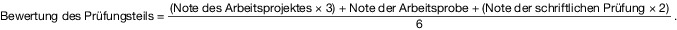

# Verordnung über die Prüfung zum anerkannten Abschluss Geprüfter Fachagrarwirt Baumpflege – Bachelor Professional Baumpflege oder Geprüfte Fachagrarwirtin Baumpflege – Bachelor Professional Baumpflege (FABaumPflPrV)

Ausfertigungsdatum
:   2020-12-02

Fundstelle
:   BGBl I: 2020, 2643

Stand: Ersetzt V 806-21-7-39 v. 29.6.1993 I 1114 (FAgrPrV)

## Eingangsformel

Auf Grund des § 53 Absatz 1 in Verbindung mit Absatz 2 und Absatz 3
Nummer 1 und mit § 53a Absatz 1 Nummer 2 und mit § 53c des
Berufsbildungsgesetzes in der Fassung der Bekanntmachung vom 4. Mai
2020 (BGBl. I S. 920) verordnet das Bundesministerium für Ernährung
und Landwirtschaft im Einvernehmen mit dem Bundesministerium für
Bildung und Forschung nach Anhörung des Hauptausschusses des
Bundesinstituts für Berufsbildung:

## Abschnitt 1 - Allgemeines

### § 1 Ziel der Prüfung, Fortbildungsstufe und Bezeichnung des Fortbildungsabschlusses

(1) Mit der erfolgreich abgelegten Prüfung zum anerkannten
Fortbildungsabschluss Geprüfter Fachagrarwirt Baumpflege – Bachelor
Professional Baumpflege oder Geprüfte Fachagrarwirtin Baumpflege –
Bachelor Professional Baumpflege wird die auf einen beruflichen
Aufstieg abzielende Erweiterung der beruflichen Handlungsfähigkeit auf
der zweiten Fortbildungsstufe der höherqualifizierenden Berufsbildung
nach § 53 in Verbindung mit § 53a Absatz 1 Nummer 2 und § 53c des
Berufsbildungsgesetzes nachgewiesen.

(2) Die erfolgreich abgelegte Prüfung führt zum anerkannten
Fortbildungsabschluss Bachelor Professional Baumpflege. Der
Abschlussbezeichnung wird die weitere Abschlussbezeichnung „Geprüfter
Fachagrarwirt Baumpflege“ oder „Geprüfte Fachagrarwirtin Baumpflege“
vorangestellt.

### § 2 Qualifizierungsbereiche

(1) Durch die Prüfung ist festzustellen, ob der Prüfling in der Lage
ist, die den Qualifizierungsbereichen

1.  Baumpflege,

2.  Betriebswirtschaft sowie

3.  Personal und Qualifizierung

nach Absatz 2 Nummer 1 bis 3 jeweils zugeordneten Fach- und
Führungsfunktionen in unterschiedlich strukturierten Unternehmen, in
Behörden und in Einrichtungen des Naturschutzes und der
Landschaftspflege zu übernehmen, in denen zu verantwortende
Leitungsprozesse eigenständig gesteuert werden, eigenständig
ausgeführt werden und dafür Mitarbeiter und Mitarbeiterinnen geführt
werden. Der Fachagrarwirt oder die Fachagrarwirtin soll auch die in
Satz 1 bezeichneten Unternehmen, Behörden und Einrichtungen oder Teile
von ihnen eigenverantwortlich führen können sowie auf sich verändernde
Anforderungen und Rahmenbedingungen reagieren können.

(2) Die Qualifizierungsbereiche umfassen jeweils folgende Fach- und
Führungsfunktionen:

1.  Baumpflege:

    a)  Bäume botanisch sowie hinsichtlich ihres Alters und ihrer Entwicklung
        erfassen und ihren Zustand einschließlich des Umfeldes unter
        Berücksichtigung der Verkehrssicherheit beurteilen und dokumentieren
        ,

    b)  Schaderreger, Krankheiten, Schäden und deren Ursachen analysieren,
        bewerten und dokumentieren,

    c)  natur- und artenschutzrechtliche sowie planungsrechtliche Aspekte
        prüfen und beurteilen,

    d)  Sachwerte von Bäumen ermitteln,

    e)  Bäume und Pflanzen des Baumumfeldes unter Berücksichtigung der
        Standort- und Pflegeansprüche, der Funktionen sowie der klimatischen
        Anforderungen verwenden,

    f)  baumpflegerische Maßnahmen unter Berücksichtigung der Nachhaltigkeit
        und der anerkannten Regeln der Technik und des Umweltrechts,
        insbesondere des Natur- und Artenschutzes, planen, umsetzen und
        bewerten,

    g)  Maßnahmen des Arbeits- und Gesundheitsschutzes und der
        Verkehrssicherheit von Baustellen vorbereiten und durchführen,

    h)  Pflanzungen beurteilen und Maßnahmen zur Baumumfeldverbesserung
        planen, umsetzen und bewerten,

    i)  betriebliche Qualitätsstandards umsetzen,

    j)  Möglichkeiten der Digitalisierung in betrieblichen Abläufen nutzen,

    k)  Produkte und Dienstleistungen kalkulieren und vermarkten,

    l)  Auftraggeber informieren und beraten sowie

    m)  Öffentlichkeitsarbeit im Zusammenhang mit baumpflegerischen Vorhaben
        und Maßnahmen planen und durchführen;

2.  Betriebswirtschaft:

    a)  Einordnen und Beurteilen der Rahmenbedingungen und Strukturen von
        Unternehmen sowie von Behörden und Einrichtungen des Naturschutzes und
        der Landschaftspflege, die baumpflegerische Arbeiten durchführen,
        vergeben und überwachen,

    b)  Märkte beobachten, bewerten und erschließen,

    c)  Unternehmensziele formulieren,

    d)  Marketingkonzepte entwickeln und umsetzen,

    e)  Maßnahmen des Qualitätsmanagements planen und umsetzen,

    f)  Betriebs- und Arbeitsorganisation planen, bewerten und fortschreiben,

    g)  Möglichkeiten der Digitalisierung betriebswirtschaftlicher Prozesse
        prüfen und umsetzen,

    h)  Vorschriften zum Datenschutz und zur Datensicherheit anwenden,

    i)  betriebswirtschaftliche Kalkulationen durchführen,

    j)  Betriebsergebnisse erfassen, analysieren und bewerten,

    k)  Betriebsentwicklung, Investitionen, Finanzierung und Liquidität
        planen,

    l)  Steuerarten und Steuerverfahren unterscheiden, steuerliche Buchführung
        anwenden,

    m)  Ausschreibungs- und Vergabearten unterscheiden, Ausschreibungen und
        Angebote erstellen und prüfen,

    n)  Verträge unter Beachtung des Vertrags- und Haftungsrechts abschließen
        sowie

    o)  Abnahme von Dienstleistungen durchführen und Mängelansprüche
        abwickeln;

3.  Personal und Qualifizierung:

    a)  Vorgaben des Arbeitsrechts, insbesondere des Tarifrechts, und des
        Sozialrechts umsetzen,

    b)  Konzepte der Mitarbeiterführung und der Personalplanung anwenden sowie
        Führungsverhalten reflektieren,

    c)  Mitarbeiter und Mitarbeiterinnen auswählen, einstellen und
        einarbeiten,

    d)  Eignung, Leistungsfähigkeit und Qualifikation von Mitarbeitern und
        Mitarbeiterinnen beurteilen und diese entsprechend einsetzen,

    e)  Mitarbeiter und Mitarbeiterinnen anleiten und motivieren,

    f)  Teamarbeit unterstützen und fördern,

    g)  Leistungen und Verhalten von Mitarbeitern und Mitarbeiterinnen
        feststellen und beurteilen,

    h)  Mitarbeitergespräche führen und den Mitarbeitern und Mitarbeiterinnen
        Entwicklungsmöglichkeiten aufzeigen,

    i)  Mitarbeiter und Mitarbeiterinnen qualifizieren und fördern,

    j)  Konflikte erkennen und gezielt lösen sowie

    k)  Konzepte und Maßnahmen zur Arbeitssicherheit und zum Gesundheitsschutz
        in Abstimmung mit den hierfür zuständigen Stellen planen und umsetzen.

(3) Für den Erwerb der in Absatz 2 bezeichneten Fertigkeiten,
Kenntnisse und Fähigkeiten bedarf es in der Regel eines Lernumfangs
von insgesamt mindestens 1 200 Stunden. Der Lerninhalt bestimmt sich
nach den Anforderungen der jeweiligen Prüfungsteile nach § 4 in
Verbindung mit den Anforderungen und Prüfungsinhalten der §§ 6, 11 und
15\.

### § 3 Voraussetzungen für die Zulassung zur Prüfung

(1) Zur Prüfung ist zuzulassen, wer die Anforderungen des § 53c des
Berufsbildungsgesetzes erfüllt und Folgendes nachweist:

1.  eine erfolgreich abgelegte Abschlussprüfung in den anerkannten
    Ausbildungsberufen Forstwirt/Forstwirtin, Gärtner/Gärtnerin oder
    Landwirt/Landwirtin,

2.  eine erfolgreich abgelegte Abschlussprüfung in einem anderen
    anerkannten Ausbildungsberuf und eine auf die Berufsausbildung
    folgende, mindestens dreijährige Berufspraxis oder

3.  eine mindestens fünfjährige Berufspraxis.

(2) Die Berufspraxis nach Absatz 1 Nummer 2 und 3 muss in Unternehmen,
Behörden, Einrichtungen oder Teilen von diesen abgeleistet worden
sein, die überwiegend Arbeiten in der Baumpflege durchführen. Die
Berufspraxis muss in Bezug auf baumpflegerische Tätigkeiten
einschlägig sein. Die Dauer und der Inhalt der Berufspraxis ist durch
eine Bescheinigung der beschäftigenden Stelle nachzuweisen.

(3) Abweichend von den in den Absätzen 1 und 2 genannten
Voraussetzungen ist zur Prüfung auch zuzulassen, wer durch Vorlage von
Zeugnissen oder auf andere Weise glaubhaft macht, eine berufliche
Handlungsfähigkeit erworben zu haben, die die Zulassung zur Prüfung
rechtfertigt.

### § 4 Gliederung der Prüfung

Die Prüfung umfasst die folgenden Prüfungsteile:

1.  Baumdiagnose und Baumpflegemaßnahmen,

2.  Betriebs- und Unternehmensführung und

3.  Mitarbeiterführung und Personalmanagement.

### § 5 Bewerten der Prüfung

Für die Bewertung der Leistungen in der Prüfung ist der in Anlage 1
dargestellte sechsstufige Bewertungsmaßstab anzuwenden.

## Abschnitt 2 - Prüfungsteil Baumdiagnose und Baumpflegemaßnahmen

### § 6 Anforderungen und Prüfungsinhalte

(1) Im Prüfungsteil Baumdiagnose und Baumpflegemaßnahmen hat der
Prüfling nachzuweisen, dass er in der Lage ist,

1.  Bäume botanisch sowie hinsichtlich ihres Alters und ihrer Entwicklung
    zu erfassen und ihren Zustand einschließlich des Umfeldes unter
    Berücksichtigung anerkannter Methoden und Parameter der Baumkontrolle,
    der Baumdiagnose und der Verkehrssicherheit zu beurteilen und zu
    dokumentieren,

2.  die ökologische Bedeutung von Bäumen unter Berücksichtigung
    naturschutz-, artenschutz- und planungsrechtlicher Aspekte zu erfassen
    und zu beurteilen,

3.  Sachwerte von Bäumen zu ermitteln,

4.  Bäume und Pflanzen des Baumumfeldes unter Berücksichtigung
    rechtlicher, funktionaler, gestalterischer und ökologischer Aspekte
    sowie der Klima-, Standort- und Pflegeansprüche zu verwenden,

5.  baumpflegerische Maßnahmen unter Berücksichtigung der Nachhaltigkeit,
    des Naturschutz-, des Artenschutz- und des Umweltrechts, der
    anerkannten Regeln der Technik, betrieblicher Qualitätsstandards und
    wirtschaftlicher Gesichtspunkte sowie der erforderlichen Maßnahmen des
    Arbeits- und Gesundheitsschutzes zu planen, umzusetzen und zu
    bewerten,

6.  Pflanzungen unter Berücksichtigung der Gütebestimmungen, der
    anerkannten Regeln der Technik und der jeweils anzuwendenden
    Qualitätsstandards zu beurteilen,

7.  Maßnahmen am Baum sowie zur Baumumfeldverbesserung zu planen,
    umzusetzen und zu bewerten,

8.  Produkte und Dienstleistungen der Baumpflege unter Berücksichtigung
    von Arbeitskräften, Maschinen, Geräten und Betriebseinrichtungen sowie
    von Betriebsstoffen und Arbeitsmitteln zu kalkulieren und zu
    vermarkten sowie

9.  Maßnahmen der Öffentlichkeitsarbeit projektbezogen zu planen und
    umzusetzen.

(2) Die Prüfung erstreckt sich auf folgende Inhalte:

1.  botanische Systematik, Funktion, Aufbau, insbesondere
    Kronenarchitektur, Entwicklung und Altersphasen von Bäumen
    einschließlich baumbiologischer Prozesse,

2.  biotische und abiotische Standortfaktoren sowie ihre Auswirkungen auf
    Wachstum und Entwicklung von Bäumen,

3.  fachliche und rechtliche Grundlagen zur Beurteilung der
    Verkehrssicherheit von Bäumen,

4.  Methoden, Techniken und Parameter der Baumkontrolle und der
    Baumdiagnose,

5.  Sachwerte von Bäumen,

6.  naturschutz-, artenschutz- und planungsrechtliche Aspekte der
    Erfassung, der Pflege und der Erhaltung von Bäumen,

7.  Aufgaben und Ziele sowie Techniken, Maschinen, Geräte und
    Arbeitsprozesse der Baumpflege,

8.  Baumschutz auf Baustellen,

9.  Pflanzensortimente, Pflanzenauswahl und -qualität für Baumpflanzungen
    unter besonderer Berücksichtigung des Klimawandels,

10. Pflanzensortimente, Pflanzenauswahl und -qualität für die Gestaltung
    von Baumpflanzungen, insbesondere die Begrünung des Baumumfeldes unter
    besonderer Berücksichtigung des Klimawandels und des Artenschutzes,

11. bau- und vegetationstechnische Anforderungen an Baumpflanzungen und an
    das Baumumfeld,

12. Maßnahmen zur Standortverbesserung,

13. Vorschriften und Maßnahmen des Arbeits- und Gesundheitsschutzes und
    der Verkehrssicherung auf Baustellen,

14. Leistungsverzeichnisse und Angebotskalkulationen,

15. Erfassung, Dokumentation und Bewertung von Bau-, Schutz- und
    Pflegemaßnahmen am Baum und im Baumumfeld sowie

16. Öffentlichkeitsarbeit im Zusammenhang mit baumpflegerischen Vorhaben
    und Maßnahmen.

### § 7 Prüfungsbestandteile

Die Prüfung besteht aus

1.  einem Arbeitsprojekt nach § 8,

2.  einer Arbeitsprobe nach § 9 sowie

3.  einer schriftlichen Prüfung nach § 10.

### § 8 Arbeitsprojekt

(1) Mit der Durchführung des Arbeitsprojektes hat der Prüfling
nachzuweisen, dass er in der Lage ist, ausgehend von einer konkreten
betrieblichen Situation die komplexen Zusammenhänge der Baumpflege zu
erfassen und zu analysieren sowie Lösungsvorschläge für betriebliche
Aufgaben zu erstellen und diese umzusetzen.

(2) Die Aufgabe für das Arbeitsprojekt soll sich auf den laufenden
Betrieb eines Unternehmens, einer Behörde oder einer Einrichtung des
Naturschutzes und der Landschaftspflege oder auf Teile von diesen
beziehen und muss einen konkreten Objektbezug aufweisen. Bei der Wahl
der Aufgabe für das Projekt sollen Vorschläge des Prüflings
berücksichtigt werden.

(3) Der Prüfling hat das Arbeitsprojekt schriftlich zu planen und
durchzuführen, den Verlauf der Bearbeitung sowie die Ergebnisse zu
dokumentieren und in einem Fachgespräch zu erläutern. Das Fachgespräch
erstreckt sich auf den Verlauf und die Ergebnisse des Arbeitsprojektes
sowie auf die hierfür relevanten Prüfungsinhalte nach § 6 Absatz 2.

(4) Für die Durchführung des Arbeitsprojekts steht dem Prüfling ein
Zeitraum von sechs Monaten zur Verfügung. Das Fachgespräch soll nicht
länger als 60 Minuten dauern.

### § 9 Arbeitsprobe

(1) In der Arbeitsprobe hat der Prüfling nachzuweisen, dass er in der
Lage ist, eine Baumschadensdiagnose durchzuführen und das Ergebnis in
einem Fachgespräch zu erläutern.

(2) Für die Durchführung der Arbeitsprobe einschließlich des
Fachgesprächs stehen 60 Minuten zur Verfügung.

### § 10 Schriftliche Prüfung

(1) Die schriftliche Prüfung besteht aus einer unter Aufsicht
anzufertigenden Arbeit mit komplexen praxisbezogenen Aufgaben aus den
Prüfungsinhalten nach § 6 Absatz 2.

(2) Die Bearbeitungszeit für die schriftliche Prüfung beträgt 180
Minuten.

## Abschnitt 3 - Prüfungsteil Betriebs- und Unternehmensführung

### § 11 Anforderungen und Prüfungsinhalte

(1) Im Prüfungsteil Betriebs- und Unternehmensführung hat der Prüfling
nachzuweisen, dass er wirtschaftliche, rechtliche und soziale
Zusammenhänge im Betrieb erkennen, analysieren und beurteilen sowie
Entwicklungsmöglichkeiten aufzeigen kann.

(2) Die Prüfung erstreckt sich auf folgende Inhalte:

1.  Unternehmensformen,

2.  Rahmenbedingungen und Strukturen eines Baumpflegebetriebes,

3.  Marketing einschließlich Kommunikation und Öffentlichkeitsarbeit,

4.  Qualitätsmanagement und Controlling,

5.  Betriebs- und Arbeitsorganisation,

6.  Ausschreibungs- und Vergabewesen,

7.  Angebotserstellung, Auftragserfassung und -abwicklung,

8.  Abnahme von Dienstleistungen, Mängelansprüche,

9.  betriebswirtschaftliche Kalkulationen und Auswertungen,

10. Betriebsentwicklung, insbesondere Investition und Finanzierung,
    Liquidität, Rentabilität und Stabilität,

11. Digitalisierung,

12. Datenschutz und Datenmanagement,

13. berufsbezogene Rechtsvorschriften, insbesondere Vertragsrecht und
    Haftungsrecht, Arbeitsrecht und Sozialrecht,

14. steuerliche Buchführung unter Beachtung von Steuerarten und
    -verfahren,

15. Unternehmensgründung sowie

16. Unternehmensabsicherung und Versicherungen.

### § 12 Prüfungsbestandteile

Die Prüfung besteht aus

1.  einer Fallstudie nach § 13 und

2.  einer schriftlichen Prüfung nach § 14.

### § 13 Fallstudie

(1) In der Fallstudie hat der Prüfling eine betriebswirtschaftlich
relevante unternehmerische Entscheidungssituation zu bearbeiten. Die
Situation wird vom Prüfungsausschuss vorgegeben und muss sich auf die
in § 11 Absatz 2 beschriebenen Inhalte beziehen.

(2) Der Prüfling hat die vorgegebene Situation zu analysieren,
Handlungsoptionen zu entwickeln, dies schriftlich zu dokumentieren und
in einem Fachgespräch zu erläutern.

(3) Für die Bearbeitung der Fallstudie stehen zwei Tage zur Verfügung.
Das Fachgespräch soll nicht länger als 45 Minuten dauern.

### § 14 Schriftliche Prüfung

(1) Die schriftliche Prüfung besteht aus einer unter Aufsicht
anzufertigenden Arbeit mit komplexen praxisbezogenen Aufgaben aus den
Prüfungsinhalten nach § 11 Absatz 2.

(2) Die Bearbeitungszeit für die schriftliche Prüfung beträgt 180
Minuten.

## Abschnitt 4 - Prüfungsteil Mitarbeiterführung und Personalmanagement

### § 15 Anforderungen und Prüfungsinhalte

(1) Im Prüfungsteil Mitarbeiterführung und Personalmanagement hat der
Prüfling nachzuweisen, dass er in der Lage ist,

1.  Vorgaben des Arbeits-, Tarif- und Sozialrechts im Betrieb umzusetzen,

2.  Vorschriften zum personenbezogenen Datenschutz und zur Datensicherheit
    umzusetzen,

3.  Personalplanung durchzuführen,

4.  Mitarbeiter und Mitarbeiterinnen zu gewinnen, auszuwählen,
    einzustellen und einzuarbeiten,

5.  Leistungsfähigkeit, Qualifikation und Eignung von Mitarbeitern und
    Mitarbeiterinnen zu beurteilen und Aufgaben auf diese entsprechend der
    Beurteilung zu übertragen,

6.  Mitarbeiter und Mitarbeiterinnen zur Arbeitssicherheit und zum
    Gesundheitsschutz anzuleiten und entsprechende Maßnahmen zu
    organisieren,

7.  Mitarbeiter und Mitarbeiterinnen anzuleiten,

8.  Leistungen und Verhalten von Mitarbeitern und Mitarbeiterinnen
    festzustellen und zu bewerten, soweit erforderlich unter Hinzuziehung
    von Leistungsbeurteilungen Dritter,

9.  Personal- und Beurteilungsgespräche zu führen und
    Entwicklungsmöglichkeiten aufzuzeigen,

10. Mitarbeiter und Mitarbeiterinnen zu motivieren und zu fördern,

11. Mitarbeiter und Mitarbeiterinnen zu qualifizieren und bei der
    Weiterbildung zu unterstützen,

12. soziale Zusammenhänge und Konflikte zu erkennen und zu bewerten,
    Maßnahmen zur Lösung von Konflikten anzuwenden,

13. Kommunikation und Teamarbeit zu organisieren und zu unterstützen,

14. Führungsstile zu kennen und das eigene Führungsverhalten kritisch zu
    beurteilen sowie

15. Arbeitsverhältnisse zu begründen und zu beenden.

(2) Die Prüfung erstreckt sich auf folgende Inhalte:

1.  Gewinnen, Einarbeiten und Anleiten von Mitarbeitern und
    Mitarbeiterinnen,

2.  Weiterbilden von Mitarbeitern und Mitarbeiterinnen,

3.  Motivation und betriebliche Bindung von Mitarbeitern und
    Mitarbeiterinnen,

4.  betriebliche Kommunikation und Unternehmenskultur,

5.  Konfliktlösungsstrategien,

6.  Führungsstile und Führungsverhalten,

7.  Personalentwicklung,

8.  Gesundheitsschutz und Arbeitssicherheit sowie

9.  einschlägige Rechtsvorschriften, insbesondere aus dem Arbeitsrecht,
    einschließlich dem Tarifrecht, und dem Sozialrecht.

### § 16 Prüfungsbestandteile

Die Prüfung besteht aus

1.  einer Fallstudie nach § 17 und

2.  einer schriftlichen Prüfung nach § 18.

### § 17 Fallstudie

(1) In der Fallstudie hat der Prüfling eine Situation der
Mitarbeiterführung zu bearbeiten. Die Situation wird vom
Prüfungsausschuss vorgegeben und muss sich auf die in § 15 Absatz 2
beschriebenen Inhalte beziehen.

(2) Der Prüfling hat die vorgegebene Situation zu analysieren,
Handlungsoptionen zu entwickeln, diese schriftlich zu dokumentieren
und in einem Fachgespräch zu erläutern.

(3) Für die Bearbeitung der Fallstudie stehen
180 Minuten              zur Verfügung. Das Fachgespräch soll nicht
länger als 30 Minuten dauern.

### § 18 Schriftliche Prüfung

(1) Die schriftliche Prüfung besteht aus einer unter Aufsicht
anzufertigenden Arbeit mit komplexen fallbezogenen Aufgaben aus den
Prüfungsinhalten nach § 15 Absatz 2.

(2) Die Bearbeitungszeit für die schriftliche Prüfung beträgt 150
Minuten.

## Abschnitt 5 - Bewertungen in den Prüfungen, Befreiung von Prüfungsbestandteilen, Bestehens- und Zeugnisregelungen

### § 19 Bewertungen in den Prüfungen

(1) Jede Leistung in den sieben Prüfungsbestandteilen nach § 7 Nummer
1 bis 3, § 12 Nummer 1 und 2 sowie § 16 Nummer 1 und 2 ist gesondert
mit einer Note als Dezimalzahl nach Anlage 1 zu bewerten.

(2) Die Bewertung der Leistung des Prüfungsteils „Baumdiagnose und
Baumpflegemaßnahmen“ errechnet sich aus den Noten der
Prüfungsbestandteile Arbeitsprojekt (§ 8), Arbeitsprobe (§ 9) und
schriftliche Prüfung (§ 10) nach folgender Formel:

(3) Die Bewertung der Leistung des Prüfungsteils „Betriebs- und
Unternehmensführung“ errechnet sich aus den Noten der
Prüfungsbestandteile Fallstudie (§ 13) und schriftliche Prüfung (§ 14)
nach folgender Formel:

(4) Die Bewertung der Leistung des Prüfungsteils „Mitarbeiterführung
und Personalmanagement“ errechnet sich aus den Noten der
Prüfungsbestandteile Fallstudie (§ 17) und schriftliche Prüfung (§ 18)
nach folgender Formel:

(5) Die Bewertung der Gesamtleistung in der Prüfung errechnet sich aus
den Bewertungen der Prüfungsteile „Baumdiagnose und
Baumpflegemaßnahmen“ (Absatz 2), „Betriebs- und Unternehmensführung“
(Absatz 3) und „Mitarbeiterführung und Personalmanagement“ (Absatz 4)
nach folgender Formel:

### § 20 Befreiung von Prüfungsbestandteilen

(1) Für die Befreiung von einzelnen Prüfungsbestandteilen nach

1.  § 7 Nummer 1, 2 oder 3,

2.  § 12 Nummer 1 oder 2 sowie

3.  § 16 Nummer 1 oder 2

ist § 56 Absatz 2 des Berufsbildungsgesetzes anzuwenden.

(2) Wird der Prüfling nach § 56 Absatz 2 des Berufsbildungsgesetzes
befreit von der Ablegung einzelner Prüfungsbestandteile nach

1.  § 7 Nummer 1, 2 oder 3,

2.  § 12 Nummer 1 oder 2 sowie

3.  § 16 Nummer 1 oder 2

bleiben diese Prüfungsbestandteile für die Anwendung des § 19 außer
Betracht. Für die übrigen Prüfungsbestandteile erhöhen sich die
Anteile nach § 19 Absatz 2 bis 5 entsprechend ihrem Verhältnis
zueinander. Allein diese Prüfungsbestandteile sind den Entscheidungen
des Prüfungsausschusses zu Grunde zu legen.

### § 21 Bestehen der Prüfung

(1) Die Prüfung ist bestanden, wenn der Prüfling in jedem Prüfungsteil
nach § 4 mindestens die Note „ausreichend“ nach Anlage 1 erzielt hat.

(2) Die Prüfung ist nicht bestanden, wenn

1.  eine der Leistungen in den einzelnen Prüfungsbestandteilen nach den
    §§ 7, 12 und 16 mit „ungenügend“ nach Anlage 1 bewertet worden ist
    oder

2.  mehr als eine der in Nummer 1 genannten Leistungen mit „mangelhaft“
    nach Anlage 1 bewertet worden ist.

### § 22 Zeugnisse

(1) Wer die Prüfung bestanden hat, erhält von der zuständigen Stelle
zwei Zeugnisse nach Maßgabe der Anlage 2.

(2) Auf dem Zeugnis mit den Inhalten nach Anlage 2 Teil B sind die
Noten als Dezimalzahlen mit einer Nachkommastelle und in Worten nach
Anlage 1 anzugeben für

1.  jeden Prüfungsteil nach § 4,

2.  jeden Prüfungsbestandteil nach den §§ 7, 12 und 16 sowie

3.  die Gesamtleistung.

Jede Befreiung nach § 20 Absatz 1 ist mit Ort, Datum und der
Bezeichnung des Prüfungsgremiums der anderen vergleichbaren Prüfung
anzugeben.

(3) Die Zeugnisse können zusätzliche nicht amtliche Bemerkungen zur
Information (Bemerkungen) enthalten, insbesondere

1.  über den erworbenen Abschluss oder

2.  auf Antrag des Prüflings über während oder anlässlich der Fortbildung
    erworbene besondere oder zusätzliche Fertigkeiten, Kenntnisse und
    Fähigkeiten.

## Abschnitt 6 - Ergänzungs- und Wiederholungsprüfung

### § 23 Mündliche Ergänzungsprüfung

(1) Wurde eine oder wurden zwei der schriftlichen Prüfungen nach den
§§ 10, 14 und 18 schlechter als mit „ausreichend“ nach Anlage 1
bewertet, ist auf Antrag des Prüflings eine dieser Prüfungen durch
eine mündliche Prüfung zu ergänzen, wenn dies den Ausschlag für das
Bestehen der Prüfung insgesamt geben kann.

(2) Die mündliche Ergänzungsprüfung soll nicht länger als 30 Minuten
dauern.

(3) Für die Ermittlung des Ergebnisses der ergänzten schriftlichen
Prüfung ist die bisherige Note der schriftlichen Prüfung und die Note
der mündlichen Ergänzungsprüfung im Verhältnis 2:1 zu gewichten.

### § 24 Wiederholung der Prüfung

(1) Eine Prüfung, die nicht bestanden wurde, kann zweimal wiederholt
werden.

(2) In der Wiederholungsprüfung ist der Prüfling auf Antrag von
einzelnen Prüfungsteilen nach § 4 und einzelnen Prüfungsbestandteilen
nach den §§ 7, 12 und 16 zu befreien, wenn

1.  die entsprechenden Leistungen in einer vorangegangenen Prüfung
    mindestens mit „ausreichend“ nach Anlage 1 bewertet worden sind und

2.  der Prüfling sich innerhalb von zwei Jahren, gerechnet vom Tag der
    Feststellung des Ergebnisses der nicht bestandenen Prüfung an, zur
    Wiederholungsprüfung anmeldet.

## Abschnitt 7 - Schlussvorschriften

### § 25 Übergangsvorschriften

(1) Die bis zum Ablauf des 31. Dezember 2020 begonnenen
Prüfungsverfahren sind nach den Vorschriften der Verordnung über die
Prüfung zum anerkannten Abschluss Geprüfter Fachagrarwirt/Geprüfte
Fachagrarwirtin – Baumpflege und Baumsanierung vom 29. Juni 1993
(BGBl. I S. 1114) zu Ende zu führen.

(2) Prüflinge, die die Prüfung nach den bis zum Ablauf des 31.
Dezember 2020 geltenden Vorschriften nicht bestanden haben und die
sich innerhalb von zwei Jahren ab dem 1. Januar 2021 zu einer
Wiederholungsprüfung anmelden, legen die Wiederholungsprüfung nach den
Vorschriften der Verordnung über die Prüfung zum anerkannten Abschluss
Geprüfter Fachagrarwirt/Geprüfte Fachagrarwirtin – Baumpflege und
Baumsanierung vom 29. Juni 1993 (BGBl. I S. 1114) ab.

### § 26 Inkrafttreten, Außerkrafttreten

Diese Verordnung tritt am 1. Januar 2021 in Kraft. Gleichzeitig tritt
die Verordnung über die Prüfung zum anerkannten Abschluss Geprüfter
Fachagrarwirt/Geprüfte Fachagrarwirtin – Baumpflege und Baumsanierung
vom 29. Juni 1993 (BGBl. I S. 1114) außer Kraft.

(zu § 5)

### Anlage 1 Bewertungsmaßstab für die Leistungen

(Fundstelle: BGBl. I 2020, 2650)

Für die Bewertung der Leistungen in der Prüfung, den Prüfungsteilen
und den Prüfungsbestandteilen ist der folgende Bewertungsmaßstab
anzuwenden.

*    *   Benotung

    *   Definition des Leistungsniveaus
        der beruflichen Handlungsfähigkeit

*    *   Note als
        Dezimalzahl

    *   Note in
        Worten

*    *   1,0 bis 1,4

    *   sehr gut

    *   eine Leistung, die den Anforderungen in besonderem Maße entspricht

*    *   1,5 bis 2,4

    *   gut

    *   eine Leistung, die den Anforderungen voll entspricht

*    *   2,5 bis 3,4

    *   befriedigend

    *   eine Leistung, die den Anforderungen im Allgemeinen entspricht

*    *   3,5 bis 4,4

    *   ausreichend

    *   eine Leistung, die zwar Mängel aufweist, aber im Ganzen den
        Anforderungen noch entspricht

*    *   4,5 bis 5,4

    *   mangelhaft

    *   eine Leistung, die den Anforderungen nicht entspricht, jedoch erkennen
        lässt, dass notwendige Grundlagen für die berufliche
        Handlungsfähigkeit vorhanden sind

*    *   5,5 bis 6,0

    *   ungenügend

    *   eine Leistung, die den Anforderungen nicht entspricht und bei der
        selbst Grundlagen für die berufliche Handlungsfähigkeit fehlen

(zu § 22)

### Anlage 2 Zeugnisinhalte

(Fundstelle: BGBl. I 2020, 2651)

**Teil A – Zeugnis ohne Prüfungsergebnisse:**

1.  Bezeichnung der ausstellenden Behörde,

2.  Name und Geburtsdatum des Prüflings,

3.  Datum des Bestehens der Prüfung,

4.  Bezeichnung des erworbenen Fortbildungsabschlusses nach § 1 Absatz 2,

5.  Bezeichnung und Fundstelle dieser Fortbildungsordnung nach den Angaben
    im Bundesgesetzblatt unter Berücksichtigung erfolgter Änderungen
    dieser Verordnung,

6.  Datum der Ausstellung des Zeugnisses samt Unterschrift der zuständigen
    Stelle.

**Teil B – Zeugnis mit Prüfungsergebnissen:**

Alle Angaben des Teils A sowie zusätzlich:

1.  Benennung und Bewertung der einzelnen Prüfungsteile nach § 4 mit Noten
    als Dezimalzahl und in Worten,

2.  Benennung und Bewertung der einzelnen Prüfungsbestandteile nach den
    §§ 7, 12 und 16 mit Noten als Dezimalzahl und in Worten,

3.  Bewertung für die Gesamtleistung nach § 19 Absatz 5 mit Note als
    Dezimalzahl und in Worten,

4.  Befreiungen nach § 20 Absatz 1.

