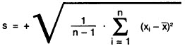
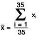
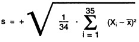
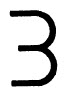

# Verordnung über Fertigpackungen (FertigPackV 1981)

Ausfertigungsdatum
:   1981-12-18

Fundstelle
:   BGBl I: 1981, 1585

Neugefasst durch
:   Bek. v. 8.3.1994 I 451, 1307;

Zuletzt geändert durch
:   Art. 27 V v. 5.7.2017 I 2272

## Erster Abschnitt - Verbindliche Standardisierung und Maßbehältnisse

### § 1 Verbindliche Werte für Nennfüllmengen von Fertigpackungen mit Lebensmitteln

(1) Fertigpackungen mit den in Anlage 1 unter Nummer 2 aufgeführten
Erzeugnissen und einer Nennfüllmenge, die innerhalb der in Anlage 1
unter Nummer 1 genannten Füllmengenbereiche liegt, dürfen gewerbsmäßig
nur dann in Verkehr gebracht werden, wenn die Nennfüllmenge einem der
in Anlage 1 unter Nummer 1 aufgeführten Werte entspricht.

(2) Bei Sammelpackungen ist Absatz 1 nur auf die einzelnen
Fertigpackungen anzuwenden.

(3) Absatz 1 gilt nicht für Erzeugnisse, die in Duty-Free-Geschäften
für den Verzehr außerhalb der Europäischen Union verkauft werden.

### § 2 Maßbehältnisse

(1) Behältnisse aus formbeständigem Material in Flaschenform
(Flaschen) mit einem Nennvolumen von nicht mehr als fünf Liter sind
Maßbehältnisse, wenn sie die Angaben nach Absatz 3 tragen und die
Genauigkeitsanforderungen nach § 3 Abs. 1 bis 3 einhalten. Haben
Flaschen ein in der nachstehenden Tabelle aufgeführtes Nennvolumen und
halten ihre Randvollvolumen die in der Tabelle festgelegten
Größenwerte und die Genauigkeitsanforderungen des § 3 Abs. 1 bis 3
ein, so sind sie Maßbehältnisse, auch wenn sie die Angaben nach Absatz
3 Nr. 1 und 2 nicht tragen:

*    *   Nennvolumen in Milliliter

    *   Randvollvolumen in Milliliter

*    *   20

    *   21,5

*    *   25

    *   27

*    *   30

    *   32,5

*    *   40

    *   42,5

(2) Bei Maßbehältnissen ist

1.  das Nennvolumen das auf der Flasche angegebene Volumen,

2.  das Randvollvolumen das Flüssigkeitsvolumen, das die Flasche enthält,
    wenn sie bis zur oberen Randebene gefüllt ist.

(3) Wer Maßbehältnisse gewerbsmäßig herstellt oder in den
Geltungsbereich dieser Verordnung verbringt, muss folgende Angaben am
Boden, an der Bodennaht oder am Mantel der Flasche aufbringen oder
aufbringen lassen:

1.  das Nennvolumen in Milliliter, Zentiliter oder Liter unter Anfügung
    der Volumeneinheit oder ihres Einheitenzeichens,

2.  das Randvollvolumen in Zentiliter ohne Anfügung der Volumeneinheit
    oder ihres Einheitenzeichens oder die Entfernung zwischen der dem
    Nennvolumen entsprechenden Füllhöhe und der oberen Randebene in
    Millimeter unter Anfügung des Einheitenzeichens,

3.  das Herstellerzeichen nach § 4,

4.  bei Flaschen mit einem Nennvolumen

    a)  bis 50 Milliliter den Buchstaben M,

    b)  von 50 Milliliter bis 5 Liter das Zeichen nach Anlage 8.

(4) Die Angaben nach Absatz 3 müssen unverwischbar, gut sichtbar und
deutlich lesbar sein und mindestens die in § 20 Abs. 1 festgelegte
Schriftgröße haben.

(5) Wer Flaschen, die keine Maßbehältnisse sind, gewerbsmäßig
herstellt oder in den Geltungsbereich dieser Verordnung verbringt,
darf die Bezeichnungen des Absatzes 3 Nr. 2 und 4 nicht aufbringen
oder aufbringen lassen.

### § 3 Genauigkeitsanforderungen an Maßbehältnisse

(1) Bei Maßbehältnissen müssen der Unterschied zwischen dem
Nennvolumen und dem Randvollvolumen und die Entfernung zwischen der
dem Nennvolumen entsprechenden Füllhöhe und der oberen Randebene für
alle Flaschen desselben Musters hinreichend konstant sein.

(2) Wird gemäß § 2 Abs. 3 Nr. 2 das Randvollvolumen angegeben, darf
das Randvollvolumen vom angegebenen Randvollvolumen um die
nachstehenden Werte abweichen:

*    *   Nennvolumen in Milliliter

    *   % des Nennvolumens

    *   Milliliter

*    *   bis 50

    *   6

    *   -

*    *   50 bis 100

    *   -

    *   3

*    *   100 bis 200

    *   3

    *   -

*    *   200 bis 300

    *   -

    *   6

*    *   300 bis 500

    *   2

    *   -

*    *   500 bis 1.000

    *   -

    *   10

*    *   1.000 bis 5.000

    *   1

    *   -

(3) Wird gemäß § 2 Abs. 3 Nr. 2 die Entfernung angegebenen, darf das
durch die angegebene Entfernung begrenzte Volumen vom Nennvolumen um
die in Absatz 2 festgelegten Werte abweichen.

(4) Die zulässigen Abweichungen dürfen nicht planmäßig ausgenutzt
werden.

(5) Die Randvollvolumen von Maßbehältnissen sollen den Größenwerten
nach den allgemein anerkannten Regeln der Technik entsprechen.

### § 4 Herstellerzeichen

(1) Wer Maßbehältnisse herstellt, kann die Erteilung eines
Herstellerzeichens beantragen.

(2) Der Antrag ist schriftlich oder elektronisch bei der Physikalisch-
Technischen Bundesanstalt zu stellen.

(3) Die Physikalisch-Technische Bundesanstalt kann vom Antragsteller
verlangen,

1.  das beantragte Herstellerzeichen zu ändern, wenn Verwechslungen mit
    bereits erteilten Herstellerzeichen zu befürchten sind,

2.  zusätzliche Zahlen und Buchstaben im Herstellerzeichen anzubringen.

(4) Die Physikalisch-Technische Bundesanstalt hat das
Herstellerzeichen in dem für amtliche Bekanntmachungen vorgesehenen
Veröffentlichungsblatt bekanntzugeben.

(5) Einem von der Physikalisch-Technischen Bundesanstalt erteilten
Herstellerzeichen steht ein Herstellerzeichen gleich, das von einem
anderen Mitgliedstaat der Europäischen Gemeinschaften oder einem
anderen Vertragsstaat des Abkommens über den Europäischen
Wirtschaftsraum erteilt worden ist.

### § 5 (weggefallen)

-

## Zweiter Abschnitt - Füllmengenkennzeichnung von Fertigpackungen

### § 6 Kennzeichnung der Füllmenge

(1) Fertigpackungen dürfen gewerbsmäßig nur in den Verkehr gebracht
werden, wenn die Füllmenge nach Gewicht, Volumen oder Stückzahl oder
in einer anderen Größe angegeben ist. Sofern nicht nach den §§ 7 bis 9
die Angabe in einer bestimmten Größe vorgeschrieben ist, hat die
Angabe der allgemeinen Verkehrsauffassung zu entsprechen.

(2) Unbestimmte Füllmengenangaben, die Angabe eines Füllmengenbereichs
oder die zusätzliche Angabe des Bruttogewichts sind unzulässig.

(3) Besteht eine Fertigpackung aus mehreren, nicht zum Einzelverkauf
bestimmten Packungen desselben Erzeugnisses, so ist die gesamte
Füllmenge und die Anzahl der einzelnen Packungen anzugeben. Die Angabe
der Anzahl der Packungen darf entfallen, wenn alle Packungen sichtbar
und leicht zählbar sind.

(4) Besteht eine Fertigpackung aus mehreren, nicht zum Einzelverkauf
bestimmten Packungen mit verschiedenartigen Erzeugnissen oder sind in
eine Fertigpackung verschiedenartige Erzeugnisse gesondert abgefüllt,
so sind die Mengen der einzelnen Erzeugnisse anzugeben.

(5) Bei Packungen, die aus mehreren Fertigpackungen bestehen
(Sammelpackungen), ist zusätzlich zur Angabe der Füllmenge auf den
einzelnen Fertigpackungen auf der Umhüllung der Sammelpackung die
Anzahl und die Nennfüllmenge der einzelnen Fertigpackungen anzugeben.
Diese zusätzlichen Angaben sind nicht erforderlich, wenn die einzelnen
Fertigpackungen sichtbar und leicht zählbar sind und die Angabe der
Füllmenge auf allen Fertigpackungen, bei Fertigpackungen gleicher
Nennfüllmenge wenigstens auf einer Fertigpackung, erkennbar ist.

(6) Die Absätze 1 bis 5 gelten nicht, soweit andere Rechtsvorschriften
Bestimmungen über die Füllmengenkennzeichnung enthalten.

### § 7 Kennzeichnung der Füllmenge bei Fertigpackungen mit bestimmten Erzeugnissen

(1) Fertigpackungen mit Erzeugnissen in Aerosolform sind nach Volumen
zu kennzeichnen, auch wenn für das Erzeugnis sonst eine Kennzeichnung
nach Gewicht vorgeschrieben ist. Als Volumen ist das Volumen der
Flüssigphase anzugeben. Darüber hinaus ist das Gesamtfassungsvermögen
der Packung anzugeben. Die Angabe ist so zu gestalten, dass sie nicht
mit der Angabe des Nennvolumens des Inhalts verwechselt werden kann.

(2) Fertigpackungen mit flüssigen Lebensmitteln sind nach Volumen zu
kennzeichnen, Fertigpackungen mit anderen Lebensmitteln nach Gewicht.
Abweichend davon sind zu kennzeichnen:

1.  nach Gewicht Fertigpackungen mit

    a)  Honig, Pektin, Malzextrakt und zur Verwendung als Brotaufstrich
        bestimmtem Sirup,

    b)  Milcherzeugnissen mit Ausnahme der Milchmischgetränke; bei
        ungezuckerten Kondensmilcherzeugnissen, die in anderen Behältnissen
        als Metalldosen oder Tuben abgefüllt sind, ist das Gewicht und das
        Volumen anzugeben, bei Buttermilcherzeugnissen das Gewicht oder das
        Volumen,

    c)  Essigessenz,

    d)  Würzen,

2.  nach Volumen Fertigpackungen mit

    a)  Feinkostsoßen und Senf,

    b)  Speiseeis,

3.  Fertigpackungen mit konzentrierten Suppen, Brühen, Braten-, Würz- und
    Salatsoßen mit dem Volumen der verzehrfertigen Zubereitung nach Liter
    oder Milliliter,

4.  Fertigpackungen mit Backpulver und Backhefe mit dem Gewicht des Mehls,
    zu dessen Verarbeitung die Füllmenge auch noch nach der im Verkehr
    vorauszusehenden Lagerzeit ausreicht,

5.  Fertigpackungen mit Puddingpulver und verwandten Erzeugnissen sowie
    Trockenerzeugnissen für Pürees, Klöße und ähnliche Beilagen mit der
    Menge der Flüssigkeit, die zur Zubereitung der Füllmenge erforderlich
    ist.

Bei Fertigpackungen, die ausschließlich für Letztverbraucher bestimmt
sind, die das Erzeugnis in ihrer selbständigen beruflichen oder
gewerblichen Tätigkeit verwenden, kann von den Sätzen 1 und 2
abgewichen werden.

(3) Fertigpackungen mit kosmetischen Mitteln, Wasch- und
Reinigungsmitteln sowie Putz- und Pflegemitteln in flüssiger oder
pastöser Form sind nach Volumen zu kennzeichnen. Fertigpackungen mit
diesen Erzeugnissen in fester oder pulveriger Form sind nach Gewicht
zu kennzeichnen. Abweichend davon sind weiche Seifen nach Gewicht,
feste Deodorants und Erfrischungsstifte nach Volumen zu kennzeichnen.

(4) Fertigpackungen mit Klebstoffen sind nach Gewicht zu kennzeichnen.

(5) Fertigpackungen gleicher Nennfüllmenge mit Lacken und
Anstrichfarben sind nach Volumen zu kennzeichnen.

(6) Fertigpackungen mit Futtermitteln für Heimtiere und freilebende
Vögel sind nach Gewicht oder Volumen zu kennzeichnen.

(7) Auf Fertigpackungen mit photochemischen Erzeugnissen und mit
chemischen und technischen Standard- und Reagenzmaterialien darf
anstelle der Füllmenge das Volumen der gebrauchsfertigen Zubereitung
oder die Anzahl der Anwendungen oder Untersuchungen angegeben werden.

### § 8 Kennzeichnung der Stückzahl bei Fertigpackungen mit Lebensmitteln

(1) Abweichend von § 7 Abs. 2 darf bei Fertigpackungen mit Obst und
Gemüse, Backoblaten und Gewürzen die Stückzahl angegeben werden, wenn
die Erzeugnisse der allgemeinen Verkehrsauffassung entsprechend nur
nach Stückzahl gehandelt werden.

(2) Die Stückzahl darf ferner bei folgenden Lebensmitteln angegeben
werden, sofern sie in Fertigpackungen mit mehr als einem Stück
abgegeben werden und die Füllmenge weniger als 100 Gramm beträgt:

1.  bei figürlichen Zuckerwaren, figürlichen Schokoladenwaren, ausgenommen
    Pralinen, und Dauerbackwaren mit einem Einzelgewicht von mehr als 5
    Gramm,

2.  bei Kaugummi, Kaubonbons und Schaumzuckerwaren.

(3) Bei Fertigpackungen mit Süßstofftabletten ist die Stückzahl
anzugeben.

### § 9 Kennzeichnung der Stückzahl bei Fertigpackungen mit anderen Erzeugnissen

Abweichend von § 7 Abs. 3 bis 6 darf die Stückzahl angegeben werden
bei

1.  Fertigpackungen mit kosmetischen Mitteln, deren Füllmenge für eine
    einmalige Anwendung oder einen einmaligen Gebrauch vorgesehen ist
    (Portionspackungen), sowie Fertigpackungen mit kosmetischen Mitteln,
    für die die Angaben des Gewichts oder Volumens nicht von Bedeutung
    ist,

2.  Duft- und Spülreinigern in Stückform mit einem Gewicht von weniger als
    50 Gramm,

3.  Mitteln für die Kraftfahrzeugpflege im Portionspackungen,

4.  Futtermitteln für Heimtiere und freilebende Vögel, wenn die
    Futtermittel der allgemeinen Verkehrsauffassung entsprechend nur nach
    Stückzahl gehandelt werden,

5.  Klebstiften,

6.  Lackstiften mit einer Füllmenge von weniger als 50 Milliliter.

### § 10 Befreiung von der Füllmengenkennzeichnung

(1) Bei Fertigpackungen mit Erzeugnissen, die der allgemeinen
Verkehrsauffassung entsprechend nach Stückzahl gehandelt werden dürfen
oder bei denen nach den §§ 8 und 9 die Stückzahl angegeben werden
darf, ist die Angabe der Stückzahl nicht erforderlich, wenn alle
Stücke sichtbar und leicht zählbar sind oder wenn das Erzeugnis
handelsüblich nur als einzelnes Stück oder Paar in den Verkehr
gebracht wird.

(2) Die Angabe der Füllmenge ist ferner nicht erforderlich bei
Fertigpackungen mit

1.  Aromen mit einer Füllmenge von weniger als 10 Gramm oder Milliliter,

2.  Essig sowie Zubereitungen aus Meerrettich oder Senf mit einer
    Füllmenge von weniger als 25 Gramm oder Milliliter,

3.  Zuckerwaren, aus Mandeln, Nüssen und sonstigen Ölsamen hergestellten
    Erzeugnissen, Dauerbackwaren und Knabbererzeugnissen mit einer
    Füllmenge von weniger als 50 Gramm oder mit Zucker mit einer Füllmenge
    von weniger als 20 Gramm,

4.  Feinen Backwaren mit Ausnahme der Dauerbackwaren, Knäckebrot und in
    Scheiben geschnittenem Brot mit einer Füllmenge von 100 Gramm oder
    weniger,

5.  Speiseeis mit einer Füllmenge von 200 Milliliter oder weniger,

6.  Brot in Form von Kleingebäck mit einem Gewicht des Einzelstücks von
    250 Gramm oder weniger,

7.  Brot, das zu den in § 68 Abs. 2 Nr. 2 des Lebensmittel- und
    Futtermittelgesetzbuchs bezeichneten Zwecken abgegeben wird.

Werden mehrere einzelne Fertigpackungen, die nach Satz 1 Nr. 3 von der
Kennzeichnung der Füllmenge befreit sind, zusätzlich verpackt und
beträgt die gesamte Füllmenge mehr als 100 Gramm, so ist auf dieser
Verpackung die Anzahl und die Füllmenge der einzelnen Fertigpackungen
anzugeben.

### § 11 Abtropfgewicht

(1) Befindet sich ein festes Lebensmittel in einer Aufgußflüssigkeit,
so ist auf der Fertigpackung neben der gesamten Füllmenge auch das
Abtropfgewicht dieses Lebensmittels anzugeben. Als Aufgußflüssigkeiten
gelten folgende Erzeugnisse - einschließlich ihrer Mischungen -, auch
gefroren oder tiefgefroren, sofern sie gegenüber den wesentlichen
Bestandteilen der betreffenden Zubereitung nur eine untergeordnete
Rolle spielen und folglich für den Kauf nicht ausschlaggebend sind:
Wasser, wäßrige Salzlösungen, Salzlake, Genußsäure in wäßriger Lösung,
Essig, wäßrige Zuckerlösungen, wäßrige Lösungen von anderen
Süßungsstoffen oder -mitteln, Frucht- oder Gemüsesäfte bei Obst und
Gemüse.

(2) Das Abtropfgewicht ist leicht erkennbar und deutlich lesbar in
unmittelbarer Nähe der gesamten Füllmenge und mindestens in gleicher
Schriftgröße wie diese anzugeben.

### (XXXX) §§ 12 bis 17 (weggefallen)

### § 18 Art und Weise der Füllmengenangabe

(1) Wer Fertigpackungen gewerbsmäßig in den Verkehr bringt, hat die
Füllmenge auf der Fertigpackung leicht erkennbar, deutlich lesbar und
unverwischbar anzugeben. Bei Fertigpackungen mit kosmetischen Mitteln,
deren Verpackung aus einer Innenverpackung und einer Außenverpackung
besteht, ist die Füllmenge auf beiden Verpackungen anzugeben.

(2) Wer Fertigpackungen zum alsbaldigen Verkauf überwiegend von Hand
herstellt und sie feilhält, darf die Füllmenge durch ein Schild auf
oder neben der Fertigpackung angeben.

(3) Bei Großpackungen mit frischem Obst und Gemüse, die

1.  auf einer der Abgabe an den Letztverbraucher vorausgehenden
    Handelsstufe in den Verkehr gebracht werden oder

2.  ausschließlich an Letztverbraucher abgegeben werden, die das Erzeugnis
    in ihrer selbständigen beruflichen oder gewerblichen oder in ihrer
    behördlichen oder dienstlichen Tätigkeit verwenden,

braucht die Füllmenge nur in den Begleitpapieren angegeben zu sein.
Großpackungen im Sinne dieser Vorschrift sind Fertigpackungen, die
nach ihrer Füllmenge üblicherweise nicht an andere als die in Satz 1
Nr. 2 genannten Letztverbraucher abgegeben werden.

(4) Wer Fertigpackungen gewerbsmäßig in den Verkehr bringt, hat die
Füllmenge anzugeben

-   bei Abgabe nach Gewicht in Gramm oder Kilogramm,

-   bei Abgabe nach Volumen in Milliliter, Zentiliter oder Liter

-   bei Abgabe nach Länge in Zentimeter oder Meter

-   bei Abgabe nach Fläche  in Quadratzentimeter oder Quadratmeter.

(5) Name der Einheit oder das Einheitszeichen ist anzufügen.

### § 19

(weggefallen)

### § 20 Schriftgröße

(1) Die Zahlenangaben nach § 2 Abs. 3, § 6 Abs. 3 und 4 und §§ 11 und
18 müssen mindestens folgende Schriftgrößen haben:

*    *   Nennfüllmenge  in g oder ml

    *   Schriftgröße  in mm

*    *   5 bis 50

    *   2

*    *   mehr als 50 bis 200

    *   3

*    *   mehr als 200 bis 1.000

    *   4

*    *   mehr als 1.000

    *   6

(2) Die nach § 6 Abs. 5 vorgeschriebenen Zahlenangaben auf
Sammelpackungen müssen mindestens folgende Schriftgrößen haben:

*    *   Nennfüllmenge der Einzelpackungen  in g oder ml

    *   Schriftgröße  in mm

*    *   bis 50

    *   3

*    *   50 und mehr als 50

    *   6

(3) Abweichend von den Absätzen 1 und 2 richtet sich die Schriftgröße
der Zahlenangaben auf Fertigpackungen ungleicher Nennfüllmenge, zu
deren Herstellung Waagen mit Gewichtsdruckwerk verwendet werden, nach
den Vorschriften der Eichordnung.

### § 21 EWG-Zeichen für Fertigpackungen

(1) Das in Anlage 9 wiedergegebene EWG-Zeichen darf auf
Fertigpackungen gleicher Nennfüllmenge aufgebracht werden, wenn die in
den §§ 6, 7, 18 Abs. 1 und 4, § 20 Abs. 1, §§ 22, 26, 27 und 29 Abs. 1
festgelegten Anforderungen erfüllt sind und die Nennfüllmenge nicht
weniger als 5 Gramm oder Milliliter und nicht mehr als 10 Kilogramm
oder Liter beträgt. Ist neben der gesamten Füllmenge auch das
Abtropfgewicht anzugeben, so bezieht sich das EWG-Zeichen nur auf die
gesamte Füllmenge.

(2) Das EWG-Zeichen muß im gleichen Sichtfeld wie die Angabe der
Nennfüllmenge liegen.

## Dritter Abschnitt - Füllmengen von Fertigpackungen

### § 22 Füllmengenanforderungen bei Kennzeichnung nach Gewicht oder Volumen

(1) Nach Gewicht oder Volumen gekennzeichnete Fertigpackungen gleicher
Nennfüllmenge dürfen gewerbsmäßig nur so hergestellt werden, daß die
Füllmenge zum Zeitpunkt der Herstellung

1.  im Mittel die Nennfüllmenge nicht unterschreitet und

2.  die in Absatz 3 festgelegten Werte für die Minusabweichung von der
    Nennfüllmenge nicht überschreitet.

(2) Nach Gewicht oder Volumen gekennzeichnete Fertigpackungen gleicher
Nennfüllmenge dürfen gewerbsmäßig nur in den Geltungsbereich dieser
Verordnung verbracht werden, wenn die Füllmenge zum Zeitpunkt der
Herstellung

1.  im Mittel die Nennfüllmenge nicht unterschreitet und

2.  die in Absatz 3 festgelegten Werte für die Minusabweichung von der
    Nennfüllmenge nicht überschreitet.

(3) Die zulässigen Minusabweichungen betragen:

*    *   Nennfüllmenge QN

    *   Zulässige Minusabweichung

*    *   in g oder ml

    *   in % von QN

    *   in g oder ml

*    *   5 bis 50

    *   9

    *   -

*    *   50 bis 100

    *   -

    *   4,5

*    *   100 bis 200

    *   4,5

    *   -

*    *   200 bis 300

    *   -

    *   9

*    *   300 bis 500

    *   3

    *   -

*    *   500 bis 1.000

    *   -

    *   15

*    *   1.000 bis 10.000

    *   1,5

    *   -

Bei der Anwendung dieser Tabelle sind die in Gewichts- oder
Volumeneinheiten berechneten Werte der zulässigen Minusabweichung, die
in Prozent angegeben sind, auf 0,1 Gramm oder 0,1 Milliliter
aufzurunden. Die Minusabweichungen dürfen von höchstens 2 vom Hundert
der Fertigpackungen überschritten werden.

(4) Nach Gewicht oder Volumen gekennzeichnete Fertigpackungen gleicher
Nennfüllmenge dürfen erstmals gewerbsmäßig nur in den Verkehr gebracht
werden, wenn die Minusabweichung von der Nennfüllmenge das Zweifache
der in der Tabelle des Absatzes 3 festgelegten Werte nicht
überschreitet.

(5) Für Fertigpackungen mit gefrorenem oder tiefgefrorenem
Geflügelfleisch nach Artikel 8 der Verordnung (EWG) Nr. 1538/91 der
Kommission vom 5. Juni 1991 mit ausführlichen
Durchführungsvorschriften zur Verordnung (EWG) Nr. 1906/90 des Rates
über bestimmte Vermarktungsnormen für Geflügelfleisch (ABl. EG Nr. L
143 S. 11), zuletzt geändert durch die Verordnung (EG) Nr. 1474/2007
der Kommission vom 13. Dezember 2007 (ABl. EU Nr. L 329 S. 14), gelten
die dort in Artikel 8 Abs. 4 festgelegten Füllmengenanforderungen.

### § 22a Füllmengenanforderungen bei Kennzeichnung des Abtropfgewichts

(1) Mit dem Abtropfgewicht gekennzeichnete Fertigpackungen gleicher
Nennfüllmenge dürfen gewerbsmäßig nur so hergestellt werden, daß das
Abtropfgewicht im Mittel das angegebene Abtropfgewicht nicht
unterschreitet.

(2) Mit dem Abtropfgewicht gekennzeichnete Fertigpackungen gleicher
Nennfüllmenge dürfen gewerbsmäßig nur in den Geltungsbereich dieser
Verordnung verbracht werden, wenn das Abtropfgewicht im Mittel das
angegebene Abtropfgewicht nicht unterschreitet.

(3) Mit dem Abtropfgewicht gekennzeichnete Fertigpackungen gleicher
Nennfüllmenge dürfen erstmals gewerbsmäßig nur in den Verkehr gebracht
werden, wenn die Minusabweichung vom angegebenen Abtropfgewicht das
Dreifache der in der Tabelle des § 22 Abs. 3 festgelegten Werte nicht
überschreitet.

(4) Die Vorschriften der Absätze 1 bis 3 gelten als eingehalten, wenn
das Abtropfgewicht der Fertigpackungen in dem in Nummer 8a der Anlage
4a festgelegten Zeitraum den Anforderungen genügt.

### § 23 Füllmengenanforderungen bei Kennzeichnung nach Länge oder Fläche

(1) Nach Länge oder Fläche gekennzeichnete Fertigpackungen gleicher
Nennfüllmenge dürfen gewerbsmäßig nur so hergestellt werden, daß die
Füllmenge zum Zeitpunkt der Herstellung im Mittel die Nennfüllmenge
nicht unterschreitet.

(2) Nach Länge oder Fläche gekennzeichnete Fertigpackungen gleicher
Nennfüllmenge dürfen gewerbsmäßig nur in den Geltungsbereich dieser
Verordnung verbracht werden, wenn die Füllmenge zum Zeitpunkt der
Herstellung im Mittel die Nennfüllmenge nicht unterschreitet.

(3) Nach Länge oder Fläche gekennzeichnete Fertigpackungen gleicher
Nennfüllmenge dürfen erstmals gewerbsmäßig nur in den Verkehr gebracht
werden, wenn die Minusabweichung von der Nennfüllmenge bei einer
Kennzeichnung

-   nach Länge 2 vom Hundert,

-   nach Fläche 3 vom Hundert

nicht überschreitet. Abweichend davon darf die Minusabweichung bei
Garnen mit einer Nennlänge von 100 Meter und weniger 4 vom Hundert
nicht überschreiten.

(4) Als Fläche gilt auch das Produkt aus gekennzeichneter Länge und
Breite.

(5) Für Verbandstoffe, Heftpflaster und Wundschnellverbände gelten nur
die Anforderungen nach den Absätzen 1 und 2. Für Erzeugnisse, für die
im Arzneibuch Anforderungen an die Länge festgelegt sind, gelten diese
Anforderungen. Für Reißverschlüsse gelten die in den allgemein
anerkannten Regeln der Technik festgelegten Anforderungen.

### § 24 Füllmengenanforderungen bei Kennzeichnung nach Stückzahl

(1) Nach Stückzahl gekennzeichnete Fertigpackungen gleicher
Nennfüllmenge mit einer Nennfüllmenge von 30 Stück oder weniger dürfen
erstmals gewerbsmäßig nur in den Verkehr gebracht werden, wenn sie
mindestens die angegebene Menge enthalten.

(2) Nach Stückzahl gekennzeichnete Fertigpackungen gleicher
Nennfüllmenge mit einer Nennfüllmenge von mehr als 30 Stück dürfen
erstmals gewerbsmäßig nur in den Verkehr gebracht werden, wenn

1.  die Füllmenge im Mittel die Nennfüllmenge nicht unterschreitet und

2.  die Minusabweichung von der Nennfüllmenge ein Stück auf jedes
    angefangene Hundert nicht überschreitet.

### § 25 Minusabweichungen bei bestimmten Fertigpackungen ungleicher Nennfüllmenge

(1) Nach Gewicht gekennzeichnete Fertigpackungen ungleicher
Nennfüllmenge dürfen erstmals gewerbsmäßig nur in den Verkehr gebracht
werden, wenn die Minusabweichungen von der Nennfüllmenge die in der
nachstehenden Tabelle festgelegten Werte nicht überschreitet:

*    *   Nennfüllmenge QN in g

    *   Zulässige Minusabweichung in g

*    *   weniger als 100

    *   1,0

*    *   100 bis weniger als 500

    *   2,0

*    *   500 bis weniger als 2.000

    *   5,0

*    *   2.000 bis 10.000

    *   10,0

(2) Nach Länge oder Fläche gekennzeichnete Fertigpackungen ungleicher
Nennfüllmenge dürfen erstmals gewerbsmäßig nur in den Verkehr gebracht
werden, wenn die Minusabweichung von der Nennfüllmenge die in § 23
Abs. 3 festgelegten Werte nicht überschreitet.

### § 26 Bezugstemperatur

Die Anforderungen in den §§ 3 und 22 sind auf eine Temperatur von
20 Grad C (Bezugstemperatur) bezogen. Die Bezugstemperatur gilt nicht
für Speiseeis.

### § 27 Kontrollmeßgeräte und Aufzeichnungen

(1) Wer Fertigpackungen gleicher Nennfüllmenge gewerbsmäßig herstellt,
hat diese nach den allgemein anerkannten Regeln der statistischen
Qualitätssicherung so regelmäßig zu überprüfen, daß die Einhaltung der
Verpflichtungen nach den §§ 22 bis 24 gewährleistet ist. Die
Überprüfung ist mit geeigneten Kontrollmeßgeräten nach Anlage 7 und
mit allgemein anerkannten Meßverfahren vorzunehmen.

(2) Kontrollwaagen nach Anlage 7 Nr. 1 dürfen zur Überprüfung nur
verwendet werden, wenn sie mit dem Verwendungsbereich in der Form
"Kontrollmeßgerät für Packungen von ... g (oder kg) bis zu Höchstlast"
dauerhaft gekennzeichnet sein. Die untere Grenze des
Verwendungsbereichs ergibt sich aus Anlage 7, die obere Grenze durch
die Höchstlast der Waage.

(3) Zur Überprüfung der Füllmengen von Maßbehältnissen und der
Gewichte von Garnen können anstelle von Kontrollmeßgeräten andere
geeignete Kontrolleinrichtungen oder Kontrollmittel verwendet werden.
Das gleiche gilt für die Überprüfung der Füllmengen nach Länge, Fläche
oder Stückzahl gekennzeichneter Fertigpackungen.

(4) Bei Fertigpackungen mit Gewichts- oder Volumenkennzeichnung sind
die Ergebnisse der Überprüfung nach Absatz 1 entsprechend den
allgemein anerkannten Regeln der statistischen Qualitätssicherung
aufzuzeichnen. Die Aufzeichnungen sind bis zur jeweils folgenden
Prüfung nach § 34 Abs. 1 aufzubewahren und zur Einsicht vorzulegen.

(5) Werden Fertigpackungen, auf die nicht das EWG-Zeichen der Anlage 9
aufgebracht wird, überwiegend von Hand hergestellt, kann die
zuständige Behörde Ausnahmen von den Absätzen 2 bis 4 und von Anlage 7
Nr. 1 zulassen, wenn dadurch die Einhaltung der Verpflichtungen nach
den §§ 22 bis 24 nicht gefährdet wird.

### § 28 Verwendung von Meßgeräten

Fertigpackungen gleicher Nennfüllmenge dürfen ohne Verwendung von
Meßgeräten hergestellt und in den Verkehr gebracht werden, wenn die §§
22 bis 24 und 27 eingehalten sind. Unter der gleichen Voraussetzung
sind Meßgeräte, die nur zur Herstellung von Fertigpackungen gleicher
Nennfüllmenge verwendet werden, von der Eichpflicht ausgenommen.

### § 29 Herstellerangabe

(1) Auf Fertigpackungen gleicher Nennfüllmenge müssen der Name oder
die Firma und der Ort der gewerblichen Niederlassung dessen, der die
Fertigpackungen hergestellt hat, angegeben sein. Bringt ein anderer
als der Hersteller die Fertigpackungen unter seinem Namen oder seiner
Firma in den Verkehr, ist anstatt des Herstellers dieser andere
anzugeben. Die Angabe darf abgekürzt oder durch ein Zeichen ersetzt
werden, sofern das Unternehmen für die zuständige Behörde aus der
Abkürzung oder dem Zeichen leicht zu ermitteln ist.

(2) Absatz 1 ist nicht anzuwenden auf

1.  Fertigpackungen, die nach § 18 Abs. 2 gekennzeichnet sind,

2.  Fertigpackungen mit Saatgut, die mit einer Betriebsnummer
    gekennzeichnet sind, die nach den Vorschriften der zum
    Saatgutverkehrsgesetz erlassenen Rechtsverordnungen festgesetzt ist,

3.  Aerosolpackungen, die nach den Vorschriften der
    Druckbehälterverordnung und den hierzu vom Bundesministerium für
    Arbeit und Soziales erlassenen Technischen Regeln gekennzeichnet sind,

4.  Fertigpackungen mit Tabakerzeugnissen, bei denen das Steuerzeichen
    nach § 13 Abs. 1 der Tabaksteuerverordnung vom 14. Oktober 1993 (BGBl.
    I S. 1738), zuletzt geändert durch Artikel 1 der Verordnung vom 13.
    September 2004 (BGBl. I S. 2334), entwertet ist.

## Vierter Abschnitt - Besondere Vorschriften für Fertigpackungen mit Füllmengen von weniger als 5 Gramm oder Milliliter oder mehr als 10 Kilogramm oder Liter

### § 30 Fertigpackungen mit Füllmengen von weniger als 5 Gramm oder Milliliter

(1) Fertigpackungen mit einer Füllmenge von weniger als 5 Gramm oder
Milliliter dürfen ohne Füllmengenangaben in den Verkehr gebracht
werden, soweit nicht andere Rechtsvorschriften eine
Mengenkennzeichnung vorschreiben.

(2) Werden Fertigpackungen auf Grund des Absatzes 1 ohne
Füllmengenangaben in den Verkehr gebracht, so sind die Vorschriften
dieser Verordnung nicht anzuwenden.

### § 31 Fertigpackungen mit Füllmengen von mehr als 10 Kilogramm oder Liter

(1) Die Vorschriften dieser Verordnung sind auf Fertigpackungen mit
einer Füllmenge von mehr als 10 Kilogramm oder Liter nicht anzuwenden.

(2) Abweichend von Absatz 1 gilt:

1.  Abfülleinrichtungen zur Herstellung von Fertigpackungen gleicher
    Nennfüllmenge sind von der Eichpflicht ausgenommen, wenn ihnen eine
    geeignete Waage nach Anlage 7 so nachgeschaltet ist, daß alle
    Fertigpackungen aussortiert werden, bei denen die Minusabweichung von
    der angegebenen Füllmenge die in der nachstehenden Tabelle
    festgelegten Werte überschreitet. Bei Fertigpackungen mit einer
    Füllmengenangabe nach Volumen ist die Dichte mit einem geeigneten
    Dichtemeßgerät zu bestimmen.

*    *   Nennfüllmenge Q(tief)N

    *   zulässige Minusabweichung

*    *   in Kilogramm oder Liter

    *   in % von Q(tief)N

    *   in Gramm oder Milliliter

*    *   10 bis 15

    *   -

    *   150

*    *   15 bis 50

    *   1,0

    *   -

*    *   50 bis 100

    *   -

    *   500

*    *   mehr als 100

    *   0,5

    *   -

2.  Bei Fertigpackungen mit Lebensmitteln darf von der Füllmengenangabe
    auf der Fertigpackung nur abgesehen werden, wenn die Füllmenge in den
    Begleitpapieren angegeben ist und die Fertigpackungen

    a)  auf einer der Abgabe an den Letztverbraucher vorausgehenden
        Handelsstufe in den Verkehr gebracht werden oder

    b)  ausschließlich an Letztverbraucher abgegeben werden, die das Erzeugnis
        in ihrer selbständigen beruflichen oder gewerblichen oder in ihrer
        behördlichen oder dienstlichen Tätigkeit verwenden.

    Fertigpackungen mit Obst oder Kartoffeln dürfen erstmals gewerbsmäßig
    nur in den Verkehr gebracht werden, wenn die Minusabweichung von der
    angegebenen Füllmenge die in der Tabelle zu Nummer 1 festgelegten
    Werte nicht überschreitet.

3.  Bei Fertigpackungen mit Kohlen, Koks oder Briketts darf von der
    Füllmengenangabe auf der Fertigpackung nur abgesehen werden, wenn die
    Füllmenge in den Begleitpapieren angegeben ist. Fertigpackungen mit
    diesen Erzeugnissen dürfen erstmals gewerbsmäßig nur in den Verkehr
    gebracht werden, wenn die Minusabweichung von der angegebenen
    Füllmenge die in der Tabelle zu Nummer 1 festgelegten Werte nicht
    überschreitet. Die Minusabweichung darf bei jedem folgenden
    Inverkehrbringen das 2fache der Werte der Tabelle zu Nummer 1 nicht
    überschreiten. Die Fertigpackungen dürfen gewerbsmäßig nur mit einer
    Nennfüllmenge von 25, 50 oder 75 Kilogramm in den Verkehr gebracht
    werden; ausgenommen sind Fertigpackungen, die in einem anderen
    Mitgliedstaat der Europäischen Gemeinschaften hergestellt worden sind
    oder sich dort in freiem Verkehr befunden haben.

4.  Auf Fertigpackungen mit Stoffen im Sinne des § 1 Nr. 2, 3 bis 5 des
    Düngemittelgesetzes oder mit Torf ist die Füllmenge nach den §§ 6 und
    18 anzugeben. Die Fertigpackungen dürfen mit nicht geeichten
    Meßgeräten oder ohne Verwendung von Meßgeräten hergestellt werden. Sie
    dürfen erstmals gewerbsmäßig nur in den Verkehr gebracht werden, wenn
    die Minusabweichung von der angegebenen Füllmenge 3 Prozent nicht
    überschreitet. Die Einhaltung dieser Verpflichtung ist mit geeigneten
    Kontrollmeßgeräten zu überwachen.

5.  Auf Fertigpackungen gleicher Nennfüllmenge mit Lacken und
    Anstrichfarben mit einer Füllmenge bis einschließlich 20 Liter ist die
    Füllmenge nach den §§ 6, 7 Abs. 5 und § 18 und der Hersteller nach §
    29 anzugeben.

## Fünfter Abschnitt - Offene Packungen, unverpackte Backwaren und Verkaufseinheiten ohne Umhüllung

### § 31a Offene Packungen

Die Vorschriften dieser Verordnung über Fertigpackungen sind auf
offene Packungen, die in Abwesenheit des Käufers abgefüllt werden,
entsprechend anzuwenden. Abweichend von § 22 Abs. 4 dürfen
nachfüllbare offene Packungen gleicher Nennfüllmenge auch auf einer
nachfolgenden Handelsstufe nur in den Verkehr gebracht werden, wenn
die Füllmenge in diesem Zeitpunkt die für Fertigpackungen festgelegte
unterste Minusabweichung von der Nennfüllmenge nicht überschreitet.

### § 32 Unverpackte Backwaren

(1) Unverpackte Backwaren gleichen Nenngewichts wie Brot, Kleingebäck
und Feine Backwaren (Backwaren), die nach Gewicht in den Verkehr
gebracht werden, dürfen gewerbsmäßig nur so hergestellt werden, daß
ihr Gewicht zum Zeitpunkt der Herstellung im Mittel das Nenngewicht
nicht unterschreitet.

(2) Unverpackte Backwaren nach Absatz 1 dürfen gewerbsmäßig nur in den
Geltungsbereich dieser Verordnung verbracht werden, wenn ihr Gewicht
zum Zeitpunkt der Herstellung im Mittel das Nenngewicht nicht
unterschreitet.

(3) Backwaren dürfen die erstmals gewerbsmäßig nur in den Verkehr
gebracht werden, wenn die Minusabweichung vom Nenngewicht das
Zweifache der in der Tabelle des § 22 Abs. 3 festgelegten Werte nicht
überschreitet.

(4) Die Backwaren dürfen ohne Verwendung von Meßgeräten hergestellt
und in den Verkehr gebracht werden. Meßgeräte, die nur zur Herstellung
dieser Backwaren verwendet werden, sind von der Eichpflicht
ausgenommen.

(5) § 6 Abs. 2 Nr. 2 und 3 des Eichgesetzes und § 33a Nr. 1 bis 3
dieser Verordnung gelten entsprechend. Für die Einhaltung der
Verpflichtungen nach den Absätzen 1 und 3 gilt § 27 entsprechend.

(6) Unverpacktes Brot gleichen Gewichts mit einem Gewicht von mehr als
250 Gramm darf gewerbsmäßig nur in den Verkehr gebracht werden, wenn
das Gewicht leicht erkennbar und deutlich lesbar auf dem Brot oder
durch ein Schild auf oder neben dem Brot angegeben ist. Die
Vorschriften des § 6 Abs. 2 und 6, des § 10 Abs. 2 Satz 1 Nr. 7, des §
18 Abs. 4 und des § 20 Abs. 1 über die Füllmengenangabe gelten
entsprechend.

### § 33 Verkaufseinheiten ohne Umhüllung

(1) Verkaufseinheiten gleichen Nenngewichts, gleicher Nennlänge oder
gleicher Nennfläche ohne Umhüllung mit den nachstehend genannten
Erzeugnissen (Verkaufseinheiten) dürfen gewerbsmäßig nur so
hergestellt werden, daß das Gewicht, die Länge oder die Fläche zum
Zeitpunkt der Herstellung im Mittel das Nenngewicht, die Nennlänge
oder die Nennfläche nicht unterschreitet:

-   Bänder, Litzen und Garne jeder Art,

-   Draht,

-   Kabel,

-   Schläuche,

-   Tapeten,

-   flächige Textilerzeugnisse mit einer Fläche von mehr als 0,4
    Quadratmeter,

-   Geflechte und Gewebe jeder Art.

(2) Verkaufseinheiten dürfen gewerbsmäßig nur in den Geltungsbereich
dieser Verordnung verbracht werden, wenn das Gewicht, die Länge oder
die Fläche zum Zeitpunkt der Herstellung im Mittel das Nenngewicht,
die Nennlänge oder die Nennfläche nicht unterschreitet.

(3) Verkaufseinheiten dürfen erstmals gewerbsmäßig nur in den Verkehr
gebracht werden, wenn ihr Gewicht, ihre Länge oder ihre Fläche die in
den §§ 22 und 23 festgelegten Minusabweichungen nicht überschreitet.

(4) Verkaufseinheiten dürfen ohne Verwendung von Meßgeräten
hergestellt und in den Verkehr gebracht werden. Meßgeräte, die nur zur
Herstellung von Verkaufseinheiten verwendet werden, sind von der
Eichpflicht ausgenommen.

(5) Verkaufseinheiten dürfen gewerbsmäßig nur in den Verkehr gebracht
werden, wenn auf ihnen das Gewicht, die Länge oder die Fläche leicht
erkennbar und deutlich lesbar angegeben ist. Sofern nicht die Angabe
in einer bestimmten Größe vorgeschrieben ist, hat sie der allgemeinen
Verkehrsauffassung zu entsprechen.

(6) § 6 Abs. 2 Nr. 2 und 3 des Eichgesetzes und die § 6 Abs. 2, 5 und
6, § 18 Abs. 2 und 4, §§ 29 bis 31 Abs. 1 und § 33a Nr. 1 und 3 dieser
Verordnung gelten entsprechend. Für die Einhaltung der Verpflichtungen
nach den Absätzen 1 und 3 gilt § 27 entsprechend.

(7) Die Absätze 1 und 6 gelten nicht für Verkaufseinheiten, die
ausschließlich für Letztverbraucher bestimmt sind, die das Erzeugnis
in ihrer selbständigen beruflichen oder gewerblichen Tätigkeit
verwenden.

## Sechster Abschnitt - Ausnahmen, Nachschau, Ordnungswidrigkeiten, Übergangs- und Schlußvorschriften

### § 33a Ausnahmen

(1) Die Vorschriften dieser Verordnung gelten nicht für

1.  Fertigpackungen, die zum Verbringen aus dem Geltungsbereich dieser
    Verordnung oder für die Ausrüstung von Seeschiffen bestimmt sind,
    ausgenommen Fertigpackungen mit dem EWG-Zeichen der Anlage 9,

2.  Fertigpackungen, deren Menge nicht nach Gewicht, Volumen oder Länge zu
    kennzeichnen ist und die an Letztverbraucher abgegeben werden, die das
    Erzeugnis in ihrer selbständigen beruflichen oder gewerblichen
    Tätigkeit verwenden,

3.  Gratisproben, die als solche gekennzeichnet sind,

4.  geeichte formbeständige Behältnisse.

(2) Diese Verordnung ist nicht anzuwenden, soweit ihr Bestimmungen
entgegenstehen aus

1.  der Verordnung (EU) Nr. 1169/2011 des Europäischen Parlaments und des
    Rates vom 25. Oktober 2011 betreffend die Information der Verbraucher
    über Lebensmittel und zur Änderung der Verordnungen (EG) Nr. 1924/2006
    und (EG) Nr. 1925/2006 des Europäischen Parlaments und des Rates und
    zur Aufhebung der Richtlinie 87/250/EWG der Kommission, der Richtlinie
    90/496/EWG des Rates, der Richtlinie 1999/10/EG der Kommission, der
    Richtlinie 2000/13/EG des Europäischen Parlaments und des Rates, der
    Richtlinien 2002/67/EG und 2008/5/EG der Kommission und der Verordnung
    (EG) Nr. 608/2004 der Kommission (ABl. L 304 vom 22.11.2011, S. 18; L
    331 vom 18.11.2014, S. 41; L 50 vom 21.2.2015, S. 48; L 266 vom
    30\.9.2016, S. 7) oder

2.  den auf die Verordnung (EU) Nr. 1169/2011 gestützten Rechtsakten der
    Europäischen Union.

Dabei ist der Vorrang der nach Artikel 42 der Verordnung (EU) Nr.
1169/2011 der Europäischen Kommission mitgeteilten und im
Bundesanzeiger durch das Bundesministerium für Wirtschaft und Energie
bekannt gemachten nationalen Vorschriften zu beachten.

### § 34 Nachschau

(1) Die Einhaltung folgender Vorschriften ist von den zuständigen
Behörden durch Stichproben zu prüfen:
die Einhaltung

1.  der §§ 22 bis 24, des § 32 Absatz 1 bis 3, des § 33 Absatz 1 bis 3 und

2.  des Artikels 9 Absatz 1 Buchstabe e in Verbindung mit Artikel 23
    Absatz 1 und 3 und in Verbindung mit Anhang IX Nummer 3 Satz 1, Nummer
    4 und 5 Satz 1 der Verordnung (EU) Nr. 1169/2011 und des Artikels 9
    Absatz 1 Buchstabe h der Verordnung (EU) Nr. 1169/2011.

Die Prüfung kann bei der Herstellung oder dem Verbringen in den
Geltungsbereich dieser Verordnung und in allen Stufen des Handels
erfolgen. Für die Prüfung ist das Verfahren zur Prüfung der Füllmengen
von Fertigpackungen der Anlagen 4a und 4b anzuwenden. Für die Prüfung
von Fertigpackungen ungleicher Nennfüllmenge gelten die Sätze 1 und 2
entsprechend.

(2) Die Einhaltung der Vorschriften des § 3 ist von der zuständigen
Behörde durch Stichproben in den Betrieben zu prüfen, die
Maßbehältnisse herstellen oder in den Geltungsbereich dieser
Verordnung verbringen. Für die Prüfung ist das Verfahren zur Prüfung
von Maßbehältnissen der Anlage 5 anzuwenden.

### § 35 (weggefallen)

### § 36 (weggefallen)

-

### § 37 Übergangsvorschriften

Die nach früheren Vorschriften erteilten Fabrikmarken für Flaschen
gelten als Herstellerzeichen im Sinne dieser Verordnung.

### § 38

(weggefallen)

### § 39 (Inkrafttreten, abgelöste Vorschriften)

-

(zu § 1)

### Anlage 1 Verbindliche Werte für die Nennfüllmengen von Fertigpackungen mit Wein und Spirituosen

( Fundstelle: BGBl. I 2008, 1081)

1.  Nach Volumen verkaufte Erzeugnisse (Angabe der Menge in Milliliter)

    *        *   Stiller Wein

        *   Im Füllmengenbereich zwischen 100 ml und 1.500 ml sind ausschließlich
            die acht nachstehenden Nennfüllmengen zulässig:
            ml: 100 — 187 — 250 — 375 — 500 — 750 — 1.000 — 1.500

    *        *   Gelbwein

        *   Im Füllmengenbereich zwischen 100 ml und 1.500 ml ist ausschließlich
            die nachstehende Nennfüllmenge zulässig:
            ml: 620

    *        *   Schaumwein

        *   Im Füllmengenbereich zwischen 125 ml und 1.500 ml sind ausschließlich
            die fünf nachstehenden Nennfüllmengen zulässig:
            ml: 125 — 200 — 375 — 750 — 1.500

    *        *   Likörwein

        *   Im Füllmengenbereich zwischen 100 ml und 1.500 ml sind ausschließlich
            die sieben nachstehenden Nennfüllmengen zulässig:
            ml: 100 — 200 — 375 — 500 — 750 — 1.000 — 1.500

    *        *   Aromatisierter Wein

        *   Im Füllmengenbereich zwischen 100 ml und 1.500 ml sind ausschließlich
            die sieben nachstehenden Nennfüllmengen zulässig:
            ml: 100 — 200 — 375 — 500 — 750 — 1.000 — 1.500

    *        *   Spirituosen

        *   Im Füllmengenbereich zwischen 100 ml und 2.000 ml sind ausschließlich
            die neun nachstehenden Nennfüllmengen zulässig:
            ml: 100 — 200 — 350 — 500 — 700 — 1.000 — 1.500 — 1.750 — 2.000

2.  Begriffsbestimmungen für die Erzeugnisse

    *        *   Stiller Wein

        *[^F771193_02_BJNR015850981BJNE004909310]
   Wein im Sinne von Artikel 1 Abs. 2 Buchstabe b der Verordnung (EG) Nr.
            1493/1999 des Rates vom 17. Mai 1999 über die gemeinsame
            Marktorganisation für Wein
            (KN-Code ex 2204).

    *        *   Gelbwein

        *[^F771193_03_BJNR015850981BJNE004909310]
   Wein im Sinne von Artikel 1 Abs. 2 Buchstabe b der Verordnung (EG) Nr.
            1493/1999 (KN-Code ex 2204) mit der Ursprungsbezeichnung „Côtes du
            Jura“, „Arbois“, „L'Etoile“ und „Château-Chalon“ in Flaschen im Sinne
            von Anhang I Nr. 3 der Verordnung (EG) Nr. 753/2002 der Kommission vom
            29\. April 2002 mit Durchführungsbestimmungen zur Verordnung (EG) Nr.
            1493/1999 des Rates hinsichtlich der Beschreibung, der Bezeichnung,
            der Aufmachung und des Schutzes bestimmter Weinbauerzeugnisse
            .

    *        *   Schaumwein

        *   Wein im Sinne von Artikel 1 Abs. 2 Buchstabe b und des Anhangs I Nr.
            15, 16, 17 und 18 der Verordnung (EG) Nr. 1493/1999 (KN-Code 2204 10).

    *        *   Likörwein

        *   Wein im Sinne von Artikel 1 Abs. 2 Buchstabe b und des Anhangs I Nr.
            14 der Verordnung (EG) Nr. 1493/1999 (KN-Code 2204 21-2204 29).

    *        *   Aromatisierter Wein

        *[^F771193_04_BJNR015850981BJNE004909310]
   Aromatisierter Wein im Sinne von Artikel 2 Abs. 1 Buchstabe a der
            Verordnung (EWG) Nr. 1601/91 des Rates vom 10. Juni 1991 zur
            Festlegung der allgemeinen Regeln für die Begriffsbestimmung,
            Bezeichnung und Aufmachung aromatisierten Weines, aromatisierter
            weinhaltiger Getränke und aromatisierter weinhaltiger Cocktails
            (KN-Code 2205).

    *        *   Spirituosen

        *[^F771193_05_BJNR015850981BJNE004909310]
   Spirituosen im Sinne von Artikel 2 Abs. 1 bis 3 der Verordnung (EG)
            Nr. 110/2008 des Europäischen Parlaments und des Rates vom 15. Januar
            2008 zur Begriffsbestimmung, Bezeichnung, Aufmachung und Etikettierung
            von Spirituosen sowie zum Schutz geografischer Angaben für Spirituosen
            und zur Aufhebung der Verordnung (EWG) Nr. 1576/89
            (KN-Code 2208).

    Diese Verordnung dient der Umsetzung der Richtlinie 2007/45/EG des
    Europäischen Parlaments und des Rates vom 5. September 2007 zur
    Festlegung von Nennfüllmengen für Erzeugnisse in Fertigpackungen, zur
    Aufhebung der Richtlinien 75/106/EWG und 80/232/EWG des Rates und zur
    Änderung der Richtlinie 76/211/EWG des Rates (ABl. EU Nr. L 247 S. 17)
    sowie der Umsetzung der Richtlinie 2001/111/EG des Rates vom 20.
    Dezember 2001 über bestimmte Zuckerarten für die menschliche Ernährung
    (ABl. EG Nr. L 10 S. 53), der Richtlinie 2000/36/EG des Europäischen
    Parlaments und des Rates vom 23. Juni 2000 über Kakao- und
    Schokoladenerzeugnisse für die menschliche Ernährung (ABl. EG Nr. L
    197 S. 19) und der Richtlinie 2004/22/EG des Europäischen Parlaments
    und Rates vom 31. März 2004 über Messgeräte (ABl. EU Nr. L 135 S. 1),
    geändert durch die Richtlinie 2006/96/EG des Rates vom 20. November
    2006 (ABl. EU Nr. L 363 S. 81).
[^F771193_01_BJNR015850981BJNE004909310]:     ABl. EG Nr. L 179 S. 1, zuletzt geändert durch die Verordnung (EG) Nr.
    1791/2006 (ABl. EU Nr. L 363 S. 1).
[^F771193_02_BJNR015850981BJNE004909310]:     ABl. EG Nr. L 118 S. 1, zuletzt geändert durch die Verordnung (EG) Nr.
    382/2007 (ABl. EU Nr. L 95 S. 12).
[^F771193_03_BJNR015850981BJNE004909310]:     ABl. EG Nr. L 149 S. 1, zuletzt geändert durch die Beitrittsakte von
    2005\.
[^F771193_04_BJNR015850981BJNE004909310]:     ABl. EG Nr. L 39 S. 16.“
[^F771193_05_BJNR015850981BJNE004909310]: 

### Anlage 2 (weggefallen)

-

### Anlage 3 (weggefallen)

(zu § 34 Abs. 1)

### Anlage 4a Verfahren zur Prüfung der Füllmengen nach Gewicht oder Volumen gekennzeichneter Fertigpackungen durch die zuständigen Behörden

(Fundstelle: BGBl. I 1994, 484 - 487;
bzgl. der einzelnen Änderungen vgl. Fußnote)

1.  Ort der Prüfung

    Fertigpackungen sind in der Regel beim Hersteller oder beim Einführer
    zu prüfen. Die Prüfung soll grundsätzlich im Abfüllbetrieb vorgenommen
    werden. Sie kann auch in einem Lager sowie in den Räumen der
    zuständigen Behörde erfolgen.

2.  Umfang der Prüfung

    Die Prüfung der Fertigpackung besteht aus

    a)  der Feststellung der Losgröße,

    b)  der Entnahme der zugehörigen Zufallsstichprobe,

    c)  den zusätzlichen Feststellungen der Nummer 6,

    d)  der Feststellung des Mittelwertes nach § 22 Abs. 1 und 2,

    e)  der Feststellung der Einhaltung der zulässigen Minusabweichungen nach
        § 22 Abs. 3 und 4.

3.  Feststellung der Losgröße

    Die Losgröße entspricht der Gesamtmenge der Fertigpackungen gleicher
    Nennfüllmenge, gleicher Aufmachung und gleicher Herstellung, die am
    selben Ort abgefüllt sind. Die Losgröße wird bei der Prüfung im
    Abfüllbetrieb begrenzt durch die in einer Stunde hergestellten
    Fertigpackungen.

    Die Losgröße wird bei der Prüfung in einem Lager durch die
    Zugehörigkeit zu einer Lieferung oder Charge begrenzt; falls die
    Zugehörigkeit zu einer Lieferung oder Charge nicht festgestellt werden
    kann, wird die Losgröße durch die Anzahl der gleichbeschaffenen
    Fertigpackungen des Lagerbestandes begrenzt.

    In jedem Falle ist die Losgröße aus 10 000 Fertigpackungen begrenzt.

4.  Umfang der Stichproben

    Bei der stichprobenweisen Prüfung der Fertigpackungen muß es sich um
    eine Zufallsstichprobe handeln. Für den Umfang der Stichproben gelten
    nachstehende Tabellen. Der Stichprobenumfang bemißt sich nach Tabelle
    d oder e, wenn alle Fertigpackungen der Stichprobe zerstört werden
    müssen.

    Der Umfang sonstiger Prüfungen richtet sich nach Nummer 6.

    a)  Nicht-zerstörende Prüfung

        Normale Doppel-Stichprobenprüfung

        *            *   N

            *   Reihenfolge

            *   n1, n2

            *   nk

            *   c1, ck

            *   d1 dk

            *   k

        *            *   100 bis 500

            *   1.

            *   30

            *
            *   1

            *   3

            *   0,503

        *            *   2.

            *   30

            *   60

            *   4

            *   5

            *   0,344

        *            *   501 bis 3 200

            *   1.

            *   50

            *
            *   2

            *   5

            *   0,379

        *            *   2.

            *   50

            *   100

            *   6

            *   7

            *   0,262

        *            *   3 201 und mehr

            *   1.

            *   80

            *
            *   3

            *   7

            *   0,295

        *            *   2.

            *   80

            *   160

            *   8

            *   9

            *   0,207

    b)  Nicht-zerstörende Prüfung

        Normale Einfach-Stichprobenprüfung

        *            *   N

            *   n

            *   c

            *   d

            *   k

        *            *   100 bis 500

            *   50

            *   3

            *   4

            *   0,379

        *            *   501 bis 3 200

            *   80

            *   5

            *   6

            *   0,295

        *            *   3 201 und mehr

            *   125

            *   7

            *   8

            *   0,234

    c)  Nicht-zerstörende Prüfung

        Vollprüfung

        *            *   N

        *            *   10 bis 99

        Bei einer Losprüfung von weniger als 100 Fertigpackungen erstreckt
        sich die nicht-zerstörende Prüfung auf sämtliche Fertigpackungen
        (Vollprüfung).

    d)  Zerstörende Prüfung

        Einfach-Stichprobenprüfung mit vermindertem Stichprobenumfang

        *            *   N

            *   n

            *   c

            *   d

            *   k

        *            *   100 bis 500

            *   8

            *   0

            *   1

            *   1,237

        *            *   501 bis 3 200

            *   13

            *   1

            *   2

            *   0,847

        *            *   3 201 und mehr

            *   20

            *   1

            *   2

            *   0,640

    e)  Zerstörende Prüfung

        Einfach-Stichprobenprüfung mit vermindertem Stichprobenumfang für
        Fertigpackungen, die mit dem Zeichen "e" der Anlage 9 gekennzeichnet
        sind

        *            *   N

            *   n

            *   c

            *   d

            *   k

        *            *   unabhängig vom Losumfang (n ≥ 100)

            *   20

            *   1

            *   2

            *   0,640

    f)  Nicht-zerstörende Prüfung

        Einfach-Stichprobenprüfplan für Fertigpackungen mit Natur- und
        Hilfsstoffen über 10 l

        *            *
            *
            *   bei Prüfung zum Zeitpunkt der Herstellung

            *   bei Prüfung am Lager und im Handel

        *            *   N

            *   n

            *   c

            *   d

            *   c

            *   d

        *            *   unabhängig vom Losumfang (N >= 20)

            *   20

            *   1

            *   2

            *   2

            *   3

*
    *   In den Tabellen bedeuten:

        *
            N   Losgröße

            n   Stichprobenumfang

                n
                , n
            12  Stichprobenumfang der 1. oder der 2. Stichprobe

                n
            k   kumulierter Stichprobenumfang = Summe aus dem Stichprobenumfang der 1.
                und 2. Stichprobe

            c   Annahmezahl

                c
                , c
            1k  Annahmezahl der 1. oder der kumulierten Stichprobe

            d   Rückweisezahl

                d
                , d
            1k  Rückweisezahl der 1. oder der kumulierten Stichprobe

            k   Faktor zur Berechnung des Vertrauensbereichs;
                k = t/Wurzel aus n mit t als Zufallsvariable der Studentverteilung

5.  Bestimmung der Füllmengen

    Es sind in der Regel zu bestimmen

    a)  Gewichte durch Wägung,

    b)  Gewichte von Textilerzeugnissen im Sinne von Artikel 19 Absatz 3 der
        Verordnung (EU) Nr. 1007/2011 des Europäischen Parlaments und des
        Rates vom 27. September 2011 über die Bezeichnung von Textilfasern und
        die damit zusammenhängende Etikettierung und Kennzeichnung der
        Faserzusammensetzung von Textilerzeugnissen und zur Aufhebung der
        Richtlinie 73/44/EWG des Rates und der Richtlinien 96/73/EG und
        2008/121/EG des Europäischen Parlaments und des Rates (ABl. L 272 vom
        18\.10.2011, S. 1) nach den allgemein anerkannten Regeln der Technik;
        als Gewicht gilt das Trockengewicht ohne Umhüllung, Einlage und
        dergleichen und ohne Beschwerung, wenn die Beschwerung nicht durch die
        Art des Erzeugnisses und die Herstellung bedingt ist, zuzüglich eines
        Feuchtigkeitszuschlages für die in Anhang IX der Verordnung (EU) Nr.
        1007/2011 aufgeführten Fasern,

    c)  Volumen durch Wägung in Verbindung mit einer Bestimmung der mittleren
        Dichte,

    d)  Füllvolumen bei Fertigpackungen mit Stoffen im Sinne des § 1 Nr. 2, 3
        bis 5 des Düngemittelgesetzes oder mit Torf durch Wägung in Verbindung
        mit einer Bestimmung der mittleren Schüttdichte nach den anerkannten
        Regeln der Technik.

    Die Unsicherheit der Meßergebnisse soll nicht größer sein als das
    0,2fache der zulässigen Minusabweichung von der Nennfüllmenge. Bei den
    Feststellungen nach Nummern 7 und 8 ist diese Unsicherheit nicht zu
    berücksichtigen.

6.  Zusätzliche Feststellungen

6.1 Unsicherheit

    Die Proben für die Feststellungen nach Nummern 6.2 und 6.3 müssen
    zufällig ausgewählt werden. Die Unsicherheit der ermittelten Werte
    soll nicht größer sein als

    a)  das
        +- 0,2fache der zulässigen Minusabweichung von der Nennfüllmenge bei
        den Feststellungen nach Nummern 6.2,

    b)  0,5% bei den Feststellungen nach Nummern 6.3.

    Bei den Feststellungen nach Nummern 7 und 8 ist diese Unsicherheit
    nicht zu berücksichtigen.

6.2 Bestimmung der mittleren Tara

    Die Tarastreuung kann vernachlässigt werden, wenn das Taragewicht im
    Mittel nicht mehr als 10 v.H. der Nennfüllmenge beträgt. Als
    Taramittelgewicht gilt bei der Prüfung am Abfüllort das Mittel von 10,
    bei der Prüfung im Lager oder in den Räumen der zuständigen Behörde
    das Mittel von 5 Taraproben.

    Die Tarastreuung kann ferner vernachlässigt werden, wenn die
    Standardabweichung der Taragewichte von 25 Taraproben bei der Prüfung
    am Abfüllort und von 5 Taraproben bei der Prüfung im Lager oder in den
    Räumen der zuständigen Behörde nicht größer als das 0,25fache der
    zulässigen Minusabweichung ist.

    In allen anderen Fällen ist das Gewicht jeder einzelnen Leerpackung
    festzustellen.

6.3 Bestimmung des Trocknungsverlustes bei Textilerzeugnissen

    Der mittlere Trocknungsverlust des Erzeugnisses ist an mindestens 3
    Fertigpackungen aus der Stichprobe nach Nummern 4 Buchstabe a, b oder
    c zu bestimmen. Das Gesamtgewicht dieser Trocknungsprobe muß
    mindestens 35 g betragen.

7.  Feststellung des Mittelwertes

7.1 Die Vorschriften des § 22 Abs. 1 und 2 über die mittlere Füllmenge
    sind erfüllt, wenn der festgestellte Mittelwert
    -x der Füllmengen
    xi

    a)  aus der Stichprobe nach Nummer 4 Buchstabe a, b, d und e, vermehrt um
        den Betrag
        k x s oder

    b)  bei einer Vollprüfung nach Nummer 4 Buchstabe c

    größer oder gleich der Nennfüllmenge ist.

    Der k-Wert ergibt sich aus den Tabellen unter Nummer 4; s ist die
    Standardabweichung der Füllmengen
    xi der Stichprobe.
    

7.2 Fertigpackungen mit nach Gewicht gekennzeichneten Textilerzeugnissen

    Von dem festgestellten Mittelwert
    -x der Stichprobe und den festgestellten Einzelgewichten
    xi der Stichprobe wird der mittlere Trocknungsverlust abgezogen; der
    aus Anhang IX der Verordnung (EU) Nr. 1007/2011 berechnete
    Feuchtigkeitszuschlag wird hinzugerechnet. Im übrigen gilt Nummer 7.1.

8.  Feststellung der Einhaltung der zulässigen Minusabweichungen

8.1 Normale Doppel-Stichprobenprüfung nach Nummer 4 Buchstabe a

    Ist die Anzahl der Fertigpackungen, die die zulässigen
    Minusabweichungen überschreiten, in der ersten Stichprobe gleich der
    ersten Annahmezahl
    c1 oder kleiner, so sind die Vorschriften erfüllt.

    Ist die Anzahl der Fertigpackungen, die die zulässigen
    Minusabweichungen überschreiten, gleich der ersten Rückweisezahl
    d1 oder größer, so sind die Vorschriften nicht erfüllt.

    Liegt die Anzahl der Fertigpackungen der ersten Stichprobe, die die
    zulässigen Minusabweichungen überschreiten, zwischen der ersten
    Annahmezahl
    c1 und der ersten Rückweisezahl
    d1, so ist eine zweite Stichprobe zu untersuchen, deren Umfang im Plan
    angegeben ist. Die jeweilige Anzahl der Fertigpackungen der ersten und
    zweiten Stichprobe, die die zulässigen Minusabweichungen
    überschreiten, sind zu kumulieren.

    Ist die kumulierte Anzahl der Fertigpackungen gleich der kumulierten
    Annahmezahl
    ck oder kleiner, so sind die Vorschriften erfüllt.

    Ist die kumulierte Anzahl gleich der kumulierten Rückweisezahl
    dk oder größer, so sind die Vorschriften nicht erfüllt.

8.2 Normale Einfach-Stichprobenprüfung nach Nummer 4 Buchstabe b

    Ist die Anzahl der Fertigpackungen, die die zulässigen
    Minusabweichungen überschreiten, gleich der Rückweisezahl d oder
    größer, sind die Vorschriften nicht erfüllt.

8.3 Vollprüfung nach Nummer 4 Buchstabe c

    Ist die Anzahl der Fertigpackungen, die die zulässigen
    Minusabweichungen überschreiten, größer als 2 v.H. der Anzahl der in
    der Vollprüfung geprüften Fertigpackungen, sind die Vorschriften nicht
    erfüllt.

8.4 Einfach-Stichprobenprüfung nach Nummer 4 Buchstabe d, e und f

    Ist die Anzahl der Fertigpackungen, die die zulässigen
    Minusabweichungen überschreiten, gleich der Rückweisezahl d oder
    größer, so sind die Vorschriften nicht erfüllt.

8a. Prüfung des Abtropfgewichts

    Abtropfgewichte sind nach den allgemein anerkannten Regeln der Technik
    zu bestimmen. Die Nummern 1 bis 5 und 7 gelten entsprechend. Bei
    Fertigpackungen mit den nachstehend genannten Erzeugnissen muß das
    angegebene Abtropfgewicht den Anforderungen des § 22a Abs. 1 bis 3 in
    dem nachstehenden Zeitraum, gerechnet vom Zeitpunkt der Herstellung
    an, genügen

    a)  Obst, Gemüse und sonstige pflanzliche Lebensmittel 30 Tage bis Ablauf
        des Mindesthaltbarkeitsdatums,

    b)  Fische, sonstige wechselwarme Tiere, Krusten-, Schalen-, Weichtiere
        oder Erzeugnisse aus diesen Tieren 2 Tage bis 14 Tage,

    c)  Fleisch und Fleischerzeugnisse 5 Tage bis Ablauf des
        Mindesthaltbarkeitsdatums,

    d)  sonstige Erzeugnisse 14 Tage bis Ablauf des Mindesthaltbarkeitsdatums.

9.  Nachschau

    Die Nachschau der Herstellung und Einfuhr von gleichbeschaffenen
    Fertigpackungen (§ 16 Eichgesetz und § 34 Abs. 1 dieser Verordnung)
    hat in der Regel mindestens einmal jährlich zu erfolgen. Bei
    Fertigpackungen, die mit dem Zeichen "e" der Anlage 9 gekennzeichnet
    sind und in einem anderen Mitgliedstaat der Europäischen
    Gemeinschaften oder in einem anderen Vertragsstaat des Abkommens über
    den Europäischen Wirtschaftsraum hergestellt worden sind, erfolgt die
    Nachschau in der Regel nur aus besonderem Anlaß. Das gleiche gilt für
    Fertigpackungen, die über einen anderen Mitgliedstaat der Europäischen
    Gemeinschaften oder über einen anderen Vertragsstaat des Abkommens
    über den Europäischen Wirtschaftsraum in den Geltungsbereich dieser
    Verordnung eingeführt worden sind.

10. Unverpackte Backwaren und Verkaufseinheiten gleichen Gewichts ohne
    Umhüllung

    Die Nummern 1 bis 8 dieser Anlage sind auf die Prüfung unverpackter
    Backwaren und Verkaufseinheiten gleichen Gewichts ohne Umhüllung
    entsprechend anzuwenden.

(zu § 34 Abs. 1)

### Anlage 4b Verfahren zur Prüfung der Füllmengen nach Länge, Fläche oder Stückzahl gekennzeichneter Fertigpackungen durch die zuständigen Behörden

(Fundstelle: BGBl. I 1994, 488 - 489)

1.  Ort der Prüfung

    Fertigpackungen sind in der Regel beim Hersteller oder beim Einführer
    zu prüfen. Die Prüfung soll grundsätzlich im Abfüllbetrieb vorgenommen
    werden. Sie kann auch in einem Lager sowie in den Räumen der
    zuständigen Behörde erfolgen.

2.  Umfang der Prüfung

    Die Prüfung der Fertigpackungen besteht aus

    a)  der Feststellung der Losgröße,

    b)  der Entnahme der zugehörigen Zufallsstichprobe,

    c)  den zusätzlichen Feststellungen der Nummer 6, soweit erforderlich,

    d)  der Feststellung des Mittelwertes nach § 23 Abs. 1 und 2 und § 24 Abs.
        2,

    e)  der Feststellung der Einhaltung der zulässigen Minusabweichungen nach
        § 23 Abs. 3 und § 24 Abs. 2.

3.  Feststellung der Losgröße

    Die Losgröße entspricht der Gesamtmenge der Fertigpackungen gleicher
    Nennfüllmenge, gleicher Aufmachung und gleicher Herstellung, die am
    selben Ort abgefüllt sind. Die Losgröße wird bei der Prüfung im
    Abfüllbetrieb begrenzt durch die in einer Stunde hergestellten
    Fertigpackungen.

    Die Losgröße wird bei der Prüfung in einem Lager durch die
    Zugehörigkeit zu einer Lieferung oder Charge begrenzt; falls die
    Zugehörigkeit zu einer Lieferung oder Charge nicht festgestellt werden
    kann, wird die Losgröße durch die Anzahl der gleichbeschaffenen
    Fertigpackungen des Lagerbestandes begrenzt.

    In jedem Falle ist die Losgröße auf 10.000 Fertigpackungen begrenzt.

4.  Umfang der Stichproben

    Bei der stichprobenweisen Prüfung der Fertigpackungen muß es sich um
    eine Zufallsstichprobe handeln. Für den Stichprobenumfang gilt
    folgende Tabelle:

    *        *   N

        *   n

        *   c

        *   a

    *        *   26 bis 50

        *   3

        *   0

        *   1,0

    *        *   51 bis 150

        *   5

        *   0

        *   0,35

    *        *   151 bis 500

        *   8

        *   1

        *   0,2

    *        *   501 bis 3.200

        *   13

        *   1

        *   0,15

    *        *   3.201 und mehr

        *   20

        *   1

        *   0,1

    Bei Fertigpackungen mit einer Nennfüllmenge von 30 Stück oder weniger
    gilt in jedem Falle c = 0.

    In der Tabelle bedeuten:

    N Losgröße

    n Stichprobenumfang

    c Annahmezahl

    a Faktor zur Berechnung des Sicherheitszuschlages

5.  Bestimmung der Füllmengen

    Es sind in der Regel zu bestimmen:

5.1 Längen durch Längenmessung,

5.2 Längen von Garnen durch Wägung in Verbindung mit einer Bestimmung der
    Feinheit,

5.3 Flächen durch Längenmessung,

5.4 Stückzahl durch Zählung.

    Abweichend von Nr. 5.1, 5.3 und 5.4 können bestimmt werden:

5.5 Längen durch Wägung in Verbindung mit der Bestimmung der mittleren
    längenbezogenen Masse nach Nummer 6.1, wenn folgende Bedingungen
    gleichzeitig erfüllt sind:

5.5.1 Die Wägewerte der nach Nr. 6.1 ermittelten Einzellängen dürfen vom
    gebildeten Mittelwert um nicht mehr als
    +- 1 v.H. abweichen.

5.5.2 Bei der Prüfung der Fertigpackungen muß der Wägewert, der 2 v.H. der
    gekennzeichneten Länge entspricht, mindestens das 10fache des
    Teilungswertes der verwendeten Waage betragen.

5.6 Stückzahlen durch Wägung in Verbindung mit der Bestimmung der
    mittleren stückzahlbezogenen Masse nach Nr. 6.2, wenn folgende
    Bedingungen gleichzeitig erfüllt sind:

5.6.1 Die Wägewerte der 10 Mittelwerte
    -x, die nach Nummer 6.2 bestimmt sind, dürfen von dem Gesamtmittelwert
    -x um nicht mehr als
    +- 1 v.H. abweichen.

5.6.2 Bei der Prüfung der Fertigpackungen muß der Wägewert, der der
    zulässigen Minusabweichung entspricht, mindestens das 10fache des
    Teilungswertes der verwendeten Waage betragen.

    Bei den Feststellungen nach Nummern 7 und 8 sind die in dieser Nummer
    enthaltenen Unsicherheiten nicht zu berücksichtigen.

    Für die Feststellungen nach Nummern 5.5 und 5.6 sind in der Regel
    Netto-Wägungen vorzunehmen.

6.  Zusätzliche Feststellungen

6.1 Bestimmungen der mittleren längenbezogenen Masse

    Die mittlere längenbezogene Masse des Erzeugnisses ist aus dem Gewicht
    von mindestens 5 Einzellängen von je mindestens 1 m Länge zu
    bestimmen. Ist die mittlere längenbezogene Masse größer als
    200 g/m, brauchen die Einzellängen nicht größer als 0,2 m zu sein.

6.2 Bestimmung der mittleren stückzahlbezogenen Masse

    Die mittlere stückzahlbezogene Masse ist aus 10 Gruppen zu mindestens
    je 10 Einzelstücken zu bestimmen. Die Gesamtzahl der Einzelstücke muß
    dabei mindestens 10 v.H. der Nennstückzahl der Fertigpackungen
    betragen.

6.3 Bestimmung der Länge von Textilerzeugnissen

    Die Länge von Textilerzeugnissen ist nach den allgemein anerkannten
    Regeln der Technik zu bestimmen. Die mittlere feuchtigkeitsbedingte
    Längenänderung von Textilerzeugnissen und die mittlere Feinheit von
    Garnen sind an drei Proben aus der Stichprobe nach Nummer 4 zu
    bestimmen.

7.  Feststellung des Mittelwerts

    Die Vorschriften des § 23 Abs. 1 und 2 und des § 24 Abs. 2 über die
    mittlere Füllmenge sind erfüllt, wenn der festgestellte Mittelwert
    -x der Füllmengen
    xi aus der Stichprobe, vermehrt um den Betrag
    a x R größer oder gleich der Nennfüllmenge ist.

    Der Faktor a ergibt sich aus der Tabelle unter Nummer 4; R ist die
    Spannweite der Füllmengen
    xi der Stichprobe.

8.  Feststellung der Einhaltung der zulässigen Minusabweichungen

    Die Anzahl der Fertigpackungen mit einer Füllmenge, deren
    Minusabweichungen größer ist als zulässig, wird festgestellt. Ist
    diese Anzahl größer als die Annahmezahl c in der Tabelle unter Nummer
    4, sind die Vorschriften über die zulässige Minusabweichung nicht
    erfüllt.

9.  Verkaufseinheiten gleicher Länge oder gleicher Fläche ohne Umhüllung

    Die Vorschriften dieser Anlage sind auf die Prüfung von
    Verkaufseinheiten gleicher Länge oder gleicher Fläche entsprechend
    anzuwenden.

(zu § 34 Abs. 2)

### Anlage 5 Verfahren zur Prüfung von Maßbehältnissen durch die zuständigen Behörden

(Fundstelle: BGBl. I 1994, 490)

1.  Ort der Prüfung

    Maßbehältnisse sind in der Regel beim Hersteller der Flaschen oder
    beim Importeur zu prüfen. Die Prüfung soll grundsätzlich bei der
    Herstellung vorgenommen werden, sie kann auch im Lager erfolgen.

2.  Entnahme der Zufallsstichprobe

    Es wird eine Stichprobe von 35 Maßbehältnissen zufallsmäßig aus einem
    Los entnommen, das einer Stundenproduktion von Flaschen desselben
    Musters aus derselben Herstellung entspricht und bei importierten
    Flaschen durch die Anzahl der gleichbeschaffenen Flaschen einer
    Lieferung oder, falls die Zugehörigkeit zu einer Lieferung nicht
    festgestellt werden kann, durch den Lagerbestand bestimmt ist.

3.  Messung des Volumens der Flaschen der Stichprobe

    Die Flaschen werden leer gewogen. Sie werden mit Wasser von bekannter
    Dichte bei einer Temperatur von
    20 Grad C randvoll oder bis zur Höhe des angegebenen Abstandes von der
    oberen Randebene gefüllt. Sie werden gefüllt gewogen.

    Die Unsicherheit der Bestimmung des Volumens darf höchstens 1 Fünftel
    der nach § 3 Abs. 2 zulässigen Abweichungen für das Nennvolumen der
    Flaschen betragen.

4.  Auswertung der Ergebnisse

4.1 Zu berechnen sind

    der Mittelwert
    -x der gemessenen Volumen
    xi der Flaschen der Stichprobe,

    die Standardabweichung s der gemessenen Volumen
    xi der Flaschen der Stichprobe.

4.2 Es werden folgende Grenzwerte berechnet:

    obere Toleranzgrenze
    To als Summe aus dem Randvollvolumen oder dem durch die angegebene
    Entfernung begrenzten Volumen und der zugehörigen Abweichung nach § 3
    Abs. 2 oder 3,

    untere Toleranzgrenze
    Tu als Differenz aus dem Randvollvolumen oder dem durch die angegebene
    Entfernung begrenzten Volumen und der zugehörigen Abweichung nach § 3
    Abs. 2 oder 3.

4.3 Annahmekriterien

    Das Los genügt den Vorschriften des § 3 Abs. 2 oder 3, wenn die Werte
    -x und s gleichzeitig folgende drei Ungleichungen erfüllen:

    *        *   ¯x + k · s ≤ T
            o

    *        *   ¯x - k · s ≥ T
            u

    *        *   s ≤ F (T
            o - T
            u)

    *        *   mit k = 1,57 und F = 0,266

4.4 Berechnung der Werte
    -x und s
    Der Mittelwert der Stichprobe ist
    
    Die Standardabweichung der Stichprobe ist
    

5.  Wenn das Kontrollergebnis nicht zufriedenstellend ist, kann eine
    zweite Prüfung durchgeführt werden. Die Stichprobe ist dann aus einem
    Los zu entnehmen, das einer längeren Produktionsdauer entspricht, oder
    es sind die Eintragungen auf geeigneten Kontrollkarten des Herstellers
    zu berücksichtigen, wenn dessen Betrieb von den zuständigen Behörden
    kontrolliert worden ist.

6.  Die Nachschau der Herstellung und Einfuhr von Maßbehältnissen (§ 16
    des Eichgesetzes sowie § 34 Abs. 2 dieser Verordnung) hat in der Regel
    mindestens einmal jährlich zu erfolgen. Bei Maßbehältnissen, die mit
    dem Zeichen nach Anlage 8 gekennzeichnet sind und in einem anderen
    Mitgliedstaat der Europäischen Gemeinschaften oder in einem anderen
    Vertragsstaat des Abkommens über den Europäischen Wirtschaftsraum
    hergestellt worden sind, erfolgt die Nachschau in der Regel nur aus
    besonderem Anlaß. Das gleiche gilt für Maßbehältnisse, die über einen
    anderen Mitgliedstaat der Europäischen Gemeinschaften oder über einen
    anderen Vertragsstaat des Abkommens über den Europäischen
    Wirtschaftsraum in den Geltungsbereich dieser Verordnung eingeführt
    worden sind.

### Anlage 6 (weggefallen)

### Anlage 7 Geeignete Kontrollmeßgeräte im Sinne des § 27 und geeignete Waagen im Sinne des § 31 Fertigpackungsverordnung

(Fundstelle: BGBl. I 1994, 491; bzgl. einzelner Änderungen vgl.
Fußnote)

1.  Zu § 27

1.1 Soweit nachstehend nichts anderes festgelegt ist, sind
    Kontrollmeßgeräte im Sinne des § 27 Abs. 1 geeignet, wenn sie geeicht
    sind und die Verkehrsfehlergrenze nicht größer ist als das 0,2fache
    der zulässigen Minusabweichung der zu prüfenden Fertigpackung. Die
    zuständige Behörde kann in besonderen Fällen für die Kontrolle von
    Fertigpackungen mit bestimmten Erzeugnissen die Verwendung nicht dem
    Mess- und Eichgesetz entsprechender Kontrollmeßgeräte zulassen, wenn
    die Geräte eine ausreichende Meßgenauigkeit erwarten lassen.

1.1.1 Werden nichtselbsttätige Waagen als Kontrollwaagen verwendet, darf der
    Eichwert nicht größer sein als

    *        *   Nennfüllmenge Q
            N
            der Fertigpackungen in g oder ml

        *   größter zulässiger Eichwert
            in g

    *        *   weniger als 10

        *   0,1

    *        *   von 10 bis weniger als 50

        *   0,2

    *        *   von 50 bis weniger als 150

        *   0,5

    *        *   von 150 bis weniger als 500

        *   1,0

    *        *   von 500 bis weniger als 2 500

        *   2,0

    *        *   von 2 500 und mehr

        *   5,0

1.1.2 Werden gemäß § 7m Abs. 1, 3 und 4 der Eichordnung zu kennzeichnende
    selbsttätige Waagen als Kontrollwaagen verwendet, so müssen diese
    mindestens die Anforderungen der Genauigkeitsklasse XIII (1) gemäß
    Abschnitt 1 Nr. 4.2 der Anlage 10 (zu § 7k) der Eichordnung erfüllen.

    Für die nicht nach § 7m Abs. 1, 3 und 4 zu kennzeichnenden
    selbsttätigen Waagen gilt Nummer 1.1.2 in der bis vor dem 11. April
    2009 geltenden Fassung fort.

2.  Zu § 27 in Verbindung mit § 32 Abs. 5 Satz 2

    Als Kontrollmeßgeräte zur Prüfung unverpackter Backwaren sind geeichte
    Handelswaagen geeignet.

3.  Zu § 27 in Verbindung mit § 33 Abs. 6 Satz 2

    Für die Prüfung von Verkaufseinheiten ohne Umhüllung gilt Nummer 1
    entsprechend.

4.  Zu § 31

4.1 Soweit in Nummer 4.2 nichts anderes festgelegt ist, sind als
    nachgeschaltete Waagen im Sinne des § 31 Abs. 2 Nr. 1 Satz 1 geeignet:

    -   geeichte nichtselbsttätige Waagen, deren Verkehrsfehlergrenze nicht
        größer ist als das 0,2fache der zulässigen Minusabweichung, und

    -   geeichte selbsttätige Waagen, die Nummer 1.1.2 Satz 1 entsprechen.

4.2 Werden nichtselbsttätige Waagen als Kontrollwaagen verwendet, darf der
    Eichwert nicht größer sein als

    *        *   Nennfüllmenge Q
            N
            der Fertigpackungen in kg oder l

        *   größter zulässiger Eichwert
            in g

    *        *   mehr als 10 bis weniger als 15

        *   10

    *        *   15 bis weniger als 25

        *   20

    *        *   25 bis weniger als 100

        *   50

5.  Zusatzeinrichtungen an Kontrollmeßgeräten nach den Nummern 1 bis 4,
    die zur Registrierung und Auswertung von Meßwerten dienen, unterliegen
    nicht der Eichpflicht. Sie sind von der zuständigen Behörde auf
    ordnungsgemäße Arbeitsweise zu überprüfen.

### Anlage 8

(Fundstelle: BGBl. I 1994, 492;
bzgl. der einzelnen Änderungen vgl. Fußnote)

*    *   Zeichen nach § 2 Abs. 3 Nr. 4 Buchstabe b

*    *        

*    *   Mindesthöhe des Zeichens: 3 mm

### Anlage 9

(Fundstelle: BGBl. I 1994, 492)

*    *   Zeichen nach § 21 Abs. 1

*    *        

*    *   Mindesthöhe des Zeichens: 3 mm

