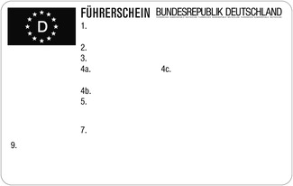
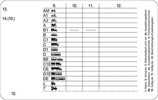
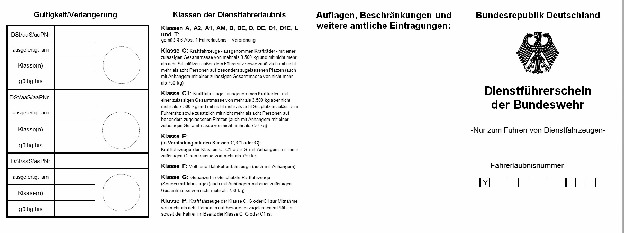
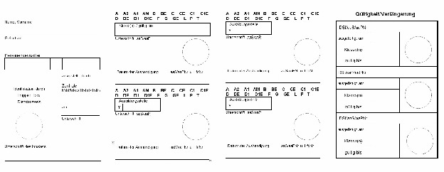
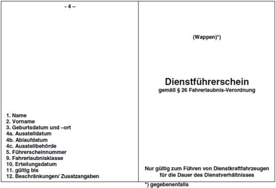
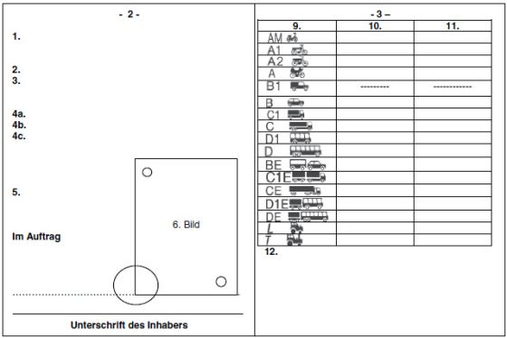

# Verordnung über die Zulassung von Personen zum Straßenverkehr (FeV 2010)

Ausfertigungsdatum
:   2010-12-13

Fundstelle
:   BGBl I: 2010, 1980

Zuletzt geändert durch
:   Art. 12 G v. 12.7.2021 I 3091

Mittelbare änderung durch
:   Art. 154a Nr. 3 Buchst. a G v. 20.11.2019 I 1626 (Nr. 41) ist nicht ausführbar, da das geänderte G v. 21.6.2019 I 846 zum Zeitpunkt des Inkrafttretens des mittelbaren Änderungsgesetzes bereits zum 1.11.2019 in Kraft getreten war

## Eingangsformel

Das Bundesministerium für Verkehr, Bau und Stadtentwicklung verordnet
auf Grund des

–   § 6 Absatz 1 Nummer 1, Nummer 3 Buchstabe c und Nummer 7, § 6e Absatz
    1, § 30c Absatz 1 sowie § 63 des Straßenverkehrsgesetzes in der
    Fassung der Bekanntmachung vom 5. März 2003 (BGBl. I S. 310, 919), von
    denen § 6 Absatz 1 Nummer 1 zuletzt durch Artikel 1 Nummer 2 des
    Gesetzes vom 17. Juli 2009 (BGBl. I S. 2021), § 6e und § 30c durch
    Artikel 2 Nummer 4 des Gesetzes vom 14. August 2006 (BGBl. I S. 1958)
    und § 63 durch Artikel 2 Nummer 3 des Gesetzes vom 14. August 2006
    (BGBl. I S. 1958) geändert worden ist,

–   § 6 Absatz 1 Nummer 1 Buchstabe f in Verbindung mit Absatz 2a des
    Straßenverkehrsgesetzes in der Fassung der Bekanntmachung vom 5. März
    2003 (BGBl. I S. 310, 919), von denen § 6 Absatz 2a durch Artikel 2
    Nummer 4 des Gesetzes vom 14. August 2006 (BGBl. I S. 1958) geändert
    worden ist, gemeinsam mit dem Bundesministerium für Umwelt,
    Naturschutz und Reaktorsicherheit:

## I. - Allgemeine Regelungen für die Teilnahme am Straßenverkehr

### § 1 Grundregel der Zulassung

Zum Verkehr auf öffentlichen Straßen ist jeder zugelassen, soweit
nicht für die Zulassung zu einzelnen Verkehrsarten eine Erlaubnis
vorgeschrieben ist.

### § 2 Eingeschränkte Zulassung

(1) Wer sich infolge körperlicher oder geistiger Beeinträchtigungen
nicht sicher im Verkehr bewegen kann, darf am Verkehr nur teilnehmen,
wenn Vorsorge getroffen ist, dass er andere nicht gefährdet. Die
Pflicht zur Vorsorge, namentlich durch das Anbringen geeigneter
Einrichtungen an Fahrzeugen, durch den Ersatz fehlender Gliedmaßen
mittels künstlicher Glieder, durch Begleitung oder durch das Tragen
von Abzeichen oder Kennzeichen, obliegt dem Verkehrsteilnehmer selbst
oder einem für ihn Verantwortlichen.

(2) Körperlich Behinderte können ihre Behinderung durch gelbe
Armbinden an beiden Armen oder andere geeignete, deutlich sichtbare,
gelbe Abzeichen mit drei schwarzen Punkten kenntlich machen. Die
Abzeichen dürfen nicht an Fahrzeugen angebracht werden. Wesentlich
sehbehinderte Fußgänger können ihre Behinderung durch einen weißen
Blindenstock, die Begleitung durch einen Blindenhund im weißen
Führgeschirr und gelbe Abzeichen nach Satz 1 kenntlich machen.

(3) Andere Verkehrsteilnehmer dürfen die in Absatz 2 genannten
Kennzeichen im Straßenverkehr nicht verwenden.

### § 3 Einschränkung und Entziehung der Zulassung

(1) Erweist sich jemand als ungeeignet oder nur noch bedingt geeignet
zum Führen von Fahrzeugen oder Tieren, hat die Fahrerlaubnisbehörde
ihm das Führen zu untersagen, zu beschränken oder die erforderlichen
Auflagen anzuordnen. Nach der Untersagung, auf öffentlichen Straßen
ein Mofa nach § 4 Absatz 1 Satz 2 Nummer 1 oder ein Kraftfahrzeug nach
§ 4 Absatz 1 Satz 2 Nummer 1b zu führen, ist die Prüfbescheinigung
nach § 5 Absatz 4 Satz 1 unverzüglich der entscheidenden Behörde
abzuliefern oder bei Beschränkungen oder Auflagen zur Eintragung
vorzulegen. Die Verpflichtung zur Ablieferung oder Vorlage der
Prüfbescheinigung besteht auch, wenn die Entscheidung angefochten
worden ist, die zuständige Behörde jedoch die sofortige Vollziehung
ihrer Verfügung angeordnet hat.

(2) Rechtfertigen Tatsachen die Annahme, dass der Führer eines
Fahrzeugs oder Tieres zum Führen ungeeignet oder nur noch bedingt
geeignet ist, finden die Vorschriften der §§ 11 bis 14 entsprechend
Anwendung.

## II. - Führen von Kraftfahrzeugen

### 1. - Allgemeine Regelungen

#### § 4 Erlaubnispflicht und Ausweispflicht für das Führen von Kraftfahrzeugen

(1) Wer auf öffentlichen Straßen ein Kraftfahrzeug führt, bedarf der
Fahrerlaubnis. Ausgenommen sind

1.  einspurige Fahrräder mit Hilfsmotor – auch ohne Tretkurbeln –, wenn
    ihre Bauart Gewähr dafür bietet, dass die Höchstgeschwindigkeit auf
    ebener Bahn nicht mehr als 25 km/h beträgt (Mofas); besondere Sitze
    für die Mitnahme von Kindern unter sieben Jahren dürfen jedoch
    angebracht sein,

1a. Elektrokleinstfahrzeuge nach § 1 Absatz 1 der Elektrokleinstfahrzeuge-
    Verordnung,

1b. zweirädrige Kraftfahrzeuge der Klasse L1e-B und dreirädrige
    Kraftfahrzeuge der Klassen L2e-P und L2e-U nach Artikel 4 Absatz 2
    Buchstabe a und b der Verordnung (EU) Nr. 168/2013 des Europäischen
    Parlaments und des Rates vom 15. Januar 2013 über die Genehmigung und
    Marktüberwachung von zwei- oder dreirädrigen und vierrädrigen
    Fahrzeugen (ABl. L 60 vom 2.3.2013, S. 52) oder nicht EU-typgenehmigte
    Fahrzeuge mit den jeweils gleichen technischen Eigenschaften, wenn
    ihre Bauart Gewähr dafür bietet, dass die Höchstgeschwindigkeit auf
    ebener Bahn auf höchstens 25 km/h beschränkt ist,

2.  motorisierte Krankenfahrstühle (einsitzige, nach der Bauart zum
    Gebrauch durch körperlich behinderte Personen bestimmte Kraftfahrzeuge
    mit Elektroantrieb, einer Leermasse von nicht mehr als 300 kg
    einschließlich Batterien jedoch ohne Fahrer, einer zulässigen
    Gesamtmasse von nicht mehr als 500 kg, einer bauartbedingten
    Höchstgeschwindigkeit von nicht mehr als 15 km/h und einer Breite über
    alles von maximal 110 cm),

3.  Zugmaschinen, die nach ihrer Bauart für die Verwendung land- oder
    forstwirtschaftlicher Zwecke bestimmt sind, selbstfahrende
    Arbeitsmaschinen, Stapler und andere Flurförderzeuge jeweils mit einer
    durch die Bauart bestimmten Höchstgeschwindigkeit von nicht mehr als 6
    km/h sowie einachsige Zug- und Arbeitsmaschinen, die von Fußgängern an
    Holmen geführt werden.

(2) Die Fahrerlaubnis ist durch eine gültige amtliche Bescheinigung
(Führerschein) nachzuweisen. Beim Führen eines Kraftfahrzeuges ist ein
dafür gültiger Führerschein mitzuführen und zuständigen Personen auf
Verlangen zur Prüfung auszuhändigen. Der Internationale Führerschein
oder der nationale ausländische Führerschein und eine mit diesem nach
§ 29 Absatz 2 Satz 2 verbundene Übersetzung ist mitzuführen und
zuständigen Personen auf Verlangen zur Prüfung auszuhändigen.

(3) Abweichend von Absatz 2 Satz 1 kann die Fahrerlaubnis auch durch
eine andere Bescheinigung als den Führerschein nachgewiesen werden,
soweit dies ausdrücklich bestimmt oder zugelassen ist. Absatz 2 Satz 2
gilt für eine Bescheinigung im Sinne des Satzes 1 entsprechend.

#### § 5 Sonderbestimmungen für das Führen von Mofas und geschwindigkeitsbeschränkten Kraftfahrzeugen

(1) Wer auf öffentlichen Straßen ein Mofa (§ 4 Absatz 1 Satz 2 Nummer
1) oder ein Kraftfahrzeug, das den Bestimmungen des § 4 Absatz 1 Satz
2 Nummer 1b entspricht, führt, muss in einer Prüfung nachgewiesen
haben, dass er

1.  ausreichende Kenntnisse der für das Führen eines Kraftfahrzeugs
    maßgebenden gesetzlichen Vorschriften hat und

2.  mit den Gefahren des Straßenverkehrs und den zu ihrer Abwehr
    erforderlichen Verhaltensweisen vertraut ist.

Die Prüfung muss nicht ablegen, wer eine Fahrerlaubnis nach § 4 oder
eine zum Führen von Kraftfahrzeugen im Inland berechtigende
ausländische Erlaubnis besitzt. Die zuständige oberste Landesbehörde
oder die von ihr bestimmte oder nach Landesrecht zuständige Stelle
bestimmt die prüfende Stelle.

(2) Der Bewerber wird zur Prüfung zugelassen, wenn er von einem zur
Ausbildung berechtigten Fahrlehrer entsprechend den
Mindestanforderungen der Anlage 1 ausgebildet worden ist und hierüber
der prüfenden Stelle eine Bescheinigung nach dem Muster in Anlage 2
vorlegt. Ein Fahrlehrer ist zu der Ausbildung berechtigt, wenn er die
Fahrlehrerlaubnis der Klasse A besitzt. § 1 Absatz 4 Satz 1 des
Fahrlehrergesetzes gilt entsprechend. Der Fahrlehrer darf die
Ausbildungsbescheinigung nur ausstellen, wenn er eine Ausbildung
durchgeführt hat, die den Mindestanforderungen der Anlage 1
entspricht.

(3) Die zuständige oberste Landesbehörde oder die von ihr bestimmte
oder nach Landesrecht zuständige Stelle kann als Träger der Ausbildung
im Sinne des Absatzes 2 Satz 1 öffentliche Schulen oder private
Ersatzschulen anerkennen. In diesem Fall hat der Bewerber der
prüfenden Stelle eine Ausbildungsbescheinigung einer nach Satz 1
anerkannten Schule vorzulegen, aus der hervorgeht, dass er an einem
anerkannten Ausbildungskurs in der Schule teilgenommen hat.

(4) Die prüfende Stelle hat über die bestandene Prüfung eine
Prüfbescheinigung zum Führen von Mofas und zwei- und dreirädriger
Kraftfahrzeuge bis 25 km/h nach Anlage 2 auszufertigen. Die
Bescheinigung ist beim Führen eines Mofas nach § 4 Absatz 1 Satz 2
Nummer 1 oder eines Kraftfahrzeugs nach § 4 Absatz 1 Satz 2 Nummer 1b
mitzuführen und zuständigen Personen auf Verlangen zur Prüfung
auszuhändigen. Für die Inhaber einer Fahrerlaubnis gilt § 4 Absatz 2
Satz 2 entsprechend.

(5) Wer die Prüfung noch nicht abgelegt hat, darf ein Mofa nach § 4
Absatz 1 Satz 2 Nummer 1 oder ein Kraftfahrzeug nach § 4 Absatz 1 Satz
2 Nummer 1b auf öffentlichen Straßen führen, wenn er von einem zur
Ausbildung berechtigten Fahrlehrer beaufsichtigt wird; der Fahrlehrer
gilt als Führer des Fahrzeugs.

#### § 6 Einteilung der Fahrerlaubnisklassen

(1) Die Fahrerlaubnis wird in folgenden Klassen erteilt:

Klasse AM:
    –   leichte zweirädrige Kraftfahrzeuge der Klasse L1e-B nach Artikel 4
        Absatz 2 Buchstabe a der Verordnung (EU) Nr. 168/2013 des Europäischen
        Parlaments und des Rates vom 15. Januar 2013 über die Genehmigung und
        Marktüberwachung von zwei- oder dreirädrigen und vierrädrigen
        Fahrzeugen (ABl. L 60 vom 2.3.2013, S. 52),

    –   dreirädrige Kleinkrafträder der Klasse L2e nach Artikel 4 Absatz 2
        Buchstabe b der Verordnung (EU) Nr. 168/2013 des Europäischen
        Parlaments und des Rates vom 15. Januar 2013 über die Genehmigung und
        Marktüberwachung von zwei- oder dreirädrigen und vierrädrigen
        Fahrzeugen (ABl. L 60 vom 2.3.2013, S. 52),

    –   leichte vierrädrige Kraftfahrzeuge der Klasse L6e nach Artikel 4
        Absatz 2 Buchstabe f der Verordnung (EU) Nr. 168/2013 des Europäischen
        Parlaments und des Rates vom 15. Januar 2013 über die Genehmigung und
        Marktüberwachung von zwei- oder dreirädrigen und vierrädrigen
        Fahrzeugen (ABl. L 60 vom 2.3.2013, S. 52).

Klasse A1:
    –   Krafträder (auch mit Beiwagen) mit einem Hubraum von bis zu 125 cm
        3                         , einer Motorleistung von nicht mehr als 11
        kW, bei denen das Verhältnis der Leistung zum Gewicht 0,1 kW/kg nicht
        übersteigt,

    –   dreirädrige Kraftfahrzeuge mit symmetrisch angeordneten Rädern und
        einem Hubraum von mehr als 50 cm
        3                          bei Verbrennungsmotoren oder einer
        bauartbedingten Höchstgeschwindigkeit von mehr als 45 km/h und mit
        einer Leistung von bis zu 15 kW.

Klasse A2: Krafträder (auch mit Beiwagen) mit

    a)  einer Motorleistung von nicht mehr als 35 kW und

    b)  einem Verhältnis der Leistung zum Gewicht von nicht mehr als 0,2
        kW/kg,

    die nicht von einem Kraftrad mit einer Leistung von über 70 kW
    Motorleistung abgeleitet sind.

Klasse A:
    –   Krafträder (auch mit Beiwagen) mit einem Hubraum von mehr als 50 cm
        3                          oder mit einer durch die Bauart bestimmten
        Höchstgeschwindigkeit von mehr als 45 km/h und

    –   dreirädrige Kraftfahrzeuge mit einer Leistung von mehr als 15 kW und
        dreirädrige Kraftfahrzeuge mit symmetrisch angeordneten Rädern und
        einem Hubraum von mehr als 50 cm
        3                          bei Verbrennungsmotoren oder einer
        bauartbedingten Höchstgeschwindigkeit von mehr als 45 km/h und mit
        einer Leistung von mehr als 15 kW.

Klasse B: Kraftfahrzeuge – ausgenommen Kraftfahrzeuge der Klassen AM, A1, A2 und
    A – mit einer zulässigen Gesamtmasse von nicht mehr als 3 500 kg, die
    zur Beförderung von nicht mehr als acht Personen außer dem
    Fahrzeugführer ausgelegt und gebaut sind (auch mit Anhänger mit einer
    zulässigen Gesamtmasse von nicht mehr als 750 kg oder mit Anhänger
    über 750 kg zulässiger Gesamtmasse, sofern 3 500 kg zulässige
    Gesamtmasse der Kombination nicht überschritten wird).

Klasse BE: Fahrzeugkombinationen, die aus einem Zugfahrzeug der Klasse B und
    einem Anhänger oder Sattelanhänger bestehen, sofern die zulässige
    Gesamtmasse des Anhängers oder Sattelanhängers 3 500 kg nicht
    übersteigt.

Klasse C1: Kraftfahrzeuge, ausgenommen Kraftfahrzeuge der Klassen AM, A1, A2, A,
    D1 und D, mit einer zulässigen Gesamtmasse von mehr als 3 500 kg, aber
    nicht mehr als 7 500 kg, und die zur Beförderung von nicht mehr als
    acht Personen außer dem Fahrzeugführer ausgelegt und gebaut sind (auch
    mit Anhänger mit einer zulässigen Gesamtmasse von nicht mehr als 750
    kg).

Klasse C1E: Fahrzeugkombinationen, die aus einem Zugfahrzeug

    –   der Klasse C1 und einem Anhänger oder Sattelanhänger mit einer
        zulässigen Gesamtmasse von mehr als 750 kg bestehen, sofern die
        zulässige Gesamtmasse der Fahrzeugkombination 12 000 kg nicht
        übersteigt,

    –   der Klasse B und einem Anhänger oder Sattelanhänger mit einer
        zulässigen Gesamtmasse von mehr als 3 500 kg bestehen, sofern die
        zulässige Gesamtmasse der Fahrzeugkombination 12 000 kg nicht
        übersteigt.

Klasse C: Kraftfahrzeuge, ausgenommen Kraftfahrzeuge der Klassen AM, A1, A2, A,
    D1 und D, mit einer zulässigen Gesamtmasse von mehr als 3 500 kg, die
    zur Beförderung von nicht mehr als acht Personen außer dem
    Fahrzeugführer ausgelegt und gebaut sind (auch mit Anhänger mit einer
    zulässigen Gesamtmasse von nicht mehr als 750 kg).

Klasse CE: Fahrzeugkombinationen, die aus einem Zugfahrzeug der Klasse C und
    Anhängern oder einem Sattelanhänger mit einer zulässigen Gesamtmasse
    von mehr als 750 kg bestehen.

Klasse D1: Kraftfahrzeuge, ausgenommen Kraftfahrzeuge der Klassen AM, A1, A2, A,
    die zur Beförderung von nicht mehr als 16 Personen außer dem
    Fahrzeugführer ausgelegt und gebaut sind und deren Länge nicht mehr
    als 8 m beträgt (auch mit Anhänger mit einer zulässigen Gesamtmasse
    von nicht mehr als 750 kg).

Klasse D1E: Fahrzeugkombinationen, die aus einem Zugfahrzeug der Klasse D1 und
    einem Anhänger mit einer zulässigen Gesamtmasse von mehr als 750 kg
    bestehen.

Klasse D: Kraftfahrzeuge, ausgenommen Kraftfahrzeuge der Klassen AM, A1, A2, A,
    die zur Beförderung von mehr als acht Personen außer dem
    Fahrzeugführer ausgelegt und gebaut sind (auch mit Anhänger mit einer
    zulässigen Gesamtmasse von nicht mehr als 750 kg).

Klasse DE: Fahrzeugkombinationen, die aus einem Zugfahrzeug der Klasse D und
    einem Anhänger mit einer zulässigen Gesamtmasse von mehr als 750 kg
    bestehen.

Klasse T: Zugmaschinen mit einer durch die Bauart bestimmten
    Höchstgeschwindigkeit von nicht mehr als 60 km/h und selbstfahrende
    Arbeitsmaschinen oder selbstfahrende Futtermischwagen mit einer durch
    die Bauart bestimmten Höchstgeschwindigkeit von nicht mehr als 40
    km/h, die jeweils nach ihrer Bauart zur Verwendung für land- oder
    forstwirtschaftliche Zwecke bestimmt sind und für solche Zwecke
    eingesetzt werden (jeweils auch mit Anhängern).

Klasse L: Zugmaschinen, die nach ihrer Bauart zur Verwendung für land- oder
    forstwirtschaftliche Zwecke bestimmt sind und für solche Zwecke
    eingesetzt werden, mit einer durch die Bauart bestimmten
    Höchstgeschwindigkeit von nicht mehr als 40 km/h und Kombinationen aus
    diesen Fahrzeugen und Anhängern, wenn sie mit einer Geschwindigkeit
    von nicht mehr als 25 km/h geführt werden, sowie selbstfahrende
    Arbeitsmaschinen, selbstfahrende Futtermischwagen, Stapler und andere
    Flurförderzeuge jeweils mit einer durch die Bauart bestimmten
    Höchstgeschwindigkeit von nicht mehr als 25 km/h und Kombinationen aus
    diesen Fahrzeugen und Anhängern.

Die zulässige Gesamtmasse einer Fahrzeugkombination errechnet sich aus
der Summe der zulässigen Gesamtmasse der Einzelfahrzeuge ohne
Berücksichtigung von Stütz- und Aufliegelasten. Die Erlaubnis kann auf
einzelne Fahrzeugarten dieser Klassen beschränkt werden. Beim
Abschleppen eines Kraftfahrzeugs genügt die Fahrerlaubnis für die
Klasse des abschleppenden Fahrzeugs.

(2) Zugmaschinen der Klasse T mit einer durch die Bauart bestimmten
Höchstgeschwindigkeit von mehr als 40 km/h dürfen nur von Inhabern
einer Fahrerlaubnis der Klasse T geführt werden, die das 18.
Lebensjahr vollendet haben; dies gilt nicht bei der Rückfahrt von der
praktischen Befähigungsprüfung, sofern der Inhaber der Fahrerlaubnis
dabei von einem Fahrlehrer begleitet wird, sowie bei Fahrproben nach §
42 im Rahmen von Aufbauseminaren und auf Grund von Anordnungen nach §
46\.

(3) Außerdem berechtigt

1.  die Fahrerlaubnis der Klasse A zum Führen von Fahrzeugen der Klassen
    AM, A1 und A2,

2.  die Fahrerlaubnis der Klasse A2 zum Führen von Fahrzeugen der Klassen
    A1 und AM,

3.  die Fahrerlaubnis der Klasse A1 zum Führen von Fahrzeugen der Klasse
    AM

4.  die Fahrerlaubnis der Klasse B zum Führen von Fahrzeugen der Klassen
    AM und L,

5.  die Fahrerlaubnis der Klasse C zum Führen von Fahrzeugen der Klasse
    C1,

6.  die Fahrerlaubnis der Klasse CE zum Führen von Fahrzeugen der Klassen
    C1E, BE und T sowie DE, sofern er zum Führen von Fahrzeugen der Klasse
    D berechtigt ist,

7.  die Fahrerlaubnis der Klasse C1E zum Führen von Fahrzeugen der Klassen
    BE sowie D1E, sofern der Inhaber zum Führen von Fahrzeugen der Klasse
    D1 berechtigt ist,

8.  die Fahrerlaubnis der Klasse D zum Führen von Fahrzeugen der Klasse
    D1,

9.  die Fahrerlaubnis der Klasse D1E zum Führen von Fahrzeugen der Klasse
    BE,

10. die Fahrerlaubnis der Klasse DE zum Führen von Fahrzeugen der Klassen
    D1E und BE,

11. die Fahrerlaubnis der Klasse T zum Führen von Fahrzeugen der Klassen
    AM und L.

Satz 1 Nummer 1 gilt nicht für eine Fahrerlaubnis der Klasse A, die
unter Verwendung der Schlüsselzahl 79.03 oder 79.04 erteilt worden
ist.

(3a) Die Fahrerlaubnis der Klasse B berechtigt auch zum Führen von
dreirädrigen Kraftfahrzeugen im Inland, im Falle eines Kraftfahrzeugs
mit einer Motorleistung von mehr als 15 kW jedoch nur, soweit der
Inhaber der Fahrerlaubnis mindestens 21 Jahre alt ist.

(3b) Die Fahrerlaubnis der Klasse B berechtigt im Inland, sofern der
Inhaber diese seit mindestens zwei Jahren besitzt, auch zum Führen von
Fahrzeugen

–   die ganz oder teilweise mit

    a)  Strom,

    b)  Wasserstoff,

    c)  Erdgas, einschließlich Biomethan, gasförmig (komprimiertes Erdgas –
        CNG) und flüssig (Flüssigerdgas – LNG),

    d)  Flüssiggas (LPG),

    e)  mechanischer Energie aus bordeigenen Speichern/bordeigenen Quellen,
        einschließlich Abwärme,

alternativ angetrieben werden,

–   mit einer Gesamtmasse von mehr als 3 500 kg, jedoch nicht mehr als
    4 250 kg,

–   für die Güterbeförderung und

–   ohne Anhänger,

sofern

–   die 3 500 kg überschreitende Masse ausschließlich dem zusätzlichen
    Gewicht des Antriebssystems gegenüber dem Antriebssystem eines
    Fahrzeugs mit denselben Abmessungen, das mit einem herkömmlichen
    Verbrennungsmotor mit Fremd- oder Selbstzündung ausgestattet ist,
    geschuldet ist und

–   die Ladekapazität gegenüber diesem Fahrzeug nicht erhöht ist.

(4) Fahrerlaubnisse der Klassen C, C1, CE oder C1E berechtigen im
Inland auch zum Führen von Kraftomnibussen – gegebenenfalls mit
Anhänger – mit einer entsprechenden zulässigen Gesamtmasse und ohne
Fahrgäste, wenn die Fahrten lediglich zur Überprüfung des technischen
Zustands des Fahrzeugs dienen.

(4a) Eine Fahrerlaubnis der Klasse C1 berechtigt auch zum Führen von
Fahrzeugen mit einer zulässigen Gesamtmasse von mehr als 3 500 kg,
aber nicht mehr als 7 500 kg, und die zur Beförderung von nicht mehr
als acht Personen außer dem Fahrzeugführer ausgelegt und gebaut sind
mit insbesondere folgender, für die Genehmigung der Fahrzeugtypen
maßgeblicher, besonderer Zweckbestimmung:

1.  Einsatzfahrzeuge der Feuerwehr,

2.  Einsatzfahrzeuge der Polizei,

3.  Einsatzfahrzeuge der nach Landesrecht anerkannten Rettungsdienste,

4.  Einsatzfahrzeuge des Technischen Hilfswerks,

5.  Einsatzfahrzeuge sonstiger Einheiten des Katastrophenschutzes,

6.  Krankenkraftwagen,

7.  Notarzteinsatz- und Sanitätsfahrzeuge,

8.  Beschussgeschützte Fahrzeuge,

9.  Post, Funk- und Fernmeldefahrzeuge,

10. Spezialisierte Verkaufswagen,

11. Rollstuhlgerechte Fahrzeuge,

12. Leichenwagen und

13. Wohnmobile.

Satz 1 gilt für die Fahrerlaubnis der Klassen C1E, C und CE
entsprechend.

(5) Unter land- oder forstwirtschaftliche Zwecke im Rahmen der
Fahrerlaubnis der Klassen T und L fallen

1.  Betrieb von Landwirtschaft, Forstwirtschaft, Weinbau, Gartenbau,
    Obstbau, Gemüsebau, Baumschulen, Tierzucht, Tierhaltung, Fischzucht,
    Teichwirtschaft, Fischerei, Imkerei, Jagd sowie den Zielen des Natur-
    und Umweltschutzes dienende Landschaftspflege,

2.  Park-, Garten-, Böschungs- und Friedhofspflege,

3.  landwirtschaftliche Nebenerwerbstätigkeit und Nachbarschaftshilfe von
    Landwirten,

4.  Betrieb von land- und forstwirtschaftlichen Lohnunternehmen und andere
    überbetriebliche Maschinenverwendung,

5.  Betrieb von Unternehmen, die unmittelbar der Sicherung, Überwachung
    und Förderung der Landwirtschaft überwiegend dienen,

6.  Betrieb von Werkstätten zur Reparatur, Wartung und Prüfung von
    Fahrzeugen sowie Probefahrten der Hersteller von Fahrzeugen, die
    jeweils im Rahmen der Nummern 1 bis 5 eingesetzt werden, und

7.  Winterdienst.

(6) Fahrerlaubnisse, die bis zum Ablauf des 15. Juli 2019 erteilt
worden sind (Fahrerlaubnisse alten Rechts) bleiben im Umfang der
bisherigen Berechtigungen, wie er sich aus der Anlage 3 ergibt,
bestehen und erstrecken sich vorbehaltlich der Bestimmungen in § 76
auf den Umfang der ab dem 16. Juli 2019 geltenden Fahrerlaubnisse nach
Absatz 1. Auf Antrag wird Inhabern von Fahrerlaubnissen alten Rechts
ein neuer Führerschein mit Umstellung auf die neuen
Fahrerlaubnisklassen entsprechend Satz 1 ausgefertigt.

(7) (weggefallen)

#### § 6a Fahrerlaubnis der Klasse B mit der Schlüsselzahl 96

(1) Die Fahrerlaubnis der Klasse B kann mit der Schlüsselzahl 96
erteilt werden für Fahrzeugkombinationen bestehend aus einem
Kraftfahrzeug der Klasse B und einem Anhänger mit einer zulässigen
Gesamtmasse von mehr als 750 kg, sofern die zulässige Gesamtmasse der
Fahrzeugkombination 3 500 kg überschreitet, aber 4 250 kg nicht
übersteigt. Die Schlüsselzahl 96 darf nur zugeteilt werden, wenn der
Bewerber bereits die Fahrerlaubnis der Klasse B besitzt oder die
Voraussetzungen für deren Erteilung erfüllt hat; in diesem Fall darf
die Schlüsselzahl 96 frühestens mit der Fahrerlaubnis für die Klasse B
zugeteilt werden.

(2) Das Mindestalter für die Erteilung der Fahrerlaubnis der Klasse B
mit der Schlüsselzahl 96 beträgt 18 Jahre, im Fall des Begleiteten
Fahrens ab 17 Jahre nach § 48a 17 Jahre.

(3) Für die Eintragung der Schlüsselzahl 96 in die Fahrerlaubnis der
Klasse B bedarf es einer Fahrerschulung. Die Inhalte der
Fahrerschulung ergeben sich aus Anlage 7a.

(4) Beim Antrag auf Eintragung der Schlüsselzahl 96 in die Klasse B
ist vor deren Eintragung der Nachweis einer Fahrerschulung nach dem
Muster nach Anlage 7a beizubringen.

#### § 6b Fahrerlaubnis der Klasse B mit der Schlüsselzahl 196

(1) Die Fahrerlaubnis der Klasse B kann mit der Schlüsselzahl 196
erteilt werden für Krafträder(auch mit Beiwagen) mit einem Hubraum von
bis zu 125 cm
3             , einer Motorleistung von nicht mehr als 11 kW, bei
denen das Verhältnis der Leistung zum Gewicht 0,1 kW/kg nicht
übersteigt. Die Schlüsselzahl 196 darf nur zugeteilt werden, wenn der
Teilnehmer bereits seit mindestens fünf Jahren die Fahrerlaubnis der
Klasse B besitzt. Die Regelungen der Anlage 3 bleiben unberührt. Die
Berechtigung nach Satz 1 gilt nur im Inland.

(2) Das Mindestalter für die Erteilung der Fahrerlaubnis der Klasse B
mit der Schlüsselzahl 196 beträgt 25 Jahre.

(3) Für die Eintragung der Schlüsselzahl 196 in die Fahrerlaubnis der
Klasse B bedarf es einer Fahrerschulung. Die Inhalte der
Fahrerschulung ergeben sich aus der Anlage 7b.

(4) Beim Antrag auf Eintragung der Schlüsselzahl 196 in die Klasse B
ist vor deren Eintragung der Nachweis einer Fahrerschulung nach dem
Muster nach Anlage 7b beizubringen.

(5) Der Zeitraum zwischen dem Abschluss der Fahrerschulung und der
Eintragung der Schlüsselzahl 196 darf ein Jahr nicht überschreiten.

(6) Die Auswirkungen der Absätze 1 bis 5 werden von der Bundesanstalt
für Straßenwesen evaluiert. Mit der Evaluierung wird insbesondere die
Wirkung im Hinblick auf die Verkehrssicherheit untersucht. Die
Bundesanstalt für Straßenwesen legt das Ergebnis der Evaluierung bis
zum 1. Juli 2022 dem Bundesministerium für Verkehr und digitale
Infrastruktur vor. Für Zwecke der Evaluation dürfen personenbezogene
Daten der Teilnehmer nach Maßgabe des Bundesdatenschutzgesetzes
erhoben und verwendet werden. Die Daten sind spätestens am 31.
Dezember 2023 zu löschen oder so zu anonymisieren oder zu
pseudonymisieren, dass ein Personenbezug nicht mehr hergestellt werden
kann.

#### § 6c Sonderbestimmungen für das Führen von Einsatzfahrzeugen der Freiwilligen Feuerwehren, der nach Landesrecht anerkannten Rettungsdienste, des Technischen Hilfswerks und des Katastrophenschutzes

Die Landesregierungen werden ermächtigt, durch Rechtsverordnung
besondere Bestimmungen zu erlassen über

1.  die Erteilung der Berechtigung zum Führen von Einsatzfahrzeugen der
    Freiwilligen Feuerwehren, der nach Landesrecht anerkannten
    Rettungsdienste, des Technischen Hilfswerks oder des
    Katastrophenschutzes auf öffentlichen Straßen nach § 2 Absatz 10a des
    Straßenverkehrsgesetzes,

2.  die Prüfung zur Erlangung dieser Berechtigung und

3.  die Einweisung in das Führen solcher Einsatzfahrzeuge.

Bei der näheren Ausgestaltung sind die Besonderheiten der
unterschiedlichen Gewichtsklassen der Fahrberechtigung nach § 2 Absatz
10a Satz 1 und 4 des Straßenverkehrsgesetzes zu berücksichtigen.

### 2. - Voraussetzungen für die Erteilung einer Fahrerlaubnis

#### § 7 Ordentlicher Wohnsitz im Inland

(1) Eine Fahrerlaubnis darf nur erteilt werden, wenn der Bewerber
seinen ordentlichen Wohnsitz in der Bundesrepublik Deutschland hat.
Dies wird angenommen, wenn der Bewerber wegen persönlicher und
beruflicher Bindungen oder – bei fehlenden beruflichen Bindungen –
wegen persönlicher Bindungen, die enge Beziehungen zwischen ihm und
dem Wohnort erkennen lassen, gewöhnlich, das heißt während mindestens
185 Tagen im Jahr, im Inland wohnt. Ein Bewerber, dessen persönliche
Bindungen im Inland liegen, der sich aber aus beruflichen Gründen in
einem oder mehreren anderen Staaten aufhält, hat seinen ordentlichen
Wohnsitz im Sinne dieser Vorschrift im Inland, sofern er regelmäßig
hierhin zurückkehrt. Die Voraussetzung entfällt, wenn sich der
Bewerber zur Ausführung eines Auftrags von bestimmter Dauer in einem
solchen Staat aufhält.

(2) Bewerber, die bislang ihren ordentlichen Wohnsitz im Inland hatten
und die sich ausschließlich zum Zwecke des Besuchs einer Hochschule
oder Schule in einem anderen Mitgliedstaat der Europäischen Union oder
einem anderen Vertragsstaat des Abkommens über den Europäischen
Wirtschaftsraum aufhalten, behalten ihren ordentlichen Wohnsitz im
Inland.

(3) Bewerber, die bislang ihren ordentlichen Wohnsitz in einem anderen
Mitgliedstaat der Europäischen Union oder einem anderen Vertragsstaat
des Abkommens über den Europäischen Wirtschaftsraum hatten und die
sich ausschließlich wegen des Besuchs einer Hochschule oder Schule im
Inland aufhalten, begründen keinen ordentlichen Wohnsitz im Inland.
Ihnen wird die Fahrerlaubnis erteilt, wenn die Dauer des Aufenthalts
mindestens sechs Monate beträgt.

#### § 8 Ausschluss des Vorbesitzes einer Fahrerlaubnis der beantragten Klasse

Eine Fahrerlaubnis der beantragten Klasse darf nur erteilt werden,
wenn der Bewerber keine in einem Mitgliedstaat der Europäischen Union
oder einem anderen Vertragsstaat des Abkommens über den Europäischen
Wirtschaftsraum erteilte Fahrerlaubnis (EU- oder EWR-Fahrerlaubnis)
dieser Klasse besitzt.

#### § 9 Voraussetzung des Vorbesitzes einer Fahrerlaubnis anderer Klassen

(1) Eine Fahrerlaubnis der Klassen C1, C, D1 oder D darf nur erteilt
werden, wenn der Bewerber bereits die Fahrerlaubnis der Klasse B
besitzt oder die Voraussetzungen für deren Erteilung erfüllt hat; in
diesem Fall darf die Fahrerlaubnis für die höhere Klasse frühestens
mit der Fahrerlaubnis der Klasse B erteilt werden.

(2) Eine Fahrerlaubnis der Klasse BE, C1E, CE, D1E oder DE darf nur
erteilt werden, wenn der Bewerber bereits die Fahrerlaubnis für das
ziehende Fahrzeug besitzt oder die Voraussetzungen für deren Erteilung
erfüllt hat; in diesem Fall darf die Fahrerlaubnis der Klasse BE, C1E,
CE, D1E oder DE frühestens mit der Fahrerlaubnis für das ziehende
Fahrzeug erteilt werden.

(3) Absatz 1 gilt auch im Fall des § 69a Absatz 2 des
Strafgesetzbuches.

#### § 10 Mindestalter

(1) Das für die Erteilung einer Fahrerlaubnis maßgebliche Mindestalter
bestimmt sich nach der folgenden Tabelle:

*    *   lfd
        Nr.

    *   Klasse

    *   Mindestalter

    *   Auflagen

*    *   1

    *   AM

    *   15 Jahre

    *   Bis zur Vollendung des 16. Lebensjahres ist die Fahrerlaubnis mit der
        Auflage zu versehen, dass von ihr nur bei Fahrten im Inland Gebrauch
        gemacht werden darf. Die Auflage entfällt, wenn der
        Fahrerlaubnisinhaber das 16. Lebensjahr vollendet hat.

*    *   2

    *   A1

    *   16 Jahre

    *

*    *   3

    *   A2

    *   18 Jahre

    *

*    *   4

    *   A

    *
        a)  24 Jahre für Krafträder bei direktem Zugang,

        b)  21 Jahre für dreirädrige Kraftfahrzeuge mit einer Leistung von mehr
            als 15 kW oder

        c)  20 Jahre für Krafträder bei einem Vorbesitz der Klasse A2 von
            mindestens zwei Jahren.

    *

*    *   5

    *   B, BE

    *
        a)  18 Jahre,

        b)  17 Jahre

            aa) bei der Teilnahme am Begleiteten Fahren ab 17 nach § 48a,

            bb) bei Erteilung der Fahrerlaubnis während oder nach Abschluss einer
                Berufsausbildung in

                aaa) dem staatlich anerkannten Ausbildungsberuf
                    „Berufskraftfahrer / Berufskraftfahrerin“,

                bbb) dem staatlich anerkannten Ausbildungsberuf „Fachkraft im Fahrbetrieb“
                    oder

                ccc) einem staatlich anerkannten Ausbildungsberuf, in dem vergleichbare
                    Fertigkeiten und Kenntnisse zum Führen von Kraftfahrzeugen auf
                    öffentlichen Straßen vermittelt werden.

    *   Bis zum Erreichen des nach Buchstabe a vorgeschriebenen Mindestalters
        ist die Fahrerlaubnis mit den Auflagen zu versehen, dass von ihr nur
        bei Fahrten im Inland und im Fall des Buchstaben b Doppelbuchstabe bb
        darüber hinaus nur im Rahmen des Ausbildungsverhältnisses Gebrauch
        gemacht werden darf. Die Auflagen entfallen, wenn der
        Fahrerlaubnisinhaber das Mindestalter nach Buchstabe a erreicht hat.

*    *   6

    *   C1, C1E

    *   18 Jahre

    *

*    *   7

    *   C, CE

    *
        a)  21 Jahre,

        b)  18 Jahre nach

            aa) erfolgter Grundqualifikation nach § 2 Absatz 1 Nummer 1 des
                Berufskraftfahrerqualifikationsgesetzes vom 26. November 2020 (BGBl. I
                S. 2575) in der jeweils geltenden Fassung,

            bb) für Personen während oder nach Abschluss einer Berufsausbildung nach

                aaa) dem staatlich anerkannten Ausbildungsberuf
                    „Berufskraftfahrer / Berufskraftfahrerin“,

                bbb) dem staatlich anerkannten Ausbildungsberuf „Fachkraft im Fahrbetrieb“
                    oder

                ccc) einem staatlich anerkannten Ausbildungsberuf, in dem vergleichbare
                    Fertigkeiten und Kenntnisse zum Führen von Kraftfahrzeugen auf
                    öffentlichen Straßen vermittelt werden.

    *   Im Falle des Buchstaben b Doppelbuchstabe bb ist die Fahrerlaubnis mit
        den Auflagen zu versehen, dass von ihr nur bei Fahrten im Inland und
        im Rahmen des Ausbildungsverhältnisses Gebrauch gemacht werden darf.
        Die Auflagen entfallen, wenn der Inhaber der Fahrerlaubnis das 21.
        Lebensjahr vollendet oder die Berufsausbildung nach Buchstabe b
        Doppelbuchstabe bb vor Vollendung des 21. Lebensjahres erfolgreich
        abgeschlossen hat.

*    *   8

    *   D1, D1E

    *
        a)  21 Jahre,

        b)  18 Jahre für Personen während oder nach Abschluss einer
            Berufsausbildung nach

            aa) dem staatlich anerkannten Ausbildungsberuf
                „Berufskraftfahrer/Berufskraftfahrerin“,

            bb) dem staatlich anerkannten Ausbildungsberuf „Fachkraft im Fahrbetrieb“
                oder

            cc) einem staatlich anerkannten Ausbildungsberuf, in dem vergleichbare
                Fertigkeiten und Kenntnisse zur Durchführung von Fahrten mit
                Kraftfahrzeugen auf öffentlichen Straßen vermittelt werden.

    *   Bis zum Erreichen des nach Buchstabe a vorgeschriebenen Mindestalters
        ist die Fahrerlaubnis mit den Auflagen zu versehen, dass von ihr nur

        1.  bei Fahrten im Inland und

        2.  im Rahmen des Ausbildungsverhältnisses

        Gebrauch gemacht werden darf. Die Auflage nach Nummer 1 entfällt, wenn
        der Fahrerlaubnisinhaber das Mindestalter nach Buchstabe a erreicht
        hat. Die Auflage nach Nummer 2 entfällt, wenn der Fahrerlaubnisinhaber
        das Mindestalter nach Buchstabe a erreicht oder die Ausbildung nach
        Buchstabe b abgeschlossen hat.

*    *   9

    *   D, DE

    *
        a)  24 Jahre,

        b)  23 Jahre nach beschleunigter Grundqualifikation durch Ausbildung und
            Prüfung nach § 2 Absatz 2 des Berufskraftfahrerqualifikationsgesetzes,

        c)  21 Jahre

            aa) nach erfolgter Grundqualifikation nach § 2 Absatz 1 Nummer 1 des
                Berufskraftfahrerqualifikationsgesetzes oder

            bb) nach beschleunigter Grundqualifikation durch Ausbildung und Prüfung
                nach § 2 Absatz 2 des Berufskraftfahrerqualifikationsgesetzes im
                Linienverkehr bis 50 km,

        d)  20 Jahre für Personen während oder nach Abschluss einer
            Berufsausbildung nach

            aa) dem staatlich anerkannten Ausbildungsberuf
                „Berufskraftfahrer/Berufskraftfahrerin“,

            bb) dem staatlich anerkannten Ausbildungsberuf „Fachkraft im Fahrbetrieb“
                oder

            cc) einem staatlich anerkannten Ausbildungsberuf, in dem vergleichbare
                Fertigkeiten und Kenntnisse zur Durchführung von Fahrten mit
                Kraftfahrzeugen auf öffentlichen Straßen vermittelt werden,

        e)  18 Jahre für Personen während oder nach Abschluss einer
            Berufsausbildung nach Buchstabe d im Linienverkehr bis 50 km,

        f)  18 Jahre für Personen während oder nach Abschluss einer
            Berufsausbildung nach Buchstabe d bei Fahrten ohne Fahrgäste.

    *
        1.  Im Falle des Buchstaben c Doppelbuchstabe bb ist die Fahrerlaubnis mit
            der Auflage zu versehen, dass von ihr nur bei Fahrten zur
            Personenbeförderung im Linienverkehr im Sinne der §§ 42, 43 und 44 des
            Personenbeförderungsgesetzes Gebrauch gemacht werden darf, sofern die
            Länge der jeweiligen Linie nicht mehr als 50 Kilometer beträgt. Die
            Auflage entfällt, wenn der Inhaber der Fahrerlaubnis das 23.
            Lebensjahr vollendet hat.

        2.  In den Fällen der Buchstaben d bis f ist die Fahrerlaubnis mit den
            Auflagen zu versehen, dass von ihr nur

            2.1 bei Fahrten im Inland,

            2.2 im Rahmen des Ausbildungsverhältnisses und

            2.3 bei Fahrten zur Personenbeförderung im Sinne der §§ 42, 43 und 44 des
                Personenbeförderungsgesetzes, soweit die Länge der jeweiligen Linie
                nicht mehr als 50 Kilometer beträgt oder bei Fahrten ohne Fahrgäste,

            Gebrauch gemacht werden darf. Die Auflage nach Nummer 2.1 entfällt,
            wenn der Fahrerlaubnisinhaber entweder das 24. Lebensjahr vollendet
            oder die Berufsausbildung abgeschlossen und das 21. Lebensjahr
            vollendet hat. Die Auflage nach Nummer 2.2 entfällt, wenn der
            Fahrerlaubnisinhaber entweder das 24. Lebensjahr vollendet oder die
            Berufsausbildung abgeschlossen hat. Die Auflage nach Nummer 2.3
            entfällt, wenn der Fahrerlaubnisinhaber das 20. Lebensjahr vollendet
            hat.

*    *   10

    *   T

    *   16 Jahre

    *

*    *   11

    *   L

    *   16 Jahre

    *

   Abweichend von den Nummern 7 und 9 der Tabelle in Satz 1 beträgt im
Inland das Mindestalter für das Führen von Fahrzeugen der Klasse C 18
Jahre und der Klasse D 21 Jahre im Falle

1.  von Einsatzfahrzeugen der Feuerwehr, der Polizei, der nach Landesrecht
    anerkannten Rettungsdienste, des Technischen Hilfswerks und sonstiger
    Einheiten des Katastrophenschutzes, sofern diese Fahrzeuge für
    Einsatzfahrten oder vom Vorgesetzten angeordnete Übungsfahrten sowie
    Schulungsfahrten eingesetzt werden, und

2.  von Fahrzeugen, die zu Reparatur- oder Wartungszwecken in gewerbliche
    Fahrzeugwerkstätten verbracht und dort auf Anweisung eines
    Vorgesetzten Prüfungen auf der Straße unterzogen werden.

(2) Die erforderliche körperliche und geistige Eignung ist vor
erstmaliger Erteilung einer Fahrerlaubnis, die nach Absatz 1 Nummer 5
Buchstabe b Doppelbuchstabe bb, Nummer 7 Buchstabe b, Nummer 8
Buchstabe b, Nummer 9 Buchstabe b, c, d, e oder f, auch in Verbindung
mit Absatz 1 Satz 2 Nummer 2 erworben wird, durch Vorlage eines
medizinisch-psychologischen Gutachtens nachzuweisen.

(3) Das Mindestalter für das Führen eines Kraftfahrzeugs, für das eine
Fahrerlaubnis nicht erforderlich ist, beträgt 15 Jahre. Dies gilt
nicht für das Führen

a)  eines Elektrokleinstfahrzeugs nach § 4 Absatz 1 Satz 2 Nummer 1a,

b)  eines motorisierten Krankenfahrstuhls nach § 4 Absatz 1 Satz 2 Nummer
    2 mit einer durch die Bauart bestimmten Höchstgeschwindigkeit von
    nicht mehr als 10 km/h durch behinderte Menschen.

(4) Wird ein Kind unter sieben Jahren auf einem Mofa nach § 4 Absatz 1
Satz 2 Nummer 1 oder auf einem Kleinkraftrad nach § 4 Absatz 1 Satz 2
Nummer 1b mitgenommen, muss der Fahrzeugführer mindestens 16 Jahre alt
sein.

#### § 11 Eignung

(1) Bewerber um eine Fahrerlaubnis müssen die hierfür notwendigen
körperlichen und geistigen Anforderungen erfüllen. Die Anforderungen
sind insbesondere nicht erfüllt, wenn eine Erkrankung oder ein Mangel
nach Anlage 4 oder 5 vorliegt, wodurch die Eignung oder die bedingte
Eignung zum Führen von Kraftfahrzeugen ausgeschlossen wird. Außerdem
dürfen die Bewerber nicht erheblich oder nicht wiederholt gegen
verkehrsrechtliche Vorschriften oder Strafgesetze verstoßen haben,
sodass dadurch die Eignung ausgeschlossen wird. Bewerber um die
Fahrerlaubnis der Klasse D oder D1 und der Fahrerlaubnis zur
Fahrgastbeförderung gemäß § 48 müssen auch die Gewähr dafür bieten,
dass sie der besonderen Verantwortung bei der Beförderung von
Fahrgästen gerecht werden. Der Bewerber hat diese durch die Vorlage
eines Führungszeugnisses nach § 30 Absatz 5 Satz 1 des
Bundeszentralregistergesetzes nachzuweisen.

(2) Werden Tatsachen bekannt, die Bedenken gegen die körperliche oder
geistige Eignung des Fahrerlaubnisbewerbers begründen, kann die
Fahrerlaubnisbehörde zur Vorbereitung von Entscheidungen über die
Erteilung oder Verlängerung der Fahrerlaubnis oder über die Anordnung
von Beschränkungen oder Auflagen die Beibringung eines ärztlichen
Gutachtens durch den Bewerber anordnen. Bedenken gegen die körperliche
oder geistige Eignung bestehen insbesondere, wenn Tatsachen bekannt
werden, die auf eine Erkrankung oder einen Mangel nach Anlage 4 oder 5
hinweisen. Die Behörde bestimmt in der Anordnung auch, ob das
Gutachten von einem

1.  für die Fragestellung (Absatz 6 Satz 1) zuständigen Facharzt mit
    verkehrsmedizinischer Qualifikation,

2.  Arzt des Gesundheitsamtes oder einem anderen Arzt der öffentlichen
    Verwaltung,

3.  Arzt mit der Gebietsbezeichnung „Arbeitsmedizin“ oder der
    Zusatzbezeichnung „Betriebsmedizin“,

4.  Arzt mit der Gebietsbezeichnung „Facharzt für Rechtsmedizin“ oder

5.  Arzt in einer Begutachtungsstelle für Fahreignung, der die
    Anforderungen nach Anlage 14 erfüllt,

erstellt werden soll. Die Behörde kann auch mehrere solcher
Anordnungen treffen. Der Facharzt nach Satz 3 Nummer 1 soll nicht
zugleich der den Betroffenen behandelnde Arzt sein.

(3) Die Beibringung eines Gutachtens einer amtlich anerkannten
Begutachtungsstelle für Fahreignung (medizinisch-psychologisches
Gutachten) kann zur Klärung von Eignungszweifeln für die Zwecke nach
Absatz 1 und 2 angeordnet werden,

1.  wenn nach Würdigung der Gutachten gemäß Absatz 2 oder Absatz 4 ein
    medizinisch-psychologisches Gutachten zusätzlich erforderlich ist,

2.  zur Vorbereitung einer Entscheidung über die Befreiung von den
    Vorschriften über das Mindestalter,

3.  bei erheblichen Auffälligkeiten, die im Rahmen einer
    Fahrerlaubnisprüfung nach § 18 Absatz 3 mitgeteilt worden sind,

4.  bei einem erheblichen Verstoß oder wiederholten Verstößen gegen
    verkehrsrechtliche Vorschriften,

5.  bei einer erheblichen Straftat, die im Zusammenhang mit dem
    Straßenverkehr steht, oder bei Straftaten, die im Zusammenhang mit dem
    Straßenverkehr stehen,

6.  bei einer erheblichen Straftat, die im Zusammenhang mit der
    Kraftfahreignung steht, insbesondere wenn Anhaltspunkte für ein hohes
    Aggressionspotenzial bestehen oder die erhebliche Straftat unter
    Nutzung eines Fahrzeugs begangen wurde,

7.  bei Straftaten, die im Zusammenhang mit der Kraftfahreignung stehen,
    insbesondere wenn Anhaltspunkte für ein hohes Aggressionspotenzial
    bestehen,

8.  wenn die besondere Verantwortung bei der Beförderung von Fahrgästen
    nach Absatz 1 zu überprüfen ist oder

9.  bei der Neuerteilung der Fahrerlaubnis, wenn

    a)  die Fahrerlaubnis wiederholt entzogen war oder

    b)  der Entzug der Fahrerlaubnis auf einem Grund nach den Nummern 4 bis 7
        beruhte.

Unberührt bleiben medizinisch-psychologische Begutachtungen nach § 2a
Absatz 4 und 5 und § 4 Absatz 10 Satz 4 des Straßenverkehrsgesetzes
sowie § 10 Absatz 2 und den §§ 13 und 14 in Verbindung mit den Anlagen
4 und 5 dieser Verordnung.

(4) Die Beibringung eines Gutachtens eines amtlich anerkannten
Sachverständigen oder Prüfers für den Kraftfahrzeugverkehr kann zur
Klärung von Eignungszweifeln für die Zwecke nach Absatz 2 angeordnet
werden,

1.  wenn nach Würdigung der Gutachten gemäß Absatz 2 oder Absatz 3 ein
    Gutachten eines amtlich anerkannten Sachverständigen oder Prüfers
    zusätzlich erforderlich ist oder

2.  bei Behinderungen des Bewegungsapparates, um festzustellen, ob der
    Behinderte das Fahrzeug mit den erforderlichen besonderen technischen
    Hilfsmitteln sicher führen kann.

(5) Für die Durchführung der ärztlichen und der medizinisch-
psychologischen Untersuchung sowie für die Erstellung der
entsprechenden Gutachten gelten die in der Anlage 4a genannten
Grundsätze.

(6) Die Fahrerlaubnisbehörde legt unter Berücksichtigung der
Besonderheiten des Einzelfalls und unter Beachtung der Anlagen 4 und 5
in der Anordnung zur Beibringung des Gutachtens fest, welche Fragen im
Hinblick auf die Eignung des Betroffenen zum Führen von
Kraftfahrzeugen zu klären sind. Die Behörde teilt dem Betroffenen
unter Darlegung der Gründe für die Zweifel an seiner Eignung und unter
Angabe der für die Untersuchung in Betracht kommenden Stelle oder
Stellen mit, dass er sich innerhalb einer von ihr festgelegten Frist
auf seine Kosten der Untersuchung zu unterziehen und das Gutachten
beizubringen hat; sie teilt ihm außerdem mit, dass er die zu
übersendenden Unterlagen einsehen kann. Der Betroffene hat die
Fahrerlaubnisbehörde darüber zu unterrichten, welche Stelle er mit der
Untersuchung beauftragt hat. Die Fahrerlaubnisbehörde teilt der
untersuchenden Stelle mit, welche Fragen im Hinblick auf die Eignung
des Betroffenen zum Führen von Kraftfahrzeugen zu klären sind und
übersendet ihr die vollständigen Unterlagen, soweit sie unter
Beachtung der gesetzlichen Verwertungsverbote verwendet werden dürfen.
Die Untersuchung erfolgt auf Grund eines Auftrags durch den
Betroffenen.

(7) Steht die Nichteignung des Betroffenen zur Überzeugung der
Fahrerlaubnisbehörde fest, unterbleibt die Anordnung zur Beibringung
des Gutachtens.

(8) Weigert sich der Betroffene, sich untersuchen zu lassen, oder
bringt er der Fahrerlaubnisbehörde das von ihr geforderte Gutachten
nicht fristgerecht bei, darf sie bei ihrer Entscheidung auf die
Nichteignung des Betroffenen schließen. Der Betroffene ist hierauf bei
der Anordnung nach Absatz 6 hinzuweisen.

(9) Unbeschadet der Absätze 1 bis 8 haben die Bewerber um die
Erteilung oder Verlängerung einer Fahrerlaubnis der Klassen C, C1, CE,
C1E, D, D1, DE oder D1E zur Feststellung ihrer Eignung der
Fahrerlaubnisbehörde einen Nachweis nach Maßgabe der Anlage 5
vorzulegen.

(10) Hat der Betroffene an einem Kurs teilgenommen, um festgestellte
Eignungsmängel zu beheben, genügt in der Regel zum Nachweis der
Wiederherstellung der Eignung statt eines erneuten medizinisch-
psychologischen Gutachtens eine Teilnahmebescheinigung, wenn

1.  der betreffende Kurs nach § 70 anerkannt ist,

2.  auf Grund eines medizinisch-psychologischen Gutachtens einer
    Begutachtungsstelle für Fahreignung die Teilnahme des Betroffenen an
    dieser Art von Kursen als geeignete Maßnahme angesehen wird, seine
    Eignungsmängel zu beheben,

3.  der Betroffene nicht Inhaber einer Fahrerlaubnis ist und

4.  die Fahrerlaubnisbehörde der Kursteilnahme nach Nummer 2 vor
    Kursbeginn zugestimmt hat.

Wurde die Beibringung eines Gutachtens einer amtlich anerkannten
Begutachtungsstelle für Fahreignung nach § 4 Absatz 10 Satz 4 des
Straßenverkehrsgesetzes oder nach § 11 Absatz 3 Nummer 4 bis 7
angeordnet, findet Satz 1 keine Anwendung.

(11) Die Teilnahmebescheinigung muss

1.  den Familiennamen und Vornamen, den Tag und Ort der Geburt und die
    Anschrift des Seminarteilnehmers,

2.  die Bezeichnung des Seminarmodells und

3.  Angaben über Umfang und Dauer des Seminars

enthalten. Sie ist vom Seminarleiter und vom Seminarteilnehmer unter
Angabe des Ausstellungsdatums zu unterschreiben. Die Ausstellung der
Teilnahmebescheinigung ist vom Kursleiter zu verweigern, wenn der
Teilnehmer nicht an allen Sitzungen des Kurses teilgenommen oder die
Anfertigung von Kursaufgaben verweigert hat.

#### § 12 Sehvermögen

(1) Zum Führen von Kraftfahrzeugen sind die in der Anlage 6 genannten
Anforderungen an das Sehvermögen zu erfüllen.

(2) Bewerber um eine Fahrerlaubnis der Klassen AM, A1, A2, A, B, BE, L
oder T haben sich einem Sehtest zu unterziehen. Der Sehtest wird von
einer amtlich anerkannten Sehteststelle unter Einhaltung der DIN 58220
Teil 6, Ausgabe September 2013, durchgeführt. Die Sehteststelle hat
sich vor der Durchführung des Sehtests von der Identität des
Antragstellers durch Einsicht in den Personalausweis oder Reisepass
oder in ein sonstiges Ausweisdokument zu überzeugen. Der Sehtest ist
bestanden, wenn die zentrale Tagessehschärfe mit oder ohne Sehhilfe
mindestens den in Anlage 6 Nummer 1.1 genannten Wert erreicht. Ergibt
der Sehtest eine geringere Sehleistung, darf der Antragsteller den
Sehtest mit Sehhilfen oder mit verbesserten Sehhilfen wiederholen.

(3) Die Sehteststelle stellt dem Antragsteller eine
Sehtestbescheinigung nach Anlage 6 Nummer 1.1 aus. In ihr ist
anzugeben, ob der Sehtest bestanden und ob er mit Sehhilfen
durchgeführt worden ist. Sind bei der Durchführung des Sehtests sonst
Zweifel an ausreichendem Sehvermögen für das Führen von
Kraftfahrzeugen aufgetreten, hat die Sehteststelle sie auf der
Sehtestbescheinigung zu vermerken.

(4) Ein Sehtest ist nicht erforderlich, wenn ein Zeugnis oder ein
Gutachten eines Augenarztes vorgelegt wird und sich daraus ergibt,
dass der Antragsteller die Anforderungen nach Anlage 6 Nummer 1.1
erfüllt.

(5) Besteht der Bewerber den Sehtest nicht, hat er sich einer
augenärztlichen Untersuchung des Sehvermögens nach Anlage 6 Nummer 1.2
zu unterziehen und hierüber der Fahrerlaubnisbehörde ein Zeugnis des
Augenarztes einzureichen.

(6) Bewerber um die Erteilung oder Verlängerung einer Fahrerlaubnis
der Klassen C, C1, CE, C1E, D, D1, DE oder D1E haben sich einer
Untersuchung des Sehvermögens nach Anlage 6 Nummer 2 zu unterziehen
und hierüber der Fahrerlaubnisbehörde eine Bescheinigung des Arztes
nach Anlage 6 Nummer 2.1 oder ein Zeugnis des Augenarztes nach Anlage
6 Nummer 2.2 einzureichen.

(7) Sehtestbescheinigung, Zeugnis oder Gutachten dürfen bei
Antragstellung nicht älter als zwei Jahre sein.

(8) Werden Tatsachen bekannt, die Bedenken begründen, dass der
Fahrerlaubnisbewerber die Anforderungen an das Sehvermögen nach Anlage
6 nicht erfüllt oder dass andere Beeinträchtigungen des Sehvermögens
bestehen, die die Eignung zum Führen von Kraftfahrzeugen
beeinträchtigen, kann die Fahrerlaubnisbehörde zur Vorbereitung der
Entscheidung über die Erteilung oder Verlängerung der Fahrerlaubnis
oder über die Anordnung von Beschränkungen oder Auflagen die
Beibringung eines augenärztlichen Gutachtens anordnen. § 11 Absatz 5
bis 8 gilt entsprechend, § 11 Absatz 6 Satz 4 jedoch mit der Maßgabe,
dass nur solche Unterlagen übersandt werden dürfen, die für die
Beurteilung, ob Beeinträchtigungen des Sehvermögens bestehen, die die
Eignung zum Führen von Kraftfahrzeugen beeinträchtigen, erforderlich
sind.

#### § 13 Klärung von Eignungszweifeln bei Alkoholproblematik

Zur Vorbereitung von Entscheidungen über die Erteilung oder
Verlängerung der Fahrerlaubnis oder über die Anordnung von
Beschränkungen oder Auflagen ordnet die Fahrerlaubnisbehörde an, dass

1.  ein ärztliches Gutachten (§ 11 Absatz 2 Satz 3) beizubringen ist, wenn
    Tatsachen die Annahme von Alkoholabhängigkeit begründen, oder

2.  ein medizinisch-psychologisches Gutachten beizubringen ist, wenn

    a)  nach dem ärztlichen Gutachten zwar keine Alkoholabhängigkeit, jedoch
        Anzeichen für Alkoholmissbrauch vorliegen oder sonst Tatsachen die
        Annahme von Alkoholmissbrauch begründen,

    b)  wiederholt Zuwiderhandlungen im Straßenverkehr unter Alkoholeinfluss
        begangen wurden,

    c)  ein Fahrzeug im Straßenverkehr bei einer Blutalkoholkonzentration von
        1,6 Promille oder mehr oder einer Atemalkoholkonzentration von
        0,8 mg/l                          oder mehr geführt wurde,

    d)  die Fahrerlaubnis aus einem der unter den Buchstaben a bis c genannten
        Gründe entzogen war oder

    e)  sonst zu klären ist, ob Alkoholmissbrauch oder Alkoholabhängigkeit
        nicht mehr besteht.

Im Falle des Satzes 1 Nummer 2 Buchstabe b sind Zuwiderhandlungen, die
ausschließlich gegen § 24c des Straßenverkehrsgesetzes begangen worden
sind, nicht zu berücksichtigen.

#### § 14 Klärung von Eignungszweifeln im Hinblick auf Betäubungsmittel und Arzneimittel

(1) Zur Vorbereitung von Entscheidungen über die Erteilung oder die
Verlängerung der Fahrerlaubnis oder über die Anordnung von
Beschränkungen oder Auflagen ordnet die Fahrerlaubnisbehörde an, dass
ein ärztliches Gutachten (§ 11 Absatz 2 Satz 3) beizubringen ist, wenn
Tatsachen die Annahme begründen, dass

1.  Abhängigkeit von Betäubungsmitteln im Sinne des
    Betäubungsmittelgesetzes in der Fassung der Bekanntmachung vom 1. März
    1994 (BGBl. I S. 358), das zuletzt durch Artikel 1 der Verordnung vom
    11\. Mai 2011 (BGBl. I S. 821) geändert worden ist, in der jeweils
    geltenden Fassung oder von anderen psychoaktiv wirkenden Stoffen,

2.  Einnahme von Betäubungsmitteln im Sinne des Betäubungsmittelgesetzes
    oder

3.  missbräuchliche Einnahme von psychoaktiv wirkenden Arzneimitteln oder
    anderen psychoaktiv wirkenden Stoffen

vorliegt. Die Beibringung eines ärztlichen Gutachtens kann angeordnet
werden, wenn der Betroffene Betäubungsmittel im Sinne des
Betäubungsmittelgesetzes widerrechtlich besitzt oder besessen hat. Die
Beibringung eines medizinisch-psychologischen Gutachtens kann
angeordnet werden, wenn gelegentliche Einnahme von Cannabis vorliegt
und weitere Tatsachen Zweifel an der Eignung begründen.

(2) Die Beibringung eines medizinisch-psychologischen Gutachtens ist
für die Zwecke nach Absatz 1 anzuordnen, wenn

1.  die Fahrerlaubnis aus einem der in Absatz 1 genannten Gründe durch die
    Fahrerlaubnisbehörde oder ein Gericht entzogen war,

2.  zu klären ist, ob der Betroffene noch abhängig ist oder – ohne
    abhängig zu sein – weiterhin die in Absatz 1 genannten Mittel oder
    Stoffe einnimmt, oder

3.  wiederholt Zuwiderhandlungen im Straßenverkehr nach § 24a des
    Straßenverkehrsgesetzes begangen wurden. § 13 Nummer 2 Buchstabe b
    bleibt unberührt.

#### § 15 Fahrerlaubnisprüfung

(1) Der Bewerber um eine Fahrerlaubnis hat seine Befähigung in einer
theoretischen und einer praktischen Prüfung nachzuweisen.

(2) Beim Erwerb einer Fahrerlaubnis der Klasse L bedarf es nur einer
theoretischen, bei der Erweiterung der Klasse B auf die Klasse BE, der
Klasse C1 auf die Klasse C1E, der Klasse D auf die Klasse DE und der
Klasse D1 auf die Klasse D1E bedarf es jeweils nur einer praktischen
Prüfung.

(3) Bei der Erweiterung der Klasse A1 auf Klasse A2 oder der Klasse A2
auf Klasse A bedarf es jeweils nur einer praktischen Prüfung, soweit
der Bewerber zum Zeitpunkt der Erteilung der jeweiligen Fahrerlaubnis
für

1.  die Fahrerlaubnis der Klasse A2 seit mindestens zwei Jahren Inhaber
    der Fahrerlaubnis der Klasse A1 und

2.  die Fahrerlaubnis der Klasse A seit mindestens zwei Jahren Inhaber
    einer Fahrerlaubnis der Klasse A2

ist (Aufstieg). Die Vorschriften über die Ausbildung sind nicht
anzuwenden. Satz 1 gilt nicht für eine Fahrerlaubnis der Klasse A1,
die unter Verwendung der Schlüsselzahl 79.03 oder 79.04 erteilt worden
ist.

(4) Bewerber um eine Fahrerlaubnis der Klasse A2, die nach Maßgabe des
§ 6 Absatz 6 in Verbindung mit Anlage 3 Inhaber einer Fahrerlaubnis
der Klasse A1 sind, wird die Fahrerlaubnis der Klasse A2 unter der
Voraussetzung erteilt, dass sie ihre Befähigung in einer praktischen
Prüfung nachgewiesen haben (Aufstieg). Die Vorschriften über die
Ausbildung sind nicht anzuwenden. Satz 1 gilt nicht für eine
Fahrerlaubnis der Klasse A1, die unter Verwendung der Schlüsselzahl
79\.03 oder 79.04 erteilt worden ist.

(5) Die Prüfungen werden von einem amtlich anerkannten
Sachverständigen oder Prüfer für den Kraftfahrzeugverkehr abgenommen.

#### § 16 Theoretische Prüfung

(1) In der theoretischen Prüfung hat der Bewerber nachzuweisen, dass
er

1.  ausreichende Kenntnisse der für das Führen von Kraftfahrzeugen
    maßgebenden gesetzlichen Vorschriften sowie der umweltbewussten und
    energiesparenden Fahrweise hat und

2.  mit den Gefahren des Straßenverkehrs und den zu ihrer Abwehr
    erforderlichen Verhaltensweisen vertraut ist und

3.  grundlegende mechanische und technische Zusammenhänge, die für die
    Straßenverkehrssicherheit von Bedeutung sind, kennt.

(2) Die Prüfung erfolgt anhand von Fragen, die in unterschiedlicher
Form und mit Hilfe unterschiedlicher Medien gestellt werden können.
Der Prüfungsstoff, die Form der Prüfung, der Umfang der Prüfung, die
Zusammenstellung der Fragen, die Durchführung und die Bewertung der
Prüfung ergeben sich aus Anlage 7 Teil 1. Bei Änderung eines bereits
erteilten Prüfauftrages für die Klassen A1, A2 oder A durch die nach
Landesrecht zuständige Behörde wird eine bereits fristgerecht
abgelegte und bestandene theoretische Prüfung in einer der genannten
Klassen anerkannt.

(3) Der Sachverständige oder Prüfer bestimmt die Zeit und den Ort der
theoretischen Prüfung. Sie darf frühestens drei Monate vor Erreichen
des Mindestalters abgenommen werden. Der Sachverständige oder Prüfer
hat sich vor der Prüfung durch Einsicht in den Personalausweis oder
Reisepass oder in ein sonstiges Ausweisdokument von der Identität des
Bewerbers zu überzeugen. Bestehen Zweifel an der Identität, darf die
Prüfung nicht durchgeführt werden. Der Fahrerlaubnisbehörde ist davon
Mitteilung zu machen. Der Bewerber hat vor der Prüfung dem
Sachverständigen oder Prüfer einen Ausbildungsnachweis nach dem aus
Anlage 3 der Durchführungsverordnung zum Fahrlehrergesetz
ersichtlichen Muster vorzulegen; ersatzweise kann die Bestätigung,
dass die vorgeschriebenen Ausbildungsinhalte absolviert wurden und der
Abschluss der Ausbildung festgestellt ist, auch elektronisch unter
Angabe des Datums des Abschlusses der Ausbildung durch den Inhaber der
Fahrschule oder die zur Leitung des Ausbildungsbetriebes bestellte
Person gegenüber der Technischen Prüfstelle erfolgen. Der Abschluss
der Ausbildung darf nicht länger als zwei Jahre zurückliegen. Ergibt
sich dies nicht aus dem Ausbildungsnachweis oder der elektronischen
Bestätigung, darf die Prüfung nicht durchgeführt werden.

#### § 17 Praktische Prüfung

(1) In der praktischen Prüfung hat der Bewerber nachzuweisen, dass er
über die zur sicheren Führung eines Kraftfahrzeugs, gegebenenfalls mit
Anhänger, im Verkehr erforderlichen technischen Kenntnisse und über
ausreichende Kenntnisse einer umweltbewussten und energiesparenden
Fahrweise verfügt sowie zu ihrer praktischen Anwendung fähig ist.
Bewerber um eine Fahrerlaubnis der Klassen D, D1, DE oder D1E müssen
darüber hinaus ausreichende Fahrfertigkeiten nachweisen. Der Bewerber
hat ein der Anlage 7 entsprechendes Prüfungsfahrzeug für die Klasse
bereitzustellen, für die er seine Befähigung nachweisen will. Darüber
hinaus hat er die für die Durchführung der Prüfung notwendigen
Materialien bereitzustellen. Die praktische Prüfung darf erst nach
Bestehen der theoretischen Prüfung und frühestens einen Monat vor
Erreichen des Mindestalters abgenommen werden. Die praktische Prüfung
für die Erweiterung der Klasse A1 auf die Klasse A2 oder der Klasse A2
auf die Klasse A darf frühestens einen Monat vor Ablauf der Frist von
zwei Jahren nach Erteilung der Fahrerlaubnis der Klasse A1 oder A2
oder bei Erreichen des in § 10 Absatz 1 genannten Mindestalters
abgenommen werden.

(2) Der Prüfungsstoff, die Prüfungsfahrzeuge, die Prüfungsdauer, die
Durchführung der Prüfung und ihre Bewertung richten sich nach Anlage 7
Teil 2.

(3) Der Bewerber hat die praktische Prüfung am Ort seiner Hauptwohnung
oder am Ort seiner schulischen oder beruflichen Ausbildung, seines
Studiums oder seiner Arbeitsstelle abzulegen. Sind diese Orte nicht
Prüforte, ist die Prüfung nach Bestimmung durch die
Fahrerlaubnisbehörde an einem nahe gelegenen Prüfort abzulegen. Die
Fahrerlaubnisbehörde kann auch zulassen, dass der Bewerber die Prüfung
an einem anderen Prüfort ablegt.

(4) Die Prüfung findet grundsätzlich innerhalb und außerhalb
geschlossener Ortschaften statt. Das Nähere regelt Anlage 7. Der
innerörtliche Teil der praktischen Prüfung ist in geschlossenen
Ortschaften (Zeichen 310 der Straßenverkehrs-Ordnung) durchzuführen,
die auf Grund des Straßennetzes, der vorhandenen Verkehrszeichen und
-einrichtungen sowie der Verkehrsdichte und -struktur die Prüfung der
wesentlichen Verkehrsvorgänge ermöglichen (Prüfort). Die Prüforte
werden von der zuständigen obersten Landesbehörde, der von ihr
bestimmten oder der nach Landesrecht zuständigen Stelle festgelegt.
Der außerörtliche Teil der praktischen Prüfung ist außerhalb
geschlossener Ortschaften in der Umgebung des Prüfortes möglichst
unter Einschluss von Autobahnen durchzuführen und muss die Prüfung
aller wesentlichen Verkehrsvorgänge auch bei höheren Geschwindigkeiten
ermöglichen.

(5) Der Sachverständige oder Prüfer bestimmt die Zeit, den
Ausgangspunkt und den Verlauf der praktischen Prüfung im Prüfort und
seiner Umgebung. Der Sachverständige oder Prüfer hat sich vor der
Prüfung durch Einsicht in den Personalausweis oder Reisepass oder in
ein sonstiges Ausweisdokument von der Identität des Bewerbers zu
überzeugen. Bestehen Zweifel an der Identität, darf die Prüfung nicht
durchgeführt werden. Der Fahrerlaubnisbehörde ist davon Mitteilung zu
machen. Der Bewerber hat vor der Prüfung dem Sachverständigen oder
Prüfer einen Ausbildungsnachweis nach dem aus Anlage 3 der
Durchführungsverordnung zum Fahrlehrergesetz ersichtlichen Muster
vorzulegen; ersatzweise kann die Bestätigung, dass die
vorgeschriebenen Ausbildungsinhalte absolviert wurden und der
Abschluss der Ausbildung festgestellt ist, auch elektronisch unter
Angabe des Datums des Abschlusses der Ausbildung durch den Inhaber der
Fahrschule oder die zur Leitung des Ausbildungsbetriebes bestellte
Person gegenüber der Technischen Prüfstelle erfolgen. § 16 Absatz 3
Satz 7 und 8 findet entsprechende Anwendung.

(6) (weggefallen)

#### § 17a Beschränkung auf Fahrzeuge mit Automatikgetriebe

(1) Wird die Prüfungsfahrt auf einem Kraftfahrzeug mit
Automatikgetriebe durchgeführt, ist die Fahrerlaubnis auf das Führen
von Kraftfahrzeugen mit Automatikgetriebe zu beschränken. Dies gilt
nicht bei den Fahrerlaubnissen der Klassen AM und T sowie bei den
Klassen BE, C1, C1E, C, CE, D1, D1E, D und DE, wenn der Bewerber
bereits Inhaber einer auf einem Kraftfahrzeug mit Schaltgetriebe
erworbenen Fahrerlaubnis der Klasse B, BE, C1, C1E, C, CE, D1, D1E, D
oder DE ist.

(2) Die Beschränkung im Sinne des Absatzes 1 Satz 1 ist auf Antrag
aufzuheben, wenn der Inhaber der Fahrerlaubnis dem Sachverständigen
oder Prüfer in einer praktischen Prüfung nachweist, dass er zur
sicheren, verantwortungsvollen und umweltbewussten Führung eines
Kraftfahrzeuges mit Schaltgetriebe befähigt ist. Die Vorschriften über
die Ausbildung nach der Fahrschüler-Ausbildungsordnung sind in diesem
Fall nicht anzuwenden. Die Beschränkung auf das Führen von
Kraftfahrzeugen mit Automatikgetriebe der Fahrerlaubnis der Klasse B
ist auch aufzuheben, wenn der Inhaber einer Fahrerlaubnis der Klasse B
der nach Landesrecht zuständigen Behörde durch Vorlage einer
Bescheinigung nach Anlage 7 der Fahrschüler-Ausbildungsordnung
nachweist, dass er zur sicheren, verantwortungsvollen und
umweltbewussten Führung eines Kraftfahrzeuges der Klasse B mit
Schaltgetriebe befähigt ist. Satz 3 findet keine Anwendung, wenn die
Beschränkung im Sinne des Absatzes 1 Satz 1 auf Grund von
Eignungsmängeln für das Führen von Kraftfahrzeugen mit Schaltgetriebe
erfolgt ist.

(3) Abweichend von Absatz 1 Satz 1 entfällt die Beschränkung auf das
Führen von Kraftfahrzeugen mit Automatikgetriebe der Fahrerlaubnis der
Klasse B, wenn der Bewerber durch Vorlage einer Bescheinigung nach
Anlage 7 der Fahrschüler-Ausbildungsordnung dem Sachverständigen oder
Prüfer oder der nach Landesrecht zuständigen Behörde nachweist, dass
er zur sicheren, verantwortungsvollen und umweltbewussten Führung
eines Kraftfahrzeuges mit Schaltgetriebe der Klasse B befähigt ist.
Gegenüber der Technischen Prüfstelle kann der Nachweis ersatzweise
auch elektronisch unter Angabe des Datums der Aushändigung des in Satz
1 genannten Nachweises über die praktische Ausbildung zum Führen von
Fahrzeugen mit Schaltgetriebe der Klasse B durch den Inhaber der
Fahrschule oder die zur Leitung des Ausbildungsbetriebes bestellte
Person erfolgen.

(4) Der Nachweis über die Befähigung zur sicheren,
verantwortungsvollen und umweltbewussten Führung eines Kraftfahrzeuges
mit Schaltgetriebe der Klasse B erfolgt durch die Schlüsselzahl 197 in
Spalte 12 der die Klasse B betreffenden Zeile des Führerscheins.

(5) Als Kraftfahrzeug mit Automatikgetriebe gilt ein Kraftfahrzeug,
das ohne Schaltgetriebe ausgestattet ist. Als Kraftfahrzeug mit
Schaltgetriebe gilt ein Kraftfahrzeug, das

1.  über ein Kupplungspedal verfügt, das der Fahrer jeweils beim Anfahren
    oder beim Anhalten des Fahrzeuges sowie beim Gangwechsel bedienen
    muss, oder

2.  im Fall der Klassen A1, A2 und A über einen von Hand zu bedienenden
    Kupplungshebel verfügt, den der Fahrer jeweils beim Anfahren oder beim
    Anhalten des Fahrzeuges sowie beim Gangwechsel bedienen muss.

#### § 18 Gemeinsame Vorschriften für die theoretische und die praktische Prüfung

(1) Bei Täuschungshandlungen gilt die Prüfung als nicht bestanden.
Eine nicht bestandene Prüfung darf nicht vor Ablauf eines angemessenen
Zeitraums (in der Regel nicht weniger als zwei Wochen, bei einem
Täuschungsversuch mindestens sechs Wochen) wiederholt werden.

(2) Die praktische Prüfung muss innerhalb von zwölf Monaten nach
Bestehen der theoretischen Prüfung abgelegt werden. Andernfalls
verliert die theoretische Prüfung ihre Gültigkeit. Der Zeitraum
zwischen Abschluss der praktischen Prüfung oder – wenn keine
praktische Prüfung erforderlich ist – zwischen Abschluss der
theoretischen Prüfung und der Aushändigung des Führerscheins darf zwei
Jahre nicht überschreiten. Andernfalls verliert die gesamte Prüfung
ihre Gültigkeit.

(3) Stellt der Sachverständige oder Prüfer Tatsachen fest, die bei ihm
Zweifel über die körperliche oder geistige Eignung des Bewerbers
begründen, hat er der Fahrerlaubnisbehörde Mitteilung zu machen und
den Bewerber hierüber zu unterrichten.

#### § 19 Schulung in Erster Hilfe

(1) Bewerber um eine Fahrerlaubnis müssen an einer Schulung in Erster
Hilfe teilnehmen, die mindestens neun Unterrichtseinheiten zu je 45
Minuten umfasst. Die Schulung soll dem Antragsteller durch
theoretischen Unterricht und durch praktische Übungen gründliches
Wissen und praktisches Können in der Ersten Hilfe vermitteln.
Gegenstand der Schulung ist auch die Vermittlung von Grundwissen zur
Organ- und Gewebespende einschließlich der Möglichkeiten, die
Entscheidung über die persönliche Spendenbereitschaft zu
dokumentieren.

(2) Der Nachweis über die Teilnahme an einer Schulung in Erster Hilfe
wird durch die Bescheinigung einer für solche Schulungen amtlich
anerkannten Stelle oder eines Trägers der öffentlichen Verwaltung,
insbesondere der Bundeswehr, der Polizei oder der Bundespolizei,
geführt. Im Falle der Erweiterung oder der Neuerteilung einer
Fahrerlaubnis ist auf einen Nachweis zu verzichten, wenn der Bewerber
zuvor bereits an einer Schulung in Erster Hilfe im Sinne des Absatzes
1 teilgenommen hat.

(3) Des Nachweises über die Teilnahme an einer Schulung in Erster
Hilfe im Sinne des Absatzes 1 bedarf insbesondere nicht, wer

1.  ein Zeugnis über die bestandene ärztliche oder zahnärztliche
    Staatsprüfung oder den Nachweis über eine im Ausland erworbene
    abgeschlossene ärztliche oder zahnärztliche Ausbildung,

2.  ein Zeugnis über eine abgeschlossene Ausbildung in einem
    bundesrechtlich geregelten Gesundheitsfachberuf im Sinne des Artikels
    74 Absatz 1 Nummer 19 des Grundgesetzes, in einem der auf Grund des
    Berufsbildungsgesetzes staatlich anerkannten Ausbildungsberufe
    Medizinischer, Zahnmedizinischer, Tiermedizinischer oder
    Pharmazeutisch-kaufmännischer Fachangestellter/Medizinische,
    Zahnmedizinische, Tiermedizinische oder Pharmazeutischkaufmännische
    Fachangestellte oder in einem landesrechtlich geregelten Helferberuf
    des Gesundheits- und Sozialwesens oder

3.  eine Bescheinigung über die Ausbildung als Schwesternhelferin,
    Pflegediensthelfer, über eine Sanitätsausbildung oder
    rettungsdienstliche Ausbildung oder die Ausbildung als
    Rettungsschwimmer mit der Befähigung für das Deutsche
    Rettungsschwimmer-Abzeichen in Silber oder Gold

vorlegt.

#### § 20 Neuerteilung einer Fahrerlaubnis

(1) Für die Neuerteilung einer Fahrerlaubnis nach vorangegangener
Entziehung oder nach vorangegangenem Verzicht gelten die Vorschriften
für die Ersterteilung. § 15 findet vorbehaltlich des Absatzes 2 keine
Anwendung.

(2) Die Fahrerlaubnisbehörde ordnet eine Fahrerlaubnisprüfung an, wenn
Tatsachen vorliegen, die die Annahme rechtfertigen, dass der Bewerber
die nach § 16 Absatz 1 und § 17 Absatz 1 erforderlichen Kenntnisse und
Fähigkeiten nicht mehr besitzt.

(3) Unberührt bleibt die Anordnung einer medizinisch-psychologischen
Untersuchung nach § 11 Absatz 3 Satz 1 Nummer 9.

(4) Die Neuerteilung einer Fahrerlaubnis nach vorangegangener
Entziehung kann frühestens sechs Monate vor Ablauf einer Sperre

1.  nach § 2a Absatz 5 Satz 3 oder § 4 Absatz 10 Satz 1 des
    Straßenverkehrsgesetzes oder

2.  nach § 69 Absatz 1 Satz 1 in Verbindung mit § 69a Absatz 1 Satz 1 oder
    § 69a Absatz 1 Satz 3 in Verbindung mit Satz 1 des Strafgesetzbuches

bei der nach Landesrecht zuständigen Behörde beantragt werden.

### 3. - Verfahren bei der Erteilung einer Fahrerlaubnis

#### § 21 Antrag auf Erteilung einer Fahrerlaubnis

(1) Der Antrag auf Erteilung einer Fahrerlaubnis ist bei der nach
Landesrecht zuständigen Behörde oder Stelle oder der
Fahrerlaubnisbehörde schriftlich oder in elektronischer Form zu
stellen. Der Bewerber hat auf Verlangen dieser Behörden oder Stellen
persönlich zu erscheinen. Der Bewerber hat folgende Daten mitzuteilen
und auf Verlangen nachzuweisen:

1.  die in § 2 Absatz 6 des Straßenverkehrsgesetzes bezeichneten
    Personendaten sowie die Daten über den ordentlichen Wohnsitz im Inland
    einschließlich der Anschrift, Staatsangehörigkeit und Art des
    Ausweisdokumentes und

2.  die ausbildende Fahrschule.

(2) Der Bewerber hat weiter anzugeben, ob er bereits eine
Fahrerlaubnis aus einem anderen Staat besitzt oder besessen hat oder
ob er sie bei einer anderen Behörde eines solchen Staates beantragt
hat. Beantragt der Inhaber einer Fahrerlaubnis aus einem solchen Staat
eine Erweiterung der Fahrerlaubnis auf eine andere Klasse, ist dieser
Antrag hinsichtlich der vorhandenen Klassen als Antrag auf Erteilung
der deutschen Fahrerlaubnis gemäß den §§ 30 und 31 zu werten. Der
Bewerber hat in jedem Fall eine Erklärung abzugeben, dass er mit der
Erteilung der beantragten Fahrerlaubnis auf eine möglicherweise
bereits vorhandene Fahrerlaubnis dieser Klasse aus einem solchen Staat
verzichtet.

(3) Dem Antrag sind folgende Unterlagen beizufügen:

1.  ein amtlicher Nachweis über Ort und Tag der Geburt,

2.  ein Lichtbild, das den Bestimmungen der Passverordnung vom 19. Oktober
    2007 (BGBl. I S. 2386), die zuletzt durch Artikel 1 der Verordnung vom
    3\. März 2015 (BGBl. I S. 218) geändert worden ist, entspricht,

3.  bei einem Antrag auf Erteilung einer Fahrerlaubnis der Klassen AM, A1,
    A2, A, B, BE, L oder T eine Sehtestbescheinigung nach § 12 Absatz 3
    oder ein Zeugnis oder ein Gutachten nach § 12 Absatz 4 oder ein
    Zeugnis nach § 12 Absatz 5,

4.  bei einem Antrag auf Erteilung einer Fahrerlaubnis der Klassen C, C1,
    CE, C1E, D, D1, DE oder D1E ein Zeugnis oder Gutachten über die
    körperliche und geistige Eignung nach § 11 Absatz 9 und eine
    Bescheinigung oder ein Zeugnis über das Sehvermögen nach § 12 Absatz
    6,

5.  ein Nachweis über die Schulung in Erster Hilfe,

6.  bei einem Antrag auf Erteilung einer Fahrerlaubnis der Klassen D, D1,
    DE und D1E ein Führungszeugnis nach § 30 Absatz 5 Satz 1 des
    Bundeszentralregistergesetzes.

Die Fahrerlaubnisbehörde kann Ausnahmen von der in Satz 1 Nummer 2
vorgeschriebenen Gestaltung des Lichtbildes zulassen.

(4) Die Erteilung einer Fahrerlaubnis kann frühestens sechs Monate vor
Erreichen des für die jeweilige Fahrerlaubnisklasse nach § 10
vorgeschriebenen Mindestalters bei der nach Landesrecht zuständigen
Behörde beantragt werden.

#### § 22 Verfahren bei der Behörde und der Technischen Prüfstelle

(1) Die nach Landesrecht zuständige Behörde oder Stelle und die
Fahrerlaubnisbehörde können durch Einholung von Auskünften aus dem
Melderegister die Richtigkeit und Vollständigkeit der vom Bewerber
mitgeteilten Daten überprüfen.

(2) Die Fahrerlaubnisbehörde hat zu ermitteln, ob Bedenken gegen die
Eignung des Bewerbers zum Führen von Kraftfahrzeugen bestehen und er
bereits im Besitz einer Fahrerlaubnis ist oder war. Sie hat dazu auf
seine Kosten eine Auskunft aus dem Fahreignungsregister und dem
Zentralen Fahrerlaubnisregister einzuholen. Sie kann außerdem auf
seine Kosten – in der Regel über das Kraftfahrt-Bundesamt – eine
Auskunft aus den entsprechenden ausländischen Registern einholen und
verlangen, dass der Bewerber die Erteilung eines Führungszeugnisses
zur Vorlage bei der Fahrerlaubnisbehörde nach den Vorschriften des
Bundeszentralregistergesetzes beantragt. Bestehen Anhaltspunkte, dass
die Angaben über den Vorbesitz einer ausländischen Fahrerlaubnis nicht
zutreffen, kann die Behörde abweichend von Satz 3 einen ausländischen
Registerauszug durch den Bewerber auf dessen Kosten beibringen lassen.
Werden Tatsachen bekannt, die Bedenken gegen die Eignung des Bewerbers
begründen, verfährt die Fahrerlaubnisbehörde nach den §§ 11 bis 14.

(2a) Eine Fahrerlaubnis ist nicht zu erteilen, wenn dem Bewerber zuvor
in einem anderen Staat eine Fahrerlaubnis vorläufig oder rechtskräftig
von einem Gericht oder sofort vollziehbar oder bestandskräftig von
einer Verwaltungsbehörde entzogen worden ist. Satz 1 gilt nicht,
soweit die Gründe für die Entziehung nicht mehr bestehen.

(2b) Zum Nachweis, dass die Gründe für die Entziehung nach Absatz 2a
nicht mehr bestehen, hat der Bewerber eine Bescheinigung der Stelle,
welche die frühere Fahrerlaubnis im betreffenden Staat erteilt hatte,
bei der nach Landesrecht zuständigen Behörde vorzulegen. Absatz 2
bleibt unberührt.

(3) Liegen alle Voraussetzungen für die Erteilung der Fahrerlaubnis
vor, hat die Fahrerlaubnisbehörde den Führerschein ausfertigen zu
lassen und auszuhändigen.

(4) Muss der Bewerber noch die nach § 15 erforderliche Prüfung
ablegen, hat die Fahrerlaubnisbehörde die zuständige Technische
Prüfstelle für den Kraftfahrzeugverkehr mit der Prüfung zu beauftragen
und ihr den vorbereiteten Führerschein (§ 25) ohne Angabe des Datums
der Erteilung der beantragten Klasse unmittelbar zu übersenden. Der
Sachverständige oder Prüfer prüft, ob der Bewerber zum Führen von
Kraftfahrzeugen, gegebenenfalls mit Anhänger, der beantragten Klasse
befähigt ist. Der Sachverständige oder Prüfer oder sonst die
Fahrerlaubnisbehörde händigt, wenn die Prüfung bestanden ist, den
Führerschein nach dem Einsetzen des Aushändigungsdatums aus. Er darf
nur ausgehändigt werden, wenn die Identität des Bewerbers zweifelsfrei
feststeht. Hat der Sachverständige oder Prüfer den Führerschein
ausgehändigt, teilt er dies der Fahrerlaubnisbehörde unter Angabe des
Aushändigungsdatums mit. Die Fahrerlaubnis wird durch die Aushändigung
des Führerscheins oder, wenn der Führerschein nicht vorliegt,
ersatzweise durch eine nur im Inland als Nachweis der Fahrerlaubnis
geltende befristete Prüfungsbescheinigung nach Anlage 8a erteilt.

(5) Die Technische Prüfstelle soll den Prüfauftrag an die
Fahrerlaubnisbehörde zurückgeben, wenn

1.  die theoretische Prüfung nicht innerhalb von zwölf Monaten nach
    Eingang des Prüfauftrags bestanden ist,

2.  die praktische Prüfung nicht innerhalb von zwölf Monaten nach Bestehen
    der theoretischen Prüfung bestanden ist oder

3.  in den Fällen, in denen keine theoretische Prüfung erforderlich ist,
    die praktische Prüfung nicht innerhalb von zwölf Monaten nach Eingang
    des Prüfauftrags bestanden ist.

#### § 22a Abweichendes Verfahren bei Elektronischem Prüfauftrag und Vorläufigem Nachweis der Fahrerlaubnis

(1) Abweichend von § 22 Absatz 4 Satz 1 kann die Fahrerlaubnisbehörde
mit Zustimmung der zuständigen obersten Landesbehörde von dem
Übersenden eines vorbereiteten Führerscheines an die zuständige
Technische Prüfstelle für den Kraftfahrzeugverkehr nach Maßgabe der
folgenden Vorschriften absehen. Soweit nachstehend nichts anderes
bestimmt ist, bleiben die allgemeinen Vorschriften unberührt.

(2) Die Fahrerlaubnisbehörde übermittelt der zuständigen Technischen
Prüfstelle für den Kraftfahrzeugverkehr zur Durchführung der Prüfung
folgende Daten in Bezug auf den Bewerber:

1.  Prüfauftragsnummer,

2.  Ausstellungsdatum des Prüfauftrages,

3.  Name, Vorname, Geburtsdatum, Anschrift, Geburtsort, Geschlecht,
    Staatsangehörigkeit, Art des Ausweisdokumentes sowie, soweit
    angegeben, die E-Mail-Adresse,

4.  eine digitale Kopie des Lichtbildes für den Führerschein,

5.  Angaben zum Vorbesitz von Fahrerlaubnisklassen,

6.  Prüfauftragsart (Ersterteilung, Erweiterung, Umschreibung,
    Neuerteilung),

7.  beantragte Fahrerlaubnisklassen,

8.  Auflagen und Beschränkungen zu den beantragten Fahrerlaubnisklassen,

9.  Mindestalter,

10. Angaben zur theoretischen Prüfung,

11. Angaben zur praktischen Prüfung,

12. Angabe, ob der Bewerber auf das Ausstellen eines Vorläufigen
    Nachweises der Fahrerlaubnis verzichtet hat.

(3) Der Sachverständige oder Prüfer hat im Falle einer bestandenen
Prüfung abweichend von § 22 Absatz 4 Satz 3 dem Bewerber einen
Vorläufigen Nachweis der Fahrerlaubnis nach Anlage 8a unter Einsetzen
des Aushändigungsdatums auszuhändigen. § 22 Absatz 4 Satz 4 und 5 ist
mit der Maßgabe anzuwenden, dass das Ergebnis der Prüfung, die jeweils
erteilte Fahrerlaubnisklasse und das Ausgabedatum des Vorläufigen
Nachweises der Fahrerlaubnis der Fahrerlaubnisbehörde unter Angabe der
Daten nach Absatz 2 Nummer 1 und 3 elektronisch übermittelt wird.

(4) Ist der Bewerber bereits im Besitz eines Führerscheines oder eines
Vorläufigen Nachweises der Fahrerlaubnis und soll die Fahrerlaubnis
auf weitere Klassen erweitert werden, darf nach bestandener Prüfung
der Vorläufige Nachweis der Fahrerlaubnis nur ausgehändigt werden,
wenn der Bewerber dem Sachverständigen oder Prüfer seinen bisherigen
Führerschein oder den ihm zuvor erteilten Vorläufigen Nachweis der
Fahrerlaubnis zur Weiterleitung an die Fahrerlaubnisbehörde übergibt.
Die Fahrerlaubnisbehörde hat den neuen Führerschein mit den erteilten
Klassen dem Bewerber alsbald auszuhändigen, zu übersenden oder
übersenden zu lassen.

(5) Der Bewerber kann in seinem Antrag nach § 21 erklären, dass er für
alle beantragten Fahrerlaubnisklassen auf das Ausstellen eines
Vorläufigen Nachweises der Fahrerlaubnis verzichtet. Im Falle eines
Verzichtes hat der Sachverständige oder Prüfer lediglich das Ergebnis
der Prüfung der Fahrerlaubnisbehörde zu übermitteln und dem Bewerber
eine Bestätigung darüber auszuhändigen. Ist der Bewerber bereits im
Besitz eines Führerscheines oder eines Vorläufigen Nachweises der
Fahrerlaubnis, erhält er den Führerschein mit den zusätzlich erteilten
Fahrerlaubnisklassen nur gegen Rückgabe des bisherigen Führerscheines
oder des Vorläufigen Nachweises der Fahrerlaubnis durch die
Fahrerlaubnisbehörde ausgehändigt.

(6) Der Bewerber kann in seinem Antrag nach § 21 erklären, dass er den
Führerschein unmittelbar nach der bestandenen Prüfung benötigt. Die
Fahrerlaubnisbehörde hat im Falle einer Erklärung nach Satz 1 den
Führerschein bereits mit der Erteilung des Prüfauftrages an die
Technische Prüfstelle herstellen zu lassen und diesen dem Bewerber,
soweit alle übrigen Voraussetzungen für die Erteilung der
Fahrerlaubnis vorliegen, auszuhändigen, zu übersenden oder übersenden
zu lassen. Absatz 5 Satz 2 und 3 gilt entsprechend.

(7) Der Vorläufige Nachweis der Fahrerlaubnis gilt als Nachweis im
Sinne des § 4 Absatz 3 Satz 1 und nur im Inland; er ist bis zur
Aushändigung des Führerscheines, längstens für drei Monate ab dem Tag
seiner Aushändigung, gültig.

#### § 23 Geltungsdauer der Fahrerlaubnis, Beschränkungen und Auflagen

(1) Die Fahrerlaubnis der Klassen AM, A1, A2, A, B, BE, L und T wird
unbefristet erteilt. Die Fahrerlaubnis der Klassen C1, C1E, C, CE, D1,
D1E, D und DE wird längstens für fünf Jahre erteilt. Grundlage für die
Bemessung der Geltungsdauer ist das Datum des Tages, an dem die
Fahrerlaubnisbehörde den Auftrag zur Herstellung des Führerscheins
erteilt.

(2) Ist der Bewerber nur bedingt zum Führen von Kraftfahrzeugen
geeignet, kann die Fahrerlaubnisbehörde die Fahrerlaubnis soweit wie
notwendig beschränken oder unter den erforderlichen Auflagen erteilen.
Die Beschränkung kann sich insbesondere auf eine bestimmte Fahrzeugart
oder ein bestimmtes Fahrzeug mit besonderen Einrichtungen erstrecken.

#### § 24 Verlängerung von Fahrerlaubnissen

(1) Die Geltungsdauer der Fahrerlaubnis der Klassen C, C1, CE, C1E, D,
D1, DE und D1E wird auf Antrag des Inhabers jeweils um die in § 23
Absatz 1 Satz 2 angegebenen Zeiträume verlängert, wenn

1.  der Inhaber seine Eignung nach Maßgabe der Anlage 5 und die Erfüllung
    der Anforderungen an das Sehvermögen nach Anlage 6 nachweist und

2.  keine Tatsachen vorliegen, die die Annahme rechtfertigen, dass eine
    der sonstigen aus den §§ 7 bis 19 ersichtlichen Voraussetzungen für
    die Erteilung der Fahrerlaubnis fehlt.

Grundlage der Bemessung der Geltungsdauer der verlängerten
Fahrerlaubnis ist das Datum des Tages, an dem die zu verlängernde
Fahrerlaubnis endet. Die Verlängerung der Klassen D, D1, DE und D1E
kann nur dann über die Vollendung des 50. Lebensjahres hinaus
erfolgen, wenn der Antragsteller zusätzlich seine Eignung nach Maßgabe
der Anlage 5 Nummer 2 nachweist.

(2) Absatz 1 Satz 1 und 3 und § 23 Absatz 1 Satz 3 sind auch bei der
Erteilung einer Fahrerlaubnis der entsprechenden Klasse anzuwenden,
wenn die Geltungsdauer der vorherigen Fahrerlaubnis dieser Klasse bei
Antragstellung abgelaufen ist.

(3) Die Absätze 1 und 2 sind auch anzuwenden, wenn der Inhaber der
Fahrerlaubnis seinen ordentlichen Wohnsitz in einen nicht zur
Europäischen Union oder zum Abkommen über den Europäischen
Wirtschaftsraum gehörenden Staat verlegt hat.

(4) Die Verlängerung einer Fahrerlaubnis kann frühestens sechs Monate
vor Ablauf ihrer Geltungsdauer bei der nach Landesrecht zuständigen
Behörde beantragt werden.

#### § 24a Gültigkeit von Führerscheinen

(1) Die Gültigkeit der ab dem 19. Januar 2013 ausgestellten
Führerscheine ist auf 15 Jahre befristet. Die Vorschriften des § 23
Absatz 1 bleiben unberührt.

(2) Ein Führerschein, der vor dem 19. Januar 2013 ausgestellt worden
ist, ist bis zu dem Zeitpunkt umzutauschen, der sich aus der Anlage 8e
ergibt. Nach Ablauf der sich aus Satz 1 in Verbindung mit der Anlage
8e ergebenden Frist verliert der Führerschein seine Gültigkeit.

(3) Bei der erstmaligen Befristung eines Führerscheins ist Grundlage
für die Bemessung der Gültigkeit das Datum des Tages, an dem die
Fahrerlaubnisbehörde den Auftrag zur Herstellung des Führerscheins
erteilt. Grundlage der Bemessung der Gültigkeit eines bereits
verlängerten Führerscheins ist das Datum des Tages, an dem die
vorangegangene Befristung endet. Satz 2 gilt auch, wenn die Gültigkeit
des Führerscheins bei Antragstellung noch gegeben oder bereits
abgelaufen ist. Abweichend von den Sätzen 2 und 3 ist bei der
Ausstellung eines Ersatzdokuments und bei der Ausfertigung eines neuen
Führerscheins wegen Erweiterung oder Verlängerung der Fahrerlaubnis
oder wegen Änderung der Angaben auf dem Führerschein Satz 1
anzuwenden.

(4) Die Gültigkeit eines Führerscheins, der ab dem 1. Januar 1999 als
Kartenführerschein ausgestellt worden ist, kann durch die nach
Landesrecht zuständige Behörde durch die Anbringung eines mit einer
bestimmten Frist versehenen Gültigkeitsaufklebers mit
Sicherheitsdesign der Bundesdruckerei nachträglich befristet werden,
soweit der Antragsteller dies zusammen mit der Erteilung eines neuen
Führerscheins beantragt und zum Zeitpunkt der Antragstellung keine
Gründe gegen die sofortige Ausstellung eines neuen Führerscheins
bestehen. Ein nach Satz 1 befristeter Führerschein dient nur im Inland
als Nachweis der Fahrberechtigung. Er verliert seine Gültigkeit mit
Zustellung des neuen Führerscheins, Ablauf der Frist oder wenn der
Gültigkeitsaufkleber entfernt oder beschädigt wurde.

#### § 25 Ausfertigung des Führerscheins

(1) Der Führerschein wird nach Muster 1 der Anlage 8 ausgefertigt. Er
darf nur ausgestellt werden, wenn der Antragsteller

1.  seinen ordentlichen Wohnsitz im Sinne des § 7 Absatz 1 oder 2 in der
    Bundesrepublik Deutschland hat,

2.  zu dem in § 7 Absatz 3 genannten Personenkreis gehört oder

3.  seinen ordentlichen Wohnsitz in einem Staat hat, der nicht
    Mitgliedstaat der Europäischen Union oder Vertragsstaat des Abkommens
    über den Europäischen Wirtschaftsraum ist und im Besitz einer
    deutschen Fahrerlaubnis ist.

(2) Bei einer Erweiterung oder Verlängerung der Fahrerlaubnis oder
Änderungen der Angaben auf dem Führerschein ist ein neuer Führerschein
auszufertigen. Bei einer Erweiterung der Fahrerlaubnis auf eine andere
Klasse ist auf dem Führerschein der Tag zu vermerken, an dem die EU-
oder EWR-Fahrerlaubnis für die bisher vorhandenen Klassen erteilt
worden ist.

(3) Bei Eintragungen auf dem Führerschein, die nicht bereits im Muster
vorgesehen sind, insbesondere auf Grund von Beschränkungen und
Auflagen, sind die in Anlage 9 festgelegten Schlüsselzahlen zu
verwenden.

(3a) Ist die Gültigkeit des Führerscheins abgelaufen, hat der Inhaber
einen neuen Führerschein zu beantragen, es sei denn, er verzichtet auf
die Fahrerlaubnis. Absatz 4 Satz 2 gilt entsprechend.

(4) Ist ein Führerschein abhandengekommen oder vernichtet worden, hat
der bisherige Inhaber den Verlust unverzüglich anzuzeigen und sich ein
Ersatzdokument ausstellen zu lassen, sofern er nicht auf die
Fahrerlaubnis verzichtet. Wird ein Ersatzführerschein für einen
abhandengekommenen ausgestellt, hat sich die Fahrerlaubnisbehörde auf
Kosten des Antragstellers durch die Einholung einer Auskunft aus dem
Zentralen Fahrerlaubnisregister und aus dem Fahreignungsregister zu
vergewissern, dass der Antragsteller die entsprechende Fahrerlaubnis
besitzt. Sie kann außerdem – in der Regel über das Kraftfahrt-
Bundesamt – auf seine Kosten eine Auskunft aus den entsprechenden
ausländischen Registern einholen.

(5) Bei der Aushändigung eines neuen Führerscheins ist der bisherige
Führerschein einzuziehen oder ungültig zu machen. Auf Wunsch des
Inhabers der Fahrerlaubnis kann dieser den bisherigen Führerschein
behalten. Hierzu ist der Führerschein durch die nach Landesrecht
zuständige Behörde sichtbar und dauerhaft zu entwerten. Im Falle der
Vorlage eines nach dem 1. Januar 1999 als Kartenführerschein
ausgestellten Führerscheins ist der Führerschein durch eine Lochung in
der unteren rechten Ecke der Vorderseite zu entwerten. Er verliert mit
Aushändigung des neuen Führerscheins seine Gültigkeit. Wird der
bisherige Führerschein nach Aushändigung des neuen wieder aufgefunden,
ist er unverzüglich der zuständigen Fahrerlaubnisbehörde abzuliefern.

#### § 25a Antrag auf Ausstellung eines Internationalen Führerscheins

(1) Kraftfahrzeugführer erhalten auf Antrag den Internationalen
Führerschein, wenn sie das 18. Lebensjahr vollendet haben und die nach
§ 6 Absatz 1 für das Führen des Fahrzeugs erforderliche EU- oder EWR-
Fahrerlaubnis nach einem ab dem 1. Januar 1999 zu verwendenden Muster
oder eine ausländische Erlaubnis zum Führen von Kraftfahrzeugen gemäß
§ 29 nachweisen. § 29 Absatz 2 Satz 2 ist entsprechend anzuwenden. Ein
internationaler Führerschein nach § 25b Absatz 3 darf nur ausgestellt
werden, wenn der Inhaber seinen ordentlichen Wohnsitz im Inland oder
in einem Staat hat, der keine Vertragspartei des Übereinkommens über
den Straßenverkehr vom 8. November 1968 ist.

(2) Dem Antrag sind ein Lichtbild, das den Bestimmungen der
Passverordnung entspricht, und der Führerschein beizufügen.

#### § 25b Ausstellung des Internationalen Führerscheins

(1) Internationale Führerscheine müssen nach den Anlagen 8c und 8d in
deutscher Sprache mit lateinischen Druck- oder Schriftzeichen
ausgestellt werden.

(2) Beim Internationalen Führerschein nach Artikel 7 und Anlage E des
Internationalen Abkommens über Kraftfahrzeugverkehr vom 24. April 1926
(RGBl. 1930 II S. 1233) ergeben sich die entsprechenden
Fahrerlaubnisklassen und deren Beschränkungen aus Nummer 5 der
Vorbemerkungen zu Anlage 8c.

(2a) Erfolgt die Ausstellung des Internationalen Führerscheins nach
Anlage 8c auf Grund eines Führerscheins, der zwischen dem 1. Januar
1999 und dem 18. Januar 2013 ausgefertigt wurde, ergeben sich die
entsprechenden Fahrerlaubnisklassen und deren Beschränkungen aus
Nummer 6 der Vorbemerkungen zu Anlage 8c. Weitere Beschränkungen der
Fahrerlaubnis sind zu übernehmen.

(3) Beim Internationalen Führerschein nach Artikel 41 und Anhang 7 des
Übereinkommens über den Straßenverkehr vom 8. November 1968 (BGBl.
1977 II S. 809) ergeben sich die entsprechenden Fahrerlaubnisklassen
und deren Beschränkungen aus Nummer 5 der Vorbemerkungen zu Anlage 8d.
Weitere Beschränkungen der Fahrerlaubnis sind zu übernehmen.

(3a) Erfolgt die Ausstellung des Internationalen Führerscheins nach
Anlage 8d auf Grund eines Führerscheins, der zwischen dem 1. Januar
1999 und dem 18. Januar 2013 ausgefertigt wurde, ergeben sich die
entsprechenden Fahrerlaubnisklassen und deren Beschränkungen aus
Nummer 6 der Vorbemerkungen zu Anlage 8d. Weitere Beschränkungen der
Fahrerlaubnis sind zu übernehmen.

(4) Die Gültigkeitsdauer Internationaler Führerscheine nach Anlage 8c
beträgt ein Jahr, solcher nach Anlage 8d drei Jahre, jeweils vom
Zeitpunkt ihrer Ausstellung. Die Gültigkeitsdauer darf nicht über die
Gültigkeitsdauer des nationalen Führerscheins hinausgehen; dessen
Nummer muss auf dem Internationalen Führerschein vermerkt sein.

### 4. - Sonderbestimmungen für das Führen von Dienstfahrzeugen

#### § 26 Dienstfahrerlaubnis

(1) Die von den Dienststellen der Bundeswehr, der Bundespolizei und
der Polizei (§ 73 Absatz 4) erteilten Fahrerlaubnisse berechtigen nur
zum Führen von Dienstfahrzeugen (Dienstfahrerlaubnisse). Bei Erteilung
der Dienstfahrerlaubnis darf auf die Vorlage des Führungszeugnisses
nach § 11 Absatz 1 Satz 5 verzichtet werden. Über die
Dienstfahrerlaubnis der Bundeswehr wird ein Führerschein nach Muster 2
der Anlage 8, über die der Bundespolizei und der Polizei ein
Führerschein nach Muster 3 der Anlage 8 ausgefertigt
(Dienstführerschein). Die Dienstfahrerlaubnis der Bundeswehr wird in
den aus Muster 2 der Anlage 8 ersichtlichen Klassen erteilt. Der
Umfang der Berechtigung zum Führen von Dienstfahrzeugen der Bundeswehr
ergibt sich aus Anlage 10, wenn die Dienstfahrerlaubnis der Bundeswehr
bis zum Ablauf des 18. Januar 2013 erteilt worden ist. Wenn die
Dienstfahrerlaubnis der Bundeswehr ab dem 19. Januar 2013 erteilt
worden ist, ergibt sich der Umfang der Berechtigung zum Führen von
Dienstfahrzeugen der Bundeswehr aus § 6. Der Dienstführerschein der
Bundeswehr ist nur in Verbindung mit dem Dienstausweis gültig.

(2) Der Inhaber der Dienstfahrerlaubnis darf von ihr nur während der
Dauer des Dienstverhältnisses Gebrauch machen. Bei Beendigung des
Dienstverhältnisses ist der Dienstführerschein einzuziehen. Wird das
Dienstverhältnis wieder begründet, darf ein Dienstführerschein
ausgehändigt werden, sofern die Dienstfahrerlaubnis noch gültig ist.
Ist sie nicht mehr gültig, kann die Dienstfahrerlaubnis unter den
Voraussetzungen des § 24 Absatz 1 neu erteilt werden.

(3) Bei der erstmaligen Beendigung des Dienstverhältnisses nach der
Erteilung oder Neuerteilung der betreffenden Klasse der
Dienstfahrerlaubnis ist dem Inhaber auf Antrag zu bescheinigen, für
welche Klasse von Kraftfahrzeugen ihm die Erlaubnis erteilt war.

#### § 27 Verhältnis von allgemeiner Fahrerlaubnis und Dienstfahrerlaubnis

(1) Beantragt der Inhaber einer Dienstfahrerlaubnis während der Dauer
des Dienstverhältnisses die Erteilung einer allgemeinen Fahrerlaubnis,
sind folgende Vorschriften nicht anzuwenden:

1.  § 11 Absatz 9 über die ärztliche Untersuchung und § 12 Absatz 6 über
    die Untersuchung des Sehvermögens, es sei denn, dass in entsprechender
    Anwendung der Regelungen in den §§ 23 und 24 eine Untersuchung
    erforderlich ist,

2.  § 12 Absatz 2 über den Sehtest,

3.  § 15 über die Befähigungsprüfung,

4.  § 19 über die Schulung in Erster Hilfe,

5.  die Vorschriften über die Ausbildung.

Dasselbe gilt bei Vorlage einer Bescheinigung nach § 26 Absatz 3. Die
Klasse der auf Grund einer bis zum Ablauf des 18. Januar 2013
erteilten Dienstfahrerlaubnis der Bundeswehr zu erteilenden
allgemeinen Fahrerlaubnis ergibt sich aus Anlage 10. Die Klasse der
aufgrund einer ab dem 19. Januar 2013 erteilten Dienstfahrerlaubnis
der Bundeswehr zu erteilenden allgemeinen Fahrerlaubnis ergibt sich
aus § 6. Auf dem Führerschein ist in Feld 10 der Tag zu vermerken, an
dem die Dienstfahrerlaubnis für die betreffende Klasse erteilt worden
ist. Wenn die Geltungsdauer der betreffenden Klasse der
Dienstfahrerlaubnis befristet ist, wird die im Dienstführerschein
vermerkte Geltungsdauer in Feld 11 der betreffenden Klassen
eingetragen.

(1a) Abweichend von Absatz 1 Satz 1 Nummer 3 ordnet die
Fahrerlaubnisbehörde in dem Fall des § 26 Absatz 3 eine
Fahrerlaubnisprüfung an, wenn Tatsachen vorliegen, die die Annahme
rechtfertigen, dass der Bewerber die nach § 16 Absatz 1 und § 17
Absatz 1 erforderlichen Kenntnisse und Fähigkeiten nicht mehr besitzt.

(2) Wird dem Inhaber einer allgemeinen Fahrerlaubnis eine
Dienstfahrerlaubnis derselben oder einer entsprechenden Klasse
erteilt, kann die Dienstfahrerlaubnisbehörde Absatz 1 Satz 1
entsprechend anwenden. Dies gilt auch bei der Erteilung einer
Dienstfahrerlaubnis der Bundeswehr in einer von § 6 Absatz 1
abweichenden Klasse, soweit die in Absatz 1 Satz 1 genannten
Voraussetzungen auch Voraussetzungen für die Erteilung der
Dienstfahrerlaubnis sind.

(3) Die Fahrerlaubnisbehörde teilt der Dienststelle, die die
Dienstfahrerlaubnis erteilt hat, die unanfechtbare Versagung der
allgemeinen Fahrerlaubnis sowie deren unanfechtbare oder vorläufig
wirksame Entziehung einschließlich der Gründe der Entscheidung
unverzüglich mit. Die Dienststelle teilt der zuständigen
Fahrerlaubnisbehörde die unanfechtbare Versagung der
Dienstfahrerlaubnis sowie deren unanfechtbare oder vorläufig wirksame
Entziehung einschließlich der Gründe der Entscheidung unverzüglich
mit, sofern die Versagung oder die Entziehung auf den Vorschriften des
Straßenverkehrsgesetzes beruhen. Für die Wahrnehmung der Aufgaben nach
diesem Absatz können an Stelle der genannten Dienststellen auch andere
Stellen bestimmt werden. Für den Bereich der Bundeswehr nimmt die
Zentrale Militärkraftfahrtstelle die Aufgaben wahr.

(4) Die Dienstfahrerlaubnis erlischt mit der Entziehung der
allgemeinen Fahrerlaubnis.

### 5. - Sonderbestimmungen für Inhaber ausländischer Fahrerlaubnisse

#### § 28 Anerkennung von Fahrerlaubnissen aus Mitgliedstaaten der Europäischen Union oder einem anderen Vertragsstaat des Abkommens über den Europäischen Wirtschaftsraum

(1) Inhaber einer gültigen EU- oder EWR-Fahrerlaubnis, die ihren
ordentlichen Wohnsitz im Sinne des § 7 Absatz 1 oder 2 in der
Bundesrepublik Deutschland haben, dürfen – vorbehaltlich der
Einschränkungen nach den Absätzen 2 bis 4 – im Umfang ihrer
Berechtigung Kraftfahrzeuge im Inland führen. Auflagen zur
ausländischen Fahrerlaubnis sind auch im Inland zu beachten. Auf die
Fahrerlaubnisse finden die Vorschriften dieser Verordnung Anwendung,
soweit nichts anderes bestimmt ist.

(2) Der Umfang der Berechtigung der jeweiligen Fahrerlaubnisklassen
ergibt sich aus dem Beschluss (EU) 2016/1945 der Kommission vom 14.
Oktober 2016 über Äquivalenzen zwischen Führerscheinklassen (ABl. L
302 vom 9.11.2016, S. 62). Die Berechtigung nach Absatz 1 gilt nicht
für Fahrerlaubnisklassen, für die die Entscheidung der Kommission
keine entsprechenden Klassen ausweist. Für die Berechtigung zum Führen
von Fahrzeugen der Klassen L und T gilt § 6 Absatz 3 entsprechend.

(3) Die Vorschriften über die Geltungsdauer von Fahrerlaubnissen der
Klassen C, C1, CE, C1E, D, D1, DE und D1E in § 23 Absatz 1 gelten auch
für die entsprechenden EU- und EWR-Fahrerlaubnisse. Grundlage für die
Berechnung der Geltungsdauer ist das Datum der Erteilung der
ausländischen Fahrerlaubnis. Wäre danach eine solche Fahrerlaubnis ab
dem Zeitpunkt der Verlegung des ordentlichen Wohnsitzes in die
Bundesrepublik Deutschland nicht mehr gültig, weil seit der Erteilung
mehr als fünf Jahre verstrichen sind, besteht die Berechtigung nach
Absatz 1 Satz 1 noch sechs Monate, gerechnet von der Begründung des
ordentlichen Wohnsitzes im Inland an. Für die Erteilung einer
deutschen Fahrerlaubnis ist § 30 in Verbindung mit § 24 Absatz 1
entsprechend anzuwenden.

(4) Die Berechtigung nach Absatz 1 gilt nicht für Inhaber einer EU-
oder EWR-Fahrerlaubnis,

1.  die lediglich im Besitz eines Lernführerscheins oder eines anderen
    vorläufig ausgestellten Führerscheins sind,

2.  die ausweislich des Führerscheins oder vom Ausstellungsmitgliedstaat
    herrührender unbestreitbarer Informationen zum Zeitpunkt der Erteilung
    ihren ordentlichen Wohnsitz im Inland hatten, es sei denn, dass sie
    als Studierende oder Schüler im Sinne des § 7 Absatz 2 die
    Fahrerlaubnis während eines mindestens sechsmonatigen Aufenthalts
    erworben haben,

3.  denen die Fahrerlaubnis im Inland vorläufig oder rechtskräftig von
    einem Gericht oder sofort vollziehbar oder bestandskräftig von einer
    Verwaltungsbehörde entzogen worden ist, denen die Fahrerlaubnis
    bestandskräftig versagt worden ist oder denen die Fahrerlaubnis nur
    deshalb nicht entzogen worden ist, weil sie zwischenzeitlich auf die
    Fahrerlaubnis verzichtet haben,

4.  denen auf Grund einer rechtskräftigen gerichtlichen Entscheidung keine
    Fahrerlaubnis erteilt werden darf,

5.  solange sie im Inland, in dem Staat, der die Fahrerlaubnis erteilt
    hatte, oder in dem Staat, in dem sie ihren ordentlichen Wohnsitz
    haben, einem Fahrverbot unterliegen oder der Führerschein nach § 94
    der Strafprozessordnung beschlagnahmt, sichergestellt oder in
    Verwahrung genommen ist,

6.  die zum Zeitpunkt des Erwerbs der ausländischen EU- oder EWR-
    Fahrerlaubnis Inhaber einer deutschen Fahrerlaubnis waren,

7.  deren Fahrerlaubnis aufgrund einer Fahrerlaubnis eines Drittstaates,
    der nicht in der Anlage 11 aufgeführt ist, prüfungsfrei umgetauscht
    worden ist, oder deren Fahrerlaubnis aufgrund eines gefälschten
    Führerscheins eines Drittstaates erteilt wurde,

8.  die zum Zeitpunkt der Erteilung einer Fahrerlaubnis eines
    Drittstaates, die in eine ausländische EU- oder EWR-Fahrerlaubnis
    umgetauscht worden ist, oder zum Zeitpunkt der Erteilung der EU- oder
    EWR-Fahrerlaubnis auf Grund einer Fahrerlaubnis eines Drittstaates
    ihren Wohnsitz im Inland hatten, es sei denn, dass sie die
    ausländische Erlaubnis zum Führen eines Kraftfahrzeuges als
    Studierende oder Schüler im Sinne des § 7 Absatz 2 in eine
    ausländische EU- oder EWR-Fahrerlaubnis während eines mindestens
    sechsmonatigen Aufenthalts umgetauscht haben, oder

9.  die den Vorbesitz einer anderen Klasse voraussetzt, wenn die
    Fahrerlaubnis dieser Klasse nach den Nummern 1 bis 8 im Inland nicht
    zum Führen von Kraftfahrzeugen berechtigt.

In den Fällen des Satzes 1 kann die Behörde einen feststellenden
Verwaltungsakt über die fehlende Berechtigung erlassen. Satz 1 Nummer
3 und 4 ist nur anzuwenden, wenn die dort genannten Maßnahmen im
Fahreignungsregister eingetragen und nicht nach § 29 des
Straßenverkehrsgesetzes getilgt sind. Satz 1 Nummer 9 gilt auch, wenn
sich das Fehlen der Berechtigung nicht unmittelbar aus dem
Führerschein ergibt.

(5) Das Recht, von einer EU- oder EWR-Fahrerlaubnis nach einer der in
Absatz 4 Nummer 3 und 4 genannten Entscheidungen im Inland Gebrauch zu
machen, wird auf Antrag erteilt, wenn die Gründe für die Entziehung
oder die Sperre nicht mehr bestehen. Absatz 4 Satz 3 sowie § 20 Absatz
1 und 3 gelten entsprechend.

#### § 29 Ausländische Fahrerlaubnisse

(1) Inhaber einer ausländischen Fahrerlaubnis dürfen im Umfang ihrer
Berechtigung im Inland Kraftfahrzeuge führen, wenn sie hier keinen
ordentlichen Wohnsitz nach § 7 haben. Für die Berechtigung zum Führen
von Fahrzeugen der Klassen AM, L und T gilt § 6 Absatz 3 entsprechend.
Begründet der Inhaber einer in einem anderen Mitgliedstaat der
Europäischen Union oder einem anderen Vertragsstaat des Abkommens über
den Europäischen Wirtschaftsraum erteilten Fahrerlaubnis einen
ordentlichen Wohnsitz im Inland, richtet sich seine weitere
Berechtigung zum Führen von Kraftfahrzeugen nach § 28. Begründet der
Inhaber einer in einem anderen Staat erteilten Fahrerlaubnis einen
ordentlichen Wohnsitz im Inland, besteht die Berechtigung noch sechs
Monate. Die Fahrerlaubnisbehörde kann die Frist auf Antrag bis zu
sechs Monate verlängern, wenn der Antragsteller glaubhaft macht, dass
er seinen ordentlichen Wohnsitz nicht länger als zwölf Monate im
Inland haben wird. Auflagen zur ausländischen Fahrerlaubnis sind auch
im Inland zu beachten.

(2) Die Fahrerlaubnis ist durch einen gültigen nationalen oder
Internationalen Führerschein nach Artikel 7 und Anlage E des
Internationalen Abkommens über Kraftfahrzeugverkehr vom 24. April
1926, Artikel 24 und Anlage 10 des Übereinkommens über den
Straßenverkehr vom 19. September 1949 (Vertragstexte der Vereinten
Nationen 1552 S. 22) oder nach Artikel 41 und Anhang 7 des
Übereinkommens über den Straßenverkehr vom 8. November 1968 in
Verbindung mit dem zugrunde liegenden nationalen Führerschein
nachzuweisen. Ausländische nationale Führerscheine, die nicht in
deutscher Sprache abgefasst sind, die nicht in einem anderen
Mitgliedstaat der Europäischen Union oder einem anderen Vertragsstaat
des Abkommens über den Europäischen Wirtschaftsraum oder der Schweiz
ausgestellt worden sind oder die nicht dem Anhang 6 des Übereinkommens
über den Straßenverkehr vom 8. November 1968 entsprechen, müssen mit
einer Übersetzung verbunden sein, es sei denn, die Bundesrepublik
Deutschland hat auf das Mitführen der Übersetzung verzichtet. Die
Übersetzung muss von einem international anerkannten Automobilklub des
Ausstellungsstaates oder einer vom Bundesministerium für Verkehr und
digitale Infrastruktur bestimmten Stelle gefertigt sein.

(3) Die Berechtigung nach Absatz 1 gilt nicht für Inhaber
ausländischer Fahrerlaubnisse,

1.  die lediglich im Besitz eines Lernführerscheins oder eines anderen
    vorläufig ausgestellten Führerscheins sind,

1a. die das nach § 10 Absatz 1 für die Erteilung einer Fahrerlaubnis
    vorgeschriebene Mindestalter noch nicht erreicht haben und deren
    Fahrerlaubnis nicht von einem anderen Mitgliedstaat der Europäischen
    Union oder einem anderen Vertragsstaat des Abkommens über den
    Europäischen Wirtschaftsraum erteilt worden ist,

2.  die zum Zeitpunkt der Erteilung der ausländischen Erlaubnis zum Führen
    von Kraftfahrzeugen eines Staates, der nicht ein Mitgliedstaat der
    Europäischen Union oder ein anderer Vertragsstaat des Abkommens über
    den Europäischen Wirtschaftsraum ist, ihren ordentlichen Wohnsitz im
    Inland hatten,

2a. die ausweislich des EU- oder EWR-Führerscheins oder vom
    Ausstellungsmitgliedstaat der Europäischen Union oder des
    Vertragsstaates des Europäischen Wirtschaftsraums herrührender
    unbestreitbarer Informationen zum Zeitpunkt der Erteilung ihren
    ordentlichen Wohnsitz im Inland hatten, es sei denn, dass sie als
    Studierende oder Schüler im Sinne des § 7 Absatz 2 die Fahrerlaubnis
    während eines mindestens sechsmonatigen Aufenthalts erworben haben,

3.  denen die Fahrerlaubnis im Inland vorläufig oder rechtskräftig von
    einem Gericht oder sofort vollziehbar oder bestandskräftig von einer
    Verwaltungsbehörde entzogen worden ist, denen die Fahrerlaubnis
    bestandskräftig versagt worden ist oder denen die Fahrerlaubnis nur
    deshalb nicht entzogen worden ist, weil sie zwischenzeitlich auf die
    Fahrerlaubnis verzichtet haben,

4.  denen auf Grund einer rechtskräftigen gerichtlichen Entscheidung keine
    Fahrerlaubnis erteilt werden darf oder

5.  solange sie im Inland, in dem Staat, der die Fahrerlaubnis erteilt
    hatte oder in dem Staat, in dem sie ihren ordentlichen Wohnsitz haben,
    einem Fahrverbot unterliegen oder der Führerschein nach § 94 der
    Strafprozessordnung beschlagnahmt, sichergestellt oder in Verwahrung
    genommen worden ist.

In den Fällen des Satzes 1 kann die Behörde einen feststellenden
Verwaltungsakt über die fehlende Berechtigung erlassen. Satz 1 Nummer
3 und 4 ist auf eine EU- oder EWR-Fahrerlaubnis nur anzuwenden, wenn
die dort genannten Maßnahmen im Fahreignungsregister eingetragen und
nicht nach § 29 des Straßenverkehrsgesetzes getilgt sind.

(4) Das Recht, von einer ausländischen Fahrerlaubnis nach einer der in
Absatz 3 Nummer 3 und 4 genannten Entscheidungen im Inland Gebrauch zu
machen, wird auf Antrag erteilt, wenn die Gründe für die Entziehung
nicht mehr bestehen.

#### § 29a Fahrerlaubnisse von in Deutschland stationierten Angehörigen der Streitkräfte der Vereinigten Staaten von Amerika und Kanadas

In Deutschland stationierte Mitglieder der Streitkräfte der
Vereinigten Staaten von Amerika oder Kanadas oder des zivilen Gefolges
dieser Streitkräfte und deren jeweilige Angehörige sind berechtigt,
mit einem im Entsendestaat ausgestellten Führerschein zum Führen
privater Kraftfahrzeuge in dem Entsendestaat solche Fahrzeuge im
Bundesgebiet zu führen, wenn sie

1.  eine gültige Bescheinigung nach Artikel 9 Absatz 2 des Zusatzabkommens
    zu dem Abkommen zwischen den Parteien des Nordatlantikvertrages über
    die Rechtsstellung ihrer Truppen hinsichtlich der in der
    Bundesrepublik Deutschland stationierten ausländischen Truppen
    innehaben und

2.  zum Zeitpunkt der Erteilung der Bescheinigung nach Nummer 1 berechtigt
    waren, im Entsendestaat private Kraftfahrzeuge zu führen.

Die Bescheinigung ist beim Führen von Kraftfahrzeugen mitzuführen und
zuständigen Personen auf Verlangen zur Prüfung auszuhändigen. Eine
Verlängerung der Bescheinigung durch die Truppenbehörden bleibt
unberührt.

#### § 30 Erteilung einer Fahrerlaubnis an Inhaber einer Fahrerlaubnis aus einem Mitgliedstaat der Europäischen Union oder einem anderen Vertragsstaat des Abkommens über den Europäischen Wirtschaftsraum

(1) Beantragt der Inhaber einer EU- oder EWR-Fahrerlaubnis, die zum
Führen von Kraftfahrzeugen im Inland berechtigt oder berechtigt hat,
die Erteilung einer Fahrerlaubnis für die entsprechende Klasse von
Kraftfahrzeugen, sind folgende Vorschriften nicht anzuwenden:

1.  § 11 Absatz 9 über die ärztliche Untersuchung und § 12 Absatz 6 über
    die Untersuchung des Sehvermögens, es sei denn, dass in entsprechender
    Anwendung der Regelungen in den §§ 23 und 24 eine Untersuchung
    erforderlich ist,

2.  § 12 Absatz 2 über den Sehtest,

3.  § 15 über die Befähigungsprüfung,

4.  § 19 über die Schulung in Erster Hilfe,

5.  die Vorschriften über die Ausbildung.

Für die Berechtigung zum Führen von Fahrzeugen der Klassen AM, L und T
gilt § 6 Absatz 3 entsprechend. Ist die ausländische Fahrerlaubnis auf
das Führen von Kraftfahrzeugen ohne Kupplungspedal oder im Falle von
Fahrzeugen der Klassen A, A1 oder A2 ohne Schalthebel beschränkt, ist
die Fahrerlaubnis auf das Führen derartiger Fahrzeuge zu beschränken.
§ 17a Absatz 1 und 2 ist entsprechend anzuwenden.

(2) Läuft die Geltungsdauer einer EU- oder EWR-Fahrerlaubnis der
Klassen AM, A1, A2, A, B, BE oder B1, die zum Führen von
Kraftfahrzeugen im Inland berechtigt hat, nach Begründung des
ordentlichen Wohnsitzes in der Bundesrepublik Deutschland ab, findet
Absatz 1 entsprechend Anwendung; handelt es sich um eine Fahrerlaubnis
der Klassen C oder D oder einer Unter- oder Anhängerklasse, wird die
deutsche Fahrerlaubnis in entsprechender Anwendung von § 24 Absatz 2
erteilt. Satz 1 findet auch Anwendung, wenn die Geltungsdauer bereits
vor Begründung des ordentlichen Wohnsitzes abgelaufen ist. In diesem
Fall hat die Fahrerlaubnisbehörde jedoch eine Auskunft nach § 22
Absatz 2 Satz 3 einzuholen, die sich auch darauf erstreckt, warum die
Fahrerlaubnis nicht vor der Verlegung des ordentlichen Wohnsitzes in
die Bundesrepublik Deutschland verlängert worden ist.

(3) Der Führerschein ist nur gegen Abgabe des ausländischen
Führerscheins auszuhändigen. Außerdem hat der Antragsteller sämtliche
weitere Führerscheine abzuliefern, soweit sie sich auf die EU- oder
EWR-Fahrerlaubnis beziehen, die Grundlage der Erteilung der
entsprechenden deutschen Fahrerlaubnis ist. Die Fahrerlaubnisbehörde
sendet die Führerscheine unter Angabe der Gründe über das Kraftfahrt-
Bundesamt an die Behörde zurück, die sie jeweils ausgestellt hatte.

(4) Auf dem Führerschein ist in Feld 10 der Tag zu vermerken, an dem
die ausländische Fahrerlaubnis für die betreffende Klasse erteilt
worden war. Auf dem Führerschein ist zu vermerken, dass der Erteilung
der Fahrerlaubnis eine Fahrerlaubnis zugrunde gelegen hat, die in
einem Mitgliedstaat der Europäischen Union oder einem anderen
Vertragsstaat des Abkommens über den Europäischen Wirtschaftsraum
ausgestellt worden war.

(5) Absatz 3 gilt nicht für entsandte Mitglieder fremder
diplomatischer Missionen im Sinne des Artikels 1 Buchstabe b des
Wiener Übereinkommens vom 18. April 1961 über diplomatische
Beziehungen (BGBl. 1964 II S. 957) in der jeweils geltenden Fassung
und entsandte Mitglieder berufskonsularischer Vertretungen im Sinne
des Artikels 1 Absatz 1 Buchstabe g des Wiener Übereinkommens vom 24.
April 1963 über konsularische Beziehungen (BGBl. 1969 II S. 1585) in
der jeweils geltenden Fassung sowie die zu ihrem Haushalt gehörenden
Familienmitglieder.

#### § 30a Weitergeltung einer deutschen Fahrerlaubnis und Rücktausch von Führerscheinen

(1) Wird ein auf Grund einer deutschen Fahrerlaubnis ausgestellter
Führerschein in einen Führerschein eines anderen Staates umgetauscht,
bleibt die Fahrerlaubnis unverändert bestehen. Bei einem Rücktausch in
einen deutschen Führerschein sind in diesem die noch gültigen
Fahrerlaubnisklassen unverändert zu dokumentieren.

(2) Der Führerschein ist nur gegen Abgabe des ausländischen
Führerscheins auszuhändigen. Die nach Landesrecht zuständige Behörde
(Fahrerlaubnisbehörde) sendet den Führerschein unter Angabe der Gründe
über das Kraftfahrt-Bundesamt an die Behörde zurück, die sie jeweils
ausgestellt hatte, sofern es sich um einen EU- oder EWR-Führerschein
handelt oder wenn mit dem betreffenden Staat eine entsprechende
Vereinbarung besteht. In den anderen Fällen nimmt sie den Führerschein
in Verwahrung. Er darf nur gegen Abgabe des auf seiner Grundlage
ausgestellten inländischen Führerscheins wieder ausgehändigt werden.
In begründeten Fällen kann die Fahrerlaubnisbehörde davon absehen, den
ausländischen Führerschein in Verwahrung zu nehmen oder ihn an die
ausländische Stelle zurückzuschicken. Verwahrte Führerscheine können
nach drei Jahren vernichtet werden.

#### § 31 Erteilung einer Fahrerlaubnis an Inhaber einer Fahrerlaubnis aus einem Staat außerhalb des Abkommens über den Europäischen Wirtschaftsraum

(1) Beantragt der Inhaber einer Fahrerlaubnis, die in einem in Anlage
11 aufgeführten Staat und in einer in der Anlage 11 aufgeführten
Klasse erteilt worden ist und die zum Führen von Kraftfahrzeugen im
Inland berechtigt oder dazu berechtigt hat, die Erteilung einer
Fahrerlaubnis für die entsprechende Klasse von Kraftfahrzeugen, sind
folgende Vorschriften nicht anzuwenden:

1.  § 11 Absatz 9 über die ärztliche Untersuchung und § 12 Absatz 6 über
    die Untersuchung des Sehvermögens, es sei denn, dass in entsprechender
    Anwendung der Regelungen in den §§ 23 und 24 eine Untersuchung
    erforderlich ist,

2.  § 12 Absatz 2 über den Sehtest,

3.  § 15 über die Befähigungsprüfung nach Maßgabe der Anlage 11,

4.  § 19 über die Schulung in Erster Hilfe,

5.  die Vorschriften über die Ausbildung.

Für die Berechtigung zum Führen von Fahrzeugen der Klassen AM, L und T
gilt § 6 Absatz 3 entsprechend. Dies gilt auch, wenn die Berechtigung
nur auf Grund von § 29 Absatz 3 Nummer 1a nicht bestanden hat. Ist die
ausländische Fahrerlaubnis auf das Führen von Kraftfahrzeugen ohne
Kupplungspedal (oder Schalthebel bei Fahrzeugen der Klassen A, A1 oder
A2) beschränkt, ist die Fahrerlaubnis auf das Führen von
Kraftfahrzeugen ohne Kupplungspedal (oder Schalthebel bei Fahrzeugen
der Klassen A, A1 oder A2) zu beschränken. § 17a Absatz 1 und 2 ist
entsprechend anzuwenden. Beantragt der Inhaber einer Fahrerlaubnis,
die in einem in Anlage 11 aufgeführten Staat, aber in einer in Anlage
11 nicht aufgeführten Klasse erteilt worden ist und die zum Führen von
Kraftfahrzeugen im Inland berechtigt oder dazu berechtigt hat, die
Erteilung einer Fahrerlaubnis für die entsprechende Klasse von
Kraftfahrzeugen, ist Absatz 2 entsprechend anzuwenden.

(1a) Abweichend von Absatz 1 Satz 1 Nummer 3 ordnet die
Fahrerlaubnisbehörde eine Fahrerlaubnisprüfung an, wenn Tatsachen
vorliegen, die die Annahme rechtfertigen, dass der Bewerber die nach §
16 Absatz 1 und § 17 Absatz 1 erforderlichen Kenntnisse und
Fähigkeiten nicht mehr besitzt.

(2) Beantragt der Inhaber einer Fahrerlaubnis aus einem nicht in
Anlage 11 aufgeführten Staat unter den Voraussetzungen des Absatzes 1
Satz 1 und 2 die Erteilung einer Fahrerlaubnis für die entsprechende
Klasse von Kraftfahrzeugen, sind die Vorschriften über die Ausbildung
nicht anzuwenden.

(3) Der Antragsteller hat den Besitz der ausländischen Fahrerlaubnis
durch den nationalen Führerschein nachzuweisen. Außerdem hat er seinem
Antrag auf Erteilung einer inländischen Fahrerlaubnis eine Erklärung
des Inhalts beizugeben, dass seine ausländische Fahrerlaubnis noch
gültig ist. Die Fahrerlaubnisbehörde ist berechtigt, die Richtigkeit
der Erklärung zu überprüfen.

(4) Auf einem auf Grund des Absatzes 1 Satz 1 ausgestellten
Führerschein ist zu vermerken, dass der Erteilung der Fahrerlaubnis
eine Fahrerlaubnis zugrunde gelegen hat, die nicht in einem
Mitgliedstaat der Europäischen Union oder einem anderen Vertragsstaat
des Abkommens über den Europäischen Wirtschaftsraum ausgestellt worden
war. Der auf Grund des Absatzes 1 oder 2 ausgestellte Führerschein ist
nur gegen Abgabe des ausländischen Führerscheins auszuhändigen. Die
Fahrerlaubnisbehörde sendet ihn über das Kraftfahrt-Bundesamt an die
Stelle zurück, die ihn ausgestellt hat, wenn mit dem betreffenden
Staat eine entsprechende Vereinbarung besteht. In den anderen Fällen
nimmt sie den Führerschein in Verwahrung. Er darf nur gegen Abgabe des
auf seiner Grundlage ausgestellten inländischen Führerscheins wieder
ausgehändigt werden. In begründeten Fällen kann die
Fahrerlaubnisbehörde davon absehen, den ausländischen Führerschein in
Verwahrung zu nehmen oder ihn an die ausländische Stelle
zurückzuschicken. Verwahrte Führerscheine können nach drei Jahren
vernichtet werden.

(5) Absatz 1 gilt auch für den in § 30 Absatz 5 genannten
Personenkreis, sofern Gegenseitigkeit besteht. Der Vermerk nach Absatz
4 Satz 1 ist einzutragen. Absatz 4 Satz 2 bis 7 findet keine
Anwendung.

### 6. - Fahrerlaubnis auf Probe

#### § 32 Ausnahmen von der Probezeit

Ausgenommen von den Regelungen über die Probezeit nach § 2a des
Straßenverkehrsgesetzes sind Fahrerlaubnisse der Klassen AM, L und T.
Bei erstmaliger Erweiterung einer Fahrerlaubnis der Klassen AM, L oder
T auf eine der anderen Klassen ist die Fahrerlaubnis der Klasse, auf
die erweitert wird, auf Probe zu erteilen.

#### § 33 Berechnung der Probezeit bei Inhabern von Dienstfahrerlaubnissen und Fahrerlaubnissen aus Staaten außerhalb des Abkommens über den Europäischen Wirtschaftsraum

(1) Bei erstmaliger Erteilung einer allgemeinen Fahrerlaubnis an den
Inhaber einer Dienstfahrerlaubnis ist die Zeit seit deren Erwerb auf
die Probezeit anzurechnen. Hatte die Dienststelle vor Ablauf der
Probezeit den Dienstführerschein nach § 26 Absatz 2 eingezogen,
beginnt mit der Erteilung einer allgemeinen Fahrerlaubnis eine neue
Probezeit, jedoch nur im Umfang der Restdauer der vorherigen
Probezeit.

(2) Begründet der Inhaber einer Fahrerlaubnis aus einem Staat
außerhalb des Europäischen Wirtschaftsraums seinen ordentlichen
Wohnsitz im Inland und wird ihm die deutsche Fahrerlaubnis nach § 31
erteilt, wird bei der Berechnung der Probezeit der Zeitraum nicht
berücksichtigt, in welchem er im Inland zum Führen von Kraftfahrzeugen
nicht berechtigt war.

#### § 34 Bewertung der Straftaten und Ordnungswidrigkeiten im Rahmen der Fahrerlaubnis auf Probe und Anordnung des Aufbauseminars

(1) Die Bewertung der Straftaten und Ordnungswidrigkeiten im Rahmen
der Fahrerlaubnis auf Probe erfolgt nach Anlage 12.

(2) Die Anordnung der Teilnahme an einem Aufbauseminar nach § 2a
Absatz 2 des Straßenverkehrsgesetzes erfolgt schriftlich unter Angabe
der Verkehrszuwiderhandlungen, die zu der Anordnung geführt haben;
dabei ist eine angemessene Frist zu setzen. Die schriftliche Anordnung
ist bei der Anmeldung zu einem Aufbauseminar dem Kursleiter
vorzulegen.

#### § 35 Aufbauseminare

(1) Das Aufbauseminar ist in Gruppen mit mindestens sechs und
höchstens zwölf Teilnehmern durchzuführen. Es besteht aus einem Kurs
mit vier Sitzungen von jeweils 135 Minuten Dauer in einem Zeitraum von
zwei bis vier Wochen; jedoch darf an einem Tag nicht mehr als eine
Sitzung stattfinden. Zusätzlich ist zwischen der ersten und der
zweiten Sitzung eine Fahrprobe durchzuführen, die der Beobachtung des
Fahrverhaltens des Seminarteilnehmers dient. Die Fahrprobe soll in
Gruppen mit drei Teilnehmern durchgeführt werden, wobei die reine
Fahrzeit jedes Teilnehmers 30 Minuten nicht unterschreiten darf. Dabei
ist ein Fahrzeug zu verwenden, das – mit Ausnahme der Anzahl der Türen
– den Anforderungen des Abschnitts 2.2 der Anlage 7 entspricht. Jeder
Teilnehmer an der Fahrprobe soll möglichst ein Fahrzeug der Klasse
führen, mit dem vor allem die zur Anordnung der Teilnahme an dem
Aufbauseminar führenden Verkehrszuwiderhandlungen begangen worden
sind.

(2) In den Kursen sind die Verkehrszuwiderhandlungen, die bei den
Teilnehmern zur Anordnung der Teilnahme an dem Aufbauseminar geführt
haben, und die Ursachen dafür zu diskutieren und daraus ableitend
allgemein die Probleme und Schwierigkeiten von Fahranfängern zu
erörtern. Durch Gruppengespräche, Verhaltensbeobachtung in der
Fahrprobe, Analyse problematischer Verkehrssituationen und durch
weitere Informationsvermittlung soll ein sicheres und rücksichtsvolles
Fahrverhalten erreicht werden. Dabei soll insbesondere die Einstellung
zum Verhalten im Straßenverkehr geändert, das Risikobewusstsein
gefördert und die Gefahrenerkennung verbessert werden.

(3) Für die Durchführung von Einzelseminaren nach § 2b Absatz 1 des
Straßenverkehrsgesetzes gelten die Absätze 1 und 2 mit der Maßgabe,
dass die Gespräche in vier Sitzungen von jeweils 60 Minuten Dauer
durchzuführen sind.

#### § 36 Besondere Aufbauseminare nach § 2b Absatz 2 Satz 2 des Straßenverkehrsgesetzes

(1) Inhaber von Fahrerlaubnissen auf Probe, die wegen
Zuwiderhandlungen nach § 315c Absatz 1 Nummer 1 Buchstabe a, den §§
316, 323a des Strafgesetzbuches oder den §§ 24a, 24c des
Straßenverkehrsgesetzes an einem Aufbauseminar teilzunehmen haben,
sind, auch wenn sie noch andere Verkehrszuwiderhandlungen begangen
haben, einem besonderen Aufbauseminar zuzuweisen.

(2) Ist die Fahrerlaubnis wegen einer innerhalb der Probezeit
begangenen Zuwiderhandlung nach § 315c Absatz 1 Nummer 1 Buchstabe a,
den §§ 316, 323a des Strafgesetzbuches oder den §§ 24a, 24c des
Straßenverkehrsgesetzes entzogen worden, darf eine neue Fahrerlaubnis
unbeschadet der übrigen Voraussetzungen nur erteilt werden, wenn der
Antragsteller nachweist, dass er an einem besonderen Aufbauseminar
teilgenommen hat.

(3) Das besondere Aufbauseminar ist in Gruppen mit mindestens zwei und
höchstens zwölf Teilnehmern durchzuführen. Es besteht aus einem Kurs
mit einem Vorgespräch und drei Sitzungen von jeweils 180 Minuten Dauer
in einem Zeitraum von zwei bis vier Wochen sowie der Anfertigung von
Kursaufgaben zwischen den Sitzungen. An einem Tag darf nicht mehr als
eine Sitzung stattfinden.

(4) In den Kursen sind die Ursachen, die bei den Teilnehmern zur
Anordnung der Teilnahme an einem Aufbauseminar geführt haben, zu
diskutieren und Möglichkeiten für ihre Beseitigung zu erörtern.
Wissenslücken der Kursteilnehmer über die Wirkung des Alkohols und
anderer berauschender Mittel auf die Verkehrsteilnehmer sollen
geschlossen und individuell angepasste Verhaltensweisen entwickelt und
erprobt werden, um insbesondere Trinkgewohnheiten zu ändern sowie
Trinken und Fahren künftig zuverlässig zu trennen. Durch die
Entwicklung geeigneter Verhaltensmuster sollen die Kursteilnehmer in
die Lage versetzt werden, einen Rückfall und weitere
Verkehrszuwiderhandlungen unter Alkoholeinfluss oder dem Einfluss
anderer berauschender Mittel zu vermeiden. Zusätzlich ist auf die
Problematik der wiederholten Verkehrszuwiderhandlungen einzugehen.

(5) Für die Durchführung von Einzelseminaren nach § 2b Absatz 1 des
Straßenverkehrsgesetzes gelten die Absätze 3 und 4 mit der Maßgabe,
dass die Gespräche in drei Sitzungen von jeweils 90 Minuten Dauer
durchzuführen sind.

(6) Die besonderen Aufbauseminare dürfen nur von Kursleitern
durchgeführt werden, die von der zuständigen obersten Landesbehörde
oder der von ihr bestimmten oder der nach Landesrecht zuständigen
Stelle oder von dem für die in § 26 genannten Dienstbereiche jeweils
zuständigen Fachminister oder von ihm bestimmten Stellen anerkannt
worden sind. Die amtliche Anerkennung als Kursleiter darf nur erteilt
werden, wenn der Bewerber folgende Voraussetzungen erfüllt:

1.  Abschluss eines Hochschulstudiums als Diplom-Psychologe oder eines
    gleichwertigen Master-Abschlusses in Psychologie,

2.  Nachweis einer verkehrspsychologischen Ausbildung an einer Universität
    oder gleichgestellten Hochschule oder bei einer Stelle, die sich mit
    der Begutachtung oder Wiederherstellung der Kraftfahreignung befasst,

3.  Kenntnisse und Erfahrungen in der Untersuchung und Begutachtung der
    Eignung von Kraftfahrern, die Zuwiderhandlungen gegen Vorschriften
    über das Führen von Kraftfahrzeugen unter Einfluss von Alkohol oder
    anderen berauschenden Mitteln begangen haben,

4.  Ausbildung und Erfahrung als Kursleiter in Kursen für Kraftfahrer, die
    Zuwiderhandlungen gegen Vorschriften über das Führen von
    Kraftfahrzeugen unter Einfluss von Alkohol oder anderen berauschenden
    Mitteln begangen haben,

5.  Vorlage eines sachgerechten, auf wissenschaftlicher Grundlage
    entwickelten Seminarkonzepts und

6.  Nachweis geeigneter Räumlichkeiten sowie einer sachgerechten
    Ausstattung.

Außerdem dürfen keine Tatsachen vorliegen, die Bedenken gegen die
Zuverlässigkeit des Kursleiters begründen. Die Anerkennung kann mit
Auflagen, insbesondere hinsichtlich der Aufsicht über die Durchführung
der Aufbauseminare sowie der Teilnahme an Fortbildungsmaßnahmen,
verbunden werden.

(7) Die Aufsicht obliegt den nach Absatz 6 Satz 1 für die Anerkennung
zuständigen Behörden oder Stellen; diese können sich hierbei
geeigneter Personen oder Stellen bedienen.

#### § 37 Teilnahmebescheinigung

(1) Über die Teilnahme an einem Aufbauseminar nach § 35 oder § 36 ist
vom Seminarleiter eine Bescheinigung zur Vorlage bei der
Fahrerlaubnisbehörde auszustellen. Die Bescheinigung muss

1.  den Familiennamen und Vornamen, den Tag der Geburt und die Anschrift
    des Seminarteilnehmers,

2.  die Bezeichnung des Seminarmodells und

3.  Angaben über Umfang und Dauer des Seminars

enthalten. Sie ist vom Seminarleiter und vom Seminarteilnehmer unter
Angabe des Ausstellungsdatums zu unterschreiben.

(2) Die Ausstellung einer Teilnahmebescheinigung ist vom Kursleiter zu
verweigern, wenn der Seminarteilnehmer nicht an allen Sitzungen des
Kurses und an der Fahrprobe teilgenommen oder bei einem besonderen
Aufbauseminar nach § 36 die Anfertigung von Kursaufgaben verweigert
hat.

(3) Die für die Durchführung von Aufbauseminaren erhobenen
personenbezogenen Daten dürfen nur für diesen Zweck verarbeitet und
genutzt werden und sind sechs Monate nach Abschluss der jeweiligen
Seminare mit Ausnahme der Daten zu löschen, die für Maßnahmen der
Qualitätssicherung oder Aufsicht erforderlich sind. Diese Daten sind
zu sperren und spätestens bis zum Ablauf des fünften des auf den
Abschluss der jeweiligen Seminare folgenden Jahres zu löschen.

#### § 38 Verkehrspsychologische Beratung

In der verkehrspsychologischen Beratung soll der Inhaber der
Fahrerlaubnis veranlasst werden, Mängel in seiner Einstellung zum
Straßenverkehr und im verkehrssicheren Verhalten zu erkennen und die
Bereitschaft zu entwickeln, diese Mängel abzubauen. Die Beratung
findet in Form eines Einzelgesprächs statt; sie kann durch eine
Fahrprobe ergänzt werden, wenn der Berater dies für erforderlich hält.
Der Berater soll die Ursachen der Mängel aufklären und Wege zu ihrer
Beseitigung aufzeigen. Das Ergebnis der Beratung ist nur für den
Betroffenen bestimmt und nur diesem mitzuteilen. Der Betroffene erhält
jedoch eine Bescheinigung über die Teilnahme zur Vorlage bei der
Fahrerlaubnisbehörde; diese Bescheinigung muss eine Bezugnahme auf die
Bestätigung nach § 71 Absatz 2 enthalten.

#### § 39 Anordnung der Teilnahme an einem Aufbauseminar und weiterer Maßnahmen bei Inhabern einer Dienstfahrerlaubnis

Bei Inhabern von Dienstfahrerlaubnissen, die keine allgemeine
Fahrerlaubnis besitzen, sind für die Anordnung von Maßnahmen nach § 2a
Absatz 2, 3 bis 5 des Straßenverkehrsgesetzes innerhalb der Probezeit
die in § 26 Absatz 1 genannten Dienststellen zuständig. Die
Zuständigkeit bestimmt der zuständige Fachminister, soweit sie nicht
landesrechtlich geregelt wird. Besitzen die Betroffenen daneben eine
allgemeine Fahrerlaubnis, ausgenommen die Klassen AM, L und T, treffen
die Anordnungen ausschließlich die nach Landesrecht zuständigen
Verwaltungsbehörden.

### 7. - Fahreignungs-Bewertungssystem

#### § 40 Bezeichnung und Bewertung nach dem Fahreignungs-Bewertungssystem

Dem Fahreignungs-Bewertungssystem sind die in Anlage 13 bezeichneten
Zuwiderhandlungen mit der dort jeweils festgelegten Bewertung zu
Grunde zu legen.

#### § 41 Maßnahmen der nach Landesrecht zuständigen Behörde

(1) Die Ermahnung des Inhabers einer Fahrerlaubnis nach § 4 Absatz 5
Satz 1 Nummer 1 des Straßenverkehrsgesetzes, seine Verwarnung nach § 4
Absatz 5 Satz 1 Nummer 2 des Straßenverkehrsgesetzes und der jeweils
gleichzeitige Hinweis auf die freiwillige Teilnahme an einem
Fahreignungsseminar erfolgen schriftlich unter Angabe der begangenen
Verkehrszuwiderhandlungen.

(2) Die Anordnung eines Verkehrsunterrichts nach § 48 der
Straßenverkehrs-Ordnung bleibt unberührt.

#### § 42 Fahreignungsseminar

(1) Das Fahreignungsseminar besteht aus einer verkehrspädagogischen
und aus einer verkehrspsychologischen Teilmaßnahme. Die Teilmaßnahmen
sind durch gegenseitige Information der jeweiligen Seminarleiter
aufeinander abzustimmen.

(2) Die verkehrspädagogische Teilmaßnahme zielt auf die Vermittlung
von Kenntnissen zum Risikoverhalten, die Verbesserung der
Gefahrenkognition, die Anregung zur Selbstreflexion und die
Entwicklung von Verhaltensvarianten ab. Sie umfasst zwei Module zu je
90 Minuten entsprechend der Anlage 16. Neben den dort genannten Lehr-
und Lernmethoden und Medien dürfen auch Methoden und Medien eingesetzt
werden, die den gleichen Lernerfolg gewährleisten. Über die
Geeignetheit der Methoden und Medien entscheidet die nach Landesrecht
zuständige Behörde, die zur Bewertung ein unabhängiges
wissenschaftliches Gutachten einer für die Bewertung geeigneten Stelle
einholen kann. Die verkehrspädagogische Teilmaßnahme kann als
Einzelmaßnahme oder in Gruppen mit bis zu sechs Teilnehmern
durchgeführt werden.

(3) Modul 1 der verkehrspädagogischen Teilmaßnahme umfasst folgende
Bausteine:

1.  Einzelbaustein „Seminarüberblick“,

2.  teilnehmerbezogene Darstellung der individuellen Fahrerkarriere und
    Sicherheitsverantwortung,

3.  teilnehmerbezogene Darstellung der individuellen Mobilitätsbedeutung,

4.  Darstellung der individuellen Mobilitätsbedeutung als Hausaufgabe,

5.  Einzelbaustein „Erläuterung des Fahreignungs-Bewertungssystems“,

6.  tatbezogene Bausteine zu Verkehrsregeln und Rechtsfolgen bei
    Zuwiderhandlungen mit folgenden Varianten:

    a)  Geschwindigkeit,

    b)  Abstand,

    c)  Vorfahrt und Abbiegen,

    d)  Überholen,

    e)  Ladung,

    f)  Telefonieren im Fahrzeug,

    g)  Alkohol und andere berauschende Mittel,

    h)  Straftaten,

7.  Festigungsbaustein „Übung zur Klärung der individuellen
    Mobilitätssituation“ und

8.  Hausaufgabenbaustein „Übung zur Selbstbeobachtung“.

(4) Modul 2 der verkehrspädagogischen Teilmaßnahme umfasst folgende
Bausteine:

1.  Auswertung der Hausaufgaben,

2.  tatbezogene Bausteine zu Risikoverhalten und Unfallfolgen und

3.  Festigungsbaustein „individuelle Sicherheitsverantwortung“.

(5) Die Auswahl der tatbezogenen Bausteine nach den Absätzen 3 und 4
wird vom Seminarleiter in Abhängigkeit von den in den individuellen
Fahrerkarrieren dargestellten Verkehrszuwiderhandlungen vorgenommen.
Modul 2 der verkehrspädagogischen Teilmaßnahme darf frühestens nach
Ablauf von einer Woche nach Abschluss des Moduls 1 begonnen werden.

(6) Die verkehrspsychologische Teilmaßnahme zielt darauf ab, dem
Teilnehmer Zusammenhänge zwischen auslösenden und aufrechterhaltenden
Bedingungen des regelwidrigen Verkehrsverhaltens aufzuzeigen. Sie soll
beim Teilnehmer Reflexionsbereitschaft erzeugen und
Veränderungsbereitschaft schaffen. Sie umfasst zwei Sitzungen zu je 75
Minuten und ist als Einzelmaßnahme durchzuführen.

(7) Sitzung 1 der verkehrspsychologischen Teilmaßnahme dient der
Verhaltensanalyse, der Entwicklung eines funktionalen
Bedingungsmodells und der Erarbeitung von Lösungsstrategien. Sie
umfasst

1.  die Erarbeitung der auslösenden und aufrechterhaltenden inneren und
    äußeren Bedingungen der Verkehrszuwiderhandlungen als
    Verhaltensanalyse,

2.  die Erarbeitung der Funktionalität des Fehlverhaltens in Form einer
    Mittel-Zweck-Relation,

3.  die Aktivierung persönlicher Stärken und Unterstützungsmöglichkeiten
    sowie Motivationsarbeit,

4.  die Ausarbeitung schriftlicher Zielvereinbarungen, diese umfassen

    a)  die Spezifikation des Zielverhaltens in Form von Lösungsstrategien,

    b)  die Festlegung der Verstärker, Belohnungen und positiven Konsequenzen
        und

    c)  die Festlegung der zu erreichenden Schritte

    und

5.  die Hausaufgaben „Selbstbeobachtung des Verhaltens in kritischen
    Situationen“ und „Erprobung des neuen Zielverhaltens“.

(8) Sitzung 2 der verkehrspsychologischen Teilmaßnahme dient der
Festigung der Lösungsstrategien. Sie umfasst

1.  die Besprechung der Erfahrungen aus der Selbstbeobachtung,

2.  die Besprechung der Einhaltung der Zielvereinbarungen,

3.  die Erarbeitung und Weiterentwicklung von Verhaltensstrategien und

4.  die Aktivierung persönlicher Stärken und Unterstützungsmöglichkeiten
    sowie Motivationsarbeit.

(9) Mit Sitzung 2 der verkehrspsychologischen Teilmaßnahme darf
frühestens nach Ablauf von drei Wochen nach Abschluss von Sitzung 1
begonnen werden.

#### § 43 Überwachung der Fahreignungsseminare nach § 42 und der Einweisungslehrgänge nach § 46 Absatz 2 Satz 1 Nummer 4 des Fahrlehrergesetzes

(1) Die nach Landesrecht zuständige Behörde hat die Durchführung der
Fahreignungsseminare auf die Einhaltung von folgenden Kriterien zu
prüfen:

1.  das Vorliegen der Voraussetzungen für die Seminarerlaubnis

    a)  Verkehrspädagogik nach § 46 Absatz 2 des Fahrlehrergesetzes oder

    b)  Verkehrspsychologie nach § 4a Absatz 4 des Straßenverkehrsgesetzes,

2.  das Vorliegen des Nachweises der Fortbildung nach § 4a Absatz 7 des
    Straßenverkehrsgesetzes oder § 53 Absatz 2 des Fahrlehrergesetzes,

3.  die räumliche und sachliche Ausstattung,

4.  die Aufzeichnungen über die Seminarteilnehmer in Gestalt von Name,
    Vorname, Geburtsdatum und Anschrift sowie deren Unterschriften auf der
    Teilnehmerliste je Modul oder Sitzung und

5.  die anonymisierte Dokumentation der durchgeführten Seminare, die
    Folgendes umfasst:

    a)  für die verkehrspädagogische Teilmaßnahme

        aa) das Datum, die Dauer und den Ort der durchgeführten Module,

        bb) die Anzahl der Teilnehmer,

        cc) die Kurzdarstellungen der Fahrerkarrieren,

        dd) die eingesetzten Bausteine und Medien,

        ee) die Hausaufgaben und

        ff) die Seminarverträge,

    b)  für die verkehrspsychologische Teilmaßnahme

        aa) das Datum, die Dauer und den Ort der durchgeführten Sitzungen,

        bb) die auslösenden und aufrechterhaltenden Bedingungen der
            Verkehrszuwiderhandlungen,

        cc) die Funktionalität des Problemverhaltens,

        dd) die erarbeiteten Lösungsstrategien,

        ee) die persönlichen Stärken des Teilnehmers,

        ff) die Zielvereinbarungen und

        gg) den Seminarvertrag.

Die nach Landesrecht zuständige Behörde kann die Einhaltung weiterer
gesetzlicher Bestimmungen in die Überwachung einbeziehen.

(2) Die nach Landesrecht zuständige Behörde hat die Durchführung der
Einweisungslehrgänge nach § 46 Absatz 2 Satz 1 Nummer 4 des
Fahrlehrergesetzes auf die Einhaltung von folgenden Kriterien zu
prüfen:

1.  das Vorliegen der Voraussetzungen für die Anerkennung von
    Einweisungslehrgängen nach § 47 Absatz 1 des Fahrlehrergesetzes,

2.  die Einhaltung des Ausbildungsprogramms nach § 47b Absatz 1 Satz 2
    Nummer 1 des Fahrlehrergesetzes,

3.  die Dokumentation der durchgeführten Einweisungslehrgänge, die
    Folgendes umfasst:

    a)  die Vornamen und Familiennamen des Lehrgangsleiters und der
        eingesetzten Lehrkräfte,

    b)  die Vornamen und Familiennamen und die Geburtsdaten der Teilnehmer,

    c)  die Kurzdarstellung des Verlaufs des Lehrgangs einschließlich der
        Inhalte und eingesetzten Methoden,

    d)  das Datum, die Dauer und den Ort der durchgeführten Kurse und

    e)  die Anwesenheit der Teilnehmer bei allen Kursen.

Die nach Landesrecht zuständige Behörde kann die Einhaltung weiterer
gesetzlicher Bestimmungen in die Überwachung einbeziehen.

#### § 43a Anforderungen an Qualitätssicherungssysteme für das Fahreignungsseminar

Macht die nach Landesrecht zuständige Behörde von der Möglichkeit der
Qualitätssicherungssysteme nach § 4a Absatz 8 Satz 6 des
Straßenverkehrsgesetzes oder § 51 Absatz 6 des Fahrlehrergesetzes
Gebrauch, hat sie ein Qualitätssicherungssystem für die
verkehrspsychologische Teilmaßnahme anzuerkennen oder ein
Qualitätssicherungssystem für die verkehrspädagogische Teilmaßnahme zu
genehmigen, wenn

1.  der Antragsteller oder bei juristischen Personen die
    vertretungsberechtigten Personen über die für den Betrieb des
    Qualitätssicherungssystems erforderliche Zuverlässigkeit verfügen,

2.  die finanzielle und organisatorische Leistungsfähigkeit des Trägers
    des Qualitätssicherungssystems gewährleistet ist,

3.  Verfahren zur Qualitätssicherung vorgesehen und dokumentiert sind, die
    sicherstellen, dass

    a)  wenigstens alle zwei Jahre eine Prüfung der Erfüllung der
        Anforderungen nach Anlage 17 bei dem Anbieter von
        Fahreignungsseminaren oder von Einweisungslehrgängen vor Ort
        durchgeführt wird,

    b)  das zur Prüfung nach Buchstabe a eingesetzte Personal über die
        erforderliche Fachkunde, Unabhängigkeit und Zuverlässigkeit verfügt,
        um sachgerecht beurteilen zu können, ob die Anforderungen nach Anlage
        17 erfüllt werden,

    c)  der Anbieter von Fahreignungsseminaren oder von Einweisungslehrgängen
        aus dem Qualitätssicherungssystem ausgeschlossen wird, wenn er die
        gesetzlichen Anforderungen für die Durchführung von
        Fahreignungsseminaren oder Einweisungslehrgängen nicht mehr erfüllt
        und der Mangel nicht unverzüglich beseitigt wird,

    d)  der Antragsteller der nach Landesrecht zuständigen Behörde die
        Aufnahme eines Anbieters von Fahreignungsseminaren oder von
        Einweisungslehrgängen in das Qualitätssicherungssystem und dessen
        Ausschluss oder Ausscheiden aus dem Qualitätssicherungssystem nebst
        der dafür wesentlichen Gründe unverzüglich mitteilt,

    e)  bei der Durchführung der Qualitätssicherung die geltenden
        Datenschutzbestimmungen nach den Landesdatenschutzgesetzen sowie
        landesrechtliche, bereichsspezifische Datenschutzvorschriften und,
        soweit der Datenschutz nicht durch Landesrecht geregelt ist, nach dem
        Bundesdatenschutzgesetz sowie bundesrechtliche, bereichsspezifische
        Datenschutzvorschriften eingehalten werden,

    f)  eine Dokumentation der Durchführung der Qualitätssicherung erfolgt und

    g)  die nach Landesrecht zuständige Behörde jederzeit Einsicht in die
        Dokumentation über die Durchführung der Qualitätssicherung nehmen
        kann,

    und

4.  mindestens eine der folgenden Maßnahmen vorgesehen und dokumentiert
    ist, die der Erhaltung des Qualitätsniveaus des Fahreignungsseminars
    dienen:

    a)  ergänzende Fortbildungen,

    b)  Auswertungen der Seminardurchführungen,

    c)  institutionalisierter fachlicher Austausch oder

    d)  eine der den vorgenannten Maßnahmen gleichwertige Maßnahme.

#### § 44 Teilnahmebescheinigung

(1) Nach Abschluss des Fahreignungsseminars ist vom Seminarleiter der
abschließenden Teilmaßnahme eine Bescheinigung nach dem Muster der
Anlage 18 zur Vorlage bei der nach Landesrecht zuständigen Behörde
auszustellen. Die Bescheinigung ist von den Seminarleitern beider
Teilmaßnahmen und vom Seminarteilnehmer unter Angabe des
Ausstellungsdatums zu unterschreiben.

(2) Die Ausstellung einer Teilnahmebescheinigung ist vom Seminarleiter
zu verweigern, wenn der Seminarteilnehmer

1.  nicht an allen Sitzungen des Seminars teilgenommen hat,

2.  eine offene Ablehnung gegenüber den Zielen der Maßnahme zeigt oder

3.  den Lehrstoff und Lernstoff nicht aktiv mitgestaltet.

#### § 45 (weggefallen)

### 8. - Entziehung oder Beschränkung der Fahrerlaubnis, Anordnung von Auflagen

#### § 46 Entziehung, Beschränkung, Auflagen

(1) Erweist sich der Inhaber einer Fahrerlaubnis als ungeeignet zum
Führen von Kraftfahrzeugen, hat ihm die Fahrerlaubnisbehörde die
Fahrerlaubnis zu entziehen. Dies gilt insbesondere, wenn Erkrankungen
oder Mängel nach den Anlagen 4, 5 oder 6 vorliegen oder erheblich oder
wiederholt gegen verkehrsrechtliche Vorschriften oder Strafgesetze
verstoßen wurde und dadurch die Eignung zum Führen von Kraftfahrzeugen
ausgeschlossen ist.

(2) Erweist sich der Inhaber einer Fahrerlaubnis noch als bedingt
geeignet zum Führen von Kraftfahrzeugen, schränkt die
Fahrerlaubnisbehörde die Fahrerlaubnis so weit wie notwendig ein oder
ordnet die erforderlichen Auflagen an. Bei Inhabern ausländischer
Fahrerlaubnisse schränkt die Fahrerlaubnisbehörde das Recht, von der
ausländischen Fahrerlaubnis im Inland Gebrauch zu machen, so weit wie
notwendig ein oder ordnet die erforderlichen Auflagen an. Die Anlagen
4, 5 und 6 sind zu berücksichtigen.

(3) Werden Tatsachen bekannt, die Bedenken begründen, dass der Inhaber
einer Fahrerlaubnis zum Führen eines Kraftfahrzeugs ungeeignet oder
bedingt geeignet ist, finden die §§ 11 bis 14 entsprechend Anwendung.

(4) Die Fahrerlaubnis ist auch zu entziehen, wenn der Inhaber sich als
nicht befähigt zum Führen von Kraftfahrzeugen erweist. Rechtfertigen
Tatsachen eine solche Annahme, kann die Fahrerlaubnisbehörde zur
Vorbereitung der Entscheidung über die Entziehung die Beibringung
eines Gutachtens eines amtlich anerkannten Sachverständigen oder
Prüfers für den Kraftfahrzeugverkehr anordnen. § 11 Absatz 6 bis 8 ist
entsprechend anzuwenden.

(5) Bei einer ausländischen Fahrerlaubnis hat die Entziehung die
Wirkung einer Aberkennung des Rechts, von der Fahrerlaubnis im Inland
Gebrauch zu machen.

(6) Mit der Entziehung erlischt die Fahrerlaubnis. Bei einer
ausländischen Fahrerlaubnis erlischt das Recht zum Führen von
Kraftfahrzeugen im Inland.

#### § 47 Verfahrensregelungen

(1) Nach der Entziehung sind von einer deutschen Behörde ausgestellte
nationale und internationale Führerscheine unverzüglich der
entscheidenden Behörde abzuliefern oder bei Beschränkungen oder
Auflagen zur Eintragung vorzulegen. Die Verpflichtung zur Ablieferung
oder Vorlage des Führerscheins besteht auch, wenn die Entscheidung
angefochten worden ist, die zuständige Behörde jedoch die sofortige
Vollziehung ihrer Verfügung angeordnet hat.

(2) Nach der Entziehung oder der Feststellung der fehlenden
Fahrberechtigung oder bei Beschränkungen oder Auflagen sind
ausländische und im Ausland ausgestellte internationale Führerscheine
unverzüglich der entscheidenden Behörde vorzulegen; Absatz 1 Satz 2
gilt entsprechend. Nach einer Entziehung oder der Feststellung der
fehlenden Fahrberechtigung wird auf dem Führerschein vermerkt, dass
von der Fahrerlaubnis im Inland kein Gebrauch gemacht werden darf.
Dies soll in der Regel durch die Anbringung eines roten, schräg
durchgestrichenen „D“ auf einem dafür geeigneten Feld des
Führerscheins, im Falle eines EU-Kartenführerscheins im Feld 13, und
bei internationalen Führerscheinen durch Ausfüllung des dafür
vorgesehenen Vordrucks erfolgen. Im Falle von Beschränkungen oder
Auflagen werden diese in den Führerschein eingetragen. Die
entscheidende Behörde teilt die Aberkennung der Fahrberechtigung oder
die Feststellung der fehlenden Fahrberechtigung in Deutschland der
Behörde, die den Führerschein ausgestellt hat, über das Kraftfahrt-
Bundesamt mit. Erfolgt die Entziehung durch die erteilende oder eine
sonstige zuständige ausländische Behörde, sind ausländische und im
Ausland ausgestellte internationale Führerscheine unverzüglich der
Fahrerlaubnisbehörde vorzulegen und dort in Verwahrung zu nehmen. Die
Fahrerlaubnisbehörde sendet die Führerscheine über das Kraftfahrt-
Bundesamt an die entziehende Stelle zurück.

(3) Ist dem Betroffenen nach § 31 eine deutsche Fahrerlaubnis erteilt
worden, ist er aber noch im Besitz des ausländischen Führerscheins,
ist auf diesem die Entziehung oder die Feststellung der fehlenden
Fahrberechtigung zu vermerken. Der Betroffene ist verpflichtet, der
Fahrerlaubnisbehörde den Führerschein zur Eintragung vorzulegen.

### 9. - Sonderbestimmungen für das Führen von Taxen, Mietwagen und Krankenkraftwagen sowie von Personenkraftwagen im Linienverkehr und bei gewerbsmäßigen Ausflugsfahrten und Ferienziel-Reisen

#### § 48 Fahrerlaubnis zur Fahrgastbeförderung

(1) Einer zusätzlichen Erlaubnis (Fahrerlaubnis zur
Fahrgastbeförderung) bedarf, wer einen Krankenkraftwagen führt, wenn
in dem Fahrzeug entgeltlich oder geschäftsmäßig Fahrgäste befördert
werden, oder wer ein Kraftfahrzeug führt, wenn in dem Fahrzeug
Fahrgäste befördert werden und für diese Beförderung eine Genehmigung
nach dem Personenbeförderungsgesetz erforderlich ist.

(2) Der Fahrerlaubnis zur Fahrgastbeförderung bedarf es nicht für

1.  Krankenkraftwagen der Bundeswehr, der Bundespolizei, der Polizei sowie
    der Truppe und des zivilen Gefolges der anderen Vertragsstaaten des
    Nordatlantikpaktes,

2.  Krankenkraftwagen des Katastrophenschutzes, wenn sie für dessen Zweck
    verwendet werden,

3.  Krankenkraftwagen der Feuerwehren und der nach Landesrecht anerkannten
    Rettungsdienste,

4.  Kraftfahrzeuge, mit Ausnahme von Taxen, wenn der Kraftfahrzeugführer
    im Besitz der Klasse D oder D1 ist.

(3) Die Erlaubnis ist durch einen Führerschein nach Muster 4 der
Anlage 8 nachzuweisen (Führerschein zur Fahrgastbeförderung). Er ist
bei der Fahrgastbeförderung neben der nach einem ab dem 1. Januar 1999
aufgrund der Fahrerlaubnis-Verordnung in der jeweils geltenden Fassung
zu verwendenden Muster ausgestellten EU- oder EWR-Fahrerlaubnis
mitzuführen und zuständigen Personen auf Verlangen zur Prüfung
auszuhändigen.

(4) Die Fahrerlaubnis zur Fahrgastbeförderung ist zu erteilen, wenn
der Bewerber

1.  die nach § 6 für das Führen des Fahrzeugs erforderliche EU- oder EWR-
    Fahrerlaubnis besitzt,

2.  das 21. Lebensjahr – bei Beschränkung der Fahrerlaubnis auf
    Krankenkraftwagen das 19. Lebensjahr – vollendet hat,

2a. durch Vorlage eines nach Maßgabe des § 30 Absatz 5 Satz 1 des
    Bundeszentralregistergesetzes ausgestellten Führungszeugnisses und
    durch eine auf Kosten des Antragstellers eingeholte aktuelle Auskunft
    aus dem Fahreignungsregister nachweist, dass er die Gewähr dafür
    bietet, dass er der besonderen Verantwortung bei der Beförderung von
    Fahrgästen gerecht wird,

3.  seine geistige und körperliche Eignung gemäß § 11 Absatz 9 in
    Verbindung mit Anlage 5 nachweist,

4.  nachweist, dass er die Anforderungen an das Sehvermögen gemäß § 12
    Absatz 6 in Verbindung mit Anlage 6 Nummer 2 erfüllt,

5.  nachweist, dass er eine EU- oder EWR-Fahrerlaubnis der Klasse B oder
    eine entsprechende Fahrerlaubnis aus einem in Anlage 11 aufgeführten
    Staat seit mindestens zwei Jahren – bei Beschränkung der Fahrerlaubnis
    auf Krankenkraftwagen seit mindestens einem Jahr – besitzt oder
    innerhalb der letzten fünf Jahre besessen hat,

6.  – falls die Erlaubnis für Krankenkraftwagen gelten soll – einen
    Nachweis über die Teilnahme an einer Schulung in Erster Hilfe nach §
    19 beibringt und

7.  – falls die Erlaubnis für Taxen, Mietwagen und den gebündelten
    Bedarfsverkehr gelten soll – einen Nachweis der Fachkunde vorlegt. Der
    Nachweis kann durch eine Bescheinigung einer geeigneten Stelle geführt
    werden. Die geeignete Stelle wird durch die für das
    Personenbeförderungsgesetz zuständige oberste Landesbehörde oder die
    nach Landesrecht bestimmten Stellen bestimmt.

(5) Die Fahrerlaubnis zur Fahrgastbeförderung wird für eine Dauer von
nicht mehr als fünf Jahren erteilt. Sie wird auf Antrag des Inhabers
jeweils bis zu fünf Jahren verlängert, wenn

1.  er seine geistige und körperliche Eignung gemäß § 11 Absatz 9 in
    Verbindung mit Anlage 5 nachweist,

2.  er nachweist, dass er die Anforderungen an das Sehvermögen gemäß § 12
    Absatz 6 in Verbindung mit Anlage 6 Nummer 2 erfüllt und

3.  er durch Vorlage der Unterlagen nach Absatz 4 Nummer 2a nachweist,
    dass er die Gewähr dafür bietet, dass er der besonderen Verantwortung
    bei der Beförderung von Fahrgästen gerecht wird.

(6) Die §§ 21, 22 und 24 Absatz 1 Satz 1, Absatz 2 und 3 sind
entsprechend anzuwenden. Die Verlängerung der Fahrerlaubnis zur
Fahrgastbeförderung kann nur dann über die Vollendung des 60.
Lebensjahres hinaus erfolgen, wenn der Antragsteller zusätzlich seine
Eignung nach Maßgabe der Anlage 5 Nummer 2 nachweist.

(7) Der Halter eines Fahrzeugs darf die Fahrgastbeförderung nicht
anordnen oder zulassen, wenn der Führer des Fahrzeugs die
erforderliche Erlaubnis zur Fahrgastbeförderung nicht besitzt oder die
erforderliche Fachkunde nicht nachgewiesen hat.

(8) Begründen Tatsachen Zweifel an der körperlichen und geistigen
Eignung des Fahrerlaubnisinhabers oder an der Gewähr der besonderen
Verantwortung bei der Beförderung von Fahrgästen des Inhabers einer
Fahrerlaubnis zur Fahrgastbeförderung, finden die §§ 11 bis 14
entsprechende Anwendung. Auf Verlangen der Fahrerlaubnisbehörde hat
der Inhaber der Erlaubnis seine Fachkunde erneut nachzuweisen, wenn
Tatsachen Zweifel begründen, ob er diese Kenntnisse noch besitzt.
Bestehen Bedenken an der Gewähr für die besondere Verantwortung bei
der Beförderung von Fahrgästen, kann von der Fahrerlaubnisbehörde ein
medizinisch-psychologisches Gutachten einer amtlich anerkannten
Begutachtungsstelle für Fahreignung angeordnet werden.

(9) Die Erlaubnis ist von der Fahrerlaubnisbehörde zu entziehen, wenn
eine der aus Absatz 4 ersichtlichen Voraussetzungen fehlt. Die
Erlaubnis erlischt mit der Entziehung sowie mit der Entziehung der in
Absatz 4 Nummer 1 genannten Fahrerlaubnis. § 47 Absatz 1 ist
entsprechend anzuwenden.

### 10. - Begleitetes Fahren ab 17 Jahre

#### § 48a Voraussetzungen

(1) Im Falle des § 10 Absatz 1 laufende Nummer 5 Buchstabe b
Doppelbuchstabe aa findet § 11 Absatz 3 Satz 1 Nummer 2 keine
Anwendung. § 74 Absatz 2 findet entsprechend Anwendung.

(2) Die Fahrerlaubnis ist für die Fahrerlaubnisklassen B und BE mit
der Auflage zu versehen, dass von ihr nur dann Gebrauch gemacht werden
darf, wenn der Fahrerlaubnisinhaber während des Führens des
Kraftfahrzeugs von mindestens einer namentlich benannten Person, die
den Anforderungen der Absätze 5 und 6 genügt, begleitet wird
(begleitende Person). Die Auflage entfällt, wenn der
Fahrerlaubnisinhaber das Mindestalter nach § 10 Absatz 1 Satz 1 Nummer
5 Buchstabe a erreicht hat.

(3) Für das Verfahren bei der Erteilung einer Fahrerlaubnis für das
Führen von Kraftfahrzeugen in Begleitung gelten die §§ 22 und 22a mit
folgenden Maßgaben:

1.  Über die Fahrerlaubnis ist eine Prüfungsbescheinigung nach dem Muster
    der Anlage 8b auszustellen, die bis drei Monate nach Vollendung des
    18\. Lebensjahres im Inland zum Nachweis im Sinne des § 4 Absatz 3 Satz
    1 dient.

2.  Die Prüfungsbescheinigung tritt an die Stelle des Führerscheines oder
    des Vorläufigen Nachweises der Fahrerlaubnis.

3.  In der Prüfungsbescheinigung sind die zur Begleitung vorgesehenen
    Personen namentlich aufzuführen. Auf Antrag können weitere begleitende
    Personen namentlich auf der Prüfungsbescheinigung nachträglich durch
    die Fahrerlaubnisbehörde eingetragen werden.

4.  Im Falle des § 22a Absatz 1 Satz 1 ist auf das Übersenden einer
    vorbereiteten Prüfungsbescheinigung zu verzichten.

5.  Zusätzlich zu den nach § 22a Absatz 2 zu übermittelnden Daten
    übermittelt die Fahrerlaubnisbehörde die in die Prüfungsbescheinigung
    aufzunehmenden Angaben zu den Begleitpersonen.

6.  Ist der Bewerber bereits im Besitz einer Fahrerlaubnis der Klasse AM,
    der Klasse A1, der Klasse L oder der Klasse T, ist abweichend von §
    22a Absatz 4 der Führerschein nicht bei Aushändigung der
    Prüfungsbescheinigung zurückzugeben. In die Prüfungsbescheinigung sind
    die Klasse AM und die Klasse L nicht aufzunehmen.

7.  Ist der Bewerber noch nicht im Besitz einer Fahrerlaubnis der Klasse
    AM oder der Klasse L, kann er in seinem Antrag nach § 21 erklären,
    dass er für die genannten Fahrerlaubnisklassen einen Führerschein
    erhalten möchte. In der Prüfungsbescheinigung sind diese Klassen nicht
    aufzunehmen.

Die Prüfungsbescheinigung ist im Fahrzeug mitzuführen und zur
Überwachung des Straßenverkehrs berechtigten Personen auf Verlangen
auszuhändigen.

(4) Die begleitende Person soll dem Fahrerlaubnisinhaber

1.  vor Antritt einer Fahrt und

2.  während des Führens des Fahrzeugs, soweit die Umstände der jeweiligen
    Fahrsituation es zulassen,

ausschließlich als Ansprechpartner zur Verfügung stehen, um ihm
Sicherheit beim Führen des Kraftfahrzeugs zu vermitteln. Zur Erfüllung
ihrer Aufgabe soll die begleitende Person Rat erteilen oder kurze
Hinweise geben.

(5) Die begleitende Person

1.  muss das 30. Lebensjahr vollendet haben,

2.  muss mindestens seit fünf Jahren Inhaber einer gültigen Fahrerlaubnis
    der Klasse B oder einer entsprechenden deutschen, einer EU/EWR- oder
    schweizerischen Fahrerlaubnis sein; die Fahrerlaubnis ist durch einen
    gültigen Führerschein nachzuweisen, der während des Begleitens
    mitzuführen und zur Überwachung des Straßenverkehrs berechtigten
    Personen auf Verlangen auszuhändigen ist,

3.  darf zum Zeitpunkt der Beantragung der Fahrerlaubnis im
    Fahreignungsregister mit nicht mehr als einem Punkt belastet sein.

Die Fahrerlaubnisbehörde hat bei Beantragung der Fahrerlaubnis oder
bei Beantragung der Eintragung weiterer zur Begleitung vorgesehener
Personen zu prüfen, ob diese Voraussetzungen vorliegen; sie hat die
Auskunft nach Nummer 3 beim Fahreignungsregister einzuholen.

(6) Die begleitende Person darf den Inhaber einer
Prüfungsbescheinigung nach Absatz 3 nicht begleiten, wenn sie

1.  0,25 mg/l oder mehr Alkohol in der Atemluft oder 0,5 Promille oder
    mehr Alkohol im Blut oder eine Alkoholmenge im Körper hat, die zu
    einer solchen Atem- oder Blutalkoholkonzentration führt,

2.  unter der Wirkung eines in der Anlage zu § 24a des
    Straßenverkehrsgesetzes genannten berauschenden Mittels steht.

Eine Wirkung im Sinne des Satzes 1 Nummer 2 liegt vor, wenn eine in
der Anlage zu § 24a des Straßenverkehrsgesetzes genannte Substanz im
Blut nachgewiesen wird. Satz 1 Nummer 2 gilt nicht, wenn die Substanz
aus der bestimmungsgemäßen Einnahme eines für einen konkreten
Krankheitsfall verschriebenen Arzneimittels herrührt.

(7) Mit Erreichen des Mindestalters nach § 10 Absatz 1 Nummer 5
Buchstabe a händigt die Fahrerlaubnisbehörde dem Fahrerlaubnisinhaber
auf Antrag einen Führerschein nach Muster 1 der Anlage 8 aus.

#### § 48b Evaluation

Die für Zwecke der Evaluation erhobenen personenbezogene Daten der
teilnehmenden Fahranfänger und Begleiter sind spätestens am 31.
Dezember 2015 zu löschen oder so zu anonymisieren oder zu
pseudonymisieren, dass ein Personenbezug nicht mehr hergestellt werden
kann.

## III. - Register

### 1. - Zentrales Fahrerlaubnisregister und örtliche Fahrerlaubnisregister

#### § 49 Speicherung der Daten im Zentralen Fahrerlaubnisregister

(1) Im Zentralen Fahrerlaubnisregister sind nach § 50 Absatz 1 des
Straßenverkehrsgesetzes folgende Daten zu speichern:

1.  Familiennamen, Geburtsnamen, sonstige frühere Namen, soweit dazu eine
    Eintragung vorliegt, Vornamen, Ordens- oder Künstlernamen, Doktorgrad,
    Geschlecht, Tag und Ort der Geburt und Hinweise auf Zweifel an der
    Identität nach § 59 Absatz 1 Satz 5 des Straßenverkehrsgesetzes,

2.  die erteilten Fahrerlaubnisklassen,

3.  der Tag der Erteilung und des Erlöschens der jeweiligen
    Fahrerlaubnisklasse und die zuständige Behörde,

4.  der Grund des Erlöschens einer Fahrerlaubnis oder Fahrerlaubnisklasse,

5.  der Tag des Beginns und des Ablaufs der Probezeit nach § 2a des
    Straßenverkehrsgesetzes,

6.  die Dauer der Probezeit einschließlich der Restdauer nach vorzeitiger
    Beendigung der Probezeit und den Beginn und das Ende einer Hemmung der
    Probezeit,

7.  der Tag des Ablaufs der Gültigkeit befristet erteilter
    Fahrerlaubnisse, der Tag der Verlängerung einer Fahrerlaubnis und die
    Behörde, die die Fahrerlaubnis verlängert hat,

8.  Auflagen, Beschränkungen und Zusatzangaben zur Fahrerlaubnis oder
    einzelnen Klassen nach Anlage 9,

9.  die Nummer der Fahrerlaubnis, bestehend aus dem vom Kraftfahrt-
    Bundesamt zugeteilten Behördenschlüssel der Fahrerlaubnisbehörde und
    einer fortlaufenden Nummer für die Erteilung einer Fahrerlaubnis durch
    diese Behörde und einer Prüfnummer (Fahrerlaubnisnummer),

10. die Nummer des Führerscheins, bestehend aus der Fahrerlaubnisnummer
    und der fortlaufenden Nummer des über die Fahrerlaubnis ausgestellten
    Führerscheins (Führerscheinnummer), oder die Nummer des Vorläufigen
    Nachweises der Fahrerlaubnis oder der befristeten
    Prüfungsbescheinigung, bestehend aus der Fahrerlaubnisnummer und einer
    angefügten Null,

11. die Behörde, die den Führerschein, den Ersatzführerschein den
    Vorläufigen Nachweis der Fahrerlaubnis oder die befristete
    Prüfungsbescheinigung ausgestellt hat,

12. die Führerscheinnummer oder die Nummer des Vorläufigen Nachweises der
    Fahrerlaubnis oder der befristeten Prüfungsbescheinigung, der Verbleib
    bisheriger Führerscheine, sofern die Führerscheine nicht amtlich
    eingezogen oder vernichtet wurden, und ein Hinweis, ob der
    Führerschein zur Einziehung, Beschlagnahme oder Sicherstellung
    ausgeschrieben ist,

13. der Tag des Beginns und des Ablaufs der Gültigkeit des Führerscheins,

14. die Bezeichnung des Staates, in dem der Inhaber einer deutschen
    Fahrerlaubnis seinen Wohnsitz genommen hat und in dem diese
    Fahrerlaubnis umgetauscht wurde unter Angabe des Tages des Umtausches,

15. die Nummer und der Tag der Ausstellung eines internationalen
    Führerscheins, die Geltungsdauer und die Behörde, die diesen
    Führerschein ausgestellt hat,

16. der Tag der Erteilung einer Fahrerlaubnis zur Fahrgastbeförderung, die
    Art der Berechtigung, der Tag des Ablaufs der Geltungsdauer, die
    Nummer des Führerscheins zur Fahrgastbeförderung, die Behörde, die
    diese Fahrerlaubnis erteilt hat, und der Tag der Verlängerung,

17. der Hinweis auf eine Eintragung im Fahreignungsregister über eine
    bestehende Einschränkung des Rechts, von der Fahrerlaubnis Gebrauch zu
    machen, sowie

18. die Behörde, die die Fahrerlaubnisakte führt.

(2) Bei Dienstfahrerlaubnissen der Bundeswehr werden nur die in Absatz
1 Nummer 1 genannten Daten, die Klasse der erteilten Fahrerlaubnis,
der Tag des Beginns und Ablaufs der Probezeit und die
Fahrerlaubnisnummer gespeichert.

#### § 50 Übermittlung der Daten vom Kraftfahrt-Bundesamt an die Fahrerlaubnisbehörden nach § 2c des Straßenverkehrsgesetzes

Das Kraftfahrt-Bundesamt unterrichtet die zuständige
Fahrerlaubnisbehörde von Amts wegen, wenn über den Inhaber einer
Fahrerlaubnis auf Probe Entscheidungen in das Fahreignungsregister
eingetragen werden, die zu Anordnungen nach § 2a Absatz 2, 4 und 5 des
Straßenverkehrsgesetzes führen können. Hierzu übermittelt es folgende
Daten:

1.  aus dem Zentralen Fahrerlaubnisregister

    a)  die in § 49 Absatz 1 Nummer 1 bezeichneten Personendaten,

    b)  den Tag des Beginns und des Ablaufs der Probezeit,

    c)  die erteilende Fahrerlaubnisbehörde,

    d)  die Fahrerlaubnisnummer,

    e)  den Hinweis, dass es sich bei der Probezeit um die Restdauer einer
        vorherigen Probezeit handelt unter Angabe der Gründe,

    f)  die Gültigkeit des Führerscheins,

2.  aus dem Fahreignungsregister den Inhalt der Eintragungen über die
    innerhalb der Probezeit begangenen Straftaten und
    Ordnungswidrigkeiten.

#### § 51 Übermittlung von Daten aus dem Zentralen Fahrerlaubnisregister nach den §§ 52 und 55 des Straßenverkehrsgesetzes

(1) Übermittelt werden dürfen

1.  im Rahmen des § 52 Absatz 1 Nummer 1 bis 2 des Straßenverkehrsgesetzes
    für Maßnahmen wegen Straftaten oder Ordnungswidrigkeiten nur

    a)  Familiennamen, Geburtsnamen, sonstige frühere Namen, soweit dazu eine
        Eintragung vorliegt, Vornamen, Ordens- oder Künstlernamen, Doktorgrad,
        Geschlecht, Tag und Ort der Geburt und Hinweise auf Zweifel an der
        Identität nach § 59 Absatz 1 Satz 5 des Straßenverkehrsgesetzes,

    b)  die erteilten Fahrerlaubnisklassen,

    c)  der Tag der Erteilung und des Erlöschens der jeweiligen
        Fahrerlaubnisklasse und die zuständige Behörde,

    d)  der Tag des Beginns und des Ablaufs der Probezeit nach § 2a des
        Straßenverkehrsgesetzes,

    e)  der Tag des Ablaufs der Gültigkeit befristet erteilter
        Fahrerlaubnisse, der Tag der Verlängerung der Fahrerlaubnis und die
        Behörde, die die Fahrerlaubnis verlängert hat,

    f)  Auflagen, Beschränkungen und Zusatzangaben zur Fahrerlaubnis oder
        einzelnen Fahrerlaubnisklassen nach Anlage 9,

    g)  die Nummer der Fahrerlaubnis, bestehend aus dem vom Kraftfahrt-
        Bundesamt zugeteilten Behördenschlüssel der Fahrerlaubnisbehörde und
        einer fortlaufenden Nummer für die Erteilung einer Fahrerlaubnis durch
        diese Behörde und einer Prüfnummer (Fahrerlaubnisnummer),

    h)  die Nummer des Führerscheins oder die Nummer des Vorläufigen
        Nachweises der Fahrerlaubnis oder der befristeten
        Prüfungsbescheinigung, bestehend aus der Fahrerlaubnisnummer und der
        fortlaufenden Nummer des über die Fahrerlaubnis ausgestellten
        Führerscheins (Führerscheinnummer), oder die Nummer der befristeten
        Prüfungsbescheinigung, bestehend aus der Fahrerlaubnisnummer und einer
        angefügten Null,

    i)  die Behörde, die den Führerschein, den Ersatzführerschein den
        Vorläufigen Nachweis der Fahrerlaubnis oder die befristete
        Prüfungsbescheinigung ausgestellt hat,

    j)  die Führerscheinnummer oder die Nummer des Vorläufigen Nachweises der
        Fahrerlaubnis oder der befristeten Prüfungsbescheinigung, der Verbleib
        bisheriger Führerscheine, sofern die Führerscheine nicht amtlich
        eingezogen oder vernichtet wurden, und ein Hinweis, ob der
        Führerschein zur Einziehung, Beschlagnahme oder Sicherstellung
        ausgeschrieben ist,

    k)  Tag des Beginns und des Ablaufs der Gültigkeit des Führerscheins,

    l)  die Bezeichnung des Staates, in dem der Inhaber einer deutschen
        Fahrerlaubnis seinen Wohnsitz genommen hat und in dem diese
        Fahrerlaubnis registriert oder umgetauscht wurde unter Angabe des
        Tages der Registrierung oder des Umtausches,

    m)  die Nummer und der Tag der Ausstellung eines internationalen
        Führerscheins, die Geltungsdauer und die Behörde, die diesen
        Führerschein ausgestellt hat,

    n)  der Tag der Erteilung einer Fahrerlaubnis zur Fahrgastbeförderung, die
        Art der Berechtigung, der Tag des Ablaufs der Geltungsdauer, die
        Nummer des Führerscheins zur Fahrgastbeförderung, die Behörde, die
        diese Fahrerlaubnis erteilt hat, und der Tag der Verlängerung,

    o)  der Hinweis auf eine Eintragung im Fahreignungsregister über eine
        bestehende Einschränkung des Rechts, von der Fahrerlaubnis Gebrauch zu
        machen,

    p)  bei Dienstfahrerlaubnissen der Bundeswehr nur

        aa) Familiennamen, Geburtsnamen, sonstige frühere Namen, soweit dazu eine
            Eintragung vorliegt, Vornamen, Ordens- oder Künstlernamen, Doktorgrad,
            Geschlecht, Tag und Ort der Geburt und Hinweise auf Zweifel an der
            Identität nach § 59 Absatz 1 Satz 5 des Straßenverkehrsgesetzes,

        bb) die erteilten Fahrerlaubnisklassen,

        cc) der Tag des Beginns und Ablaufs der Probezeit,

        dd) die Fahrerlaubnisnummer,

2.  im Rahmen des § 52 Absatz 1 Nummer 3 des Straßenverkehrsgesetzes für
    Verwaltungsmaßnahmen die nach Nummer 1 zu übermittelnden Daten sowie

    a)  der Grund des Erlöschens einer Fahrerlaubnis oder Fahrerlaubnisklasse,

    b)  die Dauer der Probezeit einschließlich der Restdauer nach vorzeitiger
        Beendigung der Probezeit und den Beginn und das Ende einer Hemmung der
        Probezeit,

    c)  die Behörde, die die Fahrerlaubnisakte im Sinne des § 61 Absatz 1 Satz
        3 des Straßenverkehrsgesetzes führt,

3.  im Rahmen des § 52 Absatz 2 des Straßenverkehrsgesetzes für Verkehrs-
    und Grenzkontrollen und für Straßenkontrollen nur die nach Nummer 1
    Buchstabe a, b, c, e, f, g, h, i, j, k, m, n und o zu übermittelnden
    Daten,

4.  im Rahmen des § 55 Absatz 1 Nummer 1 bis 3 des Straßenverkehrsgesetzes
    für Maßnahmen ausländischer Behörden nur die nach Nummer 1 Buchstabe a
    bis o zu übermittelnden Daten.

(2) Die Daten dürfen gemäß Absatz 1 Nummer 4 in das Ausland für
Verwaltungsmaßnahmen auf dem Gebiet des Straßenverkehrs den
Straßenverkehrsbehörden, für die Verfolgung von Zuwiderhandlungen
gegen Rechtsvorschriften auf dem Gebiet des Straßenverkehrs oder für
die Verfolgung von Straftaten den Polizei- und Justizbehörden
unmittelbar übermittelt werden, wenn nicht der Empfängerstaat
mitgeteilt hat, dass andere Behörden zuständig sind.

#### § 52 Abruf im automatisierten Verfahren aus dem Zentralen Fahrerlaubnisregister durch Stellen im Inland nach § 53 des Straßenverkehrsgesetzes

(1) Zur Übermittlung aus dem Zentralen Fahrerlaubnisregister dürfen
durch Abruf im automatisierten Verfahren

1.  im Rahmen des § 52 Absatz 1 Nummer 1 bis 2 des Straßenverkehrsgesetzes
    für Maßnahmen wegen Straftaten oder Ordnungswidrigkeiten nur

    a)  Familiennamen, Geburtsnamen, sonstige frühere Namen, soweit dazu eine
        Eintragung vorliegt, Vornamen, Ordens- oder Künstlernamen, Doktorgrad,
        Geschlecht, Tag und Ort der Geburt und Hinweise auf Zweifel an der
        Identität nach § 59 Absatz 1 Satz 5 des Straßenverkehrsgesetzes,

    b)  die erteilten Fahrerlaubnisklassen,

    c)  der Tag der Erteilung und des Erlöschens der jeweiligen
        Fahrerlaubnisklasse und die zuständige Behörde,

    d)  der Tag des Beginns und des Ablaufs der Probezeit nach § 2a des
        Straßenverkehrsgesetzes,

    e)  der Tag des Ablaufs der Gültigkeit befristet erteilter
        Fahrerlaubnisse, der Tag der Verlängerung und die Behörde, die die
        Fahrerlaubnis verlängert hat,

    f)  Auflagen, Beschränkungen und Zusatzangaben zur Fahrerlaubnis oder
        einzelnen Klassen nach Anlage 9,

    g)  die Nummer der Fahrerlaubnis, bestehend aus dem vom Kraftfahrt-
        Bundesamt zugeteilten Behördenschlüssel der Fahrerlaubnisbehörde und
        einer fortlaufenden Nummer für die Erteilung einer Fahrerlaubnis durch
        diese Behörde und einer Prüfnummer (Fahrerlaubnisnummer),

    h)  die Nummer des Führerscheins, bestehend aus der Fahrerlaubnisnummer
        und der fortlaufenden Nummer des über die Fahrerlaubnis ausgestellten
        Führerscheins (Führerscheinnummer), oder die Nummer des Vorläufigen
        Nachweises der Fahrerlaubnis oder der befristeten
        Prüfungsbescheinigung, bestehend aus der Fahrerlaubnisnummer und einer
        angefügten Null,

    i)  die Behörde, die den Führerschein, den Ersatzführerschein den
        Vorläufigen Nachweis der Fahrerlaubnis oder die befristete
        Prüfungsbescheinigung ausgestellt hat,

    j)  die Führerscheinnummer oder die Nummer des Vorläufigen Nachweises der
        Fahrerlaubnis oder der befristeten Prüfungsbescheinigung, der Verbleib
        bisheriger Führerscheine, sofern die Führerscheine nicht amtlich
        eingezogen oder vernichtet wurden, und ein Hinweis, ob der
        Führerschein zur Einziehung, Beschlagnahme oder Sicherstellung
        ausgeschrieben ist,

    k)  Tag des Beginns und des Ablaufs der Gültigkeit des Führerscheins,

    l)  die Nummer und der Tag der Ausstellung eines internationalen
        Führerscheins, die Geltungsdauer und die Behörde, die diesen
        Führerschein ausgestellt hat,

    m)  der Tag der Erteilung einer Fahrerlaubnis zur Fahrgastbeförderung, die
        Art der Berechtigung, der Tag des Ablaufs der Geltungsdauer, die
        Nummer des Führerscheins zur Fahrgastbeförderung, die Behörde, die
        diese Fahrerlaubnis erteilt hat, und der Tag der Verlängerung,

    n)  der Hinweis auf eine Eintragung im Fahreignungsregister über eine
        bestehende Einschränkung des Rechts, von der Fahrerlaubnis Gebrauch zu
        machen,

2.  im Rahmen des § 52 Absatz 1 Nummer 3 des Straßenverkehrsgesetzes für
    Verwaltungsmaßnahmen nur die nach Nummer 1 zu übermittelnden Daten
    sowie

    a)  der Grund des Erlöschens einer Fahrerlaubnis oder Fahrerlaubnisklasse,

    b)  die Dauer der Probezeit einschließlich der Restdauer nach vorzeitiger
        Beendigung der Probezeit und den Beginn und das Ende einer Hemmung der
        Probezeit,

    c)  die Bezeichnung des Staates, in dem der Inhaber einer deutschen
        Fahrerlaubnis seinen Wohnsitz genommen hat und in dem diese
        Fahrerlaubnis registriert oder umgetauscht wurde unter Angabe des
        Tages der Registrierung oder des Umtausches,

    d)  die Behörde, die die Fahrerlaubnisakte im Sinne des § 50 Absatz 3 des
        Straßenverkehrsgesetzes führt,

    e)  bei Dienstfahrerlaubnissen der Bundeswehr nur

        aa) Familiennamen, Geburtsnamen, sonstige frühere Namen, soweit dazu eine
            Eintragung vorliegt, Vornamen, Ordens- oder Künstlernamen, Doktorgrad,
            Geschlecht, Tag und Ort der Geburt und Hinweise auf Zweifel an der
            Identität nach § 59 Absatz 1 Satz 5 des Straßenverkehrsgesetzes,

        bb) die Klasse der erteilten Fahrerlaubnis,

        cc) der Tag des Beginns und Ablaufs der Probezeit,

        dd) die Fahrerlaubnisnummer,

3.  im Rahmen des § 52 Absatz 2 des Straßenverkehrsgesetzes für Verkehrs-
    und Grenzkontrollen und für Straßenkontrollen nur die nach Nummer 1
    bereit zu haltenden Daten bereit gehalten werden.

(2) Der Abruf darf nur unter Verwendung der Angaben zur Person, der
Fahrerlaubnisnummer oder der Führerscheinnummer erfolgen.

(3) Die Daten nach Absatz 1 Nummer 1 werden zum Abruf bereitgehalten
für

1.  die Bußgeldbehörden, die für die Verfolgung von
    Verkehrsordnungswidrigkeiten zuständig sind,

2.  das Bundeskriminalamt und die Bundespolizei,

3.  die mit den Aufgaben nach § 2 des Bundespolizeigesetzes betrauten
    Stellen der Zollverwaltung und die Zollfahndungsdienststellen,

4.  die Polizeibehörden der Länder,

5.  Gerichte und Staatsanwaltschaften.

(4) Die Daten nach Absatz 1 Nummer 2 werden zum Abruf für die
Fahrerlaubnisbehörden bereitgehalten.

(5) Die Daten nach Absatz 1 Nummer 3 werden zum Abruf bereitgehalten
für

1.  die Bundespolizei,

2.  die mit den Aufgaben nach § 2 des Bundespolizeigesetzes betrauten
    Stellen der Zollverwaltung und die Zollfahndungsdienststellen,

3.  das Bundesamt für Güterverkehr,

4.  die Polizeibehörden der Länder.

#### § 53 Automatisiertes Anfrage- und Auskunftsverfahren beim Zentralen Fahrerlaubnisregister nach § 54 des Straßenverkehrsgesetzes

(1) Übermittelt werden dürfen nur die Daten nach § 51 unter den dort
genannten Voraussetzungen.

(2) Die übermittelnde Stelle darf die Übermittlung nur zulassen, wenn
deren Durchführung unter Verwendung einer Kennung der zum Empfang der
übermittelten Daten berechtigten Behörde erfolgt. Der Empfänger hat
sicherzustellen, dass die übermittelten Daten nur bei den zum Empfang
bestimmten Endgeräten empfangen werden.

(3) Die übermittelnde Stelle hat durch ein selbsttätiges Verfahren zu
gewährleisten, dass eine Übermittlung nicht erfolgt, wenn die Kennung
nicht oder unrichtig angegeben wurde. Sie hat versuchte Anfragen ohne
Angabe der richtigen Kennung sowie die Angabe einer fehlerhaften
Kennung zu protokollieren. Sie hat ferner im Zusammenwirken mit der
anfragenden Stelle jedem Fehlversuch nachzugehen und die Maßnahmen zu
ergreifen, die zur Sicherung des ordnungsgemäßen Verfahrens notwendig
sind.

(4) Die übermittelnde Stelle hat sicherzustellen, dass die
Aufzeichnungen nach § 54 Satz 2 des Straßenverkehrsgesetzes
selbsttätig vorgenommen werden und die Übermittlung bei nicht
ordnungsgemäßer Aufzeichnung unterbrochen wird.

#### § 54 Sicherung gegen Missbrauch

(1) Die übermittelnde Stelle darf den Abruf im automatisierten
Verfahren aus dem Zentralen Fahrerlaubnisregister nach § 53 des
Straßenverkehrsgesetzes nur zulassen, wenn dessen Durchführung unter
Verwendung

1.  einer Kennung des zum Abruf berechtigten Nutzers und

2.  eines Passwortes

erfolgt. Nutzer im Sinne des Satzes 1 Nummer 1 kann eine natürliche
Person oder eine Dienststelle sein. Bei Abruf über ein sicheres,
geschlossenes Netz kann die Kennung nach Satz 1 Nummer 1 auf Antrag
des Netzbetreibers als einheitliche Kennung für die an dieses Netz
angeschlossenen Nutzer erteilt werden, sofern der Netzbetreiber selbst
abrufberechtigt ist. Die Verantwortung für die Sicherheit des Netzes
und die Zulassung ausschließlich berechtigter Nutzer trägt bei
Anwendung des Satzes 3 der Netzbetreiber. Ist der Nutzer im Sinne des
Satzes 1 Nummer 1 keine natürliche Person, so hat er sicherzustellen,
dass zu jedem Abruf die jeweils abrufende natürliche Person
festgestellt werden kann. Der Nutzer oder die abrufende Person haben
vor dem ersten Abruf ein eigenes Passwort zu wählen und dieses jeweils
spätestens nach einem von der übermittelnden Stelle vorgegebenen
Zeitraum zu ändern.

(2) Die übermittelnde Stelle hat durch ein selbsttätiges Verfahren zu
gewährleisten, dass keine Abrufe erfolgen können, sobald die Kennung
nach Absatz 1 Satz 1 Nummer 1 oder das Passwort mehr als zweimal
hintereinander unrichtig übermittelt wurde. Die abrufende Stelle hat
Maßnahmen zum Schutz gegen unberechtigte Nutzungen des Abrufsystems zu
treffen.

(3) Die übermittelnde Stelle hat sicherzustellen, dass die
Aufzeichnungen nach § 53 Absatz 3 des Straßenverkehrsgesetzes über die
Abrufe selbsttätig vorgenommen werden und dass der Abruf bei nicht
ordnungsgemäßer Aufzeichnung unterbrochen wird. Der Aufzeichnung
unterliegen auch versuchte Abrufe, die unter Verwendung von
fehlerhaften Kennungen mehr als einmal vorgenommen wurden. Satz 1 gilt
entsprechend für die weiteren Aufzeichnungen nach § 53 Absatz 4 des
Straßenverkehrsgesetzes.

#### § 55 Aufzeichnung der Abrufe

(1) Der Anlass des Abrufs ist unter Verwendung folgender
Schlüsselzeichen zu übermitteln:

A.  Überwachung des Straßenverkehrs

B.  Grenzkontrollen

C.  Verwaltungsmaßnahmen auf dem Gebiet des Straßenverkehrs, soweit sie
    die Berechtigung zum Führen von Kraftfahrzeugen betreffen

D.  Ermittlungsverfahren wegen Straftaten

E.  Ermittlungsverfahren wegen Verkehrsordnungswidrigkeiten

F.  Sonstige Anlässe.

Bei Verwendung der Schlüsselzeichen D, E und F ist ein auf den
bestimmten Anlass bezogenes Aktenzeichen oder eine Tagebuchnummer
zusätzlich zu übermitteln, falls dies beim Abruf angegeben werden
kann. Ansonsten ist jeweils in Kurzform bei der Verwendung des
Schlüsselzeichens D oder E die Art der Straftat oder der
Verkehrsordnungswidrigkeit oder bei Verwendung des Schlüsselzeichens F
die Art der Maßnahme oder des Ereignisses zu bezeichnen.

(2) Zur Feststellung der für den Abruf verantwortlichen Person sind
der übermittelnden Stelle die Dienstnummer, die Nummer des
Dienstausweises, ein Namenskurzzeichen unter Angabe der
Organisationseinheit oder andere Hinweise mitzuteilen, die unter
Hinzuziehung von Unterlagen bei der abrufenden Stelle diese
Feststellung ermöglichen. Als Hinweise im Sinne von Satz 1 gelten
insbesondere:

1.  das nach Absatz 1 übermittelte Aktenzeichen oder die Tagebuchnummer,
    sofern die Tatsache des Abrufs unter Bezeichnung der hierfür
    verantwortlichen Person aktenkundig gemacht wird,

2.  der Funkrufname, sofern dieser zur nachträglichen Feststellung der für
    den Abruf verantwortlichen Person geeignet ist.

(3) Für die nach § 53 Absatz 4 des Straßenverkehrsgesetzes
vorgeschriebenen weiteren Aufzeichnungen ist § 53 Absatz 3 Satz 2 und
3 des Straßenverkehrsgesetzes entsprechend anzuwenden.

#### § 56 Abruf im automatisierten Verfahren aus dem Zentralen Fahrerlaubnisregister durch Stellen im Ausland nach § 56 des Straßenverkehrsgesetzes

(1) Zur Übermittlung aus dem Zentralen Fahrerlaubnisregister dürfen
durch Abruf im automatisierten Verfahren

1.  im Rahmen des § 55 Absatz 1 Nummer 1 des Straßenverkehrsgesetzes für
    Verwaltungsmaßnahmen nur die nach § 49 Absatz 1 Nummer 1 bis 3, 5 bis
    11 und 12 bis 15 gespeicherten Daten,

2.  im Rahmen des § 55 Absatz 1 Nummer 2 und 3 des Straßenverkehrsgesetzes
    für Maßnahmen wegen Straftaten oder Zuwiderhandlungen nur die nach §
    49 Absatz 1 Nummer 1 bis 3, 5 bis 11 und 13 und 15 gespeicherten Daten

bereitgehalten werden.

(2) § 51 Absatz 2 (Empfänger der Daten), § 52 Absatz 2 (für den Abruf
zu verwendende Daten), § 54 (Sicherung gegen Missbrauch) und § 55
(Aufzeichnung der Abrufe) sind entsprechend anzuwenden.

#### § 57 Speicherung der Daten in den örtlichen Fahrerlaubnisregistern

Über Fahrerlaubnisinhaber sowie über Personen, denen ein Verbot
erteilt wurde, ein Fahrzeug zu führen, sind im örtlichen
Fahrerlaubnisregister nach § 50 des Straßenverkehrsgesetzes folgende
Daten zu speichern:

1.  Familiennamen, Geburtsnamen, sonstige frühere Namen, Vornamen, Ordens-
    oder Künstlernamen, Doktorgrad, Tag und Ort der Geburt, Anschrift,
    Geschlecht, Staatsangehörigkeit und Art des Ausweisdokumentes sowie,
    soweit angegeben, die E-Mail-Adresse,

2.  die Klassen der erteilten Fahrerlaubnis,

3.  der Tag der Erteilung der jeweiligen Fahrerlaubnisklasse sowie die
    erteilende Behörde,

4.  der Tag des Beginns und des Ablaufs der Probezeit gemäß § 2a des
    Straßenverkehrsgesetzes,

5.  der Tag des Ablaufs der Gültigkeit befristet erteilter Fahrerlaubnisse
    sowie der Tag der Verlängerung,

6.  Auflagen, Beschränkungen und Zusatzangaben zur Fahrerlaubnis oder
    einzelnen Klassen gemäß Anlage 9,

7.  die Fahrerlaubnisnummer oder bei nach bisherigem Recht erteilten
    Fahrerlaubnissen die Listennummer,

8.  die Führerscheinnummer,

9.  der Tag der Ausstellung des Führerscheins oder eines
    Ersatzführerscheins sowie die Behörde, die den Führerschein oder den
    Ersatzführerschein ausgestellt hat,

10. die Führerscheinnummer, der Tag der Ausstellung und der Verbleib
    bisheriger Führerscheine, sofern die Führerscheine nicht amtlich
    eingezogen oder vernichtet wurden, sowie ein Hinweis, ob der
    Führerschein zur Einziehung, Beschlagnahme oder Sicherstellung
    ausgeschrieben ist,

11. (weggefallen)

12. die Bezeichnung des Staates, in dem der Inhaber einer deutschen
    Fahrerlaubnis seinen Wohnsitz genommen hat und in dem diese
    Fahrerlaubnis registriert oder umgetauscht wurde unter Angabe des
    Tages der Registrierung oder des Umtausches,

13. die Nummer und der Tag der Ausstellung eines internationalen
    Führerscheins, die Geltungsdauer sowie die Behörde, die diesen
    Führerschein ausgestellt hat,

14. der Tag der Erteilung einer Fahrerlaubnis zur Fahrgastbeförderung, die
    Art der Berechtigung, der Tag des Ablaufs der Geltungsdauer, die
    Nummer des Führerscheins zur Fahrgastbeförderung sowie der Tag der
    Verlängerung,

15. Hinweise zum Verbleib ausländischer Führerscheine, auf Grund derer die
    deutsche Fahrerlaubnis erteilt wurde,

16. der Tag der unanfechtbaren Versagung der Fahrerlaubnis, der Tag der
    Bestandskraft der Entscheidung, die entscheidende Stelle, der Grund
    der Entscheidung und das Aktenzeichen,

17. der Tag der vorläufigen, sofort vollziehbaren sowie der rechts- oder
    bestandskräftigen Entziehung der Fahrerlaubnis, der Tag der Rechts-
    oder Bestandskraft der Entscheidung, die entscheidende Stelle, der
    Grund der Entscheidung und der Tag des Ablaufs einer etwaigen Sperre,

18. der Tag der vorläufigen, sofort vollziehbaren sowie der rechts- und
    bestandskräftigen Aberkennung des Rechts, von einer ausländischen
    Fahrerlaubnis Gebrauch zu machen, der Tag der Rechts- oder
    Bestandskraft, die entscheidende Stelle, der Grund der Entscheidung
    und der Tag des Ablaufs einer etwaigen Sperre,

19. der Tag des Zugangs der Erklärung über den Verzicht auf die
    Fahrerlaubnis bei der Fahrerlaubnisbehörde und dem
    Erklärungsempfänger,

20. der Tag der Neuerteilung einer Fahrerlaubnis oder der Erteilung des
    Rechts, von einer ausländischen Fahrerlaubnis wieder Gebrauch zu
    machen, nach vorangegangener Entziehung oder Aberkennung oder
    vorangegangenem Verzicht, sowie die erteilende Behörde,

21. der Tag der Rechtskraft der Anordnung einer Sperre nach § 69a Absatz 1
    Satz 3 des Strafgesetzbuches, die anordnende Stelle und der Tag des
    Ablaufs,

22. der Tag des Verbots, ein Fahrzeug zu führen, die entscheidende Stelle,
    der Tag der Rechts- oder Bestandskraft der Entscheidung sowie der Tag
    der Wiederzulassung,

23. der Tag des Widerrufs oder der Rücknahme der Fahrerlaubnis, die
    entscheidende Stelle sowie der Tag der Rechts- oder Bestandskraft der
    Entscheidung,

24. der Tag der Beschlagnahme, Sicherstellung und Verwahrung des
    Führerscheins nach § 94 der Strafprozessordnung, die anordnende Stelle
    sowie der Tag der Aufhebung dieser Maßnahmen und der Rückgabe des
    Führerscheins,

25. der Tag und die Art von Maßnahmen nach dem Fahreignungs-
    Bewertungssystem, die Teilnahme an einem Fahreignungsseminar und der
    Tag der Beendigung des Fahreignungsseminars sowie der Tag der
    Ausstellung der Teilnahmebescheinigung,

26. der Tag und die Art von Maßnahmen bei Inhabern einer Fahrerlaubnis auf
    Probe, die gesetzte Frist, die Teilnahme an einem Aufbauseminar, die
    Art des Seminars, der Tag seiner Beendigung, der Tag der Ausstellung
    der Teilnahmebescheinigung sowie die Teilnahme an einer
    verkehrspsychologischen Beratung und der Tag der Ausstellung der
    Teilnahmebescheinigung.

#### § 58 Übermittlung von Daten aus den örtlichen Fahrerlaubnisregistern

(1) Für die Verfolgung von Straftaten, zur Vollstreckung und zum
Vollzug von Strafen dürfen im Rahmen des § 52 Absatz 1 Nummer 1 des
Straßenverkehrsgesetzes nur die nach § 57 Nummer 1 bis 10 und 12 bis
15 gespeicherten Daten übermittelt werden.

(2) Für die Verfolgung von Ordnungswidrigkeiten und die Vollstreckung
von Bußgeldbescheiden und ihren Nebenfolgen dürfen im Rahmen des § 52
Absatz 1 Nummer 2 des Straßenverkehrsgesetzes nur die nach § 57 Nummer
1 bis 10 und 12 bis 15 gespeicherten Daten übermittelt werden.

(3) Für

1.  die Erteilung, Verlängerung, Entziehung oder Beschränkung einer
    Fahrerlaubnis,

2.  die Aberkennung oder Einschränkung des Rechts, von einer ausländischen
    Fahrerlaubnis Gebrauch zu machen,

3.  das Verbot, ein Fahrzeug zu führen,

4.  die Anordnung von Auflagen zu einer Fahrerlaubnis

dürfen die Fahrerlaubnisbehörden einander im Rahmen des § 52 Absatz 1
Nummer 3 des Straßenverkehrsgesetzes nur die nach § 57 Nummer 1 bis 10
und 12 bis 15 gespeicherten Daten übermitteln.

(4) Für Verkehrs- und Grenzkontrollen dürfen im Rahmen des § 52 Absatz
2 des Straßenverkehrsgesetzes nur die nach § 57 Nummer 1, 2, 4 bis 10
und 12 gespeicherten Daten übermittelt werden.

(5) Die Daten nach den Absätzen 1, 2 und 4 dürfen für die dort
genannten Zwecke aus dem örtlichen Fahrerlaubnisregister im
automatisierten Verfahren abgerufen werden. § 52 Absatz 2, 3 und 5, §§
53, 54 und 55 Absatz 1 bis 3 sind entsprechend anzuwenden.

### 2. - Fahreignungsregister

#### § 59 Speicherung von Daten im Fahreignungsregister

(1) Im Fahreignungsregister sind im Rahmen von § 28 Absatz 3 des
Straßenverkehrsgesetzes folgende Daten zu speichern:

1.  Familiennamen, Geburtsnamen, sonstige frühere Namen, soweit hierzu
    Eintragungen vorliegen, Vornamen, Ordens- oder Künstlernamen,
    Doktorgrad, Geschlecht, Tag und Ort der Geburt, Anschrift des
    Betroffenen, Staatsangehörigkeit sowie Hinweise auf Zweifel an der
    Identität gemäß § 28 Absatz 5 des Straßenverkehrsgesetzes,

2.  die entscheidende Stelle, der Tag der Entscheidung, die
    Geschäftsnummer oder das Aktenzeichen, die mitteilende Stelle und der
    Tag der Mitteilung,

3.  Ort, Tag und Zeit der Tat, die Angabe, ob die Tat in Zusammenhang mit
    einem Verkehrsunfall steht, die Art der Verkehrsteilnahme sowie die
    Fahrzeugart,

4.  der Tag des ersten Urteils oder bei einem Strafbefehl der Tag der
    Unterzeichnung durch den Richter sowie der Tag der Rechtskraft oder
    Unanfechtbarkeit, der Tag der Maßnahme nach den §§ 94 und 111a der
    Strafprozessordnung,

5.  bei Entscheidungen wegen einer Straftat oder einer Ordnungswidrigkeit
    die rechtliche Bezeichnung der Tat unter Angabe der angewendeten
    Vorschriften, bei sonstigen Entscheidungen die Art, die
    Rechtsgrundlagen sowie bei verwaltungsbehördlichen Entscheidungen nach
    § 28 Absatz 3 Nummer 4, 5, 6 und 8 des Straßenverkehrsgesetzes der
    Grund der Entscheidung,

6.  die Haupt- und Nebenstrafen, die nach § 59 des Strafgesetzbuches
    vorbehaltene Strafe, das Absehen von Strafe, die Maßregeln der
    Besserung und Sicherung, die Erziehungsmaßregeln, die Zuchtmittel oder
    die Jugendstrafe, die Geldbuße und das Fahrverbot, auch bei
    Gesamtstrafenbildung für die einbezogene Entscheidung,

7.  die vorgeschriebene Einstufung als

    a)  Straftat mit Entziehung der Fahrerlaubnis oder mit isolierter Sperre
        mit drei Punkten,

    b)  Straftat ohne Entziehung der Fahrerlaubnis und ohne isolierte Sperre
        oder als besonders verkehrssicherheitsbeeinträchtigende
        Ordnungswidrigkeit mit zwei Punkten oder

    c)  verkehrssicherheitsbeeinträchtigende Ordnungswidrigkeit mit einem
        Punkt

    und die entsprechende Kennziffer,

8.  die Fahrerlaubnisdaten unter Angabe der Fahrerlaubnisnummer, der Art
    der Fahrerlaubnis, der Fahrerlaubnisklassen, der erteilenden Behörde
    und des Tages der Erteilung, soweit sie im Rahmen von Entscheidungen
    wegen Straftaten oder Ordnungswidrigkeiten dem Fahreignungsregister
    mitgeteilt sind,

9.  bei einer Versagung, Entziehung oder Aberkennung des Rechts, von der
    Fahrerlaubnis im Inland Gebrauch zu machen, oder einer Feststellung
    über die fehlende Fahrberechtigung durch eine Fahrerlaubnisbehörde der
    Grund der Entscheidung und die entsprechende Kennziffer sowie den Tag
    des Ablaufs der Sperrfrist,

10. bei einem Verzicht auf die Fahrerlaubnis der Tag des Zugangs der
    Verzichtserklärung bei der zuständigen Behörde, sowie der Tag des
    Ablaufs der Sperrfrist,

11. bei einem Fahrverbot der Hinweis auf § 25 Absatz 2a Satz 1 des
    Straßenverkehrsgesetzes und der Tag des Fristablaufs sowie bei einem
    Verbot oder einer Beschränkung, ein fahrerlaubnisfreies Fahrzeug zu
    führen, der Tag des Ablaufs oder der Aufhebung der Maßnahme,

12. bei der Teilnahme an einem Fahreignungsseminar, einem Aufbauseminar,
    einem besonderen Aufbauseminar oder einer verkehrspsychologischen
    Beratung die rechtliche Grundlage, der Tag der Beendigung des
    Seminars, der Tag der Ausstellung der Teilnahmebescheinigung und der
    Tag, an dem die Bescheinigung der zuständigen Behörde vorgelegt wurde,

13. der Punktabzug auf Grund der freiwilligen Teilnahme an einem
    Fahreignungsseminar,

14. bei Maßnahmen nach § 2a Absatz 2 Satz 1 Nummer 1 und 2 und § 4 Absatz
    5 Satz 1 Nummer 1 und 2 des Straßenverkehrsgesetzes die Behörde, der
    Tag und die Art der Maßnahme sowie die gesetzte Frist, die
    Geschäftsnummer oder das Aktenzeichen.

(2) Über Entscheidungen und Erklärungen im Rahmen des § 59 Absatz 2
des Fahrlehrergesetzes werden gespeichert:

1.  die Angaben zur Person nach Absatz 1 Nummer 1 mit Ausnahme des
    Hinweises auf Zweifel an der Identität,

2.  die Angaben zur Entscheidung nach Absatz 1 Nummer 2,

3.  Ort und Tag der Tat,

4.  der Tag der Unanfechtbarkeit, sofortigen Vollziehbarkeit oder
    Rechtskraft der Entscheidung, des Ruhens oder des Erlöschens der
    Fahrlehrerlaubnis oder der Tag der Abgabe der Erklärung,

5.  die Angaben zur Entscheidung nach Absatz 1 Nummer 5,

6.  die Höhe der Geldbuße,

7.  die Angaben zur Fahrlehrerlaubnis in entsprechender Anwendung des
    Absatzes 1 Nummer 8,

8.  bei einer Versagung der Fahrlehrerlaubnis der Grund der Entscheidung,

9.  der Hinweis aus dem Zentralen Fahrerlaubnisregister bei Erteilung
    einer Fahrlehrerlaubnis nach vorangegangener Versagung, Rücknahme und
    vorangegangenem Widerruf.

(3) Enthält eine strafgerichtliche Entscheidung sowohl
registerpflichtige als auch nicht registerpflichtige Teile, werden in
Fällen der Tateinheit (§ 52 des Strafgesetzbuches) nur die
registerpflichtigen Taten sowie die Folgen mit dem Hinweis
aufgenommen, dass diese sich auch auf nicht registerpflichtige Taten
beziehen. In Fällen der Tatmehrheit (§ 53 des Strafgesetzbuches und §
460 der Strafprozessordnung) sind die registerpflichtigen Taten mit
ihren Einzelstrafen und einem Hinweis einzutragen, dass diese in einer
Gesamtstrafe aufgegangen sind; ist auf eine einheitliche Jugendstrafe
(§ 31 des Jugendgerichtsgesetzes) erkannt worden, wird nur die
Verurteilung wegen der registerpflichtigen Straftaten, nicht aber die
Höhe der Jugendstrafe eingetragen. Die Eintragung sonstiger Folgen
bleibt unberührt.

(4) Enthält eine Entscheidung wegen einer Ordnungswidrigkeit sowohl
registerpflichtige als auch nicht registerpflichtige Teile, werden in
Fällen der Tateinheit (§ 19 des Gesetzes über Ordnungswidrigkeiten)
nur die registerpflichtigen Taten sowie die Folgen mit dem Hinweis
eingetragen, dass sich die Geldbuße auch auf nicht registerpflichtige
Taten bezieht. In Fällen der Tatmehrheit (§ 20 des Gesetzes über
Ordnungswidrigkeiten) sind nur die registerpflichtigen Teile
einzutragen.

#### § 60 Übermittlung von Daten nach § 30 des Straßenverkehrsgesetzes

(1) Für Maßnahmen wegen Straftaten oder Ordnungswidrigkeiten werden
gemäß § 30 Absatz 1 Nummer 1 und 2 des Straßenverkehrsgesetzes die auf
Grund des § 28 Absatz 3 Nummer 1 bis 3 des Straßenverkehrsgesetzes
nach § 59 Absatz 1 dieser Verordnung gespeicherten Daten und – soweit
Kenntnis über den Besitz von Fahrerlaubnissen und Führerscheinen sowie
über die Berechtigung zum Führen von Kraftfahrzeugen erforderlich ist
– die auf Grund des § 28 Absatz 3 Nummer 1 bis 9 des
Straßenverkehrsgesetzes nach § 59 Absatz 1 dieser Verordnung
gespeicherten Daten übermittelt.

(2) Für Verwaltungsmaßnahmen nach dem Straßenverkehrsgesetz oder
dieser Verordnung werden gemäß § 30 Absatz 1 Nummer 3 des
Straßenverkehrsgesetzes die auf Grund des § 28 Absatz 3 des
Straßenverkehrsgesetzes nach § 59 Absatz 1 dieser Verordnung
gespeicherten Daten übermittelt. Für Verwaltungsmaßnahmen nach der
Straßenverkehrs-Zulassungs-Ordnung wegen der Zustimmung der
zuständigen Behörden zur Betrauung mit der Durchführung der
Untersuchungen nach § 29 der Straßenverkehrs-Zulassungs-Ordnung
(Nummer 3.7 der Anlage VIIIb der Straßenverkehrs-Zulassungs-Ordnung)
werden gemäß § 30 Absatz 1 Nummer 3 des Straßenverkehrsgesetzes die
auf Grund des § 28 Absatz 3 Nummer 1 bis 9 des Straßenverkehrsgesetzes
nach § 59 Absatz 1 dieser Verordnung gespeicherten Daten übermittelt.
Für Verwaltungsmaßnahmen nach der Straßenverkehrs-Zulassungs-Ordnung
wegen

1.  der Anerkennung von Kraftfahrzeugwerkstätten zur Durchführung von
    Sicherheitsprüfungen nach Anlage VIIIc der Straßenverkehrs-Zulassungs-
    Ordnung,

2.  der Anerkennung von Überwachungsorganisationen nach Anlage VIIIb der
    Straßenverkehrs-Zulassungs-Ordnung,

3.  der Anerkennung von Kraftfahrzeugwerkstätten zur Durchführung von
    Abgasuntersuchungen nach Anlage VIIIc der Straßenverkehrs-Zulassungs-
    Ordnung und für die Zuteilung von roten Kennzeichen nach § 16 Absatz 3
    oder § 17 der Fahrzeug-Zulassungsverordnung

werden gemäß § 30 Absatz 1 Nummer 3 des Straßenverkehrsgesetzes die
auf Grund des § 28 Absatz 3 Nummer 1 bis 3 des Straßenverkehrsgesetzes
nach § 59 Absatz 1 dieser Verordnung gespeicherten Daten übermittelt.

(3) Für Verwaltungsmaßnahmen

1.  nach dem Fahrlehrergesetz oder den auf Grund dieses Gesetzes
    erlassenen Rechtsvorschriften,

2.  nach dem Kraftfahrsachverständigengesetz oder den auf Grund dieses
    Gesetzes erlassenen Rechtsvorschriften,

3.  nach dem Gesetz über das Fahrpersonal im Straßenverkehr oder den auf
    Grund dieses Gesetzes erlassenen Rechtsvorschriften

werden gemäß § 30 Absatz 2 des Straßenverkehrsgesetzes die auf Grund
des § 28 Absatz 3 Nummer 1 bis 9 des Straßenverkehrsgesetzes nach § 59
Absatz 1 – für Verwaltungsmaßnahmen nach Nummer 1 zusätzlich nach § 59
Absatz 2 – dieser Verordnung gespeicherten Daten übermittelt. Für
Verwaltungsmaßnahmen

1.  auf Grund der gesetzlichen Bestimmungen über die Notfallrettung und
    den Krankentransport,

2.  nach dem Personenbeförderungsgesetz oder den auf Grund dieses Gesetzes
    erlassenen Rechtsvorschriften,

3.  nach dem Güterkraftverkehrsgesetz oder den auf Grund dieses Gesetzes
    erlassenen Rechtsvorschriften,

4.  nach dem Gesetz über die Beförderung gefährlicher Güter oder den auf
    Grund dieses Gesetzes erlassenen Rechtsvorschriften

werden gemäß § 30 Absatz 2 des Straßenverkehrsgesetzes die auf Grund
des § 28 Absatz 3 Nummer 1 bis 3 des Straßenverkehrsgesetzes nach § 59
Absatz 1 dieser Verordnung gespeicherten Daten übermittelt.

(4) Für Verkehrs- und Grenzkontrollen gemäß § 30 Absatz 3 des
Straßenverkehrsgesetzes werden die auf Grund des § 28 Absatz 3 Nummer
1, sofern die Entziehung der Fahrerlaubnis, eine isolierte Sperre oder
ein Fahrverbot angeordnet wurde, Nummer 2, 3 Buchstabe a
Doppelbuchstabe aa, Buchstabe b und Nummer 4 bis 9 des
Straßenverkehrsgesetzes nach § 59 Absatz 1 dieser Verordnung
gespeicherten Daten übermittelt.

(5) Für luftverkehrsrechtliche Maßnahmen nach § 30 Absatz 4 des
Straßenverkehrsgesetzes, schiffsverkehrsrechtliche Maßnahmen nach § 30
Absatz 4a des Straßenverkehrsgesetzes und eisenbahnverkehrsrechtliche
Maßnahmen nach § 30 Absatz 4b des Straßenverkehrsgesetzes werden die
auf Grund des § 28 Absatz 3 Nummer 1 bis 9 des Straßenverkehrsgesetzes
nach § 59 Absatz 1 dieser Verordnung gespeicherten Daten übermittelt.

(6) Im Rahmen des § 30 Absatz 7 des Straßenverkehrsgesetzes werden die
auf Grund des § 28 Absatz 3 Nummer 1 bis 9 des Straßenverkehrsgesetzes
nach § 59 Absatz 1 dieser Verordnung gespeicherten Daten

1.  für Verwaltungsmaßnahmen auf dem Gebiet des Straßenverkehrs den
    Straßenverkehrsbehörden und

2.  für die Verfolgung von Zuwiderhandlungen gegen Rechtsvorschriften auf
    dem Gebiet des Straßenverkehrs oder für die Verfolgung von Straftaten
    den Polizei- und Justizbehörden

unmittelbar übermittelt, wenn nicht der Empfängerstaat mitgeteilt hat,
dass andere Behörden zuständig sind.

#### § 61 Abruf im automatisierten Verfahren nach § 30a des Straßenverkehrsgesetzes

(1) Zur Übermittlung nach § 30a Absatz 1 und 3 des
Straßenverkehrsgesetzes durch Abruf im automatisierten Verfahren
dürfen folgende Daten bereitgehalten werden:

1.  Familiennamen, Geburtsnamen, sonstige frühere Namen, soweit hierzu
    Eintragungen vorliegen, Vornamen, Ordens- oder Künstlernamen,
    Doktorgrad, Geschlecht, Tag und Ort der Geburt, Anschrift des
    Betroffenen, Staatsangehörigkeit sowie Hinweise auf Zweifel an der
    Identität gemäß § 28 Absatz 5 des Straßenverkehrsgesetzes,

2.  die Tatsache, ob über die betreffende Person Eintragungen vorhanden
    sind,

3.  die Eintragungen über Ordnungswidrigkeiten mit den Angaben über

    a)  die entscheidende Stelle, den Tag der Entscheidung und die
        Geschäftsnummer oder das Aktenzeichen, die mitteilende Stelle und den
        Tag der Mitteilung, den Tag der Rechtskraft,

    b)  Ort, Tag und Zeit der Tat, die Angabe, ob die Tat im Zusammenhang mit
        einem Verkehrsunfall steht, die Art der Verkehrsteilnahme sowie die
        Fahrzeugart,

    c)  die rechtliche Bezeichnung der Tat unter Angabe der anzuwendenden
        Vorschriften, die Höhe der Geldbuße und das Fahrverbot,

    d)  bei einem Fahrverbot den Hinweis auf § 25 Absatz 2a Satz 1 des
        Straßenverkehrsgesetzes und den Tag des Fristablaufs,

    e)  die Fahrerlaubnis nach § 59 Absatz 1 Nummer 8,

    f)  die vorgeschriebene Einstufung als besonders
        verkehrssicherheitsbeeinträchtigende Ordnungswidrigkeit mit zwei
        Punkten oder als verkehrssicherheitsbeeinträchtigende
        Ordnungswidrigkeit mit einem Punkt und die entsprechende Kennziffer,

4.  die Angaben über die Fahrerlaubnis (Klasse, Art und etwaige
    Beschränkungen) sowie

    a)  die unanfechtbare Versagung einer Fahrerlaubnis, einschließlich der
        Ablehnung der Verlängerung einer befristeten Fahrerlaubnis,

    b)  die rechtskräftige Anordnung einer Fahrerlaubnissperre und der Tag des
        Ablaufs der Sperrfrist,

    c)  die rechtskräftige oder vorläufige Entziehung einer Fahrerlaubnis und
        der Tag des Ablaufs der Sperrfrist,

    d)  die unanfechtbare oder sofort vollziehbare Entziehung oder Rücknahme
        sowie der unanfechtbare oder sofort vollziehbare Widerruf einer
        Fahrerlaubnis,

    e)  das Bestehen eines rechtskräftigen Fahrverbots unter Angabe des Tages
        des Ablaufs des Verbots,

    f)  die rechtskräftige Aberkennung des Rechts, von einer ausländischen
        Fahrerlaubnis Gebrauch zu machen, und der Tag des Ablaufs der
        Sperrfrist sowie die Feststellung über die fehlende Fahrberechtigung,

    g)  die Beschlagnahme, Sicherstellung oder Verwahrung des Führerscheins
        nach § 94 der Strafprozessordnung und

    h)  der Verzicht auf eine Fahrerlaubnis,

    jeweils mit den Angaben über die Geschäftsnummer oder das
    Aktenzeichen, die mitteilende Stelle und den Tag der Mitteilung, die
    Rechtsgrundlagen sowie den Angaben über die Fahrerlaubnis nach § 59
    Absatz 1 Nummer 8 und darüber hinaus bei Buchstaben a bis g die
    entscheidende Stelle, den Tag der Entscheidung sowie den Grund der
    Maßnahme oder bei Buchstabe h den Tag des Zugangs des Verzichts bei
    der zuständigen Behörde,

5.  die Eintragungen nach § 28 Absatz 3 Nummer 1 und 2 des
    Straßenverkehrsgesetzes über Entscheidungen der Strafgerichte mit den
    Angaben über

    a)  die entscheidende Stelle, den Tag des ersten Urteils oder bei
        Strafbefehlen den Tag der Unterzeichnung durch den Richter, die
        Geschäftsnummer oder das Aktenzeichen, die mitteilende Stelle und den
        Tag der Mitteilung, den Tag der Rechtskraft,

    b)  Ort, Tag und Zeit der Tat, die Angaben, ob die Tat im Zusammenhang mit
        einem Verkehrsunfall steht, die Art der Verkehrsteilnahme sowie die
        Fahrzeugart,

    c)  die rechtliche Bezeichnung der Tat unter Angabe der angewendeten
        Vorschriften, die Haupt- und Nebenstrafe, die nach § 59 des
        Strafgesetzbuches vorbehaltene Strafe, das Absehen von Strafe, die
        Maßregeln der Besserung und Sicherung, die Erziehungsmaßregeln, die
        Zuchtmittel und die Jugendstrafe, die Geldstrafe, die rechtskräftige
        oder vorläufige Entziehung der Fahrerlaubnis und den Tag des Ablaufs
        der Sperrfrist, die Anordnung einer Fahrerlaubnissperre und den Tag
        des Ablaufs der Sperrfrist, das Bestehen eines rechtskräftigen
        Fahrverbots unter Angabe des Ablaufs des Verbots sowie die
        vorgeschriebene Einstufung als Straftat mit Entziehung der
        Fahrerlaubnis oder mit isolierter Sperre mit drei Punkten oder als
        Straftat ohne Entziehung der Fahrerlaubnis und ohne isolierte Sperre
        mit zwei Punkten und die entsprechende Kennziffer,

    d)  bei einem Fahrverbot den Hinweis auf § 25 Absatz 2a Satz 1 des
        Straßenverkehrsgesetzes oder § 44 Absatz 3 Satz 1 des
        Strafgesetzbuches und den Tag des Fristablaufs,

    e)  die Angaben über die Fahrerlaubnis nach § 59 Absatz 1 Nummer 8,

6.  die Eintragungen nach § 28 Absatz 3 Nummer 9 des
    Straßenverkehrsgesetzes über Entscheidungen der Justizbehörden bei
    Beschlagnahme, Sicherstellung oder Verwahrung des Führerscheins oder
    über die vorläufige Entziehung des Führerscheins nach § 94 oder § 111a
    der Strafprozessordnung mit den Angaben über die entscheidende Stelle,
    den Tag der Maßnahme und die Geschäftsnummer oder das Aktenzeichen,
    die mitteilende Stelle und den Tag der Mitteilung und Angaben über die
    Fahrerlaubnis nach § 59 Absatz 1 Nummer 8.

(2) Der Abruf darf nur unter Verwendung der Angaben zur Person
erfolgen.

(3) § 60 Absatz 1 bis 5 findet entsprechende Anwendung.

(4) (weggefallen)

(5) (weggefallen)

(6) Wegen der Sicherung gegen Missbrauch ist § 54 und wegen der
Aufzeichnungen der Abrufe § 55 anzuwenden.

(7) Im Rahmen von § 30 Absatz 7 des Straßenverkehrsgesetzes dürfen die
in § 30a Absatz 5 des Straßenverkehrsgesetzes genannten Daten aus dem
Fahreignungsregister durch Abruf im automatisierten Verfahren den in §
60 Absatz 6 genannten Stellen in einem Mitgliedstaat der Europäischen
Union oder in einem anderen Vertragsstaat des Abkommens über den
Europäischen Wirtschaftsraum übermittelt werden.

#### § 62 Automatisiertes Anfrage- und Auskunftsverfahren nach § 30b des Straßenverkehrsgesetzes

(1) Die Übermittlung der Daten nach § 60 ist auch in einem
automatisierten Anfrage- und Auskunftsverfahren zulässig.

(2) § 53 ist anzuwenden.

#### § 63 Vorzeitige Tilgung

(1) Wurde die Fahrerlaubnis durch eine Fahrerlaubnisbehörde
ausschließlich wegen körperlicher oder geistiger Mängel oder wegen
fehlender Befähigung entzogen oder aus den gleichen Gründen versagt,
ist die Eintragung mit dem Tag der Erteilung der neuen Fahrerlaubnis
zu tilgen.

(2) Eintragungen von gerichtlichen Entscheidungen über die vorläufige
Entziehung der Fahrerlaubnis, von anfechtbaren Entscheidungen der
Fahrerlaubnisbehörden sowie von Maßnahmen nach § 94 der
Strafprozessordnung sind zu tilgen, wenn die betreffenden
Entscheidungen aufgehoben wurden.

#### § 64 Identitätsnachweis

(1) Als Identitätsnachweis bei Auskünften nach § 30 Absatz 8 oder § 58
des Straßenverkehrsgesetzes werden anerkannt

1.  die amtliche Beglaubigung der Unterschrift,

2.  die Ablichtung des Personalausweises oder des Passes,

3.  bei persönlicher Antragstellung der Personalausweis, der Pass oder der
    behördliche Dienstausweis oder

4.  bei elektronischer Antragstellung der elektronische Identitätsnachweis
    nach § 18 des Personalausweisgesetzes, § 12 des eID-Karte-Gesetzes
    oder nach § 78 Absatz 5 des Aufenthaltsgesetzes.

(2) Für die Auskunft an einen beauftragten Rechtsanwalt ist die
Vorlage einer entsprechenden Vollmachtserklärung oder einer Fotokopie
hiervon erforderlich.

## IV. - Anerkennung und Begutachtung für bestimmte Aufgaben

### § 65 Ärztliche Gutachter

Der Facharzt hat seine verkehrsmedizinische Qualifikation (§ 11 Absatz
2 Satz 3 Nummer 1), die sich aus den maßgeblichen landesrechtlichen
Vorschriften ergibt, auf Verlangen der Fahrerlaubnisbehörde
nachzuweisen. Der Nachweis erfolgt durch die Vorlage eines Zeugnisses
der zuständigen Ärztekammer. Abweichend von Satz 1 und 2 reicht auch
eine mindestens einjährige Zugehörigkeit zu einer Begutachtungsstelle
für Fahreignung (Anlage 14) aus.

### § 66 Träger von Begutachtungsstellen für Fahreignung

(1) Träger von Begutachtungsstellen für Fahreignung und ihre
Begutachtungsstellen bedürfen der amtlichen Anerkennung durch die nach
Landesrecht zuständige Behörde.

(2) Die Anerkennung wird auf schriftlichen Antrag des Trägers für den
Träger und seine Begutachtungsstellen erteilt, wenn die
Voraussetzungen der Anlage 14 sowie der Richtlinie über die
Anforderungen an Träger von Begutachtungsstellen für Fahreignung (§ 66
FeV) und deren Begutachtung durch die Bundesanstalt für Straßenwesen
vom 27. Januar 2014 (VkBl. S. 110), die zuletzt durch Verlautbarung
vom 11. März 2020 (VkBl. S. 217) geändert worden ist, vorliegen.

(3) Die Anerkennung kann mit Nebenbestimmungen, insbesondere mit
Auflagen verbunden werden, um die ordnungsgemäße Tätigkeit des Trägers
und seiner Begutachtungsstellen sicherzustellen.

(4) Die Anerkennung ist auf längstens zehn Jahre zu befristen. Sie
wird auf Antrag für jeweils höchstens zehn Jahre verlängert. Für eine
Verlängerung sind die Voraussetzungen nach Absatz 2 vorbehaltlich der
Bestimmungen der Anlage 14 Nummer 8 erneut nachzuweisen.

(5) Die Anerkennung ist zurückzunehmen, wenn bei ihrer Erteilung eine
der Voraussetzungen nach Absatz 2 nicht vorgelegen hat und keine
Ausnahme erteilt worden ist; davon kann abgesehen werden, wenn der
Mangel nicht mehr besteht.

(6) Die Anerkennung ist zu widerrufen, wenn nachträglich eine der
Voraussetzungen nach Absatz 2 weggefallen ist, die medizinisch-
psychologische Begutachtung wiederholt nicht ordnungsgemäß
durchgeführt wird oder wenn sonst ein grober Verstoß gegen die
Pflichten aus der Anerkennung oder gegen Auflagen vorliegt.

(7) Bei Zweifeln, ob die Voraussetzungen nach Absatz 2 vorliegen oder
bei Verstößen gegen Auflagen nach Absatz 3, kann die nach Landesrecht
zuständige Behörde eine Begutachtung aus besonderem Anlass anordnen.
Der Träger ist verpflichtet, die hierdurch entstehenden Kosten zu
tragen, wenn die nach Absatz 2 erforderlichen Voraussetzungen nicht
oder nicht vollständig vorliegen. Gleiches gilt, wenn sich ein
Verdacht nicht bestätigt, der Träger aber durch unsachgemäßes
Verhalten eine Maßnahme der Behörde veranlasst hat.

(8) Widerspruch und Anfechtungsklage gegen eine Anordnung nach Absatz
5 oder 6 haben keine aufschiebende Wirkung.

### § 67 Sehteststelle

(1) Sehteststellen bedürfen – unbeschadet der Absätze 4 und 5 – der
amtlichen Anerkennung durch die zuständige oberste Landesbehörde oder
durch die von ihr bestimmte oder nach Landesrecht zuständige Stelle.

(2) Die Anerkennung kann erteilt werden, wenn

1.  der Antragsteller, bei juristischen Personen die nach Gesetz oder
    Satzung zur Vertretung berufenen Personen, zuverlässig sind und

2.  der Antragsteller nachweist, dass er über die erforderlichen
    Fachkräfte und über die notwendigen der DIN 58220 Teil 6, Ausgabe
    September 2013, entsprechenden Sehtestgeräte verfügt und dass eine
    regelmäßige ärztliche Aufsicht über die Durchführung des Sehtests
    gewährleistet ist.

(3) Die Anerkennung kann mit Nebenbestimmungen, insbesondere mit
Auflagen verbunden werden, um sicherzustellen, dass die Sehtests
ordnungsgemäß durchgeführt werden. Sie ist zurückzunehmen, wenn bei
ihrer Erteilung eine der Voraussetzungen nach Absatz 2 nicht
vorgelegen hat; davon kann abgesehen werden, wenn der Mangel nicht
mehr besteht. Die Anerkennung ist zu widerrufen, wenn nachträglich
eine der Voraussetzungen nach Absatz 2 weggefallen ist, wenn der
Sehtest wiederholt nicht ordnungsgemäß durchgeführt oder wenn sonst
gegen die Pflichten aus der Anerkennung oder gegen Auflagen grob
verstoßen worden ist. Die oberste Landesbehörde oder die von ihr
bestimmte oder nach Landesrecht zuständige Stelle übt die Aufsicht
über die Inhaber der Anerkennung aus. Die die Aufsicht führende Stelle
kann selbst prüfen oder durch einen von ihr bestimmten
Sachverständigen prüfen lassen, ob die Voraussetzungen für die
Anerkennung noch gegeben sind, ob die Sehtests ordnungsgemäß
durchgeführt und ob die sich sonst aus der Anerkennung oder den
Auflagen ergebenden Pflichten erfüllt werden. Die Sehteststelle hat
der die Aufsicht führenden Stelle auf Verlangen Angaben über Zahl und
Ergebnis der durchgeführten Sehtests zu übermitteln.

(4) Betriebe von Augenoptikern gelten als amtlich anerkannt; sie
müssen gewährleisten, dass die Voraussetzungen des Absatzes 2,
ausgenommen die ärztliche Aufsicht, gegeben sind. Die Anerkennung kann
durch die oberste Landesbehörde oder die von ihr bestimmte oder nach
Landesrecht zuständige Stelle nachträglich mit Auflagen verbunden
werden, um sicherzustellen, dass die Sehtests ordnungsgemäß
durchgeführt werden. Die Anerkennung ist im Einzelfall nach Maßgabe
des Absatzes 3 Satz 3 zu widerrufen. Hinsichtlich der Aufsicht ist
Absatz 3 Satz 4 und 5 entsprechend anzuwenden. Die oberste
Landesbehörde kann die Befugnisse auf die örtlich zuständige
Augenoptikerinnung oder deren Landesverbände nach Landesrecht
übertragen.

(5) Außerdem gelten

1.  Begutachtungsstellen für Fahreignung (§ 66),

2.  der Arzt des Gesundheitsamtes oder ein anderer Arzt der öffentlichen
    Verwaltung und

3.  die Ärzte mit der Gebietsbezeichnung „Arbeitsmedizin“ und die Ärzte
    mit der Zusatzbezeichnung „Betriebsmedizin“

als amtlich anerkannte Sehteststelle. Absatz 4 ist anzuwenden.

### § 68 Stellen für die Schulung in Erster Hilfe

(1) Stellen, die Schulungen in Erster Hilfe für den Erwerb einer
Fahrerlaubnis durchführen, bedürfen der amtlichen Anerkennung durch
die für das Fahrerlaubniswesen oder das Gesundheitswesen zuständige
oberste Landesbehörde oder durch die von ihr bestimmte oder nach
Landesrecht zuständige Stelle. Einer Anerkennung nach Satz 1 bedarf es
nicht für Stellen, die ein Unfallversicherungsträger nach einer von
ihm nach § 15 Absatz 1, auch in Verbindung mit Absatz 1a, des Siebten
Buches Sozialgesetzbuch erlassenen Unfallverhütungsvorschrift über
Grundsätze der Prävention für die Ausbildung zur Ersten Hilfe
ermächtigt hat und vom Unfallversicherungsträger öffentlich bekannt
gemacht sind. Schulungen einer der in Satz 2 genannten
Ausbildungsstellen können für die Zwecke dieser Verordnung durch die
oberste Landesbehörde oder die von ihr bestimmte oder nach Landesrecht
zuständige Stelle für ihren jeweiligen Zuständigkeitsbereich untersagt
werden, wenn die Ausbildungsstelle wiederholt die Pflichten aus der
durch den Träger der Unfallversicherung erteilten Ermächtigung
verletzt hat. Die zuständige Behörde gibt die in Satz 1 genannten
Stellen öffentlich bekannt.

(2) Die Anerkennung ist zu erteilen, wenn

1.  keine Tatsachen vorliegen, die den Antragsteller, bei juristischen
    Personen die nach dem Gesetz oder der Satzung zur Vertretung
    berechtigten Personen, und das Ausbildungspersonal für die Schulung in
    Erster Hilfe als unzuverlässig erscheinen lassen und

2.  die Befähigung für das Ausbildungspersonal nachgewiesen ist sowie
    geeignete Ausbildungsräume und die notwendigen Lehrmittel für den
    theoretischen Unterricht und die praktischen Übungen zur Verfügung
    stehen.

Die nach Absatz 1 zuständige oberste Landesbehörde oder die von ihr
bestimmte oder nach Landesrecht zuständige Stelle kann zur
Vorbereitung ihrer Entscheidung die Beibringung eines Gutachtens einer
fachlich geeigneten Stelle oder Person darüber anordnen, ob die
Voraussetzungen für die Anerkennung gegeben sind. Die Anerkennung kann
befristet und mit Auflagen, insbesondere hinsichtlich der Fortbildung
der mit der Schulung befassten Personen, verbunden werden, um die
ordnungsgemäßen Schulungen sicherzustellen. Die Anerkennung ist
zurückzunehmen, wenn bei ihrer Erteilung eine der Voraussetzungen nach
Satz 1 nicht vorgelegen hat; davon kann abgesehen werden, wenn der
Mangel nicht mehr besteht. Die Anerkennung ist zu widerrufen, wenn
nachträglich eine der Voraussetzungen nach Satz 1 weggefallen ist,
wenn die Schulungen wiederholt nicht ordnungsgemäß durchgeführt worden
sind oder wenn sonst gegen die Pflichten aus der Anerkennung oder
gegen Auflagen gröblich verstoßen worden ist. Die für das
Fahrerlaubniswesen oder das Gesundheitswesen zuständige oberste
Landesbehörde oder die von ihr bestimmte oder nach Landesrecht
zuständige Stelle übt die Aufsicht über die Inhaber der Anerkennung
aus. Die die Aufsicht führende Stelle kann selbst prüfen oder durch
von ihr bestimmte Sachverständige prüfen lassen, ob die
Voraussetzungen für die Anerkennung noch gegeben sind, ob die
Schulungen ordnungsgemäß durchgeführt und ob die sich sonst aus der
Anerkennung oder den Auflagen ergebenden Pflichten erfüllt werden.
Satz 7 gilt auch für die Stellen nach Absatz 1 Satz 2.

(3) Die Unfallversicherungsträger und die nach Absatz 2 Satz 7
Aufsicht führenden Stellen unterrichten sich gegenseitig über
Untersagungen nach Absatz 1 Satz 3 sowie Rücknahmen und Widerrufe nach
Absatz 2 Satz 4 und 5.

### § 69 Stellen zur Durchführung der Fahrerlaubnisprüfung

(1) Die Durchführung der Fahrerlaubnisprüfung obliegt den amtlich
anerkannten Sachverständigen oder Prüfern für den Kraftfahrzeugverkehr
bei den Technischen Prüfstellen für den Kraftfahrzeugverkehr nach dem
Kraftfahrsachverständigengesetz im Sinne der §§ 10 und 14 des
Kraftfahrsachverständigengesetzes sowie den amtlich anerkannten
Prüfern und Sachverständigen im Sinne des § 16 des
Kraftfahrsachverständigengesetzes.

(2) Die Fahrerlaubnisprüfung ist nach Anlage 7 durchzuführen.

(3) Die für die Durchführung der Fahrerlaubnisprüfung erhobenen
personenbezogenen Daten sind nach Ablauf des fünften Kalenderjahres
nach Erledigung des Prüfauftrags zu löschen.

### § 70 Träger von Kursen zur Wiederherstellung der Kraftfahreignung

(1) Träger, die Kurse zur Wiederherstellung der Kraftfahreignung von
alkohol- oder drogenauffälligen Kraftfahrern durchführen, werden von
der nach Landesrecht zuständigen Behörde für den Zweck des § 11 Absatz
10 anerkannt. In die Kurse dürfen nur Personen aufgenommen werden, die
den Anforderungen des § 11 Absatz 10 entsprechen und nicht Inhaber
einer Fahrerlaubnis sind.

(2) Die Anerkennung wird auf schriftlichen Antrag des Trägers für
seine Stellen, seine Kurse zur Wiederherstellung der Kraftfahreignung
von alkohol- oder drogenauffälligen Kraftfahrern und seine Kursleiter
erteilt, wenn die Voraussetzungen der Anlage 15 und der Richtlinie
über die Anforderungen an Träger von Kursen zur Wiederherstellung der
Kraftfahreignung (§ 70 FeV) und deren Begutachtung durch die
Bundesanstalt für Straßenwesen vom 27. Januar 2014 (VkBl. S. 110), die
zuletzt durch Verlautbarung vom 11. März 2020 (VkBl. S. 215) geändert
worden ist, vorliegen.

(3) Die Anerkennung kann mit Nebenbestimmungen, insbesondere mit
Auflagen verbunden werden, um den vorgeschriebenen Bestand und die
ordnungsgemäße Tätigkeit des Trägers und seiner Stellen zu
gewährleisten.

(4) Die Anerkennung ist auf längstens zehn Jahre zu befristen. Sie
wird auf Antrag für jeweils höchstens zehn Jahre verlängert. Für die
Verlängerung sind die Voraussetzungen nach Absatz 2 vorbehaltlich der
Bestimmungen der Anlage 15 Nummer 7 erneut nachzuweisen.

(5) Die Anerkennung ist zurückzunehmen, wenn bei ihrer Erteilung eine
der Voraussetzungen nach Absatz 2 nicht vorgelegen hat und keine
Ausnahme erteilt worden ist; davon kann abgesehen werden, wenn der
Mangel nicht mehr besteht.

(6) Die Anerkennung ist zu widerrufen, wenn nachträglich eine der
Voraussetzungen nach Absatz 2 weggefallen ist, wenn die Wirksamkeit
der Kurse nach dem Ergebnis eines nach dem Stand der Wissenschaft
durchgeführten Bewertungsverfahrens (Evaluation) nicht nachgewiesen
ist, die Kurse nicht ordnungsgemäß durchgeführt werden oder wenn sonst
ein grober Verstoß gegen die Pflichten aus der Anerkennung oder gegen
Auflagen vorliegt.

(7) § 66 Absatz 7 und 8 gilt entsprechend.

### § 71 Verkehrspsychologische Beratung

(1) Für die Durchführung der verkehrspsychologischen Beratung nach §
2a Absatz 7 des Straßenverkehrsgesetzes gelten die Personen im Sinne
dieser Vorschrift als amtlich anerkannt, die eine Bestätigung nach
Absatz 2 der Sektion Verkehrspsychologie im Berufsverband Deutscher
Psychologinnen und Psychologen e. V. besitzen.

(2) Die Sektion Verkehrspsychologie im Berufsverband Deutscher
Psychologinnen und Psychologen
e. V.              hat die Bestätigung auszustellen, wenn der Berater
folgende Voraussetzungen nachweist:

1.  Abschluss eines Hochschulstudiums als Diplom-Psychologe oder eines
    gleichwertigen Master-Abschlusses in Psychologie,

2.  eine verkehrspsychologische Ausbildung an einer Universität oder
    gleichgestellten Hochschule oder einer Stelle, die sich mit der
    Begutachtung oder Wiederherstellung der Kraftfahreignung befasst, oder
    an einem Ausbildungsseminar, das vom Berufsverband Deutscher
    Psychologinnen und Psychologen e. V. veranstaltet wird,

3.  Erfahrungen in der Verkehrspsychologie

    a)  durch mindestens dreijährige Begutachtung von Kraftfahrern an einer
        Begutachtungsstelle für Fahreignung oder mindestens dreijährige
        Durchführung von Aufbauseminaren oder von Kursen zur Wiederherstellung
        der Kraftfahreignung oder

    b)  im Rahmen einer mindestens fünfjährigen freiberuflichen
        verkehrspsychologischen Tätigkeit, welche durch Bestätigungen von
        Behörden oder Begutachtungsstellen für Fahreignung oder durch die
        Dokumentation von zehn Therapiemaßnahmen für verkehrsauffällige
        Kraftfahrer, die mit einer positiven Begutachtung abgeschlossen
        wurden, erbracht werden kann, oder

    c)  im Rahmen einer dreijährigen freiberuflichen verkehrspsychologischen
        Tätigkeit mit Zertifizierung als klinischer Psychologe/Psychotherapeut
        entsprechend den Richtlinien des Berufsverbandes Deutscher
        Psychologinnen und Psychologen
        e. V.                          oder durch eine vergleichbare
        psychotherapeutische Tätigkeit und

4.  Teilnahme an einem vom Berufsverband Deutscher Psychologinnen und
    Psychologen e. V. anerkannten Qualitätssicherungssystem, soweit der
    Berater nicht bereits in ein anderes, vergleichbares
    Qualitätssicherungssystem einbezogen ist. Erforderlich sind
    mindestens:

    a)  Nachweis einer Teilnahme an einem Einführungsseminar über
        Verkehrsrecht von mindestens 16 Stunden,

    b)  regelmäßiges Führen einer standardisierten Beratungsdokumentation über
        jede Beratungssitzung,

    c)  regelmäßige Kontrollen und Auswertung der Beratungsdokumente und

    d)  Nachweis der Teilnahme an einer Fortbildungsveranstaltung oder
        Praxisberatung von mindestens 16 Stunden innerhalb jeweils von zwei
        Jahren.

(3) Der Berater hat der Sektion Verkehrspsychologie des
Berufsverbandes Deutscher Psychologinnen und Psychologen e. V. alle
zwei Jahre eine Bescheinigung über die erfolgreiche Teilnahme an der
Qualitätssicherung vorzulegen. Die Sektion hat der nach Absatz 5
zuständigen Behörde oder Stelle unverzüglich mitzuteilen, wenn die
Bescheinigung innerhalb der vorgeschriebenen Frist nicht vorgelegt
wird oder sonst die Voraussetzungen nach Absatz 2 nicht mehr vorliegen
oder der Berater die Beratung nicht ordnungsgemäß durchgeführt oder
sonst gegen die Pflichten aus der Anerkennung oder gegen Auflagen
gröblich verstoßen hat.

(4) Die Anerkennung ist zurückzunehmen, wenn eine der Voraussetzungen
im Zeitpunkt ihrer Bestätigung nach Absatz 2 nicht vorgelegen hat;
davon kann abgesehen werden, wenn der Mangel nicht mehr besteht. Die
Anerkennung ist zu widerrufen, wenn nachträglich eine der
Voraussetzungen nach Absatz 2 weggefallen ist, die
verkehrspsychologische Beratung nicht ordnungsgemäß durchgeführt wird
oder wenn sonst gegen die Pflichten aus der Anerkennung oder gegen
Auflagen gröblich verstoßen wird.

(4a) Die Anerkennung ist außerdem zurückzunehmen, wenn die persönliche
Zuverlässigkeit nach § 2a Absatz 7 Satz 8 Nummer 1 des
Straßenverkehrsgesetzes, im Zeitpunkt der Bestätigung nach Absatz 2
nicht vorgelegen hat, insbesondere weil dem Berater die Fahrerlaubnis
wegen wiederholter Verstöße gegen verkehrsrechtliche Vorschriften oder
Straftaten entzogen wurde oder Straftaten im Zusammenhang mit der
Tätigkeit begangen wurden; davon kann abgesehen werden, wenn der
Mangel nicht mehr besteht. Die Anerkennung ist zu widerrufen, wenn
nachträglich die persönliche Zuverlässigkeit (§ 2a Absatz 7 Satz 8
Nummer 1 des Straßenverkehrsgesetzes) weggefallen ist.

(5) Zuständig für die Rücknahme und den Widerruf der Anerkennung der
verkehrspsychologischen Berater ist die zuständige oberste
Landesbehörde oder die von ihr bestimmte oder die nach Landesrecht
zuständige Stelle. Diese führt auch die Aufsicht über die
verkehrspsychologischen Berater; sie kann sich hierbei geeigneter
Personen oder Stellen bedienen.

### § 71a Träger von unabhängigen Stellen für die Bestätigung der Eignung von eingesetzten psychologischen Testverfahren und -geräten

(1) Die Eignung von psychologischen Testverfahren und -geräten, die
Träger von Begutachtungsstellen für die Feststellung der Fahreignung
sowie Ärzte mit der Gebietsbezeichnung „Arbeitsmedizin“ oder der
Zusatzbezeichnung „Betriebsmedizin“ zur Erstellung von Gutachten nach
Anlage 5 einsetzen, muss von Trägern unabhängiger Stellen bestätigt
werden. Die Träger unabhängiger Stellen haben die Eignung der
eingesetzten psychologischen Testverfahren und -geräte nach dem
allgemein anerkannten Stand der Wissenschaft und nach Maßgabe der vom
Bundesministerium für Verkehr und digitale Infrastruktur im Benehmen
mit den zuständigen Obersten Landesbehörden erlassenen „Richtlinie zur
Bestätigung der Eignung der Testverfahren und -geräte und der Eignung
der Kurse zur Wiederherstellung der Kraftfahreignung“ vom 31. März
2017 (VkBl. S. 227 ff.), die zuletzt durch Verlautbarung vom 10.
Februar 2020 (VkBl. S. 164) geändert worden ist, zu prüfen.

(2) Der Träger einer unabhängigen Stelle bedarf für seine Tätigkeit
nach Absatz 1 der amtlichen Anerkennung durch die nach Landesrecht
zuständigen Behörden in dem Bundesland, in dem er seinen Sitz hat. Hat
der Träger einer unabhängigen Stelle seinen Sitz außerhalb der
Bundesrepublik Deutschland, kann er die amtliche Anerkennung in einem
Bundesland seiner Wahl beantragen.

(3) Der Träger der unabhängigen Stelle hat die amtliche Anerkennung
schriftlich zu beantragen. Die amtliche Anerkennung wird erteilt, wenn
der Träger der unabhängigen Stelle die Voraussetzungen der Anlage 14a
erfüllt und sich dies von der Bundesanstalt für Straßenwesen nach § 72
bestätigen lässt.

(4) Die amtliche Anerkennung kann mit Nebenbestimmungen, insbesondere
mit Auflagen verbunden werden, um die ordnungsgemäße Tätigkeit des
Trägers der unabhängigen Stelle sicherzustellen.

(5) Die amtliche Anerkennung ist auf 15 Jahre zu befristen. Sie wird
auf Antrag um höchstens 15 Jahre verlängert. Die Verlängerung kann
mehrmals beantragt werden. Für jede Verlängerung hat der Träger der
unabhängigen Stelle die Voraussetzungen der Anlage 14a gesondert
nachzuweisen.

(6) Die nach Landesrecht zuständige Behörde widerruft die amtliche
Anerkennung, wenn

1.  nachträglich eine Anerkennungsvoraussetzung weggefallen ist oder

2.  der Träger gegen die Pflichten aus der anerkannten Tätigkeit oder
    gegen die erteilten Auflagen oder sonstige Nebenbestimmungen gröblich
    verstößt.

(7) Entstehen nach Erteilung der amtlichen Anerkennung der nach
Landesrecht zuständigen Behörde ernsthafte Bedenken, ob der Träger der
unabhängigen Stelle die Voraussetzungen nach Anlage 14a weiterhin
erfüllt, kann die nach Landesrecht zuständige Behörde anordnen, dass
der Träger der unabhängigen Stelle binnen einer angemessenen Frist ein
Gutachten der Bundesanstalt für Straßenwesen beizubringen hat, dass er
die Voraussetzungen nach Anlage 14a erfüllt.

(8) Der Träger der unabhängigen Stelle hat die Kosten zu tragen, die
der nach Landesrecht zuständigen Behörde entstehen, wenn

1.  die Anerkennungsvoraussetzungen nicht oder nicht vollständig vorliegen
    oder

2.  er durch unsachgemäßes Verhalten eine Maßnahme der Behörde veranlasst
    hat.

(9) Widerspruch und Anfechtungsklage gegen eine Anordnung nach den
Absätzen 6 oder 7 haben keine aufschiebende Wirkung.

### § 71b Träger von unabhängigen Stellen für die Bestätigung der Eignung von Kursen zur Wiederherstellung der Kraftfahreignung

Die Eignung von Kursen, die Träger von Kursen zur Wiederherstellung
der Kraftfahreignung durchführen, muss von Trägern unabhängiger
Stellen bestätigt werden. Für Träger von unabhängigen Stellen für die
Bestätigung der Eignung von Kursen zur Wiederherstellung der
Kraftfahreignung gelten die Vorschriften des § 71a entsprechend, die
Absätze 3 und 5 jedoch mit der Maßgabe, dass sich die Voraussetzungen
der Anerkennung nach Anlage 15a richten.

### § 72 Begutachtung

(1) Die

1.  Träger von Begutachtungsstellen für Fahreignung nach § 66,

2.  Technischen Prüfstellen nach § 69 in Verbindung mit den §§ 10 und 14
    des Kraftfahrsachverständigengesetzes,

3.  Träger, die Kurse zur Wiederherstellung der Kraftfahreignung nach § 70
    durchführen,

4.  Träger unabhängiger Stellen für die Bestätigung der Eignung von
    eingesetzten psychologischen Testverfahren und -geräten nach § 71a,

5.  Träger unabhängiger Stellen für die Bestätigung der Eignung von Kursen
    zur Wiederherstellung der Kraftfahreignung nach § 71b

müssen sich hinsichtlich der Erfüllung der jeweiligen für sie
geltenden fachlichen Anforderungen von der Bundesanstalt für
Straßenwesen (Bundesanstalt) begutachten lassen. Die Begutachtung
umfasst die Erstbegutachtung, die regelmäßige Begutachtung sowie die
Begutachtung aus besonderem Anlass. Bei Trägern von
Begutachtungsstellen für Fahreignung umfasst dies auch die
Gutachtenüberprüfung.

(2) Grundlagen für die Begutachtung nach Absatz 1 sind

1.  die Richtlinie über die Anforderungen an Träger von
    Begutachtungsstellen für Fahreignung (§ 66 FeV) und deren Begutachtung
    durch die Bundesanstalt für Straßenwesen vom 27. Januar 2014 (VkBl. S.
    110), die zuletzt durch Verlautbarung vom 11. März 2020 (VkBl. S. 217)
    geändert worden ist,

2.  die Richtlinie über die Anforderungen an Technische Prüfstellen (§ 69
    in Verbindung mit den §§ 10 und 14 des
    Kraftfahrsachverständigengesetzes) und deren Begutachtung durch die
    Bundesanstalt für Straßenwesen vom 27. Januar 2014 (VkBl. S. 110), die
    zuletzt durch Verlautbarung vom 28. Mai 2020 (VkBl. S. 326) geändert
    worden ist,

3.  die Richtlinie über die Anforderungen an Träger von Kursen zur
    Wiederherstellung der Kraftfahreignung (§ 70 FeV) und deren
    Begutachtung durch die Bundesanstalt für Straßenwesen vom 27. Januar
    2014 (VkBl. S. 110), die zuletzt durch Verlautbarung vom 11. März 2020
    (VkBl. S. 215) geändert worden ist,

4.  die in der Anlage 14a Absatz 2 festgelegten Anforderungen an die
    Träger unabhängiger Stellen für die Bestätigung der Eignung der
    eingesetzten psychologischen Testverfahren und -geräte nach § 71a,

5.  die in der Anlage 15a Absatz 2 festgelegten Anforderungen an die
    Träger unabhängiger Stellen für die Bestätigung der Eignung der Kurse
    zur Wiederherstellung der Kraftfahreignung nach § 71b.

(3) Das unter Berücksichtigung der Stellungnahme einer der unter
Absatz 1 genannten Stellen gefertigte Gutachten der Bundesanstalt für
Straßenwesen mit den Ergebnissen der Begutachtungen wird diesen
Stellen sowie den für die amtliche Anerkennung oder für die Aufsicht
der nach Landesrecht zuständigen Behörden übersandt.

## V. - Durchführungs-, Bußgeld-, Übergangs- und Schlussvorschriften

### § 73 Zuständigkeiten

(1) Diese Verordnung wird, soweit nicht die obersten Landesbehörden
oder die höheren Verwaltungsbehörden zuständig sind oder diese
Verordnung etwas anderes bestimmt, von den nach Landesrecht
zuständigen unteren Verwaltungsbehörden oder den Behörden, denen durch
Landesrecht die Aufgaben der unteren Verwaltungsbehörde zugewiesen
werden (Fahrerlaubnisbehörden), ausgeführt. Die zuständigen obersten
Landesbehörden und die höheren Verwaltungsbehörden können diesen
Behörden Weisungen auch für den Einzelfall erteilen.

(2) Örtlich zuständig ist, soweit nichts anderes vorgeschrieben ist,
die Behörde des Ortes, in dem der Antragsteller oder Betroffene seine
Wohnung, bei mehreren Wohnungen seine Hauptwohnung, hat (§ 21 Absatz 2
des Bundesmeldegesetzes, in der jeweils geltenden Fassung), mangels
eines solchen die Behörde des Aufenthaltsortes, bei juristischen
Personen, Handelsunternehmen oder Behörden die Behörde des Sitzes oder
des Ortes der beteiligten Niederlassung oder Dienststelle. Anträge
können mit Zustimmung der örtlich zuständigen Behörde von einer
gleichgeordneten auswärtigen Behörde behandelt und erledigt werden.
Die Verfügungen der Behörde nach Satz 1 und 2 sind im gesamten Inland
wirksam, es sei denn, der Geltungsbereich wird durch gesetzliche
Regelung oder durch behördliche Verfügung eingeschränkt. Verlangt die
Verkehrssicherheit ein sofortiges Eingreifen, kann anstelle der
örtlich zuständigen Behörde jede ihr gleichgeordnete Behörde mit
derselben Wirkung Maßnahmen auf Grund dieser Verordnung vorläufig
treffen.

(3) Hat der Betroffene keinen Wohn- oder Aufenthaltsort im Inland, ist
für Maßnahmen, die das Recht zum Führen von Kraftfahrzeugen betreffen,
jede untere Verwaltungsbehörde (Absatz 1) zuständig.

(4) Die Zuständigkeiten der Verwaltungsbehörden, der höheren
Verwaltungsbehörden und der obersten Landesbehörden werden für die
Dienstbereiche der Bundeswehr, der Bundespolizei und der Polizei durch
deren Dienststellen nach Bestimmung der Fachministerien wahrgenommen.

### § 74 Ausnahmen

(1) Die nach Landesrecht zuständigen Behörden können in bestimmten
Einzelfällen oder allgemein für bestimmte einzelne Antragsteller
Ausnahmen von den Vorschriften dieser Verordnung genehmigen.

(2) Ausnahmen vom Mindestalter setzen die Zustimmung des gesetzlichen
Vertreters voraus.

(3) Die Genehmigung von Ausnahmen von den Vorschriften dieser
Verordnung kann mit Auflagen verbunden werden.

(4) Über erteilte Ausnahmegenehmigungen oder angeordnete Auflagen
stellt die entscheidende Verwaltungsbehörde eine Bescheinigung aus,
sofern die Ausnahme oder Auflage nicht im Führerschein vermerkt wird.
Die Bescheinigung hat das Format DIN A5 und die Farbe rosa, der Umfang
beträgt 1 Blatt, ein beidseitiger Druck ist möglich. Das
Trägermaterial besteht aus Sicherheitspapier mit einer Stärke von 90
g/m
2             , ohne optische Aufheller, in das die folgenden
fälschungserschwerenden Sicherheitsmerkmale eingearbeitet sind:

1.  als Wasserzeichen das gesetzlich für die Bundesdruckerei geschützte
    Motiv: „Bundesadler“,

2.  nur unter UV-Licht sichtbar gelb und blau fluoreszierende
    Melierfasern,

3.  chemische Reagenzien.

Der Vordruck weist auf der Vorderseite eine fortlaufende
Vordrucknummerierung auf. Die Bescheinigung ist beim Führen von
Kraftfahrzeugen mitzuführen und zuständigen Personen auf Verlangen zur
Prüfung auszuhändigen.

(5) Die Bundeswehr, die Polizei, die Bundespolizei, die Feuerwehr und
die anderen Einheiten und Einrichtungen des Katastrophenschutzes sowie
der Zolldienst sind von den Vorschriften dieser Verordnung befreit,
soweit dies zur Erfüllung hoheitlicher Aufgaben unter gebührender
Berücksichtigung der öffentlichen Sicherheit und Ordnung dringend
geboten ist.

### § 75 Ordnungswidrigkeiten

Ordnungswidrig im Sinne des § 24 Absatz 1 des Straßenverkehrsgesetzes
handelt, wer vorsätzlich oder fahrlässig

1.  entgegen § 2 Absatz 1 am Verkehr teilnimmt oder jemanden als für
    diesen Verantwortlicher am Verkehr teilnehmen lässt, ohne in
    geeigneter Weise Vorsorge getroffen zu haben, dass andere nicht
    gefährdet werden,

2.  entgegen § 2 Absatz 3 ein Kennzeichen der in § 2 Absatz 2 genannten
    Art verwendet,

3.  entgegen § 3 Absatz 1 ein Fahrzeug oder Tier führt oder einer
    vollziehbaren Anordnung oder Auflage zuwiderhandelt,

4.  einer Vorschrift des § 4 Absatz 2 Satz 2 oder 3, § 5 Absatz 4 Satz 2
    oder 3, § 25 Absatz 4 Satz 1, § 48 Absatz 3 Satz 2 oder § 74 Absatz 4
    Satz 5 über die Mitführung, Aushändigung von Führerscheinen, deren
    Übersetzung sowie Bescheinigungen und der Verpflichtung zur Anzeige
    des Verlustes und Beantragung eines Ersatzdokuments zuwiderhandelt,

5.  entgegen § 5 Absatz 1 Satz 1 ein Mofa nach § 4 Absatz 1 Satz 2 Nummer
    1, ein Kraftfahrzeug nach § 4 Absatz 1 Satz 2 Nummer 1b oder einen
    motorisierten Krankenfahrstuhl führt, ohne die dazu erforderliche
    Prüfung abgelegt zu haben,

6.  entgegen § 5 Absatz 2 Satz 2 oder 3 eine Ausbildung durchführt, ohne
    die dort genannte Fahrlehrerlaubnis zu besitzen oder entgegen § 5
    Absatz 2 Satz 4 eine Ausbildungsbescheinigung ausstellt,

7.  entgegen § 10 Absatz 3 ein Kraftfahrzeug, für dessen Führung eine
    Fahrerlaubnis nicht erforderlich ist, vor Vollendung des 15.
    Lebensjahres führt,

8.  entgegen § 10 Absatz 4 ein Kind unter sieben Jahren auf einem Mofa (§
    4 Absatz 1 Satz 2 Nummer 1) mitnimmt, obwohl er noch nicht 16 Jahre
    alt ist,

9.  einer vollziehbaren Auflage nach § 10 Absatz 1 Nummer 5, 7, 8 und 9, §
    23 Absatz 2 Satz 1, § 28 Absatz 1 Satz 2, § 29 Absatz 1 Satz 6, § 46
    Absatz 2, § 48a Absatz 2 Satz 1 oder § 74 Absatz 3 zuwiderhandelt,

10. einer Vorschrift des § 25 Absatz 5 Satz 6, des § 30 Absatz 3 Satz 2,
    des § 47 Absatz 1, auch in Verbindung mit Absatz 2 Satz 1 sowie Absatz
    3 Satz 2, oder des § 48 Absatz 10 Satz 3 in Verbindung mit § 47 Absatz
    1 über die Ablieferung oder die Vorlage eines Führerscheins
    zuwiderhandelt,

11. (weggefallen)

12. entgegen § 48 Absatz 1 ein dort genanntes Kraftfahrzeug ohne Erlaubnis
    führt oder entgegen § 48 Absatz 8 die Fahrgastbeförderung anordnet
    oder zulässt,

13. entgegen § 48a Absatz 3 Satz 2 die Prüfungsbescheinigung nicht
    mitführt oder aushändigt.

### § 76 Übergangsrecht

Zu den nachstehend bezeichneten Vorschriften gelten folgende
Bestimmungen:

1.  (weggefallen)

2.  § 4 Absatz 1 Nummer 2 (Krankenfahrstühle)

    Inhaber einer Prüfbescheinigung für Krankenfahrstühle nach § 5 Absatz
    4 dieser Verordnung in der bis zum 1. September 2002 geltenden Fassung
    sind berechtigt, motorisierte Krankenfahrstühle mit einer durch die
    Bauart bestimmten Höchstgeschwindigkeit von mehr als 10 km/h nach § 4
    Absatz 1 Satz 2 Nummer 2 dieser Verordnung in der bis zum 1. September
    2002 geltenden Fassung und nach § 76 Nummer 2 dieser Verordnung in der
    bis zum 1. September 2002 geltenden Fassung zu führen. Wer einen
    motorisierten Krankenfahrstuhl mit einer durch die Bauart bestimmten
    Höchstgeschwindigkeit von nicht mehr als 10 km/h nach § 4 Absatz 1
    Satz 2 Nummer 2 dieser Verordnung in der bis zum 1. September 2002
    geltenden Fassung führt, der bis zum 1. September 2002 erstmals in den
    Verkehr gekommen ist, bedarf keiner Fahrerlaubnis oder
    Prüfbescheinigung nach § 5 Absatz 4 dieser Verordnung in der bis zum
    1\. September 2002 geltenden Fassung.

3.  § 5 Absatz 1 (Prüfung für das Führen von Mofas nach § 4 Absatz 1 Satz
    2 Nummer 1 oder eines Kraftfahrzeugs nach § 4 Absatz 1 Satz 2 Nummer
    1b)

    gilt nicht für Führer der in § 4 Absatz 1 Satz 2 Nummer 1 und 1b
    bezeichneten Fahrzeuge, die vor dem 1. April 1980 das 15. Lebensjahr
    vollendet haben.

4.  § 5 Absatz 2 (Berechtigung eines Fahrlehrers zur Ausbildung für
    Kraftfahrzeuge nach § 4 Absatz 1 Satz 2 Nummer 1 und 1b)

    Zur Ausbildung ist auch ein Fahrlehrer berechtigt, der eine
    Fahrlehrerlaubnis der bisherigen Klasse 3 oder eine ihr entsprechende
    Fahrlehrerlaubnis besitzt, diese vor dem 1. Oktober 1985 erworben und
    vor dem 1. Oktober 1987 an einem mindestens zweitägigen, vom Deutschen
    Verkehrssicherheitsrat durchgeführten Einführungslehrgang teilgenommen
    hat.

5.  § 5 Absatz 4 und Anlagen 1 und 2 (Prüfbescheinigung für
    Mofas/Krankenfahrstühle)

    Prüfbescheinigungen für Mofas und Krankenfahrstühle, die nach den bis
    zum 1. September 2002 vorgeschriebenen Mustern ausgefertigt worden
    sind, bleiben gültig. Prüfbescheinigungen für Mofas, die nach den bis
    zum 31. Dezember 2016 vorgeschriebenen Mustern ausgefertigt worden
    sind, bleiben gültig.

6.  § 6 Absatz 1 zur Klasse A1

    Als Krafträder der Klasse A1 gelten auch

    a)  Krafträder mit einem Hubraum von nicht mehr als 50 cm
        3                          und einer durch die Bauart bestimmten
        Höchstgeschwindigkeit von mehr als 40 km/h, wenn sie bis zum 31.
        Dezember 1983 erstmals in den Verkehr gekommen sind (Kleinkrafträder
        bisherigen Rechts) und

    b)  Krafträder mit einem Hubraum von nicht mehr als 125 cm
        3                          und einer Nennleistung von nicht mehr als
        11 kW, wenn sie bis zum 18. Januar 2013 erstmals in den Verkehr
        gekommen sind.

6a. § 6 Absatz 1 zu Klasse A2

    Inhaber einer ab dem 19. Januar 2013 bis zum Ablauf des 27. Dezember
    2016 erteilten Berechtigung zum Führen von Krafträdern (auch mit
    Beiwagen) mit einer Motorleistung von nicht mehr als 35 kW, bei denen
    das Verhältnis der Leistung zum Gewicht 0,2 kW/kg nicht übersteigt,
    sind im Inland auch zum Führen von Krafträdern berechtigt, deren
    Leistung von über 70 kW Motorleistung abgeleitet ist.

7.  § 6 Absatz 1 zu Klasse A

    Inhaber einer Fahrerlaubnis der Klasse A (beschränkt) nach § 6 Absatz
    2 dieser Verordnung in der bis zum 18. Januar 2013 geltenden Fassung
    dürfen

    a)  Krafträder der Klasse A2 und

    b)  nach Ablauf von zwei Jahren nach der Erteilung Kraftfahrzeuge der
        Klasse A

    führen

8.  § 6 Absatz 1 zu Klasse AM

    Als zweirädrige Kleinkrafträder und Fahrräder mit Hilfsmotor gelten
    auch

    a)  Krafträder mit einem Hubraum von nicht mehr als 50 cm
        3                          und einer durch die Bauart bestimmten
        Höchstgeschwindigkeit von mehr als 45 km/h und nicht mehr als 50 km/h,
        wenn sie bis zum 31. Dezember 2001 erstmals in den Verkehr gekommen
        sind,

    b)  Kleinkrafträder und Fahrräder mit Hilfsmotor im Sinne der Vorschriften
        der Deutschen Demokratischen Republik, wenn sie bis zum 28. Februar
        1992 erstmals in den Verkehr gekommen sind.

    Wie Fahrräder mit Hilfsmotor werden beim Vorliegen der sonstigen
    Voraussetzungen des § 6 Absatz 1 behandelt

    a)  Fahrzeuge mit einem Hubraum von mehr als 50 cm
        3                         , wenn sie vor dem 1. September 1952
        erstmals in den Verkehr gekommen sind und die durch die Bauart
        bestimmte Höchstleistung ihres Motors 0,7 kW (1 PS) nicht
        überschreitet,

    b)  Fahrzeuge mit einer durch die Bauart bestimmten Höchstgeschwindigkeit
        von mehr als 40 km/h, wenn sie vor dem 1. Januar 1957 erstmals in den
        Verkehr gekommen sind und das Gewicht des betriebsfähigen Fahrzeugs
        mit dem Hilfsmotor, jedoch ohne Werkzeug und ohne den Inhalt des
        Kraftstoffbehälters – bei Fahrzeugen, die für die Beförderung von
        Lasten eingerichtet sind, auch ohne Gepäckträger – 33 kg nicht
        übersteigt; diese Gewichtsgrenze gilt nicht bei zweisitzigen
        Fahrzeugen (Tandems) und Fahrzeugen mit drei Rädern.

8a. § 6 Absatz 1 zu Klasse AM:

    Inhaber einer Fahrerlaubnis der Klasse AM, die bis zum Ablauf des 23.
    August 2017 erteilt wurde, sind auch berechtigt, vierrädrige
    Kraftfahrzeuge der Klasse L6e mit CI-Motor mit einem Hubraum von mehr
    als 500 cm
    3                    und dreirädrige Kleinkrafträder mit einer
    Leermasse von mehr als 270 kg und zweirädrige Kleinkrafträder mit
    Beiwagen zu führen.

8b. § 6 Absatz 1 zu Klasse C1:

    Inhaber einer Fahrerlaubnis der Klasse C1, die bis zum Ablauf des 18.
    Januar 2013 erteilt wurde, sind auch berechtigt, Kraftfahrzeuge zu
    führen, die

    a)  eine zulässige Gesamtmasse von mehr als 3 500 kg, höchstens aber eine
        Gesamtmasse von 7 500 kg haben und

    b)  zur Beförderung von höchstens acht Personen, den Fahrzeugführer
        ausgenommen, ausgelegt und gebaut sind.

    Hinter Kraftfahrzeugen dieser Klasse darf ein Anhänger mit einer
    zulässigen Gesamtmasse von höchstens 750 kg mitgeführt werden. Nicht
    gestattet ist das Führen von Kraftfahrzeugen der Klassen AM, A1, A2
    und A.

    Inhaber einer Fahrerlaubnis der Klasse C1, die ab dem 19. Januar 2013
    und bis zum Ablauf des 27. Dezember 2016 erteilt wurde, sind auch
    berechtigt, im Inland Kraftfahrzeuge zu führen, die

    a)  eine zulässige Gesamtmasse von mehr als 3 500 kg, höchstens aber eine
        Gesamtmasse von 7 500 kg haben und

    b)  zur Beförderung von höchstens acht Personen, den Fahrzeugführer
        ausgenommen, ausgelegt und gebaut sind.

    Hinter Kraftfahrzeugen dieser Klasse darf ein Anhänger mit einer
    zulässigen Gesamtmasse von höchstens 750 kg mitgeführt werden. Nicht
    gestattet ist das Führen von Kraftfahrzeugen der Klassen AM, A1, A2
    und A.

8c. § 6 Absatz 1 zu Klasse C:

    Inhaber einer Fahrerlaubnis der Klasse C, die bis zum Ablauf des 18.
    Januar 2013 erteilt wurde, sind auch berechtigt, Kraftfahrzeuge zu
    führen, die

    a)  eine zulässige Gesamtmasse von mehr als 3 500 kg haben und

    b)  zur Beförderung von nicht mehr als acht Personen, den Fahrzeugführer
        ausgenommen, ausgelegt und gebaut sind.

    Hinter Kraftfahrzeugen dieser Klasse darf ein Anhänger mit einer
    zulässigen Gesamtmasse von höchstens 750 kg mitgeführt werden. Nicht
    gestattet ist das Führen von Kraftfahrzeugen der Klassen AM, A1, A2
    und A.

    Inhaber einer Fahrerlaubnis der Klasse C, die ab dem 19. Januar 2013
    bis zum Ablauf des 27. Dezember 2016 erteilt wurde, sind auch
    berechtigt, im Inland Kraftfahrzeuge zu führen, die

    a)  eine zulässige Gesamtmasse von mehr als 3 500 kg haben und

    b)  die zur Beförderung von nicht mehr als acht Personen, den
        Fahrzeugführer ausgenommen, ausgelegt und gebaut sind.

    Hinter Kraftfahrzeugen dieser Klasse darf ein Anhänger mit einer
    zulässigen Gesamtmasse von höchstens 750 kg mitgeführt werden. Nicht
    gestattet ist das Führen von Kraftfahrzeugen der Klassen AM, A1, A2
    und A.

8d. § 6 Absatz 1 zu Klasse D1:

    Inhaber einer Fahrerlaubnis der Klasse D1, die bis zum Ablauf des 18.
    Januar 2013 erteilt wurde, sind auch berechtigt, Kraftfahrzeuge zu
    führen, die zur Beförderung von mehr als acht, aber nicht mehr als 16
    Personen, den Fahrzeugführer ausgenommen, ausgelegt und gebaut sind.

    Hinter Kraftfahrzeugen dieser Klasse darf ein Anhänger mit einer
    zulässigen Gesamtmasse von höchstens 750 kg mitgeführt werden. Nicht
    gestattet ist das Führen von Kraftfahrzeugen der Klassen AM, A1, A2
    und A.

    Inhaber einer Fahrerlaubnis der Klasse D1, die ab dem 19. Januar 2013
    bis zum Ablauf des 27. Dezember 2016 erteilt wurde, sind auch
    berechtigt, im Inland Kraftfahrzeuge, zu führen,

    a)  die zur Beförderung von mehr als 8, aber nicht mehr als 16 Personen,
        den Fahrzeugführer ausgenommen, ausgelegt und gebaut sind und

    b)  deren Länge nicht mehr als 8 m beträgt.

    Hinter Kraftfahrzeugen dieser Klasse darf ein Anhänger mit einer
    zulässigen Gesamtmasse von höchstens 750 kg mitgeführt werden. Nicht
    gestattet ist das Führen von Kraftfahrzeugen der Klassen AM, A1, A2
    und A.

8e. § 6 Absatz 3 zu Klasse CE:

    Inhaber einer Fahrerlaubnis der Klasse CE, die bis zum Ablauf des 18.
    Januar 2013 erteilt wurde, sind auch berechtigt, Kraftfahrzeuge der
    Klasse D1E zu führen, sofern sie zum Führen von Kraftfahrzeugen der
    Klasse D1 berechtigt sind.

    Inhaber einer Fahrerlaubnis der Klasse CE, die ab dem 19. Januar 2013
    bis zum Ablauf des 27. Dezember 2016 erteilt wurde, sind auch
    berechtigt, im Inland Kraftfahrzeuge der Klasse D1E zu führen, sofern
    sie zum Führen von Kraftfahrzeugen der Klasse D1 berechtigt sind.

8f. § 6 Absatz 3 zu Klasse D1E:

    Inhaber einer Fahrerlaubnis der Klasse D1E, die bis zum Ablauf des 18.
    Januar 2013 erteilt wurde, sind auch berechtigt, Kraftfahrzeuge der
    Klasse C1E zu führen, sofern sie zum Führen von Kraftfahrzeugen der
    Klasse C1 berechtigt sind.

    Inhaber einer Fahrerlaubnis der Klasse D1E, die ab dem 19. Januar 2013
    bis zum Ablauf des 27. Dezember 2016 erteilt wurde, sind auch
    berechtigt, im Inland Kraftfahrzeuge der Klasse C1E zu führen, sofern
    sie zum Führen von Kraftfahrzeugen der Klasse C1 berechtigt sind.

8g. § 6 Absatz 3 zu Klasse DE:

    Inhaber einer Fahrerlaubnis der Klasse DE, die bis zum Ablauf des 18.
    Januar 2013 erteilt wurde, sind auch berechtigt, Kraftfahrzeuge der
    Klasse C1E zu führen, sofern sie zum Führen von Kraftfahrzeugen der
    Klasse C1 berechtigt sind.

    Inhaber einer Fahrerlaubnis der Klasse DE, die ab dem 19. Januar 2013
    bis zum Ablauf des 27. Dezember 2016 erteilt wurde, sind auch
    berechtigt, im Inland Kraftfahrzeuge der Klasse C1E zu führen, sofern
    sie zum Führen von Kraftfahrzeugen der Klasse C1 berechtigt sind.

9.  § 11 Absatz 9, § 12 Absatz 6, §§ 23, 24, 48 und Anlage 5 und 6
    (ärztliche Wiederholungsuntersuchungen und Sehvermögen bei Inhabern
    von Fahrerlaubnissen alten Rechts)

    Inhaber einer Fahrerlaubnis der Klasse 3 oder einer ihr entsprechenden
    Fahrerlaubnis, die bis zum 31. Dezember 1998 erteilt worden ist,
    brauchen sich, soweit sie keine in Klasse CE fallenden
    Fahrzeugkombinationen führen, keinen ärztlichen Untersuchungen zu
    unterziehen. Bei einer Umstellung ihrer Fahrerlaubnis werden die
    Klassen C1 und C1E nicht befristet. Zusätzlich wird die Klasse CE mit
    Beschränkung auf bisher in Klasse 3 fallende Züge zugeteilt. Die
    Fahrerlaubnis dieser Klasse wird bis zu dem Tag befristet, an dem der
    Inhaber das 50. Lebensjahr vollendet. Für die Verlängerung der
    Fahrerlaubnis nach Ablauf der Geltungsdauer ist § 24 entsprechend
    anzuwenden. Fahrerlaubnisinhaber, die bis zum 31. Dezember 1998 das
    50\. Lebensjahr vollenden, müssen bei der Umstellung der Fahrerlaubnis
    für den Erhalt der beschränkten Klasse CE ihre Eignung nach Maßgabe
    von § 11 Absatz 9 und § 12 Absatz 6 in Verbindung mit den Anlagen 5
    und 6 nachweisen. Wird die bis zum 31. Dezember 1998 erteilte
    Fahrerlaubnis nicht umgestellt, darf der Inhaber ab Vollendung des 50.
    Lebensjahres keine in Klasse CE fallende Fahrzeugkombinationen mehr
    führen. Für die Erteilung einer Fahrerlaubnis dieser Klasse ist
    anschließend § 24 Absatz 2 entsprechend anzuwenden. Für
    Fahrerlaubnisinhaber, die bis zum 31. Dezember 1999 das 50. Lebensjahr
    vollendet haben, tritt Satz 7 am 1. Januar 2001 in Kraft. Bei der
    Umstellung einer bis zum 31. Dezember 1998 erteilten Fahrerlaubnis der
    Klasse 2 oder einer entsprechenden Fahrerlaubnis wird die
    Fahrerlaubnis der Klassen C und CE bis zu dem Tag befristet, an dem
    der Inhaber das 50. Lebensjahr vollendet. Für die Verlängerung der
    Fahrerlaubnis und die Erteilung nach Ablauf der Geltungsdauer ist § 24
    entsprechend anzuwenden. Fahrerlaubnisinhaber, die bis zum 31.
    Dezember 1998 das 50. Lebensjahr vollenden, müssen bei der Umstellung
    der Fahrerlaubnis ihre Eignung nach Maßgabe von § 11 Absatz 9 und § 12
    Absatz 6 in Verbindung mit den Anlagen 5 und 6 nachweisen. Wird die
    bis zum 31. Dezember 1998 erteilte Fahrerlaubnis nicht umgestellt,
    darf der Inhaber ab Vollendung des 50. Lebensjahres keine Fahrzeuge
    oder Fahrzeugkombinationen der Klassen C oder CE mehr führen, § 6
    Absatz 3 Nummer 6 bleibt unberührt. Für die Erteilung einer
    Fahrerlaubnis dieser Klassen ist anschließend § 24 Absatz 2
    entsprechend anzuwenden. Für Fahrerlaubnisinhaber, die bis zum 31.
    Dezember 1999 das 50. Lebensjahr vollendet haben, tritt Satz 13 am 1.
    Januar 2001 in Kraft. Bescheinigungen über die ärztliche Untersuchung
    oder Zeugnisse über die augenärztliche Untersuchung des Sehvermögens,
    die nach den bis zum Ablauf des 14. Juni 2007 vorgeschriebenen Mustern
    ausgefertigt worden sind, bleiben zwei Jahre gültig. Bescheinigungen
    über die ärztliche Untersuchung oder Zeugnisse über die augenärztliche
    Untersuchung des Sehvermögens, die den Mustern der Anlagen 5 und 6 in
    der bis zum Ablauf des 14. Juni 2007 geltenden Fassung entsprechen,
    dürfen bis zum 1. September 2007 weiter ausgefertigt werden.

10. §§ 15 bis 18 (Fahrerlaubnisprüfung)

    Ab dem 19. Januar 2013 werden Fahrerlaubnisprüfungen nur noch nach den
    ab diesem Tag geltenden Vorschriften durchgeführt. Bewerbern, die den
    Antrag auf Erteilung der Fahrerlaubnis bis zum Ablauf des 18. Januar
    2013 stellen und die bis zu diesem Tag das bis dahin geltende
    Mindestalter erreicht haben, wird die Fahrerlaubnis unter den bis zum
    Ablauf des 18. Januar 2013 geltenden Voraussetzungen erteilt. Wird die
    beantragte Fahrerlaubnis bis zum Ablauf des 18. Januar 2013 nicht
    erteilt, wird der Antrag wie folgt umgedeutet:

    *        *   Antrag auf Klasse

        *   in Antrag auf Klasse

    *        *   M

        *   AM

    *        *   S

        *   AM

    *        *   A (beschränkt)

        *   A2

    Wird die beantragte Fahrerlaubnis nicht bis zum Ablauf des 18. Januar
    2013 erteilt, gelten für eine ab dem 19. Januar 2013 erteilte
    Fahrerlaubnis die Mindestalterregelungen in der bis zum Ablauf des 18.
    Januar 2013 geltenden Fassung. Bewerbern, die den Antrag auf Erteilung
    der Fahrerlaubnis bis zum Ablauf des 18. Januar 2013 stellen, das bis
    dahin geltende Mindestalter jedoch erst nach diesem Zeitpunkt
    erreichen, wird die Fahrerlaubnis in den neuen Klassen erteilt, die
    den beantragten nach der Gegenüberstellung in der dem Satz 3 folgenden
    Tabelle entsprechen. Eine theoretische Prüfung, die der Bewerber bis
    zum Ablauf des 18. Januar 2013 für eine der Klassen alten Rechts
    abgelegt hat, bleibt ein Jahr auch für die in der dem Satz 3 folgenden
    Tabelle genannte entsprechende neue Klasse gültig.

11. § 17a Absatz 1 und 2 (Aufhebung der Beschränkung)

    Auf Antrag wird eine bis zum Ablauf des 18. Januar 2013 erfolgte
    Beschränkung der Fahrerlaubnis der Klassen BE, C1, C1E, C, CE, D1,
    D1E, D und DE auf Fahrzeuge ohne Schaltgetriebe aufgehoben, sofern der
    Inhaber die Fahrerlaubnis der Klasse B auf einem Fahrzeug mit
    Schaltgetriebe erworben hat.

11a. § 19 (Weitergeltung von Bescheinigungen über Erste Hilfe)

    Bescheinigungen über die Teilnahme an einer Ausbildung in Erster Hilfe
    gelten unbefristet bei einem Antrag auf Erteilung einer Fahrerlaubnis
    als Nachweis im Sinne des § 21 Absatz 3 Nummer 5.

11b. §§ 20 und 24 Absatz 2 (Neuerteilung der Fahrerlaubnis nach Entziehung
    einer oder Verzicht auf eine Fahrerlaubnis, erneute Erteilung einer
    auf Grund des Ablaufs der Geltungsdauer erloschenen Fahrerlaubnis)
    Personen, denen eine Fahrerlaubnis entzogen worden ist oder die einen
    Verzicht auf ihre Fahrerlaubnis erklärt haben, wird im Rahmen der
    Neuerteilung nach § 20 vorbehaltlich der Bestimmungen des Satzes 4
    sowie der Nummer 9 die Fahrerlaubnis im Umfang der Anlage 3 erteilt.
    Personen, deren Fahrerlaubnis auf Grund des Ablaufs der Geltungsdauer
    erloschen ist, wird im Rahmen der Neuerteilung nach § 24 Absatz 2
    vorbehaltlich der Bestimmungen des Satzes 4 sowie der Nummer 9 die
    Fahrerlaubnis im Umfang der Anlage 3 erneut erteilt. Wurde vor dem 1.
    Januar 2015 eine Fahrerlaubnis neu erteilt, wird auf Antrag
    vorbehaltlich der Bestimmungen des Satzes 4 sowie der Nummer 9 die
    Fahrerlaubnis im Umfang der Anlage 3 erteilt. Die Fahrerlaubnisbehörde
    ordnet eine Fahrerlaubnisprüfung an, wenn Tatsachen vorliegen, die die
    Annahme rechtfertigen, dass der Bewerber die nach § 16 Absatz 1 und §
    17 Absatz 1 erforderlichen Kenntnisse und Fähigkeiten nicht mehr
    besitzt.

11c. § 22 (Verfahren bei der Behörde und der Technischen Prüfstelle)

    Sofern Führerscheine bis zum Ablauf des 18. Januar 2013 ausgestellt
    worden sind, können diese auch ab dem 19. Januar 2013 ausgehändigt
    werden, sofern die Fahrerlaubnis bis zum Ablauf des 18. Januar 2013
    erworben wurde.

12. § 22 Absatz 2, § 25 Absatz 4 (Einholung von Auskünften)

    Sind die Daten des Betreffenden noch nicht im Zentralen
    Fahrerlaubnisregister gespeichert, können die Auskünfte nach § 22
    Absatz 2 Satz 2 und § 25 Absatz 4 Satz 1 aus den örtlichen
    Fahrerlaubnisregistern eingeholt werden.

12a. § 22 Absatz 4 Satz 7 und Anlage 8a (Vorläufiger Nachweis der
    Fahrerlaubnis)

    Ein Vorläufiger Nachweis der Fahrerlaubnis darf bis zum 1. April 2016
    nach dem bis zum Ablauf des 20. Oktober 2015 geltenden Muster
    ausgestellt werden.

12b. § 22a Absatz 2 Nummer 4, auch in Verbindung mit § 48a Absatz 3, ist
    erst ab dem 1. April 2016 anzuwenden.

12c. § 23 Absatz 1 (Geltungsdauer der Fahrerlaubnis)

    Die Geltungsdauer einer Fahrerlaubnis der Klassen C1 und C1E, die ab
    dem 1. Januar 1999 und bis zum Ablauf des 27. Dezember 2016 erteilt
    wurde, endet mit Vollendung des 50. Lebensjahres des Inhabers.

13. § 25 Absatz 1 und Anlage 8, § 26 Absatz 1 und Anlage 8, § 48 Absatz 3
    und Anlage 8 (Führerscheine, Fahrerlaubnis zur Fahrgastbeförderung)

    Führerscheine, die nach den bis zum 1. Mai 2015 vorgeschriebenen
    Mustern oder nach den Vorschriften der Deutschen Demokratischen
    Republik, auch solche der Nationalen Volksarmee, ausgefertigt worden
    sind, bleiben gültig. Bis zum 18. Januar 2013 erteilte Fahrerlaubnisse
    zur Fahrgastbeförderung in Kraftomnibussen, Taxen, Mietwagen,
    Krankenkraftwagen oder Personenkraftwagen, mit denen Ausflugsfahrten
    oder Ferienziel-Reisen (§ 48 Personenbeförderungsgesetz) durchgeführt
    werden und entsprechende Führerscheine bleiben bis zum Ablauf ihrer
    bisherigen Befristung gültig. Die Regelung in Nummer 9 bleibt
    unberührt.

13a. § 29 (Ausländische Fahrerlaubnisse)

    Ein Internationaler Führerschein, der bis zum 31. Dezember 2010 nach
    Artikel 41 und Anhang 7 des Übereinkommens über den Straßenverkehr vom
    8\. November 1968 in der bis zum 31. Dezember 2010 geltenden Fassung im
    Ausland ausgestellt wurde, berechtigt im Rahmen seiner
    Gültigkeitsdauer zum Führen von Kraftfahrzeugen im Inland.

14. § 48 Absatz 3 (Weitergeltung der bisherigen Führerscheine zur
    Fahrgastbeförderung)

    Führerscheine zur Fahrgastbeförderung, die nach den bis zum 1.
    September 2002 und bis zum 2. August 2021 vorgeschriebenen Mustern
    ausgefertigt sind, bleiben gültig. Führerscheine zur
    Fahrgastbeförderung, die dem Muster 4 der Anlage 8 in der bis zum 2.
    August 2021 geltenden Fassung entsprechen, dürfen bis zum 2. Dezember
    2021 weiter ausgefertigt werden. Inhaber eines Führerscheins zur
    Fahrgastbeförderung, der vor dem 2. August 2021 ausgestellt wurde,
    sind auch berechtigt, Personenkraftwagen im gebündelten Bedarfsverkehr
    und im Linienbedarfsverkehr zu führen.

15. Anlage 8b (Prüfungsbescheinigung zum „Begleiteten Fahren ab 17 Jahre“)

    Eine Prüfungsbescheinigung zum „Begleiteten Fahren ab 17 Jahre“ darf
    bis zum 1. April 2016 nach dem bis zum Ablauf des 20. Oktober 2015
    geltenden Muster der Anlage 8a ausgestellt werden.

16. (weggefallen)

17. §§ 66 und 70 (Anerkennung von Trägern von Begutachtungsstellen für
    Fahreignung und Trägern, die Kurse zur Wiederherstellung der
    Kraftfahreignung nach § 70 durchführen)

    Die bestehenden Anerkennungen von Begutachtungsstellen für Fahreignung
    nach § 66 und Kursen zur Wiederherstellung der Kraftfahreignung nach §
    70 müssen bis zum Ablauf des 31. Dezember 2018 den geänderten
    Vorschriften angepasst werden; davon ausgenommen sind die Regelungen
    nach Anlage 14 Absatz 2 Nummer 7 und Anlage 15 Absatz 2 Nummer 6. Bis
    zu diesem Zeitpunkt ist der Anerkennungsbehörde ein Gutachten der
    Bundesanstalt vorzulegen, dass die ab dem 1. Mai 2014 geltenden
    Anforderungen gemäß der Anlage 14 Absatz 2 Nummer 8 und der Anlage 15
    Absatz 2 Nummer 7 erfüllt werden. Die Bestätigung durch eine
    unabhängige Stelle nach Anlage 14 Absatz 2 Nummer 7 ist spätestens bis
    zum 25. Juni 2021 nachzuweisen. Die Bestätigung durch eine unabhängige
    Stelle nach Anlage 15 Absatz 2 Nummer 6 ist spätestens drei Jahre,
    nachdem erstmals eine unabhängige Stelle nach § 71b Satz 2 in
    Verbindung mit § 71a Absatz 2 Satz 1 anerkannt worden ist,
    nachzuweisen. Das Bundesministerium für Verkehr und digitale
    Infrastruktur gibt die erstmaligen Anerkennungen mit Datum im
    Verkehrsblatt bekannt. Die Bestätigung nach Anlage 5 Nummer 2 Satz 2
    muss bis zum Ablauf der in Satz 3 genannten Frist vorliegen.

18. § 68 (Anerkennung von Stellen für die Unterweisung in lebensrettenden
    Sofortmaßnahmen und für die Schulung in Erster Hilfe)

    Nach den bis zum Ablauf des 20. Oktober 2015 anerkannte Stellen für
    die Unterweisungen in lebensrettenden Sofortmaßnahmen können bis zum
    Ablauf des 31. Dezember 2015 Unterweisungen in lebensrettenden
    Sofortmaßnahmen durchführen.

19. § 74 Absatz 4 (Ausnahmegenehmigungen)

    Ausnahmegenehmigungen dürfen bis zum Ablauf des 31. Dezember 2015 auf
    dem bis zum Ablauf des 20. Oktober 2015 zulässigen Trägermaterial
    ausgestellt werden.

20. Bescheinigungen, die nach § 1 Absatz 2 der Dritten Verordnung über
    Ausnahmen von den Vorschriften der Fahrerlaubnis-Verordnung vom 22.
    April 2013 (BGBl. I S. 940) ausgestellt worden sind, gelten noch bis
    zum Ablauf ihrer Geltungsdauer fort. Mit Erreichen des Mindestalters
    nach § 10 Absatz 1 Satz 1 Nummer 1 händigt die Fahrerlaubnisbehörde
    dem Fahrerlaubnisinhaber auf Antrag einen Führerschein nach Anlage 8
    Muster 1 aus. In Ländern, die von der Ermächtigung nach § 6 Absatz 5a
    des Straßenverkehrsgesetzes in der bis zum 27. Juli 2021 geltenden
    Fassung Gebrauch gemacht haben, findet die Dritte Verordnung über
    Ausnahmen von den Vorschriften der Fahrerlaubnis-Verordnung keine
    Anwendung mehr.

### § 77 Verweis auf technische Regelwerke

Soweit in dieser Verordnung auf DIN-, EN- oder ISO/IEC-Normen Bezug
genommen wird, sind diese im Beuth Verlag GmbH, 10772 Berlin,
erschienen. Sie sind beim Deutschen Patentamt archivmäßig gesichert
niedergelegt.

### § 78 Inkrafttreten

Diese Verordnung tritt am Tag nach der Verkündung in Kraft.
Gleichzeitig tritt die Fahrerlaubnis-Verordnung vom 18. August 1998
(BGBl. I S. 2214), die zuletzt durch Artikel 3 der Verordnung vom 5.
August 2009 (BGBl. I S. 2631) geändert worden ist, außer Kraft.

### Schlussformel

Der Bundesrat hat zugestimmt.

(zu § 5 Absatz 2)

### Anlage 1 Mindestanforderungen an die Ausbildung von Bewerbern um eine Prüfbescheinigung für Mofas und zwei- und dreirädrige Kraftfahrzeuge bis 25 km/h nach § 5 Absatz 2 durch Fahrlehrer

(Fundstelle: BGBl. I 2010, 2015;
bzgl. der einzelnen Änderungen vgl. Fußnote)

Bewerber um eine Mofa-Prüfbescheinigung müssen eine theoretische und
praktische Ausbildung durchlaufen.

**1.** **Theoretische Ausbildung**

1.1 Die theoretische Ausbildung muss mindestens sechs Doppelstunden zu je
    90 Minuten umfassen.

1.2 Die Ausbildungsbescheinigung (§ 5 Absatz 2) kann erteilt werden, wenn
    der Bewerber nicht mehr als eine Doppelstunde versäumt hat.

1.3 Die Bewerber sind zu Lerngruppen zusammenzufassen, die nicht mehr als
    20 Teilnehmer haben dürfen.

1.4 Die theoretische Ausbildung ist als Kurs durchzuführen, der für alle
    Teilnehmer einer Lerngruppe gleichzeitig beginnt und endet. Der Kurs
    ist getrennt vom theoretischen Unterricht für Bewerber um eine
    Fahrerlaubnis durchzuführen. Kommt ein solcher Kurs wegen zu geringer
    Teilnehmerzahl nicht zustande, können die Bewerber am theoretischen
    Unterricht für die Klassen A, A1, A2 oder AM teilnehmen.

1.5 Ziel des Kurses ist es, verkehrsgerechtes und rücksichtsvolles
    Verhalten im Straßenverkehr zu erreichen. Die theoretische Ausbildung
    soll beim Kursteilnehmer

    –   zu sicherheitsbetonten Einstellungen und Verhaltensweisen führen,

    –   verantwortungsbewusstes Handeln im Straßenverkehr fördern und

    –   das Entstehen verkehrsgefährdender Verhaltensweisen verhindern.

1.6 Der Kurs muss die in Anlage 1 zur Fahrschüler-Ausbildungsordnung
    enthaltenen Sachgebiete für den theoretischen Unterricht umfassen,
    soweit diese für das Führen von Mofas maßgebend sind. Dabei sind in
    Kursen auch die Auswirkungen technischer Manipulationen am Mofa auf
    die Sicherheit und die Umwelt sowie die damit verbundenen Rechtsfolgen
    für den Fahrer zu verdeutlichen.

1.7 Die Auseinandersetzung mit dem Verhalten im Straßenverkehr muss die
    Erlebniswelt von jugendlichen Kursteilnehmern einbeziehen.

1.8 Die Verkehrsvorschriften sind anhand praktischer Beispiele zu
    begründen und einsichtig zu machen.

**2.** **Praktische Ausbildung**

2.1 Die praktische Ausbildung muss mindestens eine Doppelstunde zu 90
    Minuten umfassen, wenn Bewerber einzeln ausgebildet werden.

2.2 Werden Bewerber in einer Gruppe unterrichtet, muss die praktische
    Ausbildung der Gruppe mindestens zwei Doppelstunden zu je 90 Minuten
    umfassen.

2.3 Die Gruppe darf nicht mehr als vier Teilnehmer haben; für bis zu zwei
    Teilnehmer muss für die gesamte Dauer der praktischen Ausbildung ein
    Mofa zur Verfügung stehen.

2.4 Ziel der praktischen Ausbildung ist es, die sichere Beherrschung eines
    Mofas zu erreichen.

2.5 Es sind mindestens folgende Übungen zur Fahrzeugbeherrschung
    durchzuführen:

    –   Handhabung des Mofas,

    –   Anfahren und Halten,

    –   Geradeausfahren mit Schrittgeschwindigkeit,

    –   Fahren eines Kreises,

    –   Wenden,

    –   Abbremsen,

    –   Ausweichen.

2.6 Die Übungen sind außerhalb öffentlicher Straßen oder auf verkehrsarmen
    Flächen durchzuführen.

(zu § 5 Absatz 2 und 4)

### Anlage 2 Ausbildungs- und Prüfbescheinigungen für Mofas und zwei- und dreirädrige Kraftfahrzeuge bis 25 km/h

(Fundstelle: BGBl. I 2010, 2016 - 2017; bzgl. einzelner Änderungen
vgl. Fußnote)

**a)** **Ausbildungsbescheinigung für Mofas und zwei- und dreirädrige
    Kraftfahrzeuge bis 25 km/h**

    *        *
        *
        *

    *        *
        *   **Ausbildungsbescheinigung**

        *

    *        *
        *   über die Teilnahme an einer Ausbildung

        *

    *        *
        *   gemäß § 5 Absatz 2 der Fahrerlaubnis-Verordnung.

        *

    *        *
        *   Name
            ....................

        *   Vornamen
            ....................

        *

    *        *
        *   Geburtsdatum
            ....................

        *
        *
        *
        *

    *        *
        *   Anschrift
            ....................

        *

    *        *
        *   hat an einem Ausbildungskurs entsprechend den Mindestanforderungen der
            Anlage 1 zur Fahrerlaubnis-Verordnung teilgenommen. Der Kurs hat
            mindestens sechs Doppelstunden (zu je 90 Minuten) theoretische
            Ausbildung und mindestens eine Doppelstunde praktische Ausbildung im
            Einzelunterricht bzw. zwei Doppelstunden praktische Ausbildung im
            Gruppenunterricht\*) umfasst.

        *

    *        *
        *   Stempel der Fahrschule/Schule

        *
        *
        *   Datum
            ....................

        *

    *        *
        *   ....................

        *
        *   ....................

        *

    *        *
        *   (Unterschrift des Fahrlehrers/Lehrers)

        *
        *   (Unterschrift des Bewerbers)

        *

    *        *
        *   ....................

        *
        *
        *
        *

    *        *
        *   (Unterschrift des Fahrschulinhabers oder verantwortlichen Leiters des
            Ausbildungsbetriebes)

        *

    *        *
        *   **
            \*) Nichtzutreffendes streichen

        *
        *
        *
        *

    *        *
        *
        *

**b)** **Prüfbescheinigung zum Führen von Mofas und zwei- und dreirädrigen
    Kraftfahrzeugen bis 25 km/h**

    Farbe: dunkelgrau; Breite 140 mm, Höhe 105 mm, einmal faltbar auf
    Format DIN A7; Typendruck

    *        *
        *   (Vordere Außenseite)

        *
        *   (Hintere Außenseite)

        *
        *

    *        *
        *
        *
        *
        *
        *

    *        *
        *
        *
        *   wird hiermit gemäß § 5 Absatz 4 der Fahrerlaubnis-Verordnung
            bescheinigt, dass er/sie die zum Führen von Mofas und von zwei- und
            dreirädrigen Kraftfahrzeugen bis 25 km/h erforderlichen Kenntnisse der
            Verkehrsvorschriften nachgewiesen hat und mit den Gefahren des
            Straßenverkehrs und den zu ihrer Abwehr erforderlichen
            Verhaltensweisen vertraut ist.

        *

    *        *
        *   **Prüfbescheinigung**

        *
        *

    *        *
        *   zum Führen von

        *
        *   ....................,

        *   den
            ....................

        *

    *        *
        *   Mofas und zwei- und dreirädrigen

        *
        *   ....................

        *

    *        *
        *   Kraftfahrzeugen bis 25 km/h

        *
        *   ....................

        *

    *        *
        *
        *
        *   Bescheinigende Stelle

        *
        *

    *        *
        *
        *
        *   Stempel

        *   ....................

        *

    *        *
        *
        *
        *
        *   Unterschrift

        *

    *        *
        *
        *
        *
        *
        *

    *        *
        *

    *        *
        *   (Linke Innenseite)

        *
        *   (Rechte Innenseite)

        *
        *
        *

    *        *
        *
        *
        *
        *
        *
        *

    *        *
        *
        *
        *
        *
        *
        *

    *        *
        *   Familienname

        *
        *
        *
        *
        *

    *        *
        *   ....................

        *
        *
        *
        *
        *

    *        *
        *   Vornamen

        *
        *
        *
        *
        *

    *        *
        *   ....................

        *
        *
        *   Lichtbild

        *
        *

    *        *
        *   Geburtsdatum

        *
        *
        *
        *
        *

    *        *
        *   ....................

        *
        *
        *
        *
        *

    *        *
        *   Anschrift

        *
        *
        *
        *
        *

    *        *
        *   ....................

        *
        *   Stempel

        *
        *

    *        *
        *   ....................

        *
        *
        *
        *
        *

    *        *
        *
        *
        *
        *   ....................

        *
        *

    *        *
        *
        *
        *
        *   Unterschrift

        *
        *

    *        *
        *
        *
        *
        *
        *
        *

   (zu § 6 Absatz 6)

### Anlage 3 Umstellung von Fahrerlaubnissen alten Rechts und Umtausch von Führerscheinen nach bisherigen Mustern

(Fundstelle: BGBl. I 2013, 39 - 45;
bzgl. einzelner Änderungen vgl. Fußnote)

Bei der Umstellung von Fahrerlaubnissen alten Rechts auf die neuen
Klassen und den Umtausch von Führerscheinen nach den bisherigen
Mustern werden folgende Klassen zugeteilt und im Führerschein
bestätigt:

**A. Fahrerlaubnisse und Führerscheine nach den Vorschriften der
Bundesrepublik Deutschland**

I. Fahrerlaubnisse nach der Straßenverkehrs-Zulassungs-Ordnung
(Erteilungsdatum bis zum 31. Dezember 1998)

*    *   Lfd.
        Nr.

    *   Fahrerlaubnis-
        klasse (alt)

    *   Datum der Erteilung der
        Fahrerlaubnis

    *   Fahrerlaubnisklassen (neu)

    *   Zuteilung nur auf Antrag
        Klasse
        (Schlüsselzahlen gemäß
        Anlage 9)

    *   Weitere
        Berechtigungen
        oder
        Einschränkungen:
        Klasse und
        Schlüsselzahl
[^f779446_02_BJNR198000010BJNE008807124]
        gemäß Anlage 9

*    *   1

    *   1

    *   vor dem 1.12.54

    *   A, A2, A1, AM, B, L

    *
    *   L 174, 175

*    *   2

    *   1

    *   im Saarland nach dem 30.11.54 und vor dem 1.10.60

    *   A, A2, A1, AM, B, L

    *
    *   L 174, 175

*    *   3

    *   1

    *   nach dem 30.11.54 und vor dem 1.1.89

    *   A, A2, A1, AM, L

    *
    *   L 174, 175

*    *   4

    *   1

    *   nach dem 31.12.88

    *   A, A2, A1, AM, L

    *
    *   L 174

*    *   5

    *   1 a

    *   vor dem 1.1.89

    *[^f779446_03_BJNR198000010BJNE008807124]
   A, A2, A1, AM, L

    *
    *   L 174, 175

*    *   6

    *   1 a

    *   nach dem 31.12.88

    *   A, A2, A1, AM, L

    *
    *   L 174

*    *   7

    *   1 beschränkt auf Leichtkrafträder

    *   nach dem 31.3.80 und vor dem 1.4.86

    *   A1, AM, L

    *
    *   L 174, 175, A1 79.05

*    *   8

    *   1 b

    *   vor dem 1.1.89

    *   A1, AM, L

    *
    *   L 174, 175, A1 79.05

*    *   9

    *   1 b

    *   nach dem 31.12.88

    *   A1, AM, L

    *
    *   L 174, A1 79.05

*    *   10

    *   2

    *   vor dem 1.12.54

    *   A, A2, A1, AM, B, BE, C1, C1E, C, CE, L, T

    *
    *   C 172, BE 79.06

*    *   11

    *   2

    *   im Saarland nach dem 30.11.54 und vor dem 1.10.60

    *   A, A2, A1, AM, B, BE, C1, C1E, C, CE, L, T

    *
    *   C 172, BE 79.06

*    *   12

    *   2

    *   vor dem 1.4.80

    *   A, A1, AM, B, BE, C1, C1E, C, CE, L, T

    *
    *   C 172, A1 79.05, A 79.03, A 79.04, BE 79.06

*    *   13

    *   2

    *   nach dem 31.3.80

    *   A, A1, AM, B, BE, C1, C1E, C, CE, L, T

    *
    *   C 172, A1 79.03, A1 79.04, A 79.03, A 79.04, BE 79.06

*    *   14

    *   2 beschränkt auf Kombinationen nach Art eines Sattelkraftfahrzeugs
        oder eines Lastkraftwagens mit drei Achsen

    *   nach dem 31.12.85

    *   A, A1, AM, B, BE, C1,
        C1E, C, CE, L

    *[^f779446_01_BJNR198000010BJNE008807124]
   T

    *   C 172, A1 79.03,
        A1 79.04,
        A 79.03,
        A 79.04,
        BE 79.06,
        CE 79 (L*                        3)

*    *   15

    *   3 (a+b)

    *   vor dem 1.12.54

    *   A, A2, A1, AM, B, BE, C1, C1E, CE, L

    *   T

    *   C1 171, L 174, 175,
        BE 79.06, CE 79
        (C1E*                        12 000 kg, L*                        3)

*    *   16

    *   3

    *   im Saarland nach dem 30.11.54
        und vor dem 1.10.60

    *   A, A2, A1, AM, B, BE, C1, C1E, CE, L

    *   T

    *   C1 171, L 174, 175,
        BE 79.06, CE 79
        (C1E*                        12 000 kg, L*                        3)

*    *   17

    *   3

    *   vor dem 1.4.80

    *   A, A1, AM, B, BE, C1, C1E, CE, L

    *   T

    *   C1 171, L 174, 175,
        A1 79.05, A 79.03,
        A 79.04, BE 79.06,
        CE 79 (C1E*                        12 000 kg, L*
        3)

*    *   18

    *   3

    *   nach dem 31.3.80
        und vor dem 1.1.89

    *   A, A1, AM, B, BE, C1, C1E, CE, L

    *   T

    *   C1 171, L 174, 175, A1 79.03, A1 79.04, A 79.03, A 79.04, BE 79.06, CE
        79 (C1E*                        12 000 kg, L*
        3)

*    *   19

    *   3

    *   nach dem 31.12.88

    *   A, A1, AM, B, BE, C1, C1E, CE, L

    *   T

    *   C1 171, L 174,
        A1 79.03, A1 79.04,
        A 79.03, A 79.04,
        BE 79.06, CE 79
        (C1E*                        12 000 kg, L*                        3)

*    *   20

    *   4

    *   vor dem 1.12.54

    *   A, A2, A1, AM, B, L

    *
    *   L 174, 175

*    *   21

    *   4

    *   im Saarland nach dem 30.11.54 und vor dem 1.10.60

    *   A, A2, A1, AM, B, L

    *
    *   L 174, 175

*    *   22

    *   4

    *   vor dem 1.4.80

    *   A1, AM, L

    *
    *   L 174, 175, A1 79.05

*    *   23

    *   4

    *   nach dem 31.3.80 und vor dem 1.1.89

    *   AM, L

    *
    *   L 174, 175

*    *   24

    *   4

    *   nach dem 31.12.88

    *   AM, L

    *
    *   L 174

*    *   25

    *   5

    *   vor dem 1.4.80

    *   AM, L

    *
    *   L 174, 175

*    *   26

    *   5

    *   nach dem 31.3.80 und vor dem 1.1.89

    *   AM, L

    *
    *   L 174, 175

*    *   27

    *   5

    *   nach dem 31.12.88

    *   L

    *
    *   L 174

II. Fahrerlaubnisse nach der Fahrerlaubnis-Verordnung (Erteilungsdatum
vom 1. Januar 1999 bis zum 18. Januar 2013)

*    *   Lfd. Nr.

    *   Fahrerlaubnisklasse
        (alt)

    *   Fahrerlaubnisklassen
        (neu)

    *   Weitere Berechtigungen oder Einschränkungen:
        Klasse und Schlüsselzahl gemäß Anlage 9

*    *   1

    *   A1

    *   A1, AM

    *   A1 79.05

*    *   2

    *   A (beschränkt)

    *[^f779446_04_BJNR198000010BJNE008807124]
   A
        , A2, A1, AM

    *

*    *   3

    *   A

    *   A, A2, A1, AM

    *

*    *   4

    *   B

    *   A, A1, AM, B, L

    *   A1 79.03, A1 79.04, A 79.03, A 79.04

*    *   5

    *   BE

    *   A, A1, AM, B, BE, L

    *   A1 79.03, A1 79.04, A 79.03, A 79.04, BE 79.06

*    *   6

    *   C1

    *   A, A1, AM, B, C1, L

    *   A1 79.03, A1 79.04, A 79.03, A 79.04

*    *   7

    *   C1E

    *   A, A1, AM, B, BE, C1, C1E, L

    *   A1 79.03, A1 79.04, A 79.03, A 79.04, BE 79.06

*    *   8

    *   C

    *   A, A1, AM, B, C1, C, L

    *   A1 79.03, A1 79.04, A 79.03, A 79.04

*    *   9

    *   CE

    *   A, A1, AM, B, BE, C1, C1E, C, CE, L, T

    *   A1 79.03, A1 79.04, A 79.03, A 79.04, BE 79.06

*    *   10

    *   D1

    *   A, A1, AM, B, D1, L

    *   A1 79.03, A1 79.04, A 79.03, A 79.04

*    *   11

    *   D1E

    *   A, A1, AM, B, BE, D1, D1E, L

    *   A1 79.03, A1 79.04, A 79.03, A 79.04, BE 79.06

*    *   12

    *   D

    *   A, A1, AM, B, D1, D, L

    *   A1 79.03, A1 79.04, A 79.03, A 79.04

*    *   13

    *   DE

    *   A, A1, AM, B, BE, D1, D1E, D, DE, L

    *   A1 79.03, A1 79.04, A 79.03, A 79.04, BE 79.06

*    *   14

    *   M

    *   AM

    *

*    *   15

    *   L

    *   L

    *

*    *   16

    *   S

    *   AM

    *

*    *   17

    *   T

    *   AM, L, T

    *

   III. Fahrerlaubnisse nach der Fahrerlaubnis-Verordnung
(Erteilungsdatum vom 19. Januar 2013 bis zum Ablauf des 27. Dezember
2016)

*    *   Fahrerlaubnisklasse

    *   Weitere Berechtigungen

*    *   B

    *   194

**B. Fahrerlaubnisse und Führerscheine nach den Vorschriften der
Deutschen Demokratischen Republik (auf der Basis der
Verkehrsblattverlautbarung vom 27. Juni 1994)**

I. Vor dem 3. Oktober 1990 ausgestellte Führerscheine

*    *   Lfd. Nr.

    *   DDR-Fahr-
        erlaubnisklasse

    *   Datum der Erteilung der
        Fahrerlaubnis

    *   Fahrerlaubnisklassen (neu)

    *   Zuteilung nur auf Antrag
        Klasse
        (Schlüsselzahlen gemäß
        Anlage 9)

    *   Weitere
        Berechtigungen
        oder
        Einschränkungen:
        Klasse und
        Schlüsselzahl
        gemäß Anlage 9

*    *   1

    *   A

    *   vor dem 1.12.54

    *   A, A2, A1, AM, B, L

    *
    *   L 174, 175

*    *   2

    *   A

    *   nach dem 30.11.54 und vor dem 1.1.89

    *   A, A2, A1, AM, L

    *
    *   L 174, 175

*    *   3

    *   A

    *   nach dem 31.12.88

    *   A, A2, A1, AM, L

    *
    *   L 174

*    *   4

    *   B (beschränkt auf Kraftwagen mit nicht mehr als 250 cm
        Hubraum, Elektrokarren – auch mit Anhänger – sowie
        maschinell
        angetriebene Krankenfahrstühle)

    *   vor dem 1.12.54

    *   A, A2, A1, AM, B, L

    *
    *   L 174, 175

*    *   5

    *   B (beschränkt)

    *   nach dem 30.11.54 und vor dem 1.4.80

    *   A, A1, AM, B, L

    *
    *   L 174, 175, A1 79.05, A 79.03, A 79.04

*    *   6

    *   B (beschränkt)

    *   nach dem 31.3.80 und vor dem 1.1.89

    *   A, A1, AM, B, L

    *
    *   L 174, 175, A1 79.03, A1 79.04, A 79.03, A 79.04

*    *   7

    *   B (beschränkt)

    *   nach dem 31.12.88

    *   A, A1, AM, B, L

    *
    *   L 174, A1 79.03, A1 79.04, A 79.03, A 79.04

*    *   8

    *   B

    *   vor dem 1.12.54

    *   A, A2, A1, AM, B, BE, C, C1E, CE, L

    *   T

    *   C1 171, L 174, A1 79.05, BE 79.06, CE 79
        (C1E*                        12 000 kg, L*                        3)

*    *   9

    *   B

    *   nach dem 30.11.54
        und vor dem 1.4.80

    *   A, A1, AM, B, BE, C1, C1E, CE, L

    *   T

    *   C1 171, L 174, 175,
        A1 79.05, A 79.03,
        A 79.04, BE 79.06, CE 79 (C1E*                        12 000 kg, L*
        3)

*    *   10

    *   B

    *   nach dem 31.3.80
        und vor dem 1.1.89

    *   A, A1, AM, B, BE, C1, C1E, CE, L

    *   T

    *   C1 171, L 174, 175,
        A1 79.03, A1 79.04,
        A 79.03, A 79.04,
        BE 79.06, CE 79
        (C1E*                        12 000 kg, L*                        3)

*    *   11

    *   B

    *   nach dem 31.12.88

    *   A, A1, AM, B, BE, C1, C1E, CE, L

    *   T

    *   C1 171, L 174, A1 79.03, A1 79.04, A 79.03,
        A 79.04, BE 79.06, CE 79 (C1E*                        12 000 kg, L*
        3)

*    *   12

    *   C

    *   vor dem 1.12.54

    *   A, A2, A1, AM, B, BE, C1, C1E, C, CE, L

    *   T

    *   C1 171, L 174, 175,
        BE 79.06, CE 79
        (C1E*                        12 000 kg, L*                        3)

*    *   13

    *   C

    *   nach dem 30.11.54
        und vor dem 1.4.80

    *   A, A1, AM, B, BE, C1, C1E, C, CE, L

    *   T

    *   C 172, A1 79.05, A 79.03, A 79.04, BE 79.06, CE 79 (C1E*
        12 000 kg, L*                        3)

*    *   14

    *   C

    *   nach dem 31.3.80

    *   A, A1, AM, B, BE, C1, C1E, C, CE, L

    *   T

    *   C 172, A1 79.03,
        A1 79.04, A 79.03,
        A 79.04, BE 79.06, CE 79 (C1E*                        12 000 kg, L*
        3)

*    *   15

    *   D

    *
    *   A, A1, AM, B, BE, C1, C1E, C, L, T

    *
    *   L 174, A1 79.03, A1 79.04, A 79.03, A 79.04, BE 79.06

*    *   16

    *   BE

    *   vor dem 1.1.89

    *   A, A1, AM, B, BE, C1, C1E, CE, L

    *   T

    *   C1 171, L 174, 175,
        A1 79.03, A1 79.04,
        A 79.03, A 79.04,
        BE 79.06, CE 79
        (C1E*                        12 000 kg, L*                        3)

*    *   17

    *   BE

    *   nach dem 31.12.88

    *   A, A1, AM, B, BE, C1, C1E, CE, L

    *   T

    *   C1 171, L 174, A1 79.03, A1 79.04, A 79.03,
        A 79.04, BE 79.06, CE 79 (C1E*                        12 000 kg, L*
        3)

*    *   18

    *   CE

    *
    *   A, A1, AM, B, BE, C1, C1E, C, CE, L, T

    *
    *   C 172, A1 79.03, A1 79.04, A 79.03, A 79.04, BE 79.06

*    *   19

    *   DE

    *
    *   A, A1, AM, B, BE, C1, C1E, L, T

    *
    *   A1 79.03, A1 79.04, A 79.03, A 79.04, BE 79.06

*    *   20

    *   M

    *   vor dem 1.12.54

    *   A, A2, A1, AM, B, L

    *
    *   L 174, 175

*    *   21

    *   M

    *   nach dem 30.11.54 und vor dem 1.4.80

    *   A1, AM, L

    *
    *   L 174, 175, A1 79.05

*    *   22

    *   M

    *   nach dem 31.3.80 und vor dem 1.1.89

    *   AM, L

    *
    *   L 174, 175

*    *   23

    *   M

    *   nach dem 31.12.88

    *   AM, L

    *
    *   L 174

*    *   24

    *   T

    *   vor dem 1.4.80

    *   AM, L

    *
    *   L 174, 175

*    *   25

    *   T

    *   nach dem 31.3.80 und vor dem 1.1.89

    *   L

    *
    *   L 174, 175

*    *   26

    *   T

    *   nach dem 31.12.88

    *   L

    *
    *   L 174

II. Vor dem 1. Juni 1982 ausgestellte Führerscheine

*    *   Lfd. Nr.

    *   DDR-Fahr-
        erlaubnisklasse

    *   Datum der Erteilung der
        Fahrerlaubnis

    *   Fahrerlaubnisklassen (neu)

    *   Zuteilung nur auf Antrag
        Klasse
        (Schlüsselzahlen gemäß
        Anlage 9)

    *   Weitere
        Berechtigungen
        oder
        Einschränkungen:
        Klasse und
        Schlüsselzahl
        gemäß Anlage 9

*    *   1

    *   1

    *   vor dem 1.12.54

    *   A, A2, A1, AM, B, L

    *
    *   L 174, 175

*    *   2

    *   1

    *   nach dem 30.11.54

    *   A, A2, A1, AM, L

    *
    *   L 174, 175

*    *   3

    *   2

    *   vor dem 1.12.54

    *   A, A2, A1, AM, B, L

    *
    *   L 174, 175

*    *   4

    *   2

    *   nach dem 30.11.54 und vor dem 1.4.80

    *   A, A1, AM, B, L

    *
    *   L 174, 175, A1 79.05, A 79.03, A 79.04

*    *   5

    *   2

    *   nach dem 31.3.80

    *   A, A1, AM, B, L

    *
    *   L 174, 175, A1 79.03, A1 79.04, A 79.03, A 79.04

*    *   6

    *   3

    *   vor dem 1.12.54

    *   A, A2, A1, AM, B, L

    *
    *   L 174, 175

*    *   7

    *   3

    *   nach dem 30.11.54 und vor dem 1.4.80

    *   A1, AM, L

    *
    *   L 174, 175, A1 79.05

*    *   8

    *   3

    *   nach dem 31.3.80

    *   AM, L

    *
    *   L 174, 175

*    *   9

    *   4

    *   vor dem 1.12.54

    *   A, A2, A1, AM, B, BE, C1, C1E, CE, L

    *   T

    *   C1 171, L 174, 175,
        BE 79.06, CE 79
        (C1E*                        12 000 kg, L*                        3)

*    *   10

    *   4

    *   nach dem 30.11.54
        und vor dem 1.4.80

    *   A, A1, AM, B, BE, C1, C1E, CE, L

    *   T

    *   C1 171, L 174, 175,
        A1 79.05, A 79.03,
        A 79.04, BE 79.06, CE 79 (C1E*                        12 000 kg, L*
        3)

*    *   11

    *   4

    *   nach dem 31.3.80

    *   A, A1, AM, B, BE, C1, C1E, CE, L

    *   T

    *   C1 171, L 174, 175,
        A1 79.03, A1 79.04,
        A 79.03, A 79.04,
        BE 79.06, CE 79
        (C1E*                        12 000 kg, L*                        3)

*    *   12

    *   5

    *   vor dem 1.12.54

    *   A, A2, A1, AM, B, BE, C1, C1E, C, CE, L, T

    *
    *   C 172, BE 79.06

*    *   13

    *   5

    *   nach dem 30.11.54 und vor dem 1.4.80

    *   A, A1, AM, B, BE, C1, C1E, C, CE, L, T

    *
    *   C 172, A1 79.05, A 79.03, A 79.04, BE 79.06

*    *   14

    *   5

    *   nach dem 31.3.80

    *   A, A1, AM, B, BE, C1,C1E, C, CE, L, T

    *
    *   C 172, A1 79.03, A1 79.04, A 79.03, A 79.04, BE 79.06

III. Vor dem 1. April 1957 ausgestellte Führerscheine

*    *   Lfd. Nr.

    *   DDR-Fahr-
        erlaubnisklasse

    *   Datum der Erteilung der
        Fahrerlaubnis

    *   Fahrerlaubnisklassen (neu)

    *   Zuteilung nur auf Antrag
        Klasse
        (Schlüsselzahlen gemäß
        Anlage 9)

    *   Weitere
        Berechtigungen
        oder
        Einschränkungen:
        Klasse und
        Schlüsselzahl
        gemäß Anlage 9

*    *   1

    *   1

    *
    *   A, A2, A1, AM, B, L

    *
    *   L 174, 175

*    *   2

    *   2

    *
    *   A, A2, A1, AM, B, BE, C1, C1E, C, CE, L, T

    *
    *   C 172, BE 79.06

*    *   3

    *   3

    *
    *   A, A2, A1, AM, B, BE, C1, C1E, C, CE, L

    *   T

    *   C1 171, L 174, 175,
        BE 79.06, CE 79
        (C1E*                        12 000 kg, L*                        3)

*    *   4

    *   4

    *
    *   A, A2, A1, AM, B, L

    *
    *   L 174, 175

IV. Vor dem 1. Juni 1982 ausgestellte Fahrerlaubnisscheine

*    *   Lfd. Nr.

    *   DDR-Fahr-
        erlaubnisklasse

    *   Datum der Erteilung der
        Fahrerlaubnis

    *   Fahrerlaubnisklassen (neu)

    *   Zuteilung nur auf Antrag
        Klasse
        (Schlüsselzahlen gemäß
        Anlage 9)

    *   Weitere
        Berechtigungen
        oder
        Einschränkungen:
        Klasse und
        Schlüsselzahl
        gemäß Anlage 9

*    *   1

    *   Langsam fahrende Fahrzeuge

    *   vor dem 1.4.80

    *   A1, AM, L

    *
    *   L 174, 175, A1 79.05

*    *   2

    *   Langsam fahrende Fahrzeuge

    *   nach dem 31.3.80

    *   AM, L

    *
    *   L 174, 175

*    *   3

    *   Kleinkrafträder

    *   vor dem 1.4.80

    *   A1, AM, L

    *
    *   L 174, 175, A1 79.05

*    *   4

    *   Kleinkrafträder

    *   nach dem 31.3.80

    *   AM, L

    *
    *   L 174, 175

**C. (weggefallen)**

    Amtliche Anmerkung: Erfolgt die Zuteilung der Klasse T nur auf Antrag,
    wird diese nur in der Land- oder Forstwirtschaft tätigen Personen
    zugeteilt.
[^f779446_01_BJNR198000010BJNE008807124]:     Amtliche Anmerkung: Bei Verzicht auf die Klasse A2 wird die
    Schlüsselzahl 79.05 eingetragen, sofern die Klasse A1 zugeteilt ist.
[^f779446_02_BJNR198000010BJNE008807124]:     Amtliche Anmerkung: Bei der Umstellung einer Fahrerlaubnis der Klasse
    1a wird als Datum der Erteilung der Klasse A das Datum der Erteilung
    der Klasse 1a eingetragen.
[^f779446_03_BJNR198000010BJNE008807124]:     Amtliche Anmerkungen: Die Zuteilung der Klasse A erfolgt nur, sofern
    der Antragsteller zuvor mindestens zwei Jahren im Besitz einer
    Fahrerlaubnis der Klasse A (beschränkt) war.
[^f779446_04_BJNR198000010BJNE008807124]: 
(zu den §§ 11, 13 und 14)

### Anlage 4 Eignung und bedingte Eignung zum Führen von Kraftfahrzeugen

(Fundstelle: BGBl. I 2010, 2023 - 2029;
bzgl. der einzelnen Änderungen vgl. Fußnote)

**Vorbemerkung**

1.  Die nachstehende Aufstellung enthält häufiger vorkommende Erkrankungen
    und Mängel, die die Eignung zum Führen von Kraftfahrzeugen längere
    Zeit beeinträchtigen oder aufheben können. Nicht aufgenommen sind
    Erkrankungen, die seltener vorkommen oder nur kurzzeitig andauern (z.
    B. grippale Infekte, akute infektiöse Magen-/Darmstörungen, Migräne,
    Heuschnupfen, Asthma).

2.  Grundlage der im Rahmen der §§ 11, 13 oder 14 vorzunehmenden
    Beurteilung, ob im Einzelfall Eignung oder bedingte Eignung vorliegt,
    ist in der Regel ein ärztliches Gutachten (§ 11 Absatz 2 Satz 3), in
    besonderen Fällen ein medizinisch-psychologisches Gutachten (§ 11
    Absatz 3) oder ein Gutachten eines amtlich anerkannten
    Sachverständigen oder Prüfers für den Kraftfahrzeugverkehr (§ 11
    Absatz 4).

3.  Die nachstehend vorgenommenen Bewertungen gelten für den Regelfall.
    Kompensationen durch besondere menschliche Veranlagung, durch
    Gewöhnung, durch besondere Einstellung oder durch besondere
    Verhaltenssteuerungen und -umstellungen sind möglich. Ergeben sich im
    Einzelfall in dieser Hinsicht Zweifel, kann eine medizinisch-
    psychologische Begutachtung angezeigt sein.

*    *   Krankheiten, Mängel

    *   Eignung oder
        bedingte Eignung

    *   Beschränkungen/Auflagen
        bei bedingter Eignung

*    *   Klassen A, A1, A2
        B, BE, AM, L, T

    *   Klassen C, C1,
        CE, C1E, D, D1,
        DE, D1E, FzF

    *   Klassen A, A1, A2
        B, BE, AM, L, T

    *   Klassen C, C1,
        CE, C1E, D, D1,
        DE, D1E, FzF

*    *   1.

    *   **Mangelndes Sehvermögen**
        siehe Anlage 6

    *
    *
    *
    *

*    *   2.

    *   hochgradige Schwerhörigkeit (Hörverlust von 60 % und mehr), ein- oder
        beidseitig sowie Gehörlosigkeit, ein- oder beidseitig

    *   ja,
        wenn nicht gleichzeitig
        andere schwerwiegende Mängel (z. B. Sehstörungen,
        Gleichgewichtsstörungen) vorliegen

    *   ja,
        wenn nicht gleichzeitig andere schwerwiegende Mängel (z. B.
        Sehstörungen, Gleichgewichtsstörungen) vorliegen

    *   –

    *   Fachärztliche Eignungsuntersuchung.
        Regelmäßige
        ärztliche
        Kontrollen.
        Vorherige Bewährung von drei Jahren Fahrpraxis auf Kfz der Klasse B.
        Bei
        Vorliegen einer hochgradigen Hörstörung muss – soweit möglich – die
        Versorgung und das Tragen einer adäquaten Hörhilfe nach dem aktuellen
        Stand der medizinisch-technisch und
        audiologisch-technischen Kenntnisse
        erfolgen.

*    *   2.1

    *   (weggefallen)

    *
    *
    *
    *

*    *   2.2

    *   (weggefallen)

    *
    *
    *
    *

*    *   2.3

    *   (weggefallen)

    *
    *
    *
    *

*    *   3.

    *   **Bewegungsbehinderungen**

    *   ja

    *   ja

    *   ggf. Beschränkung auf bestimmte Fahrzeugarten oder Fahrzeuge, ggf. mit
        besonderen technischen Vorrichtungen gemäß ärztlichem Gutachten, evtl.
        zusätzlich medizinisch-psychologisches Gutachten und/oder Gutachten
        eines amtlich anerkannten Sachverständigen oder Prüfers.
        Auflage:
        regelmäßige ärztliche Kontrolluntersuchungen; können entfallen, wenn
        Behinderung sich stabilisiert hat.

*    *   **4.**

    *   **Herz- und Gefäßkrankheiten**

    *
    *
    *
    *

*    *   4.1.1

    *   Herzrhythmusstörungen mit anfallsweiser Bewusstseinstrübung oder
        Bewusstlosigkeit

    *   nein

    *   nein

    *   –

    *   –

*    *   4.1.2

    *   – nach erfolgreicher Behandlung durch Arzneimittel oder
        Herzschrittmacher

    *   ja,
        kardiologische Untersuchung

    *   ja,
        kardiologische Untersuchung

    *   Kontrollen gemäß Begutachtungsleitlinien

    *   Kontrollen gemäß Begutachtungsleitlinien

*    *   4.2

    *   Hypertonie
        (zu hoher Blutdruck)

    *
    *
    *
    *

*    *   4.2.1

    *   Erhöhter Blutdruck mit zerebraler Symptomatik und/oder Sehstörungen

    *   nein

    *   nein

    *   –

    *   –

*    *   4.2.2

    *   Blutdruckwerte
        *                      180 mmHg systolisch und/oder*
        110 mmHg diastolisch

    *   in der Regel ja, fachärztliche Untersuchung

    *   Einzelfallentscheidung, fachärztliche Untersuchung

    *   regelmäßige ärztliche Kontrollen

    *   regelmäßige ärztliche Kontrollen

*    *   4.3

    *   Hypotonie
        (zu niedriger Blutdruck)

    *
    *
    *
    *

*    *   4.3.1

    *   In der Regel kein Krankheitswert

    *   ja

    *   ja

    *   –

    *   –

*    *   4.4

    *   Akutes Koronarsyndrom (Herzinfarkt)

    *
    *
    *
    *

*    *   4.4.1

    *   EF*                      35%

    *   ja,
        bei komplikationslosem Verlauf, kardiologische Untersuchung

    *   Fahreignung kann sechs Wochen nach dem Ereignis gegeben sein,
        kardiologische Untersuchung

    *   –

    *   –

*    *   4.4.2

    *   EF*                      35% oder akute dekompensierte
        Herzinsuffizienz im Rahmen eines akuten Herzinfarktes

    *   Fahreignung kann vier Wochen nach dem Ereignis gegeben sein,
        kardiologische Untersuchung

    *   in der Regel nein, kardiologische Untersuchung

    *   –

    *   –

*    *   4.5

    *   Herzleistungsschwäche durch angeborene oder erworbene Herzfehler oder
        sonstige Ursachen

    *
    *
    *
    *

*    *   4.5.1

    *   NYHA I (Herzerkrankung ohne körperliche Limitation)

    *   ja,
        fachärztliche Untersuchung

    *   ja,
        wenn EF*                      35%, fachärztliche Untersuchung

    *   –

    *   jährlich
        kardiologische Kontrolluntersuchungen

*    *   4.5.2

    *   NYHA II (leichte Einschränkung der körperlichen Leistungsfähigkeit)

    *   ja,
        fachärztliche Untersuchung

    *   ja,
        wenn EF*                      35%, fachärztliche Untersuchung

    *   –

    *   jährlich
        kardiologische Kontrolluntersuchungen

*    *   4.5.3

    *   NYHA III (Beschwerden bei geringer körperlicher Belastung)

    *   ja
        (wenn stabil),
        fachärztliche Untersuchung

    *   nein

    *   –

    *   –

*    *   4.5.4

    *   NYHA IV (Beschwerden in Ruhe)

    *   nein

    *   nein

    *   –

    *   –

*    *   4.6

    *   Periphere arterielle Verschlusskrankheit

    *
    *
    *
    *

*    *   4.6.1

    *   – bei Ruheschmerz

    *   nein

    *   nein

    *   –

    *   –

*    *   4.6.2

    *   – nach Intervention

    *   Fahreignung
        nach 24 Stunden

    *   Fahreignung
        nach einer Woche, fachärztliche (internistische/
        chirurgische) Untersuchung

    *   –

    *   –

*    *   4.6.3

    *   – nach Operation

    *   Fahreignung
        nach einer Woche

    *   Fahreignung
        nach vier Wochen, fachärztliche (internistische/
        chirurgische) Untersuchung

    *   –

    *   –

*    *   4.6.4

    *   Aortenaneurysma
        – asymptomatisch

    *   keine
        Einschränkung, fachärztliche (internistische/
        chirurgische) Untersuchung

    *   keine
        Einschränkung bei einem Aortendurchmesser bis 5,5 cm.
        Keine Fahreignung bei einem Aortendurchmesser*
        5,5 cm, fachärztliche (internistische/
        chirurgische) Untersuchung und Kontrollen des Aneurysmadurchmessers

    *   –

    *   –

*    *   4.6.5

    *   Aortenaneurysma
        – nach erfolgreicher Operation/Intervention

    *   Fahreignung
        zwei bis vier Wochen nach dem Eingriff, fachärztliche (internistische/
        chirurgische) Untersuchung

    *   Fahreignung
        drei Monate nach dem Eingriff, fachärztliche (internistische/
        chirurgische) Untersuchung

    *   –

    *   Kontrollen
        des Aneurysmadurchmessers

*    *   **5.**

    *   Diabetes mellitus
        **(Zuckerkrankheit)**

    *
    *
    *
    *

*    *   5.1

    *   Neigung zu schweren Stoffwechselentgleisungen

    *   nein

    *   nein

    *   –

    *   –

*    *   5.2

    *   Bei erstmaliger Stoffwechselentgleisung oder neuer Einstellung

    *   ja,
        nach Einstellung

    *   ja,
        nach Einstellung

    *   –

    *   –

*    *   5.3

    *   Bei ausgeglichener Stoffwechsellage unter Therapie mit oralen
        Antidiabetika mit niedrigem Hypoglykämierisiko

    *   ja

    *   ja,
        bei guter Stoffwechselführung ohne Unterzuckerung über drei Monate

    *   –

    *   regelmäßige
        ärztliche
        Kontrollen

*    *   5.4

    *   Bei medikamentöser Therapie mit hohem Hypoglykämierisiko (z. B.
        Insulin)

    *   ja,
        bei ungestörter Hypoglykämiewahrnehmung

    *   ja,
        bei guter Stoffwechselführung ohne schwere Unterzuckerung über drei
        Monate und ungestörter Hypoglykämiewahrnehmung

    *   –

    *   fachärztliche
        Begutachtung alle drei Jahre, regelmäßige ärztliche Kontrollen

*    *   5.5

    *   Wiederholt auftretende schwere Hypoglykämien im Wachzustand

    *   für die Dauer von drei Monaten nach dem letzten Ereignis nicht
        geeignet. Eine stabile Stoffwechsellage und eine ungestörte
        Hypoglykämiewahrnehmung sind sicherzustellen, fachärztliche
        Begutachtung

    *   Keine wiederholt schwere Hypoglykämie in den letzten zwölf Monaten.
        Unter besonders günstigen Umständen ggf. auch kürzere Frist möglich.
        Der Zeitraum bis zur Wiedererlangung der Fahreignung beträgt
        mindestens drei Monate, fachärztliche Begutachtung

    *   regelmäßige
        ärztliche
        Kontrollen

    *   regelmäßige
        ärztliche
        Kontrollen

*    *   5.6

    *   Bei Komplikationen siehe auch Nummer 1, 4, 6, 10

    *
    *
    *
    *

*    *   6.

    *   Krankheiten des
        **Nervensystems**

    *
    *
    *
    *

*    *   6.1

    *   Erkrankungen und Folgen von Verletzungen des Rückenmarks

    *   ja
        abhängig von der Symptomatik

    *   nein

    *   bei fortschreitendem
        Verlauf Nachuntersuchungen

    *   –

*    *   6.2

    *   Erkrankungen der neuromuskulären Peripherie

    *   ja
        abhängig von der Symptomatik

    *   nein

    *   bei fortschreitendem
        Verlauf Nachuntersuchungen

    *   –

*    *   6.3

    *   Parkinsonsche Krankheit

    *   ja
        bei leichten Fällen und erfolgreicher Therapie

    *   nein

    *   Nachuntersuchungen in Abständen
        von ein, zwei und
        vier Jahren

    *   –

*    *   6.4

    *   Kreislaufabhängige Störungen der Hirntätigkeit

    *   ja
        nach erfolgreicher Therapie und Abklingen des akuten Ereignisses ohne
        Rückfallgefahr

    *   nein

    *   Nachuntersuchungen in Abständen
        von ein, zwei und
        vier Jahren

    *   –

*    *   6.5

    *   Zustände nach Hirnverletzungen und Hirnoperationen, angeborene und
        frühkindliche erworbene Hirnschäden

    *
    *
    *
    *

*    *   6.5.1

    *   Schädelhirnverletzungen oder Hirnoperationen ohne Substanzschäden

    *   ja
        in der Regel nach drei Monaten

    *   ja
        in der Regel nach drei Monaten

    *   bei Rezidivgefahr nach Operationen von Hirnkrankheiten
        Nachuntersuchung

    *   bei Rezidivgefahr nach Operationen von Hirnkrankheiten
        Nachuntersuchung

*    *   6.5.2

    *   Substanzschäden durch Verletzungen oder Operationen

    *   ja
        unter Berücksichtigung von Störungen der Motorik,
        chron.-hirnorganischer Psychosyndrome und hirnorganischer
        Wesensänderungen

    *   ja
        unter Berücksichtigung von Störungen der Motorik,
        chron.-hirnorganischer Psychosyndrome und hirnorganischer
        Wesensänderungen

    *   bei Rezidivgefahr nach Operationen von Hirnkrankheiten
        Nachuntersuchung

    *   bei Rezidivgefahr nach Operationen von Hirnkrankheiten
        Nachuntersuchung

*    *   6.5.3

    *   Angeborene oder
        frühkindliche Hirnschäden

    *
    *
    *
    *

*    *   siehe Nummer 6.5.2

*    *   6.6

    *   Epilepsie

    *   ausnahmsweise ja, wenn kein wesentliches Risiko von Anfallsrezidiven
        mehr besteht, z. B. ein Jahr anfallsfrei

    *   ausnahmsweise ja, wenn kein wesentliches Risiko von Anfallsrezidiven
        mehr besteht, z. B. fünf Jahre anfallsfrei ohne Therapie

    *   Nachuntersuchungen

    *   Nachuntersuchungen

*    *   7.

    *   Psychische
        **(geistige) Störungen**

    *
    *
    *
    *

*    *   7.1

    *   Organische Psychosen

    *
    *
    *
    *

*    *   7.1.1

    *   akut

    *   nein

    *   nein

    *   –

    *   –

*    *   7.1.2

    *   nach Abklingen

    *   ja
        abhängig von der Art und Prognose des Grundleidens, wenn bei positiver
        Beurteilung des Grundleidens keine Restsymptome und kein 7.2

    *   ja
        abhängig von der Art und Prognose des Grundleidens, wenn bei positiver
        Beurteilung des Grundleidens keine Restsymptome und kein 7.2

    *   in der Regel
        Nachuntersuchung

    *   in der Regel
        Nachuntersuchung

*    *   7.2

    *   chronische hirnorganische Psychosyndrome

    *
    *
    *
    *

*    *   7.2.1

    *   leicht

    *   ja
        abhängig von Art und Schwere

    *   ausnahmsweise ja

    *   Nachuntersuchung

    *   Nachuntersuchung

*    *   7.2.2

    *   schwer

    *   nein

    *   nein

    *   –

    *   –

*    *   7.3

    *   schwere Altersdemenz und schwere Persönlichkeitsveränderungen durch
        pathologische Alterungsprozesse

    *   nein

    *   nein

    *   –

    *   –

*    *   7.4

    *   schwere Intelligenzstörungen/geistige
        Behinderung

    *
    *
    *
    *

*    *   7.4.1

    *   leicht

    *   ja
        wenn keine
        Persönlichkeitsstörung

    *   ja
        wenn keine
        Persönlichkeitsstörung

    *   –

    *   –

*    *   7.4.2

    *   schwer

    *   ausnahmsweise ja, wenn keine Persönlichkeitsstörung
        (Untersuchung der Persönlichkeitsstruktur und des individuellen
        Leistungsvermögens)

    *   ausnahmsweise ja, wenn keine Persönlichkeitsstörung
        (Untersuchung der Persönlichkeitsstruktur und des individuellen
        Leistungsvermögens)

    *   –

    *   –

*    *   7.5

    *   Affektive Psychosen

    *
    *
    *
    *

*    *   7.5.1

    *   bei allen Manien und sehr schweren Depressionen

    *   nein

    *   nein

    *   –

    *   –

*    *   7.5.2

    *   nach Abklingen der
        manischen Phase und der relevanten Symptome einer sehr schweren
        Depression

    *   ja
        wenn nicht mit
        einem Wiederauftreten gerechnet werden muss,
        ggf. unter
        medikamentöser Behandlung

    *   ja
        bei Symptomfreiheit

    *   regelmäßige
        Kontrollen

    *   regelmäßige
        Kontrollen

*    *   7.5.3

    *   bei mehreren manischen oder sehr schweren depressiven Phasen mit
        kurzen Intervallen

    *   nein

    *   nein

    *   –

    *   –

*    *   7.5.4

    *   nach Abklingen der Phasen

    *   ja
        wenn Krankheitsaktivität geringer und mit einer Verlaufsform in der
        vorangegangenen Schwere nicht mehr gerechnet werden muss

    *   nein

    *   regelmäßige
        Kontrollen

    *   –

*    *   7.6

    *   Schizophrene Psychosen

    *
    *
    *
    *

*    *   7.6.1

    *   akut

    *   nein

    *   nein

    *   –

    *   –

*    *   7.6.2

    *   nach Ablauf

    *   ja
        wenn keine
        Störungen nachweisbar sind, die das Realitätsurteil erheblich
        beeinträchtigen

    *   ausnahmsweise ja, nur unter
        besonders günstigen Umständen

    *   –

    *   –

*    *   7.6.3

    *   bei mehreren psychotischen Episoden

    *   ja

    *   ausnahmsweise ja, nur unter
        besonders günstigen Umständen

    *   regelmäßige
        Kontrollen

    *   regelmäßige
        Kontrollen

*    *   8.

    *   **Alkohol**

    *
    *
    *
    *

*    *   8.1

    *   Missbrauch
        (Das Führen von Fahrzeugen und ein die Fahrsicherheit
        beeinträchtigender Alkoholkonsum kann nicht hinreichend sicher
        getrennt werden.)

    *   nein

    *   nein

    *   –

    *   –

*    *   8.2

    *   nach Beendigung des
        Missbrauchs

    *   ja
        wenn die
        Änderung des Trinkverhaltens gefestigt ist

    *   ja
        wenn die
        Änderung des Trinkverhaltens gefestigt ist

    *   –

    *   –

*    *   8.3

    *   Abhängigkeit

    *   nein

    *   nein

    *   –

    *   –

*    *   8.4

    *   nach Abhängigkeit
        (Entwöhnungsbehandlung)

    *   ja
        wenn Abhängigkeit nicht mehr besteht und in der Regel ein Jahr
        Abstinenz
        nachgewiesen ist

    *   ja
        wenn Abhängigkeit nicht mehr besteht und in der Regel ein Jahr
        Abstinenz
        nachgewiesen ist

    *   –

    *   –

*    *   9.

    *   **Betäubungsmittel, andere psychoaktiv wirkende Stoffe und
        Arzneimittel**

    *
    *
    *
    *

*    *   9.1

    *   Einnahme von Betäubungsmitteln im Sinne des
        Betäubungsmittelgesetzes (ausgenommen Cannabis)

    *   nein

    *   nein

    *   –

    *   –

*    *   9.2

    *   Einnahme von Cannabis

    *
    *
    *
    *

*    *   9.2.1

    *   Regelmäßige Einnahme
        von Cannabis

    *   nein

    *   nein

    *   –

    *   –

*    *   9.2.2

    *   Gelegentliche Einnahme
        von Cannabis

    *   ja
        wenn Trennung von Konsum
        und Fahren und kein zusätzlicher Gebrauch von
        Alkohol oder
        anderen psychoaktiv wirkenden Stoffen, keine Störung der
        Persönlichkeit, kein Kontrollverlust

    *   ja
        wenn Trennung von Konsum und Fahren und kein zusätzlicher
        Gebrauch von
        Alkohol oder
        anderen psychoaktiv wirkenden Stoffen, keine Störung der
        Persönlichkeit, kein Kontrollverlust

    *   –

    *   –

*    *   9.3

    *   Abhängigkeit von Betäubungsmitteln im Sinne des
        Betäubungsmittelgesetzes oder von anderen psychoaktiv wirkenden
        Stoffen

    *   nein

    *   nein

    *   –

    *   –

*    *   9.4

    *   missbräuchliche Einnahme (regelmäßig übermäßiger
        Gebrauch) von psychoaktiv wirkenden Arzneimitteln
        und anderen psychoaktiv
        wirkenden Stoffen

    *   nein

    *   nein

    *   –

    *   –

*    *   9.5

    *   nach Entgiftung und
        Entwöhnung

    *   ja
        nach einjähriger
        Abstinenz

    *   ja
        nach einjähriger
        Abstinenz

    *   regelmäßige
        Kontrollen

    *   regelmäßige
        Kontrollen

*    *   9.6

    *   Dauerbehandlung
        mit Arzneimitteln

    *
    *
    *
    *

*    *   9.6.1

    *   Vergiftung

    *   nein

    *   nein

    *   –

    *   –

*    *   9.6.2

    *   Beeinträchtigung der
        Leistungsfähigkeit zum
        Führen von Kraftfahrzeugen unter das erforderliche Maß

    *   nein

    *   nein

    *   –

    *   –

*    *   10.

    *   **Nierenerkrankungen**

    *
    *
    *
    *

*    *   10.1

    *   schwere Niereninsuffizienz mit erheblicher Beeinträchtigung

    *   nein

    *   nein

    *   –

    *   –

*    *   10.2

    *   Niereninsuffizienz
        in Dialysebehandlung

    *   ja
        wenn keine
        Komplikationen oder Begleiterkrankungen

    *   ausnahmsweise ja

    *   ständige ärztliche Betreuung und
        Kontrolle,
        Nachuntersuchung

    *   ständige ärztliche Betreuung und Kontrolle,
        Nachunter-
        suchung

*    *   10.3

    *   erfolgreiche Nierentransplantation mit normaler Nierenfunktion

    *   ja

    *   ja

    *   ärztliche Betreuung und Kontrolle, jährliche Nachuntersuchung

    *   ärztliche Betreuung und Kontrolle, jährliche Nachuntersuchung

*    *   10.4

    *   bei Komplikationen oder Begleiterkrankungen siehe auch Nummer 1, 4 und
        5

    *
    *
    *
    *

*    *   11.

    *   **Verschiedenes**

    *
    *
    *
    *

*    *   11.1

    *   Organtransplantation
        Die Beurteilung richtet
        sich nach den Beurteilungsgrundsätzen zu den
        betroffenen Organen

    *
    *
    *
    *

*    *   11.2

    *   Tagesschläfrigkeit

    *
    *
    *
    *

*    *   11.2.1

    *   Messbare auffällige
        Tagesschläfrigkeit

    *   nein

    *   nein

    *
    *

*    *   11.2.2

    *   Nach Behandlung

    *   ja
        wenn keine messbare
        auffällige Tagesschläfrigkeit mehr vorliegt

    *   ja
        wenn keine messbare
        auffällige Tagesschläfrigkeit mehr vorliegt

    *   ärztliche
        Begutachtung, regelmäßige ärztliche
        Kontrollen

    *   ärztliche
        Begutachtung, regelmäßige
        ärztliche
        Kontrollen

*    *   11.2.3

    *   obstruktives Schlafapnoe
        Syndrom (OSAS)
        mittelschwer/schwer
        (mittelschwer: Apnoe-Hypopnoe-Index zwischen
        15 und 29 pro Stunde; schwer: Apnoe-Hypopnoe-Index von
        mind. 30 pro Stunde)

    *   ja
        unter geeigneter
        Therapie
        und wenn
        keine messbare
        auffällige Tagesschläfrigkeit
        mehr vorliegt

    *   ja
        unter geeigneter
        Therapie
        und wenn
        keine messbare
        auffällige Tagesschläfrigkeit
        mehr vorliegt

    *   ärztliche
        Begutachtung,
        regelmäßige ärztliche
        Kontrollen
        in Abständen
        von höchstens
        drei Jahren

    *   ärztliche
        Begutachtung,
        regelmäßige ärztliche
        Kontrollen
        in Abständen
        von höchstens
        einem Jahr

*    *   11.3

    *   Schwere Lungen- und
        Bronchialerkrankungen mit schweren Rückwirkungen auf die Herz-
        Kreislauf-
        Dynamik

    *   nein

    *   nein

    *
    *

*    *   11.4

    *   Störung des Gleichgewichtssinnes

    *   in der Regel
        nein

    *   in der Regel
        nein

    *   im Einzelfall
        entsprechend den Begutachtungs-
        leitlinien zur Kraftfahreignung

    *   im Einzelfall
        entsprechend
        den Begutachtungs-
        leitlinien zur Kraftfahreignung

(zu § 11 Absatz 5)

### Anlage 4a Grundsätze für die Durchführung der Untersuchungen und die Erstellung der Gutachten

(Fundstelle: BGBl. I 2014, 357 - 358; bzgl. einzelner Änderungen vgl.
Fußnote)

Grundlage für die Beurteilung der Eignung zum Führen von
Kraftfahrzeugen sind die Begutachtungsleitlinien zur Kraftfahreignung
vom 27. Januar 2014 (VkBl. S. 110) in der Fassung vom 28. Oktober 2019
(VkBl. S. 775).

1.  Die Untersuchung ist unter Beachtung folgender Grundsätze
    durchzuführen:

    a)  Die Untersuchung ist anlassbezogen und unter Verwendung der von der
        Fahrerlaubnisbehörde zugesandten Unterlagen über den Betroffenen
        vorzunehmen. Der Gutachter hat sich an die durch die
        Fahrerlaubnisbehörde vorgegebene Fragestellung zu halten.

    b)  Gegenstand der Untersuchung sind nicht die gesamte Persönlichkeit des
        Betroffenen, sondern nur solche Eigenschaften, Fähigkeiten und
        Verhaltensweisen, die für die Kraftfahreignung von Bedeutung sind
        (Relevanz zur Kraftfahreignung).

    c)  Die Untersuchung darf nur nach anerkannten wissenschaftlichen
        Grundsätzen vorgenommen werden.

    d)  Vor der Untersuchung hat der Gutachter den Betroffenen über Gegenstand
        und Zweck der Untersuchung aufzuklären.

    e)  Über die Untersuchung sind Aufzeichnungen anzufertigen.

    f)  In den Fällen der §§ 13 und 14 ist Gegenstand der Untersuchung auch
        das voraussichtliche künftige Verhalten des Betroffenen, insbesondere
        ob zu erwarten ist, dass er nicht oder nicht mehr ein Kraftfahrzeug
        unter Einfluss von Alkohol oder Betäubungsmitteln oder Arzneimitteln
        führen wird. Hat Abhängigkeit von Alkohol oder Betäubungsmitteln oder
        Arzneimitteln vorgelegen, muss sich die Untersuchung darauf
        erstrecken, dass eine stabile Abstinenz besteht. Bei
        Alkoholmissbrauch, ohne dass Abhängigkeit vorhanden war oder ist, muss
        sich die Untersuchung darauf erstrecken, ob der Betroffene den Konsum
        von Alkohol einerseits und das Führen von Kraftfahrzeugen im
        Straßenverkehr andererseits zuverlässig voneinander trennen kann. Dem
        Betroffenen kann die Fahrerlaubnis nur dann erteilt werden, wenn sich
        bei ihm ein grundlegender Wandel in seiner Einstellung zum Führen von
        Kraftfahrzeugen unter Einfluss von Alkohol oder Betäubungsmitteln oder
        Arzneimitteln vollzogen hat. Es müssen zum Zeitpunkt der Erteilung der
        Fahrerlaubnis Bedingungen vorhanden sein, die einen Rückfall als
        unwahrscheinlich erscheinen lassen. Das Gutachten kann auch geeignete
        Kurse zur Wiederherstellung der Kraftfahreignung empfehlen. Die
        Empfehlung darf nur gegenüber Personen erfolgen, die zum Zeitpunkt der
        Begutachtung nicht Inhaber einer Fahrerlaubnis sind.

    g)  In den Fällen des § 2a Absatz 4 Satz 1 und Absatz 5 Satz 5 oder des §
        4 Absatz 10 Satz 4 des Straßenverkehrsgesetzes oder des § 11 Absatz 3
        Nummer 4 bis 9 dieser Verordnung ist Gegenstand der Untersuchung auch
        die Erwartung an das voraussichtliche künftige Verhalten des
        Betroffenen, dass er nicht mehr erheblich oder wiederholt gegen
        verkehrsrechtliche Bestimmungen oder gegen Strafgesetze verstoßen
        wird. Es sind die Bestimmungen von Buchstabe f Satz 4 bis 6
        entsprechend anzuwenden.

2.  Das Gutachten ist unter Beachtung folgender Grundsätze zu erstellen:

    a)  Das Gutachten muss in allgemeinverständlicher Sprache abgefasst sowie
        nachvollziehbar und nachprüfbar sein. Die Nachvollziehbarkeit betrifft
        die logische Ordnung (Schlüssigkeit) des Gutachtens. Sie erfordert die
        Wiedergabe aller wesentlichen Befunde und die Darstellung der zur
        Beurteilung führenden Schlussfolgerungen. Die Nachprüfbarkeit betrifft
        die Wissenschaftlichkeit der Begutachtung. Sie erfordert, dass die
        Untersuchungsverfahren, die zu den Befunden geführt haben, angegeben
        und, soweit die Schlussfolgerungen auf Forschungsergebnisse gestützt
        sind, die Quellen genannt werden. Das Gutachten braucht aber nicht im
        Einzelnen die wissenschaftlichen Grundlagen für die Erhebung und
        Interpretation der Befunde wiederzugeben.

    b)  Das Gutachten muss in allen wesentlichen Punkten insbesondere im
        Hinblick auf die gestellten Fragen (§ 11 Absatz 6) vollständig sein.
        Der Umfang eines Gutachtens richtet sich nach der Befundlage. Bei
        eindeutiger Befundlage wird das Gutachten knapper, bei komplizierter
        Befundlage ausführlicher erstattet.

    c)  Im Gutachten muss dargestellt und unterschieden werden zwischen der
        Vorgeschichte und dem gegenwärtigen Befund.

3.  Bei Abgabe einer Urinabgabe können als Alternative zur Sichtkontrolle
    auch dem Stand der Wissenschaft und Technik entsprechende Verfahren
    zur eindeutigen Zuordnung des Urins zu der zu untersuchenden Person
    verwendet werden.

4.  Die medizinisch-psychologische Untersuchung kann unter Hinzuziehung
    eines beeidigten oder öffentlich bestellten und vereidigten
    Dolmetschers oder Übersetzers, der von der Begutachtungsstelle für
    Fahreignung bestellt wird, durchgeführt werden. Die Kosten trägt die
    zu untersuchende Person.

5.  Wer

    a)  mit Unternehmen oder sonstigen Institutionen vertraglich verbunden
        ist, die

        aa) Personen hinsichtlich der typischen Fragestellungen in der
            Begutachtung von Begutachtungsstellen für Fahreignung im Sinne des §
            66 zur Klärung von Zweifeln an der Kraftfahreignung in Gruppen oder
            einzeln beraten, behandeln, betreuen oder auf die Begutachtung
            vorbereiten oder

        bb) Kurse zur Wiederherstellung der Kraftfahreignung anbieten, oder

    b)  solche Maßnahmen in eigener Person anbietet,

    darf keine Personen zur Klärung von Zweifeln an der Kraftfahreignung
    in Begutachtungsstellen für Fahreignung untersuchen oder begutachten.

6.  Befunde, die bei der Fahreignungsbegutachtung berücksichtigt werden,
    müssen folgende Anforderungen erfüllen:

    a)  beigestellte Befunde müssen im Original vorliegen und vom Aussteller
        unterzeichnet sein;

    b)  soweit für die Feststellung der Eignung die Vorlage von
        Abstinenzbelegen erforderlich ist, dürfen hierfür ausschließlich
        Belege von Stellen anerkannt werden, in denen die nach Stand der
        Wissenschaft und Technik erforderlichen Rahmenbedingungen der
        Abstinenzkontrolle wie Terminvergabe, Identitätskontrolle und
        Probenentnahme gewährleistet sind; dies kann angenommen werden, wenn
        die Befunderhebung und Befundauswertung verantwortlich von

        aa) einem Facharzt mit verkehrsmedizinischer Qualifikation, der nicht
            zugleich der den Betroffenen behandelnde Arzt sein darf,

        bb) einem Arzt des Gesundheitsamtes oder anderen Arzt der öffentlichen
            Verwaltung,

        cc) einem Arzt mit der Gebietsbezeichnung „Facharzt für Rechtsmedizin“,

        dd) einem Arzt mit der Gebietsbezeichnung „Arbeitsmedizin“ oder der
            Zusatzbezeichnung „Betriebsmedizin“,

        ee) einem Arzt in einer Begutachtungsstelle für Fahreignung,

        ff) einem Arzt/Toxikologen in einem für forensisch-toxikologische Zwecke
            akkreditierten Labor

        durchgeführt wurde.

### Anlage 5

(Fundstelle: BGBl. I 2010, 2030 - 2033;
bzgl. der einzelnen Änderungen vgl. Fußnote)

Anlage 5 (zu § 11 Absatz 9, § 48 Absatz 4 und 5)

Eignungsuntersuchungen für Bewerber
und Inhaber der Klassen C, C1, D, D1 und der zugehörigen
## **Anhängerklassen E sowie der Fahrerlaubnis zur
Fahrgastbeförderung**

1.  Bewerber um die Erteilung oder Verlängerung einer Fahrerlaubnis der
    Klassen C, C1, CE, C1E, D, D1, DE, D1E sowie der Fahrerlaubnis zur
    Fahrgastbeförderung müssen sich untersuchen lassen, ob Erkrankungen
    vorliegen, die die Eignung oder die bedingte Eignung ausschließen. Sie
    haben hierüber einen Nachweis gemäß dem Muster dieser Anlage
    vorzulegen.

2.  Bewerber um die Erteilung oder Verlängerung einer Fahrerlaubnis der
    Klassen D, D1, DE, D1E sowie einer Fahrerlaubnis zur
    Fahrgastbeförderung müssen außerdem besondere Anforderungen
    hinsichtlich:

    a)  Belastbarkeit,

    b)  Orientierungsleistung,

    c)  Konzentrationsleistung,

    d)  Aufmerksamkeitsleistung,

    e)  Reaktionsfähigkeit erfüllen.

    Die Eignung der zur Untersuchung dieser Merkmale eingesetzten
    psychologischen Testverfahren muss von einer unabhängigen Stelle für
    die Bestätigung der Eignung der eingesetzten psychologischen
    Testverfahren und -geräten nach § 71a bestätigt worden sein; die
    eingesetzten psychologischen Testverfahren sind im Gutachten zu
    benennen. Der Nachweis über die Erfüllung der Anforderungen nach Satz
    1 ist unter Beachtung der Grundsätze nach Anlage 4a durch Beibringung
    eines betriebs- oder arbeitsmedizinischen Gutachtens nach § 11 Absatz
    2 Satz 3 Nummer 3 oder eines Gutachtens einer amtlich anerkannten
    Begutachtungsstelle für Fahreignung zu führen

    -   von Bewerbern um die Erteilung einer Fahrerlaubnis der Klassen D, D1,
        DE, D1E und der Fahrerlaubnis zur Fahrgastbeförderung,

    -   von Bewerbern um die Verlängerung einer Fahrerlaubnis der Klassen D,
        D1, DE und D1E ab Vollendung des 50. Lebensjahres,

    -   von Bewerbern um die Verlängerung einer Fahrerlaubnis zur
        Fahrgastbeförderung ab Vollendung des 60. Lebensjahres.

3.  Die Nachweise nach Nummer 1 und 2 dürfen bei Antragstellung nicht
    älter als ein Jahr sein.

(zu den §§ 12, 48 Absatz 4 und 5)

### Anlage 6 Anforderungen an das Sehvermögen

(Fundstelle: BGBl. I 2010, 2034 - 2044;
bzgl. der einzelnen Änderungen vgl. Fußnote)

1.  Klassen A, A1, A2, B, BE, AM, L und T

1.1 Sehtest (§ 12 Absatz 2)

    Der Sehtest (§ 12 Absatz 2) ist bestanden, wenn die zentrale
    Tagessehschärfe mit oder ohne Sehhilfen mindestens beträgt: 0,7/0,7.
    Über den Sehtest ist eine Sehtestbescheinigung gemäß dem Muster dieser
    Anlage zu erstellen.

1.2 Augenärztliche Untersuchung (§ 12 Absatz 5)

    Besteht der Bewerber den Sehtest nicht, ist eine augenärztliche
    Untersuchung erforderlich. Bei dieser Untersuchung ist unter anderem
    auf Sehschärfe, Gesichtsfeld, Dämmerungs- oder Kontrastsehen,
    Blendempfindlichkeit, Diplopie sowie andere Störungen der Sehfunktion
    zu achten, die ein sicheres Fahren in Frage stellen können. Es müssen
    folgende Mindestanforderungen erfüllt sein:

1.2.1 Zentrale Tagessehschärfe

    Fehlsichtigkeiten müssen – soweit möglich und verträglich – korrigiert
    werden. Dabei dürfen folgende Sehschärfenwerte nicht unterschritten
    werden:

    Sehschärfe des besseren Auges oder beidäugige Sehschärfe: 0,5.

1.2.2 Übrige Sehfunktionen

    **Gesichtsfeld:**
    Normales Gesichtsfeld eines Auges oder ein gleichwertiges beidäugiges
    Gesichtsfeld mit einem horizontalen Durchmesser von mindestens 120
    Grad, insbesondere muss das zentrale Gesichtsfeld bis 20 Grad normal
    sein. Insgesamt sollte das Gesichtsfeld jedes Auges an mindestens 100
    Orten geprüft werden. Ergeben sich unklare Defekte oder steht nicht
    zweifelsfrei fest, dass die Mindestanforderungen erfüllt werden, so
    hat eine Nachprüfung an einem manuellen Perimeter nach Goldmann mit
    der Marke III/4 zu erfolgen.

    **Beweglichkeit:**
    Bei Beidäugigkeit sind Augenzittern sowie Schielen ohne Doppeltsehen
    im zentralen Blickfeld bei normaler Kopfhaltung zulässig. Doppeltsehen
    außerhalb eines zentralen Blickfeldbereichs von 20 Grad im Durchmesser
    ist zulässig. Bei Einäugigkeit ausreichende Beweglichkeit des
    funktionstüchtigen Auges.

1.3 Die Erteilung der Fahrerlaubnis darf in Ausnahmefällen in Betracht
    gezogen werden, wenn die Anforderungen an das Gesichtsfeld oder die
    Sehschärfe nicht erfüllt werden. In diesen Fällen muss der
    Fahrzeugführer einer augenärztlichen Begutachtung unterzogen werden,
    um sicherzustellen, dass keine anderen Störungen von Sehfunktionen
    vorliegen. Dabei müssen auch Kontrastsehen oder Dämmerungssehen und
    Blendempfindlichkeit geprüft und berücksichtigt werden. Daneben sollte
    der Fahrzeugführer oder Bewerber eine praktische Fahrprobe erfolgreich
    absolvieren.

1.4 Nach dem Verlust des Sehvermögens auf einem Auge oder bei neu
    aufgetretener Diplopie muss ein geeigneter Zeitraum (mindestens drei
    Monate) eingehalten werden, während dessen das Führen von
    Kraftfahrzeugen nicht erlaubt ist. Danach darf erst nach
    augenärztlicher Untersuchung und Beratung wieder ein Kraftfahrzeug
    geführt werden.

1.5 Besteht eine fortschreitende Augenkrankheit, ist eine regelmäßige
    augenärztliche Untersuchung und Beratung erforderlich.

2.  Klassen C, C1, CE, C1E, D, D1, DE, D1E und der Fahrerlaubnis zur
    Fahrgastbeförderung (§ 12 Absatz 6, § 48 Absatz 4 Nummer 4 und Absatz
    5 Nummer 2)

    Bewerber um die Erteilung oder Verlängerung der Fahrerlaubnis müssen
    die nachfolgenden Mindestanforderungen an das Sehvermögen erfüllen:

2.1 Untersuchung durch einen Augenarzt, einen Arzt mit der
    Gebietsbezeichnung „Arbeitsmedizin“, einen Arzt mit der
    Zusatzbezeichnung „Betriebsmedizin“, einen Arzt bei einer
    Begutachtungsstelle für Fahreignung, einen Arzt des Gesundheitsamtes
    oder einen anderen Arzt der öffentlichen Verwaltung.

    Über die Untersuchung ist eine Bescheinigung gemäß dem Muster dieser
    Anlage zu erstellen.

2.1.1 Zentrale Tagessehschärfe

    Feststellung unter Einhaltung der DIN 58220, Ausgabe Januar 1997.

    Fehlsichtigkeiten müssen – soweit möglich und verträglich – korrigiert
    werden. Dabei dürfen folgende Sehschärfenwerte nicht unterschritten
    werden: Sehschärfe auf jedem Auge 0,8 und beidäugig 1,0.

    Die Korrektur mit Gläsern von mehr als plus 8,0 Dioptrien (sphärisches
    Äquivalent) ist nicht zulässig; dies gilt nicht für intraokulare
    Linsen oder Kontaktlinsen.

2.1.2 Übrige Sehfunktionen

    Normales **Farbensehen**                    (geprüft mit einem
    geeigneten Test, beispielsweise Tafeln nach Ishihara oder Velhagen).

    Normales **Gesichtsfeld**                   , geprüft mit einem
    automatischen Halbkugelperimeter, das mit einer überschwelligen
    Prüfmethodik das Gesichtsfeld bis 70 Grad nach beiden Seiten und bis
    30 Grad nach oben und unten untersucht. Insgesamt sollte das
    Gesichtsfeld jedes Auges an mindestens 100 Orten geprüft werden.
    Alternativ kann eine Prüfung mit einem manuellen Perimeter nach
    Goldmann mit mindestens vier Prüfmarken (z. B. III/4, I/4, I/2 und
    I/1) an jeweils mindestens zwölf Orten pro Prüfmarke erfolgen.

    **Stereosehen**                   , geprüft mit einem geeigneten Test
    (z. B. Random-Dot-Teste). Ausreichendes Kontrast- oder
    Dämmerungssehen, geprüft mit einem standardisierten anerkannten
    Prüfverfahren.

2.2 Augenärztliche Untersuchung

    Können die Voraussetzungen bei der Untersuchung nach Nummer 2.1 nicht
    zweifelsfrei festgestellt werden, ist zusätzlich eine augenärztliche
    Untersuchung erforderlich.

    Sind nur die Anforderungen an das normale Farbensehen nicht erfüllt,
    ist eine zusätzliche augenärztliche Untersuchung entbehrlich, wenn das
    Farbensehen bereits Gegenstand einer früheren augenärztlichen
    Untersuchung war und hierbei die Anforderungen bei nicht normalem
    Farbensehen nach den Nummern 2.2.2 und 2.2.3 erfüllt wurden.

    Über die nach Satz 1 erforderliche Untersuchung ist ein Zeugnis gemäß
    dem Muster dieser Anlage zu erstellen. Es müssen folgende
    Mindestanforderungen erfüllt sein:

2.2.1 Zentrale Tagessehschärfe

    Fehlsichtigkeiten müssen – soweit möglich und verträglich – korrigiert
    werden. Dabei dürfen folgende Sehschärfenwerte nicht unterschritten
    werden: Sehschärfe des besseren Auges oder beidäugige Sehschärfe: 0,8,
    Sehschärfe des schlechteren Auges: 0,5.

    Werden diese Werte nur mit Korrektur erreicht, soll die Sehschärfe
    ohne Korrektur auf keinem Auge weniger als 0,05 betragen.

    Die Korrektur mit Gläsern von mehr als plus 8,0 Dioptrien (sphärisches
    Äquivalent) ist nicht zulässig; dies gilt nicht für intraokulare
    Linsen oder Kontaktlinsen.

    In Einzelfällen kann unter Berücksichtigung von Fahrerfahrung und
    Fahrzeugnutzung der Visus des schlechteren Auges für die Klassen C,
    CE, C1, C1E unter 0,5 liegen, ein Wert von 0,1 darf nicht
    unterschritten werden. Ein augenärztliches Gutachten ist in diesen
    Fällen erforderlich.

2.2.2 Übrige Sehfunktionen

    **Gesichtsfeld:**
    Normales Gesichtsfeld beider Augen, wenigstens normales binokulares
    Gesichtsfeld mit einem horizontalen Durchmesser von mindestens 140
    Grad, insbesondere muss das zentrale Gesichtsfeld bis 30 Grad normal
    sein. Insgesamt sollte das Gesichtsfeld jedes Auges an mindestens 100
    Orten geprüft werden. Ergeben sich unklare Defekte oder steht nicht
    zweifelsfrei fest, dass die Mindestanforderungen erfüllt werden, so
    hat eine Nachprüfung an einem manuellen Perimeter nach Goldmann mit
    der Marke III/4 zu erfolgen.

    **Beweglichkeit und Stereosehen:**
    Ausschluss bei Doppeltsehen im Gebrauchsblickfeld (d. h. 25 Grad
    Aufblick, 30 Grad Rechts- und Linksblick, 40 Grad Abblick). Ausschluss
    bei Schielen ohne konstantes binokulares Einfachsehen.

    **Farbensehen:**
    Farbensehen: Bei Rotblindheit oder Rotschwäche mit einem
    Anomalquotienten unter 0,5 ist eine Aufklärung des Betroffenen über
    die mögliche Gefährdung erforderlich.

    **Kontrast- oder Dämmerungssehen, Blendempfindlichkeit:**
    Ausreichendes **Kontrast- oder Dämmerungssehen**
    geprüft mit einem standardisierten anerkannten Prüfverfahren
    einschließlich Prüfung der **Blendempfindlichkeit**
    .

2.2.3 Sonderregelung für Inhaber einer bis zum 31. Dezember 1998 erteilten
    Fahrerlaubnis

    Hinsichtlich des Sehvermögens gelten für Inhaber einer bis zum 31.
    Dezember 1998 erteilten Fahrerlaubnis folgende Anforderungen (in
    dieser Gliederungsnummer sind alle Paragraphen ohne Gesetzesangaben
    solche der Straßenverkehrs-Zulassungs-Ordnung in der bis zum 31.
    Dezember 1998 geltenden Fassung):

    **Mindestanforderungen an die zentrale Tagessehschärfe und die übrigen
    Sehfunktionen (§ 9a Absatz 5)**

    2.2.3.1 Mindestanforderungen an die zentrale Tagessehschärfe

    2.2.3.1.1 Liegt die zentrale Tagessehschärfe unterhalb von 1,0/1,0, so muss sie
        durch Sehhilfen so weit wie möglich dem Sehvermögen des
        Normalsichtigen angenähert werden.

    2.2.3.1.2 Für Inhaber einer Fahrerlaubnis reichen folgende Mindestwerte für die
        zentrale Tagessehschärfe aus, wenn feststeht, dass das
        Wahrnehmungsvermögen des Betroffenen trotz verminderten Sehvermögens
        zum sicheren Führen eines Kraftfahrzeugs der Klasse/Art noch
        ausreicht:

        *            *   Bei Fahrerlaubnisinhabern der

            *[^f785129_03_BJNR198000010BJNE009107124]
   Klassen 1, 1a, 1b, 3, 4, 5

            *   Klasse 2

            *   Fahrerlaubnis zur
                Fahrgastbeförderung

        *            *   Bei Beidäugigkeit

            *   0,4/0,2

            *   0,7/0,2

            *[^f785129_04_BJNR198000010BJNE009107124]
   0,7/0,5

        *            *[^f785129_02_BJNR198000010BJNE009107124]
   Bei Einäugigkeit

            *   0,6

            *   0,7

            *   0,7

    2.2.3.2 Mindestanforderungen an die übrigen Sehfunktionen

    2.2.3.2.1
        *            *   Bei Inhabern der

            *   Klassen 1, 1a, 1b, 3, 4, 5

            *   Klasse 2, Fahrerlaubnis
                zur Fahrgastbeförderung

        *            *   Gesichtsfeld

            *   normales Gesichtsfeld eines Auges oder gleichwertiges beidäugiges
                Gesichtsfeld

            *   normale Gesichtsfelder beider
[^f785129_05_BJNR198000010BJNE009107124]
                Augen

        *            *   Beweglichkeit

            *   Bei Beidäugigkeit:
                Augenzittern sowie Begleit- und Lähmungsschielen ohne Doppeltsehen im
                zentralen Blickfeld bei Kopfgeradehaltung zulässig. Bei Augenzittern
                darf die Erkennungszeit für die einzelnen Sehzeichen nicht mehr als
                eine Sekunde
                betragen.
                Bei Einäugigkeit:
                Normale Augenbeweglichkeit, kein Augenzittern.

            *   Normale Beweglichkeit beider
                Augen
                ; zeitweises Schielen
                unzulässig

        *            *   Stereosehen

            *   keine Anforderungen

            *[^f785129_06_BJNR198000010BJNE009107124]
   normales Stereosehen

        *            *   Farbensehen

            *   keine Anforderungen

            *   Rotblindheit oder Rotschwäche mit einem Anomalquotienten unter 0,5
                – bei Fahrerlaubnis zur Fahrgastbeförderung: unzulässig
                – bei Klasse 2:
                Aufklärung des Betroffenen über die durch die Störung des Farbensehens
                mögliche Gefährdung ausreichend

    2.2.3.2.2 Wenn wegen Zweifeln an ausreichendem Sehvermögen eine augenärztliche
        Begutachtung stattfindet, sollte die Untersuchung auch die
        Dämmerungssehschärfe und die Blendungsempfindlichkeit umfassen. Werden
        dabei Mängel festgestellt, so ist der Betroffene auf die Gefahren
        durch geminderte Dämmerungssehschärfe und erhöhte
        Blendungsempfindlichkeit beim Fahren in der Dämmerung und in der Nacht
        hinzuweisen.

2.3 Nach einer neu eingetretenen relevanten Einschränkung des Sehvermögens
    muss ein geeigneter Anpassungszeitraum eingehalten werden, während
    dessen das Führen von Kraftfahrzeugen nicht erlaubt ist. Danach darf
    erst nach augenärztlicher Untersuchung und Beratung wieder ein
    Kraftfahrzeug geführt werden.

2.4 Besteht eine fortschreitende Augenkrankheit, ist eine regelmäßige
    augenärztliche Untersuchung und Beratung erforderlich.

3   (weggefallen)

*
    *        *   Muster ****

    *        *   **Sehtestbescheinigung**

    *        *   **(Anlage 6 Nummer 1.1 der Fahrerlaubnis-Verordnung)**
            von Bewerbern um die Erteilung einer Fahrerlaubnis der Klassen AM, A1,
            A2, A, B, BE, L oder T

    *        *
        *
        *

    *        *   Nr.

        *   Amtlich anerkannte Sehteststelle:

        *

    *        *
        *
        *

   Name: *_\_\__\_\__\_\__\_\__\_\__\_\__\_\__\_\__\_\__\_\__\_\_\_\_*
      Vorname: *_\_\__\_\__\_\__\_\__\_\__\_\__\_\__\_\__\_\__\_\_*
    geboren am: *_\_\__\_\__\_\__\_\__\_\__\_\__\_\__\_\__\_\__\_\_*

    *        *   Der Sehtest wurde durchgeführt

        *

    *        *   ohne Sehhilfe

        *   *

        *   Identität nachgewiesen*

    *        *
        *
        *

    *        *   mit Sehhilfe

        *   *

        *   Ausweisdokument
            Nr.:

    Ergebnis des Sehtests:

    *        *   Die entsprechende zentrale
            Tagessehschärfe beträgt:

        *   rechts

        *   links

        *
        *   Der Sehtest

        *

    *        *   0,7 oder mehr

        *   *

        *   *

        *
        *   ist bestanden

        *   *

    *        *   weniger

        *   *

        *   *

        *
        *   ist nicht bestanden

        *   *

*
    *        *   Sonstige Zweifel an ausreichendem Sehvermögen

        *
        *
        *
        *
        *

    *        *   gemäß Anlage 6 der Fahrerlaubnis-Verordnung

        *
        *
        *
        *   *

        *

*   Art der Zweifel:
    *_\_\__\_\__\_\__\_\__\_\__\_\__\_\__\_\__\_\__\_\__\_\__\_\__\_\__\_\
    __\_\__\_\__\_\__\_\__\_\__\_\_*
    *_\_\__\_\__\_\__\_\__\_\__\_\__\_\__\_\__\_\__\_\__\_\__\_\__\_\__\_\
    __\_\__\_\__\_\__\_\__\_\__\_\_*

    Ist der Sehtest bestanden, so fügen Sie bitte diese Bescheinigung dem
    Antrag auf Erteilung der Fahrerlaubnis bei; die Bescheinigung bleibt
    zwei Jahre gültig. Ist der Sehtest nicht bestanden oder trotz Sehhilfe
    oder verbesserter Sehhilfe erneut nicht bestanden oder bestehen sonst
    Zweifel am ausreichenden Sehvermögen, so müssen Sie eine
    augenärztliche Untersuchung durchführen lassen (§ 12 Absatz 5 der
    Fahrerlaubnis-Verordnung).

    *_\_\__\_\__\_\__\_\__\_\__\_\__*                   , den
    *_\_\__\_\__\_\__\_\__\_\__\_\__*

    *        *   *_\_\__\_\__\_\__\_\__\_\__\_\__\_\__\_\__\_\__\_\__\_\__\_\__\_\__\_\
            _*
            Unterschrift des Sehtesters

        *

   ## Muster

Bescheinigung über die ärztliche Untersuchung
## **(Anlage 6 Nummer 2.1 der Fahrerlaubnis-Verordnung)**

von Bewerbern um die Erteilung oder Verlängerung einer Fahrerlaubnis
der Klassen C, C1, CE, C1E, D, D1, DE, D1E oder der Fahrerlaubnis zur
Fahrgastbeförderung für Taxen, Mietwagen, Krankenkraftwagen oder
Personenkraftwagen im Linienverkehr oder bei gewerbsmäßigen
Ausflugsfahrten oder Ferienziel-Reisen nach § 12 Absatz 6 und § 48
Absatz 4 Nummer 4 und Absatz 5 Nummer 2 der Fahrerlaubnis-Verordnung

## – Vorderseite –

**Teil 1**              (verbleibt beim Arzt)

**1.** **Angaben über den untersuchenden Arzt**

    Name, Facharztbezeichnung, ggf. Gebiets- oder Zusatzbezeichnung des
    Arztes, ggf. Angabe über Tätigkeit bei einer Begutachtungsstelle für
    Fahreignung oder über Stellung als Arzt der öffentlichen Verwaltung,
    Anschrift

**2.** **Personalien des Bewerbers**

    *        *   Familienname, Vornamen: ..........

    *        *   Tag der Geburt: ..........

    *        *   Ort der Geburt: ..........

    *        *   Wohnort: ..........

    *        *   Straße/Hausnummer: ..........

**3.** **Untersuchungsbefund vom**                   ..........

    *        *   Zentrale Tagessehschärfe nach DIN 58220 ..........

    *        *   Farbensehen ..........

    *        *   Gesichtsfeld ..........

    *        *   Stereosehen ..........

    *        *   Kontrast- oder Dämmerungssehen ..........

Aufgrund der oben angeführten Untersuchung wurden die Anforderungen
nach Anlage 6 Nummer 2.1 der Fahrerlaubnis-Verordnung

*              erreicht, ohne Sehhilfe
*              erreicht, mit Sehhilfe
*              nicht erreicht

Eine augenärztliche Zusatzuntersuchung nach Anlage 6 Nummer 2.2 der
Fahrerlaubnis-Verordnung ist erforderlich:

*    *   *                        ja

    *   *                        nein

## – Rückseite –

(weggefallen)

## Muster

Bescheinigung über die ärztliche Untersuchung
## **(Anlage 6 Nummer 2.1 der Fahrerlaubnis-Verordnung)**

von Bewerbern um die Erteilung oder Verlängerung einer Fahrerlaubnis
der Klassen C, C1, CE, C1E, D, D1, DE, D1E oder der Fahrerlaubnis zur
Fahrgastbeförderung für Taxen, Mietwagen, Krankenkraftwagen oder
Personenkraftwagen im Linienverkehr oder bei gewerbsmäßigen
Ausflugsfahrten oder Ferienziel-Reisen nach § 12 Absatz 6 und § 48
Absatz 4 Nummer 4 und Absatz 5 Nummer 2 der Fahrerlaubnis-Verordnung

**Teil 2**              (dem Bewerber auszuhändigen)

Name des Arztes, Facharztbezeichnung, ggf. Gebiets- oder
Zusatzbezeichnung des Arztes, ggf. Angabe über Tätigkeit bei einer
Begutachtungsstelle für Fahreignung oder über Stellung als Arzt der
öffentlichen Verwaltung, Anschrift

*    *   Familienname, Vornamen des Bewerbers: ..........

*    *   Tag der Geburt: ..........

*    *   Ort der Geburt: ..........

*    *   Wohnort: ..........

*    *   Straße/Hausnummer: ..........

*    *   Nummer des Personalausweises: ..........

*    *   Untersuchungsbefund vom .......... über

*    *   – Zentrale Tagessehschärfe nach DIN 58220

*    *   – Farbensehen

*    *   – Kontrast- oder Dämmerungssehen

*    *   – Gesichtsfeld

*    *   – Stereosehen

Aufgrund der von mir nach Teil 1 erhobenen Befunde wurden die in
Anlage 6 Nummer 2.1 der Fahrerlaubnis-Verordnung geforderten
Anforderungen

*              erreicht, ohne Sehhilfe
*              erreicht, mit Sehhilfe
*              nicht erreicht

Eine augenärztliche Zusatzuntersuchung nach Anlage 6 Nummer 2.2 der
Fahrerlaubnis-Verordnung ist erforderlich:

*    *   *                        ja

    *   *                        nein

Das Zeugnis ist zwei Jahre gültig.

Die Identität des Untersuchten wurde geprüft.

*    *   .........., den

    *
    *   ..........
        Stempel und Unterschrift des Arztes
        mit den oben stehenden beruflichen Angaben

## Muster

Zeugnis über die augenärztliche Untersuchung
## **(Anlage 6 Nummer 2.2 der Fahrerlaubnis-Verordnung)**

von Bewerbern um die Erteilung oder Verlängerung einer Fahrerlaubnis
der Klassen C, C1, CE, C1E, D, D1, DE, D1E oder der Fahrerlaubnis zur
Fahrgastbeförderung für Taxen, Mietwagen, Krankenkraftwagen oder
Personenkraftwagen im Linienverkehr oder bei gewerbsmäßigen
Ausflugsfahrten oder Ferienziel-Reisen nach § 12 Absatz 6 und § 48
Absatz 4 Nummer 4 und Absatz 5 Nummer 2 der Fahrerlaubnis-Verordnung

## – Vorderseite –

**Teil 1**              (verbleibt beim Arzt)

**1.** **Name und Anschrift des Augenarztes**

**2.** **Personalien des Bewerbers**

    *        *   Familienname, Vornamen: ..........

    *        *   Tag der Geburt: ..........

    *        *   Ort der Geburt: ..........

    *        *   Wohnort: ..........

    *        *   Straße/Hausnummer: ..........

**3.** **Untersuchungsbefund vom**                    ..........

    *        *   Zentrale Tagessehschärfe nach DIN 58220 ..........

    *        *   Farbensehen ..........

    *        *   Gesichtsfeld ..........

    *        *   Stereosehen ..........

    *        *   Kontrast- oder Dämmerungssehen ..........

Aufgrund der oben angeführten Untersuchung wurden die Anforderungen
nach Anlage 6 Nummer 2.2 der Fahrerlaubnis-Verordnung
*              erreicht, ohne Sehhilfe
*              erreicht, mit Sehhilfe
*              nicht erreicht

Auflagen/Beschränkungen erforderlich:
*              nein
*              ja **

## – Rückseite –

(weggefallen)

## Muster

Zeugnis über die augenärztliche Untersuchung
## **(Anlage 6 Nummer 2.2 der Fahrerlaubnis-Verordnung)**

von Bewerbern um die Erteilung oder Verlängerung einer Fahrerlaubnis
der Klassen C, C1, CE, C1E, D, D1, DE, D1E oder der Fahrerlaubnis zur
Fahrgastbeförderung für Taxen, Mietwagen, Krankenkraftwagen oder
Personenkraftwagen im Linienverkehr oder bei gewerbsmäßigen
Ausflugsfahrten oder Ferienziel-Reisen nach § 12 Absatz 6 und § 48
Absatz 4 Nummer 4 und Absatz 5 Nummer 2 der Fahrerlaubnis-Verordnung

**Teil 2**              (dem Bewerber auszuhändigen)

**Name des Augenarztes, Anschrift**

*    *   Familienname, Vornamen des Bewerbers: ..........

*    *   Tag der Geburt: ..........

*    *   Ort der Geburt: ..........

*    *   Wohnort: ..........

*    *   Straße/Hausnummer: ..........

*    *   Nummer des Personalausweises: ..........

*    *   **Untersuchungsbefund vom**                       .......... über

*    *   – Zentrale Tagessehschärfe nach DIN 58220

*    *   – Farbensehen

*    *   – Gesichtsfeld

*    *   – Stereosehen

*    *   – Kontrast- oder Dämmerungssehen

Aufgrund der von mir nach Teil 1 erhobenen Befunde wurden die in
Anlage 6 Nummer 2.2 der Fahrerlaubnis-Verordnung geforderten
Anforderungen
*              erreicht, ohne Sehhilfe
*              erreicht, mit Sehhilfe
*              nicht erreicht

Auflagen/Beschränkungen erforderlich
*              nein
*              ja, **

Das Zeugnis ist 2 Jahre gültig.

Die Identität des Untersuchten wurde geprüft.

*    *   .......... , den

    *
    *   ..........
        Stempel und Unterschrift des Augenarztes

    Als einäugig gilt auch, wer auf einem Auge eine Sehschärfe von weniger
    als 0,2 besitzt.
[^f785129_02_BJNR198000010BJNE009107124]:     Nachweis ausreichenden Wahrnehmungsvermögens bereits bei Sehschärfe
    unter 0,5 auf dem schlechteren Auge erforderlich.
[^f785129_03_BJNR198000010BJNE009107124]:     Sehschärfe unter 0,5 auf dem schlechteren Auge oder Einäugigkeit nur
    zulässig bei Beschränkung der Fahrerlaubnis zur Fahrgastbeförderung
    auf Taxen und Mietwagen.
[^f785129_04_BJNR198000010BJNE009107124]:     Bei zulässiger Einäugigkeit gelten die Mindestanforderungen für die
    Klassen 1, 1a, 1b, 3, 4, 5.
[^f785129_05_BJNR198000010BJNE009107124]:     Bei zulässiger Einäugigkeit: keine Anforderungen.
[^f785129_06_BJNR198000010BJNE009107124]: 
(zu § 16 Absatz 2, § 17 Absatz 2 und 3)

### Anlage 7 Fahrerlaubnisprüfung

(Fundstelle: BGBl. I 2013, 46 - 57;
bzgl. der einzelnen Änderungen vgl. Fußnote)

1.  **Theoretische Prüfung**

    Einzelheiten der theoretischen Prüfung ergeben sich auch aus der
    Prüfungsrichtlinie für die theoretische Fahrerlaubnisprüfung in der
    jeweils geltenden Fassung, die vom Bundesministerium für Verkehr und
    digitale Infrastruktur im Benehmen mit den zuständigen obersten
    Landesbehörden im Verkehrsblatt bekannt gemacht wird.

1.1 **Prüfungsstoff**

    Gegenstand der Prüfung sind Kenntnisse in den Sachgebieten des Anhangs
    II Abschnitt A Nummer 2 bis 4 der Richtlinie 2006/126/EG des
    Europäischen Parlaments und des Rates vom 20. Dezember 2006 über den
    Führerschein (Neufassung) (ABl. L 403 vom 30.12.2006, S. 18; L 169 vom
    28\.6.2016, S. 18) in der Fassung der Richtlinie (EU) 2018/933 der
    Kommission vom 29. Juni 2018 zur Berichtigung der deutschen Fassung
    der Richtlinie 2006/126/EG des Europäischen Parlaments und des Rates
    über den Führerschein (ABl. L 165 vom 2.7.2018, S. 35) und in den
    folgenden Sachgebieten:

    1.  Gefahrenlehre

    2.  Verhalten im Straßenverkehr

    3.  Vorfahrt, Vorrang

    4.  Verkehrszeichen

    5.  Umweltschutz

    6.  Vorschriften über den Betrieb der Fahrzeuge

    7.  Technik

    8.  Eignung und Befähigung von Kraftfahrern.

    Der Prüfungsstoff bildet die Grundlage für den Fragenkatalog. Der
    Fragenkatalog ist Teil der Prüfungsrichtlinie nach Nummer 1.

1.2 **Form und Umfang der Prüfung, Zusammenstellung der Fragen, Bewertung
    der Prüfung**

1.2.1 **Allgemeines**

    Jede Prüfung enthält Fragen aus dem Grundstoff und dem Zusatzstoff des
    Fragenkatalogs. Der Grundstoff beinhaltet den für alle Klassen
    geltenden Prüfungsstoff, der Zusatzstoff den Stoff, der sich aus den
    besonderen Anforderungen der jeweiligen Klasse ergibt. Bei einer
    Prüfung für mehrere Klassen wird der Grundstoff nur einmal geprüft.
    Bei der Prüfung zur Erweiterung einer Fahrerlaubnis wird der
    Grundstoff in reduziertem Umfang erneut mitgeprüft. Nach Abschluss der
    Prüfung können aus Gründen der Qualitätssicherung und der
    Weiterentwicklung der theoretischen Fahrerlaubnisprüfung zusätzliche
    Fragen oder Aufgaben zur Bearbeitung vorgelegt werden. Die Ergebnisse
    dieser Fragen oder Aufgaben werden bei der Prüfungsbewertung nicht
    berücksichtigt. Die Teilnahme an dieser Erprobung erfolgt freiwillig
    und anonym.

1.2.2 **Wertigkeit der Fragen und Zusammenstellung der Fragen**

    Die Fragen werden entsprechend ihrem Inhalt und dessen Bedeutung für
    die Verkehrssicherheit, den Umweltschutz und die Energieeinsparung mit
    zwei bis fünf Punkten bewertet. Die Wertigkeit ist im Fragenkatalog
    bei jeder Frage angegeben.

    Die Anzahl der Fragen je Klasse, die Anzahl der Punkte und die
    zulässige Fehlerpunktzahl ergeben sich aus den folgenden Tabellen:

    Ersterwerb

    *        *   Klasse

        *   Zahl der Fragen

        *   Summe der Punkte

        *   Zulässige
            Fehlerpunkte

    *        *   AM, A1, A2, A, B, L, T

        *   30

        *   110

        *[^f806403_02_BJNR198000010BJNE009221123]
   10

    *        *   Mofa

        *   20

        *   69

        *   7

    Erweiterung

    *        *   Klasse

        *   Zahl der Fragen

        *   Summe der Punkte

        *   Zulässige
            Fehlerpunkte

    *        *   AM, A1, A2, A, B, L, T

        *   20

        *   72

        *   6

    *        *   C

        *   37

        *   128

        *[^f806403_03_BJNR198000010BJNE009221123]
   10

    *        *   C1, CE

        *   30

        *   105

        *   10

    *        *   D

        *   40

        *   138

        *   10

    *        *   D1

        *   35

        *   121

        *   10

1.2.3 **Bewertung der Prüfung**

    Die theoretische Prüfung ist nicht bestanden, wenn die unter Nummer
    1\.2.2 bei den einzelnen Klassen jeweils aufgeführte Zahl der
    zulässigen Fehlerpunkte überschritten oder zwei Fragen mit Wertigkeit
    5 falsch beantwortet worden sind.

    Eine nicht bestandene theoretische Prüfung ist in vollem Umfang zu
    wiederholen.

1.3 **Durchführung der Prüfung**

    Die theoretische Prüfung ist in deutscher Sprache abzulegen und
    erfolgt anhand von Fragen. Die Bewerber können Audio-Unterstützung in
    deutscher Sprache über Kopfhörer erhalten. Bei Prüfung von Gehörlosen
    ist ein Gehörlosen-Dolmetscher zuzulassen.

    Abweichend von Satz 1 kann die Prüfung auch in folgenden Fremdsprachen
    abgelegt werden:

    a)  Englisch,

    b)  Französisch,

    c)  Griechisch,

    d)  Italienisch,

    e)  Polnisch,

    f)  Portugiesisch,

    g)  Rumänisch,

    h)  Russisch,

    i)  Kroatisch,

    j)  Spanisch,

    k)  Türkisch,

    l)  Hocharabisch.

1.4 (weggefallen)

2.  **Praktische Prüfung**

    Einzelheiten der praktischen Prüfung ergeben sich auch aus der
    Prüfungsrichtlinie für die praktische Fahrerlaubnisprüfung in der
    jeweils geltenden Fassung, die vom Bundesministerium für Verkehr und
    digitale Infrastruktur im Benehmen mit den zuständigen obersten
    Landesbehörden im Verkehrsblatt bekannt gemacht wird.

2.1 **Prüfungsstoff**

    Die Prüfung setzt sich wie folgt zusammen:

2.1.1 **Fahrtechnische Vorbereitung der Fahrt**

2.1.2 Abfahrtkontrolle (nur bei den Klassen C, C1, D, D1 und T).

    Handfertigkeiten (nur bei den Klassen D und D1).

2.1.3 Verbinden und Trennen von Fahrzeugen (nur bei den Klassen BE, CE, C1E,
    DE, D1E und T).

2.1.4 Grundlage für die Durchführung der Grundfahraufgaben ist der
    Fahraufgabenkatalog. Der Fahraufgabenkatalog ist Teil der
    Prüfungsrichtlinie nach Nummer 2.

2.1.4.1 Bei den Zweiradklassen

2.1.4.1.1 Bei den Klassen A, A1 und A2

    a)  Obligatorisch

        aa) Fahren eines Slaloms mit Schrittgeschwindigkeit,

        bb) Abbremsen mit höchstmöglicher Verzögerung,

        cc) Ausweichen ohne Abbremsen,

        dd) Ausweichen nach Abbremsen,

    b)  Alternativ, wobei aus den Doppelbuchstaben aa und bb je eine Aufgabe
        auszuwählen ist:

        aa) Slalom oder Langer Slalom,

        bb) Fahren mit Schrittgeschwindigkeit geradeaus, Stop and Go oder
            Kreisfahrt.

    Summe der zu fahrenden Grundfahraufgaben: sechs.

    Bei stufenweisem Zugang und jeweils zweijährigem Vorbesitz von A1 nach
    A2 und A2 nach A entfallen die alternativen Aufgaben. Summe der zu
    fahrenden Grundfahraufgaben: vier.

2.1.4.1.2 Bei der Klasse AM

    a)  Obligatorisch

        aa) Slalom,

        bb) Abbremsen mit höchstmöglicher Verzögerung,

    b)  Alternativ, wobei aus den Doppelbuchstaben aa und bb je eine Aufgabe
        auszuwählen ist:

        aa) Ausweichen ohne Abbremsen oder Ausweichen nach Abbremsen,

        bb) Fahren mit Schrittgeschwindigkeit geradeaus, Stop and Go oder
            Kreisfahrt.

    Summe der zu fahrenden Grundfahraufgaben: vier.

2.1.4.2 Bei der Klasse B

    a)  Alternativ, wobei eine Aufgabe geprüft werden muss:

        aa) Fahren nach rechts rückwärts unter Ausnutzung einer Einmündung,
            Kreuzung oder Einfahrt
            oder

        bb) Rückwärtsfahren in eine Parklücke (Längsaufstellung),

    b)  Alternativ, wobei zwei Aufgaben geprüft werden müssen:

        aa) Umkehren,

        bb) Einfahren in eine Parklücke (Quer- oder Schrägaufstellung)
            oder

        cc) Abbremsen mit höchstmöglicher Verzögerung.

        Summe der zu fahrenden Grundfahraufgaben: drei.

2.1.4.3 Bei den Klassen C1, C, D1, D

    a)  Obligatorisch, wobei eine Aufgabe geprüft werden muss:

        aa) Rückwärtsfahren und Versetzen nach rechts an eine Rampe zum Be- oder
            Entladen (nur Klasse C, C1) oder

        bb) Halten zum Ein- oder Aussteigen (nur Klasse D, D1),

    b)  Alternativ, wobei eine Aufgabe geprüft werden muss:

        aa) Fahren nach rechts rückwärts unter Ausnutzung einer Einmündung,
            Kreuzung oder Einfahrt,

        bb) Rückwärtsfahren in eine Parklücke (Längsaufstellung) oder

        cc) Rückwärts quer oder schräg einparken.

    Summe der zu fahrenden Grundfahraufgaben: zwei.

2.1.4.4 Bei den Klassen BE, C1E, DE und D1E

    –   Rückwärtsfahren um eine Ecke nach links,

    zusätzlich bei Klasse C1E

    –   Rückwärtsfahren geradeaus an eine Rampe zum Be- oder Entladen.

    Summe der zu fahrenden Grundfahraufgaben bei Klasse C1E: zwei.

    Summe der zu fahrenden Grundfahraufgaben bei Klassen BE, DE und D1E:
    eine.

2.1.4.5 Bei der Klasse CE

2.1.4.5.1 Gliederzüge (keine Kombinationen mit Starrdeichselanhänger)

    a)  Umkehren durch Rückwärtsfahren nach links,

    b)  Rückwärtsfahren geradeaus an eine Rampe zum Be- oder Entladen.

    Summe der zu fahrenden Grundfahraufgaben: zwei.

2.1.4.5.2 Sattelkraftfahrzeuge und Gliederzüge mit Starrdeichselanhänger

    a)  Rückwärtsfahren um eine Ecke nach links,

    b)  Rückwärtsfahren und Versetzen nach rechts an eine Rampe zum Be- oder
        Entladen.

    Summe der zu fahrenden Grundfahraufgaben: zwei.

2.1.4.6 Bei der Klasse T

    Rückwärtsfahren geradeaus.

    Summe der zu fahrenden Grundfahraufgaben: eine.

2.1.5 Grundlage für die Durchführung der Prüfungsfahrt ist der
    Fahraufgabenkatalog. Der Fahraufgabenkatalog ist Teil der
    Prüfungsrichtlinie nach Nummer 2.

2.1.6 Fahrtechnischer Abschluss der Fahrt

2.2 Prüfungsfahrzeuge

    Für die Klassen B, C1, C, D1 und D sind nur linksgelenkte Fahrzeuge
    zulässig. Nach Beginn der Prüfung sind Änderungen am Prüfungsfahrzeug
    hinsichtlich Ausstattung und Ladung unzulässig. Ein Fahrzeugwechsel
    während der Prüfungsfahrt ist nur bei einem unvorhersehbaren Defekt am
    Prüfungsfahrzeug zulässig.

    Als Prüfungsfahrzeuge sind zu verwenden:

2.2.1 Für Klasse A:

    Krafträder ohne Beiwagen der Klasse A

    a)  Motorleistung mindestens 50 kW und

    b)  Hubraum mindestens 600 cm
        3                         , wobei eine Unterschreitung des
        Mindesthubraums um 5 cm
        3                          zulässig ist,

    c)  Leermasse von mindestens 180 kg, wobei eine Unterschreitung um 5 kg
        zulässig ist,

    d)  mit Elektromotor Verhältnis Leistung/Leermasse mindestens 0,25 kW/kg.

2.2.2 Für Klasse A2:

    Krafträder ohne Beiwagen

    a)  Motorleistung mindestens 20 kW, jedoch nicht mehr als 35 kW,

    b)  Verhältnis Leistung/Leermasse von nicht mehr als 0,2 kW/kg,

    c)  mit Verbrennungsmotor Hubraum mindestens 250 cm
        3                         ,

    d)  mit Elektromotor: Verhältnis Leistung/Leermasse mindestens 0,15 kW/kg.

2.2.3 Für Klasse A1:

    Krafträder der Klasse A1 ohne Beiwagen

    a)  Motorleistung bis zu 11 kW,

    b)  Verhältnis von Leistung zu Leermasse von nicht mehr als 0,1 kW/kg,

    c)  durch die Bauart bestimmte Höchstgeschwindigkeit mindestens 90 km/h,

    d)  mit Verbrennungsmotor Hubraum mindestens 120 cm
        3                         , wobei eine Unterschreitung des Hubraums um
        5 cm
        3                          zulässig ist,

    e)  mit Elektromotor Verhältnis Leistung/Leermasse mindestens 0,08 kW/kg.

2.2.4 Für Klasse B:

    Personenkraftwagen

    a)  durch die Bauart bestimmte Höchstgeschwindigkeit mindestens 130 km/h,

    b)  mindestens vier Sitzplätze und

    c)  mindestens zwei Türen auf der rechten Seite, welche unabhängig
        voneinander zu öffnen und zu schließen sind.

2.2.5 Für Klasse BE:

    Fahrzeugkombinationen bestehend aus einem Prüfungsfahrzeug der Klasse
    B und einem Anhänger gemäß § 30a Absatz 2 Satz 1 StVZO mit mehr als
    4 250 kg, die als Kombination nicht der Klasse B zuzurechnen sind,

    a)  Länge der Fahrzeugkombination mindestens 7,5 m,

    b)  zulässige Gesamtmasse des Anhängers mindestens 1 300 kg,

    c)  tatsächliche Gesamtmasse des Anhängers mindestens 800 kg,

    d)  Aufbau des Anhängers kastenförmig oder vergleichbar, Breite und Höhe
        mindestens wie das Zugfahrzeug, und

    e)  Sicht nach hinten nur über die Außenspiegel oder andere zugelassene
        Einrichtungen für indirekte Sicht.

2.2.6 Für Klasse C:

    Fahrzeuge der Klasse C

    a)  Mindestlänge 8 m,

    b)  Mindestbreite 2,4 m,

    c)  zulässige Gesamtmasse mindestens 12 000 kg,

    d)  tatsächliche Gesamtmasse mindestens 10 000 kg,

    e)  durch die Bauart bestimmte Höchstgeschwindigkeit mindestens 80 km/h,

    f)  mit Anti-Blockier-System (ABS),

    g)  mit Fahrtenschreiber,

    h)  Aufbau kastenförmig oder vergleichbar, mindestens so breit und so hoch
        wie das Führerhaus, und

    i)  Sicht nach hinten nur über Außenspiegel oder andere zugelassene
        Einrichtungen für indirekte Sicht.

2.2.7 Für Klasse CE:

    a)  Fahrzeugkombinationen bestehend aus einem Prüfungsfahrzeug der Klasse
        C mit selbsttätiger Kupplung und einem Anhänger mit eigener Lenkung
        oder mit einem Starrdeichselanhänger mit Tandem-/Doppelachse

        aa) Länge der Fahrzeugkombination mindestens 14 m,

        bb) zulässige Gesamtmasse der Fahrzeugkombination mindestens 20 000 kg,

        cc) tatsächliche Gesamtmasse der Fahrzeugkombination mindestens 15 000 kg,

        dd) Zweileitungs-Bremsanlage,

        ee) durch die Bauart bestimmte Höchstgeschwindigkeit der
            Fahrzeugkombination mindestens 80 km/h,

        ff) Anhänger mit Anti-Blockier-System (ABS),

        gg) Länge des Anhängers mindestens 7,5 m,

        hh) Mindestbreite des Anhängers 2,4 m,

        ii) Aufbau des Anhängers kastenförmig oder vergleichbar, mindestens so
            breit und so hoch wie das Führerhaus des Zugfahrzeugs, und

        jj) Sicht nach hinten nur über Außenspiegel oder andere zugelassene
            Einrichtungen für indirekte Sicht

        oder

    b)  Sattelkraftfahrzeuge

        aa) Länge mindestens 14 m,

        bb) Mindestbreite der Sattelzugmaschine und des Sattelanhängers 2,4 m,

        cc) zulässige Gesamtmasse mindestens 20 000 kg,

        dd) tatsächliche Gesamtmasse mindestens 15 000 kg,

        ee) durch die Bauart bestimmte Höchstgeschwindigkeit mindestens 80 km/h,

        ff) Sattelzugmaschine und Sattelanhänger mit Anti-Blockier-System (ABS),

        gg) mit Fahrtenschreiber,

        hh) Aufbau kastenförmig oder vergleichbar, mindestens so breit und so hoch
            wie das Führerhaus, und

        ii) Sicht nach hinten nur über Außenspiegel oder andere zugelassene
            Einrichtungen für indirekte Sicht.

2.2.8 Für Klasse C1:

    Fahrzeuge der Klasse C1

    a)  Länge mindestens 5 m,

    b)  zulässige Gesamtmasse mindestens 5 500 kg,

    c)  durch die Bauart bestimmte Höchstgeschwindigkeit mindestens 80 km/h,

    d)  mit Anti-Blockier-System (ABS),

    e)  mit Fahrtenschreiber,

    f)  Aufbau kastenförmig oder vergleichbar, mindestens so breit und so hoch
        wie das Führerhaus, und

    g)  Sicht nach hinten nur über Außenspiegel oder andere zugelassene
        Einrichtungen für indirekte Sicht.

2.2.9 Für Klasse C1E:

    Fahrzeugkombinationen bestehend aus einem Prüfungsfahrzeug der Klasse
    C1 und einem Anhänger

    a)  Länge der Fahrzeugkombination mindestens 9 m,

    b)  durch die Bauart bestimmte Höchstgeschwindigkeit der
        Fahrzeugkombination mindestens 80 km/h,

    c)  zulässige Gesamtmasse des Anhängers mindestens 1 300 kg,

    d)  tatsächliche Gesamtmasse des Anhängers mindestens 800 kg,

    e)  Anhänger mit eigener Bremsanlage,

    f)  Aufbau des Anhängers kastenförmig oder vergleichbar, mindestens so
        hoch und etwa so breit wie das Führerhaus des Zugfahrzeugs (der Aufbau
        kann geringfügig weniger breit sein), und

    g)  Sicht nach hinten nur über Außenspiegel oder andere zugelassene
        Einrichtungen für indirekte Sicht.

2.2.10 Für Klasse D:

    Fahrzeuge der Klasse D

    a)  Länge mindestens 10 m,

    b)  Mindestbreite 2,4 m,

    c)  durch die Bauart bestimmte Höchstgeschwindigkeit mindestens 80 km/h,

    d)  mit Anti-Blockier-System (ABS) und

    e)  mit Fahrtenschreiber.

2.2.11 Für Klasse DE:

    Fahrzeugkombinationen bestehend aus einem Prüfungsfahrzeug der Klasse
    D und einem Anhänger

    a)  Länge der Fahrzeugkombination mindestens 13,5 m,

    b)  Mindestbreite des Anhängers 2,4 m,

    c)  durch die Bauart bestimmte Höchstgeschwindigkeit der
        Fahrzeugkombination mindestens 80 km/h,

    d)  zulässige Gesamtmasse des Anhängers mindestens 1 300 kg,

    e)  tatsächliche Gesamtmasse des Anhängers mindestens 800 kg,

    f)  Anhänger mit eigener Bremsanlage,

    g)  Aufbau des Anhängers kastenförmig oder vergleichbar, mindestens 2 m
        breit und hoch, und

    h)  Sicht nach hinten nur über Außenspiegel oder andere zugelassene
        Einrichtungen für indirekte Sicht.

2.2.12 Für Klasse D1:

    Fahrzeuge der Klasse D1

    a)  Länge mindestens 5 m, maximale Länge 8 m,

    b)  durch die Bauart bestimmte Höchstgeschwindigkeit mindestens 80 km/h,

    c)  zulässige Gesamtmasse mindestens 4 000 kg,

    d)  mit Anti-Blockier-System (ABS) und

    e)  mit Fahrtenschreiber.

2.2.13 Für Klasse D1E:

    Fahrzeugkombinationen bestehend aus einem Prüfungsfahrzeug der Klasse
    D1 und einem Anhänger

    a)  Länge der Fahrzeugkombination mindestens 8,5 m,

    b)  durch die Bauart bestimmte Höchstgeschwindigkeit der
        Fahrzeugkombination mindestens 80 km/h,

    c)  zulässige Gesamtmasse des Anhängers mindestens 1 300 kg,

    d)  tatsächliche Gesamtmasse des Anhängers mindestens 800 kg,

    e)  Anhänger mit eigener Bremsanlage,

    f)  Aufbau des Anhängers kastenförmig oder vergleichbar, mindestens 2 m
        breit und hoch, und

    g)  Sicht nach hinten nur über Außenspiegel oder andere zugelassene
        Einrichtungen für indirekte Sicht.

2.2.14 Für Klasse AM:

    Zweirädrige Kleinkrafträder oder Fahrräder mit Hilfsmotor mit einer
    durch die Bauart bestimmten Höchstgeschwindigkeit von mindestens 40
    km/h.

2.2.15 Für Klasse T:

    Fahrzeugkombinationen bestehend aus einer Zugmaschine der Klasse T und
    einem Anhänger

    a)  durch die Bauart bestimmte Höchstgeschwindigkeit der Zugmaschine mehr
        als 32 km/h,

    b)  Höchstgeschwindigkeit der Fahrzeugkombination mehr als 32 km/h,

    c)  Zweileitungs-Bremsanlage,

    d)  Anhänger mit mindestens geschlossener Ladefläche (Fahrgestell ohne
        geschlossenen Boden nicht zulässig),

    e)  Länge des Anhängers bei Verwendung eines Starrdeichselanhängers
        mindestens 4,5 m und

    f)  Länge der Fahrzeugkombination mindestens 7,5 m.

2.2.16 Weitere Anforderungen an die Prüfungsfahrzeuge:

    Unter Länge des Fahrzeugs ist der Abstand zwischen serienmäßiger
    vorderer Stoßstange und hinterer Begrenzung des Aufbaus zu verstehen.
    Nicht zur Fahrzeuglänge zählen Anbauten wie Seilwinden, Wasserpumpen,
    Rangierkupplungen, zusätzlich angebrachte Stoßstangenhörner,
    Anhängekupplungen, Skiträger oder ähnliche Teile und Einrichtungen.

    Die Prüfungsfahrzeuge müssen ausreichende Sitzplätze für den amtlich
    anerkannten Sachverständigen oder Prüfer für den Kraftfahrzeugverkehr,
    den Fahrlehrer und den Bewerber bieten; das gilt nicht bei Fahrzeugen
    der Klassen A, A1, A2, AM und T. Es muss gewährleistet sein, dass der
    amtlich anerkannte Sachverständige oder Prüfer alle für den Ablauf der
    praktischen Prüfung wichtigen Verkehrsvorgänge beobachten kann.

    Bei der Prüfung auf Prüfungsfahrzeugen der Klassen A, A1, A2, AM und T
    muss eine Funkanlage zur Verfügung stehen, die es mindestens
    gestattet, den Bewerber während der Prüfungsfahrt anzusprechen
    (einseitiger Führungsfunk). Das gilt nicht für Prüfungsfahrzeuge der
    Klasse T, wenn auf diesen geeignete Plätze für den amtlich anerkannten
    Sachverständigen oder Prüfer und den Fahrlehrer vorhanden sind.

    Prüfungsfahrzeuge der Klassen B, C, C1, D und D1 müssen mit akustisch
    oder optisch kontrollierbaren Einrichtungen zur Betätigung der Pedale
    (Doppelbedienungseinrichtungen) ausgerüstet sein.

    Prüfungsfahrzeuge der Klasse B müssen ferner mit einem zusätzlichen
    Innenspiegel sowie mit zwei rechten Außenspiegeln, gegebenenfalls in
    integrierter Form, oder einem gleichwertigen Außenspiegel ausgerüstet
    sein.

    Prüfungsfahrzeuge der Klassen BE, C, C1, D und D1 müssen mit je einem
    zusätzlichen rechten und linken Außenspiegel ausgestattet sein, soweit
    die Spiegel für den Fahrer dem Fahrlehrer keine ausreichende Sicht
    nach hinten ermöglichen.

2.2.17 Die Kennzeichnung der zu Prüfungsfahrten verwendeten Kraftfahrzeuge
    als Schulfahrzeuge (§ 5 Absatz 4 der Durchführungsverordnung zum
    Fahrlehrergesetz vom 2. Januar 2018 (BGBl. I S. 2)) muss entfernt
    sein. Alle vom Fahrzeughersteller lieferbaren Ausstattungen und
    Systeme sind grundsätzlich unter Berücksichtigung der Anlage 12 der
    Prüfungsrichtlinie zugelassen. Dies gilt auch für den nachträglichen
    Einbau gleicher oder ähnlicher Produkte.

2.2.18 Bei Prüfungen der Klasse A, A1, A2 und AM dürfen nur Fahrzeuge
    verwendet werden, für die eine Helmtragepflicht besteht.

2.2.19 Prüfungsfahrzeuge für Bewerber mit körperlicher Behinderung
    Soll aufgrund einer körperlichen Behinderung die Fahrerlaubnis nur für
    bestimmte Fahrzeugarten oder nur für angepasste Fahrzeuge erteilt
    werden, so ist die Prüfung unter Berücksichtigung der wesentlichen
    Anforderungen auf einem solchen Fahrzeug durchzuführen.

2.2.20 (weggefallen)

2.3 Prüfungsdauer und Mindestfahrzeit

[^f806403_06_BJNR198000010BJNE009221123]
    Die Prüfungsdauer und die Fahrzeit
    betragen mindestens

    *        *   bei

        *   Prüfungsdauer insgesamt

        *   davon Fahrzeit

    *        *   Klasse A

        *   70 Minuten

        *   30 Minuten

    *        *
        *[^f806403_07_BJNR198000010BJNE009221123]
   60 Minuten Aufstieg

        *   30 Minuten

    *        *   Klasse A2

        *   70 Minuten Direkteinstieg

        *   30 Minuten

    *        *
        *   60 Minuten Aufstieg

        *   30 Minuten

    *        *   Klasse A1

        *   70 Minuten

        *   30 Minuten

    *        *   Klasse B

        *   55 Minuten

        *   30 Minuten

    *        *   Klasse BE

        *   55 Minuten

        *   30 Minuten

    *        *   Klasse C

        *   85 Minuten

        *   50 Minuten

    *        *   Klasse CE

        *   85 Minuten

        *   50 Minuten

    *        *   Klasse C1

        *   85 Minuten

        *   50 Minuten

    *        *   Klasse C1E

        *   85 Minuten

        *   50 Minuten

    *        *   Klasse D

        *   85 Minuten

        *   50 Minuten

    *        *   Klasse DE

        *   80 Minuten

        *   50 Minuten

    *        *   Klasse D1

        *   85 Minuten

        *   50 Minuten

    *        *   Klasse D1E

        *   80 Minuten

        *   50 Minuten

    *        *   Klasse AM

        *   55 Minuten

        *   30 Minuten

    *        *   Klasse T

        *   70 Minuten

        *   35 Minuten,

    falls der Bewerber nicht schon vorher gezeigt hat, dass er den
    Anforderungen der Prüfung nicht gewachsen ist.

    Bei der Aufhebung der Beschränkung einer Fahrerlaubnis auf das Führen
    von Kraftfahrzeugen mit Automatikgetriebe (§ 17a Absatz 2) verkürzt
    sich die Dauer der praktischen Prüfung um 10 Minuten.

2.4 **Prüfungsstrecke**

    Etwa die Hälfte der Fahrzeit soll für Prüfungsstrecken außerhalb
    geschlossener Ortschaften, möglichst auch unter Einschluss der
    Autobahnen oder Kraftfahrstraßen mit Fahrbahnen für eine Richtung, die
    durch Mittelstreifen oder sonstige bauliche Einrichtungen getrennt
    sind und mindestens zwei Fahrstreifen je Richtung haben, verwendet
    werden. Abweichend hiervon sind Prüfungen für die Klasse AM
    überwiegend innerhalb geschlossener Ortschaften durchzuführen. Die
    Prüfung für die Klasse T kann auch an Orten durchgeführt werden, die
    nicht Prüforte im Sinn von § 17 Absatz 4 sind.

2.5 **Bewertung der Prüfung**

2.5.1 Für die Durchführung der praktischen Prüfung sind

    a)  die fahrtechnische Vorbereitung der Fahrt (2.1.1), die
        Grundfahraufgaben (2.1.4) und die Prüfungsfahrt (2.1.5),

    b)  die Abfahrtkontrolle und die Handfertigkeiten (2.1.2) und

    c)  das Verbinden und Trennen von Fahrzeugen (2.1.3)

    jeweils getrennte Prüfungsteile, die jeweils getrennt voneinander
    bewertet werden. Bereits bestandene Prüfungsteile sind nicht zu
    wiederholen.

2.5.2 Zum Nichtbestehen der Prüfung führen:

    a)  Fehler, die zur sofortigen Beendigung der Prüfung führen oder

    b)  die Wiederholung oder Häufung von leichten oder schweren Fehlern, die
        als Einzelfehler in der Regel noch nicht zum Nichtbestehen führen.

2.5.3 Verhalten des Fahrlehrers

    Versucht der Fahrlehrer den amtlich anerkannten Sachverständigen oder
    Prüfer zu täuschen oder macht das Verhalten des Fahrlehrers die
    Beurteilung des Bewerbers bei der Prüfungsfahrt unmöglich, so ist
    diese als nicht bestanden zu beenden.

2.5.4 Vorzeitige Beendigung der Prüfungsfahrt

    Die Prüfungsfahrt soll beendet werden, sobald sich herausstellt, dass
    der Bewerber den Anforderungen der Prüfung nicht gerecht wird.

2.6 Prüfungsergebnis

    Der Sachverständige oder Prüfer unterrichtet den Bewerber am Ende der
    Prüfung über das Prüfungsergebnis und stellt ihm eine schriftliche
    Leistungsrückmeldung mit Empfehlungen zum Fahrkompetenzerwerb zur
    Verfügung.

2.7 (weggefallen)

    Es sei denn, zwei Fragen mit Wertigkeit 5 falsch beantwortet.
[^f806403_02_BJNR198000010BJNE009221123]:     Es sei denn, zwei Fragen mit Wertigkeit 5 falsch beantwortet.
[^f806403_03_BJNR198000010BJNE009221123]:     Amtliche Anmerkung: Erfolgt die Zuteilung der Klasse T nur auf Antrag,
    wird diese nur in der Land- oder Forstwirtschaft tätigen Personen
    zugeteilt.
[^f779446_02_BJNR198000010BJNE009221123]:     Fahrzeit ohne Grundfahraufgaben, ohne
    Sicherheits-/Abfahrtkontrolle/Handfertigkeiten, ohne Verbinden und
    Trennen und ohne Vor- und Nachbereitung (z. B. Bekanntgabe des
    Ergebnisses). Die aufgeführte reine Fahrzeit entspricht EU-Vorgaben.
[^f806403_06_BJNR198000010BJNE009221123]:     Nur bei Erweiterung von der Klasse A1 auf die Klasse A2 und von der
    Klasse A2 zur Klasse A (stufenweiser Zugang bei jeweils zweijährigem
    Vorbesitz und Erweiterung auf die nächsthöhere Klasse).
[^f806403_07_BJNR198000010BJNE009221123]: 
(§ 6a Absatz 3 und 4)

### Anlage 7a Fahrerschulung ab 17 Jahre

(Fundstelle: BGBl. I 2011, 19 - 21; bzgl. einzelner Änderungen vgl.
Fußnote)

1.  Allgemeines

    Voraussetzung für die Erteilung der Fahrerlaubnis mit der
    Schlüsselzahl 96 ist die erfolgreiche Teilnahme an einer
    Fahrerschulung von mindestens sieben Stunden nach Anhang V der
    Richtlinie 2006/126/EG. Ziel der Schulung ist die Befähigung zum
    sicheren, verantwortungsvollen und umweltbewussten Führen einer
    entsprechenden Fahrzeugkombination.

2.  Qualifikation für die Durchführung von Fahrerschulungen

    Die Fahrerschulung hat in einer Fahrschule zu erfolgen, deren Inhaber
    im Besitz einer Fahrschulerlaubnis der Klasse BE nach § 17 Absatz 2
    des Fahrlehrergesetzes ist. Ein Fahrlehrer ist zur Fahrerschulung
    berechtigt, wenn er die Fahrlehrerlaubnis der Klasse BE nach § 1 des
    Fahrlehrergesetzes besitzt.

3.  Schulungsstoff

    Gegenstand der Schulung sind die Kenntnisse, Fähigkeiten und
    Verhaltensweisen nach Anhang II Nummer 2 und 7 und Anhang V der
    Richtlinie 2006/126/EG.

3.1 Theoretischer Schulungsstoff

    Der Umfang der theoretischen Schulung umfasst mindestens 2,5 Stunden.
    Der theoretische Schulungsstoff umfasst Kenntnisse in den folgenden
    Sachgebieten der Nummer 2 und der Anlage V der Richtlinie 2006/126/EG:

3.1.1 Straßenverkehrsvorschriften,

3.1.2 Fahrzeugführer,

3.1.3 Straße,

3.1.4 Andere Verkehrsteilnehmer,

3.1.5 Allgemeine Vorschriften und Verschiedenes,

3.1.6 Vorsichtsmaßnahmen beim Verlassen des Fahrzeugs,

3.1.7 Mechanische Zusammenhänge, die für die Straßenverkehrssicherheit von
    Bedeutung sind,

3.1.8 Sicherheitsausrüstung der Fahrzeuge,

3.1.9 Regeln für die umweltfreundliche Benutzung des Fahrzeugs,

3.1.10 Fahrzeugdynamik,

3.1.11 Sicherheitskriterien,

3.1.12 Zugfahrzeug und Anhänger (Kupplungsmechanismus),

3.1.13 richtiges Beladen und

3.1.14 Sicherheitszubehör.

3.2 Praktischer Übungsstoff

    Auf die Übungen nach Anhang V der Richtlinie 2006/126/EG entfallen
    mindestens 3,5 Stunden, die sowohl außerhalb des öffentlichen
    Straßenraums als auch auf öffentlichen Straßen durchgeführt werden
    können. Die Schulung darf in einer Gruppe durchgeführt werden, wobei
    eine Gruppe nicht mehr als acht Teilnehmer haben darf und für bis zu
    vier Teilnehmer für die gesamte Dauer der praktischen Übungen ein
    Schulungsfahrzeug zur Verfügung stehen muss. Die Schulung in einer
    Gruppe darf nicht auf öffentlichen Straßen durchgeführt werden. Die
    Übungen setzen sich wie folgt zusammen:

3.2.1 Beschleunigen,

3.2.2 Verzögern,

3.2.3 Wenden,

3.2.4 Bremsen,

3.2.5 Anhalteweg,

3.2.6 Spurwechsel,

3.2.7 Bremsen und Ausweichen,

3.2.8 deutliches Verringern der Geschwindigkeit bei vorhersehbarem
    Seitenwind an Brücken, Waldschneisen und beim Überholen von Lkw,

3.2.9 Abkuppeln und Ankuppeln und

3.2.10 Einparken.

3.3 Fahrpraktische Übungen

    Auf die fahrpraktischen Übungen entfallen auf jeden Teilnehmer
    mindestens eine Stunde. Dabei sind auf öffentlichen Straßen die
    Fähigkeiten und Verhaltensweisen nach den folgenden Sachgebieten des
    Anhangs II Nummer 7 der Richtlinie 2006/126/EG unter Beweis zu
    stellen:

3.3.1 Vorbereitung und Kontrolle der eingesetzten Fahrzeugkombination auf
    Verkehrs- und Betriebssicherheit,

3.3.2 Spezielle Fahrübungen, die für die Straßenverkehrssicherheit der unter
    Nummer 1 genannten Fahrzeugkombinationen von Bedeutung sind, wie
    rückwärts eine Kurve entlang fahren und

3.3.3 Verhaltensweisen im Verkehr, wie z. B. anfahren, auf geraden Straßen
    fahren, fahren in Kurven, an Kreuzungen und Einmündungen heranfahren
    und sie überqueren, Richtung wechseln einschließlich nach links und
    rechts abbiegen oder die Fahrbahn wechseln, Auffahrt auf oder Ausfahrt
    von Autobahnen oder ähnlichen Straßen, überholen oder vorbeifahren,
    spezielle Teile der Straße wie Kreisverkehr, Eisenbahnübergänge,
    Straßenbahn- und Bushaltestellen, Fußgängerübergänge, lange Steigungen
    oder beim Verlassen des Fahrzeugs die erforderlichen
    Vorsichtsmaßnahmen treffen.

4.  Schulungsfahrzeuge

    Als Schulungsfahrzeug ist eine Fahrzeugkombination bestehend aus einem
    Kraftfahrzeug der Klasse B mit einem Anhänger mit einer zulässigen
    Gesamtmasse von mehr als 750 kg, deren Gesamtmasse über der zulässigen
    Gesamtmasse der Fahrzeugkombination von 3 500 kg liegt, und mit

    a)  einer Länge der Fahrzeugkombination von mindestens 7,5 m,

    b)  einem Aufbau des Anhängers kastenförmig oder damit vergleichbar,
        mindestens 1,2 m Breite und 1,5 m Höhe und

    c)  einer Sicht nach hinten nur über Außenspiegel

    zu verwenden. Schulungsfahrzeuge müssen mit akustisch oder optisch
    kontrollierbaren Einrichtungen zur Betätigung der Pedale
    (Doppelbedienungseinrichtungen) ausgerüstet sein. Die
    Fahrzeugkombination darf nicht der Klasse B zuzuordnen sein. Die
    Fahrzeugkombination darf nicht der Klasse B zuzuordnen sein. Sie
    dürfen ein Schild mit der Aufschrift „FAHRSCHULE“ entsprechend § 5
    Absatz 4 der Durchführungsverordnung zum Fahrlehrergesetz führen.

5.  Schulungsstrecke für die fahrpraktischen Übungen

    Etwa die Hälfte Fahrzeit der fahrpraktischen Übungen nach Nummer 3.3
    soll für Fahrstrecken außerhalb geschlossener Ortschaften, möglichst
    auch unter Einschluss der Autobahnen oder Kraftfahrstraßen mit
    Fahrbahnen für eine Richtung, die durch Mittelstreifen oder sonstige
    bauliche Einrichtungen getrennt sind und mindestens zwei Fahrstreifen
    je Richtung haben, verwendet werden.

6.  Abschluss der Schulung

    Für die erfolgreiche Teilnahme an der Fahrerschulung hat der
    Teilnehmer während der fahrpraktischen Übungen nach Nummer 3.3 seine
    Fähigkeit und Verhaltensweisen nach Anlage 7a unter Beweis zu stellen.
    Nach Abschluss der Fahrerschulung hat der Inhaber der Fahrschule oder
    der verantwortliche Leiter dem Teilnehmer eine Bescheinigung nach
    Nummer 7 über die erfolgreiche Teilnahme auszustellen.

7.  Muster einer Bestätigung über die erfolgreiche Teilnahme an der
    Fahrerschulung

    *        *   **Teilnahmebescheinigung**
            **zur Vorlage bei der Fahrerlaubnisbehörde**

    *        *   Name, Vorname

    *        *

    *        *   geboren am
            in

    *        *   hat vom
            bis
            erfolgreich an einer Fahrerschulung (Anlage 7a zu § 6a Absatz 3 und 4
            FeV) teilgenommen.

    *        *   Ort

        *
        *

    *        *   Ausgehändigt am
            (Datum)

    *        *
        *
        *

    *        *   (Stempel und Unterschrift
            der Fahrschulinhaberin/
            des Fahrschulinhabers oder
            der verantwortlichen Leiterin/
            des verantwortlichen Leiters

        *
        *   (Unterschrift der
            Fahrerlaubnisinhaberin/
            des Fahrerlaubnisinhabers)

(zu § 6b Absatz 3 und 4)

### Anlage 7b Fahrerschulung für das Führen von Krafträdern der Klasse A1

(Fundstelle: BGBl. I 2019, 2938 – 2939)

**1.** **Allgemeines**

    Voraussetzung für die Erteilung der Fahrerlaubnis mit der
    Schlüsselzahl 196 ist die erfolgreiche Teilnahme an einer
    Fahrerschulung von mindestens neun Unterrichtseinheiten von jeweils 90
    Minuten. Ziel der Schulung ist die Befähigung zum sicheren,
    verantwortungsvollen und umweltbewussten Führen eines Kraftrades der
    Klasse A1.

**2.** **Qualifikation für die Durchführung von Fahrerschulungen**

    Die Fahrerschulung hat in einer Fahrschule zu erfolgen, deren Inhaber
    im Besitz einer Fahrschulerlaubnis der Klasse A nach § 17 Absatz 2 des
    Fahrlehrergesetzes ist. Ein Fahrlehrer ist zur Fahrerschulung
    berechtigt, wenn er die Fahrlehrerlaubnis der Klasse A nach § 1 des
    Fahrlehrergesetzes besitzt.

**3.** Schulungsstoff
    ****

    3.1 Theoretischer Schulungsstoff

    Der Umfang der ausschließlich klassenspezifischen theoretischen
    Schulung beträgt mindestens vier Unterrichtseinheiten. Der
    theoretische Schulungsstoff umfasst mindestens die Inhalte der Anlage
    2\.1 der Fahrschüler-Ausbildungsordnung.

    3.2 Praktischer Übungsstoff

    Auf die fahrpraktischen Übungen entfallen mindestens fünf
    Unterrichtseinheiten in mindestens den Sachgebieten nach Anlage 3
    Nummer 17.2 und Anlage 4 Nummer 1 und 2 der Fahrschüler-
    Ausbildungsordnung. Die gleichzeitige praktische Schulung von mehreren
    Teilnehmern ist unzulässig.

**4.** **Schulungsfahrzeuge**

    Als Schulungsfahrzeug ist ein Kraftrad nach Anlage 7 Nummer 2.2.3 zu
    verwenden. Für das Schulungsfahrzeug muss eine geeignete technische
    Einrichtung zur Verfügung stehen, die es dem Fahrlehrer ermöglicht,
    mit dem Teilnehmer zu kommunizieren.

**5.** Abschluss der Schulung
    ****

    Für die erfolgreiche Teilnahme an der Fahrerschulung hat der
    Teilnehmer während der fahrpraktischen Übungen seine Fähigkeit und
    Verhaltensweisen zum Führen von Krafträdern der Klasse A1 unter Beweis
    zu stellen. Nach Abschluss der Fahrerschulung hat der Inhaber der
    Fahrschule oder die verantwortliche Leitung des Ausbildungsbetriebes
    dem Teilnehmer eine Bescheinigung nach Nummer 6 über die erfolgreiche
    Teilnahme auszustellen.

**6.** **Muster einer Bestätigung über die erfolgreiche Teilnahme an der
    Fahrerschulung:**

    *        *   **Teilnahmebescheinigung**
            **zur Vorlage bei der Fahrerlaubnisbehörde**

    *        *   Name, Vorname
            ......................................................................
            ......................................................................
            ......................................................................
            .............................................

    *        *

    *        *   geboren am
            ......................................................................
            .............................................................  in
            ......................................................................
            .............................

    *        *

    *        *   hat vom
            ......................................................................
            ............................. bis
            ......................................................................
            .......  erfolgreich an einer Fahrerschulung
            (Anlage 7b zu § 6b Absatz 3 und 4 FeV) teilgenommen.

    *        *

    *        *   Führerscheinnummer
            ......................................................................
            ......................................................................
            ......................................................................
            ...........

    *        *

    *        *   Ort
            ......................................................................
            ......................................................................
            ......................................................................
            ........................................

    *        *

    *        *   Ausgehändigt am
            ......................................................................
            ......................................................................
            ......................................................................
            ..................

    *        *
        *

    *        *
        *

    *        *
        *

    *        *   ......................................................................
            .......................................

        *   ......................................................................
            .............................................

    *        *   (Stempel und Unterschrift der
            Fahrschulinhaberin/des Fahrschulinhabers
            oder der verantwortlichen Leitung)

        *   (Unterschrift der
            Fahrerlaubnisinhaberin/des Fahrerlaubnisinhabers)

(zu § 25 Absatz 1, § 26 Absatz 1, § 48 Absatz 3)

### Anlage 8 Allgemeiner Führerschein, Dienstführerschein, Führerschein zur Fahrgastbeförderung

(Fundstelle: BGBl. I 2010, 2057 - 2062;
bzgl. der einzelnen Änderungen vgl. Fußnote)

## I. Allgemeiner Führerschein

**1.** **Vorbemerkungen**

    Führerscheine werden als Kunststoffkarten nach Anhang I der Richtlinie
    2006/126/EG hergestellt und im Auftrag der Fahrerlaubnisbehörde durch
    den vom Kraftfahrt-Bundesamt bestimmten und zertifizierten Hersteller
    zentral gefertigt. Hersteller ist die Bundesdruckerei GmbH. Die
    Herstellung, Personalisierung und Lieferung der Führerscheine erfolgt
    auf der Grundlage eines Rahmenvertrages zwischen dem Kraftfahrt-
    Bundesamt und der Bundesdruckerei GmbH. Näheres wird durch
    Verwaltungsvorschrift geregelt.

    Der Führerschein besteht aus zwei Seiten.

**2.** **Beschreibung des Führerscheins**

**2.1** **Seite 1 (Vorderseite)**

    Seite 1 enthält:

    a)  Die Bezeichnung „FÜHRERSCHEIN“ sowie deren Wiederholung in den
        Sprachen der Mitgliedstaaten der Europäischen Union als Unterdruck auf
        dem Führerschein.

    b)  Die Aufschrift „BUNDESREPUBLIK DEUTSCHLAND“ sowie das Zeichen der
        Europäischen Union (zwölf goldene Sterne in einem blauen Rechteck), in
        welches das Nationalitätszeichen D eingefügt ist.

    c)  Folgende Daten zum Inhaber des Führerscheins und zu seiner
        Fahrerlaubnis entsprechend der auf dem Führerschein aufgebrachten
        Nummerierung; Nummer 8 (Wohnort) ist nicht vorhanden, da die Angabe
        nach der Richtlinie 2006/126/EG fakultativ ist und im deutschen
        Führerschein nicht ausgewiesen wird:

        1.  Name, Doktorgrad

        2.  Vorname

        3.  Geburtsdatum und -ort

        4a. Ausstellungsdatum gemäß § 24a

        4b. Datum des Ablaufs der Gültigkeit

        4c. Name der Ausstellungsbehörde

        5.  Nummer des Führerscheins, die sich aus dem Behördenschlüssel der
            Fahrerlaubnisbehörde, einer von dieser fortlaufend zu vergebenden
            Fahrerlaubnisnummer sowie einer Prüfziffer und der Nummer der
            Ausfertigung des Dokuments zusammensetzt.

        6.  Lichtbild des Inhabers

        7.  Unterschrift des Inhabers

        9.  Sämtliche, auch durch andere eingeschlossene Fahrerlaubnisklassen, die
            der Inhaber besitzt.

**2.2** **Seite 2 (Rückseite)**

    Seite 2 enthält:

    a)  folgende Daten zur Fahrerlaubnis des Inhabers entsprechend der auf dem
        Führerschein aufgebrachten Nummerierung:

        9.  Sämtliche, auch durch andere eingeschlossene Fahrerlaubnisklassen, die
            der Inhaber besitzt. Nicht erteilte Klassen werden durch einen Strich
            entwertet.

        10. Das Datum der Erteilung der Fahrerlaubnis der jeweiligen
            Fahrerlaubnisklasse. Das Erteilungsdatum einzelner oder mehrerer
            Fahrerlaubnisklassen kann auch im Feld 14 unter Angabe der Nummer 10
            eingetragen sein. In diesen Fällen wird in der Spalte 10 mittels „\*)“
            darauf verwiesen.

        11. Das Gültigkeitsdatum befristet erteilter Fahrerlaubnisklassen.

        12. Beschränkungen und Zusatzangaben (einschließlich Auflagen) zu den
            erteilten Fahrerlaubnisklassen in verschlüsselter Form gemäß Anlage 9.
            Beschränkungen und Zusatzangaben (einschließlich Auflagen), die nur
            für eine Fahrerlaubnisklasse gelten, werden in der Zeile der
            jeweiligen Klasse vermerkt. Solche, die für alle Fahrerlaubnisklassen
            gelten, werden in der letzten Zeile der Spalte ausgewiesen.

        13. Ein Feld für Eintragungen anderer Mitgliedstaaten nach Wohnsitznahme
            des Inhabers in diesem Staat.

        14. Ein Feld für die Eintragung des Erteilungsdatums der Fahrerlaubnis für
            eine oder mehrere Klassen (s. Nummer 10).

    b)  Die Erläuterungen zum Inhalt der Felder 1 bis 4c, 5 sowie 10 bis 12.

**3.** **Muster des Führerscheins (Muster 1)**

    
    

## II. Muster des Dienstführerscheins der Bundeswehr (Muster 2)

## Farbe: hellgrau; dreifach gefaltet, Breite 4 x 74 mm, Höhe 105 mm;
Typdruck

Vorderseite
Rückseite

III. Muster des Dienstführerscheins
## **der Bundespolizei und der Polizei (Muster 3)**

Material: Neobond – 200 g/m
## 2

## IV. Muster für den Führerschein zur Fahrgastbeförderung (Muster 4)

## Farbe: hellgelb; Breite 74 mm, Höhe 105 mm; Typendruck; vierseitig

## Vorbemerkungen

1.  Anstelle der Streichung der nicht zutreffenden Berechtigungen können
    die zutreffenden Berechtigungen allein eingetragen werden; dann
    entfällt der Hinweis „\*) Nichtzutreffendes streichen“.

2.  Geringfügige Abweichungen vom vorgeschriebenen Muster sind zulässig,
    soweit Besonderheiten des Verfahrens, insbesondere der Einsatz
    maschineller Datenverarbeitung, dies erfordern.

*    *   (Vordere Außenseite)

    *   (Hintere Außenseite)

*    *
    *

*    *   (Linke Innenseite)

    *   (Rechte Innenseite)

*    *
    *

### Anlage 8a (zu § 22 Absatz 4 Satz 7)

   (Fundstelle: BGBl. I 2015, 1679 — 1680)

## Muster des Vorläufigen Nachweises der Fahrerlaubnis (VNF)

## **Vorbemerkungen**

Farbe: rosa

Format: DIN A5

Umfang: 1 Blatt, einseitiger Druck

Trägermaterial: Sicherheitspapier in einer Stärke von 90 g/m
    2                    ohne optische Aufheller

In das Trägermaterial sind die folgenden fälschungserschwerenden
Sicherheitsmerkmale eingearbeitet:

1.  als Wasserzeichen das gesetzlich für die Bundesdruckerei geschützte
    Motiv „Bundesadler“,

2.  nur unter UV-Licht sichtbare gelb und blau fluoreszierende
    Melierfasern,

3.  chemische Reagenzien.

Der Vordruck weist eine fortlaufende Vordrucknummerierung auf.
Abweichungen vom nachstehenden Muster sind zulässig soweit
Besonderheiten des Verfahrens, insbesondere der Einsatz maschineller
Datenverarbeitung, dies erfordern.

*    *   **Vorläufiger Nachweis der Fahrerlaubnis (VNF)**

    *   **Vordrucknummerierung**

*    *   Diese Bescheinigung dient anstelle des Führerscheins befristet zum
        Nachweis der Fahrerlaubnis im Inland. Sie ist nur gültig in Verbindung
        mit einem amtlichen Lichtbildausweis. Beim Führen von Kraftfahrzeugen
        ist sie mitzuführen und zuständigen Personen bei Kontrollen auf
        Verlangen zur Prüfung auszuhändigen.

*    *   Unterschrift der Fahrerlaubnisinhaberin/des Fahrerlaubnisinhabers

*    *   Diese Bescheinigung ist bis zur Aushändigung des Führerscheins,
        längstens jedoch bis zum **                      gültig; soweit die
        Bescheinigung maschinell ausgefüllt ist, ist sie auch ohne
        Unterschrift der ausstellenden Behörde gültig.

*    *   Führerschein-Nr. (soweit vorhanden):

*    *   Fahrerlaubnisbehörde:

*    *   Ort:

*    *   Ausstellungsdatum:

*    *[^F791268_02_BJNR198000010BJNE011801123]
   Ausgehändigt durch die Fahrerlaubnisbehörde/den amtlich anerkannten
        Sachverständigen oder Prüfer für den Kraftfahrzeugverkehr
        am: **

*    *
    *   (Stempel)

*    *
        *            *   **

            *

   (Unterschrift und Stempel der Fahrerlaubnisbehörde/des amtlich
        anerkannten Sachverständigen oder Prüfers für den
        Kraftfahrzeugverkehr)\*

*    *   Name, Vorname:

*    *   geboren am:

    *   in:

    *

*    *[^F791268_03_BJNR198000010BJNE011801123]
   ist berechtigt, Kraftfahrzeuge folgender Klasse/n zu führen
        :

*    *   Klasse

    *   Erteilungsdatum

    *   Klassenbezogene Beschränkung/Auflagen/Zusatzangaben gem. Anlage 9 FeV

*    *   AM

    *
    *

*    *   A1

    *
    *

*    *   A2

    *
    *

*    *   A

    *
    *

*    *   B

    *
    *

*    *   C1

    *
    *

*    *   C

    *
    *

*    *   D1

    *
    *

*    *   D

    *
    *

*    *   BE

    *
    *

*    *   C1E

    *
    *

*    *   CE

    *
    *

*    *   D1E

    *
    *

*    *   DE

    *
    *

*    *   L

    *
    *

*    *   T

    *
    *

*    *   **Allgemeingültige Beschränkungen/Auflagen/Zusatzangaben:**

    Nichtzutreffendes ist zu streichen.
[^F791268_02_BJNR198000010BJNE011801123]:     Nicht erteilte Klassen sind durch einen Strich entwertet.
[^F791268_03_BJNR198000010BJNE011801123]: 

### Anlage 8b (zu § 48a)

(Fundstelle: BGBl. I 2015, 1681 — 1682)

Muster der Prüfungsbescheinigung zum
## „Begleiteten Fahren ab 17 Jahre“

## **Vorbemerkungen**

Farbe: rosa

Format: DIN A5

Umfang: 1 Blatt, einseitiger Druck

Trägermaterial: Sicherheitspapier in einer Stärke von 90 g/m
    2                    ohne optische Aufheller

In das Trägermaterial sind die folgenden fälschungserschwerenden
Sicherheitsmerkmale eingearbeitet:

1.  als Wasserzeichen das gesetzlich für die Bundesdruckerei geschützte
    Motiv „Bundesadler“,

2.  nur unter UV-Licht sichtbare gelb und blau fluoreszierende
    Melierfasern,

3.  chemische Reagenzien.

Der Vordruck weist eine fortlaufende Vordrucknummerierung auf.
Abweichungen vom Muster sind zulässig soweit Besonderheiten des
Verfahrens, insbesondere der Einsatz maschineller Datenverarbeitung,
dies erfordern.

*    *   Prüfungsbescheinigung zum
        **„Begleiteten Fahren ab 17 Jahre“**

    *   **Vordrucknummerierung**

*    *   Diese Bescheinigung dient anstelle des Führerscheins befristet zum
        Nachweis der Fahrerlaubnis im Inland. Sie ist nur gültig in Verbindung
        mit einem amtlichen Lichtbildausweis. Beim Führen von Kraftfahrzeugen
        ist sie mitzuführen und zuständigen Personen bei Kontrollen auf
        Verlangen zur Prüfung auszuhändigen.

*    *   Unterschrift der Fahrerlaubnisinhaberin/des Fahrerlaubnisinhabers

*    *   Diese Bescheinigung ist bis zur Aushändigung des Führerscheins,
        längstens jedoch bis zum **                      gültig; soweit die
        Bescheinigung maschinell ausgefüllt ist, ist sie auch ohne
        Unterschrift der ausstellenden Behörde gültig.

*    *   Führerschein-Nr. (soweit vorhanden):

*    *   Fahrerlaubnisbehörde:

*    *   Ort:

*    *   Ausstellungsdatum:

*    *[^F791268_02a_BJNR198000010BJNE009704305]
   Ausgehändigt durch die Fahrerlaubnisbehörde/den amtlich anerkannten
        Sachverständigen oder Prüfer für den Kraftfahrzeugverkehr
        am: **

*    *
    *   (Stempel)

*    *
        *            *   **

            *

   (Unterschrift und Stempel der Fahrerlaubnisbehörde/des amtlich
        anerkannten Sachverständigen oder Prüfers für den
        Kraftfahrzeugverkehr)\*

*    *   Name, Vorname:

*    *   geboren am:

    *   in:

    *

*    *[^F791268_03a_BJNR198000010BJNE009704305]
   ist berechtigt, Kraftfahrzeuge folgender Klasse/n zu führen
        :

*    *   Klasse

    *   Erteilungsdatum

    *   Klassenbezogene Beschränkung/Auflagen/Zusatzangaben gem. Anlage 9 FeV

*    *   B

    *
    *

*    *   BE

    *
    *

*    *   B96

    *
    *

*    *[^F791268_04_BJNR198000010BJNE009704305]
   AM

    *
    *

*    *   L\*\**

    *
    *

*    *   **Allgemeingültige Beschränkungen/Auflagen/Zusatzangaben:**

Namentlich benannte Personen

*    *   Name

    *   Vorname

    *   Geburtsdatum

*    *
    *
    *

*    *
    *
    *

*    *
    *
    *

*    *
    *
    *

*    *
    *
    *

*    *
    *
    *

*    *
    *
    *

   Nichtzutreffendes ist zu streichen.
[^F791268_02a_BJNR198000010BJNE009704305]:     Nicht erteilte Klassen sind durch einen Strich entwertet.
[^F791268_03a_BJNR198000010BJNE009704305]:     Nur auszufüllen, wenn kein Führerschein vorhanden ist oder kein
    Führerschein ausgehändigt werden soll.
[^F791268_04_BJNR198000010BJNE009704305]: 
(zu § 25b Absatz 2)

### Anlage 8c Muster eines Internationalen Führerscheins nach dem Internationalen Abkommen über Kraftfahrzeugverkehr vom 24. April 1926

(Fundstelle: BGBl. I 2010, 2064 - 2083;
bzgl. der einzelnen Änderungen vgl. Fußnote)

## Vorbemerkungen

1.  Der Internationale Führerschein nach Artikel 7 und Anhang E des
    Internationalen Abkommens über Kraftfahrzeugverkehr vom 24. April 1926
    ist ein Heft in Form DIN A6
    (148 mm x 105 mm)                    mit grauem Umschlag und 36 weißen
    Innenseiten. Die Seite 37 ist zum Herausklappen eingerichtet.

2.  Die Vorder- und Rückseite des ersten Umschlagblattes und die Seiten 3
    bis 35 und 37 sind nachstehend wiedergegeben. Die Seiten 36 und 38
    bleiben frei.

3.  Ausfertigungen dieses Internationalen Führerscheins nach Muster 7 der
    Verordnung über internationalen Kraftfahrzeugverkehr in der Fassung
    vom 1. Januar 1964 sind weiterhin gültig.

4.  Die Fahrzeugklassen werden wie folgt definiert:

    A   Kraftfahrzeuge, deren Gesamtgewicht bestehend aus dem Leergewicht und
        der bei der Zulassung für zulässig erklärten größten Belastung 3 500
        kg nicht übersteigt,

    B   Kraftfahrzeuge, deren wie oben gebildetes Gesamtgewicht 3 500 kg
        übersteigt,

    C   Krafträder mit und ohne Beiwagen.

5.  Bei der Ausstellung des Internationalen Führerscheins nach § 25b
    Absatz 2 sind folgende Klassen bzw. Beschränkungen zu erteilen:

    *        *   deutsche
            Fahrerlaubnisklasse

        *   internationale
            Fahrerlaubnisklasse

        *   Beschränkungen

    *        *   A1

        *   C, A

        *   C*                             125 cm
            3
            C*                              11 kW
            C*                              0,1 kW/kg
            A: dreirädrige Kfz*                              15 kW

    *        *   A2

        *   C

        *   C*                              35 kW
            C*                              0,2 kW/kg

    *        *   A

        *   C, A

        *   A: nur dreirädrige Kfz

    *        *   B

        *   A

        *

    *        *   C1

        *   B

        *   B*                              7 500 kg

    *        *   C

        *   B

        *

    *        *   D1

        *   B

        *   B: nur Kraftomnibusse, Anzahl Plätze außer dem
            Führersitz*                              16

    *        *   D

        *   B

        *   B: nur Kraftomnibusse

6.  Bei der Ausstellung des Internationalen Führerscheins nach § 25b
    Absatz 2a sind folgende Klassen bzw. Beschränkungen zu erteilen:

    *        *   deutsche
            Fahrerlaubnisklasse

        *   internationale
            Fahrerlaubnisklasse

        *   Beschränkungen

    *        *   A1

        *   C

        *   C*                              125 cm
            3
            C*                              11 kW

    *        *   A beschränkt

        *   C

        *   C*                              35 kW
            C*                              0,2 kW/kg

    *        *   A

        *   C

        *

    *        *   B

        *   A

        *

    *        *   C1

        *   B

        *   B*                              7 500 kg

    *        *   C

        *   B

        *

    *        *   D1

        *   B

        *   B: nur Kraftomnibusse*                              8 m, Anzahl Plätze
            außer dem Führersitz*                              16

    *        *   D

        *   B

        *   B: nur Kraftomnibusse

    Darüber hinaus kann die Fahrerlaubnisbehörde weitere Beschränkungen,
    die sich aus der unterschiedlichen Definition der
    Fahrerlaubnisklassen, der Bestandsschutzregelungen sowie
    eignungsbedingter Einschränkungen ergeben, eintragen.

(Vorderseite des ersten Umschlagblattes)

(Rückseite des ersten Umschlagblattes)

(zu § 25b Absatz 3)

### Anlage 8d Muster eines Internationalen Führerscheins nach dem Übereinkommen über den Straßenverkehr vom 8. November 1968

(Fundstelle: BGBl. I 2010, 2084 - 2089;
bzgl. der einzelnen Änderungen vgl. Fußnote )

## Vorbemerkungen

1.  Der Internationale Führerschein nach Artikel 41 und Anhang 7 des
    Übereinkommens über den Straßenverkehr vom 8. November 1968 ist ein
    Heft in Form DIN A6 (148 mm x 105 mm) mit grauem Umschlag und acht
    weißen Innenseiten.

2.  Die Vorder- und Rückseite des ersten Umschlagblattes und die Seiten 1
    bis 7 sind nachstehend wiedergegeben. Die Seite 8 bleibt frei.

3.  Die Fußnoten (Erläuterungen) und die zu ihnen gehörenden Zahlen im
    Text des Musters sind in den Vordruck nicht zu übernehmen.

4.  Die Fahrzeugklassen bzw. -unterklassen sind wie folgt definiert:

    A1  Krafträder mit einem Hubraum von nicht mehr als 125 cm
        3                          und einer Motorleistung von nicht mehr als
        11 kW (Leichtkrafträder),

    A   Krafträder,

    B   Kraftfahrzeuge, die nicht der Klasse A angehören, mit einer zulässigen
        höchsten Gesamtmasse von nicht mehr als 3 500 kg, bei denen die Zahl
        der Sitzplätze, ausgenommen der Fahrersitz, nicht mehr als acht
        beträgt; oder Kraftfahrzeuge der Klasse B mit einem Anhänger, dessen
        Gesamtmasse höchstens 750 kg beträgt; oder Kraftfahrzeuge der Klasse B
        mit einem Anhänger, dessen Gesamtmasse 750 kg, jedoch nicht die
        Leermasse des Kraftfahrzeugs übersteigt, wenn die Summe der zulässigen
        Gesamtmasse von Kraftfahrzeug und Anhänger 3 500 kg nicht
        überschreitet,

    C1  Kraftfahrzeuge, die nicht der Klasse D angehören, mit einer zulässigen
        Gesamtmasse von mehr als 3 500 kg, aber nicht mehr als 7 500 kg; oder
        Kraftfahrzeuge der Unterklasse C1 mit einem Anhänger, dessen zulässige
        Gesamtmasse 750 kg nicht übersteigt,

    C   Kraftfahrzeuge, die nicht der Klasse D angehören, mit einer zulässigen
        höchsten Gesamtmasse von mehr als 3 500 kg; oder Kraftfahrzeuge der
        Klasse C mit einem Anhänger, dessen zulässige Gesamtmasse 750 kg nicht
        überschreitet,

    D1  Kraftfahrzeuge zur Personenbeförderung mit mehr als acht, aber nicht
        mehr als 16 Sitzplätzen außer dem Fahrersitz; oder Kraftfahrzeuge der
        Unterklasse D1 mit einem Anhänger, dessen zulässige Gesamtmasse 750 kg
        nicht übersteigt,

    D   Kraftfahrzeuge zur Personenbeförderung mit mehr als acht Sitzplätzen,
        den Fahrersitz ausgenommen; oder Kraftfahrzeuge der Klasse D mit einem
        Anhänger, dessen zulässige Gesamtmasse 750 kg nicht überschreitet,

    BE  Kraftfahrzeuge der Klasse B mit einem Anhänger, dessen zulässige
        Gesamtmasse 750 kg und die Leermasse des Kraftfahrzeugs überschreitet;
        oder Kraftfahrzeuge der Klasse B mit einem Anhänger, dessen zulässige
        Gesamtmasse 750 kg überschreitet, wenn die Summe der höchsten
        zulässigen Gesamtmasse der so verbundenen Fahrzeuge 3 500 kg
        übersteigt,

    C1E Kraftfahrzeuge der Unterklasse C1 mit einem Anhänger, dessen zulässige
        Gesamtmasse 750 kg übersteigt, jedoch nicht die Leermasse des
        Kraftfahrzeugs, wenn die Summe der zulässigen Gesamtmasse der so
        verbundenen Fahrzeuge 12 000 kg nicht übersteigt,

    CE  Kraftfahrzeuge der Klasse C mit einem Anhänger, dessen zulässige
        Gesamtmasse 750 kg übersteigt,

    D1E Kraftfahrzeuge der Unterklasse D1 mit einem Anhänger, der nicht der
        Personenbeförderung dient und dessen zulässige Gesamtmasse 750 kg
        übersteigt, nicht jedoch die Leermasse des Kraftfahrzeugs, wenn die
        Summe der zulässigen Gesamtmasse der so verbundenen Fahrzeuge 12 000
        kg nicht übersteigt (s. auch § 25b Absatz 3),

    DE  Kraftfahrzeuge der Klasse D mit einem Anhänger, dessen zulässige
        Gesamtmasse 750 kg übersteigt.

5.  Bei der Ausstellung des Internationalen Führerscheins nach § 25b
    Absatz 3 sind folgende Klassen bzw. Beschränkungen zu erteilen:

    *        *   deutsche
            Fahrerlaubnisklasse

        *   internationale
            Fahrerlaubnisklasse

        *   Beschränkungen

    *        *   A1

        *   A1, B

        *   A1*                              0,1 kW/kg
            B: dreirädrige Kfz*                              15 kW

    *        *   A2

        *   A

        *   A*                              35 kW
            A*                              0,2 kW/kg

    *        *   A

        *   A, B

        *   B: nur dreirädrige Kfz

    *        *   B

        *   B

        *

    *        *   C1

        *   C1

        *

    *        *   C

        *   C

        *

    *        *   D1

        *   D1

        *   D1*                              8 m

    *        *   D

        *   D

        *

    *        *   BE

        *   BE

        *   BE: Anhänger*                              3 500 kg

    *        *   C1E

        *   C1E

        *

    *        *   CE

        *   CE

        *

    *        *   D1E

        *   D1E

        *

    *        *   DE

        *   DE

        *

6.  Bei der Ausstellung des Internationalen Führerscheins nach § 25b
    Absatz 3a sind folgende Klassen bzw. Beschränkungen zu erteilen:

    *        *   deutsche
            Fahrerlaubnisklasse

        *   internationale
            Fahrerlaubnisklasse

        *   Beschränkungen

    *        *   A1

        *   A1

        *

    *        *   A beschränkt

        *   A

        *   A*                              35 kW
            A*                              0,2 kW/kg

    *        *   A

        *   A

        *

    *        *   B

        *   B

        *

    *        *   C1

        *   C1

        *

    *        *   C

        *   C

        *

    *        *   D1

        *   D1

        *

    *        *   D

        *   D

        *

    *        *   BE

        *   BE

        *

    *        *   C1E

        *   C1E

        *

    *        *   CE

        *   CE

        *

    *        *   D1E

        *   D1E

        *   D1E: Anhänger darf nicht zur Personenbeförderung benutzt werden

    *        *   DE

        *   DE

        *

   Darüber hinaus kann die Fahrerlaubnisbehörde weitere Beschränkungen,
    die sich aus der unterschiedlichen Definition der
    Fahrerlaubnisklassen, der Bestandsschutzregelungen sowie
    eignungsbedingter Einschränkungen ergeben, eintragen.

(Vorderseite des ersten Umschlagblattes)

(Rückseite des ersten Umschlagblattes)

(zu § 24a Absatz 2 Satz 1)

### Anlage 8e Umtausch vor dem 19. Januar 2013 ausgestellter Führerscheine

(Fundstelle: BGBl. I 2019, 222
bzgl. der einzelnen Änderungen vgl. Fußnote)

I)  Führerscheine, die bis einschließlich 31. Dezember 1998 ausgestellt
    worden sind:

    *        *   Geburtsjahr des
            Fahrerlaubnisinhabers

        *   Tag, bis zu dem der
            Führerschein umgetauscht sein muss

    *        *   Vor 1953

        *   19. Januar 2033

    *        *   1953 bis 1958

        *   19. Januar 2022

    *        *   1959 bis 1964

        *   19. Januar 2023

    *        *   1965 bis 1970

        *   19. Januar 2024

    *        *   1971 oder später

        *   19. Januar 2025

II)[^bjnr198000010bjne012301124_01_BJNR198000010BJNE012301124]
 Führerscheine, die ab 1. Januar 1999 ausgestellt worden sind:

    *        *   Ausstellungsjahr

        *   Tag, bis zu dem der
            Führerschein umgetauscht sein muss

    *        *   1999 bis 2001

        *   19. Januar 2026

    *        *   2002 bis 2004

        *   19. Januar 2027

    *        *   2005 bis 2007

        *   19. Januar 2028

    *        *   2008

        *   19. Januar 2029

    *        *   2009

        *   19. Januar 2030

    *        *   2010

        *   19. Januar 2031

    *        *   2011

        *   19. Januar 2032

    *        *   2012 bis 18. Januar 2013

        *   19. Januar 2033

    Fahrerlaubnisinhaber, deren Geburtsjahr vor 1953 liegt, müssen den
    Führerschein bis zum 19. Januar 2033 umtauschen, unabhängig vom
    Ausstellungsjahr des Führerscheins.
[^bjnr198000010bjne012301124_01_BJNR198000010BJNE012301124]: 
(zu § 25 Absatz 3)

### Anlage 9 Verwendung von Schlüsselzahlen für Eintragungen in den Führerschein

(Fundstelle: BGBl. I 2013, 60 - 63;
bzgl. einzelner Änderungen vgl. Fußnote)

## **A. Vorbemerkungen**

Beschränkungen, Auflagen und Zusatzangaben sind in Form von
Schlüsselzahlen in Feld 12 im Führerschein einzutragen. Beziehen sie
sich auf einzelne Fahrerlaubnisklassen, sind sie in Feld 12 in der
Zeile der betreffenden Fahrerlaubnisklasse einzutragen. Solche, die
für alle erteilten Fahrerlaubnisklassen gelten, sind in der letzten
Zeile des Feldes 12 unter den Spalten 9 bis 12 zu vermerken. Die
harmonisierten Schlüsselzahlen der Europäischen Union bestehen aus
zwei Ziffern (Hauptschlüsselzahlen). Unterschlüsselungen bestehen aus
einer Hauptschlüsselzahl (erster Teil) und aus zwei Ziffern und/oder
Buchstaben (zweiter Teil). Erster und zweiter Teil sind durch einen
Punkt getrennt. Der zweite Teil kann bei bestimmten Verschlüsselungen
weitere Ziffern/Buchstaben enthalten. Nationale Schlüsselungen
bestehen aus drei Ziffern. Sie gelten nur im Inland. Die
einzutragenden Schlüsselzahlen müssen die Beschränkungen, Auflagen und
Zusatzangaben vollständig erfassen. Für die Hauptschlüsselzahlen 44,
50, 51, 70, 71 und 79 ist die Verwendung von Unterschlüsselungen
obligatorisch. Häufungen sind durch Komma und Alternativen durch
Schrägstrich zu trennen. Harmonisierte Schlüsselzahlen sind vor den
nationalen aufzuführen. Bei der Ausstellung eines Führerscheins ist
der Inhaber über die Bedeutung der eingetragenen Schlüsselzahlen zu
informieren.

## **B. Liste der Schlüsselzahlen**

I. Schlüsselzahlen der Europäischen Union

*    *   Lfd.
        Nr.

    *   Schlüsselzahl

*    *   1

    *   01

    *   Korrektur des Sehvermögens und/oder Augenschutz

*    *   2

    *   01.01

    *   Brille

*    *   3

    *   01.02

    *   Kontaktlinse(n)

*    *   4

    *   01.03

    *[^F796542_03_BJNR198000010BJNE013000123]
   Schutzbrille

*    *   5

    *   01.05

    *   Augenschutz

*    *   6

    *   01.06

    *   Brille oder Kontaktlinsen

*    *   7

    *   01.07

    *   Spezifische optische Hilfe

*    *   8

    *   02

    *   Hörhilfe/Kommunikationshilfe

*    *   9

    *   03

    *   Prothese/Orthese der Gliedmaßen

*    *   10

    *   03.01

    *   Prothese/Orthese der Arme

*    *   11

    *   03.02

    *   Prothese/Orthese der Beine

*    *   12

    *
    *   (weggefallen)

*    *   13

    *
    *   (weggefallen)

*    *   14

    *
    *   (weggefallen)

*    *   15

    *
    *   (weggefallen)

*    *   16

    *
    *   (weggefallen)

*    *   17

    *
    *   (weggefallen)

*    *   18

    *
    *   (weggefallen)

*    *   19

    *
    *   (weggefallen)

*    *   20

    *
    *   (weggefallen)

*    *   21

    *   10

    *   Angepasste Schaltung

*    *   22

    *   10.02

    *   Automatische Wahl des Getriebeganges

*    *   23

    *   10.04

    *   Angepasste Schalteinrichtungen

*    *   24

    *   15

    *   Angepasste Kupplung

*    *   25

    *   15.01

    *   Angepasstes Kupplungspedal

*    *   26

    *   15.02

    *   Handkupplung

*    *   27

    *   15.03

    *   Automatische Kupplung

*    *   28

    *   15.04

    *   Maßnahme, um eine Blockierung oder Betätigung des Kupplungspedals zu
        verhindern

*    *   29

    *   20

    *   Angepasste Bremsmechanismen

*    *   30

    *   20.01

    *   Angepasstes Bremspedal

*    *   31

    *   20.03

    *   Bremspedal, geeignet für Betätigung mit dem linken Fuß

*    *   32

    *   20.04

    *   Bremspedal mit Gleitschiene

*    *   33

    *   20.05

    *   Bremspedal (Kipppedal)

*    *   34

    *   20.06

    *   Mit der Hand betätigte Bremse

*    *   35

    *   20.07

    *   Bremsbetätigung mit maximaler Kraft von … N(\*) (z. B.: ‚20.07(300N)‘)

*    *   36

    *   20.09

    *   Angepasste Feststellbremse

*    *   37

    *   20.12

    *   Maßnahme, um eine Blockierung oder Betätigung des Bremspedals zu
        verhindern

*    *   38

    *   20.13

    *   Mit dem Knie betätigte Bremse

*    *   39

    *   20.14

    *   Durch Fremdkraft unterstützte Bremsanlage

*    *   40

    *   25

    *   Angepasste Beschleunigungsmechanismen

*    *   41

    *   25.01

    *   Angepasstes Gaspedal

*    *   42

    *   25.03

    *   Gaspedal (Kipppedal)

*    *   43

    *   25.04

    *   Handgas

*    *   44

    *   25.05

    *   Mit dem Knie betätigter Gashebel

*    *   45

    *   25.06

    *   Durch Fremdkraft unterstützte Betätigung des Gaspedals/-hebels

*    *   46

    *   25.08

    *   Gaspedal links

*    *   47

    *   25.09

    *   Maßnahme, um eine Blockierung oder Betätigung des Gaspedals zu
        verhindern

*    *   48

    *
    *   (weggefallen)

*    *   49

    *   31

    *   Anpassungen und Sicherungen der Pedale

*    *   50

    *   31.01

    *   Extrasatz Parallelpedale

*    *   51

    *   31.02

    *   Pedale auf der gleichen (oder fast gleichen) Ebene

*    *   52

    *   31.03

    *   Maßnahme, um eine Blockierung oder Betätigung des Gas- und des
        Bremspedals zu verhindern, wenn Pedale nicht mit dem Fuß betätigt
        werden

*    *   53

    *   31.04

    *   Bodenerhöhung

*    *   54

    *   32

    *   Kombinierte Beschleunigungs- und Betriebsbremsvorrichtungen

*    *   55

    *   32.01

    *   Gas und Betriebsbremse als kombinierte, mit einer Hand betätigte
        Vorrichtung

*    *   56

    *   32.02

    *   Gas und Betriebsbremse als kombinierte, mit Fremdkraft betätigte
        Vorrichtung

*    *   57

    *   33

    *   Kombinierte Betriebsbrems-, Beschleunigungs- und Lenkvorrichtungen

*    *   58

    *   33.01

    *   Gas, Betriebsbremse und Lenkung als kombinierte, mit Fremdkraft mit
        einer Hand betätigte Vorrichtung

*    *   59

    *   33.02

    *   Gas, Betriebsbremse und Lenkung als kombinierte, mit Fremdkraft mit
        zwei Händen betätigte Vorrichtung

*    *   60

    *   35

    *   Angepasste Bedienvorrichtungen (Schalter für Licht,
        Scheibenwischer/-waschanlage, akustisches Signal,
        Fahrtrichtungsanzeiger usw.)

*    *   61

    *   35.02

    *   Gebrauch der Bedienvorrichtung möglich, ohne Lenkvorrichtung
        loszulassen

*    *   62

    *   35.03

    *   Gebrauch der Bedienvorrichtung mit der linken Hand möglich, ohne
        Lenkvorrichtung loszulassen

*    *   63

    *   35.04

    *   Gebrauch der Bedienvorrichtung mit der rechten Hand möglich, ohne
        Lenkvorrichtung loszulassen

*    *   64

    *   35.05

    *   Gebrauch der Bedienvorrichtung möglich, ohne Lenkvorrichtung und
        Beschleunigungs- und Bremsvorrichtungen loszulassen

*    *   65

    *   40

    *   Angepasste Lenkung

*    *   66

    *   40.01

    *   Lenkung mit maximaler Kraft von … N(\*) (z. B.: ‚40.01(140N)‘)

*    *   67

    *   40.05

    *   Angepasstes Lenkrad (mit verbreitertem/verstärktem Lenkradteil;
        verkleinertem Durchmesser usw.)

*    *   68

    *   40.06

    *   Angepasste Position des Lenkrads

*    *   69

    *   40.09

    *   Fußlenkung

*    *   70

    *   40.11

    *   Assistenzeinrichtung am Lenkrad

*    *   71

    *   40.14

    *   Andersartig angepasstes, mit einer Hand/einem Arm bedientes Lenksystem

*    *   72

    *   40.15

    *   Andersartig angepasstes, mit zwei Händen/Armen bedientes Lenksystem

*    *   73

    *   42

    *   Angepasste Einrichtung für die Sicht nach hinten/zur Seite

*    *   74

    *   42.01

    *   Angepasste Einrichtung für die Sicht nach hinten

*    *   75

    *   42.03

    *   Zusätzliche Innenvorrichtung zur Erweiterung der Sicht zur Seite

*    *   76

    *   42.05

    *   Einrichtung für die Sicht in den toten Winkel

*    *   77

    *   43

    *   Sitzposition des Fahrzeugführers

*    *   78

    *   43.01

    *   Höhe des Fahrersitzes für normale Sicht und in normalem Abstand zum
        Lenkrad und zu den Pedalen

*    *   79

    *   43.02

    *   Der Körperform angepasster Sitz

*    *   80

    *   43.03

    *   Fahrersitz mit Seitenstützen zur Verbesserung der Stabilität

*    *   81

    *   43.04

    *   Fahrersitz mit Armlehne

*    *   82

    *   43.06

    *   Angepasster Sicherheitsgurt

*    *   83

    *   43.07

    *   Sicherheitsgurte mit Unterstützung zur Verbesserung der Stabilität

*    *   84

    *   44

    *   Anpassungen an Krafträdern (obligatorische Verwendung von Untercodes)

*    *   85

    *   44.01

    *   Einzeln gesteuerte Bremsen

*    *   86

    *   44.02

    *   Angepasste Vorderradbremse

*    *   87

    *   44.03

    *   Angepasste Hinterradbremse

*    *   88

    *   44.04

    *   Angepasste Beschleunigungsvorrichtung

*    *   89

    *   44.05

    *   Angepasste Handschaltung und Handkupplung\*

*    *   90

    *   44.06

    *   Angepasster Rückspiegel\*

*    *   91

    *   44.07

    *   Angepasste Kontrolleinrichtungen\*

*    *   92

    *   44.08

    *   Sitzhöhe muss im Sitzen die Berührung des Bodens mit beiden Füßen
        gleichzeitig sowie das Balancieren des Kraftrades beim Anhalten und
        Stehen ermöglichen

*    *   93

    *   44.09

    *   Maximale Betätigungskraft der Vorderradbremse … N(\*) (z. B.
        ‚44.09(140N)‘)

*    *   94

    *   44.10

    *   Maximale Betätigungskraft der Hinterradbremse … N(\*) (z. B.
        ‚44.10(240N)‘)

*    *   95

    *   44.11

    *   Angepasste Fußraste

*    *   96

    *   44.12

    *   Angepasster Handgriff

*    *   97

    *   45

    *   Kraftrad nur mit Seitenwagen

*    *   98

    *   46

    *   Nur dreirädrige Kraftfahrzeuge

*    *   99

    *   47

    *   Beschränkt auf Fahrzeuge mit mehr als zwei Rädern, die vom Fahrer beim
        Anfahren, Anhalten und Stehen nicht im Gleichgewicht ausbalanciert
        werden müssen

*    *   100

    *   50

    *   Beschränkung auf ein bestimmtes Fahrzeug/eine bestimmte
        Fahrgestellnummer (Angabe der Fahrzeugidentifizierungsnummer)

*    *   101

    *   51

    *   Nur ein bestimmtes Fahrzeug (amtliches Kennzeichen)\*

*    *   102

    *   61

    *   Beschränkung auf Fahrten bei Tag (z. B. eine Stunde nach Sonnenaufgang
        und eine Stunde vor Sonnenuntergang)

*    *   103

    *   62

    *   Beschränkung auf Fahrten in einem Umkreis von … km vom Wohnsitz oder
        innerorts in …/innerhalb der Region …

*    *   104

    *   63

    *   Fahren ohne Beifahrer

*    *   105

    *   64

    *   Beschränkt auf Fahrten mit einer zulässigen Höchstgeschwindigkeit von
        nicht mehr als … km/h

*    *   106

    *   65

    *   Fahren nur mit Beifahrer, der im Besitz eines Führerscheins von
        mindestens der gleichwertigen Klasse sein muss

*    *   107

    *   66

    *   Ohne Anhänger

*    *   108

    *   67

    *   Fahren auf Autobahnen nicht erlaubt

*    *   109

    *   68

    *   Kein Alkohol

*    *   110

    *   69

    *   Beschränkt auf Fahrzeuge mit einer alkoholempfindlichen Wegfahrsperre
        gemäß EN 50436

*    *   111

    *   70

    *   Umtausch des Führerscheins Nummer …, ausgestellt durch … (EU/UN-
        Unterscheidungszeichen, im Falle eines Drittlandes, z. B.
        „70.0123456789.NL“)

*    *   112

    *   71

    *   Duplikat des Führerscheins Nummer … (EU/UN-Unterscheidungszeichen, im
        Falle eines Drittlandes, z. B. „71.987654321.HR“)

*    *   113

    *
    *   (weggefallen)

*    *   114

    *   73

    *   Nur für vierrädrige Kraftfahrzeuge der Klasse B (B1)

*    *   115

    *
    *   (weggefallen)

*    *   116

    *
    *   (weggefallen)

*    *   117

    *
    *   (weggefallen)

*    *   118

    *
    *   (weggefallen)

*    *   119

    *   78

    *   Nur Fahrzeuge mit Automatikgetriebe

*    *   120

    *   79 (…)

    *   Nur Fahrzeuge, die den in Klammern angegebenen Spezifikationen
        entsprechen, bei Anwendung von Artikel 13 der Richtlinie 2006/126/EG

*    *   121

    *   79 (C1E > 12 000 kg, L*                        3)

*    *
    *
    *   Beschränkung der Klasse CE auf Grund der aus der bisherigen Klasse 3
        resultierenden Berechtigung zum Führen von dreiachsigen Zügen mit
        Zugfahrzeug der Klasse C1 und mehr als 12 000 kg Gesamtmasse und von
        Zügen mit Zugfahrzeug der Klasse C1 und zulassungsfreien Anhängern,
        wobei die Gesamtmasse mehr als 12 000 kg betragen kann und von
        dreiachsigen Zügen aus einem Zugfahrzeug der Klasse C1 und einem
        Anhänger, bei denen die zulässige Gesamtmasse des Anhängers die
        Leermasse des Zugfahrzeugs übersteigt (nicht durch C1E abgedeckter
        Teil). Die vorgenannten Berechtigungen gelten nicht für Sattelzüge mit
        einer zulässigen Gesamtmasse von mehr als 7,5 t.
        Der Buchstabe L steht in dieser Schlüsselung für die Anzahl der
        Achsen.

*    *   122

    *   79 (S1*                        25/7 500 kg)

*    *
    *
    *   Begrenzung der Klassen D und DE auf Kraftomnibusse mit 24
        Fahrgastplätzen oder maximal 7 500 kg zulässiger Gesamtmasse, auch mit
        Anhänger. Die Angabe S1 steht in dieser Schlüsselung für die Anzahl
        der Sitzplätze, einschließlich Fahrersitz.

*    *   123

    *   79 (L*                        3)

*    *
    *
    *   Beschränkung der Klasse CE auf Kombinationen von nicht mehr als drei
        Achsen. Der Buchstabe L steht in dieser Schlüsselung für die Anzahl
        der Achsen.

*    *   124

    *   79.01

    *   Nur zweirädrige Fahrzeuge mit oder ohne Beiwagen

*    *   125

    *   79.02

    *   Nur dreirädrige Fahrzeuge der Klasse AM oder vierrädrige
        Leichtfahrzeuge der Klasse AM

*    *   126

    *   79.03

    *   Nur dreirädrige Fahrzeuge

*    *   127

    *   79.04

    *   Nur Fahrzeugkombinationen aus dreirädrigen Fahrzeugen und einem
        Anhänger mit einer zulässigen Gesamtmasse von höchstens 750 kg

*    *   128

    *   79.05

    *   Krafträder der Klasse A1 mit einem Leistungsgewicht von mehr als 0,1
        kW/kg

*    *   129

    *   79.06

    *   Fahrzeuge (Fahrzeugkombination) der Klasse BE, sofern die zulässige
        Gesamtmasse des Anhängers 3 500 kg übersteigt

*    *   130

    *   80

    *   Nur für Inhaber einer Fahrerlaubnis für dreirädrige Kraftfahrzeuge der
        Klasse A, die das 24. Lebensjahr noch nicht vollendet haben

*    *   131

    *   81

    *   Nur für Inhaber einer Fahrerlaubnis für zweirädrige Krafträder der
        Klasse A, die das 21. Lebensjahr noch nicht vollendet haben

*    *   132

    *
    *   (weggefallen)

*    *   133

    *   95

    *   Kraftfahrerin/Kraftfahrer, die/der Inhaberin/Inhaber eines
        Befähigungsnachweises ist und die Befähigungspflicht nach dem Gesetz
        über die Grundqualifikation und Weiterbildung der Kraftfahrerinnen und
        Kraftfahrer bestimmter Kraftfahrzeuge für den Güterkraft- oder
        Personenverkehr bis zum … erfüllt [zum Beispiel: 95(01.01.14)]

*    *   134

    *   96

    *   Fahrzeugkombinationen aus Fahrzeugen der Klasse B und einem Anhänger
        mit einer zulässigen Gesamtmasse von mehr als 750 kg, sofern die
        zulässige Gesamtmasse einer derartigen Kombination mehr als 3 500 kg,
        jedoch nicht mehr als 4 250 kg beträgt.

*    *   135

    *   97

    *   Berechtigt nicht zum Führen eines Fahrzeugs der Klasse C1, das in den
        Geltungsbereich der Verordnung (EWG) Nr. 3821/85 des Rates fällt

Ia. Äquivalenz für entfallene Schlüsselzahlen der Europäischen Union

*    *   Lfd.
        Nr.

    *   Entfallene Schlüsselzahl

    *   Bei Ausstellung
        eines neuen Führerscheins
        einzutragende Schlüsselzahl

*    *   1

    *   05.01

    *   Nur bei Tageslicht

    *   61

*    *   2

    *   05.02

    *   In einem Umkreis von … km des Wohnsitzes oder innerorts/innerhalb der
        Region …

    *   62

*    *   3

    *   05.03

    *   Ohne Beifahrer/Sozius

    *   63

*    *   4

    *   05.04

    *   Beschränkt auf eine höchstzulässige Geschwindigkeit von nicht mehr als
        … km/h

    *   64

*    *   5

    *   05.05

    *   Nur mit Beifahrer, der im Besitz der Fahrerlaubnis ist

    *   65

*    *   6

    *   05.06

    *   Ohne Anhänger

    *   66

*    *   7

    *   05.07

    *   Nicht gültig auf Autobahnen

    *   67

*    *   8

    *   05.08

    *   Kein Alkohol

    *   68

*    *   9

    *   30

    *   Angepasste kombinierte Brems- und Beschleunigungsmechanismen

    *   32, ggf. in Kombination mit 20 und/oder 25

*    *   10

    *   72

    *   Nur Fahrzeuge der Klasse A mit einem Hubraum von höchstens 125 cm
        3                        und einer Motorleistung von höchstens 11 kW
        (A1)

    *   79.05

*    *   11

    *   74

    *   Nur Fahrzeuge der Klasse C mit einer zulässigen Gesamtmasse von
        höchstens 7 500 kg (C1)

    *   entfällt

*    *   12

    *   75

    *   Nur Fahrzeuge der Klasse D mit höchstens 16 Sitzplätzen außer dem
        Fahrersitz (D1)

    *   entfällt

*    *   13

    *   76

    *   Nur Fahrzeuge der Klasse C mit einer zulässigen Gesamtmasse von
        höchstens 7 500 kg (C1), die einen Anhänger mit einer zulässigen
        Gesamtmasse von mindestens 750 kg mitführen, sofern die zulässige
        Gesamtmasse der Fahrzeugkombination 12 000 kg und die zulässige
        Gesamtmasse des Anhängers die Leermasse des Zugfahrzeugs nicht
        übersteigen (C1E)

    *   entfällt

*    *   14

    *   77

    *   Nur Fahrzeuge der Kategorie D mit höchstens 16 Sitzplätzen außer dem
        Fahrersitz (D1), die einen Anhänger mit einer zulässigen Gesamtmasse
        von mehr als 750 kg mitführen, sofern

        a)  die zulässige Gesamtmasse der Fahrzeugkombination
            12 000 kg und die zulässige Gesamtmasse des Anhängers die Leermasse
            des Zugfahrzeugs nicht übersteigen und

        b)  der Anhänger nicht zur Personenbeförderung
            verwendet wird (D1E)

    *   entfällt

*    *   15

    *   90

    *   Codes, die in Kombination mit Codes für an dem Fahrzeug vorgenommene
        Anpassungen verwendet werden

    *   entfällt

II. nationale Schlüsselzahlen

*    *   Lfd. Nr.

    *   Schlüsselzahl

*    *   1

    *   104

    *   Muss ein gültiges ärztliches Attest mitführen

*    *   2

    *[^bjnr198000010bjne010011305_01_BJNR198000010BJNE013000123]
   171

    *   Klasse C1, gültig auch für Kraftfahrzeuge der Klasse D mit einer
        zulässigen Gesamtmasse von nicht mehr als 7 500 kg, jedoch ohne
        Fahrgäste

*    *   3

    *   172

    *   Klasse C, gültig auch für Kraftfahrzeuge der Klasse D, jedoch ohne
        Fahrgäste

*    *   4

    *   174

    *   Klasse L, gültig auch zum Führen von Zugmaschinen mit einer durch die
        Bauart bestimmten Höchstgeschwindigkeit von nicht mehr als 40 km/h,
        auch mit einachsigem Anhänger (wobei Achsen mit einem Abstand von
        weniger als 1 m voneinander als eine Achse gelten) sowie Kombinationen
        aus diesen Zugmaschinen und Anhängern, wenn sie mit einer
        Geschwindigkeit von nicht mehr als 25 km/h geführt werden

*    *   5

    *   175

    *   Klasse L, auch gültig zum Führen von Kraftfahrzeugen mit einer durch
        die Bauart bestimmten Höchstgeschwindigkeit von nicht mehr als 25 km/h
        und zum Führen von Kraftfahrzeugen mit Ausnahme der zu den Klassen A,
        A1, A2 und AM gehörenden mit einem Hubraum von nicht mehr als 50 cm
        3

*    *   6

    *   176

    *   Auflage: Bis zur Vollendung des 18. Lebensjahres nur für Fahrten im
        Inland und im Rahmen des Ausbildungsverhältnisses in dem staatlich
        anerkannten Ausbildungsberuf „Berufskraftfahrer/Berufskraftfahrerin“
        oder „Fachkraft im Fahrbetrieb“ oder einem staatlich anerkannten
        Ausbildungsberuf, in dem vergleichbare Fertigkeiten und Kenntnisse zum
        Führen von Kraftfahrzeugen auf öffentlichen Straßen vermittelt werden

*    *   7

    *   177

    *   Beschränkungen, Nebenbestimmungen und Zusatzangaben nach
        mitzuführendem Anhang zum Führerschein

*    *   8

    *   178

    *   Auflage zur Klasse D oder D1: Nur Fahrten im Linienverkehr

*    *   9

    *   179

    *   Auflage: Klasse D1 nur für Fahrten, bei denen überwiegend
        Familienangehörige befördert werden

*    *   10

    *   180

    *   (weggefallen)

*    *   11

    *   181

    *   Klasse T, nur gültig für Kraftfahrzeuge der Klasse S (seit dem
        19\.1.2013 AM)

*    *   12

    *[^bjnr198000010bjne010011305_02_BJNR198000010BJNE013000123]
   182

    *   Auflagen zu den Klassen D1, D1E, D und DE:
        Bis zur Vollendung des 21. Lebensjahres nur Fahrten im Inland und im
        Rahmen des Ausbildungsverhältnisses in dem staatlich anerkannten
        Ausbildungsberuf „Berufskraftfahrer/Berufskraftfahrerin“ oder
        „Fachkraft im Fahrbetrieb“ oder einem staatlich anerkannten
        Ausbildungsberuf, in dem vergleichbare Fertigkeiten und Kenntnisse zum
        Führen von Kraftfahrzeugen auf öffentlichen Straßen vermittelt werden.
        Die Auflagen, nur im Rahmen des Ausbildungsverhältnisses von der
        Fahrerlaubnis Gebrauch zu machen, entfallen nach Abschluss der
        Ausbildung auch vor Vollendung des 21. Lebensjahres.

*    *   13

    *   183

    *   (weggefallen)

*    *   14

    *   184

    *   Auflagen:
        Bis zur Vollendung des 18. Lebensjahres Kraftfahrzeuge der Klasse B
        (und, sofern in der Prüfungsbescheinigung nicht durchgestrichen, der
        Klasse BE) und der Klasse B mit der Schlüsselzahl 96

        1.  nur in Begleitung einer in der Prüfungsbescheinigung nach Anlage 8b
            namentlich benannten Person und

        2.  nur, wenn die in der Prüfungsbescheinigung nach Anlage 8b namentlich
            benannte Person

            a)  Inhaber einer gültigen Fahrerlaubnis der Klasse B oder einer
                entsprechenden deutschen, einer EU/EWR- oder schweizerischen
                Fahrerlaubnis ist; die Fahrerlaubnis ist durch einen gültigen
                Führerschein nachzuweisen, der während des Begleitens mitzuführen und
                zur Überwachung des Straßenverkehrs berechtigten Personen auf
                Verlangen auszuhändigen ist,

            b)  nicht 0,25 mg/l oder mehr Alkohol in der Atemluft oder 0,5 Promille
                oder mehr Alkohol im Blut oder eine Alkoholmenge im Körper hat, die zu
                einer solchen Atem- oder Blutalkoholkonzentration führt, und

            c)  nicht unter der Wirkung eines in der Anlage zu § 24a des
                Straßenverkehrsgesetzes genannten berauschenden Mittels steht. Nummer
                2 Buchstabe c gilt nicht, wenn die Substanz aus der bestimmungsgemäßen
                Einnahme eines für einen konkreten Krankheitsfall verschriebenen
                Arzneimittels herrührt.

*    *   15

    *   185

    *   Auflagen zu den Klassen C und CE:
        Bis zur Vollendung des 21. Lebensjahres nur

        1.  bei Fahrten im Inland und

        2.  im Rahmen des Ausbildungsverhältnisses in dem staatlich anerkannten
            Ausbildungsberuf „Berufskraftfahrer/Berufskraftfahrerin“ oder
            „Fachkraft im Fahrbetrieb“ oder einem staatlich anerkannten
            Ausbildungsberuf, in dem vergleichbare Fertigkeiten und Kenntnisse zum
            Führen von Kraftfahrzeugen auf öffentlichen Straßen vermittelt werden.

        Die Auflagen nach Nummer 1 und 2 entfallen, auch vor Vollendung des
        21\. Lebensjahres, wenn der Fahrerlaubnisinhaber die Berufsausbildung
        abgeschlossen hat.

*    *   16

    *   186

    *   Auflagen zu den Klassen D1 und D1E:
        Bis zur Vollendung des 21. Lebensjahres nur

        1.  bei Fahrten im Inland und

        2.  im Rahmen des Ausbildungsverhältnisses in dem staatlich anerkannten
            Ausbildungsberuf „Berufskraftfahrer/Berufskraftfahrerin“ oder
            „Fachkraft im Fahrbetrieb“ oder einem staatlich anerkannten
            Ausbildungsberuf, in dem vergleichbare Fertigkeiten und Kenntnisse zum
            Führen von Kraftfahrzeugen auf öffentlichen Straßen vermittelt werden.

        Die Auflage nach Nummer 1 entfällt, wenn der Fahrerlaubnisinhaber das
        21\. Lebensjahr vollendet hat. Die Auflage nach Nummer 2 entfällt, wenn
        der Fahrerlaubnisinhaber das 21. Lebensjahr vollendet oder die
        Berufsausbildung abgeschlossen hat.

*    *   17

    *   187

    *   Auflagen zu den Klassen D und DE:
        Bis zur Vollendung des 24. Lebensjahres nur

        1.  bei Fahrten im Inland,

        2.  im Rahmen des Ausbildungsverhältnisses in dem staatlich anerkannten
            Ausbildungsberuf „Berufskraftfahrer/Berufskraftfahrerin“ oder
            „Fachkraft im Fahrbetrieb“ oder einem staatlich anerkannten
            Ausbildungsberuf, in dem vergleichbare Fertigkeiten und Kenntnisse zum
            Führen von Kraftfahrzeugen auf öffentlichen Straßen vermittelt werden
            und

        3.  bei Fahrten zur Personenbeförderung im Linienverkehr nach den §§ 42,
            43 und 44 Personenbeförderungsgesetz bei Linienlängen von bis zu 50
            Kilometern oder bei Fahrten ohne Fahrgäste.

        Die Auflage nach Nummer 1 entfällt, wenn der Fahrerlaubnisinhaber das
        21\. Lebensjahr vollendet und die Berufsausbildung abgeschlossen hat.
        Die Auflage nach Nummer 2 entfällt, wenn der Fahrerlaubnisinhaber die
        Berufsausbildung abgeschlossen hat.
        Die Auflage nach Nummer 3 entfällt, wenn der Fahrerlaubnisinhaber das
        20\. Lebensjahr vollendet hat.

*    *   18

    *   188

    *   Auflage zu der Klasse C:
        Bis zur Vollendung des 21. Lebensjahres nur im Inland und nur bei
        Einsatzfahrten oder vom Vorgesetzten angeordneten Übungsfahrten und
        Schulungsfahrten mit Einsatzfahrzeugen der Feuerwehr, der Polizei, der
        nach Landesrecht anerkannten Rettungsdienste, des Technischen
        Hilfswerks und sonstiger Einheiten des Katastrophenschutzes.

*    *   19

    *   189

    *   Auflage zu der Klasse D:
        Bis zur Vollendung des 24. Lebensjahres nur im Inland und nur bei
        Einsatzfahrten oder vom Vorgesetzten angeordneten Übungsfahrten und
        Schulungsfahrten mit Einsatzfahrzeugen der Feuerwehr, der Polizei, der
        nach Landesrecht anerkannten Rettungsdienste, des Technischen
        Hilfswerks und sonstiger Einheiten des Katastrophenschutzes.

*    *   20

    *   190

    *   Auflage zu der Klasse C:
        Bis zur Vollendung des 21. Lebensjahres nur im Inland und nur für das
        Führen von Fahrzeugen, die zu Reparatur- oder Wartungszwecken in
        gewerbliche Fahrzeugwerkstätten verbracht und dort auf Anweisung eines
        Vorgesetzten Prüfungen auf der Straße unterzogen werden.

*    *   21

    *   191

    *   Auflage zu der Klasse D:
        Bis zur Vollendung des 24. Lebensjahres nur im Inland und nur für das
        Führen von Fahrzeugen, die zu Reparatur- oder Wartungszwecken in
        gewerbliche Fahrzeugwerkstätten verbracht und dort auf Anweisung eines
        Vorgesetzten Prüfungen auf der Straße unterzogen werden.

*    *   22

    *
    *   (weggefallen)

*    *   23

    *   193

    *   Auflagen zu den Klassen D und DE:
        Bis zur Vollendung des 23. Lebensjahres nur bei Fahrten zur
        Personenbeförderung im Linienverkehr nach den §§ 42 und 43 PBefG bei
        Linienlängen von bis zu 50 Kilometer nach beschleunigter
        Grundqualifikation nach § 2 Absatz 2 BKrFQG.

*    *   24

    *   194

    *   Klasse B berechtigt im Inland
        a) bis zur Vollendung des 21. Lebensjahres zum Führen von dreirädrigen
        Kraftfahrzeugen der Klasse A1
        b) nach Vollendung des nach Buchstabe a vorgeschriebenen Mindestalters
        zum Führen von dreirädrigen Kraftfahrzeugen der Klasse A.

*    *   25

    *   195

    *   Auflage zu der Klasse AM:
        Bis zur Vollendung des 16. Lebensjahres nur im Inland.

*    *   26

    *   196

    *   Im Inland Krafträder (auch mit Beiwagen) mit einem Hubraum von bis zu
        125 cm
        3                       , einer Motorleistung von nicht mehr als 11
        kW, bei denen das Verhältnis der Leistung zum Gewicht 0,1 kW/kg nicht
        übersteigt.

*    *   27

    *   197

    *   Die Prüfung wurde auf einem Kraftfahrzeug mit Automatikgetriebe
        abgelegt und eine praktische Ausbildung zum Führen von Fahrzeugen der
        Klasse B mit Schaltgetriebe wurde absolviert (§ 17a FeV).

IIa. Entfallene nationale Schlüsselzahlen

*    *   Lfd.
        Nr.

    *   Entfallene Schlüsselzahl

*    *   1

    *   192

    *   Berechtigt abweichend von § 6 Absatz 1 der Fahrerlaubnis-Verordnung
        zum Führen von Fahrzeugen der Fahrerlaubnisklasse B, deren zulässige
        Gesamtmasse 3 500 kg übersteigt, jedoch nicht mehr als 4 250 kg
        beträgt, soweit

        1.  die Fahrzeuge

            a)  elektrisch betrieben und

            b)  im Bereich Gütertransport eingesetzt

            sind und

        2.  der Inhaber der Fahrerlaubnis an einer zusätzlichen Fahrzeugeinweisung
            teilgenommen hat.

    Die Schlüsselzahlen 171 bis 175, 178 und 179 dürfen nur bei der
    Umstellung von Fahrerlaubnissen, die bis zum 31. Dezember 1998 und in
    den Fällen des § 76 Nummer 11c erteilt worden sind, verwendet werden.
[^bjnr198000010bjne010011305_01_BJNR198000010BJNE013000123]:     Die Schlüsselzahl 182 darf nur bei der Umstellung von
    Fahrerlaubnissen, die bis zum 18. Januar 2013 und in den Fällen des §
    76 Nummer 11c erteilt worden sind, verwendet werden.
[^bjnr198000010bjne010011305_02_BJNR198000010BJNE013000123]:     Die Schlüsselzahlen 01.03, 44.05 bis 44.07 und 51 dürfen nur bei der
    Umstellung von Fahrerlaubnissen, die bis zum 31. Dezember 2016 erteilt
    worden sind, verwendet werden.
[^F796542_03_BJNR198000010BJNE013000123]: 
(zu den §§ 26 und 27)

### Anlage 10 Dienstfahrerlaubnisse der Bundeswehr

(Fundstelle: BGBl. I 2019, 223 - 225)

a) bis zum Ablauf des 31. Dezember 1998 erteilt

*    *   Lfd.
        Nr.

    *   Dienstfahrerlaubnisklasse

    *   Berechtigung auch zum Führen von Dienstfahrzeugen der Klassen

    *   Zu erteilende allgemeine Fahrerlaubnisklassen

    *   Zuteilung
        nur auf Antrag
        Klasse
        (Schlüsselzahlen gemäß Anlage 9)

    *   Weitere Berechtigungen oder Einschränkungen:
[^f806403_04_BJNR198000010BJNE010102124]
        Klasse und Schlüsselzahl gemäß Anlage 9

*    *   1

    *   A

    *   A2, A1, AM, L

    *   A, A2, A1, AM, L

    *
    *

*    *   2

    *   A1

    *   A2, A1, AM, L

    *   A, A2, A1, AM, L

    *
    *

*    *   3

    *   A2

    *   A1, AM, L

    *   A1, AM, L

    *
    *   A1 79.05

*    *   4

    *   B

    *   AM, L

    *   A, A1, AM, B, BE, C1, C1E, L

    *
    *   A1 79.03, A1 79.04, A 79.03, A 79.04, BE 79.06

*    *   5

    *   C – 7,5 t

    *   C1, L

    *   A, A1, AM, B, BE, C1, C1E, CE, L

    *[^f806403_05_BJNR198000010BJNE010102124]
   T

    *   C1 171, A1 79.03, A1 79.04, A 79.03, A 79.04, BE 79.06, CE 79 (C1E*
        12 000 kg, L*                        3)

*    *   6

    *   C vor dem 1.10.1995
        erteilt

    *   C1, L, T

    *   A, A1, AM, B, BE, C1, C1E, C, CE, L, T

    *
    *   C 172, A1 79.03, A1 79.04, A 79.03, A 79.04, BE 79.06, CE 79 (C1E*
        12 000 kg, L*                        3)

*    *   7

    *   C nach dem 30.9.1995
        erteilt

    *   C1, L

    *   A, A1, AM, B, BE, C1, C1E, C, CE, L

    *   T

    *   C 172, A1 79.03, A1 79.04, A 79.03, A 79.04, BE 79.06, CE 79 (C1E*
        12 000 kg, L*                        3)

*    *   8

    *   D vor dem 1.10.1988
        erteilt

    *   C1, C, L, T

    *   A, A1, AM, B, BE, C1, C1E, C, L, T

    *
    *   A1 79.03, A1 79.04, A 79.03, A 79.04, BE 79.06

*    *   9

    *   D nach dem 30.9.1988
        erteilt

    *   C1, C

    *   D1, D1E, D, DE

    *
    *

*    *   10

    *   D – LKW

    *   C1, C1E, C, CE, L, T

    *   A, A1, AM, B, BE, C1, C1E, C, CE

    *
    *   C 172, A1 79.03, A1 79.04, A 79.03, A 79.04, BE 79.06, CE 79 (C1E*
        12 000 kg, L*                        3)

*    *   11

    *   C – 7,5 t E

    *   B, BE, C1, C1E, CE, L

    *   A, A1, AM, B, BE, C1, C1E, CE, L

    *   T

    *   C1 171, A1 79.03, A1 79.04, A 79.03, A 79.04, BE 79.06, CE 79 (C1E*
        12 000 kg, L*                        3)

*    *   12

    *   CE

    *   B, BE, C1, C1E, L, T

    *   A, A1, AM, B, BE, C1, C1E, C, CE, L, T

    *
    *   C 172, A1 79.03, A1 79.04, A 79.03, A 79.04, BE 79.06

b) ab dem 1. Januar 1999 und bis zum Ablauf des 18. Januar 2013
erteilt

*    *   Lfd. Nr.

    *   Dienstfahrerlaubnisklasse

    *   Berechtigung auch zum Führen von Dienstfahrzeugen der Klasse(n)

    *   Zu erteilende allgemeine Fahrerlaubnisklasse(n)

    *   Zuteilung nur auf Antrag
        Klasse
        (Schlüsselzahlen gemäß Anlage 9)

    *   Weitere Berechtigungen oder Einschränkungen:
        Klasse und Schlüsselzahl gemäß Anlage 9

*    *   1

    *   A

    *   A2, A1, AM

    *   A, A2, A1, AM

    *
    *

*    *   2

    *   A1

    *   AM

    *   A1, AM

    *
    *   A1 79.05

*    *   3

    *   AY

    *   A1, AM, L

    *   A1, AM, L

    *
    *

*    *   4

    *   B

    *   A1, AM, L

    *   A, A1, AM, B, L

    *
    *   A1 79.03, A1 79.04, A 79.03, A 79.04

*    *   5

    *   BE

    *   A1, AM, L

    *   A, A1, AM, B, BE, L

    *
    *   A1 79.03, A1 79.04, A 79.03, A 79.04, BE 79.06

*    *   6

    *   C1

    *   A1, AM, B, L

    *   A, A1, AM, B, C1, L

    *
    *   A1 79.03, A1 79.04, A 79.03, A 79.04

*    *   7

    *   C1E

    *   A1, AM, B, BE, L

    *   A, A1, AM, B, BE, C1, C1E, L

    *
    *   A1 79.03, A1 79.04, A 79.03, A 79.04, BE 79.06

*    *   8

    *   C

    *   A1, AM, B, C1, L

    *   A, A1, AM, B, C1, C, L

    *
    *   A1 79.03, A1 79.04, A 79.03, A 79.04

*    *   9

    *   CE

    *   A1, AM, B, BE, C1, C1E, C, L

    *   A, A1, AM, B, BE, C1, C1E, C, CE, L, T

    *
    *   A1 79.03, A1 79.04, A 79.03, A 79.04, BE 79.06

*    *   10

    *   D1

    *   Keine

    *   A, A1, AM, B, D1, L

    *
    *   A1 79.03, A1 79.04, A 79.03, A 79.04

*    *   11

    *   D1E

    *   Keine

    *   A, A1, AM, B, BE, D1, D1E, L

    *
    *   A1 79.03, A1 79.04, A 79.03, A 79.04, BE 79.06

*    *   12

    *   D

    *   A1, AM, B, C1, C, D1, L

    *   A, A1, AM, B, D1, D, L

    *
    *   A1 79.03, A1 79.04, A 79.03, A 79.04

*    *   13

    *   DE

    *   A1, AM, B, BE, C1, C1E, C, CE, D1, D1E, L

    *   A, A1, AM, B, BE, D1, D1E, D, DE, L

    *
    *   A1 79.03, A1 79.04, A 79.03, A 79.04, BE 79.06

*    *   14

    *   L

    *   L

    *   L

    *
    *

*    *   15

    *   M

    *   AM

    *   AM

    *
    *

*    *   16

    *   T

    *   AM, L

    *   AM, T, L

    *
    *

   Amtliche Anmerkung: Bei Verzicht auf die Klasse A2 wird die
    Schlüsselzahl 79.05 eingetragen, sofern die Klasse A1 zugeteilt ist.
[^f806403_04_BJNR198000010BJNE010102124]:     Amtliche Anmerkung: Erfolgt die Zuteilung der Klasse T nur auf Antrag,
    wird diese nur in der Land- oder Forstwirtschaft tätigen Personen
    zugeteilt.
[^f806403_05_BJNR198000010BJNE010102124]: 
(zu § 31)

### Anlage 11 Staatenliste zu den Sonderbestimmungen für Inhaber einer ausländischen Fahrerlaubnis

(Fundstelle: BGBl. I 2010, 2095 - 2097;
bzgl. der einzelnen Änderungen vgl. Fußnote)

*    *   Ausstellungsstaat

    *   Klasse(n)

    *   theoretische
        Prüfung

    *   praktische
        Prüfung

*    *   Andorra

    *   alle

    *   nein

    *   nein

*    *   Bosnien und Herzegowina

    *   A1, A, B

    *   nein

    *   nein

*    *   Französisch-Polynesien

    *   alle

    *   nein

    *   nein

*    *   Guernsey

    *   alle

    *   nein

    *   nein

*    *   Insel Man

    *   alle

    *   nein

    *   nein

*    *   Israel

    *   B

    *   nein

    *   nein

*    *   Japan

    *   alle

    *   nein

    *   nein

*    *   Jersey

    *   alle

    *   nein

    *   nein

*    *   Republik Nordmazedonien

    *   alle

    *   nein

    *   nein

*    *   (weggefallen)

    *
    *
    *

*    *   Monaco

    *   alle

    *   nein

    *   nein

*    *[^bjnr198000010bjne010211124_16_BJNR198000010BJNE010212124]
   Namibia

    *[^bjnr198000010bjne010211124_17_BJNR198000010BJNE010212124]
   A1, A, B, BE, C1
        , C1E, C
        , CE

    *   nein

    *   nein

*    *   Neukaledonien

    *   alle

    *   nein

    *   nein

*    *   Neuseeland

    *[^bjnr198000010bjne010211124_10_BJNR198000010BJNE010212124]
   1, 6

    *   nein

    *   nein

*    *   Republik Korea

    *[^bjnr198000010bjne010211124_01_BJNR198000010BJNE010212124]
   1, 2

    *   nein

    *   nein

*    *   San Marino

    *   alle

    *   nein

    *   nein

*    *   Schweiz

    *   alle

    *   nein

    *   nein

*    *   Serbien

    *[^bjnr198000010bjne010211124_18_BJNR198000010BJNE010212124]
   alle

    *   nein

    *   nein

*    *   Singapur

    *   alle

    *   nein

    *   nein

*    *   Südafrika

    *   alle

    *   nein

    *   nein

*    *[^bjnr198000010bjne010211124_02_BJNR198000010BJNE010212124]
   Fahrerlaubnisse, die im tatsächlichen Herrschaftsbereich der Behörden
        in Taiwan
        erteilt wurden

    *   B/BE

    *   nein

    *   nein

*    *[^bjnr198000010bjne010211124_11_BJNR198000010BJNE010212124]
   Fahrerlaubnisse aus den Australischen Territorien
        **:**

    *
    *
    *

*    *   – Australian Capital Territory

    *[^bjnr198000010bjne010211124_12_BJNR198000010BJNE010212124]
   C
        , R

    *[^bjnr198000010bjne010211124_07_BJNR198000010BJNE010212124]
   nein

    *   nein

*    *   – New South Wales

    *   C, R

    *   nein

    *   nein

*    *   – Northern Territory

    *   C
        , R

    *   nein

    *   nein

*    *   – Queensland

    *[^bjnr198000010bjne010211124_13_BJNR198000010BJNE010212124]
   C
        , R

    *   nein

    *   nein

*    *   – South Australia

    *   C
        , R

    *   nein

    *   nein

*    *   – Tasmania

    *   C
        , R

    *   nein

    *   nein

*    *   – Victoria

    *[^bjnr198000010bjne010211124_14_BJNR198000010BJNE010212124]
   C
        , CAR, R

    *   nein

    *   nein

*    *   – Western Australia

    *   C
        , R

    *   nein

    *   nein

*    *   Pkw-Fahrerlaubnisse der US-Bundes-
        staaten und US-amerikanischen
        Außengebiete
        **:**

    *
    *

*    *   – Alabama

    *   D

    *   nein

    *   nein

*    *   – Arizona

    *   G, D, 2

    *   nein

    *   nein

*    *   – Arkansas

    *   D

    *   nein

    *   nein

*    *   – Colorado

    *   C, R

    *   nein

    *   nein

*    *   – Connecticut

    *   D, 1, 2

    *   ja

    *   nein

*    *   – Delaware

    *   D

    *   nein

    *   nein

*    *   – District of Columbia

    *   D

    *   ja

    *   nein

*    *   – Florida

    *   E

    *   ja

    *   nein

*    *   – Idaho

    *   D

    *   nein

    *   nein

*    *   – Illinois

    *   D

    *   nein

    *   nein

*    *   – Indiana

    *   Operator License,
[^bjnr198000010bjne010211124_03_BJNR198000010BJNE010212124]
        Chauffeur License
        ,
        Public Passenger Chauffeur License
        ,
        Commercial Driver License,
        Probationary
        Operator´s License

    *   ja

    *   nein

*    *   – Iowa

    *   C (Noncommercial Operator´s
[^bjnr198000010bjne010211124_04_BJNR198000010BJNE010212124]
        License)
        ,
        A (Commercial
        Driver´s License)
        ,
        B (Commercial
        Driver´s License)
        ,
        C (Commercial
        Driver´s License)
        ,
        D (Noncommercial Chauffeur Driver´s License mit
        Endorsement 1, 2 oder 3)
        ,
        Intermediate Driver´s License

    *   nein

    *   nein

*    *   – Kansas

    *   C

    *   nein

    *   nein

*    *   – Kentucky

    *   D

    *   nein

    *   nein

*    *   – Louisiana

    *   E

    *   nein

    *   nein

*    *   – Maryland

    *   C (Full License und
        Provisional License)

    *   nein

    *   nein

*    *   – Massachusetts

    *   D

    *   nein

    *   nein

*    *   – Michigan

    *   operator

    *   nein

    *   nein

*    *   – Minnesota

    *   D

    *   ja

    *   nein

*    *   – Mississippi

    *   operator, R

    *   ja

    *   nein

*    *   – Missouri

    *   F

    *   ja

    *   nein

*    *   – Nebraska

    *   O

    *   ja

    *   nein

*    *   – New Mexico

    *   D

    *   nein

    *   nein

*    *   – North Carolina

    *   C

    *   ja

    *   nein

*    *   – Ohio

    *   D

    *   nein

    *   nein

*    *   – Oklahoma

    *   D

    *   nein

    *   nein

*    *   – Oregon

    *   C

    *   ja

    *   nein

*    *   – Pennsylvania

    *   C

    *   nein

    *   nein

*    *   – Puerto Rico

    *   3

    *   nein

    *   nein

*    *   – South Carolina

    *   D

    *   nein

    *   nein

*    *   – South Dakota

    *   1 und 2

    *   nein

    *   nein

*    *   – Tennessee

    *   D

    *   ja

    *   nein

*    *   – Texas

    *[^bjnr198000010bjne010211124_15_BJNR198000010BJNE010212124]
   C
        , A
        , B

    *   nein

    *   nein

*    *   – Utah

    *   D

    *   nein

    *   nein

*    *   – Virginia

    *[^bjnr198000010bjne010211124_05_BJNR198000010BJNE010212124]
   D, M
        , A
        , B
        , C

    *   nein

    *   nein

*    *   – Washington State

    *[^bjnr198000010bjne010211124_08_BJNR198000010BJNE010212124]
   Driver License
[^bjnr198000010bjne010211124_09_BJNR198000010BJNE010212124]
        Intermediate Driver License

    *   nein

    *   nein

*    *   – West Virginia

    *   E

    *   nein

    *   nein

*    *   – Wisconsin

    *   D

    *   nein

    *   nein

*    *   – Wyoming

    *   C

    *   nein

    *   nein

*    *   Fahrerlaubnisse der Kanadischen Provinzen
        **:**

    *
    *
    *

*    *   – Alberta

    *   5

    *   nein

    *   nein

*    *   – British Columbia

    *   5, 6, 7 (Novice Driver´s Licence)

    *   nein

    *   nein

*    *   – Manitoba

    *[^bjnr198000010bjne010211124_06_BJNR198000010BJNE010212124]
   5
        , 4 Stage F
        , 3 Stage F
        ,
        2 Stage F
        , 1 Stage F

    *   nein

    *   nein

*    *   – New Brunswick

    *   5, 7 Stufe 2

    *   nein

    *   nein

*    *   – Newfoundland

    *   5

    *   nein

    *   nein

*    *   – Northwest Territories

    *   5

    *   nein

    *   nein

*    *   – Nova Scotia

    *   5

    *   nein

    *   nein

*    *   – Ontario

    *   G

    *   nein

    *   nein

*    *   – Prince Edward Island

    *   5

    *   nein

    *   nein

*    *   – Québec

    *   5

    *   nein

    *   nein

*    *   – Saskatchewan

    *   1 und 5

    *   nein

    *   nein

*    *   – Yukon

    *   5

    *   nein

    *   nein

    Amtliche Anmerkung: Soweit in der Spalte „Klasse(n)“ nicht „alle“,
    sondern nur eine bestimmte Klasse oder bestimmte Klassen genannt sind,
    erfolgt aufgrund dieser Klasse(n) nur die Erteilung der Klasse B.
[^bjnr198000010bjne010211124_01_BJNR198000010BJNE010212124]:     Amtliche Anmerkung: Deutschland unterhält keine diplomatischen
    Beziehungen zu Taiwan.
[^bjnr198000010bjne010211124_02_BJNR198000010BJNE010212124]:     Amtliche Anmerkung: Beinhaltet Pkw-Klasse.
[^bjnr198000010bjne010211124_03_BJNR198000010BJNE010212124]:     Amtliche Anmerkung: In den Fällen, in denen die Klasse C mit
    Beschränkung mit der Schlüsselnummer 2 versehen ist, ist die Erteilung
    einer deutschen Fahrerlaubnis nach § 31 nicht zulässig
    (Lernführerschein).
[^bjnr198000010bjne010211124_04_BJNR198000010BJNE010212124]:     Amtliche Anmerkung: In den Fällen, in denen die Klasse M mit Code 6
    versehen ist, ist eine prüfungsfreie Erteilung einer deutschen
    Fahrerlaubnis nicht möglich (nur Motorradführerschein).
[^bjnr198000010bjne010211124_05_BJNR198000010BJNE010212124]:     Amtliche Anmerkung: In den Fällen, in denen eine Klasse 5 Stage L oder
    Stage A vorliegt, ist die Erteilung einer deutschen Fahrerlaubnis nach
    § 31 nicht zulässig (Lernführerschein).
[^bjnr198000010bjne010211124_06_BJNR198000010BJNE010212124]:     Amtliche Anmerkung: Der Nachweis des Sehvermögens gemäß § 12 ist
    weiterhin erforderlich.
[^bjnr198000010bjne010211124_07_BJNR198000010BJNE010212124]:     Amtliche Anmerkung: Sofern die „Driver License“ keinen Hinweis auf
    spezielle Fahrzeuge enthält, handelt es sich um eine Pkw-
    Fahrerlaubnis.
[^bjnr198000010bjne010211124_08_BJNR198000010BJNE010212124]:     Amtliche Anmerkung: Nur für Inhaber, die das 18. Lebensjahr vollendet
    haben. Kein Umtausch einer „Instruction Permit“.
[^bjnr198000010bjne010211124_09_BJNR198000010BJNE010212124]:     Amtliche Anmerkung: Die Umschreibung der Klasse 6 erfolgt in eine
    deutsche Fahrerlaubnis der Klasse A2, sofern der Inhaber das 24.
    Lebensjahr noch nicht vollendet hat. Im Übrigen wird die Klasse A
    erteilt.
[^bjnr198000010bjne010211124_10_BJNR198000010BJNE010212124]:     Amtliche Anmerkung: Die australische Klasse C und CAR (Victoria)
    entspricht der deutschen Klasse B und die australische Klasse R der
    deutschen Klasse A.
[^bjnr198000010bjne010211124_11_BJNR198000010BJNE010212124]:     Amtliche Anmerkung: Auch „Provisional Licence“. Kein Umtausch einer
    „Learner Licence“.
[^bjnr198000010bjne010211124_12_BJNR198000010BJNE010212124]:     Amtliche Anmerkung: Auch „Provisional Licence P2“. Kein Umtausch einer
    „Learner Permit“ bzw. „Learner Licence“.
[^bjnr198000010bjne010211124_13_BJNR198000010BJNE010212124]:     Amtliche Anmerkung: Auch „Probationary Licence P2“. Kein Umtausch
    einer „Learner Permit“.
[^bjnr198000010bjne010211124_14_BJNR198000010BJNE010212124]:     Amtliche Anmerkung: Auch „Provisional License“. Kein Umtausch einer
    „Instruction Permit“.
[^bjnr198000010bjne010211124_15_BJNR198000010BJNE010212124]:     Amtliche Anmerkung: Voraussetzung ist, dass das Erteilungsdatum der
    namibischen Fahrerlaubnis mindestens zwei Jahre vor Antragstellung
    liegt.
[^bjnr198000010bjne010211124_16_BJNR198000010BJNE010212124]:     Amtliche Anmerkung: Die Fahrerlaubnisklassen C1 und C aus Namibia
    berechtigen auch zum Führen von Bussen. Eine Umschreibung dieser
    Fahrerlaubnisklassen in die deutsche Fahrerlaubnisklassen D1 bzw. D
    kann jedoch nicht erfolgen. Die Fahrerlaubnisklasse C1 aus Namibia
    berechtigt zum Führen von Fahrzeugen mit einer zulässigen Masse von
    nicht mehr als 16 000 kg. Bei der Umschreibung in Deutschland wird
    jedoch nur eine Fahrerlaubnis der Klasse C1 erteilt, auch wenn diese
    nur zum Führen von Fahrzeugen mit einer zulässigen Masse von nicht
    mehr als 7 500 kg berechtigt.
[^bjnr198000010bjne010211124_17_BJNR198000010BJNE010212124]:     Keine Fahrerlaubnisse auf Probe.
[^bjnr198000010bjne010211124_18_BJNR198000010BJNE010212124]: 
(zu § 34)

### Anlage 12 Bewertung der Straftaten und Ordnungswidrigkeiten im Rahmen der Fahrerlaubnis auf Probe (§ 2a des Straßenverkehrsgesetzes)

(Fundstelle: BGBl. I 2010, 2098 - 2099;
bzgl. der einzelnen Änderungen vgl. Fußnoten)

###

**A. Schwerwiegende Zuwiderhandlungen**

**1.** **Straftaten, soweit sie nicht bereits zur Entziehung der
    Fahrerlaubnis geführt haben:**

1.1 Straftaten nach dem Strafgesetzbuch

    Unerlaubtes Entfernen vom Unfallort (§ 142)

[^f774694_14_12_BJNR198000010BJNE010307123]
    Fahrlässige Tötung (§ 222)

    Fahrlässige Körperverletzung (§ 229)\*)

    Nötigung (§ 240)

    Gefährliche Eingriffe in den Straßenverkehr (§ 315b)

    Gefährdung des Straßenverkehrs (§ 315c)

    Verbotene Kraftfahrzeugrennen (§ 315d Absatz 1 Nummer 2 und 3, Absatz
    2, 4 und 5 StGB)

    Trunkenheit im Verkehr (§ 316)

    Vollrausch (§ 323a)

    Unterlassene Hilfeleistung (§ 323c)

1.2 Straftaten nach dem Straßenverkehrsgesetz

    Führen oder Anordnung oder Zulassen des Führens eines Kraftfahrzeugs
    ohne Fahrerlaubnis, trotz Fahrverbots oder trotz Verwahrung,
    Sicherstellung oder Beschlagnahme des Führerscheins (§ 21)

1.3 (weggefallen)

**2.** **Ordnungswidrigkeiten nach § 24 Absatz 1, § 24a und § 24c des
    Straßenverkehrsgesetzes und weiterer straßenverkehrsrechtlicher
    Vorschriften:**

2.1 Verstöße gegen die Vorschriften der Straßenverkehrs-Ordnung über

    *        *   das Rechtsfahrgebot

        *   (§ 2 Absatz 2)

    *        *   die Geschwindigkeit

        *   (§ 3 Absatz 1, 2a, 3 und 4, § 41 Absatz 2, Anlage 3 zu § 42 Absatz 2)

    *        *   den Abstand

        *   (§ 4 Absatz 1, Anlage 2 zu § 41 Absatz 1)

    *        *   das Überholen

        *   (§ 5, Anlage 2 zu § 41 Absatz 1)

    *        *   die Vorfahrt

        *   (§ 8 Absatz 2, Anlage 2 zu § 41 Absatz 2)

    *        *   das Abbiegen, Wenden und Rückwärtsfahren

        *   (§ 9)

    *        *   die Pflichten des Fahrzeugführers bei stockendem Verkehr auf einer
            Autobahn oder Außerortsstraße in Bezug auf das Bilden einer
            vorschriftsmäßigen Gasse sowie in Bezug auf das unberechtigte Nutzen
            einer freien Gasse

        *   (§ 11 Absatz 2)

    *        *   die Benutzung von Autobahnen und Kraftfahrstraßen

        *   (§ 2 Absatz 1, § 18 Absatz 2 bis 5, Absatz 7, Anlage 3 zu § 42 Absatz
            2)

    *        *   das Verhalten an Bahnübergängen

        *   (§ 19 Absatz 1 und 2, Anlage 1 zu § 40 Absatz 7, Anlage 2 zu § 41
            Absatz 1)

    *        *   das Verhalten an öffentlichen Verkehrsmitteln und Schulbussen

        *   (§ 20 Absatz 2, 3 und 4, Anlage 2 zu § 41 Absatz 1)

    *        *   die sonstigen Pflichten des Fahrzeugführers in Bezug auf den Betrieb
            eines elektronischen Gerätes

        *   (§ 23 Absatz 1a)

    *        *   das Verhalten an Fußgängerüberwegen

        *   (§ 26, Anlage 2 zu § 41 Absatz 1)

    *        *   übermäßige Straßenbenutzung

        *   (§ 29)

    *        *   das Verhalten an Wechsellichtzeichen, Dauerlichtzeichen und Zeichen
            206 (Halt! Vorfahrt gewähren!) sowie gegenüber Haltzeichen von
            Polizeibeamten

        *   (§ 36, § 37 Absatz 2, 3, Anlage 2 zu § 41 Absatz 1)

    *        *   das Verhalten bei blauem Blinklicht zusammen mit dem Einsatzhorn

        *   (§ 38 Absatz 1 Satz 2)

2.2 Verstöße gegen die Vorschriften der Fahrzeug-Zulassungsverordnung über
    den Gebrauch oder das Gestatten des Gebrauchs von Fahrzeugen ohne die
    erforderliche Zulassung (§ 3 Absatz 1) oder ohne dass sie einem
    genehmigten Typ entsprechen oder eine Einzelgenehmigung erteilt ist (§
    4 Absatz 1)

2.3 Verstöße gegen § 24a oder § 24c des Straßenverkehrsgesetzes (Alkohol,
    berauschende Mittel)

2.4 Verstöße gegen die Vorschriften der Fahrerlaubnis-Verordnung über das
    Befördern von Fahrgästen ohne die erforderliche Fahrerlaubnis zur
    Fahrgastbeförderung oder das Anordnen oder Zulassen solcher
    Beförderungen (§ 48 Absatz 1 oder 8)

2.5 Verstöße gegen die Vorschriften der Fahrerlaubnis-Verordnung über das
    Führen von Kraftfahrzeugen in Begleitung, wenn der
    Fahrerlaubnisinhaber entgegen einer vollziehbaren Auflage ein
    Kraftfahrzeug ohne Begleitung führt (Begleitetes Fahren ab 17 Jahre –
    § 48a Absatz 2)

**B. Weniger schwerwiegende Zuwiderhandlungen**

**1.** **Straftaten, soweit sie nicht bereits zur Entziehung der
    Fahrerlaubnis geführt haben:**

1.1 Straftaten nach dem Strafgesetzbuch

[^f774694_14_13_BJNR198000010BJNE010307123]
    Fahrlässige Tötung (§ 222)

    Fahrlässige Körperverletzung (§ 229)\*)

    Sonstige Straftaten, soweit im Zusammenhang mit dem Straßenverkehr
    begangen und nicht in Abschnitt A aufgeführt

1.2 Straftaten nach dem Straßenverkehrsgesetz

    Kennzeichenmissbrauch (§ 22)

**2.** **Ordnungswidrigkeiten nach § 24 Absatz 1 des
    Straßenverkehrsgesetzes,**

    soweit nicht in Abschnitt A aufgeführt.

    Für die Einordnung einer fahrlässigen Tötung oder fahrlässigen
    Körperverletzung in Abschnitt A oder B ist die Einordnung des der Tat
    zugrunde liegenden Verkehrsverstoßes maßgebend.
[^f774694_14_12_BJNR198000010BJNE010307123]:     Für die Einordnung einer fahrlässigen Tötung oder fahrlässigen
    Körperverletzung in Abschnitt A oder B ist die Einordnung des der Tat
    zugrunde liegenden Verkehrsverstoßes maßgebend.
[^f774694_14_13_BJNR198000010BJNE010307123]: 
(zu § 40)

### Anlage 13 Bezeichnung und Bewertung der im Rahmen des Fahreignungs-Bewertungssystems zu berücksichtigenden Straftaten und Ordnungswidrigkeiten

(Fundstelle BGBl. I 2014, 363 – 367;
bzgl. der einzelnen Änderungen vgl. Fußnoten)

Im Fahreignungsregister sind nachfolgende Entscheidungen zu speichern
und im Fahreignungs-Bewertungssystem wie folgt zu bewerten:

**1.** **mit drei Punkten folgende Straftaten, soweit die Entziehung der
    Fahrerlaubnis oder eine isolierte Sperre angeordnet worden ist:**

    *        *   laufende
            Nummer

        *   Straftat

        *   Vorschriften

    *        *   1.1

        *   Fahrlässige Tötung

        *   § 222 StGB

    *        *   1.2

        *   Fahrlässige Körperverletzung

        *   § 229 StGB

    *        *   1.3

        *   Nötigung

        *   § 240 StGB

    *        *   1.3a

        *   Gefährliche Eingriffe in den Bahn-, Schiffs- und Luftverkehr

        *   § 315 StGB

    *        *   1.4

        *   Gefährliche Eingriffe in den Straßenverkehr

        *   § 315b StGB

    *        *   1.5

        *   Gefährdung des Straßenverkehrs

        *   § 315c StGB

    *        *   1.6

        *   Verbotene Kraftfahrzeugrennen

        *   § 315d Absatz 1 Nummer 2 und 3, Absatz 2, 4 und 5 StGB

    *        *   1.7

        *   Unerlaubtes Entfernen vom Unfallort

        *   § 142 StGB

    *        *   1.8

        *   Trunkenheit im Verkehr

        *   § 316 StGB

    *        *   1.9

        *   Vollrausch

        *   § 323a StGB

    *        *   1.10

        *   Unterlassene Hilfeleistung

        *   § 323c StGB

    *        *   1.11

        *   Führen oder Anordnen oder Zulassen des Führens eines Kraftfahrzeugs
            ohne Fahrerlaubnis, trotz Fahrverbots oder trotz Verwahrung,
            Sicherstellung oder Beschlagnahme des Führerscheins

        *   § 21 StVG

    *        *   1.12

        *   Kennzeichenmissbrauch

        *   § 22 StVG

**2.** **mit zwei Punkten**

**2.1** **folgende Straftaten, soweit sie nicht von Nummer 1 erfasst sind:**

    *        *   laufende
            Nummer

        *   Straftat

        *   Vorschriften

    *        *   2.1.1

        *   Fahrlässige Tötung, soweit ein Fahrverbot angeordnet worden ist und
            die Tat im Zusammenhang mit dem Führen eines Kraftfahrzeugs oder unter
            Verletzung der Pflichten eines Kraftfahrzeugführers begangen wurde

        *   § 222 StGB

    *        *   2.1.2

        *   Fahrlässige Körperverletzung, soweit ein Fahrverbot angeordnet worden
            ist und die Tat im Zusammenhang mit dem Führen eines Kraftfahrzeugs
            oder unter Verletzung der Pflichten eines Kraftfahrzeugführers
            begangen wurde

        *   § 229 StGB

    *        *   2.1.3

        *   Nötigung, soweit ein Fahrverbot angeordnet worden ist und die Tat im
            Zusammenhang mit dem Führen eines Kraftfahrzeugs oder unter Verletzung
            der Pflichten eines Kraftfahrzeugführers begangen wurde

        *   § 240 StGB

    *        *   2.1.3a

        *   Gefährliche Eingriffe in den Bahn-, Schiffs- und Luftverkehr, sofern
            ein Fahrverbot angeordnet worden ist und die Tat im Zusammenhang mit
            dem Führen eines Kraftfahrzeugs oder unter Verletzung der Pflichten
            eines Kraftfahrzeugführers begangen wurde

        *   § 315 StGB

    *        *   2.1.4

        *   Gefährliche Eingriffe in den Straßenverkehr

        *   § 315b StGB

    *        *   2.1.5

        *   Gefährdung des Straßenverkehrs

        *   § 315c StGB

    *        *   2.1.6

        *   Verbotene Kraftfahrzeugrennen

        *   § 315d Absatz 1 Nummer 2 und 3, Absatz 2, 4 und 5 StGB

    *        *   2.1.7

        *   Unerlaubtes Entfernen vom Unfallort

        *   § 142 StGB

    *        *   2.1.8

        *   Trunkenheit im Verkehr

        *   § 316 StGB

    *        *   2.1.9

        *   Vollrausch, soweit ein Fahrverbot angeordnet worden ist und die Tat im
            Zusammenhang mit dem Führen eines Kraftfahrzeugs oder unter Verletzung
            der Pflichten eines Kraftfahrzeugführers begangen wurde

        *   § 323a StGB

    *        *   2.1.10

        *   Unterlassene Hilfeleistung, soweit ein Fahrverbot angeordnet worden
            ist und die Tat im Zusammenhang mit dem Führen eines Kraftfahrzeugs
            oder unter Verletzung der Pflichten eines Kraftfahrzeugführers
            begangen wurde

        *   § 323c StGB

    *        *   2.1.11

        *   Führen oder Anordnen oder Zulassen des Führens eines Kraftfahrzeugs
            ohne Fahrerlaubnis, trotz Fahrverbots oder trotz Verwahrung,
            Sicherstellung oder Beschlagnahme des Führerscheins

        *   § 21 StVG

    *        *   2.1.12

        *   Kennzeichenmissbrauch, soweit ein Fahrverbot angeordnet worden ist und
            die Tat im Zusammenhang mit dem Führen eines Kraftfahrzeugs oder unter
            Verletzung der Pflichten eines Kraftfahrzeugführers begangen wurde

        *   § 22 StVG

**2.2** **folgende besonders verkehrssicherheitsbeeinträchtigende
    Ordnungswidrigkeiten:**

    *        *   laufende
            Nummer

        *   Ordnungswidrigkeit

        *[^f785129_07_BJNR198000010BJNE010408124]
   laufende Nummer der Anlage zur Bußgeldkatalog-Verordnung (BKat)

    *        *   2.2.1

        *   Kraftfahrzeug geführt mit einer Atemalkoholkonzentration von 0,25 mg/l
            oder mehr oder mit einer Blutalkoholkonzentration von 0,5 Promille
            oder mehr oder mit einer Alkoholmenge im Körper, die zu einer solchen
            Atem- oder Blutalkoholkonzentration führt

        *   241, 241.1, 241.2

    *        *   2.2.2

        *   Kraftfahrzeug unter der Wirkung eines in der Anlage zu § 24a Absatz 2
            des Straßenverkehrsgesetzes genannten berauschenden Mittels geführt

        *   242, 242.1, 242.2

    *        *   2.2.3

        *   Zulässige Höchstgeschwindigkeit überschritten

        *   9.1 bis 9.3, 11.1 bis 11.3 jeweils in Verbindung mit 11.1.6 bis
            11\.1.10 der Tabelle 1 des Anhangs (11.1.6 nur innerhalb geschlossener
            Ortschaften), 11.2.5 bis 11.2.10 der Tabelle 1 des Anhangs (11.2.5 nur
            innerhalb geschlossener Ortschaften) oder 11.3.6 bis 11.3.10
            der Tabelle 1 des Anhangs (11.3.6 nur innerhalb geschlossener
            Ortschaften)

    *        *   2.2.4

        *   Erforderlichen Abstand von einem vorausfahrenden Fahrzeug nicht
            eingehalten

        *   12.6 in Verbindung mit 12.6.3, 12.6.4 oder 12.6.5 der Tabelle 2 des
            Anhangs sowie 12.7 in Verbindung mit 12.7.3, 12.7.4 oder 12.7.5 der
            Tabelle 2 des Anhangs

    *        *   2.2.5

        *   Überholvorschriften nicht eingehalten

        *   19.1.1, 19.1.2, 21.1, 21.2

    *        *   2.2.5a

        *   Bei stockendem Verkehr auf einer Autobahn oder Außerortsstraße für die
            Durchfahrt von Polizei- oder Hilfsfahrzeugen keine vorschriftsmäßige
            Gasse gebildet

        *   50, 50.1, 50.2, 50.3

    *        *   2.2.5b

        *   Unberechtigt mit einem Fahrzeug auf einer Autobahn oder
            Außerortsstraße eine freie Gasse für die Durchfahrt von Polizei- oder
            Hilfsfahrzeugen (§ 11 Absatz 2 StVO) benutzt

        *   50a, 50a.1, 50a.2, 50a.3

    *        *   2.2.6

        *   Auf der durchgehenden Fahrbahn von Autobahnen oder Kraftfahrstraßen
            gewendet, rückwärts oder entgegen der Fahrtrichtung gefahren

        *   83.3

    *        *   2.2.7

        *   Als Fahrzeugführer Bahnübergang unter Verstoß gegen die Wartepflicht
            oder trotz geschlossener Schranke oder Halbschranke überquert

        *   89b.2, 244

    *        *   2.2.8

        *   Als Kraftfahrzeugführer rotes Wechsellichtzeichen oder rotes
            Dauerlichtzeichen nicht befolgt bei Gefährdung, mit Sachbeschädigung
            oder bei schon länger als einer Sekunde andauernder Rotphase eines
            Wechsellichtzeichens

        *   132.1, 132.2, 132.3, 132.3.1, 132.3.2

    *        *   2.2.8a

        *   Einem Einsatzfahrzeug, das blaues Blinklicht zusammen mit dem
            Einsatzhorn verwendet hatte, nicht sofort freie Bahn geschaffen

        *   135, 135.1, 135.2

    *        *   2.2.8b

        *   Beim Führen eines Kraftfahrzeugs elektronisches Gerät rechtswidrig
            benutzt mit Gefährdung oder mit Sachbeschädigung

        *   246.2, 246.3

**3.** **mit einem Punkt folgende verkehrssicherheitsbeeinträchtigende
    Ordnungswidrigkeiten:**

**3.1** **folgende Verstöße gegen die Vorschriften des
    Straßenverkehrsgesetzes:**

    *        *   laufende
            Nummer

        *   Verstöße gegen die Vorschriften

        *   laufende Nummer des BKat\*

    *        *   3.1.1

        *   des § 24c des Straßenverkehrsgesetzes

        *   243

**3.2** **folgende Verstöße gegen die Vorschriften der Straßenverkehrs-
    Ordnung:**

    *        *   laufende
            Nummer

        *   Verstöße gegen die Vorschriften über

        *[^f785129_08_BJNR198000010BJNE010408124]
   laufende Nummer des BKat

    *        *   3.2.1

        *   die Straßenbenutzung durch Fahrzeuge

        *   4.1, 4.2, 5a, 5a.1, 6

    *        *   3.2.2

        *   die Geschwindigkeit

        *   8.1, 9, 10, 11 in Verbindung mit 11.1.3, 11.1.4, 11.1.5, 11.1.6 der
            Tabelle 1 des Anhangs (11.1.6 nur außerhalb geschlossener
            Ortschaften), 11.2.2, 11.2.3, 11.2.4, 11.2.5 der Tabelle 1 des Anhangs
            (11.2.2 nur
            innerhalb, 11.2.5 nur außerhalb geschlossener Ortschaften), 11.3.4,
            11\.3.5, 11.3.6 der Tabelle 1 des Anhangs (11.3.6 nur außerhalb
            geschlossener Ortschaften)

    *        *   3.2.3

        *   den Abstand

        *   12.5 in Verbindung mit 12.5.1, 12.5.2, 12.5.3, 12.5.4 oder 12.5.5 der
            Tabelle 2 des Anhangs, 12.6 in Verbindung mit 12.6.1 oder 12.6.2 der
            Tabelle 2 des Anhangs,
            12\.7 in Verbindung mit 12.7.1 oder 12.7.2 der
            Tabelle 2 des Anhangs, 15

    *        *   3.2.4

        *   das Überholen

        *   17, 18, 19, 19.1, 153a, 21, 22

    *        *   3.2.5

        *   die Vorfahrt

        *   34

    *        *   3.2.6

        *   das Abbiegen, Wenden und Rückwärtsfahren

        *   39.1, 41, 42.1, 44, 45

    *        *   3.2.7

        *   Park- oder Halteverbote mit Behinderung von Rettungsfahrzeugen

        *   51b.3, 53.1

    *        *   3.2.7a

        *   Unzulässiges Halten in „zweiter Reihe“

        *   51a.1, 51a.2, 51a.3

    *        *   3.2.7b

        *   Unzulässiges Parken auf Geh- und Radwegen oder Radschnellwegen

        *   52a.1, 52a.2, 52a.2.1, 52a.3, 52a.4

    *        *   3.2.7c

        *   Unzulässiges Halten auf Schutzstreifen für den Radverkehr

        *   54a.1, 54a.2, 54a.3

    *        *   3.2.7d

        *   Unzulässiges Parken in „zweiter Reihe“

        *   58.1, 58.1.1, 58.1.2, 58.2, 58.2.1

    *        *   3.2.8

        *   das Liegenbleiben von Fahrzeugen

        *   66

    *        *   3.2.9

        *   die Beleuchtung

        *   76

    *        *   3.2.10

        *   die Benutzung von Autobahnen und Kraftfahrstraßen

        *   79, 80.1, 82, 83.1, 83.2, 85, 87a, 88

    *        *   3.2.11

        *   das Verhalten an Bahnübergängen

        *   89, 89a, 89b.1, 136, 245

    *        *   3.2.12

        *   das Verhalten an öffentlichen Verkehrsmitteln und Schulbussen

        *   92.1, 92.2, 93, 95.1, 95.2

    *        *   3.2.13

        *   die Personenbeförderung, die Sicherungspflichten

        *   99.1, 99.2

    *        *   3.2.14

        *   die Ladung

        *   102.1, 102.1.1, 102.2.1, 104

    *        *   3.2.15

        *   die sonstigen Pflichten des Fahrzeugführers

        *   108, 246.1, 247

    *        *   3.2.16

        *   das Verhalten am Fußgängerüberweg

        *   113

    *        *   3.2.17

        *   die übermäßige Straßenbenutzung

        *   116

    *        *   3.2.18

        *   Verkehrshindernisse

        *   123

    *        *   3.2.19

        *   das Verhalten gegenüber Zeichen oder Haltgebot eines Polizeibeamten
            sowie an Wechsellichtzeichen, Dauerlichtzeichen und Grünpfeil

        *   129, 132, 132a, 132a.1, 132a.2, 132a.3, 132a.3.1, 132a.3.2, 133.1,
            133\.2, 133.3.1, 133.3.2

    *        *   3.2.20

        *   Vorschriftzeichen

        *   150, 151.1, 151.2, 152, 152.1

    *        *   3.2.21

        *   Richtzeichen

        *   157.3, 159b

    *        *   3.2.22

        *   andere verkehrsrechtliche Anordnungen

        *   164

    *        *   3.2.23

        *   Auflagen

        *   166

**3.3** **folgende Verstöße gegen die Vorschriften der Fahrerlaubnis-
    Verordnung:**

    *        *   laufende
            Nummer

        *   Verstöße gegen die Vorschriften über

        *[^f785129_09_BJNR198000010BJNE010408124]
   laufende Nummer des BKat

    *        *   3.3.1

        *   die Fahrerlaubnis zur Fahrgastbeförderung

        *   171, 172

    *        *   3.3.2

        *   das Führen von Kraftfahrzeugen ohne Begleitung

        *   251a

**3.4** **folgende Verstöße gegen die Vorschriften der Fahrzeug-
    Zulassungsverordnung:**

    *        *   laufende
            Nummer

        *   Verstöße gegen die Vorschriften über

        *   laufende Nummer des BKat\*

    *        *   3.4.1

        *   die Zulassung

        *   175

    *        *   3.4.2

        *   ein Betriebsverbot und Beschränkungen

        *   253

**3.5** **folgende Verstöße gegen die Vorschriften der Straßenverkehrs-
    Zulassungs-Ordnung:**

    *        *   laufende
            Nummer

        *   Verstöße gegen die Vorschriften über

        *   laufende Nummer des BKat\*

    *        *   3.5.1

        *   die Untersuchung der Kraftfahrzeuge und Anhänger

        *   186.1.3, 186.1.4, 186.2.3, 187a

    *        *   3.5.2

        *   die Verantwortung für den Betrieb der Fahrzeuge

        *   189.1.1, 189.1.2, 189.2.1, 189.2.2, 189.3.1, 189.3.2, 189a.1, 189a.2

    *        *   3.5.3

        *   die Abmessungen von Fahrzeugen und Fahrzeugkombinationen

        *   192, 193

    *        *   3.5.4

        *   die Kurvenlaufeigenschaften von Fahrzeugen

        *   195, 196

    *        *   3.5.5

        *   die Achslast, das Gesamtgewicht, die Anhängelast hinter
            Kraftfahrzeugen

        *   198 und 199 jeweils in
            Verbindung mit 198.1.2
            bis 198.1.7, 199.1.2
            bis 199.1.6, 198.2.4 oder 199.2.4, 198.2.5 oder 199.2.5, 198.2.6 oder
            199\.2.6 der Tabelle 3 des Anhangs

    *        *   3.5.6

        *   die Besetzung von Kraftomnibussen

        *   201, 202

    *        *   3.5.7

        *   Bereifung und Laufflächen

        *   212, 213, 213a

    *        *   3.5.8

        *   die sonstigen Pflichten für den verkehrssicheren Zustand des Fahrzeugs

        *   214.1, 214.2, 214a.1, 214a.2

    *        *   3.5.9

        *   die Stützlast

        *   217

    *        *   3.5.10

        *   den Geschwindigkeitsbegrenzer

        *   223, 224

    *        *   3.5.11

        *   Auflagen

        *   233

**3.6** **folgende Verstöße gegen die Vorschriften der Gefahrgutverordnung
    Straße, Eisenbahn und Binnenschifffahrt (GGVSEB):**

    *        *   laufende
            Nummer

        *   Beschreibung der Zuwiderhandlung

        *   gesetzliche Grundlage

    *        *   3.6.1

        *   Als tatsächlicher Verlader
            Versandstücke, die gefährliche Güter enthalten, und unverpackte
            gefährliche Gegenstände nicht durch geeignete Mittel gesichert, die in
            der Lage sind, die Güter im Fahrzeug oder Container zurückzuhalten,
            sowie, wenn gefährliche Güter zusammen mit anderen Gütern befördert
            werden, nicht alle Güter in den Fahrzeugen oder Containern so
            gesichert oder verpackt, dass das Austreten gefährlicher Güter
            verhindert wird.

        *   Unterabschnitt 7.5.7.1
            ADR i. V. m. § 37 Absatz 1 Nummer 21 Buchstabe a GGVSEB

    *        *   3.6.2

        *   Als Fahrzeugführer
            Versandstücke, die gefährliche Güter enthalten, und unverpackte
            gefährliche Gegenstände nicht durch geeignete Mittel gesichert, die in
            der Lage sind, die Güter im Fahrzeug oder Container zurückzuhalten,
            sowie, wenn gefährliche Güter zusammen mit anderen Gütern befördert
            werden, nicht alle Güter in den Fahrzeugen oder Containern so
            gesichert oder verpackt, dass das Austreten gefährlicher Güter
            verhindert wird.

        *   Unterabschnitt 7.5.7.1
            ADR i. V. m. § 37 Absatz 1 Nummer 21 Buchstabe a
            GGVSEB

    *        *   3.6.3

        *   Als Beförderer und in der Funktion als Halter des Fahrzeugs entgegen §
            19 Absatz 2 Nummer 15 GGVSEB dem Fahrzeugführer die erforderliche
            Ausrüstung zur Durchführung der Ladungssicherung nicht übergeben

        *   Unterabschnitt 7.5.7.1
            ADR i. V. m. § 37 Absatz 1 Nummer 6 Buchstabe o GGVSEB

    .

    Bußgeldkatalog
[^f785129_07_BJNR198000010BJNE010408124]:     Bußgeldkatalog
[^f785129_08_BJNR198000010BJNE010408124]:     Bußgeldkatalog
[^f785129_09_BJNR198000010BJNE010408124]:     Bußgeldkatalog
[^f785129_10_BJNR198000010BJNE010408124]: 
(zu § 66 Absatz 2)

### Anlage 14 Voraussetzungen für die amtliche Anerkennung als Träger von Begutachtungsstellen für Fahreignung

(Fundstelle: BGBl. I 2014, 368 – 369; bzgl. einzelner Änderungen vgl.
Fußnote)

(1) Bei Antragstellung, die von einer zur Vertretung des Trägers
berechtigten Person unterzeichnet sein muss, sind folgende Unterlagen
beizufügen:

1.  Nachweise über die Rechtsform des Trägers, Name der juristischen
    Person,

2.  Informationen über die Organisation und die Leitung des Trägers
    (Organigramm und Angaben der Schlüsselpositionen in der Leitung des
    Trägers, Befugnisse und Zuständigkeiten), seine Tätigkeiten und seine
    Beziehungen zu einer übergeordneten Organisation,

3.  Anschriften aller Begutachtungsstellen im Zuständigkeitsbereich der
    jeweiligen Anerkennungsbehörde,

4.  soweit bereits eine andere Anerkennung erteilt wurde, eine Aufstellung
    über bereits vorliegende Anerkennungsbescheide unter Angabe der
    Anerkennungsbehörde, Aktenzeichen und Datum der Anerkennung; Kopien
    der Bescheide sind auf Aufforderung vorzulegen.

(2) Die Anerkennung wird erteilt oder verlängert, wenn

1.  die finanzielle und organisatorische Leistungsfähigkeit des Trägers
    gewährleistet ist,

2.  die personelle Ausstattung mit einer ausreichenden Anzahl von
    medizinischen und psychologischen Gutachtern sichergestellt ist,

    a)  Anforderungen an den medizinischen Gutachter:

        aa) Arzt mit mindestens zweijähriger klinischer Tätigkeit oder Facharzt
            (insbesondere innere Medizin, Psychiatrie, Neurologie),

        bb) zusätzlich mindestens einjährige Praxis in der Begutachtung der
            Eignung von Kraftfahrern in einer Begutachtungsstelle für Fahreignung,

    b)  Anforderungen an den psychologischen Gutachter:

        aa) Diplom oder ein gleichwertiger Master-Abschluss in der Psychologie und
            mindestens zweijährige praktische Berufstätigkeit (in der Regel in der
            klinischen Psychologie, Arbeitspsychologie),

        bb) zusätzlich mindestens einjährige Praxis in der Begutachtung der
            Eignung von Kraftfahrern in einer Begutachtungsstelle für Fahreignung,

        cc) Hospitation an einem vollständigen Kurs zur Wiederherstellung der
            Kraftfahreignung (§ 70) bei fehlenden Kenntnissen und Erfahrungen in
            der Durchführung dieser Kurse,

3.  der Träger für alle Gutachter die Erfüllung der Anforderungen an die
    jährliche Weiterbildung gemäß der Richtlinie nach § 72 Absatz 2 Nummer
    1 nachweist,

4.  ein amtlich anerkannter Sachverständiger oder Prüfer für den
    Kraftfahrzeugverkehr zur Verfügung steht,

5.  die sachliche Ausstattung mit den notwendigen Räumlichkeiten und
    Geräten sichergestellt ist,

6.  der Träger von Begutachtungsstellen für Fahreignung nicht zugleich
    Träger von Maßnahmen der Fahrausbildung oder von Kursen zur
    Wiederherstellung der Kraftfahreignung ist, und keine Maßnahmen der
    Verhaltens- und Einstellungsänderung zur Vorbereitung auf eine
    Begutachtung der Fahreignung durchführt,

7.  die Eignung der eingesetzten psychologischen Testverfahren und -geräte
    von einer geeigneten unabhängigen Stelle bestätigt worden ist,

8.  der Träger von Begutachtungsstellen für Fahreignung die Erfüllung der
    Anforderungen der Richtlinie nach § 72 Absatz 2 Nummer 1 durch ein
    Gutachten der Bundesanstalt nachweist (im Rahmen der Erstbegutachtung
    beschränkt sich dieser Nachweis auf die Erfüllung der Anforderungen in
    Bezug auf die Dokumentation des Qualitätsmanagements und die
    räumliche, sachliche und personelle Ausstattung); sofern der Träger
    bereits vollumfänglich anerkannt ist, ist in der Regel kein neues
    Gutachten vorzulegen, es reicht das letzte vorliegende Gutachten der
    Bundesanstalt aus,

9.  die Teilnahme des Trägers an einem regelmäßigen und bundesweiten
    Erfahrungsaustausch unter Leitung der Bundesanstalt sichergestellt
    wird,

10. die wirtschaftliche Unabhängigkeit der Gutachter vom Ergebnis der
    Begutachtungen gewährleistet ist und

11. der Antragsteller, bei juristischen Personen die nach Gesetz oder
    Satzung zur Vertretung berufenen Personen, die für die Tätigkeit
    erforderliche Zuverlässigkeit aufweisen.

(3) (weggefallen)

(zu § 71a Absatz 3)

### Anlage 14a Voraussetzungen für die amtliche Anerkennung als Träger einer unabhängigen Stelle für die Bestätigung der Eignung der eingesetzten psychologischen Testverfahren und -geräte und für die Begutachtung dieser Träger durch die Bundesanstalt für Straßenwesen

(Fundstelle: BGBl. I 2017, 3238)

(1) Der Antrag nach § 71a Absatz 3 ist von einer zur Vertretung des
Trägers der unabhängigen Stelle berechtigten Person zu unterzeichnen.
Dem Antrag sind folgende Unterlagen beizufügen:

1.  Nachweis über die Rechtsform des Trägers, Name der juristischen
    Person,

2.  Informationen über die Organisation und die Leitung des Trägers
    (Organigramm und Angaben der Schlüsselpositionen in der Leitung des
    Trägers, Befugnisse und Zuständigkeiten), seine Tätigkeiten und,
    sofern vorhanden, seine Beziehungen zu einer übergeordneten
    Organisation,

3.  Dokumentation eines aufgabenbezogenen Qualitätsmanagements.

(2) Die Bundesanstalt für Straßenwesen hat zu prüfen, ob der Träger
der unabhängigen Stelle die nachfolgend genannten Anforderungen
erfüllt:

1.  Die unabhängige Stelle muss über mindestens zwei Gutachter verfügen.
    Die Anzahl der für sie tätigen Gutachter hat die unabhängige Stelle
    anhand einer Aufstellung nachzuweisen. Die Gutachter können die
    Begutachtungen von psychologischen Testverfahren und -geräten in einem
    Anstellungsverhältnis oder auf Honorarbasis durchführen. Änderungen
    beim Bestand der Gutachter sind vom Träger der unabhängigen Stelle der
    Bundesanstalt für Straßenwesen zu melden.

2.  Die unabhängige Stelle und die dort tätigen Gutachter müssen
    insbesondere von den durch die Prüfung der Testverfahren und -geräte
    betroffenen Parteien unabhängig sein. Der Träger der unabhängigen
    Stelle hat eine Selbstverpflichtungserklärung vorzulegen, in der er
    versichert, dass für die Prüfung von Testverfahren und -geräten im
    Einzelfall keine Gutachter eingesetzt werden, die

    a)  an Entwicklungen und am Vertrieb des zu begutachtenden psychologischen
        Testverfahrens und Testgerätes beteiligt waren oder sind,

    b)  eine vertragliche oder anderweitige rechtliche oder wirtschaftliche
        Beziehung zum Hersteller des Testgeräts oder zum Entwickler des
        Testverfahrens unterhalten oder in den vergangenen 2 Jahren
        unterhielten oder

    c)  eine vertragliche oder anderweitige rechtliche oder wirtschaftliche
        Beziehung zu Trägern von Begutachtungsstellen für Fahreignung haben,
        die die zu begutachtenden psychologische Testverfahren oder Testgeräte
        einsetzen.

3.  Die Gutachter müssen über verfahrensbezogene fachliche Kompetenz in
    psychologischer Diagnostik verfügen. Jeder Gutachter muss insbesondere
    nachweisen können

    a)  eine mindestens zweijährige Erfahrung in der Anwendung
        psychologischer, insbesondere fahreignungsrelevanter Testverfahren,
        nachzuweisen durch den beruflichen Lebenslauf, Arbeitszeugnisse und
        sonstige Referenzen, sowie

    b)  Veröffentlichungen zu einschlägigen Themen in wissenschaftlichen
        Fachzeitschriften oder Fachbüchern.

(zu § 70 Absatz 2)

### Anlage 15 Voraussetzungen für die amtliche Anerkennung als Träger von Kursen zur Wiederherstellung der Kraftfahreignung

(Fundstelle: BGBl. I 2014, 370 – 371; bzgl. einzelner Änderungen vgl.
Fußnote)

(1) Bei Antragstellung, die von einer zur Vertretung des Trägers
berechtigten Person unterzeichnet sein muss, sind folgende Unterlagen
beizufügen:

1.  Nachweise über die Rechtsform des Trägers, Bezeichnung der
    juristischen Person,

2.  Informationen über die Organisation und die Leitung des Trägers
    (Organigramm und Angaben der Schlüsselpositionen in der Leitung des
    Trägers, Befugnisse und Zuständigkeiten), seine Tätigkeiten und seine
    Beziehungen zu einer übergeordneten Organisation,

3.  Anschriften aller Stellen, in denen Kurse zur Wiederherstellung der
    Kraftfahreignung durchgeführt werden sollen, im Zuständigkeitsbereich
    der jeweiligen Anerkennungsbehörde,

4.  soweit bereits eine andere Anerkennung erteilt wurde, eine Aufstellung
    über bereits vorliegende Anerkennungsbescheide unter Angabe der
    Anerkennungsbehörde, Aktenzeichen und Datum der Anerkennung. Kopien
    der Bescheide sind auf Aufforderung vorzulegen.

(2) Die Anerkennung wird erteilt oder verlängert, wenn

1.  die finanzielle und organisatorische Leistungsfähigkeit des Trägers
    gewährleistet ist,

2.  die personelle und sachlich-räumliche Ausstattung sichergestellt ist,

3.  Kursleiter

    a)  den Abschluss eines Hochschulstudiums als Diplom-Psychologe oder einen
        gleichwertigen Master-Abschluss in Psychologie,

    b)  eine verkehrspsychologische Ausbildung an einer Universität oder
        gleichgestellten Hochschule oder bei einer Stelle, die sich mit der
        Begutachtung oder Wiederherstellung der Kraftfahreignung befasst,

    c)  Kenntnisse und Erfahrungen in der Untersuchung und Begutachtung der
        Eignung von Kraftfahrern und

    d)  eine Ausbildung als Leiter von Kursen zur Wiederherstellung der
        Kraftfahreignung

    nachweisen,

4.  Kursleiter die Voraussetzungen zur Aufrechterhaltung der
    Kursleiterqualifikation gemäß den Anforderungen der Richtlinie nach §
    72 Absatz 2 Nummer 3 erfüllen,

5.  der Träger von Kursen zur Wiederherstellung der Kraftfahreignung nicht
    zugleich Träger von Maßnahmen der Fahrausbildung oder Träger von
    Begutachtungsstellen für Fahreignung ist,

6.  die wissenschaftliche Grundlage und die Geeignetheit der Kurse von
    einer geeigneten unabhängigen Stelle bestätigt worden ist,

7.  der Träger von Kursen zur Wiederherstellung der Kraftfahreignung die
    Erfüllung der Anforderungen der Richtlinie nach § 72 Absatz 2 Nummer 3
    durch ein Gutachten der Bundesanstalt nachweist (im Rahmen der
    Erstbegutachtung beschränkt sich dieser Nachweis auf die Erfüllung der
    Anforderungen in Bezug auf die Dokumentation des Qualitätsmanagements
    und die räumliche, sachliche und personelle Ausstattung); sofern der
    Träger bereits anerkannt ist, ist in der Regel kein neues Gutachten
    vorzulegen, es reicht das letzte vorliegende Gutachten der
    Bundesanstalt aus.

(3) Die Wirksamkeit von Kursen zur Wiederherstellung der
Kraftfahreignung muss spätestens nach 6 Jahren in einem nach dem Stand
der Wissenschaft durchgeführten Bewertungsverfahren (Evaluation)
nachgewiesen werden. Die Kurse zur Wiederherstellung der
Kraftfahreignung sind nach ihrer ersten Evaluation regelmäßig,
spätestens alle 10 Jahren erneut zu evaluieren.

(zu § 71b)

### Anlage 15a Voraussetzungen für die amtliche Anerkennung als Träger einer unabhängigen Stelle für die Bestätigung der Geeignetheit von Kursen zur Wiederherstellung der Kraftfahreignung und für die Begutachtung dieser Träger durch die Bundesanstalt für Straßenwesen

(Fundstelle: BGBl. I 2017, 3239)

(1) Der Antrag nach § 71b ist von einer zur Vertretung des Trägers der
unabhängigen Stelle berechtigten Person zu unterzeichnen. Dem Antrag
sind folgende Unterlagen beizufügen:

1.  Nachweis über die Rechtsform des Trägers, Name der juristischen
    Person,

2.  Informationen über die Organisation und die Leitung des Trägers
    (Organigramm und Angaben der Schlüsselpositionen in der Leitung des
    Trägers, Befugnisse und Zuständigkeiten), seine Tätigkeiten und,
    sofern vorhanden, seine Beziehungen zu einer übergeordneten
    Organisation,

3.  Dokumentation eines aufgabenbezogenen Qualitätsmanagements.

(2) Die Bundesanstalt für Straßenwesen hat zu prüfen, ob der Träger
der unabhängigen Stelle die nachfolgend genannten Anforderungen
erfüllt:

1.  Die unabhängige Stelle muss über mindestens zwei Gutachter verfügen.
    Die Anzahl der für sie tätigen Gutachter hat die unabhängige Stelle
    anhand einer Aufstellung nachzuweisen. Die Gutachter können die
    Begutachtungen von Kursen zur Wiederherstellung der Kraftfahreignung
    in einem Anstellungsverhältnis oder auf Honorarbasis durchführen.
    Änderungen beim Bestand der Gutachter sind vom Träger der unabhängigen
    Stelle der Bundesanstalt für Straßenwesen zu melden.

2.  Die unabhängige Stelle und die dort tätigen Gutachter müssen
    insbesondere von den durch die Prüfung und die Eignung der Kurse
    betroffenen Parteien unabhängig sein. Der Träger der unabhängigen
    Stelle hat eine Selbstverpflichtungserklärung vorzulegen, in der er
    versichert, dass für die Prüfung der wissenschaftlichen Grundlage und
    die Eignung der Kurse im Einzelfall keine Gutachter eingesetzt werden,
    die

    a)  an Entwicklungen oder am Vertrieb der zu begutachtenden Kurse zur
        Wiederherstellung der Kraftfahreignung beteiligt waren oder sind,

    b)  eine vertragliche oder anderweitige rechtliche oder wirtschaftliche
        Beziehung zum Entwickler des Kurses zur Wiederherstellung der
        Kraftfahreignung unterhalten oder in den vergangenen 2 Jahren
        unterhalten haben oder

    c)  eine vertragliche oder anderweitige rechtliche oder wirtschaftliche
        Beziehung zu einem Träger von Kursen zur Wiederherstellung der
        Kraftfahreignung unterhalten, die die zu begutachtenden
        wissenschaftlichen Grundlagen und Kurse einsetzen.

3.  Die Gutachter müssen über verfahrensbezogene fachliche Kompetenz in
    klinischer oder pädagogischer Psychologie verfügen. Jeder Gutachter
    muss insbesondere nachweisen können

    a)  eine mindestens zweijährige Erfahrung in der Anwendung psychologischer
        Interventionsverfahren zur Behandlung und Beurteilung von
        substanzbezogenen Problemen oder abweichendem Verhalten bei
        Erwachsenen, nachzuweisen durch den beruflichen Lebenslauf,
        Arbeitszeugnisse und sonstige Referenzen, sowie

    b)  Veröffentlichungen zu einschlägigen Themen in Fachzeitschriften oder
        Fachbüchern.

(zu § 42 Absatz 2)

### Anlage 16 Rahmenlehrplan für die Durchführung der verkehrspädagogischen Teilmaßnahme des Fahreignungsseminars

(Fundstelle: BGBl. I 2013, 3930 - 3932)

## Modul 1

1.  Baustein „Seminarüberblick“

    *        *
        *   Lehr-Lernziele
            Der Seminarteilnehmer kann …

        *   Lehr-Lerninhalte

        *   Lehr-Lernmethoden

        *   Medien/Materialien

    *        *   1.1

        *   … den organisatorischen Ablauf des Fahreignungs-
            seminars beschreiben.

        *   – Anzahl der Teilmaß-
            nahmen und Module
            – Zeitliche Vorgaben zu den Teilmaßnahmen, zu den Modulen und zur
            Gesamtmaßnahme

        *   Lehrvortrag

        *   Folien-
            Präsentation/Film
            Merkblatt
            „Seminarüberblick“

    *        *   1.2

        *   … die wichtigsten Lehr-Lerninhalte und Lehr-
            Lernmethoden der verkehrspädagogischen Teilmaßnahme wiedergeben.

        *   – Bausteinstruktur und
            -inhalte
            – Lehr-Lernmethoden

    *        *   1.3

        *   … den Inhalt der Vertraulichkeitsversicherung
            darlegen.

        *   – Vertraulichkeits-
            versicherung

    *        *   1.4

        *   … die Voraussetzungen
            der Seminaranerkennung und die möglichen
            Konsequenzen einer Nichterfüllung benennen.

        *   – Anwesenheit
            – Aktive Mitarbeit
            – Hausaufgaben-
            bearbeitung
            – Keine offene
            Ablehnung
            – Konsequenzen der Nichterfüllung der
            Voraussetzungen

    *        *   1.5

        *   … die wesentlichen
            Inhalte der verkehrs-
            psychologischen Teilmaßnahme skizzieren.

        *   – Überblick über die
            Inhalte der verkehrspsychologischen
            Teilmaßnahme

2.  Baustein „Individuelle Fahrkarriere und Sicherheitsverantwortung“

    *        *
        *   Lehr-Lernziele
            Der Seminarteilnehmer kann …

        *   Lehr-Lerninhalte

        *   Lehr-Lernmethoden

        *   Medien/Materialien

    *        *   2.1

        *   … das Gefahrenpotenzial
            beschreiben, welches sein bisheriges Tatverhalten birgt.

        *   – Bedeutsame kritische Fahrsituationen seit dem Fahrerlaubnis-
            erwerb

        *   Erfahrungsberichte/
            Diskussion/
            kooperatives Lernen

        *   Arbeitsblatt
            „Meine
            Fahrkarriere“

    *        *   – Unfallrisiken und
            Verantwortung im
            Zusammenhang
            mit den berichteten
            Fahrsituationen

        *   Lehrvortrag

        *   Folien-
            Präsentation/
            Film/Fotos/
            Zeitungsartikel

3.  Baustein „Individuelle Mobilitätsbedeutung“

    *        *
        *   Lehr-Lernziele
            Der Seminarteilnehmer kann …

        *   Lehr-Lerninhalte

        *   Lehr-Lernmethoden

        *   Medien/Materialien

    *        *   3.1

        *   … erläutern, warum das Kraftfahrzeug ein für ihn bedeutsames
            Fortbewegungs- und Transportmittel darstellt.

        *   – Individuell bedeutsame Nutzungsmöglichkeiten des Kraftfahrzeugs

        *   Kooperatives Lernen/
            Einzelarbeit/
            Diskussion

        *   Arbeitsblatt
            „Wann brauche ich ein Kraftfahrzeug?“

    *        *   3.2

        *   … Folgen eines Mobilitätsverlusts benennen.

        *   – Folgen eines
            Mobilitätsverlusts

4.  Baustein Hausaufgabe „Darstellung der individuellen
    Mobilitätsbedeutung“

    *        *
        *   Lehr-Lernziele
            Der Seminarteilnehmer kann …

        *   Lehr-Lerninhalte

        *   Lehr-Lernmethoden

        *   Medien/Materialien

    *        *   4.1

        *   … begründen, inwiefern ein Mobilitätsverlust zu einer Abnahme seiner
            Lebensqualität führt.

        *   – Individuelle Bedeu-
            tung des Mobilseins
            – Individuelle Konsequenzen eines Mobilitätsverlusts

        *   Hausaufgabe

        *   Arbeitsblatt
            „Meine individuelle Mobilitäts-
            bedeutung“

5.  Baustein „Erläuterung des Fahreignungs-Bewertungssystems“

    *        *
        *   Lehr-Lernziele
            Der Seminarteilnehmer kann …

        *   Lehr-Lerninhalte

        *   Lehr-Lernmethoden

        *   Medien/Materialien

    *        *   5.1

        *   … die Regelungen des
            Fahreignungs-Bewertungssystems wiedergeben.

        *   – Punkte und Sank-
            tionen bei Regel-
            verstößen
            – Stufen des Punktsystems
            – Fristen zur Punktetilgung

        *   Lehrvortrag

        *   Folien-
            Präsentation/Film

6.  Baustein „Verkehrsregeln und Rechtsfolgen bei Regelverstößen“

    *        *
        *   Lehr-Lernziele
            Der Seminarteilnehmer kann …

        *   Lehr-Lerninhalte

        *   Lehr-Lernmethoden

        *   Medien/Materialien

    *        *   6.1

        *   … die Auswahl der
            tatbezogenen Bausteine
            begründen.

        *   – Zuwiderhandlungen und daraus resultierende Bausteinauswahl

        *   Lehrvortrag

        *   –

    *        *   6.2

        *   … die tatbezogenen Verkehrsregeln anwenden und begründen.

        *   – Tatbezogene Verkehrsregeln

        *   Computergestütztes
            kooperatives Lernen

        *   Aufgaben
            „Verkehrsregeln“ Filme/
            Simulationen/
            animierte Grafiken/Fotos/Grafiken

    *        *   6.3

        *   … die resultierenden Rechtsfolgen tatbezogener Regelverstöße benennen.

        *   – Rechtsfolgen tatbezogener Regelverstöße

7.  Baustein „Übung zur Klärung der individuellen Mobilitätssituation“

    *        *
        *   Lehr-Lernziele
            Der Seminarteilnehmer kann …

        *   Lehr-Lerninhalte

        *   Lehr-Lernmethoden

        *   Medien/Materialien

    *        *   7.1

        *   … bestimmte tatbezogene Regelverstöße den entsprechenden
            Punktekategorien zuordnen und für jeden
            Verstoß ableiten, ob dieser zum Entzug der Fahrerlaubnis führen würde.

        *   – Tatbezogene
            Regelverstöße
            – Punktekategorien des
            Fahreignungs-
            Bewertungssystems
            – Fahrerlaubnisentzug als Folge tatbezogener
            Regelverstöße

        *   Kooperatives
            Lernen/Diskussion

        *   –

8.  Baustein Hausaufgabe „Übung zur Selbstbeobachtung“

    *        *
        *   Lehr-Lernziele
            Der Seminarteilnehmer kann …

        *   Lehr-Lerninhalte

        *   Lehr-Lernmethoden

        *   Medien/Materialien

    *        *   8.1

        *   … auslösende und aufrechterhaltende Bedingungen seines Tatverhaltens
            schildern.

        *   – Individuelle Gelegenheitsstrukturen, die das Begehen von
            Regelverstößen
            fördern

        *   Hausaufgabe

        *   Arbeitsblatt „Selbst-
            beobachtung“

## Modul 2

9.  Baustein „Auswertung der Hausaufgaben“

    *        *
        *   Lehr-Lernziele
            Der Seminarteilnehmer kann …

        *   Lehr-Lerninhalte

        *   Lehr-Lernmethoden

        *   Medien/Materialien

    *        *   9.1

        *   … begründen, inwiefern ein Mobilitätsverlust zu einer Abnahme seiner
            Lebensqualität führt.

        *   – Individuelle Bedeu-
            tung des Mobilseins
            – Individuelle
            Konsequenzen eines Mobilitätsverlusts

        *   Diskussion/
            Erfahrungsberichte/
            Lernstandkontrolle

        *   Arbeitsblatt
            „Meine individuelle Mobilitäts-
            bedeutung“

    *        *   9.2

        *   … auslösende und aufrechterhaltende Bedingungen seines Tatverhaltens
            schildern.

        *   – Individuelle Gelegenheitsstrukturen, die das Begehen von
            Regelverstößen
            fördern

        *   Arbeitsblatt
            „Selbst-
            beobachtung“

10. Baustein „Risikoverhalten und Unfallfolgen“

    *        *
        *   Lehr-Lernziele
            Der Seminarteilnehmer kann …

        *   Lehr-Lerninhalte

        *   Lehr-Lernmethoden

        *   Medien/Materialien

    *        *   10.1

        *   … darüber berichten, dass bestimmte (Gefahren-)
            Situationen verzerrt wahrgenommen und falsch
            beurteilt werden.

        *   – Wahrnehmungs- und
            Beurteilungsfehler

        *   Computergestütztes
            kooperatives Lernen

        *   Aufgaben
            „Fehlein-
            schätzungen“
            Filme/
            animierte Grafiken/
            Fotos/Grafiken

    *        *   10.2

        *   … Konsequenzen des
            aus Fehleinschätzungen
            resultierenden Fahr-
            verhaltens benennen.

        *   – Konsequenzen des aus Fehleinschätzungen resultierenden
            Fahrverhaltens

    *        *   10.3

        *   … risikominimierende
            Fahrverhaltensweisen
            darstellen.

        *   – Risikominimierende Fahrverhaltens-
            strategien

    *        *   10.4

        *   … die Sinnhaftigkeit von Verkehrsregeln begründen.

        *   – Sinnhaftigkeit von Verkehrsregeln

    *        *   10.5

        *   … tatbezogene Auslöser nennen, die einen Unfall verursachen können.

        *   – Tatbezogene Auslöser von Unfällen

        *   Diskussion/
            Lehrvortrag

        *   Folien-Präsen-
            tation/Filme

    *        *   10.6

        *   … das tatbezogene Unfall-
            risiko einschätzen.

        *   – Tatbezogenes Unfall-
            risiko

    *        *   10.7

        *   … mögliche Unfallfolgen für Unfallbeteiligte und deren
            Angehörige benennen.

        *   – Mögliche Unfallfolgen für Unfallbeteiligte und deren Angehörige

11. Baustein „Individuelle Sicherheitsverantwortung“

    *        *
        *   Lehr-Lernziele
            Der Seminarteilnehmer kann …

        *   Lehr-Lerninhalte

        *   Lehr-Lernmethoden

        *   Medien/Materialien

    *        *   11.1

        *   … anhand realer Unfälle über mögliche Unfallfolgen seines
            Tatverhaltens
            berichten.

        *   – Mögliche Unfallfolgen für Unfallbeteiligte und deren Angehörige
            (Einzelschicksale)

        *   Diskussion/
            Lehrvortrag

        *   Folien-Präsen-
            tation/Film

    *        *   11.2

        *   … die in der verkehrspädagogischen Teilmaßnahme vermittelten
            Kenntnisse wiedergeben.

        *   – Zusammenfassung der in der verkehrs-
            pädagogischen Maßnahme vermittelten Kenntnisse

        *   Diskussion/
            Lernstandkontrolle

        *   –

    *        *   11.3

        *   … seine Einstellungen zum eigenen Fahrverhalten und zur persönlichen
            Sicherheitsverantwortung beschreiben.

        *   – Meinungen und Positionen der Teilnehmer zur Gefährlichkeit
            ihres bisherigen Fahr-
            verhaltens und zu ihrer individuellen Sicherheitsverantwortung

(zu § 43a Nummer 3 Buchstabe a)

### Anlage 17 Inhalte der Prüfung im Rahmen der Qualitätssicherung der Fahreignungsseminare und Einweisungslehrgänge

(Fundstelle: BGBl. I 2014, 372; bzgl. einzelner Änderungen vgl.
Fußnote)

**Abschnitt A Fahreignungsseminare**

1.  Vorliegen der Voraussetzungen für die Seminarleitererlaubnis

1.1 Verkehrspädagogik nach § 46 Absatz 1, 2 des Fahrlehrergesetzes oder

1.2 Verkehrspsychologie nach § 4a Absatz 3, 4 des Straßenverkehrsgesetzes
    einschließlich der Einhaltung der Auflagen

2.  Vorliegen des Nachweises der jährlichen Fortbildung

2.1 Verkehrspädagogik nach § 53 Absatz 2 des Fahrlehrergesetzes oder

2.2 Verkehrspsychologie nach § 4a Absatz 7 des Straßenverkehrsgesetzes

3.  Räumliche und sachliche Ausstattung

4.  Vorliegen der Aufzeichnungen über die Seminarteilnehmer in Gestalt von
    Name, Vorname, Geburtsdatum und Anschrift sowie deren Unterschriften
    zur Teilnahmebestätigung je Modul oder Sitzung

5.  Anonymisierte Dokumentation der durchgeführten Fahreignungsseminare;
    die Dokumentation umfasst

5.1 für die verkehrspädagogische Teilmaßnahme

5.1.1 das Datum, die Dauer und den Ort der durchgeführten Module,

5.1.2 die Anzahl der Teilnehmer,

5.1.3 die Kurzdarstellungen der Fahrerkarrieren,

5.1.4 die eingesetzten Bausteine und Medien,

5.1.5 die Hausaufgaben und

5.1.6 die Seminarverträge

5.2 für die verkehrspsychologische Teilmaßnahme

5.2.1 das Datum, die Dauer und den Ort der durchgeführten Sitzungen,

5.2.2 die auslösenden und aufrechterhaltenden Bedingungen der
    Verkehrszuwiderhandlungen,

5.2.3 die Funktionalität des Problemverhaltens,

5.2.4 die erarbeiteten Lösungsstrategien,

5.2.5 die persönlichen Stärken des Teilnehmers,

5.2.6 die Zielvereinbarungen und

5.2.7 den Seminarvertrag

6.  Einhaltung der gesetzlichen Anforderungen an die Durchführung,
    insbesondere im Hinblick auf die Teilnehmeranzahl, die zeitlichen
    Vorgaben und bei der verkehrspädagogischen Teilmaßnahme die Abstimmung
    der Bausteine auf die Fahrerkarrieren

7.  Einhaltung der Vorschriften über den Umgang mit den personenbezogenen
    Daten

8.  Einhaltung der Verfahren und Maßnahmen des Qualitätssicherungssystems

**Abschnitt B Einweisungslehrgänge**

1.  Vorliegen der Voraussetzungen für die Anerkennung von
    Einweisungslehrgängen nach § 47 Absatz 1 des Fahrlehrergesetzes
    einschließlich der Einhaltung der Auflagen

2.  Einhaltung des Ausbildungsprogramms nach § 47 Absatz 1 Satz 2 Nummer 1
    des Fahrlehrergesetzes

3.  Dokumentation der durchgeführten Einweisungslehrgänge; die
    Dokumentation umfasst

3.1 die Vornamen und Familiennamen des Lehrgangsleiters und der
    eingesetzten Lehrkräfte,

3.2 die Vornamen und Familiennamen und die Geburtsdaten der Teilnehmer,

3.3 die Kurzdarstellung des Verlaufs des Lehrgangs einschließlich der
    Inhalte und eingesetzten Methoden,

3.4 das Datum, die Dauer und den Ort der durchgeführten Kurse und

3.5 Bestätigung der Anwesenheit der Teilnehmer bei allen Kursen

4.  Einhaltung der gesetzlichen Anforderungen an die Durchführung

5.  Einhaltung der Verfahren und Maßnahmen des Qualitätssicherungssystems

(zu § 44 Absatz 1)

### Anlage 18 

(Fundstelle: BGBl. I 2014, 373,
bzgl. der einzelnen Änderungen vgl. Fußnote)

