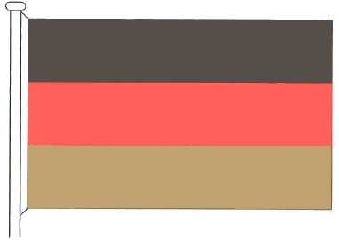
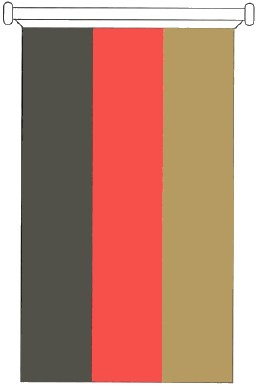
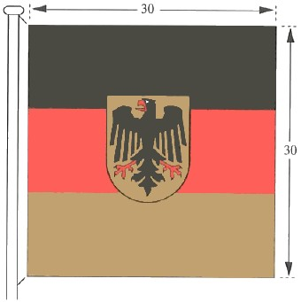
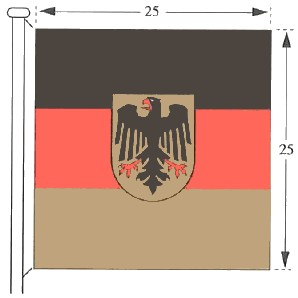
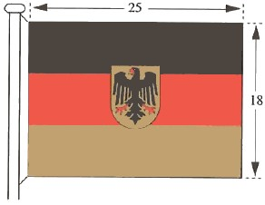
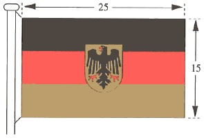
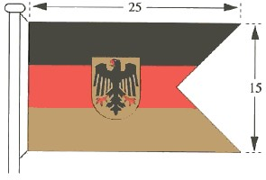
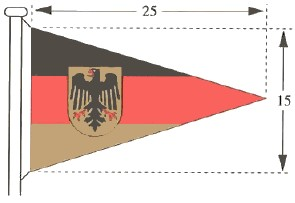

# Anordnung über die deutschen Flaggen (FlaggAnO 1996)

Ausfertigungsdatum
:   1996-11-13

Fundstelle
:   BGBl I: 1996, 1729

Geändert durch
:   AnO v. 22.11.2005 I 3181

## Eingangsformel

Auf Vorschlag der Bundesregierung bestimme ich zur Form und Führung
der deutschen Flaggen:

## I.

1.  Die Bundesflagge besteht aus drei gleich breiten Querstreifen, oben
    schwarz, in der Mitte rot, unten goldfarben, Verhältnis der Höhe zur
    Länge des Flaggentuches wie 3 zu 5. Die Bundesflagge kann auch in Form
    eines Banners geführt werden. Das Banner besteht aus drei gleich
    breiten Längsstreifen, links schwarz, in der Mitte rot, rechts
    goldfarben.

2.  Die Standarte des Bundespräsidenten oder der Bundespräsidentin ist ein
    gleichseitiges, rotgerändertes, goldfarbenes Rechteck, darin der
    Bundesadler, schwebend, nach der Stange gewendet, Verhältnis der
    Breite des roten Randes zur Höhe der Standarte wie 1 zu 12.

3.  Die Dienstflagge der Bundesbehörden (Bundesdienstflagge) hat die
    gleichen Querstreifen wie die Bundesflagge, darauf, etwas nach der
    Stange hin verschoben, in den schwarzen und den goldfarbenen Streifen
    je bis zu einem Fünftel übergreifend, den Bundesschild, den Adler nach
    der Stange gewendet, Verhältnis der Höhe zur Länge des Flaggentuches
    wie 3 zu 5. Wird die Bundesdienstflagge in Bannerform verwendet, ist
    der Bundesschild, den Adler zum schwarzen Streifen hin gewendet,
    parallel zu den Längsstreifen ausgerichtet, etwas nach der Stange hin
    verschoben, in den schwarzen und den goldfarbenen Teil je bis zu einem
    Fünftel übergreifend.

4.  Die Muster zu den Nummern 1 bis 3 sind in Anhang 1 wiedergegeben.

## II.

Alle Stellen des Bundes führen die Bundesdienstflagge. Der
Bundespräsident oder die Bundespräsidentin führt die Standarte am
jeweiligen Amtssitz. Dienstgebäude des Bundes können mit der
Bundesflagge oder mit der Bundesdienstflagge beflaggt werden; dies
gilt auch für Wasserfahrzeuge im öffentlichen Dienst des Bundes.

## III.

An Dienstkraftfahrzeugen können bei dienstlichen Fahrten die in den
Anhängen 2 und 3 beschriebenen Flaggen geführt werden, wenn sich der
Amtsinhaber oder die Amtsinhaberin oder in den in Nummer 2 des Anhangs
2 bezeichneten Fällen der Stellvertreter oder die Stellvertreterin im
Fahrzeug befindet. Die Flagge ist am rechten Kotflügel anzubringen.

## IV.

Über Änderungen des Anhangs 2 sowie bei Zweifeln hinsichtlich der
Berechtigung zum Führen der Bundesdienstflagge oder des anzuwendenden
Musters nach Anhang 3 entscheidet das Bundesministerium des Innern im
Benehmen mit dem jeweils zuständigen Verfassungsorgan oder
Bundesministerium.

## V.

1.  Die Führung der Bundesdienstflagge an Dienstkraftfahrzeugen der
    deutschen Vertretungen im Ausland regelt das Auswärtige Amt.

2.  Die Flaggenführung bei der Bundeswehr und bei der Bundespolizei wird
    besonders geregelt.

## VI.

Diese Anordnung tritt am Tage nach der Verkündung in Kraft.

## Schlußformel

Der Bundespräsident

## Anhang 1 Flaggen der Bundesrepublik Deutschland

(Fundstelle: BGBl. I 1996, S. 1730)

*    *        

*    *   Standarte des Bundespräsidenten

*    *

*    *        
    *        

*    *   Bundesflagge

    *   Bundesdienstflagge

*    *

*    *        
    *        

*    *   Bundesflagge in Bannerform

    *   Bundesdienstflagge in Bannerform

## Anhang 2

(1) An Dienstkraftfahrzeugen führen

*    *   1.

    *   der Bundespräsident oder die Bundespräsidentin die Standarte gemäß
        Abschnitt I Nr. 2 der Anordnung,

*    *   2.

    *   a)

    *   der Präsident oder die Präsidentin des Deutschen Bundestages,

*    *
    *
    *   der Präsident oder die Präsidentin des Bundesrates

*    *   die Bundesdienstflagge in der Größe 30 x 30 cm (Muster I),

*    *   b)

    *   die Vizepräsidenten und Vizepräsidentinnen des Deutschen Bundestages,

*    *
    *   die Vizepräsidenten und Vizepräsidentinnen des Bundesrates

*    *   die Bundesdienstflagge in der Größe 25 x 25 cm (Muster II),

*    *   c)

    *   der Direktor oder die Direktorin beim Deutschen Bundestag,

*    *
    *   der Direktor oder die Direktorin des Bundesrates

*    *   die Bundesdienstflagge in der Größe 15 x 25 cm (Muster IV),

*    *   3.

    *   a)

    *   der Bundeskanzler oder die Bundeskanzlerin

*    *
    *
    *   die Bundesdienstflagge in der Größe 30 x 30 cm (Muster I),

*    *   b)

    *   die Bundesminister und Bundesministerinnen

*    *
    *   die Bundesdienstflagge in der Größe 25 x 25 cm (Muster II),

*    *   c)

    *   die Staatssekretäre und Staatssekretärinnen des Bundes,

*    *
    *   der Chef oder die Chefin des Bundespräsidialamtes,

*    *   der Präsident oder die Präsidentin des Bundesrechnungshofes,

*    *   der Präsident oder die Präsidentin der Deutschen Bundesbank

*    *   die Bundesdienstflagge in der Größe 18 x 25 cm (Muster III),

*    *   d)

    *   die Leiter und Leiterinnen der Bundesoberbehörden

*    *
    *   die Bundesdienstflagge in der Größe 15 x 25 cm (Muster IV),

*    *   e)

    *   die Leiter und Leiterinnen der Bundesmittelbehörden

*    *
    *   die Bundesdienstflagge in Doppelstanderform in der Größe 15 x 25 cm
        (Muster V),

*    *   f)

    *   die Leiter und Leiterinnen der Bundesunterbehörden

*    *
    *   die Bundesdienstflagge in Standerform in der Größe 15 x 25 cm (Muster
        VI),

*    *   4.

    *   a)

    *   der Präsident oder die Präsidentin des Bundesverfassungsgerichts

*    *
    *
    *   die Bundesdienstflagge in der Größe 30 x 30 cm (Muster I),

*    *   b)

    *   der Vizepräsident oder die Vizepräsidentin des
        Bundesverfassungsgerichts

*    *
    *   die Bundesdienstflagge in der Größe 25 x 25 cm (Muster II),

*    *   c)

    *   die Präsidenten und Präsidentinnen der obersten Gerichtshöfe des
        Bundes

*    *
    *   die Bundesdienstflagge in der Größe 18 x 25 cm (Muster III),

*    *   d)

    *   der Präsident oder die Präsidentin des Bundespatentgerichts,

*    *
    *   der Präsident oder die Präsidentin des Bundesdisziplinargerichts,

*    *   der Generalbundesanwalt oder die Generalbundesanwältin beim
        Bundesgerichtshof,

*    *   der Oberbundesanwalt oder die Oberbundesanwältin beim
        Bundesverwaltungsgericht,

*    *   der Bundesdisziplinaranwalt oder die Bundesdisziplinaranwältin

*    *   die Bundesdienstflagge in der Größe 15 x 25 cm (Muster IV).

(2) Absatz 1 Nr. 3 Buchstabe c bis f und Nr. 4 Buchstabe a, c und d
gilt entsprechend für die Stellvertreter und Stellvertreterinnen, wenn
sie die Vertretung ausüben.

## Anhang 3 Flaggen für Dienstkraftfahrzeuge

*    *        
    *        

*    *   Muster I

    *   Muster II

*    *

*    *        
    *        

*    *   Muster III

    *   Muster IV

*    *

*    *        
    *        

*    *   Muster V

    *   Muster VI

*    *
    *

*    *   Maßangaben in Zentimetern

