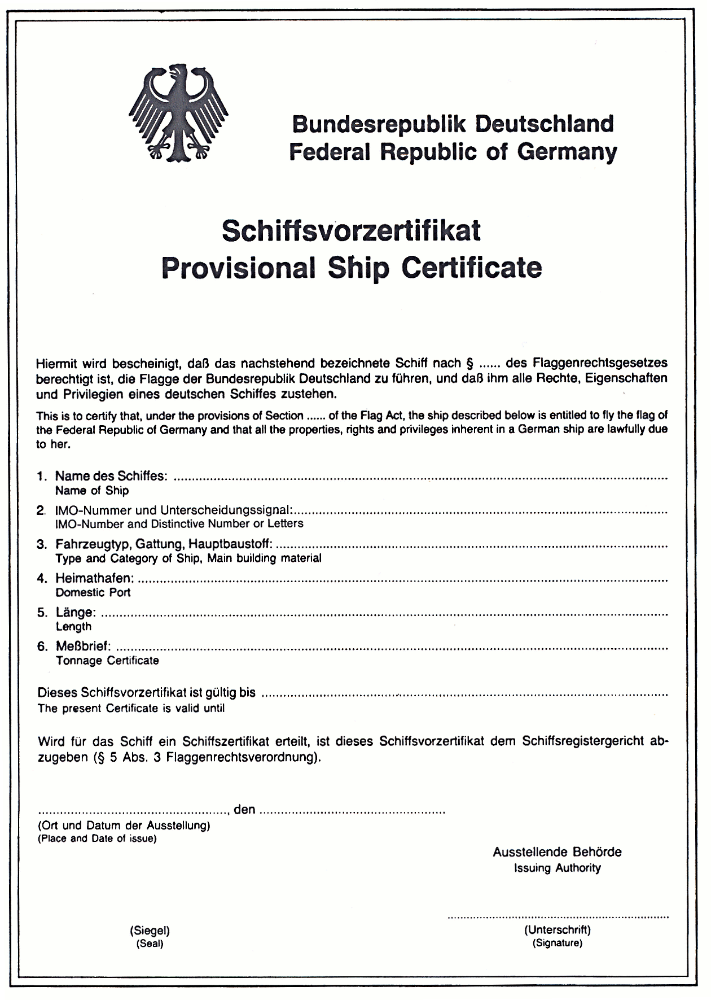

# Flaggenrechtsverordnung (FlRV)

Ausfertigungsdatum
:   1990-07-04

Fundstelle
:   BGBl I: 1990, 1389

Zuletzt geändert durch
:   Art. 178 G v. 29.3.2017 I 626

## Eingangsformel

Auf Grund

-   des § 22 Nr. 1, 4, 5 und 6 Buchstaben a bis f des
    Flaggenrechtsgesetzes in der Fassung der Bekanntmachung vom 4. Juli
    1990 (BGBl. I S. 1342) verordnet der Bundesminister für Verkehr,

-   des § 22 Nr. 3 des Flaggenrechtsgesetzes verordnet der Bundesminister
    für Verkehr im Einvernehmen mit dem Bundesminister der Justiz:

## Erster Abschnitt - Grenzen der Seefahrt

### § 1

Als Grenzen der Seefahrt im Sinne des § 1 des Flaggenrechtsgesetzes
werden bestimmt:

1.  die Festland- und Inselküstenlinie bei mittlerem Hochwasser,

2.  die seewärtige Begrenzung der Binnenwasserstraßen,

3.  bei an der Küste gelegenen Häfen die Verbindungslinie der Molenköpfe
    und

4.  bei Mündungen von Flüssen, die keine Binnenwasserstraßen sind, die
    Verbindungslinie der äußeren Uferausläufe.

## Zweiter Abschnitt - Berechtigung zur Führung der Bundesflagge

### 1. - Schiffsvorzertifikate

#### § 2

(1) Für die Erteilung eines Schiffsvorzertifikats (§ 3 Buchstabe a, §
5 des Flaggenrechtsgesetzes) ist das Konsulat zuständig, in dessen
Bezirk sich das Schiff in dem Zeitpunkt befindet, in dem das Recht zur
Führung der Bundesflagge oder die Befugnis zur Ausübung dieses Rechts
entsteht.

(2) Das ausstellende Konsulat ist für die Eintragung des Vermerks in
das Schiffsvorzertifikat nach § 7a Absatz 1 des Flaggenrechtsgesetzes
zuständig.

#### § 3

(1) Der Antrag auf Erteilung eines Schiffsvorzertifikats ist vom
Eigentümer des Schiffs zu stellen. In dem Antrag sind anzugeben:

1.  der Name des Schiffes;

1a. soweit erteilt, die in § 11 Abs. 1 Nr. 5 der Schiffsregisterordnung in
    der Fassung der Bekanntmachung vom 26. Mai 1994 (BGBl. I S. 1133)
    genannte Schiffsidentifikationsnummer (IMO-Nummer);

2.  gegebenenfalls das von einem Registergericht zugeteilte
    Unterscheidungssignal;

3.  der Fahrzeugtyp oder die Gattung und der Hauptbaustoff;

4.  der Bauort sowie das Datum des Stapellaufs, falls vorhanden,
    andernfalls das Datum der Kiellegung oder das Baujahr, es sei denn,
    daß dies nur mit besonderen Schwierigkeiten zu ermitteln ist;

5.  der Hafen im Sinne des § 9 des Flaggenrechtsgesetzes;

6.  die Ergebnisse der amtlichen Vermessung;

7.  der Name, die Staatsangehörigkeit und der Wohnsitz oder Sitz des
    Antragstellers; bei einer offenen Handelsgesellschaft: die
    Gesellschafter; bei einer Kommanditgesellschaft oder
    Kommanditgesellschaft auf Aktien: die persönlich haftenden
    Gesellschafter; in den Fällen des § 2 Absatz 1 Nummer 3 des
    Flaggenrechtsgesetzes: jede beauftragte Person;

8.  die den Erwerb des Eigentums begründenden Tatsachen;

9.  die Nationalflagge, die das Schiff zuletzt geführt hat;

10. das Schiffsregister, in dem das Schiff eingetragen ist oder zuletzt
    eingetragen war; im zweiten Falle auch der Zeitpunkt der Löschung;

11. in den Fällen des § 7 des Flaggenrechtsgesetzes die verbindliche
    Erklärung, daß das Recht zur Führung der anderen Nationalflagge enden
    soll;

12. die besonderen Gründe, aus denen das Schiffsvorzertifikat anstelle des
    Schiffszertifikats beantragt wird.

(2) Die in Absatz 1 bezeichneten Angaben von Tatsachen sind glaubhaft
zu machen. Der Schiffsmeßbrief oder die entsprechende Urkunde einer
ausländischen Vermessungsbehörde (Absatz 1 Nr. 6) oder eine
beglaubigte Abschrift oder Ablichtung dieser Urkunde, bei
Schiffsneubauten eine Bescheinigung über das vorläufige amtliche
Meßergebnis sind vorzulegen. In den Fällen des § 2 Absatz 1 Nummer 3
des Flaggenrechtsgesetzes ist ferner eine Bescheinigung nach § 5b Abs.
1 vorzulegen.

#### § 4

Bei der Entscheidung über die Ausstellung des Schiffsvorzertifikats
ist insbesondere zu berücksichtigen, ob ausreichende Gründe für die
Erteilung dieses Ausweises anstelle des Schiffszertifikats vorhanden
sind. Hat der Eigentümer des Schiffs keinen Wohnsitz im
Geltungsbereich des Grundgesetzes, so hat der Antragsteller
nachzuweisen, daß ihm eine rechtzeitige Eintragung des Schiffs in
einem deutschen Schiffsregister nicht möglich war.

#### § 5

(1) Das Schiffsvorzertifikat hat die aus dem Muster in der Anlage zu
dieser Verordnung ersichtliche Form.

(2) Das Konsulat übersendet unverzüglich eine beglaubigte Abschrift
oder Ablichtung des erteilten Schiffsvorzertifikats der
Flaggenbehörde, der Berufsgenossenschaft für Transport und
Verkehrswirtschaft in Hamburg sowie dem für die Eintragung des
Schiffes zuständigen Schiffsregistergericht.

(3) Wird für das Schiff ein Schiffszertifikat erteilt, so hat der
Eigentümer das Schiffsvorzertifikat unverzüglich dem
Schiffsregistergericht, welches das Schiffszertifikat erteilt hat,
abzugeben.

### 1a. - Beauftragte Personen nach § 2 Abs. 1 des Flaggenrechtsgesetzes

#### § 5a

In den Fällen des § 2 Absatz 1 Nummer 3 des Flaggenrechtsgesetzes hat
der Eigentümer des Seeschiffs gegenüber der Flaggenbehörde

1.  eine schriftliche Erklärung jeder beauftragten Person vorzulegen, in
    der sich diese zweifelsfrei verpflichtet, für die in dieser Bestimmung
    genannten Angelegenheiten nach Maßgabe der in der Bundesrepublik
    Deutschland geltenden Rechtsvorschriften in vollem Umfang einzustehen,

2.  glaubhaft darzulegen, daß die beauftragte Person persönlich
    zuverlässig und finanziell leistungsfähig ist,

3.  (weggefallen)

#### § 5b

(1) Sind die Nachweise des § 5a geführt, so bescheinigt die
Flaggenbehörde, daß die Voraussetzungen des § 2 Absatz 1 Nummer 3 des
Flaggenrechtsgesetzes erfüllt sind. In der Bescheinigung sind Name und
Wohnsitz des Eigentümers und der nach § 5a Nr. 1 beauftragten Person
zu verzeichnen.

(2) Die Flaggenbehörde übersendet der Berufsgenossenschaft für
Transport und Verkehrswirtschaft eine Ablichtung der nach Absatz 1
erteilten Bescheinigung.

(3) Die Anzeige nach § 2 Abs. 3 des Flaggenrechtsgesetzes ist an die
Flaggenbehörde zu richten; diese nimmt die entsprechenden Aufgaben des
Bundesministeriums für Verkehr und digitale Infrastruktur wahr.

(4) Beim Wegfall der einem Nachweis zugrundeliegenden Tatsachen
widerruft die Flaggenbehörde die nach Absatz 1 erteilte Bescheinigung
und teilt dies dem für die Führung des Schiffsregisters zuständigen
Gericht sowie der Berufsgenossenschaft für Transport und
Verkehrswirtschaft mit.

#### § 5c

Die Berufsgenossenschaft für Transport und Verkehrswirtschaft ist im
Rahmen ihrer Befugnisse nach der Schiffssicherheitsverordnung
berechtigt, bei Fehlen oder Wegfall der in § 2 Absatz 1 Nummer 3 des
Flaggenrechtsgesetzes genannten Voraussetzungen die Weiterfahrt des
Seeschiffs im deutschen Hoheitsgebiet zu verbieten oder nur unter
Bedingungen oder Auflagen zuzulassen, die sicherstellen, daß die
Hoheitsgewalt und Kontrolle des Flaggenstaates über das Schiff wirksam
ausgeübt werden kann.

### 2. - Befugnisse nach den §§ 10, 11 des Flaggenrechtsgesetzes, Flaggenscheine

#### § 6

Für die Verleihung der Befugnisse zur Führung der Bundesflagge (§§ 10
und 11 FlRG) und die Erteilung der Flaggenscheine (§ 3 Buchstabe b des
Flaggenrechtsgesetzes), verbunden mit der Zuteilung der
Unterscheidungssignale der Schiffe, ist die Flaggenbehörde zuständig.

#### § 7

(1) Der Antrag auf Verleihung der Befugnis zur Führung der
Bundesflagge und auf Erteilung eines Flaggenscheins ist

1.  für ein Seeschiff, dem diese Befugnis nach § 10 des
    Flaggenrechtsgesetzes verliehen werden soll, von dem Inhaber der
    Schiffswerft oder vom Eigentümer des Seeschiffs,

2.  für ein Seeschiff, dem diese Befugnis nach § 11 Abs. 1 Satz 1 des
    Flaggenrechtsgesetzes verliehen werden soll, von dessen ausländischem
    Eigentümer,

3.  für ein Seeschiff, dem diese Befugnis nach § 11 Abs. 1 Satz 2 des
    Flaggenrechtsgesetzes verliehen werden soll, vom Ausrüster

zu stellen.

(2) Absatz 1 gilt entsprechend für den Verzicht des Berechtigten auf
die Befugnis.

(3)

#### § 8

(1) In dem Antrag sind der Name, in den Fällen des § 10 des
Flaggenrechtsgesetzes die Baunummer des Schiffes sowie die in § 3 Abs.
1 Nr. 3, 4, 6 und 7 genannten Daten anzugeben.

(2) Ferner sind anzugeben:

1.  in den Fällen des § 7 Abs. 1 Nr. 1 der Hafen, in den das Schiff
    übergeführt werden soll;

2.  in den Fällen des § 7 Abs. 1 Nr. 2:

    a)  der Heimathafen;

    b)  das Schiffsregister, in dem das Schiff eingetragen ist oder zuletzt
        eingetragen war, und die bisherige Nationalflagge des Schiffes;

    c)  soweit erteilt, die IMO-Nummer sowie

    d)  die Staatsangehörigkeit des Eigentümers.

3.  in den Fällen des § 7 Abs. 1 Nr. 3 neben den in Nummer 2 genannten
    Angaben:

    a)  der Name und der Wohnsitz oder Sitz des Eigentümers;

    b)  die das Nutzungsrecht des Ausrüsters begründenden Tatsachen und die
        Dauer dieses Rechts;

    c)  die Tatsachen, aus denen sich ergibt, daß der Ausrüster zu dem
        Personenkreis des § 1 oder des § 2 Abs. 1 des Flaggenrechtsgesetzes
        gehört, sowie

    d)  die Tatsache, aus denen sich ergibt, daß das Schiff gemäß den
        Vorschriften des Bundesrechts besetzt wird.

(3) § 3 Abs. 2 Satz 1 und 2 gilt für die in den Absätzen 1 und 2
bezeichneten Angaben entsprechend. Ferner sind vorzulegen:

1.  der Meßbrief oder die entsprechende Urkunde einer ausländischen
    Vermessungsbehörde oder eine öffentlich beglaubigte Abschrift oder
    Ablichtung dieser Urkunde,

2.  in den Fällen des § 7 Abs. 1 Nr. 2 und 3 die amtliche Bestätigung der
    zuständigen ausländischen Behörde oder eines Konsulates des in
    Betracht kommenden ausländischen Staates, daß dessen Recht der Führung
    der Bundesflagge nicht entgegensteht, sowie

3.  in den Fällen des § 7 Abs. 1 Nr. 3 die öffentlich beglaubigte
    Erklärung des Eigentümers, daß er dem Flaggenwechsel für die Dauer des
    Nutzungsrechts des Ausrüsters zustimmt.

#### § 9

Der Flaggenschein wird

1.  in den Fällen des § 7 Abs. 1 Nr. 1 für die Dauer der Überführung in
    einen anderen Hafen einschließlich der erforderlichen vorausgehenden
    Fahrten,

2.  in den Fällen des § 7 Abs. 1 Nr. 2 für die Dauer der Befugnis zur
    Führung der Bundesflagge,

3.  in den Fällen des § 7 Abs. 1 Nr. 3 unter dem Vorbehalt des Widerrufs
    für die Dauer der Überlassung des Schiffes zur Bereederung in eigenem
    Namen

erteilt. Wird die Befugnis zur Führung der Bundesflagge vor Ablauf der
in Satz 1 genannten Fristen auf späteren Antrag für einen weiteren
Zeitraum verliehen, so kann dies auf dem Flaggenschein vermerkt
werden; der Erteilung eines neuen Flaggenscheins bedarf es in diesem
Fall nicht.

#### § 10

Die Flaggenbehörde übersendet der Berufsgenossenschaft für Transport
und Verkehrswirtschaft eine beglaubigte Abschrift oder Ablichtung des
Flaggenscheins.

#### § 11

Der Antragsteller hat unverzüglich alle Veränderungen der in § 8
bezeichneten Angaben anzuzeigen. Die Anzeige ist an die Flaggenbehörde
zu richten. Auf Verlangen der Flaggenbehörde ist der Flaggenschein zur
Berichtigung vorzulegen.

### 3. - Flaggenbescheinigungen

#### § 12

Flaggenbescheinigungen (§ 3 Buchstabe c des Flaggenrechtsgesetzes)
werden ausgestellt:

1.  für Seeschiffe der Bundeswehr vom Bundesministerium der Verteidigung;

2.  für die anderen in § 3 Buchstabe c des Flaggenrechtsgesetzes genannten
    Seeschiffe von der Flaggenbehörde.

#### § 13

Die Flaggenbescheinigung berührt nicht die Vorschriften darüber, ob
und wie anstelle oder neben der Bundesflagge eine Dienstflagge gesetzt
werden darf.

### 4. - Flaggenzertifikate

#### § 14

Für die Erteilung der Flaggenzertifikate (§ 3 Buchstabe d des
Flaggenrechtsgesetzes) ist die Flaggenbehörde zuständig.

#### § 15

(1) Wird der Antrag auf Erteilung eines Flaggenzertifikats für ein
Seeschiff gestellt, das nicht nach den Vorschriften der §§ 1 oder 2
des Flaggenrechtsgesetzes zur Führung der Bundesflagge berechtigt ist,
so ist er mit dem Antrag auf Verleihung der Befugnis hierzu zu
verbinden.

(2) Für Fahrzeuge, die nach ihrer Bauart nicht zur Seefahrt im Sinne
des § 1 des Flaggenrechtsgesetzes bestimmt sind, kann ein Antrag auf
Erteilung eines Flaggenzertifikats nicht gestellt werden.

#### § 16

(1) Der Antrag auf Erteilung eines Flaggenzertifikats ist vom
Eigentümer des Seeschiffs zu stellen.

(2) In dem Antrag sind die in § 3 Abs. 1 Nr. 1, 3 bis 5, 7 bis 9
genannten Daten sowie folgende Identitätsmerkmale des Schiffes
anzugeben:

1.  die Rumpflänge, gemessen zwischen den äußersten Punkten des Vorstevens
    und des Hinterstevens,

2.  die Baunummer oder Bootsnummer, falls diese am Rumpf fest angebracht
    sind,

3.  die Motornummer,

4.  sonstige für die Identität wesentliche Merkmale.

(3) § 3 Abs. 2 Satz 1 gilt entsprechend.

#### § 17

Ist der Antragsteller nicht Deutscher im Sinne der §§ 1 und 2 des
Flaggenrechtsgesetzes oder einem Deutschen nach dessen § 2 oder 23
gleichgestellt, wird das Flaggenzertifikat unter dem Vorbehalt des
Widerrufs nach Maßgabe der Verleihung der Befugnis zur Führung der
Bundesflagge ausgestellt. In den Fällen des § 2 Absatz 1 Nummer 3 des
Flaggenrechtsgesetzes ist bei der Ausstellung eines Flaggenzertifikats
eine gesonderte Bescheinigung nach § 5b Abs. 1 nicht erforderlich.

#### § 18

(1) Flaggenzertifikate sind spätestens nach Ablauf von 8 Jahren seit
ihrer Ausstellung ungültig, es sei denn, die Gültigkeitsdauer wird für
jeweils höchstens den gleichen Zeitraum verlängert.

(2) § 11 gilt für die in § 16 bezeichneten Angaben entsprechend.

## Dritter Abschnitt - Genehmigung der Führung einer anderen Nationalflagge (§ 7 des Flaggenrechtsgesetzes)

### § 19

(weggefallen)

### § 20

(1) Der Antrag hat die in § 3 Abs. 1 Nr. 1 bis 7, 9 und 10
bezeichneten Angaben zu enthalten.

(2) Der Antrag muss ferner enthalten

1.  wenn der Antragsteller nicht der Eigentümer des Seeschiffes ist,

    a)  die Angabe des Namens, der Staatsangehörigkeit und des Wohnsitzes oder
        Sitzes des Antragstellers einschließlich der
        Telekommunikationsverbindungen des Antragstellers und

    b)  die Zustimmung des Eigentümers zur Führung der anderen Nationalflagge;

2.  in den Fällen des § 7 Absatz 2 des Flaggenrechtsgesetzes die
    Verpflichtung zur Ausbildung;

3.  in den Fällen des § 7 Absatz 3 des Flaggenrechtsgesetzes die Erklärung
    über die Zahlung des Ablösebetrages;

4.  die Angabe der künftig zu führenden Nationalflagge;

5.  die Zustimmung des künftigen Flaggenstaates zur Flaggenführung;

6.  die Angabe über die in Abteilung III des Schiffsregisters
    eingetragenen Gläubigerrechte;

7.  die Zustimmung der eingetragenen Gläubiger zur Führung der anderen
    Flagge.

(3) Dem Antrag sind beizufügen:

1.  zu den Absätzen 1 und 2 Nummer 6 eine amtlich beglaubigte Abschrift
    oder Ablichtung des Schiffsregisterblatts nach dem neusten Stand;

2.  zu Absatz 2 Nummer 1 Buchstabe b eine Erklärung des Eigentümers;

3.  zu Absatz 2 Nummer 2 eine schriftliche Erklärung des Antragstellers;

4.  zu Absatz 2 Nummer 3 eine von der nach § 7 Absatz 3 des
    Flaggenrechtsgesetzes errichteten Einrichtung ausgestellte
    Bescheinigung;

5.  zu Absatz 2 Nummer 5 eine Bescheinigung des künftigen Flaggenstaates,
    die den Namen des Schiffes, die Dauer der Gestattung der Führung der
    ausländischen Flagge sowie die Bestätigung enthält, dass das Schiff
    einschließlich der Hypotheken im deutschen Schiffsregister eingetragen
    bleiben kann;

6.  zu Absatz 2 Nummer 7 eine schriftliche Erklärung der Gläubiger.

(3a) Die Staatsangehörigkeit des Eigentümers und des Antragstellers
sowie die sonstigen Angaben nach Absatz 2 Nummer 1 Buchstabe a sind
glaubhaft zu machen.

(4) § 11 Satz 1 und 2 gilt für die in den Absätzen 1 und 2
bezeichneten Angaben entsprechend.

### § 20a

(1) Für den Nachweis nach § 7 Absatz 2 Satz 4 des
Flaggenrechtsgesetzes sind die Personen, durch die ein Platz zur
seefahrtbezogenen Ausbildung an Bord des ausgeflaggten Seeschiffes im
Sinne des § 7 Absatz 2 Satz 1 des Flaggenrechtsgesetzes besetzt wird,
und die Zeiträume ihrer Beschäftigung an Bord des ausgeflaggten
Seeschiffes anzugeben.

(2) Die Angaben sind durch Vorlage von Ablichtungen geeigneter
Unterlagen, insbesondere der entsprechenden Besatzungslisten,
Ausbildungsverträge und Heuerverträge nachzuweisen.

## Vierter Abschnitt - Register

### 1. - Flaggenregister

#### § 21

(1) Die Flaggenbehörde führt ein Register aller Seeschiffe, denen ein
amtlicher Ausweis über die Berechtigung zur Führung der Bundesflagge
(§ 3 des Flaggenrechtsgesetzes) erteilt worden ist (§ 22 Nr. 6
Buchstabe d des Flaggenrechtsgesetzes).

(2) In das Register werden neben einer fortlaufenden Nummer und dem
Datum der Eintragung aufgenommen:

1.  die Art des Ausweises, das Datum seiner Erteilung und im Falle der
    Befristung die Gültigkeitsdauer,

2.  bei Schiffen, die in einem deutschen Schiffsregister eingetragen sind,
    der aus den Abteilungen I und II des Schiffsregisters ersichtliche
    Inhalt sowie die in § 3 Abs. 1 Nr. 9 und 10 bezeichneten Daten, in den
    Fällen des § 2 Absatz 1 Nummer 3 des Flaggenrechtsgesetzes ferner die
    in der Bescheinigung nach § 5b Abs. 1 genannte beauftragte Person,

3.  bei Schiffen, für die ein Flaggenzertifikat erteilt worden ist, die in
    § 3 Abs. 1 Nr. 1 und 3 bis 5 enthaltenen Tatsachen sowie der Name des
    Eigentümers, die Rumpflänge des Schiffes und die Nummer des
    Flaggenzertifikats,

4.  bei sonstigen Schiffen die in § 3 Abs. 1 Nr. 1 bis 6, 9 und 10
    bezeichneten Daten sowie der Name des Eigentümers,

4a. bei Plattformen, die zeitweilig schwimmen und zeitweilig fest mit dem
    Boden verankert sind, der Ort der Verankerung,

5.  in den Fällen der §§ 10 und 11 des Flaggenrechtsgesetzes zusätzlich zu
    den unter Nummer 4 bezeichneten Daten der Inhalt der verliehenen
    Berechtigung,

6.  in den Fällen des § 7 des Flaggenrechtsgesetzes der Ausrüster, der
    neue Flaggenstaat und der Zeitraum, während dessen das Recht zur
    Führung der Bundesflagge nicht ausgeübt werden darf,

7.  alle Veränderungen der unter den Nummern 1 bis 6 bezeichneten Daten.

#### § 22

Die Eintragung wird zehn Jahre nach Beendigung der Berechtigung zur
Führung der Bundesflagge gelöscht.

### 2. - Internationales Seeschiffahrtsregister

#### § 23

Das internationale Seeschiffahrtsregister (§ 12 des
Flaggenrechtsgesetzes) wird von der Flaggenbehörde als Anhang zum
Flaggenregister geführt. Es enthält über die Angaben im
Flaggenregister hinaus nur den Vermerk, daß das Schiff im
internationalen Seeschiffahrtsregister eingetragen ist.

#### § 24

Mit dem Antrag auf Eintragung in das internationale
Seeschiffahrtsregister hat der Eigentümer glaubhaft die Tatsachen
anzugeben, aus denen sich der Betrieb des Schiffs im internationalen
Verkehr im Sinne des § 34c Abs. 4 des Einkommensteuergesetzes in der
jeweils geltenden Fassung ergibt.

#### § 25

(1) Ein im Internationalen Seeschiffahrtsregister eingetragenes
Seeschiff wird ausgetragen

1.  auf Antrag oder

2.  von Amts wegen, wenn der Flaggenbehörde bekannt wird, daß die
    gesetzlichen Eintragungsvoraussetzungen nicht erfüllt sind.

Ein Schiff wird nicht ausgetragen, wenn nur der eingetragene Name
geändert wird.

(2) Die Eintragung wird zehn Jahre nach Austragung des Seeschiffs
gelöscht.

## Fünfter Abschnitt - Ergänzende Vorschriften

### § 26

(1) Bei der Anwendung dieser Verordnung ist den völkerrechtlichen
Verantwortlichkeiten der Bundesrepublik Deutschland als Flaggen- und
als Registerstaat Rechnung zu tragen.

(2) Diese Verordnung läßt die Verpflichtungen des Antragstellers,
Kontrollen in technischen, sozialen und Verwaltungsangelegenheiten
über das Schiff zuzulassen und es insbesondere den vorgeschriebenen
Besichtigungen und Prüfungen zu stellen, unberührt.

### § 27

Flaggenbehörde ist das Bundesamt für Seeschiffahrt und Hydrographie.

### § 28

(1) Die Anträge im Sinne dieser Verordnung sollen rechtzeitig für
jedes Schiff gesondert gestellt werden. Die Flaggenbehörde gibt Muster
der Anträge im Verkehrsblatt bekannt.

(2) Die Flaggenbehörde kann bei der Ermittlung von Tatsachen, die
glaubhaft zu machen sind, vom Antragsteller oder von Dritten eine
Versicherung an Eides Statt verlangen und abnehmen.

### § 29

Das Bundesministerium für Verkehr und digitale Infrastruktur gibt die
Muster der amtlichen Ausweise über die Berechtigung zur Führung der
Bundesflagge und die Muster der Formblätter zur lückenlosen
Stammdatendokumentation im Sinne des § 13 Abs. 2 Satz 1 des
Flaggenrechtsgesetzes im Verkehrsblatt bekannt.

### § 30

(1) Die Anzeige des Schiffsnamens und dessen Änderung ist an die
Flaggenbehörde zu richten; diese ist auch für die Untersagung der
Führung von Schiffsnamen (§ 9 Abs. 3 des Flaggenrechtsgesetzes)
zuständig.

(2) Namen und Hafen sind am Schiff in lateinischer Schrift unter
Berücksichtigung der Größe des Schiffs so anzubringen, daß in Fahrt
eine ausreichende Lesbarkeit durch andere Verkehrsteilnehmer bei guten
Sichtverhältnissen gewährleistet ist.

(3) Die IMO-Schiffsidentifikationsnummer im Sinne des § 9a Abs. 1 des
Flaggenrechtsgesetzes muss deutlich und vollständig sichtbar, von
anderen Markierungen am Schiffskörper abgesetzt, mindestens 200
Millimeter hoch und in einer mit der Umgebung kontrastierenden Farbe
angebracht sein. Sie ist in Form eines erhabenen oder eines vertieften
Reliefs, durch Aufnieten oder in einem sonstigen gleichwertigen
Markierungsverfahren auszuführen, durch das sichergestellt ist, dass
die IMO-Schiffsidentifikationsnummer nicht leicht unkenntlich gemacht
werden kann.

### § 30a

(1) Die Bescheinigung über die lückenlose Stammdatendokumentation im
Sinne des § 13 Abs. 2 Satz 1 des Flaggenrechtsgesetzes ist vom
Eigentümer des Seeschiffes bei der Flaggenbehörde zu beantragen. Dem
Antrag sind die für die lückenlose Stammdatendokumentation
erforderlichen Informationen beizufügen. Änderungen sind der
Flaggenbehörde unverzüglich mitzuteilen.

(2) Die Flaggenbehörde fasst die lückenlose Stammdatendokumentation
nach Maßgabe der von der Internationalen Seeschifffahrtsorganisation
auf ihrer 23. Tagung am 5. Dezember 2003 angenommenen Entschließung
A.959(23) über das Format und die Richtlinien zur Führung der
lückenlosen Stammdatendokumentation (VkBl. 2004 S. 414), die durch die
Entschließung MSC.196(80), angenommen am 20. Mai 2005 (VkBl. 2009 S.
37), und durch die Entschließung MSC.198/80, angenommen am 20. Mai
2005 (VkBl. 2008 S. 504), geändert worden ist, unter Verwendung des
Formblattes 1 der Entschließung in deutscher und englischer Sprache
ab.

(3) Änderungen der in der lückenlosen Stammdatendokumentation
eingetragenen Angaben sind vom Eigentümer des Seeschiffes oder einer
von ihm beauftragten Person, insbesondere dem Schiffsführer,
unverzüglich unter Verwendung der Formblätter nach § 29 zu erfassen
und der lückenlosen Stammdatendokumentation beizufügen. Die Änderungen
sind der Flaggenbehörde unverzüglich mitzuteilen.

(4) Die Flaggenbehörde stellt innerhalb von drei Monaten ab dem Datum
der ersten Änderung dem Seeschiff eine aktualisierte lückenlose
Stammdatendokumentation aus. Der Schiffsführer ist verpflichtet, nach
Erhalt der aktualisierten Stammdatendokumentation die Maßnahmen nach
den Nummern 10 und 11 der Anlage zur Entschließung A.959(23) zu
ergreifen.

### § 31

(1) Für jedes Schiff wird über die Berechtigung zur Führung der
Bundesflagge nur ein Ausweis erteilt.

(2) Der Berechtigte hat, soweit möglich, den Ausweis unverzüglich der
Flaggenbehörde zuzuleiten, wenn seine Berechtigung zur Führung der
Bundesflagge vor Ablauf der in dem Ausweis angegebenen
Gültigkeitsdauer endet oder das Schiff untergeht oder
ausbesserungsunfähig wird. Die Flaggenbehörde hat den Ausweis in
diesen Fällen unbrauchbar zu machen.

(3) Die Absätze 1 und 2 gelten nicht für das Schiffszertifikat.

## Sechster Abschnitt - Schlußbestimmungen

### § 32

-

### § 33

Diese Verordnung tritt am Tage nach der Verkündung in Kraft.

### Anlage (zu § 5 Abs. 1)

Fundstelle des Originaltextes: BGBl. I 1990, 1394;
bzgl. der einzelnen Änderungen vgl. Fußnote.

(Bundesadler)                 Bundesrepublik Deutschland
Federal Republic of Germany
Schiffsvorzertifikat
**Provisional Ship Certificate**
Hiermit wird bescheinigt, daß das nachstehend bezeichnete
Schiff nach § ... des Flaggenrechtsgesetzes berechtigt ist,
die Flagge der Bundesrepublik Deutschland zu führen, und
daß ihm alle Rechte, Eigenschaften und Privilegien eines
deutschen Schiffes zustehen.
This is to certify that, under the provisions of Section ...
of the Flag Act, the ship described below ist entitled to fly
the flag of the Federal Republic of Germany and that all the
properties, rights and privileges inherent in a German ship
are lawfully due to her.
1\. Name des Schiffes: ........................................
Name of Ship
2\. IMO-Nummer und Unterscheidungssignal: .....................
IMO-Number and Distinctive Number or Letters
3\. Fahrzeugtyp, Gattung, Hauptbaustoff: .......................
Type and Category of Ship, Main building material
4\. Heimathafen: ..............................................
Domestic Port
5\. Länge: ....................................................
Length
6\. Meßbrief: .................................................
Tonnage Certificate
Dieses Schiffsvorzertifikat ist gültig bis ...................
The present Certificate ist valid until
Wird für das Schiff ein Schiffszertifikat erteilt, ist dieses
Schiffsvorzertifikat dem Schiffsregistergericht abzugeben
(§ 5 Abs. 3 Flaggenrechtsverordnung).
................................, den ...................
(Ort und Datum der Ausstellung)
(Place and Date of issue)
Ausstellende Behörde
Issuing Authority
.............................
(Siegel)                     (Unterschrift)
(Seal)
(Signature)

