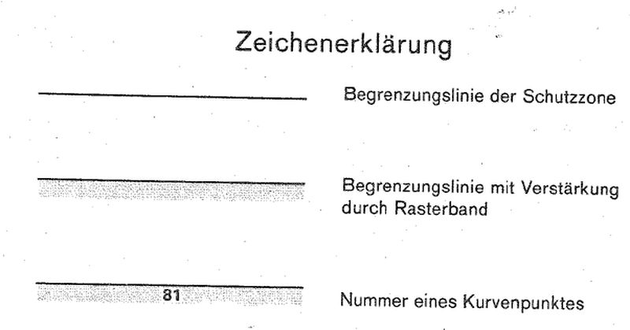
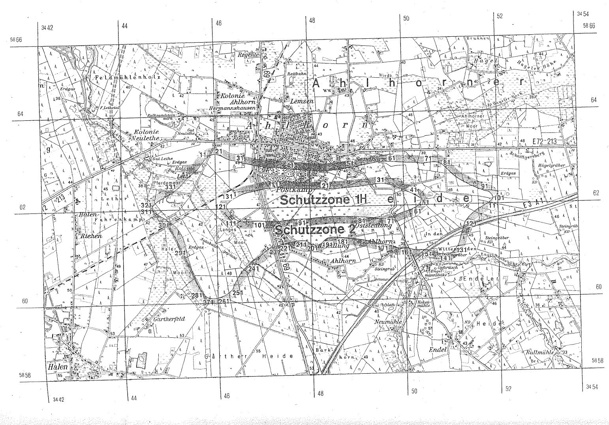

# Verordnung über die Festsetzung des Lärmschutzbereichs für den militärischen Flugplatz Ahlhorn (FluLärmAhlhV)

Ausfertigungsdatum
:   1986-02-20

Fundstelle
:   BGBl I: 1986, 309

## Eingangsformel

Auf Grund des § 4 Abs. 1 des Gesetzes zum Schutz gegen Fluglärm vom
30\. März 1971 (BGBl. I S. 282) wird im Einvernehmen mit dem
Bundesminister der Verteidigung und mit Zustimmung des Bundesrates
verordnet:

## § 1

Zum Schutz der Allgemeinheit vor Gefahren, erheblichen Nachteilen und
erheblichen Belästigungen durch Fluglärm in der Umgebung des
militärischen Flugplatzes Ahlhorn wird der in § 2 bestimmte
Lärmschutzbereich festgesetzt.

## § 2

Der Lärmschutzbereich mit seinen zwei Schutzzonen wird nach Anlage 1
bestimmt durch die interpolierten Verbindungslinien zwischen den
Kurvenpunkten, soweit diese Linien außerhalb des Flugplatzgeländes
verlaufen.

## § 3

Liegt eine bauliche Anlage zu einem Teil im Lärmschutzbereich, so gilt
sie als ganz im Lärmschutzbereich gelegen. Liegt eine bauliche Anlage
zu einem Teil in der Schutzzone 1, so gilt sie als ganz in dieser
Schutzzone gelegen.

## § 4

Der nach § 2 bestimmte Lärmschutzbereich ist in einer topographischen
Karte im Maßstab 1:50.000 und in Karten im Maßstab 1:5.000
dargestellt. Die topographische Karte ist als Anlage 2 dieser
Verordnung beigefügt. Die Karten im Maßstab 1:5.000 werden beim
Ordnungsamt des Landkreises Oldenburg, Gerichtsstraße 7, 2900
Oldenburg, zu jedermanns Einsicht archivmäßig gesichert niedergelegt.

## § 5

Diese Verordnung tritt am Tag nach der Verkündung in Kraft.

## Schlußformel

Der Bundesminister des Innern

## Anlage 1 (zu § 2 der Verordnung über die Festsetzung des Lärmschutzbereichs für den militärischen Flugplatz Ahlhorn)

(Fundstelle des Originaltextes: BGBl. I 1986, 310 - 312)

*    *   **Lärmschutzbereich**

*    *

*    *
    *   Koordinatensystem:

    *   Gauß-Krüger

*    *
    *   Interpolation:

    *   Polynom 3. Grades mit stetigem Tangentenübergang

*    *

*    *   Kurvenpunkte der Schutzzone 1 (Militärischer Flugplatz Ahlhorn)

*    *

*    *   Nr.

    *   Y (Rechts)

    *   X (Hoch)

    *   Nr.

    *   Y (Rechts)

    *   X (Hoch)

    *   Nr.

    *   Y (Rechts)

    *   X (Hoch)

*    *

*    *   1

    *   3446413.9

    *   5862227.2

    *   51

    *   3450361.5

    *   5862066.2

    *   101

    *   3446955.4

    *   5861726.9

*    *   2

    *   3446477.4

    *   5862261.8

    *   52

    *   3450352.3

    *   5862053.6

    *   102

    *   3446843.3

    *   5861733.3

*    *   3

    *   3446527.2

    *   5862284.6

    *   53

    *   3450342.2

    *   5862041.5

    *   103

    *   3446759.9

    *   5861730.4

*    *   4

    *   3446563.7

    *   5862299.1

    *   54

    *   3450331.5

    *   5862029.6

    *   104

    *   3446676.6

    *   5861725.4

*    *   5

    *   3446640.4

    *   5862322.6

    *   55

    *   3450315.6

    *   5862013.0

    *   105

    *   3446630.2

    *   5861723.6

*    *   6

    *   3446718.7

    *   5862339.9

    *   56

    *   3450299.2

    *   5861996.9

    *   106

    *   3446583.8

    *   5861724.2

*    *   7

    *   3446811.1

    *   5862356.7

    *   57

    *   3450282.1

    *   5861981.4

    *   107

    *   3446537.5

    *   5861728.5

*    *   8

    *   3446903.2

    *   5862374.7

    *   58

    *   3450264.3

    *   5861966.8

    *   108

    *   3446501.1

    *   5861736.4

*    *   9

    *   3447032.2

    *   5862401.0

    *   59

    *   3450247.5

    *   5861954.6

    *   109

    *   3446483.3

    *   5861741.6

*    *   10

    *   3447190.9

    *   5862419.2

    *   60

    *   3450230.4

    *   5861942.9

    *   110

    *   3446465.8

    *   5861748.0

*    *
    *
    *
    *
    *
    *
    *
    *
    *

*    *   11

    *   3447271.4

    *   5862424.4

    *   61

    *   3450214.4

    *   5861933.6

    *   111

    *   3446432.5

    *   5861764.8

*    *   12

    *   3447351.9

    *   5862424.3

    *   62

    *   3450198.3

    *   5861925.0

    *   112

    *   3446402.3

    *   5861786.6

*    *   13

    *   3447422.8

    *   5862418.8

    *   63

    *   3450165.7

    *   5861909.8

    *   113

    *   3446381.7

    *   5861805.6

*    *   14

    *   3447494.1

    *   5862413.2

    *   64

    *   3450132.4

    *   5861896.8

    *   114

    *   3446362.6

    *   5861826.2

*    *   15

    *   3447573.7

    *   5862407.4

    *   65

    *   3450062.3

    *   5861874.8

    *   115

    *   3446327.8

    *   5861870.1

*    *   16

    *   3447653.8

    *   5862401.9

    *   66

    *   3449991.5

    *   5861855.0

    *   116

    *   3446295.5

    *   5861915.0

*    *   17

    *   3447791.7

    *   5862393.6

    *   67

    *   3449941.5

    *   5861837.9

    *   117

    *   3446263.9

    *   5861960.4

*    *   18

    *   3447929.6

    *   5862386.3

    *   68

    *   3449853.3

    *   5861804.9

    *   118

    *   3446248.2

    *   5861984.5

*    *   19

    *   3448067.5

    *   5862378.3

    *   69

    *   3449775.0

    *   5861774.8

    *   119

    *   3446234.2

    *   5862009.7

*    *   20

    *   3448205.5

    *   5862373.6

    *   70

    *   3449734.5

    *   5861763.4

    *   120

    *   3446228.5

    *   5862023.3

*    *
    *
    *
    *
    *
    *
    *
    *
    *

*    *   21

    *   3448343.6

    *   5862370.2

    *   71

    *   3449696.7

    *   5861744.6

    *   121

    *   3446224.6

    *   5862037.2

*    *   22

    *   3448481.9

    *   5862374.7

    *   72

    *   3449658.5

    *   5861738.2

    *   122

    *   3446223.1

    *   5862051.5

*    *   23

    *   3448627.4

    *   5862383.4

    *   73

    *   3449620.0

    *   5861732.7

    *   123

    *   3446224.7

    *   5862066.4

*    *   24

    *   3448772.8

    *   5862394.0

    *   74

    *   3449581.4

    *   5861728.6

    *   124

    *   3446230.0

    *   5862081.9

*    *   25

    *   3448918.0

    *   5862405.7

    *   75

    *   3449542.7

    *   5861725.1

    *   125

    *   3446237.9

    *   5862095.7

*    *   26

    *   3449063.2

    *   5862418.2

    *   76

    *   3449477.9

    *   5861726.5

    *   126

    *   3446247.7

    *   5862108.3

*    *   27

    *   3449209.8

    *   5862433.1

    *   77

    *   3449413.5

    *   5861734.5

    *   127

    *   3446258.8

    *   5862120.1

*    *   28

    *   3449299.9

    *   5862443.2

    *   78

    *   3449352.1

    *   5861746.2

    *   128

    *   3446282.5

    *   5862141.2

*    *   29

    *   3449353.0

    *   5862449.6

    *   79

    *   3449281.6

    *   5861752.9

    *   129

    *   3446307.8

    *   5862160.4

*    *   30

    *   3449425.3

    *   5862458.8

    *   80

    *   3449190.6

    *   5861760.2

    *   130

    *   3446339.5

    *   5862182.2

*    *
    *
    *
    *
    *
    *
    *
    *
    *

*    *   31

    *   3449497.8

    *   5862466.3

    *   81

    *   3449104.2

    *   5861766.4

    *   131

    *   3446371.7

    *   5862202.5

*    *   32

    *   3449538.7

    *   5862465.5

    *   82

    *   3448955.6

    *   5861774.9

    *   132

    *   3446413.9

    *   5862227.2

*    *   33

    *   3449579.4

    *   5862461.8

    *   83

    *   3448807.0

    *   5861781.9

    *
    *
    *

*    *   34

    *   3449659.8

    *   5862447.6

    *   84

    *   3448658.3

    *   5861787.1

    *
    *
    *

*    *   35

    *   3449736.2

    *   5862427.7

    *   85

    *   3448509.5

    *   5861790.1

    *
    *
    *

*    *   36

    *   3449809.8

    *   5862399.4

    *   86

    *   3448360.5

    *   5861786.6

    *
    *
    *

*    *   37

    *   3449878.5

    *   5862368.0

    *   87

    *   3448219.5

    *   5861775.4

    *
    *
    *

*    *   38

    *   3449947.5

    *   5862336.4

    *   88

    *   3448078.3

    *   5861766.2

    *
    *
    *

*    *   39

    *   3450022.6

    *   5862305.2

    *   89

    *   3447998.0

    *   5861755.1

    *
    *
    *

*    *   40

    *   3450098.5

    *   5862274.7

    *   90

    *   3447917.0

    *   5861751.6

    *
    *
    *

*    *
    *
    *
    *
    *
    *
    *
    *
    *

*    *   41

    *   3450163.7

    *   5862246.5

    *   91

    *   3447819.0

    *   5861749.7

    *
    *
    *

*    *   42

    *   3450227.3

    *   5862215.1

    *   92

    *   3447736.8

    *   5861746.5

    *
    *
    *

*    *   43

    *   3450266.4

    *   5862193.6

    *   93

    *   3447654.6

    *   5861742.5

    *
    *
    *

*    *   44

    *   3450305.3

    *   5862171.7

    *   94

    *   3447565.7

    *   5861737.2

    *
    *
    *

*    *   45

    *   3450324.6

    *   5862159.8

    *   95

    *   3447513.4

    *   5861733.6

    *
    *
    *

*    *   46

    *   3450343.0

    *   5862146.9

    *   96

    *   3447442.7

    *   5861728.3

    *
    *
    *

*    *   47

    *   3450359.6

    *   5862132.0

    *   97

    *   3447372.7

    *   5861717.2

    *
    *
    *

*    *   48

    *   3450372.0

    *   5862112.4

    *   98

    *   3447303.0

    *   5861713.0

    *
    *
    *

*    *   49

    *   3450373.7

    *   5862094.3

    *   99

    *   3447233.5

    *   5861718.9

    *
    *
    *

*    *   50

    *   3450369.1

    *   5862079.5

    *   100

    *   3447094.1

    *   5861718.5

    *
    *
    *

*    *
    *
    *
    *
    *
    *
    *
    *
    *

*    *   Kurvenpunkte der Schutzzone 2 (Militärischer Flugplatz Ahlhorn)

*    *
    *
    *
    *
    *
    *
    *
    *
    *

*    *   Nr.

    *   Y (Rechts)

    *   X (Hoch)

    *   Nr.

    *   Y (Rechts)

    *   X (Hoch)

    *   Nr.

    *   Y (Rechts)

    *   X (Hoch)

*    *
    *
    *
    *
    *
    *
    *
    *
    *

*    *   1

    *   3445420.7

    *   5862683.5

    *   61

    *   3449732.4

    *   5862931.0

    *   121

    *   3451286.1

    *   5861601.2

*    *   2

    *   3445452.0

    *   5862710.0

    *   62

    *   3449802.0

    *   5862925.5

    *   122

    *   3451269.7

    *   5861567.2

*    *   3

    *   3445484.2

    *   5862735.5

    *   63

    *   3449871.6

    *   5862919.4

    *   123

    *   3451241.0

    *   5861489.1

*    *   4

    *   3445548.9

    *   5862786.0

    *   64

    *   3449969.6

    *   5862912.1

    *   124

    *   3451218.3

    *   5861409.1

*    *   5

    *   3445614.2

    *   5862845.3

    *   65

    *   3450107.7

    *   5862903.9

    *   125

    *   3451197.2

    *   5861325.5

*    *   6

    *   3445643.2

    *   5862878.7

    *   66

    *   3450219.7

    *   5862901.6

    *   126

    *   3451175.3

    *   5861242.0

*    *   7

    *   3445669.9

    *   5862913.9

    *   67

    *   3450284.1

    *   5862895.8

    *   127

    *   3451148.8

    *   5861167.2

*    *   8

    *   3445724.9

    *   5862988.6

    *   68

    *   3450354.1

    *   5862880.8

    *   128

    *   3451132.0

    *   5861131.2

*    *   9

    *   3445786.3

    *   5863058.0

    *   69

    *   3450428.6

    *   5862878.6

    *   129

    *   3451111.8

    *   5861097.0

*    *   10

    *   3445815.5

    *   5863086.2

    *   70

    *   3450475.5

    *   5862884.7

    *   130

    *   3451091.2

    *   5861066.7

*    *
    *
    *
    *
    *
    *
    *
    *
    *

*    *   11

    *   3445830.8

    *   5863099.6

    *   71

    *   3450522.5

    *   5862891.0

    *   131

    *   3451068.6

    *   5861037.8

*    *   12

    *   3445846.2

    *   5863111.8

    *   72

    *   3450616.8

    *   5862900.3

    *   132

    *   3451043.7

    *   5861010.8

*    *   13

    *   3445856.7

    *   5863119.1

    *   73

    *   3450701.1

    *   5862898.0

    *   133

    *   3451016.2

    *   5860986.5

*    *   14

    *   3445866.9

    *   5863126.3

    *   74

    *   3450742.5

    *   5862889.7

    *   134

    *   3450999.9

    *   5860974.7

*    *   15

    *   3445892.1

    *   5863138.0

    *   75

    *   3450762.7

    *   5862883.2

    *   135

    *   3450982.9

    *   5860964.1

*    *   16

    *   3445917.8

    *   5863149.4

    *   76

    *   3450782.2

    *   5862875.0

    *   136

    *   3450965.0

    *   5860954.9

*    *   17

    *   3445956.4

    *   5863160.1

    *   77

    *   3450800.5

    *   5862865.5

    *   137

    *   3450946.3

    *   5860947.2

*    *   18

    *   3445976.2

    *   5863162.7

    *   78

    *   3450817.9

    *   5862854.8

    *   138

    *   3450927.1

    *   5860941.3

*    *   19

    *   3445996.2

    *   5863163.3

    *   79

    *   3450834.6

    *   5862843.0

    *   139

    *   3450907.4

    *   5860937.0

*    *   20

    *   3446016.2

    *   5863162.3

    *   80

    *   3450850.7

    *   5862830.2

    *   140

    *   3450887.5

    *   5860934.5

*    *
    *
    *
    *
    *
    *
    *
    *
    *

*    *   21

    *   3446036.0

    *   5863159.6

    *   81

    *   3450881.2

    *   5862803.0

    *   141

    *   3450867.4

    *   5860933.4

*    *   22

    *   3446055.4

    *   5863155.5

    *   82

    *   3450910.2

    *   5862774.1

    *   142

    *   3450839.9

    *   5860934.4

*    *   23

    *   3446074.8

    *   5863150.1

    *   83

    *   3450968.4

    *   5862712.3

    *   143

    *   3450812.9

    *   5860937.8

*    *   24

    *   3446096.0

    *   5863142.7

    *   84

    *   3451027.3

    *   5862651.1

    *   144

    *   3450786.2

    *   5860942.9

*    *   25

    *   3446116.9

    *   5863134.4

    *   85

    *   3451087.8

    *   5862595.5

    *   145

    *   3450759.7

    *   5860949.6

*    *   26

    *   3446158.9

    *   5863115.2

    *   86

    *   3451152.7

    *   5862545.2

    *   146

    *   3450733.5

    *   5860957.4

*    *   27

    *   3446202.2

    *   5863091.9

    *   87

    *   3451219.7

    *   5862501.2

    *   147

    *   3450690.5

    *   5860971.8

*    *   28

    *   3446247.0

    *   5863066.4

    *   88

    *   3451288.6

    *   5862460.4

    *   148

    *   3450647.9

    *   5860987.3

*    *   29

    *   3446334.0

    *   5863035.8

    *   89

    *   3451429.4

    *   5862385.6

    *   149

    *   3450605.1

    *   5861002.3

*    *   30

    *   3446429.0

    *   5863015.8

    *   90

    *   3451550.7

    *   5862330.5

    *   150

    *   3450519.5

    *   5861028.2

*    *
    *
    *
    *
    *
    *
    *
    *
    *

*    *   31

    *   3446519.4

    *   5862993.5

    *   91

    *   3451674.2

    *   5862279.3

    *   151

    *   3450475.7

    *   5861037.6

*    *   32

    *   3446582.7

    *   5862970.1

    *   92

    *   3451727.0

    *   5862257.1

    *   152

    *   3450431.4

    *   5861043.7

*    *   33

    *   3446638.7

    *   5862953.5

    *   93

    *   3451777.0

    *   5862248.7

    *   153

    *   3450381.1

    *   5861047.0

*    *   34

    *   3446695.7

    *   5862946.1

    *   94

    *   3451804.1

    *   5862240.8

    *   154

    *   3450330.8

    *   5861047.3

*    *   35

    *   3446779.4

    *   5862925.4

    *   95

    *   3451844.1

    *   5862210.8

    *   155

    *   3450285.5

    *   5861047.1

*    *   36

    *   3446863.0

    *   5862907.4

    *   96

    *   3451874.1

    *   5862180.8

    *   156

    *   3450240.3

    *   5861047.0

*    *   37

    *   3447004.2

    *   5862886.6

    *   97

    *   3451884.1

    *   5862155.8

    *   157

    *   3450204.0

    *   5861050.6

*    *   38

    *   3447146.6

    *   5862875.2

    *   98

    *   3451894.9

    *   5862129.2

    *   158

    *   3450168.3

    *   5861057.3

*    *   39

    *   3447289.1

    *   5862863.8

    *   99

    *   3451894.5

    *   5862114.6

    *   159

    *   3450133.3

    *   5861066.9

*    *   40

    *   3447430.6

    *   5862845.3

    *   100

    *   3451892.7

    *   5862107.5

    *   160

    *   3450098.9

    *   5861079.3

*    *
    *
    *
    *
    *
    *
    *
    *
    *

*    *   41

    *   3447575.1

    *   5862826.1

    *   101

    *   3451890.1

    *   5862100.7

    *   161

    *   3450070.9

    *   5861091.0

*    *   42

    *   3447719.9

    *   5862809.0

    *   102

    *   3451887.2

    *   5862094.9

    *   162

    *   3450043.1

    *   5861103.5

*    *   43

    *   3447864.8

    *   5862794.5

    *   103

    *   3451884.0

    *   5862089.5

    *   163

    *   3449989.1

    *   5861100.7

*    *   44

    *   3447947.9

    *   5862787.4

    *   104

    *   3451880.3

    *   5862084.2

    *   164

    *   3449939.1

    *   5861090.7

*    *   45

    *   3448031.0

    *   5862779.6

    *   105

    *   3451876.4

    *   5862079.2

    *   165

    *   3449879.7

    *   5861090.7

*    *   46

    *   3448154.9

    *   5862770.8

    *   106

    *   3451867.8

    *   5862069.7

    *   166

    *   3449828.7

    *   5861104.1

*    *   47

    *   3448300.4

    *   5862765.6

    *   107

    *   3451858.5

    *   5862060.9

    *   167

    *   3449765.1

    *   5861128.6

*    *   48

    *   3448446.8

    *   5862774.0

    *   108

    *   3451838.4

    *   5862044.4

    *   168

    *   3449700.2

    *   5861149.1

*    *   49

    *   3448591.4

    *   5862790.2

    *   109

    *   3451816.7

    *   5862029.1

    *   169

    *   3449635.0

    *   5861166.9

*    *   50

    *   3448735.2

    *   5862810.9

    *   110

    *   3451795.0

    *   5862015.4

    *   170

    *   3449569.5

    *   5861173.7

*    *
    *
    *
    *
    *
    *
    *
    *
    *

*    *   51

    *   3448879.0

    *   5862832.6

    *   111

    *   3451772.8

    *   5862002.4

    *   171

    *   3449529.0

    *   5861179.8

*    *   52

    *   3449022.8

    *   5862854.2

    *   112

    *   3451730.1

    *   5861973.9

    *   172

    *   3449489.6

    *   5861189.5

*    *   53

    *   3449166.2

    *   5862878.0

    *   113

    *   3451682.7

    *   5861948.1

    *   173

    *   3449436.9

    *   5861208.9

*    *   54

    *   3449309.5

    *   5862902.4

    *   114

    *   3451621.2

    *   5861913.6

    *   174

    *   3449366.2

    *   5861229.8

*    *   55

    *   3449452.3

    *   5862929.5

    *   115

    *   3451561.1

    *   5861876.9

    *   175

    *   3449294.7

    *   5861248.4

*    *   56

    *   3449522.5

    *   5862936.0

    *   116

    *   3451486.5

    *   5861823.9

    *   176

    *   3449223.2

    *   5861264.5

*    *   57

    *   3449557.7

    *   5862936.7

    *   117

    *   3451417.0

    *   5861764.1

    *   177

    *   3449151.2

    *   5861278.8

*    *   58

    *   3449592.9

    *   5862936.7

    *   118

    *   3451382.5

    *   5861730.2

    *   178

    *   3449084.3

    *   5861291.0

*    *   59

    *   3449645.5

    *   5862935.5

    *   119

    *   3451349.8

    *   5861694.5

    *   179

    *   3449006.8

    *   5861303.0

*    *   60

    *   3449699.0

    *   5862933.3

    *   120

    *   3451304.9

    *   5861633.9

    *   180

    *   3448861.8

    *   5861322.2

*    *
    *
    *
    *
    *
    *
    *
    *
    *

*    *   Noch Schutzzone 2 (Militärischer Flugplatz Ahlhorn)

*    *
    *
    *
    *
    *
    *
    *
    *
    *

*    *   Nr.

    *   Y (Rechts)

    *   X (Hoch)

    *   Nr.

    *   Y (Rechts)

    *   X (Hoch)

    *   Nr.

    *   Y (Rechts)

    *   X (Hoch)

*    *
    *
    *
    *
    *
    *
    *
    *
    *

*    *   181

    *   3448716.4

    *   5861338.8

    *   241

    *   3446639.0

    *   5860775.7

    *   301

    *   3445003.1

    *   5861757.3

*    *   182

    *   3448570.6

    *   5861352.3

    *   242

    *   3446570.6

    *   5860711.5

    *   302

    *   3444936.6

    *   5861801.4

*    *   183

    *   3448486.9

    *   5861354.8

    *   243

    *   3446545.0

    *   5860680.2

    *   303

    *   3444868.4

    *   5861842.9

*    *   184

    *   3448444.9

    *   5861353.1

    *   244

    *   3446507.6

    *   5860635.7

    *   304

    *   3444819.4

    *   5861872.5

*    *   185

    *   3448405.8

    *   5861347.1

    *   245

    *   3446473.4

    *   5860589.1

    *   305

    *   3444771.0

    *   5861903.0

*    *   186

    *   3448370.1

    *   5861339.4

    *   246

    *   3446443.3

    *   5860540.1

    *   306

    *   3444734.0

    *   5861928.6

*    *   187

    *   3448338.0

    *   5861327.1

    *   247

    *   3446415.2

    *   5860490.4

    *   307

    *   3444703.9

    *   5861952.8

*    *   188

    *   3448323.9

    *   5861317.3

    *   248

    *   3446363.3

    *   5860386.2

    *   308

    *   3444676.9

    *   5861979.2

*    *   189

    *   3448310.5

    *   5861306.6

    *   249

    *   3446335.5

    *   5860325.6

    *   309

    *   3444665.4

    *   5861994.0

*    *   190

    *   3448285.4

    *   5861283.2

    *   250

    *   3446322.1

    *   5860295.8

    *   310

    *   3444655.5

    *   5862009.9

*    *
    *
    *
    *
    *
    *
    *
    *
    *

*    *   191

    *   3448255.9

    *   5861254.0

    *   251

    *   3446304.0

    *   5860268.6

    *   311

    *   3444651.5

    *   5862019.2

*    *   192

    *   3448224.3

    *   5861227.1

    *   252

    *   3446292.1

    *   5860258.9

    *   312

    *   3444648.3

    *   5862028.8

*    *   193

    *   3448206.5

    *   5861216.3

    *   253

    *   3446280.2

    *   5860249.3

    *   313

    *   3444646.4

    *   5862038.8

*    *   194

    *   3448188.0

    *   5861206.8

    *   254

    *   3446256.1

    *   5860230.3

    *   314

    *   3444645.7

    *   5862048.9

*    *   195

    *   3448169.4

    *   5861197.6

    *   255

    *   3446231.8

    *   5860211.7

    *   315

    *   3444646.1

    *   5862055.8

*    *   196

    *   3448159.5

    *   5861194.0

    *   256

    *   3446206.9

    *   5860193.9

    *   316

    *   3444647.2

    *   5862062.6

*    *   197

    *   3448149.3

    *   5861191.4

    *   257

    *   3446180.3

    *   5860176.1

    *   317

    *   3444648.7

    *   5862069.3

*    *   198

    *   3448139.1

    *   5861189.4

    *   258

    *   3446152.3

    *   5860161.3

    *   318

    *   3444650.9

    *   5862075.8

*    *   199

    *   3448128.7

    *   5861188.3

    *   259

    *   3446123.2

    *   5860148.4

    *   319

    *   3444653.2

    *   5862081.5

*    *   200

    *   3448108.5

    *   5861188.8

    *   260

    *   3446093.7

    *   5860136.6

    *   320

    *   3444655.9

    *   5862087.2

*    *
    *
    *
    *
    *
    *
    *
    *
    *

*    *   201

    *   3448088.5

    *   5861192.5

    *   261

    *   3446072.0

    *   5860129.0

    *   321

    *   3444662.4

    *   5862097.8

*    *   202

    *   3448068.7

    *   5861199.4

    *   262

    *   3446050.1

    *   5860122.3

    *   322

    *   3444669.6

    *   5862107.8

*    *   203

    *   3448048.4

    *   5861199.5

    *   263

    *   3446027.9

    *   5860116.5

    *   323

    *   3444677.6

    *   5862117.1

*    *   204

    *   3448032.3

    *   5861205.8

    *   264

    *   3446005.4

    *   5860111.6

    *   324

    *   3444695.1

    *   5862134.5

*    *   205

    *   3448016.6

    *   5861213.2

    *   265

    *   3445982.7

    *   5860107.8

    *   325

    *   3444714.4

    *   5862150.7

*    *   206

    *   3447993.6

    *   5861234.3

    *   266

    *   3445959.9

    *   5860105.2

    *   326

    *   3444734.9

    *   5862165.8

*    *   207

    *   3447980.8

    *   5861243.2

    *   267

    *   3445937.0

    *   5860103.7

    *   327

    *   3444780.7

    *   5862195.5

*    *   208

    *   3447968.4

    *   5861252.0

    *   268

    *   3445914.0

    *   5860103.5

    *   328

    *   3444859.1

    *   5862239.9

*    *   209

    *   3447939.5

    *   5861268.9

    *   269

    *   3445887.9

    *   5860104.8

    *   329

    *   3444987.4

    *   5862309.2

*    *   210

    *   3447909.2

    *   5861282.3

    *   270

    *   3445862.2

    *   5860107.7

    *   330

    *   3445110.5

    *   5862384.7

*    *
    *
    *
    *
    *
    *
    *
    *
    *

*    *   211

    *   3447893.4

    *   5861287.2

    *   271

    *   3445836.9

    *   5860112.2

    *   331

    *   3445168.2

    *   5862427.1

*    *   212

    *   3447877.2

    *   5861290.7

    *   272

    *   3445811.9

    *   5860118.1

    *   332

    *   3445222.9

    *   5862473.3

*    *   213

    *   3447860.8

    *   5861293.2

    *   273

    *   3445787.3

    *   5860125.5

    *   333

    *   3445274.0

    *   5862524.5

*    *   214

    *   3447844.3

    *   5861294.6

    *   274

    *   3445775.6

    *   5860132.3

    *   334

    *   3445321.1

    *   5862579.2

*    *   215

    *   3447807.8

    *   5861295.3

    *   275

    *   3445764.5

    *   5860140.2

    *   335

    *   3445368.9

    *   5862633.2

*    *   216

    *   3447771.3

    *   5861293.8

    *   276

    *   3445747.2

    *   5860153.6

    *   336

    *   3445420.7

    *   5862683.5

*    *   217

    *   3447698.7

    *   5861287.0

    *   277

    *   3445730.6

    *   5860167.6

    *
    *
    *

*    *   218

    *   3447626.5

    *   5861277.1

    *   278

    *   3445724.1

    *   5860176.2

    *
    *
    *

*    *   219

    *   3447554.8

    *   5861264.8

    *   279

    *   3445717.5

    *   5860184.9

    *
    *
    *

*    *   220

    *   3447496.6

    *   5861252.9

    *   280

    *   3445704.7

    *   5860202.5

    *
    *
    *

*    *
    *
    *
    *
    *
    *
    *
    *
    *

*    *   221

    *   3447467.6

    *   5861246.5

    *   281

    *   3445680.3

    *   5860238.2

    *
    *
    *

*    *   222

    *   3447438.7

    *   5861239.6

    *   282

    *   3445657.1

    *   5860274.6

    *
    *
    *

*    *   223

    *   3447410.1

    *   5861232.5

    *   283

    *   3445627.0

    *   5860326.0

    *
    *
    *

*    *   224

    *   3447388.0

    *   5861225.9

    *   284

    *   3445598.3

    *   5860378.4

    *
    *
    *

*    *   225

    *   3447355.7

    *   5861216.5

    *   285

    *   3445565.0

    *   5860444.3

    *
    *
    *

*    *   226

    *   3447323.5

    *   5861206.6

    *   286

    *   3445523.7

    *   5860544.6

    *
    *
    *

*    *   227

    *   3447291.5

    *   5861196.1

    *   287

    *   3445486.9

    *   5860646.6

    *
    *
    *

*    *   228

    *   3447251.8

    *   5861181.9

    *   288

    *   3445451.1

    *   5860757.9

    *
    *
    *

*    *   229

    *   3447209.3

    *   5861177.0

    *   289

    *   3445417.9

    *   5860869.9

    *
    *
    *

*    *   230

    *   3447170.3

    *   5861160.4

    *   290

    *   3445386.1

    *   5860980.8

    *
    *
    *

*    *
    *
    *
    *
    *
    *
    *
    *
    *

*    *   231

    *   3447148.1

    *   5861150.1

    *   291

    *   3445362.3

    *   5861093.7

    *
    *
    *

*    *   232

    *   3447126.2

    *   5861139.0

    *   292

    *   3445346.8

    *   5861174.7

    *
    *
    *

*    *   233

    *   3447083.7

    *   5861114.9

    *   293

    *   3445329.1

    *   5861255.3

    *
    *
    *

*    *   234

    *   3447008.6

    *   5861060.8

    *   294

    *   3445308.3

    *   5861332.0

    *
    *
    *

*    *   235

    *   3446974.6

    *   5861029.4

    *   295

    *   3445283.1

    *   5861407.4

    *
    *
    *

*    *   236

    *   3446943.4

    *   5860995.3

    *   296

    *   3445253.1

    *   5861477.3

    *
    *
    *

*    *   237

    *   3446879.0

    *   5860960.7

    *   297

    *   3445215.6

    *   5861543.4

    *
    *
    *

*    *   238

    *   3446804.0

    *   5860920.7

    *   298

    *   3445171.4

    *   5861603.8

    *
    *
    *

*    *   239

    *   3446738.4

    *   5860883.5

    *   299

    *   3445121.0

    *   5861659.1

    *
    *
    *

*    *   240

    *   3446693.3

    *   5860830.5

    *   300

    *   3445064.1

    *   5861710.7

    *
    *
    *

## Anlage 2 (zu § 4 der Verordnung über die Festsetzung des Lärmschutzbereichs für den militärischen Flugplatz Ahlhorn)

   (Fundstelle: BGBl I 1986, 313 - 314)

1 : 50 000
Lärmschutzbereich
für den militärischen Flugplatz Ahlhorn
(Gesetz zum Schutz gegen Fluglärm vom 30. März 1971, BGBl. I S. 282)

Das rechtwinklige Koordinatengitter entspricht dem Gauß-Krüger-System
mit 3° breitem Meridianstreifen. Es zeigt zugleich die Begrenzung der
zugehörigen Blätter der Deutschen Grundkarte 1 : 5 000.

Kartengrundlage:
Topographische Karte 1 : 50 000 (mit Genehmigung des Niedersächsischen
Landesverwaltungsamts)

Gravur der Lärmschutzgrenzen und Druck:
Institut für Angewandte Geodäsie, Frankfurt am Main, 1985

