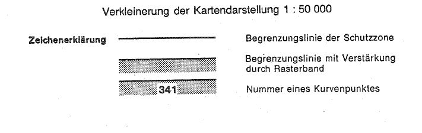
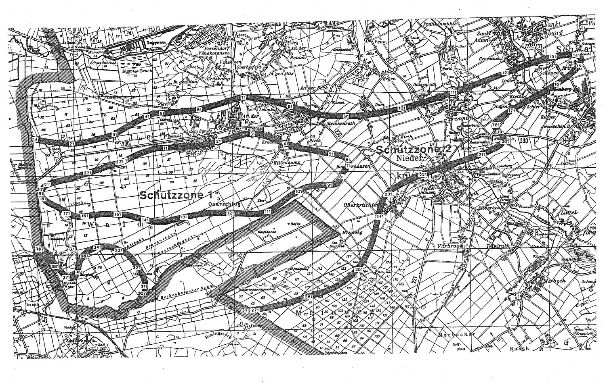

# Verordnung über die Festsetzung des Lärmschutzbereichs für den militärischen Flugplatz Brüggen (FluLärmBrügV)

Ausfertigungsdatum
:   1979-10-12

Fundstelle
:   BGBl I: 1979, 1740

Geändert durch
:   Art. 1 V v. 5.6.1986 I 852

## Eingangsformel

Auf Grund des § 4 Abs. 1 des Gesetzes zum Schutz gegen Fluglärm vom
30\. März 1971 (BGBl. I S. 282) wird im Einvernehmen mit dem
Bundesminister der Verteidigung und mit Zustimmung des Bundesrates
verordnet:

## § 1

Zum Schutz der Allgemeinheit vor Gefahren, erheblichen Nachteilen und
erheblichen Belästigungen durch Fluglärm in der Umgebung des
militärischen Flugplatzes Brüggen wird der in § 2 bestimmte
Lärmschutzbereich festgesetzt.

## § 2

Der Lärmschutzbereich mit seinen zwei Schutzzonen wird nach Anlage 1
bestimmt durch die interpolierten Verbindungslinien zwischen den
Kurvenpunkten, soweit diese Linien außerhalb des Flugplatzgeländes
verlaufen.

## § 3

Liegt eine bauliche Anlage zu einem Teil im Lärmschutzbereich, so gilt
sie als ganz im Lärmschutzbereich gelegen. Liegt eine bauliche Anlage
zu einem Teil in der Schutzzone 1, so gilt sie als ganz in dieser
Schutzzone gelegen.

## § 4

(1) Der nach § 2 bestimmte Lärmschutzbereich ist in einer
topographischen Karte im Maßstab 1:50.000 und in Karten im Maßstab
1:5.000 dargestellt. Die topographische Karte ist in verkleinerter
Form als Anlage 2 dieser Verordnung beigefügt. Die topographische
Karte und die Karten im Maßstab 1:5.000 sind beim
Regierungspräsidenten Düsseldorf, Cäcilienallee 2, 4000 Düsseldorf 30,
zu jedermanns Einsicht archivmäßig gesichert niedergelegt.

(2) Die Karten im Maßstab 1:5.000 über den Lärmschutzbereich nach der
bis zum Ablauf des 11. Juni 1986 geltenden Fassung dieser Verordnung
bleiben an gleicher Stelle zu jedermanns Einsicht archivmäßig
gesichert niedergelegt.

## § 5

Diese Verordnung tritt am Tag nach der Verkündung in Kraft.

## Schlußformel

Der Bundesminister des Innern

## Anlage 1 (zu § 2 der Verordnung über die Festsetzung des Lärmschutzbereichs für den militärischen Flugplatz Brüggen in der Fassung der Ersten Änderungsverordnung vom 5. Juni 1986)

(Fundstelle des Originaltextes: BGBl. I 1986, 853 - 858)

*    *   **Lärmschutzbereich - Erste Änderung**

*    *

*    *
    *   Koordinatensystem:

    *   Gauß-Krüger

*    *
    *   Interpolation:

    *   Polynom 3. Grades mit stetigem Tangentenübergang

*    *

*    *   KURVENPUNKTE DER SCHUTZZONE 1 (MILITÄRISCHER FLUGPLATZ BRÜGGEN)

*    *

*    *   NR.

    *   Y (RECHTS)

    *   X (HOCH)

    *   NR.

    *   Y (RECHTS)

    *   X (HOCH)

    *   NR.

    *   Y (RECHTS)

    *   X (HOCH)

*    *

*    *

*    *   1

    *   2507283.1

    *   5674290.7

    *   51

    *   2512504.9

    *   5674398.1

    *   101

    *   2511611.7

    *   5673588.5

*    *   2

    *   2507409.7

    *   5674347.2

    *   52

    *   2512581.9

    *   5674382.2

    *   102

    *   2511546.7

    *   5673546.1

*    *   3

    *   2507535.8

    *   5674404.8

    *   53

    *   2512658.5

    *   5674365.0

    *   103

    *   2511477.2

    *   5673509.1

*    *   4

    *   2507662.8

    *   5674460.3

    *   54

    *   2512709.7

    *   5674352.1

    *   104

    *   2511408.5

    *   5673470.6

*    *   5

    *   2507791.8

    *   5674510.8

    *   55

    *   2512759.9

    *   5674336.4

    *   105

    *   2511376.9

    *   5673447.0

*    *   6

    *   2507923.9

    *   5674553.6

    *   56

    *   2512808.7

    *   5674316.2

    *   106

    *   2511345.5

    *   5673423.2

*    *   7

    *   2508057.3

    *   5674588.5

    *   57

    *   2512831.9

    *   5674303.5

    *   107

    *   2511283.1

    *   5673375.1

*    *   8

    *   2508123.6

    *   5674606.4

    *   58

    *   2512842.9

    *   5674296.2

    *   108

    *   2511167.4

    *   5673288.5

*    *   9

    *   2508192.3

    *   5674607.8

    *   59

    *   2512853.3

    *   5674288.0

    *   109

    *   2511048.3

    *   5673208.4

*    *   10

    *   2508260.6

    *   5674609.6

    *   60

    *   2512858.3

    *   5674283.4

    *   110

    *   2510923.8

    *   5673138.9

*    *

*    *   11

    *   2508328.9

    *   5674611.7

    *   61

    *   2512863.0

    *   5674278.6

    *   111

    *   2510858.7

    *   5673109.2

*    *   12

    *   2508465.4

    *   5674616.9

    *   62

    *   2512867.3

    *   5674273.5

    *   112

    *   2510791.7

    *   5673083.9

*    *   13

    *   2508601.7

    *   5674623.4

    *   63

    *   2512871.2

    *   5674268.2

    *   113

    *   2510721.5

    *   5673063.1

*    *   14

    *   2508738.2

    *   5674630.8

    *   64

    *   2512874.7

    *   5674262.5

    *   114

    *   2510650.0

    *   5673047.6

*    *   15

    *   2508874.6

    *   5674639.1

    *   65

    *   2512877.7

    *   5674256.6

    *   115

    *   2510615.8

    *   5673041.9

*    *   16

    *   2509011.1

    *   5674646.9

    *   66

    *   2512881.9

    *   5674243.6

    *   116

    *   2510581.3

    *   5673039.4

*    *   17

    *   2509147.5

    *   5674654.5

    *   67

    *   2512883.3

    *   5674226.0

    *   117

    *   2510512.1

    *   5673042.2

*    *   18

    *   2509283.2

    *   5674673.1

    *   68

    *   2512880.5

    *   5674208.6

    *   118

    *   2510375.1

    *   5673052.6

*    *   19

    *   2509416.7

    *   5674701.0

    *   69

    *   2512875.5

    *   5674193.6

    *   119

    *   2510238.3

    *   5673065.8

*    *   20

    *   2509550.0

    *   5674729.7

    *   70

    *   2512868.7

    *   5674179.2

    *   120

    *   2510101.2

    *   5673076.0

*    *

*    *   21

    *   2509683.1

    *   5674759.1

    *   71

    *   2512860.9

    *   5674165.4

    *   121

    *   2509964.0

    *   5673083.6

*    *   22

    *   2509815.9

    *   5674790.0

    *   72

    *   2512852.3

    *   5674152.2

    *   122

    *   2509813.9

    *   5673089.3

*    *   23

    *   2509948.4

    *   5674822.5

    *   73

    *   2512833.5

    *   5674126.5

    *   123

    *   2509663.8

    *   5673092.7

*    *   24

    *   2510079.5

    *   5674856.5

    *   74

    *   2512813.5

    *   5674101.4

    *   124

    *   2509513.6

    *   5673094.9

*    *   25

    *   2510210.2

    *   5674892.5

    *   75

    *   2512793.4

    *   5674076.5

    *   125

    *   2509438.5

    *   5673095.3

*    *   26

    *   2510275.4

    *   5674910.1

    *   76

    *   2512766.3

    *   5674041.3

    *   126

    *   2509363.4

    *   5673093.5

*    *   27

    *   2510341.7

    *   5674922.7

    *   77

    *   2512741.5

    *   5674004.5

    *   127

    *   2509283.2

    *   5673083.7

*    *   28

    *   2510408.3

    *   5674935.5

    *   78

    *   2512718.3

    *   5673962.2

    *   128

    *   2509149.5

    *   5673062.7

*    *   29

    *   2510442.2

    *   5674936.2

    *   79

    *   2512708.4

    *   5673940.2

    *   129

    *   2509015.9

    *   5673041.0

*    *   30

    *   2510476.1

    *   5674936.0

    *   80

    *   2512699.4

    *   5673917.8

    *   130

    *   2508882.4

    *   5673018.5

*    *

*    *   31

    *   2510545.2

    *   5674932.8

    *   81

    *   2512681.7

    *   5673871.6

    *   131

    *   2508749.3

    *   5672994.0

*    *   32

    *   2510614.0

    *   5674925.9

    *   82

    *   2512659.9

    *   5673827.1

    *   132

    *   2508616.7

    *   5672967.2

*    *   33

    *   2510684.8

    *   5674914.8

    *   83

    *   2512633.2

    *   5673794.0

    *   133

    *   2508484.9

    *   5672937.7

*    *   34

    *   2510755.0

    *   5674900.0

    *   84

    *   2512616.7

    *   5673780.6

    *   134

    *   2508353.5

    *   5672905.0

*    *   35

    *   2510823.5

    *   5674881.9

    *   85

    *   2512598.4

    *   5673769.6

    *   135

    *   2508287.8

    *   5672890.0

*    *   36

    *   2510891.2

    *   5674860.6

    *   86

    *   2512578.4

    *   5673760.7

    *   136

    *   2508220.4

    *   5672889.5

*    *   37

    *   2511023.6

    *   5674810.0

    *   87

    *   2512557.5

    *   5673754.1

    *   137

    *   2508086.0

    *   5672889.9

*    *   38

    *   2511153.6

    *   5674752.3

    *   88

    *   2512536.2

    *   5673749.2

    *   138

    *   2508017.8

    *   5672895.8

*    *   39

    *   2511218.2

    *   5674722.7

    *   89

    *   2512514.5

    *   5673745.8

    *   139

    *   2507950.0

    *   5672906.1

*    *   40

    *   2511283.1

    *   5674693.6

    *   90

    *   2512490.6

    *   5673743.2

    *   140

    *   2507882.6

    *   5672920.5

*    *

*    *   41

    *   2511320.7

    *   5674681.4

    *   91

    *   2512466.6

    *   5673741.7

    *   141

    *   2507815.8

    *   5672937.8

*    *   42

    *   2511358.8

    *   5674670.7

    *   92

    *   2512418.5

    *   5673740.4

    *   142

    *   2507683.2

    *   5672976.1

*    *   43

    *   2511434.8

    *   5674648.6

    *   93

    *   2512317.9

    *   5673741.9

    *   143

    *   2507550.9

    *   5673015.0

*    *   44

    *   2511508.5

    *   5674621.0

    *   94

    *   2512217.3

    *   5673743.4

    *   144

    *   2507417.7

    *   5673051.0

*    *   45

    *   2511582.9

    *   5674594.9

    *   95

    *   2512120.7

    *   5673738.9

    *   145

    *   2507350.6

    *   5673067.0

*    *   46

    *   2511733.7

    *   5674551.1

    *   96

    *   2511967.5

    *   5673719.6

    *   146

    *   2507283.2

    *   5673081.7

*    *   47

    *   2511887.2

    *   5674517.6

    *   97

    *   2511893.0

    *   5673704.6

    *   147

    *   2507245.9

    *   5673083.2

*    *   48

    *   2512042.2

    *   5674489.8

    *   98

    *   2511819.6

    *   5673684.7

    *   148

    *   2507208.7

    *   5673082.3

*    *   49

    *   2512196.7

    *   5674460.7

    *   99

    *   2511748.2

    *   5673658.7

    *   149

    *   2507171.4

    *   5673081.8

*    *   50

    *   2512350.7

    *   5674429.0

    *   100

    *   2511679.5

    *   5673626.4

    *   150

    *   2507134.1

    *   5673082.2

*    *

*    *

*    *   NOCH SCHUTZZONE 1 (MILITÄRISCHER FLUGPLATZ BRÜGGEN)

*    *

*    *   151

    *   2507100.6

    *   5673085.2

    *   181

    *   2505284.8

    *   5673476.5

    *   211

    *   2505357.0

    *   5673728.8

*    *   152

    *   2507067.0

    *   5673086.7

    *   182

    *   2505267.6

    *   5673495.0

    *   212

    *   2505389.3

    *   5673742.9

*    *   153

    *   2507033.4

    *   5673088.8

    *   183

    *   2505260.1

    *   5673504.6

    *   213

    *   2505422.4

    *   5673755.2

*    *   154

    *   2506999.8

    *   5673091.3

    *   184

    *   2505253.2

    *   5673514.6

    *   214

    *   2505488.4

    *   5673775.9

*    *   155

    *   2506932.8

    *   5673096.9

    *   185

    *   2505247.1

    *   5673524.9

    *   215

    *   2505555.3

    *   5673793.5

*    *   156

    *   2506865.6

    *   5673101.6

    *   186

    *   2505241.8

    *   5673535.7

    *   216

    *   2505690.2

    *   5673825.1

*    *   157

    *   2506731.1

    *   5673104.4

    *   187

    *   2505237.4

    *   5673547.0

    *   217

    *   2505826.1

    *   5673853.2

*    *   158

    *   2506596.4

    *   5673097.4

    *   188

    *   2505234.2

    *   5673558.7

    *   218

    *   2505960.7

    *   5673885.4

*    *   159

    *   2506458.6

    *   5673082.5

    *   189

    *   2505233.0

    *   5673565.0

    *   219

    *   2506094.4

    *   5673921.1

*    *   160

    *   2506320.7

    *   5673064.2

    *   190

    *   2505232.1

    *   5673571.3

    *   220

    *   2506227.0

    *   5673960.7

*    *

*    *   161

    *   2506251.9

    *   5673057.8

    *   191

    *   2505231.6

    *   5673577.7

    *   221

    *   2506358.7

    *   5674002.8

*    *   162

    *   2506182.9

    *   5673052.5

    *   192

    *   2505231.5

    *   5673584.2

    *   222

    *   2506490.6

    *   5674044.8

*    *   163

    *   2506148.4

    *   5673051.0

    *   193

    *   2505231.8

    *   5673591.0

    *   223

    *   2506622.3

    *   5674087.0

*    *   164

    *   2506114.0

    *   5673051.0

    *   194

    *   2505232.6

    *   5673597.9

    *   224

    *   2506753.7

    *   5674130.1

*    *   165

    *   2506079.7

    *   5673052.9

    *   195

    *   2505233.8

    *   5673604.7

    *   225

    *   2506885.1

    *   5674173.3

*    *   166

    *   2506045.4

    *   5673057.2

    *   196

    *   2505235.4

    *   5673611.4

    *   226

    *   2507018.4

    *   5674210.5

*    *   167

    *   2506009.5

    *   5673065.0

    *   197

    *   2505237.2

    *   5673617.5

    *   227

    *   2507086.4

    *   5674225.4

*    *   168

    *   2505974.6

    *   5673076.4

    *   198

    *   2505239.4

    *   5673623.6

    *   228

    *   2507154.9

    *   5674237.3

*    *   169

    *   2505940.9

    *   5673091.1

    *   199

    *   2505242.0

    *   5673629.5

    *   229

    *   2507187.0

    *   5674250.6

*    *   170

    *   2505908.6

    *   5673108.6

    *   200

    *   2505244.8

    *   5673635.2

    *   230

    *   2507219.2

    *   5674263.7

*    *

*    *   171

    *   2505877.8

    *   5673127.6

    *   201

    *   2505251.2

    *   5673646.2

    *   231

    *   2507283.2

    *   5674290.7

*    *   172

    *   2505847.4

    *   5673147.4

    *   202

    *   2505254.8

    *   5673651.4

    *
    *
    *

*    *   173

    *   2505786.4

    *   5673186.6

    *   203

    *   2505258.6

    *   5673656.5

    *
    *
    *

*    *   174

    *   2505659.9

    *   5673257.4

    *   204

    *   2505267.0

    *   5673666.3

    *
    *
    *

*    *   175

    *   2505531.0

    *   5673324.0

    *   205

    *   2505276.0

    *   5673675.6

    *
    *
    *

*    *   176

    *   2505466.6

    *   5673357.3

    *   206

    *   2505285.9

    *   5673684.5

    *
    *
    *

*    *   177

    *   2505402.9

    *   5673392.1

    *   207

    *   2505296.3

    *   5673692.9

    *
    *
    *

*    *   178

    *   2505371.6

    *   5673410.7

    *   208

    *   2505310.8

    *   5673703.1

    *
    *
    *

*    *   179

    *   2505341.1

    *   5673430.6

    *   209

    *   2505325.9

    *   5673712.4

    *
    *
    *

*    *   180

    *   2505311.9

    *   5673452.4

    *   210

    *   2505341.3

    *   5673720.9

    *
    *
    *

*    *

*    *

*    *   KURVENPUNKTE DER SCHUTZZONE 2 (MILITÄRISCHER FLUGPLATZ BRÜGGEN)

*    *

*    *   1

    *   Die Kurvenpunkte von Nr. 1 bis Nr. 13 der Schutzzone 2 liegen
        außerhalb des Gebietes der Bundesrepublik Deutschland. Die Grenze des
        deutschen Staatsgebietes bildet hier zugleich die Grenze des
        Lärmschutzbereichs.

    *   51

    *   2508250.0

    *   5675493.0

    *   101

    *   2514344.1

    *   5675523.4

*    *   2

    *   52

    *   2508319.2

    *   5675496.4

    *   102

    *   2514475.8

    *   5675556.1

*    *   3

    *   53

    *   2508457.5

    *   5675504.4

    *   103

    *   2514607.0

    *   5675590.7

*    *   4

    *   54

    *   2508595.6

    *   5675514.0

    *   104

    *   2514737.6

    *   5675628.0

*    *   5

    *   55

    *   2508733.7

    *   5675524.9

    *   105

    *   2514867.9

    *   5675666.2

*    *   6

    *   56

    *   2508871.8

    *   5675535.8

    *   106

    *   2514999.3

    *   5675705.6

*    *   7

    *   57

    *   2509010.1

    *   5675544.9

    *   107

    *   2515130.4

    *   5675745.6

*    *   8

    *   58

    *   2509079.2

    *   5675549.9

    *   108

    *   2515261.3

    *   5675786.2

*    *   9

    *   59

    *   2509147.6

    *   5675560.4

    *   109

    *   2515392.1

    *   5675827.2

*    *   10

    *   60

    *   2509181.4

    *   5675568.7

    *   110

    *   2515522.8

    *   5675868.8

*    *
    *

*    *   11

    *   61

    *   2509215.3

    *   5675577.0

    *   111

    *   2515653.4

    *   5675910.6

*    *   12

    *
    *   62

    *   2509282.9

    *   5675594.0

    *   112

    *   2515784.9

    *   5675953.1

*    *   13

    *
    *   63

    *   2509415.6

    *   5675628.0

    *   113

    *   2515915.7

    *   5675997.5

*    *   14

    *   2505010.2

    *   5674875.7

    *   64

    *   2509548.1

    *   5675662.2

    *   114

    *   2516046.1

    *   5676042.9

*    *   15

    *   2505146.5

    *   5674847.7

    *   65

    *   2509680.1

    *   5675698.2

    *   115

    *   2516176.4

    *   5676089.1

*    *   16

    *   2505283.4

    *   5674822.6

    *   66

    *   2509811.7

    *   5675735.8

    *   116

    *   2516306.5

    *   5676135.5

*    *   17

    *   2505420.4

    *   5674800.9

    *   67

    *   2509942.8

    *   5675775.3

    *   117

    *   2516436.5

    *   5676182.2

*    *   18

    *   2505557.6

    *   5674780.5

    *   68

    *   2510072.8

    *   5675816.9

    *   118

    *   2516578.5

    *   5676233.5

*    *   19

    *   2505695.3

    *   5674765.7

    *   69

    *   2510203.3

    *   5675854.4

    *   119

    *   2516720.4

    *   5676285.1

*    *   20

    *   2505833.6

    *   5674756.1

    *   70

    *   2510269.3

    *   5675865.9

    *   120

    *   2516862.3

    *   5676336.8

*    *

*    *   21

    *   2505972.5

    *   5674752.4

    *   71

    *   2510336.1

    *   5675871.7

    *   121

    *   2517004.1

    *   5676388.7

*    *   22

    *   2506107.7

    *   5674759.1

    *   72

    *   2510370.2

    *   5675869.9

    *   122

    *   2517145.9

    *   5676440.7

*    *   23

    *   2506240.8

    *   5674778.4

    *   73

    *   2510404.1

    *   5675867.7

    *   123

    *   2517287.6

    *   5676492.6

*    *   24

    *   2506373.5

    *   5674801.6

    *   74

    *   2510471.8

    *   5675862.5

    *   124

    *   2517429.4

    *   5676544.6

*    *   25

    *   2506505.7

    *   5674827.5

    *   75

    *   2510608.0

    *   5675847.5

    *   125

    *   2517571.8

    *   5676594.9

*    *   26

    *   2506637.4

    *   5674856.7

    *   76

    *   2510755.7

    *   5675824.2

    *   126

    *   2517716.0

    *   5676640.2

*    *   27

    *   2506792.1

    *   5674895.1

    *   77

    *   2510901.6

    *   5675793.2

    *   127

    *   2517809.1

    *   5676667.5

*    *   28

    *   2506869.1

    *   5674915.7

    *   78

    *   2511045.6

    *   5675754.3

    *   128

    *   2517902.5

    *   5676693.4

*    *   29

    *   2506945.3

    *   5674939.7

    *   79

    *   2511187.7

    *   5675708.0

    *   129

    *   2517996.1

    *   5676717.7

*    *   30

    *   2507006.2

    *   5674956.6

    *   80

    *   2511331.0

    *   5675668.6

    *   130

    *   2518089.9

    *   5676740.3

*    *

*    *   31

    *   2507067.1

    *   5674973.8

    *   81

    *   2511481.5

    *   5675617.4

    *   131

    *   2518184.1

    *   5676760.6

*    *   32

    *   2507095.3

    *   5674987.1

    *   82

    *   2511631.7

    *   5675566.5

    *   132

    *   2518278.6

    *   5676778.5

*    *   33

    *   2507121.9

    *   5675003.5

    *   83

    *   2511781.8

    *   5675515.5

    *   133

    *   2518373.5

    *   5676794.3

*    *   34

    *   2507175.2

    *   5675036.2

    *   84

    *   2511932.6

    *   5675466.5

    *   134

    *   2518468.9

    *   5676806.7

*    *   35

    *   2507282.8

    *   5675100.2

    *   85

    *   2512063.3

    *   5675428.7

    *   135

    *   2518565.0

    *   5676814.9

*    *   36

    *   2507405.8

    *   5675169.9

    *   86

    *   2512194.9

    *   5675396.5

    *   136

    *   2518614.1

    *   5676816.4

*    *   37

    *   2507530.4

    *   5675236.6

    *   87

    *   2512328.3

    *   5675374.9

    *   137

    *   2518663.1

    *   5676815.3

*    *   38

    *   2507655.9

    *   5675301.4

    *   88

    *   2512463.3

    *   5675363.6

    *   138

    *   2518690.0

    *   5676813.2

*    *   39

    *   2507782.5

    *   5675364.1

    *   89

    *   2512599.1

    *   5675356.8

    *   139

    *   2518716.2

    *   5676809.6

*    *   40

    *   2507846.1

    *   5675395.1

    *   90

    *   2512752.7

    *   5675350.2

    *   140

    *   2518742.4

    *   5676803.9

*    *

*    *   41

    *   2507909.8

    *   5675425.6

    *   91

    *   2512906.4

    *   5675345.6

    *   141

    *   2518758.8

    *   5676798.6

*    *   42

    *   2507942.8

    *   5675440.6

    *   92

    *   2513060.1

    *   5675343.0

    *   142

    *   2518775.0

    *   5676791.3

*    *   43

    *   2507975.4

    *   5675456.1

    *   93

    *   2513213.0

    *   5675347.1

    *   143

    *   2518791.3

    *   5676780.7

*    *   44

    *   2508007.7

    *   5675472.3

    *   94

    *   2513359.2

    *   5675358.0

    *   144

    *   2518805.2

    *   5676765.3

*    *   45

    *   2508041.5

    *   5675485.7

    *   95

    *   2513503.9

    *   5675373.6

    *   145

    *   2518813.4

    *   5676742.5

*    *   46

    *   2508059.3

    *   5675486.1

    *   96

    *   2513648.3

    *   5675392.1

    *   146

    *   2518809.4

    *   5676706.8

*    *   47

    *   2508076.7

    *   5675486.6

    *   97

    *   2513792.4

    *   5675412.1

    *   147

    *   2518796.4

    *   5676676.6

*    *   48

    *   2508111.3

    *   5675487.6

    *   98

    *   2513936.0

    *   5675436.1

    *   148

    *   2518782.5

    *   5676653.3

*    *   49

    *   2508146.0

    *   5675488.8

    *   99

    *   2514079.1

    *   5675463.8

    *   149

    *   2518774.7

    *   5676642.2

*    *   50

    *   2508180.7

    *   5675490.1

    *   100

    *   2514211.9

    *   5675492.6

    *   150

    *   2518761.9

    *   5676625.5

*    *

*    *

*    *   NOCH SCHUTZZONE 2 (MILITÄRISCHER FLUGPLATZ BRÜGGEN)

*    *

*    *   151

    *   2518747.6

    *   5676608.2

    *   201

    *   2516814.6

    *   5674713.3

    *   251

    *   2513057.8

    *   5671543.8

*    *   152

    *   2518732.4

    *   5676591.4

    *   202

    *   2516802.5

    *   5674697.1

    *   252

    *   2512968.7

    *   5671450.9

*    *   153

    *   2518716.7

    *   5676574.9

    *   203

    *   2516788.1

    *   5674682.2

    *   253

    *   2512858.2

    *   5671351.6

*    *   154

    *   2518684.9

    *   5676543.6

    *   204

    *   2516757.5

    *   5674656.0

    *   254

    *   2512739.8

    *   5671261.9

*    *   155

    *   2518651.7

    *   5676513.1

    *   205

    *   2516724.2

    *   5674633.3

    *   255

    *   2512608.5

    *   5671178.7

*    *   156

    *   2518583.2

    *   5676454.7

    *   206

    *   2516690.7

    *   5674613.1

    *   256

    *   2512471.9

    *   5671107.5

*    *   157

    *   2518512.0

    *   5676398.9

    *   207

    *   2516656.1

    *   5674594.6

    *   257

    *   2512330.2

    *   5671048.2

*    *   158

    *   2518439.1

    *   5676344.8

    *   208

    *   2516585.5

    *   5674560.9

    *   258

    *   2512184.4

    *   5670998.4

*    *   159

    *   2518364.4

    *   5676292.7

    *   209

    *   2516513.9

    *   5674530.8

    *   259

    *   2512035.6

    *   5670955.4

*    *   160

    *   2518288.1

    *   5676242.2

    *   210

    *   2516441.5

    *   5674502.8

    *   260

    *   2511925.0

    *   5670927.8

*    *

*    *   161

    *   2518210.3

    *   5676193.3

    *   211

    *   2516295.4

    *   5674450.4

    *   261

    *   2511816.4

    *   5670893.0

*    *   162

    *   2518131.5

    *   5676145.4

    *   212

    *   2516148.5

    *   5674399.8

    *   262

    *   2511682.7

    *   5670854.8

*    *   163

    *   2518051.5

    *   5676098.7

    *   213

    *   2516000.9

    *   5674351.4

    *   263

    *   2511550.0

    *   5670813.3

*    *   164

    *   2517924.0

    *   5676027.2

    *   214

    *   2515852.5

    *   5674304.9

    *   264

    *   2511417.2

    *   5670771.9

*    *   165

    *   2517795.3

    *   5675957.7

    *   215

    *   2515701.1

    *   5674258.9

    *   265

    *   2511283.1

    *   5670735.0

*    *   166

    *   2517666.5

    *   5675888.4

    *   216

    *   2515549.5

    *   5674213.6

    *   266

    *   2511148.0

    *   5670707.4

*    *   167

    *   2517538.2

    *   5675818.3

    *   217

    *   2515398.6

    *   5674166.2

    *   267

    *   2511012.9

    *   5670679.8

*    *   168

    *   2517410.5

    *   5675747.1

    *   218

    *   2515248.1

    *   5674117.6

    *   268

    *   2510877.9

    *   5670652.0

*    *   169

    *   2517283.5

    *   5675674.5

    *   219

    *   2515097.8

    *   5674068.1

    *   269

    *   2510742.2

    *   5670627.5

*    *   170

    *   2517147.3

    *   5675593.9

    *   220

    *   2514948.0

    *   5674017.1

    *   270

    *   2510605.8

    *   5670608.0

*    *

*    *   171

    *   2517070.2

    *   5675546.4

    *   221

    *   2514803.5

    *   5673965.6

    *   271

    *   2510469.0

    *   5670589.9

*    *   172

    *   2516993.9

    *   5675497.6

    *   222

    *   2514660.2

    *   5673911.2

    *   272

    *   2510332.3

    *   5670571.8

*    *   173

    *   2516920.9

    *   5675448.6

    *   223

    *   2514517.9

    *   5673854.3

    *   273

    *
    *

*    *   174

    *   2516849.4

    *   5675397.4

    *   224

    *   2514377.3

    *   5673793.7

    *   274

    *
    *

*    *   175

    *   2516783.2

    *   5675346.0

    *   225

    *   2514239.0

    *   5673727.6

    *   275

    *
    *

*    *   176

    *   2516720.5

    *   5675290.4

    *   226

    *   2514103.3

    *   5673655.4

    *   276

    *
    *

*    *   177

    *   2516667.6

    *   5675233.5

    *   227

    *   2514028.0

    *   5673611.2

    *   277

    *
    *

*    *   178

    *   2516644.3

    *   5675202.5

    *   228

    *   2513954.9

    *   5673563.3

    *   278

    *
    *

*    *   179

    *   2516624.8

    *   5675168.9

    *   229

    *   2513891.1

    *   5673512.7

    *   279

    *
    *

*    *   180

    *   2516615.6

    *   5675147.3

    *   230

    *   2513861.6

    *   5673484.5

    *   280

    *
    *

*    *
    *   Die Kurvenpunkte von Nr. 273 bis Nr. 306 der Schutzzone 2 liegen
        außerhalb des Gebietes der Bundesrepublik Deutschland. Die Grenze des
        deutschen Staatsgebietes bildet hier zugleich die Grenze des
        Lärmschutzbereichs.

*    *   181

    *   2516609.5

    *   5675125.0

    *   231

    *   2513834.3

    *   5673454.2

    *   281

*    *   182

    *   2516606.5

    *   5675102.3

    *   232

    *   2513810.3

    *   5673423.3

    *   282

*    *   183

    *   2516607.7

    *   5675078.8

    *   233

    *   2513788.5

    *   5673390.7

    *   283

*    *   184

    *   2516613.1

    *   5675056.0

    *   234

    *   2513769.1

    *   5673356.7

    *   284

*    *   185

    *   2516622.0

    *   5675034.9

    *   235

    *   2513751.8

    *   5673321.6

    *   285

*    *   186

    *   2516633.8

    *   5675015.2

    *   236

    *   2513721.1

    *   5673248.1

    *   286

*    *   187

    *   2516647.8

    *   5674996.5

    *   237

    *   2513695.3

    *   5673172.8

    *   287

*    *   188

    *   2516665.0

    *   5674977.2

    *   238

    *   2513672.5

    *   5673094.8

    *   288

*    *   189

    *   2516683.1

    *   5674959.0

    *   239

    *   2513651.4

    *   5673016.3

    *   289

*    *   190

    *   2516702.0

    *   5674941.4

    *   240

    *   2513630.5

    *   5672937.2

    *   290

*    *

*    *   191

    *   2516721.2

    *   5674924.2

    *   241

    *   2513610.7

    *   5672857.8

    *   291

*    *   192

    *   2516740.6

    *   5674907.2

    *   242

    *   2513577.9

    *   5672710.0

    *   292

*    *   193

    *   2516759.6

    *   5674889.6

    *   243

    *   2513545.6

    *   5672562.1

    *   293

    *

*    *   194

    *   2516779.0

    *   5674870.6

    *   244

    *   2513509.5

    *   5672415.4

    *   294

    *

*    *   195

    *   2516797.1

    *   5674850.8

    *   245

    *   2513466.7

    *   5672270.9

    *   295

    *

*    *   196

    *   2516813.0

    *   5674829.8

    *   246

    *   2513415.6

    *   5672129.1

    *   296

    *

*    *   197

    *   2516825.7

    *   5674807.0

    *   247

    *   2513354.7

    *   5671990.5

    *   297

    *

*    *   198

    *   2516832.9

    *   5674781.2

    *   248

    *   2513283.2

    *   5671855.4

    *   298

    *

*    *   199

    *   2516831.7

    *   5674750.9

    *   249

    *   2513215.0

    *   5671746.1

    *   299

    *

*    *   200

    *   2516824.9

    *   5674730.9

    *   250

    *   2513139.9

    *   5671642.3

    *   300

    *

*    *

*    *

*    *   NOCH SCHUTZZONE 2 (MILITÄRISCHER FLUGPLATZ BRÜGGEN)

*    *

*    *   301

    *
    *
    *   351

    *   2506110.9

    *   5671991.0

    *   401

    *
    *

*    *   302

    *
    *
    *   352

    *   2506091.4

    *   5671959.1

    *   402

    *
    *

*    *   303

    *
    *
    *   353

    *   2506073.3

    *   5671924.2

    *   403

    *
    *

*    *   304

    *
    *
    *   354

    *   2506057.5

    *   5671888.1

    *   404

    *
    *

*    *   305

    *
    *
    *   355

    *   2506043.9

    *   5671851.2

    *   405

    *
    *

*    *   306

    *
    *
    *   356

    *   2506032.0

    *   5671813.7

    *   406

    *
    *

*    *   307

    *   2507801.0

    *   5671015.9

    *   357

    *   2506011.2

    *   5671732.0

    *   407

    *
    *

*    *   308

    *   2507811.2

    *   5671061.6

    *   358

    *   2506002.3

    *   5671690.8

    *   408

    *
    *

*    *   309

    *   2507819.5

    *   5671107.6

    *   359

    *   2505993.7

    *   5671649.6

    *   409

    *
    *

*    *   310

    *   2507826.9

    *   5671148.5

    *   360

    *   2505984.9

    *   5671610.8

    *   410

    *
    *

*    *

*    *   311

    *   2507828.3

    *   5671168.9

    *   361

    *   2505974.2

    *   5671572.8

    *   411

    *
    *

*    *   312

    *   2507829.1

    *   5671189.4

    *   362

    *   2505967.4

    *   5671554.3

    *   412

    *
    *

*    *   313

    *   2507828.5

    *   5671230.5

    *   363

    *   2505959.1

    *   5671536.5

    *   413

    *
    *

*    *   314

    *   2507824.7

    *   5671271.6

    *   364

    *   2505947.5

    *   5671519.5

    *   414

    *
    *

*    *   315

    *   2507818.9

    *   5671307.9

    *   365

    *   2505933.1

    *   5671504.9

    *   415

    *
    *

*    *   316

    *   2507810.8

    *   5671343.7

    *   366

    *   2505919.0

    *   5671496.5

    *   416

    *
    *

*    *   317

    *   2507800.8

    *   5671378.9

    *   367

    *   2505903.4

    *   5671491.9

    *   417

    *
    *

*    *   318

    *   2507789.1

    *   5671413.8

    *   368

    *   2505876.6

    *   5671491.9

    *   418

    *
    *

*    *   319

    *   2507762.4

    *   5671479.9

    *   369

    *   2505863.7

    *   5671494.5

    *   419

    *
    *

*    *   320

    *   2507731.8

    *   5671544.4

    *   370

    *   2505851.2

    *   5671498.4

    *   420

    *
    *

*    *
    *   Die Kurvenpunkte von Nr. 388 bis Nr. 541 der Schutzzone 2 liegen
        außerhalb des Gebietes der Bundesrepublik Deutschland. Die Grenze des
        deutschen Staatsgebietes bildethier zugleich die Grenze des
        Lärmschutzbereichs.

*    *   321

    *   2507663.2

    *   5671668.9

    *   371

    *   2505838.8

    *   5671503.3

    *   421

*    *   322

    *   2507586.7

    *   5671789.3

    *   372

    *   2505826.7

    *   5671509.1

    *   422

*    *   323

    *   2507502.7

    *   5671905.6

    *   373

    *   2505814.6

    *   5671515.6

    *   423

*    *   324

    *   2507457.3

    *   5671962.3

    *   374

    *   2505802.9

    *   5671522.7

    *   424

*    *   325

    *   2507409.7

    *   5672017.1

    *   375

    *   2505779.6

    *   5671538.7

    *   425

*    *   326

    *   2507382.8

    *   5672046.2

    *   376

    *   2505753.2

    *   5671559.9

    *   426

*    *   327

    *   2507350.9

    *   5672069.9

    *   377

    *   2505728.0

    *   5671582.5

    *   427

*    *   328

    *   2507317.3

    *   5672090.8

    *   378

    *   2505703.9

    *   5671606.2

    *   428

*    *   329

    *   2507283.1

    *   5672110.5

    *   379

    *   2505680.7

    *   5671630.9

    *   429

*    *   330

    *   2507230.1

    *   5672138.0

    *   380

    *   2505636.3

    *   5671682.8

    *   430

*    *

*    *   331

    *   2507158.2

    *   5672177.8

    *   381

    *   2505594.4

    *   5671736.8

    *   431

*    *   332

    *   2507083.2

    *   5672207.8

    *   382

    *   2505515.2

    *   5671850.1

    *   432

*    *   333

    *   2506983.2

    *   5672247.8

    *   383

    *   2505438.3

    *   5671966.0

    *   433

    *

*    *   334

    *   2506908.2

    *   5672267.8

    *   384

    *   2505365.4

    *   5672068.3

    *   434

    *

*    *   335

    *   2506848.2

    *   5672282.8

    *   385

    *   2505283.2

    *   5672163.2

    *   435

    *

*    *   336

    *   2506772.6

    *   5672287.2

    *   386

    *   2505231.4

    *   5672212.6

    *   436

    *

*    *   337

    *   2506734.6

    *   5672288.2

    *   387

    *   2505176.8

    *   5672258.8

    *   437

    *

*    *   338

    *   2506696.6

    *   5672288.1

    *   388

    *
    *
    *   438

    *

*    *   339

    *   2506620.6

    *   5672283.8

    *   389

    *
    *
    *   439

    *

*    *   340

    *   2506576.0

    *   5672277.8

    *   390

    *
    *
    *   440

    *

*    *

*    *   341

    *   2506531.8

    *   5672269.1

    *   391

    *
    *
    *   441

    *
    *

*    *   342

    *   2506488.7

    *   5672256.2

    *   392

    *
    *
    *   442

    *
    *

*    *   343

    *   2506447.1

    *   5672239.0

    *   393

    *
    *
    *   443

    *
    *

*    *   344

    *   2506374.4

    *   5672205.4

    *   394

    *
    *
    *   444

    *
    *

*    *   345

    *   2506304.0

    *   5672167.3

    *   395

    *
    *
    *   445

    *
    *

*    *   346

    *   2506240.8

    *   5672125.3

    *   396

    *
    *
    *   446

    *
    *

*    *   347

    *   2506210.9

    *   5672101.8

    *   397

    *
    *
    *   447

    *
    *

*    *   348

    *   2506182.7

    *   5672076.4

    *   398

    *
    *
    *   448

    *
    *

*    *   349

    *   2506156.6

    *   5672049.8

    *   399

    *
    *
    *   449

    *
    *

*    *   350

    *   2506132.7

    *   5672021.3

    *   400

    *
    *
    *   450

    *
    *

*    *

*    *

*    *   NOCH SCHUTZZONE 2 (MILITÄRISCHER FLUGPLATZ BRÜGGEN)

*    *

*    *   451

    *
    *
    *   491

    *
    *
    *   531

    *
    *

*    *   452

    *
    *
    *   492

    *
    *
    *   532

    *
    *

*    *   453

    *
    *
    *   493

    *
    *
    *   533

    *
    *

*    *   454

    *
    *
    *   494

    *
    *
    *   534

    *
    *

*    *   455

    *
    *
    *   495

    *
    *
    *   535

    *
    *

*    *   456

    *
    *
    *   496

    *
    *
    *   536

    *
    *

*    *   457

    *
    *
    *   497

    *
    *
    *   537

    *
    *

*    *   458

    *
    *
    *   498

    *
    *
    *   538

    *
    *

*    *   459

    *
    *
    *   499

    *
    *
    *   539

    *
    *

*    *   460

    *
    *
    *   500

    *
    *
    *   540

    *
    *

*    *

*    *   461

    *
    *   501

    *
    *
    *   541

    *
    *

*    *   462

    *   Die Kurvenpunkte von Nr. 388 bis Nr. 541 der Schutzzone 2 liegen
        außerhalb des Gebietes der Bundesrepublik Deutschland. Die Grenze des
        deutschen Staatsgebietes bildet hier zugleich die Grenze des
        Lärmschutzbereichs.

    *   502

    *
    *
    *
    *
    *

*    *   463

    *   503

    *
    *
    *
    *
    *

*    *   464

    *   504

    *
    *
    *
    *
    *

*    *   465

    *   505

    *
    *
    *
    *
    *

*    *   466

    *   506

    *
    *
    *
    *
    *

*    *   467

    *   507

    *
    *
    *
    *
    *

*    *   468

    *   508

    *
    *
    *
    *
    *

*    *   469

    *   509

    *
    *
    *
    *
    *

*    *   470

    *   510

    *
    *
    *
    *
    *

*    *
    *

*    *   471

    *   511

    *
    *
    *
    *
    *

*    *   472

    *   512

    *
    *
    *
    *
    *

*    *   473

    *
    *   513

    *
    *
    *
    *
    *

*    *   474

    *
    *   514

    *
    *
    *
    *
    *

*    *   475

    *
    *   515

    *
    *
    *
    *
    *

*    *   476

    *
    *   516

    *
    *
    *
    *
    *

*    *   477

    *
    *   517

    *
    *
    *
    *
    *

*    *   478

    *
    *   518

    *
    *
    *
    *
    *

*    *   479

    *
    *   519

    *
    *
    *
    *
    *

*    *   480

    *
    *   520

    *
    *
    *
    *
    *

*    *

*    *   481

    *
    *
    *   521

    *
    *
    *
    *
    *

*    *   482

    *
    *
    *   522

    *
    *
    *
    *
    *

*    *   483

    *
    *
    *   523

    *
    *
    *
    *
    *

*    *   484

    *
    *
    *   524

    *
    *
    *
    *
    *

*    *   485

    *
    *
    *   525

    *
    *
    *
    *
    *

*    *   486

    *
    *
    *   526

    *
    *
    *
    *
    *

*    *   487

    *
    *
    *   527

    *
    *
    *
    *
    *

*    *   488

    *
    *
    *   528

    *
    *
    *
    *
    *

*    *   489

    *
    *
    *   529

    *
    *
    *
    *
    *

*    *   490

    *
    *
    *   530

    *
    *
    *
    *
    *

## Anlage 2 (zu § 4 Abs. 1 der Verordnung über die Festsetzung des Lärmschutzbereichs für den militärischen Flugplatz Brüggen in der Fassung der Ersten Änderungsverordnung vom 5. Juni 1986)

   (Fundstelle: BGBl I 1986, 858 - 859)

