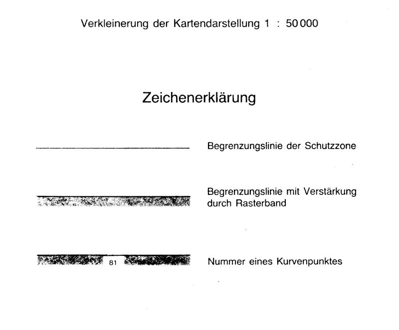
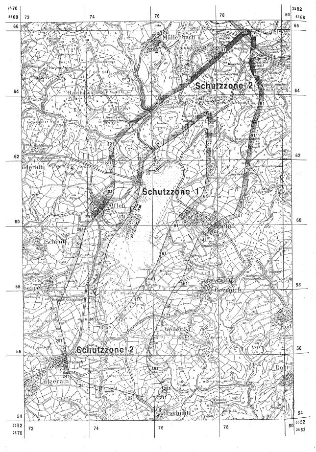

# Verordnung über die Festsetzung des Lärmschutzbereichs für den militärischen Flugplatz Büchel (FluLärmBüchV)

Ausfertigungsdatum
:   1976-12-22

Fundstelle
:   BGBl I: 1976, 3829

Zuletzt geändert durch
:   Art. 1 V v. 9.10.1991 I 1976

## Eingangsformel

Auf Grund des § 4 Abs. 1 des Gesetzes zum Schutz gegen Fluglärm vom
30\. März 1971 (Bundesgesetzblatt I S. 282), geändert durch Artikel 70
des Einführungsgesetzes zum Strafgesetzbuch vom 2. März 1974
(Bundesgesetzbl. I S. 469), wird im Einvernehmen mit dem
Bundesminister der Verteidigung und mit Zustimmung des Bundesrates
verordnet:

## § 1

Zum Schutz der Allgemeinheit vor Gefahren, erheblichen Nachteilen und
erheblichen Belästigungen durch Fluglärm in der Umgebung des
militärischen Flugplatzes Büchel wird der in § 2 bestimmte
Lärmschutzbereich festgesetzt.

## § 2

Der Lärmschutzbereich mit seinen zwei Schutzzonen wird nach Anlage 1
bestimmt durch die interpolierten Verbindungslinien zwischen den
Kurvenpunkten, soweit diese Linien außerhalb des Flugplatzgeländes
verlaufen.

## § 3

Liegt eine bauliche Anlage zu einem Teil im Lärmschutzbereich, so gilt
sie als ganz im Lärmschutzbereich gelegen. Liegt eine bauliche Anlage
zu einem Teil in der Schutzzone 1, so gilt sie als ganz in dieser
Schutzzone gelegen.

## § 4

(1) Der nach § 2 bestimmte Lärmschutzbereich ist in einer
topographischen Karte im Maßstab 1:50.000 und in Karten im Maßstab
1:5.000 dargestellt. Die topographische Karte ist in verkleinerter
Form als Anlage 2 dieser Verordnung beigefügt. Die topographische
Karte und die Karten im Maßstab 1:5.000 sind bei der Kreisverwaltung
Cochem-Zell, Moselstraße 2, 5590 Cochem, zu jedermanns Einsicht
archivmäßig gesichert niedergelegt.

(2) Die Karten im Maßstab 1:5.000 über den Lärmschutzbereich nach der
bis zum Ablauf des 20. Dezember 1983 und nach der bis zum 16. Oktober
1991 geltenden Fassung dieser Verordnung bleiben an gleicher Stelle zu
jedermanns Einsicht archivmäßig gesichert niedergelegt.

## § 5

Diese Verordnung tritt am Tag nach der Verkündung in Kraft.

## Schlußformel

Der Bundesminister des Innern

## Anlage 1 (zu § 2 der Verordnung über die Festsetzung des Lärmschutzbereichs für den militärischen Flugplatz Büchel in der Fassung der Zweiten Änderungsverordnung vom 9. Oktober 1991)

(Fundstelle des Originaltextes: BGBl. I 1991, 1977 - 1981)

*    *   **Lärmschutzbereich - Zweite Änderung -**

*    *

*    *   Koordinatensystem:

    *   Gauß-Krüger

    *   Y = Rechtswert

    *
    *

*    *
    *
    *
    *
    *
    *   X = Hochwert

    *
    *

*    *   Interpolation:

    *   Polynom 3. Grades mit stetigem Tangentenübergang

*    *

*    *

*    *   Kurvenpunkte der Schutzzone 1 (Militärischer Flugplatz Büchel

*    *

*    *   Nr.

    *   Y

    *   X

    *   Nr.

    *   Y

    *   X

    *   Nr.

    *   Y

    *   X

*    *

*    *   1

    *   2576324.0

    *   5562456.1

    *   51

    *   2577665.5

    *   5561600.6

    *   101

    *   2575845.7

    *   5558432.0

*    *   2

    *   2576455.7

    *   5562539.2

    *   52

    *   2577662.3

    *   5561512.7

    *   102

    *   2575794.9

    *   5558368.9

*    *   3

    *   2576590.3

    *   5562617.9

    *   53

    *   2577655.1

    *   5561428.1

    *   103

    *   2575742.7

    *   5558306.5

*    *   4

    *   2576723.2

    *   5562699.1

    *   54

    *   2577645.1

    *   5561343.8

    *   104

    *   2575691.8

    *   5558243.2

*    *   5

    *   2576850.8

    *   5562788.3

    *   55

    *   2577631.6

    *   5561262.5

    *   105

    *   2575642.9

    *   5558179.5

*    *   6

    *   2576977.1

    *   5562881.7

    *   56

    *   2577613.8

    *   5561182.1

    *   106

    *   2575598.8

    *   5558112.4

*    *   7

    *   2577103.8

    *   5562974.5

    *   57

    *   2577591.9

    *   5561104.8

    *   107

    *   2575555.5

    *   5558045.4

*    *   8

    *   2577234.1

    *   5563067.3

    *   58

    *   2577579.2

    *   5561066.7

    *   108

    *   2575511.7

    *   5557978.7

*    *   9

    *   2577297.8

    *   5563115.8

    *   59

    *   2577565.3

    *   5561029.0

    *   109

    *   2575467.4

    *   5557912.2

*    *   10

    *   2577360.3

    *   5563165.8

    *   60

    *   2577552.1

    *   5560996.4

    *   110

    *   2575422.1

    *   5557846.3

*    *
    *
    *
    *
    *
    *
    *
    *
    *

*    *   11

    *   2577391.3

    *   5563191.1

    *   61

    *   2577538.1

    *   5560964.3

    *   111

    *   2575386.3

    *   5557795.7

*    *   12

    *   2577422.3

    *   5563216.5

    *   62

    *   2577523.2

    *   5560932.5

    *   112

    *   2575327.9

    *   5557716.1

*    *   13

    *   2577453.4

    *   5563241.7

    *   63

    *   2577515.3

    *   5560916.8

    *   113

    *   2575279.1

    *   5557651.8

*    *   14

    *   2577484.8

    *   5563266.6

    *   64

    *   2577507.3

    *   5560901.1

    *   114

    *   2575229.6

    *   5557588.0

*    *   15

    *   2577506.0

    *   5563282.9

    *   65

    *   2577485.9

    *   5560888.7

    *   115

    *   2575179.3

    *   5557524.5

*    *   16

    *   2577527.6

    *   5563298.8

    *   66

    *   2577466.1

    *   5560874.0

    *   116

    *   2575128.8

    *   5557461.2

*    *   17

    *   2577549.5

    *   5563314.1

    *   67

    *   2577427.0

    *   5560844.0

    *   117

    *   2575095.0

    *   5557418.9

*    *   18

    *   2577572.0

    *   5563328.6

    *   68

    *   2577388.5

    *   5560813.4

    *   118

    *   2575027.5

    *   5557334.6

*    *   19

    *   2577595.2

    *   5563341.8

    *   69

    *   2577350.5

    *   5560782.0

    *   119

    *   2574976.9

    *   5557271.2

*    *   20

    *   2577619.7

    *   5563353.1

    *   70

    *   2577283.3

    *   5560727.1

    *   120

    *   2574925.7

    *   5557208.3

*    *
    *
    *
    *
    *
    *
    *
    *
    *

*    *   21

    *   2577645.8

    *   5563360.8

    *   71

    *   2577216.4

    *   5560671.8

    *   121

    *   2574899.3

    *   5557176.8

*    *   22

    *   2577673.0

    *   5563361.4

    *   72

    *   2577151.9

    *   5560615.9

    *   122

    *   2574872.5

    *   5557145.7

*    *   23

    *   2577688.1

    *   5563356.2

    *   73

    *   2577088.6

    *   5560558.5

    *   123

    *   2574845.0

    *   5557115.2

*    *   24

    *   2577700.9

    *   5563346.6

    *   74

    *   2577027.5

    *   5560500.8

    *   124

    *   2574816.5

    *   5557085.6

*    *   25

    *   2577715.3

    *   5563325.7

    *   75

    *   2576967.6

    *   5560441.9

    *   125

    *   2574790.5

    *   5557060.3

*    *   26

    *   2577723.8

    *   5563302.2

    *   76

    *   2576909.5

    *   5560382.6

    *   126

    *   2574763.5

    *   5557036.3

*    *   27

    *   2577729.2

    *   5563277.3

    *   77

    *   2576852.3

    *   5560322.3

    *   127

    *   2574734.9

    *   5557014.8

*    *   28

    *   2577732.5

    *   5563251.4

    *   78

    *   2576796.6

    *   5560261.6

    *   128

    *   2574703.5

    *   5556997.0

*    *   29

    *   2577734.2

    *   5563224.9

    *   79

    *   2576741.5

    *   5560200.5

    *   129

    *   2574670.3

    *   5556981.7

*    *   30

    *   2577735.1

    *   5563187.5

    *   80

    *   2576687.3

    *   5560139.1

    *   130

    *   2574624.4

    *   5556967.7

*    *
    *
    *
    *
    *
    *
    *
    *
    *

*    *   31

    *   2577734.5

    *   5563150.1

    *   81

    *   2576633.8

    *   5560077.1

    *   131

    *   2574577.0

    *   5556960.3

*    *   32

    *   2577733.1

    *   5563112.7

    *   82

    *   2576585.8

    *   5560013.1

    *   132

    *   2574525.5

    *   5556960.1

*    *   33

    *   2577731.0

    *   5563075.4

    *   83

    *   2576547.3

    *   5559943.1

    *   133

    *   2574474.4

    *   5556967.4

*    *   34

    *   2577728.1

    *   5563032.7

    *   84

    *   2576514.3

    *   5559870.9

    *   134

    *   2574430.5

    *   5556979.7

*    *   35

    *   2577724.7

    *   5562990.0

    *   85

    *   2576483.1

    *   5559797.9

    *   135

    *   2574388.7

    *   5556997.0

*    *   36

    *   2577717.4

    *   5562904.7

    *   86

    *   2576421.3

    *   5559651.5

    *   136

    *   2574350.2

    *   5557021.8

*    *   37

    *   2577710.0

    *   5562819.9

    *   87

    *   2576361.3

    *   5559504.1

    *   137

    *   2574323.1

    *   5557047.1

*    *   38

    *   2577701.8

    *   5562735.1

    *   88

    *   2576332.4

    *   5559429.8

    *   138

    *   2574300.3

    *   5557075.9

*    *   39

    *   2577692.2

    *   5562651.3

    *   89

    *   2576304.5

    *   5559355.2

    *   139

    *   2574281.8

    *   5557108.0

*    *   40

    *   2577682.1

    *   5562567.5

    *   90

    *   2576284.6

    *   5559300.2

    *   140

    *   2574266.3

    *   5557150.3

*    *
    *
    *
    *
    *
    *
    *
    *
    *

*    *   41

    *   2577673.1

    *   5562482.8

    *   91

    *   2576251.6

    *   5559204.3

    *   141

    *   2574255.7

    *   5557193.8

*    *   42

    *   2577666.6

    *   5562397.8

    *   92

    *   2576226.7

    *   5559127.9

    *   142

    *   2574248.0

    *   5557238.1

*    *   43

    *   2577663.5

    *   5562310.0

    *   93

    *   2576203.1

    *   5559051.2

    *   143

    *   2574240.2

    *   5557304.1

*    *   44

    *   2577663.2

    *   5562222.1

    *   94

    *   2576146.8

    *   5558902.0

    *   144

    *   2574234.6

    *   5557370.3

*    *   45

    *   2577665.0

    *   5562132.3

    *   95

    *   2576119.1

    *   5558827.4

    *   145

    *   2574226.0

    *   5557502.8

*    *   46

    *   2577667.5

    *   5562042.4

    *   96

    *   2576083.5

    *   5558756.3

    *   146

    *   2574218.3

    *   5557635.6

*    *   47

    *   2577668.5

    *   5561953.8

    *   97

    *   2576040.1

    *   5558689.2

    *   147

    *   2574214.6

    *   5557768.7

*    *   48

    *   2577667.0

    *   5561865.2

    *   98

    *   2575993.9

    *   5558623.9

    *   148

    *   2574217.4

    *   5557845.8

*    *   49

    *   2577665.4

    *   5561776.9

    *   99

    *   2575945.3

    *   5558559.4

    *   149

    *   2574225.7

    *   5557922.6

*    *   50

    *   2577665.2

    *   5561688.7

    *   100

    *   2575895.6

    *   5558495.8

    *   150

    *   2574239.3

    *   5558001.8

*    *

*    *

*    *   Noch Schutzzone 1 (Militärischer Flugplatz Büchel)

*    *

*    *   Nr.

    *   Y

    *   X

    *   Nr.

    *   Y

    *   X

    *   Nr.

    *   Y

    *   X

*    *

*    *   151

    *   2574256.5

    *   5558080.2

    *   171

    *   2575196.0

    *   5560199.3

    *   191

    *   2575772.3

    *   5561985.8

*    *   152

    *   2574295.6

    *   5558231.4

    *   172

    *   2575285.9

    *   5560327.0

    *   192

    *   2575794.3

    *   5562016.2

*    *   153

    *   2574337.0

    *   5558384.1

    *   173

    *   2575374.3

    *   5560455.4

    *   193

    *   2575817.2

    *   5562045.9

*    *   154

    *   2574378.0

    *   5558536.9

    *   174

    *   2575416.8

    *   5560519.9

    *   194

    *   2575841.0

    *   5562074.9

*    *   155

    *   2574422.6

    *   5558688.7

    *   175

    *   2575455.0

    *   5560587.0

    *   195

    *   2575891.2

    *   5562130.8

*    *   156

    *   2574471.8

    *   5558839.3

    *   176

    *   2575487.4

    *   5560656.4

    *   196

    *   2575944.6

    *   5562183.6

*    *   157

    *   2574515.3

    *   5558991.4

    *   177

    *   2575509.5

    *   5560729.7

    *   197

    *   2576003.3

    *   5562235.4

*    *   158

    *   2574554.5

    *   5559144.7

    *   178

    *   2575530.1

    *   5560804.0

    *   198

    *   2576064.7

    *   5562284.1

*    *   159

    *   2574596.0

    *   5559293.0

    *   179

    *   2575549.9

    *   5560878.5

    *   199

    *   2576192.3

    *   5562373.1

*    *   160

    *   2574647.2

    *   5559437.2

    *   180

    *   2575586.9

    *   5561028.8

    *   200

    *   2576324.0

    *   5562456.1

*    *
    *
    *
    *
    *
    *
    *
    *
    *

*    *   161

    *   2574677.9

    *   5559507.3

    *   181

    *   2575619.3

    *   5561180.9

    *
    *
    *

*    *   162

    *   2574713.8

    *   5559574.8

    *   182

    *   2575647.0

    *   5561335.1

    *
    *
    *

*    *   163

    *   2574737.9

    *   5559605.8

    *   183

    *   2575669.2

    *   5561491.7

    *
    *
    *

*    *   164

    *   2574761.5

    *   5559637.1

    *   184

    *   2575685.4

    *   5561650.7

    *
    *
    *

*    *   165

    *   2574784.4

    *   5559669.0

    *   185

    *   2575694.4

    *   5561730.3

    *
    *
    *

*    *   166

    *   2574806.8

    *   5559701.2

    *   186

    *   2575701.1

    *   5561810.0

    *
    *
    *

*    *   167

    *   2574854.9

    *   5559764.4

    *   187

    *   2575703.7

    *   5561849.6

    *
    *
    *

*    *   168

    *   2574906.5

    *   5559824.7

    *   188

    *   2575710.5

    *   5561887.8

    *
    *
    *

*    *   169

    *   2575006.9

    *   5559947.9

    *   189

    *   2575730.3

    *   5561921.4

    *
    *
    *

*    *   170

    *   2575103.2

    *   5560072.9

    *   190

    *   2575751.2

    *   5561954.6

    *
    *
    *

*    *

*    *

*    *   Kurvenpunkte der Schutzzone 2 (Militärischer Flugplatz Büchel)

*    *

*    *   Nr.

    *   Y

    *   X

    *   Nr.

    *   Y

    *   X

    *   Nr.

    *   Y

    *   X

*    *

*    *   1

    *   2575361.8

    *   5563016.0

    *   51

    *   2579056.9

    *   5565782.3

    *   101

    *   2578854.2

    *   5561768.9

*    *   2

    *   2575479.3

    *   5563123.4

    *   52

    *   2579061.0

    *   5565768.7

    *   102

    *   2578841.7

    *   5561689.7

*    *   3

    *   2575601.3

    *   5563226.0

    *   53

    *   2579065.7

    *   5565748.7

    *   103

    *   2578830.3

    *   5561610.4

*    *   4

    *   2575728.0

    *   5563323.3

    *   54

    *   2579068.9

    *   5565728.5

    *   104

    *   2578819.2

    *   5561530.8

*    *   5

    *   2575792.3

    *   5563371.0

    *   55

    *   2579071.3

    *   5565708.1

    *   105

    *   2578808.5

    *   5561451.1

*    *   6

    *   2575856.6

    *   5563418.8

    *   56

    *   2579072.5

    *   5565687.6

    *   106

    *   2578799.4

    *   5561371.0

*    *   7

    *   2575920.8

    *   5563466.5

    *   57

    *   2579073.7

    *   5565647.9

    *   107

    *   2578789.4

    *   5561290.9

*    *   8

    *   2575984.9

    *   5563514.4

    *   58

    *   2579073.1

    *   5565608.2

    *   108

    *   2578778.3

    *   5561211.5

*    *   9

    *   2576111.8

    *   5563611.6

    *   59

    *   2579069.1

    *   5565528.9

    *   109

    *   2578765.9

    *   5561132.2

*    *   10

    *   2576234.9

    *   5563713.0

    *   60

    *   2579062.2

    *   5565448.4

    *   110

    *   2578735.0

    *   5560976.1

*    *
    *
    *
    *
    *
    *
    *
    *
    *

*    *   11

    *   2576298.8

    *   5563769.1

    *   61

    *   2579053.7

    *   5565368.1

    *   111

    *   2578707.1

    *   5560872.8

*    *   12

    *   2576362.0

    *   5563826.1

    *   62

    *   2579044.4

    *   5565287.5

    *   112

    *   2578680.9

    *   5560769.1

*    *   13

    *   2576477.2

    *   5563919.9

    *   63

    *   2579035.4

    *   5565206.9

    *   113

    *   2578662.8

    *   5560721.2

*    *   14

    *   2576536.4

    *   5563959.8

    *   64

    *   2579027.7

    *   5565126.9

    *   114

    *   2578644.2

    *   5560673.5

*    *   15

    *   2576597.6

    *   5563996.7

    *   65

    *   2579022.8

    *   5565046.6

    *   115

    *   2578609.3

    *   5560587.8

*    *   16

    *   2576723.3

    *   5564064.5

    *   66

    *   2579022.2

    *   5564967.8

    *   116

    *   2578591.0

    *   5560545.2

*    *   17

    *   2576820.5

    *   5564116.4

    *   67

    *   2579027.7

    *   5564889.2

    *   117

    *   2578576.7

    *   5560501.2

*    *   18

    *   2576898.1

    *   5564157.4

    *   68

    *   2579040.7

    *   5564811.9

    *   118

    *   2578560.0

    *   5560464.9

*    *   19

    *   2576973.0

    *   5564202.9

    *   69

    *   2579062.8

    *   5564736.7

    *   119

    *   2578545.2

    *   5560428.0

*    *   20

    *   2577092.1

    *   5564282.1

    *   70

    *   2579094.8

    *   5564661.9

    *   120

    *   2578531.2

    *   5560390.7

*    *
    *
    *
    *
    *
    *
    *
    *
    *

*    *   21

    *   2577206.7

    *   5564366.9

    *   71

    *   2579133.1

    *   5564590.0

    *   121

    *   2578524.4

    *   5560371.9

*    *   22

    *   2577319.5

    *   5564454.0

    *   72

    *   2579173.0

    *   5564517.9

    *   122

    *   2578517.9

    *   5560353.1

*    *   23

    *   2577429.3

    *   5564544.8

    *   73

    *   2579210.1

    *   5564444.4

    *   123

    *   2578499.4

    *   5560333.2

*    *   24

    *   2577536.3

    *   5564638.8

    *   74

    *   2579241.0

    *   5564370.9

    *   124

    *   2578481.4

    *   5560323.2

*    *   25

    *   2577643.8

    *   5564732.5

    *   75

    *   2579267.0

    *   5564295.5

    *   125

    *   2578431.4

    *   5560308.2

*    *   26

    *   2577753.1

    *   5564823.7

    *   76

    *   2579289.4

    *   5564206.9

    *   126

    *   2578386.4

    *   5560298.2

*    *   27

    *   2577863.6

    *   5564913.7

    *   77

    *   2579303.0

    *   5564116.6

    *   127

    *   2578331.0

    *   5560283.6

*    *   28

    *   2577973.3

    *   5565004.5

    *   78

    *   2579308.4

    *   5564032.3

    *   128

    *   2578304.6

    *   5560272.8

*    *   29

    *   2578085.9

    *   5565101.0

    *   79

    *   2579309.2

    *   5563947.9

    *   129

    *   2578279.6

    *   5560259.1

*    *   30

    *   2578197.0

    *   5565199.2

    *   80

    *   2579306.3

    *   5563866.2

    *   130

    *   2578228.5

    *   5560233.9

*    *
    *
    *
    *
    *
    *
    *
    *
    *

*    *   31

    *   2578306.5

    *   5565299.5

    *   81

    *   2579298.7

    *   5563784.8

    *   131

    *   2578126.9

    *   5560182.2

*    *   32

    *   2578414.9

    *   5565401.2

    *   82

    *   2579284.8

    *   5563706.6

    *   132

    *   2578037.6

    *   5560130.9

*    *   33

    *   2578522.5

    *   5565503.9

    *   83

    *   2579262.7

    *   5563630.3

    *   133

    *   2577950.9

    *   5560075.2

*    *   34

    *   2578630.7

    *   5565605.8

    *   84

    *   2579238.2

    *   5563555.3

    *   134

    *   2577872.0

    *   5560019.8

*    *   35

    *   2578741.5

    *   5565704.4

    *   85

    *   2579209.7

    *   5563481.6

    *   135

    *   2577795.2

    *   5559961.3

*    *   36

    *   2578799.0

    *   5565751.2

    *   86

    *   2579145.8

    *   5563336.6

    *   136

    *   2577724.4

    *   5559902.8

*    *   37

    *   2578859.4

    *   5565794.2

    *   87

    *   2579116.4

    *   5563248.2

    *   137

    *   2577655.8

    *   5559841.9

*    *   38

    *   2578895.0

    *   5565815.5

    *   88

    *   2579081.4

    *   5563138.2

    *   138

    *   2577590.7

    *   5559781.0

*    *   39

    *   2578913.4

    *   5565824.8

    *   89

    *   2579056.4

    *   5563013.2

    *   139

    *   2577526.3

    *   5559719.1

*    *   40

    *   2578932.5

    *   5565832.9

    *   90

    *   2579037.9

    *   5562913.9

    *   140

    *   2577461.9

    *   5559657.8

*    *
    *
    *
    *
    *
    *
    *
    *
    *

*    *   41

    *   2578946.1

    *   5565837.6

    *   91

    *   2579018.9

    *   5562816.5

    *   141

    *   2577429.7

    *   5559627.1

*    *   42

    *   2578959.8

    *   5565841.2

    *   92

    *   2579002.7

    *   5562718.5

    *   142

    *   2577397.8

    *   5559596.1

*    *   43

    *   2578973.5

    *   5565843.1

    *   93

    *   2578990.9

    *   5562639.1

    *   143

    *   2577379.7

    *   5559560.6

*    *   44

    *   2578987.3

    *   5565843.5

    *   94

    *   2578980.1

    *   5562559.5

    *   144

    *   2577361.1

    *   5559525.5

*    *   45

    *   2579001.2

    *   5565841.5

    *   95

    *   2578970.0

    *   5562479.6

    *   145

    *   2577328.6

    *   5559452.9

*    *   46

    *   2579015.2

    *   5565836.5

    *   96

    *   2578960.1

    *   5562399.6

    *   146

    *   2577268.2

    *   5559306.7

*    *   47

    *   2579027.6

    *   5565828.4

    *   97

    *   2578941.6

    *   5562261.6

    *   147

    *   2577198.0

    *   5559163.8

*    *   48

    *   2579037.4

    *   5565818.6

    *   98

    *   2578927.5

    *   5562172.0

    *   148

    *   2577130.4

    *   5559020.1

*    *   49

    *   2579045.3

    *   5565807.4

    *   99

    *   2578911.6

    *   5562082.8

    *   149

    *   2577071.3

    *   5558873.4

*    *   50

    *   2579051.7

    *   5565795.3

    *   100

    *   2578882.0

    *   5561926.2

    *   150

    *   2577045.7

    *   5558798.8

*    *

*    *

*    *   noch Schutzzone 2 (Militärischer Flugplatz Büchel)

*    *

*    *   Nr.

    *   Y

    *   X

    *   Nr.

    *   Y

    *   X

    *   Nr.

    *   Y

    *   X

*    *

*    *   151

    *   2577022.9

    *   5558723.2

    *   201

    *   2576260.3

    *   5554982.4

    *   251

    *   2573223.3

    *   5556539.5

*    *   152

    *   2577012.5

    *   5558684.9

    *   202

    *   2576261.1

    *   5554953.2

    *   252

    *   2573186.1

    *   5556687.9

*    *   153

    *   2577002.8

    *   5558646.5

    *   203

    *   2576256.8

    *   5554919.8

    *   253

    *   2573149.5

    *   5556836.5

*    *   154

    *   2576993.9

    *   5558607.9

    *   204

    *   2576246.5

    *   5554887.8

    *   254

    *   2573111.0

    *   5556984.7

*    *   155

    *   2576985.8

    *   5558569.1

    *   205

    *   2576239.0

    *   5554872.7

    *   255

    *   2573092.8

    *   5557058.9

*    *   156

    *   2576967.8

    *   5558533.4

    *   206

    *   2576230.3

    *   5554858.4

    *   256

    *   2573076.1

    *   5557133.6

*    *   157

    *   2576948.4

    *   5558488.2

    *   207

    *   2576220.3

    *   5554845.0

    *   257

    *   2573067.5

    *   5557187.5

*    *   158

    *   2576931.4

    *   5558431.2

    *   208

    *   2576209.1

    *   5554832.3

    *   258

    *   2573061.6

    *   5557241.8

*    *   159

    *   2576901.9

    *   5558375.7

    *   209

    *   2576191.3

    *   5554815.6

    *   259

    *   2573058.9

    *   5557295.9

*    *   160

    *   2576863.5

    *   5558333.1

    *   210

    *   2576172.0

    *   5554800.9

    *   260

    *   2573059.9

    *   5557350.2

*    *
    *
    *
    *
    *
    *
    *
    *
    *

*    *   161

    *   2576825.9

    *   5558290.0

    *   211

    *   2576151.6

    *   5554787.8

    *   261

    *   2573064.5

    *   5557404.6

*    *   162

    *   2576771.0

    *   5558225.4

    *   212

    *   2576130.1

    *   5554776.3

    *   262

    *   2573072.5

    *   5557458.7

*    *   163

    *   2576716.7

    *   5558160.3

    *   213

    *   2576085.4

    *   5554757.6

    *   263

    *   2573087.8

    *   5557525.4

*    *   164

    *   2576670.4

    *   5558092.9

    *   214

    *   2576039.0

    *   5554743.6

    *   264

    *   2573106.8

    *   5557591.1

*    *   165

    *   2576625.5

    *   5558024.6

    *   215

    *   2575959.0

    *   5554728.0

    *   265

    *   2573137.5

    *   5557674.9

*    *   166

    *   2576583.0

    *   5557956.1

    *   216

    *   2575877.8

    *   5554720.8

    *   266

    *   2573171.7

    *   5557757.4

*    *   167

    *   2576543.6

    *   5557885.7

    *   217

    *   2575799.0

    *   5554720.1

    *   267

    *   2573236.8

    *   5557901.3

*    *   168

    *   2576470.4

    *   5557743.9

    *   218

    *   2575720.3

    *   5554724.5

    *   268

    *   2573301.6

    *   5558045.2

*    *   169

    *   2576399.3

    *   5557601.3

    *   219

    *   2575642.5

    *   5554733.2

    *   269

    *   2573362.2

    *   5558190.7

*    *   170

    *   2576335.0

    *   5557456.4

    *   220

    *   2575565.2

    *   5554745.7

    *   270

    *   2573420.5

    *   5558337.0

*    *
    *
    *
    *
    *
    *
    *
    *
    *

*    *   171

    *   2576284.4

    *   5557306.9

    *   221

    *   2575411.7

    *   5554779.5

    *   271

    *   2573478.6

    *   5558483.3

*    *   172

    *   2576230.0

    *   5557158.7

    *   222

    *   2575259.6

    *   5554822.8

    *   272

    *   2573535.2

    *   5558630.2

*    *   173

    *   2576162.5

    *   5557014.9

    *   223

    *   2575107.6

    *   5554866.8

    *   273

    *   2573595.0

    *   5558776.0

*    *   174

    *   2576096.7

    *   5556870.6

    *   224

    *   2574955.7

    *   5554912.2

    *   274

    *   2573651.8

    *   5558922.8

*    *   175

    *   2576028.1

    *   5556727.2

    *   225

    *   2574803.7

    *   5554956.3

    *   275

    *   2573703.5

    *   5559071.4

*    *   176

    *   2575958.5

    *   5556584.1

    *   226

    *   2574650.9

    *   5554994.9

    *   276

    *   2573747.3

    *   5559222.8

*    *   177

    *   2575896.6

    *   5556438.4

    *   227

    *   2574497.0

    *   5555025.2

    *   277

    *   2573782.2

    *   5559377.3

*    *   178

    *   2575845.8

    *   5556289.0

    *   228

    *   2574342.4

    *   5555050.2

    *   278

    *   2573818.6

    *   5559531.2

*    *   179

    *   2575824.0

    *   5556208.5

    *   229

    *   2574188.7

    *   5555082.2

    *   279

    *   2573856.8

    *   5559684.5

*    *   180

    *   2575806.5

    *   5556126.9

    *   230

    *   2574037.0

    *   5555128.3

    *   280

    *   2573878.0

    *   5559760.4

*    *
    *
    *
    *
    *
    *
    *
    *
    *

*    *   181

    *   2575791.4

    *   5556051.2

    *   231

    *   2573908.5

    *   5555177.7

    *   281

    *   2573901.1

    *   5559835.7

*    *   182

    *   2575776.4

    *   5555971.2

    *   232

    *   2573771.0

    *   5555236.6

    *   282

    *   2573913.3

    *   5559873.2

*    *   183

    *   2575771.4

    *   5555888.2

    *   233

    *   2573702.5

    *   5555266.6

    *   283

    *   2573926.0

    *   5559910.4

*    *   184

    *   2575772.4

    *   5555813.9

    *   234

    *   2573634.1

    *   5555296.6

    *   284

    *   2573939.3

    *   5559947.4

*    *   185

    *   2575784.9

    *   5555751.5

    *   235

    *   2573600.3

    *   5555312.1

    *   285

    *   2573955.6

    *   5559983.3

*    *   186

    *   2575801.6

    *   5555690.3

    *   236

    *   2573567.0

    *   5555328.5

    *   286

    *   2573992.8

    *   5560027.2

*    *   187

    *   2575822.6

    *   5555630.3

    *   237

    *   2573534.6

    *   5555346.6

    *   287

    *   2574028.5

    *   5560072.2

*    *   188

    *   2575841.1

    *   5555600.8

    *   238

    *   2573503.5

    *   5555367.0

    *   288

    *   2574056.5

    *   5560109.7

*    *   189

    *   2575860.6

    *   5555572.0

    *   239

    *   2573473.0

    *   5555391.7

    *   289

    *   2574084.7

    *   5560147.1

*    *   190

    *   2575880.6

    *   5555543.6

    *   240

    *   2573445.2

    *   5555419.4

    *   290

    *   2574120.3

    *   5560177.4

*    *
    *
    *
    *
    *
    *
    *
    *
    *

*    *   191

    *   2575901.3

    *   5555515.7

    *   241

    *   2573421.3

    *   5555450.4

    *   291

    *   2574155.5

    *   5560208.2

*    *   192

    *   2575944.1

    *   5555460.9

    *   242

    *   2573401.1

    *   5555484.1

    *   292

    *   2574212.8

    *   5560259.4

*    *   193

    *   2575988.4

    *   5555407.4

    *   243

    *   2573370.7

    *   5555555.2

    *   293

    *   2574268.8

    *   5560312.0

*    *   194

    *   2576036.8

    *   5555350.9

    *   244

    *   2573351.9

    *   5555630.2

    *   294

    *   2574375.1

    *   5560420.3

*    *   195

    *   2576085.1

    *   5555294.3

    *   245

    *   2573338.9

    *   5555705.6

    *   295

    *   2574475.1

    *   5560532.7

*    *   196

    *   2576132.1

    *   5555236.6

    *   246

    *   2573329.4

    *   5555781.5

    *   296

    *   2574569.8

    *   5560648.5

*    *   197

    *   2576176.6

    *   5555177.0

    *   247

    *   2573314.7

    *   5555934.4

    *   297

    *   2574660.7

    *   5560766.8

*    *   198

    *   2576210.3

    *   5555123.6

    *   248

    *   2573300.5

    *   5556087.4

    *   298

    *   2574706.2

    *   5560825.9

*    *   199

    *   2576238.1

    *   5555066.9

    *   249

    *   2573282.8

    *   5556239.7

    *   299

    *   2574749.5

    *   5560886.5

*    *   200

    *   2576255.8

    *   5555011.3

    *   250

    *   2573256.9

    *   5556390.3

    *   300

    *   2574785.9

    *   5560952.4

*    *

*    *

*    *   noch Schutzzone 2 (Militärischer Flugplatz Büchel)

*    *

*    *   Nr.

    *   Y

    *   X

    *   Nr.

    *   Y

    *   X

    *
    *
    *

*    *

*    *   301

    *   2574802.8

    *   5560986.2

    *   321

    *   2574862.6

    *   5562441.8

    *
    *
    *

*    *   302

    *   2574812.8

    *   5561022.7

    *   322

    *   2574885.5

    *   5562475.7

    *
    *
    *

*    *   303

    *   2574818.8

    *   5561063.7

    *   323

    *   2574932.2

    *   5562542.6

    *
    *
    *

*    *   304

    *   2574823.8

    *   5561104.8

    *   324

    *   2574980.5

    *   5562607.4

    *
    *
    *

*    *   305

    *   2574832.5

    *   5561187.3

    *   325

    *   2575030.8

    *   5562670.6

    *
    *
    *

*    *   306

    *   2574840.5

    *   5561271.3

    *   326

    *   2575082.6

    *   5562731.6

    *
    *
    *

*    *   307

    *   2574846.8

    *   5561355.4

    *   327

    *   2575135.9

    *   5562791.4

    *
    *
    *

*    *   308

    *   2574854.1

    *   5561505.7

    *   328

    *   2575190.6

    *   5562849.5

    *
    *
    *

*    *   309

    *   2574856.6

    *   5561656.1

    *   329

    *   2575223.5

    *   5562883.0

    *
    *
    *

*    *   310

    *   2574853.8

    *   5561806.4

    *   330

    *   2575292.1

    *   5562950.0

    *
    *
    *

*    *
    *
    *
    *
    *
    *
    *
    *
    *

*    *   311

    *   2574845.8

    *   5561956.7

    *   331

    *   2575361.8

    *   5563016.0

    *
    *
    *

*    *   312

    *   2574832.7

    *   5562106.9

    *
    *
    *
    *
    *
    *

*    *   313

    *   2574828.3

    *   5562182.1

    *
    *
    *
    *
    *
    *

*    *   314

    *   2574825.7

    *   5562219.7

    *
    *
    *
    *
    *
    *

*    *   315

    *   2574822.6

    *   5562257.2

    *
    *
    *
    *
    *
    *

*    *   316

    *   2574819.7

    *   5562288.9

    *
    *
    *
    *
    *
    *

*    *   317

    *   2574816.8

    *   5562320.6

    *
    *
    *
    *
    *
    *

*    *   318

    *   2574813.5

    *   5562352.2

    *
    *
    *
    *
    *
    *

*    *   319

    *   2574825.3

    *   5562383.6

    *
    *
    *
    *
    *
    *

*    *   320

    *   2574840.2

    *   5562407.7

    *
    *
    *
    *
    *
    *

## Anlage 2 (zu § 4 Abs. 1 der Verordnung über die Festsetzung des Lärmschutzbereichs für den militärischen Flugplatz Büchel in der Fassung der Zweiten Änderungsverordnung vom 9. Oktober 1991)

   (Fundstelle: BGBl. I 1991, 1981 - 1982)

