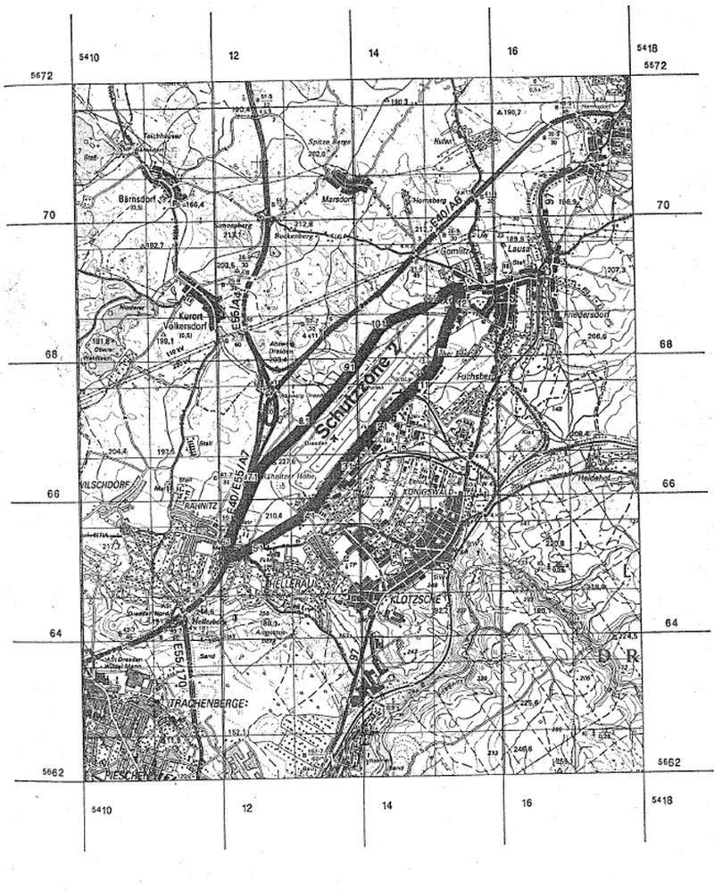

# Verordnung über die Festsetzung des Lärmschutzbereichs für den Verkehrsflughafen Dresden (FluLärmDresV)

Ausfertigungsdatum
:   1995-09-27

Fundstelle
:   BGBl I: 1995, 1234

## Eingangsformel

Auf Grund des § 4 Abs. 1 des Gesetzes zum Schutz gegen Fluglärm vom
30\. März 1971 (BGBl. I S. 282), der gemäß Artikel 3 Abs. 1 der
Verordnung vom 26. November 1986 (BGBl. I S. 2089) geändert worden
ist, verordnet das Bundesministerium für Umwelt, Naturschutz und
Reaktorsicherheit im Einvernehmen mit dem Bundesministerium für
Verkehr:

## § 1

Zum Schutz der Allgemeinheit vor Gefahren, erheblichen Nachteilen und
erheblichen Belästigungen durch Fluglärm in der Umgebung des
Verkehrsflughafens Dresden wird der in § 2 bestimmte Lärmschutzbereich
festgesetzt.

## § 2

Der Lärmschutzbereich wird nach Anlage 1 bestimmt durch die
interpolierten Verbindungslinien zwischen den Kurvenpunkten, soweit
diese Linien außerhalb des Flugplatzgeländes verlaufen.

## § 3

(1) Liegt eine bauliche Anlage zu einem Teil im Lärmschutzbereich, so
gilt sie als ganz im Lärmschutzbereich gelegen.

(2) Auf die Errichtung einer baulichen Anlage ist Absatz 1
entsprechend anzuwenden.

## § 4

Der nach § 2 bestimmte Lärmschutzbereich ist in einer topographischen
Karte im Maßstab 1:50.000 und in Karten im Maßstab 1:5.000
dargestellt. Die topographische Karte ist dieser Verordnung als Anlage
2 beigefügt. Die topographische Karte und die Karten im Maßstab
1:5.000 sind bei dem Regierungspräsidium Dresden, August-Bebel-Straße
19, 01219 Dresden, zu jedermanns Einsicht archivmäßig gesichert
niedergelegt.

## § 5

Diese Verordnung tritt am Tage nach der Verkündung in Kraft.

## Schlußformel

Der Bundesrat hat zugestimmt.

## Anlage 1 (zu § 2 der Verordnung über die Festsetzung des Lärmschutzbereichs für den Verkehrsflughafen Dresden)

(Fundstelle des Originaltextes: BGBl. I 1995, S. 1235)

*    *   **Lärmschutzbereich**

*    *

*    *   Koordinatensystem:

    *   Gauß - Krüger:

    *   Y = Rechtswert

*    *
    *
    *
    *
    *
    *
    *   X = Hochwert

*    *   Interpolation:

    *   Polynom 3. Grades mit stetigem Tangentenübergang

*    *   Kurvenpunkte der Schutzzone 2 (Verkehrsflughafen Dresden)

*    *   Nr.

    *   Y

    *   X

    *   Nr.

    *   Y

    *   X

    *   Nr.

    *   Y

    *   X

*    *   1

    *   5415141.4

    *   5668133.3

    *   51

    *   5412443.1

    *   5665391.3

    *   101

    *   5414443.2

    *   5668410.1

*    *   2

    *   5415124.7

    *   5668064.3

    *   52

    *   5412393.2

    *   5665361.9

    *   102

    *   5414499.9

    *   5668449.3

*    *   3

    *   5415103.8

    *   5667996.5

    *   53

    *   5412343.0

    *   5665333.2

    *   103

    *   5414560.5

    *   5668482.2

*    *   4

    *   5415077.1

    *   5667930.7

    *   54

    *   5412293.7

    *   5665307.9

    *   104

    *   5414688.1

    *   5668533.4

*    *   5

    *   5415043.2

    *   5667868.3

    *   55

    *   5412243.1

    *   5665285.6

    *   105

    *   5414785.6

    *   5668566.7

*    *   6

    *   5415009.3

    *   5667819.7

    *   56

    *   5412215.9

    *   5665277.3

    *   106

    *   5414843.2

    *   5668587.3

*    *   7

    *   5414968.3

    *   5667776.9

    *   57

    *   5412201.6

    *   5665275.5

    *   107

    *   5414931.7

    *   5668626.9

*    *   8

    *   5414922.6

    *   5667739.4

    *   58

    *   5412187.5

    *   5665277.9

    *   108

    *   5415019.1

    *   5668669.2

*    *   9

    *   5414899.8

    *   5667720.6

    *   59

    *   5412177.0

    *   5665289.1

    *   109

    *   5415084.1

    *   5668704.7

*    *   10

    *   5414877.1

    *   5667701.7

    *   60

    *   5412174.3

    *   5665304.1

    *   110

    *   5415135.6

    *   5668733.4

*    *   11

    *   5414856.7

    *   5667684.7

    *   61

    *   5412177.6

    *   5665333.2

    *   111

    *   5415189.7

    *   5668768.9

*    *   12

    *   5414843.2

    *   5667673.3

    *   62

    *   5412192.5

    *   5665384.8

    *   112

    *   5415243.2

    *   5668805.4

*    *   13

    *   5414817.9

    *   5667651.9

    *   63

    *   5412211.2

    *   5665435.2

    *   113

    *   5415308.2

    *   5668849.6

*    *   14

    *   5414792.6

    *   5667630.4

    *   64

    *   5412255.3

    *   5665533.2

    *   114

    *   5415341.3

    *   5668870.7

*    *   15

    *   5414742.4

    *   5667587.0

    *   65

    *   5412311.5

    *   5665650.3

    *   115

    *   5415375.5

    *   5668890.1

*    *   16

    *   5414643.2

    *   5667499.0

    *   66

    *   5412363.7

    *   5665769.3

    *   116

    *   5415394.6

    *   5668898.3

*    *   17

    *   5414540.6

    *   5667405.9

    *   67

    *   5412404.1

    *   5665856.4

    *   117

    *   5415415.1

    *   5668902.1

*    *   18

    *   5414443.2

    *   5667307.5

    *   68

    *   5412443.1

    *   5665940.2

    *   118

    *   5415426.0

    *   5668896.0

*    *   19

    *   5414377.4

    *   5667240.8

    *   69

    *   5412485.3

    *   5666036.4

    *   119

    *   5415428.4

    *   5668883.8

*    *   20

    *   5414312.0

    *   5667173.7

    *   70

    *   5412526.2

    *   5666133.2

    *   120

    *   5415424.2

    *   5668861.7

*    *   21

    *   5414243.2

    *   5667101.2

    *   71

    *   5412579.4

    *   5666256.1

    *   121

    *   5415414.5

    *   5668835.2

*    *   22

    *   5414154.2

    *   5667007.2

    *   72

    *   5412609.3

    *   5666316.1

    *   122

    *   5415402.9

    *   5668809.4

*    *   23

    *   5414110.0

    *   5666960.0

    *   73

    *   5412643.1

    *   5666374.0

    *   123

    *   5415384.0

    *   5668771.2

*    *   24

    *   5414066.3

    *   5666912.2

    *   74

    *   5412689.7

    *   5666439.5

    *   124

    *   5415364.5

    *   5668733.4

*    *   25

    *   5414043.2

    *   5666886.2

    *   75

    *   5412745.6

    *   5666497.4

    *   125

    *   5415339.9

    *   5668686.3

*    *   26

    *   5414009.9

    *   5666848.2

    *   76

    *   5412843.1

    *   5666578.8

    *   126

    *   5415315.7

    *   5668639.0

*    *   27

    *   5413976.5

    *   5666810.4

    *   77

    *   5412932.0

    *   5666655.5

    *   127

    *   5415270.1

    *   5668543.0

*    *   28

    *   5413911.2

    *   5666733.3

    *   78

    *   5413043.1

    *   5666754.4

    *   128

    *   5415240.6

    *   5668473.6

*    *   29

    *   5413843.2

    *   5666654.7

    *   79

    *   5413147.1

    *   5666848.6

    *   129

    *   5415189.6

    *   5668333.3

*    *   30

    *   5413791.8

    *   5666594.1

    *   80

    *   5413243.1

    *   5666951.0

    *   130

    *   5415164.2

    *   5668237.4

*    *   31

    *   5413740.6

    *   5666533.2

    *   81

    *   5413323.0

    *   5667034.8

    *
    *
    *

*    *   32

    *   5413643.1

    *   5666420.2

    *   82

    *   5413383.3

    *   5667098.9

    *
    *
    *

*    *   33

    *   5413579.8

    *   5666333.2

    *   83

    *   5413443.1

    *   5667163.5

    *
    *
    *

*    *   34

    *   5413509.2

    *   5666233.6

    *   84

    *   5413510.8

    *   5667235.2

    *
    *
    *

*    *   35

    *   5413439.9

    *   5666133.2

    *   85

    *   5413577.1

    *   5667308.1

    *
    *
    *

*    *   36

    *   5413361.6

    *   5666015.9

    *   86

    *   5413643.1

    *   5667383.3

    *
    *
    *

*    *   37

    *   5413322.7

    *   5665956.8

    *   87

    *   5413707.2

    *   5667457.9

    *
    *
    *

*    *   38

    *   5413300.9

    *   5665928.9

    *   88

    *   5413770.4

    *   5667533.3

    *
    *
    *

*    *   39

    *   5413276.2

    *   5665903.5

    *   89

    *   5413843.2

    *   5667619.6

    *
    *
    *

*    *   40

    *   5413243.1

    *   5665879.7

    *   90

    *   5413936.0

    *   5667733.3

    *
    *
    *

*    *   41

    *   5413192.6

    *   5665838.5

    *   91

    *   5413989.9

    *   5667799.7

    *
    *
    *

*    *   42

    *   5413139.4

    *   5665800.8

    *   92

    *   5414043.2

    *   5667866.6

    *
    *
    *

*    *   43

    *   5413028.0

    *   5665733.2

    *   93

    *   5414091.6

    *   5667933.3

    *
    *
    *

*    *   44

    *   5412935.4

    *   5665681.8

    *   94

    *   5414139.8

    *   5668000.6

    *
    *
    *

*    *   45

    *   5412843.1

    *   5665629.8

    *   95

    *   5414192.0

    *   5668074.6

    *
    *
    *

*    *   46

    *   5412748.6

    *   5665573.7

    *   96

    *   5414243.2

    *   5668149.4

    *
    *
    *

*    *   47

    *   5412655.3

    *   5665515.7

    *   97

    *   5414304.4

    *   5668241.0

    *
    *
    *

*    *   48

    *   5412598.7

    *   5665484.4

    *   98

    *   5414334.6

    *   5668287.1

    *
    *
    *

*    *   49

    *   5412543.1

    *   5665451.1

    *   99

    *   5414364.7

    *   5668333.3

    *
    *
    *

*    *   50

    *   5412493.1

    *   5665421.1

    *   100

    *   5414401.5

    *   5668374.2

    *
    *
    *

## Anlage 2 (zu § 4 der Verordnung über die Festsetzung des Lärmschutzbereichs für den Verkehrsflughafen Dresden)

   (Fundstelle: BGBl I 1995, 1236 - 1237)

1 : 50 000
Lärmschutzbereich
für den Verkehrsflughafen Dresden
(Gesetz zum Schutz gegen Fluglärm vom 30. März 1971, BGBl. I S. 282)

Das rechtwinklige Koordinatengitter entspricht dem Gauß-Krüger-System
mit 3° breitem Meridianstreifen.

Kartengrundlage:
Topographische Karte 1 : 50 000 (Serie M745)
Vervielfältigung der Kartengrundlage mit Genehmigung des Deutschen
Militärgeographischen Dienstes (DMG) – Lizenz BQ0001-7

Gravur der Lärmschutzgrenzen und Druck:
Institut für Angewandte Geodäsie, Frankfurt am Main, 1995

