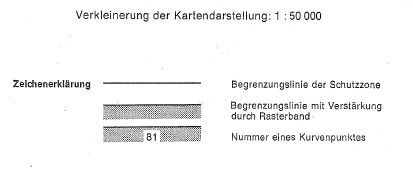
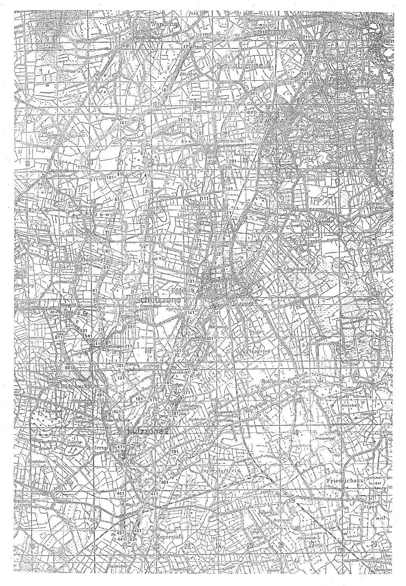

# Verordnung über die Festsetzung des Lärmschutzbereichs für den militärischen Flugplatz Eggebek (FluLärmEggebV)

Ausfertigungsdatum
:   1979-03-06

Fundstelle
:   BGBl I: 1979, 270

Geändert durch
:   Art. 1 V v. 2.4.1987 I 1150

## Eingangsformel

Auf Grund des § 4 Abs. 1 des Gesetzes zum Schutz gegen Fluglärm vom
30\. März 1971 (BGBl. I S. 282) wird im Einvernehmen mit dem
Bundesminister der Verteidigung und mit Zustimmung des Bundesrates
verordnet:

## § 1

Zum Schutz der Allgemeinheit vor Gefahren, erheblichen Nachteilen und
erheblichen Belästigungen durch Fluglärm in der Umgebung des
militärischen Flugplatzes Eggebek wird der in § 2 bestimmte
Lärmschutzbereich festgesetzt.

## § 2

Der Lärmschutzbereich mit seinen zwei Schutzzonen wird nach Anlage 1
bestimmt durch die interpolierten Verbindungslinien zwischen den
Kurvenpunkten, soweit diese Linien außerhalb des Flugplatzgeländes
verlaufen.

## § 3

Liegt eine bauliche Anlage zu einem Teil im Lärmschutzbereich, so gilt
sie als ganz im Lärmschutzbereich gelegen. Liegt eine bauliche Anlage
zu einem Teil in der Schutzzone 1, so gilt sie als ganz in dieser
Schutzzone gelegen.

## § 4

(1) Der nach § 2 bestimmte Lärmschutzbereich ist in einer
topographischen Karte im Maßstab 1:50.000 und in Karten im Maßstab
1:5.000 dargestellt. Die topographische Karte ist in verkleinerter
Form als Anlage 2 dieser Verordnung beigefügt. Die topographische
Karte und die Karten im Maßstab 1:5.000 sind beim Landrat des Kreises
Schleswig-Flensburg, Flensburger Straße 7, 2380 Schleswig, zu
jedermanns Einsicht archivmäßig gesichert niedergelegt.

(2) Die Karten im Maßstab 1:5.000 über den Lärmschutzbereich nach der
bis zum Ablauf des 15. April 1987 geltenden Fassung dieser Verordnung
bleiben an gleicher Stelle zu jedermanns Einsicht archivmäßig
gesichert niedergelegt.

## § 5

Diese Verordnung tritt am Tag nach der Verkündung in Kraft.

## Schlußformel

Der Bundesminister des Innern

## Anlage 1 (zu § 2 der Verordnung über die Festsetzung des Lärmschutzbereichs für den militärischen Flugplatz Eggebek in der Fassung der Ersten Änderungsverordnung vom 2. April 1987)

(Fundstelle des Originaltextes: BGBl. I 1987, 1151 - 1155)

*    *   **Lärmschutzbereich - Erste Änderung**

*    *

*    *   \*P

*    *

*    *   Koordinatensystem: Gauß-Krüger:

    *   Y = Rechtswert

*    *
    *   X = Hochwert

*    *   Interpolation: Polynom 3. Grades mit stetigem Tangentenübergang

*    *

*    *   Kurvenpunkte der Schutzzone 1 (Militärischer Flugplatz Eggebek)

*    *

*    *   Nr.

    *   Y

    *   X

    *   Nr.

    *   Y

    *   X

    *   Nr.

    *   Y

    *   X

*    *

*    *   1

    *   3522468.6

    *   6053080.6

    *   51

    *   3521703.7

    *   6053321.7

    *   101

    *   3522516.3

    *   6057264.8

*    *   2

    *   3522444.8

    *   6053053.1

    *   52

    *   3521678.9

    *   6053407.9

    *   102

    *   3522533.4

    *   6057303.6

*    *   3

    *   3522421.3

    *   6053025.4

    *   53

    *   3521654.9

    *   6053492.1

    *   103

    *   3522564.7

    *   6057379.2

*    *   4

    *   3522399.2

    *   6052996.5

    *   54

    *   3521631.9

    *   6053576.6

    *   104

    *   3522595.5

    *   6057455.0

*    *   5

    *   3522379.5

    *   6052965.8

    *   55

    *   3521612.4

    *   6053659.4

    *   105

    *   3522626.3

    *   6057530.8

*    *   6

    *   3522364.8

    *   6052933.5

    *   56

    *   3521597.9

    *   6053743.2

    *   106

    *   3522657.2

    *   6057606.5

*    *   7

    *   3522350.9

    *   6052900.9

    *   57

    *   3521589.9

    *   6053824.4

    *   107

    *   3522687.9

    *   6057682.3

*    *   8

    *   3522324.8

    *   6052834.8

    *   58

    *   3521588.3

    *   6053905.9

    *   108

    *   3522718.6

    *   6057758.0

*    *   9

    *   3522276.4

    *   6052700.9

    *   59

    *   3521589.9

    *   6053945.8

    *   109

    *   3522734.3

    *   6057796.0

*    *   10

    *   3522227.0

    *   6052567.4

    *   60

    *   3521594.5

    *   6053985.4

    *   110

    *   3522750.3

    *   6057833.9

*    *

*    *   11

    *   3522171.3

    *   6052434.9

    *   61

    *   3521607.9

    *   6054064.1

    *   111

    *   3522766.8

    *   6057871.6

*    *   12

    *   3522110.8

    *   6052305.1

    *   62

    *   3521624.1

    *   6054142.3

    *   112

    *   3522783.9

    *   6057908.9

*    *   13

    *   3522078.8

    *   6052241.3

    *   63

    *   3521645.6

    *   6054219.3

    *   113

    *   3522796.8

    *   6057935.5

*    *   14

    *   3522044.7

    *   6052178.6

    *   64

    *   3521666.6

    *   6054296.6

    *   114

    *   3522810.3

    *   6057961.6

*    *   15

    *   3522024.6

    *   6052145.8

    *   65

    *   3521687.0

    *   6054374.0

    *   115

    *   3522824.7

    *   6057987.1

*    *   16

    *   3522002.7

    *   6052114.9

    *   66

    *   3521726.3

    *   6054529.0

    *   116

    *   3522840.5

    *   6058011.7

*    *   17

    *   3521990.6

    *   6052100.7

    *   67

    *   3521763.9

    *   6054684.3

    *   117

    *   3522858.5

    *   6058034.8

*    *   18

    *   3521977.0

    *   6052088.0

    *   68

    *   3521800.0

    *   6054839.8

    *   118

    *   3522869.2

    *   6058045.6

*    *   19

    *   3521967.8

    *   6052081.5

    *   69

    *   3521835.9

    *   6054995.4

    *   119

    *   3522881.2

    *   6058054.8

*    *   20

    *   3521963.1

    *   6052079.0

    *   70

    *   3521853.7

    *   6055073.2

    *   120

    *   3522889.1

    *   6058058.9

*    *

*    *   21

    *   3521958.1

    *   6052076.9

    *   71

    *   3521870.7

    *   6055151.1

    *   121

    *   3522897.7

    *   6058061.4

*    *   22

    *   3521953.0

    *   6052075.6

    *   72

    *   3521876.4

    *   6055190.6

    *   122

    *   3522906.7

    *   6058061.6

*    *   23

    *   3521947.7

    *   6052075.1

    *   73

    *   3521880.2

    *   6055230.3

    *   123

    *   3522915.3

    *   6058059.1

*    *   24

    *   3521936.2

    *   6052077.4

    *   74

    *   3521887.6

    *   6055309.7

    *   124

    *   3522920.8

    *   6058056.2

*    *   25

    *   3521930.7

    *   6052080.4

    *   75

    *   3521901.8

    *   6055468.7

    *   125

    *   3522925.7

    *   6058052.5

*    *   26

    *   3521925.8

    *   6052084.4

    *   76

    *   3521916.1

    *   6055627.6

    *   126

    *   3522930.2

    *   6058048.2

*    *   27

    *   3521921.6

    *   6052088.7

    *   77

    *   3521929.0

    *   6055786.8

    *   127

    *   3522934.3

    *   6058043.5

*    *   28

    *   3521917.9

    *   6052093.4

    *   78

    *   3521940.3

    *   6055946.3

    *   128

    *   3522941.7

    *   6058032.7

*    *   29

    *   3521911.5

    *   6052103.7

    *   79

    *   3521945.2

    *   6056026.1

    *   129

    *   3522948.1

    *   6058021.2

*    *   30

    *   3521906.2

    *   6052114.8

    *   80

    *   3521949.6

    *   6056106.1

    *   130

    *   3522954.0

    *   6058008.4

*    *

*    *   31

    *   3521898.2

    *   6052136.0

    *   81

    *   3521953.4

    *   6056185.9

    *   131

    *   3522959.3

    *   6057995.4

*    *   32

    *   3521892.0

    *   6052157.9

    *   82

    *   3521959.7

    *   6056265.7

    *   132

    *   3522967.3

    *   6057972.2

*    *   33

    *   3521886.8

    *   6052180.1

    *   83

    *   3521966.3

    *   6056305.0

    *   133

    *   3522974.3

    *   6057948.7

*    *   34

    *   3521882.5

    *   6052202.6

    *   84

    *   3521972.6

    *   6056344.3

    *   134

    *   3522986.4

    *   6057901.1

*    *   35

    *   3521875.4

    *   6052248.2

    *   85

    *   3521988.0

    *   6056422.4

    *   135

    *   3523002.2

    *   6057826.1

*    *   36

    *   3521866.1

    *   6052330.0

    *   86

    *   3521999.4

    *   6056461.4

    *   136

    *   3523015.5

    *   6057750.6

*    *   37

    *   3521859.1

    *   6052412.0

    *   87

    *   3522012.5

    *   6056499.8

    *   137

    *   3523034.0

    *   6057598.9

*    *   38

    *   3521853.2

    *   6052493.5

    *   88

    *   3522043.0

    *   6056575.0

    *   138

    *   3523042.2

    *   6057446.0

*    *   39

    *   3521847.9

    *   6052575.0

    *   89

    *   3522080.5

    *   6056650.6

    *   139

    *   3523046.4

    *   6057292.8

*    *   40

    *   3521842.9

    *   6052656.4

    *   90

    *   3522122.8

    *   6056723.6

    *   140

    *   3523049.3

    *   6057216.2

*    *

*    *   41

    *   3521838.5

    *   6052737.7

    *   91

    *   3522169.8

    *   6056797.3

    *   141

    *   3523053.7

    *   6057139.8

*    *   42

    *   3521834.4

    *   6052819.1

    *   92

    *   3522219.0

    *   6056869.6

    *   142

    *   3523056.9

    *   6057101.3

*    *   43

    *   3521829.4

    *   6052903.9

    *   93

    *   3522270.9

    *   6056943.7

    *   143

    *   3523062.0

    *   6057063.0

*    *   44

    *   3521822.3

    *   6052983.0

    *   94

    *   3522328.4

    *   6057013.6

    *   144

    *   3523067.0

    *   6057044.3

*    *   45

    *   3521816.6

    *   6053024.1

    *   95

    *   3522390.3

    *   6057084.3

    *   145

    *   3523073.4

    *   6057026.0

*    *   46

    *   3521809.1

    *   6053064.9

    *   96

    *   3522421.4

    *   6057119.6

    *   146

    *   3523086.5

    *   6056989.7

*    *   47

    *   3521800.8

    *   6053086.9

    *   97

    *   3522452.1

    *   6057155.2

    *   147

    *   3523101.7

    *   6056947.6

*    *   48

    *   3521791.9

    *   6053108.6

    *   98

    *   3522478.3

    *   6057188.8

    *   148

    *   3523116.6

    *   6056905.5

*    *   49

    *   3521773.2

    *   6053151.7

    *   99

    *   3522489.2

    *   6057207.1

    *   149

    *   3523143.7

    *   6056820.4

*    *   50

    *   3521735.3

    *   6053237.7

    *   100

    *   3522498.5

    *   6057226.3

    *   150

    *   3523161.6

    *   6056737.7

*    *

*    *   noch Schutzzone 1 (Militärischer Flugplatz Eggebek)

*    *

*    *   Nr.

    *   Y

    *   X

    *   Nr.

    *   Y

    *   X

    *
    *
    *

*    *

*    *   151

    *   3523177.8

    *   6056654.7

    *   171

    *   3522887.9

    *   6054296.5

    *
    *
    *

*    *   152

    *   3523193.9

    *   6056572.3

    *   172

    *   3522878.3

    *   6054137.7

    *
    *
    *

*    *   153

    *   3523208.3

    *   6056489.6

    *   173

    *   3522870.9

    *   6053978.6

    *
    *
    *

*    *   154

    *   3523219.4

    *   6056408.3

    *   174

    *   3522854.2

    *   6053821.0

    *
    *
    *

*    *   155

    *   3523225.9

    *   6056326.6

    *   175

    *   3522840.0

    *   6053742.7

    *
    *
    *

*    *   156

    *   3523226.9

    *   6056246.7

    *   176

    *   3522829.0

    *   6053704.4

    *
    *
    *

*    *   157

    *   3523220.9

    *   6056167.1

    *   177

    *   3522816.6

    *   6053666.7

    *
    *
    *

*    *   158

    *   3523208.4

    *   6056088.9

    *   178

    *   3522786.6

    *   6053590.5

    *
    *
    *

*    *   159

    *   3523192.5

    *   6056011.3

    *   179

    *   3522751.2

    *   6053516.7

    *
    *
    *

*    *   160

    *   3523150.7

    *   6055857.6

    *   180

    *   3522709.8

    *   6053442.5

    *
    *
    *

*    *

*    *   161

    *   3523111.0

    *   6055703.6

    *   181

    *   3522665.6

    *   6053370.0

    *
    *
    *

*    *   162

    *   3523073.1

    *   6055549.4

    *   182

    *   3522619.8

    *   6053297.3

    *
    *
    *

*    *   163

    *   3523036.7

    *   6055394.8

    *   183

    *   3522574.9

    *   6053224.1

    *
    *
    *

*    *   164

    *   3523001.4

    *   6055240.1

    *   184

    *   3522525.0

    *   6053149.9

    *
    *
    *

*    *   165

    *   3522968.3

    *   6055094.4

    *   185

    *   3522497.4

    *   6053114.8

    *
    *
    *

*    *   166

    *   3522950.1

    *   6055012.6

    *   186

    *   3522468.6

    *   6053080.6

    *
    *
    *

*    *   167

    *   3522939.8

    *   6054929.3

    *
    *
    *
    *
    *
    *

*    *   168

    *   3522925.7

    *   6054771.3

    *
    *
    *
    *
    *
    *

*    *   169

    *   3522912.0

    *   6054613.2

    *
    *
    *
    *
    *
    *

*    *   170

    *   3522899.1

    *   6054455.0

    *
    *
    *
    *
    *
    *

*    *

*    *   Kurvenpunkte der Schutzzone 2 (Militärischer Flugplatz Eggebek)

*    *

*    *   Nr.

    *   Y

    *   X

    *   Nr.

    *   Y

    *   X

    *   Nr.

    *   Y

    *   X

*    *

*    *   1

    *   3523758.6

    *   6057045.7

    *   51

    *   3522945.0

    *   6052462.8

    *   101

    *   3521252.3

    *   6047334.6

*    *   2

    *   3523766.3

    *   6056964.8

    *   52

    *   3522900.4

    *   6052320.8

    *   102

    *   3521237.0

    *   6047329.3

*    *   3

    *   3523779.3

    *   6056884.5

    *   53

    *   3522864.5

    *   6052176.6

    *   103

    *   3521223.1

    *   6047327.8

*    *   4

    *   3523800.2

    *   6056802.3

    *   54

    *   3522834.7

    *   6052030.9

    *   104

    *   3521210.5

    *   6047330.4

*    *   5

    *   3523820.4

    *   6056720.0

    *   55

    *   3522808.1

    *   6051884.3

    *   105

    *   3521198.8

    *   6047336.1

*    *   6

    *   3523838.4

    *   6056638.6

    *   56

    *   3522783.2

    *   6051737.3

    *   106

    *   3521188.0

    *   6047344.5

*    *   7

    *   3523854.0

    *   6056556.7

    *   57

    *   3522759.6

    *   6051590.0

    *   107

    *   3521177.0

    *   6047356.4

*    *   8

    *   3523867.0

    *   6056476.0

    *   58

    *   3522733.2

    *   6051443.4

    *   108

    *   3521167.8

    *   6047369.8

*    *   9

    *   3523877.6

    *   6056395.0

    *   59

    *   3522699.9

    *   6051298.6

    *   109

    *   3521159.7

    *   6047383.2

*    *   10

    *   3523887.5

    *   6056314.6

    *   60

    *   3522655.5

    *   6051156.5

    *   110

    *   3521152.9

    *   6047397.2

*    *

*    *   11

    *   3523896.8

    *   6056234.1

    *   61

    *   3522595.4

    *   6051011.3

    *   111

    *   3521141.1

    *   6047426.0

*    *   12

    *   3523904.8

    *   6056154.0

    *   62

    *   3522525.7

    *   6050869.8

    *   112

    *   3521131.4

    *   6047455.6

*    *   13

    *   3523912.0

    *   6056073.8

    *   63

    *   3522455.6

    *   6050728.4

    *   113

    *   3521123.2

    *   6047485.9

*    *   14

    *   3523907.7

    *   6056035.0

    *   64

    *   3522391.0

    *   6050585.0

    *   114

    *   3521116.3

    *   6047516.7

*    *   15

    *   3523904.2

    *   6055996.2

    *   65

    *   3522332.5

    *   6050439.1

    *   115

    *   3521108.8

    *   6047557.3

*    *   16

    *   3523894.6

    *   6055918.8

    *   66

    *   3522277.9

    *   6050291.8

    *   116

    *   3521104.2

    *   6047598.2

*    *   17

    *   3523882.2

    *   6055881.4

    *   67

    *   3522225.4

    *   6050143.7

    *   117

    *   3521100.8

    *   6047639.2

*    *   18

    *   3523870.0

    *   6055843.9

    *   68

    *   3522173.9

    *   6049995.2

    *   118

    *   3521098.2

    *   6047680.3

*    *   19

    *   3523846.3

    *   6055768.8

    *   69

    *   3522122.9

    *   6049846.5

    *   119

    *   3521094.4

    *   6047761.2

*    *   20

    *   3523801.0

    *   6055618.4

    *   70

    *   3522072.2

    *   6049697.6

    *   120

    *   3521092.3

    *   6047842.1

*    *

*    *   21

    *   3523758.5

    *   6055467.5

    *   71

    *   3522022.1

    *   6049548.6

    *   121

    *   3521092.5

    *   6047922.4

*    *   22

    *   3523718.4

    *   6055316.2

    *   72

    *   3521972.4

    *   6049399.4

    *   122

    *   3521093.4

    *   6048002.7

*    *   23

    *   3523680.2

    *   6055164.6

    *   73

    *   3521922.9

    *   6049250.1

    *   123

    *   3521093.7

    *   6048083.0

*    *   24

    *   3523641.4

    *   6055013.1

    *   74

    *   3521873.5

    *   6049100.7

    *   124

    *   3521095.0

    *   6048163.3

*    *   25

    *   3523622.6

    *   6054937.4

    *   75

    *   3521823.9

    *   6048951.5

    *   125

    *   3521095.1

    *   6048243.8

*    *   26

    *   3523608.6

    *   6054860.6

    *   76

    *   3521773.7

    *   6048802.5

    *   126

    *   3521093.6

    *   6048324.3

*    *   27

    *   3523603.5

    *   6054782.5

    *   77

    *   3521723.3

    *   6048653.6

    *   127

    *   3521093.1

    *   6048404.7

*    *   28

    *   3523598.8

    *   6054704.4

    *   78

    *   3521675.1

    *   6048503.8

    *   128

    *   3521093.3

    *   6048485.1

*    *   29

    *   3523589.8

    *   6054548.1

    *   79

    *   3521651.8

    *   6048428.6

    *   129

    *   3521094.3

    *   6048565.4

*    *   30

    *   3523581.2

    *   6054391.6

    *   80

    *   3521628.3

    *   6048353.4

    *   130

    *   3521095.2

    *   6048645.6

*    *

*    *   31

    *   3523574.8

    *   6054234.9

    *   81

    *   3521616.5

    *   6048315.9

    *   131

    *   3521095.4

    *   6048726.0

*    *   32

    *   3523570.8

    *   6054077.7

    *   82

    *   3521600.6

    *   6048241.0

    *   132

    *   3521095.6

    *   6048806.4

*    *   33

    *   3523569.7

    *   6053920.0

    *   83

    *   3521583.9

    *   6048163.7

    *   133

    *   3521094.6

    *   6048886.9

*    *   34

    *   3523570.4

    *   6053841.5

    *   84

    *   3521573.3

    *   6048123.5

    *   134

    *   3521094.0

    *   6048967.4

*    *   35

    *   3523562.1

    *   6053763.5

    *   85

    *   3521553.5

    *   6048045.5

    *   135

    *   3521093.8

    *   6049047.8

*    *   36

    *   3523546.1

    *   6053686.7

    *   86

    *   3521533.2

    *   6047968.7

    *   136

    *   3521094.0

    *   6049128.2

*    *   37

    *   3523522.0

    *   6053612.2

    *   87

    *   3521517.2

    *   6047910.1

    *   137

    *   3521094.3

    *   6049208.6

*    *   38

    *   3523492.7

    *   6053537.8

    *   88

    *   3521500.6

    *   6047868.0

    *   138

    *   3521094.8

    *   6049288.9

*    *   39

    *   3523461.4

    *   6053464.2

    *   89

    *   3521475.6

    *   6047808.0

    *   139

    *   3521095.5

    *   6049369.2

*    *   40

    *   3523427.7

    *   6053390.4

    *   90

    *   3521448.8

    *   6047749.1

    *   140

    *   3521096.1

    *   6049449.5

*    *

*    *   41

    *   3523391.8

    *   6053317.7

    *   91

    *   3521426.4

    *   6047673.6

    *   141

    *   3521096.9

    *   6049529.8

*    *   42

    *   3523353.3

    *   6053244.7

    *   92

    *   3521403.1

    *   6047598.4

    *   142

    *   3521097.7

    *   6049610.0

*    *   43

    *   3523312.7

    *   6053172.8

    *   93

    *   3521390.7

    *   6047561.1

    *   143

    *   3521098.5

    *   6049690.3

*    *   44

    *   3523269.2

    *   6053100.7

    *   94

    *   3521377.9

    *   6047523.9

    *   144

    *   3521099.3

    *   6049770.6

*    *   45

    *   3523224.4

    *   6053029.4

    *   95

    *   3521362.3

    *   6047487.9

    *   145

    *   3521099.8

    *   6049850.9

*    *   46

    *   3523178.9

    *   6052957.5

    *   96

    *   3521345.4

    *   6047452.3

    *   146

    *   3521100.2

    *   6049931.2

*    *   47

    *   3523131.9

    *   6052886.6

    *   97

    *   3521328.2

    *   6047421.1

    *   147

    *   3521100.3

    *   6050011.6

*    *   48

    *   3523092.2

    *   6052815.0

    *   98

    *   3521310.0

    *   6047391.5

    *   148

    *   3521100.2

    *   6050092.1

*    *   49

    *   3523057.2

    *   6052741.0

    *   99

    *   3521289.4

    *   6047365.3

    *   149

    *   3521100.0

    *   6050172.5

*    *   50

    *   3522996.9

    *   6052603.0

    *   100

    *   3521265.9

    *   6047343.2

    *   150

    *   3521099.8

    *   6050252.9

*    *

*    *   noch Schutzzone 2 (Militärischer Flugplatz Eggebek)

*    *

*    *   Nr.

    *   Y

    *   X

    *   Nr.

    *   Y

    *   X

    *   Nr.

    *   Y

    *   X

*    *

*    *   151

    *   3521099.4

    *   6050333.4

    *   201

    *   3520993.1

    *   6054531.0

    *   251

    *   3522284.4

    *   6058588.2

*    *   152

    *   3521099.0

    *   6050413.8

    *   202

    *   3521014.8

    *   6054608.0

    *   252

    *   3522321.4

    *   6058743.1

*    *   153

    *   3521098.4

    *   6050494.4

    *   203

    *   3521035.7

    *   6054685.2

    *   253

    *   3522352.1

    *   6058899.1

*    *   154

    *   3521097.3

    *   6050574.9

    *   204

    *   3521055.7

    *   6054762.3

    *   254

    *   3522377.3

    *   6059055.9

*    *   155

    *   3521095.5

    *   6050655.7

    *   205

    *   3521024.1

    *   6054917.1

    *   255

    *   3522404.6

    *   6059212.4

*    *   156

    *   3521092.7

    *   6050736.4

    *   206

    *   3521132.5

    *   6055071.8

    *   256

    *   3522445.4

    *   6059366.7

*    *   157

    *   3521089.1

    *   6050817.4

    *   207

    *   3521152.3

    *   6055149.1

    *   257

    *   3522471.8

    *   6059443.2

*    *   158

    *   3521086.0

    *   6050898.3

    *   208

    *   3521172.0

    *   6055226.4

    *   258

    *   3522500.7

    *   6059518.8

*    *   159

    *   3521085.0

    *   6050978.6

    *   209

    *   3521185.9

    *   6055304.7

    *   259

    *   3522530.4

    *   6059594.4

*    *   160

    *   3521087.7

    *   6051058.8

    *   210

    *   3521191.8

    *   6055384.0

    *   260

    *   3522559.6

    *   6059670.3

*    *

*    *   161

    *   3521104.9

    *   6051216.9

    *   211

    *   3521203.1

    *   6055543.1

    *   261

    *   3522587.9

    *   6059746.1

*    *   162

    *   3521130.3

    *   6051373.7

    *   212

    *   3521216.3

    *   6055701.8

    *   262

    *   3522615.5

    *   6059822.2

*    *   163

    *   3521152.5

    *   6051531.0

    *   213

    *   3521227.9

    *   6055860.7

    *   263

    *   3522642.4

    *   6059898.3

*    *   164

    *   3521167.6

    *   6051689.4

    *   214

    *   3521236.7

    *   6056020.1

    *   264

    *   3522669.0

    *   6059974.6

*    *   165

    *   3521176.0

    *   6051848.9

    *   215

    *   3521239.8

    *   6056100.1

    *   265

    *   3522695.4

    *   6060050.8

*    *   166

    *   3521177.9

    *   6051929.1

    *   216

    *   3521242.1

    *   6056180.1

    *   266

    *   3522721.5

    *   6060127.1

*    *   167

    *   3521169.0

    *   6052014.8

    *   217

    *   3521243.4

    *   6056260.4

    *   267

    *   3522747.4

    *   6060203.4

*    *   168

    *   3521168.1

    *   6052094.5

    *   218

    *   3521243.7

    *   6056300.5

    *   268

    *   3522772.9

    *   6060279.8

*    *   169

    *   3521167.1

    *   6052171.9

    *   219

    *   3521243.7

    *   6056340.6

    *   269

    *   3522798.0

    *   6060356.1

*    *   170

    *   3521166.2

    *   6052252.4

    *   220

    *   3521245.0

    *   6056360.6

    *   270

    *   3522822.7

    *   6060432.7

*    *

*    *   171

    *   3521165.2

    *   6052333.0

    *   221

    *   3521250.3

    *   6056379.9

    *   271

    *   3522847.0

    *   6060509.2

*    *   172

    *   3521164.5

    *   6052413.4

    *   222

    *   3521260.5

    *   6056418.4

    *   272

    *   3522871.0

    *   6060585.8

*    *   173

    *   3521164.7

    *   6052493.9

    *   223

    *   3521276.0

    *   6056493.0

    *   273

    *   3522894.8

    *   6060662.5

*    *   174

    *   3521165.0

    *   6052574.4

    *   224

    *   3521304.5

    *   6056572.5

    *   274

    *   3522918.7

    *   6060739.1

*    *   175

    *   3521163.7

    *   6052654.8

    *   225

    *   3521334.6

    *   6056647.9

    *   275

    *   3522942.4

    *   6060815.8

*    *   176

    *   3521158.1

    *   6052753.0

    *   226

    *   3521367.9

    *   6056723.4

    *   276

    *   3522966.2

    *   6060892.4

*    *   177

    *   3521151.7

    *   6052817.5

    *   227

    *   3521404.1

    *   6056797.7

    *   277

    *   3522990.1

    *   6060969.0

*    *   178

    *   3521140.5

    *   6052900.2

    *   228

    *   3521444.0

    *   6056872.4

    *   278

    *   3523014.1

    *   6061045.6

*    *   179

    *   3521126.3

    *   6052982.4

    *   229

    *   3521486.8

    *   6056945.4

    *   279

    *   3523038.3

    *   6061122.2

*    *   180

    *   3521107.5

    *   6053066.0

    *   230

    *   3521535.3

    *   6057018.9

    *   280

    *   3523062.7

    *   6061198.8

*    *

*    *   181

    *   3521087.2

    *   6053149.4

    *   231

    *   3521586.5

    *   6057090.5

    *   281

    *   3523086.8

    *   6061275.4

*    *   182

    *   3521058.1

    *   6053235.0

    *   232

    *   3521641.9

    *   6057162.8

    *   282

    *   3523111.4

    *   6061351.9

*    *   183

    *   3521026.4

    *   6053319.7

    *   233

    *   3521699.3

    *   6057233.4

    *   283

    *   3523136.5

    *   6061428.3

*    *   184

    *   3520997.7

    *   6053404.0

    *   234

    *   3521757.2

    *   6057303.4

    *   284

    *   3523161.9

    *   6061504.7

*    *   185

    *   3520971.9

    *   6053489.2

    *   235

    *   3521810.9

    *   6057376.6

    *   285

    *   3523186.6

    *   6061581.2

*    *   186

    *   3520949.9

    *   6053572.4

    *   236

    *   3521852.4

    *   6057450.0

    *   286

    *   3523212.2

    *   6061657.5

*    *   187

    *   3520931.0

    *   6053656.4

    *   237

    *   3521891.9

    *   6057524.6

    *   287

    *   3523238.9

    *   6061733.8

*    *   188

    *   3520915.6

    *   6053738.8

    *   238

    *   3521928.0

    *   6057598.8

    *   288

    *   3523266.6

    *   6061809.7

*    *   189

    *   3520903.0

    *   6053821.7

    *   239

    *   3521961.0

    *   6057674.5

    *   289

    *   3523295.8

    *   6061885.7

*    *   190

    *   3520893.6

    *   6053903.2

    *   240

    *   3521990.7

    *   6057750.1

    *   290

    *   3523326.5

    *   6061961.1

*    *

*    *   191

    *   3520882.2

    *   6054084.0

    *   241

    *   3522019.5

    *   6057826.0

    *   291

    *   3523350.9

    *   6062018.3

*    *   192

    *   3520887.6

    *   6054114.4

    *   242

    *   3522049.0

    *   6057901.7

    *   292

    *   3523392.4

    *   6062111.4

*    *   193

    *   3520890.8

    *   6054145.2

    *   243

    *   3522078.5

    *   6057977.5

    *   293

    *   3523426.9

    *   6062186.8

*    *   194

    *   3520894.2

    *   6054185.1

    *   244

    *   3522106.8

    *   6058053.3

    *   294

    *   3523464.2

    *   6062260.9

*    *   195

    *   3520897.1

    *   6054225.0

    *   245

    *   3522133.9

    *   6058129.6

    *   295

    *   3523487.0

    *   6062299.4

*    *   196

    *   3520903.6

    *   6054244.0

    *   246

    *   3522159.8

    *   6058205.8

    *   296

    *   3523511.9

    *   6062336.4

*    *   197

    *   3520910.0

    *   6054263.0

    *   247

    *   3522185.2

    *   6058282.2

    *   297

    *   3523539.1

    *   6062371.8

*    *   198

    *   3520922.5

    *   6054301.0

    *   248

    *   3522213.2

    *   6058368.7

    *   298

    *   3523569.0

    *   6062405.1

*    *   199

    *   3520947.0

    *   6054377.5

    *   249

    *   3522241.7

    *   6058434.1

    *   299

    *   3523594.7

    *   6062428.7

*    *   200

    *   3520970.5

    *   6054454.2

    *   250

    *   3522263.6

    *   6058511.0

    *   300

    *   3523623.0

    *   6062449.2

*    *

*    *   noch Schutzzone 2 (Militärischer Flugplatz Eggebek)

*    *

*    *   Nr.

    *   Y

    *   X

    *   Nr.

    *   Y

    *   X

    *   Nr.

    *   Y

    *   X

*    *

*    *   301

    *   3523646.3

    *   6062461.0

    *   321

    *   3523911.9

    *   6061894.0

    *   341

    *   3523936.6

    *   6059695.5

*    *   302

    *   3523671.2

    *   6062468.6

    *   322

    *   3523919.5

    *   6061814.8

    *   342

    *   3523922.7

    *   6059539.7

*    *   303

    *   3523693.0

    *   6062470.4

    *   323

    *   3523925.8

    *   6061735.5

    *   343

    *   3523908.0

    *   6059384.0

*    *   304

    *   3523714.5

    *   6062466.9

    *   324

    *   3523930.0

    *   6061672.3

    *   344

    *   3523892.7

    *   6059228.3

*    *   305

    *   3523735.0

    *   6062458.4

    *   325

    *   3523925.3

    *   6061570.9

    *   345

    *   3523877.0

    *   6059072.6

*    *   306

    *   3523753.2

    *   6062445.6

    *   326

    *   3523934.5

    *   6061414.3

    *   346

    *   3523861.4

    *   6058917.0

*    *   307

    *   3523771.8

    *   6062426.8

    *   327

    *   3523942.9

    *   6061257.8

    *   347

    *   3523846.2

    *   6058761.3

*    *   308

    *   3523787.5

    *   6062405.5

    *   328

    *   3523953.6

    *   6061101.1

    *   348

    *   3523831.4

    *   6058605.6

*    *   309

    *   3523803.8

    *   6062376.9

    *   329

    *   3523962.6

    *   6060944.5

    *   349

    *   3523817.5

    *   6058449.8

*    *   310

    *   3523817.4

    *   6062346.8

    *   330

    *   3523971.1

    *   6060788.0

    *   350

    *   3523804.9

    *   6058294.0

*    *

*    *   311

    *   3523840.6

    *   6062298.0

    *   331

    *   3523975.9

    *   6060631.5

    *   351

    *   3523799.2

    *   6058206.4

*    *   312

    *   3523860.6

    *   6062249.0

    *   332

    *   3523976.8

    *   6060475.3

    *   352

    *   3523794.4

    *   6058118.7

*    *   313

    *   3523880.6

    *   6062198.0

    *   333

    *   3523974.2

    *   6060319.1

    *   353

    *   3523785.2

    *   6057982.3

*    *   314

    *   3523894.2

    *   6062152.6

    *   334

    *   3523971.7

    *   6060241.1

    *   354

    *   3523773.5

    *   6057826.4

*    *   315

    *   3523897.4

    *   6062123.1

    *   335

    *   3523968.5

    *   6060163.1

    *   355

    *   3523758.9

    *   6057670.7

*    *   316

    *   3523900.3

    *   6062093.6

    *   336

    *   3523965.7

    *   6060105.7

    *   356

    *   3523745.5

    *   6057514.9

*    *   317

    *   3523903.6

    *   6062054.1

    *   337

    *   3523962.5

    *   6060048.3

    *   357

    *   3523740.6

    *   6057358.9

*    *   318

    *   3523906.1

    *   6062014.6

    *   338

    *   3523960.0

    *   6060007.1

    *   358

    *   3523746.3

    *   6057202.4

*    *   319

    *   3523908.2

    *   6061974.4

    *   339

    *   3523954.8

    *   6059929.2

    *   359

    *   3523758.6

    *   6057045.7

*    *   320

    *   3523909.6

    *   6061934.2

    *   340

    *   3523949.1

    *   6059851.3

    *
    *
    *

## Anlage 2 (zu § 4 Abs. 1 der Verordnung über die Festsetzung des Lärmschutzbereichs für den militärischen Flugplatz Eggebek in der Fassung der Ersten Änderungsverordnung vom 2. April 1987)

   (Fundstelle: BGBl I 1979, 276 - 277)

