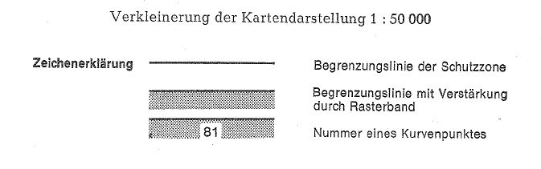
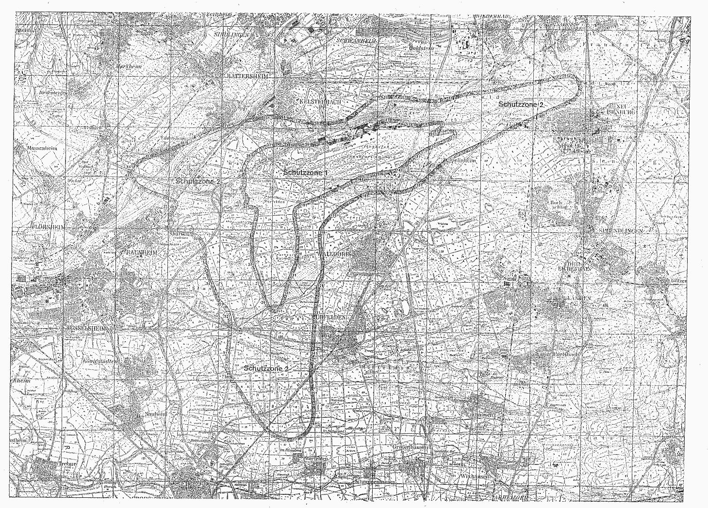

# Verordnung über die Festsetzung des Lärmschutzbereichs für den Verkehrsflughafen Frankfurt/Main (FluLärmFrankfV)

Ausfertigungsdatum
:   1977-08-05

Fundstelle
:   BGBl I: 1977, 1532

## Eingangsformel

Auf Grund des § 4 Abs. 1 des Gesetzes zum Schutz gegen Fluglärm vom
30\. März 1971 (BGBl. I S. 282) wird im Einvernehmen mit dem
Bundesminister für Verkehr und mit Zustimmung des Bundesrates
verordnet:

## § 1

Zum Schutz der Allgemeinheit vor Gefahren, erheblichen Nachteilen und
erheblichen Belästigungen durch Fluglärm in der Umgebung des
Verkehrsflughafens Frankfurt/Main wird der in § 2 bestimmte
Lärmschutzbereich festgesetzt.

## § 2

Der Lärmschutzbereich mit seinen zwei Schutzzonen wird nach Anlage 1
bestimmt durch die interpolierten Verbindungslinien zwischen den
Kurvenpunkten, soweit diese Linien außerhalb des Flugplatzgeländes
verlaufen.

## § 3

Liegt eine bauliche Anlage zu einem Teil im Lärmschutzbereich, so gilt
sie als ganz im Lärmschutzbereich gelegen. Liegt eine bauliche Anlage
zu einem Teil in der Schutzzone 1, so gilt sie als ganz in dieser
Schutzzone gelegen.

## § 4

Der nach § 2 bestimmte Lärmschutzbereich ist in einer topographischen
Karte im Maßstab 1:50.000 und in Karten im Maßstab 1:5.000
dargestellt. Die topographische Karte ist in verkleinerter Form als
Anlage 2 dieser Verordnung beigefügt. Die topographische Karte und die
Karten im Maßstab 1:5.000 sind beim Katasteramt Frankfurt am Main,
Börsenstraße 2-4, 6000 Frankfurt am Main, zu jedermanns Einsicht
archivmäßig gesichert niedergelegt.

## § 5

Diese Verordnung tritt am Tag nach der Verkündung in Kraft.

## Schlußformel

Der Bundesminister des Innern

## Anlage 1 (zu § 2 der Verordnung über die Festsetzung des Lärmschutzbereichs für den Verkehrsflughafen Frankfurt/Main)

(Fundstelle des Originaltextes: BGBl. I 1977, 1533 - 1539)

*    *   **Lärmschutzbereich**

*    *

*    *
    *   Koordinatensystem:

    *   Gauß-Krüger

*    *
    *   Interpolation:

    *   Polynom 3. Grades mit stetigem Tangentenübergang

*    *

*    *   Kurvenpunkte der Schutzzone 1

*    *

*    *   Nr.

    *   Y (Rechts)

    *   X (Hoch)

    *   Nr.

    *   Y (Rechts)

    *   X (Hoch)

    *   Nr.

    *   Y (Rechts)

    *   X (Hoch)

*    *

*    *   1

    *   3468000.0

    *   5545380.0

    *   51

    *   3471174.5

    *   5546128.8

    *   101

    *   3472890.0

    *   5545877.9

*    *   2

    *   3468009.9

    *   5545381.3

    *   52

    *   3471252.7

    *   5546111.8

    *   102

    *   3472910.0

    *   5545877.0

*    *   3

    *   3468019.9

    *   5545382.5

    *   53

    *   3471332.2

    *   5546102.8

    *   103

    *   3472929.6

    *   5545873.1

*    *   4

    *   3468039.7

    *   5545385.0

    *   54

    *   3471411.9

    *   5546096.2

    *   104

    *   3472938.7

    *   5545868.8

*    *   5

    *   3468079.4

    *   5545390.1

    *   55

    *   3471491.9

    *   5546092.7

    *   105

    *   3472944.9

    *   5545861.0

*    *   6

    *   3468158.6

    *   5545401.3

    *   56

    *   3471571.9

    *   5546092.7

    *   106

    *   3472944.0

    *   5545851.1

*    *   7

    *   3468237.7

    *   5545413.4

    *   57

    *   3471651.5

    *   5546099.7

    *   107

    *   3472939.2

    *   5545842.3

*    *   8

    *   3468316.5

    *   5545426.7

    *   58

    *   3471730.9

    *   5546109.9

    *   108

    *   3472932.9

    *   5545834.6

*    *   9

    *   3468395.2

    *   5545441.4

    *   59

    *   3471809.9

    *   5546122.3

    *   109

    *   3472918.1

    *   5545821.0

*    *   10

    *   3468473.6

    *   5545457.1

    *   60

    *   3471888.7

    *   5546136.2

    *   110

    *   3472886.2

    *   5545797.0

*    *

*    *   11

    *   3468551.7

    *   5545474.7

    *   61

    *   3471967.3

    *   5546151.0

    *   111

    *   3472818.9

    *   5545753.7

*    *   12

    *   3468629.3

    *   5545494.1

    *   62

    *   3472046.0

    *   5546165.6

    *   112

    *   3472749.4

    *   5545714.0

*    *   13

    *   3468707.0

    *   5545513.1

    *   63

    *   3472124.5

    *   5546180.8

    *   113

    *   3472679.0

    *   5545676.1

*    *   14

    *   3468785.9

    *   5545526.1

    *   64

    *   3472203.2

    *   5546195.3

    *   114

    *   3472608.0

    *   5545639.3

*    *   15

    *   3468864.7

    *   5545539.8

    *   65

    *   3472282.2

    *   5546208.2

    *   115

    *   3472536.6

    *   5545603.2

*    *   16

    *   3468943.2

    *   5545555.5

    *   66

    *   3472361.6

    *   5546217.4

    *   116

    *   3472464.9

    *   5545567.7

*    *   17

    *   3469021.5

    *   5545571.8

    *   67

    *   3472401.6

    *   5546218.8

    *   117

    *   3472393.0

    *   5545532.6

*    *   18

    *   3469060.6

    *   5545580.2

    *   68

    *   3472421.6

    *   5546217.6

    *   118

    *   3472321.0

    *   5545497.8

*    *   19

    *   3469098.1

    *   5545594.2

    *   69

    *   3472431.4

    *   5546216.1

    *   119

    *   3472248.9

    *   5545463.0

*    *   20

    *   3469133.4

    *   5545613.0

    *   70

    *   3472441.1

    *   5546213.4

    *   120

    *   3472177.1

    *   5545427.8

*    *

*    *   21

    *   3469168.6

    *   5545631.9

    *   71

    *   3472448.5

    *   5546206.7

    *   121

    *   3472105.1

    *   5545393.0

*    *   22

    *   3469239.4

    *   5545669.3

    *   72

    *   3472447.6

    *   5546196.7

    *   122

    *   3472033.1

    *   5545358.1

*    *   23

    *   3469309.9

    *   5545707.1

    *   73

    *   3472443.3

    *   5546187.7

    *   123

    *   3471961.2

    *   5545322.9

*    *   24

    *   3469380.1

    *   5545745.4

    *   74

    *   3472430.9

    *   5546172.0

    *   124

    *   3471889.6

    *   5545287.2

*    *   25

    *   3469450.1

    *   5545784.2

    *   75

    *   3472416.6

    *   5546158.0

    *   125

    *   3471818.4

    *   5545250.9

*    *   26

    *   3469519.7

    *   5545823.5

    *   76

    *   3472386.0

    *   5546132.2

    *   126

    *   3471747.6

    *   5545213.6

*    *   27

    *   3469589.0

    *   5545863.6

    *   77

    *   3472321.4

    *   5546085.0

    *   127

    *   3471681.6

    *   5545168.3

*    *   28

    *   3469657.8

    *   5545904.4

    *   78

    *   3472255.4

    *   5546039.8

    *   128

    *   3471615.9

    *   5545122.7

*    *   29

    *   3469726.4

    *   5545945.5

    *   79

    *   3472189.5

    *   5545994.5

    *   129

    *   3471551.9

    *   5545074.7

*    *

*    *   30

    *   3469794.8

    *   5545987.0

    *   80

    *   3472125.0

    *   5545947.2

    *   130

    *   3471487.0

    *   5545027.9

*    *   31

    *   3469862.4

    *   5546029.7

    *   81

    *   3472064.8

    *   5545894.5

    *   131

    *   3471422.3

    *   5544980.9

*    *   32

    *   3469931.2

    *   5546070.7

    *   82

    *   3472037.6

    *   5545865.1

    *   132

    *   3471359.9

    *   5544930.9

*    *   33

    *   3469999.4

    *   5546112.4

    *   83

    *   3472025.8

    *   5545849.0

    *   133

    *   3471299.9

    *   5544877.9

*    *   34

    *   3470067.8

    *   5546153.9

    *   84

    *   3472016.1

    *   5545831.5

    *   134

    *   3471241.7

    *   5544823.0

*    *   35

    *   3470136.2

    *   5546195.5

    *   85

    *   3472010.7

    *   5545812.3

    *   135

    *   3471184.4

    *   5544767.2

*    *   36

    *   3470170.1

    *   5546216.7

    *   86

    *   3472013.4

    *   5545792.5

    *   136

    *   3471127.5

    *   5544710.9

*    *   37

    *   3470203.9

    *   5546238.1

    *   87

    *   3472025.7

    *   5545776.7

    *   137

    *   3471069.9

    *   5544655.4

*    *   38

    *   3470240.3

    *   5546254.7

    *   88

    *   3472043.2

    *   5545766.9

    *   138

    *   3471010.6

    *   5544601.8

*    *   39

    *   3470279.0

    *   5546264.5

    *   89

    *   3472062.2

    *   5545760.6

    *   139

    *   3470948.8

    *   5544550.9

*    *   40

    *   3470318.2

    *   5546272.7

    *   90

    *   3472101.6

    *   5545754.1

    *   140

    *   3470884.2

    *   5544503.7

*    *

*    *   41

    *   3470397.3

    *   5546284.6

    *   91

    *   3472141.5

    *   5545751.2

    *   141

    *   3470813.0

    *   5544467.2

*    *   42

    *   3470477.1

    *   5546290.0

    *   92

    *   3472221.1

    *   5545759.9

    *   142

    *   3470738.9

    *   5544437.2

*    *   43

    *   3470557.1

    *   5546289.0

    *   93

    *   3472299.5

    *   5545775.5

    *   143

    *   3470663.2

    *   5544411.3

*    *   44

    *   3470636.8

    *   5546281.8

    *   94

    *   3472377.9

    *   5545791.6

    *   144

    *   3470584.2

    *   5544398.4

*    *   45

    *   3470715.8

    *   5546269.0

    *   95

    *   3472456.2

    *   5545808.0

    *   145

    *   3470505.2

    *   5544386.2

*    *   46

    *   3470793.7

    *   5546250.8

    *   96

    *   3472534.5

    *   5545824.2

    *   146

    *   3470426.1

    *   5544374.1

*    *   47

    *   3470870.4

    *   5546228.2

    *   97

    *   3472613.0

    *   5545839.8

    *   147

    *   3470347.1

    *   5544361.8

*    *   48

    *   3470946.7

    *   5546204.1

    *   98

    *   3472691.6

    *   5545854.4

    *   148

    *   3470268.3

    *   5544347.8

*    *   49

    *   3471022.3

    *   5546178.0

    *   99

    *   3472770.6

    *   5545867.4

    *   149

    *   3470189.5

    *   5544334.0

*    *   50

    *   3471097.9

    *   5546151.8

    *   100

    *   3472850.0

    *   5545876.8

    *   150

    *   3470110.8

    *   5544319.7

*    *

*    *   Noch Schutzzone 1 (Verkehrsflughafen Frankfurt/Main)

*    *

*    *   Nr.

    *   Y (Rechts)

    *   X (Hoch)

    *   Nr.

    *   Y (Rechts)

    *   X (Hoch)

    *   Nr.

    *   Y (Rechts)

    *   X (Hoch)

*    *

*    *   151

    *   3470032.3

    *   5544304.2

    *   201

    *   3466787.6

    *   5542601.8

    *   251

    *   3466222.1

    *   5538863.3

*    *   152

    *   3469953.9

    *   5544288.3

    *   202

    *   3466791.3

    *   5542521.9

    *   252

    *   3466188.4

    *   5538841.7

*    *   153

    *   3469875.6

    *   5544271.6

    *   203

    *   3466798.9

    *   5542442.2

    *   253

    *   3466149.9

    *   5538831.0

*    *   154

    *   3469797.6

    *   5544254.2

    *   204

    *   3466809.4

    *   5542362.9

    *   254

    *   3466110.0

    *   5538834.7

*    *   155

    *   3469719.6

    *   5544236.3

    *   205

    *   3466821.1

    *   5542283.8

    *   255

    *   3466073.6

    *   5538851.4

*    *   156

    *   3469641.4

    *   5544219.2

    *   206

    *   3466834.0

    *   5542204.8

    *   256

    *   3466042.1

    *   5538876.0

*    *   157

    *   3469563.5

    *   5544201.0

    *   207

    *   3466848.2

    *   5542126.1

    *   257

    *   3466014.9

    *   5538905.3

*    *   158

    *   3469487.1

    *   5544177.5

    *   208

    *   3466862.7

    *   5542047.4

    *   258

    *   3465990.7

    *   5538937.1

*    *   159

    *   3469410.9

    *   5544152.9

    *   209

    *   3466878.7

    *   5541969.0

    *   259

    *   3465968.9

    *   5538970.7

*    *   160

    *   3469336.5

    *   5544123.7

    *   210

    *   3466894.9

    *   5541890.7

    *   260

    *   3465930.5

    *   5539040.8

*    *

*    *   161

    *   3469265.0

    *   5544087.7

    *   211

    *   3466911.4

    *   5541812.4

    *   261

    *   3465895.3

    *   5539112.7

*    *   162

    *   3469193.8

    *   5544051.2

    *   212

    *   3466927.3

    *   5541734.0

    *   262

    *   3465862.9

    *   5539185.9

*    *   163

    *   3469122.5

    *   5544015.0

    *   213

    *   3466932.1

    *   5541654.1

    *   263

    *   3465833.3

    *   5539260.1

*    *   164

    *   3469051.5

    *   5543978.1

    *   214

    *   3466927.4

    *   5541574.3

    *   264

    *   3465806.0

    *   5539335.3

*    *   165

    *   3468981.1

    *   5543940.1

    *   215

    *   3466924.0

    *   5541494.4

    *   265

    *   3465780.6

    *   5539411.2

*    *   166

    *   3468911.2

    *   5543901.3

    *   216

    *   3466921.4

    *   5541414.4

    *   266

    *   3465756.7

    *   5539487.6

*    *   167

    *   3468841.7

    *   5543861.6

    *   217

    *   3466919.5

    *   5541334.4

    *   267

    *   3465733.7

    *   5539564.2

*    *   168

    *   3468771.7

    *   5543822.9

    *   218

    *   3466918.3

    *   5541254.4

    *   268

    *   3465712.2

    *   5539641.2

*    *   169

    *   3468701.1

    *   5543785.3

    *   219

    *   3466917.3

    *   5541174.4

    *   269

    *   3465695.8

    *   5539719.5

*    *   170

    *   3468630.2

    *   5543748.1

    *   220

    *   3466915.7

    *   5541094.4

    *   270

    *   3465669.2

    *   5539795.0

*    *

*    *   171

    *   3468556.5

    *   5543717.1

    *   221

    *   3466913.1

    *   5541014.5

    *   271

    *   3465642.4

    *   5539870.4

*    *   172

    *   3468483.1

    *   5543685.3

    *   222

    *   3466909.0

    *   5540934.6

    *   272

    *   3465614.4

    *   5539945.3

*    *   173

    *   3468410.1

    *   5543652.6

    *   223

    *   3466903.3

    *   5540854.8

    *   273

    *   3465587.1

    *   5540020.5

*    *   174

    *   3468337.4

    *   5543619.2

    *   224

    *   3466896.3

    *   5540775.1

    *   274

    *   3465561.5

    *   5540096.3

*    *   175

    *   3468265.6

    *   5543583.9

    *   225

    *   3466875.7

    *   5540697.8

    *   275

    *   3465536.5

    *   5540172.3

*    *   176

    *   3468194.4

    *   5543547.4

    *   226

    *   3466847.7

    *   5540622.9

    *   276

    *   3465511.3

    *   5540248.2

*    *   177

    *   3468123.5

    *   5543510.3

    *   227

    *   3466820.0

    *   5540547.8

    *   277

    *   3465484.6

    *   5540323.6

*    *   178

    *   3468053.6

    *   5543471.4

    *   228

    *   3466792.5

    *   5540472.7

    *   278

    *   3465457.6

    *   5540398.9

*    *   179

    *   3467983.1

    *   5543433.6

    *   229

    *   3466765.3

    *   5540397.4

    *   279

    *   3465430.4

    *   5540474.2

*    *   180

    *   3467911.3

    *   5543398.3

    *   230

    *   3466738.3

    *   5540322.1

    *   280

    *   3465403.1

    *   5540549.4

*    *

*    *   181

    *   3467838.6

    *   5543365.0

    *   231

    *   3466711.6

    *   5540246.7

    *   281

    *   3465375.6

    *   5540624.5

*    *   182

    *   3467765.6

    *   5543332.3

    *   232

    *   3466686.3

    *   5540170.9

    *   282

    *   3465347.8

    *   5540699.5

*    *   183

    *   3467692.7

    *   5543299.3

    *   233

    *   3466661.1

    *   5540094.9

    *   283

    *   3465328.0

    *   5540777.0

*    *   184

    *   3467620.1

    *   5543265.7

    *   234

    *   3466635.3

    *   5540019.2

    *   284

    *   3465320.9

    *   5540856.7

*    *   185

    *   3467547.9

    *   5543231.2

    *   235

    *   3466608.0

    *   5539944.0

    *   285

    *   3465315.3

    *   5540936.5

*    *   186

    *   3467475.2

    *   5543197.9

    *   236

    *   3466580.0

    *   5539869.0

    *   286

    *   3465311.4

    *   5541016.4

*    *   187

    *   3467400.8

    *   5543168.5

    *   237

    *   3466547.9

    *   5539795.8

    *   287

    *   3465308.8

    *   5541096.4

*    *   188

    *   3467326.9

    *   5543137.8

    *   238

    *   3466527.7

    *   5539718.4

    *   288

    *   3465307.5

    *   5541176.4

*    *   189

    *   3467252.5

    *   5543108.3

    *   239

    *   3466515.9

    *   5539639.3

    *   289

    *   3465306.8

    *   5541256.4

*    *   190

    *   3467178.1

    *   5543079.0

    *   240

    *   3466499.2

    *   5539561.0

    *   290

    *   3465306.0

    *   5541336.4

*    *

*    *   191

    *   3467104.3

    *   5543048.1

    *   241

    *   3466481.8

    *   5539482.9

    *   291

    *   3465303.4

    *   5541416.3

*    *   192

    *   3467032.1

    *   5543013.7

    *   242

    *   3466463.1

    *   5539405.1

    *   292

    *   3465301.5

    *   5541496.3

*    *   193

    *   3466963.0

    *   5542973.3

    *   243

    *   3466442.8

    *   5539327.8

    *   293

    *   3465299.0

    *   5541576.3

*    *   194

    *   3466897.6

    *   5542927.3

    *   244

    *   3466420.3

    *   5539251.0

    *   294

    *   3465296.2

    *   5541656.2

*    *   195

    *   3466866.4

    *   5542902.2

    *   245

    *   3466394.7

    *   5539175.2

    *   295

    *   3465300.4

    *   5541736.1

*    *   196

    *   3466837.5

    *   5542874.6

    *   246

    *   3466365.9

    *   5539100.6

    *   296

    *   3465316.5

    *   5541814.5

*    *   197

    *   3466820.4

    *   5542838.4

    *   247

    *   3466333.8

    *   5539027.3

    *   297

    *   3465334.2

    *   5541892.5

*    *   198

    *   3466808.8

    *   5542800.1

    *   248

    *   3466297.3

    *   5538956.1

    *   298

    *   3465351.6

    *   5541970.6

*    *   199

    *   3466800.1

    *   5542761.1

    *   249

    *   3466275.6

    *   5538922.5

    *   299

    *   3465369.1

    *   5542048.6

*    *   200

    *   3466790.0

    *   5542681.7

    *   250

    *   3466250.9

    *   5538891.1

    *   300

    *   3465386.3

    *   5542126.8

*    *

*    *   Noch Schutzzone 1 (Verkehrsflughafen Frankfurt/Main)

*    *

*    *   Nr.

    *   Y (Rechts)

    *   X (Hoch)

    *   Nr.

    *   Y (Rechts)

    *   X (Hoch)

    *   Nr.

    *   Y (Rechts)

    *   X (Hoch)

*    *

*    *   301

    *   3465403.2

    *   5542204.9

    *   341

    *   3464946.3

    *   5543575.0

    *   381

    *   3466625.6

    *   5545241.2

*    *   302

    *   3465419.8

    *   5542283.2

    *   342

    *   3464958.5

    *   5543613.1

    *   382

    *   3466665.5

    *   5545244.1

*    *   303

    *   3465435.8

    *   5542361.6

    *   343

    *   3464978.1

    *   5543690.7

    *   383

    *   3466705.3

    *   5545248.1

*    *   304

    *   3465450.6

    *   5542440.2

    *   344

    *   3464987.2

    *   5543770.1

    *   384

    *   3466785.2

    *   5545251.8

*    *   305

    *   3465462.6

    *   5542519.3

    *   345

    *   3464988.2

    *   5543850.1

    *   385

    *   3466865.1

    *   5545246.8

*    *   306

    *   3465470.8

    *   5542598.9

    *   346

    *   3464984.7

    *   5543930.1

    *   386

    *   3466945.0

    *   5545243.7

*    *   307

    *   3465473.4

    *   5542678.8

    *   347

    *   3464981.5

    *   5544010.0

    *   387

    *   3467025.0

    *   5545242.8

*    *   308

    *   3465471.4

    *   5542718.8

    *   348

    *   3464974.4

    *   5544089.7

    *   388

    *   3467105.0

    *   5545244.2

*    *   309

    *   3465466.3

    *   5542758.5

    *   349

    *   3464965.5

    *   5544169.2

    *   389

    *   3467184.9

    *   5545248.0

*    *   310

    *   3465460.3

    *   5542798.0

    *   350

    *   3464956.0

    *   5544248.6

    *   390

    *   3467264.6

    *   5545255.0

*    *

*    *   311

    *   3465441.3

    *   5542833.2

    *   351

    *   3464951.6

    *   5544288.4

    *   391

    *   3467344.1

    *   5545263.7

*    *   312

    *   3465416.1

    *   5542864.3

    *   352

    *   3464947.7

    *   5544328.2

    *   392

    *   3467423.5

    *   5545273.9

*    *   313

    *   3465385.4

    *   5542889.8

    *   353

    *   3464952.2

    *   5544367.9

    *   393

    *   3467502.5

    *   5545286.0

*    *   314

    *   3465350.3

    *   5542909.1

    *   354

    *   3464964.2

    *   5544406.1

    *   394

    *   3467581.3

    *   5545299.9

*    *   315

    *   3465312.7

    *   5542922.7

    *   355

    *   3464976.9

    *   5544444.0

    *   395

    *   3467659.8

    *   5545315.2

*    *   316

    *   3465273.8

    *   5542931.9

    *   356

    *   3465000.0

    *   5544520.6

    *   396

    *   3467737.3

    *   5545335.2

*    *   317

    *   3465234.3

    *   5542938.3

    *   357

    *   3465033.8

    *   5544593.1

    *   397

    *   3467814.8

    *   5545355.0

*    *   318

    *   3465154.7

    *   5542947.1

    *   358

    *   3465073.8

    *   5544662.4

    *   398

    *   3467893.8

    *   5545367.5

*    *   319

    *   3465115.1

    *   5542952.1

    *   359

    *   3465119.7

    *   5544727.9

    *   399

    *   3468000.0

    *   5545380.0

*    *   320

    *   3465095.4

    *   5542955.9

    *   360

    *   3465170.2

    *   5544790.0

    *
    *
    *

*    *

*    *   321

    *   3465076.2

    *   5542961.3

    *   361

    *   3465224.4

    *   5544848.8

    *
    *
    *

*    *   322

    *   3465058.3

    *   5542970.2

    *   362

    *   3465281.7

    *   5544904.7

    *
    *
    *

*    *   323

    *   3465045.7

    *   5542985.7

    *   363

    *   3465341.7

    *   5544957.5

    *
    *
    *

*    *   324

    *   3465044.9

    *   5543005.7

    *   364

    *   3465404.6

    *   5545006.9

    *
    *
    *

*    *   325

    *   3465051.8

    *   5543024.5

    *   365

    *   3465470.2

    *   5545052.8

    *
    *
    *

*    *   326

    *   3465061.2

    *   5543042.1

    *   366

    *   3465538.4

    *   5545094.6

    *
    *
    *

*    *   327

    *   3465076.9

    *   5543078.9

    *   367

    *   3465608.8

    *   5545132.6

    *
    *
    *

*    *   328

    *   3465092.4

    *   5543115.8

    *   368

    *   3465681.4

    *   5545166.3

    *
    *
    *

*    *   329

    *   3465103.4

    *   5543154.2

    *   369

    *   3465755.9

    *   5545195.4

    *
    *
    *

*    *   330

    *   3465107.1

    *   5543194.1

    *   370

    *   3465832.0

    *   5545219.9

    *
    *
    *

*    *

*    *   331

    *   3465101.8

    *   5543233.7

    *   371

    *   3465909.6

    *   5545239.5

    *
    *
    *

*    *   332

    *   3465088.6

    *   5543271.5

    *   372

    *   3465988.2

    *   5545254.1

    *
    *
    *

*    *   333

    *   3465069.3

    *   5543306.5

    *   373

    *   3466067.7

    *   5545263.6

    *
    *
    *

*    *   334

    *   3465045.3

    *   5543338.5

    *   374

    *   3466147.6

    *   5545267.5

    *
    *
    *

*    *   335

    *   3465018.1

    *   5543367.8

    *   375

    *   3466227.5

    *   5545271.2

    *
    *
    *

*    *   336

    *   3464991.2

    *   5543397.5

    *   376

    *   3466307.4

    *   5545274.2

    *
    *
    *

*    *   337

    *   3464963.4

    *   5543426.2

    *   377

    *   3466387.3

    *   5545269.6

    *
    *
    *

*    *   338

    *   3464939.5

    *   5543458.3

    *   378

    *   3466466.9

    *   5545261.5

    *
    *
    *

*    *   339

    *   3464929.6

    *   5543497.0

    *   379

    *   3466546.3

    *   5545251.6

    *
    *
    *

*    *   340

    *   3464934.9

    *   5543536.7

    *   380

    *   3466585.9

    *   5545246.1

    *
    *
    *

*    *

*    *   Kurvenpunkte der Schutzzone 2 (Verkehrsflughafen Frankfurt/Main)

*    *

*    *   Nr.

    *   Y(Rechts)

    *   X (Hoch)

    *   Nr.

    *   Y (Rechts)

    *   X (Hoch)

    *   Nr.

    *   Y (Rechts)

    *   X (Hoch)

*    *

*    *   1

    *   3468000.0

    *   5546142.5

    *   51

    *   3471625.7

    *   5547104.0

    *   101

    *   3477659.0

    *   5547941.9

*    *   2

    *   3468010.0

    *   5546142.8

    *   52

    *   3471685.0

    *   5547096.6

    *   102

    *   3477676.0

    *   5547905.6

*    *   3

    *   3468020.0

    *   5546143.0

    *   53

    *   3471744.4

    *   5547089.8

    *   103

    *   3477704.1

    *   5547830.7

*    *   4

    *   3468040.0

    *   5546143.6

    *   54

    *   3471803.9

    *   5547083.8

    *   104

    *   3477714.9

    *   5547792.2

*    *   5

    *   3468080.0

    *   5546145.2

    *   55

    *   3471883.5

    *   5547076.3

    *   105

    *   3477723.4

    *   5547753.1

*    *   6

    *   3468159.8

    *   5546149.4

    *   56

    *   3472043.3

    *   5547068.2

    *   106

    *   3477727.5

    *   5547713.3

*    *   7

    *   3468318.6

    *   5546169.6

    *   57

    *   3472203.3

    *   5547071.1

    *   107

    *   3477726.7

    *   5547673.4

*    *   8

    *   3468475.9

    *   5546198.7

    *   58

    *   3472362.6

    *   5547085.4

    *   108

    *   3477720.7

    *   5547633.8

*    *   9

    *   3468632.4

    *   5546231.8

    *   59

    *   3472521.0

    *   5547108.3

    *   109

    *   3477709.7

    *   5547595.4

*    *   10

    *   3468709.4

    *   5546253.6

    *   60

    *   3472677.5

    *   5547141.3

    *   110

    *   3477694.5

    *   5547558.3

*    *

*    *   11

    *   3468785.8

    *   5546277.2

    *   61

    *   3472832.6

    *   5547180.7

    *   111

    *   3477676.2

    *   5547522.8

*    *   12

    *   3468823.8

    *   5546290.0

    *   62

    *   3472986.7

    *   5547223.7

    *   112

    *   3477645.0

    *   5547465.3

*    *   13

    *   3468857.5

    *   5546311.5

    *   63

    *   3473139.9

    *   5547270.1

    *   113

    *   3477610.3

    *   5547410.9

*    *   14

    *   3468889.3

    *   5546335.7

    *   64

    *   3473292.9

    *   5547316.7

    *   114

    *   3477570.2

    *   5547361.2

*    *   15

    *   3468952.7

    *   5546384.5

    *   65

    *   3473447.2

    *   5547359.2

    *   115

    *   3477523.0

    *   5547317.8

*    *   16

    *   3469084.5

    *   5546475.2

    *   66

    *   3473604.4

    *   5547388.7

    *   116

    *   3477466.6

    *   5547282.2

*    *   17

    *   3469208.0

    *   5546577.0

    *   67

    *   3473762.9

    *   5547410.5

    *   117

    *   3477430.9

    *   5547264.2

*    *   18

    *   3469329.7

    *   5546680.8

    *   68

    *   3473921.7

    *   5547430.2

    *   118

    *   3477395.1

    *   5547246.3

*    *   19

    *   3469452.0

    *   5546783.9

    *   69

    *   3474080.8

    *   5547447.2

    *   119

    *   3477323.6

    *   5547210.5

*    *   20

    *   3469572.5

    *   5546889.2

    *   70

    *   3474239.4

    *   5547468.1

    *   120

    *   3477180.3

    *   5547139.4

*    *

*    *   21

    *   3469698.4

    *   5546987.9

    *   71

    *   3474397.6

    *   5547492.4

    *   121

    *   3477036.4

    *   5547069.3

*    *   22

    *   3469762.8

    *   5547035.4

    *   72

    *   3474555.1

    *   5547520.7

    *   122

    *   3476892.1

    *   5547000.3

*    *   23

    *   3469827.2

    *   5547082.9

    *   73

    *   3474712.4

    *   5547549.6

    *   123

    *   3476747.4

    *   5546931.9

*    *   24

    *   3469859.1

    *   5547107.0

    *   74

    *   3474870.0

    *   5547577.6

    *   124

    *   3476602.6

    *   5546864.0

*    *   25

    *   3469890.9

    *   5547131.3

    *   75

    *   3475026.9

    *   5547608.5

    *   125

    *   3476458.3

    *   5546794.7

*    *   26

    *   3469928.1

    *   5547146.1

    *   76

    *   3475183.5

    *   5547641.6

    *   126

    *   3476313.6

    *   5546726.6

*    *   27

    *   3469966.5

    *   5547157.1

    *   77

    *   3475339.6

    *   5547676.5

    *   127

    *   3476168.6

    *   5546658.9

*    *   28

    *   3470005.3

    *   5547166.8

    *   78

    *   3475495.8

    *   5547710.8

    *   128

    *   3476027.7

    *   5546583.0

*    *   29

    *   3470083.9

    *   5547182.0

    *   79

    *   3475652.1

    *   5547744.4

    *   129

    *   3475884.6

    *   5546511.5

*    *   30

    *   3470163.0

    *   5547193.5

    *   80

    *   3475808.4

    *   5547778.0

    *   130

    *   3475740.4

    *   5546442.2

*    *

*    *   31

    *   3470322.3

    *   5547209.0

    *   81

    *   3475964.5

    *   5547812.6

    *   131

    *   3475596.4

    *   5546372.3

*    *   32

    *   3470482.1

    *   5547217.5

    *   82

    *   3476120.2

    *   5547848.7

    *   132

    *   3475452.9

    *   5546301.6

*    *   33

    *   3470641.9

    *   5547224.5

    *   83

    *   3476275.8

    *   5547885.9

    *   133

    *   3475309.9

    *   5546229.9

*    *   34

    *   3470741.7

    *   5547228.7

    *   84

    *   3476430.8

    *   5547925.8

    *   134

    *   3475166.9

    *   5546158.1

*    *   35

    *   3470841.5

    *   5547229.7

    *   85

    *   3476585.8

    *   5547965.4

    *   135

    *   3475024.4

    *   5546085.5

*    *   36

    *   3470921.3

    *   5547225.1

    *   86

    *   3476741.0

    *   5548004.2

    *   136

    *   3474882.6

    *   5546011.4

*    *   37

    *   3470961.1

    *   5547221.2

    *   87

    *   3476896.3

    *   5548042.7

    *   137

    *   3474741.5

    *   5545936.0

*    *   38

    *   3470981.0

    *   5547219.1

    *   88

    *   3477052.1

    *   5548079.2

    *   138

    *   3474601.0

    *   5545859.4

*    *   39

    *   3471000.9

    *   5547216.8

    *   89

    *   3477130.0

    *   5548097.5

    *   139

    *   3474461.1

    *   5545781.8

*    *   40

    *   3471020.8

    *   5547214.4

    *   90

    *   3477198.6

    *   5548114.1

    *   140

    *   3474320.8

    *   5545704.9

*    *

*    *   41

    *   3471039.2

    *   5547211.7

    *   91

    *   3477267.6

    *   5548127.7

    *   141

    *   3474179.8

    *   5545629.3

*    *   42

    *   3471057.4

    *   5547208.1

    *   92

    *   3477337.3

    *   5548132.6

    *   142

    *   3474038.3

    *   5545554.6

*    *   43

    *   3471075.5

    *   5547203.8

    *   93

    *   3477408.4

    *   5548123.1

    *   143

    *   3473896.5

    *   5545480.5

*    *   44

    *   3471095.0

    *   5547198.6

    *   94

    *   3477447.1

    *   5548113.1

    *   144

    *   3473755.3

    *   5545405.2

*    *   45

    *   3471133.5

    *   5547187.4

    *   95

    *   3477484.5

    *   5548099.0

    *   145

    *   3473608.0

    *   5545342.8

*    *   46

    *   3471211.3

    *   5547168.4

    *   96

    *   3477520.7

    *   5548081.9

    *   146

    *   3473461.9

    *   5545277.6

*    *   47

    *   3471369.1

    *   5547142.4

    *   97

    *   3477555.0

    *   5548061.4

    *   147

    *   3473317.3

    *   5545209.1

*    *   48

    *   3471448.1

    *   5547129.7

    *   98

    *   3477586.6

    *   5548036.9

    *   148

    *   3473173.0

    *   5545139.9

*    *   49

    *   3471507.2

    *   5547120.6

    *   99

    *   3477614.6

    *   5548008.2

    *   149

    *   3473028.3

    *   5545071.6

*    *   50

    *   3471566.4

    *   5547112.1

    *   100

    *   3477638.6

    *   5547976.3

    *   150

    *   3472890.5

    *   5544990.4

*    *

*    *   Noch Schutzzone 2 (Verkehrsflughafen Frankfurt/Main)

*    *

*    *   Nr.

    *   Y (Rechts)

    *   X (Hoch)

    *   Nr.

    *   Y (Rechts)

    *   X (Hoch)

    *   Nr.

    *   Y (Rechts)

    *   X (Hoch)

*    *

*    *   151

    *   3472755.0

    *   5544905.2

    *   201

    *   3467789.9

    *   5541899.2

    *   251

    *   3467572.7

    *   5535516.1

*    *   152

    *   3472625.0

    *   5544812.0

    *   202

    *   3467784.0

    *   5541819.4

    *   252

    *   3467594.7

    *   5535357.6

*    *   153

    *   3472501.0

    *   5544710.8

    *   203

    *   3467781.1

    *   5541739.5

    *   253

    *   3467613.8

    *   5535198.8

*    *   154

    *   3472382.2

    *   5544603.7

    *   204

    *   3467785.2

    *   5541579.5

    *   254

    *   3467627.7

    *   5535039.4

*    *   155

    *   3472263.7

    *   5544496.2

    *   205

    *   3467800.2

    *   5541420.2

    *   255

    *   3467633.8

    *   5534879.5

*    *   156

    *   3472155.4

    *   5544378.4

    *   206

    *   3467821.1

    *   5541261.6

    *   256

    *   3467629.5

    *   5534719.6

*    *   157

    *   3472040.0

    *   5544267.6

    *   207

    *   3467846.8

    *   5541103.7

    *   257

    *   3467622.2

    *   5534639.9

*    *   158

    *   3471921.3

    *   5544160.3

    *   208

    *   3467874.7

    *   5540946.1

    *   258

    *   3467611.1

    *   5534560.7

*    *   159

    *   3471800.4

    *   5544055.5

    *   209

    *   3467890.1

    *   5540867.6

    *   259

    *   3467595.7

    *   5534482.2

*    *   160

    *   3471673.9

    *   5543957.5

    *   210

    *   3467906.0

    *   5540789.2

    *   260

    *   3467575.1

    *   5534404.9

*    *

*    *   161

    *   3471545.2

    *   5543862.5

    *   211

    *   3467912.7

    *   5540709.5

    *   261

    *   3467549.2

    *   5534329.2

*    *   162

    *   3471464.6

    *   5543803.3

    *   212

    *   3467907.9

    *   5540629.6

    *   262

    *   3467517.6

    *   5534255.7

*    *   163

    *   3471382.2

    *   5543747.3

    *   213

    *   3467903.6

    *   5540549.8

    *   263

    *   3467480.3

    *   5534185.0

*    *   164

    *   3471295.6

    *   5543698.4

    *   214

    *   3467896.3

    *   5540389.9

    *   264

    *   3467436.9

    *   5534117.7

*    *   165

    *   3471202.3

    *   5543660.9

    *   215

    *   3467892.6

    *   5540310.0

    *   265

    *   3467387.5

    *   5534054.8

*    *   166

    *   3471125.9

    *   5543637.0

    *   216

    *   3467886.4

    *   5540230.2

    *   266

    *   3467332.5

    *   5533996.7

*    *   167

    *   3471047.1

    *   5543623.2

    *   217

    *   3467872.4

    *   5540151.5

    *   267

    *   3467272.0

    *   5533944.4

*    *   168

    *   3470968.4

    *   5543609.3

    *   218

    *   3467852.2

    *   5540074.1

    *   268

    *   3467206.7

    *   5533898.2

*    *   169

    *   3470809.1

    *   5543594.1

    *   219

    *   3467826.1

    *   5539998.5

    *   269

    *   3467136.9

    *   5533859.0

*    *   170

    *   3470649.2

    *   5543587.6

    *   220

    *   3467797.5

    *   5539923.8

    *   270

    *   3467063.5

    *   5533827.3

*    *

*    *   171

    *   3470489.2

    *   5543584.0

    *   221

    *   3467769.7

    *   5539848.7

    *   271

    *   3466987.2

    *   5533803.1

*    *   172

    *   3470329.3

    *   5543582.7

    *   222

    *   3467750.6

    *   5539783.3

    *   272

    *   3466909.0

    *   5533786.6

*    *   173

    *   3470169.3

    *   5543578.4

    *   223

    *   3467739.5

    *   5539716.8

    *   273

    *   3466829.4

    *   5533777.8

*    *   174

    *   3470009.5

    *   5543571.4

    *   224

    *   3467733.4

    *   5539649.7

    *   274

    *   3466749.5

    *   5533776.3

*    *   175

    *   3469929.5

    *   5543568.9

    *   225

    *   3467729.4

    *   5539582.2

    *   275

    *   3466669.7

    *   5533782.0

*    *   176

    *   3469849.6

    *   5543566.0

    *   226

    *   3467723.3

    *   5539502.3

    *   276

    *   3466590.7

    *   5533794.9

*    *   177

    *   3469770.4

    *   5543554.7

    *   227

    *   3467706.5

    *   5539343.2

    *   277

    *   3466513.0

    *   5533813.7

*    *   178

    *   3469692.4

    *   5543536.8

    *   228

    *   3467686.7

    *   5539184.5

    *   278

    *   3466436.9

    *   5533838.6

*    *   179

    *   3469614.6

    *   5543517.9

    *   229

    *   3467664.9

    *   5539025.9

    *   279

    *   3466362.8

    *   5533868.8

*    *   180

    *   3469539.8

    *   5543489.7

    *   230

    *   3467646.6

    *   5538867.0

    *   280

    *   3466290.9

    *   5533903.9

*    *

*    *   181

    *   3469467.7

    *   5543455.1

    *   231

    *   3467634.7

    *   5538707.4

    *   281

    *   3466221.2

    *   5533943.1

*    *   182

    *   3469395.2

    *   5543421.2

    *   232

    *   3467628.4

    *   5538547.6

    *   282

    *   3466153.8

    *   5533986.2

*    *   183

    *   3469251.7

    *   5543350.4

    *   233

    *   3467621.2

    *   5538387.8

    *   283

    *   3466088.7

    *   5534032.6

*    *   184

    *   3469111.5

    *   5543273.3

    *   234

    *   3467612.5

    *   5538228.1

    *   284

    *   3466025.7

    *   5534082.0

*    *   185

    *   3468974.0

    *   5543191.5

    *   235

    *   3467602.6

    *   5538068.5

    *   285

    *   3465906.4

    *   5534188.6

*    *   186

    *   3468838.7

    *   5543106.2

    *   236

    *   3467592.3

    *   5537908.9

    *   286

    *   3465794.9

    *   5534303.4

*    *   187

    *   3468706.0

    *   5543016.8

    *   237

    *   3467586.2

    *   5537749.0

    *   287

    *   3465690.5

    *   5534424.6

*    *   188

    *   3468577.3

    *   5542921.7

    *   238

    *   3467579.3

    *   5537589.1

    *   288

    *   3465592.1

    *   5534550.8

*    *   189

    *   3468454.8

    *   5542818.8

    *   239

    *   3467571.1

    *   5537429.4

    *   289

    *   3465498.9

    *   5534680.8

*    *   190

    *   3468334.9

    *   5542712.8

    *   240

    *   3467562.6

    *   5537269.6

    *   290

    *   3465409.9

    *   5534813.8

*    *

*    *   191

    *   3468218.3

    *   5542603.2

    *   241

    *   3467552.7

    *   5537109.9

    *   291

    *   3465324.0

    *   5534948.7

*    *   192

    *   3468110.9

    *   5542484.7

    *   242

    *   3467541.3

    *   5536950.3

    *   292

    *   3465239.9

    *   5535084.9

*    *   193

    *   3468009.9

    *   5542360.5

    *   243

    *   3467529.0

    *   5536790.8

    *   293

    *   3465156.4

    *   5535221.4

*    *   194

    *   3467918.8

    *   5542229.0

    *   244

    *   3467513.3

    *   5536631.5

    *   294

    *   3465072.1

    *   5535357.4

*    *   195

    *   3467877.6

    *   5542160.4

    *   245

    *   3467502.2

    *   5536471.9

    *   295

    *   3464985.6

    *   5535491.9

*    *   196

    *   3467854.9

    *   5542127.5

    *   246

    *   3467498.8

    *   5536312.0

    *   296

    *   3464895.4

    *   5535624.2

*    *   197

    *   3467833.3

    *   5542093.8

    *   247

    *   3467502.4

    *   5536152.0

    *   297

    *   3464801.1

    *   5535753.4

*    *   198

    *   3467820.0

    *   5542056.1

    *   248

    *   3467513.5

    *   5535992.4

    *   298

    *   3464705.5

    *   5535881.7

*    *   199

    *   3467811.5

    *   5542017.0

    *   249

    *   3467529.6

    *   5535833.2

    *   299

    *   3464613.5

    *   5536012.6

*    *   200

    *   3467801.1

    *   5541978.4

    *   250

    *   3467550.0

    *   5535674.5

    *   300

    *   3464571.0

    *   5536080.4

*    *

*    *   Noch Schutzzone 2 (Verkehrsflughafen Frankfurt/Main)

*    *

*    *   Nr.

    *   Y (Rechts)

    *   X (Hoch)

    *   Nr.

    *   Y (Rechts)

    *   X (Hoch)

    *   Nr.

    *   Y (Rechts)

    *   X (Hoch)

*    *

*    *   301

    *   3464532.6

    *   5536150.6

    *   351

    *   3463498.3

    *   5540843.4

    *   401

    *   3462321.0

    *   5542811.3

*    *   302

    *   3464499.3

    *   5536223.3

    *   352

    *   3463498.1

    *   5540923.4

    *   402

    *   3462337.3

    *   5542847.8

*    *   303

    *   3464471.5

    *   5536298.3

    *   353

    *   3463496.0

    *   5541003.4

    *   403

    *   3462349.5

    *   5542885.9

*    *   304

    *   3464449.8

    *   5536375.3

    *   354

    *   3463480.3

    *   5541162.6

    *   404

    *   3462356.0

    *   5542925.4

*    *   305

    *   3464434.1

    *   5536453.8

    *   355

    *   3463469.9

    *   5541241.9

    *   405

    *   3462359.5

    *   5542965.2

*    *   306

    *   3464423.4

    *   5536533.1

    *   356

    *   3463455.7

    *   5541320.7

    *   406

    *   3462360.5

    *   5543005.2

*    *   307

    *   3464417.4

    *   5536612.8

    *   357

    *   3463428.3

    *   5541395.8

    *   407

    *   3462351.0

    *   5543044.1

*    *   308

    *   3464415.8

    *   5536692.8

    *   358

    *   3463392.0

    *   5541467.2

    *   408

    *   3462329.1

    *   5543077.6

*    *   309

    *   3464417.3

    *   5536772.8

    *   359

    *   3463352.0

    *   5541536.4

    *   409

    *   3462301.5

    *   5543106.6

*    *   310

    *   3464427.8

    *   5536932.5

    *   360

    *   3463310.4

    *   5541604.7

    *   410

    *   3462270.5

    *   5543131.7

*    *

*    *   311

    *   3464440.4

    *   5537092.0

    *   361

    *   3463260.1

    *   5541667.0

    *   411

    *   3462237.4

    *   5543154.3

*    *   312

    *   3464447.9

    *   5537251.8

    *   362

    *   3463200.4

    *   5541720.2

    *   412

    *   3462167.3

    *   5543192.7

*    *   313

    *   3464459.5

    *   5537411.4

    *   363

    *   3463137.5

    *   5541769.7

    *   413

    *   3462097.2

    *   5543231.4

*    *   314

    *   3464472.3

    *   5537570.6

    *   364

    *   3463067.2

    *   5541807.9

    *   414

    *   3462022.5

    *   5543259.9

*    *   315

    *   3464485.7

    *   5537730.3

    *   365

    *   3462991.9

    *   5541835.0

    *   415

    *   3461946.8

    *   5543285.8

*    *   316

    *   3464496.8

    *   5537889.9

    *   366

    *   3462914.6

    *   5541855.5

    *   416

    *   3461794.5

    *   5543334.8

*    *   317

    *   3464504.7

    *   5538049.7

    *   367

    *   3462835.8

    *   5541869.2

    *   417

    *   3461641.8

    *   5543382.8

*    *   318

    *   3464507.2

    *   5538209.7

    *   368

    *   3462756.3

    *   5541877.8

    *   418

    *   3461490.9

    *   5543436.0

*    *   319

    *   3464494.6

    *   5538369.2

    *   369

    *   3462676.4

    *   5541882.8

    *   419

    *   3461341.2

    *   5543492.3

*    *   320

    *   3464484.3

    *   5538448.5

    *   370

    *   3462516.6

    *   5541889.4

    *   420

    *   3461195.6

    *   5543558.6

*    *

*    *   321

    *   3464474.9

    *   5538528.0

    *   371

    *   3462436.4

    *   5541888.5

    *   421

    *   3461056.5

    *   5543637.8

*    *   322

    *   3464458.8

    *   5538606.3

    *   372

    *   3462356.6

    *   5541889.0

    *   422

    *   3460987.6

    *   5543678.4

*    *   323

    *   3464437.9

    *   5538683.5

    *   373

    *   3462276.7

    *   5541893.2

    *   423

    *   3460916.9

    *   5543715.7

*    *   324

    *   3464410.1

    *   5538758.6

    *   374

    *   3462236.9

    *   5541897.8

    *   424

    *   3460882.2

    *   5543735.7

*    *   325

    *   3464376.4

    *   5538831.1

    *   375

    *   3462197.7

    *   5541905.5

    *   425

    *   3460847.9

    *   5543756.2

*    *   326

    *   3464337.9

    *   5538901.3

    *   376

    *   3462159.9

    *   5541918.7

    *   426

    *   3460819.0

    *   5543734.0

*    *   327

    *   3464290.6

    *   5538965.8

    *   377

    *   3462142.6

    *   5541928.7

    *   427

    *   3460795.9

    *   5543816.9

*    *   328

    *   3464262.4

    *   5538994.3

    *   378

    *   3462128.0

    *   5541942.4

    *   428

    *   3460756.8

    *   5543872.5

*    *   329

    *   3464229.9

    *   5539017.2

    *   379

    *   3462118.4

    *   5541959.9

    *   429

    *   3460717.7

    *   5543928.1

*    *   330

    *   3464197.4

    *   5539040.0

    *   380

    *   3462114.7

    *   5541979.6

    *   430

    *   3460678.6

    *   5543983.7

*    *

*    *   331

    *   3464169.1

    *   5539067.9

    *   381

    *   3462115.9

    *   5541999.5

    *   431

    *   3460639.5

    *   5544039.3

*    *   332

    *   3464144.9

    *   5539099.7

    *   382

    *   3462120.7

    *   5542018.9

    *   432

    *   3460600.5

    *   5544094.9

*    *   333

    *   3464117.8

    *   5539129.1

    *   383

    *   3462135.4

    *   5542056.2

    *   433

    *   3460577.5

    *   5544127.6

*    *   334

    *   3464067.8

    *   5539191.6

    *   384

    *   3462152.5

    *   5542092.3

    *   434

    *   3460566.0

    *   5544144.0

*    *   335

    *   3464021.7

    *   5539257.0

    *   385

    *   3462170.6

    *   5542128.0

    *   435

    *   3460559.8

    *   5544163.1

*    *   336

    *   3463982.7

    *   5539326.8

    *   386

    *   3462187.1

    *   5542164.4

    *   436

    *   3460561.6

    *   5544163.1

*    *   337

    *   3463949.7

    *   5539399.7

    *   387

    *   3462199.9

    *   5542202.3

    *   437

    *   3460562.9

    *   5544203.0

*    *   338

    *   3463923.0

    *   5539475.1

    *   388

    *   3462206.0

    *   5542241.9

    *   438

    *   3460571.5

    *   5544242.1

*    *   339

    *   3463897.9

    *   5539551.1

    *   389

    *   3462201.8

    *   5542281.6

    *   439

    *   3460585.6

    *   5544279.5

*    *   340

    *   3463844.1

    *   5539701.7

    *   390

    *   3462186.2

    *   5542318.4

    *   440

    *   3460604.1

    *   5544315.0

*    *

*    *   341

    *   3463782.4

    *   5539849.4

    *   391

    *   3462165.9

    *   5542352.9

    *   441

    *   3460626.5

    *   5544343.2

*    *   342

    *   3463722.3

    *   5539997.7

    *   392

    *   3462144.9

    *   5542387.0

    *   442

    *   3460653.4

    *   5544377.7

*    *   343

    *   3463665.2

    *   5540147.1

    *   393

    *   3462130.6

    *   5542424.3

    *   443

    *   3460682.3

    *   5544405.4

*    *   344

    *   3463619.7

    *   5540300.5

    *   394

    *   3462127.8

    *   5542464.2

    *   444

    *   3460744.6

    *   5544455.6

*    *   345

    *   3463579.4

    *   5540455.4

    *   395

    *   3462136.0

    *   5542503.4

    *   445

    *   3460811.0

    *   5544500.3

*    *   346

    *   3463530.3

    *   5540607.6

    *   396

    *   3462151.1

    *   5542540.4

    *   446

    *   3460877.7

    *   5544544.3

*    *   347

    *   3463509.8

    *   5540685.0

    *   397

    *   3462170.2

    *   5542575.6

    *   447

    *   3460945.4

    *   5544586.7

*    *   348

    *   3463499.8

    *   5540723.7

    *   398

    *   3462191.6

    *   5542609.4

    *   448

    *   3461014.6

    *   5544626.4

*    *   349

    *   3463495.7

    *   5540763.5

    *   399

    *   3462236.5

    *   5542675.6

    *   449

    *   3461085.6

    *   5544662.9

*    *   350

    *   3463496.1

    *   5540803.5

    *   400

    *   3462281.2

    *   5542741.9

    *   450

    *   3461158.9

    *   5544695.3

*    *

*    *   Noch Schutzzone 2 (Verkehrsflughafen Frankfurt/Main)

*    *

*    *   Nr.

    *   Y (Rechts)

    *   X (Hoch)

    *   Nr.

    *   Y (Rechts)

    *   X (Hoch)

    *   Nr.

    *   Y (Rechts)

    *   X (Hoch)

*    *

*    *   451

    *   3461233.1

    *   5544725.1

    *   471

    *   3464109.7

    *   5545927.8

    *   491

    *   3466403.7

    *   5546340.6

*    *   452

    *   3461307.7

    *   5544754.1

    *   472

    *   3464259.8

    *   5545983.4

    *   492

    *   3466443.2

    *   5546334.2

*    *   453

    *   3461457.6

    *   5544810.1

    *   473

    *   3464410.5

    *   5546037.1

    *   493

    *   3466521.2

    *   5546316.3

*    *   454

    *   3461607.8

    *   5544865.3

    *   474

    *   3464561.7

    *   5546089.4

    *   494

    *   3466598.8

    *   5546296.9

*    *   455

    *   3461758.0

    *   5544920.4

    *   475

    *   3464713.7

    *   5546139.3

    *   495

    *   3466753.5

    *   5546256.2

*    *   456

    *   3461908.0

    *   5544976.1

    *   476

    *   3464866.7

    *   5546186.2

    *   496

    *   3466910.5

    *   5546225.3

*    *   457

    *   3462057.1

    *   5545034.0

    *   477

    *   3465020.8

    *   5546229.2

    *   497

    *   3467069.0

    *   5546202.9

*    *   458

    *   3462203.2

    *   5545099.2

    *   478

    *   3465176.2

    *   5546267.2

    *   498

    *   3467227.5

    *   5546181.7

*    *   459

    *   3462350.0

    *   5545162.8

    *   479

    *   3465332.9

    *   5546299.4

    *   499

    *   3467386.2

    *   5546161.0

*    *   460

    *   3462495.4

    *   5545229.6

    *   480

    *   3465490.9

    *   5546325.1

    *   500

    *   3467545.9

    *   5546150.9

*    *

*    *   461

    *   3462640.6

    *   5545296.8

    *   481

    *   3465649.8

    *   5546343.4

    *   501

    *   3467705.8

    *   5546144.6

*    *   462

    *   3462785.9

    *   5545363.8

    *   482

    *   3465809.0

    *   5546359.9

    *   502

    *   3467865.7

    *   5546141.4

*    *   463

    *   3462929.6

    *   5545343.3

    *   483

    *   3465888.2

    *   5546371.0

    *   503

    *   3468000.0

    *   5546142.5

*    *   464

    *   3463073.1

    *   5545505.1

    *   484

    *   3465968.0

    *   5546375.8

    *
    *
    *

*    *   465

    *   3463218.6

    *   5545571.6

    *   485

    *   3466048.0

    *   5546375.5

    *
    *
    *

*    *   466

    *   3463364.4

    *   5545637.4

    *   486

    *   3466111.6

    *   5546373.4

    *
    *
    *

*    *   467

    *   3463511.9

    *   5545699.5

    *   487

    *   3466174.9

    *   5546368.2

    *
    *
    *

*    *   468

    *   3463660.9

    *   5545757.8

    *   488

    *   3466238.0

    *   5546361.0

    *
    *
    *

*    *   469

    *   3463811.2

    *   5545812.5

    *   489

    *   3466301.0

    *   5546353.0

    *
    *
    *

*    *   470

    *   3463960.3

    *   5545870.5

    *   490

    *   3466364.0

    *   5546345.2

    *
    *
    *

## Anlage 2 (zu § 4 der Verordnung über die Festsetzung des Lärmschutzbereichs für den Verkehrsflughafen Frankfurt/Main)

   (Fundstelle: BGBl I 1977, 1539 - 1540)

