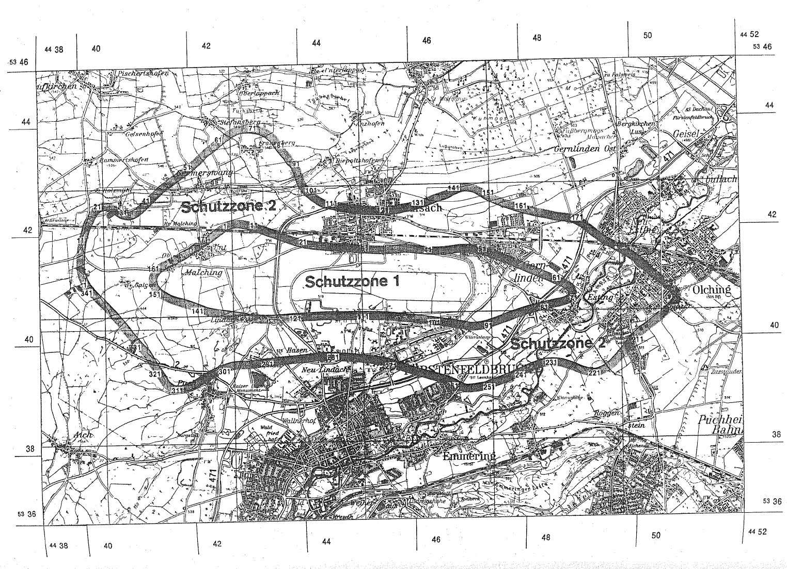

# Verordnung über die Festsetzung des Lärmschutzbereichs für den militärischen Flugplatz Fürstenfeldbruck (FluLärmFürstenfV)

Ausfertigungsdatum
:   1979-07-12

Fundstelle
:   BGBl I: 1979, 1004

Geändert durch
:   Art. 1 V v. 24.5.1988 I 712

## Eingangsformel

Auf Grund des § 4 Abs. 1 des Gesetzes zum Schutz gegen Fluglärm vom
30\. März 1971 (BGBl. I S. 282) wird im Einvernehmen mit dem
Bundesminister der Verteidigung und mit Zustimmung des Bundesrates
verordnet:

## § 1

Zum Schutz der Allgemeinheit vor Gefahren, erheblichen Nachteilen und
erheblichen Belästigungen durch Fluglärm in der Umgebung des
militärischen Flugplatzes Fürstenfeldbruck wird der in § 2 bestimmte
Lärmschutzbereich festgesetzt.

## § 2

Der Lärmschutzbereich mit seinen zwei Schutzzonen wird nach Anlage 1
bestimmt durch die interpolierten Verbindungslinien zwischen den
Kurvenpunkten, soweit diese Linien außerhalb des Flugplatzgeländes
verlaufen.

## § 3

Liegt eine bauliche Anlage zu einem Teil im Lärmschutzbereich, so gilt
sie als ganz im Lärmschutzbereich gelegen. Liegt eine bauliche Anlage
zu einem Teil in der Schutzzone 1, so gilt sie als ganz in dieser
Schutzzone gelegen.

## § 4

(1) Der nach § 2 bestimmte Lärmschutzbereich ist in einer
topographischen Karte im Maßstab 1:50.000 und in Karten im Maßstab
1:5.000 dargestellt. Die topographische Karte ist in verkleinerter
Form als Anlage 2 dieser Verordnung beigefügt. Die topographische
Karte und die Karten im Maßstab 1:5.000 sind beim Vermessungsamt
Fürstenfeldbruck, Bahnhofweg 8, 8080 Fürstenfeldbruck, zu jedermanns
Einsicht archivmäßig gesichert niedergelegt\*).

(2) Die Karten im Maßstab 1:5.000 über den Lärmschutzbereich nach der
bis zum Ablauf des 14. Juni 1988 geltenden Fassung dieser Verordnung
bleiben an gleicher Stelle zu jedermanns Einsicht archivmäßig
gesichert niedergelegt.

## § 5

Diese Verordnung tritt am Tag nach der Verkündung in Kraft.

## Schlußformel

Der Bundesminister des Innern

## Anlage 1 (zu § 2 der Verordnung über die Festsetzung des Lärmschutzbereichs für den militärischen Flugplatz Fürstenfeldbruck in der Fassung der Ersten Änderungsverordnung vom 24.5.1988)

(Fundstelle des Originaltextes: BGBl. I 1988, 713 - 717)

*    *   **Lärmschutzbereich - Erste Änderung**

*    *

*    *
    *   Koordinatensystem:

    *   Gauß-Krüger:

    *   Y = Rechtswert

*    *
    *
    *
    *   X = Hochwert

*    *
    *   Interpolation:

    *   Polynom 3. Grades mit stetigem Tangentenübergang

*    *

*    *   Kurvenpunkte der Schutzzone 1 (Militärischer Flugplatz
        Fürstenfeldbruck)

*    *

*    *

*    *   Nr.

    *   Y

    *   X

    *   Nr.

    *   Y

    *   X

    *   Nr.

    *   Y

    *   X

*    *

*    *   1

    *   4442632.5

    *   5342201.8

    *   51

    *   4447151.0

    *   5341669.0

    *   101

    *   4446444.8

    *   5340527.9

*    *   2

    *   4442662.5

    *   5342216.5

    *   52

    *   4447226.0

    *   5341647.7

    *   102

    *   4446303.0

    *   5340547.9

*    *   3

    *   4442693.5

    *   5342228.1

    *   53

    *   4447372.7

    *   5341595.1

    *   103

    *   4446161.3

    *   5340567.9

*    *   4

    *   4442725.5

    *   5342236.4

    *   54

    *   4447517.7

    *   5341536.8

    *   104

    *   4446019.4

    *   5340587.2

*    *   5

    *   4442758.5

    *   5342241.5

    *   55

    *   4447662.5

    *   5341477.7

    *   105

    *   4445877.6

    *   5340606.4

*    *   6

    *   4442791.7

    *   5342243.3

    *   56

    *   4447805.7

    *   5341413.9

    *   106

    *   4445735.3

    *   5340622.9

*    *   7

    *   4442824.9

    *   5342242.0

    *   57

    *   4447949.5

    *   5341351.6

    *   107

    *   4445593.3

    *   5340640.7

*    *   8

    *   4442857.8

    *   5342238.2

    *   58

    *   4448093.0

    *   5341288.4

    *   108

    *   4445449.1

    *   5340652.6

*    *   9

    *   4442890.3

    *   5342231.6

    *   59

    *   4448236.3

    *   5341224.7

    *   109

    *   4445304.9

    *   5340660.3

*    *   10

    *   4442953.3

    *   5342219.7

    *   60

    *   4448357.3

    *   5341173.0

    *   110

    *   4445160.6

    *   5340664.4

*    *

*    *   11

    *   4443028.5

    *   5342199.7

    *   61

    *   4448476.8

    *   5341120.4

    *   111

    *   4445045.9

    *   5340667.4

*    *   12

    *   4443128.5

    *   5342169.7

    *   62

    *   4448596.9

    *   5341068.0

    *   112

    *   4444958.8

    *   5340669.4

*    *   13

    *   4443228.5

    *   5342129.7

    *   63

    *   4448655.9

    *   5341039.0

    *   113

    *   4444871.7

    *   5340670.9

*    *   14

    *   4443328.5

    *   5342089.7

    *   64

    *   4448712.6

    *   5341005.9

    *   114

    *   4444727.2

    *   5340672.8

*    *   15

    *   4443382.7

    *   5342069.8

    *   65

    *   4448740.1

    *   5340985.1

    *   115

    *   4444582.7

    *   5340673.9

*    *   16

    *   4443424.9

    *   5342051.6

    *   66

    *   4448752.7

    *   5340973.3

    *   116

    *   4444445.2

    *   5340677.9

*    *   17

    *   4443467.6

    *   5342034.3

    *   67

    *   4448763.7

    *   5340960.0

    *   117

    *   4444307.7

    *   5340677.8

*    *   18

    *   4443553.7

    *   5342001.6

    *   68

    *   4448769.8

    *   5340949.7

    *   118

    *   4444170.4

    *   5340673.0

*    *   19

    *   4443698.5

    *   5341944.7

    *   69

    *   4448773.9

    *   5340938.4

    *   119

    *   4444044.4

    *   5340667.3

*    *   20

    *   4443828.5

    *   5341897.7

    *   70

    *   4448775.2

    *   5340924.4

    *   120

    *   4443895.7

    *   5340663.7

*    *

*    *   21

    *   4443908.5

    *   5341871.7

    *   71

    *   4448771.7

    *   5340910.9

    *   121

    *   4443815.1

    *   5340661.7

*    *   22

    *   4443989.6

    *   5341845.8

    *   72

    *   4448764.6

    *   5340899.0

    *   122

    *   4443734.9

    *   5340655.7

*    *   23

    *   4444064.3

    *   5341832.7

    *   73

    *   4448755.0

    *   5340888.9

    *   123

    *   4443621.2

    *   5340650.2

*    *   24

    *   4444139.1

    *   5341820.2

    *   74

    *   4448733.3

    *   5340873.5

    *   124

    *   4443462.1

    *   5340640 7

*    *   25

    *   4444288.8

    *   5341796.7

    *   75

    *   4448709.5

    *   5340861.8

    *   125

    *   4443382.9

    *   5340637.5

*    *   26

    *   4444439.1

    *   5341782.3

    *   76

    *   4448662 1

    *   5340845.6

    *   126

    *   4443303.6

    *   5340638.2

*    *   27

    *   4444589.4

    *   5341766.7

    *   77

    *   4448613.5

    *   5340833.5

    *   127

    *   4443264.0

    *   5340640.4

*    *   28

    *   4444740.5

    *   5341761.8

    *   78

    *   4448537.9

    *   5340818.8

    *   128

    *   4443205.3

    *   5340644.6

*    *   29

    *   4444890.6

    *   5341744.5

    *   79

    *   4448462.0

    *   5340805.5

    *   129

    *   4443146.6

    *   5340649.2

*    *   30

    *   4445018.9

    *   5341730.6

    *   80

    *   4448335.7

    *   5340776.4

    *   130

    *   4443088.3

    *   5340654.3

*    *

*    *   31

    *   4445105.0

    *   5341723.0

    *   81

    *   4448248.5

    *   5340757.9

    *   131

    *   4443030.1

    *   5340660.0

*    *   32

    *   4445191.2

    *   5341715.8

    *   82

    *   4448161.6

    *   5340738.4

    *   132

    *   4442983.5

    *   5340669.8

*    *   33

    *   4445341.7

    *   5341703.4

    *   83

    *   4448012.0

    *   5340702.5

    *   133

    *   4442933.9

    *   5340685.7

*    *   34

    *   4445493.0

    *   5341701.8

    *   84

    *   4447891.7

    *   5340667.4

    *   134

    *   4442835.6

    *   5340701.1

*    *   35

    *   4445644.9

    *   5341707.8

    *   85

    *   4447804.4

    *   5340639.9

    *   135

    *   4442679.9

    *   5340724.9

*    *   36

    *   4445721.3

    *   5341714.0

    *   86

    *   4447717.8

    *   5340610.7

    *   136

    *   4442524.2

    *   5340748.8

*    *   37

    *   4445797.4

    *   5341722.2

    *   87

    *   4447580.0

    *   5340557.7

    *   137

    *   4442446.4

    *   5340762.2

*    *   38

    *   4445872.9

    *   5341719.0

    *   88

    *   4447441.6

    *   5340512.3

    *   138

    *   4442368.9

    *   5340777.4

*    *   39

    *   4445948.1

    *   5341712.4

    *   89

    *   4447370 4

    *   5340490 4

    *   139

    *   4442302.1

    *   5340792.2

*    *   40

    *   4446097.9

    *   5341690.4

    *   90

    *   4447299.9

    *   5340467.1

    *   140

    *   4442235.7

    *   5340808.5

*    *

*    *   41

    *   4446248.0

    *   5341672.3

    *   91

    *   4447231.9

    *   5340451.0

    *   141

    *   4442169.4

    *   5340835.9

*    *   42

    *   4446329.9

    *   5341666.7

    *   92

    *   4447163.2

    *   5340438.8

    *   142

    *   4442102.8

    *   5340862.1

*    *   43

    *   4446398.7

    *   5341662.9

    *   93

    *   4447092.5

    *   5340431.4

    *   143

    *   4441973.7

    *   5340915.7

*    *   44

    *   4446516.1

    *   5341665.4

    *   94

    *   4447021.4

    *   5340429.7

    *   144

    *   4441841.6

    *   5340960.7

*    *   45

    *   4446633.1

    *   5341674.3

    *   95

    *   4446966.0

    *   5340432.7

    *   145

    *   4441708.2

    *   5341001.9

*    *   46

    *   4446749.5

    *   5341689.7

    *   96

    *   4446921.6

    *   5340445.1

    *   146

    *   4441641.9

    *   5341024.0

*    *   47

    *   4446832.5

    *   5341698.1

    *   97

    *   4446876.5

    *   5340454.5

    *   147

    *   4441577.7

    *   5341051.9

*    *   48

    *   4446915.9

    *   5341699.9

    *   98

    *   4446804.0

    *   5340469.0

    *   148

    *   4441519.4

    *   5341085.1

*    *   49

    *   4446995.7

    *   5341696.4

    *   99

    *   4446731.3

    *   5340482.5

    *   149

    *   4441462.8

    *   5341120.8

*    *   50

    *   4447075.0

    *   5341686.9

    *   100

    *   4446586.4

    *   5340506.9

    *   150

    *   4441436.2

    *   5341139.2

*    *

*    *   noch Schutzzone 1 (Militärischer Flugplatz Fürstenfeldbruck)

*    *

*    *   Nr.

    *   Y

    *   X

    *   Nr.

    *   Y

    *   X

    *   Nr.

    *   Y

    *   X

*    *

*    *   151

    *   4441410.2

    *   5341158.2

    *   161

    *   4441395.1

    *   5341456.5

    *   171

    *   4442299.0

    *   5341970.2

*    *   152

    *   4441387.3

    *   5341181.4

    *   162

    *   4441429.0

    *   5341483.6

    *   172

    *   4442354.2

    *   5342006.0

*    *   153

    *   4441368.7

    *   5341208.2

    *   163

    *   4441499.3

    *   5341520.2

    *   173

    *   4442407.9

    *   5342043.9

*    *   154

    *   4441351.0

    *   5341239.2

    *   164

    *   4441569.7

    *   5341555.7

    *   174

    *   4442460.4

    *   5342082.1

*    *   155

    *   4441337.3

    *   5341272.3

    *   165

    *   4441712.2

    *   5341624.6

    *   175

    *   4442512.3

    *   5342120.7

*    *   156

    *   4441329.8

    *   5341307.7

    *   166

    *   4441854.2

    *   5341694.1

    *   176

    *   4442541.6

    *   5342142.1

*    *   157

    *   4441330.8

    *   5341344.1

    *   167

    *   4441990.0

    *   5341773.0

    *   177

    *   4442571.2

    *   5342163.1

*    *   158

    *   4441336.0

    *   5341365.8

    *   168

    *   4442120.9

    *   5341859.4

    *   178

    *   4442601.2

    *   5342183.3

*    *   159

    *   4441344.2

    *   5341386.3

    *   169

    *   4442186.3

    *   5341902.8

    *   179

    *   4442632.5

    *   5342201.8

*    *   160

    *   4441366.8

    *   5341423.4

    *   170

    *   4442254.9

    *   5341941.1

    *
    *
    *

*    *

*    *   Kurvenpunkte der Schutzzone 2 (Militärischer Flugplatz
        Fürstenfeldbruck)

*    *

*    *   Nr.

    *   Y

    *   X

    *   Nr.

    *   Y

    *   X

    *   Nr.

    *   Y

    *   X

*    *

*    *   1

    *   4440119.0

    *   5341285.8

    *   51

    *   4442014.6

    *   5343299.2

    *   101

    *   4444035.1

    *   5342818.9

*    *   2

    *   4440085.3

    *   5341347.7

    *   52

    *   4442138.1

    *   5343399.6

    *   102

    *   4444052.5

    *   5342797.5

*    *   3

    *   4440057.7

    *   5341410.5

    *   53

    *   4442196.4

    *   5343454.8

    *   103

    *   4444069.8

    *   5342781.7

*    *   4

    *   4440043.4

    *   5341450.1

    *   54

    *   4422250.5

    *   5343514.1

    *   104

    *   4444096.6

    *   5342762.9

*    *   5

    *   4440033.2

    *   5341490.5

    *   55

    *   4442316.3

    *   5343577.0

    *   105

    *   4444132.1

    *   5342727.8

*    *   6

    *   4440026.6

    *   5341531.3

    *   56

    *   4442353.4

    *   5343603.3

    *   106

    *   4444195.1

    *   5342674.1

*    *   7

    *   4440022.8

    *   5341572.2

    *   57

    *   4442389.5

    *   5343630.5

    *   107

    *   4444262.8

    *   5342626.3

*    *   8

    *   4440020.9

    *   5341647.8

    *   58

    *   4442444.1

    *   5343672.0

    *   108

    *   4444309.3

    *   5342598.2

*    *   9

    *   4440023.3

    *   5341723.9

    *   59

    *   4442497.6

    *   5343714.4

    *   109

    *   4444333.7

    *   5342586.4

*    *   10

    *   4440035.7

    *   5341872.9

    *   60

    *   4442545.9

    *   5343753 3

    *   110

    *   4444358.5

    *   5342575.4

*    *

*    *   11

    *   4440058.1

    *   5342019.9

    *   61

    *   4442594.7

    *   5343792.4

    *   111

    *   4444409.3

    *   5342556.2

*    *   12

    *   4440094.0

    *   5342164.0

    *   62

    *   4442622.0

    *   5343813.7

    *   112

    *   4444458.5

    *   5342541.7

*    *   13

    *   4440118.8

    *   5342235.1

    *   63

    *   4442676.5

    *   5343854.0

    *   113

    *   4444528.5

    *   5342534.7

*    *   14

    *   4440147.4

    *   5342304.6

    *   64

    *   4442733.1

    *   5343891.5

    *   114

    *   4444633.5

    *   5342508.3

*    *   15

    *   4440213.1

    *   5342442.3

    *   65

    *   4442789.9

    *   5343927.1

    *   115

    *   4444705.7

    *   5342492.3

*    *   16

    *   4440254.1

    *   5342511.9

    *   66

    *   4442850.4

    *   5343955.8

    *   116

    *   4444853.7

    *   5342465.3

*    *   17

    *   4440277.7

    *   5342544.7

    *   67

    *   4442883.2

    *   5343966.9

    *   117

    *   4445002.2

    *   5342445.0

*    *   18

    *   4440304.8

    *   5342574.7

    *   68

    *   4442917.0

    *   5343974.8

    *   118

    *   4445151.0

    *   5342428.6

*    *   19

    *   4440321.2

    *   5342589.0

    *   69

    *   4442951.4

    *   5343979.0

    *   119

    *   4445299.8

    *   5342416.1

*    *   20

    *   4440338.8

    *   5342601.5

    *   70

    *   4442986.0

    *   5343979.1

    *   120

    *   4445374.2

    *   5342410.6

*    *

*    *   21

    *   4440356.5

    *   5442610.4

    *   71

    *   4443053.5

    *   5343983.6

    *   121

    *   4445448.9

    *   5342408.8

*    *   22

    *   4440375.4

    *   5342616.4

    *   72

    *   4443128.5

    *   5343971.6

    *   122

    *   4445507.0

    *   5342411.0

*    *   23

    *   4440395.0

    *   5342619.5

    *   73

    *   4443203.5

    *   5343959.6

    *   123

    *   4445598.7

    *   5342414.2

*    *   24

    *   4440414.8

    *   5342618.7

    *   74

    *   4443278.5

    *   5343934.6

    *   124

    *   4445674.3

    *   5342422.9

*    *   25

    *   4440436.3

    *   5342614.5

    *   75

    *   4443353.5

    *   5343892.6

    *   125

    *   4445749.4

    *   5342435.6

*    *   26

    *   4440457.0

    *   5342607.7

    *   76

    *   4443403.5

    *   5343851.6

    *   126

    *   4445803.6

    *   5342446.8

*    *   27

    *   4440493.9

    *   5342592.7

    *   77

    *   4443448.5

    *   5343809.6

    *   127

    *   4445856.6

    *   5342459.7

*    *   28

    *   4440529.8

    *   5342575.7

    *   78

    *   4443475.8

    *   5343772.2

    *   128

    *   4445900.1

    *   5342463.1

*    *   29

    *   4440563.6

    *   5342555.3

    *   79

    *   4443494.3

    *   5343740.0

    *   129

    *   4445976.1

    *   5342477.1

*    *   30

    *   4440596.6

    *   5342533.6

    *   80

    *   4443505.4

    *   5343720.6

    *   130

    *   4446051.4

    *   5342494.5

*    *

*    *   31

    *   4440661.5

    *   5342488.2

    *   81

    *   4443537.1

    *   5343668.6

    *   131

    *   4446203.0

    *   5342537.6

*    *   32

    *   4440728.6

    *   5342456.7

    *   82

    *   4443569.2

    *   5343623.0

    *   132

    *   4446306.4

    *   5342572.1

*    *   33

    *   4440778.6

    *   5342444.7

    *   83

    *   4443602.4

    *   5343578.4

    *   133

    *   4446378.0

    *   5342601.3

*    *   34

    *   4440828.6

    *   5342437.7

    *   84

    *   4443637.0

    *   5343534.8

    *   134

    *   4446416.0

    *   5342616.4

*    *   35

    *   4440878.6

    *   5342439.7

    *   85

    *   4443662.7

    *   5343504.5

    *   135

    *   4446478.4

    *   5342639.7

*    *   36

    *   4440928.6

    *   5342451.7

    *   86

    *   4443688.5

    *   5343474.4

    *   136

    *   4446548.4

    *   5342659.7

*    *   37

    *   4440978.6

    *   5342474.7

    *   87

    *   4443705.5

    *   5343439.0

    *   137

    *   4446613.4

    *   5342679.7

*    *   38

    *   4441038.6

    *   5342509.7

    *   88

    *   4443726.4

    *   5343405.2

    *   138

    *   4446670.8

    *   5342700.9

*    *   39

    *   4441103.6

    *   5342559.7

    *   89

    *   4443751.5

    *   5343374.3

    *   139

    *   4446731.8

    *   5342736.5

*    *   40

    *   4441178.6

    *   5342624.7

    *   90

    *   4443780.7

    *   5343347.1

    *   140

    *   4446794.3

    *   5342768.5

*    *

*    *   41

    *   4441253.6

    *   5342699.7

    *   91

    *   4443807.4

    *   5343317.9

    *   141

    *   4446859.5

    *   5342793.1

*    *   42

    *   4441341.7

    *   5342780.2

    *   92

    *   4443829.5

    *   5343284.8

    *   142

    *   4446893.3

    *   5342801.3

*    *   43

    *   4441418.3

    *   5342853.1

    *   93

    *   4443840.0

    *   5343245.3

    *   143

    *   4446927.9

    *   5342806.3

*    *   44

    *   4441455.8

    *   5342890.3

    *   94

    *   4443851.5

    *   5343205.6

    *   144

    *   4446969.9

    *   5342807.3

*    *   45

    *   4441493.0

    *   5342927.8

    *   95

    *   4443878.7

    *   5343127.7

    *   145

    *   4447012.0

    *   5342803.3

*    *   46

    *   4441524.8

    *   5342953.0

    *   96

    *   4443904.7

    *   5343050.9

    *   146

    *   4447053.2

    *   5342794.6

*    *   47

    *   4441558.0

    *   5342976.2

    *   97

    *   4443936.7

    *   5342976.3

    *   147

    *   4447094.2

    *   5342784.1

*    *   48

    *   4441623.7

    *   5343024.0

    *   98

    *   4443961.2

    *   5342929.5

    *   148

    *   4447123.6

    *   5342767.8

*    *   49

    *   4441752.5

    *   5343117.5

    *   99

    *   4443988.2

    *   5342884.3

    *   149

    *   4447152.7

    *   5342750.4

*    *   50

    *   4441885.4

    *   5343206.0

    *   100

    *   4444018.1

    *   5342840.8

    *   150

    *   4447209.7

    *   5342713.6

*    *

*    *   noch Schutzzone 2 (Militärischer Flugplatz Fürstenfeldbruck)

*    *

*    *   Nr.

    *   Y

    *   X

    *   Nr.

    *   Y

    *   X

    *   Nr.

    *   Y

    *   X

*    *

*    *   151

    *   4447244.1

    *   5342691.3

    *   201

    *   4450571.1

    *   5340686.5

    *   251

    *   4447183.6

    *   5339328.7

*    *   152

    *   4447278.7

    *   5342669.4

    *   202

    *   4450548.9

    *   5340667.4

    *   252

    *   4447135.7

    *   5339319.9

*    *   153

    *   4447313.9

    *   5342648.4

    *   203

    *   4450518.3

    *   5340642.4

    *   253

    *   4447087.6

    *   5339312.1

*    *   154

    *   4447335.9

    *   5342632.4

    *   204

    *   4450487.2

    *   5340618.1

    *   254

    *   4447039.2

    *   5339305.8

*    *   155

    *   4447368.5

    *   5342614.9

    *   205

    *   4450432.8

    *   5340575.7

    *   255

    *   4447005.5

    *   5339302.3

*    *   156

    *   4447401.6

    *   5342598.3

    *   206

    *   4450379.2

    *   5340532.5

    *   256

    *   4446971.8

    *   5339299.6

*    *   157

    *   4447468.9

    *   5342567.3

    *   207

    *   4450271.8

    *   5340446.4

    *   257

    *   4446938.0

    *   5339297.7

*    *   158

    *   4447605.9

    *   5342511.1

    *   208

    *   4450153.1

    *   5340360.2

    *   258

    *   4446904.1

    *   5339296.7

*    *   159

    *   4447681.1

    *   5342483.0

    *   209

    *   4450033.2

    *   5340275.5

    *   259

    *   4446868.4

    *   5339301.8

*    *   160

    *   4447757.2

    *   5342457.0

    *   210

    *   4449920.7

    *   5340183.0

    *   260

    *   4446828.4

    *   5339319.8

*    *

*    *   161

    *   4447833.6

    *   5342433.0

    *   211

    *   4449869.6

    *   5340131.0

    *   261

    *   4446758.4

    *   5339359.8

*    *   162

    *   4447909.7

    *   5342408.0

    *   212

    *   4449823.3

    *   5340074.7

    *   262

    *   4446703.4

    *   5339394.8

*    *   163

    *   4447986.0

    *   5342383.6

    *   213

    *   4449735.8

    *   5339956.2

    *   263

    *   4446660.3

    *   5339417.5

*    *   164

    *   4448062.8

    *   5342360.8

    *   214

    *   4449642.6

    *   5339843.5

    *   264

    *   4446588.8

    *   5339443.1

*    *   165

    *   4448217.8

    *   5342321.8

    *   215

    *   4449535.8

    *   5339727.8

    *   265

    *   4446517.1

    *   5339468.2

*    *   166

    *   4448351.3

    *   5342295.8

    *   216

    *   4449479.1

    *   5339676.7

    *   266

    *   4446405.6

    *   5339505.4

*    *   167

    *   4448478.3

    *   5342267.7

    *   217

    *   4449419.9

    *   5339628.8

    *   267

    *   4446253.0

    *   5339551.4

*    *   168

    *   4448578.3

    *   5342239.7

    *   218

    *   4449356.5

    *   5339588.7

    *   268

    *   4446099.8

    *   5339595.6

*    *   169

    *   4448688.0

    *   5342225.2

    *   219

    *   4449288.0

    *   5339558.1

    *   269

    *   4445948.0

    *   5339644.0

*    *   170

    *   4448768.3

    *   5342218.5

    *   220

    *   4449246.3

    *   5339546.6

    *   270

    *   4445798.4

    *   5339699.0

*    *

*    *   171

    *   4448847.5

    *   5342203.8

    *   221

    *   4449204.4

    *   5339541.4

    *   271

    *   4445648.0

    *   5339751.8

*    *   172

    *   4448920.9

    *   5342174.9

    *   222

    *   4449162.2

    *   5339543.7

    *   272

    *   4445507.7

    *   5339802.5

*    *   173

    *   4448989.5

    *   5342135.8

    *   223

    *   4449119.8

    *   5339552.9

    *   273

    *   4445436.5

    *   5339821.3

*    *   174

    *   4449052.9

    *   5342090.4

    *   224

    *   4449053.3

    *   5339567.8

    *   274

    *   4445364.8

    *   5339838.0

*    *   175

    *   4449113.2

    *   5342040.8

    *   225

    *   4449003.3

    *   5339584.8

    *   275

    *   4445318.8

    *   5339844.0

*    *   176

    *   4449231.1

    *   5341937.1

    *   226

    *   4448928.3

    *   5339619.8

    *   276

    *   4445219.8

    *   5339860.3

*    *   177

    *   4449353.7

    *   5341840.3

    *   227

    *   4448838.3

    *   5339659.8

    *   277

    *   4445074.4

    *   5339880.1

*    *   178

    *   4449418.7

    *   5341797.3

    *   228

    *   4448728.3

    *   5339701.8

    *   278

    *   4444928.7

    *   5339898.1

*    *   179

    *   4449486.1

    *   5341758.4

    *   229

    *   4448628.3

    *   5339734.8

    *   279

    *   4444782.2

    *   5339911.7

*    *   180

    *   4449555.1

    *   5341721.6

    *   230

    *   4448528.3

    *   5339751.8

    *   280

    *   4444635.0

    *   5339921.5

*    *

*    *   181

    *   4449621.9

    *   5341681.1

    *   231

    *   4448428.3

    *   5339754.8

    *   281

    *   4444488.0

    *   5339938.5

*    *   182

    *   4449680.8

    *   5341645.9

    *   232

    *   4448353.3

    *   5339751.8

    *   282

    *   4444414.8

    *   5339940.0

*    *   183

    *   4449739.2

    *   5341611.8

    *   233

    *   4448279.1

    *   5339738.0

    *   283

    *   4444341.6

    *   5339940.9

*    *   184

    *   4449856.3

    *   5341542.0

    *   234

    *   4448240.6

    *   5339726.7

    *   284

    *   4444189.7

    *   5339931.4

*    *   185

    *   4449968.4

    *   5341464.4

    *   235

    *   4448202.3

    *   5339714.6

    *   285

    *   4444050.0

    *   5339917.0

*    *   186

    *   4450033.2

    *   5341409.6

    *   236

    *   4448127.7

    *   5339688.4

    *   286

    *   4443904.2

    *   5339903.5

*    *   187

    *   4450094.4

    *   5341350.9

    *   237

    *   4448053.8

    *   5339660.1

    *   287

    *   4443758.3

    *   5339891.8

*    *   188

    *   4450201.8

    *   5341242.4

    *   238

    *   4447979.5

    *   5339629.8

    *   288

    *   4443612.5

    *   5339880.3

*    *   189

    *   4450316.5

    *   5341142.0

    *   239

    *   4447905.6

    *   5339598.5

    *   289

    *   4443468.5

    *   5339868.0

*    *   190

    *   4450440.2

    *   5341051.4

    *   240

    *   4447831.6

    *   5339566.7

    *   290

    *   4443324.8

    *   5339853.4

*    *

*    *   191

    *   4450502.8

    *   5341007.2

    *   241

    *   4447757.6

    *   5339534.5

    *   291

    *   4443181.2

    *   5339837.4

*    *   192

    *   4450563.7

    *   5340960.6

    *   242

    *   4447684.1

    *   5339501.4

    *   292

    *   4443082.5

    *   5339826.1

*    *   193

    *   4450593.5

    *   5340934.3

    *   243

    *   4447609.5

    *   5339470.9

    *   293

    *   4442983.9

    *   5339814.6

*    *   194

    *   4450620.4

    *   5340905.9

    *   244

    *   4447539.1

    *   5339443.8

    *   294

    *   4442898.5

    *   5339814.8

*    *   195

    *   4450642.5

    *   5340874.0

    *   245

    *   4447468.0

    *   5339418.2

    *   295

    *   4442818.6

    *   5339814.8

*    *   196

    *   4450656.1

    *   5340835.8

    *   246

    *   4447397.2

    *   5339395.0

    *   296

    *   4442748.3

    *   5339812.1

*    *   197

    *   4450654.3

    *   5340796.5

    *   247

    *   4447325.8

    *   5339373.8

    *   297

    *   4442676.2

    *   5339803.2

*    *   198

    *   4450640.2

    *   5340763.2

    *   248

    *   4447280.2

    *   5339361.7

    *   298

    *   4442605.5

    *   5339786.7

*    *   199

    *   4450618.8

    *   5340733.6

    *   249

    *   4447238.2

    *   5339340.6

    *   299

    *   4442534.5

    *   5339767.0

*    *   200

    *   4450592.7

    *   5340706.2

    *   250

    *   4447210.9

    *   5339334.5

    *   300

    *   4442464.5

    *   5339744.0

*    *

*    *   noch Schutzzone 2 (Militärischer Flugplatz Fürstenfeldbruck)

*    *

*    *   Nr.

    *   Y

    *   X

    *   Nr.

    *   Y

    *   X

    *   Nr.

    *   Y

    *   X

*    *

*    *   301

    *   4442396.1

    *   5339717.5

    *   321

    *   4441383.2

    *   5339691.0

    *   341

    *   4440175.2

    *   5341208.6

*    *   302

    *   4442329.4

    *   5339687.2

    *   322

    *   4441308.6

    *   5339803.6

    *   342

    *   4440119.0

    *   5341285.8

*    *   303

    *   4442247.7

    *   5339643.2

    *   323

    *   4441277.0

    *   5339864.1

    *

*    *   304

    *   4442169.4

    *   5339593.2

    *   324

    *   4441244.8

    *   5339924.2

*    *   305

    *   4442059.6

    *   5339534.8

    *   325

    *   4441211.7

    *   5339983.5

*    *   306

    *   4441953.6

    *   5339469.8

    *   326

    *   4441176.6

    *   5340041.7

*    *   307

    *   4441878.6

    *   5339434.8

    *   327

    *   4441153.5

    *   5340067.2

*    *   308

    *   4441778.6

    *   5339401.8

    *   328

    *   4441128.8

    *   5340091.3

*    *   309

    *   4441728.6

    *   5339389.8

    *   329

    *   4441104.6

    *   5340115.8

*    *   310

    *   4441693.6

    *   5339389.8

    *   330

    *   4441080.7

    *   5340140.6

*    *

*    *   311

    *   4441658.6

    *   5339391.4

    *   331

    *   4441034.0

    *   5340191.0

*    *   312

    *   4441625.1

    *   5339392.1

    *   332

    *   4440989.5

    *   5340243.4

*    *   313

    *   4441597.3

    *   5339403.9

    *   333

    *   4440905.3

    *   5340351.9

*    *   314

    *   4441571.5

    *   5339419.7

    *   334

    *   4440824.7

    *   5340463.3

*    *   315

    *   4441547.2

    *   5339438.4

    *   335

    *   4440742.6

    *   5340573.5

*    *   316

    *   4441524.2

    *   5339459.7

    *   336

    *   4440656.3

    *   5340680.3

*    *   317

    *   4441498.6

    *   5339496.9

    *   337

    *   4440555.5

    *   5340797.9

*    *   318

    *   4441475.5

    *   5339535.7

    *   338

    *   4440451.8

    *   5340912.9

*    *   319

    *   4441453.3

    *   5339575.1

    *   339

    *   4440345.9

    *   5341026.0

*    *   320

    *   4441419.6

    *   5339633.8

    *   340

    *   4440238.1

    *   5341137.1

    *
    *
    *

## Anlage 2 (zu § 4 Abs. 1 der Verordnung über die Festsetzung des Lärmschutzbereichs für den militärischen Flugplatz Fürstenfeldbruck in der Fassung der Ersten Änderungsverordnung vom 24. Mai 1988)

   (Fundstelle: BGBl I 1988, 717 - 718)

\*) Die topographische Karte im Maßstab 1:50 000 wird - Abonnenten des
Bundesgesetzblattes Teil I kostenlos - auf Anforderung übersandt.

