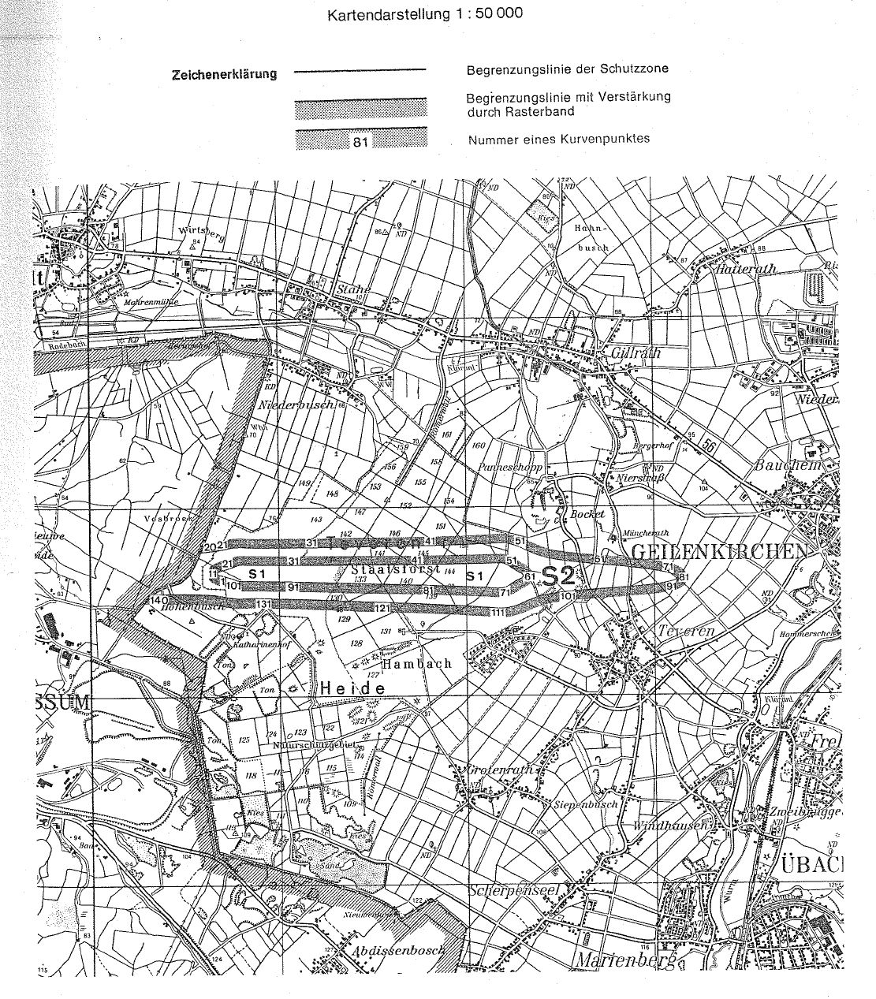

# Verordnung über die Festsetzung des Lärmschutzbereichs für den militärischen Flugplatz Geilenkirchen (FluLärmGeilenkV)

Ausfertigungsdatum
:   1982-10-28

Fundstelle
:   BGBl I: 1982, 1467

## Eingangsformel

Auf Grund des § 4 Abs. 1 des Gesetzes zum Schutz gegen Fluglärm vom
30\. März 1971 (BGBl. I S. 282) wird im Einvernehmen mit dem
Bundesminister der Verteidigung und mit Zustimmung des Bundesrates
verordnet:

## § 1

Zum Schutz der Allgemeinheit vor Gefahren, erheblichen Nachteilen und
erheblichen Belästigungen durch Fluglärm in der Umgebung des
militärischen Flugplatzes Geilenkirchen wird der in § 2 bestimmte
Lärmschutzbereich festgesetzt.

## § 2

Der Lärmschutzbereich mit seinen zwei Schutzzonen wird nach Anlage 1
bestimmt durch die interpolierten Verbindungslinien zwischen den
Kurvenpunkten, soweit diese Linien außerhalb des Flugplatzgeländes
verlaufen.

## § 3

Liegt eine bauliche Anlage zu einem Teil im Lärmschutzbereich, so gilt
sie als ganz im Lärmschutzbereich gelegen. Liegt eine bauliche Anlage
zu einem Teil in der Schutzzone 1, so gilt sie als ganz in dieser
Schutzzone gelegen.

## § 4

Der nach § 2 bestimmte Lärmschutzbereich ist in einer topographischen
Karte im Maßstab 1:50.000 und in Karten im Maßstab 1:5.000
dargestellt. Die topographische Karte ist als Anlage 2 dieser
Verordnung beigefügt. Die topographische Karte und die Karten im
Maßstab 1:5.000 sind beim Regierungspräsidenten Köln, Zeughausstraße
4-8, 5000 Köln 1, zu jedermanns Einsicht archivmäßig gesichert
niedergelegt.

## § 5

Diese Verordnung tritt am Tag nach der Verkündung in Kraft.

## Schlußformel

Der Bundesminister des Innern

## Anlage 1 (zu § 2 der Verordnung über die Festsetzung des Lärmschutzbereichs für den militärischen Flugplatz Geilenkirchen)

(Fundstelle des Originaltextes: BGBl. I 1982, 1468 - 1470)

*    *   **Lärmschutzbereich**

*    *

*    *
    *   Koordinatensystem:

    *   Gauß-Krüger

*    *   Interpolation:

    *   Polynom 3. Grades mit stetigem Tangentenübergang

*    *

*    *   Kurvenpunkte der Schutzzone 1 (Militärischer Flugplatz Geilenkirchen)

*    *

*    *   Nr.

    *   Y (Rechts)

    *   X (Hoch)

    *   Nr.

    *   Y (Rechts)

    *   X (Hoch)

    *   Nr.

    *   Y (Rechts)

    *   X (Hoch)

*    *

*    *   1

    *   2501394.2

    *   5647278.9

    *   41

    *   2503485.3

    *   5647388.8

    *   81

    *   2503597.4

    *   5647169.5

*    *   2

    *   2501381.4

    *   5647282.6

    *   42

    *   2503630.9

    *   5647389.4

    *   82

    *   2503443.7

    *   5647174.9

*    *   3

    *   2501368.8

    *   5647286.8

    *   43

    *   2503776.5

    *   5647390.4

    *   83

    *   2503289.9

    *   5647179.7

*    *   4

    *   2501356.8

    *   5647291.7

    *   44

    *   2503922.1

    *   5647391.8

    *   84

    *   2503136.2

    *   5647184.2

*    *   5

    *   2501351.2

    *   5647294.7

    *   45

    *   2504064.3

    *   5647393.7

    *   85

    *   2502982.4

    *   5647188.6

*    *   6

    *   2501346.0

    *   5647298.4

    *   46

    *   2504206.6

    *   5647396.2

    *   86

    *   2502883.4

    *   5647191.4

*    *   7

    *   2501342.5

    *   5647301.9

    *   47

    *   2504277.9

    *   5647397.6

    *   87

    *   2502784.5

    *   5647194.7

*    *   8

    *   2501340.3

    *   5647305.7

    *   48

    *   2504349.1

    *   5647399.6

    *   88

    *   2502628.7

    *   5647200.2

*    *   9

    *   2501339.8

    *   5647309.9

    *   49

    *   2504385.0

    *   5647397.2

    *   89

    *   2502473.0

    *   5647205.2

*    *   10

    *   2501340.5

    *   5647312.5

    *   50

    *   2504419.7

    *   5647387.4

    *   90

    *   2502317.2

    *   5647209.8

*    *

*    *   11

    *   2501341.9

    *   5647314.8

    *   51

    *   2504452.0

    *   5647371.8

    *   91

    *   2502161.4

    *   5647214.1

*    *   12

    *   2501344.7

    *   5647318.0

    *   52

    *   2504482.0

    *   5647352.0

    *   92

    *   2502005.6

    *   5647217.9

*    *   13

    *   2501348.0

    *   5647320.7

    *   53

    *   2504513.2

    *   5647329.6

    *   93

    *   2501851.5

    *   5647221.2

*    *   14

    *   2501351.6

    *   5647323.0

    *   54

    *   2504546.1

    *   5647309.8

    *   94

    *   2501774.5

    *   5647222.7

*    *   15

    *   2501355.3

    *   5647325.1

    *   55

    *   2504563.7

    *   5647301.2

    *   95

    *   2501697.4

    *   5647224.0

*    *   16

    *   2501362.7

    *   5647328.6

    *   56

    *   2504581.3

    *   5647292.8

    *   96

    *   2501626.4

    *   5647224.2

*    *   17

    *   2501370.4

    *   5647331.7

    *   57

    *   2504593.2

    *   5647285.9

    *   97

    *   2501573.9

    *   5647225.9

*    *   18

    *   2501386.0

    *   5647337.0

    *   58

    *   2504603.1

    *   5647277.2

    *   98

    *   2501544.0

    *   5647233.2

*    *   19

    *   2501401.9

    *   5647341.8

    *   59

    *   2504606.4

    *   5647270.8

    *   99

    *   2501507.0

    *   5647246.2

*    *   20

    *   2501433.7

    *   5647350.5

    *   60

    *   2504607.3

    *   5647263.5

    *   100

    *   2501469.6

    *   5647257.8

*    *

*    *   21

    *   2501465.4

    *   5647359.5

    *   61

    *   2504605.8

    *   5647255.2

    *   101

    *   2501431.9

    *   5647268.3

*    *   22

    *   2501496.5

    *   5647369.9

    *   62

    *   2504601.5

    *   5647248.6

    *   102

    *   2501413.0

    *   5647273.6

*    *   23

    *   2501527.3

    *   5647381.3

    *   63

    *   2504595.1

    *   5647243.2

    *   103

    *   2501394.2

    *   5647278.9

*    *   24

    *   2501558.5

    *   5647391.7

    *   64

    *   2504585.7

    *   5647237.7

    *
    *
    *

*    *   25

    *   2501591.1

    *   5647397.3

    *   65

    *   2504575.9

    *   5647233.0

    *
    *
    *

*    *   26

    *   2501656.1

    *   5647395.1

    *   66

    *   2504565.9

    *   5647228.6

    *
    *
    *

*    *   27

    *   2501721.0

    *   5647394.1

    *   67

    *   2504555.8

    *   5647224.3

    *
    *
    *

*    *   28

    *   2501850.8

    *   5647392.4

    *   68

    *   2504536.1

    *   5647215.0

    *
    *
    *

*    *   29

    *   2501980.5

    *   5647391.1

    *   69

    *   2504499.3

    *   5647192.5

    *
    *
    *

*    *   30

    *   2502068.0

    *   5647390.4

    *   70

    *   2504463.4

    *   5647168.7

    *
    *
    *

*    *

*    *   31

    *   2502155.5

    *   5647389.8

    *   71

    *   2504427.4

    *   5647150.0

    *
    *
    *

*    *   32

    *   2502293.3

    *   5647389.2

    *   72

    *   2504388.7

    *   5647138.2

    *
    *
    *

*    *   33

    *   2502431.2

    *   5647388.9

    *   73

    *   2504348.4

    *   5647135.4

    *
    *
    *

*    *   34

    *   2502569.0

    *   5647388.9

    *   74

    *   2504308.1

    *   5647138.0

    *
    *
    *

*    *   35

    *   2502706.8

    *   5647389.2

    *   75

    *   2504227.1

    *   5647142.3

    *
    *
    *

*    *   36

    *   2502844.7

    *   5647389.9

    *   76

    *   2504146.1

    *   5647146.3

    *
    *
    *

*    *   37

    *   2502982.5

    *   5647389.4

    *   77

    *   2504065.1

    *   5647150.2

    *
    *
    *

*    *   38

    *   2503088.3

    *   5647389.2

    *   78

    *   2503984.1

    *   5647154.0

    *
    *
    *

*    *   39

    *   2503194.1

    *   5647388.9

    *   79

    *   2503867.6

    *   5647159.0

    *
    *
    *

*    *   40

    *   2503339.7

    *   5647388.6

    *   80

    *   2503751.1

    *   5647163.7

    *
    *
    *

*    *

*    *   Kurvenpunkte der Schutzzone 2 (Militärischer Flugplatz Geilenkirchen)

*    *

*    *   Nr.

    *   Y (Rechts)

    *   X (Hoch)

    *   Nr.

    *   Y (Rechts)

    *   X (Hoch)

    *   Nr.

    *   Y (Rechts)

    *   X (Hoch)

*    *

*    *   1

    *   Die Kurvenpunkte von Nr. 1 bis Nr. 19 der Schutzzone 2 liegen
        außerhalb des Gebiets der Bundesrepublik

    *   51

    *   2504577.8

    *   5647562.6

    *   101

    *   2505089.4

    *   5647099.2

*    *   2

    *   52

    *   2504628.9

    *   5647539.1

    *   102

    *   2504945.2

    *   5647083.4

*    *   3

    *   53

    *   2504679.6

    *   5647515.0

    *   103

    *   2504846.1

    *   5647066.4

*    *   4

    *   54

    *   2504748.2

    *   5647485.9

    *   104

    *   2504797.3

    *   5647054.2

*    *   5

    *   55

    *   2504818.9

    *   5647462.1

    *   105

    *   2504749.3

    *   5647039.5

*    *   6

    *   56

    *   2504891.1

    *   5647444.0

    *   106

    *   2504682.5

    *   5647014.5

*    *   7

    *   57

    *   2504964.4

    *   5647430.6

    *   107

    *   2504617.1

    *   5646986.0

*    *   8

    *   58

    *   2505068.7

    *   5647415.8

    *   108

    *   2504551.3

    *   5646958.9

*    *   9

    *   59

    *   2505173.4

    *   5647403.8

    *   109

    *   2504483.5

    *   5646937.2

*    *   10

    *   60

    *   2505308.0

    *   5647390.5

    *   110

    *   2504412.4

    *   5646924.3

*    *

*    *   Deutschland.

*    *   11

    *   Die Grenze des deutschen Staatsgebiets bildet hier zugleich die Grenze
        des Lärmschutzbereichs.

    *   61

    *   2505442.6

    *   5647378.1

    *   111

    *   2504340.2

    *   5646922.8

*    *   12

    *   62

    *   2505577.2

    *   5647365.6

    *   112

    *   2504223.0

    *   5646932.5

*    *   13

    *   63

    *   2505711.7

    *   5647352.3

    *   113

    *   2504105.7

    *   5646940.7

*    *   14

    *   64

    *   2505846.1

    *   5647337.1

    *   114

    *   2503988.4

    *   5646948.3

*    *   15

    *   65

    *   2505913.2

    *   5647328.5

    *   115

    *   2503857.7

    *   5646956.3

*    *   16

    *   66

    *   2505980.1

    *   5647318.9

    *   116

    *   2503727.0

    *   5646963.7

*    *   17

    *   67

    *   2506014.2

    *   5647313.6

    *   117

    *   2503596.3

    *   5646970.6

*    *   18

    *   68

    *   2506048.1

    *   5647307.9

    *   118

    *   2503465.5

    *   5646976.9

*    *   19

    *   69

    *   2506082.0

    *   5647301.5

    *   119

    *   2503345.5

    *   5646982.2

*    *   20

    *   2501207.0

    *   5647533.7

    *   70

    *   2506115.7

    *   5647294.4

    *   120

    *   2503225.6

    *   5646987.0

*    *

*    *   21

    *   2501337.2

    *   5647548.4

    *   71

    *   2506138.5

    *   5647289.0

    *   121

    *   2503105.6

    *   5646991.5

*    *   22

    *   2501466.4

    *   5647571.3

    *   72

    *   2506160.9

    *   5647283.0

    *   122

    *   2502985.7

    *   5646996.3

*    *   23

    *   2501531.5

    *   5647579.7

    *   73

    *   2506183.1

    *   5647276.2

    *   123

    *   2502863.7

    *   5647000.6

*    *   24

    *   2501597.1

    *   5647581.7

    *   74

    *   2506204.6

    *   5647268.1

    *   124

    *   2502741.8

    *   5647006.4

*    *   25

    *   2501661.3

    *   5647577.1

    *   75

    *   2506215.1

    *   5647263.3

    *   125

    *   2502619.9

    *   5647012.0

*    *   26

    *   2501725.6

    *   5647576.2

    *   76

    *   2506225.1

    *   5647257.7

    *   126

    *   2502498.0

    *   5647017.3

*    *   27

    *   2501854.1

    *   5647574.8

    *   77

    *   2506230.5

    *   5647253.8

    *   127

    *   2502344.5

    *   5647023.5

*    *   28

    *   2501982.7

    *   5647574.0

    *   78

    *   2506235.4

    *   5647249.6

    *   128

    *   2502191.0

    *   5647028.9

*    *   29

    *   2502104.7

    *   5647573.8

    *   79

    *   2506239.2

    *   5647244.5

    *   129

    *   2502037.4

    *   5647033.8

*    *   30

    *   2502226.8

    *   5647574.0

    *   80

    *   2506241.2

    *   5647237.9

    *   130

    *   2501893.7

    *   5647037.7

*    *

*    *   31

    *   2502348.8

    *   5647574.5

    *   81

    *   2506240.4

    *   5647232.4

    *   131

    *   2501821.9

    *   5647039.4

*    *   32

    *   2502470.9

    *   5647575.5

    *   82

    *   2506237.5

    *   5647227.7

    *   132

    *   2501697.5

    *   5647041.9

*    *   33

    *   2502599.6

    *   5647577.0

    *   83

    *   2506234.2

    *   5647224.2

    *   133

    *   2501565.3

    *   5647039.5

*    *   34

    *   2502728.3

    *   5647578.7

    *   84

    *   2506230.4

    *   5647221.2

    *   134

    *   2501456.1

    *   5647050.5

*    *   35

    *   2502857.0

    *   5647580.9

    *   85

    *   2506222.0

    *   5647215.8

    *   135

    *   2501381.2

    *   5647063.1

*    *   36

    *   2502985.8

    *   5647581.5

    *   86

    *   2506212.9

    *   5647211.4

    *   136

    *   2501306.0

    *   5647074.0

*    *   37

    *   2503116.0

    *   5647582.6

    *   87

    *   2506203.9

    *   5647207.8

    *   137

    *   2501146.6

    *   5647083.7

*    *   38

    *   2503246.1

    *   5647583.3

    *   88

    *   2506194.7

    *   5647204.5

    *   138

    *   2500987.0

    *   5647087.3

*    *   39

    *   2503376.3

    *   5647584.6

    *   89

    *   2506185.5

    *   5647201.6

    *   139

    *   2500848.7

    *   5647088.7

*    *   40

    *   2503506.5

    *   5647586.4

    *   90

    *   2506176.1

    *   5647198.8

    *   140

    *   2500710.4

    *   5647089.5

*    *

*    *   Die Kurvenpunkte von

*    *   41

    *   2503631.7

    *   5647588.6

    *   91

    *   2506157.7

    *   5647194.1

    *   141

    *   Nr. 141 bis Nr. 158 der Schutzzone 2 liegen außerhalb des Gebiets der
        Bundesrepublik Deutschland. Die Grenze des deutschen Staatsgebiets
        bildet hier zugleich die Grenze des Lärmschutzbereichs.

*    *   42

    *   2503756.9

    *   5647591.3

    *   92

    *   2506139.2

    *   5647189.9

    *   142

*    *   43

    *   2503882.2

    *   5647594.5

    *   93

    *   2506101.9

    *   5647182.7

    *   143

*    *   44

    *   2504041.6

    *   5647599.4

    *   94

    *   2506030.2

    *   5647171.7

    *   144

*    *   45

    *   2504201.1

    *   5647605.2

    *   95

    *   2505958.2

    *   5647162.8

    *   145

*    *   46

    *   2504280.8

    *   5647608.4

    *   96

    *   2505813.8

    *   5647148.4

    *   146

*    *   47

    *   2504360.4

    *   5647613.0

    *   97

    *   2505669.1

    *   5647137.3

    *   147

*    *   48

    *   2504416.9

    *   5647609.5

    *   98

    *   2505524.1

    *   5647127.9

    *   148

*    *   49

    *   2504472.6

    *   5647599.2

    *   99

    *   2505379.1

    *   5647119.2

    *   149

*    *   50

    *   2504526.0

    *   5647583.2

    *   100

    *   2505234.1

    *   5647110.2

    *   150

*    *

*    *   Noch Schutzzone 2 (Militärischer Flugplatz Geilenkirchen)

*    *

*    *   Nr.

    *   Y (Rechts)

    *   X (Hoch)

    *

*    *   151

    *   Die Kurvenpunkte von Nr. 141 bis Nr. 158 der Schutzzone 2 liegen
        außerhalb des Gebiets der Bundesrepublik Deutschland. Die Grenze des
        deutschen Staatsgebiets bildet hier zugleich die Grenze des
        Lärmschutzbereichs.

    *

*    *   152

*    *   153

*    *   154

*    *   155

*    *   156

*    *   157

*    *   158

## Anlage 2 (zu § 4 der Verordnung über die Festsetzung des Lärmschutzbereichs für den militärischen Flugplatz Geilenkirchen)

(Fundstelle: BGBl I 1982, 1471)

