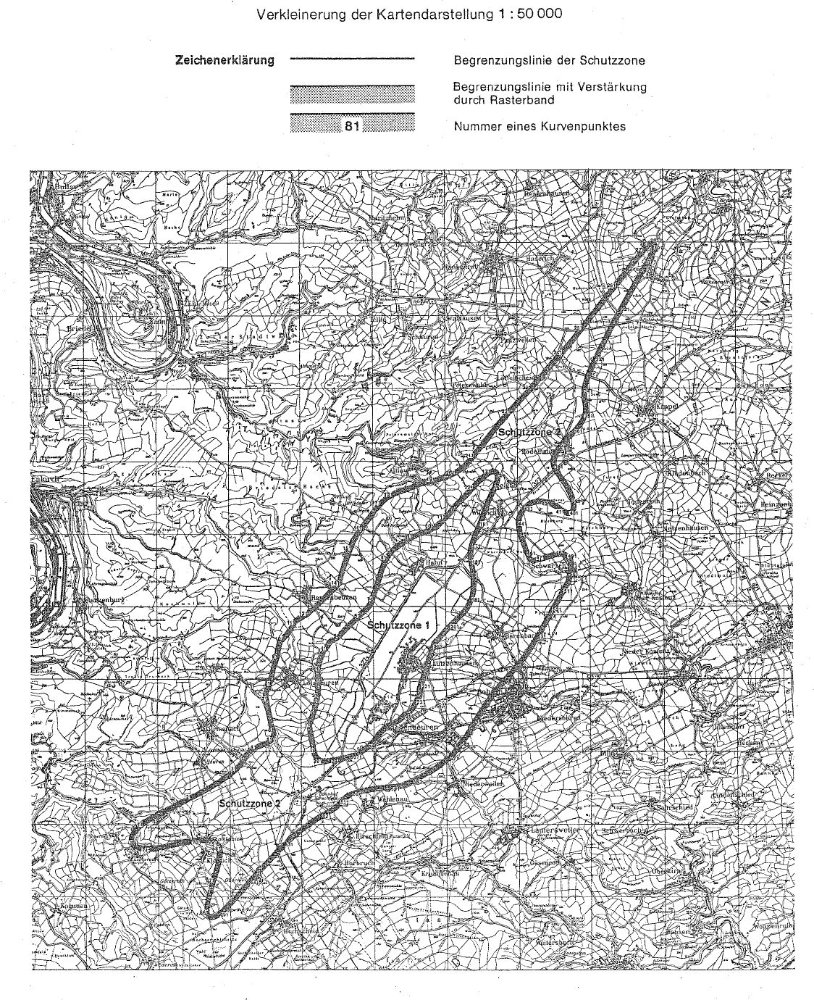

# Verordnung über die Festsetzung des Lärmschutzbereichs für den militärischen Flugplatz Hahn (FluLärmHahnV)

Ausfertigungsdatum
:   1977-11-24

Fundstelle
:   BGBl I: 1977, 2265

Geändert durch
:   Art. 1 V v. 25.7.1983 I 1036

## Eingangsformel

Auf Grund des § 4 Abs. 1 des Gesetzes zum Schutz gegen Fluglärm vom
30\. März 1971 (BGBl. I S. 282) wird im Einvernehmen mit dem
Bundesminister der Verteidigung und mit Zustimmung des Bundesrates
verordnet:

## § 1

Zum Schutz der Allgemeinheit vor Gefahren, erheblichen Nachteilen und
erheblichen Belästigungen durch Fluglärm in der Umgebung des
militärischen Flugplatzes Hahn wird der in § 2 bestimmte
Lärmschutzbereich festgesetzt.

## § 2

Der Lärmschutzbereich mit seinen zwei Schutzzonen wird nach Anlage 1
bestimmt durch die interpolierten Verbindungslinien zwischen den
Kurvenpunkten, soweit diese Linien außerhalb des Flugplatzgeländes
verlaufen.

## § 3

Liegt eine bauliche Anlage zu einem Teil im Lärmschutzbereich, so gilt
sie als ganz im Lärmschutzbereich gelegen. Liegt eine bauliche Anlage
zu einem Teil in der Schutzzone 1, so gilt sie als ganz in dieser
Schutzzone gelegen.

## § 4

(1) Der nach § 2 bestimmte Lärmschutzbereich ist in einer
topographischen Karte im Maßstab 1:50.000 und in Karten im Maßstab
1:5.000 dargestellt. Die topographische Karte ist in verkleinerter
Form als Anlage 2 dieser Verordnung beigefügt. Die topographische
Karte und die Karten im Maßstab 1:5.000 sind bei der Kreisverwaltung
des Rhein-Hunsrück-Kreises, Ludwigstraße 3-5, 6540 Simmern (Hunsrück),
zu jedermanns Einsicht archivmäßig gesichert niedergelegt.

(2) Die Karten im Maßstab 1:5.000 über den Lärmschutzbereich nach der
bis zum 4. August 1983 geltenden Fassung dieser Verordnung bleiben an
gleicher Stelle zu jedermanns Einsicht archivmäßig gesichert
niedergelegt.

## § 5

Diese Verordnung tritt am Tag nach der Verkündung in Kraft.

## Schlußformel

Der Bundesminister des Innern

## Anlage 1 (zu Artikel 1 Nummer 2 der Ersten Verordnung zur Änderung der Verordnung über die Festsetzung des Lärmschutzbereichs für den militärischen Flugplatz Hahn)

(Fundstelle des Originaltextes: BGBl. I 1983, 1037 - 1043)

*    *   **Lärmschutzbereich - Erste Änderung -**

*    *

*    *
    *   Koordinatensystem:

    *   Gauß-Krüger

*    *
    *   Interpolation:

    *   Polynom 3. Grades mit stetigem Tangentenübergang

*    *
    *
    *
    *
    *
    *
    *
    *
    *

*    *   Kurvenpunkte der Schutzzone 1 (Militärischer Flugplatz Hahn)

*    *
    *
    *
    *
    *
    *
    *
    *
    *

*    *   Nr.

    *   Y (Rechts)

    *   X (Hoch)

    *   Nr.

    *   Y (Rechts)

    *   X (Hoch)

    *   Nr.

    *   Y (Rechts)

    *   X (Hoch)

*    *
    *
    *
    *
    *
    *
    *
    *
    *

*    *   1

    *   2588429.9

    *   5531986.1

    *   51

    *   2589014.2

    *   5535066.0

    *   101

    *   2591675.7

    *   5538083.8

*    *   2

    *   2588414.2

    *   5532050.2

    *   52

    *   2589045.7

    *   5535082.7

    *   102

    *   2591700.0

    *   5538096.8

*    *   3

    *   2588402.6

    *   5532115.1

    *   53

    *   2589067.1

    *   5535102.7

    *   103

    *   2591716.4

    *   5538106.0

*    *   4

    *   2588381.9

    *   5532245.4

    *   54

    *   2589087.9

    *   5535123.3

    *   104

    *   2591732.7

    *   5538115.6

*    *   5

    *   2588358.8

    *   5532375.2

    *   55

    *   2589129.6

    *   5535164.6

    *   105

    *   2591765.1

    *   5538135.6

*    *   6

    *   2588344.0

    *   5532453.3

    *   56

    *   2589183.4

    *   5535217.7

    *   106

    *   2591796.9

    *   5538156.9

*    *   7

    *   2588329.9

    *   5532531.8

    *   57

    *   2589237.2

    *   5535270.9

    *   107

    *   2591828.3

    *   5538179.6

*    *   8

    *   2588320.8

    *   5532584.1

    *   58

    *   2589344.8

    *   5535377.4

    *   108

    *   2591858.8

    *   5538203.2

*    *   9

    *   2588311.5

    *   5532636.3

    *   59

    *   2589440.9

    *   5535472.5

    *   109

    *   2591918.2

    *   5538254.1

*    *   10

    *   2588301.7

    *   5532688.4

    *   60

    *   2589537.2

    *   5535567.3

    *   110

    *   2591976.0

    *   5538309.4

*    *
    *
    *
    *
    *
    *
    *
    *
    *

*    *   11

    *   2588302.4

    *   5532732.6

    *   61

    *   2589633.7

    *   5535661.9

    *   111

    *   2592031.5

    *   5538367.3

*    *   12

    *   2588316.5

    *   5532774.5

    *   62

    *   2589730.2

    *   5535756.4

    *   112

    *   2592086.3

    *   5538427.3

*    *   13

    *   2588328.3

    *   5532807.9

    *   63

    *   2589828.5

    *   5535849.1

    *   113

    *   2592138.6

    *   5538489.5

*    *   14

    *   2588340.1

    *   5532841.4

    *   64

    *   2589887.2

    *   5535904.0

    *   114

    *   2592239.2

    *   5538610.8

*    *   15

    *   2588353.4

    *   5532879.4

    *   65

    *   2589914.7

    *   5535933.2

    *   115

    *   2592289.6

    *   5538671.5

*    *   16

    *   2588366.6

    *   5532917.4

    *   66

    *   2589941.5

    *   5535963.1

    *   116

    *   2592341.1

    *   5538732.8

*    *   17

    *   2588392.7

    *   5532993.5

    *   67

    *   2589967.5

    *   5535992.4

    *   117

    *   2592399.5

    *   5538785.9

*    *   18

    *   2588434.4

    *   5533116.6

    *   68

    *   2589991.8

    *   5536023.1

    *   118

    *   2592457.6

    *   5538838.7

*    *   19

    *   2588464.6

    *   5533242.8

    *   69

    *   2590004.7

    *   5536060.1

    *   119

    *   2592569.7

    *   5538948.8

*    *   20

    *   2588492.3

    *   5533369.5

    *   70

    *   2590017.6

    *   5536097.0

    *   120

    *   2592676.0

    *   5539062.4

*    *
    *
    *
    *
    *
    *
    *
    *
    *

*    *   21

    *   2588519.3

    *   5533510.8

    *   71

    *   2590030.5

    *   5536133.7

    *   121

    *   2592779.9

    *   5539174.2

*    *   22

    *   2588539.9

    *   5533652.5

    *   72

    *   2590043.1

    *   5536170.6

    *   122

    *   2592883.3

    *   5539284.5

*    *   23

    *   2588546.8

    *   5533795.1

    *   73

    *   2590068.7

    *   5536244.3

    *   123

    *   2592972.0

    *   5539374.3

*    *   24

    *   2588546.3

    *   5533938.1

    *   74

    *   2590119.7

    *   5536391.5

    *   124

    *   2593017.7

    *   5539418.1

*    *   25

    *   2588537.3

    *   5534081.6

    *   75

    *   2590166.2

    *   5536528.0

    *   125

    *   2593064.2

    *   5539460.3

*    *   26

    *   2588529.9

    *   5534157.0

    *   76

    *   2590211.5

    *   5536664.9

    *   126

    *   2593094.8

    *   5539488.4

*    *   27

    *   2588525.6

    *   5534194.7

    *   77

    *   2590255.3

    *   5536802.5

    *   127

    *   2593125.9

    *   5539517.5

*    *   28

    *   2588520.9

    *   5534232.3

    *   78

    *   2590297.9

    *   5536940.5

    *   128

    *   2593158.1

    *   5539545.7

*    *   29

    *   2588525.6

    *   5534250.6

    *   79

    *   2590343.4

    *   5537077.4

    *   129

    *   2593184.1

    *   5539566.9

*    *   30

    *   2588530.3

    *   5534269.0

    *   80

    *   2590395.8

    *   5537211.7

    *   130

    *   2593211.8

    *   5539587.5

*    *
    *
    *
    *
    *
    *
    *
    *
    *

*    *   31

    *   2588534.9

    *   5534287.3

    *   81

    *   2590428.2

    *   5537277.6

    *   131

    *   2593241.6

    *   5539606.9

*    *   32

    *   2588539.6

    *   5534305.7

    *   82

    *   2590470.5

    *   5537337.8

    *   132

    *   2593258.7

    *   5539616.6

*    *   33

    *   2588549.2

    *   5534342.3

    *   83

    *   2590494.8

    *   5537371.7

    *   133

    *   2593278.2

    *   5539625.9

*    *   34

    *   2588558.8

    *   5534379.0

    *   84

    *   2590522.0

    *   5537403.5

    *   134

    *   2593298.6

    *   5539633.1

*    *   35

    *   2588575.6

    *   5534441.8

    *   85

    *   2590578.8

    *   5537464.8

    *   135

    *   2593324.9

    *   5539637.4

*    *   36

    *   2588592.8

    *   5534504.5

    *   86

    *   2590677.9

    *   5537556.9

    *   136

    *   2593340.7

    *   5539635.9

*    *   37

    *   2588613.9

    *   5534565.7

    *   87

    *   2590751.7

    *   5537613.8

    *   137

    *   2593355.4

    *   5539630.1

*    *   38

    *   2588639.9

    *   5534625.0

    *   88

    *   2590827.7

    *   5537667.8

    *   138

    *   2593368.6

    *   5539619.0

*    *   39

    *   2588666.8

    *   5534684.1

    *   89

    *   2590958.1

    *   5537751.5

    *   139

    *   2593377.7

    *   5539604.4

*    *   40

    *   2588695.8

    *   5534742.2

    *   90

    *   2591024.7

    *   5537791.0

    *   140

    *   2593385.7

    *   5539576.4

*    *
    *
    *
    *
    *
    *
    *
    *
    *

*    *   41

    *   2588741.5

    *   5534803.8

    *   91

    *   2591091.9

    *   5537829.6

    *   141

    *   2593387.2

    *   5539548.3

*    *   42

    *   2588786.8

    *   5534865.7

    *   92

    *   2591162.3

    *   5537863.0

    *   142

    *   2593385.5

    *   5539524.7

*    *   43

    *   2588829.1

    *   5534929.9

    *   93

    *   2591234.6

    *   5537892.5

    *   143

    *   2593382.6

    *   5539505.9

*    *   44

    *   2588849.4

    *   5534962.8

    *   94

    *   2591379.0

    *   5537952.2

    *   144

    *   2593378.7

    *   5539487.6

*    *   45

    *   2588876.3

    *   5534990.6

    *   95

    *   2591450.9

    *   5537982.4

    *   145

    *   2593369.5

    *   5539454.6

*    *   46

    *   2588892.1

    *   5535002.7

    *   96

    *   2591522.6

    *   5538012.9

    *   146

    *   2593358.3

    *   5539422.9

*    *   47

    *   2588909.5

    *   5535011.7

    *   97

    *   2591557.0

    *   5538028.0

    *   147

    *   2593347.4

    *   5539396.1

*    *   48

    *   2588927.1

    *   5535020.7

    *   98

    *   2591591.7

    *   5538043.5

    *   148

    *   2593335.8

    *   5539369.9

*    *   49

    *   2588944.5

    *   5535029.7

    *   99

    *   2591626.3

    *   5538059.5

    *   149

    *   2593324.1

    *   5539344.6

*    *   50

    *   2588979.4

    *   5535047.8

    *   100

    *   2591651.2

    *   5538071.5

    *   150

    *   2593307.1

    *   5539305.8

*    *

*    *

*    *   noch Schutzzone 1 (Militärischer Flugplatz Hahn)

*    *
    *
    *
    *
    *
    *
    *
    *
    *

*    *   151

    *   2593289.7

    *   5539266.8

    *   201

    *   2592018.8

    *   5535467.7

    *   251

    *   2590343.0

    *   5532753.7

*    *   152

    *   2593256.6

    *   5539196.8

    *   202

    *   2591927.5

    *   5535372.0

    *   252

    *   2590284.7

    *   5532711.2

*    *   153

    *   2593222.9

    *   5539127.3

    *   203

    *   2591837.6

    *   5535275.0

    *   253

    *   2590228.7

    *   5532665.7

*    *   154

    *   2593156.7

    *   5538987.8

    *   204

    *   2591748.9

    *   5535176.9

    *   254

    *   2590175.3

    *   5532616.6

*    *   155

    *   2593118.1

    *   5538900.9

    *   205

    *   2591704.8

    *   5535127.7

    *   255

    *   2590126.0

    *   5532563.4

*    *   156

    *   2593084.4

    *   5538812.0

    *   206

    *   2591660.7

    *   5535078.3

    *   256

    *   2590078.4

    *   5532507.3

*    *   157

    *   2593042.5

    *   5538701.5

    *   207

    *   2591636.3

    *   5535051.0

    *   257

    *   2590032.8

    *   5532449.6

*    *   158

    *   2592991.7

    *   5538555.6

    *   208

    *   2591611.9

    *   5535023.6

    *   258

    *   2589965.5

    *   5532364.5

*    *   159

    *   2592948.4

    *   5538414.9

    *   209

    *   2591599.6

    *   5534989.1

    *   259

    *   2589892.7

    *   5532284.3

*    *   160

    *   2592920.8

    *   5538346.8

    *   210

    *   2591587.4

    *   5534954.5

    *   260

    *   2589831.5

    *   5532227.6

*    *
    *
    *
    *
    *
    *
    *
    *
    *

*    *   161

    *   2592890.8

    *   5538279.8

    *   211

    *   2591575.5

    *   5534921.0

    *   261

    *   2589767.9

    *   5532173.6

*    *   162

    *   2592828.8

    *   5538140.2

    *   212

    *   2591563.8

    *   5534887.5

    *   262

    *   2589702.6

    *   5532125.3

*    *   163

    *   2592767.2

    *   5538000.3

    *   213

    *   2591545.4

    *   5534818.9

    *   263

    *   2589636.5

    *   5532078.0

*    *   164

    *   2592738.8

    *   5537929.5

    *   214

    *   2591506.2

    *   5534682.3

    *   264

    *   2589571.0

    *   5532029.4

*    *   165

    *   2592711.6

    *   5537858.1

    *   215

    *   2591462.4

    *   5534547.4

    *   265

    *   2589538.6

    *   5532004.4

*    *   166

    *   2592694.7

    *   5537810.3

    *   216

    *   2591412.6

    *   5534398.2

    *   266

    *   2589522.7

    *   5531991.6

*    *   167

    *   2592678.9

    *   5537762.0

    *   217

    *   2591362.4

    *   5534249.1

    *   267

    *   2589506.9

    *   5531978.6

*    *   168

    *   2592664.6

    *   5537713.6

    *   218

    *   2591312.5

    *   5534099.8

    *   268

    *   2589494.1

    *   5531974.3

*    *   169

    *   2592656.1

    *   5537681.7

    *   219

    *   2591263.2

    *   5533950.4

    *   269

    *   2589480.8

    *   5531972.0

*    *   170

    *   2592648.6

    *   5537649.6

    *   220

    *   2591225.4

    *   5533835.3

    *   270

    *   2589467.5

    *   5531969.6

*    *
    *
    *
    *
    *
    *
    *
    *
    *

*    *   171

    *   2592642.8

    *   5537621.9

    *   221

    *   2591206.5

    *   5533777.6

    *   271

    *   2589454.2

    *   5531967.1

*    *   172

    *   2592637.7

    *   5537593.9

    *   222

    *   2591200.9

    *   5533717.2

    *   272

    *   2589427.8

    *   5531962.1

*    *   173

    *   2592634.5

    *   5537573.4

    *   223

    *   2591200.3

    *   5533655.4

    *   273

    *   2589388.2

    *   5531954.0

*    *   174

    *   2592630.6

    *   5537543.5

    *   224

    *   2591200.1

    *   5533593.5

    *   274

    *   2589348.7

    *   5531945.3

*    *   175

    *   2592627.5

    *   5537513.6

    *   225

    *   2591195.3

    *   5533562.9

    *   275

    *   2589309.6

    *   5531936.2

*    *   176

    *   2592625.5

    *   5537483.5

    *   226

    *   2591186.3

    *   5533533.2

    *   276

    *   2589270.5

    *   5531926.6

*    *   177

    *   2592624.4

    *   5537453.4

    *   227

    *   2591170.2

    *   5533506.8

    *   277

    *   2589192.5

    *   5531907.3

*    *   178

    *   2592624.9

    *   5537396.9

    *   228

    *   2591153.9

    *   5533480.5

    *   278

    *   2589113.8

    *   5531889.2

*    *   179

    *   2592628.1

    *   5537340.5

    *   229

    *   2591136.7

    *   5533452.0

    *   279

    *   2589034.8

    *   5531872.6

*    *   180

    *   2592636.4

    *   5537259.7

    *   230

    *   2591121.1

    *   5533422.7

    *   280

    *   2588954.9

    *   5531857.3

*    *
    *
    *
    *
    *
    *
    *
    *
    *

*    *   181

    *   2592647.8

    *   5537179.5

    *   231

    *   2591090.7

    *   5533363.6

    *   281

    *   2588874.7

    *   5531843.6

*    *   182

    *   2592676.2

    *   5537022.3

    *   232

    *   2591061.2

    *   5533304.4

    *   282

    *   2588817.9

    *   5531835.0

*    *   183

    *   2592690.7

    *   5536943.8

    *   233

    *   2591025.1

    *   5533248.9

    *   283

    *   2588761.0

    *   5531827.3

*    *   184

    *   2592703.1

    *   5536864.9

    *   234

    *   2590986.5

    *   5533202.3

    *   284

    *   2588723.2

    *   5531823.1

*    *   185

    *   2592705.8

    *   5536785.5

    *   235

    *   2590967.5

    *   5533178.8

    *   285

    *   2588685.3

    *   5531820.1

*    *   186

    *   2592706.6

    *   5536706.2

    *   236

    *   2590948.5

    *   5533155.3

    *   286

    *   2588647.2

    *   5531818.8

*    *   187

    *   2592701.5

    *   5536546.7

    *   237

    *   2590909.2

    *   5533128.6

    *   287

    *   2588608.1

    *   5531820.3

*    *   188

    *   2592686.7

    *   5536398.9

    *   238

    *   2590870.0

    *   5533109.0

    *   288

    *   2588570.0

    *   5531826.8

*    *   189

    *   2592674.8

    *   5536326.3

    *   239

    *   2590830.8

    *   5533087.4

    *   289

    *   2588533.2

    *   5531840.6

*    *   190

    *   2592653.9

    *   5536255.7

    *   240

    *   2590790.9

    *   5533059.8

    *   290

    *   2588513.5

    *   5531852.5

*    *
    *
    *
    *
    *
    *
    *
    *
    *

*    *   191

    *   2592625.9

    *   5536186.7

    *   241

    *   2590765.4

    *   5533034.0

    *   291

    *   2588495.8

    *   5531867.3

*    *   192

    *   2592595.6

    *   5536118.6

    *   242

    *   2590740.0

    *   5533008.1

    *   292

    *   2588480.2

    *   5531884.1

*    *   193

    *   2592562.1

    *   5536050.7

    *   243

    *   2590714.6

    *   5532982.2

    *   293

    *   2588466.7

    *   5531902.7

*    *   194

    *   2592524.9

    *   5535984.7

    *   244

    *   2590689.1

    *   5532955.8

    *   294

    *   2588455.0

    *   5531922.5

*    *   195

    *   2592479.1

    *   5535927.0

    *   245

    *   2590663.7

    *   5532929.5

    *   295

    *   2588445.3

    *   5531943.1

*    *   196

    *   2592432.0

    *   5535870.4

    *   246

    *   2590631.2

    *   5532912.3

    *   296

    *   2588429.9

    *   5531986.1

*    *   197

    *   2592374.9

    *   5535822.4

    *   247

    *   2590597.8

    *   5532897.3

    *
    *
    *

*    *   198

    *   2592322.1

    *   5535769.9

    *   248

    *   2590564.5

    *   5532881.6

    *
    *
    *

*    *   199

    *   2592217.1

    *   5535665.8

    *   249

    *   2590531.4

    *   5532865.2

    *
    *
    *

*    *   200

    *   2592111.6

    *   5535562.0

    *   250

    *   2590466.4

    *   5532830.5

    *
    *
    *

*    *

*    *

*    *   Kurvenpunkte der Schutzzone 2 (Militärischer Flugplatz Hahn)

*    *
    *
    *
    *
    *
    *
    *
    *
    *

*    *   1

    *   2583340.1

    *   5529561.2

    *   51

    *   2587228.1

    *   5532290.1

    *   101

    *   2587571.1

    *   5535077.7

*    *   2

    *   2583336.5

    *   5529584.8

    *   52

    *   2587246.5

    *   5532320.2

    *   102

    *   2587603.5

    *   5535113.8

*    *   3

    *   2583336.8

    *   5529608.6

    *   53

    *   2587265.6

    *   5532355.6

    *   103

    *   2587635.6

    *   5535150.2

*    *   4

    *   2583347.4

    *   5529655.0

    *   54

    *   2587282.6

    *   5532391.9

    *   104

    *   2587667.4

    *   5535186.8

*    *   5

    *   2583366.5

    *   5529698.1

    *   55

    *   2587297.6

    *   5532429.0

    *   105

    *   2587717.8

    *   5535248.0

*    *   6

    *   2583390.7

    *   5529738.5

    *   56

    *   2587310.6

    *   5532466.9

    *   106

    *   2587756.0

    *   5535299.3

*    *   7

    *   2583412.8

    *   5529769.4

    *   57

    *   2587316.2

    *   5532496.7

    *   107

    *   2587813.6

    *   5535381.8

*    *   8

    *   2583436.9

    *   5529798.9

    *   58

    *   2587310.5

    *   5532526.6

    *   108

    *   2587841.3

    *   5535423.7

*    *   9

    *   2583488.7

    *   5529854.5

    *   59

    *   2587303.8

    *   5532555.7

    *   109

    *   2587868.0

    *   5535466.3

*    *   10

    *   2583543.1

    *   5529905.4

    *   60

    *   2587296.2

    *   5532584.6

    *   110

    *   2587887.9

    *   5535499.6

*    *
    *
    *
    *
    *
    *
    *
    *
    *

*    *   11

    *   2583600.0

    *   5529953.3

    *   61

    *   2587287.5

    *   5532612.8

    *   111

    *   2587907.3

    *   5535533.4

*    *   12

    *   2583719.2

    *   5530042.0

    *   62

    *   2587278.0

    *   5532640.7

    *   112

    *   2587920.9

    *   5535547.3

*    *   13

    *   2583843.9

    *   5530123.5

    *   63

    *   2587255.8

    *   5532695.4

    *   113

    *   2587936.4

    *   5535559.2

*    *   14

    *   2583972.9

    *   5530199.4

    *   64

    *   2587220.5

    *   5532807.5

    *   114

    *   2587966.6

    *   5535583.6

*    *   15

    *   2584105.2

    *   5530270.9

    *   65

    *   2587208.5

    *   5532874.4

    *   115

    *   2587995.7

    *   5535608.8

*    *   16

    *   2584240.4

    *   5530339.0

    *   66

    *   2587195.5

    *   5532941.0

    *   116

    *   2588023.8

    *   5535635.1

*    *   17

    *   2584377.7

    *   5530404.0

    *   67

    *   2587167.9

    *   5533073.9

    *   117

    *   2588040.3

    *   5535645.2

*    *   18

    *   2584514.6

    *   5530469.9

    *   68

    *   2587142.0

    *   5533207.2

    *   118

    *   2588058.1

    *   5535652.8

*    *   19

    *   2584633.4

    *   5530527.4

    *   69

    *   2587118.4

    *   5533340.9

    *   119

    *   2588093.5

    *   5535668.0

*    *   20

    *   2584752.1

    *   5530585.2

    *   70

    *   2587106.8

    *   5533407.7

    *   120

    *   2588143.1

    *   5535689.5

*    *
    *
    *
    *
    *
    *
    *
    *
    *

*    *   21

    *   2584892.7

    *   5530654.9

    *   71

    *   2587094.4

    *   5533474.5

    *   121

    *   2588167.8

    *   5535700.4

*    *   22

    *   2585032.7

    *   5530725.6

    *   72

    *   2587087.1

    *   5533511.0

    *   122

    *   2588192.6

    *   5535711.4

*    *   23

    *   2585167.6

    *   5530795.1

    *   73

    *   2587078.8

    *   5533547.3

    *   123

    *   2588213.0

    *   5535724.2

*    *   24

    *   2585301.7

    *   5530866.0

    *   74

    *   2587085.3

    *   5533584.0

    *   124

    *   2588231.0

    *   5535740.2

*    *   25

    *   2585435.0

    *   5530938.5

    *   75

    *   2587093.6

    *   5533620.5

    *   125

    *   2588259.1

    *   5535765.5

*    *   26

    *   2585567.0

    *   5531013.1

    *   76

    *   2587104.4

    *   5533646.0

    *   126

    *   2588287.2

    *   5535790.7

*    *   27

    *   2585697.6

    *   5531090.5

    *   77

    *   2587115.2

    *   5533671.6

    *   127

    *   2588315.4

    *   5535815.9

*    *   28

    *   2585832.6

    *   5531175.5

    *   78

    *   2587136.7

    *   5533722.7

    *   128

    *   2588343.5

    *   5535841.3

*    *   29

    *   2585964.5

    *   5531265.0

    *   79

    *   2587152.7

    *   5533761.5

    *   129

    *   2588381.0

    *   5535875.1

*    *   30

    *   2586092.7

    *   5531359.7

    *   80

    *   2587168.7

    *   5533800.3

    *   130

    *   2588418.3

    *   5535909.0

*    *
    *
    *
    *
    *
    *
    *
    *
    *

*    *   31

    *   2586215.7

    *   5531461.5

    *   81

    *   2587184.7

    *   5533839.2

    *   131

    *   2588455.4

    *   5535943.1

*    *   32

    *   2586313.7

    *   5531556.7

    *   82

    *   2587200.5

    *   5533878.0

    *   132

    *   2588510.9

    *   5535994.6

*    *   33

    *   2586358.1

    *   5531607.9

    *   83

    *   2587216.1

    *   5533916.9

    *   133

    *   2588566.2

    *   5536046.2

*    *   34

    *   2586398.7

    *   5531662.3

    *   84

    *   2587231.1

    *   5533956.2

    *   134

    *   2588675.9

    *   5536150.7

*    *   35

    *   2586435.3

    *   5531720.1

    *   85

    *   2587240.9

    *   5533994.3

    *   135

    *   2588784.4

    *   5536256.4

*    *   36

    *   2586469.0

    *   5531779.7

    *   86

    *   2587249.6

    *   5534032.6

    *   136

    *   2588878.1

    *   5536349.6

*    *   37

    *   2586502.7

    *   5531839.2

    *   87

    *   2587265.8

    *   5534109.6

    *   137

    *   2588973.0

    *   5536441.5

*    *   38

    *   2586540.6

    *   5531895.9

    *   88

    *   2587298.8

    *   5534263.4

    *   138

    *   2589057.8

    *   5536525.0

*    *   39

    *   2586586.4

    *   5531947.1

    *   89

    *   2587346.1

    *   5534413.6

    *   139

    *   2589094.7

    *   5536570.5

*    *   40

    *   2586640.0

    *   5531990.0

    *   90

    *   2587392.0

    *   5534546.1

    *   140

    *   2589131.7

    *   5536615.9

*    *
    *
    *
    *
    *
    *
    *
    *
    *

*    *   41

    *   2586699.5

    *   5532025.4

    *   91

    *   2587408.6

    *   5534615.9

    *   141

    *   2589145.6

    *   5536643.2

*    *   42

    *   2586762.2

    *   5532054.8

    *   92

    *   2587420.1

    *   5534686.7

    *   142

    *   2589153.2

    *   5536672.9

*    *   43

    *   2586827.4

    *   5532081.6

    *   93

    *   2587451.1

    *   5534825.9

    *   143

    *   2589167.9

    *   5536732.1

*    *   44

    *   2586893.0

    *   5532107.6

    *   94

    *   2587467.2

    *   5534895.6

    *   144

    *   2589185.9

    *   5536802.5

*    *   45

    *   2586958.1

    *   5532134.0

    *   95

    *   2587474.4

    *   5534930.6

    *   145

    *   2589205.3

    *   5536872.6

*    *   46

    *   2587022.3

    *   5532162.3

    *   96

    *   2587481.1

    *   5534965.7

    *   146

    *   2589248.6

    *   5537011.1

*    *   47

    *   2587084.8

    *   5532192.4

    *   97

    *   2587489.9

    *   5534989.0

    *   147

    *   2589297.2

    *   5537147.9

*    *   48

    *   2587146.1

    *   5532224.9

    *   98

    *   2587506.3

    *   5535006.7

    *   148

    *   2589347.4

    *   5537284.1

*    *   49

    *   2587176.3

    *   5532243.2

    *   99

    *   2587522.8

    *   5535024.4

    *   149

    *   2589395.8

    *   5537420.9

*    *   50

    *   2587205.8

    *   5532262.6

    *   100

    *   2587546.9

    *   5535051.1

    *   150

    *   2589421.4

    *   5537497.4

*    *

*    *

*    *   noch Schutzzone 2 (Militärischer Flugplatz Hahn)

*    *
    *
    *
    *
    *
    *
    *
    *
    *

*    *   151

    *   2589447.3

    *   5537573.7

    *   201

    *   2592168.1

    *   5539551.4

    *   251

    *   2595858.4

    *   5543587.9

*    *   152

    *   2589475.8

    *   5537648.9

    *   202

    *   2592202.0

    *   5539566.3

    *   252

    *   2595941.5

    *   5543690.9

*    *   153

    *   2589502.1

    *   5537724.7

    *   203

    *   2592235.3

    *   5539581.5

    *   253

    *   2596024.5

    *   5543794.1

*    *   154

    *   2589514.5

    *   5537762.6

    *   204

    *   2592300.7

    *   5539613.7

    *   254

    *   2596121.5

    *   5543915.7

*    *   155

    *   2589538.7

    *   5537800.5

    *   205

    *   2592428.2

    *   5539686.9

    *   255

    *   2596218.0

    *   5544037.8

*    *   156

    *   2589563.7

    *   5537830.6

    *   206

    *   2592489.5

    *   5539727.4

    *   256

    *   2596314.2

    *   5544160.0

*    *   157

    *   2589585.9

    *   5537860.8

    *   207

    *   2592546.3

    *   5539769.4

    *   257

    *   2596410.0

    *   5544282.6

*    *   158

    *   2589623.9

    *   5537930.9

    *   208

    *   2592600.4

    *   5539820.3

    *   258

    *   2596505.5

    *   5544405.5

*    *   159

    *   2589664.4

    *   5537999.5

    *   209

    *   2592652.2

    *   5539876.5

    *   259

    *   2596601.1

    *   5544528.4

*    *   160

    *   2589711.8

    *   5538065.0

    *   210

    *   2592755.4

    *   5539993.0

    *   260

    *   2596673.2

    *   5544620.9

*    *
    *
    *
    *
    *
    *
    *
    *
    *

*    *   161

    *   2589761.4

    *   5538128.7

    *   211

    *   2592857.1

    *   5540111.8

    *   261

    *   2596771.2

    *   5544747.1

*    *   162

    *   2589844.2

    *   5538236.4

    *   212

    *   2592957.3

    *   5540232.0

    *   262

    *   2596869.1

    *   5544873.4

*    *   163

    *   2589925.8

    *   5538345.1

    *   213

    *   2593056.2

    *   5540353.3

    *   263

    *   2596967.0

    *   5544999.7

*    *   164

    *   2590006.3

    *   5538454.5

    *   214

    *   2593153.8

    *   5540475.7

    *   264

    *   2597065.0

    *   5545125.9

*    *   165

    *   2590047.7

    *   5538512.8

    *   215

    *   2593242.7

    *   5540588.6

    *   265

    *   2597163.6

    *   5545251.9

*    *   166

    *   2590087.8

    *   5538571.9

    *   216

    *   2593331.7

    *   5540701.8

    *   266

    *   2597262.5

    *   5545377.4

*    *   167

    *   2590136.8

    *   5538627.0

    *   217

    *   2593429.1

    *   5540823.2

    *   267

    *   2597362.1

    *   5545502.3

*    *   168

    *   2590185.9

    *   5538682.1

    *   218

    *   2593528.3

    *   5540943.0

    *   268

    *   2597412.2

    *   5545564.4

*    *   169

    *   2590218.4

    *   5538719.0

    *   219

    *   2593629.1

    *   5541061.6

    *   269

    *   2597462.8

    *   5545626.3

*    *   170

    *   2590250.8

    *   5538755.4

    *   220

    *   2593731.6

    *   5541178.7

    *   270

    *   2597496.8

    *   5545667.4

*    *
    *
    *
    *
    *
    *
    *
    *
    *

*    *   171

    *   2590283.2

    *   5538790.6

    *   221

    *   2593828.8

    *   5541287.7

    *   271

    *   2597531.1

    *   5545708.2

*    *   172

    *   2590314.7

    *   5538823.2

    *   222

    *   2593926.9

    *   5541395.8

    *   272

    *   2597565.9

    *   5545748.6

*    *   173

    *   2590346.5

    *   5538854.1

    *   223

    *   2593976.2

    *   5541449.7

    *   273

    *   2597584.0

    *   5545769.2

*    *   174

    *   2590378.6

    *   5538883.1

    *   224

    *   2594025.5

    *   5541503.4

    *   274

    *   2597602.3

    *   5545789.7

*    *   175

    *   2590411.8

    *   5538910.6

    *   225

    *   2594059.4

    *   5541540.0

    *   275

    *   2597621.0

    *   5545810.0

*    *   176

    *   2590434.6

    *   5538928.2

    *   226

    *   2594105.5

    *   5541589.9

    *   276

    *   2597640.2

    *   5545831.0

*    *   177

    *   2590457.9

    *   5538945.0

    *   227

    *   2594162.5

    *   5541651.6

    *   277

    *   2597649.8

    *   5545840.8

*    *   178

    *   2590482.0

    *   5538960.7

    *   228

    *   2594219.6

    *   5541713.5

    *   278

    *   2597660.3

    *   5545851.0

*    *   179

    *   2590497.5

    *   5538970.3

    *   229

    *   2594271.4

    *   5541769.6

    *   279

    *   2597667.9

    *   5545857.8

*    *   180

    *   2590513.5

    *   5538979.9

    *   230

    *   2594323.0

    *   5541825.8

    *   280

    *   2597675.6

    *   5545864.7

*    *
    *
    *
    *
    *
    *
    *
    *
    *

*    *   181

    *   2590545.6

    *   5538997.9

    *   231

    *   2594425.6

    *   5541938.0

    *   281

    *   2597683.3

    *   5545871.5

*    *   182

    *   2590609.7

    *   5539029.6

    *   232

    *   2594527.4

    *   5542050.1

    *   282

    *   2597691.9

    *   5545879.2

*    *   183

    *   2590676.3

    *   5539058.2

    *   233

    *   2594599.8

    *   5542130.4

    *   283

    *   2597697.1

    *   5545881.8

*    *   184

    *   2590743.7

    *   5539083.6

    *   234

    *   2594672.2

    *   5542210.8

    *   284

    *   2597702.2

    *   5545884.5

*    *   185

    *   2590877.1

    *   5539128.9

    *   235

    *   2594744.3

    *   5542291.3

    *   285

    *   2597705.3

    *   5545886.7

*    *   186

    *   2591010.4

    *   5539172.6

    *   236

    *   2594838.6

    *   5542396.3

    *   286

    *   2597708.5

    *   5545888.8

*    *   187

    *   2591141.2

    *   5539222.8

    *   237

    *   2594932.8

    *   5542501.3

    *   287

    *   2597710.7

    *   5545889.6

*    *   188

    *   2591271.5

    *   5539278.0

    *   238

    *   2595027.0

    *   5542606.7

    *   288

    *   2597712.2

    *   5545889.1

*    *   189

    *   2591405.6

    *   5539323.6

    *   239

    *   2595124.6

    *   5542715.3

    *   289

    *   2597716.6

    *   5545885.2

*    *   190

    *   2591542.2

    *   5539360.1

    *   240

    *   2595222.2

    *   5542823.6

    *   290

    *   2597717.1

    *   5545883.0

*    *
    *
    *
    *
    *
    *
    *
    *
    *

*    *   191

    *   2591679.0

    *   5539392.7

    *   241

    *   2595317.9

    *   5542933.6

    *   291

    *   2597717.6

    *   5545880.8

*    *   192

    *   2591748.4

    *   5539411.5

    *   242

    *   2595411.5

    *   5543045.6

    *   292

    *   2597718.6

    *   5545876.3

*    *   193

    *   2591817.3

    *   5539431.7

    *   243

    *   2595504.8

    *   5543157.8

    *   293

    *   2597717.6

    *   5545869.6

*    *   194

    *   2591881.6

    *   5539451.7

    *   244

    *   2595551.5

    *   5543214.0

    *   294

    *   2597716.5

    *   5545862.9

*    *   195

    *   2591929.9

    *   5539467.6

    *   245

    *   2595598.0

    *   5543270.2

    *   295

    *   2597713.8

    *   5545854.4

*    *   196

    *   2591977.9

    *   5539484.0

    *   246

    *   2595625.5

    *   5543303.4

    *   296

    *   2597711.1

    *   5545845.9

*    *   197

    *   2592025.7

    *   5539501.1

    *   247

    *   2595658.2

    *   5543343.2

    *   297

    *   2597709.3

    *   5545839.0

*    *   198

    *   2592059.2

    *   5539508.0

    *   248

    *   2595691.1

    *   5543382.6

    *   298

    *   2597706.7

    *   5545832.7

*    *   199

    *   2592094.0

    *   5539521.2

    *   249

    *   2595733.1

    *   5543433.8

    *   299

    *   2597704.0

    *   5545826.3

*    *   200

    *   2592131.1

    *   5539535.9

    *   250

    *   2595774.9

    *   5543485.1

    *   300

    *   2597701.3

    *   5545818.9

*    *

*    *

*    *   noch Schutzzone 2 (Militärischer Flugplatz Hahn)

*    *
    *
    *
    *
    *
    *
    *
    *
    *

*    *   301

    *   2597696.9

    *   5545808.1

    *   351

    *   2595792.2

    *   5541210.7

    *   401

    *   2595429.5

    *   5538631.2

*    *   302

    *   2597692.0

    *   5545796.6

    *   352

    *   2595769.1

    *   5541163.0

    *   402

    *   2595415.1

    *   5538627.9

*    *   303

    *   2597686.9

    *   5545785.1

    *   353

    *   2595741.8

    *   5541116.6

    *   403

    *   2595401.8

    *   5538628.2

*    *   304

    *   2597681.7

    *   5545773.5

    *   354

    *   2595698.3

    *   5541054.0

    *   404

    *   2595388.9

    *   5538631.0

*    *   305

    *   2597673.4

    *   5545756.7

    *   355

    *   2595650.3

    *   5540993.8

    *   405

    *   2595368.8

    *   5538637.3

*    *   306

    *   2597665.4

    *   5545739.4

    *   356

    *   2595600.2

    *   5540936.5

    *   406

    *   2595352.4

    *   5538644.8

*    *   307

    *   2597648.9

    *   5545705.6

    *   357

    *   2595574.2

    *   5540908.3

    *   407

    *   2595338.4

    *   5538652.1

*    *   308

    *   2597632.4

    *   5545672.5

    *   358

    *   2595547.9

    *   5540880.5

    *   408

    *   2595325.4

    *   5538659.5

*    *   309

    *   2597615.5

    *   5545639.3

    *   359

    *   2595528.2

    *   5540860.1

    *   409

    *   2595313.8

    *   5538666.6

*    *   310

    *   2597581.1

    *   5545573.6

    *   360

    *   2595508.6

    *   5540839.8

    *   410

    *   2595298.0

    *   5538676.5

*    *
    *
    *
    *
    *
    *
    *
    *
    *

*    *   311

    *   2597511.1

    *   5545443.0

    *   361

    *   2595487.9

    *   5540818.8

    *   411

    *   2595283.2

    *   5538686.2

*    *   312

    *   2597439.9

    *   5545313.0

    *   362

    *   2595467.2

    *   5540798.0

    *   412

    *   2595268.8

    *   5538695.8

*    *   313

    *   2597368.0

    *   5545183.3

    *   363

    *   2595446.4

    *   5540777.2

    *   413

    *   2595247.4

    *   5538710.3

*    *   314

    *   2597295.6

    *   5545054.1

    *   364

    *   2595432.9

    *   5540763.7

    *   414

    *   2595226.1

    *   5538724.6

*    *   315

    *   2597222.9

    *   5544924.8

    *   365

    *   2595419.3

    *   5540750.3

    *   415

    *   2595194.5

    *   5538745.9

*    *   316

    *   2597150.1

    *   5544795.8

    *   366

    *   2595392.1

    *   5540723.2

    *   416

    *   2595163.0

    *   5538766.5

*    *   317

    *   2597077.4

    *   5544666.6

    *   367

    *   2595338.4

    *   5540669.2

    *   417

    *   2595099.0

    *   5538806.2

*    *   318

    *   2597005.4

    *   5544537.2

    *   368

    *   2595285.5

    *   5540615.2

    *   418

    *   2595033.7

    *   5538842.7

*    *   319

    *   2596933.8

    *   5544407.4

    *   369

    *   2595234.2

    *   5540560.6

    *   419

    *   2594966.5

    *   5538875.4

*    *   320

    *   2596862.2

    *   5544277.6

    *   370

    *   2595184.8

    *   5540504.1

    *   420

    *   2594897.3

    *   5538903.8

*    *
    *
    *
    *
    *
    *
    *
    *
    *

*    *   321

    *   2596789.0

    *   5544143.8

    *   371

    *   2595138.1

    *   5540445.4

    *   421

    *   2594826.7

    *   5538926.6

*    *   322

    *   2596716.8

    *   5544009.5

    *   372

    *   2595094.7

    *   5540384.6

    *   422

    *   2594738.6

    *   5538946.4

*    *   323

    *   2596645.7

    *   5543874.7

    *   373

    *   2595055.0

    *   5540321.8

    *   423

    *   2594649.0

    *   5538955.8

*    *   324

    *   2596575.6

    *   5543739.3

    *   374

    *   2595020.4

    *   5540258.1

    *   424

    *   2594571.5

    *   5538954.4

*    *   325

    *   2596506.5

    *   5543603.5

    *   375

    *   2594990.2

    *   5540192.5

    *   425

    *   2594494.8

    *   5538943.8

*    *   326

    *   2596438.4

    *   5543467.1

    *   376

    *   2594965.3

    *   5540125.7

    *   426

    *   2594425.5

    *   5538926.1

*    *   327

    *   2596370.7

    *   5543330.5

    *   377

    *   2594947.1

    *   5540057.4

    *   427

    *   2594358.5

    *   5538900.9

*    *   328

    *   2596303.3

    *   5543193.7

    *   378

    *   2594935.2

    *   5539986.3

    *   428

    *   2594295.4

    *   5538869.7

*    *   329

    *   2596236.2

    *   5543056.8

    *   379

    *   2594933.3

    *   5539914.3

    *   429

    *   2594236.2

    *   5538833.7

*    *   330

    *   2596169.5

    *   5542919.7

    *   380

    *   2594939.9

    *   5539857.8

    *   430

    *   2594180.6

    *   5538788.5

*    *
    *
    *
    *
    *
    *
    *
    *
    *

*    *   331

    *   2596102.6

    *   5542782.7

    *   381

    *   2594954.9

    *   5539801.4

    *   431

    *   2594130.1

    *   5538737.5

*    *   332

    *   2596051.9

    *   5542677.5

    *   382

    *   2594976.4

    *   5539747.9

    *   432

    *   2594080.6

    *   5538675.7

*    *   333

    *   2596002.2

    *   5542572.0

    *   383

    *   2595003.8

    *   5539695.8

    *   433

    *   2594035.4

    *   5538610.8

*    *   334

    *   2595954.4

    *   5542466.1

    *   384

    *   2595035.2

    *   5539644.6

    *   434

    *   2594013.3

    *   5538573.7

*    *   335

    *   2595923.6

    *   5542390.6

    *   385

    *   2595069.1

    *   5539594.5

    *   435

    *   2593993.4

    *   5538518.7

*    *   336

    *   2595895.1

    *   5542314.0

    *   386

    *   2595140.8

    *   5539494.9

    *   436

    *   2593973.4

    *   5538458.7

*    *   337

    *   2595868.6

    *   5542237.7

    *   387

    *   2595227.1

    *   5539373.2

    *   437

    *   2593963.4

    *   5538393.7

*    *   338

    *   2595844.3

    *   5542160.7

    *   388

    *   2595306.0

    *   5539249.3

    *   438

    *   2593958.5

    *   5538338.7

*    *   339

    *   2595823.2

    *   5542084.0

    *   389

    *   2595373.1

    *   5539122.1

    *   439

    *   2593958.5

    *   5538288.7

*    *   340

    *   2595805.7

    *   5542006.7

    *   390

    *   2595401.9

    *   5539056.8

    *   440

    *   2593961.5

    *   5538252.6

*    *
    *
    *
    *
    *
    *
    *
    *
    *

*    *   341

    *   2595793.2

    *   5541929.2

    *   391

    *   2595427.5

    *   5538989.9

    *   441

    *   2593963.1

    *   5538234.5

*    *   342

    *   2595786.3

    *   5541851.4

    *   392

    *   2595448.9

    *   5538921.1

    *   442

    *   2593964.9

    *   5538216.4

*    *   343

    *   2595786.1

    *   5541772.1

    *   393

    *   2595465.3

    *   5538850.4

    *   443

    *   2593965.7

    *   5538202.4

*    *   344

    *   2595792.8

    *   5541693.1

    *   394

    *   2595472.8

    *   5538798.2

    *   444

    *   2593966.7

    *   5538188.4

*    *   345

    *   2595805.3

    *   5541611.4

    *   395

    *   2595475.3

    *   5538743.3

    *   445

    *   2593968.2

    *   5538171.3

*    *   346

    *   2595820.6

    *   5541527.2

    *   396

    *   2595472.7

    *   5538706.3

    *   446

    *   2593969.9

    *   5538154.2

*    *   347

    *   2595828.0

    *   5541477.2

    *   397

    *   2595468.4

    *   5538684.4

    *   447

    *   2593974.0

    *   5538120.1

*    *   348

    *   2595832.9

    *   5541407.9

    *   398

    *   2595461.1

    *   5538663.4

    *   448

    *   2593979.1

    *   5538086.1

*    *   349

    *   2595828.9

    *   5541339.3

    *   399

    *   2595453.3

    *   5538649.8

    *   449

    *   2593985.1

    *   5538052.2

*    *   350

    *   2595814.9

    *   5541273.3

    *   400

    *   2595442.4

    *   5538638.3

    *   450

    *   2593992.1

    *   5538018.3

*    *

*    *

*    *   noch Schutzzone 2 (Militärischer Flugplatz Hahn)

*    *
    *
    *
    *
    *
    *
    *
    *
    *

*    *   451

    *   2593999.9

    *   5537985.0

    *   501

    *   2595367.9

    *   5536874.5

    *   551

    *   2592722.8

    *   5532851.1

*    *   452

    *   2594018.5

    *   5537918.3

    *   502

    *   2595361.5

    *   5536841.2

    *   552

    *   2592645.1

    *   5532724.6

*    *   453

    *   2594068.2

    *   5537784.2

    *   503

    *   2595354.8

    *   5536808.0

    *   553

    *   2592612.6

    *   5532657.4

*    *   454

    *   2594110.5

    *   5537658.0

    *   504

    *   2595347.9

    *   5536774.8

    *   554

    *   2592579.5

    *   5532590.4

*    *   455

    *   2594136.7

    *   5537595.5

    *   505

    *   2595340.6

    *   5536742.1

    *   555

    *   2592538.3

    *   5532528.6

*    *   456

    *   2594162.3

    *   5537532.7

    *   506

    *   2595332.8

    *   5536709.0

    *   556

    *   2592498.1

    *   5532466.1

*    *   457

    *   2594186.7

    *   5537471.1

    *   507

    *   2595317.8

    *   5536678.9

    *   557

    *   2592467.5

    *   5532427.1

*    *   458

    *   2594207.7

    *   5537408.3

    *   508

    *   2595301.1

    *   5536650.0

    *   558

    *   2592437.2

    *   5532387.5

*    *   459

    *   2594219.2

    *   5537377.3

    *   509

    *   2595267.8

    *   5536592.0

    *   559

    *   2592407.3

    *   5532347.8

*    *   460

    *   2594232.0

    *   5537346.8

    *   510

    *   2595234.5

    *   5536534.1

    *   560

    *   2592376.8

    *   5532306.7

*    *
    *
    *
    *
    *
    *
    *
    *
    *

*    *   461

    *   2594245.9

    *   5537318.1

    *   511

    *   2595168.2

    *   5536418.3

    *   561

    *   2592346.8

    *   5532265.1

*    *   462

    *   2594261.5

    *   5537290.4

    *   512

    *   2595094.0

    *   5536286.3

    *   562

    *   2592317.2

    *   5532223.3

*    *   463

    *   2594277.7

    *   5537267.2

    *   513

    *   2595020.3

    *   5536154.1

    *   563

    *   2592293.6

    *   5532189.4

*    *   464

    *   2594295.9

    *   5537245.5

    *   514

    *   2594983.5

    *   5536088.0

    *   564

    *   2592257.8

    *   5532152.3

*    *   465

    *   2594314.3

    *   5537228.0

    *   515

    *   2594965.2

    *   5536054.9

    *   565

    *   2592213.0

    *   5532111.6

*    *   466

    *   2594333.4

    *   5537214.0

    *   516

    *   2594946.9

    *   5536021.8

    *   566

    *   2592190.6

    *   5532080.3

*    *   467

    *   2594360.2

    *   5537200.3

    *   517

    *   2594937.1

    *   5536004.2

    *   567

    *   2592168.0

    *   5532049.1

*    *   468

    *   2594388.8

    *   5537191.3

    *   518

    *   2594924.4

    *   5535981.2

    *   568

    *   2592123.7

    *   5531986.3

*    *   469

    *   2594421.7

    *   5537187.7

    *   519

    *   2594911.3

    *   5535957.5

    *   569

    *   2592100.8

    *   5531955.4

*    *   470

    *   2594454.8

    *   5537189.7

    *   520

    *   2594901.9

    *   5535940.7

    *   570

    *   2592077.6

    *   5531924.8

*    *
    *
    *
    *
    *
    *
    *
    *
    *

*    *   471

    *   2594510.0

    *   5537202.4

    *   521

    *   2594892.5

    *   5535923.8

    *   571

    *   2592049.3

    *   5531898.8

*    *   472

    *   2594570.2

    *   5537221.0

    *   522

    *   2594883.1

    *   5535906.9

    *   572

    *   2592019.3

    *   5531874.6

*    *   473

    *   2594628.0

    *   5537229.2

    *   523

    *   2594873.8

    *   5535890.1

    *   573

    *   2591989.0

    *   5531850.4

*    *   474

    *   2594685.2

    *   5537239.8

    *   524

    *   2594855.5

    *   5535857.0

    *   574

    *   2591958.5

    *   5531826.4

*    *   475

    *   2594797.8

    *   5537269.3

    *   525

    *   2594837.1

    *   5535823.9

    *   575

    *   2591896.9

    *   5531779.1

*    *   476

    *   2594895.8

    *   5537302.4

    *   526

    *   2594800.4

    *   5535757.7

    *   576

    *   2591767.9

    *   5531684.9

*    *   477

    *   2594995.1

    *   5537331.7

    *   527

    *   2594739.4

    *   5535647.2

    *   577

    *   2591635.7

    *   5531595.2

*    *   478

    *   2595084.9

    *   5537354.6

    *   528

    *   2594678.5

    *   5535536.6

    *   578

    *   2591499.1

    *   5531512.6

*    *   479

    *   2595130.7

    *   5537364.1

    *   529

    *   2594614.0

    *   5535428.1

    *   579

    *   2591360.6

    *   5531432.8

*    *   480

    *   2595156.6

    *   5537368.2

    *   530

    *   2594533.3

    *   5535295.6

    *   580

    *   2591245.7

    *   5531368.4

*    *
    *
    *
    *
    *
    *
    *
    *
    *

*    *   481

    *   2595182.7

    *   5537371.1

    *   531

    *   2594451.8

    *   5535163.6

    *   581

    *   2591129.9

    *   5531305.8

*    *   482

    *   2595213.7

    *   5537372.6

    *   532

    *   2594369.4

    *   5535032.2

    *   582

    *   2591011.8

    *   5531248.1

*    *   483

    *   2595239.2

    *   5537367.0

    *   533

    *   2594292.5

    *   5534913.4

    *   583

    *   2590890.5

    *   5531197.0

*    *   484

    *   2595269.2

    *   5537355.1

    *   534

    *   2594212.3

    *   5534797.1

    *   584

    *   2590829.8

    *   5531171.6

*    *   485

    *   2595289.1

    *   5537342.9

    *   535

    *   2594129.9

    *   5534678.9

    *   585

    *   2590769.2

    *   5531145.9

*    *   486

    *   2595301.5

    *   5537337.5

    *   536

    *   2594041.7

    *   5534571.8

    *   586

    *   2590739.2

    *   5531132.7

*    *   487

    *   2595313.1

    *   5537330.7

    *   537

    *   2593952.8

    *   5534461.8

    *   587

    *   2590708.0

    *   5531122.9

*    *   488

    *   2595324.3

    *   5537322.1

    *   538

    *   2593859.2

    *   5534350.2

    *   588

    *   2590691.7

    *   5531121.5

*    *   489

    *   2595339.2

    *   5537310.1

    *   539

    *   2593764.5

    *   5534239.3

    *   589

    *   2590675.5

    *   5531120.1

*    *   490

    *   2595359.3

    *   5537293.1

    *   540

    *   2593665.7

    *   5534125.5

    *   590

    *   2590642.9

    *   5531117.4

*    *
    *
    *
    *
    *
    *
    *
    *
    *

*    *   491

    *   2595374.5

    *   5537273.2

    *   541

    *   2593565.7

    *   5534012.7

    *   591

    *   2590578.6

    *   5531112.1

*    *   492

    *   2595381.4

    *   5537253.2

    *   542

    *   2593464.6

    *   5533900.7

    *   592

    *   2590514.2

    *   5531107.0

*    *   493

    *   2595386.8

    *   5537232.8

    *   543

    *   2593364.1

    *   5533788.2

    *   593

    *   2590385.6

    *   5531096.7

*    *   494

    *   2595393.7

    *   5537191.1

    *   544

    *   2593273.5

    *   5533667.7

    *   594

    *   2590255.2

    *   5531084.8

*    *   495

    *   2595396.8

    *   5537155.4

    *   545

    *   2593186.2

    *   5533544.4

    *   595

    *   2590125.3

    *   5531070.1

*    *   496

    *   2595397.7

    *   5537119.6

    *   546

    *   2593099.2

    *   5533420.9

    *   596

    *   2589995.7

    *   5531051.7

*    *   497

    *   2595397.0

    *   5537083.9

    *   547

    *   2593023.3

    *   5533311.1

    *   597

    *   2589866.3

    *   5531032.6

*    *   498

    *   2595394.7

    *   5537048.2

    *   548

    *   2592948.4

    *   5533200.4

    *   598

    *   2589737.6

    *   5531008.6

*    *   499

    *   2595385.3

    *   5536977.8

    *   549

    *   2592874.8

    *   5533088.9

    *   599

    *   2589658.0

    *   5530990.4

*    *   500

    *   2595373.9

    *   5536907.8

    *   550

    *   2592802.3

    *   5532976.6

    *   600

    *   2589578.7

    *   5530971.1

*    *

*    *

*    *   noch Schutzzone 2 (Militärischer Flugplatz Hahn)

*    *
    *
    *
    *
    *
    *
    *
    *
    *

*    *   601

    *   2589500.9

    *   5530950.4

    *   651

    *   2585608.3

    *   5527581.4

    *   701

    *   2585048.2

    *   5529640.3

*    *   602

    *   2589423.6

    *   5530927.4

    *   652

    *   2585573.7

    *   5527559.2

    *   702

    *   2584907.3

    *   5529624.4

*    *   603

    *   2589348.6

    *   5530902.4

    *   653

    *   2585536.7

    *   5527541.1

    *   703

    *   2584763.9

    *   5529602.5

*    *   604

    *   2589311.3

    *   5530888.9

    *   654

    *   2585516.9

    *   5527533.9

    *   704

    *   2584621.6

    *   5529575.6

*    *   605

    *   2589275.8

    *   5530871.3

    *   655

    *   2585496.2

    *   5527529.4

    *   705

    *   2584480.0

    *   5529544.3

*    *   606

    *   2589254.9

    *   5530855.3

    *   656

    *   2585474.9

    *   5527529.8

    *   706

    *   2584338.8

    *   5529511.5

*    *   607

    *   2589234.2

    *   5530839.1

    *   657

    *   2585454.7

    *   5527536.3

    *   707

    *   2584197.2

    *   5529480.9

*    *   608

    *   2589213.6

    *   5530822.8

    *   658

    *   2585437.0

    *   5527550.9

    *   708

    *   2584054.7

    *   5529454.3

*    *   609

    *   2589183.0

    *   5530798.1

    *   659

    *   2585424.4

    *   5527570.1

    *   709

    *   2583911.2

    *   5529433.5

*    *   610

    *   2589152.4

    *   5530773.1

    *   660

    *   2585417.1

    *   5527591.6

    *   710

    *   2583755.8

    *   5529420.2

*    *
    *
    *
    *
    *
    *
    *
    *
    *

*    *   611

    *   2589111.2

    *   5530739.7

    *   661

    *   2585412.3

    *   5527613.9

    *   711

    *   2583678.9

    *   5529418.7

*    *   612

    *   2589069.3

    *   5530706.7

    *   662

    *   2585409.8

    *   5527635.9

    *   712

    *   2583602.0

    *   5529422.3

*    *   613

    *   2589034.2

    *   5530666.3

    *   663

    *   2585408.6

    *   5527658.0

    *   713

    *   2583565.3

    *   5529426.2

*    *   614

    *   2588979.0

    *   5530607.4

    *   664

    *   2585409.9

    *   5527702.2

    *   714

    *   2583528.8

    *   5529432.1

*    *   615

    *   2588920.4

    *   5530551.9

    *   665

    *   2585413.2

    *   5527741.3

    *   715

    *   2583492.8

    *   5529440.4

*    *   616

    *   2588859.5

    *   5530502.3

    *   666

    *   2585418.3

    *   5527780.2

    *   716

    *   2583457.6

    *   5529451.9

*    *   617

    *   2588794.9

    *   5530457.5

    *   667

    *   2585432.3

    *   5527857.4

    *   717

    *   2583419.7

    *   5529468.7

*    *   618

    *   2588759.2

    *   5530435.4

    *   668

    *   2585469.0

    *   5528010.3

    *   718

    *   2583385.5

    *   5529492.2

*    *   619

    *   2588715.0

    *   5530409.6

    *   669

    *   2585512.4

    *   5528162.1

    *   719

    *   2583357.2

    *   5529523.0

*    *   620

    *   2588670.1

    *   5530384.8

    *   670

    *   2585556.7

    *   5528313.7

    *   720

    *   2583340.1

    *   5529561.2

*    *
    *
    *
    *
    *
    *
    *
    *
    *

*    *   621

    *   2588599.7

    *   5530346.4

    *   671

    *   2585603.1

    *   5528465.1

    *
    *
    *

*    *   622

    *   2588529.7

    *   5530307.2

    *   672

    *   2585644.5

    *   5528602.1

    *
    *
    *

*    *   623

    *   2588393.1

    *   5530224.1

    *   673

    *   2585684.8

    *   5528739.2

    *
    *
    *

*    *   624

    *   2588259.8

    *   5530136.4

    *   674

    *   2585722.8

    *   5528876.7

    *
    *
    *

*    *   625

    *   2588129.0

    *   5530044.9

    *   675

    *   2585755.8

    *   5529015.0

    *
    *
    *

*    *   626

    *   2588000.8

    *   5529949.8

    *   676

    *   2585778.8

    *   5529154.7

    *
    *
    *

*    *   627

    *   2587875.1

    *   5529850.9

    *   677

    *   2585783.9

    *   5529225.8

    *
    *
    *

*    *   628

    *   2587813.5

    *   5529799.8

    *   678

    *   2585782.4

    *   5529297.1

    *
    *
    *

*    *   629

    *   2587752.6

    *   5529747.7

    *   679

    *   2585778.0

    *   5529335.4

    *
    *
    *

*    *   630

    *   2587637.2

    *   5529645.2

    *   680

    *   2585770.4

    *   5529373.2

    *
    *
    *

*    *
    *
    *
    *
    *
    *
    *
    *
    *

*    *   631

    *   2587523.6

    *   5529540.6

    *   681

    *   2585763.3

    *   5529397.9

    *
    *
    *

*    *   632

    *   2587410.8

    *   5529435.0

    *   682

    *   2585754.6

    *   5529422.0

    *
    *
    *

*    *   633

    *   2587302.1

    *   5529331.0

    *   683

    *   2585744.3

    *   5529445.6

    *
    *
    *

*    *   634

    *   2587195.0

    *   5529225.5

    *   684

    *   2585737.9

    *   5529457.8

    *
    *
    *

*    *   635

    *   2587089.1

    *   5529118.7

    *   685

    *   2585730.9

    *   5529469.7

    *
    *
    *

*    *   636

    *   2586984.6

    *   5529010.5

    *   686

    *   2585723.4

    *   5529481.2

    *
    *
    *

*    *   637

    *   2586880.8

    *   5528901.7

    *   687

    *   2585715.3

    *   5529492.3

    *
    *
    *

*    *   638

    *   2586779.6

    *   5528793.7

    *   688

    *   2585703.1

    *   5529507.8

    *
    *
    *

*    *   639

    *   2586684.0

    *   5528694.0

    *   689

    *   2585689.6

    *   5529522.3

    *
    *
    *

*    *   640

    *   2586592.5

    *   5528593.8

    *   690

    *   2585660.1

    *   5529548.4

    *
    *
    *

*    *
    *
    *
    *
    *
    *
    *
    *
    *

*    *   641

    *   2586501.4

    *   5528493.2

    *   691

    *   2585627.7

    *   5529570.9

    *
    *
    *

*    *   642

    *   2586410.9

    *   5528392.0

    *   692

    *   2585592.9

    *   5529589.3

    *
    *
    *

*    *   643

    *   2586320.9

    *   5528290.4

    *   693

    *   2585561.1

    *   5529602.7

    *
    *
    *

*    *   644

    *   2586230.2

    *   5528187.5

    *   694

    *   2585528.4

    *   5529613.9

    *
    *
    *

*    *   645

    *   2586139.1

    *   5528084.7

    *   695

    *   2585495.1

    *   5529623.0

    *
    *
    *

*    *   646

    *   2586046.1

    *   5527983.8

    *   696

    *   2585461.3

    *   5529630.4

    *
    *
    *

*    *   647

    *   2585949.6

    *   5527886.0

    *   697

    *   2585393.8

    *   5529640.7

    *
    *
    *

*    *   648

    *   2585839.6

    *   5527779.1

    *   698

    *   2585325.8

    *   5529646.7

    *
    *
    *

*    *   649

    *   2585727.2

    *   5527675.6

    *   699

    *   2585256.7

    *   5529649.0

    *
    *
    *

*    *   650

    *   2585669.2

    *   5527626.6

    *   700

    *   2585187.7

    *   5529648.6

    *
    *
    *

## Anlage 2 (zu Artikel 1 Nummer 2 der Ersten Verordnung zur Änderung der Verordnung über die Festsetzung des Lärmschutzbereichs für den militärischen Flugplatz Hahn)

   (Fundstelle: BGBl I 1983, 1044)

