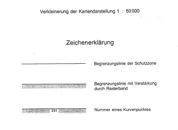
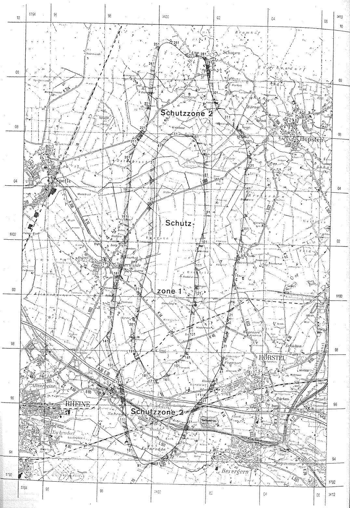

# Verordnung über die Festsetzung des Lärmschutzbereichs für den militärischen Flugplatz Hopsten (FluLärmHopstV)

Ausfertigungsdatum
:   1976-05-26

Fundstelle
:   BGBl I: 1976, 1325

Zuletzt geändert durch
:   Art. 1 V v. 12.7.1991 I 1516

## Eingangsformel

Auf Grund des § 4 Abs. 1 des Gesetzes zum Schutz gegen Fluglärm vom
30\. März 1971 (Bundesgesetzblatt I S. 282), geändert durch Artikel 70
des Einführungsgesetzes zum Strafgesetzbuch vom 2. März 1974
(Bundesgesetzbl. I S. 469), wird im Einvernehmen mit dem
Bundesminister der Verteidigung und mit Zustimmung des Bundesrates
verordnet:

## § 1

Zum Schutz der Allgemeinheit vor Gefahren, erheblichen Nachteilen und
erheblichen Belästigungen durch Fluglärm in der Umgebung des
militärischen Flugplatzes Hopsten wird der in § 2 bestimmte
Lärmschutzbereich festgesetzt.

## § 2

Der Lärmschutzbereich mit seinen zwei Schutzzonen wird nach Anlage 1
bestimmt durch die interpolierten Verbindungslinien zwischen den
Kurvenpunkten, soweit diese Linien außerhalb des Flugplatzgeländes
verlaufen.

## § 3

(1) Liegt eine bauliche Anlage zu einem Teil im Lärmschutzbereich, so
gilt sie als ganz im Lärmschutzbereich gelegen. Liegt eine bauliche
Anlage zu einem Teil in der Schutzzone 1, so gilt sie als ganz in
dieser Schutzzone gelegen.

(2) Auf die Errichtung einer baulichen Anlage ist Absatz 1
entsprechend anzuwenden.

## § 4

(1) Der nach § 2 bestimmte Lärmschutzbereich ist in einer
topographischen Karte im Maßstab 1:50.000 und in Karten im Maßstab
1:5.000 dargestellt. Die topographische Karte ist in verkleinerter
Form als Anlage 2 dieser Verordnung beigefügt. Die topographische
Karte und die Karten im Maßstab 1:5.000 sind beim
Regierungspräsidenten Münster, Domplatz 1, 4400 Münster, zu jedermanns
Einsicht archivmäßig gesichert niedergelegt.

(2) Die Karten im Maßstab 1 : 5.000 über den Lärmschutzbereich nach
der bis zum Ablauf des 23. Juli 1980 und nach der bis zum 23. Juli
1991 geltenden Fassung dieser Verordnung bleiben an gleicher Stelle zu
jedermanns Einsicht archivmäßig gesichert niedergelegt.

## § 5

Diese Verordnung tritt am Tag nach der Verkündung in Kraft.

## Schlußformel

Der Bundesminister des Innern

(zu § 2 der Verordnung über die Festsetzung des Lärmschutzbereichs für
den militärischen Flugplatz Hopsten in der Fassung der Zweiten
Änderungsverordnung vom 12. Juli 1991)

## Anlage 1 Lärmschutzbereich - Zweite Änderung

(Fundstelle des Originaltextes: BGBl. I 1991, 1517 - 1521)

*    *   Koordinatensystem:

    *   Gauß - Krüger:

    *   Y = Rechtswert

*    *
    *
    *   X = Hochwert

*    *   Interpolation:

    *   Polynom 3. Grades mit stetigem Tangentenübergang

*    *

*    *   Kurvenpunkte der Schutzzone 1 (Militärischer Flugplatz Hopsten)

*    *   Nr.

    *   Y

    *   X

    *   Nr.

    *   Y

    *   X

    *   Nr.

    *   Y

    *   X

*    *

*    *   1

    *   3399689.5

    *   5800943.9

    *   51

    *   3400661.3

    *   5805930.6

    *   101

    *   3401644.4

    *   5802138.0

*    *   2

    *   3399722.5

    *   5801080.0

    *   52

    *   3400718.5

    *   5805931.9

    *   102

    *   3401601.4

    *   5801983.9

*    *   3

    *   3399754.2

    *   5801216.4

    *   53

    *   3400775.6

    *   5805928.4

    *   103

    *   3401560.4

    *   5801829.3

*    *   4

    *   3399784.9

    *   5801352.9

    *   54

    *   3400890.2

    *   5805918.7

    *   104

    *   3401520.7

    *   5801674.6

*    *   5

    *   3399815.8

    *   5801489.4

    *   55

    *   3401004.3

    *   5805918.1

    *   105

    *   3401501.1

    *   5801597.3

*    *   6

    *   3399845.6

    *   5801626.1

    *   56

    *   3401118.3

    *   5805928.2

    *   106

    *   3401491.5

    *   5801558.6

*    *   7

    *   3399863.8

    *   5801765.3

    *   57

    *   3401175.6

    *   5805929.8

    *   107

    *   3401484.0

    *   5801519.5

*    *   8

    *   3399869.1

    *   5801906.7

    *   58

    *   3401232.5

    *   5805921.9

    *   108

    *   3401479.9

    *   5801490.3

*    *   9

    *   3399874.0

    *   5802048.1

    *   59

    *   3401275.4

    *   5805906.3

    *   109

    *   3401473.5

    *   5801449.8

*    *   10

    *   3399878.3

    *   5802189.5

    *   60

    *   3401314.7

    *   5805883.0

    *   110

    *   3401465.9

    *   5801362.4

*    *

*    *   11

    *   3399881.2

    *   5802330.8

    *   61

    *   3401349.7

    *   5805853.7

    *   111

    *   3401461.3

    *   5801203.8

*    *   12

    *   3399882.4

    *   5802472.3

    *   62

    *   3401380.4

    *   5805820.1

    *   112

    *   3401457.2

    *   5801045.0

*    *   13

    *   3399882.3

    *   5802544.1

    *   63

    *   3401407.0

    *   5805783.7

    *   113

    *   3401455.1

    *   5800886.1

*    *   14

    *   3399881.7

    *   5802613.8

    *   64

    *   3401430.1

    *   5805745.1

    *   114

    *   3401454.5

    *   5800727.3

*    *   15

    *   3399878.9

    *   5802755.1

    *   65

    *   3401450.4

    *   5805704.9

    *   115

    *   3401454.5

    *   5800568.4

*    *   16

    *   3399873.5

    *   5802896.6

    *   66

    *   3401468.4

    *   5805663.6

    *   116

    *   3401454.6

    *   5800489.0

*    *   17

    *   3399875.6

    *   5803037.7

    *   67

    *   3401494.8

    *   5805595.5

    *   117

    *   3401454.9

    *   5800409.6

*    *   18

    *   3399881.8

    *   5803178.7

    *   68

    *   3401520.0

    *   5805526.9

    *   118

    *   3401455.3

    *   5800352.1

*    *   19

    *   3399897.2

    *   5803319.4

    *   69

    *   3401546.7

    *   5805458.5

    *   119

    *   3401456.1

    *   5800294.7

*    *   20

    *   3399912.1

    *   5803460.0

    *   70

    *   3401576.3

    *   5805391.4

    *   120

    *   3401456.9

    *   5800250.6

*    *

*    *   21

    *   3399922.8

    *   5803602.7

    *   71

    *   3401613.7

    *   5805330.2

    *   121

    *   3401453.0

    *   5800171.2

*    *   22

    *   3399926.7

    *   5803745.3

    *   72

    *   3401653.7

    *   5805280.2

    *   122

    *   3401445.5

    *   5800092.2

*    *   23

    *   3399923.7

    *   5803887.7

    *   73

    *   3401678.7

    *   5805230.2

    *   123

    *   3401422.8

    *   5799934.1

*    *   24

    *   3399915.1

    *   5804030.0

    *   74

    *   3401693.3

    *   5805194.0

    *   124

    *   3401394.5

    *   5799778.3

*    *   25

    *   3399903.8

    *   5804172.2

    *   75

    *   3401700.5

    *   5805159.6

    *   125

    *   3401365.4

    *   5799622.7

*    *   26

    *   3399895.2

    *   5804314.5

    *   76

    *   3401707.6

    *   5805125.2

    *   126

    *   3401339.5

    *   5799466.5

*    *   27

    *   3399893.2

    *   5804455.5

    *   77

    *   3401712.9

    *   5805051.3

    *   127

    *   3401319.0

    *   5799309.6

*    *   28

    *   3399897.9

    *   5804596.1

    *   78

    *   3401713.4

    *   5804977.1

    *   128

    *   3401304.0

    *   5799152.0

*    *   29

    *   3399907.4

    *   5804736.3

    *   79

    *   3401714.0

    *   5804827.8

    *   129

    *   3401293.7

    *   5798993.7

*    *   30

    *   3399918.2

    *   5804871.0

    *   80

    *   3401714.4

    *   5804678.3

    *   130

    *   3401286.3

    *   5798834.8

*    *

*    *   31

    *   3399924.3

    *   5804943.6

    *   81

    *   3401715.9

    *   5804540.6

    *   131

    *   3401277.7

    *   5798676.1

*    *   32

    *   3399930.5

    *   5805016.2

    *   82

    *   3401718.8

    *   5804403.0

    *   132

    *   3401263.1

    *   5798518.3

*    *   33

    *   3399933.4

    *   5805051.8

    *   83

    *   3401724.5

    *   5804265.5

    *   133

    *   3401235.4

    *   5798362.3

*    *   34

    *   3399936.4

    *   5805087.5

    *   84

    *   3401733.7

    *   5804128.2

    *   134

    *   3401194.5

    *   5798208.5

*    *   35

    *   3399941.8

    *   5805122.5

    *   85

    *   3401747.0

    *   5803991.1

    *   135

    *   3401172.9

    *   5798131.7

*    *   36

    *   3399960.4

    *   5805154.8

    *   86

    *   3401761.0

    *   5803854.1

    *   136

    *   3401151.7

    *   5798054.9

*    *   37

    *   3399980.3

    *   5805189.6

    *   87

    *   3401765.3

    *   5803716.4

    *   137

    *   3401140.4

    *   5798012.8

*    *   38

    *   3400000.1

    *   5805224.6

    *   88

    *   3401770.7

    *   5803578.9

    *   138

    *   3401129.2

    *   5797970.6

*    *   39

    *   3400039.3

    *   5805294.6

    *   89

    *   3401781.9

    *   5803441.8

    *   139

    *   3401118.2

    *   5797928.4

*    *   40

    *   3400109.4

    *   5805405.1

    *   90

    *   3401797.5

    *   5803304.9

    *   140

    *   3401112.8

    *   5797907.3

*    *

*    *   41

    *   3400164.8

    *   5805491.2

    *   91

    *   3401812.7

    *   5803167.9

    *   141

    *   3401107.3

    *   5797886.1

*    *   42

    *   3400219.4

    *   5805577.6

    *   92

    *   3401822.5

    *   5803030.7

    *   142

    *   3401102.6

    *   5797867.7

*    *   43

    *   3400301.3

    *   5805694.6

    *   93

    *   3401823.9

    *   5802892.9

    *   143

    *   3401093.0

    *   5797851.4

*    *   44

    *   3400351.8

    *   5805756.2

    *   94

    *   3401814.4

    *   5802754.7

    *   144

    *   3401079.6

    *   5797839.5

*    *   45

    *   3400407.6

    *   5805813.0

    *   95

    *   3401803.1

    *   5802675.2

    *   145

    *   3401066.3

    *   5797827.4

*    *   46

    *   3400439.6

    *   5805840.3

    *   96

    *   3401793.0

    *   5802636.4

    *   146

    *   3401039.8

    *   5797803.3

*    *   47

    *   3400473.8

    *   5805865.1

    *   97

    *   3401780.9

    *   5802598.1

    *   147

    *   3401013.5

    *   5797779.0

*    *   48

    *   3400510.0

    *   5805886.7

    *   98

    *   3401757.1

    *   5802521.7

    *   148

    *   3400953.6

    *   5797739.4

*    *   49

    *   3400548.2

    *   5805904.6

    *   99

    *   3401734.0

    *   5802445.1

    *   149

    *   3400853.6

    *   5797684.4

*    *   50

    *   3400603.7

    *   5805922.0

    *   100

    *   3401688.8

    *   5802291.7

    *   150

    *   3400783.6

    *   5797639.3

*    *

*    *   151

    *   3400724.6

    *   5797579.2

    *   181

    *   3399820.9

    *   5797197.8

    *   211

    *   3399520.8

    *   5800227.8

*    *   152

    *   3400678.1

    *   5797514.2

    *   182

    *   3399777.9

    *   5797254.5

    *   212

    *   3399542.1

    *   5800373.6

*    *   153

    *   3400633.8

    *   5797447.6

    *   183

    *   3399737.3

    *   5797312.9

    *   213

    *   3399574.1

    *   5800517.1

*    *   154

    *   3400590.7

    *   5797379.9

    *   184

    *   3399661.0

    *   5797433.2

    *   214

    *   3399614.9

    *   5800658.9

*    *   155

    *   3400547.7

    *   5797312.2

    *   185

    *   3399589.2

    *   5797556.7

    *   215

    *   3399653.2

    *   5800801.2

*    *   156

    *   3400503.2

    *   5797245.8

    *   186

    *   3399521.8

    *   5797683.2

    *   216

    *   3399689.5

    *   5800943.9

*    *   157

    *   3400454.5

    *   5797182.4

    *   187

    *   3399456.8

    *   5797811.5

    *
    *
    *

*    *   158

    *   3400427.7

    *   5797153.2

    *   188

    *   3399392.3

    *   5797940.0

    *
    *
    *

*    *   159

    *   3400399.5

    *   5797125.6

    *   189

    *   3399357.1

    *   5797999.8

    *
    *
    *

*    *   160

    *   3400369.6

    *   5797099.8

    *   190

    *   3399334.7

    *   5798037.8

    *
    *
    *

*    *

*    *   161

    *   3400337.9

    *   5797076.0

    *   191

    *   3399312.1

    *   5798075.7

    *
    *
    *

*    *   162

    *   3400304.6

    *   5797054.4

    *   192

    *   3399298.7

    *   5798109.9

    *
    *
    *

*    *   163

    *   3400270.0

    *   5797035.3

    *   193

    *   3399298.7

    *   5798145.4

    *
    *
    *

*    *   164

    *   3400234.0

    *   5797019.1

    *   194

    *   3399298.7

    *   5798180.9

    *
    *
    *

*    *   165

    *   3400196.4

    *   5797006.2

    *   195

    *   3399298.6

    *   5798216.3

    *
    *
    *

*    *   166

    *   3400171.0

    *   5797000.0

    *   196

    *   3399298.3

    *   5798287.1

    *
    *
    *

*    *   167

    *   3400145.5

    *   5796995.9

    *   197

    *   3399297.7

    *   5798357.8

    *
    *
    *

*    *   168

    *   3400120.1

    *   5796994.3

    *   198

    *   3399295.6

    *   5798499.3

    *
    *
    *

*    *   169

    *   3400094.7

    *   5796995.3

    *   199

    *   3399294.3

    *   5798640.9

    *
    *
    *

*    *   170

    *   3400069.2

    *   5796999.2

    *   200

    *   3399301.2

    *   5798782.9

    *
    *
    *

*    *

*    *   171

    *   3400043.8

    *   5797006.2

    *   201

    *   3399320.5

    *   5798925.9

    *
    *
    *

*    *   172

    *   3400019.6

    *   5797015.9

    *   202

    *   3399348.4

    *   5799069.3

    *
    *
    *

*    *   173

    *   3399996.8

    *   5797027.7

    *   203

    *   3399379.3

    *   5799212.2

    *
    *
    *

*    *   174

    *   3399975.2

    *   5797041.3

    *   204

    *   3399409.7

    *   5799355.2

    *
    *
    *

*    *   175

    *   3399954.7

    *   5797056.5

    *   205

    *   3399436.8

    *   5799498.8

    *
    *
    *

*    *   176

    *   3399935.0

    *   5797073.0

    *   206

    *   3399459.7

    *   5799643.1

    *
    *
    *

*    *   177

    *   3399916.0

    *   5797090.6

    *   207

    *   3399478.1

    *   5799788.1

    *
    *
    *

*    *   178

    *   3399890.8

    *   5797116.1

    *   208

    *   3399492.6

    *   5799933.8

    *
    *
    *

*    *   179

    *   3399866.7

    *   5797142.6

    *   209

    *   3399499.6

    *   5800013.8

    *
    *
    *

*    *   180

    *   3399843.4

    *   5797169.8

    *   210

    *   3399506.8

    *   5800093.8

    *
    *
    *

*    *

*    *   Kurvenpunkte der Schutzzone 2 (Militärischer Flugplatz Hopsten)

*    *   Nr.

    *   Y

    *   X

    *   Nr.

    *   Y

    *   X

    *   Nr.

    *   Y

    *   X

*    *

*    *   1

    *   3403030.1

    *   5801775.8

    *   51

    *   3401791.2

    *   5796313.9

    *   101

    *   3399308.9

    *   5794453.9

*    *   2

    *   3403005.2

    *   5801632.7

    *   52

    *   3401693.1

    *   5796203.8

    *   102

    *   3399243.3

    *   5794598.7

*    *   3

    *   3402978.7

    *   5801489.8

    *   53

    *   3401595.6

    *   5796093.2

    *   103

    *   3399216.6

    *   5794674.7

*    *   4

    *   3402964.8

    *   5801418.5

    *   54

    *   3401505.2

    *   5795977.6

    *   104

    *   3399194.0

    *   5794751.9

*    *   5

    *   3402950.7

    *   5801347.2

    *   55

    *   3401465.0

    *   5795917.8

    *   105

    *   3399156.0

    *   5794898.7

*    *   6

    *   3402943.2

    *   5801295.2

    *   56

    *   3401427.8

    *   5795856.1

    *   106

    *   3399123.9

    *   5795046.5

*    *   7

    *   3402936.2

    *   5801254.8

    *   57

    *   3401394.5

    *   5795793.1

    *   107

    *   3399084.6

    *   5795193.0

*    *   8

    *   3402928.4

    *   5801203.6

    *   58

    *   3401364.3

    *   5795728.6

    *   108

    *   3399064.6

    *   5795266.1

*    *   9

    *   3402920.7

    *   5801131.4

    *   59

    *   3401337.6

    *   5795662.8

    *   109

    *   3399051.5

    *   5795340.8

*    *   10

    *   3402912.8

    *   5801059.0

    *   60

    *   3401313.7

    *   5795595.9

    *   110

    *   3399046.4

    *   5795416.7

*    *

*    *   11

    *   3402896.1

    *   5800914.6

    *   61

    *   3401294.3

    *   5795534.3

    *   111

    *   3399041.2

    *   5795492.6

*    *   12

    *   3402878.5

    *   5800770.4

    *   62

    *   3401251.1

    *   5795426.7

    *   112

    *   3399031.3

    *   5795644.5

*    *   13

    *   3402861.0

    *   5800624.9

    *   63

    *   3401215.7

    *   5795344.1

    *   113

    *   3399021.5

    *   5795795.7

*    *   14

    *   3402844.4

    *   5800479.3

    *   64

    *   3401173.7

    *   5795264.1

    *   114

    *   3399009.4

    *   5795946.7

*    *   15

    *   3402829.2

    *   5800333.6

    *   65

    *   3401151.1

    *   5795202.1

    *   115

    *   3398994.5

    *   5796097.4

*    *   16

    *   3402816.0

    *   5800187.5

    *   66

    *   3401133.3

    *   5795121.2

    *   116

    *   3398977.1

    *   5796247.9

*    *   17

    *   3402803.8

    *   5800041.4

    *   67

    *   3401119.9

    *   5795061.2

    *   117

    *   3398956.9

    *   5796398.0

*    *   18

    *   3402784.4

    *   5799896.2

    *   68

    *   3401094.4

    *   5794986.2

    *   118

    *   3398931.8

    *   5796547.6

*    *   19

    *   3402763.4

    *   5799751.1

    *   69

    *   3401064.4

    *   5794913.1

    *   119

    *   3398902.5

    *   5796700.1

*    *   20

    *   3402741.1

    *   5799608.2

    *   70

    *   3401032.0

    *   5794833.5

    *   120

    *   3398870.2

    *   5796851.6

*    *

*    *   21

    *   3402717.6

    *   5799465.6

    *   71

    *   3400999.8

    *   5794753.9

    *   121

    *   3398853.1

    *   5796926.9

*    *   22

    *   3402693.0

    *   5799323.1

    *   72

    *   3400953.6

    *   5794669.0

    *   122

    *   3398835.5

    *   5797002.2

*    *   23

    *   3402668.4

    *   5799180.6

    *   73

    *   3400888.6

    *   5794579.0

    *   123

    *   3398826.5

    *   5797039.8

*    *   24

    *   3402641.6

    *   5799038.5

    *   74

    *   3400828.6

    *   5794514.0

    *   124

    *   3398817.4

    *   5797077.3

*    *   25

    *   3402615.3

    *   5798896.4

    *   75

    *   3400753.6

    *   5794439.0

    *   125

    *   3398808.3

    *   5797114.7

*    *   26

    *   3402602.3

    *   5798825.3

    *   76

    *   3400653.6

    *   5794344.0

    *   126

    *   3398799.0

    *   5797152.2

*    *   27

    *   3402589.5

    *   5798754.1

    *   77

    *   3400553.6

    *   5794264.0

    *   127

    *   3398777.6

    *   5797185.6

*    *   28

    *   3402578.5

    *   5798691.8

    *   78

    *   3400453.6

    *   5794183.9

    *   128

    *   3398755.2

    *   5797218.3

*    *   29

    *   3402564.3

    *   5798608.9

    *   79

    *   3400353.6

    *   5794113.9

    *   129

    *   3398710.5

    *   5797283.7

*    *   30

    *   3402540.2

    *   5798463.5

    *   80

    *   3400253.6

    *   5794048.9

    *   130

    *   3398623.6

    *   5797415.8

*    *

*    *   31

    *   3402517.2

    *   5798318.0

    *   81

    *   3400153.6

    *   5793988.9

    *   131

    *   3398550.6

    *   5797552.8

*    *   32

    *   3402495.4

    *   5798172.4

    *   82

    *   3400053.6

    *   5793943.9

    *   132

    *   3398521.4

    *   5797623.5

*    *   33

    *   3402481.6

    *   5798026.0

    *   83

    *   3399953.5

    *   5793903.9

    *   133

    *   3398496.6

    *   5797695.9

*    *   34

    *   3402481.6

    *   5797878.3

    *   84

    *   3399853.5

    *   5793883.9

    *   134

    *   3398454.6

    *   5797842.8

*    *   35

    *   3402483.6

    *   5797804.1

    *   85

    *   3399777.1

    *   5793873.5

    *   135

    *   3398414.1

    *   5797990.1

*    *   36

    *   3402487.1

    *   5797730.0

    *   86

    *   3399737.4

    *   5793867.5

    *   136

    *   3398394.2

    *   5798062.2

*    *   37

    *   3402489.4

    *   5797693.2

    *   87

    *   3399699.9

    *   5793871.3

    *   137

    *   3398367.0

    *   5798131.8

*    *   38

    *   3402486.4

    *   5797656.5

    *   88

    *   3399681.7

    *   5793876.6

    *   138

    *   3398353.9

    *   5798170.2

*    *   39

    *   3402470.6

    *   5797584.8

    *   89

    *   3399664.2

    *   5793884.1

    *   139

    *   3398340.6

    *   5798208.6

*    *   40

    *   3402443.8

    *   5797489.3

    *   90

    *   3399646.8

    *   5793893.8

    *   140

    *   3398339.0

    *   5798248.4

*    *

*    *   41

    *   3402403.8

    *   5797379.3

    *   91

    *   3399630.4

    *   5793905.1

    *   141

    *   3398347.8

    *   5798289.4

*    *   42

    *   3402353.8

    *   5797279.3

    *   92

    *   3399614.5

    *   5793918.3

    *   142

    *   3398356.0

    *   5798328.5

*    *   43

    *   3402298.8

    *   5797179.3

    *   93

    *   3399599.5

    *   5793932.3

    *   143

    *   3398364.1

    *   5798367.6

*    *   44

    *   3402243.8

    *   5797079.3

    *   94

    *   3399585.8

    *   5793947.3

    *   144

    *   3398372.1

    *   5798406.7

*    *   45

    *   3402213.8

    *   5797009.3

    *   95

    *   3399572.6

    *   5793962.8

    *   145

    *   3398379.9

    *   5798445.8

*    *   46

    *   3402174.2

    *   5796937.0

    *   96

    *   3399548.5

    *   5793995.6

    *   146

    *   3398395.0

    *   5798524.2

*    *   47

    *   3402108.7

    *   5796794.3

    *   97

    *   3399526.5

    *   5794030.2

    *   147

    *   3398409.7

    *   5798602.6

*    *   48

    *   3402042.1

    *   5796657.6

    *   98

    *   3399488.4

    *   5794099.8

    *   148

    *   3398436.7

    *   5798759.9

*    *   49

    *   3401969.9

    *   5796546.6

    *   99

    *   3399454.6

    *   5794171.7

    *   149

    *   3398460.5

    *   5798917.7

*    *   50

    *   3401884.1

    *   5796427.7

    *   100

    *   3399379.2

    *   5794311.5

    *   150

    *   3398481.5

    *   5799075.8

*    *

*    *   151

    *   3398499.2

    *   5799234.6

    *   201

    *   3399043.3

    *   5805043.4

    *   251

    *   3400047.0

    *   5809201.1

*    *   152

    *   3398513.9

    *   5799390.1

    *   202

    *   3399056.5

    *   5805080.6

    *   252

    *   3400076.8

    *   5809237.8

*    *   153

    *   3398526.9

    *   5799545.8

    *   203

    *   3399069.4

    *   5805117.8

    *   253

    *   3400113.7

    *   5809267.4

*    *   154

    *   3398538.9

    *   5799701.5

    *   204

    *   3399094.0

    *   5805191.6

    *   254

    *   3400153.3

    *   5809293.0

*    *   155

    *   3398550.8

    *   5799857.3

    *   205

    *   3399117.4

    *   5805265.8

    *   255

    *   3400195.6

    *   5809313.8

*    *   156

    *   3398564.7

    *   5800012.9

    *   206

    *   3399139.8

    *   5805340.3

    *   256

    *   3400238.6

    *   5809327.9

*    *   157

    *   3398581.7

    *   5800168.2

    *   207

    *   3399161.6

    *   5805415.0

    *   257

    *   3400283.4

    *   5809335.2

*    *   158

    *   3398603.0

    *   5800322.5

    *   208

    *   3399181.6

    *   5805471.1

    *   258

    *   3400328.7

    *   5809335.2

*    *   159

    *   3398629.6

    *   5800475.7

    *   209

    *   3399204.9

    *   5805525.8

    *   259

    *   3400373.5

    *   5809328.4

*    *   160

    *   3398663.5

    *   5800627.1

    *   210

    *   3399224.8

    *   5805558.9

    *   260

    *   3400446.0

    *   5809304.2

*    *

*    *   161

    *   3398711.8

    *   5800774.9

    *   211

    *   3399258.2

    *   5805630.8

    *   261

    *   3400513.6

    *   5809268.4

*    *   162

    *   3398757.1

    *   5800923.5

    *   212

    *   3399296.5

    *   5805700.3

    *   262

    *   3400577.5

    *   5809225.2

*    *   163

    *   3398799.9

    *   5801072.7

    *   213

    *   3399317.7

    *   5805734.8

    *   263

    *   3400638.0

    *   5809177.5

*    *   164

    *   3398840.4

    *   5801222.5

    *   214

    *   3399339.9

    *   5805768.6

    *   264

    *   3400755.9

    *   5809073.5

*    *   165

    *   3398878.7

    *   5801372.7

    *   215

    *   3399386.7

    *   5805834.6

    *   265

    *   3400874.0

    *   5808969.9

*    *   166

    *   3398897.1

    *   5801448.0

    *   216

    *   3399435.9

    *   5805900.0

    *   266

    *   3400941.6

    *   5808918.1

*    *   167

    *   3398915.0

    *   5801523.3

    *   217

    *   3399485.1

    *   5805965.4

    *   267

    *   3400976.9

    *   5808893.7

*    *   168

    *   3398927.3

    *   5801571.9

    *   218

    *   3399533.6

    *   5806030.4

    *   268

    *   3401006.5

    *   5808862.8

*    *   169

    *   3398952.7

    *   5801673.7

    *   219

    *   3399557.9

    *   5806063.1

    *   269

    *   3401037.5

    *   5808837.8

*    *   170

    *   3398965.9

    *   5801727.9

    *   220

    *   3399577.5

    *   5806098.8

    *   270

    *   3401072.6

    *   5808819.0

*    *

*    *   171

    *   3398974.0

    *   5801783.0

    *   221

    *   3399586.6

    *   5806138.2

    *   271

    *   3401092.3

    *   5808813.6

*    *   172

    *   3398979.4

    *   5801823.7

    *   222

    *   3399595.6

    *   5806177.7

    *   272

    *   3401112.0

    *   5808811.1

*    *   173

    *   3398986.6

    *   5801903.0

    *   223

    *   3399604.4

    *   5806217.2

    *   273

    *   3401131.9

    *   5808811.8

*    *   174

    *   3398987.6

    *   5801982.6

    *   224

    *   3399613.1

    *   5806256.7

    *   274

    *   3401151.9

    *   5808815.7

*    *   175

    *   3398989.1

    *   5802140.5

    *   225

    *   3399629.8

    *   5806336.3

    *   275

    *   3401191.9

    *   5808825.0

*    *   176

    *   3398990.2

    *   5802298.2

    *   226

    *   3399645.8

    *   5806416.0

    *   276

    *   3401232.8

    *   5808826.9

*    *   177

    *   3398989.0

    *   5802455.9

    *   227

    *   3399661.1

    *   5806496.2

    *   277

    *   3401313.2

    *   5808841.5

*    *   178

    *   3398985.6

    *   5802613.6

    *   228

    *   3399675.5

    *   5806576.5

    *   278

    *   3401393.7

    *   5808862.0

*    *   179

    *   3398979.6

    *   5802771.2

    *   229

    *   3399700.8

    *   5806729.6

    *   279

    *   3401434.5

    *   5808870.1

*    *   180

    *   3398970.2

    *   5802928.8

    *   230

    *   3399722.8

    *   5806883.1

    *   280

    *   3401475.9

    *   5808873.9

*    *

*    *   181

    *   3398964.1

    *   5803008.7

    *   231

    *   3399740.3

    *   5807037.2

    *   281

    *   3401516.0

    *   5808870.2

*    *   182

    *   3398955.6

    *   5803047.9

    *   232

    *   3399756.0

    *   5807191.5

    *   282

    *   3401554.2

    *   5808857.3

*    *   183

    *   3398943.6

    *   5803086.2

    *   233

    *   3399770.2

    *   5807345.9

    *   283

    *   3401588.1

    *   5808835.9

*    *   184

    *   3398944.6

    *   5803125.2

    *   234

    *   3399783.5

    *   5807500.5

    *   284

    *   3401617.4

    *   5808808.4

*    *   185

    *   3398945.9

    *   5803164.2

    *   235

    *   3399796.2

    *   5807655.3

    *   285

    *   3401640.2

    *   5808780.4

*    *   186

    *   3398949.6

    *   5803342.2

    *   236

    *   3399809.0

    *   5807810.0

    *   286

    *   3401660.6

    *   5808750.5

*    *   187

    *   3398960.6

    *   5803398.1

    *   237

    *   3399821.8

    *   5807964.8

    *   287

    *   3401679.1

    *   5808719.6

*    *   188

    *   3398975.1

    *   5803553.7

    *   238

    *   3399834.2

    *   5808119.7

    *   288

    *   3401696.3

    *   5808687.9

*    *   189

    *   3398988.5

    *   5803677.9

    *   239

    *   3399849.4

    *   5808274.3

    *   289

    *   3401711.8

    *   5808657.0

*    *   190

    *   3399002.3

    *   5803802.2

    *   240

    *   3399868.1

    *   5808428.6

    *   290

    *   3401723.4

    *   5808624.4

*    *

*    *   191

    *   3399009.1

    *   5803865.0

    *   241

    *   3399879.2

    *   5808508.2

    *   291

    *   3401728.6

    *   5808590.3

*    *   192

    *   3399024.9

    *   5804020.6

    *   242

    *   3399891.5

    *   5808587.6

    *   292

    *   3401733.8

    *   5808556.2

*    *   193

    *   3399037.7

    *   5804176.3

    *   243

    *   3399919.5

    *   5808745.0

    *   293

    *   3401743.8

    *   5808488.0

*    *   194

    *   3399047.2

    *   5804332.2

    *   244

    *   3399935.5

    *   5808822.2

    *   294

    *   3401753.6

    *   5808419.7

*    *   195

    *   3399052.1

    *   5804488.2

    *   245

    *   3399953.4

    *   5808900.2

    *   295

    *   3401773.8

    *   5808283.4

*    *   196

    *   3399052.5

    *   5804644.6

    *   246

    *   3399972.9

    *   5808976.7

    *   296

    *   3401795.6

    *   5808147.4

*    *   197

    *   3399048.8

    *   5804801.0

    *   247

    *   3399994.8

    *   5809052.6

    *   297

    *   3401819.9

    *   5808012.4

*    *   198

    *   3399045.1

    *   5804882.8

    *   248

    *   3400006.6

    *   5809090.1

    *   298

    *   3401848.2

    *   5807878.4

*    *   199

    *   3399040.3

    *   5804964.6

    *   249

    *   3400019.2

    *   5809127.4

    *   299

    *   3401881.6

    *   5807745.7

*    *   200

    *   3399037.7

    *   5805004.1

    *   250

    *   3400032.6

    *   5809164.4

    *   300

    *   3401919.0

    *   5807613.9

*    *

*    *   301

    *   3401959.0

    *   5807482.8

    *   321

    *   3403229.0

    *   5805716.5

    *   341

    *   3403216.3

    *   5804065.1

*    *   302

    *   3401985.5

    *   5807400.4

    *   322

    *   3403242.9

    *   5805683.1

    *   342

    *   3403215.4

    *   5803922.5

*    *   303

    *   3402016.5

    *   5807319.6

    *   323

    *   3403248.1

    *   5805647.3

    *   343

    *   3403215.2

    *   5803779.8

*    *   304

    *   3402055.8

    *   5807206.2

    *   324

    *   3403252.7

    *   5805611.5

    *   344

    *   3403215.0

    *   5803638.4

*    *   305

    *   3402108.7

    *   5807070.2

    *   325

    *   3403273.9

    *   5805540.2

    *   345

    *   3403214.4

    *   5803496.9

*    *   306

    *   3402170.7

    *   5806939.2

    *   326

    *   3403283.9

    *   5805480.2

    *   346

    *   3403214.4

    *   5803355.5

*    *   307

    *   3402243.8

    *   5806814.0

    *   327

    *   3403303.9

    *   5805380.2

    *   347

    *   3403211.5

    *   5803214.1

*    *   308

    *   3402285.6

    *   5806753.9

    *   328

    *   3403318.9

    *   5805280.2

    *   348

    *   3403206.5

    *   5803072.8

*    *   309

    *   3402331.1

    *   5806696.4

    *   329

    *   3403323.9

    *   5805180.2

    *   349

    *   3403198.4

    *   5802931.5

*    *   310

    *   3402381.3

    *   5806640.5

    *   330

    *   3403323.9

    *   5805080.2

    *   350

    *   3403188.8

    *   5802790.3

*    *

*    *   311

    *   3402434.4

    *   5806587.3

    *   331

    *   3403314.6

    *   5804977.9

    *   351

    *   3403176.2

    *   5802643.8

*    *   312

    *   3402539.9

    *   5806490.1

    *   332

    *   3403304.0

    *   5804916.7

    *   352

    *   3403160.9

    *   5802497.7

*    *   313

    *   3402648.2

    *   5806395.5

    *   333

    *   3403288.4

    *   5804845.8

    *   353

    *   3403132.8

    *   5802353.7

*    *   314

    *   3402760.8

    *   5806304.9

    *   334

    *   3403271.5

    *   5804775.0

    *   354

    *   3403105.1

    *   5802209.5

*    *   315

    *   3402867.4

    *   5806208.8

    *   335

    *   3403243.4

    *   5804634.0

    *   355

    *   3403079.4

    *   5802065.1

*    *   316

    *   3402966.2

    *   5806105.4

    *   336

    *   3403232.3

    *   5804563.4

    *   356

    *   3403054.7

    *   5801920.4

*    *   317

    *   3403056.7

    *   5805994.4

    *   337

    *   3403223.3

    *   5804492.5

    *   357

    *   3403030.1

    *   5801775.8

*    *   318

    *   3403138.9

    *   5805875.5

    *   338

    *   3403221.1

    *   5804421.3

    *
    *
    *

*    *   319

    *   3403177.0

    *   5805812.8

    *   339

    *   3403219.8

    *   5804350.1

    *
    *
    *

*    *   320

    *   3403212.4

    *   5805748.7

    *   340

    *   3403217.7

    *   5804207.6

    *
    *
    *

## Anlage 2 (zu § 4 Abs. 1 der Verordnung über die Festsetzung des Lärmschutzbereichs für den militärischen Flugplatz Hopsten in der Fassung der Zweiten Änderungsverordnung vom 12. Juli 1991)

   (Fundstelle: BGBl. I 1991, 1522 - 1523)

