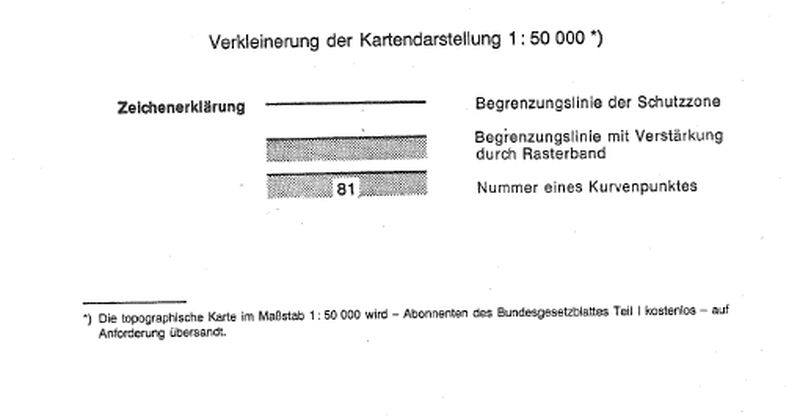
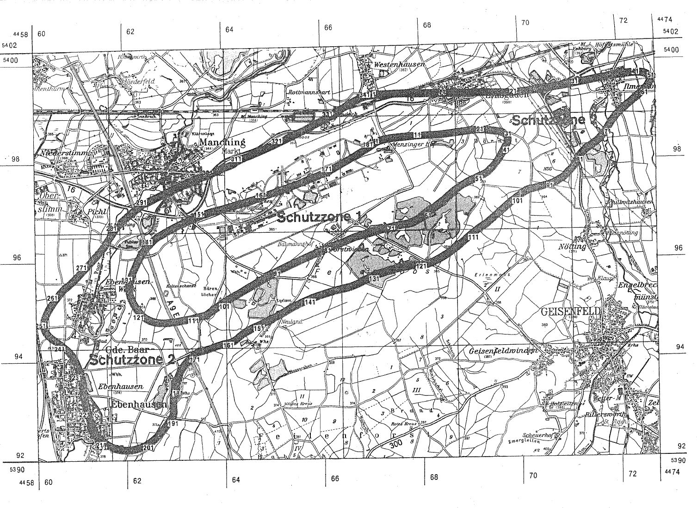

# Verordnung über die Festsetzung des Lärmschutzbereichs für den militärischen Flugplatz Ingolstadt (FluLärmIngolstV)

Ausfertigungsdatum
:   1981-01-30

Fundstelle
:   BGBl I: 1981, 135

Geändert durch
:   Art. 1 V v. 7.3.1988 I 215

## Eingangsformel

Auf Grund des § 4 Abs. 1 des Gesetzes zum Schutz gegen Fluglärm vom
30\. März 1971 (BGBl. I S. 282) wird im Einvernehmen mit dem
Bundesminister der Verteidigung und mit Zustimmung des Bundesrates
verordnet:

## § 1

Zum Schutz der Allgemeinheit vor Gefahren, erheblichen Nachteilen und
erheblichen Belästigungen durch Fluglärm in der Umgebung des
militärischen Flugplatzes Ingolstadt wird der in § 2 bestimmte
Lärmschutzbereich festgesetzt.

## § 2

Der Lärmschutzbereich mit seinen zwei Schutzzonen wird nach Anlage 1
bestimmt durch die interpolierten Verbindungslinien zwischen den
Kurvenpunkten, soweit diese Linien außerhalb des Flugplatzgeländes
verlaufen.

## § 3

Liegt eine bauliche Anlage zu einem Teil im Lärmschutzbereich, so gilt
sie als ganz im Lärmschutzbereich gelegen. Liegt eine bauliche Anlage
zu einem Teil in der Schutzzone 1, so gilt sie als ganz in dieser
Schutzzone gelegen.

## § 4

(1) Der nach § 2 bestimmte Lärmschutzbereich ist in einer
topographischen Karte im Maßstab 1:50.000 und in Karten im Maßstab
1:5.000 dargestellt. Die topographische Karte ist in verkleinerter
Form als Anlage 2 dieser Verordnung beigefügt. Die topographische
Karte und die Karten im Maßstab 1:5.000 sind beim Vermessungsamt
Ingolstadt, Esplanade 18, 8070 Ingolstadt, zu jedermanns Einsicht
archivmäßig gesichert niedergelegt.

(2) Die Karten im Maßstab 1:5.000 über den Lärmschutzbereich nach der
bis zum Ablauf des 16. März 1988 geltenden Fassung dieser Verordnung
bleiben an gleicher Stelle zu jedermanns Einsicht archivmäßig
gesichert niedergelegt.

## § 5

Diese Verordnung tritt am Tage nach der Verkündung in Kraft.

## Schlußformel

Der Bundesminister des Innern

## Anlage 1 (zu § 2 der Verordnung über die Festsetzung des Lärmschutzbereichs für den militärischen Flugplatz Ingolstadt in der Fassung der Ersten Änderungsverordnung vom 7. März 1988)

(Fundstelle des Originaltextes: BGBl. I 1988, 216 - 220)

*    *   Lärmschutzbereich - Erste Änderung

*    *   Koordinatensystem: Gauß - Krüger:

    *   Y = Rechtswert

*    *
    *   X = Hochwert

*    *   Interpolation: Polynom 3. Grades mit stetigem Tangentenüberhang

*    *

*    *   Kurvenpunkte der Schutzzone 1 (Militärischer Flugplatz Ingolstadt)

*    *

*    *   Nr.

    *   Y

    *   X

    *   Nr.

    *   Y

    *   X

    *   Nr.

    *   Y

    *   X

*    *

*    *

*    *   1

    *   4467106.3

    *   5398275.2

    *   51

    *   4469056.4

    *   5397646.7

    *   101

    *   4463840.4

    *   5395171.8

*    *   2

    *   4467148.8

    *   5398295.7

    *   52

    *   4468911.8

    *   5397578.9

    *   102

    *   4463773.6

    *   5395127.4

*    *   3

    *   4467193.0

    *   5398311.6

    *   53

    *   4468772.5

    *   5397503.1

    *   103

    *   4463706.9

    *   5395082.3

*    *   4

    *   4467237.9

    *   5398325.5

    *   54

    *   4468641.2

    *   5397415.7

    *   104

    *   4463640.7

    *   5395036.6

*    *   5

    *   4467304.7

    *   5398342.2

    *   55

    *   4468517.7

    *   5397316.7

    *   105

    *   4463607.6

    *   5395013.4

*    *   6

    *   4467372.3

    *   5398354.9

    *   56

    *   4468398.5

    *   5397211.4

    *   106

    *   4463574.6

    *   5394989.9

*    *   7

    *   4467440.3

    *   5398364.1

    *   57

    *   4468273.5

    *   5397114.6

    *   107

    *   4463536.8

    *   5394975.0

*    *   8

    *   4467508.5

    *   5398370.6

    *   58

    *   4468209.3

    *   5397066.2

    *   108

    *   4463497.1

    *   5394966.3

*    *   9

    *   4467645.8

    *   5398379.0

    *   59

    *   4468146.1

    *   5397016.5

    *   109

    *   4463415.9

    *   5394949.4

*    *   10

    *   4467782.8

    *   5398388.8

    *   60

    *   4468082.9

    *   5396966.8

    *   110

    *   4463335.0

    *   5394930.8

*    *

*    *   11

    *   4467919.8

    *   5398399.4

    *   61

    *   4468018.6

    *   5396918.6

    *   111

    *   4463221.3

    *   5394902.7

*    *   12

    *   4468057.9

    *   5398401.1

    *   62

    *   4467886.0

    *   5396833.4

    *   112

    *   4463105.7

    *   5394884.4

*    *   13

    *   4468208.9

    *   5398404.1

    *   63

    *   4467803.1

    *   5396791.2

    *   113

    *   4462990.3

    *   5394865.1

*    *   14

    *   4468359.6

    *   5398412.2

    *   64

    *   4467760.4

    *   5396772.7

    *   114

    *   4462893.3

    *   5394850.6

*    *   15

    *   4468509.8

    *   5398426.6

    *   65

    *   4467717.0

    *   5396756.1

    *   115

    *   4462795.7

    *   5394840.6

*    *   16

    *   4468659.7

    *   5398442.9

    *   66

    *   4467685.5

    *   5396752.1

    *   116

    *   4462708.6

    *   5394839.1

*    *   17

    *   4468809.7

    *   5398459.1

    *   67

    *   4467654.2

    *   5396747.0

    *   117

    *   4462622.0

    *   5394848.3

*    *   18

    *   4468959.7

    *   5398475.6

    *   68

    *   4467591.7

    *   5396736.4

    *   118

    *   4462546.7

    *   5394866.9

*    *   19

    *   4469034.8

    *   5398482.8

    *   69

    *   4467514.2

    *   5396722.3

    *   119

    *   4462474.8

    *   5394895.5

*    *   20

    *   4469110.1

    *   5398487.3

    *   70

    *   4467436.9

    *   5396707.1

    *   120

    *   4462410.3

    *   5394933.5

*    *

*    *   21

    *   4469180.8

    *   5398490.0

    *   71

    *   4467283.5

    *   5396674.5

    *   121

    *   4462352.4

    *   5394981.0

*    *   22

    *   4469251.7

    *   5398488.6

    *   72

    *   4467131.4

    *   5396638.7

    *   122

    *   4462299.1

    *   5395037.9

*    *   23

    *   4469320.9

    *   5398479.6

    *   73

    *   4466980.1

    *   5396600.6

    *   123

    *   4462252.2

    *   5395100.1

*    *   24

    *   4469390.2

    *   5398470.8

    *   74

    *   4466834.4

    *   5396561.7

    *   124

    *   4462107.8

    *   5395171.4

*    *   25

    *   4469459.3

    *   5398462.0

    *   75

    *   4466689.2

    *   5396521.5

    *   125

    *   4462169.7

    *   5395246.4

*    *   26

    *   4469528.3

    *   5398451.6

    *   76

    *   4466574.5

    *   5396487.9

    *   126

    *   4462150.6

    *   5395292.6

*    *   27

    *   4469563.9

    *   5398444.3

    *   77

    *   4466490.1

    *   5396454.4

    *   127

    *   4462134.8

    *   5395340.2

*    *   28

    *   4469598.8

    *   5398434.4

    *   78

    *   4466405.6

    *   5396421.1

    *   128

    *   4462123.6

    *   5395389.0

*    *   29

    *   4469621.6

    *   5398425.3

    *   79

    *   4466265.4

    *   5396366.1

    *   129

    *   4462117.6

    *   5395438.8

*    *   30

    *   4469642.5

    *   5398413.3

    *   80

    *   4466124.8

    *   5396312.7

    *   130

    *   4462119.0

    *   5395512.7

*    *

*    *   31

    *   4469660.6

    *   5398396.6

    *   81

    *   4465984.0

    *   5396259.3

    *   131

    *   4462130.7

    *   5395585.8

*    *   32

    *   4469669.9

    *   5398381.0

    *   82

    *   4465864.1

    *   5396210.2

    *   132

    *   4462149.5

    *   5395655.2

*    *   33

    *   4469674.5

    *   5398364.6

    *   83

    *   4465744.4

    *   5396160.6

    *   133

    *   4462173.8

    *   5395723.0

*    *   34

    *   4469675.4

    *   5398347.4

    *   84

    *   4465624.8

    *   5396110.5

    *   134

    *   4462200.4

    *   5395787.1

*    *   35

    *   4469673.3

    *   5398329.7

    *   85

    *   4465505.6

    *   5396059.7

    *   135

    *   4462229.1

    *   5395850.5

*    *   36

    *   4469669.2

    *   5398313.1

    *   86

    *   4465386.6

    *   5396008.2

    *   136

    *   4462296.3

    *   5395985.5

*    *   37

    *   4469663.8

    *   5398296.9

    *   87

    *   4465261.6

    *   5395953.0

    *   137

    *   4462366.9

    *   5396115.6

*    *   38

    *   4469657.6

    *   5398281.0

    *   88

    *   4465137.1

    *   5395896.8

    *   138

    *   4462404.3

    *   5396176.3

*    *   39

    *   4469650.8

    *   5398265.3

    *   89

    *   4465075.0

    *   5395868.3

    *   139

    *   4462451.4

    *   5396229.9

*    *   40

    *   4469637.2

    *   5398237.2

    *   90

    *   4465013.0

    *   5395839.5

    *   140

    *   4462499.7

    *   5396280.0

*    *

*    *   41

    *   4469622.9

    *   5398209.5

    *   91

    *   4464956.5

    *   5395812.9

    *   141

    *   4462548.8

    *   5396329.4

*    *   42

    *   4469593.4

    *   5398154.6

    *   92

    *   4464872.4

    *   5395767.7

    *   142

    *   4462598.8

    *   5396377.8

*    *   43

    *   4469532.2

    *   5398045.7

    *   93

    *   4464734.8

    *   5395690.3

    *   143

    *   4462651.4

    *   5396423.3

*    *   44

    *   4469461.7

    *   5397940.7

    *   94

    *   4464596.6

    *   5395613.9

    *   144

    *   4462711.8

    *   5396460.1

*    *   45

    *   4469420.8

    *   5397891.2

    *   95

    *   4464459.7

    *   5395535.2

    *   145

    *   4462772.9

    *   5396495.8

*    *   46

    *   4469377.4

    *   5397843.9

    *   96

    *   4464323.6

    *   5395454.9

    *   146

    *   4462897.6

    *   5396564.5

*    *   47

    *   4469332.4

    *   5397799.6

    *   97

    *   4464183.0

    *   5395378.9

    *   147

    *   4463025.6

    *   5396629.7

*    *   48

    *   4469285.5

    *   5397757.3

    *   98

    *   4464044.0

    *   5395299.8

    *   148

    *   4463166.9

    *   5396696.0

*    *   49

    *   4469232.8

    *   5397722.0

    *   99

    *   4463975.5

    *   5395258.3

    *   149

    *   4463310.2

    *   5396757.1

*    *   50

    *   4469174.3

    *   5397697.5

    *   100

    *   4463907.7

    *   5395215.6

    *   150

    *   4463455.2

    *   5396813.0

*    *

*    *   noch Schutzzone 1 (Militärischer Flugplatz Ingolstadt)

*    *

*    *   Nr.

    *   Y

    *   X

    *   Nr.

    *   Y

    *   X

    *
    *
    *

*    *

*    *   151

    *   4463601.4

    *   5396865.8

    *   171

    *   4466193.5

    *   5397739.6

    *
    *
    *

*    *   152

    *   4463748.7

    *   5396915.2

    *   172

    *   4466263.7

    *   5397777.0

    *
    *
    *

*    *   153

    *   4463900.3

    *   5396952.4

    *   173

    *   4466320.9

    *   5397808.0

    *
    *
    *

*    *   154

    *   4464051.6

    *   5396990.7

    *   174

    *   4466392.2

    *   5397847.0

    *
    *
    *

*    *   155

    *   4464187.5

    *   5397026.6

    *   175

    *   4466463.2

    *   5397886.4

    *
    *
    *

*    *   156

    *   4464323.5

    *   5397062.0

    *   176

    *   4466575.5

    *   5397949.7

    *
    *
    *

*    *   157

    *   4464459.9

    *   5397096.3

    *   177

    *   4466710.3

    *   5398027.7

    *
    *
    *

*    *   158

    *   4464593.6

    *   5397139.4

    *   178

    *   4466843.6

    *   5398108.1

    *
    *
    *

*    *   159

    *   4464688.3

    *   5397171.7

    *   179

    *   4466921.6

    *   5398156.8

    *
    *
    *

*    *   160

    *   4464774.1

    *   5397200.2

    *   180

    *   4466976.3

    *   5398189.4

    *
    *
    *

*    *

*    *   161

    *   4464859.8

    *   5397229.1

    *   181

    *   4467041.5

    *   5398231.9

    *
    *
    *

*    *   162

    *   4464992.5

    *   5397274.9

    *   182

    *   4467106.3

    *   5398275.2

    *
    *
    *

*    *   163

    *   4465125.2

    *   5397321.3

    *
    *
    *
    *
    *
    *

*    *   164

    *   4465269.0

    *   5397372.4

    *
    *
    *
    *
    *
    *

*    *   165

    *   4465412.6

    *   5397424.1

    *
    *
    *
    *
    *
    *

*    *   166

    *   4465555.6

    *   5397477.5

    *
    *
    *
    *
    *
    *

*    *   167

    *   4465697.4

    *   5397533.8

    *
    *
    *
    *
    *
    *

*    *   168

    *   4465839.7

    *   5397588.9

    *
    *
    *
    *
    *
    *

*    *   169

    *   4465981.6

    *   5397645.0

    *
    *
    *
    *
    *
    *

*    *   170

    *   4466123.0

    *   5397702.5

    *
    *
    *
    *
    *
    *

*    *

*    *   Kurvenpunkte der Schutzzone 2 (Militärischer Flugplatz Ingolstadt)

*    *

*    *   Nr.

    *   Y

    *   X

    *   Nr.

    *   Y

    *   X

    *   Nr.

    *   Y

    *   X

*    *

*    *   1

    *   4467064.1

    *   5399235.1

    *   51

    *   4472551.3

    *   5399517.5

    *   101

    *   4469798.8

    *   5397174.0

*    *   2

    *   4467210.9

    *   5399245.1

    *   52

    *   4472553.8

    *   5399505.8

    *   102

    *   4469684.8

    *   5397081.3

*    *   3

    *   4467351.7

    *   5399250.4

    *   53

    *   4472553.6

    *   5399495.2

    *   103

    *   4469572.4

    *   5396986.5

*    *   4

    *   4467492.5

    *   5399253.7

    *   54

    *   4472551.7

    *   5399484.7

    *   104

    *   4469463.3

    *   5396894.3

*    *   5

    *   4467632.3

    *   5399254.2

    *   55

    *   4472544.5

    *   5399464.4

    *   105

    *   4469353.2

    *   5396803.8

*    *   6

    *   4467771.9

    *   5399252.3

    *   56

    *   4472533.7

    *   5399444.6

    *   106

    *   4469297.5

    *   5396759.2

*    *   7

    *   4467911.9

    *   5399249.3

    *   57

    *   4472517.5

    *   5399421.3

    *   107

    *   4469243.2

    *   5396712.8

*    *   8

    *   4468052.1

    *   5399246.8

    *   58

    *   4472499.7

    *   5399399.4

    *   108

    *   4469181.7

    *   5396676.0

*    *   9

    *   4468211.6

    *   5399246.9

    *   59

    *   4472480.6

    *   5399378.5

    *   109

    *   4469120.6

    *   5396638.5

*    *   10

    *   4468342.0

    *   5399247.6

    *   60

    *   4472453.8

    *   5399351.0

    *   110

    *   4469004.5

    *   5396555.6

*    *

*    *   11

    *   4468436.3

    *   5399245.6

    *   61

    *   4472426.1

    *   5399324.4

    *   111

    *   4468891.4

    *   5396464.8

*    *   12

    *   4468530.6

    *   5399243.0

    *   62

    *   4472369.0

    *   5399272.9

    *   112

    *   4468779.8

    *   5396371.7

*    *   13

    *   4468690.1

    *   5399240.1

    *   63

    *   4472250.4

    *   5399174.0

    *   113

    *   4468667.2

    *   5396280.0

*    *   14

    *   4468849.7

    *   5399239.8

    *   64

    *   4472130.3

    *   5399076.7

    *   114

    *   4468551.3

    *   5396193.7

*    *   15

    *   4469009.3

    *   5399240.8

    *   65

    *   4472013.0

    *   5398976.6

    *   115

    *   4468431.3

    *   5396113.9

*    *   16

    *   4469168.9

    *   5399244.5

    *   66

    *   4471899.0

    *   5398865.5

    *   116

    *   4468306.4

    *   5396041.9

*    *   17

    *   4469328.4

    *   5399243.4

    *   67

    *   4471846.8

    *   5398805.6

    *   117

    *   4468241.8

    *   5396008.9

*    *   18

    *   4469487.8

    *   5399236.8

    *   68

    *   4471798.7

    *   5398742.3

    *   118

    *   4468176.1

    *   5395978.3

*    *   19

    *   4469647.3

    *   5399232.2

    *   69

    *   4471754.2

    *   5398675.3

    *   119

    *   4468132.2

    *   5395959.4

*    *   20

    *   4469784.0

    *   5399232.2

    *   70

    *   4471712.2

    *   5398606.7

    *   120

    *   4468043.0

    *   5395924.8

*    *

*    *   21

    *   4469873.9

    *   5399235.5

    *   71

    *   4471670.2

    *   5398538.3

    *   121

    *   4467949.4

    *   5395910.6

*    *   22

    *   4469963.8

    *   5399240.8

    *   72

    *   4471624.1

    *   5398472.7

    *   122

    *   4467864.4

    *   5395905.6

*    *   23

    *   4470057.0

    *   5399247.1

    *   73

    *   4471572.0

    *   5398412.5

    *   123

    *   4467779.4

    *   5395910.6

*    *   24

    *   4470199.2

    *   5399261.3

    *   74

    *   4471513.9

    *   5398358.3

    *   124

    *   4467712.5

    *   5395904.1

*    *   25

    *   4470341.2

    *   5399277.9

    *   75

    *   4471449.8

    *   5398308.6

    *   125

    *   4467556.4

    *   5395875.5

*    *   26

    *   4470482.9

    *   5399296.8

    *   76

    *   4471383.9

    *   5398261.6

    *   126

    *   4467401.7

    *   5395841.3

*    *   27

    *   4470624.4

    *   5399316.2

    *   77

    *   4471319.0

    *   5398213.4

    *   127

    *   4467248.2

    *   5395801.0

*    *   28

    *   4470765.8

    *   5399337.0

    *   78

    *   4471255.9

    *   5398162.9

    *   128

    *   4467096.3

    *   5395754.3

*    *   29

    *   4470906.7

    *   5399361.2

    *   79

    *   4471198.2

    *   5398108.1

    *   129

    *   4467020.7

    *   5395728.9

*    *   30

    *   4471047.6

    *   5399385.6

    *   80

    *   4471147.1

    *   5398047.2

    *   130

    *   4466945.4

    *   5395702.6

*    *

*    *   31

    *   4471196.3

    *   5399412.0

    *   81

    *   4471102.6

    *   5397980.0

    *   131

    *   4466879.9

    *   5395675.5

*    *   32

    *   4471345.0

    *   5399438.7

    *   82

    *   4471062.8

    *   5397909.8

    *   132

    *   4466817.2

    *   5395642.3

*    *   33

    *   4471493.7

    *   5399465.2

    *   83

    *   4470995.0

    *   5397794.4

    *   133

    *   4466689.8

    *   5395579.9

*    *   34

    *   4471642.4

    *   5399491.1

    *   84

    *   4470909.3

    *   5397715.6

    *   134

    *   4466559.1

    *   5395526.9

*    *   35

    *   4471791.3

    *   5399516.1

    *   85

    *   4470829.3

    *   5397630.6

    *   135

    *   4466424.1

    *   5395486.6

*    *   36

    *   4471940.4

    *   5399539.3

    *   86

    *   4470759.3

    *   5397590.6

    *   136

    *   4466286.4

    *   5395454.1

*    *   37

    *   4472089.7

    *   5399559.4

    *   87

    *   4470699.3

    *   5397550.6

    *   137

    *   4466149.2

    *   5395420.1

*    *   38

    *   4472164.5

    *   5399567.7

    *   88

    *   4470637.8

    *   5397522.1

    *   138

    *   4466012.6

    *   5395384.5

*    *   39

    *   4472239.6

    *   5399574.2

    *   89

    *   4470601.4

    *   5397508.8

    *   139

    *   4465863.9

    *   5395339.9

*    *   40

    *   4472289.8

    *   5399577.2

    *   90

    *   4470564.5

    *   5397496.5

    *   140

    *   4465718.2

    *   5395288.5

*    *

*    *   41

    *   4472340.0

    *   5399579.0

    *   91

    *   4470498.9

    *   5397477.2

    *   141

    *   4465575.3

    *   5395230.6

*    *   42

    *   4472390.4

    *   5399578.6

    *   92

    *   4470432.7

    *   5397459.7

    *   142

    *   4465434.6

    *   5395167.6

*    *   43

    *   4472418.2

    *   5399576.9

    *   93

    *   4470366.0

    *   5397443.4

    *   143

    *   4465295.2

    *   5395101.7

*    *   44

    *   4472445.9

    *   5399573.8

    *   94

    *   4470299.2

    *   5397427.7

    *   144

    *   4465222.2

    *   5395062.4

*    *   45

    *   4472473.3

    *   5399568.8

    *   95

    *   4470232.4

    *   5397411.8

    *   145

    *   4465160.2

    *   5395025.8

*    *   46

    *   4472494.1

    *   5399563.2

    *   96

    *   4470165.9

    *   5397395.2

    *   146

    *   4465024.5

    *   5394951.5

*    *   47

    *   4472513.6

    *   5399555.4

    *   97

    *   4470101.3

    *   5397372.3

    *   147

    *   4464896.8

    *   5394885.4

*    *   48

    *   4472531.5

    *   5399544.6

    *   98

    *   4470039.2

    *   5397343.2

    *   148

    *   4464821.8

    *   5394847.6

*    *   49

    *   4472539.7

    *   5399537.1

    *   99

    *   4469977.5

    *   5397303.1

    *   149

    *   4464745.8

    *   5394811.7

*    *   50

    *   4472546.4

    *   5399528.4

    *   100

    *   4469916.5

    *   5397261.9

    *   150

    *   4464608.3

    *   5394749.8

*    *

*    *   noch Schutzzone 2 (Militärischer Flugplatz Ingolstadt)

*    *

*    *   Nr.

    *   Y

    *   X

    *   Nr.

    *   Y

    *   X

    *   Nr.

    *   Y

    *   X

*    *

*    *   151

    *   4464533.5

    *   5394718.8

    *   201

    *   4462260.9

    *   5392340.9

    *   251

    *   4460384.1

    *   5394759.0

*    *   152

    *   4464460.5

    *   5394683.6

    *   202

    *   4462219.9

    *   5392323.1

    *   252

    *   4460386.1

    *   5394800.7

*    *   153

    *   4464392.0

    *   5394646.4

    *   203

    *   4462170.0

    *   5392305.3

    *   253

    *   4460393.2

    *   5394841.8

*    *   154

    *   4464325.4

    *   5394605.8

    *   204

    *   4462118.8

    *   5392291.2

    *   254

    *   4460405.0

    *   5394881.8

*    *   155

    *   4464292.7

    *   5394584.0

    *   205

    *   4462014.2

    *   5392274.3

    *   255

    *   4460420.2

    *   5394920.6

*    *   156

    *   4464260.7

    *   5394561.2

    *   206

    *   4461927.4

    *   5392273.5

    *   256

    *   4460435.9

    *   5394955.8

*    *   157

    *   4464239.7

    *   5394545.6

    *   207

    *   4461841.3

    *   5392283.8

    *   257

    *   4460453.3

    *   5394990.0

*    *   158

    *   4464198.6

    *   5394513.0

    *   208

    *   4461764.0

    *   5392302.8

    *   258

    *   4460492.2

    *   5395056.4

*    *   159

    *   4464139.2

    *   5394461.2

    *   209

    *   4461689.4

    *   5392330.5

    *   259

    *   4460534.2

    *   5395119.8

*    *   160

    *   4464069.3

    *   5394424.8

    *   210

    *   4461619.8

    *   5392365.1

    *   260

    *   4460578.6

    *   5395181.7

*    *

*    *   161

    *   4463916.2

    *   5394391.3

    *   211

    *   4461553.9

    *   5392406.3

    *   261

    *   4460624.6

    *   5395242.4

*    *   162

    *   4463769.7

    *   5394345.3

    *   212

    *   4461491.0

    *   5392453.5

    *   262

    *   4460671.7

    *   5395302.2

*    *   163

    *   4463625.8

    *   5394294.7

    *   213

    *   4461431.6

    *   5392505.4

    *   263

    *   4460703.6

    *   5395341.8

*    *   164

    *   4463551.8

    *   5394272.7

    *   214

    *   4461399.1

    *   5392536.9

    *   264

    *   4460735.8

    *   5395381.2

*    *   165

    *   4463477.5

    *   5394252.2

    *   215

    *   4461367.6

    *   5392569.4

    *   265

    *   4460769.1

    *   5395419.6

*    *   166

    *   4463439.4

    *   5394246.4

    *   216

    *   4461344.0

    *   5392603.9

    *   266

    *   4460800.3

    *   5395443.8

*    *   167

    *   4463402.4

    *   5394235.5

    *   217

    *   4461331.4

    *   5392643.7

    *   267

    *   4460831.6

    *   5395468.0

*    *   168

    *   4463369.6

    *   5394215.4

    *   218

    *   4461315.6

    *   5392696.7

    *   268

    *   4460892.8

    *   5395518.1

*    *   169

    *   4463337.7

    *   5394194.1

    *   219

    *   4461302.5

    *   5392750.4

    *   269

    *   4461007.6

    *   5395622.9

*    *   170

    *   4463275.8

    *   5394149.2

    *   220

    *   4461273.6

    *   5392857.0

    *   270

    *   4461114.6

    *   5395730.2

*    *

*    *   171

    *   4463217.5

    *   5394099.7

    *   221

    *   4461237.0

    *   5393007.3

    *   271

    *   4461219.3

    *   5395839.8

*    *   172

    *   4463161.0

    *   5394044.2

    *   222

    *   4461203.6

    *   5393158.2

    *   272

    *   4461324.2

    *   5395949.2

*    *   173

    *   4463108.3

    *   5393985.0

    *   223

    *   4461183.6

    *   5393253.9

    *   273

    *   4461382.2

    *   5396010.8

*    *   174

    *   4463058.2

    *   5393920.0

    *   224

    *   4461164.0

    *   5393349.8

    *   274

    *   4461439.4

    *   5396073.0

*    *   175

    *   4463012.8

    *   5393851.7

    *   225

    *   4461159.7

    *   5393400.7

    *   275

    *   4461516.4

    *   5396158.9

*    *   176

    *   4462975.3

    *   5393780.8

    *   226

    *   4461154.7

    *   5393460.7

    *   276

    *   4461563.3

    *   5396212.2

*    *   177

    *   4462944.1

    *   5393707.0

    *   227

    *   4461149.7

    *   5393520.7

    *   277

    *   4461610.0

    *   5396265.7

*    *   178

    *   4462917.9

    *   5393634.1

    *   228

    *   4461144.7

    *   5393575.7

    *   278

    *   4461649.1

    *   5396325.6

*    *   179

    *   4462894.7

    *   5393560.2

    *   229

    *   4461133.0

    *   5393617.1

    *   279

    *   4461686.4

    *   5396386.7

*    *   180

    *   4462875.5

    *   5393485.9

    *   230

    *   4461116.9

    *   5393692.6

    *   280

    *   4461763.1

    *   5396507.3

*    *

*    *   181

    *   4462859.7

    *   5393410.7

    *   231

    *   4461099.3

    *   5393767.9

    *   281

    *   4461844.0

    *   5396624.6

*    *   182

    *   4462851.7

    *   5393355.4

    *   232

    *   4461079.2

    *   5393842.8

    *   282

    *   4461885.8

    *   5396682.2

*    *   183

    *   4462839.6

    *   5393258.3

    *   233

    *   4461055.7

    *   5393916.8

    *   283

    *   4461935.8

    *   5396733.0

*    *   184

    *   4462833.4

    *   5393181.0

    *   234

    *   4461027.2

    *   5393991.4

    *   284

    *   4461988.9

    *   5396781.4

*    *   185

    *   4462831.2

    *   5393103.6

    *   235

    *   4460993.4

    *   5394063.9

    *   285

    *   4462043.4

    *   5396828.3

*    *   186

    *   4462831.0

    *   5393051.3

    *   236

    *   4460955.2

    *   5394131.3

    *   286

    *   4462146.7

    *   5396914.2

*    *   187

    *   4462831.7

    *   5392999.0

    *   237

    *   4460911.5

    *   5394195.4

    *   287

    *   4462252.0

    *   5396997.7

*    *   188

    *   4462833.3

    *   5392946.7

    *   238

    *   4460887.7

    *   5394225.7

    *   288

    *   4462336.6

    *   5397063.7

*    *   189

    *   4462816.2

    *   5392892.1

    *   239

    *   4460862.6

    *   5394255.1

    *   289

    *   4462377.6

    *   5397094.9

*    *   190

    *   4462781.8

    *   5392845.8

    *   240

    *   4460809.0

    *   5394310.5

    *   290

    *   4462412.9

    *   5397111.5

*    *

*    *   191

    *   4462759.1

    *   5392815.3

    *   241

    *   4460750.3

    *   5394362.5

    *   291

    *   4462448.2

    *   5397128.2

*    *   192

    *   4462713.2

    *   5392754.5

    *   242

    *   4460689.1

    *   5394411.7

    *   292

    *   4462518.7

    *   5397161.4

*    *   193

    *   4462668.2

    *   5392693.0

    *   243

    *   4460626.0

    *   5394459.8

    *   293

    *   4462660.1

    *   5397227.5

*    *   194

    *   4462577.4

    *   5392585.0

    *   244

    *   4460562.6

    *   5394507.6

    *   294

    *   4462801.8

    *   5397292.8

*    *   195

    *   4462474.4

    *   5392481.9

    *   245

    *   4460521.5

    *   5394539.7

    *   295

    *   4462944.0

    *   5397357.3

*    *   196

    *   4462417.7

    *   5392434.8

    *   246

    *   4460482.4

    *   5394574.1

    *   296

    *   4463086.6

    *   5397420.9

*    *   197

    *   4462388.1

    *   5392412.9

    *   247

    *   4460446.3

    *   5394611.7

    *   297

    *   4463225.5

    *   5397482.4

*    *   198

    *   4462357.7

    *   5392392.1

    *   248

    *   4460421.8

    *   5394644.1

    *   298

    *   4463364.5

    *   5397543.4

*    *   199

    *   4462330.1

    *   5392374.9

    *   249

    *   4460402.3

    *   5394679.9

    *   299

    *   4463504.3

    *   5397602.7

*    *   200

    *   4462301.8

    *   5392358.8

    *   250

    *   4460389.5

    *   5394718.6

    *   300

    *   4463647.7

    *   5397653.7

*    *

*    *   noch Schutzzone 2 (Militärischer Flugplatz Ingolstadt)

*    *

*    *   Nr.

    *   Y

    *   X

    *   Nr.

    *   Y

    *   X

    *   Nr.

    *   Y

    *   X

*    *

*    *   301

    *   4463789.1

    *   5397708.9

    *   321

    *   4465196.7

    *   5398333.4

    *   341

    *   4467064.1

    *   5399235.1

*    *   302

    *   4463928.3

    *   5397769.3

    *   322

    *   4465337.9

    *   5398405.5

    *
    *
    *

*    *   303

    *   4464003.8

    *   5397802.3

    *   323

    *   4465411.2

    *   5398442.5

    *
    *
    *

*    *   304

    *   4464080.7

    *   5397831.8

    *   324

    *   4465486.7

    *   5398474.9

    *
    *
    *

*    *   305

    *   4464138.0

    *   5397850.1

    *   325

    *   4465589.5

    *   5398520.5

    *
    *
    *

*    *   306

    *   4464194.9

    *   5397869.7

    *   326

    *   4465699.5

    *   5398575.5

    *
    *
    *

*    *   307

    *   4464239.6

    *   5397890.6

    *   327

    *   4465809.5

    *   5398630.5

    *
    *
    *

*    *   308

    *   4464269.6

    *   5397915.6

    *   328

    *   4465907.9

    *   5398684.4

    *
    *
    *

*    *   309

    *   4464299.6

    *   5397940.6

    *   329

    *   4466048.9

    *   5398757.4

    *
    *
    *

*    *   310

    *   4464339.6

    *   5397960.6

    *   330

    *   4466157.0

    *   5398812.3

    *
    *
    *

*    *

*    *   311

    *   4464371.7

    *   5397979.5

    *   331

    *   4466233.4

    *   5398855.2

    *
    *
    *

*    *   312

    *   4464418.0

    *   5397997.5

    *   332

    *   4466366.8

    *   5398933.9

    *
    *
    *

*    *   313

    *   4464464.4

    *   5398015.8

    *   333

    *   4466469.6

    *   5398998.3

    *
    *
    *

*    *   314

    *   4464537.0

    *   5398045.0

    *   334

    *   4466566.7

    *   5399062.1

    *
    *
    *

*    *   315

    *   4464661.1

    *   5398096.2

    *   335

    *   4466619.5

    *   5399095.5

    *
    *
    *

*    *   316

    *   4464792.0

    *   5398151.9

    *   336

    *   4466684.5

    *   5399130.5

    *
    *
    *

*    *   317

    *   4464922.3

    *   5398209.0

    *   337

    *   4466749.5

    *   5399150.5

    *
    *
    *

*    *   318

    *   4465002.0

    *   5398244.2

    *   338

    *   4466812.5

    *   5399183.3

    *
    *
    *

*    *   319

    *   4465052.3

    *   5398267.1

    *   339

    *   4466876.5

    *   5399203.2

    *
    *
    *

*    *   320

    *   4465124.8

    *   5398299.7

    *   340

    *   4466940.9

    *   5399217.8

    *
    *
    *

## Anlage 2 (zu § 4 Abs. 1 der Verordnung über die Festsetzung des Lärmschutzbereichs für den militärischen Flugplatz Ingolstadt in der Fassung der ersten Änderungsverordnung vom 7. März 1988)

   (Fundstelle: BGBl I 1988, 220 - 221)

