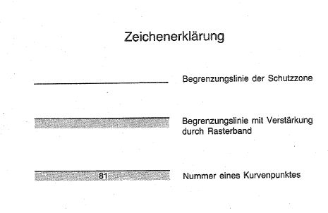
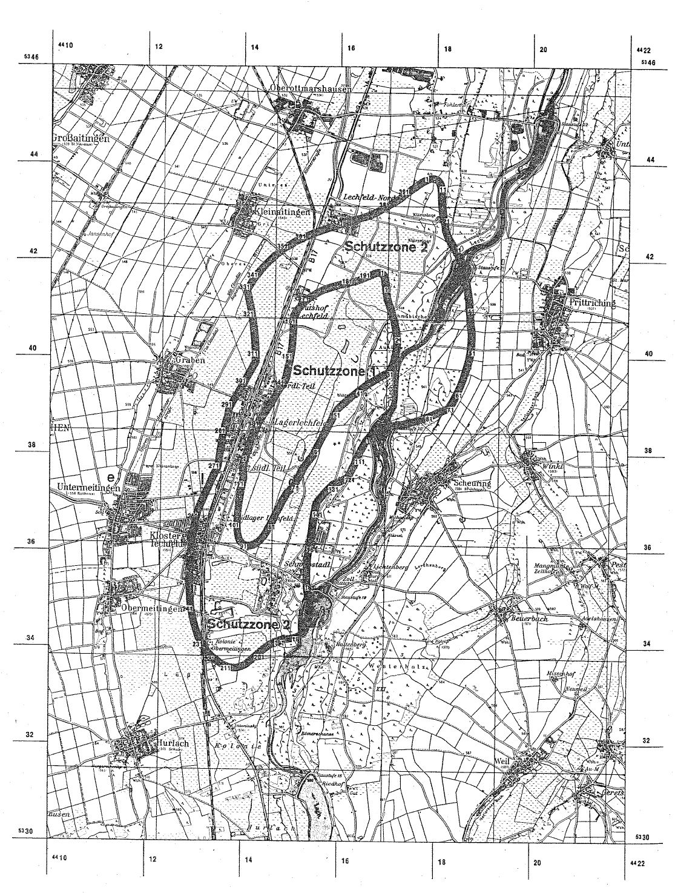

# Verordnung über die Festsetzung des Lärmschutzbereichs für den militärischen Flugplatz Lechfeld (FluLärmLechfV)

Ausfertigungsdatum
:   1976-11-23

Fundstelle
:   BGBl I: 1976, 3237

Zuletzt geändert durch
:   Art. 1 V v. 6.3.1992 I 479

## Eingangsformel

Auf Grund des § 4 Abs. 1 des Gesetzes zum Schutz gegen Fluglärm vom
30\. März 1971 (Bundesgesetzbl. I S. 282), geändert durch Artikel 70
des Einführungsgesetzes zum Strafgesetzbuch vom 2. März 1974
(Bundesgesetzbl. I S. 469), wird im Einvernehmen mit dem
Bundesminister der Verteidigung und mit Zustimmung des Bundesrates
verordnet:

## § 1

Zum Schutz der Allgemeinheit vor Gefahren, erheblichen Nachteilen und
erheblichen Belästigungen durch Fluglärm in der Umgebung des
militärischen Flugplatzes Lechfeld wird der in § 2 bestimmte
Lärmschutzbereich festgesetzt.

## § 2

Der Lärmschutzbereich mit seinen zwei Schutzzonen wird nach Anlage 1
bestimmt durch die interpolierten Verbindungslinien zwischen den
Kurvenpunkten, soweit diese Linien außerhalb des Flugplatzgeländes
verlaufen.

## § 3

(1) Liegt eine bauliche Anlage zu einem Teil im Lärmschutzbereich, so
gilt sie als ganz im Lärmschutzbereich gelegen. Liegt eine bauliche
Anlage zu einem Teil in der Schutzzone 1, so gilt sie als ganz in
dieser Schutzzone gelegen.

(2) Auf die Errichtung einer baulichen Anlage ist Absatz 1
entsprechend anzuwenden.

## § 4

(1) Der nach § 2 bestimmte Lärmschutzbereich ist in einer
topographischen Karte im Maßstab 1:50.000 und in Karten im Maßstab
1:5.000 dargestellt. Die topographische Karte ist in verkleinerter
Form als Anlage 2 dieser Verordnung beigefügt. Die topographische
Karte und die Karten im Maßstab 1:5.000 sind beim Vermessungsamt
Augsburg, Holbeinstraße 10, 8900 Augsburg, zu jedermanns Einsicht
archivmäßig gesichert niedergelegt.

(2) Die Karten im Maßstab 1:5.000 über den Lärmschutzbereich nach der
bis zum 22. Januar 1983 und nach der bis zum 19. März 1992 geltenden
Fassung dieser Verordnung bleiben an gleicher Stelle zu jedermanns
Einsicht archivmäßig gesichert niedergelegt.

## § 5

Diese Verordnung tritt am Tag nach der Verkündung in Kraft.

## Schlußformel

Der Bundesminister des Innern

## Anlage 1 (zu § 2 der Verordnung über die Festsetzung des Lärmschutzbereichs für den militärischen Flugplatz Lechfeld in der Fassung der Zweiten Änderungsverordnung vom 6. März 1992)

(Fundstelle des Originaltextes: BGBl. I 1992, 480 - 484)

*    *   **Lärmschutzbereich - Zweite Änderung -**

*    *

*    *
    *   Koordinatensystem:

    *   Gauß-Krüger:

    *   Y = Rechtswert

*    *
    *   X = Hochwert

*    *
    *   Interpolation:

    *   Polynom 3. Grades mit stetigem Tangentenübergang

*    *

*    *   Kurvenpunkte der Schutzzone 1 (Militärischer Flugplatz Lechfeld)

*    *

*    *   Nr.

    *   Y

    *   X

    *   Nr.

    *   Y

    *   X

    *   Nr.

    *   Y

    *   X

*    *

*    *   1

    *   4416828.8

    *   5341679.1

    *   51

    *   4415861.0

    *   5338883.8

    *   101

    *   4413974.2

    *   5336523.9

*    *   2

    *   4416843.9

    *   5341666.7

    *   52

    *   4415848.7

    *   5338860.7

    *   102

    *   4413974.8

    *   5336587.7

*    *   3

    *   4416853.9

    *   5341649.8

    *   53

    *   4415836.4

    *   5338837.6

    *   103

    *   4413977.3

    *   5336652.0

*    *   4

    *   4416862.5

    *   5341621.8

    *   54

    *   4415811.9

    *   5338791.3

    *   104

    *   4413981.6

    *   5336716.3

*    *   5

    *   4416867.1

    *   5341592.9

    *   55

    *   4415787.3

    *   5338745.0

    *   105

    *   4413989.5

    *   5336802.9

*    *   6

    *   4416871.9

    *   5341534.8

    *   56

    *   4415750.4

    *   5338675.6

    *   106

    *   4413999.3

    *   5336889.4

*    *   7

    *   4416874.7

    *   5341500.2

    *   57

    *   4415713.4

    *   5338606.3

    *   107

    *   4414010.4

    *   5336974.4

*    *   8

    *   4416883.2

    *   5341471.3

    *   58

    *   4415640.1

    *   5338467.2

    *   108

    *   4414022.6

    *   5337059.2

*    *   9

    *   4416885.4

    *   5341442.3

    *   59

    *   4415567.9

    *   5338327.6

    *   109

    *   4414035.6

    *   5337143.2

*    *   10

    *   4416889.8

    *   5341395.7

    *   60

    *   4415496.6

    *   5338187.6

    *   110

    *   4414049.4

    *   5337227.1

*    *
    *
    *
    *
    *
    *
    *
    *
    *

*    *   11

    *   4416895.4

    *   5341349.3

    *   61

    *   4415461.3

    *   5338117.4

    *   111

    *   4414065.0

    *   5337309.6

*    *   12

    *   4416909.1

    *   5341252.9

    *   62

    *   4415426.1

    *   5338047.2

    *   112

    *   4414081.2

    *   5337392.1

*    *   13

    *   4416930.9

    *   5341158.1

    *   63

    *   4415384.5

    *   5337978.9

    *   113

    *   4414098.2

    *   5337476.8

*    *   14

    *   4416965.2

    *   5341055.0

    *   64

    *   4415333.1

    *   5337917.6

    *   114

    *   4414102.4

    *   5337563.1

*    *   15

    *   4416998.5

    *   5340951.5

    *   65

    *   4415241.1

    *   5337787.5

    *   115

    *   4414097.7

    *   5337609.3

*    *   16

    *   4417030.0

    *   5340850.1

    *   66

    *   4415161.4

    *   5337651.5

    *   116

    *   4414093.6

    *   5337655.6

*    *   17

    *   4417059.3

    *   5340748.1

    *   67

    *   4415124.4

    *   5337582.2

    *   117

    *   4414093.0

    *   5337688.3

*    *   18

    *   4417083.8

    *   5340650.8

    *   68

    *   4415088.3

    *   5337512.3

    *   118

    *   4414094.9

    *   5337721.0

*    *   19

    *   4417104.0

    *   5340552.5

    *   69

    *   4415064.8

    *   5337465.5

    *   119

    *   4414099.0

    *   5337748.3

*    *   20

    *   4417117.0

    *   5340461.0

    *   70

    *   4415040.8

    *   5337418.9

    *   120

    *   4414107.9

    *   5337788.5

*    *
    *
    *
    *
    *
    *
    *
    *
    *

*    *   21

    *   4417123.6

    *   5340368.9

    *   71

    *   4415013.5

    *   5337374.0

    *   121

    *   4414118.6

    *   5337828.2

*    *   22

    *   4417123.8

    *   5340283.1

    *   72

    *   4414958.5

    *   5337311.8

    *   122

    *   4414141.0

    *   5337907.4

*    *   23

    *   4417117.7

    *   5340197.5

    *   73

    *   4414897.3

    *   5337255.6

    *   123

    *   4414163.1

    *   5337986.4

*    *   24

    *   4417106.3

    *   5340116.7

    *   74

    *   4414864.6

    *   5337213.9

    *   124

    *   4414185.1

    *   5338065.4

*    *   25

    *   4417089.2

    *   5340037.0

    *   75

    *   4414839.0

    *   5337167.8

    *   125

    *   4414208.2

    *   5338143.4

*    *   26

    *   4417067.1

    *   5339960.9

    *   76

    *   4414813.9

    *   5337121.3

    *   126

    *   4414233.7

    *   5338220.7

*    *   27

    *   4417039.7

    *   5339886.5

    *   77

    *   4414777.3

    *   5337051.8

    *   127

    *   4414261.5

    *   5338296.1

*    *   28

    *   4417018.7

    *   5339838.4

    *   78

    *   4414741.5

    *   5336981.8

    *   128

    *   4414292.3

    *   5338370.3

*    *   29

    *   4416995.4

    *   5339791.4

    *   79

    *   4414669.5

    *   5336842.2

    *   129

    *   4414326.4

    *   5338442.8

*    *   30

    *   4416982.9

    *   5339768.1

    *   80

    *   4414599.3

    *   5336701.6

    *   130

    *   4414355.6

    *   5338517.3

*    *
    *
    *
    *
    *
    *
    *
    *
    *

*    *   31

    *   4416966.5

    *   5339747.4

    *   81

    *   4414528.5

    *   5336561.4

    *   131

    *   4414369.1

    *   5338554.9

*    *   32

    *   4416945.0

    *   5339736.3

    *   82

    *   4414491.4

    *   5336492.0

    *   132

    *   4414383.8

    *   5338592.2

*    *   33

    *   4416923.7

    *   5339725.0

    *   83

    *   4414452.0

    *   5336423.8

    *   133

    *   4414405.8

    *   5338625.6

*    *   34

    *   4416881.2

    *   5339701.9

    *   84

    *   4414423.5

    *   5336378.9

    *   134

    *   4414427.6

    *   5338659.2

*    *   35

    *   4416797.0

    *   5339654.5

    *   85

    *   4414392.8

    *   5336335.5

    *   135

    *   4414470.7

    *   5338726.0

*    *   36

    *   4416716.3

    *   5339606.8

    *   86

    *   4414359.3

    *   5336294.1

    *   136

    *   4414513.6

    *   5338793.1

*    *   37

    *   4416636.7

    *   5339557.2

    *   87

    *   4414316.5

    *   5336250.4

    *   137

    *   4414598.3

    *   5338927.7

*    *   38

    *   4416560.4

    *   5339507.2

    *   88

    *   4414268.3

    *   5336212.9

    *   138

    *   4414682.1

    *   5339062.9

*    *   39

    *   4416485.4

    *   5339455.5

    *   89

    *   4414220.0

    *   5336186.6

    *   139

    *   4414765.0

    *   5339198.6

*    *   40

    *   4416413.3

    *   5339403.5

    *   90

    *   4414167.3

    *   5336170.8

    *   140

    *   4414847.8

    *   5339334.3

*    *
    *
    *
    *
    *
    *
    *
    *
    *

*    *   41

    *   4416342.3

    *   5339349.9

    *   91

    *   4414121.3

    *   5336170.0

    *   141

    *   4414889.0

    *   5339402.2

*    *   42

    *   4416273.9

    *   5339296.0

    *   92

    *   4414080.2

    *   5336183.6

    *   142

    *   4414930.3

    *   5339470.1

*    *   43

    *   4416206.5

    *   5339240.8

    *   93

    *   4414061.0

    *   5336196.7

    *   143

    *   4414951.0

    *   5339505.2

*    *   44

    *   4416141.3

    *   5339185.3

    *   94

    *   4414044.6

    *   5336213.1

    *   144

    *   4414966.1

    *   5339542.9

*    *   45

    *   4416077.2

    *   5339128.6

    *   95

    *   4414034.4

    *   5336226.4

    *   145

    *   4414976.1

    *   5339582.2

*    *   46

    *   4416014.8

    *   5339071.7

    *   96

    *   4414025.5

    *   5336240.5

    *   146

    *   4414985.6

    *   5339621.7

*    *   47

    *   4415953.3

    *   5339013.8

    *   97

    *   4414011.1

    *   5336270.6

    *   147

    *   4414995.0

    *   5339662.3

*    *   48

    *   4415920.5

    *   5338981.6

    *   98

    *   4413992.0

    *   5336334.3

    *   148

    *   4415004.0

    *   5339702.9

*    *   49

    *   4415896.0

    *   5338943.4

    *   99

    *   4413981.6

    *   5336396.9

    *   149

    *   4415021.3

    *   5339784.8

*    *   50

    *   4415874.0

    *   5338903.4

    *   100

    *   4413976.2

    *   5336460.1

    *   150

    *   4415037.2

    *   5339867.2

*    *

*    *

*    *   Noch Schutzzone 1 (Militärischer Flugplatz Lechfeld)

*    *

*    *   151

    *   4415051.9

    *   5339950.1

    *   171

    *   4415378.6

    *   5341138.2

    *   191

    *   4416635.6

    *   5341618.6

*    *   152

    *   4415065.1

    *   5340034.5

    *   172

    *   4415446.4

    *   5341189.6

    *   192

    *   4416657.4

    *   5341628.7

*    *   153

    *   4415076.8

    *   5340119.0

    *   173

    *   4415522.8

    *   5341239.3

    *   193

    *   4416678.9

    *   5341639.4

*    *   154

    *   4415087.0

    *   5340205.2

    *   174

    *   4415602.5

    *   5341283.3

    *   194

    *   4416700.3

    *   5341650.1

*    *   155

    *   4415095.5

    *   5340291.6

    *   175

    *   4415693.2

    *   5341325.3

    *   195

    *   4416722.0

    *   5341660.5

*    *   156

    *   4415102.3

    *   5340379.7

    *   176

    *   4415786.6

    *   5341360.9

    *   196

    *   4416747.5

    *   5341671.6

*    *   157

    *   4415107.2

    *   5340468.1

    *   177

    *   4415890.6

    *   5341394.3

    *   197

    *   4416773.5

    *   5341680.5

*    *   158

    *   4415110.3

    *   5340558.5

    *   178

    *   4415995.7

    *   5341424.2

    *   198

    *   4416800.2

    *   5341685.0

*    *   159

    *   4415111.4

    *   5340648.9

    *   179

    *   4416097.3

    *   5341450.3

    *   199

    *   4416828.8

    *   5341679.1

*    *   160

    *   4415111.4

    *   5340694.3

    *   180

    *   4416198.8

    *   5341476.4

    *
    *
    *

*    *
    *
    *
    *
    *
    *
    *
    *
    *

*    *   161

    *   4415111.0

    *   5340739.6

    *   181

    *   4416263.0

    *   5341490.2

    *
    *
    *

*    *   162

    *   4415110.4

    *   5340769.9

    *   182

    *   4416327.0

    *   5341505.0

    *
    *
    *

*    *   163

    *   4415109.6

    *   5340800.2

    *   183

    *   4416381.3

    *   5341520.4

    *
    *
    *

*    *   164

    *   4415114.7

    *   5340830.2

    *   184

    *   4416434.5

    *   5341538.9

    *
    *
    *

*    *   165

    *   4415124.9

    *   5340847.4

    *   185

    *   4416482.1

    *   5341557.3

    *
    *
    *

*    *   166

    *   4415135.4

    *   5340864.3

    *   186

    *   4416529.4

    *   5341576.1

    *
    *
    *

*    *   167

    *   4415157.3

    *   5340897.6

    *   187

    *   4416554.8

    *   5341586.7

    *
    *
    *

*    *   168

    *   4415204.6

    *   5340961.9

    *   188

    *   4416580.0

    *   5341597.6

    *
    *
    *

*    *   169

    *   4415257.5

    *   5341023.9

    *   189

    *   4416605.0

    *   5341609.0

    *
    *
    *

*    *   170

    *   4415314.7

    *   5341082.0

    *   190

    *   4416624.4

    *   5341613.2

    *
    *
    *

*    *

*    *

*    *   Kurvenpunkte der Schutzzone 2 (Militärischer Flugplatz Lechfeld)

*    *

*    *   1

    *   4417835.0

    *   5343619.2

    *   51

    *   4418645.6

    *   5340174.2

    *   101

    *   4416554.4

    *   5338375.2

*    *   2

    *   4417871.7

    *   5343631.3

    *   52

    *   4418635.9

    *   5340092.5

    *   102

    *   4416524.4

    *   5338336.2

*    *   3

    *   4417909.0

    *   5343636.3

    *   53

    *   4418621.9

    *   5340011.4

    *   103

    *   4416493.4

    *   5338293.2

*    *   4

    *   4417928.5

    *   5343634.5

    *   54

    *   4418602.9

    *   5339933.7

    *   104

    *   4416463.7

    *   5338248.0

*    *   5

    *   4417947.4

    *   5343628.9

    *   55

    *   4418581.9

    *   5339856.4

    *   105

    *   4416439.2

    *   5338201.6

*    *   6

    *   4417956.7

    *   5343623.9

    *   56

    *   4418535.5

    *   5339704.4

    *   106

    *   4416415.4

    *   5338154.9

*    *   7

    *   4417965.4

    *   5343617.9

    *   57

    *   4418482.7

    *   5339555.4

    *   107

    *   4416392.0

    *   5338107.9

*    *   8

    *   4417980.1

    *   5343602.8

    *   58

    *   4418453.9

    *   5339482.0

    *   108

    *   4416369.1

    *   5338060.8

*    *   9

    *   4418000.3

    *   5343566.1

    *   59

    *   4418423.5

    *   5339409.3

    *   109

    *   4416346.6

    *   5338013.4

*    *   10

    *   4418011.9

    *   5343526.6

    *   60

    *   4418402.5

    *   5339361.3

    *   110

    *   4416324.3

    *   5337966.0

*    *
    *
    *
    *
    *
    *
    *
    *
    *

*    *   11

    *   4418019.0

    *   5343486.1

    *   61

    *   4418380.8

    *   5339313.6

    *   111

    *   4416310.1

    *   5337930.9

*    *   12

    *   4418023.9

    *   5343437.6

    *   62

    *   4418358.4

    *   5339266.2

    *   112

    *   4416284.8

    *   5337876.8

*    *   13

    *   4418026.7

    *   5343388.9

    *   63

    *   4418341.1

    *   5339230.8

    *   113

    *   4416259.6

    *   5337822.6

*    *   14

    *   4418028.6

    *   5343340.2

    *   64

    *   4418323.5

    *   5339195.7

    *   114

    *   4416237.2

    *   5337775.2

*    *   15

    *   4418030.8

    *   5343267.1

    *   65

    *   4418305.5

    *   5339160.7

    *   115

    *   4416214.4

    *   5337728.0

*    *   16

    *   4418033.3

    *   5343194.0

    *   66

    *   4418287.1

    *   5339125.9

    *   116

    *   4416191.2

    *   5337681.0

*    *   17

    *   4418043.6

    *   5343048.2

    *   67

    *   4418273.8

    *   5339101.1

    *   117

    *   4416172.8

    *   5337644.4

*    *   18

    *   4418052.9

    *   5342975.5

    *   68

    *   4418260.3

    *   5339076.5

    *   118

    *   4416154.2

    *   5337608.1

*    *   19

    *   4418065.2

    *   5342903.3

    *   69

    *   4418246.6

    *   5339051.9

    *   119

    *   4416144.4

    *   5337589.3

*    *   20

    *   4418079.1

    *   5342836.4

    *   70

    *   4418239.1

    *   5339038.8

    *   120

    *   4416130.3

    *   5337573.5

*    *
    *
    *
    *
    *
    *
    *
    *
    *

*    *   21

    *   4418094.5

    *   5342769.9

    *   71

    *   4418229.9

    *   5339026.7

    *   121

    *   4416111.9

    *   5337563.4

*    *   22

    *   4418102.4

    *   5342731.2

    *   72

    *   4418216.8

    *   5339020.9

    *   122

    *   4416093.7

    *   5337553.1

*    *   23

    *   4418107.4

    *   5342681.2

    *   73

    *   4418203.7

    *   5339015.2

    *   123

    *   4416061.0

    *   5337534.4

*    *   24

    *   4418113.4

    *   5342631.2

    *   74

    *   4418177.4

    *   5339003.8

    *   124

    *   4416028.7

    *   5337515.1

*    *   25

    *   4418121.9

    *   5342593.4

    *   75

    *   4418145.5

    *   5338989.9

    *   125

    *   4415996.8

    *   5337495.3

*    *   26

    *   4418138.5

    *   5342544.0

    *   76

    *   4418113.5

    *   5338975.9

    *   126

    *   4415950.4

    *   5337484.4

*    *   27

    *   4418158.0

    *   5342495.8

    *   77

    *   4418081.7

    *   5338961.8

    *   127

    *   4415905.7

    *   5337468.0

*    *   28

    *   4418180.3

    *   5342448.7

    *   78

    *   4418033.8

    *   5338941.0

    *   128

    *   4415865.7

    *   5337449.0

*    *   29

    *   4418217.9

    *   5342379.0

    *   79

    *   4417985.8

    *   5338920.4

    *   129

    *   4415831.6

    *   5337420.8

*    *   30

    *   4418257.8

    *   5342310.5

    *   80

    *   4417888.0

    *   5338879.0

    *   130

    *   4415800.6

    *   5337389.6

*    *
    *
    *
    *
    *
    *
    *
    *
    *

*    *   31

    *   4418336.9

    *   5342172.9

    *   81

    *   4417789.7

    *   5338839.1

    *   131

    *   4415770.0

    *   5337358.1

*    *   32

    *   4418406.2

    *   5342031.9

    *   82

    *   4417684.0

    *   5338800.3

    *   132

    *   4415713.4

    *   5337298.2

*    *   33

    *   4418462.5

    *   5341886.5

    *   83

    *   4417577.0

    *   5338765.7

    *   133

    *   4415657.9

    *   5337237.1

*    *   34

    *   4418507.2

    *   5341737.1

    *   84

    *   4417457.7

    *   5338732.5

    *   134

    *   4415604.5

    *   5337175.7

*    *   35

    *   4418541.2

    *   5341584.1

    *   85

    *   4417336.9

    *   5338705.1

    *   135

    *   4415552.7

    *   5337112.9

*    *   36

    *   4418568.0

    *   5341428.7

    *   86

    *   4417205.5

    *   5338680.6

    *   136

    *   4415508.0

    *   5337047.6

*    *   37

    *   4418582.6

    *   5341334.8

    *   87

    *   4417074.2

    *   5338655.3

    *   137

    *   4415486.3

    *   5337014.1

*    *   38

    *   4418597.3

    *   5341240.9

    *   88

    *   4416953.8

    *   5338627.8

    *   138

    *   4415474.2

    *   5336976.0

*    *   39

    *   4418611.0

    *   5341150.2

    *   89

    *   4416894.2

    *   5338611.7

    *   139

    *   4415464.9

    *   5336936.7

*    *   40

    *   4418614.7

    *   5341058.6

    *   90

    *   4416834.9

    *   5338594.5

    *   140

    *   4415456.1

    *   5336897.3

*    *

*    *   41

    *   4418620.8

    *   5340968.5

    *   91

    *   4416786.5

    *   5338579.1

    *   141

    *   4415440.3

    *   5336818.1

*    *   42

    *   4418627.8

    *   5340878.5

    *   92

    *   4416738.5

    *   5338562.5

    *   142

    *   4415426.4

    *   5336737.4

*    *   43

    *   4418634.0

    *   5340789.1

    *   93

    *   4416710.0

    *   5338551.8

    *   143

    *   4415414.3

    *   5336656.4

*    *   44

    *   4418638.1

    *   5340699.7

    *   94

    *   4416695.8

    *   5338546.2

    *   144

    *   4415404.0

    *   5336574.0

*    *   45

    *   4418646.4

    *   5340631.2

    *   95

    *   4416681.7

    *   5338540.6

    *   145

    *   4415395.6

    *   5336491.3

*    *   46

    *   4418659.4

    *   5340562.2

    *   96

    *   4416669.6

    *   5338530.0

    *   146

    *   4415387.8

    *   5336408.3

*    *   47

    *   4418664.7

    *   5340509.1

    *   97

    *   4416661.4

    *   5338516.0

    *   147

    *   4415378.4

    *   5336325.5

*    *   48

    *   4418663.6

    *   5340431.6

    *   98

    *   4416648.4

    *   5338497.3

    *   148

    *   4415370.5

    *   5336272.6

*    *   49

    *   4418659.6

    *   5340341.6

    *   99

    *   4416618.4

    *   5338454.2

    *   149

    *   4415361.4

    *   5336220.1

*    *   50

    *   4418653.6

    *   5340257.8

    *   100

    *   4416587.4

    *   5338412.2

    *   150

    *   4415344.4

    *   5336167.5

*    *

*    *

*    *   Noch Schutzzone 2 (Militärischer Flugplatz Lechfeld)

*    *

*    *   151

    *   4415330.1

    *   5336087.1

    *   201

    *   4414255.2

    *   5333867.4

    *   251

    *   4412999.6

    *   5335803.3

*    *   152

    *   4415317.5

    *   5336006.3

    *   202

    *   4414199.3

    *   5333817.1

    *   252

    *   4413008.0

    *   5335888.5

*    *   153

    *   4415306.3

    *   5335924.3

    *   203

    *   4414143.1

    *   5333767.2

    *   253

    *   4413015.6

    *   5335975.4

*    *   154

    *   4415297.0

    *   5335842.1

    *   204

    *   4414084.9

    *   5333721.3

    *   254

    *   4413017.2

    *   5336062.9

*    *   155

    *   4415289.3

    *   5335758.2

    *   205

    *   4414022.4

    *   5333681.5

    *   255

    *   4413024.1

    *   5336148.6

*    *   156

    *   4415283.9

    *   5335674.3

    *   206

    *   4413987.8

    *   5333664.8

    *   256

    *   4413030.6

    *   5336234.6

*    *   157

    *   4415281.1

    *   5335587.7

    *   207

    *   4413952.0

    *   5333651.7

    *   257

    *   4413041.9

    *   5336317.2

*    *   158

    *   4415282.1

    *   5335501.2

    *   208

    *   4413915.1

    *   5333642.8

    *   258

    *   4413058.6

    *   5336398.9

*    *   159

    *   4415284.9

    *   5335413.4

    *   209

    *   4413876.8

    *   5333638.1

    *   259

    *   4413074.5

    *   5336480.0

*    *   160

    *   4415285.3

    *   5335325.7

    *   210

    *   4413834.6

    *   5333638.2

    *   260

    *   4413090.4

    *   5336561.1

*    *
    *
    *
    *
    *
    *
    *
    *
    *

*    *   161

    *   4415289.2

    *   5335235.9

    *   211

    *   4413792.8

    *   5333643.7

    *   261

    *   4413107.5

    *   5336641.1

*    *   162

    *   4415292.5

    *   5335191.1

    *   212

    *   4413751.8

    *   5333653.8

    *   262

    *   4413128.0

    *   5336720.4

*    *   163

    *   4415296.6

    *   5335146.4

    *   213

    *   4413712.0

    *   5333667.6

    *   263

    *   4413151.8

    *   5336797.0

*    *   164

    *   4415302.8

    *   5335094.2

    *   214

    *   4413677.6

    *   5333682.5

    *   264

    *   4413179.0

    *   5336872.6

*    *   165

    *   4415310.1

    *   5335042.1

    *   215

    *   4413644.3

    *   5333699.3

    *   265

    *   4413239.8

    *   5337019.6

*    *   166

    *   4415318.7

    *   5334990.3

    *   216

    *   4413611.8

    *   5333717.8

    *   266

    *   4413304.7

    *   5337164.4

*    *   167

    *   4415334.4

    *   5334884.2

    *   217

    *   4413580.1

    *   5333737.8

    *   267

    *   4413369.9

    *   5337309.2

*    *   168

    *   4415341.4

    *   5334782.2

    *   218

    *   4413549.9

    *   5333758.6

    *   268

    *   4413434.7

    *   5337454.1

*    *   169

    *   4415337.4

    *   5334683.2

    *   219

    *   4413520.4

    *   5333780.4

    *   269

    *   4413471.3

    *   5337532.5

*    *   170

    *   4415321.4

    *   5334579.2

    *   220

    *   4413491.8

    *   5333803.4

    *   270

    *   4413507.9

    *   5337610.8

*    *
    *
    *
    *
    *
    *
    *
    *
    *

*    *   171

    *   4415309.4

    *   5334526.2

    *   221

    *   4413464.0

    *   5333827.2

    *   271

    *   4413537.1

    *   5337677.1

*    *   172

    *   4415295.4

    *   5334481.2

    *   222

    *   4413436.5

    *   5333851.8

    *   272

    *   4413562.1

    *   5337745.1

*    *   173

    *   4415274.4

    *   5334426.2

    *   223

    *   4413409.9

    *   5333877.2

    *   273

    *   4413568.8

    *   5337786.5

*    *   174

    *   4415247.3

    *   5334378.2

    *   224

    *   4413383.9

    *   5333903.2

    *   274

    *   4413575.2

    *   5337827.9

*    *   175

    *   4415236.0

    *   5334359.4

    *   225

    *   4413358.5

    *   5333929.9

    *   275

    *   4413587.5

    *   5337910.8

*    *   176

    *   4415223.0

    *   5334341.8

    *   226

    *   4413333.0

    *   5333957.9

    *   276

    *   4413599.7

    *   5337993.9

*    *   177

    *   4415191.9

    *   5334311.0

    *   227

    *   4413308.2

    *   5333986.6

    *   277

    *   4413611.7

    *   5338077.0

*    *   178

    *   4415161.2

    *   5334289.5

    *   228

    *   4413287.3

    *   5334018.1

    *   278

    *   4413623.5

    *   5338160.4

*    *   179

    *   4415127.7

    *   5334272.7

    *   229

    *   4413267.7

    *   5334050.6

    *   279

    *   4413636.4

    *   5338264.4

*    *   180

    *   4415092.6

    *   5334259.9

    *   230

    *   4413247.9

    *   5334085.3

    *   280

    *   4413646.7

    *   5338326.3

*    *
    *
    *
    *
    *
    *
    *
    *
    *

*    *   181

    *   4415056.3

    *   5334250.7

    *   231

    *   4413229.1

    *   5334120.6

    *   281

    *   4413663.4

    *   5338407.8

*    *   182

    *   4415015.8

    *   5334244.0

    *   232

    *   4413211.1

    *   5334156.3

    *   282

    *   4413681.7

    *   5338487.4

*    *   183

    *   4414974.8

    *   5334240.1

    *   233

    *   4413194.0

    *   5334192.4

    *   283

    *   4413702.0

    *   5338566.5

*    *   184

    *   4414933.8

    *   5334238.2

    *   234

    *   4413173.9

    *   5334237.4

    *   284

    *   4413723.9

    *   5338644.3

*    *   185

    *   4414892.7

    *   5334237.9

    *   235

    *   4413155.1

    *   5334283.0

    *   285

    *   4413747.7

    *   5338721.5

*    *   186

    *   4414854.3

    *   5334233.7

    *   236

    *   4413131.7

    *   5334345.5

    *   286

    *   4413769.5

    *   5338801.3

*    *   187

    *   4414818.5

    *   5334221.0

    *   237

    *   4413110.3

    *   5334408.6

    *   287

    *   4413775.3

    *   5338842.2

*    *   188

    *   4414782.6

    *   5334208.2

    *   238

    *   4413088.5

    *   5334480.9

    *   288

    *   4413780.3

    *   5338883.3

*    *   189

    *   4414747.0

    *   5334194.7

    *   239

    *   4413069.1

    *   5334553.9

    *   289

    *   4413782.6

    *   5338904.2

*    *   190

    *   4414712.7

    *   5334180.7

    *   240

    *   4413037.5

    *   5334701.0

    *   290

    *   4413784.7

    *   5338925.0

*    *
    *
    *
    *
    *
    *
    *
    *
    *

*    *   191

    *   4414678.8

    *   5334165.6

    *   241

    *   4413013.6

    *   5334849.6

    *   291

    *   4413794.2

    *   5338942.6

*    *   192

    *   4414645.4

    *   5334149.6

    *   242

    *   4412996.7

    *   5334999.6

    *   292

    *   4413804.9

    *   5338959.3

*    *   193

    *   4414612.5

    *   5334132.5

    *   243

    *   4412990.0

    *   5335091.9

    *   293

    *   4413826.4

    *   5338993.1

*    *   194

    *   4414580.3

    *   5334114.6

    *   244

    *   4412985.8

    *   5335184.3

    *   294

    *   4413847.6

    *   5339026.9

*    *   195

    *   4414548.6

    *   5334095.6

    *   245

    *   4412981.7

    *   5335280.5

    *   295

    *   4413868.6

    *   5339060.6

*    *   196

    *   4414517.6

    *   5334075.7

    *   246

    *   4412979.6

    *   5335366.5

    *   296

    *   4413889.4

    *   5339094.4

*    *   197

    *   4414487.1

    *   5334054.9

    *   247

    *   4412979.3

    *   5335455.5

    *   297

    *   4413910.0

    *   5339128.3

*    *   198

    *   4414427.2

    *   5334010.9

    *   248

    *   4412981.5

    *   5335544.5

    *   298

    *   4413930.6

    *   5339162.3

*    *   199

    *   4414369.0

    *   5333964.9

    *   249

    *   4412986.0

    *   5335631.3

    *   299

    *   4413971.2

    *   5339230.4

*    *   200

    *   4414311.5

    *   5333916.9

    *   250

    *   4412992.1

    *   5335717.9

    *   300

    *   4414011.3

    *   5339298.8

*    *

*    *

*    *   Noch Schutzzone 2 (Militärischer Flugplatz Lechfeld)

*    *

*    *   301

    *   4414090.2

    *   5339436.3

    *   341

    *   4414312.5

    *   5341619.7

    *   381

    *   4417033.4

    *   5343080.2

*    *   302

    *   4414167.5

    *   5339574.7

    *   342

    *   4414361.2

    *   5341685.0

    *   382

    *   4417113.3

    *   5343127.3

*    *   303

    *   4414242.3

    *   5339711.4

    *   343

    *   4414412.0

    *   5341748.7

    *   383

    *   4417192.5

    *   5343175.6

*    *   304

    *   4414282.4

    *   5339781.3

    *   344

    *   4414466.0

    *   5341811.8

    *   384

    *   4417230.8

    *   5343199.9

*    *   305

    *   4414302.0

    *   5339816.5

    *   345

    *   4414522.1

    *   5341872.9

    *   385

    *   4417269.0

    *   5343224.5

*    *   306

    *   4414321.2

    *   5339851.9

    *   346

    *   4414581.9

    *   5341933.5

    *   386

    *   4417294.4

    *   5343241.0

*    *   307

    *   4414336.1

    *   5339893.0

    *   347

    *   4414643.8

    *   5341991.9

    *   387

    *   4417319.6

    *   5343257.7

*    *   308

    *   4414336.8

    *   5339936.7

    *   348

    *   4414709.8

    *   5342049.6

    *   388

    *   4417344.7

    *   5343274.6

*    *   309

    *   4414336.8

    *   5339979.8

    *   349

    *   4414777.8

    *   5342105.2

    *   389

    *   4417368.2

    *   5343307.2

*    *   310

    *   4414336.3

    *   5340023.0

    *   350

    *   4414850.4

    *   5342160.2

    *   390

    *   4417402.6

    *   5343330.9

*    *
    *
    *
    *
    *
    *
    *
    *
    *

*    *   311

    *   4414335.4

    *   5340068.5

    *   351

    *   4414925.0

    *   5342212.6

    *   391

    *   4417436.9

    *   5343354.9

*    *   312

    *   4414334.0

    *   5340114.1

    *   352

    *   4415005.2

    *   5342264.3

    *   392

    *   4417486.5

    *   5343390.4

*    *   313

    *   4414330.2

    *   5340205.2

    *   353

    *   4415087.4

    *   5342313.0

    *   393

    *   4417535.7

    *   5343426.5

*    *   314

    *   4414324.7

    *   5340298.0

    *   354

    *   4415132.5

    *   5342338.1

    *   394

    *   4417578.0

    *   5343457.6

*    *   315

    *   4414317.6

    *   5340390.8

    *   355

    *   4415162.0

    *   5342348.3

    *   395

    *   4417634.3

    *   5343498.2

*    *   316

    *   4414308.5

    *   5340485.4

    *   356

    *   4415176.3

    *   5342355.0

    *   396

    *   4417684.4

    *   5343533.0

*    *   317

    *   4414298.1

    *   5340580.0

    *   357

    *   4415198.1

    *   5342366.3

    *   397

    *   4417735.4

    *   5343566.5

*    *   318

    *   4414286.0

    *   5340673.1

    *   358

    *   4415220.1

    *   5342377.4

    *   398

    *   4417784.1

    *   5343595.0

*    *   319

    *   4414272.3

    *   5340766.1

    *   359

    *   4415242.1

    *   5342388.3

    *   399

    *   4417835.0

    *   5343619.2

*    *   320

    *   4414257.1

    *   5340860.6

    *   360

    *   4415264.3

    *   5342399.0

    *
    *
    *

*    *
    *
    *
    *
    *
    *
    *
    *
    *

*    *   321

    *   4414240.5

    *   5340955.0

    *   361

    *   4415294.8

    *   5342413.4

    *
    *
    *

*    *   322

    *   4414222.5

    *   5341050.8

    *   362

    *   4415325.4

    *   5342427.5

    *
    *
    *

*    *   323

    *   4414203.0

    *   5341146.4

    *   363

    *   4415356.3

    *   5342441.2

    *
    *
    *

*    *   324

    *   4414192.8

    *   5341194.9

    *   364

    *   4415402.8

    *   5342461.2

    *
    *
    *

*    *   325

    *   4414182.5

    *   5341243.4

    *   365

    *   4415449.6

    *   5342480.6

    *
    *
    *

*    *   326

    *   4414177.2

    *   5341267.6

    *   366

    *   4415547.9

    *   5342519.2

    *
    *
    *

*    *   327

    *   4414171.7

    *   5341291.8

    *   367

    *   4415647.0

    *   5342555.8

    *
    *
    *

*    *   328

    *   4414166.1

    *   5341316.0

    *   368

    *   4415749.8

    *   5342591.9

    *
    *
    *

*    *   329

    *   4414160.5

    *   5341340.1

    *   369

    *   4415853.0

    *   5342626.9

    *
    *
    *

*    *   330

    *   4414155.2

    *   5341362.3

    *   370

    *   4415958.6

    *   5342660.9

    *
    *
    *

*    *
    *
    *
    *
    *
    *
    *
    *
    *

*    *   331

    *   4414156.0

    *   5341372.6

    *   371

    *   4416064.4

    *   5342694.5

    *
    *
    *

*    *   332

    *   4414161.0

    *   5341381.5

    *   372

    *   4416173.0

    *   5342727.0

    *
    *
    *

*    *   333

    *   4414171.2

    *   5341399.5

    *   373

    *   4416281.8

    *   5342759.2

    *
    *
    *

*    *   334

    *   4414181.5

    *   5341417.5

    *   374

    *   4416390.1

    *   5342791.8

    *
    *
    *

*    *   335

    *   4414191.6

    *   5341434.8

    *   375

    *   4416498.4

    *   5342824.4

    *
    *
    *

*    *   336

    *   4414201.8

    *   5341452.0

    *   376

    *   4416600.3

    *   5342858.0

    *
    *
    *

*    *   337

    *   4414212.2

    *   5341469.1

    *   377

    *   4416700.1

    *   5342897.4

    *
    *
    *

*    *   338

    *   4414222.8

    *   5341486.1

    *   378

    *   4416787.7

    *   5342938.9

    *
    *
    *

*    *   339

    *   4414244.3

    *   5341520.1

    *   379

    *   4416872.6

    *   5342985.7

    *
    *
    *

*    *   340

    *   4414266.5

    *   5341553.6

    *   380

    *   4416953.1

    *   5343032.8

    *
    *
    *

## Anlage 2 (zu § 4 Abs. 1 der Verordnung über die Festsetzung des Lärmschutzbereichs für den militärischen Flugplatz Lechfeld in der Fassung der Zweiten Änderungsverordnung vom 6. März 1992)

   (Fundstelle: BGBl. I 1992, 485 - 486)

