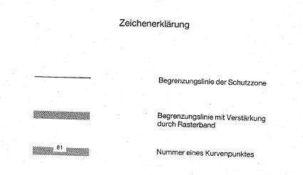
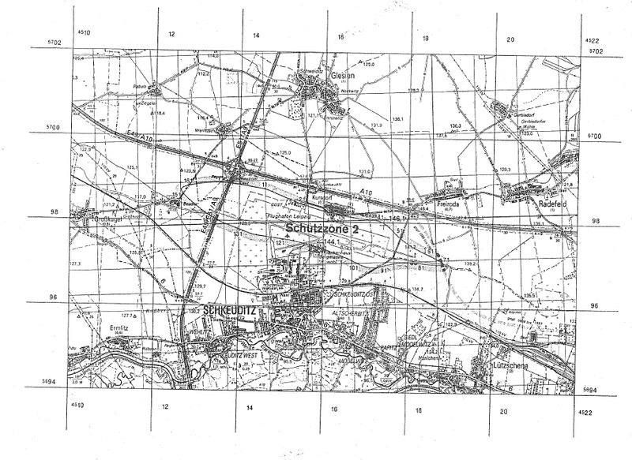

# Verordnung über die Festsetzung des Lärmschutzbereichs für den Verkehrsflughafen Leipzig/Halle (FluLärmLeip/HaV)

Ausfertigungsdatum
:   1996-03-28

Fundstelle
:   BGBl I: 1996, 575

## Eingangsformel

Auf Grund des § 4 Abs. 1 des Gesetzes zum Schutz gegen Fluglärm vom
30\. März 1971 (BGBl. I S. 282), der gemäß Artikel 3 Abs. 1 der
Verordnung vom 26. November 1986 (BGBl. I S. 2089) geändert worden
ist, verordnet das Bundesministerium für Umwelt, Naturschutz und
Reaktorsicherheit im Einvernehmen mit dem Bundesministerium für
Verkehr:

## § 1

Zum Schutz der Allgemeinheit vor Gefahren, erheblichen Nachteilen und
erheblichen Belästigungen durch Fluglärm in der Umgebung des
Verkehrsflughafens Leipzig/Halle wird der in § 2 bestimmte
Lärmschutzbereich festgesetzt.

## § 2

Der Lärmschutzbereich wird nach Anlage 1 bestimmt durch die
interpolierten Verbindungslinien zwischen den Kurvenpunkten, soweit
diese Linien außerhalb des Flugplatzgeländes verlaufen.

## § 3

(1) Liegt eine bauliche Anlage zu einem Teil im Lärmschutzbereich, so
gilt sie als ganz im Lärmschutzbereich gelegen.

(2) Auf die Errichtung einer baulichen Anlage ist Absatz 1
entsprechend anzuwenden.

## § 4

Der nach § 2 bestimmte Lärmschutzbereich ist in einer topographischen
Karte im Maßstab 1:50.000 und in Karten im Maßstab 1:5.000
dargestellt. Die topographische Karte ist dieser Verordnung als Anlage
2 beigefügt. Die topographische Karte und die Karten im Maßstab
1:5.000 sind bei dem Regierungspräsidium Leipzig, Braustraße 2, 04107
Leipzig, zu jedermanns Einsicht archivmäßig gesichert niedergelegt.

## § 5

Diese Verordnung tritt am Tage nach der Verkündung in Kraft.

## Schlußformel

Der Bundesrat hat zugestimmt.

## Anlage 1 (zu § 2 der Verordnung über die Festsetzung des Lärmschutzbereichs für den Verkehrsflughafen Leipzig/Halle)

*    *   Lärmschutzbereich

*    *   Koordinatensystem

    *   Gauß - Krüger:

    *   Y = Rechtswert

*    *
    *
    *
    *
    *
    *   X = Hochwert

*    *   Interpolation:

    *   Polynom 3. Grades mit stetigem Tangentenübergang

*    *   Kurvenpunkte der Schutzzone 2 (Verkehrsflughafen Leipzig/Halle)

*    *
    *
    *
    *
    *
    *

*    *   Nr.

    *
    *   Y

    *
    *   X

    *

*    *   1

    *
    *   4513496.0

    *
    *   5698898.7

    *

*    *   2

    *
    *   4513596.0

    *
    *   5698893.0

    *

*    *   3

    *
    *   4513696.0

    *
    *   5698886.9

    *

*    *   4

    *
    *   4513796.1

    *
    *   5698879.1

    *

*    *   5

    *
    *   4513896.0

    *
    *   5698868.0

    *

*    *   6

    *
    *   4513994.3

    *
    *   5698858.2

    *

*    *   7

    *
    *   4514085.4

    *
    *   5698842.0

    *

*    *   8

    *
    *   4514168.9

    *
    *   5698827.3

    *

*    *   9

    *
    *   4514296.0

    *
    *   5698805.9

    *

*    *   10

    *
    *   4514391.9

    *
    *   5698791.7

    *

*    *   11

    *
    *   4514496.0

    *
    *   5698775.1

    *

*    *   12

    *
    *   4514597.4

    *
    *   5698756.7

    *

*    *   13

    *
    *   4514696.0

    *
    *   5698726.5

    *

*    *   14

    *
    *   4514793.7

    *
    *   5698684.8

    *

*    *   15

    *
    *   4514891.0

    *
    *   5698642.0

    *

*    *   16

    *
    *   4514953.6

    *
    *   5698614.9

    *

*    *   17

    *
    *   4515024.7

    *
    *   5698586.0

    *

*    *   18

    *
    *   4515096.0

    *
    *   5698557.6

    *

*    *   19

    *
    *   4515196.0

    *
    *   5698518.7

    *

*    *   20

    *
    *   4515296.0

    *
    *   5698479.8

    *

*    *   21

    *
    *   4515382.2

    *
    *   5698442.0

    *

*    *   22

    *
    *   4515496.0

    *
    *   5698404.1

    *

*    *   23

    *
    *   4515596.0

    *
    *   5698371.8

    *

*    *   24

    *
    *   4515696.0

    *
    *   5698339.7

    *

*    *   25

    *
    *   4515795.5

    *
    *   5698307.2

    *

*    *   26

    *
    *   4515896.0

    *
    *   5698277.9

    *

*    *   27

    *
    *   4516038.9

    *
    *   5698242.0

    *

*    *   28

    *
    *   4516167.3

    *
    *   5698212.6

    *

*    *   29

    *
    *   4516296.0

    *
    *   5698185.0

    *

*    *   30

    *
    *   4516395.9

    *
    *   5698164.4

    *

*    *   31

    *
    *   4516496.0

    *
    *   5698144.8

    *

*    *   32

    *
    *   4516595.7

    *
    *   5698125.6

    *

*    *   33

    *
    *   4516696.0

    *
    *   5698109.4

    *

*    *   34

    *
    *   4516796.0

    *
    *   5698095.7

    *

*    *   35

    *
    *   4516846.0

    *
    *   5698088.9

    *

*    *   36

    *
    *   4516896.0

    *
    *   5698082.3

    *

*    *   37

    *
    *   4516944.2

    *
    *   5698076.3

    *

*    *   38

    *
    *   4517020.1

    *
    *   5698068.3

    *

*    *   39

    *
    *   4517096.0

    *
    *   5698060.9

    *

*    *   40

    *
    *   4517194.7

    *
    *   5698052.7

    *

*    *   41

    *
    *   4517246.0

    *
    *   5698045.8

    *

*    *   42

    *
    *   4517296.0

    *
    *   5698032.2

    *

*    *   43

    *
    *   4517376.4

    *
    *   5698002.1

    *

*    *   44

    *
    *   4517415.0

    *
    *   5697983.4

    *

*    *   45

    *
    *   4517452.2

    *
    *   5697961.9

    *

*    *   46

    *
    *   4517477.8

    *
    *   5697945.2

    *

*    *   47

    *
    *   4517504.5

    *
    *   5697924.8

    *

*    *   48

    *
    *   4517554.6

    *
    *   5697884.8

    *

*    *   49

    *
    *   4517602.3

    *
    *   5697842.0

    *

*    *   50

    *
    *   4517649.5

    *
    *   5697795.8

    *

*    *   51

    *
    *   4517695.9

    *
    *   5697748.8

    *

*    *   52

    *
    *   4517751.3

    *
    *   5697694.7

    *

*    *   53

    *
    *   4517808.0

    *
    *   5697642.0

    *

*    *   54

    *
    *   4517872.9

    *
    *   5697588.8

    *

*    *   55

    *
    *   4517983.7

    *
    *   5697515.5

    *

*    *   56

    *
    *   4518095.9

    *
    *   5697444.2

    *

*    *   57

    *
    *   4518194.9

    *
    *   5697389.8

    *

*    *   58

    *
    *   4518295.9

    *
    *   5697339.0

    *

*    *   59

    *
    *   4518380.2

    *
    *   5697299.2

    *

*    *   60

    *
    *   4518422.6

    *
    *   5697279.7

    *

*    *   61

    *
    *   4518443.9

    *
    *   5697270.1

    *

*    *   62

    *
    *   4518465.1

    *
    *   5697260.5

    *

*    *   63

    *
    *   4518482.9

    *
    *   5697252.5

    *

*    *   64

    *
    *   4518509.6

    *
    *   5697239.7

    *

*    *   65

    *
    *   4518536.3

    *
    *   5697227.0

    *

*    *   66

    *
    *   4518563.0

    *
    *   5697214.3

    *

*    *   67

    *
    *   4518589.7

    *
    *   5697201.5

    *

*    *   68

    *
    *   4518642.9

    *
    *   5697175.8

    *

*    *   69

    *
    *   4518695.9

    *
    *   5697149.4

    *

*    *   70

    *
    *   4518774.3

    *
    *   5697106.8

    *

*    *   71

    *
    *   4518812.4

    *
    *   5697081.4

    *

*    *   72

    *
    *   4518830.1

    *
    *   5697065.3

    *

*    *   73

    *
    *   4518836.9

    *
    *   5697054.6

    *

*    *   74

    *
    *   4518835.7

    *
    *   5697042.0

    *

*    *   75

    *
    *   4518820.1

    *
    *   5697032.7

    *

*    *   76

    *
    *   4518802.4

    *
    *   5697028.7

    *

*    *   77

    *
    *   4518766.8

    *
    *   5697025.7

    *

*    *   78

    *
    *   4518695.9

    *
    *   5697026.5

    *

*    *   79

    *
    *   4518599.0

    *
    *   5697032.4

    *

*    *   80

    *
    *   4518502.1

    *
    *   5697040.2

    *

*    *   81

    *
    *   4518399.0

    *
    *   5697049.4

    *

*    *   82

    *
    *   4518295.9

    *
    *   5697059.7

    *

*    *   83

    *
    *   4518146.7

    *
    *   5697070.9

    *

*    *   84

    *
    *   4518021.3

    *
    *   5697075.3

    *

*    *   85

    *
    *   4517895.9

    *
    *   5697071.2

    *

*    *   86

    *
    *   4517795.6

    *
    *   5697067.9

    *

*    *   87

    *
    *   4517695.9

    *
    *   5697055.5

    *

*    *   88

    *
    *   4517595.6

    *
    *   5697032.7

    *

*    *   89

    *
    *   4517495.9

    *
    *   5697007.4

    *

*    *   90

    *
    *   4517396.6

    *
    *   5696980.7

    *

*    *   91

    *
    *   4517346.5

    *
    *   5696969.0

    *

*    *   92

    *
    *   4517296.0

    *
    *   5696959.3

    *

*    *   93

    *
    *   4517262.3

    *
    *   5696954.2

    *

*    *   94

    *
    *   4517207.7

    *
    *   5696946.9

    *

*    *   95

    *
    *   4517151.8

    *
    *   5696945.6

    *

*    *   96

    *
    *   4517096.0

    *
    *   5696949.6

    *

*    *   97

    *
    *   4517002.3

    *
    *   5696966.5

    *

*    *   98

    *
    *   4516956.4

    *
    *   5696979.5

    *

*    *   99

    *
    *   4516911.2

    *
    *   5696994.6

    *

*    *   100

    *
    *   4516885.5

    *
    *   5697007.3

    *

*    *   101

    *
    *   4516849.6

    *
    *   5697024.8

    *

*    *   102

    *
    *   4516813.5

    *
    *   5697042.0

    *

*    *   103

    *
    *   4516754.9

    *
    *   5697069.4

    *

*    *   104

    *
    *   4516696.0

    *
    *   5697096.3

    *

*    *   105

    *
    *   4516631.3

    *
    *   5697125.0

    *

*    *   106

    *
    *   4516563.8

    *
    *   5697154.3

    *

*    *   107

    *
    *   4516496.0

    *
    *   5697183.1

    *

*    *   108

    *
    *   4516422.4

    *
    *   5697214.0

    *

*    *   109

    *
    *   4516347.6

    *
    *   5697242.0

    *

*    *   110

    *
    *   4516222.0

    *
    *   5697286.5

    *

*    *   111

    *
    *   4516096.0

    *
    *   5697330.0

    *

*    *   112

    *
    *   4515996.1

    *
    *   5697363.0

    *

*    *   113

    *
    *   4515896.0

    *
    *   5697395.3

    *

*    *   114

    *
    *   4515819.5

    *
    *   5697419.2

    *

*    *   115

    *
    *   4515742.8

    *
    *   5697442.0

    *

*    *   116

    *
    *   4515620.3

    *
    *   5697475.6

    *

*    *   117

    *
    *   4515496.0

    *
    *   5697501.7

    *

*    *   118

    *
    *   4515396.0

    *
    *   5697523.6

    *

*    *   119

    *
    *   4515296.0

    *
    *   5697545.4

    *

*    *   120

    *
    *   4515196.5

    *
    *   5697566.6

    *

*    *   121

    *
    *   4515096.0

    *
    *   5697581.7

    *

*    *   122

    *
    *   4514995.8

    *
    *   5697594.8

    *

*    *   123

    *
    *   4514896.0

    *
    *   5697610.4

    *

*    *   124

    *
    *   4514771.4

    *
    *   5697628.3

    *

*    *   125

    *
    *   4514696.0

    *
    *   5697638.6

    *

*    *   126

    *
    *   4514596.0

    *
    *   5697650.1

    *

*    *   127

    *
    *   4514496.0

    *
    *   5697662.2

    *

*    *   128

    *
    *   4514395.2

    *
    *   5697675.9

    *

*    *   129

    *
    *   4514296.0

    *
    *   5697698.4

    *

*    *   130

    *
    *   4514195.6

    *
    *   5697734.2

    *

*    *   131

    *
    *   4514096.0

    *
    *   5697772.0

    *

*    *   132

    *
    *   4514011.0

    *
    *   5697803.6

    *

*    *   133

    *
    *   4513925.8

    *
    *   5697835.1

    *

*    *   134

    *
    *   4513811.8

    *
    *   5697879.1

    *

*    *   135

    *
    *   4513687.7

    *
    *   5697921.5

    *

*    *   136

    *
    *   4513618.7

    *
    *   5697947.1

    *

*    *   137

    *
    *   4513584.5

    *
    *   5697960.6

    *

*    *   138

    *
    *   4513550.4

    *
    *   5697974.5

    *

*    *   139

    *
    *   4513497.3

    *
    *   5698012.8

    *

*    *   140

    *
    *   4513438.7

    *
    *   5698042.0

    *

*    *   141

    *
    *   4513367.0

    *
    *   5698079.6

    *

*    *   142

    *
    *   4513296.0

    *
    *   5698118.4

    *

*    *   143

    *
    *   4513202.5

    *
    *   5698176.2

    *

*    *   144

    *
    *   4513114.5

    *
    *   5698242.0

    *

*    *   145

    *
    *   4513004.6

    *
    *   5698326.9

    *

*    *   146

    *
    *   4512896.0

    *
    *   5698413.2

    *

*    *   147

    *
    *   4512813.7

    *
    *   5698482.9

    *

*    *   148

    *
    *   4512734.5

    *
    *   5698556.2

    *

*    *   149

    *
    *   4512696.3

    *
    *   5698595.8

    *

*    *   150

    *
    *   4512659.9

    *
    *   5698639.8

    *

*    *   151

    *
    *   4512643.4

    *
    *   5698663.3

    *

*    *   152

    *
    *   4512630.6

    *
    *   5698689.0

    *

*    *   153

    *
    *   4512626.7

    *
    *   5698721.5

    *

*    *   154

    *
    *   4512632.3

    *
    *   5698737.2

    *

*    *   155

    *
    *   4512642.4

    *
    *   5698750.3

    *

*    *   156

    *
    *   4512667.7

    *
    *   5698768.9

    *

*    *   157

    *
    *   4512696.0

    *
    *   5698782.4

    *

*    *   158

    *
    *   4512727.4

    *
    *   5698794.6

    *

*    *   159

    *
    *   4512768.9

    *
    *   5698807.6

    *

*    *   160

    *
    *   4512810.9

    *
    *   5698818.8

    *

*    *   161

    *
    *   4512896.0

    *
    *   5698837.1

    *

*    *   162

    *
    *   4512974.1

    *
    *   5698850.8

    *

*    *   163

    *
    *   4513052.6

    *
    *   5698862.5

    *

*    *   164

    *
    *   4513174.2

    *
    *   5698877.5

    *

*    *   165

    *
    *   4513296.0

    *
    *   5698890.4

    *

*    *   166

    *
    *   4513395.8

    *
    *   5698899.0

    *

## Anlage 2 (zu § 4 der Verordnung über die Festsetzung des Lärmschutzbereichs für den Verkehrsflughafen Leipzig/Halle)

   (Fundstelle: BGBl I 1996, 578 - 579)

1 : 50 000
Lärmschutzbereich
für den Verkehrsflughafen Leipzig/Halle
(Gesetz zum Schutz gegen Fluglärm vom 30. März 1971, BGBl. I S. 282)

Das rechtwinklige Koordinatengitter entspricht dem Gauß-Krüger-System
mit 3° breitem Meridianstreifen.

Kartengrundlage:
Topographische Karte 1 : 50 000 (SerieM745)
Vervielfältigung der Kartengrundlage mit Genehmigung des Deutschen
Militärgeographischen Dienstes (DMG) – Lizenz BQ0001-7

Gravur der Lärmschutzgrenzen und Druck:
Institut für Angewandte Geodäsie, Frankfurt am Main, 1995

