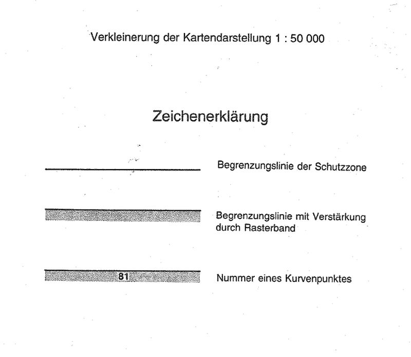
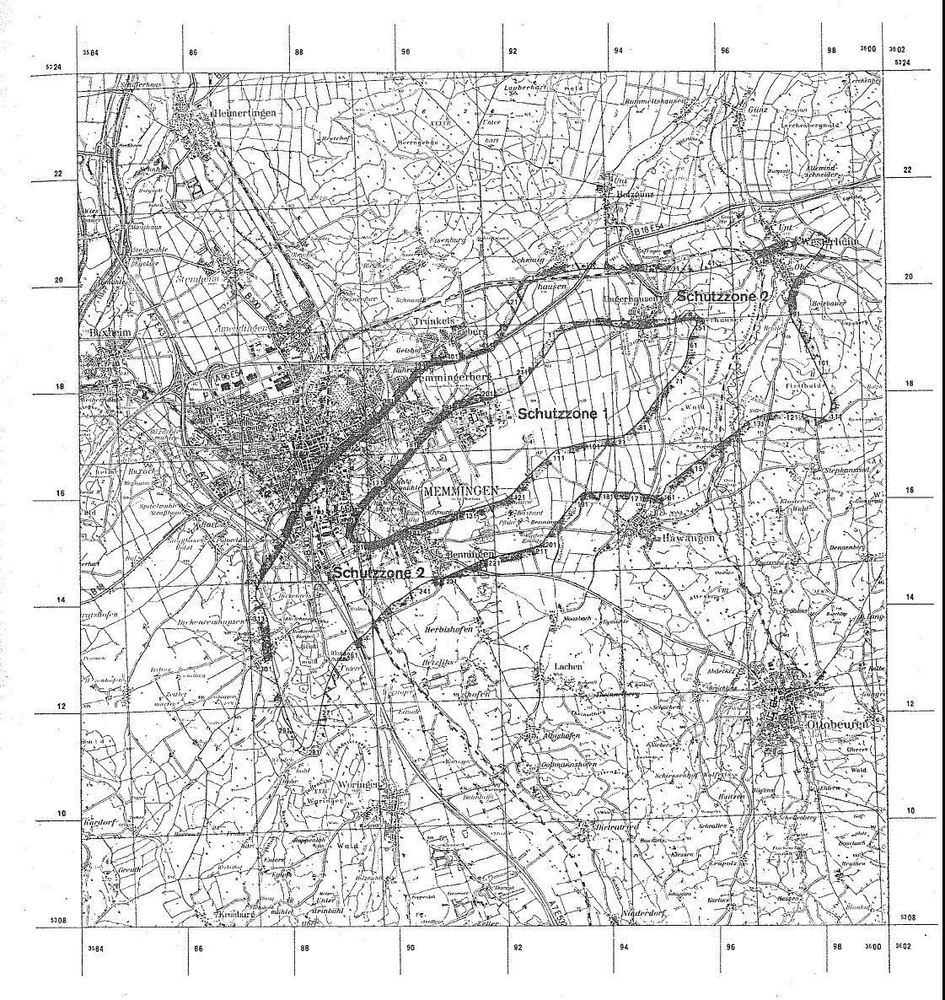

# Verordnung über die Festsetzung des Lärmschutzbereichs für den militärischen Flugplatz Memmingen (FluLärmMemmV 1982)

Ausfertigungsdatum
:   1982-11-09

Fundstelle
:   BGBl I: 1982, 1497

Geändert durch
:   Art. 1 V v. 28.7.1992 I 1468

## Eingangsformel

Auf Grund des § 4 Abs. 1 des Gesetzes zum Schutz gegen Fluglärm vom
30\. März 1971 (BGBl. I S. 282) wird im Einvernehmen mit dem
Bundesminister der Verteidigung und mit Zustimmung des Bundesrates
verordnet:

## § 1

Zum Schutz der Allgemeinheit vor Gefahren, erheblichen Nachteilen und
erheblichen Belästigungen durch Fluglärm in der Umgebung des
militärischen Flugplatzes Memmingen wird der in § 2 bestimmte
Lärmschutzbereich festgesetzt.

## § 2

Der Lärmschutzbereich mit seinen zwei Schutzzonen wird nach Anlage 1
bestimmt durch die interpolierten Verbindungslinien zwischen den
Kurvenpunkten, soweit diese Linien außerhalb des Flugplatzgeländes
verlaufen.

## § 3

Liegt eine bauliche Anlage zu einem Teil im Lärmschutzbereich, so gilt
sie als ganz im Lärmschutzbereich gelegen. Liegt eine bauliche Anlage
zu einem Teil in der Schutzzone 1, so gilt sie als ganz in dieser
Schutzzone gelegen.

## § 4

(1) Der nach § 2 bestimmte Lärmschutzbereich ist in einer
topographischen Karte im Maßstab 1:50.000 und in Karten im Maßstab
1:5.000 dargestellt. Die topographische Karte ist in verkleinerter
Form als Anlage 2 dieser Verordnung beigefügt. Die topographische
Karte und die Karten im Maßstab 1:5.000 sind beim Vermessungsamt
Memmingen, Bismarckstraße 1, 8940 Memmingen, zu jedermanns Einsicht
archivmäßig gesichert niedergelegt.

(2) Die Karten im Maßstab 1:5.000 über den Lärmschutzbereich nach der
bis zum Ablauf des 11. August 1992 geltenden Fassung dieser Verordnung
bleiben an gleicher Stelle zu jedermanns Einsicht archivmäßig
gesichert niedergelegt.

## § 5

Diese Verordnung tritt am Tag nach der Verkündung in Kraft.

## Schlußformel

Der Bundesminister des Innern

## Anlage 1 (zu § 2 der Verordnung über die Festsetzung des Lärmschutzbereichs für den militärischen Flugplatz Memmingen in der Fassung der Ersten Änderungsverordnung vom 28. Juli 1992) Lärmschutzbereich - Erste Änderung

(Fundstelle des Originaltextes: BGBl. I 1992, 1469 - 1473)

*    *   Koordinatensystem:

    *   Gauß - Krüger:

    *   Y = Rechtswert

*    *
    *
    *   X = Hochwert

*    *   Interpolation:

    *   Polynom 3. Grades mit stetigem Tangentenübergang

*    *

*    *   Kurvenpunkte der Schutzzone 1 (Militärischer Flugplatz Memmingen)

*    *   Nr.

    *   Y

    *   X

    *   Nr.

    *   Y

    *   X

    *   Nr.

    *   Y

    *   X

*    *

*    *   1

    *   3592591.2

    *   5318453.3

    *   51

    *   3595619.7

    *   5319272.5

    *   101

    *   3593560.2

    *   5317066.0

*    *   2

    *   3592641.7

    *   5318515.4

    *   52

    *   3595613.7

    *   5319253.4

    *   102

    *   3593404.0

    *   5317031.4

*    *   3

    *   3592683.8

    *   5318568.6

    *   53

    *   3595596.8

    *   5319217.1

    *   103

    *   3593326.3

    *   5317012.4

*    *   4

    *   3592725.1

    *   5318622.4

    *   54

    *   3595556.8

    *   5319147.9

    *   104

    *   3593248.8

    *   5316992.4

*    *   5

    *   3592765.7

    *   5318676.7

    *   55

    *   3595517.2

    *   5319078.3

    *   105

    *   3593171.5

    *   5316971.7

*    *   6

    *   3592805.5

    *   5318731.6

    *   56

    *   3595485.4

    *   5319004.9

    *   106

    *   3593094.5

    *   5316950.0

*    *   7

    *   3592833.6

    *   5318771.4

    *   57

    *   3595474.6

    *   5318966.4

    *   107

    *   3593017.8

    *   5316927.4

*    *   8

    *   3592878.8

    *   5318837.4

    *   58

    *   3595470.5

    *   5318946.8

    *   108

    *   3592979.6

    *   5316915.3

*    *   9

    *   3592922.8

    *   5318904.2

    *   59

    *   3595467.5

    *   5318927.1

    *   109

    *   3592942.7

    *   5316900.0

*    *   10

    *   3592965.5

    *   5318971.9

    *   60

    *   3595471.6

    *   5318909.2

    *   110

    *   3592912.5

    *   5316873.8

*    *

*    *   11

    *   3592988.2

    *   5319004.8

    *   61

    *   3595469.4

    *   5318878.2

    *   111

    *   3592882.7

    *   5316847.1

*    *   12

    *   3593010.6

    *   5319038.0

    *   62

    *   3595467.9

    *   5318847.1

    *   112

    *   3592823.4

    *   5316793.4

*    *   13

    *   3593021.6

    *   5319054.6

    *   63

    *   3595464.9

    *   5318807.2

    *   113

    *   3592764.3

    *   5316739.4

*    *   14

    *   3593034.9

    *   5319069.6

    *   64

    *   3595459.7

    *   5318767.5

    *   114

    *   3592705.8

    *   5316684.8

*    *   15

    *   3593070.1

    *   5319088.6

    *   65

    *   3595444.0

    *   5318689.1

    *   115

    *   3592647.2

    *   5316630.4

*    *   16

    *   3593105.8

    *   5319106.6

    *   66

    *   3595422.2

    *   5318612.1

    *   116

    *   3592589.0

    *   5316575.5

*    *   17

    *   3593178.8

    *   5319139.4

    *   67

    *   3595391.8

    *   5318538.1

    *   117

    *   3592474.1

    *   5316464.2

*    *   18

    *   3593330.0

    *   5319191.8

    *   68

    *   3595352.7

    *   5318468.3

    *   118

    *   3592361.5

    *   5316350.5

*    *   19

    *   3593407.5

    *   5319211.4

    *   69

    *   3595306.8

    *   5318402.8

    *   119

    *   3592251.7

    *   5316234.1

*    *   20

    *   3593486.1

    *   5319226.4

    *   70

    *   3595256.6

    *   5318340.5

    *   120

    *   3592198.1

    *   5316174.8

*    *

*    *   21

    *   3593639.3

    *   5319243.2

    *   71

    *   3595203.4

    *   5318280.7

    *   121

    *   3592145.3

    *   5316114.6

*    *   22

    *   3593722.2

    *   5319246.0

    *   72

    *   3595093.6

    *   5318164.4

    *   122

    *   3592084.6

    *   5316062.5

*    *   23

    *   3593805.2

    *   5319245.3

    *   73

    *   3595040.0

    *   5318104.9

    *   123

    *   3592015.9

    *   5316021.5

*    *   24

    *   3593885.1

    *   5319241.7

    *   74

    *   3594988.8

    *   5318043.5

    *   124

    *   3591942.8

    *   5315989.0

*    *   25

    *   3593964.9

    *   5319236.1

    *   75

    *   3594936.7

    *   5317977.4

    *   125

    *   3591868.6

    *   5315959.2

*    *   26

    *   3594124.1

    *   5319219.7

    *   76

    *   3594891.2

    *   5317916.7

    *   126

    *   3591717.5

    *   5315906.6

*    *   27

    *   3594203.4

    *   5319209.2

    *   77

    *   3594797.2

    *   5317787.2

    *   127

    *   3591641.1

    *   5315883.0

*    *   28

    *   3594308.4

    *   5319198.7

    *   78

    *   3594749.8

    *   5317722.8

    *   128

    *   3591564.3

    *   5315860.3

*    *   29

    *   3594360.9

    *   5319194.1

    *   79

    *   3594701.9

    *   5317658.7

    *   129

    *   3591410.1

    *   5315817.7

*    *   30

    *   3594413.5

    *   5319190.3

    *   80

    *   3594602.2

    *   5317533.5

    *   130

    *   3591332.4

    *   5315798.9

*    *

*    *   31

    *   3594442.5

    *   5319188.7

    *   81

    *   3594496.1

    *   5317413.8

    *   131

    *   3591255.2

    *   5315777.6

*    *   32

    *   3594482.5

    *   5319186.9

    *   82

    *   3594440.6

    *   5317356.1

    *   132

    *   3591100.5

    *   5315736.8

*    *   33

    *   3594522.5

    *   5319185.8

    *   83

    *   3594382.9

    *   5317300.7

    *   133

    *   3590944.0

    *   5315703.7

*    *   34

    *   3594602.5

    *   5319186.8

    *   84

    *   3594353.2

    *   5317273.9

    *   134

    *   3590866.3

    *   5315684.7

*    *   35

    *   3594682.3

    *   5319192.8

    *   85

    *   3594322.9

    *   5317247.7

    *   135

    *   3590789.1

    *   5315663.7

*    *   36

    *   3594761.6

    *   5319203.1

    *   86

    *   3594292.1

    *   5317222.2

    *   136

    *   3590712.3

    *   5315641.1

*    *   37

    *   3594840.8

    *   5319214.1

    *   87

    *   3594260.8

    *   5317197.3

    *   137

    *   3590636.1

    *   5315616.7

*    *   38

    *   3594920.1

    *   5319224.8

    *   88

    *   3594244.9

    *   5317185.2

    *   138

    *   3590484.8

    *   5315564.9

*    *   39

    *   3594999.2

    *   5319237.3

    *   89

    *   3594229.0

    *   5317173.1

    *   139

    *   3590409.4

    *   5315537.9

*    *   40

    *   3595077.8

    *   5319252.0

    *   90

    *   3594216.1

    *   5317163.6

    *   140

    *   3590293.4

    *   5315495.8

*    *

*    *   41

    *   3595158.4

    *   5319269.6

    *   91

    *   3594203.1

    *   5317154.2

    *   141

    *   3590182.6

    *   5315459.7

*    *   42

    *   3595238.6

    *   5319288.9

    *   92

    *   3594190.8

    *   5317153.8

    *   142

    *   3590034.1

    *   5315400.1

*    *   43

    *   3595389.8

    *   5319322.8

    *   93

    *   3594178.5

    *   5317152.5

    *   143

    *   3589960.8

    *   5315367.9

*    *   44

    *   3595468.6

    *   5319337.1

    *   94

    *   3594154.0

    *   5317149.8

    *   144

    *   3589888.4

    *   5315333.8

*    *   45

    *   3595508.3

    *   5319341.6

    *   95

    *   3594114.3

    *   5317144.8

    *   145

    *   3589816.5

    *   5315298.8

*    *   46

    *   3595548.3

    *   5319342.6

    *   96

    *   3594034.7

    *   5317137.0

    *   146

    *   3589743.9

    *   5315265.3

*    *   47

    *   3595587.8

    *   5319336.3

    *   97

    *   3593955.1

    *   5317128.9

    *   147

    *   3589667.2

    *   5315242.4

*    *   48

    *   3595605.8

    *   5319327.5

    *   98

    *   3593875.7

    *   5317119.2

    *   148

    *   3589589.4

    *   5315223.8

*    *   49

    *   3595618.3

    *   5319311.9

    *   99

    *   3593717.5

    *   5317095.4

    *   149

    *   3589510.9

    *   5315208.3

*    *   50

    *   3595622.3

    *   5319292.3

    *   100

    *   3593638.7

    *   5317081.4

    *   150

    *   3589431.5

    *   5315199.1

*    *

*    *   151

    *   3589351.5

    *   5315200.3

    *   181

    *   3590377.5

    *   5316950.8

    *   211

    *   3592462.4

    *   5318303.1

*    *   152

    *   3589273.3

    *   5315217.3

    *   182

    *   3590426.9

    *   5317013.7

    *   212

    *   3592515.1

    *   5318363.3

*    *   153

    *   3589236.6

    *   5315233.2

    *   183

    *   3590478.3

    *   5317075.1

    *   213

    *   3592591.2

    *   5318453.3

*    *   154

    *   3589203.1

    *   5315255.1

    *   184

    *   3590539.8

    *   5317143.0

    *
    *
    *

*    *   155

    *   3589175.1

    *   5315283.7

    *   185

    *   3590600.4

    *   5317211.8

    *
    *
    *

*    *   156

    *   3589156.1

    *   5315318.9

    *   186

    *   3590690.9

    *   5317314.2

    *
    *
    *

*    *   157

    *   3589147.9

    *   5315358.0

    *   187

    *   3590800.4

    *   5317430.9

    *
    *
    *

*    *   158

    *   3589149.0

    *   5315398.0

    *   188

    *   3590857.5

    *   5317486.9

    *
    *
    *

*    *   159

    *   3589156.4

    *   5315437.3

    *   189

    *   3590916.4

    *   5317541.1

    *
    *
    *

*    *   160

    *   3589167.8

    *   5315475.7

    *   190

    *   3590977.3

    *   5317593.0

    *
    *
    *

*    *

*    *   161

    *   3589197.3

    *   5315550.0

    *   191

    *   3591040.1

    *   5317642.5

    *
    *
    *

*    *   162

    *   3589232.9

    *   5315621.7

    *   192

    *   3591072.4

    *   5317668.1

    *
    *
    *

*    *   163

    *   3589271.0

    *   5315692.0

    *   193

    *   3591109.4

    *   5317682.6

    *
    *
    *

*    *   164

    *   3589312.2

    *   5315760.6

    *   194

    *   3591184.3

    *   5317710.7

    *
    *
    *

*    *   165

    *   3589361.9

    *   5315823.3

    *   195

    *   3591261.8

    *   5317730.4

    *
    *
    *

*    *   166

    *   3589413.5

    *   5315884.4

    *   196

    *   3591339.0

    *   5317751.3

    *
    *
    *

*    *   167

    *   3589465.9

    *   5315944.8

    *   197

    *   3591415.9

    *   5317773.2

    *
    *
    *

*    *   168

    *   3589519.5

    *   5316004.3

    *   198

    *   3591492.6

    *   5317796.2

    *
    *
    *

*    *   169

    *   3589574.4

    *   5316062.5

    *   199

    *   3591645.0

    *   5317844.9

    *
    *
    *

*    *   170

    *   3589630.6

    *   5316119.4

    *   200

    *   3591720.8

    *   5317870.6

    *
    *
    *

*    *

*    *   171

    *   3589745.2

    *   5316231.0

    *   201

    *   3591796.3

    *   5317896.9

    *
    *
    *

*    *   172

    *   3589806.0

    *   5316290.3

    *   202

    *   3591946.6

    *   5317951.7

    *
    *
    *

*    *   173

    *   3589859.8

    *   5316342.7

    *   203

    *   3592021.8

    *   5317979.2

    *
    *
    *

*    *   174

    *   3589927.7

    *   5316410.3

    *   204

    *   3592096.6

    *   5318007.5

    *
    *
    *

*    *   175

    *   3589994.4

    *   5316479.0

    *   205

    *   3592171.2

    *   5318036.3

    *
    *
    *

*    *   176

    *   3590101.3

    *   5316595.3

    *   206

    *   3592208.4

    *   5318051.0

    *
    *
    *

*    *   177

    *   3590186.0

    *   5316694.5

    *   207

    *   3592244.0

    *   5318069.3

    *
    *
    *

*    *   178

    *   3590236.1

    *   5316756.9

    *   208

    *   3592272.6

    *   5318097.3

    *
    *
    *

*    *   179

    *   3590284.8

    *   5316820.4

    *   209

    *   3592300.3

    *   5318126.1

    *
    *
    *

*    *   180

    *   3590332.1

    *   5316884.9

    *   210

    *   3592355.1

    *   5318184.4

    *
    *
    *

*    *

*    *   Kurvenpunkte der Schutzzone 2 (Militärischer Flugplatz Memmingen)

*    *   Nr.

    *   Y

    *   X

    *   Nr.

    *   Y

    *   X

    *   Nr.

    *   Y

    *   X

*    *

*    *   1

    *   3592591.2

    *   5320065.1

    *   51

    *   3596755.1

    *   5320492.9

    *   101

    *   3597859.3

    *   5318464.7

*    *   2

    *   3592665.1

    *   5320095.7

    *   52

    *   3596839.3

    *   5320518.1

    *   102

    *   3597931.9

    *   5318322.1

*    *   3

    *   3592739.9

    *   5320124.2

    *   53

    *   3596923.1

    *   5320545.0

    *   103

    *   3598003.7

    *   5318179.2

*    *   4

    *   3592815.4

    *   5320150.7

    *   54

    *   3596999.2

    *   5320569.6

    *   104

    *   3598069.4

    *   5318033.3

*    *   5

    *   3592968.4

    *   5320197.4

    *   55

    *   3597074.8

    *   5320595.9

    *   105

    *   3598097.4

    *   5317958.3

*    *   6

    *   3593045.9

    *   5320217.5

    *   56

    *   3597150.2

    *   5320622.7

    *   106

    *   3598119.7

    *   5317881.5

*    *   7

    *   3593123.9

    *   5320235.3

    *   57

    *   3597225.5

    *   5320649.7

    *   107

    *   3598133.5

    *   5317802.7

*    *   8

    *   3593281.2

    *   5320264.4

    *   58

    *   3597300.8

    *   5320676.9

    *   108

    *   3598134.1

    *   5317722.7

*    *   9

    *   3593439.8

    *   5320285.5

    *   59

    *   3597376.1

    *   5320703.9

    *   109

    *   3598127.4

    *   5317683.3

*    *   10

    *   3593519.4

    *   5320293.0

    *   60

    *   3597527.2

    *   5320756.6

    *   110

    *   3598115.0

    *   5317645.2

*    *

*    *   11

    *   3593599.3

    *   5320298.4

    *   61

    *   3597603.2

    *   5320781.5

    *   111

    *   3598096.6

    *   5317609.7

*    *   12

    *   3593759.2

    *   5320303.1

    *   62

    *   3597679.7

    *   5320805.0

    *   112

    *   3598072.2

    *   5317578.0

*    *   13

    *   3593839.2

    *   5320302.6

    *   63

    *   3597756.8

    *   5320826.1

    *   113

    *   3598042.3

    *   5317551.5

*    *   14

    *   3593919.2

    *   5320301.0

    *   64

    *   3597835.0

    *   5320843.2

    *   114

    *   3598007.6

    *   5317531.5

*    *   15

    *   3593999.1

    *   5320297.9

    *   65

    *   3597914.4

    *   5320852.4

    *   115

    *   3597970.1

    *   5317517.7

*    *   16

    *   3594079.0

    *   5320293.4

    *   66

    *   3597954.4

    *   5320850.9

    *   116

    *   3597930.8

    *   5317510.3

*    *   17

    *   3594238.6

    *   5320282.3

    *   67

    *   3597974.0

    *   5320846.9

    *   117

    *   3597890.8

    *   5317508.2

*    *   18

    *   3594398.1

    *   5320269.9

    *   68

    *   3597992.4

    *   5320839.1

    *   118

    *   3597811.4

    *   5317517.7

*    *   19

    *   3594557.7

    *   5320258.5

    *   69

    *   3598007.3

    *   5320825.8

    *   119

    *   3597734.1

    *   5317538.4

*    *   20

    *   3594646.5

    *   5320253.9

    *   70

    *   3598015.1

    *   5320807.3

    *   120

    *   3597658.2

    *   5317563.7

*    *

*    *   21

    *   3594717.3

    *   5320247.2

    *   71

    *   3598015.5

    *   5320787.3

    *   121

    *   3597504.4

    *   5317607.8

*    *   22

    *   3594797.3

    *   5320244.3

    *   72

    *   3598011.6

    *   5320767.7

    *   122

    *   3597426.0

    *   5317623.5

*    *   23

    *   3594877.2

    *   5320241.0

    *   73

    *   3597996.7

    *   5320730.6

    *   123

    *   3597346.6

    *   5317633.3

*    *   24

    *   3594917.6

    *   5320239.0

    *   74

    *   3597977.1

    *   5320695.7

    *   124

    *   3597266.6

    *   5317635.8

*    *   25

    *   3594957.6

    *   5320245.7

    *   75

    *   3597931.4

    *   5320630.1

    *   125

    *   3597186.7

    *   5317631.9

*    *   26

    *   3594998.1

    *   5320243.9

    *   76

    *   3597881.2

    *   5320567.8

    *   126

    *   3597107.2

    *   5317623.0

*    *   27

    *   3595037.0

    *   5320232.6

    *   77

    *   3597829.0

    *   5320507.2

    *   127

    *   3596950.1

    *   5317592.7

*    *   28

    *   3595090.3

    *   5320230.2

    *   78

    *   3597722.2

    *   5320388.1

    *   128

    *   3596872.9

    *   5317571.7

*    *   29

    *   3595143.6

    *   5320228.6

    *   79

    *   3597668.9

    *   5320328.4

    *   129

    *   3596797.6

    *   5317544.6

*    *   30

    *   3595196.9

    *   5320227.9

    *   80

    *   3597616.3

    *   5320268.0

    *   130

    *   3596723.4

    *   5317514.8

*    *

*    *   31

    *   3595244.6

    *   5320228.1

    *   81

    *   3597516.0

    *   5320143.3

    *   131

    *   3596650.0

    *   5317482.9

*    *   32

    *   3595300.8

    *   5320229.5

    *   82

    *   3597470.2

    *   5320077.7

    *   132

    *   3596613.8

    *   5317465.7

*    *   33

    *   3595356.9

    *   5320232.1

    *   83

    *   3597429.0

    *   5320009.1

    *   133

    *   3596578.0

    *   5317448.0

*    *   34

    *   3595436.7

    *   5320237.8

    *   84

    *   3597393.6

    *   5319937.4

    *   134

    *   3596543.3

    *   5317419.2

*    *   35

    *   3595516.4

    *   5320244.6

    *   85

    *   3597365.8

    *   5319862.4

    *   135

    *   3596507.3

    *   5317388.2

*    *   36

    *   3595595.9

    *   5320253.5

    *   86

    *   3597347.7

    *   5319784.5

    *   136

    *   3596477.3

    *   5317351.2

*    *   37

    *   3595675.1

    *   5320265.0

    *   87

    *   3597340.9

    *   5319704.8

    *   137

    *   3596446.9

    *   5317319.7

*    *   38

    *   3595754.0

    *   5320278.4

    *   88

    *   3597343.7

    *   5319624.8

    *   138

    *   3596410.7

    *   5317295.0

*    *   39

    *   3595832.3

    *   5320294.4

    *   89

    *   3597351.8

    *   5319545.2

    *   139

    *   3596374.7

    *   5317269.9

*    *   40

    *   3595910.5

    *   5320311.6

    *   90

    *   3597364.6

    *   5319466.3

    *   140

    *   3596310.0

    *   5317222.9

*    *

*    *   41

    *   3595988.6

    *   5320328.8

    *   91

    *   3597385.0

    *   5319388.9

    *   141

    *   3596244.6

    *   5317176.8

*    *   42

    *   3596049.8

    *   5320342.0

    *   92

    *   3597414.1

    *   5319314.4

    *   142

    *   3596179.3

    *   5317130.6

*    *   43

    *   3596145.1

    *   5320361.9

    *   93

    *   3597451.8

    *   5319243.8

    *   143

    *   3596096.2

    *   5317068.3

*    *   44

    *   3596223.7

    *   5320377.1

    *   94

    *   3597492.4

    *   5319174.9

    *   144

    *   3596052.2

    *   5317033.5

*    *   45

    *   3596302.2

    *   5320392.6

    *   95

    *   3597574.5

    *   5319037.6

    *   145

    *   3595988.1

    *   5316985.6

*    *   46

    *   3596402.5

    *   5320410.6

    *   96

    *   3597614.1

    *   5318968.1

    *   146

    *   3595925.0

    *   5316936.3

*    *   47

    *   3596459.6

    *   5320421.1

    *   97

    *   3597652.1

    *   5318897.6

    *   147

    *   3595801.6

    *   5316834.6

*    *   48

    *   3596538.0

    *   5320437.4

    *   98

    *   3597723.9

    *   5318754.6

    *   148

    *   3595739.4

    *   5316784.1

*    *   49

    *   3596616.0

    *   5320455.3

    *   99

    *   3597758.1

    *   5318682.4

    *   149

    *   3595675.4

    *   5316735.9

*    *   50

    *   3596685.7

    *   5320473.3

    *   100

    *   3597791.9

    *   5318609.8

    *   150

    *   3595611.1

    *   5316688.3

*    *

*    *   151

    *   3595546.7

    *   5316640.9

    *   201

    *   3592727.0

    *   5315218.9

    *   251

    *   3589662.9

    *   5313842.6

*    *   152

    *   3595483.3

    *   5316592.2

    *   202

    *   3592702.8

    *   5315186.8

    *   252

    *   3589621.6

    *   5313792.4

*    *   153

    *   3595420.2

    *   5316542.9

    *   203

    *   3592671.8

    *   5315161.0

    *   253

    *   3589561.9

    *   5313718.5

*    *   154

    *   3595294.0

    *   5316444.7

    *   204

    *   3592651.3

    *   5315142.9

    *   254

    *   3589464.4

    *   5313591.7

*    *   155

    *   3595166.2

    *   5316348.4

    *   205

    *   3592641.2

    *   5315133.6

    *   255

    *   3589409.8

    *   5313533.2

*    *   156

    *   3595102.0

    *   5316300.6

    *   206

    *   3592633.2

    *   5315122.3

    *   256

    *   3589349.8

    *   5313480.3

*    *   157

    *   3595070.6

    *   5316275.8

    *   207

    *   3592626.6

    *   5315120.6

    *   257

    *   3589286.1

    *   5313431.8

*    *   158

    *   3595039.2

    *   5316251.0

    *   208

    *   3592620.0

    *   5315118.9

    *   258

    *   3589221.3

    *   5313384.9

*    *   159

    *   3595014.2

    *   5316215.2

    *   209

    *   3592606.8

    *   5315115.4

    *   259

    *   3589097.1

    *   5313284.1

*    *   160

    *   3594994.2

    *   5316158.2

    *   210

    *   3592587.4

    *   5315110.3

    *   260

    *   3589040.0

    *   5313228.1

*    *

*    *   161

    *   3594969.2

    *   5316107.2

    *   211

    *   3592568.1

    *   5315105.2

    *   261

    *   3588986.7

    *   5313168.4

*    *   162

    *   3594934.2

    *   5316073.2

    *   212

    *   3592529.4

    *   5315095.0

    *   262

    *   3588937.3

    *   5313105.5

*    *   163

    *   3594875.0

    *   5316057.3

    *   213

    *   3592452.0

    *   5315075.0

    *   263

    *   3588891.6

    *   5313039.8

*    *   164

    *   3594812.0

    *   5316060.4

    *   214

    *   3592296.7

    *   5315036.6

    *   264

    *   3588848.8

    *   5312972.1

*    *   165

    *   3594772.1

    *   5316061.5

    *   215

    *   3592218.8

    *   5315018.2

    *   265

    *   3588770.4

    *   5312832.7

*    *   166

    *   3594730.6

    *   5316064.2

    *   216

    *   3592140.8

    *   5315000.4

    *   266

    *   3588698.0

    *   5312690.0

*    *   167

    *   3594695.5

    *   5316080.1

    *   217

    *   3591984.6

    *   5314965.7

    *   267

    *   3588665.4

    *   5312616.9

*    *   168

    *   3594655.7

    *   5316083.6

    *   218

    *   3591906.7

    *   5314947.4

    *   268

    *   3588639.1

    *   5312541.3

*    *   169

    *   3594635.7

    *   5316085.2

    *   219

    *   3591828.7

    *   5314929.7

    *   269

    *   3588594.0

    *   5312387.7

*    *   170

    *   3594615.8

    *   5316086.8

    *   220

    *   3591750.6

    *   5314912.4

    *   270

    *   3588555.4

    *   5312232.5

*    *

*    *   171

    *   3594583.7

    *   5316089.3

    *   221

    *   3591674.1

    *   5314888.9

    *   271

    *   3588521.0

    *   5312076.2

*    *   172

    *   3594557.2

    *   5316094.2

    *   222

    *   3591599.9

    *   5314859.2

    *   272

    *   3588504.6

    *   5311997.9

*    *   173

    *   3594526.2

    *   5316106.2

    *   223

    *   3591525.8

    *   5314829.0

    *   273

    *   3588488.2

    *   5311919.6

*    *   174

    *   3594497.9

    *   5316114.8

    *   224

    *   3591379.5

    *   5314764.3

    *   274

    *   3588454.4

    *   5311763.2

*    *   175

    *   3594457.9

    *   5316117.0

    *   225

    *   3591306.8

    *   5314730.8

    *   275

    *   3588415.7

    *   5311608.0

*    *   176

    *   3594418.0

    *   5316118.9

    *   226

    *   3591233.3

    *   5314699.1

    *   276

    *   3588392.1

    *   5311531.5

*    *   177

    *   3594338.0

    *   5316122.1

    *   227

    *   3591085.0

    *   5314639.2

    *   277

    *   3588362.5

    *   5311457.2

*    *   178

    *   3594258.1

    *   5316124.6

    *   228

    *   3591010.9

    *   5314608.9

    *   278

    *   3588343.8

    *   5311421.9

*    *   179

    *   3594098.1

    *   5316128.3

    *   229

    *   3590974.1

    *   5314593.2

    *   279

    *   3588320.8

    *   5311389.1

*    *   180

    *   3594018.1

    *   5316129.7

    *   230

    *   3590924.4

    *   5314570.9

    *   280

    *   3588291.1

    *   5311362.3

*    *

*    *   181

    *   3593938.1

    *   5316130.3

    *   231

    *   3590875.1

    *   5314547.8

    *   281

    *   3588273.4

    *   5311353.1

*    *   182

    *   3593778.1

    *   5316128.9

    *   232

    *   3590834.2

    *   5314528.2

    *   282

    *   3588253.9

    *   5311348.3

*    *   183

    *   3593698.1

    *   5316127.8

    *   233

    *   3590788.2

    *   5314520.2

    *   283

    *   3588214.3

    *   5311353.8

*    *   184

    *   3593618.2

    *   5316124.8

    *   234

    *   3590738.2

    *   5314514.2

    *   284

    *   3588179.7

    *   5311373.7

*    *   185

    *   3593538.3

    *   5316120.2

    *   235

    *   3590685.2

    *   5314513.2

    *   285

    *   3588149.6

    *   5311400.1

*    *   186

    *   3593498.4

    *   5316117.2

    *   236

    *   3590633.2

    *   5314501.2

    *   286

    *   3588123.4

    *   5311430.3

*    *   187

    *   3593458.7

    *   5316112.8

    *   237

    *   3590574.8

    *   5314483.2

    *   287

    *   3588099.6

    *   5311462.5

*    *   188

    *   3593422.3

    *   5316096.0

    *   238

    *   3590539.4

    *   5314464.6

    *   288

    *   3588058.0

    *   5311530.8

*    *   189

    *   3593395.0

    *   5316066.9

    *   239

    *   3590505.0

    *   5314444.2

    *   289

    *   3588020.9

    *   5311601.7

*    *   190

    *   3593368.3

    *   5316037.1

    *   240

    *   3590436.5

    *   5314402.8

    *   290

    *   3587987.2

    *   5311674.3

*    *

*    *   191

    *   3593315.8

    *   5315976.7

    *   241

    *   3590366.7

    *   5314363.8

    *   291

    *   3587955.9

    *   5311747.9

*    *   192

    *   3593264.3

    *   5315915.4

    *   242

    *   3590298.8

    *   5314321.4

    *   292

    *   3587898.2

    *   5311897.1

*    *   193

    *   3593214.2

    *   5315853.1

    *   243

    *   3590168.6

    *   5314228.4

    *   293

    *   3587845.2

    *   5312048.1

*    *   194

    *   3593163.5

    *   5315791.2

    *   244

    *   3590103.6

    *   5314181.8

    *   294

    *   3587820.2

    *   5312124.1

*    *   195

    *   3593113.3

    *   5315728.9

    *   245

    *   3590036.5

    *   5314138.1

    *   295

    *   3587796.2

    *   5312200.4

*    *   196

    *   3593013.1

    *   5315604.1

    *   246

    *   3589966.3

    *   5314099.8

    *   296

    *   3587751.8

    *   5312354.1

*    *   197

    *   3592914.2

    *   5315478.4

    *   247

    *   3589897.6

    *   5314058.7

    *   297

    *   3587731.8

    *   5312431.6

*    *   198

    *   3592865.7

    *   5315414.8

    *   248

    *   3589833.5

    *   5314010.8

    *   298

    *   3587713.4

    *   5312509.5

*    *   199

    *   3592818.3

    *   5315350.3

    *   249

    *   3589772.7

    *   5313958.9

    *   299

    *   3587677.4

    *   5312665.4

*    *   200

    *   3592772.1

    *   5315285.1

    *   250

    *   3589716.2

    *   5313902.2

    *   300

    *   3587638.8

    *   5312820.6

*    *

*    *   301

    *   3587622.7

    *   5312899.0

    *   351

    *   3588370.9

    *   5316207.4

    *   401

    *   3591150.4

    *   5318594.7

*    *   302

    *   3587608.2

    *   5312977.7

    *   352

    *   3588412.8

    *   5316275.6

    *   402

    *   3591305.3

    *   5318634.7

*    *   303

    *   3587595.3

    *   5313056.6

    *   353

    *   3588456.5

    *   5316342.6

    *   403

    *   3591459.0

    *   5318679.4

*    *   304

    *   3587584.4

    *   5313135.9

    *   354

    *   3588550.8

    *   5316471.8

    *   404

    *   3591535.6

    *   5318702.3

*    *   305

    *   3587567.2

    *   5313295.0

    *   355

    *   3588600.6

    *   5316534.5

    *   405

    *   3591612.2

    *   5318725.5

*    *   306

    *   3587560.5

    *   5313374.7

    *   356

    *   3588653.4

    *   5316594.5

    *   406

    *   3591688.5

    *   5318749.7

*    *   307

    *   3587554.3

    *   5313454.4

    *   357

    *   3588710.8

    *   5316650.3

    *   407

    *   3591726.5

    *   5318762.0

*    *   308

    *   3587540.3

    *   5313613.8

    *   358

    *   3588769.5

    *   5316704.7

    *   408

    *   3591764.4

    *   5318774.8

*    *   309

    *   3587530.1

    *   5313693.2

    *   359

    *   3588829.1

    *   5316758.0

    *   409

    *   3591783.3

    *   5318781.4

*    *   310

    *   3587515.5

    *   5313771.8

    *   360

    *   3588889.3

    *   5316810.8

    *   410

    *   3591799.7

    *   5318792.9

*    *

*    *   311

    *   3587494.0

    *   5313848.9

    *   361

    *   3588949.9

    *   5316863.0

    *   411

    *   3591811.4

    *   5318809.1

*    *   312

    *   3587463.4

    *   5313922.8

    *   362

    *   3588980.3

    *   5316889.0

    *   412

    *   3591823.1

    *   5318825.3

*    *   313

    *   3587422.1

    *   5313991.3

    *   363

    *   3589010.8

    *   5316914.9

    *   413

    *   3591845.3

    *   5318858.5

*    *   314

    *   3587375.3

    *   5314056.2

    *   364

    *   3589035.5

    *   5316935.8

    *   414

    *   3591889.0

    *   5318925.6

*    *   315

    *   3587333.6

    *   5314124.5

    *   365

    *   3589084.3

    *   5316976.9

    *   415

    *   3591931.9

    *   5318993.1

*    *   316

    *   3587319.7

    *   5314162.0

    *   366

    *   3589133.3

    *   5317017.7

    *   416

    *   3591973.6

    *   5319061.4

*    *   317

    *   3587312.6

    *   5314201.4

    *   367

    *   3589195.8

    *   5317067.7

    *   417

    *   3592055.6

    *   5319198.8

*    *   318

    *   3587312.7

    *   5314241.4

    *   368

    *   3589226.9

    *   5317092.8

    *   418

    *   3592095.2

    *   5319268.3

*    *   319

    *   3587318.9

    *   5314280.9

    *   369

    *   3589257.9

    *   5317118.1

    *   419

    *   3592134.6

    *   5319337.9

*    *   320

    *   3587329.6

    *   5314319.4

    *   370

    *   3589283.4

    *   5317142.1

    *   420

    *   3592210.3

    *   5319478.9

*    *

*    *   321

    *   3587360.0

    *   5314393.4

    *   371

    *   3589332.5

    *   5317180.9

    *   421

    *   3592281.3

    *   5319622.3

*    *   322

    *   3587397.6

    *   5314464.0

    *   372

    *   3589381.0

    *   5317220.3

    *   422

    *   3592315.4

    *   5319694.6

*    *   323

    *   3587439.3

    *   5314532.3

    *   373

    *   3589442.4

    *   5317271.6

    *   423

    *   3592348.4

    *   5319767.5

*    *   324

    *   3587483.0

    *   5314599.3

    *   374

    *   3589502.8

    *   5317324.1

    *   424

    *   3592380.2

    *   5319840.9

*    *   325

    *   3587527.3

    *   5314665.9

    *   375

    *   3589562.2

    *   5317377.6

    *   425

    *   3592395.6

    *   5319877.8

*    *   326

    *   3587572.1

    *   5314732.2

    *   376

    *   3589620.8

    *   5317432.2

    *   426

    *   3592412.3

    *   5319914.2

*    *   327

    *   3587616.8

    *   5314798.5

    *   377

    *   3589736.0

    *   5317543.1

    *   427

    *   3592430.1

    *   5319950.0

*    *   328

    *   3587704.6

    *   5314932.3

    *   378

    *   3589792.3

    *   5317600.0

    *   428

    *   3592447.3

    *   5319986.1

*    *   329

    *   3587747.1

    *   5315000.1

    *   379

    *   3589848.0

    *   5317657.5

    *   429

    *   3592477.1

    *   5320013.5

*    *   330

    *   3587788.5

    *   5315068.6

    *   380

    *   3589903.6

    *   5317714.9

    *   430

    *   3592513.7

    *   5320030.7

*    *

*    *   331

    *   3587838.0

    *   5315159.5

    *   381

    *   3589958.8

    *   5317772.8

    *   431

    *   3592591.2

    *   5320065.1

*    *   332

    *   3587865.2

    *   5315209.0

    *   382

    *   3590007.0

    *   5317836.7

    *
    *
    *

*    *   333

    *   3587902.8

    *   5315279.6

    *   383

    *   3590055.9

    *   5317900.0

    *
    *
    *

*    *   334

    *   3587938.4

    *   5315351.2

    *   384

    *   3590105.8

    *   5317962.6

    *
    *
    *

*    *   335

    *   3587972.4

    *   5315423.7

    *   385

    *   3590156.6

    *   5318024.4

    *
    *
    *

*    *   336

    *   3588004.7

    *   5315496.9

    *   386

    *   3590208.5

    *   5318085.2

    *
    *
    *

*    *   337

    *   3588036.6

    *   5315570.3

    *   387

    *   3590261.5

    *   5318145.2

    *
    *
    *

*    *   338

    *   3588068.7

    *   5315643.5

    *   388

    *   3590370.3

    *   5318262.5

    *
    *
    *

*    *   339

    *   3588093.7

    *   5315699.2

    *   389

    *   3590426.0

    *   5318319.9

    *
    *
    *

*    *   340

    *   3588119.9

    *   5315754.2

    *   390

    *   3590482.6

    *   5318376.5

    *
    *
    *

*    *

*    *   341

    *   3588138.4

    *   5315787.6

    *   391

    *   3590539.8

    *   5318432.4

    *
    *
    *

*    *   342

    *   3588171.3

    *   5315847.9

    *   392

    *   3590568.7

    *   5318460.0

    *
    *
    *

*    *   343

    *   3588187.6

    *   5315878.2

    *   393

    *   3590603.8

    *   5318479.2

    *
    *
    *

*    *   344

    *   3588204.0

    *   5315908.4

    *   394

    *   3590641.2

    *   5318493.3

    *
    *
    *

*    *   345

    *   3588214.6

    *   5315928.2

    *   395

    *   3590678.7

    *   5318507.5

    *
    *
    *

*    *   346

    *   3588233.5

    *   5315963.7

    *   396

    *   3590718.3

    *   5318512.6

    *
    *
    *

*    *   347

    *   3588247.5

    *   5316001.4

    *   397

    *   3590757.9

    *   5318518.2

    *
    *
    *

*    *   348

    *   3588271.5

    *   5316033.6

    *   398

    *   3590837.0

    *   5318530.7

    *
    *
    *

*    *   349

    *   3588290.8

    *   5316068.9

    *   399

    *   3590994.3

    *   5318559.9

    *
    *
    *

*    *   350

    *   3588330.1

    *   5316138.6

    *   400

    *   3591072.5

    *   5318576.6

    *
    *
    *

## Anlage 2 (zu § 4 Abs. 1 der Verordnung über die Festsetzung des Lärmschutzbereichs für den militärischen Flugplatz Memmingen in der Fassung der Ersten Änderungsverordnung vom 28. Juli 1992)

   (Fundstelle: BGBl I 1992, 1474 - 1475)

