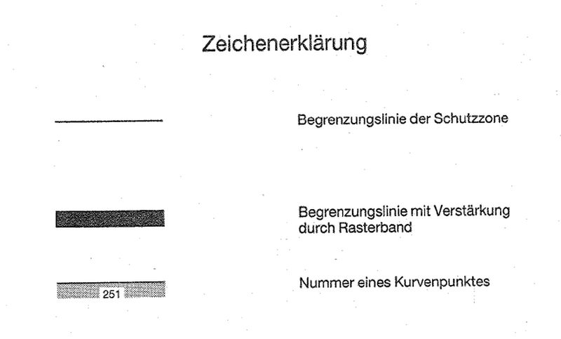
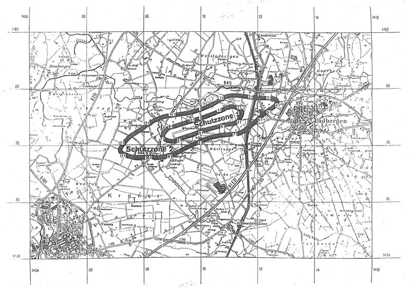

# Verordnung über die Festsetzung des Lärmschutzbereichs für den Verkehrsflughafen Münster/Osnabrück (FluLärmMünsterV)

Ausfertigungsdatum
:   1995-03-01

Fundstelle
:   BGBl I: 1995, 271

## Eingangsformel

Auf Grund des § 4 Abs. 1 des Gesetzes zum Schutz gegen Fluglärm vom
30\. März 1971 (BGBl. I S. 282), der gemäß Artikel 3 Abs. 1 der
Verordnung vom 26. November 1986 (BGBl. I S. 2089) geändert worden
ist, verordnet das Bundesministerium für Umwelt, Naturschutz und
Reaktorsicherheit im Einvernehmen mit dem Bundesministerium für
Verkehr:

## § 1

Zum Schutz der Allgemeinheit vor Gefahren, erheblichen Nachteilen und
erheblichen Belästigungen durch Fluglärm in der Umgebung des
Verkehrsflughafens Münster/Osnabrück wird der in § 2 bestimmte
Lärmschutzbereich festgesetzt.

## § 2

Der Lärmschutzbereich mit seinen zwei Schutzzonen wird nach Anlage 1
bestimmt durch die interpolierten Verbindungslinien zwischen den
Kurvenpunkten, soweit diese Linien außerhalb des Flugplatzgeländes
verlaufen.

## § 3

(1) Liegt eine bauliche Anlage zu einem Teil im Lärmschutzbereich, so
gilt sie als ganz im Lärmschutzbereich gelegen. Liegt eine bauliche
Anlage zu einem Teil in der Schutzzone 1, so gilt sie als ganz in
dieser Schutzzone gelegen.

(2) Auf die Errichtung einer baulichen Anlage ist Absatz 1
entsprechend anzuwenden.

## § 4

Der nach § 2 bestimmte Lärmschutzbereich ist in einer topographischen
Karte im Maßstab 1 : 50.000 und in Karten im Maßstab 1 : 5.000
dargestellt. Die topographische Karte ist dieser Verordnung als Anlage
2 beigefügt. Die topographische Karte und die Karten im Maßstab 1 :
5\.000 sind bei dem Oberkreisdirektor des Kreises Steinfurt,
Tecklenburger Straße 10, 48565 Steinfurt, zu jedermanns Einsicht
archivmäßig gesichert niedergelegt.

## § 5

Diese Verordnung tritt am Tage nach der Verkündung in Kraft.

## Schlußformel

Der Bundesrat hat zugestimmt.

## Anlage 1 (zu § 2 der Verordnung über die Festsetzung des Lärmschutzbereichs für den Verkehrsflughafen Münster/Osnabrück) Lärmschutzbereich

(Fundstelle des Originaltextes: BGBl. I 1995, 272 - 273)

*    *   Koordinatensystem:

    *   Gauß - Krüger:

    *   Y = Rechtswert

*    *   X = Hochwert

*    *   Interpolation:

    *   Polynom 3. Grades mit stetigem Tangentenübergang

*    *

*    *   Kurvenpunkte der Schutzzone 1 (Verkehrsflughafen Münster/Osnabrück)

*    *   Nr.

    *   Y

    *   X

    *   Nr.

    *   Y

    *   X

    *   Nr.

    *   Y

    *   X

*    *

*    *   1

    *   3410023.2

    *   5778859.3

    *   41

    *   3410678.0

    *   5778722.5

    *   81

    *   3409016.5

    *   5778552.5

*    *   2

    *   3410061.0

    *   5778872.5

    *   42

    *   3410600.2

    *   5778703.9

    *   82

    *   3409093.9

    *   5778572.9

*    *   3

    *   3410136.7

    *   5778898.6

    *   43

    *   3410522.6

    *   5778684.6

    *   83

    *   3409171.0

    *   5778594.3

*    *   4

    *   3410212.4

    *   5778924.7

    *   44

    *   3410445.2

    *   5778664.2

    *   84

    *   3409247.5

    *   5778617.3

*    *   5

    *   3410287.4

    *   5778952.6

    *   45

    *   3410368.0

    *   5778643.4

    *   85

    *   3409323.5

    *   5778642.2

*    *   6

    *   3410362.1

    *   5778981.2

    *   46

    *   3410290.9

    *   5778622.0

    *   86

    *   3409399.4

    *   5778667.6

*    *   7

    *   3410436.7

    *   5779010.0

    *   47

    *   3410214.6

    *   5778598.2

    *   87

    *   3409475.8

    *   5778691.5

*    *   8

    *   3410510.8

    *   5779040.1

    *   48

    *   3410137.9

    *   5778575.2

    *   88

    *   3409552.5

    *   5778714.2

*    *   9

    *   3410584.8

    *   5779070.6

    *   49

    *   3410061.3

    *   5778551.9

    *   89

    *   3409629.8

    *   5778734.8

*    *   10

    *   3410658.5

    *   5779101.7

    *   50

    *   3409985.0

    *   5778527.9

    *   90

    *   3409707.0

    *   5778755.7

*    *

*    *   11

    *   3410732.0

    *   5779133.4

    *   51

    *   3409908.9

    *   5778503.3

    *   91

    *   3409784.1

    *   5778777.2

*    *   12

    *   3410804.9

    *   5779166.3

    *   52

    *   3409833.7

    *   5778475.8

    *   92

    *   3409859.7

    *   5778803.1

*    *   13

    *   3410877.4

    *   5779200.2

    *   53

    *   3409758.9

    *   5778447.3

    *   93

    *   3409935.5

    *   5778828.9

*    *   14

    *   3410949.4

    *   5779235.1

    *   54

    *   3409683.9

    *   5778419.6

    *   94

    *   3409973.3

    *   5778841.9

*    *   15

    *   3410985.4

    *   5779252.7

    *   55

    *   3409608.3

    *   5778393.4

    *   95

    *   3410023.2

    *   5778859.3

*    *   16

    *   3411022.9

    *   5779266.1

    *   56

    *   3409532.1

    *   5778369.1

    *
    *
    *

*    *   17

    *   3411062.2

    *   5779272.3

    *   57

    *   3409455.7

    *   5778345.3

    *
    *
    *

*    *   18

    *   3411102.0

    *   5779272.9

    *   58

    *   3409379.3

    *   5778321.5

    *
    *
    *

*    *   19

    *   3411141.5

    *   5779267.9

    *   59

    *   3409303.2

    *   5778296.7

    *
    *
    *

*    *   20

    *   3411180.1

    *   5779258.0

    *   60

    *   3409228.1

    *   5778269.2

    *
    *
    *

*    *

*    *   21

    *   3411253.2

    *   5779226.0

    *   61

    *   3409153.2

    *   5778241.0

    *
    *
    *

*    *   22

    *   3411320.8

    *   5779183.3

    *   62

    *   3409078.8

    *   5778211.7

    *
    *
    *

*    *   23

    *   3411353.5

    *   5779160.4

    *   63

    *   3409040.8

    *   5778198.8

    *
    *
    *

*    *   24

    *   3411367.8

    *   5779146.6

    *   64

    *   3409001.5

    *   5778192.8

    *
    *
    *

*    *   25

    *   3411375.2

    *   5779128.2

    *   65

    *   3408961.7

    *   5778192.8

    *
    *
    *

*    *   26

    *   3411373.1

    *   5779108.0

    *   66

    *   3408922.2

    *   5778197.9

    *
    *
    *

*    *   27

    *   3411367.1

    *   5779088.7

    *   67

    *   3408845.4

    *   5778219.5

    *
    *
    *

*    *   28

    *   3411353.2

    *   5779051.1

    *   68

    *   3408808.7

    *   5778235.1

    *
    *
    *

*    *   29

    *   3411321.9

    *   5778977.5

    *   69

    *   3408772.6

    *   5778252.1

    *
    *
    *

*    *   30

    *   3411278.2

    *   5778910.2

    *   70

    *   3408755.2

    *   5778261.8

    *
    *
    *

*    *

*    *   31

    *   3411250.9

    *   5778880.7

    *   71

    *   3408740.0

    *   5778274.4

    *
    *
    *

*    *   32

    *   3411219.8

    *   5778855.0

    *   72

    *   3408734.9

    *   5778293.5

    *
    *
    *

*    *   33

    *   3411185.5

    *   5778834.1

    *   73

    *   3408740.9

    *   5778313.1

    *
    *
    *

*    *   34

    *   3411148.5

    *   5778818.2

    *   74

    *   3408749.9

    *   5778331.2

    *
    *
    *

*    *   35

    *   3411108.9

    *   5778810.6

    *   75

    *   3408769.8

    *   5778366.0

    *
    *
    *

*    *   36

    *   3411069.5

    *   5778803.8

    *   76

    *   3408814.2

    *   5778432.6

    *
    *
    *

*    *   37

    *   3410990.8

    *   5778789.5

    *   77

    *   3408870.0

    *   5778490.4

    *
    *
    *

*    *   38

    *   3410912.3

    *   5778774.3

    *   78

    *   3408902.9

    *   5778513.6

    *
    *
    *

*    *   39

    *   3410834.0

    *   5778758.0

    *   79

    *   3408939.0

    *   5778531.4

    *
    *
    *

*    *   40

    *   3410755.9

    *   5778740.6

    *   80

    *   3408977.7

    *   5778542.6

    *
    *
    *

*    *

*    *   Kurvenpunkte der Schutzzone 2 (Verkehrsflughafen Münster/Osnabrück)

*    *

*    *   1

    *   3410023.2

    *   5779172.2

    *   51

    *   3412294.1

    *   5779245.1

    *   101

    *   3408155.6

    *   5777637.7

*    *   2

    *   3410098.5

    *   5779199.3

    *   52

    *   3412267.9

    *   5779226.1

    *   102

    *   3407995.8

    *   5777627.6

*    *   3

    *   3410172.4

    *   5779230.2

    *   53

    *   3412243.9

    *   5779202.8

    *   103

    *   3407836.3

    *   5777612.9

*    *   4

    *   3410245.5

    *   5779262.7

    *   54

    *   3412220.7

    *   5779184.6

    *   104

    *   3407756.5

    *   5777609.6

*    *   5

    *   3410296.8

    *   5779286.2

    *   55

    *   3412189.8

    *   5779159.4

    *   105

    *   3407715.6

    *   5777615.0

*    *   6

    *   3410347.1

    *   5779309.2

    *   56

    *   3412159.4

    *   5779133.6

    *   106

    *   3407678.3

    *   5777622.3

*    *   7

    *   3410389.8

    *   5779331.8

    *   57

    *   3412129.5

    *   5779107.1

    *   107

    *   3407639.4

    *   5777631.0

*    *   8

    *   3410460.1

    *   5779370.0

    *   58

    *   3412100.4

    *   5779079.8

    *   108

    *   3407600.6

    *   5777640.5

*    *   9

    *   3410530.2

    *   5779408.6

    *   59

    *   3412064.1

    *   5779046.4

    *   109

    *   3407523.4

    *   5777661.0

*    *   10

    *   3410669.0

    *   5779488.2

    *   60

    *   3412032.6

    *   5779017.6

    *   110

    *   3407446.7

    *   5777683.5

*    *

*    *   11

    *   3410805.2

    *   5779572.1

    *   61

    *   3411983.2

    *   5778970.9

    *   111

    *   3407371.3

    *   5777709.7

*    *   12

    *   3410872.6

    *   5779615.4

    *   62

    *   3411924.9

    *   5778916.2

    *   112

    *   3407298.9

    *   5777743.0

*    *   13

    *   3410909.1

    *   5779631.4

    *   63

    *   3411864.9

    *   5778863.1

    *   113

    *   3407266.3

    *   5777765.2

*    *   14

    *   3410947.2

    *   5779643.3

    *   64

    *   3411746.6

    *   5778755.5

    *   114

    *   3407252.8

    *   5777779.3

*    *   15

    *   3411025.1

    *   5779661.0

    *   65

    *   3411624.3

    *   5778652.2

    *   115

    *   3407243.5

    *   5777796.3

*    *   16

    *   3411104.4

    *   5779670.3

    *   66

    *   3411494.8

    *   5778558.0

    *   116

    *   3407239.9

    *   5777815.8

*    *   17

    *   3411184.3

    *   5779673.1

    *   67

    *   3411425.9

    *   5778517.1

    *   117

    *   3407242.0

    *   5777835.9

*    *   18

    *   3411264.3

    *   5779670.8

    *   68

    *   3411355.3

    *   5778479.3

    *   118

    *   3407247.9

    *   5777855.4

*    *   19

    *   3411423.4

    *   5779655.4

    *   69

    *   3411279.4

    *   5778453.0

    *   119

    *   3407265.1

    *   5777891.8

*    *   20

    *   3411581.0

    *   5779628.3

    *   70

    *   3411239.8

    *   5778445.9

    *   120

    *   3407285.9

    *   5777926.2

*    *

*    *   21

    *   3411739.6

    *   5779606.9

    *   71

    *   3411199.5

    *   5778444.1

    *   121

    *   3407332.4

    *   5777991.4

*    *   22

    *   3411819.5

    *   5779600.4

    *   72

    *   3411119.7

    *   5778439.8

    *   122

    *   3407383.0

    *   5778053.6

*    *   23

    *   3411899.4

    *   5779595.5

    *   73

    *   3410960.2

    *   5778427.6

    *   123

    *   3407489.4

    *   5778173.2

*    *   24

    *   3411959.5

    *   5779590.4

    *   74

    *   3410801.1

    *   5778410.8

    *   124

    *   3407546.0

    *   5778230.1

*    *   25

    *   3412019.8

    *   5779586.9

    *   75

    *   3410716.9

    *   5778400.7

    *   125

    *   3407612.0

    *   5778276.1

*    *   26

    *   3412086.6

    *   5779585.1

    *   76

    *   3410631.6

    *   5778388.5

    *   126

    *   3407680.4

    *   5778318.1

*    *   27

    *   3412122.4

    *   5779584.8

    *   77

    *   3410485.5

    *   5778359.7

    *   127

    *   3407817.6

    *   5778400.3

*    *   28

    *   3412170.4

    *   5779581.8

    *   78

    *   3410330.2

    *   5778321.3

    *   128

    *   3407952.9

    *   5778485.6

*    *   29

    *   3412219.3

    *   5779582.9

    *   79

    *   3410177.7

    *   5778273.1

    *   129

    *   3408067.7

    *   5778573.0

*    *   30

    *   3412299.2

    *   5779585.8

    *   80

    *   3410027.9

    *   5778216.7

    *   130

    *   3408138.2

    *   5778624.1

*    *

*    *   31

    *   3412379.3

    *   5779588.7

    *   81

    *   3409883.1

    *   5778148.3

    *   131

    *   3408210.1

    *   5778675.9

*    *   32

    *   3412459.1

    *   5779585.4

    *   82

    *   3409736.0

    *   5778085.5

    *   132

    *   3408277.1

    *   5778719.9

*    *   33

    *   3412538.2

    *   5779575.1

    *   83

    *   3409591.6

    *   5778016.4

    *   133

    *   3408347.1

    *   5778758.7

*    *   34

    *   3412576.6

    *   5779564.3

    *   84

    *   3409448.0

    *   5777945.6

    *   134

    *   3408420.2

    *   5778791.7

*    *   35

    *   3412594.7

    *   5779555.5

    *   85

    *   3409306.0

    *   5777871.9

    *   135

    *   3408493.7

    *   5778823.3

*    *   36

    *   3412603.1

    *   5779549.2

    *   86

    *   3409236.6

    *   5777831.9

    *   136

    *   3408642.1

    *   5778883.2

*    *   37

    *   3412609.7

    *   5779541.4

    *   87

    *   3409166.8

    *   5777792.8

    *   137

    *   3408718.2

    *   5778908.3

*    *   38

    *   3412613.9

    *   5779531.5

    *   88

    *   3409093.7

    *   5777760.9

    *   138

    *   3408796.0

    *   5778927.4

*    *   39

    *   3412614.6

    *   5779520.3

    *   89

    *   3409018.5

    *   5777733.9

    *   139

    *   3408875.5

    *   5778937.9

*    *   40

    *   3412608.2

    *   5779500.1

    *   90

    *   3408942.1

    *   5777710.5

    *   140

    *   3408955.1

    *   5778946.4

*    *

*    *   41

    *   3412597.3

    *   5779482.0

    *   91

    *   3408821.2

    *   5777675.7

    *   141

    *   3409113.6

    *   5778968.6

*    *   42

    *   3412580.5

    *   5779460.7

    *   92

    *   3408711.2

    *   5777645.5

    *   142

    *   3409271.6

    *   5778993.7

*    *   43

    *   3412571.9

    *   5779451.4

    *   93

    *   3408632.8

    *   5777630.4

    *   143

    *   3409363.3

    *   5779006.4

*    *   44

    *   3412542.3

    *   5779422.6

    *   94

    *   3408553.6

    *   5777622.2

    *   144

    *   3409454.8

    *   5779020.7

*    *   45

    *   3412512.0

    *   5779396.3

    *   95

    *   3408473.9

    *   5777619.3

    *   145

    *   3409587.8

    *   5779042.4

*    *   46

    *   3412480.6

    *   5779371.2

    *   96

    *   3408425.4

    *   5777620.1

    *   146

    *   3409743.4

    *   5779079.6

*    *   47

    *   3412414.4

    *   5779326.0

    *   97

    *   3408375.1

    *   5777622.3

    *   147

    *   3409895.6

    *   5779128.7

*    *   48

    *   3412380.7

    *   5779304.0

    *   98

    *   3408316.4

    *   5777637.0

    *   148

    *   3410023.2

    *   5779172.2

*    *   49

    *   3412347.3

    *   5779281.9

    *   99

    *   3408275.7

    *   5777638.4

    *
    *
    *

*    *   50

    *   3412320.5

    *   5779263.7

    *   100

    *   3408235.6

    *   5777639.0

    *
    *
    *

## Anlage 2 (zu § 4 der Verordnung über die Festsetzung des Lärmschutzbereichs für den Verkehrsflughafen Münster/Osnabrück)

   (Fundstelle: BGBl I 1995, 274 - 275)

1 : 50 000
Lärmschutzbereich
für den Verkehrsflughafen Münster/Osnabrück
(Gesetz zum Schutz gegen Fluglärm vom 30. März 1971, BGBl. I S. 282)

Das rechtwinklige Koordinatengitter entspricht dem Gauß-Krüger-System
mit 3° breitem Meridianstreifen. Es zeigt zugleich die Begrenzung der
zugehörigen Blätter der Deutschen Grundkarte 1 : 5 000.

Kartengrundlage:
Topographische Karte 1 : 50 000
(mit Genehmigung des Landesvermessungsamtes Nordrhein-Westfalen).

Gravur der Lärmschutzgrenzen und Druck:
Landesvermessungsamt Nordrhein-Westfalen, 1994

