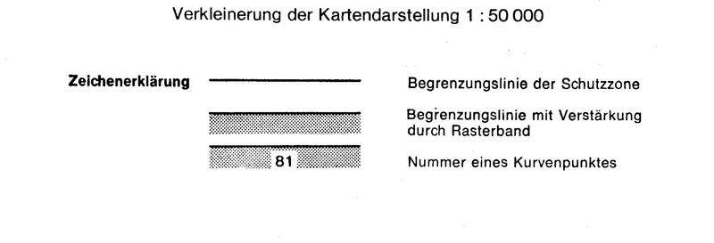
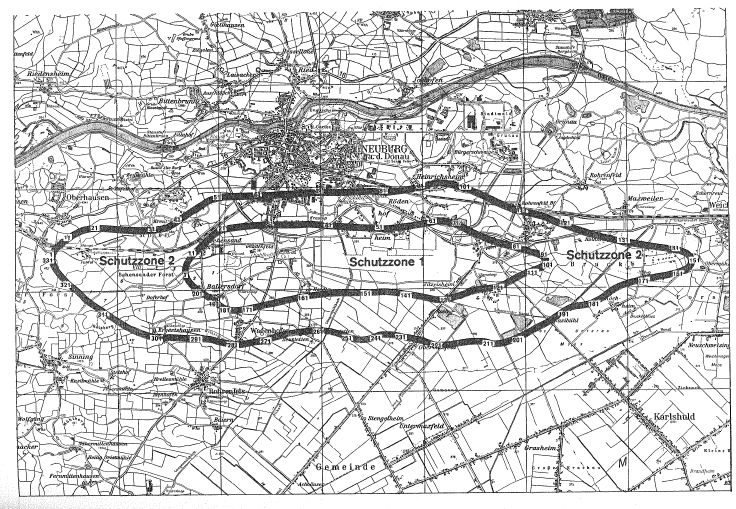

# Verordnung über die Festsetzung des Lärmschutzbereichs für den militärischen Flugplatz Neuburg a. d. Donau (FluLärmNeubV)

Ausfertigungsdatum
:   1975-11-25

Fundstelle
:   BGBl I: 1975, 2905

Geändert durch
:   Art. 1 V v. 7.11.1983 I 1362

## Eingangsformel

Auf Grund des § 4 Abs. 1 des Gesetzes zum Schutz gegen Fluglärm vom
30\. März 1971 (Bundesgesetzbl. I S. 282), geändert durch Artikel 70
des Einführungsgesetzes zum Strafgesetzbuch vom 2. März 1974
(Bundesgesetzbl. I S. 469), wird im Einvernehmen mit dem
Bundesminister der Verteidigung und mit Zustimmung des Bundesrates
verordnet:

## § 1

Zum Schutz der Allgemeinheit vor Gefahren, erheblichen Nachteilen und
erheblichen Belästigungen durch Fluglärm in der Umgebung des
militärischen Flugplatzes Neuburg a.d. Donau wird der in § 2 bestimmte
Lärmschutzbereich festgesetzt.

## § 2

Der Lärmschutzbereich mit seinen zwei Schutzzonen wird nach Anlage 1
bestimmt durch die interpolierten Verbindungslinien zwischen den
Kurvenpunkten, soweit diese Linien außerhalb des Flugplatzgeländes
verlaufen.

## § 3

(1) Liegt eine bauliche Anlage zu einem Teil im Lärmschutzbereich, so
gilt sie als ganz im Lärmschutzbereich gelegen. Liegt eine bauliche
Anlage zu einem Teil in der Schutzzone 1, so gilt sie als ganz in
dieser Schutzzone gelegen.

(2) Auf die Errichtung einer baulichen Anlage ist Absatz 1
entsprechend anzuwenden.

## § 4

(1) Der nach § 2 bestimmte Lärmschutzbereich ist in einer
topographischen Karte im Maßstab 1:50.000 und in Karten im Maßstab
1:5.000 dargestellt. Die topographische Karte ist in verkleinerter
Form als Anlage 2 dieser Verordnung beigefügt. Die topographische
Karte und die Karten im Maßstab 1:5.000 sind beim Vermessungsamt
Donauwörth, Sallingerstraße 2, 8850 Donauwörth, zu jedermanns Einsicht
archivmäßig gesichert niedergelegt.

(2) Die Karten im Maßstab 1:5.000 über den Lärmschutzbereich nach der
bis zum 15. November 1983 geltenden Fassung dieser Verordnung bleiben
an gleicher Stelle zu jedermanns Einsicht archivmäßig gesichert
niedergelegt.

## § 5

Diese Verordnung tritt am Tag nach der Verkündung in Kraft.

## Schlußformel

Der Bundesminister des Innern

## Anlage 1 (zu Artikel 1 Nummer 2 der Ersten Verordnung zur Änderung der Verordnung über die Festsetzung des Lärmschutzbereichs für den militärischen Flugplatz Neuburg a.d. Donau)

(Fundstelle des Originaltextes: BGBl. I 1983, 1363 - 1367)

*    *   **Lärmschutzbereich - Erste Änderung -**

*    *

*    *
    *   Koordinatensystem:

    *   Gauß-Krüger

*    *
    *   Interpolation:

    *   Polynom 3. Grades mit stetigem Tangentenübergang

*    *

*    *   Kurvenpunkte der Schutzzone 1 (Militärischer Flugplatz Neuburg A.D.
        Donau)

*    *

*    *   Nr.

    *   Y (Rechts)

    *   X (Hoch)

    *   Nr.

    *   Y (Rechts)

    *   X (Hoch)

    *   Nr.

    *   Y (Rechts)

    *   X (Hoch)

*    *

*    *   1

    *   4437620.7

    *   5397078.0

    *   51

    *   4442087.9

    *   5397991.6

    *   101

    *   4445706.2

    *   5397224.6

*    *   2

    *   4437614.1

    *   5397112.0

    *   52

    *   4442235.1

    *   5397995.4

    *   102

    *   4445688.5

    *   5397213.6

*    *   3

    *   4437611.8

    *   5397146.6

    *   53

    *   4442381.2

    *   5398009.8

    *   103

    *   4445672.2

    *   5397204.8

*    *   4

    *   4437614.0

    *   5397182.7

    *   54

    *   4442527.2

    *   5398025.2

    *   104

    *   4445655.5

    *   5397196.7

*    *   5

    *   4437620.4

    *   5397218.4

    *   55

    *   4442672.9

    *   5398042.6

    *   105

    *   4445638.6

    *   5397189.0

*    *   6

    *   4437632.0

    *   5397256.8

    *   56

    *   4442818.5

    *   5398061.6

    *   106

    *   4445621.4

    *   5397181.8

*    *   7

    *   4437647.4

    *   5397293.7

    *   57

    *   4442963.9

    *   5398083.2

    *   107

    *   4445589.5

    *   5397169.1

*    *   8

    *   4437666.0

    *   5397329.4

    *   58

    *   4443043.9

    *   5398096.4

    *   108

    *   4445557.4

    *   5397157.0

*    *   9

    *   4437698.2

    *   5397380.0

    *   59

    *   4443111.3

    *   5398108.3

    *   109

    *   4445525.1

    *   5397145.3

*    *   10

    *   4437734.6

    *   5397427.7

    *   60

    *   4443178.5

    *   5398120.9

    *   110

    *   4445492.7

    *   5397133.9

*    *

*    *   11

    *   4437787.1

    *   5397487.5

    *   61

    *   4443223.5

    *   5398129.8

    *   111

    *   4445449.4

    *   5397118.7

*    *   12

    *   4437842.6

    *   5397544.6

    *   62

    *   4443268.4

    *   5398139.0

    *   112

    *   4445406.1

    *   5397103.4

*    *   13

    *   4437958.0

    *   5397653.8

    *   63

    *   4443313.3

    *   5398148.7

    *   113

    *   4445363.0

    *   5397087.8

*    *   14

    *   4438075.8

    *   5397760.7

    *   64

    *   4443357.8

    *   5398147.5

    *   114

    *   4445298.9

    *   5397063.4

*    *   15

    *   4438169.7

    *   5397845.1

    *   65

    *   4443402.3

    *   5398144.7

    *   115

    *   4445235.5

    *   5397037.3

*    *   16

    *   4438217.0

    *   5397886.8

    *   66

    *   4443446.6

    *   5398139.9

    *   116

    *   4445112.5

    *   5396977.4

*    *   17

    *   4438264.3

    *   5397928.4

    *   67

    *   4443491.2

    *   5398133.1

    *   117

    *   4444984.6

    *   5396909.8

*    *   18

    *   4438296.2

    *   5397956.2

    *   68

    *   4443535.4

    *   5398124.4

    *   118

    *   4444856.5

    *   5396842.6

*    *   19

    *   4438333.0

    *   5397976.3

    *   69

    *   4443579.2

    *   5398113.7

    *   119

    *   4444790.9

    *   5396811.7

*    *   20

    *   4438370.1

    *   5397995.9

    *   70

    *   4443645.8

    *   5398094.0

    *   120

    *   4444723.3

    *   5396785.6

*    *

*    *   21

    *   4438410.0

    *   5398013.5

    *   71

    *   4443711.2

    *   5398070.5

    *   121

    *   4444655.8

    *   5396765.4

*    *   22

    *   4438452.0

    *   5398023.4

    *   72

    *   4443830.5

    *   5398017.7

    *   122

    *   4444586.8

    *   5396751.0

*    *   23

    *   4438494.7

    *   5398031.1

    *   73

    *   4443946.0

    *   5397957.3

    *   123

    *   4444447.4

    *   5396734.1

*    *   24

    *   4438567.2

    *   5398042.4

    *   74

    *   4444060.6

    *   5397895.4

    *   124

    *   4444307.7

    *   5396719.3

*    *   25

    *   4438639.9

    *   5398052.3

    *   75

    *   4444201.4

    *   5397828.4

    *   125

    *   4444191.5

    *   5396699.0

*    *   26

    *   4438785.6

    *   5398068.5

    *   76

    *   4444346.0

    *   5397770.0

    *   126

    *   4444077.3

    *   5396668.9

*    *   27

    *   4438931.6

    *   5398081.8

    *   77

    *   4444489.2

    *   5397708.7

    *   127

    *   4443946.0

    *   5396627.8

*    *   28

    *   4439077.9

    *   5398093.0

    *   78

    *   4444633.3

    *   5397654.7

    *   128

    *   4443814.4

    *   5396587.5

*    *   29

    *   4439219.6

    *   5398101.1

    *   79

    *   4444780.5

    *   5397610.7

    *   129

    *   4443682.8

    *   5396547.1

*    *   30

    *   4439361.5

    *   5398105.5

    *   80

    *   4444928.2

    *   5397568.3

    *   130

    *   4443549.3

    *   5396514.4

*    *

*    *   31

    *   4439503.3

    *   5398105.9

    *   81

    *   4445075.8

    *   5397525.6

    *   131

    *   4443480.9

    *   5396502.9

*    *   32

    *   4439645.2

    *   5398103.5

    *   82

    *   4445210.6

    *   5397487.7

    *   132

    *   4443412.0

    *   5396495.6

*    *   33

    *   4439787.1

    *   5398100.6

    *   83

    *   4445345.3

    *   5397449.5

    *   133

    *   4443356.3

    *   5396492.8

*    *   34

    *   4439931.3

    *   5398098.9

    *   84

    *   4445412.4

    *   5397430.0

    *   134

    *   4443300.5

    *   5396493.1

*    *   35

    *   4440075.5

    *   5398099.4

    *   85

    *   4445479.3

    *   5397409.7

    *   135

    *   4443246.2

    *   5396503.2

*    *   36

    *   4440204.9

    *   5398102.4

    *   86

    *   4445523.6

    *   5397395.6

    *   136

    *   4443192.6

    *   5396516.6

*    *   37

    *   4440334.3

    *   5398109.2

    *   87

    *   4445567.7

    *   5397380.7

    *   137

    *   4443085.0

    *   5396542.1

*    *   38

    *   4440463.6

    *   5398108.1

    *   88

    *   4445611.3

    *   5397364.6

    *   138

    *   4442946.3

    *   5396572.2

*    *   39

    *   4440592.9

    *   5398095.1

    *   89

    *   4445646.0

    *   5397350.2

    *   139

    *   4442807.3

    *   5396599.6

*    *   40

    *   4440712.7

    *   5398082.4

    *   90

    *   4445662.8

    *   5397342.5

    *   140

    *   4442667.7

    *   5396624.3

*    *

*    *   41

    *   4440832.6

    *   5398070.6

    *   91

    *   4445679.4

    *   5397334.2

    *   141

    *   4442585.1

    *   5396638.0

*    *   42

    *   4440952.9

    *   5398062.6

    *   92

    *   4445695.3

    *   5397325.2

    *   142

    *   4442528.0

    *   5396648.0

*    *   43

    *   4441072.9

    *   5398053.2

    *   93

    *   4445710.0

    *   5397314.5

    *   143

    *   4442457.8

    *   5396658.1

*    *   44

    *   4441211.4

    *   5398043.2

    *   94

    *   4445718.0

    *   5397303.1

    *   144

    *   4442387.6

    *   5396667.4

*    *   45

    *   4441349.8

    *   5398034.0

    *   95

    *   4445724.0

    *   5397290.7

    *   145

    *   4442317.2

    *   5396676.3

*    *   46

    *   4441488.4

    *   5398025.8

    *   96

    *   4445727.2

    *   5397277.0

    *   146

    *   4442246.8

    *   5396684.6

*    *   47

    *   4441626.9

    *   5398018.3

    *   97

    *   4445727.2

    *   5397266.7

    *   147

    *   4442161.8

    *   5396694.0

*    *   48

    *   4441765.5

    *   5398011.2

    *   98

    *   4445725.1

    *   5397256.5

    *   148

    *   4442076.4

    *   5396694.9

*    *   49

    *   4441904.0

    *   5398002.5

    *   99

    *   4445721.8

    *   5397247.8

    *   149

    *   4441938.4

    *   5396689.0

*    *   50

    *   4441995.9

    *   5397996.2

    *   100

    *   4445717.3

    *   5397239.5

    *   150

    *   4441800.4

    *   5396681.6

*    *

*    *   Noch Schutzzone 1 (Militärischer Flugplatz Neuburg A.D. Donau)

*    *

*    *   151

    *   4441662.4

    *   5396677.5

    *   181

    *   4438476.1

    *   5396350.4

    *
    *
    *

*    *   152

    *   4441524.3

    *   5396675.6

    *   182

    *   4438449.6

    *   5396363.2

    *
    *
    *

*    *   153

    *   4441386.2

    *   5396675.2

    *   183

    *   4438423.5

    *   5396376.9

    *
    *
    *

*    *   154

    *   4441248.0

    *   5396675.4

    *   184

    *   4438398.0

    *   5396391.5

    *
    *
    *

*    *   155

    *   4441124.7

    *   5396675.2

    *   185

    *   4438372.7

    *   5396406.6

    *
    *
    *

*    *   156

    *   4440979.1

    *   5396673.8

    *   186

    *   4438358.4

    *   5396415.4

    *
    *
    *

*    *   157

    *   4440833.8

    *   5396667.1

    *   187

    *   4438340.5

    *   5396430.0

    *
    *
    *

*    *   158

    *   4440681.7

    *   5396650.7

    *   188

    *   4438327.9

    *   5396452.7

    *
    *
    *

*    *   159

    *   4440529.4

    *   5396635.3

    *   189

    *   4438309.3

    *   5396468.6

    *
    *
    *

*    *   160

    *   4440377.4

    *   5396617.8

    *   190

    *   4438289.4

    *   5396483.2

    *
    *
    *

*    *

*    *   161

    *   4440225.9

    *   5396596.5

    *   191

    *   4438269.2

    *   5396497.3

    *
    *
    *

*    *   162

    *   4440075.0

    *   5396570.7

    *   192

    *   4438248.8

    *   5396511.2

    *
    *
    *

*    *   163

    *   4439927.9

    *   5396541.6

    *   193

    *   4438221.4

    *   5396529.7

    *
    *
    *

*    *   164

    *   4439781.1

    *   5396511.3

    *   194

    *   4438193.8

    *   5396547.9

    *
    *
    *

*    *   165

    *   4439640.3

    *   5396481.6

    *   195

    *   4438166.1

    *   5396566.1

    *
    *
    *

*    *   166

    *   4439499.6

    *   5396451.6

    *   196

    *   4438138.5

    *   5396584.2

    *
    *
    *

*    *   167

    *   4439358.7

    *   5396422.4

    *   197

    *   4438101.7

    *   5396608.6

    *
    *
    *

*    *   168

    *   4439217.6

    *   5396394.1

    *   198

    *   4438064.9

    *   5396632.9

    *
    *
    *

*    *   169

    *   4439076.2

    *   5396367.4

    *   199

    *   4438028.3

    *   5396657.4

    *
    *
    *

*    *   170

    *   4439002.8

    *   5396353.8

    *   200

    *   4437965.4

    *   5396700.4

    *
    *
    *

*    *

*    *   171

    *   4438929.4

    *   5396340.2

    *   201

    *   4437903.4

    *   5396744.6

    *
    *
    *

*    *   172

    *   4438857.0

    *   5396326.8

    *   202

    *   4437843.1

    *   5396790.7

    *
    *
    *

*    *   173

    *   4438783.7

    *   5396319.4

    *   203

    *   4437785.1

    *   5396839.6

    *
    *
    *

*    *   174

    *   4438735.8

    *   5396315.6

    *   204

    *   4437748.2

    *   5396874.9

    *
    *
    *

*    *   175

    *   4438687.8

    *   5396312.1

    *   205

    *   4437713.7

    *   5396912.4

    *
    *
    *

*    *   176

    *   4438639.8

    *   5396308.7

    *   206

    *   4437682.2

    *   5396952.5

    *
    *
    *

*    *   177

    *   4438605.1

    *   5396313.9

    *   207

    *   4437662.6

    *   5396981.9

    *
    *
    *

*    *   178

    *   4438570.8

    *   5396320.8

    *   208

    *   4437645.5

    *   5397012.4

    *
    *
    *

*    *   179

    *   4438536.5

    *   5396328.2

    *   209

    *   4437631.4

    *   5397044.4

    *
    *
    *

*    *   180

    *   4438502.8

    *   5396338.1

    *   210

    *   4437620.7

    *   5397078.0

    *
    *
    *

*    *

*    *   Kurvenpunkte der Schutzzone 2 (Militärischer Flugplatz Neuburg A.D.
        Donau)

*    *

*    *   1

    *   4434563.6

    *   5397479.7

    *   51

    *   4438298.2

    *   5398733.5

    *   101

    *   4443914.2

    *   5398900.0

*    *   2

    *   4434567.2

    *   5397516.8

    *   52

    *   4438342.1

    *   5398745.8

    *   102

    *   4444064.2

    *   5398844.8

*    *   3

    *   4434576.4

    *   5397551.9

    *   53

    *   4438384.4

    *   5398751.4

    *   103

    *   4444190.2

    *   5398791.9

*    *   4

    *   4434590.8

    *   5397585.3

    *   54

    *   4438432.2

    *   5398755.3

    *   104

    *   4444314.4

    *   5398735.1

*    *   5

    *   4434609.9

    *   5397617.1

    *   55

    *   4438479.9

    *   5398758.9

    *   105

    *   4444437.4

    *   5398675.8

*    *   6

    *   4434636.5

    *   5397651.8

    *   56

    *   4438555.1

    *   5398760.5

    *   106

    *   4444562.6

    *   5398613.9

*    *   7

    *   4434666.4

    *   5397683.4

    *   57

    *   4438630.3

    *   5398762.1

    *   107

    *   4444687.6

    *   5398551.5

*    *   8

    *   4434698.6

    *   5397712.9

    *   58

    *   4438780.6

    *   5398765.3

    *   108

    *   4444813.7

    *   5398491.7

*    *   9

    *   4434749.4

    *   5397754.6

    *   59

    *   4438930.9

    *   5398768.2

    *   109

    *   4444942.2

    *   5398437.1

*    *   10

    *   4434802.0

    *   5397794.1

    *   60

    *   4439081.2

    *   5398771.3

    *   110

    *   4445073.6

    *   5398389.0

*    *

*    *   11

    *   4434910.1

    *   5397870.7

    *   61

    *   4439212.7

    *   5398774.1

    *   111

    *   4445210.3

    *   5398348.9

*    *   12

    *   4434965.1

    *   5397908.4

    *   62

    *   4439344.2

    *   5398777.1

    *   112

    *   4445344.6

    *   5398318.1

*    *   13

    *   4435020.8

    *   5397944.8

    *   63

    *   4439475.6

    *   5398780.3

    *   113

    *   4445479.5

    *   5398289.4

*    *   14

    *   4435074.4

    *   5397976.1

    *   64

    *   4439607.1

    *   5398783.9

    *   114

    *   4445613.2

    *   5398257.0

*    *   15

    *   4435129.7

    *   5398004.2

    *   65

    *   4439764.8

    *   5398789.3

    *   115

    *   4445680.1

    *   5398240.9

*    *   16

    *   4435185.8

    *   5398027.7

    *   66

    *   4439922.5

    *   5398795.9

    *   116

    *   4445746.0

    *   5398221.3

*    *   17

    *   4435243.5

    *   5398046.9

    *   67

    *   4440080.2

    *   5398804.1

    *   117

    *   4445814.0

    *   5398192.2

*    *   18

    *   4435302.5

    *   5398061.9

    *   68

    *   4440216.2

    *   5398812.6

    *   118

    *   4445872.3

    *   5398164.2

*    *   19

    *   4435362.4

    *   5398072.3

    *   69

    *   4440352.2

    *   5398821.5

    *   119

    *   4445999.2

    *   5398109.6

*    *   20

    *   4435424.0

    *   5398079.1

    *   70

    *   4440488.3

    *   5398828.4

    *   120

    *   4446071.4

    *   5398078.7

*    *

*    *   21

    *   4435485.8

    *   5398082.7

    *   71

    *   4440624.6

    *   5398831.7

    *   121

    *   4446210.6

    *   5398022.1

*    *   22

    *   4435560.3

    *   5398083.7

    *   72

    *   4440774.6

    *   5398830.2

    *   122

    *   4446351.3

    *   5397969.5

*    *   23

    *   4435634.8

    *   5398081.6

    *   73

    *   4440924.6

    *   5398828.4

    *   123

    *   4446493.4

    *   5397920.5

*    *   24

    *   4435783.2

    *   5398071.2

    *   74

    *   4441074.4

    *   5398825.1

    *   124

    *   4446634.8

    *   5397869.8

*    *   25

    *   4435931.2

    *   5398056.5

    *   75

    *   4441225.9

    *   5398827.0

    *   125

    *   4446780.7

    *   5397821.7

*    *   26

    *   4436079.2

    *   5398041.3

    *   76

    *   4441377.2

    *   5398832.4

    *   126

    *   4446929.0

    *   5397782.3

*    *   27

    *   4436223.1

    *   5398028.4

    *   77

    *   4441528.6

    *   5398838.1

    *   127

    *   4447077.2

    *   5397742.2

*    *   28

    *   4436367.1

    *   5398018.6

    *   78

    *   4441680.0

    *   5398841.4

    *   128

    *   4447186.4

    *   5397713.8

*    *   29

    *   4436511.4

    *   5398013.4

    *   79

    *   4441831.5

    *   5398843.0

    *   129

    *   4447295.9

    *   5397686.8

*    *   30

    *   4436655.8

    *   5398012.9

    *   80

    *   4441959.0

    *   5398835.9

    *   130

    *   4447405.7

    *   5397661.1

*    *

*    *   31

    *   4436797.4

    *   5398023.0

    *   81

    *   4442086.3

    *   5398825.0

    *   131

    *   4447539.9

    *   5397632.3

*    *   32

    *   4436938.3

    *   5398038.3

    *   82

    *   4442166.1

    *   5398817.7

    *   132

    *   4447674.6

    *   5397606.0

*    *   33

    *   4437008.6

    *   5398048.0

    *   83

    *   4442246.0

    *   5398823.6

    *   133

    *   4447809.6

    *   5397581.4

*    *   34

    *   4437078.7

    *   5398059.1

    *   84

    *   4442325.0

    *   5398831.6

    *   134

    *   4447944.8

    *   5397558.0

*    *   35

    *   4437121.2

    *   5398066.4

    *   85

    *   4442404.1

    *   5398840.0

    *   135

    *   4448080.2

    *   5397535.4

*    *   36

    *   4437162.4

    *   5398079.6

    *   86

    *   4442483.0

    *   5398848.9

    *   136

    *   4448235.7

    *   5397511.2

*    *   37

    *   4437200.6

    *   5398099.5

    *   87

    *   4442561.9

    *   5398858.8

    *   137

    *   4448391.2

    *   5397487.6

*    *   38

    *   4437238.4

    *   5398120.2

    *   88

    *   4442627.3

    *   5398869.0

    *   138

    *   4448469.0

    *   5397475.4

*    *   39

    *   4437285.1

    *   5398146.7

    *   89

    *   4442719.2

    *   5398883.3

    *   139

    *   4448546.6

    *   5397462.9

*    *   40

    *   4437331.4

    *   5398173.9

    *   90

    *   4442837.0

    *   5398904.6

    *   140

    *   4448619.9

    *   5397450.7

*    *

*    *   41

    *   4437420.9

    *   5398233.0

    *   91

    *   4442954.0

    *   5398929.9

    *   141

    *   4448693.0

    *   5397437.8

*    *   42

    *   4437509.6

    *   5398293.2

    *   92

    *   4443069.9

    *   5398959.7

    *   142

    *   4448765.4

    *   5397424.1

*    *   43

    *   4437624.1

    *   5398365.9

    *   93

    *   4443180.4

    *   5398990.4

    *   143

    *   4448837.5

    *   5397408.7

*    *   44

    *   4437736.5

    *   5398442.0

    *   94

    *   4443235.7

    *   5399005.4

    *   144

    *   4448883.5

    *   5397395.4

*    *   45

    *   4437851.8

    *   5398513.4

    *   95

    *   4443291.3

    *   5399019.6

    *   145

    *   4448927.9

    *   5397378.1

*    *   46

    *   4437967.9

    *   5398583.7

    *   96

    *   4443331.3

    *   5399028.2

    *   146

    *   4448969.7

    *   5397354.4

*    *   47

    *   4438083.6

    *   5398654.4

    *   97

    *   4443372.2

    *   5399024.9

    *   147

    *   4448992.7

    *   5397336.9

*    *   48

    *   4438143.9

    *   5398689.0

    *   98

    *   4443452.6

    *   5399014.6

    *   148

    *   4449014.2

    *   5397317.8

*    *   49

    *   4438210.5

    *   5398709.2

    *   99

    *   4443608.4

    *   5398984.9

    *   149

    *   4449033.9

    *   5397296.6

*    *   50

    *   4438254.4

    *   5398721.3

    *   100

    *   4443762.3

    *   5398946.6

    *   150

    *   4449050.7

    *   5397271.8

*    *

*    *   Noch Schutzzone 2 (Militärischer Flugplatz Neuburg A.D. Donau)

*    *

*    *   151

    *   4449060.6

    *   5397244.8

    *   201

    *   4445075.7

    *   5395579.3

    *   251

    *   4441279.4

    *   5395671.9

*    *   152

    *   4449060.6

    *   5397214.5

    *   202

    *   4445003.0

    *   5395550.2

    *   252

    *   4441233.7

    *   5395689.5

*    *   153

    *   4449050.6

    *   5397189.0

    *   203

    *   4444929.0

    *   5395524.8

    *   253

    *   4441165.3

    *   5395716.2

*    *   154

    *   4449034.9

    *   5397167.6

    *   204

    *   4444855.2

    *   5395504.2

    *   254

    *   4441096.5

    *   5395742.0

*    *   155

    *   4449015.2

    *   5397148.9

    *   205

    *   4444780.0

    *   5395488.7

    *   255

    *   4441018.0

    *   5395763.8

*    *   156

    *   4448993.9

    *   5397132.9

    *   206

    *   4444729.7

    *   5395481.7

    *   256

    *   4440940.0

    *   5395786.8

*    *   157

    *   4448971.3

    *   5397118.9

    *   207

    *   4444679.2

    *   5395477.1

    *   257

    *   4440862.0

    *   5395805.8

*    *   158

    *   4448947.8

    *   5397106.3

    *   208

    *   4444628.4

    *   5395474.9

    *   258

    *   4440788.0

    *   5395812.8

*    *   159

    *   4448910.7

    *   5397089.0

    *   209

    *   4444587.9

    *   5395474.3

    *   259

    *   4440713.8

    *   5395821.3

*    *   160

    *   4448872.4

    *   5397074.5

    *   210

    *   4444548.3

    *   5395482.2

    *   260

    *   4440648.6

    *   5395823.5

*    *

*    *   161

    *   4448793.9

    *   5397051.2

    *   211

    *   4444471.3

    *   5395505.8

    *   261

    *   4440583.3

    *   5395824.3

*    *   162

    *   4448736.8

    *   5397037.8

    *   212

    *   4444341.3

    *   5395529.4

    *   262

    *   4440452.2

    *   5395822.3

*    *   163

    *   4448679.8

    *   5397024.8

    *   213

    *   4444275.8

    *   5395534.6

    *   263

    *   4440328.5

    *   5395816.2

*    *   164

    *   4448623.8

    *   5397010.8

    *   214

    *   4444210.2

    *   5395536.8

    *   264

    *   4440205.1

    *   5395806.0

*    *   165

    *   4448566.9

    *   5396997.5

    *   215

    *   4444078.3

    *   5395535.0

    *   265

    *   4440082.0

    *   5395791.8

*    *   166

    *   4448526.1

    *   5396990.1

    *   216

    *   4443935.3

    *   5395521.0

    *   266

    *   4439928.5

    *   5395768.8

*    *   167

    *   4448485.2

    *   5396982.7

    *   217

    *   4443792.6

    *   5395500.4

    *   267

    *   4439776.2

    *   5395739.4

*    *   168

    *   4448403.5

    *   5396968.0

    *   218

    *   4443649.8

    *   5395480.6

    *   268

    *   4439625.1

    *   5395703.3

*    *   169

    *   4448264.3

    *   5396943.1

    *   219

    *   4443506.7

    *   5395466.9

    *   269

    *   4439490.7

    *   5395664.0

*    *   170

    *   4448125.2

    *   5396918.1

    *   220

    *   4443363.0

    *   5395462.5

    *   270

    *   4439424.1

    *   5395641.8

*    *

*    *   171

    *   4447998.7

    *   5396894.5

    *   221

    *   4443289.5

    *   5395464.1

    *   271

    *   4439357.6

    *   5395619.2

*    *   172

    *   4447872.7

    *   5396869.1

    *   222

    *   4443217.9

    *   5395480.5

    *   272

    *   4439288.1

    *   5395609.3

*    *   173

    *   4447747.4

    *   5396840.3

    *   223

    *   4443173.7

    *   5395496.1

    *   273

    *   4439218.7

    *   5395599.5

*    *   174

    *   4447623.3

    *   5396806.5

    *   224

    *   4443129.3

    *   5395511.5

    *   274

    *   4439079.9

    *   5395579.2

*    *   175

    *   4447478.6

    *   5396756.4

    *   225

    *   4443084.8

    *   5395526.3

    *   275

    *   4438923.8

    *   5395553.4

*    *   176

    *   4447341.6

    *   5396692.5

    *   226

    *   4443012.2

    *   5395549.3

    *   276

    *   4438846.2

    *   5395538.7

*    *   177

    *   4447276.6

    *   5396653.5

    *   227

    *   4442939.0

    *   5395571.0

    *   277

    *   4438807.4

    *   5395530.3

*    *   178

    *   4447214.2

    *   5396610.5

    *   228

    *   4442791.3

    *   5395609.8

    *   278

    *   4438767.7

    *   5395529.6

*    *   179

    *   4447092.2

    *   5396518.8

    *   229

    *   4442640.3

    *   5395638.9

    *   279

    *   4438716.7

    *   5395535.1

*    *   180

    *   4446982.3

    *   5396448.3

    *   230

    *   4442566.4

    *   5395649.0

    *   280

    *   4438665.6

    *   5395539.6

*    *

*    *   181

    *   4446866.7

    *   5396389.6

    *   231

    *   4442467.9

    *   5395670.8

    *   281

    *   4438614.5

    *   5395543.2

*    *   182

    *   4446805.7

    *   5396366.0

    *   232

    *   4442352.9

    *   5395695.8

    *   282

    *   4438537.7

    *   5395552.3

*    *   183

    *   4446742.6

    *   5396348.5

    *   233

    *   4442222.9

    *   5395715.8

    *   283

    *   4438462.0

    *   5395568.0

*    *   184

    *   4446673.1

    *   5396335.2

    *   234

    *   4442147.9

    *   5395718.8

    *   284

    *   4438324.8

    *   5395594.7

*    *   185

    *   4446603.3

    *   5396323.0

    *   235

    *   4442077.9

    *   5395720.8

    *   285

    *   4438198.0

    *   5395635.8

*    *   186

    *   4446532.6

    *   5396315.4

    *   236

    *   4442007.9

    *   5395713.8

    *   286

    *   4438085.5

    *   5395660.4

*    *   187

    *   4446461.7

    *   5396310.1

    *   237

    *   4441974.9

    *   5395706.8

    *   287

    *   4438022.6

    *   5395666.5

*    *   188

    *   4446392.8

    *   5396295.8

    *   238

    *   4441941.4

    *   5395698.5

    *   288

    *   4437959.7

    *   5395672.6

*    *   189

    *   4446332.8

    *   5396275.8

    *   239

    *   4441924.5

    *   5395691.6

    *   289

    *   4437897.0

    *   5395682.7

*    *   190

    *   4446227.8

    *   5396225.8

    *   240

    *   4441907.5

    *   5395684.7

    *   290

    *   4437834.3

    *   5395692.4

*    *

*    *   191

    *   4446122.8

    *   5396155.8

    *   241

    *   4441873.5

    *   5395671.0

    *   291

    *   4437770.9

    *   5395687.0

*    *   192

    *   4446022.8

    *   5396090.8

    *   242

    *   4441805.0

    *   5395645.0

    *   292

    *   4437707.2

    *   5395684.4

*    *   193

    *   4445937.8

    *   5396035.8

    *   243

    *   4441736.3

    *   5395623.7

    *   293

    *   4437580.0

    *   5395689.7

*    *   194

    *   4445857.9

    *   5395980.8

    *   244

    *   4441665.8

    *   5395609.3

    *   294

    *   4437453.1

    *   5395699.8

*    *   195

    *   4445771.3

    *   5395929.3

    *   245

    *   4441593.8

    *   5395602.9

    *   295

    *   4437326.1

    *   5395707.1

*    *   196

    *   4445694.0

    *   5395889.8

    *   246

    *   4441521.6

    *   5395605.6

    *   296

    *   4437203.6

    *   5395713.0

*    *   197

    *   4445568.7

    *   5395831.1

    *   247

    *   4441470.8

    *   5395613.1

    *   297

    *   4437127.7

    *   5395714.8

*    *   198

    *   4445445.7

    *   5395767.6

    *   248

    *   4441420.9

    *   5395624.5

    *   298

    *   4437051.7

    *   5395713.4

*    *   199

    *   4445324.0

    *   5395701.7

    *   249

    *   4441371.7

    *   5395638.9

    *   299

    *   4436995.4

    *   5395715.6

*    *   200

    *   4445201.3

    *   5395637.6

    *   250

    *   4441325.3

    *   5395654.7

    *   300

    *   4436939.2

    *   5395718.9

*    *

*    *   Noch Schutzzone 2 (Militärischer Flugplatz Neuburg A.D. Donau)

*    *

*    *   301

    *   4436869.3

    *   5395725.4

    *   321

    *   4434891.9

    *   5396968.7

    *
    *
    *

*    *   302

    *   4436799.6

    *   5395735.0

    *   322

    *   4434785.2

    *   5397078.8

    *
    *
    *

*    *   303

    *   4436662.5

    *   5395765.5

    *   323

    *   4434735.4

    *   5397136.2

    *
    *
    *

*    *   304

    *   4436528.0

    *   5395811.1

    *   324

    *   4434687.8

    *   5397195.6

    *
    *
    *

*    *   305

    *   4436411.6

    *   5395861.7

    *   325

    *   4434658.1

    *   5397236.7

    *
    *
    *

*    *   306

    *   4436298.8

    *   5395918.9

    *   326

    *   4434630.6

    *   5397279.1

    *
    *
    *

*    *   307

    *   4436188.6

    *   5395981.3

    *   327

    *   4434605.8

    *   5397323.4

    *
    *
    *

*    *   308

    *   4436080.7

    *   5396047.9

    *   328

    *   4434588.8

    *   5397360.5

    *
    *
    *

*    *   309

    *   4435953.9

    *   5396131.3

    *   329

    *   4434575.3

    *   5397399.0

    *
    *
    *

*    *   310

    *   4435828.7

    *   5396216.9

    *   330

    *   4434566.6

    *   5397439.0

    *
    *
    *

*    *

*    *   311

    *   4435703.9

    *   5396303.2

    *   331

    *   4434563.6

    *   5397479.7

    *
    *
    *

*    *   312

    *   4435580.4

    *   5396387.7

    *
    *
    *
    *
    *
    *

*    *   313

    *   4435518.4

    *   5396429.6

    *
    *
    *
    *
    *
    *

*    *   314

    *   4435456.6

    *   5396471.9

    *
    *
    *
    *
    *
    *

*    *   315

    *   4435399.3

    *   5396511.1

    *
    *
    *
    *
    *
    *

*    *   316

    *   4435342.3

    *   5396550.6

    *
    *
    *
    *
    *
    *

*    *   317

    *   4435273.0

    *   5396615.8

    *
    *
    *
    *
    *
    *

*    *   318

    *   4435198.0

    *   5396695.8

    *
    *
    *
    *
    *
    *

*    *   319

    *   4435119.6

    *   5396767.2

    *
    *
    *
    *
    *
    *

*    *   320

    *   4435005.7

    *   5396863.6

    *
    *
    *
    *
    *
    *

## Anlage 2 (zu Artikel 1 Nummer 2 der Ersten Verordnung zur Änderung der Verordnung über die Festsetzung des Lärmschutzbereichs für den militärischen Flugplatz Neuburg a. d. Donau)

   (Fundstelle: BGBl. I 1983, 1367 - 1368)

