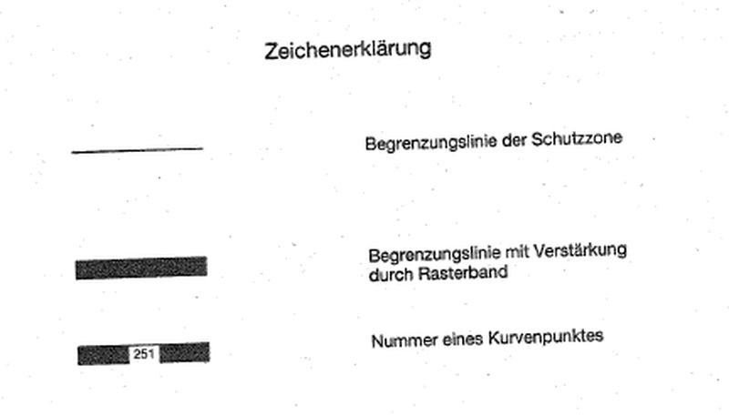
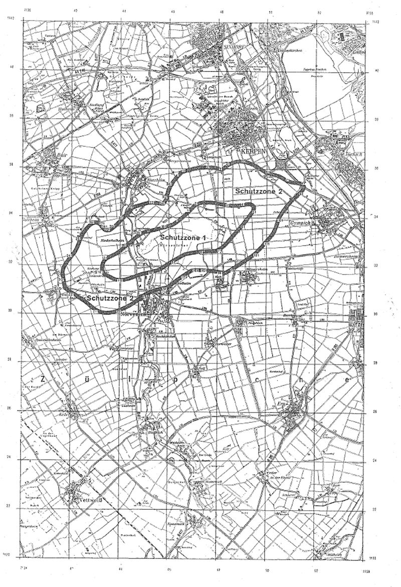

# Verordnung über die Festsetzung des Lärmschutzbereichs für den militärischen Flugplatz Nörvenich (FluLärmNörvV)

Ausfertigungsdatum
:   1974-10-28

Fundstelle
:   BGBl I: 1974, 3102

Zuletzt geändert durch
:   Art. 1 V v. 23.5.1996 I 758

## Eingangsformel

Auf Grund des § 4 Abs. 1 des Gesetzes zum Schutz gegen Fluglärm vom
30\. März 1971 (Bundesgesetzblatt I S. 282), geändert durch Artikel 70
des Einführungsgesetzes zum Strafgesetzbuch vom 2. März 1974
(Bundesgesetzbl. I S. 469), wird im Einvernehmen mit dem
Bundesminister der Verteidigung und mit Zustimmung des Bundesrates
verordnet:

## § 1

Zum Schutz der Allgemeinheit vor Gefahren, erheblichen Nachteilen und
erheblichen Belästigungen durch Fluglärm in der Umgebung des
militärischen Flugplatzes Nörvenich wird der in § 2 bestimmte
Lärmschutzbereich festgesetzt.

## § 2

Der Lärmschutzbereich mit seinen zwei Schutzzonen wird bestimmt durch
die interpolierten Verbindungslinien zwischen den in Anlage 1
genannten Kurvenpunkten, soweit diese Linien außerhalb des
Flugplatzgeländes verlaufen.

## § 3

(1) Liegt eine bauliche Anlage zu einem Teil im Lärmschutzbereich, so
gilt sie als ganz im Lärmschutzbereich gelegen. Liegt eine bauliche
Anlage zu einem Teil in der Schutzzone 1, so gilt sie als ganz in
dieser Schutzzone gelegen.

(2) Auf die Errichtung einer baulichen Anlage ist Absatz 1
entsprechend anzuwenden.

## § 4

(1) Der nach § 2 bestimmte Lärmschutzbereich ist in einer
topographischen Karte im Maßstab 1:50.000 und in Karten im Maßstab
1:5.000 dargestellt. Die topographische Karte ist in verkleinerter
Form als Anlage 2 dieser Verordnung beigefügt. Die topographische
Karte und die Karten im Maßstab 1:5.000 sind beim
Regierungspräsidenten Köln, Zeughausstraße 4-8, 5000 Köln 1, zu
jedermanns Einsicht archivmäßig gesichert niedergelegt.

(2) Die Karten im Maßstab 1:5.000 über den Lärmschutzbereich nach der
bis zum Ablauf des 13. November 1982 und nach der bis zum 13. Juni
1996 geltenden Fassung dieser Verordnung bleiben an gleicher Stelle zu
jedermanns Einsicht archivmäßig gesichert niedergelegt.

## § 5

Diese Verordnung tritt am Tag nach ihrer Verkündung in Kraft.

## Schlußformel

Der Bundesminister des Innern

## Anlage 1 (zu § 2 der Verordnung über die Festsetzung des Lärmschutzbereichs für den militärischen Flugplatz Nörvenich in der Fassung der Zweiten Änderungsverordnung vom 23. Mai 1996)

(Fundstelle: BGBl. I 1996, 759 - 763)

*    *   **Lärmschutzbereich - Zweite Änderung**

*    *

*    *   Koordinatensystem:

    *   Gauß - Krüger:

    *   Y = Rechtswert

*    *   X = Hochwert

*    *   Interpolation:

    *   Polynom 3. Grades mit stetigem Tangentenübergang

*    *

*    *   Kurvenpunkte der Schutzzone 1 (Militärischer Flugplatz Nörvenich)

*    *

*    *   Nr.

    *   Y

    *   X

    *   Nr.

    *   Y

    *   X

    *   Nr.

    *   Y

    *   X

*    *

*    *   1

    *   2546407.4

    *   5633776.0

    *   51

    *   2549370.9

    *   5634315.9

    *   101

    *   2545170.7

    *   5631785.2

*    *   2

    *   2546480.5

    *   5633834.7

    *   52

    *   2549350.5

    *   5634281.4

    *   102

    *   2545084.8

    *   5631765.9

*    *   3

    *   2546538.0

    *   5633880.6

    *   53

    *   2549304.8

    *   5634215.8

    *   103

    *   2544929.4

    *   5631727.7

*    *   4

    *   2546594.7

    *   5633927.3

    *   54

    *   2549257.1

    *   5634151.6

    *   104

    *   2544775.5

    *   5631684.1

*    *   5

    *   2546635.3

    *   5633961.8

    *   55

    *   2549162.7

    *   5634022.4

    *   105

    *   2544700.5

    *   5631656.0

*    *   6

    *   2546675.6

    *   5633996.8

    *   56

    *   2549117.0

    *   5633956.7

    *   106

    *   2544622.4

    *   5631623.1

*    *   7

    *   2546715.4

    *   5634032.3

    *   57

    *   2549070.6

    *   5633891.6

    *   107

    *   2544476.5

    *   5631570.0

*    *   8

    *   2546742.8

    *   5634057.2

    *   58

    *   2549036.9

    *   5633846.7

    *   108

    *   2544324.1

    *   5631521.5

*    *   9

    *   2546787.6

    *   5634098.7

    *   59

    *   2549005.7

    *   5633800.1

    *   109

    *   2544168.6

    *   5631483.6

*    *   10

    *   2546832.4

    *   5634141.4

    *   60

    *   2548976.9

    *   5633761.8

    *   110

    *   2544089.5

    *   5631471.7

*    *
    *
    *
    *
    *
    *
    *
    *
    *

*    *   11

    *   2546889.4

    *   5634197.7

    *   61

    *   2548927.3

    *   5633699.1

    *   111

    *   2544009.6

    *   5631467.1

*    *   12

    *   2546945.2

    *   5634255.0

    *   62

    *   2548874.7

    *   5633638.8

    *   112

    *   2543929.8

    *   5631472.1

*    *   13

    *   2546999.8

    *   5634313.5

    *   63

    *   2548770.3

    *   5633517.5

    *   113

    *   2543851.4

    *   5631488.0

*    *   14

    *   2547054.0

    *   5634372.3

    *   64

    *   2548666.2

    *   5633396.1

    *   114

    *   2543775.7

    *   5631513.8

*    *   15

    *   2547081.3

    *   5634401.6

    *   65

    *   2548559.7

    *   5633276.6

    *   115

    *   2543703.1

    *   5631547.3

*    *   16

    *   2547108.1

    *   5634431.3

    *   66

    *   2548458.4

    *   5633152.7

    *   116

    *   2543632.0

    *   5631584.2

*    *   17

    *   2547121.3

    *   5634446.3

    *   67

    *   2548354.6

    *   5633031.0

    *   117

    *   2543489.6

    *   5631657.2

*    *   18

    *   2547134.9

    *   5634461.0

    *   68

    *   2548242.1

    *   5632917.2

    *   118

    *   2543421.0

    *   5631698.2

*    *   19

    *   2547152.9

    *   5634468.6

    *   69

    *   2548119.0

    *   5632815.1

    *   119

    *   2543390.2

    *   5631723.7

*    *   20

    *   2547171.4

    *   5634475.9

    *   70

    *   2548053.1

    *   5632769.8

    *   120

    *   2543365.3

    *   5631755.0

*    *
    *
    *
    *
    *
    *
    *
    *
    *

*    *   21

    *   2547208.9

    *   5634489.7

    *   71

    *   2547984.4

    *   5632728.8

    *   121

    *   2543349.4

    *   5631791.7

*    *   22

    *   2547285.4

    *   5634512.9

    *   72

    *   2547949.1

    *   5632710.0

    *   122

    *   2543342.2

    *   5631831.1

*    *   23

    *   2547363.4

    *   5634530.3

    *   73

    *   2547931.2

    *   5632701.0

    *   123

    *   2543341.1

    *   5631871.1

*    *   24

    *   2547442.4

    *   5634542.2

    *   74

    *   2547913.2

    *   5632692.4

    *   124

    *   2543343.6

    *   5631911.0

*    *   25

    *   2547522.1

    *   5634548.5

    *   75

    *   2547893.3

    *   5632690.7

    *   125

    *   2543355.4

    *   5631990.1

*    *   26

    *   2547602.0

    *   5634549.6

    *   76

    *   2547873.3

    *   5632690.7

    *   126

    *   2543375.7

    *   5632067.5

*    *   27

    *   2547761.5

    *   5634537.9

    *   77

    *   2547833.3

    *   5632690.3

    *   127

    *   2543390.5

    *   5632104.7

*    *   28

    *   2547919.5

    *   5634512.8

    *   78

    *   2547753.3

    *   5632687.9

    *   128

    *   2543409.6

    *   5632139.8

*    *   29

    *   2548076.8

    *   5634484.1

    *   79

    *   2547593.4

    *   5632684.2

    *   129

    *   2543433.5

    *   5632171.9

*    *   30

    *   2548234.9

    *   5634459.3

    *   80

    *   2547433.7

    *   5632674.0

    *   130

    *   2543461.8

    *   5632200.2

*    *
    *
    *
    *
    *
    *
    *
    *
    *

*    *   31

    *   2548392.8

    *   5634433.5

    *   81

    *   2547274.5

    *   5632657.9

    *   131

    *   2543493.3

    *   5632224.8

*    *   32

    *   2548472.6

    *   5634426.8

    *   82

    *   2547115.9

    *   5632636.4

    *   132

    *   2543562.2

    *   5632265.4

*    *   33

    *   2548552.4

    *   5634421.3

    *   83

    *   2546958.0

    *   5632610.6

    *   133

    *   2543634.5

    *   5632299.7

*    *   34

    *   2548597.6

    *   5634419.6

    *   84

    *   2546800.9

    *   5632580.3

    *   134

    *   2543707.5

    *   5632332.5

*    *   35

    *   2548642.7

    *   5634419.2

    *   85

    *   2546722.6

    *   5632563.8

    *   135

    *   2543850.6

    *   5632404.2

*    *   36

    *   2548687.9

    *   5634420.2

    *   86

    *   2546645.5

    *   5632542.4

    *   136

    *   2543986.2

    *   5632489.0

*    *   37

    *   2548733.2

    *   5634422.1

    *   87

    *   2546574.0

    *   5632506.4

    *   137

    *   2544050.9

    *   5632536.2

*    *   38

    *   2548792.4

    *   5634418.9

    *   88

    *   2546504.0

    *   5632467.9

    *   138

    *   2544113.7

    *   5632585.7

*    *   39

    *   2548872.0

    *   5634426.5

    *   89

    *   2546364.9

    *   5632388.7

    *   139

    *   2544173.9

    *   5632646.4

*    *   40

    *   2548951.2

    *   5634437.7

    *   90

    *   2546226.5

    *   5632308.4

    *   140

    *   2544229.0

    *   5632696.1

*    *
    *
    *
    *
    *
    *
    *
    *
    *

*    *   41

    *   2549108.4

    *   5634467.9

    *   91

    *   2546089.8

    *   5632225.3

    *   141

    *   2544290.8

    *   5632746.8

*    *   42

    *   2549187.2

    *   5634481.7

    *   92

    *   2545955.0

    *   5632139.1

    *   142

    *   2544352.6

    *   5632797.7

*    *   43

    *   2549267.0

    *   5634487.0

    *   93

    *   2545822.6

    *   5632049.3

    *   143

    *   2544475.2

    *   5632900.4

*    *   44

    *   2549306.7

    *   5634482.7

    *   94

    *   2545691.1

    *   5631958.1

    *   144

    *   2544594.7

    *   5633006.9

*    *   45

    *   2549344.8

    *   5634470.3

    *   95

    *   2545622.2

    *   5631917.4

    *   145

    *   2544654.9

    *   5633059.5

*    *   46

    *   2549377.1

    *   5634446.8

    *   96

    *   2545550.0

    *   5631883.1

    *   146

    *   2544716.4

    *   5633110.7

*    *   47

    *   2549388.4

    *   5634430.3

    *   97

    *   2545474.0

    *   5631858.1

    *   147

    *   2544779.7

    *   5633159.6

*    *   48

    *   2549394.7

    *   5634411.3

    *   98

    *   2545397.0

    *   5631836.5

    *   148

    *   2544812.2

    *   5633183.0

*    *   49

    *   2549396.0

    *   5634391.3

    *   99

    *   2545319.2

    *   5631817.6

    *   149

    *   2544845.3

    *   5633205.5

*    *   50

    *   2549387.5

    *   5634352.3

    *   100

    *   2545241.1

    *   5631800.4

    *   150

    *   2544875.4

    *   5633224.8

*    *

*    *

*    *   Noch Schutzzone 1 (Militärischer Flugplatz Nörvenich)

*    *

*    *   151

    *   2544913.2

    *   5633247.6

    *   161

    *   2545911.3

    *   5633530.8

    *
    *
    *

*    *   152

    *   2544948.1

    *   5633267.1

    *   162

    *   2546064.5

    *   5633577.1

    *
    *
    *

*    *   153

    *   2544983.6

    *   5633285.6

    *   163

    *   2546140.6

    *   5633601.9

    *
    *
    *

*    *   154

    *   2545060.3

    *   5633308.3

    *   164

    *   2546212.8

    *   5633636.4

    *
    *
    *

*    *   155

    *   2545136.9

    *   5633331.1

    *   165

    *   2546278.7

    *   5633681.9

    *
    *
    *

*    *   156

    *   2545293.3

    *   5633364.8

    *   166

    *   2546343.7

    *   5633728.6

    *
    *
    *

*    *   157

    *   2545448.7

    *   5633402.7

    *
    *
    *
    *
    *
    *

*    *   158

    *   2545530.2

    *   5633423.8

    *
    *
    *
    *
    *
    *

*    *   159

    *   2545610.2

    *   5633445.0

    *
    *
    *
    *
    *
    *

*    *   160

    *   2545757.7

    *   5633486.0

    *
    *
    *
    *
    *
    *

*    *

*    *

*    *   Kurvenpunkte der Schutzzone 2 (Militärischer Flugplatz Nörvenich)

*    *

*    *   1

    *   2546429.7

    *   5635663.8

    *   51

    *   2548955.5

    *   5636236.2

    *   101

    *   2550418.2

    *   5633976.1

*    *   2

    *   2546460.6

    *   5635697.2

    *   52

    *   2549023.6

    *   5636229.3

    *   102

    *   2550391.5

    *   5633900.7

*    *   3

    *   2546492.4

    *   5635729.7

    *   53

    *   2549096.4

    *   5636216.1

    *   103

    *   2550367.9

    *   5633824.2

*    *   4

    *   2546510.9

    *   5635748.9

    *   54

    *   2549170.4

    *   5636197.2

    *   104

    *   2550320.0

    *   5633671.5

*    *   5

    *   2546529.3

    *   5635768.2

    *   55

    *   2549244.0

    *   5636173.3

    *   105

    *   2550264.3

    *   5633521.5

*    *   6

    *   2546547.6

    *   5635787.7

    *   56

    *   2549387.3

    *   5636112.6

    *   106

    *   2550229.8

    *   5633449.4

*    *   7

    *   2546569.1

    *   5635797.2

    *   57

    *   2549526.6

    *   5636037.6

    *   107

    *   2550189.3

    *   5633380.4

*    *   8

    *   2546591.4

    *   5635804.6

    *   58

    *   2549663.1

    *   5635955.8

    *   108

    *   2550143.7

    *   5633314.7

*    *   9

    *   2546613.7

    *   5635811.9

    *   59

    *   2549800.1

    *   5635873.5

    *   109

    *   2550094.1

    *   5633251.9

*    *   10

    *   2546638.4

    *   5635819.9

    *   60

    *   2549870.6

    *   5635835.0

    *   110

    *   2549988.7

    *   5633131.5

*    *
    *
    *
    *
    *
    *
    *
    *
    *

*    *   11

    *   2546681.6

    *   5635833.4

    *   61

    *   2549942.9

    *   5635800.3

    *   111

    *   2549882.1

    *   5633012.2

*    *   12

    *   2546724.9

    *   5635846.5

    *   62

    *   2550018.1

    *   5635770.4

    *   112

    *   2549777.4

    *   5632891.2

*    *   13

    *   2546799.2

    *   5635867.7

    *   63

    *   2550094.7

    *   5635745.8

    *   113

    *   2549724.6

    *   5632831.1

*    *   14

    *   2546873.9

    *   5635887.7

    *   64

    *   2550172.3

    *   5635725.5

    *   114

    *   2549669.9

    *   5632772.7

*    *   15

    *   2546951.3

    *   5635906.8

    *   65

    *   2550328.2

    *   5635689.8

    *   115

    *   2549632.8

    *   5632734.4

*    *   16

    *   2547029.0

    *   5635924.4

    *   66

    *   2550405.4

    *   5635669.3

    *   116

    *   2549595.3

    *   5632696.5

*    *   17

    *   2547186.0

    *   5635954.3

    *   67

    *   2550480.5

    *   5635642.7

    *   117

    *   2549557.1

    *   5632659.2

*    *   18

    *   2547344.5

    *   5635975.9

    *   68

    *   2550552.3

    *   5635608.4

    *   118

    *   2549522.8

    *   5632620.3

*    *   19

    *   2547437.2

    *   5635984.5

    *   69

    *   2550620.9

    *   5635567.9

    *   119

    *   2549501.8

    *   5632601.4

*    *   20

    *   2547527.3

    *   5635990.5

    *   70

    *   2550688.5

    *   5635525.3

    *   120

    *   2549471.6

    *   5632575.2

*    *
    *
    *
    *
    *
    *
    *
    *
    *

*    *   21

    *   2547598.4

    *   5635992.6

    *   71

    *   2550757.8

    *   5635485.2

    *   121

    *   2549441.0

    *   5632549.4

*    *   22

    *   2547712.0

    *   5635981.9

    *   72

    *   2550830.2

    *   5635450.8

    *   122

    *   2549409.5

    *   5632524.8

*    *   23

    *   2547797.9

    *   5635975.8

    *   73

    *   2550905.7

    *   5635424.0

    *   123

    *   2549377.7

    *   5632500.6

*    *   24

    *   2547883.3

    *   5635964.6

    *   74

    *   2550983.5

    *   5635404.8

    *   124

    *   2549313.1

    *   5632453.3

*    *   25

    *   2547951.8

    *   5635951.1

    *   75

    *   2551062.5

    *   5635391.9

    *   125

    *   2549248.0

    *   5632406.8

*    *   26

    *   2548019.2

    *   5635933.0

    *   76

    *   2551142.1

    *   5635382.8

    *   126

    *   2549117.5

    *   5632314.3

*    *   27

    *   2548080.2

    *   5635912.0

    *   77

    *   2551221.7

    *   5635375.3

    *   127

    *   2548987.2

    *   5632221.4

*    *   28

    *   2548110.6

    *   5635904.3

    *   78

    *   2551301.2

    *   5635365.8

    *   128

    *   2548856.7

    *   5632128.9

*    *   29

    *   2548140.6

    *   5635903.3

    *   79

    *   2551340.5

    *   5635358.7

    *   129

    *   2548723.4

    *   5632040.4

*    *   30

    *   2548169.6

    *   5635908.3

    *   80

    *   2551379.0

    *   5635348.4

    *   130

    *   2548586.6

    *   5631957.5

*    *
    *
    *
    *
    *
    *
    *
    *
    *

*    *   31

    *   2548198.6

    *   5635918.3

    *   81

    *   2551397.5

    *   5635340.8

    *   131

    *   2548517.6

    *   5631917.0

*    *   32

    *   2548227.6

    *   5635933.3

    *   82

    *   2551415.0

    *   5635331.1

    *   132

    *   2548447.6

    *   5631878.1

*    *   33

    *   2548255.6

    *   5635950.3

    *   83

    *   2551430.0

    *   5635318.3

    *   133

    *   2548388.6

    *   5631844.3

*    *   34

    *   2548283.6

    *   5635971.3

    *   84

    *   2551440.9

    *   5635301.9

    *   134

    *   2548358.6

    *   5631821.3

*    *   35

    *   2548311.6

    *   5635993.3

    *   85

    *   2551445.3

    *   5635282.8

    *   135

    *   2548338.6

    *   5631803.3

*    *   36

    *   2548339.6

    *   5636016.3

    *   86

    *   2551443.8

    *   5635263.1

    *   136

    *   2548318.6

    *   5631794.3

*    *   37

    *   2548367.6

    *   5636040.3

    *   87

    *   2551438.4

    *   5635244.1

    *   137

    *   2548302.4

    *   5631792.7

*    *   38

    *   2548395.6

    *   5636062.3

    *   88

    *   2551420.5

    *   5635208.5

    *   138

    *   2548284.2

    *   5631796.2

*    *   39

    *   2548423.6

    *   5636083.3

    *   89

    *   2551397.7

    *   5635175.7

    *   139

    *   2548265.9

    *   5631799.6

*    *   40

    *   2548452.6

    *   5636102.3

    *   90

    *   2551372.6

    *   5635144.7

    *   140

    *   2548246.2

    *   5631803.0

*    *
    *
    *
    *
    *
    *
    *
    *
    *

*    *   41

    *   2548487.7

    *   5636120.1

    *   91

    *   2551318.2

    *   5635086.1

    *   141

    *   2548226.5

    *   5631806.4

*    *   42

    *   2548557.4

    *   5636156.1

    *   92

    *   2551202.4

    *   5634975.6

    *   142

    *   2548187.0

    *   5631812.5

*    *   43

    *   2548593.0

    *   5636172.9

    *   93

    *   2551084.7

    *   5634867.3

    *   143

    *   2548108.0

    *   5631825.1

*    *   44

    *   2548629.5

    *   5636187.2

    *   94

    *   2550969.6

    *   5634756.1

    *   144

    *   2547950.2

    *   5631851.5

*    *   45

    *   2548664.6

    *   5636199.3

    *   95

    *   2550859.6

    *   5634639.9

    *   145

    *   2547791.4

    *   5631871.9

*    *   46

    *   2548701.5

    *   5636210.4

    *   96

    *   2550756.7

    *   5634517.3

    *   146

    *   2547711.8

    *   5631879.5

*    *   47

    *   2548739.0

    *   5636219.6

    *   97

    *   2550662.1

    *   5634388.3

    *   147

    *   2547632.0

    *   5631885.8

*    *   48

    *   2548780.0

    *   5636227.3

    *   98

    *   2550573.2

    *   5634255.2

    *   148

    *   2547587.2

    *   5631889.1

*    *   49

    *   2548821.3

    *   5636232.8

    *   99

    *   2550487.6

    *   5634120.1

    *   149

    *   2547542.3

    *   5631891.8

*    *   50

    *   2548891.8

    *   5636237.6

    *   100

    *   2550450.0

    *   5634049.4

    *   150

    *   2547497.3

    *   5631894.0

*    *

*    *

*    *   Noch Schutzzone 2 (Militärischer Flugplatz Nörvenich)

*    *

*    *   151

    *   2547452.9

    *   5631895.7

    *   201

    *   2543841.8

    *   5630179.8

    *   251

    *   2542429.3

    *   5633019.0

*    *   152

    *   2547427.6

    *   5631898.3

    *   202

    *   2543759.6

    *   5630156.9

    *   252

    *   2542493.0

    *   5633165.8

*    *   153

    *   2547402.7

    *   5631901.8

    *   203

    *   2543676.3

    *   5630138.1

    *   253

    *   2542568.3

    *   5633306.8

*    *   154

    *   2547377.6

    *   5631902.1

    *   204

    *   2543597.3

    *   5630124.6

    *   254

    *   2542614.1

    *   5633377.5

*    *   155

    *   2547352.6

    *   5631902.2

    *   205

    *   2543518.2

    *   5630116.6

    *   255

    *   2542664.1

    *   5633442.9

*    *   156

    *   2547327.5

    *   5631902.1

    *   206

    *   2543439.2

    *   5630114.8

    *   256

    *   2542720.4

    *   5633509.0

*    *   157

    *   2547283.8

    *   5631903.6

    *   207

    *   2543392.6

    *   5630117.4

    *   257

    *   2542786.5

    *   5633573.4

*    *   158

    *   2547240.0

    *   5631902.7

    *   208

    *   2543338.0

    *   5630124.6

    *   258

    *   2542837.7

    *   5633613.4

*    *   159

    *   2547196.3

    *   5631901.0

    *   209

    *   2543284.0

    *   5630135.8

    *   259

    *   2542893.1

    *   5633647.5

*    *   160

    *   2547152.6

    *   5631899.8

    *   210

    *   2543208.8

    *   5630158.2

    *   260

    *   2542924.2

    *   5633660.4

*    *
    *
    *
    *
    *
    *
    *
    *
    *

*    *   161

    *   2547112.6

    *   5631898.3

    *   211

    *   2543140.1

    *   5630186.0

    *   261

    *   2542956.4

    *   5633669.7

*    *   162

    *   2547072.6

    *   5631896.4

    *   212

    *   2543066.2

    *   5630223.8

    *   262

    *   2542985.7

    *   5633674.9

*    *   163

    *   2547032.7

    *   5631894.1

    *   213

    *   2542999.0

    *   5630265.6

    *   263

    *   2543014.0

    *   5633676.0

*    *   164

    *   2546992.8

    *   5631891.3

    *   214

    *   2542934.4

    *   5630311.6

    *   264

    *   2543041.4

    *   5633672.6

*    *   165

    *   2546953.0

    *   5631887.5

    *   215

    *   2542810.5

    *   5630411.5

    *   265

    *   2543067.6

    *   5633664.3

*    *   166

    *   2546915.7

    *   5631872.8

    *   216

    *   2542687.8

    *   5630514.0

    *   266

    *   2543092.7

    *   5633651.2

*    *   167

    *   2546880.9

    *   5631852.9

    *   217

    *   2542624.2

    *   5630562.7

    *   267

    *   2543116.7

    *   5633633.2

*    *   168

    *   2546846.6

    *   5631832.4

    *   218

    *   2542558.7

    *   5630608.8

    *   268

    *   2543140.4

    *   5633610.0

*    *   169

    *   2546778.3

    *   5631790.6

    *   219

    *   2542425.9

    *   5630698.3

    *   269

    *   2543161.7

    *   5633584.9

*    *   170

    *   2546643.7

    *   5631704.1

    *   220

    *   2542292.7

    *   5630787.0

    *   270

    *   2543181.9

    *   5633558.9

*    *
    *
    *
    *
    *
    *
    *
    *
    *

*    *   171

    *   2546510.5

    *   5631615.5

    *   221

    *   2542156.3

    *   5630870.7

    *   271

    *   2543201.6

    *   5633532.4

*    *   172

    *   2546380.0

    *   5631522.9

    *   222

    *   2542017.3

    *   5630950.0

    *   272

    *   2543221.4

    *   5633506.0

*    *   173

    *   2546252.1

    *   5631426.8

    *   223

    *   2541948.1

    *   5630990.1

    *   273

    *   2543242.3

    *   5633480.5

*    *   174

    *   2546128.5

    *   5631325.2

    *   224

    *   2541884.7

    *   5631038.7

    *   274

    *   2543256.9

    *   5633463.8

*    *   175

    *   2546069.3

    *   5631271.4

    *   225

    *   2541857.9

    *   5631068.3

    *   275

    *   2543272.2

    *   5633447.7

*    *   176

    *   2546005.5

    *   5631223.0

    *   226

    *   2541835.7

    *   5631101.4

    *   276

    *   2543288.2

    *   5633432.6

*    *   177

    *   2545937.7

    *   5631180.7

    *   227

    *   2541819.3

    *   5631137.7

    *   277

    *   2543305.2

    *   5633418.4

*    *   178

    *   2545902.0

    *   5631162.7

    *   228

    *   2541807.7

    *   5631175.9

    *   278

    *   2543323.1

    *   5633405.5

*    *   179

    *   2545862.7

    *   5631155.5

    *   229

    *   2541799.6

    *   5631215.0

    *   279

    *   2543342.2

    *   5633393.8

*    *   180

    *   2545823.5

    *   5631147.7

    *   230

    *   2541787.3

    *   5631294.0

    *   280

    *   2543359.4

    *   5633384.7

*    *
    *
    *
    *
    *
    *
    *
    *
    *

*    *   181

    *   2545745.2

    *   5631131.1

    *   231

    *   2541759.1

    *   5631451.5

    *   281

    *   2543377.3

    *   5633377.2

*    *   182

    *   2545589.8

    *   5631093.1

    *   232

    *   2541744.0

    *   5631530.1

    *   282

    *   2543395.6

    *   5633370.9

*    *   183

    *   2545435.9

    *   5631049.3

    *   233

    *   2541732.1

    *   5631609.2

    *   283

    *   2543414.4

    *   5633365.9

*    *   184

    *   2545304.9

    *   5631002.0

    *   234

    *   2541727.9

    *   5631688.9

    *   284

    *   2543438.5

    *   5633361.6

*    *   185

    *   2545220.7

    *   5630968.1

    *   235

    *   2541734.9

    *   5631768.4

    *   285

    *   2543462.6

    *   5633359.4

*    *   186

    *   2545137.7

    *   5630933.0

    *   236

    *   2541755.9

    *   5631845.4

    *   286

    *   2543486.9

    *   5633359.1

*    *   187

    *   2545065.5

    *   5630898.4

    *   237

    *   2541788.1

    *   5631918.3

    *   287

    *   2543511.3

    *   5633360.8

*    *   188

    *   2545030.8

    *   5630878.5

    *   238

    *   2541827.0

    *   5631988.0

    *   288

    *   2543543.6

    *   5633366.1

*    *   189

    *   2544996.9

    *   5630857.2

    *   239

    *   2541869.6

    *   5632055.6

    *   289

    *   2543575.2

    *   5633374.9

*    *   190

    *   2544966.7

    *   5630837.2

    *   240

    *   2541963.1

    *   5632185.2

    *   290

    *   2543591.7

    *   5633380.6

*    *
    *
    *
    *
    *
    *
    *
    *
    *

*    *   191

    *   2544927.9

    *   5630816.9

    *   241

    *   2542063.8

    *   5632309.3

    *   291

    *   2543607.9

    *   5633387.2

*    *   192

    *   2544863.4

    *   5630769.5

    *   242

    *   2542113.9

    *   5632371.9

    *   292

    *   2543723.5

    *   5633394.3

*    *   193

    *   2544801.6

    *   5630718.7

    *   243

    *   2542161.4

    *   5632436.4

    *   293

    *   2543639.5

    *   5633402.3

*    *   194

    *   2544676.9

    *   5630618.4

    *   244

    *   2542205.8

    *   5632503.8

    *   294

    *   2543654.5

    *   5633410.3

*    *   195

    *   2544549.4

    *   5630521.7

    *   245

    *   2542246.2

    *   5632573.5

    *   295

    *   2543668.5

    *   5633420.3

*    *   196

    *   2544415.2

    *   5630434.7

    *   246

    *   2542282.3

    *   5632645.2

    *   296

    *   2543683.5

    *   5633430.3

*    *   197

    *   2544273.7

    *   5630360.4

    *   247

    *   2542314.8

    *   5632718.6

    *   297

    *   2543696.5

    *   5633441.3

*    *   198

    *   2544129.2

    *   5630291.8

    *   248

    *   2542344.7

    *   5632793.3

    *   298

    *   2543710.5

    *   5633452.3

*    *   199

    *   2543981.8

    *   5630229.7

    *   249

    *   2542372.8

    *   5632868.8

    *   299

    *   2543723.5

    *   5633464.3

*    *   200

    *   2543896.1

    *   5630197.8

    *   250

    *   2542400.5

    *   5632944.1

    *   300

    *   2543737.5

    *   5633476.3

*    *

*    *

*    *   Noch Schutzzone 2 (Militärischer Flugplatz Nörvenich)

*    *

*    *   301

    *   2543750.5

    *   5633487.3

    *   331

    *   2545300.1

    *   5634520.6

    *   361

    *   2546145.6

    *   5635292.7

*    *   302

    *   2543763.5

    *   5633499.3

    *   332

    *   2545354.5

    *   5634519.6

    *   362

    *   2546198.5

    *   5635377.0

*    *   303

    *   2543776.5

    *   5633511.3

    *   333

    *   2545408.9

    *   5634515.9

    *   363

    *   2546266.7

    *   5635470.1

*    *   304

    *   2543790.2

    *   5633521.9

    *   334

    *   2545455.6

    *   5634511.2

    *   364

    *   2546348.4

    *   5635569.7

*    *   305

    *   2543816.1

    *   5633543.9

    *   335

    *   2545502.1

    *   5634504.9

    *   365

    *   2546388.9

    *   5635616.9

*    *   306

    *   2543841.9

    *   5633566.1

    *   336

    *   2545545.3

    *   5634498.4

    *
    *
    *

*    *   307

    *   2543881.4

    *   5633600.2

    *   337

    *   2545588.5

    *   5634492.4

    *
    *
    *

*    *   308

    *   2543937.2

    *   5633654.3

    *   338

    *   2545629.6

    *   5634488.0

    *
    *
    *

*    *   309

    *   2543992.6

    *   5633712.8

    *   339

    *   2545670.8

    *   5634484.7

    *
    *
    *

*    *   310

    *   2544101.4

    *   5633823.9

    *   340

    *   2545707.0

    *   5634482.6

    *
    *
    *

*    *
    *
    *
    *
    *
    *
    *
    *
    *

*    *   311

    *   2544159.0

    *   5633879.7

    *   341

    *   2545743.3

    *   5634481.7

    *
    *
    *

*    *   312

    *   2544320.0

    *   5633938.9

    *   342

    *   2545771.4

    *   5634482.0

    *
    *
    *

*    *   313

    *   2544213.9

    *   5633999.7

    *   343

    *   2545798.6

    *   5634489.0

    *
    *
    *

*    *   314

    *   2544320.8

    *   5634060.6

    *   344

    *   2545822.4

    *   5634505.5

    *
    *
    *

*    *   315

    *   2544374.3

    *   5634121.1

    *   345

    *   2545841.7

    *   5634527.1

    *
    *
    *

*    *   316

    *   2544428.6

    *   5634180.9

    *   346

    *   2545869.5

    *   5634562.2

    *
    *
    *

*    *   317

    *   2544459.1

    *   5634214.1

    *   347

    *   2545916.3

    *   5634628.6

    *
    *
    *

*    *   318

    *   2544489.5

    *   5634247.2

    *   348

    *   2545948.1

    *   5634681.2

    *
    *
    *

*    *   319

    *   2544508.8

    *   5634268.2

    *   349

    *   2545961.6

    *   5634709.3

    *
    *
    *

*    *   320

    *   2544528.2

    *   5634289.3

    *   350

    *   2545971.6

    *   5634737.3

    *
    *
    *

*    *
    *
    *
    *
    *
    *
    *
    *
    *

*    *   321

    *   2544551.1

    *   5634306.7

    *   351

    *   2545978.6

    *   5634767.3

    *
    *
    *

*    *   322

    *   2544577.4

    *   5634318.3

    *   352

    *   2545982.6

    *   5634798.3

    *
    *
    *

*    *   323

    *   2544609.3

    *   5634334.0

    *   353

    *   2545987.6

    *   5634829.3

    *
    *
    *

*    *   324

    *   2544640.5

    *   5634351.2

    *   354

    *   2545991.6

    *   5634860.3

    *
    *
    *

*    *   325

    *   2544695.9

    *   5634372.2

    *   355

    *   2545997.6

    *   5634891.3

    *
    *
    *

*    *   326

    *   2544790.3

    *   5634395.8

    *   356

    *   2546006.2

    *   5634917.0

    *
    *
    *

*    *   327

    *   2544875.9

    *   5634421.8

    *   357

    *   2546021.3

    *   5634969.9

    *
    *
    *

*    *   328

    *   2545013.8

    *   5634466.8

    *   358

    *   2546036.1

    *   5635022.9

    *
    *
    *

*    *   329

    *   2545108.7

    *   5634493.8

    *   359

    *   2546068.7

    *   5635128.1

    *
    *
    *

*    *   330

    *   2545208.9

    *   5634513.9

    *   360

    *   2546111.2

    *   5635227.9

    *
    *
    *

## Anlage 2 (zu § 4 Abs. 1 der Verordnung über die Festsetzung des Lärmschutzbereichs für den militärischen Flugplatz Nörvenich in der Fassung der Zweiten Änderungsverordnung vom 23. Mai 1996)

   (Fundstelle: BGBl I 1996, 764 - 765)

1 : 50 000
Lärmschutzbereich
für den militärischen Flugplatz Nörvenich
– Zweite Änderung –
(Gesetz zum Schutz gegen Fluglärm vom 30. März 1971, BGBl. I S. 282)

Das rechtwinklige Koordinatengitter entspricht dem Gauß-Krüger-System
mit 3° breitem Meridianstreifen. Es zeigt zugleich die Begrenzung der
zugehörigen Blätter der Deutschen Grundkarte 1 : 5 000.

Kartengrundlage:
Topographische Karte 1 : 50 000
(mit Genehmigung des Landesvermessungsamts Nordrhein-Westfalen)

Gravur der Lärmschutzgrenzen und Druck:
Landesvermessungsamt Nordrhein-Westfalen, 1996

