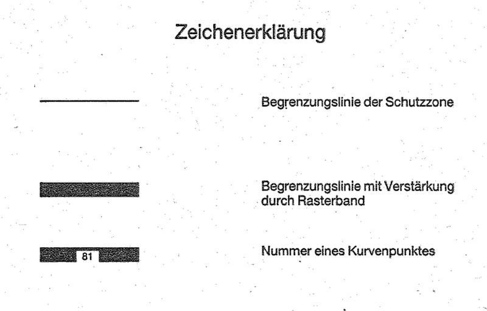
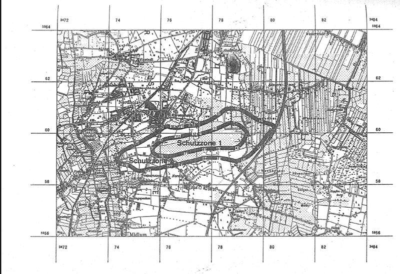

# Verordnung über die Festsetzung des Lärmschutzbereichs für den militärischen Flugplatz Nordholz (FluLärmNordholzV)

Ausfertigungsdatum
:   1995-09-27

Fundstelle
:   BGBl I: 1995, 1228

## Eingangsformel

Auf Grund des § 4 Abs. 1 des Gesetzes zum Schutz gegen Fluglärm vom
30\. März 1971 (BGBl. I S. 282), der gemäß Artikel 3 Abs. 1 der
Verordnung vom 26. November 1986 (BGBl. I S. 2089) geändert worden
ist, verordnet das Bundesministerium für Umwelt, Naturschutz und
Reaktorsicherheit im Einvernehmen mit dem Bundesministerium der
Verteidigung:

## § 1

Zum Schutz der Allgemeinheit vor Gefahren, erheblichen Nachteilen und
erheblichen Belästigungen durch Fluglärm in der Umgebung des
militärischen Flugplatzes Nordholz wird der in § 2 bestimmte
Lärmschutzbereich festgesetzt.

## § 2

Der Lärmschutzbereich mit seinen zwei Schutzzonen wird nach Anlage 1
bestimmt durch die interpolierten Verbindungslinien zwischen den
Kurvenpunkten, soweit diese Linien außerhalb des Flugplatzgeländes
verlaufen.

## § 3

(1) Liegt eine bauliche Anlage zu einem Teil im Lärmschutzbereich, so
gilt sie als ganz im Lärmschutzbereich gelegen. Liegt eine bauliche
Anlage zu einem Teil in der Schutzzone 1, so gilt sie als ganz in
dieser Schutzzone gelegen.

(2) Auf die Errichtung einer baulichen Anlage ist Absatz 1
entsprechend anzuwenden.

## § 4

Der nach § 2 bestimmte Lärmschutzbereich ist in einer topographischen
Karte im Maßstab 1:50.000 und in Karten im Maßstab 1:5.000
dargestellt. Die topographische Karte ist dieser Verordnung als Anlage
2 beigefügt. Die topographische Karte und die Karten im Maßstab
1:5.000 sind bei der Gemeinde Nordholz, Feuerweg 9, 27637 Nordholz, zu
jedermanns Einsicht archivmäßig gesichert niedergelegt.

## § 5

Diese Verordnung tritt am Tage nach der Verkündung in Kraft.

## Schlußformel

Der Bundesrat hat zugestimmt.

## Anlage 1 (zu § 2 der Verordnung über die Festsetzung des Lärmschutzbereichs für den militärischen Flugplatz Nordholz)

(Fundstelle des Originaltextes: BGBl. I 1995, 1229 - 1231)

*    *   **Lärmschutzbereich**

*    *

*    *   Koordinatensystem:

    *   Gauß-Krüger:

    *   Y = Rechtswert

*    *   X = Hochwert

*    *   Interpolation:

    *   Polynom 3. Grades mit stetigem Tangentenübergang

*    *   Kurvenpunkte der Schutzzone 1 (Militärischer Flugplatz Nordholz)

*    *   Nr.

    *   Y

    *   X

    *   Nr.

    *   Y

    *   X

    *   Nr.

    *   Y

    *   X

*    *   1

    *   3477552.7

    *   5959899.5

    *   51

    *   3478263.2

    *   5959487.3

    *   101

    *   3476093.9

    *   5959651.7

*    *   2

    *   3477591.5

    *   5959909.4

    *   52

    *   3478223.3

    *   5959484.9

    *   102

    *   3476137.4

    *   5959669.6

*    *   3

    *   3477668.6

    *   5959930.4

    *   53

    *   3478183.3

    *   5959483.1

    *   103

    *   3476175.7

    *   5959681.0

*    *   4

    *   3477754.0

    *   5959955.3

    *   54

    *   3478150.1

    *   5959478.0

    *   104

    *   3476238.6

    *   5959708.1

*    *   5

    *   3477828.0

    *   5959978.0

    *   55

    *   3478103.7

    *   5959475.0

    *   105

    *   3476298.3

    *   5959722.6

*    *   6

    *   3477898.3

    *   5960000.2

    *   56

    *   3478023.7

    *   5959473.1

    *   106

    *   3476407.4

    *   5959739.5

*    *   7

    *   3477974.2

    *   5960025.5

    *   57

    *   3477943.7

    *   5959473.3

    *   107

    *   3476486.7

    *   5959749.8

*    *   8

    *   3478023.4

    *   5960042.5

    *   58

    *   3477863.7

    *   5959471.6

    *   108

    *   3476566.2

    *   5959759.1

*    *   9

    *   3478074.3

    *   5960060.3

    *   59

    *   3477783.8

    *   5959467.8

    *   109

    *   3476645.6

    *   5959769.3

*    *   10

    *   3478125.0

    *   5960078.8

    *   60

    *   3477704.0

    *   5959462.5

    *   110

    *   3476724.6

    *   5959781.5

*    *   11

    *   3478199.9

    *   5960107.0

    *   61

    *   3477624.3

    *   5959456.0

    *   111

    *   3476803.2

    *   5959796.7

*    *   12

    *   3478274.3

    *   5960136.4

    *   62

    *   3477545.9

    *   5959439.9

    *   112

    *   3476881.5

    *   5959813.0

*    *   13

    *   3478348.1

    *   5960167.2

    *   63

    *   3477468.1

    *   5959421.2

    *   113

    *   3476959.6

    *   5959830.4

*    *   14

    *   3478421.4

    *   5960199.3

    *   64

    *   3477390.4

    *   5959402.3

    *   114

    *   3477037.3

    *   5959849.4

*    *   15

    *   3478494.2

    *   5960232.4

    *   65

    *   3477312.7

    *   5959383.1

    *   115

    *   3477114.7

    *   5959869.5

*    *   16

    *   3478566.6

    *   5960266.6

    *   66

    *   3477234.9

    *   5959364.5

    *   116

    *   3477164.8

    *   5959876.4

*    *   17

    *   3478638.8

    *   5960300.9

    *   67

    *   3477179.4

    *   5959352.8

    *   117

    *   3477215.2

    *   5959878.8

*    *   18

    *   3478675.6

    *   5960316.8

    *   68

    *   3477133.4

    *   5959343.0

    *   118

    *   3477274.2

    *   5959878.5

*    *   19

    *   3478715.2

    *   5960322.3

    *   69

    *   3477078.4

    *   5959331.2

    *   119

    *   3477354.2

    *   5959879.8

*    *   20

    *   3478755.1

    *   5960324.4

    *   70

    *   3477000.4

    *   5959313.6

    *   120

    *   3477434.1

    *   5959884.3

*    *   21

    *   3478834.9

    *   5960318.7

    *   71

    *   3476923.8

    *   5959295.8

    *   121

    *   3477474.0

    *   5959887.4

*    *   22

    *   3478912.8

    *   5960300.3

    *   72

    *   3476844.6

    *   5959277.1

    *   122

    *   3477513.7

    *   5959891.6

*    *   23

    *   3478987.0

    *   5960270.4

    *   73

    *   3476767.1

    *   5959257.5

    *   123

    *   3477552.7

    *   5959899.5

*    *   24

    *   3479056.0

    *   5960230.0

    *   74

    *   3476689.8

    *   5959236.8

    *
    *
    *

*    *   25

    *   3479118.3

    *   5960179.7

    *   75

    *   3476612.6

    *   5959215.8

    *
    *
    *

*    *   26

    *   3479175.2

    *   5960123.5

    *   76

    *   3476535.4

    *   5959194.9

    *
    *
    *

*    *   27

    *   3479231.6

    *   5960066.8

    *   77

    *   3476456.9

    *   5959179.5

    *
    *
    *

*    *   28

    *   3479261.8

    *   5960040.6

    *   78

    *   3476378.2

    *   5959164.8

    *
    *
    *

*    *   29

    *   3479276.3

    *   5960026.8

    *   79

    *   3476298.4

    *   5959159.8

    *
    *
    *

*    *   30

    *   3479285.6

    *   5960009.4

    *   80

    *   3476218.6

    *   5959166.1

    *
    *
    *

*    *   31

    *   3479287.0

    *   5959989.2

    *   81

    *   3476139.7

    *   5959179.4

    *
    *
    *

*    *   32

    *   3479280.5

    *   5959970.2

    *   82

    *   3476060.4

    *   5959189.6

    *
    *
    *

*    *   33

    *   3479272.2

    *   5959951.9

    *   83

    *   3475980.9

    *   5959198.6

    *
    *
    *

*    *   34

    *   3479256.6

    *   5959915.1

    *   84

    *   3475901.8

    *   5959210.9

    *
    *
    *

*    *   35

    *   3479224.8

    *   5959841.7

    *   85

    *   3475863.6

    *   5959222.6

    *
    *
    *

*    *   36

    *   3479188.5

    *   5959770.4

    *   86

    *   3475828.4

    *   5959241.8

    *
    *
    *

*    *   37

    *   3479146.9

    *   5959702.1

    *   87

    *   3475797.8

    *   5959267.6

    *
    *
    *

*    *   38

    *   3479097.8

    *   5959638.9

    *   88

    *   3475785.0

    *   5959283.0

    *
    *
    *

*    *   39

    *   3479039.3

    *   5959584.3

    *   89

    *   3475775.4

    *   5959300.7

    *
    *
    *

*    *   40

    *   3478972.8

    *   5959539.8

    *   90

    *   3475771.8

    *   5959320.5

    *
    *
    *

*    *   41

    *   3478900.2

    *   5959506.3

    *   91

    *   3475774.6

    *   5959340.5

    *
    *
    *

*    *   42

    *   3478862.1

    *   5959494.0

    *   92

    *   3475781.0

    *   5959359.6

    *
    *
    *

*    *   43

    *   3478822.7

    *   5959487.1

    *   93

    *   3475798.8

    *   5959395.5

    *
    *
    *

*    *   44

    *   3478782.8

    *   5959489.5

    *   94

    *   3475821.4

    *   5959428.5

    *
    *
    *

*    *   45

    *   3478742.8

    *   5959491.5

    *   95

    *   3475848.5

    *   5959457.9

    *
    *
    *

*    *   46

    *   3478662.9

    *   5959494.6

    *   96

    *   3475878.4

    *   5959484.4

    *
    *
    *

*    *   47

    *   3478582.9

    *   5959496.6

    *   97

    *   3475941.4

    *   5959533.8

    *
    *
    *

*    *   48

    *   3478502.9

    *   5959497.2

    *   98

    *   3476003.3

    *   5959584.5

    *
    *
    *

*    *   49

    *   3478422.9

    *   5959496.2

    *   99

    *   3476034.3

    *   5959609.8

    *
    *
    *

*    *   50

    *   3478343.0

    *   5959492.8

    *   100

    *   3476066.0

    *   5959634.1

    *
    *
    *

*    *

*    *   Kurvenpunkte der Schutzzone 2 (Militärischer Flugplatz Nordholz)

*    *   1

    *   3477552.7

    *   5960276.8

    *   51

    *   3479761.5

    *   5959534.0

    *   101

    *   3476247.5

    *   5958784.1

*    *   2

    *   3477627.7

    *   5960304.5

    *   52

    *   3479705.1

    *   5959477.3

    *   102

    *   3476092.5

    *   5958744.6

*    *   3

    *   3477776.5

    *   5960363.4

    *   53

    *   3479597.4

    *   5959359.0

    *   103

    *   3476016.9

    *   5958718.4

*    *   4

    *   3477921.6

    *   5960430.9

    *   54

    *   3479531.6

    *   5959290.8

    *   104

    *   3475939.1

    *   5958699.8

*    *   5

    *   3477992.8

    *   5960467.2

    *   55

    *   3479496.6

    *   5959258.7

    *   105

    *   3475859.3

    *   5958693.6

*    *   6

    *   3478062.6

    *   5960506.4

    *   56

    *   3479466.1

    *   5959222.5

    *   106

    *   3475779.3

    *   5958692.7

*    *   7

    *   3478128.6

    *   5960545.7

    *   57

    *   3479439.8

    *   5959202.8

    *   107

    *   3475699.3

    *   5958693.8

*    *   8

    *   3478193.4

    *   5960587.1

    *   58

    *   3479412.8

    *   5959184.2

    *   108

    *   3475619.8

    *   5958685.6

*    *   9

    *   3478237.5

    *   5960615.0

    *   59

    *   3479357.8

    *   5959148.5

    *   109

    *   3475542.2

    *   5958665.9

*    *   10

    *   3478284.6

    *   5960647.2

    *   60

    *   3479288.5

    *   5959108.5

    *   110

    *   3475465.1

    *   5958644.6

*    *   11

    *   3478330.7

    *   5960680.9

    *   61

    *   3479143.7

    *   5959040.4

    *   111

    *   3475387.6

    *   5958624.9

*    *   12

    *   3478394.1

    *   5960729.7

    *   62

    *   3479069.0

    *   5959012.0

    *   112

    *   3475309.0

    *   5958610.0

*    *   13

    *   3478456.1

    *   5960780.2

    *   63

    *   3478992.8

    *   5958987.4

    *   113

    *   3475229.1

    *   5958604.7

*    *   14

    *   3478517.4

    *   5960831.6

    *   64

    *   3478954.2

    *   5958977.0

    *   114

    *   3475149.7

    *   5958614.0

*    *   15

    *   3478548.6

    *   5960856.7

    *   65

    *   3478914.2

    *   5958976.5

    *   115

    *   3475111.3

    *   5958625.2

*    *   16

    *   3478586.8

    *   5960868.3

    *   66

    *   3478875.0

    *   5958984.3

    *   116

    *   3475086.3

    *   5958635.8

*    *   17

    *   3478626.6

    *   5960873.2

    *   67

    *   3478836.3

    *   5958994.5

    *   117

    *   3475042.1

    *   5958665.4

*    *   18

    *   3478666.4

    *   5960877.0

    *   68

    *   3478758.6

    *   5959013.6

    *   118

    *   3474978.7

    *   5958714.1

*    *   19

    *   3478746.2

    *   5960881.7

    *   69

    *   3478602.7

    *   5959049.4

    *   119

    *   3474915.5

    *   5958763.1

*    *   20

    *   3478826.2

    *   5960882.9

    *   70

    *   3478445.5

    *   5959079.3

    *   120

    *   3474846.0

    *   5958802.8

*    *   21

    *   3478906.1

    *   5960879.5

    *   71

    *   3478366.4

    *   5959091.1

    *   121

    *   3474770.7

    *   5958829.8

*    *   22

    *   3478985.4

    *   5960868.5

    *   72

    *   3478287.2

    *   5959102.6

    *   122

    *   3474692.4

    *   5958846.4

*    *   23

    *   3479062.8

    *   5960848.3

    *   73

    *   3478225.5

    *   5959105.9

    *   123

    *   3474613.4

    *   5958858.7

*    *   24

    *   3479137.2

    *   5960819.0

    *   74

    *   3478127.4

    *   5959110.5

    *   124

    *   3474535.0

    *   5958874.6

*    *   25

    *   3479208.5

    *   5960782.5

    *   75

    *   3478047.4

    *   5959112.0

    *   125

    *   3474497.2

    *   5958887.7

*    *   26

    *   3479277.3

    *   5960741.8

    *   76

    *   3477967.4

    *   5959111.7

    *   126

    *   3474462.3

    *   5958907.3

*    *   27

    *   3479411.8

    *   5960655.1

    *   77

    *   3477902.4

    *   5959110.2

    *   127

    *   3474434.2

    *   5958935.7

*    *   28

    *   3479545.2

    *   5960566.8

    *   78

    *   3477807.5

    *   5959107.1

    *   128

    *   3474417.9

    *   5958972.3

*    *   29

    *   3479680.9

    *   5960482.0

    *   79

    *   3477731.5

    *   5959103.8

    *   129

    *   3474416.3

    *   5959012.3

*    *   30

    *   3479752.3

    *   5960445.9

    *   80

    *   3477689.3

    *   5959102.5

    *   130

    *   3474427.0

    *   5959050.8

*    *   31

    *   3479826.5

    *   5960415.9

    *   81

    *   3477648.3

    *   5959093.1

    *   131

    *   3474445.8

    *   5959086.1

*    *   32

    *   3479901.8

    *   5960388.9

    *   82

    *   3477609.9

    *   5959081.7

    *   132

    *   3474469.3

    *   5959118.5

*    *   33

    *   3480052.6

    *   5960335.5

    *   83

    *   3477571.7

    *   5959069.9

    *   133

    *   3474496.0

    *   5959148.3

*    *   34

    *   3480206.7

    *   5960292.5

    *   84

    *   3477529.5

    *   5959056.6

    *   134

    *   3474555.0

    *   5959202.3

*    *   35

    *   3480282.7

    *   5960267.6

    *   85

    *   3477495.3

    *   5959046.1

    *   135

    *   3474618.5

    *   5959251.0

*    *   36

    *   3480317.7

    *   5960248.3

    *   86

    *   3477427.0

    *   5959023.3

    *   136

    *   3474685.1

    *   5959295.2

*    *   37

    *   3480331.5

    *   5960233.8

    *   87

    *   3477341.3

    *   5959002.9

    *   137

    *   3474753.9

    *   5959336.0

*    *   38

    *   3480337.6

    *   5960214.7

    *   88

    *   3477185.8

    *   5958965.1

    *   139

    *   3474890.7

    *   5959408.0

*    *   39

    *   3480333.1

    *   5960195.2

    *   89

    *   3477028.6

    *   5958935.5

    *   139

    *   3474965.0

    *   5959444.4

*    *   40

    *   3480322.7

    *   5960178.1

    *   90

    *   3476872.4

    *   5958900.8

    *   140

    *   3475040.0

    *   5959479.3

*    *   41

    *   3480309.8

    *   5960162.9

    *   91

    *   3476718.9

    *   5958855.5

    *   141

    *   3475185.2

    *   5959546.6

*    *   42

    *   3480280.5

    *   5960135.6

    *   92

    *   3476642.7

    *   5958830.9

    *   142

    *   3475325.6

    *   5959623.4

*    *   43

    *   3480217.7

    *   5960086.0

    *   93

    *   3476564.2

    *   5958814.6

    *   143

    *   3475462.3

    *   5959706.5

*    *   44

    *   3480155.2

    *   5960036.1

    *   94

    *   3476524.8

    *   5958807.8

    *   144

    *   3475533.1

    *   5959749.5

*    *   45

    *   3480097.4

    *   5959980.8

    *   95

    *   3476481.1

    *   5958799.2

    *   145

    *   3475606.5

    *   5959788.3

*    *   46

    *   3480047.8

    *   5959918.0

    *   96

    *   3476438.4

    *   5958803.2

    *   146

    *   3475740.3

    *   5959864.8

*    *   47

    *   3480001.9

    *   5959852.5

    *   97

    *   3476405.9

    *   5958807.0

    *   147

    *   3475874.8

    *   5959951.6

*    *   48

    *   3479913.8

    *   5959719.0

    *   98

    *   3476386.0

    *   5958804.5

    *   148

    *   3476007.7

    *   5960040.6

*    *   49

    *   3479867.8

    *   5959653.5

    *   99

    *   3476366.2

    *   5958802.0

    *   149

    *   3476074.8

    *   5960084.2

*    *   50

    *   3479816.8

    *   5959591.9

    *   100

    *   3476326.6

    *   5958796.6

    *   150

    *   3476112.7

    *   5960114.4

*    *
    *
    *
    *
    *
    *
    *
    *
    *

*    *   151

    *   3476143.0

    *   5960140.9

    *   171

    *   3476919.0

    *   5960182.5

    *
    *
    *

*    *   152

    *   3476176.0

    *   5960162.1

    *   172

    *   3476951.1

    *   5960189.5

    *
    *
    *

*    *   153

    *   3476207.2

    *   5960182.4

    *   173

    *   3476983.4

    *   5960195.8

    *
    *
    *

*    *   154

    *   3476240.3

    *   5960194.0

    *   174

    *   3477005.2

    *   5960200.4

    *
    *
    *

*    *   155

    *   3476279.4

    *   5960202.3

    *   175

    *   3477027.0

    *   5960205.2

    *
    *
    *

*    *   156

    *   3476299.6

    *   5960203.5

    *   176

    *   3477048.7

    *   5960210.3

    *
    *
    *

*    *   157

    *   3476319.4

    *   5960202.6

    *   177

    *   3477082.7

    *   5960212.4

    *
    *
    *

*    *   158

    *   3476358.4

    *   5960193.5

    *   178

    *   3477108.3

    *   5960213.6

    *
    *
    *

*    *   159

    *   3476395.1

    *   5960177.6

    *   179

    *   3477127.5

    *   5960213.0

    *
    *
    *

*    *   160

    *   3476432.5

    *   5960163.4

    *   180

    *   3477174.9

    *   5960214.8

    *
    *
    *

*    *   161

    *   3476510.3

    *   5960145.0

    *   181

    *   3477222.0

    *   5960219.8

    *
    *
    *

*    *   162

    *   3476590.0

    *   5960137.2

    *   182

    *   3477301.7

    *   5960226.9

    *
    *
    *

*    *   163

    *   3476670.0

    *   5960138.2

    *   183

    *   3477381.4

    *   5960233.9

    *
    *
    *

*    *   164

    *   3476709.9

    *   5960140.8

    *   184

    *   3477421.2

    *   5960237.9

    *
    *
    *

*    *   165

    *   3476749.7

    *   5960144.2

    *   185

    *   3477460.8

    *   5960243.8

    *
    *
    *

*    *   166

    *   3476778.3

    *   5960147.0

    *   186

    *   3477506.8

    *   5960260.1

    *
    *
    *

*    *   167

    *   3476806.5

    *   5960152.5

    *   187

    *   3477552.7

    *   5960276.8

    *
    *
    *

*    *   168

    *   3476828.9

    *   5960155.3

    *
    *
    *
    *
    *
    *

*    *   169

    *   3476857.7

    *   5960165.4

    *
    *
    *
    *
    *
    *

*    *   170

    *   3476886.4

    *   5960177.4

    *
    *
    *
    *
    *
    *

## Anlage 2 (zu § 4 der Verordnung über die Festsetzung des Lärmschutzbereichs für den militärischen Flugplatz Nordholz)

   (Fundstelle: BGBl I 1995, 1232 - 1233)

1 : 50 000
Lärmschutzbereich
für den militärischen Flugplatz Nordholz
(Gesetz zum Schutz gegen Fluglärm vom 30. März 1971, BGBl. I S. 282)

Das rechtwinklige Koordinatengitter entspricht dem Gauß-Krüger-System
mit 3° breitem Meridianstreifen. Es zeigt zugleich die Begrenzung der
zugehörigen Blätter der Deutschen Grundkarte 1 : 5 000.

Kartengrundlage:
Topographische Karte 1 : 50 000
(mit Genehmigung des Landesvermessungsamtes Schleswig-Holstein und des
Niedersächsischen Landesvermessungsamts-Landesvermessung)

Gravur der Lärmschutzgrenzen und Druck:
Institut für Angewandte Geodäsie, Frankfurt am Main, 1995

