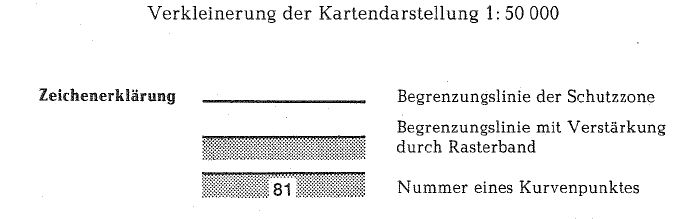
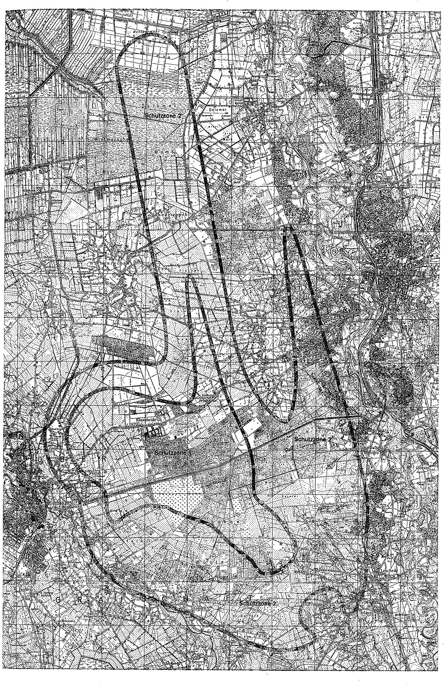

# Verordnung über die Festsetzung des Lärmschutzbereichs für den Luft/Boden-Schießplatz Nordhorn (FluLärmNordhV)

Ausfertigungsdatum
:   1978-11-09

Fundstelle
:   BGBl I: 1978, 1739

## Eingangsformel

Auf Grund des § 4 Abs. 1 des Gesetzes zum Schutz gegen Fluglärm vom
30\. März 1971 (BGBl. I S. 282) wird im Einvernehmen mit dem
Bundesminister der Verteidigung und mit Zustimmung des Bundesrates
verordnet:

## § 1

Zum Schutz der Allgemeinheit vor Gefahren, erheblichen Nachteilen und
erheblichen Belästigungen durch Fluglärm in der Umgebung des
Luft/Boden-Schießplatzes Nordhorn wird der in § 2 bestimmte
Lärmschutzbereich festgesetzt.

## § 2

Der Lärmschutzbereich mit seinen zwei Schutzzonen wird nach Anlage 1
bestimmt durch die interpolierten Verbindungslinien zwischen den
Kurvenpunkten, soweit diese Linien außerhalb des Übungsgeländes
verlaufen.

## § 3

Liegt eine bauliche Anlage zu einem Teil im Lärmschutzbereich, so gilt
sie als ganz im Lärmschutzbereich gelegen. Liegt eine bauliche Anlage
zu einem Teil in der Schutzzone 1, so gilt sie als ganz in dieser
Schutzzone gelegen.

## § 4

Der nach § 2 bestimmte Lärmschutzbereich ist in einer topographischen
Karte im Maßstab 1:50.000 und in Karten im Maßstab 1:5.000
dargestellt. Die topographische Karte ist in verkleinerter Form als
Anlage 2 dieser Verordnung beigefügt. Die topographische Karte und die
Karten im Maßstab 1:5.000 sind beim Landkreis Grafschaft Bentheim,
Stadtring 8-12, 4460 Nordhorn, zu jedermanns Einsicht archivmäßig
gesichert niedergelegt.

## § 5

Diese Verordnung tritt am Tag nach der Verkündung in Kraft.

## Schlußformel

Der Bundesminister des Innern

## Anlage 1 (zu § 2 der Verordnung über die Festsetzung des Lärmschutzbereichs für den Luft/Boden-Schießplatz Nordhorn)

(Fundstelle des Originaltextes: BGBl. I 1978, 1740 - 1748)

*    *   **Lärmschutzbereich**

*    *

*    *
    *   Koordinatensystem:

    *   Gauß-Krüger

*    *
    *   Interpolation:

    *   Polynom 3. Grades mit stetigem Tangentenübergang

*    *

*    *   Kurvenpunkte der Schutzzone 1

*    *
    *
    *
    *
    *
    *
    *
    *
    *

*    *   Nr.

    *   Y (Rechts)

    *   X (Hoch)

    *   Nr.

    *   Y (Rechts)

    *   X (Hoch)

    *   Nr.

    *   Y (Rechts)

    *   X (Hoch)

*    *
    *
    *
    *
    *
    *
    *
    *
    *

*    *   1

    *   2580238.3

    *   5816272.9

    *   51

    *   2580024.1

    *   5820974.8

    *   101

    *   2580744.1

    *   5819854.1

*    *   2

    *   2580277.2

    *   5816333.8

    *   52

    *   2580017.4

    *   5821055.0

    *   102

    *   2580766.2

    *   5819774.3

*    *   3

    *   2580310.3

    *   5816399.1

    *   53

    *   2580011.2

    *   5821135.2

    *   103

    *   2580788.3

    *   5819694.3

*    *   4

    *   2580337.4

    *   5816465.6

    *   54

    *   2580001.4

    *   5821281.2

    *   104

    *   2580810.3

    *   5819614.6

*    *   5

    *   2580360.1

    *   5816534.0

    *   55

    *   2579994.7

    *   5821427.4

    *   105

    *   2580841.3

    *   5819502.3

*    *   6

    *   2580394.4

    *   5816675.0

    *   56

    *   2579992.7

    *   5821500.8

    *   106

    *   2580872.1

    *   5819389.9

*    *   7

    *   2580415.5

    *   5816818.6

    *   57

    *   2579992.4

    *   5821574.3

    *   107

    *   2580903.2

    *   5819277.6

*    *   8

    *   2580426.1

    *   5816964.0

    *   58

    *   2579993.3

    *   5821611.2

    *   108

    *   2580941.9

    *   5819136.3

*    *   9

    *   2580428.1

    *   5817110.1

    *   59

    *   2579994.8

    *   5821648.3

    *   109

    *   2580980.8

    *   5818995.0

*    *   10

    *   2580424.5

    *   5817256.6

    *   60

    *   2579997.3

    *   5821685.4

    *   110

    *   2581019.7

    *   5818853.7

*    *
    *
    *
    *
    *
    *
    *
    *
    *

*    *   11

    *   2580417.1

    *   5817399.7

    *   61

    *   2580001.0

    *   5821722.5

    *   111

    *   2581058.6

    *   5818712.4

*    *   12

    *   2580407.1

    *   5817542.3

    *   62

    *   2580004.3

    *   5821744.5

    *   112

    *   2581097.6

    *   5818571.0

*    *   13

    *   2580395.0

    *   5817684.9

    *   63

    *   2580008.8

    *   5821766.9

    *   113

    *   2581136.5

    *   5818429.7

*    *   14

    *   2580381.7

    *   5817827.2

    *   64

    *   2580012.8

    *   5821783.7

    *   114

    *   2581175.5

    *   5818288.5

*    *   15

    *   2580367.0

    *   5817969.6

    *   65

    *   2580018.4

    *   5821799.6

    *   115

    *   2581204.4

    *   5818184.1

*    *   16

    *   2580351.6

    *   5818111.8

    *   66

    *   2580027.0

    *   5821815.7

    *   116

    *   2581233.7

    *   5818079.2

*    *   17

    *   2580335.7

    *   5818253.9

    *   67

    *   2580038.1

    *   5821826.8

    *   117

    *   2581271.6

    *   5817943.2

*    *   18

    *   2580326.5

    *   5818333.7

    *   68

    *   2580046.0

    *   5821829.7

    *   118

    *   2581309.8

    *   5817806.9

*    *   19

    *   2580317.2

    *   5818413.5

    *   69

    *   2580054.4

    *   5821829.2

    *   119

    *   2581348.4

    *   5817670.6

*    *   20

    *   2580308.0

    *   5818493.4

    *   70

    *   2580062.3

    *   5821825.7

    *   120

    *   2581387.5

    *   5817534.6

*    *
    *
    *
    *
    *
    *
    *
    *
    *

*    *   21

    *   2580298.6

    *   5818573.3

    *   71

    *   2580070.0

    *   5821822.1

    *   121

    *   2581428.0

    *   5817396.2

*    *   22

    *   2580289.2

    *   5818653.3

    *   72

    *   2580081.9

    *   5821811.7

    *   122

    *   2581456.3

    *   5817298.8

*    *   23

    *   2580279.8

    *   5818733.3

    *   73

    *   2580093.4

    *   5821798.9

    *   123

    *   2581499.8

    *   5817156.2

*    *   24

    *   2580270.3

    *   5818813.1

    *   74

    *   2580104.1

    *   5821784.8

    *   124

    *   2581544.8

    *   5817014.0

*    *   25

    *   2580260.7

    *   5818893.2

    *   75

    *   2580116.4

    *   5821766.4

    *   125

    *   2581591.3

    *   5816872.2

*    *   26

    *   2580251.2

    *   5818973.1

    *   76

    *   2580127.6

    *   5821747.7

    *   126

    *   2581639.9

    *   5816731.2

*    *   27

    *   2580241.7

    *   5819053.2

    *   77

    *   2580145.3

    *   5821714.6

    *   127

    *   2581690.7

    *   5816591.0

*    *   28

    *   2580232.2

    *   5819133.2

    *   78

    *   2580161.7

    *   5821681.3

    *   128

    *   2581744.5

    *   5816451.9

*    *   29

    *   2580222.5

    *   5819213.1

    *   79

    *   2580177.5

    *   5821647.6

    *   129

    *   2581799.2

    *   5816313.1

*    *   30

    *   2580212.9

    *   5819293.0

    *   80

    *   2580192.4

    *   5821613.6

    *   130

    *   2581857.9

    *   5816178.4

*    *
    *
    *
    *
    *
    *
    *
    *
    *

*    *   31

    *   2580203.3

    *   5819372.9

    *   81

    *   2580220.4

    *   5821545.7

    *   131

    *   2581919.0

    *   5816044.6

*    *   32

    *   2580193.8

    *   5819452.7

    *   82

    *   2580247.0

    *   5821477.4

    *   132

    *   2581982.1

    *   5815911.7

*    *   33

    *   2580184.0

    *   5819532.6

    *   83

    *   2580297.2

    *   5821340.0

    *   133

    *   2582051.4

    *   5815770.0

*    *   34

    *   2580174.4

    *   5819612.7

    *   84

    *   2580344.4

    *   5821201.7

    *   134

    *   2582121.5

    *   5815628.6

*    *   35

    *   2580164.8

    *   5819692.9

    *   85

    *   2580370.3

    *   5821123.3

    *   135

    *   2582192.2

    *   5815487.3

*    *   36

    *   2580155.0

    *   5819773.0

    *   86

    *   2580395.6

    *   5821044.8

    *   136

    *   2582262.4

    *   5815345.6

*    *   37

    *   2580145.5

    *   5819853.1

    *   87

    *   2580420.6

    *   5820966.1

    *   137

    *   2582330.0

    *   5815207.7

*    *   38

    *   2580135.9

    *   5819933.2

    *   88

    *   2580445.1

    *   5820887.1

    *   138

    *   2582396.8

    *   5815069.5

*    *   39

    *   2580126.3

    *   5820013.2

    *   89

    *   2580469.3

    *   5820808.2

    *   139

    *   2582463.2

    *   5814931.2

*    *   40

    *   2580116.9

    *   5820093.4

    *   90

    *   2580493.3

    *   5820729.1

    *   140

    *   2582529.8

    *   5814792.4

*    *
    *
    *
    *
    *
    *
    *
    *
    *

*    *   41

    *   2580107.6

    *   5820173.5

    *   91

    *   2580516.9

    *   5820649.9

    *   141

    *   2582594.8

    *   5814652.4

*    *   42

    *   2580098.3

    *   5820253.6

    *   92

    *   2580540.3

    *   5820570.6

    *   142

    *   2582657.3

    *   5814511.2

*    *   43

    *   2580089.3

    *   5820333.7

    *   93

    *   2580563.5

    *   5820491.2

    *   143

    *   2582717.1

    *   5814367.8

*    *   44

    *   2580080.2

    *   5820413.8

    *   94

    *   2580586.5

    *   5820411.8

    *   144

    *   2582769.9

    *   5814228.0

*    *   45

    *   2580071.5

    *   5820493.9

    *   95

    *   2580609.4

    *   5820332.3

    *   145

    *   2582818.0

    *   5814087.0

*    *   46

    *   2580063.0

    *   5820574.0

    *   96

    *   2580632.2

    *   5820252.6

    *   146

    *   2582861.6

    *   5813944.7

*    *   47

    *   2580054.6

    *   5820654.3

    *   97

    *   2580654.8

    *   5820172.9

    *   147

    *   2582900.5

    *   5813801.1

*    *   48

    *   2580046.5

    *   5820734.4

    *   98

    *   2580677.2

    *   5820093.3

    *   148

    *   2582934.7

    *   5813657.2

*    *   49

    *   2580038.7

    *   5820814.5

    *   99

    *   2580699.6

    *   5820013.7

    *   149

    *   2582967.8

    *   5813511.4

*    *   50

    *   2580031.2

    *   5820894.7

    *   100

    *   2580721.9

    *   5819933.9

    *   150

    *   2582993.0

    *   5813363.7

*    *

*    *

*    *   Noch Schutzzone 1 (Luft/Boden-Schießplatz Nordhorn)

*    *
    *
    *
    *
    *
    *
    *
    *
    *

*    *   151

    *   2583008.5

    *   5813234.0

    *   201

    *   2585030.5

    *   5809448.5

    *   251

    *   2581758.2

    *   5810080.8

*    *   152

    *   2583020.3

    *   5813102.9

    *   202

    *   2585025.9

    *   5809412.4

    *   252

    *   2581646.3

    *   5810187.3

*    *   153

    *   2583023.5

    *   5812973.6

    *   203

    *   2585018.9

    *   5809377.4

    *   253

    *   2581534.5

    *   5810294.1

*    *   154

    *   2583025.7

    *   5812844.0

    *   204

    *   2584995.5

    *   5809298.4

    *   254

    *   2581424.0

    *   5810397.6

*    *   155

    *   2583025.3

    *   5812773.1

    *   205

    *   2584963.5

    *   5809220.7

    *   255

    *   2581309.7

    *   5810496.5

*    *   156

    *   2583025.5

    *   5812711.7

    *   206

    *   2584928.8

    *   5809149.1

    *   256

    *   2581188.5

    *   5810587.8

*    *   157

    *   2583023.0

    *   5812596.3

    *   207

    *   2584888.7

    *   5809081.0

    *   257

    *   2581069.0

    *   5810662.3

*    *   158

    *   2583024.4

    *   5812477.7

    *   208

    *   2584843.0

    *   5809018.7

    *   258

    *   2581006.9

    *   5810694.2

*    *   159

    *   2583023.7

    *   5812360.2

    *   209

    *   2584791.7

    *   5808960.4

    *   259

    *   2580943.2

    *   5810722.6

*    *   160

    *   2583033.5

    *   5812216.8

    *   210

    *   2584735.4

    *   5808905.9

    *   260

    *   2580813.1

    *   5810771.8

*    *
    *
    *
    *
    *
    *
    *
    *
    *

*    *   161

    *   2583038.7

    *   5812146.4

    *   211

    *   2584677.1

    *   5808853.9

    *   261

    *   2580681.8

    *   5810817.1

*    *   162

    *   2583048.8

    *   5812076.7

    *   212

    *   2584553.2

    *   5808755.6

    *   262

    *   2580550.9

    *   5810863.0

*    *   163

    *   2583065.7

    *   5812008.0

    *   213

    *   2584486.0

    *   5808710.9

    *   263

    *   2580420.4

    *   5810910.5

*    *   164

    *   2583086.0

    *   5811940.9

    *   214

    *   2584416.3

    *   5808670.0

    *   264

    *   2580354.8

    *   5810934.3

*    *   165

    *   2583111.5

    *   5811874.1

    *   215

    *   2584343.5

    *   5808630.7

    *   265

    *   2580305.2

    *   5810950.5

*    *   166

    *   2583146.9

    *   5811811.4

    *   216

    *   2584270.2

    *   5808592.5

    *   266

    *   2580216.3

    *   5810964.1

*    *   167

    *   2583179.9

    *   5811766.8

    *   217

    *   2584192.2

    *   5808553.8

    *   267

    *   2580145.8

    *   5810984.2

*    *   168

    *   2583216.5

    *   5811724.5

    *   218

    *   2584112.4

    *   5808519.3

    *   268

    *   2580018.0

    *   5811020.0

*    *   169

    *   2583255.1

    *   5811684.5

    *   219

    *   2584036.1

    *   5808491.8

    *   269

    *   2579892.4

    *   5811060.7

*    *   170

    *   2583295.5

    *   5811646.0

    *   220

    *   2583958.0

    *   5808469.8

    *   270

    *   2579831.7

    *   5811087.8

*    *
    *
    *
    *
    *
    *
    *
    *
    *

*    *   171

    *   2583337.4

    *   5811608.9

    *   221

    *   2583882.6

    *   5808453.4

    *   271

    *   2579772.3

    *   5811117.9

*    *   172

    *   2583384.1

    *   5811570.2

    *   222

    *   2583806.4

    *   5808441.4

    *   272

    *   2579713.5

    *   5811150.3

*    *   173

    *   2583404.7

    *   5811541.7

    *   223

    *   2583769.7

    *   5808437.8

    *   273

    *   2579651.5

    *   5811176.7

*    *   174

    *   2583439.5

    *   5811511.5

    *   224

    *   2583733.1

    *   5808436.1

    *   274

    *   2579586.4

    *   5811192.3

*    *   175

    *   2583477.0

    *   5811486.4

    *   225

    *   2583696.5

    *   5808436.3

    *   275

    *   2579521.5

    *   5811207.0

*    *   176

    *   2583514.5

    *   5811461.3

    *   226

    *   2583659.8

    *   5808440.2

    *   276

    *   2579460.7

    *   5811231.1

*    *   177

    *   2583570.5

    *   5811423.5

    *   227

    *   2583623.7

    *   5808446.8

    *   277

    *   2579400.6

    *   5811258.0

*    *   178

    *   2583625.8

    *   5811384.7

    *   228

    *   2583588.5

    *   5808456.6

    *   278

    *   2579342.4

    *   5811288.1

*    *   179

    *   2583743.0

    *   5811297.4

    *   229

    *   2583520.9

    *   5808485.5

    *   279

    *   2579285.8

    *   5811321.4

*    *   180

    *   2583856.0

    *   5811205.4

    *   230

    *   2583451.8

    *   5808532.6

    *   280

    *   2579173.0

    *   5811389.7

*    *
    *
    *
    *
    *
    *
    *
    *
    *

*    *   181

    *   2583965.6

    *   5811109.6

    *   231

    *   2583391.1

    *   5808590.2

    *   281

    *   2579102.9

    *   5811430.3

*    *   182

    *   2584071.4

    *   5811009.8

    *   232

    *   2583327.2

    *   5808667.5

    *   282

    *   2579034.3

    *   5811454.0

*    *   183

    *   2584172.6

    *   5810904.5

    *   233

    *   2583269.2

    *   5808749.2

    *   283

    *   2578961.2

    *   5811462.1

*    *   184

    *   2584274.4

    *   5810786.6

    *   234

    *   2583181.9

    *   5808881.5

    *   284

    *   2578888.1

    *   5811469.2

*    *   185

    *   2584372.1

    *   5810665.5

    *   235

    *   2583137.2

    *   5808946.5

    *   285

    *   2578742.0

    *   5811485.5

*    *   186

    *   2584466.4

    *   5810541.7

    *   236

    *   2583090.8

    *   5809010.1

    *   286

    *   2578595.6

    *   5811501.2

*    *   187

    *   2584557.1

    *   5810414.8

    *   237

    *   2583064.0

    *   5809044.7

    *   287

    *   2578522.1

    *   5811507.6

*    *   188

    *   2584649.0

    *   5810283.9

    *   238

    *   2583027.6

    *   5809066.9

    *   288

    *   2578452.0

    *   5811512.2

*    *   189

    *   2584696.7

    *   5810219.0

    *   239

    *   2582950.2

    *   5809123.7

    *   289

    *   2578373.1

    *   5811526.1

*    *   190

    *   2584745.3

    *   5810154.9

    *   240

    *   2582847.4

    *   5809189.5

    *   290

    *   2578296.7

    *   5811526.0

*    *
    *
    *
    *
    *
    *
    *
    *
    *

*    *   191

    *   2584794.1

    *   5810091.1

    *   241

    *   2582770.3

    *   5809236.4

    *   291

    *   2578220.8

    *   5811523.3

*    *   192

    *   2584841.2

    *   5810027.1

    *   242

    *   2582709.8

    *   5809286.5

    *   292

    *   2578144.9

    *   5811517.4

*    *   193

    *   2584885.0

    *   5809962.4

    *   243

    *   2582588.7

    *   5809386.8

    *   293

    *   2578063.9

    *   5811507.5

*    *   194

    *   2584924.4

    *   5809896.4

    *   244

    *   2582467.6

    *   5809489.2

    *   294

    *   2577983.6

    *   5811493.4

*    *   195

    *   2584957.8

    *   5809829.2

    *   245

    *   2582346.7

    *   5809591.7

    *   295

    *   2577904.8

    *   5811475.2

*    *   196

    *   2584984.7

    *   5809759.7

    *   246

    *   2582222.4

    *   5809682.0

    *   296

    *   2577827.0

    *   5811452.5

*    *   197

    *   2585006.7

    *   5809686.3

    *   247

    *   2582099.2

    *   5809767.2

    *   297

    *   2577750.9

    *   5811425.3

*    *   198

    *   2585022.8

    *   5809611.8

    *   248

    *   2582041.0

    *   5809817.7

    *   298

    *   2577676.4

    *   5811394.5

*    *   199

    *   2585032.5

    *   5809529.4

    *   249

    *   2581983.7

    *   5809869.5

    *   299

    *   2577602.4

    *   5811360.8

*    *   200

    *   2585032.9

    *   5809489.1

    *   250

    *   2581870.5

    *   5809974.7

    *   300

    *   2577536.3

    *   5811327.4

*    *

*    *

*    *   Noch Schutzzone 1 (Luft/Boden-Schießplatz Nordhorn)

*    *
    *
    *
    *
    *
    *
    *
    *
    *

*    *   301

    *   2577403.5

    *   5811259.9

    *   351

    *   2575276.6

    *   5812851.1

    *   401

    *   2577337.7

    *   5816539.6

*    *   302

    *   2577277.3

    *   5811193.5

    *   352

    *   2575167.1

    *   5812941.4

    *   402

    *   2577411.5

    *   5816513.6

*    *   303

    *   2577152.4

    *   5811124.2

    *   353

    *   2575062.0

    *   5813038.2

    *   403

    *   2577485.2

    *   5816487.5

*    *   304

    *   2577082.7

    *   5811081.7

    *   354

    *   2574951.0

    *   5813154.2

    *   404

    *   2577564.5

    *   5816467.2

*    *   305

    *   2577003.5

    *   5811027.9

    *   355

    *   2574897.9

    *   5813215.6

    *   405

    *   2577645.7

    *   5816452.6

*    *   306

    *   2576928.2

    *   5810975.1

    *   356

    *   2574846.9

    *   5813279.0

    *   406

    *   2577716.1

    *   5816432.6

*    *   307

    *   2576855.5

    *   5810917.4

    *   357

    *   2574776.9

    *   5813374.3

    *   407

    *   2577786.6

    *   5816412.6

*    *   308

    *   2576806.9

    *   5810875.9

    *   358

    *   2574712.1

    *   5813473.1

    *   408

    *   2577936.8

    *   5816370.8

*    *   309

    *   2576767.0

    *   5810843.2

    *   359

    *   2574652.3

    *   5813575.6

    *   409

    *   2578087.0

    *   5816329.7

*    *   310

    *   2576727.0

    *   5810812.7

    *   360

    *   2574590.4

    *   5813697.5

    *   410

    *   2578239.8

    *   5816289.0

*    *
    *
    *
    *
    *
    *
    *
    *
    *

*    *   311

    *   2576685.7

    *   5810786.4

    *   361

    *   2574536.2

    *   5813823.1

    *   411

    *   2578392.9

    *   5816249.3

*    *   312

    *   2576643.4

    *   5810766.9

    *   362

    *   2574487.4

    *   5813960.0

    *   412

    *   2578546.5

    *   5816211.3

*    *   313

    *   2576596.4

    *   5810755.3

    *   363

    *   2574448.0

    *   5814100.1

    *   413

    *   2578695.6

    *   5816176.0

*    *   314

    *   2576570.3

    *   5810754.7

    *   364

    *   2574420.8

    *   5814227.3

    *   414

    *   2578845.1

    *   5816142.9

*    *   315

    *   2576545.6

    *   5810758.1

    *   365

    *   2574401.3

    *   5814356.9

    *   415

    *   2578989.4

    *   5816113.6

*    *   316

    *   2576521.5

    *   5810765.7

    *   366

    *   2574389.2

    *   5814499.5

    *   416

    *   2579134.4

    *   5816087.4

*    *   317

    *   2576497.8

    *   5810777.2

    *   367

    *   2574386.5

    *   5814642.7

    *   417

    *   2579280.3

    *   5816065.8

*    *   318

    *   2576474.5

    *   5810792.9

    *   368

    *   2574392.3

    *   5814771.3

    *   418

    *   2579427.4

    *   5816050.0

*    *   319

    *   2576452.8

    *   5810811.8

    *   369

    *   2574405.8

    *   5814899.9

    *   419

    *   2579576.1

    *   5816041.6

*    *   320

    *   2576433.1

    *   5810832.8

    *   370

    *   2574430.1

    *   5815041.6

    *   420

    *   2579724.2

    *   5816043.0

*    *
    *
    *
    *
    *
    *
    *
    *
    *

*    *   321

    *   2576415.2

    *   5810855.6

    *   371

    *   2574463.8

    *   5815181.6

    *   421

    *   2579796.0

    *   5816048.2

*    *   322

    *   2576398.8

    *   5810879.7

    *   372

    *   2574505.1

    *   5815313.7

    *   422

    *   2579867.4

    *   5816058.6

*    *   323

    *   2576383.7

    *   5810905.0

    *   373

    *   2574555.0

    *   5815443.3

    *   423

    *   2579936.4

    *   5816072.9

*    *   324

    *   2576358.3

    *   5810956.5

    *   374

    *   2574615.1

    *   5815572.5

    *   424

    *   2580003.7

    *   5816093.8

*    *   325

    *   2576337.0

    *   5811009.9

    *   375

    *   2574683.4

    *   5815697.6

    *   425

    *   2580047.5

    *   5816112.2

*    *   326

    *   2576319.4

    *   5811065.1

    *   376

    *   2574752.3

    *   5815806.5

    *   426

    *   2580089.3

    *   5816134.5

*    *   327

    *   2576306.7

    *   5811113.3

    *   377

    *   2574827.7

    *   5815911.3

    *   427

    *   2580128.9

    *   5816160.8

*    *   328

    *   2576296.1

    *   5811162.2

    *   378

    *   2574921.4

    *   5816025.1

    *   428

    *   2580169.3

    *   5816194.3

*    *   329

    *   2576287.2

    *   5811212.1

    *   379

    *   2575022.7

    *   5816132.2

    *   429

    *   2580205.6

    *   5816231.7

*    *   330

    *   2576279.9

    *   5811250.8

    *   380

    *   2575131.1

    *   5816231.9

    *   430

    *   2580238.3

    *   5816272.9

*    *
    *
    *
    *
    *
    *
    *
    *
    *

*    *   331

    *   2576270.4

    *   5811332.0

    *   381

    *   2575246.1

    *   5816323.7

    *
    *
    *

*    *   332

    *   2576264.3

    *   5811403.0

    *   382

    *   2575372.8

    *   5816410.5

    *
    *
    *

*    *   333

    *   2576254.3

    *   5811545.6

    *   383

    *   2575505.3

    *   5816487.9

    *
    *
    *

*    *   334

    *   2576242.8

    *   5811689.3

    *   384

    *   2575641.6

    *   5816554.4

    *
    *
    *

*    *   335

    *   2576235.1

    *   5811761.7

    *   385

    *   2575776.7

    *   5816608.8

    *
    *
    *

*    *   336

    *   2576224.6

    *   5811839.8

    *   386

    *   2575857.2

    *   5816635.9

    *
    *
    *

*    *   337

    *   2576221.3

    *   5811894.4

    *   387

    *   2575947.8

    *   5816662.1

    *
    *
    *

*    *   338

    *   2576207.9

    *   5811954.0

    *   388

    *   2576035.6

    *   5816683.2

    *
    *
    *

*    *   339

    *   2576190.8

    *   5812011.3

    *   389

    *   2576128.6

    *   5816700.9

    *
    *
    *

*    *   340

    *   2576164.8

    *   5812078.0

    *   390

    *   2576224.2

    *   5816713.8

    *
    *
    *

*    *
    *
    *
    *
    *
    *
    *
    *
    *

*    *   341

    *   2576132.3

    *   5812141.8

    *   391

    *   2576299.3

    *   5816720.4

    *
    *
    *

*    *   342

    *   2576095.5

    *   5812200.4

    *   392

    *   2576374.6

    *   5816724.5

    *
    *
    *

*    *   343

    *   2576054.2

    *   5812255.8

    *   393

    *   2576522.2

    *   5816724.4

    *
    *
    *

*    *   344

    *   2576009.4

    *   5812307.9

    *   394

    *   2576669.5

    *   5816713.7

    *
    *
    *

*    *   345

    *   2575961.6

    *   5812357.3

    *   395

    *   2576801.6

    *   5816694.6

    *
    *
    *

*    *   346

    *   2575858.0

    *   5812449.5

    *   396

    *   2576931.9

    *   5816665.4

    *
    *
    *

*    *   347

    *   2575745.5

    *   5812534.1

    *   397

    *   2577013.8

    *   5816651.2

    *
    *
    *

*    *   348

    *   2575627.1

    *   5812611.4

    *   398

    *   2577062.0

    *   5816635.2

    *
    *
    *

*    *   349

    *   2575507.4

    *   5812687.1

    *   399

    *   2577131.2

    *   5816611.8

    *
    *
    *

*    *   350

    *   2575390.2

    *   5812766.5

    *   400

    *   2577200.1

    *   5816588.1

    *
    *
    *

*    *

*    *

*    *   Kurvenpunkte der Schutzzone 2 (Luft/Boden-Schießplatz Nordhorn)

*    *
    *
    *
    *
    *
    *
    *
    *
    *

*    *   Nr.

    *   Y (Rechts)

    *   X (Hoch)

    *   Nr.

    *   Y (Rechts)

    *   X (Hoch)

    *   Nr.

    *   Y (Rechts)

    *   X (Hoch)

*    *
    *
    *
    *
    *
    *
    *
    *
    *

*    *   1

    *   2576877.2

    *   5817936.9

    *   51

    *   2578730.9

    *   5821093.5

    *   101

    *   2577198.3

    *   5828583.6

*    *   2

    *   2577010.4

    *   5817934.6

    *   52

    *   2578700.8

    *   5821245.2

    *   102

    *   2577166.6

    *   5828732.4

*    *   3

    *   2577143.6

    *   5817928.2

    *   53

    *   2578670.2

    *   5821396.9

    *   103

    *   2577134.9

    *   5828881.3

*    *   4

    *   2577270.2

    *   5817918.5

    *   54

    *   2578639.6

    *   5821548.6

    *   104

    *   2577103.1

    *   5829030.2

*    *   5

    *   2577403.3

    *   5817915.7

    *   55

    *   2578608.7

    *   5821700.3

    *   105

    *   2577071.4

    *   5829179.0

*    *   6

    *   2577487.8

    *   5817905.7

    *   56

    *   2578578.8

    *   5821852.0

    *   106

    *   2577039.5

    *   5829327.9

*    *   7

    *   2577565.5

    *   5817896.0

    *   57

    *   2578547.5

    *   5822003.6

    *   107

    *   2577007.7

    *   5829476.8

*    *   8

    *   2577643.3

    *   5817886.0

    *   58

    *   2578516.3

    *   5822155.2

    *   108

    *   2576975.9

    *   5829625.7

*    *   9

    *   2577721.2

    *   5817875.7

    *   59

    *   2578484.9

    *   5822306.7

    *   109

    *   2576944.0

    *   5829774.7

*    *   10

    *   2577799.0

    *   5817865.4

    *   60

    *   2578453.6

    *   5822458.2

    *   110

    *   2576912.2

    *   5829923.7

*    *
    *
    *
    *
    *
    *
    *
    *
    *

*    *   11

    *   2577876.9

    *   5817854.9

    *   61

    *   2578422.3

    *   5822609.7

    *   111

    *   2576880.2

    *   5830072.7

*    *   12

    *   2577928.7

    *   5817847.9

    *   62

    *   2578390.7

    *   5822761.2

    *   112

    *   2576848.3

    *   5830221.7

*    *   13

    *   2578003.6

    *   5817846.7

    *   63

    *   2578359.3

    *   5822912.6

    *   113

    *   2576816.3

    *   5830370.7

*    *   14

    *   2578075.1

    *   5817846.6

    *   64

    *   2578327.9

    *   5823064.2

    *   114

    *   2576784.4

    *   5830519.7

*    *   15

    *   2578168.6

    *   5817837.8

    *   65

    *   2578296.4

    *   5823215.7

    *   115

    *   2576752.5

    *   5830668.7

*    *   16

    *   2578252.4

    *   5817832.8

    *   66

    *   2578265.0

    *   5823367.1

    *   116

    *   2576720.5

    *   5830817.7

*    *   17

    *   2578334.1

    *   5817831.3

    *   67

    *   2578233.5

    *   5823518.7

    *   117

    *   2576688.5

    *   5830966.6

*    *   18

    *   2578416.5

    *   5817833.9

    *   68

    *   2578202.1

    *   5823670.2

    *   118

    *   2576657.0

    *   5831114.1

*    *   19

    *   2578496.8

    *   5817841.6

    *   69

    *   2578171.3

    *   5823819.1

    *   119

    *   2576635.4

    *   5831262.3

*    *   20

    *   2578577.2

    *   5817856.1

    *   70

    *   2578140.6

    *   5823967.8

    *   120

    *   2576629.1

    *   5831412.2

*    *
    *
    *
    *
    *
    *
    *
    *
    *

*    *   21

    *   2578655.3

    *   5817879.0

    *   71

    *   2578110.1

    *   5824116.7

    *   121

    *   2576645.0

    *   5831513.0

*    *   22

    *   2578730.3

    *   5817912.9

    *   72

    *   2578079.4

    *   5824265.6

    *   122

    *   2576680.4

    *   5831624.6

*    *   23

    *   2578801.4

    *   5817960.6

    *   73

    *   2578048.6

    *   5824414.4

    *   123

    *   2576730.6

    *   5831741.8

*    *   24

    *   2578861.1

    *   5818018.9

    *   74

    *   2578017.9

    *   5824563.3

    *   124

    *   2576790.3

    *   5831869.3

*    *   25

    *   2578891.6

    *   5818058.1

    *   75

    *   2577987.2

    *   5824712.2

    *   125

    *   2576837.2

    *   5831946.3

*    *   26

    *   2578917.9

    *   5818099.6

    *   76

    *   2577956.6

    *   5824861.0

    *   126

    *   2576893.7

    *   5832030.8

*    *   27

    *   2578940.5

    *   5818142.4

    *   77

    *   2577925.9

    *   5825010.0

    *   127

    *   2576955.2

    *   5832116.4

*    *   28

    *   2578960.0

    *   5818186.7

    *   78

    *   2577895.2

    *   5825158.8

    *   128

    *   2577016.8

    *   5832199.1

*    *   29

    *   2578985.0

    *   5818259.2

    *   79

    *   2577864.8

    *   5825307.6

    *   129

    *   2577083.9

    *   5832271.9

*    *   30

    *   2579004.2

    *   5818332.8

    *   80

    *   2577834.3

    *   5825456.4

    *   130

    *   2577204.2

    *   5832387.0

*    *
    *
    *
    *
    *
    *
    *
    *
    *

*    *   31

    *   2579018.1

    *   5818404.7

    *   81

    *   2577803.8

    *   5825605.3

    *   131

    *   2577325.4

    *   5832482.2

*    *   32

    *   2579028.5

    *   5818477.1

    *   82

    *   2577773.4

    *   5825754.2

    *   132

    *   2577398.2

    *   5832535.2

*    *   33

    *   2579035.9

    *   5818549.1

    *   83

    *   2577743.0

    *   5825903.0

    *   133

    *   2577471.5

    *   5832578.3

*    *   34

    *   2579040.8

    *   5818621.3

    *   84

    *   2577712.7

    *   5826052.0

    *   134

    *   2577618.5

    *   5832654.5

*    *   35

    *   2579045.1

    *   5818765.6

    *   85

    *   2577682.4

    *   5826200.8

    *   135

    *   2577766.1

    *   5832715.7

*    *   36

    *   2579043.5

    *   5818910.5

    *   86

    *   2577652.0

    *   5826349.7

    *   136

    *   2577914.0

    *   5832766.9

*    *   37

    *   2579037.4

    *   5819055.7

    *   87

    *   2577621.8

    *   5826498.5

    *   137

    *   2578062.8

    *   5832803.1

*    *   38

    *   2579027.6

    *   5819201.1

    *   88

    *   2577591.6

    *   5826647.5

    *   138

    *   2578212.2

    *   5832819.3

*    *   39

    *   2579015.1

    *   5819344.3

    *   89

    *   2577561.5

    *   5826796.3

    *   139

    *   2578362.8

    *   5832807.6

*    *   40

    *   2579000.2

    *   5819487.2

    *   90

    *   2577531.4

    *   5826945.2

    *   140

    *   2578514.5

    *   5832771.8

*    *
    *
    *
    *
    *
    *
    *
    *
    *

*    *   41

    *   2578983.0

    *   5819629.7

    *   91

    *   2577501.3

    *   5827094.2

    *   141

    *   2578666.6

    *   5832723.0

*    *   42

    *   2578964.0

    *   5819771.9

    *   92

    *   2577471.2

    *   5827243.0

    *   142

    *   2578742.9

    *   5832693.2

*    *   43

    *   2578943.0

    *   5819914.0

    *   93

    *   2577441.2

    *   5827391.9

    *   143

    *   2578819.6

    *   5832654.3

*    *   44

    *   2578920.6

    *   5820055.8

    *   94

    *   2577411.1

    *   5827540.8

    *   144

    *   2578942.4

    *   5832589.4

*    *   45

    *   2578897.0

    *   5820197.3

    *   95

    *   2577381.1

    *   5827689.7

    *   145

    *   2579066.0

    *   5832504.5

*    *   46

    *   2578870.7

    *   5820346.2

    *   96

    *   2577351.2

    *   5827838.6

    *   146

    *   2579180.1

    *   5832409.1

*    *   47

    *   2578845.8

    *   5820495.7

    *   97

    *   2577321.3

    *   5827987.4

    *   147

    *   2579263.8

    *   5832322.5

*    *   48

    *   2578818.0

    *   5820644.5

    *   98

    *   2577291.5

    *   5828136.4

    *   148

    *   2579352.9

    *   5832226.1

*    *   49

    *   2578789.6

    *   5820793.1

    *   99

    *   2577261.6

    *   5828285.7

    *   149

    *   2579443.2

    *   5832099.8

*    *   50

    *   2578760.8

    *   5820941.7

    *   100

    *   2577230.0

    *   5828434.6

    *   150

    *   2579528.8

    *   5831968.1

*    *

*    *

*    *   Noch Schutzzone 2 (Luft/Boden-Schießplatz Nordhorn)

*    *
    *
    *
    *
    *
    *
    *
    *
    *

*    *   151

    *   2579594.3

    *   5831835.8

    *   201

    *   2580956.5

    *   5824989.7

    *   251

    *   2582449.4

    *   5817883.5

*    *   152

    *   2579634.5

    *   5831712.3

    *   202

    *   2580984.9

    *   5824840.8

    *   252

    *   2582499.4

    *   5817750.2

*    *   153

    *   2579670.1

    *   5831578.7

    *   203

    *   2581013.3

    *   5824691.6

    *   253

    *   2582551.9

    *   5817617.8

*    *   154

    *   2579695.9

    *   5831439.6

    *   204

    *   2581041.7

    *   5824542.7

    *   254

    *   2582606.9

    *   5817486.5

*    *   155

    *   2579719.0

    *   5831365.5

    *   205

    *   2581070.0

    *   5824393.7

    *   255

    *   2582664.5

    *   5817356.2

*    *   156

    *   2579734.5

    *   5831331.0

    *   206

    *   2581098.3

    *   5824244.7

    *   256

    *   2582730.7

    *   5817216.1

*    *   157

    *   2579741.5

    *   5831293.9

    *   207

    *   2581126.6

    *   5824095.6

    *   257

    *   2582800.5

    *   5817077.8

*    *   158

    *   2579750.7

    *   5831244.3

    *   208

    *   2581154.8

    *   5823946.6

    *   258

    *   2582874.0

    *   5816941.5

*    *   159

    *   2579764.6

    *   5831169.9

    *   209

    *   2581182.9

    *   5823797.6

    *   259

    *   2582951.2

    *   5816807.2

*    *   160

    *   2579778.4

    *   5831095.5

    *   210

    *   2581212.5

    *   5823642.3

    *   260

    *   2583016.5

    *   5816700.3

*    *
    *
    *
    *
    *
    *
    *
    *
    *

*    *   161

    *   2579806.1

    *   5830946.5

    *   211

    *   2581241.9

    *   5823487.2

    *   261

    *   2583084.0

    *   5816594.6

*    *   162

    *   2579833.9

    *   5830797.6

    *   212

    *   2581271.2

    *   5823332.0

    *   262

    *   2583153.5

    *   5816490.4

*    *   163

    *   2579861.6

    *   5830648.8

    *   213

    *   2581300.5

    *   5823176.8

    *   263

    *   2583224.9

    *   5816387.4

*    *   164

    *   2579889.3

    *   5830499.9

    *   214

    *   2581329.4

    *   5823021.5

    *   264

    *   2583312.6

    *   5816265.2

*    *   165

    *   2579917.1

    *   5830351.1

    *   215

    *   2581358.4

    *   5822866.3

    *   265

    *   2583402.3

    *   5816145.2

*    *   166

    *   2579945.0

    *   5830202.2

    *   216

    *   2581387.4

    *   5822711.0

    *   266

    *   2583494.7

    *   5816028.1

*    *   167

    *   2579972.8

    *   5830053.4

    *   217

    *   2581416.4

    *   5822555.7

    *   267

    *   2583591.7

    *   5815915.5

*    *   168

    *   2580000.6

    *   5829904.4

    *   218

    *   2581445.2

    *   5822400.5

    *   268

    *   2583693.8

    *   5815807.3

*    *   169

    *   2580028.5

    *   5829755.6

    *   219

    *   2581474.2

    *   5822245.1

    *   269

    *   2583800.0

    *   5815703.1

*    *   170

    *   2580056.4

    *   5829606.6

    *   220

    *   2581503.1

    *   5822089.9

    *   270

    *   2583857.1

    *   5815653.0

*    *
    *
    *
    *
    *
    *
    *
    *
    *

*    *   171

    *   2580084.3

    *   5829457.4

    *   221

    *   2581532.0

    *   5821934.6

    *   271

    *   2583899.5

    *   5815611.3

*    *   172

    *   2580112.3

    *   5829308.4

    *   222

    *   2581560.9

    *   5821779.4

    *   272

    *   2583962.7

    *   5815558.1

*    *   173

    *   2580140.2

    *   5829159.3

    *   223

    *   2581589.8

    *   5821624.1

    *   273

    *   2584006.5

    *   5815516.1

*    *   174

    *   2580168.2

    *   5829010.5

    *   224

    *   2581618.9

    *   5821468.8

    *   274

    *   2584057.2

    *   5815478.1

*    *   175

    *   2580196.3

    *   5828861.7

    *   225

    *   2581647.9

    *   5821313.5

    *   275

    *   2584106.6

    *   5815439.7

*    *   176

    *   2580226.1

    *   5828713.1

    *   226

    *   2581675.7

    *   5821165.4

    *   276

    *   2584149.7

    *   5815402.4

*    *   177

    *   2580255.9

    *   5828564.4

    *   227

    *   2581703.5

    *   5821017.2

    *   277

    *   2584203.1

    *   5815371.3

*    *   178

    *   2580285.6

    *   5828415.5

    *   228

    *   2581731.7

    *   5820869.0

    *   278

    *   2584254.8

    *   5815338.0

*    *   179

    *   2580315.3

    *   5828266.8

    *   229

    *   2581759.8

    *   5820720.8

    *   279

    *   2584277.3

    *   5815319.2

*    *   180

    *   2580345.0

    *   5828118.0

    *   230

    *   2581788.1

    *   5820572.8

    *   280

    *   2584301.6

    *   5815302.8

*    *
    *
    *
    *
    *
    *
    *
    *
    *

*    *   181

    *   2580374.7

    *   5827969.1

    *   231

    *   2581812.5

    *   5820446.4

    *   281

    *   2584331.8

    *   5815288.8

*    *   182

    *   2580404.3

    *   5827820.1

    *   232

    *   2581837.1

    *   5820320.0

    *   282

    *   2584365.7

    *   5815278.3

*    *   183

    *   2580433.9

    *   5827671.2

    *   233

    *   2581856.0

    *   5820223.5

    *   283

    *   2584408.6

    *   5815267.6

*    *   184

    *   2580463.5

    *   5827522.3

    *   234

    *   2581871.1

    *   5820148.2

    *   284

    *   2584459.8

    *   5815251.2

*    *   185

    *   2580493.0

    *   5827373.4

    *   235

    *   2581906.3

    *   5819971.9

    *   285

    *   2584483.7

    *   5815240.9

*    *   186

    *   2580522.3

    *   5827224.4

    *   236

    *   2581937.7

    *   5819817.2

    *   286

    *   2584508.7

    *   5815234.0

*    *   187

    *   2580551.8

    *   5827075.5

    *   237

    *   2581969.8

    *   5819662.8

    *   287

    *   2584535.2

    *   5815231.6

*    *   188

    *   2580581.2

    *   5826926.5

    *   238

    *   2582002.4

    *   5819509.2

    *   288

    *   2584579.5

    *   5815222.8

*    *   189

    *   2580610.3

    *   5826777.5

    *   239

    *   2582021.3

    *   5819421.7

    *   289

    *   2584599.6

    *   5815228.6

*    *   190

    *   2580639.5

    *   5826628.6

    *   240

    *   2582034.1

    *   5819363.7

    *   290

    *   2584638.5

    *   5815244.0

*    *
    *
    *
    *
    *
    *
    *
    *
    *

*    *   191

    *   2580668.6

    *   5826479.7

    *   241

    *   2582068.0

    *   5819207.4

    *   291

    *   2584706.6

    *   5815287.6

*    *   192

    *   2580697.7

    *   5826330.7

    *   242

    *   2582102.2

    *   5819061.0

    *   292

    *   2584747.9

    *   5815327.1

*    *   193

    *   2580726.7

    *   5826181.7

    *   243

    *   2582138.0

    *   5818915.1

    *   293

    *   2584779.9

    *   5815367.6

*    *   194

    *   2580755.5

    *   5826032.8

    *   244

    *   2582175.4

    *   5818769.5

    *   294

    *   2584805.5

    *   5815412.6

*    *   195

    *   2580784.5

    *   5825883.7

    *   245

    *   2582215.0

    *   5818624.7

    *   295

    *   2584821.1

    *   5815450.9

*    *   196

    *   2580813.3

    *   5825734.7

    *   246

    *   2582256.5

    *   5818480.2

    *   296

    *   2584834.4

    *   5815490.1

*    *   197

    *   2580842.0

    *   5825585.7

    *   247

    *   2582300.2

    *   5818336.4

    *   297

    *   2584860.0

    *   5815546.6

*    *   198

    *   2580870.7

    *   5825436.7

    *   248

    *   2582328.8

    *   5818246.6

    *   298

    *   2584878.0

    *   5815585.5

*    *   199

    *   2580899.3

    *   5825287.7

    *   249

    *   2582356.7

    *   5818161.3

    *   299

    *   2584904.8

    *   5815643.4

*    *   200

    *   2580927.8

    *   5825138.6

    *   250

    *   2582401.5

    *   5818017.7

    *   300

    *   2584925.0

    *   5815699.7

*    *

*    *

*    *   Noch Schutzzone 2 (Luft/Boden-Schießplatz Nordhorn)

*    *
    *
    *
    *
    *
    *
    *
    *
    *

*    *   301

    *   2584938.3

    *   5815757.9

    *   351

    *   2584627.1

    *   5822578.8

    *   401

    *   2585758.9

    *   5821053.2

*    *   302

    *   2584958.9

    *   5815849.5

    *   352

    *   2584615.3

    *   5822721.2

    *   402

    *   2585799.2

    *   5820911.9

*    *   303

    *   2584982.3

    *   5815926.0

    *   353

    *   2584604.1

    *   5822863.8

    *   403

    *   2585839.1

    *   5820770.5

*    *   304

    *   2585005.6

    *   5816035.8

    *   354

    *   2584594.1

    *   5823006.4

    *   404

    *   2585878.9

    *   5820629.1

*    *   305

    *   2585018.6

    *   5816118.7

    *   355

    *   2584584.4

    *   5823148.9

    *   405

    *   2585918.6

    *   5820487.6

*    *   306

    *   2585041.1

    *   5816221.4

    *   356

    *   2584575.8

    *   5823291.5

    *   406

    *   2585957.9

    *   5820346.3

*    *   307

    *   2585054.3

    *   5816322.8

    *   357

    *   2584568.8

    *   5823434.4

    *   407

    *   2585997.7

    *   5820205.1

*    *   308

    *   2585073.5

    *   5816448.8

    *   358

    *   2584563.7

    *   5823556.0

    *   408

    *   2586037.1

    *   5820063.6

*    *   309

    *   2585088.7

    *   5816591.6

    *   359

    *   2584561.2

    *   5823677.4

    *   409

    *   2586076.4

    *   5819922.3

*    *   310

    *   2585105.4

    *   5816734.5

    *   360

    *   2584561.0

    *   5823798.7

    *   410

    *   2586115.7

    *   5819781.0

*    *
    *
    *
    *
    *
    *
    *
    *
    *

*    *   311

    *   2585115.3

    *   5816877.7

    *   361

    *   2584563.7

    *   5823859.1

    *   411

    *   2586154.8

    *   5819639.6

*    *   312

    *   2585124.7

    *   5817021.1

    *   362

    *   2584566.5

    *   5823919.4

    *   412

    *   2586176.0

    *   5819563.7

*    *   313

    *   2585128.8

    *   5817164.6

    *   363

    *   2584568.9

    *   5823949.7

    *   413

    *   2586214.9

    *   5819423.2

*    *   314

    *   2585131.3

    *   5817308.2

    *   364

    *   2584571.9

    *   5823979.7

    *   414

    *   2586254.3

    *   5819282.1

*    *   315

    *   2585130.7

    *   5817452.0

    *   365

    *   2584575.6

    *   5824009.7

    *   415

    *   2586293.8

    *   5819140.4

*    *   316

    *   2585126.8

    *   5817595.1

    *   366

    *   2584580.1

    *   5824039.6

    *   416

    *   2586333.9

    *   5818998.0

*    *   317

    *   2585119.9

    *   5817737.8

    *   367

    *   2584588.5

    *   5824081.8

    *   417

    *   2586374.6

    *   5818855.3

*    *   318

    *   2585111.1

    *   5817880.5

    *   368

    *   2584601.1

    *   5824122.2

    *   418

    *   2586416.4

    *   5818713.4

*    *   319

    *   2585100.9

    *   5818022.9

    *   369

    *   2584612.7

    *   5824140.3

    *   419

    *   2586460.4

    *   5818570.4

*    *   320

    *   2585089.7

    *   5818165.5

    *   370

    *   2584627.9

    *   5824156.9

    *   420

    *   2586505.5

    *   5818431.4

*    *
    *
    *
    *
    *
    *
    *
    *
    *

*    *   321

    *   2585077.8

    *   5818307.9

    *   371

    *   2584636.6

    *   5824161.6

    *   421

    *   2586552.9

    *   5818291.0

*    *   322

    *   2585065.3

    *   5818450.3

    *   372

    *   2584645.9

    *   5824164.0

    *   422

    *   2586601.3

    *   5818148.7

*    *   323

    *   2585052.1

    *   5818592.8

    *   373

    *   2584655.7

    *   5824164.0

    *   423

    *   2586648.7

    *   5818014.4

*    *   324

    *   2585038.5

    *   5818735.3

    *   374

    *   2584671.6

    *   5824161.3

    *   424

    *   2586700.8

    *   5817869.7

*    *   325

    *   2585024.4

    *   5818877.7

    *   375

    *   2584684.6

    *   5824151.1

    *   425

    *   2586745.3

    *   5817737.0

*    *   326

    *   2585010.0

    *   5819020.0

    *   376

    *   2584701.6

    *   5824132.2

    *   426

    *   2586797.8

    *   5817593.3

*    *   327

    *   2584995.8

    *   5819162.5

    *   377

    *   2584719.1

    *   5824114.2

    *   427

    *   2586843.0

    *   5817460.1

*    *   328

    *   2584980.5

    *   5819304.8

    *   378

    *   2584735.5

    *   5824094.4

    *   428

    *   2586891.4

    *   5817317.0

*    *   329

    *   2584965.2

    *   5819447.1

    *   379

    *   2584749.0

    *   5824070.7

    *   429

    *   2586938.6

    *   5817183.9

*    *   330

    *   2584949.9

    *   5819589.5

    *   380

    *   2584783.4

    *   5824013.1

    *   430

    *   2586983.5

    *   5817039.5

*    *
    *
    *
    *
    *
    *
    *
    *
    *

*    *   331

    *   2584934.6

    *   5819731.9

    *   381

    *   2584813.8

    *   5823953.2

    *   431

    *   2587030.3

    *   5816908.2

*    *   332

    *   2584918.9

    *   5819874.2

    *   382

    *   2584841.7

    *   5823892.1

    *   432

    *   2587073.8

    *   5816760.2

*    *   333

    *   2584903.0

    *   5820016.6

    *   383

    *   2584869.6

    *   5823831.0

    *   433

    *   2587118.5

    *   5816632.6

*    *   334

    *   2584887.1

    *   5820158.8

    *   384

    *   2584921.1

    *   5823706.2

    *   434

    *   2587161.9

    *   5816479.8

*    *   335

    *   2584871.0

    *   5820301.2

    *   385

    *   2584969.9

    *   5823580.0

    *   435

    *   2587203.5

    *   5816354.9

*    *   336

    *   2584855.0

    *   5820443.5

    *   386

    *   2585017.4

    *   5823453.0

    *   436

    *   2587247.5

    *   5816203.6

*    *   337

    *   2584838.9

    *   5820585.9

    *   387

    *   2585066.4

    *   5823312.8

    *   437

    *   2587286.2

    *   5816070.8

*    *   338

    *   2584822.7

    *   5820728.1

    *   388

    *   2585114.9

    *   5823172.4

    *   438

    *   2587330.1

    *   5815933.0

*    *   339

    *   2584806.6

    *   5820870.3

    *   389

    *   2585161.9

    *   5823031.5

    *   439

    *   2587367.0

    *   5815783.5

*    *   340

    *   2584790.6

    *   5821012.7

    *   390

    *   2585208.7

    *   5822890.4

    *   440

    *   2587409.5

    *   5815657.8

*    *
    *
    *
    *
    *
    *
    *
    *
    *

*    *   341

    *   2584774.5

    *   5821155.1

    *   391

    *   2585254.1

    *   5822749.1

    *   441

    *   2587446.7

    *   5815504.9

*    *   342

    *   2584758.9

    *   5821297.4

    *   392

    *   2585299.1

    *   5822607.5

    *   442

    *   2587486.0

    *   5815369.3

*    *   343

    *   2584742.9

    *   5821439.7

    *   393

    *   2585343.1

    *   5822465.7

    *   443

    *   2587526.0

    *   5815236.2

*    *   344

    *   2584727.5

    *   5821582.0

    *   394

    *   2585429.4

    *   5822183.7

    *   444

    *   2587560.0

    *   5815082.0

*    *   345

    *   2584711.7

    *   5821724.4

    *   395

    *   2585472.0

    *   5822042.7

    *   445

    *   2587601.3

    *   5814951.6

*    *   346

    *   2584696.7

    *   5821866.6

    *   396

    *   2585514.0

    *   5821901.5

    *   446

    *   2587637.6

    *   5814813.3

*    *   347

    *   2584682.0

    *   5822009.0

    *   397

    *   2585555.4

    *   5821760.0

    *   447

    *   2587671.3

    *   5814660.4

*    *   348

    *   2584667.5

    *   5822151.5

    *   398

    *   2585637.3

    *   5821476.9

    *   448

    *   2587712.5

    *   5814529.8

*    *   349

    *   2584653.3

    *   5822294.0

    *   399

    *   2585678.3

    *   5821335.8

    *   449

    *   2587748.0

    *   5814385.6

*    *   350

    *   2584639.6

    *   5822436.4

    *   400

    *   2585718.8

    *   5821194.6

    *   450

    *   2587782.8

    *   5814229.2

*    *

*    *

*    *   Noch Schutzzone 2 (Luft/Boden-Schießplatz Nordhorn)

*    *
    *
    *
    *
    *
    *
    *
    *
    *

*    *   451

    *   2587825.0

    *   5814092.6

    *   501

    *   2588228.4

    *   5807806.4

    *   551

    *   2586956.6

    *   5807717.2

*    *   452

    *   2587859.7

    *   5813949.2

    *   502

    *   2588218.8

    *   5807772.1

    *   552

    *   2586887.0

    *   5807746.9

*    *   453

    *   2587893.4

    *   5813792.9

    *   503

    *   2588201.5

    *   5807702.7

    *   553

    *   2586814.1

    *   5807768.8

*    *   454

    *   2587936.0

    *   5813652.8

    *   504

    *   2588187.2

    *   5807632.3

    *   554

    *   2586737.5

    *   5807782.8

*    *   455

    *   2587970.4

    *   5813519.5

    *   505

    *   2588173.0

    *   5807560.8

    *   555

    *   2586659.6

    *   5807787.0

*    *   456

    *   2588000.4

    *   5813372.2

    *   506

    *   2588157.5

    *   5807496.0

    *   556

    *   2586575.1

    *   5807781.5

*    *   457

    *   2588039.5

    *   5813230.9

    *   507

    *   2588141.4

    *   5807429.6

    *   557

    *   2586491.9

    *   5807765.2

*    *   458

    *   2588078.6

    *   5813099.4

    *   508

    *   2588121.9

    *   5807362.3

    *   558

    *   2586401.8

    *   5807739.9

*    *   459

    *   2588110.2

    *   5812960.7

    *   509

    *   2588094.4

    *   5807296.9

    *   559

    *   2586313.1

    *   5807709.8

*    *   460

    *   2588143.0

    *   5812813.5

    *   510

    *   2588045.4

    *   5807211.2

    *   560

    *   2586177.5

    *   5807661.3

*    *
    *
    *
    *
    *
    *
    *
    *
    *

*    *   461

    *   2588184.7

    *   5812675.3

    *   511

    *   2587996.9

    *   5807128.6

    *   561

    *   2586043.3

    *   5807610.6

*    *   462

    *   2588205.3

    *   5812608.2

    *   512

    *   2587951.6

    *   5807048.4

    *   562

    *   2585978.3

    *   5807581.4

*    *   463

    *   2588223.1

    *   5812544.0

    *   513

    *   2587907.5

    *   5806965.1

    *   563

    *   2585916.3

    *   5807546.7

*    *   464

    *   2588228.8

    *   5812476.9

    *   514

    *   2587866.0

    *   5806872.2

    *   564

    *   2585856.5

    *   5807506.4

*    *   465

    *   2588242.2

    *   5812409.5

    *   515

    *   2587840.1

    *   5806819.5

    *   565

    *   2585798.7

    *   5807462.5

*    *   466

    *   2588268.1

    *   5812268.0

    *   516

    *   2587803.6

    *   5806765.5

    *   566

    *   2585693.2

    *   5807379.7

*    *   467

    *   2588297.9

    *   5812132.4

    *   517

    *   2587765.7

    *   5806726.8

    *   567

    *   2585590.0

    *   5807296.0

*    *   468

    *   2588322.4

    *   5811999.9

    *   518

    *   2587714.2

    *   5806689.9

    *   568

    *   2585543.2

    *   5807251.2

*    *   469

    *   2588336.6

    *   5811862.6

    *   519

    *   2587687.1

    *   5806672.4

    *   569

    *   2585501.3

    *   5807202.2

*    *   470

    *   2588345.8

    *   5811719.9

    *   520

    *   2587655.6

    *   5806652.8

    *   570

    *   2585464.8

    *   5807146.7

*    *
    *
    *
    *
    *
    *
    *
    *
    *

*    *   471

    *   2588358.9

    *   5811579.9

    *   521

    *   2587619.2

    *   5806637.8

    *   571

    *   2585430.9

    *   5807088.1

*    *   472

    *   2588370.3

    *   5811440.5

    *   522

    *   2587573.5

    *   5806625.5

    *   572

    *   2585360.1

    *   5806973.5

*    *   473

    *   2588372.3

    *   5811300.1

    *   523

    *   2587548.4

    *   5806623.1

    *   573

    *   2585319.9

    *   5806914.1

*    *   474

    *   2588366.9

    *   5811155.9

    *   524

    *   2587523.4

    *   5806625.8

    *   574

    *   2585285.9

    *   5806853.2

*    *   475

    *   2588363.9

    *   5811011.7

    *   525

    *   2587499.7

    *   5806633.6

    *   575

    *   2585263.5

    *   5806790.2

*    *   476

    *   2588362.9

    *   5810870.1

    *   526

    *   2587478.8

    *   5806647.4

    *   576

    *   2585250.5

    *   5806722.3

*    *   477

    *   2588356.1

    *   5810729.1

    *   527

    *   2587462.6

    *   5806663.6

    *   577

    *   2585243.6

    *   5806652.6

*    *   478

    *   2588342.0

    *   5810585.7

    *   528

    *   2587448.7

    *   5806681.8

    *   578

    *   2585239.1

    *   5806581.9

*    *   479

    *   2588328.3

    *   5810440.6

    *   529

    *   2587428.9

    *   5806717.5

    *   579

    *   2585235.3

    *   5806512.0

*    *   480

    *   2588321.4

    *   5810296.8

    *   530

    *   2587416.6

    *   5806746.5

    *   580

    *   2585233.4

    *   5806442.0

*    *
    *
    *
    *
    *
    *
    *
    *
    *

*    *   481

    *   2588315.4

    *   5810154.0

    *   531

    *   2587406.9

    *   5806772.1

    *   581

    *   2585235.9

    *   5806376.0

*    *   482

    *   2588305.0

    *   5810010.5

    *   532

    *   2587398.5

    *   5806796.3

    *   582

    *   2585243.7

    *   5806310.7

*    *   483

    *   2588295.2

    *   5809865.6

    *   533

    *   2587390.5

    *   5806821.9

    *   583

    *   2585259.8

    *   5806249.5

*    *   484

    *   2588293.4

    *   5809720.6

    *   534

    *   2587381.4

    *   5806863.3

    *   584

    *   2585283.7

    *   5806189.6

*    *   485

    *   2588298.1

    *   5809576.5

    *   535

    *   2587372.7

    *   5806904.3

    *   585

    *   2585314.6

    *   5806131.9

*    *   486

    *   2588302.5

    *   5809434.1

    *   536

    *   2587358.5

    *   5806975.7

    *   586

    *   2585351.0

    *   5806076.4

*    *   487

    *   2588303.2

    *   5809291.0

    *   537

    *   2587346.0

    *   5807045.0

    *   587

    *   2585392.7

    *   5806022.0

*    *   488

    *   2588304.3

    *   5809147.5

    *   538

    *   2587335.8

    *   5807111.0

    *   588

    *   2585438.3

    *   5805970.5

*    *   489

    *   2588311.4

    *   5809004.5

    *   539

    *   2587326.1

    *   5807174.2

    *   589

    *   2585538.5

    *   5805872.9

*    *   490

    *   2588320.5

    *   5808861.9

    *   540

    *   2587315.1

    *   5807235.9

    *   590

    *   2585651.4

    *   5805779.6

*    *
    *
    *
    *
    *
    *
    *
    *
    *

*    *   491

    *   2588324.3

    *   5808719.1

    *   541

    *   2587304.1

    *   5807294.7

    *   591

    *   2585715.7

    *   5805732.2

*    *   492

    *   2588318.5

    *   5808576.0

    *   542

    *   2587288.4

    *   5807353.8

    *   592

    *   2585785.3

    *   5805680.8

*    *   493

    *   2588308.8

    *   5808424.1

    *   543

    *   2587265.6

    *   5807411.2

    *   593

    *   2585832.1

    *   5805644.3

*    *   494

    *   2588303.7

    *   5808273.4

    *   544

    *   2587235.8

    *   5807465.2

    *   594

    *   2585879.3

    *   5805599.2

*    *   495

    *   2588287.8

    *   5808127.8

    *   545

    *   2587200.1

    *   5807516.1

    *   595

    *   2585900.7

    *   5805572.5

*    *   496

    *   2588281.0

    *   5808055.3

    *   546

    *   2587165.1

    *   5807558.0

    *   596

    *   2585923.5

    *   5805532.2

*    *   497

    *   2588269.9

    *   5807983.3

    *   547

    *   2587126.9

    *   5807597.2

    *   597

    *   2585934.8

    *   5805496.5

*    *   498

    *   2588259.3

    *   5807929.6

    *   548

    *   2587085.7

    *   5807633.4

    *   598

    *   2585937.6

    *   5805462.7

*    *   499

    *   2588247.0

    *   5807876.6

    *   549

    *   2587044.7

    *   5807664.5

    *   599

    *   2585936.4

    *   5805428.6

*    *   500

    *   2588238.0

    *   5807841.4

    *   550

    *   2587001.5

    *   5807692.3

    *   600

    *   2585928.2

    *   5805401.4

*    *

*    *

*    *   Noch Schutzzone 2 (Luft/Boden-Schießplatz Nordhorn)

*    *
    *
    *
    *
    *
    *
    *
    *
    *

*    *   601

    *   2585914.5

    *   5805376.6

    *   651

    *   2581368.5

    *   5806006.0

    *   701

    *   2575432.2

    *   5809534.5

*    *   602

    *   2585899.7

    *   5805355.7

    *   652

    *   2581245.8

    *   5806072.2

    *   702

    *   2575380.4

    *   5809662.6

*    *   603

    *   2585882.9

    *   5805336.4

    *   653

    *   2581121.2

    *   5806135.6

    *   703

    *   2575333.3

    *   5809792.3

*    *   604

    *   2585859.8

    *   5805318.4

    *   654

    *   2580999.9

    *   5806198.9

    *   704

    *   2575290.6

    *   5809923.4

*    *   605

    *   2585835.0

    *   5805302.8

    *   655

    *   2580897.0

    *   5806251.4

    *   705

    *   2575252.1

    *   5810055.8

*    *   606

    *   2585802.4

    *   5805284.9

    *   656

    *   2580762.2

    *   5806320.4

    *   706

    *   2575217.6

    *   5810190.1

*    *   607

    *   2585756.0

    *   5805261.7

    *   657

    *   2580626.4

    *   5806386.7

    *   707

    *   2575191.6

    *   5810303.8

*    *   608

    *   2585725.9

    *   5805248.4

    *   658

    *   2580489.2

    *   5806450.2

    *   708

    *   2575168.5

    *   5810415.7

*    *   609

    *   2585696.4

    *   5805237.2

    *   659

    *   2580350.3

    *   5806510.1

    *   709

    *   2575140.7

    *   5810570.8

*    *   610

    *   2585637.3

    *   5805215.8

    *   660

    *   2580206.6

    *   5806566.2

    *   710

    *   2575131.5

    *   5810657.7

*    *
    *
    *
    *
    *
    *
    *
    *
    *

*    *   611

    *   2585592.8

    *   5805196.9

    *   661

    *   2580062.3

    *   5806620.1

    *   711

    *   2575114.9

    *   5810782.5

*    *   612

    *   2585541.8

    *   5805172.5

    *   662

    *   2579916.9

    *   5806672.3

    *   712

    *   2575099.8

    *   5810908.0

*    *   613

    *   2585471.4

    *   5805134.9

    *   663

    *   2579771.7

    *   5806724.2

    *   713

    *   2575084.7

    *   5811034.0

*    *   614

    *   2585391.9

    *   5805101.1

    *   664

    *   2579626.3

    *   5806776.3

    *   714

    *   2575073.7

    *   5811118.3

*    *   615

    *   2585310.6

    *   5805072.7

    *   665

    *   2579481.1

    *   5806829.1

    *   715

    *   2575060.8

    *   5811203.2

*    *   616

    *   2585236.1

    *   5805057.2

    *   666

    *   2579336.2

    *   5806882.4

    *   716

    *   2575045.2

    *   5811286.6

*    *   617

    *   2585167.8

    *   5805048.3

    *   667

    *   2579200.3

    *   5806933.2

    *   717

    *   2575025.5

    *   5811370.1

*    *   618

    *   2585038.8

    *   5805029.8

    *   668

    *   2579065.2

    *   5806985.9

    *   718

    *   2575000.8

    *   5811451.4

*    *   619

    *   2584972.9

    *   5805015.2

    *   669

    *   2578929.4

    *   5807037.0

    *   719

    *   2574969.5

    *   5811530.8

*    *   620

    *   2584901.3

    *   5804999.4

    *   670

    *   2578822.6

    *   5807080.7

    *   720

    *   2574931.2

    *   5811606.3

*    *
    *
    *
    *
    *
    *
    *
    *
    *

*    *   621

    *   2584826.9

    *   5804985.4

    *   671

    *   2578716.1

    *   5807124.6

    *   721

    *   2574886.7

    *   5811677.8

*    *   622

    *   2584757.3

    *   5804980.4

    *   672

    *   2578609.5

    *   5807168.1

    *   722

    *   2574835.2

    *   5811745.7

*    *   623

    *   2584598.5

    *   5804971.9

    *   673

    *   2578462.1

    *   5807228.6

    *   723

    *   2574783.5

    *   5811808.9

*    *   624

    *   2584520.8

    *   5804973.5

    *   674

    *   2578313.6

    *   5807286.2

    *   724

    *   2574728.5

    *   5811871.2

*    *   625

    *   2584424.1

    *   5804970.5

    *   675

    *   2578193.2

    *   5807333.6

    *   725

    *   2574672.5

    *   5811931.5

*    *   626

    *   2584347.0

    *   5804968.7

    *   676

    *   2578072.9

    *   5807380.5

    *   726

    *   2574615.4

    *   5811991.2

*    *   627

    *   2584269.0

    *   5804972.9

    *   677

    *   2577952.0

    *   5807426.1

    *   727

    *   2574558.4

    *   5812050.1

*    *   628

    *   2584194.7

    *   5804982.6

    *   678

    *   2577818.5

    *   5807484.1

    *   728

    *   2574449.7

    *   5812162.3

*    *   629

    *   2584123.6

    *   5804996.1

    *   679

    *   2577682.4

    *   5807535.7

    *   729

    *   2574342.9

    *   5812275.6

*    *   630

    *   2583981.9

    *   5805018.5

    *   680

    *   2577546.9

    *   2807588.2

    *   730

    *   2574239.0

    *   5812391.2

*    *
    *
    *
    *
    *
    *
    *
    *
    *

*    *   631

    *   2583834.4

    *   5805036.1

    *   681

    *   2577411.5

    *   5807641.8

    *   731

    *   2574138.6

    *   5812509.8

*    *   632

    *   2583760.4

    *   5805050.6

    *   682

    *   2577276.6

    *   5807696.7

    *   732

    *   2574047.1

    *   5812625.9

*    *   633

    *   2583688.2

    *   5805069.1

    *   683

    *   2577133.8

    *   5807768.0

    *   733

    *   2573960.0

    *   5812744.8

*    *   634

    *   2583549.1

    *   5805110.0

    *   684

    *   2576990.7

    *   5807839.1

    *   734

    *   2573877.6

    *   5812867.1

*    *   635

    *   2583405.9

    *   5805143.6

    *   685

    *   2576851.0

    *   5807916.6

    *   735

    *   2573800.0

    *   5812992.8

*    *   636

    *   2583268.8

    *   5805183.5

    *   686

    *   2576715.0

    *   5808000.3

    *   736

    *   2573726.2

    *   5813124.4

*    *   637

    *   2583137.9

    *   5805232.2

    *   687

    *   2576648.3

    *   5808044.7

    *   737

    *   2573658.5

    *   5813258.4

*    *   638

    *   2583006.5

    *   5805277.5

    *   688

    *   2576582.6

    *   5808090.6

    *   738

    *   2573596.7

    *   5813394.9

*    *   639

    *   2582871.8

    *   5805322.7

    *   689

    *   2576478.4

    *   5808168.5

    *   739

    *   2573541.3

    *   5813534.0

*    *   640

    *   2582751.4

    *   5805373.3

    *   690

    *   2576377.2

    *   5808250.4

    *   740

    *   2573492.2

    *   5813675.5

*    *
    *
    *
    *
    *
    *
    *
    *
    *

*    *   641

    *   2582631.9

    *   5805422.0

    *   691

    *   2576279.1

    *   5808336.0

    *   741

    *   2573449.4

    *   5813819.6

*    *   642

    *   2582508.4

    *   5805468.5

    *   692

    *   2576165.1

    *   5808444.5

    *   742

    *   2573413.2

    *   5813966.3

*    *   643

    *   2582389.2

    *   5805522.3

    *   693

    *   2576056.7

    *   5808557.6

    *   743

    *   2573385.1

    *   5814106.6

*    *   644

    *   2582266.6

    *   5805576.8

    *   694

    *   2575953.8

    *   5808675.5

    *   744

    *   2573363.4

    *   5814247.3

*    *   645

    *   2582140.7

    *   5805630.3

    *   695

    *   2575856.5

    *   5808797.9

    *   745

    *   2573348.0

    *   5814388.5

*    *   646

    *   2582020.4

    *   5805691.4

    *   696

    *   2575764.5

    *   5808924.6

    *   746

    *   2573338.8

    *   5814530.1

*    *   647

    *   2581897.0

    *   5805747.1

    *   697

    *   2575678.2

    *   5809056.1

    *   747

    *   2573335.9

    *   5814672.2

*    *   648

    *   2581777.6

    *   5805807.9

    *   698

    *   2575609.4

    *   5809170.7

    *   748

    *   2573339.4

    *   5814814.6

*    *   649

    *   2581653.5

    *   5805857.5

    *   699

    *   2575545.6

    *   5809286.7

    *   749

    *   2573349.3

    *   5814957.4

*    *   650

    *   2581508.7

    *   5805931.5

    *   700

    *   2575479.1

    *   5809419.5

    *   750

    *   2573366.4

    *   5815106.3

*    *

*    *

*    *   Noch Schutzzone 2 (Luft/Boden-Schießplatz Nordhorn)

*    *
    *
    *
    *
    *
    *
    *
    *
    *

*    *   751

    *   2573390.4

    *   5815253.4

    *   771

    *   2575042.2

    *   5817503.7

    *
    *
    *

*    *   752

    *   2573421.1

    *   5815398.7

    *   772

    *   2575176.9

    *   5817573.1

    *
    *
    *

*    *   753

    *   2573458.6

    *   5815542.4

    *   773

    *   2575314.1

    *   5817636.0

    *
    *
    *

*    *   754

    *   2573502.6

    *   5815684.3

    *   774

    *   2575453.7

    *   5817692.8

    *
    *
    *

*    *   755

    *   2573553.4

    *   5815824.3

    *   775

    *   2575595.8

    *   5817743.5

    *
    *
    *

*    *   756

    *   2573611.4

    *   5815962.6

    *   776

    *   2575740.4

    *   5817788.1

    *
    *
    *

*    *   757

    *   2573669.4

    *   5816086.1

    *   777

    *   2575813.7

    *   5817808.2

    *
    *
    *

*    *   758

    *   2573732.4

    *   5816206.5

    *   778

    *   2575884.7

    *   5817825.9

    *
    *
    *

*    *   759

    *   2573800.3

    *   5816324.0

    *   779

    *   2575958.3

    *   5817842.7

    *
    *
    *

*    *   760

    *   2573873.3

    *   5816438.7

    *   780

    *   2576027.0

    *   5817856.9

    *
    *
    *

*    *
    *
    *
    *
    *
    *
    *
    *
    *

*    *   761

    *   2573951.1

    *   5816550.6

    *   781

    *   2576097.2

    *   5817869.6

    *
    *
    *

*    *   762

    *   2574038.9

    *   5816665.6

    *   782

    *   2576167.6

    *   5817881.1

    *
    *
    *

*    *   763

    *   2574131.5

    *   5816776.4

    *   783

    *   2576308.5

    *   5817901.0

    *
    *
    *

*    *   764

    *   2574229.0

    *   5816882.9

    *   784

    *   2576449.9

    *   5817916.4

    *
    *
    *

*    *   765

    *   2574331.3

    *   5816985.3

    *   785

    *   2576591.8

    *   5817927.5

    *
    *
    *

*    *   766

    *   2574439.2

    *   5817084.3

    *   786

    *   2576734.4

    *   5817934.5

    *
    *
    *

*    *   767

    *   2574551.1

    *   5817177.9

    *   787

    *   2576877.2

    *   5817936.9

    *
    *
    *

*    *   768

    *   2574666.9

    *   5817266.4

    *
    *
    *
    *
    *
    *

*    *   769

    *   2574786.7

    *   5817349.8

    *
    *
    *
    *
    *
    *

*    *   770

    *   2574910.2

    *   5817428.1

    *
    *
    *
    *
    *
    *

## Anlage 2 (zu § 4 der Verordnung über die Festsetzung des Lärmschutzbereichs für den Luft/Boden-Schießplatz Nordhorn)

   (Fundstelle: BGBl I 1978, 1748 - 1749)

