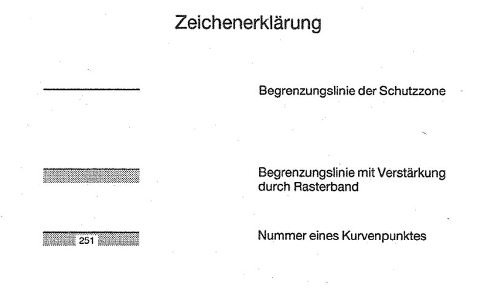
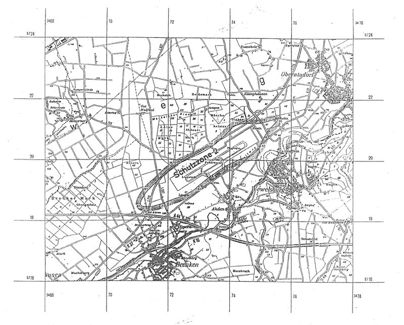

# Verordnung über die Festsetzung des Lärmschutzbereichs für den Verkehrsflughafen Paderborn/Lippstadt (FluLärmPadV)

Ausfertigungsdatum
:   1995-03-01

Fundstelle
:   BGBl I: 1995, 276

## Eingangsformel

Auf Grund des § 4 Abs. 1 des Gesetzes zum Schutz gegen Fluglärm vom
30\. März 1971 (BGBl. I S. 282), der gemäß Artikel 3 Abs. 1 der
Verordnung vom 26. November 1986 (BGBl. I S. 2089) geändert worden
ist, verordnet das Bundesministerium für Umwelt, Naturschutz und
Reaktorsicherheit im Einvernehmen mit dem Bundesministerium für
Verkehr:

## § 1

Zum Schutz der Allgemeinheit vor Gefahren, erheblichen Nachteilen und
erheblichen Belästigungen durch Fluglärm in der Umgebung des
Verkehrsflughafens Paderborn/Lippstadt wird der in § 2 bestimmte
Lärmschutzbereich festgesetzt.

## § 2

Der Lärmschutzbereich wird nach Anlage 1 bestimmt durch die
interpolierten Verbindungslinien zwischen den Kurvenpunkten, soweit
diese Linien außerhalb des Flugplatzgeländes verlaufen.

## § 3

(1) Liegt eine bauliche Anlage zu einem Teil im Lärmschutzbereich, so
gilt sie als ganz im Lärmschutzbereich gelegen.

(2) Auf die Errichtung einer baulichen Anlage ist Absatz 1
entsprechend anzuwenden.

## § 4

Der nach § 2 bestimmte Lärmschutzbereich ist in einer topographischen
Karte im Maßstab 1 : 50.000 und in Karten im Maßstab 1 : 5.000
dargestellt. Die topographische Karte ist dieser Verordnung als Anlage
2 beigefügt. Die topographische Karte und die Karten im Maßstab 1 :
5\.000 sind bei dem Oberkreisdirektor des Kreises Paderborn,
Aldegreverstraße 10 - 14, 33102 Paderborn, zu jedermanns Einsicht
archivmäßig gesichert niedergelegt.

## § 5

Diese Verordnung tritt am Tage nach der Verkündung in Kraft.

## Schlußformel

Der Bundesrat hat zugestimmt.

## Anlage 1 (zu § 2 der Verordnung über die Festsetzung des Lärmschutzbereichs für den Verkehrsflughafen Paderborn/Lippstadt) Lärmschutzbereich

(Fundstelle des Originaltextes: BGBl. I 1995, 277)

*    *   Koordinatensystem:

    *   Gauß - Krüger:

    *   Y = Rechtswert

*    *
    *
    *
    *
    *
    *   X = Hochwert

*    *   Interpolation:

    *   Polynom 3. Grades mit stetigem Tangentenübergang

*    *

*    *   Kurvenpunkte der Schutzzone 2 (Verkehrsflughafen Paderborn/Lippstadt)

*    *   Nr.

    *   Y

    *   X

    *   Nr.

    *   Y

    *   X

    *   Nr.

    *   Y

    *   X

*    *
    *
    *
    *
    *
    *
    *
    *
    *

*    *   1

    *   3473497.2

    *   5720509.8

    *   41

    *   3475003.8

    *   5720504.0

    *   81

    *   3471117.3

    *   5718494.3

*    *   2

    *   3473559.6

    *   5720559.8

    *   42

    *   3474967.7

    *   5720432.7

    *   82

    *   3471106.7

    *   5718511.4

*    *   3

    *   3473682.5

    *   5720662.3

    *   43

    *   3474925.6

    *   5720364.6

    *   83

    *   3471101.1

    *   5718530.6

*    *   4

    *   3473799.1

    *   5720771.9

    *   44

    *   3474877.4

    *   5720300.8

    *   84

    *   3471099.5

    *   5718550.6

*    *   5

    *   3473913.2

    *   5720884.0

    *   45

    *   3474822.9

    *   5720242.2

    *   85

    *   3471104.9

    *   5718590.3

*    *   6

    *   3474023.1

    *   5721000.3

    *   46

    *   3474761.8

    *   5720190.5

    *   86

    *   3471117.0

    *   5718628.5

*    *   7

    *   3474076.9

    *   5721059.5

    *   47

    *   3474692.1

    *   5720151.4

    *   87

    *   3471132.5

    *   5718665.4

*    *   8

    *   3474103.6

    *   5721089.3

    *   48

    *   3474616.2

    *   5720126.3

    *   88

    *   3471168.8

    *   5718736.7

*    *   9

    *   3474135.9

    *   5721112.8

    *   49

    *   3474540.5

    *   5720100.3

    *   89

    *   3471208.5

    *   5718806.1

*    *   10

    *   3474170.7

    *   5721132.6

    *   50

    *   3474390.3

    *   5720045.1

    *   90

    *   3471298.6

    *   5718938.3

*    *
    *
    *
    *
    *
    *
    *
    *
    *

*    *   11

    *   3474243.6

    *   5721165.4

    *   51

    *   3474242.1

    *   5719984.8

    *   91

    *   3471348.5

    *   5719000.8

*    *   12

    *   3474319.9

    *   5721189.5

    *   52

    *   3474096.0

    *   5719919.6

    *   92

    *   3471404.5

    *   5719058.0

*    *   13

    *   3474398.3

    *   5721205.4

    *   53

    *   3473953.4

    *   5719847.2

    *   93

    *   3471462.3

    *   5719113.3

*    *   14

    *   3474477.8

    *   5721214.3

    *   54

    *   3473814.6

    *   5719767.5

    *   94

    *   3471577.8

    *   5719224.0

*    *   15

    *   3474557.8

    *   5721216.5

    *   55

    *   3473679.5

    *   5719673.4

    *   95

    *   3471693.9

    *   5719334.1

*    *   16

    *   3474637.8

    *   5721213.5

    *   56

    *   3473551.7

    *   5719585.1

    *   96

    *   3471807.3

    *   5719447.0

*    *   17

    *   3474797.5

    *   5721207.3

    *   57

    *   3473421.1

    *   5719492.6

    *   97

    *   3471919.6

    *   5719561.0

*    *   18

    *   3474877.4

    *   5721211.8

    *   58

    *   3473294.0

    *   5719395.4

    *   98

    *   3472040.6

    *   5719665.6

*    *   19

    *   3474956.7

    *   5721222.5

    *   59

    *   3473169.3

    *   5719295.3

    *   99

    *   3472165.9

    *   5719765.2

*    *   20

    *   3475035.9

    *   5721233.9

    *   60

    *   3473047.5

    *   5719191.5

    *   100

    *   3472230.7

    *   5719812.0

*    *
    *
    *
    *
    *
    *
    *
    *
    *

*    *   21

    *   3475163.4

    *   5721263.3

    *   61

    *   3472929.1

    *   5719083.9

    *   101

    *   3472298.2

    *   5719855.0

*    *   22

    *   3475343.1

    *   5721322.3

    *   62

    *   3472867.8

    *   5719032.5

    *   102

    *   3472369.6

    *   5719891.2

*    *   23

    *   3475418.6

    *   5721348.8

    *   63

    *   3472802.5

    *   5718986.2

    *   103

    *   3472442.2

    *   5719924.7

*    *   24

    *   3475456.6

    *   5721361.1

    *   64

    *   3472733.6

    *   5718945.5

    *   104

    *   3472589.2

    *   5719988.0

*    *   25

    *   3475495.5

    *   5721370.7

    *   65

    *   3472663.2

    *   5718907.6

    *   105

    *   3472733.1

    *   5720057.9

*    *   26

    *   3475534.9

    *   5721377.4

    *   66

    *   3472520.4

    *   5718835.5

    *   106

    *   3472875.9

    *   5720129.9

*    *   27

    *   3475554.7

    *   5721374.7

    *   67

    *   3472373.9

    *   5718771.1

    *   107

    *   3473020.3

    *   5720199.0

*    *   28

    *   3475561.6

    *   5721367.5

    *   68

    *   3472223.4

    *   5718716.7

    *   108

    *   3473161.2

    *   5720274.7

*    *   29

    *   3475562.0

    *   5721357.5

    *   69

    *   3472074.1

    *   5718659.3

    *   109

    *   3473294.7

    *   5720362.9

*    *   30

    *   3475559.0

    *   5721348.0

    *   70

    *   3471925.1

    *   5718601.0

    *   110

    *   3473425.6

    *   5720455.0

*    *
    *
    *
    *
    *
    *
    *
    *
    *

*    *   31

    *   3475549.4

    *   5721330.4

    *   71

    *   3471775.8

    *   5718543.3

    *   111

    *   3473497.2

    *   5720509.8

*    *   32

    *   3475526.4

    *   5721297.7

    *   72

    *   3471623.9

    *   5718493.1

    *
    *
    *

*    *   33

    *   3475473.0

    *   5721238.1

    *   73

    *   3471546.9

    *   5718471.5

    *
    *
    *

*    *   34

    *   3475417.8

    *   5721180.1

    *   74

    *   3471467.8

    *   5718459.8

    *
    *
    *

*    *   35

    *   3475310.0

    *   5721061.9

    *   75

    *   3471388.0

    *   5718454.0

    *
    *
    *

*    *   36

    *   3475213.6

    *   5720934.3

    *   76

    *   3471308.0

    *   5718451.7

    *
    *
    *

*    *   37

    *   3475129.6

    *   5720798.0

    *   77

    *   3471228.1

    *   5718454.9

    *
    *
    *

*    *   38

    *   3475094.0

    *   5720726.4

    *   78

    *   3471188.4

    *   5718460.4

    *
    *
    *

*    *   39

    *   3475063.6

    *   5720652.4

    *   79

    *   3471150.1

    *   5718471.7

    *
    *
    *

*    *   40

    *   3475034.8

    *   5720577.8

    *   80

    *   3471132.4

    *   5718481.2

    *
    *
    *

## Anlage 2 (zu § 4 der Verordnung über die Festsetzung des Lärmschutzbereichs für den Verkehrsflughafen Paderborn/Lippstadt)

   (Fundstelle: BGBl I 1995, 278 - 279)

1 : 50 000
Lärmschutzbereich
für den Verkehrsflughafen Paderborn/Lippstadt
(Gesetz zum Schutz gegen Fluglärm vom 30. März 1971, BGBl. I S. 282)

Das rechtwinklige Koordinatengitter entspricht dem Gauß-Krüger-System
mit 3° breitem Meridianstreifen. Es zeigt zugleich die Begrenzung der
zugehörigen Blätter der Deutschen Grundkarte 1 : 5 000.

Kartengrundlage:
Topographische Karte 1 : 50 000
(mit Genehmigung des Landesvermessungsamtes Nordrhein-Westfalen).

Gravur der Lärmschutzgrenzen und Druck:
Landesvermessungsamt Nordrhein-Westfalen, 1994

