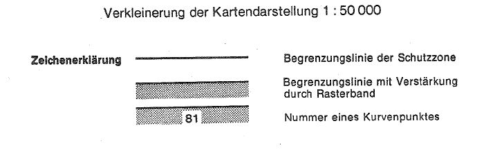
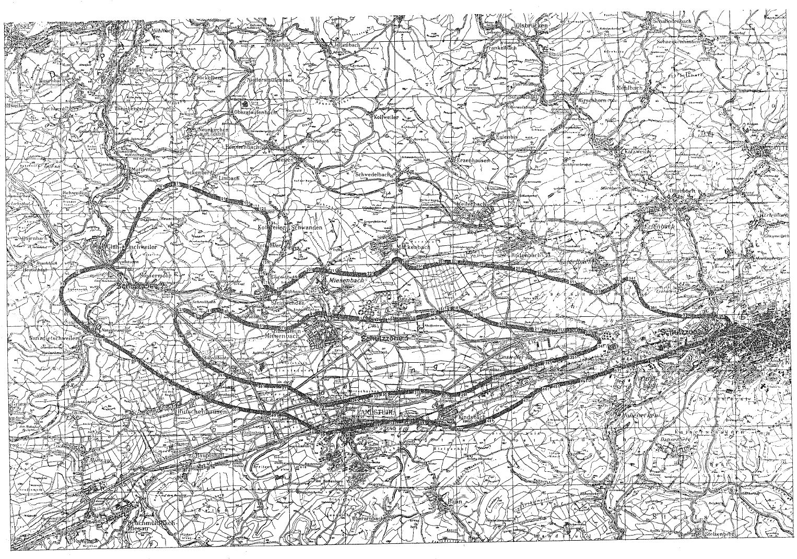

# Verordnung über die Festsetzung des Lärmschutzbereichs für den militärischen Flugplatz Ramstein (FluLärmRamstV)

Ausfertigungsdatum
:   1976-12-22

Fundstelle
:   BGBl I: 1976, 3818

Geändert durch
:   Art. 1 V v. 26.7.1983 I 1045

## Eingangsformel

Auf Grund des § 4 Abs. 1 des Gesetzes zum Schutz gegen Fluglärm vom
30\. März 1971 (Bundesgesetzbl. I S. 282), geändert durch Artikel 70
des Einführungsgesetzes zum Strafgesetzbuch vom 2. März 1974
(Bundesgesetzbl. I S. 469), wird im Einvernehmen mit dem
Bundesminister der Verteidigung und mit Zustimmung des Bundesrates
verordnet:

## § 1

Zum Schutz der Allgemeinheit vor Gefahren, erheblichen Nachteilen und
erheblichen Belästigungen durch Fluglärm in der Umgebung des
militärischen Flugplatzes Ramstein wird der in § 2 bestimmte
Lärmschutzbereich festgesetzt.

## § 2

Der Lärmschutzbereich mit seinen zwei Schutzzonen wird nach Anlage 1
bestimmt durch die interpolierten Verbindungslinien zwischen den
Kurvenpunkten, soweit diese Linien außerhalb des Flugplatzgeländes
verlaufen.

## § 3

Liegt eine bauliche Anlage zu einem Teil im Lärmschutzbereich, so gilt
sie als ganz im Lärmschutzbereich gelegen. Liegt eine bauliche Anlage
zu einem Teil in der Schutzzone 1, so gilt sie als ganz in dieser
Schutzzone gelegen.

## § 4

(1) Der nach § 2 bestimmte Lärmschutzbereich ist in einer
topographischen Karte im Maßstab 1:50.000 und in Karten im Maßstab
1:5.000 dargestellt. Die topographische Karte ist in verkleinerter
Form als Anlage 2 dieser Verordnung beigefügt. Die topographische
Karte und die Karten im Maßstab 1:5.000 sind bei der Kreisverwaltung
Kaiserslautern, Lauterstraße 8, 6750 Kaiserslautern, zu jedermanns
Einsicht archivmäßig gesichert niedergelegt.

(2) Die Karten im Maßstab 1:5.000 über den Lärmschutzbereich nach der
bis zum 4. August 1983 geltenden Fassung dieser Verordnung bleiben an
gleicher Stelle zu jedermanns Einsicht archivmäßig gesichert
niedergelegt.

## § 5

Diese Verordnung tritt am Tag nach der Verkündung in Kraft.

## Schlußformel

Der Bundesminister des Innern

## Anlage 1 (zu Artikel 1 Nummer 2 der Ersten Verordnung zur Änderung der Verordnung über die Festsetzung des Lärmschutzbereichs für den militärischen Flugplatz Ramstein)

(Fundstelle des Originaltextes: BGBl. I 1983, 1046 - 1053)

*    *   **Lärmschutzbereich - Erste Änderung -**

*    *

*    *
    *   Koordinatensystem:

    *   Gauß-Krüger

*    *
    *   Interpolation:

    *   Polynom 3. Grades mit stetigem Tangentenübergang

*    *

*    *   Kurvenpunkte der Schutzzone 1 (Militärischer Flugplatz Ramstein)

*    *

*    *   Nr.

    *   Y (Rechts)

    *   X (Hoch)

    *   Nr.

    *   Y (Rechts)

    *   X (Hoch)

    *   Nr.

    *   Y (Rechts)

    *   X (Hoch)

*    *

*    *   1

    *   3390384.1

    *   5479483.3

    *   51

    *   3391824.2

    *   5480280.9

    *   101

    *   3395547.1

    *   5480152.7

*    *   2

    *   3390296.7

    *   5479613.7

    *   52

    *   3391886.0

    *   5480244.3

    *   102

    *   3395666.9

    *   5480131.3

*    *   3

    *   3390255.5

    *   5479679.4

    *   53

    *   3392007.2

    *   5480166.9

    *   103

    *   3395786.7

    *   5480110.1

*    *   4

    *   3390215.7

    *   5479745.9

    *   54

    *   3392130.0

    *   5480092.2

    *   104

    *   3395906.7

    *   5480089.5

*    *   5

    *   3390177.8

    *   5479812.3

    *   55

    *   3392257.6

    *   5480027.0

    *   105

    *   3396026.8

    *   5480069.6

*    *   6

    *   3390144.6

    *   5479881.1

    *   56

    *   3392387.8

    *   5479966.9

    *   106

    *   3396158.6

    *   5480048.7

*    *   7

    *   3390118.6

    *   5479951.5

    *   57

    *   3392518.2

    *   5479906.9

    *   107

    *   3396290.4

    *   5480028.7

*    *   8

    *   3390097.3

    *   5480023.4

    *   58

    *   3392661.7

    *   5479854.3

    *   108

    *   3396422.5

    *   5480009.5

*    *   9

    *   3390082.1

    *   5480097.7

    *   59

    *   3392807.6

    *   5479815.0

    *   109

    *   3396554.6

    *   5479990.9

*    *   10

    *   3390075.6

    *   5480173.3

    *   60

    *   3392955.5

    *   5479786.1

    *   110

    *   3396677.6

    *   5479974.1

*    *
    *
    *
    *
    *
    *
    *
    *
    *

*    *   11

    *   3390077.7

    *   5480219.1

    *   61

    *   3393104.3

    *   5479762.4

    *   111

    *   3396739.1

    *   5479965.9

*    *   12

    *   3390086.2

    *   5480264.1

    *   62

    *   3393254.5

    *   5479746.8

    *   112

    *   3396800.6

    *   5479957.7

*    *   13

    *   3390096.2

    *   5480293.3

    *   63

    *   3393405.2

    *   5479734.4

    *   113

    *   3396841.6

    *   5479952.3

*    *   14

    *   3390110.0

    *   5480320.5

    *   64

    *   3393480.5

    *   5479727.9

    *   114

    *   3396882.6

    *   5479946.8

*    *   15

    *   3390128.5

    *   5480345.4

    *   65

    *   3393555.7

    *   5479720.5

    *   115

    *   3396923.7

    *   5479941.4

*    *   16

    *   3390145.3

    *   5480361.9

    *   66

    *   3393625.6

    *   5479712.1

    *   116

    *   3396975.4

    *   5479934.5

*    *   17

    *   3390163.9

    *   5480375.7

    *   67

    *   3393695.2

    *   5479702.2

    *   117

    *   3397020.2

    *   5479928.6

*    *   18

    *   3390184.2

    *   5480386.9

    *   68

    *   3393746.7

    *   5479693.9

    *   118

    *   3397071.7

    *   5479922.2

*    *   19

    *   3390206.1

    *   5480395.5

    *   69

    *   3393798.1

    *   5479684.9

    *   119

    *   3397121.6

    *   5479916.3

*    *   20

    *   3390228.8

    *   5480401.4

    *   70

    *   3393849.4

    *   5479675.3

    *   120

    *   3397175.3

    *   5479909.8

*    *
    *
    *
    *
    *
    *
    *
    *
    *

*    *   21

    *   3390251.6

    *   5480405.0

    *   71

    *   3393886.5

    *   5479669.0

    *   121

    *   3397229.1

    *   5479903.1

*    *   22

    *   3390274.7

    *   5480406.2

    *   72

    *   3393924.1

    *   5479667.6

    *   122

    *   3397277.9

    *   5479897.1

*    *   23

    *   3390298.0

    *   5480405.5

    *   73

    *   3393961.4

    *   5479671.7

    *   123

    *   3397317.6

    *   5479897.7

*    *   24

    *   3390337.3

    *   5480400.6

    *   74

    *   3393998.5

    *   5479677.9

    *   124

    *   3397344.9

    *   5479898.3

*    *   25

    *   3390375.8

    *   5480391.6

    *   75

    *   3394070.8

    *   5479691.7

    *   125

    *   3397372.1

    *   5479898.9

*    *   26

    *   3390450.0

    *   5480364.5

    *   76

    *   3394143.2

    *   5479705.2

    *   126

    *   3397422.3

    *   5479900.4

*    *   27

    *   3390524.1

    *   5480327.0

    *   77

    *   3394230.8

    *   5479732.5

    *   127

    *   3397472.7

    *   5479903.3

*    *   28

    *   3390595.1

    *   5480284.0

    *   78

    *   3394305.8

    *   5479765.0

    *   128

    *   3397523.0

    *   5479905.4

*    *   29

    *   3390666.4

    *   5480237.1

    *   79

    *   3394380.8

    *   5479807.5

    *   129

    *   3397578.6

    *   5479908.3

*    *   30

    *   3390737.9

    *   5480190.6

    *   80

    *   3394455.8

    *   5479855.0

    *   130

    *   3397634.2

    *   5479911.7

*    *
    *
    *
    *
    *
    *
    *
    *
    *

*    *   31

    *   3390811.0

    *   5480159.8

    *   81

    *   3394525.8

    *   5479905.0

    *   131

    *   3397745.3

    *   5479919.3

*    *   32

    *   3390849.6

    *   5480150.0

    *   82

    *   3394600.8

    *   5479960.0

    *   132

    *   3397856.5

    *   5479926.4

*    *   33

    *   3390889.0

    *   5480144.5

    *   83

    *   3394669.6

    *   5480006.9

    *   133

    *   3397991.8

    *   5479931.9

*    *   34

    *   3390932.2

    *   5480144.7

    *   84

    *   3394706.0

    *   5480034.9

    *   134

    *   3398075.8

    *   5479935.2

*    *   35

    *   3390975.0

    *   5480151.4

    *   85

    *   3394742.6

    *   5480062.6

    *   135

    *   3398127.1

    *   5479936.6

*    *   36

    *   3391016.1

    *   5480165.0

    *   86

    *   3394781.3

    *   5480090.4

    *   136

    *   3398194.7

    *   5479940.4

*    *   37

    *   3391055.0

    *   5480183.8

    *   87

    *   3394817.1

    *   5480121.8

    *   137

    *   3398262.3

    *   5479943.5

*    *   38

    *   3391121.1

    *   5480225.8

    *   88

    *   3394842.0

    *   5480138.2

    *   138

    *   3398397.5

    *   5479948.6

*    *   39

    *   3391185.0

    *   5480271.0

    *   89

    *   3394868.5

    *   5480151.7

    *   139

    *   3398465.1

    *   5479952.1

*    *   40

    *   3391227.6

    *   5480299.9

    *   90

    *   3394901.9

    *   5480156.8

    *   140

    *   3398532.6

    *   5479956.2

*    *
    *
    *
    *
    *
    *
    *
    *
    *

*    *   41

    *   3391271.7

    *   5480326.4

    *   91

    *   3394935.3

    *   5480162.3

    *   141

    *   3398587.7

    *   5479962.5

*    *   42

    *   3391317.8

    *   5480349.4

    *   92

    *   3395001.5

    *   5480175.8

    *   142

    *   3398640.9

    *   5479977.8

*    *   43

    *   3391353.1

    *   5480363.3

    *   93

    *   3395045.7

    *   5480186.4

    *   143

    *   3398747.1

    *   5480007.9

*    *   44

    *   3391389.5

    *   5480374.0

    *   94

    *   3395089.7

    *   5480198.0

    *   144

    *   3398853.7

    *   5480035.9

*    *   45

    *   3391464.4

    *   5480385.4

    *   95

    *   3395133.4

    *   5480210.3

    *   145

    *   3398994.3

    *   5480068.7

*    *   46

    *   3391546.9

    *   5480385.6

    *   96

    *   3395167.7

    *   5480216.8

    *   146

    *   3399064.7

    *   5480084.6

*    *   47

    *   3391587.7

    *   5480379.2

    *   97

    *   3395202.2

    *   5480211.8

    *   147

    *   3399135.1

    *   5480101.3

*    *   48

    *   3391627.8

    *   5480369.2

    *   98

    *   3395270.2

    *   5480201.2

    *   148

    *   3399181.7

    *   5480113.0

*    *   49

    *   3391695.7

    *   5480345.2

    *   99

    *   3395339.4

    *   5480189.6

    *   149

    *   3399228.2

    *   5480125.2

*    *   50

    *   3391761.1

    *   5480314.9

    *   100

    *   3395408.6

    *   5480177.5

    *   150

    *   3399274.6

    *   5480138.0

*    *

*    *

*    *   Noch Schutzzone 1 (Militärischer Flugplatz Ramstein)

*    *

*    *   Nr.

    *   Y (Rechts)

    *   X (Hoch)

    *   Nr.

    *   Y (Rechts)

    *   X (Hoch)

    *   Nr.

    *   Y (Rechts)

    *   X (Hoch)

*    *

*    *   151

    *   3399309.2

    *   5480148.0

    *   201

    *   3401683.4

    *   5479672.9

    *   251

    *   3404170.3

    *   5478677.9

*    *   152

    *   3399343.9

    *   5480158.0

    *   202

    *   3401824.7

    *   5479650.8

    *   252

    *   3404024.2

    *   5478640.6

*    *   153

    *   3399378.4

    *   5480168.6

    *   203

    *   3401966.8

    *   5479634.2

    *   253

    *   3403877.6

    *   5478605.1

*    *   154

    *   3399412.7

    *   5480179.6

    *   204

    *   3402109.6

    *   5479622.3

    *   254

    *   3403730.4

    *   5478572.4

*    *   155

    *   3399440.2

    *   5480188.6

    *   205

    *   3402250.7

    *   5479599.3

    *   255

    *   3403643.4

    *   5478554.9

*    *   156

    *   3399467.7

    *   5480197.7

    *   206

    *   3402390.8

    *   5479569.5

    *   256

    *   3403556.1

    *   5478538.7

*    *   157

    *   3399495.0

    *   5480207.1

    *   207

    *   3402475.8

    *   5479551.1

    *   257

    *   3403469.8

    *   5478524.2

*    *   158

    *   3399522.3

    *   5480216.6

    *   208

    *   3402560.9

    *   5479533.2

    *   258

    *   3403426.7

    *   5478517.4

*    *   159

    *   3399549.5

    *   5480226.4

    *   209

    *   3402698.6

    *   5479507.6

    *   259

    *   3403383.4

    *   5478511.0

*    *   160

    *   3399574.7

    *   5480235.7

    *   210

    *   3402837.0

    *   5479485.3

    *   260

    *   3403352.7

    *   5478506.5

*    *
    *
    *
    *
    *
    *
    *
    *
    *

*    *   161

    *   3399599.9

    *   5480245.1

    *   211

    *   3402975.5

    *   5479464.2

    *   261

    *   3403323.7

    *   5478495.7

*    *   162

    *   3399619.3

    *   5480253.0

    *   212

    *   3403114.4

    *   5479446.4

    *   262

    *   3403293.1

    *   5478491.1

*    *   163

    *   3399636.3

    *   5480265.0

    *   213

    *   3403184.3

    *   5479439.7

    *   263

    *   3403267.1

    *   5478487.1

*    *   164

    *   3399652.3

    *   5480275.0

    *   214

    *   3403254.4

    *   5479435.0

    *   264

    *   3403241.1

    *   5478483.1

*    *   165

    *   3399669.3

    *   5480286.0

    *   215

    *   3403302.5

    *   5479431.9

    *   265

    *   3403193.4

    *   5478475.5

*    *   166

    *   3399682.3

    *   5480295.0

    *   216

    *   3403381.6

    *   5479419.9

    *   266

    *   3403146.1

    *   5478465.8

*    *   167

    *   3399696.3

    *   5480298.0

    *   217

    *   3403456.6

    *   5479414.9

    *   267

    *   3403099.0

    *   5478454.5

*    *   168

    *   3399710.1

    *   5480296.9

    *   218

    *   3403539.3

    *   5479406.8

    *   268

    *   3403028.9

    *   5478436.6

*    *   169

    *   3399724.6

    *   5480297.6

    *   219

    *   3403612.7

    *   5479410.3

    *   269

    *   3402959.1

    *   5478417.7

*    *   170

    *   3399739.1

    *   5480298.1

    *   220

    *   3403686.0

    *   5479416.9

    *   270

    *   3402819.8

    *   5478378.2

*    *
    *
    *
    *
    *
    *
    *
    *
    *

*    *   171

    *   3399768.2

    *   5480298.8

    *   221

    *   3403832.0

    *   5479434.7

    *   271

    *   3402680.7

    *   5478337.7

*    *   172

    *   3399797.8

    *   5480298.9

    *   222

    *   3403977.7

    *   5479456.2

    *   272

    *   3402542.4

    *   5478294.5

*    *   173

    *   3399826.3

    *   5480302.6

    *   223

    *   3404123.9

    *   5479473.7

    *   273

    *   3402407.3

    *   5478249.7

*    *   174

    *   3399852.3

    *   5480301.8

    *   224

    *   3404246.8

    *   5479477.0

    *   274

    *   3402272.2

    *   5478204.7

*    *   175

    *   3399887.9

    *   5480300.0

    *   225

    *   3404307.4

    *   5479472.9

    *   275

    *   3402135.3

    *   5478166.6

*    *   176

    *   3399923.5

    *   5480297.4

    *   226

    *   3404367.5

    *   5479464.8

    *   276

    *   3401995.2

    *   5478140.4

*    *   177

    *   3399958.2

    *   5480294.0

    *   227

    *   3404427.1

    *   5479453.0

    *   277

    *   3401855.8

    *   5478111.6

*    *   178

    *   3399982.1

    *   5480287.0

    *   228

    *   3404486.0

    *   5479438.3

    *   278

    *   3401745.5

    *   5478084.3

*    *   179

    *   3400006.6

    *   5480283.8

    *   229

    *   3404603.2

    *   5479402.5

    *   279

    *   3401636.4

    *   5478052.9

*    *   180

    *   3400045.6

    *   5480277.9

    *   230

    *   3404683.8

    *   5479374.1

    *   280

    *   3401528.4

    *   5478017.6

*    *
    *
    *
    *
    *
    *
    *
    *
    *

*    *   181

    *   3400084.3

    *   5480271.1

    *   231

    *   3404763.4

    *   5479342.8

    *   281

    *   3401406.5

    *   5477970.2

*    *   182

    *   3400122.9

    *   5480263.3

    *   232

    *   3404906.4

    *   5479274.3

    *   282

    *   3401287.6

    *   5477916.5

*    *   183

    *   3400161.2

    *   5480254.6

    *   233

    *   3404971.0

    *   5479235.0

    *   283

    *   3401170.0

    *   5477860.0

*    *   184

    *   3400202.6

    *   5480244.3

    *   234

    *   3405001.7

    *   5479212.9

    *   284

    *   3401054.1

    *   5477800.0

*    *   185

    *   3400243.7

    *   5480233.0

    *   235

    *   3405030.8

    *   5479188.8

    *   285

    *   3400938.5

    *   5477739.3

*    *   186

    *   3400284.5

    *   5480220.7

    *   236

    *   3405054.0

    *   5479165.6

    *   286

    *   3400811.9

    *   5477670.5

*    *   187

    *   3400345.0

    *   5480200.7

    *   237

    *   3405073.6

    *   5479139.9

    *   287

    *   3400684.9

    *   5477602.3

*    *   188

    *   3400404.9

    *   5480178.9

    *   238

    *   3405087.4

    *   5479110.0

    *   288

    *   3400555.8

    *   5477538.1

*    *   189

    *   3400523.0

    *   5480130.2

    *   239

    *   3405090.1

    *   5479075.5

    *   289

    *   3400456.7

    *   5477494.2

*    *   190

    *   3400631.6

    *   5480079.8

    *   240

    *   3405080.1

    *   5479044.8

    *   290

    *   3400355.6

    *   5477455.1

*    *
    *
    *
    *
    *
    *
    *
    *
    *

*    *   191

    *   3400738.8

    *   5480026.7

    *   241

    *   3405060.3

    *   5479016.8

    *   291

    *   3400278.1

    *   5477429.3

*    *   192

    *   3400845.6

    *   5479972.7

    *   242

    *   3405035.2

    *   5478993.0

    *   292

    *   3400199.5

    *   5477407.1

*    *   193

    *   3400973.2

    *   5479910.7

    *   243

    *   3405007.6

    *   5478972.3

    *   293

    *   3400121.4

    *   5477389.2

*    *   194

    *   3401102.9

    *   5479854.3

    *   244

    *   3404948.2

    *   5478937.1

    *   294

    *   3400042.6

    *   5477374.9

*    *   195

    *   3401234.7

    *   5479803.2

    *   245

    *   3404888.0

    *   5478907.8

    *   295

    *   3399964.2

    *   5477365.1

*    *   196

    *   3401367.3

    *   5479754.2

    *   246

    *   3404826.3

    *   5478881.7

    *   296

    *   3399885.4

    *   5477358.8

*    *   197

    *   3401434.8

    *   5479732.3

    *   247

    *   3404700.9

    *   5478835.2

    *   297

    *   3399845.1

    *   5477357.0

*    *   198

    *   3401503.2

    *   5479713.1

    *   248

    *   3404573.6

    *   5478793.3

    *   298

    *   3399805.5

    *   5477367.2

*    *   199

    *   3401543.4

    *   5479702.9

    *   249

    *   3404445.1

    *   5478754.3

    *   299

    *   3399765.8

    *   5477376.8

*    *   200

    *   3401613.2

    *   5479686.8

    *   250

    *   3404315.8

    *   5478717.3

    *   300

    *   3399726.1

    *   5477386.1

*    *

*    *

*    *   Noch Schutzzone 1 (Militärischer Flugplatz Ramstein)

*    *

*    *   Nr.

    *   Y (Rechts)

    *   X (Hoch)

    *   Nr.

    *   Y (Rechts)

    *   X (Hoch)

    *   Nr.

    *   Y (Rechts)

    *   X (Hoch)

*    *

*    *   301

    *   3399646.4

    *   5477404.0

    *   341

    *   3396398.3

    *   5477277.6

    *   381

    *   3393091.1

    *   5477835.3

*    *   302

    *   3399566.5

    *   5477420.5

    *   342

    *   3396253.6

    *   5477246.9

    *   382

    *   3392939.6

    *   5477859.7

*    *   303

    *   3399457.1

    *   5477441.8

    *   343

    *   3396109.0

    *   5477216.1

    *   383

    *   3392788.6

    *   5477889.1

*    *   304

    *   3399347.3

    *   5477461.2

    *   344

    *   3395964.4

    *   5477185.0

    *   384

    *   3392659.1

    *   5477918.2

*    *   305

    *   3399237.2

    *   5477478.6

    *   345

    *   3395829.2

    *   5477155.9

    *   385

    *   3392530.4

    *   5477950.7

*    *   306

    *   3399101.5

    *   5477497.5

    *   346

    *   3395693.9

    *   5477126.8

    *   386

    *   3392388.2

    *   5477991.0

*    *   307

    *   3398965.5

    *   5477513.1

    *   347

    *   3395558.3

    *   5477099.4

    *   387

    *   3392247.6

    *   5478035.4

*    *   308

    *   3398829.4

    *   5477525.1

    *   348

    *   3395489.1

    *   5477087.1

    *   388

    *   3392108.7

    *   5478084.1

*    *   309

    *   3398761.3

    *   5477529.2

    *   349

    *   3395419.7

    *   5477075.9

    *   389

    *   3391971.5

    *   5478136.7

*    *   310

    *   3398693.1

    *   5477531.3

    *   350

    *   3395350.9

    *   5477066.0

    *   390

    *   3391835.9

    *   5478193.5

*    *
    *
    *
    *
    *
    *
    *
    *
    *

*    *   311

    *   3398624.1

    *   5477522.8

    *   351

    *   3395281.5

    *   5477065.4

    *   391

    *   3391702.2

    *   5478254.7

*    *   312

    *   3398555.5

    *   5477512.3

    *   352

    *   3395213.2

    *   5477080.6

    *   392

    *   3391570.5

    *   5478321.0

*    *   313

    *   3398430.6

    *   5477502.0

    *   353

    *   3395144.6

    *   5477093.9

    *   393

    *   3391442.0

    *   5478395.0

*    *   314

    *   3398305.6

    *   5477493.3

    *   354

    *   3395099.0

    *   5477102.2

    *   394

    *   3391333.6

    *   5478464.3

*    *   315

    *   3398154.5

    *   5477484.4

    *   355

    *   3395053.3

    *   5477110.4

    *   295

    *   3391228.9

    *   5478538.8

*    *   316

    *   3398003.4

    *   5477474.4

    *   356

    *   3395007.6

    *   5477118.5

    *   296

    *   3391128.1

    *   5478618.8

*    *   317

    *   3397852.1

    *   5477466.4

    *   357

    *   3394978.1

    *   5477135.1

    *   397

    *   3391020.5

    *   5478714.3

*    *   318

    *   3397700.6

    *   5477466.2

    *   358

    *   3394950.9

    *   5477155.2

    *   398

    *   3390917.7

    *   5478814.0

*    *   319

    *   3397625.0

    *   5477463.1

    *   359

    *   3394896.6

    *   5477195.5

    *   399

    *   3390819.9

    *   5478917.8

*    *   320

    *   3397549.5

    *   5477459.0

    *   360

    *   3394843.0

    *   5477236.8

    *   400

    *   3390726.1

    *   5479025.2

*    *
    *
    *
    *
    *
    *
    *
    *
    *

*    *   321

    *   3397508.9

    *   5477456.4

    *   361

    *   3394790.4

    *   5477279.6

    *   401

    *   3390636.4

    *   5479136.1

*    *   322

    *   3397468.3

    *   5477453.7

    *   362

    *   3394733.9

    *   5477316.7

    *   402

    *   3390550.7

    *   5479250.4

*    *   323

    *   3397430.0

    *   5477451.3

    *   363

    *   3394677.4

    *   5477353.7

    *   403

    *   3390468.3

    *   5479367.5

*    *   324

    *   3397396.6

    *   5477448.7

    *   364

    *   3394563.5

    *   5477426.6

    *   404

    *   3390384.1

    *   5479483.3

*    *   325

    *   3397371.0

    *   5477445.0

    *   365

    *   3394457.1

    *   5477492.6

    *
    *
    *

*    *   326

    *   3397340.0

    *   5477439.6

    *   366

    *   3394349.8

    *   5477557.2

    *
    *
    *

*    *   327

    *   3397309.8

    *   5477434.4

    *   367

    *   3394214.0

    *   5477635.3

    *
    *
    *

*    *   328

    *   3397279.0

    *   5477429.9

    *   368

    *   3394075.4

    *   5477705.6

    *
    *
    *

*    *   329

    *   3397249.9

    *   5477424.8

    *   369

    *   3394005.4

    *   5477738.5

    *
    *
    *

*    *   330

    *   3397198.1

    *   5477417.6

    *   370

    *   3393970.0

    *   5477754.7

    *
    *
    *

*    *
    *
    *
    *
    *
    *
    *
    *
    *

*    *   331

    *   3397160.1

    *   5477414.1

    *   371

    *   3393931.9

    *   5477762.7

    *
    *
    *

*    *   332

    *   3397097.9

    *   5477408.4

    *   372

    *   3393891.6

    *   5477765.1

    *
    *
    *

*    *   333

    *   3397046.4

    *   5477402.0

    *   373

    *   3393851.2

    *   5477767.7

    *
    *
    *

*    *   334

    *   3396994.7

    *   5477394.3

    *   374

    *   3393770.3

    *   5477770.7

    *
    *
    *

*    *   335

    *   3396930.0

    *   5477383.4

    *   375

    *   3393693.2

    *   5477774.5

    *
    *
    *

*    *   336

    *   3396858.0

    *   5477370.3

    *   376

    *   3393616.2

    *   5477779.3

    *
    *
    *

*    *   337

    *   3396800.9

    *   5477359.4

    *   377

    *   3393548.9

    *   5477784.2

    *
    *
    *

*    *   338

    *   3396736.4

    *   5477346.8

    *   378

    *   3393472.3

    *   5477790.7

    *
    *
    *

*    *   339

    *   3396671.9

    *   5477333.9

    *   379

    *   3393395.8

    *   5477798.1

    *
    *
    *

*    *   340

    *   3396543.1

    *   5477307.6

    *   380

    *   3393243.3

    *   5477815.1

    *
    *
    *

*    *

*    *

*    *   Kurvenpunkte der Schutzzone 2 (Militärischer Flugplatz Ramsteim)

*    *

*    *   Nr.

    *   Y (Rechts)

    *   X (Hoch)

    *   Nr.

    *   Y (Rechts)

    *   X (Hoch)

    *   Nr.

    *   Y (Rechts)

    *   X (Hoch)

*    *

*    *   1

    *   3386138.4

    *   5480728.3

    *   51

    *   3388893.9

    *   5484029.8

    *   101

    *   3392632.9

    *   5484152.9

*    *   2

    *   3386076.8

    *   5480841.7

    *   52

    *   3388974.2

    *   5484164.1

    *   102

    *   3392668.8

    *   5484140.6

*    *   3

    *   3386051.6

    *   5480901.1

    *   53

    *   3389061.0

    *   5484293.9

    *   103

    *   3392702.7

    *   5484133.4

*    *   4

    *   3386032.4

    *   5480962.7

    *   54

    *   3389156.7

    *   5484417.5

    *   104

    *   3392733.7

    *   5484130.2

*    *   5

    *   3386021.8

    *   5481026.5

    *   55

    *   3389261.7

    *   5484534.6

    *   105

    *   3392757.7

    *   5484124.2

*    *   6

    *   3386016.7

    *   5481090.9

    *   56

    *   3389318.9

    *   5484590.2

    *   106

    *   3392780.1

    *   5484116.4

*    *   7

    *   3386016.2

    *   5481153.4

    *   57

    *   3389378.2

    *   5484643.4

    *   107

    *   3392797.2

    *   5484109.6

*    *   8

    *   3386019.3

    *   5481215.9

    *   58

    *   3389437.1

    *   5484690.1

    *   108

    *   3392814.3

    *   5484102.8

*    *   9

    *   3386028.9

    *   5481277.3

    *   59

    *   3389497.5

    *   5484734.6

    *   109

    *   3392848.0

    *   5484088.0

*    *   10

    *   3386046.6

    *   5481336.9

    *   60

    *   3389553.8

    *   5484770.7

    *   110

    *   3392893.3

    *   5484068.0

*    *
    *
    *
    *
    *
    *
    *
    *
    *

*    *   11

    *   3386076.4

    *   5481396.1

    *   61

    *   3389645.8

    *   5484822.6

    *   111

    *   3392937.5

    *   5484046.0

*    *   12

    *   3386112.8

    *   5481451.5

    *   62

    *   3389741.9

    *   5484866.4

    *   112

    *   3392959.3

    *   5484034.3

*    *   13

    *   3386157.1

    *   5481508.1

    *   63

    *   3389879.5

    *   5484914.2

    *   113

    *   3392981.1

    *   5484022.5

*    *   14

    *   3386204.7

    *   5481562.0

    *   64

    *   3389947.3

    *   5484932.6

    *   114

    *   3392998.7

    *   5484013.4

*    *   15

    *   3386255.6

    *   5481611.6

    *   65

    *   3389981.8

    *   5484939.2

    *   115

    *   3393012.7

    *   5484005.4

*    *   16

    *   3386310.9

    *   5481656.2

    *   66

    *   3390016.3

    *   5484945.9

    *   116

    *   3393040.7

    *   5483996.4

*    *   17

    *   3386370.7

    *   5481696.2

    *   67

    *   3390050.1

    *   5484951.8

    *   117

    *   3393063.7

    *   5483988.4

*    *   18

    *   3386432.3

    *   5481733.3

    *   68

    *   3390084.3

    *   5484953.0

    *   118

    *   3393085.7

    *   5483977.4

*    *   19

    *   3386490.2

    *   5481765.2

    *   69

    *   3390118.1

    *   5484947.9

    *   119

    *   3393103.6

    *   5483965.2

*    *   20

    *   3386549.4

    *   5481794.8

    *   70

    *   3390151.8

    *   5484942.2

    *   120

    *   3393120.3

    *   5483952.0

*    *
    *
    *
    *
    *
    *
    *
    *
    *

*    *   21

    *   3386592.4

    *   5481815.1

    *   71

    *   3390195.3

    *   5484934.7

    *   121

    *   3393136.9

    *   5483938.8

*    *   22

    *   3386658.2

    *   5481840.9

    *   72

    *   3390238.6

    *   5484926.1

    *   122

    *   3393168.6

    *   5483910.8

*    *   23

    *   3386725.1

    *   5481863.9

    *   73

    *   3390281.5

    *   5484915.7

    *   123

    *   3393198.4

    *   5483880.6

*    *   24

    *   3386859.8

    *   5481904.9

    *   74

    *   3390324.5

    *   5484906.1

    *   124

    *   3393226.2

    *   5483848.6

*    *   25

    *   3386996.6

    *   5481937.5

    *   75

    *   3390354.0

    *   5484898.4

    *   125

    *   3393248.9

    *   5483819.0

*    *   26

    *   3387134.3

    *   5481966.9

    *   76

    *   3390387.5

    *   5484888.8

    *   126

    *   3393269.4

    *   5483788.0

*    *   27

    *   3387272.4

    *   5481994.6

    *   77

    *   3390420.6

    *   5484878.3

    *   127

    *   3393288.0

    *   5483755.7

*    *   28

    *   3387410.1

    *   5482024.2

    *   78

    *   3390465.7

    *   5484865.0

    *   128

    *   3393304.9

    *   5483722.6

*    *   29

    *   3387546.3

    *   5482059.4

    *   79

    *   3390510.1

    *   5484849.6

    *   129

    *   3393332.6

    *   5483651.8

*    *   30

    *   3387688.5

    *   5482107.8

    *   80

    *   3390554.6

    *   5484834.3

    *   130

    *   3393352.7

    *   5483578.4

*    *
    *
    *
    *
    *
    *
    *
    *
    *

*    *   31

    *   3387755.2

    *   5482136.4

    *   81

    *   3390640.7

    *   5484802.0

    *   131

    *   3393365.6

    *   5483507.0

*    *   32

    *   3387820.1

    *   5482168.9

    *   82

    *   3390723.6

    *   5484766.8

    *   132

    *   3393372.9

    *   5483434.8

*    *   33

    *   3387881.1

    *   5482204.6

    *   83

    *   3390806.4

    *   5484731.6

    *   133

    *   3393376.1

    *   5483363.1

*    *   34

    *   3387939.6

    *   5482244.3

    *   84

    *   3390937.1

    *   5484672.2

    *   134

    *   3393375.4

    *   5483291.4

*    *   35

    *   3387994.3

    *   5482287.9

    *   85

    *   3391066.6

    *   5484610.2

    *   135

    *   3393365.0

    *   5483148.4

*    *   36

    *   3388045.8

    *   5482335.3

    *   86

    *   3391196.6

    *   5484549.2

    *   136

    *   3393356.1

    *   5483076.9

*    *   37

    *   3388094.2

    *   5482387.0

    *   87

    *   3391328.1

    *   5484491.7

    *   137

    *   3393345.3

    *   5483005.6

*    *   38

    *   3388139.3

    *   5482441.6

    *   88

    *   3391436.1

    *   5484450.1

    *   138

    *   3393336.7

    *   5482956.4

*    *   39

    *   3388182.2

    *   5482500.2

    *   89

    *   3391545.8

    *   5484413.5

    *   139

    *   3393327.2

    *   5482907.4

*    *   40

    *   3388221.7

    *   5482561.1

    *   90

    *   3391669.6

    *   5484378.0

    *   140

    *   3393317.9

    *   5482862.9

*    *
    *
    *
    *
    *
    *
    *
    *
    *

*    *   41

    *   3388295.1

    *   5482691.1

    *   91

    *   3391794.0

    *   5484345.1

    *   141

    *   3393304.4

    *   5482800.7

*    *   42

    *   3388355.9

    *   5482816.1

    *   92

    *   3391918.2

    *   5484311.6

    *   142

    *   3393285.1

    *   5482720.3

*    *   43

    *   3388411.8

    *   5482943.3

    *   93

    *   3391980.0

    *   5484293.5

    *   143

    *   3393252.1

    *   5482589.9

*    *   44

    *   3388464.7

    *   5483071.7

    *   94

    *   3392043.1

    *   5484281.2

    *   144

    *   3393234.3

    *   5482525.0

*    *   45

    *   3388516.6

    *   5483200.5

    *   95

    *   3392107.6

    *   5484275.2

    *   145

    *   3393216.6

    *   5482460.1

*    *   46

    *   3388568.1

    *   5483329.5

    *   96

    *   3392172.0

    *   5484267.5

    *   146

    *   3393202.9

    *   5482410.5

*    *   47

    *   3388626.2

    *   5483470.5

    *   97

    *   3392303.1

    *   5484244.0

    *   147

    *   3393191.1

    *   5482360.6

*    *   48

    *   3388686.0

    *   5483610.7

    *   98

    *   3392432.5

    *   5484212.8

    *   148

    *   3393179.2

    *   5482310.7

*    *   49

    *   3388749.5

    *   5483749.4

    *   99

    *   3392496.9

    *   5484195.5

    *   149

    *   3393155.7

    *   5482260.2

*    *   50

    *   3388819.2

    *   5483891.3

    *   100

    *   3392560.7

    *   5484176.4

    *   150

    *   3393130.7

    *   5482200.2

*    *

*    *

*    *   Noch Schutzzone 2 (Militärischer Flugplatz Ramstein)

*    *

*    *   Nr.

    *   Y (Rechts)

    *   X (Hoch)

    *   Nr.

    *   Y (Rechts)

    *   X (Hoch)

    *   Nr.

    *   Y (Rechts)

    *   X (Hoch)

*    *

*    *   151

    *   3393100.7

    *   5482135.2

    *   201

    *   3394868.0

    *   5481732.8

    *   251

    *   3398792.5

    *   5481787.0

*    *   152

    *   3393079.6

    *   5482068.3

    *   202

    *   3394938.6

    *   5481743.3

    *   252

    *   3398870.3

    *   5481796.6

*    *   153

    *   3393063.7

    *   5482001.7

    *   203

    *   3395008.5

    *   5481756.1

    *   253

    *   3398947.6

    *   5481809.0

*    *   154

    *   3393048.6

    *   5481934.8

    *   204

    *   3395043.3

    *   5481763.4

    *   254

    *   3399101.5

    *   5481838.3

*    *   155

    *   3393034.8

    *   5481867.8

    *   205

    *   3395078.0

    *   5481771.4

    *   255

    *   3399254.5

    *   5481871.7

*    *   156

    *   3393028.2

    *   5481834.2

    *   206

    *   3395116.1

    *   5481769.9

    *   256

    *   3399330.7

    *   5481889.9

*    *   157

    *   3393022.4

    *   5481800.5

    *   207

    *   3395153.7

    *   5481763.8

    *   257

    *   3399407.0

    *   5481908.0

*    *   158

    *   3393021.7

    *   5481774.8

    *   208

    *   3395228.9

    *   5481751.7

    *   258

    *   3399457.1

    *   5481923.2

*    *   159

    *   3393025.8

    *   5481749.7

    *   209

    *   3395380.9

    *   5481727.3

    *   259

    *   3399508.0

    *   5481935.2

*    *   160

    *   3393031.5

    *   5481724.8

    *   210

    *   3395533.0

    *   5481702.9

    *   260

    *   3399558.7

    *   5481948.3

*    *
    *
    *
    *
    *
    *
    *
    *
    *

*    *   161

    *   3393038.9

    *   5481700.5

    *   211

    *   3395684.5

    *   5481679.1

    *   261

    *   3399604.7

    *   5481963.9

*    *   162

    *   3393048.1

    *   5481676.8

    *   212

    *   3395836.2

    *   5481655.5

    *   262

    *   3399633.1

    *   5481977.3

*    *   163

    *   3393059.0

    *   5481653.8

    *   213

    *   3395988.1

    *   5481633.9

    *   263

    *   3399664.8

    *   5481977.2

*    *   164

    *   3393060.1

    *   5481629.1

    *   214

    *   3396068.9

    *   5481623.4

    *   264

    *   3399696.4

    *   5481977.0

*    *   165

    *   3393062.2

    *   5481604.5

    *   215

    *   3396149.8

    *   5481613.9

    *   265

    *   3399743.6

    *   5481976.6

*    *   166

    *   3393071.3

    *   5481556.3

    *   216

    *   3396292.1

    *   5481593.6

    *   266

    *   3399790.8

    *   5481975.6

*    *   167

    *   3393087.2

    *   5481509.4

    *   217

    *   3396445.1

    *   5481580.4

    *   267

    *   3399837.9

    *   5481974.3

*    *   168

    *   3393103.1

    *   5481474.9

    *   218

    *   3396596.9

    *   5481569.1

    *   268

    *   3399882.2

    *   5481972.9

*    *   169

    *   3393125.7

    *   5481425.1

    *   219

    *   3396748.4

    *   5481560.8

    *   269

    *   3399931.4

    *   5481967.3

*    *   170

    *   3393145.7

    *   5481375.1

    *   220

    *   3396899.9

    *   5481555.9

    *   270

    *   3399980.8

    *   5481965.0

*    *
    *
    *
    *
    *
    *
    *
    *
    *

*    *   171

    *   3393180.7

    *   5481320.1

    *   221

    *   3397030.5

    *   5481555.4

    *   271

    *   3400028.6

    *   5481962.7

*    *   172

    *   3393220.7

    *   5481250.1

    *   222

    *   3397141.1

    *   5481575.1

    *   272

    *   3400076.3

    *   5481960.0

*    *   173

    *   3393265.7

    *   5481190.1

    *   223

    *   3397236.1

    *   5481600.1

    *   273

    *   3400124.0

    *   5481956.9

*    *   174

    *   3393325.7

    *   5481135.1

    *   224

    *   3397316.1

    *   5481625.1

    *   274

    *   3400195.6

    *   5481951.9

*    *   175

    *   3393405.7

    *   5481085.1

    *   225

    *   3397396.1

    *   5481660.1

    *   275

    *   3400267.0

    *   5481946.0

*    *   176

    *   3393486.4

    *   5481058.7

    *   226

    *   3397471.1

    *   5481700.1

    *   276

    *   3400409.7

    *   5481931.9

*    *   177

    *   3393536.3

    *   5481045.7

    *   227

    *   3397536.1

    *   5481740.1

    *   277

    *   3400552.1

    *   5481914.9

*    *   178

    *   3393586.7

    *   5481034.6

    *   228

    *   3397611.1

    *   5481800.2

    *   278

    *   3400671.9

    *   5481899.5

*    *   179

    *   3393675.7

    *   5481030.1

    *   229

    *   3397671.1

    *   5481855.2

    *   279

    *   3400791.6

    *   5481883.5

*    *   180

    *   3393750.7

    *   5481040.1

    *   230

    *   3397736.1

    *   5481910.2

    *   280

    *   3400941.8

    *   5481862.7

*    *
    *
    *
    *
    *
    *
    *
    *
    *

*    *   181

    *   3393825.8

    *   5481070.1

    *   231

    *   3397786.1

    *   5481970.2

    *   281

    *   3401021.4

    *   5481851.5

*    *   182

    *   3393890.8

    *   5481110.1

    *   232

    *   3397831.1

    *   5482020.2

    *   282

    *   3401101.0

    *   5481839.9

*    *   183

    *   3393940.8

    *   5481165.1

    *   233

    *   3397871.2

    *   5482060.2

    *   283

    *   3401241.7

    *   5481818.1

*    *   184

    *   3394013.8

    *   5481215.0

    *   234

    *   3397906.2

    *   5482090.2

    *   284

    *   3401391.8

    *   5481796.1

*    *   185

    *   3394068.4

    *   5481239.9

    *   235

    *   3397941.2

    *   5482110.2

    *   285

    *   3401541.8

    *   5481774.3

*    *   186

    *   3394123.1

    *   5481264.8

    *   236

    *   3397987.7

    *   5482111.1

    *   286

    *   3401614.8

    *   5481763.8

*    *   187

    *   3394185.8

    *   5481300.1

    *   237

    *   3398022.1

    *   5482098.3

    *   287

    *   3401758.8

    *   5481743.3

*    *   188

    *   3394245.8

    *   5481335.1

    *   238

    *   3398060.7

    *   5482074.5

    *   288

    *   3401902.8

    *   5481723.0

*    *   189

    *   3394305.8

    *   5481380.1

    *   239

    *   3398106.9

    *   5482032.3

    *   289

    *   3402041.9

    *   5481703.7

*    *   190

    *   3394360.8

    *   5481425.1

    *   240

    *   3398148.2

    *   5481985.4

    *   290

    *   3402180.4

    *   5481680.3

*    *
    *
    *
    *
    *
    *
    *
    *
    *

*    *   191

    *   3394420.8

    *   5481480.1

    *   241

    *   3398208.6

    *   5481921.3

    *   291

    *   3402319.1

    *   5481658.1

*    *   192

    *   3394475.8

    *   5481525.1

    *   242

    *   3398278.2

    *   5481867.2

    *   292

    *   3402388.6

    *   5481647.7

*    *   193

    *   3394535.8

    *   5481565.2

    *   243

    *   3398344.0

    *   5481830.2

    *   293

    *   3402458.1

    *   5481637.9

*    *   194

    *   3394596.4

    *   5481609.8

    *   244

    *   3398414.6

    *   5481803.7

    *   294

    *   3402520.5

    *   5481629.3

*    *   195

    *   3394668.6

    *   5481650.9

    *   245

    *   3398484.0

    *   5481785.9

    *   295

    *   3402582.6

    *   5481619.3

*    *   196

    *   3394710.9

    *   5481676.1

    *   246

    *   3398555.5

    *   5481780.2

    *   296

    *   3402647.7

    *   5481609.8

*    *   197

    *   3394753.3

    *   5481701.6

    *   247

    *   3398595.1

    *   5481779.2

    *   297

    *   3402712.4

    *   5481598.8

*    *   198

    *   3394774.4

    *   5481714.6

    *   248

    *   3398634.8

    *   5481779.1

    *   298

    *   3402780.4

    *   5481574.4

*    *   199

    *   3394797.0

    *   5481724.6

    *   249

    *   3398687.5

    *   5481780.2

    *   299

    *   3402848.6

    *   5481550.8

*    *   200

    *   3394832.5

    *   5481728.4

    *   250

    *   3398740.0

    *   5481782.8

    *   300

    *   3402937.7

    *   5481518.4

*    *

*    *

*    *   Noch Schutzzone 2 (Militärischer Flugplatz Ramstein)

*    *

*    *   Nr.

    *   Y (Rechts)

    *   X (Hoch)

    *   Nr.

    *   Y (Rechts)

    *   X (Hoch)

    *   Nr.

    *   Y (Rechts)

    *   X (Hoch)

*    *

*    *   301

    *   3403069.5

    *   5481473.4

    *   351

    *   3406589.1

    *   5480656.5

    *   401

    *   3409336.5

    *   5479320.4

*    *   302

    *   3403207.2

    *   5481433.0

    *   352

    *   3406617.2

    *   5480587.3

    *   402

    *   3409212.7

    *   5479257.4

*    *   303

    *   3403321.6

    *   5481390.1

    *   353

    *   3406648.2

    *   5480522.0

    *   403

    *   3409084.8

    *   5479200.6

*    *   304

    *   3403411.6

    *   5481360.1

    *   354

    *   3406684.5

    *   5480459.4

    *   404

    *   3408984.7

    *   5479160.7

*    *   305

    *   3403531.9

    *   5481324.9

    *   355

    *   3406725.7

    *   5480402.0

    *   405

    *   3408883.6

    *   5479123.4

*    *   306

    *   3403602.1

    *   5481312.1

    *   356

    *   3406772.7

    *   5480349.3

    *   406

    *   3408737.1

    *   5479073.8

*    *   307

    *   3403672.2

    *   5481298.6

    *   357

    *   3406826.1

    *   5480301.2

    *   407

    *   3408589.4

    *   5479027.8

*    *   308

    *   3403811.5

    *   5481268.9

    *   358

    *   3406884.4

    *   5480259.1

    *   408

    *   3408440.7

    *   5478984.7

*    *   309

    *   3403949.6

    *   5481234.4

    *   359

    *   3406950.5

    *   5480221.0

    *   409

    *   3408291.3

    *   5478943.8

*    *   310

    *   3404084.8

    *   5481189.9

    *   360

    *   3407019.6

    *   5480188.7

    *   410

    *   3408143.2

    *   5478898.7

*    *
    *
    *
    *
    *
    *
    *
    *
    *

*    *   311

    *   3404217.5

    *   5481136.2

    *   361

    *   3407085.4

    *   5480162.3

    *   411

    *   3407999.5

    *   5478840.8

*    *   312

    *   3404331.5

    *   5481083.2

    *   362

    *   3407151.2

    *   5480135.6

    *   412

    *   3407855.1

    *   5478784.7

*    *   313

    *   3404443.8

    *   5481026.9

    *   363

    *   3407282.9

    *   5480082.9

    *   413

    *   3407710.3

    *   5478730.0

*    *   314

    *   3404555.6

    *   5480969.5

    *   364

    *   3407417.3

    *   5480037.6

    *   414

    *   3407632.2

    *   5478701.0

*    *   315

    *   3404632.1

    *   5480930.9

    *   365

    *   3407554.0

    *   5479998.7

    *   415

    *   3407553.9

    *   5478672.2

*    *   316

    *   3404709.5

    *   5480894.3

    *   366

    *   3407695.0

    *   5479965.0

    *   416

    *   3407473.5

    *   5478642.7

*    *   317

    *   3404785.7

    *   5480861.9

    *   367

    *   3407836.8

    *   5479937.1

    *   417

    *   3407343.5

    *   5478595.2

*    *   318

    *   3404863.6

    *   5480834.1

    *   368

    *   3407979.4

    *   5479913.4

    *   418

    *   3407278.6

    *   5478571.4

*    *   319

    *   3404940.1

    *   5480813.1

    *   369

    *   3408122.5

    *   5479893.5

    *   419

    *   3407213.5

    *   5478547.9

*    *   320

    *   3405018.2

    *   5480799.3

    *   370

    *   3408195.2

    *   5479890.1

    *   420

    *   3407146.5

    *   5478532.1

*    *
    *
    *
    *
    *
    *
    *
    *
    *

*    *   321

    *   3405095.5

    *   5480792.7

    *   371

    *   3408268.0

    *   5479888.5

    *   421

    *   3407078.9

    *   5478518.6

*    *   322

    *   3405173.1

    *   5480794.8

    *   372

    *   3408410.7

    *   5479886.4

    *   422

    *   3406943.8

    *   5478491.2

*    *   323

    *   3405251.5

    *   5480804.6

    *   373

    *   3408553.5

    *   5479885.8

    *   423

    *   3406808.9

    *   5478463.0

*    *   324

    *   3405328.7

    *   5480821.7

    *   374

    *   3408690.9

    *   5479886.2

    *   424

    *   3406674.1

    *   5478433.9

*    *   325

    *   3405407.6

    *   5480846.4

    *   375

    *   3408829.8

    *   5479887.0

    *   425

    *   3406539.8

    *   5478403.3

*    *   326

    *   3405484.6

    *   5480876.7

    *   376

    *   3408968.7

    *   5479887.5

    *   426

    *   3406410.2

    *   5478372.6

*    *   327

    *   3405563.5

    *   5480913.2

    *   377

    *   3409107.6

    *   5479886.8

    *   427

    *   3406281.0

    *   5478340.3

*    *   328

    *   3405640.8

    *   5480953.2

    *   378

    *   3409246.3

    *   5479883.6

    *   428

    *   3406152.3

    *   5478306.4

*    *   329

    *   3405759.2

    *   5481021.9

    *   379

    *   3409384.9

    *   5479875.6

    *   429

    *   3406024.0

    *   5478270.8

*    *   330

    *   3405875.0

    *   5481095.5

    *   380

    *   3409454.3

    *   5479868.6

    *   430

    *   3405903.4

    *   5478235.6

*    *
    *
    *
    *
    *
    *
    *
    *
    *

*    *   331

    *   3405932.3

    *   5481133.5

    *   381

    *   3409523.2

    *   5479858.1

    *   431

    *   3405783.2

    *   5478199.3

*    *   332

    *   3405989.6

    *   5481171.6

    *   382

    *   3409565.7

    *   5479848.2

    *   432

    *   3405663.4

    *   5478162.0

*    *   333

    *   3406027.9

    *   5481196.4

    *   383

    *   3409607.3

    *   5479835.3

    *   433

    *   3405543.7

    *   5478123.9

*    *   334

    *   3406066.9

    *   5481220.2

    *   384

    *   3409627.7

    *   5479827.3

    *   434

    *   3405405.7

    *   5478079.7

*    *   335

    *   3406106.9

    *   5481242.3

    *   385

    *   3409647.5

    *   5479818.1

    *   435

    *   3405267.5

    *   5478035.7

*    *   336

    *   3406139.7

    *   5481257.1

    *   386

    *   3409666.5

    *   5479807.2

    *   436

    *   3405129.0

    *   5477993.2

*    *   337

    *   3406174.1

    *   5481267.5

    *   387

    *   3409684.1

    *   5479794.0

    *   437

    *   3404990.0

    *   5477952.3

*    *   338

    *   3406209.6

    *   5481273.3

    *   388

    *   3409706.0

    *   5479771.3

    *   438

    *   3404850.6

    *   5477912.6

*    *   339

    *   3406245.6

    *   5481272.9

    *   389

    *   3409720.5

    *   5479743.2

    *   439

    *   3404710.7

    *   5477874.5

*    *   340

    *   3406287.6

    *   5481262.4

    *   390

    *   3409725.6

    *   5479712.1

    *   440

    *   3404632.5

    *   5477854.4

*    *
    *
    *
    *
    *
    *
    *
    *
    *

*    *   341

    *   3406325.6

    *   5481241.6

    *   391

    *   3409721.7

    *   5479680.7

    *   441

    *   3404554.1

    *   5477835.5

*    *   342

    *   3406358.3

    *   5481213.4

    *   392

    *   3409712.2

    *   5479652.2

    *   442

    *   3404472.6

    *   5477816.6

*    *   343

    *   3406385.1

    *   5481179.6

    *   393

    *   3409699.0

    *   5479625.2

    *   443

    *   3404337.2

    *   5477787.5

*    *   344

    *   3406404.8

    *   5481147.1

    *   394

    *   3409683.1

    *   5479599.8

    *   444

    *   3404201.3

    *   5477761.2

*    *   345

    *   3406422.2

    *   5481113.3

    *   395

    *   3409665.6

    *   5479575.5

    *   445

    *   3404065.0

    *   5477736.9

*    *   346

    *   3406452.6

    *   5481043.6

    *   396

    *   3409643.2

    *   5479547.9

    *   446

    *   3403928.4

    *   5477713.9

*    *   347

    *   3406479.8

    *   5480971.5

    *   397

    *   3409619.2

    *   5479521.7

    *   447

    *   3403800.4

    *   5477692.9

*    *   348

    *   3406505.4

    *   5480898.8

    *   398

    *   3409566.4

    *   5479474.2

    *   448

    *   3403736.4

    *   5477682.5

*    *   349

    *   3406530.2

    *   5480825.4

    *   399

    *   3409511.9

    *   5479431.4

    *   449

    *   3403672.4

    *   5477672.2

*    *   350

    *   3406563.7

    *   5480726.8

    *   400

    *   3409455.0

    *   5479391.8

    *   450

    *   3403629.7

    *   5477665.3

*    *

*    *

*    *   Noch Schutzzone 2 (Militärischer Flugplatz Ramstein)

*    *

*    *   Nr.

    *   Y (Rechts)

    *   X (Hoch)

    *   Nr.

    *   Y (Rechts)

    *   X (Hoch)

    *   Nr.

    *   Y (Rechts)

    *   X (Hoch)

*    *

*    *   451

    *   3403587.1

    *   5477657.7

    *   501

    *   3399646.4

    *   5476232.9

    *   551

    *   3395706.3

    *   5476113.2

*    *   452

    *   3403544.4

    *   5477651.0

    *   502

    *   3399604.0

    *   5476244.5

    *   552

    *   3395574.0

    *   5476089.5

*    *   453

    *   3403511.2

    *   5477645.8

    *   503

    *   3399561.6

    *   5476256.1

    *   553

    *   3395505.9

    *   5476077.0

*    *   454

    *   3403478.0

    *   5477640.5

    *   504

    *   3399493.0

    *   5476274.8

    *   554

    *   3395471.8

    *   5476070.7

*    *   455

    *   3403444.8

    *   5477635.1

    *   505

    *   3399424.3

    *   5476292.8

    *   555

    *   3395437.8

    *   5476064.4

*    *   456

    *   3403412.6

    *   5477623.8

    *   506

    *   3399355.5

    *   5476310.2

    *   556

    *   3395415.4

    *   5476060.2

*    *   457

    *   3403385.7

    *   5477611.2

    *   507

    *   3399286.5

    *   5476327.1

    *   557

    *   3395393.0

    *   5476056.1

*    *   458

    *   3403348.9

    *   5477604.1

    *   508

    *   3399148.2

    *   5476359.4

    *   558

    *   3395370.6

    *   5476052.0

*    *   459

    *   3403298.9

    *   5477593.7

    *   509

    *   3399001.7

    *   5476391.4

    *   559

    *   3395347.1

    *   5476049.3

*    *   460

    *   3403249.0

    *   5477582.4

    *   510

    *   3398928.4

    *   5476406.9

    *   560

    *   3395325.1

    *   5476056.2

*    *
    *
    *
    *
    *
    *
    *
    *
    *

*    *   461

    *   3403199.9

    *   5477567.7

    *   511

    *   3398855.1

    *   5476422.3

    *   561

    *   3395303.1

    *   5476062.7

*    *   462

    *   3403128.5

    *   5477543.2

    *   512

    *   3398806.3

    *   5476432.4

    *   562

    *   3395281.2

    *   5476069.0

*    *   463

    *   3403057.9

    *   5477516.7

    *   513

    *   3398757.4

    *   5476442.4

    *   563

    *   3395259.2

    *   5476075.0

*    *   464

    *   3403011.4

    *   5477497.9

    *   514

    *   3398707.6

    *   5476446.9

    *   564

    *   3395215.1

    *   5476086.2

*    *   465

    *   3402965.5

    *   5477478.0

    *   515

    *   3398657.2

    *   5476446.6

    *   565

    *   3395170.7

    *   5476096.2

*    *   466

    *   3402919.9

    *   5477457.1

    *   516

    *   3398606.8

    *   5476446.2

    *   566

    *   3395104.1

    *   5476109.3

*    *   467

    *   3402853.3

    *   5477422.0

    *   517

    *   3398556.4

    *   5476446.1

    *   567

    *   3395070.6

    *   5476115.0

*    *   468

    *   3402788.5

    *   5477383.7

    *   518

    *   3398481.6

    *   5476443.5

    *   568

    *   3395037.9

    *   5476124.1

*    *   469

    *   3402660.5

    *   5477302.8

    *   519

    *   3398406.8

    *   5476440.8

    *   569

    *   3395009.9

    *   5476145.2

*    *   470

    *   3402534.3

    *   5477218.3

    *   520

    *   3398332.0

    *   5476440.1

    *   570

    *   3394981.6

    *   5476166.0

*    *
    *
    *
    *
    *
    *
    *
    *
    *

*    *   471

    *   3402419.2

    *   5477136.0

    *   521

    *   3398257.1

    *   5476440.2

    *   571

    *   3394953.3

    *   5476186.5

*    *   472

    *   3402305.3

    *   5477051.7

    *   522

    *   3398214.9

    *   5476439.9

    *   572

    *   3394925.0

    *   5476207.2

*    *   473

    *   3402185.6

    *   5476977.2

    *   523

    *   3398172.7

    *   5476439.6

    *   573

    *   3394896.9

    *   5476227.5

*    *   474

    *   3402062.5

    *   5476908.3

    *   524

    *   3398123.3

    *   5476439.0

    *   574

    *   3394868.7

    *   5476247.7

*    *   475

    *   3401940.5

    *   5476837.6

    *   525

    *   3398073.9

    *   5476440.6

    *   575

    *   3394840.4

    *   5476267.6

*    *   476

    *   3401813.3

    *   5476775.5

    *   526

    *   3398024.5

    *   5476439.7

    *   576

    *   3394811.6

    *   5476289.5

*    *   477

    *   3401687.0

    *   5476712.1

    *   527

    *   3397975.1

    *   5476438.8

    *   577

    *   3394750.3

    *   5476323.5

*    *   478

    *   3401555.4

    *   5476646.2

    *   528

    *   3397928.0

    *   5476437.8

    *   578

    *   3394688.8

    *   5476357.1

*    *   479

    *   3401447.9

    *   5476593.1

    *   529

    *   3397881.0

    *   5476436.6

    *   579

    *   3394565.1

    *   5476423.0

*    *   480

    *   3401303.8

    *   5476524.9

    *   530

    *   3397834.0

    *   5476435.4

    *   580

    *   3394449.7

    *   5476482.9

*    *
    *
    *
    *
    *
    *
    *
    *
    *

*    *   481

    *   3401158.4

    *   5476460.2

    *   531

    *   3397763.5

    *   5476433.3

    *   581

    *   3394333.7

    *   5476541.7

*    *   482

    *   3401011.3

    *   5476400.1

    *   532

    *   3397693.0

    *   5476431.2

    *   582

    *   3394217.0

    *   5476603.2

*    *   483

    *   3400862.2

    *   5476345.2

    *   533

    *   3397623.8

    *   5476428.8

    *   583

    *   3394100.2

    *   5476664.4

*    *   484

    *   3400710.8

    *   5476296.3

    *   534

    *   3397554.6

    *   5476426.3

    *   584

    *   3394043.3

    *   5476697.8

*    *   485

    *   3400557.3

    *   5476253.1

    *   535

    *   3397512.0

    *   5476425.2

    *   585

    *   3393983.6

    *   5476725.9

*    *   486

    *   3400438.8

    *   5476225.4

    *   536

    *   3397469.4

    *   5476423.3

    *   586

    *   3393919.7

    *   5476744.3

*    *   487

    *   3400319.5

    *   5476202.3

    *   537

    *   3397426.9

    *   5476420.2

    *   587

    *   3393853.6

    *   5476751.0

*    *   488

    *   3400259.5

    *   5476192.4

    *   538

    *   3397381.8

    *   5476413.5

    *   588

    *   3393786.7

    *   5476758.2

*    *   489

    *   3400199.4

    *   5476183.8

    *   539

    *   3397337.0

    *   5476405.4

    *   589

    *   3393719.8

    *   5476765.7

*    *   490

    *   3400159.2

    *   5476178.7

    *   540

    *   3397258.2

    *   5476391.6

    *   590

    *   3393638.4

    *   5476775.2

*    *
    *
    *
    *
    *
    *
    *
    *
    *

*    *   491

    *   3400119.0

    *   5476173.8

    *   541

    *   3397179.3

    *   5476378.0

    *   591

    *   3393557.1

    *   5476785.1

*    *   492

    *   3400078.8

    *   5476169.7

    *   542

    *   3397022.1

    *   5476348.9

    *   592

    *   3393415.2

    *   5476803.4

*    *   493

    *   3400033.8

    *   5476165.8

    *   543

    *   3396864.9

    *   5476320.2

    *   593

    *   3393272.7

    *   5476817.0

*    *   494

    *   3399988.8

    *   5476162.6

    *   544

    *   3396707.5

    *   5476292.0

    *   594

    *   3393130.6

    *   5476832.7

*    *   495

    *   3399943.8

    *   5476159.9

    *   545

    *   3396550.2

    *   5476264.0

    *   595

    *   3392988.6

    *   5476850.2

*    *   496

    *   3399900.9

    *   5476158.0

    *   546

    *   3396405.3

    *   5476238.5

    *   596

    *   3392847.0

    *   5476870.5

*    *   497

    *   3399858.4

    *   5476171.7

    *   547

    *   3396260.5

    *   5476212.8

    *   597

    *   3392705.7

    *   5476893.8

*    *   498

    *   3399815.7

    *   5476184.5

    *   548

    *   3396115.7

    *   5476186.9

    *   598

    *   3392562.0

    *   5476920.4

*    *   499

    *   3399752.3

    *   5476203.0

    *   549

    *   3395970.9

    *   5476161.0

    *   599

    *   3392426.3

    *   5476948.5

*    *   500

    *   3399688.7

    *   5476221.1

    *   550

    *   3395838.6

    *   5476137.1

    *   600

    *   3392291.1

    *   5476979.1

*    *

*    *

*    *   Noch Schutzzone 2 (Militärischer Flugplatz Ramstein)

*    *

*    *   Nr.

    *   Y (Rechts)

    *   X (Hoch)

    *   Nr.

    *   Y (Rechts)

    *   X (Hoch)

    *   Nr.

    *   Y (Rechts)

    *   X (Hoch)

*    *

*    *   601

    *   3392156.7

    *   5477012.3

    *   621

    *   3389735.6

    *   5478055.9

    *   641

    *   3387431.9

    *   5479598.4

*    *   602

    *   3392022.8

    *   5477048.1

    *   622

    *   3389636.7

    *   5478112.1

    *   642

    *   3387325.2

    *   5479663.0

*    *   603

    *   3391889.7

    *   5477086.6

    *   623

    *   3389538.8

    *   5478170.2

    *   643

    *   3387218.6

    *   5479728.0

*    *   604

    *   3391783.5

    *   5477119.4

    *   624

    *   3389436.8

    *   5478233.7

    *   644

    *   3387087.8

    *   5479813.4

*    *   605

    *   3391677.9

    *   5477153.8

    *   625

    *   3389335.4

    *   5478298.8

    *   645

    *   3386957.9

    *   5479900.2

*    *   606

    *   3391572.9

    *   5477189.9

    *   626

    *   3389207.3

    *   5478387.2

    *   646

    *   3386832.1

    *   5479992.9

*    *   607

    *   3391428.7

    *   5477242.3

    *   627

    *   3389082.8

    *   5478480.4

    *   647

    *   3386710.9

    *   5480086.5

*    *   608

    *   3391285.6

    *   5477297.4

    *   628

    *   3388961.2

    *   5478577.5

    *   648

    *   3386595.0

    *   5480186.3

*    *   609

    *   3391143.7

    *   5477355.4

    *   629

    *   3388839.3

    *   5478674.1

    *   649

    *   3386484.6

    *   5480292.8

*    *   610

    *   3391003.0

    *   5477415.9

    *   630

    *   3388745.5

    *   5478747.9

    *   650

    *   3386386.5

    *   5480392.5

*    *
    *
    *
    *
    *
    *
    *
    *
    *

*    *   611

    *   3390863.1

    *   5477478.9

    *   631

    *   3388651.4

    *   5478821.4

    *   651

    *   3386293.7

    *   5480496.4

*    *   612

    *   3390724.7

    *   5477545.1

    *   632

    *   3388556.8

    *   5478894.1

    *   652

    *   3386252.1

    *   5480552.2

*    *   613

    *   3390642.4

    *   5477585.1

    *   633

    *   3388434.6

    *   5478982.5

    *   653

    *   3386212.3

    *   5480609.4

*    *   614

    *   3390560.4

    *   5477625.7

    *   634

    *   3388310.9

    *   5479068.7

    *   654

    *   3386138.4

    *   5480728.3

*    *   615

    *   3390490.0

    *   5477661.1

    *   635

    *   3388185.2

    *   5479152.0

    *
    *
    *

*    *   616

    *   3390359.7

    *   5477727.4

    *   636

    *   3388057.8

    *   5479232.9

    *
    *
    *

*    *   617

    *   3390228.3

    *   5477795.2

    *   637

    *   3387931.5

    *   5479308.0

    *
    *
    *

*    *   618

    *   3390097.1

    *   5477868.4

    *   638

    *   3387804.7

    *   5479382.2

    *
    *
    *

*    *   619

    *   3389965.9

    *   5477931.8

    *   639

    *   3387677.3

    *   5479455.7

    *
    *
    *

*    *   620

    *   3389835.3

    *   5478001.0

    *   640

    *   3387550.1

    *   5479529.3

    *
    *
    *

## Anlage 2 (zu Artikel 1 Nummer 2 der Ersten Verordnung zur Änderung der Verordnung über die Festsetzung des Lärmschutzbereichs für den militärischen Flugplatz Ramstein)

   (Fundstelle: BGBl. I 1983, 1053 - 1054)

