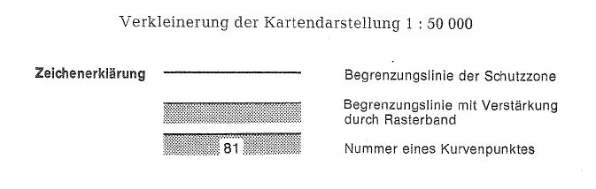
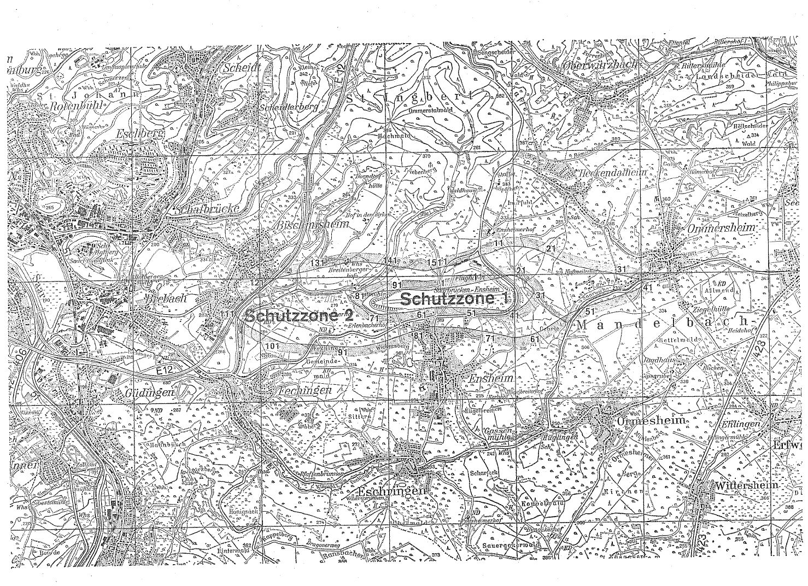

# Verordnung über die Festsetzung des Lärmschutzbereichs für den Verkehrsflughafen Saarbrücken (FluLärmSaarbrV)

Ausfertigungsdatum
:   1977-05-23

Fundstelle
:   BGBl I: 1977, 769

## Eingangsformel

Auf Grund des § 4 Abs. 1 des Gesetzes zum Schutz gegen Fluglärm vom
30\. März 1971 (BGBl. I S. 282) wird im Einvernehmen mit dem
Bundesminister für Verkehr und mit Zustimmung des Bundesrates
verordnet:

## § 1

Zum Schutz der Allgemeinheit vor Gefahren, erheblichen Nachteilen und
erheblichen Belästigungen durch Fluglärm in der Umgebung des
Verkehrsflughafens Saarbrücken wird der in § 2 bestimmte
Lärmschutzbereich festgesetzt.

## § 2

Der Lärmschutzbereich mit seinen zwei Schutzzonen wird nach Anlage 1
bestimmt durch die interpolierten Verbindungslinien zwischen den
Kurvenpunkten, soweit diese Linien außerhalb des Flugplatzgeländes
verlaufen.

## § 3

Liegt eine bauliche Anlage zu einem Teil im Lärmschutzbereich, so gilt
sie als ganz im Lärmschutzbereich gelegen. Liegt eine bauliche Anlage
zu einem Teil in der Schutzzone 1, so gilt sie als ganz in dieser
Schutzzone gelegen.

## § 4

Der nach § 2 bestimmte Lärmschutzbereich ist in einer topographischen
Karte im Maßstab 1:50.000 und in Karten im Maßstab 1:5.000
dargestellt. Die topographische Karte ist in verkleinerter Form als
Anlage 2 dieser Verordnung beigefügt. Die topographische Karte und die
Karten im Maßstab 1:5.000 sind beim Oberbürgermeister der
Landeshauptstadt Saarbrücken, Rathaus, 6600 Saarbrücken, zu jedermanns
Einsicht archivmäßig gesichert niedergelegt.

## § 5

Diese Verordnung tritt am Tag nach der Verkündung in Kraft.

## Schlußformel

Der Bundesminister des Innern

## Anlage 1 (zu § 2 der Verordnung über die Festsetzung des Lärmschutzbereichs für den Verkehrsflughafen Saarbrücken)

(Fundstelle des Originaltextes: BGBl. I 1977, 770 - 771)

*    *   **Lärmschutzbereich**

*    *

*    *
    *   Koordinatensystem:

    *   Gauß-Krüger

*    *
    *   Interpolation:

    *   Polynom 3. Grades mit stetigem Tangentenübergang

*    *

*    *   Kurvenpunkte der Schutzzone 1

*    *

*    *   Nr.

    *   Y (Rechts)

    *   X (Hoch)

    *   Nr.

    *   Y (Rechts)

    *   X (Hoch)

    *   Nr.

    *   Y (Rechts)

    *   X (Hoch)

*    *   1

    *   2580850.0

    *   5453796.5

    *   41

    *   2581980.9

    *   5453425.5

    *   81

    *   2579633.1

    *   5453616.8

*    *   2

    *   2580859.9

    *   5453797.6

    *   42

    *   2581941.3

    *   5453419.6

    *   82

    *   2579660.2

    *   5453646.2

*    *   3

    *   2580869.9

    *   5453798.8

    *   43

    *   2581901.4

    *   5453422.5

    *   83

    *   2579721.5

    *   5453697.7

*    *   4

    *   2580889.7

    *   5453801.3

    *   44

    *   2581861.7

    *   5453427.1

    *   84

    *   2579790.1

    *   5453738.7

*    *   5

    *   2580929.4

    *   5453806.3

    *   45

    *   2581782.2

    *   5453435.5

    *   85

    *   2579827.1

    *   5453754.1

*    *   6

    *   2581008.7

    *   5453816.8

    *   46

    *   2581702.5

    *   5453443.2

    *   86

    *   2579865.4

    *   5453765.4

*    *   7

    *   2581087.9

    *   5453828.0

    *   47

    *   2581622.9

    *   5453450.5

    *   87

    *   2579904.9

    *   5453772.0

*    *   8

    *   2581167.0

    *   5453839.8

    *   48

    *   2581543.2

    *   5453457.4

    *   88

    *   2579944.9

    *   5453773.7

*    *   9

    *   2581245.8

    *   5453853.7

    *   49

    *   2581463.5

    *   5453464.4

    *   89

    *   2579984.8

    *   5453775.3

*    *   10

    *   2581324.2

    *   5453869.6

    *   50

    *   2581383.8

    *   5453471.2

    *   90

    *   2580064.7

    *   5453779.1

*    *

*    *   11

    *   2581402.6

    *   5453885.9

    *   51

    *   2581304.0

    *   5453477.7

    *   91

    *   2580144.6

    *   5453783.4

*    *   12

    *   2581480.8

    *   5453902.6

    *   52

    *   2581224.2

    *   5453483.4

    *   92

    *   2580224.5

    *   5453787.9

*    *   13

    *   2581559.1

    *   5453919.1

    *   53

    *   2581144.3

    *   5453485.7

    *   93

    *   2580304.4

    *   5453790.8

*    *   14

    *   2581637.3

    *   5453935.9

    *   54

    *   2581064.3

    *   5453487.5

    *   94

    *   2580384.4

    *   5453788.4

*    *   15

    *   2581715.5

    *   5453952.9

    *   55

    *   2580984.3

    *   5453488.6

    *   95

    *   2580464.2

    *   5453782.2

*    *   16

    *   2581793.5

    *   5453970.4

    *   56

    *   2580904.3

    *   5453489.1

    *   96

    *   2580543.9

    *   5453775.6

*    *   17

    *   2581871.4

    *   5453988.7

    *   57

    *   2580824.3

    *   5453488.9

    *   97

    *   2580623.8

    *   5453771.9

*    *   18

    *   2581910.8

    *   5453995.6

    *   58

    *   2580744.3

    *   5453488.1

    *   98

    *   2580703.4

    *   5453779.9

*    *   19

    *   2581950.8

    *   5453993.8

    *   59

    *   2580664.3

    *   5453486.5

    *   99

    *   2580782.9

    *   5453788.5

*    *   20

    *   2581990.2

    *   5453987.3

    *   60

    *   2580584.8

    *   5453477.3

    *   100

    *   2580850.0

    *   5453796.4

*    *

*    *   21

    *   2582028.7

    *   5453976.2

    *   61

    *   2580506.4

    *   5453461.3

    *
    *
    *

*    *   22

    *   2582065.5

    *   5453960.7

    *   62

    *   2580428.1

    *   5453445.2

    *
    *
    *

*    *   23

    *   2582100.6

    *   5453941.4

    *   63

    *   2580349.2

    *   5453431.9

    *
    *
    *

*    *   24

    *   2582133.5

    *   5453918.7

    *   64

    *   2580269.6

    *   5453423.9

    *
    *
    *

*    *   25

    *   2582193.6

    *   5453865.9

    *   65

    *   2580189.8

    *   5453418.7

    *
    *
    *

*    *   26

    *   2582249.0

    *   5453808.2

    *   66

    *   2580109.9

    *   5453413.5

    *
    *
    *

*    *   27

    *   2582276.9

    *   5453779.6

    *   67

    *   2580030.2

    *   5453407.8

    *
    *
    *

*    *   28

    *   2582289.9

    *   5453764.4

    *   68

    *   2579950.4

    *   5453401.6

    *
    *
    *

*    *   29

    *   2582300.4

    *   5453747.3

    *   69

    *   2579910.4

    *   5453400.0

    *
    *
    *

*    *   30

    *   2582305.3

    *   5453727.9

    *   70

    *   2579870.6

    *   5453403.8

    *
    *
    *

*    *

*    *   31

    *   2582301.9

    *   5453708.2

    *   71

    *   2579831.5

    *   5453412.2

    *
    *
    *

*    *   32

    *   2582293.1

    *   5453690.3

    *   72

    *   2579793.5

    *   5453424.8

    *
    *
    *

*    *   33

    *   2582281.8

    *   5453673.8

    *   73

    *   2579756.9

    *   5453440.8

    *
    *
    *

*    *   34

    *   2582257.2

    *   5453642.2

    *   74

    *   2579687.9

    *   5453481.4

    *
    *
    *

*    *   35

    *   2582208.5

    *   5453578.8

    *   75

    *   2579656.3

    *   5453505.8

    *
    *
    *

*    *   36

    *   2582154.5

    *   5453519.7

    *   76

    *   2579626.8

    *   5453532.9

    *
    *
    *

*    *   37

    *   2582124.2

    *   5453493.6

    *   77

    *   2579613.3

    *   5453547.6

    *
    *
    *

*    *   38

    *   2582091.5

    *   5453470.6

    *   78

    *   2579604.2

    *   5453565.4

    *
    *
    *

*    *   39

    *   2582056.5

    *   5453451.3

    *   79

    *   2579609.2

    *   5453584.8

    *
    *
    *

*    *   40

    *   2582019.5

    *   5453436.1

    *   80

    *   2579620.5

    *   5453601.2

    *
    *
    *

*    *

*    *   Kurvenpunkte der Schutzzone 2 (Verkehrsflughafen Saarbrücken)

*    *   Nr.

    *   Y (Rechts)

    *   X (Hoch)

    *   Nr.

    *   Y (Rechts)

    *   X (Hoch)

    *   Nr.

    *   Y (Rechts)

    *   X (Hoch)

*    *   1

    *   2580850.0

    *   5454134.9

    *   51

    *   2583148.9

    *   5453485.7

    *   101

    *   2578255.3

    *   5453002.6

*    *   2

    *   2580859.7

    *   5454137.1

    *   52

    *   2582998.1

    *   5453432.0

    *   102

    *   2578181.9

    *   5453034.4

*    *   3

    *   2580869.5

    *   5454139.2

    *   53

    *   2582924.1

    *   5453401.8

    *   103

    *   2578037.8

    *   5453103.9

*    *   4

    *   2580889.0

    *   5454143.7

    *   54

    *   2582851.7

    *   5453367.7

    *   104

    *   2577899.4

    *   5453184.2

*    *   5

    *   2580928.0

    *   5454152.7

    *   55

    *   2582781.2

    *   5453329.8

    *   105

    *   2577833.1

    *   5453229.0

*    *   6

    *   2581005.8

    *   5454171.1

    *   56

    *   2582712.6

    *   5453288.7

    *   106

    *   2577767.2

    *   5453274.3

*    *   7

    *   2581161.1

    *   5454210.0

    *   57

    *   2582578.2

    *   5453201.9

    *   107

    *   2577703.8

    *   5453323.1

*    *   8

    *   2581313.3

    *   5454259.2

    *   58

    *   2582510.7

    *   5453158.9

    *   108

    *   2577673.5

    *   5453349.2

*    *   9

    *   2581465.1

    *   5454309.8

    *   59

    *   2582441.7

    *   5453118.3

    *   109

    *   2577645.2

    *   5453377.5

*    *   10

    *   2581616.7

    *   5454360.8

    *   60

    *   2582370.4

    *   5453082.0

    *   110

    *   2577621.5

    *   5453409.7

*    *

*    *   11

    *   2581767.3

    *   5454414.9

    *   61

    *   2582296.1

    *   5453052.4

    *   111

    *   2577613.4

    *   5453428.0

*    *   12

    *   2581842.0

    *   5454443.4

    *   62

    *   2582219.3

    *   5453030.0

    *   112

    *   2577609.6

    *   5453447.6

*    *   13

    *   2581920.6

    *   5454458.3

    *   63

    *   2582141.0

    *   5453013.3

    *   113

    *   2577610.9

    *   5453467.6

*    *   14

    *   2582000.6

    *   5454459.6

    *   64

    *   2582061.8

    *   5453002.1

    *   114

    *   2577616.5

    *   5453486.8

*    *   15

    *   2582080.5

    *   5454455.5

    *   65

    *   2582022.0

    *   5452998.7

    *   115

    *   2577625.4

    *   5453504.7

*    *   16

    *   2582160.0

    *   5454446.7

    *   66

    *   2581982.0

    *   5452996.9

    *   116

    *   2577648.0

    *   5453537.7

*    *   17

    *   2582238.8

    *   5454432.7

    *   67

    *   2581942.2

    *   5453000.6

    *   117

    *   2577673.9

    *   5453568.2

*    *   18

    *   2582316.0

    *   5454411.8

    *   68

    *   2581903.6

    *   5453011.1

    *   118

    *   2577701.5

    *   5453597.1

*    *   19

    *   2582391.0

    *   5454383.9

    *   69

    *   2581864.9

    *   5453021.3

    *   119

    *   2577759.5

    *   5453652.2

*    *   20

    *   2582463.9

    *   5454350.9

    *   70

    *   2581787.4

    *   5453040.9

    *   120

    *   2577881.2

    *   5453756.1

*    *

*    *   21

    *   2582535.6

    *   5454315.3

    *   71

    *   2581631.6

    *   5453077.6

    *   121

    *   2578010.3

    *   5453850.6

*    *   22

    *   2582678.2

    *   5454242.7

    *   72

    *   2581474.7

    *   5453108.7

    *   122

    *   2578146.3

    *   5453934.9

*    *   23

    *   2582750.1

    *   5454207.6

    *   73

    *   2581317.7

    *   5453139.6

    *   123

    *   2578215.7

    *   5453974.6

*    *   24

    *   2582823.7

    *   5454176.3

    *   74

    *   2581159.2

    *   5453161.9

    *   124

    *   2578250.7

    *   5453994.1

*    *   25

    *   2582898.9

    *   5454149.0

    *   75

    *   2580999.8

    *   5453175.7

    *   125

    *   2578285.7

    *   5454013.5

*    *   26

    *   2582975.5

    *   5454126.0

    *   76

    *   2580840.1

    *   5453185.4

    *   126

    *   2578324.5

    *   5454023.0

*    *   27

    *   2583053.0

    *   5454106.1

    *   77

    *   2580760.2

    *   5453188.6

    *   127

    *   2578363.7

    *   5454031.1

*    *   28

    *   2583209.2

    *   5454071.2

    *   78

    *   2580680.2

    *   5453190.9

    *   128

    *   2578442.1

    *   5454047.2

*    *   29

    *   2583366.2

    *   5454040.6

    *   79

    *   2580601.2

    *   5453178.4

    *   129

    *   2578598.9

    *   5454079.0

*    *   30

    *   2583523.6

    *   5454012.0

    *   80

    *   2580524.9

    *   5453154.3

    *   130

    *   2578755.7

    *   5454110.5

*    *

*    *   31

    *   2583679.5

    *   5453975.8

    *   81

    *   2580448.8

    *   5453129.8

    *   131

    *   2578912.6

    *   5454142.1

*    *   32

    *   2583757.4

    *   5453957.8

    *   82

    *   2580295.8

    *   5453082.9

    *   132

    *   2579069.4

    *   5454174.1

*    *   33

    *   2583835.0

    *   5453938.2

    *   83

    *   2580143.7

    *   5453033.3

    *   133

    *   2579226.1

    *   5454206.8

*    *   34

    *   2583911.5

    *   5453914.9

    *   84

    *   2579992.3

    *   5452981.5

    *   134

    *   2579304.5

    *   5454222.8

*    *   35

    *   2583948.8

    *   5453900.4

    *   85

    *   2579838.6

    *   5452937.2

    *   135

    *   2579383.4

    *   5454235.8

*    *   36

    *   2583984.4

    *   5453882.1

    *   86

    *   2579682.7

    *   5452900.8

    *   136

    *   2579463.1

    *   5454242.8

*    *   37

    *   2584000.6

    *   5453870.5

    *   87

    *   2579603.9

    *   5452887.3

    *   137

    *   2579543.1

    *   5454243.6

*    *   38

    *   2584014.5

    *   5453856.0

    *   88

    *   2579524.3

    *   5452879.1

    *   138

    *   2579623.0

    *   5454239.2

*    *   39

    *   2584022.4

    *   5453837.7

    *   89

    *   2579444.3

    *   5452877.2

    *   139

    *   2579702.6

    *   5454231.6

*    *   40

    *   2584019.4

    *   5453817.9

    *   90

    *   2579364.4

    *   5452880.7

    *   140

    *   2579861.5

    *   5454212.9

*    *

*    *   41

    *   2584008.3

    *   5453801.2

    *   91

    *   2579284.7

    *   5452886.8

    *   141

    *   2580018.6

    *   5454182.7

*    *   42

    *   2583994.0

    *   5453787.3

    *   92

    *   2579125.1

    *   5452899.3

    *   142

    *   2580175.8

    *   5454153.0

*    *   43

    *   2583978.1

    *   5453775.2

    *   93

    *   2578965.5

    *   5452911.7

    *   143

    *   2580333.7

    *   5454126.6

*    *   44

    *   2583943.8

    *   5453754.6

    *   94

    *   2578806.0

    *   5452924.2

    *   144

    *   2580412.6

    *   5454113.7

*    *   45

    *   2583908.0

    *   5453736.8

    *   95

    *   2578646.5

    *   5452936.8

    *   145

    *   2580491.4

    *   5454099.8

*    *   46

    *   2583834.1

    *   5453706.0

    *   96

    *   2578487.1

    *   5452950.0

    *   146

    *   2580530.8

    *   5454093.1

*    *   47

    *   2583759.0

    *   4543678.4

    *   97

    *   2578407.4

    *   5452956.9

    *   147

    *   2580570.3

    *   5454086.4

*    *   48

    *   2583607.7

    *   5453626.6

    *   98

    *   2578367.5

    *   5452960.6

    *   148

    *   2580610.3

    *   5454086.7

*    *   49

    *   2583455.0

    *   5453578.9

    *   99

    *   2578329.1

    *   5452971.7

    *   149

    *   2580649.6

    *   5454093.9

*    *   50

    *   2583301.2

    *   5453534.5

    *   100

    *   2578292.2

    *   5452987.0

    *   150

    *   2580688.9

    *   5454101.3

*    *

*    *
    *
    *
    *
    *
    *
    *   151

    *   2580767.4

    *   5454117.1

*    *
    *
    *
    *
    *
    *
    *   152

    *   2580850.0

    *   5454134.8

## Anlage 2 (zu § 4 der Verordnung über die Festsetzung des Lärmschutzbereichs für den Verkehrsflughafen Saarbrücken)

Fundstelle: BGBl I 1977, 771 - 772

