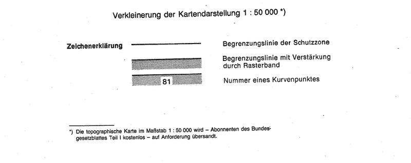
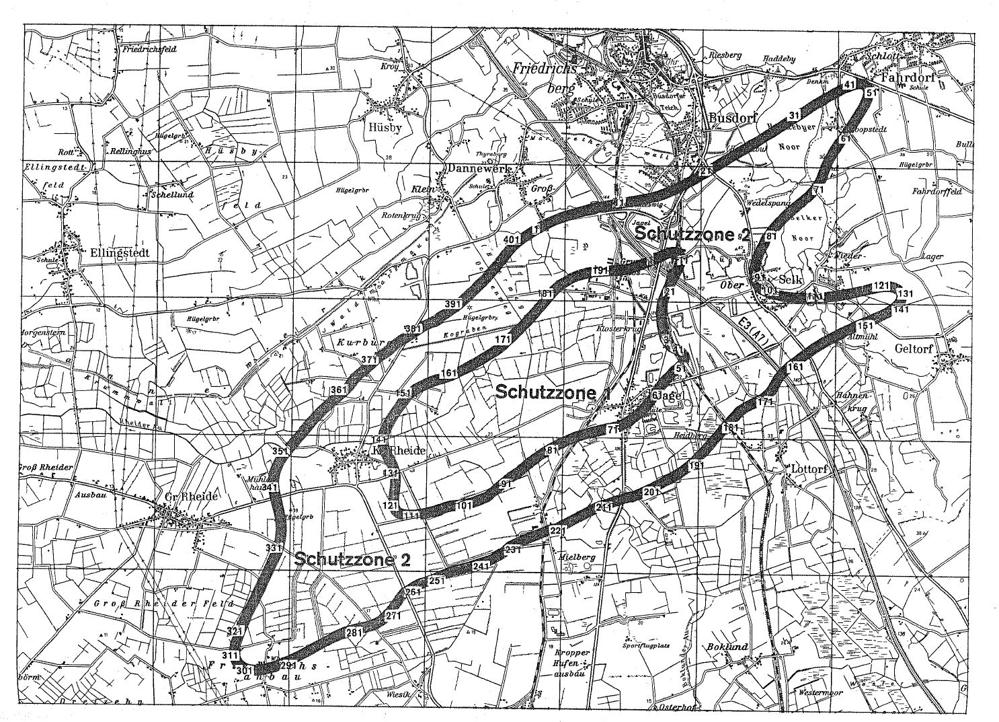

# Verordnung über die Festsetzung des Lärmschutzbereichs für den militärischen Flugplatz Schleswig (FluLärmSchleswV)

Ausfertigungsdatum
:   1982-04-23

Fundstelle
:   BGBl I: 1982, 494

Geändert durch
:   Art. 1 V v. 24.10.1986 I 1670

## Eingangsformel

Auf Grund des § 4 Abs. 1 des Gesetzes zum Schutz gegen Fluglärm vom
30\. März 1971 (BGBl. I S. 282) wird im Einvernehmen mit dem
Bundesminister der Verteidigung und mit Zustimmung des Bundesrates
verordnet:

## § 1

Zum Schutz der Allgemeinheit vor Gefahren, erheblichen Nachteilen und
erheblichen Belästigungen durch Fluglärm in der Umgebung des
militärischen Flugplatzes Schleswig wird der in § 2 bestimmte
Lärmschutzbereich festgesetzt.

## § 2

Der Lärmschutzbereich mit seinen zwei Schutzzonen wird nach Anlage 1
bestimmt durch die interpolierten Verbindungslinien zwischen den
Kurvenpunkten, soweit diese Linien außerhalb des Flugplatzgeländes
verlaufen.

## § 3

Liegt eine bauliche Anlage zu einem Teil im Lärmschutzbereich, so gilt
sie als ganz im Lärmschutzbereich gelegen. Liegt eine bauliche Anlage
zu einem Teil in der Schutzzone 1, so gilt sie als ganz in dieser
Schutzzone gelegen.

## § 4

(1) Der nach § 2 bestimmte Lärmschutzbereich ist in einer
topographischen Karte im Maßstab 1:50.000 und in Karten im Maßstab
1:5.000 dargestellt. Die topographische Karte ist in verkleinerter
Form als Anlage 2 dieser Verordnung beigefügt. Die topographische
Karte und die Karten im Maßstab 1:5.000 sind beim Landrat des Kreises
Schleswig-Flensburg, Flensburger Straße 7, 2380 Schleswig, zu
jedermanns Einsicht archivmäßig gesichert niedergelegt.

(2) Die Karten im Maßstab 1:5.000 über den Lärmschutzbereich nach der
bis zum Ablauf des 5. November 1986 geltenden Fassung dieser
Verordnung bleiben an gleicher Stelle zu jedermanns Einsicht
archivmäßig gesichert niedergelegt.

## § 5

Diese Verordnung tritt am Tag nach der Verkündung in Kraft.

## Schlußformel

Der Bundesminister des Innern

## Anlage 1 (zu § 2 der Verordnung über die Festsetzung des Lärmschutzbereichs für den militärischen Flugplatz Schleswig in der Fassung der Ersten Änderungsverordnung vom 24. Oktober 1986)

(Fundstelle des Originaltextes: BGBl. I 1986, 1671 - 1675)

*    *
    *   Koordinatensystem:

    *   Gauß-Krüger

*    *
    *   Interpolation:

    *   Polynom 3. Grades mit stetigem Tangentenübergang

*    *

*    *   KURVENPUNKTE DER SCHUTZZONE 1 (MILITÄRISCHER FLUGPLATZ SCHLESWIG)

*    *

*    *

*    *   NR.

    *   Y (RECHTS)

    *   X (HOCH)

    *   NR.

    *   Y (RECHTS)

    *   X (HOCH)

    *   NR.

    *   Y (RECHTS)

    *   X (HOCH)

*    *
    *
    *
    *
    *
    *
    *
    *
    *

*    *   1

    *   3535287.2

    *   6038530.9

    *   51

    *   3535657.2

    *   6037108.7

    *   101

    *   3532555.3

    *   6035079.4

*    *   2

    *   3535402.3

    *   6038583.4

    *   52

    *   3535641.3

    *   6037094.2

    *   102

    *   3532472.4

    *   6035067.5

*    *   3

    *   3535459.4

    *   6038610.6

    *   53

    *   3535625.3

    *   6037079.8

    *   103

    *   3532389.6

    *   6035056.3

*    *   4

    *   3535517.1

    *   6038636.6

    *   54

    *   3535594.0

    *   6037050.2

    *   104

    *   3532308.2

    *   6035037.3

*    *   5

    *   3535547.3

    *   6038648.6

    *   55

    *   3535563.5

    *   6037019.7

    *   105

    *   3532232.3

    *   6035010.5

*    *   6

    *   3535578.2

    *   6038658.7

    *   56

    *   3535508.1

    *   6036962.3

    *   106

    *   3532156.4

    *   6034983.9

*    *   7

    *   3535594.5

    *   6038662.6

    *   57

    *   3535453.4

    *   6036904.4

    *   107

    *   3532077.7

    *   6034961.5

*    *   8

    *   3535610.8

    *   6038665.0

    *   58

    *   3535425.0

    *   6036871.1

    *   108

    *   3531997.8

    *   6034943.2

*    *   9

    *   3535627.0

    *   6038664.8

    *   59

    *   3535398.2

    *   6036836.5

    *   109

    *   3531899.2

    *   6034924.0

*    *   10

    *   3535643.2

    *   6038658.3

    *   60

    *   3535348.2

    *   6036764.7

    *   110

    *   3531849.2

    *   6034918.9

*    *

*    *   11

    *   3535652.4

    *   6038643.9

    *   61

    *   3535299.7

    *   6036689.5

    *   111

    *   3531799.0

    *   6034916.7

*    *   12

    *   3535653.6

    *   6038628.9

    *   62

    *   3535247.3

    *   6036616.9

    *   112

    *   3531755.8

    *   6034917.2

*    *   13

    *   3535651.5

    *   6038613.6

    *   63

    *   3535194.5

    *   6036549.4

    *   113

    *   3531712.8

    *   6034920.5

*    *   14

    *   3535647.6

    *   6038598.2

    *   64

    *   3535138.0

    *   6036485.0

    *   114

    *   3531691.1

    *   6034923.9

*    *   15

    *   3535637.2

    *   6038569.9

    *   65

    *   3535079.7

    *   6036427.2

    *   115

    *   3531669.9

    *   6034928.9

*    *   16

    *   3535624.8

    *   6038542.4

    *   66

    *   3535017.4

    *   6036373.8

    *   116

    *   3531650.1

    *   6034937.4

*    *   17

    *   3535598.6

    *   6038490.9

    *   67

    *   3534928.7

    *   6036311.3

    *   117

    *   3531632.4

    *   6034951.3

*    *   18

    *   3535571.4

    *   6038440.0

    *   68

    *   3534881.5

    *   6036284.4

    *   118

    *   3531624.5

    *   6034961.8

*    *   19

    *   3535515.1

    *   6038329.9

    *   69

    *   3534832.8

    *   6036260.3

    *   119

    *   3531618.5

    *   6034973.2

*    *   20

    *   3535480.6

    *   6038253.9

    *   70

    *   3534784.7

    *   6036242.2

    *   120

    *   3531614.3

    *   6034985.3

*    *

*    *   21

    *   3535447.1

    *   6038177.5

    *   71

    *   3534735.7

    *   6036226.6

    *   121

    *   3531611.4

    *   6034998.0

*    *   22

    *   3535414.7

    *   6038099.9

    *   72

    *   3534654.2

    *   6036210.9

    *   122

    *   3531608.6

    *   6035023.5

*    *   23

    *   3535388.7

    *   6038019.9

    *   73

    *   3534573.0

    *   6036193.6

    *   123

    *   3531608.2

    *   6035049.1

*    *   24

    *   3535374.1

    *   6037945.0

    *   74

    *   3534493.1

    *   6036174.9

    *   124

    *   3531609.3

    *   6035084.6

*    *   25

    *   3535369.0

    *   6037868.9

    *   75

    *   3534413.5

    *   6036154.7

    *   125

    *   3531611.1

    *   6035119.9

*    *   26

    *   3535371.8

    *   6037801.5

    *   76

    *   3534334.8

    *   6036133.7

    *   126

    *   3531615.4

    *   6035163.0

*    *   27

    *   3535375.6

    *   6037734.2

    *   77

    *   3534256.7

    *   6036110.6

    *   127

    *   3531619.8

    *   6035206.1

*    *   28

    *   3535383.9

    *   6037655.9

    *   78

    *   3534180.2

    *   6036086.0

    *   128

    *   3531627.4

    *   6035292.3

*    *   29

    *   3535397.6

    *   6037578.4

    *   79

    *   3534105.5

    *   6036056.2

    *   129

    *   3531629.9

    *   6035361.9

*    *   30

    *   3535415.3

    *   6037507.3

    *   80

    *   3533961.2

    *   6035989.1

    *   130

    *   3531625.8

    *   6035431.4

*    *

*    *   31

    *   3535437.4

    *   6037437.4

    *   81

    *   3533821.4

    *   6035913.5

    *   131

    *   3531614.0

    *   6035498.5

*    *   32

    *   3535454.2

    *   6037399.5

    *   82

    *   3533732.7

    *   6035860.3

    *   132

    *   3531593.7

    *   6035563.4

*    *   33

    *   3535476.6

    *   6037364.6

    *   83

    *   3533685.7

    *   6035830.5

    *   133

    *   3531564.3

    *   6035627.4

*    *   34

    *   3535504.5

    *   6037334.0

    *   84

    *   3533619.2

    *   6035785.8

    *   134

    *   3531527.8

    *   6035687.5

*    *   35

    *   3535535.3

    *   6037306.4

    *   85

    *   3533555.2

    *   6035737.7

    *   135

    *   3531490.9

    *   6035747.8

*    *   36

    *   3535550.5

    *   6037289.8

    *   86

    *   3533491.4

    *   6035688.5

    *   136

    *   3531459.3

    *   6035811.1

*    *   37

    *   3535578.7

    *   6037274.8

    *   87

    *   3533428.2

    *   6035638.4

    *   137

    *   3531447.3

    *   6035843.0

*    *   38

    *   3535602.2

    *   6037261.9

    *   88

    *   3533365.4

    *   6035587.4

    *   138

    *   3531437.6

    *   6035875.7

*    *   39

    *   3535626.9

    *   6037251.0

    *   89

    *   3533302.9

    *   6035535.9

    *   139

    *   3531430.9

    *   6035909.3

*    *   40

    *   3535643.8

    *   6037244.1

    *   90

    *   3533171.4

    *   6035445.1

    *   140

    *   3531428.7

    *   6035943.4

*    *

*    *   41

    *   3535660.8

    *   6037237.2

    *   91

    *   3533108.3

    *   6035393.5

    *   141

    *   3531429.7

    *   6035960.6

*    *   42

    *   3535677.3

    *   6037229.7

    *   92

    *   3533048.8

    *   6035337.7

    *   142

    *   3531431.5

    *   6035977.8

*    *   43

    *   3535692.9

    *   6037220.8

    *   93

    *   3532988.3

    *   6035282.5

    *   143

    *   3531438.4

    *   6036011.6

*    *   44

    *   3535706.4

    *   6037209.1

    *   94

    *   3532927.7

    *   6035227.5

    *   144

    *   3531453.6

    *   6036056.0

*    *   45

    *   3535714.2

    *   6037189.2

    *   95

    *   3532897.9

    *   6035200.5

    *   145

    *   3531472.4

    *   6036099.1

*    *   46

    *   3535711.6

    *   6037174.9

    *   96

    *   3532865.8

    *   6035176.3

    *   146

    *   3531516.4

    *   6036182.0

*    *   47

    *   3535705.4

    *   6037161.8

    *   97

    *   3532829.9

    *   6035158.3

    *   147

    *   3531562.1

    *   6036255.8

*    *   48

    *   3535697.0

    *   6037150.1

    *   98

    *   3532792.9

    *   6035142.7

    *   148

    *   3531610.4

    *   6036328.0

*    *   49

    *   3535687.8

    *   6037139.1

    *   99

    *   3532716.3

    *   6035115.6

    *   149

    *   3531659.4

    *   6036397.5

*    *   50

    *   3535672.8

    *   6037123.6

    *   100

    *   3532637.2

    *   6035096.6

    *   150

    *   3531709.6

    *   6036466.1

*    *

*    *   NOCH SCHUTZZONE 1 (MILITÄRISCHER FLUGPLATZ SCHLESWIG)

*    *
    *
    *
    *
    *
    *
    *
    *
    *

*    *   NR.

    *   Y (RECHTS)

    *   X (HOCH)

    *   NR.

    *   Y (RECHTS)

    *   X (HOCH)

    *   NR.

    *   Y (RECHTS)

    *   X (HOCH)

*    *
    *
    *
    *
    *
    *
    *
    *
    *

*    *   151

    *   3531759.5

    *   6036532.1

    *   171

    *   3533245.8

    *   6037377.5

    *   191

    *   3534538.1

    *   6038372.9

*    *   152

    *   3531786.1

    *   6036563.9

    *   172

    *   3533332.3

    *   6037462.6

    *   192

    *   3534628.0

    *   6038379.5

*    *   153

    *   3531816.9

    *   6036591.8

    *   173

    *   3533389.5

    *   6037520.3

    *   193

    *   3534718.3

    *   6038385.4

*    *   154

    *   3531848.8

    *   6036615.7

    *   174

    *   3533445.9

    *   6037578.7

    *   194

    *   3534808.6

    *   6038393.2

*    *   155

    *   3531882.8

    *   6036636.4

    *   175

    *   3533501.9

    *   6037638.1

    *   195

    *   3534895.9

    *   6038399.9

*    *   156

    *   3531953.3

    *   6036673.0

    *   176

    *   3533557.2

    *   6037698.3

    *   196

    *   3534938.9

    *   6038408.3

*    *   157

    *   3532025.5

    *   6036708.4

    *   177

    *   3533612.1

    *   6037759.4

    *   197

    *   3534981.4

    *   6038418.8

*    *   158

    *   3532100.0

    *   6036738.5

    *   178

    *   3533666.4

    *   6037821.0

    *   198

    *   3535059.5

    *   6038443.3

*    *   159

    *   3532177.4

    *   6036767.6

    *   179

    *   3533720.3

    *   6037883.8

    *   199

    *   3535136.4

    *   6038471.7

*    *   160

    *   3532257.8

    *   6036787.2

    *   180

    *   3533773.5

    *   6037947.1

    *   200

    *   3535212.0

    *   6038500.7

*    *

*    *   161

    *   3532336.0

    *   6036811.5

    *   181

    *   3533840.4

    *   6038028.5

    *   201

    *   3535287.2

    *   6038530.9

*    *   162

    *   3532412.6

    *   6036840.2

    *   182

    *   3533909.3

    *   6038108.2

    *
    *
    *

*    *   163

    *   3532484.1

    *   6036875.7

    *   183

    *   3533951.3

    *   6038148.7

    *
    *
    *

*    *   164

    *   3532554.9

    *   6036912.5

    *   184

    *   3533997.6

    *   6038184.0

    *
    *
    *

*    *   165

    *   3532694.0

    *   6036989.6

    *   185

    *   3534063.7

    *   6038227.9

    *
    *
    *

*    *   166

    *   3532829.9

    *   6037071.6

    *   186

    *   3534133.0

    *   6038266.8

    *
    *
    *

*    *   167

    *   3532962.0

    *   6037154.7

    *   187

    *   3534207.0

    *   6038299.7

    *
    *
    *

*    *   168

    *   3533029.7

    *   6037198.5

    *   188

    *   3534283.3

    *   6038326.8

    *
    *
    *

*    *   169

    *   3533096.3

    *   6037243.8

    *   189

    *   3534364.9

    *   6038349.4

    *
    *
    *

*    *   170

    *   3533172.8

    *   6037308.7

    *   190

    *   3534448.3

    *   6038364.3

    *
    *
    *

*    *

*    *   KURVENPUNKTE DER SCHUTZZONE 2 (MILITÄRISCHER FLUGPLATZ SCHLESWIG)

*    *
    *
    *
    *
    *
    *
    *
    *
    *

*    *   NR.

    *   Y (RECHTS)

    *   X (HOCH)

    *   NR.

    *   Y (RECHTS)

    *   X (HOCH)

    *   NR.

    *   Y (RECHTS)

    *   X (HOCH)

*    *
    *
    *
    *
    *
    *
    *
    *
    *

*    *   1

    *   3533611.8

    *   6038975.9

    *   51

    *   3538388.8

    *   6041138.7

    *   101

    *   3536910.0

    *   6038126.7

*    *   2

    *   3533681.4

    *   6039015.7

    *   52

    *   3538388.3

    *   6041116.9

    *   102

    *   3536928.2

    *   6038118.2

*    *   3

    *   3533752.2

    *   6039053.4

    *   53

    *   3538384.6

    *   6041095.5

    *   103

    *   3536965.5

    *   6038103.3

*    *   4

    *   3533894.9

    *   6039123.3

    *   54

    *   3538379.2

    *   6041075.4

    *   104

    *   3537003.5

    *   6038090.6

*    *   5

    *   3533968.2

    *   6039151.4

    *   55

    *   3538372.5

    *   6041055.7

    *   105

    *   3537077.3

    *   6038070.0

*    *   6

    *   3534042.6

    *   6039176.4

    *   56

    *   3538356.8

    *   6041017.2

    *   106

    *   3537152.0

    *   6038052.9

*    *   7

    *   3534192.5

    *   6039221.8

    *   57

    *   3538323.1

    *   6040948.3

    *   107

    *   3537302.0

    *   6038027.6

*    *   8

    *   3534343.0

    *   6039265.5

    *   58

    *   3538285.9

    *   6040881.2

    *   108

    *   3537377.9

    *   6038022.1

*    *   9

    *   3534494.5

    *   6039305.4

    *   59

    *   3538206.8

    *   6040750.3

    *   109

    *   3537454.0

    *   6038019.6

*    *   10

    *   3534648.4

    *   6039337.6

    *   60

    *   3538124.0

    *   6040621.7

    *   110

    *   3537607.2

    *   6038021.6

*    *

*    *   11

    *   3534803.6

    *   6039365.3

    *   61

    *   3538038.9

    *   6040494.5

    *   111

    *   3537693.3

    *   6038025.8

*    *   12

    *   3534958.1

    *   6039395.1

    *   62

    *   3537954.3

    *   6040367.1

    *   112

    *   3537804.4

    *   6038024.6

*    *   13

    *   3535113.1

    *   6039423.5

    *   63

    *   3537874.1

    *   6040236.7

    *   113

    *   3537914.9

    *   6038036.3

*    *   14

    *   3535267.5

    *   6039453.6

    *   64

    *   3537803.9

    *   6040100.3

    *   114

    *   3538070.4

    *   6038057.8

*    *   15

    *   3535418.1

    *   6039497.1

    *   65

    *   3537774.0

    *   6040028.4

    *   115

    *   3538226.7

    *   6038086.5

*    *   16

    *   3535564.8

    *   6039553.5

    *   66

    *   3537747.5

    *   6039955.3

    *   116

    *   3538305.5

    *   6038103.7

*    *   17

    *   3535704.3

    *   6039620.4

    *   67

    *   3537721.2

    *   6039882.1

    *   117

    *   3538383.9

    *   6038122.4

*    *   18

    *   3535840.8

    *   6039692.4

    *   68

    *   3537690.0

    *   6039810.9

    *   118

    *   3538462.7

    *   6038142.1

*    *   19

    *   3535974.1

    *   6039770.0

    *   69

    *   3537671.6

    *   6039777.2

    *   119

    *   3538541.5

    *   6038161.9

*    *   20

    *   3536042.1

    *   6039812.4

    *   70

    *   3537650.8

    *   6039744.9

    *   120

    *   3538619.3

    *   6038179.4

*    *

*    *   21

    *   3536106.1

    *   6039849.9

    *   71

    *   3537627.9

    *   6039714.1

    *   121

    *   3538698.0

    *   6038192.3

*    *   22

    *   3536237.0

    *   6039931.8

    *   72

    *   3537603.1

    *   6039684.8

    *   122

    *   3538757.0

    *   6038196.6

*    *   23

    *   3536368.0

    *   6040013.5

    *   73

    *   3537547.8

    *   6039628.5

    *   123

    *   3538786.6

    *   6038196.2

*    *   24

    *   3536499.3

    *   6040094.5

    *   74

    *   3537489.0

    *   6039575.8

    *   124

    *   3538816.1

    *   6038193.2

*    *   25

    *   3536631.0

    *   6040175.0

    *   75

    *   3537427.6

    *   6039523.9

    *   125

    *   3538832.0

    *   6038190.5

*    *   26

    *   3536762.5

    *   6040255.8

    *   76

    *   3537366.2

    *   6039472.3

    *   126

    *   3538847.4

    *   6038186.5

*    *   27

    *   3536893.0

    *   6040338.1

    *   77

    *   3537247.0

    *   6039366.4

    *   127

    *   3538862.5

    *   6038181.1

*    *   28

    *   3537022.4

    *   6040422.6

    *   78

    *   3537135.5

    *   6039255.8

    *   128

    *   3538876.9

    *   6038173.7

*    *   29

    *   3537151.3

    *   6040507.9

    *   79

    *   3537033.0

    *   6039139.5

    *   129

    *   3538886.6

    *   6038166.8

*    *   30

    *   3537280.1

    *   6040593.4

    *   80

    *   3536986.1

    *   6039078.7

    *   130

    *   3538894.4

    *   6038158.9

*    *

*    *   31

    *   3537408.9

    *   6040678.8

    *   81

    *   3536941.1

    *   6039016.6

    *   131

    *   3538900.7

    *   6038150.2

*    *   32

    *   3537538.0

    *   6040763.8

    *   82

    *   3536904.9

    *   6038963.6

    *   132

    *   3538904.7

    *   6038140.2

*    *   33

    *   3537667.6

    *   6040847.6

    *   83

    *   3536881.7

    *   6038903.9

    *   133

    *   3538906.9

    *   6038129.4

*    *   34

    *   3537798.2

    *   6040930.0

    *   84

    *   3536838.7

    *   6038825.0

    *   134

    *   3538906.4

    *   6038117.2

*    *   35

    *   3537930.0

    *   6041010.2

    *   85

    *   3536800.7

    *   6038743.7

    *   135

    *   3538902.9

    *   6038103.1

*    *   36

    *   3537996.7

    *   6041049.0

    *   86

    *   3536772.5

    *   6038670.2

    *   136

    *   3538897.4

    *   6038090.3

*    *   37

    *   3538064.3

    *   6041086.2

    *   87

    *   3536751.0

    *   6038594.4

    *   137

    *   3538890.5

    *   6038078.2

*    *   38

    *   3538098.6

    *   6041104.2

    *   88

    *   3536737.5

    *   6038509.3

    *   138

    *   3538882.5

    *   6038066.8

*    *   39

    *   3538133.2

    *   6041121.5

    *   89

    *   3536735.6

    *   6038466.2

    *   139

    *   3538873.7

    *   6038055.9

*    *   40

    *   3538168.2

    *   6041137.9

    *   90

    *   3536736.7

    *   6038423.0

    *   140

    *   3538864.1

    *   6038045.5

*    *

*    *   41

    *   3538203.8

    *   6041153.0

    *   91

    *   3536740.5

    *   6038385.7

    *   141

    *   3538849.2

    *   6038030.9

*    *   42

    *   3538223.5

    *   6041160.8

    *   92

    *   3536747.0

    *   6038348.9

    *   142

    *   3538833.6

    *   6038017.1

*    *   43

    *   3538243.3

    *   6041168.0

    *   93

    *   3536756.4

    *   6038312.7

    *   143

    *   3538817.3

    *   6038004.2

*    *   44

    *   3538263.6

    *   6041174.4

    *   94

    *   3536769.1

    *   6038277.3

    *   144

    *   3538800.7

    *   6037991.7

*    *   45

    *   3538284.0

    *   6041179.8

    *   95

    *   3536785.6

    *   6038243.1

    *   145

    *   3538767.6

    *   6037969.4

*    *   46

    *   3538305.2

    *   6041184.1

    *   96

    *   3536805.8

    *   6038211.6

    *   146

    *   3538733.6

    *   6037948.6

*    *   47

    *   3538326.4

    *   6041185.9

    *   97

    *   3536829.9

    *   6038183.0

    *   147

    *   3538663.4

    *   6037910.8

*    *   48

    *   3538347.5

    *   6041184.6

    *   98

    *   3536858.5

    *   6038157.8

    *   148

    *   3538590.5

    *   6037876.0

*    *   49

    *   3538368.4

    *   6041177.0

    *   99

    *   3536875.0

    *   6038146.3

    *   149

    *   3538516.5

    *   6037843.6

*    *   50

    *   3538383.2

    *   6041160.3

    *   100

    *   3536892.2

    *   6038136.1

    *   150

    *   3538441.6

    *   6037812.1

*    *

*    *   NOCH SCHUTZZONE 2 (MILITÄRISCHER FLUGPLATZ SCHLESWIG)

*    *
    *
    *
    *
    *
    *
    *
    *
    *

*    *   NR.

    *   Y (RECHTS)

    *   X (HOCH)

    *   NR.

    *   Y (RECHTS)

    *   X (HOCH)

    *   NR.

    *   Y (RECHTS)

    *   X (HOCH)

*    *
    *
    *
    *
    *
    *
    *
    *
    *

*    *   151

    *   3538366.7

    *   6037780.6

    *   201

    *   3535287.6

    *   6035330.2

    *   251

    *   3532135.9

    *   6033973.1

*    *   152

    *   3538292.0

    *   6037748.8

    *   202

    *   3535148.8

    *   6035261.3

    *   252

    *   3532101.4

    *   6033959.5

*    *   153

    *   3538217.8

    *   6037716.2

    *   203

    *   3535076.6

    *   6035228.9

    *   253

    *   3532066.6

    *   6033946.3

*    *   154

    *   3538135.1

    *   6037678.4

    *   204

    *   3535039.4

    *   6035214.5

    *   254

    *   3532032.1

    *   6033932.7

*    *   155

    *   3538055.9

    *   6037633.7

    *   205

    *   3535000.1

    *   6035208.5

    *   255

    *   3531997.4

    *   6033919.4

*    *   156

    *   3537932.2

    *   6037570.2

    *   206

    *   3534921.8

    *   6035189.8

    *   256

    *   3531978.1

    *   6033912.9

*    *   157

    *   3537792.2

    *   6037493.2

    *   207

    *   3534844.7

    *   6035166.4

    *   257

    *   3531944.7

    *   6033899.8

*    *   158

    *   3537657.6

    *   6037408.4

    *   208

    *   3534754.0

    *   6035135.0

    *   258

    *   3531912.2

    *   6033884.8

*    *   159

    *   3537527.3

    *   6037317.7

    *   209

    *   3534709.2

    *   6035117.9

    *   259

    *   3531848.4

    *   6033852.2

*    *   160

    *   3537400.3

    *   6037222.4

    *   210

    *   3534664.6

    *   6035100.1

    *   260

    *   3531814.8

    *   6033834.5

*    *

*    *   161

    *   3537276.3

    *   6037122.7

    *   211

    *   3534601.2

    *   6035083.5

    *   261

    *   3531781.9

    *   6033815.6

*    *   162

    *   3537216.3

    *   6037069.1

    *   212

    *   3534543.8

    *   6035066.3

    *   262

    *   3531749.3

    *   6033796.2

*    *   163

    *   3537161.2

    *   6037010.5

    *   213

    *   3534508.9

    *   6035049.5

    *   263

    *   3531717.0

    *   6033776.4

*    *   164

    *   3537110.6

    *   6036941.5

    *   214

    *   3534474.3

    *   6035032.2

    *   264

    *   3531679.4

    *   6033756.0

*    *   165

    *   3537067.8

    *   6036867.5

    *   215

    *   3534405.6

    *   6034996.6

    *   265

    *   3531651.2

    *   6033724.0

*    *   166

    *   3537027.1

    *   6036791.8

    *   216

    *   3534269.4

    *   6034923.5

    *   266

    *   3531624.5

    *   6033691.4

*    *   167

    *   3537002.5

    *   6036756.7

    *   217

    *   3534133.2

    *   6034850.6

    *   267

    *   3531599.1

    *   6033657.9

*    *   168

    *   3536974.9

    *   6036723.7

    *   218

    *   3534065.1

    *   6034814.2

    *   268

    *   3531548.3

    *   6033586.8

*    *   169

    *   3536946.2

    *   6036696.0

    *   219

    *   3533997.2

    *   6034777.2

    *   269

    *   3531498.0

    *   6033515.4

*    *   170

    *   3536914.8

    *   6036671.3

    *   220

    *   3533962.4

    *   6034757.8

    *   270

    *   3531447.1

    *   6033448.3

*    *

*    *   171

    *   3536881.2

    *   6036649.8

    *   221

    *   3533928.0

    *   6034737.7

    *   271

    *   3531419.4

    *   6033416.5

*    *   172

    *   3536846.2

    *   6036630.7

    *   222

    *   3533888.8

    *   6034729.9

    *   272

    *   3531390.0

    *   6033386.3

*    *   173

    *   3536773.6

    *   6036596.0

    *   223

    *   3533849.6

    *   6034722.6

    *   273

    *   3531360.5

    *   6033360.4

*    *   174

    *   3536700.9

    *   6036561.2

    *   224

    *   3533809.9

    *   6034712.0

    *   274

    *   3531328.8

    *   6033337.1

*    *   175

    *   3536634.1

    *   6036522.5

    *   225

    *   3533772.4

    *   6034695.3

    *   275

    *   3531295.2

    *   6033316.9

*    *   176

    *   3536571.8

    *   6036476.9

    *   226

    *   3533702.7

    *   6034666.9

    *   276

    *   3531259.9

    *   6033299.6

*    *   177

    *   3536543.3

    *   6036452.2

    *   227

    *   3533558.4

    *   6034606.9

    *   277

    *   3531223.0

    *   6033285.1

*    *   178

    *   3536519.7

    *   6036422.7

    *   228

    *   3533415.3

    *   6034545.3

    *   278

    *   3531185.2

    *   6033273.1

*    *   179

    *   3536461.4

    *   6036362.4

    *   229

    *   3533344.3

    *   6034513.3

    *   279

    *   3531108.0

    *   6033254.7

*    *   180

    *   3536407.7

    *   6036302.5

    *   230

    *   3533273.7

    *   6034480.6

    *   280

    *   3531028.9

    *   6033238.9

*    *

*    *   181

    *   3536354.8

    *   6036241.9

    *   231

    *   3533226.3

    *   6034457.5

    *   281

    *   3530950.2

    *   6033221.2

*    *   182

    *   3536302.4

    *   6036180.0

    *   232

    *   3533185.6

    *   6034423.9

    *   282

    *   3530799.6

    *   6033173.9

*    *   183

    *   3536250.4

    *   6036117.8

    *   233

    *   3533167.5

    *   6034405.0

    *   283

    *   3530727.8

    *   6033143.9

*    *   184

    *   3536198.5

    *   6036055.3

    *   234

    *   3533149.7

    *   6034385.7

    *   284

    *   3530657.3

    *   6033110.6

*    *   185

    *   3536146.6

    *   6035992.8

    *   235

    *   3533131.9

    *   6034366.5

    *   285

    *   3530519.7

    *   6033038.4

*    *   186

    *   3536086.5

    *   6035922.0

    *   236

    *   3533088.5

    *   6034337.1

    *   286

    *   3530384.5

    *   6032961.4

*    *   187

    *   3536055.8

    *   6035887.2

    *   237

    *   3533065.8

    *   6034322.7

    *   287

    *   3530249.8

    *   6032883.6

*    *   188

    *   3536027.1

    *   6035850.7

    *   238

    *   3533018.3

    *   6034297.9

    *   288

    *   3530176.3

    *   6032842.8

*    *   189

    *   3535997.8

    *   6035827.0

    *   239

    *   3532952.2

    *   6034256.8

    *   289

    *   3530101.7

    *   6032804.0

*    *   190

    *   3535947.1

    *   6035773.1

    *   240

    *   3532883.9

    *   6034219.4

    *   290

    *   3530027.7

    *   6032766.4

*    *

*    *   191

    *   3535905.0

    *   6035714.0

    *   241

    *   3532810.1

    *   6034191.0

    *   291

    *   3529952.3

    *   6032731.6

*    *   192

    *   3535845.7

    *   6035670.2

    *   242

    *   3532733.3

    *   6034172.2

    *   292

    *   3529877.1

    *   6032700.8

*    *   193

    *   3535816.0

    *   6035648.4

    *   243

    *   3532634.3

    *   6034144.9

    *   293

    *   3529800.5

    *   6032673.6

*    *   194

    *   3535753.6

    *   6035602.9

    *   244

    *   3532534.5

    *   6034120.9

    *   294

    *   3529723.7

    *   6032650.8

*    *   195

    *   3535690.0

    *   6035559.0

    *   245

    *   3532475.2

    *   6034108.5

    *   295

    *   3529645.7

    *   6032632.6

*    *   196

    *   3535625.0

    *   6035516.1

    *   246

    *   3532420.2

    *   6034096.5

    *   296

    *   3529566.5

    *   6032620.5

*    *   197

    *   3535559.4

    *   6035474.2

    *   247

    *   3532385.2

    *   6034083.2

    *   297

    *   3529526.5

    *   6032617.7

*    *   198

    *   3535521.2

    *   6035458.5

    *   248

    *   3532350.1

    *   6034066.5

    *   298

    *   3529486.3

    *   6032617.9

*    *   199

    *   3535488.8

    *   6035443.9

    *   249

    *   3532279.4

    *   6034034.2

    *   299

    *   3529450.3

    *   6032621.3

*    *   200

    *   3535422.5

    *   6035405.2

    *   250

    *   3532208.1

    *   6034002.5

    *   300

    *   3529415.1

    *   6032628.7

*    *

*    *   NOCH SCHUTZZONE 2 (MILITÄRISCHER FLUGPLATZ SCHLESWIG)

*    *
    *
    *
    *
    *
    *
    *
    *
    *

*    *   NR.

    *   Y (RECHTS)

    *   X (HOCH)

    *   NR.

    *   Y (RECHTS)

    *   X (HOCH)

    *   NR.

    *   Y (RECHTS)

    *   X (HOCH)

*    *
    *
    *
    *
    *
    *
    *
    *
    *

*    *   301

    *   3529381.1

    *   6032641.7

    *   341

    *   3529836.9

    *   6035231.7

    *   381

    *   3531910.3

    *   6037509.9

*    *   302

    *   3529364.7

    *   6032650.8

    *   342

    *   3529830.8

    *   6035295.0

    *   382

    *   3531941.7

    *   6037533.0

*    *   303

    *   3529349.8

    *   6032661.5

    *   343

    *   3529832.2

    *   6035358.6

    *   383

    *   3531974.4

    *   6037554.2

*    *   304

    *   3529336.6

    *   6032673.7

    *   344

    *   3529836.8

    *   6035391.4

    *   384

    *   3532011.6

    *   6037569.1

*    *   305

    *   3529325.0

    *   6032687.5

    *   345

    *   3529842.4

    *   6035424.2

    *   385

    *   3532048.0

    *   6037586.1

*    *   306

    *   3529315.0

    *   6032702.9

    *   346

    *   3529850.7

    *   6035456.3

    *   386

    *   3532119.4

    *   6037622.7

*    *   307

    *   3529306.7

    *   6032719.8

    *   347

    *   3529861.4

    *   6035487.8

    *   387

    *   3532186.3

    *   6037663.0

*    *   308

    *   3529301.9

    *   6032732.9

    *   348

    *   3529877.0

    *   6035525.1

    *   388

    *   3532250.4

    *   6037707.7

*    *   309

    *   3529298.0

    *   6032746.2

    *   349

    *   3529895.0

    *   6035561.4

    *   389

    *   3532378.6

    *   6037795.9

*    *   310

    *   3529295.0

    *   6032759.6

    *   350

    *   3529936.1

    *   6035631.2

    *   390

    *   3532442.2

    *   6037840.6

*    *

*    *   311

    *   3529292.9

    *   6032773.2

    *   351

    *   3529980.3

    *   6035696.7

    *   391

    *   3532504.9

    *   6037886.4

*    *   312

    *   3529291.5

    *   6032787.0

    *   352

    *   3530027.9

    *   6035759.7

    *   392

    *   3532562.4

    *   6037938.4

*    *   313

    *   3529290.8

    *   6032800.9

    *   353

    *   3530129.8

    *   6035879.4

    *   393

    *   3532618.9

    *   6037991.5

*    *   314

    *   3529290.7

    *   6032821.7

    *   354

    *   3530229.0

    *   6036001.4

    *   394

    *   3532731.2

    *   6038098.6

*    *   315

    *   3529291.8

    *   6032842.3

    *   355

    *   3530328.0

    *   6036123.6

    *   395

    *   3532841.6

    *   6038207.8

*    *   316

    *   3529293.9

    *   6032862.9

    *   356

    *   3530432.4

    *   6036241.1

    *   396

    *   3532947.4

    *   6038322.6

*    *   317

    *   3529296.9

    *   6032883.4

    *   357

    *   3530543.7

    *   6036352.6

    *   397

    *   3533049.1

    *   6038442.1

*    *   318

    *   3529304.1

    *   6032921.7

    *   358

    *   3530661.4

    *   6036458.5

    *   398

    *   3533148.3

    *   6038564.6

*    *   319

    *   3529313.5

    *   6032959.6

    *   359

    *   3530721.6

    *   6036510.2

    *   399

    *   3533245.9

    *   6038688.9

*    *   320

    *   3529336.6

    *   6033034.1

    *   360

    *   3530781.5

    *   6036562.2

    *   400

    *   3533297.1

    *   6038747.8

*    *

*    *   321

    *   3529364.1

    *   6033107.6

    *   361

    *   3530832.6

    *   6036606.5

    *   401

    *   3533353.3

    *   6038801.8

*    *   322

    *   3529394.7

    *   6033180.0

    *   362

    *   3530880.3

    *   6036654.4

    *   402

    *   3533384.4

    *   6038825.1

*    *   323

    *   3529461.7

    *   6033323.5

    *   363

    *   3530909.0

    *   6036689.6

    *   403

    *   3533415.8

    *   6038847.9

*    *   324

    *   3529532.0

    *   6033466.2

    *   364

    *   3530935.3

    *   6036726.7

    *   404

    *   3533479.6

    *   6038892.3

*    *   325

    *   3529599.8

    *   6033609.6

    *   365

    *   3530961.8

    *   6036763.5

    *   405

    *   3533611.8

    *   6038975.9

*    *   326

    *   3529666.4

    *   6033753.2

    *   366

    *   3530990.5

    *   6036798.7

    *
    *
    *

*    *   327

    *   3529731.9

    *   6033897.2

    *   367

    *   3531017.4

    *   6036826.6

    *
    *
    *

*    *   328

    *   3529796.7

    *   6034041.3

    *   368

    *   3531046.3

    *   6036852.5

    *
    *
    *

*    *   329

    *   3529860.5

    *   6034185.7

    *   369

    *   3531107.2

    *   6036900.6

    *
    *
    *

*    *   330

    *   3529891.4

    *   6034257.8

    *   370

    *   3531220.8

    *   6037006.0

    *
    *
    *

*    *

*    *   331

    *   3529915.9

    *   6034332.3

    *   371

    *   3531276.9

    *   6037059.5

    *
    *
    *

*    *   332

    *   3529934.3

    *   6034408.1

    *   372

    *   3531336.8

    *   6037108.7

    *
    *
    *

*    *   333

    *   3529947.8

    *   6034485.0

    *   373

    *   3531409.9

    *   6037160.6

    *
    *
    *

*    *   334

    *   3529955.9

    *   6034564.1

    *   374

    *   3531482.7

    *   6037213.0

    *
    *
    *

*    *   335

    *   3529957.6

    *   6034643.5

    *   375

    *   3531532.2

    *   6037255.9

    *
    *
    *

*    *   336

    *   3529952.2

    *   6034726.7

    *   376

    *   3531581.1

    *   6037299.5

    *
    *
    *

*    *   337

    *   3529939.7

    *   6034809.2

    *   377

    *   3531614.4

    *   6037320.1

    *
    *
    *

*    *   338

    *   3529920.1

    *   6034895.8

    *   378

    *   3531647.6

    *   6037340.8

    *
    *
    *

*    *   339

    *   3529896.6

    *   6034981.5

    *   379

    *   3531713.9

    *   6037382.4

    *
    *
    *

*    *   340

    *   3529861.8

    *   6035106.3

    *   380

    *   3531845.3

    *   6037467.0

    *
    *
    *

## Anlage 2 (zu § 4 Abs. 1 der Verordnung über die Festsetzung des Lärmschutzbereichs für den militärischen Flugplatz Schleswig in der Fassung der Ersten Änderungsverordnung vom 24. Oktober 1986)

   (Fundstelle: BGBl I 1986, 1675 - 1676)

