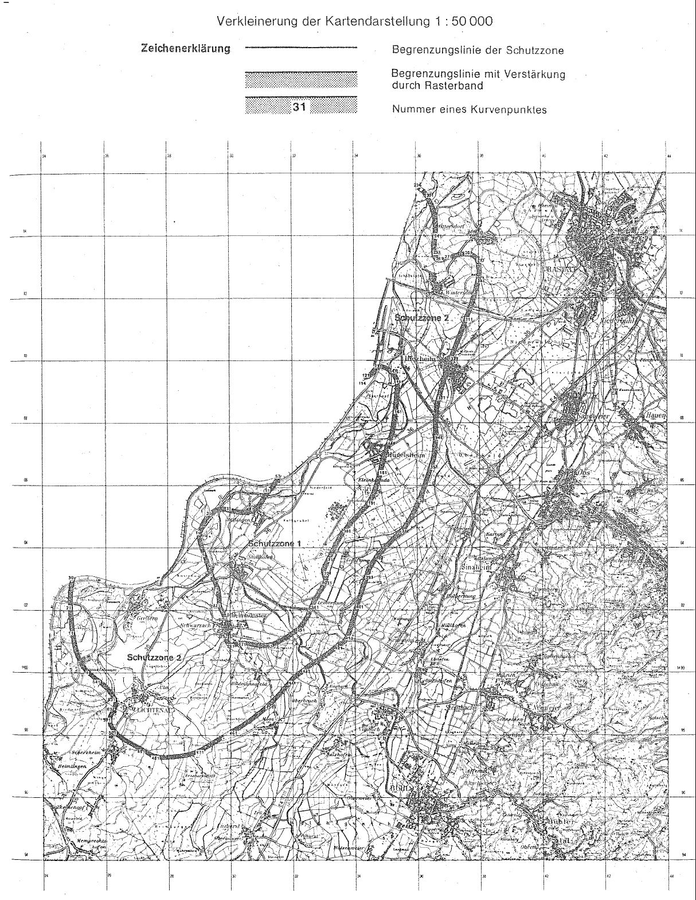

# Verordnung über die Festsetzung des Lärmschutzbereichs für den militärischen Flugplatz Söllingen (FluLärmSöllV)

Ausfertigungsdatum
:   1975-11-27

Fundstelle
:   BGBl I: 1975, 2928

Geändert durch
:   Art. 1 V v. 10.3.1983 I 297

## Eingangsformel

Auf Grund des § 4 Abs. 1 des Gesetzes zum Schutz gegen Fluglärm vom
30\. März 1971 (Bundesgesetzbl. I S. 282), geändert durch Artikel 70
des Einführungsgesetzes zum Strafgesetzbuch vom 2. März 1974
(Bundesgesetzbl. I S. 469), wird im Einvernehmen mit dem
Bundesminister der Verteidigung und mit Zustimmung des Bundesrates
verordnet:

## § 1

Zum Schutz der Allgemeinheit vor Gefahren, erheblichen Nachteilen und
erheblichen Belästigungen durch Fluglärm in der Umgebung des
militärischen Flugplatzes Söllingen wird der in § 2 bestimmte
Lärmschutzbereich festgesetzt.

## § 2

Der Lärmschutzbereich mit seinen zwei Schutzzonen wird nach Anlage 1
bestimmt durch die interpolierten Verbindungslinien zwischen den
Kurvenpunkten, soweit diese Linien außerhalb des Flugplatzgeländes
verlaufen.

## § 3

(1) Liegt eine bauliche Anlage zu einem Teil im Lärmschutzbereich, so
gilt sie als ganz im Lärmschutzbereich gelegen. Liegt eine bauliche
Anlage zu einem Teil in der Schutzzone 1, so gilt sie als ganz in
dieser Schutzzone gelegen.

(2) Auf die Errichtung einer baulichen Anlage ist Absatz 1
entsprechend anzuwenden.

## § 4

(1) Der nach § 2 bestimmte Lärmschutzbereich ist in einer
topographischen Karte im Maßstab 1:50.000 und in Karten im Maßstab
1:5.000 dargestellt. Die topographische Karte ist in verkleinerter
Form als Anlage 2 dieser Verordnung beigefügt. Die topographische
Karte und die Karten im Maßstab 1:5.000 sind beim Landesvermessungsamt
Baden-Württemberg - Außenstelle -, Kapellenstraße 17, 7500 Karlsruhe,
zu jedermanns Einsicht archivmäßig gesichert niedergelegt.

(2) Die Blätter der Deutschen Grundkarte im Maßstab 1:5.000 über den
Lärmschutzbereich nach der bis zum 24. März 1983 geltenden Fassung
dieser Verordnung bleiben an gleicher Stelle zu jedermanns Einsicht
archivmäßig gesichert niedergelegt.

## § 5

Diese Verordnung tritt am Tag nach der Verkündung in Kraft.

## Schlußformel

Der Bundesminister des Innern

## Anlage 1 (zu Artikel 1 Nummer 2 der Ersten Verordnung zur Änderung der Verordnung über die Festsetzung des Lärmschutzbereichs für den militärischen Flugplatz Söllingen)

Fundstelle des Originaltextes: BGBl. I 1983, 298 - 304

*    *   **Lärmschutzbereich - Erste Änderung -**

*    *
    *   Koordinatensystem:

    *   Gauß-Krüger

*    *
    *   Interpolation:

    *   Polynom 3. Grades mit stetigem Tangentenübergang

*    *

*    *   Kurvenpunkte der Schutzzone 1 (Militärischer Flugplatz Söllingen)

*    *

*    *   Nr.

    *   Y (Rechts)

    *   X (Hoch)

    *   Nr.

    *   Y (Rechts)

    *   X (Hoch)

    *   Nr.

    *   Y (Rechts)

    *   X (Hoch)

*    *

*    *   1

    *   3429229.9

    *   5403804.9

    *   51

    *   3431331.8

    *   5405813.3

    *   101

    *
    *

*    *   2

    *   3429189.0

    *   5403912.4

    *   52

    *   3431367.4

    *   5405848.0

    *   102

    *
    *

*    *   3

    *   3429150.2

    *   5404020.6

    *   53

    *   3431402.4

    *   5405888.0

    *   103

    *
    *

*    *   4

    *   3429124.1

    *   5404100.9

    *   54

    *   3431435.2

    *   5405928.2

    *   104

    *
    *

*    *   5

    *   3429100.6

    *   5404182.1

    *   55

    *   3431469.8

    *   5405992.4

    *   105

    *
    *

*    *   6

    *   3429080.7

    *   5404260.7

    *   56

    *   3431505.3

    *   5406056.2

    *   106

    *
    *

*    *   7

    *   3429071.8

    *   5404300.3

    *   57

    *   3431544.4

    *   5406126.9

    *   107

    *
    *

*    *   8

    *   3429064.8

    *   5404340.2

    *   58

    *
    *   108

    *
    *

*    *   9

    *   3429071.8

    *   5404375.9

    *   59

    *   109

    *
    *

*    *   10

    *   3429079.6

    *   5404411.5

    *   60

    *   110

    *
    *

*    *

*    *   11

    *   3429088.0

    *   5404446.9

    *   61

    *
    *   111

    *
    *

*    *   12

    *   3429097.2

    *   5404482.1

    *   62

    *   112

    *
    *

*    *   13

    *   3429117.9

    *   5404552.1

    *   63

    *   113

    *
    *

*    *   14

    *   3429141.9

    *   5404621.1

    *   64

    *   114

    *   3434227.5

    *   5409348.2

*    *   15

    *   3429169.7

    *   5404689.7

    *   65

    *   115

    *   3434309.6

    *   5409360.9

*    *   16

    *   3429201.2

    *   5404756.6

    *   66

    *   116

    *   3434375.4

    *   5409377.6

*    *   17

    *   3429238.1

    *   5404823.5

    *   67

    *   117

    *   3434439.2

    *   5409400.4

*    *   18

    *   3429279.6

    *   5404887.6

    *   68

    *   118

    *   3434468.7

    *   5409414.5

*    *   19

    *   3429329.8

    *   5404952.4

    *   69

    *   119

    *   3434496.9

    *   5409430.7

*    *   20

    *   3429386.3

    *   5405011.8

    *   70

    *   120

    *   3434523.7

    *   5409449.1

*    *

*    *   21

    *   3429416.7

    *   5405038.7

    *   71

    *
    *   121

    *   3434549.2

    *   5409469.6

*    *   22

    *   3429448.9

    *   5405063.6

    *   72

    *   122

    *   3434573.9

    *   5409492.2

*    *   23

    *   3429498.7

    *   5405095.8

    *   73

    *   Die Kurvenpunkte von Nr. 58 bis Nr. 113 der Schutzzone 1 liegen
        außerhalb des Gebiets der Bundesrepublik Deutschland. Die Grenze des
        deutschen Staatsgebiets bildet hier zugleich die Grenze des
        Lärmschutzbereichs.

    *   123

    *   3434597.2

    *   5409516.1

*    *   24

    *   3429559.9

    *   5405125.6

    *   74

    *   124

    *   3434619.4

    *   5409540.9

*    *   25

    *   3429639.5

    *   5405150.2

    *   75

    *   125

    *   3434641.0

    *   5409566.5

*    *   26

    *   3429722.1

    *   5405160.9

    *   76

    *   126

    *   3434662.4

    *   5409592.5

*    *   27

    *   3429762.2

    *   5405161.4

    *   77

    *   127

    *   3434684.1

    *   5409618.3

*    *   28

    *   3429802.2

    *   5405159.3

    *   78

    *   128

    *   3434706.1

    *   5409643.7

*    *   29

    *   3429841.9

    *   5405155.1

    *   79

    *   129

    *   3434730.0

    *   5409667.5

*    *   30

    *   3429881.6

    *   5405149.1

    *   80

    *   130

    *   3434756.9

    *   5409689.1

*    *
    *

*    *   31

    *   3429960.9

    *   5405132.9

    *   81

    *   131

    *   3434786.0

    *   5409705.4

*    *   32

    *   3430039.7

    *   5405114.4

    *   82

    *   132

    *   3434817.7

    *   5409715.3

*    *   33

    *   3430118.6

    *   5405096.3

    *   83

    *   133

    *   3434852.3

    *   5409718.1

*    *   34

    *   3430198.0

    *   5405080.9

    *   84

    *   134

    *   3434869.0

    *   5409716.4

*    *   35

    *   3430277.3

    *   5405069.8

    *   85

    *
    *   135

    *   3434885.5

    *   5409713.6

*    *   36

    *   3430357.2

    *   5405064.2

    *   86

    *   136

    *   3434917.7

    *   5409704.3

*    *   37

    *   3430437.5

    *   5405064.4

    *   87

    *   137

    *   3434954.2

    *   5409689.1

*    *   38

    *   3430517.7

    *   5405070.3

    *   88

    *   138

    *   3434988.7

    *   5409670.4

*    *   39

    *   3430622.3

    *   5405083.0

    *   89

    *   139

    *   3435021.9

    *   5409649.4

*    *   40

    *   3430722.3

    *   5405108.0

    *   90

    *   140

    *   3435054.1

    *   5409626.5

*    *

*    *   41

    *   3430777.3

    *   5405128.0

    *   91

    *
    *   141

    *   3435084.4

    *   5409603.0

*    *   42

    *   3430832.3

    *   5405158.0

    *   92

    *   142

    *   3435113.6

    *   5409578.3

*    *   43

    *   3430872.4

    *   5405189.2

    *   93

    *   143

    *   3435141.9

    *   5409552.5

*    *   44

    *   3430890.5

    *   5405211.6

    *   94

    *   144

    *   3435168.7

    *   5409525.1

*    *   45

    *   3430908.4

    *   5405234.1

    *   95

    *   145

    *   3435194.9

    *   5409495.1

*    *   46

    *   3430943.7

    *   5405279.7

    *   96

    *   146

    *   3435218.3

    *   5409463.4

*    *   47

    *   3431012.0

    *   5405372.3

    *   97

    *   147

    *   3435238.7

    *   5409429.7

*    *   48

    *   3431097.9

    *   5405493.8

    *   98

    *   148

    *   3435256.0

    *   5409393.7

*    *   49

    *   3431184.1

    *   5405615.0

    *   99

    *   149

    *   3435267.4

    *   5409363.8

*    *   50

    *   3431264.3

    *   5405721.9

    *   100

    *   150

    *   3435276.7

    *   5409333.2

*    *

*    *   Noch Schutzzone 1 (Militärischer Flugplatz Söllingen)

*    *

*    *   Nr.

    *   Y (Rechts)

    *   X (Hoch)

    *   Nr.

    *   Y (Rechts)

    *   X (Hoch)

    *   Nr.

    *   Y (Rechts)

    *   X (Hoch)

*    *

*    *   151

    *   3435283.9

    *   5409302.2

    *   201

    *   3433580.0

    *   5404565.0

    *   251

    *   3432099.4

    *   5401424.9

*    *   152

    *   3435289.3

    *   5409270.6

    *   202

    *   3433529.3

    *   5404505.0

    *   252

    *   3432035.0

    *   5401384.0

*    *   153

    *   3435295.4

    *   5409207.1

    *   203

    *   3433490.5

    *   5404439.8

    *   253

    *   3431973.7

    *   5401338.6

*    *   154

    *   3435296.5

    *   5409143.3

    *   204

    *   3433447.2

    *   5404368.9

    *   254

    *   3431912.2

    *   5401294.2

*    *   155

    *   3435292.5

    *   5409066.2

    *   205

    *   3433396.4

    *   5404274.9

    *   255

    *   3431849.9

    *   5401250.8

*    *   156

    *   3435285.2

    *   5408989.4

    *   206

    *   3433346.6

    *   5404180.2

    *   256

    *   3431736.8

    *   5401177.9

*    *   157

    *   3435273.5

    *   5408835.5

    *   207

    *   3433296.1

    *   5404086.0

    *   257

    *   3431620.2

    *   5401111.0

*    *   158

    *   3435259.4

    *   5408681.8

    *   208

    *   3433242.9

    *   5403985.5

    *   258

    *   3431496.7

    *   5401049.1

*    *   159

    *   3435242.6

    *   5408528.4

    *   209

    *   3433190.5

    *   5403884.6

    *   259

    *   3431371.1

    *   5400998.0

*    *   160

    *   3435231.0

    *   5408437.2

    *   210

    *   3433125.1

    *   5403756.1

    *   260

    *   3431242.0

    *   5400959.7

*    *

*    *   161

    *   3435224.5

    *   5408345.5

    *   211

    *   3433068.5

    *   5403644.3

    *   261

    *   3431162.8

    *   5400944.3

*    *   162

    *   3435218.2

    *   5408298.3

    *   212

    *   3433001.9

    *   5403504.5

    *   262

    *   3431082.6

    *   5400935.5

*    *   163

    *   3435207.6

    *   5408221.8

    *   213

    *   3432969.3

    *   5403434.3

    *   263

    *   3430967.3

    *   5400937.3

*    *   164

    *   3435190.3

    *   5408068.4

    *   214

    *   3432936.6

    *   5403364.2

    *   264

    *   3430827.5

    *   5400953.6

*    *   165

    *   3435171.0

    *   5407925.1

    *   215

    *   3432919.5

    *   5403327.2

    *   265

    *   3430682.5

    *   5400983.5

*    *   166

    *   3435148.4

    *   5407782.3

    *   216

    *   3432917.7

    *   5403288.8

    *   266

    *   3430554.6

    *   5401009.1

*    *   167

    *   3435136.2

    *   5407710.8

    *   217

    *   3432919.4

    *   5403250.1

    *   267

    *   3430490.7

    *   5401020.0

*    *   168

    *   3435115.2

    *   5407641.4

    *   218

    *   3432922.8

    *   5403211.2

    *   268

    *   3430426.1

    *   5401026.3

*    *   169

    *   3435089.3

    *   5407571.4

    *   219

    *   3432925.3

    *   5403190.3

    *   269

    *   3430393.5

    *   5401022.0

*    *   170

    *   3435063.0

    *   5407501.6

    *   220

    *   3432928.3

    *   5403169.5

    *   270

    *   3430360.9

    *   5401018.1

*    *

*    *   171

    *   3435010.8

    *   5407361.9

    *   221

    *   3432931.8

    *   5403148.7

    *   271

    *   3430328.1

    *   5401014.7

*    *   172

    *   3434962.9

    *   5407220.6

    *   222

    *   3432935.7

    *   5403128.0

    *   272

    *   3430295.4

    *   5401011.9

*    *   173

    *   3434918.6

    *   5407078.1

    *   223

    *   3432945.1

    *   5403087.0

    *   273

    *   3430264.4

    *   5401006.3

*    *   174

    *   3434877.6

    *   5406949.1

    *   224

    *   3432956.6

    *   5403046.5

    *   274

    *   3430234.6

    *   5400996.7

*    *   175

    *   3434836.8

    *   5406820.0

    *   225

    *   3432971.1

    *   5403004.3

    *   275

    *   3430204.5

    *   5400987.9

*    *   176

    *   3434800.4

    *   5406689.8

    *   226

    *   3432979.2

    *   5402983.5

    *   276

    *   3430174.5

    *   5400978.7

*    *   177

    *   3434784.8

    *   5406610.4

    *   227

    *   3432986.0

    *   5402962.2

    *   277

    *   3430145.2

    *   5400970.7

*    *   178

    *   3434772.3

    *   5406557.3

    *   228

    *   3432985.8

    *   5402950.7

    *   278

    *   3430115.6

    *   5400964.4

*    *   179

    *   3434766.1

    *   5406530.4

    *   229

    *   3432981.5

    *   5402940.0

    *   279

    *   3430085.8

    *   5400959.8

*    *   180

    *   3434750.8

    *   5406478.8

    *   230

    *   3432972.7

    *   5402919.5

    *   280

    *   3430055.4

    *   5400958.1

*    *

*    *   181

    *   3434739.4

    *   5406426.1

    *   231

    *   3432963.2

    *   5402899.2

    *   281

    *   3430025.2

    *   5400961.2

*    *   182

    *   3434724.3

    *   5406360.2

    *   232

    *   3432952.6

    *   5402879.5

    *   282

    *   3430000.0

    *   5400969.5

*    *   183

    *   3434706.3

    *   5406295.0

    *   233

    *   3432933.3

    *   5402846.0

    *   283

    *   3429980.2

    *   5400983.4

*    *   184

    *   3434674.4

    *   5406185.1

    *   234

    *   3432913.1

    *   5402813.0

    *   284

    *   3429965.7

    *   5401002.8

*    *   185

    *   3434641.7

    *   5406075.5

    *   235

    *   3432872.4

    *   5402747.2

    *   285

    *   3429956.4

    *   5401027.6

*    *   186

    *   3434606.3

    *   5405965.1

    *   236

    *   3432792.3

    *   5402614.9

    *   286

    *   3429952.2

    *   5401057.6

*    *   187

    *   3434567.6

    *   5405855.8

    *   237

    *   3432723.4

    *   5402499.2

    *   287

    *   3429950.8

    *   5401076.1

*    *   188

    *   3434524.5

    *   5405748.2

    *   238

    *   3432679.3

    *   5402424.2

    *   288

    *   3429950.5

    *   5401094.7

*    *   189

    *   3434467.0

    *   5405623.5

    *   239

    *   3432637.9

    *   5402347.7

    *   289

    *   3429951.5

    *   5401113.2

*    *   190

    *   3434402.3

    *   5405504.0

    *   240

    *   3432570.1

    *   5402209.8

    *   290

    *   3429950.9

    *   5401131.7

*    *

*    *   191

    *   3434367.2

    *   5405446.3

    *   241

    *   3432534.0

    *   5402126.9

    *   291

    *   3429951.2

    *   5401168.9

*    *   192

    *   3434330.1

    *   5405390.0

    *   242

    *   3432499.0

    *   5402043.5

    *   292

    *   3429953.9

    *   5401205.9

*    *   193

    *   3434284.5

    *   5405339.6

    *   243

    *   3432436.8

    *   5401905.3

    *   293

    *   3429953.1

    *   5401280.1

*    *   194

    *   3434236.3

    *   5405291.8

    *   244

    *   3432369.1

    *   5401771.5

    *   294

    *   3429956.8

    *   5401354.3

*    *   195

    *   3434141.1

    *   5405194.6

    *   245

    *   3432291.9

    *   5401645.6

    *   295

    *   3429956.3

    *   5401427.6

*    *   196

    *   3434047.8

    *   5405096.1

    *   246

    *   3432249.0

    *   5401586.2

    *   296

    *   3429946.7

    *   5401500.3

*    *   197

    *   3433941.3

    *   5404980.1

    *   247

    *   3432205.6

    *   5401527.1

    *   297

    *   3429939.7

    *   5401548.2

*    *   198

    *   3433836.6

    *   5404862.8

    *   248

    *   3432183.3

    *   5401497.1

    *   298

    *   3429931.7

    *   5401596.0

*    *   199

    *   3433733.3

    *   5404744.2

    *   249

    *   3432160.9

    *   5401467.3

    *   299

    *   3429922.0

    *   5401643.5

*    *   200

    *   3433631.3

    *   5404624.7

    *   250

    *   3432132.1

    *   5401443.2

    *   300

    *   3429903.7

    *   5401685.6

*    *

*    *   Noch Schutzzone 1 (Militärischer Flugplatz Söllingen)

*    *

*    *   Nr.

    *   Y (Rechts)

    *   X (Hoch)

    *   Nr.

    *   Y (Rechts)

    *   X (Hoch)

    *
    *
    *

*    *

*    *   301

    *   3429889.7

    *   5401734.2

    *   321

    *   3429665.1

    *   5402704.7

    *
    *
    *

*    *   302

    *   3429873.5

    *   5401782.2

    *   322

    *   3429640.2

    *   5402778.9

    *
    *
    *

*    *   303

    *   3429858.8

    *   5401828.7

    *   323

    *   3429609.3

    *   5402851.8

    *
    *
    *

*    *   304

    *   3429845.2

    *   5401875.5

    *   324

    *   3429575.7

    *   5402923.4

    *
    *
    *

*    *   305

    *   3429829.2

    *   5401921.6

    *   325

    *   3429558.3

    *   5402959.2

    *
    *
    *

*    *   306

    *   3429810.0

    *   5401968.1

    *   326

    *   3429540.9

    *   5402995.0

    *
    *
    *

*    *   307

    *   3429788.2

    *   5402013.3

    *   327

    *   3429523.5

    *   5403030.8

    *
    *
    *

*    *   308

    *   3429763.7

    *   5402057.1

    *   328

    *   3429506.2

    *   5403066.6

    *
    *
    *

*    *   309

    *   3429741.8

    *   5402095.9

    *   329

    *   3429495.2

    *   5403089.7

    *
    *
    *

*    *   310

    *   3429726.6

    *   5402137.4

    *   330

    *   3429478.7

    *   5403124.3

    *
    *
    *

*    *

*    *   311

    *   3429712.5

    *   5402179.4

    *   331

    *   3429462.1

    *   5403158.8

    *
    *
    *

*    *   312

    *   3429712.4

    *   5402212.5

    *   332

    *   3429445.3

    *   5403193.2

    *
    *
    *

*    *   313

    *   3429712.1

    *   5402245.7

    *   333

    *   3429428.7

    *   5403227.7

    *
    *
    *

*    *   314

    *   3429711.6

    *   5402278.8

    *   334

    *   3429397.7

    *   5403297.5

    *
    *
    *

*    *   315

    *   3429710.8

    *   5402312.0

    *   335

    *   3429373.6

    *   5403370.0

    *
    *
    *

*    *   316

    *   3429708.7

    *   5402365.2

    *   336

    *   3429333.2

    *   5403517.7

    *
    *
    *

*    *   317

    *   3429705.7

    *   5402418.4

    *   337

    *   3429284.0

    *   5403662.3

    *
    *
    *

*    *   318

    *   3429702.0

    *   5402471.6

    *   338

    *   3429229.9

    *   5403804.9

    *
    *
    *

*    *   319

    *   3429693.2

    *   5402550.1

    *
    *
    *
    *
    *
    *

*    *   320

    *   3429682.5

    *   5402628.3

    *
    *
    *
    *
    *
    *

*    *

*    *   Kurvenpunkte der Schutzzone 2 (Militärischer Flugplatz Söllingen)

*    *

*    *   Nr.

    *   Y (Rechts)

    *   X (Hoch)

    *   Nr.

    *   Y (Rechts)

    *   X (Hoch)

    *   Nr.

    *   Y (Rechts)

    *   X (Hoch)

*    *

*    *   1

    *   3425487.2

    *   5400050.3

    *   51

    *
    *   101

    *
    *

*    *   2

    *   3425392.9

    *   5400153.3

    *   52

    *   102

    *
    *

*    *   3

    *   3425312.0

    *   5400264.2

    *   53

    *   103

    *
    *

*    *   4

    *   3425243.7

    *   5400382.5

    *   54

    *   104

    *
    *

*    *   5

    *   3425186.6

    *   5400507.5

    *   55

    *   105

    *
    *

*    *   6

    *   3425139.0

    *   5400638.1

    *   56

    *   106

    *
    *

*    *   7

    *   3425099.0

    *   5400776.1

    *   57

    *   107

    *
    *

*    *   8

    *   3425066.7

    *   5400915.8

    *   58

    *   108

    *
    *

*    *   9

    *   3425044.0

    *   5401057.6

    *   59

    *   109

    *
    *

*    *   10

    *   3425025.8

    *   5401180.3

    *   60

    *   110

    *
    *

*    *

*    *   11

    *   3425011.5

    *   5401256.4

    *   61

    *
    *   111

    *
    *

*    *   12

    *   3425006.3

    *   5401302.9

    *   62

    *   112

    *
    *

*    *   13

    *   3424999.7

    *   5401364.6

    *   63

    *   113

    *
    *

*    *   14

    *   3424993.6

    *   5401426.3

    *   64

    *   Die Kurvenpunkte von Nr. 31 bis Nr. 223 der Schutzzone 2 liegen
        außerhalb des Gebietes der Bundesrepublik Deutschland. Die Grenze des
        deutschen Staatsgebietes bildet hier zugleich die Grenze des
        Lärmschutzbereichs.

    *   114

    *
    *

*    *   15

    *   3424982.7

    *   5401549.9

    *   65

    *   115

    *
    *

*    *   16

    *   3424973.3

    *   5401676.8

    *   66

    *   116

    *
    *

*    *   17

    *   3424966.2

    *   5401803.9

    *   67

    *   117

    *
    *

*    *   18

    *   3424955.2

    *   5401880.1

    *   68

    *   118

    *
    *

*    *   19

    *   3424953.3

    *   5401930.6

    *   69

    *   119

    *
    *

*    *   20

    *   3424951.0

    *   5401994.2

    *   70

    *   120

    *
    *

*    *
    *

*    *   21

    *   3424949.0

    *   5402057.8

    *   71

    *   121

    *
    *

*    *   22

    *   3424941.3

    *   5402158.8

    *   72

    *   122

    *
    *

*    *   23

    *   3424940.3

    *   5402213.4

    *   73

    *   123

    *
    *

*    *   24

    *   3424939.6

    *   5402291.1

    *   74

    *   124

    *
    *

*    *   25

    *   3424939.9

    *   5402368.8

    *   75

    *   125

    *
    *

*    *   26

    *   3424943.4

    *   5402498.8

    *   76

    *
    *   126

    *
    *

*    *   27

    *   3424951.9

    *   5402589.0

    *   77

    *   127

    *
    *

*    *   28

    *   3424959.6

    *   5402679.2

    *   78

    *   128

    *
    *

*    *   29

    *   3424977.7

    *   5402812.5

    *   79

    *   129

    *
    *

*    *   30

    *   3425003.1

    *   5402944.4

    *   80

    *   130

    *
    *

*    *

*    *   31

    *
    *   81

    *
    *   131

    *
    *

*    *   32

    *   82

    *   132

    *
    *

*    *   33

    *   83

    *   133

    *
    *

*    *   34

    *   84

    *   134

    *
    *

*    *   35

    *   85

    *   135

    *
    *

*    *   36

    *   86

    *   136

    *
    *

*    *   37

    *   87

    *   137

    *
    *

*    *   38

    *   88

    *   138

    *
    *

*    *   39

    *   89

    *   139

    *
    *

*    *   40

    *   90

    *   140

    *
    *

*    *

*    *   41

    *
    *   91

    *
    *   141

    *
    *

*    *   42

    *   92

    *   142

    *
    *

*    *   43

    *   93

    *   143

    *
    *

*    *   44

    *   94

    *   144

    *
    *

*    *   45

    *   95

    *   145

    *
    *

*    *   46

    *   96

    *   146

    *
    *

*    *   47

    *   97

    *   147

    *
    *

*    *   48

    *   98

    *   148

    *
    *

*    *   49

    *   99

    *   149

    *
    *

*    *   50

    *   100

    *   150

    *
    *

*    *

*    *   Noch Schutzzone 2 (Militärischer Flugplätz Söllingen)

*    *

*    *   Nr.

    *   Y (Rechts)

    *   X (Hoch)

    *   Nr.

    *   Y (Rechts)

    *   X (Hoch)

    *   Nr.

    *   Y (Rechts)

    *   X (Hoch)

*    *

*    *   151

    *
    *   201

    *
    *   251

    *   3436489.9

    *   5413373.0

*    *   152

    *   202

    *   252

    *   3436499.0

    *   5413334.9

*    *   153

    *   203

    *   253

    *   3436510.9

    *   5413297.5

*    *   154

    *   204

    *   254

    *   3436525.4

    *   5413260.8

*    *   155

    *   205

    *   255

    *   3436537.5

    *   5413237.6

*    *   156

    *   206

    *   256

    *   3436551.5

    *   5413215.9

*    *   157

    *   207

    *   257

    *   3436567.8

    *   5413195.7

*    *   158

    *   208

    *   258

    *   3436586.0

    *   5413177.0

*    *   159

    *   209

    *   259

    *   3436606.8

    *   5413161.1

*    *   160

    *   210

    *   260

    *   3436628.7

    *   5413147.2

*    *

*    *   161

    *
    *   211

    *
    *   261

    *   3436652.2

    *   5413136.3

*    *   162

    *   212

    *   262

    *   3436677.2

    *   5413128.2

*    *   163

    *   213

    *   263

    *   3436695.1

    *   5413124.1

*    *   164

    *   214

    *   264

    *   3436713.2

    *   5413121.3

*    *   165

    *   215

    *   265

    *   3436731.4

    *   5413120.1

*    *   166

    *   216

    *   266

    *   3436749.8

    *   5413120.0

*    *   167

    *   217

    *   267

    *   3436786.4

    *   5413122.3

*    *   168

    *   218

    *   268

    *   3436822.1

    *   5413130.3

*    *   169

    *   219

    *   269

    *   3436856.4

    *   5413139.6

*    *   170

    *   220

    *   270

    *   3436889.8

    *   5413151.3

*    *

*    *   171

    *
    *   221

    *
    *   271

    *   3436922.8

    *   5413164.2

*    *   172

    *   222

    *   272

    *   3436955.3

    *   5413178.4

*    *   173

    *   223

    *   273

    *   3437019.9

    *   5413208.9

*    *   174

    *   224

    *   3436044.8

    *   5415444.6

    *   274

    *   3437086.5

    *   5413234.4

*    *   175

    *   Die Kurvenpunkte von Nr. 31 bis Nr. 223 der Schutzzone 2 liegen
        außerhalb des Gebietes der Bundesrepublik Deutschland. Die Grenze des
        deutschen Staatsgebietes bildet hier zugleich die Grenze des
        Lärmschutzbereichs.

    *   225

    *   3436072.3

    *   5415426.4

    *   275

    *   3437154.3

    *   5413253.6

*    *   176

    *   226

    *   3436097.3

    *   5415406.9

    *   276

    *   3437222.7

    *   5413271.1

*    *   177

    *   227

    *   3436121.2

    *   5415386.2

    *   277

    *   3437360.1

    *   5413302.8

*    *   178

    *   228

    *   3436143.9

    *   5415364.3

    *   278

    *   3437487.6

    *   5413323.7

*    *   179

    *   229

    *   3436165.8

    *   5415341.4

    *   279

    *   3437551.3

    *   5413328.9

*    *   180

    *   230

    *   3436207.4

    *   5415293.3

    *   280

    *   3437615.2

    *   5413329.1

*    *
    *

*    *   181

    *   231

    *   3436245.5

    *   5415242.5

    *   281

    *   3437648.0

    *   5413326.7

*    *   182

    *   232

    *   3436315.1

    *   5415133.5

    *   282

    *   3437680.2

    *   5413321.7

*    *   183

    *   233

    *   3436379.6

    *   5415005.5

    *   283

    *   3437711.8

    *   5413313.6

*    *   184

    *   234

    *   3436432.2

    *   5414872.7

    *   284

    *   3437742.7

    *   5413302.1

*    *   185

    *   235

    *   3436473.7

    *   5414735.5

    *   285

    *   3437763.8

    *   5413291.7

*    *   186

    *   236

    *   3436504.9

    *   5414593.2

    *   286

    *   3437783.7

    *   5413279.5

*    *   187

    *
    *   237

    *   3436524.8

    *   5414449.9

    *   287

    *   3437802.4

    *   5413265.4

*    *   188

    *   238

    *   3436532.8

    *   5414305.4

    *   288

    *   3437819.7

    *   5413249.5

*    *   189

    *   239

    *   3436529.9

    *   5414159.8

    *   289

    *   3437835.3

    *   5413231.8

*    *   190

    *   240

    *   3436521.3

    *   5414051.4

    *   290

    *   3437849.2

    *   5413213.1

*    *

*    *   191

    *
    *   241

    *   3436512.7

    *   5413970.7

    *   291

    *   3437861.5

    *   5413193.2

*    *   192

    *   242

    *   3436503.2

    *   5413890.1

    *   292

    *   3437872.1

    *   5413172.3

*    *   193

    *   243

    *   3436494.1

    *   5413809.6

    *   293

    *   3437887.2

    *   5413135.1

*    *   194

    *   244

    *   3436486.2

    *   5413729.0

    *   294

    *   3437899.1

    *   5413096.8

*    *   195

    *   245

    *   3436481.2

    *   5413649.3

    *   295

    *   3437914.5

    *   5413018.1

*    *   196

    *   246

    *   3436479.0

    *   5413569.5

    *   296

    *   3437922.3

    *   5412936.6

*    *   197

    *   247

    *   3436477.7

    *   5413530.1

    *   297

    *   3437924.0

    *   5412854.8

*    *   198

    *   248

    *   3436477.6

    *   5413490.7

    *   298

    *   3437921.4

    *   5412770.4

*    *   199

    *   249

    *   3436479.5

    *   5413451.3

    *   299

    *   3437914.9

    *   5412686.2

*    *   200

    *   250

    *   3436483.9

    *   5413412.1

    *   300

    *   3437901.8

    *   5412622.2

*    *

*    *   Noch Schutzzone 2 (Militärischer Flugplatz Söllingen)

*    *

*    *   Nr.

    *   Y (Rechts)

    *   X (Hoch)

    *   Nr.

    *   Y (Rechts)

    *   X (Hoch)

    *   Nr.

    *   Y (Rechts)

    *   X (Hoch)

*    *

*    *   301

    *   3437887.8

    *   5412558.4

    *   351

    *   3436354.2

    *   5406596.6

    *   401

    *   3433974.6

    *   5402113.2

*    *   302

    *   3437858.2

    *   5412431.1

    *   352

    *   3436311.2

    *   5406465.6

    *   402

    *   3433947.4

    *   5402017.7

*    *   303

    *   3437826.2

    *   5412304.6

    *   353

    *   3436267.9

    *   5406334.5

    *   403

    *   3433920.6

    *   5401922.1

*    *   304

    *   3437791.5

    *   5412178.7

    *   354

    *   3436224.3

    *   5406203.7

    *   404

    *   3433875.7

    *   5401769.5

*    *   305

    *   3437754.9

    *   5412053.2

    *   355

    *   3436180.1

    *   5406073.0

    *   405

    *   3433830.1

    *   5401617.2

*    *   306

    *   3437708.3

    *   5411905.8

    *   356

    *   3436134.1

    *   5405938.2

    *   406

    *   3433782.4

    *   5401465.6

*    *   307

    *   3437658.9

    *   5411759.3

    *   357

    *   3436107.2

    *   5405861.7

    *   407

    *   3433732.4

    *   5401314.7

*    *   308

    *   3437606.5

    *   5411614.0

    *   358

    *   3436083.2

    *   5405784.2

    *   408

    *   3433700.9

    *   5401240.9

*    *   309

    *   3437557.8

    *   5411483.6

    *   359

    *   3436039.6

    *   5405669.6

    *   409

    *   3433682.6

    *   5401205.2

*    *   310

    *   3437526.2

    *   5411404.7

    *   360

    *   3436015.0

    *   5405607.3

    *   410

    *   3433662.7

    *   5401170.4

*    *

*    *   311

    *   3437494.5

    *   5411325.8

    *   361

    *   3435983.3

    *   5405538.6

    *   411

    *   3433644.1

    *   5401140.1

*    *   312

    *   3437442.5

    *   5411196.1

    *   362

    *   3435932.3

    *   5405419.0

    *   412

    *   3433624.9

    *   5401110.2

*    *   313

    *   3437390.9

    *   5411066.3

    *   363

    *   3435878.1

    *   5405300.9

    *   413

    *   3433605.4

    *   5401080.5

*    *   314

    *   3437339.3

    *   5410934.3

    *   364

    *   3435820.7

    *   5405184.4

    *   414

    *   3433585.8

    *   5401050.9

*    *   315

    *   3437288.7

    *   5410801.9

    *   365

    *   3435759.3

    *   5405069.7

    *   415

    *   3433564.6

    *   5401028.6

*    *   316

    *   3437238.0

    *   5410669.5

    *   366

    *   3435684.2

    *   5404937.9

    *   416

    *   3433537.6

    *   5401016.4

*    *   317

    *   3437186.5

    *   5410537.5

    *   367

    *   3435604.4

    *   5404809.0

    *   417

    *   3433510.7

    *   5401003.8

*    *   318

    *   3437140.9

    *   5410422.7

    *   368

    *   3435562.8

    *   5404745.6

    *   418

    *   3433483.8

    *   5400991.5

*    *   319

    *   3437095.0

    *   5410308.1

    *   369

    *   3435520.0

    *   5404683.0

    *   419

    *   3433437.3

    *   5400958.2

*    *   320

    *   3437049.8

    *   5410193.2

    *   370

    *   3435480.9

    *   5404627.8

    *   420

    *   3433392.6

    *   5400922.4

*    *

*    *   321

    *   3437005.7

    *   5410077.8

    *   371

    *   3435424.8

    *   5404575.8

    *   421

    *   3433302.9

    *   5400851.5

*    *   322

    *   3436958.5

    *   5409948.8

    *   372

    *   3435321.5

    *   5404476.4

    *   422

    *   3433213.0

    *   5400781.0

*    *   323

    *   3436914.3

    *   5409818.9

    *   373

    *   3435219.4

    *   5404376.0

    *   423

    *   3433095.0

    *   5400690.4

*    *   324

    *   3436872.0

    *   5409688.2

    *   374

    *   3435118.5

    *   5404274.3

    *   424

    *   3432976.2

    *   5400601.2

*    *   325

    *   3436830.7

    *   5409557.3

    *   375

    *   3435018.6

    *   5404171.6

    *   425

    *   3432854.6

    *   5400515.9

*    *   326

    *   3436789.7

    *   5409426.3

    *   376

    *   3434919.4

    *   5404068.3

    *   426

    *   3432730.0

    *   5400435.1

*    *   327

    *   3436756.9

    *   5409305.5

    *   377

    *   3434823.1

    *   5403966.5

    *   427

    *   3432603.8

    *   5400356.5

*    *   328

    *   3436719.9

    *   5409185.9

    *   378

    *   3434726.7

    *   5403864.8

    *   428

    *   3432480.2

    *   5400274.2

*    *   329

    *   3436684.0

    *   5409066.0

    *   379

    *   3434678.4

    *   5403814.3

    *   429

    *   3432377.3

    *   5400193.7

*    *   330

    *   3436644.9

    *   5408930.0

    *   380

    *   3434633.7

    *   5403760.4

    *   430

    *   3432319.7

    *   5400148.4

*    *

*    *   331

    *   3436607.4

    *   5408793.6

    *   381

    *   3434611.9

    *   5403726.3

    *   431

    *   3432272.8

    *   5400115.3

*    *   332

    *   3436571.7

    *   5408657.0

    *   382

    *   3434582.9

    *   5403685.9

    *   432

    *   3432221.4

    *   5400075.0

*    *   333

    *   3436548.9

    *   5408518.1

    *   383

    *   3434553.8

    *   5403645.4

    *   433

    *   3432169.8

    *   5400034.9

*    *   334

    *   3436535.7

    *   5408377.7

    *   384

    *   3434516.9

    *   5403585.4

    *   434

    *   3432065.1

    *   5399956.8

*    *   335

    *   3436526.4

    *   5408236.5

    *   385

    *   3434479.8

    *   5403525.6

    *   435

    *   3432011.9

    *   5399918.8

*    *   336

    *   3436517.9

    *   5408095.2

    *   386

    *   3434442.5

    *   5403463.0

    *   436

    *   3431958.5

    *   5399881.1

*    *   337

    *   3436509.6

    *   5407953.0

    *   387

    *   3434405.9

    *   5403409.9

    *   437

    *   3431932.1

    *   5399857.7

*    *   338

    *   3436510.0

    *   5407810.7

    *   388

    *   3434364.5

    *   5403328.0

    *   438

    *   3431910.6

    *   5399830.2

*    *   339

    *   3436512.4

    *   5407668.3

    *   389

    *   3434342.5

    *   5403252.9

    *   439

    *   3431889.0

    *   5399802.6

*    *   340

    *   3436510.7

    *   5407596.3

    *   390

    *   3434317.5

    *   5403167.9

    *   440

    *   3431867.1

    *   5399775.3

*    *

*    *   341

    *   3436515.1

    *   5407524.4

    *   391

    *   3434287.5

    *   5403077.9

    *   441

    *   3431822.6

    *   5399721.3

*    *   342

    *   3436506.9

    *   5407442.5

    *   392

    *   3434262.5

    *   5402997.9

    *   442

    *   3431777.3

    *   5399668.1

*    *   343

    *   3436499.5

    *   5407360.5

    *   393

    *   3434232.5

    *   5402907.9

    *   443

    *   3431684.9

    *   5399563.0

*    *   344

    *   3436486.7

    *   5407206.9

    *   394

    *   3434202.5

    *   5402822.9

    *   444

    *   3431590.7

    *   5399459.7

*    *   345

    *   3436480.3

    *   5407130.2

    *   395

    *   3434177.5

    *   5402737.9

    *   445

    *   3431495.2

    *   5399357.5

*    *   346

    *   3436473.6

    *   5407053.4

    *   396

    *   3434147.5

    *   5402647.9

    *   446

    *   3431397.3

    *   5399255.2

*    *   347

    *   3436466.4

    *   5406995.0

    *   397

    *   3434117.7

    *   5402559.1

    *   447

    *   3431298.1

    *   5399154.3

*    *   348

    *   3436453.3

    *   5406927.0

    *   398

    *   3434094.1

    *   5402490.9

    *   448

    *   3431238.7

    *   5399095.3

*    *   349

    *   3436439.1

    *   5406859.1

    *   399

    *   3434047.6

    *   5402352.6

    *   449

    *   3431195.2

    *   5399057.1

*    *   350

    *   3436397.6

    *   5406727.6

    *   400

    *   3434003.7

    *   5402214.1

    *   450

    *   3431140.3

    *   5399004.7

*    *

*    *   Noch Schutzzone 2 (Militärischer Flugplatz Söllingen)

*    *

*    *   Nr.

    *   Y (Rechts)

    *   X (Hoch)

    *   Nr.

    *   Y (Rechts)

    *   X (Hoch)

    *   Nr.

    *   Y (Rechts)

    *   X (Hoch)

*    *

*    *   451

    *   3431084.8

    *   5398952.9

    *   491

    *   3427226.4

    *   5397573.3

    *   531

    *   3426341.7

    *   5399153.6

*    *   452

    *   3430971.6

    *   5398852.1

    *   492

    *   3427102.1

    *   5397645.6

    *   532

    *   3426332.4

    *   5399179.2

*    *   453

    *   3430854.9

    *   5398755.6

    *   493

    *   3426975.5

    *   5397713.8

    *   533

    *   3426321.3

    *   5399203.9

*    *   454

    *   3430735.8

    *   5398662.0

    *   494

    *   3426848.4

    *   5397781.1

    *   534

    *   3426309.6

    *   5399228.4

*    *   455

    *   3430614.7

    *   5398571.0

    *   495

    *   3426722.5

    *   5397850.4

    *   535

    *   3426296.8

    *   5399252.3

*    *   456

    *   3430491.3

    *   5398482.6

    *   496

    *   3426599.7

    *   5397925.5

    *   536

    *   3426269.6

    *   5399298.9

*    *   457

    *   3430373.8

    *   5398401.9

    *   497

    *   3426540.1

    *   5397966.6

    *   537

    *   3426239.7

    *   5399343.8

*    *   458

    *   3430262.3

    *   5398328.5

    *   498

    *   3426482.3

    *   5398010.3

    *   538

    *   3426174.5

    *   5399430.3

*    *   459

    *   3430129.5

    *   5398255.7

    *   499

    *   3426443.7

    *   5398042.5

    *   539

    *   3426072.1

    *   5399547.1

*    *   460

    *   3430008.1

    *   5398181.4

    *   500

    *   3426397.1

    *   5398084.9

    *   540

    *   3425960.5

    *   5399653.8

*    *

*    *   461

    *   3429923.7

    *   5398131.2

    *   501

    *   3426353.0

    *   5398129.8

    *   541

    *   3425842.9

    *   5399753.7

*    *   462

    *   3429879.9

    *   5398107.0

    *   502

    *   3426312.2

    *   5398177.0

    *   542

    *   3425722.3

    *   5399850.3

*    *   463

    *   3429816.3

    *   5398069.0

    *   503

    *   3426274.6

    *   5398226.8

    *   543

    *   3425601.7

    *   5399947.0

*    *   464

    *   3429752.7

    *   5398031.1

    *   504

    *   3426257.3

    *   5398253.2

    *   544

    *   3425487.2

    *   5400050.3

*    *   465

    *   3429625.2

    *   5397955.5

    *   505

    *   3426241.1

    *   5398280.3

    *
    *
    *

*    *   466

    *   3429498.0

    *   5397879.6

    *   506

    *   3426226.5

    *   5398308.3

    *
    *
    *

*    *   467

    *   3429374.4

    *   5397805.1

    *   507

    *   3426213.3

    *   5398337.0

    *
    *
    *

*    *   468

    *   3429250.8

    *   5397730.8

    *   508

    *   3426200.6

    *   5398372.0

    *
    *
    *

*    *   469

    *   3429125.8

    *   5397659.3

    *   509

    *   3426190.9

    *   5398407.6

    *
    *
    *

*    *   470

    *   3428998.6

    *   5397592.4

    *   510

    *   3426184.9

    *   5398444.0

    *
    *
    *

*    *

*    *   471

    *   3428868.1

    *   5397532.1

    *   511

    *   3426183.2

    *   5398481.2

    *
    *
    *

*    *   472

    *   3428733.5

    *   5397480.5

    *   512

    *   3426185.3

    *   5398516.1

    *
    *
    *

*    *   473

    *   3428593.8

    *   5397439.1

    *   513

    *   3426191.2

    *   5398550.1

    *
    *
    *

*    *   474

    *   3428454.9

    *   5397410.3

    *   514

    *   3426200.6

    *   5398583.4

    *
    *
    *

*    *   475

    *   3428315.4

    *   5397391.8

    *   515

    *   3426212.9

    *   5398616.0

    *
    *
    *

*    *   476

    *   3428175.6

    *   5397379.5

    *   516

    *   3426228.2

    *   5398649.2

    *
    *
    *

*    *   477

    *   3428035.5

    *   5397369.5

    *   517

    *   3426245.2

    *   5398681.4

    *
    *
    *

*    *   478

    *   3427895.4

    *   5397362.0

    *   518

    *   3426263.4

    *   5398713.1

    *
    *
    *

*    *   479

    *   3427754.8

    *   5397362.1

    *   519

    *   3426281.6

    *   5398744.7

    *
    *
    *

*    *   480

    *   3427683.5

    *   5397368.3

    *   520

    *   3426299.4

    *   5398776.1

    *
    *
    *

*    *

*    *   481

    *   3427613.1

    *   5397380.9

    *   521

    *   3426316.4

    *   5398807.9

    *
    *
    *

*    *   482

    *   3427577.6

    *   5397390.1

    *   522

    *   3426331.8

    *   5398840.5

    *
    *
    *

*    *   483

    *   3427542.9

    *   5397401.2

    *   523

    *   3426345.2

    *   5398874.1

    *
    *
    *

*    *   484

    *   3427508.8

    *   5397414.2

    *   524

    *   3426355.6

    *   5398907.3

    *
    *
    *

*    *   485

    *   3427475.3

    *   5397429.0

    *   525

    *   3426363.3

    *   5398940.9

    *
    *
    *

*    *   486

    *   3427443.0

    *   5397444.9

    *   526

    *   3426367.8

    *   5398975.1

    *
    *
    *

*    *   487

    *   3427411.3

    *   5397461.9

    *   527

    *   3426369.1

    *   5399009.8

    *
    *
    *

*    *   488

    *   3427380.1

    *   5397479.8

    *   528

    *   3426366.9

    *   5399046.7

    *
    *
    *

*    *   489

    *   3427349.1

    *   5397498.1

    *   529

    *   3426361.6

    *   5399082.9

    *
    *
    *

*    *   490

    *   3427287.8

    *   5397535.8

    *   530

    *   3426353.3

    *   5399118.6

    *
    *
    *

## Anlage 2 (zu Artikel 1 Nummer 2 der Ersten Verordnung zur Änderung der Verordnung über die Festsetzung des Lärmschutzbereichs für den militärischen Flugplatz Söllingen)

   (Fundstelle: BGBl. I 1383, 305)

