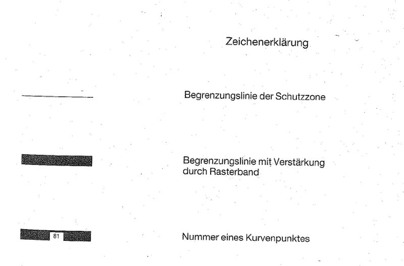
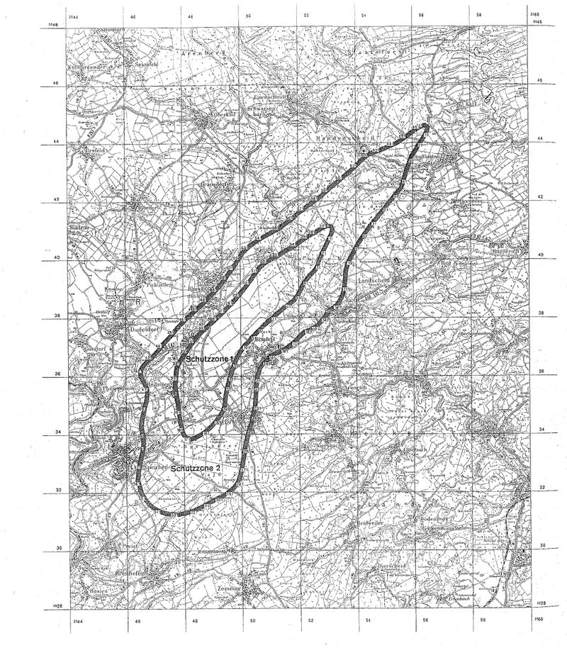

# Verordnung über die Festsetzung des Lärmschutzbereichs für den militärischen Flugplatz Spangdahlem (FluLärmSpangV)

Ausfertigungsdatum
:   2000-02-16

Fundstelle
:   BGBl I: 2000, 128

## Eingangsformel

Auf Grund des § 4 Abs. 1 und 2 des Gesetzes zum Schutz gegen Fluglärm
vom 30. März 1971 (BGBl. I S. 282), von denen Abs. 1 durch Artikel 3
Abs. 1 der Verordnung vom 26. November 1986 (BGBl. I S. 2089) geändert
worden ist, verordnet das Bundesministerium für Umwelt, Naturschutz
und Reaktorsicherheit im Einvernehmen mit dem Bundesministerium der
Verteidigung:

## § 1

Zum Schutz der Allgemeinheit vor Gefahren, erheblichen Nachteilen und
erheblichen Belästigungen durch Fluglärm in der Umgebung des
militärischen Flugplatzes Spangdahlem wird der in § 2 bestimmte
Lärmschutzbereich festgesetzt.

## § 2

Der Lärmschutzbereich mit seinen zwei Schutzzonen wird nach Anlage 1
bestimmt durch die interpolierten Verbindungslinien zwischen den
Kurvenpunkten, soweit diese Linien außerhalb des Flugplatzgeländes
verlaufen.

## § 3

(1) Liegt eine bauliche Anlage zu einem Teil im Lärmschutzbereich, so
gilt sie als ganz im Lärmschutzbereich gelegen. Liegt eine bauliche
Anlage zu einem Teil in der Schutzzone 1, so gilt sie als ganz in
dieser Schutzzone gelegen.

(2) Auf die Errichtung einer baulichen Anlage ist Absatz 1
entsprechend anzuwenden.

## § 4

Der nach § 2 bestimmte Lärmschutzbereich ist in einer topographischen
Karte im Maßstab 1:50.000 und in Karten im Maßstab 1:5.000
dargestellt. Die topographische Karte ist dieser Verordnung in
verkleinerter Form als Anlage 2 beigefügt\* Die topographische Karte
und die Karten im Maßstab 1:5.000 sind bei der Kreisverwaltung
Bitburg-Prüm, Trierer Str. 1, 54634 Bitburg, zu jedermanns Einsicht
archivmäßig gesichert niedergelegt.

## § 5

Diese Verordnung tritt am Tage nach der Verkündung in Kraft.

## Schlussformel

Der Bundesrat hat zugestimmt.

## Anlage 1 (zu § 2 der Verordnung über die Festsetzung des Lärmschutzbereichs für den militärischen Flugplatz Spangdahlem vom 16. Februar 2000)

(Fundstelle des Originaltextes: BGBl. I 2000, 129 - 136)

*    *   **Lärmschutzbereich**

*    *

*    *   Koordinatensystem:

    *   Gauß-Krüger:

    *   Y = Rechtswert

*    *   X = Hochwert

*    *   Interpolation:

    *   Polynom 3. Grades mit stetigem Tangentenübergang

*    *   Kurvenpunkte der Schutzzone 1 (Militärischer Flugplatz Spangdahlem)

*    *

*    *   Nr.

    *   Y

    *   X

    *   Nr.

    *   Y

    *   X

    *   Nr.

    *   Y

    *   X

*    *   1

    *   2553049.7

    *   5541081.3

    *   51

    *   2551878.2

    *   5538763.7

    *   101

    *   2550049.8

    *   5537055.6

*    *   2

    *   2553072.3

    *   5541081.2

    *   52

    *   2551857.3

    *   5538734.9

    *   102

    *   2550031.3

    *   5537034.9

*    *   3

    *   2553093.8

    *   5541074.1

    *   53

    *   2551816.2

    *   5538683.2

    *   103

    *   2550013.0

    *   5537010.2

*    *   4

    *   2553109.2

    *   5541057.1

    *   54

    *   2551794.4

    *   5538658.4

    *   104

    *   2549994.8

    *   5536985.4

*    *   5

    *   2553115.0

    *   5541034.8

    *   55

    *   2551771.2

    *   5538634.9

    *   105

    *   2549959.7

    *   5536934.9

*    *   6

    *   2553114.6

    *   5541009.2

    *   56

    *   2551748.1

    *   5538613.6

    *   106

    *   2549896.6

    *   5536834.9

*    *   7

    *   2553110.5

    *   5540983.9

    *   57

    *   2551723.7

    *   5538595.6

    *   107

    *   2549849.8

    *   5536754.4

*    *   8

    *   2553096.5

    *   5540934.8

    *   58

    *   2551683.1

    *   5538565.4

    *   108

    *   2549786.8

    *   5536634.9

*    *   9

    *   2553077.5

    *   5540884.3

    *   59

    *   2551642.6

    *   5538534.9

    *   109

    *   2549749.8

    *   5536556.4

*    *   10

    *   2553056.1

    *   5540834.8

    *   60

    *   2551596.1

    *   5538499.5

    *   110

    *   2549723.6

    *   5536496.0

*    *

*    *   11

    *   2553032.7

    *   5540784.6

    *   61

    *   2551549.8

    *   5538463.7

    *   111

    *   2549699.2

    *   5536434.9

*    *   12

    *   2553008.4

    *   5540734.8

    *   62

    *   2551506.5

    *   5538429.9

    *   112

    *   2549686.4

    *   5536400.8

*    *   13

    *   2552983.3

    *   5540684.7

    *   63

    *   2551449.8

    *   5538391.1

    *   113

    *   2549674.2

    *   5536366.4

*    *   14

    *   2552957.9

    *   5540634.8

    *   64

    *   2551415.2

    *   5538363.1

    *   114

    *   2549663.4

    *   5536334.9

*    *   15

    *   2552932.3

    *   5540584.8

    *   65

    *   2551380.8

    *   5538334.9

    *   115

    *   2549649.8

    *   5536294.9

*    *   16

    *   2552906.6

    *   5540534.8

    *   66

    *   2551349.8

    *   5538309.2

    *   116

    *   2549630.6

    *   5536234.9

*    *   17

    *   2552881.4

    *   5540484.8

    *   67

    *   2551305.7

    *   5538272.2

    *   117

    *   2549601.3

    *   5536134.9

*    *   18

    *   2552856.2

    *   5540434.8

    *   68

    *   2551261.8

    *   5538234.9

    *   118

    *   2549582.9

    *   5536068.9

*    *   19

    *   2552831.6

    *   5540385.0

    *   69

    *   2551204.1

    *   5538185.1

    *   119

    *   2549572.5

    *   5536034.9

*    *   20

    *   2552807.7

    *   5540334.8

    *   70

    *   2551146.7

    *   5538134.9

    *   120

    *   2549561.1

    *   5535997.3

*    *

*    *   21

    *   2552784.6

    *   5540284.9

    *   71

    *   2551049.8

    *   5538049.0

    *   121

    *   2549549.8

    *   5535959.8

*    *   22

    *   2552762.0

    *   5540234.8

    *   72

    *   2550984.9

    *   5537991.1

    *   122

    *   2549542.3

    *   5535934.9

*    *   23

    *   2552749.7

    *   5540207.2

    *   73

    *   2550949.8

    *   5537959.9

    *   123

    *   2549534.4

    *   5535908.6

*    *   24

    *   2552733.7

    *   5540170.6

    *   74

    *   2550921.6

    *   5537934.9

    *   124

    *   2549526.5

    *   5535882.3

*    *   25

    *   2552716.0

    *   5540134.8

    *   75

    *   2550885.7

    *   5537903.2

    *   125

    *   2549518.5

    *   5535856.0

*    *   26

    *   2552691.2

    *   5540085.3

    *   76

    *   2550849.8

    *   5537871.6

    *   126

    *   2549514.5

    *   5535842.8

*    *   27

    *   2552668.4

    *   5540034.8

    *   77

    *   2550809.2

    *   5537834.9

    *   127

    *   2549510.5

    *   5535829.7

*    *   28

    *   2552649.7

    *   5539985.7

    *   78

    *   2550749.8

    *   5537781.9

    *   128

    *   2549505.7

    *   5535814.3

*    *   29

    *   2552633.7

    *   5539934.8

    *   79

    *   2550696.5

    *   5537734.9

    *   129

    *   2549497.4

    *   5535786.9

*    *   30

    *   2552606.1

    *   5539834.8

    *   80

    *   2550649.8

    *   5537691.5

    *   130

    *   2549482.5

    *   5535734.9

*    *

*    *   31

    *   2552587.4

    *   5539783.4

    *   81

    *   2550593.5

    *   5537634.9

    *   131

    *   2549456.5

    *   5535634.9

*    *   32

    *   2552562.2

    *   5539734.8

    *   82

    *   2550549.8

    *   5537591.8

    *   132

    *   2549432.2

    *   5535534.9

*    *   33

    *   2552524.8

    *   5539682.7

    *   83

    *   2550520.8

    *   5537563.4

    *   133

    *   2549411.5

    *   5535434.9

*    *   34

    *   2552482.1

    *   5539634.8

    *   84

    *   2550491.7

    *   5537534.9

    *   134

    *   2549395.9

    *   5535334.9

*    *   35

    *   2552449.7

    *   5539600.9

    *   85

    *   2550470.7

    *   5537513.4

    *   135

    *   2549385.6

    *   5535234.9

*    *   36

    *   2552387.1

    *   5539534.8

    *   86

    *   2550449.8

    *   5537491.8

    *   136

    *   2549375.2

    *   5535134.9

*    *   37

    *   2552349.7

    *   5539494.5

    *   87

    *   2550434.1

    *   5537475.5

    *   137

    *   2549369.5

    *   5535084.9

*    *   38

    *   2552294.8

    *   5539434.8

    *   88

    *   2550414.6

    *   5537455.2

    *   138

    *   2549362.9

    *   5535035.0

*    *   39

    *   2552249.7

    *   5539383.5

    *   89

    *   2550395.1

    *   5537434.9

    *   139

    *   2549357.0

    *   5534998.6

*    *   40

    *   2552209.8

    *   5539334.8

    *   90

    *   2550372.4

    *   5537411.2

    *   140

    *   2549349.8

    *   5534962.4

*    *

*    *   41

    *   2552149.7

    *   5539252.9

    *   91

    *   2550349.8

    *   5537387.4

    *   141

    *   2549342.9

    *   5534935.0

*    *   42

    *   2552111.6

    *   5539194.6

    *   92

    *   2550324.9

    *   5537361.2

    *   142

    *   2549323.2

    *   5534884.3

*    *   43

    *   2552075.8

    *   5539134.8

    *   93

    *   2550300.3

    *   5537334.9

    *   143

    *   2549300.1

    *   5534835.0

*    *   44

    *   2552046.7

    *   5539082.3

    *   94

    *   2550275.0

    *   5537307.6

    *   144

    *   2549249.8

    *   5534748.8

*    *   45

    *   2552030.7

    *   5539035.7

    *   95

    *   2550249.8

    *   5537280.3

    *   145

    *   2549210.2

    *   5534691.1

*    *   46

    *   2552003.2

    *   5538978.4

    *   96

    *   2550213.5

    *   5537236.7

    *   146

    *   2549189.5

    *   5534662.9

*    *   47

    *   2551980.8

    *   5538934.8

    *   97

    *   2550181.6

    *   5537201.7

    *   147

    *   2549168.4

    *   5534635.0

*    *   48

    *   2551949.7

    *   5538877.6

    *   98

    *   2550149.8

    *   5537166.6

    *   148

    *   2549149.8

    *   5534610.9

*    *   49

    *   2551924.6

    *   5538834.9

    *   99

    *   2550121.1

    *   5537134.9

    *   149

    *   2549117.6

    *   5534570.1

*    *   50

    *   2551902.0

    *   5538798.9

    *   100

    *   2550085.4

    *   5537095.3

    *   150

    *   2549089.6

    *   5534535.0

*    *

*    *   noch Schutzzone 1 (Militärischer Flugplatz Spangdahlem)

*    *

*    *   Nr.

    *   Y

    *   X

    *   Nr.

    *   Y

    *   X

    *   Nr.

    *   Y

    *   X

*    *   151

    *   2549049.8

    *   5534485.8

    *   201

    *   2547797.9

    *   5535484.8

    *   251

    *   2548799.6

    *   5537571.3

*    *   152

    *   2549007.6

    *   5534435.0

    *   202

    *   2547791.2

    *   5535534.9

    *   252

    *   2548824.7

    *   5537593.9

*    *   153

    *   2548949.8

    *   5534369.1

    *   203

    *   2547785.9

    *   5535584.8

    *   253

    *   2548849.8

    *   5537616.4

*    *   154

    *   2548917.8

    *   5534335.0

    *   204

    *   2547784.1

    *   5535609.8

    *   254

    *   2548870.6

    *   5537634.9

*    *   155

    *   2548884.4

    *   5534301.5

    *   205

    *   2547782.9

    *   5535634.9

    *   255

    *   2548910.1

    *   5537669.8

*    *   156

    *   2548849.8

    *   5534269.2

    *   206

    *   2547782.1

    *   5535657.2

    *   256

    *   2548949.8

    *   5537704.4

*    *   157

    *   2548810.2

    *   5534235.0

    *   207

    *   2547782.1

    *   5535696.1

    *   257

    *   2548985.2

    *   5537734.9

*    *   158

    *   2548749.8

    *   5534188.0

    *   208

    *   2547783.4

    *   5535734.9

    *   258

    *   2549049.8

    *   5537789.6

*    *   159

    *   2548711.4

    *   5534160.9

    *   209

    *   2547786.6

    *   5535784.9

    *   259

    *   2549103.5

    *   5537834.9

*    *   160

    *   2548672.2

    *   5534135.0

    *   210

    *   2547791.0

    *   5535834.9

    *   260

    *   2549149.8

    *   5537874.3

*    *

*    *   161

    *   2548649.8

    *   5534120.7

    *   211

    *   2547801.2

    *   5535934.9

    *   261

    *   2549182.6

    *   5537904.3

*    *   162

    *   2548624.9

    *   5534104.2

    *   212

    *   2547809.9

    *   5536034.9

    *   262

    *   2549215.0

    *   5537934.9

*    *   163

    *   2548600.1

    *   5534087.6

    *   213

    *   2547817.7

    *   5536134.9

    *   263

    *   2549247.0

    *   5537965.2

*    *   164

    *   2548549.8

    *   5534055.5

    *   214

    *   2547823.0

    *   5536185.1

    *   264

    *   2549283.7

    *   5538000.0

*    *   165

    *   2548515.9

    *   5534035.0

    *   215

    *   2547826.5

    *   5536210.0

    *   265

    *   2549320.3

    *   5538034.9

*    *   166

    *   2548449.8

    *   5533997.9

    *   216

    *   2547830.8

    *   5536234.9

    *   266

    *   2549339.2

    *   5538052.9

*    *   167

    *   2548400.6

    *   5533973.7

    *   217

    *   2547836.0

    *   5536259.3

    *   267

    *   2549356.0

    *   5538068.9

*    *   168

    *   2548349.8

    *   5533952.9

    *   218

    *   2547842.4

    *   5536284.1

    *   268

    *   2549373.7

    *   5538085.2

*    *   169

    *   2548286.9

    *   5533935.0

    *   219

    *   2547849.9

    *   5536308.5

    *   269

    *   2549391.0

    *   5538101.7

*    *   170

    *   2548249.8

    *   5533930.1

    *   220

    *   2547859.3

    *   5536334.9

    *   270

    *   2549425.6

    *   5538134.9

*    *

*    *   171

    *   2548219.2

    *   5533930.2

    *   221

    *   2547881.6

    *   5536385.8

    *   271

    *   2549449.8

    *   5538158.1

*    *   172

    *   2548189.0

    *   5533935.0

    *   222

    *   2547907.8

    *   5536434.9

    *   272

    *   2549489.3

    *   5538196.4

*    *   173

    *   2548149.8

    *   5533949.5

    *   223

    *   2547928.2

    *   5536469.3

    *   273

    *   2549528.8

    *   5538234.9

*    *   174

    *   2548110.3

    *   5533977.3

    *   224

    *   2547949.8

    *   5536503.1

    *   274

    *   2549549.8

    *   5538255.5

*    *   175

    *   2548085.1

    *   5534004.4

    *   225

    *   2547971.5

    *   5536535.9

    *   275

    *   2549590.4

    *   5538295.2

*    *   176

    *   2548064.1

    *   5534035.0

    *   226

    *   2548009.9

    *   5536592.7

    *   276

    *   2549610.7

    *   5538315.0

*    *   177

    *   2548049.8

    *   5534060.6

    *   227

    *   2548038.3

    *   5536634.9

    *   277

    *   2549630.9

    *   5538334.9

*    *   178

    *   2548033.2

    *   5534097.2

    *   228

    *   2548067.7

    *   5536678.6

    *   278

    *   2549649.8

    *   5538353.7

*    *   179

    *   2548019.2

    *   5534135.0

    *   229

    *   2548096.8

    *   5536722.5

    *   279

    *   2549669.5

    *   5538374.0

*    *   180

    *   2548004.3

    *   5534184.6

    *   230

    *   2548123.4

    *   5536762.7

    *   280

    *   2549689.2

    *   5538394.3

*    *

*    *   181

    *   2547992.0

    *   5534235.0

    *   231

    *   2548149.8

    *   5536803.0

    *   281

    *   2549728.7

    *   5538434.9

*    *   182

    *   2547973.3

    *   5534335.0

    *   232

    *   2548170.8

    *   5536834.9

    *   282

    *   2549749.8

    *   5538456.5

*    *   183

    *   2547963.1

    *   5534384.9

    *   233

    *   2548204.4

    *   5536885.3

    *   283

    *   2549788.6

    *   5538495.5

*    *   184

    *   2547954.0

    *   5534435.0

    *   234

    *   2548239.1

    *   5536934.9

    *   284

    *   2549827.1

    *   5538534.9

*    *   185

    *   2547949.8

    *   5534460.3

    *   235

    *   2548266.8

    *   5536972.5

    *   285

    *   2549849.8

    *   5538561.2

*    *   186

    *   2547944.0

    *   5534497.6

    *   236

    *   2548293.4

    *   5537010.9

    *   286

    *   2549876.2

    *   5538591.9

*    *   187

    *   2547938.5

    *   5534535.0

    *   237

    *   2548312.2

    *   5537034.9

    *   287

    *   2549902.6

    *   5538622.7

*    *   188

    *   2547931.6

    *   5534585.0

    *   238

    *   2548331.1

    *   5537059.4

    *   288

    *   2549926.2

    *   5538650.2

*    *   189

    *   2547925.1

    *   5534635.0

    *   239

    *   2548349.8

    *   5537083.9

    *   289

    *   2549949.8

    *   5538677.8

*    *   190

    *   2547912.9

    *   5534735.0

    *   240

    *   2548369.2

    *   5537109.4

    *   290

    *   2549962.4

    *   5538692.6

*    *

*    *   191

    *   2547900.9

    *   5534835.0

    *   241

    *   2548388.6

    *   5537134.9

    *   291

    *   2549980.3

    *   5538713.6

*    *   192

    *   2547888.2

    *   5534935.0

    *   242

    *   2548415.5

    *   5537170.0

    *   292

    *   2549997.8

    *   5538734.9

*    *   193

    *   2547874.8

    *   5535035.0

    *   243

    *   2548442.7

    *   5537204.9

    *   293

    *   2550023.8

    *   5538766.9

*    *   194

    *   2547860.0

    *   5535135.0

    *   244

    *   2548466.7

    *   5537234.9

    *   294

    *   2550049.8

    *   5538798.8

*    *   195

    *   2547849.8

    *   5535201.0

    *   245

    *   2548508.9

    *   5537285.5

    *   295

    *   2550078.8

    *   5538834.8

*    *   196

    *   2547844.4

    *   5535235.0

    *   246

    *   2548552.5

    *   5537334.9

    *   296

    *   2550114.4

    *   5538879.1

*    *   197

    *   2547836.0

    *   5535285.1

    *   247

    *   2548612.2

    *   5537397.2

    *   297

    *   2550149.8

    *   5538923.6

*    *   198

    *   2547826.8

    *   5535334.9

    *   248

    *   2548652.1

    *   5537434.9

    *   298

    *   2550193.8

    *   5538979.1

*    *   199

    *   2547816.5

    *   5535385.0

    *   249

    *   2548700.8

    *   5537480.5

    *   299

    *   2550237.6

    *   5539034.8

*    *   200

    *   2547805.6

    *   5535434.9

    *   250

    *   2548749.8

    *   5537525.8

    *   300

    *   2550276.6

    *   5539084.7

*    *

*    *   noch Schutzzone 1 (Militärischer Flugplatz Spangdahlem)

*    *

*    *   Nr.

    *   Y

    *   X

    *   Nr.

    *   Y

    *   X

    *   Nr.

    *   Y

    *   X

*    *   301

    *   2550315.5

    *   5539134.8

    *   331

    *   2551349.8

    *   5540075.7

    *   361

    *   2552599.7

    *   5540859.2

*    *   302

    *   2550349.8

    *   5539179.4

    *   332

    *   2551393.2

    *   5540104.6

    *   362

    *   2552649.7

    *   5540889.3

*    *   303

    *   2550392.1

    *   5539234.8

    *   333

    *   2551435.7

    *   5540134.8

    *   363

    *   2552688.1

    *   5540912.2

*    *   304

    *   2550421.1

    *   5539273.0

    *   334

    *   2551491.3

    *   5540175.5

    *   364

    *   2552726.7

    *   5540934.8

*    *   305

    *   2550449.8

    *   5539311.3

    *   335

    *   2551549.8

    *   5540212.0

    *   365

    *   2552749.7

    *   5540948.1

*    *   306

    *   2550467.4

    *   5539334.8

    *   336

    *   2551594.1

    *   5540234.8

    *   366

    *   2552774.5

    *   5540962.3

*    *   307

    *   2550489.7

    *   5539364.9

    *   337

    *   2551649.7

    *   5540263.6

    *   367

    *   2552799.4

    *   5540976.3

*    *   308

    *   2550511.5

    *   5539395.4

    *   338

    *   2551728.0

    *   5540306.5

    *   368

    *   2552849.7

    *   5541003.5

*    *   309

    *   2550540.3

    *   5539434.8

    *   339

    *   2551777.1

    *   5540334.8

    *   369

    *   2552912.0

    *   5541034.8

*    *   310

    *   2550576.4

    *   5539484.7

    *   340

    *   2551849.7

    *   5540378.6

    *   370

    *   2552949.7

    *   5541051.7

*    *

*    *   311

    *   2550612.2

    *   5539534.8

    *   341

    *   2551938.2

    *   5540434.8

    *   371

    *   2552998.7

    *   5541070.0

*    *   312

    *   2550649.8

    *   5539588.2

    *   342

    *   2551994.2

    *   5540472.1

    *   372

    *   2553023.9

    *   5541077.0

*    *   313

    *   2550687.7

    *   5539642.8

    *   343

    *   2552049.7

    *   5540510.2

    *   373

    *   2553049.7

    *   5541081.3

*    *   314

    *   2550718.0

    *   5539675.1

    *   344

    *   2552085.0

    *   5540534.8

    *
    *
    *

*    *   315

    *   2550749.8

    *   5539706.1

    *   345

    *   2552149.7

    *   5540580.3

    *
    *
    *

*    *   316

    *   2550782.0

    *   5539734.8

    *   346

    *   2552188.5

    *   5540607.6

    *
    *
    *

*    *   317

    *   2550815.4

    *   5539762.4

    *   347

    *   2552227.4

    *   5540634.8

    *
    *
    *

*    *   318

    *   2550849.8

    *   5539788.6

    *   348

    *   2552249.7

    *   5540648.8

    *
    *
    *

*    *   319

    *   2550883.0

    *   5539812.2

    *   349

    *   2552274.7

    *   5540663.6

    *
    *
    *

*    *   320

    *   2550916.9

    *   5539834.8

    *   350

    *   2552299.8

    *   5540678.4

    *
    *
    *

*    *

*    *   321

    *   2550939.5

    *   5539849.0

    *   351

    *   2552324.7

    *   5540693.2

    *
    *
    *

*    *   322

    *   2550966.7

    *   5539865.3

    *   352

    *   2552337.2

    *   5540700.7

    *
    *
    *

*    *   323

    *   2550994.2

    *   5539881.1

    *   353

    *   2552349.7

    *   5540708.1

    *
    *
    *

*    *   324

    *   2551049.8

    *   5539911.6

    *   354

    *   2552360.2

    *   5540714.4

    *
    *
    *

*    *   325

    *   2551100.8

    *   5539938.3

    *   355

    *   2552377.1

    *   5540724.6

    *
    *
    *

*    *   326

    *   2551149.8

    *   5539962.5

    *   356

    *   2552394.1

    *   5540734.8

    *
    *
    *

*    *   327

    *   2551200.0

    *   5539988.8

    *   357

    *   2552421.9

    *   5540751.6

    *
    *
    *

*    *   328

    *   2551249.8

    *   5540015.9

    *   358

    *   2552449.7

    *   5540768.4

    *
    *
    *

*    *   329

    *   2551283.0

    *   5540034.8

    *   359

    *   2552499.6

    *   5540798.8

    *
    *
    *

*    *   330

    *   2551316.6

    *   5540054.9

    *   360

    *   2552549.7

    *   5540828.9

    *
    *
    *

*    *

*    *   Kurvenpunkte der Schutzzone 2 (Militärischer Flugplatz Spangdahlem)

*    *

*    *   Nr.

    *   Y

    *   X

    *   Nr.

    *   Y

    *   X

    *   Nr.

    *   Y

    *   X

*    *   1

    *   2556349.6

    *   5544511.5

    *   51

    *   2555316.3

    *   5542234.8

    *   101

    *   2553665.0

    *   5539934.8

*    *   2

    *   2556391.4

    *   5544524.7

    *   52

    *   2555249.7

    *   5542154.1

    *   102

    *   2553649.7

    *   5539896.1

*    *   3

    *   2556413.6

    *   5544526.7

    *   53

    *   2555199.9

    *   5542093.6

    *   103

    *   2553628.1

    *   5539834.8

*    *   4

    *   2556435.0

    *   5544520.7

    *   54

    *   2555149.7

    *   5542033.5

    *   104

    *   2553598.5

    *   5539734.8

*    *   5

    *   2556442.9

    *   5544512.0

    *   55

    *   2555108.8

    *   5541984.1

    *   105

    *   2553576.4

    *   5539634.8

*    *   6

    *   2556446.4

    *   5544500.8

    *   56

    *   2555088.3

    *   5541959.5

    *   106

    *   2553562.3

    *   5539534.8

*    *   7

    *   2556446.5

    *   5544477.8

    *   57

    *   2555067.9

    *   5541934.8

    *   107

    *   2553554.3

    *   5539434.8

*    *   8

    *   2556435.5

    *   5544434.8

    *   58

    *   2555049.7

    *   5541913.1

    *   108

    *   2553549.7

    *   5539350.7

*    *   9

    *   2556418.0

    *   5544393.0

    *   59

    *   2555017.1

    *   5541873.9

    *   109

    *   2553541.1

    *   5539234.8

*    *   10

    *   2556403.2

    *   5544363.6

    *   60

    *   2554984.5

    *   5541834.8

    *   110

    *   2553531.2

    *   5539134.8

*    *

*    *   11

    *   2556387.4

    *   5544334.8

    *   61

    *   2554949.7

    *   5541793.2

    *   111

    *   2553516.6

    *   5539034.8

*    *   12

    *   2556373.0

    *   5544309.4

    *   62

    *   2554902.8

    *   5541734.8

    *   112

    *   2553494.4

    *   5538930.7

*    *   13

    *   2556349.6

    *   5544270.6

    *   63

    *   2554849.7

    *   5541668.4

    *   113

    *   2553466.4

    *   5538834.9

*    *   14

    *   2556327.3

    *   5544234.8

    *   64

    *   2554822.8

    *   5541634.8

    *   114

    *   2553449.7

    *   5538787.8

*    *   15

    *   2556294.7

    *   5544184.5

    *   65

    *   2554786.2

    *   5541589.6

    *   115

    *   2553428.3

    *   5538734.9

*    *   16

    *   2556261.3

    *   5544134.8

    *   66

    *   2554749.7

    *   5541544.3

    *   116

    *   2553378.5

    *   5538634.9

*    *   17

    *   2556228.4

    *   5544084.9

    *   67

    *   2554705.4

    *   5541489.5

    *   117

    *   2553349.7

    *   5538586.8

*    *   18

    *   2556212.3

    *   5544059.8

    *   68

    *   2558661.1

    *   5541434.8

    *   118

    *   2553314.5

    *   5538534.9

*    *   19

    *   2556196.0

    *   5544034.8

    *   69

    *   2554620.6

    *   5541384.8

    *   119

    *   2553283.2

    *   5538498.1

*    *   20

    *   2556182.9

    *   5544014.7

    *   70

    *   2554580.2

    *   5541334.8

    *   120

    *   2553249.7

    *   5538463.4

*    *

*    *   21

    *   2556166.3

    *   5543989.7

    *   71

    *   2554549.7

    *   5541297.0

    *   121

    *   2553215.8

    *   5538434.9

*    *   22

    *   2556149.6

    *   5543964.7

    *   72

    *   2554499.7

    *   5541234.8

    *   122

    *   2553149.7

    *   5538383.5

*    *   23

    *   2556129.4

    *   5543934.8

    *   73

    *   2554449.7

    *   5541172.0

    *   123

    *   2553084.1

    *   5538334.9

*    *   24

    *   2556097.4

    *   5543887.6

    *   74

    *   2554420.4

    *   5541134.8

    *   124

    *   2553049.7

    *   5538308.8

*    *   25

    *   2556075.6

    *   5543834.8

    *   75

    *   2554384.9

    *   5541089.4

    *   125

    *   2553004.3

    *   5538272.7

*    *   26

    *   2556049.6

    *   5543797.1

    *   76

    *   2554349.7

    *   5541043.9

    *   126

    *   2552982.0

    *   5538254.0

*    *   27

    *   2556006.4

    *   5543734.8

    *   77

    *   2554308.2

    *   5540989.5

    *   127

    *   2552960.2

    *   5538234.9

*    *   28

    *   2555949.6

    *   5543653.0

    *   78

    *   2554287.6

    *   5540962.2

    *   128

    *   2552947.2

    *   5538220.3

*    *   29

    *   2555910.4

    *   5543596.4

    *   79

    *   2554267.1

    *   5540934.8

    *   129

    *   2552933.7

    *   5538204.9

*    *   30

    *   2555879.7

    *   5543534.8

    *   80

    *   2554249.7

    *   5540911.5

    *   130

    *   2552929.7

    *   5538186.9

*    *

*    *   31

    *   2555849.6

    *   5543452.1

    *   81

    *   2554221.5

    *   5540873.2

    *   131

    *   2552922.5

    *   5538170.3

*    *   32

    *   2555806.6

    *   5543334.8

    *   82

    *   2554193.5

    *   5540834.8

    *   132

    *   2552926.0

    *   5538159.4

*    *   33

    *   2555770.4

    *   5543234.8

    *   83

    *   2554149.7

    *   5540773.5

    *   133

    *   2552918.9

    *   5538150.5

*    *   34

    *   2555749.6

    *   5543175.7

    *   84

    *   2554122.6

    *   5540734.8

    *   134

    *   2552906.3

    *   5538134.9

*    *   35

    *   2555735.5

    *   5543134.8

    *   85

    *   2554085.8

    *   5540680.9

    *   135

    *   2552892.2

    *   5538117.6

*    *   36

    *   2555718.6

    *   5543084.9

    *   86

    *   2554049.7

    *   5540626.6

    *   136

    *   2552878.1

    *   5538100.4

*    *   37

    *   2555702.3

    *   5543034.8

    *   87

    *   2554020.3

    *   5540580.9

    *   137

    *   2552849.7

    *   5538066.2

*    *   38

    *   2555671.7

    *   5542934.8

    *   88

    *   2553991.4

    *   5540534.8

    *   138

    *   2552823.5

    *   5538034.9

*    *   39

    *   2555649.6

    *   5542857.8

    *   89

    *   2553970.3

    *   5540499.9

    *   139

    *   2552809.4

    *   5538018.4

*    *   40

    *   2555632.8

    *   5542796.0

    *   90

    *   2553949.7

    *   5540464.7

    *   140

    *   2552794.6

    *   5538001.0

*    *

*    *   41

    *   2555614.1

    *   5542734.8

    *   91

    *   2553932.6

    *   5540434.8

    *   141

    *   2552779.7

    *   5537983.7

*    *   42

    *   2555597.1

    *   5542684.9

    *   92

    *   2553905.9

    *   5540385.2

    *   142

    *   2552749.7

    *   5537949.3

*    *   43

    *   2555580.3

    *   5542634.8

    *   93

    *   2553880.8

    *   5540334.8

    *   143

    *   2552698.7

    *   5537891.7

*    *   44

    *   2555564.0

    *   5542584.9

    *   94

    *   2553849.7

    *   5540274.1

    *   144

    *   2552673.0

    *   5537863.1

*    *   45

    *   2555548.1

    *   5542534.8

    *   95

    *   2553828.1

    *   5540234.8

    *   145

    *   2552646.9

    *   5537834.9

*    *   46

    *   2555517.5

    *   5542482.2

    *   96

    *   2553798.8

    *   5540184.6

    *   146

    *   2552624.1

    *   5537810.3

*    *   47

    *   2555479.4

    *   5542434.8

    *   97

    *   2553768.9

    *   5540134.8

    *   147

    *   2552601.0

    *   5537785.8

*    *   48

    *   2555449.7

    *   5542398.1

    *   98

    *   2553746.9

    *   5540098.1

    *   148

    *   2552575.1

    *   5537772.4

*    *   49

    *   2555398.2

    *   5542334.8

    *   99

    *   2553711.7

    *   5540034.8

    *   149

    *   2552549.7

    *   5537758.2

*    *   50

    *   2555349.7

    *   5542275.5

    *   100

    *   2553686.7

    *   5539984.2

    *   150

    *   2552508.6

    *   5537734.9

*    *

*    *   noch Schutzzone 2 (Militärischer Flugplatz Spangdahlem)

*    *

*    *   Nr.

    *   Y

    *   X

    *   Nr.

    *   Y

    *   X

    *   Nr.

    *   Y

    *   X

*    *   151

    *   2552449.7

    *   5537700.8

    *   201

    *   2550749.8

    *   5536496.1

    *   251

    *   2550188.0

    *   5534135.0

*    *   152

    *   2552399.5

    *   5537670.9

    *   202

    *   2550684.6

    *   5536434.9

    *   252

    *   2550173.5

    *   5534085.1

*    *   153

    *   2552374.5

    *   5537655.8

    *   203

    *   2550649.8

    *   5536392.2

    *   253

    *   2550159.6

    *   5534035.0

*    *   154

    *   2552362.1

    *   5537648.1

    *   204

    *   2550612.2

    *   5536331.9

    *   254

    *   2550149.8

    *   5533998.5

*    *   155

    *   2552349.7

    *   5537640.4

    *   205

    *   2550589.0

    *   5536283.9

    *   255

    *   2550133.6

    *   5533935.0

*    *   156

    *   2552340.6

    *   5537634.8

    *   206

    *   2550567.8

    *   5536234.9

    *   256

    *   2550110.4

    *   5533835.0

*    *   157

    *   2552331.4

    *   5537629.1

    *   207

    *   2550549.8

    *   5536187.6

    *   257

    *   2550085.0

    *   5533735.0

*    *   158

    *   2552312.7

    *   5537619.1

    *   208

    *   2550532.1

    *   5536134.9

    *   258

    *   2550061.4

    *   5533635.0

*    *   159

    *   2552274.7

    *   5537602.4

    *   209

    *   2550505.6

    *   5536034.9

    *   259

    *   2550049.8

    *   5533573.5

*    *   160

    *   2552239.7

    *   5537595.4

    *   210

    *   2550487.8

    *   5535934.9

    *   260

    *   2550043.0

    *   5533535.0

*    *

*    *   161

    *   2552199.7

    *   5537584.7

    *   211

    *   2550476.5

    *   5535834.9

    *   261

    *   2550034.6

    *   5533485.0

*    *   162

    *   2552149.7

    *   5537558.3

    *   212

    *   2550472.3

    *   5535784.5

    *   262

    *   2550026.6

    *   5533435.0

*    *   163

    *   2552098.3

    *   5537521.4

    *   213

    *   2550462.3

    *   5535734.9

    *   263

    *   2550013.0

    *   5533348.5

*    *   164

    *   2552049.7

    *   5537476.9

    *   214

    *   2550456.0

    *   5535703.8

    *   264

    *   2549996.5

    *   5533235.0

*    *   165

    *   2552006.5

    *   5537434.9

    *   215

    *   2550449.8

    *   5535672.8

    *   265

    *   2549982.7

    *   5533135.0

*    *   166

    *   2551949.7

    *   5537376.5

    *   216

    *   2550446.1

    *   5535653.8

    *   266

    *   2549969.1

    *   5533035.0

*    *   167

    *   2551910.1

    *   5537334.9

    *   217

    *   2550442.4

    *   5535634.9

    *   267

    *   2549962.1

    *   5532985.0

*    *   168

    *   2551849.7

    *   5537272.8

    *   218

    *   2550439.7

    *   5535623.5

    *   268

    *   2549954.6

    *   5532935.0

*    *   169

    *   2551811.1

    *   5537234.9

    *   219

    *   2550439.6

    *   5535601.3

    *   269

    *   2549949.8

    *   5532904.0

*    *   170

    *   2551780.7

    *   5537206.6

    *   220

    *   2550438.9

    *   5535579.2

    *   270

    *   2549944.0

    *   5532869.5

*    *

*    *   171

    *   2551749.7

    *   5537179.1

    *   221

    *   2550437.6

    *   5535534.9

    *   271

    *   2549937.9

    *   5532835.0

*    *   172

    *   2551720.1

    *   5537154.4

    *   222

    *   2550436.3

    *   5535484.9

    *   272

    *   2549928.4

    *   5532784.9

*    *   173

    *   2551697.7

    *   5537134.9

    *   223

    *   2550434.9

    *   5535434.9

    *   273

    *   2549918.3

    *   5532735.0

*    *   174

    *   2551674.0

    *   5537115.5

    *   224

    *   2550431.8

    *   5535334.9

    *   274

    *   2549906.8

    *   5532684.8

*    *   175

    *   2551649.8

    *   5537096.8

    *   225

    *   2550426.5

    *   5535234.9

    *   275

    *   2549894.0

    *   5532635.0

*    *   176

    *   2551606.8

    *   5537064.6

    *   226

    *   2550417.8

    *   5535137.0

    *   276

    *   2549879.3

    *   5532584.7

*    *   177

    *   2551562.0

    *   5537034.9

    *   227

    *   2550413.7

    *   5535085.9

    *   277

    *   2549862.7

    *   5532535.0

*    *   178

    *   2551506.9

    *   5537002.8

    *   228

    *   2550409.7

    *   5535034.9

    *   278

    *   2549849.8

    *   5532500.5

*    *   179

    *   2551449.8

    *   5536974.2

    *   229

    *   2550407.2

    *   5534998.3

    *   279

    *   2549821.5

    *   5532435.0

*    *   180

    *   2551412.9

    *   5536954.8

    *   230

    *   2550405.9

    *   5534980.0

    *   280

    *   2549795.7

    *   5532384.0

*    *

*    *   181

    *   2551376.2

    *   5536934.9

    *   231

    *   2550404.8

    *   5534961.7

    *   281

    *   2549781.4

    *   5532359.3

*    *   182

    *   2551349.8

    *   5536921.2

    *   232

    *   2550398.3

    *   5534935.0

    *   282

    *   2549766.4

    *   5532335.0

*    *   183

    *   2551314.7

    *   5536904.3

    *   233

    *   2550382.4

    *   5534895.0

    *   283

    *   2549758.1

    *   5532322.1

*    *   184

    *   2551275.3

    *   5536886.2

    *   234

    *   2550367.8

    *   5534835.0

    *   284

    *   2549745.8

    *   5532303.9

*    *   185

    *   2551249.8

    *   5536874.9

    *   235

    *   2550361.3

    *   5534785.0

    *   285

    *   2549732.8

    *   5532286.1

*    *   186

    *   2551206.1

    *   5536855.6

    *   236

    *   2550354.6

    *   5534735.0

    *   286

    *   2549705.6

    *   5532251.6

*    *   187

    *   2551163.1

    *   5536834.9

    *   237

    *   2550349.8

    *   5534705.2

    *   287

    *   2549649.8

    *   5532191.9

*    *   188

    *   2551106.0

    *   5536805.0

    *   238

    *   2550343.7

    *   5534670.0

    *   288

    *   2549585.4

    *   5532135.0

*    *   189

    *   2551049.8

    *   5536773.3

    *   239

    *   2550340.4

    *   5534652.5

    *   289

    *   2549549.8

    *   5532107.2

*    *   190

    *   2550999.8

    *   5536741.4

    *   240

    *   2550336.9

    *   5534635.0

    *   290

    *   2549498.0

    *   5532070.0

*    *

*    *   191

    *   2550952.8

    *   5536702.4

    *   241

    *   2550333.8

    *   5534620.2

    *   291

    *   2549444.7

    *   5532035.0

*    *   192

    *   2550924.3

    *   5536669.3

    *   242

    *   2550328.4

    *   5534598.8

    *   292

    *   2549397.8

    *   5532005.4

*    *   193

    *   2550898.3

    *   5536637.3

    *   243

    *   2550322.6

    *   5534577.5

    *   293

    *   2549349.8

    *   5531977.5

*    *   194

    *   2550882.3

    *   5536616.3

    *   244

    *   2550310.7

    *   5534535.0

    *   294

    *   2549311.3

    *   5531955.8

*    *   195

    *   2550869.0

    *   5536600.5

    *   245

    *   2550296.0

    *   5534484.9

    *   295

    *   2549272.4

    *   5531935.0

*    *   196

    *   2550858.3

    *   5536591.6

    *   246

    *   2550280.9

    *   5534435.0

    *   296

    *   2549249.8

    *   5531923.0

*    *   197

    *   2550847.7

    *   5536582.5

    *   247

    *   2550249.8

    *   5534335.3

    *   297

    *   2549225.0

    *   5531909.9

*    *   198

    *   2550833.9

    *   5536570.8

    *   248

    *   2550234.0

    *   5534285.2

    *   298

    *   2549200.1

    *   5531897.0

*    *   199

    *   2550820.1

    *   5536558.9

    *   249

    *   2550218.3

    *   5534235.0

    *   299

    *   2549149.8

    *   5531872.1

*    *   200

    *   2550792.9

    *   5536534.9

    *   250

    *   2550203.0

    *   5534185.0

    *   300

    *   2549112.5

    *   5531853.5

*    *

*    *   noch Schutzzone 2 (Militärischer Flugplatz Spangdahlem)

*    *

*    *   Nr.

    *   Y

    *   X

    *   Nr.

    *   Y

    *   X

    *   Nr.

    *   Y

    *   X

*    *   301

    *   2549075.1

    *   5531835.0

    *   351

    *   2546649.9

    *   5531892.7

    *   401

    *   2546687.2

    *   5534835.0

*    *   302

    *   2549049.8

    *   5531822.5

    *   352

    *   2546622.1

    *   5531935.1

    *   402

    *   2546712.0

    *   5534935.0

*    *   303

    *   2548999.7

    *   5531797.8

    *   353

    *   2546591.8

    *   5531982.9

    *   403

    *   2546736.5

    *   5535035.0

*    *   304

    *   2548949.8

    *   5531772.9

    *   354

    *   2546569.9

    *   5532035.1

    *   404

    *   2546749.9

    *   5535094.8

*    *   305

    *   2548912.2

    *   5531754.0

    *   355

    *   2546559.8

    *   5532070.1

    *   405

    *   2546758.4

    *   5535135.0

*    *   306

    *   2548874.5

    *   5531735.0

    *   356

    *   2546549.9

    *   5532105.3

    *   406

    *   2546768.3

    *   5535184.9

*    *   307

    *   2548849.8

    *   5531722.6

    *   357

    *   2546541.6

    *   5532135.1

    *   407

    *   2546777.0

    *   5535235.0

*    *   308

    *   2548807.8

    *   5531701.3

    *   358

    *   2546527.9

    *   5532185.0

    *   408

    *   2546790.2

    *   5535335.0

*    *   309

    *   2548749.8

    *   5531671.8

    *   359

    *   2546514.2

    *   5532235.0

    *   409

    *   2546796.1

    *   5535434.9

*    *   310

    *   2548714.3

    *   5531653.5

    *   360

    *   2546486.8

    *   5532335.0

    *   410

    *   2546791.9

    *   5535534.9

*    *

*    *   311

    *   2548679.0

    *   5531635.0

    *   361

    *   2546472.6

    *   5532385.0

    *   411

    *   2546774.1

    *   5535634.9

*    *   312

    *   2548649.8

    *   5531620.2

    *   362

    *   2546465.5

    *   5532410.0

    *   412

    *   2546755.6

    *   5535693.4

*    *   313

    *   2548599.8

    *   5531593.9

    *   363

    *   2546458.3

    *   5532435.0

    *   413

    *   2546738.6

    *   5535734.9

*    *   314

    *   2548549.8

    *   5531567.8

    *   364

    *   2546457.5

    *   5532460.2

    *   414

    *   2546713.8

    *   5535785.4

*    *   315

    *   2548488.5

    *   5531535.1

    *   365

    *   2546461.2

    *   5532485.2

    *   415

    *   2546687.2

    *   5535834.9

*    *   316

    *   2548449.8

    *   5531515.1

    *   366

    *   2546467.8

    *   5532535.0

    *   416

    *   2546649.9

    *   5535900.1

*    *   317

    *   2548409.0

    *   5531493.7

    *   367

    *   2546473.8

    *   5532585.0

    *   417

    *   2546630.0

    *   5535934.9

*    *   318

    *   2548349.8

    *   5531462.7

    *   368

    *   2546479.2

    *   5532635.0

    *   418

    *   2546604.7

    *   5535983.8

*    *   319

    *   2548286.7

    *   5531435.1

    *   369

    *   2546482.6

    *   5532670.1

    *   419

    *   2546584.2

    *   5536034.9

*    *   320

    *   2548249.8

    *   5531428.3

    *   370

    *   2546487.7

    *   5532735.0

    *   420

    *   2546572.3

    *   5536084.2

*    *

*    *   321

    *   2548199.7

    *   5531418.9

    *   371

    *   2546505.1

    *   5532835.0

    *   421

    *   2546569.6

    *   5536134.9

*    *   322

    *   2548149.8

    *   5531408.9

    *   372

    *   2546516.5

    *   5532927.0

    *   422

    *   2546577.2

    *   5536186.0

*    *   323

    *   2548049.8

    *   5531387.9

    *   373

    *   2546527.9

    *   5532981.0

    *   423

    *   2546594.0

    *   5536234.9

*    *   324

    *   2547949.8

    *   5531365.6

    *   374

    *   2546539.5

    *   5533035.0

    *   424

    *   2546621.6

    *   5536286.8

*    *   325

    *   2547899.8

    *   5531354.1

    *   375

    *   2546549.9

    *   5533082.7

    *   425

    *   2546655.2

    *   5536334.9

*    *   326

    *   2547849.8

    *   5531342.3

    *   376

    *   2546561.4

    *   5533135.0

    *   426

    *   2546700.8

    *   5536388.8

*    *   327

    *   2547819.6

    *   5531335.1

    *   377

    *   2546583.0

    *   5533235.0

    *   427

    *   2546749.9

    *   5536439.6

*    *   328

    *   2547785.0

    *   5531329.2

    *   378

    *   2546605.9

    *   5533335.0

    *   428

    *   2546780.0

    *   5536472.8

*    *   329

    *   2547749.8

    *   5531329.9

    *   379

    *   2546617.9

    *   5533384.9

    *   429

    *   2546814.8

    *   5536505.2

*    *   330

    *   2547699.8

    *   5531331.4

    *   380

    *   2546629.3

    *   5533435.0

    *   430

    *   2546849.9

    *   5536537.2

*    *

*    *   331

    *   2547649.8

    *   5531333.5

    *   381

    *   2546629.6

    *   5533475.2

    *   431

    *   2546903.5

    *   5536585.6

*    *   332

    *   2547622.0

    *   5531335.1

    *   382

    *   2546640.6

    *   5533535.0

    *   432

    *   2546956.4

    *   5536634.9

*    *   333

    *   2547585.9

    *   5531337.4

    *   383

    *   2546649.9

    *   5533600.8

    *   433

    *   2547003.6

    *   5536679.3

*    *   334

    *   2547549.8

    *   5531340.4

    *   384

    *   2546653.6

    *   5533635.0

    *   434

    *   2547049.9

    *   5536724.5

*    *   335

    *   2547499.7

    *   5531347.4

    *   385

    *   2546657.4

    *   5533684.9

    *   435

    *   2547085.8

    *   5536761.0

*    *   336

    *   2547449.8

    *   5531355.7

    *   386

    *   2546659.3

    *   5533735.0

    *   436

    *   2547120.8

    *   5536798.3

*    *   337

    *   2547399.6

    *   5531365.3

    *   387

    *   2546657.1

    *   5533835.0

    *   437

    *   2547154.1

    *   5536834.9

*    *   338

    *   2547349.8

    *   5531376.5

    *   388

    *   2546649.9

    *   5533901.9

    *   438

    *   2547182.1

    *   5536866.8

*    *   339

    *   2547299.5

    *   5531389.6

    *   389

    *   2546643.7

    *   5533935.0

    *   439

    *   2547210.6

    *   5536900.8

*    *   340

    *   2547249.8

    *   5531404.5

    *   390

    *   2546633.7

    *   5533985.0

    *   440

    *   2547238.8

    *   5536934.9

*    *

*    *   341

    *   2547165.4

    *   5531435.1

    *   391

    *   2546623.8

    *   5534035.0

    *   441

    *   2547279.9

    *   5536985.0

*    *   342

    *   2547106.8

    *   5531461.2

    *   392

    *   2546605.5

    *   5534135.0

    *   442

    *   2547321.2

    *   5537034.9

*    *   343

    *   2547049.9

    *   5531490.8

    *   393

    *   2546593.8

    *   5534235.0

    *   443

    *   2547349.9

    *   5537068.5

*    *   344

    *   2547014.0

    *   5531512.1

    *   394

    *   2546592.9

    *   5534335.0

    *   444

    *   2547380.0

    *   5537102.2

*    *   345

    *   2546979.2

    *   5531535.1

    *   395

    *   2546602.0

    *   5534435.0

    *   445

    *   2547411.2

    *   5537134.9

*    *   346

    *   2546949.9

    *   5531556.0

    *   396

    *   2546617.8

    *   5534535.0

    *   446

    *   2547449.9

    *   5537174.6

*    *   347

    *   2546898.5

    *   5531597.4

    *   397

    *   2546627.6

    *   5534585.1

    *   447

    *   2547509.2

    *   5537234.9

*    *   348

    *   2546849.9

    *   5531642.0

    *   398

    *   2546638.6

    *   5534635.0

    *   448

    *   2547549.9

    *   5537277.0

*    *   349

    *   2546765.1

    *   5531735.1

    *   399

    *   2546649.9

    *   5534682.6

    *   449

    *   2547603.3

    *   5537334.9

*    *   350

    *   2546689.2

    *   5531835.1

    *   400

    *   2546663.0

    *   5534735.0

    *   450

    *   2547649.9

    *   5537387.9

*    *

*    *   noch Schutzzone 2 (Militärischer Flugplatz Spangdahlem)

*    *

*    *   Nr.

    *   Y

    *   X

    *   Nr.

    *   Y

    *   X

    *   Nr.

    *   Y

    *   X

*    *   451

    *   2547694.1

    *   5537439.5

    *   501

    *   2549531.4

    *   5539310.9

    *   551

    *   2551349.8

    *   5540995.7

*    *   452

    *   2547722.1

    *   5537470.9

    *   502

    *   2549549.8

    *   5539336.4

    *   552

    *   2551411.4

    *   5541034.8

*    *   453

    *   2547749.9

    *   5537502.5

    *   503

    *   2549563.3

    *   5539355.1

    *   553

    *   2551449.8

    *   5541060.2

*    *   454

    *   2547765.9

    *   5537523.0

    *   504

    *   2549577.6

    *   5539375.0

    *   554

    *   2551503.0

    *   5541097.0

*    *   455

    *   2547784.1

    *   5537550.0

    *   505

    *   2549591.9

    *   5539394.9

    *   555

    *   2551555.7

    *   5541134.8

*    *   456

    *   2547806.1

    *   5537574.1

    *   506

    *   2549620.4

    *   5539434.8

    *   556

    *   2551603.1

    *   5541170.3

*    *   457

    *   2547849.9

    *   5537622.1

    *   507

    *   2549649.8

    *   5539476.2

    *   557

    *   2551649.7

    *   5541206.7

*    *   458

    *   2547901.9

    *   5537678.7

    *   508

    *   2549691.4

    *   5539534.8

    *   558

    *   2551692.3

    *   5541234.8

*    *   459

    *   2547954.5

    *   5537734.9

    *   509

    *   2549720.6

    *   5539575.8

    *   559

    *   2551730.4

    *   5541262.6

*    *   460

    *   2548051.5

    *   5537834.9

    *   510

    *   2549749.8

    *   5539616.8

    *   560

    *   2551778.0

    *   5541298.4

*    *

*    *   461

    *   2548106.1

    *   5537888.4

    *   511

    *   2549770.3

    *   5539645.5

    *   561

    *   2551825.0

    *   5541334.8

*    *   462

    *   2548149.8

    *   5537927.5

    *   512

    *   2549801.8

    *   5539690.1

    *   562

    *   2551849.7

    *   5541354.5

*    *   463

    *   2548173.9

    *   5537949.1

    *   513

    *   2549833.1

    *   5539734.8

    *   563

    *   2551875.0

    *   5541375.0

*    *   464

    *   2548211.8

    *   5537983.0

    *   514

    *   2549849.8

    *   5539758.8

    *   564

    *   2551900.1

    *   5541395.8

*    *   465

    *   2548249.8

    *   5538016.7

    *   515

    *   2549876.0

    *   5539796.7

    *   565

    *   2551949.7

    *   5541437.9

*    *   466

    *   2548270.4

    *   5538034.9

    *   516

    *   2549902.1

    *   5539834.8

    *   566

    *   2551999.8

    *   5541481.6

*    *   467

    *   2548310.0

    *   5538069.8

    *   517

    *   2549926.0

    *   5539870.1

    *   567

    *   2552049.7

    *   5541525.5

*    *   468

    *   2548349.8

    *   5538104.6

    *   518

    *   2549949.8

    *   5539905.5

    *   568

    *   2552099.3

    *   5541569.1

*    *   469

    *   2548384.7

    *   5538134.9

    *   519

    *   2549962.6

    *   5539928.2

    *   569

    *   2552149.7

    *   5541611.7

*    *   470

    *   2548449.8

    *   5538191.0

    *   520

    *   2549980.2

    *   5539954.8

    *   570

    *   2552178.0

    *   5541634.8

*    *

*    *   471

    *   2548501.3

    *   5538234.9

    *   521

    *   2549997.7

    *   5539981.3

    *   571

    *   2552213.5

    *   5541662.6

*    *   472

    *   2548549.8

    *   5538275.9

    *   522

    *   2550032.4

    *   5540034.8

    *   572

    *   2552249.7

    *   5541689.5

*    *   473

    *   2548584.6

    *   5538305.2

    *   523

    *   2550049.8

    *   5540061.9

    *   573

    *   2552314.7

    *   5541734.8

*    *   474

    *   2548618.9

    *   5538334.9

    *   524

    *   2550072.9

    *   5540098.3

    *   574

    *   2552349.7

    *   5541758.0

*    *   475

    *   2548649.8

    *   5538361.5

    *   525

    *   2550095.9

    *   5540134.8

    *   575

    *   2552399.7

    *   5541790.7

*    *   476

    *   2548688.7

    *   5538398.0

    *   526

    *   2550127.7

    *   5540186.3

    *   576

    *   2552449.7

    *   5541823.4

*    *   477

    *   2548727.1

    *   5538434.9

    *   527

    *   2550149.8

    *   5540210.1

    *   577

    *   2552499.8

    *   5541860.3

*    *   478

    *   2548749.8

    *   5538456.7

    *   528

    *   2550173.5

    *   5540234.8

    *   578

    *   2552549.7

    *   5541897.5

*    *   479

    *   2548790.0

    *   5538495.8

    *   529

    *   2550211.2

    *   5540272.3

    *   579

    *   2552598.9

    *   5541934.8

*    *   480

    *   2548830.1

    *   5538534.9

    *   530

    *   2550249.8

    *   5540309.0

    *   580

    *   2552649.7

    *   5541973.7

*    *

*    *   481

    *   2548852.9

    *   5538557.3

    *   531

    *   2550278.1

    *   5540334.8

    *   581

    *   2552689.2

    *   5542004.2

*    *   482

    *   2548887.9

    *   5538589.1

    *   532

    *   2550313.7

    *   5540365.9

    *   582

    *   2552728.6

    *   5542034.8

*    *   483

    *   2548921.5

    *   5538622.5

    *   533

    *   2550349.8

    *   5540396.2

    *   583

    *   2552749.7

    *   5542051.3

*    *   484

    *   2548949.8

    *   5538650.6

    *   534

    *   2550398.0

    *   5540434.8

    *   584

    *   2552776.1

    *   5542072.1

*    *   485

    *   2548991.3

    *   5538692.7

    *   535

    *   2550449.8

    *   5540474.2

    *   585

    *   2552802.4

    *   5542092.9

*    *   486

    *   2549032.6

    *   5538734.9

    *   536

    *   2550506.9

    *   5540514.7

    *   586

    *   2552854.8

    *   5542134.8

*    *   487

    *   2549081.9

    *   5538784.9

    *   537

    *   2550541.5

    *   5540534.8

    *   587

    *   2552902.3

    *   5542173.2

*    *   488

    *   2549106.5

    *   5538809.8

    *   538

    *   2550595.3

    *   5540570.1

    *   588

    *   2552949.7

    *   5542211.9

*    *   489

    *   2549131.2

    *   5538834.8

    *   539

    *   2550649.8

    *   5540604.4

    *   589

    *   2552977.6

    *   5542234.8

*    *   490

    *   2549149.8

    *   5538854.6

    *   540

    *   2550700.4

    *   5540634.8

    *   590

    *   2553013.7

    *   5542264.6

*    *

*    *   491

    *   2549186.9

    *   5538894.8

    *   541

    *   2550749.8

    *   5540663.5

    *   591

    *   2553049.7

    *   5542294.5

*    *   492

    *   2549224.1

    *   5538934.8

    *   542

    *   2550799.7

    *   5540691.6

    *   592

    *   2553097.8

    *   5542334.8

*    *   493

    *   2549249.8

    *   5538962.0

    *   543

    *   2550849.8

    *   5540719.2

    *   593

    *   2553149.7

    *   5542378.6

*    *   494

    *   2549284.7

    *   5538998.0

    *   544

    *   2550878.6

    *   5540734.8

    *   594

    *   2553215.6

    *   5542434.8

*    *   495

    *   2549318.9

    *   5539034.8

    *   545

    *   2550914.2

    *   5540753.9

    *   595

    *   2553249.7

    *   5542464.1

*    *   496

    *   2549349.8

    *   5539073.7

    *   546

    *   2550949.8

    *   5540773.0

    *   596

    *   2553290.8

    *   5542499.4

*    *   497

    *   2549398.1

    *   5539134.8

    *   547

    *   2550999.8

    *   5540799.6

    *   597

    *   2553332.0

    *   5542534.8

*    *   498

    *   2549449.8

    *   5539200.7

    *   548

    *   2551049.8

    *   5540826.4

    *   598

    *   2553390.8

    *   5542585.3

*    *   499

    *   2549475.9

    *   5539234.8

    *   549

    *   2551149.8

    *   5540880.4

    *   599

    *   2553449.7

    *   5542635.8

*    *   500

    *   2549513.0

    *   5539285.5

    *   550

    *   2551249.8

    *   5540936.4

    *   600

    *   2553499.7

    *   5542678.6

*    *

*    *   noch Schutzzone 2 (Militärischer Flugplatz Spangdahlem)

*    *

*    *   Nr.

    *   Y

    *   X

    *   Nr.

    *   Y

    *   X

    *   Nr.

    *   Y

    *   X

*    *   601

    *   2553549.7

    *   5542721.3

    *   631

    *   2554849.7

    *   5543663.1

    *   661

    *   2556249.6

    *   5544459.5

*    *   602

    *   2553599.7

    *   5542763.5

    *   632

    *   2554899.8

    *   5543683.4

    *   662

    *   2556313.0

    *   5544494.9

*    *   603

    *   2553649.7

    *   5542805.6

    *   633

    *   2554949.7

    *   5543703.9

    *   663

    *   2556349.6

    *   5544511.5

*    *   604

    *   2553684.6

    *   5542834.8

    *   634

    *   2554986.7

    *   5543719.3

    *
    *
    *

*    *   605

    *   2553749.7

    *   5542889.2

    *   635

    *   2555023.7

    *   5543734.8

    *
    *
    *

*    *   606

    *   2553803.3

    *   5542934.8

    *   636

    *   2555049.7

    *   5543745.9

    *
    *
    *

*    *   607

    *   2553849.7

    *   5542975.8

    *   637

    *   2555099.7

    *   5543767.4

    *
    *
    *

*    *   608

    *   2553916.5

    *   5543034.8

    *   638

    *   2555149.7

    *   5543789.0

    *
    *
    *

*    *   609

    *   2553949.7

    *   5543064.4

    *   639

    *   2555202.5

    *   5543811.9

    *
    *
    *

*    *   610

    *   2553989.3

    *   5543099.7

    *   640

    *   2555255.4

    *   5543834.8

    *
    *
    *

*    *

*    *   611

    *   2554029.1

    *   5543134.8

    *   641

    *   2555349.6

    *   5543875.3

    *
    *
    *

*    *   612

    *   2554049.7

    *   5543153.1

    *   642

    *   2555399.5

    *   5543896.4

    *
    *
    *

*    *   613

    *   2554072.4

    *   5543173.4

    *   643

    *   2555449.6

    *   5543917.1

    *
    *
    *

*    *   614

    *   2554094.9

    *   5543193.7

    *   644

    *   2555493.1

    *   5543934.8

    *
    *
    *

*    *   615

    *   2554139.8

    *   5543234.8

    *   645

    *   2555549.6

    *   5543970.2

    *
    *
    *

*    *   616

    *   2554195.0

    *   5543286.2

    *   646

    *   2555597.9

    *   5544006.0

    *
    *
    *

*    *   617

    *   2554249.7

    *   5543338.1

    *   647

    *   2555637.3

    *   5544034.8

    *
    *
    *

*    *   618

    *   2554297.2

    *   5543383.8

    *   648

    *   2555693.8

    *   5544076.1

    *
    *
    *

*    *   619

    *   2554349.7

    *   5543423.5

    *   649

    *   2555721.9

    *   5544097.0

    *
    *
    *

*    *   620

    *   2554400.0

    *   5543459.1

    *   650

    *   2555749.6

    *   5544118.4

    *
    *
    *

*    *

*    *   621

    *   2554449.7

    *   5543495.6

    *   651

    *   2555770.8

    *   5544134.8

    *
    *
    *

*    *   622

    *   2554477.7

    *   5543516.6

    *   652

    *   2555813.2

    *   5544151.9

    *
    *
    *

*    *   623

    *   2554507.6

    *   5543534.8

    *   653

    *   2555849.6

    *   5544179.6

    *
    *
    *

*    *   624

    *   2554549.7

    *   5543549.9

    *   654

    *   2555886.3

    *   5544207.3

    *
    *
    *

*    *   625

    *   2554599.7

    *   5543568.0

    *   655

    *   2555923.1

    *   5544234.8

    *
    *
    *

*    *   626

    *   2554649.7

    *   5543586.1

    *   656

    *   2555949.6

    *   5544254.5

    *
    *
    *

*    *   627

    *   2554699.8

    *   5543604.6

    *   657

    *   2555999.4

    *   5544291.0

    *
    *
    *

*    *   628

    *   2554749.7

    *   5543623.7

    *   658

    *   2556049.6

    *   5544327.0

    *
    *
    *

*    *   629

    *   2554778.4

    *   5543634.8

    *   659

    *   2556149.6

    *   5544396.1

    *
    *
    *

*    *   630

    *   2554814.1

    *   5543648.9

    *   660

    *   2556209.2

    *   5544434.8

    *
    *
    *

## Anlage 2 (zu § 4 der Verordnung über die Festsetzung des Lärmschutzbereichs für den militärischen Flugplatz Spangdahlem vom 16. Februar 2000)

   (Fundstelle: BGBl I 2000, 137 - 138)

Verkleinerung der Kartendarstellung
1 : 50 000
Lärmschutzbereich
für den militärischen Flugplatz Spangdahlem
(Gesetz zum Schutz gegen Fluglärm vom 30. März 1971, BGBl. I S. 282)

Das rechtwinklige Koordinatengitter entspricht dem Gauß-Krüger-System
mit 3° breitem Meridianstreifen. Es zeigt zugleich die Begrenzung der
zugehörigen Blätter der Deutschen Grundkarte: 1 : 5 000.

Kartengrundlage:
Topographische Karte 1 : 50 000
Zusammenkopie aus Blatt L 5904, L 5906, L 6104, L 6106.
Vervielfältigt mit Genehmigung des Landesvermessungsamtes Rheinland-
Pfalz, Kontrollnummer: 50/99

Kartographische Bearbeitung::
Bundesamt für Kartographie und Geodäsie, Frankfurt am Main, 1999

