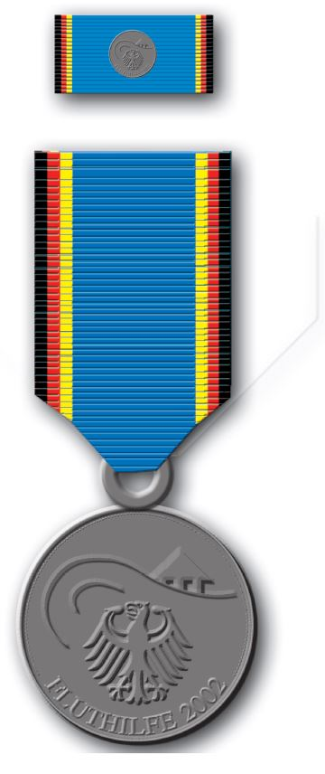
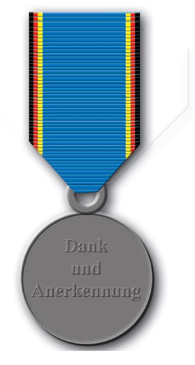

# Gemeinsamer Erlass des Bundesministers des Innern und des Bundesministers der Verteidigung über die Stiftung der Einsatzmedaille "Fluthilfe 2002" (FluthilfeMedErl)

Ausfertigungsdatum
:   2002-09-20

Fundstelle
:   BGBl I: 2002, 3749

## Art 1 Stiftung

Als Dank und in Anerkennung für besonders aufopferungsvolle Hilfe bei
der Abwehr von Gefahren und der Beseitigung von Schäden anlässlich der
Flutkatastrophe im August 2002 in der Bundesrepublik Deutschland
stiften der Bundesminister des Innern und der Bundesminister der
Verteidigung für haupt- und ehrenamtliche Einsatzkräfte des
Technischen Hilfswerkes, Angehörige des Bundesgrenzschutzes und der
Bundeswehr sowie für Dritte aufgrund ihrer besonderen Verdienste in
der Zusammenarbeit mit dem Technischen Hilfswerk, dem
Bundesgrenzschutz und der Bundeswehr gemeinsam die

*
    *   Einsatzmedaille "Fluthilfe 2002".

## Art 2 Gestaltung

(1) Das Ehrenzeichen hat die Form einer runden, silberfarbenen
Medaille. Sie trägt auf der Vorderseite den Bundesadler, darüber eine
stilisierte Flutwelle und ein halb versunkenes Haus. Die umlaufende
Nagellinie wird im unteren Teil der Medaille durch das Wort
"Fluthilfe" und die Zahl "2002" unterbrochen. Die Rückseite trägt die
Worte "Dank und Anerkennung". Der blaue Mittelteil des Medaillenbandes
ist beidseitig von den Bundesfarben schwarz-rot-gold eingefasst.

(2) Die Medaille als Bandsteg trägt die Farben des Medaillenbandes mit
aufgesetzter verkleinerter Vorderseite der Medaille.

## Art 3 Verleihung

(1) Das Ehrenzeichen verleiht

-   der Bundesminister des Innern an haupt- und ehrenamtliche
    Einsatzkräfte des Technischen Hilfswerkes und an Angehörige des
    Bundesgrenzschutzes sowie an Dritte, die mit dem Technischen Hilfswerk
    und dem Bundesgrenzschutz zusammengearbeitet haben,

-   der Bundesminister der Verteidigung an Angehörige der Bundeswehr, an
    Angehörige ausländischer Streitkräfte sowie an Dritte, die mit der
    Bundeswehr und den ausländischen Streitkräften zusammengearbeitet
    haben.

(2) Das Ehrenzeichen wird für mindestens einen ganztägigen Einsatz vor
Ort beginnend mit dem 8. August 2002 im Hochwasser- und
Flutkatastrophengebiet an Donau und Elbe sowie ihren Nebenflüssen
verliehen. In begründeten Ausnahmefällen sind Abweichungen zulässig.

(3) Als sichtbares Zeichen der allgemeinen Anerkennung kann das
Ehrenzeichen nach Maßgabe von Artikel 2 sowie als Rosette in den
Farben des Medaillenbandes an der linken Brustseite getragen werden.

(4) Die Ausgezeichneten erhalten neben dem Ehrenzeichen eine
Verleihungsurkunde mit der Unterschrift des Bundesministers des Innern
oder des Bundesministers der Verteidigung und dem kleinen
Dienstsiegel. Für die Verleihungsurkunde gilt das Muster der Anlage.

(5) Das Ehrenzeichen geht in das Eigentum der Ausgezeichneten über.
Ihre Hinterbliebenen sind zur Rückgabe nicht verpflichtet.

## Art 4 Vorschlagsberechtigung

(1) Für die Angehörigen des Bundesgrenzschutzes sind die Präsidenten
oder Präsidentinnen der Bundesgrenzschutzpräsidien, für die haupt- und
ehrenamtlichen Einsatzkräfte des Technischen Hilfswerkes die
Landesbeauftragten der Bundesanstalt Technisches Hilfswerk über den
Präsidenten oder die Präsidentin der Bundesanstalt Technisches
Hilfswerk vorschlagsberechtigt. Vorschläge für Dritte stimmen die
Vorschlagsberechtigten untereinander ab.

(2) Für die Angehörigen der Bundeswehr sind für den
Auszeichnungsvorschlag von Soldatinnen und Soldaten die nächsten
Disziplinarvorgesetzten, von zivilen Mitarbeiterinnen und Mitarbeitern
die vergleichbaren Vorgesetzten vorschlagsberechtigt. Anregungen auf
Verleihung des Ehrenzeichens an Angehörige ausländischer Streitkräfte
sowie an Dritte sind auf dem Dienstweg dem Bundesministerium der
Verteidigung vorzulegen.

(3) Die Vorschlagsberechtigten prüfen selbst, ob die
Verleihungsvoraussetzungen erfüllt sind. In Zweifelsfällen kann
großzügig verfahren werden.

## Art 5 Verfahren

(1) Die Verleihungsvorschläge sind dem Bundesministerium des Innern
oder dem Bundesministerium der Verteidigung mit folgenden
personenbezogenen Angaben

1.  Amtsbezeichnung/Dienstgrad

2.  Name/Vorname (gegebenenfalls akademischer Grad/Titel mit Fachrichtung)

3.  Geburtsdatum/Personenkennziffer

4.  Dienststelle/Einheit

5.  Wohnanschrift

in Listenform zuzuleiten. Alle Vorgänge zur Verleihung des
Ehrenzeichens sind vertraulich.

(2) Die Verleihung wird nach Maßgabe der Listen gemäß Absatz 1 durch
jeweiligen Erlass des Bundesministers des Innern und des
Bundesministers der Verteidigung vollzogen.

(3) Die Namen der Ausgezeichneten werden den Vorschlagsberechtigten
unter Beifügung der Ehrenzeichen und der Verleihungsurkunden
mitgeteilt. Diese veranlassen die Aushändigung der Auszeichnung in
würdiger Form.

## Schlussformel

Der Bundesminister des Innern
Der Bundesminister der Verteidigung

## Anlage

(Fundstelle des Originaltextes: BGBl. I 2002, 3751 - 3753)

*    *
    *
    *
    *
    *
    *

*    *
    *
    *
    *
    *
    *

*    *   Im Namen der
        Bundesrepublik Deutschland
        ## **verleihe ich**

*    *
    *
    *
    *
    *
    *

*    *
    *
    *
    *
    *
    *

*    *
    *
    *
    *
    *
    *

*    *
    *
    *
    *
    *
    *

*    *
    *
    *
    *
    *
    *

*    *
    *
    *   Emil Mustermann

    *
    *

*    *
    *
    *
    *
    *
    *

*    *
    *
    *

*    *
    *   als Dank und in Anerkennung für besonders aufopferungsvolle

    *

*    *
    *   Hilfe bei der Abwehr von Gefahren und der Beseitigung von

    *

*    *
    *   Schäden anlässlich der Flutkatastrophe im

    *

*    *
    *
    *
    *
    *
    *

*    *
    *   August 2002

    *

*    *
    *
    *
    *
    *
    *

*    *
    *   die

    *

*    *
    *
    *
    *
    *
    *

*    *
    *   **Einsatzmedaille "Fluthilfe 2002".**

    *

*    *
    *
    *
    *
    *
    *

*    *
    *
    *
    *
    *
    *

*    *
    *
    *
    *
    *
    *

*    *
    *
    *
    *
    *
    *

*    *
    *   Berlin, den

    *
    *
    *
    *

*    *
    *
    *
    *
    *
    *

*    *
    *
    *
    *
    *
    *

*    *
    *
    *
    *
    *
    *

*    *
    *   Bundesminister des Innern/der Verteidigung

    *

*    *
    *
    *
    *
    *
    *

*    *
    *
    *
    *
    *
    *

*    *
    *
    *
    *
    *
    *

*    *
    *
    *
    *
    *
    *

*    *
    *
    *
    *
    *
    *

*    *
    *   Prägesiegel
        (Bundesadler)

    *
    *   Faksimile (Unterschrift)

*    *
    *
    *
    *
    *
    *

*    *
    *
    *
    *
    *
    *

*    *
    *
    *
    *
    *
    *

*    *
    *
    *
    *
    *
    *

*    *
    *
    *
    *
    *
    *

*    *
    *
    *
    *
    *
    *

*    *
    *
    *
    *
    *
    *

*    *
    *
    *
    *
    *
    *

*    *
    *
    *
    *
    *
    *

*    *        

*    *
    *
    *
    *
    *
    *

*    *
    *
    *
    *
    *
    *

*    *
    *
    *
    *
    *
    *

*    *
    *
    *
    *
    *
    *

*    *
    *
    *
    *
    *
    *

*    *
    *
    *
    *
    *
    *

*    *
    *
    *
    *
    *
    *

*    *
    *
    *
    *
    *
    *

*    *
    *
    *
    *
    *
    *

*    *        

*    *
    *
    *
    *
    *
    *

*    *
    *
    *
    *
    *
    *

