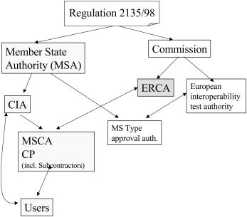
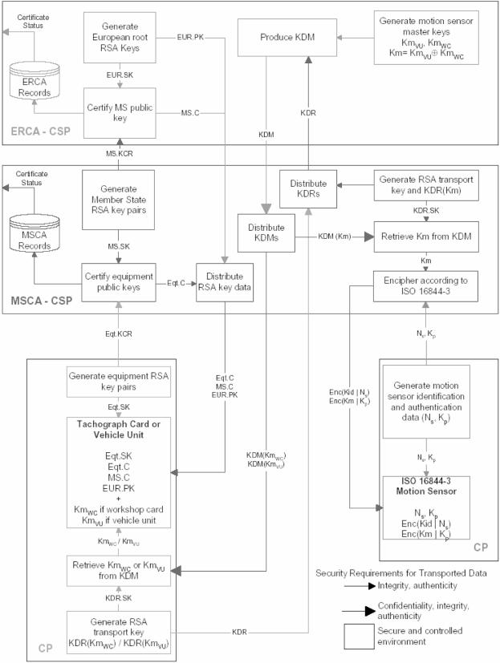

# Verordnung zur Durchführung des Fahrpersonalgesetzes (FPersV)

Ausfertigungsdatum
:   2005-06-27

Fundstelle
:   BGBl I: 2005, 1882

Zuletzt geändert durch
:   Art. 2 V v. 19.12.2011 I 2835

## Abschnitt 1 - Lenk- und Ruhezeiten im nationalen Bereich

### § 1 Lenk- und Ruhezeiten im Straßenverkehr

(1) Fahrer

1.  von Fahrzeugen, die zur Güterbeförderung dienen und deren zulässige
    Höchstmasse einschließlich Anhänger oder Sattelanhänger mehr als 2,8
    Tonnen und nicht mehr als 3,5 Tonnen beträgt, sowie

2.  von Fahrzeugen, die zur Personenbeförderung dienen, nach ihrer Bauart
    und Ausstattung geeignet und dazu bestimmt sind, mehr als neun
    Personen einschließlich Fahrer zu befördern, und im Linienverkehr mit
    einer Linienlänge bis zu 50 Kilometern eingesetzt sind,

haben Lenkzeiten, Fahrtunterbrechungen und Ruhezeiten nach Maßgabe der
Artikel 4, 6 bis 9 und 12 der Verordnung (EG) Nr. 561/2006 des
Europäischen Parlaments und des Rates vom 15. März 2006 zur
Harmonisierung bestimmter Sozialvorschriften im Straßenverkehr und zur
Änderung der Verordnungen (EWG) Nr. 3821/85 und (EG) Nr. 2135/98 des
Rates sowie zur Aufhebung der Verordnung (EWG) Nr. 3820/85 des Rates
(ABl. EU Nr. L 102 S. 1) einzuhalten.

(2) Absatz 1 findet keine Anwendung auf

1.  Fahrzeuge, die in § 18 genannt sind,

2.  Fahrzeuge, die in Artikel 3 Buchstabe b bis i der Verordnung (EG) Nr.
    561/2006 genannt sind,

3.  Fahrzeuge, die zur Beförderung von Material, Ausrüstungen oder
    Maschinen, die der Fahrer zur Ausübung seiner beruflichen Tätigkeit
    benötigt, verwendet werden, soweit das Lenken nicht die Haupttätigkeit
    des Fahrers darstellt,

3a. Fahrzeuge, die zur Beförderung von Gütern dienen, die im Betrieb, dem
    der Fahrer angehört, in handwerklicher Fertigung oder Kleinserie
    hergestellt wurden, oder deren Reparatur im Betrieb vorgesehen ist
    oder dort durchgeführt wurde, wenn die Lenktätigkeit nicht die
    Haupttätigkeit des Fahrers ausmacht,

4.  Fahrzeuge, die als Verkaufswagen auf örtlichen Märkten oder für den
    ambulanten Verkauf verwendet werden und für diese Zwecke besonders
    ausgestattet sind, soweit das Lenken des Fahrzeugs nicht die
    Haupttätigkeit des Fahrers darstellt, und

5.  selbstfahrende Arbeitsmaschinen nach § 2 Nr. 17 der Fahrzeug-
    Zulassungsverordnung.

(3) Abweichend von Absatz 1 in Verbindung mit Artikel 7 der Verordnung
(EG) Nr. 561/2006 haben Fahrer von Kraftomnibussen im Linienverkehr
mit einer Linienlänge bis zu 50 Kilometern Fahrtunterbrechungen nach
Maßgabe der folgenden Vorschriften einzuhalten:

1.  Beträgt der durchschnittliche Haltestellenabstand mehr als drei
    Kilometer, so ist nach einer Lenkzeit von viereinhalb Stunden eine
    Fahrtunterbrechung von mindestens 30 zusammenhängenden Minuten
    einzulegen. Diese Fahrtunterbrechung kann durch zwei
    Teilunterbrechungen von jeweils mindestens 20 zusammenhängenden
    Minuten oder drei Teilunterbrechungen von jeweils mindestens 15
    Minuten ersetzt werden. Die Teilunterbrechungen müssen innerhalb der
    Lenkzeit von höchstens viereinhalb Stunden oder teils innerhalb dieser
    Zeit und teils unmittelbar danach liegen.

2.  Beträgt der durchschnittliche Haltestellenabstand nicht mehr als drei
    Kilometer, sind als Fahrtunterbrechungen auch Arbeitsunterbrechungen
    ausreichend, soweit diese nach den Dienst- und Fahrplänen in der
    Arbeitsschicht enthalten sind (z. B. Wendezeiten). Voraussetzung
    hierfür ist, dass die Gesamtdauer der Arbeitsunterbrechungen
    mindestens ein Sechstel der vorgesehenen Lenkzeit beträgt.
    Arbeitsunterbrechungen unter zehn Minuten werden bei der Berechnung
    der Gesamtdauer nicht berücksichtigt. Durch Tarifvertrag kann
    vereinbart werden, dass Arbeitsunterbrechungen von mindestens acht
    Minuten berücksichtigt werden können, wenn ein Ausgleich vorgesehen
    ist, der die ausreichende Erholung des Fahrers erwarten lässt. Für
    Fahrer, die nicht in einem Arbeitsverhältnis stehen, kann die nach
    Landesrecht zuständige Behörde entsprechende Abweichungen bewilligen.

(4) Abweichend von Absatz 1 in Verbindung mit Artikel 8 Abs. 6 der
Verordnung (EG) Nr. 561/2006 sind Fahrer der in Absatz 1 Nr. 2
genannten Fahrzeuge nicht zur Einlegung einer wöchentlichen Ruhezeit
nach höchstens sechs 24-Stunden-Zeiträumen verpflichtet. Sie können
die wöchentlich einzuhaltenden Ruhezeiten auf einen Zweiwochenzeitraum
verteilen.

(5) Der Unternehmer hat dafür zu sorgen, dass die Vorschriften über
die Lenkzeiten, die Fahrtunterbrechungen und die Ruhezeiten gemäß den
Artikeln 4, 6 bis 9 und 12 der Verordnung (EG) Nr. 561/2006
eingehalten werden. Artikel 10 Abs. 2 der Verordnung (EG) Nr. 561/2006
findet entsprechende Anwendung.

(6) Der Fahrer eines in Absatz 1 Nr. 1 genannten Fahrzeugs hat, sofern
dieses Fahrzeug nicht nach Absatz 2 ausgenommen ist, folgende Zeiten
aufzuzeichnen:

1.  Lenkzeiten,

2.  alle sonstigen Arbeitszeiten,

3.  Fahrtunterbrechungen und

4.  tägliche und wöchentliche Ruhezeiten.

Die Aufzeichnungen sind für jeden Tag getrennt zu fertigen und müssen
folgende Angaben enthalten:

1.  Vor- und Familienname,

2.  Datum,

3.  amtliche Kennzeichen der benutzten Fahrzeuge,

4.  Ort des Fahrtbeginns,

5.  Ort des Fahrtendes und

6.  Kilometerstände der benutzten Fahrzeuge bei Fahrtbeginn und Fahrtende.

Der Fahrer hat alle Eintragungen jeweils unverzüglich zu Beginn und am
Ende der Lenkzeiten, Fahrtunterbrechungen und Ruhezeiten vorzunehmen.
Die Aufzeichnungen der laufenden Woche und der der laufenden Woche
vorausgegangenen 15 Kalendertage sind vom Fahrer mitzuführen und den
zuständigen Personen auf Verlangen zur Prüfung auszuhändigen; ab dem
1\. Januar 2008 umfasst dieser Zeitraum den laufenden Tag und die
vorausgegangenen 28 Kalendertage. Hat der Fahrer während des in Satz 4
genannten Zeitraums ein Fahrzeug gelenkt, für das

1.  die Verordnung (EWG) Nr. 3821/85 des Rates vom 20. Dezember 1985 über
    das Kontrollgerät im Straßenverkehr (ABl. EG Nr. L 370 S. 8) in der
    jeweils geltenden Fassung oder

2.  das Europäische Übereinkommen vom 1. Juli 1970 über die Arbeit des im
    internationalen Straßenverkehr beschäftigten Fahrpersonals (AETR)
    (BGBl. 1974 II S. 1473) in der jeweils geltenden Fassung gilt,

sind für dieses Fahrzeug Nachweise nach Maßgabe von Artikel 15 der
Verordnung (EWG) Nr. 3821/85 oder Artikel 12 des Anhangs zum AETR an
Stelle der Aufzeichnungen mitzuführen. Der Fahrer hat dem Unternehmer
alle Aufzeichnungen unverzüglich nach Ablauf der Mitführungspflicht
auszuhändigen. Der Unternehmer hat

1.  dem Fahrer entsprechend dem Muster der Anlage 1 geeignete Vordrucke
    zur Fertigung der Aufzeichnungen in ausreichender Anzahl
    auszuhändigen,

2.  die Aufzeichnungen unverzüglich nach Aushändigung durch den Fahrer zu
    prüfen und unverzüglich Maßnahmen zu ergreifen, die notwendig sind, um
    die Beachtung der Sätze 1 bis 5 zu gewährleisten,

3.  die Aufzeichnungen ein Jahr lang nach Aushändigung durch den Fahrer in
    chronologischer Reihenfolge und in lesbarer Form außerhalb des
    Fahrzeugs aufzubewahren und den zuständigen Personen auf Verlangen
    vorzulegen und

4.  die Aufzeichnungen nach Ablauf der Aufbewahrungsfrist bis zum 31. März
    des folgenden Kalenderjahres zu vernichten, soweit sie nicht zur
    Erfüllung der Aufbewahrungspflichten nach § 16 Abs. 2 und § 21a Abs. 7
    des Arbeitszeitgesetzes, § 147 Abs. 1 Nr. 5 in Verbindung mit Abs. 3
    der Abgabenordnung und § 28f Abs. 1 Satz 1 des Vierten Buches
    Sozialgesetzbuch benötigt werden.

(7) Ist das Fahrzeug mit einem Kontrollgerät nach Anhang I oder I B
zur Verordnung (EWG) Nr. 3821/85 oder einem Fahrtschreiber gemäß § 57a
der Straßenverkehrs-Zulassungs-Ordnung ausgerüstet, haben Fahrer der
in Absatz 1 Nr. 1 genannten Fahrzeuge diese entsprechend den Artikeln
13, 14 Abs. 1 Unterabs. 2, Abs. 4 Buchstabe a Unterabs. 3 Satz 2 und
3, Artikel 15 Abs. 1 Unterabs. 1, 3 und 5, Abs. 2, 3, 5, 5a und 7 und
Artikel 16 Abs. 2 Unterabs. 1 und Abs. 3 der Verordnung (EWG) Nr.
3821/85 oder § 57a Abs. 2 der Straßenverkehrs-Zulassungs-Ordnung zu
betreiben. Im Falle der Verwendung eines Fahrtschreibers gemäß § 57a
der Straßenverkehrs-Zulassungs-Ordnung hat der Fahrer die Schicht und
die Pausen jeweils bei Beginn und Ende auf dem Schaublatt zu
vermerken. Der Unternehmer hat bei Verwendung eines Kontrollgerätes
nach Anhang I der Verordnung (EWG) Nr. 3821/85 oder eines
Fahrtschreibers dem Fahrer vor Beginn der Fahrt die für das Gerät
zugelassenen Schaublätter in ausreichender Anzahl auszuhändigen und
dafür zu sorgen, dass das Kontrollgerät nach Anhang I oder I B zur
Verordnung (EWG) Nr. 3821/85 oder der Fahrtschreiber ordnungsgemäß
benutzt wird; Absatz 6 Satz 4 bis 6 und 7 Nr. 2 bis 4 gilt
entsprechend. Hat der Fahrer eines mit einem Kontrollgerät nach Anhang
I B zur Verordnung (EWG) Nr. 3821/85 ausgerüsteten Fahrzeugs in dem in
Absatz 6 Satz 4 genannten Zeitraum ein Fahrzeug gelenkt, das mit einem
Kontrollgerät nach Anhang I zur Verordnung (EWG) Nr. 3821/85
ausgerüstet ist, hat er die Schaublätter dieses Kontrollgerätes
während der Fahrt ebenfalls mitzuführen und den zuständigen Personen
auf Verlangen zur Prüfung auszuhändigen.

### § 2 Kontrollgerät nach Anhang I B zur Verordnung (EWG) Nr. 3821/85

(1) Ein Fahrer, der ein Fahrzeug lenkt, das in den Anwendungsbereich
der Verordnung (EG) Nr. 561/2006 fällt, oder der Lenk- oder Ruhezeiten
nach § 1 dieser Verordnung einzuhalten hat und dabei ein Kontrollgerät
gemäß Anhang I B zur Verordnung (EWG) Nr. 3821/85 betreibt, hat das
Kontrollgerät entsprechend den Artikeln 13, 14 Abs. 1 Unterabs. 2,
Abs. 4 Buchstabe a Unterabs. 3 Satz 2 und 3, Artikel 15 Abs. 1
Unterabs. 1, 3 und 5, Abs. 2, 3, 5, 5a und 7 und Artikel 16 Abs. 2
Unterabs. 1 und Abs. 3 der Verordnung (EWG) Nr. 3821/85 zu bedienen
und die Benutzerführung zu beachten.

(2) Die in Artikel 15 Abs. 3 zweiter Spiegelstrich Buchstabe b bis d
der Verordnung (EWG) Nr. 3821/85 genannten Zeiträume müssen bei
Übernahme des Fahrzeugs auf der Fahrerkarte unter Benutzung der im
Kontrollgerät vorgesehenen manuellen Eingabemöglichkeiten eingetragen
werden, wenn der Fahrer vor Übernahme des Fahrzeugs solche Zeiten
verbracht hat.

(3) Die nach Artikel 15 Abs. 1 Unterabs. 5 der Verordnung (EWG) Nr.
3821/85 vorgeschriebenen Ausdrucke hat der Fahrer den zuständigen
Personen auf Verlangen vorzulegen. Der Unternehmer hat die Ausdrucke
in chronologischer Reihenfolge und in lesbarer Form außerhalb des
Fahrzeugs aufzubewahren und den zuständigen Personen auf Verlangen
vorzulegen.

(4) Bei Einsatz von Mietfahrzeugen, deren Verwendung in den
Anwendungsbereich der Verordnung (EG) Nr. 561/2006 oder dieser
Verordnung fällt, hat der Unternehmer, der das Fahrzeug anmietet, zu
Beginn und am Ende des Mietzeitraums durch Verwendung der
Unternehmenskarte sicherzustellen, dass die Daten des
Fahrzeugspeichers über die mit den Fahrzeugen durchgeführten Fahrten
übertragen und bei ihm gespeichert werden. Ist dies in begründeten
Ausnahmefällen nicht möglich, ist zu Beginn und am Ende des
Mietzeitraums ein Ausdruck wie bei Beschädigung oder Fehlfunktion der
Fahrerkarte zu fertigen. Der Fahrer hat den Ausdruck unverzüglich nach
Erhalt an den Unternehmer weiterzuleiten, der ihn ein Jahr
aufzubewahren hat. Nach Ablauf der Aufbewahrungsfrist sind die
Ausdrucke bis zum 31. März des folgenden Kalenderjahres zu vernichten,
soweit sie nicht zur Erfüllung der Aufbewahrungspflichten nach § 16
Abs. 2 und § 21a Abs. 7 des Arbeitszeitgesetzes, § 147 Abs. 1 Nr. 5 in
Verbindung mit Abs. 3 der Abgabenordnung und § 28f Abs. 1 Satz 1 des
Vierten Buches Sozialgesetzbuch benötigt werden.

(5) Der Unternehmer hat sicherzustellen, dass alle Daten aus dem
Massenspeicher des Kontrollgerätes spätestens 90 Tage nach
Aufzeichnung eines Ereignisses zur Speicherung im Betrieb kopiert
werden. Der Unternehmer hat sicherzustellen, dass die Daten der
Fahrerkarten spätestens 28 Kalendertage nach Aufzeichnung eines
Ereignisses zur Speicherung im Betrieb kopiert werden. Der Fahrer hat
hierzu dem Unternehmen die Fahrerkarte und die Ausdrucke nach Absatz 3
zur Verfügung zu stellen. Der Unternehmer hat alle sowohl von den
Kontrollgeräten als auch von den Fahrerkarten kopierten Daten der
zuständigen Behörde oder Stelle auf Verlangen entweder unmittelbar
oder durch Datenfernübertragung oder auf einem durch die Behörde oder
Stelle zu bestimmenden Datenträger zur Verfügung zu stellen. Der
Unternehmer hat von allen kopierten Daten unverzüglich
Sicherheitskopien zu erstellen, die auf einem gesonderten Datenträger
zu speichern sind.

(6) Unternehmen, die Fahrzeuge vermieten, haben dem Mieter des
Fahrzeugs diejenigen Daten aus dem Massenspeicher des Kontrollgerätes,
die sich auf die vom Mieter durchgeführten Beförderungen beziehen und
auf die dieser nicht unmittelbar zugreifen kann,

1.  auf dessen Verlangen,

2.  spätestens 90 Tage nach Beginn des Mietverhältnisses oder der letzten
    Datenübermittlung und

3.  nach Beendigung des Mietverhältnisses

zur Verfügung zu stellen. Dabei sind dem jeweiligen Stand der Technik
entsprechende Maßnahmen zur Sicherstellung von Datenschutz und
Datensicherheit zu treffen, die insbesondere die Vertraulichkeit,
Unversehrtheit und Zurechenbarkeit der Daten gewährleisten; im Falle
der Nutzung allgemein zugänglicher Netze sind dem jeweiligen Stand der
Technik entsprechende Verschlüsselungsverfahren anzuwenden.

### § 2a Aufbewahrung von Kontrollunterlagen

Der Unternehmer bewahrt die ihm oder seinen Fahrern von den
zuständigen Personen überlassenen Niederschriften, Ergebnisprotokolle
und andere Unterlagen über bei ihm auf dem Gelände vorgenommene
beziehungsweise bei seinen Fahrern auf der Straße vorgenommene
Kontrollen ein Jahr lang auf. Die Unterlagen sind den zuständigen
Personen auf Verlangen vorzulegen. Nach Ablauf der
Aufbewahrungspflicht sind die Unterlagen bis zum 31. März des
folgenden Kalenderjahres zu vernichten.

## Abschnitt 2 - Organisation

### § 3 Zertifizierungsinfrastruktur

Die Aufgaben der für die Umsetzung des Zertifizierungsverfahrens nach
der Verordnung (EWG) Nr. 3821/85 verantwortlichen Stellen ergeben sich
aus der Anlage 2. Das Bundesministerium für Verkehr, Bau und
Stadtentwicklung nimmt die Aufgaben der Aufsichtsbehörde des
Mitgliedstaates (D-Member State Authority - D-MSA) wahr. Deutsche
Zertifizierungsstelle (D-Certification Authority - D-CA) ist das
Kraftfahrt-Bundesamt. Die für die Kontrollgerätkartenausgabe
zuständigen Behörden oder Stellen (D-Card Issueing Authorities -
D-CIA's) werden von den Ländern bestimmt.

## Abschnitt 3 - Kontrollsystem nach EG-Verordnungen

### § 4 Allgemeines

(1) Die zum Betrieb des Kontrollgerätes nach Anhang I B zur Verordnung
(EWG) Nr. 3821/85 erforderlichen Kontrollgerätkarten (Fahrer-,
Werkstatt-, Unternehmens- und Kontrollkarten) werden nach den Mustern
gemäß Anhang I B Abschnitt IV zur Verordnung (EWG) Nr. 3821/85 in
Verbindung mit Anlage 3 zu dieser Verordnung gefertigt. Fahrer-,
Werkstatt- und Unternehmenskarten werden auf Antrag erteilt.
Antragsberechtigt sind:

1.  für die Fahrerkarte

    a)  inländische Inhaber einer gültigen Fahrerlaubnis nach Muster 1 der
        Anlage 8 der Fahrerlaubnis-Verordnung,

    b)  im Übrigen Inhaber einer Fahrerlaubnis eines Mitgliedstaates der
        Europäischen Union oder eines anderen Vertragsstaats des Abkommens
        über den Europäischen Wirtschaftsraum, die dazu berechtigt, Fahrzeuge
        zu führen, für die Lenk- und Ruhezeiten nach der Verordnung (EG) Nr.
        561/2006 beziehungsweise § 1 dieser Verordnung zu beachten sind,

2.  für die Werkstattkarte die nach § 57b der Straßenverkehrs-Zulassungs-
    Ordnung anerkannten oder beauftragten Werkstätten, Hersteller von
    Kontrollgeräten sowie Fahrzeughersteller,

3.  für die Unternehmenskarte Unternehmen, deren Fahrpersonal
    Beförderungen durchführt, die unter die Verordnung (EG) Nr. 561/2006
    fallen, oder das Lenk- und Ruhezeiten nach § 1 dieser Verordnung
    einzuhalten hat.

Erfolgt der Antrag auf unpersönlichem Weg, ist eine Kopie der nach den
§§ 5, 7 oder § 9 jeweils erforderlichen Unterlagen beizufügen. Im
Rahmen des Antragsverfahrens hat für Kontrollgerätkarten nach Nummer 1
eine Überprüfung der Identität des Antragstellers sowie der
Übereinstimmung der vorgelegten Kopien mit den Originalen
stattzufinden.

(2) Die Kontrollgerätkarten werden von den nach Landesrecht
zuständigen Behörden oder Stellen ausgegeben.

(3) Der Antrag auf Erneuerung der Fahrer- und Unternehmenskarte darf
frühestens sechs Monate, der auf Erneuerung der Werkstattkarte
frühestens einen Monat vor Ablauf der Gültigkeit der Karte gestellt
werden. Den Anträgen sind die nach den §§ 5, 7 oder § 9 jeweils
erforderlichen Unterlagen beizufügen. Inhaber einer Werkstattkarte
haben spätestens nach drei Jahren eine aktuelle Bescheinigung über die
Anerkennung oder Beauftragung der Werkstatt nach § 57b der
Straßenverkehrs-Zulassungs-Ordnung und einen Nachweis über eine
erneute Schulung im Sinne des § 7 Abs. 2 Nr. 5 vorzulegen. Die in Satz
3 genannten Fristen beginnen mit dem Datum des letzten Nachweises. Die
in Artikel 14 Abs. 4a Unterabs. 5 und 6, Artikel 12 Abs. 1 Unterabs. 3
der Verordnung (EWG) Nr. 3821/85 genannten Fristen beginnen erst mit
der vollständigen Vorlage aller nach den §§ 5, 7 oder § 9
erforderlichen Antragsunterlagen und Angaben.

(4) Wird eine Kontrollgerätkarte wegen Beschädigung, Fehlfunktion,
Verlust oder Diebstahl einer vorhandenen Karte beantragt, hat der
Antragsteller der ausstellenden Behörde oder Stelle vorzulegen:

1.  bei Verlust eine schriftliche Erklärung über den Verlust,

2.  bei Diebstahl den Nachweis einer Anzeige,

3.  bei Beschädigung oder Fehlfunktion die zu erneuernde Karte.

Dem Antrag sind die nach den §§ 5, 7 oder § 9 jeweils erforderlichen
Unterlagen beizufügen. Der Inhaber der Kontrollgerätkarte hat auf
Verlangen der Behörde oder Stelle, welche die Ersatzkarte ausstellt,
eine Versicherung an Eides statt abzugeben, dass und aus welchen
Gründen er die Kontrollgerätkarte nicht zurückgeben kann. Mit
Ausstellung der Ersatzkarte verliert die ersetzte Karte ihre
Gültigkeit. Eine wiederaufgefundene Karte ist der ausstellenden
Behörde oder Stelle zurückzugeben. Beträgt die Restlaufzeit der zu
ersetzenden Karte weniger als sechs Monate, ist die Karte zu erneuern.
Absatz 3 Satz 5 gilt mit der Maßgabe, dass die Fristen erst beginnen,
wenn alle erforderlichen Antragsunterlagen und Angaben vorliegen und
die ausstellende Behörde oder Stelle Kenntnis von der Kartennummer
erhält.

(5) Bei Verlust einer Kontrollgerätkarte unterrichtet der
Karteninhaber unverzüglich die Behörde oder Stelle, welche die Karte
erteilt hat. Die Behörde oder Stelle meldet den Verlust dem
Kontrollgerätkartenregister beim Kraftfahrt-Bundesamt.

### § 5 Fahrerkarte

(1) Der Antragsteller hat Angaben zu seiner Muttersprache zu machen
und folgende Unterlagen vorzulegen:

1.
    a)  als inländischer Antragsteller eine Fahrerlaubnis nach Muster 1 der
        Anlage 8 der Fahrerlaubnis-Verordnung,

    b)  im Übrigen eine Fahrerlaubnis eines Mitgliedstaates der Europäischen
        Union oder eines anderen Vertragsstaats des Abkommens über den
        Europäischen Wirtschaftsraum, die dazu berechtigt, Fahrzeuge zu
        führen, für die Lenk- und Ruhezeiten nach der Verordnung (EG) Nr.
        561/2006 beziehungsweise § 1 dieser Verordnung zu beachten sind,

2.  einen Nachweis über den Wohnsitz im Inland und Anschrift,

3.  Nachweise über Geburts- und Familiennamen, Vornamen, Tag und Ort der
    Geburt sowie

4.  ein Lichtbild vor hellem Hintergrund in der Größe 35 mm x 45 mm, das
    den Antragsteller ohne Kopfbedeckung im Halbprofil zeigt.

(2) Die zuständige Behörde oder Stelle prüft die Richtigkeit und
Vollständigkeit der vom Bewerber mitgeteilten Daten.

(3) Jeder Fahrer erhält nur eine Fahrerkarte. Vor der Ausstellung
einer Fahrerkarte erfolgen durch die zuständige Behörde oder Stelle
Anfragen bei dem zentralen Fahrerlaubnisregister, dem zentralen
Kontrollgerätkartenregister und den Fahrerkartenregistern der anderen
Mitgliedstaaten der Europäischen Union und der Vertragsstaaten des
Abkommens über den Europäischen Wirtschaftsraum, ob das vorgelegte
Führerscheindokument gültig ist und ob dem Antragsteller bereits
anderweitig eine Fahrerkarte ausgestellt wurde. Zu diesem Zweck dürfen
die nach § 49 Abs. 1 Nr. 1 bis 3, 5 bis 11 und 15 der Fahrerlaubnis-
Verordnung vom 18. August 1998 (BGBl. I S. 2214) in der jeweils
geltenden Fassung im Fahrerlaubnisregister gespeicherten Daten im
automatisierten Verfahren abgerufen werden.

(4) Die Fahrerkarte darf keinem Dritten zur Nutzung überlassen werden.
Der Fahrer hat die Fahrerkarte während der Fahrt mitzuführen und den
zuständigen Personen auf Verlangen zur Prüfung auszuhändigen.

(5) Die Gültigkeitsdauer der Fahrerkarte beträgt bei der
Erstausstellung und Erneuerung fünf Jahre. Sie beginnt mit dem Datum
der Personalisierung. Bei der Erneuerung auf Grund von Beschädigung
oder Fehlfunktion beginnt sie mit dem Datum der Personalisierung. Bei
der Erneuerung auf Grund des Ablaufs der Gültigkeitsdauer beginnt die
Gültigkeitsdauer der neuen Fahrerkarte mit dem Tag, der dem Tag des
Ablaufs der Gültigkeit der vorherigen Fahrerkarte folgt. Wird eine
Fahrerkarte ersetzt, entspricht die Gültigkeitsdauer der
Gültigkeitsdauer der ersetzten Karte.

### § 6 Mitführen der abgelaufenen Fahrerkarte

Der Fahrer hat auch nach Ablauf der Gültigkeit die Fahrerkarte noch
mindestens 28 Kalendertage im Fahrzeug mitzuführen. Bei Umtausch der
Fahrerkarte entsprechend Artikel 14 Abs. 4 Buchstabe d der Verordnung
(EWG) Nr. 3821/85 hat der Fahrer die Ausdrucke seiner Tätigkeiten für
die dem Umtausch vorausgehenden 28 Kalendertage ebenfalls 28
Kalendertage mitzuführen.

### § 7 Werkstattkarte

(1) Die Werkstattkarte wird nur erteilt, wenn der Antragsteller als
Unternehmer oder die nach Gesetz, Satzung oder Gesellschaftsvertrag
zur Vertretung berufenen Personen sowie die verantwortliche Fachkraft
(Installateur) fachlich geeignet sind.

(2) Der Antragsteller hat folgende Angaben zu machen und durch
Unterlagen nachzuweisen:

1.  Name, Anschrift und Sitz der Werkstatt, des Herstellers von
    Kontrollgeräten oder des Fahrzeugherstellers,

2.  Geburts- und Familienname, Vornamen, Tag und Ort der Geburt des
    Unternehmers oder der nach Gesetz, Satzung oder Gesellschaftsvertrag
    zur Vertretung berufenen Personen,

3.  Geburts- und Familienname, Vorname, Tag und Ort der Geburt, aktuelle
    Wohnanschrift und Muttersprache der verantwortlichen Fachkraft, für
    die die Werkstattkarte beantragt wird,

4.  Anerkennung oder Beauftragung der Werkstatt nach § 57b der
    Straßenverkehrs-Zulassungs-Ordnung,

5.  Schulung der verantwortlichen Fachkraft, für die die Werkstattkarte
    beantragt wird, entsprechend der Richtlinie für die Durchführung von
    Schulungen der verantwortlichen Fachkräfte, die Prüfungen der
    Fahrtschreiber und Kontrollgeräte nach § 57b Abs. 3 der
    Straßenverkehrs-Zulassungs-Ordnung durchführen, sowie

6.  bestehendes Arbeitsverhältnis mit der verantwortlichen Fachkraft, für
    die die Werkstattkarte beantragt wird.

(3) (entfällt)

(4) Die zuständige Behörde oder Stelle stellt durch Abruf beim
zentralen Kontrollgerätkartenregister sicher, dass die verantwortliche
Fachkraft nur eine Werkstattkarte pro Arbeitsverhältnis erhält.

(5) Die Werkstattkarte wird dem Unternehmen gegen Empfangsbestätigung
ausgehändigt. Sie ist Eigentum des Unternehmens. Die zur Benutzung der
Werkstattkarte erforderliche persönliche Identifikationsnummer wird
der verantwortlichen Fachkraft an ihre Privatanschrift übersandt.

(6) Die Gültigkeitsdauer der Werkstattkarte beträgt ein Jahr. Sie
beginnt mit dem Datum der Personalisierung. § 5 Abs. 5 Satz 3 bis 5
gilt entsprechend.

### § 8 Wegfall von Erteilungsvoraussetzungen

(1) Ist eine der Erteilungsvoraussetzungen nachträglich entfallen, so
ist dies unverzüglich der zuständigen Behörde oder Stelle zu melden;
die Werkstattkarte ist innerhalb einer von dieser festzusetzenden
Frist an sie zurückzugeben. Die zuständige Behörde oder Stelle hat im
Falle des Wegfalls der Erteilungsvoraussetzungen, insbesondere im
Falle der missbräuchlichen Verwendung, die Rückgabe der Werkstattkarte
zu verlangen. Rückgabepflichtig sind sowohl der Unternehmer, bei
juristischen Personen die nach Gesetz, Satzung oder
Gesellschaftsvertrag zur Vertretung berufenen Personen, als auch die
verantwortliche Fachkraft. Scheidet die verantwortliche Fachkraft aus
der Werkstatt aus, haben der Unternehmer oder die
vertretungsberechtigten Personen die Werkstattkarte unverzüglich
zurückzugeben. Ist dem Unternehmer oder den vertretungsberechtigten
Personen eine Rückgabe nicht möglich, ist die zuständige Behörde oder
Stelle unverzüglich zu unterrichten.

(2) Wird die Werkstattkarte wegen missbräuchlicher Verwendung
zurückgenommen, unterrichtet die zuständige Behörde oder Stelle das
Zentrale Kontrollgerätkartenregister beim Kraftfahrt-Bundesamt.

### § 9 Unternehmenskarte

(1) Der Antragsteller hat folgende Angaben zu machen und durch
Unterlagen nachzuweisen:

1.  Name, Anschrift und Sitz des Unternehmens,

2.  Geburts- und Familienname, Vornamen, Tag und Ort der Geburt sowie
    Anschrift des Unternehmers oder der nach Gesetz, Satzung oder
    Gesellschaftsvertrag zur Vertretung berufenen Personen.

(2) Die Unternehmenskarten werden an den Unternehmer oder die nach
Gesetz, Satzung oder Gesellschaftsvertrag zur Vertretung berufenen
Personen ausgegeben. Der Unternehmer sorgt für die ordnungsgemäße
Verwendung der Karten.

(3) Der Unternehmer hat dafür zu sorgen, dass zu Beginn und am Ende
des Fahrzeugeinsatzes für das Unternehmen die Unternehmenskarte in das
Kontrollgerät eingegeben wird, um den Einsatz des Fahrzeugs dem
Unternehmen zuzuordnen.

(4) Die Gültigkeitsdauer der Unternehmenskarte beträgt fünf Jahre. Sie
beginnt mit dem Datum der Personalisierung. § 5 Abs. 5 Satz 3 bis 5
gilt entsprechend.

### § 10 Kontrollkarte

Die Kontrollkarten werden an die für die Kontrolle der
Sozialvorschriften im Straßenverkehr zuständigen Behörden und Stellen
ausgegeben. Die Kontrollkarte weist die Kontrollbehörde aus und
ermöglicht das Lesen, Ausdrucken und Herunterladen der im
Massespeicher des Kontrollgerätes oder auf Fahrerkarten gespeicherten
Daten. Die Gültigkeitsdauer der Kontrollkarte beträgt fünf Jahre.

## Abschnitt 4 - Zentrales Kontrollgerätkartenregister

### § 11 Führung und Zweckbestimmung des Registers

(1) Das Kraftfahrt-Bundesamt führt nach § 2 Nr. 4 des
Fahrpersonalgesetzes das Zentrale Kontrollgerätkartenregister zum
Nachweis der von den zuständigen Behörden oder Stellen ausgegebenen
Kontrollgerätkarten im Sinne des Anhangs I B Abschnitt IV zur
Verordnung (EWG) Nr. 3821/85. Darin werden erfasst die
Identifizierungsdaten der Fahrer, verantwortlichen Fachkräfte,
Unternehmen und Behörden, denen Fahrer-, Werkstatt-, Unternehmens-
oder Kontrollkarten ausgestellt worden sind, und die
Identifizierungsdaten der ausgestellten, abhanden gekommenen und
defekten Fahrer-, Werkstatt-, Unternehmens- und Kontrollkarten.

(2) Das Register wird geführt zur Speicherung von
Identifizierungsdaten, die erforderlich sind, um feststellen zu
können, welche Karten eine Person, ein Unternehmen oder eine
Kontrollbehörde besitzt oder welche Karten abhanden gekommen oder
beschädigt sind.

### § 12 Inhalt des Registers

Im Zentralen Kontrollgerätkartenregister werden gespeichert über

1.  Fahrerkarten folgende Daten:

    a)  Geburts- und Familienname, Vornamen, Tag und Ort der Geburt,
        akademischer Grad und Geschlecht,

    b)  Kontrollgerätkartennummer und die vom Chiphersteller eingebrachte
        Chipkennung,

    c)  Tag des Beginns und des Ablaufs der Gültigkeit der Fahrerkarte,

    d)  Tag der Produktion der Fahrerkarte,

    e)  Status der Fahrerkarte,

    f)  antragsbearbeitende und mitteilende Behörde oder Stelle einschließlich
        der für die Antragsbearbeitung verantwortlichen Person,

    g)  Fahrerlaubnisnummer einschließlich Ausgabestaat,

    h)  bei Verlust oder Diebstahl das Datum des Abhandenkommens der
        Fahrerkarte;

2.  Werkstattkarten folgende Daten:

    a)  Name und Anschrift der Werkstatt, des Herstellers von Kontrollgeräten
        oder des Fahrzeugherstellers, bei der Anschrift zusätzlich die
        statistische Kennziffer des Firmensitzes sowie der Standortgemeinde
        und des Gemeindeteils,

    b)  Geburts- und Familienname, Vornamen, Tag und Ort der Geburt,
        akademischer Grad und Geschlecht des Unternehmers, bei juristischen
        Personen der nach Gesetz, Satzung oder Gesellschaftsvertrag zur
        Vertretung berufenen Personen,

    c)  Geburts- und Familienname, Vornamen, Tag und Ort der Geburt,
        akademischer Grad und Geschlecht der Person, auf die die Karte nach §
        7 Abs. 2 Nr. 4 ausgestellt wurde,

    d)  Kontrollgerätkartennummer und die vom Chiphersteller eingebrachte
        Chipkennung,

    e)  Tag des Beginns und des Ablaufs der Gültigkeit der Werkstattkarte,

    f)  Tag der Produktion der Werkstattkarte,

    g)  Status der Werkstattkarte,

    h)  antragsbearbeitende und mitteilende Behörde oder Stelle einschließlich
        der für die Antragsbearbeitung verantwortlichen Person,

    i)  bei Verlust oder Diebstahl das Datum des Abhandenkommens der
        Werkstattkarte;

3.  Unternehmenskarten folgende Daten:

    a)  Name und Anschrift des Unternehmens sowie die statistische Kennziffer
        des Firmensitzes, der Standortgemeinde und des Gemeindeteils,

    b)  Geburts- und Familienname, Vornamen, Tag und Ort der Geburt,
        akademischer Grad und Geschlecht des Unternehmers, bei juristischen
        Personen der nach Gesetz, Satzung oder Gesellschaftsvertrag zur
        Vertretung berufenen Personen,

    c)  Kontrollgerätkartennummer und die vom Chiphersteller eingebrachte
        Chipkennung,

    d)  Tag des Beginns und des Ablaufs der Gültigkeit der Unternehmenskarte,

    e)  Tag der Produktion der Unternehmenskarte,

    f)  antragsbearbeitende und mitteilende Behörde oder Stelle einschließlich
        der für die Antragsbearbeitung verantwortlichen Person,

    g)  Status der Unternehmenskarte,

    h)  bei Verlust oder Diebstahl das Datum des Abhandenkommens der
        Unternehmenskarte;

4.  Kontrollkarten folgende Daten:

    a)  Name und Anschrift der Behörde,

    b)  Kontrollgerätkartennummer und die vom Chiphersteller eingebrachte
        Chipkennung,

    c)  Tag des Beginns und des Ablaufs der Gültigkeit der Kontrollkarte,

    d)  Tag der Produktion der Kontrollkarte,

    e)  Status der Kontrollkarte,

    f)  bei Verlust oder Diebstahl das Datum des Abhandenkommens der
        Kontrollkarte.

### § 13 Löschung von Eintragungen im Zentralen Kontrollgerätkartenregister

Die Daten über Kontrollgerätkarten werden ein Jahr nach Ablauf der
Gültigkeitsdauer gelöscht.

### § 14 Mitteilung an das Zentrale Kontrollgerätkartenregister im automatisierten Dialogverfahren

(1) Die für die Antragsbearbeitung zuständige Behörde oder Stelle
teilt dem Zentralen Kontrollgerätkartenregister unverzüglich die zu
speichernden oder zu einer Änderung einer Eintragung führenden Daten
im automatisierten Dialogverfahren mit; sie teilt dem Personalisierer
die zur Personalisierung notwendigen Daten mit.

(2) Zuständige ausländische Stellen sind berechtigt, Statusänderungen
zu Kontrollgerätkarten im automatisierten Dialogverfahren an das
Zentrale Kontrollgerätkartenregister zu übermitteln.

(3) Der Personalisierer teilt dem Zentralen
Kontrollgerätkartenregister unverzüglich jeweils nach Produktion und
Versand einer Kontrollgerätkarte eine entsprechende Information
hierüber mit.

### § 15 Übermittlung von Daten an inländische Behörden und Stellen durch Abruf im automatisierten Verfahren

Die im Zentralen Kontrollgerätkartenregister gespeicherten Daten
dürfen an die hierfür zuständigen Behörden und Stellen durch Abruf im
automatisierten Verfahren übermittelt werden, soweit dies erforderlich
ist

1.  für Verwaltungsmaßnahmen auf Grund der Verordnung (EWG) Nr. 3821/85
    oder darauf beruhender Rechtsvorschriften,

2.  für Verkehrs- oder Grenzkontrollen,

3.  für die Verfolgung von Ordnungswidrigkeiten,

4.  für die Verfolgung von Straftaten.

### § 16 Übermittlung von Daten an ausländische Behörden und Stellen durch Abruf im automatisierten Verfahren

Die im Zentralen Kontrollgerätkartenregister über Fahrerkarten und
Werkstattkarten gespeicherten Daten dürfen an die hierfür zuständigen
Behörden und Stellen in den Mitgliedstaaten der Europäischen Union
oder den Vertragsstaaten des Abkommens über den Europäischen
Wirtschaftsraum durch Abruf im automatisierten Verfahren übermittelt
werden, soweit dies erforderlich ist

1.  für Verwaltungsmaßnahmen auf Grund der Verordnung (EWG) Nr. 3821/85
    oder darauf beruhender Rechtsvorschriften,

2.  für Verkehrskontrollen,

3.  zur Verfolgung von Zuwiderhandlungen gegen Rechtsvorschriften auf dem
    Gebiet des Straßenverkehrs oder

4.  zur Verfolgung von Straftaten, die im Zusammenhang mit dem
    Straßenverkehr stehen.

### § 17 Einrichtung und Betrieb der automatisierten Abrufverfahren

Die Einrichtung und der Betrieb der automatisierten Abrufverfahren
richten sich nach den Bestimmungen des Bundesdatenschutzgesetzes.

## Abschnitt 5 - Ausnahmen

### § 18 Ausnahmen gemäß Verordnungen (EG) Nr. 561/2006 und (EWG) 3821/85

(1) Gemäß Artikel 13 Abs. 1 der Verordnung (EG) Nr. 561/2006 und
Artikel 3 Abs. 2 der Verordnung (EWG) Nr. 3821/85 werden im
Geltungsbereich des Fahrpersonalgesetzes folgende Fahrzeugkategorien
von der Anwendung der Artikel 5 bis 9 der Verordnung (EG) Nr. 561/2006
und der Anwendung der Verordnung (EWG) Nr. 3821/85 ausgenommen:

1.  Fahrzeuge, die im Eigentum von Behörden stehen oder von diesen ohne
    Fahrer angemietet oder geleast sind, um Beförderungen im
    Straßenverkehr durchzuführen, die nicht im Wettbewerb mit
    privatwirtschaftlichen Verkehrsunternehmen stehen,

2.  Fahrzeuge, die von Landwirtschafts-, Gartenbau-, Forstwirtschaft- oder
    Fischereiunternehmen zur Güterbeförderung, insbesondere auch zur
    Beförderung lebender Tiere, im Rahmen der eigenen unternehmerischen
    Tätigkeit in einem Umkreis von bis zu 100 Kilometern vom Standort des
    Unternehmens verwendet oder von diesen ohne Fahrer angemietet werden,

3.  Land- und forstwirtschaftliche Zugmaschinen, die für land- oder
    forstwirtschaftliche Tätigkeiten in einem Umkreis von bis zu 100
    Kilometern vom Standort des Unternehmens verwendet werden, das das
    Fahrzeug besitzt, anmietet oder least,

4.  Fahrzeuge oder Fahrzeugkombination mit einer zulässigen Höchstmasse
    von nicht mehr als 7,5 Tonnen, die in einem Umkreis von 50 Kilometern
    vom Standort des Unternehmens

    a)  von Postdienstleistern, die Post-Universaldienstleistungen gemäß § 1
        Abs. 1 der Post-Universaldienstleistungsverordnung zum Zwecke der
        Zustellung von Sendungen im Rahmen von Universaldienstleistungen oder

    b)  zur Beförderung von Material, Ausrüstungen oder Maschinen, die der
        Fahrer zur Ausübung seiner beruflichen Tätigkeit benötigt, z. B.
        Fahrzeuge mit jeweils für diesen Zweck bestimmter, besonderer
        Ausstattung, die als Verkaufswagen auf öffentlichen Märkten oder für
        den ambulanten Verkauf dienen,

    verwendet werden, soweit das Lenken des Fahrzeugs nicht die
    Haupttätigkeit des Fahrers darstellt,

5.  Fahrzeuge, die ausschließlich auf Inseln mit einer Fläche von nicht
    mehr als 2 300 Quadratkilometern verkehren, die mit den übrigen Teilen
    des Hoheitsgebiets weder durch eine befahrbare Brücke, Furt oder einen
    befahrbaren Tunnel verbunden sind,

6.  Fahrzeuge, die im Umkreis von 50 Kilometern vom Standort des
    Unternehmens zur Güterbeförderung mit Druckerdgas-, Flüssiggas- oder
    Elektroantrieb verwendet werden und deren zulässige Höchstmasse
    einschließlich Anhänger oder Sattelanhänger 7,5 Tonnen nicht
    übersteigt,

7.  Fahrzeuge, die zum Fahrschulunterricht und zur Fahrprüfung zwecks
    Erlangung der Fahrerlaubnis oder eines beruflichen
    Befähigungsnachweises dienen, sofern diese Fahrzeuge nicht für die
    gewerbliche Personen- oder Güterbeförderung verwendet werden,

8.  Fahrzeuge, die in Verbindung mit der Instandhaltung von Kanalisation,
    Hochwasserschutz, Wasser-, Gas- und Elektrizitätsversorgung,
    Straßenunterhaltung und -kontrolle, Hausmüllabfuhr, Telegramm- und
    Telefondienstleistungen, Rundfunk und Fernsehen sowie zur Erfassung
    von Radio- beziehungsweise Fernsehsendern oder -geräten eingesetzt
    werden,

9.  Fahrzeuge mit zehn bis 17 Sitzen, die ausschließlich zur nicht
    gewerblichen Personenbeförderung verwendet werden,

10. Spezialfahrzeuge, die zum Transport von Ausrüstungen des Zirkus- oder
    Schaustellergewerbes verwendet werden,

11. speziell für mobile Projekte ausgerüstete Fahrzeuge, die hauptsächlich
    im Stand zu Lehrzwecken verwendet werden,

12. Fahrzeuge, die zum Abholen von Milch bei landwirtschaftlichen
    Betrieben und zur Rückgabe von Milchbehältern oder zur Lieferung von
    Milcherzeugnissen für Futterzwecke an diese Betriebe verwendet werden,

13. Spezialfahrzeuge für Geld- und/oder Werttransporte,

14. Fahrzeuge, die in einem Umkreis von 250 Kilometern vom Standort des
    Unternehmens zum Transport tierischer Nebenprodukte im Sinne des
    Artikels 3 Nummer 1 der Verordnung (EG) Nr. 1069/2009 des Europäischen
    Parlaments und des Rates vom 21. Oktober 2009 mit Hygienevorschriften
    für nicht für den menschlichen Verzehr bestimmte tierische
    Nebenprodukte und zur Aufhebung der Verordnung (EG) Nr. 1774/2002
    (Verordnung über tierische Nebenprodukte) (ABl. L 300 vom 14.11.2009,
    S. 1) in der jeweils geltenden Fassung verwendet werden,

15. Fahrzeuge, die ausschließlich auf Straßen in Güterverteilzentren wie
    Häfen, Umschlaganlagen des Kombinierten Verkehrs und
    Eisenbahnterminals verwendet werden, und

16. Fahrzeuge, die innerhalb eines Umkreises von bis zu 50 Kilometern für
    die Beförderung lebender Tiere von den landwirtschaftlichen Betrieben
    zu den lokalen Märkten und umgekehrt oder von den Märkten zu den
    lokalen Schlachthäusern verwendet werden.

(2) Abweichend von Artikel 5 Abs. 2 Satz 1 der Verordnung (EG) Nr.
561/2006 beträgt bei Beförderungen in einem Umkreis von 50 Kilometern
vom Standort des Fahrzeugs das Mindestalter der Beifahrer zum Zwecke
der Berufsausbildung 16 Jahre.

## Abschnitt 6 - Europäisches Übereinkommen über die Arbeit des im internationalen Straßenverkehr beschäftigten Fahrpersonals (AETR)

### § 19 Kontrollgeräte nach dem Europäischen Übereinkommen über die Arbeit des im internationalen Straßenverkehr beschäftigten Fahrpersonals (AETR)

Auf Grund des Artikels 3 Absatz 1, des Artikels 10 Absatz 1 und des
Artikels 13 Absatz 1 des AETR in Verbindung mit Artikel 2 Abs. 3 der
Verordnung (EG) Nr. 561/2006 hat der Unternehmer in Fahrzeuge, die dem
AETR unterliegen und mit denen das Hoheitsgebiet der Bundesrepublik
Deutschland befahren wird, vor Antritt derartiger Fahrten
Kontrollgeräte einbauen zu lassen. Die Kontrollgeräte nach Satz 1 sind
von dem Fahrer zu benutzen. Die Kontrollgeräte sind nach den Artikeln
10 bis 14 des Anhangs zum AETR zu betreiben. Bauart, Einbau, Benutzung
und Prüfung der Kontrollgeräte richten sich nach den Vorschriften des
AETR einschließlich seines Anhangs und der Anlagen. Kontrollgeräte im
Sinne der Verordnung (EWG) Nr. 3821/85 erfüllen die Anforderungen nach
Satz 4.

## Abschnitt 7 - Sonstige Vorschriften

### § 20 Nachweis über berücksichtigungsfreie Tage

(1) Fahrer, die die in Artikel 15 Abs. 7 der Verordnung (EWG) Nr.
3821/85 oder Kapitel III Artikel 12 des Anhangs zum AETR oder dieser
Verordnung vorgeschriebenen Nachweise nicht oder nicht vollständig
vorlegen können, weil sie an einem oder mehreren der vorausgegangenen
28 Kalendertage

1.  ein Fahrzeug gelenkt haben, für deren Führen eine Nachweispflicht
    nicht besteht,

2.  erkrankt waren,

3.  sich im Urlaub befanden oder

4.  aus anderen Gründen kein Fahrzeug gelenkt haben,

haben bei einer Kontrolle den zuständigen Personen auf Verlangen eine
entsprechende Bescheinigung des Unternehmers vorzulegen. Diese
Bescheinigung darf nicht handschriftlich ausgefüllt sein. Der
Unternehmer hat den betroffenen Fahrern die Bescheinigung vor
Fahrtantritt unter Angabe der Gründe für das Fehlen von
Arbeitszeitnachweisen auszustellen und auszuhändigen. Die
Bescheinigung ist vom Unternehmer oder einer von ihm beauftragten
Person, die nicht der Fahrer selbst sein darf, und vom Fahrer zu
unterzeichnen. Nach Ablauf der Mitführungspflicht hat der Fahrer die
Bescheinigung unverzüglich im Unternehmen abzugeben.

(2) In den Fällen, in denen eine solche Bescheinigung nicht
ausgestellt werden konnte, weil die berücksichtigungsfreien Tage
unterwegs angefallen sind, hat der Unternehmer auf Verlangen der
zuständigen Kontrollbehörde oder -stelle nachträglich eine
Bescheinigung auszustellen oder vorzulegen.

(3) Der Unternehmer hat die Bescheinigungen ab dem Zeitpunkt der
Rückgabe durch den Fahrer ein Jahr außerhalb des Fahrzeugs
aufzubewahren und den Fahrern auf Verlangen eine Kopie auszuhändigen.
Nach Ablauf der Aufbewahrungspflicht sind die Bescheinigungen bis zum
31\. März des folgenden Kalenderjahres zu vernichten.

### § 20a Verantwortlichkeiten

(1) Die Verkehrsunternehmen sind verpflichtet, ihren Betrieb nach
Maßgabe von Artikel 10 Abs. 1 und 2 der Verordnung (EG) Nr. 561/2006
zu organisieren. Dies gilt auch für Fahrten im Hoheitsgebiet eines
anderen Mitgliedstaates der Europäischen Union, eines Vertragsstaates
des Abkommens über den Europäischen Wirtschaftsraum oder eines
Drittstaates.

(2) Neben den Verkehrsunternehmen sind auch die mit diesen in
geschäftlicher Verbindung stehenden Verlader, Spediteure,
Reiseveranstalter, Hauptauftragnehmer, Unterauftragnehmer und
Fahrervermittlungsagenturen für die Einhaltung der Vorschriften der
Verordnung (EG) Nr. 561/2006 und der vorliegenden Verordnung
verantwortlich.

(3) Die Verkehrsunternehmen, Verlader, Spediteure, Reiseveranstalter,
Hauptauftragnehmer, Unterauftragnehmer und Fahrervermittlungsagenturen
stellen sicher, dass die vertraglich vereinbarten
Beförderungszeitpläne nicht gegen die Verordnung (EG) Nr. 561/2006
verstoßen.

## Abschnitt 8 - Ordnungswidrigkeiten

### § 21 Ordnungswidrigkeiten

(1) Ordnungswidrig im Sinne des § 8 Abs. 1 Nr. 1 Buchstabe a des
Fahrpersonalgesetzes handelt, wer als Unternehmer vorsätzlich oder
fahrlässig

1.  entgegen § 1 Abs. 5 Satz 1 nicht dafür sorgt, dass die dort genannten
    Vorschriften eingehalten werden,

2.  entgegen § 1 Abs. 6 Satz 7 Nr. 2 oder 3 jeweils auch in Verbindung mit
    Abs. 7 Satz 3 eine Aufzeichnung oder ein Schaublatt nicht oder nicht
    rechtzeitig prüft oder nicht, nicht in der vorgeschriebenen Weise oder
    nicht für die vorgeschriebene Dauer aufbewahrt oder nicht oder nicht
    rechtzeitig vorlegt oder eine Maßnahme nicht oder nicht rechtzeitig
    ergreift,

3.  entgegen § 1 Abs. 7 Satz 3 ein Schaublatt nicht oder nicht rechtzeitig
    aushändigt oder nicht dafür sorgt, dass das Kontrollgerät oder der
    Fahrtschreiber benutzt wird,

4.  entgegen § 2 Abs. 4 Satz 1 nicht sicherstellt, dass die Daten des
    Fahrzeugspeichers übertragen und gespeichert werden,

5.  entgegen § 2 Abs. 5 Satz 1 oder 2 nicht sicherstellt, dass die dort
    genannten Daten kopiert werden,

6.  entgegen § 2 Abs. 5 Satz 4 Daten nicht oder nicht rechtzeitig zur
    Verfügung stellt,

7.  entgegen § 2 Abs. 5 Satz 5 eine Sicherheitskopie nicht oder nicht
    rechtzeitig erstellt,

8.  entgegen § 2 Abs. 6 Satz 1 Daten nicht oder nicht rechtzeitig zur
    Verfügung stellt,

8a. entgegen § 2a Unterlagen nicht oder nicht ein Jahr aufbewahrt oder
    nicht zur Verfügung stellt,

9.  entgegen § 19 Satz 1 ein Kontrollgerät nicht oder nicht rechtzeitig
    einbauen lässt oder

10. entgegen § 20 Abs. 1 Satz 2, 3 oder Satz 4 oder Abs. 2 oder 3 eine
    dort genannte Bescheinigung nicht, nicht richtig, nicht rechtzeitig
    ausstellt, nicht oder nicht rechtzeitig aushändigt oder nicht oder
    nicht rechtzeitig vorlegt oder nicht für den vorgeschriebenen Zeitraum
    aufbewahrt.

(2) Ordnungswidrig im Sinne des § 8 Abs. 1 Nr. 2 Buchstabe a des
Fahrpersonalgesetzes handelt, wer als Fahrer vorsätzlich oder
fahrlässig

1.  entgegen § 1 Abs. 1 oder 3 Nr. 1 Satz 1 oder Nr. 2 Satz 2 Lenkzeiten,
    Fahrtunterbrechungen oder Ruhezeiten nicht einhält,

2.  entgegen § 1 Abs. 6 Sätze 1 bis 6, jeweils auch in Verbindung mit Abs.
    7 Satz 3, eine Aufzeichnung nicht, nicht richtig oder nicht
    vollständig führt oder eine Aufzeichnung oder ein Schaublatt nicht
    mitführt oder nicht oder nicht rechtzeitig aushändigt,

3.  entgegen § 1 Abs. 7 Satz 1 ein Kontrollgerät oder einen Fahrtschreiber
    nicht oder nicht richtig betreibt,

4.  entgegen § 1 Abs. 7 Satz 2 die Schicht oder die Pausen auf dem
    Schaublatt nicht, nicht richtig oder nicht rechtzeitig vermerkt,

5.  entgegen § 1 Abs. 7 Satz 4 die Schaublätter nicht mitführt oder nicht
    oder nicht rechtzeitig zur Prüfung aushändigt,

6.  entgegen § 2 Abs. 1 ein Kontrollgerät nicht oder nicht richtig bedient
    oder die Benutzerführung nicht oder nicht richtig beachtet,

7.  entgegen § 2 Abs. 2 einen dort genannten Zeitraum auf der Fahrerkarte
    nicht, nicht richtig oder nicht rechtzeitig einträgt,

8.  (weggefallen)

9.  entgegen § 2 Abs. 3 Satz 1 einen Ausdruck nicht oder nicht rechtzeitig
    vorlegt,

10. entgegen § 2 Abs. 4 Satz 3 den Ausdruck nicht oder nicht rechtzeitig
    weiterleitet,

11. entgegen § 5 Abs. 4 Satz 1 die Fahrerkarte einem Dritten zur Nutzung
    überlässt,

12. entgegen § 5 Abs. 4 Satz 2 die Fahrerkarte nicht mitführt oder nicht
    oder nicht rechtzeitig zur Prüfung aushändigt,

13. entgegen § 6 die abgelaufene Fahrerkarte oder den Ausdruck nicht oder
    nicht mindestens 28 Kalendertage mitführt,

14. entgegen § 19 Satz 2 ein Kontrollgerät nicht benutzt oder

15. entgegen § 20 Abs. 1 Satz 1 oder Satz 4 eine Bescheinigung oder einen
    Nachweis nicht, nicht richtig, nicht rechtzeitig vorlegt oder die
    Bescheinigung selbst als beauftragte Person unterzeichnet.

(3) Ordnungswidrig im Sinne des § 8 Abs. 1 Nr. 4 Buchstabe a des
Fahrpersonalgesetzes handelt, wer als Werkstattinhaber oder als
verantwortliche Fachkraft (Installateur) vorsätzlich oder fahrlässig

1.  entgegen § 8 Abs. 1 Satz 1 erster Halbsatz den Wegfall der
    Erteilungsvoraussetzungen nicht meldet oder

2.  entgegen § 4 Abs. 4 Satz 5 oder § 8 Abs. 1 Satz 1 zweiter Halbsatz in
    Verbindung mit Satz 3 oder 5 eine Werkstattkarte nicht oder nicht
    rechtzeitig zurückgibt.

### § 22 (weggefallen)

-

### § 23 Zuwiderhandlungen gegen die Verordnung (EWG) Nr. 3821/85

(1) Ordnungswidrig im Sinne des § 8 Abs. 1 Nr. 1 Buchstabe b des
Fahrpersonalgesetzes handelt, wer als Unternehmer gegen die Verordnung
(EWG) Nr. 3821/85 des Rates vom 20. Dezember 1985 über das
Kontrollgerät im Straßenverkehr (ABl. EG Nr. L 370 S. 8), zuletzt
geändert durch Artikel 26 der Verordnung (EG) Nr. 561/2006 des
Europäischen Parlaments und des Rates vom 15. März 2006 (ABl. EU Nr. L
102 S. 1), verstößt, indem er vorsätzlich oder fahrlässig

1.  entgegen Artikel 3 Abs. 1 erster Halbsatz ein Kontrollgerät nicht
    einbaut oder nicht benutzt,

2.  entgegen Artikel 13 für das ordnungsgemäße Funktionieren des
    Kontrollgerätes oder die ordnungsgemäße Benutzung des Kontrollgerätes
    oder der Fahrerkarte nicht sorgt,

3.  entgegen Artikel 14 Abs. 1 Unterabs. 1 Satz 1 eine ausreichende Anzahl
    Schaublätter nicht aushändigt,

4.  entgegen Artikel 14 Abs. 1 Unterabs. 1 Satz 2 ein Schaublatt
    aushändigt, das sich für das eingebaute Kontrollgerät nicht eignet,

5.  entgegen Artikel 14 Abs. 1 Unterabs. 2 nicht dafür Sorge trägt, dass
    der dort genannte Ausdruck ordnungsgemäß erfolgen kann,

6.  entgegen Artikel 14 Abs. 2 Satz 3 ein Schaublatt nicht oder nicht
    rechtzeitig vorlegt oder nicht oder nicht rechtzeitig aushändigt oder

7.  entgegen Artikel 16 Abs. 1 Unterabs. 1, auch in Verbindung mit
    Unterabs. 2, eine Reparatur nicht, nicht richtig oder nicht
    rechtzeitig durchführen lässt.

(2) Ordnungswidrig im Sinne des § 8 Abs. 1 Nr. 2 Buchstabe b des
Fahrpersonalgesetzes handelt, wer als Fahrer gegen die Verordnung
(EWG) Nr. 3821/85 verstößt, indem er vorsätzlich oder fahrlässig

1.  entgegen Artikel 3 Abs. 1 erster Halbsatz ein Kontrollgerät nicht
    benutzt,

2.  entgegen Artikel 13 für das ordnungsgemäße Funktionieren des
    Kontrollgerätes oder die ordnungsgemäße Benutzung des Kontrollgerätes
    oder der Fahrerkarte nicht sorgt,

3.  entgegen Artikel 14 Abs. 1 Unterabs. 2 nicht dafür Sorge trägt, dass
    der dort genannte Ausdruck ordnungsgemäß erfolgen kann,

4.  entgegen Artikel 14 Abs. 4 Buchstabe a Unterabs. 3 Satz 2 oder 3 eine
    andere Fahrerkarte, eine defekte Fahrerkarte oder eine Fahrerkarte,
    deren Gültigkeit abgelaufen ist, benutzt,

5.  entgegen Artikel 15 Abs. 1 Unterabs. 1 Satz 1 oder Abs. 2 Unterabs. 1
    Satz 2 oder 3 ein Schaublatt oder eine Fahrerkarte verwendet oder
    entnimmt,

6.  entgegen Artikel 15 Abs. 1 Unterabs. 5 einen Ausdruck nicht oder nicht
    rechtzeitig fertigt oder eine dort genannte Angabe oder eine dort
    genannte Zeit nicht, nicht richtig, nicht vollständig oder nicht
    rechtzeitig einträgt,

7.  entgegen Artikel 15 Abs. 2 Unterabs. 1 Satz 1 ein Schaublatt oder eine
    Fahrerkarte nicht benutzt,

8.  entgegen Artikel 15 Abs. 2 Unterabs. 2 oder 3 oder Abs. 5 eine
    Eintragung oder eine Änderung nicht, nicht richtig, nicht vollständig,
    nicht in der vorgeschriebenen Weise oder nicht rechtzeitig vornimmt,

9.  einer Vorschrift des Artikels 15 Abs. 3 über die Zeitmarkierung auf
    dem Schaublatt oder das Betätigen der Schaltvorrichtung des
    Kontrollgerätes zuwiderhandelt,

10. entgegen Artikel 15 Abs. 5a Unterabs. 1 Satz 1 ein Symbol nicht oder
    nicht richtig eingibt,

11. entgegen Artikel 15 Abs. 7 Buchstabe a oder b ein Schaublatt, die
    Fahrerkarte, einen Ausdruck oder eine handschriftliche Aufzeichnung
    nicht oder nicht rechtzeitig vorlegt,

12. entgegen Artikel 16 Abs. 2 Unterabs. 1 eine dort genannte Angabe
    nicht, nicht richtig, nicht vollständig oder nicht für die
    vorgeschriebene Dauer vermerkt,

13. entgegen Artikel 16 Abs. 2 Unterabs. 2 eine Angabe nicht oder nicht
    rechtzeitig ausdrucken lässt oder nicht, nicht richtig, nicht
    vollständig oder nicht rechtzeitig macht oder den Ausdruck nicht oder
    nicht rechtzeitig mit der Unterschrift versieht oder

14. entgegen Artikel 16 Abs. 3 Unterabs. 3 die Fahrt ohne Fahrerkarte
    fortsetzt.

(3) Ordnungswidrig im Sinne des § 8 Abs. 1 Nr. 4 Buchstabe b des
Fahrpersonalgesetzes handelt, wer als Werkstattinhaber oder als
Installateur vorsätzlich oder fahrlässig entgegen Artikel 12 Abs. 1
Unterabs. 1 der Verordnung (EWG) Nr. 3821/85 ein Kontrollgerät einbaut
oder repariert.

(4) Ordnungswidrig im Sinne des § 8 Abs. 1 Nr. 1 Buchstabe b, Nr. 2
Buchstabe b oder Nr. 4 Buchstabe b des Fahrpersonalgesetzes handelt,
wer als Unternehmer, Fahrer, Werkstattinhaber oder als Installateur
fahrlässig entgegen Artikel 15 Abs. 8 der Verordnung (EWG) Nr. 3821/85
Aufzeichnungen auf dem Schaublatt verfälscht, unterdrückt oder
vernichtet oder Speicherinhalte des Kontrollgerätes oder der
Fahrerkarte oder die ausgedruckten Dokumente von dem Kontrollgerät
nach Anhang I B verfälscht, unterdrückt oder vernichtet oder eine
Einrichtung hierfür im Fahrzeug bereithält.

### § 24 Zuwiderhandlungen gegen die Verordnung (EG) Nr. 2135/98

Ordnungswidrig im Sinne des § 8 Abs. 1 Nr. 2 Buchstabe b des
Fahrpersonalgesetzes handelt, wer als Fahrer vorsätzlich oder
fahrlässig entgegen Artikel 2 Abs. 4 der Verordnung (EG) Nr. 2135/98
des Rates vom 24. September 1998 zur Änderung der Verordnung (EWG) Nr.
3821/85 über das Kontrollgerät im Straßenverkehr und der Richtlinie
88/599/EWG über die Anwendung der Verordnungen (EWG) Nr. 3820/85 und
(EWG) Nr. 3821/85 (ABl. EG Nr. L 274 S. 1), die durch die Verordnung
(EG) Nr. 1360/ 2002 der Kommission vom 13. Juni 2002 (ABl. EG Nr. L
207 S. 1) geändert worden ist, eine Angabe nicht oder nicht
rechtzeitig ausdruckt oder nicht oder nicht rechtzeitig überträgt oder
das ausgedruckte Dokument nicht oder nicht rechtzeitig unterzeichnet.

### § 25 Zuwiderhandlungen gegen das AETR

(1) Ordnungswidrig im Sinne des § 8 Absatz 1 Nummer 1 Buchstabe b des
Fahrpersonalgesetzes handelt, wer als Unternehmer gegen das
Europäische Übereinkommen über die Arbeit des im internationalen
Straßenverkehr beschäftigten Fahrpersonals (AETR) in der Fassung der
Bekanntmachung vom 31. Juli 1985 (BGBl. 1985 II S. 889), das zuletzt
durch Artikel 1 des Gesetzes vom 2. November 2011 (BGBl. 2011 II S.
1095) geändert worden ist, verstößt, indem er vorsätzlich oder
fahrlässig

1.  entgegen Artikel 5 einen Fahrer einsetzt, der die dort genannten
    Voraussetzungen nicht erfüllt,

2.  entgegen Artikel 11 Absatz 1 in Verbindung mit Artikel 6 Absatz 1 Satz
    1, Absatz 2 oder Absatz 3, Artikel 7 Absatz 1 oder Artikel 8 Absatz 1,
    2 Satz 1, Absatz 3, 5, 6 Buchstabe a oder Buchstabe c Satz 1, 3 oder
    Satz 4 oder Absatz 7 den Fahrbetrieb nicht oder nicht richtig
    organisiert,

3.  entgegen Artikel 11 Absatz 2 Satz 2 einen festgestellten Verstoß gegen
    das Übereinkommen nicht oder nicht rechtzeitig abstellt oder eine dort
    genannte Maßnahme nicht oder nicht rechtzeitig trifft,

4.  entgegen Artikel 10 des Anhangs für das einwandfreie Funktionieren
    oder die ordnungsgemäße Benutzung des Kontrollgerätes oder der
    Fahrerkarte nicht sorgt,

5.  entgegen Artikel 11 Absatz 1 des Anhangs ein dort genanntes Schaublatt
    nicht oder nicht richtig aushändigt oder nicht dafür Sorge trägt, dass
    ein dort genannter Ausdruck erfolgen kann,

6.  entgegen Artikel 11 Absatz 2 Buchstabe a Satz 1 des Anhangs ein
    Schaublatt oder eine Kopie nicht oder nicht mindestens ein Jahr
    aufbewahrt,

7.  entgegen Artikel 11 Absatz 2 Buchstabe a Satz 3 des Anhangs ein
    Schaublatt nicht oder nicht rechtzeitig aushändigt,

8.  entgegen Artikel 11 Absatz 2 Buchstabe b Ziffer ii des Anhangs nicht
    sicherstellt, dass alle Daten aus der Fahrzeugeinheit und der
    Fahrerkarte heruntergeladen werden oder mindestens zwölf Monate
    aufbewahrt werden und die Daten auf Verlangen zur Verfügung stehen,
    oder

9.  entgegen Artikel 13 Absatz 1 Unterabsatz 1 des Anhangs eine Reparatur
    nicht oder nicht rechtzeitig durchführen lässt.

(2) Ordnungswidrig im Sinne des § 8 Absatz 1 Nummer 2 Buchstabe b des
Fahrpersonalgesetzes handelt, wer als Fahrer gegen das Europäische
Übereinkommen über die Arbeit des im internationalen Straßenverkehr
beschäftigten Fahrpersonals (AETR) verstößt, indem er vorsätzlich oder
fahrlässig

1.  entgegen Artikel 5 ein Fahrzeug führt, ohne das dort festgelegte
    Mindestalter erreicht zu haben oder ohne einer dort festgesetzten
    Anforderung zu entsprechen,

2.  entgegen Artikel 6 Absatz 1 Satz 1, Absatz 2 oder Absatz 3, Artikel 7
    Absatz 1 oder Artikel 8 Absatz 1, 2, 5, 6 oder 7 oder Artikel 8
    bis                    eine Lenkzeit, eine Unterbrechung oder eine
    Ruhezeit nicht einhält,

3.  entgegen Artikel 6 Absatz 5 Satz 1 eine dort genannte Zeit nicht oder
    nicht richtig festhält,

4.  entgegen Artikel 9 Satz 2 Art oder Grund einer Abweichung nicht, nicht
    richtig oder nicht rechtzeitig vermerkt,

5.  entgegen Artikel 10 des Anhangs für das einwandfreie Funktionieren und
    die ordnungsgemäße Benutzung des Kontrollgerätes sowie der Fahrerkarte
    nicht sorgt,

6.  entgegen Artikel 11 Absatz 1 Unterabsatz 2 des Anhangs nicht dafür
    Sorge trägt, dass ein dort genannter Ausdruck erfolgen kann,

7.  entgegen Artikel 12 Absatz 1 Unterabsatz 1 Satz 1 oder Unterabsatz 2
    des Anhangs ein angeschmutztes oder beschädigtes Schaublatt verwendet
    oder dem Reserveblatt das beschädigte Schaublatt nicht, nicht richtig
    oder nicht rechtzeitig beifügt,

8.  entgegen Artikel 12 Absatz 2 Buchstabe a Satz 1 des Anhangs ein
    Schaublatt oder eine Fahrerkarte nicht oder nicht rechtzeitig benutzt,

9.  entgegen Artikel 12 Absatz 2 Buchstabe a Satz 2 oder Satz 3 des
    Anhangs ein Schaublatt oder eine Fahrerkarte entnimmt oder über den
    dort genannten Zeitraum hinaus verwendet,

10. entgegen Artikel 12 Absatz 2 Buchstabe c des Anhangs eine Änderung
    nicht, nicht richtig oder nicht in der vorgeschriebenen Weise
    vornimmt,

11. entgegen Artikel 12 Absatz 7 Buchstabe a oder Buchstabe b des Anhangs
    ein dort genanntes Schaublatt, eine Fahrerkarte oder einen dort
    genannten Ausdruck nicht oder nicht rechtzeitig vorlegt,

12. entgegen Artikel 13 Absatz 2 Buchstabe a des Anhangs eine dort
    genannte Angabe nicht, nicht richtig, nicht vollständig, nicht in der
    vorgeschriebenen Weise oder nicht rechtzeitig vermerkt oder

13. entgegen Artikel 13 Absatz 2 Buchstabe b Ziffer i des Anhangs eine
    Angabe nicht, nicht richtig oder nicht rechtzeitig ausdruckt, den
    Ausdruck nicht oder nicht rechtzeitig mit der Unterschrift versieht
    oder eine Zeit nicht, nicht richtig oder nicht rechtzeitig einträgt.

(3) Ordnungswidrig im Sinne des § 8 Absatz 1 Nummer 4 Buchstabe b des
Fahrpersonalgesetzes handelt, wer als Werkstattinhaber oder als
Installateur vorsätzlich oder fahrlässig entgegen Artikel 9 Absatz 1
des Anhangs zum Europäischen Übereinkommen über die Arbeit des im
internationalen Straßenverkehr beschäftigten Fahrpersonals (AETR) ein
Kontrollgerät einbaut oder repariert.

## Abschnitt 9 - Übergangsvorschriften

### § 26

Kontrollgerätkarten, die vor Inkrafttreten dieser Verordnung von den
zuständigen Behörden oder Stellen in einem vom Bundesministerium für
Verkehr, Bau und Stadtentwicklung geregelten Verfahren erteilt worden
sind, gelten als wirksam erteilt im Sinne der §§ 4, 5, 7 und 9 dieser
Verordnung.

### Anlage 1 (zu § 1 Abs. 6)

+++ Wegen nicht darstellbarer Textteile Anlage nicht aufgenommen +++
(Fundstelle: BGBl. I 2005, 1893
bzgl. der einzelnen Änderungen vgl. Fußnote)

### Anlage 2 (zu § 3) Digitales Tachographensystem im Straßenverkehr Policy für die Bundesrepublik Deutschland Version 1.2 in der Fassung vom 18. April 2007

( Fundstelle des Originaltextes: BGBl. I 2008, 61 - 82 )

**1** Einleitung ****

    Dieses Dokument ist die Policy der Bundesrepublik Deutschland, im
    Folgenden kurz als die **D-MSA-Policy**                    bezeichnet,
    für den elektronischen Fahrtenschreiber gemäß VO (EG) 3821/85 und
    Anlage 11 des Anhangs I (B) der VO (EG) 2135/98 in Verbindung mit VO
    (EG) 1360/2002 (CSM\_008).

    Die D-MSA-Policy befindet sich im Einklang mit der

    •   Digital Tachograph System – European Root Policy (Version 2.0 Special
        Publication I.04.131)

    •   VO (EG) 3821/85

    •   VO (EG) 2135/98

    •   VO (EG) 1360/2002

    •   VO (EG) 561/2006

    •[^f770348_01_BJNR188210005BJNE002801301]
   „Common Security Guideline“.
        .

**1.1** **Zuständige Organisationen**

[^f770348_02_BJNR188210005BJNE002801301]
    Das Tachographen-System verfügt über folgende Organisation
    :

    
    **D-MSA**

    Die für die Umsetzung der VO (EG) 3821/85, VO (EG) 2135/98 und VO (EG)
    1360/2002 in Deutschland zuständige Stelle wird im Folgenden dem
    internationalen Sprachgebrauch folgend mit D-MSA (Deutschland-Member
    State Authority) bezeichnet und vom Bundesministerium für Verkehr, Bau
    und Stadtentwicklung wahrgenommen. Offizieller Ansprechpartner ist:

    *   Bundesministerium für Verkehr, Bau und Stadtentwicklung
        Referat S 36
        Robert-Schuman-Platz 1
        D-53175 Bonn
        Telefon: +49.228.300-5365
        Fax: +49.228.300-1470.

    **D-CA**

    Die D-MSA beauftragt das Kraftfahrt-Bundesamt (KBA) mit der
    Wahrnehmung der Aufgaben der D-CA

    *   Kraftfahrt-Bundesamt
        Leiter der D-CA
        Fördestraße 16
        D-24944 Flensburg
        Telefon: +49.461.316-1610
        Fax: +49.461.316-1767.

    **D-CP**

    Die D-MSA beauftragt das Kraftfahrt-Bundesamt (KBA) mit der
    Wahrnehmung der Aufgaben des D-CP

    *   Kraftfahrt-Bundesamt
        Personalisierungsstelle
        Fördestraße 16
        D-24944 Flensburg
        Telefon: +49.461.316-1240
        Fax: +49.461.316-1822.

    Dazu gehört insbesondere die Verantwortung für die Umsetzung der D
    -MSA-Policy. Die D-CA/der D-CP kann die Erfüllung (von Teilen)
    ihrer/seiner Aufgaben externen Dienstleistern übertragen. Hierdurch
    wird die Verantwortung der D-CA/des D-CP in keiner Weise
    eingeschränkt.

    **D-CIA**

    Die Wahrnehmung der Aufgaben der D-CIA wird von den Bundesländern
    jeweils individuell bestimmt.

    **Hersteller von Fahrzeugeinheiten**                    und
    **Hersteller von Weg-/Geschwindigkeitsgebern:**

    *   Siemens AG
        Siemens-VDO Automotive
        Commercial Vehicles
        Heinrich-Hertz-Straße 45
        D-78052 Villingen-Schwenningen
        Telefon: +49.7721/67-0
        Fax: +49.7721/7847.

**1.2** **Genehmigung**

    Die D-MSA-Policy wurde von der D-MSA bei der EU-Kommission zur
    Genehmigung vorgelegt und durch

    *   European Commission
        Directorate General JRC
        Joint Research Centre
        Institute for the Protection and Security of the Citizen
        Traceability and Vulnerability Assessment Unit
        TP 361
        I-21020 Ispra (Va)
        Italy

[^f770348_03_BJNR188210005BJNE002801301]
    am 3. Juli 2007 genehmigt
    .

**1.3** **Verfügbarkeit und Kontakt-Details**

    Die D-MSA-Policy steht in elektronischer Form auf der Web-Seite
    http://www.kba.de zur Verfügung.

    Fragen und Kontakt-Details zu dieser nationalen MSA-Policy sind zu
    richten an:

    *   Bundesministerium für Verkehr, Bau und Stadtentwicklung
        Referat S 36
        Robert-Schuman-Platz 1
        D-53175 Bonn
        Telefon: +49.228.300-5365
        Fax: +49.228.300-1470.

**2** **Geltungsbereich**

    [r2.1]

    Die Gültigkeit der D-MSA-Policy erstreckt sich ausschließlich auf die
    Wahrnehmung der Aufgaben im Rahmen der VO (EG) 3821/85, VO (EG)
    2135/98 und VO (EG) 1360/2002.

    [r2.2]

    D-MSA und D-CA stellen im Rahmen ihrer jeweiligen Zuständigkeiten und
    der jeweils geltenden Rechtsvorschriften sicher, dass die von der D-CA
    erstellten Zertifikate und Schlüssel nur für die in der VO (EG)
    3821/85, VO (EG) 2135/98 und VO (EG) 1360/2002 definierten Zwecke im
    Rahmen ihrer individuellen Zuständigkeiten und den relevanten gültigen
    Regelungen eingesetzt werden.

    [r2.3]

[^f770348_04_BJNR188210005BJNE002801301]
    Der Geltungsbereich der vorliegenden D-MSA-Policy ist in folgender
    Übersicht fett markiert
    :

    

    Figure 1 Description of Annex I(B) key management

**3** Allgemeine Regelungen ****

**3.1** **Aufgaben und Verpflichtungen**

    Dieser Abschnitt beschreibt Aufgaben und Verpflichtungen der an der
    Umsetzung der VO (EG) 3821/85, VO (EG) 2135/98 und VO (EG) 1360/2002
    beteiligten Stellen, soweit diese den Gültigkeitsbereich der
    D-MSA-Policy                   betreffen.

    [r3.1]

    Die **D-MSA**                   :

    a)  nimmt ihre Aufgaben in Abstimmung mit den Ländern wahr,

    b)  ist zuständig für die Erstellung und Aktualisierung der D-MSA-Policy
        und veranlasst deren Genehmigung durch die Kommission,

    c)  ernennt die D-CA und gibt diese Ernennung der Generaldirektion für
        Verkehr und Energie der Europäischen Union (DG TREN) bekannt,

    d)  ernennt den D-CP oder lagert diese Aufgabe an einen externen
        Dienstleister aus,

    e)  kann Überprüfungen der D-CA, der D-CP, der D-CIA, der Hersteller und
        weiterer externer Dienstleister durchführen oder veranlassen, wenn
        dies erforderlich ist,

    f)  stellt sicher oder veranlasst, dass die D-CA alle für ihre Tätigkeit
        benötigten Informationen in korrekter Weise erhält,

    g)  genehmigt das Practice Statement (PS) der D-CA, des D-CP, der
        Hersteller von Fahrzeugeinheiten und der Hersteller von
        Weg-/Geschwindigkeitsgebern und ggf. das PS weiterer externer
        Dienstleister,

    h)  stellt sicher oder veranlasst, dass die D-MSA-Policy den beteiligten
        Stellen zur Verfügung gestellt wird,

    i)  informiert unverzüglich die ERCA oder eine ihrer autorisierten Stellen
        über alle sicherheitsrelevanten Vorfälle bei der Produktion,
        Personalisierung und beim Einsatz ihrer Geräte sowie der in diese
        eingebrachten Schlüssel und Zertifikate.

    [r3.2]

    Die **D-CA**                   :

    a)  führt in ihrem Betrieb die Anforderungen der VO (EG) 3821/85, VO (EG)
        2135/98 und VO (EG) 1360/2002, aller hierfür relevanten
        Rechtsvorschriften, der Root-Policy und dieser D-MSA-Policy aus,

    b)  erstellt ein PS, in dem mindestens die Art der Umsetzung der D-MSA-
        Policy, der Root-Policy und der gesetzlichen Regelungen erläutert
        wird,

    c)  hält die zur ordnungsgemäßen Erfüllung ihrer Aufgabe notwendigen
        personellen und materiellen Ressourcen bereit,

    d)  trägt die Verantwortung für die ordnungsgemäße Durchführung ihrer
        Aufgaben auch dann, wenn sie diese oder Teile davon an externe
        Dienstleister auslagert. In diesem Fall hat sie sicherzustellen, dass
        diese in ihrem Betrieb die relevanten Anforderungen der D-MSA-Policy
        und des PS einhalten,

    e)  informiert unverzüglich die D-MSA oder eine ihrer autorisierten
        Stellen und ggf. die ERCA über alle sicherheitsrelevanten Vorfälle bei
        der Produktion, Personalisierung und beim Einsatz ihrer Geräte sowie
        der in diese eingebrachten Schlüssel und Zertifikate.

    [r3.3]

    Die **D-CIA**                   :

    a)  prüft, ob alle erforderlichen Dokumente vorgelegt wurden,

    b)  prüft, ob alle Voraussetzungen für die Ausgabe einer
        Kontrollgerätkarte nach den VO (EG) 3821/85,
        VO (EG) 2135/98                          und VO (EG) 1360/2002, aller
        hierfür relevanten Rechtsvorschriften, der Root-Policy und dieser D
        -MSA-Policy gegeben sind,

    c)  prüft vor der Bestellung einer Kontrollgerätkarte, ob dem
        Antragsteller bereits in einem anderen EU-Mitgliedstaat eine
        Kontrollgerätkarte ausgestellt wurde,

    d)  stellt sicher, dass die Antragsdaten korrekt in Übereinstimmung mit
        den vorgelegten Dokumenten und entsprechend den Anforderungen des D-CP
        und dieser Policy an den D-CP geliefert werden,

    e)  informiert in geeigneter Weise alle Nutzer über die Anforderung dieser
        Policy,

    f)  stellt sicher, dass die PIN der Werkstattkarte nur an die Person
        ausgeliefert wird, für die die Werkstattkarte ausgestellt wurde,

    g)  informiert unverzüglich die D-MSA und die D-CA oder eine ihrer
        autorisierten Stellen über alle sicherheitsrelevanten Vorfälle.

    [r3.4]

    Der **D-CP**                   :

    a)  erfüllt in seinem Betrieb die Anforderungen der VO (EG) 3821/85, VO
        (EG) 2135/98 und VO (EG) 1360/2002, aller hierfür relevanten sonstigen
        Rechtsvorschriften, der Root-Policy und dieser D-MSA-Policy,

    b)  schließt – sofern es sich bei diesem um einen externen Dienstleister
        handelt – einen Vertrag mit der
        D-MSA                          ab, in dem er die Erfüllung seiner
        Verpflichtungen nach Buchstabe a verbindlich zusagt,

    c)  erstellt ein PS, in dem mindestens die Art der Umsetzung der D-MSA-
        Policy, der Root-Policy und der gesetzlichen Regelungen erläutert
        wird,

    d)  weist der D-MSA gegenüber die konkrete Umsetzung seiner
        Verpflichtungen im laufenden Betrieb in geeigneter Weise nach,

    e)  gestattet der D-MSA oder einer von ihr beauftragten Stelle, die
        praktische Umsetzung seiner Verpflichtungen zu überprüfen,

    f)  informiert unverzüglich die D-CA oder eine ihrer autorisierten Stellen
        über alle sicherheitsrelevanten Vorfälle bei der Produktion,
        Personalisierung und beim Einsatz ihrer Geräte sowie der in diese
        eingebrachten Schlüssel und Zertifikate.

    [r3.5]

    Der **Karteninhaber/Antragsteller**                    ist
    verpflichtet:

    a)  wahrheitsgemäße Angaben über die Antragsdaten zu machen,

    b)  bei Antragstellung wahrheitsgemäße Angaben über vorhandene Karten und
        Kartenarten zu machen,

    c)  auf geeignete Weise sicherzustellen, dass seine Karte nur für den
        vorgesehenen Zweck benutzt wird und Missbrauch, insbesondere durch
        Dritte, verhindert wird,

    d)  sicherzustellen, dass er nur in Besitz einer einzigen, gültigen
        Fahrerkarte ist,

    e)  beschädigte und abgelaufene Karten nicht zu verwenden,

    f)  Verlust, Diebstahl, Beschädigung oder Missbrauch der Karte bzw. des
        jeweiligen privaten Schlüssels oder den Verdacht darauf der jeweils
        zuständigen Stelle zu melden.

    [r3.6]

    **Hersteller von Fahrzeugeinheiten**                    und
    **Hersteller von Weg-/Geschwindigkeitsgebern**
    stellen insbesondere sicher, dass sie

    a)  die für sie relevanten Anforderungen der VO (EG) 3821/85, VO (EG)
        2135/98 und VO (EG) 1360/2002, aller hierfür relevanten sonstigen
        Gesetze und Rechtsverordnungen, insbesondere dieser D-MSA-Policy
        einhalten, nach bestem Wissen und dem jeweils aktuellen Stand der
        Technik,

        aa) dass die in die von ihnen hergestellten Geräte einzubringenden oder
            eingebrachten Schlüssel und Zertifikate nur für deren ordnungsgemäße
            Zwecke im Rahmen der VO (EG) 3821/85, VO (EG) 2135/98 und VO (EG)
            1360/2002 genutzt werden können,

        ab) Vorkehrungen treffen, die Geheimhaltung der privaten Schlüssel bzw.
            geheimen Schlüssel während des gesamten Produktionsprozesses und
            während der gesamten Nutzungsdauer der Geräte zu gewährleisten,

    b)  der D-MSA alle ggf. mit der Wahrnehmung von wesentlichen Aufgaben im
        Zusammenhang mit der Produktion und der Personalisierung ihrer Geräte
        beauftragten externen Dienstleister nennen und diese zur Einhaltung
        der entsprechenden Anforderungen verpflichten. Sofern der Hersteller
        Aufgaben an Dritte weitergibt, bleiben seine Rechte und Pflichten
        davon unberührt,

    c)  ein PS erstellen, in dem mindestens die Art der Umsetzung der D-MSA-
        Policy, der Root-Policy und der gesetzlichen Regelungen erläutert
        wird,

    d)  der D-MSA oder einer von ihr autorisierten Stelle unverzüglich alle
        ihnen bekannt gewordenen sicherheitsrelevanten Vorfälle im
        Zusammenhang mit der Produktion, Personalisierung und Nutzung ihrer
        Geräte sowie der in diese eingebrachten Schlüssel und Zertifikate
        mitteilen,

    e)  der D-MSA oder einer von ihr beauftragten Stelle gestattet, die
        praktische Umsetzung seiner Verpflichtungen zu überprüfen,

    f)  sich einem Prozess zur Aufrechterhaltung der Vertrauenswürdigkeit der
        IT-Sicherheitszertifikate nach dem BSI Zertifizierungsschema zu
        unterziehen. Dies beinhaltet die Überwachung der zertifizierten
        Produkte auf einer regelmäßigen Basis (1 Jahr) betreffend die
        Resistenz gegen relevante Bedrohungen in Übereinstimmung mit den
        Sicherheitszielen. Das BSI unterrichtet die D-MSA über die Ergebnisse.

    [r3.7]

    **Hersteller von Kontrollgerätkarten**                    oder
    Lieferanten – soweit sie IT-Sicherheitszertifikate erhalten haben –
    müssen sich für das Composite-Smartcard-Produkt einem Prozess zur
    Aufrechterhaltung der Vertrauenswürdigkeit der IT-
    Sicherheitszertifikate nach dem BSI Zertifizierungsschema unterziehen.
    Dies beinhaltet die Überwachung der zertifizierten Composite-
    Smartcard-Produkte auf einer regelmäßigen Basis (1 Jahr) betreffend
    die Resistenz gegen relevante Bedrohungen in Übereinstimmung mit den
    Sicherheitszielen. Das BSI unterrichtet die D-MSA über die Ergebnisse.

**3.2** **Besondere Rechtsvorschriften**

    Die D-CA/D-CP und die ggf. von ihr beauftragten externen Dienstleister
    erfüllen ihre Aufgaben im Einklang mit geltendem Recht, insbesondere
    mit der VO (EG) 3821/85, VO (EG) 2135/98 und VO (EG) 1360/2002 und den
    zum Zwecke ihrer Umsetzung erlassenen nationalen Rechtsvorschriften.

    Die in diesem Abschnitt genannten Rechtsvorschriften erheben keinen
    Anspruch auf Vollständigkeit.

    [r3.8]

    **Datenschutz**

    Die D-CA/D-CP stellt sicher, dass im Rahmen ihres Einflussbereichs die
    Vorschriften des Bundesdatenschutzgesetzes und entsprechender weiterer
    datenschutzrechtlicher Vorschriften für den Umgang mit
    personenbezogenen Daten eingehalten werden.

    [r3.9]

    **Elektronische Signaturen**

    Die bei der D-CA produzierten Zertifikate dienen zur Verifizierung von
    Elektronischen Signaturen im Sinne des Gesetzes über Rahmenbedingungen
    für Elektronische Signaturen (Signaturgesetz). Die Zertifikate sind
    nicht qualifizierte Zertifikate im Sinne des Signaturgesetzes. Die
    D-CA stellt sicher, dass sie und die von ihr beauftragten externen
    Dienstleister die hieraus resultierenden Anforderungen (§ 14) des
    Signaturgesetzes einhalten.

**4** Practice Statement (PS) ****

    [r4.1]

    Die D-CA, der D-CP, die Hersteller von Fahrzeugeinheiten und die
    Hersteller von Weg-/Geschwindigkeitsgebern erstellen und pflegen ein
    PS, in dem in Form von konkret umzusetzenden Maßnahmen dargestellt
    wird, wie die Einhaltung dieser D-MSA-Policy, der Root-Policy und der
    für ihre Tätigkeit relevanten gesetzlichen Regelungen im Betrieb
    gewährleistet ist. Dieses PS enthält eine tabellarische Übersicht, aus
    der ersichtlich wird, wo die Anforderungen dieser Policy im PS
    umgesetzt werden.

    [r4.2]

    Das PS muss alle externen Dienstleister und ihre konkreten Aufgaben
    benennen sowie darlegen, welche der an die D-CA, den D-CP, die
    Hersteller von Fahrzeugeinheiten und die Hersteller von
    Weg-/Geschwindigkeitsgebern zu stellenden Anforderungen von diesen
    Dienstleistern einzuhalten sind.

    [r4.3]

    Das PS muss darlegen, wie die D-CA, der D-CP, die Hersteller von
    Fahrzeugeinheiten und die Hersteller von Weg-/Geschwindigkeitsgebern
    ihren Informationspflichten nachkommen.

    [r4.4]

    Im PS muss ein Revisionsprozess beschrieben sein, der sicherstellt,
    dass das PS stets dem aktuellen Stand der Gesetzgebung, der Technik
    und den aktuellen Gegebenheiten bei der D-CA, der D-CP, den
    Herstellern von Fahrzeugeinheiten und den Herstellern von
    Weg-/Geschwindigkeitsgebern und ihren externen Dienstleistern
    entspricht.

    [r4.5]

    Die D-CA, der D-CP, die Hersteller von Fahrzeugeinheiten und die
    Hersteller von Weg-/Geschwindigkeitsgebern legen der D-MSA ihr PS zur
    Genehmigung vor. Wesentliche Änderungen des PS bedürften ebenfalls der
    Genehmigung der D-MSA. Die D-CA, der D-CP, die Hersteller von
    Fahrzeugeinheiten und die Hersteller von Weg-/Geschwindigkeitsgebern
    stellen sicher, dass die D-MSA stets über die aktuelle Version des PS
    verfügt.

    [r4.6]

    Das PS enthält eine genaue Auflistung von Ereignissen, die als
    Verdacht auf Schlüsselkompromittierung angesehen werden. Diese
    Auflistung ist vertraulich zu behandeln.

    Auf die Erstellung von einzelnen Practice-Statements durch die D-CIAs
    wird wegen der Anzahl von über 600 D-CIAs verzichtet. Entsprechende
    ergänzende Regelungen für die D-CIAs wurden in die Abschnitte 3 und 5
    dieser D-MSA-Policy aufgenommen.

**5** Karten- und Gerätemanagement ****

    [r5.1]

    Die D-CA stellt nach den Vorgaben der D-MSA und gemeinsam mit dieser
    innerhalb ihres Einflussbereichs sicher, dass die von ihr produzierten
    Zertifikate und die von ihr ausgelieferten geheimen Schlüssel
    entsprechend ihrem Verwendungszweck nur in Kontrollgerätkarten und
    Kontrollgeräte eingebracht und eingesetzt werden, die den
    Anforderungen der VO (EG) 3821/85, VO (EG) 2135/98 und VO (EG)
    1360/2002 genügen.

    [r5.2]

    Die D-CA verweigert die Auslieferung von Schlüsseln und Zertifikaten,
    wenn die Gefahr eines Missbrauchs von Schlüsseln und Zertifikaten
    vorliegt.

    [r5.3]

    Die D-CIA gewährleistet die Einhaltung des von der D-MSA entsprechend
    den Vorgaben der VO (EG) 3821/85, VO (EG) 2135/98 und VO (EG)
    1360/2002 definierten Antrags- und Auslieferungsverfahrens für
    Kontrollgerätkarten.

    [r5.4]

    Die D-CIA stellt innerhalb ihres Einflussbereiches sicher, dass die
    Ausstellung von Ersatzkarten und die Kartenerneuerung nur unter den in
    der VO (EG) 3821/85, VO (EG) 2135/98 und VO (EG) 1360/2002 genannten
    Voraussetzungen erfolgt und dass die dafür vorgeschriebenen Fristen
    eingehalten werden können.

    [r5.5]

    Der D-CP stellt sicher, dass die Kontrollgerätkarten logisch
    entsprechend der Vorgaben der VO (EG) 3821/85, VO (EG) 2135/98 und VO
    (EG) 1360/2002 personalisiert werden. Dabei ist insbesondere die
    Integrität der aufgebrachten Daten zu wahren.

    [r5.6]

    Die D-CA, der D-CP und die Hersteller stellen innerhalb ihres
    jeweiligen Einflussbereiches sicher, dass private und geheime
    Schlüssel in einer gesicherten Produktionsumgebung aufbewahrt und
    eingesetzt werden.

    [r5.7]

    Die D-CIA stellt dem zentralen Register beim KBA die relevanten Daten
    zur Verfügung, damit nachvollzogen werden kann, welche Karte welchem
    Inhaber/Nutzer ausgestellt wurde.

    [r5.8]

    Die D-CIA stellt sicher, dass personalisierte Karten innerhalb der
    durch die VO (EG) 3821/85, VO (EG) 2135/98 und VO (EG) 1360/2002
    vorgegebenen Fristen sicher und nachvollziehbar an ihre Inhaber/Nutzer
    ausgeliefert werden. Voraussetzung für die Ausstellung einer
    personalisierten Karte an einen Inhaber/Nutzer ist, dass dieser
    entweder bei Antragstellung und/oder bei Kartenübergabe persönlich
    identifiziert wurde. Sofern Karten nicht auf eine natürliche Person
    ausgestellt werden, muss der Antragsteller und der Empfänger der
    Karten eine ausreichende Legitimation nachweisen können.

    [r5.9]

    Der D-CP stellt sicher, dass Werkstattkarten mit einer PIN gemäß den
    Vorgaben der VO (EG) 3821/85,
    VO (EG)                   2135/98 und VO (EG) 1360/2002 ausgestattet
    werden.

    [r5.10]

    Die Generierung der PIN erfolgt in einem gegen unautorisierte Zugriffe
    abgesicherten System. Dieses System verhindert, dass nachträglich eine
    Zuordnung von PIN und Werkstattkarte erfolgen kann. Die PIN wird nach
    ihrer Generierung auf einem angeschlossenen Drucker ausgedruckt, in
    einem Briefumschlag (PIN-Brief) verschlossen und nur an die Person
    ausgeliefert, für die die Werkstattkarte ausgestellt wurde.

    Das zur PIN-Generierung und PIN-Brieferstellung benutzte System muss
    zumindest die Anforderungen von ITSEC E3, Common Criteria EAL 4, FIPS
    140-2 (oder 140-1) Level 3 oder höher [FIPS] oder einem äquivalenten
    IT-Sicherheitskriterienwerk erfüllen oder nachweislich durch andere
    Maßnahmen eine gleichwertige Sicherheit gewährleisten.

    [r5.11]

    Die Versendung der PIN-Briefe muss getrennt von den personalisierten
    Karten erfolgen. Sie kann auf normalem Postweg erfolgen.

    [r5.12]

    Die Rekonstruktion einer PIN ist auszuschließen.

**6** Schlüsselmanagement in der D-CA ****

    Dieser Abschnitt enthält Anforderungen für den Umgang der D-CA mit
    folgendem Schlüsselmaterial (in Klammern die in der VO (EG) 3821/85,
    VO (EG) 2135/98 und VO (EG) 1360/2002 ggf. hierfür verwendeten
    Kürzel):

    •   der öffentliche Schlüssel der Root-CA (EUR.PK),

    •   das Schlüsselpaar der D-CA (MS.SK, MS.PK),

    •   symmetrische Schlüssel für Weg-/Geschwindigkeitsgeber (Km, Km
        WC                         , Km
        VU                         ),

    •   ggf. Transportschlüssel zur Kommunikation mit der Root-CA und

    •   ggf. eigene Transportschlüssel der D-CA.

    Die D-CA stellt die Vertraulichkeit und Integrität aller bei ihr
    erzeugten, verwendeten und/oder gespeicherten nichtöffentlicher
    Schlüssel sicher und verhindert wirksam jeglichen Missbrauch dieser
    Schlüssel. Hierzu hat sie besonders geeignete technische Systeme
    einzusetzen, die eine der folgenden Anforderungen erfüllen:

    •   FIPS 140-2 (oder 140-1); Level 3 oder höher [FIPS],

    •   CEN Workshop Agreement 14176-2 [CEN],

    •   Zertifizierung nach EAL 4 oder höher [CC] in Verbindung mit ISO 15408
        [CC] oder E3 oder höher [ITSEC] auf der Grundlage eines Schutzprofils
        oder von Sicherheitsvorgaben („security targets“), die die
        Anforderungen dieser D-MSA-Policy – basierend auf einer umfassenden
        Risikoanalyse – auch infrastrukturelle und nichttechnische
        Sicherheitsmaßnahmen erfasst,

    •   äquivalente Sicherheitskriterien, die nachweislich eine gleichwertige
        Sicherheit gewährleisten.

    Ebenso ist aufzuzeigen, dass diese Systeme bei der D-CA in einer
    ausreichend sicheren Betriebsumgebung eingesetzt werden.

**6.1** **Öffentlicher Schlüssel der Root-CA (EUR.PK)**

    [r6.1]

    Die D-CA stellt sicher, dass in ihrem laufenden Betrieb Integrität und
    Verfügbarkeit des Schlüssels EUR.PK sichergestellt sind.

    [r6.2]

    Der D-CP und die Hersteller stellen sicher, dass EUR.PK in alle
    Kontrollgerätkarten und Fahrzeugeinheiten in ihrem Einflussbereich
    eingebracht werden.

**6.2** **Schlüsselpaar der D-CA (MS.SK, MS.PK)**

    [r6.3]

    Die D-CA muss verschiedene Mitgliedstaatenschlüsselpaare für die
    Produktion von Zertifikaten für Fahrzeugeinheiten (unbegrenzte
    Gültigkeit) und öffentlichen Schlüssel-Zertifikaten für
    Kontrollgerätkarten (begrenzte Gültigkeit) besitzen.

    [r6.4]

    Die D-CA stellt sicher, dass MS.SK ausschließlich zur Erstellung von
    Zertifikaten für Kontrollgerätkarten, Fahrzeugeinheiten und für die
    Produktion des ERCA-Zertifikatsantrags (KCR) verwendet wird. Dies
    beinhaltet insbesondere die Geheimhaltung des privaten Schlüssels
    MS.SK.

    [r6.5]

    Die Erzeugung des D-CA-Schlüsselpaars darf nur bei aktiver Mitwirkung
    von mindestens drei unterschiedlichen Personen innerhalb der D-CA
    erfolgen. Eine dieser Personen muss die Rolle des CA-Administrators
    einnehmen, die beiden anderen müssen jeweils eine andere der in dieser
    D-MSA-Policy beschriebenen Rollen wahrnehmen.

    [r6.6]

    Die D-CA sollte – im Rahmen der Vorgaben der Root-Policy – eine
    angemessene Anzahl von Ersatz-Schlüsselpaaren mit den zugehörigen
    Zertifikaten vorhalten, um bei Nichtverfügbarkeit des aktuellen
    Schlüssels einen schnellen Schlüsselwechsel auch ohne aktive
    Mitwirkung der Root-CA durchführen zu können. Sollten mehrere aktuelle
    Schlüsselpaare vorliegen, stellt die D-CA sicher, dass stets der
    richtige Schlüssel verwendet wird.

    [r6.7]

    Jeder private Schlüssel MS.SK darf höchstens zwei Jahre eingesetzt
    werden. Nach Ende seiner Verwendungsdauer ist er von der D-CA so zu
    vernichten, dass ein künftiger Gebrauch oder Missbrauch ausgeschlossen
    ist.

    [r6.8]

    Die Gültigkeitsdauer der öffentlichen Mitgliedstaatenschlüssel MS.PK
    ist unbegrenzt.

    [r6.9]

    Die D-CA hat den privaten Schlüssel und alle Ersatzschlüssel durch
    technisch-organisatorische Maßnahmen wirksam vor Missbrauch,
    Veränderung und unbefugter Kenntnisnahme zu schützen.

    [r6.10]

    Die D-CA verhindert durch technisch-organisatorische Maßnahmen
    wirkungsvoll, dass ein Zugriff auf MS.SK durch eine einzelne Person
    allein erfolgen kann („4-Augen-Prinzip“).

    [r6.11]

    Es findet keine Schlüsselhinterlegung von MS.SK statt, d. h.
    einschließlich Geräteschlüssel.

    [r6.12]

    Das PS der D-CA soll eine explizite Vorgehensweise für den Fall
    enthalten, dass eine Kompromittierung von MS.SK stattgefunden hat oder
    der begründete Verdacht dazu besteht. Diese Vorgehensweise soll auch
    Anweisungen an externe Dienstleister und Informationen an
    Kartenbesitzer und Gerätehersteller enthalten.

    Im Falle, dass die Schlüssel EUR.SK, MS.SK, Km, Km
    WC                   , Km
    VU                   kompromittiert wurden oder der begründete
    Verdacht dazu besteht, sind die D-MSA und die Root-CA unverzüglich zu
    informieren.

    In anderen Fällen von Schlüsselkompromittierung oder des begründeten
    Verdachts der Schlüsselkompromittierung sind geeignete Maßnahmen zu
    ergreifen und die betroffenen Institutionen zu informieren.

    [r6.13]

    Die D-CA stellt in Kooperation mit der Root-CA sicher, dass sie zu
    jedem Zeitpunkt über ein gültiges Schlüsselpaar (MS.SK, MS.PK) mit
    zugehörigem Zertifikat verfügt.

    [r6.14]

    Die D-CA reicht die öffentlichen Mitgliedstaatenschlüssel zur
    Zertifikation bei der ERCA ein in Form des Zertifikatsantrags (KCR),
    wie in Anhang A der Digital Tachograph System European Root Policy
    beschrieben.

    [r6.15]

    Die D-CA erkennt den öffentlichen ERCA-Schlüssel in dem in Anhang B
    der Digital Tachograph System European Root Policy beschriebenen
    Auslieferungsformat an.

    [r6.16]

    Die D-CA verwendet für den Schlüssel- und Zertifikatetransport die
    physikalischen Medien, die im Anhang C der Digital Tachograph System
    European Root Policy beschrieben sind.

**6.3** Symmetrische Schlüssel für Werkstattkarten und
    Weg-/Geschwindigkeitsgeber (Km, Km
    WC                     , Km
    VU **)**

    [r6.17]

    Die D-CA fordert bei Bedarf von der Root-CA die Weg
    -/Geschwindigkeitsgeber-Schlüssel Km, Km
    WC                   , Km
    VU                   an. Für Anforderung und Auslieferung dieser
    Schlüssel zwischen Root-CA und D-CA sind die Bestimmungen der Root-CA
    einzuhalten.

    [r6.18]

    Die D-CA stellt durch geeignete Maßnahmen sicher, dass die Schlüssel
    Km
    WC                    und Km
    VU                   nur an die hierfür vorgesehenen Empfänger
    weitergegeben werden und sichert diese Weitergabe durch geeignete
    Maßnahmen. Die D-MSA überwacht die Sicherheitsmaßnahmen der D-CA.

    Die D-CA stellt sicher, dass der Schlüssel Km nicht weitergegeben
    wird.

    [r6.19]

    Im Falle, dass eine Kompromittierung eines der Schlüssel Km
    WC                    oder Km
    VU                   oder insbesondere von Km stattgefunden hat oder
    dass der begründete Verdacht hierauf vorliegt, informiert die D-CA
    unverzüglich die D-MSA und die Root-CA von diesem Sachverhalt.

    [r6.20]

    Die D-CA fordert die Weg-/Geschwindigkeitsgeber-Schlüssel unter
    Verwendung des Protokolls der Schlüsselauslieferungsanforderung (KDR),
    beschrieben in Anhang D der ERCA-Policy, bei der ERCA an.

**6.4** **Transportschlüssel der Root-CA**

    [r6.21]

    Für den Fall, dass die Root-CA der D-CA zur Absicherung der
    gegenseitigen Kommunikation kryptographische Schlüssel zur Verfügung
    stellt, so ist deren Vertraulichkeit und Integrität von der D-CA
    wirksam zu schützen sowie jeglicher Missbrauch wirksam zu verhindern.

**6.5** **Eigene Transportschlüssel der D-CA**

    [r6.22]

    Für den Fall, dass die D-CA ihren Kommunikationspartnern (etwa
    Personalisierer, Gerätehersteller ...) zur Absicherung der
    gegenseitigen Kommunikation kryptographische Schlüssel zur Verfügung
    stellt, so ist deren Vertraulichkeit und Integrität von der D-CA
    wirksam zu schützen sowie jeglicher Missbrauch wirksam zu verhindern.

    Die D-CA verpflichtet ihre Kommunikationspartner dazu, in deren
    Einflussbereich gleichwertige Sicherheitsvorkehrungen zum Schutz der
    Schlüssel zu treffen.

**7** Schlüsselmanagement asymmetrischer Karten- und Geräteschlüssel ****

    Dieser Abschnitt enthält Anforderungen für die Erzeugung und den
    Umgang mit asymmetrischen kryptographischen Schlüsseln für
    Kontrollkarten und Kontrollgeräte und die zugehörigen Zertifikate.
    Anforderungen für die symmetrischen Schlüssel Km, Km
    WC                   , Km
    VU                   finden sich in Abschnitt 6.3.

**7.1** **Allgemeine Anforderungen, Protokollierung**

    [r7.1]

    D-MSA, D-CA, D-CP und Hersteller stellen innerhalb ihres
    Einflussbereichs sicher, dass Initialisierung, Beschlüsselung und
    Personalisierung der Karten und Kontrollgeräte in besonders
    abgesicherten Produktionsumgebungen erfolgen. Der Zutritt zu diesen
    Bereichen muss wirksam beschränkt und kontrollierbar sein. Die
    Administration der entsprechenden Systeme muss die Anwesenheit von
    mindestens zwei gemäß Rollenkonzept verantwortlichen Personen
    erfordern.

    Jeder Zutritt zu den Systemen, jeder Zugriff auf die Systeme sowie
    alle von den Systemen vorgenommenen Aktionen müssen revisionssicher so
    protokolliert werden, dass die Verfügbarkeit und Integrität der
    Protokollierung auch im Falle einer Schlüsselkompromittierung
    sichergestellt ist.

    [r7.2]

    D-MSA, D-CA, D-CP und Hersteller stellen innerhalb ihres
    Einflussbereiches sicher, dass bei der Initialisierung, Beschlüsselung
    und Personalisierung der Karten und Kontrollgeräte
    sicherheitskritische Informationen wie private Schlüssel u. Ä.
    entsprechend der Anforderungen der VO (EG) 3821/85, VO (EG) 2135/98
    und VO (EG) 1360/2002 und der D-MSA-Policy geschützt werden.

    [r7.3]

    Die D-MSA verpflichtet etwaige externe Dienstleister dazu, die
    übernommenen Aufgaben vollständig getrennt von ihren sonstigen
    Tätigkeiten wahrzunehmen. Dies gilt insbesondere dann, wenn der
    Dienstleister auch für die CAs anderer Mitgliedstaaten Aufgaben
    übernimmt.

    Die D-MSA verpflichtet etwaige externe Dienstleister dazu, ihre
    Tätigkeit gemäß [r7.1] revisionssicher zu protokollieren und der D-MSA
    auf Anforderung Einblick in die Protokollierung zu gestatten.

    [r7.4]

    Die bei der Personalisierung von Karten und Kontrollgeräten
    aufgenommenen Protokollierungen müssen eine Zuordnung der jeweiligen
    Aktion zur zugehörigen Karten-/Gerätenummer und zum zugehörigen
    Zertifikat erlauben.

**7.2** **Schlüsselerzeugung**

    [r7.5]

    D-MSA, D-CA, D-CP und Hersteller stellen innerhalb ihres
    Einflussbereiches sicher, dass die Erzeugung der Schlüssel in einer
    besonders abgesicherten Produktionsumgebung erfolgt, die insbesondere
    die Geheimhaltung des jeweiligen privaten Schlüssels gewährleistet.
    Für die dabei einzusetzenden Geräte gelten die gleichen Anforderungen
    wie für die zur Erzeugung des Schlüsselpaars der D-CA eingesetzten
    Geräte.

    [r7.6]

    D-MSA, D-CA, D-CP und Hersteller stellen innerhalb ihres
    Einflussbereiches sicher, dass private Schlüssel unmittelbar nach
    ihrer Einbringung in die jeweiligen Karten oder Geräte dauerhaft aus
    den Speichern der Schlüsselerzeugungs- und Personalisierungssysteme
    gelöscht werden, sofern die Schlüsselgenerierung nicht direkt im Chip
    erfolgt.

    [r7.7]

    Die D-CA stellt sicher, dass innerhalb ihres Verantwortungsbereiches
    das Auftreten von Schlüsselduplikaten mit hoher Wahrscheinlichkeit
    ausgeschlossen ist.

    [r7.8]

    Die Schlüsselerzeugung kann auf Vorrat erfolgen („Batch-Verfahren“),
    sofern durch technisch-organisatorische Maßnahmen sichergestellt ist,
    dass ein Missbrauch der vorgehaltenen Schlüsselpaare wirksam
    verhindert wird. Der Schlüsselvorrat darf die Produktionsmenge eines
    Monats nicht überschreiten.

**7.3** **Schlüsselverwendung**

    [r7.9]

    D-MSA, D-CA, D-CP und Hersteller stellen innerhalb ihres
    Einflussbereiches sicher, dass die jeweiligen privaten Schlüssel
    ausschließlich zum Zwecke ihrer Bestimmung gemäß der VO (EG) 3821/85,
    VO (EG) 2135/98 und VO (EG) 1360/2002 genutzt werden können. Dies
    schließt insbesondere ein, dass nach Beendigung des
    Personalisierungsvorgangs keine Kopien dieser Schlüssel außerhalb der
    gesicherten Umgebungen der Kontrollkarten und Kontrollgeräte
    existieren.

    [r7.10]

    Der D-CP stellt innerhalb seines Einflussbereiches sicher, dass nur
    solche Karten ausgeliefert werden, bei denen optische und logische
    Personalisierung jeweils korrekt auf den Karteninhaber verweisen.

    [r7.11]

    Von den geheimen Mitgliedstaatenschlüsseln kann ein Backup gefertigt
    werden unter Verwendung einer Schlüsselwiederherstellungsprozedur im
    mind. 4-Augen-Prinzip.

    [r7.12]

    Die D-CA und der D-CP stellen innerhalb ihres Einflussbereiches
    sicher, dass private Schlüssel nach Ablauf der Nutzungsdauer einer
    Kontrollgerätkarte nicht weiter genutzt werden können.

**8** Zertifikatsmanagement ****

    Dieser Abschnitt enthält Anforderungen an die Erstellung und
    Verwendung der von der D-CA erzeugten Zertifikate während des
    Lebenszyklus der betreffenden Kontrollgerätkarten und Kontrollgeräte.

**8.1** **Registrierung**

    [r8.1]

    Die D-CA stellt innerhalb ihres Einflussbereichs sicher, dass vor der
    Ausstellung eines Zertifikats eine ordnungsgemäße Registrierung des
    D-CP bzw. des Herstellers von Fahrzeugeinheiten in den dafür
    zuständigen Stellen stattgefunden hat.

    [r8.2]

    Insbesondere stellt dabei der D-CP sicher, dass die
    Registrierungsdaten eine eindeutige Zuweisung der „Certificate Holder
    Reference“ nach Anforderung CSM\_017 aus Anlage 11 zu Anhang I (B) der
    VO (EG) 2135/98 ermöglicht.

    [r8.3]

    Sofern die Schlüsselgenerierung außerhalb der D-CA stattfindet,
    erstellt die D-CA das beantragte Zertifikat nur dann, wenn der D-CP
    bzw. der Hersteller von Fahrzeugeinheiten gemäß einem vorab
    vereinbarten Verfahren nachgewiesen hat, dass er über den zugehörigen
    privaten Schlüssel verfügt. Der private Schlüssel soll dabei die
    gesicherte Umgebung der Schlüsselgenerierung nicht verlassen.

**8.2** **Zertifikatserteilung**

    [r8.4]

    Die D-CA erstellt Zertifikate nur dann, wenn ein ordnungsgemäßer
    Zertifikatsantrag einer dafür bevollmächtigten Stelle vorliegt und
    wenn bei der Antragstellung alle Anforderungen der VO (EG) 3821/85, VO
    (EG) 2135/98 und VO (EG) 1360/2002 und aller damit zusammenhängender
    Rechtsvorschriften und Vereinbarungen eingehalten worden sind.

    Bei einem automatisierten Verfahren ist eine Zertifikatserstellung
    durch manuellen Eingriff in das System auszuschließen.

    [r8.5]

    Die D-CA stellt innerhalb ihres Einflussbereichs sicher, dass die von
    ihr erstellten Zertifikate nur an den
    D-CP                   bzw. den Hersteller von Fahrzeugeinheiten
    übermittelt werden.

    [r8.6]

    Die D-CA erstellt Zertifikate nur für solche Geräte und Karten, für
    die eine Bauartgenehmigung ausgestellt wurde.

    [r8.7]

    Schlüsselzertifikats-Anforderungen, die auf dem Transport von geheimen
    Schlüsseln beruhen, sind nicht erlaubt.

**8.3** **Zertifikatgültigkeit**

    [r8.8]

    Die Gültigkeitsdauer der von der D-CA ausgestellten Zertifikate soll
    die maximale Verwendungsdauer der zugehörigen Karten bzw. Geräte nicht
    überschreiten. Zertifikate für:

    •   Fahrerkarten sollen nicht länger als 5 Jahre,

    •   Werkstattkarten nicht länger als 1 Jahr,

    •   Kontrollkarten nicht länger als 5 Jahre,

    •   Unternehmenskarten nicht länger als 5 Jahre

    gerechnet vom Zeitpunkt des Beginns der Gültigkeit der jeweiligen
    Karte gelten.

    Zertifikate für Fahrzeugeinheiten haben eine unbegrenzte
    Gültigkeitsdauer.

**8.4** **Zertifikatinhalte und -formate**

    [r8.9]

    Inhalte und Formate der von der D-CA erstellten Zertifikate
    entsprechen den Anforderungen der VO (EG) 3821/85, VO (EG) 2135/98 und
    VO (EG) 1360/2002, insbesondere den in Anlage 11 zum Anhang I (B)
    genannten Spezifikationen.

    Die D-CA produziert alle von ihr erstellten Zertifikate mit dem
    privaten Signaturschlüssel (MS.SK).

    Die D-MSA stellt sicher, das der Key Identifier (KID) und Modulus (n)
    von Schlüsseln, die der ERCA zur Zertifizierung und für die
    Anforderung von Weg-/Geschwindigkeitsgeber-Schlüssel vorgelegt werden,
    einmalig innerhalb des Einflussbereichs der D-CA sind.

**8.5** **Informationspflichten der D-CA**

    [r8.10]

    Die D-CA übergibt alle Zertifikatsdaten an D-CP und Hersteller, so
    dass Zertifikate, Geräte bzw. Karten und Karteninhaber miteinander
    verknüpft werden.

    [r8.11]

    Sofern bestimmte Stellen ein berechtigtes Interesse an speziellen,
    nicht öffentlichen Informationen zur Tätigkeit der D-CA oder ihrer
    externen Auftragnehmer haben und keine Vorschriften oder keine
    Sicherheitsbedenken dieser Auskunftserteilung entgegenstehen, stellt
    die D-CA diese Informationen in Abstimmung mit der D-MSA
    schnellstmöglich und korrekt zur Verfügung.

    [r8.12]

    Das Betriebskonzept der D-CA ist vertraulich zu behandeln.
    Informationen daraus dürfen in Absprache mit der D-MSA vor Ort bei der
    D-CA eingesehen, wenn ein nachgewiesenes, berechtigtes Interesse
    vorliegt und die Vertraulichkeit der Informationen auch beim Empfänger
    hinreichend geschützt ist.

    [r8.13]

    Die D-CA führt die Zertifikatstatusinformationen und stellt sie zur
    Verfügung.

**9** Informations-Sicherheit ****

**9.1** **Informations-Sicherheitsmanagement (ISMS)**

    [r9.1]

    Die D-CA/der D-CP und alle ggf. von ihr beauftragten Dienstleister
    etablieren ein geeignetes Informations-Sicherheitsmanagement-System
    (ISMS), durch das die informationstechnische Sicherheit aller für die
    Aufgaben der D-CA/des D-CP relevanten Tätigkeiten dauerhaft
    gewährleistet ist.

    Die Vorgehensweisen sollen den Anforderungen von [ISO] 27001:2006
    sowie [GSHB] genügen.

    [r9.2]

    Die D-CA/der D-CP stellt sicher, dass für alle im Zusammenhang mit der
    D-CA/des D-CP relevanten
    IT-Systeme                   und Informationen eine
    Schutzbedarfsfeststellung nach [GSHB] durchgeführt wird.

    [r9.3]

    Für die Tätigkeit der D-CA/des D-CP ist ein Sicherheitskonzept zu
    erstellen. Dieses Konzept ist mit dem Betriebskonzept abzustimmen.

    [r9.4]

    Erstellung und Aktualisierung des Betriebskonzepts sind Bestandteil
    des Informations-Sicherheitsmanagements.

**9.2** **Besondere Anforderungen an das Sicherheitskonzept**

    Der folgende Abschnitt stellt innerhalb des Sicherheitskonzepts
    besonders                   zu beachtende Gesichtspunkte zusammen. Er
    ist
    nicht                   als abschließende Aufzählung von dessen
    Inhalten gedacht.

    [r9.5]

    Die D-CA/der D-CP stellt sicher, dass nur zuverlässiges und
    ausreichend qualifiziertes Personal mit den erforderlichen Tätigkeiten
    betraut wird. Dies gilt auch für das Personal bei externen
    Auftragnehmern.

    [r9.6]

    Die für die Tätigkeit der D-CA/des D-CP und ggf. externer
    Dienstleister eingesetzten IT-Systeme müssen so betrieben werden, dass
    mögliche Schädigungen durch Viren und andere schadhafte Codes
    weitestgehend verhindert sowie die möglichen Folgen von Schäden und
    Störungen minimiert werden.

    Die Systeme müssen über wirksame Zugangskontrollen verfügen und
    insbesondere die in dieser Policy und den zugehörigen Sicherheits- und
    Betriebskonzepten beschriebenen Rollenkonzepte wirksam implementieren.

    [r9.7]

    Die Initialisierung von Systemen, die den privaten Signaturschlüssel
    der D-CA oder die geheimen symmetrischen Schlüssel Km
    VU                   , Km
    WC                   oder Km enthalten, darf nur in Kooperation von
    zwei Personen erfolgen, welches durch organisatorische Maßnahmen
    sichergestellt wird.

    [r9.8]

    Die D-CA/der D-CP soll für ihre/seine Aufgaben vertrauenswürdige
    Systeme und Software einsetzen, die durch geeignete Maßnahmen wirksam
    gegen unautorisierte Veränderungen geschützt sind.

    Sofern speziell entwickelte Soft- oder Hardware eingesetzt wird,
    müssen die relevanten Sicherheitsvorgaben bereits im
    Entwicklungsprozess nachvollziehbar berücksichtigt werden.

    Bei allen Veränderungen der eingesetzten Soft- und Hardware müssen
    dokumentierte Kontrollmechanismen umgesetzt werden.

    [r9.9]

    Die innerhalb der D-CA/des D-CP eingesetzten Netzwerke und die dort
    gespeicherten und verarbeiteten Daten sind durch besondere
    Schutzmechanismen (wie z. B. Firewalls) gegen externe Zugriffe zu
    schützen.

    [r9.10]

    Alle sicherheitsrelevanten Aktionen und Prozesse auf den für die
    Tätigkeit der D-CA/des D-CP relevanten IT-Systemen sind so zu
    protokollieren, dass sich der zugehörige Zeitpunkt und die
    entsprechenden Personen mit hinreichender Sicherheit nachvollziehen
    lassen. Dazu gehören zumindest:

    •   das Einrichten von Benutzerbereichen (Accounts),

    •   alle Transaktions-Anforderungen (Account des Anfordernden, Typ, Status
        (erfolgreich/nicht erfolgreich), Gründe für das Fehlschlagen usw.),

    •   Software-Installationen und -Updates,

    •   Hardware-Modifikationen,

    •   Herunterfahren und Neustarts des Systems,

    •   Zugriff auf Audits und Archive.

    [r9.11]

    Die Protokolle sind gegen Veränderung und unberechtigten Zugriff zu
    schützen. Sie sollen regelmäßig und anlassbezogen ausgewertet und
    analysiert werden.

    [r9.12]

    Die Protokolldaten sollen für mindestens 7 Jahre so aufgehoben werden,
    dass eine Auswertung während dieser Zeitspanne jederzeit möglich ist.

    [r9.13]

    Die D-CA/der D-CP erstellt einen Notfallplan, in dem das Verhalten bei
    schwerwiegenden Notfällen wie einer Schlüsselkompromittierung oder
    beim Verlust oder Ausfall von relevanten Daten und/oder IT-Systemen
    festgelegt ist.

    [r9.14]

    Die D-CA/der D-CP gewährleistet einen ausreichenden infrastrukturellen
    und physischen Schutz ihrer/seiner Daten und IT-Systeme. Dieser
    umfasst insbesondere einen ausreichenden Zutrittsschutz für
    sicherheitsrelevante Bereiche.

    Bereiche, in denen private und geheime Schlüssel erzeugt, aufbewahrt
    und verarbeitet werden, müssen durch besondere Maßnahmen geschützt
    werden.

**9.3** **Rollentrennung**

    [r9.15]

    Durch die Einrichtung von Rollenkonzepten soll verhindert werden, dass
    einzelne Personen Sicherheitsvorkehrungen der D-CA/des D-CP umgehen.
    Hierzu werden den einzelnen Rollen jeweils beschränkte Rechte und
    Pflichten zugewiesen. Die genaue Ausgestaltung hängt von den konkreten
    Abläufen bei der D-CA/dem D-CP ab und bleibt dem Betriebskonzept der
    D-CA/des D-CP vorbehalten.

    Folgende Rollen sind in der D-CA aber mindestens vorzusehen:

    •   D-CA-Verantwortlicher (CA-R)

    •   PIN-Verwalter (PV)

    •   IT-Sicherheitsbeauftragter (ISSO)

    Keine Person der vorstehenden Rollen darf gleichzeitig mehr als eine
    dieser Rollen wahrnehmen.

    •   CA-Administrator (CAA)

    •   Key-Manager (KM)

    Jede dieser Rollen ist mit mindestens einer Person zu besetzen;
    mindestens ein Vertreter ist zu benennen.

    Folgende Rollen sind beim D-CP aber mindestens vorzusehen:

    •   D-CP-Verantwortlicher (CP-R)

    •   System Administrator (SysAdmin)

    •   IT-Sicherheitsbeauftragter (ISSO)

    •   Key-Manager (KM)

    Keine Person darf gleichzeitig mehr als eine dieser Rollen wahrnehmen.

    Jede dieser Rollen ist mit mindestens einer Person zu besetzen;
    mindestens ein Vertreter ist zu benennen.

    Die Inhaber dieser Rollen sind von den IT-Systemen der D-CA/des D-CP
    zuverlässig zu authentifizieren.

    [r9.16]

    Die CA-R/CP-R-Rolle umfasst:

    •   Er ist für den sicheren und störungsfreien Betrieb der D-CA bzw. des
        D-CP als Organisation zuständig.

    •   Er vertritt die Organisation nach außen und ist in der D-CA/D-CP-
        Organisation weisungsbefugt.

    •   Er ist nicht direkt an der Realisierung von Geschäftsprozessen
        beteiligt, sondern neben der Gesamtleitung der D-CA/des D-CP
        verantwortlich für die Einhaltung und Überwachung von
        Sicherheitsmaßnahmen.

    •   Er übernimmt die Verantwortung für das Change-Management.

    [r9.17]

    Die KM-Rolle umfasst:

    •   die sichere Durchführung der Key-Management-Prozesse,

    •   die Erzeugung, Zertifizierung, Verwaltung und Löschung der
        asymmetrischen Schlüssel der D-CA/des D-CP sowie der symmetrischen
        Schlüssel, die zur Verschlüsselung von Daten der Kontrollgeräte bzw.
        Werkstattkarten dienen.

    Die Rolle Key-Manager kann nur im 4-Augen-Prinzip umgesetzt werden.

    [r9.18]

    Die CAA-Rolle umfasst:

    •   Verantwortung für den reibungslosen Betrieb der technischen Systeme
        und Netzwerkkomponenten der D-CA.

    [r9.19]

    Die PV-Rolle umfasst:

    •   die alleinige Kenntnis über die PIN, die den Zugriff auf die
        Mitgliedstaatenschlüssel und den Zugriff auf die symmetrischen
        Schlüssel sichert,

    •   Mitwirkung bei der Schlüsselgenerierung,

    •   Mitwirkung bei allen Aktivitäten der D-CA, bei denen ein Zugriff auf
        die Mitgliedstaatenschlüssel oder den symmetrischen Schlüssel für die
        Verschlüsselung der Bewegungsgeber-Daten notwendig ist (z. B.
        Schlüsselgenerierung, Inbetriebnahme der Schlüssel,
        Schlüsselerneuerung).

    [r9.20]

    Die SysAdmin-Rolle umfasst:

    •   Verantwortung für den reibungslosen Betrieb der Netzwerkkomponenten
        und der IT-Systeme des D-CP (Installation, Konfiguration,
        Administration, Update, Backup, Wiederherstellung).

    [r9.21]

    Die ISSO-Rolle umfasst:

    •   die Überwachung der Sicherheit aller Geschäftsprozesse im Detail und
        die Auswertung der Sicherheitsmaßnahmen,

    •   die Überwachung aller anderen Rollen, die Umsetzung der Security
        Policy, das Change-Management bzw. die Realisierung der
        Geschäftsprozesse und Anweisungen innerhalb der D-CA/D-CP-
        Organisation,

    •   die Verantwortung zur Durchführung der Audits, die regelmäßig
        innerhalb der D-CA/D-CP-Organisation vorgenommen werden müssen,

    •   die Verantwortung für die Erstellung und Pflege des
        Sicherheitskonzeptes,

    •   die Teilnahme an der Mitgliedstaatenschlüssel-Generierung.

    [r9.22]

    Sofern die D-CA/der D-CP Teile ihrer/seiner Aufgaben an externe
    Dienstleister überträgt, müssen diese ein ihren Aufgaben
    entsprechendes Rollenkonzept einrichten.

**10** Beendigung des D-CA/D-CP-Betriebs ****

**10.1** **Verantwortlichkeit der D-MSA**

    Die D-MSA entscheidet über eine Verlegung der D-CA/D-CP-
    Verantwortlichkeit. Dafür muss die D-MSA eine neue D-CA/D-CP benennen.
    Um diese Verlegung durchzuführen, müssen die folgenden Punkte erfüllt
    werden.

    [r10.1]

    Die D-MSA stellt sicher, dass die Übertragung der Aufgaben und
    Pflichten an die neue D-CA/D-CP in geeigneter Art und Weise zu
    erfolgen hat.

    [r10.2]

    Die alte D-CA/D-CP muss alle vorhandenen D-CA/D-CP-Schlüssel an die
    neue D-CA/D-CP übertragen. Die Art und Weise wird durch die D-MSA
    bestimmt.

    [r10.3]

    Kopien von Schlüsseln jeglicher Art, die in Zusammenhang mit der alten
    D-CA/D-CP gebracht werden können oder nicht transferiert werden
    konnten, müssen vernichtet werden.

**11** Überprüfungen des Betriebs ****

**11.1** **D-CA**

    [r11.1]

    Die D-MSA stellt die Durchführung von regelmäßigen und anlassbezogenen
    unabhängigen Überprüfungen des Betriebs der D-CA sicher. Eine
    entsprechende Überprüfung soll mindestens einmal jährlich erfolgen.
    Die D-MSA kann externe Dienstleister mit dieser Aufgabe betrauen.

    Bei Überprüfungen des D-CA-Betriebs muss insbesondere die
    Übereinstimmung des laufenden Betriebs mit den relevanten
    Rechtsvorschriften, mit der D-MSA-Policy sowie mit dem aktuellen
    Betriebskonzept und dem aktuellen IT-Sicherheitskonzept verifiziert
    werden.

    Von der D-CA ggf. beauftragte externe Dienstleister sind in die
    Überprüfung einzubeziehen.

    [r11.2]

    Die D-MSA stellt sicher, dass die Sicherheit des Betriebs des D-CA
    durch die Überprüfungen nicht beeinträchtigt wird. Insbesondere stellt
    sie sicher, dass die Ergebnisse der Überprüfungen Unbefugten nicht
    zugänglich gemacht werden.

    Sie verpflichtet ggf. externe Dienstleister zur Verschwiegenheit.

    [r11.3]

    Die D-MSA fasst die Ergebnisse der Überprüfung in einem Bericht
    zusammen, der die Abhilfemaßnahmen definiert, einschließlich eines
    Implementierungsplanes, der erforderlich ist, um die Verpflichtungen
    der
    D-MSA                   zu erfüllen. Der Bericht ist in englischer
    Sprache an die ERCA zu leiten.

    [r11.4]

    Sofern Überprüfungen der D-CA Schwachstellen oder Abweichungen
    offengelegt haben, veranlasst die D-MSA die D-CA, diese zu beseitigen.
    Die D-CA berichtet der D-MSA unverzüglich über Einleitung und
    Abschluss dieser Maßnahmen. Die D-MSA kann eine unabhängige
    Überprüfung des Erfolgs dieser Maßnahmen anordnen.

**11.2** **D-CP und Hersteller von Fahrzeugeinheiten sowie Hersteller von
    Weg-/Geschwindigkeitsgebern**

    [r11.5]

    Die Einhaltung der Sicherheitsvorschriften, insbesondere der deutschen
    D-MSA-Policy sind nachzuweisen durch

    •   ein Zertifikat von einem vom BSI oder vergleichbaren EU-Behörden
        akkreditierten Prüflabor,

    •   mindestens einmal jährliche Audits.

    Die Kosten trägt der Hersteller bzw. der D-CP.

    [r11.6]

    Anlassbezogene Audits im Zusammenhang mit der VO (EG) 3821/85, VO (EG)
    2135/98 und VO (EG) 1360/2002 können jederzeit von der D-MSA und der
    D-CA verlangt werden. Sollten Unregelmäßigkeiten nachgewiesen werden,
    trägt der Hersteller bzw. D-CP die Kosten. Andernfalls trägt die
    veranlassende Aufsichtsstelle die Kosten.

**12** Änderungen und Anpassungen der D-MSA-Policy ****

    [r12.1]

    Anträge zur Änderung der D-MSA-Policy sind an die D-MSA zu richten,
    die darüber entscheidet und im positiven Fall in angemessener Frist
    geeignete Maßnahmen zu treffen hat.

**13** Übereinstimmung mit der ERCA-Policy ****

    Die Anforderungen für die D-MSA-Policy sind in der ERCA-Policy in §
    5\.3 beschrieben. Die nachstehende Tabelle stellt die Verbindung
    zwischen den in der ERCA-Policy formulierten Anforderungen und den
    Anforderungen der D-MSA-Policy dar.

    *        *   **Nr.**

        *   **Referenz**
            **ERCA policy**

        *   **Anforderung**

        *   **Referenz D-MSA-Policy**

    *        *   1.

        *   § 5.3.1

        *   The MSA Policy shall identify the entities in charge of operations.

        *   § 1.1 Zuständige Organisationen

    *        *   2.

        *   § 5.3.2

        *   The MSCA key pairs for equipment key certification and for motion
            sensor key distribution shall be generated and stored within a device
            which either:

            •   is certified to meet the requirements identified in FIPS 140-2 (or
                FIPS 140-1) level 3 or higher [10];

            •   is certified to be compliant with the requirements identified in the
                CEN Workshop Agreement 14167-2 [11];

            •   is a trustworthy system which is assured to EAL4 or higher in
                accordance with ISO 15408 [12]; to level E3 or higher in ITSEC [13];
                or equivalent security criteria. These evaluations shall be to a
                protection profile or security target,

            •   is demonstrated to provide an equivalent level of security.

        *   § 6 Schlüsselmanagement in der
            D-CA (Absatz 2)

    *        *   3.

        *   § 5.3.3

        *   Member State Key Pair generation shall take place in a physically
            secured environment by personnel in trusted roles under, at least dual
            control.

        *   § 6 Schlüsselmanagement in der
            D-CA (Absatz 3)
            § 6 Schlüsselmanagement in der
            D-CA [r6.5]
            § 6.2 Schlüsselpaar der D-CA
            (MS.SK, MS.PK) [r6.10]
            § 7.3 Schlüsselverwendung [r7.9]
            § 9.2 Besondere Anforderungen an das Sicherheitskonzept [r9.7]

    *        *   4.

        *   § 5.3.4

        *   The Member State Key Pairs shall be used for a period of at most two
            years starting from certification by the ERCA.

        *   § 6.2 Schlüsselpaar der D-CA
            (MS.SK, MS.PK) [r6.7]

    *        *   5.

        *   § 5.3.5

        *   The generation of new Member State Key Pairs shall take into account
            the one month turnaround time required for certification by the ERCA.

        *   § 6.2 Schlüsselpaar der D-CA
            (MS.SK, MS.PK) [r6.13]

    *        *   6.

        *   § 5.3.6

        *   The MSA shall submit MSCA public keys for certification by the ERCA
            using the key certification request (KCR) protocol described in Annex
            A.

        *   § 6.2 Schlüsselpaar der D-CA
            (MS.SK, MS.PK) [r6.14]

    *        *   7.

        *   § 5.3.7

        *   The MSA shall request motion sensor master keys from the ERCA using
            the key distribution request (KDR) protocol described in Annex D.

        *   § 6.3 Symmetrische Schlüssel
            für Werkstattkarten und Weg-/
            Geschwindigkeitsgeber (Km, Km
            WC                             , Km
            VU                             ) [r6.20]

    *        *   8.

        *   § 5.3.8

        *   The MSA shall recognise the ERCA public key in the distribution format
            described in Annex B.

        *   § 6.2 Schlüsselpaar der
            D-CA (MS.SK, MS.PK) [r6.15]

    *        *   9.

        *   § 5.3.9

        *   The MSA shall use the physical media for key and certificate transport
            described in Annex C.

        *   § 6.2 Schlüsselpaar der D-CA
            (MS.SK, MS.PK) [r 6.16]

    *        *   10.

        *   § 5.3.10

        *   The MSA shall ensure that the Key Identifier (KID) and modulus (n) of
            keys submitted to the ERCA for certification are unique within the
            domain of the MSCA.

        *   § 8.4 Zertifikatinhalte und
            -formate [r8.9]

    *        *   11.

        *   § 5.3.11

        *   The MSA shall ensure that expired keys are not used for any purpose.
            The Member State private key shall be either:
            destroyed so that the private key cannot be recovered
            or
            retained in a manner preventing its use.

        *   § 6.2 Schlüsselpaar der
            D-CA (MS.SK, MS.PK) [r6.7]

    *        *   12.

        *   § 5.3.12

        *   The MSA shall ensure that an equipment RSA key is generated,
            transported, and inserted into the equipment, in such a way as to
            preserve its confidentiality and integrity. For this purpose, the MSA
            shall

            •   ensure that any relevant prescription mandated by security
                certification of the equipment is met;

            •   ensure that both generation and insertion (if not onboard) takes place
                in a physically secured environment;

            •   unless key generation was covered by the security certification of the
                equipment, ensure that specified and appropriate cryptographic key
                generation algorithms are used.

            The last two of these requirements on generation shall be met by
            generating equipment keys within a device which either:

            a)  is certified to meet the requirements identified in FIPS 140-2 (or
                FIPS 140-1) level 3 or higher [9];

            b)  is certified to be compliant with the requirements identified in the
                CEN Workshop Agreement 14167-2 [10];

            c)  is a trustworthy system which is assured to EAL4 or higher in
                accordance with ISO 15408 [11]; to level E3 or higher in ITSEC [12];
                or equivalent security criteria. These evaluations shall be to a
                protection profile or security target;

            d)  is demonstrated to provide an equivalent level of security.

        *   § 7.1 Allgemeine Anforderungen, Protokollierung [r7.1]
            § 7.2 Schlüsselerzeugung [r7.5]

    *        *   13.

        *   § 5.3.13

        *   The MSA shall ensure confidentiality, integrity and availability of
            the private keys generated, stored and used under control of the MSA
            Policy.

        *   § 5 Karten- und Gerätemanagement [r5.6]
            § 6 Schlüsselmanagement in der
            D-CA (Absatz 2)
            § 7.1 Allgemeine Anforderungen, Protokollierung [r7.2]

    *        *   14.

        *   § 5.3.14

        *   The MSA shall prevent unauthorised use of the private keys generated,
            stored and used under control of the MSA Policy.

        *   § 7.1 Allgemeine Anforderungen, Protokollierung (Absatz 2)
            § 6.2 Schlüsselpaar der D-CA
            (MS.SK, MS.PK) [r6.9]
            § 7.2 Schlüsselerzeugung [r7.8]

    *        *   15.

        *   § 5.3.15

        *   The Member State private keys may be backed up using a key recovery
            procedure requiring at least dual control.

        *   § 7.3 Schlüsselerzeugung [r7.11]

    *        *   16.

        *   § 5.3.16

        *   Key certification requests that rely on transportation of private keys
            are not allowed.

        *   § 8.2 Zertifikatserteilung [r8.7]

    *        *   17.

        *   § 5.3.17

        *   Key escrow is strictly forbidden.

        *   § 6.2 Schlüsselpaar der D-CA
            (MS.SK, MS.PK) [r6.11]

    *        *   18.

        *   § 5.3.18

        *   The MSA shall prevent unauthorised use of its motion sensor keys.

        *   § 6.3 Symmetrische Schlüssel für Werkstattkarten und Weg-/
            Geschwindigkeitsgeber
            (Km, Km
            WC                             , Km
            VU                             ) [r6.18]

    *        *   19.

        *   § 5.3.19

        *   The MSA shall ensure that the motion sensor master key (Km) is used
            only to encrypt motion sensor data for the purposes of motion sensor
            manufacturers. The data to be encrypted is defined in the ISO / IEC
            16844-3 standard [7].

        *   § 6 Schlüsselmanagement in der
            D-CA (Absatz 2)

    *        *   20.

        *   § 5.3.20

        *   The motion sensor master key (Km) shall never leave the secure and
            controlled environment of the MSA.

        *   § 6.3 Symmetrische Schlüssel für Werkstattkarten und Weg-/
            Geschwindigkeitsgeber
            (Km, Km
            WC                             , Km
            VU                             )
            [r 6.18]

    *        *   21.

        *   § 5.3.21

        *   The MSA shall forward the workshop card motion sensor key (Km
            WC                             ) to the component personaliser
            (in this case, the card personalisation service), by appropriately
            secured means, for the sole purpose of insertion into workshop cards.

        *   § 6.3 Symmetrische Schlüssel für Werkstattkarten und Weg-/
            Geschwindigkeitsgeber
            (Km, Km
            WC                             , Km
            VU                             ) [r6.18]

    *        *   22.

        *   § 5.3.22

        *   The MSA shall forward the vehicle unit motion sensor key (Km
            VU                             ) to the component personaliser (in
            this case, a vehicle unit manufacturer), by appropriately secured
            means, for the sole purpose of insertion into vehicle units.

        *   § 6.3 Symmetrische Schlüssel für Werkstattkarten und Weg-/
            Geschwindigkeitsgeber
            (Km, Km
            WC                             , Km
            VU                             ) [r6.18]

    *        *   23.

        *   § 5.3.23

        *   The MSA shall maintain the confidentiality, integrity and availability
            of its motion sensor key copies.

        *   § 6 Schlüsselmanagement in der
            D-CA (Absatz 2)

    *        *   24.

        *   § 5.3.24

        *   The MSA shall ensure that its motion sensor key copies are stored
            within a device which either:

            a)  is certified to meet the requirements identified in FIPS 140-2 (or
                FIPS 140-1) level 3 or higher [9];

            b)  is a trustworthy system which is assured to EAL4 or higher in
                accordance with ISO 15408 [11]; to level E3 or higher in ITSEC [12];
                or equivalent security criteria. These evaluations shall be to a
                protection profile or security target.

        *   § 6 Schlüsselmanagement in der
            D-CA (Absatz 2)

    *        *   25.

        *   § 5.3.25

        *   The MSA shall possess different Member State Key Pairs for the
            production of vehicle unit and tachograph card equipment public key
            certificates.

        *   § 6.2 Schlüsselpaar der D-CA
            (MS.SK, MS.PK) [r6.3]
            § 7.3 Schlüsselverwendung [r7.9]

    *        *   26.

        *   § 5.3.26

        *   The MSA shall ensure availability of its equipment public key
            certification service.

        *   § 6.2 Schlüsselpaar der D-CA
            (MS.SK, MS.PK) [r6.6]

    *        *   27.

        *   § 5.3.27

        *   The MSA shall only use the Member State Private Keys for:

            a)  the production of Annex I(B) equipment key certificates using the ISO
                / IEC 9796-2 digital signature algorithm as described in Annex I(B)
                Appendix 11 Common Security Mechanisms [6];

            b)  production of the ERCA key certification request as described in Annex
                A;

            c)  issuing Certificate Revocation Lists if this method is used for
                providing certificate status information (see 5.3.30).

        *   § 6.2 Schlüsselpaar der D-CA
            (MS.SK, MS.PK) [r6.4]

    *        *   28.

        *   § 5.3.28

        *   The MSA shall sign equipment certificates within the same device used
            to store the Member State Private Keys (see 5.3.2).

        *   § 6 Schlüsselmanagement in der
            D-CA (Absatz 2)

    *        *   29.

        *   § 5.3.29

        *   Within its domain, the MSA shall ensure that equipment public keys are
            identified by a unique key identifier which follows the prescriptions
            of Annex I(B) [6].

        *   § 8.4 Zertifikatinhalte und -formate [r8.9]

    *        *   30.

        *   § 5.3.30

        *   Unless key generation and certification is performed in the same
            physically secured Environment, the key certification request protocol
            shall provide proof of origin and integrity of certification requests,
            without revealing the private key.

        *   § 8 Zertifikatsmanagement [r8.3]

    *        *   31.

        *   § 5.3.31

        *   The MSA shall maintain and make certificate status information
            available.

        *   § 8.5 Informationspflichten der
            D-CA [r8.13]

    *        *   32.

        *   § 5.3.32

        *   The validity of a tachograph card certificate shall equal the validity
            of the tachograph card.

        *   § 8.3 Zertifikatgültigkeit [r8.8]

    *        *   33.

        *   § 5.3.33

        *   The MSA shall prevent the insertion of undefined validity certificates
            into tachograph cards.

        *   § 8.3 Zertifikatgültigkeit [r8.8]

    *        *   34.

        *   § 5.3.34

        *   The MSA may allow the insertion of undefined validity Member State
            certificates into vehicle units.

        *   § 8.3 Zertifikatgültigkeit [r8.8]

    *        *   35.

        *   § 5.3.35

        *   The MSA shall ensure that users of cards are identified at some stage
            of the card issuing process.

        *   § 5 Karten- und Gerätemanagement [r5.8]
            § 7.3 Schlüsselverwendung [r7.10]

    *        *   36.

        *   § 5.3.36

        *   The MSA shall ensure that ERCA is notified without delay of loss,
            theft, or potential compromise of any MSA keys.

        *   § 6.2 Schlüsselpaar der D-CA
            (MS.SK, MS.PK) [r6.12]

    *        *   37.

        *   § 5.3.37

        *   The MSA shall implement appropriate disaster recovery mechanisms which
            do not depend on the ERCA response time.

        *   § 6.2 Schlüsselpaar der D-CA
            (MS.SK, MS.PK) [r6.6]
            § 9 Informations-Sicherheit [r9.13]

    *        *   38.

        *   § 5.3.38

        *   The MSA shall establish an information security
            management system (ISMS) based on a risk assessment for all the
            operations involved.

        *   § 9.1 Informations-Sicherheitsmanagement (ISMS) [r9.1]

    *        *   39.

        *   § 5.3.39

        *   The MSA shall ensure that the policies address
            personnel training, clearance and roles.

        *   § 9.2 Besondere Anforderungen an das Sicherheitskonzept [r9.5]
            § 9.3 Rollentrennung [r9.15]

    *        *   40.

        *   § 5.3.40

        *   The MSA shall ensure that appropriate records of certification
            operations are maintained.

        *   § 9 Informations-Sicherheit [r9.10]
            [r9.11] [r9.12]

    *        *   41.

        *   § 5.3.41

        *   The MSA shall include provisions for MSCA termination in the MSA
            Policy.

        *   § 10.1 Verantwortlichkeit

    *        *   42.

        *   § 5.3.42

        *   The MSA Policy shall include change procedures.

        *   § 12 Änderungen und Anpassungen der [r12.1]

    *        *   43.

        *   § 5.3.43

        *   The MSA audit shall establish whether the Requirements of this Section
            are being maintained.

        *   § 11.1 D-CA [r11.1]
            2\. Paragraph

    *        *   44.

        *   § 5.3.44

        *   The MSA shall audit the operations covered by the approved policy at
            intervals of not more than 12 months.

        *   § 11.1 D-CA [r11.1]
            1\. Paragraph

    *        *   45.

        *   § 5.3.45

        *   The MSA shall report the results of the audit as mentioned in 5.3.43
            and provide the audit report, in English, to the ERCA.

        *   § 11.1 D-CA [r11.3]

    *        *   46.

        *   § 5.3.46

        *   The audit report shall define any corrective actions, including an
            implementation schedule, required to fulfil the MSA obligations.

        *   § 11.1 D-CA [r11.3]

Anhang A
## Abkürzungen, Definitionen

*    *   **BMVBS**

    *   Bundesministerium für Verkehr, Bau und Stadtentwicklung
        CA-Administrator

*    *   **BSI**

    *   Bundesamt für Sicherheit in der Informationstechnik

*    *   **CAA**

    *   CA-Administrator

*    *   **CA-R**

    *   Der D-CA-Verantwortliche

*    *   **CP-R**

    *   Der D-CP-Verantwortliche

*    *   **D-MSA-Policy**

    *   Zertifizierungs-Policy der Bundesrepublik Deutschland für den
        elektronischen Fahrtenschreiber gemäß Anlage 11 des Anhangs I(B) VO
        (EG) 2135/98

*    *   Change
        **Management**

    *   Behandlung technischer, organisatorischer und/oder fachlicher
        Änderungen des Verfahrens

*    *   **D-CA**

    *   Die Zertifizierungsstelle der Bundesrepublik Deutschland für den
        elektronischen Fahrtenschreiber gemäß der VO (EG) 3821/85, VO (EG)
        2135/98 und VO (EG) 1360/2002, Kraftfahrt-Bundesamt.
        Nach internationalem Sprachgebrauch (CA = certification authority)

*    *   **D-CIA**

    *   Antragsbearbeitende und Ausgabestelle für Tachografenkarten

*    *   **D-CP**

    *   Kartenpersonalisierer. Stelle, die asymmetrische Schlüsselpaare und
        die gemäß VO (EG) 3821/85, VO (EG) 2135/98 und VO (EG) 1360/2002
        zugehörigen Zertifikate auf die in der VO (EG) 2135/98 definierten
        Fahrer-, Werkstatt-, Kontroll- und Unternehmenskarten aufbringt.

*    *   **D-MSA**

    *   Die für die Umsetzung der EU-Richtlinie in der Bundesrepublik
        Deutschland verantwortliche Stelle, BMVBS.
        Nach internationalem Sprachgebrauch (MSA = Member State Authority)

*    *   **Digitale Signatur**

    *   Verfahren zur Sicherung der Unverfälschtheit (Integrität) und zum
        Herkunftsnachweis (Authentizität) eines elektronischen Dokuments
        mittels Anwendung der asymmetrischen Kryptographie.

*    *   **ERCA**

    *   Europäische Route Zertifizierungsstelle

*    *   **FE**

    *   Fahrzeugeinheiten nach Definition der VO (EG) 3821/85, VO (EG) 2135/98
        und VO (EG) 1360/2002

*    *   **ISMS**

    *   Informations-Sicherheitsmanagement-System

*    *   **ISSO**

    *   Der Sicherheitsbeauftragte
        Nach internationalem Sprachgebrauch (ISSO = Information System
        Security Officer)

*    *   **Kartenpersonalisierer**

    *   Siehe D-CP

*    *   **KDR**

    *   Key Distribution Request (Schlüssel-Auslieferungsantrag für den
        Hauptschlüssel des Weg-/Geschwindigkeitsgebers)

*    *   **KM**

    *   Der Key-Manager

*    *   **Öffentlicher Schlüssel**

    *   In der asymmetrischen Kryptographie der öffentliche Teil eines
        Schlüsselpaars. Dieser dient meistens zur Verifizierung einer
        digitalen Signatur oder zur Verschlüsselung einer Nachricht.

*    *   **Personalisierung**

    *   Auch: logische P. Einbringung von privaten/geheimen Schlüsseln und den
        zugehörigen Zertifikaten in Kontrollgerätkarten und Kontrollgeräte.
        Diese ist zu unterscheiden von der optischen P. einer Karte, bei der
        Namen, Fotos u. Ä. auf den Kartenkörper aufgebracht werden.

*    *   **Privater Schlüssel**

    *   In der asymmetrischen Kryptographie der private (geheime) Teil eines
        Schlüsselpaars. Dieser dient meistens zur Erzeugung einer digitalen
        Signatur oder zur Entschlüsselung einer Nachricht.
        (s. auch Öffentlicher Schlüssel)

*    *   **PS**

    *   Das Practice Statement der D-CA, des D-CP, der Hersteller von
        Fahrzeugeinheiten und der Hersteller von Weg-/Geschwindigkeitsgebern,
        wie es in Kapitel 4 der D-MSA-Policy definiert ist.
        Im internationalen Kontext ist dafür die Bezeichnung „Certification
        Practice Statement (CPS)“ gebräuchlich.

*    *   **Root-CA**

    *   Die europäische Zertifizierungsstelle für den elektronischen
        Fahrtenschreiber gemäß der VO (EG) 3821/85, VO (EG) 2135/98 und VO
        (EG) 1360/2002.

*    *   **Root-Policy**

    *   „Digital Tachograph System – European Root Policy“ erstellt vom JRC in
        Ispra.

*    *   **RSA**

    *   Spezielles Verfahren der asymmetrischen Kryptographie. Gemäß Anlage 11
        des Anhangs I (B) der VO (EG) 2135/98 wird im elektronischen
        Fahrtenschreiber das RSA-Verfahren zur Erstellung digitaler Signaturen
        eingesetzt.

*    *   **SysAdmin**

    *   Der Systemadministrator des D-CP

*    *   **Zertifikat**

    *   In der asymmetrischen Kryptographie wird durch ein Z. die Bindung
        eines öffentlichen Schlüssels an eine im Z. bezeichnete Identität
        (Person, Organisation, Maschine usw.), die sich im Besitz des
        zugehörigen privaten Schlüssels befindet, bestätigt.
        Im Kontext der D-MSA-Policy werden hierunter insbesondere die in
        Anlage 11 zum Anhang I (B) der VO (EG) 2135/98 definierten Zertifikate
        verstanden.

*    *   **Zertifizierungsstelle**

    *   Stelle, die ein Zertifikat ausstellt. Im Kontext der VO (EG) 3821/85,
        VO (EG) 2135/98 und VO (EG) 1360/2002 existieren die Europäische
        Zertifizierungsstelle (Root-CA) und die Zertifizierungsstellen der
        Mitgliedstaaten (für Deutschland D-CA), die die für ihre Tätigkeit
        benötigten Zertifikate von der Root-CA erhalten.

Anhang B
## Referenzdokumente

*    *   [CC]

    *   Common Criteria. ISO/IEC 15408 (1999)

*    *   [CEN]

    *   CEN Workshop Agreement 14167-2: Cryptographic Module for CSP…

*    *   [FIPS]

    *   FIPS PUB 140-2. NIST

*    *   [GSHB]

    *   BSI-IT-Grundschutzkataloge

*    *   [ISO]

    *   ISO 27001:2006

    Common Security Guidelines, V 1.0; Card Issuing Group SWG3: http://for
    um.europa.eu.int/Public/irc/tren/digtacho/library?l=/commonssecuritysg
    uidelin/commonssecurityguideline1/\_EN\_1.0\_&a=d
[^f770348_01_BJNR188210005BJNE002801301]:     Guideline and Template National CA policy, V 1.0: http://forum.europa.
    eu.int/Public/irc/tren/digtacho/library?l=/commonssecuritysguidelin/ts
    ncapolicysguidelinesv1/\_EN\_1.0\_&a=d
[^f770348_02_BJNR188210005BJNE002801301]:     Die D-MSA-Policy wurde in deutscher Sprache erstellt und ins Englische
    übersetzt, um sie bei der ERCA vorzulegen. Die deutsche Version ist
    die rechtsverbindliche.
[^f770348_03_BJNR188210005BJNE002801301]:     Vgl. Digital Tachograph System European Root Policy, V 2.0.
[^f770348_04_BJNR188210005BJNE002801301]: 

### Anlage 3 (zu § 4) Beschreibung der Speicherkarten

+++ Wegen nicht darstellbarer Textteile Anlage nicht aufgenommen +++
Fundstelle des Originaltextes: BGBl. I 2005, 1914 - 1916

