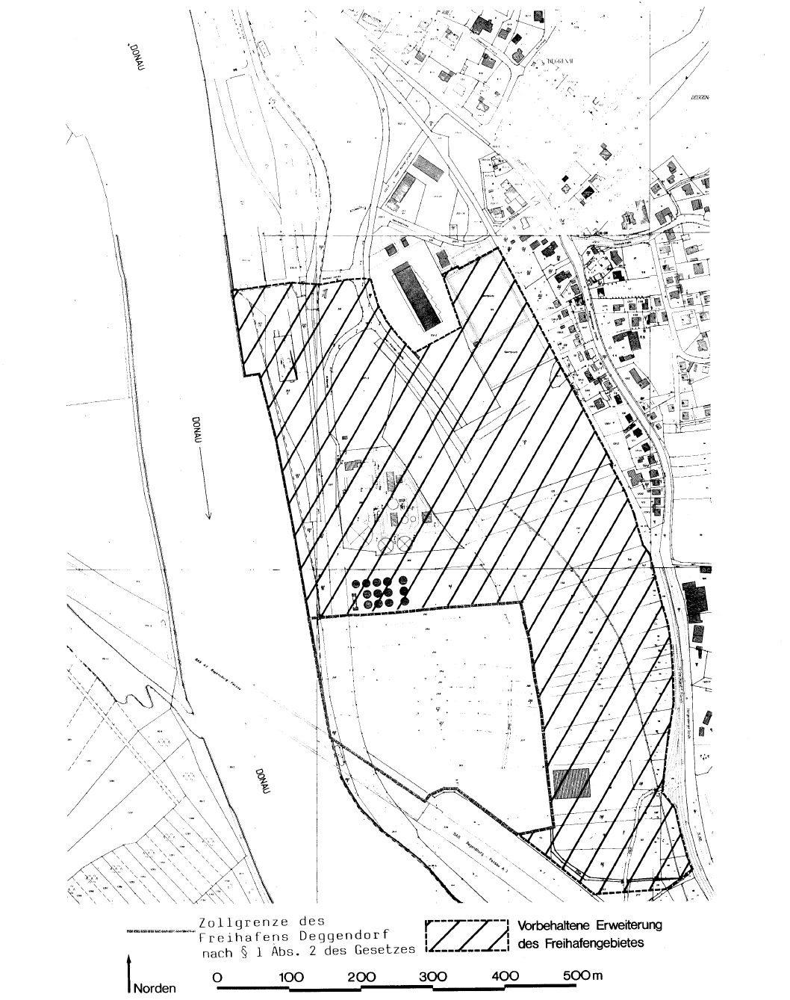
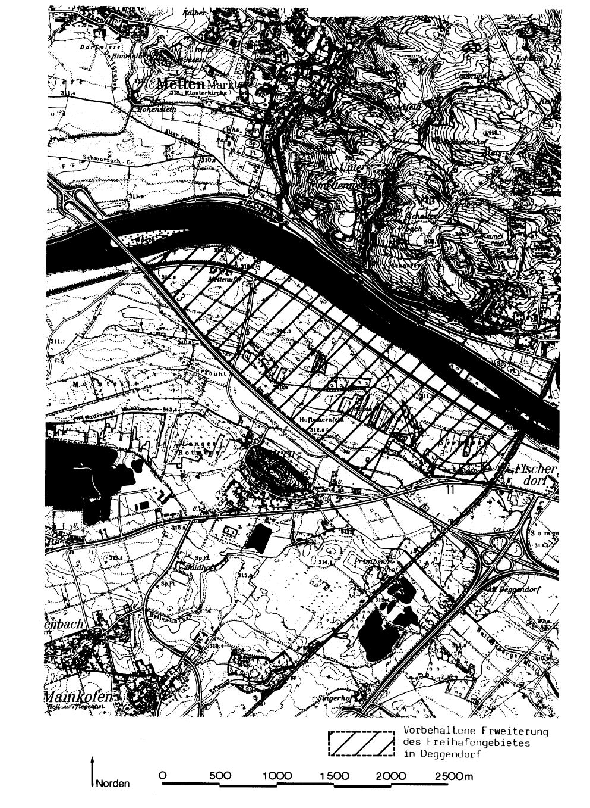
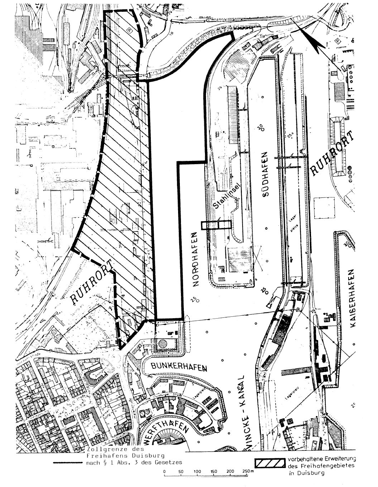
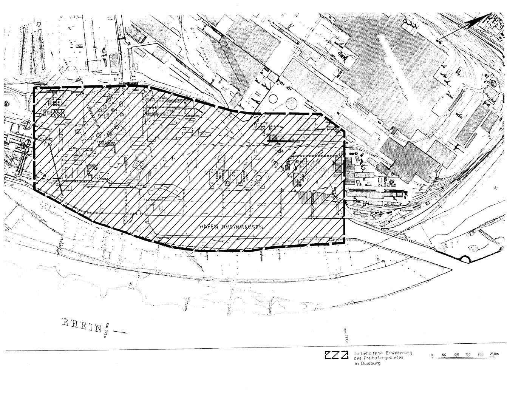

# Gesetz zur Errichtung neuer Freihäfen und zur Änderung des Zollgesetzes (FrHfDEG/DUG)

Ausfertigungsdatum
:   1989-07-25

Fundstelle
:   BGBl I: 1989, 1541

Geändert durch
:   Art. 1 V v. 10.4.1995 I 518

## § 1 Neue Freihäfen

(1) In Deggendorf und in Duisburg wird jeweils ein Teil des
Hafengebiets als Freihafen eingerichtet.

(2) In Deggendorf beginnt die Zollgrenze um den Freihafen auf dem
linken Donauufer an der Autobahnbrücke bei Donau-km 2282,4, verläuft
dann etwa 155 m entlang der Autobahn nach Südosten, biegt in einem
etwa 50 m langen Viertelkreis mit dem Böschungsfuß der Autobahn nach
Nordosten, verläuft von dort etwa 110 m parallel zur Autobahn, biegt
dann in einem etwa 130 Grad großen Winkel nach Osten und wendet sich
nach etwa 50 m in einem Winkel von etwa 95 Grad nach Norden, verläuft
von dort in einer leicht geschwungenen Linie etwa 315 m parallel zum
Donauufer, biegt dann in einem Winkel von etwa 96 Grad nach Westen bis
zu einem Punkt, der heute etwa 8 m in der Donau liegt und geht von
dort aus in gerader Linie wieder zum Ausgangspunkt zurück. Die
umschlossene Freihafenfläche beträgt etwa 90.000
qm. Sie ist in der Anlage 1 durch eine rote Linie eingegrenzt.

(3) In Duisburg beginnt die Zollgrenze um den Freihafen in der
nördlichen Ecke des Nordhafens und verläuft in südwestlicher Richtung
380,8 m auf der senkrechten Ufereinfassung, biegt dann 11 m nach
Nordwesten, anschließend nach Südwesten auf 96,35 m entlang der
Oberkante des teilgeböschten Ufers, darauf rechtwinklig nach
Nordwesten ab und trifft nach 75,6 m auf die Straße "Am Nordhafen".
Hier wendet sie sich rechtwinklig nach Nordosten und verläuft 746 m
entlang dieser Landstraße, davon ist sie vor dem Zollgebäude auf einer
Länge von 12,5 m um 2,5 m nach Südwesten versetzt, biegt dann nach
Südosten auf 17,5 m entlang einer Mauer und Spundwand ab und folgt auf
310 m der Böschungsoberkante des dort verlaufenden Gleiskörpers in
östlicher Richtung bis zum rechtwinklig dazu stehenden Gleistor. Die
Grenze folgt dem Gleistor auf 25 m, um dann geschwungen in
südwestlicher Richtung 235,5 m annähernd parallel zum dortigen
Eisenbahngleis bis zum rechtwinklig dazu stehenden Gleistor zu
verlaufen. Die Grenze folgt dem Gleistor auf 5 m nach Südosten und
biegt dann wieder rechtwinklig ab, um auf der anderen Seite des
Gleises auf 63,5 m südwestlich zwischen zwei Gleisen bis zu einer
Gebäudewand zu verlaufen, der sie 60,69 m folgt. Danach verläuft sie
weitere 60,55 m nach Südwesten, bis sie auf die östliche Ecke des
Nordhafens trifft. Von dort verläuft sie auf der Oberkante des Ufers
in nordwestlicher Richtung, bis sie auf den Ausgangspunkt stößt. Die
umschlossene Freihafenfläche beträgt etwa 100.000
qm. Sie ist in der Anlage 3 durch eine rote Linie eingegrenzt.

(4) Der Bundesminister der Finanzen kann durch Rechtsverordnung bis
zum 31. Dezember 1997 die in den Anlagen 1 bis 4 schraffierten Gebiete
oder Teile davon in die Freihäfen einbeziehen.

## § 2

-

## § 3 Berlin-Klausel

Dieses Gesetz gilt nach Maßgabe des § 12 Abs. 1 des Dritten
Überleitungsgesetzes auch im Land Berlin. Rechtsverordnungen, die auf
Grund dieses Gesetzes erlassen werden, gelten im Land Berlin nach § 14
des Dritten Überleitungsgesetzes.

## § 4 Inkrafttreten

Dieses Gesetz tritt am ersten Tage des seiner Verkündung folgenden
Kalendermonats in Kraft.

## Anlage 1 (zu § 1 Abs. 2 und 4 des Gesetzes)

(Fundstelle: BGBl. I 1989, 1543)

## Anlage 2 (zu § 1 Abs. 4 des Gesetzes)

(Fundstelle: BGBl. I 1989, 1544)

## Anlage 3 (zu § 1 Abs. 3 und 4 des Gesetzes)

(Fundstelle: BGBl. I 1989, 1545)

## Anlage 4 (zu § 1 Abs. 4 des Gesetzes)

(Fundstelle: BGBl. I 1989, 1546)

