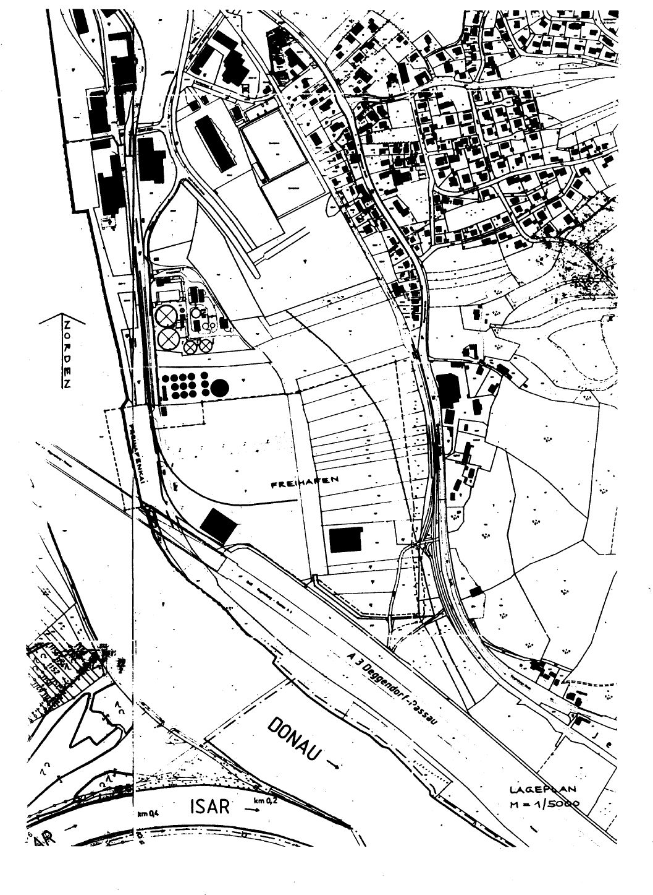

# Zweite Verordnung zur Änderung der Grenze des Freihafens Deggendorf (FrHfGrDEGV 2)

Ausfertigungsdatum
:   1997-12-19

Fundstelle
:   BGBl I: 1997, 3204

## Eingangsformel

Auf Grund des § 1 Abs. 4 des Gesetzes zur Errichtung neuer Freihäfen
und zur Änderung des Zollgesetzes vom 25. Juli 1989 (BGBl. I S. 1541)
und des § 20 Abs. 2 des Zollverwaltungsgesetzes vom 21. Dezember 1992
(BGBl. I S. 2125), der durch das Gesetz vom 20. Dezember 1996 (BGBl. I
S. 2030) geändert worden ist, verordnet das Bundesministerium der
Finanzen:

## Art 1

Der durch § 1 Abs. 2 des Gesetzes zur Errichtung neuer Freihäfen und
zur Änderung des Zollgesetzes vom 25. Juli 1989 (BGBl. I S. 1541)
beschriebene Verlauf der Grenze des Freihafens Deggendorf, der durch
die Verordnung vom 14. Januar 1993 (BGBl. I S. 86) geändert worden
ist, wird wie folgt neu bestimmt:
"Die Grenze um den Freihafen Deggendorf beginnt bei Donau-km 2282,435
in der Donau 30 m vom linken Ufer entfernt, verläuft dann in einem
Winkel von etwa 90
Grad (im folgenden sind die Winkelmaße Näherungswerte) zur
Flußrichtung bis zur Kailinie und von dort in gerader Linie 11 m
weiter, biegt dann in einem Winkel von 50
Grad nach Südosten ab und verläuft 133 m entlang der Autobahnbrücke
Deggenau. Dann schwenkt sie in einem 68 m langen Viertelkreis an der
Nordseite des am Böschungsfuß der Bundesautobahn A 3 verlaufenden
Weges nach Nordosten. Von dort verläuft sie 107 m entlang dieses Weges
nach Südosten, biegt dann in einem Winkel von 70
Grad nach Nordosten ab und wendet sich nach 13 m in einem Winkel von
35
Grad nach Osten. Hier überquert die Grenze den bestehenden
Wiesengraben, schwenkt nach 16 m in einem Winkel von 40
Grad nach Südosten und biegt nach 86 m in einem Winkel von 35
Grad nach Osten. Nach 52 m biegt sie von dort in einem Winkel von 5
Grad auf einer Länge von 48 m in nordöstliche Richtung ab. Dann
schwenkt sie in einem Winkel von 90
Grad nach Norden. Nach 113 m entlang des bestehenden Radwanderweges
wendet sie sich in einem Winkel von 10
Grad nach Nordosten und schwenkt nach 63 m in einem Winkel von 10
Grad zurück nach Norden. Nach 252 m biegt sie in einem Winkel von 95
Grad nach Südwesten und schwenkt dann nach 191 m in einem Winkel von
15
Grad nach Westen zum Donauufer. Nach 147 m biegt sie in einem Winkel
von 90
Grad auf einer Länge von 38 m nach Süden ab. Dort wendet sie sich in
einem Winkel von 90
Grad nach Westen und erreicht nach 87 m die Hochwasserschutzwand.
Dieser folgt sie donauaufwärts in einer Länge von 38 m, biegt dann in
einem Winkel von 90
Grad zur Donau hin ab und trifft nach 43 m auf die Kailinie. Von dort
verläuft sie noch 30 m in die Donau hinein und von diesem Punkt aus in
gerader Linie zum Ausgangspunkt. Der Verlauf der Grenze ist in der
Anlage durch eine gestrichelte Linie gekennzeichnet."

## Art 2

Diese Verordnung tritt am Tage nach der Verkündung in Kraft.

## Anlage

Fundstelle: BGBl. I 1997, 3205)

