[^f774780_01_BJNR013900011]
Verordnung über die Zulassung von Fahrzeugen zum Straßenverkehr
---
Title: !!python/unicode ''
layout: default
slug: fzv_2011
---

#  (FZV 2011)

Ausfertigungsdatum
:   2011-02-03

Fundstelle
:   BGBl I: 2011, 139

Zuletzt geändert durch
:   Art. 3 V v. 10.5.2012 I 1086

[^f774780_01_BJNR013900011]:     Diese Verordnung dient der Umsetzung der Richtlinie 1999/37/EG des
    Rates vom 29. April 1999 über Zulassungsdokumente für Fahrzeuge (ABl.
    L 138 vom 1.6.1999, S. 57 ), die durch die Richtlinie 2003/127/EG
    (ABl. L 10 vom 16.1.2004, S. 29) geändert worden ist.

## Eingangsformel

Das Bundesministerium für Verkehr, Bau und Stadtentwicklung verordnet
auf Grund des

–   § 6 Absatz 1 Nummer 2 Buchstabe a bis d, f, j bis l, p und s bis v,
    Nummer 7 und Nummer 12 Buchstabe b und des § 47 des
    Straßenverkehrsgesetzes in der Fassung der Bekanntmachung vom 5. März
    2003 (BGBl. I S. 310, 919), von denen § 6 Absatz 1 Nummer 2 Buchstabe
    b und p durch Artikel 1 Nummer 2 Buchstabe a des Gesetzes vom 3. Mai
    2005 (BGBl. I S. 1221) und § 47 zuletzt durch Artikel 2 Nummer 2 des
    Gesetzes vom 14. August 2006 (BGBl. I S. 1958) geändert worden sind,

–   § 6 Absatz 1 Nummer 5c in Verbindung mit Absatz 2a des
    Straßenverkehrsgesetzes in der Fassung der Bekanntmachung vom 5. März
    2003 (BGBl. I S. 310, 919), von denen § 6 Absatz 2a durch Artikel 2
    Nummer 4 des Gesetzes vom 14. August 2006 (BGBl. I S. 1958) geändert
    worden ist, gemeinsam mit dem Bundesministerium für Umwelt,
    Naturschutz und Reaktorsicherheit,

–   § 6 Absatz 1 Nummer 8 bis 11 in Verbindung mit Absatz 2 des
    Straßenverkehrsgesetzes in der Fassung der Bekanntmachung vom 5. März
    2003 (BGBl. I S. 310, 919), von denen § 6 Absatz 2 durch Artikel 2
    Nummer 4 des Gesetzes vom 14. August 2006 (BGBl. I S. 1958) geändert
    worden ist, gemeinsam mit dem Bundesministerium des Innern und

–   § 7 des Pflichtversicherungsgesetzes vom 5. April 1965 (BGBl. I S.
    213), der zuletzt durch Artikel 1 Nummer 5 des Gesetzes vom 10.
    Dezember 2007 (BGBl. I S. 2833) geändert worden ist, im Einvernehmen
    mit dem Bundesministerium der Justiz und dem Bundesministerium für
    Wirtschaft und Technologie:

## Abschnitt 1 - Allgemeine Regelungen

### § 1 Anwendungsbereich

Diese Verordnung ist anzuwenden auf die Zulassung von Kraftfahrzeugen
mit einer bauartbedingten Höchstgeschwindigkeit von mehr als 6 km/h
und die Zulassung ihrer Anhänger.

### § 2 Begriffsbestimmungen

Im Sinne dieser Verordnung ist oder sind

1.  Kraftfahrzeuge: nicht dauerhaft spurgeführte Landfahrzeuge, die durch
    Maschinenkraft bewegt werden;

2.  Anhänger: zum Anhängen an ein Kraftfahrzeug bestimmte und geeignete
    Fahrzeuge;

3.  Fahrzeuge: Kraftfahrzeuge und ihre Anhänger;

4.  EG-Typgenehmigung: die von einem Mitgliedstaat der Europäischen Union
    in Anwendung

    a)  der Richtlinie 2007/46/EG des Europäischen Parlaments und des Rates
        vom 5. September 2007 zur Schaffung eines Rahmens für die Genehmigung
        von Kraftfahrzeugen und Kraftfahrzeuganhängern sowie von Systemen,
        Bauteilen und selbständigen technischen Einheiten für diese Fahrzeuge
        (ABl. L 263 vom 9.10.2007, S. 1) in der jeweils geltenden Fassung,

    b)  der Richtlinie 2002/24/EG des Europäischen Parlaments und des Rates
        vom 18. März 2002 über die Typgenehmigung für zweirädrige oder
        dreirädrige Kraftfahrzeuge und zur Aufhebung der Richtlinie 92/61/EWG
        des Rates (ABl. L 124 vom 9.5.2002, S. 1) in der jeweils geltenden
        Fassung und

    c)  der Richtlinie 2003/37/EG des Europäischen Parlaments und des Rates
        vom 26. Mai 2003 über die Typgenehmigung für land- oder
        forstwirtschaftliche Zugmaschinen, ihre Anhänger und die von ihnen
        gezogenen auswechselbaren Maschinen sowie für Systeme, Bauteile und
        selbständige technische Einheiten dieser Fahrzeuge und zur Aufhebung
        der Richtlinie
        74/150/EWG                          (ABl. L 171 vom 9.7.2003, S. 1) in
        der jeweils geltenden Fassung

    erteilte Bestätigung, dass der zur Prüfung vorgestellte Typ eines
    Fahrzeugs, eines Systems, eines Bauteils oder einer selbstständigen
    technischen Einheit die einschlägigen Vorschriften und technischen
    Anforderungen erfüllt;

5.  nationale Typgenehmigung: die behördliche Bestätigung, dass der zur
    Prüfung vorgestellte Typ eines Fahrzeugs, eines Systems, eines
    Bauteils oder einer selbstständigen technischen Einheit den geltenden
    Bauvorschriften entspricht; sie ist eine Betriebserlaubnis im Sinne
    des Straßenverkehrsgesetzes und eine Allgemeine Betriebserlaubnis im
    Sinne der Straßenverkehrs-Zulassungs-Ordnung;

6.  Einzelgenehmigung: die behördliche Bestätigung, dass das betreffende
    Fahrzeug, System, Bauteil oder die selbstständige technische Einheit
    den geltenden Bauvorschriften entspricht; sie ist eine
    Betriebserlaubnis im Sinne des Straßenverkehrsgesetzes und eine
    Einzelbetriebserlaubnis im Sinne der Straßenverkehrs-Zulassungs-
    Ordnung;

7.  Übereinstimmungsbescheinigung: die vom Hersteller ausgestellte
    Bescheinigung, dass ein Fahrzeug, ein System, ein Bauteil oder eine
    selbstständige technische Einheit zum Zeitpunkt seiner/ihrer
    Herstellung einem nach der jeweiligen EG-Typgenehmigungsrichtlinie
    genehmigten Typ entspricht;

8.  Datenbestätigung: die vom Inhaber einer nationalen Typgenehmigung für
    Fahrzeuge ausgestellte Bescheinigung, dass das Fahrzeug zum Zeitpunkt
    seiner Herstellung dem genehmigten Typ und den ausgewiesenen Angaben
    über die Beschaffenheit entspricht;

9.  Krafträder: zweirädrige Kraftfahrzeuge mit oder ohne Beiwagen, mit
    einem Hubraum von mehr als 50 cm
    3                    im Falle von Verbrennungsmotoren, und/oder mit
    einer bauartbedingten Höchstgeschwindigkeit von mehr als 45 km/h;

10. Leichtkrafträder: Krafträder mit einer Nennleistung von nicht mehr als
    11 kW und im Falle von Verbrennungsmotoren mit einem Hubraum von mehr
    als 50 cm
    3                   , aber nicht mehr als 125 cm
    3                   ;

11. Kleinkrafträder: zweirädrige Kraftfahrzeuge oder dreirädrige
    Kraftfahrzeuge mit einer bauartbedingten Höchstgeschwindigkeit von
    nicht mehr als 45 km/h und folgenden Eigenschaften:

    a)  zweirädrige Kleinkrafträder:
        mit Verbrennungsmotor, dessen Hubraum nicht mehr als 50 cm
        3                          beträgt, oder mit Elektromotor, dessen
        maximale Nenndauerleistung nicht mehr als 4 kW beträgt;

    b)  dreirädrige Kleinkrafträder:
        mit Fremdzündungsmotor, dessen Hubraum nicht mehr als 50 cm
        3                          beträgt, mit einem anderen
        Verbrennungsmotor, dessen maximale Nutzleistung nicht mehr als 4 kW
        beträgt, oder mit einem Elektromotor, dessen maximale
        Nenndauerleistung nicht mehr als 4 kW beträgt;

12. vierrädrige Leichtkraftfahrzeuge: vierrädrige Kraftfahrzeuge mit einer
    Leermasse von nicht mehr als 350 kg, ohne Masse der Batterien bei
    Elektrofahrzeugen, mit einer bauartbedingten Höchstgeschwindigkeit von
    nicht mehr als 45 km/h, mit Fremdzündungsmotor, dessen Hubraum nicht
    mehr als 50 cm
    3                    beträgt, oder mit einem anderen
    Verbrennungsmotor, dessen maximale Nennleistung nicht mehr als 4 kW
    beträgt, oder mit einem Elektromotor, dessen maximale Nennleistung
    nicht mehr als 4 kW beträgt;

13. motorisierte Krankenfahrstühle: einsitzige, nach der Bauart zum
    Gebrauch durch körperlich behinderte Personen bestimmte Kraftfahrzeuge
    mit Elektroantrieb, einer Leermasse von nicht mehr als 300 kg
    einschließlich Batterien jedoch ohne Fahrer, einer zulässigen
    Gesamtmasse von nicht mehr als 500 kg, einer bauartbedingten
    Höchstgeschwindigkeit von nicht mehr als 15 km/h und einer Breite über
    alles von maximal 110 cm;

14. Zugmaschinen: Kraftfahrzeuge, die nach ihrer Bauart überwiegend zum
    Ziehen von Anhängern bestimmt und geeignet sind;

15. Sattelzugmaschinen: Zugmaschinen für Sattelanhänger;

16. land- oder forstwirtschaftliche Zugmaschinen: Kraftfahrzeuge, deren
    Funktion im Wesentlichen in der Erzeugung einer Zugkraft besteht und
    die besonders zum Ziehen, Schieben, Tragen und zum Antrieb von
    auswechselbaren Geräten für land- oder forstwirtschaftliche Arbeiten
    oder zum Ziehen von Anhängern in land- oder forstwirtschaftlichen
    Betrieben bestimmt und geeignet sind, auch wenn sie zum Transport von
    Lasten im Zusammenhang mit land- oder forstwirtschaftlichen Arbeiten
    eingerichtet oder mit Beifahrersitzen ausgestattet sind;

17. selbstfahrende Arbeitsmaschinen: Kraftfahrzeuge, die nach ihrer Bauart
    und ihren besonderen, mit dem Fahrzeug fest verbundenen Einrichtungen
    zur Verrichtung von Arbeiten, jedoch nicht zur Beförderung von
    Personen oder Gütern bestimmt und geeignet sind;

18. Stapler: Kraftfahrzeuge, die nach ihrer Bauart für das Aufnehmen,
    Heben, Bewegen und Positionieren von Lasten bestimmt und geeignet
    sind;

19. Sattelanhänger: Anhänger, die mit einem Kraftfahrzeug so verbunden
    sind, dass sie teilweise auf diesem aufliegen und ein wesentlicher
    Teil ihres Gewichts oder ihrer Ladung von diesem getragen wird;

20. land- oder forstwirtschaftliche Arbeitsgeräte: Geräte zum Einsatz in
    der Land- und Forstwirtschaft, die dazu bestimmt sind, von einer
    Zugmaschine gezogen zu werden und die die Funktion der Zugmaschine
    verändern oder erweitern; sie können auch mit einer Ladeplattform
    ausgestattet sein, die für die Aufnahme der zur Ausführung der
    Arbeiten erforderlichen Geräte und Vorrichtungen oder die für die
    zeitweilige Lagerung der bei der Arbeit erzeugten und benötigten
    Materialien konstruiert und gebaut ist; unter den Begriff fallen auch
    Fahrzeuge, die dazu bestimmt sind von einer Zugmaschine gezogen zu
    werden und dauerhaft mit einem Gerät ausgerüstet oder für die
    Bearbeitung von Materialien ausgelegt sind, wenn das Verhältnis
    zwischen der technisch zulässigen Gesamtmasse und der Leermasse dieses
    Fahrzeugs weniger als 3,0 beträgt;

21. Sitzkarren: einachsige Anhänger, die nach ihrer Bauart nur bestimmt
    und geeignet sind, einer Person das Führen einer einachsigen Zug- oder
    Arbeitsmaschine von einem Sitz aus zu ermöglichen;

22. Oldtimer: Fahrzeuge, die vor mindestens 30 Jahren erstmals in Verkehr
    gekommen sind, weitestgehend dem Originalzustand entsprechen, in einem
    guten Erhaltungszustand sind und zur Pflege des
    kraftfahrzeugtechnischen Kulturgutes dienen;

23. Probefahrt: die Fahrt zur Feststellung und zum Nachweis der
    Gebrauchsfähigkeit des Fahrzeugs;

24. Prüfungsfahrt: die Fahrt zur Durchführung der Prüfung des Fahrzeugs
    durch einen amtlich anerkannten Sachverständigen oder Prüfer für den
    Kraftfahrzeugverkehr oder Prüfingenieur einer amtlich anerkannten
    Überwachungsorganisation einschließlich der Fahrt des Fahrzeugs zum
    Prüfungsort und zurück;

25. Überführungsfahrt: die Fahrt zur Überführung des Fahrzeugs an einen
    anderen Ort.

### § 3 Notwendigkeit einer Zulassung

(1) Fahrzeuge dürfen auf öffentlichen Straßen nur in Betrieb gesetzt
werden, wenn sie zum Verkehr zugelassen sind. Die Zulassung wird auf
Antrag erteilt, wenn das Fahrzeug einem genehmigten Typ entspricht
oder eine Einzelgenehmigung erteilt ist und eine dem
Pflichtversicherungsgesetz entsprechende Kraftfahrzeug-
Haftpflichtversicherung besteht. Die Zulassung erfolgt durch Zuteilung
eines Kennzeichens und Ausfertigung einer Zulassungsbescheinigung.

(2) Ausgenommen von den Vorschriften über das Zulassungsverfahren sind

1.  folgende Kraftfahrzeugarten:

    a)  selbstfahrende Arbeitsmaschinen und Stapler,

    b)  einachsige Zugmaschinen, wenn sie nur für land- oder
        forstwirtschaftliche Zwecke verwendet werden,

    c)  Leichtkrafträder,

    d)  zwei- oder dreirädrige Kleinkrafträder,

    e)  motorisierte Krankenfahrstühle,

    f)  vierrädrige Leichtkraftfahrzeuge,

    g)  Elektronische Mobilitätshilfen,

2.  folgende Arten von Anhängern:

    a)  Anhänger in land- oder forstwirtschaftlichen Betrieben, wenn die
        Anhänger nur für land- oder forstwirtschaftliche Zwecke verwendet und
        mit einer Geschwindigkeit von nicht mehr als
        25 km/h                          hinter Zugmaschinen oder
        selbstfahrenden Arbeitsmaschinen mitgeführt werden,

    b)  Wohnwagen und Packwagen im Schaustellergewerbe, die von Zugmaschinen
        mit einer Geschwindigkeit von nicht mehr als 25 km/h mitgeführt
        werden,

    c)  fahrbare Baubuden, die von Kraftfahrzeugen mit einer Geschwindigkeit
        von nicht mehr als 25 km/h mitgeführt werden,

    d)  Arbeitsmaschinen,

    e)  Spezialanhänger zur Beförderung von Sportgeräten oder Tieren für
        Sportzwecke, wenn die Anhänger ausschließlich für solche Beförderungen
        verwendet werden,

    f)  einachsige Anhänger hinter Krafträdern, Kleinkrafträdern und
        motorisierten Krankenfahrstühlen,

    g)  Anhänger für Feuerlöschzwecke,

    h)  land- oder forstwirtschaftliche Arbeitsgeräte,

    i)  hinter land- oder forstwirtschaftlichen einachsigen Zug- oder
        Arbeitsmaschinen mitgeführte Sitzkarren.

Anhänger im Sinne des Satzes 1 Nummer 2 Buchstabe a bis c sind nur
dann von den Vorschriften über das Zulassungsverfahren ausgenommen,
wenn sie für eine Höchstgeschwindigkeit von nicht mehr als 25 km/h in
der durch § 58 der Straßenverkehrs-Zulassungs-Ordnung vorgeschriebenen
Weise gekennzeichnet sind.

(3) Auf Antrag können die nach Absatz 2 von den Vorschriften über das
Zulassungsverfahren ausgenommenen Fahrzeuge zugelassen werden.

(4) Der Halter darf die Inbetriebnahme eines nach Absatz 1
zulassungspflichtigen Fahrzeugs nicht anordnen oder zulassen, wenn das
Fahrzeug nicht zugelassen ist.

### § 4 Voraussetzungen für eine Inbetriebsetzung zulassungsfreier Fahrzeuge

(1) Die von den Vorschriften über das Zulassungsverfahren
ausgenommenen Fahrzeuge nach § 3 Absatz 2 Satz 1 Nummer 1 und 2
Buchstabe a bis g und land- oder forstwirtschaftliche Arbeitsgeräte
mit einer zulässigen Gesamtmasse von mehr als 3 t dürfen auf
öffentlichen Straßen nur in Betrieb gesetzt werden, wenn sie einem
genehmigten Typ entsprechen oder eine Einzelgenehmigung erteilt ist.

(2) Folgende Fahrzeuge nach Absatz 1 dürfen auf öffentlichen Straßen
nur in Betrieb gesetzt werden, wenn sie zudem ein Kennzeichen nach § 8
führen:

1.  Kraftfahrzeuge nach § 3 Absatz 2 Satz 1 Nummer 1 Buchstabe a und b mit
    einer bauartbedingten Höchstgeschwindigkeit von mehr als 20 km/h,

2.  Kraftfahrzeuge nach § 3 Absatz 2 Satz 1 Nummer 1 Buchstabe c,

3.  Anhänger nach § 3 Absatz 2 Satz 1 Nummer 2 Buchstabe d und e, die
    nicht für eine Höchstgeschwindigkeit von nicht mehr als 25 km/h in der
    durch § 58 der Straßenverkehrs-Zulassungs-Ordnung vorgeschriebenen
    Weise gekennzeichnet sind.

Auf die Zuteilung des Kennzeichens finden die Bestimmungen über die
Kennzeichenzuteilung im Zulassungsverfahren mit Ausnahme der
Vorschriften über die Zulassungsbescheinigung Teil II entsprechend
Anwendung.

(3) Kraftfahrzeuge nach § 3 Absatz 2 Satz 1 Nummer 1 Buchstabe d bis f
dürfen auf öffentlichen Straßen nur in Betrieb gesetzt werden, wenn
sie zudem ein gültiges Versicherungskennzeichen nach § 26 führen.
Besteht keine Versicherungspflicht, müssen sie ein Kennzeichen nach §
8 führen. Im Falle des Satzes 2 finden auf die Zuteilung des
Kennzeichens die Bestimmungen über die Kennzeichenzuteilung im
Zulassungsverfahren mit Ausnahme der Vorschriften über die
Zulassungsbescheinigung Teil II entsprechend Anwendung.

(4) Kraftfahrzeuge nach § 3 Absatz 2 Satz 1 Nummer 1 Buchstabe a und b
mit einer bauartbedingten Höchstgeschwindigkeit von nicht mehr als 20
km/h muss der Halter zum Betrieb auf öffentlichen Straßen zudem mit
seinem Vornamen, Namen und Wohnort oder der Bezeichnung seiner Firma
und deren Sitz kennzeichnen; die Angaben sind dauerhaft und deutlich
lesbar auf der linken Seite des Fahrzeugs anzubringen. Motorisierte
Krankenfahrstühle nach § 3 Absatz 2 Satz 1 Nummer 1 Buchstabe e müssen
zum Betrieb auf öffentlichen Straßen zudem mit einer
Kennzeichnungstafel nach der ECE-Regelung Nummer 69 über einheitliche
Bedingungen für die Genehmigung von Tafeln zur hinteren Kennzeichnung
von bauartbedingt langsam fahrenden Kraftfahrzeugen und ihrer Anhänger
(VkBl. 2003 S. 229) gekennzeichnet sein, die an der Fahrzeugrückseite
oben anzubringen ist.

(5) Werden Fahrzeuge nach § 3 Absatz 2, für die eine
Zulassungsbescheinigung Teil I nicht ausgestellt wurde, auf
öffentlichen Straßen geführt oder mitgeführt, ist die
Übereinstimmungsbescheinigung, die Datenbestätigung oder die
Bescheinigung über die Einzelgenehmigung mitzuführen und zuständigen
Personen auf Verlangen zur Prüfung auszuhändigen. Bei einachsigen
Zugmaschinen nach § 3 Absatz 2 Satz 1 Nummer 1 Buchstabe b und
Anhängern nach § 3 Absatz 2 Satz 1 Nummer 2 Buchstabe a, c, d, g und h
genügt es, wenn im Falle des Satzes 1 die
Übereinstimmungsbescheinigung, die Datenbestätigung oder die
Bescheinigung über die Einzelgenehmigung nach Satz 1 aufbewahrt und
zuständigen Personen auf Verlangen zur Prüfung ausgehändigt wird.

(6) Der Halter darf die Inbetriebnahme eines Fahrzeugs auf
öffentlichen Straßen nicht anordnen oder zulassen, wenn das Fahrzeug

1.  einem genehmigten Typ nach Absatz 1 nicht entspricht oder eine
    Einzelgenehmigung nach Absatz 1 nicht erteilt ist oder

2.  ein Kennzeichen nach Absatz 2 Satz 1, Absatz 3 Satz 2 oder ein
    Versicherungskennzeichen nach Absatz 3 Satz 1 nicht führt.

### § 5 Beschränkung und Untersagung des Betriebs von Fahrzeugen

(1) Erweist sich ein Fahrzeug als nicht vorschriftsmäßig nach dieser
Verordnung oder der Straßenverkehrs-Zulassungs-Ordnung, kann die
Zulassungsbehörde dem Eigentümer oder Halter eine angemessene Frist
zur Beseitigung der Mängel setzen oder den Betrieb des Fahrzeugs auf
öffentlichen Straßen beschränken oder untersagen.

(2) Ist der Betrieb eines Fahrzeugs, für das ein Kennzeichen zugeteilt
ist, untersagt, hat der Eigentümer oder Halter das Fahrzeug nach
Maßgabe des § 14 außer Betrieb setzen zu lassen oder der
Zulassungsbehörde nachzuweisen, dass die Gründe für die Beschränkung
oder Untersagung des Betriebs nicht oder nicht mehr vorliegen. Der
Halter darf die Inbetriebnahme eines Fahrzeugs nicht anordnen oder
zulassen, wenn der Betrieb des Fahrzeugs nach Absatz 1 untersagt ist
oder die Beschränkung nicht eingehalten werden kann.

(3) Besteht Anlass zu der Annahme, dass ein Fahrzeug nicht
vorschriftsmäßig nach dieser Verordnung oder der Straßenverkehrs-
Zulassungs-Ordnung ist, so kann die Zulassungsbehörde anordnen, dass

1.  ein von ihr bestimmter Nachweis über die Vorschriftsmäßigkeit oder ein
    Gutachten eines amtlich anerkannten Sachverständigen, Prüfers für den
    Kraftfahrzeugverkehr oder Prüfingenieurs einer amtlich anerkannten
    Überwachungsorganisation nach Anlage VIIIb der Straßenverkehrs-
    Zulassungs-Ordnung vorgelegt oder

2.  das Fahrzeug vorgeführt

wird. Wenn nötig, kann die Zulassungsbehörde mehrere solcher
Anordnungen treffen.

## Abschnitt 2 - Zulassungsverfahren

### § 6 Antrag auf Zulassung

(1) Die Zulassung eines Fahrzeugs ist bei der nach § 46 örtlich
zuständigen Zulassungsbehörde zu beantragen. Im Antrag sind zur
Speicherung in den Fahrzeugregistern folgende Halterdaten nach § 33
Absatz 1 Satz 1 Nummer 2 des Straßenverkehrsgesetzes anzugeben und auf
Verlangen nachzuweisen:

1.  bei natürlichen Personen:
    Familienname, Geburtsname, Vornamen, vom Halter für die Zuteilung oder
    die Ausgabe des Kennzeichens angegebener Ordens- oder Künstlername,
    Datum und Ort der Geburt, Geschlecht und Anschrift des Halters;

2.  bei juristischen Personen und Behörden:
    Name oder Bezeichnung und Anschrift;

3.  bei Vereinigungen:
    benannter Vertreter mit den Angaben nach Nummer 1 und gegebenenfalls
    Name der Vereinigung.

Bei beruflich selbstständigen Haltern sind außerdem die Daten nach §
33 Absatz 2 des Straßenverkehrsgesetzes über Beruf oder Gewerbe
anzugeben und auf Verlangen nachzuweisen.

(2) Mit dem Antrag ist die Zulassungsbescheinigung Teil II vorzulegen.
Wenn diese noch nicht vorhanden ist, ist nach § 12 zu beantragen, dass
diese ausgefertigt wird.

(3) Bei erstmaliger Zulassung ist der Nachweis, dass das Fahrzeug
einem Typ entspricht, für den eine EG-Typgenehmigung vorliegt, durch
Vorlage der Übereinstimmungsbescheinigung zu führen. Der Nachweis,
dass das Fahrzeug einem Typ entspricht, für den eine nationale
Typgenehmigung vorliegt, ist durch Vorlage der Zulassungsbescheinigung
Teil II, in der eine Typ- sowie Varianten-/Versions schlüsselnummer
nach § 20 Absatz 3a Satz 6 der Straßenverkehrs-Zulassungs-Ordnung
eingetragen ist, oder durch die nach § 20 Absatz 3a Satz 1 der
Straßenverkehrs-Zulassungs-Ordnung vorgeschriebene Datenbestätigung zu
führen. Der Nachweis, dass für das Fahrzeug eine Einzelgenehmigung
vorliegt, ist durch Vorlage der entsprechenden Bescheinigung zu
führen. Für Fahrzeuge, die von der Zulassungspflicht ausgenommen sind,
ist die Übereinstimmungsbescheinigung oder die Datenbestätigung oder
die Bescheinigung über die Einzelgenehmigung vorzulegen.

(4) Im Antrag sind zur Speicherung in den Fahrzeugregistern folgende
Fahrzeugdaten anzugeben und auf Verlangen nachzuweisen:

1.  regelmäßiger Standort des Fahrzeugs, sofern dieser nicht mit dem
    Wohnsitz oder Sitz des Halters identisch ist;

2.  die Verwendung des Fahrzeugs als Taxi, als Mietwagen, zur Vermietung
    an Selbstfahrer, im freigestellten Schülerverkehr, als Kraftomnibus
    oder Oberleitungsomnibus im Linienverkehr oder eine sonstige
    Verwendung, soweit sie nach § 13 Absatz 2 dieser Verordnung oder einer
    sonstigen auf § 6 des Straßenverkehrsgesetzes beruhenden
    Rechtsvorschrift der Zulassungsbehörde anzuzeigen oder in der
    Zulassungsbescheinigung Teil I einzutragen ist;

3.  Name und Anschrift des Verfügungsberechtigten über die
    Zulassungsbescheinigung Teil II, sofern eine solche ausgefertigt
    worden ist;

4.  folgende Daten zur Kraftfahrzeug-Haftpflichtversicherung:

    a)  Name und Anschrift oder Schlüsselnummer des Versicherers,

    b)  Nummer des Versicherungsscheins oder der Versicherungsbestätigung und

    c)  Beginn des Versicherungsschutzes oder

    d)  die Angabe, dass der Halter von der gesetzlichen Versicherungspflicht
        befreit ist.

(5) In Fällen des innergemeinschaftlichen Erwerbs neuer Kraftfahrzeuge
im Sinne des § 1b Absatz 2 und 3 des Umsatzsteuergesetzes sind die
folgenden Angaben, soweit diese der Zulassungsbehörde nicht bereits
vorliegen, zur Übermittlung an die zuständigen Finanzbehörden zu
machen und auf Verlangen nachzuweisen:

1.  Name und Anschrift des Antragstellers sowie das für ihn nach § 21 der
    Abgabenordnung zuständige Finanzamt,

2.  Name und Anschrift des Lieferers,

3.  Tag der ersten Inbetriebnahme,

4.  Kilometerstand am Tag der Lieferung,

5.  Fahrzeugart, Fahrzeughersteller (Marke), Fahrzeugtyp und Fahrzeug-
    Identifizierungssnummer und

6.  Verwendungszweck.

(6) Sofern das Fahrzeug aus einem Staat, der nicht Mitgliedstaat der
Europäischen Union oder nicht anderer Vertragsstaat des Abkommens über
den Europäischen Wirtschaftsraum ist, eingeführt oder aus dem Besitz
der im Bundesgebiet stationierten ausländischen Streitkräfte, der im
Bundesgebiet errichteten internationalen militärischen Hauptquartiere
oder ihrer Mitglieder erworben wurde, ist mit dem Antrag der
Verzollungsnachweis vorzulegen. Wird dieser nicht vorgelegt, hat die
Zulassungsbehörde das zuständige Hauptzollamt über die Zulassung zu
unterrichten.

(7) Außerdem sind zur Speicherung in den Fahrzeugregistern folgende
Fahrzeugdaten anzugeben und auf Verlangen nachzuweisen, sofern sie
nicht in den mit dem Antrag vorzulegenden Dokumenten enthalten sind:

1.  Fahrzeugklasse und Art des Aufbaus;

2.  Marke, Typ, Variante, Version und Handelsbezeichnung des Fahrzeugs
    sowie, wenn für das Fahrzeug eine EG-Typgenehmigung oder eine
    nationale Typgenehmigung erteilt worden ist, die Nummer und das Datum
    der Erteilung der Genehmigung, soweit diese Angaben feststellbar sind;

3.  Fahrzeug-Identifizierungsnummer;

4.  bei Personenkraftwagen: die vom Hersteller auf dem Fahrzeug
    angebrachte Farbe;

5.  Datum der Erstzulassung oder ersten Inbetriebnahme des Fahrzeugs;

6.  bei Zuteilung eines neuen Kennzeichens nach Entstempelung oder
    Abhandenkommen des bisherigen Kennzeichens das bisherige Kennzeichen;

7.  zur Beschaffenheit und Ausrüstung des Fahrzeugs:

    a)  Kraftstoffart oder Energiequelle,

    b)  Höchstgeschwindigkeit in km/h,

    c)  Hubraum in cm
        3                         ,

    d)  technisch zulässige Gesamtmasse in kg, Masse des in Betrieb
        befindlichen Fahrzeugs (Leermasse) in kg, Stützlast in kg, technisch
        zulässige Anhängelast – gebremst und ungebremst – in kg, technisch
        zulässige maximale Achslast/Masse je Achsgruppe in kg und bei
        Krafträdern das Leistungsgewicht in kW/kg,

    e)  Zahl der Achsen und der Antriebsachsen,

    f)  Zahl der Sitzplätze einschließlich Fahrersitz und der Stehplätze,

    g)  Rauminhalt des Tanks bei Tankfahrzeugen in m
        3                         ,

    h)  Nennleistung in kW und Nenndrehzahl in min
        -1                         ,

    i)  Abgaswert CO
        2                          in g/km,

    j)  Länge, Breite und Höhe jeweils als Maße über alles in mm,

    k)  eine Größenbezeichnung der Bereifung je Achse, die in der EG-
        Typgenehmigung, nationalen Typgenehmigung oder Einzelgenehmigung
        bezeichnet oder in dem zum Zwecke der Erteilung einer
        Einzelgenehmigung nach § 21 der Straßenverkehrs-Zulassungs-Ordnung
        erstellten Gutachten als vorschriftsmäßig bescheinigt wurde, und

    l)  Standgeräusch in dB (A) mit Drehzahl bei min
        -1                          und Fahrgeräusch in dB (A).

(8) Das Fahrzeug ist vor Erstellung der Zulassungsbescheinigung Teil
II und vor der Zulassung von der Zulassungsbehörde zu identifizieren.

### § 7 Zulassung im Inland nach vorheriger Zulassung in einem anderen Staat

(1) Bei Fahrzeugen, für die eine EG-Typgenehmigung vorliegt und die
bereits in einem anderen Mitgliedstaat der Europäischen Union oder in
einem anderen Vertragsstaat des Abkommens über den Europäischen
Wirtschaftsraum in Betrieb waren, ist vor der Zulassung eine
Untersuchung nach § 29 der Straßenverkehrs-Zulassungs-Ordnung
durchzuführen, wenn bei Anwendung der Anlage VIII Abschnitt 2 der
Straßenverkehrs-Zulassungs-Ordnung zwischenzeitlich eine Untersuchung
hätte stattfinden müssen. Der Antragsteller hat nachzuweisen, wann das
Fahrzeug in einem Mitgliedstaat der Europäischen Union oder in einem
anderen Vertragsstaat des Abkommens über den Europäischen
Wirtschaftsraum erstmals in Betrieb genommen worden ist. Kann dieser
Nachweis nicht erbracht werden, ist vor der Zulassung eine
Untersuchung nach § 29 der Straßenverkehrs-Zulassungs-Ordnung
durchzuführen. Die Sätze 1 bis 3 gelten entsprechend für die
Durchführung einer vorgeschriebenen Abgasuntersuchung nach § 47a der
Straßenverkehrs-Zulassungs-Ordnung.

(2) Die Zulassungsbehörde hat die ausländische Zulassungsbescheinigung
einzuziehen und mindestens sechs Monate aufzubewahren. Sie hat das
Kraftfahrt-Bundesamt über die Einziehung umgehend, mindestens jedoch
innerhalb eines Monats, elektronisch zu unterrichten.
Ausführungsregelungen zur Datenübermittlung gibt das Kraftfahrt-
Bundesamt in entsprechenden Standards im Verkehrsblatt bekannt. Auf
Verlangen der zuständigen ausländischen Behörde ist die eingezogene
Zulassungsbescheinigung über das Kraftfahrt-Bundesamt zurückzusenden.
Sofern die ausländische Zulassungsbescheinigung aus zwei Teilen
besteht, kann bei Fehlen des Teils II das Fahrzeug nur zugelassen
werden, wenn über das Kraftfahrt-Bundesamt die Bestätigung der
zuständigen ausländischen Behörde über die frühere Zulassung eingeholt
wurde.

(3) Bei Fahrzeugen, für die eine EG-Typgenehmigung vorliegt und die in
einem Staat außerhalb der Europäischen Union oder des Europäischen
Wirtschaftsraums in Betrieb waren, ist vor der Zulassung in jedem Fall
eine Untersuchung nach § 29 der Straßenverkehrs-Zulassungs-Ordnung
und, sofern vorgeschrieben, eine Abgasuntersuchung nach § 47a der
Straßenverkehrs-Zulassungs-Ordnung durchzuführen.

### § 8 Zuteilung von Kennzeichen

(1) Die Zulassungsbehörde teilt dem Fahrzeug ein Kennzeichen zu. Es
besteht aus einem Unterscheidungszeichen für den Verwaltungsbezirk und
einer Erkennungsnummer. Die Unterscheidungszeichen sind nach Maßgabe
der Anlage 1 zu vergeben. Die Erkennungsnummer wird nach Anlage 2
bestimmt. Fahrzeuge der Bundes- und Landesorgane, des Diplomatischen
Corps und bevorrechtigter Internationaler Organisationen erhalten
besondere Kennzeichen nach Anlage 3; die Erkennungsnummern dieser
Fahrzeuge bestehen nur aus Zahlen; die Zahlen dürfen nicht mehr als
sechs Stellen haben.

(2) Die Zulassungsbehörde kann die zugeteilte Erkennungsnummer von
Amts wegen oder auf Antrag ändern und hierzu die Vorführung des
Fahrzeugs anordnen.

### § 9 Besondere Kennzeichen

(1) Auf Antrag wird für ein Fahrzeug, für das ein Gutachten nach § 23
der Straßenverkehrs-Zulassungs-Ordnung vorliegt, ein
Oldtimerkennzeichen zugeteilt. Dieses Kennzeichen besteht aus einem
Unterscheidungszeichen und einer Erkennungsnummer nach § 8 Absatz 1.
Es wird als Oldtimerkennzeichen durch den Kennbuchstaben „H“ hinter
der Erkennungsnummer ausgewiesen.

(2) Bei Fahrzeugen, deren Halter von der Kraftfahrzeugsteuer befreit
ist, ist abweichend von § 10 Absatz 1 ein Kennzeichen mit grüner
Beschriftung auf weißem Grund zuzuteilen (grünes Kennzeichen);
ausgenommen hiervon sind:

1.  Fahrzeuge von Behörden,

2.  Fahrzeuge des Personals von diplomatischen und konsularischen
    Vertretungen,

3.  Kraftomnibusse und Personenkraftwagen mit acht oder neun Sitzplätzen
    einschließlich Fahrersitz sowie Anhänger, die hinter diesen Fahrzeugen
    mitgeführt werden, wenn das Fahrzeug überwiegend im Linienverkehr
    eingesetzt wird,

4.  Leichtkrafträder und Kleinkrafträder,

5.  Fahrzeuge von schwerbehinderten Personen im Sinne des § 3a Absatz 1
    und 2 des Kraftfahrzeugsteuergesetzes,

6.  besonders emissionsreduzierte Kraftfahrzeuge im Sinne des
    Kraftfahrzeugsteuergesetzes und

7.  Fahrzeuge mit einem Ausfuhrkennzeichen nach § 19.

Ein grünes Kennzeichen ist auch für Anhänger zuzuteilen, wenn dies für
Zwecke der Sonderregelung für Kraftfahrzeuganhänger gemäß § 10 des
Kraftfahrzeugsteuergesetzes beantragt wird. Das grüne Kennzeichen
besteht aus einem Unterscheidungszeichen und einer Erkennungsnummer
jeweils nach § 8 Absatz 1. Die Zuteilung ist in der
Zulassungsbescheinigung Teil I zu vermerken.

(3) Auf Antrag wird einem Fahrzeug ein Saisonkennzeichen zugeteilt. Es
besteht aus einem Unterscheidungszeichen und einer Erkennungsnummer
jeweils nach § 8 Absatz 1 sowie der Angabe eines Betriebszeitraums.
Der Betriebszeitraum wird auf volle Monate bemessen; er muss
mindestens zwei Monate und darf höchstens elf Monate umfassen. Der
Betriebszeitraum ist von der Zulassungsbehörde in der
Zulassungsbescheinigung Teil I in Klammern hinter dem Kennzeichen zu
vermerken. Das Fahrzeug darf auf öffentlichen Straßen nur während des
angegebenen Betriebszeitraums in Betrieb genommen oder abgestellt
werden. § 16 Absatz 1 bleibt unberührt. Saisonkennzeichen gelten
außerhalb des Betriebszeitraums bei Fahrten zur Abmeldung und bei
Rückfahrten nach Abstempelung des Kennzeichens als ungestempelte
Kennzeichen im Sinne des § 10 Absatz 4.

### § 10 Ausgestaltung und Anbringung der Kennzeichen

(1) Unterscheidungszeichen und Erkennungsnummern sind mit schwarzer
Beschriftung auf weißem schwarz gerandetem Grund auf ein
Kennzeichenschild aufzubringen. § 9 Absatz 2, § 16 Absatz 1 und § 17
Absatz 1 bleiben unberührt.

(2) Kennzeichenschilder dürfen nicht spiegeln, verdeckt oder
verschmutzt sein; sie dürfen nicht zusätzlich mit Glas, Folien oder
ähnlichen Abdeckungen versehen sein, es sei denn, die Abdeckung ist
Gegenstand der Genehmigung nach den in Absatz 6 genannten
Vorschriften. Form, Größe und Ausgestaltung einschließlich
Beschriftung müssen den Mustern, Abmessungen und Angaben in Anlage 4
entsprechen. Kennzeichenschilder müssen reflektierend sein und dem
Normblatt DIN 74069, Ausgabe Juli 1996, entsprechen sowie auf der
Vorderseite das DIN-Prüf- und Überwachungszeichen mit der zugehörigen
Registernummer tragen; hiervon ausgenommen sind Kennzeichenschilder an
Fahrzeugen der Bundeswehr gemäß Anlage 4 Abschnitt 3 sowie
Kennzeichenschilder an Fahrzeugen der im Bundesgebiet errichteten
internationalen militärischen Hauptquartiere.

(3) Das Kennzeichenschild mit zugeteiltem Kennzeichen muss der
Zulassungsbehörde zur Abstempelung durch eine Stempelplakette
vorgelegt werden. Die Stempelplakette enthält das farbige Wappen des
Landes, dem die Zulassungsbehörde angehört, sowie die Bezeichnung des
Landes und der Zulassungsbehörde. Die Stempelplakette muss so
beschaffen sein und so befestigt werden, dass sie bei einem Entfernen
zerstört wird.

(4) Fahrten, die im Zusammenhang mit dem Zulassungsverfahren stehen,
insbesondere Fahrten zur Anbringung der Stempelplakette und
Rückfahrten nach Entfernung der Stempelplakette sowie Fahrten zur
Durchführung einer Hauptuntersuchung, Sicherheitsprüfung oder einer
Abgasuntersuchung dürfen innerhalb des Zulassungsbezirks und eines
angrenzenden Bezirks mit ungestempelten Kennzeichen durchgeführt
werden, wenn die Zulassungsbehörde vorab ein solches zugeteilt hat und
die Fahrten von der Kraftfahrzeug-Haftpflichtversicherung erfasst
sind.

(5) Kennzeichen müssen an der Vorder- und Rückseite des Kraftfahrzeugs
vorhanden und fest angebracht sein. Bei einachsigen Zugmaschinen
genügt die Anbringung an der Vorderseite, bei Anhängern und bei
Krafträdern die Anbringung an deren Rückseite.

(6) Die Anbringung und Sichtbarkeit des hinteren Kennzeichens muss
entsprechen:

1.  bei Fahrzeugen mit mindestens vier Rädern den Anforderungen der
    Richtlinie 70/222/EWG des Rates vom 20. März 1970 zur Angleichung der
    Rechtsvorschriften der Mitgliedstaaten über die Anbringungsstellen und
    die Anbringung der amtlichen Kennzeichen an der Rückseite von
    Kraftfahrzeugen und Kraftfahrzeuganhängern (ABl. L 76 vom 6.4.1970, S.
    25) in der jeweils geltenden Fassung,

2.  bei zwei- oder dreirädrigen Kraftfahrzeugen den Anforderungen der
    Richtlinie 93/94/EWG des Rates vom 29. Oktober 1993 über die
    Anbringungsstelle des amtlichen Kennzeichens an der Rückseite von
    zweirädrigen oder dreirädrigen Kraftfahrzeugen (ABl. L 311 vom
    14\.12.1993, S. 83) in der jeweils geltenden Fassung und

3.  bei land- oder forstwirtschaftlichen Zugmaschinen den Anforderungen
    der Richtlinie 74/151/EWG des Rates vom 28. März 1974 zur Angleichung
    der Rechtsvorschriften der Mitgliedstaaten über bestimmte Bestandteile
    und Merkmale von land- oder forstwirtschaftlichen Zugmaschinen auf
    Rädern (ABl. L 84 vom 28.3.1974, S. 25) in der jeweils geltenden
    Fassung.

Hintere Kennzeichen müssen eine Beleuchtungseinrichtung haben, die den
technischen Vorschriften der Richtlinie 76/760/EWG des Rates vom 27.
Juli 1976 zur Angleichung der Rechtsvorschriften der Mitgliedstaaten
über Beleuchtungseinrichtungen für das hintere Kennzeichen von
Kraftfahrzeugen und Kraftfahrzeuganhängern (ABl. L 262 vom 27.9.1976,
S. 85) oder der ECE-Regelung Nummer 4 über einheitliche Vorschriften
für die Genehmigung der Beleuchtungseinrichtungen für das hintere
Kennzeichenschild von Kraftfahrzeugen (mit Ausnahme von Krafträdern)
und ihren Anhängern (VkBl. 2004 S. 613) in der jeweils geltenden
Fassung entspricht und die das ganze Kennzeichen auf 20 m lesbar
macht. Die Beleuchtungseinrichtung darf kein Licht unmittelbar nach
hinten austreten lassen.

(7) Das vordere Kennzeichen darf bis zu einem Vertikalwinkel von 30
Grad gegen die Fahrtrichtung geneigt sein; der untere Rand darf nicht
weniger als 200 mm über der Fahrbahn liegen und die sonst vorhandene
Bodenfreiheit des Fahrzeugs nicht verringern. Vorderes und hinteres
Kennzeichen müssen in einem Winkelbereich von je 30 Grad beiderseits
der Fahrzeuglängsachse stets auf ausreichende Entfernung lesbar sein.

(8) Anhänger nach § 3 Absatz 2 Satz 1 Nummer 2 Buchstabe a bis c, f
und g sowie Anhänger nach § 3 Absatz 2 Satz 1 Nummer 2 Buchstabe d und
e, die ein eigenes Kennzeichen nach § 4 nicht führen müssen, haben an
der Rückseite ein Kennzeichen zu führen, das der Halter des
Zugfahrzeugs für eines seiner Zugfahrzeuge verwenden darf; eine
Abstempelung ist nicht erforderlich.

(9) Wird das hintere Kennzeichen durch einen Ladungsträger oder
mitgeführte Ladung teilweise oder vollständig verdeckt, so muss am
Fahrzeug oder am Ladungsträger das Kennzeichen wiederholt werden. Eine
Abstempelung ist nicht erforderlich. Bei Fahrzeugen, an denen nach §
49a Absatz 9 der Straßenverkehrs-Zulassungs-Ordnung Leuchtenträger
zulässig sind, darf das hintere Kennzeichen auf dem Leuchtenträger
angebracht sein.

(10) Außer dem Kennzeichen darf nur das Unterscheidungszeichen für den
Zulassungsstaat nach Artikel 37 in Verbindung mit Anhang 3 des
Übereinkommens vom 8. November 1968 über den Straßenverkehr (BGBl.
1977 II S. 809) am Fahrzeug angebracht werden. Für die Bundesrepublik
Deutschland ist dies der Großbuchstabe „D“.

(11) Zeichen und Einrichtungen aller Art, die zu Verwechslungen mit
Kennzeichen oder dem Unterscheidungszeichen nach Absatz 10 führen oder
deren Wirkung beeinträchtigen können, dürfen an Fahrzeugen nicht
angebracht werden. Über die Anbringung der Zeichen „CD“ für Fahrzeuge
von Angehörigen diplomatischer Vertretungen und „CC“ für Fahrzeuge von
Angehörigen konsularischer Vertretungen entscheidet das
Bundesministerium für Verkehr, Bau und Stadtentwicklung. Die
Berechtigung zur Führung der Zeichen „CD“ und „CC“ ist in die
Zulassungsbescheinigung Teil I einzutragen.

(12) Unbeschadet des Absatzes 4 dürfen Fahrzeuge auf öffentlichen
Straßen nur in Betrieb gesetzt werden, wenn das zugeteilte Kennzeichen
auf einem Kennzeichenschild nach Absatz 1, 2 Satz 1, 2 und 3 Halbsatz
1, Absatz 5 Satz 1 sowie Absatz 6 bis 8 und 9 Satz 1 ausgestaltet,
angebracht und beleuchtet ist und die Stempelplakette nach Absatz 3
Satz 1 und 2 vorhanden ist und keine verwechslungsfähigen oder
beeinträchtigenden Zeichen und Einrichtungen nach Absatz 11 Satz 1 am
Fahrzeug angebracht sind. Der Halter darf die Inbetriebnahme eines
Fahrzeugs nicht anordnen oder zulassen, wenn die Voraussetzungen nach
Satz 1 nicht vorliegen.

(13) Abweichend von Absatz 2 Satz 1 und Absatz 6 Satz 2 und 3 dürfen
nach § 22a Absatz 1 Nummer 21 der Straßenverkehrs-Zulassungs-Ordnung
bauartgenehmigte Beleuchtungseinrichtungen für hintere transparente
Kennzeichen oder Beleuchtungseinrichtungen, die mit dem Kennzeichen
eine Einheit bilden oder bei der sich das Kennzeichen hinter einer
durchsichtigen, lichtleitenden Abschlussscheibe befindet,

1.  weißes Licht nach hinten abstrahlen oder

2.  mit einer Abschlussscheibe vor dem Kennzeichen versehen sein,

soweit jeweils die Nummern 22 und 22a der Technischen Anforderungen an
Fahrzeugteile bei der Bauartprüfung nach § 22a StVZO vom 5. Juli 1973
(VkBl. 1973 S. 558), die zuletzt durch die Bekanntmachung vom 21. Juli
2006 (VkBl. 2006 S. 645) geändert worden sind, eingehalten werden. Die
bauartgenehmigte Beleuchtungseinrichtung muss mit dem amtlich
zugeteilten Prüfzeichen gekennzeichnet sein.

### § 11 Zulassungsbescheinigung Teil I

(1) Die Zulassungsbescheinigung Teil I wird nach dem Muster in Anlage
5 ausgefertigt. Sind für denselben Halter mehrere Anhänger zugelassen,
kann für den Anhänger abweichend von Satz 1 oder zusätzlich von der
Zulassungsbehörde auf Antrag ein Verzeichnis der für den Halter
zugelassenen Anhänger ausgestellt werden. Aus dem Verzeichnis müssen
Name, Vorname und Anschrift des Halters sowie Marke, Fahrzeugklasse
und Art des Aufbaus, Leermasse, zulässige Gesamtmasse und bei
Sattelanhängern auch die Stützlast, die Fahrzeug-
Identifizierungsnummer, das Datum der ersten Zulassung und das
Kennzeichen der Anhänger ersichtlich sein.

(2) Das Kraftfahrt-Bundesamt stellt der Zulassungsbehörde Typdaten zur
Verfügung, damit diese die Zulassungsbescheinigung Teil I maschinell
ausfüllen kann. Das Kraftfahrt-Bundesamt hat diese Typdaten zu
erstellen, soweit es über die erforderlichen Angaben verfügt und der
Aufwand für die Erstellung angemessen ist.

(3) Für Fahrzeuge der Bundeswehr können von der Zentralen
Militärkraftfahrtstelle Zulassungsbescheinigungen Teil I nach dem
Muster in Anlage 6 ausgefertigt werden.

(4) Die Anerkennung als schadstoffarmes Fahrzeug nach § 47 Absatz 3
der Straßenverkehrs-Zulassungs-Ordnung und Einstufung des Fahrzeugs in
eine der Emissionsklassen nach § 48 der Straßenverkehrs-Zulassungs-
Ordnung sind unter Angabe des Datums in der Zulassungsbescheinigung
Teil I zu vermerken, wenn der Zulassungsbehörde die entsprechenden
Voraussetzungen nachgewiesen werden. Die Zulassungsbehörde kann in
Zweifelsfällen die Vorlage eines Gutachtens eines amtlich anerkannten
Sachverständigen für den Kraftfahrzeugverkehr darüber fordern, in
welche Emissionsklasse das Fahrzeug einzustufen ist.

(5) Die Zulassungsbescheinigung Teil I sowie das Anhängerverzeichnis
nach Absatz 1 Satz 2 ist vom jeweiligen Fahrer des Kraftfahrzeugs
mitzuführen und zuständigen Personen auf Verlangen zur Prüfung
auszuhändigen.

(6) Wird nach Ausstellung einer neuen Zulassungsbescheinigung Teil I
für eine in Verlust geratene Bescheinigung diese wieder aufgefunden,
hat der Halter oder Eigentümer sie unverzüglich der zuständigen
Zulassungsbehörde abzuliefern.

### § 12 Zulassungsbescheinigung Teil II

(1) Mit dem Antrag auf Ausfertigung einer Zulassungsbescheinigung Teil
II ist der Zulassungsbehörde die Verfügungsberechtigung über das
Fahrzeug nachzuweisen. In begründeten Einzelfällen kann die
Zulassungsbehörde beim Kraftfahrt-Bundesamt anfragen, ob das Fahrzeug
im Zentralen Fahrzeugregister eingetragen, ein Suchvermerk vorhanden
oder ob bereits eine Zulassungsbescheinigung Teil II ausgegeben worden
ist. Die Sätze 1 und 2 sind auch anzuwenden, wenn die Ausfüllung eines
Vordrucks der Zulassungsbescheinigung Teil II beantragt wird, ohne
dass das Fahrzeug zugelassen werden soll. Für Fahrzeuge, die im
Ausland zugelassen sind oder waren, ist das Ausfüllen eines Vordrucks
einer Zulassungsbescheinigung Teil II nur im Zusammenhang mit der
Zulassung des Fahrzeugs zulässig.

(2) Die Zulassungsbehörde fertigt die Zulassungsbescheinigung Teil II
nach dem Muster in Anlage 7 aus. Die Ausfüllung einer
Zulassungsbescheinigung Teil II sowie deren erstmalige Ausfertigung
durch die Zulassungsbehörde ist nur bei Vorlage der
Übereinstimmungsbescheinigung, der Datenbestätigung oder der
Bescheinigung über die Einzelgenehmigung des Fahrzeugs zulässig.
Wurden die Angaben über die Beschaffenheit des Fahrzeugs und über
dessen Übereinstimmung mit dem genehmigten Typ noch nicht durch den
Hersteller eingetragen, hat die Zulassungsbehörde diese Eintragungen
vorzunehmen. Hierfür werden ihr vom Kraftfahrt-Bundesamt die
erforderlichen Typdaten zur Verfügung gestellt, soweit diese dort
vorliegen. Die Zulassungsbehörde vermerkt die Ausfertigung der
Zulassungsbescheinigung Teil II unter Angabe der betreffenden Nummer
auf der Übereinstimmungsbescheinigung oder der Datenbestätigung.

(3) Die Vordrucke der Zulassungsbescheinigung Teil II werden auf
schriftlichen Antrag vom Kraftfahrt-Bundesamt an die Inhaber einer EG-
Typgenehmigung für Fahrzeuge, an die Inhaber einer nationalen
Typgenehmigung für Fahrzeuge oder deren jeweils bevollmächtigte
Vertreter zum Zwecke der Ausfüllung sowie an die Zulassungsbehörden
ausgegeben.

(4) Der Verlust eines Vordrucks der Zulassungsbescheinigung Teil II
ist vom jeweiligen Empfänger dem Kraftfahrt-Bundesamt anzuzeigen. Der
Verlust einer ausgefertigten Zulassungsbescheinigung Teil II ist der
zuständigen Zulassungsbehörde anzuzeigen, die das Kraftfahrt-Bundesamt
hiervon unterrichtet. Das Kraftfahrt-Bundesamt bietet die in Verlust
geratene Bescheinigung auf Antrag im Verkehrsblatt mit einer Frist zur
Vorlage bei der Zulassungsbehörde auf. Eine neue
Zulassungsbescheinigung Teil II darf erst nach Ablauf der Frist
ausgefertigt werden. Wird die in Verlust geratene
Zulassungsbescheinigung Teil II wieder aufgefunden, ist diese
unverzüglich bei der Zulassungsbehörde abzuliefern. Absatz 6 Satz 2
ist entsprechend anzuwenden.

(5) Sind in einer Zulassungsbescheinigung Teil II die für die
Eintragungen der Zulassung bestimmten Felder ausgefüllt oder ist diese
beschädigt, ist eine neue Bescheinigung auszustellen. Die
Zulassungsbehörde hat die alte Bescheinigung zu entwerten und sie
unter Eintragung der Nummer der neuen Bescheinigung dem Antragsteller
zurückzugeben.

(6) Die Zulassungsbehörde entscheidet keine privatrechtlichen
Sachverhalte. Zur Vorlage der Zulassungsbescheinigung Teil II ist
neben dem Halter und dem Eigentümer bei Aufforderung durch die
Zulassungsbehörde jeder verpflichtet, in dessen Gewahrsam sich die
Bescheinigung befindet. Die Zulassungsbehörde hat demjenigen, der ihr
die Zulassungsbescheinigung Teil II vorgelegt hat oder der von ihm
bestimmten Stelle oder Person, diese wieder auszuhändigen.

### § 13 Mitteilungspflichten bei Änderungen

(1) Folgende Änderungen von Fahrzeug- oder Halterdaten sind der
Zulassungsbehörde zum Zwecke der Berichtigung der Fahrzeugregister und
der Zulassungsbescheinigung unter Vorlage der Zulassungsbescheinigung
Teil I, des Anhängerverzeichnisses und bei Änderungen nach Nummer 1
bis 3 auch der Zulassungsbescheinigung Teil II unverzüglich
mitzuteilen:

1.  Änderungen von Angaben zum Halter, jedoch braucht bei alleiniger
    Änderung der Anschrift innerhalb des Zulassungsbezirks die
    Zulassungsbescheinigung Teil II nicht vorgelegt zu werden,

2.  Änderung der Fahrzeugklasse nach Anlage XXIX der Straßenverkehrs-
    Zulassungs-Ordnung,

3.  Änderung von Hubraum, Nennleistung, Kraftstoffart oder Energiequelle,

4.  Erhöhung der bauartbedingten Höchstgeschwindigkeit,

5.  Verringerung der bauartbedingten Höchstgeschwindigkeit, wenn diese
    fahrerlaubnisrelevant oder zulassungsrelevant ist,

6.  Änderung der zulässigen Achslasten, der Gesamtmasse, der Stützlast
    oder der Anhängelast,

7.  Erhöhung der Fahrzeugabmessungen, ausgenommen bei Personenkraftwagen
    und Krafträdern,

8.  Änderung der Sitz- oder Stehplatzzahl bei Kraftomnibussen,

9.  Änderungen der Abgas- oder Geräuschwerte, sofern sie sich auf die
    Kraftfahrzeugsteuer oder Verkehrsverbote auswirken,

10. Änderungen, die eine Ausnahmegenehmigung nach § 47 erfordern, und

11. Änderungen, deren unverzügliche Eintragung in die
    Zulassungsbescheinigung auf Grund eines Vermerks im Sinne des § 19
    Absatz 4 Satz 2 der Straßenverkehrs-Zulassungs-Ordnung erforderlich
    ist.

Andere Änderungen von Fahrzeug- oder Halterdaten sind der
Zulassungsbehörde bei deren nächster Befassung mit der
Zulassungsbescheinigung mitzuteilen. Verpflichtet zur Mitteilung ist
der Halter und, wenn er nicht zugleich der Eigentümer ist, auch
dieser. Die Verpflichtung besteht, bis der Behörde durch einen der
Verpflichteten die Änderungen mitgeteilt worden sind. Kommen die nach
Satz 3 Verpflichteten ihrer Mitteilungspflicht nicht nach, kann die
Zulassungsbehörde für die Zeit bis zur Erfüllung der Verpflichtung den
Betrieb des Fahrzeugs auf öffentlichen Straßen untersagen. Der Halter
darf die Inbetriebnahme eines Fahrzeugs, dessen Betrieb nach Satz 5
untersagt wurde, nicht anordnen oder zulassen.

(2) Wer einen Personenkraftwagen verwendet

1.  für eine Personenbeförderung, die dem Personenbeförderungsgesetz
    unterliegt,

2.  für eine Beförderung durch oder für Kindergartenträger zwischen
    Wohnung und Kindergarten oder durch oder für Schulträger zum und vom
    Unterricht oder

3.  für eine Beförderung von behinderten Menschen zu und von ihrer
    Betreuung dienenden Einrichtungen

hat dies vor Beginn und nach Beendigung der Verwendung der zuständigen
Zulassungsbehörde unverzüglich schriftlich anzuzeigen. Wer ein
Fahrzeug ohne Gestellung eines Fahrers gewerbsmäßig vermietet
(Mietfahrzeug für Selbstfahrer), hat dies nach Beginn des
Gewerbebetriebs der zuständigen Zulassungsbehörde unverzüglich
schriftlich anzuzeigen, wenn nicht das Fahrzeug für den Mieter
zugelassen wird. Zur Eintragung der Verwendung des Fahrzeugs im Sinne
des Satzes 1 oder des Satzes 2 ist der Zulassungsbehörde unverzüglich
die Zulassungsbescheinigung Teil I vorzulegen.

(3) Verlegt der Halter seinen Wohnsitz oder Sitz in einen anderen
Zulassungsbezirk, hat er unter Vorlage der Zulassungsbescheinigung bei
der neuen Zulassungsbehörde die Zuteilung eines neuen Kennzeichens und
Ausstellung einer neuen Zulassungsbescheinigung Teil I unverzüglich zu
beantragen. Die bisherigen Kennzeichen sind zur Entstempelung
vorzulegen. Wird der regelmäßige Standort des Fahrzeugs für mehr als
drei Monate an einen vom Wohnsitz oder Sitz des Halters abweichenden
Ort verlegt, ist dies der Zulassungsbehörde ebenfalls unverzüglich
mitzuteilen. Kommt er diesen Pflichten nicht nach, kann die
Zulassungsbehörde für die Zeit bis zur Erfüllung der Pflichten den
Betrieb des Fahrzeugs auf öffentlichen Straßen untersagen.

(4) Tritt ein Wechsel in der Person des Halters ein, hat der bisherige
Halter oder Eigentümer dies unverzüglich der Zulassungsbehörde zum
Zwecke der Berichtigung der Fahrzeugregister mitzuteilen. Die
Mitteilung muss das Kennzeichen des Fahrzeugs, Namen, Vornamen und
vollständige Anschrift des Erwerbers sowie dessen Bestätigung
enthalten, dass die Zulassungsbescheinigung und die
Kennzeichenschilder übergeben wurden. Der Erwerber hat unverzüglich
bei der für seinen Wohnsitz oder Sitz zuständigen Zulassungsbehörde
unter Angabe der Halterdaten nach § 33 Absatz 1 Satz 1 Nummer 2 des
Straßenverkehrsgesetzes und unter Vorlage des Versicherungsnachweises
nach § 23 die Ausfertigung einer neuen Zulassungsbescheinigung und,
sofern dem Fahrzeug bisher ein Kennzeichen von einer anderen
Zulassungsbehörde zugeteilt war, die Zuteilung eines neuen
Kennzeichens zu beantragen. Kommt der bisherige Halter oder Eigentümer
seiner Mitteilungspflicht nicht nach oder wird das Fahrzeug nicht
unverzüglich umgemeldet oder außer Betrieb gesetzt oder erweisen sich
die mitgeteilten Daten des neuen Halters oder Eigentümers als nicht
zutreffend, kann die Zulassungsbehörde die Zulassungsbescheinigung im
Verkehrsblatt mit einer Frist von vier Wochen zur Vorlage bei ihr
aufbieten. Mit erfolglosem Ablauf des Aufgebots endet die Zulassung
des Fahrzeugs. Die Zulassungsbehörde teilt das Ende der Zulassung dem
bisherigen Halter oder Eigentümer mit.

(5) Die Absätze 1, 3 und 4 gelten nicht für außer Betrieb gesetzte
Fahrzeuge. Absatz 4 Satz 1 gilt nicht für Fahrzeuge, für die der
Zulassungsbehörde ein Verwertungsnachweis nach § 15 vorgelegt wurde.

(6) Wird ein zugelassenes Fahrzeug im Ausland erneut zugelassen und
erhält die zuständige Zulassungsbehörde durch das Kraftfahrt-Bundesamt
hierüber eine Mitteilung, ist das Fahrzeug durch die Zulassungsbehörde
außer Betrieb zu setzen. Die Mitteilung erfolgt in elektronischer Form
nach den vom Kraftfahrt-Bundesamt herausgegebenen und im Verkehrsblatt
veröffentlichten Standards.

### § 14 Außerbetriebsetzung, Wiederzulassung

(1) Soll ein zugelassenes Fahrzeug oder ein nicht
zulassungspflichtiges, aber kennzeichenpflichtiges Fahrzeug außer
Betrieb gesetzt werden, hat der Halter dies der Zulassungsbehörde
unter Vorlage der Zulassungsbescheinigung und gegebenenfalls der
Anhängerverzeichnisse, bei nicht zulassungs- aber
kennzeichenpflichtigen Fahrzeugen, unter Vorlage des Nachweises über
die Zuteilung des Kennzeichens oder die Zulassungsbescheinigung Teil I
unverzüglich anzuzeigen und die Kennzeichen zur Entstempelung
vorzulegen. Die Zulassungsbehörde vermerkt die Außerbetriebsetzung des
Fahrzeugs unter Angabe des Datums auf der Zulassungsbescheinigung Teil
I und gegebenenfalls auf den Anhängerverzeichnissen und händigt die
vorgelegten Unterlagen sowie die entstempelten Kennzeichenschilder
wieder aus. Der Halter kann das Kennzeichen zum Zwecke der
Wiederzulassung befristet reservieren lassen.

(2) Soll ein nach Absatz 1 außer Betrieb gesetztes Fahrzeug wieder zum
Verkehr zugelassen werden, ist die Zulassungsbescheinigung vorzulegen,
§ 6 gilt entsprechend. Eine Wiederzulassung kann abgelehnt werden,
wenn die vorgelegte Zulassungsbescheinigung Teil I und Teil II mit
einem Aufdruck „Verwertungsnachweis lag vor“ versehen ist und die
Zulassungsbescheinigung Teil II zusätzlich durch Abschneiden der
unteren linken Ecke entwertet wurde. Das Fahrzeug muss vor der
erneuten Zulassung einer Untersuchung nach § 29 der Straßenverkehrs-
Zulassungs-Ordnung unterzogen werden, wenn bei Anwendung der Anlage
VIII Abschnitt 2 der Straßenverkehrs-Zulassungs-Ordnung
zwischenzeitlich eine Untersuchung hätte stattfinden müssen. Satz 3
gilt entsprechend für eine Sicherheitsprüfung nach § 29 der
Straßenverkehrs-Zulassungs-Ordnung und für eine vorgeschriebene
Abgasuntersuchung nach § 47a der Straßenverkehrs-Zulassungs-Ordnung.
Sind die Fahrzeug- und Halterdaten im Zentralen Fahrzeugregister
bereits gelöscht worden und kann die Übereinstimmungsbescheinigung,
die Datenbestätigung oder die Bescheinigung über die Einzelgenehmigung
des unveränderten Fahrzeugs nicht anderweitig erbracht werden, ist §
21 der Straßenverkehrs-Zulassungs-Ordnung entsprechend anzuwenden.

### § 15 Verwertungsnachweis

(1) Ist ein Fahrzeug der Klasse M
1              oder der Klasse N
1              einer anerkannten Stelle nach § 4 Absatz 1 der
Altfahrzeug-Verordnung zur Verwertung überlassen worden, hat der
Halter oder Eigentümer dieses Fahrzeug unter Vorlage eines
Verwertungsnachweises nach dem Muster in Anlage 8 bei der
Zulassungsbehörde außer Betrieb setzen zu lassen. Die
Zulassungsbehörde überprüft die Richtigkeit und Vollständigkeit der
Angaben zum Fahrzeug und zum Halter im Verwertungsnachweis und gibt
diesen mit dem vorgesehenen Bestätigungsvermerk zurück. Die
Zulassungsbescheinigung Teil I und Teil II ist mit dem Aufdruck
„Verwertungsnachweis lag vor“ zu versehen, und die
Zulassungsbescheinigung Teil II ist durch Abschneiden der unteren
linken Ecke zu entwerten.

(2) Verbleibt ein Fahrzeug der Klasse M
1              oder der Klasse N
1              zum Zwecke der Entsorgung im Ausland, so hat der Halter
oder Eigentümer des Fahrzeugs dies gegenüber der Zulassungsbehörde zu
erklären und das Fahrzeug außer Betrieb setzen zu lassen. Im Übrigen
hat der Halter oder Eigentümer des Fahrzeugs gegenüber der
Zulassungsbehörde bei einem Antrag auf Außerbetriebsetzung des
Fahrzeugs zu erklären, dass das Fahrzeug nicht als Abfall zu entsorgen
ist.

## Abschnitt 3 - Zeitweilige Teilnahme am Straßenverkehr

### § 16 Prüfungsfahrten, Probefahrten, Überführungsfahrten

(1) Fahrzeuge dürfen, wenn sie nicht zugelassen sind, auch ohne eine
EG-Typgenehmigung, nationale Typgenehmigung oder Einzelgenehmigung, zu
Prüfungs-, Probe- oder Überführungsfahrten in Betrieb gesetzt werden,
wenn sie ein Kurzzeitkennzeichen oder ein Kennzeichen mit roter
Beschriftung auf weißem rot gerandetem Grund (rotes Kennzeichen)
führen. § 31 Absatz 2 der Straßenverkehrs-Zulassungs-Ordnung bleibt
unberührt.

(2) Auf Antrag hat eine Zulassungsbehörde bei Bedarf für Zwecke nach
Absatz 1 ein Kurzzeitkennzeichen zuzuteilen und einen Fahrzeugschein
für Fahrzeuge mit Kurzzeitkennzeichen nach dem Muster in Anlage 9
auszugeben. Der Empfänger hat die geforderten Angaben zum Fahrzeug vor
Antritt der ersten Fahrt vollständig und in dauerhafter Schrift in den
Fahrzeugschein einzutragen. Der Fahrzeugschein ist bei jeder Fahrt
mitzuführen und zuständigen Personen auf Verlangen zur Prüfung
auszuhändigen. Das Kurzzeitkennzeichen besteht aus einem
Unterscheidungszeichen und einer Erkennungsnummer jeweils nach § 8
Absatz 1, jedoch besteht die Erkennungsnummer nur aus Ziffern und
beginnt mit „03“ oder „04“. Das Kurzzeitkennzeichen enthält außerdem
ein Ablaufdatum, das längstens auf fünf Tage ab der Zuteilung zu
bemessen ist. Das Kurzzeitkennzeichen darf nur an einem Fahrzeug
verwendet werden. Nach Ablauf der Gültigkeit des Kurzzeitkennzeichens
darf ein Fahrzeug auf öffentlichen Straßen nicht mehr in Betrieb
gesetzt werden. Der Halter darf im Falle des Satzes 7 die
Inbetriebnahme eines Fahrzeugs nicht anordnen oder zulassen.

(3) Rote Kennzeichen und besondere Fahrzeugscheinhefte für Fahrzeuge
mit roten Kennzeichen nach Anlage 10 können durch die örtlich
zuständige Zulassungsbehörde zuverlässigen Kraftfahrzeugherstellern,
Kraftfahrzeugteileherstellern, Kraftfahrzeugwerkstätten und
Kraftfahrzeughändlern befristet oder widerruflich zur wiederkehrenden
betrieblichen Verwendung, auch an unterschiedlichen Fahrzeugen,
zugeteilt werden. Ein rotes Kennzeichen besteht aus einem
Unterscheidungszeichen und einer Erkennungsnummer jeweils nach § 8
Absatz 1, jedoch besteht die Erkennungsnummer nur aus Ziffern und
beginnt mit „06“. Für jedes Fahrzeug ist eine gesonderte Seite des
Fahrzeugscheinheftes zu dessen Beschreibung zu verwenden; die Angaben
zum Fahrzeug sind vollständig und in dauerhafter Schrift vor Antritt
der ersten Fahrt einzutragen. Das Fahrzeugscheinheft ist bei jeder
Fahrt mitzuführen und zuständigen Personen auf Verlangen
auszuhändigen. Über jede Prüfungs-, Probe- oder Überführungsfahrt sind
fortlaufende Aufzeichnungen zu führen, aus denen das verwendete
Kennzeichen, das Datum der Fahrt, deren Beginn und Ende, der
Fahrzeugführer mit dessen Anschrift, die Fahrzeugklasse und der
Hersteller des Fahrzeugs, die Fahrzeug-Identifizierungsnummer und die
Fahrtstrecke ersichtlich sind. Die Aufzeichnungen sind ein Jahr lang
aufzubewahren; sie sind zuständigen Personen auf Verlangen jederzeit
zur Prüfung auszuhändigen. Nach Ablauf der Frist, für die das
Kennzeichen zugeteilt worden ist, ist das Kennzeichen mit dem
dazugehörigen Fahrzeugscheinheft der Zulassungsbehörde unverzüglich
zurückzugeben.

(3a) Rote Kennzeichen können durch die örtlich zuständige
Zulassungsbehörde auch Technischen Prüfstellen sowie anerkannten
Überwachungsorganisationen nach Anlage VIIIb der Straßenverkehrs-
Zulassungs-Ordnung für die Durchführung von Prüfungsfahrten im Rahmen
der Hauptuntersuchungen, Sicherheitsprüfungen, Begutachtungen nach §
23 der Straßenverkehrs-Zulassungs-Ordnung und Untersuchungen oder
Begutachtungen im Rahmen des § 5 widerruflich zur wiederkehrenden
betrieblichen Verwendung an unterschiedlichen Fahrzeugen zugeteilt
werden. Das rote Kennzeichen besteht aus einem Unterscheidungszeichen
und einer Erkennungsnummer jeweils nach § 8 Absatz 1, jedoch besteht
die Erkennungsnummer nur aus Ziffern und beginnt mit „05“.

(4) Mit dem Antrag auf Zuteilung eines Kurzzeitkennzeichens oder eines
roten Kennzeichens sind vom Antragsteller zum Zwecke der Speicherung
in den Fahrzeugregistern die in § 6 Absatz 1 Satz 2 bezeichneten
Halterdaten und die in § 6 Absatz 4 Nummer 4 bezeichneten Daten zur
Kraftfahrzeug-Haftpflichtversicherung sowie bei Kurzzeitkennzeichen
zusätzlich das Ende des Versicherungsschutzes mitzuteilen und auf
Verlangen nachzuweisen.

(5) Kurzzeitkennzeichen und rote Kennzeichen sind nach § 10 in
Verbindung mit Anlage 4 Abschnitt 1, 6 und 7 auszugestalten und
anzubringen. Sie brauchen jedoch nicht fest angebracht zu sein.
Fahrzeuge mit Kurzzeitkennzeichen und roten Kennzeichen dürfen im
Übrigen nur nach Maßgabe des § 10 Absatz 12 Satz 1 in Betrieb genommen
werden. Der Halter darf die Inbetriebnahme eines Fahrzeugs nicht
anordnen oder zulassen, wenn die Voraussetzungen nach Satz 1 und 3
nicht vorliegen.

(6) Die §§ 29, 47a und 57b der Straßenverkehrs-Zulassungs-Ordnung
finden keine Anwendung.

### § 17 Fahrten zur Teilnahme an Veranstaltungen für Oldtimer

(1) Oldtimer, die an Veranstaltungen teilnehmen, die der Darstellung
von Oldtimer-Fahrzeugen und der Pflege des kraftfahrzeugtechnischen
Kulturgutes dienen, benötigen hierfür sowie für Anfahrten zu und
Abfahrten von solchen Veranstaltungen keine Betriebserlaubnis und
keine Zulassung, wenn sie ein rotes Oldtimerkennzeichen führen. Dies
gilt auch für Probefahrten und Überführungsfahrten sowie für Fahrten
zum Zwecke der Reparatur oder Wartung der betreffenden Fahrzeuge. § 31
Absatz 2 der Straßenverkehrs-Zulassungs-Ordnung bleibt unberührt.

(2) Für die Zuteilung und Verwendung der roten Oldtimerkennzeichen
findet § 16 Absatz 3 bis 5 entsprechend mit der Maßgabe Anwendung,
dass das Kennzeichen nur an den Fahrzeugen verwendet werden darf, für
die es ausgegeben worden ist. Das rote Oldtimerkennzeichen besteht aus
einem Unterscheidungszeichen und einer Erkennungsnummer jeweils nach §
8 Absatz 1, jedoch besteht die Erkennungsnummer nur aus Ziffern und
beginnt mit „07“. Es ist nach § 10 in Verbindung mit Anlage 4
Abschnitt 1 und 7 auszugestalten und anzubringen. Fahrzeuge mit rotem
Oldtimerkennzeichen dürfen im Übrigen nur nach Maßgabe des § 10 Absatz
12 in Betrieb genommen werden. Der Halter darf die Inbetriebnahme
eines Fahrzeugs nicht anordnen oder zulassen, wenn die Voraussetzungen
nach Satz 4 nicht vorliegen.

(3) Unberührt bleiben Erlaubnis- und Genehmigungspflichten, soweit sie
sich aus anderen Vorschriften, insbesondere aus § 29 Absatz 2 der
Straßenverkehrs-Ordnung, ergeben.

### § 18 Fahrten im internationalen Verkehr

Für Fahrzeuge, für die ein Kennzeichen zugeteilt ist, wird auf Antrag
ein Internationaler Zulassungsschein nach Artikel 4 und Anlage B des
Internationalen Abkommens vom 24. April 1926 über Kraftfahrzeugverkehr
(RGBl. 1930 II S. 1233) ausgestellt.

### § 19 Fahrten zur dauerhaften Verbringung eines Fahrzeugs in das Ausland

(1) Soll ein zulassungspflichtiges nicht zugelassenes Kraftfahrzeug
oder ein zulassungsfreies und kennzeichenpflichtiges Kraftfahrzeug,
dem kein Kennzeichen zugeteilt ist, mit eigener Triebkraft oder ein
Anhänger hinter einem Kraftfahrzeug dauerhaft in einen anderen Staat
verbracht werden, sind die Vorschriften dieser Verordnung
vorbehaltlich des § 16, soweit dies von dem ausländischen Staat
zugelassen ist, mit folgender Maßgabe anzuwenden:

1.  Das Fahrzeug darf nur zugelassen werden, wenn durch Vorlage einer
    Versicherungsbestätigung im Sinne der Anlage 11 Nummer 3 nachgewiesen
    ist, dass eine Haftpflichtversicherung nach dem Gesetz über die
    Haftpflichtversicherung für ausländische Kraftfahrzeuge und
    Kraftfahrzeuganhänger besteht und wenn der nächste Termin zur
    Durchführung der Untersuchung nach § 29 der Straßenverkehrs-
    Zulassungs-Ordnung nach dem Ablauf der Zulassung gemäß Nummer 2 liegt;
    ansonsten ist eine solche Untersuchung durchzuführen.

2.  Die Zulassung ist auf die Dauer der nach Nummer 1 nachgewiesenen
    Haftpflichtversicherung, längstens auf ein Jahr, zu befristen.
    Unberührt bleibt die Befugnis der Zulassungsbehörde, durch Befristung
    der Zulassung und durch Auflagen sicherzustellen, dass das Fahrzeug in
    angemessener Zeit den Geltungsbereich dieser Verordnung verlässt.

3.  An die Stelle des Kennzeichens tritt das Ausfuhrkennzeichen. Es
    besteht aus dem Unterscheidungszeichen nach § 8 Absatz 1 Satz 2, einer
    Erkennungsnummer und dem Ablaufdatum. Die Erkennungsnummer besteht aus
    einer ein- bis vierstelligen Zahl und einem nachfolgenden Buchstaben.
    Das Kennzeichen ist nach § 10 in Verbindung mit Anlage 4 Abschnitt 1
    und 8 auszugestalten und anzubringen. Fahrzeuge mit Ausfuhrkennzeichen
    dürfen nur nach Maßgabe des § 10 Absatz 12 in Betrieb gesetzt werden.
    Der Halter darf die Inbetriebnahme eines Fahrzeugs nicht anordnen oder
    zulassen, wenn die Voraussetzungen nach Satz 5 nicht vorliegen.

4.  Die Zulassungsbescheinigung Teil I ist auf die Ausfuhr des Fahrzeugs
    zu beschränken und mit dem Datum des Ablaufs der Gültigkeitsdauer der
    Zulassung zu versehen. Zusätzlich kann ein Internationaler
    Zulassungsschein nach Maßgabe des § 18, auf dem das Datum des Ablaufs
    der Gültigkeitsdauer der Zulassung vermerkt ist, ausgestellt werden.
    Nach Ablauf der Gültigkeitsdauer der Zulassung darf das Fahrzeug auf
    öffentlichen Straßen nicht mehr in Betrieb gesetzt werden. Der Halter
    darf im Falle des Satzes 3 die Inbetriebnahme eines Fahrzeugs nicht
    anordnen oder zulassen.

(2) Bei der Zuteilung eines Ausfuhrkennzeichens sind der
Zulassungsbehörde zur Speicherung in den Fahrzeugregistern neben den
in § 6 Absatz 1 Satz 2 bezeichneten Halterdaten die in § 6 Absatz 4
Nummer 4 bezeichneten Daten zur Kraftfahrzeug-Haftpflichtversicherung
und das Ende des Versicherungsverhältnisses sowie die zur Ausstellung
der Zulassungsbescheinigung erforderlichen Fahrzeugdaten und bei
Personenkraftwagen die vom Hersteller aufgebrachte Farbe des Fahrzeugs
mitzuteilen und auf Verlangen nachzuweisen.

(3) Der Führer eines Kraftfahrzeugs hat die Zulassungsbescheinigung
Teil I nach Absatz 1 Nummer 4 mitzuführen und zuständigen Personen auf
Verlangen zur Prüfung auszuhändigen.

(4) Soll ein zugelassenes oder ein zulassungsfreies und
kennzeichenpflichtiges Fahrzeug mit einem Ausfuhrkennzeichen in einen
anderen Staat verbracht werden, ist die Zuteilung dieses Kennzeichens
unter Vorlage der Zulassungsbescheinigung und der nach § 8 zugeteilten
Kennzeichen zur Entstempelung zu beantragen. Die bisherige
Zulassungsbescheinigung Teil I ist einzuziehen. Die
Zulassungsbescheinigung Teil II ist fortzuschreiben. Die Absätze 1 bis
3 sind entsprechend anzuwenden.

## Abschnitt 4 - Teilnahme ausländischer Fahrzeuge am Straßenverkehr

### § 20 Vorübergehende Teilnahme am Straßenverkehr im Inland

(1) In einem anderen Mitgliedstaat der Europäischen Union oder einem
anderen Vertragsstaat des Abkommens über den Europäischen
Wirtschaftsraum zugelassene Fahrzeuge dürfen vorübergehend am Verkehr
im Inland teilnehmen, wenn für sie von einer zuständigen Stelle des
anderen Mitgliedstaates oder des anderen Vertragsstaates eine gültige
Zulassungsbescheinigung ausgestellt und im Inland kein regelmäßiger
Standort begründet ist. Die Zulassungsbescheinigung muss mindestens
die Angaben enthalten, die im Fahrzeugscheinheft für Fahrzeuge mit
rotem Kennzeichen nach Anlage 10 vorgesehen sind.
Zulassungsbescheinigungen nach Satz 1, die den Anforderungen des
Satzes 2 genügen und ausschließlich zum Zwecke der Überführung eines
Fahrzeugs ausgestellt werden, werden vom Bundesministerium für
Verkehr, Bau und Stadtentwicklung im Verkehrsblatt bekannt gemacht.

(2) In einem Drittstaat zugelassene Fahrzeuge dürfen vorübergehend am
Verkehr im Inland teilnehmen, wenn für sie von einer zuständigen
ausländischen Stelle eine gültige Zulassungsbescheinigung oder ein
Internationaler Zulassungsschein nach Artikel 4 und Anlage B des
Internationalen Abkommens vom 24. April 1926 über Kraftfahrzeugverkehr
ausgestellt ist und im Inland kein regelmäßiger Standort begründet
ist. Die Zulassungsbescheinigung muss mindestens die nach Artikel 35
des Übereinkommens vom 8. November 1968 über den Straßenverkehr
erforderlichen Angaben enthalten.

(3) Ausländische Fahrzeuge dürfen vorübergehend am Verkehr im Inland
nur teilnehmen, wenn sie betriebs- und verkehrssicher sind.

(4) Ist die Zulassungsbescheinigung nicht in deutscher Sprache
abgefasst und entspricht sie nicht der Richtlinie 1999/37/EG oder dem
Artikel 35 des Übereinkommens vom 8. November 1968 über den
Straßenverkehr, muss sie mit einer von einem Berufskonsularbeamten
oder Honorarkonsul der Bundesrepublik Deutschland im Ausstellungsstaat
bestätigten Übersetzung oder mit einer Übersetzung durch einen
international anerkannten Automobilklub des Ausstellungsstaates oder
durch eine vom Bundesministerium für Verkehr, Bau und Stadtentwicklung
bestimmte Stelle verbunden sein.

(5) Der Führer des Kraftfahrzeugs hat die ausländische
Zulassungsbescheinigung nach Absatz 1 oder 2 sowie die nach Absatz 4
erforderliche Übersetzung oder den Internationalen Zulassungsschein
nach Absatz 2 mitzuführen und zuständigen Personen auf Verlangen zur
Prüfung auszuhändigen.

(6) Als vorübergehend im Sinne des Absatzes 1 gilt ein Zeitraum bis zu
einem Jahr. Die Frist beginnt

1.  bei Zulassungsbescheinigungen mit dem Tag des Grenzübertritts und

2.  bei internationalen Zulassungsscheinen nach dem Internationalen
    Abkommen vom 24. April 1926 über Kraftfahrzeugverkehr mit dem
    Ausstellungstag.

### § 21 Kennzeichen und Unterscheidungszeichen

(1) In einem anderen Staat zugelassene Kraftfahrzeuge müssen an der
Vorder- und Rückseite ihre heimischen Kennzeichen führen, die Artikel
36 und Anhang 2 des Übereinkommens vom 8. November 1968 über den
Straßenverkehr, soweit dieses Abkommen anwendbar ist, sonst Artikel 3
Abschnitt II Nummer 1 des Internationalen Abkommens vom 24. April 1926
über Kraftfahrzeugverkehr entsprechen müssen. Krafträder benötigen nur
ein Kennzeichen an der Rückseite. In einem anderen Staat zugelassene
Anhänger müssen an der Rückseite ihr heimisches Kennzeichen nach Satz
1 oder, wenn ein solches nicht zugeteilt oder ausgegeben ist, das
Kennzeichen des ziehenden Kraftfahrzeugs führen.

(2) In einem anderen Staat zugelassene Fahrzeuge müssen außerdem das
Unterscheidungszeichen des Zulassungsstaates führen, das Artikel 5 und
Anlage C des Internationalen Abkommens vom 24. April 1926 über
Kraftfahrzeugverkehr oder Artikel 37 in Verbindung mit Anhang 3 des
Übereinkommens vom 8. November 1968 über den Straßenverkehr
entsprechen muss. Bei Fahrzeugen, die in einem anderen Mitgliedstaat
der Europäischen Union oder einem anderen Vertragsstaat des Abkommens
über den Europäischen Wirtschaftsraum zugelassen sind und entsprechend
Artikel 3 in Verbindung mit dem Anhang der Verordnung (EG) Nr.
2411/1998 des Rates vom 3. November 1998 über die Anerkennung des
Unterscheidungszeichens des Zulassungsmitgliedstaats von
Kraftfahrzeugen und Kraftfahrzeuganhängern im innergemeinschaftlichen
Verkehr (ABl. L 299 vom 10.11.1998, S. 1) am linken Rand des
Kennzeichens das Unterscheidungszeichen des Zulassungsstaates führen,
ist die Anbringung eines Unterscheidungszeichens nach Satz 1 nicht
erforderlich.

### § 22 Beschränkung und Untersagung des Betriebs ausländischer Fahrzeuge

Erweist sich ein ausländisches Fahrzeug als nicht vorschriftsmäßig,
ist § 5 anzuwenden; muss der Betrieb des Fahrzeugs untersagt werden,
wird die im Ausland ausgestellte Zulassungsbescheinigung oder der
Internationale Zulassungsschein an die ausstellende Stelle
zurückgesandt. Hat der Eigentümer oder Halter des Fahrzeugs keinen
Wohn- oder Aufenthaltsort im Inland, ist für Maßnahmen nach Satz 1
jede Verwaltungsbehörde nach § 46 Absatz 1 zuständig.

## Abschnitt 5 - Überwachung des Versicherungsschutzes der Fahrzeuge

### § 23 Versicherungsnachweis

(1) Der Nachweis nach § 3 Absatz 1 Satz 2, dass eine dem
Pflichtversicherungsgesetz entsprechende Kraftfahrzeug-
Haftpflichtversicherung besteht, ist bei der Zulassungsbehörde durch
eine Versicherungsbestätigung zu erbringen. Eine
Versicherungsbestätigung ist auch vorzulegen, wenn das Fahrzeug nach
Außerbetriebsetzung nach Maßgabe des § 14 Absatz 2 wieder zum Verkehr
zugelassen werden soll.

(2) Solange ein Fahrzeug im Sinne des § 13 Absatz 2 Satz 2
gewerbsmäßig vermietet wird, muss der Zulassungsbehörde eine gültige
Versicherungsbestätigung für ein Mietfahrzeug für Selbstfahrer
vorliegen. Eine Versicherungsbestätigung, die zur Erlangung eines
Kurzzeitkennzeichens erteilt wird, muss das Ende des
Versicherungsverhältnisses oder die Dauer des
Versicherungsverhältnisses angeben.

(3) Die Versicherungsbestätigung ist grundsätzlich vom Versicherer an
die Zulassungsbehörde elektronisch zu übermitteln oder zum Abruf durch
die Zulassungsbehörde bereitzuhalten, wenn diese hierfür einen Zugang
eingerichtet hat. Übermittlung und Bereithaltung zum Abruf können auch
durch eine Gemeinschaftseinrichtung der Versicherer erfolgen. Das
zulässige Datenformat wird vom Kraftfahrt-Bundesamt im Bundesanzeiger
sowie zusätzlich im Verkehrsblatt veröffentlicht. Bei elektronischer
Übermittlung dürfen keine Bestätigungen nach Anlage 11 ausgestellt
werden. Wird die Versicherungsbestätigung nicht elektronisch vom
Versicherer an die Zulassungsbehörde übermittelt oder zum Abruf
bereitgehalten, hat der Versicherer sie dem Versicherungsnehmer nach
dem Muster in Anlage 11 Nummer 1, für Hersteller von Fahrzeugen auch
nach dem Muster in Anlage 11 Nummer 2 zu erteilen.

(4) Ein Halter, der nach § 2 Absatz 1 Nummer 5 des
Pflichtversicherungsgesetzes der Versicherungspflicht nicht
unterliegt, hat den Nachweis darüber durch Vorlage einer Bescheinigung
nach Anlage 11 Nummer 4 zu erbringen.

### § 24 Mitteilungspflichten der Zulassungsbehörde

(1) Die Zulassungsbehörde hat den Versicherer zum Zwecke der
Gewährleistung des Versicherungsschutzes im Rahmen der Kraftfahrzeug-
Haftpflichtversicherung über

1.  die Zuteilung des Kennzeichens,

2.  Änderungen der Anschrift des Halters,

3.  den Zugang einer Bestätigung über den Abschluss einer neuen
    Versicherung,

4.  den Zugang einer Anzeige über die Außerbetriebsetzung,

5.  die Änderung der Fahrzeugklasse und

6.  die Reservierung des Kennzeichens bei Außerbetriebsetzung

zu unterrichten und hierfür die in § 35 genannten Daten, soweit
erforderlich, zu übermitteln.

(2) Die Mitteilung ist grundsätzlich elektronisch nach Maßgabe des §
35 Absatz 3 und den vom Kraftfahrt-Bundesamt herausgegebenen und im
Bundesanzeiger sowie zusätzlich im Verkehrsblatt veröffentlichten
Standards zu übermitteln.

### § 25 Maßnahmen und Pflichten bei fehlendem Versicherungsschutz

(1) Der Versicherer kann zur Beendigung seiner Haftung nach § 3 Nummer
5 des Pflichtversicherungsgesetzes der zuständigen Zulassungsbehörde
Anzeige nach dem Muster in Anlage 11 Nummer 5 erstatten, wenn eine dem
Pflichtversicherungsgesetz entsprechende Kraftfahrzeug-
Haftpflichtversicherung nicht oder nicht mehr besteht. Die Anzeige
kann auch entsprechend § 23 Absatz 3 Satz 1 bis 4 vorgenommen werden.
Eine Anzeige ist zu unterlassen, wenn der Zulassungsbehörde die
Versicherungsbestätigung über den Abschluss einer neuen dem
Pflichtversicherungsgesetz entsprechenden Kraftfahrzeug-
Haftpflichtversicherung zugegangen ist und dies dem Versicherer nach §
24 Absatz 1 Nummer 3 mitgeteilt worden ist. Eine
Versicherungsbestätigung für die Zuteilung eines Kurzzeitkennzeichens
gilt gleichzeitig auch als Anzeige zur Beendigung der Haftung. Satz 4
gilt entsprechend, wenn in der Versicherungsbestätigung für die
Zuteilung eines roten Kennzeichens ein befristeter Versicherungsschutz
ausgewiesen ist oder wenn die Zuteilung des roten Kennzeichens
befristet ist.

(2) Die Zulassungsbehörde hat dem Versicherer auf dessen Anzeige nach
Absatz 1 Satz 1 das Datum des Eingangs der Anzeige mitzuteilen. § 24
Absatz 2 gilt entsprechend.

(3) Besteht für ein Fahrzeug, für das ein Kennzeichen zugeteilt ist,
keine dem Pflichtversicherungsgesetz entsprechende Kraftfahrzeug-
Haftpflichtversicherung, so hat der Halter unverzüglich das Fahrzeug
nach Maßgabe des § 14 Absatz 1 außer Betrieb setzen zu lassen.

(4) Erfährt die Zulassungsbehörde durch eine Anzeige nach Absatz 1
oder auf andere Weise, dass für das Fahrzeug keine dem
Pflichtversicherungsgesetz entsprechende Kraftfahrzeug-
Haftpflichtversicherung besteht, so hat sie unverzüglich das Fahrzeug
außer Betrieb zu setzen. Eine Anzeige zu einer Versicherung, für die
bereits eine Mitteilung nach § 24 Absatz 1 Nummer 3 oder 4 abgesandt
wurde, löst keine Maßnahmen der Zulassungsbehörde nach Satz 1 aus.

(5) Die Absätze 3 und 4 gelten nicht für Kurzzeitkennzeichen, bei
denen das Ablaufdatum überschritten ist.

### § 26 Versicherungskennzeichen

(1) Durch das Versicherungskennzeichen wird für die Kraftfahrzeuge im
Sinne des § 4 Absatz 3 Satz 1 in Verbindung mit § 3 Absatz 2 Satz 1
Nummer 1 Buchstabe d bis f nachgewiesen, dass für das jeweilige
Kraftfahrzeug eine dem Pflichtversicherungsgesetz entsprechende
Kraftfahrzeug-Haftpflichtversicherung besteht. Nach Abschluss eines
Versicherungsvertrages und Zahlung der Prämie überlässt der
Versicherer dem Halter auf Antrag das Versicherungskennzeichen
zusammen mit einer Bescheinigung hierüber für das jeweilige
Verkehrsjahr. Verkehrsjahr ist jeweils der Zeitraum vom 1. März eines
Jahres bis zum Ablauf des Monats Februar des nächsten Jahres. Zur
Speicherung im Zentralen Fahrzeugregister hat der Antragsteller dem
Versicherer die in § 33 Absatz 1 Satz 1 Nummer 2 des
Straßenverkehrsgesetzes bezeichneten Halterdaten, die Angaben zu
Fahrzeugklasse, Art des Aufbaus und Marke des Fahrzeugs sowie die
Fahrzeug-Identifizierungsnummer mitzuteilen und auf Verlangen
nachzuweisen. Das Versicherungskennzeichen und die Bescheinigung
verlieren ihre Gültigkeit mit Ablauf des Verkehrsjahres. Der
Fahrzeugführer hat die Bescheinigung über das Versicherungskennzeichen
mitzuführen und zuständigen Personen auf Verlangen zur Prüfung
auszuhändigen.

(2) Das Versicherungskennzeichen besteht aus einem Schild, das eine
zur eindeutigen Identifizierung des Kraftfahrzeugs geeignete
Erkennungsnummer und das Zeichen des zuständigen Verbandes der
Kraftfahrtversicherer oder, wenn kein Verband zuständig ist, das
Zeichen des Versicherers trägt sowie das Verkehrsjahr angibt, für
welches das Versicherungskennzeichen gelten soll. Die Erkennungsnummer
setzt sich aus nicht mehr als drei Ziffern und nicht mehr als drei
Buchstaben zusammen. Die Ziffern sind in einer Zeile über den
Buchstaben anzugeben. Das Verkehrsjahr ist durch die Angabe des
Kalenderjahrs zu bezeichnen, in welchem es beginnt. Der zuständige
Verband der Kraftfahrtversicherer oder, wenn kein Verband zuständig
ist, das Kraftfahrt-Bundesamt teilt mit Genehmigung des
Bundesministeriums für Verkehr, Bau und Stadtentwicklung den
Versicherern die Erkennungsnummern zu.

(3) Der Versicherer hat dem Kraftfahrt-Bundesamt die Halterdaten nach
§ 33 Absatz 1 Satz 1 Nummer 2 des Straßenverkehrsgesetzes und die in §
30 Absatz 4 genannten Fahrzeugdaten unverzüglich mitzuteilen. Die
Mitteilung kann auch über eine Gemeinschaftseinrichtung der
Versicherer erfolgen. Ausführungsregeln zur Datenübermittlung gibt das
Kraftfahrt-Bundesamt in entsprechenden Standards im Bundesanzeiger
sowie zusätzlich im Verkehrsblatt bekannt.

### § 27 Ausgestaltung und Anbringung des Versicherungskennzeichens

(1) Die Beschriftung der Versicherungskennzeichen ist im Verkehrsjahr
2006 blau auf weißem Grund, im Verkehrsjahr 2007 grün auf weißem Grund
und im Verkehrsjahr 2008 schwarz auf weißem Grund; die Farben
wiederholen sich in den folgenden Verkehrsjahren jeweils in dieser
Reihenfolge und Zusammensetzung. Der Rand hat dieselbe Farbe wie die
Schriftzeichen. Versicherungskennzeichen können erhaben sein. Sie
dürfen nicht spiegeln und weder verdeckt noch verschmutzt sein. Form,
Größe und Ausgestaltung des Versicherungskennzeichens müssen dem
Muster und den Angaben in Anlage 12 entsprechen.

(2) Versicherungskennzeichen nach Absatz 1 müssen reflektierend sein.
Die Rückstrahlwerte müssen Abschnitt 5.3.4 des Normblattes DIN 74069,
Ausgabe Juli 1996, entsprechen.

(3) Das Versicherungskennzeichen ist an der Rückseite des
Kraftfahrzeugs möglichst unter der Schlussleuchte fest anzubringen.
Das Versicherungskennzeichen darf bis zu einem Vertikalwinkel von 30
Grad in Fahrtrichtung geneigt sein. Der untere Rand des
Versicherungskennzeichens darf nicht weniger als 200 mm über der
Fahrbahn liegen. Versicherungskennzeichen müssen hinter dem
Kraftfahrzeug in einem Winkelbereich von je 45 Grad beiderseits der
Fahrzeuglängsachse auf eine Entfernung von mindestens 15 m lesbar
sein.

(4) Wird ein Anhänger mitgeführt, so ist die Erkennungsnummer des
Versicherungskennzeichens an der Rückseite des Anhängers so zu
wiederholen, dass sie in einem Winkelbereich von je 45 Grad
beiderseits der Fahrzeuglängsachse bei Tageslicht auf eine Entfernung
von mindestens 15 m lesbar ist; die Farben der Schrift und ihres
Untergrundes müssen denen des Versicherungskennzeichens des ziehenden
Kraftfahrzeugs entsprechen. Eine Einrichtung zur Beleuchtung des
Versicherungskennzeichens am ziehenden Kraftfahrzeug und der
Erkennungsnummer am Anhänger ist zulässig, jedoch nicht erforderlich.

(5) Außer dem Versicherungskennzeichen darf nur das
Unterscheidungszeichen des Zulassungsstaates nach Artikel 37 in
Verbindung mit Anhang 3 des Übereinkommens vom 8. November 1968 über
den Straßenverkehr am Kraftfahrzeug angebracht werden. Für die
Bundesrepublik Deutschland ist dies der Großbuchstabe „D“.

(6) Zeichen und Einrichtungen aller Art, die zu Verwechslungen mit dem
Versicherungskennzeichen oder dem Unterscheidungszeichen nach Absatz 5
führen oder seine Wirkung beeinträchtigen können, dürfen an Fahrzeugen
nicht angebracht werden.

(7) Kraftfahrzeuge, die nach § 4 Absatz 3 Satz 1 ein
Versicherungskennzeichen führen müssen, dürfen auf öffentlichen
Straßen nur in Betrieb gesetzt werden, wenn das
Versicherungskennzeichen entsprechend den Absätzen 1 bis 3
ausgestaltet und angebracht ist und verwechslungsfähige oder
beeinträchtigende Zeichen und Einrichtungen nach Absatz 6 am Fahrzeug
nicht angebracht sind.

### § 28 Rote Versicherungskennzeichen

Fahrten im Sinne des § 16 Absatz 1 dürfen mit Kraftfahrzeugen im Sinne
des § 4 Absatz 3 Satz 1 vorbehaltlich § 4 Absatz 1 auch mit roten
Versicherungskennzeichen nach dem Muster in Anlage 12 unternommen
werden. § 26 Absatz 2 und 3 ist entsprechend mit der Maßgabe
anzuwenden, dass der Buchstabenbereich der Erkennungsnummer mit dem
Buchstaben Z beginnt. Das Kennzeichen ist nach § 27 in Verbindung mit
Anlage 12 auszugestalten und anzubringen. Es braucht am Kraftfahrzeug
nicht fest angebracht zu sein. Kraftfahrzeuge mit einem roten
Versicherungskennzeichen dürfen im Übrigen nur nach Maßgabe des § 27
Absatz 7 in Betrieb gesetzt werden. Der Versicherer hat dem
Kraftfahrt-Bundesamt die Halterdaten nach § 33 Absatz 1 Satz 1 Nummer
2 des Straßenverkehrsgesetzes und die in § 30 Absatz 5 genannten
Fahrzeugdaten unverzüglich mitzuteilen.

### § 29 Maßnahmen bei vorzeitiger Beendigung des Versicherungsverhältnisses

Endet das Versicherungsverhältnis vor dem Ablauf des Verkehrsjahrs,
das auf dem Versicherungskennzeichen angegeben ist, hat der
Versicherer den Halter zur unverzüglichen Rückgabe des
Versicherungskennzeichens und der darüber ausgehändigten Bescheinigung
aufzufordern. Kommt der Halter der Aufforderung nicht nach, hat der
Versicherer hiervon die nach § 46 zuständige Behörde in Kenntnis zu
setzen. Die Behörde zieht das Versicherungskennzeichen und die
Bescheinigung ein.

## Abschnitt 6 - Fahrzeugregister

### § 30 Speicherung der Fahrzeugdaten im Zentralen Fahrzeugregister

(1) Bei Fahrzeugen, denen ein Kennzeichen zugeteilt ist, sind im
Zentralen Fahrzeugregister folgende Fahrzeugdaten zu speichern:

1.  die der Zulassungsbehörde nach § 6 Absatz 4 Nummer 1 bis 3 und Absatz
    7 mitzuteilenden Fahrzeugdaten sowie die errechnete Nutzlast des
    Fahrzeugs (technisch zulässige Gesamtmasse minus Masse des in Betrieb
    befindlichen Fahrzeugs),

2.  weitere Angaben, soweit deren Eintragung in den Fahrzeugdokumenten
    vorgeschrieben oder zulässig ist,

3.  das Unterscheidungszeichen und die Erkennungsnummer des zugeteilten
    Kennzeichens und das Datum der Zuteilung, bei Zuteilung eines
    Kennzeichens als Saisonkennzeichen zusätzlich der Betriebszeitraum,

4.  das Unterscheidungszeichen und die Erkennungsnummer von durch
    Ausnahmegenehmigung zugeteilten weiteren Kennzeichen und das Datum der
    jeweiligen Zuteilung,

5.  Monat und Jahr des auf die Ausstellung der Zulassungsbescheinigung
    folgenden Termins

    a)  für die Anmeldung zur Hauptuntersuchung und Sicherheitsprüfung nach §
        29 der Straßenverkehrs-Zulassungs-Ordnung und

    b)  zur Durchführung der Abgasuntersuchung nach § 47a der Straßenverkehrs-
        Zulassungs-Ordnung,

6.  bei Zuteilung eines grünen Kennzeichens ein Hinweis darauf sowie das
    Datum der Zuteilung,

7.  das Datum der

    a)  Außerbetriebsetzung des Fahrzeugs und

    b)  Entstempelung des Kennzeichens,

8.  die Art der Typgenehmigung oder Einzelgenehmigung,

9.  die Emissionsklasse, in die das Fahrzeug eingestuft ist und die
    Grundlage dieser Einstufung,

10. die Kennziffer des Zulassungsbezirks einschließlich der
    Gemeindekennziffer,

11. die Nummer der Zulassungsbescheinigung Teil II bei Fahrzeugen, für die
    dieser Teil ausgefertigt wurde, sowie ein Hinweis über den Verbleib
    der Zulassungsbescheinigung Teil II bei Außerbetriebsetzung des
    Fahrzeugs,

12. die Nummern früherer Zulassungsbescheinigungen Teil II und Hinweise
    über deren Verbleib,

13. soweit eine Aufbietung der Zulassungsbescheinigungen Teil II erfolgt
    ist, ein Hinweis darauf,

14. die von der Zulassungsbehörde aufgebrachte Nummer der
    Zulassungsbescheinigung Teil I,

15. das Datum der Aushändigung und Hinweis über die Rückgabe oder
    Einziehung der Zulassungsbescheinigung Teil I,

16. Hinweise über die Ausstellung einer Zulassungsbescheinigung Teil I als
    Zweitschrift sowie eines Anhängerverzeichnisses und das Datum der
    Ausstellung,

17. bei Ausstellung eines Internationalen Zulassungsscheins ein Hinweis
    darauf und das Datum der Ausstellung,

18. eine Vormerkung zur Inanspruchnahme nach dem Bundesleistungsgesetz,
    dem Verkehrssicherstellungsgesetz oder dem Verkehrsleistungsgesetz,

19. folgende Daten zur Kraftfahrzeug-Haftpflichtversicherung:

    a)  die der Zulassungsbehörde nach § 6 Absatz 4 Nummer 4 mitzuteilenden
        Daten,

    b)  das Datum des Eingangs der Versicherungsbestätigung,

    c)  Hinweise auf ein Nichtbestehen oder eine Beendigung des
        Versicherungsverhältnisses, die Anzeige hierüber sowie das Datum des
        Eingangs der Anzeige bei der Zulassungsbehörde,

    d)  bei Maßnahmen der Zulassungsbehörde auf Grund des Nichtbestehens oder
        der Beendigung des Versicherungsverhältnisses ein Hinweis darauf und

    e)  den Namen und die Anschrift oder die Schlüsselnummer der früheren
        Versicherer und jeweils die Daten zu diesen Versicherungen nach
        Maßgabe der Buchstaben a bis d,

20. fahrzeugbezogene und halterbezogene Ausnahmegenehmigungen sowie
    Auflagen oder Hinweise auf solche Genehmigungen und Auflagen,

21. Hinweise über

    a)  Fahrzeugmängel,

    b)  Maßnahmen zur Mängelbeseitigung,

    c)  erhebliche Schäden am Fahrzeug aus einem Verkehrsunfall,

    d)  die Eintragung der Außerbetriebsetzung des Fahrzeugs in die
        Zulassungsbescheinigung Teil I,

    e)  die Berechtigung zum Betrieb des Fahrzeugs trotz eines
        Verkehrsverbots,

    f)  Verstöße gegen die Vorschriften über die Kraftfahrzeugsteuer,

22. Hinweise über die Untersagung oder Beschränkung des Betriebs des
    Fahrzeugs,

23. Angaben zum Ort, an dem das sichergestellte Fahrzeug abgestellt ist,

24. das Datum des Eingangs der Anzeige bei der Zulassungsbehörde über die
    Veräußerung des Fahrzeugs und das Datum der Veräußerung,

25. bei Verlegung des

    a)  Wohnsitzes des Halters in den Bezirk einer anderen Zulassungsbehörde
        und Zuteilung eines neuen Kennzeichens: das neue Kennzeichen dieses
        Zulassungsbezirks und das Datum der Zuteilung und

    b)  regelmäßigen Standortes des Fahrzeugs: der neue Standort und das Datum
        der Verlegung des Standortes,

26. folgende Daten über frühere Angaben und Ereignisse:

    a)  Kennzeichen,

    b)  Fahrzeug-Identifizierungsnummern,

    c)  Marke und Typ des Fahrzeugs,

    d)  Hinweise über Änderungen in der Beschaffenheit und Ausrüstung des
        Fahrzeugs sowie das jeweilige Datum der Änderung,

    e)  Hinweise über den Grund der sonstigen Änderungen und das jeweilige
        Datum der Änderung,

27. folgende Daten über den Verwertungsnachweis und die Abgabe von
    Erklärungen nach § 15:

    a)  das Datum der Ausstellung des Verwertungsnachweises sowie die
        angegebene Betriebsnummer des Demontagebetriebes oder

    b)  ein Hinweis auf die Angabe, dass das Fahrzeug nicht als Abfall
        entsorgt wird, oder ein Hinweis auf die Angabe, dass das Fahrzeug zum
        Zwecke der Entsorgung im Ausland verbleibt.

(2) Bei der Zuteilung von roten Kennzeichen oder Kurzzeitkennzeichen
sind im Zentralen Fahrzeugregister folgende Fahrzeugdaten zu
speichern:

1.  das Unterscheidungszeichen und die Erkennungsnummer,

2.  Hinweis auf die Zuteilung und das Datum der Zuteilung sowie die Dauer
    der Gültigkeit des Kennzeichens,

3.  das Datum der Rückgabe oder Entziehung des Kennzeichens,

4.  folgende Daten zur Kraftfahrzeug-Haftpflichtversicherung:

    a)  die der Zulassungsbehörde nach § 16 Absatz 4 mitzuteilenden Daten zur
        Kraftfahrzeug-Haftpflichtversicherung,

    b)  die nach Absatz 1 Nummer 19 Buchstabe b bis e zu speichernden Daten.

(3) Bei Fahrzeugen, denen ein Ausfuhrkennzeichen zugeteilt ist, sind
im Zentralen Fahrzeugregister folgende Fahrzeugdaten zu speichern:

1.  die der Zulassungsbehörde nach § 19 Absatz 2 mitzuteilenden
    Fahrzeugdaten,

2.  das Unterscheidungszeichen und die Erkennungsnummer sowie

    a)  das Datum der Zuteilung des Kennzeichens und

    b)  das Datum des Ablaufs der Gültigkeit der Zulassung des Fahrzeugs mit
        diesem Kennzeichen im Geltungsbereich dieser Verordnung,

3.  die Nummer der Zulassungsbescheinigung Teil II, falls eine solche
    vorhanden war, und Hinweise zu deren Verbleib,

4.  folgende Daten zur Kraftfahrzeug-Haftpflichtversicherung:

    a)  die der Zulassungsbehörde nach § 19 Absatz 2 mitzuteilenden Daten zur
        Kraftfahrzeug-Haftpflichtversicherung,

    b)  die nach Absatz 1 Nummer 19 Buchstabe b bis e zu speichernden Daten.

(4) Bei Fahrzeugen mit Versicherungskennzeichen sind im Zentralen
Fahrzeugregister folgende Fahrzeugdaten zu speichern:

1.  die dem Versicherer nach § 26 Absatz 1 Satz 4 mitzuteilenden
    Fahrzeugdaten,

2.  die Erkennungsnummer,

3.  der Beginn des Versicherungsschutzes,

4.  der Zeitpunkt der Beendigung des Versicherungsverhältnisses gemäß § 3
    Nummer 5 des Pflichtversicherungsgesetzes,

5.  folgende Daten zur Kraftfahrzeug-Haftpflichtversicherung:

    a)  den Namen und die Anschrift oder die Schlüsselnummer des Versicherers,

    b)  die Nummer des Versicherungsscheins oder der Versicherungsbestätigung.

(5) Bei Ausgabe roter Versicherungskennzeichen sind im Zentralen
Fahrzeugregister folgende Fahrzeugdaten zu speichern:

1.  die Erkennungsnummer,

2.  der Beginn des Versicherungsschutzes,

3.  der Zeitpunkt der Beendigung des Versicherungsverhältnisses nach § 3
    Nummer 5 des Pflichtversicherungsgesetzes,

4.  folgende Daten zur Kraftfahrzeug-Haftpflichtversicherung:

    a)  den Namen und die Anschrift oder die Schlüsselnummer des Versicherers,

    b)  die Nummer des Versicherungsscheins oder der Versicherungsbestätigung.

(6) Im Zentralen Fahrzeugregister sind auch die durch
Ausnahmegenehmigung ohne Zuordnung zu einem bestimmten Fahrzeug
zugeteilten Kennzeichen zu speichern sowie jeweils das Datum der
Zuteilung und die Stelle, die über die Verwendung bestimmt.

(7) Soweit vom Kraftfahrt-Bundesamt für bestimmte Daten eine
Schlüsselnummer festgelegt wird, ist auch diese im Zentralen
Fahrzeugregister zu speichern.

(8) Im Zentralen Fahrzeugregister ist ferner das Datum der Änderung
der in den Absätzen 1 bis 7 bezeichneten Fahrzeugdaten zu speichern.

(9) Im Zentralen Fahrzeugregister sind Hinweise auf Diebstahl oder
sonstiges Abhandenkommen

a)  eines Fahrzeugs,

b)  eines gestempelten Kennzeichens oder roten Kennzeichens,

c)  eines gestempelten Ausfuhrkennzeichens oder Kurzzeitkennzeichens,
    dessen jeweilige Gültigkeit noch nicht abgelaufen ist,

d)  eines gültigen Versicherungskennzeichens,

e)  einer ausgefertigten Zulassungsbescheinigung Teil II

zu speichern. Jeweils zusätzlich sind das Datum des Diebstahls oder
des sonstigen Abhandenkommens sowie Hinweise darauf zu speichern, dass
nach dem abhandengekommenen Gegenstand gefahndet wird und dass im
Falle des Verlustes eines Kennzeichens im Sinne des Satzes 1 Buchstabe
b bis d dieses nicht vor dessen Wiederauffinden, sonst nicht vor
Ablauf von zehn Jahren seit Fahndungsbeginn wieder zugeteilt werden
darf. Bei Diebstahl oder sonstigem Abhandenkommen von nicht
ausgefertigten Zulassungsbescheinigungen (Teil I und Teil II) ist
jeweils die Dokumentennummer zu speichern. Wurde in den Vordruck für
die Zulassungsbescheinigung Teil II bereits durch den Hersteller eine
Fahrzeug-Identifizierungsnummer eingetragen, ist auch diese zu
speichern.

### § 31 Speicherung der Fahrzeugdaten im örtlichen Fahrzeugregister

(1) Bei Fahrzeugen, denen ein Kennzeichen zugeteilt ist, sind im
örtlichen Fahrzeugregister folgende Fahrzeugdaten zu speichern:

1.  die der Zulassungsbehörde nach § 6 Absatz 4 Nummer 1 bis 3 und Absatz
    7 mitzuteilenden Fahrzeugdaten,

2.  weitere Angaben, soweit deren Eintragung in der
    Zulassungsbescheinigung vorgeschrieben oder zulässig ist,

3.  das Unterscheidungskennzeichen und die Erkennungsnummer des
    zugeteilten Kennzeichens und das Datum der Zuteilung, bei Zuteilung
    eines Kennzeichens als Saisonkennzeichen zusätzlich der
    Betriebszeitraum,

4.  das Unterscheidungszeichen und die Erkennungsnummer von durch
    Ausnahmegenehmigung zugeteilten weiteren Kennzeichen sowie das Datum
    der jeweiligen Zuteilung,

5.  Monat und Jahr des auf die Ausstellung der Zulassungsbescheinigung
    folgenden Termins

    a)  für die Anmeldung zur Hauptuntersuchung und Sicherheitsprüfung nach §
        29 der Straßenverkehrs-Zulassungs-Ordnung und

    b)  zur Durchführung der Abgasuntersuchung nach § 47a der Straßenverkehrs-
        Zulassungs-Ordnung,

6.  bei Zuteilung eines grünen Kennzeichens ein Hinweis darauf sowie das
    Datum der Zuteilung,

7.  das Datum der

    a)  Außerbetriebsetzung des Fahrzeugs und

    b)  Entstempelung des Kennzeichens,

8.  die Art der Typgenehmigung oder Einzelgenehmigung,

9.  die Emissionsklasse, in die das Fahrzeug eingestuft ist und die
    Grundlage dieser Einstufung,

10. die Kennziffer des Zulassungsbezirks einschließlich der
    Gemeindekennziffer,

11. die Nummer der Zulassungsbescheinigung Teil II bei Fahrzeugen, für die
    dieser Teil ausgefertigt wurde, sowie ein Hinweis über den Verbleib
    der Zulassungsbescheinigung Teil II bei Außerbetriebsetzung des
    Fahrzeugs,

12. die Nummer der früheren Zulassungsbescheinigung Teil II und ein
    Hinweis auf deren Verbleib bei Ausfertigung einer neuen
    Zulassungsbescheinigung Teil II,

13. soweit eine Aufbietung der Zulassungsbescheinigung Teil II erfolgt
    ist, ein Hinweis darauf,

14. die von der Zulassungsbehörde aufgebrachte Nummer der
    Zulassungsbescheinigung Teil I,

15. das Datum der Aushändigung und Rückgabe oder Einziehung der
    Zulassungsbescheinigung Teil I,

16. Hinweise über die Ausstellung einer Zulassungsbescheinigung Teil I als
    Zweitschrift sowie eines Anhängerverzeichnisses und das Datum der
    Ausstellung,

17. bei Ausstellung eines Internationalen Zulassungsscheins ein Hinweis
    darauf und das Datum der Ausstellung,

18. eine Vormerkung zur Inanspruchnahme nach dem Bundesleistungsgesetz,
    dem Verkehrssicherstellungsgesetz oder dem Verkehrsleistungsgesetz,

19. folgende Daten zur Kraftfahrzeug-Haftpflichtversicherung:

    a)  die der Zulassungsbehörde nach § 6 Absatz 4 Nummer 4 mitzuteilenden
        Daten,

    b)  das Datum des Eingangs der Versicherungsbestätigung,

    c)  Hinweise auf ein Nichtbestehen oder eine Beendigung des
        Versicherungsverhältnisses, die Anzeige hierüber sowie das Datum des
        Eingangs der Anzeige bei der Zulassungsbehörde,

    d)  bei Maßnahmen der Zulassungsbehörde auf Grund des Nichtbestehens oder
        der Beendigung des Versicherungsverhältnisses ein Hinweis darauf und

    e)  den Namen und die Anschrift oder die Schlüsselnummer der früheren
        Versicherer und jeweils die Daten zu diesen Versicherungen nach
        Maßgabe der Buchstaben a bis d,

20. fahrzeugbezogene und halterbezogene Ausnahmegenehmigungen sowie
    Auflagen oder Hinweise auf solche Genehmigungen und Auflagen,

21. Hinweise über

    a)  Fahrzeugmängel,

    b)  Maßnahmen zur Mängelbeseitigung,

    c)  erhebliche Schäden am Fahrzeug aus einem Verkehrsunfall,

    d)  die Eintragung der Außerbetriebsetzung des Fahrzeugs in die
        Zulassungsbescheinigung Teil I,

    e)  die Berechtigung zum Betrieb des Fahrzeugs trotz eines
        Verkehrsverbots,

    f)  Verstöße gegen die Vorschriften über die Kraftfahrzeugsteuer,

22. Hinweise über die Untersagung oder Beschränkung des Betriebs des
    Fahrzeugs,

23. Angaben zum Ort, an dem das sichergestellte Fahrzeug abgestellt ist,

24. das Datum des Eingangs der Anzeige bei der Zulassungsbehörde über die
    Veräußerung des Fahrzeugs und das Datum der Veräußerung,

25. bei Verlegung des

    a)  Wohnsitzes des Halters in den Bezirk einer anderen Zulassungsbehörde
        und Zuteilung eines neuen Kennzeichens: das neue Kennzeichen dieses
        Zulassungsbezirks und das Datum der Zuteilung und

    b)  regelmäßigen Standortes des Fahrzeugs: der neue Standort und das Datum
        der Verlegung des Standortes,

26. folgende Daten über frühere Angaben und Ereignisse:

    a)  bei Zuteilung eines neuen Kennzeichens das bisherige,

    b)  bei Änderung der Fahrzeug-Identifizierungsnummer die bisherige,

27. folgende Daten über den Verwertungsnachweis und die Abgabe von
    Erklärungen nach § 15:

    a)  das Datum der Ausstellung des Verwertungsnachweises sowie die
        angegebene Betriebsnummer des Demontagebetriebes oder

    b)  ein Hinweis auf die Angabe, dass das Fahrzeug nicht als Abfall
        entsorgt wird, oder ein Hinweis auf die Angabe, dass das Fahrzeug zum
        Zwecke der Entsorgung im Ausland verbleibt.

(2) Bei der Zuteilung von roten Kennzeichen oder Kurzzeitkennzeichen
sind im örtlichen Fahrzeugregister folgende Fahrzeugdaten zu
speichern:

1.  Unterscheidungszeichen und Erkennungsnummer,

2.  Hinweis auf die Zuteilung und das Datum der Zuteilung sowie die Dauer
    der Gültigkeit des Kennzeichens,

3.  das Datum der Rückgabe oder Entziehung des Kennzeichens,

4.  folgende Daten zur Kraftfahrzeug-Haftpflichtversicherung:

    a)  die der Zulassungsbehörde nach § 16 Absatz 4 mitzuteilenden Daten zur
        Kraftfahrzeug-Haftpflichtversicherung,

    b)  die nach Absatz 1 Nummer 19 Buchstabe b bis e zu speichernden Daten.

(3) Bei Fahrzeugen, denen ein Ausfuhrkennzeichen zugeteilt ist, sind
im örtlichen Fahrzeugregister folgende Fahrzeugdaten zu speichern:

1.  die der Zulassungsbehörde nach § 19 Absatz 2 mitzuteilenden
    Fahrzeugdaten,

2.  Unterscheidungszeichen und Erkennungsnummer sowie

    a)  das Datum der Zuteilung des Kennzeichens und

    b)  das Datum des Ablaufs der Gültigkeit der Zulassung des Fahrzeugs mit
        diesem Kennzeichen im Geltungsbereich dieser Verordnung,

3.  die Nummer der Zulassungsbescheinigung Teil II, falls eine solche
    vorhanden war, und Hinweise zu deren Verbleib,

4.  folgende Daten zur Kraftfahrzeug-Haftpflichtversicherung:

    a)  die der Zulassungsbehörde nach § 19 Absatz 2 mitzuteilenden Daten zur
        Kraftfahrzeug-Haftpflichtversicherung,

    b)  die nach Absatz 1 Nummer 21 Buchstabe b bis e zu speichernden Daten.

(4) Im örtlichen Fahrzeugregister sind auch die durch
Ausnahmegenehmigung ohne Zuordnung zu einem bestimmten Fahrzeug
zugeteilten Kennzeichen zu speichern sowie jeweils das Datum der
Zuteilung und die Stelle, die über die Verwendung bestimmt.

(5) Soweit vom Kraftfahrt-Bundesamt für bestimmte Daten eine
Schlüsselnummer festgelegt wird, ist auch diese im örtlichen
Fahrzeugregister zu speichern.

(6) Im örtlichen Fahrzeugregister ist ferner das Datum der Änderung
der in den Absätzen 1 bis 5 bezeichneten Fahrzeugdaten zu speichern.

(7) Im örtlichen Fahrzeugregister sind Hinweise über Diebstahl oder
sonstiges Abhandenkommen

a)  eines Fahrzeugs,

b)  eines gestempelten Kennzeichens oder roten Kennzeichens,

c)  eines gestempelten Ausfuhrkennzeichens oder Kurzzeitkennzeichens,
    dessen jeweilige Gültigkeit noch nicht abgelaufen ist,

d)  eines gültigen Versicherungskennzeichens und

e)  einer ausgefertigten Zulassungsbescheinigung Teil II

zu speichern. Jeweils zusätzlich sind das Datum des Diebstahls oder
des sonstigen Abhandenkommens sowie Hinweise darauf zu speichern, dass
nach dem abhandengekommenen Gegenstand gefahndet wird und dass im
Falle des Verlustes eines Kennzeichens im Sinne des Satzes 1 Buchstabe
b bis d dieses nicht vor dessen Wiederauffinden, sonst nicht vor
Ablauf von fünf Jahren seit Fahndungsbeginn wieder zugeteilt werden
darf. Bei Diebstahl oder sonstigem Abhandenkommen von nicht
ausgefertigten Zulassungsbescheinigungen Teil I und Teil II ist
jeweils die Dokumentennummer zu speichern. Wurde in den Vordruck für
die Zulassungsbescheinigung Teil II bereits durch den Hersteller eine
Fahrzeug-Identifizierungsnummer eingetragen, ist auch diese zu
speichern.

(8) Sofern die bisher nicht obligatorisch zu speichernden Daten nach
Absatz 1 Nummer 4, 5, 13, 15 bis 17, 20 und 21 bis 27 und Absatz 2 bis
7 noch nicht im örtlichen Fahrzeugregister gespeichert sind, brauchen
sie auch weiterhin nicht gespeichert werden.

### § 32 Speicherung der Halterdaten in den Fahrzeugregistern

(1) Die der Zulassungsbehörde nach § 6 Absatz 1 Satz 2 mitzuteilenden
Halterdaten und die nach § 13 Absatz 4 Satz 2 mitzuteilenden Daten des
Erwerbers sind zu speichern

1.  im Zentralen Fahrzeugregister

    a)  bei Fahrzeugen, denen ein Kennzeichen nach § 8 zugeteilt ist,

    b)  bei Fahrzeugen, denen ein Ausfuhrkennzeichen zugeteilt ist,

    c)  bei der Zuteilung von roten Kennzeichen,

    d)  bei der Zuteilung von Kurzzeitkennzeichen und

    e)  bei Fahrzeugen mit Versicherungskennzeichen und

2.  im örtlichen Fahrzeugregister

    a)  bei Fahrzeugen, denen ein Kennzeichen nach § 8 zugeteilt ist,

    b)  bei Fahrzeugen, denen ein Ausfuhrkennzeichen zugeteilt ist,

    c)  bei der Zuteilung von roten Kennzeichen und

    d)  bei der Zuteilung von Kurzzeitkennzeichen.

In den Fahrzeugregistern ist ferner das Datum der Änderung der
Halterdaten zu speichern.

(2) Im Zentralen und im örtlichen Fahrzeugregister sind über beruflich
selbstständige Halter, denen ein Kennzeichen nach § 8 zugeteilt wird,
die Daten über Beruf oder Gewerbe zu speichern.

(3) Im Zentralen und im örtlichen Fahrzeugregister sind die Daten der
früheren Halter und die Anzahl der früheren Halter eines Fahrzeugs zu
speichern.

### § 33 Übermittlung von Daten an das Kraftfahrt-Bundesamt

(1) Die Zulassungsbehörde hat dem Kraftfahrt-Bundesamt zur Speicherung
im Zentralen Fahrzeugregister die nach § 30 zu speichernden
Fahrzeugdaten sowie die nach § 32 zu speichernden Halterdaten zu
übermitteln. Außerdem hat die Zulassungsbehörde dem Kraftfahrt-
Bundesamt zur Aktualisierung des Zentralen Fahrzeugregisters jede
Änderung der Daten und das Datum der Änderung sowie die Löschung der
Daten und das Datum der Löschung im örtlichen Fahrzeugregister zu
übermitteln.

(2) Nimmt eine andere als die für das Kennzeichen zuständige
Zulassungsbehörde die Außerbetriebsetzung des Fahrzeugs vor, so hat
sie dem Kraftfahrt-Bundesamt die Außerbetriebsetzung anzuzeigen und
außerdem zur Aktualisierung des Zentralen Fahrzeugregisters zu
übermitteln:

1.  das Datum der Außerbetriebsetzung,

2.  das Kennzeichen und einen Hinweis über dessen Entstempelung,

3.  die Fahrzeug-Identifizierungsnummer,

4.  die Marke des Fahrzeugs,

5.  die Nummer der Zulassungsbescheinigung Teil II und einen Hinweis über
    deren Verbleib.

(3) Die Datenübermittlung nach den Absätzen 1 und 2 erfolgt im Wege
der Datenfernübertragung durch Direkteinstellung, mindestens jedoch
arbeitstäglich im Wege der Dateienübertragung. Ausführungsregeln zur
Datenübermittlung werden vom Kraftfahrt-Bundesamt im Bundesanzeiger
und zusätzlich im Verkehrsblatt veröffentlicht.

### § 34 Übermittlung von Daten an andere Zulassungsbehörden

(1) Wird einem Fahrzeug von einer Zulassungsbehörde ein neues
Kennzeichen oder ein Ausfuhrkennzeichen zugeteilt, dem bereits von
einer anderen Zulassungsbehörde ein Kennzeichen des anderen
Zulassungsbezirks zugeteilt ist, oder wird eine Zulassungsbehörde ohne
Wechsel des Kennzeichens auf Grund § 47 Absatz 1 Nummer 2 zuständig,
hat die neue Zulassungsbehörde auch der für das bisherige Kennzeichen
zuständigen Zulassungsbehörde zur Aktualisierung des örtlichen
Registers zu übermitteln:

1.  die Fahrzeug-Identifizierungsnummer,

2.  die Nummer der Zulassungsbescheinigung Teil II,

3.  das bisherige Kennzeichen sowie

4.  das neue Kennzeichen und das Datum der Zuteilung oder den Verzicht auf
    die Zuteilung.

(2) Nimmt eine andere als die für das Kennzeichen zuständige
Zulassungsbehörde die Außerbetriebsetzung des Fahrzeugs vor, hat sie
der für das bisherige Kennzeichen zuständigen Zulassungsbehörde die in
§ 33 Absatz 2 bezeichneten Daten zur Aktualisierung des örtlichen
Registers zu übermitteln.

(3) Die Verpflichtung nach den Absätzen 1 und 2 entfällt, wenn die zur
Übermittlung verpflichtete Zulassungsbehörde und die
Zulassungsbehörde, für die die Daten bestimmt sind, die nach § 33
vorgeschriebene Datenübermittlung durch unmittelbaren Zugriff
betreiben und die Daten zur Aktualisierung des örtlichen Registers
durch das Zentrale Fahrzeugregister übermittelt werden.

### § 35 Übermittlung von Daten an die Versicherer

(1) Die Zulassungsbehörde darf dem Versicherer zur Durchführung des
Versicherungsvertrags übermitteln:

1.  bei Fahrzeugen, denen ein Kennzeichen zugeteilt ist, folgende Daten:

    a)  das Kennzeichen und das Datum der Zuteilung, bei Zuteilung eines
        Kennzeichens als Saisonkennzeichen zusätzlich den Betriebszeitraum,

    b)  die Fahrzeugklasse, die Art des Aufbaus sowie die Schlüsselnummer des
        Herstellers, den Typ, sowie die Variante und die Version des
        Fahrzeugs,

    c)  die Fahrzeug-Identifizierungsnummer, die Nennleistung und bei
        Krafträdern zusätzlich den Hubraum,

    d)  den Familiennamen, die Vornamen und die Anschrift des Halters,

    e)  einen Hinweis über das Vorliegen eines Versicherer- und
        Halterwechsels,

    f)  das Datum des Eingangs einer Anzeige über das Nichtbestehen oder die
        Beendigung des Versicherungsverhältnisses,

    g)  einen Hinweis über die Einleitung von Maßnahmen zum Verbleib des
        Fahrzeugs oder Kennzeichens, jedoch nur nach Eingang einer Anzeige im
        Sinne des Buchstaben f,

    h)  das Datum der Außerbetriebsetzung des Fahrzeugs und die Reservierung
        des Kennzeichens bei Außerbetriebsetzung,

    i)  den Namen und die Anschrift oder Schlüsselnummer des Versicherers,

    j)  die Nummer des Versicherungsscheins oder der Versicherungsbestätigung,

    k)  einen Hinweis über den Eingang der Versicherungsbestätigung über eine
        neue Versicherung sowie

    l)  den Beginn des Versicherungsschutzes,

2.  bei der Zuteilung von roten Kennzeichen oder Kurzzeitkennzeichen
    folgende Daten:

    a)  das Unterscheidungszeichen und die Erkennungsnummer des Kennzeichens
        sowie das Datum der Zuteilung,

    b)  die Gültigkeitsdauer des Kennzeichens,

    c)  den Familiennamen, die Vornamen und die Anschrift des Halters, falls
        dieser nicht mit dem Versicherungsnehmer identisch ist,

    d)  die in Nummer 1 Buchstabe e, f, g und h bezeichneten Daten und

    e)  das Ende des Versicherungsschutzes,

3.  bei Fahrzeugen, denen ein Ausfuhrkennzeichen zugeteilt ist, folgende
    Daten:

    a)  das Unterscheidungszeichen und die Erkennungsnummer des Kennzeichens
        und das Datum der Zuteilung sowie

    b)  die in Nummer 1 Buchstabe b, c, d und h bezeichneten Daten und das
        Ende des Versicherungsverhältnisses.

(2) Die Übermittlung der Daten erfolgt aus Anlass:

1.  der Zuteilung des Kennzeichens,

2.  des Vorliegens einer neuen Versicherungsbestätigung,

3.  des Versicherer- oder Halterwechsels,

4.  des Wohnsitz- oder Sitzwechsels des Halters, wenn die
    Zulassungsbehörde die Daten durch Direkteinstellung nach § 33 Absatz 3
    ändert, ansonsten nur in den Fällen, in denen der Wechsel in den
    Bereich einer anderen Zulassungsbehörde erfolgt,

5.  der Außerbetriebsetzung des Fahrzeugs sowie

6.  des Eingangs einer Anzeige wegen Nichtbestehens oder Beendigung des
    Versicherungsverhältnisses oder der hierauf beruhenden Maßnahmen.

(3) Die Übermittlung der Daten nach den Absätzen 1 und 2 erfolgt
grundsätzlich elektronisch und darf zu den dort genannten Zwecken auch
über das Kraftfahrt-Bundesamt durch eine Gemeinschaftseinrichtung der
Versicherer erfolgen. Das Kraftfahrt-Bundesamt ist berechtigt, die
Daten hierfür zu speichern und trägt die Verantwortung für die
Richtigkeit und Vollständigkeit der Übermittlung an die
Gemeinschaftseinrichtung. Eine gesetzliche Verpflichtung des
Kraftfahrt-Bundesamtes zur Übermittlung der Daten wird dadurch nicht
begründet.

### § 36 Mitteilungen an die Finanzbehörden

(1) Die Zulassungsbehörde teilt dem zur Durchführung des
Kraftfahrzeugsteuerrechts nach § 1 der Kraftfahrzeugsteuer-
Durchführungsverordnung zuständigen Finanzamt mit:

1.  bei zulassungspflichtigen Fahrzeugen, denen ein Kennzeichen zugeteilt
    ist, die in § 5 Absatz 2 Nummer 3 der Kraftfahrzeugsteuer-
    Durchführungsverordnung bezeichneten Daten und bei Fahrzeugen mit
    Saisonkennzeichen zusätzlich den Betriebszeitraum,

2.  bei Zuteilung von roten Kennzeichen die nach § 31 Absatz 2 Nummer 1
    bis 4 und § 32 Absatz 1 Satz 1 Nummer 2 zu speichernden Daten sowie
    die Änderung dieser Daten und das Datum der Änderung.

(2) Die Zulassungsbehörde teilt dem zur Durchführung des
Umsatzsteuerrechts nach § 21 der Abgabenordnung zuständigen Finanzamt
die in § 6 Absatz 5 bezeichneten Daten mit.

(3) Die Daten können nach Maßgabe des § 5 Absatz 3 der
Kraftfahrzeugsteuer-Durchführungsverordnung und der Steuerdaten-
Übermittlungsverordnung vom 28. Januar 2003 (BGBl. I S. 139)
elektronisch übermittelt werden.

### § 37 Übermittlung von Daten an Stellen zur Durchführung des Bundesleistungsgesetzes, des Verkehrssicherstellungsgesetzes, des Verkehrsleistungsgesetzes und von Maßnahmen des Katastrophenschutzes

(1) Die Zulassungsbehörde darf bei Fahrzeugen, denen ein Kennzeichen
zugeteilt ist,

1.  für die Zwecke des Bundesleistungsgesetzes den nach § 5 des
    Bundesleistungsgesetzes bestimmten Anforderungsbehörden,

2.  für die Zwecke des Verkehrssicherstellungsgesetzes den nach § 19 des
    Verkehrssicherstellungsgesetzes bestimmten Behörden,

3.  für die Zwecke des Verkehrsleistungsgesetzes dem Bundesamt für
    Güterverkehr sowie

4.  für die Zwecke des Katastrophenschutzes den nach den von den Ländern
    für Maßnahmen des Katastrophenschutzes erlassenen Gesetzen zuständigen
    Stellen

auf entsprechende Anforderung die nach § 31 Absatz 1 gespeicherten
Fahrzeugdaten sowie die nach § 32 Absatz 1 Satz 1 Nummer 2 und Satz 2
gespeicherten Halterdaten übermitteln.

(2) Das Kraftfahrt-Bundesamt darf bei Fahrzeugen, denen ein
Kennzeichen zugeteilt ist,

1.  für die Zwecke des Bundesleistungsgesetzes den nach § 5 des
    Bundesleistungsgesetzes bestimmten Anforderungsbehörden und den diesen
    vorgesetzten Behörden,

2.  für die Zwecke des Verkehrssicherstellungsgesetzes den nach § 19 des
    Verkehrssicherstellungsgesetzes bestimmten Behörden,

3.  für die Zwecke des Verkehrsleistungsgesetzes dem Bundesamt für
    Güterverkehr sowie

4.  für die Zwecke des Katastrophenschutzes den nach den von den Ländern
    für Maßnahmen des Katastrophenschutzes erlassenen Gesetzen zuständigen
    Stellen und den diesen vorgesetzten Behörden

auf entsprechende Anforderung die nach § 30 Absatz 1 gespeicherten
Fahrzeugdaten sowie die nach § 32 Absatz 1 Satz 1 Nummer 1 und Satz 2
gespeicherten Halterdaten übermitteln.

### § 38 Übermittlungen des Kraftfahrt-Bundesamtes an die Zulassungsbehörden

(1) Ist einem Fahrzeug von einer Zulassungsbehörde ein neues
Kennzeichen oder ein Ausfuhrkennzeichen zugeteilt worden, dem bereits
von einer anderen Zulassungsbehörde ein Kennzeichen des anderen
Zulassungsbezirks zugeteilt worden war, übermittelt das Kraftfahrt-
Bundesamt der für das bisherige Kennzeichen zuständigen
Zulassungsbehörde folgende Daten:

1.  die Fahrzeug-Identifizierungsnummer,

2.  die Fahrzeugklasse des Fahrzeugs,

3.  die Marke des Fahrzeugs,

4.  die Nummer der Zulassungsbescheinigung Teil II,

5.  das bisherige Kennzeichen sowie

6.  das neue Kennzeichen und das Datum der Zuteilung.

(2) Ist ein Fahrzeug außer Betrieb gesetzt, so übermittelt das
Kraftfahrt-Bundesamt, wenn dieser Umstand im Zentralen
Fahrzeugregister vermerkt ist, der zuständigen Zulassungsbehörde zur
Aktualisierung des örtlichen Registers diesen Vermerk.

(3) Das Kraftfahrt-Bundesamt übermittelt ferner an die jeweils
zuständige Zulassungsbehörde die im Zentralen Fahrzeugregister
enthaltenen Angaben über Diebstahl oder sonstiges Abhandenkommen von
Fahrzeugen, Kennzeichen und ausgefertigten Zulassungsbescheinigungen
Teil II sowie über das Wiederauffinden solcher Fahrzeuge, Kennzeichen
und Zulassungsbescheinigungen, es sei denn, dem Kraftfahrt-Bundesamt
ist bekannt, dass die Zulassungsbehörde hierüber unterrichtet ist.

(4) Wird dem Zentralen Fahrzeugregister ein Fahrzeug als zum Verkehr
zugelassen gemeldet, dessen Fahrzeug-Identifizierungsnummer, Nummer
der Zulassungsbescheinigung Teil II oder Kennzeichen im Zentralen
Fahrzeugregister bereits zu einem anderen im Verkehr befindlichen
Fahrzeug gespeichert ist, so teilt das Kraftfahrt-Bundesamt diesen
Umstand der Zulassungsbehörde, die das Fahrzeug gemeldet hat, zur
Prüfung des Sachverhaltes mit.

(5) Die Datenübermittlungen nach den Absätzen 1 und 2 sind
entbehrlich, wenn die Zulassungsbehörde, für die die Daten bestimmt
sind, die in § 33 vorgeschriebene Datenübermittlung im Wege der
Datenfernübertragung durch Direkteinstellung vornimmt.

### § 39 Abruf im automatisierten Verfahren

(1) Zur Übermittlung durch Abruf im automatisierten Verfahren aus dem
Zentralen Fahrzeugregister nach § 36 Absatz 1 des
Straßenverkehrsgesetzes dürfen folgende Daten bereitgehalten werden:

1.  für Anfragen unter Verwendung des Kennzeichens, der Fahrzeug-
    Identifizierungsnummer oder des Familiennamens, Vornamens, Ordens-
    oder Künstlernamens, Geburtsnamens, Datums und Ortes der Geburt oder
    im Falle einer juristischen Person, Behörde oder Vereinigung des
    Namens oder der Bezeichnung des Halters oder unter Verwendung der
    Anschrift des Halters die in § 30 genannten Fahrzeugdaten und die in §
    32 genannten Halterdaten,

2.  für Anfragen unter Verwendung eines Teils des Kennzeichens:

    a)  die mit dem angefragten Teil des Kennzeichens übereinstimmenden
        Kennzeichen,

    b)  Daten über die Fahrzeugklasse, die Marke, die Handelsbezeichnung, den
        Typ und bei Personenkraftwagen die Farbe des Fahrzeugs sowie das Datum
        der ersten Zulassung; bei Fahrzeugen mit Versicherungskennzeichen
        außerdem der Beginn und das Ende des Versicherungsverhältnisses.

(2) Zur Übermittlung durch Abruf im automatisierten Verfahren aus dem
Zentralen Fahrzeugregister nach § 36 Absatz 2 Satz 1 Nummer 1 und 2
und Absatz 3 des Straßenverkehrsgesetzes dürfen folgende Daten
bereitgehalten werden:

1.  für Anfragen unter Verwendung des Kennzeichens, der Fahrzeug-
    Identifizierungsnummer oder des Familiennamens, Vornamens, Ordens-
    oder Künstlernamens, Geburtsnamens, Datums und Ortes der Geburt oder
    im Falle einer juristischen Person, Behörde oder Vereinigung des
    Namens oder der Bezeichnung des Halters oder unter Verwendung der
    Anschrift des Halters:

    a)  die in § 30 Absatz 1 Nummer 1, 3, 5 bis 17 und 19 Buchstabe c, Nummer
        20 und 21 Buchstabe a bis e sowie Nummer 25 bis 27, Absatz 2 Nummer 1
        bis 4, Absatz 3 Nummer 1 bis 4, Absatz 4 Nummer 1 bis 5, Absatz 5
        Nummer 1 bis 4 und Absatz 7 bis 9 genannten Fahrzeugdaten und

    b)  die in § 32 Absatz 1 und 3 genannten Halterdaten,

2.  für Anfragen unter Verwendung eines Teils des Kennzeichens:

    a)  die mit dem angefragten Teil des Kennzeichens übereinstimmenden
        Kennzeichen,

    b)  die Fahrzeugklasse, die Marke, die Handelsbezeichnung, den Typ und bei
        Pkw die Farbe des Fahrzeugs sowie das Datum der ersten Zulassung; bei
        Fahrzeugen mit Versicherungskennzeichen außerdem der Beginn und das
        Ende des Versicherungsverhältnisses.

(3) Zur Übermittlung durch Abruf im automatisierten Verfahren aus dem
Zentralen Fahrzeugregister nach § 36 Absatz 2 Satz 1 Nummer 1a des
Straßenverkehrsgesetzes dürfen für Anfragen unter Verwendung des
Kennzeichens oder der Fahrzeug-Identifizierungsnummer folgende Daten
bereitgehalten werden:

1.  das Kennzeichen, das Datum der Zuteilung des Kennzeichens, bei
    Saisonkennzeichen zusätzlich der Betriebszeitraum und das Datum der
    Außerbetriebsetzung des Fahrzeugs sowie die nach § 30 Absatz 1 Nummer
    1 und Absatz 3 Nummer 1 zu speichernden Fahrzeugdaten und

2.  die in § 32 Absatz 1 und 3 genannten Halterdaten.

(4) Zur Übermittlung durch Abruf im automatisierten Verfahren aus dem
Zentralen Fahrzeugregister nach § 36 Absatz 2a des
Straßenverkehrsgesetzes dürfen die nach § 32 Absatz 1 in Verbindung
mit Daten nach § 6 Absatz 7 Nummer 1 und 7 Buchstabe c bis e
gespeicherten Halterdaten und die nach § 30 Absatz 1 Nummer 9
gespeicherten Fahrzeugdaten bereitgehalten werden, soweit sie für die
Ermittlung des Schuldners und der Höhe der Mautgebühr nach dem
Fernstraßenbauprivatfinanzierungsgesetz in der Fassung der
Bekanntmachung vom 6. Januar 2006 (BGBl. I S. 49) in der jeweils
geltenden Fassung erforderlich sind. Die Daten nach Satz 1 werden für
den mit der Erhebung der Mautgebühr nach dem
Fernstraßenbauprivatfinanzierungsgesetz beliehenen Privaten zum Abruf
bereitgehalten. Gleiches gilt für Daten, soweit sie für die Ermittlung
des Schuldners und der Höhe der Mautgebühr nach Gesetzen der Länder
über den gebührenfinanzierten Neu- und Ausbau von Straßen erforderlich
sind.

(5) Die Übermittlung nach § 36 Absatz 2b des Straßenverkehrsgesetzes
von Fahrzeugdaten und Daten von Fahrzeugkombinationen, die für die
Erhebung der Maut nach dem Bundesfernstraßenmautgesetz in der jeweils
geltenden Fassung maßgeblich sind, ist durch Abruf im automatisierten
Verfahren zulässig. Satz 1 gilt auch für die in Ziffer 33 des
Fahrzeugscheins oder Ziffer 22 der Zulassungsbescheinigung Teil I
eingetragenen Fahrzeugdaten und Daten von Fahrzeugkombinationen, die
im Zentralen Fahrzeugregister erfasst sind. Die Daten nach Satz 1
werden bereitgehalten für das Bundesamt für Güterverkehr und eine
sonstige öffentliche Stelle, die mit der Erhebung der Autobahnmaut
beauftragt ist.

(5a) Zur Übermittlung durch Abruf im automatisierten Verfahren dürfen
aus dem Zentralen Fahrzeugregister nach § 36 Absatz 2c des
Straßenverkehrsgesetzes die in Absatz 2 Nummer 1 Buchstabe a und b
genannten Daten für Anfragen unter Verwendung folgender Angaben
bereitgehalten werden:

1.  im Fall einer natürlichen Person Familienname, Vornamen, Ordens- oder
    Künstlername, Geburtsname, Datum und Ort der Geburt oder

2.  im Fall einer juristischen Person, Behörde oder Vereinigung der Name
    oder die Bezeichnung des Halters, gegebenenfalls in Verbindung mit der
    Anschrift des Halters.

Die in Satz 1 genannten Daten werden bereitgehalten für die zentrale
Behörde (§ 4 des Auslandsunterhaltsgesetzes).

(6) Zur Übermittlung durch Abruf im automatisierten Verfahren aus dem
Zentralen Fahrzeugregister nach § 36 Absatz 3a des
Straßenverkehrsgesetzes für Maßnahmen zur Gewährleistung des
Versicherungsschutzes im Rahmen der Kraftfahrzeug-
Haftpflichtversicherung dürfen die nach § 32 Absatz 1 zu speichernden
Halterdaten und die in § 30 Absatz 1 Nummer 19, Absatz 2 Nummer 4,
Absatz 3 Nummer 4, Absatz 4 Nummer 5 und Absatz 5 Nummer 4 genannten
Daten zur Kraftfahrzeug-Haftpflichtversicherung bereitgehalten werden.
Die in Satz 1 genannten Daten werden bereitgehalten für die nach § 8a
Absatz 1 Satz 1 des Pflichtversicherungsgesetzes eingerichtete
Auskunftsstelle.

(6a) Die Übermittlung nach § 36 Absatz 3b des Straßenverkehrsgesetzes
von Fahrzeugdaten nach § 30 Absatz 1 Nummer 1 bis 3, 6 bis 10, 15, 20,
21 Buchstabe d und f, Nummer 24, 25, 26 Buchstabe d und e, Absatz 2
Nummer 1 bis 3, Absatz 3 Nummer 2 und Absätze 7 und 8 darf durch Abruf
im automatisierten Verfahren erfolgen.

(7) Zur Übermittlung durch Abruf im automatisierten Verfahren aus den
örtlichen Fahrzeugregistern nach § 36 Absatz 2 Satz 2 des
Straßenverkehrsgesetzes dürfen folgende Daten bereitgehalten werden:

1.  für Anfragen unter Verwendung des Kennzeichens oder der Fahrzeug-
    Identifizierungsnummer:

    a)  die nach § 32 Absatz 1 zu speichernden Halterdaten und

    b)  die nach § 31 Absatz 1 Nummer 1, 3, 5 bis 17, 19 bis 27, Absatz 2
        Nummer 1 bis 4 und Absatz 3 Nummer 1 bis 4 zu speichernden
        Fahrzeugdaten,

2.  für Anfragen unter Verwendung eines Teils des Kennzeichens: die in
    Absatz 2 Nummer 2 bezeichneten Daten,

3.  für Anfragen unter Verwendung des Familiennamens, Vornamens, Ordens-
    oder Künstlernamens, Geburtsnamens, Datums und Ortes der Geburt oder
    im Falle einer juristischen Person, Behörde oder Vereinigung des
    Namens oder der Bezeichnung des Halters oder unter Verwendung der
    Anschrift des Halters die in Nummer 1 bezeichneten Daten.

### § 40 Sicherung des Abrufverfahrens gegen Missbrauch

(1) Die übermittelnde Stelle darf einen Abruf nach § 36 des
Straßenverkehrsgesetzes nur zulassen, wenn dessen Durchführung unter
Verwendung

1.  einer Kennung des zum Abruf berechtigten Nutzers und

2.  eines Passwortes

erfolgt. Nutzer im Sinne des Satzes 1 Nummer 1 kann eine natürliche
Person oder eine Dienststelle sein. Bei Abruf über ein sicheres,
geschlossenes Netz kann die Kennung nach Satz 1 Nummer 1 auf Antrag
des Netzbetreibers als einheitliche Kennung für die an dieses Netz
angeschlossenen Nutzer erteilt werden, sofern der Netzbetreiber selbst
abrufberechtigt ist. Die Verantwortung für die Sicherheit des
Datennetzwerks und die Zulassung ausschließlich berechtigter Nutzer
trägt bei Anwendung des Satzes 3 der Netzbetreiber. Ist der Nutzer im
Sinne des Satzes 1 Nummer 1 keine natürliche Person, so hat er
sicherzustellen, dass zu jedem Abruf die jeweils abrufende natürliche
Person festgestellt werden kann. Der Nutzer oder die abrufende Person
haben vor dem ersten Abruf ein eigenes Passwort zu wählen und dieses
jeweils spätestens nach einem von der übermittelnden Stelle
vorgegebenen Zeitraum zu ändern.

(2) Die übermittelnde Stelle hat durch ein selbsttätiges Verfahren zu
gewährleisten, dass keine Abrufe erfolgen können, sobald die Kennung
nach Absatz 1 Satz 1 Nummer 1 oder das Passwort mehr als zweimal
hintereinander unrichtig übermittelt wurde. Die abrufende Stelle hat
Maßnahmen zum Schutz gegen unberechtigte Nutzungen des Abrufsystems zu
treffen.

(3) Die übermittelnde Stelle hat sicherzustellen, dass die
Aufzeichnungen nach § 36 Absatz 6 des Straßenverkehrsgesetzes über die
Abrufe selbsttätig erfolgen und dass der Abruf bei nicht
ordnungsgemäßer Aufzeichnung unterbrochen wird. Der Aufzeichnung
unterliegen auch versuchte Abrufe, die unter Verwendung von
fehlerhaften Kennungen mehr als einmal vorgenommen werden. Satz 1 gilt
entsprechend für die weiteren Aufzeichnungen nach § 36 Absatz 7 des
Straßenverkehrsgesetzes.

(4) Die Übermittlung durch ein automatisiertes Anfrage- und
Auskunftsverfahren beim Kraftfahrt-Bundesamt nach § 36a des
Straßenverkehrsgesetzes ist zulässig, wenn sie unter Verwendung einer
Kennung der zum Empfang der Daten berechtigten Behörde erfolgt. Der
Empfänger hat sicherzustellen, dass die übermittelten Daten nur bei
den zum Empfang bestimmten Endgeräten empfangen werden. Die
übermittelnde Stelle hat durch ein selbsttätiges Verfahren zu
gewährleisten, dass eine Übermittlung nicht vorgenommen wird, wenn die
Kennung nicht oder unrichtig angegeben wurde. Sie hat versuchte
Anfragen ohne Angabe der richtigen Kennung sowie die Angabe einer
fehlerhaften Kennung zu protokollieren. Sie hat ferner im
Zusammenwirken mit der anfragenden Stelle jedem Fehlversuch
nachzugehen und die Maßnahmen zu ergreifen, die zur Sicherung des
ordnungsgemäßen Verfahrens notwendig sind. Die übermittelnde Stelle
hat sicherzustellen, dass die Aufzeichnungen nach § 36a Satz 2 des
Straßenverkehrsgesetzes selbsttätig erfolgen und die Übermittlung bei
nicht ordnungsgemäßer Aufzeichnung unterbrochen wird.

### § 41 Aufzeichnung der Abrufe im automatisierten Verfahren

(1) Der Anlass des Abrufs ist von der abrufenden Stelle unter
Verwendung folgender Schlüsselzahlen zu übermitteln:

1:  Zulassung von Fahrzeugen,

2:  bei Überwachung des Straßenverkehrs: keine oder nicht
    vorschriftsmäßige Papiere oder Verdacht auf Fälschung der Papiere oder
    des Kennzeichens oder sonstige verkehrsrechtliche Beanstandungen oder
    verkehrsbezogene Anlässe,

3:  Nichtbeachten der polizeilichen Anhalteaufforderung oder
    Verkehrsunfallflucht,

4:  Feststellungen bei aufgefundenen oder verkehrsbehindernd abgestellten
    Fahrzeugen,

5:  Verdacht des Diebstahls oder der missbräuchlichen Benutzung eines
    Fahrzeugs,

6:  Grenzkontrolle,

7:  Gefahrenabwehr,

8:  Verfolgung von Straftaten oder Verkehrsordnungswidrigkeiten,

9:  Fahndung, Grenzfahndung, Kontrollstelle und

0:  sonstige Anlässe.

Bei Verwendung der Schlüsselzahlen 8 bis 0 ist ein auf den bestimmten
Anlass bezogenes Aktenzeichen oder eine Tagebuchnummer zusätzlich zu
übermitteln, falls dies beim Abruf angegeben werden kann. Sonst ist
jeweils in Kurzform bei der Verwendung der Schlüsselzahl 8 die Art der
Straftat oder die Art der Verkehrsordnungswidrigkeit und bei
Verwendung der Schlüsselzahlen 9 und 0 die Art der Maßnahme oder des
Ereignisses zu bezeichnen.

(2) Zur Feststellung der für den Abruf verantwortlichen Person sind
der übermittelnden Stelle die Dienstnummer, Nummer des
Dienstausweises, ein Namenskurzzeichen unter Angabe der
Organisationseinheit oder andere Hinweise mitzuteilen, die unter
Hinzuziehung von Unterlagen bei der abrufenden Stelle diese
Feststellung ermöglichen. Als Hinweis im Sinne von Satz 1 gilt
insbesondere

1.  das nach Absatz 1 Satz 2 übermittelte Aktenzeichen oder die
    Tagebuchnummer, sofern die Tatsache des Abrufs unter Bezeichnung der
    hierfür verantwortlichen Person aktenkundig gemacht wird, oder

2.  der Funkrufname, sofern dieser zur nachträglichen Feststellung der für
    den Abruf verantwortlichen Person geeignet ist.

(3) Für die nach § 36 Absatz 7 des Straßenverkehrsgesetzes
vorgeschriebenen weiteren Aufzeichnungen gilt § 36 Absatz 6 Satz 2 bis
4 des Straßenverkehrsgesetzes entsprechend.

### § 42 Abruf im automatisierten Verfahren durch ausländische Stellen

Zur Übermittlung durch Abruf im automatisierten Verfahren aus dem
Zentralen Fahrzeugregister nach § 37a des Straßenverkehrsgesetzes
unter Verwendung des Kennzeichens oder der Fahrzeug-
Identifizierungsnummer dürfen:

1.  für Verwaltungsmaßnahmen nach § 37 Absatz 1 Buchstabe a des
    Straßenverkehrsgesetzes

    a)  die in § 39 Absatz 3 Nummer 2 genannten Daten und wenn eine erweiterte
        Auskunft erforderlich ist, zusätzlich

    b)  Daten über Fahrzeugklasse, Marke, Typ und bei Personenkraftwagen Farbe
        des Fahrzeugs, Tag der ersten Zulassung, die von der Zulassungsbehörde
        aufgebrachte Nummer der Zulassungsbescheinigung Teil I, die Nummer der
        Zulassungsbescheinigung Teil II, das Datum und die Bezeichnung des
        Arbeitsganges der letzten Veränderung und Hinweis auf den Diebstahl
        oder das sonstige Abhandenkommen eines Fahrzeugs oder des
        Kennzeichens, bei Fahrzeugen mit Versicherungskennzeichen außerdem
        Beginn und Ende des Versicherungsverhältnisses und

2.  für Maßnahmen wegen Zuwiderhandlungen und Straftaten, zur Abwehr von
    Gefahren für die öffentliche Sicherheit sowie zur Überwachung des
    Versicherungsschutzes nach § 37 Absatz 1 Buchstabe b bis d und Absatz
    1a des Straßenverkehrsgesetzes die in § 39 Absatz 3 Nummer 1 und 2
    sowie, falls eine erweiterte Auskunft erforderlich ist, zusätzlich die
    in Nummer 1 Buchstabe b genannten Daten

bereitgehalten werden. Die §§ 40 und 41 gelten entsprechend.

### § 43 Übermittlungssperren

(1) Übermittlungssperren gegenüber Dritten nach § 41 des
Straßenverkehrsgesetzes dürfen nur durch die für die Zulassungsbehörde
zuständige oberste Landesbehörde oder die von ihr bestimmten oder nach
Landesrecht zuständigen Stellen angeordnet werden; die
Zulassungsbehörde vermerkt die Sperre unverzüglich im örtlichen
Fahrzeugregister. Das Gleiche gilt für eine Änderung der Sperre. Wird
die Sperre aufgehoben, ist der Sperrvermerk von der Zulassungsbehörde
unverzüglich zu löschen.

(2) Übermittlungssperren gegenüber Dritten sind von der sperrenden
Behörde oder der Zulassungsbehörde dem Kraftfahrt-Bundesamt
mitzuteilen. Das Kraftfahrt-Bundesamt vermerkt die Sperre unverzüglich
im Zentralen Fahrzeugregister. Die Änderung oder Aufhebung der Sperre
ist von der sperrenden Behörde oder der Zulassungsbehörde dem
Kraftfahrt-Bundesamt mitzuteilen. Für die Änderung der Sperre gilt
Satz 2 entsprechend. Wird die Aufhebung der Sperre dem Kraftfahrt-
Bundesamt gemeldet, so ist der Sperrvermerk unverzüglich zu löschen.

(3) Übermittlungsersuchen, die sich auf gesperrte Daten beziehen, sind
von der Zulassungsbehörde oder vom Kraftfahrt-Bundesamt an die Behörde
weiterzuleiten, die die Sperre angeordnet hat. Die Zulassungsbehörde
erteilt die Auskunft, wenn die für die Anordnung der Sperre zuständige
Behörde ihr mitteilt, dass die Sperre für dieses Übermittlungsersuchen
aufgehoben wird.

### § 44 Löschung der Daten im Zentralen Fahrzeugregister

(1) Bei Fahrzeugen mit Kennzeichen nach § 8 sind die Daten im
Zentralen Fahrzeugregister vorbehaltlich des Absatzes 5 sieben Jahre,
nachdem das Fahrzeug außer Betrieb gesetzt wurde, zu löschen.

(2) Die bei der Ausgabe von roten Kennzeichen im Zentralen
Fahrzeugregister gespeicherten Daten sind vorbehaltlich des Absatzes 5
sieben Jahre nach Rückgabe oder Entstempelung des Kennzeichens zu
löschen.

(3) Bei Fahrzeugen mit Ausfuhrkennzeichen sind die Daten im Zentralen
Fahrzeugregister vorbehaltlich des Absatzes 5 sieben Jahre nach Ablauf
der Gültigkeit der Zulassung zu löschen.

(4) Bei Fahrzeugen mit Versicherungskennzeichen sind die Daten im
Zentralen Fahrzeugregister vorbehaltlich des Absatzes 5 sieben Jahre
nach dem Ende des Verkehrsjahres zu löschen.

(5) Die Angaben über Diebstahl oder sonstiges Abhandenkommen des
Fahrzeugs, des Kennzeichens oder der Zulassungsbescheinigung Teil II
sind bei deren Wiederauffinden, sonst nach Ende der Fahndungsmaßnahmen
zu löschen.

(6) Die Daten über Kennzeichen nach § 30 Absatz 1 Nummer 4 und Absatz
6 sind im Zentralen Fahrzeugregister spätestens ein Jahr nach Rückgabe
oder Entziehung des jeweiligen Kennzeichens zu löschen. Bei Diebstahl
oder sonstigem Abhandenkommen des Kennzeichens gilt Absatz 5
entsprechend.

### § 45 Löschung der Daten im örtlichen Fahrzeugregister

(1) Bei Fahrzeugen mit Kennzeichen nach § 8 sind die Daten im
örtlichen Fahrzeugregister vorbehaltlich des Absatzes 4 spätestens ein
Jahr nach Eingang der vom Kraftfahrt-Bundesamt nach § 38 Absatz 1 oder
Absatz 2 übersandten Mitteilung zu löschen. Die in § 33 Absatz 1 Satz
2 des Straßenverkehrsgesetzes bezeichneten Daten sind nach Zuteilung
des Kennzeichens für den neuen Halter, sonst spätestens ein Jahr nach
Eingang der vom Kraftfahrt-Bundesamt nach § 38 Absatz 1 oder Absatz 2
übersandten Mitteilung zu löschen.

(2) Die bei der Zuteilung von roten Kennzeichen oder von
Kurzzeitkennzeichen im örtlichen Fahrzeugregister gespeicherten Daten
sind vorbehaltlich des Absatzes 4 spätestens ein Jahr nach der
Rückgabe, der Entziehung oder dem Ablaufdatum des Kennzeichens zu
löschen.

(3) Bei Fahrzeugen mit Ausfuhrkennzeichen sind die Daten im örtlichen
Fahrzeugregister vorbehaltlich des Absatzes 4 spätestens ein Jahr nach
Ablauf der Gültigkeit der Zulassung zu löschen.

(4) Es sind zu löschen

1.  die Angaben über Diebstahl oder sonstiges Abhandenkommen des
    Fahrzeugs, des Kennzeichens oder der Zulassungsbescheinigung Teil II
    bei deren Wiederauffinden, sonst spätestens nach Ende der
    Fahndungsmaßnahmen,

2.  die Fahrzeug-Identifizierungsnummer, das Kennzeichen, frühere
    Kennzeichen sowie die in § 31 Absatz 1 Nummer 19 Buchstabe a, b und e,
    Absatz 2 Nummer 4 Buchstabe a und Absatz 3 Nummer 4 Buchstabe a
    bezeichneten Daten drei Jahre nachdem die Versicherungsbestätigung, in
    der diese Daten jeweils enthalten sind, ihre Geltung verloren hat,

3.  die Angaben über den früheren Halter nach § 32 Absatz 3 ein Jahr nach
    Zuteilung des Kennzeichens für den neuen Halter oder bei Diebstahl
    oder sonstigem Abhandenkommen von Fahrzeug oder Kennzeichen zum
    gleichen Zeitpunkt wie die Angaben nach Nummer 1.

(5) Die Daten über Kennzeichen nach § 31 Absatz 1 Nummer 4 und Absatz
4 sind im örtlichen Fahrzeugregister spätestens ein Jahr nach Rückgabe
oder Entziehung des Kennzeichens zu löschen. Bei Diebstahl oder
sonstigem Abhandenkommen des Kennzeichens gilt Absatz 4 Nummer 1.

(6) Sofern die Zulassungsbehörde die Datenhaltung des örtlichen
Fahrzeugregisters dem Zentralen Fahrzeugregister übertragen hat, ist §
44 anzuwenden.

## Abschnitt 7 - Durchführungs- und Schlussvorschriften

### § 46 Zuständigkeiten

(1) Diese Verordnung wird von den nach Landesrecht zuständigen unteren
Verwaltungsbehörden ausgeführt. Die zuständigen obersten
Landesbehörden oder die von ihnen bestimmten oder nach Landesrecht
zuständigen Stellen können den Verwaltungsbehörden Weisungen auch für
den Einzelfall erteilen oder die erforderlichen Maßnahmen selbst
treffen.

(2) Örtlich zuständig ist, soweit nichts anderes vorgeschrieben ist,
die Behörde des Wohnorts, bei mehreren Wohnungen des Ortes der
Hauptwohnung im Sinne des Melderechtsrahmengesetzes, mangels eines
solchen des Aufenthaltsortes des Antragstellers oder Betroffenen, bei
juristischen Personen, Gewerbetreibenden und Selbständigen mit festem
Betriebssitz oder Behörden die Behörde des Sitzes oder des Ortes der
beteiligten Niederlassung oder Dienststelle. Besteht im Inland kein
Sitz, keine Niederlassung oder keine Dienststelle, so ist die Behörde
des Wohnorts oder des Aufenthaltsorts eines Empfangsberechtigten
zuständig. Anträge können mit Zustimmung der örtlich zuständigen
Verwaltungsbehörde von einer gleichgeordneten auswärtigen Behörde, mit
Zustimmung der zuständigen obersten Landesbehörden oder der von ihnen
bestimmten oder nach Landesrecht zuständigen Stellen auch in einem
anderen Land, behandelt und erledigt werden. Verlangt die
Verkehrssicherheit ein sofortiges Eingreifen, so kann an Stelle der
örtlich zuständigen Behörde jede ihr gleichgeordnete Behörde mit
derselben Wirkung Maßnahmen auf Grund dieser Verordnung vorläufig
treffen.

(3) Die Zuständigkeiten der Verwaltungsbehörden auf Grund dieser
Verordnung werden für die Dienstbereiche der Bundeswehr, der
Bundespolizei, der Bundesanstalt Technisches Hilfswerk und der
Polizeien der Länder durch deren Dienststellen nach Bestimmung der
Fachminister wahrgenommen. Die Zuständigkeiten der Verwaltungsbehörden
in Bezug auf die Kraftfahrzeuge und Anhänger der auf Grund des
Nordatlantikvertrags errichteten internationalen militärischen
Hauptquartiere, soweit die Fahrzeuge ihren regelmäßigen Standort im
Geltungsbereich dieser Verordnung haben, werden durch die
Dienststellen der Bundeswehr nach Bestimmung des Bundesministers der
Verteidigung wahrgenommen. Für den Dienstbereich der Polizeien der
Länder kann die Zulassung von Kraftfahrzeugen und ihrer Anhänger nach
Bestimmung der Fachminister durch die nach Absatz 1 zuständigen
Behörden vorgenommen werden.

### § 47 Ausnahmen

(1) Ausnahmen können genehmigen

1.  die zuständigen obersten Landesbehörden oder die von ihnen bestimmten
    oder nach Landesrecht zuständigen Stellen von den Vorschriften der
    Abschnitte 1 bis 5 dieser Verordnung, jedoch nicht von § 12 Absatz 1
    und 2 Satz 2 und Anlage 2 Nummer 2 Satz 2 und 3, in bestimmten
    Einzelfällen oder allgemein für bestimmte einzelne Antragsteller;
    sofern die Ausnahmen erhebliche Auswirkungen auf das Gebiet anderer
    Länder haben, ergeht die Entscheidung im Einvernehmen mit den
    zuständigen Behörden dieser Länder,

2.  die zuständigen obersten Landesbehörden vom Erfordernis der
    Neuzuteilung eines Kennzeichens bei Wechsel des Zulassungsbereiches
    des Fahrzeugs innerhalb des jeweiligen Landes,

3.  das Bundesministerium für Verkehr, Bau und Stadtentwicklung durch
    Rechtsverordnung ohne Zustimmung des Bundesrates nach Anhörung der
    zuständigen obersten Landesbehörden von allen Vorschriften dieser
    Verordnung, sofern die Ausnahmen allgemein gelten sollen und nicht die
    Landesbehörden nach Nummer 1 zuständig sind. In den Fällen des Satzes
    1 Nummer 2 ist das Kraftfahrt-Bundesamt rechtzeitig zu unterrichten.

(2) Der örtliche Geltungsbereich jeder Ausnahme ist festzulegen.

(3) Sind in der Ausnahmegenehmigung Auflagen oder Bedingungen
festgesetzt, so ist die Ausnahmegenehmigung vom Fahrzeugführer bei
Fahrten mitzuführen und zuständigen Personen auf Verlangen zur Prüfung
auszuhändigen.

(4) Die Bundeswehr, die Polizei, die Bundespolizei, die Feuerwehr, das
Technische Hilfswerk und die anderen Einheiten und Einrichtungen des
Katastrophenschutzes sowie der Zolldienst sind von den Vorschriften
dieser Verordnung befreit, soweit dies zur Erfüllung hoheitlicher
Aufgaben unter gebührender Berücksichtigung der öffentlichen
Sicherheit und Ordnung dringend geboten ist.

### § 48 Ordnungswidrigkeiten

Ordnungswidrig im Sinne des § 24 des Straßenverkehrsgesetzes handelt,
wer vorsätzlich oder fahrlässig

1.  entgegen

    a)  § 3 Absatz 1 Satz 1, § 4 Absatz 1 oder § 9 Absatz 3 Satz 5,

    b)  § 10 Absatz 12, auch in Verbindung mit § 16 Absatz 5 Satz 3, § 17
        Absatz 2 Satz 4 oder § 19 Absatz 1 Nummer 3 Satz 5 oder

    c)  § 16 Absatz 2 Satz 7, § 19 Absatz 1 Nummer 4 Satz 3 oder § 27 Absatz
        7, auch in Verbindung mit § 28 Satz 5,

    ein Fahrzeug in Betrieb setzt,

2.  entgegen § 3 Absatz 4, § 4 Absatz 6, § 5 Absatz 2 Satz 2, § 10 Absatz
    12 Satz 2, § 13 Absatz 1 Satz 6, § 16 Absatz 2 Satz 8 oder Absatz 5
    Satz 4, § 17 Absatz 2 Satz 5 oder § 19 Absatz 1 Nummer 3 Satz 6 oder
    Nummer 4 Satz 4 die Inbetriebnahme eines Fahrzeugs auf öffentlichen
    Straßen anordnet oder zulässt,

3.  entgegen § 4 Absatz 2 Satz 1 oder Absatz 3 Satz 1 oder 2 ein
    Kennzeichen an einem Fahrzeug nicht führt,

4.  entgegen § 4 Absatz 4 ein Kraftfahrzeug oder einen Krankenfahrstuhl
    nicht, nicht richtig oder nicht vollständig kennzeichnet,

5.  entgegen § 4 Absatz 5 Satz 1, § 11 Absatz 5, § 16 Absatz 2 Satz 3 oder
    Absatz 3 Satz 4, auch in Verbindung mit § 17 Absatz 2 Satz 1, § 20
    Absatz 5 oder § 26 Absatz 1 Satz 6 ein dort genanntes Dokument nicht
    mitführt oder auf Verlangen nicht aushändigt,

6.  entgegen § 4 Absatz 5 Satz 2 oder § 16 Absatz 3 Satz 6 ein dort
    genanntes Dokument nicht aufbewahrt oder auf Verlangen nicht
    aushändigt,

7.  einer vollziehbaren Anordnung oder Auflage nach § 5 Absatz 1 oder § 13
    Absatz 1 Satz 5 zuwiderhandelt,

8.  entgegen § 5 Absatz 2 oder § 25 Absatz 3 ein Fahrzeug nicht außer
    Betrieb setzen lässt,

9.  entgegen § 9 Absatz 3 Satz 5 ein Fahrzeug außerhalb des
    Betriebszeitraums auf öffentlichen Straßen abstellt,

10. entgegen § 11 Absatz 6 oder § 12 Absatz 4 Satz 5 eine Bescheinigung
    nicht abliefert,

11. entgegen § 12 Absatz 4 Satz 1 oder 2, § 13 Absatz 2 Satz 1 oder 2 oder
    § 14 Absatz 1 Satz 1 eine Anzeige nicht, nicht richtig, nicht
    vollständig oder nicht rechtzeitig erstattet,

12. entgegen § 13 Absatz 1 Satz 1 bis 4, Absatz 3 Satz 3 oder Absatz 4
    Satz 1 eine Mitteilung nicht, nicht richtig, nicht vollständig oder
    nicht rechtzeitig macht,

13. entgegen § 13 Absatz 2 Satz 3 oder § 15 Absatz 1 Satz 1 ein dort
    genanntes Dokument nicht vorlegt,

14. entgegen § 14 Absatz 1 Satz 1 die Kennzeichen nicht vorlegt,

15. entgegen § 16 Absatz 2 Satz 2 oder Absatz 3 Satz 3 eine Eintragung
    nicht, nicht richtig, nicht vollständig oder nicht rechtzeitig
    fertigt,

16. entgegen § 16 Absatz 2 Satz 6 ein Kurzzeitkennzeichen an nicht nur
    einem Fahrzeug verwendet,

17. entgegen § 16 Absatz 3 Satz 5 eine Aufzeichnung nicht, nicht richtig,
    nicht vollständig oder nicht rechtzeitig fertigt,

18. entgegen § 16 Absatz 3 Satz 7 ein Kennzeichen und ein
    Fahrzeugscheinheft nicht rechtzeitig der Zulassungsbehörde zurückgibt
    oder

19. entgegen § 21 Absatz 1 Satz 1 oder Absatz 2 Satz 1 an einem in einem
    anderen Staat zugelassenen Kraftfahrzeug oder Anhänger ein Kennzeichen
    oder ein Unterscheidungszeichen nicht oder nicht wie dort
    vorgeschrieben führt.

### § 49 Verweis auf technische Regelwerke

(1) DIN-Normen, EN-Normen oder ISO-Normen, auf die in dieser
Verordnung verwiesen wird, sind im Beuth Verlag GmbH, Berlin,
erschienen. Sie sind beim Deutschen Patent- und Markenamt in München
archivmäßig gesichert niedergelegt.

(2) RAL-Farben, auf die in dieser Verordnung Bezug genommen wird, sind
dem Farbregister RAL 840-HR entnommen. Das Farbregister wird vom RAL
Deutsches Institut für Gütesicherung und Kennzeichnung e. V.,
Siegburger Straße 39, 53757 St. Augustin, herausgegeben und ist dort
erhältlich.

### § 50 Übergangsbestimmungen

(1) Fahrzeuge, die nach § 18 Absatz 2 der Straßenverkehrs-Zulassungs-
Ordnung in der bis zum 28. Februar 2007 geltenden Fassung der
Zulassungspflicht oder dem Zulassungsverfahren nicht unterworfen waren
und die vor dem 1. März 2007 erstmals in Verkehr kamen, bleiben
weiterhin zulassungsfrei.

(2) Kennzeichen, die vor dem 1. März 2007 nach Maßgabe der
Straßenverkehrs-Zulassungs-Ordnung zugeteilt worden sind, bleiben
gültig.

(3) Folgende vor dem 1. März 2007 ausgefertigte Fahrzeugdokumente
gelten als Fahrzeugdokumente im Sinne dieser Verordnung fort:

1.  Fahrzeugscheine und Anhängerscheine, die

    a)  den Mustern 2, 2a, 2b, 3 und 3a der Straßenverkehrs-Zulassungs-Ordnung
        in der im Bundesgesetzblatt Teil III, Gliederungsnummer 9232-1,
        veröffentlichten bereinigten Fassung,

    b)  den Mustern 2a, 2b und 3 der Straßenverkehrs-Zulassungs-Ordnung in der
        Fassung der Verordnung vom 21. Juli 1969 (BGBl. I S. 845),

    c)  den Mustern 2a und 2b der Straßenverkehrs-Zulassungs-Ordnung in der
        Fassung der Bekanntmachung vom 15. November 1974 (BGBl. I S. 3193) und

    d)  den Mustern 2a und 2b der Straßenverkehrs-Zulassungs-Ordnung in der
        Fassung der Bekanntmachung vom 28. September 1988 (BGBl. I S. 1793)
        entsprechen;

2.  Fahrzeugbriefe, die durch eine Zulassungsbehörde bis zum 30. September
    2005 ausgefertigt worden sind; ein Umtausch in eine
    Zulassungsbescheinigung Teil II ist erforderlich, wenn der
    Fahrzeugschein nach bisher gültigen Mustern durch eine
    Zulassungsbescheinigung Teil I ersetzt wird;

3.  Fahrzeugscheine, die durch die Bundeswehr bis zum 30. September 2005
    ausgefertigt worden sind;

4.  Zulassungsbescheinigungen Teil I (Fahrzeugscheine), die dem Muster 2a
    der Straßenverkehrs-Zulassungs-Ordnung in der Fassung der Verordnung
    vom 24. September 2004 (BGBl. I S. 2374) entsprechen und ab 1. Oktober
    2005 ausgefertigt worden sind;

5.  Zulassungsbescheinigungen Teil II (Fahrzeugbriefe), die dem Muster 2b
    der Straßenverkehrs-Zulassungs-Ordnung in der Fassung der Verordnung
    vom 24. September 2004 (BGBl. I S. 2374) entsprechen und ab 1. Oktober
    2005 ausgefertigt worden sind;

6.  Zulassungsbescheinigungen Teil I (Fahrzeugscheine) der Bundeswehr, die
    dem Muster 2c der Straßenverkehrs-Zulassungs-Ordnung in der Fassung
    der Verordnung vom 24. September 2004 (BGBl. I S. 2374) entsprechen
    und ab 1. Oktober 2005 ausgefertigt worden sind.

Vordrucke für Zulassungsbescheinigungen, die den in Satz 1 Nummer 4
bis 6 benannten Mustern entsprechen, dürfen noch bis zum 31. März 2008
aufgebraucht werden.

(4) Vordrucke, die den Mustern 6, 6a, 7 und 9 der Straßenverkehrs-
Zulassungs-Ordnung in der Fassung der Verordnung vom 24. September
2004 (BGBl. I S. 2374) entsprechen, dürfen noch bis zum 31. März 2008
aufgebraucht werden.

(5) Die Vorschriften über die Speicherung der Daten nach § 30 Absatz 1
Nummer 1 in Verbindung mit § 6 Absatz 4 Nummer 1 bis 3, nach § 30
Absatz 1 Nummer 1 in Verbindung mit § 6 Absatz 7 Nummer 2 hinsichtlich
der Nummer und des Datums der Erteilung der Genehmigung, nach § 30
Absatz 1 Nummer 1 in Verbindung mit § 6 Absatz 7 Nummer 7 Buchstabe d
hinsichtlich der zulässigen Anhängelast und des Leistungsgewichts bei
Krafträdern, Buchstabe h hinsichtlich der Nenndrehzahl sowie Buchstabe
i bis l, der Daten nach § 30 Absatz 1 Nummer 2 und 5 sowie Nummer 6
hinsichtlich des Datums der Zuteilung, Nummer 7 Buchstabe b, Nummer 15
bis 17 und 19 Buchstabe b und d sowie Nummer 20 bis 24 und der auf das
Kurzzeitkennzeichen bezogenen Daten nach § 30 Absatz 2 jeweils im
Zentralen Fahrzeugregister sind ab dem 1. September 2008 anzuwenden.
Eine Nacherfassung dieser Daten für Fahrzeuge, die zu diesem Zeitpunkt
bereits in Verkehr waren, erfolgt nicht.

(6) Die Vorschriften über die Übermittlung der in Absatz 5 genannten
Daten an das Zentrale Fahrzeugregister sind ab dem 1. September 2008
anzuwenden.

(7) § 47 Absatz 1 Nummer 2 ist ab dem 1. September 2008 anzuwenden.

### § 51 Inkrafttreten, Außerkrafttreten

Im Übrigen tritt diese Verordnung am Tag nach der Verkündung in Kraft.
Gleichzeitig tritt die Fahrzeug-Zulassungsverordnung vom 25. April
2006 (BGBl. I S. 988), die zuletzt durch Artikel 4 Absatz 17 des
Gesetzes vom 29. Juli 2009 (BGBl. I S. 2258) geändert worden ist,
außer Kraft.

### Schlussformel

Der Bundesrat hat zugestimmt.

(zu § 8 Absatz 1 Satz 3)

### Anlage 1 Unterscheidungszeichen der Verwaltungsbezirke

(Fundstelle: BGBl. I 2011, 167 - 184;
bzgl. der einzelnen Änderungen vgl. Fußnote)

**1.** **Gültige Unterscheidungszeichen**

    *        *
        *   **Kreis**

    *        *   A

        *[^f774780_02_BJNR013900011BJNE005501140]
   Augsburg

    *        *   AA

        *   Ostalbkreis

    *        *   AB

        *   Aschaffenburg\*)

    *        *   ABG

        *   Altenburger-Land

    *        *   AC

        *   Aachen

    *        *   AIC

        *   Aichach-Friedberg

    *        *   AK

        *   Altenkirchen Westerwald

    *        *   AM

        *   Amberg Stadt\*)
            auslaufend Kreis, Abwicklung: Zulassungsbehörde Kreis Amberg-Sulzbach

    *        *   AN

        *   Ansbach\*)

    *        *   ANA

        *   Annaberg

    *        *   AÖ

        *   Altötting

    *        *   AP

        *   Weimarer-Land

    *        *   AS

        *   Amberg-Sulzbach

    *        *   ASL

        *   Aschersleben-Staßfurt

    *        *   ASZ

        *   Aue-Schwarzenberg

    *        *   AUR

        *   Aurich

    *        *   AW

        *   Ahrweiler

    *        *   AZ

        *   Alzey-Worms

    *        *   AZE

        *   Anhalt-Zerbst

    *        *   B

        *   Berlin

    *        *   BA

        *   Bamberg\*)

    *        *   BAD

        *   Baden-Baden, Stadt

    *        *   BAR

        *   Barnim

    *        *   BB

        *   Böblingen

    *        *   BBG

        *   Bernburg

    *        *   BC

        *   Biberach Riß

    *        *   BGL

        *   Berchtesgadener Land

    *        *   BI

        *   Bielefeld, Stadt

    *        *   BIR

        *   Birkenfeld Nahe Kreis, Idar-Oberstein, Stadt\*)

    *        *   BIT

        *   Bitburg-Prüm

    *        *   BL

        *   Zollernalbkreis

    *        *   BLK

        *   Burgenlandkreis

    *        *   BM

        *   Rhein-Erft-Kreis

    *        *   BN

        *   Bonn, Stadt

    *        *   BO

        *   Bochum, Stadt

    *        *   BÖ

        *   Bördekreis

    *        *   BOR

        *   Borken

    *        *   BOT

        *   Bottrop, Stadt

    *        *   BRA

        *   Wesermarsch

    *        *   BRB

        *   Brandenburg, Stadt\*)
            auslaufend Kreis, Abwicklung: Zulassungsbehörde Kreis Potsdam-
            Mittelmark

    *        *   BS

        *   Braunschweig, Stadt

    *        *   BT

        *   Bayreuth\*)

    *        *   BTF

        *   Bitterfeld

    *        *   BÜS

        *   Konstanz, Gemeinde Büsingen am Hochrhein

    *        *   BZ

        *   Bautzen

    *        *   C

        *   Chemnitz, Stadt\*)
            auslaufend Kreis, Abwicklung: Zulassungsbehörde Kreis Chemnitzer Land

    *        *   CB

        *   Cottbus\*)

    *        *   CE

        *   Celle

    *        *   CHA

        *   Cham

    *        *   CLP

        *   Cloppenburg

    *        *   CO

        *   Coburg\*)

    *        *   COC

        *   Cochem-Zell

    *        *   COE

        *   Coesfeld

    *        *   CUX

        *   Cuxhaven

    *        *   CW

        *   Calw

    *        *   D

        *   Düsseldorf, Stadt

    *        *   DA

        *[^f774780_03_BJNR013900011BJNE005501140]
   Darmstadt

    *        *   DAH

        *   Dachau

    *        *   DAN

        *   Lüchow-Dannenberg

    *        *   DAU

        *   Daun, Kreis

    *        *   DD

        *   Dresden, Stadt\*)
            auslaufend Kreis, Abwicklung: Zulassungsbehörde Kreis Meißen

    *        *   DE

        *   Dessau, Stadt

    *        *   DEG

        *   Deggendorf

    *        *   DEL

        *   Delmenhorst, Stadt

    *        *   DGF

        *   Dingolfing-Landau

    *        *   DH

        *   Diepholz\*)

    *        *   DL

        *   Döbeln

    *        *   DLG

        *   Dillingen a. d. Donau

    *        *   DM

        *   Demmin

    *        *   DN

        *   Düren

    *        *   DO

        *   Dortmund, Stadt

    *        *   DON

        *   Donau-Ries in Donauwörth

    *        *   DU

        *   Duisburg, Stadt

    *        *   DÜW

        *   Bad Dürkheim Weinstraße

    *        *   DW

        *   Weißeritzkreis

    *        *   DZ

        *   Delitzsch

    *        *   E

        *   Essen, Stadt

    *        *   EA

        *   Eisenach, Stadt\*)
            auslaufend Kreis, Abwicklung: Zulassungsbehörde Wartburgkreis

    *        *   EBE

        *   Ebersberg

    *        *   ED

        *   Erding

    *        *   EE

        *   Elbe-Elster

    *        *   EF

        *   Erfurt, Stadt\*)
            auslaufend Kreis, Abwicklung: Zulassungsbehörde Kreis Sömmerda

    *        *   EI

        *   Eichstätt

    *        *   EIC

        *   Eichsfeld

    *        *   EL

        *   Emsland

    *        *   EM

        *   Emmendingen

    *        *   EMD

        *   Emden, Stadt

    *        *   EMS

        *   Rhein-Lahn-Kreis

    *        *   EN

        *   Ennepe-Ruhr-Kreis

    *        *   ER

        *   Erlangen, Stadt\*)
            auslaufend Kreis, Abwicklung: Zulassungsbehörde Kreis Erlangen-
            Höchstadt

    *        *   ERB

        *   Odenwaldkreis

    *        *   ERH

        *   Erlangen-Höchstadt

    *        *   ES

        *   Esslingen Neckar

    *        *   ESW

        *   Werra-Meißner-Kreis

    *        *   EU

        *   Euskirchen

    *        *   F

        *   Frankfurt/Main, Stadt

    *        *   FB

        *   Wetteraukreis in Friedberg Hessen

    *        *   FD

        *   Fulda

    *        *   FDS

        *   Freudenstadt

    *        *   FF

        *   Frankfurt (Oder), Stadt

    *        *   FFB

        *   Fürstenfeldbruck

    *        *   FG

        *   Freiberg

    *        *   FL

        *   Flensburg

    *        *   FN

        *   Bodenseekreis

    *        *   FO

        *   Forchheim

    *        *   FR

        *   Freiburg Breisgau\*)

    *        *   FRG

        *   Freyung-Grafenau

    *        *   FRI

        *   Friesland

    *        *   FS

        *   Freising

    *        *   FT

        *   Frankenthal Pfalz, Stadt\*)
            auslaufend Kreis, Abwicklung: Zulassungsbehörde Kreis Bad Dürkheim

    *        *   FÜ

        *   Fürth\*)

    *        *   G

        *   Gera, Stadt\*)
            auslaufend Kreis, Abwicklung: Zulassungsbehörde Kreis Greiz

    *        *   GAP

        *   Garmisch-Partenkirchen

    *        *   GC

        *   Chemnitzer Land in Glauchau

    *        *   GE

        *   Gelsenkirchen, Stadt

    *        *   GER

        *   Germersheim

    *        *   GF

        *   Gifhorn

    *        *   GG

        *   Groß-Gerau

    *        *   GI

        *   Gießen

    *        *   GL

        *   Rheinisch-Bergischer-Kreis

    *        *   GM

        *   Oberbergischer Kreis

    *        *   GÖ

        *   Göttingen\*)

    *        *   GP

        *   Göppingen

    *        *   GR

        *   Görlitz, Stadt\*)
            auslaufend Kreis, Abwicklung: Zulassungsbehörde des Niederschlesischen
            Oberlausitzkreises

    *        *   GRZ

        *   Greiz

    *        *   GS

        *   Goslar

    *        *   GT

        *   Gütersloh

    *        *   GTH

        *   Gotha

    *        *   GZ

        *   Günzburg

    *        *   H

        *   Hannover\*)

    *        *   HA

        *   Hagen, Stadt

    *        *   HAL

        *   Halle, Stadt

    *        *   HAM

        *   Hamm, Stadt

    *        *   HAS

        *   Haßberge

    *        *   HB

        *   Hansestadt Bremen\*)

    *        *   HBN

        *   Hildburghausen

    *        *   HBS

        *   Halberstadt

    *        *   HD

        *   Heidelberg\*)

    *        *   HDH

        *   Heidenheim Brenz

    *        *   HE

        *   Helmstedt

    *        *   HEF

        *   Hersfeld-Rotenburg

    *        *   HEI

        *   Dithmarschen

    *        *   HER

        *   Herne, Stadt

    *        *   HF

        *   Herford

    *        *   HG

        *   Hochtaunuskreis

    *        *   HGW

        *   Hansestadt Greifswald

    *        *   HH

        *   Freie und Hansestadt Hamburg

    *        *   HI

        *   Hildesheim

    *        *   HL

        *   Hansestadt Lübeck

    *        *   HM

        *   Hameln-Pyrmont

    *        *   HN

        *   Heilbronn Neckar\*)

    *        *   HO

        *   Hof\*)

    *        *   HOL

        *   Holzminden

    *        *   HOM

        *   Saarpfalz-Kreis außer Stadt St. Ingbert (IGB)

    *        *   HP

        *   Bergstraße

    *        *   HR

        *   Schwalm-Eder-Kreis

    *        *   HRO

        *   Hansestadt Rostock

    *        *   HS

        *   Heinsberg

    *        *   HSK

        *   Hochsauerlandkreis

    *        *   HST

        *   Hansestadt Stralsund, Stadt\*)
            auslaufend Kreis, Abwicklung: Zulassungsbehörde Kreis Vorpommern-Rügen

    *        *   HU

        *   Hanau

    *        *   HVL

        *   Havelland

    *        *   HWI

        *   Hansestadt Wismar

    *        *   HX

        *   Höxter

    *        *   HY

        *   Hoyerswerda, Stadt\*)
            auslaufend Kreis, Abwicklung: Zulassungsbehörde Kreis Kamenz

    *        *   IGB

        *   St. Ingbert, Stadt

    *        *   IK

        *   Ilm-Kreis

    *        *   IN

        *   Ingolstadt, Stadt\*)
            auslaufend Kreis, Abwicklung: Zulassungsbehörde Kreis Eichstätt

    *        *   IZ

        *   Steinburg

    *        *   J

        *   Jena, Stadt\*)
            auslaufend Kreis, Abwicklung: Zulassungsbehörde Saale-Holzlandkreis

    *        *   JL

        *   Jerichower Land

    *        *   K

        *   Köln, Stadt

    *        *   KA

        *   Karlsruhe\*)

    *        *   KB

        *   Waldeck-Frankenberg

    *        *   KC

        *   Kronach

    *        *   KE

        *   Kempten (Allgäu), Stadt\*)
            auslaufend Kreis, Abwicklung: Zulassungsbehörde Kreis Oberallgäu

    *        *   KEH

        *   Kelheim

    *        *   KF

        *   Kaufbeuren, Stadt\*)
            auslaufend Kreis, Abwicklung: Zulassungsbehörde Kreis Ostallgäu

    *        *   KG

        *   Bad Kissingen

    *        *   KH

        *   Bad Kreuznach\*)

    *        *   KI

        *   Kiel

    *        *   KIB

        *   Donnersbergkreis

    *        *   KL

        *   Kaiserslautern\*)

    *        *   KLE

        *   Kleve

    *        *   KM

        *   Kamenz

    *        *   KN

        *   Konstanz

    *        *   KO

        *   Koblenz, Stadt\*)
            auslaufend Kreis, Abwicklung: Zulassungsbehörde Kreis Mayen-Koblenz

    *        *   KÖT

        *   Köthen

    *        *   KR

        *   Krefeld, Stadt

    *        *   KS

        *   Kassel\*)

    *        *   KT

        *   Kitzingen

    *        *   KU

        *   Kulmbach

    *        *   KÜN

        *   Hohenlohekreis

    *        *   KUS

        *   Kusel

    *        *   KYF

        *   Kyffhäuserkreis

    *        *   L

        *   Leipzig\*)

    *        *   LA

        *   Landshut\*)

    *        *   LAU

        *   Nürnberger Land

    *        *   LB

        *   Ludwigsburg

    *        *   LD

        *   Landau, Stadt\*)
            auslaufend Kreis, Abwicklung: Zulassungsbehörde Kreis Südliche
            Weinstraße

    *        *   LDK

        *   Lahn-Dill-Kreis in Wetzlar, Kreis

    *        *   LDS

        *   Dahme-Spreewald

    *        *   LER

        *   Leer

    *        *   LEV

        *   Leverkusen, Stadt

    *        *   LG

        *   Lüneburg

    *        *   LI

        *   Lindau (Bodensee)

    *        *   LIF

        *   Lichtenfels

    *        *   LIP

        *   Lippe

    *        *   LL

        *   Landsberg a. Lech

    *        *   LM

        *   Limburg-Weilburg

    *        *   LÖ

        *   Lörrach

    *        *   LOS

        *   Oder-Spree

    *        *   LRO

        *   Landkreis Rostock

    *        *   LU

        *   Ludwigshafen Rhein

    *        *   LWL

        *   Ludwigslust

    *        *   M

        *   München\*)

    *        *   MA

        *   Mannheim, Stadt\*)
            auslaufend Kreis, Abwicklung: Zulassungsbehörde Rhein-Neckar-Kreis

    *        *   MB

        *   Miesbach

    *        *   MD

        *   Magdeburg, Stadt

    *        *   ME

        *   Mettmann

    *        *   MEI

        *   Meißen

    *        *   MEK

        *   Mittlerer Erzgebirgskreis

    *        *   MG

        *   Mönchengladbach, Stadt

    *        *   MH

        *   Mülheim a. d. Ruhr, Stadt

    *        *   MI

        *   Minden-Lübbecke

    *        *   MIL

        *   Miltenberg

    *        *   MK

        *   Märkischer Kreis

    *        *   MKK

        *   Main-Kinzig-Kreis

    *        *   ML

        *   Mansfelder Land

    *        *   MM

        *   Memmingen, Stadt\*)
            auslaufend Kreis, Abwicklung: Zulassungsbehörde Kreis Unterallgäu

    *        *   MN

        *   Unterallgäu

    *        *   MOL

        *   Märkisch-Oderland

    *        *   MOS

        *   Neckar-Odenwald-Kreis

    *        *   MQ

        *   Merseburg-Querfurt

    *        *   MR

        *   Marburg-Biedenkopf

    *        *   MS

        *   Münster, Stadt

    *        *   MSP

        *   Main-Spessart

    *        *   MST

        *   Mecklenburg-Strelitz

    *        *   MTK

        *   Main-Taunus-Kreis

    *        *   MTL

        *   Muldentalkreis

    *        *   MÜ

        *   Mühldorf a. Inn

    *        *   MÜR

        *   Müritz

    *        *   MW

        *   Mittweida

    *        *   MYK

        *   Mayen-Koblenz

    *        *   MZ

        *   Mainz\*)

    *        *   MZG

        *   Merzig-Wadern

    *        *   N

        *   Nürnberg, Stadt\*)
            auslaufend Kreis, Abwicklung: Zulassungsbehörde Kreis Nürnberger Land

    *        *   NB

        *   Neubrandenburg, Stadt\*)
            auslaufend Kreis, Abwicklung: Zulassungsbehörde Kreis Mecklenburg-
            Strelitz

    *        *   ND

        *   Neuburg-Schrobenhausen

    *        *   NDH

        *   Nordhausen

    *        *   NE

        *   Rhein-Kreis Neuss

    *        *   NEA

        *   Neustadt a. d. Aisch

    *        *   NES

        *   Rhön-Grabfeld

    *        *   NEW

        *   Neustadt a. d. Waldnaab

    *        *   NF

        *   Nordfriesland

    *        *   NI

        *   Nienburg (Weser)

    *        *   NK

        *   Neunkirchen Saar

    *        *   NM

        *   Neumarkt i. d. OPf.

    *        *   NMS

        *   Neumünster, Stadt

    *        *   NOH

        *   Grafschaft Bentheim

    *        *   NOL

        *   Niederschlesischer Oberlausitzkreis

    *        *   NOM

        *   Northeim

    *        *   NR

        *   Neuwied Rhein\*)

    *        *   NU

        *   Neu-Ulm

    *        *   NW

        *   Neustadt Weinstraße, Stadt\*)
            auslaufend Kreis, Abwicklung: Zulassungsbehörde Kreis Bad Dürkheim

    *        *   NWM

        *   Nordwestmecklenburg

    *        *   OA

        *   Oberallgäu

    *        *   OAL

        *   Ostallgäu

    *        *   OB

        *   Oberhausen, Stadt

    *        *   OD

        *   Stormarn

    *        *   OE

        *   Olpe

    *        *   OF

        *   Offenbach am Main\*)

    *        *   OG

        *   Ortenaukreis

    *        *   OH

        *   Ostholstein

    *        *   OHA

        *   Osterode am Harz

    *        *   OHV

        *   Oberhavel

    *        *   OHZ

        *   Osterholz

    *        *   OK

        *   Ohrekreis

    *        *   OL

        *   Oldenburg (Oldenburg)\*)

    *        *   OPR

        *   Ostprignitz-Ruppin

    *        *   OS

        *   Osnabrück\*)

    *        *   OSL

        *   Oberspreewald-Lausitz

    *        *   P

        *   Potsdam, Stadt\*)
            auslaufend Kreis, Abwicklung: Zulassungsbehörde Kreis Potsdam-
            Mittelmark

    *        *   PA

        *   Passau\*)

    *        *   PAF

        *   Pfaffenhofen a. d. Ilm

    *        *   PAN

        *   Rottal-Inn

    *        *   PB

        *   Paderborn

    *        *   PCH

        *   Parchim

    *        *   PE

        *   Peine

    *        *   PF

        *   Pforzheim\*)

    *        *   PI

        *   Pinneberg

    *        *   PIR

        *   Sächsische Schweiz

    *        *   PL

        *   Plauen, Stadt\*)
            auslaufend Kreis, Abwicklung: Zulassungsbehörde Vogtlandkreis

    *        *   PLÖ

        *   Plön Holstein

    *        *   PM

        *   Potsdam-Mittelmark

    *        *   PR

        *   Prignitz

    *        *   PS

        *   Pirmasens\*)

    *        *   QLB

        *   Quedlinburg

    *        *   R

        *   Regensburg\*)

    *        *   RA

        *   Rastatt

    *        *   RD

        *   Rendsburg-Eckernförde

    *        *   RE

        *   Recklinghausen

    *        *   REG

        *   Regen

    *        *   RG

        *   Riesa-Großenhain

    *        *   RH

        *   Roth

    *        *   RO

        *   Rosenheim\*)

    *        *   ROW

        *   Rotenburg (Wümme)

    *        *   RP

        *   Rhein-Pfalz-Kreis

    *        *   RS

        *   Remscheid, Stadt

    *        *   RT

        *   Reutlingen

    *        *   RÜD

        *   Rheingau-Taunus-Kreis

    *        *   RÜG

        *   Rügen

    *        *   RV

        *   Ravensburg

    *        *   RW

        *   Rottweil

    *        *   RZ

        *   Herzogtum Lauenburg

    *        *   S

        *   Stuttgart, Stadt

    *        *   SAD

        *   Schwandorf

    *        *   SAW

        *   Altmarkkreis Salzwedel

    *        *   SB

        *   Saarbrücken, Stadt und Stadtverband außer Völklingen, Stadt (VK)

    *        *   SBK

        *   Schönebeck

    *        *   SC

        *   Schwabach, Stadt\*)
            auslaufend Kreis, Abwicklung: Zulassungsbehörde Kreis Roth

    *        *   SDL

        *   Stendal

    *        *   SE

        *   Segeberg

    *        *   SFA

        *   Soltau-Fallingbostel

    *        *   SG

        *   Solingen, Stadt

    *        *   SGH

        *   Sangerhausen

    *        *   SHA

        *   Schwäbisch Hall

    *        *   SHG

        *   Schaumburg in Stadthagen

    *        *   SHK

        *   Saale-Holzlandkreis

    *        *   SHL

        *   Suhl, Stadt\*)
            auslaufend Kreis, Abwicklung: Zulassungsbehörde Kreis Hildburghausen

    *        *   SI

        *   Siegen-Wittgenstein

    *        *   SIG

        *   Sigmaringen

    *        *   SIM

        *   Rhein-Hunsrück-Kreis

    *        *   SK

        *   Saalkreis

    *        *   SL

        *   Schleswig-Flensburg

    *        *   SLF

        *   Saalfeld-Rudolstadt

    *        *   SLS

        *   Saarlouis

    *        *   SM

        *   Schmalkalden-Meiningen

    *        *   SN

        *   Schwerin, Stadt\*)
            auslaufend Kreis, Abwicklung: Zulassungsbehörde Kreis Parchim

    *        *   SO

        *   Soest

    *        *   SÖM

        *   Sömmerda

    *        *   SOK

        *   Saale-Orla-Kreis

    *        *   SON

        *   Sonneberg

    *        *   SP

        *   Speyer, Stadt\*)
            auslaufend Kreis, Abwicklung: Zulassungsbehörde Kreis Ludwigshafen
            Rhein

    *        *   SPN

        *   Spree-Neiße

    *        *   SR

        *   Straubing\*)

    *        *   ST

        *   Steinfurt

    *        *   STA

        *   Starnberg

    *        *   STD

        *   Stade

    *        *   STL

        *   Stollberg

    *        *   SU

        *   Rhein-Sieg-Kreis

    *        *   SÜW

        *   Südliche Weinstraße

    *        *   SW

        *   Schweinfurt\*)

    *        *   SZ

        *   Salzgitter, Stadt

    *        *   TBB

        *   Main-Tauber-Kreis

    *        *   TF

        *   Teltow-Fläming

    *        *   TIR

        *   Tirschenreuth

    *        *   TO

        *   Torgau-Oschatz

    *        *   TÖL

        *   Bad Tölz-Wolfratshausen

    *        *   TR

        *   Trier, Stadt und Trier-Saarburg

    *        *   TS

        *   Traunstein

    *        *   TÜ

        *   Tübingen

    *        *   TUT

        *   Tuttlingen

    *        *   UE

        *   Uelzen

    *        *   UH

        *   Unstrut-Hainich-Kreis

    *        *   UL

        *   Ulm Donau\*)

    *        *   UM

        *   Uckermark

    *        *   UN

        *   Unna

    *        *   V

        *   Vogtlandkreis

    *        *   VB

        *   Vogelsbergkreis

    *        *   VEC

        *   Vechta

    *        *   VER

        *   Verden

    *        *   VG

        *   Vorpommern-Greifswald

    *        *   VIE

        *   Viersen

    *        *   VK

        *   Völklingen, Stadt

    *        *   VR

        *   Vorpommern-Rügen

    *        *   VS

        *   Schwarzwald-Baar-Kreis

    *        *   W

        *   Wuppertal, Stadt

    *        *   WAF

        *   Warendorf

    *        *   WAK

        *   Wartburgkreis

    *        *   WB

        *   Wittenberg

    *        *   WE

        *   Weimar, Stadt\*)
            auslaufend Kreis, Abwicklung: Zulassungsbehörde Kreis Weimarer-Land

    *        *   WEN

        *   Weiden i. d. OPf., Stadt

    *        *   WES

        *   Wesel

    *        *   WF

        *   Wolfenbüttel

    *        *   WHV

        *   Wilhelmshaven, Stadt

    *        *   WI

        *   Wiesbaden, Stadt

    *        *   WIL

        *   Bernkastel-Wittlich

    *        *   WL

        *   Harburg

    *        *   WM

        *   Weilheim-Schongau in Weilheim i. OB.

    *        *   WN

        *   Rems-Murr-Kreis

    *        *   WND

        *   St. Wendel

    *        *   WO

        *   Worms, Stadt

    *        *   WOB

        *   Wolfsburg, Stadt

    *        *   WR

        *   Wernigerode

    *        *   WSF

        *   Weißenfels

    *        *   WST

        *   Ammerland in Westerstede

    *        *   WT

        *   Waldshut in Waldshut-Tiengen

    *        *   WTM

        *   Wittmund

    *        *   WÜ

        *   Würzburg\*)

    *        *   WUG

        *   Weißenburg-Gunzenhausen

    *        *   WUN

        *   Wunsiedel i. Fichtelgebirge

    *        *   WW

        *   Westerwald in Montabaur

    *        *   Z

        *   Zwickau\*)

    *        *   ZI

        *   Löbau-Zittau

    *        *   ZW

        *   Zweibrücken, Stadt\*)
            auslaufend Kreis, Abwicklung: Zulassungsbehörde Kreis Pirmasens

**2.** **Noch gültige Unterscheidungszeichen, die – bedingt durch Gebiets-
    und Verwaltungsreformen – nicht mehr zugeteilt werden und auslaufen**

    *        *
        *   **früherer Verwaltungsbezirk (Kreis)**

        *   **Abwicklung durch Zulassungsbehörde des Kreises**

    *        *   AE

        *   Auerbach

        *   Vogtlandkreis

    *        *   AH

        *   Ahaus

        *   Borken

    *        *   AIB

        *   Bad Aibling

        *   Rosenheim

    *        *   AL

        *   Altena

        *   Märkischer Kreis

    *        *   ALF

        *   Alfeld Leine

        *   Hildesheim

    *        *   ALS

        *   Vogelsbergkreis in Alsfeld Oberhessen

        *   Vogelsbergkreis

    *        *   ALZ

        *   Alzenau i. UFr.

        *   Aschaffenburg

    *        *   ANG

        *   Angermünde

        *   Uckermark

    *        *   ANK

        *   Ostvorpommern in Anklam

        *   Vorpommern-Greifswalt

    *        *   APD

        *   Apolda

        *   Weimarer-Land

    *        *   AR

        *   Arnsberg

        *   Hochsauerlandkreis

    *        *   ARN

        *   Arnstadt

        *   Ilm-Kreis

    *        *   ART

        *   Artern

        *   Kyffhäuserkreis

    *        *   ASD

        *   Aschendorf-Hümmling in Papenburg-Aschendorf

        *   Emsland

    *        *   AT

        *   Altentreptow

        *   Demmin

    *        *   AU

        *   Aue

        *   Aue-Schwarzenberg

    *        *   BCH

        *   Buchen Odenwald

        *   Neckar-Odenwald-Kreis

    *        *   BE

        *   Beckum

        *   Warendorf

    *        *   BED

        *   Brand-Erbisdorf

        *   Freiberg

    *        *   BEI

        *   Beilngries

        *   Eichstätt

    *        *   BEL

        *   Belzig

        *   Potsdam-Mittelmark

    *        *   BER

        *   Bernau

        *   Barnim

    *        *   BF

        *   Steinfurt in Burgsteinfurt

        *   Steinfurt

    *        *   BGD

        *   Berchtesgaden

        *   Berchtesgadener Land

    *        *   BH

        *   Bühl Baden

        *   Rastatt

    *        *   BID

        *   Biedenkopf

        *   Marburg-Biedenkopf

    *        *   BIN

        *   Bingen/Rhein

        *   Mainz-Bingen

    *        *   BIW

        *   Bischofswerda

        *   Bautzen

    *        *   BK

        *   Backnang

        *   Rems-Murr-Kreis

    *        *   BKS

        *   Bernkastel in Bernkastel-Kues

        *   Bernkastel-Wittlich

    *        *   BLB

        *   Wittgenstein in Berleburg

        *   Siegen-Wittgenstein

    *        *   BNA

        *   Borna

        *   Leipziger Land

    *        *   BOG

        *   Bogen

        *   Straubing-Bogen und Deggendorf

    *        *   BOH

        *   Bocholt, Stadt

        *   Borken

    *        *   BR

        *   Bruchsal

        *   Karlsruhe

    *        *   BRG

        *   Burg

        *   Jerichower Land

    *        *   BRI

        *   Brilon

        *   Hochsauerlandkreis

    *        *   BRK

        *   Bad Brückenau

        *   Bad Kissingen

    *        *   BRL

        *   Blankenburg in Braunlage

        *   Goslar

    *        *   BRV

        *   Bremervörde

        *   Rotenburg (Wümme)

    *        *   BSB

        *   Bersenbrück

        *   Osnabrück

    *        *   BSK

        *   Beeskow

        *   Oder-Spree

    *        *   BU

        *   Burgdorf

        *   Region Hannover

    *        *   BÜD

        *   Büdingen Oberhessen

        *   Wetteraukreis

    *        *   BÜR

        *   Büren

        *   Paderborn

    *        *   BÜZ

        *   Bützow

        *   Landkreis Rostock

    *        *   BUL

        *   Burglengenfeld

        *   Schwandorf

    *        *   BZA

        *   Bergzabern

        *   Südliche Weinstraße

    *        *   CA

        *   Calau

        *   Oberspreewald-Lausitz

    *        *   CAS

        *   Castrop-Rauxel, Stadt

        *   Recklinghausen

    *        *   CLZ

        *   Zellerfeld in Clausthal-Zellerfeld

        *   Goslar

    *        *   CR

        *   Crailsheim

        *   Schwäbisch Hall

    *        *   DBR

        *   Bad Doberan

        *   Landkreis Rostock

    *        *   DI

        *   Dieburg

        *   Darmstadt-Dieburg

    *        *   DIL

        *   Dillkreis in Dillenburg

        *   Lahn-Dill-Kreis

    *        *   DIN

        *   Dinslaken

        *   Wesel

    *        *   DIZ

        *   Unterlahnkreis in Diez

        *   Rhein-Lahn-Kreis

    *        *   DKB

        *   Dinkelsbühl

        *   Ansbach

    *        *   DS

        *   Donaueschingen

        *   Schwarzwald-Baar-Kreis

    *        *   DT

        *   Lippe in Detmold

        *   Lippe

    *        *   DUD

        *   Duderstadt

        *   Göttingen

    *        *   EB

        *   Eilenburg

        *   Delitzsch

    *        *   EBN

        *   Ebern

        *   Haßberge

    *        *   EBS

        *   Ebermannstadt

        *   Forchheim

    *        *   ECK

        *   Eckernförde

        *   Rendsburg-Eckernförde

    *        *   EG

        *   Eggenfelden

        *   Rottal-Inn, Passau und Dingolfing-Landau

    *        *   EH

        *   Eisenhüttenstadt, Stadt und Kreis

        *   Oder-Spree

    *        *   EHI

        *   Ehingen Donau

        *   Alb-Donau-Kreis

    *        *   EIH

        *   Eichstätt

        *   Eichstätt

    *        *   EIL

        *   Eisleben

        *   Mansfelder Land

    *        *   EIN

        *   Einbeck

        *   Northeim

    *        *   EIS

        *   Eisenberg

        *   Saale-Holzland-Kreis

    *        *   ERK

        *   Erkelenz

        *   Heinsberg

    *        *   ESA

        *   Eisenach

        *   Wartburgkreis

    *        *   ESB

        *   Eschenbach i. d. OPf.

        *   Neustadt a. d. Waldnaab

    *        *   EUT

        *   Eutin

        *   Ostholstein

    *        *   EW

        *   Eberswalde

        *   Barnim

    *        *   FAL

        *   Fallingbostel

        *   Soltau-Fallingbostel

    *        *   FDB

        *   Friedberg

        *   Aichach-Friedberg

    *        *   FEU

        *   Feuchtwangen

        *   Ansbach

    *        *   FH

        *   Main-Taunus-Kreis in Frankfurt Main-Höchst

        *   Main-Taunus-Kreis

    *        *   FI

        *   Finsterwalde

        *   Elbe-Elster

    *        *   FKB

        *   Frankenberg Eder

        *   Waldeck-Frankenberg

    *        *   FLÖ

        *   Flöha

        *   Freiberg

    *        *   FOR

        *   Forst

        *   Spree-Neiße

    *        *   FRW

        *   Bad Freienwalde

        *   Märkisch-Oderland

    *        *   FTL

        *   Freital

        *   Weißeritzkreis

    *        *   FÜS

        *   Füssen

        *   Ostallgäu

    *        *   FW

        *   Fürstenwalde

        *   Oder-Spree

    *        *   FZ

        *   Fritzlar-Homberg in Fritzlar

        *   Schwalm-Eder-Kreis

    *        *   GA

        *   Gardelegen

        *   Altmarkkreis Salzwedel

    *        *   GAN

        *   Gandersheim in Bad Gandersheim

        *   Northeim

    *        *   GD

        *   Schwäbisch Gmünd

        *   Ostalbkreis

    *        *   GDB

        *   Gadebusch

        *   Nordwestmecklenburg

    *        *   GEL

        *   Geldern

        *   Kleve

    *        *   GEM

        *   Gemünden a. Main

        *   Main-Spessart

    *        *   GEO

        *   Gerolzhofen

        *   Schweinfurt

    *        *   GHA

        *   Geithain

        *   Leipziger Land

    *        *   GHC

        *   Gräfenhainichen

        *   Wittenberg

    *        *   GK

        *   Geilenkirchen-Heinsberg

        *   Heinsberg

    *        *   GLA

        *   Gladbeck, Stadt

        *   Recklinghausen

    *        *   GMN

        *   Grimmen

        *   Vorpommern-Rügen

    *        *   GN

        *   Gelnhausen

        *   Main-Kinzig-Kreis

    *        *   GNT

        *   Genthin

        *   Jerichower Land

    *        *   GOA

        *   Sankt Goar

        *   Rhein-Hunsrück-Kreis

    *        *   GOH

        *   Sankt Goarshausen

        *   Rhein-Lahn-Kreis

    *        *   GRA

        *   Grafenau

        *   Freyung-Grafenau

    *        *   GRH

        *   Großenhain

        *   Riesa-Großenhain

    *        *   GRI

        *   Griesbach i. Rottal

        *   Passau und Rottal-Inn

    *        *   GRM

        *   Grimma

        *   Muldentalkreis

    *        *   GRS

        *   Gransee

        *   Oberhavel

    *        *   GUB

        *   Guben

        *   Spree-Neiße

    *        *   GÜ

        *   Güstrow

        *   Landkreis Rostock

    *        *   GUN

        *   Gunzenhausen

        *   Weißenburg-Gunzenhausen

    *        *   GV

        *   Grevenbroich

        *   Rhein-Kreis Neuss

    *        *   GVM

        *   Grevesmühlen

        *   Nordwestmecklenburg

    *        *   GW

        *   Greifswald

        *   Vorpommern-Greifswald

    *        *   HAB

        *   Hammelburg

        *   Bad Kissingen

    *        *   HC

        *   Hainichen

        *   Mittweida

    *        *   HCH

        *   Hechingen

        *   Zollernalbkreis

    *        *   HDL

        *   Haldensleben

        *   Ohrekreis

    *        *   HEB

        *   Hersbruck

        *   Nürnberger Land

    *        *   HET

        *   Hettstedt

        *   Mansfelder Land

    *        *   HGN

        *   Hagenow

        *   Ludwigslust

    *        *   HHM

        *   Hohenmölsen

        *   Weißenfels

    *        *   HIG

        *   Heiligenstadt

        *   Eichsfeld

    *        *   HIP

        *   Hilpoltstein

        *   Roth

    *        *   HMÜ

        *   Münden

        *   Göttingen

    *        *   HÖS

        *   Höchstadt a. d. Aisch

        *   Erlangen-Höchstadt

    *        *   HOG

        *   Hofgeismar

        *   Kassel

    *        *   HOH

        *   Hofheim i. UFr.

        *   Haßberge

    *        *   HOR

        *   Horb Neckar

        *   Freudenstadt

    *        *   HOT

        *   Hohenstein-Ernstthal

        *   Chemnitzer Land

    *        *   HÜN

        *   Hünfeld

        *   Fulda

    *        *   HUS

        *   Husum

        *   Nordfriesland

    *        *   HV

        *   Havelberg

        *   Stendal

    *        *   HW

        *   Halle

        *   Gütersloh

    *        *   HZ

        *   Herzberg

        *   Elbe-Elster

    *        *   IL

        *   Ilmenau

        *   Ilm-Kreis

    *        *   ILL

        *   Illertissen

        *   Neu-Ulm

    *        *   IS

        *   Iserlohn, Stadt und Kreis

        *   Märkischer Kreis

    *        *   JB

        *   Jüterbog

        *   Teltow-Fläming

    *        *   JE

        *   Jessen

        *   Wittenberg

    *        *   JEV

        *   Friesland in Jever

        *   Friesland

    *        *   JÜL

        *   Jülich

        *   Düren

    *        *   KAR

        *   Main-Spessart in Karlstadt

        *   Main-Spessart

    *        *   KEL

        *   Kehl

        *   Ortenaukreis

    *        *   KEM

        *   Kemnath

        *   Tirschenreuth

    *        *   KK

        *   Kempen-Krefeld in Kempen

        *   Viersen

    *        *   KLZ

        *   Klötze

        *   Altmarkkreis Salzwedel und Ohrekreis

    *        *   KÖN

        *   Königshofen i. Grabfeld

        *   Rhön-Grabfeld

    *        *   KÖZ

        *   Kötzting

        *   Cham

    *        *   KRU

        *   Krumbach

        *   Günzburg

    *        *   KW

        *   Königs Wusterhausen

        *   Dahme-Spreewald

    *        *   KY

        *   Kyritz

        *   Ostprignitz-Ruppin

    *        *   L

        *   Lahn-Dill-Kreis in Wetzlar

        *   Gießen und Lahn-Dill-Kreis

    *        *   LAN

        *   Landau a. d. Isar

        *   Dingolfing-Landau und Deggendorf

    *        *   LAT

        *   Vogelsbergkreis in Lauterbach Hessen

        *   Vogelsbergkreis

    *        *   LBS

        *   Lobenstein

        *   Saale-Orla-Kreis

    *        *   LBZ

        *   Lübz

        *   Parchim

    *        *   LC

        *   Luckau

        *   Dahme-Spreewald

    *        *   LE

        *   Lemgo

        *   Lippe

    *        *   LEO

        *   Leonberg Württemberg

        *   Böblingen

    *        *   LF

        *   Laufen

        *   Berchtesgadener Land

    *        *   LH

        *   Lüdinghausen

        *   Coesfeld

    *        *   LIB

        *   Bad Liebenwerda

        *   Elbe-Elster

    *        *   LIN

        *   Lingen in Lingen (Ems)

        *   Emsland

    *        *   LK

        *   Lübbecke

        *   Minden-Lübbecke

    *        *   LN

        *   Lübben

        *   Dahme-Spreewald

    *        *   LÖB

        *   Löbau

        *   Löbau-Zittau

    *        *   LOH

        *   Lohr a. Main

        *   Main-Spessart

    *        *   LP

        *   Lippstadt

        *   Soest

    *        *   LR

        *   Lahr Schwarzwald

        *   Ortenaukreis

    *        *   LS

        *   Märkischer Kreis in Lüdenscheid

        *   Märkischer Kreis

    *        *   LSZ

        *   Bad Langensalza

        *   Unstrut-Hainich

    *        *   LÜD

        *   Lüdenscheid

        *   Märkischer Kreis

    *        *   LÜN

        *   Lünen, Stadt

        *   Unna

    *        *   LUK

        *   Luckenwalde

        *   Teltow-Fläming

    *        *   MAB

        *   Marienberg

        *   Mittleres Erzgebirge

    *        *   MAI

        *   Mainburg

        *   Kelheim und Landshut

    *        *   MAK

        *   Marktredwitz, Stadt

        *   Wunsiedel i. Fichtelgebirge

    *        *   MAL

        *   Mallersdorf

        *   Straubing-Bogen, Rottal-Inn und Dingolfing-Landau

    *        *   MAR

        *   Marktheidenfeld

        *   Main-Spessart

    *        *   MC

        *   Malchin

        *   Demmin

    *        *   MED

        *   Süderdithmarschen in Meldorf Holstein

        *   Dithmarschen

    *        *   MEG

        *   Melsungen

        *   Schwalm-Eder

    *        *   MEL

        *   Melle

        *   Osnabrück

    *        *   MEP

        *   Meppen

        *   Emsland

    *        *   MER

        *   Merseburg

        *   Merseburg-Querfurt

    *        *   MES

        *   Hochsauerlandkreis in Meschede

        *   Hochsauerlandkreis

    *        *   MET

        *   Mellrichstadt

        *   Rhön-Grabfeld

    *        *   MGH

        *   Bad Mergentheim

        *   Main-Tauber-Kreis

    *        *   MGN

        *   Meiningen

        *   Schmalkalden-Meiningen

    *        *   MHL

        *   Mühlhausen

        *   Unstrut-Hainich-Kreis

    *        *   MO

        *   Moers

        *   Wesel

    *        *   MOD

        *   Ostallgäu in Marktoberdorf

        *   Ostallgäu

    *        *   MON

        *   Monschau

        *   Aachen

    *        *   MT

        *   Westerwald in Montabaur

        *   Westerwald

    *        *   MÜB

        *   Münchberg

        *   Hof

    *        *   MÜL

        *   Müllheim Baden

        *   Breisgau-Hochschwarzwald

    *        *   MÜN

        *   Münsingen Württemberg

        *   Reutlingen

    *        *   MY

        *   Mayen

        *   Mayen-Koblenz

    *        *   NAB

        *   Nabburg

        *   Schwandorf

    *        *   NAI

        *   Naila

        *   Hof

    *        *   NAU

        *   Nauen

        *   Havelland

    *        *   NEB

        *   Nebra

        *   Burgenlandkreis

    *        *   NEC

        *   Neustadt b. Coburg, Stadt

        *   Coburg

    *        *   NEN

        *   Neunburg vorm Wald

        *   Schwandorf

    *        *   NEU

        *   Hochschwarzwald in Titisee-Neustadt
            im Schwarzwald

        *   Breisgau-Hochschwarzwald

    *        *   NH

        *   Neuhaus

        *   Sonneberg

    *        *   NIB

        *   Süd Tondern in Niebüll Schleswig

        *   Nordfriesland

    *        *   NMB

        *   Naumburg

        *   Burgenlandkreis

    *        *   NÖ

        *   Nördlingen, Stadt und Kreis

        *   Donau-Ries

    *        *   NOR

        *   Norden

        *   Aurich

    *        *   NP

        *   Neuruppin

        *   Ostprignitz-Ruppin

    *        *   NRÜ

        *   Neustadt am Rübenberge

        *   Region Hannover

    *        *   NT

        *   Nürtingen

        *   Esslingen

    *        *   NVP

        *   Nordvorpommern

        *   Vorpommern-Rügen

    *        *   NY

        *   Niesky

        *   Niederschlesischer Oberlausitzkreis

    *        *   NZ

        *   Neustrelitz

        *   Mecklenburg-Strelitz

    *        *   OBB

        *   Obernburg a. Main

        *   Miltenberg

    *        *   OBG

        *   Osterburg

        *   Stendal

    *        *   OC

        *   Bördekreis in Oschersleben

        *   Bördekreis

    *        *   OCH

        *   Ochsenfurt

        *   Würzburg

    *        *   ÖHR

        *   Öhringen

        *   Hohenlohekreis

    *        *   OLD

        *   Oldenburg/Holstein

        *   Ostholstein

    *        *   OP

        *   Rhein-Wupperkreis in Opladen

        *   Rheinisch-Bergischer-Kreis

    *        *   OR

        *   Oranienburg

        *   Oberhavel

    *        *   OTT

        *   Land Hadeln in Otterndorf

        *   Cuxhaven

    *        *   OTW

        *   Ottweiler

        *   Neunkirchen

    *        *   OVI

        *   Oberviechtach

        *   Schwandorf

    *        *   OVL

        *   Obervogtland in Klingenthal und Oelsnitz

        *   Vogtlandkreis

    *        *   OVP

        *   Ostvorpommern

        *   Vorpommern-Greifswald

    *        *   OZ

        *   Oschatz

        *   Torgau-Oschatz

    *        *   PAR

        *   Parsberg

        *   Neumarkt i. d. OPf.

    *        *   PEG

        *   Pegnitz

        *   Bayreuth

    *        *   PER

        *   Perleberg

        *   Prignitz

    *        *   PK

        *   Pritzwalk

        *   Prignitz

    *        *   PN

        *   Pößneck

        *   Saale-Orla-Kreis

    *        *   PRÜ

        *   Prüm Eifel

        *   Bitburg-Prüm

    *        *   PW

        *   Pasewalk

        *   Vorpommern-Greifswald

    *        *   PZ

        *   Prenzlau

        *   Uckermark

    *        *   QFT

        *   Querfurt

        *   Merseburg-Querfurt

    *        *   RC

        *   Reichenbach

        *   Vogtlandkreis

    *        *   RDG

        *   Ribnitz-Damgarten

        *   Vorpommern-Rügen

    *        *   REH

        *   Rehau

        *   Hof

    *        *   REI

        *   Berchtesgadener Land in Bad Reichenhall

        *   Berchtesgadener Land

    *        *   RI

        *   Grafschaft Schaumburg in Rinteln

        *   Schaumburg

    *        *   RID

        *   Riedenburg

        *   Kelheim

    *        *   RIE

        *   Riesa

        *   Riesa-Großenhain

    *        *   RL

        *   Rochlitz

        *   Mittweida

    *        *   RM

        *   Röbel/Müritz

        *   Müritz

    *        *   RN

        *   Rathenow

        *   Havelland

    *        *   ROD

        *   Roding

        *   Cham

    *        *   ROF

        *   Rotenburg Fulda

        *   Hersfeld-Rotenburg

    *        *   ROK

        *   Rockenhausen

        *   Donnersbergkreis

    *        *   ROL

        *   Rottenburg a. d. Laaber

        *   Landshut und Kelheim

    *        *   ROS

        *   Rostock

        *   Landkreis Rostock

    *        *   ROT

        *   Rothenburg ob der Tauber, Stadt und Kreis

        *   Ansbach

    *        *   RSL

        *   Roßlau

        *   Anhalt-Zerbst

    *        *   RU

        *   Rudolstadt

        *   Saalfeld-Rudolstadt

    *        *   RY

        *   Rheydt, Stadt

        *   Stadt Mönchengladbach

    *        *   SAB

        *   Saarburg Bz. Trier

        *   Trier-Saarburg

    *        *   SÄK

        *   Säckingen

        *   Waldshut

    *        *   SAN

        *   Stadtsteinach

        *   Kulmbach

    *        *   SBG

        *   Strasburg

        *   Vorpommern-Greifswald und Mecklenburg-Strelitz

    *        *   SCZ

        *   Schleiz

        *   Saale-Orla-Kreis

    *        *   SDH

        *   Sondershausen

        *   Kyffhäuserkreis

    *        *   SDT

        *   Schwedt/Oder

        *   Uckermark

    *        *   SEB

        *   Sebnitz

        *   Sächsische Schweiz

    *        *   SEE

        *   Seelow

        *   Märkisch-Oderland

    *        *   SEF

        *   Scheinfeld

        *   Neustadt a. d. Aisch-Bad Winsheim

    *        *   SEL

        *   Selb, Stadt

        *   Wunsiedel i. Fichtelgebirge

    *        *   SF

        *   Oberallgäu in Sonthofen

        *   Oberallgäu

    *        *   SFB

        *   Senftenberg

        *   Oberspreewald-Lausitz

    *        *   SFT

        *   Staßfurt

        *   Aschersleben-Staßfurt

    *        *   SLE

        *   Schleiden

        *   Euskirchen

    *        *   SLG

        *   Saulgau Württemberg

        *   Sigmaringen

    *        *   SLN

        *   Schmölln

        *   Altenburger-Land

    *        *   SLÜ

        *   Schlüchtern

        *   Main-Kinzig-Kreis

    *        *   SLZ

        *   Bad Salzungen

        *   Wartburgkreis

    *        *   SMÜ

        *   Schwabmünchen

        *   Augsburg

    *        *   SNH

        *   Sinsheim Elsenz

        *   Rhein-Neckar-Kreis

    *        *   SOB

        *   Schrobenhausen

        *   Neuburg-Schrobenhausen

    *        *   SOG

        *   Schongau

        *   Weilheim-Schongau

    *        *   SOL

        *   Soltau

        *   Soltau-Fallingbostel

    *        *   SPB

        *   Spremberg

        *   Spree-Neiße

    *        *   SPR

        *   Springe

        *   Region Hannover

    *        *   SRB

        *   Strausberg

        *   Märkisch-Oderland

    *        *   SRO

        *   Stadtroda

        *   Saale-Holzlandkreis

    *        *   STB

        *   Sternberg

        *   Parchim

    *        *   STE

        *   Staffelstein

        *   Lichtenfels

    *        *   STH

        *   Schaumburg-Lippe in Stadthagen

        *   Schaumburg

    *        *   STO

        *   Stockach Baden

        *   Konstanz

    *        *   SUL

        *   Sulzbach-Rosenberg

        *   Amberg-Sulzbach

    *        *   SWA

        *   Rheingau-Taunus-Kreis in Bad Schwalbach

        *   Rheingau-Taunus-Kreis

    *        *   SY

        *   Grafschaft Hoya in Syke

        *   Diepholz

    *        *   SZB

        *   Schwarzenberg

        *   Aue-Schwarzenberg

    *        *   TE

        *   Tecklenburg

        *   Steinfurt

    *        *   TET

        *   Teterow

        *   Landkreis Rostock

    *        *   TG

        *   Torgau

        *   Torgau-Oschatz

    *        *   TÖN

        *   Eiderstedt in Tönning Nordseebad

        *   Nordfriesland

    *        *   TP

        *   Templin

        *   Uckermark

    *        *   TT

        *   Tettnang Württemberg

        *   Bodenseekreis

    *        *   ÜB

        *   Überlingen Bodensee

        *   Bodenseekreis

    *        *   UEM

        *   Ueckermünde

        *   Vorpommern-Greifswald

    *        *   UER

        *   Uecker-Randow

        *   Vorpommern-Greifswald

    *        *   UFF

        *   Uffenheim

        *   Neustadt a. d. Aisch-Bad Windsheim

    *        *   USI

        *   Usingen, Taunus

        *   Hochtaunuskreis

    *        *   VAI

        *   Vaihingen Enz

        *   Ludwigsburg

    *        *   VIB

        *   Vilsbiburg

        *   Landshut, Rottal-Inn und Dingolfing-Landau

    *        *   VIT

        *   Viechtach

        *   Regen

    *        *   VL

        *   Villingen Schwarzwald

        *   Schwarzwald-Baar-Kreis

    *        *   VOF

        *   Vilshofen

        *   Passau und Deggendorf

    *        *   VOH

        *   Vohenstrauß

        *   Neustadt a. d. Waldnaab

    *        *   WA

        *   Waldeck in Korbach

        *   Waldeck-Frankenberg

    *        *   WAN

        *   Wanne-Eickel, Stadt

        *   Stadt Herne

    *        *   WAR

        *   Warburg

        *   Höxter

    *        *   WAT

        *   Wattenscheid, Stadt

        *   Stadt Bochum

    *        *   WBS

        *   Worbis

        *   Eichsfeld

    *        *   WD

        *   Wiedenbrück

        *   Gütersloh

    *        *   WDA

        *   Werdau

        *   Zwickauer Land

    *        *   WEB

        *   Oberwesterwaldkreis in Westerburg Westerwald

        *   Westerwald

    *        *   WEG

        *   Wegscheid

        *   Passau

    *        *   WEL

        *   Oberlahnkreis in Weilburg

        *   Limburg-Weilburg

    *        *   WEM

        *   Wesermünde in Bremerhaven

        *   Cuxhaven

    *        *   WER

        *   Wertingen

        *   Dillingen a. d. Donau

    *        *   WG

        *   Wangen Allgäu

        *   Ravensburg

    *        *   WIS

        *   Wismar

        *   Nordwestmecklenburg

    *        *   WIT

        *   Witten, Stadt

        *   Ennepe-Ruhr-Kreis

    *        *   WIZ

        *   Witzenhausen

        *   Werra-Meißner-Kreis

    *        *   WK

        *   Wittstock

        *   Ostprignitz-Ruppin

    *        *   WLG

        *   Wolgast

        *   Vorpommern-Greifswald

    *        *   WMS

        *   Wolmirstedt

        *   Ohrekreis

    *        *   WOH

        *   Wolfhagen Bz. Kassel

        *   Kassel

    *        *   WOL

        *   Wolfach

        *   Ortenaukreis

    *        *   WOR

        *   Wolfratshausen

        *   Bad Tölz-Wolfratshausen

    *        *   WOS

        *   Wolfstein

        *   Freyung-Grafenau

    *        *   WRN

        *   Waren

        *   Müritz

    *        *   WS

        *   Wasserburg a. Inn

        *   Rosenheim

    *        *   WSW

        *   Weißwasser

        *   Niederschlesischer Oberlausitzkreis

    *        *   WTL

        *   Wittlage

        *   Osnabrück

    *        *   WÜM

        *   Waldmünchen

        *   Cham

    *        *   WUR

        *   Wurzen

        *   Muldentalkreis

    *        *   WZ

        *   Wetzlar

        *   Lahn-Dill-Kreis

    *        *   WZL

        *   Wanzleben

        *   Bördekreis

    *        *   ZE

        *   Zerbst

        *   Anhalt-Zerbst

    *        *   ZEL

        *   Zell Mosel

        *   Cochem-Zell

    *        *   ZIG

        *   Ziegenhain Bz. Kassel

        *   Schwalm-Eder-Kreis

    *        *   ZP

        *   Zschopau

        *   Mittleres Erzgebirge

    *        *   ZR

        *   Zeulenroda

        *   Greiz

    *        *   ZS

        *   Zossen

        *   Teltow-Fläming

    *        *   ZZ

        *   Zeitz

        *   Burgenlandkreis

    Stadt- und Landkreis führen das gleiche Unterscheidungszeichen. Die
    Festlegung der Gruppen oder Nummerngruppen der Erkennungsnummer nach
    Anlage 2 für deren Behörden oder zusätzliche Verwaltungsstellen
    erfolgt durch die zuständige oberste Landesbehörde oder die nach
    Landesrecht zuständige Stelle. Die Festlegung ist dem Kraftfahrt-
    Bundesamt rechtzeitig anzuzeigen.
[^f774780_02_BJNR013900011BJNE005501140]:     Stadt- und Landkreis sowie die Staatliche Technische Überwachung
    Hessen führen das gleiche Unterscheidungskennzeichen. Die Festlegung
    der Gruppen oder Nummerngruppen der Erkennungsnummer nach Anlage 2 für
    deren Behörden oder zusätzlichen Verwaltungsstellen erfolgt durch die
    zuständige oberste Landesbehörde oder die nach Landesrecht zuständige
    Stelle.
[^f774780_03_BJNR013900011BJNE005501140]: 
(zu § 8 Absatz 1 Satz 4)

### Anlage 2 Ausgestaltung, Einteilung und Zuteilung der Buchstaben- und Zahlengruppen für die Erkennungsnummern der Kennzeichen

(Fundstelle: BGBl. I 2011, 185)

1.  Zuteilung von Buchstaben

    Mit Ausnahme der Umlaute Ä, Ö und Ü können alle übrigen Buchstaben des
    Alphabets jeweils entweder allein oder als Kombination von zwei
    Buchstaben in der Erkennungsnummer zugeteilt werden.

2.  Einteilung der Erkennungsnummern; Zuteilung kurzer Erkennungsnummern

    a)  A 1 – A 999 bis Z 1 – Z 999

    b)  AA 1 – AA 99 bis ZZ 1 – ZZ 99

    c)  AA 100 – AA 999 bis ZZ 100 – ZZ 999

    d)  A 1000 – A 9999 bis Z 1000 – Z 9999

    e)  AA 1000 – AA 9999 bis ZZ 1000 – ZZ 9999.

    Zwei- und dreistellige Erkennungsnummern dürfen nur solchen Fahrzeugen
    zugeteilt werden, für die eine längere Erkennungsnummer nicht geeignet
    ist. Dies gilt insbesondere für Importfahrzeuge, bei denen die
    Anbringung eines anderen, längeren Kennzeichens aus baulichen Gründen
    nicht in Betracht kommt.

(zu § 8 Absatz 1 Satz 5)

### Anlage 3 Unterscheidungszeichen der Fahrzeuge der Bundes- und Landesorgane, der Bundespolizei, der Wasser- und Schifffahrtsverwaltung des Bundes, der Bundesanstalt Technisches Hilfswerk, der Bundeswehr, des Diplomatischen Corps und bevorrechtigter Internationaler Organisationen

(Fundstelle: BGBl. I 2011, 186 - 187)

**1.** **Unterscheidungszeichen Bund**

    *        *   BD

        *   Dienstfahrzeuge des Bundestages, des Bundesrates, des
            Bundespräsidialamtes, der Bundesregierung und des
            Bundesverfassungsgerichts
            (Zulassungsbehörde Berlin; Zulassungsbehörde Bonn, Stadt)

    *        *   BG

        *   Dienstfahrzeuge der Bundespolizei
            (Kfz-Zulassungsstelle beim „Beschaffungsamt des Bundesministeriums des
            Innern“ in Bonn als zentrale Zulassungsbehörde)
            (noch gültig, wird nicht mehr zugeteilt)

    *        *   BP

        *   Dienstfahrzeuge der Bundespolizei
            (Kfz-Zulassungsstelle beim „Beschaffungsamt des Bundesministeriums des
            Innern“ in Bonn als zentrale Zulassungsbehörde)

    *        *   BW

        *   Bundes-Wasser- und Schifffahrtsverwaltung
            (Wasser- und Schifffahrtsdirektionen)

    *        *   THW

        *   Dienstfahrzeuge der Bundesanstalt Technisches Hilfswerk
            (Kfz-Zulassungsstelle beim „Beschaffungsamt des Bundesministeriums des
            Innern“ in Bonn als zentrale Zulassungsbehörde)

    *        *   Y

        *   Dienstfahrzeuge der Bundeswehr
            (Zentrale Militärkraftfahrtstelle – ZMK, Hardter Straße 9, 41179
            Mönchengladbach/Rheindahlen)

    *        *   X

        *   Dienstfahrzeuge der auf Grund des Nordatlantikvertrages errichteten
            internationalen militärischen Hauptquartiere, die ihren regelmäßigen
            Standort im Inland haben
            (Zentrale Militärkraftfahrtstelle – ZMK, Hardter Straße 9, 41179
            Mönchengladbach/Rheindahlen)

**2.** **Unterscheidungszeichen Länder**

    *        *   B

        *   Berlin Senat und Abgeordnetenhaus
            (Zulassungsbehörde Berlin)

    *        *   BBL

        *   Brandenburg Landesregierung und Landtag
            (Zulassungsbehörde Potsdam, Stadt)

    *        *   BWL

        *   Baden-Württemberg Landesregierung und Landtag
            (Zulassungsbehörde Stuttgart, Stadt)

    *        *   BYL

        *   Bayern Landesregierung und Landtag
            (Zulassungsbehörde München, Stadt)

    *        *   HB

        *   Freie Hansestadt Bremen Senat und Bürgerschaft
            (Zulassungsbehörde Bremen, Stadt)

    *        *   HEL

        *   Hessen Landesregierung und Landtag
            (Zulassungsbehörde Wiesbaden, Stadt)

    *        *   HH

        *   Freie und Hansestadt Hamburg Senat und Bürgerschaft
            (Zulassungsbehörde Hamburg, Stadt)

    *        *   LSA

        *   Sachsen-Anhalt Landesregierung und Landtag
            (Zulassungsbehörde Magdeburg, Stadt)

    *        *   LSN

        *   Sachsen Landesregierung und Landtag
            (Zulassungsbehörde Dresden, Stadt)

    *        *   MVL

        *   Mecklenburg-Vorpommern Landesregierung und Landtag
            (Zulassungsbehörde Schwerin, Stadt)

    *        *   NL

        *   Niedersachsen Landesregierung und Landtag
            (Zulassungsbehörde Hannover, Stadt)

    *        *   NRW

        *   Nordrhein-Westfalen Landesregierung und Landtag
            (Zulassungsbehörde Düsseldorf, Stadt)

    *        *   RPL

        *   Rheinland-Pfalz Landesregierung und Landtag
            (Zulassungsbehörde Mainz, Stadt)

    *        *   SAL

        *   Saarland Landesregierung und Landtag
            (Zulassungsbehörde Saarbrücken, Stadt und Stadtverband)

    *        *   SH

        *   Schleswig-Holstein Landesregierung und Landtag
            (Zulassungsbehörde Kiel, Stadt)

    *        *   THL

        *   Thüringen Landesregierung und Landtag
            (Zulassungsbehörde Erfurt, Stadt)

**3.** **Unterscheidungszeichen Diplomatisches Corps und bevorrechtigte
    Internationale Organisationen**

    *        *   0

        *   Fahrzeuge des Diplomatischen Corps und bevorrechtigter Internationaler
            Organisationen
            (Zulassungsbehörde Berlin; Zulassungsbehörde Bonn, Stadt)

**4.** **Sonderkennzeichen für Dienstkraftwagen des Präsidenten des Deutschen
    Bundestages**

    *        *   1-1

        *   Dienstkraftwagen des Präsidenten des Deutschen Bundestages
            (Zulassungsbehörde Berlin)

(zu § 10 Absatz 2, § 16 Absatz 5, § 17 Absatz 2, § 19 Absatz 1 Nummer
3)

### Anlage 4 Ausgestaltung der Kennzeichen

(Fundstelle: BGBl. I 2011, 188 - 202;
bzgl. der einzelnen Änderungen vgl. Fußnoten)

## Abschnitt 1

## Gemeinsame Vorschriften

**1.** **Abmessungen**

    Die Maße der Kennzeichenschilder betragen für:

    a)  einzeilige Kennzeichen: Größtmaß der Breite: 520 mm, Höhe: 110 mm

    b)  zweizeilige Kennzeichen: Größtmaß der Breite: 340 mm, bei zwei- und
        dreirädrigen Kraftfahrzeugen 280 mm, Höhe: 200 mm

    c)  Kraftradkennzeichen:
        Mindest-/Größtmaß der Breite:
        180mm/220mm, Höhe: 200 mm

    d)  verkleinerte zweizeilige Kennzeichen: Größtmaß der Breite: 255 mm,
        Höhe: 130 mm.

    Verkleinerte zweizeilige Kennzeichen sind nur für Leichtkrafträder
    sowie für Zugmaschinen mit einer bauartbedingten Höchstgeschwindigkeit
    von nicht mehr als 40 km/h und Anhänger mit einer bauartbedingten
    Höchstgeschwindigkeit von nicht mehr als 40 km/h, wenn diese mit einem
    Geschwindigkeitsschild für die betreffende Geschwindigkeit
    gekennzeichnet sind, zuzuteilen.

**2.** **Schrift**

2.1 Beschriftung (fälschungserschwerende Schrift – FE-Schrift –)

    Die Beschriftung muss den Schriftmustern „Schrift für Kfz-Kennzeichen“
    entsprechen. Die Schriftmuster können bei der Bundesanstalt für
    Straßenwesen, Postfach 10 01 50, 51401 Bergisch Gladbach, bezogen
    werden. Der waagerechte Abstand der Beschriftung einschließlich der
    Plaketten zum schwarzen, grünen oder roten Rand, zum Euro-Feld oder
    zum Feld, in dem der Betriebszeitraum oder das Ablaufdatum angegeben
    ist, muss auf beiden Seiten gleich sein. Bei der Fertigung der
    Kennzeichen dürfen die nachstehenden Toleranzen nicht über- oder
    unterschritten werden.

2.1.1 einzeilige und zweizeilige Kennzeichen:

    a)  Schrifthöhe + 2,0 mm bis – 1,0 mm,

    b)  Strichbreite der Beschriftung*                          1,0 mm,

    c)  Strichbreite des Randes + 2,0 mm bis – 1,0 mm

2.1.2 verkleinerte zweizeilige Kennzeichen:

    a)  Schrifthöhe + 1,0 mm bis – 0,5 mm,

    b)  Strichbreite der Beschriftung*                          0,5 mm,

    c)  Strichbreite des Randes + 1,0 mm bis – 0,5 mm

2.2 Schriftarten

2.2.1 Mittelschrift 75 mm

    

2.2.2 Engschrift 75 mm

    

2.2.3 verkleinerte Mittelschrift 49 mm (nur für verkleinerte zweizeilige
    Kennzeichen und Kraftradkennzeichen)

    

2.3 abweichende Schrift für Kennzeichen der Bundeswehr sowie für
    Versicherungskennzeichen:

    Die Beschriftung erfolgt nach dem anliegenden Schriftmuster der
    Normvorschrift DIN 1451 (nach dem Hilfsnetz hergestellt), und zwar
    grundsätzlich für Buchstaben und Zahlen in fetter Mittelschrift.
    Reicht die vorgesehene Höchstlänge des Kennzeichens hierfür nicht aus
    oder lässt die etwa vorgeschriebene oder die vom Hersteller
    vorgesehene Anbringungsstelle für Kennzeichen dies nicht zu, so darf
    fette Engschrift verwendet werden. Bei Umlauten darf die vorgesehene
    Schrifthöhe nicht überschritten werden. Der waagerechte Abstand der
    Beschriftung einschließlich Plaketten zum schwarzen, blauen oder
    grünen Rand muss auf beiden Seiten gleich sein.

2.3.1 fette Mittelschrift

    DIN 1451

    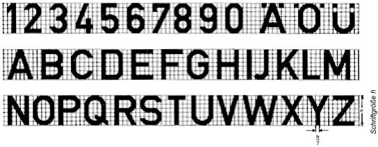

2.3.2 fette Engschrift

    DIN 1451

    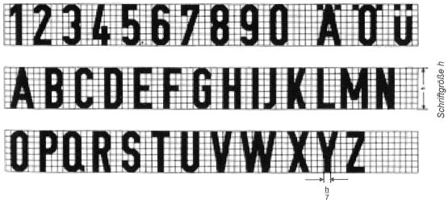

**3.** **Euro-Feld**

    Zwischen Euro-Feld und schwarzem Rand ist eine Lichtkante bis
    höchstens 2,0 mm zulässig.

    Ausgestaltung des Sternenkranzes:

    Die Geometrie des Sternenkranzes ergibt sich aus folgender Abbildung:

    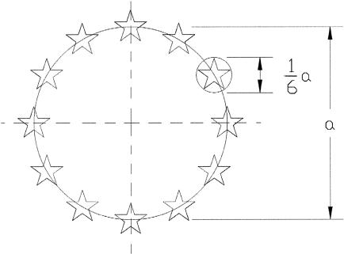
    Der Durchmesser des Sternenkranzes entspricht dem Sechsfachen des
    Durchmessers des einzelnen Sterns. Die Ausführung des
    Erkennungsbuchstabens „D“ erfolgt nach DIN 1451 Teil 2.

3.1 einzeiliges Kennzeichen

    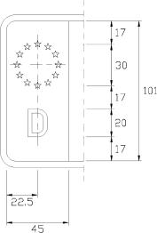

3.2 zweizeiliges Kennzeichen und Kraftradkennzeichen

    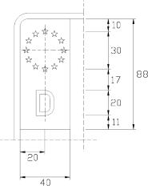

3.3 verkleinertes zweizeiliges Kennzeichen

    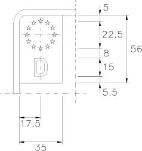

**4.** **Ergänzungsbestimmungen**

    Mehr als acht Stellen (Buchstaben und Ziffern) auf einem Kennzeichen
    sind unzulässig. Für einzeilige Kennzeichen oder zweizeilige
    Kennzeichen nach Nummer 1 Satz 1 Buchstabe b ist die Mittelschrift zu
    verwenden, es sei denn, die etwa vorgeschriebene oder die vom
    Hersteller vorgesehene Anbringungsstelle für Kennzeichen lässt dies
    nicht zu. In diesem Fall darf für die Buchstaben zur Unterscheidung
    des Verwaltungsbezirks und/oder für die Buchstaben der
    Erkennungsnummer und/oder die Zahlen der Erkennungsnummer jeweils die
    Engschrift verwendet werden. Das Kennzeichen darf nicht größer sein
    als die etwa vorgeschriebene oder die vom Hersteller vorgesehene
    Anbringungsstelle dies zulässt. In keinem Fall dürfen die zu den
    einzelnen Kennzeichenarten angegebenen Größtmaße überschritten werden.
    Ist es der Zulassungsbehörde nicht möglich, für ein Fahrzeug ein
    Kennzeichen zuzuteilen, das an der am Fahrzeug vorgesehenen Stelle
    angebracht werden kann, so hat der Halter Veränderungen am Fahrzeug
    vorzunehmen, die die Anbringung eines vorschriftsmäßigen Kennzeichens
    ermöglichen, sofern die Veränderungen nicht unverhältnismäßigen
    Aufwand erfordern; in Zweifelsfällen kann die Zulassungsbehörde die
    Vorlage eines Gutachtens eines amtlich anerkannten Sachverständigen
    für den Kraftfahrzeugverkehr verlangen. Stellt ein amtlich anerkannter
    Sachverständiger für den Kraftfahrzeugverkehr fest, dass an einem
    mehrspurigen Kraftfahrzeug die Anbringung eines vorschriftsmäßigen
    hinteren Kennzeichens nach Nummer 1 Satz 1 Buchstabe a oder b einen
    unverhältnismäßigen Aufwand erfordert oder technisch nicht möglich
    ist, kann die Zulassungsbehörde eine Ausnahme zum Führen eines
    verkleinerten zweizeiligen Kennzeichens nach Nummer 1 Satz 1 Buchstabe
    c genehmigen; dies gilt nicht, wenn durch nachträgliche Änderungen die
    Anbringung eines vorschriftsmäßigen Kennzeichens nicht mehr möglich
    ist.

**5.** **Anerkennung von Prüfungen aus anderen Mitgliedstaaten der
    Europäischen Union und des Europäischen Wirtschaftsraumes**

    Es werden auch Prüfungen der Kennzeichenschilder anerkannt, die von
    den zuständigen Prüfstellen anderer Mitgliedstaaten der Europäischen
    Union oder anderer Vertragsstaaten des Abkommens über den Europäischen
    Wirtschaftsraum entsprechend § 10 Absatz 2 Satz 3 durchgeführt und
    bescheinigt werden.

**6.** **Plaketten**

    In den auf den Kennzeichen vorgesehenen Feldern sind Plaketten
    anzubringen

    a)  (weggefallen)

    b)  nach § 29 Absatz 2 der Straßenverkehrs-Zulassungs-Ordnung auf dem
        hinteren Kennzeichen oben,

    c)  nach § 10 Absatz 3 auf dem vorderen und hinteren Kennzeichen jeweils
        unten.

    Bei zweizeiligen Kennzeichen dürfen die Plaketten unter dem Euro-Feld
    angebracht werden. Auf dem Kraftradkennzeichen sind die Plaketten nach
    Satz 1 Buchstabe b in der Mitte links, auch unter dem Euro-Feld, und
    nach Satz 1 Buchstabe c in der Mitte rechts anzubringen.

## Abschnitt 2

## Allgemeine Kennzeichen

1.  einzeiliges Kennzeichen

    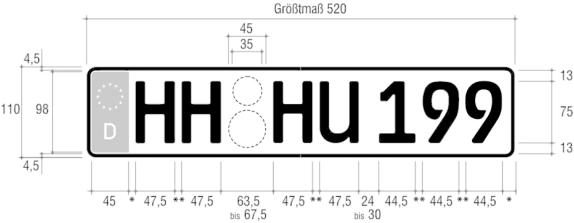
    \* Mindestmaß 8 mm
    \*\* 8 mm bis 10 mm

2.  zweizeiliges Kennzeichen

    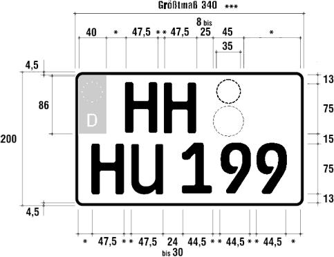
    \* Mindestmaß 8 mm
    \*\* 8 mm bis 10 mm
    \*\*\* bei zwei- und dreirädrigen Kraftfahrzeugen 280 mm

2a. Kraftradkennzeichen

    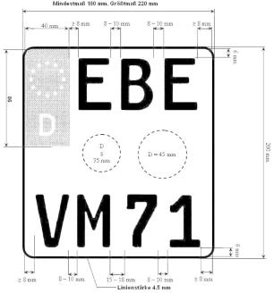

3.  verkleinertes zweizeiliges Kennzeichen

    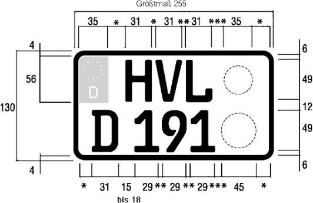
    \* Mindestmaß 8 mm
    \*\* 8 mm bis 10 mm
    \*\*\* 5 mm bis 20 mm

## Abschnitt 3

## Kennzeichen der Bundeswehr

1.  Leichtkrafträder und Kleinkrafträder

1.1 Leichtkrafträder und Kleinkrafträder

    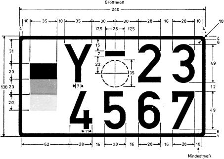

1.2 Kleinkrafträder

    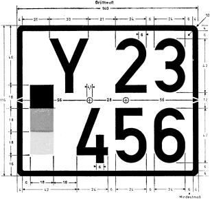

2.  andere Krafträder

    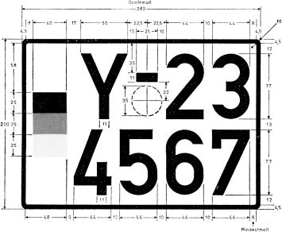

3.  andere Kraftfahrzeuge und Anhänger – einzeilig

    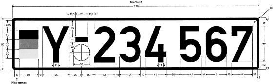

4.  andere Kraftfahrzeuge und Anhänger – zweizeilig

    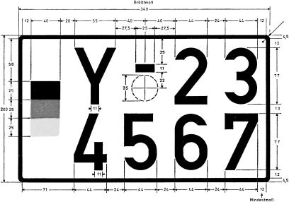

5.  Ergänzungsbestimmungen

    Wird die Ziffer „1“ verwendet oder enthält eine Zeile weniger Ziffern
    als die entsprechende Zeile des Musters, so vergrößern sich die
    Abstände zwischen den Ziffern der Zeile gleichmäßig. Die Farbtöne des
    Untergrundes, des Randes und der Beschriftung sind dem Farbregister
    RAL 840 HR zu entnehmen, und zwar für schwarz RAL 9005 und weiß RAL
    9001\. Als Farbtöne sind bei den Bundesfarben zu wählen für schwarz:
    RAL 9005, für rot: RAL 3002 und für gold: RAL 1006. Bei Kennzeichen
    nach Nummer 3 werden die letzten drei Ziffern von den vorhergehenden
    Ziffern durch einen Gruppenabstand in dreifacher Größe des normalen
    Abstandes getrennt.

## Abschnitt 4

## Oldtimerkennzeichen

1.  einzeiliges Kennzeichen

    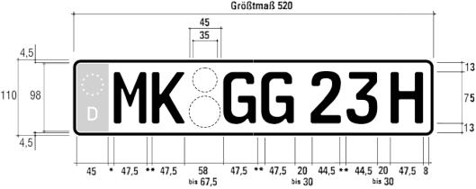
    \* Mindestmaß 8 mm
    \*\* 8 mm bis 10 mm

2.  zweizeiliges Kennzeichen

    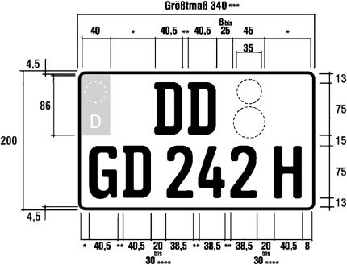
    \* Mindestmaß 8 mm
    \*\* 8 mm bis 10 mm
    \*\*\* bei zwei- und dreirädrigen Kraftfahrzeugen 280 mm
    \*\*\** bei zwei- und dreirädrigen Kraftfahrzeugen 15 mm bis 30 mm

2a. Kraftradkennzeichen

    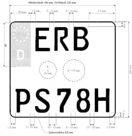

3.  verkleinertes zweizeiliges Kennzeichen

    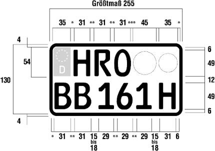
    \* Mindestmaß 6 mm
    \*\* 8 mm bis 10 mm
    \*\*\* 5 mm bis 20 mm

4.  Ergänzungsbestimmungen

    Der Kennbuchstabe „H“ ist der Erkennungsnummer ohne Leerzeichen in
    gleicher Schriftart anzufügen. Mehr als sieben Stellen (Buchstaben und
    Ziffern ohne Kennbuchstabe „H“) auf einem Kennzeichen nach Nummer 1
    und einem Kennzeichen für zwei- oder dreirädrige Kraftfahrzeuge nach
    Nummer 2 oder mehr als acht Stellen auf einem Kennzeichen nach Nummer
    2 oder 3 sind unzulässig. Für Kennzeichen nach den Nummern 1 und 2 ist
    die Mittelschrift zu verwenden, es sei denn, die etwa vorgeschriebene
    oder die vom Hersteller vorgesehene Anbringungsstelle für Kennzeichen
    lässt dies nicht zu. In diesem Fall darf für die Buchstaben zur
    Unterscheidung des Verwaltungsbezirks und für die Buchstaben der
    Erkennungsnummer und die Zahlen der Erkennungsnummer jeweils die
    Engschrift verwendet werden. Auf einem Kennzeichen nach Nummer 3
    dürfen die Plaketten nach Abschnitt 1 Nummer 6 Satz 1 wie folgt
    aufgebracht werden:

    a)  Plakette nach Buchstabe b auf dem hinteren Kennzeichen oben rechts und

    b)  Plakette nach Buchstabe c auf dem hinteren Kennzeichen oben links.

## Abschnitt 5

## Saisonkennzeichen

1.  einzeiliges Kennzeichen

    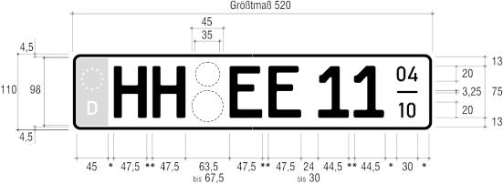
    \* Mindestmaß 8 mm
    \*\* 8 mm bis 10 mm

2.  zweizeiliges Kennzeichen

    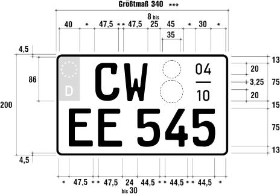
    \* Mindestmaß 8 mm
    \*\* 8 mm bis 10 mm
    \*\*\* bei zwei- und dreirädrigen Kraftfahrzeugen 280 mm

2a. Kraftradkennzeichen

    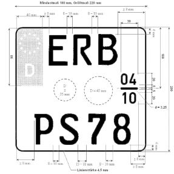

3.  verkleinertes zweizeiliges Kennzeichen

    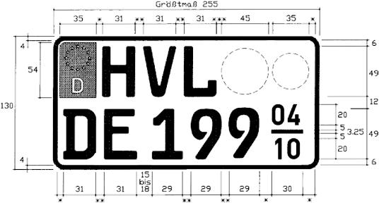
    \* Mindestmaß 8 mm
    \*\* 8 mm bis 10 mm
    \*\*\* 5 mm bis 20 mm

4.  Ergänzungsbestimmungen:

    In dem Feld, das den Betriebszeitraum angibt, kennzeichnet die Zahl
    über dem Bindestrich den Monat des Beginns, die Zahl unter dem
    Bindestrich den Monat der Beendigung des Betriebszeitraums. Die
    Ausführung der Ziffern, die den Betriebszeitraum angeben, erfolgt nach
    DIN 1451 Teil 2. Mehr als sieben Stellen (Buchstaben und Ziffern) auf
    einem Kennzeichen nach den Nummern 1 und 2 sind unzulässig. Auf einem
    Kennzeichen nach Nummer 3 dürfen die Plaketten entsprechend Abschnitt
    4 Nummer 4 Satz 5 angebracht werden.

## Abschnitt 6

## Kurzzeitkennzeichen

1.  einzeiliges Kennzeichen

    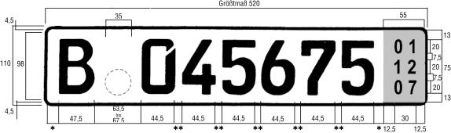
    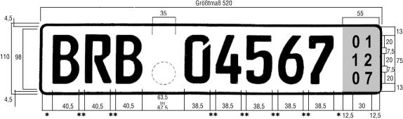
    \* Mindestmaß 8 mm
    \*\* 8 mm bis 10 mm

2.  zweizeiliges Kennzeichen

    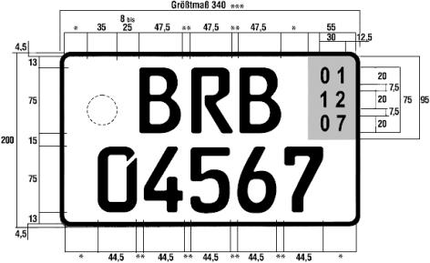
    \* Mindestmaß 8 mm
    \*\* 8 mm bis 10 mm
    \*\*\* bei zwei- und dreirädrigen Kraftfahrzeugen 280 mm

3.  zweizeiliges Kennzeichen (verkleinert)

    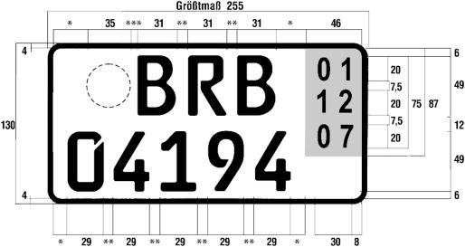
    \* Mindestmaß 6 mm
    \*\* 8 mm bis 10 mm
    \*\*\* 5 mm bis 20 mm

4.  Ergänzungsbestimmungen

    Die Ausführung der Ziffern, die das Ablaufdatum angeben, erfolgt nach
    DIN 1451 Teil 2.

    Für Kennzeichen nach den Nummern 1 und 2 ist die Mittelschrift zu
    verwenden, es sei denn, die etwa vorgeschriebene oder die vom
    Hersteller vorgesehene Anbringungsstelle für Kennzeichen lässt dies
    nicht zu. In diesem Fall darf für die Buchstaben zur Unterscheidung
    des Verwaltungsbezirks und die Zahlen der Erkennungsnummer jeweils die
    Engschrift verwendet werden. § 10 Absatz 3 ist mit folgenden Maßgaben
    anzuwenden:

    a)  Es sind Stempelplaketten mit dem Dienststempel der Zulassungsbehörde
        mit einem Durchmesser von 35 mm mit blauem Untergrund (nach DIN
        6171-1, blau – Euro-Feld) zu verwenden.

    b)  Die Zulassungsbehörde kann dem Halter oder Antragsteller gestatten,
        die Plaketten an den Kennzeichen des Fahrzeugs auf dem vorgesehenen
        Feld selbst anzubringen. In diesem Fall händigt sie ihm die Plaketten
        bei der Zuteilung des Kennzeichens mit dem besonderen Fahrzeugschein
        aus. Die Plaketten sind wie folgt anzubringen:

        aa) bei den Kennzeichen nach Nummer 1 zwischen dem Unterscheidungszeichen
            und der Erkennungsnummer jeweils unten;

        bb) bei den Kennzeichen nach den Nummern 2 und 3 neben dem
            Unterscheidungszeichen jeweils oben links; bei Kennzeichen nach Nummer
            2 mit dreistelligen Unterscheidungszeichen dürfen die Plaketten neben
            der Erkennungsnummer unter dem Feld, das das Ablaufdatum angibt,
            angebracht werden.

    c)  Die Vorschriften bezüglich der Plaketten nach Abschnitt 1 Nummer 6
        Satz 1 Buchstabe a und b sind nicht anzuwenden.

    In dem Feld, das das Ablaufdatum angibt, kennzeichnet die obere Zahl
    den Tag, die mittlere Zahl den Monat und die untere Zahl das Jahr des
    Ablaufdatums. Die Farbe dieses Feldes ist gelb (nach DIN 6171-1) mit
    schwarzer Beschriftung (RAL 9005).

5.  Ergänzungen zur DIN 74069, Ausgabe Juli 1996

    Auf die Prüfung nach den Abschnitten 6 und 7 der DIN-Norm 74069;
    Ausgabe Juli 1996, wird verzichtet. Die Registernummer, die der
    Hersteller des Kennzeichens bei der turnusmäßigen Prüfung seiner
    Erzeugnisse von der Gesellschaft für Konformitätsbewertung mbH (DIN
    CERTCO) erhalten hat, muss verwendet werden.

## Abschnitt 7

## Rote Kennzeichen zur wiederkehrenden Verwendung und rote
Oldtimerkennzeichen

Die Kennzeichen sind entsprechend Abschnitt 2, jedoch in roter Schrift
und rotem Rand auszuführen. Die Vorschriften bezüglich der Plaketten
gemäß Abschnitt 1 Nummer 6 Satz 1 Buchstabe a und b sind nicht
anzuwenden.

## Abschnitt 8

## Ausfuhrkennzeichen

1.  einzeiliges Kennzeichen

    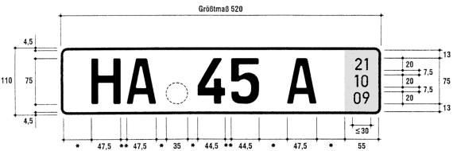
    \* Mindestmaß 8 mm
    \*\* 8 mm bis 10 mm

2.  zweizeiliges Kennzeichen

    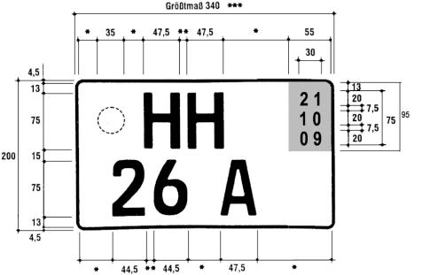
    \* Mindestmaß 8 mm
    \*\* 8 mm bis 10 mm
    \*\*\* bei zwei- und dreirädrigen Kraftfahrzeugen 280 mm

3.  Ergänzungsbestimmungen:

    Die Vorschriften bezüglich der verkleinerten Mittelschrift (Abschnitt
    1 Nummer 2.2.3), des Euro-Feldes (Abschnitt 1 Nummer 3) sowie der
    Plaketten (Abschnitt 1 Nummer 6 Satz 1 Buchstabe a und b) sind nicht
    anzuwenden. Das Feld mit dem Ablaufdatum besteht aus einem roten
    Untergrund (RAL 2002) mit schwarzer Beschriftung (RAL 9005). Die obere
    Zahl kennzeichnet den Tag, die mittlere Zahl den Monat und die untere
    Zahl das Jahr, in welchem die Gültigkeit der Zulassung im
    Geltungsbereich dieser Verordnung endet. Der rote Untergrund darf
    nicht retroreflektierend sein. Das Unterscheidungszeichen, die
    Erkennungsnummer und die Zahlen des Ablaufdatums müssen geprägt sein.
    Zur Abstempelung des Kennzeichens sind Stempelplaketten nach § 10
    Absatz 3, jedoch mit dem Dienstsiegel der Zulassungsbehörde mit einem
    Durchmesser von 35 mm mit rotem Untergrund (RAL 2002) zu verwenden.

(zu § 11 Absatz 1)

### Anlage 5 Zulassungsbescheinigung Teil I

(Fundstelle: BGBl. I 2011, 203 - 205)

## Vorbemerkungen

1.  Ausgestaltung der Zulassungsbescheinigung Teil I:

    Trägermaterial: Neobond (150 g/m²), Farbe weiß

    Format: Breite 210 mm, Höhe 105 mm, zweimal faltbar auf DIN A7, zweiseitig
        bedruckt.

    In das Trägermaterial eingearbeitet sind die folgenden
    fälschungserschwerenden Sicherheitsmerkmale:

    –   Wasserzeichen (Motiv: „Stilisierter Adler“ – gesetzlich geschützt für
        die Bundesdruckerei),

    –   Melierfasern, teilweise fluoreszierend,

    –   Planchetten, fluoreszierend,

    –   Sicherheitsreagenzien als Schutz gegen chemische Rasurmanipulationen.

2.  Sicherheitsmerkmale:

    Der Druck auf dem Trägermaterial weist folgende fälschungserschwerende
    Sicherheitsmerkmale auf:

    –   mehrfarbiger Guillochenschutzunterdruck (zweistufig verarbeitet) mit
        Irisverlauf und integrierten Mikroschriften auf beiden Seiten,

    –   Fluoreszenzaufdruck vorderseitig (Motiv: Bundesadler mit zweigeteilter
        Linienstruktur), unsichtbar (unter UV-Licht fluoreszierend),

    –   Textfarbe dunkelgrün (unter UV-Licht grün fluoreszierend), Integration
        von Mikroschriftelementen im Formulartext,

    –   optisch-variables Element in Form eines Kinegrams (Motiv: „Sonne 40“ –
        gesetzlich geschützt für die Bundesdruckerei) auf der Rückseite des
        Dokuments einschließlich eines maschinell prüfbaren Merkmals; das
        Kinegramm wird durch die Vordrucknummerierung teilweise überdruckt.
        Die Vordrucknummerierung wird dunkelblau (unter UV-Licht gelb-grün
        fluoreszierend) aufgebracht,

    –   fortlaufende Nummer auf der Vorderseite, die durch die
        Zulassungsbehörde bei der Ausstellung eingetragen wird, wobei die
        Einmaligkeit der Nummer sicherzustellen ist.

3.  Objektsicherung und Fertigungskontrolle:

    Die Herstellung, die Lagerung und der Versand von Rohmaterialien und
    Vordrucken muss so erfolgen, dass ein Verlust oder ein unberechtigter
    Zugriff ausgeschlossen ist. Zu diesem Zweck müssen Papierhersteller,
    Druckereien und Verlage Systeme der Objektsicherung und
    Fertigungskontrolle unterhalten, die folgenden Anforderungen genügen
    müssen:

    a)  Für die Räume, in denen die Vordrucke gelagert werden, ist ein
        erhöhter mechanischer Einbruchschutz vorzusehen. Die
        Widerstandszeitwerte für Mauerwerk, Türen und Fenster sind so zu
        wählen, dass auch beim Einsatz üblicher maschinenbewegter Werkzeuge
        ausreichend Zeit für ein polizeiliches Einschreiten bleibt. Es ist
        eine Einbruchmeldeanlage nach neuester Richtlinie vorzusehen sowie ein
        Zugangskontrollsystem mit Dokumentationseinrichtung. Die Entnahme und
        Einlagerung ist jeweils von zwei Beschäftigten zu quittieren. Durch
        organisatorische Maßnahmen ist sicherzustellen, dass nicht nur die von
        der Bundesdruckerei angelieferten Vordrucke, sondern außerhalb der
        Arbeitszeit auch alle Halb- und Zwischenerzeugnisse in diesem
        gesicherten Lager verwahrt werden.

    b)  Die Verarbeitung der Vordrucke in der Druckerei (Herstellung der
        Eindrucke, schneiden, zählen und verpacken) darf nur in Räumlichkeiten
        mit eingeschränkter Zugangsberechtigung erfolgen. Es ist ein
        Zugangskontrollsystem mit Dokumentationseinrichtung zu installieren.

    c)  Mit der Lagerung und Verarbeitung dürfen nur zuverlässige Personen
        betraut werden, die eine besondere Verpflichtungserklärung im
        sorgfältigen und kontrollierten Umgang mit den Vordrucken abgegeben
        haben.

    d)  Es ist ein Registrierungssystem einzurichten, das eine lückenlose
        Verfolgung und Verbleibskontrolle jedes einzelnen Vordrucks anhand der
        von der Bundesdruckerei angebrachten Nummerierung sicherstellt.

    e)  Der Versand der Vordrucke an die Zulassungsbehörden muss so erfolgen,
        dass jederzeit eine Verbleibsermittlung möglich ist und der Empfänger
        innerhalb der Zulassungsbehörde registriert wird.

    Die Unternehmen geben eine Sicherheitserklärung ab, in der sie die
    Einhaltung der vorgenannten Anforderungen gegenüber dem Kraftfahrt-
    Bundesamt bestätigen. Das Kraftfahrt-Bundesamt ermächtigt nach Prüfung
    die Bundesdruckerei, diesen Unternehmen Vordrucke der
    Zulassungsbescheinigung Teil I zu liefern. Ein Widerruf erfolgt, wenn
    die Unternehmen gegen einzelne Sicherheitsbestimmungen verstoßen.

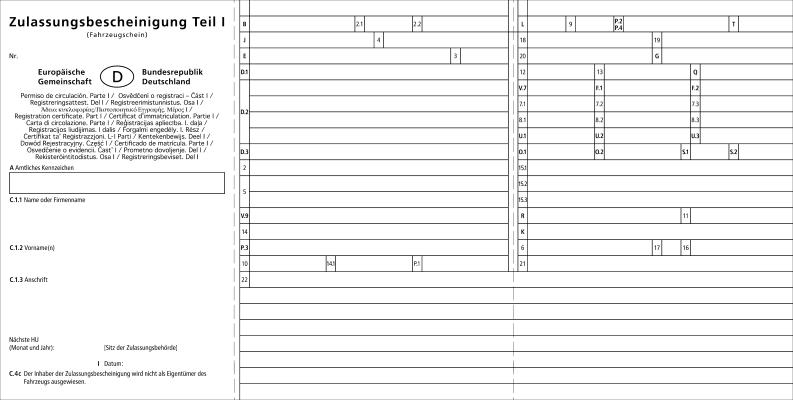
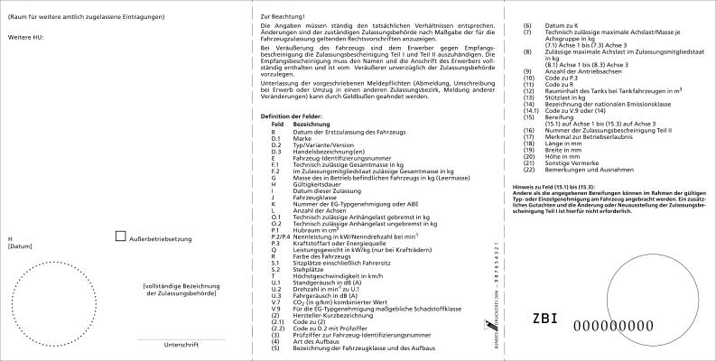
(zu § 11 Absatz 3)

### Anlage 6 Zulassungsbescheinigung Teil I für Fahrzeuge der Bundeswehr

(Fundstelle: BGBl. I 2011, 206 - 207)

## Vorbemerkungen

Format: Breite 210 mm, Höhe 8 1/3 Zoll (207 mm)

Es gelten die Nummern 1 und 2 der Vorbemerkungen der Anlage 5

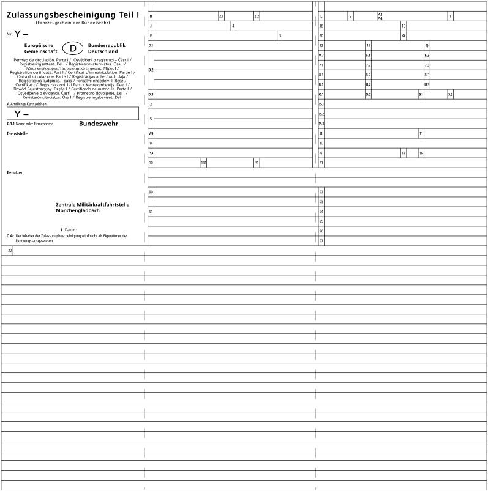

(zu § 12 Absatz 2)

### Anlage 7 Zulassungsbescheinigung Teil II

(Fundstelle: BGBl. I 2011, 208 - 209)

## Vorbemerkungen

1.  Ausgestaltung der Zulassungsbescheinigung Teil II

    Trägermaterial: Neobond (150 g/m²), Farbe weiß

    Format: Breite 210 mm, Höhe 12 Zoll (304,8 mm), einseitig bedruckt

    In das Trägermaterial eingearbeitet sind die folgenden
    fälschungserschwerenden Sicherheitsmerkmale:

    –   Wasserzeichen (Motiv: „Stilisierter Adler“ – gesetzlich geschützt für
        die Bundesdruckerei),

    –   Melierfasern, teilweise fluoreszierend,

    –   Planchetten, fluoreszierend,

    –   Sicherheitsreagenzien als Schutz gegen chemische Rasurmanipulationen.

2.  Sicherheitsmerkmale:

    Der Druck auf dem Trägermaterial weist folgende fälschungserschwerende
    Sicherheitsmerkmale auf:

    –   mehrfarbiger Guillochenschutzunterdruck (zweifarbig verarbeitet) mit
        Irisverlauf und integrierten Mikroschriften auf der Vorderseite,

    –   Rückseite einfarbig eingefärbt,

    –   Fluoreszenzaufdruck vorderseitig (Motiv: Bundesadler mit zweigeteilter
        Linienstruktur), unsichtbar (unter UV-Licht fluoreszierend),

    –   Textfarbe dunkelgrün (unter UV-Licht grün fluoreszierend), Integration
        von Mikroschriftelementen im Formulartext,

    –   Vordrucknummerierung dunkelblau (unter UV-Licht gelb-grün
        fluoreszierend).

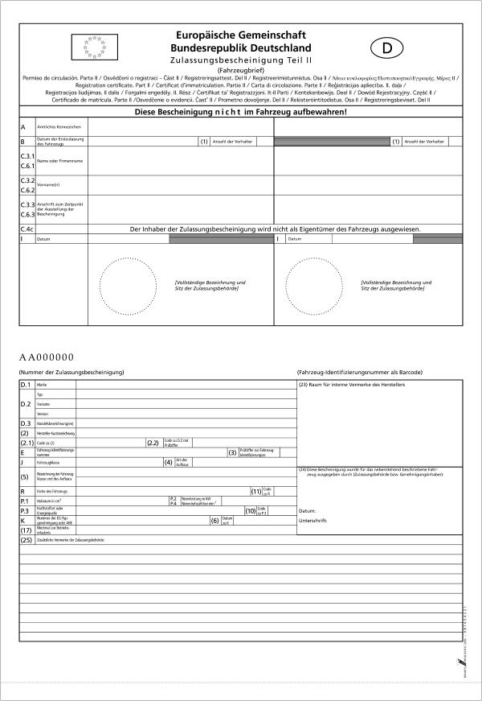
(zu § 15)

### Anlage 8 Verwertungsnachweis

(Fundstelle: BGBl. I 2011, 210 - 213)

## Abschnitt 1

## Vorbemerkungen zur Herstellung des Vordrucks „Verwertungsnachweis“

1.  Allgemeines

    Der Verwertungsnachweis besteht aus einem Satz mit vier Ausfertigungen
    (Blättern).

    Jedes Blatt besteht aus zwei Seiten.

    Die erste Ausfertigung (Blatt 1) der Seiten 1 bis 2 des Vordrucks
    enthält in der Kopfzeile folgende Bezeichnung:
    „Diese Ausfertigung (rosa) ist für den Fahrzeughalter/-eigentümer
    bestimmt. “

    Blatt 2 enthält entsprechend folgende Bezeichnung:
    „Diese Ausfertigung (altgold) ist für den Demontagebetrieb bestimmt. “

    Blatt 3 enthält entsprechend folgende Bezeichnung:
    „Diese Ausfertigung (blau) ist für die Schredderanlage bestimmt. “

    Blatt 4 enthält entsprechend folgende Bezeichnung:
    „Diese Ausfertigung (weiß) ist für die Annahme-/Rücknahmestelle
    bestimmt. “

2.  Format

    Ein Muster des Vordrucks ist in Abschnitt 2 verkleinert wiedergegeben.
    Zur ordnungsgemäßen Verwendung ist der Vordruck im Verhältnis 84:100
    zu vergrößern. Das Format DIN A4 ist durch gestrichelte Linien
    kenntlich gemacht.

3.  Passergenauigkeit

    Sämtliche Blätter sind mit einem Passer für computergestützte Ausfüll-
    und Lesevorgänge zu versehen. Zwischen dem oberen Papierrand und der
    oberen Begrenzung des Passers ist ein zweifacher 1/6-Zoll-Abstand zu
    wählen. Zwischen dem linken Papierrand und der seitlichen Begrenzung
    des Passers beträgt der Abstand 8/10 Zoll.

    Der senkrechte Abstand zwischen der Passermarke und den
    Eintragungsfeldern ist in der Maßeinheit 1/6 Zoll (2/6 Zoll
    durchgängige Zeilenschaltung) auszuführen. In der Waagerechten ist der
    Abstand zwischen der Passermarke und dem Beginn der Eintragungsfelder
    in der Maßeinheit 1/10 Zoll (Bewegungsschrift) auszuführen. Die Kämme
    sind auf 2/10 Zoll auszurichten, damit auch eine handschriftliche
    Eintragung gewährleistet ist.

4.  Maschinenlesbarkeit

    Der Vordruck ist maschinenlesbar zu gestalten. Die folgenden
    Gestaltungsempfehlungen sind zu beachten, wenn Vordrucke als
    allgemeines Schriftgut zur optischen Belegerfassung vorgesehen sind.

4.1 Farben

    Bei Vordrucken zur optischen Belegerfassung muss sich der Aufdruck
    (Text, Linien, Raster) farblich vom Ausfülltext unterscheiden.
    Ziffern, Zahlen, Nummern und der Passer sollten bei maschinenlesbaren
    Vordrucken in Blindfarbe gedruckt sein. Bis auf die Ausfertigung
    „weiß“ sind deshalb die Blätter in der unten angegebenen Blindfarbe zu
    drucken (RAL-Werte nach Euro-Skala):

    *        *   Blatt 1
            (Ausfertigung für den Halter)

        *   rosa

        *   100 % Yellow und 85 % Magenta

    *        *   Blatt 2
            (Ausfertigung für den Demontagebetrieb)

        *   altgold

        *   100 % Yellow und 45 % Magenta

    *        *   Blatt 3
            (Ausfertigung für die Schredderanlage)

        *   blau

        *   55 % Magenta und 100 % Cyan

    *        *   Blatt 4
            (Ausfertigung für die Annahme-/Rücknahmestelle)

        *   weiß.

        *

4.2 Schriften

    Beim handschriftlichen Ausfüllen sollten neben den Ziffern nur
    Großbuchstaben verwendet werden. Für Schreibmaschinen- und
    Druckschrift sind mindestens Schrifthöhen mit einer Versalhöhe von ca.
    2,1 mm bis 3,2 mm, für Handblockschrift von ca. 5 mm einzuhalten. Alle
    Schriften, außer Kursiv- und Serifenschriften, sind geeignet für die
    optische Zeichenerkennung. Die Begrenzungslinien für
    Eintragungsfelder, Linien, Schriften und die Rasterflächen sind in den
    oben genannten Farben als sogenannte Blindfarbe ohne Verunreinigungen
    auszuführen. Die Rasterflächen dürfen 60 % vom Volltonwert nicht
    überschreiten. Die maschinell zu lesenden Bereiche müssen weiß sein.

5.  Leimung

    Wird eine Verleimung der Vordrucksätze vorgenommen, so hat diese am
    Kopf zu erfolgen. Trennleisten mit Mikroperforation sind zulässig.

6.  Papierqualität

    Die jeweiligen Oberblätter (Blatt 1) sind auf Papier zu drucken mit
    einem Gewicht von 80 g/m². Die jeweiligen Mittelblätter (Blätter 2 und
    3) sind auf einem Papier mit 53 g/m² zu drucken. Die jeweiligen
    Unterblätter (Blatt 4) sind auf Papier mit 80 g/m² zu drucken.

## Abschnitt 2

## Muster

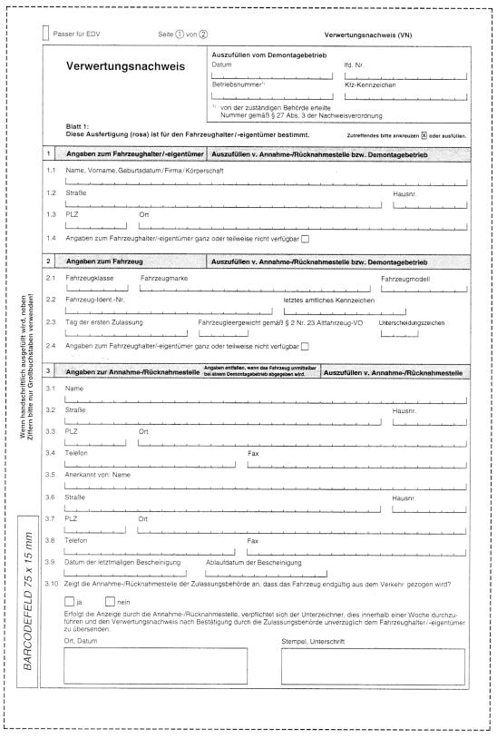
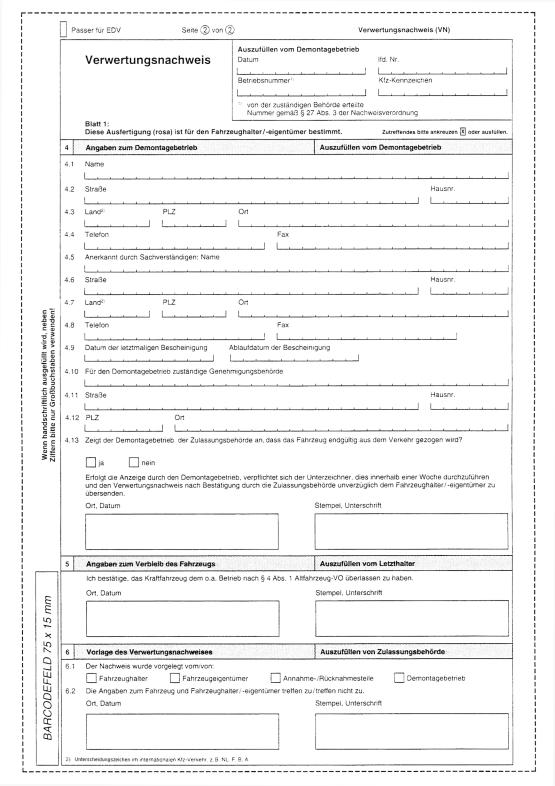
(zu § 16 Absatz 2 Satz 1)

### Anlage 9 Fahrzeugschein für Fahrzeuge mit Kurzzeitkennzeichen

(Fundstelle: BGBl. I 2011, 214)

Breite 74 mm, Höhe 105 mm, Farbe hellrot, schwarzer Druck (Typendruck)

Geringfügige Abweichungen vom vorgeschriebenen Muster sind zulässig,
insbesondere können zusätzliche Hinweise zur Verwendung aufgedruckt
werden.

*    *   Seite 1

    *   Seite 2

*    *
    *

*    *
    *

   (zu § 16 Absatz 3 Satz 1)

### Anlage 10 Fahrzeugscheinheft für Fahrzeuge mit rotem Kennzeichen

(Fundstelle: BGBl. I 2011, 215)

Breite 74 mm, Höhe 105 mm, Farbe hellrot, schwarzer Druck
(Typendruck).

Mehrseitig, auf Seite 3 und den folgenden Seiten derselbe Vordruck wie
auf Seite 2.

Mit Ausnahme von Seite 1 darf jede Seite Angaben über nur ein Fahrzeug
enthalten.

Geringfügige Abweichungen vom vorgeschriebenen Muster sind zulässig,
insbesondere können zusätzliche Hinweise zur Verwendung aufgedruckt
werden.

*    *   Seite 1

    *   Seite 2

*    *
    *

*    *
    *

   (zu § 19 Absatz 1 Nummer 1, § 23 Absatz 3 und 4, § 25 Absatz 1)

### Anlage 11 Bescheinigungen zum Versicherungsschutz

(Fundstelle: BGBl. I 2011, 216 - 218)

**1.** **Versicherungsbestätigung**

    (Format DIN A6, Farbe: Untergrund weiß, Druck schwarz)

**2.** **Versicherungsbestätigung für Hersteller**

    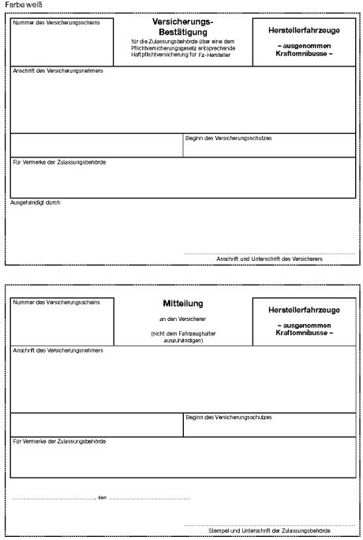

**3.** **Versicherungsbestätigung bei Ausfuhrkennzeichen**

    Bestätigung über eine dem Gesetz über die Haftpflichtversicherung für
    ausländische Kraftfahrzeuge und Kraftfahrzeuganhänger entsprechende
    Haftpflichtversicherung:

    Format DIN A6, Farbe: Untergrund gelb, Druck schwarz, drei
    Ausfertigungen.

    Die Bestätigung enthält die Daten zur Kraftfahrzeug-
    Haftpflichtversicherung, zum Kennzeichen, zur Fahrzeugbeschreibung und
    zum Versicherungsnehmer sowie zusätzlich das Datum des Endes des
    Versicherungsschutzes.

**4.** **Nachweis für eine Befreiung des Halters von der
    Versicherungspflicht**

    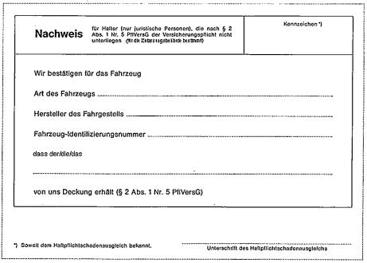

**5.** **Anzeige über einen Wegfall des Versicherungsschutzes nach § 25
    Absatz 1 Satz 1**

    (Format DIN A6, Farbe: Untergrund weiß, Druck schwarz)

    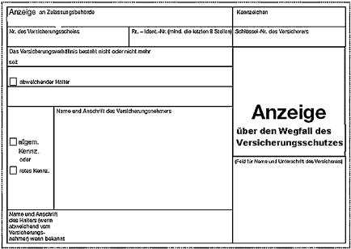

(zu § 27 Absatz 1 Satz 4)

### Anlage 12 Versicherungskennzeichen für Kleinkrafträder, motorisierte Krankenfahrstühle und vierrädrige Leichtkraftfahrzeuge

(Fundstelle: BGBl. I 2011, 219 - 220)

1.  Versicherungskennzeichen

    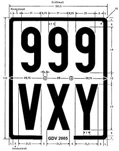
    Enthält eine Zeile nur eine oder zwei Ziffern oder einen oder zwei
    Buchstaben, so sind Zahlen und Buchstaben in der Mitte der Zeile
    anzubringen. Der Abstand vom Rand ist entsprechend zu vergrößern; die
    übrigen Abstände dürfen nur bis zum angegebenen Höchstmaß vergrößert
    werden.

2.  Schrift

    Schriftart und -größe nach DIN 1451 (Anlage 4 Abschnitt 1 Nummer 2.3.1
    und 2.3.2).

3.  Maße

4.  Ergänzungsbestimmungen

    Die Ecken des Versicherungskennzeichens müssen mit einem Halbmesser
    von 10 mm abgerundet sein. Die Beschriftung des Kennzeichens darf
    nicht mehr als 1,5 mm über die Grundfläche hervortreten. Die
    Beschriftung erfolgt nach dem Schriftmuster der Normschrift DIN 1451
    (nach dem Hilfsnetz hergestellt; Anlage 4 Buchstabe B Ziffer 3), und
    zwar in fetter Mittelschrift, beim Zusammentreffen von mehr als 2
    Buchstaben oder mehr als 2 Ziffern in fetter Engschrift. Der Buchstabe
    Q darf nicht verwendet werden. Die Farbtöne des Randes und der
    Beschriftung sind dem Farbregister RAL 840 HR zu entnehmen, und zwar
    für schwarz RAL 9005, blau RAL 5012 und grün RAL 6010; der Farbton des
    Untergrundes des Kennzeichens ist weiß (ws) nach DIN 6171 Teil 1:
    03\.89, Tabelle 3. Bei Verwendung von Stahlblech muss die Blechstärke
    mindestens 0,35 mm, bei Aluminiumblech mindestens 0,50 mm betragen.
    Wird anderes Material verwendet, so muss es eine entsprechende
    Festigkeit besitzen.

