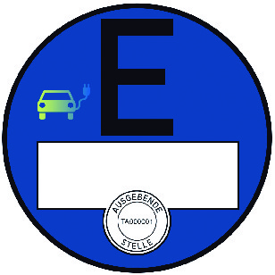

# Verordnung über die Zulassung von Fahrzeugen zum Straßenverkehr (FZV 2011)

Ausfertigungsdatum
:   2011-02-03

Fundstelle
:   BGBl I: 2011, 139

Zuletzt geändert durch
:   Art. 7a V v. 2.10.2019 I 1416

Änderung durch
:   Art. 4 G v. 29.6.2020 I 1528 (Nr. 32) textlich nachgewiesen, dokumentarisch noch nicht abschließend bearbeitet

Änderung durch
:   Art. 5 V v. 25.6.2021 I 2204 (Nr. 38) textlich nachgewiesen, dokumentarisch noch nicht abschließend bearbeitet

Änderung durch
:   Art. 8 G v. 12.7.2021 I 3091 (Nr. 48) textlich nachgewiesen, dokumentarisch noch nicht abschließend bearbeitet

Änderung durch
:   Art. 9 G v. 12.7.2021 I 3091 (Nr. 48) textlich nachgewiesen, dokumentarisch noch nicht abschließend bearbeitet

Mittelbare änderung durch
:   Art. 154a Nr. 3 Buchst. a G v. 20.11.2019 I 1626 (Nr. 41) ist nicht ausführbar, da das geänderte G v. 21.6.2019 I 846 zum Zeitpunkt des Inkrafttretens des mittelbaren Änderungsgesetzes bereits zum 1.11.2019 in Kraft getreten war

[^f774780_01_BJNR013900011]:     Diese Verordnung dient der Umsetzung der Richtlinie 1999/37/EG des
    Rates vom 29. April 1999 über Zulassungsdokumente für Fahrzeuge (ABl.
    L 138 vom 1.6.1999, S. 57 ), die durch die Richtlinie 2003/127/EG
    (ABl. L 10 vom 16.1.2004, S. 29) geändert worden ist.

## Eingangsformel

Das Bundesministerium für Verkehr, Bau und Stadtentwicklung verordnet
auf Grund des

–   § 6 Absatz 1 Nummer 2 Buchstabe a bis d, f, j bis l, p und s bis v,
    Nummer 7 und Nummer 12 Buchstabe b und des § 47 des
    Straßenverkehrsgesetzes in der Fassung der Bekanntmachung vom 5. März
    2003 (BGBl. I S. 310, 919), von denen § 6 Absatz 1 Nummer 2 Buchstabe
    b und p durch Artikel 1 Nummer 2 Buchstabe a des Gesetzes vom 3. Mai
    2005 (BGBl. I S. 1221) und § 47 zuletzt durch Artikel 2 Nummer 2 des
    Gesetzes vom 14. August 2006 (BGBl. I S. 1958) geändert worden sind,

–   § 6 Absatz 1 Nummer 5c in Verbindung mit Absatz 2a des
    Straßenverkehrsgesetzes in der Fassung der Bekanntmachung vom 5. März
    2003 (BGBl. I S. 310, 919), von denen § 6 Absatz 2a durch Artikel 2
    Nummer 4 des Gesetzes vom 14. August 2006 (BGBl. I S. 1958) geändert
    worden ist, gemeinsam mit dem Bundesministerium für Umwelt,
    Naturschutz und Reaktorsicherheit,

–   § 6 Absatz 1 Nummer 8 bis 11 in Verbindung mit Absatz 2 des
    Straßenverkehrsgesetzes in der Fassung der Bekanntmachung vom 5. März
    2003 (BGBl. I S. 310, 919), von denen § 6 Absatz 2 durch Artikel 2
    Nummer 4 des Gesetzes vom 14. August 2006 (BGBl. I S. 1958) geändert
    worden ist, gemeinsam mit dem Bundesministerium des Innern und

–   § 7 des Pflichtversicherungsgesetzes vom 5. April 1965 (BGBl. I S.
    213), der zuletzt durch Artikel 1 Nummer 5 des Gesetzes vom 10.
    Dezember 2007 (BGBl. I S. 2833) geändert worden ist, im Einvernehmen
    mit dem Bundesministerium der Justiz und dem Bundesministerium für
    Wirtschaft und Technologie:

## Abschnitt 1 - Allgemeine Regelungen

### § 1 Anwendungsbereich

Diese Verordnung ist anzuwenden auf die Zulassung von Kraftfahrzeugen
mit einer bauartbedingten Höchstgeschwindigkeit von mehr als 6 km/h
und die Zulassung ihrer Anhänger.

### § 2 Begriffsbestimmungen

Im Sinne dieser Verordnung ist oder sind

1.  Kraftfahrzeuge: nicht dauerhaft spurgeführte Landfahrzeuge, die durch
    Maschinenkraft bewegt werden;

2.  Anhänger: zum Anhängen an ein Kraftfahrzeug bestimmte und geeignete
    Fahrzeuge;

3.  Fahrzeuge: Kraftfahrzeuge und ihre Anhänger;

4.  EG-Typgenehmigung: die von einem Mitgliedstaat der Europäischen Union
    in Anwendung

    a)  der Richtlinie 2007/46/EG des Europäischen Parlaments und des Rates
        vom 5. September 2007 zur Schaffung eines Rahmens für die Genehmigung
        von Kraftfahrzeugen und Kraftfahrzeuganhängern sowie von Systemen,
        Bauteilen und selbständigen technischen Einheiten für diese Fahrzeuge
        (ABl. L 263 vom 9.10.2007, S. 1) in der jeweils geltenden Fassung,

    b)  der Richtlinie 2002/24/EG des Europäischen Parlaments und des Rates
        vom 18. März 2002 über die Typgenehmigung für zweirädrige oder
        dreirädrige Kraftfahrzeuge und zur Aufhebung der Richtlinie 92/61/EWG
        des Rates (ABl. L 124 vom 9.5.2002, S. 1) in der jeweils geltenden
        Fassung oder der Verordnung (EU) Nr. 168/2013 des Europäischen
        Parlaments und des Rates vom 5. Februar 2013 über die Genehmigung und
        Marktüberwachung von zwei- oder dreirädrigen und vierrädrigen
        Fahrzeugen (ABl. L 60 vom 2.3.2013, S. 52) in der jeweils geltenden
        Fassung und

    c)  der Richtlinie 2003/37/EG des Europäischen Parlaments und des Rates
        vom 26. Mai 2003 über die Typgenehmigung für land- oder
        forstwirtschaftliche Zugmaschinen, ihre Anhänger und die von ihnen
        gezogenen auswechselbaren Maschinen sowie für Systeme, Bauteile und
        selbständige technische Einheiten dieser Fahrzeuge und zur Aufhebung
        der Richtlinie 74/150/EWG (ABl. L 171 vom 9.7.2003, S. 1) in der
        jeweils geltenden Fassung oder der Verordnung (EU) Nr. 167/2013 des
        Europäischen Parlaments und des Rates vom 5. Februar 2013 über die
        Genehmigung und Marktüberwachung von land- und forstwirtschaftlichen
        Fahrzeugen (ABl. L 60 vom 2.3.2013, S. 1) in der jeweils geltenden
        Fassung

    erteilte Bestätigung, dass der zur Prüfung vorgestellte Typ eines
    Fahrzeugs, eines Systems, eines Bauteils oder einer selbstständigen
    technischen Einheit die einschlägigen Vorschriften und technischen
    Anforderungen erfüllt;

5.  nationale Typgenehmigung: die behördliche Bestätigung, dass der zur
    Prüfung vorgestellte Typ eines Fahrzeugs, eines Systems, eines
    Bauteils oder einer selbstständigen technischen Einheit den geltenden
    Bauvorschriften entspricht; sie ist eine Betriebserlaubnis im Sinne
    des Straßenverkehrsgesetzes und eine Allgemeine Betriebserlaubnis im
    Sinne der Straßenverkehrs-Zulassungs-Ordnung;

6.  Einzelgenehmigung: die behördliche Bestätigung, dass das betreffende
    Fahrzeug, System, Bauteil oder die selbstständige technische Einheit
    den geltenden Bauvorschriften entspricht; sie ist eine
    Betriebserlaubnis im Sinne des Straßenverkehrsgesetzes und eine
    Einzelbetriebserlaubnis im Sinne der Straßenverkehrs-Zulassungs-
    Ordnung;

7.  Übereinstimmungsbescheinigung: die vom Hersteller ausgestellte
    Bescheinigung, dass ein Fahrzeug, ein System, ein Bauteil oder eine
    selbstständige technische Einheit zum Zeitpunkt seiner/ihrer
    Herstellung einem nach der jeweiligen EG-Typgenehmigungsrichtlinie
    genehmigten Typ entspricht;

8.  Datenbestätigung: die vom Inhaber einer nationalen Typgenehmigung für
    Fahrzeuge ausgestellte Bescheinigung, dass das Fahrzeug zum Zeitpunkt
    seiner Herstellung dem genehmigten Typ und den ausgewiesenen Angaben
    über die Beschaffenheit entspricht;

9.  Krafträder: zweirädrige Kraftfahrzeuge mit oder ohne Beiwagen, mit
    einem Hubraum von mehr als 50 cm
    3                    im Falle von Verbrennungsmotoren, und/oder mit
    einer bauartbedingten Höchstgeschwindigkeit von mehr als 45 km/h;

10. Leichtkrafträder: Krafträder mit einer Nennleistung von nicht mehr als
    11 kW und im Falle von Verbrennungsmotoren mit einem Hubraum von mehr
    als 50 cm
    3                   , aber nicht mehr als 125 cm
    3                   ;

11. Kleinkrafträder: zweirädrige Kraftfahrzeuge oder dreirädrige
    Kraftfahrzeuge mit einer bauartbedingten Höchstgeschwindigkeit von
    nicht mehr als 45 km/h und folgenden Eigenschaften:

    a)  zweirädrige Kleinkrafträder:
        mit Verbrennungsmotor, dessen Hubraum nicht mehr als 50 cm
        3                          beträgt, oder mit Elektromotor, dessen
        maximale Nenndauerleistung nicht mehr als 4 kW beträgt;

    b)  dreirädrige Kleinkrafträder:
        mit Fremdzündungsmotor, dessen Hubraum nicht mehr als 50 cm
        3                          beträgt, mit einem anderen
        Verbrennungsmotor, dessen maximale Nutzleistung nicht mehr als 4 kW
        beträgt, oder mit einem Elektromotor, dessen maximale
        Nenndauerleistung nicht mehr als 4 kW beträgt;

12. leichte vierrädrige Kraftfahrzeuge: leichte vierrädrige Kraftfahrzeuge
    im Sinne des Artikels 4 Absatz 2 Buchstabe f in Verbindung mit dem
    Anhang I der Verordnung (EU) Nr. 168/2013 in der jeweils geltenden
    Fassung;

13. motorisierte Krankenfahrstühle: einsitzige, nach der Bauart zum
    Gebrauch durch körperlich behinderte Personen bestimmte Kraftfahrzeuge
    mit Elektroantrieb, einer Leermasse von nicht mehr als 300 kg
    einschließlich Batterien jedoch ohne Fahrer, einer zulässigen
    Gesamtmasse von nicht mehr als 500 kg, einer bauartbedingten
    Höchstgeschwindigkeit von nicht mehr als 15 km/h und einer Breite über
    alles von maximal 110 cm;

14. Zugmaschinen: Kraftfahrzeuge, die nach ihrer Bauart überwiegend zum
    Ziehen von Anhängern bestimmt und geeignet sind;

15. Sattelzugmaschinen: Zugmaschinen für Sattelanhänger;

16. land- oder forstwirtschaftliche Zugmaschinen: Kraftfahrzeuge, deren
    Funktion im Wesentlichen in der Erzeugung einer Zugkraft besteht und
    die besonders zum Ziehen, Schieben, Tragen und zum Antrieb von
    auswechselbaren Geräten für land- oder forstwirtschaftliche Arbeiten
    oder zum Ziehen von Anhängern in land- oder forstwirtschaftlichen
    Betrieben bestimmt und geeignet sind, auch wenn sie zum Transport von
    Lasten im Zusammenhang mit land- oder forstwirtschaftlichen Arbeiten
    eingerichtet oder mit Beifahrersitzen ausgestattet sind;

17. selbstfahrende Arbeitsmaschinen: Kraftfahrzeuge, die nach ihrer Bauart
    und ihren besonderen, mit dem Fahrzeug fest verbundenen Einrichtungen
    zur Verrichtung von Arbeiten, jedoch nicht zur Beförderung von
    Personen oder Gütern bestimmt und geeignet sind; unter den Begriff
    fallen auch selbstfahrende Futtermischwagen mit einer bauartbedingten
    Höchstgeschwindigkeit von nicht mehr als 25 km/h;

18. Stapler: Kraftfahrzeuge, die nach ihrer Bauart für das Aufnehmen,
    Heben, Bewegen und Positionieren von Lasten bestimmt und geeignet
    sind;

19. Sattelanhänger: Anhänger, die mit einem Kraftfahrzeug so verbunden
    sind, dass sie teilweise auf diesem aufliegen und ein wesentlicher
    Teil ihres Gewichts oder ihrer Ladung von diesem getragen wird;

20. land- oder forstwirtschaftliche Arbeitsgeräte: Geräte zum Einsatz in
    der Land- und Forstwirtschaft, die dazu bestimmt sind, von einer
    Zugmaschine gezogen zu werden und die die Funktion der Zugmaschine
    verändern oder erweitern; sie können auch mit einer Ladeplattform
    ausgestattet sein, die für die Aufnahme der zur Ausführung der
    Arbeiten erforderlichen Geräte und Vorrichtungen oder die für die
    zeitweilige Lagerung der bei der Arbeit erzeugten und benötigten
    Materialien konstruiert und gebaut ist; unter den Begriff fallen auch
    Fahrzeuge, die dazu bestimmt sind von einer Zugmaschine gezogen zu
    werden und dauerhaft mit einem Gerät ausgerüstet oder für die
    Bearbeitung von Materialien ausgelegt sind, wenn das Verhältnis
    zwischen der technisch zulässigen Gesamtmasse und der Leermasse dieses
    Fahrzeugs weniger als 3,0 beträgt;

21. Sitzkarren: einachsige Anhänger, die nach ihrer Bauart nur bestimmt
    und geeignet sind, einer Person das Führen einer einachsigen Zug- oder
    Arbeitsmaschine von einem Sitz aus zu ermöglichen;

22. Oldtimer: Fahrzeuge, die vor mindestens 30 Jahren erstmals in Verkehr
    gekommen sind, weitestgehend dem Originalzustand entsprechen, in einem
    guten Erhaltungszustand sind und zur Pflege des
    kraftfahrzeugtechnischen Kulturgutes dienen;

23. Probefahrt: die Fahrt zur Feststellung und zum Nachweis der
    Gebrauchsfähigkeit des Fahrzeugs;

24. Prüfungsfahrt: die Fahrt zur Durchführung der Prüfung des Fahrzeugs
    durch einen amtlich anerkannten Sachverständigen oder Prüfer für den
    Kraftfahrzeugverkehr oder Prüfingenieur einer amtlich anerkannten
    Überwachungsorganisation einschließlich der Fahrt des Fahrzeugs zum
    Prüfungsort und zurück;

25. Überführungsfahrt: die Fahrt zur Überführung des Fahrzeugs an einen
    anderen Ort, auch zur Durchführung von Um- oder Aufbauten.

### § 3 Notwendigkeit einer Zulassung

(1) Fahrzeuge dürfen auf öffentlichen Straßen nur in Betrieb gesetzt
werden, wenn sie zum Verkehr zugelassen sind. Die Zulassung wird auf
Antrag erteilt, wenn das Fahrzeug einem genehmigten Typ entspricht
oder eine Einzelgenehmigung erteilt ist und eine dem
Pflichtversicherungsgesetz entsprechende Kraftfahrzeug-
Haftpflichtversicherung besteht. Die Zulassung erfolgt durch Zuteilung
eines Kennzeichens, Abstempelung der Kennzeichenschilder und
Ausfertigung einer Zulassungsbescheinigung.

(2) Ausgenommen von den Vorschriften über das Zulassungsverfahren sind

1.  folgende Kraftfahrzeugarten:

    a)  selbstfahrende Arbeitsmaschinen und Stapler,

    b)  einachsige Zugmaschinen, wenn sie nur für land- oder
        forstwirtschaftliche Zwecke verwendet werden,

    c)  Leichtkrafträder,

    d)  zwei- oder dreirädrige Kleinkrafträder,

    e)  motorisierte Krankenfahrstühle,

    f)  leichte vierrädrige Kraftfahrzeuge,

    g)  Elektrokleinstfahrzeuge im Sinne des § 1 Absatz 1 der
        Elektrokleinstfahrzeuge-Verordnung vom 6. Juni 2019 (BGBl. I S. 756)
        in der jeweils geltenden Fassung,

2.  folgende Arten von Anhängern:

    a)  Anhänger in land- oder forstwirtschaftlichen Betrieben, wenn die
        Anhänger nur für land- oder forstwirtschaftliche Zwecke verwendet und
        mit einer Geschwindigkeit von nicht mehr als 25 km/h hinter
        Zugmaschinen oder selbstfahrenden Arbeitsmaschinen mitgeführt werden,

    b)  Wohnwagen und Packwagen im Schaustellergewerbe, die von Zugmaschinen
        mit einer Geschwindigkeit von nicht mehr als 25 km/h mitgeführt
        werden,

    c)  fahrbare Baubuden, die von Kraftfahrzeugen mit einer Geschwindigkeit
        von nicht mehr als 25 km/h mitgeführt werden,

    d)  Arbeitsmaschinen,

    e)  Spezialanhänger zur Beförderung von Sportgeräten, Tieren für
        Sportzwecke oder Rettungsbooten des Rettungsdienstes oder
        Katastrophenschutzes, wenn die Anhänger ausschließlich für solche
        Beförderungen verwendet werden,

    f)  einachsige Anhänger hinter Krafträdern, Kleinkrafträdern und
        motorisierten Krankenfahrstühlen,

    g)  Anhänger für den Einsatzzweck der Feuerwehren und des
        Katastrophenschutzes,

    h)  land- oder forstwirtschaftliche Arbeitsgeräte,

    i)  hinter land- oder forstwirtschaftlichen einachsigen Zug- oder
        Arbeitsmaschinen mitgeführte Sitzkarren.

Anhänger im Sinne des Satzes 1 Nummer 2 Buchstabe a bis c sind nur
dann von den Vorschriften über das Zulassungsverfahren ausgenommen,
wenn sie für eine Höchstgeschwindigkeit von nicht mehr als 25 km/h in
der durch § 58 der Straßenverkehrs-Zulassungs-Ordnung vorgeschriebenen
Weise gekennzeichnet sind.

(3) Auf Antrag können die nach Absatz 2 von den Vorschriften über das
Zulassungsverfahren ausgenommenen Fahrzeuge zugelassen werden.

(4) Der Halter darf die Inbetriebnahme eines nach Absatz 1
zulassungspflichtigen Fahrzeugs nicht anordnen oder zulassen, wenn das
Fahrzeug nicht zugelassen ist.

### § 4 Voraussetzungen für eine Inbetriebsetzung zulassungsfreier Fahrzeuge

(1) Die von den Vorschriften über das Zulassungsverfahren
ausgenommenen Fahrzeuge nach § 3 Absatz 2 Satz 1 Nummer 1 Buchstabe a
bis f und Nummer 2 Buchstabe a bis g und land- oder
forstwirtschaftliche Arbeitsgeräte mit einer zulässigen Gesamtmasse
von mehr als 3 t dürfen auf öffentlichen Straßen nur in Betrieb
gesetzt werden, wenn sie einem genehmigten Typ entsprechen oder eine
Einzelgenehmigung erteilt ist.

(2) Folgende Fahrzeuge nach Absatz 1 dürfen auf öffentlichen Straßen
nur in Betrieb gesetzt werden, wenn sie zudem ein Kennzeichen nach § 8
führen:

1.  Kraftfahrzeuge nach § 3 Absatz 2 Satz 1 Nummer 1 Buchstabe a und b mit
    einer bauartbedingten Höchstgeschwindigkeit von mehr als 20 km/h,

2.  Kraftfahrzeuge nach § 3 Absatz 2 Satz 1 Nummer 1 Buchstabe c,

3.  Anhänger nach § 3 Absatz 2 Satz 1 Nummer 2 Buchstabe d und e, die
    nicht für eine Höchstgeschwindigkeit von nicht mehr als 25 km/h in der
    durch § 58 der Straßenverkehrs-Zulassungs-Ordnung vorgeschriebenen
    Weise gekennzeichnet sind.

Auf die Zuteilung des Kennzeichens finden die Bestimmungen über die
Kennzeichenzuteilung im Zulassungsverfahren mit Ausnahme der
Vorschriften über die Zulassungsbescheinigung Teil II entsprechend
Anwendung.

(3) Kraftfahrzeuge nach § 3 Absatz 2 Satz 1 Nummer 1 Buchstabe d bis f
dürfen auf öffentlichen Straßen nur in Betrieb gesetzt werden, wenn
sie zudem ein gültiges Versicherungskennzeichen nach § 26 führen.
Besteht keine Versicherungspflicht, müssen sie ein Kennzeichen nach §
8 führen. Im Falle des Satzes 2 finden auf die Zuteilung des
Kennzeichens die Bestimmungen über die Kennzeichenzuteilung im
Zulassungsverfahren mit Ausnahme der Vorschriften über die
Zulassungsbescheinigung Teil II entsprechend Anwendung.

(4) Kraftfahrzeuge nach § 3 Absatz 2 Satz 1 Nummer 1 Buchstabe a und b
mit einer bauartbedingten Höchstgeschwindigkeit von nicht mehr als 20
km/h muss der Halter zum Betrieb auf öffentlichen Straßen zudem mit
seinem Vornamen, Namen und Wohnort oder der Bezeichnung seiner Firma
und deren Sitz kennzeichnen; die Angaben sind dauerhaft und deutlich
lesbar auf der linken Seite des Fahrzeugs anzubringen. Motorisierte
Krankenfahrstühle nach § 3 Absatz 2 Satz 1 Nummer 1 Buchstabe e müssen
zum Betrieb auf öffentlichen Straßen zudem mit einer
Kennzeichnungstafel nach der ECE-Regelung Nummer 69 über einheitliche
Bedingungen für die Genehmigung von Tafeln zur hinteren Kennzeichnung
von bauartbedingt langsam fahrenden Kraftfahrzeugen und ihrer Anhänger
(VkBl. 2003 S. 229) gekennzeichnet sein, die an der Fahrzeugrückseite
oben anzubringen ist.

(5) Werden Fahrzeuge nach § 3 Absatz 2 Satz 1 Nummer 1 Buchstabe a bis
f und Nummer 2, für die eine Zulassungsbescheinigung Teil I nicht
ausgestellt wurde, auf öffentlichen Straßen geführt oder mitgeführt,
ist die Übereinstimmungsbescheinigung, die Datenbestätigung oder die
Bescheinigung über die Einzelgenehmigung mitzuführen und zuständigen
Personen auf Verlangen zur Prüfung auszuhändigen. Bei einachsigen
Zugmaschinen nach § 3 Absatz 2 Satz 1 Nummer 1 Buchstabe b und
Anhängern nach § 3 Absatz 2 Satz 1 Nummer 2 Buchstabe a, c, d, g und h
genügt es, wenn im Falle des Satzes 1 die
Übereinstimmungsbescheinigung, die Datenbestätigung oder die
Bescheinigung über die Einzelgenehmigung nach Satz 1 aufbewahrt und
zuständigen Personen auf Verlangen zur Prüfung ausgehändigt wird.

(6) Der Halter darf die Inbetriebnahme eines Fahrzeugs auf
öffentlichen Straßen nicht anordnen oder zulassen, wenn das Fahrzeug

1.  einem genehmigten Typ nach Absatz 1 nicht entspricht oder eine
    Einzelgenehmigung nach Absatz 1 nicht erteilt ist oder

2.  ein Kennzeichen nach Absatz 2 Satz 1, Absatz 3 Satz 2 oder ein
    Versicherungskennzeichen nach Absatz 3 Satz 1 nicht führt.

### § 5 Beschränkung und Untersagung des Betriebs von Fahrzeugen

(1) Erweist sich ein Fahrzeug als nicht vorschriftsmäßig nach dieser
Verordnung, der Straßenverkehrs-Zulassungs-Ordnung oder der
Elektrokleinstfahrzeuge-Verordnung, kann die die nach Landesrecht
zuständige Behörde (Zulassungsbehörde) dem Eigentümer oder Halter eine
angemessene Frist zur Beseitigung der Mängel setzen oder den Betrieb
des Fahrzeugs auf öffentlichen Straßen beschränken oder untersagen.

(2) Ist der Betrieb eines Fahrzeugs, für das ein Kennzeichen zugeteilt
ist, untersagt, hat der Eigentümer oder Halter das Fahrzeug
unverzüglich nach Maßgabe des § 14 außer Betrieb setzen zu lassen oder
der Zulassungsbehörde nachzuweisen, dass die Gründe für die
Beschränkung oder Untersagung des Betriebs nicht oder nicht mehr
vorliegen. Der Halter darf die Inbetriebnahme eines Fahrzeugs nicht
anordnen oder zulassen, wenn der Betrieb des Fahrzeugs nach Absatz 1
untersagt ist oder die Beschränkung nicht eingehalten werden kann.

(3) Besteht Anlass zu der Annahme, dass ein Fahrzeug nicht
vorschriftsmäßig nach dieser Verordnung, der Straßenverkehrs-
Zulassungs-Ordnung oder der Elektrokleinstfahrzeuge-Verordnung ist, so
kann die Zulassungsbehörde anordnen, dass

1.  ein von ihr bestimmter Nachweis über die Vorschriftsmäßigkeit oder ein
    Gutachten eines amtlich anerkannten Sachverständigen, Prüfers für den
    Kraftfahrzeugverkehr oder Prüfingenieurs einer amtlich anerkannten
    Überwachungsorganisation nach Anlage VIIIb der Straßenverkehrs-
    Zulassungs-Ordnung vorgelegt oder

2.  das Fahrzeug vorgeführt

wird. Wenn nötig, kann die Zulassungsbehörde mehrere solcher
Anordnungen treffen.

## Abschnitt 2 - Zulassungsverfahren

### § 6 Antrag auf Zulassung

(1) Die Zulassung eines Fahrzeugs ist bei der nach § 46 örtlich
zuständigen Zulassungsbehörde zu beantragen. Im Antrag sind zur
Speicherung in den Fahrzeugregistern folgende Halterdaten nach § 33
Absatz 1 Satz 1 Nummer 2 des Straßenverkehrsgesetzes anzugeben und auf
Verlangen nachzuweisen:

1.  bei natürlichen Personen:
    Familienname, Geburtsname, Vornamen, vom Halter für die Zuteilung oder
    die Ausgabe des Kennzeichens angegebener Ordens- oder Künstlername,
    Datum und Ort oder, wenn dieser nicht bekannt ist, Staat der Geburt,
    Geschlecht und Anschrift des Halters;

2.  bei juristischen Personen und Behörden:
    Name oder Bezeichnung und Anschrift;

3.  bei Vereinigungen:
    benannter Vertreter mit den Angaben entsprechend Nummer 1 und
    gegebenenfalls Name der Vereinigung.

Bei beruflich selbstständigen Haltern sind außerdem die Daten nach §
33 Absatz 2 des Straßenverkehrsgesetzes über Beruf oder Gewerbe
anzugeben und auf Verlangen nachzuweisen.

(2) Mit dem Antrag ist die Zulassungsbescheinigung Teil II vorzulegen.
Wenn diese noch nicht vorhanden ist, ist nach § 12 zu beantragen, dass
diese ausgefertigt wird.

(3) Bei erstmaliger Zulassung (Erstzulassung) ist der Nachweis, dass
das Fahrzeug einem Typ entspricht, für den eine EG-Typgenehmigung
vorliegt, durch Vorlage der Übereinstimmungsbescheinigung zu führen.
Der Nachweis nach Satz 1 gilt als geführt, wenn die Daten der
Übereinstimmungsbescheinigung zu diesem Fahrzeug von der
Zulassungsbehörde unter Angabe der Fahrzeug-Identifizierungsnummer aus

1.  der Zentralen Datenbank der Übereinstimmungsbescheinigungen des
    Kraftfahrt-Bundesamtes oder,

2.  soweit sie in der in Nummer 1 bezeichneten Datenbank nicht vorliegen,
    aus der Datenbank der Übereinstimmungsbescheinigungen eines anderen
    Mitgliedstaats der Europäischen Union

abgerufen worden sind. Der Nachweis, dass das Fahrzeug einem Typ
entspricht, für den eine nationale Typgenehmigung vorliegt, ist durch
Vorlage der Zulassungsbescheinigung Teil II, in der eine Typ- sowie
Varianten-/Versionsschlüsselnummer nach § 20 Absatz 3a Satz 6 der
Straßenverkehrs-Zulassungs-Ordnung eingetragen ist, oder durch die
nach § 20 Absatz 3a Satz 1 der Straßenverkehrs-Zulassungs-Ordnung
vorgeschriebene Datenbestätigung zu führen. Der Nachweis, dass für das
Fahrzeug eine Einzelgenehmigung vorliegt, ist durch Vorlage der
entsprechenden Bescheinigung zu führen. Für Fahrzeuge, die von der
Zulassungspflicht ausgenommen sind, ist die
Übereinstimmungsbescheinigung oder die Datenbestätigung oder die
Bescheinigung über die Einzelgenehmigung vorzulegen.

(4) Im Antrag sind zur Speicherung in den Fahrzeugregistern folgende
Fahrzeugdaten anzugeben und auf Verlangen nachzuweisen:

1.  die Verwendung des Fahrzeugs als Taxi, als Mietwagen, zur Vermietung
    an Selbstfahrer, im freigestellten Schülerverkehr, als Kraftomnibus
    oder Oberleitungsomnibus im Linienverkehr oder eine sonstige
    Verwendung, soweit sie nach § 13 Absatz 2 dieser Verordnung oder einer
    sonstigen auf § 6 des Straßenverkehrsgesetzes beruhenden
    Rechtsvorschrift der Zulassungsbehörde anzuzeigen oder in der
    Zulassungsbescheinigung Teil I einzutragen ist;

2.  Name und Anschrift des Verfügungsberechtigten über die
    Zulassungsbescheinigung Teil II, sofern eine solche ausgefertigt
    worden ist;

3.  folgende Daten zur Kraftfahrzeug-Haftpflichtversicherung:

    a)  Name und Anschrift oder Schlüsselnummer des Versicherers,

    b)  Nummer des Versicherungsscheins oder der Versicherungsbestätigung und

    c)  Beginn des Versicherungsschutzes oder

    d)  die Angabe, dass der Halter von der gesetzlichen Versicherungspflicht
        befreit ist;

4.  Name und Anschrift des Empfangsbevollmächtigten im Sinne des § 46
    Absatz 2 Satz 2 oder Name und Anschrift des gesetzlichen oder
    benannten Vertreters.

(5) In Fällen des innergemeinschaftlichen Erwerbs neuer Kraftfahrzeuge
im Sinne des § 1b Absatz 2 und 3 des Umsatzsteuergesetzes sind die
folgenden Angaben, soweit diese der Zulassungsbehörde nicht bereits
vorliegen, zur Übermittlung an die zuständigen Finanzbehörden zu
machen und auf Verlangen nachzuweisen:

1.  Name und Anschrift des Antragstellers sowie das für ihn nach § 21 der
    Abgabenordnung zuständige Finanzamt,

2.  Name und Anschrift des Lieferers,

3.  Tag der ersten Inbetriebnahme,

4.  Kilometerstand am Tag der Lieferung,

5.  Fahrzeugart, Fahrzeughersteller (Marke), Fahrzeugtyp und Fahrzeug-
    Identifizierungssnummer und

6.  Verwendungszweck.

(6) Sofern das Fahrzeug aus einem Staat, der nicht Mitgliedstaat der
Europäischen Union oder nicht anderer Vertragsstaat des Abkommens über
den Europäischen Wirtschaftsraum ist, eingeführt oder aus dem Besitz
der im Bundesgebiet stationierten ausländischen Streitkräfte, der im
Bundesgebiet errichteten internationalen militärischen Hauptquartiere
oder ihrer Mitglieder erworben wurde, ist mit dem Antrag der
Verzollungsnachweis vorzulegen. Wird dieser nicht vorgelegt, hat die
Zulassungsbehörde das zuständige Hauptzollamt über die Zulassung zu
unterrichten.

(7) Außerdem sind zur Speicherung in den Fahrzeugregistern folgende
Fahrzeugdaten anzugeben und auf Verlangen nachzuweisen, sofern sie
nicht in den mit dem Antrag vorzulegenden Dokumenten enthalten sind:

1.  Fahrzeugklasse und Art des Aufbaus;

2.  Marke, Typ, Variante, Version und Handelsbezeichnung des Fahrzeugs
    sowie, wenn für das Fahrzeug eine EG-Typgenehmigung oder eine
    nationale Typgenehmigung erteilt worden ist, die Nummer und das Datum
    der Erteilung der Genehmigung, soweit diese Angaben feststellbar sind;

3.  Fahrzeug-Identifizierungsnummer;

4.  bei Personenkraftwagen: die vom Hersteller auf dem Fahrzeug
    angebrachte Farbe;

5.  Datum der Erstzulassung oder ersten Inbetriebnahme des Fahrzeugs;

6.  bei Zuteilung eines neuen Kennzeichens nach Entstempelung oder
    Abhandenkommen des bisherigen Kennzeichens das bisherige Kennzeichen;

7.  zur Beschaffenheit und Ausrüstung des Fahrzeugs:

    a)  Kraftstoffart oder Energiequelle,

    b)  Höchstgeschwindigkeit in km/h,

    c)  Hubraum in cm
        3                         ,

    d)  technisch zulässige Gesamtmasse in kg, Masse des in Betrieb
        befindlichen Fahrzeugs (Leermasse) in kg, Stützlast in kg, technisch
        zulässige Anhängelast – gebremst und ungebremst – in kg, technisch
        zulässige maximale Achslast/Masse je Achsgruppe in kg und bei
        Krafträdern das Leistungsgewicht in kW/kg,

    e)  Zahl der Achsen und der Antriebsachsen,

    f)  Zahl der Sitzplätze einschließlich Fahrersitz und der Stehplätze,

    g)  Rauminhalt des Tanks bei Tankfahrzeugen in m
        3                         ,

    h)  Nennleistung in kW und Nenndrehzahl in min
        -1                         ,

    i)  Abgaswert CO
        2                          in g/km,

    j)  Länge, Breite und Höhe jeweils als Maße über alles in mm,

    k)  eine Größenbezeichnung der Bereifung je Achse, die in der EG-
        Typgenehmigung, nationalen Typgenehmigung oder Einzelgenehmigung
        bezeichnet oder in dem zum Zwecke der Erteilung einer
        Einzelgenehmigung nach § 21 der Straßenverkehrs-Zulassungs-Ordnung
        erstellten Gutachten als vorschriftsmäßig bescheinigt wurde, und

    l)  Standgeräusch in dB (A) mit Drehzahl bei min
        -1                          und Fahrgeräusch in dB (A).

(8) Das Fahrzeug ist vor Erstellung der Zulassungsbescheinigung Teil
II gemäß § 12 Absatz 1 Satz 3 und vor der Zulassung von der
Zulassungsbehörde zu identifizieren.

### § 7 Zulassung im Inland nach vorheriger Zulassung in einem anderen Staat

(1) Die Zulassungsbehörde ist befugt, unter Übermittlung des
Kennzeichens oder der Fahrzeug-Identifizierungsnummer oder weiterer
Fahrzeugdaten Auskünfte aus ausländischen Registern, auch über
nationale Kontaktstellen, oder von ausländischen Stellen einzuholen,
soweit dies im Rahmen der Zulassung eines Fahrzeugs, zur Prüfung einer
vorherigen oder anderen Zulassung, der Identität oder der Rechtslage
hinsichtlich dieses Fahrzeugs erforderlich ist. Sofern die
ausländische Zulassungsbescheinigung aus zwei Teilen besteht, kann bei
Fehlen des Teils II das Fahrzeug nur zugelassen werden, wenn über das
Kraftfahrt-Bundesamt die Bestätigung der zuständigen ausländischen
Behörde über die frühere Zulassung eingeholt wurde. Die Nummer der
ausländischen Zulassungsbescheinigung oder die Nummern von deren
Teilen I und II sind zur Speicherung im Zentralen Fahrzeugregister mit
dem Antrag auf Zulassung nachzuweisen.

(2) Bei Fahrzeugen, für die eine EG-Typgenehmigung vorliegt und die
bereits in einem anderen Mitgliedstaat der Europäischen Union oder in
einem anderen Vertragsstaat des Abkommens über den Europäischen
Wirtschaftsraum in Betrieb waren, ist vor der Zulassung eine
Untersuchung nach § 29 der Straßenverkehrs-Zulassungs-Ordnung
durchzuführen, wenn bei Anwendung der Anlage VIII Abschnitt 2 der
Straßenverkehrs-Zulassungs-Ordnung zwischenzeitlich eine Untersuchung
hätte stattfinden müssen. Satz 1 gilt nicht, wenn eine Untersuchung im
Sinne der Richtlinie 2014/45/EU des Europäischen Parlaments und des
Rates vom 3. April 2014 über die regelmäßige technische Überwachung
von Kraftfahrzeugen und Kraftfahrzeuganhängern und zur Aufhebung der
Richtlinie 2009/40/EG (ABl. L 127 vom 29.4.2012, S. 51; L 334 vom
22\.12.2015, S. 66; L 219 vom 22.8.2019, S. 25) in der jeweils
geltenden Fassung in einem anderen Mitgliedstaat der Europäischen
Union oder in einem anderen Vertragsstaat des Abkommens über den
Europäischen Wirtschaftsraum, in dem das Fahrzeug in Betrieb war,
nachgewiesen wird. Hinsichtlich der Frist für die nächste
Hauptuntersuchung gilt Abschnitt 2 der Anlage VIII der
Straßenverkehrs-Zulassungs-Ordnung. Der Antragsteller hat
nachzuweisen, wann das Fahrzeug in einem Mitgliedstaat der
Europäischen Union oder in einem anderen Vertragsstaat des Abkommens
über den Europäischen Wirtschaftsraum erstmals in Betrieb genommen
worden ist. Kann dieser Nachweis nicht erbracht werden, ist vor der
Zulassung eine Untersuchung nach § 29 der Straßenverkehrs-Zulassungs-
Ordnung durchzuführen.

(3) Bei Fahrzeugen, für die eine EG-Typgenehmigung vorliegt und die in
einem Staat außerhalb der Europäischen Union oder des Europäischen
Wirtschaftsraums in Betrieb waren, ist vor der Zulassung in jedem Fall
eine Untersuchung nach § 29 der Straßenverkehrs-Zulassungs-Ordnung
durchzuführen.

(4) Die Zulassungsbehörde hat die ausländische Zulassungsbescheinigung
einzuziehen und mindestens sechs Monate aufzubewahren. Sie hat das
Kraftfahrt-Bundesamt über die Einziehung umgehend, mindestens jedoch
innerhalb eines Monats, elektronisch zu unterrichten.
Ausführungsregelungen zur Datenübermittlung gibt das Kraftfahrt-
Bundesamt in entsprechenden Standards im Verkehrsblatt bekannt. Auf
Verlangen der zuständigen ausländischen Behörde ist die eingezogene
Zulassungsbescheinigung über das Kraftfahrt-Bundesamt zurückzusenden.

### § 8 Zuteilung von Kennzeichen

(1) Die Zulassungsbehörde teilt dem Fahrzeug ein Kennzeichen zu, um
eine Identifizierung des Halters zu ermöglichen. Das Kennzeichen
besteht aus einem Unterscheidungszeichen (ein bis drei Buchstaben) für
den Verwaltungsbezirk, in dem das Fahrzeug zugelassen ist, und einer
auf das einzelne Fahrzeug bezogenen Erkennungsnummer. Die
Zeichenkombination der Erkennungsnummer sowie die Kombination aus
Unterscheidungszeichen und Erkennungsnummer dürfen nicht gegen die
guten Sitten verstoßen. Die Erkennungsnummer bestimmt sich nach Anlage
2\. Das für die Zuteilung vorgesehene Kennzeichen ist dem Antragsteller
auf Wunsch vor der Zuteilung mitzuteilen. Fahrzeuge der Bundes- und
Landesorgane, der Bundesministerien, der Bundesfinanzverwaltung, der
Bundespolizei, der Wasserstraßen- und Schifffahrtsverwaltung des
Bundes, der Bundesanstalt Technisches Hilfswerk, der Bundeswehr, des
Diplomatischen Corps und bevorrechtigter Internationaler
Organisationen können besondere Kennzeichen nach Anlage 3 erhalten;
die Erkennungsnummern dieser Fahrzeuge bestehen nur aus Zahlen; die
Zahlen dürfen nicht mehr als sechs Stellen haben.

(1a) Bei der Zulassung von zwei Fahrzeugen auf den gleichen Halter
oder der Zuteilung des Kennzeichens für zwei zulassungsfreie
kennzeichenpflichtige Fahrzeuge des gleichen Halters wird im Rahmen
des Absatzes 1 Satz 1 auf dessen Antrag für diese Fahrzeuge ein
Wechselkennzeichen zugeteilt, sofern die Fahrzeuge in die gleiche
Fahrzeugklasse M1, L oder O1 gemäß Anlage XXIX der Straßenverkehrs-
Zulassungs-Ordnung fallen und Kennzeichenschilder gleicher Anzahl und
Abmessungen an den Fahrzeugen verwendet werden können.
Wechselkennzeichen dürfen nicht als Saisonkennzeichen, rote
Kennzeichen, Kurzzeitkennzeichen oder Ausfuhrkennzeichen ausgeführt
werden. Das Wechselkennzeichen besteht aus einem den Fahrzeugen
gemeinsamen Kennzeichenteil und dem jeweiligen fahrzeugbezogenen Teil.
Absatz 1 Satz 2 bis 4 gilt mit der Maßgabe, dass

1.  Unterscheidungszeichen und der bis auf die letzte Ziffer gleiche Teil
    der Erkennungsnummer den gemeinsamen Kennzeichenteil bilden und

2.  die letzte Ziffer der Erkennungsnummer den jeweiligen
    fahrzeugbezogenen Teil bildet.

Ein Wechselkennzeichen darf zur selben Zeit nur an einem der Fahrzeuge
geführt werden. Ein Fahrzeug, für das ein Wechselkennzeichen zugeteilt
ist, darf auf öffentlichen Straßen nur

1.  in Betrieb gesetzt oder

2.  abgestellt

werden, wenn an ihm das Wechselkennzeichen vollständig mit dem
gemeinsamen Kennzeichenteil und seinem fahrzeugbezogenen Teil
angebracht ist. Der Halter darf

1.  die Inbetriebnahme eines Fahrzeugs oder

2.  dessen Abstellen

auf öffentlichen Straßen nur anordnen oder zulassen, wenn die
Voraussetzungen nach Satz 6 vorliegen. § 16 Absatz 1 bleibt unberührt.

(2) Die Unterscheidungszeichen der Verwaltungsbezirke werden auf
Antrag der Länder vom Bundesministerium für Verkehr und digitale
Infrastruktur festgelegt oder aufgehoben. Die Buchstabenkombination
des Unterscheidungszeichens darf nicht gegen die guten Sitten
verstoßen. Es kann auch die Festlegung von mehr als einem
Unterscheidungszeichen für einen Verwaltungsbezirk beantragt werden.
Für die am 1. November 2012 bestehenden Verwaltungsbezirke dürfen nur
die Unterscheidungszeichen beantragt werden, die bis zum 25. Oktober
2012 vergeben worden sind. Die Festlegung und Aufhebung der
Unterscheidungszeichen wird im Bundesanzeiger veröffentlicht.
Kennzeichen, deren Unterscheidungszeichen aufgehoben sind, dürfen bis
zur Außerbetriebsetzung des betroffenen Fahrzeugs weitergeführt
werden.

(3) Die Zulassungsbehörde kann das zugeteilte Kennzeichen von Amts
wegen oder auf Antrag ändern und hierzu die Vorführung des Fahrzeugs
anordnen.

### § 9 Besondere Kennzeichen

(1) Auf Antrag wird für ein Fahrzeug, für das ein Gutachten nach § 23
der Straßenverkehrs-Zulassungs-Ordnung vorliegt, ein
Oldtimerkennzeichen zugeteilt. Dieses Kennzeichen besteht aus einem
Unterscheidungszeichen und einer Erkennungsnummer nach § 8 Absatz 1.
Es führt als Oldtimerkennzeichen den Kennbuchstaben „H“ als amtlichen
Zusatz hinter der Erkennungsnummer, der von der Zulassungsbehörde auch
in der Zulassungsbescheinigung Teil I und Teil II zu vermerken ist.
Die Zulassungsbehörde kann im Einzelfall bei der Berechnung des in § 2
Nummer 22 geforderten Mindestzeitraums bestimmte vor dem Zeitpunkt des
erstmaligen Inverkehrbringens liegende Zeiten, in denen das Fahrzeug
außerhalb des öffentlichen Straßenverkehrs in Betrieb genommen wurde,
anrechnen.

(2) Bei Fahrzeugen, deren Halter von der Kraftfahrzeugsteuer befreit
ist, ist abweichend von § 10 Absatz 1 ein Kennzeichen mit grüner
Beschriftung auf weißem Grund zuzuteilen (grünes Kennzeichen);
ausgenommen hiervon sind:

1.  Fahrzeuge von Behörden,

2.  Fahrzeuge des Personals von diplomatischen und konsularischen
    Vertretungen,

3.  Kraftomnibusse und Personenkraftwagen mit acht oder neun Sitzplätzen
    einschließlich Fahrersitz sowie Anhänger, die hinter diesen Fahrzeugen
    mitgeführt werden, wenn das Fahrzeug überwiegend im Linienverkehr
    eingesetzt wird,

4.  Leichtkrafträder und Kleinkrafträder,

5.  Fahrzeuge von schwerbehinderten Personen im Sinne des § 3a Absatz 1
    und 2 des Kraftfahrzeugsteuergesetzes,

6.  besonders emissionsreduzierte Kraftfahrzeuge im Sinne des
    Kraftfahrzeugsteuergesetzes und

7.  (weggefallen)

8.  Fahrzeuge mit einem Wechselkennzeichen nach § 8 Absatz 1a.

Ein grünes Kennzeichen ist auch für Anhänger zuzuteilen, wenn dies für
Zwecke der Sonderregelung für Kraftfahrzeuganhänger gemäß § 10 des
Kraftfahrzeugsteuergesetzes beantragt wird. Die Zuteilung ist in der
Zulassungsbescheinigung Teil I zu vermerken.

(3) Auf Antrag wird einem Fahrzeug ein Saisonkennzeichen zugeteilt. Es
besteht aus einem Unterscheidungszeichen und einer Erkennungsnummer
nach § 8 Absatz 1 und führt die Angabe eines Betriebszeitraums als
amtlichen Zusatz hinter der Erkennungsnummer. Der Betriebszeitraum
wird auf volle Monate bemessen; er muss mindestens zwei Monate und
darf höchstens elf Monate umfassen und ist von der Zulassungsbehörde
auch in der Zulassungsbescheinigung Teil I und Teil II in Klammern
hinter dem Kennzeichen, in den Fällen des § 9 Absatz 1 Satz 2 oder §
9a Absatz 2 Satz 2 hinter dem jeweiligen Kennbuchstaben, zu vermerken.
Auch grüne Kennzeichen nach Absatz 2 können als Saisonkennzeichen
zugeteilt werden. Das Fahrzeug darf auf öffentlichen Straßen nur
während des angegebenen Betriebszeitraums

1.  in Betrieb genommen oder

2.  abgestellt

werden. Der Halter darf

1.  die Inbetriebnahme eines Fahrzeugs oder

2.  dessen Abstellen

auf öffentlichen Straßen nur anordnen oder zulassen, wenn die
Voraussetzungen nach Satz 5 vorliegen. Saisonkennzeichen gelten
außerhalb des Betriebszeitraums bei Fahrten zur Abmeldung und bei
Rückfahrten nach Abstempelung des Kennzeichens als ungestempelte
Kennzeichen im Sinne des § 10 Absatz 4. Die §§ 16 und 16a bleiben
unberührt.

### § 9a Kennzeichnung elektrisch betriebener Fahrzeuge

(1) Auf Antrag wird für ein Fahrzeug im Sinne des § 2 Nummer 1 des
Elektromobilitätsgesetzes ein Kennzeichen für elektrisch betriebene
Fahrzeuge zugeteilt; für ein Fahrzeug im Sinne des § 2 Nummer 3 des
Elektromobilitätsgesetzes jedoch nur, wenn dieses die Anforderungen
des § 3 Absatz 2 in Verbindung mit § 5 Absatz 2 des
Elektromobilitätsgesetzes erfüllt.

(2) Das Kennzeichen nach Absatz 1 ist das nach § 8 Absatz 1, auch in
Verbindung mit § 9 Absatz 2 und 3, zugeteilte Kennzeichen. Es führt
den Kennbuchstaben „E“ als amtlichen Zusatz hinter der
Erkennungsnummer, der von der Zulassungsbehörde auch in der
Zulassungsbescheinigung Teil I und Teil II zu vermerken ist. Wird ein
Wechselkennzeichen nach § 8 Absatz 1a zugeteilt, ist der Kennbuchstabe
„E“ auf dem fahrzeugbezogenen Teil anzubringen.

(3) Mit dem Antrag nach Absatz 1 ist nachzuweisen, dass es sich um ein
dort bezeichnetes Fahrzeug handelt.

(4) Bei einem Fahrzeug im Sinne des Absatzes 1, das nach den
Vorschriften seines Herkunftsstaates, der nicht die Bundesrepublik
Deutschland ist, zur Teilnahme am Straßenverkehr berechtigt ist,
erfolgt die Kennzeichnung durch eine Plakette nach Anlage 3a, die an
der Rückseite des Fahrzeuges gut sichtbar anzubringen ist. Die
Plakette wird auf Antrag von einer vom Antragsteller aufgesuchten
Zulassungsbehörde ausgegeben. Mit dem Antrag ist einer der folgenden
Nachweise vorzulegen:

1.  die Zulassungsbescheinigung Teil I,

2.  die Übereinstimmungsbescheinigung oder

3.  eine sonstige zum Nachweis geeignete Unterlage.

In die Plakette ist von der Zulassungsbehörde im dafür vorgesehenen
Sichtfeld mit lichtechtem Stift das Kennzeichen des jeweiligen
Fahrzeuges einzutragen.

(5) Im Ausland erteilte Kennzeichen für elektrisch betriebene
Fahrzeuge oder für elektrisch betriebene Fahrzeuge erteilte Plaketten
stehen inländischen Kennzeichen oder Plaketten für elektrisch
betriebene Fahrzeuge gleich.

### § 10 Ausgestaltung und Anbringung der Kennzeichen

(1) Unterscheidungszeichen und Erkennungsnummern sind mit schwarzer
Beschriftung auf weißem schwarz gerandetem Grund auf ein
Kennzeichenschild aufzubringen. § 9 Absatz 2, § 16 Absatz 1 und § 17
Absatz 1 bleiben unberührt.

(2) Kennzeichenschilder dürfen nicht spiegeln, verdeckt oder
verschmutzt sein; sie dürfen nicht zusätzlich mit Glas, Folien oder
ähnlichen Abdeckungen versehen sein, es sei denn, die Abdeckung ist
Gegenstand der Genehmigung nach den in Absatz 6 genannten
Vorschriften. Form, Größe und Ausgestaltung einschließlich
Beschriftung müssen den Mustern, Abmessungen und Angaben in Anlage 4
entsprechen. Kennzeichenschilder müssen reflektierend sein und dem
Normblatt DIN 74069, Ausgabe Mai 2016, Abschnitt 1 bis 8, entsprechen
sowie auf der Vorderseite das DIN-Prüf- und Überwachungszeichen mit
der zugehörigen Registernummer tragen; hiervon ausgenommen sind
Kennzeichenschilder an Fahrzeugen der Bundeswehr gemäß Anlage 4
Abschnitt 3 sowie Kennzeichenschilder an Fahrzeugen der im
Bundesgebiet errichteten internationalen militärischen Hauptquartiere.

(3) Das Kennzeichenschild mit zugeteiltem Kennzeichen muss der
Zulassungsbehörde zur Abstempelung durch eine Stempelplakette
vorgelegt werden. Die Stempelplakette enthält das farbige Wappen des
Landes, dem die Zulassungsbehörde angehört, die Bezeichnung des Landes
und der Zulassungsbehörde und eine eindeutige Druckstücknummer, die
für jede Stempelplakette nur einmal vergeben sein darf. Die
Stempelplakette muss einen verdeckt angebrachten Sicherheitscode
bergen, der erst durch Freilegen unumkehrbar sichtbar gemacht werden
kann. Die Stempelplakette muss so beschaffen sein und so befestigt
werden, dass sie bei einem Entfernen zerstört wird. Die
Stempelplakette einschließlich Druckstücknummer und Sicherheitscode
muss die Anforderungen des Abschnitts B der Anlage 4a erfüllen. Ist
die Stempelplakette auf einem Plakettenträger angebracht, richtet sich
die Ausgestaltung des Plakettenträgers nach Abschnitt C der Anlage 4a.
Stempelplakette und Plakettenträger müssen dem Normblatt DIN 74069,
Ausgabe Mai 2016, entsprechen.

(4) Fahrten, die im Zusammenhang mit dem Zulassungsverfahren stehen,
insbesondere Fahrten zur Anbringung der Stempelplakette sowie Fahrten
zur Durchführung einer Hauptuntersuchung oder einer Sicherheitsprüfung
dürfen innerhalb des Zulassungsbezirks und eines angrenzenden Bezirks
mit ungestempelten Kennzeichen durchgeführt werden, wenn die
Zulassungsbehörde vorab ein solches zugeteilt hat oder eine
Reservierung nach § 14 Absatz 1 Satz 4 besteht und die Fahrten von der
Kraftfahrzeug-Haftpflichtversicherung erfasst sind. Rückfahrten nach
Entfernung der Stempelplakette dürfen mit dem bisher zugeteilten
Kennzeichen bis zum Ablauf des Tages der Außerbetriebsetzung des
Fahrzeugs durchgeführt werden, wenn sie von der Kraftfahrzeug-
Haftpflichtversicherung erfasst sind.

(5) Kennzeichen müssen an der Vorder- und Rückseite des Kraftfahrzeugs
vorhanden und fest angebracht sein. Bei Wechselkennzeichen im Sinne
des § 8 Absatz 1a sind der gemeinsame Kennzeichenteil und der
fahrzeugbezogene Teil jeweils fest anzubringen. Bei einachsigen
Zugmaschinen genügt die Anbringung an der Vorderseite, bei Anhängern
und bei Krafträdern die Anbringung an deren Rückseite.

(6) Die Anbringung und Sichtbarkeit des hinteren Kennzeichens muss
entsprechen:

1.  bei Fahrzeugen (Kraftfahrzeugen und ihren Anhängern) nach Maßgabe der
    Richtlinie 2007/46/EG sowie Fahrzeugen, die nach den Baumerkmalen
    ihres Fahrgestells diesen Fahrzeugen gleichzusetzen sind, den
    Anforderungen der Verordnung (EU) Nr. 1003/2010 der Kommission vom 8.
    November 2010 über die Typgenehmigung der Anbringungsstelle und der
    Anbringung der hinteren amtlichen Kennzeichen an Kraftfahrzeugen und
    Kraftfahrzeuganhängern und zur Durchführung der Verordnung (EG) Nr.
    661/2009 des Europäischen Parlaments und des Rates über die
    Typgenehmigung von Kraftfahrzeugen, Kraftfahrzeuganhängern und von
    Systemen, Bauteilen und selbstständigen technischen Einheiten für
    diese Fahrzeuge hinsichtlich ihrer allgemeinen Sicherheit (ABl. L 291
    vom 9.11.2010, S. 22) in der jeweils geltenden Fassung,

2.  bei Fahrzeugen (zwei- oder dreirädrige Kraftfahrzeuge) nach Maßgabe
    der Richtlinie 2002/24/EG sowie Fahrzeugen, die nach den Baumerkmalen
    ihres Fahrgestells diesen Fahrzeugen gleichzusetzen sind, den
    Anforderungen der Richtlinie 2009/62/EG des Europäischen Parlaments
    und des Rates vom 13. Juli 2009 über die Anbringungsstelle des
    amtlichen Kennzeichens an der Rückseite von zweirädrigen oder
    dreirädrigen Kraftfahrzeugen (ABl. L 198 vom 30.7.2009, S. 20) in der
    jeweils geltenden Fassung und

3.  bei Fahrzeugen nach Maßgabe der Richtlinie 2003/37/EG sowie
    Fahrzeugen, die nach den Baumerkmalen ihres Fahrgestells diesen
    Fahrzeugen gleichzusetzen sind, den Anforderungen der Richtlinie
    2009/63/EG des Europäischen Parlaments und des Rates vom 13. Juli 2009
    über bestimmte Bestandteile und Merkmale von land- oder
    forstwirtschaftlichen Zugmaschinen auf Rädern (ABl. L 214 vom
    19\.8.2009, S. 23) in der jeweils geltenden Fassung,

4.  bei allen anderen als den unter den Nummern 1 bis 3 genannten
    Fahrzeugen wahlweise den Anforderungen von Nummer 1 oder Nummer 3.

Hintere Kennzeichen müssen eine Beleuchtungseinrichtung haben, die den
technischen Vorschriften der Richtlinie 76/760/EWG des Rates vom 27.
Juli 1976 zur Angleichung der Rechtsvorschriften der Mitgliedstaaten
über Beleuchtungseinrichtungen für das hintere Kennzeichen von
Kraftfahrzeugen und Kraftfahrzeuganhängern (ABl. L 262 vom 27.9.1976,
S. 85) oder der ECE-Regelung Nummer 4 über einheitliche Vorschriften
für die Genehmigung der Beleuchtungseinrichtungen für das hintere
Kennzeichenschild von Kraftfahrzeugen (mit Ausnahme von Krafträdern)
und ihren Anhängern (VkBl. 2004 S. 613) in der jeweils geltenden
Fassung entspricht und die das ganze Kennzeichen auf 20 m lesbar
macht. Für Krafträder gilt die Richtlinie 97/24/EG des Europäischen
Parlaments und des Rates vom 17. Juni 1997 über bestimmte Bauteile und
Merkmale von zweirädrigen oder dreirädrigen Kraftfahrzeugen (ABl. L
226 vom 18.8.1997, S. 1) oder die ECE-Regelung Nr. 53 über
einheitliche Bedingungen für die Genehmigung von Krafträdern
hinsichtlich des Anbaus der Beleuchtungs- und Lichtsignaleinrichtungen
(VkBl. 2005 S. 778) in der jeweils geltenden Fassung. Die
Beleuchtungseinrichtung darf kein Licht unmittelbar nach hinten
austreten lassen.

(7) Das vordere Kennzeichen darf bis zu einem Vertikalwinkel von 30
Grad gegen die Fahrtrichtung geneigt sein; der untere Rand darf nicht
weniger als 200 mm über der Fahrbahn liegen und die sonst vorhandene
Bodenfreiheit des Fahrzeugs nicht verringern. Vorderes und hinteres
Kennzeichen müssen in einem Winkelbereich von je 30 Grad beiderseits
der Fahrzeuglängsachse stets auf ausreichende Entfernung lesbar sein.

(8) Anhänger nach § 3 Absatz 2 Satz 1 Nummer 2 Buchstabe a bis c, f
und g sowie Anhänger nach § 3 Absatz 2 Satz 1 Nummer 2 Buchstabe d und
e, die ein eigenes Kennzeichen nach § 4 nicht führen müssen, haben an
der Rückseite ein Kennzeichen zu führen, das der Halter des
Zugfahrzeugs für eines seiner Zugfahrzeuge verwenden darf; eine
Abstempelung ist nicht erforderlich.

(9) Wird das hintere Kennzeichen durch einen Ladungsträger oder
mitgeführte Ladung teilweise oder vollständig verdeckt, so muss am
Fahrzeug oder am Ladungsträger das Kennzeichen wiederholt werden. Eine
Abstempelung ist nicht erforderlich. Bei Fahrzeugen, an denen nach §
49a Absatz 9 der Straßenverkehrs-Zulassungs-Ordnung Leuchtenträger
zulässig sind, darf das hintere Kennzeichen auf dem Leuchtenträger
angebracht sein.

(10) Außer dem Kennzeichen darf nur das Unterscheidungszeichen für den
Zulassungsstaat nach Artikel 37 in Verbindung mit Anhang 3 des
Übereinkommens vom 8. November 1968 über den Straßenverkehr (BGBl.
1977 II S. 809) am Fahrzeug angebracht werden. Für die Bundesrepublik
Deutschland ist dies der Großbuchstabe „D“.

(11) Zeichen und Einrichtungen aller Art, die zu Verwechslungen mit
Kennzeichen oder dem Unterscheidungszeichen nach Absatz 10 führen oder
deren Wirkung beeinträchtigen können, dürfen an Fahrzeugen nicht
angebracht werden. Über die Anbringung der Zeichen „CD“ für Fahrzeuge
von Angehörigen diplomatischer Vertretungen und „CC“ für Fahrzeuge von
Angehörigen konsularischer Vertretungen entscheidet das
Bundesministerium für Verkehr und digitale Infrastruktur. Die Zeichen
CD              und
CC              dürfen an einem Fahrzeug auf öffentlichen Straßen nur
geführt werden, wenn die Berechtigung in der Zulassungsbescheinigung
Teil I eingetragen ist. Der Halter darf die Inbetriebnahme eines
Fahrzeugs auf öffentlichen Straßen nur anordnen oder zulassen, wenn
die Voraussetzungen nach Satz 3 vorliegen.

(12) Unbeschadet des Absatzes 4 dürfen Fahrzeuge auf öffentlichen
Straßen nur in Betrieb gesetzt werden, wenn das zugeteilte Kennzeichen
auf einem Kennzeichenschild nach Absatz 1, 2 Satz 1, 2 und 3 Halbsatz
1, Absatz 5 Satz 1 und 2 sowie Absatz 6 bis 8 und 9 Satz 1
ausgestaltet, angebracht und beleuchtet ist und die Stempelplakette
nach Absatz 3 vorhanden ist und keine verwechslungsfähigen oder
beeinträchtigenden Zeichen und Einrichtungen nach Absatz 11 Satz 1 am
Fahrzeug angebracht sind. Der Halter darf die Inbetriebnahme eines
Fahrzeugs nicht anordnen oder zulassen, wenn die Voraussetzungen nach
Satz 1 nicht vorliegen.

(13) Abweichend von Absatz 2 Satz 1 und Absatz 6 Satz 2 bis 4 dürfen
nach § 22a Absatz 1 Nummer 21 der Straßenverkehrs-Zulassungs-Ordnung
bauartgenehmigte Beleuchtungseinrichtungen für hintere transparente
Kennzeichen oder Beleuchtungseinrichtungen, die mit dem Kennzeichen
eine Einheit bilden oder bei der sich das Kennzeichen hinter einer
durchsichtigen, lichtleitenden Abschlussscheibe befindet,

1.  weißes Licht nach hinten abstrahlen oder

2.  mit einer Abschlussscheibe vor dem Kennzeichen versehen sein,

soweit jeweils die Nummern 22 und 22a der Technischen Anforderungen an
Fahrzeugteile bei der Bauartprüfung nach § 22a StVZO vom 5. Juli 1973
(VkBl. 1973 S. 558), die zuletzt durch die Bekanntmachung vom 21. Juli
2006 (VkBl. 2006 S. 645) geändert worden sind, eingehalten werden. Die
bauartgenehmigte Beleuchtungseinrichtung muss mit dem amtlich
zugeteilten Prüfzeichen gekennzeichnet sein.

### § 11 Zulassungsbescheinigung Teil I

(1) Die Zulassungsbescheinigung Teil I wird nach den Vorgaben der
Anlage 5 ausgefertigt. Sie ist mit einer sichtbaren Markierung mit der
Aufschrift „Nur für internetbasierte Zulassungsverfahren freilegen.
Dokument nur unbeschädigt gültig.“ zu versehen. Die sichtbare
Markierung trägt zudem eine Druckstücknummer, die für jede
Zulassungsbescheinigung Teil I nur einmal vergeben sein darf. Die
sichtbare Markierung muss ferner die darunterliegende Markierung mit
der Aufschrift „Dokument nicht mehr gültig“ und einen Sicherheitscode
so verdecken, dass die darunterliegende Markierung und der
Sicherheitscode nur durch Freilegung unumkehrbar sichtbar gemacht
werden können.

(2) Sind für denselben Halter mehrere Anhänger zugelassen, kann
zusätzlich von der Zulassungsbehörde auf Antrag ein Verzeichnis der
für den Halter zugelassenen Anhänger ausgestellt werden. Aus dem
Verzeichnis müssen Name, Vorname und Anschrift des Halters sowie
Marke, Fahrzeugklasse und Art des Aufbaus, Leermasse, zulässige
Gesamtmasse und bei Sattelanhängern auch die Stützlast, die Fahrzeug-
Identifizierungsnummer, das Datum der ersten Zulassung und das
Kennzeichen der Anhänger ersichtlich sein.

(3) Das Kraftfahrt-Bundesamt stellt der Zulassungsbehörde

1.  die Daten der Übereinstimmungsbescheinigung im automatisierten
    Abrufverfahren aus einer in § 6 Absatz 3 Satz 2 genannten Datenbank
    oder

2.  Typdaten, soweit keine Daten nach Nummer 1 vorliegen,

zur Verfügung, damit die Zulassungsbehörde die Zulassungsbescheinigung
Teil I maschinell ausfüllen kann. Das Kraftfahrt-Bundesamt hat diese
Typdaten zu erstellen, soweit es über die erforderlichen Angaben
verfügt und der Aufwand für die Erstellung angemessen ist.

(4) Für Fahrzeuge der Bundeswehr können von der Zentralen
Militärkraftfahrtstelle Zulassungsbescheinigungen Teil I nach dem
Muster in Anlage 6 ausgefertigt werden.

(5) Die Anerkennung als schadstoffarmes Fahrzeug nach § 47 Absatz 3
der Straßenverkehrs-Zulassungs-Ordnung und Einstufung des Fahrzeugs in
eine der Emissionsklassen nach § 48 der Straßenverkehrs-Zulassungs-
Ordnung sind unter Angabe des Datums in der Zulassungsbescheinigung
Teil I zu vermerken, wenn der Zulassungsbehörde die entsprechenden
Voraussetzungen nachgewiesen werden. Die Zulassungsbehörde kann in
Zweifelsfällen die Vorlage eines Gutachtens eines amtlich anerkannten
Sachverständigen für den Kraftfahrzeugverkehr darüber fordern, in
welche Emissionsklasse das Fahrzeug einzustufen ist.

(6) Die Zulassungsbescheinigung Teil I oder das entsprechende
Anhängerverzeichnis nach Absatz 2 ist vom jeweiligen Fahrer des
Kraftfahrzeugs mitzuführen und zuständigen Personen auf Verlangen zur
Prüfung auszuhändigen.

(7) Wird nach Ausstellung einer neuen Zulassungsbescheinigung Teil I
für eine in Verlust geratene Bescheinigung diese wieder aufgefunden,
hat der Halter oder Eigentümer sie unverzüglich der zuständigen
Zulassungsbehörde abzuliefern.

### § 12 Zulassungsbescheinigung Teil II

(1) Mit dem Antrag auf Ausfertigung einer Zulassungsbescheinigung Teil
II ist der Zulassungsbehörde die Verfügungsberechtigung über das
Fahrzeug nachzuweisen. In begründeten Einzelfällen kann die
Zulassungsbehörde beim Kraftfahrt-Bundesamt anfragen, ob das Fahrzeug
im Zentralen Fahrzeugregister eingetragen, ein Suchvermerk vorhanden
oder ob bereits eine Zulassungsbescheinigung Teil II ausgegeben worden
ist. Die Sätze 1 und 2 sind auch anzuwenden, wenn die Ausfüllung eines
Vordrucks der Zulassungsbescheinigung Teil II beantragt wird, ohne
dass das Fahrzeug zugelassen werden soll. Für Fahrzeuge, die im
Ausland zugelassen sind oder waren, ist das Ausfüllen eines Vordrucks
einer Zulassungsbescheinigung Teil II nur im Zusammenhang mit der
Zulassung des Fahrzeugs zulässig.

(2) Die Zulassungsbescheinigung Teil II wird nach den Vorgaben der
Anlage 7 ausgefertigt. Sie ist mit einer sichtbaren Markierung
versehen; neben der sichtbaren Markierung befindet sich der Hinweis
„Nur zur Nutzung des Sicherheitscodes im internetbasierten
Zulassungsverfahren freilegen. Dokument nur unbeschädigt gültig“. Mit
der sichtbaren Markierung werden die darunterliegende Markierung mit
der Aufschrift „Dokument nicht mehr gültig“ und ein Sicherheitscode
der Zulassungsbescheinigung Teil II verdeckt.

(3) Die Ausfüllung einer Zulassungsbescheinigung Teil II oder deren
erstmalige Ausfertigung durch die Zulassungsbehörde ist nur zulässig
bei Vorlage

1.  der Übereinstimmungsbescheinigung,

2.  der Datenbestätigung oder

3.  der Bescheinigung über die Einzelgenehmigung des Fahrzeugs.

Der Vorlage der Übereinstimmungsbescheinigung steht es gleich, wenn
ihre Daten von der Zulassungsbehörde unter Angabe der Fahrzeug-
Identifizierungsnummer aus einer in § 6 Absatz 3 Satz 2 genannten
Datenbank abgerufen worden sind. Wurden die Angaben über die
Beschaffenheit des Fahrzeugs und über dessen Übereinstimmung mit dem
genehmigten Typ noch nicht durch den Hersteller eingetragen, hat die
Zulassungsbehörde diese Eintragungen vorzunehmen. Für eine maschinelle
Ausfüllung gilt § 11 Absatz 3 entsprechend. Die Zulassungsbehörde
vermerkt die Ausfertigung der Zulassungsbescheinigung Teil II unter
Angabe der betreffenden Nummer auf der Übereinstimmungsbescheinigung,
wenn diese vorgelegt wurde, oder der Datenbestätigung.

(4) Die Vordrucke der Zulassungsbescheinigung Teil II werden vom
Kraftfahrt-Bundesamt

1.  auf Antrag an die Zulassungsbehörden oder

2.  auf schriftlichen Antrag zum Zwecke der Ausfüllung an

    a)  die Inhaber einer EG-Typgenehmigung für Fahrzeuge,

    b)  die Inhaber einer nationalen Typgenehmigung für Fahrzeuge oder

    c)  die von den Personen nach Nummer 1 oder 2 bevollmächtigten Vertreter

ausgegeben.

(5) Der Verlust eines Vordrucks der Zulassungsbescheinigung Teil II
ist vom jeweiligen Empfänger dem Kraftfahrt-Bundesamt anzuzeigen. Der
Verlust einer ausgefertigten Zulassungsbescheinigung Teil II ist der
zuständigen Zulassungsbehörde anzuzeigen, die das Kraftfahrt-Bundesamt
hiervon unterrichtet. Das Kraftfahrt-Bundesamt bietet die in Verlust
geratene Bescheinigung auf Antrag im Verkehrsblatt mit einer Frist zur
Vorlage bei der Zulassungsbehörde auf. Eine neue
Zulassungsbescheinigung Teil II darf erst nach Ablauf der Frist
ausgefertigt werden. Wird die in Verlust geratene
Zulassungsbescheinigung Teil II wieder aufgefunden, ist diese
unverzüglich bei der Zulassungsbehörde abzuliefern. Absatz 7 Satz 2
ist entsprechend anzuwenden.

(6) Sind in einer Zulassungsbescheinigung Teil II die für die
Eintragungen der Zulassung bestimmten Felder ausgefüllt oder ist diese
beschädigt, ist eine neue Bescheinigung auszustellen. Eine neue
Bescheinigung ist ferner auf Antrag stets dann auszustellen, wenn sich
die Angaben des Halters geändert haben und diese Angaben ganz oder
teilweise einem gesetzlichen Offenbarungsverbot unterliegen. Die das
Offenbarungsverbot begründenden Tatsachen sind auf Verlangen
nachzuweisen. Die Zulassungsbehörde hat die alte Bescheinigung zu
entwerten und sie unter Eintragung der Nummer der neuen Bescheinigung
dem Antragsteller zurückzugeben.

(7) Die Zulassungsbehörde entscheidet keine privatrechtlichen
Sachverhalte. Zur Vorlage der Zulassungsbescheinigung Teil II ist
neben dem Halter und dem Eigentümer bei Aufforderung durch die
Zulassungsbehörde jeder verpflichtet, in dessen Gewahrsam sich die
Bescheinigung befindet. Die Zulassungsbehörde hat demjenigen, der ihr
die Zulassungsbescheinigung Teil II vorgelegt hat oder der von ihm
bestimmten Stelle oder Person, diese wieder auszuhändigen.

### § 13 Mitteilungspflichten bei Änderungen

(1) Folgende Änderungen von Fahrzeug- oder Halterdaten sind der
Zulassungsbehörde zum Zwecke der Änderung der Fahrzeugregister und der
Zulassungsbescheinigung unter Vorlage der Zulassungsbescheinigung Teil
I, des Anhängerverzeichnisses und bei Änderungen nach Nummer 1 bis 3
auch der Zulassungsbescheinigung Teil II unverzüglich mitzuteilen:

1.  Änderungen von Angaben zum Halter, wobei bei alleiniger Änderung der
    Anschrift die Zulassungsbescheinigung Teil II nicht vorzulegen ist,

2.  Änderung der Fahrzeugklasse nach Anlage XXIX der Straßenverkehrs-
    Zulassungs-Ordnung,

3.  Änderung von Hubraum, Nennleistung, Kraftstoffart oder Energiequelle,

4.  Erhöhung der bauartbedingten Höchstgeschwindigkeit,

5.  Verringerung der bauartbedingten Höchstgeschwindigkeit, wenn diese
    fahrerlaubnisrelevant oder zulassungsrelevant ist,

6.  Änderung der zulässigen Achslasten, der Gesamtmasse, der Stützlast
    oder der Anhängelast,

7.  Erhöhung der Fahrzeugabmessungen, ausgenommen bei Personenkraftwagen
    und Krafträdern,

8.  Änderung der Sitz- oder Stehplatzzahl bei Kraftomnibussen,

9.  Änderungen der Abgas- oder Geräuschwerte, sofern sie sich auf die
    Kraftfahrzeugsteuer oder Verkehrsbeschränkungen auswirken,

10. Änderungen, die eine Ausnahmegenehmigung nach § 47 erfordern, und

11. Änderungen, deren unverzügliche Eintragung in die
    Zulassungsbescheinigung auf Grund eines Vermerks im Sinne des § 19
    Absatz 4 Satz 2 der Straßenverkehrs-Zulassungs-Ordnung erforderlich
    ist.

Andere Änderungen von Fahrzeug- oder Halterdaten sind der
Zulassungsbehörde bei deren nächster Befassung mit der
Zulassungsbescheinigung mitzuteilen. Verpflichtet zur Mitteilung ist
der Halter und, wenn er nicht zugleich der Eigentümer ist, auch
dieser. Die Verpflichtung besteht, bis der Behörde durch einen der
Verpflichteten die Änderungen mitgeteilt worden sind. Kommen die nach
Satz 3 Verpflichteten ihrer Mitteilungspflicht nicht nach, kann die
Zulassungsbehörde für die Zeit bis zur Erfüllung der Verpflichtung den
Betrieb des Fahrzeugs auf öffentlichen Straßen untersagen. Der Halter
darf die Inbetriebnahme eines Fahrzeugs, dessen Betrieb nach Satz 5
untersagt wurde, nicht anordnen oder zulassen.

(1a) Der Mitteilungspflicht nach Absatz 1 Satz 1 Nummer 1 wird auch
genügt, wenn diese Änderungen über eine Meldebehörde mitgeteilt
werden, sofern bei der Meldebehörde ein solches Verfahren eröffnet
ist.

(2) Wer einen Personenkraftwagen verwendet

1.  für eine Personenbeförderung, die dem Personenbeförderungsgesetz
    unterliegt,

2.  für eine Beförderung durch oder für Kindergartenträger zwischen
    Wohnung und Kindergarten oder durch oder für Schulträger zum und vom
    Unterricht oder

3.  für eine Beförderung von behinderten Menschen zu und von ihrer
    Betreuung dienenden Einrichtungen

hat dies vor Beginn und nach Beendigung der Verwendung der zuständigen
Zulassungsbehörde unverzüglich schriftlich oder elektronisch
anzuzeigen. Wer ein Fahrzeug ohne Gestellung eines Fahrers
gewerbsmäßig vermietet (Mietfahrzeug für Selbstfahrer), hat dies nach
Beginn des Gewerbebetriebs der zuständigen Zulassungsbehörde
unverzüglich schriftlich oder elektronisch anzuzeigen, wenn nicht das
Fahrzeug für den Mieter zugelassen wird. Zur Eintragung der Verwendung
des Fahrzeugs im Sinne des Satzes 1 oder des Satzes 2 ist der
Zulassungsbehörde unverzüglich die Zulassungsbescheinigung Teil I
vorzulegen.

(3) Verlegt der Halter seinen Wohnsitz oder Sitz in einen anderen
Zulassungsbezirk, hat er unverzüglich

1.  bei der für den neuen Wohnsitz oder Sitz zuständigen Zulassungsbehörde
    die Zuteilung eines neuen Kennzeichens, einer neuen
    Zulassungsbescheinigung Teil I und die Änderung der Angaben in der
    Zulassungsbescheinigung Teil II zu beantragen oder

2.  der für den neuen Wohnsitz oder Sitz zuständigen Zulassungsbehörde
    mitzuteilen, dass das bisherige Kennzeichen weitergeführt werden soll,
    und die Zulassungsbescheinigung Teil I zur Änderung vorzulegen.

Kommt er diesen Pflichten nicht nach, kann die Zulassungsbehörde für
die Zeit bis zur Erfüllung der Pflichten den Betrieb des Fahrzeugs auf
öffentlichen Straßen untersagen. Der Halter darf die Inbetriebnahme
eines Fahrzeugs, dessen Betrieb nach Satz 2 untersagt ist, nicht
anordnen oder zulassen. Im Falle des Satzes 1 Nummer 1 teilt die für
den neuen Wohnsitz oder Sitz zuständige Zulassungsbehörde nach Vorlage
der Zulassungsbescheinigung und der bisherigen Kennzeichen zur
Entstempelung dem Fahrzeug ein neues Kennzeichen zu. Im Falle des
Satzes 1 Nummer 2 ändert die für den neuen Wohnsitz oder Sitz
zuständige Zulassungsbehörde die Zulassungsbescheinigung Teil I.
Absatz 1 Satz 1 Nummer 1 bleibt unberührt.

(4) Tritt ein Wechsel in der Person des Halters ein, hat der bisherige
Halter oder Eigentümer dies unverzüglich der Zulassungsbehörde zum
Zweck der Änderung der Fahrzeugregister mitzuteilen; die Mitteilung
ist entbehrlich, wenn der Erwerber seinen Pflichten nach Satz 3
bereits nachgekommen ist. Die Mitteilung muss das Kennzeichen des
Fahrzeugs, Namen, Vornamen und vollständige Anschrift des Erwerbers
sowie dessen Bestätigung, dass die Zulassungsbescheinigung übergeben
wurde, enthalten. Der Erwerber hat unverzüglich nach Halterwechsel der
für seinen Wohnsitz oder Sitz zuständigen Zulassungsbehörde die neuen
Halterdaten nach § 33 Absatz 1 Satz 1 Nummer 2 und Absatz 2 des
Straßenverkehrsgesetzes und die Fahrzeugdaten nach § 6 Absatz 4
mitzuteilen und auf Verlangen nachzuweisen, unter Vorlage des
Versicherungsnachweises nach § 23 die Ausfertigung einer neuen
Zulassungsbescheinigung Teil I zu beantragen und die
Zulassungsbescheinigung Teil II zur Änderung vorzulegen
(Umschreibung). Sofern dem Fahrzeug bisher ein Kennzeichen einer
anderen Zulassungsbehörde zugeteilt war, hat der Erwerber unverzüglich
nach Halterwechsel die Zuteilung eines neuen Kennzeichens zu
beantragen oder mitzuteilen, dass das bisherige Kennzeichen
weitergeführt werden soll. Kommt der bisherige Halter oder Eigentümer
seiner Mitteilungspflicht nach Satz 1 nicht nach oder wird das
Fahrzeug nicht unverzüglich umgemeldet oder außer Betrieb gesetzt oder
erweisen sich die mitgeteilten Daten des neuen Halters oder
Eigentümers als nicht zutreffend, kann die Zulassungsbehörde die
Zulassungsbescheinigung im Verkehrsblatt mit einer Frist von vier
Wochen zur Vorlage bei ihr aufbieten. Mit erfolglosem Ablauf des
Aufgebots endet die Zulassung des Fahrzeugs. Die Zulassungsbehörde
teilt das Ende der Zulassung dem bisherigen Halter oder Eigentümer
mit. Abweichend von Satz 5 kann die Zulassungsbehörde auch eine
Anordnung nach Absatz 1 Satz 5 erlassen. Im Falle einer Anordnung nach
Satz 8 gilt Absatz 1 Satz 6 entsprechend.

(5) Die Absätze 1, 3 und 4 gelten nicht für außer Betrieb gesetzte
Fahrzeuge.

(6) Wird ein zugelassenes Fahrzeug im Ausland erneut zugelassen und
erhält die zuständige Zulassungsbehörde durch das Kraftfahrt-Bundesamt
hierüber eine Mitteilung, ist das Fahrzeug durch die Zulassungsbehörde
außer Betrieb zu setzen. Die Mitteilung erfolgt in elektronischer Form
nach den vom Kraftfahrt-Bundesamt herausgegebenen und im Verkehrsblatt
veröffentlichten Standards.

### § 14 Außerbetriebsetzung, Wiederzulassung

(1) Soll ein zugelassenes Fahrzeug oder ein zulassungsfreies Fahrzeug,
dem ein Kennzeichen zugeteilt ist, außer Betrieb gesetzt werden, hat
der Halter dies bei der örtlich zuständigen Zulassungsbehörde nach §
46 Absatz 2

1.  bei zugelassenen Fahrzeugen unter Vorlage der Zulassungsbescheinigung
    Teil I und, soweit vorhanden, der Anhängerverzeichnisse,

2.  bei zulassungsfreien Fahrzeugen unter Vorlage des Nachweises über die
    Zuteilung des Kennzeichens oder der Zulassungsbescheinigung Teil I,

zu beantragen und die Kennzeichen zur Entstempelung vorzulegen. Legt
ein Dritter alle nach Satz 1 erforderlichen Unterlagen vor, gilt er
als von dem Halter bevollmächtigt, die Außerbetriebsetzung des
Fahrzeugs zu beantragen. Bei Wechselkennzeichen ist der
fahrzeugbezogene Teil, der die Stempelplakette trägt und, wenn mit
diesem Kennzeichen kein weiteres Fahrzeug zugelassen bleibt, auch der
gemeinsame Kennzeichenteil zur Entstempelung vorzulegen. Die
Zulassungsbehörde vermerkt die Außerbetriebsetzung des Fahrzeugs unter
Angabe des Datums auf der Zulassungsbescheinigung Teil I und, soweit
vorhanden, auf den Anhängerverzeichnissen und händigt die vorgelegten
Unterlagen sowie die entstempelten Kennzeichenschilder wieder aus. Der
Halter kann sich das Kennzeichen zum Zweck der Wiederzulassung des
nach den Sätzen 1 bis 4 außer Betrieb gesetzten Fahrzeugs für eine
Dauer von längstens zwölf Monaten, gerechnet ab dem Tag der
Außerbetriebsetzung, reservieren lassen und erhält dafür eine
schriftliche oder elektronische Bestätigung. Satz 5 gilt nicht, wenn
das Kennzeichen nach § 13 Absatz 3 Satz 1 Nummer 2 oder Absatz 4 Satz
4 in einem anderen Zulassungsbezirk weitergeführt wurde und dort außer
Betrieb gesetzt wird.

(2) Soll ein nach Absatz 1 Satz 1 bis 3 außer Betrieb gesetztes
Fahrzeug auf denselben Halter oder einen neuen Halter wieder zum
Verkehr zugelassen (Wiederzulassung) oder ein solches zulassungsfreies
kennzeichenpflichtiges Fahrzeug wieder in Betrieb genommen werden, ist
die Zulassungsbescheinigung Teil I und Teil II vorzulegen, § 6, auch
in Verbindung mit § 4 Absatz 2 Satz 2, gilt entsprechend. Abweichend
von Satz 1 ist die Vorlage der Zulassungsbescheinigung Teil II bei
einer Wiederzulassung auf denselben Halter nicht erforderlich. Das
Fahrzeug muss vor der Wiederzulassung oder der erneuten Inbetriebnahme
einer Hauptuntersuchung nach § 29 der Straßenverkehrs-Zulassungs-
Ordnung unterzogen werden, wenn bei Anwendung der Anlage VIII Nummer 2
der Straßenverkehrs-Zulassungs-Ordnung zwischenzeitlich eine
Untersuchung hätte stattfinden müssen. Satz 3 gilt entsprechend für
eine Sicherheitsprüfung nach § 29 der Straßenverkehrs-Zulassungs-
Ordnung. Sind die Fahrzeugdaten und Halterdaten im Zentralen
Fahrzeugregister bereits gelöscht worden und kann die
Übereinstimmungsbescheinigung, die Datenbestätigung oder die
Bescheinigung über die Einzelgenehmigung des unveränderten Fahrzeugs
nicht anderweitig erbracht werden, ist § 21 der Straßenverkehrs-
Zulassungs-Ordnung entsprechend anzuwenden.

### § 15 Verwertungsnachweis

(1) Ist ein Fahrzeug der Klasse M1, N1 oder L5e einer anerkannten
Stelle nach § 4 Absatz 1 der Altfahrzeug-Verordnung zur Verwertung
überlassen worden, hat der Halter oder Eigentümer dieses Fahrzeug
unter Vorlage eines Verwertungsnachweises nach dem Muster in Anlage 8
zur Speicherung in den Fahrzeugregistern bei der Zulassungsbehörde
außer Betrieb setzen zu lassen. Die Zulassungsbehörde überprüft die
Richtigkeit und Vollständigkeit der Angaben zum Fahrzeug und zum
Halter im Verwertungsnachweis und gibt diesen zurück.

(2) Absatz 1 gilt entsprechend, wenn das Fahrzeug zur Entsorgung in
einem anderen Mitgliedstaat der Europäischen Union oder einem anderen
Vertragsstaat des Abkommens über den Europäischen Wirtschaftsraum
verbleibt. In diesem Fall tritt an die Stelle des
Verwertungsnachweises der nach Artikel 5 Absatz 3 und 5 der Richtlinie
2000/53/EG des Europäischen Parlaments und des Rates vom 18. September
2000 über Altfahrzeuge (ABl. L 269 vom 21.10.2000, S. 34) in
Verbindung mit der Entscheidung der Kommission vom 19. Februar 2002
über Mindestanforderungen für den gemäß Artikel 5 Absatz 3 der
Richtlinie 2000/53/EG des Europäischen Parlaments und des Rates über
Altfahrzeuge ausgestellten Verwertungsnachweis (ABl. L 50 vom
21\.2.2002, S. 94) ausgestellte Verwertungsnachweis.

(3) Kommt der Halter oder Eigentümer seinen Verpflichtungen nach
Absatz 1 oder 2 nicht nach, hat die Zulassungsbehörde die
Zulassungsbescheinigung im Verkehrsblatt mit einer Frist von vier
Wochen zur Vorlage bei ihr aufzubieten. Mit erfolglosem Ablauf des
Aufgebots endet die Zulassung des Fahrzeugs. Die Zulassungsbehörde
teilt das Ende der Zulassung dem bisherigen Halter oder Eigentümer
mit.

(4) Verbleibt ein Fahrzeug der Klasse M1, N1 oder L5e zur Entsorgung
in einem Drittstaat, so hat der Halter oder Eigentümer des Fahrzeugs
dies gegenüber der Zulassungsbehörde zu erklären und das Fahrzeug
außer Betrieb setzen zu lassen.

(5) Im Übrigen hat der Halter oder Eigentümer des Fahrzeugs gegenüber
der Zulassungsbehörde bei einem Antrag auf Außerbetriebsetzung des
Fahrzeugs zu erklären, dass das Fahrzeug nicht als Abfall zu entsorgen
ist.

(6) Eine Zulassung, Wiederzulassung oder Zuteilung eines Kennzeichens
ist abzulehnen, wenn die Zulassungsbehörde Kenntnis davon hat, dass
das Fahrzeug

1.  einer anerkannten Stelle nach § 4 Absatz 1 der Altfahrzeug-Verordnung
    zur Verwertung überlassen oder

2.  in einem anderen Mitgliedstaat der Europäischen Union oder in einem
    anderen Vertragsstaat des Abkommens über den Europäischen
    Wirtschaftsraum als Altfahrzeug gemäß der Richtlinie 2000/53/EG
    behandelt

wurde.

## Abschnitt 2a - Internetbasierte Zulassung

### § 15a Zulässigkeit internetbasierter Zulassungsverfahren

(1) Die Zulassung von Fahrzeugen, einschließlich der Vornahme von
Zulassungsänderungen und der Kennzeichenzuteilung für zulassungsfreie
Fahrzeuge, sowie ihre Außerbetriebsetzung kann nach Maßgabe dieses
Abschnittes internetbasiert durchgeführt werden (internetbasierte
Zulassungsverfahren).

(2) Das Kraftfahrt-Bundesamt und die Zulassungsbehörden haben bei
internetbasierten Zulassungsverfahren, insbesondere bei der
Erstellung, Speicherung und Übermittlung der Druckstücknummern und
Sicherheitscodes von Stempelplaketten und der Zulassungsbescheinigung
Teil I sowie des Sicherheitscodes der Zulassungsbescheinigung Teil II,
dem jeweiligen Stand der Technik entsprechende und nach den Artikeln
24, 25 und 32 der Verordnung (EU) 2016/679 des Europäischen Parlaments
und des Rates vom 27. April 2016 zum Schutz natürlicher Personen bei
der Verarbeitung personenbezogener Daten, zum freien Datenverkehr und
zur Aufhebung der Richtlinie 95/46/EG (Datenschutz-Grundverordnung)
(ABl. L 119 vom 4.5.2016, S. 1; L 314 vom 22.11.2016, S. 72; L 127 vom
23\.5.2018, S. 2) in der jeweils geltenden Fassung erforderliche
technische und organisatorische Maßnahmen zur Sicherstellung des
Datenschutzes und der Datensicherheit zu treffen, die insbesondere die
Vertraulichkeit und Unversehrtheit der Daten gewährleisten. Dies gilt
auch bei der Nutzung öffentlich zugänglicher Netze, insbesondere
hinsichtlich der Anwendung sicherer Verschlüsselungs- und
Authentifizierungsverfahren. Die Sätze 1 und 2 gelten hinsichtlich der
Erstellung, Speicherung und Übermittlung der Druckstücknummern und
Sicherheitscodes von Stempelplaketten und der Zulassungsbescheinigung
Teil I sowie des Sicherheitscodes der Zulassungsbescheinigung Teil II
für hiermit von den in Satz 1 genannten Behörden beauftragte
Einrichtungen entsprechend.

(3) Soweit für internetbasierte Verfahren auf informationstechnische
Systembestandteile zurückgegriffen wird, die einen Zugang zu den beim
Kraftfahrt-Bundesamt gespeicherten Daten ermöglichen, sind die vom
Kraftfahrt-Bundesamt festgelegten und im Bundesanzeiger sowie
nachrichtlich im Verkehrsblatt veröffentlichten Standards

1.  für die Datenübermittlung und

2.  für die Mindestsicherheitsanforderungen an die beteiligten
    informationstechnischen Systeme

einzuhalten. Protokolldaten sind durch geeignete Vorkehrungen gegen
zweckfremde Verwendung sowie gegen sonstigen Missbrauch zu schützen
und nach sechs Monaten automatisiert zu löschen. Ergibt sich in dieser
Frist der Bedarf für eine längere Speicherung zum Zwecke der
Datenschutzkontrolle oder Datensicherheit, hat die Löschung
unverzüglich nach Fortfall dieses Bedarfs zu erfolgen.

(4) Es wird vermutet, dass der Stand der Technik eingehalten ist, wenn
die im Bundesanzeiger bekannt gemachten Technischen Richtlinien des
Bundesamtes für Sicherheit in der Informationstechnik eingehalten
werden.

### Unterabschnitt 1 - Gemeinsame Regelungen für internetbasierte Zulassungsverfahren

#### § 15b Portal

(1) Ein nach dieser Verordnung erforderlicher Antrag ist, wenn er
elektronisch gestellt wird, über das von der Zulassungsbehörde hierfür
eingerichtete informationstechnische System (Portal) zu stellen.
Stellt der Halter einen solchen internetbasierten Antrag, werden die
in das Portal der Zulassungsbehörde eingegebenen und von diesem Portal
erstellten Daten

1.  in die manuelle Bearbeitung und Entscheidung der Zulassungsbehörde
    übertragen, ohne dass die Zulassungsbehörde dabei an das Ergebnis der
    maschinellen Vorprüfung im Portal gebunden ist, oder

2.  nach maschineller Prüfung im Portal zusammen mit der vollständig durch
    eine automatische Einrichtung des Portals der Zulassungsbehörde
    erlassenen Entscheidung (automatisierte Entscheidung) nach deren Abruf
    oder spätestens nach Ende von deren Bereitstellungsdauer an die
    internen informationstechnischen Verfahren der Zulassungsbehörde
    übermittelt.

Die Übermittlung der Daten nach Satz 1 erfolgt elektronisch über ein
vom Kraftfahrt-Bundesamt eingerichtetes Verfahren. Die im Portal der
Zulassungsbehörde zu dem jeweiligen Dialog gespeicherten Daten sind
nach ihrer Übermittlung nach Satz 1 unverzüglich oder nach einem
Abbruch des Vorgangs spätestens nach 30 Minuten zu löschen.

(2) Nach Maßgabe des § 15a Absatz 3 erfolgen

1.  die Datenübermittlung nach Absatz 1 Satz 2 sowie

2.  die Datenübermittlung

    a)  zur Verifizierung der elektronischen Versicherungsbestätigung,

    b)  für die Kraftfahrzeugsteuerrückstandsprüfung,

    c)  für die Infrastrukturabgabenrückstandsprüfung und

    d)  zur Verifizierung der Bankverbindung.

Verfahren, die mit der beantragten Amtshandlung in Zusammenhang
stehen, ohne hierfür Voraussetzung zu sein, sind nicht an die
Standards für die Datenübermittlung nach § 15a Absatz 3 Satz 1 Nummer
1, jedoch an die Standards für die Mindestsicherheitsanforderungen an
die beteiligten informationstechnischen Systeme nach § 15a Absatz 3
Satz 1 Nummer 2 gebunden. Werden im Fall des Satzes 2 die Standards
für die Datenübermittlung nach § 15a Absatz 3 Satz 1 Nummer 1 nicht
beachtet, ist durch die Zulassungsbehörde sicherzustellen, dass diese
Verfahren im Zusammenhang mit der elektronischen Antragstellung nach
Absatz 1 Satz 1 verwendet werden können.

#### § 15c Antrag

(1) Ein elektronischer Antrag setzt eine sichere Identifizierung des
Halters

1.  anhand eines elektronischen Identitätsnachweises nach § 18 des
    Personalausweisgesetzes, nach § 12 des eID-Karte-Gesetzes oder nach §
    78 Absatz 5 des Aufenthaltsgesetzes oder

2.  anhand sonstiger geeigneter technischer Verfahren mit gleichwertiger
    Sicherheit für die Identifizierung

voraus. Die Gleichwertigkeit der Sicherheit von Verfahren ist gegeben,
wenn das Verfahren einem vom Bundesamt für Sicherheit in der
Informationstechnik festgestellten und im Bundesanzeiger bekannt
gegebenen Verfahren genügt. Die für den Antrag erforderlichen Angaben
sind, soweit elektronisch auslesbar, aus dem zur Identifizierung
verwendeten Verfahren zu übernehmen.

(2) Die vom Halter eingegebenen Daten werden durch das Portal der
Zulassungsbehörde maschinell verifiziert und verarbeitet. Dabei werden
die eingegebenen Daten mit den im Zentralen Fahrzeugregister
gespeicherten Daten abgeglichen und durch ein automatisiertes Programm
im Portal der Zulassungsbehörde auf das Vorliegen der Voraussetzungen
geprüft. Führt die Verifizierung und Verarbeitung zu einem Ergebnis,
das einer antragsgemäßen Entscheidung entgegenstünde, ist dies im
internetbasierten Dialog dem Halter anzuzeigen. Der Halter kann in
diesem Fall

1.  die Angaben bis zu dreimal korrigieren, worauf jeweils eine erneute
    Verifizierung und Verarbeitung erfolgt,

2.  den internetbasierten Dialog zur internetbasierten Antragstellung
    abbrechen oder

3.  mit den unveränderten Angaben den Antrag elektronisch stellen.

(3) Soweit Amtshandlungen gebührenpflichtig sind, sind die Gebühren
durch den Halter vor der Antragstellung zu entrichten. Die Entrichtung
der Gebühren ist bei der Antragstellung nachzuweisen.

#### § 15d Sicherheitscodes

(1) Für die Bearbeitung von Anträgen in internetbasierten
Zulassungsverfahren werden, soweit erforderlich,

1.  die Sicherheitscodes der Stempelplaketten nach § 10 Absatz 3 Satz 3,

2.  der Sicherheitscode der Zulassungsbescheinigung Teil I nach § 11
    Absatz 1 Satz 4,

3.  der Sicherheitscode der Zulassungsbescheinigung Teil II nach § 12
    Absatz 2 Satz 3

erfasst und nach § 15c Absatz 2 verifiziert.

(2) Um den Sicherheitscode der Stempelplaketten als Nachweis der
Entstempelung sichtbar zu machen, darf der Halter die den
Sicherheitscode verdeckende Schicht der Stempelplaketten auf den
Kennzeichenschildern entfernen. Um den Sicherheitscode der
Zulassungsbescheinigung Teil I als Nachweis des Besitzes der
Zulassungsbescheinigung Teil I sichtbar zu machen, darf der Halter die
Markierung mit der Aufschrift „Nur für internetbasierte
Zulassungsverfahren freilegen. Dokument nur unbeschädigt gültig.“
entfernen, wodurch der Schriftzug „Dokument nicht mehr gültig“ in der
Zulassungsbescheinigung Teil I sichtbar wird. Um den Sicherheitscode
der Zulassungsbescheinigung Teil II als Nachweis des Besitzes der
Zulassungsbescheinigung Teil II sichtbar zu machen, darf der Halter
die Markierung „Nur zur Nutzung des Sicherheitscodes im
internetbasierten Zulassungsverfahren freilegen. Dokument nur
unbeschädigt gültig.“ entfernen, wodurch der Schriftzug „Dokument
nicht mehr gültig“ in der Zulassungsbescheinigung Teil II sichtbar
wird.

(3) Ein Kennzeichenschild, bei dessen Stempelplakette der
Sicherheitscode sichtbar ist, gilt als ungestempeltes Kennzeichen im
Sinne des § 10 Absatz 4 Satz 1, auch in Verbindung mit Absatz 12.

#### § 15e Nachweis der Hauptuntersuchungen und Sicherheitsprüfungen nach § 29 der Straßenverkehrs-Zulassungs-Ordnung

(1) Der Nachweis der Frist für die nächste Hauptuntersuchung oder die
nächste Sicherheitsprüfung nach § 29 der Straßenverkehrs-Zulassungs-
Ordnung erfolgt für die internetbasierte Zulassung oder deren Änderung

1.  durch den Abruf des Ablaufs der Frist für die nächste
    Hauptuntersuchung oder die nächste Sicherheitsprüfung aus dem
    Zentralen Fahrzeugregister oder

2.  durch Verifizierung der Prüfziffer des Berichts über die letzte
    Hauptuntersuchung oder des Protokolls der letzten Sicherheitsprüfung.

Für die Anbringung von Prüfplaketten und Prüfmarken gilt § 29 Absatz 2
Satz 3 bis 5 der Straßenverkehrs-Zulassungs-Ordnung. Die Zuteilung
durch die Zulassungsbehörde erfolgt durch Versand zusammen mit
Stempelplaketten nach § 15i Absatz 4 Nummer 1.

(2) Die für die Durchführung von Hauptuntersuchungen oder
Sicherheitsprüfungen nach § 29 der Straßenverkehrs-Zulassungs-Ordnung
berechtigten Personen können für die Zwecke internetbasierter
Zulassungsverfahren Prüfziffern generieren und auf ihren
Untersuchungsberichten oder Prüfprotokollen aufbringen, wenn

1.  die jeweilige Technische Prüfstelle,

2.  die amtlich anerkannte Überwachungsorganisation,

3.  die anerkannte Kraftfahrzeugwerkstatt, soweit sie Sicherheitsprüfungen
    durchführt, oder

4.  jede andere Stelle, der die berechtigte Person angehört,

sicherstellt, dass die Aufbringung der Prüfziffer unterschiedslos
jedermann angeboten wird; die Öffentlichkeit ist vom Anbieter in
geeigneter Weise darüber zu unterrichten.

(3) Die Prüfziffer ist eine nach einem Prüfziffernverfahren generierte
Zeichenfolge. Für die Generierung dieser Prüfziffer werden folgende
Daten aus der jeweiligen Hauptuntersuchung oder Sicherheitsprüfung
verwendet:

1.  die Fahrzeug-Identifizierungsnummer,

2.  Monat und Jahr der Erstzulassung,

3.  das Datum der Hauptuntersuchung oder der Sicherheitsprüfung,

4.  Monat und Jahr des Ablaufs der Frist für die nächste Hauptuntersuchung
    oder die nächste Sicherheitsprüfung,

5.  die Entscheidung über die Zuteilung der Prüfplakette nach einer
    Hauptuntersuchung oder der Prüfmarke nach einer Sicherheitsprüfung,

6.  die Schlüsselnummer der Technischen Prüfstelle, der amtlich
    anerkannten Überwachungsorganisation oder der mit der
    Datenübermittlung beauftragten Gemeinschaftseinrichtung der
    anerkannten Kraftfahrzeugwerkstätten.

Die Generierung der Prüfziffer sowie Maßnahmen zur Sicherung des
Verfahrens haben nach Maßgabe der vom Kraftfahrt-Bundesamt
festgelegten Standards zu erfolgen.

(4) Zur Verifizierung der Prüfziffer im Sinne des Absatzes 1 Satz 1
Nummer 2 sind folgende Daten in das Portal der Zulassungsbehörde
einzugeben:

1.  die Prüfziffer,

2.  das Datum der Hauptuntersuchung oder der Sicherheitsprüfung,

3.  Monat und Jahr des Ablaufs der Frist für die nächste Hauptuntersuchung
    oder die nächste Sicherheitsprüfung,

4.  die Technische Prüfstelle, die amtlich anerkannte
    Überwachungsorganisation oder die mit der Datenübermittlung
    beauftragte Gemeinschaftseinrichtung der anerkannten
    Kraftfahrzeugwerkstätten.

Die Verifizierung hat durch das Portal der Zulassungsbehörde nach
Maßgabe der Anlage 8a zu erfolgen.

(5) Nach erfolgter Zulassung übermittelt die Zulassungsbehörde
folgende Daten zur Speicherung im Zentralen Fahrzeugregister an das
Kraftfahrt-Bundesamt:

1.  der Nachweis der Hauptuntersuchung oder der Sicherheitsprüfung mittels
    Prüfziffer nach Absatz 1 Satz 1 Nummer 2,

2.  das Datum der Hauptuntersuchung oder der Sicherheitsprüfung nach
    Absatz 4 Satz 1 Nummer 2,

3.  Monat und Jahr des Ablaufs der Frist für die nächste Hauptuntersuchung
    oder die nächste Sicherheitsprüfung nach Absatz 4 Satz 1 Nummer 3,

4.  die Schlüsselnummer der Technischen Prüfstelle, der amtlich
    anerkannten Überwachungsorganisation oder der mit der
    Datenübermittlung beauftragten Gemeinschaftseinrichtung der
    anerkannten Kraftfahrzeugwerkstätten nach Absatz 4 Satz 1 Nummer 4.

(6) Erfolgt die nach § 29a der Straßenverkehrs-Zulassungs-Ordnung
vorgeschriebene Übermittlung für die nach Absatz 4 nachgewiesene
Hauptuntersuchung oder Sicherheitsprüfung nicht rechtzeitig,
unterrichtet das Kraftfahrt-Bundesamt die Zulassungsbehörde.

#### § 15f Bekanntgabe, Wirksamkeit und Vorbehalt der Nachprüfung

(1) Die Zulassungsbehörde gibt die das internetbasierte
Zulassungsverfahren abschließende Entscheidung bekannt

1.  im Fall der manuellen Bearbeitung und Entscheidung der
    Zulassungsbehörde nach § 15b Absatz 1 Satz 2 Nummer 1 durch
    Übersendung eines schriftlichen Bescheides,

2.  im Fall der automatisierten Entscheidung nach § 15b Absatz 1 Satz 2
    Nummer 2

    a)  durch die Bereitstellung der Entscheidung in Form eines
        schreibgeschützten elektronischen Dokuments in einem üblichen Format
        im Portal der Zulassungsbehörde zum Abruf durch den Halter für die
        Dauer von 30 Minuten unmittelbar nach Abschluss des maschinellen
        Prüfungsvorgangs,

    b)  falls der Abruf nach Buchstabe a nicht erfolgt ist, durch Übersendung
        des Ausdrucks des elektronischen Dokuments an den Halter.

(2) Die Zulassung oder ihre Änderung ist wirksam

1.  in den Fällen des Absatzes 1 Nummer 1 oder Nummer 2 Buchstabe b am
    dritten Tag, der dem Tag folgt, am dem die Zulassungsbehörde den
    Bescheid oder den Ausdruck abgesandt hat,

2.  im Fall des Absatzes 1 Nummer 2 Buchstabe a am Tag des Abrufes.

(3) Eine automatisierte Entscheidung nach § 15b Absatz 1 Satz 2 Nummer
2 steht einen Monat beginnend mit dem Tag, an dem die Zulassung oder
ihre Änderung nach Absatz 2 wirksam wird, unter dem Vorbehalt der
Nachprüfung, Aufhebung und Neuentscheidung durch die
Zulassungsbehörde. Die Zulassungsbehörde hat zu gewährleisten, dass

1.  durch Stichproben eine hinreichende Anzahl automatisierter
    Entscheidungen zur manuellen Nachprüfung ausgewählt wird und, falls
    die Entscheidungen automatisiert ausgewählt werden, in regelmäßig
    festgesetzten Zeitabständen Entscheidungen auch manuell ausgewählt
    werden und

2.  die Arbeitsweise der automatischen Einrichtung einsehbar gemacht
    werden kann und überprüfbar ist.

(4) Ist die Bekanntgabe einer automatisierten Entscheidung nach Absatz
1 Nummer 2 Buchstabe a erfolgt, werden die Daten aus dem Portal der
Zulassungsbehörde zusätzlich zu § 15b Absatz 1 Satz 2 Nummer 2 über
das vom Kraftfahrt-Bundesamt eingerichtete Verfahren auch unmittelbar
an das Kraftfahrt-Bundesamt zur Speicherung im Zentralen
Fahrzeugregister übermittelt.

### Unterabschnitt 2 - Internetbasierte Außerbetriebsetzung

#### § 15g Antrag auf Außerbetriebsetzung

(1) Der Halter eines zugelassenen Fahrzeugs oder eines
zulassungsfreien Fahrzeugs, dem ein Kennzeichen zugeteilt ist, kann
die Außerbetriebsetzung einschließlich der Kennzeichenreservierung
nach § 14 Absatz 1, auch in Verbindung mit § 15 Absatz 1 bis 5, nach
dem Verfahren des Unterabschnitts 1 beantragen (internetbasierte
Außerbetriebsetzung), wenn die abgestempelten Kennzeichenschilder die
Anforderungen des § 10 Absatz 3 Satz 2 bis 5 und die
Zulassungsbescheinigung Teil I die Anforderungen des § 11 Absatz 1
erfüllen.

(2) Die Vorlage der Zulassungsbescheinigung Teil I und der
Kennzeichenschilder nach § 14 Absatz 1 Satz 1 wird ersetzt durch die
Erfassung und Verifizierung

1.  des Kennzeichens,

2.  der Sicherheitscodes der Stempelplaketten nach § 15d Absatz 1 Nummer 1
    und

3.  des Sicherheitscodes der Zulassungsbescheinigung Teil I nach § 15d
    Absatz 1 Nummer 2.

Bei Wechselkennzeichen nach § 8 Absatz 1a gilt Satz 1 Nummer 2 mit der
Maßgabe, dass zusätzlich der Sicherheitscode der Stempelplakette des
gemeinsamen Kennzeichenteils erfasst werden muss, wenn kein weiteres
Fahrzeug zugelassen bleibt.

(3) Die Vorlage eines Verwertungsnachweises nach § 15 Absatz 1 oder 2,
wenn ein solcher ausgestellt wurde, wird ersetzt durch die Erfassung

1.  des Datums der Ausstellung des Verwertungsnachweises und

2.  der Betriebsnummer des inländischen Demontagebetriebes oder im Fall
    des § 15 Absatz 2 des Staates, in dem die Verwertungsanlage ihren Sitz
    hat.

(4) Beantragt ein Dritter die Außerbetriebsetzung des Fahrzeugs, gilt
er als vom Halter hierzu bevollmächtigt, wenn die Sicherheitscodes der
Stempelplaketten nach Absatz 2 Satz 1 Nummer 2, auch in Verbindung mit
Absatz 2 Satz 2, und der Sicherheitscode der Zulassungsbescheinigung
Teil I nach Absatz 2 Satz 1 Nummer 3 erfasst werden. Im Fall des
Satzes 1 gilt § 15c Absatz 1 mit der Maßgabe, dass die sichere
Identifizierung des Dritten erfolgen muss und die Halterdaten
einzugeben sind.

#### § 15h Außerbetriebsetzung

(1) Liegen die Voraussetzungen für die Außerbetriebsetzung nach
maschineller Prüfung durch das Portal der Zulassungsbehörde vor, wird
das Fahrzeug in einer automatisierten Entscheidung nach § 15b Absatz 1
Satz 2 Nummer 2 außer Betrieb gesetzt. Abweichend von § 15f Absatz 1
Nummer 2 Buchstabe b erfolgt die Bekanntgabe der automatisierten
Entscheidung, falls diese nicht aus dem Portal der Zulassungsbehörde
abgerufen wird, durch

1.  Versendung einer De-Mail-Nachricht im Sinne des § 3a Absatz 2 Satz 4
    Nummer 3 des Verwaltungsverfahrensgesetzes, wenn der Halter in seinem
    elektronischen Antrag ein auf seinen Namen eingerichtetes De-Mail-
    Konto benennt,

2.  sonstige sichere Verfahren im Sinne des § 3a Absatz 2 Satz 4 Nummer 4
    des Verwaltungsverfahrensgesetzes, wenn der Halter einen solchen
    elektronischen Kommunikationsweg eröffnet, oder

3.  durch Übersendung des Ausdrucks des elektronischen Dokuments

und ist die Außerbetriebsetzung abweichend von § 15f Absatz 2 Nummer 1
am Tag der Absendung des Ausdrucks wirksam. Scheitert die maschinelle
Prüfung der Voraussetzungen für die Außerbetriebsetzung, erfolgt die
Entscheidung nach § 15b Absatz 1 Satz 2 Nummer 1 und ist im Fall einer
antragsgemäßen Entscheidung die Außerbetriebsetzung abweichend von §
15f Absatz 2 Nummer 1 am Tag der Absendung des schriftlichen
Bescheides wirksam.

(2) Der Vermerk über die Außerbetriebsetzung in der
Zulassungsbescheinigung Teil I und die Aushändigung der entstempelten
Kennzeichenschilder nach § 14 Absatz 1 Satz 4 werden durch die
Verarbeitung der freigelegten Sicherheitscodes nach § 15d Absatz 1
Nummer 1 und 2 ersetzt.

(3) Ist der Antrag durch eine bevollmächtigte Person gestellt worden,
teilt die Zulassungsbehörde dem bisherigen Halter persönlich das Datum
der Wirksamkeit der Außerbetriebsetzung durch Übersendung eines
schriftlichen Hinweises mit.

### Unterabschnitt 3 - Internetbasierte Erstzulassung, Wiederzulassung und Änderung bei Halter- und Wohnsitzwechsel

#### § 15i Gemeinsame Regelungen für die Zulassung und Änderungen

(1) Der Halter kann die Zulassung oder deren Änderung elektronisch
beantragen, wenn

1.  er eine natürliche Person ist,

2.  er nicht nach § 2 Absatz 1 des Pflichtversicherungsgesetzes von der
    Versicherungspflicht befreit ist,

3.  das Fahrzeug nicht nach § 3 Absatz 2 von den Vorschriften über das
    Zulassungsverfahren ausgenommen ist,

4.  das Kennzeichen als allgemeines Kennzeichen nach § 8 Absatz 1 Satz 1
    bis 4 und Anlage 4 Abschnitt 2 zugeteilt werden soll,

5.  der Halter den Besitz der Zulassungsbescheinigung Teil I durch
    Erfassung ihres Sicherheitscodes nach § 15d Absatz 1 Nummer 2 und den
    Besitz der Zulassungsbescheinigung Teil II durch Erfassung ihres
    Sicherheitscodes nach § 15d Absatz 1 Nummer 3 nachweisen kann und

6.  keine Änderungen der Fahrzeugdaten im Sinne des § 13 Absatz 1 im
    Vergleich zu den bisher erfassten Daten oder bei Erstzulassung im
    Vergleich zu den Daten der Übereinstimmungsbescheinigung erfolgt sind.

(2) Bei der Antragstellung nach Absatz 1 hat der Halter zusätzlich zu
den Angaben nach Absatz 1 die folgenden Daten in das Portal der
Zulassungsbehörde einzugeben:

1.  das bisherige Kennzeichen, die Fahrzeug-Identifizierungsnummer, den
    Sicherheitscode der Zulassungsbescheinigung Teil I nach § 15d Absatz 1
    Nummer 2 und den Sicherheitscode der Zulassungsbescheinigung Teil II
    nach § 15d Absatz 1 Nummer 3,

2.  die Nummer der elektronischen Versicherungsbestätigung,

3.  die Daten zur Erteilung des SEPA-Lastschrift-Mandats für den Einzug
    der Kraftfahrzeugsteuer und, wenn vorhanden, ein Merkmal zur
    beabsichtigten Beantragung einer Kraftfahrzeugsteuervergünstigung,

4.  die im Sinne des § 9 Absatz 3 des Infrastrukturabgabengesetzes
    erforderlichen Daten zur elektronischen Erteilung des SEPA-
    Lastschrift-Mandats für den Einzug der Infrastrukturabgabe,

5.  den Monat und das Jahr des Ablaufs der Frist für die nächste
    Hauptuntersuchung und, falls zutreffend, der Frist für die nächste
    Sicherheitsprüfung sowie, wenn der Nachweis nicht nach § 15e Absatz 1
    Satz 1 Nummer 1 elektronisch vorliegt, die weiteren Angaben nach § 15e
    Absatz 4 Satz 1.

(3) Die eingegebenen Daten werden durch das Portal der
Zulassungsbehörde nach Maßgabe der Anlage 8b maschinell verifiziert
und verarbeitet. Die Entscheidung erfolgt nach § 15b Absatz 1 Satz 2
Nummer 1. Nach Wirksamkeit der Zulassungsentscheidung werden

1.  die Daten nach Anlage 8b Satz 1 Nummer 5 von der Zulassungsbehörde an
    die für die Ausübung der Verwaltung der Kraftfahrzeugsteuer zuständige
    Behörde in einem einheitlichen Datensatz nach § 36 Absatz 1 und 3
    zusammen mit den Zulassungsdaten übermittelt,

2.  die Daten nach Anlage 8b Satz 1 Nummer 6 von der Zulassungsbehörde an
    die Infrastrukturabgabebehörde übermittelt.

(4) Für die internetbasierte Zulassung oder deren Änderung gelten § 3
Absatz 1 Satz 3, § 10 Absatz 3 Satz 1 und § 14 Absatz 2 Satz 1 mit den
folgenden Maßgaben:

1.  Die Vorlage der Kennzeichenschilder nach § 10 Absatz 3 Satz 1 und ihre
    Abstempelung nach § 3 Absatz 1 Satz 3 werden durch das Aufbringen der
    Stempelplaketten auf den Plakettenträgern nach § 10 Absatz 3 Satz 6
    und deren Übersendung mit Vorgaben über die zulässigen Abmessungen und
    die Schriftart der Kennzeichenschilder sowie Hinweisen über die
    Verwendung dieser Unterlagen an den Halter ersetzt.

2.  Die Zulassung des Fahrzeugs erfolgt unter Zuteilung des Kennzeichens
    durch Übersendung eines schriftlichen Bescheides nach § 15f Absatz 1
    Nummer 1.

3.  Die Zulassungsbescheinigung Teil I und die Zulassungsbescheinigung
    Teil II sind dem Halter zu übersenden.

(5) Der Halter ist verpflichtet, einen von der Zulassungsbehörde
übersandten Plakettenträger unverzüglich an der dafür vorgegebenen
Stelle auf einem vorgegebenen Kennzeichenschild fest anzubringen. Ein
Plakettenträger darf nur auf einem Kennzeichenschild mit dem
zugehörigen zugeteilten Kennzeichen angebracht werden. Ein
internetbasiert zugelassenes Fahrzeug darf auf öffentlichen Straßen
nur in Betrieb gesetzt werden, wenn die dafür übersandten
Plakettenträger auf den Kennzeichenschildern mit dem zugeteilten
Kennzeichen fest angebracht worden sind. Der Halter darf die
Inbetriebnahme eines internetbasiert zugelassenen Fahrzeugs nur
anordnen oder zulassen, wenn die Voraussetzungen des Satzes 3
vorliegen. Wird ein internetbasiert zugelassenes Fahrzeug entgegen
Satz 3 oder entgegen § 10 Absatz 2 Satz 2 in Betrieb gesetzt, kann die
Zulassungsbehörde die Kennzeichenschilder einziehen. Die Einziehung
ist unabhängig von der Vorwerfbarkeit oder der Verfolgung als
Ordnungswidrigkeit.

#### § 15j Internetbasierte Erstzulassung

(1) Der Halter kann die Zulassung eines Fahrzeugs, das noch nicht
zugelassen war (Erstzulassung), nach dem Verfahren des Unterabschnitts
1 in Verbindung mit § 15i nach Maßgabe der folgenden Absätze
beantragen.

(2) Nicht erforderlich sind

1.  der Nachweis des Besitzes der Zulassungsbescheinigung Teil I
    abweichend von § 15i Absatz 1 Nummer 5 in Verbindung mit Absatz 2
    Nummer 1,

2.  die Eingabe des Kennzeichens abweichend von § 15i Absatz 2 Nummer 1
    und

3.  die Eingabe des Monats und des Jahres des Ablaufs der Frist für die
    nächste Hauptuntersuchung und für die nächste Sicherheitsprüfung
    abweichend von § 15i Absatz 2 Nummer 5.

(3) § 6 Absatz 2 Satz 1 und Absatz 3 Satz 1 gilt mit den folgenden
Maßgaben:

1.  Die Vorlage der Zulassungsbescheinigung Teil II nach § 6 Absatz 2 Satz
    1 wird durch die Erfassung und Verifizierung ihres Sicherheitscodes
    nach § 15d Absatz 1 Nummer 3 ersetzt.

2.  Die Vorlage der Übereinstimmungsbescheinigung nach § 6 Absatz 3 Satz 1
    wird durch die Verifizierung der Angaben mittels der zentralen Datei
    der für die Prüfung der Zulassungsfähigkeit erforderlichen
    fahrzeugbezogenen Daten des Kraftfahrt-Bundesamtes ersetzt.

(4) Zusätzlich zum Ergebnis der automatisierten Vorprüfung prüft die
Zulassungsbehörde das Vorliegen von Hindernissen für die Erstzulassung
auf Grund technischer Vorschriften.

#### § 15k Internetbasierte Wiederzulassung

(1) Der Halter kann die Zulassung eines Fahrzeugs, das nach § 14
Absatz 2 wieder zugelassen werden soll, nach dem Verfahren des
Unterabschnitts 1 in Verbindung mit § 15i nach Maßgabe der folgenden
Absätze beantragen (internetbasierte Wiederzulassung).

(2) Das Fahrzeug darf zum Zeitpunkt des Zulassungsantrages nicht
länger als sieben Jahre außer Betrieb gesetzt gewesen sein.

(3) Für die Wiederzulassung gilt § 14 Absatz 2 Satz 1 mit den
folgenden Maßgaben:

1.  Die Vorlage der zur Außerbetriebsetzung verwendeten
    Zulassungsbescheinigung Teil I nach § 14 Absatz 2 Satz 1 wird durch
    die Erfassung und Verifizierung ihres Sicherheitscodes nach § 15d
    Absatz 1 Nummer 2 ersetzt.

2.  Die Vorlage der Zulassungsbescheinigung Teil II nach § 14 Absatz 2
    Satz 1 wird, vorbehaltlich des Absatzes 4, durch die Erfassung und
    Verifizierung ihres Sicherheitscodes nach § 15d Absatz 1 Nummer 3
    ersetzt.

(4) Bei einer Wiederzulassung auf denselben Halter sind nicht
erforderlich

1.  der Nachweis des Besitzes der Zulassungsbescheinigung Teil II
    abweichend von § 15i Absatz 1 Nummer 5 und

2.  die Ausstellung der Zulassungsbescheinigung Teil II abweichend von §
    15i Absatz 4 Satz 1 Nummer 3.

(5) Es ist anzugeben, dass für das Fahrzeug kein Verwertungsnachweis
ausgestellt worden ist. Diese Angabe wird durch das Portal der
Zulassungsbehörde im Verfahren nach § 15i Absatz 3 Satz 1 in
Verbindung mit Anlage 8b Nummer 2 maschinell verifiziert und
verarbeitet.

(6) Zusätzlich zum Ergebnis der automatisierten Vorprüfung prüft die
Zulassungsbehörde das Vorliegen von Hindernissen für die
Wiederzulassung auf Grund technischer Vorschriften.

#### § 15l Internetbasierte Änderung bei Halter- oder Wohnsitzwechsel, sofortige Inbetriebnahme

(1) Der Halter kann die Änderung der Zulassung bei

1.  einem Wechsel des Wohnsitzes oder des Sitzes des Halters im Sinne des
    § 13 Absatz 1 Satz 1 Nummer 1, auch in Verbindung mit Absatz 3 Satz 1
    oder

2.  einem Wechsel des Halters im Sinne des § 13 Absatz 4 Satz 3

nach dem Verfahren des Unterabschnitts 1 in Verbindung mit § 15i nach
Maßgabe der folgenden Absätze beantragen (internetbasierte Änderung
bei Halter- oder Wohnsitzwechsel).

(2) § 13 Absatz 1 gilt mit den folgenden Maßgaben:

1.  Die Vorlage der Zulassungsbescheinigung Teil I nach § 13 Absatz 1 wird
    durch die Erfassung und Verifizierung ihres Sicherheitscodes nach §
    15d Absatz 1 Nummer 2 ersetzt.

2.  Die Vorlage der Zulassungsbescheinigung Teil II nach § 13 Absatz 1
    wird, vorbehaltlich des Absatzes 3 Satz 2, durch die Erfassung und
    Verifizierung ihres Sicherheitscodes nach § 15d Absatz 1 Nummer 3
    ersetzt.

(3) Verlegt der Halter seinen Wohnsitz oder Sitz innerhalb des
bisherigen Zulassungsbezirks oder in einen anderen Zulassungsbezirk,
sind die Angaben nach §15i Absatz 2 Nummer 2 bis 4 nicht erforderlich.
Soll in den Fällen des Satzes 1 das bisherige Kennzeichen
weitergeführt werden, sind auch nicht erforderlich

1.  der Nachweis des Besitzes der Zulassungsbescheinigung Teil II
    abweichend von § 15i Absatz 1 Nummer 5 und

2.  die Ausstellung der Zulassungsbescheinigung Teil II abweichend von §
    15i Absatz 4 Satz 1 Nummer 3.

(4) Soll das bisherige Kennzeichen weitergeführt werden, gelten die
folgenden Maßgaben:

1.  Liegen nach maschineller Prüfung durch das Portal der
    Zulassungsbehörde alle Voraussetzungen für die Änderung der Zulassung
    vor, erfolgt die antragsgemäße Entscheidung abweichend von § 15i
    Absatz 3 Satz 2 automatisiert nach § 15b Absatz 1 Satz 2 Nummer 2. In
    der Entscheidung sind sämtliche Angaben aus der
    Zulassungsbescheinigung Teil I wiederzugeben.

2.  Scheitert die maschinelle Prüfung der Zulassungsvoraussetzungen,
    erfolgt die Entscheidung nach § 15b Absatz 1 Satz 2 Nummer 1.

3.  Die Zuteilung eines neuen Kennzeichens nach § 15i Absatz 1 Nummer 4 in
    Verbindung mit Absatz 4 Nummer 2 und das Aufbringen der
    Stempelplaketten auf den Plakettenträger sowie deren Übersendung nach
    § 15i Absatz 4 Nummer 1 wird durch die in der Zulassungsentscheidung
    erlaubte Weiterführung des bisherigen Kennzeichens und der
    Stempelplaketten nach § 13 Absatz 3 Satz 1 Nummer 2 und § 13 Absatz 4
    Satz 4 ersetzt.

4.  Bis zum Empfang der nach § 15i Absatz 4 Satz 1 Nummer 3 zu
    übersendenden Zulassungsbescheinigung Teil I, längstens jedoch für die
    Dauer von zehn Tagen nach dem Abruf der automatisierten
    Zulassungsentscheidung nach § 15f Absatz 1 Nummer 2 Buchstabe a,
    genügt das Mitführen und die Aushändigung der Zulassungsentscheidung
    in unmittelbar lesbarer Form den Anforderungen des § 11 Absatz 6 für
    eine Inbetriebnahme des Fahrzeugs.

(5) Im Fall des Wechsels des Halters teilt die Zulassungsbehörde dem
bisherigen Halter das Datum der Wirksamkeit der Änderung der Zulassung
auf den neuen Halter durch Übersendung eines schriftlichen Hinweises
mit.

## Abschnitt 3 - Zeitweilige Teilnahme am Straßenverkehr

### § 16 Prüfungsfahrten, Probefahrten und Überführungsfahrten mit rotem Kennzeichen

(1) Ein Fahrzeug darf, wenn es vorbehaltlich der Sätze 3 und 4 nicht
zugelassen ist, auch ohne eine EG-Typgenehmigung, nationale
Typgenehmigung oder Einzelgenehmigung zu Prüfungs-, Probe- oder
Überführungsfahrten in Betrieb gesetzt werden, wenn eine dem
Pflichtversicherungsgesetz entsprechende Kraftfahrzeug-
Haftpflichtversicherung besteht und das Fahrzeug unbeschadet des § 16a
ein Kennzeichen mit roter Beschriftung auf weißem rot gerandetem Grund
(rotes Kennzeichen) führt. Dies gilt auch für notwendige Fahrten zum
Tanken und zur Außenreinigung anlässlich solcher Fahrten nach Satz 1
sowie für notwendige Fahrten zum Zwecke der Reparatur oder Wartung der
betreffenden Fahrzeuge. Ein Fahrzeug, dem nach § 9 Absatz 3 ein
Saisonkennzeichen zugeteilt ist, darf außerhalb des Betriebszeitraums
nach den Sätzen 1 und 2 in Betrieb gesetzt werden, wenn das
Saisonkennzeichen nicht gleichzeitig geführt wird. Ein Fahrzeug, dem
nach § 8 Absatz 1a ein Wechselkennzeichen zugeteilt ist, darf nach den
Sätzen 1 und 2 in Betrieb gesetzt werden, wenn das Wechselkennzeichen
weder vollständig noch in Teilen gleichzeitig geführt wird. § 31
Absatz 2 der Straßenverkehrs-Zulassungs-Ordnung bleibt unberührt.

(2) Rote Kennzeichen und besondere Fahrzeugscheinhefte für Fahrzeuge
mit roten Kennzeichen nach Anlage 9 können durch die örtlich
zuständige Zulassungsbehörde zuverlässigen Kraftfahrzeugherstellern,
Kraftfahrzeugteileherstellern, Kraftfahrzeugwerkstätten und
Kraftfahrzeughändlern befristet oder widerruflich zur wiederkehrenden
betrieblichen Verwendung, auch an unterschiedlichen Fahrzeugen,
zugeteilt werden. Ein rotes Kennzeichen besteht aus einem
Unterscheidungszeichen und einer Erkennungsnummer jeweils nach § 8
Absatz 1, jedoch besteht die Erkennungsnummer nur aus Ziffern und
beginnt mit „06“. Für jedes Fahrzeug ist eine gesonderte Seite des
Fahrzeugscheinheftes zu dessen Beschreibung zu verwenden; die Angaben
zum Fahrzeug sind vollständig und in dauerhafter Schrift vor Antritt
der ersten Fahrt einzutragen. Das Fahrzeugscheinheft ist bei jeder
Fahrt mitzuführen und zuständigen Personen auf Verlangen
auszuhändigen. Über jede Prüfungs-, Probe- oder Überführungsfahrt sind
fortlaufende Aufzeichnungen zu führen, aus denen das verwendete
Kennzeichen, das Datum der Fahrt, deren Beginn und Ende, der
Fahrzeugführer mit dessen Anschrift, die Fahrzeugklasse und der
Hersteller des Fahrzeugs, die Fahrzeug-Identifizierungsnummer und die
Fahrtstrecke ersichtlich sind. Die Aufzeichnungen sind ein Jahr lang
aufzubewahren; sie sind zuständigen Personen auf Verlangen jederzeit
zur Prüfung auszuhändigen. Nach Ablauf der Frist, für die das
Kennzeichen zugeteilt worden ist, ist das Kennzeichen mit dem
dazugehörigen Fahrzeugscheinheft der Zulassungsbehörde unverzüglich
zurückzugeben.

(3) Rote Kennzeichen und besondere Fahrzeugscheinhefte für Fahrzeuge
mit roten Kennzeichen nach Anlage 9 können durch die örtlich
zuständige Zulassungsbehörde auch Technischen Prüfstellen, nach § 30
der EG-Fahrzeuggenehmigungsverordnung zur Prüfung von Gesamtfahrzeugen
der jeweiligen Fahrzeugklasse benannten Technischen Diensten sowie
anerkannten Überwachungsorganisationen nach Anlage VIIIb der
Straßenverkehrs-Zulassungs-Ordnung für die Durchführung von
Prüfungsfahrten im Rahmen von Untersuchungen, Prüfungen und
Begutachtungen nach der Straßenverkehrs-Zulassungs-Ordnung, nach der
EG-Fahrzeuggenehmigungsverordnung oder nach § 5 widerruflich zur
wiederkehrenden betrieblichen Verwendung an unterschiedlichen
Fahrzeugen zugeteilt werden. Das rote Kennzeichen besteht aus einem
Unterscheidungszeichen und einer Erkennungsnummer jeweils nach § 8
Absatz 1, jedoch besteht die Erkennungsnummer nur aus Ziffern und
beginnt mit „05“. Absatz 2 Satz 3 bis 7 gilt entsprechend.

(4) Mit dem Antrag auf Zuteilung eines roten Kennzeichens sind vom
Antragsteller zum Zwecke der Speicherung in den Fahrzeugregistern
seine in § 6 Absatz 1 Satz 2 bezeichneten Daten und die in § 6 Absatz
4 Nummer 3 bezeichneten Daten zur Kraftfahrzeug-
Haftpflichtversicherung mitzuteilen und auf Verlangen nachzuweisen.

(5) Rote Kennzeichen sind nach § 10 in Verbindung mit Anlage 4
Abschnitt 1 und 7 auszugestalten und anzubringen. Sie brauchen jedoch
nicht fest angebracht zu sein. Fahrzeuge mit roten Kennzeichen dürfen
im Übrigen nur nach Maßgabe des § 10 Absatz 12 Satz 1 in Betrieb
genommen werden. Der Halter darf die Inbetriebnahme eines Fahrzeugs
nicht anordnen oder zulassen, wenn die Voraussetzungen nach Satz 1 und
3 nicht vorliegen.

(6) Die §§ 29 und 57b der Straßenverkehrs-Zulassungs-Ordnung finden
keine Anwendung.

### § 16a Probefahrten und Überführungsfahrten mit Kurzzeitkennzeichen

(1) Ein Fahrzeug darf, wenn es vorbehaltlich des Satzes 2 nicht
zugelassen ist, zu Probe- oder Überführungsfahrten in Betrieb gesetzt
werden, wenn

1.  es einem genehmigten Typ entspricht oder eine Einzelgenehmigung
    erteilt ist,

2.  gültige Nachweise über eine bestandene Hauptuntersuchung und
    Sicherheitsprüfung, soweit diese nach § 29 der Straßenverkehrs-
    Zulassungs-Ordnung erforderlich sind, vorliegen,

3.  eine dem Pflichtversicherungsgesetz entsprechende Kraftfahrzeug-
    Haftpflichtversicherung besteht und

4.  es ein Kurzzeitkennzeichen führt.

Ein Fahrzeug, dem nach § 9 Absatz 3 ein Saisonkennzeichen zugeteilt
ist, darf nach Satz 1 außerhalb des Betriebszeitraums in Betrieb
gesetzt werden, wenn das Saisonkennzeichen nicht gleichzeitig geführt
wird. § 31 Absatz 2 der Straßenverkehrs-Zulassungs-Ordnung bleibt
unberührt. § 57b der Straßenverkehrs-Zulassungs-Ordnung ist nicht
anzuwenden.

(2) Auf Antrag hat die örtlich zuständige Zulassungsbehörde oder die
für den Standort des Fahrzeugs zuständige Zulassungsbehörde ein
Kurzzeitkennzeichen nach den Absätzen 3 und 4 zuzuteilen und einen auf
den Antragsteller ausgestellten Fahrzeugschein für Fahrzeuge mit
Kurzzeitkennzeichen nach Absatz 5 auszufertigen. Mit dem Antrag auf
Zuteilung eines Kurzzeitkennzeichens hat der Antragsteller

1.  die Angaben über den Fahrzeughalter nach § 6 Absatz 1 Satz 2,

2.  die Daten zur Kraftfahrzeug-Haftpflichtversicherung nach § 6 Absatz 4
    Nummer 3 sowie das Ende des Versicherungsschutzes,

3.  die Angaben über einen Empfangsbevollmächtigten nach § 6 Absatz 4
    Nummer 4,

4.  die Fahrzeugdaten nach § 6 Absatz 7 Nummer 1 und 3,

5.  die Daten zur Typgenehmigung oder Einzelgenehmigung unter
    entsprechender Anwendung des § 6 Absatz 3 und 7 Nummer 2 sowie des §
    14 Absatz 2 Satz 5 und

6.  den Ablauf der Frist für die nächste Hauptuntersuchung und
    Sicherheitsprüfung, soweit diese nach § 29 der Straßenverkehrs-
    Zulassungs-Ordnung erforderlich sind,

zur Speicherung in den Fahrzeugregistern mitzuteilen und auf Verlangen
nachzuweisen.

(3) Ein Kurzzeitkennzeichen darf

1.  nur für die Durchführung von Fahrten im Sinne des Absatzes 1 unter
    Beachtung der Beschränkungen nach den Absätzen 6 und 7 und

2.  nur an dem Fahrzeug, für das es zugeteilt worden ist,

verwendet werden. Kurzzeitkennzeichen sind nach § 10, ausgenommen
Absatz 3 Satz 2, 3 und 5 bis 7, in Verbindung mit Anlage 4 Abschnitt 1
und 6 auszugestalten und anzubringen. Sie brauchen jedoch nicht fest
angebracht zu sein. Fahrzeuge mit Kurzzeitkennzeichen dürfen im
Übrigen nur nach Maßgabe des § 10 Absatz 12 Satz 1 in Betrieb genommen
werden. Der Halter darf die Inbetriebnahme eines Fahrzeugs nur
anordnen oder zulassen, wenn die Voraussetzungen nach Satz 1 bis 4
vorliegen.

(4) Das Kurzzeitkennzeichen besteht aus einem Unterscheidungszeichen
und einer Erkennungsnummer jeweils nach Maßgabe des § 8 Absatz 1,
jedoch besteht die Erkennungsnummer nur aus Ziffern und beginnt mit
„03“ oder „04“. Das Kennzeichenschild für das Kurzzeitkennzeichen
enthält außerdem ein Ablaufdatum, das längstens auf fünf Tage ab der
Zuteilung zu bemessen ist. Nach Ablauf der Gültigkeit des
Kurzzeitkennzeichens darf das Fahrzeug auf öffentlichen Straßen nicht
mehr in Betrieb gesetzt werden. Der Halter darf im Falle des Satzes 3
die Inbetriebnahme des Fahrzeugs nicht anordnen oder zulassen.

(5) Der Fahrzeugschein für Fahrzeuge mit Kurzzeitkennzeichen ist nach
dem Muster der Anlage 10 auszufertigen. Die Beschränkungen nach den
Absätzen 6 und 7 sind im Fahrzeugschein zu vermerken. Der
Fahrzeugschein ist bei jeder Fahrt mitzuführen und zuständigen
Personen auf Verlangen zur Prüfung auszuhändigen.

(6) Liegen die Voraussetzungen nach Absatz 1 Satz 1 Nummer 1 nicht
vor, dürfen abweichend von Absatz 1 nur Fahrten, die in unmittelbarem
Zusammenhang mit der Erlangung einer neuen Betriebserlaubnis stehen,
im Bezirk der Zulassungsbehörde, die für den Standort des Fahrzeugs
zuständig ist, oder einem angrenzenden Bezirk und zurück durchgeführt
werden.

(7) Liegen die Voraussetzungen nach Absatz 1 Satz 1 Nummer 2 nicht vor
oder liegt der Ablauf der Frist für die nächste Hauptuntersuchung oder
Sicherheitsprüfung nach § 29 der Straßenverkehrs-Zulassungs-Ordnung
vor dem Ablauf der Gültigkeit des Kurzzeitkennzeichens, dürfen
abweichend von Absatz 1 ohne einen Nachweis der durchgeführten
Hauptuntersuchung und Sicherheitsprüfung nur Fahrten zu einer
Untersuchungsstelle im Bezirk der Zulassungsbehörde, die für den
Standort des Fahrzeugs zuständig ist, oder einem angrenzenden Bezirk
und zurück durchgeführt werden. Wird dem Fahrzeug nach Nummer 3.1.4.2,
3\.1.4.3 oder 3.2.3.2 der Anlage VIII der Straßenverkehrs-Zulassungs-
Ordnung bei der Hauptuntersuchung und Sicherheitsprüfung nach § 29 der
Straßenverkehrs-Zulassungs-Ordnung keine Mängelfreiheit bescheinigt,
dürfen abweichend von Absatz 1 auch Fahrten zur unmittelbaren
Reparatur festgestellter Mängel in einer geeigneten Einrichtung im
Bezirk der Zulassungsbehörde, die für den Standort des Fahrzeugs
zuständig ist, oder einem angrenzenden Bezirk und zurück durchgeführt
werden. Auf Fahrzeuge, die nach Nummer 3.1.4.4 oder 3.2.3.3 der Anlage
VIII der Straßenverkehrs-Zulassungs-Ordnung als verkehrsunsicher oder
verkehrsgefährdend eingestuft wurden, sind die Sätze 1 und 2 nicht
anzuwenden.

(8) Absatz 1 Satz 1 Nummer 1 und 2 und die Absätze 6 und 7 gelten
nicht für Fahrzeuge, für die eine Übereinstimmungsbescheinigung für
unvollständige Fahrzeuge ausgestellt wurde, soweit deren Betriebs- und
Verkehrssicherheit durch einen von der Zulassungsbehörde bestimmten
Nachweis oder durch ein entsprechendes Gutachten eines amtlich
anerkannten Sachverständigen oder Prüfers für den Kraftfahrzeugverkehr
oder Prüfingenieurs einer amtlich anerkannten Überwachungsorganisation
nach Anlage VIIIb der Straßenverkehrs-Zulassungs-Ordnung belegt wird.

### § 17 Fahrten zur Teilnahme an Veranstaltungen für Oldtimer

(1) Oldtimer, die an Veranstaltungen teilnehmen, die der Darstellung
von Oldtimer-Fahrzeugen und der Pflege des kraftfahrzeugtechnischen
Kulturgutes dienen, benötigen hierfür sowie für Anfahrten zu und
Abfahrten von solchen Veranstaltungen keine Betriebserlaubnis und
keine Zulassung, wenn sie ein rotes Oldtimerkennzeichen führen. Dies
gilt auch für Probefahrten und Überführungsfahrten sowie für Fahrten
zum Zwecke der Reparatur oder Wartung der betreffenden Fahrzeuge. § 31
Absatz 2 der Straßenverkehrs-Zulassungs-Ordnung bleibt unberührt.

(2) Für die Zuteilung und Verwendung der roten Oldtimerkennzeichen
findet § 16 Absatz 2 bis 5 entsprechend mit der Maßgabe Anwendung,
dass ein Fahrzeugscheinheft für rote Oldtimerkennzeichen nach dem
Muster der Anlage 10a ausgegeben wird und dass das Kennzeichen nur an
den Fahrzeugen verwendet werden darf, für die es ausgegeben worden
ist. Das rote Oldtimerkennzeichen besteht aus einem
Unterscheidungszeichen und einer Erkennungsnummer jeweils nach § 8
Absatz 1, jedoch besteht die Erkennungsnummer nur aus Ziffern und
beginnt mit „07“. Es ist nach § 10 in Verbindung mit Anlage 4
Abschnitt 1 und 7 auszugestalten und anzubringen. Fahrzeuge mit rotem
Oldtimerkennzeichen dürfen im Übrigen nur nach Maßgabe des § 10 Absatz
12 in Betrieb genommen werden. Der Halter darf die Inbetriebnahme
eines Fahrzeugs nicht anordnen oder zulassen, wenn die Voraussetzungen
nach Satz 4 nicht vorliegen.

(3) Unberührt bleiben Erlaubnis- und Genehmigungspflichten, soweit sie
sich aus anderen Vorschriften, insbesondere aus § 29 Absatz 2 der
Straßenverkehrs-Ordnung, ergeben.

### § 18 Fahrten im internationalen Verkehr

Für Fahrzeuge, für die ein Kennzeichen zugeteilt ist, wird auf Antrag
ein Internationaler Zulassungsschein nach Artikel 4 und Anlage B des
Internationalen Abkommens vom 24. April 1926 über Kraftfahrzeugverkehr
(RGBl. 1930 II S. 1233) ausgestellt.

### § 19 Fahrten zur dauerhaften Verbringung eines Fahrzeugs in das Ausland

(1) Soll ein zulassungspflichtiges nicht zugelassenes Kraftfahrzeug
oder ein zulassungsfreies und kennzeichenpflichtiges Kraftfahrzeug,
dem kein Kennzeichen zugeteilt ist, mit eigener Triebkraft oder ein
Anhänger hinter einem Kraftfahrzeug dauerhaft in einen anderen Staat
verbracht werden, sind die Vorschriften dieser Verordnung
vorbehaltlich der §§ 16 und 16a, soweit dies von dem ausländischen
Staat zugelassen ist, mit folgender Maßgabe anzuwenden:

1.  Das Fahrzeug darf nur zugelassen werden, wenn durch Vorlage einer
    Versicherungsbestätigung im Sinne der Anlage 11 Nummer 3 nachgewiesen
    ist, dass eine Haftpflichtversicherung nach dem Gesetz über die
    Haftpflichtversicherung für ausländische Kraftfahrzeuge und
    Kraftfahrzeuganhänger besteht und wenn der nächste Termin zur
    Durchführung der Untersuchung nach § 29 der Straßenverkehrs-
    Zulassungs-Ordnung nach dem Ablauf der Zulassung gemäß Nummer 2 liegt;
    ansonsten ist eine solche Untersuchung durchzuführen.

2.  Die Zulassung ist auf die Dauer der nach Nummer 1 nachgewiesenen
    Haftpflichtversicherung, längstens auf ein Jahr, zu befristen.
    Unberührt bleibt die Befugnis der Zulassungsbehörde, durch Befristung
    der Zulassung und durch Auflagen sicherzustellen, dass das Fahrzeug in
    angemessener Zeit den Geltungsbereich dieser Verordnung verlässt.

3.  An die Stelle des Kennzeichens tritt das Ausfuhrkennzeichen. Es
    besteht aus dem Unterscheidungszeichen nach § 8 Absatz 1 Satz 2 und
    einer Erkennungsnummer. Die Erkennungsnummer besteht aus einer ein-
    bis vierstelligen Zahl und einem nachfolgenden Buchstaben. Das
    Kennzeichenschild enthält außerdem das Ablaufdatum der Zulassung. Das
    Kennzeichen ist nach § 10, ausgenommen Absatz 3 Satz 2, 3 und 5 bis 7,
    in Verbindung mit Anlage 4 Abschnitt 1 und 8 auszugestalten und
    anzubringen. Fahrzeuge mit Ausfuhrkennzeichen dürfen nur nach Maßgabe
    des § 10 Absatz 12 in Betrieb gesetzt werden. Der Halter darf die
    Inbetriebnahme eines Fahrzeugs nicht anordnen oder zulassen, wenn die
    Voraussetzungen nach Satz 5 nicht vorliegen.

4.  Die Zulassungsbescheinigung Teil I ist auf die Ausfuhr des Fahrzeugs
    zu beschränken und mit dem Datum des Ablaufs der Gültigkeitsdauer der
    Zulassung zu versehen. Zusätzlich kann ein Internationaler
    Zulassungsschein nach Maßgabe des § 18, auf dem das Datum des Ablaufs
    der Gültigkeitsdauer der Zulassung vermerkt ist, ausgestellt werden.
    Nach Ablauf der Gültigkeitsdauer der Zulassung darf das Fahrzeug auf
    öffentlichen Straßen nicht mehr in Betrieb gesetzt werden. Der Halter
    darf im Falle des Satzes 3 die Inbetriebnahme eines Fahrzeugs nicht
    anordnen oder zulassen.

(2) Bei der Zuteilung eines Ausfuhrkennzeichens sind der
Zulassungsbehörde zur Speicherung in den Fahrzeugregistern neben den
in § 6 Absatz 1 Satz 2 bezeichneten Halterdaten die in § 6 Absatz 4
Nummer 3 bezeichneten Daten zur Kraftfahrzeug-Haftpflichtversicherung
und das Ende des Versicherungsverhältnisses sowie die zur Ausstellung
der Zulassungsbescheinigung erforderlichen Fahrzeugdaten und bei
Personenkraftwagen die vom Hersteller aufgebrachte Farbe des Fahrzeugs
mitzuteilen und auf Verlangen nachzuweisen.

(3) Der Führer eines Kraftfahrzeugs hat die Zulassungsbescheinigung
Teil I nach Absatz 1 Nummer 4 mitzuführen und zuständigen Personen auf
Verlangen zur Prüfung auszuhändigen.

(4) Soll ein zugelassenes oder ein zulassungsfreies und
kennzeichenpflichtiges Fahrzeug mit einem Ausfuhrkennzeichen in einen
anderen Staat verbracht werden, ist die Zuteilung dieses Kennzeichens
unter Vorlage der Zulassungsbescheinigung und der nach § 8 zugeteilten
Kennzeichen zur Entstempelung zu beantragen. Die bisherige
Zulassungsbescheinigung Teil I ist einzuziehen. Die
Zulassungsbescheinigung Teil II ist fortzuschreiben. § 12 Absatz 5 ist
entsprechend anzuwenden. Die Absätze 1 bis 3 sind entsprechend
anzuwenden.

## Abschnitt 4 - Teilnahme ausländischer Fahrzeuge am Straßenverkehr

### § 20 Vorübergehende Teilnahme am Straßenverkehr im Inland

(1) In einem anderen Mitgliedstaat der Europäischen Union oder einem
anderen Vertragsstaat des Abkommens über den Europäischen
Wirtschaftsraum zugelassene Fahrzeuge dürfen vorübergehend am Verkehr
im Inland teilnehmen, wenn für sie von einer zuständigen Stelle des
anderen Mitgliedstaates oder des anderen Vertragsstaates eine gültige
Zulassungsbescheinigung ausgestellt und im Inland kein regelmäßiger
Standort begründet ist. Die Zulassungsbescheinigung muss mindestens
die Angaben enthalten, die im Fahrzeugscheinheft für Fahrzeuge mit
rotem Kennzeichen nach Anlage 9 vorgesehen sind.
Zulassungsbescheinigungen nach Satz 1, die den Anforderungen des
Satzes 2 genügen und ausschließlich zum Zwecke der Überführung eines
Fahrzeugs ausgestellt werden, werden vom Bundesministerium für Verkehr
und digitale Infrastruktur im Verkehrsblatt bekannt gemacht. Satz 1
gilt nicht für ein Fahrzeug, das sich zum Zeitpunkt der Zulassung
durch den anderen Mitgliedstaat oder anderen Vertragsstaat im Inland
befunden hat.

(1a) In einem anderen Mitgliedstaat der Europäischen Union oder einem
anderen Vertragsstaat des Abkommens über den Europäischen
Wirtschaftsraum zulassungsfreie Anhänger dürfen vorübergehend am
Verkehr im Inland teilnehmen, wenn sie von einem Zugfahrzeug gezogen
werden, das im selben Mitgliedstaat oder im selben Vertragsstaat
zugelassen ist und im Inland kein regelmäßiger Standort begründet ist.

(2) In einem Drittstaat zugelassene Fahrzeuge dürfen vorübergehend am
Verkehr im Inland teilnehmen, wenn für sie von einer zuständigen
ausländischen Stelle eine gültige Zulassungsbescheinigung oder ein
Internationaler Zulassungsschein nach Artikel 4 und Anlage B des
Internationalen Abkommens vom 24. April 1926 über Kraftfahrzeugverkehr
ausgestellt ist und im Inland kein regelmäßiger Standort begründet
ist. Die Zulassungsbescheinigung muss mindestens die nach Artikel 35
des Übereinkommens vom 8. November 1968 über den Straßenverkehr
erforderlichen Angaben enthalten. Satz 1 gilt nicht für ein Fahrzeug,
das sich zum Zeitpunkt der Zulassung durch den Drittstaat im Inland
befunden hat.

(3) Ausländische Fahrzeuge dürfen vorübergehend am Verkehr im Inland
nur teilnehmen, wenn sie betriebs- und verkehrssicher sind.

(4) Ist die Zulassungsbescheinigung nicht in deutscher Sprache
abgefasst und entspricht sie nicht der Richtlinie 1999/37/EG oder dem
Artikel 35 des Übereinkommens vom 8. November 1968 über den
Straßenverkehr, muss sie mit einer von einem Berufskonsularbeamten
oder Honorarkonsul der Bundesrepublik Deutschland im Ausstellungsstaat
bestätigten Übersetzung oder mit einer Übersetzung durch einen
international anerkannten Automobilklub des Ausstellungsstaates oder
durch eine vom Bundesministerium für Verkehr und digitale
Infrastruktur bestimmte Stelle verbunden sein.

(5) Der Führer des Kraftfahrzeugs hat die ausländische
Zulassungsbescheinigung nach Absatz 1 oder 2 sowie die nach Absatz 4
erforderliche Übersetzung oder den Internationalen Zulassungsschein
nach Absatz 2 mitzuführen und zuständigen Personen auf Verlangen zur
Prüfung auszuhändigen.

(6) Als vorübergehend im Sinne der Absätze 1 und 2 gilt ein Zeitraum
bis zu einem Jahr. Die Frist beginnt

1.  bei Zulassungsbescheinigungen mit dem Tag des Grenzübertritts und

2.  bei internationalen Zulassungsscheinen nach dem Internationalen
    Abkommen vom 24. April 1926 über Kraftfahrzeugverkehr mit dem
    Ausstellungstag.

### § 21 Kennzeichen und Unterscheidungszeichen

(1) In einem anderen Staat zugelassene Kraftfahrzeuge müssen an der
Vorder- und Rückseite ihre heimischen Kennzeichen führen, die Artikel
36 und Anhang 2 des Übereinkommens vom 8. November 1968 über den
Straßenverkehr, soweit dieses Abkommen anwendbar ist, sonst Artikel 3
Abschnitt II Nummer 1 des Internationalen Abkommens vom 24. April 1926
über Kraftfahrzeugverkehr entsprechen müssen. Krafträder benötigen nur
ein Kennzeichen an der Rückseite. In einem anderen Staat zugelassene
Anhänger oder Anhänger im Sinne des § 20 Absatz 1a müssen an der
Rückseite ihr heimisches Kennzeichen nach Satz 1 oder, wenn ein
solches nicht zugeteilt oder ausgegeben ist, das Kennzeichen des
ziehenden Kraftfahrzeugs führen.

(2) In einem anderen Staat zugelassene Fahrzeuge müssen außerdem das
Unterscheidungszeichen des Zulassungsstaates führen, das Artikel 5 und
Anlage C des Internationalen Abkommens vom 24. April 1926 über
Kraftfahrzeugverkehr oder Artikel 37 in Verbindung mit Anhang 3 des
Übereinkommens vom 8. November 1968 über den Straßenverkehr
entsprechen muss. Bei Fahrzeugen, die in einem anderen Mitgliedstaat
der Europäischen Union oder einem anderen Vertragsstaat des Abkommens
über den Europäischen Wirtschaftsraum zugelassen sind und entsprechend
Artikel 3 in Verbindung mit dem Anhang der Verordnung (EG) Nr.
2411/1998 des Rates vom 3. November 1998 über die Anerkennung des
Unterscheidungszeichens des Zulassungsmitgliedstaats von
Kraftfahrzeugen und Kraftfahrzeuganhängern im innergemeinschaftlichen
Verkehr (ABl. L 299 vom 10.11.1998, S. 1) am linken Rand des
Kennzeichens das Unterscheidungszeichen des Zulassungsstaates führen,
ist die Anbringung eines Unterscheidungszeichens nach Satz 1 nicht
erforderlich.

### § 22 Beschränkung und Untersagung des Betriebs ausländischer Fahrzeuge

Erweist sich ein ausländisches Fahrzeug als nicht vorschriftsmäßig,
ist § 5 anzuwenden; muss der Betrieb des Fahrzeugs untersagt werden,
wird die im Ausland ausgestellte Zulassungsbescheinigung oder der
Internationale Zulassungsschein an die ausstellende Stelle
zurückgesandt. Hat der Eigentümer oder Halter des Fahrzeugs keinen
Wohn- oder Aufenthaltsort im Inland, ist für Maßnahmen nach Satz 1
jede Verwaltungsbehörde nach § 46 Absatz 1 zuständig.

## Abschnitt 5 - Überwachung des Versicherungsschutzes der Fahrzeuge

### § 23 Versicherungsnachweis

(1) Der Nachweis nach § 3 Absatz 1 Satz 2, § 16 Absatz 1 Satz 1 oder §
16a Absatz 1 Satz 1 Nummer 3, dass eine dem Pflichtversicherungsgesetz
entsprechende Kraftfahrzeug-Haftpflichtversicherung besteht, ist bei
der Zulassungsbehörde durch eine Versicherungsbestätigung zu
erbringen. Eine Versicherungsbestätigung ist auch zu erbringen, wenn
das Fahrzeug nach Außerbetriebsetzung nach Maßgabe des § 14 Absatz 6
wieder zum Verkehr zugelassen werden soll.

(2) Die Versicherungsbestätigung ist, ausgenommen bei
Ausfuhrkennzeichen, vom Versicherer durch eine
Gemeinschaftseinrichtung der Versicherer an die Zulassungsbehörde
elektronisch zu übermitteln oder zum Abruf im automatisierten
Verfahren durch die Zulassungsbehörde bereitzuhalten. Das zulässige
Datenformat wird vom Kraftfahrt-Bundesamt im Bundesanzeiger sowie
zusätzlich im Verkehrsblatt veröffentlicht. Die
Versicherungsbestätigung muss folgende Daten zur Kraftfahrzeug-
Haftpflichtversicherung enthalten:

1.  den Namen und die Anschrift oder die Schlüsselnummer des Versicherers,

2.  die Nummer des Versicherungsscheins oder der Versicherungsbestätigung
    und

3.  den Namen und die Anschrift des Versicherungsnehmers.

Darüber hinaus darf die Versicherungsbestätigung folgende Daten
enthalten, wenn deren Übermittlung an die Zulassungsbehörde zur
Überwachung des Versicherungsschutzes der Fahrzeuge im Einzelfall
erforderlich ist:

1.  den Namen und die Anschrift des Halters, falls dieser nicht mit dem
    Versicherungsnehmer identisch ist, oder der Hinweis, dass das Fahrzeug
    auf einen nicht namentlich benannten Halter zugelassen werden darf,

2.  den Verwendungszweck nach § 6 Absatz 4 Nummer 1,

3.  den Beginn des Versicherungsschutzes, soweit dieser nicht ab dem Tag
    der Zulassung gewährt werden soll,

4.  die Angabe, für welche Kennzeichenarten die Versicherungsbestätigung
    gelten soll,

5.  bei Saisonkennzeichen dessen maximaler Gültigkeitszeitraum,

6.  bei Kurzzeitkennzeichen den Gültigkeitszeitraum,

7.  bei roten Kennzeichen das Datum des Endes des Versicherungsschutzes,

8.  die Fahrzeugbeschreibung,

9.  das Kennzeichen des Fahrzeugs und

10. die Angabe, ob der Versicherungsschutz auch für Fahrten mit
    ungestempelten Kennzeichen und für Rückfahrten nach Entstempelung
    gelten soll.

(3) Ein Halter, der nach § 2 Absatz 1 Nummer 5 des
Pflichtversicherungsgesetzes der Versicherungspflicht nicht
unterliegt, hat den Nachweis darüber durch Vorlage einer Bescheinigung
zu erbringen. Der Nachweis kann auch entsprechend Absatz 2 Satz 1
elektronisch erfolgen. Das zulässige Datenformat wird vom Kraftfahrt-
Bundesamt im Bundesanzeiger sowie zusätzlich im Verkehrsblatt
veröffentlicht. Die Bescheinigung muss folgende Daten enthalten:

1.  die Angabe, dass der Halter nach § 2 Absatz 1 Nummer 5 des
    Pflichtversicherungsgesetzes der Versicherungspflicht nicht
    unterliegt,

2.  den Namen und die Anschrift der Einrichtung, die für den
    Haftpflichtschadenausgleich zuständig ist, sowie den Namen der Deckung
    erhaltenden juristischen Person,

3.  die Art des Fahrzeugs,

4.  den Hersteller des Fahrgestells,

5.  die Fahrzeug-Identifizierungsnummer und

6.  das Kennzeichen des Fahrzeugs, soweit dieses der für den
    Haftpflichtschadenausgleich zuständigen Einrichtung bekannt ist.

### § 24 Mitteilungspflichten der Zulassungsbehörde

(1) Die Zulassungsbehörde hat den Versicherer zum Zwecke der
Gewährleistung des Versicherungsschutzes im Rahmen der Kraftfahrzeug-
Haftpflichtversicherung über

1.  die Zuteilung des Kennzeichens, bei mit einem Wechselkennzeichen
    zugelassenen Fahrzeug ein Hinweis darauf,

2.  Änderungen der Anschrift des Halters,

3.  den Zugang einer Bestätigung über den Abschluss einer neuen
    Versicherung,

4.  den Zugang einer Anzeige über die Außerbetriebsetzung,

5.  die Änderung der Fahrzeugklasse,

6.  das Ablaufdatum der Reservierung des Kennzeichens bei
    Außerbetriebsetzung, bei Wechselkennzeichen zusätzlich ein Hinweis auf
    das dem Wechselkennzeichen zugehörige andere Kennzeichen und

7.  die Verwendung des Fahrzeugs nach § 6 Absatz 4 Nummer 1

zu unterrichten und hierfür die in § 35 genannten Daten, soweit
erforderlich, zu übermitteln.

(2) Die Mitteilung ist grundsätzlich elektronisch nach Maßgabe des §
35 Absatz 3 und den vom Kraftfahrt-Bundesamt herausgegebenen und im
Bundesanzeiger sowie zusätzlich im Verkehrsblatt veröffentlichten
Standards zu übermitteln.

### § 25 Maßnahmen und Pflichten bei fehlendem Versicherungsschutz

(1) Der Versicherer kann zur Beendigung seiner Haftung nach § 117
Absatz 2 des Versicherungsvertragsgesetzes der zuständigen
Zulassungsbehörde Anzeige erstatten, wenn eine dem
Pflichtversicherungsgesetz entsprechende Kraftfahrzeug-
Haftpflichtversicherung nicht oder nicht mehr besteht. Die Anzeige ist
vom Versicherer entsprechend § 23 Absatz 2 Satz 1 zu übermitteln. Sie
muss folgende Daten enthalten:

1.  den Namen und die Anschrift des Versicherers,

2.  die Schlüsselnummer des Versicherers,

3.  den Namen und die Anschrift des Versicherungsnehmers,

4.  das Kennzeichen des Fahrzeugs,

5.  die Fahrzeug-Identifizierungsnummer,

6.  die Angabe, ob das Versicherungsverhältnis nicht oder nicht mehr
    besteht.

Darüber hinaus darf die Anzeige folgende Daten enthalten, wenn deren
Übermittlung an die Zulassungsbehörde zur Prüfung dieser Anzeige im
Einzelfall erforderlich ist:

1.  die Nummer des Versicherungsscheines,

2.  den Namen und die Anschrift des Halters, falls dieser nicht mit dem
    Versicherungsnehmer identisch ist,

3.  die Kennzeichenart.

Das zulässige Datenformat wird vom Kraftfahrt-Bundesamt im
Bundesanzeiger sowie zusätzlich im Verkehrsblatt veröffentlicht. Eine
Anzeige ist zu unterlassen, wenn der Zulassungsbehörde die
Versicherungsbestätigung über den Abschluss einer neuen dem
Pflichtversicherungsgesetz entsprechenden Kraftfahrzeug-
Haftpflichtversicherung zugegangen ist und dies dem Versicherer nach §
24 Absatz 1 Nummer 3 mitgeteilt worden ist. Eine
Versicherungsbestätigung für die Zuteilung eines Kurzzeitkennzeichens
gilt gleichzeitig auch als Anzeige zur Beendigung der Haftung. Satz 7
gilt entsprechend, wenn in der Versicherungsbestätigung für die
Zuteilung eines roten Kennzeichens ein befristeter Versicherungsschutz
ausgewiesen ist oder wenn die Zuteilung des roten Kennzeichens
befristet ist.

(2) Die Zulassungsbehörde hat dem Versicherer auf dessen Anzeige nach
Absatz 1 Satz 1 das Datum des Eingangs der Anzeige mitzuteilen. § 24
Absatz 2 gilt entsprechend.

(3) Besteht für ein Fahrzeug, für das ein Kennzeichen zugeteilt ist,
keine dem Pflichtversicherungsgesetz entsprechende Kraftfahrzeug-
Haftpflichtversicherung, so hat der Halter unverzüglich das Fahrzeug
nach Maßgabe des § 14 Absatz 1, auch in Verbindung mit Absatz 2, außer
Betrieb setzen zu lassen.

(4) Erfährt die Zulassungsbehörde durch eine Anzeige nach Absatz 1
oder auf andere Weise, dass für das Fahrzeug keine dem
Pflichtversicherungsgesetz entsprechende Kraftfahrzeug-
Haftpflichtversicherung besteht, so hat sie unverzüglich das Fahrzeug
außer Betrieb zu setzen. Eine Anzeige zu einer Versicherung, für die
bereits eine Mitteilung nach § 24 Absatz 1 Nummer 3 oder 4 abgesandt
wurde, löst keine Maßnahmen der Zulassungsbehörde nach Satz 1 aus.

(5) Die Absätze 3 und 4 gelten nicht für Kurzzeitkennzeichen, bei
denen das Ablaufdatum überschritten ist.

### § 26 Versicherungskennzeichen

(1) Durch das Versicherungskennzeichen wird für die Kraftfahrzeuge im
Sinne des § 4 Absatz 3 Satz 1 in Verbindung mit § 3 Absatz 2 Satz 1
Nummer 1 Buchstabe d bis f nachgewiesen, dass für das jeweilige
Kraftfahrzeug eine dem Pflichtversicherungsgesetz entsprechende
Kraftfahrzeug-Haftpflichtversicherung besteht. Nach Abschluss eines
Versicherungsvertrages und Zahlung der Prämie überlässt der
Versicherer dem Halter auf Antrag das Versicherungskennzeichen
zusammen mit einer Bescheinigung hierüber für das jeweilige
Verkehrsjahr. Verkehrsjahr ist jeweils der Zeitraum vom 1. März eines
Jahres bis zum Ablauf des Monats Februar des nächsten Jahres. Zur
Speicherung im Zentralen Fahrzeugregister hat der Antragsteller dem
Versicherer die in § 33 Absatz 1 Satz 1 Nummer 2 des
Straßenverkehrsgesetzes bezeichneten Halterdaten, die Angaben zu
Fahrzeugklasse, Art des Aufbaus und Marke des Fahrzeugs sowie die
Fahrzeug-Identifizierungsnummer mitzuteilen und auf Verlangen
nachzuweisen. Das Versicherungskennzeichen und die Bescheinigung
verlieren ihre Gültigkeit mit Ablauf des Verkehrsjahres. Der
Fahrzeugführer hat die Bescheinigung über das Versicherungskennzeichen
mitzuführen und zuständigen Personen auf Verlangen zur Prüfung
auszuhändigen.

(2) Das Versicherungskennzeichen besteht aus einem Schild, das eine
zur eindeutigen Identifizierung des Kraftfahrzeugs geeignete
Erkennungsnummer und das Zeichen des zuständigen Verbandes der
Kraftfahrtversicherer oder, wenn kein Verband zuständig ist, das
Zeichen des Versicherers trägt sowie das Verkehrsjahr angibt, für
welches das Versicherungskennzeichen gelten soll. Die Erkennungsnummer
setzt sich aus nicht mehr als drei Ziffern und nicht mehr als drei
Buchstaben zusammen. Die Ziffern sind in einer Zeile über den
Buchstaben anzugeben. Das Verkehrsjahr ist durch die Angabe des
Kalenderjahrs zu bezeichnen, in welchem es beginnt. Der zuständige
Verband der Kraftfahrtversicherer oder, wenn kein Verband zuständig
ist, das Kraftfahrt-Bundesamt teilt mit Genehmigung des
Bundesministeriums für Verkehr und digitale Infrastruktur den
Versicherern die Erkennungsnummern zu.

(3) Der Versicherer hat dem Kraftfahrt-Bundesamt die Halterdaten nach
§ 33 Absatz 1 Satz 1 Nummer 2 des Straßenverkehrsgesetzes und die in §
30 Absatz 4 genannten Fahrzeugdaten sowie Änderungen der Daten
unverzüglich mitzuteilen. Die Mitteilung kann auch über eine
Gemeinschaftseinrichtung der Versicherer erfolgen. Ausführungsregeln
zur Datenübermittlung gibt das Kraftfahrt-Bundesamt in entsprechenden
Standards im Bundesanzeiger sowie zusätzlich im Verkehrsblatt bekannt.

### § 27 Ausgestaltung und Anbringung des Versicherungskennzeichens

(1) Die Beschriftung der Versicherungskennzeichen ist im Verkehrsjahr
2006 blau auf weißem Grund, im Verkehrsjahr 2007 grün auf weißem Grund
und im Verkehrsjahr 2008 schwarz auf weißem Grund; die Farben
wiederholen sich in den folgenden Verkehrsjahren jeweils in dieser
Reihenfolge und Zusammensetzung. Der Rand hat dieselbe Farbe wie die
Schriftzeichen. Versicherungskennzeichen können erhaben sein. Sie
dürfen nicht spiegeln und weder verdeckt noch verschmutzt sein. Form,
Größe und Ausgestaltung des Versicherungskennzeichens müssen dem
Muster und den Angaben in Anlage 12 entsprechen.

(2) Versicherungskennzeichen nach Absatz 1 müssen reflektierend sein.
Die Rückstrahlwerte müssen Abschnitt 5.3.4 des Normblattes DIN 74069,
Ausgabe Mai 2016, entsprechen.

(3) Das Versicherungskennzeichen ist an der Rückseite des
Kraftfahrzeugs möglichst unter der Schlussleuchte fest anzubringen.
Das Versicherungskennzeichen darf bis zu einem Vertikalwinkel von 30
Grad in Fahrtrichtung geneigt sein. Der untere Rand des
Versicherungskennzeichens darf nicht weniger als 200 mm über der
Fahrbahn liegen. Versicherungskennzeichen müssen hinter dem
Kraftfahrzeug in einem Winkelbereich von je 45 Grad beiderseits der
Fahrzeuglängsachse auf eine Entfernung von mindestens 15 m lesbar
sein.

(4) Wird ein Anhänger mitgeführt, so ist die Erkennungsnummer des
Versicherungskennzeichens an der Rückseite des Anhängers so zu
wiederholen, dass sie in einem Winkelbereich von je 45 Grad
beiderseits der Fahrzeuglängsachse bei Tageslicht auf eine Entfernung
von mindestens 15 m lesbar ist; die Farben der Schrift und ihres
Untergrundes müssen denen des Versicherungskennzeichens des ziehenden
Kraftfahrzeugs entsprechen. Eine Einrichtung zur Beleuchtung des
Versicherungskennzeichens am ziehenden Kraftfahrzeug und der
Erkennungsnummer am Anhänger ist zulässig, jedoch nicht erforderlich.

(5) Außer dem Versicherungskennzeichen darf nur das
Unterscheidungszeichen des Zulassungsstaates nach Artikel 37 in
Verbindung mit Anhang 3 des Übereinkommens vom 8. November 1968 über
den Straßenverkehr am Kraftfahrzeug angebracht werden. Für die
Bundesrepublik Deutschland ist dies der Großbuchstabe „D“.

(6) Zeichen und Einrichtungen aller Art, die zu Verwechslungen mit dem
Versicherungskennzeichen oder dem Unterscheidungszeichen nach Absatz 5
führen oder seine Wirkung beeinträchtigen können, dürfen an Fahrzeugen
nicht angebracht werden.

(7) Kraftfahrzeuge, die nach § 4 Absatz 3 Satz 1 ein
Versicherungskennzeichen führen müssen, dürfen auf öffentlichen
Straßen nur in Betrieb gesetzt werden, wenn das
Versicherungskennzeichen entsprechend den Absätzen 1 bis 3
ausgestaltet und angebracht ist und verwechslungsfähige oder
beeinträchtigende Zeichen und Einrichtungen nach Absatz 6 am Fahrzeug
nicht angebracht sind.

### § 28 Rote Versicherungskennzeichen

Fahrten im Sinne des § 16 Absatz 1 dürfen mit Kraftfahrzeugen im Sinne
des § 4 Absatz 3 Satz 1 vorbehaltlich § 4 Absatz 1 auch mit roten
Versicherungskennzeichen nach dem Muster in Anlage 12 unternommen
werden. § 26 Absatz 2 und 3 ist entsprechend mit der Maßgabe
anzuwenden, dass der Buchstabenbereich der Erkennungsnummer mit dem
Buchstaben Z beginnt. Das Kennzeichen ist nach § 27 in Verbindung mit
Anlage 12 auszugestalten und anzubringen. Es braucht am Kraftfahrzeug
nicht fest angebracht zu sein. Kraftfahrzeuge mit einem roten
Versicherungskennzeichen dürfen im Übrigen nur nach Maßgabe des § 27
Absatz 7 in Betrieb gesetzt werden. Der Versicherer hat dem
Kraftfahrt-Bundesamt die Halterdaten nach § 33 Absatz 1 Satz 1 Nummer
2 des Straßenverkehrsgesetzes und die in § 30 Absatz 5 genannten
Fahrzeugdaten unverzüglich mitzuteilen.

### § 29 Maßnahmen bei vorzeitiger Beendigung des Versicherungsverhältnisses

Endet das Versicherungsverhältnis vor dem Ablauf des Verkehrsjahrs,
das auf dem Versicherungskennzeichen angegeben ist, hat der
Versicherer den Halter zur unverzüglichen Rückgabe des
Versicherungskennzeichens und der darüber ausgehändigten Bescheinigung
aufzufordern. Kommt der Halter der Aufforderung nicht nach, hat der
Versicherer hiervon die nach § 46 zuständige Behörde in Kenntnis zu
setzen. Die Behörde zieht das Versicherungskennzeichen und die
Bescheinigung ein.

### § 29a Versicherungsplakette

(1) Durch die Versicherungsplakette wird für die Kraftfahrzeuge im
Sinne des § 1 Absatz 1 der Elektrokleinstfahrzeuge-Verordnung in
Verbindung mit § 3 Absatz 2 Satz 1 Nummer 1 Buchstabe g nachgewiesen,
dass für das jeweilige Kraftfahrzeug eine dem
Pflichtversicherungsgesetz entsprechende Kraftfahrzeug-
Haftpflichtversicherung besteht.

(2) Die Regelungen über das Versicherungskennzeichen nach den §§ 26
und 27 sind mit folgenden Maßgaben entsprechend anzuwenden:

1.  Abweichend von § 26 Absatz 1 Satz 6 genügt es, wenn die Bescheinigung
    über die Versicherungsplakette für eine Inbetriebnahme aufbewahrt und
    zuständigen Personen auf Verlangen zur Prüfung ausgehändigt wird.

2.  Abweichend von § 26 Absatz 2 besteht die Versicherungsplakette
    anstelle eines Schildes aus einem Aufkleber, der eine dauerhafte
    Verklebung auf der Fahrzeugoberfläche gewährleistet und zusätzlich mit
    einem fälschungserschwerenden Hologramm ausgestattet ist.

3.  Abweichend von § 27 Absatz 1 Satz 5 müssen Form, Größe und
    Ausgestaltung der Versicherungsplakette dem Muster und den Angaben in
    Anlage 13 entsprechen.

(3) Die Versicherungsplakette ist an der Rückseite des Fahrzeugs
möglichst unter der Schlussleuchte fest anzubringen. Die
Versicherungsplakette darf bis zu einem Vertikalwinkel von 30 Grad in
Fahrtrichtung geneigt sein. Der untere Rand der Versicherungsplakette
darf nicht weniger als 50 mm über der Fahrbahn liegen.
Versicherungsplaketten müssen hinter dem Fahrzeug auf eine Entfernung
von mindestens 8 m in der Fahrzeuglängsachse lesbar sein.

(4) Kraftfahrzeuge im Sinne des § 1 Absatz 1 der
Elektrokleinstfahrzeuge-Verordnung dürfen auf öffentlichen Straßen nur
in Betrieb gesetzt werden, wenn die Versicherungsplakette nach Absatz
2 und 3 entsprechend ausgestaltet und angebracht ist und
verwechslungsfähige oder beeinträchtigende Zeichen und Einrichtungen
aller Art am Fahrzeug nicht angebracht sind.

(5) Fahrten im Sinne des § 16 Absatz 1 dürfen mit Kraftfahrzeugen im
Sinne des § 1 Absatz 1 der Elektrokleinstfahrzeuge-Verordnung
vorbehaltlich § 2 Absatz 1 der Elektrokleinstfahrzeuge-Verordnung auch
mit roten Versicherungsplaketten nach dem Muster in Anlage 13
unternommen werden. Absatz 2 in Verbindung mit § 26 Absatz 2 und 3 ist
entsprechend mit der Maßgabe anzuwenden, dass der Buchstabenbereich
der Erkennungsnummer mit dem Buchstaben Z beginnt. Die rote
Versicherungsplakette ist nach Absatz 2 und 3 in Verbindung mit § 27
und Anlage 13 auszugestalten und anzubringen. Sie braucht am
Elektrokleinstfahrzeug jedoch nicht fest angebracht zu sein.
Elektrokleinstfahrzeuge mit einer roten Versicherungsplakette dürfen
im Übrigen nur nach Maßgabe des Absatzes 4 in Betrieb gesetzt werden.
Der Versicherer hat dem Kraftfahrt-Bundesamt die Halterdaten nach § 33
Absatz 1 Satz 1 Nummer 2 des Straßenverkehrsgesetzes und die in § 30
Absatz 5 genannten Fahrzeugdaten unverzüglich mitzuteilen.

(6) Endet das Versicherungsverhältnis vor dem Ablauf des
Verkehrsjahrs, das auf der Versicherungsplakette angegeben ist, hat
der Versicherer den Halter zur unverzüglichen Entfernung der
Versicherungsplakette, zur Vorlage eines Nachweises über diese
Entfernung und zur Rückgabe der ausgehändigten Bescheinigung
aufzufordern. Kommt der Halter der Aufforderung nicht nach, hat der
Versicherer hiervon die nach § 46 zuständige Behörde in Kenntnis zu
setzen. Die Behörde entfernt die Versicherungsplakette und zieht die
Bescheinigung ein.

(7) Eigenversicherer gemäß § 2 Absatz 1 Nummer 1 bis 4 des
Pflichtversicherungsgesetzes und juristische Personen gemäß § 2 Absatz
1 Nummer 5 des Pflichtversicherungsgesetzes sind berechtigt, die
Versicherungsplakette entsprechend den vorstehenden Vorgaben
auszustellen.

## Abschnitt 6 - Fahrzeugregister

### § 30 Speicherung der Fahrzeugdaten im Zentralen Fahrzeugregister

(1) Bei Fahrzeugen, denen ein Kennzeichen zugeteilt ist, sind im
Zentralen Fahrzeugregister folgende Fahrzeugdaten zu speichern:

1.  die der Zulassungsbehörde nach § 6 Absatz 4 Nummer 1, 2 und 4 und
    Absatz 7 mitzuteilenden Fahrzeugdaten sowie die errechnete Nutzlast
    des Fahrzeugs (technisch zulässige Gesamtmasse minus Masse des in
    Betrieb befindlichen Fahrzeugs),

2.  weitere Angaben, soweit deren Eintragung in den Fahrzeugdokumenten
    vorgeschrieben oder zulässig ist,

3.  das Unterscheidungszeichen und die Erkennungsnummer des zugeteilten
    Kennzeichens und das Datum der Zuteilung, bei Zuteilung eines
    Kennzeichens als Saisonkennzeichen zusätzlich der Betriebszeitraum,
    bei Zuteilung eines Wechselkennzeichens, eines Oldtimerkennzeichens
    oder eines Kennzeichens für elektrisch betriebene Fahrzeuge zusätzlich
    ein Hinweis darauf,

4.  das Unterscheidungszeichen und die Erkennungsnummer von durch
    Ausnahmegenehmigung zugeteilten weiteren Kennzeichen und das Datum der
    jeweiligen Zuteilung,

5.  Monat und Jahr des auf die Ausfertigung der Zulassungsbescheinigung
    folgenden Ablaufs der Frist für die nächste Hauptuntersuchung oder
    Sicherheitsprüfung nach § 29 der Straßenverkehrs-Zulassungs-Ordnung,

5a. bei Verwendung des Nachweisverfahrens der Hauptuntersuchung oder
    Sicherheitsprüfung mittels Verifizierung der Prüfziffer nach § 15c
    Absatz 1 Satz 1 Nummer 2 die nach § 15c Absatz 5 von den
    Zulassungsbehörden übermittelten Daten,

6.  bei Zuteilung eines grünen Kennzeichens ein Hinweis darauf sowie das
    Datum der Zuteilung,

7.  das Datum

    a)  der Außerbetriebsetzung des Fahrzeugs, bei mit einem
        Wechselkennzeichen zugelassenen Fahrzeug ein Hinweis darauf, dass es
        sich um ein Wechselkennzeichen handelt,

    b)  der Entstempelung des Kennzeichens, wobei im Falle der
        internetbasierten Außerbetriebsetzung das Datum der abschließenden
        Bearbeitung des Antrags auf Außerbetriebsetzung in der
        Zulassungsbehörde an Stelle des Datums der Entstempelung zu speichern
        ist, bei mit einem Wechselkennzeichen zugelassenen Fahrzeug auch das
        Datum der Entstempelung des fahrzeugbezogenen Teils und

    c)  des Ablaufs der Reservierung des Kennzeichens,

8.  die Art der Typgenehmigung oder Einzelgenehmigung,

9.  die Emissionsklasse, in die das Fahrzeug eingestuft ist und die
    Grundlage dieser Einstufung,

10. die Kennziffer des Zulassungsbezirks einschließlich der
    Gemeindekennziffer sowie die Kennziffer früherer Zulassungsbezirke,

11. die Nummer und der Sicherheitscode der Zulassungsbescheinigung Teil II
    bei Fahrzeugen, für die dieser Teil ausgefertigt wurde, sowie ein
    Hinweis über den Verbleib der Zulassungsbescheinigung Teil II bei
    Außerbetriebsetzung des Fahrzeugs,

12. die Nummern früherer Zulassungsbescheinigungen Teil II und Hinweise
    über deren Verbleib,

13. soweit eine Aufbietung der Zulassungsbescheinigungen Teil II erfolgt
    ist, ein Hinweis darauf,

14. die von der Zulassungsbehörde aufgebrachte Nummer, die Vordrucknummer,
    der Sicherheitscode und die Druckstücknummer der Markierung der
    Zulassungsbescheinigung Teil I,

14a. die Sicherheitscodes und die Druckstücknummern der Stempelplaketten,

15. das Datum der Aushändigung und Hinweis über die Rückgabe oder
    Einziehung der Zulassungsbescheinigung Teil I, wobei im Falle der
    internetbasierten Wiederzulassung das Datum der Aushändigung entfällt,

16. Hinweise über die Ausstellung einer Zulassungsbescheinigung Teil I als
    Zweitschrift sowie eines Anhängerverzeichnisses und das Datum der
    Ausstellung,

17. bei Ausstellung eines Internationalen Zulassungsscheins ein Hinweis
    darauf und das Datum der Ausstellung,

18. eine Vormerkung zur Inanspruchnahme nach dem Bundesleistungsgesetz,
    dem Verkehrssicherstellungsgesetz oder dem Verkehrsleistungsgesetz,

19. folgende Daten zur Kraftfahrzeug-Haftpflichtversicherung:

    a)  die der Zulassungsbehörde nach § 6 Absatz 4 Nummer 3 mitzuteilenden
        Daten,

    b)  das Datum des Eingangs der Versicherungsbestätigung,

    c)  Hinweise auf ein Nichtbestehen oder eine Beendigung des
        Versicherungsverhältnisses, die Anzeige hierüber sowie das Datum des
        Eingangs der Anzeige bei der Zulassungsbehörde,

    d)  bei Maßnahmen der Zulassungsbehörde auf Grund des Nichtbestehens oder
        der Beendigung des Versicherungsverhältnisses ein Hinweis darauf und

    e)  den Namen und die Anschrift oder die Schlüsselnummer der früheren
        Versicherer und jeweils die Daten zu diesen Versicherungen nach
        Maßgabe der Buchstaben a bis d,

20. fahrzeugbezogene und halterbezogene Ausnahmegenehmigungen sowie
    Auflagen oder Hinweise auf solche Genehmigungen und Auflagen,

21. Hinweise über

    a)  Fahrzeugmängel,

    b)  Maßnahmen zur Mängelbeseitigung,

    c)  erhebliche Schäden am Fahrzeug aus einem Verkehrsunfall,

    d)  die Eintragung der Außerbetriebsetzung des Fahrzeugs in die
        Zulassungsbescheinigung Teil I,

    e)  die Berechtigung zum Betrieb des Fahrzeugs trotz eines
        Verkehrsverbots,

    f)  Verstöße gegen die Vorschriften über die Kraftfahrzeugsteuer,

22. Hinweise über die Untersagung oder Beschränkung des Betriebs des
    Fahrzeugs,

23. Angaben zum Ort, an dem das sichergestellte Fahrzeug abgestellt ist,

24. das Datum des Eingangs der Anzeige bei der Zulassungsbehörde über die
    Veräußerung des Fahrzeugs und das Datum der Veräußerung,

25. bei Verlegung des Wohnsitzes des Halters in den Bezirk einer anderen
    Zulassungsbehörde und Zuteilung eines neuen Kennzeichens: das neue
    Kennzeichen dieses Zulassungsbezirks und das Datum der Zuteilung,

26. folgende Daten über frühere Angaben und Ereignisse:

    a)  Kennzeichen,

    b)  Fahrzeug-Identifizierungsnummern,

    c)  Marke und Typ des Fahrzeugs,

    d)  Hinweise über Änderungen in der Beschaffenheit und Ausrüstung des
        Fahrzeugs sowie das jeweilige Datum der Änderung,

    e)  Hinweise über den Grund der sonstigen Änderungen und das jeweilige
        Datum der Änderung,

27. folgende Daten über den Verwertungsnachweis und die Abgabe von
    Erklärungen nach § 15:

    a)  das Datum der Ausstellung des Verwertungsnachweises sowie

        aa) die Betriebsnummer des inländischen Demontagebetriebes oder

        bb) im Falle des § 15 Absatz 2 der Staat, in dem die Verwertungsanlage
            ihren Sitz hat,

        oder

    b)  ein Hinweis auf die Angabe, dass das Fahrzeug zum Zwecke der
        Entsorgung in einem Drittstaat verbleibt, oder

    c)  ein Hinweis auf die Angabe, dass das Fahrzeug nicht als Abfall
        entsorgt wird,

28. die Nummer der früheren ausländischen Zulassungsbescheinigung oder die
    Nummern von deren Teilen I und II, soweit diese jeweils vorhanden
    sind,

29. bei erstmaliger Zulassung eines Fahrzeugs, wobei eine Zulassung
    außerhalb der Europäischen Union vor weniger als drei Monaten nicht zu
    berücksichtigen ist, folgende Daten zur Beschaffenheit des Fahrzeugs,
    sofern das Fahrzeug einem Typ entspricht, für den eine EG-
    Typgenehmigung vorliegt, die auf Basis der Verordnung (EG) Nr.
    715/2007 des Europäischen Parlaments und des Rates vom 20. Juni 2007
    über die Typgenehmigung von Kraftfahrzeugen hinsichtlich der
    Emissionen von leichten Personenkraftwagen und Nutzfahrzeugen (Euro 5
    und Euro 6) und über den Zugang zu Reparatur- und
    Wartungsinformationen für Fahrzeuge (ABl. L 171 vom 29.6.2007, S. 1)
    in Verbindung mit der Verordnung (EU) 2017/1151 der Kommission vom 1.
    Juni 2017 zur Ergänzung der Verordnung (EG) Nr. 715/2007 des
    Europäischen Parlaments und des Rates über die Typgenehmigung von
    Kraftfahrzeugen hinsichtlich der Emissionen von leichten
    Personenkraftwagen und Nutzfahrzeugen (Euro 5 und Euro 6) und über den
    Zugang zu Fahrzeugreparatur- und -wartungsinformationen, zur Änderung
    der Richtlinie 2007/46/EG des Europäischen Parlaments und des Rates,
    der Verordnung (EG) Nr. 692/2008 der Kommission sowie der Verordnung
    (EU) Nr. 1230/2012 der Kommission und zur Aufhebung der Verordnung
    (EG) Nr. 692/2008 der Kommission (ABl. L 175 vom 7.7.2017, S. 1)
    erteilt worden ist:

    a)  Radstand,

    b)  Spurweite,

    c)  Elektrischer Energieverbrauch in Wh/km,

    d)  Code der Ökoinnovation(en),

    e)  CO
        2                         -Einsparung durch Ökoinnovation(en) in g/km,

    f)  Prüfmasse des Fahrzeugs in kg nach dem weltweit harmonisierten
        Prüfverfahren für leichte Nutzfahrzeuge (WLTP Prüfmasse),

    g)  Abweichungsfaktor,

    h)  Differenzierungsfaktor und

    i)  Fahrzeugfamilie.

(2) Bei der Zuteilung von roten Kennzeichen sind im Zentralen
Fahrzeugregister folgende Fahrzeugdaten zu speichern:

1.  das Unterscheidungszeichen und die Erkennungsnummer,

2.  Hinweis auf die Zuteilung und das Datum der Zuteilung sowie die Dauer
    der Gültigkeit des Kennzeichens,

3.  das Datum der Rückgabe oder Entziehung des Kennzeichens,

4.  folgende Daten zur Kraftfahrzeug-Haftpflichtversicherung:

    a)  die der Zulassungsbehörde nach § 16 Absatz 4 mitzuteilenden Daten zur
        Kraftfahrzeug-Haftpflichtversicherung,

    b)  die nach Absatz 1 Nummer 19 Buchstabe b bis e zu speichernden Daten.

(2a) Bei der Zuteilung von Kurzzeitkennzeichen sind im Zentralen
Fahrzeugregister folgende Fahrzeugdaten zu speichern:

1.  die nach § 16a Absatz 2 Satz 2 Nummer 3 bis 6 mitzuteilenden
    Fahrzeugdaten,

2.  das Unterscheidungszeichen und die Erkennungsnummer,

3.  Hinweis auf die Zuteilung und das Datum der Zuteilung des Kennzeichens
    sowie die Dauer der Gültigkeit des Kennzeichens,

4.  die nach § 16a Absatz 5 Satz 2 zu vermerkenden Beschränkungen,

5.  folgende Daten zur Kraftfahrzeug-Haftpflichtversicherung:

    a)  die der Zulassungsbehörde nach § 16a Absatz 2 Satz 2 Nummer 2
        mitzuteilenden Daten zur Kraftfahrzeug-Haftpflichtversicherung,

    b)  die nach Absatz 1 Nummer 19 Buchstabe b bis e zu speichernden Daten.

(3) Bei Fahrzeugen, denen ein Ausfuhrkennzeichen zugeteilt ist, sind
im Zentralen Fahrzeugregister folgende Fahrzeugdaten zu speichern:

1.  die der Zulassungsbehörde nach § 19 Absatz 2 mitzuteilenden
    Fahrzeugdaten,

2.  das Unterscheidungszeichen und die Erkennungsnummer sowie

    a)  das Datum der Zuteilung des Kennzeichens und

    b)  das Datum des Ablaufs der Gültigkeit der Zulassung des Fahrzeugs mit
        diesem Kennzeichen im Geltungsbereich dieser Verordnung,

3.  die Nummer und der Sicherheitscode der Zulassungsbescheinigung Teil
    II, falls solche vorhanden waren, und Hinweise zum Verbleib der
    Zulassungsbescheinigung Teil II,

4.  folgende Daten zur Kraftfahrzeug-Haftpflichtversicherung:

    a)  die der Zulassungsbehörde nach § 19 Absatz 2 mitzuteilenden Daten zur
        Kraftfahrzeug-Haftpflichtversicherung,

    b)  die nach Absatz 1 Nummer 19 Buchstabe b bis e zu speichernden Daten.

(4) Bei Fahrzeugen mit Versicherungskennzeichen oder
Versicherungsplakette sind im Zentralen Fahrzeugregister folgende
Fahrzeugdaten zu speichern:

1.  die dem Versicherer nach § 26 Absatz 1 Satz 4, auch in Verbindung mit
    § 29a Absatz 2, mitzuteilenden Fahrzeugdaten,

2.  die Erkennungsnummer,

3.  der Beginn des Versicherungsschutzes,

4.  der Zeitpunkt der Beendigung des Versicherungsverhältnisses gemäß § 3
    Nummer 5 des Pflichtversicherungsgesetzes,

5.  folgende Daten zur Kraftfahrzeug-Haftpflichtversicherung:

    a)  den Namen und die Anschrift oder die Schlüsselnummer des Versicherers,

    b)  die Nummer des Versicherungsscheins oder der Versicherungsbestätigung.

(5) Bei Ausgabe roter Versicherungskennzeichen oder roter
Versicherungsplaketten sind im Zentralen Fahrzeugregister folgende
Fahrzeugdaten zu speichern:

1.  die Erkennungsnummer,

2.  der Beginn des Versicherungsschutzes,

3.  der Zeitpunkt der Beendigung des Versicherungsverhältnisses nach § 3
    Nummer 5 des Pflichtversicherungsgesetzes,

4.  folgende Daten zur Kraftfahrzeug-Haftpflichtversicherung:

    a)  den Namen und die Anschrift oder die Schlüsselnummer des Versicherers,

    b)  die Nummer des Versicherungsscheins oder der Versicherungsbestätigung.

(6) Im Zentralen Fahrzeugregister sind auch die durch
Ausnahmegenehmigung ohne Zuordnung zu einem bestimmten Fahrzeug
zugeteilten Kennzeichen zu speichern sowie jeweils das Datum der
Zuteilung und die Stelle, die über die Verwendung bestimmt.

(7) Soweit vom Kraftfahrt-Bundesamt für bestimmte Daten eine
Schlüsselnummer festgelegt wird, ist auch diese im Zentralen
Fahrzeugregister zu speichern.

(8) Im Zentralen Fahrzeugregister ist ferner das Datum der Änderung
der in den Absätzen 1 bis 7 bezeichneten Fahrzeugdaten zu speichern.

(9) Im Zentralen Fahrzeugregister sind Hinweise auf Diebstahl oder
sonstiges Abhandenkommen

a)  eines Fahrzeugs,

b)  eines gestempelten Kennzeichens oder roten Kennzeichens,

c)  eines gestempelten Ausfuhrkennzeichens oder Kurzzeitkennzeichens,
    dessen jeweilige Gültigkeit noch nicht abgelaufen ist,

d)  eines gültigen Versicherungskennzeichens oder einer gültigen
    Versicherungsplakette,

e)  einer ausgefertigten Zulassungsbescheinigung Teil I oder Teil II

zu speichern. Jeweils zusätzlich sind das Datum des Diebstahls oder
des sonstigen Abhandenkommens sowie Hinweise darauf zu speichern, dass
nach dem abhandengekommenen Gegenstand gefahndet wird und dass im
Falle des Verlustes eines Kennzeichens im Sinne des Satzes 1 Buchstabe
b bis d oder einer Versicherungsplakette diese nicht vor deren
Wiederauffinden, sonst nicht vor Ablauf von zehn Jahren seit
Fahndungsbeginn wieder zugeteilt werden dürfen. Bei Diebstahl oder
sonstigem Abhandenkommen von nicht ausgefertigten
Zulassungsbescheinigungen (Teil I und Teil II) ist jeweils die
Dokumentennummer zu speichern. Wurde in den Vordruck für die
Zulassungsbescheinigung Teil II bereits durch den Hersteller eine
Fahrzeug-Identifizierungsnummer eingetragen, ist auch diese zu
speichern.

### § 31 Speicherung der Fahrzeugdaten im örtlichen Fahrzeugregister

(1) Bei Fahrzeugen, denen ein Kennzeichen zugeteilt ist, sind im
örtlichen Fahrzeugregister folgende Fahrzeugdaten zu speichern:

1.  die der Zulassungsbehörde nach § 6 Absatz 4 Nummer 1, 2 und 4 und
    Absatz 7 mitzuteilenden Fahrzeugdaten,

2.  weitere Angaben, soweit deren Eintragung in der
    Zulassungsbescheinigung vorgeschrieben oder zulässig ist,

3.  das Unterscheidungskennzeichen und die Erkennungsnummer des
    zugeteilten Kennzeichens und das Datum der Zuteilung, bei Zuteilung
    eines Kennzeichens als Saisonkennzeichen zusätzlich der
    Betriebszeitraum, bei Zuteilung eines Wechselkennzeichens, eines
    Oldtimerkennzeichens oder eines Kennzeichens für elektrisch betriebene
    Fahrzeuge zusätzlich ein Hinweis darauf,

4.  das Unterscheidungszeichen und die Erkennungsnummer von durch
    Ausnahmegenehmigung zugeteilten weiteren Kennzeichen sowie das Datum
    der jeweiligen Zuteilung,

5.  Monat und Jahr des auf die Ausfertigung der Zulassungsbescheinigung
    folgenden Ablaufs der Frist für die nächste Hauptuntersuchung oder
    Sicherheitsprüfung nach § 29 der Straßenverkehrs-Zulassungs-Ordnung,

6.  bei Zuteilung eines grünen Kennzeichens ein Hinweis darauf sowie das
    Datum der Zuteilung,

7.  das Datum

    a)  der Außerbetriebsetzung des Fahrzeugs, bei mit einem
        Wechselkennzeichen zugelassenen Fahrzeug ein Hinweis darauf, dass es
        sich um ein Wechselkennzeichen handelt,

    b)  der Entstempelung des Kennzeichens, wobei im Falle der
        internetbasierten Außerbetriebsetzung das Datum der abschließenden
        Bearbeitung des Antrags auf Außerbetriebsetzung an Stelle des Datums
        der Entstempelung zu speichern ist, bei mit einem Wechselkennzeichen
        zugelassenen Fahrzeug auch das Datum der Entstempelung des
        fahrzeugbezogenen Teils und

    c)  des Ablaufs der Reservierung des Kennzeichens,

8.  die Art der Typgenehmigung oder Einzelgenehmigung,

9.  die Emissionsklasse, in die das Fahrzeug eingestuft ist und die
    Grundlage dieser Einstufung,

10. die Kennziffer des Zulassungsbezirks einschließlich der
    Gemeindekennziffer,

11. die Nummer der Zulassungsbescheinigung Teil II bei Fahrzeugen, für die
    dieser Teil ausgefertigt wurde, sowie ein Hinweis über den Verbleib
    der Zulassungsbescheinigung Teil II bei Außerbetriebsetzung des
    Fahrzeugs,

12. die Nummer der früheren Zulassungsbescheinigung Teil II und ein
    Hinweis auf deren Verbleib bei Ausfertigung einer neuen
    Zulassungsbescheinigung Teil II,

13. soweit eine Aufbietung der Zulassungsbescheinigung Teil II erfolgt
    ist, ein Hinweis darauf,

14. die von der Zulassungsbehörde aufgebrachte Nummer, die Vordrucknummer
    und die Druckstücknummer der Markierung der Zulassungsbescheinigung
    Teil I,

14a. die Druckstücknummern der Stempelplaketten,

15. das Datum der Aushändigung und Rückgabe oder Einziehung der
    Zulassungsbescheinigung Teil I, wobei im Falle der internetbasierten
    Wiederzulassung das Datum der Aushändigung entfällt,

16. Hinweise über die Ausstellung einer Zulassungsbescheinigung Teil I als
    Zweitschrift sowie eines Anhängerverzeichnisses und das Datum der
    Ausstellung,

17. bei Ausstellung eines Internationalen Zulassungsscheins ein Hinweis
    darauf und das Datum der Ausstellung,

18. eine Vormerkung zur Inanspruchnahme nach dem Bundesleistungsgesetz,
    dem Verkehrssicherstellungsgesetz oder dem Verkehrsleistungsgesetz,

19. folgende Daten zur Kraftfahrzeug-Haftpflichtversicherung:

    a)  die der Zulassungsbehörde nach § 6 Absatz 4 Nummer 3 mitzuteilenden
        Daten,

    b)  das Datum des Eingangs der Versicherungsbestätigung,

    c)  Hinweise auf ein Nichtbestehen oder eine Beendigung des
        Versicherungsverhältnisses, die Anzeige hierüber sowie das Datum des
        Eingangs der Anzeige bei der Zulassungsbehörde,

    d)  bei Maßnahmen der Zulassungsbehörde auf Grund des Nichtbestehens oder
        der Beendigung des Versicherungsverhältnisses ein Hinweis darauf und

    e)  den Namen und die Anschrift oder die Schlüsselnummer der früheren
        Versicherer und jeweils die Daten zu diesen Versicherungen nach
        Maßgabe der Buchstaben a bis d,

20. fahrzeugbezogene und halterbezogene Ausnahmegenehmigungen sowie
    Auflagen oder Hinweise auf solche Genehmigungen und Auflagen,

21. Hinweise über

    a)  Fahrzeugmängel,

    b)  Maßnahmen zur Mängelbeseitigung,

    c)  erhebliche Schäden am Fahrzeug aus einem Verkehrsunfall,

    d)  die Eintragung der Außerbetriebsetzung des Fahrzeugs in die
        Zulassungsbescheinigung Teil I,

    e)  die Berechtigung zum Betrieb des Fahrzeugs trotz eines
        Verkehrsverbots,

    f)  Verstöße gegen die Vorschriften über die Kraftfahrzeugsteuer,

22. Hinweise über die Untersagung oder Beschränkung des Betriebs des
    Fahrzeugs,

23. Angaben zum Ort, an dem das sichergestellte Fahrzeug abgestellt ist,

24. das Datum des Eingangs der Anzeige bei der Zulassungsbehörde über die
    Veräußerung des Fahrzeugs und das Datum der Veräußerung,

25. bei Verlegung des Wohnsitzes des Halters in den Bezirk einer anderen
    Zulassungsbehörde und Zuteilung eines neuen Kennzeichens: das neue
    Kennzeichen dieses Zulassungsbezirks und das Datum der Zuteilung,

26. folgende Daten über frühere Angaben und Ereignisse:

    a)  bei Zuteilung eines neuen Kennzeichens das bisherige,

    b)  bei Änderung der Fahrzeug-Identifizierungsnummer die bisherige,

27. folgende Daten über den Verwertungsnachweis und die Abgabe von
    Erklärungen nach § 15:

    a)  das Datum der Ausstellung des Verwertungsnachweises sowie

        aa) die Betriebsnummer des inländischen Demontagebetriebes oder

        bb) im Falle des § 15 Absatz 2 der Staat, in dem die Verwertungsanlage
            ihren Sitz hat,

        oder

    b)  ein Hinweis auf die Angabe, dass das Fahrzeug zum Zwecke der
        Entsorgung in einem Drittstaat verbleibt, oder

    c)  ein Hinweis auf die Angabe, dass das Fahrzeug nicht als Abfall
        entsorgt wird.

(2) Bei der Zuteilung von roten Kennzeichen sind im örtlichen
Fahrzeugregister folgende Fahrzeugdaten zu speichern:

1.  Unterscheidungszeichen und Erkennungsnummer,

2.  Hinweis auf die Zuteilung und das Datum der Zuteilung sowie die Dauer
    der Gültigkeit des Kennzeichens,

3.  das Datum der Rückgabe oder Entziehung des Kennzeichens,

4.  folgende Daten zur Kraftfahrzeug-Haftpflichtversicherung:

    a)  die der Zulassungsbehörde nach § 16 Absatz 4 mitzuteilenden Daten zur
        Kraftfahrzeug-Haftpflichtversicherung,

    b)  die nach Absatz 1 Nummer 19 Buchstabe b bis e zu speichernden Daten.

(2a) Bei der Zuteilung von Kurzzeitkennzeichen sind im örtlichen
Fahrzeugregister folgende Fahrzeugdaten zu speichern:

1.  die nach § 16a Absatz 2 Satz 2 Nummer 3 bis 6 mitzuteilenden
    Fahrzeugdaten,

2.  das Unterscheidungszeichen und die Erkennungsnummer,

3.  Hinweis auf die Zuteilung und das Datum der Zuteilung des Kennzeichens
    sowie die Dauer der Gültigkeit des Kennzeichens,

4.  die nach § 16a Absatz 5 Satz 2 zu vermerkenden Beschränkungen,

5.  folgende Daten zur Kraftfahrzeug-Haftpflichtversicherung:

    a)  die der Zulassungsbehörde nach § 16a Absatz 2 Satz 2 Nummer 2
        mitzuteilenden Daten zur Kraftfahrzeug-Haftpflichtversicherung,

    b)  die nach Absatz 1 Nummer 19 Buchstabe b bis e zu speichernden Daten.

(3) Bei Fahrzeugen, denen ein Ausfuhrkennzeichen zugeteilt ist, sind
im örtlichen Fahrzeugregister folgende Fahrzeugdaten zu speichern:

1.  die der Zulassungsbehörde nach § 19 Absatz 2 mitzuteilenden
    Fahrzeugdaten,

2.  Unterscheidungszeichen und Erkennungsnummer sowie

    a)  das Datum der Zuteilung des Kennzeichens und

    b)  das Datum des Ablaufs der Gültigkeit der Zulassung des Fahrzeugs mit
        diesem Kennzeichen im Geltungsbereich dieser Verordnung,

3.  die Nummer der Zulassungsbescheinigung Teil II, falls eine solche
    vorhanden war, und Hinweise zu deren Verbleib,

4.  folgende Daten zur Kraftfahrzeug-Haftpflichtversicherung:

    a)  die der Zulassungsbehörde nach § 19 Absatz 2 mitzuteilenden Daten zur
        Kraftfahrzeug-Haftpflichtversicherung,

    b)  die nach Absatz 1 Nummer 21 Buchstabe b bis e zu speichernden Daten.

(4) Im örtlichen Fahrzeugregister sind auch die durch
Ausnahmegenehmigung ohne Zuordnung zu einem bestimmten Fahrzeug
zugeteilten Kennzeichen zu speichern sowie jeweils das Datum der
Zuteilung und die Stelle, die über die Verwendung bestimmt.

(5) Soweit vom Kraftfahrt-Bundesamt für bestimmte Daten eine
Schlüsselnummer festgelegt wird, ist auch diese im örtlichen
Fahrzeugregister zu speichern.

(6) Im örtlichen Fahrzeugregister ist ferner das Datum der Änderung
der in den Absätzen 1 bis 5 bezeichneten Fahrzeugdaten zu speichern.

(7) Im örtlichen Fahrzeugregister sind Hinweise über Diebstahl oder
sonstiges Abhandenkommen

a)  eines Fahrzeugs,

b)  eines gestempelten Kennzeichens oder roten Kennzeichens,

c)  eines gestempelten Ausfuhrkennzeichens oder Kurzzeitkennzeichens,
    dessen jeweilige Gültigkeit noch nicht abgelaufen ist,

d)  eines gültigen Versicherungskennzeichens oder einer gültigen
    Versicherungsplakette und

e)  einer ausgefertigten Zulassungsbescheinigung (Teil I oder Teil II)

zu speichern. Jeweils zusätzlich sind das Datum des Diebstahls oder
des sonstigen Abhandenkommens sowie Hinweise darauf zu speichern, dass
nach dem abhandengekommenen Gegenstand gefahndet wird und dass im
Falle des Verlustes eines Kennzeichens im Sinne des Satzes 1 Buchstabe
b bis d oder einer Versicherungsplakette diese nicht vor deren
Wiederauffinden, sonst nicht vor Ablauf von zehn Jahren seit
Fahndungsbeginn wieder zugeteilt werden dürfen. Bei Diebstahl oder
sonstigem Abhandenkommen von nicht ausgefertigten
Zulassungsbescheinigungen Teil I und Teil II ist jeweils die
Dokumentennummer zu speichern. Wurde in den Vordruck für die
Zulassungsbescheinigung Teil II bereits durch den Hersteller eine
Fahrzeug-Identifizierungsnummer eingetragen, ist auch diese zu
speichern.

(8) Sofern die bisher nicht obligatorisch zu speichernden Daten nach
Absatz 1 Nummer 4, 5, 13, 15 bis 17, 20 und 21 bis 27 und Absatz 2 bis
7 noch nicht im örtlichen Fahrzeugregister gespeichert sind, brauchen
sie auch weiterhin nicht gespeichert werden.

### § 32 Speicherung der Halterdaten in den Fahrzeugregistern

(1) Die der Zulassungsbehörde nach § 6 Absatz 1 Satz 2 mitzuteilenden
Halterdaten und die nach § 13 Absatz 4 Satz 2 mitzuteilenden Daten des
Erwerbers sowie die dem Kraftfahrt-Bundesamt nach § 26 Absatz 3, auch
in Verbindung mit § 29a Absatz 2, mitzuteilenden Halterdaten sind zu
speichern

1.  im Zentralen Fahrzeugregister

    a)  bei Fahrzeugen, denen ein Kennzeichen nach § 8 zugeteilt ist,

    b)  bei Fahrzeugen, denen ein Ausfuhrkennzeichen zugeteilt ist,

    c)  bei der Zuteilung von roten Kennzeichen,

    d)  bei Fahrzeugen, denen ein Kurzzeitkennzeichen zugeteilt ist und

    e)  bei Fahrzeugen mit Versicherungskennzeichen oder Versicherungsplakette
        und

2.  im örtlichen Fahrzeugregister

    a)  bei Fahrzeugen, denen ein Kennzeichen nach § 8 zugeteilt ist,

    b)  bei Fahrzeugen, denen ein Ausfuhrkennzeichen zugeteilt ist,

    c)  bei der Zuteilung von roten Kennzeichen und

    d)  bei Fahrzeugen, denen ein Kurzzeitkennzeichen zugeteilt ist.

In den Fahrzeugregistern ist ferner das Datum der Änderung der
Halterdaten zu speichern.

(2) Im Zentralen und im örtlichen Fahrzeugregister sind über beruflich
selbstständige Halter, denen ein Kennzeichen nach § 8 zugeteilt wird,
die Daten über Beruf oder Gewerbe zu speichern.

(3) Im Zentralen und im örtlichen Fahrzeugregister sind die Daten der
früheren Halter und die Anzahl der früheren Halter eines Fahrzeugs zu
speichern.

### § 33 Übermittlung von Daten an das Kraftfahrt-Bundesamt

(1) Die Zulassungsbehörde hat dem Kraftfahrt-Bundesamt zur Speicherung
im Zentralen Fahrzeugregister die nach § 30 zu speichernden
Fahrzeugdaten sowie die nach § 32 zu speichernden Halterdaten zu
übermitteln. Außerdem hat die Zulassungsbehörde dem Kraftfahrt-
Bundesamt zur Aktualisierung des Zentralen Fahrzeugregisters jede
Änderung oder Korrektur der Daten und das Datum der Änderung sowie die
Löschung der Daten und das Datum der Löschung im örtlichen
Fahrzeugregister zu übermitteln.

(2) Nimmt eine andere als die für das Kennzeichen zuständige
Zulassungsbehörde die Außerbetriebsetzung des Fahrzeugs vor, so hat
sie dem Kraftfahrt-Bundesamt die Außerbetriebsetzung anzuzeigen und
außerdem zur Aktualisierung des Zentralen Fahrzeugregisters zu
übermitteln:

1.  das Datum der Außerbetriebsetzung,

2.  das Kennzeichen und einen Hinweis über dessen Entstempelung und bei
    einem Wechselkennzeichen einen Hinweis darauf, dass es sich um ein
    Wechselkennzeichen handelt,

3.  die Fahrzeug-Identifizierungsnummer,

4.  die Marke des Fahrzeugs,

5.  die Nummer der Zulassungsbescheinigung Teil II und einen Hinweis über
    deren Verbleib.

(3) Die Datenübermittlung nach den Absätzen 1 und 2 erfolgt im Wege
der Datenfernübertragung durch Direkteinstellung, mindestens jedoch
arbeitstäglich im Wege der Dateienübertragung. Ausführungsregeln zur
Datenübermittlung werden vom Kraftfahrt-Bundesamt im Bundesanzeiger
und zusätzlich im Verkehrsblatt veröffentlicht.

### § 34 Übermittlung und Speicherung der Daten über Hauptuntersuchungen und Sicherheitsprüfungen im Zentralen Fahrzeugregister

(1) Folgende Daten über Hauptuntersuchungen und Sicherheitsprüfungen
sind im Zentralen Fahrzeugregister zu speichern:

1.  Schlüsselnummer der Technischen Prüfstelle, der anerkannten
    Überwachungsorganisation oder der mit der Datenübermittlung
    beauftragten Gemeinschaftseinrichtung der anerkannten
    Kraftfahrzeugwerkstätten,

2.  bei Sicherheitsprüfungen, die von einer anerkannten
    Kraftfahrzeugwerkstatt durchgeführt wurden: die Kontrollnummer der
    anerkannten Kraftfahrzeugwerkstatt,

3.  Fahrzeug-Identifizierungsnummer,

4.  Hersteller-Schlüsselnummer,

5.  Herstellerbezeichnung,

6.  Monat und Jahr der Erstzulassung,

7.  Kennzeichen des Fahrzeugs,

8.  Nummer des Untersuchungsberichts oder des Prüfprotokolls,

9.  Angabe über die Untersuchung als Hauptuntersuchung oder
    Sicherheitsprüfung,

10. Untersuchungsart als Erst- oder Nachuntersuchung oder Prüfungsart als
    Erst- oder Nachprüfung,

11. Datum der Durchführung und Uhrzeit des Endes der Hauptuntersuchung
    oder der Sicherheitsprüfung,

12. Entscheidung über die Zuteilung der Prüfplakette nach einer
    Hauptuntersuchung oder Prüfmarke nach einer Sicherheitsprüfung,

13. bei bestandener Hauptuntersuchung: Monat und Jahr des Ablaufs der
    Frist für die nächste Hauptuntersuchung und, soweit erforderlich, für
    die nächste Sicherheitsprüfung,

14. bei bestandener Sicherheitsprüfung: Monat und Jahr des Ablaufs der
    Frist für die nächste Sicherheitsprüfung,

15. Ergebnis

    a)  der Hauptuntersuchung mit der Angabe „ohne festgestellte Mängel“,
        „geringe Mängel“, „erhebliche Mängel“, „gefährliche Mängel“ oder
        „verkehrsunsicher“ oder

    b)  der Sicherheitsprüfung mit der Angabe „ohne festgestellte Mängel“,
        „Mängel“ oder „unmittelbar verkehrsgefährdende Mängel“,

16. Stand des Wegstreckenzählers bei Kraftfahrzeugen und, soweit
    vorhanden, bei Anhängern.

Die Übermittlung der Daten durch die zur Durchführung von
Hauptuntersuchungen oder Sicherheitsprüfungen nach § 29 berechtigten
Personen an das Kraftfahrt-Bundesamt erfolgt nach Maßgabe des § 15a
Absatz 3. Soweit nach Satz 1 Nummer 15 als Ergebnis der
Hauptuntersuchung die Angabe „verkehrsunsicher“ oder der
Sicherheitsprüfung die Angabe „unmittelbar verkehrsgefährdende Mängel“
übermittelt wird und dem Fahrzeug ein Kennzeichen zugeteilt ist, teilt
das Kraftfahrt-Bundesamt dies der Zulassungsbehörde mit.

(2) Folgende weitere Daten über Hauptuntersuchungen sind im Zentralen
Fahrzeugregister zu speichern:

1.  Unterscheidungszeichen des Zulassungsstaates,

2.  Fahrzeugklasse oder Fahrzeugart,

3.  Fahrzeugtyp einschließlich Schlüsselnummer,

4.  Variante und Version oder Ausführung einschließlich ihrer Codes oder
    Schlüsselnummern,

5.  fehlende Plausibilität des Standes des Wegstreckenzählers, sofern
    festgestellt,

6.  für das Fahrzeug in Deutschland zulässige Gesamtmasse,

7.  Monat und Jahr der dieser Hauptuntersuchung vorangegangenen
    Hauptuntersuchung,

8.  Ort der Hauptuntersuchung oder Schlüsselnummer des Ortes,

9.  Art der Untersuchungsstelle als Prüfstelle, Prüfstützpunkt oder
    Prüfplatz,

10. Bundesland, in dem die Hauptuntersuchung durchgeführt wurde,

11. Dokumentation der gemessenen Bremswerte mit den Angaben zu
    Referenzwerten, Druckwerten, Betätigungskräften oder, wenn diese nicht
    vorliegen, die Bremswerte der Betriebs- und Feststellbremse und die
    daraus ermittelten Abbremsungen,

12. Wiedervorführpflicht, soweit angeordnet,

13. Entgelte und Gebühren,

14. Kennnummer des für die Hauptuntersuchung verantwortlichen amtlich
    anerkannten Sachverständigen oder Prüfers oder des mit der
    Hauptuntersuchung betrauten Prüfingenieurs,

15. für Krafträder: Messdrehzahl und Standgeräuschvergleichswert von
    Standgeräuschmessungen, soweit Messwerte erhoben wurden,

16. im Falle von Mängeln, die vor Abschluss der Untersuchung, längstens
    jedoch während eines Kalendertages beseitigt wurden: zusätzlich das
    Ergebnis vor Mängelbeseitigung mit der Angabe „geringe Mängel“,
    „erhebliche Mängel“ oder „verkehrsunsicher“ sowie die Uhrzeit der
    Feststellung der Mängelbeseitigung,

17. bei Durchführung der Untersuchung der Umweltverträglichkeit durch eine
    anerkannte Kraftfahrzeugwerkstatt: Kontrollnummer der anerkannten
    Kraftfahrzeugwerkstatt sowie das Datum der Untersuchung,

18. bei der Hauptuntersuchung festgestellte Mängel und ihre Einstufung
    einschließlich der Mängelcodes aus der für die Hauptuntersuchung
    verwendeten Version des Mangelbaums,

19. Versionsnummer des verwendeten Mangelbaums,

20. Hinweise über sich in der Zukunft durch Verschleiß, Korrosion oder
    andere Umstände abzeichnende Mängel, soweit vorhanden.

Die Übermittlung erfolgt nach Maßgabe des § 15a Absatz 3.

### § 35 Übermittlung von Daten an die Versicherer

(1) Die Zulassungsbehörde darf dem Versicherer zur Durchführung des
Versicherungsvertrags übermitteln:

1.  bei Fahrzeugen, denen ein Kennzeichen zugeteilt ist, folgende Daten:

    a)  das Kennzeichen und das Datum der Zuteilung, bei Zuteilung eines
        Kennzeichens als Saisonkennzeichen zusätzlich den Betriebszeitraum,
        bei Wechselkennzeichen oder Kennzeichen für elektrisch betriebene
        Fahrzeuge zusätzlich ein Hinweis auf deren Zuteilung,

    b)  die Fahrzeugklasse, die Art des Aufbaus sowie die Schlüsselnummer des
        Herstellers, den Typ, sowie die Variante und die Version des
        Fahrzeugs,

    c)  die Fahrzeug-Identifizierungsnummer, die Nennleistung und bei
        Krafträdern zusätzlich den Hubraum,

    d)  bei natürlichen Personen den Familiennamen, die Vornamen und die
        Anschrift des Halters, bei juristischen Personen den Namen oder die
        Bezeichnung und die Anschrift, bei Vereinigungen den Familiennamen,
        die Vornamen und die Anschrift des benannten Vertreters sowie
        erforderlichenfalls den Namen der Vereinigung,

    e)  einen Hinweis über das Vorliegen eines Versicherer- und
        Halterwechsels,

    f)  das Datum des Eingangs einer Anzeige über das Nichtbestehen oder die
        Beendigung des Versicherungsverhältnisses,

    g)  einen Hinweis über die Einleitung von Maßnahmen und Angaben zum
        Verbleib des Fahrzeugs oder Kennzeichens, jedoch nur nach Eingang
        einer Anzeige im Sinne des Buchstaben f,

    h)  das Datum der Außerbetriebsetzung des Fahrzeugs und das Ablaufdatum
        der Reservierung des Kennzeichens bei Außerbetriebsetzung,

    i)  den Namen und die Anschrift oder Schlüsselnummer des Versicherers,

    j)  die Nummer des Versicherungsscheins oder der Versicherungsbestätigung,

    k)  einen Hinweis über den Eingang der Versicherungsbestätigung über eine
        neue Versicherung,

    l)  den Beginn des Versicherungsschutzes sowie

    m)  Verwendung des Fahrzeugs nach § 6 Absatz 4 Nummer 1.

2.  bei der Zuteilung von roten Kennzeichen oder Kurzzeitkennzeichen
    folgende Daten:

    a)  das Unterscheidungszeichen und die Erkennungsnummer des Kennzeichens
        sowie das Datum der Zuteilung,

    b)  die Gültigkeitsdauer des Kennzeichens,

    c)  den Familiennamen, die Vornamen und die Anschrift des Halters, falls
        dieser nicht mit dem Versicherungsnehmer identisch ist,

    d)  die in Nummer 1 Buchstabe e, f, g und h bezeichneten Daten,

    e)  das Ende des Versicherungsschutzes und

    f)  bei Kurzzeitkennzeichen auch die Angaben zu Fahrzeug-
        Identifizierungsnummer, Fahrzeugklasse und Art des Aufbaus,

3.  bei Fahrzeugen, denen ein Ausfuhrkennzeichen zugeteilt ist, folgende
    Daten:

    a)  das Unterscheidungszeichen und die Erkennungsnummer des Kennzeichens
        und das Datum der Zuteilung sowie

    b)  die in Nummer 1 Buchstabe b, c, d und h bezeichneten Daten und das
        Ende des Versicherungsverhältnisses.

(2) Die Übermittlung der Daten erfolgt aus Anlass:

1.  der Zuteilung des Kennzeichens,

2.  des Vorliegens einer neuen Versicherungsbestätigung,

3.  des Versicherer- oder Halterwechsels,

4.  des Wohnsitz- oder Sitzwechsels des Halters, wenn die
    Zulassungsbehörde die Daten durch Direkteinstellung nach § 33 Absatz 3
    ändert, ansonsten nur in den Fällen, in denen der Wechsel in den
    Bereich einer anderen Zulassungsbehörde erfolgt,

5.  der Außerbetriebsetzung des Fahrzeugs sowie

6.  des Eingangs einer Anzeige wegen Nichtbestehens oder Beendigung des
    Versicherungsverhältnisses oder der hierauf beruhenden Maßnahmen.

(3) Die Übermittlung der Daten nach den Absätzen 1 und 2 erfolgt
grundsätzlich elektronisch und darf zu den dort genannten Zwecken auch
über das Kraftfahrt-Bundesamt durch eine Gemeinschaftseinrichtung der
Versicherer erfolgen. Das Kraftfahrt-Bundesamt ist berechtigt, die
Daten hierfür zu speichern und trägt die Verantwortung für die
Richtigkeit und Vollständigkeit der Übermittlung an die
Gemeinschaftseinrichtung. Eine gesetzliche Verpflichtung des
Kraftfahrt-Bundesamtes zur Übermittlung der Daten wird dadurch nicht
begründet.

### § 36 Mitteilungen an die für die Kraftfahrzeugsteuerverwaltung zuständigen Behörden

(1) Die Zulassungsbehörde teilt der nach § 1 der Kraftfahrzeugsteuer-
Durchführungsverordnung für die Ausübung der Verwaltung der
Kraftfahrzeugsteuer zuständigen Behörde zur Durchführung des
Kraftfahrzeugsteuerrechts mit:

1.  bei zulassungspflichtigen Fahrzeugen, denen ein Kennzeichen zugeteilt
    ist, die in § 6 Absatz 1 Satz 2, Absatz 4 Nummer 2 und Absatz 7 Nummer
    1 bis 3, 5, 6, 7 Buchstabe a bis f, h bis j und l, § 30 Absatz 1
    Nummer 2, 3, 6, 7 Buchstabe b, Nummer 8 bis 10, 15, 20, 21 Buchstabe
    f, Nummer 26 Buchstabe a und b, Absatz 3 Nummer 2 Buchstabe b und
    Absatz 8 sowie die in § 5 Absatz 2 Nummer 3 der Kraftfahrzeugsteuer-
    Durchführungsverordnung bezeichneten Daten;

2.  bei Zuteilung von roten Kennzeichen die nach § 30 Absatz 2 Nummer 1
    bis 3 und § 32 Absatz 1 Satz 1 Nummer 2 zu speichernden Daten sowie
    die Änderung dieser Daten und das Datum der Änderung.

(2) Die Zulassungsbehörde teilt dem zur Durchführung des
Umsatzsteuerrechts nach § 21 der Abgabenordnung zuständigen Finanzamt
die in § 6 Absatz 5 bezeichneten Daten mit.

(3) Die in den Absätzen 1 und 2 genannten Daten sind nach Maßgabe des
§ 5 Absatz 3 der Kraftfahrzeugsteuer-Durchführungsverordnung
grundsätzlich elektronisch zu übermitteln. Die elektronische
Übermittlung der Daten erfolgt über das Kraftfahrt-Bundesamt nach
Maßgabe der vom Kraftfahrt-Bundesamt im Einvernehmen mit dem
Bundesministerium der Finanzen im Bundesanzeiger und zusätzlich im
Verkehrsblatt veröffentlichten Standards. Das Kraftfahrt-Bundesamt
darf die übermittelten Daten ausschließlich zu dem Zweck speichern, um
die Übermittlung der Daten an die für die Ausübung der Verwaltung der
Kraftfahrzeugsteuer zuständige Behörde nach Absatz 1 zu ermöglichen.
Es ist verpflichtet, die Daten unverzüglich an die genannte Behörde zu
übermitteln und im unmittelbaren Anschluss an die Übermittlung zu
löschen. Die Verarbeitung oder Nutzung der Daten zu anderen Zwecken
durch das Kraftfahrt-Bundesamt ist nicht zulässig.

### § 36a (weggefallen)

### § 37 Übermittlung von Daten an Stellen zur Durchführung des Bundesleistungsgesetzes, des Verkehrssicherstellungsgesetzes, des Verkehrsleistungsgesetzes und von Maßnahmen des Katastrophenschutzes

(1) Die Zulassungsbehörde darf bei Fahrzeugen, denen ein Kennzeichen
zugeteilt ist,

1.  für die Zwecke des Bundesleistungsgesetzes den nach § 5 des
    Bundesleistungsgesetzes bestimmten Anforderungsbehörden,

2.  für die Zwecke des Verkehrssicherstellungsgesetzes den nach § 19 des
    Verkehrssicherstellungsgesetzes bestimmten Behörden,

3.  für die Zwecke des Verkehrsleistungsgesetzes dem Bundesamt für
    Güterverkehr sowie

4.  für die Zwecke des Katastrophenschutzes den nach den von den Ländern
    für Maßnahmen des Katastrophenschutzes erlassenen Gesetzen zuständigen
    Stellen

auf entsprechende Anforderung die nach § 31 Absatz 1 gespeicherten
Fahrzeugdaten sowie die nach § 32 Absatz 1 Satz 1 Nummer 2 und Satz 2
gespeicherten Halterdaten übermitteln.

(2) Das Kraftfahrt-Bundesamt darf bei Fahrzeugen, denen ein
Kennzeichen zugeteilt ist,

1.  für die Zwecke des Bundesleistungsgesetzes den nach § 5 des
    Bundesleistungsgesetzes bestimmten Anforderungsbehörden und den diesen
    vorgesetzten Behörden,

2.  für die Zwecke des Verkehrssicherstellungsgesetzes den nach § 19 des
    Verkehrssicherstellungsgesetzes bestimmten Behörden,

3.  für die Zwecke des Verkehrsleistungsgesetzes dem Bundesamt für
    Güterverkehr sowie

4.  für die Zwecke des Katastrophenschutzes den nach den von den Ländern
    für Maßnahmen des Katastrophenschutzes erlassenen Gesetzen zuständigen
    Stellen und den diesen vorgesetzten Behörden

auf entsprechende Anforderung die nach § 30 Absatz 1 gespeicherten
Fahrzeugdaten, mit Ausnahme der Sicherheitscodes der
Zulassungsbescheinigung Teil I und Teil II sowie der Stempelplaketten,
sowie die nach § 32 Absatz 1 Satz 1 Nummer 1 und Satz 2 gespeicherten
Halterdaten übermitteln.

### § 38 Übermittlungen des Kraftfahrt-Bundesamtes an die Zulassungsbehörden

(1) Ist einem Fahrzeug von einer Zulassungsbehörde ein neues
Kennzeichen oder ein Ausfuhrkennzeichen zugeteilt worden, dem bereits
von einer anderen Zulassungsbehörde ein Kennzeichen des anderen
Zulassungsbezirks zugeteilt worden war, oder wird ein Fahrzeug mit dem
Kennzeichen des anderen Zulassungsbezirks bei einer anderen
Zulassungsbehörde weitergeführt, übermittelt das Kraftfahrt-Bundesamt
der für die Zuteilung des bisherigen Kennzeichens zuständigen
Zulassungsbehörde und, sofern das bisherige Kennzeichen im Sinne des §
13 Absatz 3 Satz 1 Nummer 2 oder des § 13 Absatz 4 Satz 4 von einer
anderen Zulassungsbehörde weitergeführt wurde, auch dieser anderen
Zulassungsbehörde, folgende Daten:

1.  die Fahrzeug-Identifizierungsnummer des Fahrzeugs,

2.  die Fahrzeugklasse des Fahrzeugs,

3.  die Marke des Fahrzeugs,

4.  die Nummer der Zulassungsbescheinigung Teil II und

5.  die Zuteilung oder Weiterführung des bisherigen Kennzeichens.

Im Falle des Satzes 1 Nummer 5 wird Folgendes übermittelt:

1.  bei der Zuteilung eines neuen Kennzeichens

    a)  das bisherige Kennzeichen,

    b)  das neue Kennzeichen und

    c)  das Datum der Zuteilung des neuen Kennzeichens,

2.  bei der Weiterführung des bisherigen Kennzeichens

    a)  das Kennzeichen und

    b)  das Datum, seit wann das Kennzeichen bei der neu zuständigen
        Zulassungsbehörde weitergeführt wird.

(2) Ist ein Fahrzeug von einer Zulassungsbehörde außer Betrieb gesetzt
worden, die nicht auch für die Zuteilung des geführten Kennzeichens
zuständig ist, übermittelt das Kraftfahrt-Bundesamt der für die
Zuteilung des Kennzeichens zuständigen Zulassungsbehörde und, sofern
das Kennzeichen im Sinne des § 13 Absatz 3 Satz 1 Nummer 2 oder des
§ 13 Absatz 4 Satz 4 von einer anderen Zulassungsbehörde weitergeführt
wurde, auch dieser anderen Zulassungsbehörde den Vermerk über die
Außerbetriebsetzung.

(3) Das Kraftfahrt-Bundesamt übermittelt ferner an die jeweils
zuständige Zulassungsbehörde die im Zentralen Fahrzeugregister
enthaltenen Angaben über Diebstahl oder sonstiges Abhandenkommen von
Fahrzeugen, Kennzeichen, ausgefertigten Zulassungsbescheinigungen Teil
II und gespeicherten ausländischen Zulassungsbescheinigungen sowie
über das Wiederauffinden solcher Fahrzeuge, Kennzeichen und
Zulassungsbescheinigungen, es sei denn, dem Kraftfahrt-Bundesamt ist
bekannt, dass die Zulassungsbehörde hierüber unterrichtet ist.

(4) Wird dem Zentralen Fahrzeugregister ein Fahrzeug als zum Verkehr
zugelassen gemeldet, dessen Fahrzeug-Identifizierungsnummer, Nummer
der Zulassungsbescheinigung Teil II oder Kennzeichen im Zentralen
Fahrzeugregister bereits zu einem anderen im Verkehr befindlichen
Fahrzeug gespeichert ist, so teilt das Kraftfahrt-Bundesamt diesen
Umstand der Zulassungsbehörde, die das Fahrzeug gemeldet hat, zur
Prüfung des Sachverhaltes mit.

(5) Die Datenübermittlungen nach den Absätzen 1 und 2 sind
entbehrlich, wenn die Zulassungsbehörde, für die die Daten bestimmt
sind, die in § 33 vorgeschriebene Datenübermittlung im Wege der
Datenfernübertragung durch Direkteinstellung vornimmt.

### § 39 Abruf im automatisierten Verfahren

(1) Zur Übermittlung durch Abruf im automatisierten Verfahren aus dem
Zentralen Fahrzeugregister nach § 36 Absatz 1 des
Straßenverkehrsgesetzes dürfen folgende Daten bereitgehalten werden:

1.  für Anfragen unter Verwendung des Kennzeichens, der Fahrzeug-
    Identifizierungsnummer, der Nummer der Zulassungsbescheinigung (bei
    Teil I der Vordrucknummer oder der von der Zulassungsbehörde
    aufgebrachten Nummer), der Nummer einer ausländischen
    Zulassungsbescheinigung oder des Familiennamens, Vornamens, Ordens-
    oder Künstlernamens, Geburtsnamens, Datums und Ortes der Geburt oder
    im Falle einer juristischen Person, Behörde oder Vereinigung des
    Namens oder der Bezeichnung des Halters erforderlichenfalls in
    Verbindung mit der Anschrift des Halters die in den §§ 30 und 34
    genannten Fahrzeugdaten, mit Ausnahme der Sicherheitscodes der
    Zulassungsbescheinigung Teil I und Teil II sowie der Stempelplaketten,
    und die in § 32 genannten Halterdaten,

2.  für Anfragen unter Verwendung eines Teils des Kennzeichens:

    a)  die mit dem angefragten Teil des Kennzeichens übereinstimmenden
        Kennzeichen,

    b)  Daten über die Fahrzeugklasse, die Marke, die Handelsbezeichnung, den
        Typ und bei Personenkraftwagen die Farbe des Fahrzeugs sowie das Datum
        der ersten Zulassung; bei Fahrzeugen mit Versicherungskennzeichen oder
        Versicherungsplakette außerdem der Beginn und das Ende des
        Versicherungsverhältnisses.

(2) Zur Übermittlung durch Abruf im automatisierten Verfahren aus dem
Zentralen Fahrzeugregister nach § 36 Absatz 2 Satz 1 Nummer 1, 2 und
2a, Absatz 2a Nummer 1, Absatz 2h und 3 des Straßenverkehrsgesetzes
dürfen folgende Daten bereitgehalten werden:

1.  für Anfragen unter Verwendung des Kennzeichens, der Fahrzeug-
    Identifizierungsnummer, der Nummer der Zulassungsbescheinigung (bei
    Teil I der Vordrucknummer oder der von der Zulassungsbehörde
    aufgebrachten Nummer), der Nummer einer ausländischen
    Zulassungsbescheinigung oder des Familiennamens, Vornamens, Ordens-
    oder Künstlernamens, Geburtsnamens, Datums und Ortes der Geburt oder
    im Falle einer juristischen Person, Behörde oder Vereinigung des
    Namens oder der Bezeichnung des Halters erforderlichenfalls in
    Verbindung mit der Anschrift des Halters:

    a)  die in § 30 Absatz 1 Nummer 1 bis 3, 5 bis 17 und 19 Buchstabe c,
        Nummer 20 und 21 Buchstabe a bis e sowie Nummer 25 bis 27, Absatz 2
        Nummer 1 bis 4, Absatz 2a Nummer 1 bis 4, Absatz 3 Nummer 1 bis 4,
        Absatz 4 Nummer 1 bis 5, Absatz 5 Nummer 1 bis 4 und Absatz 7 bis 9
        genannten Fahrzeugdaten, mit Ausnahme der Sicherheitscodes der
        Zulassungsbescheinigung Teil I und Teil II sowie der Stempelplaketten,
        und

    b)  die in § 32 Absatz 1 und 3 genannten Halterdaten,

2.  für Anfragen unter Verwendung eines Teils des Kennzeichens:

    a)  die mit dem angefragten Teil des Kennzeichens übereinstimmenden
        Kennzeichen,

    b)  die Fahrzeugklasse, die Marke, die Handelsbezeichnung, den Typ und bei
        Pkw die Farbe des Fahrzeugs sowie das Datum der ersten Zulassung; bei
        Fahrzeugen mit Versicherungskennzeichen oder Versicherungsplakette
        außerdem der Beginn und das Ende des Versicherungsverhältnisses.

(3) Zur Übermittlung durch Abruf im automatisierten Verfahren aus dem
Zentralen Fahrzeugregister nach § 36 Absatz 2 Satz 1 Nummer 1a des
Straßenverkehrsgesetzes dürfen für Anfragen unter Verwendung des
Kennzeichens oder der Fahrzeug-Identifizierungsnummer folgende Daten
bereitgehalten werden:

1.  das Kennzeichen, das Datum der Zuteilung des Kennzeichens, bei
    Saisonkennzeichen zusätzlich der Betriebszeitraum und das Datum der
    Außerbetriebsetzung des Fahrzeugs sowie die nach § 30 Absatz 1 Nummer
    1 und 20 und Absatz 3 Nummer 1 zu speichernden Fahrzeugdaten und

2.  die in § 32 Absatz 1 und 3 genannten Halterdaten.

(3a) Zur Übermittlung durch Abruf im automatisierten Verfahren aus dem
Zentralen Fahrzeugregister nach § 36 Absatz 2j des
Straßenverkehrsgesetzes dürfen für Anfragen unter Verwendung der
Fahrzeug-Identifizierungsnummer und des Kennzeichens folgende Daten
für das Bundesamt für Wirtschaft und Ausfuhrkontrolle bereitgehalten
werden:

1.  die in § 32 Absatz 1 und 3 genannten aktuellen und früheren
    Halterdaten und die Anzahl der früheren Halter,

2.  die in § 30 Absatz 1 Nummer 1 in Verbindung mit § 6 Absatz 7 Nummer 2,
    5 und 7 Buchstabe a, § 30 Absatz 1 Nummer 7 Buchstabe a und b sowie §
    30 Absatz 1 Nummer 2 und 26 Buchstabe d und e genannten Fahrzeugdaten.

(4) Zur Übermittlung durch Abruf im automatisierten Verfahren aus dem
Zentralen Fahrzeugregister nach § 36 Absatz 2b des
Straßenverkehrsgesetzes dürfen die nach § 32 Absatz 1 in Verbindung
mit § 6 Absatz 7 Nummer 1 und 7 Buchstabe c bis e gespeicherten
Halterdaten und die nach § 30 Absatz 1 Nummer 9 gespeicherten
Fahrzeugdaten bereitgehalten werden, soweit sie für die Ermittlung des
Schuldners und der Höhe der Mautgebühr nach dem
Fernstraßenbauprivatfinanzierungsgesetz in der Fassung der
Bekanntmachung vom 6. Januar 2006 (BGBl. I S. 49) in der jeweils
geltenden Fassung erforderlich sind. Die Daten nach Satz 1 werden für
den mit der Erhebung der Mautgebühr nach dem
Fernstraßenbauprivatfinanzierungsgesetz beliehenen Privaten zum Abruf
bereitgehalten. Gleiches gilt für Daten, soweit sie für die Ermittlung
des Schuldners und der Höhe der Mautgebühr nach Gesetzen der Länder
über den gebührenfinanzierten Neu- und Ausbau von Straßen erforderlich
sind.

(5) Die Übermittlung nach § 36 Absatz 2c des Straßenverkehrsgesetzes
von Fahrzeugdaten und Daten von Fahrzeugkombinationen, die für die
Erhebung der Maut nach dem Bundesfernstraßenmautgesetz in der jeweils
geltenden Fassung maßgeblich sind, ist durch Abruf im automatisierten
Verfahren zulässig. Satz 1 gilt auch für die in Ziffer 33 des
Fahrzeugscheins oder Ziffer 22 der Zulassungsbescheinigung Teil I
eingetragenen Fahrzeugdaten und Daten von Fahrzeugkombinationen, die
im Zentralen Fahrzeugregister erfasst sind. Die Daten nach Satz 1
werden bereitgehalten für das Bundesamt für Güterverkehr und eine
sonstige öffentliche Stelle, die mit der Erhebung der Autobahnmaut
beauftragt ist.

(5a) Zur Übermittlung durch Abruf im automatisierten Verfahren dürfen
aus dem Zentralen Fahrzeugregister nach § 36 Absatz 2d und 2e des
Straßenverkehrsgesetzes die in Absatz 2 Nummer 1 Buchstabe a und b
genannten Daten für Anfragen unter Verwendung folgender Angaben
bereitgehalten werden:

1.  im Fall einer natürlichen Person Familienname, Vornamen, Ordens-oder
    Künstlername, Geburtsname, Datum und Ort der Geburt oder

2.  im Fall einer juristischen Person, Behörde oder Vereinigung der Name
    oder die Bezeichnung des Halters, gegebenenfalls in Verbindung mit der
    Anschrift des Halters.

Die in Satz 1 genannten Daten werden bereitgehalten für die zentrale
Behörde (§ 4 des Auslandsunterhaltsgesetzes) sowie für den
Gerichtsvollzieher.

(6) Zur Übermittlung durch Abruf im automatisierten Verfahren aus dem
Zentralen Fahrzeugregister nach § 36 Absatz 3a des
Straßenverkehrsgesetzes für Maßnahmen zur Gewährleistung des
Versicherungsschutzes im Rahmen der Kraftfahrzeug-
Haftpflichtversicherung dürfen die nach § 32 Absatz 1 zu speichernden
Halterdaten und die in § 30 Absatz 1 Nummer 19, Absatz 2 Nummer 4,
Absatz 3 Nummer 4, Absatz 4 Nummer 5 und Absatz 5 Nummer 4 genannten
Daten zur Kraftfahrzeug-Haftpflichtversicherung bereitgehalten werden.
Die in Satz 1 genannten Daten werden bereitgehalten für die nach § 8a
Absatz 1 Satz 1 des Pflichtversicherungsgesetzes eingerichtete
Auskunftsstelle.

(6a) Die Übermittlung nach § 36 Absatz 3b des Straßenverkehrsgesetzes
von Fahrzeugdaten nach § 30 Absatz 1 Nummer 1 bis 3, 6 bis 10, 15, 20,
21 Buchstabe d und f, Nummer 24, 25, 26 Buchstabe d und e, Absatz 2
Nummer 1 bis 3, Absatz 3 Nummer 2 und Absätze 7 und 8 darf durch Abruf
im automatisierten Verfahren erfolgen.

(6b) Die Übermittlung nach § 36 Absatz 3c des Straßenverkehrsgesetzes
von Fahrzeugdaten nach § 30 Absatz 1 Nummer 1 bis 3, 6, 20, 26
Buchstabe d und e und Absatz 3 Nummer 1 und 2 darf durch Abruf im
automatisierten Verfahren erfolgen.

(7) Zur Übermittlung durch Abruf im automatisierten Verfahren aus den
örtlichen Fahrzeugregistern nach § 36 Absatz 2 Satz 2 des
Straßenverkehrsgesetzes dürfen folgende Daten bereitgehalten werden:

1.  für Anfragen unter Verwendung des Kennzeichens oder der Fahrzeug-
    Identifizierungsnummer:

    a)  die nach § 32 Absatz 1 zu speichernden Halterdaten und

    b)  die nach § 31 Absatz 1 Nummer 1, 3, 5 bis 17, 19 bis 27, Absatz 2
        Nummer 1 bis 4 und Absatz 3 Nummer 1 bis 4 zu speichernden
        Fahrzeugdaten,

2.  für Anfragen unter Verwendung eines Teils des Kennzeichens: die in
    Absatz 2 Nummer 2 bezeichneten Daten,

3.  für Anfragen unter Verwendung des Familiennamens, Vornamens, Ordens-
    oder Künstlernamens, Geburtsnamens, Datums und Ortes der Geburt oder
    im Falle einer juristischen Person, Behörde oder Vereinigung des
    Namens oder der Bezeichnung des Halters oder unter Verwendung der
    Anschrift des Halters die in Nummer 1 bezeichneten Daten.

(8) Abrufe im automatisierten Verfahren sollen von den
abrufberechtigten Stellen über Kopfstellen erfolgen. Die Einzelheiten
zur netztechnischen Anbindung werden vom Kraftfahrt-Bundesamt
festgelegt und im Bundesanzeiger sowie nachrichtlich im Verkehrsblatt
veröffentlicht. Eine Speicherung der Anfrage- und Auskunftsdaten bei
den Kopfstellen erfolgt ausschließlich zum Zweck der
Weiterübermittlung. Nach erfolgter Weiterübermittlung haben die
Kopfstellen diese gespeicherten Daten unverzüglich, bei elektronischer
Speicherung automatisiert, zu löschen. § 40 bleibt unberührt.

### § 39a Automatisiertes Anfrage- und Auskunftsverfahren

Die technische Abwicklung des automatisierten Anfrage- und
Auskunftsverfahrens nach § 36a des Straßenverkehrsgesetzes hat nach
einem vom Kraftfahrt-Bundesamt im Bundesanzeiger und nachrichtlich im
Verkehrsblatt veröffentlichten Standard zu erfolgen. Vor der
Veröffentlichung sind die zuständigen obersten Landesbehörden
anzuhören.

### § 40 Sicherung des Abrufverfahrens gegen Missbrauch

(1) Die übermittelnde Stelle darf einen Abruf nach § 36 des
Straßenverkehrsgesetzes nur zulassen, wenn dessen Durchführung unter
Verwendung

1.  einer Kennung des zum Abruf berechtigten Nutzers und

2.  eines Passwortes

erfolgt. Nutzer im Sinne des Satzes 1 Nummer 1 kann eine natürliche
Person oder eine Dienststelle sein. Bei Abruf über ein sicheres,
geschlossenes Netz kann die Kennung nach Satz 1 Nummer 1 auf Antrag
des Netzbetreibers als einheitliche Kennung für die an dieses Netz
angeschlossenen Nutzer erteilt werden, sofern der Netzbetreiber selbst
abrufberechtigt ist. Die Verantwortung für die Sicherheit des
Datennetzwerks und die Zulassung ausschließlich berechtigter Nutzer
trägt bei Anwendung des Satzes 3 der Netzbetreiber. Ist der Nutzer im
Sinne des Satzes 1 Nummer 1 keine natürliche Person, so hat er
sicherzustellen, dass zu jedem Abruf die jeweils abrufende natürliche
Person festgestellt werden kann. Der Nutzer oder die abrufende Person
haben vor dem ersten Abruf ein eigenes Passwort zu wählen und dieses
jeweils spätestens nach einem von der übermittelnden Stelle
vorgegebenen Zeitraum zu ändern.

(2) Die übermittelnde Stelle hat durch ein selbsttätiges Verfahren zu
gewährleisten, dass keine Abrufe erfolgen können, sobald die Kennung
nach Absatz 1 Satz 1 Nummer 1 oder das Passwort mehr als zweimal
hintereinander unrichtig übermittelt wurde. Die abrufende Stelle hat
Maßnahmen zum Schutz gegen unberechtigte Nutzungen des Abrufsystems zu
treffen.

(3) Die übermittelnde Stelle hat sicherzustellen, dass die
Aufzeichnungen nach § 36 Absatz 6 des Straßenverkehrsgesetzes über die
Abrufe selbsttätig erfolgen und dass der Abruf bei nicht
ordnungsgemäßer Aufzeichnung unterbrochen wird. Der Aufzeichnung
unterliegen auch versuchte Abrufe, die unter Verwendung von
fehlerhaften Kennungen mehr als einmal vorgenommen werden. Satz 1 gilt
entsprechend für die weiteren Aufzeichnungen nach § 36 Absatz 7 des
Straßenverkehrsgesetzes.

(4) Die Übermittlung durch ein automatisiertes Anfrage- und
Auskunftsverfahren beim Kraftfahrt-Bundesamt nach § 36a des
Straßenverkehrsgesetzes ist zulässig, wenn sie unter Verwendung einer
Kennung der zum Empfang der Daten berechtigten Behörde erfolgt. Der
Empfänger hat sicherzustellen, dass die übermittelten Daten nur bei
den zum Empfang bestimmten Endgeräten empfangen werden. Die
übermittelnde Stelle hat durch ein selbsttätiges Verfahren zu
gewährleisten, dass eine Übermittlung nicht vorgenommen wird, wenn die
Kennung nicht oder unrichtig angegeben wurde. Sie hat versuchte
Anfragen ohne Angabe der richtigen Kennung sowie die Angabe einer
fehlerhaften Kennung zu protokollieren. Sie hat ferner im
Zusammenwirken mit der anfragenden Stelle jedem Fehlversuch
nachzugehen und die Maßnahmen zu ergreifen, die zur Sicherung des
ordnungsgemäßen Verfahrens notwendig sind. Die übermittelnde Stelle
hat sicherzustellen, dass die Aufzeichnungen nach § 36a Satz 2 des
Straßenverkehrsgesetzes selbsttätig erfolgen und die Übermittlung bei
nicht ordnungsgemäßer Aufzeichnung unterbrochen wird.

### § 41 Aufzeichnung der Abrufe im automatisierten Verfahren

(1) Der Anlass des Abrufs ist von der abrufenden Stelle unter
Verwendung folgender Schlüsselzahlen zu übermitteln:

1:  Zulassung von Fahrzeugen,

2:  bei Überwachung des Straßenverkehrs: keine oder nicht
    vorschriftsmäßige Papiere oder Verdacht auf Fälschung der Papiere oder
    des Kennzeichens oder sonstige verkehrsrechtliche Beanstandungen oder
    verkehrsbezogene Anlässe,

3:  Nichtbeachten der polizeilichen Anhalteaufforderung oder
    Verkehrsunfallflucht,

4:  Feststellungen bei aufgefundenen oder verkehrsbehindernd abgestellten
    Fahrzeugen,

5:  Verdacht des Diebstahls oder der missbräuchlichen Benutzung eines
    Fahrzeugs,

6:  Grenzkontrolle,

7:  Gefahrenabwehr,

8:  Verfolgung von Straftaten oder Verkehrsordnungswidrigkeiten,

9:  Fahndung, Grenzfahndung, Kontrollstelle und

0:  sonstige Anlässe.

Bei Verwendung der Schlüsselzahlen 8 bis 0 ist ein auf den bestimmten
Anlass bezogenes Aktenzeichen oder eine Tagebuchnummer zusätzlich zu
übermitteln, falls dies beim Abruf angegeben werden kann. Sonst ist
jeweils in Kurzform bei der Verwendung der Schlüsselzahl 8 die Art der
Straftat oder die Art der Verkehrsordnungswidrigkeit und bei
Verwendung der Schlüsselzahlen 9 und 0 die Art der Maßnahme oder des
Ereignisses zu bezeichnen.

(2) Zur Feststellung der für den Abruf verantwortlichen Person sind
der übermittelnden Stelle die Dienstnummer, Nummer des
Dienstausweises, ein Namenskurzzeichen unter Angabe der
Organisationseinheit oder andere Hinweise mitzuteilen, die unter
Hinzuziehung von Unterlagen bei der abrufenden Stelle diese
Feststellung ermöglichen. Als Hinweis im Sinne von Satz 1 gilt
insbesondere

1.  das nach Absatz 1 Satz 2 übermittelte Aktenzeichen oder die
    Tagebuchnummer, sofern die Tatsache des Abrufs unter Bezeichnung der
    hierfür verantwortlichen Person aktenkundig gemacht wird, oder

2.  der Funkrufname, sofern dieser zur nachträglichen Feststellung der für
    den Abruf verantwortlichen Person geeignet ist.

(3) Für die nach § 36 Absatz 7 des Straßenverkehrsgesetzes
vorgeschriebenen weiteren Aufzeichnungen gilt § 36 Absatz 6 Satz 2 bis
4 des Straßenverkehrsgesetzes entsprechend.

### § 42 Abruf im automatisierten Verfahren durch ausländische Stellen

Zur Übermittlung durch Abruf im automatisierten Verfahren aus dem
Zentralen Fahrzeugregister nach § 37a des Straßenverkehrsgesetzes
unter Verwendung des Kennzeichens oder der Fahrzeug-
Identifizierungsnummer dürfen:

1.  für Verwaltungsmaßnahmen nach § 37 Absatz 1 Nummer 1 des
    Straßenverkehrsgesetzes die in § 39 Absatz 2 Nummer 1 Buchstabe a
    genannten Daten und

2.  für Maßnahmen wegen Zuwiderhandlungen und Straftaten, zur Abwehr von
    Gefahren für die öffentliche Sicherheit sowie zur Überwachung des
    Versicherungsschutzes nach § 37 Absatz 1 Nummer 2 bis 4 und Absatz 1a
    des Straßenverkehrsgesetzes die in § 39 Absatz 2 Nummer 1 Buchstabe a
    und b genannten Daten

bereitgehalten werden. Die §§ 40 und 41 gelten entsprechend.

### § 43 Übermittlungssperren

(1) Übermittlungssperren gegenüber Dritten nach § 41 des
Straßenverkehrsgesetzes dürfen nur durch die für die Zulassungsbehörde
zuständige oberste Landesbehörde oder die von ihr bestimmten oder nach
Landesrecht zuständigen Stellen angeordnet werden; die
Zulassungsbehörde vermerkt die Sperre unverzüglich im örtlichen
Fahrzeugregister. Das Gleiche gilt für eine Änderung der Sperre. Wird
die Sperre aufgehoben, ist der Sperrvermerk von der Zulassungsbehörde
unverzüglich zu löschen.

(2) Übermittlungssperren gegenüber Dritten sind von der sperrenden
Behörde oder der Zulassungsbehörde dem Kraftfahrt-Bundesamt
mitzuteilen. Das Kraftfahrt-Bundesamt vermerkt die Sperre und die
sperrende Behörde unverzüglich im Zentralen Fahrzeugregister. Die
Änderung oder Aufhebung der Sperre ist von der sperrenden Behörde oder
der Zulassungsbehörde dem Kraftfahrt-Bundesamt mitzuteilen. Für die
Änderung der Sperre gilt Satz 2 entsprechend. Wird die Aufhebung der
Sperre dem Kraftfahrt-Bundesamt gemeldet, so ist der Sperrvermerk
unverzüglich zu löschen.

(3) Übermittlungsersuchen, die sich auf gesperrte Daten beziehen, sind
von der Zulassungsbehörde oder vom Kraftfahrt-Bundesamt an die
sperrende Behörde weiterzuleiten.

### § 44 Löschung der Daten im Zentralen Fahrzeugregister

(1) Bei Fahrzeugen mit Kennzeichen nach § 8 sind die Daten im
Zentralen Fahrzeugregister vorbehaltlich des Absatzes 5 sieben Jahre,
nachdem das Fahrzeug außer Betrieb gesetzt wurde, zu löschen.

(2) Die bei der Ausgabe von roten Kennzeichen im Zentralen
Fahrzeugregister gespeicherten Daten sind vorbehaltlich des Absatzes 5
sieben Jahre nach Rückgabe oder Entstempelung des Kennzeichens zu
löschen. Die bei der Ausgabe von Kurzzeitkennzeichen im Zentralen
Fahrzeugregister gespeicherten Daten sind sieben Jahre nach Ablauf der
Gültigkeit des Kennzeichens zu löschen.

(3) Bei Fahrzeugen mit Ausfuhrkennzeichen sind die Daten im Zentralen
Fahrzeugregister vorbehaltlich des Absatzes 5 sieben Jahre nach Ablauf
der Gültigkeit der Zulassung zu löschen.

(4) Bei Fahrzeugen mit Versicherungskennzeichen oder
Versicherungsplakette sind die Daten im Zentralen Fahrzeugregister
vorbehaltlich des Absatzes 5 sieben Jahre nach dem Ende des
Verkehrsjahres zu löschen.

(5) Die Angaben über Diebstahl oder sonstiges Abhandenkommen des
Fahrzeugs, des Kennzeichens im Sinne der Absätze 1 bis 4, der
Versicherungsplakette oder der Zulassungsbescheinigung Teil II sind
bei deren Wiederauffinden, sonst nach Ende der Fahndungsmaßnahmen zu
löschen.

(6) Die Daten über Kennzeichen nach § 30 Absatz 6 sind im Zentralen
Fahrzeugregister spätestens ein Jahr nach Rückgabe oder Entziehung des
jeweiligen Kennzeichens zu löschen. Bei Diebstahl oder sonstigem
Abhandenkommen des Kennzeichens gilt Absatz 5 entsprechend.

### § 45 Löschung der Daten im örtlichen Fahrzeugregister

(1) Bei Fahrzeugen mit Kennzeichen nach § 8 sind die Daten im
örtlichen Fahrzeugregister vorbehaltlich des Absatzes 4 spätestens ein
Jahr nach Eingang der vom Kraftfahrt-Bundesamt nach § 38 Absatz 1 oder
Absatz 2 übersandten Mitteilung zu löschen. Die in § 33 Absatz 1 Satz
2 des Straßenverkehrsgesetzes bezeichneten Daten sind nach Zuteilung
des Kennzeichens für den neuen Halter, sonst spätestens ein Jahr nach
Eingang der vom Kraftfahrt-Bundesamt nach § 38 Absatz 1 oder Absatz 2
übersandten Mitteilung zu löschen.

(2) Die bei der Zuteilung von roten Kennzeichen oder von
Kurzzeitkennzeichen im örtlichen Fahrzeugregister gespeicherten Daten
sind vorbehaltlich des Absatzes 4 spätestens ein Jahr nach der
Rückgabe, der Entziehung oder dem Ablaufdatum des Kennzeichens zu
löschen.

(3) Bei Fahrzeugen mit Ausfuhrkennzeichen sind die Daten im örtlichen
Fahrzeugregister vorbehaltlich des Absatzes 4 spätestens ein Jahr nach
Ablauf der Gültigkeit der Zulassung zu löschen.

(4) Es sind zu löschen

1.  die Angaben über Diebstahl oder sonstiges Abhandenkommen des
    Fahrzeugs, des Kennzeichens oder der Zulassungsbescheinigung Teil II
    bei deren Wiederauffinden, sonst spätestens nach Ende der
    Fahndungsmaßnahmen,

2.  die Fahrzeug-Identifizierungsnummer, das Kennzeichen, frühere
    Kennzeichen sowie die in § 31 Absatz 1 Nummer 19 Buchstabe a, b und e,
    Absatz 2 Nummer 4 Buchstabe a und Absatz 3 Nummer 4 Buchstabe a
    bezeichneten Daten drei Jahre nachdem die Versicherungsbestätigung, in
    der diese Daten jeweils enthalten sind, ihre Geltung verloren hat,

3.  die Angaben über den früheren Halter nach § 32 Absatz 3 ein Jahr nach
    Zuteilung des Kennzeichens für den neuen Halter oder bei Diebstahl
    oder sonstigem Abhandenkommen von Fahrzeug oder Kennzeichen zum
    gleichen Zeitpunkt wie die Angaben nach Nummer 1.

(5) Die Daten über Kennzeichen nach § 31 Absatz 1 Nummer 4 und Absatz
4 sind im örtlichen Fahrzeugregister spätestens ein Jahr nach Rückgabe
oder Entziehung des Kennzeichens zu löschen. Bei Diebstahl oder
sonstigem Abhandenkommen des Kennzeichens gilt Absatz 4 Nummer 1.

(6) Sofern die Zulassungsbehörde die Datenhaltung des örtlichen
Fahrzeugregisters dem Zentralen Fahrzeugregister übertragen hat, ist §
44 anzuwenden.

### § 45a Zentrale Datenbank der Übereinstimmungsbescheinigungen

(1) Das Kraftfahrt-Bundesamt führt eine Zentrale Datenbank der
Übereinstimmungsbescheinigungen für solche Fahrzeuge, für die durch
den Hersteller oder auf seine Veranlassung eine
Zulassungsbescheinigung Teil II ausgefüllt worden ist oder ausgefüllt
werden soll. Diese Datenbank wird für folgende Zwecke geführt:

1.  für den Nachweis im Zulassungsverfahren, dass das Fahrzeug einem
    genehmigten Typ entspricht, und für die maschinelle Weiterverarbeitung
    der Angaben über das Fahrzeug, insbesondere die maschinelle Ausfüllung
    der Zulassungsbescheinigung,

2.  für die Prüfung von Fahrzeugeigenschaften, die nach dem oder auf Grund
    des Rechts der Europäischen Union einzuhalten sind,

3.  für die unionsrechtlich vorgeschriebene Überwachung und Meldung der
    fahrzeugspezifischen CO
    2                   -Emissionen,

4.  für die Bestimmung der fahrzeugbezogenen Energieeffizienzklasse nach
    der Pkw-Energieverbrauchskennzeichnungsverordnung vom 28. Mai 2004
    (BGBl. I S. 1037), die zuletzt durch Artikel 330 der Verordnung vom
    31\. August 2015 (BGBl. I S. 1474) geändert worden ist, in der jeweils
    geltenden Fassung,

5.  für statistische Aufbereitungen nach Maßgabe des Absatzes 3 und

6.  für die Durchführung von Abgastests und anderen Maßnahmen im Rahmen
    der Marktüberwachung.

(2) Die Zentrale Datenbank der Übereinstimmungsbescheinigungen enthält
die von den Herstellern von Fahrzeugen nach Absatz 4, 4a und 5
übermittelten Daten mit Bezug auf die Fahrzeug-
Identifizierungsnummern. Das Kraftfahrt-Bundesamt ist befugt, diese
Daten für die Führung der Datenbank und für die Zwecke nach Absatz 1
zu erheben, zu speichern und zu verwenden.

(3) Das Kraftfahrt-Bundesamt darf die Daten nach Absatz 2 nach
statistischen Gesichtspunkten auswerten, um Gruppierungen der
Fahrzeugtypen zu bestimmen, die für Zwecke der amtlichen Statistik
oder für wirtschaftliche Zwecke Dritter verwendet werden können. Die
Vorschriften des Bundesstatistikgesetzes finden Anwendung.

(4) Die Hersteller von Fahrzeugen, die Inhaber einer EG-Typgenehmigung
sind, oder deren bevollmächtigte Vertreter müssen dem Kraftfahrt-
Bundesamt unter Angabe der Fahrzeug-Identifizierungsnummer die nach
Maßgabe der jeweils geltenden Vorschriften der Europäischen Union in
die Übereinstimmungsbescheinigungen einzutragenden Daten jeder
ausgestellten Übereinstimmungsbescheinigung unverzüglich übermitteln,

1.  wenn sie für diese Fahrzeuge eine Zulassungsbescheinigung Teil II
    ausfüllen oder

2.  sobald auf ihre Veranlassung hin eine Zulassungsbescheinigung Teil II
    für diese Fahrzeuge ausgestellt werden soll.

(4a) Die Hersteller von Fahrzeugen, die Inhaber einer EG-
Typgenehmigung sind, oder deren bevollmächtigte Vertreter prüfen für
jedes Fahrzeug, für das sie eine Übereinstimmungsbescheinigung
ausstellen, deren Daten nach Absatz 4 zu übermitteln sind, ob aufgrund
von anderen als in den Schlüsselnummern abgebildeten technischen
Gegebenheiten ein rechtliches Verbot für die erstmalige Zulassung
dieses Fahrzeugs bestehen wird. Diese Prüfung nehmen sie ab dem
Zeitpunkt des Inkrafttretens einer Rechtsvorschrift vor, die eine
technische Regelung enthält, die zu einem Verbot der erstmaligen
Zulassung führen kann. Der Verpflichtete nach Satz 1 hat dem
Kraftfahrt-Bundesamt die unter ein solches Verbot fallenden Fahrzeuge
spätestens 30 Werktage vor dem Zeitpunkt des Wirksamwerdens des
Verbots unter Angabe der Fahrzeug-Identifizierungsnummer und des
letzten zulässigen Erstzulassungsdatums mitzuteilen. Stellt der
Verpflichtete nach Satz 1 einen Antrag auf Genehmigung einer
auslaufenden Serie, kann er die Mitteilung nach Satz 3 auch erst
gemeinsam mit diesem Antrag vornehmen, spätestens jedoch 15 Tage vor
dem Zeitpunkt des Wirksamwerdens des Verbots. In diesem Fall bezieht
sich die Mitteilung auf alle Fahrzeug-Identifizierungsnummern für
Fahrzeuge, für die die auslaufende Serie beantragt und genehmigt wird.
Darüber hinaus meldet der Verpflichtete nach Satz 1 die ihm bekannten
Fahrzeug-Identifizierungsnummern für Fahrzeuge, die ebenfalls unter
das Verbot der erstmaligen Zulassung fallen können. Die Mitteilungen
nach den Sätzen 2 bis 6 sind mit einer Erklärung zu versehen, dass dem
Verpflichteten keine weiteren Fahrzeuge bekannt sind, die unter das
Verbot der erstmaligen Zulassung fallen können.

(5) Die Hersteller von Fahrzeugen, die Inhaber einer EG-Typgenehmigung
sind, oder deren bevollmächtigte Vertreter können die nach Maßgabe der
jeweils geltenden Vorschriften der Europäischen Union in die
Übereinstimmungsbescheinigungen einzutragenden Daten jeder
ausgestellten Übereinstimmungsbescheinigung für Fahrzeuge, für die
eine Verpflichtung nach Absatz 4 nicht besteht, an das Kraftfahrt-
Bundesamt zur Speicherung in der Zentralen Datenbank der
Übereinstimmungsbescheinigungen übermitteln.

(6) Das Kraftfahrt-Bundesamt bestimmt die technischen Standards für
die Datenübermittlung unter Berücksichtigung von Festlegungen für den
internationalen Datenaustausch und veröffentlicht diese im
Bundesanzeiger sowie nachrichtlich im Verkehrsblatt.

(7) Das Kraftfahrt-Bundesamt schließt durch geeignete technische und
organisatorische Maßnahmen aus, dass die Zentrale Datenbank der
Übereinstimmungsbescheinigungen mit dem Zentralen Fahrzeugregister
verknüpft werden kann; das Gleiche gilt für die Zulassungsbehörden in
Ansehung ihrer örtlichen Fahrzeugregister. Die Daten werden zehn Jahre
nach ihrer Übermittlung in diese Datenbank gelöscht.

(8) Die Zulassungsbehörden sind befugt, unter Verwendung der Fahrzeug-
Identifizierungsnummer die Daten nach Absatz 2 zur Erfüllung ihrer
Aufgaben für die in Absatz 1 Nummer 1 und 2 genannten Zwecke
automatisiert abzurufen und sie in den Fahrzeugregistern zu speichern
und zu verwenden.

(9) Die von einem Hersteller übermittelten und gespeicherten Daten
dürfen diesem zur Beseitigung von Fehlern und zur Vervollständigung
der Daten vom Kraftfahrt-Bundesamt übermittelt und zu diesen Zwecken
verwendet werden. Soweit dies für die Zwecke nach Absatz 1
erforderlich ist, darf das Kraftfahrt-Bundesamt dem Hersteller von
zugelassenen Fahrzeugen, für die er noch keine Daten im Sinne des
Absatzes 4 oder 5 übermittelt hat, deren Fahrzeug-
Identifizierungsnummern zum Zweck der Ergänzung der fehlenden Daten
übermitteln.

## Abschnitt 7 - Durchführungs- und Schlussvorschriften

### § 46 Zuständigkeiten

(1) Diese Verordnung wird von den nach Landesrecht zuständigen unteren
Verwaltungsbehörden ausgeführt. Die zuständigen obersten
Landesbehörden oder die von ihnen bestimmten oder nach Landesrecht
zuständigen Stellen können den Verwaltungsbehörden Weisungen auch für
den Einzelfall erteilen oder die erforderlichen Maßnahmen selbst
treffen.

(2) Örtlich zuständig ist, soweit nichts anderes vorgeschrieben ist,
die Behörde des Wohnorts, bei mehreren Wohnungen des Ortes der
Hauptwohnung im Sinne des Bundesmeldegesetz, mangels eines solchen des
Aufenthaltsortes des Antragstellers oder Betroffenen, bei juristischen
Personen, Gewerbetreibenden und Selbständigen mit festem Betriebssitz
oder Behörden die Behörde des Sitzes oder des Ortes der beteiligten
Niederlassung oder Dienststelle. Besteht im Inland kein Wohnsitz, kein
Sitz, keine Niederlassung oder keine Dienststelle, so ist die Behörde
des Wohnorts oder des Aufenthaltsorts eines Empfangsbevollmächtigter
zuständig. Örtlich zuständige Behörde im Sinne des § 25 ist die
Behörde, die das Kennzeichen zugeteilt hat, es sei denn, dass im Falle
des § 13 Absatz 3 Satz 1 Nummer 2 die für den neuen Wohnsitz oder
neuen Sitz zuständige Behörde die Zulassungsbescheinigung Teil I
bereits nach § 13 Absatz 3 Satz 4 berichtigt hat. Anträge können mit
Zustimmung der örtlich zuständigen Verwaltungsbehörde von einer
gleichgeordneten auswärtigen Behörde, mit Zustimmung der zuständigen
obersten Landesbehörden oder der von ihnen bestimmten oder nach
Landesrecht zuständigen Stellen auch in einem anderen Land, behandelt
und erledigt werden. Verlangt die Verkehrssicherheit ein sofortiges
Eingreifen, so kann an Stelle der örtlich zuständigen Behörde jede ihr
gleichgeordnete Behörde mit derselben Wirkung Maßnahmen auf Grund
dieser Verordnung vorläufig treffen.

(3) Die Zuständigkeiten der Verwaltungsbehörden auf Grund dieser
Verordnung werden für die Dienstbereiche der Bundeswehr, der
Bundespolizei, der Bundesanstalt Technisches Hilfswerk und der
Polizeien der Länder durch deren Dienststellen nach Bestimmung der
Fachminister wahrgenommen. Die Zuständigkeiten der Verwaltungsbehörden
in Bezug auf die Kraftfahrzeuge und Anhänger der auf Grund des
Nordatlantikvertrags errichteten internationalen militärischen
Hauptquartiere, soweit die Fahrzeuge ihren regelmäßigen Standort im
Geltungsbereich dieser Verordnung haben, werden durch die
Dienststellen der Bundeswehr nach Bestimmung des Bundesministers der
Verteidigung wahrgenommen. Für den Dienstbereich der Polizeien der
Länder kann die Zulassung von Kraftfahrzeugen und ihrer Anhänger nach
Bestimmung der Fachminister durch die nach Absatz 1 zuständigen
Behörden vorgenommen werden.

### § 47 Ausnahmen

(1) Die zuständigen obersten Landesbehörden oder die von ihnen
bestimmten oder nach Landesrecht zuständigen Stellen können Ausnahmen
von den Vorschriften der Abschnitte 1 bis 5 dieser Verordnung, jedoch
nicht von § 12 Absatz 1 und Absatz 3 Satz 1 und § 8 Absatz 1a, in
bestimmten Einzelfällen oder allgemein für bestimmte einzelne
Antragsteller genehmigen; sofern die Ausnahmen erhebliche Auswirkungen
auf das Gebiet anderer Länder haben, ergeht die Entscheidung im
Einvernehmen mit den zuständigen Behörden dieser Länder.

(2) Der örtliche Geltungsbereich jeder Ausnahme ist festzulegen.

(3) Sind in der Ausnahmegenehmigung Auflagen oder Bedingungen
festgesetzt, so ist die Ausnahmegenehmigung vom Fahrzeugführer bei
Fahrten mitzuführen und zuständigen Personen auf Verlangen zur Prüfung
auszuhändigen.

(4) Die Bundeswehr, die Polizei, die Bundespolizei, die Feuerwehr, das
Technische Hilfswerk und die anderen Einheiten und Einrichtungen des
Katastrophenschutzes sowie der Zolldienst sind von den Vorschriften
dieser Verordnung befreit, soweit dies zur Erfüllung hoheitlicher
Aufgaben unter gebührender Berücksichtigung der öffentlichen
Sicherheit und Ordnung dringend geboten ist.

### § 48 Ordnungswidrigkeiten

Ordnungswidrig im Sinne des § 24 Absatz 1 des Straßenverkehrsgesetzes
handelt, wer vorsätzlich oder fahrlässig

1.  entgegen

    a)  § 3 Absatz 1 Satz 1, § 4 Absatz 1, § 8 Absatz 1a Satz 6 Nummer 1, § 9
        Absatz 3 Satz 5 Nummer 1 oder § 10 Absatz 12 Satz 1,

    b)  § 16 Absatz 5 Satz 3 in Verbindung mit § 10 Absatz 12 Satz 1, § 16a
        Absatz 3 Satz 4 in Verbindung mit § 10 Absatz 12 Satz 1, § 17 Absatz 2
        Satz 4 in Verbindung mit § 10 Absatz 12 Satz 1 oder § 19 Absatz 1
        Nummer 3 Satz 6 in Verbindung mit § 10 Absatz 12 Satz 1,

    c)  § 15i Absatz 5 Satz 3, § 16a Absatz 4 Satz 3, § 19 Absatz 1 Nummer 4
        Satz 3, § 27 Absatz 7 oder § 29a Absatz 4 oder

    d)  § 28 Satz 5 in Verbindung mit § 27 Absatz 7,

    ein Fahrzeug in Betrieb setzt,

2.  entgegen § 3 Absatz 4, § 4 Absatz 6, § 5 Absatz 2 Satz 2, § 8 Absatz
    1a Satz 7 Nummer 1, § 9 Absatz 3 Satz 6 Nummer 1, § 10 Absatz 11 Satz
    4 oder Absatz 12 Satz 2, § 13 Absatz 1 Satz 6, auch in Verbindung mit
    Absatz 4 Satz 8, oder Absatz 3 Satz 3, § 15i Absatz 5 Satz 4, § 16
    Absatz 5 Satz 4, § 16a Absatz 3 Satz 5 oder Absatz 4 Satz 4, § 17
    Absatz 2 Satz 5 oder § 19 Absatz 1 Nummer 3 Satz 7 oder Nummer 4 Satz
    4 die Inbetriebnahme eines Fahrzeugs auf öffentlichen Straßen anordnet
    oder zulässt,

3.  entgegen § 4 Absatz 2 Satz 1 oder Absatz 3 Satz 1 oder 2 ein
    Kennzeichen an einem Fahrzeug nicht führt,

4.  entgegen § 4 Absatz 4 ein Kraftfahrzeug oder einen Krankenfahrstuhl
    nicht, nicht richtig oder nicht vollständig kennzeichnet,

5.  entgegen § 4 Absatz 5 Satz 1, § 11 Absatz 6 oder § 16 Absatz 2 Satz 4,
    auch in Verbindung mit § 17 Absatz 2 Satz 1, § 16a Absatz 5 Satz 3, §
    20 Absatz 5 oder § 26 Absatz 1 Satz 6 ein dort genanntes Dokument
    nicht mitführt oder auf Verlangen nicht aushändigt,

6.  entgegen § 4 Absatz 5 Satz 2, § 16 Absatz 2 Satz 6 oder § 29a Absatz 2
    Nummer 1 ein dort genanntes Dokument nicht aufbewahrt oder auf
    Verlangen nicht aushändigt,

7.  einer vollziehbaren Anordnung oder Auflage nach § 5 Absatz 1 oder § 13
    Absatz 1 Satz 5, auch in Verbindung mit Absatz 4 Satz 7, oder Absatz 3
    Satz 2 zuwiderhandelt,

8.  entgegen

    a)  § 5 Absatz 2 oder § 25 Absatz 3 oder

    b)  § 15 Absatz 1 Satz 1, auch in Verbindung mit Absatz 2 Satz 1,

    ein Fahrzeug nicht oder nicht ordnungsgemäß außer Betrieb setzen
    lässt,

8a. entgegen § 8 Absatz 1a Satz 5 ein Wechselkennzeichen zur selben Zeit
    an mehr als einem Fahrzeug führt,

9.  entgegen § 8 Absatz 1a Satz 6 Nummer 2 oder § 9 Absatz 3 Satz 5 Nummer
    2 ein Fahrzeug abstellt,

9a. das Abstellen eines Fahrzeugs entgegen § 8 Absatz 1a Satz 7 Nummer 2
    oder § 9 Absatz 3 Satz 6 Nummer 2 anordnet oder zulässt,

9b. entgegen § 10 Absatz 11 Satz 3 ein Kennzeichen führt,

10. entgegen § 11 Absatz 7 oder § 12 Absatz 5 Satz 5 eine Bescheinigung
    nicht abliefert,

11. entgegen § 12 Absatz 5 Satz 1 oder 2 oder § 13 Absatz 2 Satz 1 oder 2
    eine Anzeige nicht, nicht richtig, nicht vollständig oder nicht
    rechtzeitig erstattet,

12. entgegen § 13 Absatz 1 Satz 1 bis 4, Absatz 3 Satz 1 oder Absatz 4
    Satz 1 erster Halbsatz, Satz 3 oder 4 eine Mitteilung nicht, nicht
    richtig, nicht vollständig oder nicht rechtzeitig macht,

13. entgegen § 13 Absatz 2 Satz 3 ein dort genanntes Dokument nicht
    vorlegt,

14. entgegen § 15i Absatz 5 Satz 1 einen Plakettenträger nicht, nicht
    rechtzeitig oder nicht ordnungsgemäß anbringt,

14a. entgegen § 15i Absatz 5 Satz 2 einen Plakettenträger anbringt,

15. entgegen § 16 Absatz 2 Satz 3 eine Eintragung nicht, nicht richtig,
    nicht vollständig oder nicht rechtzeitig fertigt,

15a. (weggefallen)

15b. (weggefallen)

16. (weggefallen)

17. entgegen § 16 Absatz 2 Satz 5 eine Aufzeichnung nicht, nicht richtig,
    nicht vollständig oder nicht rechtzeitig fertigt,

18. entgegen § 16 Absatz 2 Satz 7 ein Kennzeichen und ein
    Fahrzeugscheinheft nicht rechtzeitig der Zulassungsbehörde zurückgibt,

18a. entgegen § 16a Absatz 3 Satz 1 ein Kurzzeitkennzeichen verwendet oder

19. entgegen § 21 Absatz 1 Satz 1 oder Absatz 2 Satz 1 an einem in einem
    anderen Staat zugelassenen Kraftfahrzeug oder Anhänger ein Kennzeichen
    oder ein Unterscheidungszeichen nicht oder nicht wie dort
    vorgeschrieben führt.

### § 49 Verweis auf technische Regelwerke

(1) DIN-Normen, EN-Normen oder ISO-Normen, auf die in dieser
Verordnung verwiesen wird, sind im Beuth Verlag GmbH, Berlin,
erschienen. Sie sind beim Deutschen Patent- und Markenamt in München
archivmäßig gesichert niedergelegt.

(2) RAL-Farben, auf die in dieser Verordnung Bezug genommen wird, sind
dem Farbregister RAL 840-HR entnommen. Das Farbregister wird vom RAL
Deutsches Institut für Gütesicherung und Kennzeichnung e. V.,
Siegburger Straße 39, 53757 St. Augustin, herausgegeben und ist dort
erhältlich.

### § 50 Übergangs- und Anwendungsbestimmungen

(1) Fahrzeuge, die nach § 18 Absatz 2 der Straßenverkehrs-Zulassungs-
Ordnung in der bis zum 28. Februar 2007 geltenden Fassung der
Zulassungspflicht oder dem Zulassungsverfahren nicht unterworfen waren
und die vor dem 1. März 2007 erstmals in Verkehr kamen, bleiben
weiterhin zulassungsfrei, war für diese Fahrzeuge auch keine
Betriebserlaubnis erforderlich, bedürfen sie keiner Genehmigung nach §
2 Nummer 4 bis 6.

(1a) Krafträdern, die vor dem 1. Januar 1959 erstmals in den Verkehr
gekommen sind und deren Hubraum 50 cm
3              übersteigt, sind verkleinerte zweizeilige Kennzeichen
nach Nummer 1 Satz 1 Buchstabe d der Anlage 4 zuzuteilen, es sei denn,
der Halter stellt einen abweichenden Antrag.

(2) Kennzeichen, die vor dem 1. März 2007 nach Maßgabe der
Straßenverkehrs-Zulassungs-Ordnung zugeteilt worden sind, bleiben
gültig.

(2a) Unterscheidungszeichen nach Maßgabe der Anlage 1 Nummer 1 in der
bis zum 31. Oktober 2012 geltenden Fassung dieser Verordnung gelten
als beantragt und festgelegt im Sinne des § 8 Absatz 2 Satz 1 und 5.
Unterscheidungszeichen nach Maßgabe der Anlage 1 Nummer 2 in der bis
zum 31. Oktober 2012 geltenden Fassung dieser Verordnung gelten als
aufgehoben im Sinne des § 8 Absatz 2 Satz 1 und 5. Abweichend von § 8
Absatz 2 Satz 4 darf ein neues Unterscheidungszeichen auf Antrag für
einen am 1. November 2012 bestehenden Verwaltungsbezirk festgelegt
werden, wenn für diesen bis zum Ablauf des 25. Oktober 2012 noch kein
den gesamten Verwaltungsbezirk umfassendes Unterscheidungszeichen
vergeben worden ist.

(3) Folgende Fahrzeugdokumente gelten als Fahrzeugdokumente im Sinne
dieser Verordnung fort:

1.  vor dem 1. März 2007 ausgefertigte Fahrzeugscheine und
    Anhängerscheine, die

    a)  den Mustern 2, 2a, 2b, 3 und 3a der Straßenverkehrs-Zulassungs-Ordnung
        in der im Bundesgesetzblatt Teil III, Gliederungsnummer 9232-1,
        veröffentlichten bereinigten Fassung,

    b)  den Mustern 2a, 2b und 3 der Straßenverkehrs-Zulassungs-Ordnung in der
        Fassung der Verordnung vom 21. Juli 1969 (BGBl. I S. 845),

    c)  den Mustern 2a und 2b der Straßenverkehrs-Zulassungs-Ordnung in der
        Fassung der Bekanntmachung vom 15. November 1974 (BGBl. I S. 3193) und

    d)  den Mustern 2a und 2b der Straßenverkehrs-Zulassungs-Ordnung in der
        Fassung der Bekanntmachung vom 28. September 1988 (BGBl. I S. 1793)
        entsprechen;

2.  Fahrzeugbriefe, die durch eine Zulassungsbehörde bis zum 30. September
    2005 ausgefertigt worden sind; ein Umtausch in eine
    Zulassungsbescheinigung Teil II ist erforderlich, wenn der
    Fahrzeugschein nach bisher gültigen Mustern durch eine
    Zulassungsbescheinigung Teil I ersetzt wird;

3.  Fahrzeugscheine, die durch die Bundeswehr bis zum 30. September 2005
    ausgefertigt worden sind;

4.  Zulassungsbescheinigungen Teil I (Fahrzeugscheine), die dem Muster 2a
    der Straßenverkehrs-Zulassungs-Ordnung in der Fassung der Verordnung
    vom 24. September 2004 (BGBl. I S. 2374) entsprechen und ab 1. Oktober
    2005 bis 31. März 2008 ausgefertigt worden sind;

5.  Zulassungsbescheinigungen Teil II (Fahrzeugbriefe), die dem Muster 2b
    der Straßenverkehrs-Zulassungs-Ordnung in der Fassung der Verordnung
    vom 24. September 2004 (BGBl. I S. 2374) entsprechen und ab 1. Oktober
    2005 bis 31. März 2008 ausgefertigt worden sind;

6.  Zulassungsbescheinigungen Teil I (Fahrzeugscheine) der Bundeswehr, die
    dem Muster 2c der Straßenverkehrs-Zulassungs-Ordnung in der Fassung
    der Verordnung vom 24. September 2004 (BGBl. I S. 2374) entsprechen
    und ab 1. Oktober 2005 bis 31. März 2008 ausgefertigt worden sind;

7.  Zulassungsbescheinigungen Teil I, die den Mustern in Anlage 5 und
    Anlage 6 in der bis zum 31. Oktober 2012 geltenden Fassung dieser
    Verordnung entsprechen und bis zum 30. Juni 2013 ausgefertigt worden
    sind;

8.  Fahrzeugscheine und Fahrzeugscheinhefte für Fahrzeuge mit roten
    Oldtimerkennzeichen nach § 17, die in der bis zum 31. Oktober 2012
    geltenden Fassung dieser Verordnung ausgefertigt worden sind;

9.  Zulassungsbescheinigungen Teil I, die dem Muster in Anlage 5 in der
    bis zum 1. Januar 2015 geltenden Fassung dieser Verordnung
    entsprechen,

10. Zulassungsbescheinigungen Teil I, die dem Muster in Anlage 5 in der
    bis zum 30. September 2017 geltenden Fassung dieser Verordnung
    entsprechen und bis zum 19. Mai 2018 ausgefertigt worden sind,

11. Fahrzeugscheine für Fahrzeuge mit Kurzzeitkennzeichen, die dem Muster
    in Anlage 10 in der bis zum 30. September 2017 geltenden Fassung
    dieser Verordnung entsprechen und bis zum 19. Mai 2018 ausgefertigt
    worden sind.

10. Zulassungsbescheinigungen Teil I, die den Mustern in Anlage 5 und
    Anlage 6 in der bis zum 1. April 2015 geltenden Fassung dieser
    Verordnung entsprechen;

11. Zulassungsbescheinigungen Teil II, die dem Muster in Anlage 7 in der
    bis zum 1. April 2015 geltenden Fassung dieser Verordnung entsprechen;

12. Zulassungsbescheinigungen Teil II, die dem Muster der Anlage 7 in der
    bis zum 31. Dezember 2017 geltenden Fassung dieser Verordnung
    entsprechen; Vordrucke für Zulassungsbescheinigungen, die diesem
    Muster entsprechen, dürfen noch bis zum 31. März 2018 aufgebraucht
    werden,

13. Zulassungsbescheinigungen Teil I, die dem Muster in Anlage 5 in der
    bis zum 30. September 2017 geltenden Fassung dieser Verordnung
    entsprechen und bis zum 19. Mai 2018 ausgefertigt worden sind,

14. Fahrzeugscheine für Fahrzeuge mit Kurzzeitkennzeichen, die dem Muster
    in Anlage 10 in der bis zum 30. September 2017 geltenden Fassung
    dieser Verordnung entsprechen und bis zum 19. Mai 2018 ausgefertigt
    worden sind,

15. Zulassungsbescheinigungen Teil I, die dem Muster in Anlage 5 in der
    bis zum 30. September 2019 geltenden Fassung dieser Verordnung
    entsprechen und bis zum 30. September 2020 ausgefertigt worden sind.

(4) Stempelplaketten, mit denen Kennzeichenschilder vor dem 1. Januar
2015 abgestempelt worden sind, bleiben gültig.

(5) Die Vorschriften über die Speicherung der Daten nach § 30 Absatz 1
Nummer 1 in Verbindung mit § 6 Absatz 4 Nummer 1 und 2, nach § 30
Absatz 1 Nummer 1 in Verbindung mit § 6 Absatz 7 Nummer 2 hinsichtlich
der Nummer und des Datums der Erteilung der Genehmigung, nach § 30
Absatz 1 Nummer 1 in Verbindung mit § 6 Absatz 7 Nummer 7 Buchstabe d
hinsichtlich der zulässigen Anhängelast und des Leistungsgewichts bei
Krafträdern, Buchstabe h hinsichtlich der Nenndrehzahl sowie Buchstabe
i bis l, der Daten nach § 30 Absatz 1 Nummer 2 und 5 sowie Nummer 6
hinsichtlich des Datums der Zuteilung, Nummer 7 Buchstabe b, Nummer 15
bis 17 und 19 Buchstabe b und d sowie Nummer 20 bis 24 und der auf das
Kurzzeitkennzeichen bezogenen Daten nach § 30 Absatz 2 jeweils im
Zentralen Fahrzeugregister sind ab dem 1. September 2008 anzuwenden.
Eine Nacherfassung dieser Daten für Fahrzeuge, die zu diesem Zeitpunkt
bereits in Verkehr waren, erfolgt nicht.

(6) Die Vorschriften über die Übermittlung der in Absatz 5 genannten
Daten an das Zentrale Fahrzeugregister sind ab dem 1. September 2008
anzuwenden.

(7) § 47 Absatz 1 Nummer 2 ist ab dem 1. September 2008 anzuwenden.

(8) Fahrzeuge, die nach der bis zum 2. Juli 2021 gültigen Fassung
dieser Verordnung als zulassungspflichtig zugelassen worden sind und
die die Voraussetzungen nach § 2 Nummer 12 erfüllen, gelten ab dem 3.
Juli 2021 als nach § 3 Absatz 3 zugelassen.

(9) Technische Prüfstellen sowie anerkannte Überwachungsorganisationen
nach Anlage VIIIb der Straßenverkehrs-Zulassungs-Ordnung, denen bis
zum 2. Juli 2021 ein rotes Kennzeichen zugeteilt worden ist, haben bei
der Zulassungsbehörde bis zum 31. Dezember 2021 die Ausgabe eines
Fahrzeugscheinheftes für das ihnen zugeteilte rote Kennzeichen zu
beantragen. Ab Erhalt des Fahrzeugscheinheftes gilt für sie § 16
Absatz 3 Satz 3.

(10) § 9a und Anlage 3a sind mit Ablauf des 31. Dezember 2026 nicht
mehr anzuwenden.

### § 51 Inkrafttreten, Außerkrafttreten

Im Übrigen tritt diese Verordnung am Tag nach der Verkündung in Kraft.
Gleichzeitig tritt die Fahrzeug-Zulassungsverordnung vom 25. April
2006 (BGBl. I S. 988), die zuletzt durch Artikel 4 Absatz 17 des
Gesetzes vom 29. Juli 2009 (BGBl. I S. 2258) geändert worden ist,
außer Kraft.

### Schlussformel

Der Bundesrat hat zugestimmt.

### Anlage 1 (aufgehoben)

(zu § 8 Absatz 1 Satz 4)

### Anlage 2 Ausgestaltung, Einteilung und Zuteilung der Buchstaben- und Zahlengruppen für die Erkennungsnummern der Kennzeichen

(Fundstelle: BGBl. I 2011, 185;
bzgl. der einzelnen Änderungen vgl. Fußnote)

1.  Zuteilung von Buchstaben

    Mit Ausnahme der Umlaute Ä, Ö und Ü können alle übrigen Buchstaben des
    Alphabets jeweils entweder allein oder als Kombination von zwei
    Buchstaben in der Erkennungsnummer zugeteilt werden.

2.  Einteilung der Erkennungsnummern; Zuteilung kurzer Erkennungsnummern

    a)  A 1 – A 999 bis Z 1 – Z 999

    b)  AA 1 – AA 99 bis ZZ 1 – ZZ 99

    c)  AA 100 – AA 999 bis ZZ 100 – ZZ 999

    d)  A 1000 – A 9999 bis Z 1000 – Z 9999

    e)  AA 1000 – AA 9999 bis ZZ 1000 – ZZ 9999.

(zu § 8 Absatz 1 Satz 6)

### Anlage 3 Unterscheidungszeichen der Fahrzeuge der Bundes- und Landesorgane, der Bundesministerien, der Bundesfinanzverwaltung, der Bundespolizei, der Wasserstraßen- und Schifffahrtsverwaltung des Bundes, der Bundesanstalt Technisches Hilfswerk, der Bundeswehr, des Diplomatischen Corps und bevorrechtigter Internationaler Organisationen

(Fundstelle: BGBl. I 2011, 186 - 187;
bzgl. der einzelnen Änderungen vgl. Fußnote)

**1.** **Unterscheidungszeichen Bund**

    *        *   BD

        *   Dienstfahrzeuge des Bundestages, des Bundesrates, des
            Bundespräsidialamtes, der Bundesregierung, der Bundesministerien, der
            Bundesfinanzverwaltung und des Bundesverfassungsgerichts
            (Zulassungsbehörde Berlin; Zulassungsbehörde Bonn, Stadt; für BD 16
            Kfz-Zulassungsstelle bei der „Generalzolldirektion“ – Dienstort
            Offenbach)

    *        *   BG

        *   Dienstfahrzeuge der Bundespolizei
            (Kfz-Zulassungsstelle beim „Beschaffungsamt des Bundesministeriums des
            Innern“ in Bonn als zentrale Zulassungsbehörde)
            (noch gültig, wird nicht mehr zugeteilt)

    *        *   BP

        *   Dienstfahrzeuge der Bundespolizei
            (Kfz-Zulassungsstelle beim „Beschaffungsamt des Bundesministeriums des
            Innern“ in Bonn als zentrale Zulassungsbehörde)

    *        *   BW

        *   Bundes-Wasserstraßen- und Schifffahrtsverwaltung
            (Generaldirektion Wasserstraßen und Schifffahrt)

    *        *   THW

        *   Dienstfahrzeuge der Bundesanstalt Technisches Hilfswerk
            (Kfz-Zulassungsstelle beim „Beschaffungsamt des Bundesministeriums des
            Innern“ in Bonn als zentrale Zulassungsbehörde)

    *        *   Y

        *   Dienstfahrzeuge der Bundeswehr
            (Zentrale Militärkraftfahrtstelle – ZMK, Hardter Straße 9, 41179
            Mönchengladbach/Rheindahlen)

    *        *   X

        *   Dienstfahrzeuge der auf Grund des Nordatlantikvertrages errichteten
            internationalen militärischen Hauptquartiere, die ihren regelmäßigen
            Standort im Inland haben
            (Zentrale Militärkraftfahrtstelle – ZMK, Hardter Straße 9, 41179
            Mönchengladbach/Rheindahlen)

**2.** **Unterscheidungszeichen Länder**

    *        *   B

        *   Berlin Senat und Abgeordnetenhaus
            (Zulassungsbehörde Berlin)

    *        *   BBL

        *   Brandenburg Landesregierung, Landtag und Polizei
            (Zulassungsbehörde Potsdam, Stadt; für die Polizei Innenministerium
            Zentraldienst der Polizei Brandenburg)

    *        *   BWL

        *   Baden-Württemberg Landesregierung, Landtag und Polizei
            (Zulassungsbehörde Stuttgart, Stadt; für die Polizei Innenministerium
            Baden-Württemberg – Landespolizeipräsidium)

    *        *   BYL

        *   Bayern Landesregierung und Landtag
            (Zulassungsbehörde München, Stadt)

    *        *   HB

        *   Freie Hansestadt Bremen Senat und Bürgerschaft
            (Zulassungsbehörde Bremen, Stadt)

    *        *   HEL

        *   Hessen Landesregierung und Landtag
            (Zulassungsbehörde Wiesbaden, Stadt)

    *        *   HH

        *   Freie und Hansestadt Hamburg Senat und Bürgerschaft
            (Zulassungsbehörde Hamburg, Stadt)

    *        *   LSA

        *   Sachsen-Anhalt Landesregierung, Landtag und Polizei
            (Zulassungsbehörde Magdeburg, Stadt)

    *        *   LSN

        *   Sachsen Landesregierung und Landtag
            (Zulassungsbehörde Dresden, Stadt)

    *        *   MVL

        *   Mecklenburg-Vorpommern Landesregierung (einschließlich Landespolizei)
            und Landtag
            (Zulassungsbehörde Schwerin, Stadt)

    *        *   NL

        *   Niedersachsen Landesregierung und Landtag
            (Zulassungsbehörde Hannover, Stadt)

    *        *   NRW

        *   Nordrhein-Westfalen Landesregierung, Landtag und Polizei
            (Zulassungsbehörde Düsseldorf, Stadt; für die Polizei Landesamt für
            Zentrale Polizeiliche Dienste des Landes NRW, Duisburg)

    *        *   RPL

        *   Rheinland-Pfalz Landesregierung, Landtag und Polizei
            (Zulassungsbehörde Mainz, Stadt)

    *        *   SAL

        *   Saarland Landesregierung, Landtag und Polizei
            (Zulassungsbehörde Stadt Saarbrücken, Stadt und Regionalverband; für
            die Polizei Landespolizeipräsidium – Direktion LPP 4 Zentrale Dienste
            – LPP 4.8 Kraftfahrzeugtechnik)

    *        *   SH

        *   Schleswig-Holstein Landesregierung, Landtag und Polizei
            (Zulassungsbehörde Kiel, Stadt)

    *        *   THL

        *   Thüringen Landesregierung und Landtag
            (Zulassungsbehörde Erfurt, Stadt)

**3.** **Unterscheidungszeichen des Diplomatischen Corps und bevorrechtigter
    Internationaler Organisationen**

    *        *   0; B oder BN

        *   Diplomatischen Vertretungen oder Internationalen Organisationen und in
            Abhängigkeit vom Status der bevorrechtigten Person
            (Zulassungsbehörde Berlin, Zulassungsbehörde Bonn, Stadt)

    *        *   Unterscheidungszeichen des Verwaltungsbezirkes am Sitz des Konsulats

        *   Berufskonsularische Vertretungen und in Abhängigkeit vom Status der
            bevorrechtigten Person
            (Zulassungsbehörde am Sitz des Konsulats)

**4.** **Sonderkennzeichen für Dienstkraftwagen des Präsidenten des Deutschen
    Bundestages**

    *        *   1-1

        *   Dienstkraftwagen des Präsidenten des Deutschen Bundestages
            (Zulassungsbehörde Berlin)

(zu § 9a Absatz 4)

### Anlage 3a Plakettenmuster für elektrisch betriebene Fahrzeuge

(Fundstelle: BGBl. I 2015, 1574)

Durchmesser 80 mm, schwarz umrandet (RAL 9005), Strichdicke der
Umrandung 1,5 mm,

Schrift: E, Höhe 35 mm, DIN 1451, Mittelschrift 138 pt (RAL 9005),

    Kippfarbe als sichtbares Echtheitsmerkmal,

    Schriftfeld (60 x 20 mm, RAL 9010 reinweiß, schwarz umrandet,
    Konturlinie 0,5 mm) zum Eintrag des Fahrzeugkennzeichens mittels
    lichtechtem Stift

    Individualisierungsmerkmal Durchmesser 20 mm,

Plakettenfarbe: blau RAL 5017 Verkehrsblau nach Register RAL 840-HR,

Siegelfeld: rund, 2/3 Kreis, reinweiß RAL 9010, schwarz umrandet, Konturlinie 0,5
    mm, Siegeldruck rund, Durchmesser 20 mm.

*    *        
    *

   (zu § 10 Absatz 2, § 16 Absatz 5 Satz 1, § 16a Absatz 3 Satz 2, § 17
Absatz 2, § 19 Absatz 1 Nummer 3)

### Anlage 4 Ausgestaltung der Kennzeichen

(Fundstelle: BGBl. I 2011, 188 - 202;
bzgl. der einzelnen Änderungen vgl. Fußnote)

## Abschnitt 1

## Gemeinsame Vorschriften

**1.** **Abmessungen**

    Die Maße der Kennzeichenschilder betragen für:

    a)  einzeilige Kennzeichen: Größtmaß der Breite: 520 mm, Höhe: 110 mm

    b)  zweizeilige Kennzeichen: Größtmaß der Breite: 340 mm, bei zwei- und
        dreirädrigen Kraftfahrzeugen 280 mm, Höhe: 200 mm

    c)  Kraftradkennzeichen:
        Mindest-/Größtmaß der Breite:
        180mm/220mm, Höhe: 200 mm

    d)  verkleinerte zweizeilige Kennzeichen: Größtmaß der Breite: 255 mm,
        Höhe: 130 mm.

    Verkleinerte zweizeilige Kennzeichen dürfen nur für Leichtkrafträder
    sowie für Fahrzeuge nach § 10 Absatz 6 Nummer 3 zugeteilt werden.

**2.** **Schrift**

2.1 Beschriftung (fälschungserschwerende Schrift – FE-Schrift –)

    Die Beschriftung muss den Schriftmustern „Schrift für Kfz-Kennzeichen“
    entsprechen. Die Schriftmuster können bei der Bundesanstalt für
    Straßenwesen, Postfach 10 01 50, 51401 Bergisch Gladbach, bezogen
    werden. Der waagerechte Abstand der Beschriftung einschließlich der
    Plaketten zum schwarzen, grünen oder roten Rand, zum Euro-Feld oder
    zum Feld, in dem der Betriebszeitraum oder das Ablaufdatum angegeben
    ist, muss auf beiden Seiten gleich sein. Bei der Fertigung der
    Kennzeichen dürfen die nachstehenden Toleranzen nicht über- oder
    unterschritten werden.

2.1.1 einzeilige und zweizeilige Kennzeichen:

    a)  Schrifthöhe + 2,0 mm bis – 1,0 mm,

    b)  Strichbreite der Beschriftung*                          1,0 mm,

    c)  Strichbreite des Randes + 2,0 mm bis – 1,0 mm

2.1.2 Kraftradkennzeichen und verkleinerte zweizeilige Kennzeichen:

    a)  Schrifthöhe + 1,0 mm bis – 0,5 mm,

    b)  Strichbreite der Beschriftung*                          0,5 mm,

    c)  Strichbreite des Randes + 1,0 mm bis – 0,5 mm

2.2 Schriftarten

2.2.1 Mittelschrift 75 mm

    

2.2.2 Engschrift 75 mm

    

2.2.3 verkleinerte Mittelschrift 49 mm (nur für verkleinerte zweizeilige
    Kennzeichen und Kraftradkennzeichen)

    

2.3 abweichende Schrift für Kennzeichen der Bundeswehr sowie für
    Versicherungskennzeichen:

    Die Beschriftung erfolgt nach dem anliegenden Schriftmuster der
    Normvorschrift DIN 1451 (nach dem Hilfsnetz hergestellt), und zwar
    grundsätzlich für Buchstaben und Zahlen in fetter Mittelschrift.
    Reicht die vorgesehene Höchstlänge des Kennzeichens hierfür nicht aus
    oder lässt die etwa vorgeschriebene oder die vom Hersteller
    vorgesehene Anbringungsstelle für Kennzeichen dies nicht zu, so darf
    fette Engschrift verwendet werden. Bei Umlauten darf die vorgesehene
    Schrifthöhe nicht überschritten werden. Der waagerechte Abstand der
    Beschriftung einschließlich Plaketten zum schwarzen, blauen oder
    grünen Rand muss auf beiden Seiten gleich sein.

2.3.1 fette Mittelschrift

    DIN 1451

    

2.3.2 fette Engschrift

    DIN 1451

    

**3.** **Euro-Feld**

    Zwischen Euro-Feld und schwarzem Rand ist eine Lichtkante bis
    höchstens 2,0 mm zulässig.

    Ausgestaltung des Sternenkranzes:

    Die Geometrie des Sternenkranzes ergibt sich aus folgender Abbildung:

    
    Der Durchmesser des Sternenkranzes entspricht dem Sechsfachen des
    Durchmessers des einzelnen Sterns. Die Ausführung des
    Erkennungsbuchstabens „D“ erfolgt nach DIN 1451 Teil 2.

3.1 einzeiliges Kennzeichen

    

3.2 zweizeiliges Kennzeichen und Kraftradkennzeichen

    

3.3 verkleinertes zweizeiliges Kennzeichen

    

**4.** **Ergänzungsbestimmungen**

    Mehr als acht Stellen (Buchstaben und Ziffern) auf einem Kennzeichen
    sind unzulässig. Für einzeilige Kennzeichen oder zweizeilige
    Kennzeichen nach Nummer 1 Satz 1 Buchstabe b ist die Mittelschrift zu
    verwenden, es sei denn, die etwa vorgeschriebene oder die vom
    Hersteller vorgesehene Anbringungsstelle für Kennzeichen lässt dies
    nicht zu. In diesem Fall darf für die Buchstaben zur Unterscheidung
    des Verwaltungsbezirks und/oder für die Buchstaben der
    Erkennungsnummer und/oder die Zahlen der Erkennungsnummer jeweils die
    Engschrift verwendet werden. Das Kennzeichen darf nicht größer sein
    als die etwa vorgeschriebene oder die vom Hersteller vorgesehene
    Anbringungsstelle dies zulässt. In keinem Fall dürfen die zu den
    einzelnen Kennzeichenarten angegebenen Größtmaße überschritten werden.
    Ist es der Zulassungsbehörde nicht möglich, für ein Fahrzeug ein
    Kennzeichen zuzuteilen, das an der am Fahrzeug vorgesehenen Stelle
    angebracht werden kann, so hat der Halter Veränderungen am Fahrzeug
    vorzunehmen, die die Anbringung eines vorschriftsmäßigen Kennzeichens
    ermöglichen, sofern die Veränderungen nicht unverhältnismäßigen
    Aufwand erfordern; in Zweifelsfällen kann die Zulassungsbehörde die
    Vorlage eines Gutachtens eines amtlich anerkannten Sachverständigen
    für den Kraftfahrzeugverkehr oder eines nach § 30 der EG-
    Fahrzeuggenehmigungsverordnung zur Prüfung von Gesamtfahrzeugen der
    jeweiligen Fahrzeugklasse benannten Technischen Dienstes verlangen.
    Wird in einem solchen Gutachten festgestellt, dass an einem
    Kraftfahrzeug die Anbringung eines vorschriftsmäßigen hinteren
    Kennzeichens nach Nummer 1 Satz 1 Buchstabe a, b oder c einen
    unverhältnismäßigen Aufwand erfordert oder technisch nicht möglich
    ist, kann die Zulassungsbehörde eine Ausnahme zum Führen eines
    verkleinerten zweizeiligen Kennzeichens nach Nummer 1 Satz 1 Buchstabe
    d genehmigen; dies gilt nicht, wenn durch nachträgliche Änderungen
    oder den Anbau von Zubehör die Anbringung eines vorschriftsmäßigen
    Kennzeichens nicht mehr möglich ist.

**5.** **Anerkennung von Prüfungen aus anderen Mitgliedstaaten der
    Europäischen Union und des Europäischen Wirtschaftsraumes**

    Es werden auch Prüfungen der Kennzeichenschilder anerkannt, die von
    den zuständigen Prüfstellen anderer Mitgliedstaaten der Europäischen
    Union oder anderer Vertragsstaaten des Abkommens über den Europäischen
    Wirtschaftsraum entsprechend § 10 Absatz 2 Satz 3 durchgeführt und
    bescheinigt werden.

**6.** **Plaketten**

    In den auf den Kennzeichen vorgesehenen Feldern sind Plaketten
    anzubringen

    a)  (weggefallen)

    b)  nach § 29 Absatz 2 der Straßenverkehrs-Zulassungs-Ordnung auf dem
        hinteren Kennzeichen oben,

    c)  nach § 10 Absatz 3 auf dem vorderen und hinteren Kennzeichen jeweils
        unten.

    Bei zweizeiligen Kennzeichen dürfen die Plaketten unter dem Euro-Feld
    angebracht werden. Auf dem Kraftradkennzeichen sind die Plaketten nach
    Satz 1 Buchstabe b in der Mitte links, auch unter dem Euro-Feld, und
    nach Satz 1 Buchstabe c in der Mitte rechts anzubringen. Auf
    verkleinerten zweizeiligen Kennzeichen dürfen die Plaketten nach Satz
    1 Buchstabe c auch oben zwischen dem Unterscheidungszeichen und der
    Plakette nach Satz 1 Buchstabe b angebracht werden.

## Abschnitt 2

## Allgemeine Kennzeichen

1.  einzeiliges Kennzeichen

    
    \* Mindestmaß 8 mm
    \*\* 8 mm bis 10 mm

2.  zweizeiliges Kennzeichen

    
    \* Mindestmaß 8 mm
    \*\* 8 mm bis 10 mm
    \*\*\* bei zwei- und dreirädrigen Kraftfahrzeugen 280 mm

2a. Kraftradkennzeichen

    

3.  verkleinertes zweizeiliges Kennzeichen

    
    \* Mindestmaß 8 mm
    \*\* 8 mm bis 10 mm
    \*\*\* 5 mm bis 20 mm

## Abschnitt 2a

## Wechselkennzeichen

Kennzeichen nach Abschnitt 2 Nummer 1, 2 und 2a, Abschnitt 4 Nummer 1,
2 und 2a und Abschnitt 5a Nummer 1 können als Wechselkennzeichen
ausgeführt sein. Die Wechselkennzeichen bestehen nach Maßgabe des § 8
Absatz 1a aus dem gemeinsamen Kennzeichenteil und dem
fahrzeugbezogenen Teil. Auf dem gemeinsamen Kennzeichenteil ist
oberhalb der Stempelplakette, bei Kraftradkennzeichen rechts neben der
Stempelplakette die Kennzeichnung „W“ (Schrifthöhe 20 mm,
Schriftbreite 25 mm) anzubringen. Auf dem fahrzeugbezogenen Teil ist
unter der letzten Ziffer der Erkennungsnummer die Beschriftung des
gemeinsamen Kennzeichenteils in schwarzer Schrift mit einer sich bei
Ablösung selbstzerstörenden Sicherheitsfolie aufzuführen.

1.  einzeiliges Kennzeichen

    
    Die übrigen Abmessungen entsprechen denen der Allgemeinen Kennzeichen.

2.  zweizeiliges Kennzeichen

    
    Die übrigen Abmessungen entsprechen denen der Allgemeinen Kennzeichen.

3.  Kraftradkennzeichen

    
    Die übrigen Abmessungen entsprechen denen der Kraftradkennzeichen.

4.  Ergänzungsbestimmungen

    Mehr als acht Stellen (Buchstaben des Unterscheidungszeichens sowie
    Buchstaben und Ziffern der Erkennungsnummer – ohne Kennzeichnung „W“)
    auf dem gemeinsamen Kennzeichenteil und dem fahrzeugbezogenen Teil
    zusammen sind unzulässig. Abschnitt 4 Nummer 4 Satz 1 bis 4 gilt für
    Oldtimerkennzeichen als Wechselkennzeichen und in Verbindung mit
    Abschnitt 5a Nummer 1 auch für Kennzeichen für Elektrofahrzeuge als
    Wechselkennzeichen entsprechend. Bei Oldtimerkennzeichen ist der
    Kennbuchstabe „H“ und bei Kennzeichen für Elektrofahrzeuge der
    Kennbuchstabe „E“ jeweils der letzten Ziffer der Erkennungsnummer auf
    dem fahrzeugbezogenen Teil des Wechselkennzeichens anzufügen. Die
    Plakette nach Abschnitt 1 Nummer 6 Satz 1 Buchstabe b ist auf dem
    fahrzeugbezogenen Teil des hinteren Kennzeichens oben anzubringen. Die
    Plakette nach Abschnitt 1 Nummer 6 Satz 1 Buchstabe c ist auf dem
    vorderen und hinteren gemeinsamen Kennzeichenteil jeweils unten sowie
    auf dem fahrzeugbezogenen Teil des vorderen Kennzeichens, bei
    Fahrzeugen der Klasse L, die kein vorderes Kennzeichen führen müssen,
    auf dem fahrzeugbezogenen Teil des hinteren Kennzeichens unten
    anzubringen.

## Abschnitt 3

## Kennzeichen der Bundeswehr

1.  Leichtkrafträder und Kleinkrafträder

1.1 Leichtkrafträder und Kleinkrafträder

    

1.2 Kleinkrafträder

    

2.  andere Krafträder

    

3.  andere Kraftfahrzeuge und Anhänger – einzeilig

    

4.  andere Kraftfahrzeuge und Anhänger – zweizeilig

    

5.  Ergänzungsbestimmungen

    Wird die Ziffer „1“ verwendet oder enthält eine Zeile weniger Ziffern
    als die entsprechende Zeile des Musters, so vergrößern sich die
    Abstände zwischen den Ziffern der Zeile gleichmäßig. Die Farbtöne des
    Untergrundes, des Randes und der Beschriftung sind dem Farbregister
    RAL 840 HR zu entnehmen, und zwar für schwarz RAL 9005 und weiß RAL
    9001\. Als Farbtöne sind bei den Bundesfarben zu wählen für schwarz:
    RAL 9005, für rot: RAL 3002 und für gold: RAL 1006. Bei Kennzeichen
    nach Nummer 3 werden die letzten drei Ziffern von den vorhergehenden
    Ziffern durch einen Gruppenabstand in dreifacher Größe des normalen
    Abstandes getrennt.

## Abschnitt 4

## Oldtimerkennzeichen

1.  einzeiliges Kennzeichen

    
    \* Mindestmaß 8 mm
    \*\* 8 mm bis 10 mm

2.  zweizeiliges Kennzeichen

    
    \* Mindestmaß 8 mm
    \*\* 8 mm bis 10 mm
    \*\*\* bei zwei- und dreirädrigen Kraftfahrzeugen 280 mm
    \*\*\** bei zwei- und dreirädrigen Kraftfahrzeugen 15 mm bis 30 mm

2a. Kraftradkennzeichen

    

3.  verkleinertes zweizeiliges Kennzeichen

    
    \* Mindestmaß 6 mm
    \*\* 8 mm bis 10 mm
    \*\*\* 5 mm bis 20 mm

4.  Ergänzungsbestimmungen

    Der Kennbuchstabe „H“ ist der Erkennungsnummer ohne Leerzeichen in
    gleicher Schriftart anzufügen. Mehr als

    a)  sieben Stellen (Buchstaben des Unterscheidungszeichens sowie
        Buchstaben und Ziffern der Erkennungsnummer – ohne Kennbuchstaben „H“)
        auf einem Kennzeichen nach Nummer 1,

    b)  fünf Stellen in der Erkennungsnummer (Buchstaben und Ziffern – ohne
        Kennbuchstaben „H“) auf einem Kennzeichen nach Nummer 2 mit einem
        Größtmaß von 340 mm oder auf einem Kennzeichen nach Nummer 3 oder

    c)  vier Stellen in der Erkennungsnummer (Buchstaben und Ziffern – ohne
        Kennbuchstaben „H“) auf einem Kennzeichen nach Nummer 2 mit einem
        Größtmaß von 280 mm oder einem Kennzeichen nach Nummer 2a

    sind unzulässig. Für Kennzeichen nach den Nummern 1 und 2 ist die
    Mittelschrift zu verwenden, es sei denn, die etwa vorgeschriebene oder
    die vom Hersteller vorgesehene Anbringungsstelle für Kennzeichen lässt
    dies nicht zu. In diesem Fall darf für die Buchstaben zur
    Unterscheidung des Verwaltungsbezirks und für die Buchstaben der
    Erkennungsnummer und die Zahlen der Erkennungsnummer jeweils die
    Engschrift verwendet werden. Für Oldtimerkennzeichen als
    Saisonkennzeichen gilt Abschnitt 5a Nummer 2 bis 6 entsprechend.

## Abschnitt 5

## Saisonkennzeichen

1.  einzeiliges Kennzeichen

    
    \* Mindestmaß 8 mm
    \*\* 8 mm bis 10 mm

2.  zweizeiliges Kennzeichen

    
    \* Mindestmaß 8 mm
    \*\* 8 mm bis 10 mm
    \*\*\* bei zwei- und dreirädrigen Kraftfahrzeugen 280 mm

2a. Kraftradkennzeichen

    

3.  verkleinertes zweizeiliges Kennzeichen

    
    \* Mindestmaß 8 mm
    \*\* 8 mm bis 10 mm
    \*\*\* 5 mm bis 20 mm

4.  Ergänzungsbestimmungen:

    In dem Feld, das den Betriebszeitraum angibt, kennzeichnet die Zahl
    über dem Bindestrich den Monat des Beginns, die Zahl unter dem
    Bindestrich den Monat der Beendigung des Betriebszeitraums. Die
    Ausführung der Ziffern, die den Betriebszeitraum angeben, erfolgt nach
    DIN 1451 Teil 2. Mehr als

    a)  sieben Stellen (Buchstaben des Unterscheidungszeichens sowie
        Buchstaben und Ziffern der Erkennungsnummer) auf einem Kennzeichen
        nach Nummer 1 oder

    b)  fünf Stellen in der Erkennungsnummer (Buchstaben und Ziffern) auf
        einem Kennzeichen nach Nummer 2, 2a oder 3

    sind unzulässig.

## Abschnitt 5a

## Kennzeichen für Elektrofahrzeuge

1.  Die Kennzeichen sind entsprechend Abschnitt 4, jedoch mit dem
    Kennbuchstaben „E“ auszuführen.

2.  einzeiliges Saisonkennzeichen

    
    *   Mindestmaß 8 mm

    \*\* 8 mm bis 10 mm

    Die übrigen Abmessungen entsprechen denen der Saisonkennzeichen gemäß
    Abschnitt 5 Nummer 1.

3.  zweizeiliges Saisonkennzeichen

    
    *   Mindestmaß 8 mm

    \*\* 8 mm bis 10 mm

    *\*\* 20 bis 30 mm, bei zwei- und dreirädrigen Kraftfahrzeugen 15 mm bis 30
        mm

    *\*\** bei zwei- und dreirädrigen Kraftfahrzeugen 280 mm

    Die übrigen Abmessungen entsprechen denen der Saisonkennzeichen gemäß
    Abschnitt 5 Nummer 2.

4.  Kraftradkennzeichen als Saisonkennzeichen

    
    *   8 mm bis 10 mm

    \*\* 14 bis 18 mm

    Die übrigen Abmessungen entsprechen denen der Saisonkennzeichen gemäß
    Abschnitt 5 Nummer 2a.

5.  verkleinertes zweizeiliges Saisonkennzeichen

    
    *   8 mm bis 10 mm

    \*\* 15 mm bis 18 mm

    *\*\* Mindestmaß 8 mm

    Die übrigen Abmessungen entsprechen denen der Saisonkennzeichen gemäß
    Abschnitt 5 Nummer 3.

6.  Ergänzungsbestimmungen

    Der Kennbuchstabe „E“ ist der Erkennungsnummer ohne Leerzeichen in
    gleicher Schriftart anzufügen. Mehr als

    a)  sechs Stellen (Buchstaben des Unterscheidungszeichens sowie Buchstaben
        und Ziffern der Erkennungsnummer – ohne Kennbuchstabe „E“) auf einem
        Kennzeichen nach Nummer 2,

    b)  fünf Stellen in der Erkennungsnummer (Buchstaben und Ziffern – ohne
        Kennbuchstabe „E“) auf einem Kennzeichen nach Nummer 3 mit einem
        Größtmaß von 340 mm oder

    c)  vier Stellen in der Erkennungsnummer (Buchstaben und Ziffern – ohne
        Kennbuchstabe „E“) auf einem Kennzeichen nach Nummer 3 mit einem
        Größtmaß von 280 mm oder einem Kennzeichen nach den Nummern 4 oder 5

    sind unzulässig. Für Kennzeichen nach den Nummern 2 bis 5 gilt
    Abschnitt 5 Nummer 4 Satz 1 und 2 entsprechend.

## Abschnitt 6

## Kurzzeitkennzeichen

1.  einzeiliges Kennzeichen

    
    
    \* Mindestmaß 8 mm
    \*\* 8 mm bis 10 mm

2.  zweizeiliges Kennzeichen

    
    \* Mindestmaß 8 mm
    \*\* 8 mm bis 10 mm
    \*\*\* bei zwei- und dreirädrigen Kraftfahrzeugen 280 mm

3.  zweizeiliges Kennzeichen (verkleinert)

    
    \* Mindestmaß 6 mm
    \*\* 8 mm bis 10 mm
    \*\*\* 5 mm bis 20 mm

4.  Ergänzungsbestimmungen

    Die Ausführung der Ziffern, die das Ablaufdatum angeben, erfolgt nach
    DIN 1451 Teil 2.

    Für Kennzeichen nach den Nummern 1 und 2 ist die Mittelschrift zu
    verwenden, es sei denn, die etwa vorgeschriebene oder die vom
    Hersteller vorgesehene Anbringungsstelle für Kennzeichen lässt dies
    nicht zu. In diesem Fall darf für die Buchstaben zur Unterscheidung
    des Verwaltungsbezirks und die Zahlen der Erkennungsnummer jeweils die
    Engschrift verwendet werden. § 10 Absatz 3 Satz 1 und 4 ist mit
    folgenden Maßgaben anzuwenden:

    a)  Es sind Stempelplaketten mit dem Dienststempel der Zulassungsbehörde
        mit einem Durchmesser von 35 mm mit blauem Untergrund (nach DIN
        6171-1, blau – Euro-Feld) zu verwenden.

    b)  Die Plaketten sind wie folgt anzubringen:

        aa) bei den Kennzeichen nach Nummer 1 zwischen dem Unterscheidungszeichen
            und der Erkennungsnummer jeweils unten;

        bb) bei den Kennzeichen nach den Nummern 2 und 3 neben dem
            Unterscheidungszeichen jeweils oben links; bei Kennzeichen nach Nummer
            2 mit dreistelligen Unterscheidungszeichen dürfen die Plaketten neben
            der Erkennungsnummer unter dem Feld, das das Ablaufdatum angibt,
            angebracht werden.

    c)  Die Vorschrift bezüglich der Plakette nach Abschnitt 1 Nummer 6 Satz 1
        Buchstabe b ist nicht anzuwenden.

    In dem Feld, das das Ablaufdatum angibt, kennzeichnet die obere Zahl
    den Tag, die mittlere Zahl den Monat und die untere Zahl das Jahr des
    Ablaufdatums. Die Farbe dieses Feldes ist gelb mit schwarzer
    Beschriftung.

5.  Ergänzungen zum Normblatt DIN 74069, Ausgabe Mai 2016

    Auf die Prüfung nach den Abschnitten 6 und 7 des Normblattes DIN
    74069, Ausgabe Mai 2016, wird verzichtet. Die Registernummer, die der
    Hersteller des Kennzeichens bei der turnusmäßigen Prüfung seiner
    Erzeugnisse von der Überwachungsstelle erhalten hat, muss verwendet
    werden.

## Abschnitt 7

## Rote Kennzeichen zur wiederkehrenden Verwendung und rote
Oldtimerkennzeichen

Die Kennzeichen sind entsprechend Abschnitt 2, jedoch in roter Schrift
und rotem Rand auszuführen. Die Vorschrift bezüglich der Plakette nach
Abschnitt 1 Nummer 6 Satz 1 Buchstabe b ist nicht anzuwenden.

## Abschnitt 8

## Ausfuhrkennzeichen

1.  einzeiliges Kennzeichen

    
    \* Mindestmaß 8 mm
    \*\* 8 mm bis 10 mm

2.  zweizeiliges Kennzeichen

    
    \* Mindestmaß 8 mm
    \*\* 8 mm bis 10 mm
    \*\*\* bei zwei- und dreirädrigen Kraftfahrzeugen 280 mm

3.  Ergänzungsbestimmungen:

    Die Vorschriften bezüglich der verkleinerten Mittelschrift (Abschnitt
    1 Nummer 2.2.3), des Euro-Feldes (Abschnitt 1 Nummer 3) sowie der
    Plakette (Abschnitt 1 Satz 1 Nummer 6 Satz 1 Buchstabe b) sind nicht
    anzuwenden. Das Feld mit dem Ablaufdatum besteht aus einem roten
    Untergrund mit schwarzer Beschriftung. Die obere Zahl kennzeichnet den
    Tag, die mittlere Zahl den Monat und die untere Zahl das Jahr, in
    welchem die Gültigkeit der Zulassung im Geltungsbereich dieser
    Verordnung endet. Der rote Untergrund darf nicht retroreflektierend
    sein. Zur Abstempelung des Kennzeichens sind Stempelplaketten nach §
    10 Absatz 3 Satz 1 und 4, jedoch mit dem Dienstsiegel der
    Zulassungsbehörde mit einem Durchmesser von 35 mm mit rotem Untergrund
    (RAL 2002) zu verwenden.

(zu § 10 Absatz 3 Satz 2 bis 7)

### Anlage 4a Stempelplaketten und Plakettenträger

(Fundstelle: BGBl. I 2017, 538 — 543);
bzgl. der einzelnen Änderungen vgl. Fußnoten)

## **Abschnitt A**

## **Vorbemerkungen**

1.  **Objektsicherung und Fertigungskontrolle**

    Die Herstellung, die Lagerung und der Versand von
    sicherheitsrelevanten Rohmaterialien, Stempelplaketten und
    Plakettenträgern müssen so erfolgen, dass ein Verlust oder ein
    unberechtigter Zugriff ausgeschlossen ist. Zu diesem Zweck müssen
    Hersteller Systeme der Objektsicherung und Fertigungskontrolle
    unterhalten, die folgenden Anforderungen genügen müssen:

    a)  Für die Räume, in denen die Stempelplaketten und Plakettenträger
        gelagert werden, ist ein erhöhter mechanischer Einbruchschutz
        vorzusehen. Die Widerstandszeitwerte für Mauerwerk, Türen und Fenster
        sind so zu wählen, dass auch beim Einsatz üblicher maschinenbewegter
        Werkzeuge ausreichend Zeit für ein polizeiliches Einschreiten bleibt.
        Es ist eine Einbruchmeldeanlage nach dem neuesten Stand der Technik
        sowie ein Zugangskontrollsystem mit Dokumentationseinrichtung
        vorzusehen. Die Entnahme und Einlagerung ist jeweils von zwei
        Beschäftigten zu quittieren. Durch organisatorische Maßnahmen ist
        sicherzustellen, dass nicht nur die gefertigten Stempelplaketten und
        Plakettenträger, sondern außerhalb der Arbeitszeit auch alle Halb- und
        Zwischenerzeugnisse in diesem gesicherten Lager verwahrt werden.

    b)  Die Herstellung, der Druck, die Zählung und die Verpackung der
        Stempelplaketten und Plakettenträger dürfen nur in Räumlichkeiten mit
        eingeschränkter Zugangsberechtigung erfolgen. Es ist ein
        Zugangskontrollsystem mit Dokumentationseinrichtung zu installieren.

    c)  Mit der Lagerung und Verarbeitung dürfen nur Personen betraut werden,
        die eine besondere Verpflichtungserklärung im sorgfältigen und
        kontrollierten Umgang mit den Produkten abgegeben haben.

    d)  Es ist ein Registrierungssystem einzurichten, das eine lückenlose
        Verfolgung jeder einzelnen Stempelplakette anhand der angebrachten
        Druckstücknummerierung sicherstellt.

    e)  Die Bestellung und der Versand der Stempelplaketten und der
        Plakettenträger an die Zulassungsbehörden müssen so erfolgen, dass
        jederzeit ein Ermitteln des Verbleibs möglich ist und die Besteller
        und Empfänger innerhalb der Zulassungsbehörde registriert sind.

    f)  Es dürfen keine Tatsachen vorliegen, die den Gewerbetreibenden, die
        vertretungsberechtigten oder mit der Leitung des Betriebes oder einer
        Zweigniederlassung beauftragten Personen sowie die mit der Lagerung
        und Verarbeitung von Stempelplaketten und Plakettenträgern betrauten
        Personen für die Herstellung und Lieferung von Stempelplaketten und
        Plakettenträgern als unzuverlässig erscheinen lassen. Unzuverlässig im
        Sinne des Satzes 1 ist eine Person insbesondere dann, wenn sie
        wiederholt die Pflichten gröblich verletzt hat, die ihr nach dieser
        Verordnung obliegen.

    Die Unternehmen haben eine Sicherheitserklärung abzugeben, in der sie
    die Einhaltung der vorgenannten Anforderungen gegenüber dem
    Kraftfahrt-Bundesamt bestätigen. Das Kraftfahrt-Bundesamt bewertet die
    Einhaltung und erteilt dem Unternehmen die Befugnis, Stempelplaketten
    und Plakettenträger an die Zulassungsbehörden zu liefern. Ein Widerruf
    erfolgt, wenn das Unternehmen gegen einzelne Sicherheitsbestimmungen
    verstößt; die verwaltungsverfahrensrechtlichen Vorschriften über
    Rücknahme und Widerruf bleiben im Übrigen unberührt. Für die Bewertung
    und die Überwachung haben die Unternehmen den mit der Überwachung
    betrauten Mitarbeitern des Kraftfahrt-Bundesamtes während der
    Geschäfts- und Betriebszeiten Zutritt zu ihren Grundstücken,
    Geschäftsräumen und Betriebsstätten zu gewähren und dort
    Besichtigungen, Prüfungen und Einsicht in die vorgeschriebenen
    Aufzeichnungen zu ermöglichen.

2.  **Technische Anforderungen an Stempelplaketten und Plakettenträger**

    Die Stempelplakette und der Plakettenträger müssen den Anforderungen
    der DIN 74069, Ausgabe Mai 2016, entsprechen.

## **Abschnitt B**

## **Stempelplaketten**

1.  Ausgestaltung der Stempelplaketten

    a)  Druckstücknummer der Stempelplakette

        Die Druckstücknummer ist in maschinenlesbarer und unmittelbar lesbarer
        Form darzustellen. Der maschinenlesbaren Form genügt ein DataMatrix-
        Code (5 x 5 mm). Die Druckstücknummer der Stempelplakette besteht aus
        acht Zeichen und ist als Klarschriftnummer mit der Schrift Arial-Bold
        4 Punkt – schwarz – rechts neben dem Wappen oder senkrecht links neben
        dem Wappen in der Schrift Arial-Bold 6 Punkt – schwarz – jeweils 11 mm
        mittig zentriert auf der waagerechten Durchmesserlinie vom äußeren
        Rand darzustellen. Der Abstand des DataMatrix-Codes und die Anordnung
        der Klarschriftnummer über dieser Codierung beträgt zum Randstrich 6
        mm. Verwendung finden als Zeichen Großbuchstaben des deutschen
        Alphabets von A bis Z, ohne Umlaute und Sonderzeichen, und Ziffern von
        0 bis 9. Das erste Zeichen ist ein Großbuchstabe, über den die die
        Stempelplakette herstellende Institution eineindeutig ableitbar ist.
        Die Zeichen zwei bis sieben sind fortlaufend aufsteigend zu verteilen.
        Das achte Zeichen ist eine Prüfziffer, berechnet aus den Zeichen eins
        bis sieben. Die Berechnung der Prüfziffer erfolgt nach einem
        Verfahren, welches nach dem Modulus klassifiziert, der der jeweiligen
        Berechnungsmethode zugrunde liegt. Eine weitere Unterscheidung ist
        nach den Gewichtungsfolgen und den Modifikationen möglich.

    b)  Sicherheitscode der Stempelplakette

        Der Sicherheitscode muss nach Freilegung unmittelbar und deutlich
        lesbar sein sowie zusätzlich in maschinenlesbarer Form dargestellt
        werden und darf weder aus der Druckstücknummer hervorgehen noch aus
        dieser ableitbar sein. Der maschinenlesbaren Form genügt ein
        DataMatrix-Code. Der DataMatrix-Code hat eine Mindestgröße von 6 x 6
        mm. Als Schriftart ist Arial-Bold 9 Punkt – schwarz – zu verwenden.
        Der Sicherheitscode der Stempelplakette besteht aus drei Zeichen.
        Verwendung finden als Zeichen Groß- und Kleinbuchstaben des deutschen
        Alphabets von A bis Z und a bis z – ohne die Zeichen I, i, l, O und o
        –, ohne Umlaute und Sonderzeichen, und Ziffern von 0 bis 9. Die
        Zeichen sind unter Ausschöpfung aller Kombinationen zufällig zu
        verteilen.

2.  Schematische Abbildungen der Stempelplakette

    a)  Die schematische Darstellung der Stempelplakette enthält das farbige
        Wappen des Landes, die Bezeichnung des Landes, die Bezeichnung der
        Zulassungsbehörde und die Druckstücknummer:

        aa) Die Maße der Stempelplakette und des Druckes ergeben sich wie folgt:

            
            Abbildung 1: Bemaßung der Stempelplakette

            oder wahlweise nach Maßgabe der Nummer 1 Buchstabe a dieses Abschnitts
            wie folgt:

            
            Abbildung 2: Bemaßung der Stempelplakette

        bb) Das farbige Wappen des Landes ist bis maximal 28 x 19 mm (Höhe x
            Breite) darzustellen. Die Bezeichnung des Landes ist zentriert über
            dem Wappen in der Schrift Times New Roman oder in einer in der
            Siegelordnung des jeweiligen Landes manifestierten Schriftart
            darzustellen. Der Abstand zum umlaufenden schwarzen Randstrich beträgt
            1 mm. Die Bezeichnung der Zulassungsbehörde ist in der Schrift Times
            New Roman unter dem Wappen zentriert anzuordnen. Der Abstand zum
            umlaufenden schwarzen Randstrich beträgt 1 mm, Randstrich 0,7 mm.

        cc) Hintergrund

            Der Hintergrund ist in der Farbe silbergrau auszuführen und beinhaltet
            ein fälschungserschwerendes Muster, eine Herstellerkennzeichnung und
            einen Dienststempel der Zulassungsbehörde mit einem maximalen
            Durchmesser von 8 mm in der Bemaßung als Alleinstellungsmerkmal nach
            den landesrechtlichen Vorschriften. Das Layout ist
            herstellerindividuell. Das Farbklima ist herstellerindividuell
            insoweit, als das Muster, die Herstellerkennzeichnung und der
            Dienststempel in einem zum silbergrauen Hintergrund der Plakette
            eindeutig unterscheidbaren helleren Silbergrau oder Grau ausgeführt
            sein müssen. DIN 5340 (Bezugssehweite) ist zu berücksichtigen.

    b)  Stempelplakette mit sichtbarem Sicherheitscode

        aa) Der DataMatrix-Code hat eine Mindestgröße von 6 x 6 mm. Als Schriftart
            für den Sicherheitscode ist für die Klarschriftnummer Arial-Bold
            mindestens 9 Punkt – schwarz – zu verwenden. Die Anordnung kann über,
            unter oder neben dem DataMatrix-Code auf einer eigenen Fläche zusammen
            mit der Klarschriftnummerierung erfolgen. Die beschriebene Fläche kann
            eine produktionsabhängige Bemessung und Kantenradien aufweisen und ist
            als Schicht unter dem Wappen angeordnet.

        bb) Die Stempelplakette hat folgende Sicherheitsmerkmale zu erfüllen:

            aaa) Bei physischer Manipulation muss mindestens 1/3 der
                Druckbildinformationen auf der Stempelplakette irreversibel zerstört
                werden oder durch andere geeignete technische Maßnahmen die
                Freilegungsmerkmale entsprechend unumkehrbar sichtbar werden. Näheres
                ist in der DIN 5340 (Bezugssehweite) geregelt.

            bbb) Herstellerspezifische UV-Kennzeichnung mit UV-Chargennummer als zwei
                nicht sichtbare, echtheitserkennbare Merkmale.

## **Abschnitt C**

## **Plakettenträger**

1.  Sicherheitsmerkmale

    a)  Der Plakettenträger ist transparent.

    b)  Als Sicherheitsmerkmale sind das „Kennzeichen“ und die letzten sechs
        Ziffern der Fahrzeug-Identifizierungsnummer in unmittelbar dauerhaft
        lesbarer Form als Klarschriftnummer mit der Schrift – schwarz – Arial
        Narrow 6 Punkt auf dem Plakettenträger darzustellen.

    c)  Ein herstellerspezifisches Sicherheitsmerkmal wird in sichtbarer Form
        auf dem Plakettenträger dargestellt und ist so zu wählen, dass die
        automatische Erfassung des Kennzeichens nicht erschwert wird.

    d)  Der Plakettenträger hat als zusätzliches Sicherheitsmerkmal ein
        irreversibles herstellerspezifisches Zerstörungsbild bei physischer
        Manipulation zu erfüllen. Der Plakettenträger muss bei physischer
        Manipulation mindestens 1/3 der Druckbildinformationen auf der
        Stempelplakette oder HU-Plakette irreversibel zerstören oder durch
        andere geeignete technische Maßnahmen die Freilegungsmerkmale
        entsprechend unumkehrbar sichtbar machen.

    e)  Eine auf dem Plakettenträger aufgebrachte Stempelplakette bzw. eine
        HU-Plakette muss beim Ausstanzen oder Ausschneiden vom Plakettenträger
        eine Kennzeichnung aufweisen, anhand derer erkennbar ist, dass diese
        bereits auf einem Plakettenträger verklebt war und daher nicht ohne
        ihn verwendet werden kann.

2.  Schematische Abbildungen der Plakettenträger

    a)  Plakettenträger für die Stempelplakette

        Die schematische Darstellung des Plakettenträgers enthält die
        Stempelplakette nach Abschnitt B und die auf dem Plakettenträger
        aufgebrachten Merkmale „Kennzeichen“, „verkürzte Fahrzeug-
        Identifizierungsnummer“ und das herstellerspezifische
        Sicherheitsmerkmal.

        aa) Die Maße des Plakettenträgers ergeben sich wie folgt:

            
            Abbildung 3: Bemaßung des Plakettenträgers

        bb) Der Abstand zwischen dem umlaufenden schwarzen Randstrich der
            Stempelplakette und dem umlaufenden äußeren Rand des Plakettenträgers
            in der oberen Hälfte des Plakettenträgers beträgt maximal 3,5 mm.

        cc) Das Kennzeichen ist in der rechten unteren Ecke des Plakettenträgers
            senkrecht – beginnend 2 mm vom äußeren unteren Rand und 2 mm vom
            äußeren rechten Rand des Plakettenträgers – darzustellen.

        dd) Die verkürzte Fahrzeug-Identifizierungsnummer ist in der rechten
            unteren Ecke des Plakettenträgers senkrecht – beginnend 2 mm vom
            äußeren unteren Rand und links neben dem Kennzeichen – darzustellen.

        ee) Das herstellerspezifische Sicherheitsmerkmal ist in der linken unteren
            Ecke des Plakettenträgers so darzustellen, dass es in einer
            Vorbehaltsfläche von 4 x 4 mm auf den Schnittpunkten der
            Rechteckdiagonalen zu platzieren ist.

        ff) Plakettenträger mit beispielhaftem Zerstörungsbild:

            
            Abbildung 4: Plakettenträger mit Zerstörungsbild

    b)  Plakettenträger für die HU-Plakette

        Die schematische Darstellung des HU-Plakettenträgers enthält die HU-
        Plakette nach Anlage IX der Straßenverkehrs-Zulassungs-Ordnung (zu §
        29 Absatz 2, 3, 5 bis 8) und die auf dem Plakettenträger aufgebrachten
        Merkmale „Kennzeichen“ und „verkürzte Fahrzeug-Identifizierungsnummer“
        und das herstellerspezifische Merkmal.

        aa) Die Maße des HU-Plakettenträgers ergeben sich wie folgt:

            
            Abbildung 5: Bemaßung des HU-Plakettenträgers

        bb) Das Kennzeichen ist in der rechten oberen Ecke des Plakettenträgers
            senkrecht – endend 2 mm vom äußeren oberen Rand und 1,5 mm vom äußeren
            rechten Rand des Plakettenträgers – darzustellen.

        cc) Die verkürzte Fahrzeug-Identifizierungsnummer ist in der rechten
            oberen Ecke des Plakettenträgers senkrecht – endend 2 mm vom äußeren
            oberen Rand und links vom eingedruckten „Kennzeichen“ nach
            Doppelbuchstabe bb vom äußeren rechten Rand des Plakettenträgers –
            darzustellen.

        dd) Das herstellerspezifische Sicherheitsmerkmal ist in der linken oberen
            Ecke des Plakettenträgers so darzustellen, dass es in einer
            Vorbehaltsfläche von 4 x 4 mm auf den Schnittpunkten der
            Rechteckdiagonalen zu platzieren ist.

        ee) Plakettenträger mit beispielhaftem Zerstörungsbild:

            
            Abbildung 6: HU-Plakettenträger mit Zerstörungsbild

(zu § 11 Absatz 1)

### Anlage 5 Zulassungsbescheinigung Teil I

(Fundstelle: BGBl. I 2011, 203 - 205;
bzgl. der einzelnen Änderungen vgl. Fußnoten)

## Vorbemerkungen

1.  Ausgestaltung der Zulassungsbescheinigung Teil I:

    Trägermaterial: Neobond (150 g/m²), Farbe weiß

    Format: Breite 210 mm, Höhe 105 mm, zweimal faltbar auf DIN A7, zweiseitig
        bedruckt.

    In das Trägermaterial eingearbeitet sind die folgenden
    fälschungserschwerenden Sicherheitsmerkmale:

    –   Wasserzeichen (Motiv: „Stilisierter Adler“ – gesetzlich geschützt für
        die Bundesdruckerei),

    –   Melierfasern, teilweise fluoreszierend,

    –   Planchetten, fluoreszierend,

    –   Sicherheitsreagenzien als Schutz gegen chemische Rasurmanipulationen.

2.  Sicherheitsmerkmale:

    Der Druck auf dem Trägermaterial weist folgende fälschungserschwerende
    Sicherheitsmerkmale auf:

    –   mehrfarbiger Guillochenschutzunterdruck (zweistufig verarbeitet) mit
        Irisverlauf und integrierten Mikroschriften auf beiden Seiten,

    –   Fluoreszenzaufdruck vorderseitig (Motiv: Bundesadler mit zweigeteilter
        Linienstruktur), unsichtbar (unter UV-Licht fluoreszierend),

    –   Textfarbe dunkelgrün (unter UV-Licht grün fluoreszierend), Integration
        von Mikroschriftelementen im Formulartext,

    –   optisch-variables Element in Form eines Kinegrams (Motiv: „Sonne 40“ –
        gesetzlich geschützt für die Bundesdruckerei) auf der Rückseite des
        Dokuments einschließlich eines maschinell prüfbaren Merkmals; das
        Kinegramm wird durch die Vordrucknummerierung teilweise überdruckt.
        Die Vordrucknummerierung wird dunkelblau (unter UV-Licht gelb-grün
        fluoreszierend) aufgebracht,

    –   fortlaufende Nummer auf der Vorderseite, die durch die
        Zulassungsbehörde bei der Ausstellung eingetragen wird, wobei die
        Einmaligkeit der Nummer sicherzustellen ist.

3.  Objektsicherung und Fertigungskontrolle:

    Die Herstellung, die Lagerung und der Versand von Rohmaterialien und
    Vordrucken muss so erfolgen, dass ein Verlust oder ein unberechtigter
    Zugriff ausgeschlossen ist. Zu diesem Zweck müssen Papierhersteller,
    Druckereien und Verlage Systeme der Objektsicherung und
    Fertigungskontrolle unterhalten, die folgenden Anforderungen genügen
    müssen:

    a)  Für die Räume, in denen die Vordrucke gelagert werden, ist ein
        erhöhter mechanischer Einbruchschutz vorzusehen. Die
        Widerstandszeitwerte für Mauerwerk, Türen und Fenster sind so zu
        wählen, dass auch beim Einsatz üblicher maschinenbewegter Werkzeuge
        ausreichend Zeit für ein polizeiliches Einschreiten bleibt. Es ist
        eine Einbruchmeldeanlage nach neuester Richtlinie vorzusehen sowie ein
        Zugangskontrollsystem mit Dokumentationseinrichtung. Die Entnahme und
        Einlagerung ist jeweils von zwei Beschäftigten zu quittieren. Durch
        organisatorische Maßnahmen ist sicherzustellen, dass nicht nur die von
        der Bundesdruckerei angelieferten Vordrucke, sondern außerhalb der
        Arbeitszeit auch alle Halb- und Zwischenerzeugnisse in diesem
        gesicherten Lager verwahrt werden.

    b)  Die Verarbeitung der Vordrucke in der Druckerei (Herstellung der
        Eindrucke, schneiden, zählen und verpacken) darf nur in Räumlichkeiten
        mit eingeschränkter Zugangsberechtigung erfolgen. Es ist ein
        Zugangskontrollsystem mit Dokumentationseinrichtung zu installieren.

    c)  Mit der Lagerung und Verarbeitung dürfen nur zuverlässige Personen
        betraut werden, die eine besondere Verpflichtungserklärung im
        sorgfältigen und kontrollierten Umgang mit den Vordrucken abgegeben
        haben.

    d)  Es ist ein Registrierungssystem einzurichten, das eine lückenlose
        Verfolgung und Verbleibskontrolle jedes einzelnen Vordrucks anhand der
        von der Bundesdruckerei angebrachten Nummerierung sicherstellt.

    e)  Der Versand der Vordrucke an die Zulassungsbehörden muss so erfolgen,
        dass jederzeit eine Verbleibsermittlung möglich ist und der Empfänger
        innerhalb der Zulassungsbehörde registriert wird.

    Die Unternehmen geben eine Sicherheitserklärung ab, in der sie die
    Einhaltung der vorgenannten Anforderungen gegenüber dem Kraftfahrt-
    Bundesamt bestätigen. Das Kraftfahrt-Bundesamt ermächtigt nach Prüfung
    die Bundesdruckerei, diesen Unternehmen Vordrucke der
    Zulassungsbescheinigung Teil I zu liefern. Ein Widerruf erfolgt, wenn
    die Unternehmen gegen einzelne Sicherheitsbestimmungen verstoßen.

4.  Markierung:

    a)  Die Markierungen mit dem verdeckten Sicherheitscode nach § 11 Absatz 1
        Satz 2 bis 4 sind im linken Drittel der Rückseite und dort in der
        unteren Hälfte rechts, oberhalb der Behördenbezeichnung und
        Unterschrift, anzubringen.

    b)  Die Druckstücknummer ist nach Nummer 5 darzustellen.

    c)  Schematische Abbildungen:

        Die Markierungen müssen gemäß nachfolgender Abbildung nach
        vorgegebenen Maßen und farblicher Darstellung gestaltet sein:

        aa) Format:

            aaa) Breite 30 mm, Höhe 20 mm, Eckradien 1 mm oder

            bbb) Breite 35 mm, Höhe 25 mm, Eckradien 1 mm.

        bb) Farbe:

            Mittiges Beschriftungsfeld silbergrau mit 4 mm umlaufendem, farbigem
            Rand (Verkehrsgrün, RAL 6024).

        cc) Zusätzlich muss ein herstellerspezifisches, unsichtbares Kennzeichen
            in der Nähe der Druckstücknummer angebracht werden. Die sichtbare
            Markierung soll als fälschungserschwerende Sicherheitsabdeckung
            gewährleisten, dass die auf ihr angebrachte Druckstücknummer und der
            2D-Code beim Freilegen oder einer Manipulation unwiderruflich zerstört
            werden. Durch das Entfernen der sichtbaren Abdeckung ist

            aaa) ein irreversibles 2-farbiges Farbmuster (Schraffur Verkehrsblau RAL
                5017/Verkehrsweiß RAL 9016, 45 Grad nach rechts geneigt, Strichstärke
                1 mm) oder

            bbb) ein irreversibles 1-farbiges Farbmuster (Verkehrsgrün, RAL 6024)

            freigelegt und die Manipulation oder gewollte Öffnung erkennbar.

        Abbildung zur sichtbaren Markierung:

        
        Abbildung zur darunterliegenden Markierung mit Sicherheitscode nach
        Sichtbarmachung:

        

5.  Druckstücknummer der Zulassungsbescheinigung Teil I:

    Die Druckstücknummer ist in maschinenlesbarer und unmittelbar lesbarer
    Form darzustellen. Der maschinenlesbaren Form genügt ein 2D-Code in
    Form des DataMatrix-Codes. Die Zusammensetzung der Druckstücknummer
    erfolgt entsprechend der Vorgaben aus Anlage 4a Nummer 1. Der 2D-Code
    hat eine Mindestgröße von 5 x 5 mm. Als Schriftart ist Arial-Bold
    mindestens 4 Punkt – schwarz – und für die Klarschriftnummer die
    Schriftart Arial-Bold mindestens 7 Punkt – schwarz – zu verwenden.

6.  Sicherheitscode der Zulassungsbescheinigung Teil I:

    Der Sicherheitscode muss unmittelbar lesbar sein und ist zusätzlich in
    maschinenlesbarer Form darzustellen. Der maschinenlesbaren Form genügt
    ein 2D-Code in Form des DataMatrix-Codes und der Sicherheitscode darf
    weder aus der Druckstücknummer hervorgehen noch aus dieser ableitbar
    sein. Der Sicherheitscode der Zulassungsbescheinigung Teil I besteht
    aus sieben Zeichen. Im Übrigen erfolgt die Zusammensetzung des
    Sicherheitscodes entsprechend der Vorgaben aus Anlage 4a Nummer 2. Der
    2D-Code hat eine Mindestgröße von 5 x 5 mm. Für die Klarschriftnummer
    ist die Schriftart Arial-Bold mindestens 8 Punkt – schwarz – zu
    verwenden, für die Schrift „Außer Betrieb gesetzt“ Arial-Bold 5 Punkt
    – schwarz –. Der Sicherheitscode kann nicht durch Durchleuchten
    erkannt werden.

Vorderseite

Rückseite

(zu § 11 Absatz 4)

### Anlage 6 Zulassungsbescheinigung Teil I für Fahrzeuge der Bundeswehr

(Fundstelle: BGBl. I 2011, 206 - 207;
bzgl. der einzelnen Änderungen vgl. Fußnote)

## Vorbemerkungen

Format: Breite 210 mm, Höhe 8 1/3 Zoll (207 mm)

Es gelten die Nummern 1 und 2 der Vorbemerkungen der Anlage 5

(zu § 12 Absatz 2)

### Anlage 7 Zulassungsbescheinigung Teil II

(Fundstelle: BGBl. I 2011, 208 - 209;
bzgl. der einzelnen Änderungen vgl. Fußnoten)

## Vorbemerkungen

1.  Ausgestaltung der Zulassungsbescheinigung Teil II

    Trägermaterial: Neobond (150 g/m²), Farbe weiß

    Format: Breite 210 mm, Höhe 12 Zoll (304,8 mm), einseitig bedruckt

    In das Trägermaterial eingearbeitet sind die folgenden
    fälschungserschwerenden Sicherheitsmerkmale:

    –   Wasserzeichen (Motiv: „Stilisierter Adler“ – gesetzlich geschützt für
        die Bundesdruckerei),

    –   Melierfasern, teilweise fluoreszierend,

    –   Planchetten, fluoreszierend,

    –   Sicherheitsreagenzien als Schutz gegen chemische Rasurmanipulationen.

2.  Sicherheitsmerkmale:

    Der Druck auf dem Trägermaterial weist folgende fälschungserschwerende
    Sicherheitsmerkmale auf:

    –   mehrfarbiger Guillochenschutzunterdruck (zweifarbig verarbeitet) mit
        Irisverlauf und integrierten Mikroschriften auf der Vorderseite,

    –   Rückseite einfarbig eingefärbt,

    –   Fluoreszenzaufdruck vorderseitig (Motiv: Bundesadler mit zweigeteilter
        Linienstruktur), unsichtbar (unter UV-Licht fluoreszierend),

    –   Textfarbe dunkelgrün (unter UV-Licht grün fluoreszierend), Integration
        von Mikroschriftelementen im Formulartext,

    –   Vordrucknummerierung dunkelblau (unter UV-Licht gelb-grün
        fluoreszierend).

3.  Markierung

    a)  Die sichtbare Markierung stellt eine fälschungserschwerende
        Sicherheitsabdeckung des darunterliegenden Sicherheitscodes der
        Zulassungsbescheinigung Teil II und des Hinweises „Dokument nicht mehr
        gültig“ dar. Die Sicherheitsabdeckung wird auf die
        Zulassungsbescheinigung Teil II in dem freien Feld unter dem Feld
        „Datum (I)“ angebracht. Rechts daneben wird folgender Hinweis
        vorgedruckt: „Nur zur Nutzung des Sicherheitscodes im
        internetbasierten Zulassungsverfahren freilegen. Dokument nur
        unbeschädigt gültig.“ Für die Schrift „Dokument nicht mehr gültig“ ist
        die Schriftart Arial-Bold, mindestens 7 Punkt – schwarz – zu
        verwenden.

    b)  Schematische Abbildungen:

        Die sichtbare Markierung muss gemäß nachfolgender Abbildung nach
        vorgegebenen Maßen und farblicher Darstellung gestaltet sein:

        aa) Format:

            Breite 37 mm, Höhe 28 mm, Eckradien 1 mm.

        bb) Farbe:

            Umlaufender farbiger Rand (Verkehrsgrün, RAL 6024), 3 mm (links,
            rechts) bzw. 4 mm (oben, unten).

        cc) Zusätzlich muss ein herstellerspezifisches Sicherheitsmerkmal mit
            sichtbaren und unsichtbaren Elementen angebracht werden. Die
            fälschungserschwerende Sicherheitsabdeckung muss so beschaffen sein,
            dass sie beim Freilegen oder bei einer Manipulation unwiderruflich
            zerstört wird. Bei Entfernung der sichtbaren Markierung wird

            aaa) ein irreversibles einfarbiges Farbmuster, 45 Grad Winkelung,
                Strichstärke 2 mm (Verkehrsgrün, RAL 6024) oder

            bbb) ein irreversibles zweifarbiges Farbmuster, 45 Grad Winkelung,
                Strichstärke 2 mm (Schraffur Verkehrsblau, RAL 5017/Verkehrsweiß, RAL
                9016)

            freigelegt und die Freilegung oder Manipulation erkennbar.

[^f806349_01_BJNR013900011BJNE006103124]
            Abbildung der sichtbaren Markierung:

            *                *                    
                *   2 D-Code der Druckstücknummer der Markierung

            *                *   Druckstücknummer der Markierung

            Abbildung der freigelegten Markierung mit Sicherheitscode der
            Zulassungsbescheinigung Teil II:

            
            Abbildung der manipulierten Markierung:

            

4.  Sicherheitscode der Zulassungsbescheinigung Teil II:

    Der Sicherheitscode muss unmittelbar lesbar sein und ist zusätzlich in
    maschinenlesbarer Form darzustellen. Der maschinenlesbaren Form genügt
    ein 2D-Code in Form des DataMatrix-Codes. Der Sicherheitscode der
    Zulassungsbescheinigung Teil II besteht aus zwölf alphanumerischen
    Zeichen. Verwendung finden als Zeichen Groß- und Kleinbuchstaben des
    deutschen Alphabets von A bis Z, ohne Umlaute und Sonderzeichen, sowie
    Ziffern von 0 bis 9. Das erste Zeichen ermöglicht die Unterscheidung
    der jeweiligen Funktion der Nachweisnummer. Die Zeichen zwei bis elf
    sind unter Ausschöpfung aller Kombinationen zufällig zu verteilen. Das
    zwölfte Zeichen ist eine Prüfziffer, berechnet aus den Zeichen eins
    bis elf. Die Berechnung der Prüfziffer erfolgt nach dem
    Modulus-11-Verfahren. Der 2D-Code hat eine Mindestgröße von 5 x 5 mm.
    Für die Klarschriftnummer ist die Schriftart OCR-B mindestens 8 Punkt
    – schwarz – zu verwenden. Der Sicherheitscode darf nicht bei vorder-
    oder rückseitiger Durchleuchtung erkannt werden.

**Abbildung der Zulassungsbescheinigung Teil II mit sichtbarer
Markierung**

**Abbildung der Zulassungsbescheinigung Teil II mit freigelegter
Markierung**

[^f806349_01_BJNR013900011BJNE006103124]:     *_\_\__\_\__\_\__*              Die Markierung wird auf der
    Zulassungsbescheinigung Teil II um 90 Grad gedreht angebracht.

(zu § 15)

### Anlage 8 Verwertungsnachweis

(Fundstelle: BGBl. I 2011, 210 - 213);
bzgl. der einzelnen Änderungen vgl. Fußnoten)

## Abschnitt 1

## Vorbemerkungen zur Herstellung des Vordrucks „Verwertungsnachweis“

1.  Allgemeines

    Der Verwertungsnachweis besteht aus einem Satz mit vier Ausfertigungen
    (Blättern).

    Jedes Blatt besteht aus zwei Seiten.

    Die erste Ausfertigung (Blatt 1) der Seiten 1 bis 2 des Vordrucks
    enthält in der Kopfzeile folgende Bezeichnung:
    „Diese Ausfertigung (rosa) ist für den Fahrzeughalter/-eigentümer
    bestimmt. “

    Blatt 2 enthält entsprechend folgende Bezeichnung:
    „Diese Ausfertigung (altgold) ist für den Demontagebetrieb bestimmt. “

    Blatt 3 enthält entsprechend folgende Bezeichnung:
    „Diese Ausfertigung (blau) ist für die Schredderanlage bestimmt. “

    Blatt 4 enthält entsprechend folgende Bezeichnung:
    „Diese Ausfertigung (weiß) ist für die Annahme-/Rücknahmestelle
    bestimmt. “

2.  Format

    Ein Muster des Vordrucks ist in Abschnitt 2 verkleinert wiedergegeben.
    Zur ordnungsgemäßen Verwendung ist der Vordruck im Verhältnis 84:100
    zu vergrößern. Das Format DIN A4 ist durch gestrichelte Linien
    kenntlich gemacht.

3.  Passergenauigkeit

    Sämtliche Blätter sind mit einem Passer für computergestützte Ausfüll-
    und Lesevorgänge zu versehen. Zwischen dem oberen Papierrand und der
    oberen Begrenzung des Passers ist ein zweifacher 1/6-Zoll-Abstand zu
    wählen. Zwischen dem linken Papierrand und der seitlichen Begrenzung
    des Passers beträgt der Abstand 8/10 Zoll.

    Der senkrechte Abstand zwischen der Passermarke und den
    Eintragungsfeldern ist in der Maßeinheit 1/6 Zoll (2/6 Zoll
    durchgängige Zeilenschaltung) auszuführen. In der Waagerechten ist der
    Abstand zwischen der Passermarke und dem Beginn der Eintragungsfelder
    in der Maßeinheit 1/10 Zoll (Bewegungsschrift) auszuführen. Die Kämme
    sind auf 2/10 Zoll auszurichten, damit auch eine handschriftliche
    Eintragung gewährleistet ist.

4.  Maschinenlesbarkeit

    Der Vordruck ist maschinenlesbar zu gestalten. Die folgenden
    Gestaltungsempfehlungen sind zu beachten, wenn Vordrucke als
    allgemeines Schriftgut zur optischen Belegerfassung vorgesehen sind.
    Sie finden mit Ausnahme der Nummer 4.2 Satz 2 und 3 keine Anwendung,
    wenn der Verwertungsnachweis mit Ausnahme von Unterschrift und Stempel
    vollständig computergestützt erstellt wird.

4.1 Farben

    Bei Vordrucken zur optischen Belegerfassung muss sich der Aufdruck
    (Text, Linien, Raster) farblich vom Ausfülltext unterscheiden.
    Ziffern, Zahlen, Nummern und der Passer sollten bei maschinenlesbaren
    Vordrucken in Blindfarbe gedruckt sein. Bis auf die Ausfertigung
    „weiß“ sind deshalb die Blätter in der unten angegebenen Blindfarbe zu
    drucken (RAL-Werte nach Euro-Skala):

    *        *   Blatt 1
            (Ausfertigung für den Halter)

        *   rosa

        *   100 % Yellow und 85 % Magenta

    *        *   Blatt 2
            (Ausfertigung für den Demontagebetrieb)

        *   altgold

        *   100 % Yellow und 45 % Magenta

    *        *   Blatt 3
            (Ausfertigung für die Schredderanlage)

        *   blau

        *   55 % Magenta und 100 % Cyan

    *        *   Blatt 4
            (Ausfertigung für die Annahme-/Rücknahmestelle)

        *   weiß.

        *

4.2 Schriften

    Beim handschriftlichen Ausfüllen sollten neben den Ziffern nur
    Großbuchstaben verwendet werden. Für Schreibmaschinen- und
    Druckschrift sind mindestens Schrifthöhen mit einer Versalhöhe von ca.
    2,1 mm bis 3,2 mm, für Handblockschrift von ca. 5 mm einzuhalten. Alle
    Schriften, außer Kursiv- und Serifenschriften, sind geeignet für die
    optische Zeichenerkennung. Die Begrenzungslinien für
    Eintragungsfelder, Linien, Schriften und die Rasterflächen sind in den
    oben genannten Farben als sogenannte Blindfarbe ohne Verunreinigungen
    auszuführen. Die Rasterflächen dürfen 60 % vom Volltonwert nicht
    überschreiten. Die maschinell zu lesenden Bereiche müssen weiß sein.

5.  Leimung

    Wird eine Verleimung der Vordrucksätze vorgenommen, so hat diese am
    Kopf zu erfolgen. Trennleisten mit Mikroperforation sind zulässig.

6.  Papierqualität

    Die jeweiligen Oberblätter (Blatt 1) sind auf Papier zu drucken mit
    einem Gewicht von 80 g/m². Die jeweiligen Mittelblätter (Blätter 2 und
    3) sind auf einem Papier mit 53 g/m² zu drucken. Die jeweiligen
    Unterblätter (Blatt 4) sind auf Papier mit 80 g/m² zu drucken.

## Abschnitt 2

## Muster

(zu § 15e Absatz 4)

### Anlage 8a Verifizierung der Prüfziffer

(Fundstelle: BGBl. I 2017, 549);
bzgl. der einzelnen Änderungen vgl. Fußnoten)

Die Verifizierung der Prüfziffer des Untersuchungsberichts oder
Prüfprotokolls für den Nachweis einer Hauptuntersuchung oder
Sicherheitsprüfung nach § 29 der Straßenverkehrs-Zulassungs-Ordnung in
internetbasierten Zulassungsverfahren nach § 15e Absatz 1 Satz 1
Nummer 2 erfolgt durch das Portal der Zulassungsbehörde in folgender
Art und Weise:

1.  Im Portal der Zulassungsbehörde ist ein Datensatz zu erzeugen, in dem
    die in § 15e Absatz 4 Satz 1 Nummer 2 bis 4 genannten Daten
    zusammengefasst und folgende Daten automatisiert hinzugefügt werden:

    a)  Antragsnummer, die aus der statistischen Kennziffer der
        Zulassungsbehörde einschließlich ihrer Zusatzziffer und dem
        Antragsdatum generiert wird,

    b)  Fahrzeug-Identifizierungsnummer,

    c)  Monat und Jahr der Erstzulassung,

    d)  Zuteilung der Prüfplakette nach einer Hauptuntersuchung oder Prüfmarke
        nach einer Sicherheitsprüfung,

    e)  Schlüsselnummer der Technischen Prüfstelle, der anerkannten
        Überwachungsorganisation oder der mit der Datenübermittlung
        beauftragten Gemeinschaftseinrichtung der anerkannten
        Kraftfahrzeugwerkstätten.

2.  Aus dem nach Nummer 1 erzeugten Datensatz wird durch das Kraftfahrt-
    Bundesamt eine Prüfziffer nach dem Verfahren des § 15e Absatz 3
    errechnet.

3.  Die nach Nummer 2 errechnete Prüfziffer wird mit der nach § 15e Absatz
    4 Satz 1 Nummer 1 übermittelten Prüfziffer abgeglichen. Stimmen beide
    Prüfziffern vollständig überein, gilt der vorgeschriebene Nachweis als
    erbracht.

(zu § 15i Absatz 3)

### Anlage 8b Verifizierung und Verarbeitung der Daten für internetbasierte Zulassungsverfahren

(Fundstelle: BGBl. I 2019, 396)

1.  Für den internetbasierten Antrag auf Erstzulassung wird die
    Zuständigkeit der Zulassungsbehörde verifiziert und werden die
    Fahrzeug-Identifizierungsnummer und der Sicherheitscode der
    Zulassungsbescheinigung Teil II nach § 15d Absatz 1 Nummer 3 mit den
    Daten des Datenbanksystems des Zentralen Fahrzeugregisters
    abgeglichen. Die Zulassungsfähigkeit des Fahrzeugs im Sinne des § 6
    Absatz 3 Satz 1 wird anhand der Angaben in der zentralen Datei der für
    die Prüfung der Zulassungsfähigkeit erforderlichen fahrzeugbezogenen
    Daten geprüft und das Ergebnis an das Portal der Zulassungsbehörde
    übermittelt.

2.  Für den internetbasierten Antrag auf Wiederzulassung oder Änderung der
    Zulassung bei Wechsel des Wohnsitzes oder des Sitzes des Halters oder
    bei Wechsel des Halters werden das bisherige Kennzeichen, die
    Fahrzeug-Identifizierungsnummer, der Sicherheitscode der
    Zulassungsbescheinigung Teil I nach § 15d Absatz 1 Nummer 2 und der
    Sicherheitscode der Zulassungsbescheinigung Teil II nach § 15d Absatz
    1 Nummer 3 mit den im Zentralen Fahrzeugregister gespeicherten Daten
    abgeglichen. Die Zuständigkeit der Zulassungsbehörde wird verifiziert,
    und die in den §§ 30 und 32 genannten Daten werden aus dem Zentralen
    Fahrzeugregister an das Portal der Zulassungsbehörde übermittelt. Die
    nach § 15c Absatz 1 und § 15i Absatz 2 in das Portal der
    Zulassungsbehörde eingegebenen Daten werden mit den nach Satz 2
    übermittelten Daten aus dem Zentralen Fahrzeugregister abgeglichen.

3.  Die Nummer der elektronischen Versicherungsbestätigung wird mit der
    von der Gemeinschaftseinrichtung der Versicherer betriebenen Datenbank
    abgeglichen, und von dort werden die Daten nach § 23 Absatz 2 an das
    Portal der Zulassungsbehörde übermittelt.

4.  Die Daten für die Erteilung des SEPA-Lastschrift-Mandats zum Einzug
    der Kraftfahrzeugsteuer werden in einem Verfahren der für die Ausübung
    der Verwaltung der Kraftfahrzeugsteuer zuständigen Behörde
    verifiziert.

5.  Das Portal der Zulassungsbehörde erzeugt den für den Einzug der
    Kraftfahrzeugsteuer erforderlichen Datensatz. Dem Halter wird durch
    das Portal der Zulassungsbehörde die Möglichkeit gegeben, eine
    Bestätigung über die Erteilung des SEPA-Lastschrift-Mandats zu
    erstellen und diese zu speichern oder auszudrucken.

6.  Die Daten für die Erteilung des SEPA-Lastschrift-Mandats zum Einzug
    der Infrastrukturabgabe können in einem Verfahren der
    Infrastrukturabgabebehörde verifiziert werden.

7.  Das Portal der Zulassungsbehörde erzeugt den für den Einzug der
    Infrastrukturabgabe erforderlichen Datensatz. Dem Halter wird durch
    das Portal der Zulassungsbehörde die Möglichkeit gegeben, eine
    Bestätigung über die Erteilung des SEPA-Lastschrift-Mandats zu
    erstellen und diese zu speichern oder auszudrucken.

8.  Für den Nachweis des Ablaufs der Frist für die nächste
    Hauptuntersuchung oder die nächste Sicherheitsprüfung nach § 29 der
    Straßenverkehrs-Zulassungs-Ordnung gilt § 15e.

9.  Mit den Daten über den Halter nach § 15c Absatz 1 und 2 wird vom
    Portal der Zulassungsbehörde eine automatisierte Abfrage bei der für
    die Ausübung der Verwaltung der Kraftfahrzeugsteuer zuständigen
    Behörde über Kraftfahrzeugsteuerrückstände im Sinne des § 13 Absatz 2
    des Kraftfahrzeugsteuergesetzes durchgeführt.

10. Mit den Daten über den Halter nach § 15c Absatz 1 und 2 wird vom
    Portal der Zulassungsbehörde eine automatisierte Abfrage bei der
    Infrastrukturabgabebehörde über Infrastrukturabgabenrückstände im
    Sinne des § 9 Absatz 5 des Infrastrukturabgabengesetzes durchgeführt.

11. Mit den Daten über den Halter nach § 15c Absatz 1 und 2 kann vom
    Portal der Zulassungsbehörde eine automatisierte Abfrage bei der
    Datenbank, die die nach Landesrecht zuständige Behörde über Rückstände
    aus Gebühren oder Auslagen aus vorangegangenen Zulassungsvorgängen
    führt, durchgeführt werden, soweit dies landesrechtlich im Einklang
    mit § 6a Absatz 8 des Straßenverkehrsgesetzes vorgesehen ist.

Die verifizierten und erstellten Daten werden den Antragsdaten im
Portal der Zulassungsbehörde hinzugefügt.

(zu § 16 Absatz 2 Satz 1)

### Anlage 9 Fahrzeugscheinheft für Fahrzeuge mit rotem Kennzeichen

(Fundstelle: BGBl. I 2014, 1670)

Breite 74 mm, Höhe 105 mm, Farbe hellrot, schwarzer Druck
(Typendruck). Mehrseitig, auf Seite 3 und den folgenden Seiten
derselbe Vordruck wie auf Seite 2. Mit Ausnahme von Seite 1 darf jede
Seite Angaben über nur ein Fahrzeug enthalten. Geringfügige
Abweichungen vom vorgeschriebenen Muster sind zulässig, insbesondere
können zusätzliche Hinweise zur Verwendung aufgedruckt werden.

*    *   Seite 1

    *   Seite 2

*    *
    *

   (zu § 16a Absatz 5 Satz 1)

### Anlage 10 Fahrzeugschein für Fahrzeuge mit Kurzzeitkennzeichen

(Fundstelle: BGBl. I 2014, 1671 — 1672;
bzgl. der einzelnen Änderungen vgl. Fußnote)

Für die Ausgestaltung, die Sicherheitsmerkmale, die Objektsicherung
und die Fertigungskontrolle ist Anlage 5 Nummern 1 bis 3 entsprechend
anzuwenden.

Vorderseite

Rückseite

(zu § 17 Absatz 2 Satz 1)

### Anlage 10a Fahrzeugscheinheft für Oldtimerfahrzeuge mit roten Kennzeichen

(Fundstelle: BGBl. I 2012, 2241)

Seite 1

*    *   Fahrzeugscheinheft
        für Oldtimerfahrzeuge mit roten Kennzeichen nach
        § 17 FZV

*    *   Das vorstehende Kennzeichen ist

*    *

*    *   **
        Vorname, Name, Firma
        **
        Straße und Hausnummer
        **
        Postleitzahl, Wohnort/Firmensitz

*    *

*    *   für die in der Auflistung beschriebenen **
        Fahrzeuge zu den in den nachfolgenden Hinweisen genannten Zwecken
        zugeteilt worden.

*    *

*    *   **
        Ort, Datum
        **
        Name der Zulassungsbehörde
        **
        Unterschrift

Seiten 2 ff.

*    *   lfd Nr.

    *   Fahrzeugklasse

    *   Fahrzeug-
        hersteller

    *   FIN

    *   Hubraum

    *   Erst-
        zulassung

    *   Zul.
        Gesamtmasse in kg

    *   Zul. max. Achslast in kg

    *   max.
        km/h

*    *   Vorne

    *   Mitte

    *   Hinten

*    *
    *
    *
    *
    *
    *
    *
    *
    *
    *
    *

*    *
    *
    *
    *
    *
    *
    *
    *
    *
    *
    *

*    *
    *
    *
    *
    *
    *
    *
    *
    *
    *
    *

   letzte Seite

*    *   Hinweise
        Rote Kennzeichen zur wiederkehrenden Verwendung für Oldtimer-Fahrzeuge

*    *

*    *   Zwecke
        Das rote Kennzeichen zur wiederkehrenden Verwendung wurde aufgrund der
        Vorschriften des § 17 der Fahrzeug-Zulassungsverordnung (FZV)
        zugeteilt für:
        a) Probefahrten:
        Fahrten zur Feststellung und zum Nachweis der Gebrauchsfähigkeit des
        Fahrzeugs
        b) Überführungsfahrten:
        Fahrten, die in der Hauptsache der Überführung des Fahrzeugs an einen
        anderen Ort dienen
        c) An- und Abfahrten sowie Teilnahme an Veranstaltungen, die der
        Darstellung von Oldtimer-Fahrzeugen und der Pflege des
        kraftfahrzeugtechnischen Kulturgutes dienen
        d) Fahrten zum Zwecke der Wartung und der Reparatur des Fahrzeugs

### Anlage 11 (zu § 23 Absatz 3)

(Fundstelle: BGBl. I 2012, 2242)

Bestätigung über eine dem Gesetz über die Haftpflichtversicherung für
ausländische Kraftfahrzeuge und Kraftfahrzeuganhänger entsprechende
Haftpflichtversicherung: Format DIN A6, Farbe: Untergrund gelb, Druck
schwarz, drei Ausfertigungen
Die Bestätigung enthält die Daten zur Kraftfahrzeug-
Haftpflichtversicherung, zum Kennzeichen, zur Fahrzeugbeschreibung und
zum Versicherungsnehmer sowie zusätzlich das Datum des Endes des
Versicherungsschutzes.

(zu § 27 Absatz 1 Satz 4)

### Anlage 12 Versicherungskennzeichen für Kleinkrafträder, motorisierte Krankenfahrstühle und leichte vierrädrige Kraftfahrzeuge

(Fundstelle: BGBl. I 2011, 219 - 220)

1.  Versicherungskennzeichen

    
    Enthält eine Zeile nur eine oder zwei Ziffern oder einen oder zwei
    Buchstaben, so sind Zahlen und Buchstaben in der Mitte der Zeile
    anzubringen. Der Abstand vom Rand ist entsprechend zu vergrößern; die
    übrigen Abstände dürfen nur bis zum angegebenen Höchstmaß vergrößert
    werden.

2.  Schrift

    Schriftart und -größe nach DIN 1451 (Anlage 4 Abschnitt 1 Nummer 2.3.1
    und 2.3.2).

3.  Maße

    1                   ) Der Abstand der Buchstaben oder Ziffern
    untereinander muss gleich sein.
    2                   ) Der waagerechte Abstand der Beschriftung vom
    schwarzen, blauen oder grünen Rand muss auf beiden Seiten gleich sein.
    3                   ) Zwischen den Buchstaben– und Zahlengruppen
    (Jahreszahl) ist ein Gruppenabstand in dreifacher Größe des normalen
    Abstandes freizulassen.

4.  Ergänzungsbestimmungen

    Die Ecken des Versicherungskennzeichens müssen mit einem Halbmesser
    von 10 mm abgerundet sein. Die Beschriftung des Kennzeichens darf
    nicht mehr als 1,5 mm über die Grundfläche hervortreten. Die
    Beschriftung erfolgt nach dem Schriftmuster der Normschrift DIN 1451
    (nach dem Hilfsnetz hergestellt; Anlage 4 Buchstabe B Ziffer 3), und
    zwar in fetter Mittelschrift, beim Zusammentreffen von mehr als 2
    Buchstaben oder mehr als 2 Ziffern in fetter Engschrift. Der Buchstabe
    Q darf nicht verwendet werden. Die Farbtöne des Randes und der
    Beschriftung sind dem Farbregister RAL 840 HR zu entnehmen, und zwar
    für schwarz RAL 9005, blau RAL 5012 und grün RAL 6010; der Farbton des
    Untergrundes des Kennzeichens ist weiß (ws) nach DIN 6171 Teil 1:
    03\.89, Tabelle 3. Bei Verwendung von Stahlblech muss die Blechstärke
    mindestens 0,35 mm, bei Aluminiumblech mindestens 0,50 mm betragen.
    Wird anderes Material verwendet, so muss es eine entsprechende
    Festigkeit besitzen.

(zu § 29a Absatz 2 Nummer 3)

### Anlage 13 Versicherungsplakette für Elektrokleinstfahrzeuge

(Fundstelle: BGBl I 2019, 766)

1.  Schematische Darstellung

    
    Enthält eine Zeile nur eine oder zwei Ziffern oder einen oder zwei
    Buchstaben, so sind Zahlen und Buchstaben in der Mitte der Zeile
    anzubringen. Der Abstand vom Rand ist entsprechend zu vergrößern; die
    übrigen Abstände dürfen nur bis zum angegebenen Höchstmaß vergrößert
    werden.

2.  Die Beschriftung erfolgt nach dem Schriftmuster „Schrift für Kfz-
    Kennzeichen“ (fälschungserschwerende Schrift – FE-Schrift). Die
    Beschriftung muss den Schriftmustern „Schrift für Kfz-Kennzeichen“
    entsprechen. Die Schriftmuster können bei der Bundesanstalt für
    Straßenwesen, Postfach 10 01 50, 51401 Bergisch Gladbach, bezogen
    werden.

3.  Maße der Beschriftung und des Randes

    *        *   Art der
            Beschriftung

        *   Schrifthöhe

        *   Schriftbreite

        *   Waagrechter Abstand
            der Ziffern und Buchstaben
            voneinander

        *   Waagrechter Abstand
            der Beschriftung vom schwarzen,
            blauen oder grünen Rand
            mindestens

        *   Senkrechter Abstand
            der Ziffern und Buchstaben
            voneinander

        *   Senkrechter Abstand
            der Beschriftung vom schwarzen,
            blauen oder grünen Rand

        *   Breite des schwarzen,
            blauen oder grünen Randes

        *   Höhe des Rahmens
            einschließlich schwarzem,
            blauem oder grünen Rand

        *   Breite des Rahmens
            einschließlich schwarzem,
            blauem oder grünem Rand

        *   Außenradius
            an allen 4 Ecken

    *        *
        *   mm

        *   mm

        *   mm

        *   mm

        *   mm

        *   mm

        *   mm

        *   mm

        *   mm

        *   mm

    *        *   der Plakette

        *   24,5

        *   Ziffern:
            10,5
            Buch-
            staben:
            12,3

        *   Ziffern:
            4,1
            Buch-
            staben:
            3,0

        *   Ziffern:
            4,5
            Buch-
            staben:
            3,0

        *   6,0

        *   3,0

        *   2,0

        *   65,0

        *   52,8

        *   5,0

    *        *   des unteren Randes

        *   1,5

        *   0,9

        *   mindestens 0,1

        *   mindestens 0,5

        *   –

        *   –

        *   –

        *   –

        *   –

        *   –

    *        *   Allgemeintoleranzen nach ISO 2768-1 – Toleranzklasse c (grob)

4.  Farben

    Die Farbtöne des Randes und der Beschriftung sind dem Farbregister RAL
    840 HR zu entnehmen, und zwar für schwarz RAL 9005, blau RAL 5012 und
    grün RAL 6010. Der Farbton des Untergrundes der Plakette ist weiß nach
    DIN 6171 Teil 1: 03.89, Tabelle 3.

5.  Ergänzungsbestimmungen

    Das verwendete Material muss eine hinreichende Festigkeit sowie
    Witterungsbeständigkeit des Aufklebers gewährleisten. Die Plakette
    samt ihrer vollflächigen Verklebung muss so beschaffen sein, dass
    diese beim Abziehen reißt, oder es müssen durch Augenschein deutlich
    erkennbare Veränderungen des Folienkörpers nach einem Entfernen
    aufgetreten sein, so dass dieser nicht wiederverwendbar wird. Das
    fälschungserschwerende Merkmal ist in Gestalt eines transparenten
    diffraktiven Hologrammmotivs, das dauernd fest mit der Folie verbunden
    ist und die Lesbarkeit der Versicherungsplaketten-Beschriftung nicht
    beeinträchtigt, vorzusehen. Das verwendete Motiv soll dabei die
    Anmutung eines Glasbruchs haben. Das Hologramm ist in Form eines
    durchgehenden Streifens linksbündig am rechten Rand der
    Versicherungsplakette transparent auszugestalten. Dieser Streifen ist
    unterlegt mit dem hellgrauen Schriftzug „Elektrokleinstfahrzeug“, der
    von rechts oben nach rechts unten, sowohl vertikal als auch horizontal
    mittig zwischen den Rahmeninnenseiten platziert, verlaufen soll. Der
    Schriftzug „Elektrokleinstfahrzeug“ ist in der Schriftart Arial in
    Schrifthöhe 2 mm auszuführen. Zusätzlich muss zwischen den beiden
    Zeilen der Zahlen-Buchstaben-Kombination der Versicherungsplakette
    rechtsbündig in Form eines transparenten Hologramms der Schriftzug
    „GDV“ gefolgt von der jeweiligen Jahreszahl des Versicherungsjahres
    angebracht sein. Der Schriftzug „GDV“ sowie die Jahreszahl sind in der
    Schriftart „Euro Plate“ bzw. FE-Schrift (fälschungserschwerende
    Schrift) in Schrifthöhe 4 mm auszuführen.

    Schematische Darstellung des Hologramms:

    

