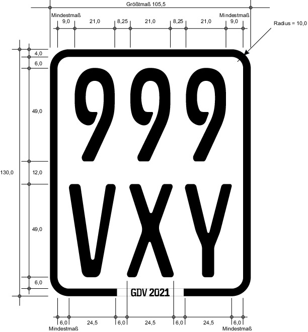

# Verordnung über Ausnahmen von den Vorschriften der Fahrzeug-Zulassungsverordnung (FZVAusnV 2021)

Ausfertigungsdatum
:   2020-08-20

Fundstelle
:   BGBl I: 2020, 1968

Stand: Die V tritt gem. § 2 Satz 2 am 29.2.2024 außer Kraft

## Eingangsformel

Auf Grund des § 6 Absatz 1 Nummer 2 Buchstabe b und Nummer 8 in
Verbindung mit § 6 Absatz 2 jeweils in Verbindung mit Absatz 3 des
Straßenverkehrsgesetzes in der Fassung der Bekanntmachung vom 5. März
2003 (BGBl. I S. 310, 919), von denen § 6 Absatz 1 Nummer 2 Buchstabe
b durch Artikel 1 Nummer 2 Buchstabe a Doppelbuchstabe aa des Gesetzes
vom 3. Mai 2005 (BGBl. I S. 1221) und § 6 Absatz 2 durch Artikel 325
Nummer 1 der Verordnung vom 19. Juni 2020 (BGBl. I S. 1328) geändert
worden sind, verordnen das Bundesministerium für Verkehr und digitale
Infrastruktur und das Bundesministerium des Innern, für Bau und Heimat
nach Anhörung der zuständigen obersten Landesbehörden:

## § 1 Versicherungskennzeichen

(1) Versicherungskennzeichen nach § 26 der Fahrzeug-
Zulassungsverordnung dürfen sich abweichend von § 27 der Fahrzeug-
Zulassungsverordnung in Verbindung mit Anlage 12 zu § 27 Absatz 1 Satz
5 der Fahrzeug-Zulassungsverordnung aus einer Kennzeichenfolie und der
dazugehörigen Trägerplatte zusammensetzen, wenn die Maßgaben der
Absätze 2 bis 6 erfüllt sind.

(2) Der Versicherer, der das Kennzeichen ausgibt, muss gewährleisten,
dass die Festigkeit des Verbundes aus der Kennzeichenfolie und der
dazugehörigen Trägerplatte den Anforderungen gemäß Nummer 4 Satz 7 der
Anlage 12 zu § 27 Absatz 1 Satz 5 der Fahrzeug-Zulassungsverordnung
entspricht. Dies ist durch das Gutachten eines für Bauteilprüfung
geeigneten Sachverständigen nachzuweisen.

(3) Die Beschriftung der Kennzeichenfolie erfolgt nach dem
Schriftmuster „Schrift für Kfz-Kennzeichen“ (fälschungserschwerende
Schrift – FE-Schrift). Die Beschriftung muss den Schriftmustern
„Schrift für Kfz-Kennzeichen“ entsprechen. Die Schriftmuster können
bei der Bundesanstalt für Straßenwesen, Postfach 10 01 50, 51401
Bergisch Gladbach, bezogen werden. Form, Größe und Ausgestaltung der
Kennzeichenfolie müssen dem Muster und den Angaben der Anlage
entsprechen.

(4) Der Versicherer, der das Kennzeichen ausgibt, muss gewährleisten,
dass der Verbund aus der Kennzeichenfolie und der dazugehörigen
Trägerplatte eine hinreichende Witterungsbeständigkeit aufweist. Durch
das Gutachten eines für Bauteilprüfung geeigneten Sachverständigen ist
nachzuweisen, dass das verwendete Material entsprechende Eigenschaften
aufweist.

(5) Die Kennzeichenfolie samt ihrer vollflächigen Verklebung auf der
Trägerplatte muss so beschaffen sein, dass diese beim Abziehen reißt,
oder es müssen durch Augenschein deutlich erkennbare Veränderungen der
Kennzeichenfolie nach einem Entfernen aufgetreten sein, so dass diese
nicht wiederverwendbar wird.

(6) Es ist ein fälschungserschwerendes Merkmal in Form eines
transparenten diffraktiven Hologrammmotivs vorzusehen, das dauernd
fest mit der Kennzeichenfolie verbunden ist und die Lesbarkeit der
Beschriftung der Kennzeichenfolie nicht beeinträchtigt. Das Motiv des
Hologramms soll die Anmutung eines Glasbruchs haben. Das Hologramm ist
in Form eines durchgehenden Streifens linksbündig am rechten Rand des
Versicherungskennzeichens transparent auszugestalten. Dieser Streifen
ist unterlegt mit dem hellgrauen Schriftzug
„VERSICHERUNGSKENNZEICHEN“, der von rechts oben nach rechts unten,
sowohl vertikal als auch horizontal mittig zwischen den
Rahmeninnenseiten platziert, verlaufen soll. Der Schriftzug
„VERSICHERUNGSKENNZEICHEN“              ist in der Schriftart Arial
Fett in Schrifthöhe 4 Millimeter in Großbuchstaben auszuführen.
Zusätzlich muss zwischen den beiden Zeilen der Zahlen-Buchstaben-
Kombination rechtsbündig in Form eines transparenten Hologramms der
Schriftzug „GDV“, gefolgt von der jeweiligen Jahreszahl des
Versicherungsjahres, nach dem Schriftmuster „Schrift für Kfz-
Kennzeichen“ (fälschungserschwerende Schrift – FE-Schrift) in einer
Schrifthöhe von 8 Millimetern angebracht sein. Auf der
Kennzeichenfolie muss zudem ein verdecktes Sicherheitsmerkmal nach
Wahl des Herstellers der Kennzeichenfolie vorhanden sein; es ist so zu
wählen, dass die automatische Erfassung des Kennzeichens nicht
erschwert wird.

(7) Im Übrigen bleiben die Regelungsinhalte der Anlage 12 zu § 27
Absatz 1 Satz 5 der Fahrzeug-Zulassungsverordnung unberührt.

## § 2 Inkrafttreten, Außerkrafttreten

Diese Verordnung tritt am 1. März 2021 in Kraft. Sie tritt am 29.
Februar 2024 außer Kraft.

## Anlage Kennzeichenfolie auf Trägerplatte als Versicherungskennzeichen für Kleinkrafträder, motorisierte Krankenfahrstühle und vierrädrige Leichtkraftfahrzeuge

(Fundstelle: BGBl. I 2020, 1970 - 1971)

1.  Schematische Darstellung mit Maßen der Beschriftung

    

2.  Schematische Darstellung des Hologramms

    

