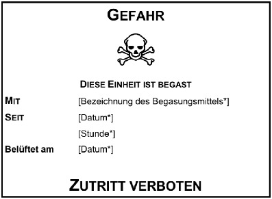

# Verordnung zum Schutz vor Gefahrstoffen (GefStoffV 2010)

Ausfertigungsdatum
:   2010-11-26

Fundstelle
:   BGBl I: 2010, 1643, 1644

Zuletzt geändert durch
:   Art. 148 G v. 29.3.2017 I 626

Änderung durch
:   Art. 2 V v. 21.7.2021 I 3115 (Nr. 48) textlich nachgewiesen, dokumentarisch noch nicht abschließend bearbeitet

[^F774705_01_BJNR164400010]:     Artikel 1 dieser Verordnung dient der Umsetzung folgender Richtlinien:
    –                                    Richtlinie 98/24/EG des Rates vom
    7\. April 1998 zum Schutz von Gesundheit und Sicherheit der
    Arbeitnehmer vor der Gefährdung durch chemische Arbeitsstoffe bei der
    Arbeit (ABl. L 131 vom 5.5.1998, S. 11), die durch die Richtlinie
    2007/30/EG (ABl. L 165 vom 27.6.2007, S. 21) geändert worden ist,

    –                                    Richtlinie 2000/39/EG der
    Kommission vom 8. Juni 2000 zur Festlegung einer ersten Liste von
    Arbeitsplatz-Richtgrenzwerten in Durchführung der Richtlinie 98/24/EG
    des Rates zum Schutz von Gesundheit und Sicherheit der Arbeitnehmer
    vor der Gefährdung durch chemische Arbeitsstoffe bei der Arbeit (ABl.
    L 142 vom 16.6.2000, S. 47), die zuletzt durch die Richtlinie
    2009/161/EU (ABl. L 338 vom 19.12.2009, S. 87) geändert worden ist,

    –                                    Richtlinie 2006/15/EG der
    Kommission vom 7. Februar 2006 zur Festlegung einer zweiten Liste von
    Arbeitsplatz-Richtgrenzwerten in Durchführung der Richtlinie 98/24/EG
    des Rates und zur Änderung der Richtlinien 91/322/EWG und 2000/39/EG
    (ABl. L 38 vom 9.2.2006, S. 36),

    –                                    Richtlinie 2009/161/EU der
    Kommission vom 17. Dezember 2009 zur Festlegung einer dritten Liste
    von Arbeitsplatz-Richtgrenzwerten in Durchführung der Richtlinie
    98/24/EG des Rates und zur Änderung der Richtlinie 2000/39/EG (ABl. L
    338 vom 19.12.2009, S. 87),

    –                                    Richtlinie 2004/37/EG des
    Europäischen Parlaments und des Rates vom 29. April 2004 über den
    Schutz der Arbeitnehmer gegen Gefährdung durch Karzinogene oder
    Mutagene bei der Arbeit (ABl. L 158 vom 30.4.2004, S. 50, L 229 vom
    29\.6.2004, S. 23, L 204 vom 4.8.2007, S. 28),

    –                                    Richtlinie 2009/148/EG des
    Europäischen Parlaments und des Rates vom 30. November 2009 über den
    Schutz der Arbeitnehmer gegen Gefährdung durch Asbest am Arbeitsplatz
    (ABl. L 330 vom 16.12.2009, S. 28),

    –                                    Richtlinie 67/548/EWG des Rates
    vom 27. Juni 1967 zur Angleichung der Rechts- und
    Verwaltungsvorschriften für die Einstufung, Verpackung und
    Kennzeichnung gefährlicher Stoffe (ABl. L 196 vom 16.8.1967, S. 1),
    die zuletzt durch die Richtlinie 2009/2/EG (ABl. L 11 vom 16.1.2009,
    S. 6) geändert worden ist,

    –                                    Richtlinie 1999/45/EG des
    Europäischen Parlaments und des Rates vom 31. Mai 1999 zur Angleichung
    der Rechts- und Verwaltungsvorschriften der Mitgliedstaaten für die
    Einstufung, Verpackung und Kennzeichnung gefährlicher Zubereitungen
    (ABl. L 200 vom 30.7.1999, S. 1, L 6 vom 10.1.2002, S. 71), die
    zuletzt durch die Verordnung (EG) Nr. 1272/2008 (ABl. L 353 vom
    31\.12.2008, S. 1) geändert worden ist,

    –                                    Richtlinie 98/8/EG des
    Europäischen Parlaments und des Rates vom 16. Februar 1998 über das
    Inverkehrbringen von Biozid-Produkten (ABl. L 123 vom 24.4.1998, S. 1,
    L 150 vom 8.6.2002, S. 71), die zuletzt durch die Richtlinien
    2010/7/EU, 2010/8/EU, 2010/9/EU, 2010/10/EU und 2010/11/EU (ABl. L 37
    vom 10.2.2010, S. 33, 37, 40, 44, 47) geändert worden ist,

    –                                    Richtlinie 96/59/EG des Rates vom
    16\. September 1996 über die Beseitigung polychlorierter Biphenyle und
    polychlorierter Terphenyle (PCB/PCT) (ABl. L 243 vom 24.9.1996, S.
    31), die durch die Verordnung (EG) Nr. 596/2009 (ABl. L 188 vom
    18\.7.2009, S. 14) geändert worden ist,

    –                                    Richtlinie 1999/92/EG des
    Europäischen Parlaments und des Rates vom 16. Dezember 1992 über
    Mindestvorschriften zur Verbesserung des Gesundheitsschutzes und der
    Sicherheit der Arbeitnehmer, die durch explosionsfähige Atmosphären
    gefährdet werden können (ABl. L 23 vom 28.1.2000, S. 57), die durch
    die Richtlinie 2007/30/EG (ABl. L 165 vom 27.6.2007, S. 21) geändert
    worden ist.

## Abschnitt 1 - Zielsetzung, Anwendungsbereich und Begriffsbestimmungen

### § 1 Zielsetzung und Anwendungsbereich

(1) Ziel dieser Verordnung ist es, den Menschen und die Umwelt vor
stoffbedingten Schädigungen zu schützen durch

1.  Regelungen zur Einstufung, Kennzeichnung und Verpackung gefährlicher
    Stoffe und Gemische,

2.  Maßnahmen zum Schutz der Beschäftigten und anderer Personen bei
    Tätigkeiten mit Gefahrstoffen und

3.  Beschränkungen für das Herstellen und Verwenden bestimmter
    gefährlicher Stoffe, Gemische und Erzeugnisse.

(2) Abschnitt 2 gilt für das Inverkehrbringen von

1.  gefährlichen Stoffen und Gemischen,

2.  bestimmten Stoffen, Gemischen und Erzeugnissen, die mit zusätzlichen
    Kennzeichnungen zu versehen sind, nach Maßgabe der Richtlinie 96/59/EG
    des Rates vom 16. September 1996 über die Beseitigung polychlorierter
    Biphenyle und polychlorierter Terphenyle (PCB/PCT) (ABl. L 243 vom
    24\.9.1996, S. 31), die durch die Verordnung (EG) Nr. 596/2009 (ABl. L
    188 vom 18.7.2009, S. 14) geändert worden ist,

3.  Biozid-Produkten im Sinne des § 3 Nummer 11 des Chemikaliengesetzes,
    die keine gefährlichen Stoffe oder Gemische sind, sowie

4.  Biozid-Wirkstoffen im Sinne des § 3 Nummer 12 des Chemikaliengesetzes,
    die biologische Arbeitsstoffe im Sinne der Biostoffverordnung sind,
    und Biozid-Produkten im Sinne des § 3 Nummer 11 des
    Chemikaliengesetzes, die als Wirkstoffe solche biologischen
    Arbeitsstoffe enthalten.

Abschnitt 2 gilt nicht für Lebensmittel oder Futtermittel in Form von
Fertigerzeugnissen, die für den Endverbrauch bestimmt sind.

(3) Die Abschnitte 3 bis 6 gelten für Tätigkeiten, bei denen
Beschäftigte Gefährdungen ihrer Gesundheit und Sicherheit durch
Stoffe, Gemische oder Erzeugnisse ausgesetzt sein können. Sie gelten
auch, wenn die Sicherheit und Gesundheit anderer Personen aufgrund von
Tätigkeiten im Sinne von § 2 Absatz 5 gefährdet sein können, die durch
Beschäftigte oder Unternehmer ohne Beschäftigte ausgeübt werden. Die
Sätze 1 und 2 finden auch Anwendung auf Tätigkeiten, die im
Zusammenhang mit der Beförderung von Stoffen, Gemischen und
Erzeugnissen ausgeübt werden. Die Vorschriften des
Gefahrgutbeförderungsgesetzes und der darauf gestützten
Rechtsverordnungen bleiben unberührt.

(4) Sofern nicht ausdrücklich etwas anderes bestimmt ist, gilt diese
Verordnung nicht für

1.  biologische Arbeitsstoffe im Sinne der Biostoffverordnung und

2.  private Haushalte.

Diese Verordnung gilt ferner nicht für Betriebe, die dem
Bundesberggesetz unterliegen, soweit dort oder in Rechtsverordnungen,
die auf Grund dieses Gesetzes erlassen worden sind, entsprechende
Rechtsvorschriften bestehen.

### § 2 Begriffsbestimmungen

(1) Gefahrstoffe im Sinne dieser Verordnung sind

1.  gefährliche Stoffe und Gemische nach § 3,

2.  Stoffe, Gemische und Erzeugnisse, die explosionsfähig sind,

3.  Stoffe, Gemische und Erzeugnisse, aus denen bei der Herstellung oder
    Verwendung Stoffe nach Nummer 1 oder Nummer 2 entstehen oder
    freigesetzt werden,

4.  Stoffe und Gemische, die die Kriterien nach den Nummern 1 bis 3 nicht
    erfüllen, aber auf Grund ihrer physikalisch-chemischen, chemischen
    oder toxischen Eigenschaften und der Art und Weise, wie sie am
    Arbeitsplatz vorhanden sind oder verwendet werden, die Gesundheit und
    die Sicherheit der Beschäftigten gefährden können,

5.  alle Stoffe, denen ein Arbeitsplatzgrenzwert zugewiesen worden ist.

(2) Für die Begriffe Stoff, Gemisch, Erzeugnis, Lieferant,
nachgeschalteter Anwender und Hersteller gelten die
Begriffsbestimmungen nach Artikel 2 der Verordnung (EG) Nr. 1272/2008
des Europäischen Parlaments und des Rates vom 16. Dezember 2008 über
die Einstufung, Kennzeichnung und Verpackung von Stoffen und
Gemischen, zur Änderung und Aufhebung der Richtlinien 67/548/EWG und
1999/45/EG und zur Änderung der Verordnung (EG) Nr. 1907/2006 (ABl. L
353 vom 31.12.2008, S. 1), die zuletzt durch die Verordnung (EU)
2015/1221 (ABl. L 197 vom 25.7.2015, S. 10) geändert worden ist.

(2a) Umweltgefährlich sind, über die Gefahrenklasse gewässergefährdend
nach der Verordnung (EG) Nr. 1272/2008 hinaus, Stoffe oder Gemische,
wenn sie selbst oder ihre Umwandlungsprodukte geeignet sind, die
Beschaffenheit von Naturhaushalt, Boden oder Luft, Klima, Tieren,
Pflanzen oder Mikroorganismen derart zu verändern, dass dadurch sofort
oder später Gefahren für die Umwelt herbeigeführt werden können.

(3) Krebserzeugend, keimzellmutagen oder reproduktionstoxisch sind

1.  Stoffe, die in Anhang VI der Verordnung (EG) Nr. 1272/2008 in der
    jeweils geltenden Fassung als karzinogen, keimzellmutagen oder
    reproduktionstoxisch eingestuft sind,

2.  Stoffe, welche die Kriterien für die Einstufung als karzinogen,
    keimzellmutagen oder reproduktionstoxisch nach Anhang I der Verordnung
    (EG) Nr. 1272/2008 in der jeweils geltenden Fassung erfüllen,

3.  Gemische, die einen oder mehrere der in § 2 Absatz 3 Nummer 1 oder 2
    genannten Stoffe enthalten, wenn die Konzentration dieses Stoffs oder
    dieser Stoffe die stoffspezifischen oder die allgemeinen
    Konzentrationsgrenzen nach der Verordnung (EG) Nr. 1272/2008 in der
    jeweils geltenden Fassung erreicht oder übersteigt, die für die
    Einstufung eines Gemischs als karzinogen, keimzellmutagen oder
    reproduktionstoxisch festgelegt sind,

4.  Stoffe, Gemische oder Verfahren, die in den nach § 20 Absatz 4 bekannt
    gegebenen Regeln und Erkenntnissen als krebserzeugend, keimzellmutagen
    oder reproduktionstoxisch bezeichnet werden.

(4) Organische Peroxide im Sinne des § 11 Absatz 4 und des Anhangs III
sind Stoffe, die sich vom Wasserstoffperoxid dadurch ableiten, dass
ein oder beide Wasserstoffatome durch organische Gruppen ersetzt sind,
sowie Gemische, die diese Stoffe enthalten.

(5) Eine Tätigkeit ist jede Arbeit mit Stoffen, Gemischen oder
Erzeugnissen, einschließlich Herstellung, Mischung, Ge- und Verbrauch,
Lagerung, Aufbewahrung, Be- und Verarbeitung, Ab- und Umfüllung,
Entfernung, Entsorgung und Vernichtung. Zu den Tätigkeiten zählen auch
das innerbetriebliche Befördern sowie Bedien- und
Überwachungsarbeiten.

(5a) Begasung bezeichnet eine Verwendung von Biozid-Produkten oder
Pflanzenschutzmitteln

1.  bei der bestimmungsgemäß Stoffe gasförmig freigesetzt werden,

    a)  die als akut toxisch Kategorie 1, 2 oder 3 eingestuft sind oder

    b)  für die in der Zulassung festgelegt wurde, dass eine Messung oder
        Überwachung der Wirkstoff- oder Sauerstoffkonzentration zu erfolgen
        hat,

2.  für die in der Zulassung die Bereitstellung und Verwendung eines
    unabhängig von der Umgebungsatmosphäre wirkenden Atemschutzgeräts
    festgelegt wurde oder

3.  die zur Raumdesinfektion sämtlicher Flächen eines umschlossenen Raums
    eingesetzt werden, wobei Formaldehyd aus einer wässrigen
    Formaldehydlösung in Form schwebfähiger Flüssigkeitstropfen
    ausgebracht wird.

(6) Lagern ist das Aufbewahren zur späteren Verwendung sowie zur
Abgabe an andere. Es schließt die Bereitstellung zur Beförderung ein,
wenn die Beförderung nicht innerhalb von 24 Stunden nach der
Bereitstellung oder am darauffolgenden Werktag erfolgt. Ist dieser
Werktag ein Samstag, so endet die Frist mit Ablauf des nächsten
Werktags.

(7) Es stehen gleich

1.  den Beschäftigten die in Heimarbeit beschäftigten Personen sowie
    Schülerinnen und Schüler, Studierende und sonstige, insbesondere an
    wissenschaftlichen Einrichtungen tätige Personen, die Tätigkeiten mit
    Gefahrstoffen ausüben; für Schülerinnen und Schüler und Studierende
    gelten jedoch nicht die Regelungen dieser Verordnung über die
    Beteiligung der Personalvertretungen,

2.  dem Arbeitgeber der Unternehmer ohne Beschäftigte sowie der
    Auftraggeber und der Zwischenmeister im Sinne des Heimarbeitsgesetzes
    in der im Bundesgesetzblatt Teil III, Gliederungsnummer 804-1,
    veröffentlichten bereinigten Fassung, das zuletzt durch Artikel 225
    der Verordnung vom 31. Oktober 2006 (BGBl. I S. 2407) geändert worden
    ist.

(8) Der Arbeitsplatzgrenzwert ist der Grenzwert für die zeitlich
gewichtete durchschnittliche Konzentration eines Stoffs in der Luft am
Arbeitsplatz in Bezug auf einen gegebenen Referenzzeitraum. Er gibt
an, bis zu welcher Konzentration eines Stoffs akute oder chronische
schädliche Auswirkungen auf die Gesundheit von Beschäftigten im
Allgemeinen nicht zu erwarten sind.

(9) Der biologische Grenzwert ist der Grenzwert für die toxikologisch-
arbeitsmedizinisch abgeleitete Konzentration eines Stoffs, seines
Metaboliten oder eines Beanspruchungsindikators im entsprechenden
biologischen Material. Er gibt an, bis zu welcher Konzentration die
Gesundheit von Beschäftigten im Allgemeinen nicht beeinträchtigt wird.

(9a) Physikalisch-chemische Einwirkungen umfassen Gefährdungen, die
hervorgerufen werden können durch Tätigkeiten mit

1.  Stoffen, Gemischen oder Erzeugnissen mit einer physikalischen Gefahr
    nach der Verordnung (EG) Nr. 1272/2008 oder

2.  weiteren Gefahrstoffen, die nach der Verordnung (EG) Nr. 1272/2008
    nicht mit einer physikalischen Gefahr eingestuft sind, die aber
    miteinander oder aufgrund anderer Wechselwirkungen so reagieren
    können, dass Brände oder Explosionen entstehen können.

(10) Ein explosionsfähiges Gemisch ist ein Gemisch aus brennbaren
Gasen, Dämpfen, Nebeln oder aufgewirbelten Stäuben und Luft oder einem
anderen Oxidationsmittel, das nach Wirksamwerden einer Zündquelle in
einer sich selbsttätig fortpflanzenden Flammenausbreitung reagiert,
sodass im Allgemeinen ein sprunghafter Temperatur- und Druckanstieg
hervorgerufen wird.

(11) Chemisch instabile Gase, die auch ohne ein Oxidationsmittel nach
Wirksamwerden einer Zündquelle in einer sich selbsttätig
fortpflanzenden Flammenausbreitung reagieren können, sodass ein
sprunghafter Temperatur- und Druckanstieg hervorgerufen wird, stehen
explosionsfähigen Gemischen nach Absatz 10 gleich.

(12) Ein gefährliches explosionsfähiges Gemisch ist ein
explosionsfähiges Gemisch, das in solcher Menge auftritt, dass
besondere Schutzmaßnahmen für die Aufrechterhaltung der Gesundheit und
Sicherheit der Beschäftigten oder anderer Personen erforderlich
werden.

(13) Gefährliche explosionsfähige Atmosphäre ist ein gefährliches
explosionsfähiges Gemisch mit Luft als Oxidationsmittel unter
atmosphärischen Bedingungen (Umgebungstemperatur von –20 °C bis +60 °C
und Druck von 0,8 Bar bis 1,1 Bar).

(14) Explosionsgefährdeter Bereich ist der Gefahrenbereich, in dem
gefährliche explosionsfähige Atmosphäre auftreten kann.

(15) Der Stand der Technik ist der Entwicklungsstand fortschrittlicher
Verfahren, Einrichtungen oder Betriebsweisen, der die praktische
Eignung einer Maßnahme zum Schutz der Gesundheit und zur Sicherheit
der Beschäftigten gesichert erscheinen lässt. Bei der Bestimmung des
Stands der Technik sind insbesondere vergleichbare Verfahren,
Einrichtungen oder Betriebsweisen heranzuziehen, die mit Erfolg in der
Praxis erprobt worden sind. Gleiches gilt für die Anforderungen an die
Arbeitsmedizin und die Arbeitsplatzhygiene.

(16) Fachkundig ist, wer zur Ausübung einer in dieser Verordnung
bestimmten Aufgabe über die erforderlichen Fachkenntnisse verfügt. Die
Anforderungen an die Fachkunde sind abhängig von der jeweiligen Art
der Aufgabe. Zu den Anforderungen zählen eine entsprechende
Berufsausbildung, Berufserfahrung oder eine zeitnah ausgeübte
entsprechende berufliche Tätigkeit sowie die Teilnahme an spezifischen
Fortbildungsmaßnahmen.

(17) Sachkundig ist, wer seine bestehende Fachkunde durch Teilnahme an
einem behördlich anerkannten Sachkundelehrgang erweitert hat. In
Abhängigkeit vom Aufgabengebiet kann es zum Erwerb der Sachkunde auch
erforderlich sein, den Lehrgang mit einer erfolgreichen Prüfung
abzuschließen. Sachkundig ist ferner, wer über eine von der
zuständigen Behörde als gleichwertig anerkannte oder in dieser
Verordnung als gleichwertig bestimmte Qualifikation verfügt.

(18) Eine Verwenderkategorie bezeichnet eine Personengruppe, die
berechtigt ist, ein bestimmtes Biozid-Produkt zu verwenden. Sie
beschreibt den Grad der Qualifikation, die für diese Verwendung
erforderlich ist. Die zugehörige Verwenderkategorie eines Biozid-
Produkts wird nach der Verordnung (EU) Nr. 528/2012 des Europäischen
Parlaments und des Rates vom 22. Mai 2012 über die Bereitstellung auf
dem Markt und die Verwendung von Biozid-Produkten (ABl. L 167 vom
27\.6.2012, S. 1), die zuletzt durch die Delegierte Verordnung (EU)
2019/1825 (ABl. L 279 vom 31.10.2019, S. 19) geändert worden ist, in
der jeweils geltenden Fassung, im Zulassungsverfahren festgelegt.
Verwenderkategorien sind:

1.  die breite Öffentlichkeit,

2.  der berufsmäßige Verwender,

3.  der geschulte berufsmäßige Verwender.

## Abschnitt 2 - Gefahrstoffinformation

### § 3 Gefahrenklassen

(1) Gefährlich im Sinne dieser Verordnung sind Stoffe, Gemische und
bestimmte Erzeugnisse, die den in Anhang I der Verordnung (EG) Nr.
1272/2008 dargelegten Kriterien entsprechen.

(2) Die folgenden Gefahrenklassen geben die Art der Gefährdung wieder
und werden unter Angabe der Nummerierung des Anhangs I der Verordnung
(EG) Nr. 1272/2008 aufgelistet:

*    *
    *
    *
    *   Nummerierung nach Anhang I der Verordnung (EG) Nr. 1272/2008

*    *   1.

    *   Physikalische Gefahren

    *   2

*    *
    *   a)

    *   Explosive Stoffe/Gemische und Erzeugnisse mit Explosivstoff

    *   2.1

*    *
    *   b)

    *   Entzündbare Gase

    *   2.2

*    *
    *   c)

    *   Aerosole

    *   2.3

*    *
    *   d)

    *   Oxidierende Gase

    *   2.4

*    *
    *   e)

    *   Gase unter Druck

    *   2.5

*    *
    *   f)

    *   Entzündbare Flüssigkeiten

    *   2.6

*    *
    *   g)

    *   Entzündbare Feststoffe

    *   2.7

*    *
    *   h)

    *   Selbstzersetzliche Stoffe und Gemische

    *   2.8

*    *
    *   i)

    *   Pyrophore Flüssigkeiten

    *   2.9

*    *
    *   j)

    *   Pyrophore Feststoffe

    *   2.10

*    *
    *   k)

    *   Selbsterhitzungsfähige Stoffe und Gemische

    *   2.11

*    *
    *   l)

    *   Stoffe und Gemische, die in Berührung mit Wasser entzündbare Gase
        entwickeln

    *   2.12

*    *
    *   m)

    *   Oxidierende Flüssigkeiten

    *   2.13

*    *
    *   n)

    *   Oxidierende Feststoffe

    *   2.14

*    *
    *   o)

    *   Organische Peroxide

    *   2.15

*    *
    *   p)

    *   Korrosiv gegenüber Metallen

    *   2.16

*    *   2.

    *   Gesundheitsgefahren

    *   3

*    *
    *   a)

    *   Akute Toxizität (oral, dermal und inhalativ)

    *   3.1

*    *
    *   b)

    *   Ätz-/Reizwirkung auf die Haut

    *   3.2

*    *
    *   c)

    *   Schwere Augenschädigung/Augenreizung

    *   3.3

*    *
    *   d)

    *   Sensibilisierung der Atemwege oder der Haut

    *   3.4

*    *
    *   e)

    *   Keimzellmutagenität

    *   3.5

*    *
    *   f)

    *   Karzinogenität

    *   3.6

*    *
    *   g)

    *   Reproduktionstoxizität

    *   3.7

*    *
    *   h)

    *   Spezifische Zielorgan-Toxizität, einmalige Exposition (STOT SE)

    *   3.8

*    *
    *   i)

    *   Spezifische Zielorgan-Toxizität, wiederholte Exposition (STOT RE)

    *   3.9

*    *
    *   j)

    *   Aspirationsgefahr

    *   3.10

*    *   3.

    *   Umweltgefahren

    *   4

*    *
    *   Gewässergefährdend (akut und langfristig)

    *   4.1

*    *   4.

    *   Weitere Gefahren

    *   5

*    *
    *   Die Ozonschicht schädigend

    *   5.1

### § 4 Einstufung, Kennzeichnung, Verpackung

(1) Die Einstufung, Kennzeichnung und Verpackung von Stoffen und
Gemischen sowie von Erzeugnissen mit Explosivstoff richten sich nach
den Bestimmungen der Verordnung (EG) Nr. 1272/2008. Gemische, die
bereits vor dem 1. Juni 2015 in Verkehr gebracht worden sind und die
nach den Bestimmungen der Richtlinie 1999/45/EG gekennzeichnet und
verpackt sind, müssen bis 31. Mai 2017 nicht nach der Verordnung (EG)
Nr. 1272/2008 eingestuft, gekennzeichnet und verpackt werden.

(2) Bei der Einstufung von Stoffen und Gemischen sind die nach § 20
Absatz 4 bekannt gegebenen Regeln und Erkenntnisse zu beachten.

(3) Die Kennzeichnung von Stoffen und Gemischen, die in Deutschland in
Verkehr gebracht werden, muss in deutscher Sprache erfolgen.

(4) Werden gefährliche Stoffe oder gefährliche Gemische unverpackt in
Verkehr gebracht, sind jeder Liefereinheit geeignete
Sicherheitsinformationen oder ein Sicherheitsdatenblatt in deutscher
Sprache beizufügen.

(5) Lieferanten eines Biozid-Produkts, für das ein Dritter der
Zulassungsinhaber ist, haben über die in Absatz 1 erwähnten
Kennzeichnungspflichten hinaus sicherzustellen, dass die vom
Zulassungsinhaber nach Artikel 69 Absatz 2 Satz 2 der Verordnung (EU)
Nr. 528/2012 anzubringende Zusatzkennzeichnung bei der Abgabe an
Dritte erhalten oder neu angebracht ist. Biozid-Produkte, die aufgrund
des § 28 Absatz 8 des Chemikaliengesetzes ohne Zulassung auf dem Markt
bereitgestellt werden, sind zusätzlich zu der in Absatz 1 erwähnten
Kennzeichnung entsprechend Artikel 69 Absatz 2 Satz 2 und 3 der
Verordnung (EU) Nr. 528/2012 zu kennzeichnen, wobei die dort in Satz 2
Buchstabe c und d aufgeführten Angaben entfallen und die Angaben nach
Satz 2 Buchstabe f und g auf die vorgesehenen Anwendungen zu beziehen
sind.

(6) Biozid-Wirkstoffe, die biologische Arbeitsstoffe nach § 2 Absatz 1
der Biostoffverordnung sind, sind zusätzlich nach § 3 der
Biostoffverordnung einzustufen. Biozid-Wirkstoffe nach Satz 1 sowie
Biozid-Produkte, bei denen der Wirkstoff ein biologischer Arbeitsstoff
ist, sind zusätzlich mit den folgenden Elementen zu kennzeichnen:

1.  Identität des Organismus nach Anhang II Titel 2 Nummer 2.1 und 2.2 der
    Verordnung (EU) Nr. 528/2012,

2.  Einstufung der Mikroorganismen in Risikogruppen nach § 3 der
    Biostoffverordnung und

3.  im Falle einer Einstufung in die Risikogruppe 2 und höher nach § 3 der
    Biostoffverordnung Hinzufügung des Symbols für Biogefährdung nach
    Anhang I der Biostoffverordnung.

(7) Dekontaminierte PCB-haltige Geräte im Sinne der Richtlinie
96/59/EG müssen nach dem Anhang dieser Richtlinie gekennzeichnet
werden.

(8) Die Kennzeichnung bestimmter, beschränkter Stoffe, Gemische und
Erzeugnisse richtet sich zusätzlich nach Artikel 67 in Verbindung mit
Anhang XVII der Verordnung (EG) Nr. 1907/2006 in ihrer jeweils
geltenden Fassung.

(9) Der Lieferant eines Gemischs oder eines Stoffs hat einem
nachgeschalteten Anwender auf Anfrage unverzüglich alle Informationen
zur Verfügung zu stellen, die dieser für eine ordnungsgemäße
Einstufung neuer Gemische benötigt, wenn

1.  der Informationsgehalt der Kennzeichnung oder des
    Sicherheitsdatenblatts des Gemischs oder

2.  die Information über eine Verunreinigung oder Beimengung auf dem
    Kennzeichnungsetikett oder im Sicherheitsdatenblatt des Stoffs

dafür nicht ausreicht.

### § 5 Sicherheitsdatenblatt und sonstige Informationspflichten

(1) Die vom Lieferanten hinsichtlich des Sicherheitsdatenblatts beim
Inverkehrbringen von Stoffen und Gemischen zu beachtenden
Anforderungen ergeben sich aus Artikel 31 in Verbindung mit Anhang II
der Verordnung (EG) Nr. 1907/2006. Ist nach diesen Vorschriften die
Übermittlung eines Sicherheitsdatenblatts nicht erforderlich, richten
sich die Informationspflichten nach Artikel 32 der Verordnung (EG) Nr.
1907/2006.

(2) Bei den Angaben, die nach den Nummern 15 und 16 des Anhangs II der
Verordnung (EG) Nr. 1907/2006 zu machen sind, sind insbesondere die
nach § 20 Absatz 4 bekannt gegebenen Regeln und Erkenntnisse zu
berücksichtigen, nach denen Stoffe oder Tätigkeiten als
krebserzeugend, keimzellmutagen oder reproduktionstoxisch bezeichnet
werden.

(3) (weggefallen)

## Abschnitt 3 - Gefährdungsbeurteilung und Grundpflichten

### § 6 Informationsermittlung und Gefährdungsbeurteilung

(1) Im Rahmen einer Gefährdungsbeurteilung als Bestandteil der
Beurteilung der Arbeitsbedingungen nach § 5 des Arbeitsschutzgesetzes
hat der Arbeitgeber festzustellen, ob die Beschäftigten Tätigkeiten
mit Gefahrstoffen ausüben oder ob bei Tätigkeiten Gefahrstoffe
entstehen oder freigesetzt werden können. Ist dies der Fall, so hat er
alle hiervon ausgehenden Gefährdungen der Gesundheit und Sicherheit
der Beschäftigten unter folgenden Gesichtspunkten zu beurteilen:

1.  gefährliche Eigenschaften der Stoffe oder Gemische, einschließlich
    ihrer physikalisch-chemischen Wirkungen,

2.  Informationen des Lieferanten zum Gesundheitsschutz und zur Sicherheit
    insbesondere im Sicherheitsdatenblatt,

3.  Art und Ausmaß der Exposition unter Berücksichtigung aller
    Expositionswege; dabei sind die Ergebnisse der Messungen und
    Ermittlungen nach § 7 Absatz 8 zu berücksichtigen,

4.  Möglichkeiten einer Substitution,

5.  Arbeitsbedingungen und Verfahren, einschließlich der Arbeitsmittel und
    der Gefahrstoffmenge,

6.  Arbeitsplatzgrenzwerte und biologische Grenzwerte,

7.  Wirksamkeit der ergriffenen oder zu ergreifenden Schutzmaßnahmen,

8.  Erkenntnisse aus arbeitsmedizinischen Vorsorgeuntersuchungen nach der
    Verordnung zur arbeitsmedizinischen Vorsorge.

(2) Der Arbeitgeber hat sich die für die Gefährdungsbeurteilung
notwendigen Informationen beim Lieferanten oder aus anderen, ihm mit
zumutbarem Aufwand zugänglichen Quellen zu beschaffen. Insbesondere
hat der Arbeitgeber die Informationen zu beachten, die ihm nach Titel
IV der Verordnung (EG)Nr. 1907/2006 zur Verfügung gestellt werden;
dazu gehören Sicherheitsdatenblätter und die Informationen zu Stoffen
oder Gemischen, für die kein Sicherheitsdatenblatt zu erstellen ist.
Sofern die Verordnung (EG) Nr. 1907/2006 keine Informationspflicht
vorsieht, hat der Lieferant dem Arbeitgeber auf Anfrage die für die
Gefährdungsbeurteilung notwendigen Informationen über die Gefahrstoffe
zur Verfügung zu stellen.

(3) Stoffe und Gemische, die nicht von einem Lieferanten nach § 4
Absatz 1 eingestuft und gekennzeichnet worden sind, beispielsweise
innerbetrieblich hergestellte Stoffe oder Gemische, hat der
Arbeitgeber selbst einzustufen. Zumindest aber hat er die von den
Stoffen oder Gemischen ausgehenden Gefährdungen der Beschäftigten zu
ermitteln; dies gilt auch für Gefahrstoffe nach § 2 Absatz 1 Nummer 4.

(4) Der Arbeitgeber hat festzustellen, ob die verwendeten Stoffe,
Gemische und Erzeugnisse bei Tätigkeiten, auch unter Berücksichtigung
verwendeter Arbeitsmittel, Verfahren und der Arbeitsumgebung sowie
ihrer möglichen Wechselwirkungen, zu Brand- oder
Explosionsgefährdungen führen können. Dabei hat er zu beurteilen,

1.  ob gefährliche Mengen oder Konzentrationen von Gefahrstoffen, die zu
    Brand- und Explosionsgefährdungen führen können, auftreten; dabei sind
    sowohl Stoffe und Gemische mit physikalischen Gefährdungen nach der
    Verordnung (EG) Nr. 1272/2008 wie auch andere Gefahrstoffe, die zu
    Brand- und Explosionsgefährdungen führen können, sowie Stoffe, die in
    gefährlicher Weise miteinander reagieren können, zu berücksichtigen,

2.  ob Zündquellen oder Bedingungen, die Brände oder Explosionen auslösen
    können, vorhanden sind und

3.  ob schädliche Auswirkungen von Bränden oder Explosionen auf die
    Gesundheit und Sicherheit der Beschäftigten möglich sind.

Insbesondere hat er zu ermitteln, ob die Stoffe, Gemische und
Erzeugnisse auf Grund ihrer Eigenschaften und der Art und Weise, wie
sie am Arbeitsplatz vorhanden sind oder verwendet werden,
explosionsfähige Gemische bilden können. Im Fall von nicht
atmosphärischen Bedingungen sind auch die möglichen Veränderungen der
für den Explosionsschutz relevanten sicherheitstechnischen Kenngrößen
zu ermitteln und zu berücksichtigen.

(5) Bei der Gefährdungsbeurteilung sind ferner Tätigkeiten zu
berücksichtigen, bei denen auch nach Ausschöpfung sämtlicher
technischer Schutzmaßnahmen die Möglichkeit einer Gefährdung besteht.
Dies gilt insbesondere für Instandhaltungsarbeiten, einschließlich
Wartungsarbeiten. Darüber hinaus sind auch andere Tätigkeiten wie
Bedien- und Überwachungsarbeiten zu berücksichtigen, wenn diese zu
einer Gefährdung von Beschäftigten durch Gefahrstoffe führen können.

(6) Die mit den Tätigkeiten verbundenen inhalativen, dermalen und
physikalisch-chemischen Gefährdungen sind unabhängig voneinander zu
beurteilen und in der Gefährdungsbeurteilung zusammenzuführen. Treten
bei einer Tätigkeit mehrere Gefahrstoffe gleichzeitig auf, sind
Wechsel- oder Kombinationswirkungen der Gefahrstoffe, die Einfluss auf
die Gesundheit und Sicherheit der Beschäftigten haben, bei der
Gefährdungsbeurteilung zu berücksichtigen, soweit solche Wirkungen
bekannt sind.

(7) Der Arbeitgeber kann bei der Festlegung der Schutzmaßnahmen eine
Gefährdungsbeurteilung übernehmen, die ihm der Lieferant mitgeliefert
hat, sofern die Angaben und Festlegungen in dieser
Gefährdungsbeurteilung den Arbeitsbedingungen und Verfahren,
einschließlich der Arbeitsmittel und der Gefahrstoffmenge, im eigenen
Betrieb entsprechen.

(8) Der Arbeitgeber hat die Gefährdungsbeurteilung unabhängig von der
Zahl der Beschäftigten erstmals vor Aufnahme der Tätigkeit zu
dokumentieren. Dabei ist Folgendes anzugeben:

1.  die Gefährdungen bei Tätigkeiten mit Gefahrstoffen,

2.  das Ergebnis der Prüfung auf Möglichkeiten einer Substitution nach
    Absatz 1 Satz 2 Nummer 4,

3.  eine Begründung für einen Verzicht auf eine technisch mögliche
    Substitution, sofern Schutzmaßnahmen nach § 9 oder § 10 zu ergreifen
    sind,

4.  die durchzuführenden Schutzmaßnahmen einschließlich derer,

    a)  die wegen der Überschreitung eines Arbeitsplatzgrenzwerts zusätzlich
        ergriffen wurden sowie der geplanten Schutzmaßnahmen, die zukünftig
        ergriffen werden sollen, um den Arbeitsplatzgrenzwert einzuhalten,
        oder

    b)  die unter Berücksichtigung eines Beurteilungsmaßstabs für
        krebserzeugende Gefahrstoffe, der nach § 20 Absatz 4 bekannt gegeben
        worden ist, zusätzlich getroffen worden sind oder zukünftig getroffen
        werden sollen (Maßnahmenplan),

5.  eine Begründung, wenn von den nach § 20 Absatz 4 bekannt gegebenen
    Regeln und Erkenntnissen abgewichen wird, und

6.  die Ermittlungsergebnisse, die belegen, dass der Arbeitsplatzgrenzwert
    eingehalten wird oder, bei Stoffen ohne Arbeitsplatzgrenzwert, die
    ergriffenen technischen Schutzmaßnahmen wirksam sind.

Im Rahmen der Dokumentation der Gefährdungsbeurteilung können auch
vorhandene Gefährdungsbeurteilungen, Dokumente oder andere
gleichwertige Berichte verwendet werden, die auf Grund von
Verpflichtungen nach anderen Rechtsvorschriften erstellt worden sind.

(9) Bei der Dokumentation nach Absatz 8 hat der Arbeitgeber in
Abhängigkeit der Feststellungen nach Absatz 4 die Gefährdungen durch
gefährliche explosionsfähige Gemische besonders auszuweisen
(Explosionsschutzdokument). Daraus muss insbesondere hervorgehen,

1.  dass die Explosionsgefährdungen ermittelt und einer Bewertung
    unterzogen worden sind,

2.  dass angemessene Vorkehrungen getroffen werden, um die Ziele des
    Explosionsschutzes zu erreichen (Darlegung eines
    Explosionsschutzkonzeptes),

3.  ob und welche Bereiche entsprechend Anhang I Nummer 1.7 in Zonen
    eingeteilt wurden,

4.  für welche Bereiche Explosionsschutzmaßnahmen nach § 11 und Anhang I
    Nummer 1 getroffen wurden,

5.  wie die Vorgaben nach § 15 umgesetzt werden und

6.  welche Überprüfungen nach § 7 Absatz 7 und welche Prüfungen zum
    Explosionsschutz nach Anhang 2 Abschnitt 3 der
    Betriebssicherheitsverordnung durchzuführen sind.

(10) Bei Tätigkeiten mit geringer Gefährdung nach Absatz 13 kann auf
eine detaillierte Dokumentation verzichtet werden. Falls in anderen
Fällen auf eine detaillierte Dokumentation verzichtet wird, ist dies
nachvollziehbar zu begründen. Die Gefährdungsbeurteilung ist
regelmäßig zu überprüfen und bei Bedarf zu aktualisieren. Sie ist
umgehend zu aktualisieren, wenn maßgebliche Veränderungen oder neue
Informationen dies erfordern oder wenn sich eine Aktualisierung auf
Grund der Ergebnisse der arbeitsmedizinischen Vorsorge nach der
Verordnung zur arbeitsmedizinischen Vorsorge als notwendig erweist.

(11) Die Gefährdungsbeurteilung darf nur von fachkundigen Personen
durchgeführt werden. Verfügt der Arbeitgeber nicht selbst über die
entsprechenden Kenntnisse, so hat er sich fachkundig beraten zu
lassen. Fachkundig können insbesondere die Fachkraft für
Arbeitssicherheit und die Betriebsärztin oder der Betriebsarzt sein.

(12) Der Arbeitgeber hat nach Satz 2 ein Verzeichnis der im Betrieb
verwendeten Gefahrstoffe zu führen, in dem auf die entsprechenden
Sicherheitsdatenblätter verwiesen wird. Das Verzeichnis muss
mindestens folgende Angaben enthalten:

1.  Bezeichnung des Gefahrstoffs,

2.  Einstufung des Gefahrstoffs oder Angaben zu den gefährlichen
    Eigenschaften,

3.  Angaben zu den im Betrieb verwendeten Mengenbereichen,

4.  Bezeichnung der Arbeitsbereiche, in denen Beschäftigte dem Gefahrstoff
    ausgesetzt sein können.

Die Sätze 1 und 2 gelten nicht, wenn nur Tätigkeiten mit geringer
Gefährdung nach Absatz 13 ausgeübt werden. Die Angaben nach Satz 2
Nummer 1, 2 und 4 müssen allen betroffenen Beschäftigten und ihrer
Vertretung zugänglich sein.

(13) Ergibt sich aus der Gefährdungsbeurteilung für bestimmte
Tätigkeiten auf Grund

1.  der gefährlichen Eigenschaften des Gefahrstoffs,

2.  einer geringen verwendeten Stoffmenge,

3.  einer nach Höhe und Dauer niedrigen Exposition und

4.  der Arbeitsbedingungen

insgesamt eine nur geringe Gefährdung der Beschäftigten und reichen
die nach § 8 zu ergreifenden Maßnahmen zum Schutz der Beschäftigten
aus, so müssen keine weiteren Maßnahmen des Abschnitts 4 ergriffen
werden.

(14) Liegen für Stoffe oder Gemische keine Prüfdaten oder
entsprechende aussagekräftige Informationen zur akut toxischen,
reizenden, hautsensibilisierenden oder keimzellmutagenen Wirkung oder
zur spezifischen Zielorgan-Toxizität bei wiederholter Exposition vor,
sind die Stoffe oder Gemische bei der Gefährdungsbeurteilung wie
Stoffe der Gefahrenklasse Akute Toxizität (oral, dermal und inhalativ)
Kategorie 3, Ätz-/Reizwirkung auf die Haut Kategorie 2,
Sensibilisierung der Haut Kategorie 1, Keimzellmutagenität Kategorie 2
oder Spezifische Zielorgan-Toxizität, wiederholte Exposition (STOT RE)
Kategorie 2 zu behandeln. Hinsichtlich der Spezifizierung der
anzuwendenden Einstufungskategorien sind die entsprechenden nach § 20
Absatz 4 Nummer 1 bekannt gegebenen Regeln und Erkenntnisse zu
berücksichtigen.

### § 7 Grundpflichten

(1) Der Arbeitgeber darf eine Tätigkeit mit Gefahrstoffen erst
aufnehmen lassen, nachdem eine Gefährdungsbeurteilung nach § 6
durchgeführt und die erforderlichen Schutzmaßnahmen nach Abschnitt 4
ergriffen worden sind.

(2) Um die Gesundheit und die Sicherheit der Beschäftigten bei allen
Tätigkeiten mit Gefahrstoffen zu gewährleisten, hat der Arbeitgeber
die erforderlichen Maßnahmen nach dem Arbeitsschutzgesetz und
zusätzlich die nach dieser Verordnung erforderlichen Maßnahmen zu
ergreifen. Dabei hat er die nach § 20 Absatz 4 bekannt gegebenen
Regeln und Erkenntnisse zu berücksichtigen. Bei Einhaltung dieser
Regeln und Erkenntnisse ist in der Regel davon auszugehen, dass die
Anforderungen dieser Verordnung erfüllt sind. Von diesen Regeln und
Erkenntnissen kann abgewichen werden, wenn durch andere Maßnahmen
zumindest in vergleichbarer Weise der Schutz der Gesundheit und die
Sicherheit der Beschäftigten gewährleistet werden.

(3) Der Arbeitgeber hat auf der Grundlage des Ergebnisses der
Substitutionsprüfung nach § 6 Absatz 1 Satz 2 Nummer 4 vorrangig eine
Substitution durchzuführen. Er hat Gefahrstoffe oder Verfahren durch
Stoffe, Gemische oder Erzeugnisse oder Verfahren zu ersetzen, die
unter den jeweiligen Verwendungsbedingungen für die Gesundheit und
Sicherheit der Beschäftigten nicht oder weniger gefährlich sind.

(4) Der Arbeitgeber hat Gefährdungen der Gesundheit und der Sicherheit
der Beschäftigten bei Tätigkeiten mit Gefahrstoffen auszuschließen.
Ist dies nicht möglich, hat er sie auf ein Minimum zu reduzieren.
Diesen Geboten hat der Arbeitgeber durch die Festlegung und Anwendung
geeigneter Schutzmaßnahmen Rechnung zu tragen. Dabei hat er folgende
Rangfolge zu beachten:

1.  Gestaltung geeigneter Verfahren und technischer
    Steuerungseinrichtungen von Verfahren, den Einsatz emissionsfreier
    oder emissionsarmer Verwendungsformen sowie Verwendung geeigneter
    Arbeitsmittel und Materialien nach dem Stand der Technik,

2.  Anwendung kollektiver Schutzmaßnahmen technischer Art an der
    Gefahrenquelle, wie angemessene Be- und Entlüftung, und Anwendung
    geeigneter organisatorischer Maßnahmen,

3.  sofern eine Gefährdung nicht durch Maßnahmen nach den Nummern 1 und 2
    verhütet werden kann, Anwendung von individuellen Schutzmaßnahmen, die
    auch die Bereitstellung und Verwendung von persönlicher
    Schutzausrüstung umfassen.

(5) Beschäftigte müssen die bereitgestellte persönliche
Schutzausrüstung verwenden, solange eine Gefährdung besteht. Die
Verwendung von belastender persönlicher Schutzausrüstung darf keine
Dauermaßnahme sein. Sie ist für jeden Beschäftigten auf das unbedingt
erforderliche Minimum zu beschränken.

(6) Der Arbeitgeber stellt sicher, dass

1.  die persönliche Schutzausrüstung an einem dafür vorgesehenen Ort
    sachgerecht aufbewahrt wird,

2.  die persönliche Schutzausrüstung vor Gebrauch geprüft und nach
    Gebrauch gereinigt wird und

3.  schadhafte persönliche Schutzausrüstung vor erneutem Gebrauch
    ausgebessert oder ausgetauscht wird.

(7) Der Arbeitgeber hat die Funktion und die Wirksamkeit der
technischen Schutzmaßnahmen regelmäßig, mindestens jedoch jedes dritte
Jahr, zu überprüfen. Das Ergebnis der Prüfungen ist aufzuzeichnen und
vorzugsweise zusammen mit der Dokumentation nach § 6 Absatz 8
aufzubewahren.

(8) Der Arbeitgeber stellt sicher, dass die Arbeitsplatzgrenzwerte
eingehalten werden. Er hat die Einhaltung durch Arbeitsplatzmessungen
oder durch andere geeignete Methoden zur Ermittlung der Exposition zu
überprüfen. Ermittlungen sind auch durchzuführen, wenn sich die
Bedingungen ändern, welche die Exposition der Beschäftigten
beeinflussen können. Die Ermittlungsergebnisse sind aufzuzeichnen,
aufzubewahren und den Beschäftigten und ihrer Vertretung zugänglich zu
machen. Werden Tätigkeiten entsprechend einem verfahrens- und
stoffspezifischen Kriterium ausgeübt, das nach § 20 Absatz 4 bekannt
gegebenen worden ist, kann der Arbeitgeber in der Regel davon
ausgehen, dass die Arbeitsplatzgrenzwerte eingehalten werden; in
diesem Fall findet Satz 2 keine Anwendung.

(9) Sofern Tätigkeiten mit Gefahrstoffen ausgeübt werden, für die kein
Arbeitsplatzgrenzwert vorliegt, hat der Arbeitgeber regelmäßig die
Wirksamkeit der ergriffenen technischen Schutzmaßnahmen durch
geeignete Ermittlungsmethoden zu überprüfen, zu denen auch
Arbeitsplatzmessungen gehören können.

(10) Wer Arbeitsplatzmessungen von Gefahrstoffen durchführt, muss
fachkundig sein und über die erforderlichen Einrichtungen verfügen.
Wenn ein Arbeitgeber eine für Messungen von Gefahrstoffen an
Arbeitsplätzen akkreditierte Messstelle beauftragt, kann der
Arbeitgeber in der Regel davon ausgehen, dass die von dieser
Messstelle gewonnenen Erkenntnisse zutreffend sind.

(11) Der Arbeitgeber hat bei allen Ermittlungen und Messungen die nach
§ 20 Absatz 4 bekannt gegebenen Verfahren, Messregeln und Grenzwerte
zu berücksichtigen, bei denen die entsprechenden Bestimmungen der
folgenden Richtlinien berücksichtigt worden sind:

1.  der Richtlinie 98/24/EG des Rates vom 7. April 1998 zum Schutz von
    Gesundheit und Sicherheit der Arbeitnehmer vor der Gefährdung durch
    chemische Arbeitsstoffe bei der Arbeit (vierzehnte Einzelrichtlinie im
    Sinne des Artikels 16 Absatz 1 der Richtlinie 89/391/EWG) (ABl. L 131
    vom 5.5.1998, S. 11), die zuletzt durch die Richtlinie 2014/27/EU
    (ABl. L 65 vom 5.3.2014, S. 1) geändert worden ist, einschließlich der
    Richtlinien über Arbeitsplatzgrenzwerte, die nach Artikel 3 Absatz 2
    der Richtlinie 98/24/EG erlassen wurden,

2.  der Richtlinie 2004/37/EG des Europäischen Parlaments und des Rates
    vom 29. April 2004 über den Schutz der Arbeitnehmer gegen Gefährdung
    durch Karzinogene oder Mutagene bei der Arbeit (Sechste
    Einzelrichtlinie im Sinne von Artikel 16 Absatz 1 der Richtlinie
    89/391/EWG des Rates) (kodifizierte Fassung) (ABl. L 158 vom
    30\.4.2004, S. 50, L 229 vom 29.6.2004, S. 23, L 204 vom 4.8.2007, S.
    28), die zuletzt durch die Richtlinie 2014/27/EU geändert worden ist,
    sowie

3.  der Richtlinie 2009/148/EG des Europäischen Parlaments und des Rates
    vom 30. November 2009 über den Schutz der Arbeitnehmer gegen
    Gefährdung durch Asbest am Arbeitsplatz (ABl. L 330 vom 16.12.2009, S.
    28).

## Abschnitt 4 - Schutzmaßnahmen

### § 8 Allgemeine Schutzmaßnahmen

(1) Der Arbeitgeber hat bei Tätigkeiten mit Gefahrstoffen die
folgenden Schutzmaßnahmen zu ergreifen:

1.  geeignete Gestaltung des Arbeitsplatzes und geeignete
    Arbeitsorganisation,

2.  Bereitstellung geeigneter Arbeitsmittel für Tätigkeiten mit
    Gefahrstoffen und geeignete Wartungsverfahren zur Gewährleistung der
    Gesundheit und Sicherheit der Beschäftigten bei der Arbeit,

3.  Begrenzung der Anzahl der Beschäftigten, die Gefahrstoffen ausgesetzt
    sind oder ausgesetzt sein können,

4.  Begrenzung der Dauer und der Höhe der Exposition,

5.  angemessene Hygienemaßnahmen, insbesondere zur Vermeidung von
    Kontaminationen, und die regelmäßige Reinigung des Arbeitsplatzes,

6.  Begrenzung der am Arbeitsplatz vorhandenen Gefahrstoffe auf die Menge,
    die für den Fortgang der Tätigkeiten erforderlich ist,

7.  geeignete Arbeitsmethoden und Verfahren, welche die Gesundheit und
    Sicherheit der Beschäftigten nicht beeinträchtigen oder die Gefährdung
    so gering wie möglich halten, einschließlich Vorkehrungen für die
    sichere Handhabung, Lagerung und Beförderung von Gefahrstoffen und von
    Abfällen, die Gefahrstoffe enthalten, am Arbeitsplatz.

(2) Der Arbeitgeber hat sicherzustellen, dass

1.  alle verwendeten Stoffe und Gemische identifizierbar sind,

2.  gefährliche Stoffe und Gemische innerbetrieblich mit einer
    Kennzeichnung versehen sind, die ausreichende Informationen über die
    Einstufung, über die Gefahren bei der Handhabung und über die zu
    beachtenden Sicherheitsmaßnahmen enthält; vorzugsweise ist eine
    Kennzeichnung zu wählen, die der Verordnung (EG) Nr. 1272/2008
    entspricht,

3.  Apparaturen und Rohrleitungen so gekennzeichnet sind, dass mindestens
    die enthaltenen Gefahrstoffe sowie die davon ausgehenden Gefahren
    eindeutig identifizierbar sind.

Kennzeichnungspflichten nach anderen Rechtsvorschriften bleiben
unberührt. Solange der Arbeitgeber den Verpflichtungen nach Satz 1
nicht nachgekommen ist, darf er Tätigkeiten mit den dort genannten
Stoffen und Gemischen nicht ausüben lassen. Satz 1 Nummer 2 gilt nicht
für Stoffe, die für Forschungs- und Entwicklungszwecke oder für
wissenschaftliche Lehrzwecke neu hergestellt worden sind und noch
nicht geprüft werden konnten. Eine Exposition der Beschäftigten bei
Tätigkeiten mit diesen Stoffen ist zu vermeiden.

(3) Der Arbeitgeber hat gemäß den Ergebnissen der
Gefährdungsbeurteilung nach § 6 sicherzustellen, dass die
Beschäftigten in Arbeitsbereichen, in denen sie Gefahrstoffen
ausgesetzt sein können, keine Nahrungs- oder Genussmittel zu sich
nehmen. Der Arbeitgeber hat hierfür vor Aufnahme der Tätigkeiten
geeignete Bereiche einzurichten.

(4) Der Arbeitgeber hat sicherzustellen, dass durch Verwendung
verschließbarer Behälter eine sichere Lagerung, Handhabung und
Beförderung von Gefahrstoffen auch bei der Abfallentsorgung
gewährleistet ist.

(5) Der Arbeitgeber hat sicherzustellen, dass Gefahrstoffe so
aufbewahrt oder gelagert werden, dass sie weder die menschliche
Gesundheit noch die Umwelt gefährden. Er hat dabei wirksame
Vorkehrungen zu treffen, um Missbrauch oder Fehlgebrauch zu
verhindern. Insbesondere dürfen Gefahrstoffe nicht in solchen
Behältern aufbewahrt oder gelagert werden, durch deren Form oder
Bezeichnung der Inhalt mit Lebensmitteln verwechselt werden kann. Sie
dürfen nur übersichtlich geordnet und nicht in unmittelbarer Nähe von
Arznei-, Lebens- oder Futtermitteln, einschließlich deren
Zusatzstoffe, aufbewahrt oder gelagert werden. Bei der Aufbewahrung
zur Abgabe oder zur sofortigen Verwendung muss eine Kennzeichnung nach
Absatz 2 deutlich sichtbar und lesbar angebracht sein.

(6) Der Arbeitgeber hat sicherzustellen, dass Gefahrstoffe, die nicht
mehr benötigt werden, und entleerte Behälter, die noch Reste von
Gefahrstoffen enthalten können, sicher gehandhabt, vom Arbeitsplatz
entfernt und sachgerecht gelagert oder entsorgt werden.

(7) Der Arbeitgeber hat sicherzustellen, dass Stoffe und Gemische, die
als akut toxisch Kategorie 1, 2 oder 3, spezifisch zielorgantoxisch
Kategorie 1, krebserzeugend Kategorie 1A oder 1B oder keimzellmutagen
Kategorie 1A oder 1B eingestuft sind, unter Verschluss oder so
aufbewahrt oder gelagert werden, dass nur fachkundige und zuverlässige
Personen Zugang haben. Tätigkeiten mit diesen Stoffen und Gemischen
dürfen nur von fachkundigen oder besonders unterwiesenen Personen
ausgeführt werden. Satz 2 gilt auch für Tätigkeiten mit Stoffen und
Gemischen, die als reproduktionstoxisch Kategorie 1A oder 1B oder als
atemwegssensibilisierend eingestuft sind. Die Sätze 1 und 2 gelten
nicht für Kraftstoffe an Tankstellen oder sonstigen
Betankungseinrichtungen sowie für Stoffe und Gemische, die als akut
toxisch Kategorie 3 eingestuft sind, sofern diese vormals nach der
Richtlinie 67/548/EWG oder der Richtlinie 1999/45/EG als
gesundheitsschädlich bewertet wurden. Hinsichtlich der Bewertung als
gesundheitsschädlich sind die entsprechenden nach § 20 Absatz 4 Nummer
1 bekannt gegebenen Regeln und Erkenntnisse zu berücksichtigen.

(8) Der Arbeitgeber hat bei Tätigkeiten mit Gefahrstoffen nach Anhang
I Nummer 2 bis 5 sowohl die §§ 6 bis 18 als auch die betreffenden
Vorschriften des Anhangs I Nummer 2 bis 5 zu beachten.

### § 9 Zusätzliche Schutzmaßnahmen

(1) Sind die allgemeinen Schutzmaßnahmen nach § 8 nicht ausreichend,
um Gefährdungen durch Einatmen, Aufnahme über die Haut oder
Verschlucken entgegenzuwirken, hat der Arbeitgeber zusätzlich
diejenigen Maßnahmen nach den Absätzen 2 bis 7 zu ergreifen, die auf
Grund der Gefährdungsbeurteilung nach § 6 erforderlich sind. Dies gilt
insbesondere, wenn

1.  Arbeitsplatzgrenzwerte oder biologische Grenzwerte überschritten
    werden,

2.  bei hautresorptiven oder haut- oder augenschädigenden Gefahrstoffen
    eine Gefährdung durch Haut- oder Augenkontakt besteht oder

3.  bei Gefahrstoffen ohne Arbeitsplatzgrenzwert und ohne biologischen
    Grenzwert eine Gefährdung auf Grund der ihnen zugeordneten
    Gefahrenklasse nach § 3 und der inhalativen Exposition angenommen
    werden kann.

(2) Der Arbeitgeber hat sicherzustellen, dass Gefahrstoffe in einem
geschlossenen System hergestellt und verwendet werden, wenn

1.  die Substitution der Gefahrstoffe nach § 7 Absatz 3 durch solche
    Stoffe, Gemische, Erzeugnisse oder Verfahren, die bei ihrer Verwendung
    nicht oder weniger gefährlich für die Gesundheit und Sicherheit sind,
    technisch nicht möglich ist und

2.  eine erhöhte Gefährdung der Beschäftigten durch inhalative Exposition
    gegenüber diesen Gefahrstoffen besteht.

Ist die Anwendung eines geschlossenen Systems technisch nicht möglich,
so hat der Arbeitgeber dafür zu sorgen, dass die Exposition der
Beschäftigten nach dem Stand der Technik und unter Beachtung von § 7
Absatz 4 so weit wie möglich verringert wird.

(3) Bei Überschreitung eines Arbeitsplatzgrenzwerts muss der
Arbeitgeber unverzüglich die Gefährdungsbeurteilung nach § 6 erneut
durchführen und geeignete zusätzliche Schutzmaßnahmen ergreifen, um
den Arbeitsplatzgrenzwert einzuhalten. Wird trotz Ausschöpfung aller
technischen und organisatorischen Schutzmaßnahmen der
Arbeitsplatzgrenzwert nicht eingehalten, hat der Arbeitgeber
unverzüglich persönliche Schutzausrüstung bereitzustellen. Dies gilt
insbesondere für Abbruch-, Sanierungs- und Instandhaltungsarbeiten.

(4) Besteht trotz Ausschöpfung aller technischen und organisatorischen
Schutzmaßnahmen bei hautresorptiven, haut- oder augenschädigenden
Gefahrstoffen eine Gefährdung durch Haut- oder Augenkontakt, hat der
Arbeitgeber unverzüglich persönliche Schutzausrüstung bereitzustellen.

(5) Der Arbeitgeber hat getrennte Aufbewahrungsmöglichkeiten für die
Arbeits- oder Schutzkleidung einerseits und die Straßenkleidung
andererseits zur Verfügung zu stellen. Der Arbeitgeber hat die durch
Gefahrstoffe verunreinigte Arbeitskleidung zu reinigen.

(6) Der Arbeitgeber hat geeignete Maßnahmen zu ergreifen, die
gewährleisten, dass Arbeitsbereiche, in denen eine erhöhte Gefährdung
der Beschäftigten besteht, nur den Beschäftigten zugänglich sind, die
sie zur Ausübung ihrer Arbeit oder zur Durchführung bestimmter
Aufgaben betreten müssen.

(7) Wenn Tätigkeiten mit Gefahrstoffen von einer oder einem
Beschäftigten allein ausgeübt werden, hat der Arbeitgeber zusätzliche
Schutzmaßnahmen zu ergreifen oder eine angemessene Aufsicht zu
gewährleisten. Dies kann auch durch den Einsatz technischer Mittel
sichergestellt werden.

### § 10 Besondere Schutzmaßnahmen bei Tätigkeiten mit krebserzeugenden, keimzellmutagenen und reproduktionstoxischen Gefahrstoffen der Kategorie 1A und 1B

(1) Bei Tätigkeiten mit krebserzeugenden Gefahrstoffen der Kategorie
1A oder 1B, für die kein Arbeitsplatzgrenzwert nach § 20 Absatz 4
bekannt gegeben worden ist, hat der Arbeitgeber ein geeignetes,
risikobezogenes Maßnahmenkonzept anzuwenden, um das Minimierungsgebot
nach § 7 Absatz 4 umzusetzen. Hierbei sind die nach § 20 Absatz 4
bekannt gegebenen Regeln, Erkenntnisse und Beurteilungsmaßstäbe zu
berücksichtigen. Bei Tätigkeiten mit krebserzeugenden,
keimzellmutagenen oder reproduktionstoxischen Gefahrstoffen der
Kategorie 1A oder 1B hat der Arbeitgeber, unbeschadet des Absatzes 2,
zusätzlich die Bestimmungen nach den Absätzen 3 bis 5 zu erfüllen. Die
besonderen Bestimmungen des Anhangs II Nummer 6 sind zu beachten.

(2) Die Absätze 3 bis 5 gelten nicht, wenn

1.  ein Arbeitsplatzgrenzwert nach § 20 Absatz 4 bekannt gegeben worden
    ist, dieser eingehalten und dies durch Arbeitsplatzmessung oder durch
    andere geeignete Methoden zur Ermittlung der Exposition belegt wird
    oder

2.  Tätigkeiten entsprechend einem nach § 20 Absatz 4 bekannt gegebenen
    verfahrens- und stoffspezifischen Kriterium ausgeübt werden.

(3) Wenn Tätigkeiten mit krebserzeugenden, keimzellmutagenen oder
reproduktionstoxischen Gefahrstoffen der Kategorie 1A oder 1B ausgeübt
werden, hat der Arbeitgeber

1.  die Exposition der Beschäftigten durch Arbeitsplatzmessungen oder
    durch andere geeignete Ermittlungsmethoden zu bestimmen, auch um
    erhöhte Expositionen infolge eines unvorhersehbaren Ereignisses oder
    eines Unfalls schnell erkennen zu können,

2.  Gefahrenbereiche abzugrenzen, in denen Beschäftigte diesen
    Gefahrstoffen ausgesetzt sind oder ausgesetzt sein können, und Warn-
    und Sicherheitszeichen anzubringen, einschließlich der Verbotszeichen
    „Zutritt für Unbefugte verboten“ und „Rauchen verboten“ nach Anhang II
    Nummer 3.1 der Richtlinie 92/58/EWG des Rates vom 24. Juni 1992 über
    Mindestvorschriften für die Sicherheits- und/oder
    Gesundheitsschutzkennzeichnung am Arbeitsplatz (ABl. L 245 vom
    26\.8.1992, S. 23), die zuletzt durch die Richtlinie 2014/27/EU (ABl. L
    65 vom 5.3.2014, S. 1) geändert worden ist.

(4) Bei Tätigkeiten, bei denen eine beträchtliche Erhöhung der
Exposition der Beschäftigten durch krebserzeugende, keimzellmutagene
oder reproduktionstoxische Gefahrstoffe der Kategorie 1A oder 1B zu
erwarten ist und bei denen jede Möglichkeit weiterer technischer
Schutzmaßnahmen zur Begrenzung dieser Exposition bereits ausgeschöpft
wurde, hat der Arbeitgeber nach Beratung mit den Beschäftigten oder
mit ihrer Vertretung Maßnahmen zu ergreifen, um die Dauer der
Exposition der Beschäftigten so weit wie möglich zu verkürzen und den
Schutz der Beschäftigten während dieser Tätigkeiten zu gewährleisten.
Er hat den betreffenden Beschäftigten persönliche Schutzausrüstung zur
Verfügung zu stellen, die sie während der gesamten Dauer der erhöhten
Exposition tragen müssen.

(5) Werden in einem Arbeitsbereich Tätigkeiten mit krebserzeugenden,
keimzellmutagenen oder reproduktionstoxischen Gefahrstoffen der
Kategorie 1A oder 1B ausgeübt, darf die dort abgesaugte Luft nicht in
den Arbeitsbereich zurückgeführt werden. Dies gilt nicht, wenn die
Luft unter Anwendung von behördlich oder von den Trägern der
gesetzlichen Unfallversicherung anerkannten Verfahren oder Geräte
ausreichend von solchen Stoffen gereinigt ist. Die Luft muss dann so
geführt oder gereinigt werden, dass krebserzeugende, keimzellmutagene
oder reproduktionstoxische Stoffe nicht in die Atemluft anderer
Beschäftigter gelangen.

### § 11 Besondere Schutzmaßnahmen gegen physikalisch-chemische Einwirkungen, insbesondere gegen Brand- und Explosionsgefährdungen

(1) Der Arbeitgeber hat auf der Grundlage der Gefährdungsbeurteilung
Maßnahmen zum Schutz der Beschäftigten und anderer Personen vor
physikalisch-chemischen Einwirkungen zu ergreifen. Er hat die
Maßnahmen so festzulegen, dass die Gefährdungen vermieden oder so weit
wie möglich verringert werden. Dies gilt insbesondere bei Tätigkeiten
einschließlich Lagerung, bei denen es zu Brand- und
Explosionsgefährdungen kommen kann. Dabei hat der Arbeitgeber Anhang I
Nummer 1 und 5 zu beachten. Die Vorschriften des Sprengstoffgesetzes
und der darauf gestützten Rechtsvorschriften bleiben unberührt.

(2) Zur Vermeidung von Brand- und Explosionsgefährdungen hat der
Arbeitgeber Maßnahmen nach folgender Rangfolge zu ergreifen:

1.  gefährliche Mengen oder Konzentrationen von Gefahrstoffen, die zu
    Brand- oder Explosionsgefährdungen führen können, sind zu vermeiden,

2.  Zündquellen oder Bedingungen, die Brände oder Explosionen auslösen
    können, sind zu vermeiden,

3.  schädliche Auswirkungen von Bränden oder Explosionen auf die
    Gesundheit und Sicherheit der Beschäftigten und anderer Personen sind
    so weit wie möglich zu verringern.

(3) Arbeitsbereiche, Arbeitsplätze, Arbeitsmittel und deren
Verbindungen untereinander müssen so konstruiert, errichtet,
zusammengebaut, installiert, verwendet und instand gehalten werden,
dass keine Brand- und Explosionsgefährdungen auftreten.

(4) Bei Tätigkeiten mit organischen Peroxiden hat der Arbeitgeber über
die Bestimmungen der Absätze 1 und 2 sowie des Anhangs I Nummer 1
hinaus insbesondere Maßnahmen zu treffen, die die

1.  Gefahr einer unbeabsichtigten Explosion minimieren und

2.  Auswirkungen von Bränden und Explosionen beschränken.

Dabei hat der Arbeitgeber Anhang III zu beachten.

### § 12 (weggefallen)

### § 13 Betriebsstörungen, Unfälle und Notfälle

(1) Um die Gesundheit und die Sicherheit der Beschäftigten bei
Betriebsstörungen, Unfällen oder Notfällen zu schützen, hat der
Arbeitgeber rechtzeitig die Notfallmaßnahmen festzulegen, die beim
Eintreten eines derartigen Ereignisses zu ergreifen sind. Dies
schließt die Bereitstellung angemessener Erste-Hilfe-Einrichtungen und
die Durchführung von Sicherheitsübungen in regelmäßigen Abständen ein.

(2) Tritt eines der in Absatz 1 Satz 1 genannten Ereignisse ein, so
hat der Arbeitgeber unverzüglich die gemäß Absatz 1 festgelegten
Maßnahmen zu ergreifen, um

1.  betroffene Beschäftigte über die durch das Ereignis hervorgerufene
    Gefahrensituation im Betrieb zu informieren,

2.  die Auswirkungen des Ereignisses zu mindern und

3.  wieder einen normalen Betriebsablauf herbeizuführen.

Neben den Rettungskräften dürfen nur die Beschäftigten im
Gefahrenbereich verbleiben, die Tätigkeiten zur Erreichung der Ziele
nach Satz 1 Nummer 2 und 3 ausüben.

(3) Der Arbeitgeber hat Beschäftigten, die im Gefahrenbereich tätig
werden, vor Aufnahme ihrer Tätigkeit geeignete Schutzkleidung und
persönliche Schutzausrüstung sowie gegebenenfalls erforderliche
spezielle Sicherheitseinrichtungen und besondere Arbeitsmittel zur
Verfügung zu stellen. Im Gefahrenbereich müssen die Beschäftigten die
Schutzkleidung und die persönliche Schutzausrüstung für die Dauer des
nicht bestimmungsgemäßen Betriebsablaufs verwenden. Die Verwendung
belastender persönlicher Schutzausrüstung muss für die einzelnen
Beschäftigten zeitlich begrenzt sein. Ungeschützte und unbefugte
Personen dürfen sich nicht im festzulegenden Gefahrenbereich
aufhalten.

(4) Der Arbeitgeber hat Warn- und sonstige Kommunikationssysteme, die
eine erhöhte Gefährdung der Gesundheit und Sicherheit anzeigen, zur
Verfügung zu stellen, so dass eine angemessene Reaktion möglich ist
und unverzüglich Abhilfemaßnahmen sowie Hilfs-, Evakuierungs- und
Rettungsmaßnahmen eingeleitet werden können.

(5) Der Arbeitgeber hat sicherzustellen, dass Informationen über
Maßnahmen bei Notfällen mit Gefahrstoffen zur Verfügung stehen. Die
zuständigen innerbetrieblichen und betriebsfremden Unfall- und
Notfalldienste müssen Zugang zu diesen Informationen erhalten. Zu
diesen Informationen zählen:

1.  eine Vorabmitteilung über einschlägige Gefahren bei der Arbeit, über
    Maßnahmen zur Feststellung von Gefahren sowie über Vorsichtsmaßregeln
    und Verfahren, damit die Notfalldienste ihre eigenen Abhilfe- und
    Sicherheitsmaßnahmen vorbereiten können,

2.  alle verfügbaren Informationen über spezifische Gefahren, die bei
    einem Unfall oder Notfall auftreten oder auftreten können,
    einschließlich der Informationen über die Verfahren nach den Absätzen
    1 bis 4.

### § 14 Unterrichtung und Unterweisung der Beschäftigten

(1) Der Arbeitgeber hat sicherzustellen, dass den Beschäftigten eine
schriftliche Betriebsanweisung, die der Gefährdungsbeurteilung nach §
6 Rechnung trägt, in einer für die Beschäftigten verständlichen Form
und Sprache zugänglich gemacht wird. Die Betriebsanweisung muss
mindestens Folgendes enthalten:

1.  Informationen über die am Arbeitsplatz vorhandenen oder entstehenden
    Gefahrstoffe, wie beispielsweise die Bezeichnung der Gefahrstoffe,
    ihre Kennzeichnung sowie mögliche Gefährdungen der Gesundheit und der
    Sicherheit,

2.  Informationen über angemessene Vorsichtsmaßregeln und Maßnahmen, die
    die Beschäftigten zu ihrem eigenen Schutz und zum Schutz der anderen
    Beschäftigten am Arbeitsplatz durchzuführen haben; dazu gehören
    insbesondere

    a)  Hygienevorschriften,

    b)  Informationen über Maßnahmen, die zur Verhütung einer Exposition zu
        ergreifen sind,

    c)  Informationen zum Tragen und Verwenden von persönlicher
        Schutzausrüstung und Schutzkleidung,

3.  Informationen über Maßnahmen, die bei Betriebsstörungen, Unfällen und
    Notfällen und zur Verhütung dieser von den Beschäftigten, insbesondere
    von Rettungsmannschaften, durchzuführen sind.

Die Betriebsanweisung muss bei jeder maßgeblichen Veränderung der
Arbeitsbedingungen aktualisiert werden. Der Arbeitgeber hat ferner
sicherzustellen, dass die Beschäftigten

1.  Zugang haben zu allen Informationen nach Artikel 35 der Verordnung
    (EG) Nr. 1907/2006 über die Stoffe und Gemische, mit denen sie
    Tätigkeiten ausüben, insbesondere zu Sicherheitsdatenblättern, und

2.  über Methoden und Verfahren unterrichtet werden, die bei der
    Verwendung von Gefahrstoffen zum Schutz der Beschäftigten angewendet
    werden müssen.

(2) Der Arbeitgeber hat sicherzustellen, dass die Beschäftigten anhand
der Betriebsanweisung nach Absatz 1 über alle auftretenden
Gefährdungen und entsprechende Schutzmaßnahmen mündlich unterwiesen
werden. Teil dieser Unterweisung ist ferner eine allgemeine
arbeitsmedizinisch-toxikologische Beratung. Diese dient auch zur
Information der Beschäftigten über die Voraussetzungen, unter denen
sie Anspruch auf arbeitsmedizinische Vorsorgeuntersuchungen nach der
Verordnung zur arbeitsmedizinischen Vorsorge haben, und über den Zweck
dieser Vorsorgeuntersuchungen. Die Beratung ist unter Beteiligung der
Ärztin oder des Arztes nach § 7 Absatz 1 der Verordnung zur
arbeitsmedizinischen Vorsorge durchzuführen, falls dies erforderlich
sein sollte. Die Unterweisung muss vor Aufnahme der Beschäftigung und
danach mindestens jährlich arbeitsplatzbezogen durchgeführt werden.
Sie muss in für die Beschäftigten verständlicher Form und Sprache
erfolgen. Inhalt und Zeitpunkt der Unterweisung sind schriftlich
festzuhalten und von den Unterwiesenen durch Unterschrift zu
bestätigen.

(3) Der Arbeitgeber hat bei Tätigkeiten mit krebserzeugenden,
keimzellmutagenen oder reproduktionstoxischen Gefahrstoffen der
Kategorie 1A oder 1B sicherzustellen, dass

1.  die Beschäftigten und ihre Vertretung nachprüfen können, ob die
    Bestimmungen dieser Verordnung eingehalten werden, und zwar
    insbesondere in Bezug auf

    a)  die Auswahl und Verwendung der persönlichen Schutzausrüstung und die
        damit verbundenen Belastungen der Beschäftigten,

    b)  durchzuführende Maßnahmen im Sinne des § 10 Absatz 4 Satz 1,

2.  die Beschäftigten und ihre Vertretung bei einer erhöhten Exposition,
    einschließlich der in § 10 Absatz 4 Satz 1 genannten Fälle,
    unverzüglich unterrichtet und über die Ursachen sowie über die bereits
    ergriffenen oder noch zu ergreifenden Gegenmaßnahmen informiert
    werden,

3.  ein aktualisiertes Verzeichnis über die Beschäftigten geführt wird,
    die Tätigkeiten mit krebserzeugenden oder keimzellmutagenen
    Gefahrstoffen der Kategorie 1A oder 1B ausüben, bei denen die
    Gefährdungsbeurteilung nach § 6 eine Gefährdung der Gesundheit oder
    der Sicherheit der Beschäftigten ergibt; in dem Verzeichnis ist auch
    die Höhe und die Dauer der Exposition anzugeben, der die Beschäftigten
    ausgesetzt waren,

4.  das Verzeichnis nach Nummer 3 mit allen Aktualisierungen 40 Jahre nach
    Ende der Exposition aufbewahrt wird; bei Beendigung von
    Beschäftigungsverhältnissen hat der Arbeitgeber den Beschäftigten
    einen Auszug über die sie betreffenden Angaben des Verzeichnisses
    auszuhändigen und einen Nachweis hierüber wie Personalunterlagen
    aufzubewahren,

5.  die Ärztin oder der Arzt nach § 7 Absatz 1 der Verordnung zur
    arbeitsmedizinischen Vorsorge, die zuständige Behörde sowie jede für
    die Gesundheit und die Sicherheit am Arbeitsplatz verantwortliche
    Person Zugang zu dem Verzeichnis nach Nummer 3 haben,

6.  alle Beschäftigten Zugang zu den sie persönlich betreffenden Angaben
    in dem Verzeichnis haben,

7.  die Beschäftigten und ihre Vertretung Zugang zu den nicht
    personenbezogenen Informationen allgemeiner Art in dem Verzeichnis
    haben.

(4) Der Arbeitgeber kann mit Einwilligung des betroffenen
Beschäftigten die Aufbewahrungs- einschließlich der
Aushändigungspflicht nach Absatz 3 Nummer 4 auf den zuständigen
gesetzlichen Unfallversicherungsträger übertragen. Dafür übergibt der
Arbeitgeber dem Unfallversicherungsträger die erforderlichen
Unterlagen in einer für die elektronische Datenverarbeitung geeigneten
Form. Der Unfallversicherungsträger händigt der betroffenen Person auf
Anforderung einen Auszug des Verzeichnisses mit den sie betreffenden
Angaben aus.

### § 15 Zusammenarbeit verschiedener Firmen

(1) Sollen in einem Betrieb Fremdfirmen Tätigkeiten mit Gefahrstoffen
ausüben, hat der Arbeitgeber als Auftraggeber sicherzustellen, dass
nur solche Fremdfirmen herangezogen werden, die über die
Fachkenntnisse und Erfahrungen verfügen, die für diese Tätigkeiten
erforderlich sind. Der Arbeitgeber als Auftraggeber hat die
Fremdfirmen über Gefahrenquellen und spezifische Verhaltensregeln zu
informieren.

(2) Kann bei Tätigkeiten von Beschäftigten eines Arbeitgebers eine
Gefährdung von Beschäftigten anderer Arbeitgeber durch Gefahrstoffe
nicht ausgeschlossen werden, so haben alle betroffenen Arbeitgeber bei
der Durchführung ihrer Gefährdungsbeurteilungen nach § 6
zusammenzuwirken und die Schutzmaßnahmen abzustimmen. Dies ist zu
dokumentieren. Die Arbeitgeber haben dabei sicherzustellen, dass
Gefährdungen der Beschäftigten aller beteiligten Unternehmen durch
Gefahrstoffe wirksam begegnet wird.

(3) Jeder Arbeitgeber ist dafür verantwortlich, dass seine
Beschäftigten die gemeinsam festgelegten Schutzmaßnahmen anwenden.

(4) Besteht bei Tätigkeiten von Beschäftigten eines Arbeitgebers eine
erhöhte Gefährdung von Beschäftigten anderer Arbeitgeber durch
Gefahrstoffe, ist durch die beteiligten Arbeitgeber ein Koordinator zu
bestellen. Wurde ein Koordinator nach den Bestimmungen der
Baustellenverordnung vom 10. Juni 1998 (BGBl. I S. 1283), die durch
Artikel 15 der Verordnung vom 23. Dezember 2004 (BGBl. I S. 3758)
geändert worden ist, bestellt, gilt die Pflicht nach Satz 1 als
erfüllt. Dem Koordinator sind von den beteiligten Arbeitgebern alle
erforderlichen sicherheitsrelevanten Informationen sowie Informationen
zu den festgelegten Schutzmaßnahmen zur Verfügung zu stellen. Die
Bestellung eines Koordinators entbindet die Arbeitgeber nicht von
ihrer Verantwortung nach dieser Verordnung.

(5) Vor dem Beginn von Abbruch-, Sanierungs- und
Instandhaltungsarbeiten oder Bauarbeiten muss der Arbeitgeber für die
Gefährdungsbeurteilung nach § 6 Informationen, insbesondere vom
Auftraggeber oder Bauherrn, darüber einholen, ob entsprechend der
Nutzungs- oder Baugeschichte des Objekts Gefahrstoffe, insbesondere
Asbest, vorhanden oder zu erwarten sind. Weiter reichende
Informations-, Schutz- und Überwachungspflichten, die sich für den
Auftraggeber oder Bauherrn nach anderen Rechtsvorschriften ergeben,
bleiben unberührt.

## Abschnitt 4a - Anforderungen an die Verwendung von Biozid-Produkten einschließlich der Begasung sowie an Begasungen mit Pflanzenschutzmitteln

### § 15a Verwendungsbeschränkungen

(1) Biozid-Produkte dürfen nicht verwendet werden, soweit damit zu
rechnen ist, dass ihre Verwendung im einzelnen Anwendungsfall
schädliche Auswirkungen auf die Gesundheit von Menschen, Nicht-
Zielorganismen oder auf die Umwelt hat.

(2) Wer Biozid-Produkte verwendet, hat dies ordnungsgemäß zu tun. Zur
ordnungsgemäßen Verwendung gehört insbesondere, dass

1.  die Verwendung von Biozid-Produkten auf das notwendige Mindestmaß
    begrenzt wird durch:

    a)  das Abwägen von Nutzen und Risiken des Einsatzes des Biozid-Produkts
        und

    b)  eine sachgerechte Berücksichtigung physikalischer, biologischer,
        chemischer und sonstiger Alternativen,

2.  das Biozid-Produkt nur für die in der Kennzeichnung oder der Zulassung
    ausgewiesenen Verwendungszwecke eingesetzt wird,

3.  die sich aus der Kennzeichnung oder der Zulassung ergebenden
    Verwendungsbedingungen eingehalten werden und

4.  die Qualifikation des Verwenders die Anforderungen erfüllt, die für
    die in der Zulassung festgelegte Verwenderkategorie erforderlich ist.

(3) Die Absätze 1 und 2 gelten auch für private Haushalte.

### § 15b Allgemeine Anforderungen an die Verwendung von Biozid-Produkten

(1) Der Arbeitgeber hat vor Verwendung eines Biozid-Produkts
sicherzustellen, dass die Anforderungen nach § 15a erfüllt werden.
Dies erfolgt hinsichtlich der Anforderungen nach

1.  § 15a Absatz 2 Satz 2 Nummer 1 im Rahmen der Substitutionsprüfung nach
    § 6 Absatz 1 Satz 2 Nummer 4,

2.  § 15a Absatz 2 Satz 2 Nummer 3 im Rahmen der Gefährdungsbeurteilung
    nach § 6 Absatz 1; dabei hat der Arbeitgeber insbesondere Folgendes zu
    berücksichtigen:

    a)  die in der Zulassung festgelegten Maßnahmen zum Schutz der Sicherheit
        und Gesundheit sowie der Umwelt,

    b)  die Kennzeichnung nach § 4 Absatz 5 und 6 einschließlich des
        gegebenenfalls beigefügten Merkblatts.

(2) Der Arbeitgeber hat die erforderlichen Maßnahmen unter Beachtung
der Rangfolge nach § 7 Absatz 4 Satz 4 und unter dem Gesichtspunkt
einer nachhaltigen Verwendung so festzulegen und durchzuführen, dass
eine Gefährdung der Beschäftigten, anderer Personen oder der Umwelt
verhindert oder minimiert wird.

(3) Eine Fachkunde im Sinne von Anhang I Nummer 4.3 ist erforderlich
für die Verwendung von Biozid-Produkten,

1.  die zu der Hauptgruppe 3 „Schädlingsbekämpfungsmittel“ im Sinne des
    Anhangs V der Verordnung (EU) Nr. 528/2012 gehören oder

2.  deren Wirkstoffe endokrinschädigende Eigenschaften nach Artikel 5
    Absatz 1 Buchstabe d der Verordnung (EU) Nr. 528/2012 haben.

Satz 1 gilt nicht, wenn das Biozid-Produkt für eine Verwendung durch
die breite Öffentlichkeit zugelassen oder wenn für die Verwendung eine
Sachkunde nach § 15c Absatz 3 erforderlich ist.

### § 15c Besondere Anforderungen an die Verwendung bestimmter Biozid-Produkte

(1) Der Arbeitgeber hat die Pflichten nach den Absätzen 2 und 3 zu
erfüllen, wenn Biozid-Produkte verwendet werden sollen,

1.  die eingestuft sind als

    a)  akut toxisch Kategorie 1, 2 oder 3,

    b)  krebserzeugend, keimzellmutagen oder reproduktionstoxisch Kategorie 1A
        oder 1B oder

    c)  spezifisch zielorgantoxisch Kategorie 1 SE oder RE oder

2.  für die über die nach Nummer 1 erfassten Fälle hinaus für die
    vorgesehene Anwendung in der Zulassung die Verwenderkategorie
    „geschulter berufsmäßiger Verwender“ festgelegt wurde.

(2) Der Arbeitgeber hat bei der zuständigen Behörde schriftlich oder
elektronisch anzuzeigen:

1.  die erstmalige Verwendung von Biozid-Produkten nach Absatz 1 und

2.  den Beginn einer erneuten Verwendung von Biozid-Produkten nach Absatz
    1 nach einer Unterbrechung von mehr als einem Jahr.

Die Anzeige hat spätestens sechs Wochen vor Beginn der Verwendung zu
erfolgen. Anhang I Nummer 4.2.1 ist zu beachten.

(3) Die Verwendung von Biozid-Produkten nach Absatz 1 darf nur durch
Personen erfolgen, die über eine für das jeweilige Biozid-Produkt
geltende Sachkunde im Sinne von Anhang I Nummer 4.4 verfügen. Die
Anforderungen an die Sachkunde sind von der Produktart, den
Anwendungen, für die das Biozid-Produkt zugelassen ist, und dem
Gefährdungspotential für Mensch und Umwelt abhängig.

(4) Abweichend von Absatz 3 ist eine Sachkunde für die Verwendung der
in Absatz 1 genannten Biozid-Produkte nicht erforderlich, wenn diese
Tätigkeiten unter unmittelbarer und ständiger Aufsicht einer
sachkundigen Person durchgeführt werden.

### § 15d Besondere Anforderungen bei Begasungen

(1) Der Arbeitgeber bedarf einer Erlaubnis durch die zuständige
Behörde, wenn Begasungen durchgeführt werden sollen. Die Erlaubnis ist
nach Maßgabe des Anhangs I Nummer 4.1 vor der erstmaligen Durchführung
von Begasungen schriftlich oder elektronisch zu beantragen. Sie kann
befristet, mit Auflagen oder unter dem Vorbehalt des Widerrufs erteilt
werden. Auflagen können nachträglich angeordnet werden.

(2) Eine Erlaubnis ist nicht erforderlich, wenn wegen der geringen
Menge des freiwerdenden Wirkstoffs eine Gefährdung für Mensch und
Umwelt nicht besteht. Hierbei sind die nach § 20 Absatz 4
bekanntgegebenen Regeln und Erkenntnisse zu berücksichtigen.

(3) Der Arbeitgeber hat eine Begasung spätestens eine Woche vor deren
Durchführung bei der zuständigen Behörde nach Maßgabe des Anhangs I
Nummer 4.2.2 schriftlich oder elektronisch anzuzeigen. Die zuständige
Behörde kann

1.  in begründeten Fällen auf die Einhaltung dieser Frist verzichten oder

2.  einer Sammelanzeige zustimmen, wenn Begasungen regelmäßig wiederholt
    werden und dabei die in der Anzeige beschriebenen Bedingungen
    unverändert bleiben.

Bei Schiffs- und Containerbegasungen in Häfen verkürzt sich die Frist
nach Satz 1 auf 24 Stunden.

(4) Der Arbeitgeber hat für jede Begasung eine verantwortliche Person
zu bestellen, die Inhaber eines Befähigungsscheins
(Befähigungsscheininhaber) nach Anhang I Nummer 4.5 ist. Die
verantwortliche Person hat

1.  bei Begasungen innerhalb von Räumen die Nutzer angrenzender Räume und
    Gebäude spätestens 24 Stunden vor Beginn der Tätigkeit schriftlich
    unter Hinweis auf die Gefahren der eingesetzten Biozid-Produkte oder
    Pflanzenschutzmittel zu warnen und

2.  sicherzustellen, dass

    a)  die Begasung von einem Befähigungsscheininhaber durchgeführt wird,

    b)  Zugänge zu den Gefahrenbereichen gemäß Anhang I Nummer 4.6
        gekennzeichnet sind und

    c)  neben einem Befähigungsscheininhaber mindestens eine weitere
        sachkundige Person anwesend ist, wenn Begasungen mit Biozid-Produkten
        durchgeführt werden sollen, für die in der Zulassung festgelegt wurde,
        dass

        aa) eine Messung oder Überwachung der Wirkstoff- oder
            Sauerstoffkonzentration zu erfolgen hat oder

        bb) ein unabhängig von der Umgebungsatmosphäre wirkendes Atemschutzgerät
            bereitzustellen und zu verwenden ist.

(5) Bei einer Betriebsstörung, einem Unfall oder Notfall hat

1.  der anwesende Befähigungsscheininhaber den Gefahrenbereich zu sichern
    und darf ihn erst freigeben, wenn die Gefahr nicht mehr besteht und
    gefährliche Rückstände beseitigt sind,

2.  die sachkundige Person den Befähigungsscheininhaber zu unterstützen;
    dies gilt insbesondere bei Absperr- und Rettungsmaßnahmen.

(6) Für Begasungen mit Pflanzenschutzmitteln gelten die
Sachkundeanforderungen nach Anhang I Nummer 4.4 als erfüllt, wenn die
Sachkunde nach dem Pflanzenschutzrecht erworben wurde.

(7) Bei Begasungen von Transporteinheiten

1.  im Freien muss ein allseitiger Sicherheitsabstand von mindestens 10
    Metern zu den benachbarten Gebäuden eingehalten werden,

2.  sind diese von der verantwortlichen Person abzudichten, auf ihre
    Gasdichtheit zu prüfen sowie für die Dauer der Verwendung
    abzuschließen, zu verplomben und allseitig sichtbar mit einem
    Warnzeichen nach Anhang I Nummer 4.6 zu kennzeichnen.

### § 15e Ergänzende Dokumentationspflichten

(1) Der Arbeitgeber hat dafür Sorge zu tragen, dass über die
Begasungen eine Niederschrift angefertigt wird. In der Niederschrift
ist zu dokumentieren:

1.  Name der verantwortlichen Person,

2.  Art und Menge der verwendeten Biozid-Produkte oder
    Pflanzenschutzmittel,

3.  Ort, Beginn und Ende der Begasung,

4.  Zeitpunkt der Freigabe,

5.  andere im Sinne von § 15 beteiligte Arbeitgeber und

6.  die getroffenen Maßnahmen.

(2) Der Arbeitgeber hat der zuständigen Behörde die Niederschrift auf
Verlangen vorzulegen.

(3) Werden für die Begasungen Pflanzenschutzmittel verwendet, kann die
Niederschrift zusammen mit den Aufzeichnungen nach Artikel 67 Absatz 1
der Verordnung (EG) Nr. 1107/2009 des Europäischen Parlaments und des
Rates vom 21. Oktober 2009 über das Inverkehrbringen von
Pflanzenschutzmitteln und zur Aufhebung der Richtlinien 79/117/EWG und
91/414/EWG des Rates (ABl. L 309 vom 24.11.2009, S. 1; L 111 vom
2\.5.2018, S. 10; L 45 vom 18.2.2020, S. 81), die zuletzt durch die
Verordnung (EU) 2019/1381 vom 20. Juni 2019 (ABl. L 231 vom 6.9.2019,
S. 1) geändert worden ist, erstellt werden.

### § 15f Anforderungen an den Umgang mit Transporteinheiten

(1) Kann nicht ausgeschlossen werden, dass Transporteinheiten wie
Fahrzeuge, Waggons, Schiffe, Tanks, Container oder andere
Transportbehälter begast wurden, so hat der Arbeitgeber dies vor dem
Öffnen der Transporteinheiten zu ermitteln.

(2) Ergibt die Ermittlung, dass die Transporteinheit begast wurde, hat
der Arbeitgeber die erforderlichen Schutzmaßnahmen zu treffen. Dabei
ist insbesondere sicherzustellen, dass Beschäftigte gegenüber den
Biozid-Produkten oder Pflanzenschutzmitteln nicht exponiert werden.
Kann eine Exposition nicht ausgeschlossen werden, hat das Öffnen,
Lüften und die Freigabe der Transporteinheit durch eine Person zu
erfolgen, die über eine Fachkunde im Sinne von Anhang I Nummer 4.3
verfügt.

### § 15g Besondere Anforderungen an Begasungen auf Schiffen

(1) Begasungen auf Schiffen sind nur zulässig, wenn

1.  das Begasungsmittel für diese Verwendung zugelassen ist und

2.  die erforderlichen Maßnahmen getroffen wurden, um die Sicherheit der
    Besatzung und anderer Personen jederzeit hinreichend zu gewährleisten.

(2) Bei Begasungen auf Schiffen hat die verantwortliche Person

1.  sicherzustellen, dass eine Kennzeichnung entsprechend Anhang I Nummer
    4\.6 erfolgt,

2.  vor Beginn der Begasung der Schiffsführerin beziehungsweise dem
    Schiffsführer schriftlich mitzuteilen:

    a)  den Zeitpunkt und die betroffenen Räume,

    b)  Art, Umfang und Dauer der Begasung einschließlich der Angaben zu dem
        verwendeten Begasungsmittel,

    c)  die getroffenen Schutz- und Sicherheitsmaßnahmen einschließlich der
        erforderlichen technischen Änderungen, die am Schiff vorgenommen
        wurden,

3.  vor Verlassen des Hafens oder der Beladestelle der Schiffsführerin
    beziehungsweise dem Schiffsführer schriftlich zu bestätigen, dass

    a)  die begasten Räume hinreichend gasdicht sind und

    b)  die angrenzenden Räume von Begasungsmitteln frei sind.

(3) Die Gasdichtheit der begasten Räume muss mindestens alle acht
Stunden geprüft werden. Die Ergebnisse der Prüfungen sind zu
dokumentieren. Die Schiffsführerin beziehungsweise der Schiffsführer
hat der Hafenbehörde beziehungsweise der zuständigen Person der
Entladestelle spätestens 24 Stunden vor Ankunft des Schiffs die Art
und den Zeitpunkt der Begasung anzuzeigen und dabei mitzuteilen,
welche Räume begast worden sind.

(4) Die Beförderung begaster Transporteinheiten auf Schiffen darf nur
erfolgen, wenn sichergestellt ist, dass sich außerhalb der
Transporteinheiten keine gefährlichen Gaskonzentrationen entwickeln.
Die Anzeigepflicht nach Absatz 3 Satz 3 gilt entsprechend.

### § 15h Ausnahmen von Abschnitt 4a

(1) Es finden keine Anwendung

1.  Abschnitt 4a sowie Anhang I Nummer 4 auf Begasungen, wenn diese
    ausschließlich der Forschung und Entwicklung oder der institutionellen
    Eignungsprüfung der Biozid-Produkte, Pflanzenschutzmittel oder deren
    Anwendungsverfahren dienen,

2.  § 15c Absatz 3 auf die Verwendung von Biozid-Produkten der
    Hauptgruppe 3 Schädlingsbekämpfungsmittel, die als akut toxisch
    Kategorie 1, 2 oder 3 eingestuft sind, wenn sich entsprechende
    Anforderungen bereits aus anderen Rechtsvorschriften ergeben,

3.  §§ 15d und 15e auf Begasungen in vollautomatisch programmgesteuerten
    Sterilisatoren im medizinischen Bereich, die einem verfahrens- und
    stoffspezifischen Kriterium entsprechen, das nach § 20 Absatz 4
    bekanntgegeben wurde,

4.  § 15d Absatz 3 auf Begasungen, wenn diese durchgeführt werden

    a)  im medizinischen Bereich oder

    b)  innerhalb ortsfester Sterilisationskammern.

(2) Die Ausnahmen nach Absatz 1 gelten nicht für Biozid-Produkte
soweit in der Zulassung des jeweiligen Biozid-Produkts etwas Anderes
bestimmt ist.

## Abschnitt 5 - Verbote und Beschränkungen

### § 16 Herstellungs- und Verwendungsbeschränkungen

(1) Herstellungs- und Verwendungsbeschränkungen für bestimmte Stoffe,
Gemische und Erzeugnisse ergeben sich aus Artikel 67 in Verbindung mit
Anhang XVII der Verordnung (EG) Nr. 1907/2006.

(2) Nach Maßgabe des Anhangs II bestehen weitere Herstellungs- und
Verwendungsbeschränkungen für dort genannte Stoffe, Gemische und
Erzeugnisse.

(3) Der Arbeitgeber darf in Heimarbeit beschäftigte Personen nur
Tätigkeiten mit geringer Gefährdung im Sinne des § 6 Absatz 13 ausüben
lassen.

### § 17 Nationale Ausnahmen von Beschränkungsregelungen nach der Verordnung (EG) Nr. 1907/2006

(1) Für am 1. Dezember 2010 bestehende Anlagen gelten die
Beschränkungen nach Artikel 67 in Verbindung mit Anhang XVII Nummer 6
der Verordnung (EG) Nr. 1907/2006 bis zum 1. Juli 2025 nicht für das
Verwenden chrysotilhaltiger Diaphragmen für die Chloralkalielektrolyse
oder für das Verwenden von Chrysotil, das ausschließlich zur Wartung
dieser Diaphragmen eingesetzt wird, wenn

1.  keine asbestfreien Ersatzstoffe, Gemische oder Erzeugnisse auf dem
    Markt angeboten werden oder

2.  die Verwendung der asbestfreien Ersatzstoffe, Gemische oder
    Erzeugnisse zu einer unzumutbaren Härte führen würde

und die Konzentration der Asbestfasern in der Luft am Arbeitsplatz
unterhalb von 1 000 Fasern je Kubikmeter liegt. Betreiber von Anlagen,
die von der Regelung nach Satz 1 Gebrauch machen, übermitteln der
Bundesstelle für Chemikalien bis zum 31. Januar eines jeden
Kalenderjahres einen Bericht, aus dem die Menge an Chrysotil
hervorgeht, die in Diaphragmen, die unter diese Ausnahmeregelung
fallen, im Vorjahr verwendet wurde. Die Ergebnisse der
Arbeitsplatzmessungen sind in den Bericht aufzunehmen. Die
Bundesstelle für Chemikalien übermittelt der Europäischen Kommission
eine Kopie des Berichts.

(2) Das Verwendungsverbot nach Artikel 67 in Verbindung mit Anhang
XVII Nummer 16 und 17 der Verordnung (EG) Nr. 1907/2006 gilt nicht für
die Verwendung der dort genannten Bleiverbindungen in Farben, die zur
Erhaltung oder originalgetreuen Wiederherstellung von Kunstwerken und
historischen Bestandteilen oder von Einrichtungen denkmalgeschützter
Gebäude bestimmt sind, wenn die Verwendung von Ersatzstoffen nicht
möglich ist.

## Abschnitt 6 - Vollzugsregelungen und Ausschuss für Gefahrstoffe

### § 18 Unterrichtung der Behörde

(1) Der Arbeitgeber hat der zuständigen Behörde unverzüglich
anzuzeigen

1.  jeden Unfall und jede Betriebsstörung, die bei Tätigkeiten mit
    Gefahrstoffen zu einer ernsten Gesundheitsschädigung von Beschäftigten
    geführt haben,

2.  Krankheits- und Todesfälle, bei denen konkrete Anhaltspunkte dafür
    bestehen, dass sie durch die Tätigkeit mit Gefahrstoffen verursacht
    worden sind, mit der genauen Angabe der Tätigkeit und der
    Gefährdungsbeurteilung nach § 6.

Lassen sich die für die Anzeige nach Satz 1 erforderlichen Angaben
gleichwertig aus Anzeigen nach anderen Rechtsvorschriften entnehmen,
kann die Anzeigepflicht auch durch Übermittlung von Kopien dieser
Anzeigen an die zuständige Behörde erfüllt werden. Der Arbeitgeber hat
den betroffenen Beschäftigten oder ihrer Vertretung Kopien der
Anzeigen nach Satz 1 oder Satz 2 zur Kenntnis zu geben.

(2) Unbeschadet des § 22 des Arbeitsschutzgesetzes hat der Arbeitgeber
der zuständigen Behörde auf Verlangen Folgendes mitzuteilen:

1.  das Ergebnis der Gefährdungsbeurteilung nach § 6 und die ihr zugrunde
    liegenden Informationen, einschließlich der Dokumentation der
    Gefährdungsbeurteilung,

2.  die Tätigkeiten, bei denen Beschäftigte tatsächlich oder
    möglicherweise gegenüber Gefahrstoffen exponiert worden sind, und die
    Anzahl dieser Beschäftigten,

3.  die nach § 13 des Arbeitsschutzgesetzes verantwortlichen Personen,

4.  die durchgeführten Schutz- und Vorsorgemaßnahmen, einschließlich der
    Betriebsanweisungen.

(3) Der Arbeitgeber hat der zuständigen Behörde bei Tätigkeiten mit
krebserzeugenden, keimzellmutagenen oder reproduktionstoxischen
Gefahrstoffen der Kategorie 1A oder 1B zusätzlich auf Verlangen
Folgendes mitzuteilen:

1.  das Ergebnis der Substitutionsprüfung,

2.  Informationen über

    a)  ausgeübte Tätigkeiten und angewandte industrielle Verfahren und die
        Gründe für die Verwendung dieser Gefahrstoffe,

    b)  die Menge der hergestellten oder verwendeten Gefahrstoffe,

    c)  die Art der zu verwendenden Schutzausrüstung,

    d)  Art und Ausmaß der Exposition,

    e)  durchgeführte Substitutionen.

(4) Auf Verlangen der zuständigen Behörde ist die nach Anhang II der
Verordnung (EG) Nr. 1907/2006 geforderte Fachkunde für die Erstellung
von Sicherheitsdatenblättern nachzuweisen.

### § 19 Behördliche Ausnahmen, Anordnungen und Befugnisse

(1) Die zuständige Behörde kann auf schriftlichen oder elektronischen
Antrag des Arbeitgebers Ausnahmen von den §§ 6 bis 15 zulassen, wenn
die Anwendung dieser Vorschriften im Einzelfall zu einer
unverhältnismäßigen Härte führen würde und die Abweichung mit dem
Schutz der Beschäftigten vereinbar ist. Der Arbeitgeber hat der
zuständigen Behörde im Antrag darzulegen:

1.  den Grund für die Beantragung der Ausnahme,

2.  die jährlich zu verwendende Menge des Gefahrstoffs,

3.  die betroffenen Tätigkeiten und Verfahren,

4.  die Zahl der voraussichtlich betroffenen Beschäftigten,

5.  die geplanten Maßnahmen zur Gewährleistung des Gesundheitsschutzes und
    der Sicherheit der betroffenen Beschäftigten,

6.  die technischen und organisatorischen Maßnahmen, die zur Verringerung
    oder Vermeidung einer Exposition der Beschäftigten ergriffen werden
    sollen.

(2) Eine Ausnahme nach Absatz 1 kann auch im Zusammenhang mit
Verwaltungsverfahren nach anderen Rechtsvorschriften beantragt werden.

(3) Die zuständige Behörde kann unbeschadet des § 23 des
Chemikaliengesetzes im Einzelfall Maßnahmen anordnen, die der
Hersteller, Lieferant oder Arbeitgeber zu ergreifen hat, um die
Pflichten nach den Abschnitten 2 bis 5 dieser Verordnung zu erfüllen;
dabei kann sie insbesondere anordnen, dass der Arbeitgeber

1.  die zur Bekämpfung besonderer Gefahren notwendigen Maßnahmen ergreifen
    muss,

2.  festzustellen hat, ob und in welchem Umfang eine vermutete Gefahr
    tatsächlich besteht und welche Maßnahmen zur Bekämpfung der Gefahr
    ergriffen werden müssen,

3.  die Arbeit, bei der die Beschäftigten gefährdet sind, einstellen zu
    lassen hat, wenn der Arbeitgeber die zur Bekämpfung der Gefahr
    angeordneten notwendigen Maßnahmen nicht unverzüglich oder nicht
    innerhalb der gesetzten Frist ergreift.

Bei Gefahr im Verzug können die Anordnungen auch gegenüber
weisungsberechtigten Personen im Betrieb erlassen werden.

(4) Der zuständigen Behörde ist auf Verlangen ein Nachweis vorzulegen,
dass die Gefährdungsbeurteilung fachkundig nach § 6 Absatz 9 erstellt
wurde.

(5) Die zuständige Behörde kann dem Arbeitgeber untersagen,
Tätigkeiten mit Gefahrstoffen auszuüben oder ausüben zu lassen, und
insbesondere eine Stilllegung der betroffenen Arbeitsbereiche
anordnen, wenn der Arbeitgeber der Mitteilungspflicht nach § 18 Absatz
2 Nummer 1 nicht nachkommt.

### § 19a Anerkennung ausländischer Qualifikationen

(1) Die zuständige Behörde erkennt auf Antrag an, dass eine
ausländische Aus- oder Weiterbildung dem Erwerb einer Sachkunde im
Sinne von § 2 Absatz 17 gleichwertig ist, wenn durch sie Kenntnisse
erlangt wurden, die den Sachkundeanforderungen der nach § 20 Absatz 4
bekanntgegebenen Regeln und Erkenntnissen entsprechen.

(2) Die Behörde entscheidet über die Gleichwertigkeit einer
ausländischen Qualifikation auf Grundlage der ihr vorliegenden oder
zusätzlich vom Antragsteller vorgelegten Nachweise. Die Nachweise sind
in deutscher Sprache beizubringen. Die Gleichwertigkeit wird durch
eine Bescheinigung bestätigt.

### § 20 Ausschuss für Gefahrstoffe

(1) Beim Bundesministerium für Arbeit und Soziales wird ein Ausschuss
für Gefahrstoffe (AGS) gebildet, in dem geeignete Personen vonseiten
der Arbeitgeber, der Gewerkschaften, der Landesbehörden, der
gesetzlichen Unfallversicherung und weitere geeignete Personen,
insbesondere aus der Wissenschaft, vertreten sein sollen. Die
Gesamtzahl der Mitglieder soll 21 Personen nicht überschreiten. Für
jedes Mitglied ist ein stellvertretendes Mitglied zu benennen. Die
Mitgliedschaft im Ausschuss für Gefahrstoffe ist ehrenamtlich.

(2) Das Bundesministerium für Arbeit und Soziales beruft die
Mitglieder des Ausschusses und die stellvertretenden Mitglieder. Der
Ausschuss gibt sich eine Geschäftsordnung und wählt die Vorsitzende
oder den Vorsitzenden aus seiner Mitte. Die Geschäftsordnung und die
Wahl der oder des Vorsitzenden bedürfen der Zustimmung des
Bundesministeriums für Arbeit und Soziales.

(3) Zu den Aufgaben des Ausschusses gehört es:

1.  den Stand der Wissenschaft, Technik, Arbeitsmedizin und Arbeitshygiene
    sowie sonstige gesicherte Erkenntnisse für Tätigkeiten mit
    Gefahrstoffen einschließlich deren Einstufung und Kennzeichnung zu
    ermitteln und entsprechende Empfehlungen auszusprechen,

2.  zu ermitteln, wie die in dieser Verordnung gestellten Anforderungen
    erfüllt werden können und dazu die dem jeweiligen Stand von Technik
    und Medizin entsprechenden Regeln und Erkenntnisse zu erarbeiten,

3.  das Bundesministerium für Arbeit und Soziales in allen Fragen zu
    Gefahrstoffen und zur Chemikaliensicherheit zu beraten und

4.  Arbeitsplatzgrenzwerte, biologische Grenzwerte und andere
    Beurteilungsmaßstäbe für Gefahrstoffe vorzuschlagen und regelmäßig zu
    überprüfen, wobei Folgendes zu berücksichtigen ist:

    a)  bei der Festlegung der Grenzwerte und Beurteilungsmaßstäbe ist
        sicherzustellen, dass der Schutz der Gesundheit der Beschäftigten
        gewahrt ist,

    b)  für jeden Stoff, für den ein Arbeitsplatzgrenzwert oder ein
        biologischer Grenzwert in Rechtsakten der Europäischen Union
        festgelegt worden ist, ist unter Berücksichtigung dieses Grenzwerts
        ein nationaler Grenzwert vorzuschlagen.

Das Arbeitsprogramm des Ausschusses für Gefahrstoffe wird mit dem
Bundesministerium für Arbeit und Soziales abgestimmt, wobei die
Letztentscheidungsbefugnis beim Bundesministerium für Arbeit und
Soziales liegt. Der Ausschuss arbeitet eng mit den anderen Ausschüssen
beim Bundesministerium für Arbeit und Soziales zusammen.

(4) Nach Prüfung kann das Bundesministerium für Arbeit und Soziales

1.  die vom Ausschuss für Gefahrstoffe ermittelten Regeln und Erkenntnisse
    nach Absatz 3 Satz 1 Nummer 2 sowie die Arbeitsplatzgrenzwerte und
    Beurteilungsmaßstäbe nach Absatz 3 Satz 1 Nummer 4 im Gemeinsamen
    Ministerialblatt bekannt geben und

2.  die Empfehlungen nach Absatz 3 Satz 1 Nummer 1 sowie die
    Beratungsergebnisse nach Absatz 3 Satz 1 Nummer 3 in geeigneter Weise
    veröffentlichen.

(5) Die Bundesministerien sowie die obersten Landesbehörden können zu
den Sitzungen des Ausschusses Vertreterinnen oder Vertreter entsenden.
Auf Verlangen ist diesen in der Sitzung das Wort zu erteilen.

(6) Die Bundesanstalt für Arbeitsschutz und Arbeitsmedizin führt die
Geschäfte des Ausschusses.

## Abschnitt 7 - Ordnungswidrigkeiten, Straftaten und Übergangsvorschriften

### § 21 Chemikaliengesetz – Anzeigen

Ordnungswidrig im Sinne des § 26 Absatz 1 Nummer 8 Buchstabe b des
Chemikaliengesetzes handelt, wer vorsätzlich oder fahrlässig

1.  entgegen § 8 Absatz 8 in Verbindung mit Anhang I Nummer 2.4.2 Absatz 1
    Satz 1 oder Absatz 2 eine Anzeige nicht, nicht richtig, nicht
    vollständig oder nicht rechtzeitig erstattet,

2.  entgegen § 8 Absatz 8 in Verbindung mit Anhang I Nummer 5.4.2.3 Absatz
    1 oder Absatz 2 eine Anzeige nicht, nicht richtig, nicht vollständig
    oder nicht rechtzeitig erstattet,

3.  entgegen § 8 Absatz 8 in Verbindung mit Anhang I Nummer 5.4.2.3 Absatz
    3 eine Änderung nicht oder nicht rechtzeitig anzeigt,

4.  § 15d Absatz 3 Satz 1, § 15g Absatz 3 Satz 3 oder § 18 Absatz 1 eine
    Anzeige nicht, nicht richtig, nicht vollständig oder nicht rechtzeitig
    erstattet oder

5.  entgegen § 18 Absatz 2 eine Mitteilung nicht, nicht richtig, nicht
    vollständig oder nicht rechtzeitig macht.

### § 22 Chemikaliengesetz – Tätigkeiten

(1) Ordnungswidrig im Sinne des § 26 Absatz 1 Nummer 8 Buchstabe b des
Chemikaliengesetzes handelt, wer vorsätzlich oder fahrlässig

1.  entgegen § 6 Absatz 8 Satz 1 eine Gefährdungsbeurteilung nicht, nicht
    richtig, nicht vollständig oder nicht rechtzeitig dokumentiert,

2.  entgegen § 6 Absatz 12 Satz 1 ein Gefahrstoffverzeichnis nicht, nicht
    richtig oder nicht vollständig führt,

3.  entgegen § 7 Absatz 1 eine Tätigkeit aufnehmen lässt,

4.  entgegen § 7 Absatz 5 Satz 2 das Verwenden von belastender
    persönlicher Schutzausrüstung als Dauermaßnahme anwendet,

5.  entgegen § 7 Absatz 7 Satz 1 die Funktion und die Wirksamkeit der
    technischen Schutzmaßnahmen nicht oder nicht rechtzeitig überprüft,

6.  entgegen § 8 Absatz 2 Satz 3 eine Tätigkeit ausüben lässt,

7.  entgegen § 8 Absatz 3 Satz 2 einen Bereich nicht oder nicht
    rechtzeitig einrichtet,

8.  entgegen § 8 Absatz 5 Satz 3 Gefahrstoffe aufbewahrt oder lagert,

9.  entgegen § 8 Absatz 8 in Verbindung mit Anhang I Nummer 2.4.2 Absatz 3
    Satz 2 nicht dafür sorgt, dass eine weisungsbefugte sachkundige Person
    vor Ort tätig ist,

10. entgegen § 8 Absatz 8 in Verbindung mit Anhang I Nummer 2.4.4 Satz 1
    einen Arbeitsplan nicht oder nicht rechtzeitig aufstellt,

11. entgegen § 8 Absatz 8 in Verbindung mit Anhang I Nummer 5.4.2.1 Absatz
    2 Stoffe oder Gemische der Gruppe A lagert oder befördert,

12. entgegen § 8 Absatz 8 in Verbindung mit Anhang I Nummer 5.4.2.1 Absatz
    3 brennbare Materialien lagert,

13. entgegen § 8 Absatz 8 in Verbindung mit Anhang I Nummer 5.4.2.2 Absatz
    3 Stoffe oder Gemische nicht oder nicht rechtzeitig in Teilmengen
    unterteilt,

14. entgegen § 8 Absatz 8 in Verbindung mit Anhang I Nummer 5.4.2.3 Absatz
    5 Stoffe oder Gemische lagert,

15. entgegen § 9 Absatz 3 Satz 2 oder § 9 Absatz 4 eine persönliche
    Schutzausrüstung nicht oder nicht rechtzeitig bereitstellt,

15a. entgegen § 9 Absatz 5 nicht gewährleistet, dass getrennte
    Aufbewahrungsmöglichkeiten zur Verfügung stehen,

16. entgegen § 10 Absatz 4 Satz 2 Schutzkleidung oder ein Atemschutzgerät
    nicht zur Verfügung stellt,

17. entgegen § 10 Absatz 5 Satz 1 abgesaugte Luft in einen Arbeitsbereich
    zurückführt,

18. entgegen § 11 Absatz 1 Satz 3 in Verbindung mit Anhang I Nummer 1.3
    Absatz 2 Satz 1 das Rauchen oder die Verwendung von offenem Feuer oder
    offenem Licht nicht verbietet,

19. entgegen § 11 Absatz 1 Satz 3 in Verbindung mit Anhang I Nummer 1.5
    Absatz 4 oder Nummer 1.6 Absatz 5 einen dort genannten Bereich nicht
    oder nicht richtig kennzeichnet,

19a. entgegen § 11 Absatz 4 Satz 2 in Verbindung mit Anhang III Nummer 2.3
    Absatz 1 Satz 1 eine Tätigkeit mit einem organischen Peroxid ausüben
    lässt,

19b. entgegen § 11 Absatz 4 Satz 2 in Verbindung mit Anhang III Nummer 2.6
    Satz 2 Buchstabe a nicht sicherstellt, dass ein dort genanntes Gebäude
    oder ein dort genannter Raum in Sicherheitsbauweise errichtet wird,

19c. entgegen § 11 Absatz 4 Satz 2 in Verbindung mit Anhang III Nummer 2.7
    einen dort genannten Bereich nicht oder nicht rechtzeitig festlegt,

20. entgegen § 13 Absatz 2 Satz 1 eine dort genannte Maßnahme nicht oder
    nicht rechtzeitig ergreift,

21. entgegen § 13 Absatz 3 Satz 1 einen Beschäftigten nicht oder nicht
    rechtzeitig ausstattet,

22. entgegen § 13 Absatz 4 Warn- und sonstige Kommunikationseinrichtungen
    nicht zur Verfügung stellt,

23. entgegen § 13 Absatz 5 Satz 1 nicht sicherstellt, dass Informationen
    über Notfallmaßnahmen zur Verfügung stehen,

24. entgegen § 14 Absatz 1 Satz 1 nicht sicherstellt, dass den
    Beschäftigten eine schriftliche Betriebsanweisung in der
    vorgeschriebenen Weise zugänglich gemacht wird,

25. entgegen § 14 Absatz 2 Satz 1 nicht sicherstellt, dass die
    Beschäftigten über auftretende Gefährdungen und entsprechende
    Schutzmaßnahmen mündlich unterwiesen werden,

26. entgegen § 14 Absatz 3 Nummer 2 nicht oder nicht rechtzeitig
    sicherstellt, dass die Beschäftigten und ihre Vertretung unterrichtet
    und informiert werden,

27. entgegen § 14 Absatz 3 Nummer 3 nicht sicherstellt, dass ein
    aktualisiertes Verzeichnis geführt wird,

28. entgegen § 14 Absatz 3 Nummer 4 nicht sicherstellt, dass ein
    aktualisiertes Verzeichnis 40 Jahre nach Ende der Exposition
    aufbewahrt wird,

29. entgegen § 15c Absatz 3 Satz 1 ein Biozid-Produkt verwendet,

30. entgegen § 15d Absatz 4 Satz 2 Nummer 2 Buchstabe a nicht
    sicherstellt, dass die Begasung von einer dort genannten Person
    durchgeführt wird,

31. entgegen § 15d Absatz 4 Satz 2 Nummer 2 Buchstabe c nicht
    sicherstellt, dass neben dem Befähigungsscheininhaber eine weitere
    sachkundige Person anwesend ist, oder

32. entgegen § 15d Absatz 5 Nummer 1 einen Gefahrenbereich nicht oder
    nicht rechtzeitig sichert oder einen Gefahrenbereich freigibt.

(2) Wer durch eine in Absatz 1 bezeichnete Handlung das Leben oder die
Gesundheit eines anderen oder fremde Sachen von bedeutendem Wert
gefährdet, ist nach § 27 Absatz 2 bis 4 des Chemikaliengesetzes
strafbar.

### § 23 (weggefallen)

### § 24 Chemikaliengesetz – Herstellungs- und Verwendungsbeschränkungen

(1) Ordnungswidrig im Sinne des § 26 Absatz 1 Nummer 7 Buchstabe a des
Chemikaliengesetzes handelt, wer vorsätzlich oder fahrlässig

1.  entgegen § 15a Absatz 2 Satz 1 ein Biozid-Produkt in den Fällen des §
    15a Absatz 2 Satz 2 Nummer 2 oder 3 nicht richtig verwendet oder

2.  entgegen § 16 Absatz 2 in Verbindung mit Anhang II Nummer 6 Absatz 1
    einen dort aufgeführten Stoff verwendet.

(2) Nach § 27 Absatz 1 Nummer 1, Absatz 2 bis 4 des
Chemikaliengesetzes wird bestraft, wer vorsätzlich oder fahrlässig

1.  entgegen § 8 Absatz 8 in Verbindung mit Anhang I Nummer 2.4.2 Absatz 3
    Satz 1 oder Absatz 4 Satz 1 Abbruch-, Sanierungs- oder
    Instandhaltungsarbeiten durchführt,

2.  entgegen § 16 Absatz 2 in Verbindung mit Anhang II Nummer 1 Absatz 1
    Satz 1 auch in Verbindung mit Satz 3 Arbeiten durchführt,

3.  entgegen § 16 Absatz 2 in Verbindung mit Anhang II Nummer 1 Absatz 1
    Satz 4 Überdeckungs-, Überbauungs-, Aufständerungs-, Reinigungs- oder
    Beschichtungsarbeiten durchführt,

4.  entgegen § 16 Absatz 2 in Verbindung mit Anhang II Nummer 1 Absatz 1
    Satz 5 asbesthaltige Gegenstände oder Materialien zu anderen Zwecken
    weiterverwendet,

5.  entgegen § 16 Absatz 2 in Verbindung mit Anhang II Nummer 2 Absatz 1
    die dort aufgeführten Stoffe oder Gemische herstellt,

6.  entgegen § 16 Absatz 2 in Verbindung mit Anhang II Nummer 3 Absatz 1
    die dort aufgeführten Erzeugnisse verwendet,

7.  entgegen § 16 Absatz 2 in Verbindung mit Anhang II Nummer 4 Absatz 1,
    Absatz 3 Satz 1 oder Absatz 4 die dort aufgeführten Kühlschmierstoffe
    oder Korrosionsschutzmittel verwendet oder

8.  entgegen § 16 Absatz 2 in Verbindung mit Anhang II Nummer 5 Absatz 1
    die dort aufgeführten Stoffe, Gemische oder Erzeugnisse herstellt oder
    verwendet.

### § 25 Übergangsvorschriften

(1) Auf die Verwendung von Biozid-Produkten, die unter die
Übergangsregelung des § 28 Absatz 8 des Chemikaliengesetzes fallen,
finden folgende Vorschriften keine Anwendung soweit deren Erfüllung
einer solchen Zulassung nach der Verordnung (EU) Nr. 528/2012 bedarf:

1.  § 15a Absatz 2 Satz 2 Nummer 4,

2.  § 15b Absatz 1 Nummer 2 Buchstabe a und Absatz 3,

3.  § 15c Absatz 1 Nummer 2.

Für diese Biozid-Produkte sind bis zur Erteilung einer Zulassung die
entsprechenden nach § 20 Absatz 4 bekanntgegebenen Regeln und
Erkenntnisse zu berücksichtigen.

(2) Für eine Verwendung von Biozid-Produkten nach § 15c Absatz 1, die
bis zum 30. September 2021 ohne Sachkunde ausgeübt werden konnte, ist
die Sachkunde spätestens bis zum 28. Juli 2025 nachzuweisen.

(zu § 8 Absatz 8, § 11 Absatz 3, § 15b Absatz 3, § 15c Absatz 2
und 3, § 15d Absatz 1, 3, 4, 6 und 7, § 15f Absatz 2, § 15g Absatz 2)

### Anhang I Besondere Vorschriften für bestimmte Gefahrstoffe und Tätigkeiten

(Fundstelle: BGBl. I 2010, 1660 - 1673;
bzgl. der einzelnen Änderungen vgl. Fußnote)

## **Inhaltsübersicht**

*    *   Nummer 1

    *   Brand- und Explosionsgefährdungen

*    *   Nummer 2

    *   Partikelförmige Gefahrstoffe

*    *   Nummer 3

    *   (weggefallen)

*    *   Nummer 4

    *   Biozid-Produkte und Begasung mit Biozid-Produkten oder
        Pflanzenschutzmitteln

*    *   Nummer 5

    *   Ammoniumnitrat

## Nummer 1

## **Brand- und Explosionsgefährdungen**

**1.1 Anwendungsbereich**

Nummer 1 gilt für Maßnahmen nach § 11 bei Tätigkeiten mit
Gefahrstoffen, die zu Brand- und Explosionsgefährdungen führen können.

**1.2 Grundlegende Anforderungen zum Schutz vor Brand- und
Explosionsgefährdungen**

(1) Der Arbeitgeber hat auf der Grundlage der Gefährdungsbeurteilung
nach § 6 die organisatorischen und technischen Schutzmaßnahmen nach
dem Stand der Technik festzulegen, die zum Schutz von Gesundheit und
Sicherheit der Beschäftigten oder anderer Personen vor Brand- und
Explosionsgefährdungen erforderlich sind.

(2) Die Mengen an Gefahrstoffen sind im Hinblick auf die
Brandbelastung, die Brandausbreitung und Explosionsgefährdungen so zu
begrenzen, dass die Gefährdung durch Brände und Explosionen so gering
wie möglich ist.

(3) Zum Schutz gegen das unbeabsichtigte Freisetzen von Gefahrstoffen,
die zu Brand- oder Explosionsgefährdungen führen können, sind
geeignete Maßnahmen zu ergreifen. Insbesondere müssen

1.  Gefahrstoffe in Arbeitsmitteln und Anlagen sicher zurückgehalten
    werden und Zustände wie gefährliche Temperaturen, Über- und
    Unterdrücke, Überfüllungen, Korrosionen sowie andere gefährliche
    Zustände vermieden werden,

2.  Gefahrstoffströme von einem schnell und ungehindert erreichbaren Ort
    aus durch Stillsetzen der Förderung unterbrochen werden können,

3.  gefährliche Vermischungen von Gefahrstoffen vermieden werden.

Soweit nach der Gefährdungsbeurteilung erforderlich, müssen
Gefahrstoffströme automatisch begrenzt oder unterbrochen werden
können.

(4) Frei werdende Gefahrstoffe, die zu Brand- oder
Explosionsgefährdungen führen können, sind an ihrer Austritts- oder
Entstehungsstelle gefahrlos zu beseitigen, soweit dies nach dem Stand
der Technik möglich ist. Ausgetretene flüssige Gefahrstoffe sind
aufzufangen. Flüssigkeitslachen und Staubablagerungen sind gefahrlos
zu beseitigen.

**1.3 Schutzmaßnahmen in Arbeitsbereichen mit Brand- und
Explosionsgefährdungen**

(1) Arbeitsbereiche mit Brand- oder Explosionsgefährdungen sind

1.  mit Flucht- und Rettungswegen sowie Ausgängen in ausreichender Zahl so
    auszustatten, dass die Beschäftigten die Arbeitsbereiche im
    Gefahrenfall schnell, ungehindert und sicher verlassen und
    Verunglückte jederzeit gerettet werden können,

2.  so zu gestalten und auszulegen, dass die Übertragung von Bränden und
    Explosionen sowie die Auswirkungen von Bränden und Explosionen auf
    benachbarte Bereiche vermieden werden,

3.  mit ausreichenden Feuerlöscheinrichtungen auszustatten; die
    Feuerlöscheinrichtungen müssen, sofern sie nicht selbsttätig wirken,
    gekennzeichnet, leicht zugänglich und leicht zu handhaben sein,

4.  mit Angriffswegen zur Brandbekämpfung zu versehen, die so angelegt und
    gekennzeichnet sind, dass sie mit Lösch- und Arbeitsgeräten schnell
    und ungehindert zu erreichen sind.

(2) In Arbeitsbereichen mit Brand- oder Explosionsgefährdungen sind
das Rauchen und das Verwenden von offenem Feuer und offenem Licht zu
verbieten. Unbefugten ist das Betreten von Bereichen mit Brand- oder
Explosionsgefährdungen zu verbieten. Auf die Verbote muss deutlich
erkennbar und dauerhaft hingewiesen werden.

(3) Durch geeignete Maßnahmen ist zu gewährleisten, dass Personen im
Gefahrenfall rechtzeitig, angemessen, leicht wahrnehmbar und
unmissverständlich gewarnt werden können.

(4) Soweit nach der Gefährdungsbeurteilung erforderlich,

1.  muss es bei Energieausfall möglich sein, die Geräte und Schutzsysteme
    unabhängig vom übrigen Betriebssystem in einem sicheren
    Betriebszustand zu halten,

2.  müssen im Automatikbetrieb laufende Geräte und Schutzsysteme, die vom
    bestimmungsgemäßen Betrieb abweichen, unter sicheren Bedingungen von
    Hand abgeschaltet werden können und

3.  müssen gespeicherte Energien beim Betätigen der
    Notabschalteinrichtungen so schnell und sicher wie möglich abgebaut
    oder isoliert werden.

**1.4 Organisatorische Maßnahmen**

(1) Der Arbeitgeber darf Tätigkeiten mit Gefahrstoffen, die zu Brand-
oder Explosionsgefährdungen führen können, nur zuverlässigen, mit den
Tätigkeiten, den dabei auftretenden Gefährdungen und den
erforderlichen Schutzmaßnahmen vertrauten und entsprechend
unterwiesenen Beschäftigten übertragen.

(2) In Arbeitsbereichen mit Gefahrstoffen, die zu Brand- oder
Explosionsgefährdungen führen können, ist bei besonders gefährlichen
Tätigkeiten und bei Tätigkeiten, die durch eine Wechselwirkung mit
anderen Tätigkeiten Gefährdungen verursachen können, ein
Arbeitsfreigabesystem mit besonderen schriftlichen Anweisungen des
Arbeitgebers anzuwenden. Die Arbeitsfreigabe ist vor Beginn der
Tätigkeiten von einer hierfür verantwortlichen Person zu erteilen.

(3) Werden in Arbeitsbereichen, in denen Tätigkeiten mit Gefahrstoffen
ausgeübt werden, die zu Brand- oder Explosionsgefährdungen führen
können, Beschäftigte tätig und kommt es dabei zu einer besonderen
Gefährdung, sind zuverlässige, mit den Tätigkeiten, den dabei
auftretenden Gefährdungen und den erforderlichen Schutzmaßnahmen
vertraute Personen mit der Aufsichtsführung zu beauftragen. Die
Aufsicht führende Person hat insbesondere dafür zu sorgen, dass

1.  mit den Tätigkeiten erst begonnen wird, wenn die in der
    Gefährdungsbeurteilung nach § 6 festgelegten Maßnahmen ergriffen sind
    und ihre Wirksamkeit nachgewiesen ist, und

2.  ein schnelles Verlassen des Arbeitsbereichs jederzeit möglich ist.

**1.5 Schutzmaßnahmen für die Lagerung**

(1) Gefahrstoffe dürfen nur an dafür geeigneten Orten und in
geeigneten Einrichtungen gelagert werden. Sie dürfen nicht an oder in
der Nähe von Orten gelagert werden, an denen dies zu einer Gefährdung
der Beschäftigten oder anderer Personen führen kann.

(2) In Arbeitsräumen dürfen Gefahrstoffe nur gelagert werden, wenn die
Lagerung mit dem Schutz der Beschäftigten vereinbar ist und in
besonderen Einrichtungen erfolgt, die dem Stand der Technik
entsprechen.

(3) Gefahrstoffe dürfen nicht zusammen gelagert werden, wenn dies zu
einer Erhöhung der Brand- oder Explosionsgefährdung führen kann,
insbesondere durch gefährliche Vermischungen, oder wenn die gelagerten
Gefahrstoffe in gefährlicher Weise miteinander reagieren können.
Gefahrstoffe dürfen ferner nicht zusammen gelagert werden, wenn dies
bei einem Brand oder einer Explosion zu zusätzlichen Gefährdungen von
Beschäftigten oder von anderen Personen führen kann.

(4) Bereiche, in denen brennbare Gefahrstoffe in solchen Mengen
gelagert werden, dass eine erhöhte Brandgefährdung besteht, sind mit
dem Warnzeichen „Warnung vor feuergefährlichen Stoffen oder hoher
Temperatur“ nach Anhang II Nummer 3.2 der Richtlinie 92/58/EWG des
Rates vom 24. Juni 1992 über Mindestvorschriften für die Sicherheits-
und/oder Gesundheitsschutzkennzeichnung am Arbeitsplatz (Neunte
Einzelrichtlinie im Sinne von Artikel 16 Absatz 1 der Richtlinie
89/391/EWG) (ABl. L 245 vom 26.8.1992, S. 23) zu kennzeichnen.

(5) Soweit nach der Gefährdungsbeurteilung erforderlich, sind zu
Lagerorten von Gefahrstoffen Schutz- und Sicherheitsabstände
einzuhalten. Dabei ist ein Sicherheitsabstand der erforderliche
Abstand zwischen Lagerorten und zu schützenden Personen, ein
Schutzabstand ist der erforderliche Abstand zum Schutz des Lagers
gegen gefährliche Einwirkungen von außen.

**1.6 Mindestvorschriften für den Explosionsschutz bei Tätigkeiten in
Bereichen mit gefährlichen explosionsfähigen Gemischen**

(1) Bei der Festlegung von Schutzmaßnahmen nach § 11 Absatz 2 Nummer 1
sind insbesondere Maßnahmen nach folgender Rangfolge zu ergreifen:

1.  es sind Stoffe und Gemische einzusetzen, die keine explosionsfähigen
    Gemische bilden können, soweit dies nach dem Stand der Technik möglich
    ist,

2.  ist dies nicht möglich, ist die Bildung von gefährlichen
    explosionsfähigen Gemischen zu verhindern oder einzuschränken, soweit
    dies nach dem Stand der Technik möglich ist,

3.  gefährliche explosionsfähige Gemische sind gefahrlos nach dem Stand
    der Technik zu beseitigen.

Soweit nach der Gefährdungsbeurteilung erforderlich, sind die
Maßnahmen zur Vermeidung gefährlicher explosionsfähiger Gemische durch
geeignete technische Einrichtungen zu überwachen.

(2) Kann nach Durchführung der Maßnahmen nach Absatz 1 die Bildung
gefährlicher explosionsfähiger Gemische nicht sicher verhindert
werden, hat der Arbeitgeber zu beurteilen

1.  die Wahrscheinlichkeit und die Dauer des Auftretens gefährlicher
    explosionsfähiger Gemische,

2.  die Wahrscheinlichkeit des Vorhandenseins, der Entstehung und des
    Wirksamwerdens von Zündquellen einschließlich elektrostatischer
    Entladungen und

3.  das Ausmaß der zu erwartenden Auswirkungen von Explosionen.

Treten bei explosionsfähigen Gemischen mehrere Arten von brennbaren
Gasen, Dämpfen, Nebeln oder Stäuben gleichzeitig auf, so müssen die
Schutzmaßnahmen auf die größte Gefährdung ausgerichtet sein.

(3) Kann das Auftreten gefährlicher explosionsfähiger Gemische nicht
sicher verhindert werden, sind Schutzmaßnahmen zu ergreifen, um eine
Zündung zu vermeiden. Für die Festlegung von Maßnahmen und die Auswahl
der Arbeitsmittel kann der Arbeitgeber explosionsgefährdete Bereiche
nach Nummer 1.7 in Zonen einteilen und entsprechende Zuordnungen nach
Nummer 1.8 vornehmen.

(4) Kann eine Explosion nicht sicher verhindert werden, sind Maßnahmen
des konstruktiven Explosionsschutzes zu ergreifen, um die Ausbreitung
der Explosion zu begrenzen und die Auswirkungen der Explosion auf die
Beschäftigten so gering wie möglich zu halten.

(5) Arbeitsbereiche, in denen gefährliche explosionsfähige Atmosphäre
auftreten kann, sind an ihren Zugängen zu kennzeichnen mit dem
Warnzeichen nach Anhang III der Richtlinie 1999/92/EG des Europäischen
Parlaments und des Rates vom 16. Dezember 1999 über
Mindestvorschriften zur Verbesserung des Gesundheitsschutzes und der
Sicherheit der Arbeitnehmer, die durch explosionsfähige Atmosphären
gefährdet werden können (Fünfzehnte Einzelrichtlinie im Sinne von
Artikel 16 Absatz 1 der Richtlinie 89/391/EWG) (ABl. L 23 vom
28\.1.2000, S. 57, L 134 vom 7.6.2000, S. 36), die durch die Richtlinie
2007/30/EG (ABl. L 165 vom 27.6.2007, S. 21) geändert worden ist.

**1.7 Zoneneinteilung explosionsgefährdeter Bereiche**

**Zone 0**

ist ein Bereich, in dem gefährliche explosionsfähige Atmosphäre als
Gemisch aus Luft und brennbaren Gasen, Dämpfen oder Nebeln ständig,
über lange Zeiträume oder häufig vorhanden ist.

**Zone 1**

ist ein Bereich, in dem sich im Normalbetrieb gelegentlich eine
gefährliche explosionsfähige Atmosphäre als Gemisch aus Luft und
brennbaren Gasen, Dämpfen oder Nebeln bilden kann.

**Zone 2**

ist ein Bereich, in dem im Normalbetrieb eine gefährliche
explosionsfähige Atmosphäre als Gemisch aus Luft und brennbaren Gasen,
Dämpfen oder Nebeln normalerweise nicht auftritt, und wenn doch, dann
nur selten und für kurze Zeit.

**Zone 20**

ist ein Bereich, in dem gefährliche explosionsfähige Atmosphäre in
Form einer Wolke aus brennbarem Staub, der in der Luft enthalten ist,
ständig, über lange Zeiträume oder häufig vorhanden ist.

**Zone 21**

ist ein Bereich, in dem sich im Normalbetrieb gelegentlich eine
gefährliche explosionsfähige Atmosphäre in Form einer Wolke aus in der
Luft enthaltenem brennbaren Staub bilden kann.

**Zone 22**

ist ein Bereich, in dem im Normalbetrieb eine gefährliche
explosionsfähige Atmosphäre in Form einer Wolke aus in der Luft
enthaltenem brennbaren Staub normalerweise nicht auftritt, und wenn
doch, dann nur selten und für kurze Zeit.

Als Normalbetrieb gilt der Zustand, in dem Anlagen innerhalb ihrer
Auslegungsparameter verwendet werden. Im Zweifelsfall ist die
strengere Zone zu wählen. Schichten, Ablagerungen und Aufhäufungen von
brennbarem Staub sind wie jede andere Ursache, die zur Bildung einer
gefährlichen explosionsfähigen Atmosphäre führen kann, zu
berücksichtigen. Die Zoneneinteilung ist in der Dokumentation der
Gefährdungsbeurteilung (Explosionsschutzdokument) zu dokumentieren.

**1.8 Mindestvorschriften für Einrichtungen in explosionsgefährdeten
Bereichen sowie für Einrichtungen in nichtexplosionsgefährdeten
Bereichen, die für den Explosionsschutz in explosionsgefährdeten
Bereichen von Bedeutung sind**

(1) Arbeitsmittel einschließlich Anlagen und Geräte, Schutzsysteme und
den dazugehörigen Verbindungsvorrichtungen dürfen nur in Betrieb
genommen werden, wenn aus der Dokumentation der Gefährdungsbeurteilung
hervorgeht, dass sie in explosionsgefährdeten Bereichen sicher
verwendet werden können. Dies gilt auch für Arbeitsmittel und die
dazugehörigen Verbindungsvorrichtungen, die nicht Geräte oder
Schutzsysteme im Sinne der Richtlinie 2014/34/EU des Europäischen
Parlaments und des Rates vom 26. Februar 2014 zur Harmonisierung der
Rechtsvorschriften der Mitgliedstaaten für Geräte und Schutzsysteme
zur bestimmungsgemäßen Verwendung in explosionsgefährdeten Bereichen
(ABl. L 96 vom 29.3.2014, S. 309) sind, wenn ihre Verwendung in einer
Einrichtung an sich eine potenzielle Zündquelle darstellt.
Verbindungsvorrichtungen dürfen nicht verwechselt werden können;
hierfür sind die erforderlichen Maßnahmen zu ergreifen.

(2) Sofern in der Gefährdungsbeurteilung nichts anderes vorgesehen
ist, sind in explosionsgefährdeten Bereichen Geräte und Schutzsysteme
entsprechend den Kategorien der Richtlinie 2014/34/EU auszuwählen.

(3) Insbesondere sind in explosionsgefährdeten Bereichen, die in Zonen
eingeteilt sind, folgende Kategorien von Geräten zu verwenden:

–   in Zone 0 oder Zone 20: Geräte der Kategorie 1,

–   in Zone 1 oder Zone 21: Geräte der Kategorie 1 oder der Kategorie 2,

–   in Zone 2 oder Zone 22: Geräte der Kategorie 1, der Kategorie 2 oder
    der Kategorie 3.

(4) Für explosionsgefährdete Bereiche, die nicht nach Nummer 1.7 in
Zonen eingeteilt sind, sind die Maßnahmen auf der Grundlage der
Gefährdungsbeurteilung festzulegen und durchzuführen. Dies gilt
insbesondere für

1.  zeitlich und örtlich begrenzte Tätigkeiten, bei denen nur für die
    Dauer dieser Tätigkeiten mit dem Auftreten gefährlicher
    explosionsfähiger Atmosphäre gerechnet werden muss,

2.  An- und Abfahrprozesse in Anlagen, die nur sehr selten oder
    ausnahmsweise durchgeführt werden müssen und

3.  Errichtungs- oder Instandhaltungsarbeiten.

## Nummer 2

## **Partikelförmige Gefahrstoffe**

**2.1** **Anwendungsbereich**

Nummer 2 gilt für Tätigkeiten mit Exposition gegenüber allen
alveolengängigen und einatembaren Stäuben. Nummer 2.4 gilt ergänzend
für Tätigkeiten, bei denen Asbeststaub oder Staub von asbesthaltigen
Materialien freigesetzt wird oder freigesetzt werden kann.
Abweichungen von den Nummern 2.4.2 bis 2.4.5 sind möglich, sofern es
sich um Tätigkeiten handelt, die nur zu einer geringen Exposition
führen.

**2.2** **Begriffsbestimmungen**

(1) Stäube, einschließlich Rauche, sind disperse Verteilungen fester
Stoffe in der Luft, die insbesondere durch mechanische, thermische
oder chemische Prozesse oder durch Aufwirbelung entstehen.

(2) Einatembar ist derjenige Anteil von Stäuben im Atembereich von
Beschäftigten, der über die Atemwege aufgenommen werden kann.
Alveolengängig ist derjenige Anteil von einatembaren Stäuben, der die
Alveolen und Bronchiolen erreichen kann.

(3) Asbest im Sinne von Nummer 2 und Anhang II Nummer 1 sind folgende
Silikate mit Faserstruktur:

1.[^F1a_774705_BJNR164400010BJNE002606126]
  Aktinolith, CAS-Nummer
    77536-66-4,

2.  Amosit, CAS-Nummer 12172-73-5,

3.  Anthophyllit, CAS-Nummer 77536-67-5,

4.  Chrysotil, CAS-Nummer 12001-29-5 und CAS-Nummer 132207-32-0,

5.  Krokydolith, CAS-Nummer 12001-28-4,

6.  Tremolit, CAS-Nummer 77536-68-6.

**2.3** **Ergänzende Schutzmaßnahmen für Tätigkeiten mit Exposition gegenüber
    einatembaren Stäuben**

(1) Die Gefährdungsbeurteilung nach § 6 bei Tätigkeiten mit Stoffen,
Gemischen und Erzeugnissen, die Stäube freisetzen können, ist unter
Beachtung ihres Staubungsverhaltens vorzunehmen.

(2) Bei Tätigkeiten mit Exposition gegenüber einatembaren Stäuben, für
die kein stoffbezogener Arbeitsplatzgrenzwert festgelegt ist, sind die
Schutzmaßnahmen entsprechend der Gefährdungsbeurteilung nach § 6 so
festzulegen, dass mindestens die Arbeitsplatzgrenzwerte für den
einatembaren Staubanteil und für den alveolengängigen Staubanteil
eingehalten werden.

(3) Maschinen und Geräte sind so auszuwählen und zu betreiben, dass
möglichst wenig Staub freigesetzt wird. Staub emittierende Anlagen,
Maschinen und Geräte müssen mit einer wirksamen Absaugung versehen
sein, soweit dies nach dem Stand der Technik möglich ist und die
Staubfreisetzung nicht durch andere Maßnahmen verhindert wird.

(4) Bei Tätigkeiten mit Staubexposition ist eine Ausbreitung des
Staubs auf unbelastete Arbeitsbereiche zu verhindern, soweit dies nach
dem Stand der Technik möglich ist.

(5) Stäube sind an der Austritts- oder Entstehungsstelle möglichst
vollständig zu erfassen und gefahrlos zu entsorgen. Die abgesaugte
Luft ist so zu führen, dass so wenig Staub wie möglich in die Atemluft
der Beschäftigten gelangt. Die abgesaugte Luft darf nur in den
Arbeitsbereich zurückgeführt werden, wenn sie ausreichend gereinigt
worden ist.

(6) Ablagerungen von Stäuben sind zu vermeiden. Ist dies nicht
möglich, so sind die Staubablagerungen durch Feucht- oder
Nassverfahren nach dem Stand der Technik oder durch saugende Verfahren
unter Verwendung geeigneter Staubsauger oder Entstauber zu beseitigen.
Das Reinigen des Arbeitsbereichs durch Kehren ohne Staub bindende
Maßnahmen oder Abblasen von Staubablagerungen mit Druckluft ist
grundsätzlich nicht zulässig.

(7) Einrichtungen zum Abscheiden, Erfassen und Niederschlagen von
Stäuben müssen dem Stand der Technik entsprechen. Bei der ersten
Inbetriebnahme dieser Einrichtungen ist deren ausreichende Wirksamkeit
zu überprüfen. Die Einrichtungen sind mindestens jährlich auf ihre
Funktionsfähigkeit zu prüfen, zu warten und gegebenenfalls in Stand zu
setzen. Die niedergelegten Ergebnisse der Prüfungen nach den Sätzen 2
und 3 sind aufzubewahren.

(8) Für staubintensive Tätigkeiten sind geeignete organisatorische
Maßnahmen zu ergreifen, um die Dauer der Exposition so weit wie
möglich zu verkürzen. Ergibt die Gefährdungsbeurteilung nach § 6, dass
die in Absatz 2 in Bezug genommenen Arbeitsplatzgrenzwerte nicht
eingehalten werden können, hat der Arbeitgeber geeignete persönliche
Schutzausrüstung, insbesondere zum Atemschutz, zur Verfügung zu
stellen. Diese ist von den Beschäftigten zu tragen. Den Beschäftigten
sind getrennte Aufbewahrungsmöglichkeiten für die Arbeitskleidung und
für die Straßenkleidung sowie Waschräume zur Verfügung zu stellen.

**2.4** **Ergänzende Vorschriften zum Schutz gegen Gefährdung durch Asbest**

2.4.1 Ermittlung und Beurteilung der Gefährdung durch Asbest

Der Arbeitgeber hat bei der Gefährdungsbeurteilung nach § 6
festzustellen, ob Beschäftigte bei Tätigkeiten Asbeststaub oder Staub
von asbesthaltigen Materialien ausgesetzt sind oder ausgesetzt sein
können. Dies gilt insbesondere für Abbruch-, Sanierungs- und
Instandhaltungsarbeiten mit asbesthaltigen Erzeugnissen oder
Materialien. Vor allem hat der Arbeitgeber zu ermitteln, ob Asbest in
schwach gebundener Form vorliegt.

2.4.2 Anzeige an die Behörde

(1) Tätigkeiten nach Nummer 2.1 Satz 2 müssen der zuständigen Behörde
angezeigt werden. Der Arbeitgeber hat den Beschäftigten und ihrer
Vertretung Einsicht in die Anzeige zu gewähren.

(2) Die Anzeige muss spätestens sieben Tage vor Beginn der Tätigkeiten
durch den Arbeitgeber erfolgen und mindestens folgende Angaben
enthalten:

1.  Lage der Arbeitsstätte,

2.  verwendete oder gehandhabte Asbestarten und -mengen,

3.  ausgeübte Tätigkeiten und angewendete Verfahren,

4.  Anzahl der beteiligten Beschäftigten,

5.  Beginn und Dauer der Tätigkeiten,

6.  Maßnahmen zur Begrenzung der Asbestfreisetzung und zur Begrenzung der
    Asbestexposition der Beschäftigten.

(3) Abbruch-, Sanierungs- und Instandhaltungsarbeiten mit Asbest
dürfen nur von Fachbetrieben durchgeführt werden, deren personelle und
sicherheitstechnische Ausstattung für diese Tätigkeiten geeignet ist.
Bei den Arbeiten ist dafür zu sorgen, dass mindestens eine
weisungsbefugte sachkundige Person vor Ort tätig ist. Die Sachkunde
wird durch die erfolgreiche Teilnahme an einem von der zuständigen
Behörde anerkannten Sachkundelehrgang nachgewiesen. Sachkundenachweise
gelten für den Zeitraum von sechs Jahren. Abweichend von Satz 4
behalten Sachkundenachweise, die vor dem 1. Juli 2010 erworben wurden,
bis zum 30. Juni 2016 ihre Gültigkeit. Wird während der Geltungsdauer
des Sachkundenachweises ein behördlich anerkannter
Fortbildungslehrgang besucht, verlängert sich die Geltungsdauer um
sechs Jahre, gerechnet ab dem Datum des Nachweises über den Abschluss
des Fortbildungslehrgangs.

(4) Abbruch- und Sanierungsarbeiten bei Vorhandensein von Asbest in
schwach gebundener Form dürfen nur von Fachbetrieben durchgeführt
werden, die von der zuständigen Behörde zur Ausführung dieser
Tätigkeiten zugelassen worden sind. Die Zulassung ist auf
schriftlichen oder elektronischen Antrag des Arbeitgebers zu erteilen,
wenn dieser nachgewiesen hat, dass die für diese Tätigkeiten
notwendige personelle und sicherheitstechnische Ausstattung im
notwendigen Umfang gegeben ist.

2.4.3 Ergänzende Schutzmaßnahmen bei Tätigkeiten mit Asbestexposition

(1) Die Ausbreitung von Asbeststaub ist durch eine staubdichte
Abtrennung des Arbeitsbereichs oder durch geeignete Schutzmaßnahmen,
die einen gleichartigen Sicherheitsstandard gewährleisten, zu
verhindern.

(2) Durch eine ausreichend dimensionierte raumlufttechnische Anlage
ist sicherzustellen, dass der Arbeitsbereich durchlüftet und ein
ausreichender Unterdruck gehalten wird.

(3) Der Arbeitsbereich ist mit einer Personenschleuse mit Dusche und
einer Materialschleuse auszustatten.

(4) Den Beschäftigten sind geeignete Atemschutzgeräte, Schutzanzüge
und, soweit erforderlich, weitere persönliche Schutzausrüstung zur
Verfügung zu stellen. Der Arbeitgeber hat sicherzustellen, dass die
Beschäftigten die persönliche Schutzausrüstung verwenden.

(5) Kontaminierte persönliche Schutzausrüstung und die Arbeitskleidung
müssen entweder gereinigt oder entsorgt werden. Sie können auch in
geeigneten Einrichtungen außerhalb des Betriebs gereinigt werden. Die
Reinigung ist so durchzuführen, dass Beschäftigte Asbeststaub nicht
ausgesetzt werden. Das Reinigungsgut ist in geschlossenen,
gekennzeichneten Behältnissen aufzubewahren und zu transportieren.

(6) Den Beschäftigten müssen geeignete Waschräume mit Duschen zur
Verfügung gestellt werden.

(7) Vor Anwendung von Abbruchtechniken sind asbesthaltige Materialien
zu entfernen, soweit dies möglich ist.

2.4.4 Arbeitsplan

Vor Aufnahme von Tätigkeiten mit Asbest, insbesondere von Abbruch-,
Sanierungs- und Instandhaltungsarbeiten, hat der Arbeitgeber einen
Arbeitsplan aufzustellen. Der Arbeitsplan muss Folgendes vorsehen:

1.  eine Beschreibung des Arbeitsverfahrens und der verwendeten
    Arbeitsmittel zum Entfernen und Beseitigen von Asbest und
    asbesthaltigen Materialien,

2.  Angaben zur persönlichen Schutzausrüstung,

3.  eine Beschreibung, wie überprüft wird, dass im Arbeitsbereich nach
    Abschluss der Abbruch- oder Sanierungsarbeiten keine Gefährdung durch
    Asbest mehr besteht.

2.4.5 Ergänzende Bestimmungen zur Unterweisung der Beschäftigten

(1) Die Beschäftigten sind regelmäßig bezogen auf die konkrete
Tätigkeit zu unterweisen. Hierbei ist der Arbeitsplan nach Nummer
2\.4.4 zu berücksichtigen.

(2) Gegenstand der Unterweisung sind insbesondere folgende Punkte:

1.  Eigenschaften von Asbest und seine Wirkungen auf die Gesundheit,
    einschließlich der verstärkenden Wirkung durch das Rauchen,

2.  Arten von Erzeugnissen und Materialien, die Asbest enthalten können,

3.  Tätigkeiten, bei denen eine Asbestexposition auftreten kann, und die
    Bedeutung von Maßnahmen zur Expositionsminderung,

4.  sachgerechte Anwendung sicherer Verfahren und der persönlichen
    Schutzausrüstung,

5.  Maßnahmen bei Störungen des Betriebsablaufs,

6.  sachgerechte Abfallbeseitigung,

7.  arbeitsmedizinische Vorsorgeuntersuchungen nach der Verordnung zur
    arbeitsmedizinischen Vorsorge.

## Nummer 3

## **(weggefallen)**

## Nummer 4

Biozid-Produkte und Begasung mit
## **Biozid-Produkten oder Pflanzenschutzmitteln**

**4.1** **Erlaubnis**

(1) Die Erlaubnis nach § 15d Absatz 1 wird erteilt, wenn

1.  der Arbeitgeber nachgewiesen hat, dass

    a)  die für die Tätigkeiten notwendige personelle und
        sicherheitstechnische Ausstattung gegeben ist,

    b)  die Einhaltung der einschlägigen Arbeitsschutzvorschriften
        gewährleistet ist und

2.  keine Bedenken gegen die Zuverlässigkeit des Arbeitgebers bestehen.

(2) Dem Erlaubnisantrag nach § 15d Absatz 1 Satz 2 hat der Arbeitgeber
Folgendes beizufügen:

1.  eine Beschreibung der beabsichtigten Anwendungsbereiche von
    Begasungen,

2.  die Angabe der zu verwendenden Wirkstoffe,

3.  den Nachweis, dass die räumliche und sicherheitstechnische Ausstattung
    des Unternehmens für die geplanten Begasungen ausreichend und geeignet
    ist,

4.  Angaben zur Anzahl

    a)  der Beschäftigten, die die beabsichtigten Begasungen durchführen
        sollen,

    b)  der sachkundigen Personen,

    c)  der Befähigungsscheininhaber

    und

5.  Kopien der Sachkundenachweise der sachkundigen Personen sowie der
    Befähigungsscheine der Befähigungsscheininhaber.

**4.2** **Anzeige**

4\.2.1
Unternehmensbezogene Anzeige

In der Anzeige nach § 15c Absatz 2 hat der Arbeitgeber anzugeben:

1.  den Namen des Antragstellers,

2.  die Anschrift der Betriebsstätte und

3.  Angaben

    a)  über die personelle, räumliche und sicherheitstechnische Ausstattung
        des Unternehmens und

    b)  zur Art und beabsichtigten Verwendung der Biozid-Produkte oder Biozid-
        Wirkstoffe.

4\.2.2
Tätigkeitsbezogene Anzeige

In der Anzeige nach § 15d Absatz 3 hat der Arbeitgeber

1.  anzugeben

    a)  das Datum der Tätigkeiten, einschließlich der geplanten
        Arbeitsschritte und des voraussichtlichen Beginns und Endes der
        Tätigkeiten, sowie Zeitpunkte der Dichtheitsprüfung und Freigabe,
        soweit diese erforderlich sind,

    b)  die Bezeichnung und Zulassungs- oder Registriernummer des Biozid-
        Produkts oder des Pflanzenschutzmittels sowie dessen Einsatzmenge,

    c)  den Namen der verantwortlichen Person sowie, soweit erforderlich,
        weiterer Befähigungsscheininhaber

    und

2.  vorzulegen

    a)  Kopien der Befähigungsscheine und

    b)  einen Lageplan des Ortes oder des zu begasenden Objekts.

**4.3** **Fachkunde**

Die Fachkunde nach § 15b Absatz 3 und § 15f Absatz 2 umfasst die
fachlichen Kenntnisse und Fertigkeiten, die erforderlich sind, um die
verwendeten Biozid-Produkte bestimmungsgemäß und fachgerecht verwenden
zu können. Hinsichtlich des Inhalts und des Umfangs der Fachkunde sind
die nach § 20 Absatz 4 bekanntgegebenen Regeln und Erkenntnisse zu
berücksichtigen.

**4.4** **Sachkunde**

(1) Die erforderliche Sachkunde wird durch Vorlage einer Bescheinigung
über die erfolgreiche Teilnahme an einem Sachkundelehrgang
nachgewiesen. Der Sachkundelehrgang muss die Anforderungen der Absätze
3 und 4 erfüllen und von der zuständigen Behörde anerkannt sein. Die
zuständige Behörde kann eine anderweitige Aus- oder Weiterbildung als
gleichwertig mit einem Sachkundelehrgang anerkennen, wenn die
erforderlichen praktischen und theoretischen Kenntnisse und
Fertigkeiten im Sinne von Absatz 3 erworben wurden, um die jeweiligen
Biozid-Produkte bestimmungsgemäß und sachgerecht verwenden zu können.
Werden die entsprechenden Kenntnisse aufgrund anderer
Rechtsvorschriften zum Beispiel nach dem Pflanzenschutzrecht erworben,
gelten die Sachkundeanforderungen als erfüllt.

(2) Beschränkt sich die vorgesehene Verwendung der Biozid-Produkte auf
bestimmte Anwendungsbereiche, so kann auch eine Sachkunde anerkannt
werden, die auf diese Bereiche bezogen ist. Dies gilt

1.  für Aus- und Weiterbildungsabschlüsse, die in einer Bekanntmachung
    nach § 20 Absatz 4 genannt sind sowie

2.  hinsichtlich der jeweiligen Bereiche der Schädlingsbekämpfung für

    a)  Abschlüsse nach der Verordnung über die Berufsausbildung zum
        Schädlingsbekämpfer/zur Schädlingsbekämpferin vom 15. Juli 2004 (BGBl.
        I S. 1638),

    b)  Prüfungen nach der Verordnung über die Prüfung zum anerkannten
        Abschluss Geprüfter Schädlingsbekämpfer/Geprüfte Schädlingsbekämpferin
        vom 19. März 1984 (BGBl. I S. 468) und

    c)  Prüfungen zum Gehilfen oder Meister für Schädlingsbekämpfung nach
        nicht mehr geltendem Recht in der Bundesrepublik Deutschland oder nach
        dem Recht der Deutschen Demokratischen Republik.

(3) Der Sachkundelehrgang hat die erforderlichen praktischen und
theoretischen Kenntnisse und Fertigkeiten zu vermitteln, um die
jeweiligen Biozid-Produkte bestimmungsgemäß und sachgerecht verwenden
zu können. In Abhängigkeit von Biozid-Produkt und Verwendungsart
gehören hierzu die erforderlichen allgemeinen Grundkenntnisse der
Toxikologie und Ökotoxikologie sowie:

1.  Kenntnisse der einschlägigen Rechtsvorschriften sowie der
    Bekanntmachungen nach § 20 Absatz 4,

2.  Kenntnisse über die Wirkungen der jeweiligen Biozid-Produkte auf die
    menschliche Gesundheit und die Umwelt,

3.  Kenntnisse über die Ermittlung und Einschätzung der Zielbereiche und
    Zieltierarten für den Einsatz von Biozid-Produkten,

4.  Kenntnisse und Fertigkeiten für einen nachhaltigen,
    risikominimierenden Einsatz der jeweiligen Biozid-Produkte,

5.  Kenntnisse über die Möglichkeiten, einem Befall vorzubeugen, und
    alternativer Verfahren zur Schädlingsbekämpfung und die entsprechenden
    Fertigkeiten,

6.  Kenntnisse und Fertigkeiten zur Dosierung und Ausbringung,

7.  Kenntnisse zur Erfolgs- und Wirksamkeitskontrolle und

8.  Kenntnisse zur fachgerechten Entsorgung.

(4) Teil des Lehrgangs ist eine theoretische und praktische Prüfung
über die wesentlichen Inhalte des Sachkundelehrgangs. Dabei sind die
Bekanntmachungen nach § 20 Absatz 4 zu berücksichtigen.

(5) Sachkundenachweise gelten für einen Zeitraum von sechs Jahren ab
dem Datum des Nachweises. Die Geltungsdauer verlängert sich um sechs
Jahre ab dem Datum der Erteilung eines Nachweises über den Abschluss
eines behördlich anerkannten Fortbildungslehrgangs.

**4.5** **Befähigungsschein**

(1) Ein Befähigungsschein nach § 15d Absatz 4 kann von der zuständigen
Behörde auf Antrag erteilt werden, wenn der Antragsteller

1.  mindestens 18 Jahre alt ist,

2.  über eine geeignete Berufsausbildung oder vergleichbare berufliche
    Qualifikation verfügt,

3.  die erforderliche Zuverlässigkeit besitzt,

4.  physisch und psychisch geeignet ist, nachgewiesen durch das Zeugnis
    eines Arztes nach § 7 Absatz 1 der Verordnung zur arbeitsmedizinischen
    Vorsorge; das Zeugnis darf zum Zeitpunkt des Antrags auf Ausstellung
    des Befähigungsscheins nicht älter als ein Jahr sein,

5.  eine mit der Tätigkeit verbundene spezifische Sachkunde durch die
    erfolgreiche Teilnahme an einem von der zuständigen Behörde
    anerkannten Sachkundelehrgang nachweist und

6.  die für die sichere Ausübung der Tätigkeit erforderlichen
    Sprachkenntnisse besitzt.

(2) Der Befähigungsschein wird für höchstens sechs Jahre erteilt. Die
Geltungsdauer kann um jeweils sechs Jahre verlängert werden, wenn
nachgewiesen wird, dass

1.  die in Absatz 1 genannten Voraussetzungen erfüllt sind und

2.  der Befähigungsscheininhaber vor Ablauf der Geltungsdauer einen
    Fortbildungslehrgang nach Nummer 4.4 Absatz 5 absolviert hat.

(3) Die zuständige Behörde kann die Geltungsdauer eines
Befähigungsscheins um höchstens sechs Monate verlängern, wenn der
Besuch eines behördlich anerkannten Fortbildungslehrgangs wegen
unverhältnismäßiger Härte nicht rechtzeitig erfolgen kann.

(4) Der Befähigungsschein kann widerrufen werden, wenn die
erforderlichen Voraussetzungen nach Absatz 1 nicht mehr erfüllt sind.

**4.6** **Kennzeichnung bei Begasungen von Räumen und Transporteinheiten**

(1) Die Kennzeichnung nach § 15d Absatz 4 Satz 2 Nummer 2 Buchstabe b,
§ 15d Absatz 7 Nummer 2 und § 15g Absatz 2 Nummer 1 hat an den
Zugängen begaster Räume und Transporteinheiten sowie an denen von
Räumen oder Transporteinheiten, in denen Güter begast wurden, zu
erfolgen. Dazu ist ein Hinweis anzubringen, dem Name und Telefonnummer
der verantwortlichen Person zu entnehmen ist. Darüber hinaus sind die
Zugänge mit einem Warnzeichen zu versehen. Das Warnzeichen muss
rechteckig und die Mindestmaße von 400 mm in der Breite und 300 mm in
der Höhe haben. Die Mindestbreite der Außenlinie muss 2 mm betragen.
Die Aufschriften müssen schwarz auf weißem Grund sein und mindestens
folgende Angaben enthalten:

1.  den Hinweis GEFAHR,

2.  das für das jeweilige Begasungsmittel zutreffende Gefahrensymbol (für
    akut toxische Gefahrstoffe der Kategorie 1 bis 3 der Totenkopf mit
    gekreuzten Knochen),

3.  die Aufschrift: DIESE EINHEIT IST BEGAST,

4.  die Bezeichnung des Begasungsmittels,

5.  das Datum und die Uhrzeit der Begasung,

6.  das Datum der Belüftung, sofern eine solche erfolgt ist, und

7.  die Aufschrift: ZUTRITT VERBOTEN.

(2) Das Warnzeichen ist entsprechend der folgenden Abbildung zu
gestalten:

*    *        

*    *   * Die entsprechenden Angaben sind einzufügen.

## Nummer 5

## **Ammoniumnitrat**

**5.1** **Anwendungsbereich**

(1) Nummer 5 gilt für das Lagern, Abfüllen und innerbetriebliche
Befördern von

1.  Ammoniumnitrat,

2.  ammoniumnitrathaltigen Gemischen.

(2) Nummer 5 gilt nicht für

1.  Gemische mit einem Massengehalt an Ammoniumnitrat bis zu 10 Prozent,

2.  Ammoniumnitrat und ammoniumnitrathaltige Gemische der Gruppen A und E
    in Mengen bis zu 100 Kilogramm,

3.  ammoniumnitrathaltige Gemische der Gruppen B, C und D in Mengen bis zu
    1 Tonne,

4.  Ammoniumnitrat und ammoniumnitrathaltige Gemische, die auf Grund ihrer
    Eigenschaften dem Sprengstoffgesetz unterliegen.

**5.2** **Begriffsbestimmungen**

Ammoniumnitrat und die Gemische werden in folgende Gruppen eingeteilt:

1.  Gruppe A:

    Ammoniumnitrat und ammoniumnitrathaltige Gemische, die zur detonativen
    Reaktion fähig sind oder die nach Nummer 5.3 Absatz 7 Tabelle 1
    hinsichtlich des Ammoniumnitratgehalts den Untergruppen A I, A II, A
    III oder A IV zugeordnet sind;

2.  Gruppe B:

    ammoniumnitrathaltige Gemische die zur selbstunterhaltenden
    fortschreitenden thermischen Zersetzung fähig sind;

3.  Gruppe C:

    ammoniumnitrathaltige Gemische, die weder zur selbstunterhaltenden
    fortschreitenden thermischen Zersetzung noch zur detonativen Reaktion
    fähig sind, jedoch beim Erhitzen Stickoxide entwickeln;

4.  Gruppe D:

    ammoniumnitrathaltige Gemische, die in wässriger Lösung oder
    Suspension ungefährlich, in kristallisiertem Zustand unter Reduktion
    des ursprünglichen Wassergehalts jedoch zur detonativen Reaktion fähig
    sind;

5.  Gruppe E:

    ammoniumnitrathaltige Gemische, die als Wasser-in-Öl-Emulsionen
    vorliegen und als Vorprodukte für die Herstellung von Sprengstoffen
    dienen.

**5.3** **Allgemeine Bestimmungen**

(1) Für Ammoniumnitrat und ammoniumnitrathaltige Gemische der in
Nummer 5.2 genannten Gruppen gilt Nummer 5.4.

(2) Ammoniumnitrat und ammoniumnitrathaltige Gemische der Gruppen A,
B, C oder E müssen in ihren Bestandteilen fein verteilt und innig
gemischt sein und dürfen sich während der Lagerung, Beförderung oder
Abfüllung nicht entmischen.

(3) Ammoniumnitrathaltige Düngemittel in Abmischungen als Stickstoff-
Kalium- oder Stickstoff-Phosphor-Kalium-Düngemittel (NK- oder NPK-Bulk
Blends) müssen nach den Vorschriften der Gruppe B oder nur nach
Maßgabe der festgestellten Gefährlichkeit gelagert werden. Werden bei
der Abmischung Düngemittel der Gruppe A verwendet, muss die Lagerung
nach den Vorschriften der Gruppe A oder ebenfalls nach Maßgabe der
festgestellten Gefährlichkeit erfolgen.

(4) Als Ammoniumnitrat gelten alle Nitrationen, für die ein Äquivalent
Ammoniumionen vorhanden ist.

(5) Der Massenanteil an verbrennlichen Bestandteilen ist bei
ammoniumnitrathaltigen Gemischen der Untergruppe B II aus Absatz 7
Tabelle 1 unbeschränkt, bei Ammoniumnitrat und ammoniumnitrathaltigen
Gemischen der Untergruppe A I nach Absatz 7 Tabelle 1 auf bis zu 0,2
Prozent und bei ammoniumnitrathaltigen Gemischen aller übrigen
Untergruppen nach Absatz 7 Tabelle 1 der Gruppen A, B, C und D auf bis
zu 0,4 Prozent beschränkt.

(6) Als verbrennlicher Bestandteil bei Ammoniumnitrat und
ammoniumnitrathaltigen Gemischen der Untergruppe A I nach Absatz 7
Tabelle 1 gilt der Kohlenstoff, soweit es sich um organische Stoffe
handelt.

(7) Inerte Stoffe im Sinne von Nummer 5 sind Stoffe, die die
thermische Sensibilität und die Sensibilität gegen eine einwirkende
Detonation nicht erhöhen. Im Zweifelsfall ist dies durch ein Gutachten
der Bundesanstalt für Materialforschung und -prüfung nachzuweisen.

Tabelle 1
Rahmenzusammensetzungen und Grenzen für Ammoniumnitrat und
ammoniumnitrathaltige Gemische für die Zuordnung zu einer der Gruppen
nach Nummer 5.2

*    *   Unter-
        gruppen

    *   Massenanteil an
        Ammoniumnitrat
        in Prozent (%)

    *   Andere Bestandteile

    *   Besondere Bestimmungen

*    *   A I

    *   *                      90

    *   Chloridgehalt*                      0,02 %
        Inerte Stoffe*                      10 %

    *   Keine weiteren Ammoniumsalze sind erlaubt.

*    *   A II

    *   > 80 bis < 90

    *   Kalkstein, Dolomit oder
        Calciumcarbonat < 20 %

    *

*    *   A III

    *   > 45 bis < 70

    *   Ammoniumsulfat

    *   Inerte Stoffe sind erlaubt.

*    *   A IV

    *   > 70 bis < 90

    *   Kaliumsalze, Phosphate in NP-, NK- oder NPK- Düngern, Sulfate in
        N-Düngern; inerte Stoffe

    *

*    *   B I

    *   *                      70

    *   Kaliumsalze, Phosphate, inerte Stoffe und andere Ammoniumsalze in NK-
        oder NPK-Düngern

    *   Bei einem Massenanteil von mehr als 45 % Ammoniumnitrat darf der
        Massenanteil von Ammoniumnitrat und anderen Ammoniumsalzen zusammen
        nicht mehr als 70 % betragen.

*    *   B II

    *   *                      45

    *   Überschüssige Nitrate
        *                      10 %

    *   Unbeschränkter Gehalt an verbrennlichen Bestandteilen; über den Gehalt
        an Ammoniumnitrat hinausgehende überschüssige Nitrate werden als
        Kaliumnitrat berechnet.

*    *   C I

    *   *                      80

    *   Kalkstein, Dolomit oder
        Calciumcarbonat*                      20 %

    *   Kalkstein, Dolomit oder Calciumcarbonat mit minimaler Reinheit von 90
        %.

*    *   C II

    *   *                      70

    *   Inerte Stoffe

    *

*    *   C III

    *   *                      45

    *   Phosphate und andere Ammoniumsalze in NP-Düngern

    *

*    *   > 45 bis < 70

    *   Phosphate und andere Ammoniumsalze in NP-Düngern

    *   Der Massenanteil an Ammoniumnitrat und anderen Ammoniumsalzen darf
        zusammen 70 % nicht übersteigen.

*    *   C IV

    *   *                      45

    *   Ammoniumsulfat

    *   Inerte Stoffe sind erlaubt.

*    *   D I

    *   *                      45

    *   Harnstoff, Wasser

    *   In wässriger Lösung.

*    *   D II

    *   *                      45

    *   Überschüssige Nitrate*                      10 %, Kaliumsalze,
        Phosphate und andere Ammoniumsalze in NP-, NK- oder NPK-Düngern;
        Wasser

    *   In wässriger Lösung oder Suspension. Überschüssige Nitrate werden als
        Kaliumnitrat berechnet. Der Grenzgehalt aus Spalte 2 darf sowohl in
        der flüssigen als auch bei Suspensionen in der festen Phase nicht
        überschritten werden.

*    *   D III

    *   *                      70

    *   Ammoniak, Wasser

    *   In wässriger Lösung.

*    *   D IV

    *   > 70 bis*                      93

    *   Wasser

    *   In wässriger Lösung.

*    *   E

    *   > 60 bis*                      85

    *   *                      5 % bis*                      30 % Wasser,
        *                      2 % bis*                      8 % verbrennliche
        Bestandteile,*                      0,5 % bis*                      4
        % Emulgator

    *   Anorganische Salze; Zusätze.

(8) Ammoniumnitrat und ammoniumnitrathaltige Gemische, die den in
Absatz 7 Tabelle 1 festgelegten Rahmenzusammensetzungen und Grenzen
innerhalb der Gruppen A, B, C, D oder E nicht zuzuordnen sind oder den
Voraussetzungen der Absätze 2 und 5 nicht entsprechen, dürfen nur nach
Vorliegen eines Gutachtens der Bundesanstalt für Materialforschung und
-prüfung über ihre Gefährlichkeit und nach Maßgabe der darin
festgelegten Anforderungen gelagert, abgefüllt oder innerbetrieblich
befördert werden.

(9) Ammoniumnitrathaltige Gemische der Gruppe B können nach den für
die Gruppe C geltenden Vorschriften gelagert, abgefüllt oder
innerbetrieblich befördert werden, wenn diese Zubereitungen nach einem
Gutachten der Bundesanstalt für Materialforschung und -prüfung frei
von den Gefahren einer selbstunterhaltenden fortschreitenden
thermischen Zersetzung sind.

(10) Bei Zuordnung von Ammoniumnitrat und ammoniumnitrathaltigen
Gemischen nach den Absätzen 3, 8 oder 9 ist die Kennzeichnung der
Gruppe entsprechend dem Gutachten der Bundesanstalt für
Materialforschung und -prüfung vorzunehmen.

**5.4** **Vorsorgemaßnahmen**

5.4.1 Grundmaßnahmen bei der Lagerung von Stoffen und Gemischen der in
    Nummer 5.2 genannten Gruppen

Bei der Lagerung von Stoffen und Gemischen der Gruppen A, B, C, D und
E sind folgende Schutzmaßnahmen zu ergreifen:

1.  Schutz gegen Witterungseinflüsse,

2.  Schutz gegen Verunreinigungen und gefährliche Zusammenlagerung,

3.  Schutz vor unbefugtem Zugang,

4.  Brandschutz,

5.  Schutz vor unzulässiger Beanspruchung.

5.4.2 Zusätzliche Maßnahmen für Stoffe und Gemische der Gruppen und
    Untergruppen A, D IV und E

5.4.2.1 Allgemeine Maßnahmen

(1) Ausgelaufene oder verschüttete Stoffe und Gemische und
verunreinigte Stoffe und Zubereitungen müssen unmittelbar verbraucht
oder gefahrlos beseitigt werden.

(2) Die Stoffe und Gemische der Gruppe A dürfen nur verpackt gelagert
und befördert werden.

(3) Im Lagerraum oder in einem Umkreis von 10 Metern um den Ort der
Lagerung von Stoffen und Gemischen der Gruppe A dürfen keine
brennbaren Materialien gelagert werden.

(4) Gemische der Gruppen und Untergruppen D IV und E sind vor
thermischer Zersetzung zu schützen.

5.4.2.2 Zusätzliche Maßnahmen für die Lagerung von Mengen über 1 Tonne

(1) Stoffe und Gemische der Gruppe A in Mengen von mehr als 1 Tonne
dürfen nur in geeigneten Gebäuden mit entsprechenden Schutzmaßnahmen
und nach dem Stand der Technik gelagert werden.

(2) Gemische der Gruppen und Untergruppen D IV und E in Mengen von
mehr als 1 Tonne dürfen nur in geeigneten Lagerbehältern mit
entsprechenden Schutzmaßnahmen und nach dem Stand der Technik gelagert
werden.

(3) Die Stoffe und Gemische der Gruppe A und Gemische der Gruppe E
sind vor der Lagerung in Teilmengen von bis zu 25 Tonnen zu
unterteilen.

(4) Teilmengen bis zu 25 Tonnen von Stoffen und Gemischen der Gruppe A
dürfen nur gelagert werden, wenn sie

1.  voneinander durch Wände aus Mauerziegeln oder Wandbausteinen ähnlicher
    Festigkeit oder aus Beton getrennt werden, deren Zwischenraum mit
    nicht brennbaren Stoffen voll ausgefüllt ist, und wenn die Wände
    einschließlich des Zwischenraums eine Mindestdicke d aufweisen, die
    sich aus der jeweils größten Teilmenge M nach folgender Beziehung
    errechnet:

    d = 0,1 M
    1/3                    mit d in „Meter“ und M in „Kilogramm“,

2.  in Fällen, in denen die Trennwände nicht bis zur Decke reichen, nur
    bis zu einer Höhe von 1 Meter unterhalb der Wandhöhe gelagert werden.

(5) Der Ort der Lagerung muss zu Gebäuden, die dem dauernden
Aufenthalt von Menschen dienen, einen Mindestabstand (Schutzabstand) E
haben, der sich aus der jeweils größten Teilmenge M nach folgender
Beziehung errechnet:

E = 11 M
1/3              mit E in „Meter“ und M in „Kilogramm“.

Für Betriebsgebäude gilt dies nur, wenn sie auch Wohnzwecken dienen.

(6) Der Schutzabstand zu öffentlichen Verkehrswegen beträgt zwei
Drittel des Abstands nach Absatz 5.

(7) Abweichend von den Absätzen 5 und 6 beträgt für Lagermengen bis zu
3 Tonnen der Schutzabstand zu bewohnten Gebäuden und zu öffentlichen
Verkehrswegen mindestens 50 Meter.

5.4.2.3 Zusätzliche Maßnahmen für die Lagerung von mehr als 25 Tonnen

(1) Wer beabsichtigt, Stoffe und Gemische der Gruppen und Untergruppen
A, D IV und E in Mengen von mehr als 25 Tonnen zu lagern, hat dies
spätestens zwei Wochen vorher der zuständigen Behörde schriftlich oder
elektronisch anzuzeigen. Erfolgt die Anzeige elektronisch, kann die
zuständige Behörde Mehrfertigungen sowie die Übermittlung der der
Anzeige beizufügenden Unterlagen auch in schriftlicher Form verlangen.

(2) Die Anzeige muss folgende Angaben enthalten:

1.  Name und Anschrift des Anzeigepflichtigen,

2.  Art und Höchstmenge der zu lagernden Stoffe oder Gemische,

3.  eine Beschreibung der Bauart und Einrichtung des Lagers mit
    Grundrissen und Schnitten,

4.  einen Lageplan, aus dem die Lage zu Gebäuden und öffentlichen
    Verkehrswegen im Umkreis von 350 Metern ersichtlich ist,

5.  welche der im Lageplan nach Ziffer 4 eingezeichneten Gebäude zum
    dauernden Aufenthalt von Menschen oder zu Wohnzwecken dienen.

(3) Änderungen bezüglich der Angaben nach Absatz 2 sind vom
Arbeitgeber der zuständigen Behörde unverzüglich anzuzeigen.

(4) In Lagergebäuden für Stoffe und Gemische der Gruppe A dürfen Räume
nicht zum dauernden Aufenthalt von Personen, ausgenommen von
Aufsichts- und Bedienungspersonal, dienen.

(5) Stoffe und Gemische der Gruppe A dürfen nur in eingeschossigen
Gebäuden gelagert werden.

5.4.3 Zusätzliche Maßnahmen für Gemische der Gruppe B

5.4.3.1 Allgemeine Maßnahmen

Feuerstätten und sonstige Zündquellen dürfen in Lagerräumen nicht
vorhanden sein.

5.4.3.2 Zusätzliche Maßnahmen für die Lagerung von mehr als 100 Tonnen

(1) Die Temperatur der Gemische darf bei der Einlagerung 70 Grad
Celsius nicht überschreiten.

(2) Fördermittel und ihre baulichen Einrichtungen müssen so beschaffen
sein oder so betrieben werden, dass entstehende Wärme keine Zersetzung
des Lagerguts einleiten kann.

5.4.3.3 Zusätzliche Maßnahmen für unverpackte Gemische über 1 500 Tonnen oder
    für ausschließlich verpackte Gemische über 3 000 Tonnen

(1) Die Gemische sind in Teilmengen von jeweils höchstens 3 000 Tonnen
zu unterteilen. Die Unterteilung kann durch feuerbeständige
Zwischenwände, durch Haufwerke aus nicht brennbarem Lagergut oder
durch einen jederzeit freizuhaltenden Zwischenraum von mindestens 2,50
Metern Breite vorgenommen werden. Reichen die Zwischenwände nicht bis
zur Decke, so darf das Lagergut nur bis zu einer Höhe von 1 Meter
unterhalb der Wandhöhe aufgeschüttet werden.

(2) Absatz 1 ist nicht anzuwenden, wenn gleichzeitig

1.  geeignete Löscheinrichtungen vorhanden sind,

2.  Löschwasser in ausreichender Menge zur Verfügung steht,

3.  eine jederzeit einsatzbereite Werkfeuerwehr vorhanden ist,

4.  das ins Lager gelangende Lagergut abgesiebt wird und

5.  die Luft im Lagerraum und in den unterhalb der Lagerfläche
    befindlichen Ausspeicherkanälen fortlaufend überwacht wird.

5.4.4 Sicherheitstechnische Maßnahmen für Gemische der Gruppe D

Die Gemische sind vor Austrocknung zu bewahren.

**5.5** **Erleichternde Bestimmungen**

5.5.1 Erleichternde Bestimmungen für bestimmte Stoffe und Gemische

Stoffe und Gemische der Untergruppen A I und A II sowie Gemische mit
inerten Stoffen der Untergruppe A IV und der Gruppe E können

1.  abweichend von Nummer 5.4.2.2 Absatz 3 in Teilmengen (Stapel) von
    höchstens 100 Tonnen unterteilt werden und

2.  abweichend von Nummer 5.4.2.2 Absatz 5 und 6 mit einem Schutzabstand,
    der der Hälfte des dort geforderten Werts entspricht, gelagert werden.

Voraussetzung hierfür ist der Nachweis durch ein Gutachten der
Bundesanstalt für Materialforschung und -prüfung, dass die Stoffe und
Zubereitungen der Untergruppen A I, A II und A IV die
Beschaffenheitsanforderungen des Anhangs III der Verordnung (EG) Nr.
2003/2003 des Europäischen Parlaments und des Rates vom 13. Oktober
2003 über Düngemittel (ABl. L 304 vom 21.11.2003, S. 1), die zuletzt
durch die Verordnung (EG) Nr. 1020/2009 (ABl. L 282 vom 29.10.2009, S.
7) geändert worden ist, erfüllen und Stoffe und Zubereitungen der
Gruppe E nicht detonationsfähig sind.

5.5.2 Erleichternde Bestimmungen für ammoniumnitrat- und
    sprengstoffherstellende Betriebe

Für ammoniumnitrat- und sprengstoffherstellende Betriebe

1.  sind Nummer 5.4.2.1 Absatz 2 und Nummer 5.4.2.3 Absatz 1 bis 3 für
    Stoffe und Gemische der Gruppe A nicht anzuwenden;

2.  gilt ein um die Hälfte verminderter Schutzabstand nach Nummer 5.4.2.2
    Absatz 5 und 6.

**5.6** **Ausnahmen**

Ausnahmen nach § 19 Absatz 1 durch die zuständige Behörde von den in
den in Nummer 5.4.2 genannten Maßnahmen für Stoffe und Gemische der
Gruppen und Untergruppen A, D IV und E ergehen im Benehmen mit der
Bundesanstalt für Materialforschung und -prüfung.

    Nummer im Register des Chemical Abstracts Service (CAS).
[^F1a_774705_BJNR164400010BJNE002606126]: 
(zu § 16 Absatz 2)

### Anhang II Besondere Herstellungs- und Verwendungsbeschränkungen für bestimmte Stoffe, Gemische und Erzeugnisse

(Fundstelle: BGBl. I 2010, 1674 - 1676;
bzgl. der einzelnen Änderungen vgl. Fußnote)

## **Inhaltsübersicht**

*    *   Nummer 1

    *   Asbest

*    *   Nummer 2

    *   2-Naphthylamin, 4-Aminobiphenyl, Benzidin, 4-Nitrobiphenyl

*    *   Nummer 3

    *   Pentachlorphenol und seine Verbindungen

*    *   Nummer 4

    *   Kühlschmierstoffe und Korrosionsschutzmittel

*    *   Nummer 5

    *   Biopersistente Fasern

*    *   Nummer 6

    *   Besonders gefährliche krebserzeugende Stoffe

## Nummer 1

## **Asbest**

(1) Arbeiten an asbesthaltigen Teilen von Gebäuden, Geräten,
Maschinen, Anlagen, Fahrzeugen und sonstigen Erzeugnissen sind
verboten. Satz 1 gilt nicht für

1.  Abbrucharbeiten,

2.  Sanierungs- und Instandhaltungsarbeiten mit Ausnahme von Arbeiten, die
    zu einem Abtrag der Oberfläche von Asbestprodukten führen, es sei
    denn, es handelt sich um emissionsarme Verfahren, die behördlich oder
    von den Trägern der gesetzlichen Unfallversicherung anerkannt sind. Zu
    den Verfahren, die zum verbotenen Abtrag von asbesthaltigen
    Oberflächen führen, zählen insbesondere Abschleifen, Druckreinigen,
    Abbürsten und Bohren,

3.  Tätigkeiten mit messtechnischer Begleitung, die zu einem Abtrag der
    Oberfläche von Asbestprodukten führen und die notwendigerweise
    durchgeführt werden müssen, um eine Anerkennung als emissionsarmes
    Verfahren zu erhalten.

Zu den nach Satz 1 verbotenen Arbeiten zählen auch Überdeckungs-,
Überbauungs- und Aufständerungsarbeiten an Asbestzementdächern und
-wandverkleidungen sowie Reinigungs- und Beschichtungsarbeiten an
unbeschichteten Asbestzementdächern und -wandverkleidungen. Die
weitere Verwendung von bei Arbeiten anfallenden asbesthaltigen
Gegenständen und Materialien zu anderen Zwecken als der
Abfallbeseitigung oder Abfallverwertung ist verboten.

(2) Die Gewinnung, Aufbereitung, Weiterverarbeitung und
Wiederverwendung von natürlich vorkommenden mineralischen Rohstoffen
und daraus hergestellten Gemischen und Erzeugnissen, die Asbest mit
einem Massengehalt von mehr als 0,1 Prozent enthalten, ist verboten.

(3) Asbesthaltige Abfälle sind zu versehen mit der genannten
Kennzeichnung in Artikel 67 in Verbindung mit Anhang XVII Nummer 6
Spalte 2 Ziffer 3 sowie Anlage 7 dieses Anhangs der Verordnung (EG)
Nr. 1907/2006.

(4) Die Absätze 1 und 3 gelten auch für private Haushalte.

## Nummer 2

## **2-Naphthylamin, 4-Aminobiphenyl, Benzidin, 4-Nitrobiphenyl**

(1) Folgende Stoffe sowie Gemische, die diese Stoffe mit einem
Massengehalt von mehr als 0,1 Prozent enthalten, dürfen nicht
hergestellt werden:

1.  2-Naphthylamin und seine Salze,

2.  4-Aminobiphenyl und seine Salze,

3.  Benzidin und seine Salze und

4.  4-Nitrobiphenyl.

(2) Das Herstellungsverbot nach Absatz 1 gilt nicht für Forschungs-
und Analysezwecke sowie für wissenschaftliche Lehrzwecke in den dafür
erforderlichen Mengen.

## Nummer 3

## **Pentachlorphenol und seine Verbindungen**

(1) Über das Verwendungsverbot nach Artikel 67 in Verbindung mit
Anhang XVII Nummer 22 der Verordnung (EG) Nr. 1907/2006 hinaus dürfen
solche Erzeugnisse nicht verwendet werden, die mit einem Gemisch
behandelt worden sind, die Pentachlorphenol, Pentachlorphenolnatrium
oder eine der übrigen Pentachlorphenolverbindungen enthält und deren
von der Behandlung erfasste Teile mehr als 5 Milligramm pro Kilogramm
dieser Stoffe enthalten.

(2) Absatz 1 gilt nicht für Holzbestandteile von Gebäuden und Möbeln
sowie für Textilien, die vor dem 23. Dezember 1989 mit Gemischen
behandelt wurden, die Pentachlorphenol, Pentachlorphenolnatrium oder
eine der übrigen Pentachlorphenolverbindungen enthalten. Für das in
Artikel 3 des Einigungsvertrags genannte Gebiet tritt an die Stelle
des 23. Dezember 1989 der 3. Oktober 1990.

(3) Absatz 1 gilt nicht für Altholz, welches nach der
Altholzverordnung vom 15. August 2002 (BGBl. I S. 3302), die zuletzt
durch Artikel 2a der Verordnung vom 20. Oktober 2006 (BGBl. I S. 2298)
geändert worden ist, verwertet wird.

(4) Die Absätze 1 bis 3 gelten auch für private Haushalte.

## Nummer 4

## **Kühlschmierstoffe und Korrosionsschutzmittel**

(1) Kühlschmierstoffe, denen nitrosierende Agenzien als Komponenten
zugesetzt worden sind, dürfen nicht verwendet werden.

(2) Der Arbeitgeber hat im Rahmen der Gefährdungsbeurteilung nach § 6
sicherzustellen, dass den verwendeten Kühlschmierstoffen keine
nitrosierenden Stoffe zugesetzt worden sind.

(3) Korrosionsschutzmittel, die gleichzeitig nitrosierende Agenzien
oder deren Vorstufen, beispielsweise Nitrit, und sekundäre Amine,
einschließlich verkappter sekundärer Amine, enthalten, dürfen nicht
verwendet werden. Ausgenommen sind sekundäre Amine, deren zugehörige
N-Nitrosamine nachweislich keine krebserzeugenden Stoffe der Kategorie
1 oder 2 sind.

(4) Wassermischbare und wassergemischte Korrosionsschutzmittel, die im
Anlieferzustand nitrosierende Agenzien oder deren Vorstufen,
beispielsweise Nitrit, enthalten, dürfen nicht verwendet werden.

(5) Der Arbeitgeber hat im Rahmen der Gefährdungsbeurteilung nach § 6
sicherzustellen, dass die eingesetzten Korrosionsschutzmittel den
Anforderungen der Absätze 3 und 4 entsprechen.

## Nummer 5

## **Biopersistente Fasern**

(1) Folgende mineralfaserhaltige Gefahrstoffe dürfen weder für die
Wärme- und Schalldämmung im Hochbau, einschließlich technischer
Isolierungen, noch für Lüftungsanlagen hergestellt oder verwendet
werden:

1.  künstliche Mineralfasern (künstlich hergestellte ungerichtete glasige
    [Silikat-]Fasern mit einem Massengehalt von in der Summe über 18
    Prozent der Oxide von Natrium, Kalium, Calcium, Magnesium und Barium),

2.  Gemische und Erzeugnisse, die künstliche Mineralfasern mit einem
    Massengehalt von insgesamt mehr als 0,1 Prozent enthalten.

(2) Absatz 1 gilt nicht, wenn die künstlichen Mineralfasern eines der
folgenden Kriterien erfüllen:

1.  ein geeigneter Intraperitonealtest hat keine Anzeichen von übermäßiger
    Kanzerogenität ergeben,

2.  die Halbwertzeit nach intratrachealer Instillation von 2 Milligramm
    einer Fasersuspension für Fasern mit einer Länge von mehr als 5
    Mikrometer, einem Durchmesser von weniger als 3 Mikrometer und einem
    Länge-zu-Durchmesser-Verhältnis von größer als 3 zu 1 (WHO-Fasern)
    beträgt höchstens 40 Tage,

3.  der Kanzerogenitätsindex KI, der sich aus der Differenz zwischen der
    Summe der Massengehalte (in Prozent) der Oxide von Natrium, Kalium,
    Bor, Calcium, Magnesium, Barium und dem doppelten Massengehalt (in
    Prozent) von Aluminiumoxid ergibt, ist bei künstlichen Mineralfasern
    mindestens 40,

4.  Glasfasern, die für Hochtemperaturanwendungen bestimmt sind, die

    a)  eine Klassifikationstemperatur von 1 000 Grad Celsius bis zu 1 200
        Grad Celsius erfordern, besitzen eine Halbwertzeit nach den unter
        Ziffer 2 genannten Kriterien von höchstens 65 Tagen oder

    b)  eine Klassifikationstemperatur von über 1 200 Grad Celsius erfordern,
        besitzen eine Halbwertzeit nach den unter Ziffer 2 genannten Kriterien
        von höchstens 100 Tagen.

(3) Spritzverfahren, bei denen krebserzeugende Mineralfasern verwendet
werden, sind verboten.

(4) Die Absätze 1 bis 3 gelten auch für private Haushalte.

## Nummer 6

## **Besonders gefährliche krebserzeugende Stoffe**

(1) Die folgenden besonders gefährlichen krebserzeugenden Stoffe
dürfen nur in geschlossenen Anlagen hergestellt oder verwendet werden:

1.  6-Amino-2-ethoxynaphthalin,

2.  Bis(chlormethyl)ether,

3.  Cadmiumchlorid (in einatembarer Form),

4.  Chlormethyl-methylether,

5.  Dimethylcarbamoylchlorid,

6.  Hexamethylphosphorsäuretriamid,

7.  1,3-Propansulton,

8.  N-Nitrosaminverbindungen, ausgenommen solche N-Nitrosaminverbindungen,
    bei denen sich in entsprechenden Prüfungen kein Hinweis auf
    krebserzeugende Wirkungen ergeben hat,

9.  Tetranitromethan,

10. 1,2,3-Trichlorpropan sowie

11. Dimethyl- und Diethylsulfat.

Die Herstellungs- und Verwendungsbeschränkung nach Satz 1 gilt auch
für o-Toluidin.

(2) Die Herstellungs- und Verwendungsbeschränkung nach Absatz 1 gilt
nicht für Forschungs- und Analysezwecke sowie für wissenschaftliche
Lehrzwecke in den dafür erforderlichen Mengen.

(zu § 11 Absatz 4)

### Anhang III Spezielle Anforderungen an Tätigkeiten mit organischen Peroxiden

(Fundstelle: BGBl. I 2013, 2531 - 2534;
bzgl. der einzelnen Änderungen vgl. Fußnote)

## **Inhaltsübersicht**

*    *   Nummer 1

    *   Anwendungsbereich und Begriffsbestimmungen

*    *   Nummer 2

    *   Tätigkeiten mit organischen Peroxiden

## **Nummer 1**

## **Anwendungsbereich und Begriffsbestimmungen**

(1) Der Anhang III legt nur Anforderungen fest zum Schutz von
Beschäftigten und Personen nach § 1 Absatz 3 Satz 2 (andere Personen)
vor

a)  Brand- und Explosionsgefährdungen sowie

b)  den Auswirkungen von Bränden oder Explosionen.

Gesundheitsschädigende Wirkungen, die bei Tätigkeiten mit organischen
Peroxiden auftreten können, werden von Anhang III nicht erfasst.

(2) Folgende Begriffsbestimmungen gelten für Anhang III:

a)  Gefahrgruppe ist eine Einteilung von organischen Peroxiden in
    Abhängigkeit von ihrem Abbrandverhalten im verpackten Zustand,

b)  Gefährliche Objekte sind Betriebsgebäude, Räume oder Plätze in oder
    auf denen Tätigkeiten mit organischen Peroxiden durchgeführt werden,

c)  Schutzabstände sind die zwischen gefährlichen Objekten und der
    Nachbarschaft, insbesondere Wohnbereichen und Verkehrswegen,
    einzuhaltenden Abstände,

d)  Sicherheitsabstände sind die innerhalb eines Betriebsgeländes
    einzuhaltenden Abstände,

e)  Verkehrswege sind Straßen, Schienen- und Schifffahrtswege, die
    uneingeschränkt dem öffentlichen Verkehr zugänglich sind, ausgenommen
    solche mit geringer Verkehrsdichte,

f)  Wohnbereich ist ein Bereich, in dem sich bewohnte Gebäude befinden und
    der nicht mit dem Betrieb in Zusammenhang steht; zu den bewohnten
    Gebäuden zählen auch Gebäude und Anlagen mit Räumen, die nicht nur zum
    vorübergehenden Aufenthalt von Personen bestimmt und geeignet sind.

## **Nummer 2**

## **Tätigkeiten mit organischen Peroxiden**

## 2.1 Anwendungsbereich

(1) Nummer 2 gilt für Tätigkeiten mit organischen Peroxiden.

(2) Nummer 2 gilt nicht für

a)  Tätigkeiten mit organischen Peroxiden in Form von Gemischen, wenn

    aa) das Gemisch nicht mehr als 1,0 Prozent Aktivsauerstoff aus den
        organischen Peroxiden bei höchstens 1,0 Prozent Wasserstoffperoxid
        enthält oder

    bb) das Gemisch nicht mehr als 0,5 Prozent Aktivsauerstoff aus den
        organischen Peroxiden bei mehr als 1,0 Prozent, jedoch höchstens 7,0
        Prozent Wasserstoffperoxid enthält,

b)  Tätigkeiten mit organischen Peroxiden in Kleinpackungen mit einem
    Inhalt von bis zu 100 Gramm festem oder bis zu 25 Milliliter flüssigem
    organischen Peroxid, sofern

    aa) die organischen Peroxide nicht dem Sprengstoffgesetz unterfallen,

    bb) die Kleinpackungen handelsfertig in Verkehr gebracht worden sind und
        die im Betrieb vorhandene Gesamtmasse der organischen Peroxide in den
        Kleinpackungen einen Inhalt von insgesamt 100 Kilogramm nicht
        übersteigt,

c)  das Aufbewahren explosionsgefährlicher organischer Peroxide, sofern
    diese den Bestimmungen der Zweiten Verordnung zum Sprengstoffgesetz in
    der Fassung der Bekanntmachung vom 10. September 2002 (BGBl. I S.
    3543), die zuletzt durch Artikel 2 der Verordnung vom 26. November
    2010 (BGBl. I S. 1643) geändert worden ist, unterliegen.

## 2.2 Begriffsbestimmungen

Folgende Begriffsbestimmungen gelten für Nummer 2:

a)  Aktivsauerstoff ist der für Oxidationsreaktionen verfügbare
    abspaltbare Sauerstoff der Peroxidgruppe (pro Peroxogruppe jeweils ein
    Sauerstoffatom),

b)  der korrigierte Stoffdurchsatz Ak (angegeben in Kilogramm/Minute)
    charakterisiert das Abbrandverhalten eines organischen Peroxids in
    seiner Verpackung bezogen auf eine Menge von 10 000 Kilogramm. Darin
    sind das Maß der Vollständigkeit und Gleichmäßigkeit des Abbrandes
    sowie das Wärmestrahlungsvermögen der Flammen berücksichtigt.

## 2.3 Zuordnung organischer Peroxide zu Gefahrgruppen

(1) Der Arbeitgeber darf eine Tätigkeit mit einem organischen Peroxid
nur ausüben lassen, wenn die Bundesanstalt für Materialforschung und
-prüfung für dieses organische Peroxid eine Gefahrgruppe nach Absatz 2
bekannt gegeben hat. Hat die Bundesanstalt für Materialforschung und
-prüfung für explosionsgefährliche organische Peroxide die
Lagergruppenzuordnung I, II oder III nach der Zweiten Verordnung zum
Sprengstoffgesetz in der Fassung der Bekanntmachung vom 10. September
2002 (BGBl. I S. 3543), die zuletzt durch Artikel 2 der Verordnung vom
26\. November 2010 (BGBl. I S. 1643) geändert worden ist, bekannt
gegeben, gilt für diese organischen Peroxide entsprechend die
Gefahrgruppe OP I, OP II oder OP III als bekannt gegeben. Satz 1
findet keine Anwendung auf organische Peroxide in Form von Gemischen,
die organische Peroxide mit einem Massengehalt unter 10 Prozent und
Wasserstoffperoxid mit einem Massengehalt unter 5 Prozent enthalten.

(2) Für die Einteilung in Gefahrgruppen gelten folgende Kriterien:

a)  Gefahrgruppe OP I: organische Peroxide dieser Gruppe brennen sehr
    heftig unter starker Wärmeentwicklung ab; der Brand breitet sich rasch
    aus; Packungen organischer Peroxide können auch vereinzelt mit
    geringer Druckwirkung explodieren; dabei kann sich der gesamte Inhalt
    einer Packung umsetzen; einzelne brennende Packungen können
    fortgeschleudert werden; die Gefährdung der Umgebung durch Wurfstücke
    ist gering; Gebäude in der Umgebung sind im Allgemeinen durch
    Druckwirkung nicht gefährdet; diese Gefahrgruppe wird in die
    Untergruppen Ia und Ib unterteilt; die Gefahrgruppe OP Ia umfasst die
    organischen Peroxide mit einem korrigierten Stoffdurchsatz Ak größer
    oder gleich 300 Kilogramm/Minute; die Gefahrgruppe OP Ib umfasst die
    organischen Peroxide mit einem korrigierten Stoffdurchsatz Ak größer
    oder gleich 140 Kilogramm/Minute, jedoch kleiner 300 Kilogramm/Minute,

b)  Gefahrgruppe OP II: organische Peroxide dieser Gruppe brennen heftig
    unter starker Wärmeentwicklung ab; der Brand breitet sich rasch aus;
    die Packungen organischer Peroxide können auch vereinzelt mit geringer
    Druckwirkung explodieren; dabei setzt sich jedoch nicht der gesamte
    Inhalt einer Packung um; die Umgebung ist hauptsächlich durch Flammen
    und Wärmestrahlung gefährdet; Bauten in der Umgebung sind durch
    Druckwirkung nicht gefährdet; die Gefahrgruppe OP II umfasst die
    organischen Peroxide mit einem korrigierten Stoffdurchsatz Ak größer
    oder gleich 60 Kilogramm/Minute, jedoch kleiner 140 Kilogramm/Minute,

c)  Gefahrgruppe OP III: organische Peroxide dieser Gruppe brennen ab,
    wobei die Auswirkungen des Brandes denen brennbarer Stoffe
    vergleichbar sind; die Gefahrgruppe OP III umfasst die organischen
    Peroxide mit einem korrigierten Stoffdurchsatz Ak kleiner 60
    Kilogramm/Minute,

d)  Gefahrgruppe OP IV: organische Peroxide dieser Gruppe sind schwer
    entzündbar und brennen so langsam ab, dass die Umgebung durch Flammen
    und Wärmestrahlung praktisch nicht gefährdet ist; die Angabe eines
    korrigierten Stoffdurchsatzes Ak ist für diese Gefahrgruppe nicht
    möglich.

(3) Liegt für ein organisches Peroxid keine Gefahrgruppenzuordnung
vor, hat der Arbeitgeber eine solche bei der Bundesanstalt für
Materialforschung und -prüfung schriftlich oder elektronisch zu
beantragen. Dem Antrag sind die erforderlichen Unterlagen beizufügen.
Die Bundesanstalt für Materialforschung und -prüfung gibt die
Gefahrgruppenzuordnung bekannt.

(4) Abweichend von Absatz 3 kann der Arbeitgeber auch von einer
anderen geeigneten Stelle prüfen lassen, welche Gefahrgruppenzuordnung
vorzunehmen ist. In diesem Fall hat der Arbeitgeber das Prüfergebnis
mit den erforderlichen Unterlagen der Bundesanstalt für
Materialforschung und -prüfung vorzulegen. Die Bundesanstalt für
Materialforschung und -prüfung gibt die Gefahrgruppenzuordnung
bekannt, wenn diese als zutreffend bewertet worden ist.

(5) Bis zur Bekanntgabe der Gefahrgruppenzuordnung durch die
Bundesanstalt für Materialforschung und -prüfung müssen organische
Peroxide mit einer Peroxidkonzentration

a)  größer oder gleich 57 Prozent wie organische Peroxide der Gefahrgruppe
    OP Ib,

b)  größer oder gleich 32 Prozent, aber kleiner 57 Prozent wie organische
    Peroxide der Gefahrgruppe OP II,

c)  größer oder gleich 10 Prozent, aber kleiner 32 Prozent wie organische
    Peroxide der Gefahrgruppe OP III

behandelt werden.

(6) Nicht brennbare organische Peroxide mit einer Peroxidkonzentration
größer oder gleich 10 Prozent können wie organische Peroxide der
Gefahrgruppe OP IV behandelt werden, wenn hierzu die Zustimmung der
zuständigen Behörde vorliegt. Die vorläufige Gefahrgruppenzuordnung
darf nicht länger als zwei Jahre genutzt werden.

## 2.4 Informationsermittlung und Gefährdungsbeurteilung

(1) Bei Tätigkeiten mit einem organischen Peroxid hat der Arbeitgeber
im Rahmen der Gefährdungsbeurteilung nach § 6 fachkundig zu ermitteln,
ob die von der Bundesanstalt für Materialforschung un -prüfung bekannt
gegebene Gefahrgruppenzuordnung des organischen Peroxids für die
Tätigkeiten anwendbar ist. Stimmen die Kriterien der Zuordnung mit den
Bedingungen der Tätigkeiten überein, hat er die aus der
Gefahrgruppenzuordnung resultierenden Schutzmaßnahmen zu ergreifen.
Stellt der Arbeitgeber fest, dass die bekannt gegebene
Gefahrgruppenzuordnung für einzelne Tätigkeiten nicht übernommen
werden kann, legt er fachkundig für die betreffenden Tätigkeiten eine
abweichende Gefahrgruppe fest. Ist der Arbeitgeber selbst nicht
fachkundig, hat er sich fachkundig beraten zu lassen.

(2) Stellt der Arbeitgeber im Rahmen der Gefährdungsbeurteilung nach §
6 fest, dass bei der Herstellung, Be- oder Verarbeitung organischer
Peroxide Gemische auftreten können, die detonationsfähig sind oder zur
schnellen Deflagration oder heftigen Wärmeexplosion neigen, hat der
Arbeitgeber ein Gutachten der Bundesanstalt für Materialforschung und
-prüfung einzuholen, das insbesondere auf die zu treffenden
Schutzmaßnahmen eingeht. Dies gilt auch, wenn Tätigkeiten mit
organischen Peroxiden in ortsfesten Freianlagen, einschließlich der
Lagerung in Tanks oder Silos, ausgeübt werden sollen.

## 2.5 Schutz- und Sicherheitsabstände

(1) Der Arbeitgeber hat für Gebäude und Freianlagen, in oder auf denen
Tätigkeiten mit organischen Peroxiden durchgeführt werden,
ausreichende Schutzabstände zu Wohnbereichen und öffentlichen
Verkehrswegen sowie Sicherheitsabstände zu innerbetrieblichen Gebäuden
oder Anlagen festzulegen. Zu Gebäuden, in denen nur Tätigkeiten mit
organischen Peroxiden der Gefahrgruppe OP IV durchgeführt werden, sind
keine Schutz- und Sicherheitsabstände einzuhalten.

(2) Die Schutz- und Sicherheitsabstände sind in Abhängigkeit von der
Gefahrgruppe und der Menge der vorhandenen organischen Peroxide sowie
der Lage, Anordnung und Bauart der Gebäude und Anlagen festzulegen.

(3) Beim Aufbewahren von organischen Peroxiden der Gefahrgruppe OP Ia
bis zu einer Nettomasse von 100 Kilogramm und der Gefahrgruppen OP Ib,
OP II und OP III bis zu einer Nettomasse von 200 Kilogramm sind keine
Schutz- und Sicherheitsabstände einzuhalten. Es muss jedoch
sichergestellt sein, dass eine nicht bestimmungsgemäße Umsetzung
organischer Peroxide nicht nach außen oder nur in ungefährliche
Richtung wirken kann.

## 2.6 Bauliche Anforderungen

Der Arbeitgeber hat Gebäude, in denen Tätigkeiten mit organischen
Peroxiden durchgeführt werden, so zu errichten, dass eine Gefährdung
der Beschäftigten und anderer Personen bei Betriebsstörungen oder
Unfällen auf ein Minimum reduziert wird. Kann durch eine eintretende
Zersetzung eine Gefährdung auftreten, hat er sicherzustellen, dass
insbesondere Gebäude und Räume zum Herstellen, Bearbeiten,
Verarbeiten, Abfüllen oder Vernichten organischer Peroxide

a)  in Sicherheitsbauweise errichtet werden,

b)  über ausreichend widerstandsfähige Decken und Wände verfügen und

c)  über ausreichend bemessene Druckentlastungsflächen in Wänden oder
    Decken verfügen, die im Explosionsfall einen schnellen Druckabbau
    ermöglichen; diese müssen aus leichten Baustoffen bestehen und ihre
    Widerstandsfähigkeit muss deutlich niedriger sein als die anderer
    Bauteile.

## 2.7 Zündquellen

Der Arbeitgeber hat die Bereiche, in denen Zündquellen vermieden
werden müssen, im Rahmen der Gefährdungsbeurteilung festzulegen und
hierfür die erforderlichen Schutzmaßnahmen, einschließlich der
Kennzeichnung dieser Bereiche, zu ergreifen.

## 2.8 Innerbetrieblicher Transport

Zum innerbetrieblichen Transport eines organischen Peroxids dürfen nur
Kraftfahrzeuge oder Flurförderzeuge eingesetzt werden, die keine
Zündquelle für das organische Peroxid darstellen.

## 2.9 Anforderungen an das Aufbewahren organischer Peroxide

(1) Organische Peroxide, die dem Sprengstoffgesetz unterfallen, sind
aufzubewahren nach Maßgabe der Vorschriften der Zweiten Verordnung zum
Sprengstoffgesetz in der Fassung der Bekanntmachung vom 10. September
2002 (BGBl. I S. 3543), die zuletzt durch Artikel 2 der Verordnung vom
26\. November 2010 (BGBl. I S. 1643) geändert worden ist. Für das
Aufbewahren organischer Peroxide, die nicht dem Sprengstoffgesetz
unterfallen, gelten die Absätze 2 bis 5.

(2) Lagergebäude für organische Peroxide der Gefahrgruppen OP I bis OP
III müssen in eingeschossiger Bauweise errichtet sein. Abweichend von
Satz 1 darf ein Lagergebäude auch mehrgeschossig sein, wenn die
Gefährdungsbeurteilung ergibt, dass die Gefährdung der Beschäftigten
und anderer Personen durch die mehrgeschossige Bauweise nicht erhöht
wird.

(3) Lagerräume für organische Peroxide der Gefahrgruppen OP I bis OP
III müssen mit Druckentlastungsflächen versehen sein.

(4) Lagerräume müssen so errichtet und ausgerüstet sein, dass die
höchstzulässige Aufbewahrungstemperatur für organische Peroxide nicht
überschritten wird.

(5) Der Arbeitgeber hat dafür zu sorgen, dass organische Peroxide mit
anderen Stoffen, Gemischen oder Erzeugnissen nur zusammen gelagert
oder gemeinsam abgestellt werden, wenn hierdurch keine wesentliche
Erhöhung der Gefährdung eintreten kann.

## 2.10 Anforderungen an Betriebsanlagen und -einrichtungen

(1) Betriebsanlagen und -einrichtungen müssen so beschaffen und
ausgerüstet sein, dass auch bei Betriebsstörungen oder Unfällen die
Sicherheit aufrechterhalten und ein unkontrollierter Austritt von
organischen Peroxiden vermieden wird. Sie müssen vollständig und
gefahrlos entleert werden können.

(2) Betriebsanlagen müssen so errichtet sein, dass durch sie keine
gefährlichen Reaktionen der organischen Peroxide ausgelöst werden. Sie
sind mit Kontroll- und Regeleinrichtungen für den sicheren Betrieb
auszurüsten.

(3) Gefährliche Einschlüsse organischer Peroxide müssen vermieden
werden.

(4) Art und Anzahl der Feuerlöscheinrichtungen müssen für die
besonderen Eigenschaften der organischen Peroxide ausgelegt sein.

