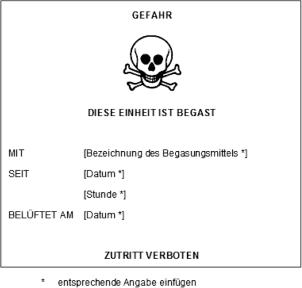

[^F774705_01_BJNR164400010]
Verordnung zum Schutz vor Gefahrstoffen
---
Title: ''
jurabk: GefStoffV 2010
layout: default
origslug: gefstoffv_2010
slug: gefstoffv_2010

---

#  (GefStoffV 2010)

Ausfertigungsdatum
:   2010-11-26

Fundstelle
:   BGBl I: 2010, 1643, 1644

Geändert durch
:   Art. 2 G v. 28.7.2011 I 1622

[^F774705_01_BJNR164400010]:     Artikel 1 dieser Verordnung dient der Umsetzung folgender Richtlinien:
    –                                                         Richtlinie
    98/24/EG des Rates vom 7. April 1998 zum Schutz von Gesundheit und
    Sicherheit der Arbeitnehmer vor der Gefährdung durch chemische
    Arbeitsstoffe bei der Arbeit (ABl. L 131 vom 5.5.1998, S. 11), die
    durch die Richtlinie 2007/30/EG (ABl. L 165 vom 27.6.2007, S. 21)
    geändert worden ist,

    –                                                         Richtlinie
    2000/39/EG der Kommission vom 8. Juni 2000 zur Festlegung einer ersten
    Liste von Arbeitsplatz-Richtgrenzwerten in Durchführung der Richtlinie
    98/24/EG des Rates zum Schutz von Gesundheit und Sicherheit der
    Arbeitnehmer vor der Gefährdung durch chemische Arbeitsstoffe bei der
    Arbeit (ABl. L 142 vom 16.6.2000, S. 47), die zuletzt durch die
    Richtlinie 2009/161/EU (ABl. L 338 vom 19.12.2009, S. 87) geändert
    worden ist,

    –                                                         Richtlinie
    2006/15/EG der Kommission vom 7. Februar 2006 zur Festlegung einer
    zweiten Liste von Arbeitsplatz-Richtgrenzwerten in Durchführung der
    Richtlinie 98/24/EG des Rates und zur Änderung der Richtlinien
    91/322/EWG und 2000/39/EG (ABl. L 38 vom 9.2.2006, S. 36),

    –                                                         Richtlinie
    2009/161/EU der Kommission vom 17. Dezember 2009 zur Festlegung einer
    dritten Liste von Arbeitsplatz-Richtgrenzwerten in Durchführung der
    Richtlinie 98/24/EG des Rates und zur Änderung der Richtlinie
    2000/39/EG (ABl. L 338 vom 19.12.2009, S. 87),

    –                                                         Richtlinie
    2004/37/EG des Europäischen Parlaments und des Rates vom 29. April
    2004 über den Schutz der Arbeitnehmer gegen Gefährdung durch
    Karzinogene oder Mutagene bei der Arbeit (ABl. L 158 vom 30.4.2004, S.
    50, L 229 vom 29.6.2004, S. 23, L 204 vom 4.8.2007, S. 28),

    –                                                         Richtlinie
    2009/148/EG des Europäischen Parlaments und des Rates vom 30. November
    2009 über den Schutz der Arbeitnehmer gegen Gefährdung durch Asbest am
    Arbeitsplatz (ABl. L 330 vom 16.12.2009, S. 28),

    –                                                         Richtlinie
    67/548/EWG des Rates vom 27. Juni 1967 zur Angleichung der Rechts- und
    Verwaltungsvorschriften für die Einstufung, Verpackung und
    Kennzeichnung gefährlicher Stoffe (ABl. L 196 vom 16.8.1967, S. 1),
    die zuletzt durch die Richtlinie 2009/2/EG (ABl. L 11 vom 16.1.2009,
    S. 6) geändert worden ist,

    –                                                         Richtlinie
    1999/45/EG des Europäischen Parlaments und des Rates vom 31. Mai 1999
    zur Angleichung der Rechts- und Verwaltungsvorschriften der
    Mitgliedstaaten für die Einstufung, Verpackung und Kennzeichnung
    gefährlicher Zubereitungen (ABl. L 200 vom 30.7.1999, S. 1, L 6 vom
    10\.1.2002, S. 71), die zuletzt durch die Verordnung (EG) Nr. 1272/2008
    (ABl. L 353 vom 31.12.2008, S. 1) geändert worden ist,

    –                                                         Richtlinie
    98/8/EG des Europäischen Parlaments und des Rates vom 16. Februar 1998
    über das Inverkehrbringen von Biozid-Produkten (ABl. L 123 vom
    24\.4.1998, S. 1, L 150 vom 8.6.2002, S. 71), die zuletzt durch die
    Richtlinien 2010/7/EU, 2010/8/EU, 2010/9/EU, 2010/10/EU und 2010/11/EU
    (ABl. L 37 vom 10.2.2010, S. 33, 37, 40, 44, 47) geändert worden ist,

    –                                                         Richtlinie
    96/59/EG des Rates vom 16. September 1996 über die Beseitigung
    polychlorierter Biphenyle und polychlorierter Terphenyle (PCB/PCT)
    (ABl. L 243 vom 24.9.1996, S. 31), die durch die Verordnung (EG) Nr.
    596/2009 (ABl. L 188 vom 18.7.2009, S. 14) geändert worden ist,

    –                                                         Richtlinie
    1999/92/EG des Europäischen Parlaments und des Rates vom 16. Dezember
    1992 über Mindestvorschriften zur Verbesserung des Gesundheitsschutzes
    und der Sicherheit der Arbeitnehmer, die durch explosionsfähige
    Atmosphären gefährdet werden können (ABl. L 23 vom 28.1.2000, S. 57),
    die durch die Richtlinie 2007/30/EG (ABl. L 165 vom 27.6.2007, S. 21)
    geändert worden ist.

## Abschnitt 1 - Zielsetzung, Anwendungsbereich und Begriffsbestimmungen

### § 1 Zielsetzung und Anwendungsbereich

(1) Ziel dieser Verordnung ist es, den Menschen und die Umwelt vor
stoffbedingten Schädigungen zu schützen durch

1.  Regelungen zur Einstufung, Kennzeichnung und Verpackung gefährlicher
    Stoffe und Zubereitungen,

2.  Maßnahmen zum Schutz der Beschäftigten und anderer Personen bei
    Tätigkeiten mit Gefahrstoffen und

3.  Beschränkungen für das Herstellen und Verwenden bestimmter
    gefährlicher Stoffe, Zubereitungen und Erzeugnisse.

(2) Abschnitt 2 gilt für das Inverkehrbringen von

1.  gefährlichen Stoffen und Zubereitungen,

2.  bestimmten Stoffen, Zubereitungen und Erzeugnissen, die mit
    zusätzlichen Kennzeichnungen zu versehen sind, nach Maßgabe

    a)  der Richtlinie 96/59/EG des Rates vom 16. September 1996 über die
        Beseitigung polychlorierter Biphenyle und polychlorierter Terphenyle
        (PCB/PCT) (ABl. L 243 vom 24.9.1996, S. 31), die durch die Verordnung
        (EG) Nr. 596/2009 (ABl. L 188 vom 18.7.2009, S. 14) geändert worden
        ist, oder

    b)  der Richtlinie 1999/45/EG des Europäischen Parlaments und des Rates
        vom 31. Mai 1999 zur Angleichung der Rechts- und
        Verwaltungsvorschriften der Mitgliedstaaten für die Einstufung,
        Verpackung und Kennzeichnung gefährlicher Zubereitungen (ABl. L 200
        vom 30.7.1999, S. 1, L 6 vom 10.1.2002, S. 71), die zuletzt durch die
        Verordnung (EG) Nr. 1272/2008 (ABl. L 353 vom 31.12.2008, S. 1)
        geändert worden ist,

3.  Biozid-Produkten im Sinne des § 3b Absatz 1 Nummer 1 des
    Chemikaliengesetzes, die keine gefährlichen Stoffe oder Zubereitungen
    sind, sowie

4.  Biozid-Wirkstoffen im Sinne des § 3b Absatz 1 Nummer 2 des
    Chemikaliengesetzes, die biologische Arbeitsstoffe im Sinne der
    Biostoffverordnung sind, und Biozid-Produkten im Sinne des § 3b Absatz
    1 Nummer 1 des Chemikaliengesetzes, die als Wirkstoffe solche
    biologischen Arbeitsstoffe enthalten.

Abschnitt 2 gilt nicht für Lebensmittel oder Futtermittel in Form von
Fertigerzeugnissen, die für den Endverbrauch bestimmt sind.

(3) Die Abschnitte 3 bis 6 gelten für Tätigkeiten, bei denen
Beschäftigte Gefährdungen ihrer Gesundheit und Sicherheit durch
Stoffe, Zubereitungen oder Erzeugnisse ausgesetzt sein können. Sie
gelten auch, wenn als unmittelbare Folge solcher Tätigkeiten die
Gesundheit und Sicherheit anderer Personen gefährdet sein können. Die
Sätze 1 und 2 finden auch Anwendung auf Tätigkeiten, die im
Zusammenhang mit der Beförderung von Stoffen, Zubereitungen und
Erzeugnissen ausgeübt werden. Die Vorschriften des
Gefahrgutbeförderungsgesetzes und der darauf gestützten
Rechtsverordnungen bleiben unberührt.

(4) Sofern nicht ausdrücklich etwas anderes bestimmt ist, gilt diese
Verordnung nicht für

1.  biologische Arbeitsstoffe im Sinne der Biostoffverordnung und

2.  private Haushalte.

Diese Verordnung gilt ferner nicht für Betriebe, die dem
Bundesberggesetz unterliegen, soweit dort oder in Rechtsverordnungen,
die auf Grund dieses Gesetzes erlassen worden sind, entsprechende
Rechtsvorschriften bestehen.

### § 2 Begriffsbestimmungen

(1) Gefahrstoffe im Sinne dieser Verordnung sind

1.  gefährliche Stoffe und Zubereitungen nach § 3,

2.  Stoffe, Zubereitungen und Erzeugnisse, die explosionsfähig sind,

3.  Stoffe, Zubereitungen und Erzeugnisse, aus denen bei der Herstellung
    oder Verwendung Stoffe nach Nummer 1 oder Nummer 2 entstehen oder
    freigesetzt werden,

4.  Stoffe und Zubereitungen, die die Kriterien nach den Nummern 1 bis 3
    nicht erfüllen, aber auf Grund ihrer physikalisch-chemischen,
    chemischen oder toxischen Eigenschaften und der Art und Weise, wie sie
    am Arbeitsplatz vorhanden sind oder verwendet werden, die Gesundheit
    und die Sicherheit der Beschäftigten gefährden können,

5.  alle Stoffe, denen ein Arbeitsplatzgrenzwert zugewiesen worden ist.

(2) Für den Begriff Zubereitung gilt die Begriffsbestimmung nach
Artikel 2 Absatz 1 Buchstabe b der Richtlinie 1999/45/EG.

(3) Krebserzeugend, erbgutverändernd oder fruchtbarkeitsgefährdend im
Sinne des Abschnitts 4 sind

1.  Stoffe, die die Kriterien für die Einstufung als krebserzeugend,
    erbgutverändernd oder fruchtbarkeitsgefährdend erfüllen nach Anhang VI
    der Richtlinie 67/548/EWG des Rates vom 27. Juni 1967 zur Angleichung
    der Rechts- und Verwaltungsvorschriften für die Einstufung, Verpackung
    und Kennzeichnung gefährlicher Stoffe (ABl. L 196 vom 16.8.1967, S.
    1), die zuletzt durch die Richtlinie 2009/2/EG (ABl. L 11 vom
    16\.1.2009, S. 6) geändert worden ist,

2.  Zubereitungen, die einen oder mehrere der in Nummer 1 genannten Stoffe
    enthalten, wenn die Konzentration eines oder mehrerer dieser Stoffe
    die Konzentrationsgrenzen für die Einstufung einer Zubereitung als
    krebserzeugend, erbgutverändernd oder fruchtbarkeitsgefährdend
    übersteigt,

3.  Stoffe, Zubereitungen oder Verfahren, die in den nach § 20 Absatz 4
    bekannt gegebenen Regeln und Erkenntnissen als krebserzeugend,
    erbgutverändernd oder fruchtbarkeitsgefährdend bezeichnet werden.

Die Konzentrationsgrenzen im Sinne des Satzes 1 Nummer 2 sind
festgelegt

1.  in Tabelle 3.2 des Anhangs VI Teil 3 der Verordnung (EG) Nr. 1272/2008
    des Europäischen Parlaments und des Rates vom 16. Dezember 2008 über
    die Einstufung, Kennzeichnung und Verpackung von Stoffen und
    Gemischen, zur Änderung und Aufhebung der Richtlinien 67/548/EWG und
    1999/45/EG und zur Änderung der Verordnung (EG) Nr. 1907/2006 (ABl. L
    353 vom 31.12.2008, S. 1), die durch die Verordnung (EG) Nr. 790/2009
    (ABl. L 235 vom 5.9.2009, S. 1) geändert worden ist, in ihrer jeweils
    geltenden Fassung oder

2.  in Anhang II Teil B der Richtlinie 1999/45/EG, wenn der Stoff oder die
    Stoffe nicht oder ohne Konzentrationsgrenzen in Anhang VI Teil 3
    Tabelle 3.2 der Verordnung (EG) Nr. 1272/2008 aufgeführt sind.

(4) Eine Tätigkeit ist jede Arbeit mit Stoffen, Zubereitungen oder
Erzeugnissen, einschließlich Herstellung, Mischung, Ge- und Verbrauch,
Lagerung, Aufbewahrung, Be- und Verarbeitung, Ab- und Umfüllung,
Entfernung, Entsorgung und Vernichtung. Zu den Tätigkeiten zählen auch
das innerbetriebliche Befördern sowie Bedien- und
Überwachungsarbeiten.

(5) Lagern ist das Aufbewahren zur späteren Verwendung sowie zur
Abgabe an andere. Es schließt die Bereitstellung zur Beförderung ein,
wenn die Beförderung nicht innerhalb von 24 Stunden nach der
Bereitstellung oder am darauffolgenden Werktag erfolgt. Ist dieser
Werktag ein Samstag, so endet die Frist mit Ablauf des nächsten
Werktags.

(6) Es stehen gleich

1.  den Beschäftigten die in Heimarbeit beschäftigten Personen sowie
    Schülerinnen und Schüler, Studierende und sonstige, insbesondere an
    wissenschaftlichen Einrichtungen tätige Personen, die Tätigkeiten mit
    Gefahrstoffen ausüben; für Schülerinnen und Schüler und Studierende
    gelten jedoch nicht die Regelungen dieser Verordnung über die
    Beteiligung der Personalvertretungen,

2.  dem Arbeitgeber der Unternehmer ohne Beschäftigte sowie der
    Auftraggeber und der Zwischenmeister im Sinne des Heimarbeitsgesetzes
    in der im Bundesgesetzblatt Teil III, Gliederungsnummer 804-1,
    veröffentlichten bereinigten Fassung, das zuletzt durch Artikel 225
    der Verordnung vom 31. Oktober 2006 (BGBl. I S. 2407) geändert worden
    ist.

(7) Der Arbeitsplatzgrenzwert ist der Grenzwert für die zeitlich
gewichtete durchschnittliche Konzentration eines Stoffs in der Luft am
Arbeitsplatz in Bezug auf einen gegebenen Referenzzeitraum. Er gibt
an, bis zu welcher Konzentration eines Stoffs akute oder chronische
schädliche Auswirkungen auf die Gesundheit von Beschäftigten im
Allgemeinen nicht zu erwarten sind.

(8) Der biologische Grenzwert ist der Grenzwert für die toxikologisch-
arbeitsmedizinisch abgeleitete Konzentration eines Stoffs, seines
Metaboliten oder eines Beanspruchungsindikators im entsprechenden
biologischen Material. Er gibt an, bis zu welcher Konzentration die
Gesundheit von Beschäftigten im Allgemeinen nicht beeinträchtigt wird.

(9) Explosionsfähig sind Stoffe, Zubereitungen und Erzeugnisse,

1.  wenn sie mit oder ohne Luft durch Zündquellen wie äußere thermische
    Einwirkungen, mechanische Beanspruchungen oder Detonationsstöße zu
    einer chemischen Reaktion gebracht werden können, bei der
    hochgespannte Gase in so kurzer Zeit entstehen, dass ein sprunghafter
    Temperatur- und Druckanstieg hervorgerufen wird, oder

2.  wenn im Gemisch mit Luft nach Wirksamwerden einer Zündquelle eine sich
    selbsttätig fortpflanzende Flammenausbreitung stattfindet, die im
    Allgemeinen mit einem sprunghaften Temperatur- und Druckanstieg
    verbunden ist.

(10) Ein explosionsfähiges Gemisch ist ein Gemisch aus brennbaren
Gasen, Dämpfen, Nebeln oder Stäuben, in dem sich der
Verbrennungsvorgang nach erfolgter Zündung auf das gesamte
unverbrannte Gemisch überträgt. Ein gefährliches explosionsfähiges
Gemisch ist ein explosionsfähiges Gemisch, das in solcher Menge
auftritt, dass besondere Schutzmaßnahmen für die Aufrechterhaltung der
Gesundheit und Sicherheit der Beschäftigten oder anderer Personen
erforderlich werden (gefahrdrohende Menge). Explosionsfähige
Atmosphäre ist ein explosionsfähiges Gemisch unter atmosphärischen
Bedingungen im Gemisch mit Luft.

(11) Der Stand der Technik ist der Entwicklungsstand fortschrittlicher
Verfahren, Einrichtungen oder Betriebsweisen, der die praktische
Eignung einer Maßnahme zum Schutz der Gesundheit und zur Sicherheit
der Beschäftigten gesichert erscheinen lässt. Bei der Bestimmung des
Stands der Technik sind insbesondere vergleichbare Verfahren,
Einrichtungen oder Betriebsweisen heranzuziehen, die mit Erfolg in der
Praxis erprobt worden sind. Gleiches gilt für die Anforderungen an die
Arbeitsmedizin und die Arbeitsplatzhygiene.

(12) Fachkundig ist, wer zur Ausübung einer in dieser Verordnung
bestimmten Aufgabe befähigt ist. Die Anforderungen an die Fachkunde
sind abhängig von der jeweiligen Art der Aufgabe. Zu den Anforderungen
zählen eine entsprechende Berufsausbildung, Berufserfahrung oder eine
zeitnah ausgeübte entsprechende berufliche Tätigkeit sowie die
Teilnahme an spezifischen Fortbildungsmaßnahmen.

(13) Sachkundig ist, wer seine bestehende Fachkunde durch Teilnahme an
einem behördlich anerkannten Sachkundelehrgang erweitert hat. In
Abhängigkeit vom Aufgabengebiet kann es zum Erwerb der Sachkunde auch
erforderlich sein, den Lehrgang mit einer erfolgreichen Prüfung
abzuschließen. Sachkundig ist ferner, wer über eine von der
zuständigen Behörde als gleichwertig anerkannte oder in dieser
Verordnung als gleichwertig bestimmte Qualifikation verfügt.

## Abschnitt 2 - Gefahrstoffinformation

### § 3 Gefährlichkeitsmerkmale

Gefährlich im Sinne dieser Verordnung sind Stoffe und Zubereitungen,
die eine oder mehrere der in Satz 2 genannten Eigenschaften aufweisen.
Stoffe und Zubereitungen sind

1.  explosionsgefährlich, wenn sie in festem, flüssigem, pastenförmigem
    oder gelatinösem Zustand auch ohne Beteiligung von Luftsauerstoff
    exotherm und unter schneller Entwicklung von Gasen reagieren können
    und unter festgelegten Prüfbedingungen detonieren, schnell
    deflagrieren oder beim Erhitzen unter teilweisem Einschluss
    explodieren,

2.  brandfördernd, wenn sie in der Regel selbst nicht brennbar sind, aber
    bei Kontakt mit brennbaren Stoffen oder Zubereitungen, überwiegend
    durch Sauerstoffabgabe, die Brandgefahr und die Heftigkeit eines
    Brands beträchtlich erhöhen,

3.  hochentzündlich, wenn sie

    a)  in flüssigem Zustand einen extrem niedrigen Flammpunkt und einen
        niedrigen Siedepunkt haben,

    b)  als Gase bei gewöhnlicher Temperatur und Normaldruck in Mischung mit
        Luft einen Explosionsbereich haben,

4.  leichtentzündlich, wenn sie

    a)  sich bei gewöhnlicher Temperatur an der Luft ohne Energiezufuhr
        erhitzen und schließlich entzünden können,

    b)  in festem Zustand durch kurzzeitige Einwirkung einer Zündquelle leicht
        entzündet werden können und nach deren Entfernen in gefährlicher Weise
        weiterbrennen oder weiterglimmen,

    c)  in flüssigem Zustand einen sehr niedrigen Flammpunkt haben,

    d)  bei Kontakt mit Wasser oder mit feuchter Luft hochentzündliche Gase in
        gefährlicher Menge entwickeln,

5.  entzündlich, wenn sie in flüssigem Zustand einen niedrigen Flammpunkt
    haben,

6.  sehr giftig, wenn sie in sehr geringer Menge bei Einatmen,
    Verschlucken oder Aufnahme über die Haut zum Tod führen oder akute
    oder chronische Gesundheitsschäden verursachen können,

7.  giftig, wenn sie in geringer Menge bei Einatmen, Verschlucken oder
    Aufnahme über die Haut zum Tod führen oder akute oder chronische
    Gesundheitsschäden verursachen können,

8.  gesundheitsschädlich, wenn sie bei Einatmen, Verschlucken oder
    Aufnahme über die Haut zum Tod führen oder akute oder chronische
    Gesundheitsschäden verursachen können,

9.  ätzend, wenn sie lebende Gewebe bei Kontakt zerstören können,

10. reizend, wenn sie ohne ätzend zu sein bei kurzzeitigem, länger
    andauerndem oder wiederholtem Kontakt mit Haut oder Schleimhaut eine
    Entzündung hervorrufen können,

11. sensibilisierend, wenn sie bei Einatmen oder Aufnahme über die Haut
    Überempfindlichkeitsreaktionen hervorrufen können, so dass bei
    künftiger Exposition gegenüber dem Stoff oder der Zubereitung
    charakteristische Störungen auftreten,

12. krebserzeugend (kanzerogen), wenn sie bei Einatmen, Verschlucken oder
    Aufnahme über die Haut Krebs hervorrufen oder die Krebshäufigkeit
    erhöhen können,

13. fortpflanzungsgefährdend (reproduktionstoxisch), wenn sie bei
    Einatmen, Verschlucken oder Aufnahme über die Haut

    a)  nicht vererbbare Schäden der Nachkommenschaft hervorrufen oder die
        Häufigkeit solcher Schäden erhöhen (fruchtschädigend) oder

    b)  eine Beeinträchtigung der männlichen oder weiblichen
        Fortpflanzungsfunktionen oder der Fortpflanzungsfähigkeit zur Folge
        haben können (fruchtbarkeitsgefährdend),

14. erbgutverändernd (mutagen), wenn sie bei Einatmen, Verschlucken oder
    Aufnahme über die Haut vererbbare genetische Schäden zur Folge haben
    oder deren Häufigkeit erhöhen können,

15. umweltgefährlich, wenn sie selbst oder ihre Umwandlungsprodukte
    geeignet sind, die Beschaffenheit des Naturhaushalts, von Wasser,
    Boden oder Luft, Klima, Tieren, Pflanzen oder Mikroorganismen derart
    zu verändern, dass dadurch sofort oder später Gefahren für die Umwelt
    herbeigeführt werden können.

### § 4 Einstufung, Kennzeichnung und Verpackung

(1) Die Einstufung, Kennzeichnung und Verpackung von Stoffen und
Gemischen sowie von Erzeugnissen mit Explosivstoff richten sich nach
den Bestimmungen der Verordnung (EG) Nr. 1272/2008.

(2) Sofern nach Artikel 61 der Verordnung (EG) Nr. 1272/2008 die
Einstufung, Kennzeichnung oder Verpackung von Stoffen und
Zubereitungen nach der Richtlinie 67/548/EWG oder der Richtlinie
1999/45/EG erfolgt, sind unbeschadet des § 19 Absatz 3 die
Bestimmungen dieser Richtlinien sowie die Absätze 3 bis 6 und § 5
Absatz 3 anzuwenden.

(3) Bei der Einstufung von Stoffen und Zubereitungen sind die nach §
20 Absatz 4 bekannt gegebenen Regeln und Erkenntnisse zu beachten.

(4) Die Kennzeichnung von Stoffen und Zubereitungen, die in
Deutschland in Verkehr gebracht werden, muss in deutscher Sprache
erfolgen.

(5) Werden gefährliche Stoffe oder gefährliche Zubereitungen
unverpackt in Verkehr gebracht, sind jeder Liefereinheit geeignete
Sicherheitsinformationen oder ein Sicherheitsdatenblatt in deutscher
Sprache beizufügen.

(6) Beabsichtigt ein Hersteller oder Einführer, der nach der
Richtlinie 1999/45/EG kennzeichnet, von der in Artikel 15 dieser
Richtlinie festgelegten Möglichkeit zur abweichenden Bezeichnung von
gefährlichen Stoffen bei der Kennzeichnung von Zubereitungen Gebrauch
zu machen, hat er die erforderlichen Informationen und Nachweise der
Bundesstelle für Chemikalien (§ 4 Absatz 1 Nummer 1 des
Chemikaliengesetzes) rechtzeitig vorzulegen. Von der Möglichkeit zur
abweichenden Bezeichnung kann für Wirkstoffe in Biozid-Produkten nicht
Gebrauch gemacht werden.

(7) Der Hersteller oder Einführer hat Biozid-Wirkstoffe, die als
solche in Verkehr gebracht werden und zugleich biologische
Arbeitsstoffe sind, zusätzlich nach den §§ 3 und 4 der
Biostoffverordnung einzustufen.

(8) Für die Verpackung und Kennzeichnung von Biozid-Produkten gilt
zusätzlich Artikel 20 Absatz 2 Satz 2 Buchstabe a und Absatz 3 Satz 2
und 3 Buchstabe a, c, f bis j, l und m sowie im Fall zugelassener oder
registrierter Biozid-Produkte zusätzlich Artikel 20 Absatz 3 Satz 3
Buchstabe b, d, e und k der Richtlinie 98/8/EG des Europäischen
Parlaments und des Rates vom 16. Februar 1998 über das
Inverkehrbringen von Biozid-Produkten (ABl. L 123 vom 24.4.1998, S. 1,
L 150 vom 8.6.2002, S. 71), die zuletzt durch die Richtlinien
2010/7/EU, 2010/8/EU, 2010/9/EU, 2010/10/EU und 2010/11/EU (ABl. L 37
vom 10.2.2010, S. 33, 37, 40, 44, 47) geändert worden ist. Bei der
Kennzeichnung von Biozid-Produkten, bei denen der Wirkstoff ein
biologischer Arbeitsstoff ist, sind darüber hinaus anzugeben

1.  die Identität des Organismus nach Anhang IVA Abschnitt II Nummer 2.1
    und 2.2 der Richtlinie 98/8/EG,

2.  die Einstufung der Mikroorganismen in Risikogruppen nach den §§ 3 und
    4 der Biostoffverordnung und

3.  bei einer Einstufung in die Risikogruppe 2 und höher nach den §§ 3 und
    4 der Biostoffverordnung das Symbol für Biogefährdung nach Anhang I
    der Biostoffverordnung.

Die nach Satz 2 und nach Artikel 20 Absatz 3 Satz 3 Buchstabe a, b, d,
g und k der Richtlinie 98/8/EG erforderlichen Angaben müssen auf dem
Kennzeichnungsschild stehen. Die Angaben nach Artikel 20 Absatz 3 Satz
3 Buchstabe c, e, f, h, i, j und l der Richtlinie
98/8/EG              können auf dem Kennzeichnungsschild oder an
anderer Stelle der Verpackung oder auf einem der Verpackung
beigefügten, integrierten Merkblatt stehen.

(9) Dekontaminierte PCB-haltige Geräte im Sinne der Richtlinie
96/59/EG müssen nach dem Anhang dieser Richtlinie gekennzeichnet
werden.

(10) Die Kennzeichnung bestimmter, beschränkter Stoffe, Zubereitungen
und Erzeugnisse richtet sich zusätzlich nach Artikel 67 in Verbindung
mit Anhang XVII der Verordnung (EG) Nr. 1907/2006 des Europäischen
Parlaments und des Rates vom 18. Dezember 2006 zur Registrierung,
Bewertung, Zulassung und Beschränkung chemischer Stoffe (REACH), zur
Schaffung einer Europäischen Chemikalienagentur, zur Änderung der
Richtlinie 1999/45/EG und zur Aufhebung der Verordnung (EWG) Nr.
793/93 des Rates, der Verordnung (EG) Nr. 1488/94 der Kommission, der
Richtlinie 76/769/EWG des Rates sowie der Richtlinien
91/155/EWG,              93/67/EWG, 93/105/EG und 2000/21/EG der
Kommission (ABl. L 396 vom 30.12.2006, S. 1, L 136 vom 29.5.2007, S.
3, L 141 vom 31.5.2008, S. 22, L 36 vom 5.2.2009, S. 84), die zuletzt
durch die Verordnung (EU) Nr. 453/2010 (ABl. L 133 vom 31.5.2010, S.
1) geändert worden ist, in ihrer jeweils geltenden Fassung.

(11) Ist

1.  der Informationsgehalt der Kennzeichnung oder des
    Sicherheitsdatenblatts einer Zubereitung oder

2.  die Information über eine Verunreinigung oder Beimengung auf dem
    Kennzeichnungsschild oder im Sicherheitsdatenblatt eines Stoffs

nicht ausreichend, um neue Zubereitungen bei der Herstellung
ordnungsgemäß einstufen zu können, hat der Inverkehrbringer der
Zubereitung oder des Stoffs den anderen Herstellern auf Anfrage
unverzüglich alle Informationen zur Verfügung zu stellen, die für eine
ordnungsgemäße Einstufung neuer Zubereitungen erforderlich sind.

### § 5 Sicherheitsdatenblatt und sonstige Informationspflichten

(1) Die vom Hersteller, Einführer und erneuten Inverkehrbringer
hinsichtlich des Sicherheitsdatenblatts beim Inverkehrbringen von
Stoffen und Zubereitungen zu beachtenden Anforderungen ergeben sich
aus Artikel 31 in Verbindung mit Anhang II der Verordnung (EG) Nr.
1907/2006. Ist nach diesen Vorschriften die Übermittlung eines
Sicherheitsdatenblatts nicht erforderlich, richten sich die
Informationspflichten nach Artikel 32 der Verordnung (EG) Nr.
1907/2006.

(2) Bei den Angaben, die nach den Nummern 15 und 16 des Anhangs II der
Verordnung (EG)
Nr. 1907/2006              zu machen sind, sind insbesondere die nach
§ 20 Absatz 4 bekannt gegebenen Regeln und Erkenntnisse zu
berücksichtigen, nach denen Stoffe oder Tätigkeiten als
krebserzeugend, erbgutverändernd oder fortpflanzungsgefährdend
bezeichnet werden.

(3) Werden Zubereitungen nach der Richtlinie
1999/45/EG              gekennzeichnet, muss auf der Verpackung von
Zubereitungen, die im Einzelhandel angeboten oder für jedermann
erhältlich sind und die als sehr giftig, giftig oder ätzend eingestuft
sind, nach Maßgabe des Anhangs V Buchstabe A Nummer 1.2 der Richtlinie
1999/45/EG eine genaue und allgemein verständliche Gebrauchsanweisung
angebracht werden. Falls dies technisch nicht möglich ist, muss die
Gebrauchsanweisung der Verpackung beigefügt werden.

## Abschnitt 3 - Gefährdungsbeurteilung und Grundpflichten

### § 6 Informationsermittlung und Gefährdungsbeurteilung

(1) Im Rahmen einer Gefährdungsbeurteilung als Bestandteil der
Beurteilung der Arbeitsbedingungen nach § 5 des Arbeitsschutzgesetzes
hat der Arbeitgeber festzustellen, ob die Beschäftigten Tätigkeiten
mit Gefahrstoffen ausüben oder ob bei Tätigkeiten Gefahrstoffe
entstehen oder freigesetzt werden können. Ist dies der Fall, so hat er
alle hiervon ausgehenden Gefährdungen der Gesundheit und Sicherheit
der Beschäftigten unter folgenden Gesichtspunkten zu beurteilen:

1.  gefährliche Eigenschaften der Stoffe oder Zubereitungen,
    einschließlich ihrer physikalisch-chemischen Wirkungen,

2.  Informationen des Herstellers oder Inverkehrbringers zum
    Gesundheitsschutz und zur Sicherheit insbesondere im
    Sicherheitsdatenblatt,

3.  Art und Ausmaß der Exposition unter Berücksichtigung aller
    Expositionswege; dabei sind die Ergebnisse der Messungen und
    Ermittlungen nach § 7 Absatz 8 zu berücksichtigen,

4.  Möglichkeiten einer Substitution,

5.  Arbeitsbedingungen und Verfahren, einschließlich der Arbeitsmittel und
    der Gefahrstoffmenge,

6.  Arbeitsplatzgrenzwerte und biologische Grenzwerte,

7.  Wirksamkeit der ergriffenen oder zu ergreifenden Schutzmaßnahmen,

8.  Erkenntnisse aus arbeitsmedizinischen Vorsorgeuntersuchungen nach der
    Verordnung zur arbeitsmedizinischen Vorsorge.

(2) Der Arbeitgeber hat sich die für die Gefährdungsbeurteilung
notwendigen Informationen beim Inverkehrbringer oder aus anderen, ihm
mit zumutbarem Aufwand zugänglichen Quellen zu beschaffen.
Insbesondere hat der Arbeitgeber die Informationen zu beachten, die
ihm nach Titel IV der Verordnung (EG)
Nr. 1907/2006              zur Verfügung gestellt werden; dazu gehören
Sicherheitsdatenblätter und die Informationen zu Stoffen oder
Zubereitungen, für die kein Sicherheitsdatenblatt zu erstellen ist.
Sofern die Verordnung (EG) Nr. 1907/2006 keine Informationspflicht
vorsieht, hat der Inverkehrbringer dem Arbeitgeber auf Anfrage die für
die Gefährdungsbeurteilung notwendigen Informationen über die
Gefahrstoffe zur Verfügung zu stellen.

(3) Stoffe und Zubereitungen, die nicht von einem Inverkehrbringer
nach § 4 Absatz 1 oder Absatz 2 eingestuft und gekennzeichnet worden
sind, beispielsweise innerbetrieblich hergestellte Stoffe oder
Zubereitungen, hat der Arbeitgeber selbst einzustufen. Zumindest aber
hat er die von den Stoffen oder Zubereitungen ausgehenden Gefährdungen
der Beschäftigten zu ermitteln; dies gilt auch für Gefahrstoffe nach §
2 Absatz 1 Nummer 4.

(4) Der Arbeitgeber hat festzustellen, ob die verwendeten Stoffe,
Zubereitungen oder Erzeugnisse bei Tätigkeiten, auch unter
Berücksichtigung verwendeter Arbeitsmittel, Verfahren und der
Arbeitsumgebung sowie ihrer möglichen Wechselwirkungen, zu Brand- oder
Explosionsgefährdungen führen können. Insbesondere hat er zu
ermitteln, ob die Stoffe, Zubereitungen oder Erzeugnisse auf Grund
ihrer Eigenschaften und der Art und Weise, wie sie am Arbeitsplatz
vorhanden sind oder verwendet werden, explosionsfähige Gemische bilden
können. Im Fall von nicht atmosphärischen Bedingungen sind auch die
möglichen Veränderungen der für den Explosionsschutz relevanten
sicherheitstechnischen Kenngrößen zu ermitteln und zu berücksichtigen.

(5) Bei der Gefährdungsbeurteilung sind ferner Tätigkeiten zu
berücksichtigen, bei denen auch nach Ausschöpfung sämtlicher
technischer Schutzmaßnahmen die Möglichkeit einer Gefährdung besteht.
Dies gilt insbesondere für Instandhaltungsarbeiten, einschließlich
Wartungsarbeiten. Darüber hinaus sind auch andere Tätigkeiten wie
Bedien- und Überwachungsarbeiten zu berücksichtigen, wenn diese zu
einer Gefährdung von Beschäftigten durch Gefahrstoffe führen können.

(6) Die mit den Tätigkeiten verbundenen inhalativen, dermalen und
physikalisch-chemischen Gefährdungen sind unabhängig voneinander zu
beurteilen und in der Gefährdungsbeurteilung zusammenzuführen. Treten
bei einer Tätigkeit mehrere Gefahrstoffe gleichzeitig auf, sind
Wechsel- oder Kombinationswirkungen der Gefahrstoffe, die Einfluss auf
die Gesundheit und Sicherheit der Beschäftigten haben, bei der
Gefährdungsbeurteilung zu berücksichtigen, soweit solche Wirkungen
bekannt sind.

(7) Der Arbeitgeber kann bei der Festlegung der Schutzmaßnahmen eine
Gefährdungsbeurteilung übernehmen, die ihm der Hersteller oder
Inverkehrbringer mitgeliefert hat, sofern die Angaben und Festlegungen
in dieser Gefährdungsbeurteilung den Arbeitsbedingungen und Verfahren,
einschließlich der Arbeitsmittel und der Gefahrstoffmenge, im eigenen
Betrieb entsprechen.

(8) Der Arbeitgeber hat die Gefährdungsbeurteilung unabhängig von der
Zahl der Beschäftigten erstmals vor Aufnahme der Tätigkeit zu
dokumentieren; dabei sind anzugeben

1.  die Gefährdungen am Arbeitsplatz,

2.  das Ergebnis der Prüfung auf Möglichkeiten einer Substitution nach
    Absatz 1 Satz 2 Nummer 4,

3.  eine Begründung für einen Verzicht auf eine technisch mögliche
    Substitution, sofern Schutzmaßnahmen nach § 9 oder § 10 zu ergreifen
    sind,

4.  die durchzuführenden Schutzmaßnahmen, einschließlich der zusätzlich
    bei Überschreitung eines Arbeitsplatzgrenzwerts ergriffenen
    Schutzmaßnahmen sowie geplanter weiterer Schutzmaßnahmen, die
    zukünftig zur Einhaltung des Arbeitsplatzgrenzwerts ergriffen werden
    sollen,

5.  eine Begründung, wenn von den nach § 20 Absatz 4 bekannt gegebenen
    Regeln und Erkenntnissen abgewichen wird, und

6.  die Ermittlungsergebnisse, die belegen, dass der Arbeitsplatzgrenzwert
    eingehalten wird oder – bei Stoffen ohne Arbeitsplatzgrenzwert – die
    ergriffenen technischen Schutzmaßnahmen wirksam sind.

Auf eine detaillierte Dokumentation kann bei Tätigkeiten mit geringer
Gefährdung nach Absatz 11 verzichtet werden. Falls in anderen Fällen
auf eine detaillierte Dokumentation verzichtet wird, ist dies
nachvollziehbar zu begründen. Die Gefährdungsbeurteilung ist
regelmäßig zu überprüfen und bei Bedarf zu aktualisieren. Sie ist
umgehend zu aktualisieren, wenn maßgebliche Veränderungen oder neue
Informationen dies erfordern oder wenn sich eine Aktualisierung auf
Grund der Ergebnisse arbeitsmedizinischer Vorsorgeuntersuchungen nach
der Verordnung zur arbeitsmedizinischen Vorsorge als notwendig
erweist.

(9) Die Gefährdungsbeurteilung darf nur von fachkundigen Personen
durchgeführt werden. Verfügt der Arbeitgeber nicht selbst über die
entsprechenden Kenntnisse, so hat er sich fachkundig beraten zu
lassen. Fachkundig können insbesondere die Fachkraft für
Arbeitssicherheit und die Betriebsärztin oder der Betriebsarzt sein.

(10) Der Arbeitgeber hat ein Verzeichnis der im Betrieb verwendeten
Gefahrstoffe zu führen, in dem auf die entsprechenden
Sicherheitsdatenblätter verwiesen wird. Das Verzeichnis muss
mindestens folgende Angaben enthalten:

1.  Bezeichnung des Gefahrstoffs,

2.  Einstufung des Gefahrstoffs oder Angaben zu den gefährlichen
    Eigenschaften,

3.  Angaben zu den im Betrieb verwendeten Mengenbereichen,

4.  Bezeichnung der Arbeitsbereiche, in denen Beschäftigte dem Gefahrstoff
    ausgesetzt sein können.

Die Sätze 1 und 2 gelten nicht, wenn nur Tätigkeiten mit geringer
Gefährdung nach Absatz 11 ausgeübt werden. Die Angaben nach Satz 2
Nummer 1, 2 und 4 müssen allen betroffenen Beschäftigten und ihrer
Vertretung zugänglich sein.

(11) Ergibt sich aus der Gefährdungsbeurteilung für bestimmte
Tätigkeiten auf Grund

1.  der dem Gefahrstoff zugeordneten Gefährlichkeitsmerkmale,

2.  einer geringen verwendeten Stoffmenge,

3.  einer nach Höhe und Dauer niedrigen Exposition und

4.  der Arbeitsbedingungen

insgesamt eine nur geringe Gefährdung der Beschäftigten und reichen
die nach § 8 zu ergreifenden Maßnahmen zum Schutz der Beschäftigten
aus, so müssen keine weiteren Maßnahmen des Abschnitts 4 ergriffen
werden.

(12) Wenn für Stoffe oder Zubereitungen keine Prüfdaten oder
entsprechende aussagekräftige Informationen zur akut toxischen,
reizenden, hautsensibilisierenden oder erbgutverändernden Wirkung oder
zur Wirkung bei wiederholter Exposition vorliegen, sind die Stoffe
oder Zubereitungen bei der Gefährdungsbeurteilung wie Gefahrstoffe mit
entsprechenden Wirkungen zu behandeln.

### § 7 Grundpflichten

(1) Der Arbeitgeber darf eine Tätigkeit mit Gefahrstoffen erst
aufnehmen lassen, nachdem eine Gefährdungsbeurteilung nach § 6
durchgeführt und die erforderlichen Schutzmaßnahmen nach Abschnitt 4
ergriffen worden sind.

(2) Um die Gesundheit und die Sicherheit der Beschäftigten bei allen
Tätigkeiten mit Gefahrstoffen zu gewährleisten, hat der Arbeitgeber
die erforderlichen Maßnahmen nach dem Arbeitsschutzgesetz und
zusätzlich die nach dieser Verordnung erforderlichen Maßnahmen zu
ergreifen. Dabei hat er die nach § 20 Absatz 4 bekannt gegebenen
Regeln und Erkenntnisse zu beachten. Bei Einhaltung dieser Regeln und
Erkenntnisse ist in der Regel davon auszugehen, dass die Anforderungen
dieser Verordnung erfüllt sind. Von diesen Regeln und Erkenntnissen
kann abgewichen werden, wenn durch andere Maßnahmen zumindest in
vergleichbarer Weise der Schutz der Gesundheit und die Sicherheit der
Beschäftigten gewährleistet werden.

(3) Der Arbeitgeber hat auf der Grundlage des Ergebnisses der
Substitutionsprüfung nach § 6 Absatz 1 Satz 2 Nummer 4 vorrangig eine
Substitution durchzuführen. Er hat Gefahrstoffe oder Verfahren durch
Stoffe, Zubereitungen oder Erzeugnisse oder Verfahren zu ersetzen, die
unter den jeweiligen Verwendungsbedingungen für die Gesundheit und
Sicherheit der Beschäftigten nicht oder weniger gefährlich sind.

(4) Der Arbeitgeber hat Gefährdungen der Gesundheit und der Sicherheit
der Beschäftigten bei Tätigkeiten mit Gefahrstoffen auszuschließen.
Ist dies nicht möglich, hat er sie auf ein Minimum zu reduzieren.
Diesen Geboten hat der Arbeitgeber durch die Festlegung und Anwendung
geeigneter Schutzmaßnahmen Rechnung zu tragen. Dabei hat er folgende
Rangfolge zu beachten:

1.  Gestaltung geeigneter Verfahren und technischer
    Steuerungseinrichtungen von Verfahren, den Einsatz emissionsfreier
    oder emissionsarmer Verwendungsformen sowie Verwendung geeigneter
    Arbeitsmittel und Materialien nach dem Stand der Technik,

2.  Anwendung kollektiver Schutzmaßnahmen technischer Art an der
    Gefahrenquelle, wie angemessene Be- und Entlüftung, und Anwendung
    geeigneter organisatorischer Maßnahmen,

3.  sofern eine Gefährdung nicht durch Maßnahmen nach den Nummern 1 und 2
    verhütet werden kann, Anwendung von individuellen Schutzmaßnahmen, die
    auch die Bereitstellung und Verwendung von persönlicher
    Schutzausrüstung umfassen.

(5) Beschäftigte müssen die bereitgestellte persönliche
Schutzausrüstung verwenden, solange eine Gefährdung besteht. Die
Verwendung von belastender persönlicher Schutzausrüstung darf keine
Dauermaßnahme sein. Sie ist für jeden Beschäftigten auf das unbedingt
erforderliche Minimum zu beschränken.

(6) Der Arbeitgeber stellt sicher, dass

1.  die persönliche Schutzausrüstung an einem dafür vorgesehenen Ort
    sachgerecht aufbewahrt wird,

2.  die persönliche Schutzausrüstung vor Gebrauch geprüft und nach
    Gebrauch gereinigt wird und

3.  schadhafte persönliche Schutzausrüstung vor erneutem Gebrauch
    ausgebessert oder ausgetauscht wird.

(7) Der Arbeitgeber hat die Funktion und die Wirksamkeit der
technischen Schutzmaßnahmen regelmäßig, mindestens jedoch jedes dritte
Jahr, zu überprüfen. Das Ergebnis der Prüfungen ist aufzuzeichnen und
vorzugsweise zusammen mit der Dokumentation nach § 6 Absatz 8
aufzubewahren.

(8) Der Arbeitgeber stellt sicher, dass die Arbeitsplatzgrenzwerte
eingehalten werden. Er hat die Einhaltung durch Arbeitsplatzmessungen
oder durch andere geeignete Methoden zur Ermittlung der Exposition zu
überprüfen. Ermittlungen sind auch durchzuführen, wenn sich die
Bedingungen ändern, welche die Exposition der Beschäftigten
beeinflussen können. Die Ermittlungsergebnisse sind aufzuzeichnen,
aufzubewahren und den Beschäftigten und ihrer Vertretung zugänglich zu
machen. Werden Tätigkeiten entsprechend einem verfahrens- und
stoffspezifischen Kriterium ausgeübt, das nach § 20 Absatz 4 bekannt
gegebenen worden ist, kann der Arbeitgeber in der Regel davon
ausgehen, dass die Arbeitsplatzgrenzwerte eingehalten werden; in
diesem Fall findet Satz 2 keine Anwendung.

(9) Sofern Tätigkeiten mit Gefahrstoffen ausgeübt werden, für die kein
Arbeitsplatzgrenzwert vorliegt, hat der Arbeitgeber regelmäßig die
Wirksamkeit der ergriffenen technischen Schutzmaßnahmen durch
geeignete Ermittlungsmethoden zu überprüfen, zu denen auch
Arbeitsplatzmessungen gehören können.

(10) Wer Arbeitsplatzmessungen von Gefahrstoffen durchführt, muss
fachkundig sein und über die erforderlichen Einrichtungen verfügen.
Wenn ein Arbeitgeber eine für Messungen von Gefahrstoffen an
Arbeitsplätzen akkreditierte Messstelle beauftragt, kann der
Arbeitgeber in der Regel davon ausgehen, dass die von dieser
Messstelle gewonnenen Erkenntnisse zutreffend sind.

(11) Der Arbeitgeber hat bei allen Ermittlungen und Messungen die nach
§ 20 Absatz 4 bekannt gegebenen Verfahren, Messregeln und Grenzwerte
zu beachten, bei denen die entsprechenden Bestimmungen der folgenden
Richtlinien berücksichtigt worden sind:

1.  der Richtlinie 98/24/EG des Rates vom 7. April 1998 zum Schutz von
    Gesundheit und Sicherheit der Arbeitnehmer vor der Gefährdung durch
    chemische Arbeitsstoffe bei der Arbeit (ABl. L 131 vom 5.5.1998, S.
    11), die durch die Richtlinie 2007/30/EG (ABl. L 165 vom 27.6.2007, S.
    21) geändert worden ist, und insbesondere der Richtlinien nach Artikel
    3 Absatz 2 dieser Richtlinie zu Arbeitsplatzgrenzwerten,

2.  der Richtlinie 2004/37/EG des Europäischen Parlaments und des Rates
    vom 29. April 2004 über den Schutz der Arbeitnehmer gegen Gefährdung
    durch Karzinogene oder Mutagene bei der Arbeit (ABl. L 158 vom
    30\.4.2004, S. 50, L 229 vom 29.6.2004, S. 23, L 204 vom 4.8.2007, S.
    28) sowie

3.  der Richtlinie 2009/148/EG des Europäischen Parlaments und des Rates
    vom 30. November 2009 über den Schutz der Arbeitnehmer gegen
    Gefährdung durch Asbest am Arbeitsplatz (ABl. L 330 vom 16.12.2009, S.
    28).

## Abschnitt 4 - Schutzmaßnahmen

### § 8 Allgemeine Schutzmaßnahmen

(1) Der Arbeitgeber hat bei Tätigkeiten mit Gefahrstoffen die
folgenden Schutzmaßnahmen zu ergreifen:

1.  geeignete Gestaltung des Arbeitsplatzes und geeignete
    Arbeitsorganisation,

2.  Bereitstellung geeigneter Arbeitsmittel für Tätigkeiten mit
    Gefahrstoffen und geeignete Wartungsverfahren zur Gewährleistung der
    Gesundheit und Sicherheit der Beschäftigten bei der Arbeit,

3.  Begrenzung der Anzahl der Beschäftigten, die Gefahrstoffen ausgesetzt
    sind oder ausgesetzt sein können,

4.  Begrenzung der Dauer und der Höhe der Exposition,

5.  angemessene Hygienemaßnahmen, insbesondere zur Vermeidung von
    Kontaminationen, und die regelmäßige Reinigung des Arbeitsplatzes,

6.  Begrenzung der am Arbeitsplatz vorhandenen Gefahrstoffe auf die Menge,
    die für den Fortgang der Tätigkeiten erforderlich ist,

7.  geeignete Arbeitsmethoden und Verfahren, welche die Gesundheit und
    Sicherheit der Beschäftigten nicht beeinträchtigen oder die Gefährdung
    so gering wie möglich halten, einschließlich Vorkehrungen für die
    sichere Handhabung, Lagerung und Beförderung von Gefahrstoffen und von
    Abfällen, die Gefahrstoffe enthalten, am Arbeitsplatz.

(2) Der Arbeitgeber hat sicherzustellen, dass

1.  alle verwendeten Stoffe und Zubereitungen identifizierbar sind,

2.  gefährliche Stoffe und Zubereitungen innerbetrieblich mit einer
    Kennzeichnung versehen sind, die ausreichende Informationen über die
    Einstufung, über die Gefahren bei der Handhabung und über die zu
    beachtenden Sicherheitsmaßnahmen enthält; vorzugsweise ist eine
    Kennzeichnung zu wählen, die der Verordnung (EG) Nr. 1272/2008 oder
    nach den Übergangsvorschriften dieser Verordnung der Richtlinie
    67/548/EWG oder der Richtlinie 1999/45/EG entspricht,

3.  Apparaturen und Rohrleitungen so gekennzeichnet sind, dass mindestens
    die enthaltenen Gefahrstoffe sowie die davon ausgehenden Gefahren
    eindeutig identifizierbar sind.

Kennzeichnungspflichten nach anderen Rechtsvorschriften bleiben
unberührt. Solange der Arbeitgeber den Verpflichtungen nach Satz 1
nicht nachgekommen ist, darf er Tätigkeiten mit den dort genannten
Stoffen und Zubereitungen nicht ausüben lassen. Satz 1 Nummer 2 gilt
nicht für Stoffe, die für Forschungs- und Entwicklungszwecke oder für
wissenschaftliche Lehrzwecke neu hergestellt worden sind und noch
nicht geprüft werden konnten. Eine Exposition der Beschäftigten bei
Tätigkeiten mit diesen Stoffen ist zu vermeiden.

(3) Der Arbeitgeber hat gemäß den Ergebnissen der
Gefährdungsbeurteilung nach § 6 sicherzustellen, dass die
Beschäftigten in Arbeitsbereichen, in denen sie Gefahrstoffen
ausgesetzt sein können, keine Nahrungs- oder Genussmittel zu sich
nehmen. Der Arbeitgeber hat hierfür vor Aufnahme der Tätigkeiten
geeignete Bereiche einzurichten.

(4) Der Arbeitgeber hat sicherzustellen, dass durch Verwendung
verschließbarer Behälter eine sichere Lagerung, Handhabung und
Beförderung von Gefahrstoffen auch bei der Abfallentsorgung
gewährleistet ist.

(5) Der Arbeitgeber hat sicherzustellen, dass Gefahrstoffe so
aufbewahrt oder gelagert werden, dass sie weder die menschliche
Gesundheit noch die Umwelt gefährden. Er hat dabei wirksame
Vorkehrungen zu treffen, um Missbrauch oder Fehlgebrauch zu
verhindern. Insbesondere dürfen Gefahrstoffe nicht in solchen
Behältern aufbewahrt oder gelagert werden, durch deren Form oder
Bezeichnung der Inhalt mit Lebensmitteln verwechselt werden kann. Sie
dürfen nur übersichtlich geordnet und nicht in unmittelbarer Nähe von
Arznei-, Lebens- oder Futtermitteln, einschließlich deren
Zusatzstoffe, aufbewahrt oder gelagert werden. Bei der Aufbewahrung
zur Abgabe oder zur sofortigen Verwendung muss eine Kennzeichnung nach
Absatz 2 deutlich sichtbar und lesbar angebracht sein.

(6) Der Arbeitgeber hat sicherzustellen, dass Gefahrstoffe, die nicht
mehr benötigt werden, und entleerte Behälter, die noch Reste von
Gefahrstoffen enthalten können, sicher gehandhabt, vom Arbeitsplatz
entfernt und sachgerecht gelagert oder entsorgt werden.

(7) Der Arbeitgeber hat sicherzustellen, dass als giftig, sehr giftig,
krebserzeugend Kategorie 1 oder 2, erbgutverändernd Kategorie 1 oder 2
oder fortpflanzungsgefährdend Kategorie 1 oder 2 eingestufte Stoffe
und Zubereitungen unter Verschluss oder so aufbewahrt oder gelagert
werden, dass nur fachkundige und zuverlässige Personen Zugang haben.
Tätigkeiten mit diesen Stoffen und Zubereitungen sowie mit
atemwegssensibilisierenden Stoffen und Zubereitungen dürfen nur von
fachkundigen oder besonders unterwiesenen Personen ausgeführt werden.
Die Sätze 1 und 2 gelten nicht für Kraftstoffe an Tankstellen.

(8) Der Arbeitgeber hat bei Tätigkeiten mit Gefahrstoffen nach Anhang
I Nummer 2 bis 5 sowohl die §§ 6 bis 18 als auch die betreffenden
Vorschriften des Anhangs I Nummer 2 bis 5 zu beachten.

### § 9 Zusätzliche Schutzmaßnahmen

(1) Sind die allgemeinen Schutzmaßnahmen nach § 8 nicht ausreichend,
um Gefährdungen durch Einatmen, Aufnahme über die Haut oder
Verschlucken entgegenzuwirken, hat der Arbeitgeber zusätzlich
diejenigen Maßnahmen nach den Absätzen 2 bis 7 zu ergreifen, die auf
Grund der Gefährdungsbeurteilung nach § 6 erforderlich sind. Dies gilt
insbesondere, wenn

1.  Arbeitsplatzgrenzwerte oder biologische Grenzwerte überschritten
    werden,

2.  bei hautresorptiven oder haut- oder augenschädigenden Gefahrstoffen
    eine Gefährdung durch Haut- oder Augenkontakt besteht oder

3.  bei Gefahrstoffen ohne Arbeitsplatzgrenzwert und ohne biologischen
    Grenzwert eine Gefährdung auf Grund der ihnen zugeordneten
    Gefährlichkeitsmerkmale nach § 3 und der inhalativen Exposition
    angenommen werden kann.

(2) Der Arbeitgeber hat sicherzustellen, dass Gefahrstoffe in einem
geschlossenen System hergestellt und verwendet werden, wenn

1.  die Substitution der Gefahrstoffe nach § 7 Absatz 3 durch solche
    Stoffe, Zubereitungen, Erzeugnisse oder Verfahren, die bei ihrer
    Verwendung nicht oder weniger gefährlich für die Gesundheit und
    Sicherheit sind, technisch nicht möglich ist und

2.  eine erhöhte Gefährdung der Beschäftigten durch inhalative Exposition
    gegenüber diesen Gefahrstoffen besteht.

Ist die Anwendung eines geschlossenen Systems technisch nicht möglich,
so hat der Arbeitgeber dafür zu sorgen, dass die Exposition der
Beschäftigten nach dem Stand der Technik und unter Beachtung von § 7
Absatz 4 so weit wie möglich verringert wird.

(3) Bei Überschreitung eines Arbeitsplatzgrenzwerts muss der
Arbeitgeber unverzüglich die Gefährdungsbeurteilung nach § 6 erneut
durchführen und geeignete zusätzliche Schutzmaßnahmen ergreifen, um
den Arbeitsplatzgrenzwert einzuhalten. Wird trotz Ausschöpfung aller
technischen und organisatorischen Schutzmaßnahmen der
Arbeitsplatzgrenzwert nicht eingehalten, hat der Arbeitgeber
unverzüglich persönliche Schutzausrüstung bereitzustellen. Dies gilt
insbesondere für Abbruch-, Sanierungs- und Instandhaltungsarbeiten.

(4) Besteht trotz Ausschöpfung aller technischen und organisatorischen
Schutzmaßnahmen bei hautresorptiven, haut- oder augenschädigenden
Gefahrstoffen eine Gefährdung durch Haut- oder Augenkontakt, hat der
Arbeitgeber unverzüglich persönliche Schutzausrüstung bereitzustellen.

(5) Der Arbeitgeber hat getrennte Aufbewahrungsmöglichkeiten für die
Arbeits- oder Schutzkleidung einerseits und die Straßenkleidung
andererseits zur Verfügung zu stellen. Der Arbeitgeber hat die durch
Gefahrstoffe verunreinigte Arbeitskleidung zu reinigen.

(6) Der Arbeitgeber hat geeignete Maßnahmen zu ergreifen, die
gewährleisten, dass Arbeitsbereiche, in denen eine erhöhte Gefährdung
der Beschäftigten besteht, nur den Beschäftigten zugänglich sind, die
sie zur Ausübung ihrer Arbeit oder zur Durchführung bestimmter
Aufgaben betreten müssen.

(7) Wenn Tätigkeiten mit Gefahrstoffen von einer oder einem
Beschäftigten allein ausgeübt werden, hat der Arbeitgeber zusätzliche
Schutzmaßnahmen zu ergreifen oder eine angemessene Aufsicht zu
gewährleisten. Dies kann auch durch den Einsatz technischer Mittel
sichergestellt werden.

### § 10 Besondere Schutzmaßnahmen bei Tätigkeiten mit krebserzeugenden, erbgutverändernden und fruchtbarkeitsgefährdenden Gefahrstoffen

(1) Bei Tätigkeiten mit krebserzeugenden, erbgutverändernden und
fruchtbarkeitsgefährdenden Gefahrstoffen der Kategorie 1 oder 2 hat
der Arbeitgeber, unbeschadet des Absatzes 2, zusätzlich die
Bestimmungen nach den Absätzen 3 bis 5 zu erfüllen. Die besonderen
Bestimmungen des Anhangs II Nummer 6 sind zu beachten.

(2) Die Absätze 3 bis 5 gelten nicht, wenn

1.  ein Arbeitsplatzgrenzwert nach § 20 Absatz 4 bekannt gegeben worden
    ist, dieser eingehalten und dies durch Arbeitsplatzmessung oder durch
    andere geeignete Methoden zur Ermittlung der Exposition belegt wird
    oder

2.  Tätigkeiten entsprechend einem nach § 20 Absatz 4 bekannt gegebenen
    verfahrens- und stoffspezifischen Kriterium ausgeübt werden.

(3) Wenn Tätigkeiten mit krebserzeugenden, erbgutverändernden oder
fruchtbarkeitsgefährdenden Gefahrstoffen der Kategorie 1 oder 2
ausgeübt werden, hat der Arbeitgeber

1.  die Exposition der Beschäftigten durch Arbeitsplatzmessungen oder
    durch andere geeignete Ermittlungsmethoden zu bestimmen, auch um
    erhöhte Expositionen infolge eines unvorhersehbaren Ereignisses oder
    eines Unfalls schnell erkennen zu können,

2.  Gefahrenbereiche abzugrenzen, in denen Beschäftigte diesen
    Gefahrstoffen ausgesetzt sind oder ausgesetzt sein können, und Warn-
    und Sicherheitszeichen anzubringen, einschließlich der Verbotszeichen
    „Zutritt für Unbefugte verboten“ und „Rauchen verboten“ nach Anhang II
    Nummer 3.1 der Richtlinie
    92/58/EWG                    des Rates vom 24. Juni 1992 über
    Mindestvorschriften für die Sicherheits- und/oder
    Gesundheitsschutzkennzeichnung am Arbeitsplatz (ABl. L 245 vom
    26\.8.1992, S. 23), die durch die Richtlinie 2007/30/EG (ABl. L 165 vom
    27\.6.2007, S. 21) geändert worden ist.

(4) Bei Tätigkeiten, bei denen eine beträchtliche Erhöhung der
Exposition der Beschäftigten durch krebserzeugende, erbgutverändernde
oder fruchtbarkeitsgefährdende Gefahrstoffe der Kategorie 1 oder 2 zu
erwarten ist und bei denen jede Möglichkeit weiterer technischer
Schutzmaßnahmen zur Begrenzung dieser Exposition bereits ausgeschöpft
wurde, hat der Arbeitgeber nach Beratung mit den Beschäftigten oder
mit ihrer Vertretung Maßnahmen zu ergreifen, um die Dauer der
Exposition der Beschäftigten so weit wie möglich zu verkürzen und den
Schutz der Beschäftigten während dieser Tätigkeiten zu gewährleisten.
Er hat den betreffenden Beschäftigten persönliche Schutzausrüstung zur
Verfügung zu stellen, die sie während der gesamten Dauer der erhöhten
Exposition tragen müssen.

(5) Werden in einem Arbeitsbereich Tätigkeiten mit krebserzeugenden,
erbgutverändernden oder fruchtbarkeitsgefährdenden Gefahrstoffen der
Kategorie 1 oder 2 ausgeübt, darf die dort abgesaugte Luft nicht in
den Arbeitsbereich zurückgeführt werden. Dies gilt nicht, wenn die
Luft unter Anwendung von behördlich oder von den Trägern der
gesetzlichen Unfallversicherung anerkannten Verfahren oder Geräte
ausreichend von solchen Stoffen gereinigt ist. Die Luft muss dann so
geführt oder gereinigt werden, dass krebserzeugende, erbgutverändernde
oder fruchtbarkeitsgefährdende Stoffe nicht in die Atemluft anderer
Beschäftigter gelangen.

### § 11 Besondere Schutzmaßnahmen gegen physikalisch-chemische Einwirkungen, insbesondere gegen Brand- und Explosionsgefährdungen

(1) Der Arbeitgeber hat auf der Grundlage der Gefährdungsbeurteilung
nach § 6 Maßnahmen zum Schutz der Beschäftigten und anderer Personen
vor physikalisch-chemischen Einwirkungen zu ergreifen. Insbesondere
hat er Maßnahmen zu ergreifen, um bei Tätigkeiten mit Gefahrstoffen
Brand- und Explosionsgefährdungen zu vermeiden oder diese so weit wie
möglich zu verringern. Dies gilt vor allem für Tätigkeiten mit
explosionsgefährlichen, brandfördernden, hochentzündlichen,
leichtentzündlichen und entzündlichen Stoffen oder Zubereitungen,
einschließlich ihrer Lagerung. Ferner gilt dies für Tätigkeiten mit
anderen Gefahrstoffen, insbesondere mit explosionsfähigen
Gefahrstoffen und Gefahrstoffen, die chemisch miteinander reagieren
können oder chemisch instabil sind, soweit daraus Brand- oder
Explosionsgefährdungen entstehen können.

(2) Zur Vermeidung von Brand- und Explosionsgefährdungen muss der
Arbeitgeber Maßnahmen in der nachstehenden Rangfolge ergreifen:

1.  gefährliche Mengen oder Konzentrationen von Gefahrstoffen, die zu
    Brand- oder Explosionsgefährdungen führen können, sind zu vermeiden,

2.  Zündquellen, die Brände oder Explosionen auslösen können, sind zu
    vermeiden,

3.  schädliche Auswirkungen von Bränden oder Explosionen auf die
    Gesundheit und Sicherheit der Beschäftigten und anderer Personen sind
    zu verringern.

(3) Über die Bestimmungen der Absätze 1 und 2 hinaus hat der
Arbeitgeber Anhang I Nummer 1 zu beachten.

### § 12 Tätigkeiten mit explosionsgefährlichen Stoffen und organischen Peroxiden

Bei Tätigkeiten mit explosionsgefährlichen Stoffen oder organischen
Peroxiden hat der Arbeitgeber auf der Grundlage der
Gefährdungsbeurteilung nach § 6 zum Schutz der Beschäftigten, anderer
Personen und von Sachgütern zusätzlich besondere Maßnahmen zu
ergreifen, insbesondere verfahrenstechnische, organisatorische und
bauliche Schutzmaßnahmen, einschließlich einzuhaltender Abstände. Die
Vorschriften des Sprengstoffgesetzes und der darauf gestützten
Rechtsvorschriften bleiben unberührt.

### § 13 Betriebsstörungen, Unfälle und Notfälle

(1) Um die Gesundheit und die Sicherheit der Beschäftigten bei
Betriebsstörungen, Unfällen oder Notfällen zu schützen, hat der
Arbeitgeber rechtzeitig die Notfallmaßnahmen festzulegen, die beim
Eintreten eines derartigen Ereignisses zu ergreifen sind. Dies
schließt die Bereitstellung angemessener Erste-Hilfe-Einrichtungen und
die Durchführung von Sicherheitsübungen in regelmäßigen Abständen ein.

(2) Tritt eines der in Absatz 1 Satz 1 genannten Ereignisse ein, so
hat der Arbeitgeber unverzüglich die gemäß Absatz 1 festgelegten
Maßnahmen zu ergreifen, um

1.  betroffene Beschäftigte über die durch das Ereignis hervorgerufene
    Gefahrensituation im Betrieb zu informieren,

2.  die Auswirkungen des Ereignisses zu mindern und

3.  wieder einen normalen Betriebsablauf herbeizuführen.

Neben den Rettungskräften dürfen nur die Beschäftigten im
Gefahrenbereich verbleiben, die Tätigkeiten zur Erreichung der Ziele
nach Satz 1 Nummer 2 und 3 ausüben.

(3) Der Arbeitgeber hat Beschäftigten, die im Gefahrenbereich tätig
werden, vor Aufnahme ihrer Tätigkeit geeignete Schutzkleidung und
persönliche Schutzausrüstung sowie gegebenenfalls erforderliche
spezielle Sicherheitseinrichtungen und besondere Arbeitsmittel zur
Verfügung zu stellen. Im Gefahrenbereich müssen die Beschäftigten die
Schutzkleidung und die persönliche Schutzausrüstung für die Dauer des
nicht bestimmungsgemäßen Betriebsablaufs verwenden. Die Verwendung
belastender persönlicher Schutzausrüstung muss für die einzelnen
Beschäftigten zeitlich begrenzt sein. Ungeschützte und unbefugte
Personen dürfen sich nicht im festzulegenden Gefahrenbereich
aufhalten.

(4) Der Arbeitgeber hat Warn- und sonstige Kommunikationssysteme, die
eine erhöhte Gefährdung der Gesundheit und Sicherheit anzeigen, zur
Verfügung zu stellen, so dass eine angemessene Reaktion möglich ist
und unverzüglich Abhilfemaßnahmen sowie Hilfs-, Evakuierungs- und
Rettungsmaßnahmen eingeleitet werden können.

(5) Der Arbeitgeber hat sicherzustellen, dass Informationen über
Maßnahmen bei Notfällen mit Gefahrstoffen zur Verfügung stehen. Die
zuständigen innerbetrieblichen und betriebsfremden Unfall- und
Notfalldienste müssen Zugang zu diesen Informationen erhalten. Zu
diesen Informationen zählen:

1.  eine Vorabmitteilung über einschlägige Gefahren bei der Arbeit, über
    Maßnahmen zur Feststellung von Gefahren sowie über Vorsichtsmaßregeln
    und Verfahren, damit die Notfalldienste ihre eigenen Abhilfe- und
    Sicherheitsmaßnahmen vorbereiten können,

2.  alle verfügbaren Informationen über spezifische Gefahren, die bei
    einem Unfall oder Notfall auftreten oder auftreten können,
    einschließlich der Informationen über die Verfahren nach den Absätzen
    1 bis 4.

### § 14 Unterrichtung und Unterweisung der Beschäftigten

(1) Der Arbeitgeber hat sicherzustellen, dass den Beschäftigten eine
schriftliche Betriebsanweisung, die der Gefährdungsbeurteilung nach §
6 Rechnung trägt, in einer für die Beschäftigten verständlichen Form
und Sprache zugänglich gemacht wird. Die Betriebsanweisung muss
mindestens Folgendes enthalten:

1.  Informationen über die am Arbeitsplatz vorhandenen oder entstehenden
    Gefahrstoffe, wie beispielsweise die Bezeichnung der Gefahrstoffe,
    ihre Kennzeichnung sowie mögliche Gefährdungen der Gesundheit und der
    Sicherheit,

2.  Informationen über angemessene Vorsichtsmaßregeln und Maßnahmen, die
    die Beschäftigten zu ihrem eigenen Schutz und zum Schutz der anderen
    Beschäftigten am Arbeitsplatz durchzuführen haben; dazu gehören
    insbesondere

    a)  Hygienevorschriften,

    b)  Informationen über Maßnahmen, die zur Verhütung einer Exposition zu
        ergreifen sind,

    c)  Informationen zum Tragen und Verwenden von persönlicher
        Schutzausrüstung und Schutzkleidung,

3.  Informationen über Maßnahmen, die bei Betriebsstörungen, Unfällen und
    Notfällen und zur Verhütung dieser von den Beschäftigten, insbesondere
    von Rettungsmannschaften, durchzuführen sind.

Die Betriebsanweisung muss bei jeder maßgeblichen Veränderung der
Arbeitsbedingungen aktualisiert werden. Der Arbeitgeber hat ferner
sicherzustellen, dass die Beschäftigten

1.  Zugang haben zu allen Informationen nach Artikel 35 der Verordnung
    (EG) Nr. 1907/2006 über die Stoffe und Zubereitungen, mit denen sie
    Tätigkeiten ausüben, insbesondere zu Sicherheitsdatenblättern, und

2.  über Methoden und Verfahren unterrichtet werden, die bei der
    Verwendung von Gefahrstoffen zum Schutz der Beschäftigten angewendet
    werden müssen.

(2) Der Arbeitgeber hat sicherzustellen, dass die Beschäftigten anhand
der Betriebsanweisung nach Absatz 1 über alle auftretenden
Gefährdungen und entsprechende Schutzmaßnahmen mündlich unterwiesen
werden. Teil dieser Unterweisung ist ferner eine allgemeine
arbeitsmedizinisch-toxikologische Beratung. Diese dient auch zur
Information der Beschäftigten über die Voraussetzungen, unter denen
sie Anspruch auf arbeitsmedizinische Vorsorgeuntersuchungen nach der
Verordnung zur arbeitsmedizinischen Vorsorge haben, und über den Zweck
dieser Vorsorgeuntersuchungen. Die Beratung ist unter Beteiligung der
Ärztin oder des Arztes nach § 7 Absatz 1 der Verordnung zur
arbeitsmedizinischen Vorsorge durchzuführen, falls dies erforderlich
sein sollte. Die Unterweisung muss vor Aufnahme der Beschäftigung und
danach mindestens jährlich arbeitsplatzbezogen durchgeführt werden.
Sie muss in für die Beschäftigten verständlicher Form und Sprache
erfolgen. Inhalt und Zeitpunkt der Unterweisung sind schriftlich
festzuhalten und von den Unterwiesenen durch Unterschrift zu
bestätigen.

(3) Der Arbeitgeber hat bei Tätigkeiten mit krebserzeugenden,
erbgutverändernden oder fruchtbarkeitsgefährdenden Gefahrstoffen der
Kategorie 1 oder 2 sicherzustellen, dass

1.  die Beschäftigten und ihre Vertretung nachprüfen können, ob die
    Bestimmungen dieser Verordnung eingehalten werden, und zwar
    insbesondere in Bezug auf

    a)  die Auswahl und Verwendung der persönlichen Schutzausrüstung und die
        damit verbundenen Belastungen der Beschäftigten,

    b)  durchzuführende Maßnahmen im Sinne des § 10 Absatz 4 Satz 1,

2.  die Beschäftigten und ihre Vertretung bei einer erhöhten Exposition,
    einschließlich der in § 10 Absatz 4 Satz 1 genannten Fälle,
    unverzüglich unterrichtet und über die Ursachen sowie über die bereits
    ergriffenen oder noch zu ergreifenden Gegenmaßnahmen informiert
    werden,

3.  ein aktualisiertes Verzeichnis über die Beschäftigten geführt wird,
    die Tätigkeiten ausüben, bei denen die Gefährdungsbeurteilung nach § 6
    eine Gefährdung der Gesundheit oder der Sicherheit der Beschäftigten
    ergibt; in dem Verzeichnis ist auch die Höhe und die Dauer der
    Exposition anzugeben, der die Beschäftigten ausgesetzt waren,

4.  das Verzeichnis nach Nummer 3 mit allen Aktualisierungen 40 Jahre nach
    Ende der Exposition aufbewahrt wird; bei Beendigung von
    Beschäftigungsverhältnissen hat der Arbeitgeber den Beschäftigten
    einen Auszug über die sie betreffenden Angaben des Verzeichnisses
    auszuhändigen und einen Nachweis hierüber wie Personalunterlagen
    aufzubewahren,

5.  die Ärztin oder der Arzt nach § 7 Absatz 1 der Verordnung zur
    arbeitsmedizinischen Vorsorge, die zuständige Behörde sowie jede für
    die Gesundheit und die Sicherheit am Arbeitsplatz verantwortliche
    Person Zugang zu dem Verzeichnis nach Nummer 3 haben,

6.  alle Beschäftigten Zugang zu den sie persönlich betreffenden Angaben
    in dem Verzeichnis haben,

7.  die Beschäftigten und ihre Vertretung Zugang zu den nicht
    personenbezogenen Informationen allgemeiner Art in dem Verzeichnis
    haben.

### § 15 Zusammenarbeit verschiedener Firmen

(1) Sollen in einem Betrieb Fremdfirmen Tätigkeiten mit Gefahrstoffen
ausüben, hat der Arbeitgeber als Auftraggeber sicherzustellen, dass
nur solche Fremdfirmen herangezogen werden, die über die
Fachkenntnisse und Erfahrungen verfügen, die für diese Tätigkeiten
erforderlich sind. Der Arbeitgeber als Auftraggeber hat die
Fremdfirmen über Gefahrenquellen und spezifische Verhaltensregeln zu
informieren.

(2) Kann bei Tätigkeiten von Beschäftigten eines Arbeitgebers eine
Gefährdung von Beschäftigten anderer Arbeitgeber durch Gefahrstoffe
nicht ausgeschlossen werden, so haben alle betroffenen Arbeitgeber bei
der Durchführung ihrer Gefährdungsbeurteilungen nach § 6
zusammenzuwirken und die Schutzmaßnahmen abzustimmen. Dies ist zu
dokumentieren. Die Arbeitgeber haben dabei sicherzustellen, dass
Gefährdungen der Beschäftigten aller beteiligten Unternehmen durch
Gefahrstoffe wirksam begegnet wird.

(3) Jeder Arbeitgeber ist dafür verantwortlich, dass seine
Beschäftigten die gemeinsam festgelegten Schutzmaßnahmen anwenden.

(4) Besteht bei Tätigkeiten von Beschäftigten eines Arbeitgebers eine
erhöhte Gefährdung von Beschäftigten anderer Arbeitgeber durch
Gefahrstoffe, ist durch die beteiligten Arbeitgeber ein Koordinator zu
bestellen. Wurde ein Koordinator nach den Bestimmungen der
Baustellenverordnung vom 10. Juni 1998 (BGBl. I S. 1283), die durch
Artikel 15 der Verordnung vom 23. Dezember 2004 (BGBl. I S. 3758)
geändert worden ist, bestellt, gilt die Pflicht nach Satz 1 als
erfüllt. Dem Koordinator sind von den beteiligten Arbeitgebern alle
erforderlichen sicherheitsrelevanten Informationen sowie Informationen
zu den festgelegten Schutzmaßnahmen zur Verfügung zu stellen. Die
Bestellung eines Koordinators entbindet die Arbeitgeber nicht von
ihrer Verantwortung nach dieser Verordnung.

(5) Vor dem Beginn von Abbruch-, Sanierungs- und
Instandhaltungsarbeiten oder Bauarbeiten muss der Arbeitgeber für die
Gefährdungsbeurteilung nach § 6 Informationen, insbesondere vom
Auftraggeber oder Bauherrn, darüber einholen, ob entsprechend der
Nutzungs- oder Baugeschichte des Objekts Gefahrstoffe, insbesondere
Asbest, vorhanden oder zu erwarten sind. Weiter reichende
Informations-, Schutz- und Überwachungspflichten, die sich für den
Auftraggeber oder Bauherrn nach anderen Rechtsvorschriften ergeben,
bleiben unberührt.

## Abschnitt 5 - Verbote und Beschränkungen

### § 16 Herstellungs- und Verwendungsbeschränkungen

(1) Herstellungs- und Verwendungsbeschränkungen für bestimmte Stoffe,
Zubereitungen und Erzeugnisse ergeben sich aus Artikel 67 in
Verbindung mit Anhang XVII der Verordnung (EG) Nr. 1907/2006.

(2) Nach Maßgabe des Anhangs II bestehen weitere Herstellungs- und
Verwendungsbeschränkungen für dort genannte Stoffe, Zubereitungen und
Erzeugnisse.

(3) Biozid-Produkte dürfen nicht verwendet werden, soweit damit zu
rechnen ist, dass ihre Verwendung im einzelnen Anwendungsfall
schädliche Auswirkungen auf die Gesundheit von Menschen, Nicht-
Zielorganismen oder auf die Umwelt hat. Wer Biozid-Produkte verwendet,
hat dies ordnungsgemäß zu tun. Zur ordnungsgemäßen Verwendung gehört
es insbesondere, dass

1.  ein Biozid-Produkt nur für die in der Kennzeichnung ausgewiesenen
    Verwendungszwecke eingesetzt wird,

2.  die sich aus der Kennzeichnung und der Zulassung ergebenden
    Verwendungsbedingungen eingehalten werden und

3.  der Einsatz von Biozid-Produkten durch eine sachgerechte
    Berücksichtigung physikalischer, biologischer, chemischer und
    sonstiger Alternativen auf das Minimum begrenzt wird.

Die Sätze 1 bis 3 gelten auch für private Haushalte.

(4) Der Arbeitgeber darf in Heimarbeit beschäftigte Personen nur
Tätigkeiten mit geringer Gefährdung im Sinne des § 6 Absatz 11 ausüben
lassen.

### § 17 Nationale Ausnahmen von Beschränkungsregelungen nach der Verordnung (EG) Nr. 1907/2006

(1) Die Beschränkungen nach Artikel 67 in Verbindung mit Anhang XVII
Nummer 6 der Verordnung (EG) Nr. 1907/2006 gelten nicht für die
Herstellung und für das Verwenden chrysotilhaltiger Diaphragmen für
die Chloralkalielektrolyse, einschließlich der zu ihrer Herstellung
benötigten asbesthaltigen Rohstoffe, in am 1. Dezember 2010
bestehenden Anlagen bis zum Ende ihrer Nutzung, wenn

1.  keine asbestfreien Ersatzstoffe, Zubereitungen oder Erzeugnisse auf
    dem Markt angeboten werden oder

2.  die Verwendung der asbestfreien Ersatzstoffe, Zubereitungen oder
    Erzeugnisse zu einer unzumutbaren Härte führen würde

und die Konzentration der Asbestfasern in der Luft am Arbeitsplatz
unterhalb von 1 000 Fasern pro Kubikmeter liegt.

(2) Das Verwendungsverbot nach Artikel 67 in Verbindung mit Anhang
XVII Nummer 16 und 17 der Verordnung (EG) Nr. 1907/2006 gilt nicht für
die Verwendung der dort genannten Bleiverbindungen in Farben, die zur
Erhaltung oder originalgetreuen Wiederherstellung von Kunstwerken und
historischen Bestandteilen oder von Einrichtungen denkmalgeschützter
Gebäude bestimmt sind, wenn die Verwendung von Ersatzstoffen nicht
möglich ist.

## Abschnitt 6 - Vollzugsregelungen und Ausschuss für Gefahrstoffe

### § 18 Unterrichtung der Behörde

(1) Der Arbeitgeber hat der zuständigen Behörde unverzüglich
anzuzeigen

1.  jeden Unfall und jede Betriebsstörung, die bei Tätigkeiten mit
    Gefahrstoffen zu einer ernsten Gesundheitsschädigung von Beschäftigten
    geführt haben,

2.  Krankheits- und Todesfälle, bei denen konkrete Anhaltspunkte dafür
    bestehen, dass sie durch die Tätigkeit mit Gefahrstoffen verursacht
    worden sind, mit der genauen Angabe der Tätigkeit und der
    Gefährdungsbeurteilung nach § 6.

Lassen sich die für die Anzeige nach Satz 1 erforderlichen Angaben
gleichwertig aus Anzeigen nach anderen Rechtsvorschriften entnehmen,
kann die Anzeigepflicht auch durch Übermittlung von Kopien dieser
Anzeigen an die zuständige Behörde erfüllt werden. Der Arbeitgeber hat
den betroffenen Beschäftigten oder ihrer Vertretung Kopien der
Anzeigen nach Satz 1 oder Satz 2 zur Kenntnis zu geben.

(2) Unbeschadet des § 22 des Arbeitsschutzgesetzes hat der Arbeitgeber
der zuständigen Behörde auf Verlangen Folgendes mitzuteilen:

1.  das Ergebnis der Gefährdungsbeurteilung nach § 6 und die ihr zugrunde
    liegenden Informationen, einschließlich der Dokumentation der
    Gefährdungsbeurteilung,

2.  die Tätigkeiten, bei denen Beschäftigte tatsächlich oder
    möglicherweise gegenüber Gefahrstoffen exponiert worden sind, und die
    Anzahl dieser Beschäftigten,

3.  die nach § 13 des Arbeitsschutzgesetzes verantwortlichen Personen,

4.  die durchgeführten Schutz- und Vorsorgemaßnahmen, einschließlich der
    Betriebsanweisungen.

(3) Der Arbeitgeber hat der zuständigen Behörde bei Tätigkeiten mit
krebserzeugenden, erbgutverändernden oder fruchtbarkeitsgefährdenden
Gefahrstoffen der Kategorie 1 oder 2 zusätzlich auf Verlangen
Folgendes mitzuteilen:

1.  das Ergebnis der Substitutionsprüfung,

2.  Informationen über

    a)  ausgeübte Tätigkeiten und angewandte industrielle Verfahren und die
        Gründe für die Verwendung dieser Gefahrstoffe,

    b)  die Menge der hergestellten oder verwendeten Gefahrstoffe,

    c)  die Art der zu verwendenden Schutzausrüstung,

    d)  Art und Ausmaß der Exposition,

    e)  durchgeführte Substitutionen.

(4) Auf Verlangen der zuständigen Behörde ist die nach Anhang II der
Verordnung (EG) Nr. 1907/2006 geforderte Fachkunde für die Erstellung
von Sicherheitsdatenblättern nachzuweisen.

### § 19 Behördliche Ausnahmen, Anordnungen und Befugnisse

(1) Die zuständige Behörde kann auf schriftlichen Antrag des
Arbeitgebers Ausnahmen von den §§ 6 bis 15 zulassen, wenn die
Anwendung dieser Vorschriften im Einzelfall zu einer
unverhältnismäßigen Härte führen würde und die Abweichung mit dem
Schutz der Beschäftigten vereinbar ist. Der Arbeitgeber hat der
zuständigen Behörde im Antrag darzulegen:

1.  den Grund für die Beantragung der Ausnahme,

2.  die jährlich zu verwendende Menge des Gefahrstoffs,

3.  die betroffenen Tätigkeiten und Verfahren,

4.  die Zahl der voraussichtlich betroffenen Beschäftigten,

5.  die geplanten Maßnahmen zur Gewährleistung des Gesundheitsschutzes und
    der Sicherheit der betroffenen Beschäftigten,

6.  die technischen und organisatorischen Maßnahmen, die zur Verringerung
    oder Vermeidung einer Exposition der Beschäftigten ergriffen werden
    sollen.

(2) Eine Ausnahme nach Absatz 1 kann auch im Zusammenhang mit
Verwaltungsverfahren nach anderen Rechtsvorschriften beantragt werden.

(3) Im Fall des § 4 Absatz 2 kann die zuständige Behörde auf Antrag im
Einzelfall zulassen, dass die Kennzeichnungsvorschriften der
Richtlinie 67/548/EWG bei Stoffen und der Richtlinie 1999/45/EG bei
Zubereitungen ganz oder teilweise nicht angewendet werden, wenn es
sich um brandfördernde, entzündliche, leichtentzündliche,
gesundheitsschädliche, reizende oder umweltgefährliche Stoffe oder
Zubereitungen in so geringen Mengen handelt, dass eine Gefährdung
nicht zu befürchten ist. Satz 1 gilt nicht für Biozid-Produkte.

(4) Die zuständige Behörde kann unbeschadet des § 23 des
Chemikaliengesetzes im Einzelfall Maßnahmen anordnen, die der
Hersteller, Inverkehrbringer oder Arbeitgeber zu ergreifen hat, um die
Pflichten nach den Abschnitten 2 bis 5 dieser Verordnung zu erfüllen;
dabei kann sie insbesondere anordnen, dass der Arbeitgeber

1.  die zur Bekämpfung besonderer Gefahren notwendigen Maßnahmen ergreifen
    muss,

2.  festzustellen hat, ob und in welchem Umfang eine vermutete Gefahr
    tatsächlich besteht und welche Maßnahmen zur Bekämpfung der Gefahr
    ergriffen werden müssen,

3.  die Arbeit, bei der die Beschäftigten gefährdet sind, einstellen zu
    lassen hat, wenn der Arbeitgeber die zur Bekämpfung der Gefahr
    angeordneten notwendigen Maßnahmen nicht unverzüglich oder nicht
    innerhalb der gesetzten Frist ergreift.

Bei Gefahr im Verzug können die Anordnungen auch gegenüber
weisungsberechtigten Personen im Betrieb erlassen werden.

(5) Der zuständigen Behörde ist auf Verlangen ein Nachweis vorzulegen,
dass die Gefährdungsbeurteilung fachkundig nach § 6 Absatz 9 erstellt
wurde.

(6) Die zuständige Behörde kann dem Arbeitgeber untersagen,
Tätigkeiten mit Gefahrstoffen auszuüben oder ausüben zu lassen, und
insbesondere eine Stilllegung der betroffenen Arbeitsbereiche
anordnen, wenn der Arbeitgeber der Mitteilungspflicht nach § 18 Absatz
2 Nummer 1 nicht nachkommt.

### § 20 Ausschuss für Gefahrstoffe

(1) Beim Bundesministerium für Arbeit und Soziales wird ein Ausschuss
für Gefahrstoffe (AGS) gebildet, in dem geeignete Personen vonseiten
der Arbeitgeber, der Gewerkschaften, der Landesbehörden, der
gesetzlichen Unfallversicherung und weitere geeignete Personen,
insbesondere aus der Wissenschaft, vertreten sein sollen. Die
Gesamtzahl der Mitglieder soll 21 Personen nicht überschreiten. Für
jedes Mitglied ist ein stellvertretendes Mitglied zu benennen. Die
Mitgliedschaft im Ausschuss für Gefahrstoffe ist ehrenamtlich.

(2) Das Bundesministerium für Arbeit und Soziales beruft die
Mitglieder des Ausschusses und die stellvertretenden Mitglieder. Der
Ausschuss gibt sich eine Geschäftsordnung und wählt die Vorsitzende
oder den Vorsitzenden aus seiner Mitte. Die Geschäftsordnung und die
Wahl der oder des Vorsitzenden bedürfen der Zustimmung des
Bundesministeriums für Arbeit und Soziales.

(3) Zu den Aufgaben des Ausschusses gehört es:

1.  dem Stand der Technik, Arbeitsmedizin und Arbeitshygiene entsprechende
    Regeln aufzustellen und zu sonstigen gesicherten Erkenntnissen für
    Tätigkeiten mit Gefahrstoffen, einschließlich deren Einstufung und
    Kennzeichnung, zu gelangen,

2.  Regeln aufzustellen und zu Erkenntnissen zu gelangen, wie die in
    dieser Verordnung gestellten Anforderungen erfüllt werden können,

3.  das Bundesministerium für Arbeit und Soziales in allen Fragen zu
    Gefahrstoffen zu beraten und

4.  Arbeitsplatzgrenzwerte, biologische Grenzwerte und andere
    Beurteilungsmaßstäbe für Gefahrstoffe vorzuschlagen und regelmäßig zu
    überprüfen, wobei Folgendes zu berücksichtigen ist:

    a)  bei der Festlegung der Grenzwerte ist sicherzustellen, dass der Schutz
        der Gesundheit der Beschäftigten gewahrt ist,

    b)  für jeden Stoff, für den ein Arbeitsplatzgrenzwert oder ein
        biologischer Grenzwert in Rechtsakten der Europäischen Union
        festgelegt worden ist, ist unter Berücksichtigung dieses Grenzwerts
        ein nationaler Grenzwert vorzuschlagen.

Das Arbeitsprogramm des Ausschusses für Gefahrstoffe wird mit dem
Bundesministerium für Arbeit und Soziales abgestimmt, wobei die
Letztentscheidungsbefugnis beim Bundesministerium für Arbeit und
Soziales liegt.

(4) Das Bundesministerium für Arbeit und Soziales kann die vom
Ausschuss für Gefahrstoffe nach Absatz 3 aufgestellten Regeln und
gewonnenen Erkenntnisse im Gemeinsamen Ministerialblatt bekannt geben.

(5) Die Bundesministerien sowie die obersten Landesbehörden können zu
den Sitzungen des Ausschusses Vertreterinnen oder Vertreter entsenden.
Auf Verlangen ist diesen in der Sitzung das Wort zu erteilen.

(6) Die Bundesanstalt für Arbeitsschutz und Arbeitsmedizin führt die
Geschäfte des Ausschusses.

## Abschnitt 7 - Ordnungswidrigkeiten und Straftaten

### § 21 Chemikaliengesetz – Anzeigen

Ordnungswidrig im Sinne des § 26 Absatz 1 Nummer 8 Buchstabe b des
Chemikaliengesetzes handelt, wer vorsätzlich oder fahrlässig

1.  entgegen § 8 Absatz 8 in Verbindung mit Anhang I Nummer 2.4.2 Absatz 1
    Satz 1 oder Absatz 2 eine Anzeige nicht, nicht richtig, nicht
    vollständig oder nicht rechtzeitig erstattet,

2.  entgegen § 8 Absatz 8 in Verbindung mit Anhang I Nummer 3.4 Absatz 1
    oder Absatz 2 eine Anzeige nicht, nicht richtig, nicht vollständig
    oder nicht rechtzeitig erstattet,

3.  entgegen § 8 Absatz 8 in Verbindung mit Anhang I Nummer 3.4 Absatz 3
    eine Änderung nicht oder nicht rechtzeitig anzeigt,

4.  entgegen § 8 Absatz 8 in Verbindung mit Anhang I Nummer 3.6 eine
    Anzeige nicht, nicht richtig, nicht vollständig oder nicht rechtzeitig
    erstattet,

5.  entgegen § 8 Absatz 8 in Verbindung mit Anhang I Nummer 4.3.2 Absatz 1
    Satz 1 oder Absatz 2 in Verbindung mit Absatz 3 eine Anzeige nicht,
    nicht richtig, nicht vollständig oder nicht rechtzeitig erstattet,

6.  entgegen § 8 Absatz 8 in Verbindung mit Anhang I Nummer 4.3.2 Absatz 4
    eine Anzeige nicht oder nicht rechtzeitig erstattet,

7.  entgegen § 8 Absatz 8 in Verbindung mit Anhang I Nummer 5.4.2.3 Absatz
    1 oder Absatz 2 eine Anzeige nicht, nicht richtig, nicht vollständig
    oder nicht rechtzeitig erstattet,

8.  entgegen § 8 Absatz 8 in Verbindung mit Anhang I Nummer 5.4.2.3 Absatz
    3 eine Änderung nicht oder nicht rechtzeitig anzeigt,

9.  entgegen § 18 Absatz 1 eine Anzeige nicht, nicht richtig, nicht
    vollständig oder nicht rechtzeitig erstattet oder

10. entgegen § 18 Absatz 2 eine Mitteilung nicht, nicht richtig, nicht
    vollständig oder nicht rechtzeitig macht.

### § 22 Chemikaliengesetz – Tätigkeiten

(1) Ordnungswidrig im Sinne des § 26 Absatz 1 Nummer 8 Buchstabe b des
Chemikaliengesetzes handelt, wer vorsätzlich oder fahrlässig

1.  entgegen § 6 Absatz 8 Satz 1 eine Gefährdungsbeurteilung nicht, nicht
    richtig, nicht vollständig oder nicht rechtzeitig dokumentiert,

2.  entgegen § 6 Absatz 10 Satz 1 oder Satz 2 ein Gefahrstoffverzeichnis
    nicht, nicht richtig oder nicht vollständig führt,

3.  entgegen § 7 Absatz 1 eine Tätigkeit aufnehmen lässt,

3a. entgegen § 7 Absatz 5 Satz 2 das Verwenden von belastender
    persönlicher Schutzausrüstung als Dauermaßnahme anwendet,

4.  entgegen § 7 Absatz 7 Satz 1 die Funktion und die Wirksamkeit der
    technischen Schutzmaßnahmen nicht oder nicht rechtzeitig überprüft,

5.  entgegen § 8 Absatz 2 Satz 3 eine Tätigkeit ausüben lässt,

6.  entgegen § 8 Absatz 3 Satz 2 einen Bereich nicht oder nicht
    rechtzeitig einrichtet,

7.  entgegen § 8 Absatz 5 Satz 3 Gefahrstoffe aufbewahrt oder lagert,

8.  entgegen § 8 Absatz 8 in Verbindung mit Anhang I Nummer 2.4.2 Absatz 3
    Satz 2 nicht dafür sorgt, dass eine weisungsbefugte sachkundige Person
    vor Ort tätig ist,

9.  entgegen § 8 Absatz 8 in Verbindung mit Anhang I Nummer 2.4.4 Satz 1
    einen Arbeitsplan nicht oder nicht rechtzeitig aufstellt,

10. entgegen § 8 Absatz 8 in Verbindung mit Anhang I Nummer 3.3 Satz 2
    eine Schädlingsbekämpfung durchführt,

11. entgegen § 8 Absatz 8 in Verbindung mit Anhang I Nummer 5.4.2.1 Absatz
    2 Stoffe und Zubereitungen der Gruppe A lagert oder befördert,

12. entgegen § 8 Absatz 8 in Verbindung mit Anhang I Nummer 5.4.2.1 Absatz
    3 brennbare Materialien lagert,

13. entgegen § 8 Absatz 8 in Verbindung mit Anhang I Nummer 5.4.2.2 Absatz
    3 Stoffe oder Zubereitungen nicht oder nicht rechtzeitig in Teilmengen
    unterteilt,

14. entgegen § 8 Absatz 8 in Verbindung mit Anhang I Nummer 5.4.2.3 Absatz
    5 Stoffe oder Zubereitungen lagert,

15. entgegen § 9 Absatz 3 Satz 2 oder § 9 Absatz 4 eine persönliche
    Schutzausrüstung nicht oder nicht rechtzeitig bereitstellt,

15a. entgegen § 9 Absatz 5 nicht gewährleistet, dass getrennte
    Aufbewahrungsmöglichkeiten zur Verfügung stehen,

16. entgegen § 10 Absatz 4 Satz 2 Schutzkleidung oder ein Atemschutzgerät
    nicht zur Verfügung stellt,

17. entgegen § 10 Absatz 5 Satz 1 abgesaugte Luft in einen Arbeitsbereich
    zurückführt,

18. entgegen § 11 Absatz 3 in Verbindung mit Anhang I Nummer 1.4 Absatz 2
    Satz 1 das Rauchen oder die Verwendung von offenem Feuer oder offenem
    Licht nicht verbietet,

19. entgegen § 11 Absatz 3 in Verbindung mit Anhang I Nummer 1.4 Absatz 3
    oder Nummer 1.5 Absatz 4 einen dort genannten Bereich nicht oder nicht
    richtig kennzeichnet,

20. entgegen § 13 Absatz 2 Satz 1 eine dort genannte Maßnahme nicht oder
    nicht rechtzeitig ergreift,

21. entgegen § 13 Absatz 3 Satz 1 einen Beschäftigten nicht oder nicht
    rechtzeitig ausstattet,

22. entgegen § 13 Absatz 4 Warn- und sonstige Kommunikationseinrichtungen
    nicht zur Verfügung stellt,

23. entgegen § 13 Absatz 5 Satz 1 nicht sicherstellt, dass Informationen
    über Notfallmaßnahmen zur Verfügung stehen,

24. entgegen § 14 Absatz 1 Satz 1 nicht sicherstellt, dass den
    Beschäftigten eine schriftliche Betriebsanweisung in der
    vorgeschriebenen Weise zugänglich gemacht wird,

25. entgegen § 14 Absatz 2 Satz 1 nicht sicherstellt, dass die
    Beschäftigten über auftretende Gefährdungen und entsprechende
    Schutzmaßnahmen mündlich unterwiesen werden,

26. entgegen § 14 Absatz 3 Nummer 2 nicht oder nicht rechtzeitig
    sicherstellt, dass die Beschäftigten und ihre Vertretung unterrichtet
    und informiert werden,

27. entgegen § 14 Absatz 3 Nummer 3 nicht sicherstellt, dass ein
    aktualisiertes Verzeichnis geführt wird, oder

28. entgegen § 14 Absatz 3 Nummer 4 nicht sicherstellt, dass ein
    aktualisiertes Verzeichnis 40 Jahre nach Ende der Exposition
    aufbewahrt wird.

(2) Wer durch eine in Absatz 1 bezeichnete Handlung das Leben oder die
Gesundheit eines anderen oder fremde Sachen von bedeutendem Wert
gefährdet, ist nach § 27 Absatz 2 bis 4 des Chemikaliengesetzes
strafbar.

### § 23 Chemikaliengesetz – EG-Rechtsakte

Ordnungswidrig im Sinne des § 26 Absatz 1 Nummer 11 Satz 1 des
Chemikaliengesetzes handelt, wer gegen die Verordnung (EG) Nr.
1907/2006 des Europäischen Parlaments und des Rates vom 18. Dezember
2006 zur Registrierung, Bewertung, Zulassung und Beschränkung
chemischer Stoffe (REACH), zur Schaffung einer Europäischen
Chemikalienagentur, zur Änderung der Richtlinie 1999/45/EG und zur
Aufhebung der Verordnung (EWG) Nr. 793/93 des Rates, der Verordnung
(EG) Nr. 1488/94 der Kommission, der Richtlinie 76/769/EWG des Rates
sowie der Richtlinien
91/155/EWG,              93/67/EWG, 93/105/EG und 2000/21/EG der
Kommission (ABl. L 396 vom 30.12.2006, S. 1, L 136 vom 29.5.2007, S.
3, L 141 vom 31.5.2008, S. 22, L 36 vom 5.2.2009, S. 84), die zuletzt
durch die Verordnung (EG) Nr. 453/2010 (ABl. L 133 vom 31.5.2010, S.
1) geändert worden ist, verstößt, indem er vorsätzlich oder fahrlässig

1.  entgegen deren Artikel 31 Absatz 1 oder Absatz 3, jeweils in
    Verbindung mit Absatz 5, 6 oder Absatz 8, ein Sicherheitsdatenblatt
    nicht, nicht richtig, nicht vollständig, nicht in der vorgeschriebenen
    Weise oder nicht rechtzeitig zur Verfügung stellt,

2.  entgegen deren Artikel 31 Absatz 2 Satz 1 nicht dafür sorgt, dass die
    Informationen im Sicherheitsdatenblatt mit den Angaben in der
    Stoffsicherheitsbeurteilung übereinstimmen,

3.  entgegen deren Artikel 31 Absatz 7 ein Expositionsszenario zu einer
    identifizierten Verwendung nicht, nicht richtig, nicht vollständig
    oder nicht rechtzeitig beifügt, nicht, nicht richtig, nicht
    vollständig oder nicht rechtzeitig einbezieht oder nicht, nicht
    richtig, nicht vollständig oder nicht rechtzeitig weitergibt,

4.  entgegen deren Artikel 31 Absatz 9 das Sicherheitsdatenblatt nicht,
    nicht richtig, nicht vollständig oder nicht rechtzeitig aktualisiert
    oder den früheren Abnehmern nicht oder nicht rechtzeitig zur Verfügung
    stellt oder

5.  entgegen deren Artikel 32 eine dort genannte Information nicht, nicht
    richtig, nicht vollständig, nicht in der vorgeschriebenen Weise oder
    nicht rechtzeitig zur Verfügung stellt oder nicht, nicht in der
    vorgeschriebenen Weise oder nicht rechtzeitig übermittelt oder nicht,
    nicht richtig, nicht vollständig oder nicht rechtzeitig aktualisiert.

### § 24 Chemikaliengesetz – Herstellungs- und Verwendungsbeschränkungen

(1) Ordnungswidrig im Sinne des § 26 Absatz 1 Nummer 7 Buchstabe a des
Chemikaliengesetzes handelt, wer vorsätzlich oder fahrlässig

1.  entgegen § 16 Absatz 3 Satz 2 in Verbindung mit Satz 3 Nummer 1, auch
    in Verbindung mit Satz 4, ein Biozid-Produkt für einen nicht in der
    Kennzeichnung ausgewiesenen Verwendungszweck einsetzt oder

2.  entgegen § 16 Absatz 3 Satz 2 in Verbindung mit Satz 3 Nummer 2, auch
    in Verbindung mit Satz 4, eine sich aus der Kennzeichnung oder der
    Zulassung ergebende Verwendungsbedingung nicht einhält.

(2) Nach § 27 Absatz 1 Nummer 1, Absatz 2 bis 4 des
Chemikaliengesetzes wird bestraft, wer vorsätzlich oder fahrlässig

1.  entgegen § 8 Absatz 8 in Verbindung mit Anhang I Nummer 2.4.2 Absatz 3
    Satz 1 oder Absatz 4 Satz 1 Abbruch-, Sanierungs- oder
    Instandhaltungsarbeiten durchführt,

2.  entgegen § 8 Absatz 8 in Verbindung mit Anhang I Nummer 3.5 Satz 1
    Schädlingsbekämpfungen durchführt,

3.  ohne Erlaubnis nach § 8 Absatz 8 in Verbindung mit Anhang I Nummer 4.2
    Absatz 1 Begasungen durchführt,

4.  entgegen § 8 Absatz 8 in Verbindung mit Anhang I Nummer 4.2 Absatz 7
    Satz 1 Begasungen durchführt,

5.  entgegen § 16 Absatz 2 in Verbindung mit Anhang II Nummer 1 Absatz 1
    Satz 1 auch in Verbindung mit Satz 3 Arbeiten durchführt,

6.  entgegen § 16 Absatz 2 in Verbindung mit Anhang II Nummer 1 Absatz 1
    Satz 4 Überdeckungs-, Überbauungs-, Aufständerungs-, Reinigungs- oder
    Beschichtungsarbeiten durchführt,

7.  entgegen § 16 Absatz 2 in Verbindung mit Anhang II Nummer 1 Absatz 1
    Satz 5 asbesthaltige Gegenstände oder Materialien zu anderen Zwecken
    weiterverwendet,

8.  entgegen § 16 Absatz 2 in Verbindung mit Anhang II Nummer 2 Absatz 1
    die dort aufgeführten Stoffe oder Zubereitungen herstellt,

9.  entgegen § 16 Absatz 2 in Verbindung mit Anhang II Nummer 3 Absatz 1
    die dort aufgeführten Erzeugnisse verwendet,

10. entgegen § 16 Absatz 2 in Verbindung mit Anhang II Nummer 4 Absatz 1,
    Absatz 3 Satz 1 oder Absatz 4 die dort aufgeführten Kühlschmierstoffe
    oder Korrosionsschutzmittel verwendet,

11. entgegen § 16 Absatz 2 in Verbindung mit Anhang II Nummer 5 Absatz 1
    die dort aufgeführten Stoffe, Zubereitungen oder Erzeugnisse herstellt
    oder verwendet oder

12. entgegen § 16 Absatz 2 in Verbindung mit Anhang II Nummer 6 Absatz 1
    die dort aufgeführten Stoffe außerhalb geschlossener Anlagen herstellt
    oder verwendet.

(zu § 8 Absatz 8, § 11 Absatz 3)

### Anhang I Besondere Vorschriften für bestimmte Gefahrstoffe und Tätigkeiten

(Fundstelle: BGBl. I 2010, 1660 - 1673)

## **Inhaltsübersicht**

*    *   Nummer 1

    *   Brand- und Explosionsgefährdungen

*    *   Nummer 2

    *   Partikelförmige Gefahrstoffe

*    *   Nummer 3

    *   Schädlingsbekämpfung

*    *   Nummer 4

    *   Begasungen

*    *   Nummer 5

    *   Ammoniumnitrat

## Nummer 1

## **Brand- und Explosionsgefährdungen**

**1.1** **Grundlegende Anforderungen**

(1) Der Arbeitgeber hat auf der Grundlage der Gefährdungsbeurteilung
nach § 6 die organisatorischen und technischen Schutzmaßnahmen nach
dem Stand der Technik festzulegen, die zum Schutz von Gesundheit und
Sicherheit der Beschäftigten oder anderer Personen vor Brand- und
Explosionsgefährdungen erforderlich sind.

(2) Bei der Festlegung von Schutzmaßnahmen gegen
Explosionsgefährdungen ist nach § 11 Absatz 2 folgende Rangfolge zu
beachten, soweit dies nach dem Stand der Technik möglich ist:

1.  Verhindern der Bildung gefährlicher explosionsfähiger Gemische,

2.  Vermeiden der Entzündung gefährlicher explosionsfähiger Gemische,

3.  Maßnahmen zur Abschwächung der schädlichen Auswirkungen einer
    Explosion auf ein unbedenkliches Maß.

**1.2** **Maßnahmen zur Verhinderung der Bildung gefährlicher
    explosionsfähiger Gemische**

(1) Bei der Festlegung von Schutzmaßnahmen nach Nummer 1.1 Absatz 2
Ziffer 1 sind insbesondere folgende Maßnahmen zu ergreifen:

1.  es sind Stoffe und Zubereitungen einzusetzen, die keine
    explosionsfähigen Gemische bilden können,

2.  die Bildung von gefährlichen explosionsfähigen Gemischen im
    Arbeitsbetrieb ist zu verhindern oder einzuschränken,

3.  gefährliche explosionsfähige Gemische sind gefahrlos zu beseitigen,
    soweit dies nach dem Stand der Technik möglich ist.

(2) Soweit nach der Gefährdungsbeurteilung nach § 6 erforderlich, sind
die Maßnahmen zur Vermeidung gefährlicher explosionsfähiger Gemische
durch geeignete technische Einrichtungen zu überwachen.

(3) Die Beschäftigten sind rechtzeitig über einen Gefahrenfall zu
unterrichten, so dass sie unverzüglich den Gefahrenbereich verlassen
können.

**1.3** **Maßnahmen zum Schutz gegen Brand- und Explosionsgefährdungen**

(1) Die Mengen an Gefahrstoffen sind insbesondere im Hinblick auf die
Brandbelastung und die Brandausbreitung auf das notwendige Maß zu
begrenzen.

(2) Zum Schutz gegen das unbeabsichtigte Freisetzen von Gefahrstoffen,
die zu Brand- oder Explosionsgefährdungen führen können, sind
geeignete Maßnahmen zu ergreifen; insbesondere müssen

1.  Gefahrstoffe in Arbeitsmitteln und Anlagen sicher zurückgehalten
    werden und Zustände wie gefährliche Über- und Unterdrücke,
    Überfüllungen, Korrosionen sowie andere gefährliche Zustände vermieden
    werden,

2.  Gefahrstoffströme von einem schnell und ungehindert erreichbaren Ort
    aus durch Stillsetzen der Förderung unterbrochen werden können,

3.  gefährliche Vermischungen von Gefahrstoffen vermieden werden.

(3) Frei werdende Gefahrstoffe, die zu Brand- oder
Explosionsgefährdungen führen können, sind an ihrer Austritts- oder
Entstehungsstelle vollständig zu erfassen und gefahrlos zu beseitigen,
soweit dies nach dem Stand der Technik möglich ist. Ausgetretene
flüssige Gefahrstoffe sind aufzufangen. Flüssigkeitslachen und
Staubablagerungen sind gefahrlos zu beseitigen.

(4) Kann das Auftreten gefährlicher explosionsfähiger Gemische nicht
sicher verhindert werden, sind Schutzmaßnahmen zu ergreifen, um eine
Zündung zu vermeiden. Dabei sind auch mögliche elektrostatische
Entladungen zu berücksichtigen.

**1.4** **Schutzmaßnahmen in Arbeitsbereichen mit Brand- und
    Explosionsgefährdungen**

(1) Arbeitsbereiche mit Brand- oder Explosionsgefährdungen sind

1.  mit Flucht- und Rettungswegen sowie Ausgängen in ausreichender Zahl so
    auszustatten, dass die Beschäftigten die Arbeitsbereiche im
    Gefahrenfall schnell, ungehindert und sicher verlassen und
    Verunglückte jederzeit gerettet werden können,

2.  so zu gestalten und auszulegen, dass die Übertragung von Bränden und
    die Auswirkungen von Bränden und Explosionen auf benachbarte Bereiche
    vermieden werden,

3.  mit ausreichenden Feuerlöscheinrichtungen auszustatten; die
    Feuerlöscheinrichtungen müssen, sofern sie nicht selbsttätig wirken,
    gekennzeichnet, leicht zugänglich und leicht zu handhaben sein,

4.  mit Angriffswegen zur Brandbekämpfung zu versehen, die so angelegt und
    gekennzeichnet sind, dass sie mit Lösch- und Arbeitsgeräten schnell
    und ungehindert zu erreichen sind.

(2) In Arbeitsbereichen mit Brand- oder Explosionsgefährdungen sind
das Rauchen und das Verwenden von offenem Feuer und offenem Licht zu
verbieten. Unbefugten ist das Betreten von Bereichen mit Brand- oder
Explosionsgefährdungen zu verbieten. Auf die Verbote muss deutlich
erkennbar und dauerhaft hingewiesen sein.

(3) Arbeitsbereiche, in denen gefährliche explosionsfähige Atmosphäre
auftreten kann, sind an ihren Zugängen zu kennzeichnen mit dem
Warnzeichen nach Anhang III der Richtlinie 1999/92/EG des Europäischen
Parlaments und des Rates vom 16. Dezember 1999 über
Mindestvorschriften zur Verbesserung des Gesundheitsschutzes und der
Sicherheit der Arbeitnehmer, die durch explosionsfähige Atmosphären
gefährdet werden können (ABl. L 23 vom 28.1.2000, S. 57, L 134 vom
7\.6.2000, S. 36), die durch die Richtlinie 2007/30/EG (ABl. L 165 vom
27\.6.2007, S. 21) geändert worden ist.

**1.5** **Lagervorschriften**

(1) Gefahrstoffe dürfen nur an dafür geeigneten Orten gelagert werden.
Sie dürfen nicht an solchen Orten gelagert werden, an denen dies zu
einer Gefährdung der Beschäftigten oder anderer Personen führen kann.

(2) In Arbeitsräumen dürfen Gefahrstoffe nur gelagert werden, wenn die
Lagerung mit dem Schutz der Beschäftigten vereinbar ist und in
besonderen Einrichtungen erfolgt, die dem Stand der Technik
entsprechen.

(3) Gefahrstoffe dürfen nicht zusammen gelagert werden, wenn dadurch
gefährliche Vermischungen entstehen können, die zu einer Erhöhung der
Brand- oder Explosionsgefährdung führen. Gefahrstoffe dürfen ferner
nicht zusammen gelagert werden, wenn dies bei einem Brand oder einer
Explosion zu zusätzlichen Gefährdungen von Beschäftigten oder von
anderen Personen führen kann.

(4) Bereiche, in denen hochentzündliche, leichtentzündliche oder
entzündliche Gefahrstoffe in solchen Mengen gelagert werden, dass eine
erhöhte Brandgefährdung besteht, sind mit dem Warnzeichen „Warnung vor
feuergefährlichen Stoffen oder hoher Temperatur“ nach Anhang II Nummer
3\.2 der Richtlinie 92/58/EWG zu kennzeichnen.

**1.6** **Organisatorische Maßnahmen**

(1) Der Arbeitgeber darf Tätigkeiten mit Gefahrstoffen, die zu Brand-
oder Explosionsgefährdungen führen können, nur zuverlässigen, mit den
Tätigkeiten, den dabei auftretenden Gefährdungen und den
erforderlichen Schutzmaßnahmen vertrauten Beschäftigten übertragen.

(2) Werden in Arbeitsbereichen, in denen Tätigkeiten mit Gefahrstoffen
ausgeübt werden, die zu Brand- oder Explosionsgefährdungen führen
können, mehrere Beschäftigte tätig und kommt es dabei zu einer
besonderen Gefährdung, sind zuverlässige, mit den Tätigkeiten, den
dabei auftretenden Gefährdungen und den erforderlichen Schutzmaßnahmen
vertraute Personen mit der Aufsichtsführung zu beauftragen. Die
Aufsicht führende Person hat insbesondere dafür zu sorgen, dass

1.  mit den Tätigkeiten erst begonnen wird, wenn die in der
    Gefährdungsbeurteilung nach § 6 festgelegten Maßnahmen ergriffen sind
    und ihre Wirksamkeit nachgewiesen ist,

2.  ein schnelles Verlassen des Arbeitsbereichs jederzeit möglich ist und

3.  Unbefugte aus Arbeitsbereichen mit Gefahrstoffen, die zu Brand- oder
    Explosionsgefährdungen führen können, ferngehalten werden.

(3) In Arbeitsbereichen mit Gefahrstoffen, die zu Brand- oder
Explosionsgefährdungen führen können, ist bei besonders gefährlichen
Tätigkeiten und bei Tätigkeiten, die durch eine Wechselwirkung mit
anderen Tätigkeiten Gefährdungen verursachen können, ein
Arbeitsfreigabesystem mit besonderen schriftlichen Anweisungen des
Arbeitgebers anzuwenden. Die Arbeitsfreigabe ist vor Beginn der
Tätigkeiten von einer hierfür verantwortlichen Person zu erteilen.

## Nummer 2

## **Partikelförmige Gefahrstoffe**

**2.1** **Anwendungsbereich**

Nummer 2 gilt für Tätigkeiten mit Exposition gegenüber allen
alveolengängigen und einatembaren Stäuben. Nummer 2.4 gilt ergänzend
für Tätigkeiten, bei denen Asbeststaub oder Staub von asbesthaltigen
Materialien freigesetzt wird oder freigesetzt werden kann.
Abweichungen von den Nummern 2.4.2 bis 2.4.5 sind möglich, sofern es
sich um Tätigkeiten handelt, die nur zu einer geringen Exposition
führen.

**2.2** **Begriffsbestimmungen**

(1) Stäube, einschließlich Rauche, sind disperse Verteilungen fester
Stoffe in der Luft, die insbesondere durch mechanische, thermische
oder chemische Prozesse oder durch Aufwirbelung entstehen.

(2) Einatembar ist derjenige Anteil von Stäuben im Atembereich von
Beschäftigten, der über die Atemwege aufgenommen werden kann.
Alveolengängig ist derjenige Anteil von einatembaren Stäuben, der die
Alveolen und Bronchiolen erreichen kann.

(3) Asbest im Sinne von Nummer 2 und Anhang II Nummer 1 sind folgende
Silikate mit Faserstruktur:

1.[^F1a_774705_BJNR164400010BJNE002601308]
  Aktinolith, CAS-Nummer
    77536-66-4,

2.  Amosit, CAS-Nummer 12172-73-5,

3.  Anthophyllit, CAS-Nummer 77536-67-5,

4.  Chrysotil, CAS-Nummer 12001-29-5 und CAS-Nummer 132207-32-0,

5.  Krokydolith, CAS-Nummer 12001-28-4,

6.  Tremolit, CAS-Nummer 77536-68-6.

**2.3** **Ergänzende Schutzmaßnahmen für Tätigkeiten mit Exposition gegenüber
    einatembaren Stäuben**

(1) Die Gefährdungsbeurteilung nach § 6 bei Tätigkeiten mit Stoffen,
Zubereitungen und Erzeugnissen, die Stäube freisetzen können, ist
unter Beachtung ihres Staubungsverhaltens vorzunehmen.

(2) Bei Tätigkeiten mit Exposition gegenüber einatembaren Stäuben, für
die kein stoffbezogener Arbeitsplatzgrenzwert festgelegt ist, sind die
Schutzmaßnahmen entsprechend der Gefährdungsbeurteilung nach § 6 so
festzulegen, dass mindestens die Arbeitsplatzgrenzwerte für den
einatembaren Staubanteil und für den alveolengängigen Staubanteil
eingehalten werden.

(3) Maschinen und Geräte sind so auszuwählen und zu betreiben, dass
möglichst wenig Staub freigesetzt wird. Staub emittierende Anlagen,
Maschinen und Geräte müssen mit einer wirksamen Absaugung versehen
sein, soweit dies nach dem Stand der Technik möglich ist und die
Staubfreisetzung nicht durch andere Maßnahmen verhindert wird.

(4) Bei Tätigkeiten mit Staubexposition ist eine Ausbreitung des
Staubs auf unbelastete Arbeitsbereiche zu verhindern, soweit dies nach
dem Stand der Technik möglich ist.

(5) Stäube sind an der Austritts- oder Entstehungsstelle möglichst
vollständig zu erfassen und gefahrlos zu entsorgen. Die abgesaugte
Luft ist so zu führen, dass so wenig Staub wie möglich in die Atemluft
der Beschäftigten gelangt. Die abgesaugte Luft darf nur in den
Arbeitsbereich zurückgeführt werden, wenn sie ausreichend gereinigt
worden ist.

(6) Ablagerungen von Stäuben sind zu vermeiden. Ist dies nicht
möglich, so sind die Staubablagerungen durch Feucht- oder
Nassverfahren nach dem Stand der Technik oder durch saugende Verfahren
unter Verwendung geeigneter Staubsauger oder Entstauber zu beseitigen.
Das Reinigen des Arbeitsbereichs durch Kehren ohne Staub bindende
Maßnahmen oder Abblasen von Staubablagerungen mit Druckluft ist
grundsätzlich nicht zulässig.

(7) Einrichtungen zum Abscheiden, Erfassen und Niederschlagen von
Stäuben müssen dem Stand der Technik entsprechen. Bei der ersten
Inbetriebnahme dieser Einrichtungen ist deren ausreichende Wirksamkeit
zu überprüfen. Die Einrichtungen sind mindestens jährlich auf ihre
Funktionsfähigkeit zu prüfen, zu warten und gegebenenfalls in Stand zu
setzen. Die niedergelegten Ergebnisse der Prüfungen nach den Sätzen 2
und 3 sind aufzubewahren.

(8) Für staubintensive Tätigkeiten sind geeignete organisatorische
Maßnahmen zu ergreifen, um die Dauer der Exposition so weit wie
möglich zu verkürzen. Ergibt die Gefährdungsbeurteilung nach § 6, dass
die in Absatz 2 in Bezug genommenen Arbeitsplatzgrenzwerte nicht
eingehalten werden können, hat der Arbeitgeber geeignete persönliche
Schutzausrüstung, insbesondere zum Atemschutz, zur Verfügung zu
stellen. Diese ist von den Beschäftigten zu tragen. Den Beschäftigten
sind getrennte Aufbewahrungsmöglichkeiten für die Arbeitskleidung und
für die Straßenkleidung sowie Waschräume zur Verfügung zu stellen.

**2.4** **Ergänzende Vorschriften zum Schutz gegen Gefährdung durch Asbest**

2.4.1 Ermittlung und Beurteilung der Gefährdung durch Asbest

Der Arbeitgeber hat bei der Gefährdungsbeurteilung nach § 6
festzustellen, ob Beschäftigte bei Tätigkeiten Asbeststaub oder Staub
von asbesthaltigen Materialien ausgesetzt sind oder ausgesetzt sein
können. Dies gilt insbesondere für Abbruch-, Sanierungs- und
Instandhaltungsarbeiten mit asbesthaltigen Erzeugnissen oder
Materialien. Vor allem hat der Arbeitgeber zu ermitteln, ob Asbest in
schwach gebundener Form vorliegt.

2.4.2 Anzeige an die Behörde

(1) Tätigkeiten nach Nummer 2.1 Satz 2 müssen der zuständigen Behörde
angezeigt werden. Der Arbeitgeber hat den Beschäftigten und ihrer
Vertretung Einsicht in die Anzeige zu gewähren.

(2) Die Anzeige muss spätestens sieben Tage vor Beginn der Tätigkeiten
durch den Arbeitgeber erfolgen und mindestens folgende Angaben
enthalten:

1.  Lage der Arbeitsstätte,

2.  verwendete oder gehandhabte Asbestarten und -mengen,

3.  ausgeübte Tätigkeiten und angewendete Verfahren,

4.  Anzahl der beteiligten Beschäftigten,

5.  Beginn und Dauer der Tätigkeiten,

6.  Maßnahmen zur Begrenzung der Asbestfreisetzung und zur Begrenzung der
    Asbestexposition der Beschäftigten.

(3) Abbruch-, Sanierungs- und Instandhaltungsarbeiten mit Asbest
dürfen nur von Fachbetrieben durchgeführt werden, deren personelle und
sicherheitstechnische Ausstattung für diese Tätigkeiten geeignet ist.
Bei den Arbeiten ist dafür zu sorgen, dass mindestens eine
weisungsbefugte sachkundige Person vor Ort tätig ist. Die Sachkunde
wird durch die erfolgreiche Teilnahme an einem von der zuständigen
Behörde anerkannten Sachkundelehrgang nachgewiesen.

(4) Abbruch- und Sanierungsarbeiten bei Vorhandensein von Asbest in
schwach gebundener Form dürfen nur von Fachbetrieben durchgeführt
werden, die von der zuständigen Behörde zur Ausführung dieser
Tätigkeiten zugelassen worden sind. Die Zulassung ist auf
schriftlichen Antrag des Arbeitgebers zu erteilen, wenn dieser
nachgewiesen hat, dass die für diese Tätigkeiten notwendige personelle
und sicherheitstechnische Ausstattung im notwendigen Umfang gegeben
ist.

2.4.3 Ergänzende Schutzmaßnahmen bei Tätigkeiten mit Asbestexposition

(1) Die Ausbreitung von Asbeststaub ist durch eine staubdichte
Abtrennung des Arbeitsbereichs oder durch geeignete Schutzmaßnahmen,
die einen gleichartigen Sicherheitsstandard gewährleisten, zu
verhindern.

(2) Durch eine ausreichend dimensionierte raumlufttechnische Anlage
ist sicherzustellen, dass der Arbeitsbereich durchlüftet und ein
ausreichender Unterdruck gehalten wird.

(3) Der Arbeitsbereich ist mit einer Personenschleuse mit Dusche und
einer Materialschleuse auszustatten.

(4) Den Beschäftigten sind geeignete Atemschutzgeräte, Schutzanzüge
und, soweit erforderlich, weitere persönliche Schutzausrüstung zur
Verfügung zu stellen. Der Arbeitgeber hat sicherzustellen, dass die
Beschäftigten die persönliche Schutzausrüstung verwenden.

(5) Kontaminierte persönliche Schutzausrüstung und die Arbeitskleidung
müssen entweder gereinigt oder entsorgt werden. Sie können auch in
geeigneten Einrichtungen außerhalb des Betriebs gereinigt werden. Die
Reinigung ist so durchzuführen, dass Beschäftigte Asbeststaub nicht
ausgesetzt werden. Das Reinigungsgut ist in geschlossenen,
gekennzeichneten Behältnissen aufzubewahren und zu transportieren.

(6) Den Beschäftigten müssen geeignete Waschräume mit Duschen zur
Verfügung gestellt werden.

(7) Vor Anwendung von Abbruchtechniken sind asbesthaltige Materialien
zu entfernen, soweit dies möglich ist.

2.4.4 Arbeitsplan

Vor Aufnahme von Tätigkeiten mit Asbest, insbesondere von Abbruch-,
Sanierungs- und Instandhaltungsarbeiten, hat der Arbeitgeber einen
Arbeitsplan aufzustellen. Der Arbeitsplan muss Folgendes vorsehen:

1.  eine Beschreibung des Arbeitsverfahrens und der verwendeten
    Arbeitsmittel zum Entfernen und Beseitigen von Asbest und
    asbesthaltigen Materialien,

2.  Angaben zur persönlichen Schutzausrüstung,

3.  eine Beschreibung, wie überprüft wird, dass im Arbeitsbereich nach
    Abschluss der Abbruch- oder Sanierungsarbeiten keine Gefährdung durch
    Asbest mehr besteht.

2.4.5 Ergänzende Bestimmungen zur Unterweisung der Beschäftigten

(1) Die Beschäftigten sind regelmäßig bezogen auf die konkrete
Tätigkeit zu unterweisen. Hierbei ist der Arbeitsplan nach Nummer
2\.4.4 zu berücksichtigen.

(2) Gegenstand der Unterweisung sind insbesondere folgende Punkte:

1.  Eigenschaften von Asbest und seine Wirkungen auf die Gesundheit,
    einschließlich der verstärkenden Wirkung durch das Rauchen,

2.  Arten von Erzeugnissen und Materialien, die Asbest enthalten können,

3.  Tätigkeiten, bei denen eine Asbestexposition auftreten kann, und die
    Bedeutung von Maßnahmen zur Expositionsminderung,

4.  sachgerechte Anwendung sicherer Verfahren und der persönlichen
    Schutzausrüstung,

5.  Maßnahmen bei Störungen des Betriebsablaufs,

6.  sachgerechte Abfallbeseitigung,

7.  arbeitsmedizinische Vorsorgeuntersuchungen nach der Verordnung zur
    arbeitsmedizinischen Vorsorge.

## Nummer 3

## **Schädlingsbekämpfung**

**3.1** **Anwendungsbereich**

Nummer 3 gilt für die Schädlingsbekämpfung mit sehr giftigen, giftigen
und gesundheitsschädlichen Stoffen und Zubereitungen sowie
Zubereitungen, bei denen die genannten Stoffe freigesetzt werden,
soweit die Bekämpfung nicht bereits durch andere Rechtsvorschriften
geregelt ist. Nummer 3 gilt für jeden, der Schädlingsbekämpfung

1.  berufsmäßig bei anderen durchführt oder

2.  nicht nur gelegentlich und nicht nur in geringem Umfang im eigenen
    Betrieb, in dem Lebensmittel hergestellt, behandelt oder in Verkehr
    gebracht werden, oder in einer Einrichtung durchführt, die in § 23
    Absatz 5 oder § 36 des Infektionsschutzgesetzes genannt ist.

Von einer Freisetzung ist auch auszugehen, wenn Wirkstoffe nach Satz 1
erst beim bestimmungsgemäßen Gebrauch entstehen. Nummer 3 gilt nicht,
wenn eine Schädlingsbekämpfung in deutschen Flugzeugen oder auf
deutschen Schiffen außerhalb des Staatsgebiets der Bundesrepublik
Deutschland auf der Grundlage internationaler Gesundheitsvorschriften
durchgeführt wird.

**3.2** **Begriffsbestimmung**

Schädlingsbekämpfungsmittel sind Stoffe und Zubereitungen, die dazu
bestimmt sind, Schädlinge und Schadorganismen oder lästige Organismen
unschädlich zu machen oder zu vernichten.

**3.3** **Allgemeine Anforderungen**

Die Schädlingsbekämpfung ist so durchzuführen, dass Mensch und Umwelt
nicht gefährdet werden. Sie darf nur mit Schädlingsbekämpfungsmitteln
durchgeführt werden, die verkehrsfähig sind

1.  als Biozid-Produkte nach Abschnitt IIa des Chemikaliengesetzes oder

2.  als Pflanzenschutzmittel nach dem Pflanzenschutzgesetz.

**3.4** **Anzeigepflicht**

(1) Wer Schädlingsbekämpfungen nach Nummer 3.1 erstmals durchführen
oder nach mehr als einjähriger Unterbrechung wieder aufnehmen will,
hat dies mindestens sechs Wochen vor Aufnahme der ersten Tätigkeit der
zuständigen Behörde anzuzeigen.

(2) Die Anzeige muss insbesondere folgende Angaben enthalten:

1.  den Nachweis, dass die personelle, räumliche und sicherheitstechnische
    Ausstattung des Unternehmens für diese Arbeiten ausreichend geeignet
    ist,

2.  die Zahl der Beschäftigten, die mit den Schädlingsbekämpfungsmitteln
    umgehen,

3.  zu den zur Schädlingsbekämpfung vorgesehenen
    Schädlingsbekämpfungsmitteln die

    a)  Bezeichnungen,

    b)  Eigenschaften,

    c)  Wirkungsmechanismen,

    d)  Anwendungsverfahren und

    e)  Dekontaminationsverfahren,

4.  die Bereiche der vorgesehenen Schädlingsbekämpfung sowie
    Zielorganismen, gegen die die Schädlingsbekämpfung durchgeführt werden
    soll, und

5.  das Ergebnis der Substitutionsprüfung nach § 6 Absatz 1 Satz 2 Nummer
    4\.

(3) Änderungen bezüglich der Angaben nach Absatz 2 Ziffer 1 bis 5 sind
vom Arbeitgeber der zuständigen Behörde unverzüglich anzuzeigen.

(4) Eine ausreichend geeignete personelle Ausstattung ist gegeben,
wenn geeignete und sachkundige Personen beschäftigt werden.

(5) Geeignet im Sinne von Absatz 4 ist, wer

1.  mindestens 18 Jahre alt ist,

2.  die für den Umgang mit Schädlingsbekämpfungsmitteln erforderliche
    Zuverlässigkeit besitzt und

3.  durch das Zeugnis einer Ärztin oder eines Arztes nach § 7 Absatz 1 der
    Verordnung zur arbeitsmedizinischen Vorsorge nachweist, dass keine
    Anhaltspunkte vorliegen, die ihn für den Umgang mit
    Schädlingsbekämpfungsmitteln körperlich oder geistig ungeeignet
    erscheinen lassen; das Zeugnis darf nicht älter als fünf Jahre sein.

(6) Sachkundig im Sinne von Absatz 4 ist, wer sich regelmäßig
fortbildet und

1.  die Prüfung nach der Verordnung über die Berufsausbildung zum
    Schädlingsbekämpfer/zur Schädlingsbekämpferin vom 15. Juli 2004 (BGBl.
    I S. 1638) abgelegt hat,

2.  die Prüfung nach der Verordnung über die Prüfung zum anerkannten
    Abschluss Geprüfter Schädlingsbekämpfer/Geprüfte Schädlingsbekämpferin
    vom 19. März 1984 (BGBl. I S. 468) abgelegt hat oder

3.  die Prüfung zum Gehilfen oder Meister für Schädlingsbekämpfung nach
    nicht mehr geltendem Recht in der Bundesrepublik Deutschland oder nach
    dem Recht der Deutschen Demokratischen Republik abgelegt hat.

Sachkundig ist auch, wer eine Prüfung abgelegt oder eine Ausbildung
erfolgreich abgeschlossen hat, die von der zuständigen Behörde als den
Prüfungen nach Satz 1 gleichwertig anerkannt worden ist. Beschränkt
sich die vorgesehene Schädlingsbekämpfung auf bestimmte
Anwendungsbereiche, ist sachkundig auch, wer eine Prüfung abgelegt
oder eine Ausbildung erfolgreich abgeschlossen hat, die von der
zuständigen Behörde für diese Tätigkeiten als geeignet anerkannt
worden ist.

**3.5** **Einsatz von Hilfskräften**

Schädlingsbekämpfungen nach Nummer 3.1 dürfen nur solche Personen
durchführen, die die Anforderungen nach Nummer 3.4 Absatz 5 und 6
erfüllen. Hilfskräfte dürfen nur unter der unmittelbaren und ständigen
Aufsicht einer sachkundigen Person eingesetzt werden und müssen
entsprechend ihrer Tätigkeit nachweislich regelmäßig unterwiesen
werden.

**3.6** **Schädlingsbekämpfung in Gemeinschaftseinrichtungen**

Die Anwendung von Schädlingsbekämpfungsmitteln in
Gemeinschaftseinrichtungen, insbesondere in Schulen,
Kindertagesstätten und Krankenhäusern, ist der zuständigen Behörde
schriftlich, in der Regel mindestens 14 Tage im Voraus, anzuzeigen.
Dabei sind der Umfang, die Anwendung, die verwendeten Mittel, das
Ausbringungsverfahren und die vorgesehenen Schutzmaßnahmen anzugeben.

**3.7** **Dokumentation**

Die Anwendung von Schädlingsbekämpfungsmitteln ist ausreichend zu
dokumentieren. Die Aufzeichnungen sind mindestens fünf Jahre
aufzubewahren und der zuständigen Behörde auf Verlangen vorzulegen.

## Nummer 4

## **Begasungen**

**4.1** **Anwendungsbereich**

(1) Nummer 4 gilt für Tätigkeiten mit folgenden Stoffen und
Zubereitungen, sofern sie als Begasungsmittel zugelassen sind und als
solche eingesetzt werden:

1.  Hydrogencyanid (Cyanwasserstoff, Blausäure) sowie Stoffe und
    Zubereitungen, die zum Entwickeln oder Verdampfen von Hydrogencyanid
    oder leicht flüchtigen Hydrogencyanidverbindungen dienen,

2.  Phosphorwasserstoff sowie Stoffe und Zubereitungen, die
    Phosphorwasserstoff entwickeln,

3.  Ethylenoxid und Zubereitungen, die Ethylenoxid enthalten,

4.  Sulfuryldifluorid (Sulfurylfluorid).

(2) Nummer 4 gilt auch für Tätigkeiten bei Raumdesinfektionen mit
Formaldehydlösungen, einschließlich Stoffen und Zubereitungen, aus
denen sich Formaldehyd entwickelt oder verdampft, oder bei denen
Formaldehyd sich gasförmig oder in Form schwebfähiger
Flüssigkeitströpfchen verteilt, um die Desinfektion sämtlicher Flächen
eines Raumes zu erreichen.

(3) Nummer 4 gilt auch für Begasungstätigkeiten mit anderen sehr
giftigen und giftigen Stoffen und Zubereitungen, die für Begasungen
zugelassen sind

1.  als Biozid-Produkt nach Abschnitt IIa des Chemikaliengesetzes oder

2.  als Pflanzenschutzmittel nach dem Pflanzenschutzgesetz.

Dies gilt auch für Biozid-Produkte, auf die die Übergangsbestimmungen
des § 28 Absatz 8 des Chemikaliengesetzes anzuwenden sind.

(4) Auf Tätigkeiten an begasten Transporteinheiten jeder Art wie
Fahrzeugen, Waggons, Schiffen, Tanks und Containern, die mit giftigen
oder sehr giftigen Begasungsmitteln behandelt worden sind, ist Nummer
4 anzuwenden. Satz 1 gilt auch für Tätigkeiten an Transporteinheiten,
die im Ausland begast worden sind und in den Geltungsbereich dieser
Verordnung gelangen.

(5) Nummer 4 gilt nicht für Tätigkeiten mit Begasungsmitteln in
vollautomatisch programmgesteuerten Sterilisatoren im medizinischen
Bereich, soweit die Tätigkeiten entsprechend einem verfahrens- und
stoffspezifischen Kriterium ausgeübt werden, das nach § 20 Absatz 4
bekannt gegeben worden ist.

**4.2** **Verwendungsbeschränkung**

(1) Wer Tätigkeiten mit Begasungsmitteln nach Nummer 4.1 Absatz 1 bis
3 ausüben will, bedarf der Erlaubnis der zuständigen Behörde.

(2) Absatz 1 gilt nicht

1.  für Tätigkeiten, die ausschließlich der Forschung und Entwicklung oder
    der institutionellen Eignungsprüfung von Begasungsmitteln oder
    -verfahren dienen,

2.  für gelegentliche Tätigkeiten mit portionsweise verpackten Stoffen und
    Zubereitungen, die bei bestimmungsgemäßer Verwendung nicht mehr als 15
    Gramm Phosphorwasserstoff entwickeln und zur Schädlingsbekämpfung im
    Erdreich eingesetzt werden.

(3) Abweichend von Absatz 1 bedarf es keiner Erlaubnis jedoch eines
Befähigungsscheins nach Nummer 4.3.1 Absatz 2

1.  bei nicht nur gelegentlichen Tätigkeiten mit portionsweise verpackten
    Stoffen und Zubereitungen, die bei bestimmungsgemäßer Verwendung nicht
    mehr als 15 Gramm Phosphorwasserstoff entwickeln und zur
    Schädlingsbekämpfung im Erdreich eingesetzt werden, sowie

2.  für das Öffnen, Lüften und die Freigabe begaster Transporteinheiten.

(4) Während der Beförderung dürfen Schiffe und Transportbehälter nur
mit Phosphorwasserstoff oder einem anderen Mittel begast werden, das
nach Nummer 4.1 Absatz 3 für diesen Zweck zugelassen ist.

(5) Ethylenoxid und Zubereitungen, die Ethylenoxid enthalten, dürfen
nur in vollautomatisch programmgesteuerten Sterilisatoren und in
vollautomatischen Sterilisationskammern verwendet werden.

(6) Genehmigungs- und Zulassungserfordernisse sowie
Verwendungsbeschränkungen nach anderen Rechtsvorschriften bleiben
unberührt.

(7) Begasungen mit anderen sehr giftigen oder giftigen Stoffen und
Zubereitungen als den in Nummer 4.1 Absatz 1 bis 3 bezeichneten,
dürfen nicht durchgeführt werden. In den Fällen der Nummer 4.1 Absatz
3 ist mit der Anzeige nach Nummer 4.3.2 ein Nachweis für die
Zulässigkeit der Verwendung als Begasungsmittel vorzulegen.

**4.3** **Allgemeine Vorschriften für Begasungstätigkeiten**

4.3.1 Erlaubnis und Befähigungsschein

(1) Die Erlaubnis nach Nummer 4.2 Absatz 1 wird erteilt, wenn der
Antragsteller

1.  die erforderliche Zuverlässigkeit und, soweit er Tätigkeiten mit den
    in der Erlaubnis benannten Begasungsmitteln selbst zu leiten
    beabsichtigt, einen Befähigungsschein nach Absatz 2 besitzt sowie

2.  in ausreichender Zahl über Befähigungsschein-Inhaber nach Absatz 2
    verfügt; diese Befähigungsschein-Inhaber sind der zuständigen Behörde
    zu benennen.

(2) Einen Befähigungsschein erhält von der zuständigen Behörde, wer

1.  die erforderliche Zuverlässigkeit für Tätigkeiten mit Begasungsmitteln
    besitzt, die von Nummer 4.1 erfasst werden,

2.  durch das Zeugnis einer Ärztin oder eines Arztes nach § 7 Absatz 1 der
    Verordnung zur arbeitsmedizinischen Vorsorge nachweist, dass keine
    Anhaltspunkte vorliegen, die ihn für Tätigkeiten mit Begasungsmitteln
    körperlich oder geistig ungeeignet erscheinen lassen,

3.  die erforderliche Sachkunde und ausreichende Erfahrung für Begasungen
    nachweist sowie

4.  mindestens 18 Jahre alt ist.

Den Nachweis der Sachkunde nach Satz 1 Ziffer 3 hat erbracht, wer ein
Zeugnis über die Teilnahme an einem von der zuständigen Behörde
anerkannten Lehrgang für die beabsichtigte Tätigkeit und über die
bestandene Prüfung vorlegt. Die Prüfung ist vor einer Vertreterin oder
einem Vertreter der zuständigen Behörde abzulegen. Der
Befähigungsschein ist entsprechend dem geführten Nachweis der
Sachkunde zu beschränken.

(3) Die Erlaubnis nach Absatz 1 und der Befähigungsschein nach Absatz
2 können befristet und unter Auflagen sowie beschränkt auf bestimmte
Begasungstätigkeiten erteilt werden. Auflagen können auch nachträglich
angeordnet werden. Die Erlaubnis nach Absatz 1 und der
Befähigungsschein nach Absatz 2 können widerrufen werden, wenn auf
Grund wiederholter oder besonders schwerwiegender Verstöße gegen diese
Verordnung begründete Zweifel an der Zuverlässigkeit des Inhabers
bestehen.

(4) Ein Befähigungsschein erlischt, wenn der zuständigen Behörde nicht
spätestens sechs Jahre nach der Ausstellung des Zeugnisses nach Absatz
2 Satz 1 Ziffer 2 ein neues Zeugnis vorgelegt wird.

4.3.2 Anzeigen

(1) Wer außerhalb einer ortsfesten Sterilisationskammer Begasungen mit
Begasungsmitteln nach Nummer 4.1 durchführen will, hat dies der
zuständigen Behörde spätestens eine Woche vorher schriftlich
anzuzeigen. Die zuständige Behörde kann in begründeten Fällen
Ausnahmen hiervon zulassen. Die Anzeigefrist verkürzt sich auf 24
Stunden bei Schiffs- und Containerbegasungen in Häfen sowie bei
infektionshygienischen Desinfektionen. Bei Begasungen im medizinischen
Bereich ist eine Anzeige nicht erforderlich.

(2) In der Anzeige sind anzugeben:

1.  die verantwortliche Person,

2.  der Tag der Begasung,

3.  ein Lageplan zum Ort der Begasung und das zu begasende Objekt mit
    Angabe der zu begasenden Güter,

4.  das für den Einsatz vorgesehene Begasungsmittel und die vorgesehenen
    Mengen,

5.  der voraussichtliche Beginn der Begasung,

6.  das voraussichtliche Ende der Begasung,

7.  der voraussichtliche Termin der Freigabe sowie

8.  der Zeitpunkt der Dichtheitsprüfung, falls diese erforderlich ist.

(3) Absatz 1 gilt nicht für Erdreichbegasungen im Freien mit
Phosphorwasserstoff.

(4) Das Ausscheiden, der Wechsel und das Hinzutreten von
Befähigungsschein-Inhabern sind der zuständigen Behörde unverzüglich
anzuzeigen, sofern die Tätigkeiten unter dem Erlaubnisvorbehalt nach
Nummer 4.2 Absatz 1 stehen.

4.3.3 Niederschrift

(1) Über Begasungen mit Begasungsmitteln nach Nummer 4.1 ist eine
Niederschrift anzufertigen. Aus der Niederschrift müssen insbesondere
hervorgehen:

1.  Art und Menge der Begasungsmittel,

2.  Ort, Beginn und Ende der Verwendung und

3.  der Zeitpunkt der Freigabe.

Auf Verlangen ist der zuständigen Behörde eine Kopie der Niederschrift
vorzulegen.

(2) Werden Fahrzeuge, Waggons, Container, Tanks oder andere
Transportbehälter begast, sind in die Niederschrift zusätzliche
Anweisungen über die Beseitigung von Rückständen des Begasungsmittels
sowie Angaben über die verwendeten Begasungsgeräte aufzunehmen. Die
Niederschrift ist dem Auftraggeber zu übergeben.

(3) Absatz 1 gilt nicht für Erdreichbegasungen im Freien mit
Phosphorwasserstoff.

**4.4** **Anforderungen bei Begasungen**

4.4.1 Allgemeine Anforderungen

(1) Begasungen sind so durchzuführen, dass Personen nicht gefährdet
werden. Objekte, die begast werden sollen, wie beispielsweise Gebäude,
Räume oder Transporteinheiten, sind hierfür nach dem jeweiligen Stand
der Technik hinreichend abzudichten.

(2) Für jede Begasung ist eine verantwortliche Person zu bestellen.
Diese muss einen für die vorgesehene Begasung ausreichenden
Befähigungsschein nach Nummer 4.3.1 Absatz 2 besitzen. Sofern mehrere
vollautomatisch programmgesteuerte Sterilisatoren in einem räumlich
zusammenhängenden Bereich betrieben werden, genügt die Bestellung
einer verantwortlichen Person.

4.4.2 Organisatorische Maßnahmen

(1) Für Begasungen dürfen nur Personen eingesetzt werden, die
sachkundig sind. Satz 1 gilt nicht für Hilfskräfte,

1.  die ausschließlich Tätigkeiten ohne oder mit nur geringem
    Gefährdungspotenzial nach Einweisung durch eine sachkundige Person
    ausführen,

2.  die bei Begasungen nach Absatz 5 eingesetzt werden oder

3.  deren Anwesenheit und Mitwirkung dazu dient, im Rahmen einer
    Sachkundeausbildung unter Aufsicht einer verantwortlichen Person die
    nach Nummer 4.3.1 Absatz 2 Satz 1 Ziffer 3 erforderliche Erfahrung zu
    erlangen.

(2) Bei Begasungen müssen während der Tätigkeiten, bei denen durch das
Begasungsmittel nach der Gefährdungsbeurteilung nach § 6 eine erhöhte
Gefährdung von Beschäftigten oder anderen Personen besteht, mindestens
die verantwortliche Person und eine weitere Person anwesend sein, die
die Voraussetzungen nach Nummer 4.3.1 Absatz 2 Satz 1 Ziffer 3
erfüllt. Erfolgt die Begasung in vollautomatisch programmgesteuerten
Sterilisatoren, auf die Nummer 4.1 Absatz 5 nicht anwendbar ist, ist
die Anwesenheit einer Person mit Befähigungsschein während der
Tätigkeiten nach Satz 1 ausreichend, wenn eine zweite Person
kurzfristig verfügbar ist, die die Voraussetzungen nach Nummer 4.3.1
Absatz 2 Satz 1 Ziffer 3 erfüllt.

(3) Bei Raumdesinfektionen nach Nummer 4.1 Absatz 2 ist die
Anwesenheit einer Person mit Befähigungsschein während der Tätigkeiten
nach Absatz 2 Satz 1 ausreichend, wenn eine zweite Person anwesend
ist, die in der Lage ist, Notfallmaßnahmen nach § 13 Absatz 1 zu
ergreifen.

(4) Bei Begasungen mit Hydrogencyanid oder Sulfuryldifluorid dürfen
nur Befähigungsschein-Inhaber eingesetzt werden, soweit die Teilnahme
nicht der Sachkundeausbildung oder dem Nachweis ausreichender
Erfahrung nach Nummer 4.3.1 Absatz 2 Satz 1 Ziffer 3 dient und die
Aufsicht durch eine ausreichende Zahl von Befähigungsschein-Inhabern
gewährleistet ist.

(5) Werden für Begasungen gebrauchsfertig portionierte Zubereitungen
verwendet, die Phosphorwasserstoff entwickeln, dürfen Hilfskräfte
eingesetzt werden, wenn diese

1.  von Befähigungsschein-Inhabern in ausreichender Zahl beaufsichtigt
    werden,

2.  vorher unterwiesen worden sind und

3.  gesundheitlich geeignet sind.

4.4.3 Begasung von Räumen und ortsbeweglichen Transporteinheiten und Gütern
    in Räumen

(1) Die Benutzer angrenzender Räume und Gebäude sind spätestens 24
Stunden vor Beginn der Begasung mit Begasungsmitteln nach Nummer 4.1
schriftlich unter Hinweis auf die Gefahren der Begasungsmittel zu
warnen. Satz 1 gilt nicht bei Begasungen in ortsfesten Sterilisatoren
und Sterilisationskammern.

(2) An den Zugängen zu Räumen, die begast werden sollen, sind vor
Beginn der Begasung Warnzeichen nach Nummer 4.4.4 Absatz 1 und 2
anzubringen. Zusätzlich sind die Zugänge zu den Räumen mit dem Namen,
der Anschrift und der Telefonnummer des Begasungsunternehmens zu
versehen.

(3) Nach der Einbringung des Begasungsmittels bis zur Freigabe der
begasten Räume muss die verantwortliche Person für den Bedarfsfall
verfügbar sein.

(4) Die verantwortliche Person darf Räume, begaste Güter oder die
Nutzung von Einrichtungsgegenständen erst freigeben, wenn durch
geeignete Nachweisverfahren sichergestellt ist, dass keine Gefährdung
mehr durch Begasungsmittelreste besteht.

4.4.4 Begasung ortsbeweglicher Transporteinheiten im Freien

(1) Transporteinheiten wie Fahrzeuge, Waggons, Container, Tanks oder
andere Transportbehälter dürfen im Freien nur mit einem allseitigen
Sicherheitsabstand von mindestens 10 Metern zu Gebäuden begast werden.
Sie sind von der verantwortlichen Person auf ihre Gasdichtheit zu
prüfen, abzudichten sowie für die Dauer der Begasung abzuschließen, zu
verplomben und allseitig sichtbar mit Warnzeichen nach Absatz 2 zu
kennzeichnen. Zusätzlich sind sie mit dem Namen, der Anschrift und der
Telefonnummer des Begasungsunternehmens zu versehen. Das Warnzeichen
muss rechteckig, mindestens 300 Millimeter breit und mindestens 250
Millimeter hoch sein. Die Aufschriften müssen schwarz auf weißem Grund
sein.

(2) Das Warnzeichen muss mindestens folgende Angaben tragen:

1.  das Wort „GEFAHR“,

2.  das Gefahrensymbol für „giftig“,

3.  die Aufschrift „DIESE EINHEIT IST BEGAST“,

4.  die Bezeichnung des Begasungsmittels,

5.  das Datum und die Uhrzeit der Begasung,

6.  das Datum der Belüftung, sofern eine solche erfolgt ist, und

7.  die Aufschrift „ZUTRITT VERBOTEN“.

Eine Abbildung des Warnzeichens ist nachstehend dargestellt.

(3) Auf Schiffen dürfen unter Gas stehende Transportbehälter nur
transportiert werden, wenn die Laderäume mit einer mechanischen
Lüftung ausgerüstet sind, die verhindert, dass sich Gaskonzentrationen
oberhalb der Arbeitsplatzgrenzwerte entwickeln.

(4) Steht für die erforderliche Öffnung begaster Fahrzeuge, Waggons,
Container, Tanks oder anderer begaster Transportbehälter keine
sachkundige Person zur Verfügung, so dürfen sie nur unter Aufsicht
einer fachkundigen Person geöffnet werden, die in der Lage ist,
mögliche Gefährdungen von Beschäftigten oder anderen Personen zu
ermitteln und zu beurteilen sowie die erforderlichen Schutzmaßnahmen
zu veranlassen.

4.4.5 Begasung auf Schiffen im Hafen und während der Beförderung

(1) Begasungen auf Schiffen sind nur zulässig, wenn die Sicherheit der
Besatzung und anderer Personen während der Liegezeit im Hafen und auch
während eines Transits hinreichend gewährleistet ist. Neben den
begasungsspezifischen Regelungen dieses Anhangs sind hierzu die
international geltenden Empfehlungen der Internationalen
Seeschifffahrtsorganisation (IMO) für die Anwendung von
Schädlingsbekämpfungsmitteln auf Schiffen zu beachten.

(2) Die verantwortliche Person hat der Kapitänin oder dem Kapitän des
Schiffs nach angemessener Begasungszeit und vor Verlassen des Hafens
schriftlich mitzuteilen,

1.  welche Räume begast wurden und welche weiteren Räume während der
    Beförderung nicht betreten werden dürfen,

2.  welche zur Durchführung der Begasung erforderlichen technischen
    Änderungen am Schiff vorgenommen wurden,

3.  dass die begasten Räume hinreichend gasdicht sind und

4.  dass die an die begasten Räume angrenzenden Räume von Begasungsmitteln
    frei sind.

(3) Nummer 4.4.4 Absatz 1 und 2 ist entsprechend anzuwenden.

(4) Während der gesamten Beförderungsdauer muss die Gasdichtheit der
begasten Räume mindestens alle acht Stunden geprüft werden. Die
Ergebnisse sind in das Schiffstagebuch einzutragen.

(5) Die Hafenbehörden sind spätestens 24 Stunden vor Ankunft eines
begasten Schiffs über die Art und den Zeitpunkt der Begasung zu
unterrichten sowie darüber, welche Räume und Transportbehälter begast
worden sind.

4.4.6 Sterilisatoren und Sterilisationskammern

(1) Begasungen in Sterilisatoren und Sterilisationskammern sind nur
zulässig, wenn diese

1.  in Räumen errichtet sind, die nicht zum ständigen Aufenthalt von
    Menschen dienen, ausgenommen Begasungen in vollautomatischen
    Sterilisatoren in Arbeitsbereichen der Sterilgutversorgung,

2.  auf ihre Gasdichtheit vor jeder Begasung überprüft werden und die
    Gasdichtheit überwacht wird und

3.  für Mensch und Umwelt gefahrlos entlüftet werden können.

(2) Wenn keine vollautomatische Drucksteuerung und Drucküberwachung
sichergestellt ist, dürfen Sterilisatoren und Sterilisationskammern
nur mit Normal- oder Unterdruck betrieben werden.

(3) Die Überprüfung und Überwachung der Gasdichtheit von
Sterilisationskammern ist zu dokumentieren.

## Nummer 5

## **Ammoniumnitrat**

**5.1** **Anwendungsbereich**

(1) Nummer 5 gilt für das Lagern, Abfüllen und innerbetriebliche
Befördern von

1.  Ammoniumnitrat,

2.  ammoniumnitrathaltigen Zubereitungen.

(2) Nummer 5 gilt nicht für

1.  Zubereitungen mit einem Massengehalt an Ammoniumnitrat bis zu 10
    Prozent,

2.  Ammoniumnitrat und ammoniumnitrathaltige Zubereitungen der Gruppen A
    und E in Mengen bis zu 100 Kilogramm,

3.  ammoniumnitrathaltige Zubereitungen der Gruppen B, C und D in Mengen
    bis zu 1 Tonne,

4.  Ammoniumnitrat und ammoniumnitrathaltige Zubereitungen, die auf Grund
    ihrer Eigenschaften dem Sprengstoffgesetz unterliegen.

**5.2** **Begriffsbestimmungen**

Ammoniumnitrat und die Zubereitungen werden in folgende Gruppen
eingeteilt:

1.  Gruppe A:

    Ammoniumnitrat und ammoniumnitrathaltige Zubereitungen, die zur
    detonativen Reaktion fähig sind oder die nach Nummer 5.3 Absatz 7
    Tabelle 1 hinsichtlich des Ammoniumnitratgehalts den Untergruppen A I,
    A II, A III oder A IV zugeordnet sind;

2.  Gruppe B:

    ammoniumnitrathaltige Zubereitungen, die zur selbstunterhaltenden
    fortschreitenden thermischen Zersetzung fähig sind;

3.  Gruppe C:

    ammoniumnitrathaltige Zubereitungen, die weder zur
    selbstunterhaltenden fortschreitenden thermischen Zersetzung noch zur
    detonativen Reaktion fähig sind, jedoch beim Erhitzen Stickoxide
    entwickeln;

4.  Gruppe D:

    ammoniumnitrathaltige Zubereitungen, die in wässriger Lösung oder
    Suspension ungefährlich, in kristallisiertem Zustand unter Reduktion
    des ursprünglichen Wassergehalts jedoch zur detonativen Reaktion fähig
    sind;

5.  Gruppe E:

    ammoniumnitrathaltige Zubereitungen, die als Wasser-in-Öl-Emulsionen
    vorliegen und als Vorprodukte für die Herstellung von Sprengstoffen
    dienen.

**5.3** **Allgemeine Bestimmungen**

(1) Für Ammoniumnitrat und ammoniumnitrathaltige Zubereitungen der in
Nummer 5.2 genannten Gruppen gilt Nummer 5.4.

(2) Ammoniumnitrat und ammoniumnitrathaltige Zubereitungen der Gruppen
A, B, C oder E müssen in ihren Bestandteilen fein verteilt und innig
gemischt sein und dürfen sich während der Lagerung, Beförderung oder
Abfüllung nicht entmischen.

(3) Ammoniumnitrathaltige Düngemittel in Abmischungen als Stickstoff-
Kalium- oder Stickstoff-Phosphor-Kalium-Düngemittel (NK- oder NPK-Bulk
Blends) müssen nach den Vorschriften der Gruppe B oder nur nach
Maßgabe der festgestellten Gefährlichkeit gelagert werden. Werden bei
der Abmischung Düngemittel der Gruppe A verwendet, muss die Lagerung
nach den Vorschriften der Gruppe A oder ebenfalls nach Maßgabe der
festgestellten Gefährlichkeit erfolgen.

(4) Als Ammoniumnitrat gelten alle Nitrationen, für die ein Äquivalent
Ammoniumionen vorhanden ist.

(5) Der Massenanteil an verbrennlichen Bestandteilen ist bei
ammoniumnitrathaltigen Zubereitungen der Untergruppe B II aus Absatz 7
Tabelle 1 unbeschränkt, bei Ammoniumnitrat und ammoniumnitrathaltigen
Zubereitungen der Untergruppe A I nach Absatz 7 Tabelle 1 auf bis zu
0,2 Prozent und bei ammoniumnitrathaltigen Zubereitungen aller übrigen
Untergruppen nach Absatz 7 Tabelle 1 der Gruppen A, B, C und D auf bis
zu 0,4 Prozent beschränkt.

(6) Als verbrennlicher Bestandteil bei Ammoniumnitrat und
ammoniumnitrathaltigen Zubereitungen der Untergruppe A I nach Absatz 7
Tabelle 1 gilt der Kohlenstoff, soweit es sich um organische Stoffe
handelt.

(7) Inerte Stoffe im Sinne von Nummer 5 sind Stoffe, die die
thermische Sensibilität und die Sensibilität gegen eine einwirkende
Detonation nicht erhöhen. Im Zweifelsfall ist dies durch ein Gutachten
der Bundesanstalt für Materialforschung und -prüfung nachzuweisen.

Tabelle 1
Rahmenzusammensetzungen und Grenzen für Ammoniumnitrat und
ammoniumnitrathaltige Zubereitungen für die Zuordnung zu einer der
Gruppen nach Nummer 5.2

*    *   Unter-
        gruppen

    *   Massenanteil an
        Ammoniumnitrat
        in Prozent (%)

    *   Andere Bestandteile

    *   Besondere Bestimmungen

*    *   A I

    *   *                      90

    *   Chloridgehalt*                      0,02 %
        Inerte Stoffe*                      10 %

    *   Keine weiteren Ammoniumsalze sind erlaubt.

*    *   A II

    *   > 80 bis < 90

    *   Kalkstein, Dolomit oder
        Calciumcarbonat < 20 %

    *

*    *   A III

    *   > 45 bis < 70

    *   Ammoniumsulfat

    *   Inerte Stoffe sind erlaubt.

*    *   A IV

    *   > 70 bis < 90

    *   Kaliumsalze, Phosphate in NP-, NK- oder NPK- Düngern, Sulfate in
        N-Düngern; inerte Stoffe

    *

*    *   B I

    *   *                      70

    *   Kaliumsalze, Phosphate, inerte Stoffe und andere Ammoniumsalze in NK-
        oder NPK-Düngern

    *   Bei einem Massenanteil von mehr als 45 % Ammoniumnitrat darf der
        Massenanteil von Ammoniumnitrat und anderen Ammoniumsalzen zusammen
        nicht mehr als 70 % betragen.

*    *   B II

    *   *                      45

    *   Überschüssige Nitrate
        *                      10 %

    *   Unbeschränkter Gehalt an verbrennlichen Bestandteilen; über den Gehalt
        an Ammoniumnitrat hinausgehende überschüssige Nitrate werden als
        Kaliumnitrat berechnet.

*    *   C I

    *   *                      80

    *   Kalkstein, Dolomit oder
        Calciumcarbonat*                      20 %

    *   Kalkstein, Dolomit oder Calciumcarbonat mit minimaler Reinheit von 90
        %.

*    *   C II

    *   *                      70

    *   Inerte Stoffe

    *

*    *   C III

    *   *                      45

    *   Phosphate und andere Ammoniumsalze in NP-Düngern

    *

*    *   > 45 bis < 70

    *   Phosphate und andere Ammoniumsalze in NP-Düngern

    *   Der Massenanteil an Ammoniumnitrat und anderen Ammoniumsalzen darf
        zusammen 70 % nicht übersteigen.

*    *   C IV

    *   *                      45

    *   Ammoniumsulfat

    *   Inerte Stoffe sind erlaubt.

*    *   D I

    *   *                      45

    *   Harnstoff, Wasser

    *   In wässriger Lösung.

*    *   D II

    *   *                      45

    *   Überschüssige Nitrate*                      10 %, Kaliumsalze,
        Phosphate und andere Ammoniumsalze in NP-, NK- oder NPK-Düngern;
        Wasser

    *   In wässriger Lösung oder Suspension. Überschüssige Nitrate werden als
        Kaliumnitrat berechnet. Der Grenzgehalt aus Spalte 2 darf sowohl in
        der flüssigen als auch bei Suspensionen in der festen Phase nicht
        überschritten werden.

*    *   D III

    *   *                      70

    *   Ammoniak, Wasser

    *   In wässriger Lösung.

*    *   D IV

    *   > 70 bis*                      93

    *   Wasser

    *   In wässriger Lösung.

*    *   E

    *   > 60 bis*                      85

    *   *                      5 % bis*                      30 % Wasser,
        *                      2 % bis*                      8 % verbrennliche
        Bestandteile,*                      0,5 % bis*                      4
        % Emulgator

    *   Anorganische Salze; Zusätze.

(8) Ammoniumnitrat und ammoniumnitrathaltige Zubereitungen, die den in
Absatz 7 Tabelle 1 festgelegten Rahmenzusammensetzungen und Grenzen
innerhalb der Gruppen A, B, C, D oder E nicht zuzuordnen sind oder den
Voraussetzungen der Absätze 2 und 5 nicht entsprechen, dürfen nur nach
Vorliegen eines Gutachtens der Bundesanstalt für Materialforschung und
-prüfung über ihre Gefährlichkeit und nach Maßgabe der darin
festgelegten Anforderungen gelagert, abgefüllt oder innerbetrieblich
befördert werden.

(9) Ammoniumnitrathaltige Zubereitungen der Gruppe B können nach den
für die Gruppe C geltenden Vorschriften gelagert, abgefüllt oder
innerbetrieblich befördert werden, wenn diese Zubereitungen nach einem
Gutachten der Bundesanstalt für Materialforschung und -prüfung frei
von den Gefahren einer selbstunterhaltenden fortschreitenden
thermischen Zersetzung sind.

(10) Bei Zuordnung von Ammoniumnitrat und ammoniumnitrathaltigen
Zubereitungen nach den Absätzen 3, 8 oder 9 ist die Kennzeichnung der
Gruppe entsprechend dem Gutachten der Bundesanstalt für
Materialforschung und -prüfung vorzunehmen.

**5.4** **Vorsorgemaßnahmen**

5.4.1 Grundmaßnahmen bei der Lagerung von Stoffen und Zubereitungen der in
    Nummer 5.2 genannten Gruppen

Bei der Lagerung von Stoffen und Zubereitungen der Gruppen A, B, C, D
und E sind folgende Schutzmaßnahmen zu ergreifen:

1.  Schutz gegen Witterungseinflüsse,

2.  Schutz gegen Verunreinigungen und gefährliche Zusammenlagerung,

3.  Schutz vor unbefugtem Zugang,

4.  Brandschutz,

5.  Schutz vor unzulässiger Beanspruchung.

5.4.2 Zusätzliche Maßnahmen für Stoffe und Zubereitungen der Gruppen und
    Untergruppen A, D IV und E

5.4.2.1 Allgemeine Maßnahmen

(1) Ausgelaufene oder verschüttete Stoffe und Zubereitungen und
verunreinigte Stoffe und Zubereitungen müssen unmittelbar verbraucht
oder gefahrlos beseitigt werden.

(2) Die Stoffe und Zubereitungen der Gruppe A dürfen nur verpackt
gelagert und befördert werden.

(3) Im Lagerraum oder in einem Umkreis von 10 Metern um den Ort der
Lagerung von Stoffen und Zubereitungen der Gruppe A dürfen keine
brennbaren Materialien gelagert werden.

(4) Zubereitungen der Gruppen und Untergruppen D IV und E sind vor
thermischer Zersetzung zu schützen.

5.4.2.2 Zusätzliche Maßnahmen für die Lagerung von Mengen über 1 Tonne

(1) Stoffe und Zubereitungen der Gruppe A in Mengen von mehr als 1
Tonne dürfen nur in geeigneten Gebäuden mit entsprechenden
Schutzmaßnahmen und nach dem Stand der Technik gelagert werden.

(2) Zubereitungen der Gruppen und Untergruppen D IV und E in Mengen
von mehr als 1 Tonne dürfen nur in geeigneten Lagerbehältern mit
entsprechenden Schutzmaßnahmen und nach dem Stand der Technik gelagert
werden.

(3) Die Stoffe und Zubereitungen der Gruppe A und Zubereitungen der
Gruppe E sind vor der Lagerung in Teilmengen von bis zu 25 Tonnen zu
unterteilen.

(4) Teilmengen bis zu 25 Tonnen von Stoffen und Zubereitungen der
Gruppe A dürfen nur gelagert werden, wenn sie

1.  voneinander durch Wände aus Mauerziegeln oder Wandbausteinen ähnlicher
    Festigkeit oder aus Beton getrennt werden, deren Zwischenraum mit
    nicht brennbaren Stoffen voll ausgefüllt ist, und wenn die Wände
    einschließlich des Zwischenraums eine Mindestdicke d aufweisen, die
    sich aus der jeweils größten Teilmenge M nach folgender Beziehung
    errechnet:

    d = 0,1 M
    1/3                    mit d in „Meter“ und M in „Kilogramm“,

2.  in Fällen, in denen die Trennwände nicht bis zur Decke reichen, nur
    bis zu einer Höhe von 1 Meter unterhalb der Wandhöhe gelagert werden.

(5) Der Ort der Lagerung muss zu Gebäuden, die dem dauernden
Aufenthalt von Menschen dienen, einen Mindestabstand (Schutzabstand) E
haben, der sich aus der jeweils größten Teilmenge M nach folgender
Beziehung errechnet:

E = 11 M
1/3              mit E in „Meter“ und M in „Kilogramm“.

Für Betriebsgebäude gilt dies nur, wenn sie auch Wohnzwecken dienen.

(6) Der Schutzabstand zu öffentlichen Verkehrswegen beträgt zwei
Drittel des Abstands nach Absatz 5.

(7) Abweichend von den Absätzen 5 und 6 beträgt für Lagermengen bis zu
3 Tonnen der Schutzabstand zu bewohnten Gebäuden und zu öffentlichen
Verkehrswegen mindestens 50 Meter.

5.4.2.3 Zusätzliche Maßnahmen für die Lagerung von mehr als 25 Tonnen

(1) Wer beabsichtigt, Stoffe und Zubereitungen der Gruppen und
Untergruppen A, D IV und E in Mengen von mehr als 25 Tonnen zu lagern,
hat dies spätestens zwei Wochen vorher der zuständigen Behörde
schriftlich anzuzeigen.

(2) Die Anzeige muss folgende Angaben enthalten:

1.  Name und Anschrift des Anzeigepflichtigen,

2.  Art und Höchstmenge der zu lagernden Stoffe oder Zubereitungen,

3.  eine Beschreibung der Bauart und Einrichtung des Lagers mit
    Grundrissen und Schnitten,

4.  einen Lageplan, aus dem die Lage zu Gebäuden und öffentlichen
    Verkehrswegen im Umkreis von 350 Metern ersichtlich ist,

5.  welche der im Lageplan nach Ziffer 4 eingezeichneten Gebäude zum
    dauernden Aufenthalt von Menschen oder zu Wohnzwecken dienen.

(3) Änderungen bezüglich der Angaben nach Absatz 2 sind vom
Arbeitgeber der zuständigen Behörde unverzüglich anzuzeigen.

(4) In Lagergebäuden für Stoffe und Zubereitungen der Gruppe A dürfen
Räume nicht zum dauernden Aufenthalt von Personen, ausgenommen von
Aufsichts- und Bedienungspersonal, dienen.

(5) Stoffe und Zubereitungen der Gruppe A dürfen nur in
eingeschossigen Gebäuden gelagert werden.

5.4.3 Zusätzliche Maßnahmen für Zubereitungen der Gruppe B

5.4.3.1 Allgemeine Maßnahmen

Feuerstätten und sonstige Zündquellen dürfen in Lagerräumen nicht
vorhanden sein.

5.4.3.2 Zusätzliche Maßnahmen für die Lagerung von mehr als 100 Tonnen

(1) Die Temperatur der Zubereitungen darf bei der Einlagerung 70 Grad
Celsius nicht überschreiten.

(2) Fördermittel und ihre baulichen Einrichtungen müssen so beschaffen
sein oder so betrieben werden, dass entstehende Wärme keine Zersetzung
des Lagerguts einleiten kann.

5.4.3.3 Zusätzliche Maßnahmen für unverpackte Zubereitungen über 1 500 Tonnen
    oder für ausschließlich verpackte Zubereitungen über 3 000 Tonnen

(1) Die Zubereitungen sind in Teilmengen von jeweils höchstens 3 000
Tonnen zu unterteilen. Die Unterteilung kann durch feuerbeständige
Zwischenwände, durch Haufwerke aus nicht brennbarem Lagergut oder
durch einen jederzeit freizuhaltenden Zwischenraum von mindestens 2,50
Metern Breite vorgenommen werden. Reichen die Zwischenwände nicht bis
zur Decke, so darf das Lagergut nur bis zu einer Höhe von 1 Meter
unterhalb der Wandhöhe aufgeschüttet werden.

(2) Absatz 1 ist nicht anzuwenden, wenn gleichzeitig

1.  geeignete Löscheinrichtungen vorhanden sind,

2.  Löschwasser in ausreichender Menge zur Verfügung steht,

3.  eine jederzeit einsatzbereite Werkfeuerwehr vorhanden ist,

4.  das ins Lager gelangende Lagergut abgesiebt wird und

5.  die Luft im Lagerraum und in den unterhalb der Lagerfläche
    befindlichen Ausspeicherkanälen fortlaufend überwacht wird.

5.4.4 Sicherheitstechnische Maßnahmen für Zubereitungen der Gruppe D

Die Zubereitungen sind vor Austrocknung zu bewahren.

**5.5** **Erleichternde Bestimmungen**

5.5.1 Erleichternde Bestimmungen für bestimmte Stoffe und Zubereitungen

Stoffe und Zubereitungen der Untergruppen A I und A II sowie
Zubereitungen mit inerten Stoffen der Untergruppe A IV und der Gruppe
E können

1.  abweichend von Nummer 5.4.2.2 Absatz 3 in Teilmengen (Stapel) von
    höchstens 100 Tonnen unterteilt werden und

2.  abweichend von Nummer 5.4.2.2 Absatz 5 und 6 mit einem Schutzabstand,
    der der Hälfte des dort geforderten Werts entspricht, gelagert werden.

Voraussetzung hierfür ist der Nachweis durch ein Gutachten der
Bundesanstalt für Materialforschung und -prüfung, dass die Stoffe und
Zubereitungen der Untergruppen A I, A II und A IV die
Beschaffenheitsanforderungen des Anhangs III der Verordnung (EG) Nr.
2003/2003 des Europäischen Parlaments und des Rates vom 13. Oktober
2003 über Düngemittel (ABl. L 304 vom 21.11.2003, S. 1), die zuletzt
durch die Verordnung (EG) Nr. 1020/2009 (ABl. L 282 vom 29.10.2009, S.
7) geändert worden ist, erfüllen und Stoffe und Zubereitungen der
Gruppe E nicht detonationsfähig sind.

5.5.2 Erleichternde Bestimmungen für ammoniumnitrat- und
    sprengstoffherstellende Betriebe

Für ammoniumnitrat- und sprengstoffherstellende Betriebe

1.  sind Nummer 5.4.2.1 Absatz 2 und Nummer 5.4.2.3 Absatz 1 bis 3 für
    Stoffe und Zubereitungen der Gruppe A nicht anzuwenden;

2.  gilt ein um die Hälfte verminderter Schutzabstand nach Nummer 5.4.2.2
    Absatz 5 und 6.

**5.6** **Ausnahmen**

Ausnahmen nach § 19 Absatz 1 durch die zuständige Behörde von den in
den in Nummer 5.4.2 genannten Maßnahmen für Stoffe und Zubereitungen
der Gruppen und Untergruppen A, D IV und E ergehen im Benehmen mit der
Bundesanstalt für Materialforschung und -prüfung.

    Nummer im Register des Chemical Abstracts Service (CAS).
[^F1a_774705_BJNR164400010BJNE002601308]: 
(zu § 16 Absatz 2)

### Anhang II Besondere Herstellungs- und Verwendungsbeschränkungen für bestimmte Stoffe, Zubereitungen und Erzeugnisse

(Fundstelle: BGBl. I 2010, 1674 - 1676)

## **Inhaltsübersicht**

*    *   Nummer 1

    *   Asbest

*    *   Nummer 2

    *   2-Naphthylamin, 4-Aminobiphenyl, Benzidin, 4-Nitrobiphenyl

*    *   Nummer 3

    *   Pentachlorphenol und seine Verbindungen

*    *   Nummer 4

    *   Kühlschmierstoffe und Korrosionsschutzmittel

*    *   Nummer 5

    *   Biopersistente Fasern

*    *   Nummer 6

    *   Besonders gefährliche krebserzeugende Stoffe

## Nummer 1

## **Asbest**

(1) Arbeiten an asbesthaltigen Teilen von Gebäuden, Geräten,
Maschinen, Anlagen, Fahrzeugen und sonstigen Erzeugnissen sind
verboten. Satz 1 gilt nicht für

1.  Abbrucharbeiten,

2.  Sanierungs- und Instandhaltungsarbeiten mit Ausnahme von Arbeiten, die
    zu einem Abtrag der Oberfläche von Asbestprodukten führen, es sei
    denn, es handelt sich um emissionsarme Verfahren, die behördlich oder
    von den Trägern der gesetzlichen Unfallversicherung anerkannt sind. Zu
    den Verfahren, die zum verbotenen Abtrag von asbesthaltigen
    Oberflächen führen, zählen insbesondere Abschleifen, Druckreinigen,
    Abbürsten und Bohren.

Zu den nach Satz 1 verbotenen Arbeiten zählen auch Überdeckungs-,
Überbauungs- und Aufständerungsarbeiten an Asbestzementdächern und
-wandverkleidungen sowie Reinigungs- und Beschichtungsarbeiten an
unbeschichteten Asbestzementdächern und -wandverkleidungen. Die
weitere Verwendung von bei Arbeiten anfallenden asbesthaltigen
Gegenständen und Materialien zu anderen Zwecken als der
Abfallbeseitigung oder Abfallverwertung ist verboten.

(2) Die Gewinnung, Aufbereitung, Weiterverarbeitung und
Wiederverwendung von natürlich vorkommenden mineralischen Rohstoffen
und daraus hergestellten Zubereitungen und Erzeugnissen, die Asbest
mit einem Massengehalt von mehr als 0,1 Prozent enthalten, ist
verboten.

(3) Asbesthaltige Abfälle sind zu versehen mit der genannten
Kennzeichnung in Artikel 67 in Verbindung mit Anhang XVII Nummer 6
Spalte 2 Ziffer 3 sowie Anlage 7 dieses Anhangs der Verordnung (EG)
Nr. 1907/2006.

(4) Die Absätze 1 und 3 gelten auch für private Haushalte.

## Nummer 2

## **2-Naphthylamin, 4-Aminobiphenyl, Benzidin, 4-Nitrobiphenyl**

(1) Folgende Stoffe sowie Zubereitungen, die diese Stoffe mit einem
Massengehalt von mehr als 0,1 Prozent enthalten, dürfen nicht
hergestellt werden:

1.  2-Naphthylamin und seine Salze,

2.  4-Aminobiphenyl und seine Salze,

3.  Benzidin und seine Salze und

4.  4-Nitrobiphenyl.

(2) Das Herstellungsverbot nach Absatz 1 gilt nicht für Forschungs-
und Analysezwecke sowie für wissenschaftliche Lehrzwecke in den dafür
erforderlichen Mengen.

## Nummer 3

## **Pentachlorphenol und seine Verbindungen**

(1) Über das Verwendungsverbot nach Artikel 67 in Verbindung mit
Anhang XVII Nummer 22 der Verordnung (EG) Nr. 1907/2006 hinaus dürfen
solche Erzeugnisse nicht verwendet werden, die mit einer Zubereitung
behandelt worden sind, die Pentachlorphenol, Pentachlorphenolnatrium
oder eine der übrigen Pentachlorphenolverbindungen enthält und deren
von der Behandlung erfasste Teile mehr als 5 Milligramm pro Kilogramm
dieser Stoffe enthalten.

(2) Absatz 1 gilt nicht für Holzbestandteile von Gebäuden und Möbeln
sowie für Textilien, die vor dem 23. Dezember 1989 mit Zubereitungen
behandelt wurden, die Pentachlorphenol, Pentachlorphenolnatrium oder
eine der übrigen Pentachlorphenolverbindungen enthalten. Für das in
Artikel 3 des Einigungsvertrags genannte Gebiet tritt an die Stelle
des 23. Dezember 1989 der 3. Oktober 1990.

(3) Absatz 1 gilt nicht für Altholz, welches nach der
Altholzverordnung vom 15. August 2002 (BGBl. I S. 3302), die zuletzt
durch Artikel 2a der Verordnung vom 20. Oktober 2006 (BGBl. I S. 2298)
geändert worden ist, verwertet wird.

(4) Die Absätze 1 bis 3 gelten auch für private Haushalte.

## Nummer 4

## **Kühlschmierstoffe und Korrosionsschutzmittel**

(1) Kühlschmierstoffe, denen nitrosierende Agenzien als Komponenten
zugesetzt worden sind, dürfen nicht verwendet werden.

(2) Der Arbeitgeber hat im Rahmen der Gefährdungsbeurteilung nach § 6
sicherzustellen, dass den verwendeten Kühlschmierstoffen keine
nitrosierenden Stoffe zugesetzt worden sind.

(3) Korrosionsschutzmittel, die gleichzeitig nitrosierende Agenzien
oder deren Vorstufen, beispielsweise Nitrit, und sekundäre Amine,
einschließlich verkappter sekundärer Amine, enthalten, dürfen nicht
verwendet werden. Ausgenommen sind sekundäre Amine, deren zugehörige
N-Nitrosamine nachweislich keine krebserzeugenden Stoffe der Kategorie
1 oder 2 sind.

(4) Wassermischbare und wassergemischte Korrosionsschutzmittel, die im
Anlieferzustand nitrosierende Agenzien oder deren Vorstufen,
beispielsweise Nitrit, enthalten, dürfen nicht verwendet werden.

(5) Der Arbeitgeber hat im Rahmen der Gefährdungsbeurteilung nach § 6
sicherzustellen, dass die eingesetzten Korrosionsschutzmittel den
Anforderungen der Absätze 3 und 4 entsprechen.

## Nummer 5

## **Biopersistente Fasern**

(1) Folgende mineralfaserhaltige Gefahrstoffe dürfen weder für die
Wärme- und Schalldämmung im Hochbau, einschließlich technischer
Isolierungen, noch für Lüftungsanlagen hergestellt oder verwendet
werden:

1.  künstliche Mineralfasern (künstlich hergestellte ungerichtete glasige
    [Silikat-]Fasern mit einem Massengehalt von in der Summe über 18
    Prozent der Oxide von Natrium, Kalium, Calcium, Magnesium und Barium),

2.  Zubereitungen und Erzeugnisse, die künstliche Mineralfasern mit einem
    Massengehalt von insgesamt mehr als 0,1 Prozent enthalten.

(2) Absatz 1 gilt nicht, wenn die künstlichen Mineralfasern eines der
folgenden Kriterien erfüllen:

1.  ein geeigneter Intraperitonealtest hat keine Anzeichen von übermäßiger
    Kanzerogenität ergeben,

2.  die Halbwertzeit nach intratrachealer Instillation von 2 Milligramm
    einer Fasersuspension für Fasern mit einer Länge von mehr als 5
    Mikrometer, einem Durchmesser von weniger als 3 Mikrometer und einem
    Länge-zu-Durchmesser-Verhältnis von größer als 3 zu 1 (WHO-Fasern)
    beträgt höchstens 40 Tage,

3.  der Kanzerogenitätsindex KI, der sich aus der Differenz zwischen der
    Summe der Massengehalte (in Prozent) der Oxide von Natrium, Kalium,
    Bor, Calcium, Magnesium, Barium und dem doppelten Massengehalt (in
    Prozent) von Aluminiumoxid ergibt, ist bei künstlichen Mineralfasern
    mindestens 40,

4.  Glasfasern, die für Hochtemperaturanwendungen bestimmt sind, die

    a)  eine Klassifikationstemperatur von 1 000 Grad Celsius bis zu 1 200
        Grad Celsius erfordern, besitzen eine Halbwertzeit nach den unter
        Ziffer 2 genannten Kriterien von höchstens 65 Tagen oder

    b)  eine Klassifikationstemperatur von über 1 200 Grad Celsius erfordern,
        besitzen eine Halbwertzeit nach den unter Ziffer 2 genannten Kriterien
        von höchstens 100 Tagen.

(3) Spritzverfahren, bei denen krebserzeugende Mineralfasern verwendet
werden, sind verboten.

(4) Die Absätze 1 bis 3 gelten auch für private Haushalte.

## Nummer 6

## **Besonders gefährliche krebserzeugende Stoffe**

(1) Die folgenden Gefahrstoffe dürfen nur in geschlossenen Anlagen
hergestellt oder verwendet werden:

1.  6-Amino-2-ethoxynaphthalin,

2.  Bis(chlormethyl)ether,

3.  Cadmiumchlorid (in einatembarer Form),

4.  Chlormethyl-methylether,

5.  Dimethylcarbamoylchlorid,

6.  Hexamethylphosphorsäuretriamid,

7.  1,3-Propansulton,

8.  N-Nitrosaminverbindungen, ausgenommen solche N-Nitrosaminverbindungen,
    bei denen sich in entsprechenden Prüfungen kein Hinweis auf
    krebserzeugende Wirkungen ergeben hat,

9.  Tetranitromethan,

10. 1,2,3-Trichlorpropan sowie

11. Dimethyl- und Diethylsulfat.

(2) Die Herstellungs- und Verwendungsbeschränkung gilt nicht für
Forschungs- und Analysezwecke sowie für wissenschaftliche Lehrzwecke
in den dafür erforderlichen Mengen.

