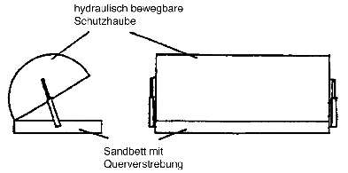
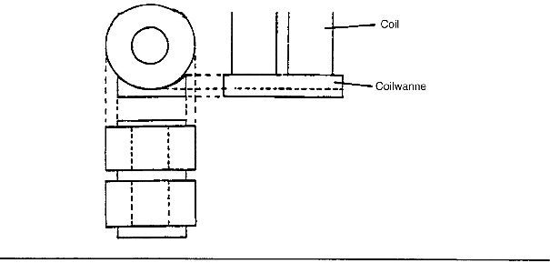
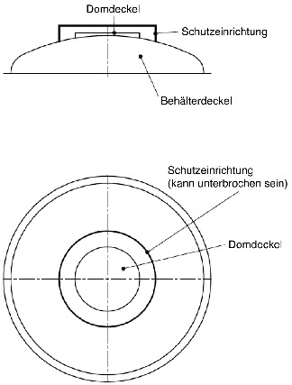
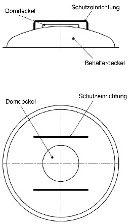
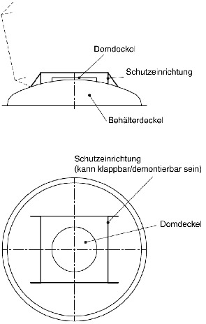

# Verordnung über die innerstaatliche und grenzüberschreitende Beförderung gefährlicher Güter auf der Straße, mit Eisenbahnen und auf Binnengewässern (GGVSEB)

Ausfertigungsdatum
:   2009-06-17

Fundstelle
:   BGBl I: 2009, 1389

Neugefasst durch
:   Bek. v. 26.3.2021 I 481;

Zuletzt geändert durch
:   Art. 3 Abs. 5 G v. 2.6.2021 I 1295

[^f772147_01_BJNR138900009]:     Diese Verordnung dient der Umsetzung der Delegierten Richtlinie (EU)
    2020/1833 der Kommission vom 2. Oktober 2020 zur Anpassung der Anhänge
    der Richtlinie 2008/68/EG des Europäischen Parlaments und des Rates an
    den wissenschaftlichen und technischen Fortschritt (ABl. L 408 vom
    4\.12.2020, S. 1).

## Inhaltsverzeichnis

*    *   §  1

    *   Geltungsbereich

*    *   §  2

    *   Begriffsbestimmungen

*    *   §  3

    *   Zulassung zur Beförderung

*    *   §  4

    *   Allgemeine Sicherheitspflichten

*    *   §  5

    *   Ausnahmen

*    *   §  6

    *   Zuständigkeiten des Bundesministeriums für Verkehr und digitale
        Infrastruktur

*    *   §  7

    *   Zuständigkeiten der vom Bundesministerium der Verteidigung oder vom
        Bundesministerium des Innern, für Bau und Heimat bestellten
        Sachverständigen oder Dienststellen

*    *   §  8

    *   Zuständigkeiten der Bundesanstalt für Materialforschung und -prüfung

*    *   §  9

    *   Zuständigkeiten der von der Bundesanstalt für Materialforschung und
        -prüfung anerkannten Prüfstellen

*    *   § 10

    *   Zuständigkeiten des Bundesamtes für Ausrüstung, Informationstechnik
        und Nutzung der Bundeswehr

*    *   § 11

    *   Zuständigkeiten des Bundesamtes für die Sicherheit der nuklearen
        Entsorgung

*    *   § 12

    *   Ergänzende Zuständigkeiten der Benannten Stellen für Tanks

*    *   § 13

    *   Ergänzende Zuständigkeiten der Benannten Stellen für Druckgefäße

*    *   § 13a

    *   Zuständigkeiten der Benennenden Behörde

*    *   § 14

    *   Besondere Zuständigkeiten im Straßenverkehr

*    *   § 15

    *   Besondere Zuständigkeiten im Eisenbahnverkehr

*    *   § 16

    *   Besondere Zuständigkeiten in der Binnenschifffahrt

*    *   § 17

    *   Pflichten des Auftraggebers des Absenders

*    *   § 18

    *   Pflichten des Absenders

*    *   § 19

    *   Pflichten des Beförderers

*    *   § 20

    *   Pflichten des Empfängers

*    *   § 21

    *   Pflichten des Verladers

*    *   § 22

    *   Pflichten des Verpackers

*    *   § 23

    *   Pflichten des Befüllers

*    *   § 23a

    *   Pflichten des Entladers

*    *   § 24

    *   Pflichten des Betreibers eines Tankcontainers, ortsbeweglichen Tanks,
        MEGC, Schüttgut-Containers oder MEMU

*    *   § 25

    *   Pflichten des Herstellers, Wiederaufarbeiters und Rekonditionierers
        von Verpackungen, des Herstellers und Wiederaufarbeiters von IBC und
        der Stellen für Inspektionen und Prüfungen von IBC

*    *   § 26

    *   Sonstige Pflichten

*    *   § 27

    *   Pflichten mehrerer Beteiligter im Straßen- und Eisenbahnverkehr sowie
        in der Binnenschifffahrt

*    *   § 28

    *   Pflichten des Fahrzeugführers im Straßenverkehr

*    *   § 29

    *   Pflichten mehrerer Beteiligter im Straßenverkehr

*    *   § 30

    *   Pflichten des Betreibers eines Kesselwagens, abnehmbaren Tanks und
        Batteriewagens im Eisenbahnverkehr

*    *   § 30a

    *   Pflichten der für die Instandhaltung zuständigen Stelle im
        Eisenbahnverkehr

*    *   § 31

    *   Pflichten des Betreibers der Eisenbahninfrastruktur im
        Eisenbahnverkehr

*    *   § 31a

    *   Pflichten des Triebfahrzeugführers im Eisenbahnverkehr

*    *   § 32

    *   Pflichten des Reisenden im Eisenbahnverkehr

*    *   § 33

    *   Pflichten des Schiffsführers in der Binnenschifffahrt

*    *   § 34

    *   Pflichten des Eigentümers oder Betreibers in der Binnenschifffahrt

*    *   § 34a

    *   Pflichten der Besatzung und sonstiger Personen an Bord in der
        Binnenschifffahrt

*    *   § 35

    *   Verlagerung

*    *   § 35a

    *   Fahrweg im Straßenverkehr

*    *   § 35b

    *   Gefährliche Güter, für deren Beförderung die §§ 35 und 35a gelten

*    *   § 35c

    *   Ausnahmen zu den §§ 35 und 35a

*    *   § 36

    *   Prüffrist für Feuerlöschgeräte

*    *   § 36a

    *   Beförderung gefährlicher Güter als behördliche Asservate

*    *   § 36b

    *   Beförderung erwärmter flüssiger und fester Stoffe

*    *   § 37

    *   Ordnungswidrigkeiten

*    *   § 38

    *   Übergangsbestimmungen

*    *   Anlage 1

    *   (weggefallen)

*    *   Anlage 2

    *   Einschränkungen aus Gründen der Sicherheit der Beförderung
        gefährlicher Güter zu den Teilen 1 bis 9 des ADR und zu den Teilen 1
        bis 7 des RID für innerstaatliche Beförderungen sowie zu den Teilen 1
        bis 9 des ADN für innerstaatliche und grenzüberschreitende
        Beförderungen

*    *   Anlage 3

    *   Festlegung der Anforderungen für besonders ausgerüstete
        Fahrzeuge/Wagen und Container/Großcontainer nach Abschnitt 7.3.3
        Sondervorschrift VC 3 zur Beförderung erwärmter flüssiger und fester
        Stoffe der UN-Nummern 3257 und 3258 ADR/RID

## § 1 Geltungsbereich

(1) Diese Verordnung regelt die innerstaatliche und
grenzüberschreitende Beförderung einschließlich der Beförderung von
und nach Mitgliedstaaten der Europäischen Union
(innergemeinschaftliche Beförderung) gefährlicher Güter

1.  auf der Straße mit Fahrzeugen (Straßenverkehr),

2.  auf der Schiene mit Eisenbahnen (Eisenbahnverkehr) und

3.  auf allen schiffbaren Binnengewässern (Binnenschifffahrt)

in Deutschland, soweit nachfolgend nichts Abweichendes bestimmt ist.
Sie regelt nicht die Beförderung gefährlicher Güter mit Seeschiffen
auf Seeschifffahrtsstraßen und in angrenzenden Seehäfen.

(2) Diese Verordnung gilt hinsichtlich der

1.  in Absatz 1 Satz 1 Nummer 1 und 2 genannten Beförderungen auch für
    Fahrzeuge und Transportmittel, die der Bundeswehr und ausländischen
    Streitkräften gehören oder für die die Bundeswehr und ausländische
    Streitkräfte verantwortlich sind, und

2.  in Absatz 1 Satz 1 Nummer 3 genannten Beförderungen nicht für die
    Beförderung gefährlicher Güter auf Fahrzeugen der Streitkräfte
    einschließlich aller Fahrzeuge im Geschäftsbereich des
    Bundesministeriums der Verteidigung, soweit dies die Aufgaben der
    Bundeswehr erfordern.

(3) Es gelten für die in Absatz 1 Satz 1

1.  Nummer 1 genannten

    a)  innerstaatlichen Beförderungen auf der Straße die Vorschriften der
        Teile 1 bis 9 der Anlagen A und B zu dem Übereinkommen vom 30.
        September 1957 über die internationale Beförderung gefährlicher Güter
        auf der Straße (ADR) in der Fassung der Bekanntmachung der Neufassung
        der Anlagen A und B vom 4. Juli 2019 (BGBl. 2019 II S. 756), die
        zuletzt nach Maßgabe der 28. ADR-Änderungsverordnung vom 14. Oktober
        2020 (BGBl. 2020 II S. 757) geändert worden sind, sowie die
        Vorschriften der Anlage 2 Nummer 2 und 3 und Anlage 3,

    b)  grenzüberschreitenden einschließlich innergemeinschaftlichen
        Beförderungen auf der Straße die Vorschriften der Teile 1 bis 9 zu dem
        in Buchstabe a genannten ADR-Übereinkommen sowie die Vorschriften der
        Anlage 3,

2.  Nummer 2 genannten

    a)  innerstaatlichen Beförderungen mit Eisenbahnen die Vorschriften der
        Teile 1 bis 7 der Anlage der Ordnung für die internationale
        Eisenbahnbeförderung gefährlicher Güter (RID) – Anhang C des
        Übereinkommens über den internationalen Eisenbahnverkehr (COTIF) vom
        9\. Mai 1980 in der Fassung der Bekanntmachung vom 16. Mai 2008 (BGBl.
        2008 II S. 475, 899), die zuletzt nach Maßgabe der 22. RID-
        Änderungsverordnung vom 26. Oktober 2020 (BGBl. 2020 II S. 856)
        geändert worden ist, sowie die Vorschriften der Anlage 2 Nummer 2 und
        4 und Anlage 3,

    b)  grenzüberschreitenden einschließlich innergemeinschaftlichen
        Beförderungen mit Eisenbahnen die Vorschriften der Teile 1 bis 7 RID
        sowie die Vorschriften der Anlage 3 und

3.  Nummer 3 genannten

    a)  Beförderungen auf allen schiffbaren Binnengewässern die Vorschriften
        der Teile 1 bis 9 der Anlage zu dem Europäischen Übereinkommen über
        die internationale Beförderung von gefährlichen Gütern auf
        Binnenwasserstraßen (ADN) vom 26. Mai 2000 (BGBl. 2007 II S. 1906,
        1908), die zuletzt nach Maßgabe der 8. ADN-Änderungsverordnung vom 23.
        November 2020 (BGBl. 2020 II S. 1035) geändert worden ist, sowie die
        Vorschriften der Anlage 2 Nummer 5,

    b)  Beförderungen auf dem Rhein zusätzlich die von der Zentralkommission
        für die Rheinschifffahrt am 3. Dezember 2009 beschlossenen
        Bestimmungen in Anlage 2 Nummer 6.

(4) Für die Anwendung der Teile 1 bis 9 ADR/ADN und der Teile 1 bis 7
RID gilt für innerstaatliche und innergemeinschaftliche Beförderungen
anstelle des Begriffes „Vertragspartei“ jeweils der Begriff
„Mitgliedstaat“.

(5) Die in dieser Verordnung für die Teile 4 und 6 ADR/RID getroffenen
Regelungen sind nach Maßgabe der Abschnitte 4.1.1 bis 4.1.4 und 6.1.1
bis 6.1.6 ADN auch für die Binnenschifffahrt anzuwenden.

## § 2 Begriffsbestimmungen

Die nachfolgenden Begriffe werden im Sinne dieser Verordnung wie folgt
verwendet:

1.  Absender ist das Unternehmen, das selbst oder für einen Dritten
    gefährliche Güter versendet. Erfolgt die Beförderung auf Grund eines
    Beförderungsvertrages, gilt als Absender der Absender nach diesem
    Vertrag. Bei Tankschiffen mit leeren oder entladenen Ladetanks ist
    hinsichtlich der erforderlichen Beförderungspapiere der Schiffsführer
    der Absender;

2.  Befüller ist das Unternehmen, das die gefährlichen Güter in

    a)  einen Tank (Tankfahrzeug, Aufsetztank, Kesselwagen, Wagen mit
        abnehmbaren Tanks, ortsbeweglicher Tank oder Tankcontainer),

    b)  einen MEGC,

    c)  einen Groß- oder Kleincontainer für Güter in loser Schüttung,

    d)  einen Schüttgut-Container,

    e)  ein Fahrzeug für Güter in loser Schüttung,

    f)  ein Batterie-Fahrzeug,

    g)  ein MEMU,

    h)  einen Wagen für Güter in loser Schüttung,

    i)  einen Batteriewagen,

    j)  ein Schiff oder

    k)  einen Ladetank

    einfüllt. Befüller ist auch das Unternehmen, das als unmittelbarer
    Besitzer das gefährliche Gut dem Beförderer zur Beförderung übergibt
    oder selbst befördert;

3.  Verlader ist das Unternehmen, das

    a)  verpackte gefährliche Güter, Kleincontainer oder ortsbewegliche Tanks
        in oder auf ein Fahrzeug (ADR), einen Wagen (RID), ein
        Beförderungsmittel (ADN) oder einen Container verlädt oder

    b)  einen Container, Schüttgut-Container, MEGC, Tankcontainer oder
        ortsbeweglichen Tank auf ein Fahrzeug (ADR), einen Wagen (RID), ein
        Beförderungsmittel (ADN) verlädt oder

    c)  ein Fahrzeug oder einen Wagen in oder auf ein Schiff verlädt (ADN).

    Verlader ist auch das Unternehmen, das als unmittelbarer Besitzer das
    gefährliche Gut dem Beförderer zur Beförderung übergibt oder selbst
    befördert;

4.  Verpacker ist das Unternehmen, das die gefährlichen Güter in
    Verpackungen einschließlich Großverpackungen und IBC einfüllt oder die
    Versandstücke zur Beförderung vorbereitet. Verpacker ist auch das
    Unternehmen, das gefährliche Güter verpacken lässt oder das
    Versandstücke oder deren Kennzeichnung oder Bezettelung ändert oder
    ändern lässt;

5.  Versandstück ist das versandfertige Endprodukt des
    Verpackungsvorganges, bestehend aus der Verpackung, der Großverpackung
    oder dem Großpackmittel (IBC) und ihrem beziehungsweise seinem Inhalt.
    Der Begriff umfasst die Gefäße für Gase sowie die Gegenstände, die
    wegen ihrer Größe, Masse oder Formgebung unverpackt, oder in
    Schlitten, Verschlägen oder Handhabungseinrichtungen befördert werden
    dürfen. Mit Ausnahme der Beförderung radioaktiver Stoffe gilt dieser
    Begriff weder für Güter, die in loser Schüttung, noch für Güter, die
    in Tanks oder Ladetanks befördert werden. An Bord von Schiffen
    schließt der Begriff Versandstück auch die Fahrzeuge, Wagen, Container
    (einschließlich Wechselaufbauten), Tankcontainer, ortsbewegliche
    Tanks, Großverpackungen, Großpackmittel (IBC), Batterie-Fahrzeuge,
    Batteriewagen, Tankfahrzeuge, Kesselwagen und Gascontainer mit
    mehreren Elementen (MEGC) ein;

6.  Fahrzeuge sind im innerstaatlichen Verkehr und innergemeinschaftlichen
    Verkehr – abweichend von der Begriffsbestimmung im ADR – die in
    Abschnitt 1.2.1 ADR beschriebenen Fahrzeuge mit einer bauartbedingten
    Höchstgeschwindigkeit von mehr als 25 Kilometer pro Stunde
    einschließlich zwei- und dreirädrige Fahrzeuge sowie selbstfahrende
    Land-, Forst-, Bau- und sonstige Arbeitsmaschinen sowie ihre Anhänger,
    und Güterstraßenbahnen, die auf einem vom Eisenbahnnetz getrennten
    Schienennetz verkehren;

7.  Gefährliche Güter sind die Stoffe und Gegenstände, deren Beförderung
    nach Teil 2, Kapitel 3.2 Tabelle A und Kapitel 3.3 ADR/RID/ADN
    verboten oder nach den vorgesehenen Bedingungen des ADR/RID/ADN
    gestattet ist;

8.  Wiederaufarbeiter ist das Unternehmen, das wiederaufgearbeitete
    Verpackungen, wiederaufgearbeitete Großverpackungen und
    wiederaufgearbeitete Großpackmittel (IBC) im Sinne des Abschnitts
    1\.2.1 ADR/RID herstellt;

9.  Rekonditionierer ist das Unternehmen, das rekonditionierte
    Verpackungen im Sinne des Abschnitts 1.2.1 ADR/RID herstellt;

10. Auftraggeber des Absenders ist das Unternehmen, das einen Absender
    beauftragt, als solcher aufzutreten und Gefahrgut selbst oder durch
    einen Dritten zu versenden;

11. IBC (Intermediate Bulk Container) ist das in Abschnitt 1.2.1
    ADR/RID/ADN beschriebene Großpackmittel;

12. IMDG-Code (International Maritime Dangerous Goods Code) ist der
    Internationale Code für die Beförderung gefährlicher Güter mit
    Seeschiffen, der zuletzt durch die Entschließung MSC. 406(96) geändert
    worden ist, in der amtlichen deutschen Übersetzung bekannt gegeben am
    16\. November 2016 (VkBl. S. 718);

13. MEGC (Multiple-Element Gas Container) ist der in Abschnitt 1.2.1
    ADR/RID/ADN beschriebene Gascontainer mit mehreren Elementen. Dies
    gilt auch für UN-MEGC;

14. MEMU (Mobile Einheit zur Herstellung von explosiven Stoffen oder
    Gegenständen mit Explosivstoff) ist die in Abschnitt 1.2.1 ADR
    beschriebene Einheit oder ein Fahrzeug;

15. Ortsbewegliche-Druckgeräte-Verordnung ist die Ortsbewegliche-
    Druckgeräte-Verordnung vom 29. November 2011 (BGBl. I S. 2349), die
    zuletzt durch Artikel 491 der Verordnung vom 31. August 2015 (BGBl. I
    S. 1474) geändert worden ist;

16. OTIF (Organisation Intergouvernementale pour les transports
    internationaux ferroviaires) ist die Zwischenstaatliche Organisation
    für den internationalen Eisenbahnverkehr;

17. UNECE (United Nations Economic Commission for Europe) ist die
    Wirtschaftskommission der Vereinten Nationen für Europa;

18. GGVSee ist die Gefahrgutverordnung See in der Fassung der
    Bekanntmachung vom 7. Dezember 2017 (BGBl. I S. 3862; 2018 I S. 131);

19. Ortsbewegliche Druckgeräte sind die in Artikel 2 Nummer 1 der
    Richtlinie 2010/35/EU bestimmten Gefäße und Tanks für Gase sowie die
    übrigen in den Kapiteln 6.2 und 6.8 ADR/RID bestimmten Gefäße und
    Tanks für Gase;

20. Bundeswasserstraßen sind die Wasserstraßen nach § 1 Absatz 1 und 6 des
    Bundeswasserstraßengesetzes in der Fassung der Bekanntmachung vom 23.
    Mai 2007 (BGBl. I S. 962, 2008 I S. 1980) in der jeweils geltenden
    Fassung mit Ausnahme der Elbe im Hamburger Hafen.

## § 3 Zulassung zur Beförderung

Gefährliche Güter dürfen unbeschadet des § 5 nur befördert werden,
wenn deren Beförderung nach den Unterabschnitten 2.2.1.2, 2.2.2.2,
2\.2.3.2, 2.2.41.2, 2.2.42.2, 2.2.43.2, 2.2.51.2, 2.2.52.2, 2.2.61.2,
2\.2.62.2, 2.2.8.2, 2.2.9.2, Kapitel 3.2 Tabelle A und Kapitel 3.3
ADR/RID/ADN oder nach Anlage 2 nicht ausgeschlossen ist und die
Beförderung unter Einhaltung der anwendbaren Vorschriften des
ADR/RID/ADN erfolgt.

## § 4 Allgemeine Sicherheitspflichten

(1) Die an der Beförderung gefährlicher Güter Beteiligten haben die
nach Art und Ausmaß der vorhersehbaren Gefahren erforderlichen
Vorkehrungen zu treffen, um Schadensfälle zu verhindern und bei
Eintritt eines Schadens dessen Umfang so gering wie möglich zu halten.

(2) Bilden die beförderten gefährlichen Güter eine besondere Gefahr
für andere, insbesondere soweit gefährliches Gut bei Unfällen oder
Unregelmäßigkeiten austritt oder austreten kann, und kann diese nicht
rasch beseitigt werden, hat

1.  der Fahrzeugführer im Straßenverkehr,

2.  der jeweilige Betreiber der Eisenbahninfrastruktur im Eisenbahnverkehr
    oder

3.  der Schiffsführer in der Binnenschifffahrt

die dem Ort des Gefahreneintritts nächstgelegenen zuständigen Behörden
unverzüglich zu benachrichtigen oder benachrichtigen zu lassen und mit
den notwendigen Informationen zu versehen oder versehen zu lassen. Im
Eisenbahnverkehr hat der Beförderer unverzüglich den jeweiligen
Betreiber der Eisenbahninfrastruktur zu benachrichtigen.

(3) Beim Feststellen eines Verstoßes, der die Sicherheit der
Beförderung beeinträchtigen könnte, hat

1.  der Fahrzeugführer im Straßenverkehr,

2.  der Beförderer im Eisenbahnverkehr oder

3.  der Schiffsführer in der Binnenschifffahrt

die Sendung möglichst rasch anzuhalten. Er darf die Beförderung erst
fortsetzen, wenn die anzuwendenden Vorschriften erfüllt oder die
Anweisungen oder Genehmigungen der zuständigen Behörden erteilt sind.

## § 5 Ausnahmen

(1) Die nach Landesrecht zuständigen Stellen können

1.  im Straßenverkehr auf Antrag Ausnahmen von den Teilen 1 bis 9 –
    ausgenommen die Kapitel 1.8 und 1.10 – ADR sowie von den §§ 35 bis 35b
    und Anlage 2 dieser Verordnung,

2.  im Eisenbahnverkehr für den Bereich der nichtbundeseigenen Eisenbahnen
    auf Antrag Ausnahmen von den Teilen 1 bis 7 – ausgenommen die Kapitel
    1\.8 und 1.10 – RID und

3.  in der Binnenschifffahrt auf Wasserstraßen, die nicht
    Bundeswasserstraßen sind, auf Antrag Ausnahmen von den Teilen 1 bis 9
    – ausgenommen die Kapitel 1.8 und 1.10 – ADN

für Beförderungen innerhalb Deutschlands zulassen, soweit dies nach
der Richtlinie 2008/68/EG vom 24. September 2008 des Europäischen
Parlaments und des Rates über die Beförderung gefährlicher Güter im
Binnenland (ABl. L 260 vom 30.9.2008, S. 13) zulässig ist.

(2) Das Eisenbahn-Bundesamt kann im Eisenbahnverkehr für den Bereich
der Eisenbahnen des Bundes auf Antrag Ausnahmen von den Teilen 1 bis 7
– ausgenommen die Kapitel 1.8 und 1.10 – RID für Beförderungen
innerhalb Deutschlands zulassen, soweit dies nach der Richtlinie
2008/68/EG zulässig ist.

(3) Die Generaldirektion Wasserstraßen und Schifffahrt kann in der
Binnenschifffahrt für den Bereich der Bundeswasserstraßen auf Antrag
Ausnahmen von den Teilen 1 bis 9 ADN – ausgenommen Abschnitt 1.5.2
ADN, Kapitel 1.8 und 1.10 ADN – für Beförderungen innerhalb
Deutschlands zulassen, soweit dies nach der Richtlinie 2008/68/EG
zulässig ist. Diese Ausnahmen schließen für den Bereich der
Bundeswasserstraßen weitere für das Vorhaben erforderliche
Entscheidungen nach Teil 7 ADN – ausgenommen Unterabschnitt 7.2.2.6
und Absätze 7.2.3.7.1 und 7.2.3.7.6 ADN – mit ein; die Entscheidung
ergeht insoweit im Benehmen mit der nach § 16 Absatz 6 zuständigen
Behörde.

(4) Bei Ausnahmen nach den Absätzen 1 bis 3 ist über die
erforderlichen Sicherheitsvorkehrungen vom Antragsteller ein Gutachten
eines Sachverständigen vorzulegen. In diesem Gutachten müssen
insbesondere die verbleibenden Gefahren dargestellt und es muss
begründet werden, weshalb die Zulassung der Ausnahme trotz der
verbleibenden Gefahren als vertretbar angesehen wird. Die zuständige
Stelle kann die Vorlage weiterer Gutachten auf Kosten des
Antragstellers verlangen oder diese im Benehmen mit dem Antragsteller
selbst erstellen lassen. In begründeten Einzelfällen kann die
zuständige Stelle auf die Vorlage eines Gutachtens verzichten.

(5) Ausnahmen nach den Absätzen 1 bis 3 sind schriftlich oder
elektronisch und unter dem Vorbehalt des Widerrufs für den Fall zu
erteilen, dass sich die auferlegten Sicherheitsvorkehrungen als
unzureichend zur Einschränkung der von der Beförderung ausgehenden
Gefahren erweisen. Die nach Artikel 6 Absatz 2 der Richtlinie
2008/68/EG vorgesehenen Ausnahmen müssen dem Verfahren nach Artikel 6
Absatz 2 oder 4 unterzogen und von der Kommission anerkannt worden
sein; sie sind dem Bundesministerium für Verkehr und digitale
Infrastruktur mitzuteilen. Sie dürfen ab dem Zeitpunkt ihrer
Genehmigung durch die Kommission für höchstens sechs Jahre erteilt
werden; für die Verlängerung einer Ausnahme gilt das Verfahren nach
Artikel 6 Absatz 4 der Richtlinie 2008/68/EG.

(6) Das Bundesministerium der Verteidigung oder die von ihm bestimmten
Stellen dürfen für die Bundeswehr, in ihrem Auftrag hoheitlich tätige
zivile Unternehmen und für ausländische Streitkräfte Ausnahmen von
dieser Verordnung zulassen, soweit dies Gründe der Verteidigung
erfordern und die öffentliche Sicherheit gebührend berücksichtigt ist.
Ausnahmen nach Satz 1 sind für den Bundesnachrichtendienst zuzulassen,
soweit er im Rahmen seiner Aufgaben für das Bundesministerium der
Verteidigung tätig wird und soweit sicherheitspolitische Interessen
dies erfordern.

(7) Die Bundesministerien des Innern, für Bau und Heimat, der Justiz
und für Verbraucherschutz und der Finanzen sowie die Innen- und
Justizminister (-senatoren) der Länder oder die von ihnen bestimmten
Stellen dürfen in ihrem Aufgabenbereich Ausnahmen für Beförderungen
innerhalb Deutschlands zulassen, soweit dies nach der Richtlinie
2008/68/EG zulässig ist. Absatz 5 Satz 2 gilt entsprechend. Unabhängig
davon dürfen sie Ausnahmen von den §§ 35 bis 35b und von Anlage 2
dieser Verordnung zulassen.

(8) Die für den Bereich

1.  der Eisenbahnen des Bundes zugelassenen Ausnahmen nach Absatz 2 gelten
    auch für den Bereich der übrigen Eisenbahnen. Die von den Ländern nach
    Absatz 1 Satz 1 Nummer 2 zugelassenen Ausnahmen gelten im Benehmen mit
    dem Eisenbahn-Bundesamt auch für den Bereich der Eisenbahnen des
    Bundes;

2.  der Bundeswasserstraßen nach Absatz 3 zugelassenen Ausnahmen gelten
    auch für den Bereich der übrigen schiffbaren Gewässer. Die von den
    Ländern nach Absatz 1 Satz 1 Nummer 3 zugelassenen Ausnahmen gelten im
    Benehmen mit der Generaldirektion Wasserstraßen und Schifffahrt auch
    für den Bereich der Bundeswasserstraßen,

sofern die die Ausnahme erteilende Behörde nicht etwas anderes
bestimmt.

(9) Hat die Bundesrepublik Deutschland Vereinbarungen nach Abschnitt
1\.5.1 ADR/RID oder Abkommen nach Abschnitt 1.5.1 ADN in Verbindung mit
§ 6 Nummer 1 abgeschlossen, dürfen innerstaatliche Beförderungen nach
deren Bestimmungen durchgeführt werden.

(10) Eine Ausnahme für eine innerstaatliche Beförderung gilt auch für
die Beförderung auf der innerdeutschen Teilstrecke einer
innergemeinschaftlichen oder grenzüberschreitenden Beförderung, soweit
in der Ausnahme nicht ausdrücklich etwas anderes bestimmt ist.

(11) Bei dem Bescheid nach Absatz 1 bis 3 genügt das Mitführen eines
fernkopierten Bescheides oder des Ausdrucks eines elektronisch
erteilten und signierten Bescheides sowie dessen digitalisierte Form
auf einem Speichermedium, wenn diese derart mitgeführt wird, dass sie
bei einer Kontrolle auf Verlangen zuständigen Personen lesbar gemacht
werden kann.

## § 6 Zuständigkeiten des Bundesministeriums für Verkehr und digitale Infrastruktur

Das Bundesministerium für Verkehr und digitale Infrastruktur ist
zuständige Behörde für

1.  den Abschluss von Vereinbarungen nach Abschnitt 1.5.1 ADR/RID oder
    Abkommen nach Abschnitt 1.5.1 ADN und deren Übersendung an die
    UNECE/OTIF;

2.  Aufgaben nach Kapitel 1.15 ADN;

3.  die Anerkennung von Untersuchungsstellen nach Unterabschnitt 1.16.4.1
    ADN;

4.  die Übermittlung eines Verzeichnisses anerkannter technischer
    Regelwerke nach Abschnitt 6.2.5 und Unterabschnitt 6.8.2.7 ADR/RID

    a)  im Straßenverkehr an das Sekretariat der UNECE und

    b)  im Eisenbahnverkehr an das Sekretariat der OTIF;

5.  die Prüfung und Auswertung der Berichte über die Meldungen von
    Ereignissen mit gefährlichen Gütern nach Unterabschnitt 1.8.5.1
    ADR/RID/ADN und erforderlichenfalls deren Weiterleitung an das
    Sekretariat der UNECE, der OTIF oder der Zentralkommission für die
    Rheinschifffahrt;

6.  den Erlass von Vorschriften für Druckbehälter nach den Absätzen
    9\.3.1.23.1, 9.3.2.23.5 und 9.3.3.23.5 ADN;

7.  den Erlass von Vorschriften für Druckbehälter, Armaturen und
    Druckleitungen nach den Absätzen 9.1.0.40.2.7, 9.3.1.40.2.7,
    9\.3.2.40.2.7 und 9.3.3.40.2.7 ADN und

8.  die Übertragung der Befugnis zur Ausstellung von Zulassungszeugnissen
    auf eine Untersuchungsstelle nach Unterabschnitt 1.16.2.3 ADN.

## § 7 Zuständigkeiten der vom Bundesministerium der Verteidigung oder vom Bundesministerium des Innern, für Bau und Heimat bestellten Sachverständigen oder Dienststellen

(1) Die vom Bundesministerium der Verteidigung bestellten
Sachverständigen oder Dienststellen sind für die Bundeswehr und die
ausländischen Streitkräfte zuständige Behörden für

1.  Aufgaben nach den Teilen 8 und 9 ADR;

2.  die Zulassung, erstmalige und wiederkehrende Prüfung von Druckgefäßen
    nach den Unterabschnitten 6.2.1.4 bis 6.2.1.6 ADR, die Inspektion und
    Prüfung der IBC nach Unterabschnitt 6.5.4.4 ADR, die Baumusterprüfung
    von ortsbeweglichen Tanks und UN-MEGC nach den Absätzen 6.7.2.18.1,
    6\.7.3.14.1, 6.7.4.13.1 und 6.7.5.11.1 in Verbindung mit Kapitel 4.2
    und den Absätzen 6.7.2.19.9, 6.7.3.15.9, 6.7.4.14.10 und 6.7.5.12.7
    ADR, die erstmalige und wiederkehrende Prüfung, Zwischenprüfung und
    außerordentliche Prüfungen der Tankkörper und der Ausrüstungsteile von
    ortsbeweglichen Tanks und UN-MEGC nach Kapitel 6.7 ADR und die
    Zulassung des Baumusters und die Prüfungen der Tanks nach den
    Unterabschnitten 6.8.2.3 und 6.8.2.4 ADR;

3.  die Prüfungen von Tanks, sofern diese Prüfungen nicht in den
    Geltungsbereich der Ortsbewegliche-Druckgeräte-Verordnung fallen;

4.  das Führen eines Verzeichnisses nach Unterabschnitt 1.10.1.6 ADR über
    alle gültigen Schulungsbescheinigungen für Fahrzeugführer und

5.  die Bescheinigung nach § 35 Absatz 4 und die Fahrwegbestimmung nach §
    35a Absatz 3,

soweit dies Gründe der Verteidigung erfordern.

(2) Die vom Bundesministerium des Innern, für Bau und Heimat
bestellten Sachverständigen oder Dienststellen sind zuständige
Behörden für

1.  Aufgaben nach den Teilen 8 und 9 ADR;

2.  die Zulassung des Baumusters und die Prüfungen der Tanks nach den
    Unterabschnitten 6.8.2.3 und 6.8.2.4 ADR sowie die Inspektion und
    Prüfung der IBC nach Unterabschnitt 6.5.4.4 ADR;

3.  das Führen eines Verzeichnisses nach Unterabschnitt 1.10.1.6 ADR über
    alle gültigen Schulungsbescheinigungen für Fahrzeugführer und

4.  die Bescheinigung nach § 35 Absatz 4 und die Fahrwegbestimmung nach §
    35a Absatz 3,

soweit dies für den Dienstbereich des Bundesministeriums des Innern,
für Bau und Heimat erforderlich ist.

(3) Die Zuständigkeit der nach Absatz 1 und 2 bestellten Dienststellen
gilt auch für Überwachungsmaßnahmen nach § 9 Absatz 1 und 2 des
Gefahrgutbeförderungsgesetzes innerhalb von Liegenschaften der
Bundeswehr und der ausländischen Streitkräfte sowie von Liegenschaften
im Dienstbereich des Bundesministeriums des Innern, für Bau und
Heimat. Bei der Beförderung gefährlicher Güter auf der Straße durch
die Bundeswehr oder durch ausländische Streitkräfte, auch wenn sich
die Bundeswehr ziviler Unternehmen bedient, sind die nach Absatz 1
bestellten Dienststellen neben den nach Landesrecht zuständigen
Behörden zur Überwachung befugt.

## § 8 Zuständigkeiten der Bundesanstalt für Materialforschung und -prüfung

(1) Die Bundesanstalt für Materialforschung und -prüfung ist
zuständige Behörde für

1.  Aufgaben nach

    a)  den Kapiteln 2.1 und 2.2 mit Ausnahme der Absätze 2.2.62.1.12.1 und
        2\.2.9.1.11 Bemerkung 4 ADR/RID/ADN und der dem Bundesamt für
        Ausrüstung, Informationstechnik und Nutzung der Bundeswehr nach § 10
        und dem Bundesamt für die Sicherheit der nuklearen Entsorgung nach §
        11 zugewiesenen Zuständigkeiten,

    b)  Kapitel 3.3 ADR/RID/ADN mit Ausnahme der dem Bundesamt für Ausrüstung,
        Informationstechnik und Nutzung der Bundeswehr nach § 10 zugewiesenen
        Zuständigkeiten,

    c)  Kapitel 4.1 mit Ausnahme von Unterabschnitt 4.1.4.1
        Verpackungsanweisung P 200 ADR/RID und die dem Bundesamt für
        Ausrüstung, Informationstechnik und Nutzung der Bundeswehr nach § 10
        zugewiesenen Zuständigkeiten,

    d)  Kapitel 4.2 mit Ausnahme der Unterabschnitte 4.2.1.8, 4.2.2.5 und
        4\.2.3.4 ADR/RID,

    e)  Kapitel 4.3, in Bezug auf Absatz 4.3.3.2.5 ADR/RID im Einvernehmen mit
        der Physikalisch-Technischen Bundesanstalt,

    f)  Kapitel 6.2 mit Ausnahme des Unterabschnitts 6.2.2.11 ADR/RID und der
        Zuständigkeiten nach Nummer 10 sowie der §§ 13 und 13a,

    g)  Kapitel 6.7 ADR/RID,

    h)  Kapitel 6.8 in Bezug auf die Prüfung, die Erteilung der Kennzeichen
        und die Baumusterzulassung von festverbundenen Tanks (Tankfahrzeugen),
        Aufsetztanks, Tankcontainern und Tankwechselaufbauten
        (Tankwechselbehältern) und die Festlegung von Bedingungen nach
        Abschnitt 6.8.4 Buchstabe c Sondervorschrift TA 2 ADR/RID sowie die
        Festlegung der Bedingungen für Schweißnähte der Tankkörper nach Absatz
        6\.8.5.2.2 ADR,

    i)  Kapitel 6.9 ADR/RID,

    j)  Kapitel 6.10 ADR/RID,

    k)  Kapitel 6.11 ADR/RID und

    l)  Kapitel 6.12 in Verbindung mit Absatz 7.5.5.2.3 und Kapitel 9.8 ADR,

    soweit die jeweilige Aufgabe keiner anderen Stelle zugewiesen ist;

2.  die Prüfung und Zulassung radioaktiver Stoffe in besonderer Form nach
    Absatz 5.1.5.2.1 in Verbindung mit Unterabschnitt 6.4.22.5 Satz 1, das
    Zeugnis nach Unterabschnitt 6.4.22.8 Buchstabe a, die Zulassung der
    Bauart von Verpackungen für nicht spaltbares oder spaltbares
    freigestelltes Uranhexafluorid nach Absatz 5.1.5.2.1 in Verbindung mit
    Unterabschnitt 6.4.22.1, das Zeugnis nach Unterabschnitt 6.4.22.8
    Buchstabe a, die Prüfung und Zulassung der Bauart gering
    dispergierbarer radioaktiver Stoffe nach Absatz 5.1.5.2.1 in
    Verbindung mit Unterabschnitt 6.4.22.5 Satz 2 und für das Zeugnis nach
    Unterabschnitt 6.4.22.8 Buchstabe a ADR/RID im Einvernehmen mit dem
    Bundesamt für die Sicherheit der nuklearen Entsorgung;

3.  die Prüfung, die Anerkennung von Prüfstellen, die Erteilung der
    Kennzeichen und die Bauartzulassung von Verpackungen, IBC,
    Großverpackungen, Bergungsverpackungen und Bergungsgroßverpackungen
    nach den Kapiteln 6.1, 6.3, 6.5 und 6.6 ADR/RID sowie für die
    Zulassung der Reparatur flexibler IBC nach Abschnitt 1.2.1
    ADR/RID/ADN;

4.  die Anerkennung und Überwachung von Qualitätssicherungsprogrammen für
    die Fertigung, Wiederaufarbeitung, Rekonditionierung, Reparatur und
    Prüfung von Verpackungen, IBC und Großverpackungen sowie die
    Anerkennung von Überwachungsstellen für die Prüfung der
    Funktionsfähigkeit und Wirksamkeit der Qualitätssicherungsprogramme
    nach den Kapiteln 6.1, 6.3, 6.5 und 6.6 sowie die Anerkennung von
    Inspektionsstellen für die erstmaligen und wiederkehrenden
    Inspektionen und Prüfungen von IBC nach Unterabschnitt 6.5.4.4
    ADR/RID;

5.  die Bescheinigung über die Zulassung einer Änderung nach Absatz
    6\.8.2.3.4 ADR sowie für Tankcontainer und Tankwechselaufbauten
    (Tankwechselbehälter) nach Absatz 6.8.2.3.4 RID;

6.  die Genehmigung der Beförderungsbedingungen für mit
    Temperaturkontrolle stabilisierte Gase nach Unterabschnitt 3.1.2.6
    Satz 2 Buchstabe c ADR/RID/ADN;

7.  die Anerkennung und Überwachung von Managementsystemen für die
    Auslegung, Herstellung, Prüfung, Dokumentation, den Gebrauch, die
    Wartung und Inspektion von nicht zulassungspflichtigen Versandstücken
    für radioaktive Stoffe nach Kapitel 6.4 ADR/RID in Verbindung mit
    Abschnitt 1.7.3 ADR/RID/ADN;

8.  die Bauartprüfung zulassungspflichtiger Versandstücke für radioaktive
    Stoffe nach Kapitel 6.4 ADR/RID;

9.  die Überwachung von Managementsystemen für die Auslegung, Herstellung,
    Prüfung, Dokumentation, den Gebrauch, die Wartung und Inspektion von
    zulassungspflichtigen Versandstücken für radioaktive Stoffe nach
    Kapitel 6.4 ADR/RID in Verbindung mit Abschnitt 1.7.3 ADR/RID/ADN;

10. die Anerkennung einer Norm oder eines Regelwerks nach Absatz 6.2.1.1.9
    und die Anerkennung von technischen Regelwerken nach Absatz
    6\.2.1.3.6.5.4, Abschnitt 6.2.5, Absatz 6.7.2.2.1 Satz 1, Absatz
    6\.7.3.2.1 Satz 1, Absatz 6.7.4.2.1 Satz 1, Absatz 6.7.4.7.4, den
    Absätzen 6.7.5.2.9, 6.8.2.1.4 sowie den Unterabschnitten 6.8.2.7 und
    6\.8.3.7 Satz 1 ADR/RID im Einvernehmen mit dem Bundesministerium für
    Verkehr und digitale Infrastruktur;

11. die Zulassung der Trennungsmethoden nach Unterabschnitt 7.5.2.2
    Fußnote a ADR/RID, soweit es sich nicht um den militärischen Bereich
    handelt;

12. die Festlegung von Normen und Bedingungen nach Unterabschnitt 7.3.3.1
    VC 3 ADR und

13. die Erteilung von Ausnahmegenehmigungen für die Beförderung in
    Tankschiffen nach Abschnitt 1.5.2 ADN.

Satz 1 Nummer 1 Buchstabe h und Nummer 5 gelten nicht, sofern diese
Aufgaben in den Geltungsbereich der Ortsbewegliche-Druckgeräte-
Verordnung fallen.

(2) Die unter Absatz 1 Satz 1 Nummer 1 Buchstabe c, d und f bis l,
Nummer 2 bis 7, 11 und 13 genannten Zulassungen, Zustimmungen,
Anerkennungen und Genehmigungen können widerruflich erteilt, befristet
und mit Auflagen versehen werden, soweit dies erforderlich ist, um die
Einhaltung der gefahrgutbeförderungsrechtlichen Vorschriften
sicherzustellen.

## § 9 Zuständigkeiten der von der Bundesanstalt für Materialforschung und -prüfung anerkannten Prüfstellen

Die von der Bundesanstalt für Materialforschung und -prüfung nach § 12
Absatz 1 Nummer 8 der GGVSee anerkannten Prüfstellen sind zuständig
für die Baumusterprüfung sowie die erstmalige, wiederkehrende und
außerordentliche Prüfung von ortsbeweglichen Tanks und Gascontainern
mit mehreren Elementen (MEGC) nach Kapitel 6.7 ADR/RID. Satz 1 gilt
nicht, sofern diese Prüfungen in den Geltungsbereich der
Ortsbewegliche-Druckgeräte-Verordnung fallen.

## § 10 Zuständigkeiten des Bundesamtes für Ausrüstung, Informationstechnik und Nutzung der Bundeswehr

Das Bundesamt für Ausrüstung, Informationstechnik und Nutzung der
Bundeswehr ist, soweit es sich um den militärischen Bereich handelt,
zuständige Behörde für Aufgaben nach

1.  Kapitel 2.2 ADR/RID/ADN in Bezug auf explosive Stoffe und Gegenstände
    mit Explosivstoff,

2.  Kapitel 3.3 ADR/RID/ADN in Bezug auf explosive Stoffe und Gegenstände
    mit Explosivstoff,

3.  Kapitel 4.1 ADR/RID in Bezug auf explosive Stoffe und Gegenstände mit
    Explosivstoff und

4.  Unterabschnitt 7.5.2.2 Fußnote a ADR/RID in Bezug auf explosive Stoffe
    und Gegenstände mit Explosivstoff.

## § 11 Zuständigkeiten des Bundesamtes für die Sicherheit der nuklearen Entsorgung

Das Bundesamt für die Sicherheit der nuklearen Entsorgung ist
zuständige Behörde für

1.  die Erteilung der multilateralen Genehmigung für die Bestimmung der
    nicht in Tabelle 2.2.7.2.2.1 aufgeführten Radionuklidwerte und von
    alternativen Radionuklidwerten nach Absatz 2.2.7.2.2.2 ADR/RID/ADN;

2.  die Genehmigung der Beförderung von radioaktiven Stoffen nach Absatz
    5\.1.5.1.2 ADR/RID/ADN;

3.  die Beförderungsgenehmigung durch Sondervereinbarungen zur Beförderung
    radioaktiver Stoffe nach Absatz 5.1.5.1.3 in Verbindung mit Abschnitt
    1\.7.4 ADR/RID/ADN;

4.  die Entgegennahme der Benachrichtigung nach Absatz 5.1.5.1.4
    ADR/RID/ADN;

5.  die Zulassung der Bauart von Versandstücken für radioaktive Stoffe und
    der Bauart von nach Absatz 2.2.7.2.3.5 Buchstabe f freigestellten
    spaltbaren Stoffen nach den Absätzen 5.1.5.2.1 und 5.1.5.3.5
    ADR/RID/ADN, den Unterabschnitten 6.4.22.2 bis 6.4.22.4 und 6.4.22.6
    sowie die Bestätigung nach Unterabschnitt 6.4.22.8 Buchstabe a ADR/RID
    und

6.  die Genehmigung des Strahlenschutzprogramms für die Beförderung von
    radioaktiven Stoffen mit einem Spezialschiff nach Absatz
    7\.1.4.14.7.3.7 ADN.

## § 12 Ergänzende Zuständigkeiten der Benannten Stellen für Tanks

(1) Die Benannten Stellen nach § 16 der Ortsbewegliche-Druckgeräte-
Verordnung, die für die Durchführung der nachfolgenden Aufgaben nach
der Norm DIN EN ISO/IEC 17020:2012 akkreditiert sein müssen, sind
zuständig für

1.  die Baumusterprüfung von

    a)  ortsbeweglichen Tanks und UN-MEGC nach den Absätzen 6.7.2.18.1,
        6\.7.3.14.1, 6.7.4.13.1 und 6.7.5.11.1 in Verbindung mit Kapitel 4.2
        und den Absätzen 6.7.2.19.9, 6.7.3.15.9, 6.7.4.14.10 und 6.7.5.12.7
        ADR/RID,

    b)  festverbundenen Tanks, Aufsetztanks, Batterie-Fahrzeugen, Kesselwagen,
        abnehmbaren Tanks, Batteriewagen, Tankcontainern, Tankwechselaufbauten
        (Tankwechselbehältern) und MEGC nach Absatz 6.8.2.3.1 in Verbindung
        mit Kapitel 4.3 und Kapitel 6.10 in Verbindung mit Kapitel 4.5 ADR/RID
        und

    c)  Tanks und Tankcontainer aus faserverstärkten Kunststoffen nach
        Unterabschnitt 6.9.4.1 in Verbindung mit Kapitel 4.4 ADR/RID im
        Einvernehmen mit der Bundesanstalt für Materialforschung und -prüfung;

2.  die erstmalige und wiederkehrende Prüfung, Zwischenprüfung und
    außerordentliche Prüfungen der Tankkörper und der Ausrüstungsteile von

    a)  ortsbeweglichen Tanks und UN-MEGC nach Kapitel 6.7 ADR/RID,

    b)  festverbundenen Tanks, Aufsetztanks, Batterie-Fahrzeugen, Kesselwagen,
        abnehmbaren Tanks, Batteriewagen, Tankcontainern, Tankwechselaufbauten
        (Tankwechselbehältern) und MEGC nach Kapitel 6.8 sowie Kapitel 6.8 in
        Verbindung mit Kapitel 6.10 ADR/RID und

    c)  faserverstärkten Kunststofftanks (FVK-Tanks) nach Kapitel 6.9 ADR/RID;

3.  Aufgaben nach den Absätzen 4.3.3.2.5, 6.7.2.6.3, 6.7.2.10.1,
    6\.7.2.19.10, 6.7.3.15.10, 6.8.2.2.10, 6.8.3.4.4, 6.8.3.4.7 und
    6\.8.3.4.8, Abschnitt 6.8.4 Buchstabe b und d Sondervorschrift TT 2 und
    TT 7 – jeweils im Einvernehmen mit der Bundesanstalt für
    Materialforschung und -prüfung – sowie nach Absatz 6.8.5.2.2 und die
    Überprüfung und Bestätigung der Befähigung des Herstellers oder der
    Wartungs- oder Reparaturwerkstatt für die Ausführung von
    Schweißarbeiten und den Betrieb eines Qualitätssicherungssystems für
    Schweißarbeiten sowie die Anordnung zusätzlicher Prüfungen nach Absatz
    6\.8.2.1.23 ADR/RID;

4.  die Prüfung der elektrischen Ausrüstung für die Bedienungsausrüstung
    der Tanks nach den Abschnitten 9.2.2 und 9.7.8 ADR vor Inbetriebnahme
    der Tanks nach Absatz 6.8.2.4.1 ADR und bei der Prüfung der Tanks nach
    den Absätzen 6.8.2.4.2 und 6.8.2.4.4 ADR sowie für nicht
    vorgeschriebene informelle Änderungen oder Ergänzungen in Nummer 11
    von ADR-Zulassungsbescheinigungen nach Unterabschnitt 9.1.3.1 ADR;

5.  die Baumusterprüfung und die getrennte Baumusterzulassung von
    Bedienungsausrüstungen für Tanks nach Absatz 6.8.2.3.1 Satz 9, für die
    in der Tabelle in Absatz 6.8.2.6.1 eine Norm aufgeführt ist; für die
    getrennte Baumusterzulassung sind die Verfahren anzuwenden, die in
    Abschnitt 1.8.7 vorgeschrieben sind; dabei darf ein betriebseigener
    Prüfdienst nach Unterabschnitt 1.8.7.6 in Verbindung mit Absatz
    1\.8.7.7.5 nur für die Überwachung der Herstellung der
    Bedienungsausrüstungen nach Unterabschnitt 1.8.7.3 und deren
    erstmalige Prüfung nach Unterabschnitt 1.8.7.4 genehmigt werden, nicht
    jedoch für die Baumusterzulassung nach Unterabschnitt 1.8.7.2 und die
    wiederkehrende Prüfung nach Unterabschnitt 1.8.7.5; die Bemerkung zur
    Begriffsbestimmung „Antragsteller“ nach Abschnitt 1.2.1 ADR/RID ist
    für diese Vorschrift nicht anwendbar und

6.
    a)  die Prüfung zur Zulassung einer Änderung nach den Absätzen 1.8.7.2.5
        und 6.8.2.3.4 ADR/RID und

    b)  die Bescheinigung über die Zulassung einer Änderung nach Absatz
        1\.8.7.2.5 ADR/RID.

Satz 1 Nummer 1 und 2, jeweils Buchstabe b, und Nummer 5 und 6 gilt
nicht, sofern diese Aufgaben in den Geltungsbereich der
Ortsbewegliche-Druckgeräte-Verordnung fallen. Für alle vorgenannten
Aufgaben nach Kapitel 6.7 ADR/RID sind auch die Benannten Stellen nach
§ 16 der Ortsbewegliche-Druckgeräte-Verordnung zuständig, die nicht
nach der DIN EN ISO/IEC 17020:2012 akkreditiert, aber von der
Bundesanstalt für Materialforschung und -prüfung nach § 6 Absatz 5 der
Gefahrgutverordnung See als Prüfstelle anerkannt sind.

(2) Das Bundesministerium für Verkehr und digitale Infrastruktur
richtet einen Erfahrungsaustausch zwischen den zuständigen Stellen
nach Absatz 1 und § 9 und der nationalen Akkreditierungsstelle sowie
den Baumusterzulassungsbehörden nach § 8 Absatz 1 Satz 1 Nummer 1
Buchstabe g bis l und § 15 Absatz 1 Nummer 10 ein, an dem die
vorgenannten Behörden und Stellen teilnehmen müssen.

## § 13 Ergänzende Zuständigkeiten der Benannten Stellen für Druckgefäße

(1) Die nach § 16 Absatz 1 der Ortsbewegliche-Druckgeräte-Verordnung
anerkannten Benannten Stellen sind zuständig für

1.  die Bescheinigung über die Zulassung einer Änderung nach Absatz
    1\.8.7.2.5 ADR/RID;

2.  die Aufgaben nach Unterabschnitt 4.1.4.1 Verpackungsanweisung P 200
    mit Ausnahme des Absatzes 9 ADR/RID im Einvernehmen mit dem
    Bundesministerium für Verkehr und digitale Infrastruktur;

3.  die Festlegung der Prüffristen nach Unterabschnitt 4.1.4.1
    Verpackungsanweisung P 200 Absatz 9 ADR/RID im Einvernehmen mit der
    Bundesanstalt für Materialforschung und -prüfung;

4.  die Prüfung und Zulassung der Druckgefäße nach Absatz 6.2.1.4.1
    ADR/RID;

5.  die Anerkennung des Qualitätssicherungsprogramms nach Absatz 6.2.1.4.2
    ADR/RID;

6.  die wiederkehrenden Prüfungen nach den Absätzen 6.2.1.6.1 und
    6\.2.1.6.2 ADR/RID und

7.  die Bewertung der Eignung des Herstellers nach Absatz 6.2.1.7.2
    ADR/RID.

(2) Die Benannten Stellen müssen dabei die in den Abschnitten 1.8.7
und 1.8.8 ADR/RID festgelegten Verfahren für die Konformitätsbewertung
und für die wiederkehrenden Prüfungen anwenden.

(3) Absatz 1 Nummer 1 und Nummer 4 bis 7 sowie Absatz 2 gelten nicht,
sofern diese Aufgaben in den Geltungsbereich der Ortsbewegliche-
Druckgeräte-Verordnung fallen.

## § 13a Zuständigkeiten der Benennenden Behörde

Die Benennende Behörde im Sinne des § 2 Nummer 9 der Ortsbewegliche-
Druckgeräte-Verordnung ist zuständig für die Registrierung der
Unterscheidungszeichen oder der Stempel der Prüfstellen nach Absatz
6\.2.2.7.2 Buchstabe d, Absatz 6.2.2.7.7 Buchstabe b, Absatz 6.2.2.9.2
Buchstabe d und Absatz 6.2.2.9.4 Buchstabe b sowie des Kennzeichens
des Herstellers nach Absatz 6.2.2.7.4 Buchstabe n ADR/RID.

## § 14 Besondere Zuständigkeiten im Straßenverkehr

(1) Das Bundesamt für Güterverkehr ist zuständige Behörde für die
Entgegennahme der Berichte über Ereignisse mit gefährlichen Gütern
nach Unterabschnitt 1.8.5.1 ADR und deren Vorlage an das
Bundesministerium für Verkehr und digitale Infrastruktur.

(2) Das Kraftfahrt-Bundesamt ist zuständige Behörde für die
Typgenehmigung von Fahrzeugen nach Unterabschnitt 9.1.2.2 Satz 1 ADR.

(3) Die Industrie- und Handelskammern sind zuständig für

1.  die Anerkennung und Überwachung der Schulung, die Durchführung der
    Prüfungen und die Erteilung der Bescheinigung über die
    Fahrzeugführerschulung nach Abschnitt 8.2.2 ADR, wobei die Schulungs-
    und Prüfungssprache deutsch ist,

2.  die Umschreibung der Bescheinigung über die Fahrzeugführerschulung
    nach Abschnitt 8.2.2 ADR nach § 7 Absatz 1 Nummer 1 und Absatz 2
    Nummer 1 in eine Bescheinigung nach § 14 Absatz 3 Satz 1 Nummer 1 und

3.  das Führen eines Verzeichnisses nach Unterabschnitt 1.10.1.6 ADR über
    alle gültigen Schulungsbescheinigungen für Fahrzeugführer mit Ausnahme
    der in § 7 Absatz 1 Nummer 4 und Absatz 2 Nummer 3 genannten
    Schulungsbescheinigungen.

Einzelheiten zu Satz 1 Nummer 1 bis 3 können die Industrie- und
Handelskammern durch Satzung regeln.

(4) Die amtlich anerkannten Sachverständigen für den
Kraftfahrzeugverkehr, die von der zuständigen obersten Landesbehörde
oder der von ihr bestimmten Stelle benannt oder die bei einer nach
Landesrecht zuständigen Stelle tätig sind, und die Technischen
Dienste, die im Rahmen der Benennung für die Prüfung von
Gesamtfahrzeugen mindestens für die Prüfung von Gefahrgutfahrzeugen
benannt sind, sind zuständig für die erste Untersuchung nach
Unterabschnitt 9.1.2.1 Satz 2 zur Übereinstimmung mit den anwendbaren
Vorschriften der Kapitel 9.2 bis 9.8 und die Ausstellung einer ADR-
Zulassungsbescheinigung nach Unterabschnitt 9.1.2.1 Satz 4 in
Verbindung mit Unterabschnitt 9.1.3.1 ADR.

(5) Die für Hauptuntersuchungen nach § 29 der Straßenverkehrs-
Zulassungs-Ordnung berechtigten Personen sind zuständig für die
jährliche technische Untersuchung und die Verlängerung der Gültigkeit
von ADR-Zulassungsbescheinigungen nach Unterabschnitt 9.1.2.3 sowie
für nicht vorgeschriebene informelle Änderungen oder Ergänzungen in
Nummer 11 von ADR-Zulassungsbescheinigungen nach Unterabschnitt
9\.1.3.1 ADR.

(6) Die Zulassungsbehörden nach der Fahrzeug-Zulassungsverordnung sind
zuständig für Änderungen in Nummer 4 und 5 von ADR-
Zulassungsbescheinigungen nach Unterabschnitt 9.1.3.1 ADR.

## § 15 Besondere Zuständigkeiten im Eisenbahnverkehr

(1) Das Eisenbahn-Bundesamt ist zuständige Behörde für

1.  die Erteilung einer Genehmigung für die Fortsetzung einer Beförderung
    nach Absatz 1.4.2.2.4 RID im Bereich der Eisenbahnen des Bundes;

2.  die Entgegennahme der Informationen und Mitteilungen nach
    Unterabschnitt 1.7.6.1 Buchstabe b Gliederungseinheit iv und Buchstabe
    c RID im Bereich der Eisenbahnen des Bundes;

3.  die Durchführung der behördlichen Gefahrgutkontrollen nach Abschnitt
    1\.8.1 RID und dieser Verordnung im Bereich der Eisenbahnen des Bundes;

4.  die Durchführung der Amtshilfe nach Abschnitt 1.8.2 RID im Bereich der
    Eisenbahnen des Bundes;

5.  die Entgegennahme der Berichte über die Meldung von Ereignissen mit
    gefährlichen Gütern nach Unterabschnitt 1.8.5.1 RID und deren Vorlage
    an das Bundesministerium für Verkehr und digitale Infrastruktur;

6.  die Festlegung von ergänzenden Vorschriften oder besonderen
    Sicherheitsvorschriften nach Kapitel 1.9 im Bereich der Eisenbahnen
    des Bundes und die Unterrichtung der Zwischenstaatlichen Organisation
    für den internationalen Eisenbahnverkehr (OTIF) über die
    Beförderungseinschränkungen nach Abschnitt 1.9.4 RID im Bereich der
    Eisenbahnen des Bundes, jeweils im Einvernehmen mit dem
    Bundesministerium für Verkehr und digitale Infrastruktur;

7.  das Vorschreiben von Versuchen für Kesselwagen nach Absatz 6.8.2.1.2
    Satz 2 sowie die Zulassung der Streckgrenze und Zugfestigkeit nach
    Absatz 6.8.2.1.16 RID;

8.  die Festlegung der Bedingungen für Schweißnähte der Tankkörper nach
    Absatz 6.8.5.2.2 RID;

9.  die Entscheidung über die Ausnahme für Rücksendungen nach Absatz
    4\.3.2.3.7 Buchstabe b, Absatz 6.7.2.19.6.1 Buchstabe b, Absatz
    6\.7.3.15.6.1 Buchstabe b und Absatz 6.7.4.14.6.1 Buchstabe b RID;

10. die Baumusterzulassung von Kesselwagen und abnehmbaren Tanks nach
    Kapitel 6.8 RID, sofern diese Zulassungen nicht in den Geltungsbereich
    der Ortsbewegliche-Druckgeräte-Verordnung fallen;

11. die Erteilung der Zustimmung nach Absatz 6.8.3.2.16 RID;

12. die Festlegung der Bedingungen oder Genehmigung eines Prüfprogramms
    nach Abschnitt 6.8.4 Buchstabe c Sondervorschrift TA 2 RID, jeweils im
    Einvernehmen mit der Bundesanstalt für Materialforschung und -prüfung;

13. die Bescheinigung über die Zulassung einer Änderung nach Absatz
    6\.8.2.3.4 RID für Kesselwagen und abnehmbare Tanks, sofern diese
    Aufgabe nicht in den Geltungsbereich der Ortsbewegliche-Druckgeräte-
    Verordnung fällt;

14. die Verfolgung und Ahndung von Ordnungswidrigkeiten nach § 37 im
    Bereich der Eisenbahnen des Bundes und

15. die Festlegung von Normen und Bedingungen nach Unterabschnitt 7.3.3.1
    VC 3 RID.

(2) Die unter Absatz 1 Nummer 8 und Nummer 10 bis 13 genannten
Zulassungen, Zustimmungen, Anerkennungen und Genehmigungen können
widerruflich erteilt, befristet und mit Auflagen versehen werden,
soweit dies erforderlich ist, um die Einhaltung der
gefahrgutbeförderungsrechtlichen Vorschriften sicherzustellen.

(3) Die nach Landesrecht zuständigen Behörden sind zuständig für
Beförderungen im Bereich der nichtbundeseigenen Eisenbahnen, soweit in
dieser Verordnung nichts anderes bestimmt ist.

## § 16 Besondere Zuständigkeiten in der Binnenschifffahrt

(1) Die Physikalisch-Technische Bundesanstalt ist zuständige Behörde
für

1.  die Typzulassung von Flammendurchschlagsicherungen nach Absatz
    1\.6.7.2.2.2 ADN (Übergangsvorschrift zur Begriffsbestimmung
    „Flammendurchschlagsicherung“), von Hochgeschwindigkeitsventilen nach
    Absatz 1.6.7.2.2.2 ADN (Übergangsvorschrift zur Begriffsbestimmung
    „Hochgeschwindigkeitsventil“), von Deflagrationssicherheit der
    Probeentnahmeöffnung nach Absatz 1.6.7.2.2.2 ADN (Übergangsvorschrift
    zur Begriffsbestimmung „Probeentnahmeöffnung“), von
    Deflagrationssicherheit der Vorrichtung zum gefahrlosen Entspannen von
    Ladetanks nach Absatz 1.6.7.2.2.2 ADN (Übergangsvorschrift zur
    Begriffsbestimmung „Vorrichtung zum gefahrlosen Entspannen von
    Ladetanks“) und von Unterdruckventilen nach Absatz 1.6.7.2.2.2 ADN
    (Übergangsvorschrift zur Begriffsbestimmung „Unterdruckventil-
    Deflagrationssicherheit“) sowie

2.  den Erlass von Vorschriften für den Öffnungsdruck von
    Sicherheitsventilen von Drucktanks nach Abschnitt 1.2.1 ADN
    Begriffsbestimmung „Öffnungsdruck“.

(2) Die Generaldirektion Wasserstraßen und Schifffahrt ist zuständige
Behörde für

1.  Aufgaben nach Kapitel 1.16 mit Ausnahme der Unterabschnitte 1.16.2.3
    und 1.16.13.2 Satz 2 und 3 ADN;

2.  die Anerkennung und Überwachung der Schulungen und Prüfungen nach
    Unterabschnitt 8.2.2.6 sowie die Anerkennung von Dokumenten nach den
    Unterabschnitten 8.2.1.9 und 8.2.1.10 ADN;

3.  die Zulassung von Personen zur Prüfung

    a)  der Isolationswiderstände und der Erdung der festinstallierten
        elektrischen Anlagen und Geräte nach Unterabschnitt 8.1.7.1 ADN und

    b)  der Anlagen und Geräte zum Einsatz in explosionsgefährdeten Bereichen,
        der Geräte vom Typ „begrenzte Explosionsgefahr“, der Anlagen und
        Geräte, die den Unterabschnitten 9.3.1.51, 9.3.2.51 und 9.3.3.51
        entsprechen, sowie der autonomen Schutzsysteme oder der
        Übereinstimmung von Unterlagen mit den Gegebenheiten an Bord nach
        Unterabschnitt 8.1.7.2 ADN;

4.  die Zulassung von Personen für die Nachprüfung und Untersuchung der
    Feuerlöschgeräte, der Feuerlöschschläuche und der Lade- und
    Löschschläuche nach den Unterabschnitten 8.1.6.1 und 8.1.6.2 ADN;

5.  die Feststellung, ob elektrische Geräte, Mess-, Regel- und
    Alarmeinrichtungen und Motoren gemäß Absatz 1.6.7.2.2.2
    (Übergangsvorschrift zu den Absätzen 9.3.1.53.1, 9.3.2.53.1 und
    9\.3.3.53.1 ADN) hinsichtlich ihrer Betriebssicherheit in
    explosionsfähiger Atmosphäre geprüft und zugelassen sind;

6.  das Eintragen eines Sichtvermerkes in die Unterlagen zu den
    elektrischen Betriebsmitteln nach Absatz 1.6.7.2.2.2
    (Übergangsvorschrift zu Unterabschnitt 8.1.2.3 Buchstabe r, s, t und v
    ADN) und das Eintragen eines Sichtvermerkes in die an Bord
    mitzuführenden Dokumente nach den Unterabschnitten 8.1.2.2 und 8.1.2.3
    ADN;

7.  das Führen eines Verzeichnisses über alle gültigen
    Schulungsbescheinigungen für Sachkundige nach Unterabschnitt 1.10.1.6
    ADN;

8.  die Entgegennahme der Berichte über die Meldung von Ereignissen mit
    gefährlichen Gütern nach Unterabschnitt 1.8.5.1 ADN und deren Vorlage
    an das Bundesministerium für Verkehr und digitale Infrastruktur;

9.  die Zulassung von sachkundigen Personen oder Firmen nach
    Unterabschnitt 3.2.3.1 Tabelle C Spalte 20 Nummer 12 Buchstabe q und
    Nummer 33 Buchstabe i 2 ADN;

10. die Genehmigung von alternativen Bauweisen und das Verlangen
    zusätzlicher Berechnungen und Nachweise nach Absatz 9.3.4.1.4 ADN;

11. Gleichwertigkeiten und Abweichungen nach Abschnitt 1.5.3 ADN;

12. die Genehmigung von Ladeplänen nach Unterabschnitt 3.2.3.1 Tabelle C
    Spalte 20 Nummer 12 Buchstabe p ADN bei der Beförderung von UN 1280
    und UN 2983;

13. die Feststellung der Übereinstimmung der Kopie des
    Zulassungszeugnisses auf der Tafel eines Schubleichters mit dem
    Original nach den Unterabschnitten 8.1.2.6 und 8.1.2.7 ADN und

14. den Erlass von Betriebsvorschriften nach Absatz 1.6.7.2.2.2
    Übergangsvorschrift zu den Absätzen 9.3.1.17.1 und 9.3.3.17.1 ADN.

Die in Satz 1 Nummer 3, 4, 9, 10 und 12 genannten Zulassungen und
Genehmigungen können widerruflich erteilt, befristet und mit Auflagen
versehen werden, soweit dies erforderlich ist, um die Einhaltung der
gefahrgutbeförderungsrechtlichen Vorschriften sicherzustellen.

(3) Zuständige Behörde für die Zulassung von Personen zur Feststellung
und Bescheinigung der Gasfreiheit nach den Absätzen 7.2.3.7.1.6 Satz 3
und 7.2.3.7.2.6 Satz 3 ADN ist

1.  die Generaldirektion Wasserstraßen und Schifffahrt im Bereich der
    Bundeswasserstraßen und

2.  die jeweilige nach Landesrecht zuständige Stelle im Bereich der
    übrigen schiffbaren Wasserstraßen.

Die Zulassung gilt als erteilt für die von einer Industrie- und
Handelskammer öffentlich bestellten und vereidigten Handelschemiker
mit der besonderen Qualifikation für die Feststellung von Gaszuständen
auf Wasserfahrzeugen und die Ausstellung von
Gaszustandsbescheinigungen. Die Zulassung kann widerruflich erteilt,
befristet und mit Auflagen versehen werden, soweit dies erforderlich
ist, um die Einhaltung der gefahrgutbeförderungsrechtlichen
Vorschriften sicherzustellen.

(4) Die Generaldirektion Wasserstraßen und Schifffahrt im Bereich der
Bundeswasserstraßen und die jeweilige nach Landesrecht zuständige
Stelle im Bereich der übrigen schiffbaren Wasserstraßen ist zuständige
Behörde für die Verfolgung und Ahndung von Ordnungswidrigkeiten nach §
37\.

(5) Die Generaldirektion Wasserstraßen und Schifffahrt ist zuständige
Behörde für

1.  das Ausstellen von Bescheinigungen nach den Unterabschnitten 8.2.1.2
    und 8.2.2.8 ADN und

2.  die Durchführung von Prüfungen nach Unterabschnitt 8.2.2.7 ADN.

(6) Das Wasserstraßen- und Schifffahrtsamt in seinem jeweiligen
Amtsbezirk im Bereich der Bundeswasserstraßen und die jeweilige nach
Landesrecht zuständige Stelle im Bereich der übrigen schiffbaren
Wasserstraßen ist zuständige Behörde für

1.  Aufgaben nach Teil 7 ADN mit Ausnahme von Aufgaben nach Absatz 3 und §
    11 Nummer 6;

2.  das Genehmigen von Arbeiten an Bord mit elektrischem Strom oder Feuer
    oder bei deren Ausführung Funken entstehen können nach Abschnitt 8.3.5
    ADN;

3.  die Entgegennahme der Meldungen über erhöhte Konzentrationen an
    Schwefelwasserstoff nach Unterabschnitt 3.2.3.2 Tabelle C Spalte 20
    Nummer 28 Buchstabe b ADN bei der Beförderung von UN 2448;

4.  Kontrollen nach Absatz 1.8.1.1.1 und die Untersagung der Verwendung
    eines Schiffes für die Beförderung gefährlicher Güter nach
    Unterabschnitt 1.16.13.2 ADN und

5.  die Entgegennahme der Informationen und Mitteilungen nach
    Unterabschnitt 1.7.6.1 Buchstabe b Gliederungseinheit iv und Buchstabe
    c ADN.

Zuständige Behörde nach Satz 1 Nummer 4 und 5 sowie Unterabschnitt
7\.1.5.5 ADN ist auch die jeweils nach Landesrecht zuständige Stelle.
Die in Nummer 2 genannte Genehmigung kann widerruflich erteilt,
befristet und mit Auflagen versehen werden, soweit dies erforderlich
ist, um die Einhaltung der gefahrgutbeförderungsrechtlichen
Vorschriften sicherzustellen.

(7) Die jeweilige nach Landesrecht zuständige Stelle ist zuständige
Behörde für Kontrollen nach Unterabschnitt 1.8.1.4 ADN.

(8) Die Berufsgenossenschaft Verkehrswirtschaft Post-Logistik
Telekommunikation ist zuständig nach der IMO Resolution A.749 (18)
einschließlich deren Anlage „Code über Intaktstabilität aller
Schiffstypen“ in der Fassung der Bekanntmachung vom 18. März 1999
(VkBl. S. 164) für die Prüfung der Stabilitätsunterlagen nach Absatz
9\.2.0.94.4 ADN.

## § 17 Pflichten des Auftraggebers des Absenders

(1) Der Auftraggeber des Absenders im Straßen- und Eisenbahnverkehr
sowie in der Binnenschifffahrt hat

1.  sich vor Erteilung eines Auftrags an den Absender zu vergewissern, ob
    die gefährlichen Güter nach Teil 2 ADR/RID/ADN klassifiziert sind und
    nach § 3 befördert werden dürfen;

2.  dafür zu sorgen, dass dem Absender die Angaben nach den
    Unterabschnitten 5.4.1.1, 5.4.1.2 sowie den Absätzen 5.5.2.4.1,
    5\.5.2.4.3 und 5.5.3.7.1 ADR/RID/ADN, im Straßenverkehr mit Ausnahme
    von Namen und Anschrift des Absenders nach Absatz 5.4.1.1.1 Buchstabe
    g ADR, schriftlich oder elektronisch mitgeteilt werden, und ihn, wenn
    Güter auf der Straße befördert werden, die § 35 Absatz 4 Satz 1 oder
    § 35a Absatz 1 oder Absatz 4 Satz 1 unterliegen, auf deren Beachtung
    schriftlich oder elektronisch hinzuweisen und

3.  dafür zu sorgen, dass der Absender bei Beförderung nach Kapitel 3.4
    auf das gefährliche Gut in begrenzten Mengen unter Angabe der
    Bruttomasse und bei Beförderung nach Kapitel 3.5 auf das gefährliche
    Gut in freigestellten Mengen unter Angabe der Anzahl der
    Versandstücke, ausgenommen bei Beförderungen nach Unterabschnitt
    3\.5.1.4 ADR/RID/ADN, hingewiesen wird.

(2) Der Auftraggeber des Absenders im Eisenbahnverkehr hat dafür zu
sorgen, dass dem Absender die Angaben nach Absatz 1.1.4.4.5 RID
schriftlich oder elektronisch mitgeteilt werden.

(3) Der Auftraggeber des Absenders im Straßenverkehr sowie in der
Binnenschifffahrt hat dafür zu sorgen, dass dem Absender vor
Beförderungsbeginn die erforderlichen Informationen für die
Temperaturkontrolle nach Unterabschnitt 7.1.7.3 ADR/ADN zur Verfügung
gestellt werden.

## § 18 Pflichten des Absenders

(1) Der Absender im Straßen- und Eisenbahnverkehr sowie in der
Binnenschifffahrt hat

1.  den Beförderer und, wenn die gefährlichen Güter über deutsche See-,
    Binnen- oder Flughäfen eingeführt worden sind, den Verlader, der als
    erster die gefährlichen Güter zur Beförderung mit Straßenfahrzeugen,
    mit der Eisenbahn oder mit Binnenschiffen übergibt oder im
    Straßenverkehr oder im Binnenschiffsverkehr selbst befördert, mit
    Erteilung des Beförderungsauftrags

    a)  auf das gefährliche Gut durch die Angaben nach Absatz 5.4.1.1.1
        Buchstabe a bis d ADR/RID/ADN oder Absatz 5.4.1.1.2 Buchstabe a bis d
        ADN

    b)  und, wenn Güter auf der Straße befördert werden, die den §§ 35 und 35a
        unterliegen, auf deren Beachtung

    schriftlich oder elektronisch hinzuweisen; bei Beförderungen nach den
    Kapiteln 3.4 und 3.5 ADR/RID/ADN ist ein allgemeiner Hinweis auf das
    gefährliche Gut in begrenzten und freigestellten Mengen erforderlich;

2.  den Beförderer vor der Beförderung nach Abschnitt 3.4.12 ADR/RID/ADN
    in nachweisbarer Form über die Bruttomasse der in begrenzten Mengen zu
    versendenden gefährlichen Güter zu informieren;

3.  sich vor Erteilung des Beförderungsauftrags und vor Übergabe
    gefährlicher Güter zur Beförderung zu vergewissern, ob die
    gefährlichen Güter nach Teil 2 ADR/RID/ADN klassifiziert sind und nach
    § 3 befördert werden dürfen;

4.  dafür zu sorgen, dass die in einer Ausnahmezulassung, einer
    Vereinbarung nach § 5 oder einer Ausnahmeverordnung nach § 6 des
    Gefahrgutbeförderungsgesetzes festgelegten Angaben in das
    Beförderungspapier eingetragen werden;

5.  dafür zu sorgen, dass nur Verpackungen, Großverpackungen, IBC, Tanks,
    MEMU oder Schiffe verwendet werden, die für die Beförderung der
    betreffenden Güter nach Kapitel 3.2 Tabelle A ADR/RID, Unterabschnitt
    1\.1.4.3 ADR/RID oder Kapitel 3.2 Tabelle A und zusätzlich bei
    Tankschiffbeförderung nach Tabelle C ADN zugelassen und geeignet sind;

6.  dafür zu sorgen, dass die zuständige Behörde nach Absatz 5.1.5.1.4
    ADR/RID/ADN benachrichtigt wird;

7.  im Besitz einer Kopie der Anweisungen nach Absatz 4.1.9.1.9 und einer
    Kopie der erforderlichen Zeugnisse nach Absatz 5.1.5.2.2 zu sein und
    auf Anfrage der zuständigen Behörde nach Absatz 5.1.5.2.3 ADR/RID/ADN
    Aufzeichnungen zur Verfügung zu stellen;

8.  dafür zu sorgen, dass ein Beförderungspapier nach Abschnitt 5.4.1
    mitgegeben wird, das die nach Abschnitt 5.4.1, die nach den
    anwendbaren Sondervorschriften in Kapitel 3.3 sowie die nach den
    Absätzen 5.5.2.4.1, 5.5.2.4.3 und 5.5.3.7.1 ADR/RID/ADN,
    Unterabschnitt 6.7.1.3 ADR/RID und nach den erläuternden Bemerkungen
    in Unterabschnitt 3.2.3.2 Tabelle C Spalte 20 ADN geforderten Angaben,
    Anweisungen und Hinweise enthält;

9.  dafür zu sorgen, dass dem Beförderer die Zeugnisse nach Absatz
    5\.4.1.2.5.4 ADR/RID/ADN vor dem Be- und Entladen zugänglich gemacht
    werden;

10. dafür zu sorgen, dass dem Beförderungspapier die erforderlichen
    Begleitpapiere nach den anwendbaren Sondervorschriften in Kapitel 3.3
    ADR/RID/ADN, nach Absatz 4.1.3.8.2 ADR/RID, Unterabschnitt 5.4.1.2 und
    Abschnitt 5.4.2 ADR/RID/ADN beigefügt werden;

11. den Verlader auf die Begasung von Einheiten schriftlich oder
    elektronisch hinzuweisen und

12. eine Kopie des Beförderungspapiers für gefährliche Güter und der im
    ADR/RID/ADN festgelegten zusätzlichen Informationen und Dokumentation
    für einen Mindestzeitraum von drei Monaten ab Ende der Beförderung
    nach Unterabschnitt 5.4.4.1 ADR/RID/ADN aufzubewahren.

(2) Der Absender im Straßenverkehr hat dafür zu sorgen,

1.  dass dem Beförderer vor Beförderungsbeginn die Ausnahmezulassung nach
    § 5 Absatz 1 Nummer 1, Absatz 6 oder 7 übergeben wird und

2.  dass dem Beförderer vor Beförderungsbeginn die erforderlichen
    Informationen für die Temperaturkontrolle nach Unterabschnitt 7.1.7.3
    ADR zur Verfügung gestellt werden.

(3) Der Absender im Eisenbahnverkehr hat

1.  die Vorschriften für den Versand als Expressgut nach Kapitel 7.6 RID
    zu beachten;

2.  dafür zu sorgen, dass auch an ungereinigten leeren Wagen,
    Großcontainern und Kleincontainern für Güter in loser Schüttung sowie
    Schüttgut-Containern

    a)  Großzettel (Placards) nach Unterabschnitt 5.3.1.6 RID,

    b)  die orangefarbene Tafel nach Absatz 5.3.2.1.7 mit Ausnahme von Absatz
        5\.3.2.1.5 RID,

    c)  Kennzeichen nach Abschnitt 5.3.6 RID und

    d)  Rangierzettel nach Abschnitt 5.3.4 RID

    angebracht werden und

3.  dafür zu sorgen, dass das Beförderungspapier die Angaben nach Absatz
    1\.1.4.4.5 RID enthält.

(4) Der Absender in der Binnenschifffahrt hat dafür zu sorgen,

1.  dass dem Beförderer oder Schiffsführer vor Beförderungsbeginn die
    Ausnahmezulassung nach § 5 Absatz 1 Nummer 3 oder Absatz 3 übergeben
    wird;

2.  dass auch an ungereinigten und nicht entgasten leeren Tankfahrzeugen,
    Kesselwagen, Fahrzeugen mit Aufsetztanks, Wagen mit abnehmbaren Tanks,
    Batterie-Fahrzeugen, Batteriewagen, MEGC, MEMU, Tankcontainern und
    ortsbeweglichen Tanks sowie an ungereinigten leeren Fahrzeugen, Wagen
    und Containern für die Beförderung in loser Schüttung

    a)  Großzettel (Placards) nach Absatz 5.3.1.6.1 ADN und

    b)  die orangefarbenen Tafeln nach Absatz 5.3.2.1.7 ADN

    angebracht werden und

3.  dass dem Beförderer vor Beförderungsbeginn die erforderlichen
    Informationen für die Temperaturkontrolle nach Unterabschnitt 7.1.7.3
    ADN zur Verfügung gestellt werden.

## § 19 Pflichten des Beförderers

(1) Der Beförderer im Straßen- und Eisenbahnverkehr sowie in der
Binnenschifffahrt

1.  muss den Absender nach Unterabschnitt 1.7.6.1 Buchstabe a
    Gliederungseinheit i ADR/RID/ADN über die Nichteinhaltung eines
    Grenzwertes für die Dosisleistung oder die Kontamination informieren;

2.  darf, wenn er einen Verstoß gegen die in Absatz 1 Nummer 1 und 5 und
    Absatz 2 bis 4 genannten Vorschriften des ADR/RID/ADN feststellt, die
    Sendung so lange nicht befördern, bis die Vorschriften erfüllt sind;

3.  hat dafür zu sorgen, dass Tanks nach Unterabschnitt 4.3.3.6 Buchstabe
    f ADR/RID nicht zur Beförderung aufgegeben werden;

4.  hat eine Kopie des Beförderungspapiers für gefährliche Güter und der
    im ADR/RID/ADN festgelegten zusätzlichen Informationen und
    Dokumentation für einen Mindestzeitraum von drei Monaten ab Ende der
    Beförderung nach Unterabschnitt 5.4.4.1 ADR/RID/ADN aufzubewahren;

5.  hat dafür zu sorgen, dass die Dokumente im Zusammenhang mit der
    Beförderung von Güterbeförderungseinheiten (CTU), die begast und vor
    der Beförderung nicht vollständig belüftet worden sind, die Angaben
    nach Absatz 5.5.2.4.1 ADR/RID/ADN enthalten, und

6.  hat dafür zu sorgen, dass die Dokumente im Zusammenhang mit der
    Beförderung von Fahrzeugen, Wagen oder Containern, die Trockeneis (UN
    1845) oder zu Kühl- oder Konditionierungszwecken verwendete Stoffe
    enthalten oder enthalten haben und vor der Beförderung nicht
    vollständig belüftet wurden, die Angaben nach Absatz 5.5.3.7.1
    ADR/RID/ADN enthalten.

(2) Der Beförderer im Straßenverkehr hat

1.  das Verbot der anderweitigen Verwendung nach Abschnitt 4.3.5
    Sondervorschrift TU 15 ADR einzuhalten;

2.  der Fahrzeugbesatzung vor Antritt der Fahrt die schriftlichen
    Weisungen nach Unterabschnitt 5.4.3.2 ADR zu übergeben und dafür zu
    sorgen, dass jedes Mitglied der Fahrzeugbesatzung diese verstehen und
    richtig anwenden kann;

3.  dafür zu sorgen, dass die Vorschriften für die Beförderung in loser
    Schüttung in Fahrzeugen oder Containern nach den anwendbaren
    Vorschriften in den Kapiteln 3.3 und 7.3 und die Vorschriften für die
    Beförderung in Tanks nach Abschnitt 7.4.1 ADR beachtet werden;

4.  dafür zu sorgen, dass die Vorschriften über die Begrenzung der
    beförderten Mengen nach Absatz 7.5.5.2.1 und Unterabschnitt 7.5.5.3
    ADR eingehalten werden;

5.  dafür zu sorgen, dass

    a)  die Begleitpapiere nach Unterabschnitt 8.1.2.1 Buchstabe a und
        Unterabschnitt 8.1.2.2 Buchstabe a und c sowie bei innerstaatlichen
        Beförderungen in Aufsetztanks die Bescheinigung über die Prüfung des
        Aufsetztanks nach Absatz 6.8.2.4.5 und Unterabschnitt 6.9.5.3, sofern
        die Übergangsvorschrift nach Unterabschnitt 1.6.3.41 ADR in Anspruch
        genommen wird, und

    b)  die Ausnahmezulassung nach § 5 Absatz 1 Nummer 1, Absatz 6 oder 7

    dem Fahrzeugführer vor Beförderungsbeginn übergeben werden;

6.  dafür zu sorgen, dass nur Fahrzeugführer mit einer gültigen
    Bescheinigung nach Unterabschnitt 8.2.2.8 ADR eingesetzt werden;

7.  dafür zu sorgen, dass ortsbewegliche Tanks nach Unterabschnitt 4.2.3.8
    Buchstabe f ADR nicht zur Beförderung aufgegeben werden;

8.  dafür zu sorgen, dass für festverbundene Tanks, Aufsetztanks und
    Batterie-Fahrzeuge die Tankakte nach Absatz 4.3.2.1.7 ADR geführt,
    aufbewahrt, an einen neuen Beförderer übergeben, auf Anforderung
    zuständigen Behörden vorgelegt und dem Sachverständigen zur Verfügung
    gestellt wird;

9.  die Beförderungseinheit mit Feuerlöschgeräten nach Abschnitt 8.1.4 ADR
    auszurüsten;

10. die Prüffristen nach Unterabschnitt 8.1.4.4 ADR in Verbindung mit § 36
    oder den zugelassenen nationalen Normen einzuhalten;

11. das Fahrzeug mit den erforderlichen Großzetteln (Placards) nach
    Abschnitt 5.3.1, den orangefarbenen Tafeln nach Abschnitt 5.3.2 und
    den Kennzeichen nach den Abschnitten 3.4.15, 5.3.3 und 5.3.6
    auszurüsten und hat dafür zu sorgen, dass in den Fällen des Abschnitts
    3\.4.13 in Verbindung mit Abschnitt 3.4.14 die Kennzeichen nach
    Abschnitt 3.4.15 ADR angebracht werden;

12. dafür zu sorgen, dass nur Tanks verwendet werden, deren Dicke der
    Tankwände den in Absatz 4.3.2.3.1 in Verbindung mit den Absätzen
    6\.8.2.1.17 bis 6.8.2.1.21 ADR genannten Anforderungen entspricht;

13. dafür zu sorgen, dass der festverbundene Tank, der Aufsetztank, das
    Batterie-Fahrzeug und der Saug-Druck-Tank auch zwischen den
    Prüfterminen den Bau-, Ausrüstungs- und Kennzeichnungsvorschriften
    nach den Unterabschnitten 6.8.2.1, 6.8.2.2, 6.8.2.5, 6.8.3.1, 6.8.3.2
    und 6.8.3.5 und den anwendbaren Sondervorschriften in Abschnitt 6.8.4
    Buchstabe e, den Abschnitten 6.10.1, 6.10.2 und 6.10.3 für die in der
    ADR-Zulassungsbescheinigung nach Unterabschnitt 9.1.3.1 oder in der
    Bescheinigung nach den Absätzen 6.8.2.4.5 und 6.8.3.4.18 ADR
    angegebenen Stoffe entspricht, mit Ausnahme der durch den Befüller
    anzugebenden beförderten Stoffe und Gase;

14. dafür zu sorgen, dass nach Maßgabe der Absätze 6.8.2.4.4 und
    6\.8.3.4.14 ADR eine außerordentliche Prüfung des festverbundenen Tanks
    und des Batterie-Fahrzeugs durchgeführt wird, wenn die Sicherheit des
    Tanks oder seiner Ausrüstung beeinträchtigt sein kann;

15. dem Fahrzeugführer die erforderliche Ausrüstung zur Durchführung der
    Ladungssicherung zu übergeben;

16. die Beförderungseinheit nach Abschnitt 8.1.5 ADR auszurüsten;

17. dafür zu sorgen, dass an Fahrzeugen,

    a)  die nach Unterabschnitt 9.1.2.1 Satz 4 zugelassen sind, für die in der
        ADR-Zulassungsbescheinigung nach Unterabschnitt 9.1.3.5 unter Nummer
        10 angegebenen gefährlichen Güter die Vorschriften über den Bau und
        die Ausrüstung der Fahrzeuge nach Abschnitt 9.2.1 ADR in Verbindung
        mit den ergänzenden Vorschriften nach den Kapiteln 9.3 bis 9.8 ADR und

    b)  die nach Unterabschnitt 9.1.2.1 Satz 4 nicht zulassungspflichtig sind,
        die Vorschriften über den Bau und die Ausrüstung der Fahrzeuge nach
        den anwendbaren Sondervorschriften in Abschnitt 7.3.3, Unterabschnitt
        9\.2.1.1 Satz 2 und den Kapiteln 9.4 bis 9.6 ADR

    beachtet werden;

18. dafür zu sorgen, dass die Vorschriften über die Überwachung der
    Fahrzeuge nach Kapitel 8.4 in Verbindung mit Kapitel 8.5 ADR sowie bei
    innerstaatlichen Beförderungen auch die Vorschrift über das Abstellen
    von kennzeichnungspflichtigen Fahrzeugen nach Anlage 2
    Gliederungsnummer 3.3 beachtet werden, und

19. dafür zu sorgen, dass festverbundene Tanks, Batterie-Fahrzeuge,
    Aufsetztanks, MEGC, ortsbewegliche Tanks und Tankcontainer nicht
    verwendet werden, wenn das Datum der nächsten Prüfung überschritten
    ist.

(3) Der Beförderer im Eisenbahnverkehr

1.  muss sicherstellen, dass der Betreiber der von ihm genutzten
    Eisenbahninfrastruktur zu jedem Zeitpunkt während der Beförderung
    schnell und uneingeschränkt über die Daten verfügen kann, die es ihm
    ermöglichen, die Anforderungen des Unterabschnitts 1.4.3.6 Buchstabe b
    RID zu erfüllen;

2.  hat dafür zu sorgen, dass nach Unterabschnitt 1.10.1.4 RID jedes
    Mitglied der Besatzung eines Zuges, mit dem gefährliche Güter
    befördert werden, einen Lichtbildausweis während der Beförderung mit
    sich führt;

3.  hat dafür zu sorgen, dass die in § 18 Absatz 1 Nummer 8 und 10
    genannten Begleitpapiere während der Beförderung verfügbar sind und
    zuständigen Personen auf Verlangen zur Prüfung ausgehändigt werden;

4.  hat dafür zu sorgen, dass die Vorschriften über den Schutzabstand nach
    Abschnitt 7.5.3 RID beachtet werden;

5.  hat nach Unterabschnitt 5.4.3.2 RID vor Antritt der Fahrt dem
    Triebfahrzeugführer die schriftlichen Weisungen in einer Sprache
    bereitzustellen, die der Triebfahrzeugführer lesen und verstehen kann;

6.  hat den Triebfahrzeugführer vor Antritt der Fahrt über die geladenen
    gefährlichen Güter und deren Position im Zug nach Absatz 1.4.2.2.7 in
    Verbindung mit Unterabschnitt 5.4.3.3 RID zu informieren;

7.  hat dafür zu sorgen, dass die in den schriftlichen Weisungen nach
    Unterabschnitt 5.4.3.4 RID vorgeschriebene Ausrüstung auf dem
    Führerstand mitgeführt wird;

8.  hat dafür zu sorgen, dass im Huckepackverkehr am Anhänger die
    orangefarbenen Tafeln oder die Großzettel (Placards) oder das
    Kennzeichen nach Absatz 1.1.4.4.3 RID angebracht sind, und

9.  hat, wenn er gefährliche Güter am Abgangsort übernimmt, sich nach
    Absatz 1.4.2.2.1 Buchstabe c RID durch eine Sichtprüfung zu
    vergewissern, dass die Wagen und die Ladung keine offensichtlichen
    Mängel, keine Undichtigkeiten oder Risse aufweisen und dass keine
    Ausrüstungsteile fehlen;

10. hat, wenn er gefährliche Güter am Abgangsort übernimmt, sich nach
    Absatz 1.4.2.2.1 Buchstabe f zu vergewissern, dass die für die Wagen
    in Kapitel 5.3 RID vorgeschriebenen Großzettel (Placards), Kennzeichen
    und orangefarbenen Tafeln angebracht sind, und

11. hat dafür zu sorgen, dass die Informationen, die nach Absatz 1.4.2.2.8
    RID zur Verfügung gestellt werden, auch den Tank und seine Ausrüstung
    umfassen.

(4) Der Beförderer in der Binnenschifffahrt

1.  hat sich zu vergewissern, dass das Schiff nach Abschnitt 7.1.2 oder
    Abschnitt 7.2.2 ADN zur Beförderung der gefährlichen Güter zugelassen
    ist;

2.  hat dafür zu sorgen, dass nach Unterabschnitt 1.10.1.4 ADN für jedes
    Mitglied der Besatzung ein Lichtbildausweis an Bord ist;

3.  hat dem Schiffsführer vor Antritt der Fahrt die schriftlichen
    Weisungen nach Abschnitt 5.4.3 ADN in den Sprachen bereitzustellen,
    die der Schiffsführer und der Sachkundige lesen und verstehen können;

4.  hat dafür zu sorgen, dass dem Schiffsführer vor Beförderungsbeginn die
    erforderlichen Informationen für die Temperaturkontrolle nach
    Unterabschnitt 7.1.7.3 ADN zur Verfügung gestellt werden;

5.  hat dafür zu sorgen, dass

    a)  die Besatzung die Vorschriften für das Laden, Befördern, Löschen und
        sonstige Handhaben der Ladung nach Teil 7 beachtet, mit Ausnahme der
        Vorschriften über die Klassifikation von Tankschiffen,
        Gebrauchsanleitungen, Hinweistafeln, Ausrüstungen und Methoden zur
        Temperaturkontrolle, und

    b)  der vorgeschriebene Ladungsrechner nach den Absätzen 9.3.1.13.3,
        9\.3.2.13.3 und 9.3.3.13.3 ADN benutzt wird;

6.  hat dafür zu sorgen, dass die Vorschriften über die Begrenzung der
    beförderten Mengen nach Unterabschnitt 7.1.4.1 ADN eingehalten werden;

7.  hat dafür zu sorgen, dass dem Schiffsführer die Dokumente nach den
    Unterabschnitten 8.1.2.1 bis 8.1.2.3 ADN übergeben werden;

8.  hat dafür zu sorgen, dass Schiffe nur eingesetzt werden, wenn der
    hauptverantwortliche Schiffsführer oder, wenn ein solcher nicht
    bestellt ist, jeder Schiffsführer nach den Unterabschnitten 7.1.3.15
    und 7.2.3.15 eine gültige Bescheinigung nach den Unterabschnitten
    8\.2.1.2, 8.2.1.5 oder 8.2.1.7 ADN hat, und

9.  hat nach Absatz 1.4.2.2.1 Buchstabe d ADN sicherzustellen, dass beim
    Laden und Löschen ein zweites Evakuierungsmittel verfügbar ist, sofern
    die landseitige Einrichtung nicht mit dem vorgeschriebenen zweiten
    Evakuierungsmittel ausgerüstet ist.

## § 20 Pflichten des Empfängers

(1) Der Empfänger im Straßen- und Eisenbahnverkehr sowie in der
Binnenschifffahrt

1.  ist nach Absatz 1.4.2.3.1 ADR/RID/ADN verpflichtet,

    a)  die Annahme des Gutes nicht ohne zwingenden Grund zu verzögern oder zu
        verweigern und

    b)  nach dem Entladen und vor dem Zurückstellen oder vor der
        Wiederverwendung zu prüfen, dass die ihn betreffenden Vorschriften des
        ADR/RID/ADN eingehalten worden sind, und

2.  hat den Absender nach Unterabschnitt 1.7.6.1 Buchstabe a
    Gliederungseinheit ii in Verbindung mit Buchstabe c ADR/RID/ADN über
    die Nichteinhaltung eines Grenzwertes für die Dosisleistung oder die
    Kontamination zu informieren.

(2) Der Empfänger im Straßenverkehr darf nach Absatz 1.4.2.3.2 ADR,
wenn die Prüfung nach Absatz 1 Nummer 1 Buchstabe b im Falle eines
Containers einen Verstoß gegen die Vorschriften des ADR aufzeigt, dem
Beförderer den Container erst dann zurückstellen, wenn der Verstoß
behoben worden ist.

(3) Der Empfänger im Eisenbahnverkehr darf nach Absatz 1.4.2.3.2 RID
einen Wagen oder Container erst zurückstellen oder wieder verwenden,
wenn die Vorschriften des RID für die Entladung eingehalten worden
sind.

(4) Der Empfänger in der Binnenschifffahrt darf, wenn die Prüfung nach
Absatz 1 Nummer 1 Buchstabe b einen Verstoß gegen die Vorschriften des
ADN aufzeigt, dem Beförderer den Container, das Fahrzeug oder den
Wagen erst dann zurückstellen, wenn der Verstoß behoben worden ist.

## § 21 Pflichten des Verladers

(1) Der Verlader im Straßen- und Eisenbahnverkehr sowie in der
Binnenschifffahrt

1.  darf gefährliche Güter dem Beförderer nur übergeben, wenn sie nach § 3
    befördert werden dürfen;

2.  hat bei der Übergabe verpackter gefährlicher Güter oder ungereinigter
    leerer Verpackungen zur Beförderung zu prüfen, ob die Verpackung
    erkennbar unvollständig oder beschädigt oder an der Außenseite mit
    Anhaftungen gefährlicher Rückstände versehen ist. Er darf ein
    Versandstück, dessen Verpackung erkennbar unvollständig oder
    beschädigt, insbesondere undicht ist, sodass gefährliches Gut austritt
    oder austreten kann oder an der Außenseite mit Anhaftungen
    gefährlicher Rückstände versehen ist, zur Beförderung erst übergeben,
    wenn der Mangel beseitigt worden ist. Dies gilt auch für die
    Beförderung nach den Kapiteln 3.4 und 3.5 ADR/RID/ADN;

3.  hat dafür zu sorgen, dass ein Versandstück nach Teilentnahme des
    gefährlichen Gutes nur verladen wird, wenn die Verpackung den
    Anforderungen des Unterabschnitts 4.1.1.1 ADR/RID entspricht;

4.  hat dafür zu sorgen, dass die Vorschriften über die leeren
    Verpackungen nach Unterabschnitt 4.1.1.11 in Verbindung mit
    Unterabschnitt 4.1.1.1 ADR/RID beachtet werden;

5.  hat dafür zu sorgen, dass ein Warnkennzeichen nach den Absätzen
    5\.5.2.3.1 und 5.5.3.6.1 ADR/RID/ADN angebracht wird;

6.  hat dafür zu sorgen, dass die Kennzeichnungsvorschriften nach den
    Abschnitten 3.4.13 bis 3.4.15 ADR/RID/ADN beachtet werden;

7.  hat dafür zu sorgen, dass die Anzahl der Versandstücke nach Abschnitt
    3\.5.5 ADR/RID/ADN nicht überschritten wird, und

8.  hat dafür zu sorgen, dass bei Verwendung von unverpacktem Trockeneis
    die Maßnahmen nach Unterabschnitt 5.5.3.5 ADR/RID/ADN ergriffen
    werden.

(2) Der Verlader im Straßenverkehr hat

1.  den Fahrzeugführer auf das gefährliche Gut mit den Angaben nach Absatz
    5\.4.1.1.1 Buchstabe a bis d ADR sowie, wenn Güter auf der Straße
    befördert werden, die § 35 Absatz 4 Satz 1 oder § 35a Absatz 1 oder
    Absatz 4 Satz 1 unterliegen, auf deren Beachtung schriftlich oder
    elektronisch hinzuweisen. Bei der Beförderung nach den Kapiteln 3.4
    und 3.5 ADR ist nur ein allgemeiner Hinweis auf das gefährliche Gut in
    begrenzten und freigestellten Mengen erforderlich;

2.  dafür zu sorgen, dass die Vorschriften über die Trägerfahrzeuge von
    Tankcontainern, ortsbeweglichen Tanks und MEGC nach Abschnitt 7.4.1
    ADR eingehalten werden;

3.  dafür zu sorgen, dass die Vorschriften über die Gefahrzettel und
    Kennzeichen nach Unterabschnitt 5.1.3.1 in Verbindung mit Kapitel 5.2
    ADR beachtet werden;

4.  dafür zu sorgen, dass an Containern mit Versandstücken Großzettel
    (Placards) nach Unterabschnitt 5.3.1.2, die orangefarbenen Tafeln nach
    Absatz 5.3.2.1.4 und das Kennzeichen nach Abschnitt 5.3.6 ADR
    angebracht sind;

5.  dafür zu sorgen, dass nur Container eingesetzt werden, die den
    technischen Anforderungen nach den Abschnitten 7.1.3 und 7.1.4 ADR
    entsprechen, und

6.  dafür zu sorgen, dass bei Tankcontainern und MEGC die Vorschriften
    nach Absatz 4.3.2.3.2 und bei ortsbeweglichen Tanks nach
    Unterabschnitt 4.2.1.2, 4.2.2.3 und 4.2.3.3 und bei UN-MEGC nach
    Unterabschnitt 4.2.4.3 ADR beachtet werden.

(3) Der Verlader im Eisenbahnverkehr hat

1.  dafür zu sorgen, dass die Vorschriften über die Gefahrzettel und
    Kennzeichen nach Unterabschnitt 5.1.3.1 in Verbindung mit Kapitel 5.2
    RID beachtet werden;

2.  dafür zu sorgen, dass

    a)  an Großcontainern und Wagen mit Versandstücken, an Schüttgut-
        Containern sowie an Tragwagen Großzettel (Placards) nach den
        Unterabschnitten 5.3.1.2, 5.3.1.3 und 5.3.1.5 sowie im
        Huckepackverkehr nach Absatz 1.1.4.4.4, Rangierzettel nach Abschnitt
        5\.3.4 sowie das Kennzeichen nach Abschnitt 5.3.6 RID,

    b)  an einem Wagen oder Container orangefarbene Tafeln nach Absatz
        5\.3.2.1.1 Satz 1 neunter Anstrich und Absatz 5.3.2.1.2 RID und

    c)  orangefarbene Tafeln an Tragwagen nach Absatz 5.3.2.1.5 sowie im
        Huckepackverkehr die Kennzeichen oder orangefarbenen Tafeln nach
        Absatz 1.1.4.4.4 RID

    angebracht sind;

3.  dafür zu sorgen, dass nur Container eingesetzt werden, die den
    technischen Anforderungen nach den Abschnitten 7.1.3 und 7.1.4 RID
    entsprechen;

4.  dafür zu sorgen, dass beim Verladen gefährlicher Güter in oder auf
    Wagen oder in Container oder beim Verladen von Containern, Schüttgut-
    Containern, MEGC, Tankcontainern oder ortsbeweglichen Tanks auf einen
    Wagen die Vorschriften über

    a)  die Beförderung in Versandstücken nach Kapitel 7.2 RID und

    b)  die Beladung und Handhabung nach Kapitel 7.5 RID

    beachtet werden, und

5.  dafür zu sorgen, dass bei Tankcontainern und MEGC die Vorschriften
    nach Absatz 4.3.2.3.2 und bei ortsbeweglichen Tanks nach
    Unterabschnitt 4.2.1.2, 4.2.2.3 und 4.2.3.3 und bei UN-MEGC nach
    Unterabschnitt 4.2.4.3 RID beachtet werden.

(4) Der Verlader in der Binnenschifffahrt hat

1.  den Schiffsführer auf das gefährliche Gut durch die Angaben nach
    Absatz 5.4.1.1.1 Buchstabe a bis d ADN hinzuweisen. Bei der
    Beförderung in begrenzten und freigestellten Mengen nach den Kapiteln
    3\.4 und 3.5 ADN ist nur ein allgemeiner Hinweis auf das gefährliche
    Gut erforderlich;

2.  dafür zu sorgen, dass

    a)  an Containern, MEGC, Schüttgut-Containern, Tankcontainern und
        ortsbeweglichen Tanks Großzettel (Placards) nach Unterabschnitt
        5\.3.1.2 sowie das Kennzeichen nach Abschnitt 5.3.6 ADN,

    b)  an Trägerfahrzeugen, auf denen Container, MEGC, Schüttgut-Container,
        Tankcontainer oder ortsbewegliche Tanks befördert werden, Großzettel
        (Placards) nach Unterabschnitt 5.3.1.3 Satz 1 ADN,

    c)  an Fahrzeugen für die Beförderung in loser Schüttung, Tankfahrzeugen,
        Batterie-Fahrzeugen und Fahrzeugen mit Aufsetztanks Großzettel
        (Placards) nach Unterabschnitt 5.3.1.4 ADN,

    d)  an Fahrzeugen, in denen nur Versandstücke befördert werden, Großzettel
        (Placards) nach Unterabschnitt 5.3.1.5 ADN und

    e)  auch an ungereinigten und nicht entgasten leeren Tankfahrzeugen,
        Kesselwagen, Fahrzeugen mit Aufsetztanks, Wagen mit abnehmbaren Tanks,
        Batterie-Fahrzeugen, Batteriewagen, MEGC, MEMU, Tankcontainern und
        ortsbeweglichen Tanks sowie an ungereinigten leeren Fahrzeugen, Wagen
        und Containern für die Beförderung in loser Schüttung Großzettel
        (Placards) nach Absatz 5.3.1.6.1 ADN

    angebracht sind;

3.  dafür zu sorgen, dass die Vorschriften über das Laden, Befördern und
    die Handhabung nach Abschnitt 7.1.4 ADN beachtet werden, und

4.  nach Absatz 1.4.3.1.1 Buchstabe f ADN sicherzustellen, dass beim Laden
    die landseitige Einrichtung mit einem oder zwei Evakuierungsmitteln
    ausgerüstet ist.

## § 22 Pflichten des Verpackers

(1) Der Verpacker im Straßen- und Eisenbahnverkehr sowie in der
Binnenschifffahrt hat

1.  die Vorschriften über das Verpacken, Umverpacken und die Kennzeichnung
    nach den Abschnitten 3.4.1 bis 3.4.11 ADR/RID/ADN;

2.  die Vorschriften über das Verpacken, Umverpacken und die Kennzeichnung
    nach den Abschnitten 3.5.1 bis 3.5.4 ADR/RID/ADN;

3.  die Vorschriften über die Verwendung und Prüfung der Dichtheit nach
    dem Befüllen von Druckgefäßen, Verpackungen einschließlich IBC und
    Großverpackungen nach den Abschnitten 4.1.1 bis 4.1.9 und den Absätzen
    6\.2.6.3.2.1 und 6.2.6.3.2.2.2 ADR/RID sowie den anwendbaren
    Sondervorschriften in Kapitel 3.3 ADR/RID/ADN;

4.  die Vorschriften über das Zusammenpacken nach

    a)  Absatz 1.1.4.2.1 Buchstabe b ADR/RID, wenn eine See- oder
        Luftbeförderung eingeschlossen ist, und

    b)  Abschnitt 4.1.10 ADR/RID;

5.  die Vorschriften über die Kennzeichnung und Bezettelung

    a)  von Versandstücken nach Absatz 1.1.4.2.1 Buchstabe a ADR/RID/ADN, wenn
        eine See- oder Luftbeförderung eingeschlossen ist, und

    b)  von Versandstücken nach Abschnitt 5.1.4, Absatz 5.1.5.4.1, den
        Abschnitten 5.2.1, 5.2.2, nach Unterabschnitt 5.5.3.4 sowie nach den
        anwendbaren Sondervorschriften in Kapitel 3.3 ADR/RID/ADN

    zu beachten und

6.  Versandstücke in den Umverpackungen zu sichern.

(2) Der Verpacker im Straßenverkehr hat die Vorschriften über

1.  die Verwendung von Umverpackungen nach Abschnitt 5.1.2 ADR und

2.  die Bezettelung von Umverpackungen, die radioaktive Stoffe enthalten,
    nach Absatz 5.2.2.1.11 ADR

zu beachten.

(3) Der Verpacker im Eisenbahnverkehr hat die Vorschriften über

1.  die Verwendung von Umverpackungen nach Abschnitt 5.1.2 RID und

2.  die Bezettelung von Umverpackungen, die radioaktive Stoffe enthalten,
    nach Absatz 5.2.2.1.11 RID

zu beachten.

## § 23 Pflichten des Befüllers

(1) Der Befüller im Straßen- und Eisenbahnverkehr sowie in der
Binnenschifffahrt

1.  darf gefährliche Güter dem Beförderer nur übergeben, wenn sie nach § 3
    befördert werden dürfen;

2.  darf Tanks nach Unterabschnitt 4.2.2.8 Buchstabe c und d, 4.2.3.8
    Buchstabe c bis e sowie 4.3.3.6 Buchstabe c bis e und g ADR/RID dem
    Beförderer nicht übergeben;

3.  darf ortsbewegliche Tanks und UN-MEGC nach Unterabschnitt 4.2.1.1,
    Unterabschnitt 4.2.2.2 in Verbindung mit Absatz 4.2.2.7.1,
    Unterabschnitt 4.2.3.2 in Verbindung mit Absatz 4.2.3.6.1,
    Unterabschnitt 4.2.4.1 in Verbindung mit Absatz 4.2.4.5.1 ADR/RID nur
    mit den für diese Tanks zugelassenen gefährlichen Gütern befüllen,
    wenn das Datum der nächsten Prüfung nicht überschritten ist;

4.  hat dafür zu sorgen, dass an Tanks und UN-MEGC die Dichtheit der
    Verschlusseinrichtungen geprüft wird und die Tanks nach Absatz
    4\.2.1.9.6 Buchstabe c und Unterabschnitt 4.2.2.8 Buchstabe b,
    Unterabschnitt 4.2.3.8 Buchstabe b, Unterabschnitt 4.2.4.6 Buchstabe a
    und Unterabschnitt 4.3.3.6 Buchstabe b ADR/RID nicht befördert werden,
    wenn sie undicht sind;

5.  darf Tanks, deren Datum der nächsten Prüfung nicht überschritten ist,
    mit den nach Absatz 4.3.2.1.5 zulässigen gefährlichen Gütern nur
    befüllen, wenn die Beförderung dieser gefährlichen Güter nach Absatz
    4\.3.2.1.1 ADR/RID in Tanks zulässig ist;

6.  hat dafür zu sorgen, dass der zulässige Füllungsgrad oder die
    zulässige Masse der Füllung je Liter Fassungsraum oder die zulässige
    Bruttomasse nach den Absätzen 4.2.1.9.1.1, 4.2.1.13.13, 4.2.2.7.2,
    4\.2.2.7.3, Unterabschnitt 4.2.2.8 Buchstabe a, den Absätzen 4.2.3.6.2,
    4\.2.3.6.3, 4.2.3.6.4, Unterabschnitt 4.2.3.8 Buchstabe a, den Absätzen
    4\.2.4.5.2 und 4.2.4.5.3, den anwendbaren Sondervorschriften in
    Unterabschnitt 4.2.5.3, den Vorschriften in Unterabschnitt 4.3.2.2,
    den Absätzen 4.3.3.2.3 und 4.3.3.2.5, Unterabschnitt 4.3.3.6 Buchstabe
    a oder den anwendbaren Sondervorschriften in Abschnitt 4.3.5 ADR/RID
    eingehalten wird;

7.  hat dafür zu sorgen, dass bei Tanks nach dem Befüllen nach den
    anwendbaren Sondervorschriften in Kapitel 3.3 ADR/RID/ADN und den
    Vorschriften nach Absatz 4.2.4.5.5 die Dichtheit der Verschlüsse und
    der Ausrüstung geprüft wird oder nach Absatz 4.3.2.3.3 ADR/RID alle
    Verschlüsse in geschlossener Stellung sind und keine Undichtheit
    auftritt;

8.  hat dafür zu sorgen, dass nach Absatz 4.2.1.9.6 Buchstabe b oder
    Absatz 4.3.2.3.5 ADR/RID an den Tanks außen keine gefährlichen Reste
    des Füllgutes anhaften;

9.  hat dafür zu sorgen, dass nach Unterabschnitt 4.2.1.6 oder Absatz
    4\.3.2.3.6 ADR/RID Tanks nicht mit Stoffen, die gefährlich miteinander
    reagieren können, in unmittelbar nebeneinanderliegenden Tankabteilen
    oder -kammern befüllt werden;

10. hat dafür zu sorgen, dass Tanks, Batterie-Fahrzeuge, Batteriewagen und
    MEGC, deren Datum der nächsten Prüfung überschritten ist, nach Absatz
    4\.3.2.3.7 ADR/RID nicht befüllt und nicht zur Beförderung aufgegeben
    werden;

11. hat dafür zu sorgen, dass bei wechselweiser Verwendung von Tanks die
    Entleerungs-, Reinigungs- und Entgasungsmaßnahmen nach Absatz
    4\.3.3.3.1 ADR/RID durchgeführt werden;

12. hat dafür zu sorgen, dass an ortsbeweglichen Tanks die Bezeichnung des
    beförderten tiefgekühlt verflüssigten Gases nach Absatz 6.7.4.15.2
    ADR/RID angegeben wird;

13. hat dafür zu sorgen, dass an festverbundenen Tanks, Aufsetztanks,
    Kesselwagen, Tankcontainern, MEGC, Batterie-Fahrzeugen und
    Batteriewagen die offizielle Benennung der beförderten Stoffe und Gase
    und bei Gasen, die einer n.a.g.-Eintragung zugeordnet sind, zusätzlich
    die technische Benennung nach den Absätzen 6.8.3.5.6, 6.8.3.5.11 und
    6\.8.3.5.12 und die Kennzeichen nach den anwendbaren Sondervorschriften
    in Abschnitt 6.8.4 Buchstabe e ADR/RID angegeben werden;

14. hat dafür zu sorgen, dass befüllte MEGC nach Maßgabe des
    Unterabschnitts 4.2.4.6 Buchstabe b bis d ADR/RID nicht zur
    Beförderung aufgegeben werden, und

15. darf Tanks nur befüllen, wenn sich die Tanks und ihre Ausrüstungsteile
    in einem technisch einwandfreien Zustand befinden.

(2) Der Befüller im Straßenverkehr

1.  hat den Fahrzeugführer auf das gefährliche Gut mit den Angaben nach
    Absatz 5.4.1.1.1 Buchstabe a bis d ADR sowie, wenn Güter auf der
    Straße befördert werden, die § 35 Absatz 4 Satz 1 oder § 35a Absatz 1
    oder Absatz 4 Satz 1 unterliegen, auf deren Beachtung schriftlich oder
    elektronisch hinzuweisen;

2.  hat dem Fahrzeugführer die Nummern zur Kennzeichnung der Gefahr für
    die orangefarbenen Tafeln nach Abschnitt 5.3.2 ADR mitzuteilen;

3.  hat dafür zu sorgen, dass an Tankcontainern, ortsbeweglichen Tanks,
    MEGC und Containern mit loser Schüttung

    a)  Großzettel (Placards) nach Unterabschnitt 5.3.1.2 ADR,

    b)  die orangefarbene Tafel nach Abschnitt 5.3.2 ADR,

    c)  das Kennzeichen nach Abschnitt 5.3.3 ADR mit Ausnahme an MEGC und

    d)  das Kennzeichen nach Abschnitt 5.3.6 ADR

    angebracht werden;

4.  hat dafür zu sorgen, dass die Beladevorschriften nach Unterabschnitt
    7\.5.1.2 ADR beachtet werden;

5.  hat das Rauchverbot nach den Abschnitten 7.5.9 und 8.3.5 ADR zu
    beachten;

6.  hat dafür zu sorgen, dass die zusätzliche Vorschrift S2 Absatz 2 und 3
    in Kapitel 8.5 ADR beachtet wird;

7.  hat dafür zu sorgen, dass der Fahrzeugführer vor der erstmaligen
    Handhabung der Fülleinrichtung nach Anlage 2 Gliederungsnummer 3.2
    Satz 1 eingewiesen wird;

8.  hat dafür zu sorgen, dass die anwendbaren Sondervorschriften in
    Kapitel 3.3 und die Vorschriften nach Kapitel 7.3 ADR über die
    Beförderung in loser Schüttung beachtet werden;

9.  hat dafür zu sorgen, dass bei Fahrzeugen, ortsbeweglichen Tanks oder
    Tankcontainern die Maßnahmen zur Vermeidung elektrostatischer
    Aufladungen nach Abschnitt 7.5.10 ADR durchgeführt werden;

10. darf Tanks nach Absatz 4.3.2.1.1 nur mit den nach Absatz 4.3.2.1.5
    zugelassenen gefährlichen Gütern befüllen, wenn bei den verwendeten
    Fahrzeugen das Gültigkeitsdatum der ADR-Zulassungsbescheinigung nach
    Unterabschnitt 9.1.3.4 ADR nicht überschritten ist;

11. hat sich zu vergewissern, dass die Vorschriften für die Beförderung in
    Tanks nach Abschnitt 7.4.1 ADR eingehalten sind, und

12. hat dafür zu sorgen, dass die Verwendungsvorschriften für flexible
    Schüttgut-Container nach Unterabschnitt 7.3.2.10 ADR eingehalten
    werden.

(3) Der Befüller im Eisenbahnverkehr hat

1.  dafür zu sorgen, dass vor und nach dem Befüllen von
    Flüssiggaskesselwagen die Kontrollvorschriften nach den Absätzen
    4\.3.3.4.1 und 4.3.3.4.3 RID beachtet werden;

2.  dafür zu sorgen, dass

    a)  Großzettel (Placards) nach den Unterabschnitten 5.3.1.2 und 5.3.1.4
        RID,

    b)  Rangierzettel nach Unterabschnitt 5.3.4.1 RID,

    c)  die orangefarbene Tafel nach Absatz 5.3.2.1.1 Satz 1 und Absatz
        5\.3.2.1.2 RID,

    d)  das Kennzeichen nach Abschnitt 5.3.3 RID und

    e)  das Kennzeichen nach Abschnitt 5.3.6 RID

    angebracht werden;

3.  dafür zu sorgen, dass die Vorschriften über die Beförderung in loser
    Schüttung nach Kapitel 7.3 RID beachtet werden;

4.  dafür zu sorgen, dass die Beladevorschriften nach den Unterabschnitten
    7\.5.1.1 und 7.5.1.2 RID beachtet werden;

5.  nach Kapitel 3.3 Sondervorschrift 665 Satz 1 Buchstabe b Satz 2 RID
    sicherzustellen und zu dokumentieren, dass die maximal zulässige
    Temperatur der Ladung während oder unmittelbar nach dem Befüllen nicht
    überschritten wird, und

6.  dafür zu sorgen, dass die Verwendungsvorschriften für flexible
    Schüttgut-Container nach Unterabschnitt 7.3.2.10 RID eingehalten
    werden.

(4) Der Befüller in der Binnenschifffahrt hat

1.  den Schiffsführer auf das gefährliche Gut mit den Angaben nach Absatz
    5\.4.1.1.1 Satz 1 Buchstabe a bis d und Absatz 5.4.1.1.2 Satz 1
    Buchstabe a bis d ADN hinzuweisen;

2.  dafür zu sorgen, dass an Tankcontainern, ortsbeweglichen Tanks, MEGC
    und Containern mit gefährlichen Gütern in loser Schüttung

    a)  die Großzettel (Placards) nach Unterabschnitt 5.3.1.2 ADN,

    b)  die orangefarbene Tafel nach Unterabschnitt 5.3.2.1 ADN,

    c)  das Kennzeichen nach Abschnitt 5.3.3 ADN mit Ausnahme an MEGC und

    d)  das Kennzeichen nach Abschnitt 5.3.6 ADN

    angebracht werden;

3.  dafür zu sorgen, dass ein Tankschiff nur mit den gefährlichen Gütern
    gemäß der Schiffsstoffliste nach Absatz 1.16.1.2.5 befüllt wird und
    das Datum nach Absatz 1.16.1.2.1 Satz 3 ADN im Zulassungszeugnis für
    das Tankschiff nicht überschritten ist;

4.  nach Unterabschnitt 1.4.3.3 Buchstabe q und x ADN sicherzustellen,
    dass beim Laden die landseitige Einrichtung mit einem oder zwei
    Evakuierungsmitteln ausgerüstet ist;

5.  nach Unterabschnitt 1.4.3.3 Buchstabe v, wenn die Sondervorschrift 803
    in Abschnitt 3.3.1 ADN Anwendung findet, sicherzustellen und zu
    dokumentieren, dass die maximal zulässige Temperatur beim Verladen
    nicht überschritten wird, und dem Schiffsführer die in der
    Sondervorschrift 803 Buchstabe d genannten Instruktionen zu erteilen;

6.  nach Unterabschnitt 1.4.3.3 Buchstabe u ADN sicherzustellen, dass für
    die gesamte Dauer des Befüllens eine ständige und zweckmäßige
    Überwachung gewährleistet ist;

7.  nach Unterabschnitt 1.4.3.3 Buchstabe m vor dem Befüllen der Ladetanks
    eines Tankschiffes seinen Teil der Prüfliste nach Unterabschnitt
    7\.2.4.10 ADN auszufüllen;

8.  nach Unterabschnitt 1.4.3.3 Buchstabe r sicherzustellen, dass in der
    Gasrückfuhrleitung, wenn diese nach Absatz 7.2.4.25.5 ADN erforderlich
    ist, eine Flammendurchschlagsicherung vorhanden ist, die das Schiff
    gegen Detonation und Flammendurchschlag von Land aus schützt, und

9.  sicherzustellen, dass die Laderate mit der an Bord mitzuführenden
    Instruktion für die Lade- und Löschraten nach Absatz 9.3.2.25.9 oder
    9\.3.3.25.9 ADN übereinstimmt und der Druck an der Übergabestelle der
    Gasabfuhr- und Gasrückfuhrleitung den Öffnungsdruck des
    Hochgeschwindigkeitsventils nicht übersteigt.

## § 23a Pflichten des Entladers

(1) Der Entlader im Straßen- und Eisenbahnverkehr sowie in der
Binnenschifffahrt hat

1.  sich nach Absatz 1.4.3.7.1 ADR/RID/ADN durch einen Vergleich der
    entsprechenden Informationen im Beförderungspapier mit den
    Informationen auf dem Versandstück, Container, Tank, MEMU, MEGC,
    Fahrzeug, Wagen oder Beförderungsmittel zu vergewissern, dass die
    richtigen Güter ausgeladen werden;

2.  nach Absatz 1.4.3.7.1 ADR/RID/ADN vor und während der Entladung zu
    prüfen, ob die Verpackungen, der Tank, das Fahrzeug, der Wagen, das
    Beförderungsmittel oder der Container so stark beschädigt worden sind,
    dass eine Gefahr für den Entladevorgang entsteht; in diesem Fall hat
    er sich zu vergewissern, dass die Entladung erst durchgeführt wird,
    wenn geeignete Maßnahmen zur Abwehr einer Gefahr ergriffen worden
    sind;

3.  nach Absatz 1.4.3.7.1 ADR/RID/ADN unmittelbar nach der Entladung des
    Tanks, Fahrzeugs, Wagens, Beförderungsmittels oder Containers

    a)  gefährliche Rückstände zu entfernen, die nach dem Entladevorgang an
        der Außenseite des Tanks, Fahrzeugs, Wagens, Beförderungsmittels oder
        Containers anhaften, und

    b)  den Verschluss der Ventile und der Besichtigungsöffnungen
        sicherzustellen;

4.  nach Absatz 1.4.3.7.1 ADR/RID/ADN sicherzustellen, dass die
    vorgeschriebene Reinigung und Entgiftung von Fahrzeugen, Wagen,
    Beförderungsmitteln oder Containern vorgenommen wird;

5.  nach Absatz 1.4.3.7.1 ADR/RID/ADN dafür zu sorgen, dass bei
    vollständig entladenen, gereinigten, entgasten und entgifteten
    Fahrzeugen, Wagen, Beförderungsmitteln, Containern, MEGC, MEMU,
    Tankcontainern und ortsbeweglichen Tanks keine Großzettel (Placards),
    keine Kennzeichen und keine orangefarbenen Tafeln gemäß den Kapiteln
    3\.4 und 5.3 ADR/RID/ADN mehr sichtbar sind, und

6.  das Warnkennzeichen nach Absatz 5.5.2.3.4 ADR/RID/ADN nach der
    Belüftung und Entladung von begasten Güterbeförderungseinheiten zu
    entfernen.

(2) Der Entlader im Straßenverkehr hat dafür zu sorgen, dass

1.  bei Fahrzeugen, ortsbeweglichen Tanks oder Tankcontainern die
    Maßnahmen zur Vermeidung elektrostatischer Aufladungen nach Abschnitt
    7\.5.10 ADR durchgeführt werden;

2.  die zusätzliche Vorschrift S2 Absatz 2 und 3 in Kapitel 8.5 ADR
    beachtet wird;

3.  der Fahrzeugführer vor der erstmaligen Handhabung der
    Entleerungseinrichtung nach Anlage 2 Gliederungsnummer 3.2 Satz 2 in
    Verbindung mit Satz 1 eingewiesen wird, und

4.  die Entladevorschriften nach Unterabschnitt 7.5.1.3 ADR beachtet
    werden.

(3) Der Entlader im Eisenbahnverkehr hat dafür zu sorgen, dass die
Entladevorschriften nach Unterabschnitt 7.5.1.3 RID beachtet werden.

(4) Der Entlader in der Binnenschifffahrt hat

1.  nach Absatz 1.4.3.7.1 Buchstabe g ADN sicherzustellen, dass beim
    Entladen die landseitige Einrichtung mit einem oder zwei
    Evakuierungsmitteln ausgerüstet ist, und

2.  nach Absatz 1.4.3.7.1 ADN betreffend das Entladen von Ladetanks

    a)  vor dem Entladen der Ladetanks eines Tankschiffes seinen Teil der
        Prüfliste nach Unterabschnitt 7.2.4.10 ADN auszufüllen;

    b)  sicherzustellen, dass in der Gasrückfuhrleitung, wenn es erforderlich
        ist, sie an die Gasabfuhrleitung anzuschließen, und nach
        Unterabschnitt 3.2.3.2 Tabelle C Spalte 17 ADN Explosionsschutz
        erforderlich ist, eine Flammendurchschlagsicherung vorhanden ist, die
        das Schiff gegen Detonation und Flammendurchschlag von Land aus
        schützt;

    c)  sicherzustellen, dass die Löschrate mit der an Bord mitzuführenden
        Instruktion für die Lade- und Löschraten nach Absatz 9.3.2.25.9 oder
        9\.3.3.25.9 ADN übereinstimmt und der Druck an der Übergabestelle der
        Gasabfuhr- und Gasrückfuhrleitung den Öffnungsdruck des
        Hochgeschwindigkeitsventils nicht übersteigt;

    d)  sicherzustellen, dass die von ihm zur Verfügung gestellten Dichtungen
        zwischen den Verbindungsflanschen der Schiff-Land-Verbindung der Lade-
        und Löschleitungen aus Werkstoffen bestehen, die weder durch die
        Ladung angegriffen werden noch eine Zersetzung der Ladung oder eine
        schädliche oder gefährliche Reaktion mit der Ladung verursachen
        können;

    e)  sicherzustellen, dass für die gesamte Dauer des Löschens eine ständige
        und zweckmäßige Überwachung gewährleistet ist, und

    f)  sicherzustellen, dass beim Löschen mit der bordeigenen Löschpumpe
        diese von der Landanlage aus abgeschaltet werden kann.

## § 24 Pflichten des Betreibers eines Tankcontainers, ortsbeweglichen Tanks, MEGC, Schüttgut-Containers oder MEMU

Der Betreiber eines Tankcontainers, ortsbeweglichen Tanks, MEGC,
Schüttgut-Containers oder MEMU im Straßen- und Eisenbahnverkehr sowie
in der Binnenschifffahrt hat dafür zu sorgen, dass

1.  Tankcontainer, ortsbewegliche Tanks, MEGC, Schüttgut-Container und
    flexible Schüttgut-Container auch zwischen den Prüfterminen den
    Verwendungs-, Bau-, Ausrüstungs- und Kennzeichnungsvorschriften nach
    den Unterabschnitten 4.2.1.2, 4.2.2.3, 4.2.3.3, 4.2.4.3, dem Absatz
    4\.3.2.3.2, den Abschnitten 6.7.2, 6.7.3, 6.7.4, 6.7.5, den
    Unterabschnitten 6.8.2.1, 6.8.2.2, 6.8.2.5, 6.8.3.1, 6.8.3.2, 6.8.3.5
    und den anwendbaren Sondervorschriften in Abschnitt 6.8.4 Buchstabe e,
    den Abschnitten 6.9.2, 6.9.3, 6.9.6, den Unterabschnitten 6.11.3.1,
    6\.11.3.2 und 6.11.3.4 und den Abschnitten 6.11.4 und 6.11.5 ADR/RID
    entsprechen, mit Ausnahme der durch den Befüller anzugebenden
    beförderten Stoffe und Gase;

2.  nach Maßgabe der Absätze 6.7.2.19.7, 6.7.2.19.11, 6.7.3.15.7,
    6\.7.4.14.7, 6.7.4.14.12, 6.8.2.4.4, 6.8.3.4.14 und des Unterabschnitts
    6\.9.5.2 ADR/RID eine außerordentliche Prüfung durchgeführt wird;

3.  nur Tankcontainer, ortsbewegliche Tanks oder MEGC verwendet werden,
    deren Dicke der Tankwände den in Absatz 4.3.2.3.1, den
    Unterabschnitten 6.7.2.4, 6.7.3.4, 6.7.4.4 und den Absätzen 6.8.2.1.17
    bis 6.8.2.1.20 ADR/RID genannten Anforderungen entspricht;

4.  MEGC nach Absatz 4.2.4.5.6 ADR/RID nicht zur Befüllung übergeben
    werden;

5.  an ortsbeweglichen Tanks die Druckentlastungseinrichtungen nach Absatz
    4\.2.1.17.1 ADR/RID geprüft werden;

6.  für Tankcontainer und MEGC die Tankakte nach Absatz 4.3.2.1.7 ADR/RID
    geführt, aufbewahrt, an einen neuen Eigentümer oder Betreiber
    übergeben, auf Anforderung zuständigen Behörden vorgelegt und dem
    Sachverständigen zur Verfügung gestellt wird, und

7.  die MEMU nach Absatz 6.12.3.2.6 ADR untersucht und geprüft werden.

## § 25 Pflichten des Herstellers, Wiederaufarbeiters und Rekonditionierers von Verpackungen, des Herstellers und Wiederaufarbeiters von IBC und der Stellen für Inspektionen und Prüfungen von IBC

(1) Der Hersteller oder Wiederaufarbeiter im Straßen- und
Eisenbahnverkehr sowie in der Binnenschifffahrt

1.  darf an serienmäßig oder einzeln hergestellten Verpackungen, Gefäßen,
    IBC und Großverpackungen die Kennzeichen nach Abschnitt 6.1.3, den
    Unterabschnitten 6.2.2.7, 6.2.2.8, 6.2.3.9, 6.2.3.10, den Abschnitten
    6\.3.4, 6.5.2 und 6.6.3 ADR/RID nur anbringen, sofern diese der
    zugelassenen Bauart entsprechen und die in der Zulassung genannten
    Nebenbestimmungen erfüllt sind;

2.  muss die ausstellende zuständige Behörde über Änderungen des
    zugelassenen Baumusters nach Absatz 6.2.2.5.4.10 Buchstabe a ADR/RID
    in Kenntnis setzen;

3.  hat dem Verpacker die Anweisungen für das Befüllen und Verschließen
    der Versandstücke nach Unterabschnitt 4.1.4.1 Verpackungsanweisung P
    650 Absatz 12 ADR/RID zu liefern und

4.  muss nach Absatz 6.2.3.11.3 ADR/RID dem Eigentümer eines
    Bergungsdruckgefäßes eine Kopie der Zulassungsbescheinigung zur
    Verfügung stellen.

(2) Der Rekonditionierer im Straßen- und Eisenbahnverkehr sowie in der
Binnenschifffahrt darf an rekonditionierten Verpackungen die
Kennzeichen nach Abschnitt 6.1.3 nur anbringen, sofern die
Verpackungen in Übereinstimmung mit dem anerkannten
Qualitätssicherungsprogramm nach Unterabschnitt 6.1.1.4 ADR/RID
rekonditioniert wurden und die im Anerkennungsbescheid genannten
Nebenbestimmungen erfüllt sind.

(3) Die Stelle, die Inspektionen und Prüfungen von IBC nach Absatz
6\.5.4.4.1, 6.5.4.4.2 oder 6.5.4.5.2 im Straßen- und Eisenbahnverkehr
sowie in der Binnenschifffahrt durchführt, darf an IBC die Kennzeichen
nach den Absätzen 6.5.2.2.1 und 6.5.4.5.3 ADR/RID nur anbringen,
sofern die im Anerkennungsbescheid dieser Stelle genannten
Nebenbestimmungen eingehalten werden.

## § 26 Sonstige Pflichten

(1) Wer ungereinigte und nicht entgaste leere Tanks zur Beförderung
übergibt, versendet oder selbst befördert, hat dafür zu sorgen, dass

1.  nach Absatz 4.3.2.4.1 ADR/RID den Tanks außen keine gefährlichen Reste
    des Füllgutes anhaften;

2.  nach Absatz 4.3.2.4.2 und Unterabschnitt 4.2.1.5 ADR/RID ungereinigte
    leere und nicht entgaste Tanks ebenso verschlossen und dicht sind wie
    im gefüllten Zustand, und

3.  die nach Unterabschnitt 5.3.1.6 und den Abschnitten 5.3.2, 5.3.4 und
    5\.3.6 RID vorgeschriebenen Großzettel (Placards) und Kennzeichen
    angebracht sind.

(2) Wenn eine Sichtprüfung bei Tanks nach Absatz 1 Nummer 2 ergibt,
dass keine offensichtlichen Undichtigkeiten vorliegen, kann davon
ausgegangen werden, dass beim vorherigen Entleerungsvorgang nicht
betätigte Füll- und Entleerungseinrichtungen unverändert dicht sind.

(3) Der Hersteller von Gegenständen der UN 3164, für die Kapitel 3.3
Sondervorschrift 371 ADR/RID/ADN einschlägig ist, muss vor der Aufgabe
zur Beförderung nach Absatz 2 Satz 1 dieser Sondervorschrift eine
technische Dokumentation über die Bauart, die Herstellung sowie die
Prüfungen und deren Ergebnisse anfertigen.

(4) Der Verlader, Befüller, Beförderer im Straßen- und
Eisenbahnverkehr, der Betreiber eines Containers und Fahrzeugführer im
Straßenverkehr sowie der Betreiber eines Wagens oder Großcontainers im
Eisenbahnverkehr haben bei der Beförderung erwärmter flüssiger und
fester Stoffe der UN-Nummern 3257 und 3258 nach Abschnitt 7.3.3
Sondervorschrift VC 3 ADR/RID die Vorschriften nach § 36b zu beachten.

(5) Der Betreiber einer Annahmestelle für Gase und Dämpfe aus leeren
oder entladenen Ladetanks und Lade- und Löschleitungen eines
Tankschiffs hat

1.  dafür zu sorgen, dass sein Personal nach Unterabschnitt 1.3.2.2 ADN
    unterwiesen wird,

2.  nach Absatz 1.4.3.8.1 Buchstabe a vor dem Entgasen von leeren oder
    entladenen Ladetanks und Lade- und Löschleitungen eines Tankschiffs an
    einer Annahmestelle seinen Teil der Prüfliste nach Absatz 7.2.3.7.2.2
    Satz 2 ADN auszufüllen und

3.  nach Absatz 1.4.3.8.1 Buchstabe b sicherzustellen, dass, soweit gemäß
    Absatz 7.2.3.7.2.3 ADN erforderlich, in der Leitung der Annahmestelle,
    die an das zu entgasende Schiff angeschlossen ist, eine
    Flammendurchschlagsicherung vorhanden ist, welche das Schiff gegen
    Detonation und Flammendurchschlag von der Annahmestelle aus schützt.

## § 27 Pflichten mehrerer Beteiligter im Straßen- und Eisenbahnverkehr sowie in der Binnenschifffahrt

(1) Der Verlader, Befüller, Beförderer, Entlader, Empfänger im
Straßen- und Eisenbahnverkehr sowie in der Binnenschifffahrt, der
Betreiber der Eisenbahninfrastruktur im Eisenbahnverkehr und der
Betreiber einer Annahmestelle in der Binnenschifffahrt haben dafür zu
sorgen, dass nach Unterabschnitt 1.8.5.1 ADR/RID/ADN die Vorlage eines
Berichts spätestens einen Monat nach dem Ereignis

1.  im Straßenverkehr an das Bundesamt für Güterverkehr,

2.  im Eisenbahnverkehr an das Eisenbahn-Bundesamt und

3.  in der Binnenschifffahrt an die Generaldirektion Wasserstraßen und
    Schifffahrt

erfolgt.

(2) Der Beförderer, Absender und Empfänger im Straßen- und
Eisenbahnverkehr sowie in der Binnenschifffahrt müssen nach
Unterabschnitt 1.7.6.1 Buchstabe b ADR/RID/ADN bei Nichteinhaltung
eines Grenzwertes für die Dosisleistung oder Kontamination die
Nichteinhaltung und ihre Ursachen, Umstände und Folgen untersuchen und
geeignete Maßnahmen ergreifen, um diese abzustellen und ein erneutes
Auftreten ähnlicher Umstände, die zu der Nichteinhaltung geführt
haben, zu verhindern, und haben dafür zu sorgen, dass

1.  im Straßenverkehr die nach Landesrecht zuständige Behörde,

2.  im Eisenbahnverkehr im Bereich der Eisenbahnen des Bundes das
    Eisenbahn-Bundesamt und im Bereich der nichtbundeseigenen Eisenbahnen
    die nach Landesrecht zuständige Behörde und

3.  in der Binnenschifffahrt die zuständige Behörde nach § 16 Absatz 6
    Satz 1 Nummer 5

informiert wird.

(3) Die an der Beförderung gefährlicher Güter im Straßen- und
Eisenbahnverkehr sowie in der Binnenschifffahrt Beteiligten haben
entsprechend ihren Verantwortlichkeiten

1.  die Vorschriften über die Sicherung nach Kapitel 1.10 zu beachten und
    insbesondere die in Unterabschnitt 1.10.1.3 ADR/RID/ADN genannten
    Bereiche, Plätze, Fahrzeugdepots, Liegeplätze und Rangierbahnhöfe
    ordnungsgemäß zu sichern, gut zu beleuchten und, soweit möglich und
    angemessen, für die Öffentlichkeit unzugänglich zu gestalten und

2.  dafür zu sorgen, dass

    a)  die Unterweisung im Bereich der Sicherung nach Unterabschnitt 1.10.2.3
        ADR/RID/ADN erfolgt, und

    b)  die Aufzeichnungen über die Unterweisung des Arbeitnehmers nach
        Unterabschnitt 1.10.2.4 ADR/RID/ADN fünf Jahre ab ihrer Fertigung
        aufbewahrt werden.

(4) Die an der Beförderung gefährlicher Güter mit hohem
Gefahrenpotenzial im Straßen- und Eisenbahnverkehr sowie in der
Binnenschifffahrt beteiligten Auftraggeber des Absenders, Absender,
Verpacker, Verlader, Befüller, Beförderer, Entlader und Empfänger
müssen Sicherungspläne nach Absatz 1.10.3.2.1, die mindestens den
Anforderungen des Absatzes 1.10.3.2.2 ADR/RID/ADN entsprechen,
einführen und anwenden. Dies gilt nicht für Auftraggeber des Absenders
oder Empfänger, die als Privatpersonen beteiligt sind.

(4a) Die nach Absatz 4 an der Beförderung gefährlicher Güter mit hohem
Gefahrenpotenzial im Straßen- und Eisenbahnverkehr sowie in der
Binnenschifffahrt Beteiligten haben dafür zu sorgen, dass der
zuständigen Polizeibehörde unverzüglich mitgeteilt wird, wenn ihnen
Fahrzeuge, Wagen, Beförderungsmittel oder Container mit gefährlichen
Gütern mit hohem Gefahrenpotenzial oder diese Güter selbst
abhandenkommen. Gleiches gilt im Falle des Wiederauffindens. Beim
Abhandenkommen von in Tabelle 1.10.3.1.2 aufgelisteten explosiven
Stoffen und Gegenständen mit Explosivstoff und in den Absätzen
1\.10.3.1.3 bis 1.10.3.1.5 ADR/RID/ADN genannten radioaktiven Stoffen
ist eine gesonderte Mitteilung nach Satz 1 nur erforderlich, sofern
die zuständige Polizeibehörde nicht bereits in die entsprechende
Meldung nach § 26 Absatz 1 des Sprengstoffgesetzes oder nach § 167
Absatz 1 Satz 1 und 2 der Strahlenschutzverordnung einbezogen worden
ist. Die Polizeibehörde, die eine Meldung nach den Sätzen 1 bis 3
entgegennimmt, unterrichtet hierüber unverzüglich das
Bundeskriminalamt (BKA) sowie das Bundesamt für Bevölkerungsschutz und
Katastrophenhilfe (BBK).

(5) Die Beteiligten im Straßen- und Eisenbahnverkehr sowie in der
Binnenschifffahrt haben dafür zu sorgen, dass

1.  die Unterweisung von Personen, die an der Beförderung gefährlicher
    Güter beteiligt sind, nach Kapitel 1.3 ADR/RID/ADN erfolgt, mit
    Ausnahme des Fahrzeugführers im Straßenverkehr, der eine Bescheinigung
    über die Fahrzeugführerschulung nach Unterabschnitt 8.2.2.8 ADR
    besitzt, und

2.  die Aufzeichnungen über die Unterweisung des Arbeitnehmers nach
    Abschnitt 1.3.3 ADR/RID/ADN fünf Jahre ab ihrer Fertigung aufbewahrt
    werden.

(6) Die Beteiligten im Straßen- und Eisenbahnverkehr sowie in der
Binnenschifffahrt haben dafür zu sorgen, dass

1.  die mit der Handhabung von begasten Güterbeförderungseinheiten
    befassten Personen nach Unterabschnitt 5.5.2.2 ADR/RID/ADN, und

2.  die mit der Handhabung oder Beförderung von Fahrzeugen, Wagen oder
    Containern, mit denen Trockeneis (UN 1845) befördert wird oder die zu
    Kühl- oder Konditionierungszwecken verwendete Stoffe enthalten,
    befassten Personen nach Absatz 5.5.3.2.4 ADR/RID/ADN

unterwiesen sind.

(7) Der Beförderer und der Schiffsführer in der Binnenschifffahrt
haben nach Absatz 1.4.2.2.1 Buchstabe f ADN sicherzustellen, dass an
Bord des Schiffes in den explosionsgefährdeten Bereichen nur
elektrische und nichtelektrische Anlagen und Geräte verwendet werden,
die mindestens die Anforderungen für den Einsatz in der jeweiligen
Zone erfüllen.

## § 28 Pflichten des Fahrzeugführers im Straßenverkehr

Der Fahrzeugführer im Straßenverkehr hat

1.  kein Versandstück zu befördern, dessen Verpackung erkennbar
    unvollständig oder beschädigt, insbesondere undicht ist, sodass
    gefährliches Gut austritt oder austreten kann;

2.  die Beförderungsbe- oder -einschränkungen nach Abschnitt 8.6.4 ADR zu
    beachten;

3.  wenn er das Tankfahrzeug, den Aufsetztank, den Tankwechselbehälter
    oder das Batterie-Fahrzeug selbst befüllt, den vom Befüller
    angegebenen zulässigen Füllungsgrad oder die zulässige Masse der
    Füllung je Liter Fassungsraum und die zulässige Befülltemperatur nach
    Unterabschnitt 4.3.2.2, den Absätzen 4.3.3.2.3 und 4.3.3.2.5 oder den
    anwendbaren Sondervorschriften in Abschnitt 4.3.5 ADR einzuhalten; er
    hat bei flüssigen Stoffen mit Ausnahme bei Gasen einen Füllungsgrad
    von höchstens 85 Prozent einzuhalten, wenn der Befüller den zulässigen
    Füllungsgrad nicht angeben und dieser nicht einer anwendbaren
    Sondervorschrift entnommen werden kann;

4.  die Vorschriften über

    a)  den Betrieb von Tanks nach Unterabschnitt 4.3.2.3, mit Ausnahme der
        Absätze 4.3.2.3.1, 4.3.2.3.2, 4.3.2.3.3 Satz 4 und 5, 4.3.2.3.6 und
        4\.3.2.3.7, und Unterabschnitt 4.3.2.4, den Absätzen 4.3.3.3.2 und
        4\.3.3.3.3 und Abschnitt 4.3.5 Sondervorschrift TU 13 und TU 14 ADR und

    b)  die ihn betreffenden zusätzlichen Vorschriften nach Kapitel 8.5 ADR

    zu beachten;

5.  wenn er den Tank, das Batterie-Fahrzeug oder den MEGC selbst befüllt,
    nach dem Befüllen die Dichtheit der Verschlusseinrichtungen nach
    Absatz 4.3.2.3.3 Satz 4 und 5 ADR zu prüfen;

6.  die Großzettel (Placards) nach den Unterabschnitten 5.3.1.3 bis
    5\.3.1.6 anzubringen und an Fahrzeugen nach Absatz 5.3.1.1.6 ADR zu
    entfernen oder abzudecken;

7.  an Beförderungseinheiten und Fahrzeugen die Kennzeichen nach Abschnitt
    3\.4.15, die orangefarbenen Tafeln nach Abschnitt 5.3.2 und das
    Kennzeichen nach den Abschnitten 5.3.3 und 5.3.6 anzubringen oder
    sichtbar zu machen, die Kennzeichen nach Abschnitt 3.4.15 und die
    Tafeln nach Absatz 5.3.2.1.8 zu entfernen oder zu verdecken und das
    Kennzeichen nach den Abschnitten 5.3.3 und 5.3.6 ADR zu entfernen;

8.  die in den schriftlichen Weisungen nach Unterabschnitt 5.4.3.4 ADR
    vorgeschriebenen Maßnahmen zu treffen;

9.  sich zu vergewissern, dass ein Warnkennzeichen nach den Absätzen
    5\.5.2.3.1 und 5.5.3.6.1 ADR am Fahrzeug, Container oder Tank
    angebracht ist;

10. während der Beförderung

    a)  die Begleitpapiere nach den Unterabschnitten 8.1.2.1 und 8.1.2.2
        Buchstabe a und c sowie bei innerstaatlichen Beförderungen in
        Aufsetztanks die Bescheinigung über die Prüfung des Aufsetztanks nach
        Absatz 6.8.2.4.5, sofern die Übergangsvorschrift nach Unterabschnitt
        1\.6.3.41 ADR in Anspruch genommen wird,

    b)  die Bescheinigung über die Fahrzeugführerschulung nach Unterabschnitt
        8\.2.2.8 ADR,

    c)  die Feuerlöschgeräte nach den Unterabschnitten 8.1.4.1, 8.1.4.2 und
        8\.1.4.4 Satz 1 ADR,

    d)  die Ausrüstungsgegenstände nach Abschnitt 8.1.5 ADR und

    e)  die Ausnahmezulassung nach § 5 Absatz 1 Nummer 1, Absatz 6 und 7

    mitzuführen und zuständigen Personen auf Verlangen zur Prüfung
    auszuhändigen;

11. die Vorschriften über die Überwachung der Fahrzeuge nach Kapitel 8.4
    in Verbindung mit Kapitel 8.5 ADR sowie bei innerstaatlichen
    Beförderungen auch nach Anlage 2 Gliederungsnummer 3.3 zu beachten;

12. nach Absatz 4.2.1.9.6 Buchstabe b oder Absatz 4.3.2.3.5 ADR außen am
    Tank anhaftende gefährliche Reste des Füllgutes zu entfernen oder
    entfernen zu lassen, wenn er das Tankfahrzeug, den Aufsetztank, das
    Batterie-Fahrzeug, den Tankcontainer, den ortsbeweglichen Tank oder
    den MEGC selbst befüllt;

13. während der Teilnahme am Straßenverkehr mit kennzeichnungspflichtigen
    Beförderungseinheiten die Einnahme von alkoholischen Getränken zu
    unterlassen und die Fahrt mit diesen Gütern nicht anzutreten, wenn er
    unter der Wirkung solcher Getränke mit einer Wirkung bis 0,249 mg/l
    AAK oder 0,49 Promille BAK steht;

14. sicherzustellen, dass die Verbindungsleitungen und die Füll- und
    Entleerrohre nach Absatz 4.3.4.2.2 ADR während der Beförderung
    entleert sind;

15. wenn er den Tank selbst befüllt oder entleert, das Fahrzeug, den
    ortsbeweglichen Tank oder den Tankcontainer vor und während des
    Befüllens oder Entleerens mit den in Abschnitt 7.5.10 ADR genannten
    Stoffen zur Vermeidung elektrostatischer Aufladungen zu erden und

16. die Vorschriften nach Kapitel 8.3 ADR zu beachten.

## § 29 Pflichten mehrerer Beteiligter im Straßenverkehr

(1) Der Verlader und der Fahrzeugführer im Straßenverkehr haben die
Vorschriften über die Beladung und die Handhabung nach den
Unterabschnitten 7.5.1.2, 7.5.1.4 und 7.5.1.5 und den Abschnitten
7\.5.2, 7.5.5, 7.5.7, ausgenommen Unterabschnitt 7.5.7.4 Satz 2 beim
Fahrzeugführer, sowie den Abschnitten 7.5.8 und 7.5.11 ADR zu
beachten.

(2) Der Verlader, Beförderer, Fahrzeugführer, Entlader und Empfänger
im Straßenverkehr haben die Vorschriften

1.  über das Verbot der direkten Sonneneinstrahlung, der Einwirkung von
    Wärmequellen und die Vorschrift zum Abstellen an ausreichend
    belüfteten Stellen nach Abschnitt 3.3.1 Sondervorschrift 314 Buchstabe
    b oder nach Unterabschnitt 7.1.7.1 ADR;

2.  über die Temperaturkontrolle nach Unterabschnitt 7.1.7.2, 7.1.7.3 und
    7\.1.7.4 ADR;

3.  über die Beförderung in Versandstücken nach Kapitel 7.2 ADR;

4.  über das Rauchverbot nach Abschnitt 7.5.9 in Verbindung mit Abschnitt
    8\.3.5 ADR und

5.  über das Rauchverbot sowie Verbot von Feuer und offenem Licht nach
    Kapitel 8.5 zusätzliche Vorschrift S1 Absatz 3 ADR und bei
    innerstaatlichen Beförderungen nach der Anlage 2 Gliederungsnummer 3.1

zu beachten.

(3) Der Verlader, Fahrzeugführer und Entlader im Straßenverkehr haben
die Vorschriften nach Abschnitt 7.5.4 ADR über Vorsichtsmaßnahmen bei
Nahrungs-, Genuss- und Futtermitteln zu beachten.

(4) Der Verlader, Beförderer und Fahrzeugführer im Straßenverkehr
haben die Vorschriften

1.  über die Verladung in offene oder belüftete Fahrzeuge oder in offene
    oder belüftete Container oder über das Anbringen des Kennzeichens nach
    Abschnitt 7.5.11 Sondervorschrift CV36 ADR und

2.  über die Beförderung von Nebenprodukten der Aluminiumherstellung oder
    Aluminiumumschmelzung nach Abschnitt 7.5.11 Sondervorschrift CV37 ADR

zu beachten.

## § 30 Pflichten des Betreibers eines Kesselwagens, abnehmbaren Tanks und Batteriewagens im Eisenbahnverkehr

Der Betreiber eines Kesselwagens, abnehmbaren Tanks und Batteriewagens
im Eisenbahnverkehr hat dafür zu sorgen, dass

1.  nur Kesselwagen, abnehmbare Tanks und Batteriewagen verwendet werden,
    deren Dicke der Tankwände den Vorschriften nach Absatz 4.3.2.3.1 in
    Verbindung mit den Absätzen 6.8.2.1.3 und 6.8.2.1.17 bis 6.8.2.1.20
    und den anwendbaren Sondervorschriften in Abschnitt 6.8.4 RID
    entspricht;

2.  Kesselwagen, abnehmbare Tanks und Batteriewagen auch zwischen den
    Prüfterminen den Bau-, Ausrüstungs- und Kennzeichnungsvorschriften
    nach den Unterabschnitten 6.8.2.1, 6.8.2.2, 6.8.2.5, 6.8.3.1, 6.8.3.2
    und 6.8.3.5 und den anwendbaren Sondervorschriften in Abschnitt 6.8.4
    RID entsprechen, mit Ausnahme der durch den Befüller anzugebenden
    beförderten Stoffe und Gase;

3.  in den Fällen nach den Absätzen 6.8.2.4.4 und 6.8.3.4.14 RID eine
    außerordentliche Prüfung der Kesselwagen, abnehmbaren Tanks und
    Batteriewagen durchgeführt wird, wenn die Sicherheit des Tanks oder
    seiner Ausrüstung beeinträchtigt sein könnte;

4.  für Kesselwagen, abnehmbare Tanks und Batteriewagen die Tankakte nach
    Absatz 4.3.2.1.7 RID geführt, aufbewahrt, an einen neuen Eigentümer
    oder Betreiber übergeben, auf Anforderung zuständigen Behörden
    vorgelegt und dem Sachverständigen sowie der für die Instandhaltung
    zuständigen Stelle (ECM) zur Verfügung gestellt wird;

5.  ein Kesselwagen, ein abnehmbarer Tank oder ein Batteriewagen nicht
    verwendet wird, wenn das Datum der nächsten Prüfung überschritten ist,
    und

6.  die Informationen, die nach Unterabschnitt 1.4.3.5 Buchstabe e RID zur
    Verfügung gestellt werden, auch den Tank und seine Ausrüstung
    umfassen.

## § 30a Pflichten der für die Instandhaltung zuständigen Stelle im Eisenbahnverkehr

(1) Die für die Instandhaltung zuständige Stelle (ECM) hat dafür zu
sorgen, dass

1.  die Instandhaltung des Tanks und seiner Ausrüstung nach Unterabschnitt
    1\.4.3.8 Buchstabe a in einer Weise sichergestellt wird, die
    gewährleistet, dass der Kesselwagen unter normalen
    Betriebsbeanspruchungen auch zwischen den Prüfterminen den Bau-,
    Ausrüstungs- und Kennzeichnungsvorschriften nach den Unterabschnitten
    6\.8.2.1, 6.8.2.2, 6.8.2.5, 6.8.3.1, 6.8.3.2 und 6.8.3.5 und den
    anwendbaren Sondervorschriften in Abschnitt 6.8.4 RID entspricht, mit
    Ausnahme der durch den Befüller anzugebenden beförderten Stoffe und
    Gase;

2.  die nach Unterabschnitt 1.4.3.8 Buchstabe b RID festgelegten
    Informationen auch den Tank und seine Ausrüstung umfassen, und

3.  die Instandhaltungsarbeiten betreffend den Tank und seine Ausrüstung
    nach Unterabschnitt 1.4.3.8 Buchstabe c RID in den
    Instandhaltungsunterlagen aufgezeichnet werden.

(2) Soweit der Betreiber eines Kesselwagens die Organisation der
Prüfungen der ECM überträgt, hat sie dafür zu sorgen, dass

1.  ein Kesselwagen nicht verwendet wird, wenn das Datum der nächsten
    Prüfung überschritten ist und

2.  in den Fällen nach Absatz 6.8.2.4.4 RID eine außerordentliche Prüfung
    des Kesselwagens durchgeführt wird, wenn die Sicherheit des Tanks oder
    seiner Ausrüstung beeinträchtigt sein könnte.

## § 31 Pflichten des Betreibers der Eisenbahninfrastruktur im Eisenbahnverkehr

Der Betreiber der Eisenbahninfrastruktur im Eisenbahnverkehr

1.  hat dafür zu sorgen, dass sein Personal nach Unterabschnitt 1.3.2.2
    RID unterwiesen wird, und

2.  hat

    a)  dafür zu sorgen, dass nach Kapitel 1.11 RID interne Notfallpläne für
        Rangierbahnhöfe aufgestellt werden, und

    b)  sicherzustellen, dass er während der Beförderung einen schnellen und
        uneingeschränkten Zugriff zu den Informationen nach Unterabschnitt
        1\.4.3.6 Buchstabe b RID hat.

## § 31a Pflichten des Triebfahrzeugführers im Eisenbahnverkehr

Der Triebfahrzeugführer im Eisenbahnverkehr muss nach Unterabschnitt
5\.4.3.3 RID vor Antritt der Fahrt die schriftlichen Weisungen zu den
bei einem Unfall oder Zwischenfall zu ergreifenden Maßnahmen einsehen.

## § 32 Pflichten des Reisenden im Eisenbahnverkehr

Der Reisende darf im Eisenbahnverkehr gefährliche Güter als Handgepäck
oder Reisegepäck nur mitführen oder in oder auf Fahrzeugen (Auto im
Reisezug) nur befördern lassen, wenn die Vorschriften nach
Unterabschnitt 1.1.3.8 RID beachtet sind.

## § 33 Pflichten des Schiffsführers in der Binnenschifffahrt

Der Schiffsführer in der Binnenschifffahrt

1.  hat die allgemeinen Sicherheitspflichten nach Abschnitt 1.4.1 ADN zu
    beachten;

2.  hat dafür zu sorgen, dass das Schiff oder Tankschiff nicht überladen
    oder der einzelne Ladetank nicht überfüllt ist und nach den Vorgaben
    des Stabilitätshandbuchs oder des Ladungsrechners gemäß den Absätzen
    9\.3.1.13.3, 9.3.2.13.3 und 9.3.3.13.3 ADN beladen ist;

3.  hat sich durch eine Sichtprüfung zu vergewissern, dass das Schiff oder
    Tankschiff und die Ladung keine offensichtlichen Mängel, keine
    Undichtheiten oder Risse aufweisen und dass keine Ausrüstungsteile
    fehlen;

4.  hat dafür zu sorgen, dass jedes betroffene Mitglied der Besatzung die
    schriftlichen Weisungen nach Abschnitt 5.4.3 ADN versteht und richtig
    anwenden kann;

5.  hat die in den schriftlichen Weisungen nach Abschnitt 5.4.3 ADN
    vorgeschriebenen Maßnahmen zu treffen;

6.  hat dafür zu sorgen, dass die Vorschriften für das Laden, Befördern,
    Löschen und sonstige Handhaben der Ladung des Teils 7 ADN eingehalten
    werden, mit Ausnahme der Vorschriften über die Klassifikation von
    Tankschiffen, Gebrauchsanleitungen, Hinweistafeln, Ausrüstungen und
    Methoden zur Temperaturkontrolle;

7.  hat zu prüfen, ob der Eigentümer oder Betreiber seinen Pflichten nach
    § 34 nachgekommen ist;

8.  hat während der Beförderung

    a)  die Begleitpapiere nach den Unterabschnitten 8.1.2.1 bis 8.1.2.3 ADN
        und

    b)  die Ausnahmezulassung nach § 5 Absatz 1 und 3

    mitzuführen und zuständigen Personen auf Verlangen zur Prüfung
    auszuhändigen;

9.  hat dafür zu sorgen, dass die Vorschriften des Kapitels 8.3 ADN
    eingehalten werden, mit Ausnahme der Vorschriften über Hinweistafeln;

10. darf, wenn er einen Verstoß gegen die vorgenannten Vorschriften der
    Nummern 1 bis 9 feststellt, die Sendung so lange nicht befördern, bis
    die Vorschriften erfüllt sind;

11. hat nach Absatz 1.4.2.2.1 Buchstabe k vor dem Entgasen von leeren oder
    entladenen Ladetanks und Lade- und Löschleitungen des Tankschiffs an
    einer Annahmestelle seinen Teil der Prüfliste nach Absatz 7.2.3.7.2.2
    Satz 2 ADN auszufüllen und

12. hat nach Absatz 1.4.2.2.1 Buchstabe l vor dem Beladen und Entladen der
    Ladetanks eines Tankschiffs seinen Teil der Prüfliste nach
    Unterabschnitt 7.2.4.10 ADN auszufüllen.

## § 34 Pflichten des Eigentümers oder Betreibers in der Binnenschifffahrt

Der Eigentümer oder, sofern das Schiff von einem Betreiber gechartert
wurde, der Betreiber in der Binnenschifffahrt hat dafür zu sorgen,
dass

1.  die Vorschriften des Teils 7 ADN über die Klassifikation von
    Tankschiffen, Gebrauchsanleitungen, Hinweistafeln und Ausrüstungen
    eingehalten werden;

2.  die Vorschriften des Kapitels 8.1 ADN eingehalten werden;

3.  ein Sachkundiger gemäß den Unterabschnitten 8.2.1.2, 8.2.1.5 und
    8\.2.1.7 ADN an Bord ist;

4.  die Vorschriften des Kapitels 8.3 ADN hinsichtlich der Hinweistafeln
    eingehalten werden;

5.  die Vorschriften des Teils 9 ADN eingehalten werden;

6.  bei der Klassifikationsgesellschaft eine Aktualisierung der
    Schiffsstoffliste nach Absatz 1.16.1.2.5 innerhalb der in
    Unterabschnitt 1.6.1.1 ADN genannten Frist erfolgt;

7.  das Schiff nach Abschnitt 1.16.9 ADN in den dort genannten Fällen
    einer Sonderuntersuchung unterzogen wird und

8.  die Schiffsakte nach den Unterabschnitten 9.1.0.1, 9.3.1.1, 9.3.2.1
    und 9.3.3.1 ADN geführt, aufbewahrt und aktualisiert wird.

## § 34a Pflichten der Besatzung und sonstiger Personen an Bord in der Binnenschifffahrt

Die Besatzung sowie alle sonstigen an Bord befindlichen Personen haben
den Anweisungen des Schiffsführers Folge zu leisten. Die Besatzung
hat, im Rahmen des Satzes 1, zur Einhaltung dieser Verordnung
ihrerseits beizutragen.

## § 35 Verlagerung

(1) Die in § 35b genannten gefährlichen Güter müssen in dem dort
festgelegten Rahmen auf dem Eisenbahn- oder Wasserweg befördert
werden, sofern

1.  der Verlader und der Befüller am Beginn und der Entlader am Ende der
    Beförderung über einen dafür geeigneten Gleis- oder Hafenanschluss
    verfügen,

2.  die Beförderung auf dem Eisenbahn- oder Wasserweg durchführbar ist und

3.  die gesamte Beförderungsstrecke im Geltungsbereich dieser Verordnung
    mehr als 200 Kilometer beträgt.

(2) Liegen die Bedingungen nach Absatz 1 Nummer 1 und 2 nicht vor,
sind die in § 35b genannten gefährlichen Güter in dem dort
festgelegten Rahmen im multimodalen Verkehr zu befördern, sofern

1.  die gesamte Beförderungsstrecke im Geltungsbereich dieser Verordnung
    mehr als 400 Kilometer beträgt und

2.  die Beförderung auf dem größeren Teil der Strecke mit der Eisenbahn
    oder dem Schiff durchgeführt werden kann.

In diesem Fall hat der Beförderer vor Beginn der Beförderung im
Beförderungspapier die Bezeichnung der Bahnhöfe oder Hafenanlagen
anzugeben, die er für die Beförderung in Anspruch nimmt, und
zusätzlich zu vermerken „Beförderung nach § 35 Absatz 2 GGVSEB“.

(3) Eine Pflicht zur Verlagerung nach den Absätzen 1 und 2 besteht
nicht, wenn die Entfernung auf dem Eisenbahn- oder Wasserweg
mindestens doppelt so groß ist wie die tatsächliche Entfernung auf der
Straße. Im multimodalen Verkehr ist die Entfernung im Vor- und
Nachlauf auf der Straße mit einzubeziehen.

(4) Sofern die Bedingungen für eine Verlagerung nach Absatz 1 Nummer 1
und 2 und Absatz 2 Satz 1 Nummer 2 nicht vorliegen und deshalb eine
Beförderung auf der Straße durchgeführt werden soll, ist hierfür eine
schriftliche oder elektronische Bescheinigung erforderlich. Die
Bescheinigung wird für den jeweiligen Verkehrsträger auf Antrag durch
das Eisenbahn-Bundesamt oder die Generaldirektion Wasserstraßen und
Schifffahrt ausgestellt. Diese Bescheinigung kann widerruflich
erteilt, befristet und mit Auflagen versehen werden, soweit dies
erforderlich ist, um die Einhaltung der
gefahrgutbeförderungsrechtlichen Vorschriften sicherzustellen. Der
Beförderer hat dafür zu sorgen, dass die Bescheinigung nach Satz 1 dem
Fahrzeugführer vor Beförderungsbeginn übergeben wird. Der
Fahrzeugführer muss die Bescheinigung während der Beförderung
mitführen und zuständigen Personen auf Verlangen zur Prüfung
aushändigen.

(5) Bei der Bescheinigung nach Absatz 4 Satz 1 genügt das Mitführen
einer fernkopierten Bescheinigung oder des Ausdrucks einer
elektronisch erteilten und signierten Bescheinigung sowie deren
digitalisierte Form auf einem Speichermedium, wenn diese derart
mitgeführt wird, dass sie bei einer Kontrolle auf Verlangen
zuständigen Personen lesbar gemacht werden kann.

## § 35a Fahrweg im Straßenverkehr

(1) Beförderungen von in § 35b genannten gefährlichen Gütern, die
teilweise oder vollständig im Straßenverkehr erfolgen, sind in dem
dort festgelegten Rahmen auf Autobahnen durchzuführen.

(2) Absatz 1 gilt nicht, wenn

1.  die Entfernung bei Benutzung der Autobahn mindestens doppelt so groß
    ist wie die Entfernung bei Benutzung anderer geeigneter Straßen, oder

2.  die Benutzung der Autobahn nach den Vorschriften der Straßenverkehrs-
    Ordnung oder der Ferienreiseverordnung ausgeschlossen oder beschränkt
    ist.

(3) Der Fahrweg außerhalb der Autobahnen wird von der nach Landesrecht
zuständigen Behörde für eine einzelne Fahrt oder bei vergleichbaren
Sachverhalten für eine begrenzte oder unbegrenzte Zahl von Fahrten auf
Antrag schriftlich oder elektronisch bestimmt. Die Fahrwegbestimmung
kann auch durch Allgemeinverfügung erfolgen. Bei Sperrungen dürfen die
ausgewiesenen Umleitungsstrecken ohne erneute Fahrwegbestimmung
benutzt werden.

(4) Der Beförderer darf die gefährlichen Güter nur befördern, wenn
eine Fahrwegbestimmung erteilt ist. Er hat dafür zu sorgen, dass die
Fahrwegbestimmung dem Fahrzeugführer vor Beförderungsbeginn übergeben
wird. Der Fahrzeugführer muss die Fahrwegbestimmung beachten und sie
während der Beförderung mitführen und zuständigen Personen auf
Verlangen zur Prüfung aushändigen.

(5) Bei der Fahrwegbestimmung nach Absatz 3 Satz 1 genügt das
Mitführen eines fernkopierten Bescheides oder des Ausdrucks eines
elektronisch erteilten und signierten Bescheides sowie dessen
digitalisierte Form auf einem Speichermedium, wenn diese derart
mitgeführt wird, dass sie bei einer Kontrolle auf Verlangen
zuständigen Personen lesbar gemacht werden kann.

## § 35b Gefährliche Güter, für deren Beförderung die §§ 35 und 35a gelten

Für die nachfolgend genannten gefährlichen Güter gelten die §§ 35 und
35a wie folgt:

**Tabelle**
##

*    *   lfd.
        Nr.

    *   Klasse/
        Unter-
        klasse

    *   Stoff oder Gegenstand

    *   Geltung der §§ 35 und 35a

    *   Beförderung in

    *   Bemerkungen

*    *   Tanks
        ab

    *   Versandstücken
        ab

*    *   1

    *   1.1

    *   explosive Stoffe und Gegenstände mit Explosivstoff

    *   § 35 und § 35a

    *   nicht zulässig

    *   1 000 kg Nettoexplosivstoffmasse

    *   Siehe Ausnahmen nach § 35c Absatz 9

*    *   1.2

    *   explosive Stoffe und Gegenstände mit Explosivstoff

    *   § 35 und § 35a

    *   nicht zulässig

    *   1 000 kg Nettoexplosivstoffmasse

    *

*    *   1.5

    *   explosive Stoffe und Gegenstände mit Explosivstoff

    *   § 35 und § 35a

    *   1 000 kg Nettoexplosivstoffmasse

    *   1 000 kg Nettoexplosivstoffmasse

    *   Beförderungen in Tanks sind nur für die UN- Nummern 0331 und 0332
        zulässig (Siehe Ausnahmen nach § 35c Absatz 9)

*    *   2

    *   2

    *   entzündbare Gase (Klassifizierungscodes, die nur den Buchstaben F
        enthalten)

    *   § 35 und § 35a

    *   9 000 kg Nettomasse

    *   entfällt

    *   §§ 35 und 35a gelten nur für Beförderungen in Tanks (Siehe Ausnahmen
        nach § 35c Absatz 1 und 5 bis 8)

*    *   3

    *   2

    *   giftige Gase (Klassifizierungscodes, die den/die Buchstaben T, TF, TC,
        TO, TFC oder TOC enthalten)

    *   § 35 und § 35a

    *   1 000 kg Nettomasse

    *   entfällt

    *   §§ 35 und 35a gelten nur für Beförderungen in Tanks

*    *   4

    *   3

    *   entzündbare flüssige
        Stoffe der Verpackungsgruppen I und II, mit Ausnahme der UN-Nummern
        1093, 1099, 1100, 1131 und 1921

    *   § 35a

    *   3 000 Liter bei Verpackungsgruppe I
        6 000 Liter bei Verpackungsgruppe II

    *   entfällt

    *   § 35a gilt nur für Beförderungen in Tanks (Siehe Ausnahme nach § 35c
        Absatz 3)

*    *   5

    *   3

    *   UN-Nummern 1093, 1099, 1100, 1131 und 1921 der Verpackungsgruppe I

    *   § 35 und § 35a

    *   3 000 Liter

    *   entfällt

    *   §§ 35 und 35a gelten nur für Beförderungen in Tanks

*    *   6

    *   4.1

    *   desensibilisierte explosive Stoffe der UN-Nummern 3364, 3365, 3367 und
        3368

    *   § 35 und § 35a

    *   nicht zulässig

    *   1 000 kg Nettomasse

    *

*    *   7

    *   4.2

    *   UN-Nummer 3394

    *   § 35 und § 35a

    *   3 000 Liter

    *   entfällt

    *   §§ 35 und 35a gelten nur für Beförderungen in Tanks

*    *   8

    *   4.3

    *   UN-Nummern 1928 und 3399 der Verpackungsgruppe I

    *   § 35 und § 35a

    *   3 000 Liter

    *   entfällt

    *   §§ 35 und 35a gelten nur für Beförderungen in Tanks

*    *   9

    *   5.1

    *   entzündend (oxidierend) wirkende flüssige Stoffe
        der Verpackungsgruppe I der UN-Nummern 1745, 1746, 1873 und 2015

    *   § 35 und § 35a

    *   3 000 Liter

    *   entfällt

    *   §§ 35 und 35a gelten nur für Beförderungen in Tanks

*    *   10

    *   6.1

    *   giftige flüssige Stoffe der Verpackungsgruppe I

    *   § 35 und § 35a

    *   3 000 Liter

    *   entfällt

    *   §§ 35 und 35a gelten nur für Beförderungen in Tanks

*    *   11

    *   8

    *   ätzende flüssige Stoffe der Verpackungsgruppe I der UN-Nummern 1052,
        1739, 1744, 1777, 1790, 1829 und 2699

    *   § 35 und § 35a

    *   3 000 Liter

    *   entfällt

    *   §§ 35 und 35a gelten nur für Beförderungen in Tanks

Die angegebenen Mengen beziehen sich auf die Beförderungseinheit.
Werden verschiedene Güter der Klasse 1 jeweils in geringeren Mengen
als 1 000 kg Nettoexplosivstoffmasse in einer Beförderungseinheit
befördert, sind die §§ 35 und 35a ab einer Summe der
Nettoexplosivstoffmassen dieser Güter von 1 000 kg in der
Beförderungseinheit anzuwenden.

## § 35c Ausnahmen zu den §§ 35 und 35a

(1) Die §§ 35 und 35a gelten nicht für Beförderungen von entzündbaren
Gasen nach § 35b Tabelle laufende Nummer 2, wenn Tanks verwendet
werden,

1.  die als Doppelwandtanks mit Vakuumisolierung gebaut sind,

2.  deren Summe der Wanddicken der metallenen Außenwand und des Innentanks
    die Mindestwanddicke nach Absatz 6.8.2.1.18 ADR nicht unterschreitet,

3.  deren Wanddicke des Innentanks die Mindestwanddicke nach Absatz
    6\.8.2.1.19 ADR nicht unterschreitet und

4.  deren Innentanks aus austenitischen Chrom-Nickel- oder Chrom-Nickel-
    Molybdän-Stählen bestehen.

(2) Für die Tanks nach Absatz 1 ist dies in der ADR-
Zulassungsbescheinigung nach Unterabschnitt 9.1.3.1 ADR oder in einer
besonderen Bescheinigung des Tankherstellers oder eines
Sachverständigen oder Technischen Dienstes nach § 14 Absatz 4 zu
bestätigen. Bescheinigungen nach der Ausnahme Nr. 40 (S) der
Gefahrgut-Ausnahmeverordnung (GGAV) sowie der Ausnahme 13 (S) der GGAV
gelten weiter.

(3) § 35a gilt nicht für Beförderungen von entzündbaren flüssigen
Stoffen nach § 35b Tabelle laufende Nummer 4, sofern die Beförderungen
in

1.  nicht wanddickenreduzierten zylindrischen Tanks nach Kapitel 6.7 oder
    6\.8 ADR, die nach einem Berechnungsdruck von mindestens 0,4 Mega-
    Pascal (4 Bar) bemessen sind oder mit einem Prüfdruck von mindestens
    0,4 Mega-Pascal (4 Bar) geprüft sind,

2.[^F815065_01a_BJNR138900009BJNE005506123]
  Tanks, deren Sicherheitsniveau um 50 Prozent höher ist, als das eines
    Tanks aus Baustahl nach Absatz 6.8.2.1.18 ADR (Nummer 12 in Bild 21
    des Forschungsberichts 203 „Sicherheitsniveaus von Transporttanks für
    Gefahrgut“
[^F815065_02a_BJNR138900009BJNE005506123]
    und Bekanntmachung zur Anwendung des Forschungsberichts 203
    ), wenn die Kenngröße f
    3                    zur Ermittlung der Risikozahl mindestens 0,5
    beträgt und das Sicherheitsniveau von der nach § 12 für die
    Baumusterprüfung zuständigen Stelle bescheinigt wurde,

3.  Doppelwandtanks nach Absatz 6.8.2.1.20 Buchstabe b Nummer 2 und 3
    linke Spalte oder

4.  Doppelwandtanks nach Absatz 6.8.2.1.20 rechte Spalte, in Aufsetztanks
    nach Absatz 6.8.2.1.20 Buchstabe b letzter Satz linke Spalte oder in
    Saug-Druck-Tanks für Abfälle nach Kapitel 6.10 ADR

durchgeführt werden.

(4) Für die Tanks nach Absatz 3 Nummer 1 bis 3 ist dies in der ADR-
Zulassungsbescheinigung nach Unterabschnitt 9.1.3.1 ADR oder in einer
besonderen Bescheinigung des Tankherstellers oder eines
Sachverständigen oder Technischen Dienstes nach § 14 Absatz 4 zu
bestätigen. Bescheinigungen nach der Ausnahme Nr. 47 (S) der GGAV
sowie der Ausnahme 14 (S) der GGAV gelten weiter.

(5) § 35 gilt nicht für Beförderungen von entzündbaren Gasgemischen
der UN-Nummer 1965 (§ 35b Tabelle laufende Nummer 2), sofern die
gesamte Beförderungsstrecke im Geltungsbereich dieser Verordnung nicht
mehr als 300 Kilometer beträgt.

(6) Die §§ 35 und 35a gelten nicht für Beförderungen von entzündbaren
Gasgemischen der UN-Nummer 1965 (§ 35b Tabelle laufende Nummer 2) in
Tanks nach Abschnitt 1.2.1 ADR bis 11 000 kg Nettomasse in der
Beförderungseinheit, sofern die Fahrzeuge mit einem automatischen
Blockierverhinderer (ABV) nach § 41 Absatz 18 oder § 41b der
Straßenverkehrs-Zulassungs-Ordnung ausgerüstet sind und dies in der
ADR-Zulassungsbescheinigung nach Unterabschnitt 9.1.3.1 ADR vermerkt
ist.

(7) Die §§ 35 und 35a gelten nicht für Beförderungen von entzündbaren
Gasgemischen der UN-Nummer 1965 (§ 35b Tabelle laufende Nummer 2) in
Tanks nach Abschnitt 1.2.1 ADR von mehr als 11 000 kg bis 22 000 kg
Nettomasse in der Beförderungseinheit, sofern die Fahrzeuge mit einem
automatischen Blockierverhinderer (ABV) nach § 41 Absatz 18 oder § 41b
der Straßenverkehrs-Zulassungs-Ordnung und mit einer
Fahrdynamikregelung (Electronic Stability Control – ESC) ausgerüstet
sind und dies in der ADR-Zulassungsbescheinigung nach Unterabschnitt
9\.1.3.1 ADR vermerkt ist.

(8) § 35 Absatz 2 gilt nicht für Beförderungen von entzündbaren Gasen
der UN-Nummern 1038, 1961, 1966, 1972, 3138 und 3312 (§ 35b Tabelle
laufende Nummer 2).

(9) Die §§ 35 und 35a gelten nicht für Beförderungen zum Ort der
Verwendung, sofern die gesamte Beförderungsstrecke im Geltungsbereich
dieser Verordnung nicht mehr als 300 Kilometer beträgt, von explosiven
Stoffen und Gegenständen mit Explosivstoff (§ 35b Tabelle laufende
Nummer 1)

1.[^F815065_03a_BJNR138900009BJNE005506123]
  der UN-Nummern 0065, 0082 und 0241 (Unterklasse 1.1) und der UN-
    Nummern 0331 und 0332 (Unterklasse 1.5), wenn für diese explosiven
    Stoffe und Gegenstände mit Explosivstoff der Konformitätsnachweis nach
    § 5 des Sprengstoffgesetzes erbracht wurde und diese explosiven Stoffe
    und Gegenstände mit Explosivstoff eine Schlagempfindlichkeit von mehr
    als 30 Joule sowie eine Reibempfindlichkeit von mehr als 280 Newton
    bei Durchführung der Prüfverfahren
    haben, und

2.  der UN-Nummer 0081 (Unterklasse 1.1)

    a)  bis 1 000 kg Nettoexplosivstoffmasse in der Beförderungseinheit,
        sofern die Fahrzeuge mit einem automatischen Blockierverhinderer (ABV)
        nach § 41 Absatz 18 oder § 41b der Straßenverkehrs-Zulassungs-Ordnung,
        oder

    b)  bis 3 000 kg Nettoexplosivstoffmasse in der Beförderungseinheit,
        sofern die Fahrzeuge mit einem automatischen Blockierverhinderer (ABV)
        nach § 41 Absatz 18 oder § 41b der Straßenverkehrs-Zulassungs-Ordnung
        und mit einer Fahrdynamikregelung (Electronic Stability Control – ESC)

    ausgerüstet sind und dies in der ADR-Zulassungsbescheinigung nach
    Unterabschnitt 9.1.3.1 ADR vermerkt ist. Die Ausnahmen nach Satz 1
    Nummer 1 und Nummer 2 Buchstabe a oder b können nebeneinander in
    Anspruch genommen werden. § 35b Satz 3 ist nicht anzuwenden.

    Der Forschungsbericht 203 ist hinterlegt bei der Bundesanstalt für
    Materialforschung und -prüfung, 12205 Berlin, Unter den Eichen 87.
[^F815065_01a_BJNR138900009BJNE005506123]:     Die Bekanntmachung ist veröffentlicht im Verkehrsblatt 2002 Heft 16 S.
    522\.
[^F815065_02a_BJNR138900009BJNE005506123]:     Prüfverfahren nach Anhang Teil A.14 der Verordnung (EG) Nr. 440/2008
    der Kommission vom 30. Mai 2008 zur Festlegung von Prüfmethoden gemäß
    der Verordnung (EG) Nr. 1907/2006 des Europäischen Parlaments und des
    Rates zur Registrierung, Bewertung, Zulassung und Beschränkung
    chemischer Stoffe (REACH) (ABl. L 142 vom 31.5.2008, S. 1) in der
    jeweils jüngsten im Amtsblatt der Europäischen Union veröffentlichten
    Fassung.
[^F815065_03a_BJNR138900009BJNE005506123]: 

## § 36 Prüffrist für Feuerlöschgeräte

Die Prüffrist nach Unterabschnitt 8.1.4.4 Satz 2 ADR beträgt für in
Deutschland hergestellte Feuerlöschgeräte zwei Jahre ab dem
Herstellungsdatum und danach ab dem Datum der nächsten auf dem
Feuerlöschgerät angegebenen Prüfung.

## § 36a Beförderung gefährlicher Güter als behördliche Asservate

Sofern es aus ermittlungstaktischen Gründen oder zur Wahrnehmung einer
behördlichen Aufgabe erforderlich ist, dürfen gefährliche Güter, denen
in Kapitel 3.2 Tabelle A Spalte 6 die Sondervorschrift 274 zugeordnet
ist, im Straßen- und Eisenbahnverkehr durch Polizeibehörden des Bundes
und der Länder sowie durch Zoll- und Justizbehörden und in deren
Auftrag tätige private Unternehmen befördert werden, ohne dass die
offiziellen Benennungen für die Beförderung mit der technischen
Benennung des Gutes nach Absatz 3.1.2.8.1 ADR/RID ergänzt werden. Dies
gilt auch für die Angabe in einem Beförderungspapier nach Absatz
5\.4.1.1.1 Buchstabe b ADR/RID.

## § 36b Beförderung erwärmter flüssiger und fester Stoffe

Für die Beförderung erwärmter flüssiger und fester Stoffe der UN-
Nummern 3257 und 3258 in besonders ausgerüsteten Fahrzeugen/Wagen und
Containern/Großcontainern nach Abschnitt 7.3.3 Sondervorschrift VC 3
ADR/RID gelten die Anforderungen der Anlage 3.

## § 37 Ordnungswidrigkeiten

(1) Ordnungswidrig im Sinne des § 10 Absatz 1 Nummer 1 Buchstabe b des
Gefahrgutbeförderungsgesetzes handelt, wer vorsätzlich oder fahrlässig

1.  entgegen § 4 Absatz 2 eine Behörde oder einen Betreiber der
    Eisenbahninfrastruktur nicht oder nicht rechtzeitig benachrichtigt
    oder nicht oder nicht rechtzeitig benachrichtigen lässt und nicht mit
    Informationen versieht oder versehen lässt,

2.  entgegen § 4 Absatz 3 die Sendung nicht oder nicht rechtzeitig anhält
    oder die Beförderung fortsetzt,

3.  entgegen § 17

    a)  Absatz 1 Nummer 1 sich nicht oder nicht rechtzeitig vergewissert,

    b)  Absatz 1 Nummer 2 nicht dafür sorgt, dass eine dort genannte Angabe
        schriftlich oder elektronisch mitgeteilt oder auf eine dort genannte
        Vorschrift schriftlich oder elektronisch hingewiesen wird,

    c)  Absatz 1 Nummer 3 nicht dafür sorgt, dass auf ein gefährliches Gut
        hingewiesen wird,

    d)  Absatz 2 nicht dafür sorgt, dass eine dort genannte Angabe schriftlich
        oder elektronisch mitgeteilt wird, oder

    e)  Absatz 3 nicht dafür sorgt, dass eine dort genannte Information zur
        Verfügung gestellt wird,

4.  entgegen § 18

    a)  Absatz 1 Nummer 1 einen Hinweis nicht, nicht richtig, nicht
        vollständig oder nicht in der vorgeschriebenen Weise gibt,

    b)  Absatz 1 Nummer 2 den Beförderer nicht, nicht richtig oder nicht
        rechtzeitig informiert,

    c)  Absatz 1 Nummer 3 sich nicht oder nicht rechtzeitig vergewissert,

    d)  Absatz 1 Nummer 4 nicht dafür sorgt, dass eine Angabe in das
        Beförderungspapier eingetragen wird,

    e)  Absatz 1 Nummer 5 nicht dafür sorgt, dass nur eine dort genannte
        Verpackung oder Großverpackung, ein dort genannter IBC oder Tank oder
        ein dort genanntes MEMU oder Schiff verwendet wird,

    f)  Absatz 1 Nummer 6 nicht dafür sorgt, dass die zuständige Behörde
        benachrichtigt wird,

    g)  Absatz 1 Nummer 7 nicht im Besitz einer Zeugnis- oder Anweisungskopie
        ist oder eine Aufzeichnung nicht oder nicht vollständig zur Verfügung
        stellt,

    h)  Absatz 1 Nummer 8 nicht dafür sorgt, dass ein Beförderungspapier mit
        einer geforderten Angabe, Anweisung oder einem geforderten Hinweis
        mitgegeben wird,

    i)  Absatz 1 Nummer 9 nicht dafür sorgt, dass ein erforderliches Zeugnis
        zugänglich gemacht wird,

    j)  Absatz 1 Nummer 10 nicht dafür sorgt, dass ein erforderliches
        Begleitpapier beigefügt wird,

    k)  Absatz 1 Nummer 11 den Verlader nicht, nicht richtig, nicht in der
        vorgeschriebenen Weise oder nicht rechtzeitig auf die Begasung
        hinweist,

    l)  Absatz 1 Nummer 12 eine Kopie des Beförderungspapiers, der
        Informationen oder Dokumentation nicht oder nicht mindestens drei
        Monate aufbewahrt,

    m)  Absatz 2 Nummer 1 nicht dafür sorgt, dass die Ausnahmezulassung vor
        Beförderungsbeginn übergeben wird,

    n)  Absatz 2 Nummer 2 nicht dafür sorgt, dass eine dort genannte
        Information zur Verfügung gestellt wird,

    o)  Absatz 3 Nummer 1 eine Vorschrift für den Versand als Expressgut nicht
        beachtet,

    p)  Absatz 3 Nummer 2 nicht dafür sorgt, dass ein Großzettel, die
        orangefarbene Tafel, das Kennzeichen und der Rangierzettel angebracht
        werden,

    q)  Absatz 3 Nummer 3 nicht dafür sorgt, dass das Beförderungspapier die
        Angaben enthält,

    r)  Absatz 4 Nummer 1 nicht dafür sorgt, dass die Ausnahmezulassung vor
        Beförderungsbeginn übergeben wird,

    s)  Absatz 4 Nummer 2 nicht dafür sorgt, dass ein Großzettel und die
        orangefarbene Tafel angebracht werden, oder

    t)  Absatz 4 Nummer 3 nicht dafür sorgt, dass eine dort genannte
        Information zur Verfügung gestellt wird,

5.  entgegen § 19 Absatz 1

    a)  Nummer 1 den Absender nicht, nicht richtig oder nicht rechtzeitig
        informiert,

    b)  Nummer 2 eine Sendung befördert, die nicht die Vorschriften erfüllt,

    c)  Nummer 3 nicht dafür sorgt, dass ein Tank nicht zur Beförderung
        aufgegeben wird,

    d)  Nummer 4 eine Kopie des Beförderungspapiers, der Informationen oder
        Dokumentation nicht oder nicht mindestens drei Monate aufbewahrt,

    e)  Nummer 5 nicht dafür sorgt, dass die Dokumente die erforderlichen
        Angaben enthalten, oder

    f)  Nummer 6 nicht dafür sorgt, dass die Dokumente die erforderlichen
        Angaben enthalten,

6.  entgegen § 19 Absatz 2

    a)  Nummer 1 das Verbot der anderweitigen Verwendung nicht einhält,

    b)  Nummer 2 der Fahrzeugbesatzung nicht oder nicht rechtzeitig die
        schriftlichen Weisungen übergibt und nicht dafür sorgt, dass jedes
        Mitglied der Fahrzeugbesatzung diese verstehen und richtig anwenden
        kann,

    c)  Nummer 3 nicht dafür sorgt, dass eine dort genannte Vorschrift über
        die Beförderung in loser Schüttung und in Tanks beachtet wird,

    d)  Nummer 4 nicht dafür sorgt, dass eine dort genannte Vorschrift über
        die Begrenzung der Mengen eingehalten wird,

    e)  Nummer 5 nicht dafür sorgt, dass ein Begleitpapier, die Bescheinigung
        oder eine Ausnahmezulassung vor Beförderungsbeginn übergeben wird,

    f)  Nummer 6 nicht dafür sorgt, dass nur Fahrzeugführer mit einer gültigen
        Bescheinigung eingesetzt werden,

    g)  Nummer 7 nicht dafür sorgt, dass ein ortsbeweglicher Tank nicht zur
        Beförderung aufgegeben wird,

    h)  Nummer 8 nicht dafür sorgt, dass die Tankakte geführt, aufbewahrt,
        übergeben, vorgelegt oder zur Verfügung gestellt wird,

    i)  Nummer 9 die Beförderungseinheit nicht mit einem Feuerlöschgerät
        ausrüstet,

    j)  Nummer 10 eine Prüffrist nicht einhält,

    k)  Nummer 11 das Fahrzeug nicht mit einem Großzettel, einer
        orangefarbenen Tafel oder einem Kennzeichen ausrüstet oder nicht dafür
        sorgt, dass ein dort genanntes Kennzeichen angebracht wird,

    l)  Nummer 12 nicht dafür sorgt, dass ein Tank verwendet wird, der den
        dort genannten Anforderungen entspricht,

    m)  Nummer 13 nicht dafür sorgt, dass ein Tank oder ein Fahrzeug einer
        dort genannten Bau-, Ausrüstungs- und Kennzeichnungsvorschrift
        entspricht,

    n)  Nummer 14 nicht dafür sorgt, dass eine außerordentliche Prüfung
        durchgeführt wird,

    o)  Nummer 15 dem Fahrzeugführer eine erforderliche Ausrüstung nicht
        übergibt,

    p)  Nummer 16 die Beförderungseinheit nicht ausrüstet,

    q)  Nummer 17 nicht dafür sorgt, dass eine dort genannte Vorschrift
        beachtet wird,

    r)  Nummer 18 nicht dafür sorgt, dass eine dort genannte Vorschrift
        beachtet wird, oder

    s)  Nummer 19 nicht dafür sorgt, dass ein festverbundener Tank, ein
        Batterie-Fahrzeug, ein Aufsetztank, ein MEGC, ein ortsbeweglicher Tank
        oder ein Tankcontainer nicht verwendet wird,

7.  entgegen § 19 Absatz 3

    a)  Nummer 1 nicht sicherstellt, dass der Betreiber über Daten verfügen
        kann,

    b)  Nummer 2 nicht dafür sorgt, dass ein Besatzungsmitglied einen
        Lichtbildausweis mit sich führt,

    c)  Nummer 3 nicht dafür sorgt, dass ein Begleitpapier verfügbar ist und
        ausgehändigt wird,

    d)  Nummer 4 nicht dafür sorgt, dass eine dort genannte Vorschrift
        beachtet wird,

    e)  Nummer 5 eine schriftliche Weisung nicht, nicht richtig, nicht
        vollständig, nicht in der vorgeschriebenen Weise oder nicht
        rechtzeitig bereitstellt,

    f)  Nummer 6 den Triebfahrzeugführer nicht, nicht richtig, nicht
        vollständig oder nicht rechtzeitig informiert,

    g)  Nummer 7 nicht dafür sorgt, dass die vorgeschriebene Ausrüstung auf
        dem Führerstand mitgeführt wird,

    h)  Nummer 8 nicht dafür sorgt, dass die dort genannten Tafeln oder
        Großzettel (Placards) oder ein dort genanntes Kennzeichen angebracht
        sind,

    i)  Nummer 9 sich nicht vergewissert, dass ein Wagen oder eine Ladung
        keine Mängel, Undichtigkeiten oder Risse aufweist oder kein
        Ausrüstungsteil fehlt,

    j)  Nummer 10 sich nicht vergewissert, dass ein Großzettel, ein
        Kennzeichen oder eine orangefarbene Tafel angebracht ist, oder

    k)  Nummer 11 nicht dafür sorgt, dass eine dort genannte Information den
        Tank oder seine Ausrüstung umfasst,

8.  entgegen § 19 Absatz 4

    a)  Nummer 1 sich nicht vergewissert, dass das Schiff zur Beförderung der
        gefährlichen Güter zugelassen ist,

    b)  Nummer 2 nicht dafür sorgt, dass für jedes Mitglied der Besatzung ein
        Lichtbildausweis an Bord ist,

    c)  Nummer 3 dem Schiffsführer nicht vor Antritt der Fahrt die
        schriftlichen Weisungen in Sprachen bereitstellt, die der
        Schiffsführer und der Sachkundige lesen und verstehen können,

    d)  Nummer 4 nicht dafür sorgt, dass eine dort genannte Information zur
        Verfügung gestellt wird,

    e)  Nummer 5 nicht dafür sorgt, dass eine dort genannte Vorschrift
        beachtet wird,

    f)  Nummer 6 nicht dafür sorgt, dass eine dort genannte Vorschrift
        eingehalten wird,

    g)  Nummer 7 nicht dafür sorgt, dass dem Schiffsführer ein Dokument
        übergeben wird,

    h)  Nummer 8 nicht dafür sorgt, dass ein Schiff nur unter der dort
        genannten Voraussetzung eingesetzt wird, oder

    i)  Nummer 9 nicht sicherstellt, dass ein zweites Evakuierungsmittel
        verfügbar ist,

9.  entgegen § 20

    a)  Absatz 1 Nummer 1 Buchstabe a die Annahme des Gutes verzögert oder
        verweigert,

    b)  Absatz 1 Nummer 1 Buchstabe b nicht oder nicht rechtzeitig prüft, dass
        die Vorschriften eingehalten worden sind,

    c)  Absatz 1 Nummer 2 den Absender nicht oder nicht rechtzeitig über die
        Nichteinhaltung eines Grenzwertes informiert,

    d)  Absatz 2 einen Container zurückstellt,

    e)  Absatz 3 einen Wagen oder Container zurückstellt oder wieder verwendet
        oder

    f)  Absatz 4 einen Container, ein Fahrzeug oder einen Wagen zurückstellt,

10. entgegen § 21

    a)  Absatz 1 Nummer 1 Güter übergibt,

    b)  Absatz 1 Nummer 2 ein Versandstück zur Beförderung übergibt,

    c)  Absatz 1 Nummer 3 nicht dafür sorgt, dass ein Versandstück nur
        verladen wird, wenn die Verpackung den dort genannten Anforderungen
        entspricht,

    d)  Absatz 1 Nummer 4 nicht dafür sorgt, dass eine dort genannte
        Vorschrift beachtet wird,

    e)  Absatz 1 Nummer 5 nicht dafür sorgt, dass ein Warnkennzeichen
        angebracht wird,

    f)  Absatz 1 Nummer 6 nicht dafür sorgt, dass eine dort genannte
        Kennzeichnungsvorschrift beachtet wird,

    g)  Absatz 1 Nummer 7 nicht dafür sorgt, dass die Anzahl der Versandstücke
        nicht überschritten wird,

    h)  Absatz 1 Nummer 8 nicht dafür sorgt, dass eine dort genannte Maßnahme
        ergriffen wird,

    i)  Absatz 2 Nummer 1 Satz 1 einen Hinweis nicht, nicht richtig, nicht
        vollständig oder nicht in der vorgeschriebenen Weise gibt,

    j)  Absatz 2 Nummer 2 nicht dafür sorgt, dass eine dort genannte
        Vorschrift eingehalten wird,

    k)  Absatz 2 Nummer 3 nicht dafür sorgt, dass eine dort genannte
        Vorschrift beachtet wird,

    l)  Absatz 2 Nummer 4 nicht dafür sorgt, dass ein Großzettel, eine Tafel
        oder ein Kennzeichen angebracht ist,

    m)  Absatz 2 Nummer 5 nicht dafür sorgt, dass nur ein Container eingesetzt
        wird, der den dort genannten Anforderungen entspricht,

    n)  Absatz 2 Nummer 6 nicht dafür sorgt, dass eine dort genannte
        Vorschrift beachtet wird,

    o)  Absatz 3 Nummer 1 nicht dafür sorgt, dass eine Vorschrift über die
        Gefahrzettel und Kennzeichen beachtet wird,

    p)  Absatz 3 Nummer 2 nicht dafür sorgt, dass ein Großzettel, ein
        Rangierzettel, ein Kennzeichen oder eine orangefarbene Tafel
        angebracht ist,

    q)  Absatz 3 Nummer 3 nicht dafür sorgt, dass nur ein Container eingesetzt
        wird, der den dort genannten Anforderungen entspricht,

    r)  Absatz 3 Nummer 4 nicht dafür sorgt, dass eine dort genannte
        Vorschrift über die Beförderung in Versandstücken oder die Beladung
        und Handhabung beachtet wird,

    s)  Absatz 3 Nummer 5 nicht dafür sorgt, dass eine dort genannte
        Vorschrift beachtet wird,

    t)  Absatz 4 Nummer 1 Satz 1 einen Hinweis nicht, nicht richtig oder nicht
        vollständig gibt,

    u)  Absatz 4 Nummer 2 nicht dafür sorgt, dass ein Großzettel oder das
        Kennzeichen angebracht ist,

    v)  Absatz 4 Nummer 3 nicht dafür sorgt, dass eine dort genannte
        Vorschrift beachtet wird, oder

    w)  Absatz 4 Nummer 4 nicht sicherstellt, dass die landseitige Einrichtung
        mit einem oder zwei Evakuierungsmitteln ausgerüstet ist,

11. entgegen § 22

    a)  Absatz 1 Nummer 1 oder 2 eine dort genannte Vorschrift über das
        Verpacken, das Umverpacken und die Kennzeichnung nicht beachtet,

    b)  Absatz 1 Nummer 3 eine dort genannte Vorschrift über die Verwendung
        und Prüfung nicht beachtet,

    c)  Absatz 1 Nummer 4 eine dort genannte Vorschrift über das
        Zusammenpacken nicht beachtet,

    d)  Absatz 1 Nummer 5 eine dort genannte Vorschrift über die Kennzeichnung
        und Bezettelung nicht beachtet,

    e)  Absatz 1 Nummer 6 Versandstücke in Umverpackungen nicht sichert oder

    f)  Absatz 2 oder 3 eine dort genannte Vorschrift nicht beachtet,

12. entgegen § 23 Absatz 1

    a)  Nummer 1 Güter übergibt,

    b)  Nummer 2 einen Tank übergibt,

    c)  Nummer 3 einen Tank befüllt,

    d)  Nummer 4 nicht dafür sorgt, dass die Dichtheit einer
        Verschlusseinrichtung geprüft und ein Tank nicht befördert wird, wenn
        dieser undicht ist,

    e)  Nummer 5 einen Tank befüllt,

    f)  Nummer 6 nicht dafür sorgt, dass der Füllungsgrad, die Masse oder
        Bruttomasse eingehalten wird,

    g)  Nummer 7 nicht dafür sorgt, dass die Dichtheit der Verschlüsse und der
        Ausrüstung geprüft wird oder alle Verschlüsse in geschlossener
        Stellung sind und keine Undichtheit auftritt,

    h)  Nummer 8 nicht dafür sorgt, dass einem Tank keine Reste anhaften,

    i)  Nummer 9 nicht dafür sorgt, dass nebeneinanderliegende Tankabteile
        oder -kammern nicht mit gefährlich miteinander reagierenden Stoffen
        befüllt werden,

    j)  Nummer 10 nicht dafür sorgt, dass ein Tank, Batterie-Fahrzeug,
        Batteriewagen oder MEGC nicht befüllt oder nicht zur Beförderung
        aufgegeben wird,

    k)  Nummer 11 nicht dafür sorgt, dass eine Entleerungs-, Reinigungs- und
        Entgasungsmaßnahme durchgeführt wird,

    l)  Nummer 12 nicht dafür sorgt, dass eine Bezeichnung angegeben wird,

    m)  Nummer 13 nicht dafür sorgt, dass eine Benennung oder ein Kennzeichen
        angegeben wird,

    n)  Nummer 14 nicht dafür sorgt, dass der MEGC nicht zur Beförderung
        aufgegeben wird, oder

    o)  Nummer 15 einen Tank befüllt,

13. entgegen § 23 Absatz 2

    a)  Nummer 1 einen Hinweis nicht, nicht richtig, nicht vollständig oder
        nicht in der vorgeschriebenen Weise gibt,

    b)  Nummer 2 eine Nummer nicht mitteilt,

    c)  Nummer 3 nicht dafür sorgt, dass ein Großzettel, die orangefarbene
        Tafel und das Kennzeichen angebracht werden,

    d)  Nummer 4 nicht dafür sorgt, dass eine Beladevorschrift beachtet wird,

    e)  Nummer 5 das Rauchverbot nicht beachtet,

    f)  Nummer 6 nicht dafür sorgt, dass eine dort genannte zusätzliche
        Vorschrift beachtet wird,

    g)  Nummer 7 nicht dafür sorgt, dass der Fahrzeugführer in der
        vorgeschriebenen Weise eingewiesen wird,

    h)  Nummer 8 nicht dafür sorgt, dass eine Vorschrift über die Beförderung
        in loser Schüttung beachtet wird,

    i)  Nummer 9 nicht dafür sorgt, dass eine Maßnahme zur Vermeidung
        elektrostatischer Aufladungen durchgeführt wird,

    j)  Nummer 10 einen Tank befüllt,

    k)  Nummer 11 sich nicht vergewissert, dass die dort genannten
        Vorschriften eingehalten sind, oder

    l)  Nummer 12 nicht dafür sorgt, dass eine dort genannte Vorschrift
        eingehalten wird,

14. entgegen § 23 Absatz 3

    a)  Nummer 1 nicht dafür sorgt, dass eine dort genannte Kontrollvorschrift
        beachtet wird,

    b)  Nummer 2 nicht dafür sorgt, dass ein Großzettel, ein Rangierzettel,
        die orangefarbene Tafel und das Kennzeichen angebracht werden,

    c)  Nummer 3 nicht dafür sorgt, dass eine dort genannte Vorschrift
        beachtet wird,

    d)  Nummer 4 nicht dafür sorgt, dass eine Beladevorschrift beachtet wird,

    e)  Nummer 5 nicht sicherstellt, dass die Temperatur nicht überschritten
        wird, oder

    f)  Nummer 6 nicht dafür sorgt, dass eine dort genannte Vorschrift
        eingehalten wird,

15. entgegen § 23 Absatz 4

    a)  Nummer 1 einen Hinweis nicht, nicht richtig oder nicht vollständig
        gibt,

    b)  Nummer 2 nicht dafür sorgt, dass ein Großzettel, die orangefarbene
        Tafel und das Kennzeichen angebracht werden,

    c)  Nummer 3 nicht dafür sorgt, dass ein Tankschiff nur mit den
        zugelassenen gefährlichen Gütern befüllt wird und das Datum im
        Zulassungszeugnis nicht überschritten ist,

    d)  Nummer 4 nicht sicherstellt, dass die landseitige Einrichtung mit
        einem oder zwei Evakuierungsmitteln ausgerüstet ist,

    e)  Nummer 5 nicht sicherstellt, dass die Temperatur nicht überschritten
        wird,

    f)  Nummer 6 nicht sicherstellt, dass eine Überwachung gewährleistet ist,

    g)  Nummer 7 seinen Teil der Prüfliste nicht, nicht richtig, nicht
        vollständig oder nicht rechtzeitig ausfüllt,

    h)  Nummer 8 nicht sicherstellt, dass eine Flammendurchschlagsicherung
        vorhanden ist, oder

    i)  Nummer 9 nicht sicherstellt, dass die Laderate übereinstimmt und der
        Druck an der Übergabestelle den Öffnungsdruck des
        Hochgeschwindigkeitsventils nicht übersteigt,

15a. entgegen § 23a

    a)  Absatz 1 Nummer 1 sich nicht vergewissert, dass die richtigen Güter
        ausgeladen werden,

    b)  Absatz 1 Nummer 2 nicht prüft oder sich nicht vergewissert, dass
        geeignete Maßnahmen ergriffen wurden,

    c)  Absatz 1 Nummer 3 Buchstabe a gefährliche Rückstände nicht oder nicht
        rechtzeitig entfernt,

    d)  Absatz 1 Nummer 3 Buchstabe b den Verschluss nicht oder nicht
        rechtzeitig sicherstellt,

    e)  Absatz 1 Nummer 4 die Reinigung und Entgiftung nicht sicherstellt,

    f)  Absatz 1 Nummer 5 nicht dafür sorgt, dass ein Großzettel, ein
        Kennzeichen oder eine orangefarbene Tafel nicht mehr sichtbar ist,

    g)  Absatz 1 Nummer 6 das Warnkennzeichen nicht entfernt,

    h)  Absatz 2 Nummer 1 nicht dafür sorgt, dass eine Maßnahme zur Vermeidung
        elektrostatischer Aufladungen durchgeführt wird,

    i)  Absatz 2 Nummer 2 nicht dafür sorgt, dass eine dort genannte
        zusätzliche Vorschrift beachtet wird,

    j)  Absatz 2 Nummer 3 nicht dafür sorgt, dass der Fahrzeugführer in der
        vorgeschriebenen Weise eingewiesen wird,

    k)  Absatz 2 Nummer 4 oder Absatz 3 nicht dafür sorgt, dass eine dort
        genannte Vorschrift beachtet wird,

    l)  Absatz 4 Nummer 1 nicht sicherstellt, dass die landseitige Einrichtung
        mit einem oder zwei Evakuierungsmitteln ausgerüstet ist,

    m)  Absatz 4 Nummer 2 Buchstabe a den ihn betreffenden Teil der Prüfliste
        nicht oder nicht rechtzeitig ausfüllt,

    n)  Absatz 4 Nummer 2 Buchstabe b nicht sicherstellt, dass eine
        Flammendurchschlagsicherung vorhanden ist,

    o)  Absatz 4 Nummer 2 Buchstabe c nicht sicherstellt, dass der Druck an
        der Übergabestelle den Öffnungsdruck des Hochgeschwindigkeitsventils
        nicht übersteigt,

    p)  Absatz 4 Nummer 2 Buchstabe d nicht sicherstellt, dass die Dichtungen
        aus den dort genannten Werkstoffen bestehen,

    q)  Absatz 4 Nummer 2 Buchstabe e nicht sicherstellt, dass eine
        Überwachung gewährleistet ist, oder

    r)  Absatz 4 Nummer 2 Buchstabe f nicht sicherstellt, dass die Löschpumpe
        abgeschaltet werden kann,

16. entgegen § 24

    a)  Nummer 1 nicht dafür sorgt, dass ein Tankcontainer, ein
        ortsbeweglicher Tank, ein MEGC, ein Schüttgut-Container oder flexibler
        Schüttgut-Container einer dort genannten Verwendungs-, Bau-,
        Ausrüstungs- und Kennzeichnungsvorschrift entspricht,

    b)  Nummer 2 nicht dafür sorgt, dass eine außerordentliche Prüfung
        durchgeführt wird,

    c)  Nummer 3 nicht dafür sorgt, dass nur ein Tankcontainer, ein
        ortsbeweglicher Tank oder MEGC verwendet wird, der den dort genannten
        Anforderungen entspricht,

    d)  Nummer 4 nicht dafür sorgt, dass ein MEGC nicht zur Befüllung
        übergeben wird,

    e)  Nummer 5 nicht dafür sorgt, dass eine Druckentlastungseinrichtung
        geprüft wird,

    f)  Nummer 6 nicht dafür sorgt, dass die Tankakte geführt, aufbewahrt,
        übergeben, vorgelegt oder zur Verfügung gestellt wird, oder

    g)  Nummer 7 nicht dafür sorgt, dass MEMU untersucht und geprüft werden,

17. entgegen § 25

    a)  Absatz 1 Nummer 1 ein dort genanntes Kennzeichen anbringt,

    b)  Absatz 1 Nummer 2 die Behörde nicht oder nicht richtig in Kenntnis
        setzt,

    c)  Absatz 1 Nummer 3 die Anweisungen nicht liefert,

    d)  Absatz 1 Nummer 4 dem Eigentümer eines Bergungsdruckgefäßes eine Kopie
        der Zulassungsbescheinigung nicht zur Verfügung stellt,

    e)  Absatz 2 ein dort genanntes Kennzeichen anbringt oder

    f)  Absatz 3 ein dort genanntes Kennzeichen anbringt,

18. entgegen § 26

    a)  Absatz 1 Nummer 1 nicht dafür sorgt, dass einem Tank keine Reste des
        Füllgutes anhaften,

    b)  Absatz 1 Nummer 2 nicht dafür sorgt, dass ein Tank verschlossen und
        dicht ist,

    c)  Absatz 1 Nummer 3 nicht dafür sorgt, dass ein Großzettel oder ein
        Kennzeichen angebracht ist,

    d)  Absatz 3 eine technische Dokumentation nicht richtig, nicht
        vollständig oder nicht rechtzeitig anfertigt,

    e)  Absatz 4 eine dort genannte Vorschrift nicht oder nicht richtig
        beachtet,

    f)  Absatz 5 Nummer 1 nicht dafür sorgt, dass das Personal unterwiesen
        wird,

    g)  Absatz 5 Nummer 2 einen dort genannten Teil der Prüfliste nicht, nicht
        richtig, nicht vollständig oder nicht rechtzeitig ausfüllt oder

    h)  Absatz 5 Nummer 3 nicht sicherstellt, dass eine
        Flammendurchschlagsicherung vorhanden ist,

19. entgegen § 27

    a)  Absatz 1 nicht dafür sorgt, dass die Vorlage eines Berichts
        rechtzeitig erfolgt,

    b)  Absatz 2 eine Untersuchung nicht durchführt, eine Maßnahme nicht
        ergreift oder nicht dafür sorgt, dass eine zuständige Behörde
        informiert wird,

    c)  Absatz 3 Nummer 1 eine Vorschrift über die Sicherung nicht beachtet,

    d)  Absatz 3 Nummer 2 Buchstabe a nicht dafür sorgt, dass die Unterweisung
        erfolgt,

    e)  Absatz 3 Nummer 2 Buchstabe b nicht dafür sorgt, dass die
        Aufzeichnungen fünf Jahre aufbewahrt werden,

    f)  Absatz 4 Sicherungspläne nicht einführt oder anwendet,

    g)  Absatz 4a Satz 1, auch in Verbindung mit Satz 2, nicht dafür sorgt,
        dass eine Mitteilung erfolgt,

    h)  Absatz 5 Nummer 1 nicht dafür sorgt, dass die Unterweisung erfolgt,

    i)  Absatz 5 Nummer 2 nicht dafür sorgt, dass die Aufzeichnungen fünf
        Jahre aufbewahrt werden,

    j)  Absatz 6 nicht dafür sorgt, dass die Personen unterwiesen sind, oder

    k)  Absatz 7 nicht sicherstellt, dass nur eine dort genannte Anlage oder
        ein dort genanntes Gerät verwendet wird,

20. entgegen § 28

    a)  Nummer 1 ein Versandstück befördert,

    b)  Nummer 2 eine dort genannte Vorschrift über die Beförderungsbe- oder
        -einschränkungen nicht beachtet,

    c)  Nummer 3 den Füllungsgrad, die Masse oder die Befülltemperatur nicht
        einhält,

    d)  Nummer 4 eine dort genannte Vorschrift über den Betrieb von Tanks und
        die zusätzlichen Vorschriften nicht beachtet,

    e)  Nummer 5 die Dichtheit nicht prüft,

    f)  Nummer 6 einen Großzettel nicht anbringt, entfernt oder abdeckt,

    g)  Nummer 7 ein dort genanntes Kennzeichen oder eine dort genannte Tafel
        nicht oder nicht richtig anbringt, nicht oder nicht richtig sichtbar
        macht, nicht, nicht richtig oder nicht vollständig entfernt oder
        nicht, nicht richtig oder nicht vollständig verdeckt,

    h)  Nummer 8 eine Maßnahme nicht trifft,

    i)  Nummer 9 sich nicht vergewissert, dass ein Warnkennzeichen angebracht
        ist,

    j)  Nummer 10 ein Begleitpapier, eine Bescheinigung, ein Feuerlöschgerät,
        einen Ausrüstungsgegenstand oder die Ausnahmezulassung nicht mitführt
        oder nicht oder nicht rechtzeitig aushändigt,

    k)  Nummer 11 eine dort genannte Vorschrift über die Überwachung nicht
        beachtet,

    l)  Nummer 12 gefährliche Reste des Füllgutes nicht entfernt oder
        entfernen lässt,

    m)  Nummer 13 die Einnahme alkoholischer Getränke nicht unterlässt oder
        die Fahrt unter der dort genannten Wirkung solcher Getränke antritt,

    n)  Nummer 14 nicht sicherstellt, dass eine Verbindungsleitung oder ein
        Rohr entleert ist,

    o)  Nummer 15 einen Tank nicht erdet oder

    p)  Nummer 16 eine dort genannte Vorschrift nicht beachtet,

21. entgegen § 29

    a)  Absatz 1 eine dort genannte Vorschrift über die Beladung und
        Handhabung nicht beachtet,

    b)  Absatz 2 eine dort genannte Vorschrift nicht beachtet,

    c)  Absatz 3 eine dort genannte Vorschrift über Vorsichtsmaßnahmen nicht
        beachtet,

    d)  Absatz 4 Nummer 1 eine Vorschrift über die Verladung oder das
        Kennzeichen nicht beachtet oder

    e)  Absatz 4 Nummer 2 eine Vorschrift über die Beförderung nicht beachtet,

22. entgegen § 30

    a)  Nummer 1 nicht dafür sorgt, dass nur ein Wagen oder ein Tank verwendet
        wird, der den dort genannten Anforderungen entspricht,

    b)  Nummer 2 nicht dafür sorgt, dass ein Wagen oder ein Tank einer dort
        genannten Bau-, Ausrüstungs- und Kennzeichnungsvorschrift entspricht,

    c)  Nummer 3 nicht dafür sorgt, dass eine außerordentliche Prüfung
        durchgeführt wird,

    d)  Nummer 4 nicht dafür sorgt, dass die Tankakte geführt, aufbewahrt,
        übergeben, vorgelegt oder zur Verfügung gestellt wird,

    e)  Nummer 5 nicht dafür sorgt, dass ein Kesselwagen, ein abnehmbarer Tank
        oder ein Batteriewagen nicht verwendet wird, oder

    f)  Nummer 6 nicht dafür sorgt, dass eine dort genannte Information den
        Tank oder seine Ausrüstung umfasst,

22a. entgegen § 30a

    a)  Absatz 1 Nummer 1 nicht dafür sorgt, dass die Instandhaltung eines
        Tanks oder seiner Ausrüstung in einer dort genannten Weise
        sichergestellt wird,

    b)  Absatz 1 Nummer 2 nicht dafür sorgt, dass eine dort genannte
        Information den Tank oder seine Ausrüstung umfasst,

    c)  Absatz 1 Nummer 3 nicht dafür sorgt, dass eine Aufzeichnung gefertigt
        wird,

    d)  Absatz 2 Nummer 1 nicht dafür sorgt, dass ein Kesselwagen nicht
        verwendet wird, oder

    e)  Absatz 2 Nummer 2 nicht dafür sorgt, dass eine außerordentliche
        Prüfung durchgeführt wird,

23. entgegen § 31

    a)  Nummer 1 nicht dafür sorgt, dass sein Personal unterwiesen wird,

    b)  Nummer 2 Buchstabe a nicht dafür sorgt, dass ein interner Notfallplan
        aufgestellt wird, oder

    c)  Nummer 2 Buchstabe b nicht sicherstellt, dass er Zugriff zu einer
        Information hat,

23a. entgegen § 31a eine schriftliche Weisung nicht oder nicht rechtzeitig
    einsieht,

24. entgegen § 32 ein gefährliches Gut mitführt oder befördern lässt,

25. entgegen § 33

    a)  Nummer 1 die Sicherheitspflichten nicht beachtet,

    b)  Nummer 2 nicht dafür sorgt, dass ein Schiff oder Tankschiff nicht
        überladen oder ein Ladetank nicht überfüllt ist,

    c)  Nummer 3 sich nicht vergewissert, dass das Schiff oder Tankschiff oder
        die Ladung keine Mängel, Undichtheiten oder Risse aufweist oder keine
        Ausrüstungsteile fehlen,

    d)  Nummer 4 nicht dafür sorgt, dass jedes betroffene Mitglied der
        Besatzung die schriftlichen Weisungen versteht und richtig anwenden
        kann,

    e)  Nummer 5 eine vorgeschriebene Maßnahme nicht trifft,

    f)  Nummer 6 nicht dafür sorgt, dass eine dort genannte Vorschrift
        eingehalten wird,

    g)  Nummer 7 nicht prüft, ob der Eigentümer oder Betreiber seinen
        Pflichten nachgekommen ist,

    h)  Nummer 8 ein Begleitpapier oder die Ausnahmezulassung nicht mitführt
        oder nicht oder nicht rechtzeitig aushändigt,

    i)  Nummer 9 nicht dafür sorgt, dass eine dort genannte Vorschrift
        eingehalten wird,

    j)  Nummer 10 eine Sendung befördert,

    k)  Nummer 11 einen dort genannten Teil der Prüfliste nicht, nicht
        richtig, nicht vollständig oder nicht rechtzeitig ausfüllt oder

    l)  Nummer 12 einen dort genannten Teil der Prüfliste nicht, nicht
        richtig, nicht vollständig oder nicht rechtzeitig ausfüllt,

26. entgegen § 34

    a)  Nummer 1, 2, 4 und 5 nicht dafür sorgt, dass eine dort genannte
        Vorschrift eingehalten wird,

    b)  Nummer 3 nicht dafür sorgt, dass ein Sachkundiger an Bord ist,

    c)  Nummer 6 nicht dafür sorgt, dass eine Aktualisierung erfolgt,

    d)  Nummer 7 nicht dafür sorgt, dass ein Schiff einer Sonderuntersuchung
        unterzogen wird, oder

    e)  Nummer 8 nicht dafür sorgt, dass eine Schiffsakte nach einer dort
        genannten Vorschrift geführt, aufbewahrt oder aktualisiert wird,

26a. entgegen § 34a Satz 1 den Anweisungen des Schiffsführers nicht Folge
    leistet,

27. entgegen § 35

    a)  Absatz 2 Satz 2 eine Angabe oder einen Vermerk nicht in das
        Beförderungspapier einträgt,

    b)  Absatz 4 Satz 3 nicht dafür sorgt, dass eine Bescheinigung übergeben
        wird, oder

    c)  Absatz 4 Satz 4 eine Bescheinigung nicht mitführt oder nicht oder
        nicht rechtzeitig aushändigt,

28. entgegen § 35a

    a)  Absatz 4 Satz 1 ein gefährliches Gut befördert,

    b)  Absatz 4 Satz 2 nicht dafür sorgt, dass eine Fahrwegbestimmung
        übergeben wird, oder

    c)  Absatz 4 Satz 3 eine Fahrwegbestimmung nicht oder nicht richtig
        beachtet, nicht mitführt oder nicht oder nicht rechtzeitig aushändigt.

(2) Artikel 32 der Revidierten Rheinschifffahrtsakte vom 17. Oktober
1868 (BGBl. 1969 II S. 597) in der Fassung des Zusatzprotokolls Nummer
6 vom 21. Oktober 1999 (BGBl. 2002 II S. 1772, 1773) hinsichtlich der
Geldbußen auf dem Rhein bis zu fünfundzwanzigtausend Euro bleibt
unberührt.

## § 38 Übergangsbestimmungen

(1) Bis zum 30. Juni 2021 darf die Beförderung gefährlicher Güter noch
nach den Vorschriften dieser Verordnung in der bis zum 31. Dezember
2020 geltenden Fassung durchgeführt werden.

(2) Bei der Beförderung von im ADR/RID nicht näher bezeichneten
Maschinen oder Geräten, die in ihrem inneren Aufbau oder in ihren
Funktionselementen gefährliche Güter enthalten, nach der
Übergangsvorschrift in Unterabschnitt 1.6.1.46 ADR/RID gilt im
Straßenverkehr für innerstaatliche Beförderungen mit Fahrzeugen, die
in Deutschland zugelassen sind, und für innerstaatliche Beförderungen
im Eisenbahnverkehr weiterhin die Regelung nach Anlage 2
Gliederungsnummer 2.1 Buchstabe b dieser Verordnung in der bis zum 31.
Dezember 2018 geltenden Fassung.

## Anlage 1 (weggefallen)

## Anlage 2 Einschränkungen aus Gründen der Sicherheit der Beförderung gefährlicher Güter zu den Teilen 1 bis 9 des ADR und zu den Teilen 1 bis 7 des RID für innerstaatliche Beförderungen sowie zu den Teilen 1 bis 9 des ADN für innerstaatliche und grenzüberschreitende Beförderungen

(Fundstelle: BGBl. I 2021, 515 - 519)

1.  (weggefallen)

**2.** **Im Straßenverkehr gelten für innerstaatliche Beförderungen mit
    Fahrzeugen, die in Deutschland zugelassen sind, und für
    innerstaatliche Beförderungen im Eisenbahnverkehr die nachstehenden
    Einschränkungen zu den Teilen 1 bis 7 des ADR/RID:**

**2.1** **Regelung zu den Freistellungen in Zusammenhang mit der Art der
    Beförderungsdurchführung nach Unterabschnitt 1.1.3.1 ADR/RID:**

    a)  Für die Anwendung des Buchstaben a gilt folgende Regelung:

        Bei explosiven Stoffen der Klasse 1 Unterklasse 1.1 bis 1.4 darf die
        Gesamtnettoexplosivstoffmasse je Beförderungseinheit/Wagen 3 kg nicht
        überschreiten. Bei Gegenständen mit Explosivstoff der Klasse 1
        Unterklasse 1.1 bis 1.3 darf die Bruttomasse je
        Beförderungseinheit/Wagen 5 kg und bei Unterklasse 1.4 50 kg nicht
        überschreiten. Selbstzersetzliche feste und flüssige Stoffe,
        desensibilisierte explosive feste Stoffe und mit selbstzersetzlichen
        Stoffen verwandte Stoffe der Klasse 4.1, Stoffe der Klasse 4.2 und
        Stoffe der Klasse 4.3, jeweils Verpackungsgruppe I und II, Stoffe der
        Klasse 5.1 Verpackungsgruppe I und Stoffe der Klasse 5.2 dürfen je
        Stoff 1 kg Nettomasse nicht überschreiten. Für die in den Sätzen 1 bis
        3 nicht genannten Stoffe und Gegenstände der Klassen 1 bis 9 dürfen
        die Höchstmengen gemäß Unterabschnitt 1.1.3.6 ADR/RID nicht
        überschritten werden.

    b)  (weggefallen)

    c)  Für die Anwendung des Buchstaben c gilt folgende Regelung:

        aa) Bei explosiven Stoffen der Klasse 1 Unterklasse 1.1 bis 1.4 darf die
            Gesamtnettoexplosivstoffmasse je Beförderungseinheit/Wagen 3 kg nicht
            überschreiten. Bei Gegenständen mit Explosivstoff der Klasse 1
            Unterklasse 1.1 bis 1.3 darf die Bruttomasse je
            Beförderungseinheit/Wagen 5 kg und bei Unterklasse 1.4 50 kg nicht
            überschreiten. Selbstzersetzliche feste und flüssige Stoffe,
            desensibilisierte explosive feste Stoffe und mit selbstzersetzlichen
            Stoffen verwandte Stoffe der Klasse 4.1, Stoffe der Klasse 4.2 und
            Stoffe der Klasse 4.3, jeweils Verpackungsgruppe I und II, Stoffe der
            Klasse 5.1 Verpackungsgruppe I und Stoffe der Klasse 5.2 dürfen je
            Stoff 1 kg Nettomasse nicht überschreiten.

        bb) Für die Beförderung nach Unterabschnitt 1.1.3.1 Buchstabe c ADR/RID
            müssen zusätzlich folgende Vorschriften eingehalten werden:

            –   Die „Allgemeinen Verpackungsvorschriften“ nach den Unterabschnitten
                4\.1.1.1, 4.1.1.2, 4.1.1.6 und 4.1.1.7 ADR/RID sind zu beachten.

            –   Für Stoffe und Gegenstände der Klasse 2 gelten die allgemeinen
                Verpackungsvorschriften nach Unterabschnitt 4.1.6.8 ADR/RID.

**2.2** **Regelung zu den Übergangsvorschriften nach den Unterabschnitten
    1\.6.3.4 und 1.6.3.5 ADR/RID:**

    a)  Die Randnummern 211 184, 211 185 Satz 1 und die Randnummer 211 186 in
        der für innerstaatliche Beförderungen geltenden Fassung der
        Gefahrgutverordnung Straße in der Fassung der Bekanntmachung vom 18.
        Juli 1995 (BGBl. I S. 1025) und

    b)  die Vorschriften der Anlage Anhang XI Absatz 1.8.4 Satz 3 und 4 und
        Absatz 1.8.5 in der für innerstaatliche Beförderungen geltenden
        Fassung der Gefahrgutverordnung Eisenbahn in der Fassung der
        Bekanntmachung vom 15. Dezember 1995 (BGBl. I S. 1852)

    gelten für innerstaatliche Beförderungen weiter.

**3.** **Im Straßenverkehr gelten für innerstaatliche Beförderungen mit
    Fahrzeugen, die in Deutschland zugelassen sind, die nachstehenden
    Vorschriften und Einschränkungen zu den Teilen 8 und 9 des ADR:**

**3.1** **Verbot von Feuer und offenem Licht**

    Bei Ladearbeiten ist der Umgang mit Feuer oder offenem Licht in der
    Nähe der Fahrzeuge oder Container und in den Fahrzeugen oder
    Containern untersagt.

**3.2** **Unterrichtung des Fahrpersonals durch Befüller und Entlader**

    Übernimmt der Fahrzeugführer das Befüllen des Tanks, so hat der
    Befüller ihn in die Handhabung der Fülleinrichtung, soweit diese nicht
    Bestandteil des Fahrzeugs ist, einzuweisen. Entsprechendes gilt
    hinsichtlich der Entleerungseinrichtung für das
    Beförderungsunternehmen, das als Entlader tätig wird. Diese Einweisung
    ist schriftlich zu dokumentieren. Hinsichtlich der Aufbewahrung dieser
    Dokumentation gilt Abschnitt 1.3.3 ADR in Verbindung mit § 27 Absatz 5
    Nummer 2 GGVSEB entsprechend.

**3.3** **Überwachung der Fahrzeuge und Container**

    Ergänzend zu Kapitel 8.4 sind alle mit orangefarbener Tafel
    kennzeichnungspflichtigen Fahrzeuge und Container entsprechend den
    Vorgaben nach Abschnitt 8.4.1 ADR zu überwachen. Gleiches gilt für
    Anhänger einer kennzeichnungspflichtigen Beförderungseinheit, die von
    dem Kraftfahrzeug getrennt geparkt werden, sofern diese Anhänger mit
    gefährlichen Gütern in kennzeichnungspflichtiger Menge beladen sind.
    Satz 2 gilt nicht für die Überwachung von Anhängern mit UN 1202.

**4.** **Im Eisenbahnverkehr gelten für innerstaatliche Beförderungen die
    nachstehenden Vorschriften und Einschränkungen zu den Teilen 1 bis 7
    des RID:**

4.1 Hinweise in den Teilen 1 bis 7 RID auf das internationale Frachtrecht
    finden bei innerstaatlichen Beförderungen keine Anwendung. Bei
    innerstaatlichen Beförderungen gelten das anwendbare nationale
    Frachtrecht sowie mit ihm übereinstimmende Beförderungsbedingungen der
    Beförderer.

**4.2** **Gefahrgutbeförderung in Reisezügen**

    Gefahrgutbeförderungen in Reisezügen sind vorbehaltlich der Regelungen
    in den Buchstaben a und b verboten.

    a)  Die in den Unterabschnitten 1.1.2.2 und 1.1.2.3 in Verbindung mit den
        Kapiteln 7.6 und 7.7 RID genannten Regelungen bzw.
        Sicherheitsvorschriften sind auch für die innerstaatliche Beförderung
        zu beachten.

    b)  Im Übersetzverkehr mit der Eisenbahn über den Hindenburgdamm zwischen
        Niebüll und Westerland (Sylt) ist abweichend von den Unterabschnitten
        1\.1.2.2 und 1.1.2.3 in Verbindung mit den Kapiteln 7.6 und 7.7 RID die
        Gefahrgutbeförderung in Reisezügen unter Beachtung der nachfolgenden
        Bestimmungen erlaubt:

        aa) Folgende Güter sind in folgenden Beförderungsmitteln zur Beförderung
            zugelassen:

            *                *   Gefahrgüter der Klassen 1.4 und 2 bis 9

                *   Beförderung in Versandstücken
                    in gedeckten und bedeckten Straßenfahrzeugen

            *                *
                    a)  Gefahrgüter der Klasse 2 Gruppen A, O
                        und F ohne Nebengefahr giftig,

                    b)  Gefahrgüter der Klasse 3, Verpackungs-
                        gruppe II und III ohne Nebengefahr giftig,

                    c)  Gefahrgüter der Klasse 8, Verpackungs-
                        gruppe II und III ohne Nebengefahr giftig und

                    d)  Gefahrgüter der Klasse 9, Verpackungs-
                        gruppe II und III

                *   Beförderung in Tanks (Straßentankfahrzeugen, Straßenfahrzeugen mit
                    Aufsetztanks und
                    Straßenfahrzeugen mit Tankcontainern)

        bb) Die Beförderung gefährlicher Güter erfolgt im Huckepackverkehr unter
            Beachtung der Vorschriften nach Unterabschnitt 1.1.4.4 RID.

        cc) Zwischenwagen oder Elemente einer fest gekuppelten Einheit:

            Erfolgt die Beförderung mit einzeln gekuppelten Güterwagen, ist
            zwischen den Güterwagen, auf denen mit gefährlichen Gütern beladene
            Straßenfahrzeuge verladen sind, und den übrigen Güterwagen, auf denen
            sich Personenkraftfahrzeuge oder mit Fahrgästen besetzte Busse
            befinden, mindestens ein unbeladener Güterwagen oder ein Güterwagen,
            der nur mit Straßenfahrzeugen ohne gefährliches Gut beladen ist, zu
            befördern.

            Erfolgt die Beförderung mit fest gekuppelten Einheiten, sind zwischen
            den Elementen der Einheit, auf denen mit gefährlichen Gütern beladene
            Straßenfahrzeuge verladen sind, und den übrigen Elementen, auf denen
            sich Personenkraftfahrzeuge oder mit Fahrgästen besetzte Busse
            befinden, mindestens zwei unbeladene Elemente oder zwei Elemente, die
            nur mit Straßenfahrzeugen ohne gefährliches Gut beladen sind, oder je
            ein Element der vorstehenden Alternativen zu befördern.

            Pro Reisezug darf nur eine kennzeichnungspflichtige
            Beförderungseinheit am Anfang oder am Ende mitgeführt werden.

        dd) Schriftliche Weisungen:

            Schriftliche Weisungen sind in den Straßenfahrzeugen nach den
            Vorschriften des Abschnitts 5.4.3 ADR mitzuführen.

        ee) Beförderungsausschluss:

            Die Beförderung von Straßenfahrzeugen mit gefährlichen Gütern in
            Verpackungen, einschließlich Großpackmittel (IBC) und Großverpackungen
            (Large Packagings), Straßentankfahrzeugen und Straßenfahrzeugen mit
            Aufsetztanks ist ausgeschlossen, wenn während der Beförderungsdauer
            mit einer Windstärke von 10 oder mehr (nach Beaufort-Skala) gerechnet
            werden kann.

        ff) Straßenfahrzeuge mit ungereinigten leeren Tanks:

            Vorstehende Regelungen sind auch bei der Beförderung von
            Straßenfahrzeugen mit ungereinigten leeren Tanks anzuwenden.

        gg) Angaben im Beförderungspapier:

            Die Bezeichnung des gefährlichen Gutes im Beförderungspapier nach dem
            Sylt-Shuttle-Tarif muss den Vorschriften des RID entsprechen.

**5.** **In der Binnenschifffahrt gelten für innerstaatliche und
    grenzüberschreitende Beförderungen die nachstehenden Vorschriften und
    Einschränkungen zu den Teilen 1 bis 9 des ADN:**

5.1 Eine Zustimmung nach Unterabschnitt 7.1.6.11 Anforderung ST01 ADN ist
    nicht erforderlich.

**6.** **Abweichungen von den Teilen 1 bis 9 ADN für Beförderungen auf dem
    Rhein**

**6.1** Abweichend von den Abschnitten 7.1.5.1 und 7.2.5.1 ADN dürfen Schiffe,
    die gefährliche Güter befördern oder nicht entgast sind, nicht in
    Schubverbänden enthalten sein, deren Abmessungen 195 x 24 m
    überschreiten.

**6.2** **Folgende Übergangsbestimmungen gelten bei der Beförderung
    nachstehender Stoffe:**

**6.2.1** Folgende Stoffe dürfen in Tankschiffen des Typs N geschlossen mit
    einem Einstelldruck des Hochgeschwindigkeitsventils von mindestens 6
    kPa (0,06 Bar) (Prüfdruck der Ladetanks von 10 kPa (0,10 Bar))
    befördert werden:

    a)  Alle Stoffe, für die in Kapitel 3.2 Tabelle C ADN mindestens ein
        Tankschiff des Typs N offen, Typ N offen mit
        Flammendurchschlagsicherung oder Typ N geschlossen mit einem
        Einstelldruck des Hochgeschwindigkeitsventils von 10 kPa (0,10 Bar)
        gefordert wird.

    b)  Das nachstehend aufgeführte Schiff hatte am 31.12.1986 eine
        Sondergenehmigung für bestimmte Stoffe und ist auf Grund seiner
        Bauweise, d. h. mit Doppelboden und Wallgängen, zugelassen für die
        Beförderung von den in der separaten Liste aufgenommenen Stoffen.

        *            *   Schiffsname

            *   ENI Nummer

            *   Stoffliste Nummer

        *            *   T.M.S. PIZ EVEREST

            *   0232 6324

            *   1

**6.2.2** Folgende Stoffe dürfen in Tankschiffen des Typs N geschlossen mit
    einem Einstelldruck des Hochgeschwindigkeitsventils von mindestens 10
    kPa (0,10 Bar) (Prüfdruck der Ladetanks von 65 kPa (0,65 Bar))
    befördert werden:

    a)  Alle Stoffe, für die in Kapitel 3.2 Tabelle C ADN mindestens ein
        Tankschiff des Typs N offen, des Typs N offen mit
        Flammendurchschlagsicherung oder des Typs N geschlossen mit einem
        Einstelldruck des Hochgeschwindigkeitsventils von 10 kPa (0,10 Bar)
        gefordert wird.

        Wenn das Hochgeschwindigkeitsventil umgebaut wird auf 50 kPa (0,50
        Bar), dürfen alle Stoffe, für die in Kapitel 3.2 Tabelle C ADN ein
        Einstelldruck des Hochgeschwindigkeitsventils von 50 kPa (0,50 Bar)
        gefordert wird, befördert werden.

    b)  Das nachstehend aufgeführte Schiff hatte am 31.12.1986 eine
        Sondergenehmigung für bestimmte Stoffe und ist auf Grund seiner
        Bauweise, d. h. mit Doppelboden und Wallgängen, zugelassen für die
        Beförderung von den in der separaten Liste aufgenommenen Stoffen.

        *            *   Schiffsname

            *   ENI Nummer

            *   Stoffliste Nummer

        *            *   T.M.S. EILTANK 9

            *   0430 4830

            *   5

**6.2.3** Folgende Stoffe dürfen in Tankschiffen des Typs C mit einem
    Einstelldruck des Hochgeschwindigkeitsventils von mindestens 9 kPa
    (0,09 Bar) befördert werden:

    Alle Stoffe, für die in Kapitel 3.2 Tabelle C ADN mindestens ein
    Tankschiff des Typs N oder des Typs C mit einem Einstelldruck des
    Hochgeschwindigkeitsventils von 10 kPa (0,10 Bar) gefordert wird.

**6.2.4** Folgende Stoffe dürfen in Tankschiffen des Typs C mit einem
    Einstelldruck des Hochgeschwindigkeitsventils von mindestens 35 kPa
    (0,35 Bar) befördert werden:

    Alle Stoffe, für die in Kapitel 3.2 Tabelle C ADN mindestens ein
    Tankschiff des Typs N oder des Typs C mit einem Einstelldruck des
    Hochgeschwindigkeitsventils von 35 kPa (0,35 Bar) gefordert wird.

    Wenn das Hochgeschwindigkeitsventil umgebaut wird auf 50 kPa (0,50
    Bar), dürfen alle Stoffe, für die in Kapitel 3.2 Tabelle C ADN ein
    Einstelldruck des Hochgeschwindigkeitsventils von 50 kPa (0,50 Bar)
    gefordert wird, befördert werden.

**Stoffliste Nummer 1:**

*    *   UN-
        Nummer

    *   Klasse und
        Klassifizierungscode

    *   Verpackungs-
        gruppe

    *   Benennung und Beschreibung

*    *   1114

    *   3, F1

    *   II

    *   BENZEN

*    *   1134

    *   3, F1

    *   III

    *   CHLORBENZEN (Phenylchlorid)

*    *   1143

    *   6.1, TF1

    *   I

    *   CROTONALDEHYD, STABILISIERT

*    *   1203

    *   3, F1

    *   II

    *   BENZIN MIT MEHR ALS 10 % BENZEN

*    *   1218

    *   3, F1

    *   I

    *   ISOPREN, STABILISIERT

*    *   1247

    *   3, F1

    *   II

    *   METHYLMETHACRYLAT, MONOMER, STABILISIERT

*    *   1267

    *   3, F1

    *   I

    *   ROHERDÖL, MIT MEHR ALS 10 % BENZEN

*    *   1267

    *   3, F1

    *   II

    *   ROHERDÖL, MIT MEHR ALS 10 % BENZEN

*    *   1268

    *   3, F1

    *   I

    *   ERDÖLDESTILLATE, N.A.G. MIT MEHR ALS 10 % BENZEN oder ERDÖLPRODUKTE,
        N.A.G. MIT MEHR ALS 10 % BENZEN

*    *   1268

    *   3, F1

    *   II

    *   ERDÖLDESTILLATE, N.A.G. MIT MEHR ALS 10 % BENZEN oder ERDÖLPRODUKTE,
        N.A.G. MIT MEHR ALS 10 % BENZEN

*    *   1277

    *   3, FC

    *   II

    *   PROPYLAMIN (1-Aminopropan)

*    *   1278

    *   3, F1

    *   II

    *   1-CHLORPROPAN (Propylchlorid)

*    *   1296

    *   3, FC

    *   II

    *   TRIETHYLAMIN

*    *   1578

    *   6.1, T2

    *   II

    *   CHLORNITROBENZENE, FEST, GESCHMOLZEN
        (p-CHLORNITROBENZEN)

*    *   1591

    *   6.1, T1

    *   III

    *   o-DICHLORBENZEN

*    *   1593

    *   6.1, T1

    *   III

    *   DICHLORMETHAN (Methylenchlorid)

*    *   1605

    *   6.1, T1

    *   I

    *   1,2-DIBROMETHAN

*    *   1710

    *   6.1, T1

    *   III

    *   TRICHLORETHYLEN

*    *   1750

    *   6.1, TC1

    *   II

    *   CHLORESSIGSÄURE, LÖSUNG

*    *   1831

    *   8, CT1

    *   I

    *   SCHWEFELSÄURE, RAUCHEND

*    *   1846

    *   6.1, T1

    *   II

    *   TETRACHLORKOHLENSTOFF

*    *   1863

    *   3, F1

    *   I

    *   DÜSENKRAFTSTOFF MIT MEHR ALS 10 % BENZEN

*    *   1863

    *   3, F1

    *   II

    *   DÜSENKRAFTSTOFF MIT MEHR ALS 10 % BENZEN

*    *   1888

    *   6.1, T1

    *   III

    *   CHLOROFORM

*    *   1897

    *   6.1, T1

    *   III

    *   TETRACHLORETHYLEN

*    *   1993

    *   3, F1

    *   I

    *   ENTZÜNDBARER FLÜSSIGER STOFF, N.A.G.
        MIT MEHR ALS 10 % BENZEN

*    *   1993

    *   3, F1

    *   II

    *   ENTZÜNDBARER FLÜSSIGER STOFF, N.A.G.
        MIT MEHR ALS 10 % BENZEN

*    *   2205

    *   6.1, T1

    *   III

    *   ADIPONITRIL

*    *   2238

    *   3, F1

    *   III

    *   CHLORTOLUENE (m-, o- oder p-CHLORTOLUEN)

*    *   2263

    *   3, F1

    *   II

    *   DIMETHYLCYCLOHEXANE (cis-1,4-DIMETHYLCYCLOHEXAN)

*    *   2263

    *   3, F1

    *   II

    *   DIMETHYLCYCLOHEXANE (trans-1,4-DIMETHYLCYCLOHEXAN)

*    *   2266

    *   3, FC

    *   II

    *   DIMETHYL-N-PROPYLAMIN

*    *   2312

    *   6.1, T1

    *   II

    *   PHENOL, GESCHMOLZEN

*    *   2333

    *   3, FT1

    *   II

    *   ALLYLACETAT

*    *   2733

    *   3, FC

    *   II

    *   AMINE, ENTZÜNDBAR, ÄTZEND, N.A.G.
        (2-AMINOBUTAN)

*    *   2810

    *   6.1, T1

    *   III

    *   GIFTIGER, ORGANISCHER, FLÜSSIGER STOFF, N.A.G.
        (1,1,2-Trichlorethan)

*    *   2874

    *   6.1, T1

    *   III

    *   FURFURYLALKOHOL

*    *   3295

    *   3, F1

    *   I

    *   KOHLENWASSERSTOFFE, FLÜSSIG, N.A.G.
        MIT MEHR ALS 10 % BENZEN

*    *   3295

    *   3, F1

    *   II

    *   KOHLENWASSERSTOFFE, FLÜSSIG, N.A.G.
        MIT MEHR ALS 10 % BENZEN

*    *   3455

    *   6.1, TC2

    *   II

    *   CRESOLE, FEST, GESCHMOLZEN

Stofflisten Nummer 2 bis 4
(weggefallen)

**Stoffliste Nummer 5:**

*    *   UN-
        Nummer

    *   Klasse und
        Klassifizierungscode

    *   Verpackungs-
        gruppe

    *   Benennung und Beschreibung

*    *   1134

    *   3, F1

    *   III

    *   CHLORBENZEN (Phenylchlorid)

*    *   1218

    *   3, F1

    *   I

    *   ISOPREN, STABILISIERT

*    *   1247

    *   3, F1

    *   II

    *   METHYLMETHACRYLAT, MONOMER, STABILISIERT

*    *   1277

    *   3, FC

    *   II

    *   PROPYLAMIN (1-Aminopropan)

*    *   1278

    *   3, F1

    *   II

    *   1-CHLORPROPAN (Propylchlorid)

*    *   1296

    *   3, FC

    *   II

    *   TRIETHYLAMIN

*    *   1547

    *   6.1, T1

    *   II

    *   ANILIN

*    *   1750

    *   6.1, TC1

    *   II

    *   CHLORESSIGSÄURE, LÖSUNG

*    *   1831

    *   8, CT1

    *   I

    *   SCHWEFELSÄURE, RAUCHEND

*    *   2238

    *   3, F1

    *   III

    *   CHLORTOLUENE (m-, o- oder p-CHLORTOLUEN)

*    *   2263

    *   3, F1

    *   II

    *   DIMETHYLCYCLOHEXANE (cis-1,4-DIMETHYLCYCLOHEXAN)

*    *   2263

    *   3, F1

    *   II

    *   DIMETHYLCYCLOHEXANE (trans-1,4-DIMETHYLCYCLOHEXAN)

*    *   2266

    *   3, FC

    *   II

    *   DIMETHYL-N-PROPYLAMIN

*    *   2333

    *   3, FT1

    *   II

    *   ALLYLACETAT

*    *   2733

    *   3, FC

    *   II

    *   AMINE, ENTZÜNDBAR, ÄTZEND, N.A.G.
        (2-AMINOBUTAN)

*    *   3446

    *   6.1, T2

    *   II

    *   NITROTOLUENE, FEST, GESCHMOLZEN
        (o-NITROTOLUEN)

(zu § 36b)

## Anlage 3 Festlegung der Anforderungen für besonders ausgerüstete Fahrzeuge/Wagen und Container/Großcontainer nach Abschnitt 7.3.3 Sondervorschrift VC 3 zur Beförderung erwärmter flüssiger und fester Stoffe der UN-Nummern 3257 und 3258 ADR/RID

(Fundstelle: BGBl. I 2021, 520 - 526)

**1.** **Anwendungsbereich**

    Erwärmte Stoffe der UN-Nummern 3257 und 3258 dürfen in loser Schüttung
    in besonders ausgerüsteten Fahrzeugen/Wagen oder
    Containern/Großcontainern befördert werden, wenn die nachfolgenden
    Anforderungen erfüllt werden.

1.1 Erwärmte flüssige Stoffe, UN-Nummer 3257, sind insbesondere

    –   flüssiges Aluminium,

    –   Bitumen,

    –   flüssiges Eisen,

    –   heißes Paraffin (Wachs).

1.2 Erwärmte feste Stoffe, UN-Nummer 3258, sind insbesondere

    –   heiße Brammen (massive Metalle als Halbzeug),

    –   Stahlcoils (warm gewalzt),

    –   Aluminiumkrätze, wenn dieses Gut den Grenzwert für die Gasbildung von
        1 Liter je Kilogramm Masse in einer Stunde gemäß Absatz 2.2.43.1.5
        Buchstabe b ADR/RID nicht überschreitet,

    wenn die Temperatur bei Beginn der Beförderung 240 °C oder höher ist.

**2.** **Allgemeine Anforderungen an die Umschließungen und deren
    Ladungssicherung**

2.1 Die Umschließungen für das Gefahrgut (z. B. Sandbett mit hydraulisch
    bewegbarer Schutzhaube für den Transport heißer massiver Metalle,
    Coil-Wannen für den Transport von Coils, feuerfest ausgekleidete
    Tiegel für den Transport flüssiger Metalle, in feste Aufleger gesetzte
    Kübel mit umschließender Schutzhaube unter Schutzgasatmosphäre für den
    Transport heißer Aluminiumkrätze; siehe dazu auch Anhang 1) müssen
    entweder so isoliert sein, dass eine Oberflächentemperatur von 130 °C
    während des Beförderungsvorgangs nicht überschritten wird, oder so
    aufgestellt sein, dass ein Berühren der Umschließung nicht möglich
    ist. Hiervon ausgenommen ist die Regelung in Nummer 5.13 dieser
    Anlage. In keinem Fall darf durch die Oberflächentemperatur das
    Fahrzeug/der Wagen, insbesondere die Bremsleitungen und elektrischen
    Leitungen, in dessen Funktion beeinträchtigt werden.

2.2 Die Umschließungen sind gemäß den Grundsätzen der Ladungssicherung
    nach Unterabschnitt 7.5.7.1 ADR/RID auf dem Fahrzeug/Wagen zu
    befestigen. Die heißen Güter sind in ihren Umschließungen so
    einzubringen und zu befördern, dass sich die relative Lage der Güter
    zu ihren Umschließungen bei normaler Beförderung nicht ändert
    (Beispiel: Sandbett mit Querverstrebungen bei Brammen, Coil-Wannen,
    Beförderung in loser Schüttung in Behältern).

2.3 Von der Anbringung von Kennzeichen nach Kapitel 5.3 ADR/RID auf den
    Umschließungen kann abgesehen werden, wenn diese bereits auf dem
    Fahrzeug/Wagen angebracht wurden.

**3.** **Brand- und Explosionsschutz**

    Jede Brandgefahr durch thermische Einwirkung des Stoffes auf die
    Umschließung, das Fahrzeug/den Wagen oder Ladungssicherungshilfsmittel
    sowie jede Explosionsgefahr durch z. B. austretende Dämpfe oder
    chemische Reaktion entstandener Gase ist zu vermeiden (z. B. durch
    Schutzgase).

**4.** **Zusätzliche Anforderungen für die Beförderung flüssiger Metalle in
    Tiegeln**

4.1 Konstruktion und Prüfung der Tiegel

    Tiegel, die seit dem 1. September 2016 gebaut werden, sind nach dem
    Stand der Technik unter Anwendung eines geeigneten technischen
    Regelwerks (EN 14025:2013 oder gleichwertiges Sicherheitsniveau)
    konstruktiv zu berechnen und herzustellen. Die konstruktive Auslegung
    ist im Rahmen eines Baumusterprüfverfahrens durch eine Stelle nach §
    12 der GGVSEB auf Einhaltung der konstruktiven Anforderungen aus dem
    verwendeten technischen Regelwerk zu überprüfen. Hinsichtlich der
    Anforderungen an die zu prüfenden Unterlagen wird auf die Maßgaben der
    EN 12972:2007 hingewiesen. Über das Ergebnis der Baumusterprüfung ist
    ein qualifizierter Prüfbericht durch die mit der Prüfungsdurchführung
    beauftragte Stelle nach § 12 der GGVSEB auszustellen. Eine Kopie des
    Baumusterprüfberichts ist der Tiegelakte jedes hergestellten Tiegels
    gemäß Nummer 4.7 dieser Anlage beizufügen.

    Bei der Dimensionierung und der Befestigung der Tiegel auf dem
    Fahrzeug/Wagen sind der hydrostatische Druck und die Schwallwirkung
    des flüssigen Metalls zu berücksichtigen. Dabei sind die
    Beschleunigungen des Absatzes 6.8.2.1.2 ADR bzw. die Beanspruchungen
    des Absatzes 6.8.2.1.2 RID zugrunde zu legen. Diese Anforderung gilt
    auch für Tiegel, die vor dem oben genannten Datum hergestellt wurden.

    Die Verschlüsse der Tiegel sind ebenfalls gemäß einem geeigneten
    technischen Regelwerk auszulegen und so zu gestalten, dass sie auch
    bei umgekipptem befülltem Tiegel dicht bleiben.

    Die Einfüll- und Ausgussöffnungen müssen konstruktiv geschützt werden,
    z. B. durch Kragen, Abweiser, Käfige oder gleichwertige Konstruktionen
    (siehe dazu die Beispiele in Anhang 2). Dabei ist die
    Schutzeinrichtung an der Tiegeloberseite so auszulegen, dass sie
    insgesamt einer statischen Belastung standhält, die der doppelten
    Masse des befüllten Tiegels entspricht.

    Plastische Verformungen der Schutzeinrichtung durch das Einwirken der
    oben genannten Belastung sind soweit zulässig, wie der Schutz der
    Einfüll- und Ausgussöffnungen gewährleistet bleibt. Die Nachrüstung
    der Schutzeinrichtung bei vorhandenen Tiegeln war bis zum 30. Juni
    2018 abzuschließen.

    Die Überprüfung der vorgesehenen Schutzeinrichtung hinsichtlich ihrer
    konstruktiven Auslegung, Dimensionierung und Ausführung je Tiegel
    obliegt den Stellen nach § 12 der GGVSEB. Dazu ist jeweils ein
    qualifizierter Prüfbericht auszustellen sowie erforderlichenfalls nach
    erfolgtem Anbau eine außerordentliche Prüfung gemäß Nummer 4.5 dieser
    Anlage durchzuführen. Der Prüfbericht über die Schutzeinrichtung sowie
    gegebenenfalls die außerordentliche Prüfung sind der Tiegelakte gemäß
    Nummer 4.7 dieser Anlage beizufügen.

4.2 Erstmalige Prüfung der Tiegel vor der Inbetriebnahme

    Die Tiegel sind erstmalig vor Inbetriebnahme durch eine Stelle nach §
    12 der GGVSEB unter Anwendung der EN 12972:2007 zu prüfen.

    Die Prüfung umfasst mindestens:

    –   eine Prüfung der Übereinstimmung mit den Konstruktionsunterlagen oder
        Gutachten unter Berücksichtigung des qualifizierten Prüfberichts über
        die Baumusterprüfung,

    –   eine Bauprüfung,

    –   eine Prüfung des inneren und äußeren Zustands,

    –   eine Wasserdruckprüfung mit einem Prüfdruck von 4 Bar; die Tiegel
        dürfen noch nicht feuerfest ausgekleidet oder beschichtet sein,

    –   eine Dichtheitsprüfung und eine Funktionsprüfung der Ausrüstungsteile.

    Die Wasserdruckprüfung und Dichtheitsprüfung sind auch mit einer
    Ersatzdichtung zulässig.

4.3 Zwischenprüfung der Tiegel

    Die Tiegel sind nach der erstmaligen Prüfung und jeder wiederkehrenden
    Prüfung nach Nummer 4.4 dieser Anlage Zwischenprüfungen durch eine
    Stelle nach § 12 der GGVSEB, mit Ausnahme der Wasserdruckprüfung und
    der Innenbesichtigung der metallischen Oberfläche, zu unterziehen. Die
    Zwischenprüfung umfasst die

    –   Prüfung des äußeren Zustands, diese schließt auch die Unversehrtheit
        der Flansch- und Deckelverbindungen ein,

    –   Wanddickenmessung,

    –   zerstörungsfreie Prüfung aller zugänglichen Schweißnähte.

    Die maximale Frist für die Zwischenprüfung beträgt sechs Jahre. Dabei
    ist auch die Prüfung des inneren Zustands durch eine fachkundige
    Person in Verantwortung des Betreibers des Tiegels durchzuführen.

4.4 Wiederkehrende Prüfung der Tiegel

    Bei jeder Erneuerung der Feuerfestauskleidung (Ausmauerung),
    spätestens jedoch nach zwölf Jahren, ist eine wiederkehrende Prüfung
    durch eine Stelle nach § 12 der GGVSEB durchzuführen. Der Umfang der
    Prüfung entspricht der nach Nummer 4.3 dieser Anlage zzgl. einer
    Wasserdruckprüfung mit einem Prüfdruck von 4 Bar sowie einer
    Besichtigung der metallischen inneren Oberfläche des Tiegels. Die
    Wasserdruckprüfung ist auch mit einer Ersatzdichtung zulässig.

4.5 Außerordentliche Prüfung der Tiegel

    Wenn die Sicherheit der Tiegel durch Ausbesserung, Umbau oder Unfall
    beeinträchtigt sein kann, ist eine außerordentliche Prüfung durch eine
    Stelle nach § 12 der GGVSEB in entsprechender Anwendung des Absatzes
    6\.8.2.4.4 ADR/RID durchzuführen.

4.6 Kennzeichnung der Tiegel

    Die Tiegel sind in entsprechender Anwendung des Absatzes 6.8.2.5.1
    ADR/RID auf einem Tiegelschild zu kennzeichnen (Kennzeichnung für die
    Prüfung nach Absatz 6.8.2.4.1 und 6.8.2.4.2 ADR/RID mit „P“, für die
    Prüfung nach Absatz 6.8.2.4.3 ADR/RID mit „L“).

4.7 Führen einer Tiegelakte (Wartungs- und Prüfbuch)

    Die Ergebnisse aller Prüfungen und die der erstmaligen Prüfung
    zugrundeliegenden Unterlagen sind vom Betreiber des Tiegels in der
    Tiegelakte aufzubewahren.

4.8 Beförderung der Tiegel

    An die Fahrzeuge für den Straßenverkehr werden folgende zusätzlichen
    Anforderungen gestellt:

    –   Das Kraftfahrzeug (Zugmaschine oder Motorwagen) muss seit dem 1. Juli
        2017 und der Sattelanhänger oder Anhänger ab dem 1. Januar 2021 mit
        einer Fahrdynamikregelung (Electronic Stability Control – ESC)
        ausgestattet sein.

    –   Die Tiegel sind auf den Fahrzeugen/Wagen so zu verladen, dass z. B.
        Bremsleitungen und elektrische Leitungen in ihrer Funktion nicht
        beeinflusst werden können.

    –   Die Tiegel sind auf den Fahrzeugen/Wagen so auszurichten, dass die
        Ausgussöffnungen in oder gegen die Fahrtrichtung angeordnet sind.

4.9 Anforderungen an die Fahrzeugführer

    Ergänzend zum Basiskurs nach Unterabschnitt 8.2.1.2 müssen die
    Fahrzeugführer für die Beförderung von flüssigen Metallen in Tiegeln
    entweder eine Schulungsbescheinigung für den Aufbaukurs Tank nach
    Unterabschnitt 8.2.1.3 ADR besitzen oder eine ergänzende Einweisung
    durch eine fachkundige Person erhalten. Diese soll die folgenden
    Schwerpunkte beinhalten:

    –   besonderes Fahrverhalten der Trägerfahrzeuge mit Tiegeln,

    –   allgemeine Grundlagen der Fahrphysik (Fahrstabilität/Kippverhalten,
        insbesondere Schwerpunkthöhe, Schwallwirkung),

    –   Grenzen von Fahrdynamikregelungen (ESC) und

    –   besondere Maßnahmen, die bei einem Unfall einzuleiten sind.

    Diese Einweisung ist mit Datum, Dauer und wesentlichem Inhalt
    schriftlich oder elektronisch durch den Beförderer zu dokumentieren.

**5.** **Sondervorschriften für den Transport von flüssigem Eisen in Torpedo-
    oder Rohrpfannenwagen (Pfannen) mit der Eisenbahn**

5.1 Die Pfannen müssen aus einem Blechmaterial und einer geeigneten
    feuerfesten Auskleidung bestehen. Der Blechmantel der Pfanne muss als
    selbsttragendes System auf zwei Stützen aufgebaut sein.

5.2 Die Pfannen, ihre Einfüllöffnungen und ihre baulichen Ausrüstungen
    müssen so beschaffen sein, dass sie ohne Verlust des Inhalts unter
    normalen Beförderungsbedingungen den statischen und dynamischen
    Beanspruchungen, wie sie in Absatz 6.8.2.1.2 RID festgelegt sind,
    standhalten.

5.3 Bei höchster Betriebslast darf die zulässige Beanspruchung im
    Blechmantel der Pfanne 6/10 der oberen Streckgrenze (0,6 Re bei 20 °C
    und 0,75 Re bei 250 °C, je nachdem, welcher Wert niedriger ist) nicht
    überschreiten.

5.4 Im Blechmantel der Pfannen ist eine ausreichende Zahl von
    Ausdampflöchern anzubringen, deren Durchmesser maximal 10 mm betragen
    darf.

5.5 Der feuerfeste Aufbau muss dem Stand der Technik entsprechen. Jede
    Erneuerung und Reparatur des feuerfesten Aufbaus ist durch den
    Betreiber bzw. Hersteller aufzuzeichnen.

5.6 Die Eigenschaften der feuerfesten Materialien für die Auskleidung von
    Pfannen sind im Rahmen der Qualitätskontrollen vom Betreiber oder
    Lieferanten durch entsprechende Prüfungen zu überwachen. Für die
    tragenden Teile der Pfannen sind nur geprüfte Werkstoffe zu verwenden.
    Die Prüfung ist durch das Abnahmezeugnis und die Bescheinigung
    nachzuweisen. TRT 042 (VkBl. 2003 Heft 7 Seite 178) gilt entsprechend.

5.7 Schweißarbeiten am Blechmantel, insbesondere an tragenden Teilen,
    dürfen nur von anerkannten Schweißbetrieben und nur von geprüften
    Schweißern unter Aufsicht einer zugelassenen Schweißaufsichtsperson
    vorgenommen werden. Die Anforderungen aus Absatz 6.8.2.1.23 RID gelten
    entsprechend.

5.8 Die Pfannen sind erstmalig vor der Inbetriebnahme zu prüfen.

5.9 Die Pfannen sind wiederkehrenden Prüfungen zu unterziehen. Diese
    umfassen

    –   die Wanddickenmessung,

    –   die Rissprüfung im Bereich der Auflagerstellen,

    –   die Gefügeuntersuchung.

5.10 Die wiederkehrenden Prüfungen sind spätestens nach acht Jahren
    durchzuführen. Bei jeder Erneuerung der Feuerfestauskleidung
    (Verschleiß- und Dauerfutter) muss eine Innenbesichtigung der
    metallischen Oberfläche erfolgen.

5.11 Wenn die Sicherheit der Pfanne durch Ausbesserung, Umbau oder Unfall
    beeinträchtigt sein kann, ist eine außerordentliche Prüfung
    vorzunehmen.

5.12 Alle vorstehenden Prüfungen sind durch eine Stelle nach § 12 der
    GGVSEB durchzuführen. Über die Prüfungen sind von den Prüfstellen
    Bescheinigungen auszustellen, die vom Betreiber aufzubewahren sind.

5.13 Während der Beförderung darf die Oberflächentemperatur im frei
    zugänglichen Bereich des metallischen Außenbehälters 250 °C nicht
    übersteigen.

5.14 Die feuerfeste Auskleidung der Pfannen ist vom Betreiber vor dem
    ersten Einsatz zu kontrollieren.

5.15 Das Aufheizen ist nach einem Aufheizplan entsprechend der gewählten
    Steinqualität und Art der Auskleidung vorzunehmen und zu überwachen.

5.16 Vor jeder Verwendung ist der ordnungsgemäße Zustand der Pfannen vom
    Betreiber oder Befüller zu überprüfen. Zutreffendenfalls sind
    Nachbesserungen vorzunehmen. Hierüber sind Aufzeichnungen zu führen.

5.17 Während des Transports ist die Einfüllöffnung der Pfannen mit einem
    Deckel dicht zu verschließen.

### **Anhang 1**

**Bild 1**

**Bild 2**

### **Anhang 2**

**Schutzeinrichtung „Kragen“**

**Schutzeinrichtung „Abweiser“**

**Schutzeinrichtung „Käfig“**

