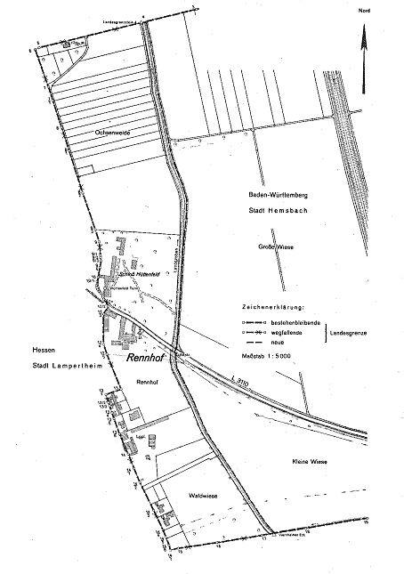

# Staatsvertrag zwischen dem Land Baden-Württemberg und dem Land Hessen über eine Änderung der Landesgrenze (Anlage zur Bekanntmachung über den Abschluß und das Inkrafttreten des Staatsvertrages zwischen dem Land Baden-Württemberg und dem Land Hessen über eine Änderung der Landesgrenze) (GrÄndStVtr BW/HE)

Ausfertigungsdatum
:   1983-03-18

Fundstelle
:   BGBl I: 1983, 953

Stand: In Kraft gem. Bek. v. 14.7.1983 I 952 mWv 21.6.1983

## Eingangsformel

Das Land Baden-Württemberg und das Land Hessen, beide vertreten durch
ihre Ministerpräsidenten, schließen nachstehenden Staatsvertrag:

## Art 1

(1) Das Land Baden-Württemberg tritt an das Land Hessen das Gebiet des
Ortsteils Rennhof der Stadt Hemsbach, Rhein-Neckar-Kreis, ab. Im
einzelnen handelt es sich hierbei um folgende Flurstücke der Gemarkung
Hemsbach: Nr. 4373/6, 4373/7, 4510 bis 4515, 4515/1, 4516 bis 4529,
4529/1 und 4530 bis 4547.

(2) Der bisherige und der neue Verlauf der Landesgrenze und das
abgetretene Gebiet sind aus der Anlage zu diesem Staatsvertrag
ersichtlich.

(3) Das Land Hessen gliedert das abgetretene Gebiet in die Stadt
Lampertheim, Landkreis Bergstraße, ein.

## Art 2

(1) Folgende in dem abgetretenen Gebiet belegenen Gegenstände des
Verwaltungsvermögens gehen entschädigungslos über:
Die Flurstücke 4373/6 und 4373/7 (Landesstraße 3110) vom Land Baden-
Württemberg auf das Land Hessen, das Flurstück 4510 (Landgraben) von
der Stadt Hemsbach auf die Stadt Lampertheim.

(2) Die von der Abtretung betroffenen Städte werden ermächtigt, für
den Steuerkraftverlust der Stadt Hemsbach eine Ausgleichszahlung zu
vereinbaren.

(3) Im übrigen regeln die von der Abtretung betroffenen Landkreise und
Städte Rechtsfolgen der Änderung ihrer Gebiete und die
Auseinandersetzung durch Vereinbarung.

(4) Vereinbarungen nach Absatz 2 und 3 bedürfen der Genehmigung des
Regierungspräsidiums Karlsruhe und des Regierungspräsidenten in
Darmstadt als der zuständigen Kommunalaufsichtsbehörden.

## Art 3

(1) Mit der Gebietsänderung treten in dem betroffenen Gebiet die
Rechtsvorschriften des Landes Baden-Württemberg, des Rhein-Neckar-
Kreises und der Stadt Hemsbach außer Kraft. Die in der Stadt
Lampertheim geltenden Rechtsvorschriften des Landes Hessen, des
Landkreises Bergstraße und der Stadt Lampertheim treten in Kraft.

(2) Für Rechte und Rechtsverhältnisse, die vor dem Inkrafttreten
dieses Vertrages entstanden sind, bleiben die bisher geltenden
Vorschriften maßgebend.

## Art 4

Die vertragschließenden Länder gehen davon aus, daß für den durch
diesen Staatsvertrag entstehenden Gebietsverlust bei späteren
Änderungen der gemeinsamen Grenze ein Gebietsausgleich geschaffen
wird.

## Art 5

(1) Die Ratifikationsurkunden dieses Staatsvertrages sollen
unverzüglich ausgetauscht werden, sobald die nach den
Landesverfassungen zuständigen Organe der vertragschließenden Länder
dem Staatsvertrag zugestimmt haben.

(2) Dieser Staatsvertrag tritt am Tag der Hinterlegung der
Ratifikationsurkunden in Kraft.

## Schlußformel

Der Ministerpräsident des Landes Baden-Württemberg
Der Hessische Ministerpräsident

(zu Artikel 1 Abs. 2)

## Anlage Anlage zum Staatsvertrag zwischen dem Land Baden-Württemberg und dem Land Hessen über eine Änderung der Landesgrenze

(Fundstelle: BGBl. I 1983, 954)

