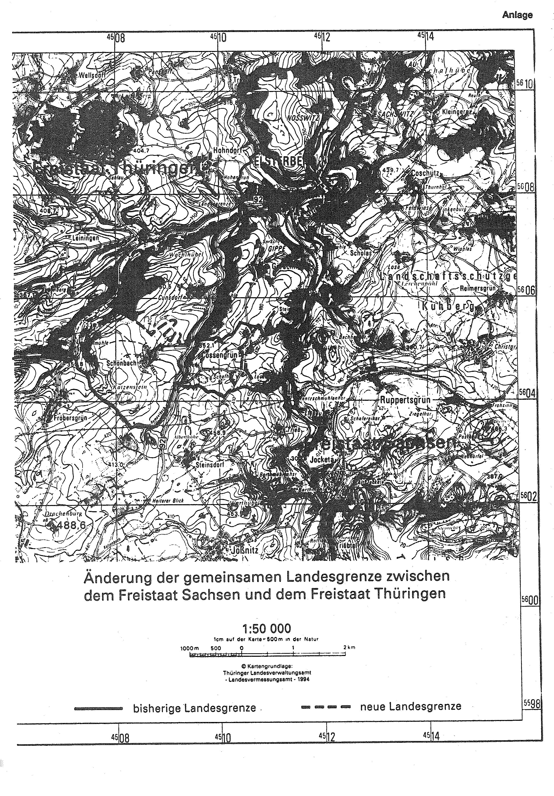

# Zweiter Staatsvertrag zwischen dem Freistaat Sachsen und dem Freistaat Thüringen über die Änderung der gemeinsamen Landesgrenze (GrÄndStVtr SN/TH 2)

Ausfertigungsdatum
:   1994-09-22

Fundstelle
:   BGBl I: 1994, 2855

## Eingangsformel

Der Freistaat Sachsen und der Freistaat Thüringen schließen auf der
Grundlage von Artikel 1 Abs. 1 des Vertrages zwischen der
Bundesrepublik Deutschland und der Deutschen Demokratischen Republik
über die Herstellung der Einheit Deutschlands - Einigungsvertrag - vom
31\. August 1990 (BGBl. II S. 889) in Verbindung mit Artikel 1 des
Gesetzes vom 23. September 1990 (BGBl. II S. 885) und in Verbindung
mit § 2 Abs. 2 und 3 des Verfassungsgesetzes zur Bildung von Ländern
in der Deutschen Demokratischen Republik vom 22. Juli 1990 (GBl. I Nr.
51 S. 955), das aufgrund von Artikel 9 Abs. 2 in Verbindung mit Anlage
II Kapitel II Sachgebiet A Abschnitt II des Einigungsvertrages
fortgeltendes Recht ist, folgenden Staatsvertrag:

## Art 1

(1) Die Gemeinde Cunsdorf im Landkreis Greiz (katastermäßig: Gemarkung
Cunsdorf: künftig Umgliederungsgebiet) wird aus dem Freistaat
Thüringen ausgegliedert und in den Freistaat Sachsen eingegliedert.

(2) Der Gebietsstand der Gemeinde Cunsdorf richtet sich nach dem Stand
ihrer Gemarkungsgrenzen am 3. Oktober 1990.

(3) Der bisherige und der neue Verlauf der gemeinsamen Landesgrenze
sind aus der Anlage zu diesem Vertrag ersichtlich.

## Art 2

(1) Das Umgliederungsgebiet wird im Freistaat Sachsen zunächst in den
Landkreis Plauen aufgenommen.

(2) Mit dem Wechsel der Landeszugehörigkeit tritt im
Umgliederungsgebiet sächsisches Landes- und Kreisrecht in Kraft. Das
bisher dort geltende Recht des Freistaats Thüringen und des
Landkreises Greiz tritt mit dem Wechsel der Landeszugehörigkeit außer
Kraft. Im Umgliederungsgebiet geltendes Ortsrecht bleibt -
vorbehaltlich besonderer Regelungen - in Kraft, auch wenn es in
Widerspruch zu sächsischem Landes- oder Kreisrecht steht; in diesem
Falle ist das Ortsrecht bis zum 31. Juli 1994 anzupassen, zu ersetzen
oder aufzuheben. Danach tritt widersprechendes Ortsrecht außer Kraft.

(3) Für Rechte und Rechtsverhältnisse, die vor dem Inkrafttreten
dieses Vertrages entstanden sind, gelten die bisherigen Rechtsnormen,
soweit in diesem Vertrag nicht im einzelnen besondere Regelungen
getroffen werden.

(4) Soweit vor der Gebietsänderung für Rechte und Pflichten von
Personen Wohnung oder Aufenthalt Voraussetzung war, gelten Wohnung
oder Aufenthalt im Umgliederungsgebiet als Wohnung oder Aufenthalt im
Freistaat Sachsen.

(5) Soweit durch die Gebietsänderung eine örtliche Zuständigkeit
sächsischer Gerichte begründet wird, werden die Akten an das jeweilige
sächsische Gericht abgegeben.

(6) Die verwaltungsmäßige Abwicklung des Wechsels der Straßenbaulasten
einschließlich der Fragen der Verkehrssicherungspflicht ist zwischen
den beteiligten höheren Straßenbaubehörden zu regeln.

(7) Der Freistaat Thüringen verpflichtet sich, bis zur Neufestlegung
der einwohnerbezogenen Anteile der neuen Bundesländer am Fonds
"Deutsche Einheit" sowie am Länderanteil des Umsatzsteueraufkommens
nach dem Gebietsstand bei Inkrafttreten dieses Vertrages dem Freistaat
Sachsen die auf die Einwohner des Umgliederungsgebiets bezogenen
Anteile des Freistaats Thüringen zu überweisen.

(8) Die Verbindlichkeiten der Gemeinde Schönbach gegenüber dem
Freistaat Thüringen und dem Kreis Greiz bleiben unberührt, sofern sie
vor Inkrafttreten dieses Vertrages entstanden sind. Der Freistaat
Sachsen erstattet der Gemeinde Schönbach den auf das
Umgliederungsgebiet entfallenden Anteil dieser Verbindlichkeiten.

(9) Im übrigen werden die Sächsische Staatsregierung und die Thüringer
Landesregierung dafür Sorge tragen, daß die mit dem Übergang des
Umgliederungsgebiets zusammenhängenden Fragen möglichst innerhalb von
sechs Monaten nach dem Wechsel der Landeszugehörigkeit geregelt
werden.

## Art 3

(1) Das im Umgliederungsgebiet belegene Verwaltungsvermögen von
Körperschaften des öffentlichen Rechts geht gegen angemessene
Entschädigung mit allen Rechten, Lasten und Verpflichtungen auf die
entsprechenden Körperschaften des öffentlichen Rechts im Freistaat
Sachsen über. Eine Entschädigung ist nicht zu leisten, wenn es sich um
Verwaltungsvermögen der Gemeinde Cunsdorf handelt; insofern sind auch
situationsbedingte Wertsteigerungen unbeachtlich. Die Pflicht zur
Entschädigungszahlung entfällt nicht hinsichtlich von Aufwendungen,
Verwendungen usw. für dieses Verwaltungsvermögen. Im Zusammenhang mit
dem Übergang des Umgliederungsgebiets durchzuführende Rechtshandlungen
sind frei von nach Landesrecht zu erhebenden Abgaben und Gebühren.

(2) Absatz 1 gilt entsprechend für das im Umgliederungsgebiet belegene
Finanzvermögen.

(3) Die Regelungen der Absätze 1 und 2 gelten nicht für das Vermögen
des Bundes, der Kirchen, der mit den Rechten einer Körperschaft des
öffentlichen Rechts ausgestatteten Religionsgemeinschaften und der den
Aufgaben einer Kirche oder Religionsgemeinschaft dienenden
Körperschaften des öffentlichen Rechts und für das Vermögen der im
Bereich der Sozialversicherung tätigen Körperschaften des öffentlichen
Rechts.

(4) Die Übertragung von Sparkassenzweigstellen sowie der Übergang von
Forderungen und Verbindlichkeiten aus dem Sparkassengeschäft sind
zwischen den beteiligten Sparkassen zu vereinbaren. Absatz 1 Satz 4
gilt entsprechend.

(5) Verbindlichkeiten, die sich für den Freistaat Thüringen aus
Förderzusagen, Bewilligungsbescheiden und Verpflichtungsermächtigungen
ergeben, die vor Inkrafttreten des Vertrages für das
Umgliederungsgebiet oder Einwohnern dieses Gebiets erteilt wurden,
übernimmt der Freistaat Sachsen, soweit in den Artikeln 5 bis 7 des
Vertrages nichts anderes bestimmt ist. Gleiches gilt für
Verbindlichkeiten gegenüber juristischen Personen, die im
Umgliederungsgebiet ihren Sitz haben oder sich dort betätigen. Die
Vertragsparteien sind sich einig, daß die genannten Verbindlichkeiten
ermittelt und durch eine besondere Vereinbarung nachträglich geregelt
werden.

## Art 4

Die betroffenen Gemeinden und Landkreise sind verpflichtet, möglichst
innerhalb von sechs Monaten nach dem Wechsel der Landeszugehörigkeit
des Umgliederungsgebiets die mit dem Übergang zusammenhängenden Fragen
der Verwaltung wie die Übergabe von Akten, Urkunden, Registern und
dergleichen durch Vereinbarung zu regeln sowie die für die
Berichtigung des Grundbuchs erforderlichen Erklärungen abzugeben. Die
Vereinbarungen bedürfen der Genehmigung der jeweils zuständigen
Rechtsaufsichtsbehörde. Die Verpflichtung nach Satz 1 trifft auch
sämtliche Landesbehörden einschließlich der Gerichte.

## Art 5

Für den Geschäftsbereich des Sächsischen Staatsministeriums für Kultus
und des Thüringer Kultusministeriums sind sich die Vertragsparteien
über folgendes einig:

1.  Schülerbeförderungen werden vom jeweiligen Schulträger bei
    Notwendigkeit eingerichtet. Anfallende Kosten für die Beförderung
    sowie die anteiligen Kosten für Schülerspeisung werden entsprechend
    der Landeszugehörigkeit der Schüler vom jeweiligen Sachträger
    entsprechend dem Landesrecht vom Inkrafttreten dieses Vertrages an
    übernommen.

2.  Bestehende Schulbezirke bleiben im Schuljahr 1993/94 erhalten. Ab dem
    Schuljahr 1994/95 treten die entsprechenden Regelungen des
    Schulgesetzes für den Freistaat Sachsen in Kraft. Das Recht, Schulen
    der bisherigen Schuleinzugsbezirke zu besuchen, bleibt im Rahmen der
    landesrechtlichen Bestimmungen unbenommen.

3.  Entsprechend bisheriger Praxis in der Bundesrepublik Deutschland
    werden keine Gastschulbeiträge für Schüler der vertragschließenden
    Länder erhoben.

4.  Der Freistaat Sachsen unterläßt alle Maßnahmen, die geeignet sind, das
    Recht der Eltern oder sonstiger Sorgeberechtigten auf Wahl eines
    Kindergartenplatzes in Thüringen zu beeinträchtigen.

## Art 6

Für den Geschäftsbereich des Sächsischen Staatsministeriums für
Landwirtschaft, Ernährung und Forsten und des Thüringer Ministeriums
für Landwirtschaft und Forsten sind sich die Vertragsparteien über
folgendes einig:

1.  Fördermaßnahmen im Bereich der Landwirtschaft, für die Haushaltsmittel
    bereits bewilligt wurden, sind vom Land Thüringen bis zur
    Verwendungsprüfung durchzuführen. Dies gilt auch für eine etwaige
    Nachfinanzierung, längstens jedoch bis zum 1. Juni 1994. Nach Abschluß
    der Verwendungsprüfung sind die abgeschlossenen Akten an den Freistaat
    Sachsen abzugeben.

2.  Der Freistaat Thüringen verzichtet auf eine Rückforderung der
    Fördermittel.

## Art 7

Für den Geschäftsbereich des Sächsischen Staatsministeriums für Umwelt
und Landesentwicklung und des Thüringer Ministeriums für Umwelt und
Landesplanung sind sich die Vertragsparteien über folgendes einig:

1.  Die Bereitstellung von Fördermitteln erfolgt im Rahmen der durch
    Zuwendungsbescheide festgelegte Fördersummen bis zum Tage vor
    Inkrafttreten des Vertrages durch den Freistaat Thüringen. Ab
    Inkrafttreten des Vertrages erfolgt die Bereitstellung von
    Fördermitteln durch den Freistaat Sachsen. Dies umfaßt auch die
    Bereitstellung von Mitteln aus dem Landeshaushalt.

2.  Der Freistaat Sachsen verpflichtet sich, die für 1993 zugesicherten
    Fördermittel im Umfang der festgelegten Verpflichtungsermächtigungen
    nach Maßgabe von Artikel 3 Abs. 5 des Vertrages zu übernehmen.

3.  Ein Haushaltsausgleich mit dem Freistaat Thüringen wird nicht
    durchgeführt.

4.  Der Bundesminister für Umwelt, Naturschutz und Reaktorsicherheit ist
    über die Abgabe zu unterrichten.

## Art 8

Die Anlage ist Bestandteil des Vertrages. Ausfertigungen der Anlage
(Artikel 1 Abs. 3) werden bei dem Landesvermessungsamt Sachsen, bei
dem Thüringer Landesverwaltungsamt und bei den Landratsämtern Greiz
und Plauen aufbewahrt und können von jedermann eingesehen werden.

## Art 9

(1) Dieser Vertrag bedarf der Ratifikation. Die Ratifikationsurkunden
werden ausgetauscht, sobald der Sächsische Landtag und der Thüringer
Landtag diesem Vertrag durch Gesetz zugestimmt haben.

(2) Die Ratifikationsurkunden und Urschriften dieses Vertrages werden
im Staatsarchiv Dresden und im Thüringischen Hauptstaatsarchiv in
Weimar hinterlegt.

(3) Der Staatsvertrag tritt am Tage nach dem Austausch der
Ratifikationsurkunden in Kraft.

## Anlage

(Fundstelle: BGBl. I 1994, 2857)

