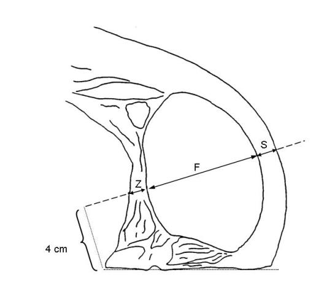
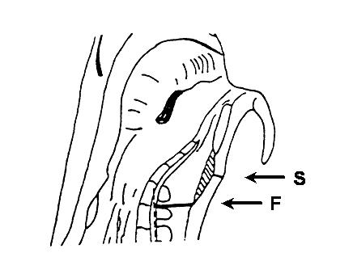

# Verordnung über gesetzliche Handelsklassen für Schweineschlachtkörper (HdlKlSchwV 1986)

Ausfertigungsdatum
:   1986-12-18

Fundstelle
:   BGBl I: 1986, 2624

Neugefasst durch
:   Bek. v. 16.8.1990 I 1809;

Zuletzt geändert durch
:   Art. 2 V v. 26.9.2011 I 1914

## § 1 Gesetzliche Handelsklassen

Für ganze und halbe Schlachtkörper von Schweinen gelten die in Anhang
V Teil B der Verordnung (EG) Nr. 1234/2007 des Rates vom 22. Oktober
2007 über eine gemeinsame Organisation der Agrarmärkte und mit
Sondervorschriften für bestimmte landwirtschaftliche Erzeugnisse
(Verordnung über die einheitliche GMO) (ABl. EU Nr. L 299 S. 1), die
zuletzt durch die Verordnung (EU) Nr. 1234/2010 vom 15. Dezember 2010
(ABl. L 346 vom 30.12.2010, S. 11) geändert worden ist, sowie die in
Anlage 1 bezeichneten Handelsklassen.

## § 2 Einstufung in Handelsklassen

(1) Schlachtbetriebe im Sinne des § 1 Nr. 3 des Fleischgesetzes, die
pro Woche durchschnittlich mehr als 200 Schweine schlachten, sind
verpflichtet, alle Schweineschlachtkörper möglichst bald nach der
Schlachtung vor Beginn des Kühlprozesses, spätestens aber 45 Minuten
nach dem Stechen des Tieres in das in § 1 bezeichnete
Handelsklassenschema einstufen zu lassen (Klassifizierung). Die
durchschnittliche wöchentliche Schlachtzahl wird auf der Grundlage der
im Jahresdurchschnitt des vorangegangenen Kalenderjahres
geschlachteten Menge ermittelt.

(2) Von der Pflicht nach Absatz 1 Satz 1 ausgenommen sind
Schlachtbetriebe, die nur in ihren eigenen Einrichtungen geborene und
gemästete Schweine schlachten und sämtliche Schweineschlachtkörper
selbst zerlegen.

(3) Bei einer freiwilligen Klassifizierung von Schweineschlachtkörpern
gelten die Vorschriften dieser Verordnung und die Rechtsakte der
Europäischen Gemeinschaft über das gemeinschaftliche
Handelsklassenschema für Schweineschlachtkörper.

(4) Die Verwendung anderer als der in § 1 bezeichneten Handelsklassen
ist nicht zulässig.

(5) Der Muskelfleischanteil ist durch Anwendung

1.  von Geräten, die nach Artikel 1 oder Artikel 1a der Entscheidung Nr.
    89/471/EWG der Kommission vom 14. Juli 1989 zur Zulassung der
    Einstufung von Schweineschlachtkörpern in Deutschland (ABl. L 233 vom
    10\.8.1989, S. 30), die zuletzt durch den Durchführungsbeschluss der
    Kommission vom 27. April 2011 (ABl. L 110 vom 29.4.2011, S. 29)
    geändert worden ist, zugelassen sind,

2.  des in Anlage 2 beschriebenen Verfahrens oder

3.  des in Anlage 3 beschriebenen Verfahrens (ZP-Verfahren)

zu ermitteln (Klassifizierungsverfahren). Das ZP-Verfahren darf nur in
Schlachtbetrieben verwendet werden, in denen wöchentlich
durchschnittlich nicht mehr als 200 Schweine geschlachtet werden.
Absatz 1 Satz 2 gilt entsprechend. Je Schlachtkörper darf nur ein
Klassifizierungsverfahren im Sinne des Satzes 1 zur Anwendung kommen.
Das festgestellte Klassifizierungsergebnis behält bis zur Zerlegung
des Schlachtkörpers seine Gültigkeit.

## § 3 Protokoll

(1) Unverzüglich nach der Ermittlung des Muskelfleischanteils ist für
jeden einzelnen Schlachtkörper ein Protokoll schriftlich anzufertigen.

(2) Das Protokoll hat mindestens die fortlaufende Schlachtnummer, die
Einzelmeßwerte oder Variablen, das daraus errechnete Ergebnis, sowie
den Schlachttag und den Namen oder das Kennzeichen des Klassifizierers
zu enthalten. Es ist mindestens sechs Monate lang geordnet
aufzubewahren.

(3) Systembedingt unvermeidbare Änderungen des Protokolls müssen in
einem gesonderten Protokoll aufgezeichnet werden. Das Protokoll ist
vom Klassifizierer zu unterzeichnen und mindestens sechs Monate lang,
beginnend jeweils mit dem Tag der Aufzeichnung, geordnet
aufzubewahren.

## § 4 Kennzeichnung

(1) Schweineschlachtkörper dürfen nur unzerlegt in einen anderen
Mitgliedstaat in den Handel verbracht werden, wenn sie mit dem Zeichen
der Handelsklasse nach Spalte 1 der Anlage 1 oder dem Prozentsatz des
nach § 2 Abs. 5 ermittelten Muskelfleischanteils gekennzeichnet sind.

(2) Die Kennzeichnung der Schlachtkörper nach Absatz 1 muss spätestens
45 Minuten nach dem Stechen des Tieres deutlich lesbar mit Farbe oder
mit von der zuständigen Landesbehörde anerkannten Etiketten, die ohne
Beschädigung nicht entfernbar sind, erfolgen.

## § 5 Ordnungswidrigkeiten

(1) Ordnungswidrig handelt, wer entgegen Artikel 21 Absatz 5 der
Verordnung (EG) Nr. 1249/2008 der Kommission vom 10. Dezember 2008 mit
Durchführungsbestimmungen zu den gemeinschaftlichen
Handelsklassenschemata für Schlachtkörper von Rindern, Schweinen und
Schafen und zur Feststellung der diesbezüglichen Preise (ABl. L 337
vom 16.12.2008, S. 3) von einem Schlachtkörper vor dem Wiegen, der
Einstufung oder der Kennzeichnung Fett-, Muskel- oder sonstiges Gewebe
entfernt.

(2) Die Ordnungswidrigkeit kann nach § 1 Abs. 3 Satz 1 Nr. 2 des
Handelsklassengesetzes mit einer Geldbuße bis zu zehntausend Euro
geahndet werden.

(3) Ordnungswidrig im Sinne des § 7 Abs. 1 Nr. 3 des
Handelsklassengesetzes handelt, wer vorsätzlich oder fahrlässig

1.  entgegen § 2 Abs. 1 Satz 1 oder Abs. 3 Schweineschlachtkörper nicht,
    nicht richtig oder nicht rechtzeitig einstufen lässt,

2.  entgegen § 2 Abs. 4 in Verbindung mit § 1 eine andere als eine dort
    bezeichnete Handelsklasse verwendet,

3.  entgegen § 2 Abs. 5 Maße mit einem anderen als einem dort bezeichneten
    Verfahren ermittelt,

4.  entgegen § 3 ein Protokoll nicht, nicht richtig, nicht vollständig
    oder nicht rechtzeitig anfertigt oder nicht sechs Monate lang
    aufbewahrt oder

5.  entgegen § 4 Abs. 1 oder 2 unzerlegte Schweineschlachtkörper, die
    nicht, nicht in der vorgeschriebenen Weise oder nicht rechtzeitig
    gekennzeichnet sind, in einem anderen Mitgliedstaat in den Handel
    verbringt.

## Anlage 1 (zu § 1, § 2 Absatz 1 und § 4 Absatz 1)

(Fundstelle: BGBl. I 2011, 1916)

## **Handelsklassenschema**

*    *   1

    *   2

*    *   Handelsklasse

    *   Anforderungen

*    *   I

*    *
    *   Nach § 2 Absatz 5 ermittelter Muskelfleischanteil des
        Schweineschlachtkörpers mit einem Schlachtgewicht von 50 kg und mehr,
        jedoch weniger als 120 kg in Prozent

*    *   S

    *   60 und mehr

*    *   E

    *   55 und mehr, jedoch weniger als 60

*    *   U

    *   50 und mehr, jedoch weniger als 55

*    *   R

    *   45 und mehr, jedoch weniger als 50

*    *   O

    *   40 und mehr, jedoch weniger als 45

*    *   P

    *   weniger als 40

*    *   II

*    *   M

    *   Schlachtkörper von Sauen

*    *   V

    *   Schlachtkörper von zur Zucht verwendeten Ebern und Altschneidern

(zu § 2 Absatz 5 Nummer 2)

## Anlage 2 Verfahren zur Ermittlung des Muskelfleischanteils von Schweineschlachtkörpern nach § 2 Absatz 5 Nummer 2

(Fundstelle: BGBl. I 2011, 1917)

Der Muskelfleischanteil des Schlachtkörpers wird anhand folgender
Formel berechnet:

    MF
=   60,98501 – 0,85831*                    S + 0,16449*
    F.

Dabei sind:

    MF
=   Geschätzter prozentualer Muskelfleischanteil des Schlachtkörpers,

    S
=   Rückenspeckdicke (einschließlich Schwarte) in mm, gemessen 7 cm
    seitlich der Trennlinie zwischen der zweit- und drittletzten Rippe,

    F
=   Dicke des Rückenmuskels in mm, gleichzeitig und an der gleichen Stelle
    wie S gemessen.

Die Rückenspeckdicke und die Dicke des Rückenmuskels werden an
Schweinehälften, die durch Spaltung des Schlachtkörpers längs der
Wirbelsäule hergerichtet wurden, ermittelt (siehe Abbildung).

Bei Klassifizierungsgeräten, die aufgrund der spezifischen
biologischen Eigenschaften eines Schlachtkörpers die Dicke des
Rückenmuskels nicht direkt bestimmen können, wird anstatt des
Fleischmaßes F ersatzweise das Fleischmaß F\* für die Berechnung des
Muskelfleischanteils verwendet. F\* wird wie folgt berechnet:

    F\*
=   0,95*                    G – 3.

Dabei sind:

    F\*
=   Hilfsgröße zur Schätzung der Dicke des Rückenmuskels in mm,

    G
=   Gesamtmaß entspricht der Summe der Dicke des Rückenmuskels F und der
    Dicke des Zwischenrippengewebes Z (siehe Abbildung) und wird
    gleichzeitig und an der gleichen Stelle wie S in mm gemessen.

Die mit Hilfe von F\* geschätzten Muskelfleischanteile sind im
Protokoll gemäß § 3 dieser Verordnung deutlich zu kennzeichnen.

Messlinie im Kotelettquerschnitt zwischen der zweit- und drittletzten
Rippe

(zu § 2 Absatz 5 Nummer 3)

## Anlage 3 Verfahren zur Ermittlung des Muskelfleischanteils von Schweineschlachtkörpern nach § 2 Absatz 5 Nummer 3

(Fundstelle: BGBl. I 2011, 1918)

Der Muskelfleischanteil des Schlachtkörpers wird anhand folgender
Formel berechnet:

    MF
=   58,10122 – 0,56495*                    S + 0,13199*
    F.

Dabei sind:

    MF
=   Geschätzter prozentualer Muskelfleischanteil des Schlachtkörpers,

    S
=   Speckmaß (einschließlich Schwarte) in mm, gemessen an der dünnsten
    Stelle des Speckes über dem M. glutaeus medius,

    F
=   Fleischmaß (Stärke des Lendenmuskels) in mm, gemessen als kürzeste
    Verbindung des vorderen (cranialen) Endes des M. glutaeus medius zur
    oberen (dorsalen) Kante des Wirbelkanals.

Speck- und Fleischmaß werden an Schweinehälften, die durch Spaltung
des Schlachtkörpers längs der Wirbelsäule hergerichtet wurden,
ermittelt (siehe Abbildung).

