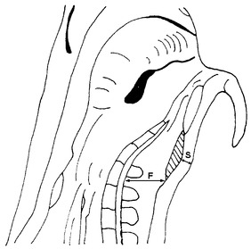

# Verordnung über gesetzliche Handelsklassen für Schweineschlachtkörper (HdlKlSchwV 1986)

Ausfertigungsdatum
:   1986-12-18

Fundstelle
:   BGBl I: 1986, 2624

Neugefasst durch
:   Bek. v. 16.8.1990 I 1809;

Zuletzt geändert durch
:   Art. 2 V v. 4.1.2019 I 2

## § 1 Gesetzliche Handelsklassen

Für ganze und halbe Schlachtkörper von Schweinen gelten die in Anhang
IV Teil B der Verordnung (EU) Nr. 1308/2013 des Europäischen
Parlaments und des Rates vom 17. Dezember 2013 über eine gemeinsame
Marktorganisation für landwirtschaftliche Erzeugnisse und zur
Aufhebung der Verordnungen (EWG) Nr. 922/72, (EWG) Nr. 234/79, (EG)
Nr. 1037/2001 und (EG) Nr. 1234/2007 (ABl. L 347 vom 20.12.2013, S.
671) sowie die in Anlage 1 bezeichneten Handelsklassen.

## § 2 Einstufung in Handelsklassen

(1) Schlachtbetriebe im Sinne des § 1 Nummer 3 des Fleischgesetzes,
die pro Woche durchschnittlich mehr als 500 Schweine schlachten oder
schlachten lassen, sind verpflichtet, alle Schweineschlachtkörper
möglichst bald nach der Schlachtung und vor Beginn des Kühlprozesses,
spätestens aber 45 Minuten nach dem Stechen des Tieres in die in § 1
bezeichneten Handelsklassen einstufen zu lassen (Klassifizierung). Die
durchschnittliche wöchentliche Schlachtzahl wird auf der Grundlage der
im Jahresdurchschnitt des vorangegangenen Kalenderjahres
geschlachteten Anzahl Schweine ermittelt. Die Verantwortung für die
Rahmenbedingungen einer ordnungsgemäßen Durchführung der
Klassifizierung obliegt dem Schlachtbetrieb; sie wird durch die
Beauftragung eines zugelassenen Klassifizierungsunternehmens mit der
Durchführung der Klassifizierung nicht berührt.

(2) Von der Pflicht nach Absatz 1 Satz 1 ausgenommen sind
Schlachtbetriebe, die nur in ihren eigenen Einrichtungen geborene und
gemästete Schweine schlachten und sämtliche Schweineschlachtkörper
selbst zerlegen.

(3) Abweichungen bei der Einstufung in Handelsklassen bleiben im Fall
einer Kontrolle beanstandungsfrei, wenn sie den in Anlage 1 Abschnitt
2 Teil 2 Buchstabe A Nummer 1.2 Satz 1 und 2 der 2. Fleischgesetz-
Durchführungsverordnung genannten Toleranzen entsprechen. Die
genannten Toleranzen dürfen planmäßig weder zum Vorteil des
Schlachtbetriebs noch des Lieferanten der Schlachtkörper ausgenutzt
werden.

(4) Bei einer freiwilligen Klassifizierung von Schweineschlachtkörpern
gelten die Vorschriften dieser Verordnung und die Rechtsakte der
Europäischen Gemeinschaft über das gemeinschaftliche
Handelsklassenschema für Schweineschlachtkörper.

(5) Wer eine Handelsklasse nach Anlage 1 verwendet, hat dafür zu
sorgen, dass das Fleisch entsprechend den in Anlage 1 Spalte 2
genannten Anforderungen der jeweiligen Handelsklasse klassifiziert
ist.

(6) Die Verwendung anderer als der in § 1 bezeichneten Handelsklassen
ist nicht zulässig.

(7) Der Muskelfleischanteil ist durch den Klassifizierer bei
Durchführung der Klassifizierung durch Anwendung

1.  von Geräten, die nach Artikel 1 oder Artikel 1a der Entscheidung Nr.
    89/471/EWG der Kommission vom 14. Juli 1989 zur Zulassung der
    Einstufung von Schweineschlachtkörpern in Deutschland (ABl. L 233 vom
    10\.8.1989, S. 30), die zuletzt durch den Durchführungsbeschluss der
    Kommission vom 27. April 2011 (ABl. L 110 vom 29.4.2011, S. 29)
    geändert worden ist, zugelassen sind,

2.  des in Anlage 2 beschriebenen Verfahrens oder

3.  des in Anlage 3 beschriebenen Verfahrens (ZP-Verfahren)

zu ermitteln (Klassifizierungsverfahren). Das ZP-Verfahren darf nur in
Schlachtbetrieben verwendet werden, in denen wöchentlich
durchschnittlich nicht mehr als 200 Schweine geschlachtet werden.
Absatz 1 Satz 2 gilt entsprechend. Je Schlachtkörper darf nur ein
Klassifizierungsverfahren im Sinne des Satzes 1 zur Anwendung kommen.
Das festgestellte Klassifizierungsergebnis behält bis zur Zerlegung
des Schlachtkörpers seine Gültigkeit.

## § 3 Protokoll

(1) Der Klassifizierer hat dafür zu sorgen, dass für jeden einzelnen
Schlachtkörper unverzüglich nach der Ermittlung des
Muskelfleischanteils ein Protokoll nach Absatz 2 Satz 1 schriftlich
angefertigt wird.

(2) Das Protokoll hat mindestens die fortlaufende Schlachtnummer, die
Einzelmeßwerte oder Variablen, das daraus errechnete Ergebnis sowie
den Schlachttag und den Namen oder das Kennzeichen des Klassifizierers
zu enthalten. Der Betreiber eines Klassifizierungsunternehmens hat das
Protokoll ab dem Zeitpunkt der Erstellung mindestens sechs Monate lang
geordnet aufzubewahren.

(3) Systembedingt unvermeidbare Änderungen des Protokolls müssen in
einem gesonderten Protokoll aufgezeichnet werden. Das Protokoll ist
vom Klassifizierer zu unterzeichnen und mindestens sechs Monate lang,
beginnend jeweils mit dem Tag der Aufzeichnung, geordnet
aufzubewahren.

## § 4 Kennzeichnung

(1) Klassifizierte Schweineschlachtkörper sind vom Klassifizierer bei
der Einstufung deutlich lesbar durch Stempelaufdruck oder durch von
der Landesbehörde anerkannte, ohne Beschädigung nicht entfernbare
Etiketten nach Artikel 8 Absatz 1, Absatz 2 Buchstabe b, Absatz 3
Buchstabe c sowie Absatz 4 und 5 der Delegierten Verordnung (EU)
2017/1182 der Kommission vom 20. April 2017 zur Ergänzung der
Verordnung (EU) Nr. 1308/2013 des Europäischen Parlaments und des
Rates in Bezug auf die Handelsklassenschemata der Union für
Schlachtkörper von Rindern, Schweinen und Schafen und zur Meldung der
Marktpreise für bestimmte Kategorien von Schlachtkörpern und lebenden
Tieren (ABl. L 171 vom 4.7.2017, S. 74) zu kennzeichnen.

(2) Die Pflicht zur Kennzeichnung der Schlachtkörper gemäß Absatz 1
entfällt, wenn die Voraussetzungen gemäß Artikel 8 Absatz 6 Buchstabe
a oder Buchstabe b der Delegierten Verordnung (EU) 2017/1182 erfüllt
sind.

## § 5 Ordnungswidrigkeiten

(1) Ordnungswidrig im Sinne des § 36 Absatz 3 Nummer 3 Buchstabe c des
Marktorganisationsgesetzes handelt, wer vorsätzlich oder leichtfertig

1.  entgegen § 2 Absatz 1 Satz 1 einen Schweineschlachtkörper nicht, nicht
    richtig oder nicht rechtzeitig einstufen lässt,

2.  entgegen § 2 Absatz 5 nicht dafür sorgt, dass das Fleisch entsprechend
    den dort genannten Anforderungen klassifiziert ist,

3.  entgegen § 2 Absatz 6 eine andere als eine dort bezeichnete
    Handelsklasse verwendet,

4.  entgegen § 2 Absatz 7 Satz 1 einen Muskelfleischanteil nicht, nicht
    richtig oder nicht rechtzeitig ermittelt,

5.  entgegen § 3 Absatz 1 nicht dafür sorgt, dass ein Protokoll
    angefertigt wird,

6.  entgegen § 3 Absatz 2 Satz 2 ein Protokoll nicht oder nicht mindestens
    sechs Monate geordnet aufbewahrt oder

7.  entgegen § 4 Absatz 1 einen Schweineschlachtkörper nicht, nicht
    richtig, nicht in der vorgeschriebenen Weise oder nicht rechtzeitig
    kennzeichnet.

(2) Ordnungswidrig im Sinne des § 36 Absatz 4 Satz 1 des
Marktorganisationsgesetzes handelt, wer vorsätzlich oder fahrlässig
entgegen Artikel 6 Absatz 1 der Delegierten Verordnung (EU) 2017/1182
der Kommission vom 20. April 2017 zur Ergänzung der Verordnung (EU)
Nr. 1308/2013 des Europäischen Parlaments und des Rates in Bezug auf
die Handelsklassenschemata der Union für Schlachtkörper von Rindern,
Schweinen und Schafen und zur Meldung der Marktpreise für bestimmte
Kategorien von Schlachtkörpern und lebenden Tieren (ABl. L 171 vom
4\.7.2017, S. 74) Fett-, Muskel- oder sonstiges Gewebe von einem
Schweineschlachtkörper entfernt.

## § 6 Überwachung, Duldungs- und Auskunftspflichten

(1) Soweit es zur Überwachung der Einhaltung der nach dieser
Verordnung geltenden Vorschriften erforderlich ist, können die
Beauftragten der zuständigen Stellen bei Betrieben, die Schweine
schlachten und Schweinefleisch im Sinne des § 1 zum Verkauf vorrätig
halten, anbieten, feilhalten, liefern, verkaufen oder sonst in den
Verkehr bringen oder in den Geltungsbereich oder aus dem
Geltungsbereich dieser Verordnung verbringen, während der
Geschäftszeit

1.  Geschäftsräume und Grundstücke, Verkaufseinrichtungen und
    Transportmittel betreten und dort Besichtigungen vornehmen,

2.  Geschäftsunterlagen einsehen und prüfen,

3.  Auskunft verlangen.

(2) Inhaber oder Leiter von Betrieben sowie
Klassifizierungsunternehmen sind verpflichtet, das Betreten der
Geschäftsräume und Grundstücke, Verkaufseinrichtungen und
Transportmittel sowie die dort vorzunehmenden Besichtigungen zu
gestatten, das zu besichtigende Schweinefleisch selbst oder durch
andere so darzulegen, dass die Besichtigung ordnungsgemäß vorgenommen
werden kann, selbst oder durch andere die erforderliche Hilfe bei der
Besichtigung zu leisten, die geschäftlichen Unterlagen vorzulegen,
prüfen zu lassen und Auskünfte zu erteilen.

## Anlage 1 (zu § 1, § 2 Absatz 1 und § 4 Absatz 1)

(Fundstelle: BGBl. I 2011, 1916)

## **Handelsklassenschema**

*    *   1

    *   2

*    *   Handelsklasse

    *   Anforderungen

*    *   I

*    *
    *   Nach § 2 Absatz 5 ermittelter Muskelfleischanteil des
        Schweineschlachtkörpers mit einem Schlachtgewicht von 50 kg und mehr,
        jedoch weniger als 120 kg in Prozent

*    *   S

    *   60 und mehr

*    *   E

    *   55 und mehr, jedoch weniger als 60

*    *   U

    *   50 und mehr, jedoch weniger als 55

*    *   R

    *   45 und mehr, jedoch weniger als 50

*    *   O

    *   40 und mehr, jedoch weniger als 45

*    *   P

    *   weniger als 40

*    *   II

*    *   M

    *   Schlachtkörper von Sauen

*    *   V

    *   Schlachtkörper von zur Zucht verwendeten Ebern und Altschneidern

(zu § 2 Absatz 5 Nummer 2)

## Anlage 2 Verfahren zur Ermittlung des Muskelfleischanteils von Schweineschlachtkörpern nach § 2 Absatz 5 Nummer 2

(Fundstelle: BGBl. I 2011, 1917)

Der Muskelfleischanteil des Schlachtkörpers wird anhand folgender
Formel berechnet:

    MF
=   60,98501 – 0,85831*                    S + 0,16449*
    F.

Dabei sind:

    MF
=   Geschätzter prozentualer Muskelfleischanteil des Schlachtkörpers,

    S
=   Rückenspeckdicke (einschließlich Schwarte) in mm, gemessen 7 cm
    seitlich der Trennlinie zwischen der zweit- und drittletzten Rippe,

    F
=   Dicke des Rückenmuskels in mm, gleichzeitig und an der gleichen Stelle
    wie S gemessen.

Die Rückenspeckdicke und die Dicke des Rückenmuskels werden an
Schweinehälften, die durch Spaltung des Schlachtkörpers längs der
Wirbelsäule hergerichtet wurden, ermittelt (siehe Abbildung).

Bei Klassifizierungsgeräten, die aufgrund der spezifischen
biologischen Eigenschaften eines Schlachtkörpers die Dicke des
Rückenmuskels nicht direkt bestimmen können, wird anstatt des
Fleischmaßes F ersatzweise das Fleischmaß F\* für die Berechnung des
Muskelfleischanteils verwendet. F\* wird wie folgt berechnet:

    F\*
=   0,95*                    G – 3.

Dabei sind:

    F\*
=   Hilfsgröße zur Schätzung der Dicke des Rückenmuskels in mm,

    G
=   Gesamtmaß entspricht der Summe der Dicke des Rückenmuskels F und der
    Dicke des Zwischenrippengewebes Z (siehe Abbildung) und wird
    gleichzeitig und an der gleichen Stelle wie S in mm gemessen.

Die mit Hilfe von F\* geschätzten Muskelfleischanteile sind im
Protokoll gemäß § 3 dieser Verordnung deutlich zu kennzeichnen.

Messlinie im Kotelettquerschnitt zwischen der zweit- und drittletzten
Rippe

(zu § 2 Absatz 5 Nummer 3)

## Anlage 3 Verfahren zur Ermittlung des Muskelfleischanteils von Schweineschlachtkörpern nach § 2 Absatz 5 Nummer 3

(Fundstelle: BGBl. I 2011, 1918;
bzgl. der einzelnen Änderungen vgl. Fußnote)

Der Muskelfleischanteil des Schlachtkörpers wird anhand folgender
Formel berechnet:

    MF
=   58,10122 – 0,56495*                    S + 0,13199*
    F.

Dabei sind:

    MF
=   Geschätzter prozentualer Muskelfleischanteil des Schlachtkörpers,

    S
=   Speckmaß (einschließlich Schwarte) in mm, gemessen an der dünnsten
    Stelle des Speckes über dem M. glutaeus medius,

    F
=   Fleischmaß (Stärke des Lendenmuskels) in mm, gemessen als kürzeste
    horizontale Verbindung des vorderen (cranialen) Endes des M. glutaeus
    medius zur oberen (dorsalen) Kante des Wirbelkanals.

Speck- und Fleischmaß werden an Schweinehälften, die durch Spaltung
des Schlachtkörpers längs der Wirbelsäule hergerichtet wurden,
ermittelt (siehe Abbildung).

Bei einer Kontrolle der Ermittlung des Muskelfleischanteils gilt eine
Toleranz von ±2 mm für das Speckmaß und von ±3 mm für das Fleischmaß.

