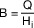

# Verordnung über die verbrauchsabhängige Abrechnung der Heiz- und Warmwasserkosten (HeizkostenV)

Ausfertigungsdatum
:   1981-02-23

Fundstelle
:   BGBl I: 1981, 261 (296)

Neugefasst durch
:   Bek. v. 5.10.2009 I 3250

Änderung durch
:   Art. 1 V v. 24.11.2021 I 4964 (Nr. 80) textlich nachgewiesen, dokumentarisch noch nicht abschließend bearbeitet

## § 1 Anwendungsbereich

(1) Diese Verordnung gilt für die Verteilung der Kosten

1.  des Betriebs zentraler Heizungsanlagen und zentraler
    Warmwasserversorgungsanlagen,

2.  der eigenständig gewerblichen Lieferung von Wärme und Warmwasser, auch
    aus Anlagen nach Nummer 1, (Wärmelieferung, Warmwasserlieferung)

durch den Gebäudeeigentümer auf die Nutzer der mit Wärme oder
Warmwasser versorgten Räume.

(2) Dem Gebäudeeigentümer stehen gleich

1.  der zur Nutzungsüberlassung in eigenem Namen und für eigene Rechnung
    Berechtigte,

2.  derjenige, dem der Betrieb von Anlagen im Sinne des § 1 Absatz 1
    Nummer 1 in der Weise übertragen worden ist, dass er dafür ein Entgelt
    vom Nutzer zu fordern berechtigt ist,

3.  beim Wohnungseigentum die Gemeinschaft der Wohnungseigentümer im
    Verhältnis zum Wohnungseigentümer, bei Vermietung einer oder mehrerer
    Eigentumswohnungen der Wohnungseigentümer im Verhältnis zum Mieter.

(3) Diese Verordnung gilt auch für die Verteilung der Kosten der
Wärmelieferung und Warmwasserlieferung auf die Nutzer der mit Wärme
oder Warmwasser versorgten Räume, soweit der Lieferer unmittelbar mit
den Nutzern abrechnet und dabei nicht den für den einzelnen Nutzer
gemessenen Verbrauch, sondern die Anteile der Nutzer am
Gesamtverbrauch zu Grunde legt; in diesen Fällen gelten die Rechte und
Pflichten des Gebäudeeigentümers aus dieser Verordnung für den
Lieferer.

(4) Diese Verordnung gilt auch für Mietverhältnisse über
preisgebundenen Wohnraum, soweit für diesen nichts anderes bestimmt
ist.

## § 2 Vorrang vor rechtsgeschäftlichen Bestimmungen

Außer bei Gebäuden mit nicht mehr als zwei Wohnungen, von denen eine
der Vermieter selbst bewohnt, gehen die Vorschriften dieser Verordnung
rechtsgeschäftlichen Bestimmungen vor.

## § 3 Anwendung auf das Wohnungseigentum

Die Vorschriften dieser Verordnung sind auf Wohnungseigentum
anzuwenden unabhängig davon, ob durch Vereinbarung oder Beschluss der
Wohnungseigentümer abweichende Bestimmungen über die Verteilung der
Kosten der Versorgung mit Wärme und Warmwasser getroffen worden sind.
Auf die Anbringung und Auswahl der Ausstattung nach den §§ 4 und 5
sowie auf die Verteilung der Kosten und die sonstigen Entscheidungen
des Gebäudeeigentümers nach den §§ 6 bis 9b und 11 sind die Regelungen
entsprechend anzuwenden, die für die Verwaltung des gemeinschaftlichen
Eigentums im Wohnungseigentumsgesetz enthalten oder durch Vereinbarung
der Wohnungseigentümer getroffen worden sind. Die Kosten für die
Anbringung der Ausstattung sind entsprechend den dort vorgesehenen
Regelungen über die Tragung der Verwaltungskosten zu verteilen.

## § 4 Pflicht zur Verbrauchserfassung

(1) Der Gebäudeeigentümer hat den anteiligen Verbrauch der Nutzer an
Wärme und Warmwasser zu erfassen.

(2) Er hat dazu die Räume mit Ausstattungen zur Verbrauchserfassung zu
versehen; die Nutzer haben dies zu dulden. Will der Gebäudeeigentümer
die Ausstattung zur Verbrauchserfassung mieten oder durch eine andere
Art der Gebrauchsüberlassung beschaffen, so hat er dies den Nutzern
vorher unter Angabe der dadurch entstehenden Kosten mitzuteilen; die
Maßnahme ist unzulässig, wenn die Mehrheit der Nutzer innerhalb eines
Monats nach Zugang der Mitteilung widerspricht. Die Wahl der
Ausstattung bleibt im Rahmen des § 5 dem Gebäudeeigentümer überlassen.

(3) Gemeinschaftlich genutzte Räume sind von der Pflicht zur
Verbrauchserfassung ausgenommen. Dies gilt nicht für
Gemeinschaftsräume mit nutzungsbedingt hohem Wärme- oder
Warmwasserverbrauch, wie Schwimmbäder oder Saunen.

(4) Der Nutzer ist berechtigt, vom Gebäudeeigentümer die Erfüllung
dieser Verpflichtungen zu verlangen.

## § 5 Ausstattung zur Verbrauchserfassung

(1) Zur Erfassung des anteiligen Wärmeverbrauchs sind Wärmezähler oder
Heizkostenverteiler, zur Erfassung des anteiligen Warmwasserverbrauchs
Warmwasserzähler zu verwenden. Soweit nicht eichrechtliche
Bestimmungen zur Anwendung kommen, dürfen nur solche Ausstattungen zur
Verbrauchserfassung verwendet werden, hinsichtlich derer
sachverständige Stellen bestätigt haben, dass sie den anerkannten
Regeln der Technik entsprechen oder dass ihre Eignung auf andere Weise
nachgewiesen wurde. Als sachverständige Stellen gelten nur solche
Stellen, deren Eignung die nach Landesrecht zuständige Behörde im
Benehmen mit der Physikalisch-Technischen Bundesanstalt bestätigt hat.
Die Ausstattungen müssen für das jeweilige Heizsystem geeignet sein
und so angebracht werden, dass ihre technisch einwandfreie Funktion
gewährleistet ist.

(2) Ausstattungen zur Verbrauchserfassung nach Absatz 1 Satz 1 und
nach § 9 Absatz 2 Satz 1, die nach dem 1. Dezember 2021 installiert
werden, müssen fernablesbar sein und dabei den Datenschutz und die
Datensicherheit nach dem Stand der Technik gewährleisten. Fernablesbar
ist eine Ausstattung zur Verbrauchserfassung, wenn sie ohne Zugang zu
einzelnen Nutzeinheiten abgelesen werden kann. Ab dem 1. Dezember 2022
dürfen nur noch solche fernablesbaren Ausstattungen installiert
werden, die sicher an ein Smart-Meter-Gateway nach § 2 Satz 1 Nummer
19 des Messstellenbetriebsgesetzes vom 29. August 2016 (BGBl. I S.
2034), das zuletzt durch Artikel 10 des Gesetzes vom 16. Juli 2021
(BGBl. I S. 3026) geändert worden ist, unter Beachtung des in
Schutzprofilen und Technischen Richtlinien des Bundesamtes für
Sicherheit in der Informationstechnik niedergelegten Stands der
Technik nach dem Messstellenbetriebsgesetz angebunden werden können.
Die Sätze 1 bis 3 sind nicht anzuwenden, wenn ein einzelner Zähler
oder Heizkostenverteiler ersetzt oder ergänzt wird, der Teil eines
Gesamtsystems ist und die anderen Zähler oder Heizkostenverteiler
dieses Gesamtsystems zum Zeitpunkt des Ersatzes oder der Ergänzung
nicht fernablesbar sind.

(3) Nicht fernablesbare Ausstattungen zur Verbrauchserfassung, die bis
zum 1. Dezember 2021 oder nach Maßgabe des Absatzes 2 Satz 4 nach dem
1\. Dezember 2021 installiert wurden, müssen bis zum 31. Dezember 2026
die Anforderungen nach den Absätzen 2 und 5 durch Nachrüstung oder
Austausch erfüllen. Satz 1 ist nicht anzuwenden, wenn dies im
Einzelfall wegen besonderer Umstände technisch nicht möglich ist oder
durch einen unangemessenen Aufwand oder in sonstiger Weise zu einer
unbilligen Härte führen würde.

(4) Fernablesbare Ausstattungen zur Verbrauchserfassung, die bis zum
1\. Dezember 2022 installiert wurden, müssen nach dem 31. Dezember 2031
die Anforderungen nach Absatz 2 Satz 3 und Absatz 5 durch Nachrüstung
oder Austausch erfüllen.

(5) Ab dem 1. Dezember 2022 dürfen nur noch solche fernauslesbaren
Ausstattungen zur Verbrauchserfassung installiert werden, die
einschließlich ihrer Schnittstellen mit den Ausstattungen gleicher Art
anderer Hersteller interoperabel sind und dabei den Stand der Technik
einhalten. Die Interoperabilität ist in der Weise zu gewährleisten,
dass im Fall der Übernahme der Ablesung durch eine andere Person diese
die Ausstattungen zur Verbrauchserfassung selbst fernablesen kann. Das
Schlüsselmaterial der fernablesbaren Ausstattungen zur
Verbrauchserfassung ist dem Gebäudeeigentümer kostenfrei zur Verfügung
zu stellen.

(6) Die Einhaltung des Stands der Technik nach den Absätzen 2 und 5
wird vermutet, soweit Schutzprofile und technische Richtlinien
eingehalten werden, die vom Bundesamt für Sicherheit in der
Informationstechnik bekannt gemacht worden sind, oder wenn die
Ausstattung zur Verbrauchserfassung mit einem Smart-Meter-Gateway nach
§ 2 Satz 1 Nummer 19 des Messstellenbetriebsgesetzes verbunden ist und
die nach dem Messstellenbetriebsgesetz geltenden Schutzprofile und
technischen Richtlinien eingehalten werden. Wenn der Gebäudeeigentümer
von der Möglichkeit des § 6 Absatz 1 des Messstellenbetriebsgesetzes
für die Sparte Heizwärme Gebrauch gemacht hat, sind fernablesbare
Ausstattungen zur Verbrauchserfassung nach den Absätzen 2 und 3 an
vorhandene Smart-Meter-Gateways nach § 2 Satz 1 Nummer 19 des
Messstellenbetriebsgesetzes anzubinden.

(7) Wird der Verbrauch der von einer Anlage im Sinne des § 1 Absatz 1
versorgten Nutzer nicht mit gleichen Ausstattungen erfasst, so sind
zunächst durch Vorerfassung vom Gesamtverbrauch die Anteile der
Gruppen von Nutzern zu erfassen, deren Verbrauch mit gleichen
Ausstattungen erfasst wird. Der Gebäudeeigentümer kann auch bei
unterschiedlichen Nutzungs- oder Gebäudearten oder aus anderen
sachgerechten Gründen eine Vorerfassung nach Nutzergruppen
durchführen.

(8) Die Bundesregierung evaluiert die Auswirkungen der Regelungen auf
Mieter in den Absätzen 2, 5 und 6 drei Jahre nach dem 1. Dezember
2021, insbesondere im Hinblick auf zusätzliche Betriebskosten durch
fernablesbare Ausstattungen und den Nutzen dieser Ausstattungen für
Mieter. Der Evaluationsbericht wird spätestens am 31. August 2025
veröffentlicht.

## § 6 Pflicht zur verbrauchsabhängigen Kostenverteilung

(1) Der Gebäudeeigentümer hat die Kosten der Versorgung mit Wärme und
Warmwasser auf der Grundlage der Verbrauchserfassung nach Maßgabe der
§§ 7 bis 9 auf die einzelnen Nutzer zu verteilen. Das Ergebnis der
Ablesung bei nicht fernablesbaren Ausstattungen soll dem Nutzer in der
Regel innerhalb eines Monats mitgeteilt werden. Eine gesonderte
Mitteilung ist nicht erforderlich, wenn das Ableseergebnis über einen
längeren Zeitraum in den Räumen des Nutzers gespeichert ist und von
diesem selbst abgerufen werden kann. Einer gesonderten Mitteilung des
Warmwasserverbrauchs bedarf es auch dann nicht, wenn in der
Nutzeinheit ein Warmwasserzähler eingebaut ist.

(2) In den Fällen des § 5 Absatz 2 sind die Kosten zunächst mindestens
zu 50 vom Hundert nach dem Verhältnis der erfassten Anteile am
Gesamtverbrauch auf die Nutzergruppen aufzuteilen. Werden die Kosten
nicht vollständig nach dem Verhältnis der erfassten Anteile am
Gesamtverbrauch aufgeteilt, sind

1.  die übrigen Kosten der Versorgung mit Wärme nach der Wohn- oder
    Nutzfläche oder nach dem umbauten Raum auf die einzelnen Nutzergruppen
    zu verteilen; es kann auch die Wohn- oder Nutzfläche oder der umbaute
    Raum der beheizten Räume zu Grunde gelegt werden,

2.  die übrigen Kosten der Versorgung mit Warmwasser nach der Wohn- oder
    Nutzfläche auf die einzelnen Nutzergruppen zu verteilen.

Die Kostenanteile der Nutzergruppen sind dann nach Absatz 1 auf die
einzelnen Nutzer zu verteilen.

(3) In den Fällen des § 4 Absatz 3 Satz 2 sind die Kosten nach dem
Verhältnis der erfassten Anteile am Gesamtverbrauch auf die
Gemeinschaftsräume und die übrigen Räume aufzuteilen. Die Verteilung
der auf die Gemeinschaftsräume entfallenden anteiligen Kosten richtet
sich nach rechtsgeschäftlichen Bestimmungen.

(4) Die Wahl der Abrechnungsmaßstäbe nach Absatz 2 sowie nach § 7
Absatz 1 Satz 1, §§ 8 und 9 bleibt dem Gebäudeeigentümer überlassen.
Er kann diese für künftige Abrechnungszeiträume durch Erklärung
gegenüber den Nutzern ändern

1.  bei der Einführung einer Vorerfassung nach Nutzergruppen,

2.  nach Durchführung von baulichen Maßnahmen, die nachhaltig Einsparungen
    von Heizenergie bewirken oder

3.  aus anderen sachgerechten Gründen nach deren erstmaliger Bestimmung.

Die Festlegung und die Änderung der Abrechnungsmaßstäbe sind nur mit
Wirkung zum Beginn eines Abrechnungszeitraumes zulässig.

## § 6a Abrechnungs- und Verbrauchsinformationen; Informationen in der Abrechnung

(1) Wenn fernablesbare Ausstattungen zur Verbrauchserfassung
installiert wurden, hat der Gebäudeeigentümer den Nutzern Abrechnungs-
oder Verbrauchsinformationen für Heizung und Warmwasser auf der
Grundlage des tatsächlichen Verbrauchs oder der Ablesewerte von
Heizkostenverteilern in folgenden Zeitabständen mitzuteilen:

1.  für alle Abrechnungszeiträume, die ab dem 1. Dezember 2021 beginnen

    a)  auf Verlangen des Nutzers oder wenn der Gebäudeeigentümer sich
        gegenüber dem Versorgungsunternehmen für die Zustellung der Abrechnung
        auf elektronischem Wege entschieden hat, mindestens vierteljährlich
        und

    b)  ansonsten mindestens zweimal im Jahr,

2.  ab dem 1. Januar 2022 monatlich.

(2) Verbrauchsinformationen nach Absatz 1 Nummer 2 müssen mindestens
folgende Informationen enthalten:

1.  Verbrauch des Nutzers im letzten Monat in Kilowattstunden,

2.  einen Vergleich dieses Verbrauchs mit dem Verbrauch des Vormonats
    desselben Nutzers sowie mit dem entsprechenden Monat des Vorjahres
    desselben Nutzers, soweit diese Daten erhoben worden sind, und

3.  einen Vergleich mit dem Verbrauch eines normierten oder durch
    Vergleichstests ermittelten Durchschnittsnutzers derselben
    Nutzerkategorie.

(3) Wenn die Abrechnungen auf dem tatsächlichen Verbrauch oder auf den
Ablesewerten von Heizkostenverteilern beruhen, muss der
Gebäudeeigentümer den Nutzern für Abrechnungszeiträume, die ab dem 1.
Dezember 2021 beginnen, zusammen mit den Abrechnungen folgende
Informationen zugänglich machen:

1.  Informationen über

    a)  den Anteil der eingesetzten Energieträger und bei Nutzern, die mit
        Fernwärme aus Fernwärmesystemen versorgt werden, auch über die damit
        verbundenen jährlichen Treibhausgasemissionen und den
        Primärenergiefaktor des Fernwärmenetzes, bei Fernwärmesystemen mit
        einer thermischen Gesamtleistung unter 20 Megawatt jedoch erst ab dem
        1\. Januar 2022,

    b)  die erhobenen Steuern, Abgaben und Zölle,

    c)  die Entgelte für die Gebrauchsüberlassung und Verwendung der
        Ausstattungen zur Verbrauchserfassung, einschließlich der Eichung,
        sowie für die Ablesung und Abrechnung,

2.  Kontaktinformationen, darunter Internetadressen von
    Verbraucherorganisationen, Energieagenturen oder ähnlichen
    Einrichtungen, bei denen Informationen über angebotene Maßnahmen zur
    Energieeffizienzverbesserung, Endnutzer-Vergleichsprofile und
    objektive technische Spezifikationen für energiebetriebene Geräte
    eingeholt werden können,

3.  im Falle eines Verbrauchervertrags nach § 310 Absatz 3 des
    Bürgerlichen Gesetzbuches die Information über die Möglichkeit der
    Durchführung von Streitbeilegungsverfahren nach dem
    Verbraucherstreitbeilegungsgesetz, wobei die §§ 36 und 37 des
    Verbraucherstreitbeilegungsgesetzes unberührt bleiben,

4.  Vergleiche mit dem Verbrauch eines normierten oder durch
    Vergleichstests ermittelten Durchschnittsnutzers derselben
    Nutzerkategorie, wobei im Fall elektronischer Abrechnungen ein solcher
    Vergleich online bereitgestellt und in der Abrechnung darauf verwiesen
    werden kann,

5.  einen Vergleich des witterungsbereinigten Energieverbrauchs des
    jüngsten Abrechnungszeitraums des Nutzers mit seinem
    witterungsbereinigten Energieverbrauch im vorhergehenden
    Abrechnungszeitraum in grafischer Form.

Der Energieverbrauch nach Satz 1 Nummer 5 umfasst den Wärmeverbrauch
und den Warmwasserverbrauch. Dabei ist der Wärmeverbrauch einer
Witterungsbereinigung unter Anwendung eines den anerkannten Regeln der
Technik entsprechenden Verfahrens zu unterziehen. Die Einhaltung der
anerkannten Regeln der Technik wird vermutet, soweit für den Vergleich
der witterungsbereinigten Energieverbräuche Vereinfachungen verwendet
werden, die vom Bundesministerium für Wirtschaft und Energie und vom
Bundesministerium des Innern, für Bau und Heimat gemeinsam im
Bundesanzeiger bekannt gemacht worden sind.

(4) Die Pflichten gemäß § 556 Absatz 3 des Bürgerlichen Gesetzbuches
bleiben unberührt.

(5) Abrechnungen, die nicht auf dem tatsächlichen Verbrauch oder auf
den Ablesewerten von Heizkostenverteilern beruhen, müssen mindestens
die Informationen gemäß Absatz 3 Satz 1 Nummer 2 und 3 enthalten.

## § 6b Zulässigkeit und Umfang der Verarbeitung von Daten

Die Erhebung, Speicherung und Verwendung von Daten aus einer
fernablesbaren Ausstattung zur Verbrauchserfassung darf nur durch den
Gebäudeeigentümer oder einen von ihm beauftragten Dritten erfolgen und
soweit dies erforderlich ist:

1.  zur Erfüllung der verbrauchsabhängigen Kostenverteilung und zur
    Abrechnung mit dem Nutzer nach § 6 oder

2.  zur Erfüllung der Informationspflichten nach § 6a.

## § 7 Verteilung der Kosten der Versorgung mit Wärme

(1) Von den Kosten des Betriebs der zentralen Heizungsanlage sind
mindestens 50 vom Hundert, höchstens 70 vom Hundert nach dem erfassten
Wärmeverbrauch der Nutzer zu verteilen. In Gebäuden, die das
Anforderungsniveau der Wärmeschutzverordnung vom 16. August 1994
(BGBl. I S. 2121) nicht erfüllen, die mit einer Öl- oder Gasheizung
versorgt werden und in denen die freiliegenden Leitungen der
Wärmeverteilung überwiegend gedämmt sind, sind von den Kosten des
Betriebs der zentralen Heizungsanlage 70 vom Hundert nach dem
erfassten Wärmeverbrauch der Nutzer zu verteilen. In Gebäuden, in
denen die freiliegenden Leitungen der Wärmeverteilung überwiegend
ungedämmt sind und deswegen ein wesentlicher Anteil des
Wärmeverbrauchs nicht erfasst wird, kann der Wärmeverbrauch der Nutzer
nach anerkannten Regeln der Technik bestimmt werden. Der so bestimmte
Verbrauch der einzelnen Nutzer wird als erfasster Wärmeverbrauch nach
Satz 1 berücksichtigt. Die übrigen Kosten sind nach der Wohn- oder
Nutzfläche oder nach dem umbauten Raum zu verteilen; es kann auch die
Wohn- oder Nutzfläche oder der umbaute Raum der beheizten Räume zu
Grunde gelegt werden.

(2) Zu den Kosten des Betriebs der zentralen Heizungsanlage
einschließlich der Abgasanlage gehören die Kosten der verbrauchten
Brennstoffe und ihrer Lieferung, die Kosten des Betriebsstromes, die
Kosten der Bedienung, Überwachung und Pflege der Anlage, der
regelmäßigen Prüfung ihrer Betriebsbereitschaft und Betriebssicherheit
einschließlich der Einstellung durch eine Fachkraft, der Reinigung der
Anlage und des Betriebsraumes, die Kosten der Messungen nach dem
Bundes-Immissionsschutzgesetz, die Kosten der Anmietung oder anderer
Arten der Gebrauchsüberlassung einer Ausstattung zur
Verbrauchserfassung sowie die Kosten der Verwendung einer Ausstattung
zur Verbrauchserfassung einschließlich der Kosten der Eichung sowie
der Kosten der Berechnung, Aufteilung und Abrechnungs- und
Verbrauchsinformationen gemäß § 6a.

(3) Für die Verteilung der Kosten der Wärmelieferung gilt Absatz 1
Satz 1 und 3 bis 5 entsprechend.

(4) Zu den Kosten der Wärmelieferung gehören das Entgelt für die
Wärmelieferung und die Kosten des Betriebs der zugehörigen Hausanlagen
entsprechend Absatz 2.

## § 8 Verteilung der Kosten der Versorgung mit Warmwasser

(1) Von den Kosten des Betriebs der zentralen
Warmwasserversorgungsanlage sind mindestens 50 vom Hundert, höchstens
70 vom Hundert nach dem erfassten Warmwasserverbrauch, die übrigen
Kosten nach der Wohn- oder Nutzfläche zu verteilen.

(2) Zu den Kosten des Betriebs der zentralen
Warmwasserversorgungsanlage gehören die Kosten der Wasserversorgung,
soweit sie nicht gesondert abgerechnet werden, und die Kosten der
Wassererwärmung entsprechend § 7 Absatz 2. Zu den Kosten der
Wasserversorgung gehören die Kosten des Wasserverbrauchs, die
Grundgebühren und die Zählermiete, die Kosten der Verwendung von
Zwischenzählern, die Kosten des Betriebs einer hauseigenen
Wasserversorgungsanlage und einer Wasseraufbereitungsanlage
einschließlich der Aufbereitungsstoffe.

(3) Für die Verteilung der Kosten der Warmwasserlieferung gilt Absatz
1 entsprechend.

(4) Zu den Kosten der Warmwasserlieferung gehören das Entgelt für die
Lieferung des Warmwassers und die Kosten des Betriebs der zugehörigen
Hausanlagen entsprechend § 7 Absatz 2.

## § 9 Verteilung der Kosten der Versorgung mit Wärme und Warmwasser bei verbundenen Anlagen

(1) Ist die zentrale Anlage zur Versorgung mit Wärme mit der zentralen
Warmwasserversorgungsanlage verbunden, so sind die einheitlich
entstandenen Kosten des Betriebs aufzuteilen. Die Anteile an den
einheitlich entstandenen Kosten sind bei Anlagen mit Heizkesseln nach
den Anteilen am Brennstoffverbrauch oder am Energieverbrauch, bei
eigenständiger gewerblicher Wärmelieferung nach den Anteilen am
Wärmeverbrauch zu bestimmen. Kosten, die nicht einheitlich entstanden
sind, sind dem Anteil an den einheitlich entstandenen Kosten
hinzuzurechnen. Der Anteil der zentralen Anlage zur Versorgung mit
Wärme ergibt sich aus dem gesamten Verbrauch nach Abzug des Verbrauchs
der zentralen Warmwasserversorgungsanlage. Bei Anlagen, die nicht
ausschließlich durch Heizkessel oder durch eigenständige gewerbliche
Wärmelieferung mit Wärme versorgt werden, können anerkannte Regeln der
Technik zur Aufteilung der Kosten verwendet werden. Der Anteil der
zentralen Warmwasserversorgungsanlage am Wärmeverbrauch ist nach
Absatz 2, der Anteil am Brennstoffverbrauch nach Absatz 3 zu
ermitteln.

(2) Die auf die zentrale Warmwasserversorgungsanlage entfallende
Wärmemenge (Q) ist mit einem Wärmezähler zu messen. Kann die
Wärmemenge nur mit einem unzumutbar hohen Aufwand gemessen werden,
kann sie nach folgender Zahlenwertgleichung als Ergebnis in
Kilowattstunden pro Jahr bestimmt werden:

*    *   Q = 2,5 x V x (tw-10).

*    *

   Dabei sind zu Grunde zu legen:

1.  der Wert 2,5 für die Erzeugeraufwandszahl des Wärmeerzeugers, die
    mittlere spezifische Wärmekapazität des Wassers, die Wärmeverluste für
    Warmwasserspeicher, Verteilung einschließlich Zirkulation,
    Messdatenerhebungen zum Warmwasserverbrauch,

2.  das gemessene Volumen des verbrauchten Warmwassers (V) in Kubikmetern,

3.  die gemessene oder geschätzte mittlere Temperatur des Warmwassers (tw)
    in Grad Celsius und

4.  der Wert 10 für die übliche Kaltwassereintrittstemperatur in die
    Warmwasserversorgungsanlage in Grad Celsius.

Wenn in Ausnahmefällen weder die Wärmemenge noch das Volumen des
verbrauchten Warmwassers gemessen werden können, kann die Wärmemenge,
die auf die zentrale Warmwasserversorgungsanlage entfällt, nach
folgender Zahlenwertgleichung als Ergebnis in Kilowattstunden pro Jahr
bestimmt werden:

*    *   Q = 32 x A
        Wohn                       .

*    *

   Dabei sind zu Grunde zu legen:

1.  der Wert 32 für den Nutzwärmebedarf für Warmwasser, die
    Erzeugeraufwandszahl des Wärmeerzeugers, Messdatenerhebungen zum
    Warmwasserverbrauch und

2.  die durch die zentrale Anlage mit Warmwasser versorgte Wohn- oder
    Nutzfläche (A
    Wohn                   ) in Quadratmeter.

Die nach den Zahlenwertgleichungen in Satz 2 oder 4 bestimmte
Wärmemenge (Q) ist

1.  bei brennwertbezogener Abrechnung von Erdgas
    mit 1,11                    zu multiplizieren und

2.  bei eigenständiger gewerblicher Wärmelieferung durch 1,15 zu
    dividieren.

(3) Bei Anlagen mit Heizkesseln ist der Brennstoffverbrauch der
zentralen Warmwasserversorgungsanlage (B) in Litern, Kubikmetern oder
Kilogramm nach folgender Gleichung zu bestimmen:
.
Dabei sind zu Grunde zu legen

1.  die auf die zentrale Warmwasserversorgungsanlage entfallende
    Wärmemenge (Q) nach Absatz 2 in kWh;

2.  der Heizwert des verbrauchten Brennstoffes (H
    i                   ) in Kilowattstunden je Liter, Kubikmeter oder
    Kilogramm.

Als Heizwerte nach Satz 2 Nummer 2 sind die in den
Abrechnungsunterlagen des Energieversorgungsunternehmens oder
Brennstofflieferanten angegebenen Heizwerte zu verwenden. Wenn diese
vom Energieversorgungsunternehmen oder Brennstofflieferanten nicht
angegeben werden, können hilfsweise folgende Werte verwendet werden:

*    *
    *   Heiz-
        wert H
        i

    *   Einheit

*    *   Leichtes Heizöl
        extra leichtflüssig

    *   10

    *   Kilowattstunden
        je Liter

*    *   Schweres Heizöl

    *   10,9

    *   Kilowattstunden
        je Liter

*    *   Erdgas H

    *   10

    *   Kilowattstunden
        je Kubikmeter

*    *   Erdgas L

    *   9

    *   Kilowattstunden
        je Kubikmeter

*    *   Flüssiggas

    *   13

    *   Kilowattstunden
        je Kilogramm

*    *   Koks

    *   8

    *   Kilowattstunden
        je Kilogramm

*    *   Braunkohle

    *   5,5

    *   Kilowattstunden
        je Kilogramm

*    *   Steinkohle

    *   8

    *   Kilowattstunden
        je Kilogramm

*    *   Brennholz
        (lufttrocken)

    *   4,1

    *   Kilowattstunden
        je Kilogramm

*    *   Holzpellets

    *   5

    *   Kilowattstunden
        je Kilogramm

*    *   Holzhackschnitzel
        (lufttrocken)

    *   4

    *   Kilowattstunden
        je Kilogramm

Soweit die Abrechnung über Kilowattstunden-Werte erfolgt, ist eine
Umrechnung in Brennstoffverbrauch nicht erforderlich. Enthalten die
Abrechnungsunterlagen des Energieversorgungsunternehmens oder
Brennstofflieferanten H
i             -Werte, so sind diese zu verwenden. Soweit die
Abrechnung über kWh-Werte erfolgt, ist eine Umrechnung in
Brennstoffverbrauch nicht erforderlich.

(4) Der Anteil an den Kosten der Versorgung mit Wärme ist nach § 7
Absatz 1, der Anteil an den Kosten der Versorgung mit Warmwasser nach
§ 8 Absatz 1 zu verteilen, soweit diese Verordnung nichts anderes
bestimmt oder zulässt.

## § 9a Kostenverteilung in Sonderfällen

(1) Kann der anteilige Wärme- oder Warmwasserverbrauch von Nutzern für
einen Abrechnungszeitraum wegen Geräteausfalls oder aus anderen
zwingenden Gründen nicht ordnungsgemäß erfasst werden, ist er vom
Gebäudeeigentümer auf der Grundlage des Verbrauchs der betroffenen
Räume in vergleichbaren Zeiträumen oder des Verbrauchs vergleichbarer
anderer Räume im jeweiligen Abrechnungszeitraum oder des
Durchschnittsverbrauchs des Gebäudes oder der Nutzergruppe zu
ermitteln. Der so ermittelte anteilige Verbrauch ist bei der
Kostenverteilung anstelle des erfassten Verbrauchs zu Grunde zu legen.

(2) Überschreitet die von der Verbrauchsermittlung nach Absatz 1
betroffene Wohn- oder Nutzfläche oder der umbaute Raum 25 vom Hundert
der für die Kostenverteilung maßgeblichen gesamten Wohn- oder
Nutzfläche oder des maßgeblichen gesamten umbauten Raumes, sind die
Kosten ausschließlich nach den nach § 7 Absatz 1 Satz 5 und § 8 Absatz
1 für die Verteilung der übrigen Kosten zu Grunde zu legenden
Maßstäben zu verteilen.

## § 9b Kostenaufteilung bei Nutzerwechsel

(1) Bei Nutzerwechsel innerhalb eines Abrechnungszeitraumes hat der
Gebäudeeigentümer eine Ablesung der Ausstattung zur
Verbrauchserfassung der vom Wechsel betroffenen Räume
(Zwischenablesung) vorzunehmen.

(2) Die nach dem erfassten Verbrauch zu verteilenden Kosten sind auf
der Grundlage der Zwischenablesung, die übrigen Kosten des
Wärmeverbrauchs auf der Grundlage der sich aus anerkannten Regeln der
Technik ergebenden Gradtagszahlen oder zeitanteilig und die übrigen
Kosten des Warmwasserverbrauchs zeitanteilig auf Vor- und Nachnutzer
aufzuteilen.

(3) Ist eine Zwischenablesung nicht möglich oder lässt sie wegen des
Zeitpunktes des Nutzerwechsels aus technischen Gründen keine
hinreichend genaue Ermittlung der Verbrauchsanteile zu, sind die
gesamten Kosten nach den nach Absatz 2 für die übrigen Kosten
geltenden Maßstäben aufzuteilen.

(4) Von den Absätzen 1 bis 3 abweichende rechtsgeschäftliche
Bestimmungen bleiben unberührt.

## § 10 Überschreitung der Höchstsätze

Rechtsgeschäftliche Bestimmungen, die höhere als die in § 7 Absatz 1
und § 8 Absatz 1 genannten Höchstsätze von 70 vom Hundert vorsehen,
bleiben unberührt.

## § 11 Ausnahmen

(1) Soweit sich die §§ 3 bis 7 auf die Versorgung mit Wärme beziehen,
sind sie nicht anzuwenden

1.  auf Räume,

    a)  in Gebäuden, die einen Heizwärmebedarf von weniger als 15 kWh/(m
        2                          · a) aufweisen,

    b)  bei denen das Anbringen der Ausstattung zur Verbrauchserfassung, die
        Erfassung des Wärmeverbrauchs oder die Verteilung der Kosten des
        Wärmeverbrauchs nicht oder nur mit unverhältnismäßig hohen Kosten
        möglich ist; unverhältnismäßig hohe Kosten liegen vor, wenn diese
        nicht durch die Einsparungen, die in der Regel innerhalb von zehn
        Jahren erzielt werden können, erwirtschaftet werden können; oder

    c)  die vor dem 1. Juli 1981 bezugsfertig geworden sind und in denen der
        Nutzer den Wärmeverbrauch nicht beeinflussen kann;

2.
    a)  auf Alters- und Pflegeheime, Studenten- und Lehrlingsheime,

    b)  auf vergleichbare Gebäude oder Gebäudeteile, deren Nutzung
        Personengruppen vorbehalten ist, mit denen wegen ihrer besonderen
        persönlichen Verhältnisse regelmäßig keine üblichen Mietverträge
        abgeschlossen werden;

3.  auf Räume in Gebäuden, die überwiegend versorgt werden

    a)  mit Wärme aus Anlagen zur Rückgewinnung von Wärme oder aus
        Wärmepumpen- oder Solaranlagen oder

    b)  mit Wärme aus Anlagen der Kraft-Wärme-Kopplung oder aus Anlagen zur
        Verwertung von Abwärme, sofern der Wärmeverbrauch des Gebäudes nicht
        erfasst wird;

4.  auf die Kosten des Betriebs der zugehörigen Hausanlagen, soweit diese
    Kosten in den Fällen des § 1 Absatz 3 nicht in den Kosten der
    Wärmelieferung enthalten sind, sondern vom Gebäudeeigentümer gesondert
    abgerechnet werden;

5.  in sonstigen Einzelfällen, in denen die nach Landesrecht zuständige
    Stelle wegen besonderer Umstände von den Anforderungen dieser
    Verordnung befreit hat, um einen unangemessenen Aufwand oder sonstige
    unbillige Härten zu vermeiden.

(2) Soweit sich die §§ 3 bis 6 und § 8 auf die Versorgung mit
Warmwasser beziehen, gilt Absatz 1 entsprechend.

## § 12 Kürzungsrecht, Übergangsregelung

(1) Soweit die Kosten der Versorgung mit Wärme oder Warmwasser
entgegen den Vorschriften dieser Verordnung nicht verbrauchsabhängig
abgerechnet werden, hat der Nutzer das Recht, bei der nicht
verbrauchsabhängigen Abrechnung der Kosten den auf ihn entfallenden
Anteil um 15 vom Hundert zu kürzen. Wenn der Gebäudeeigentümer
entgegen § 5 Absatz 2 oder Absatz 3 keine fernablesbare Ausstattung
zur Verbrauchserfassung installiert hat, hat der Nutzer das Recht, bei
der Abrechnung der Kosten den auf ihn entfallenden Anteil um 3 vom
Hundert zu kürzen. Dasselbe ist anzuwenden, wenn der Gebäudeeigentümer
die Informationen nach § 6a nicht oder nicht vollständig mitteilt. Die
Sätze 1 bis 3 sind nicht anzuwenden beim Wohnungseigentum im
Verhältnis des einzelnen Wohnungseigentümers zur Gemeinschaft der
Wohnungseigentümer; insoweit verbleibt es bei den allgemeinen
Vorschriften.

(2) Wird in den Fällen des § 1 Absatz 3 der Wärmeverbrauch der
einzelnen Nutzer am 30. September 1989 mit Einrichtungen zur Messung
der Wassermenge ermittelt, gilt die Anforderung des § 5 Absatz 1 Satz
1 als erfüllt.

## § 13 (Berlin-Klausel)

## § 14 (Inkrafttreten)

Auszug aus EinigVtr Anlage I Kapitel V Sachgebiet D Abschnitt III
(BGBl. II 1990, 889, 1007)

## Anhang EV - Maßgaben für das beigetretene Gebiet (Art. 3 EinigVtr) -

Abschnitt III
Bundesrecht tritt in dem in Artikel 3 des Vertrages genannten Gebiet
mit folgenden Maßgaben in Kraft:
...
Verordnung über Heizkostenabrechnung in der Fassung der Bekanntmachung
vom 20. Januar 1989 (BGBl. I S. 115)
mit folgenden Maßgaben:

*
    a)  Die Verordnung tritt zum 1. Januar 1991 in Kraft. Bis zum 31. Dezember
        1990 kann in dem in Artikel 3 des Vertrages genannten Gebiet nach den
        bisherigen Regeln verfahren werden.

    b)  Räume, die vor dem 1. Januar 1991 bezugsfertig geworden sind und in
        denen die nach der Verordnung erforderliche Ausstattung zur
        Verbrauchserfassung noch nicht vorhanden ist, sind bis spätestens zum
        31\. Dezember 1995 auszustatten. Der Gebäudeeigentümer ist berechtigt,
        die Ausstattung bereits vor dem 31. Dezember 1995 anzubringen.

    c)  Soweit und solange die nach Landesrecht zuständigen Behörden des in
        Artikel 3 des Vertrages genannten Gebietes noch nicht die Eignung
        sachverständiger Stellen gemäß § 5 Abs. 1 Satz 2 und 3 der Verordnung
        bestätigt haben, können Ausstattungen zur Verbrauchserfassung
        verwendet werden für die eine sachverständige Stelle aus dem Gebiet,
        in dem die Verordnung schon vor dem Beitritt gegolten hat, die
        Bestätigung im Sinne von § 5 Abs. 1 Satz 2 erteilt hat.

    d)  Als Heizwerte der verbrauchten Brennstoffe (Hu) nach § 9 Abs. 2 Ziff.
        3 können auch verwendet werden:

Braunkohlenbrikett              5,5 kWh/kg
Braunkohlenhochtemperaturkoks   8,0 kWh/kg

*
    e)  Die Vorschriften dieser Verordnung über die Kostenverteilung gelten
        erstmalig für den Abrechnungszeitraum, der nach dem Anbringen der
        Ausstattung beginnt.

    f)  § 11 Abs. 1 Nr. 1 Buchstabe b) ist mit der Maßgabe anzuwenden, daß an
        die Stelle des Datums "1. Juli 1981" das Datum "1. Januar 1991" tritt.

    g)  § 12 Abs. 2 ist mit der Maßgabe anzuwenden, daß an die Stelle der
        Daten "1. Januar 1987" und "1. Juli 1981" jeweils das Datum "1. Januar
        1991" tritt.

