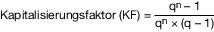
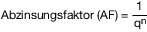

# Verordnung über die Grundsätze für die Ermittlung der Verkehrswerte von Immobilien und der für die Wertermittlung erforderlichen Daten (ImmoWertV 2022)

Ausfertigungsdatum
:   2021-07-14

Fundstelle
:   BGBl I: 2021, 2805

Stand: Ersetzt V 213-1-7 v. 19.5.2010 I 639 (ImmoWertV)

## Eingangsformel

Auf Grund des § 199 Absatz 1 des Baugesetzbuchs in der Fassung der
Bekanntmachung vom 3. November 2017 (BGBl. I S. 3634) verordnet die
Bundesregierung:

## Teil 1 - Allgemeines

### Abschnitt 1 - Anwendungsbereich; Gegenstand und Grundlagen der Wertermittlung

#### § 1 Anwendungsbereich; Wertermittlungsobjekt

(1) Diese Verordnung ist anzuwenden

1.  bei der Ermittlung der Verkehrswerte (Marktwerte) der in Absatz 2
    bezeichneten Gegenstände, auch wenn diese nicht marktfähig oder
    marktgängig sind (Wertermittlung), und

2.  bei der Ermittlung der für die Wertermittlung erforderlichen Daten.

(2) Gegenstände der Wertermittlung (Wertermittlungsobjekte) sind

1.  Grundstücke und Grundstücksteile einschließlich ihrer Bestandteile
    sowie ihres Zubehörs,

2.  grundstücksgleiche Rechte, Rechte an diesen und Rechte an Grundstücken
    (grundstücksbezogene Rechte) sowie grundstücksbezogene Belastungen.

#### § 2 Grundlagen der Wertermittlung

(1) Der Wertermittlung sind die allgemeinen Wertverhältnisse auf dem
Grundstücksmarkt zum Wertermittlungsstichtag und der
Grundstückszustand zum Qualitätsstichtag zugrunde zu legen.

(2) Die allgemeinen Wertverhältnisse richten sich nach der Gesamtheit
der am Wertermittlungsstichtag für die Preisbildung von Grundstücken
im gewöhnlichen Geschäftsverkehr maßgebenden Umstände, wie nach der
allgemeinen Wirtschaftssituation, nach den Verhältnissen am
Kapitalmarkt sowie nach den wirtschaftlichen und demografischen
Entwicklungen des Gebiets.

(3) Der Grundstückszustand ergibt sich aus der Gesamtheit der
rechtlichen Gegebenheiten, der tatsächlichen Eigenschaften, der
sonstigen Beschaffenheit und der Lage des Wertermittlungsobjekts
(Grundstücksmerkmale). Zu den Grundstücksmerkmalen können insbesondere
zählen

1.  der Entwicklungszustand,

2.  die Art und das Maß der baulichen oder sonstigen Nutzung,

3.  die tatsächliche Nutzung,

4.  der beitragsrechtliche Zustand,

5.  die Lagemerkmale,

6.  die Ertragsverhältnisse,

7.  die Grundstücksgröße,

8.  der Grundstückszuschnitt,

9.  die Bodenbeschaffenheit,

10. bei bebauten Grundstücken zusätzlich

    a)  die Art der baulichen Anlagen,

    b)  die Bauweise und die Baugestaltung der baulichen Anlagen,

    c)  die Größe der baulichen Anlagen,

    d)  die Ausstattung und die Qualität der baulichen Anlagen einschließlich
        ihrer energetischen Eigenschaften und ihrer Barrierefreiheit,

    e)  der bauliche Zustand der baulichen Anlagen,

    f)  das Alter, die Gesamtnutzungsdauer und die Restnutzungsdauer der
        baulichen Anlagen,

11. bei landwirtschaftlichen Grundstücken Dauerkulturen und bei
    forstwirtschaftlichen Grundstücken die Bestockung,

12. die grundstücksbezogenen Rechte und Belastungen.

(4) Der Wertermittlungsstichtag ist der Zeitpunkt, auf den sich die
Wertermittlung bezieht und der für die Ermittlung der allgemeinen
Wertverhältnisse maßgeblich ist.

(5) Der Qualitätsstichtag ist der Zeitpunkt, auf den sich der für die
Wertermittlung maßgebliche Grundstückszustand bezieht. Er entspricht
dem Wertermittlungsstichtag, es sei denn, dass aus rechtlichen oder
sonstigen Gründen der Zustand des Grundstücks zu einem anderen
Zeitpunkt maßgeblich ist.

### Abschnitt 2 - Begriffsbestimmungen zu einzelnen Grundstücksmerkmalen

#### § 3 Entwicklungszustand; sonstige Flächen

(1) Flächen der Land- oder Forstwirtschaft sind Flächen, die, ohne
Bauerwartungsland, Rohbauland oder baureifes Land zu sein, land- oder
forstwirtschaftlich nutzbar sind.

(2) Bauerwartungsland sind Flächen, die nach ihren weiteren
Grundstücksmerkmalen eine bauliche Nutzung aufgrund konkreter
Tatsachen, insbesondere nach dem Stand der Bauleitplanung und nach der
sonstigen städtebaulichen Entwicklung des Gebiets, mit hinreichender
Sicherheit erwarten lassen.

(3) Rohbauland sind Flächen, die nach den §§ 30, 33 oder 34 des
Baugesetzbuchs für eine bauliche Nutzung bestimmt sind, deren
Erschließung aber noch nicht gesichert ist oder die nach Lage, Form
oder Größe für eine bauliche Nutzung unzureichend gestaltet sind.

(4) Baureifes Land sind Flächen, die nach öffentlich-rechtlichen
Vorschriften und nach den tatsächlichen Gegebenheiten baulich nutzbar
sind.

(5) Sonstige Flächen sind Flächen, die sich keinem der
Entwicklungszustände nach den Absätzen 1 bis 4 zuordnen lassen.

#### § 4 Alter, Gesamt- und Restnutzungsdauer

(1) Das Alter einer baulichen Anlage ergibt sich aus der Differenz
zwischen dem Kalenderjahr des maßgeblichen Stichtags und dem Baujahr.

(2) Die Gesamtnutzungsdauer bezeichnet die Anzahl der Jahre, in denen
eine bauliche Anlage bei ordnungsgemäßer Bewirtschaftung vom Baujahr
an gerechnet üblicherweise wirtschaftlich genutzt werden kann.

(3) Die Restnutzungsdauer bezeichnet die Anzahl der Jahre, in denen
eine bauliche Anlage bei ordnungsgemäßer Bewirtschaftung
voraussichtlich noch wirtschaftlich genutzt werden kann. Die
Restnutzungsdauer wird in der Regel auf Grundlage des
Unterschiedsbetrags zwischen der Gesamtnutzungsdauer und dem Alter der
baulichen Anlage am maßgeblichen Stichtag unter Berücksichtigung
individueller Gegebenheiten des Wertermittlungsobjekts ermittelt.
Individuelle Gegebenheiten des Wertermittlungsobjekts wie
beispielsweise durchgeführte Instandsetzungen oder Modernisierungen
oder unterlassene Instandhaltungen des Wertermittlungsobjekts können
die sich aus dem Unterschiedsbetrag nach Satz 2 ergebende Dauer
verlängern oder verkürzen.

#### § 5 Weitere Grundstücksmerkmale

(1) Art und Maß der baulichen oder sonstigen Nutzung ergeben sich
vorbehaltlich des Satzes 2 aus den für die planungsrechtliche
Zulässigkeit von Vorhaben maßgeblichen Vorschriften des
Städtebaurechts und aus den sonstigen Vorschriften, die die
Nutzbarkeit betreffen. Wird vom städtebaulich zulässigen Maß im Sinne
des Satzes 1 in der Umgebung regelmäßig abgewichen oder wird das Maß
bei der Kaufpreisbemessung regelmäßig abweichend von den für die
planungsrechtliche Zulässigkeit maßgeblichen Vorschriften des
Städtebaurechts bestimmt, so ist das Maß der Nutzung maßgebend, das
auf dem jeweiligen Grundstücksmarkt üblicherweise zugrunde gelegt
wird.

(2) Für den beitragsrechtlichen Zustand des Grundstücks ist die
Verpflichtung zur Entrichtung von grundstücksbezogenen Beiträgen
maßgebend. Als Beiträge im Sinne des Satzes 1 gelten auch
grundstücksbezogene Sonderabgaben und beitragsähnliche Abgaben.

(3) Die Ertragsverhältnisse ergeben sich aus den tatsächlich erzielten
und aus den marktüblich erzielbaren Erträgen. Marktüblich erzielbare
Erträge sind die nach den Marktverhältnissen am
Wertermittlungsstichtag für die jeweilige Nutzung in vergleichbaren
Fällen durchschnittlich erzielten Erträge.

(4) Lagemerkmale von Grundstücken ergeben sich aus der räumlichen
Position des Grundstücks und beziehen sich insbesondere auf die
Verkehrsanbindung, die Nachbarschaft, die Wohn- und Geschäftslage
sowie die Umwelteinflüsse.

(5) Die Bodenbeschaffenheit umfasst beispielsweise die Bodengüte, die
Eignung als Baugrund und das Vorhandensein von Bodenverunreinigungen.

### Abschnitt 3 - Allgemeine Grundsätze der Wertermittlung

#### § 6 Wertermittlungsverfahren; Ermittlung des Verkehrswerts

(1) Grundsätzlich sind zur Wertermittlung das Vergleichswertverfahren,
das Ertragswertverfahren, das Sachwertverfahren oder mehrere dieser
Verfahren heranzuziehen. Die Verfahren sind nach der Art des
Wertermittlungsobjekts unter Berücksichtigung der im gewöhnlichen
Geschäftsverkehr bestehenden Gepflogenheiten und der sonstigen
Umstände des Einzelfalls, insbesondere der Eignung der zur Verfügung
stehenden Daten, zu wählen; die Wahl ist zu begründen.

(2) In den in Absatz 1 Satz 1 genannten Wertermittlungsverfahren sind
regelmäßig in folgender Reihenfolge zu berücksichtigen:

1.  die allgemeinen Wertverhältnisse;

2.  die besonderen objektspezifischen Grundstücksmerkmale.

(3) Die in Absatz 1 Satz 1 genannten Wertermittlungsverfahren gliedern
sich in folgende Verfahrensschritte:

1.  Ermittlung des vorläufigen Verfahrenswerts;

2.  Ermittlung des marktangepassten vorläufigen Verfahrenswerts;

3.  Ermittlung des Verfahrenswerts.

Bei der Ermittlung des vorläufigen Verfahrenswerts und des
marktangepassten vorläufigen Verfahrenswerts sind § 7 und § 8 Absatz 2
zu beachten; bei der Ermittlung des Verfahrenswerts ist § 8 Absatz 3
zu beachten.

(4) Der Verkehrswert ist aus dem Verfahrenswert des oder der
angewendeten Wertermittlungsverfahren unter Würdigung seiner oder
ihrer Aussagefähigkeit zu ermitteln.

#### § 7 Berücksichtigung der allgemeinen Wertverhältnisse

(1) Die Berücksichtigung der allgemeinen Wertverhältnisse erfolgt

1.  im Vergleichswertverfahren bei Ermittlung des vorläufigen
    Verfahrenswerts insbesondere durch den Ansatz von Vergleichspreisen,
    Vergleichsfaktoren und Indexreihen,

2.  im Ertragswertverfahren bei Ermittlung des vorläufigen Verfahrenswerts
    insbesondere durch den Ansatz von marktüblich erzielbaren Erträgen und
    Liegenschaftszinssätzen und

3.  im Sachwertverfahren bei Ermittlung des marktangepassten vorläufigen
    Verfahrenswerts insbesondere durch den Ansatz von Sachwertfaktoren.

(2) Lassen sich die allgemeinen Wertverhältnisse bei Verwendung der
Daten nach Absatz 1 auch durch eine Anpassung nach § 9 Absatz 1 Satz 2
nicht ausreichend berücksichtigen, ist zur Ermittlung des
marktangepassten vorläufigen Verfahrenswerts eine Marktanpassung durch
marktübliche Zu- oder Abschläge erforderlich.

#### § 8 Berücksichtigung der allgemeinen und besonderen objektspezifischen Grundstücksmerkmale

(1) Im Rahmen der Wertermittlung sind Grundstücksmerkmale zu
berücksichtigen, denen der Grundstücksmarkt einen Werteinfluss
beimisst.

(2) Allgemeine Grundstücksmerkmale sind wertbeeinflussende
Grundstücksmerkmale, die hinsichtlich Art und Umfang auf dem
jeweiligen Grundstücksmarkt regelmäßig auftreten. Ihr Werteinfluss
wird bei der Ermittlung des vorläufigen Verfahrenswerts
berücksichtigt.

(3) Besondere objektspezifische Grundstücksmerkmale sind
wertbeeinflussende Grundstücksmerkmale, die nach Art oder Umfang
erheblich von dem auf dem jeweiligen Grundstücksmarkt Üblichen oder
erheblich von den zugrunde gelegten Modellen oder Modellansätzen
abweichen. Besondere objektspezifische Grundstücksmerkmale können
insbesondere vorliegen bei

1.  besonderen Ertragsverhältnissen,

2.  Baumängeln und Bauschäden,

3.  baulichen Anlagen, die nicht mehr wirtschaftlich nutzbar sind
    (Liquidationsobjekte) und zur alsbaldigen Freilegung anstehen,

4.  Bodenverunreinigungen,

5.  Bodenschätzen sowie

6.  grundstücksbezogenen Rechten und Belastungen.

Die besonderen objektspezifischen Grundstücksmerkmale werden, wenn sie
nicht bereits anderweitig berücksichtigt worden sind, erst bei der
Ermittlung der Verfahrenswerte insbesondere durch marktübliche Zu-
oder Abschläge berücksichtigt. Bei paralleler Durchführung mehrerer
Wertermittlungsverfahren sind die besonderen objektspezifischen
Grundstücksmerkmale, soweit möglich, in allen Verfahren identisch
anzusetzen.

#### § 9 Eignung und Anpassung der Daten; ungewöhnliche oder persönliche Verhältnisse; Herkunft der Daten

(1) Kaufpreise sowie weitere Daten wie insbesondere Bodenrichtwerte
und sonstige für die Wertermittlung erforderliche Daten sind zur
Wertermittlung geeignet, wenn die Daten hinsichtlich Aktualität in
Bezug auf den maßgeblichen Stichtag und hinsichtlich Repräsentativität
den jeweiligen Grundstücksmarkt zutreffend abbilden und etwaige
Abweichungen in den allgemeinen Wertverhältnissen sowie
wertbeeinflussende Abweichungen der Grundstücksmerkmale des
Wertermittlungsobjekts nach Maßgabe der Sätze 2 und 3 berücksichtigt
werden können. Bei Abweichungen der allgemeinen Wertverhältnisse sind
die Daten durch geeignete Indexreihen oder in anderer Weise an die
Wertverhältnisse am Wertermittlungsstichtag anzupassen.
Wertbeeinflussende Abweichungen der Grundstücksmerkmale des
Wertermittlungsobjekts sind durch geeignete Umrechnungskoeffizienten,
durch eine Anpassung mittels marktüblicher Zu- oder Abschläge oder in
anderer Weise zu berücksichtigen. Die Kaufpreise sind um die
Werteinflüsse besonderer objektspezifischer Grundstücksmerkmale zu
bereinigen.

(2) Zur Wertermittlung sind solche Kaufpreise und andere Daten wie
beispielsweise Mieten heranzuziehen, bei denen angenommen werden kann,
dass sie nicht durch ungewöhnliche oder persönliche Verhältnisse
beeinflusst worden sind. Eine Beeinflussung durch ungewöhnliche oder
persönliche Verhältnisse kann angenommen werden, wenn die Kaufpreise
und anderen Daten erheblich von den Kaufpreisen und anderen Daten in
vergleichbaren Fällen abweichen.

(3) Maßstab für die Wahl der Quelle, aus der die Daten herangezogen
werden, ist ihre Eignung nach Absatz 1 Satz 1. Stehen keine geeigneten
sonstigen für die Wertermittlung erforderlichen Daten zur Verfügung,
können sie oder die entsprechenden Werteinflüsse auch sachverständig
geschätzt werden; die Grundlagen der Schätzung sind zu dokumentieren.

#### § 10 Grundsatz der Modellkonformität

(1) Bei Anwendung der sonstigen für die Wertermittlung erforderlichen
Daten sind dieselben Modelle und Modellansätze zu verwenden, die der
Ermittlung dieser Daten zugrunde lagen (Grundsatz der
Modellkonformität). Hierzu ist die nach § 12 Absatz 6 erforderliche
Modellbeschreibung zu berücksichtigen.

(2) Liegen für den maßgeblichen Stichtag lediglich solche für die
Wertermittlung erforderlichen Daten vor, die nicht nach dieser
Verordnung ermittelt worden sind, ist bei Anwendung dieser Daten im
Rahmen der Wertermittlung von dieser Verordnung abzuweichen, soweit
dies zur Wahrung des Grundsatzes der Modellkonformität erforderlich
ist.

#### § 11 Künftige Änderungen des Grundstückszustands

(1) Künftige Änderungen des Grundstückszustands sind zu
berücksichtigen, wenn sie am Qualitätsstichtag mit hinreichender
Sicherheit aufgrund konkreter Tatsachen zu erwarten sind.

(2) Bei künftigen Änderungen des Grundstückszustands ist die
voraussichtliche Dauer bis zum Eintritt dieser Änderung (Wartezeit)
auch in Verbindung mit einer verbleibenden Unsicherheit des Eintritts
dieser Änderung (Realisierungsrisiko) angemessen zu berücksichtigen.

## Teil 2 - Für die Wertermittlung erforderliche Daten

### Abschnitt 1 - Allgemeines

#### § 12 Allgemeines zu den für die Wertermittlung erforderlichen Daten

(1) Zu den für die Wertermittlung erforderlichen Daten gehören die
Bodenrichtwerte und die sonstigen für die Wertermittlung
erforderlichen Daten. Sonstige für die Wertermittlung erforderliche
Daten sind insbesondere

1.  Indexreihen,

2.  Umrechnungskoeffizienten,

3.  Vergleichsfaktoren,

4.  Liegenschaftszinssätze,

5.  Sachwertfaktoren,

6.  Erbbaurechts- und Erbbaugrundstücksfaktoren sowie

7.  Erbbaurechts- und Erbbaugrundstückskoeffizienten.

Die sonstigen für die Wertermittlung erforderlichen Daten sind auf
einen Stichtag zu beziehen.

(2) Die für die Wertermittlung erforderlichen Daten werden
insbesondere aus der Kaufpreissammlung auf der Grundlage einer
ausreichenden Anzahl geeigneter Kaufpreise ermittelt.

(3) Geeignet im Sinne des Absatzes 2 sind Kaufpreise, die hinsichtlich
der allgemeinen Wertverhältnisse und des jeweiligen
Grundstückszustands hinreichend übereinstimmen. Eine hinreichende
Übereinstimmung liegt vor, wenn sich etwaige Abweichungen

1.  bei Vorliegen einer hinreichend großen Anzahl von Kaufpreisen in ihren
    Auswirkungen auf die Preise ausgleichen oder

2.  in entsprechender Anwendung des § 9 Absatz 1 Satz 2 und 3
    berücksichtigen lassen.

Die Kaufpreise sind um die Werteinflüsse besonderer objektspezifischer
Grundstücksmerkmale zu bereinigen. Hinsichtlich einer Beeinflussung
durch ungewöhnliche oder persönliche Verhältnisse gilt § 9 Absatz 2
entsprechend.

(4) Zur Ermittlung der sonstigen für die Wertermittlung erforderlichen
Daten sind geeignete statistische Verfahren heranzuziehen.

(5) Bei Ermittlung der sonstigen für die Wertermittlung erforderlichen
Daten sind zur Festlegung der Gesamtnutzungsdauer die Modellansätze
der Anlage 1 und ist zur Ermittlung der Restnutzungsdauer im Fall der
Modernisierung von Wohngebäuden das in Anlage 2 beschriebene Modell
zugrunde zu legen. Bei Ermittlung der Liegenschaftszinssätze sind als
Bewirtschaftungskosten im Sinne des § 32 Absatz 1 Satz 2 Nummer 1 bis
3 die Modellansätze der Anlage 3 zugrunde zu legen. Bei Ermittlung der
Sachwertfaktoren sind der Ermittlung der durchschnittlichen
Herstellungskosten im Sinne des § 36 Absatz 2 die
Normalherstellungskosten nach Anlage 4 zugrunde zu legen.

(6) Zur Sicherstellung der nach § 10 Absatz 1 gebotenen
modellkonformen Anwendung der sonstigen für die Wertermittlung
erforderlichen Daten sind die zugrunde gelegten Modellansätze, Modelle
und Bezugseinheiten sowie weitere Informationen in einer
Modellbeschreibung anzugeben; hierzu gehören insbesondere

1.  die Angabe von Rahmendaten zum Beispiel zum Stichtag, auf den sich das
    zur Wertermittlung erforderliche Datum bezieht, zum sachlichen und
    räumlichen Anwendungsbereich und zur Datengrundlage,

2.  die Beschreibung der Stichprobe,

3.  die Beschreibung der Ermittlungsmethodik,

4.  die Beschreibung der verwendeten Parameter und der zugrunde gelegten
    Bezugseinheiten sowie

5.  sonstige Selektionsparameter.

### Abschnitt 2 - Bodenrichtwerte

#### § 13 Bodenrichtwert und Bodenrichtwertgrundstück

(1) Der Bodenrichtwert ist bezogen auf einen Quadratmeter
Grundstücksfläche des Bodenrichtwertgrundstücks.

(2) Das Bodenrichtwertgrundstück ist ein unbebautes und fiktives
Grundstück, dessen Grundstücksmerkmale weitgehend mit den
vorherrschenden grund- und bodenbezogenen wertbeeinflussenden
Grundstücksmerkmalen in der nach § 15 gebildeten Bodenrichtwertzone
übereinstimmen. Je Bodenrichtwertzone ist ein Bodenrichtwert
anzugeben. Bodenrichtwertspannen sind nicht zulässig.

#### § 14 Grundlagen der Bodenrichtwertermittlung

(1) Bodenrichtwerte sind vorrangig im Vergleichswertverfahren nach den
§§ 24 und 25 zu ermitteln. Für die Anpassung der Kaufpreise an die
Grundstücksmerkmale des Bodenrichtwertgrundstücks und an den
Bodenrichtwertstichtag gilt § 9 Absatz 1 Satz 2 und 3 entsprechend.

(2) Für die Bodenrichtwertermittlung in Gebieten ohne oder mit
geringem Grundstücksverkehr können Kaufpreise und Bodenrichtwerte aus
vergleichbaren Gebieten oder aus vorangegangenen Jahren herangezogen
werden; Absatz 1 Satz 2 gilt entsprechend. Darüber hinaus können
deduktive oder andere geeignete Verfahrensweisen angewendet werden.

(3) Bei der Bodenrichtwertermittlung in bebauten Gebieten können der
Zustand und die Struktur der das Gebiet prägenden Bebauung zu
berücksichtigen sein.

(4) Bodenrichtwerte enthalten keinen Wertanteil für den Aufwuchs.

(5) Das oder die angewendeten Verfahren für die Ermittlung der
Bodenrichtwerte sind zu dokumentieren. Einzelne Bodenrichtwerte sind
nicht zu begründen.

#### § 15 Bildung der Bodenrichtwertzonen

(1) Eine Bodenrichtwertzone besteht aus einem räumlich
zusammenhängenden Gebiet. Die Bodenrichtwertzonen sind so abzugrenzen,
dass lagebedingte Wertunterschiede zwischen den Grundstücken, für die
der Bodenrichtwert gelten soll, und dem Bodenrichtwertgrundstück
grundsätzlich nicht mehr als 30 Prozent betragen. Wertunterschiede,
die sich aus nicht mit dem Bodenrichtwertgrundstück übereinstimmenden
Grundstücksmerkmalen einzelner Grundstücke ergeben, sind bei der
Abgrenzung nicht zu berücksichtigen.

(2) Einzelne Grundstücke oder Grundstücksteile mit einer vom
Bodenrichtwertgrundstück abweichenden Art der Nutzung oder Qualität,
wie zum Beispiel Grünflächen, Waldflächen, Wasserflächen,
Verkehrsflächen und Gemeinbedarfsflächen, können Bestandteil der
Bodenrichtwertzone sein; der dort angegebene Bodenrichtwert gilt nicht
für diese Grundstücke.

(3) Bodenrichtwertzonen können sich in begründeten Fällen
deckungsgleich überlagern; dies gilt insbesondere, wenn sich aufgrund
der unregelmäßigen Verteilung von Grundstücken mit unterschiedlichen
Nutzungen oder anderen erheblichen Unterschieden in
wertbeeinflussenden Grundstücksmerkmalen keine eigenen
Bodenrichtwertzonen abgrenzen lassen. Bei der Bildung von sich
deckungsgleich überlagernden Bodenrichtwertzonen muss eine eindeutige
Zuordnung der Grundstücke zu einem Bodenrichtwertgrundstück möglich
sein; hierbei ist unschädlich, wenn sich einzelne Grundstücke nicht
eindeutig zuordnen lassen. Bei Bodenrichtwerten nach § 196 Absatz 1
Satz 7 des Baugesetzbuchs können sich die Bodenrichtwertzonen auch
nicht deckungsgleich überlagern.

(4) Bei der Bildung von Bodenrichtwertzonen für die
Entwicklungszustände Bauerwartungsland und Rohbauland sind
Bauleitpläne sowie die Entwicklung am Grundstücksmarkt zu
berücksichtigen. Die Bodenrichtwertzonen sind so abzugrenzen, dass in
der Bodenrichtwertzone ein überwiegend einheitlicher Entwicklungsgrad
der Grundstücke gegeben ist.

#### § 16 Grundstücksmerkmale des Bodenrichtwertgrundstücks

(1) Das Bodenrichtwertgrundstück weist keine Grundstücksmerkmale auf,
die nur im Rahmen einer Einzelbegutachtung ermittelt werden können;
dies betrifft insbesondere nur für einzelne Grundstücke bestehende
privatrechtliche, öffentlich-rechtliche und tatsächliche
Besonderheiten. Satz 1 findet keine Anwendung auf wertbeeinflussende
Grundstücksmerkmale, die in der Bodenrichtwertzone vorherrschend sind.

(2) Von den wertbeeinflussenden Grundstücksmerkmalen des
Bodenrichtwertgrundstücks sind der Entwicklungszustand und die Art der
Nutzung darzustellen. Weitere Grundstücksmerkmale sind darzustellen,
wenn sie wertbeeinflussend sind; hierzu können insbesondere gehören

1.  das Maß der baulichen Nutzung nach § 5 Absatz 1,

2.  die Bauweise oder die Gebäudestellung zur Nachbarbebauung,

3.  die Grundstücksgröße,

4.  die Grundstückstiefe und

5.  die Bodengüte als Acker- oder Grünlandzahl.

Bei baureifem Land gehört zu den darzustellenden Grundstücksmerkmalen
zusätzlich stets der beitragsrechtliche Zustand. Bei förmlich
festgelegten Sanierungsgebieten und förmlich festgelegten
Entwicklungsbereichen ist zusätzlich darzustellen, ob sich der
Bodenrichtwert auf den sanierungs- oder entwicklungsunbeeinflussten
Zustand oder auf den sanierungs- oder entwicklungsbeeinflussten
Zustand bezieht; dies gilt nicht, wenn nach § 142 Absatz 4 des
Baugesetzbuchs ein vereinfachtes Sanierungsverfahren durchgeführt
wird.

(3) Die wertbeeinflussenden Grundstücksmerkmale des
Bodenrichtwertgrundstücks sind nach Anlage 5 zu spezifizieren.

(4) Wird beim Maß der baulichen Nutzung auf das Verhältnis der Flächen
der Geschosse zur Grundstücksfläche abgestellt und ist hierbei nach §
5 Absatz 1 Satz 2 ein gegenüber den planungsrechtlichen
Zulässigkeitsvorschriften abweichend bestimmtes Maß wertbeeinflussend,
so sind zur Ermittlung dieses Maßes die Flächen aller oberirdischen
Geschosse mit Ausnahme von nicht ausbaufähigen Dachgeschossen nach den
jeweiligen Außenmaßen zu berücksichtigen. Geschosse gelten in
Abgrenzung zu Kellergeschossen als oberirdische Geschosse, soweit ihre
Deckenoberkanten im Mittel mehr als 1,40 Meter über die
Geländeoberfläche hinausragen; § 20 Absatz 1 der Baunutzungsverordnung
findet keine Anwendung. Ausgebaute oder ausbaufähige Dachgeschosse
sind mit 75 Prozent ihrer Fläche zu berücksichtigen. Staffelgeschosse
werden in vollem Umfang berücksichtigt. Hohlräume zwischen der
obersten Decke und der Bedachung, in denen Aufenthaltsräume nicht
möglich sind, sind keine Geschosse. Das nach Satz 1 bis 5 ermittelte
Verhältnis der Flächen der oberirdischen Geschosse zur
Grundstücksfläche ist die wertrelevante Geschossflächenzahl (WGFZ).

(5) Bodenrichtwerte für baureifes Land sind vorbehaltlich des Satzes 2
für beitragsfreie Grundstücke zu ermitteln. Aufgrund örtlicher
Gegebenheiten können vorübergehend Bodenrichtwerte für Grundstücke
ermittelt werden, für die noch Beiträge zu entrichten oder zu erwarten
sind.

#### § 17 Automatisiertes Führen der Bodenrichtwerte

Die Bodenrichtwerte sind in automatisierter Form auf der Grundlage der
amtlichen Geobasisdaten zu führen.

### Abschnitt 3 - Sonstige für die Wertermittlung erforderliche Daten

#### § 18 Indexreihen

(1) Indexreihen dienen der Berücksichtigung von im Zeitverlauf
eintretenden Änderungen der allgemeinen Wertverhältnisse.

(2) Indexreihen bestehen aus Indexzahlen, die sich aus dem
durchschnittlichen Verhältnis der Preise eines Erhebungszeitraums zu
den Preisen eines Basiszeitraums mit der Indexzahl 100 ergeben. Die
Indexzahlen können auch auf bestimmte Zeitpunkte innerhalb des
Erhebungs- und Basiszeitraums bezogen werden.

(3) Die Indexzahlen werden aus geeigneten Kaufpreisen für Grundstücke
bestimmter räumlicher und sachlicher Teilmärkte ermittelt.

#### § 19 Umrechnungskoeffizienten

(1) Umrechnungskoeffizienten dienen der Berücksichtigung von
Wertunterschieden ansonsten gleichartiger Grundstücke, die sich aus
Abweichungen einzelner Grundstücksmerkmale, insbesondere aus dem
unterschiedlichen Maß der baulichen Nutzung oder der Grundstücksgröße
und -tiefe, ergeben.

(2) Umrechnungskoeffizienten geben das Verhältnis des Werts eines
Grundstücks mit einer bestimmten Ausprägung eines Grundstücksmerkmals
zu dem Wert eines Grundstücks mit einer bestimmten Basisausprägung
dieses Grundstücksmerkmals (Normgrundstück) an.

(3) Die Umrechnungskoeffizienten werden aus geeigneten Kaufpreisen für
solche Grundstücke abgeleitet, die sich abgesehen von solchen
Abweichungen, die durch Anpassung der Kaufpreise nach § 9 Absatz 1
Satz 2 und 3 berücksichtigt werden, im Wesentlichen nur in dem
Grundstücksmerkmal unterscheiden, für das die Umrechnungskoeffizienten
abgeleitet werden.

#### § 20 Vergleichsfaktoren

(1) Vergleichsfaktoren dienen der Ermittlung von Vergleichswerten
insbesondere für bebaute Grundstücke.

(2) Vergleichsfaktoren sind durchschnittliche, auf eine geeignete
Bezugseinheit bezogene Werte für Grundstücke mit bestimmten
wertbeeinflussenden Grundstücksmerkmalen (Normobjekte).

(3) Vergleichsfaktoren werden ermittelt auf der Grundlage von

1.  geeigneten Kaufpreisen und

2.  der diesen Kaufpreisen entsprechenden Flächen- oder Raumeinheit
    (Gebäudefaktoren), den diesen Kaufpreisen entsprechenden marktüblich
    erzielbaren jährlichen Erträgen (Ertragsfaktoren) oder einer sonstigen
    geeigneten Bezugseinheit.

#### § 21 Liegenschaftszinssätze; Sachwertfaktoren

(1) Liegenschaftszinssätze und Sachwertfaktoren dienen der
Berücksichtigung der allgemeinen Wertverhältnisse auf dem jeweiligen
Grundstücksmarkt, soweit diese nicht auf andere Weise zu
berücksichtigen sind.

(2) Liegenschaftszinssätze sind Kapitalisierungszinssätze, mit denen
Verkehrswerte von Grundstücken je nach Grundstücksart im Durchschnitt
marktüblich verzinst werden. Liegenschaftszinssätze werden nach den
Grundsätzen des Ertragswertverfahrens nach den §§ 27 bis 34 auf der
Grundlage von geeigneten Kaufpreisen und den ihnen entsprechenden
Reinerträgen ermittelt.

(3) Sachwertfaktoren geben das Verhältnis des vorläufigen
marktangepassten Sachwerts zum vorläufigen Sachwert an. Die
Sachwertfaktoren werden nach den Grundsätzen des Sachwertverfahrens
nach den §§ 35 bis 38 auf der Grundlage von geeigneten Kaufpreisen und
den ihnen entsprechenden vorläufigen Sachwerten ermittelt.

#### § 22 Erbbaurechts- und Erbbaugrundstücksfaktoren

(1) Erbbaurechts- und Erbbaugrundstücksfaktoren dienen im Wesentlichen
der Berücksichtigung der dem Erbbaurecht allgemein beizumessenden
Werteinflüsse, soweit sie nicht bereits im finanzmathematischen Wert
berücksichtigt sind.

(2) Erbbaurechtsfaktoren geben das Verhältnis des vorläufigen
Vergleichswerts des Erbbaurechts zum finanzmathematischen Wert des
Erbbaurechts an. Erbbaugrundstücksfaktoren geben das Verhältnis des
vorläufigen Vergleichswerts des Erbbaugrundstücks zum
finanzmathematischen Wert des Erbbaugrundstücks an.

(3) Die Erbbaurechtsfaktoren und Erbbaugrundstücksfaktoren werden nach
den Grundsätzen der §§ 50 und 52 auf der Grundlage von geeigneten
Kaufpreisen und den diesen Kaufpreisen entsprechenden
finanzmathematischen Werten ermittelt.

#### § 23 Erbbaurechts- und Erbbaugrundstückskoeffizienten

(1) Erbbaurechts- und Erbbaugrundstückskoeffizienten dienen im
Wesentlichen der Berücksichtigung der dem Erbbaurecht allgemein
beizumessenden Werteinflüsse.

(2) Die Erbbaurechtskoeffizienten geben das Verhältnis des vorläufigen
Vergleichswerts des Erbbaurechts zum Wert des fiktiven Volleigentums
im Sinne des § 49 Absatz 1 Satz 2 an. Die
Erbbaugrundstückskoeffizienten geben das Verhältnis des vorläufigen
Vergleichswerts des Erbbaugrundstücks zum Bodenwert des fiktiv
unbelasteten Grundstücks im Sinne des § 47 Absatz 1 Satz 1 Nummer 2
an.

(3) Die Erbbaurechtskoeffizienten werden auf der Grundlage von
geeigneten Kaufpreisen und den diesen Kaufpreisen entsprechenden
Werten des fiktiven Volleigentums ermittelt. Die
Erbbaugrundstückskoeffizienten werden auf der Grundlage von geeigneten
Kaufpreisen und den diesen Kaufpreisen entsprechenden Bodenwerten der
fiktiv unbelasteten Grundstücke ermittelt.

## Teil 3 - Besondere Grundsätze zu den einzelnen Wertermittlungsverfahren

### Abschnitt 1 - Vergleichswertverfahren

#### § 24 Grundlagen des Vergleichswertverfahrens

(1) Im Vergleichswertverfahren wird der Vergleichswert aus einer
ausreichenden Anzahl von Vergleichspreisen im Sinne des § 25
ermittelt. Neben oder anstelle von Vergleichspreisen können
insbesondere bei bebauten Grundstücken ein objektspezifisch
angepasster Vergleichsfaktor im Sinne des § 26 Absatz 1 und bei der
Bodenwertermittlung ein objektspezifisch angepasster Bodenrichtwert im
Sinne des § 26 Absatz 2 herangezogen werden.

(2) Der vorläufige Vergleichswert kann ermittelt werden

1.  auf Grundlage einer statistischen Auswertung einer ausreichenden
    Anzahl von Vergleichspreisen oder

2.  durch Multiplikation eines objektspezifisch angepassten
    Vergleichsfaktors oder eines objektspezifisch angepassten
    Bodenrichtwerts mit der entsprechenden Bezugsgröße des
    Wertermittlungsobjekts.

(3) Der marktangepasste vorläufige Vergleichswert entspricht nach
Maßgabe des § 7 dem vorläufigen Vergleichswert.

(4) Der Vergleichswert ergibt sich aus dem marktangepassten
vorläufigen Vergleichswert und der Berücksichtigung vorhandener
besonderer objektspezifischer Grundstücksmerkmale des
Wertermittlungsobjekts.

#### § 25 Vergleichspreise

Zur Ermittlung von Vergleichspreisen sind Kaufpreise solcher
Grundstücke (Vergleichsgrundstücke) heranzuziehen, die mit dem zu
bewertenden Grundstück hinreichend übereinstimmende
Grundstücksmerkmale aufweisen und die zu Zeitpunkten verkauft worden
sind (Vertragszeitpunkte), die in hinreichender zeitlicher Nähe zum
Wertermittlungsstichtag stehen. Die Kaufpreise sind auf ihre Eignung
im Sinne des § 9 Absatz 1 Satz 1 zu prüfen und bei etwaigen
Abweichungen nach Maßgabe des § 9 Absatz 1 Satz 2 und 3 an die
Gegebenheiten des Wertermittlungsobjekts anzupassen.

#### § 26 Objektspezifisch angepasster Vergleichsfaktor; objektspezifisch angepasster Bodenrichtwert

(1) Zur Ermittlung des objektspezifisch angepassten Vergleichsfaktors
ist der nach § 20 ermittelte Vergleichsfaktor auf seine Eignung im
Sinne des § 9 Absatz 1 Satz 1 zu prüfen und bei etwaigen Abweichungen
nach Maßgabe des § 9 Absatz 1 Satz 2 und 3 an die Gegebenheiten des
Wertermittlungsobjekts anzupassen.

(2) Zur Ermittlung des objektspezifisch angepassten Bodenrichtwerts
sind die nach den §§ 13 bis 16 ermittelten Bodenrichtwerte auf ihre
Eignung im Sinne des § 9 Absatz 1 Satz 1 zu prüfen und bei etwaigen
Abweichungen nach Maßgabe des § 9 Absatz 1 Satz 2 und 3 an die
Gegebenheiten des Wertermittlungsobjekts anzupassen.

### Abschnitt 2 - Ertragswertverfahren

#### Unterabschnitt 1 - Allgemeines

##### § 27 Grundlagen des Ertragswertverfahrens

(1) Im Ertragswertverfahren wird der Ertragswert auf der Grundlage
marktüblich erzielbarer Erträge ermittelt. Soweit die
Ertragsverhältnisse mit hinreichender Sicherheit aufgrund konkreter
Tatsachen wesentlichen Veränderungen unterliegen oder wesentlich von
den marktüblich erzielbaren Erträgen abweichen, kann der Ertragswert
auf der Grundlage periodisch unterschiedlicher Erträge ermittelt
werden.

(2) Der vorläufige Ertragswert wird auf der Grundlage des nach den §§
40 bis 43 zu ermittelnden Bodenwerts und des Reinertrags im Sinne des
§ 31 Absatz 1, der Restnutzungsdauer im Sinne des § 4 Absatz 3 und des
objektspezifisch angepassten Liegenschaftszinssatzes im Sinne des § 33
ermittelt.

(3) Der marktangepasste vorläufige Ertragswert entspricht nach Maßgabe
des § 7 dem vorläufigen Ertragswert.

(4) Der Ertragswert ergibt sich aus dem marktangepassten vorläufigen
Ertragswert und der Berücksichtigung vorhandener besonderer
objektspezifischer Grundstücksmerkmale des Wertermittlungsobjekts.

(5) Für die Ermittlung des Ertragswerts stehen folgende
Verfahrensvarianten zur Verfügung:

1.  das allgemeine Ertragswertverfahren;

2.  das vereinfachte Ertragswertverfahren;

3.  das periodische Ertragswertverfahren.

#### Unterabschnitt 2 - Verfahrensvarianten

##### § 28 Allgemeines Ertragswertverfahren

Im allgemeinen Ertragswertverfahren wird der vorläufige Ertragswert
ermittelt durch Bildung der Summe aus

1.  dem kapitalisierten jährlichen Reinertragsanteil der baulichen Anlagen
    zum Wertermittlungsstichtag, der unter Abzug des
    Bodenwertverzinsungsbetrags ermittelt wurde (vorläufiger Ertragswert
    der baulichen Anlagen), und

2.  dem Bodenwert.

Der Ermittlung des Bodenwertverzinsungsbetrags und der Kapitalisierung
des jährlichen Reinertragsanteils der baulichen Anlagen ist jeweils
derselbe objektspezifisch angepasste Liegenschaftszinssatz zugrunde zu
legen. Die Kapitalisierungsdauer entspricht der Restnutzungsdauer der
baulichen Anlagen.

##### § 29 Vereinfachtes Ertragswertverfahren

Im vereinfachten Ertragswertverfahren wird der vorläufige Ertragswert
ermittelt durch Bildung der Summe aus

1.  dem kapitalisierten jährlichen Reinertrag zum Wertermittlungsstichtag
    (Barwert des Reinertrags) und

2.  dem über die Restnutzungsdauer der baulichen Anlagen abgezinsten
    Bodenwert.

Der Kapitalisierung des jährlichen Reinertrags und der Abzinsung des
Bodenwerts ist jeweils derselbe objektspezifisch angepasste
Liegenschaftszinssatz zugrunde zu legen. Die Kapitalisierungs- oder
Abzinsungsdauer entspricht der Restnutzungsdauer der baulichen
Anlagen.

##### § 30 Periodisches Ertragswertverfahren

(1) Im periodischen Ertragswertverfahren kann der vorläufige
Ertragswert ermittelt werden durch Bildung der Summe aus

1.  den zu addierenden und auf den Wertermittlungsstichtag abgezinsten,
    aus gesicherten Daten abgeleiteten Reinerträgen der Perioden innerhalb
    des Betrachtungszeitraums und

2.  dem über den Betrachtungszeitraum auf den Wertermittlungsstichtag
    abgezinsten Restwert des Grundstücks.

(2) Der Betrachtungszeitraum, für den die periodisch unterschiedlichen
Erträge ermittelt werden, ist so zu wählen, dass die Höhe der im
Betrachtungszeitraum anfallenden Erträge mit hinreichender Sicherheit
ermittelt werden kann; hierbei sollen zehn Jahre nicht überschritten
werden. Der Abzinsung ist in der Regel der objektspezifisch angepasste
Liegenschaftszinssatz zugrunde zu legen.

(3) Der Restwert des Grundstücks kann ermittelt werden durch Bildung
der Summe aus

1.  dem Barwert des Reinertrags der Restperiode und

2.  dem über die Restperiode abgezinsten Bodenwert.

Die Restperiode ist die um den Betrachtungszeitraum reduzierte
Restnutzungsdauer. Die Kapitalisierung des Reinertrags der Restperiode
erfolgt über die Dauer der Restperiode. Der Kapitalisierung und der
Abzinsung ist jeweils derselbe objektspezifisch angepasste
Liegenschaftszinssatz zugrunde zu legen.

#### Unterabschnitt 3 - Ermittlung des Ertragswerts

##### § 31 Reinertrag; Rohertrag

(1) Der jährliche Reinertrag ergibt sich aus dem jährlichen Rohertrag
abzüglich der Bewirtschaftungskosten.

(2) Der Rohertrag ergibt sich aus den bei ordnungsgemäßer
Bewirtschaftung und zulässiger Nutzung marktüblich erzielbaren
Erträgen; hierbei sind die tatsächlichen Erträge zugrunde zu legen,
wenn sie marktüblich erzielbar sind. Bei Anwendung des periodischen
Ertragswertverfahrens ergibt sich der Rohertrag insbesondere aus den
vertraglichen Vereinbarungen.

##### § 32 Bewirtschaftungskosten

(1) Bewirtschaftungskosten sind die für eine ordnungsgemäße
Bewirtschaftung und zulässige Nutzung entstehenden regelmäßigen
Aufwendungen, die nicht durch Umlagen oder sonstige Kostenübernahmen
gedeckt sind. Zu den Bewirtschaftungskosten gehören

1.  die Verwaltungskosten,

2.  die Instandhaltungskosten,

3.  das Mietausfallwagnis und

4.  die Betriebskosten im Sinne des § 556 Absatz 1 Satz 2 des Bürgerlichen
    Gesetzbuchs.

(2) Verwaltungskosten umfassen insbesondere die Kosten der zur
Verwaltung des Grundstücks erforderlichen Arbeitskräfte und
Einrichtungen, die Kosten der Aufsicht und die Kosten der
Geschäftsführung sowie den Gegenwert der von Eigentümerseite
persönlich geleisteten Verwaltungsarbeit.

(3) Instandhaltungskosten umfassen die Kosten, die im langjährigen
Mittel infolge Abnutzung oder Alterung zur Erhaltung des der
Wertermittlung zugrunde gelegten Ertragsniveaus der baulichen Anlagen
während ihrer Restnutzungsdauer marktüblich aufgewendet werden
müssten.

(4) Das Mietausfallwagnis umfasst

1.  das Risiko einer Ertragsminderung, die durch uneinbringliche
    Zahlungsrückstände von Mieten, Pachten und sonstigen Einnahmen oder
    durch vorübergehenden Leerstand von Grundstücken oder
    Grundstücksteilen entstehen, die zur Vermietung, Verpachtung oder
    sonstigen Nutzung bestimmt sind,

2.  das Risiko von bei uneinbringlichen Zahlungsrückständen oder bei
    vorübergehendem Leerstand anfallenden, vom Eigentümer zusätzlich zu
    tragenden Bewirtschaftungskosten sowie

3.  das Risiko von uneinbringlichen Kosten einer Rechtsverfolgung auf
    Zahlung, auf Aufhebung eines Mietverhältnisses oder auf Räumung.

##### § 33 Objektspezifisch angepasster Liegenschaftszinssatz

Zur Ermittlung des objektspezifisch angepassten
Liegenschaftszinssatzes ist der nach § 21 Absatz 2 ermittelte
Liegenschaftszinssatz auf seine Eignung im Sinne des § 9 Absatz 1 Satz
1 zu prüfen und bei etwaigen Abweichungen nach Maßgabe des § 9 Absatz
1 Satz 2 und 3 an die Gegebenheiten des Wertermittlungsobjekts
anzupassen.

##### § 34 Barwertfaktor

(1) Der Kapitalisierung und der Abzinsung sind Barwertfaktoren auf der
Grundlage der Restnutzungsdauer und des objektspezifisch angepassten
Liegenschaftszinssatzes zugrunde zu legen.

(2) Der jährlich nachschüssige Rentenbarwertfaktor für die
Kapitalisierung (Kapitalisierungsfaktor) ist nach der folgenden Formel
zu ermitteln:

*    *        

*    *        
    *        

*    *   LZ

    *   = Liegenschaftszinssatz

*    *   p

    *   = Zinsfuß

*    *   n

    *   = Restnutzungsdauer

(3) Der Barwertfaktor für die Abzinsung (Abzinsungsfaktor) ist nach
der folgenden Formel zu ermitteln:

*    *        

*    *        
    *        

*    *   LZ

    *   = Liegenschaftszinssatz

*    *   p

    *   = Zinsfuß

*    *   n

    *   = Restnutzungsdauer

### Abschnitt 3 - Sachwertverfahren

#### § 35 Grundlagen des Sachwertverfahrens

(1) Im Sachwertverfahren wird der Sachwert des Grundstücks aus den
vorläufigen Sachwerten der nutzbaren baulichen und sonstigen Anlagen
sowie aus dem Bodenwert ermittelt.

(2) Der vorläufige Sachwert des Grundstücks ergibt sich durch Bildung
der Summe aus

1.  dem vorläufigen Sachwert der baulichen Anlagen im Sinne des § 36,

2.  dem vorläufigen Sachwert der baulichen Außenanlagen und sonstigen
    Anlagen im Sinne des § 37 und

3.  dem nach den §§ 40 bis 43 zu ermittelnden Bodenwert.

(3) Der marktangepasste vorläufige Sachwert des Grundstücks ergibt
sich durch Multiplikation des vorläufigen Sachwerts mit einem
objektspezifisch angepassten Sachwertfaktor im Sinne des § 39. Nach
Maßgabe des § 7 Absatz 2 kann zusätzlich eine Marktanpassung durch
marktübliche Zu- oder Abschläge erforderlich sein.

(4) Der Sachwert des Grundstücks ergibt sich aus dem marktangepassten
vorläufigen Sachwert und der Berücksichtigung vorhandener besonderer
objektspezifischer Grundstücksmerkmale des Wertermittlungsobjekts.

#### § 36 Vorläufiger Sachwert der baulichen Anlagen; durchschnittliche Herstellungskosten

(1) Zur Ermittlung des vorläufigen Sachwerts der baulichen Anlagen,
ohne bauliche Außenanlagen, sind die durchschnittlichen
Herstellungskosten mit dem Regionalfaktor und dem
Alterswertminderungsfaktor zu multiplizieren.

(2) Die durchschnittlichen Herstellungskosten der baulichen Anlagen
stehen für die aufzuwendenden Kosten, die sich unter Beachtung
wirtschaftlicher Gesichtspunkte für die Errichtung eines dem
Wertermittlungsobjekt nach Art und Standard vergleichbaren Neubaus am
Wertermittlungsstichtag unter Zugrundelegung zeitgemäßer,
wirtschaftlicher Bauweisen ergeben würden. Der Ermittlung der
durchschnittlichen Herstellungskosten sind in der Regel modellhafte
Kostenkennwerte zugrunde zu legen, die auf eine Flächen-, Raum- oder
sonstige Bezugseinheit bezogen sind (Normalherstellungskosten), und
mit der Anzahl der entsprechenden Bezugseinheiten der baulichen Anlage
zu multiplizieren. Von den Normalherstellungskosten nicht erfasste
werthaltige einzelne Bauteile sind durch marktübliche Zuschläge bei
den durchschnittlichen Herstellungskosten zu berücksichtigen. Zur
Umrechnung auf den Wertermittlungsstichtag ist der für den
Wertermittlungsstichtag aktuelle und für die jeweilige Art der
baulichen Anlage zutreffende Preisindex für die Bauwirtschaft des
Statistischen Bundesamtes (Baupreisindex) zu verwenden. Ausnahmsweise
können die durchschnittlichen Herstellungskosten der baulichen Anlagen
nach den durchschnittlichen Kosten einzelner Bauleistungen ermittelt
werden.

(3) Der Regionalfaktor ist ein vom örtlich zuständigen
Gutachterausschuss festgelegter Modellparameter zur Anpassung der
durchschnittlichen Herstellungskosten an die Verhältnisse am örtlichen
Grundstücksmarkt.

#### § 37 Vorläufiger Sachwert der baulichen Außenanlagen und sonstigen Anlagen

Der vorläufige Sachwert der für die jeweilige Gebäudeart üblichen
baulichen Außenanlagen und sonstigen Anlagen ist gesondert zu
ermitteln, soweit die Anlagen wertbeeinflussend sind und nicht bereits
anderweitig erfasst wurden. Der vorläufige Sachwert kann entsprechend
§ 36 nach den durchschnittlichen Herstellungskosten, nach
Erfahrungssätzen oder hilfsweise durch sachverständige Schätzung
ermittelt werden. Werden durchschnittliche Herstellungskosten zugrunde
gelegt, richtet sich die bei Ermittlung der Alterswertminderung
anzusetzende Restnutzungsdauer in der Regel nach der Restnutzungsdauer
der baulichen Anlage.

#### § 38 Alterswertminderungsfaktor

Der Alterswertminderungsfaktor entspricht dem Verhältnis der
Restnutzungsdauer zur Gesamtnutzungsdauer.

#### § 39 Objektspezifisch angepasster Sachwertfaktor

Zur Ermittlung des objektspezifisch angepassten Sachwertfaktors ist
der nach § 21 Absatz 3 ermittelte Sachwertfaktor auf seine Eignung im
Sinne des § 9 Absatz 1 Satz 1 zu prüfen und bei etwaigen Abweichungen
nach § 9 Absatz 1 Satz 2 und 3 an die Gegebenheiten des
Wertermittlungsobjekts anzupassen.

## Teil 4 - Bodenwertermittlung; grundstücksbezogene Rechte und Belastungen

### Abschnitt 1 - Bodenwertermittlung

#### § 40 Allgemeines zur Bodenwertermittlung

(1) Der Bodenwert ist vorbehaltlich des Absatzes 5 ohne
Berücksichtigung der vorhandenen baulichen Anlagen auf dem Grundstück
vorrangig im Vergleichswertverfahren nach den §§ 24 bis 26 zu
ermitteln.

(2) Neben oder anstelle von Vergleichspreisen kann nach Maßgabe des
§ 26 Absatz 2 ein objektspezifisch angepasster Bodenrichtwert
verwendet werden.

(3) Steht keine ausreichende Anzahl von Vergleichspreisen oder steht
kein geeigneter Bodenrichtwert zur Verfügung, kann der Bodenwert
deduktiv oder in anderer geeigneter Weise ermittelt werden. Werden
hierbei die allgemeinen Wertverhältnisse nicht ausreichend
berücksichtigt, ist eine Marktanpassung durch marktübliche Zu- oder
Abschläge erforderlich.

(4) Bei der Ermittlung der sanierungs- oder entwicklungsbedingten
Bodenwerterhöhung zur Bemessung von Ausgleichsbeträgen nach § 154
Absatz 1 oder § 166 Absatz 3 Satz 4 des Baugesetzbuchs sind die
Anfangs- und Endwerte bezogen auf denselben Wertermittlungsstichtag zu
ermitteln. Der jeweilige Grundstückszustand ist nach Maßgabe des § 154
Absatz 2 des Baugesetzbuchs zu ermitteln.

(5) Die tatsächliche bauliche Nutzung kann insbesondere in folgenden
Fällen den Bodenwert beeinflussen:

1.  wenn dies dem gewöhnlichen Geschäftsverkehr entspricht, ist ein
    erhebliches Abweichen der tatsächlichen von der nach § 5 Absatz 1
    maßgeblichen Nutzung bei der Ermittlung des Bodenwerts bebauter
    Grundstücke zu berücksichtigen;

2.  wenn bauliche Anlagen auf einem Grundstück im Außenbereich rechtlich
    und wirtschaftlich weiterhin nutzbar sind, ist dieser Umstand bei der
    Ermittlung des Bodenwerts in der Regel werterhöhend zu
    berücksichtigen;

3.  wenn bei einem Grundstück mit einem Liquidationsobjekt im Sinne des §
    8 Absatz 3 Satz 2 Nummer 3 mit keiner alsbaldigen Freilegung zu
    rechnen ist, gilt § 43.

#### § 41 Erhebliche Überschreitung der marktüblichen Grundstücksgröße

Bei einer erheblichen Überschreitung der marktüblichen
Grundstücksgröße kommt eine getrennte Ermittlung des Werts der über
die marktübliche Grundstücksgröße hinausgehenden selbstständig
nutzbaren oder sonstigen Teilfläche in Betracht; der Wert der
Teilfläche ist in der Regel als besonderes objektspezifisches
Grundstücksmerkmal zu berücksichtigen.

#### § 42 Bodenwert von Bauerwartungsland und Rohbauland

Der Bodenwert von Bauerwartungs- oder Rohbauland kann in Anwendung des
§ 40 Absatz 3 ausgehend vom Bodenwert für entsprechend genutztes oder
nutzbares baureifes Land deduktiv durch angemessene Berücksichtigung
der auf dem örtlichen Grundstücksmarkt marktüblichen Kosten der
Baureifmachung und unter Berücksichtigung der Wartezeit in Verbindung
mit einem Realisierungsrisiko nach Maßgabe des § 11 Absatz 2 oder in
sonstiger geeigneter Weise ermittelt werden.

#### § 43 Nutzungsabhängiger Bodenwert bei Liquidationsobjekten

(1) Ist bei einem Grundstück mit einem Liquidationsobjekt im Sinne des
§ 8 Absatz 3 Satz 2 Nummer 3 insbesondere aus rechtlichen Gründen mit
der Freilegung erst zu einem späteren Zeitpunkt zu rechnen
(aufgeschobene Freilegung) oder ist langfristig nicht mit einer
Freilegung zu rechnen, so ist bei der Bodenwertermittlung von dem sich
unter Berücksichtigung der tatsächlichen Nutzung ergebenden Bodenwert
(nutzungsabhängiger Bodenwert) auszugehen, soweit dies marktüblich
ist.

(2) Im Fall einer aufgeschobenen Freilegung ist der Wertvorteil, der
sich aus der künftigen Nutzbarkeit ergibt, bei der Wertermittlung als
besonderes objektspezifisches Grundstücksmerkmal zu berücksichtigen,
soweit dies marktüblich ist. Der Wertvorteil ergibt sich aus der
abgezinsten Differenz zwischen dem Bodenwert, den das Grundstück ohne
das Liquidationsobjekt haben würde, und dem nutzungsabhängigen
Bodenwert. Die Freilegungskosten sind über den Zeitraum bis zur
Freilegung abzuzinsen und als besonderes objektspezifisches
Grundstücksmerkmal zu berücksichtigen, soweit dies marktüblich ist.

#### § 44 Gemeinbedarfsflächen

Gemeinbedarfsflächen sind Flächen, für die eine öffentlichen
Zweckbindung besteht. Bei Ermittlung des Werts ist danach zu
differenzieren, ob es sich um Gemeinbedarfsflächen handelt, die

1.  weiterhin für denselben öffentlichen Zweck genutzt werden oder die
    unter der Änderung der öffentlichen Zweckbindung einem anderen
    Gemeinbedarf zugeführt werden sollen (bleibende Gemeinbedarfsflächen),

2.  ihre öffentliche Zweckbindung verlieren (abgehende
    Gemeinbedarfsflächen) oder

3.  bislang keiner öffentlichen Zweckbestimmung unterlagen und erst für
    Gemeinbedarfszwecke zu beschaffen sind (künftige
    Gemeinbedarfsflächen).

#### § 45 Wasserflächen

Der Verkehrswert von Wasserflächen hängt in erster Linie von der
rechtlich zulässigen Nutzungsmöglichkeit ab. Dabei kann insbesondere
eine Abhängigkeit von dem Verkehrswert einer mit der Wasserfläche in
unmittelbarem wirtschaftlichen Zusammenhang stehenden Landfläche
bestehen oder eine ertragsorientierte Nutzung der Wasserfläche
maßgeblich sein.

### Abschnitt 2 - Grundstücksbezogene Rechte und Belastungen

#### Unterabschnitt 1 - Allgemeines

##### § 46 Allgemeines zu grundstücksbezogenen Rechten und Belastungen

(1) Grundstücksbezogene Rechte und Belastungen können den Wert des
begünstigten und den Wert des belasteten Grundstücks beeinflussen
sowie Gegenstand einer eigenständigen Wertermittlung sein.

(2) Als grundstücksbezogene Rechte und Belastungen kommen insbesondere
in Betracht

1.  grundstücksgleiche Rechte,

2.  weitere beschränkte dingliche Rechte,

3.  Baulasten,

4.  grundstücksbezogene gesetzliche Beschränkungen des Eigentums sowie

5.  miet-, pacht- und wohnungsrechtliche Bindungen.

##### § 47 Grundsätze der Wertermittlung bei Rechten und Belastungen

(1) Der Wert des begünstigten oder des belasteten Grundstücks kann
ermittelt werden

1.  aus Vergleichspreisen oder

2.  ausgehend vom Wert des fiktiv nicht begünstigten oder des fiktiv
    unbelasteten Grundstücks.

Hierbei sind die allgemeinen Wertverhältnisse im Hinblick auf das
Recht oder die Belastung zu berücksichtigen.

(2) In den Fällen nach Absatz 1 Satz 1 Nummer 2 kann der Wert des
begünstigten oder des belasteten Grundstücks ermittelt werden

1.  durch den Ansatz von Umrechnungskoeffizienten oder

2.  durch Berücksichtigung des Werteinflusses des Rechts oder der
    Belastung.

(3) Der Werteinfluss im Sinne des Absatzes 2 Nummer 2 kann ermittelt
werden

1.  durch Berücksichtigung der wirtschaftlichen Vor- und Nachteile oder

2.  in anderer geeigneter Weise.

(4) Der Wert eines Rechts oder einer Belastung kann ermittelt werden

1.  aus dem Vergleich mit Kaufpreisen für vergleichbare Rechte oder
    Belastungen,

2.  durch Berücksichtigung der wirtschaftlichen Vor- und Nachteile,

3.  ausgehend vom Wert des fiktiv nicht begünstigten oder des fiktiv
    unbelasteten Grundstücks oder

4.  in anderer geeigneter Weise.

Hierbei sind die allgemeinen Wertverhältnisse im Hinblick auf das
Recht oder die Belastung zu berücksichtigen.

(5) Wird der Werteinfluss oder der Wert des Rechts oder der Belastung
aus wirtschaftlichen Vor- und Nachteilen ermittelt, so sind die
jährlichen Vor- und Nachteile über die Restlaufzeit des Rechts oder
der Belastung zu kapitalisieren. Sind Rechte oder Belastungen an das
Leben gebunden, ist mit Leibrentenbarwertfaktoren zu kapitalisieren.
Ist der Berechtigte eine juristische Person, ist von einem
angemessenen Zeitrentenbarwertfaktor auszugehen.

#### Unterabschnitt 2 - Erbbaurecht und Erbbaugrundstück

##### § 48 Allgemeines zum Erbbaurecht und Erbbaugrundstück

Der Verkehrswert des Erbbaurechts und der Verkehrswert des
Erbbaugrundstücks sind unter Berücksichtigung der vertraglichen
Vereinbarungen und der sonstigen wertbeeinflussenden Umstände in
Abhängigkeit von den zur Verfügung stehenden Daten zu ermitteln. Der
Verkehrswert des Erbbaurechts kann im Vergleichswertverfahren nach den
§§ 49 und 50 oder auf andere geeignete Weise ermittelt werden. Der
Verkehrswert des Erbbaugrundstücks kann im Vergleichswertverfahren
nach den §§ 51 und 52 oder auf andere geeignete Weise ermittelt
werden.

##### § 49 Vergleichswertverfahren für das Erbbaurecht

(1) Im Vergleichswertverfahren kann der Wert des Erbbaurechts
insbesondere ermittelt werden

1.  aus Vergleichspreisen für veräußerte Erbbaurechte,

2.  ausgehend von dem nach § 50 zu ermittelnden finanzmathematischen Wert
    des Erbbaurechts oder

3.  ausgehend vom Wert des fiktiven Volleigentums im Sinne des Satzes 2.

Der Wert des fiktiven Volleigentums ist der Wert des fiktiv
unbelasteten Grundstücks, der dem marktangepassten vorläufigen
Vergleichs-, Ertrags- oder Sachwert ohne Berücksichtigung von
besonderen objektspezifischen Grundstücksmerkmalen entspricht.

(2) Der vorläufige Vergleichswert des Erbbaurechts kann insbesondere
ermittelt werden

1.  auf der Grundlage einer statistischen Auswertung einer ausreichenden
    Anzahl von Vergleichspreisen,

2.  durch Multiplikation des finanzmathematischen Werts des Erbbaurechts
    mit einem objektspezifisch angepassten Erbbaurechtsfaktor oder

3.  durch Multiplikation des Werts des fiktiven Volleigentums mit einem
    objektspezifisch angepassten Erbbaurechtskoeffizienten.

Zur Ermittlung des objektspezifisch angepassten Erbbaurechtsfaktors
und des objektspezifisch angepassten Erbbaurechtskoeffizienten ist das
nach dem § 22 oder § 23
ermittelte              Datum auf seine Eignung im Sinne des § 9
Absatz 1 Satz 1 zu prüfen und bei etwaigen
Abweichungen              nach Maßgabe des § 9 Absatz 1 Satz 2 und 3
an die Gegebenheiten des Wertermittlungsobjekts anzupassen.

(3) Der marktangepasste vorläufige Vergleichswert des Erbbaurechts
entspricht nach Maßgabe des § 7 dem vorläufigen Vergleichswert des
Erbbaurechts.

(4) Der Vergleichswert des Erbbaurechts ergibt sich aus dem
marktangepassten vorläufigen Vergleichswert des Erbbaurechts und der
Berücksichtigung vorhandener besonderer objektspezifischer
Grundstücksmerkmale des Wertermittlungsobjekts.

##### § 50 Finanzmathematischer Wert des Erbbaurechts

(1) Ausgangsgröße für die Ermittlung des finanzmathematischen Werts
des Erbbaurechts ist der Wert des fiktiven Volleigentums im Sinne des
§ 49 Absatz 1 Satz 2.

(2) Der finanzmathematische Wert des Erbbaurechts wird ermittelt durch
Bildung der Summe aus

1.  dem Wert des fiktiven Volleigentums abzüglich des Bodenwerts des
    fiktiv unbelasteten Grundstücks und

2.  der über die Restlaufzeit des Erbbaurechts kapitalisierten Differenz
    aus dem angemessenen und dem erzielbaren Erbbauzins oder ausnahmsweise
    der Differenz aus dem jeweils über die Restlaufzeit des Erbbaurechts
    kapitalisierten angemessenen und erzielbaren Erbbauzins.

Bei einer über die Restlaufzeit des Erbbaurechts hinausgehenden
Restnutzungsdauer der baulichen Anlagen ist ergänzend zu Satz 1 der
bei Zeitablauf nicht zu entschädigende Wertanteil der baulichen
Anlagen abzuzinsen und abzuziehen.

(3) Der angemessene Erbbauzins wird in der Regel auf der Grundlage des
angemessenen Erbbauzinssatzes und des Bodenwerts des Grundstücks, an
dem das Erbbaurecht bestellt wird, ermittelt. Der angemessene
Erbbauzinssatz ist der Zinssatz, der sich bei Neubestellung von
Erbbaurechten der betroffenen Grundstücksart am
Wertermittlungsstichtag im gewöhnlichen Geschäftsverkehr ergibt oder
ein anderer geeigneter Zinssatz.

(4) Der erzielbare Erbbauzins ist der Betrag, der sich aus dem im
Erbbaurechtsvertrag vereinbarten Erbbauzins unter Berücksichtigung
vertraglich vereinbarter und gesetzlich zulässiger
Anpassungsmöglichkeiten ergibt.

##### § 51 Vergleichswertverfahren für das Erbbaugrundstück

(1) Im Vergleichswertverfahren kann der Wert des Erbbaugrundstücks
insbesondere ermittelt werden

1.  aus Vergleichspreisen für veräußerte Erbbaugrundstücke,

2.  ausgehend von dem nach § 52 zu ermittelnden finanzmathematischen Wert
    des Erbbaugrundstücks oder

3.  ausgehend vom Bodenwert des fiktiv unbelasteten Grundstücks.

(2) Der vorläufige Vergleichswert des Erbbaugrundstücks kann
insbesondere ermittelt werden

1.  auf Grundlage einer statistischen Auswertung einer ausreichenden
    Anzahl von Vergleichspreisen für Erbbaugrundstücke,

2.  durch Multiplikation des finanzmathematischen Werts des
    Erbbaugrundstücks mit einem objektspezifisch angepassten
    Erbbaugrundstücksfaktor oder

3.  durch Multiplikation des Bodenwerts des fiktiv unbelasteten
    Grundstücks mit einem objektspezifisch angepassten
    Erbbaugrundstückskoeffizienten.

Für die Ermittlung des objektspezifisch angepassten
Erbbaugrundstücksfaktors und des objektspezifisch angepassten
Erbbaugrundstückskoeffizienten gilt § 49 Absatz 2 Satz 2 entsprechend.

(3) Der marktangepasste vorläufige Vergleichswert des
Erbbaugrundstücks entspricht nach Maßgabe des § 7 dem vorläufigen
Vergleichswert des Erbbaugrundstücks.

(4) Der Vergleichswert des Erbbaugrundstücks ergibt sich aus dem
marktangepassten vorläufigen Vergleichswert des Erbbaugrundstücks und
der Berücksichtigung vorhandener besonderer objektspezifischer
Grundstücksmerkmale des Wertermittlungsobjekts.

##### § 52 Finanzmathematischer Wert des Erbbaugrundstücks

(1) Ausgangsgröße für die Ermittlung des finanzmathematischen Werts
des Erbbaugrundstücks ist der Bodenwert des fiktiv unbelasteten
Grundstücks.

(2) Der finanzmathematische Wert des Erbbaugrundstücks wird ermittelt
durch Bildung der Summe aus

1.  dem über die Restlaufzeit des Erbbaurechts abgezinsten Bodenwert des
    fiktiv unbelasteten Grundstücks und

2.  dem über die Restlaufzeit des Erbbaurechts kapitalisierten erzielbaren
    Erbbauzins im Sinne des § 50 Absatz 4.

Bei einer über die Restlaufzeit hinausgehenden Restnutzungsdauer der
baulichen Anlagen ist ergänzend zu Satz 1 der bei Zeitablauf nicht zu
entschädigende Wertanteil der baulichen und sonstigen Anlagen
abzuzinsen und hinzuzuaddieren.

## Teil 5 - Schlussvorschriften

### § 53 Übergangsregelungen

(1) Bei Verkehrswertgutachten, die ab dem 1. Januar 2022 erstellt
werden, ist unabhängig vom Wertermittlungsstichtag diese Verordnung
anzuwenden.

(2) Bis zum Ablauf des 31. Dezember 2024 kann bei Ermittlung der
sonstigen für die Wertermittlung erforderlichen Daten die
Gesamtnutzungsdauer abweichend von § 12 Absatz 5 Satz 1 und Anlage 1
festgelegt sowie die Restnutzungsdauer abweichend von § 12 Absatz 5
Satz 1 und Anlage 2 ermittelt werden.

### § 54 Inkrafttreten, Außerkrafttreten

Diese Verordnung tritt am 1. Januar 2022 in Kraft. Gleichzeitig tritt
die Immobilienwertermittlungsverordnung vom 19. Mai 2010 (BGBl. I S.
639), die durch Artikel 16 des Gesetzes vom 26. November 2019 (BGBl. I
S. 1794) geändert worden ist, außer Kraft.

### Schlussformel

Der Bundesrat hat zugestimmt.

(zu § 12 Absatz 5 Satz 1)

### Anlage 1 Modellansätze für die Gesamtnutzungsdauer

(Fundstelle: BGBl. I 2021, 2819)

Zur Festlegung der Gesamtnutzungsdauer sind bei Ermittlung der
sonstigen für die Wertermittlung erforderlichen Daten die
nachfolgenden Modellansätze zugrunde zu legen.

*    *   Art der baulichen Anlage

    *   Gesamtnutzungsdauer

*    *   freistehende Ein- und Zweifamilienhäuser, Doppelhäuser, Reihenhäuser

    *   80 Jahre

*    *   Mehrfamilienhäuser

    *   80 Jahre

*    *   Wohnhäuser mit Mischnutzung

    *   80 Jahre

*    *   Geschäftshäuser

    *   60 Jahre

*    *   Bürogebäude, Banken

    *   60 Jahre

*    *   Gemeindezentren, Saalbauten, Veranstaltungsgebäude

    *   40 Jahre

*    *   Kindergärten, Schulen

    *   50 Jahre

*    *   Wohnheime, Alten- und Pflegeheime

    *   50 Jahre

*    *   Krankenhäuser, Tageskliniken

    *   40 Jahre

*    *   Beherbergungsstätten, Verpflegungseinrichtungen

    *   40 Jahre

*    *   Sporthallen, Freizeitbäder, Heilbäder

    *   40 Jahre

*    *   Verbrauchermärkte, Autohäuser

    *   30 Jahre

*    *   Kauf- und Warenhäuser

    *   50 Jahre

*    *   Einzelgaragen

    *   60 Jahre

*    *   Tief- und Hochgaragen als Einzelbauwerk

    *   40 Jahre

*    *   Betriebs- und Werkstätten, Produktionsgebäude

    *   40 Jahre

*    *   Lager- und Versandgebäude

    *   40 Jahre

*    *   Landwirtschaftliche Betriebsgebäude

    *   30 Jahre

Für nicht aufgeführte Arten baulicher Anlagen ist die
Gesamtnutzungsdauer aus der Gesamtnutzungsdauer vergleichbarer
baulicher Anlagen abzuleiten.

(zu § 12 Absatz 5 Satz 1)

### Anlage 2 Modell zur Ermittlung der Restnutzungsdauer von Wohngebäuden bei Modernisierungen

(Fundstelle: BGBl. I 2021, 2820 - 2821)

Bei Ermittlung der sonstigen für die Wertermittlung erforderlichen
Daten ist zur Ermittlung der Restnutzungsdauer von Wohngebäuden im
Fall von Modernisierungen das nachfolgend beschriebene Modell zugrunde
zu legen.

Die Verwendung des nachfolgenden Modells ersetzt nicht die
erforderliche sachverständige Würdigung des Einzelfalls.

## I. Ermittlung der Modernisierungspunktzahl

Die Modernisierungspunktzahl kann durch Punktevergabe für einzelne
Modernisierungselemente nach Nummer 1 oder durch sachverständige
Einschätzung des Modernisierungsgrades nach Nummer 2 ermittelt werden.

## 1. Punktevergabe für einzelne Modernisierungselemente

Auf der Grundlage der nachfolgenden Tabelle 1 sind unter
Berücksichtigung der zum Stichtag oder der kurz vor dem Stichtag
durchgeführten Modernisierungsmaßnahmen entsprechende Punkte für
Modernisierungselemente zu vergeben. Aus den für die einzelnen
Modernisierungselemente vergebenen Punkten ist eine Gesamtpunktzahl
für die Modernisierung (Modernisierungspunkte) zu bilden.

Liegen die Maßnahmen weiter zurück, ist zu prüfen, ob nicht weniger
als die maximal zu vergebenden Punkte anzusetzen sind. Wenn nicht
modernisierte Bauelemente noch zeitgemäßen Ansprüchen genügen, sind
mit einer Modernisierung vergleichbare Punkte zu vergeben.

*    *   Modernisierungselemente

    *   Maximal zu
        vergebende Punkte

*    *   Dacherneuerung inklusive Verbesserung der Wärmedämmung

    *   4

*    *   Modernisierung der Fenster und Außentüren

    *   2

*    *   Modernisierung der Leitungssysteme (Strom, Gas, Wasser, Abwasser)

    *   2

*    *   Modernisierung der Heizungsanlage

    *   2

*    *   Wärmedämmung der Außenwände

    *   4

*    *   Modernisierung von Bädern

    *   2

*    *   Modernisierung des Innenausbaus, z. B. Decken, Fußböden, Treppen

    *   2

*    *   Wesentliche Verbesserung der Grundrissgestaltung

    *   2

Tabelle 1: einzelne Modernisierungselemente mit den maximal zu
vergebenden Punkten.

## 2. Sachverständige Einschätzung des Modernisierungsgrades

Auf der Grundlage einer sachverständigen Einschätzung des
Modernisierungsgrades kann aufgrund der Tabelle 2 eine Gesamtpunktzahl
für die Modernisierung ermittelt werden.

*    *   Modernisierungsgrad

    *   Modernisierungspunktzahl

*    *   nicht modernisiert

    *   0 bis  1 Punkt

*    *   kleine Modernisierungen im Rahmen der Instandhaltung

    *   2 bis  5 Punkte

*    *   mittlerer Modernisierungsgrad

    *   6 bis 10 Punkte

*    *   überwiegend modernisiert

    *   11 bis 17 Punkte

*    *   umfassend modernisiert

    *   18 bis 20 Punkte

Tabelle 2: Ermittlung des Modernisierungsgrades.

## II. Ermittlung der Restnutzungsdauer bei Modernisierungen

## 1. Allgemeines

Aus der nach I. ermittelten Modernisierungspunktzahl ergibt sich die
Restnutzungsdauer der baulichen Anlage unter Nutzung der Formel unter
II.2 auf der Grundlage der zugrunde gelegten Gesamtnutzungsdauer und
des Alters der baulichen Anlage.

Davon abweichend kann die Restnutzungsdauer bei kernsanierten Objekten
bis zu 90 Prozent der jeweiligen Gesamtnutzungsdauer betragen. Durch
eine Kernsanierung wird das Gebäude in einen Zustand versetzt, der
nahezu einem neuen Gebäude entspricht. Bei einer Kernsanierung ist als
Baujahr das Jahr der fachgerechten Sanierung zugrunde zu legen. Die
teilweise noch verbliebene alte Bausubstanz oder der von neuen
Gebäuden abweichende Zustand z. B. des Kellers ist durch einen
Abschlag zu berücksichtigen.

## 2. Formel zur Ermittlung der Restnutzungsdauer

Der Ermittlung der Restnutzungsdauer im Fall von Modernisierungen
liegt ein theoretischer Modellansatz zugrunde. Das Modell geht davon
aus, dass die Restnutzungsdauer (RND) auf maximal 70 Prozent der
jeweiligen Gesamtnutzungsdauer (GND) gestreckt und nach der folgenden
Formel berechnet wird:

*    *        

   Für die Variablen a, b und c sind die Werte der Tabelle 3 zu
verwenden. Dabei ist zu beachten, dass Modernisierungen erst ab einem
bestimmten Alter der baulichen Anlagen Auswirkungen auf die
Restnutzungsdauer haben. Aus diesem Grund ist die Formel in
Abhängigkeit von der anzusetzenden Gesamtnutzungsdauer erst ab einem
bestimmten Alter (relatives Alter) anwendbar.

Das relative Alter wird nach der folgenden Formel ermittelt:

*    *        

   Liegt das relative Alter unterhalb des in der Tabelle 3 angegebenen
Wertes, gilt für die Ermittlung der Restnutzungsdauer die Formel:

*    *   RND = GND – Alter

*    *   Modernisierungs-
        punkte

    *   a

    *   b

    *   c

    *   ab einem
        relativen Alter von

*    *   0

    *   1,2500

    *   2,6250

    *   1,5250

    *   60 %

*    *   1

    *   1,2500

    *   2,6250

    *   1,5250

    *   60 %

*    *   2

    *   1,0767

    *   2,2757

    *   1,3878

    *   55 %

*    *   3

    *   0,9033

    *   1,9263

    *   1,2505

    *   55 %

*    *   4

    *   0,7300

    *   1,5770

    *   1,1133

    *   40 %

*    *   5

    *   0,6725

    *   1,4578

    *   1,0850

    *   35 %

*    *   6

    *   0,6150

    *   1,3385

    *   1,0567

    *   30 %

*    *   7

    *   0,5575

    *   1,2193

    *   1,0283

    *   25 %

*    *   8

    *   0,5000

    *   1,1000

    *   1,0000

    *   20 %

*    *   9

    *   0,4660

    *   1,0270

    *   0,9906

    *   19 %

*    *   10

    *   0,4320

    *   0,9540

    *   0,9811

    *   18 %

*    *   11

    *   0,3980

    *   0,8810

    *   0,9717

    *   17 %

*    *   12

    *   0,3640

    *   0,8080

    *   0,9622

    *   16 %

*    *   13

    *   0,3300

    *   0,7350

    *   0,9528

    *   15 %

*    *   14

    *   0,3040

    *   0,6760

    *   0,9506

    *   14 %

*    *   15

    *   0,2780

    *   0,6170

    *   0,9485

    *   13 %

*    *   16

    *   0,2520

    *   0,5580

    *   0,9463

    *   12 %

*    *   17

    *   0,2260

    *   0,4990

    *   0,9442

    *   11 %

*    *   18

    *   0,2000

    *   0,4400

    *   0,9420

    *   10 %

*    *   19

    *   0,2000

    *   0,4400

    *   0,9420

    *   10 %

*    *   20

    *   0,2000

    *   0,4400

    *   0,9420

    *   10 %

Tabelle 3: Angabe der Variablen a, b, c und des relativen Alters für
die Anwendung der Formel zur Ermittlung der Restnutzungsdauer.

(zu § 12 Absatz 5 Satz 2)

### Anlage 3 Modellansätze für Bewirtschaftungskosten

(Fundstelle: BGBl. I 2021, 2822 - 2823)

Bei Ermittlung der Liegenschaftszinssätze sind die nachfolgenden
Modellansätze zugrunde zu legen.

## I. Bewirtschaftungskosten für Wohnnutzung

## 1. Verwaltungskosten (Stand 1. Januar 2021)

*    *   298 Euro

    *   jährlich je Wohnung bzw. je Wohngebäude bei Ein- und
        Zweifamilienhäusern

*    *   357 Euro

    *   jährlich je Eigentumswohnung

*    *   39 Euro

    *   jährlich je Garage oder ähnlichem Einstellplatz

Die vorstehend genannten Werte gelten für das Jahr 2021. Für
Wertermittlungsstichtage in den Folgejahren sind sie wie unter III.
dargestellt anzupassen.

## 2. Instandhaltungskosten (Stand 1. Januar 2021)

*    *   11,70 Euro

    *   jährlich je Quadratmeter Wohnfläche, wenn die Schönheitsreparaturen
        von den Mietern getragen werden

*    *   88 Euro

    *   jährlich je Garage oder ähnlichem Einstellplatz einschließlich der
        Kosten für Schönheitsreparaturen

Die vorstehend genannten Beträge gelten für das Jahr 2021. Für
Wertermittlungsstichtage in den Folgejahren sind die Beträge wie unter
III. dargestellt anzupassen.

## 3. Mietausfallwagnis

*    *   2 Prozent

    *   des marktüblich erzielbaren Rohertrags bei Wohnnutzung

## II. Bewirtschaftungskosten für gewerbliche Nutzung

## 1. Verwaltungskosten

*    *   3 Prozent

    *   des marktüblich erzielbaren Rohertrags bei reiner und gemischter
        gewerblicher Nutzung

## 2. Instandhaltungskosten

Den Instandhaltungskosten für gewerbliche Nutzung wird jeweils ein
Prozentsatz der Instandhaltungskosten für Wohnnutzung zugrunde gelegt.

*    *   100 Prozent

    *   für gewerbliche Nutzung wie z. B. Büros, Praxen, Geschäfte und
        vergleichbare Nutzungen bzw. gewerblich genutzte Objekte mit
        vergleichbaren Baukosten, wenn der Vermieter die Instandhaltung für
        „Dach und Fach“ trägt

*    *   50 Prozent

    *   für gewerbliche Nutzung wie z. B. SB-Verbrauchermärkte und
        vergleichbare Nutzungen bzw. gewerblich genutzte Objekte mit
        vergleichbaren Baukosten, wenn der Vermieter die Instandhaltung für
        „Dach und Fach“ trägt

*    *   30 Prozent

    *   für gewerbliche Nutzung wie z. B. Lager-, Logistik- und
        Produktionshallen und vergleichbare Nutzungen bzw. gewerblich genutzte
        Objekte mit vergleichbaren Baukosten, wenn der Vermieter die
        Instandhaltung für „Dach und Fach“ trägt

## 3. Mietausfallwagnis

*    *   4 Prozent

    *   des marktüblich erzielbaren Rohertrags bei reiner bzw. gemischter
        gewerblicher Nutzung

## III. Jährliche Anpassung

Die Anpassung der Werte nach den Nummern I.1 und I.2 erfolgt jährlich
auf der Grundlage der in Satz 3 genannten Basiswerte mit dem
Prozentsatz, um den sich der vom Statistischen Bundesamt festgestellte
Verbraucherpreisindex für Deutschland für den Monat Oktober 2001
gegenüber demjenigen für den Monat Oktober des Jahres, das dem
Stichtag der Ermittlung des Liegenschaftszinssatzes vorausgeht, erhöht
oder verringert hat. Die Werte für die Instandhaltungskosten pro m
2              sind auf eine Nachkommastelle und bei den
Instandhaltungskosten pro Garage oder ähnlichem Einstellplatz sowie
bei Verwaltungskosten kaufmännisch auf den vollen Euro zu runden.

Es wird von folgenden Basiswerten für die Verwaltungs- und
Instandhaltungskosten ausgegangen:

## 1. Verwaltungskosten

*    *   230 Euro

    *   jährlich je Wohnung bzw. je Wohngebäude bei Ein- und
        Zweifamilienhäusern

*    *   275 Euro

    *   jährlich je Eigentumswohnung

*    *   30 Euro

    *   jährlich je Garage oder ähnlichem Einstellplatz

## 2. Instandhaltungskosten

*    *   9,00 Euro

    *   jährlich je Quadratmeter Wohnfläche, wenn die Schönheitsreparaturen
        von den Mietern getragen werden

*    *   68 Euro

    *   jährlich je Garage oder ähnlichem Einstellplatz einschließlich der
        Kosten für Schönheitsreparaturen

(zu § 12 Absatz 5 Satz 3)

### Anlage 4 Normalherstellungskosten 2010 (NHK 2010)

(Fundstelle: BGBl. I 2021, 2824 - 2855)

## I. Grundlagen

## 1. Allgemeines

(1) Bei Ermittlung der Sachwertfaktoren sind der Ermittlung der
durchschnittlichen Herstellungskosten die Modellkosten dieser Anlage
zugrunde zu legen.

(2) Die Kostenkennwerte der Normalherstellungskosten 2010 nach Nummer
II beziehen sich auf eine Art der baulichen Anlage (Gebäudeart) unter
Berücksichtigung einer Standardstufe. Die Zuordnung des
Wertermittlungsobjekts zu einer Gebäudeart erfolgt aufgrund seiner
Nutzung. Die Zuordnung zu einer Standardstufe erfolgt nach Nummer III
aufgrund seiner Standardmerkmale; dabei sind zur Ermittlung eines
zutreffenden Kostenkennwerts alle wertrelevanten Standardmerkmale des
Wertermittlungsobjekts sachverständig einzustufen, auch wenn sie nicht
in Nummer III beschrieben sind.

[^F816916_01_BJNR280500021BJNE006100000]
(3) Die Normalherstellungskosten 2010 erfassen die Kostengruppen 300
und 400 der DIN 276
, die Umsatzsteuer und die üblicherweise entstehenden Baunebenkosten
(Kostengruppen 730 und 771 der DIN 276
1             ), insbesondere Kosten für Planung, Baudurchführung,
behördliche Prüfungen und Genehmigungen. Darüber hinaus enthalten sie
weitere Angaben zur Höhe der eingerechneten Baunebenkosten, teilweise
Korrekturfaktoren zur Anpassung des jeweiligen Kostenkennwerts wegen
der speziellen Merkmale des Wertermittlungsobjekts sowie teilweise
weitergehende Erläuterungen.

(4) Die Kostenkennwerte der Normalherstellungskosten sind in Euro pro
Quadratmeter Grundfläche angegeben. Sie sind bezogen auf den im
Jahresdurchschnitt bestehenden Kostenstand des Jahres 2010.

## 2. Brutto-Grundfläche

[^F816916_02_BJNR280500021BJNE006100000]
(1) Die Brutto-Grundfläche (BGF) ist die Summe der bezogen auf die
jeweilige Gebäudeart marktüblich nutzbaren Grundflächen aller
Grundrissebenen eines Bauwerks. Für die Ermittlung der Brutto-
Grundfläche ist die DIN 277
anzuwenden, deren Vorgaben für die Anwendung der
Normalherstellungskosten durch die nachfolgenden Absätze teilweise
ergänzt werden.

(2) In Anlehnung an die DIN 277
2              sind bei den Grundflächen folgende Bereiche zu
unterscheiden:

a)  Bereich a: überdeckt und allseitig in voller Höhe umschlossen,

b)  Bereich b: überdeckt, jedoch nicht allseitig in voller Höhe
    umschlossen,

c)  Bereich c: nicht überdeckt.

Für die Ermittlung der Brutto-Grundfläche sind nur die Grundflächen
der Bereiche a und b zu berücksichtigen. Balkone, einschließlich
überdeckter Balkone, sind dem Bereich c zuzuordnen.

(3) Für die Ermittlung der Brutto-Grundfläche sind die äußeren Maße
der Baukonstruktionen einschließlich Bekleidung in Höhe der Oberseite
der Boden- oder Deckenbeläge anzusetzen.

(4) Nicht zur Brutto-Grundfläche gehören beispielsweise Flächen von
neben dem Dachgeschoss bestehenden weiteren untergeordneten Ebenen
innerhalb des Dachraums (Spitzböden), Flächen von Kriechkellern,
Flächen, die ausschließlich der Wartung, Inspektion und Instandsetzung
von Baukonstruktionen und technischen Anlagen dienen, sowie Flächen
unter konstruktiven Hohlräumen, zum Beispiel über abgehängten Decken.

(5) Im Dachgeschoss richtet sich die Anrechenbarkeit der Grundflächen
nach ihrer Nutzbarkeit. Ausreichend ist, wenn eine untergeordnete
Nutzung möglich ist, die beispielsweise als Lager- und Abstellraum der
Hauptnutzung dient (eingeschränkte Nutzbarkeit). Die Nutzbarkeit von
Dachgeschossen setzt eine lichte Höhe von circa 1,25 Metern und ihre
Begehbarkeit voraus; eine Begehbarkeit setzt eine feste Decke und die
Zugänglichkeit voraus, wobei sich die Art der Zugänglichkeit nach der
Intensität der Nutzung richtet. Nicht nutzbare Dachgeschossebenen sind
nicht anzurechnen.

## 3. Besonderheiten und Grad der wirtschaftlichen Nutzbarkeit bei
freistehenden Ein- und Zweifamilienhäusern, Doppelhäusern und
Reihenhäusern

(1) Freistehende Ein- und Zweifamilienhäuser, Doppelhäuser und
Reihenhäuser mit nicht nutzbaren Grundrissebenen im Dachraum sind der
Gebäudeart mit Flachdach oder flach geneigtem Dach zuzuordnen.

(2) Trotz gleicher Brutto-Grundfläche können sich bei freistehenden
Ein- und Zweifamilienhäusern, Doppelhäusern und Reihenhäusern mit
ausgebautem oder ausbaufähigem Dachgeschoss im Sinne der Absätze 3 und
4 Unterschiede hinsichtlich des Grades der wirtschaftlichen
Nutzbarkeit ergeben, die insbesondere auf Unterschieden der
Dachkonstruktion, der Gebäudegeometrie und der Giebelhöhe beruhen
können.

(3) Bei Gebäuden mit nicht ausgebautem Dachgeschoss ist zu
unterscheiden zwischen

a)  Gebäuden mit Dachgeschossen, die nicht zu einer Wohnnutzung als
    Hauptnutzung ausbaubar sind, jedoch im Unterschied zur Gebäudeart mit
    Flachdach oder flach geneigten Dach eine untergeordnete Nutzung
    zulassen (nicht ausbaufähig) und

b)  Gebäuden mit Dachgeschossen, die für eine Wohnnutzung als Hauptnutzung
    ausbaubar sind.

Bei nicht ausgebauten Dachgeschossen, die nicht im Sinne des Satzes 1
Buchstabe a ausbaufähig sind, ist in der Regel ein Abschlag vom
Kostenkennwert anzusetzen.

(4) Bei Gebäuden mit ausgebautem Dachgeschoss bestimmt sich der Grad
der wirtschaftlichen Nutzbarkeit des Dachgeschosses insbesondere nach
dem Verhältnis der vorhandenen Wohnfläche zur Grundfläche. Die
Wohnfläche ist im Wesentlichen abhängig von Dachneigung, Giebelbreite
und Drempelhöhe. Ein fehlender Drempel ist in der Regel durch
Abschläge zu berücksichtigen. Ein ausgebauter Spitzboden im Sinne von
Nummer 2 Absatz 4 ist in der Regel durch Zuschläge zu berücksichtigen.

(5) Ein teilweiser Ausbau des Dachgeschosses oder eine teilweise
Unterkellerung können durch anteilige Heranziehung der jeweiligen
Kostenkennwerte für die verschiedenen Gebäudearten berücksichtigt
werden (Mischkalkulation).

II. Kostenkennwerte – Normalherstellungskosten 2010
## (NHK 2010)

## Inhaltsübersicht

## Kostenkennwerte für

*    *   1.

    *   freistehende Ein- und Zweifamilienhäuser
        Doppel- und Reihenendhäuser
        Reihenmittelhäuser

*    *   2.

    *   Mehrfamilienhäuser

*    *   3.

    *   Wohnhäuser mit Mischnutzung, Banken und Geschäftshäuser

*    *   4.

    *   Bürogebäude

*    *   5.

    *   Gemeindezentren, Saalbauten, Veranstaltungsgebäude

*    *   6.

    *   Kindergärten, Schulen

*    *   7.

    *   Wohnheime, Alten- oder Pflegeheime

*    *   8.

    *   Krankenhäuser, Tageskliniken

*    *   9.

    *   Beherbergungsstätten, Verpflegungseinrichtungen

*    *   10.

    *   Sporthallen, Freizeitbäder oder Heilbäder

*    *   11.

    *   Verbrauchermärkte, Kauf- oder Warenhäuser, Autohäuser

*    *   12.

    *   Garagen

*    *   13.

    *   Betriebs- oder Werkstätten, Produktionsgebäude

*    *   14.

    *   Lagergebäude

*    *   15.

    *   sonstige Gebäude (Museen, Theater, Sakralbauten, Friedhofsgebäude)

## landwirtschaftliche Betriebsgebäude

## Reithallen, Pferdeställe

*    *   16.

    *   Reithallen

*    *   17.

    *   Pferdeställe

## Rinderställe, Melkhäuser

*    *   18.

    *   Kälberställe

*    *   19.

    *   Jungvieh-, Mastbullen- oder Milchviehställe ohne Melkstand und
        Warteraum

*    *   20.

    *   Milchviehställe mit Melkstand und Milchlager

*    *   21.

    *   Melkhäuser mit Milchlager und Nebenräumen als Einzelgebäude ohne
        Warteraum und Selektion

## Schweineställe

*    *   22.

    *   Ferkelaufzuchtställe

*    *   23.

    *   Mastschweineställe

*    *   24.

    *   Zuchtschweineställe, Deck-, Warte- oder Abferkelbereich

*    *   25.

    *   Abferkelstall als Einzelgebäude

## Geflügelställe

*    *   26.

    *   Mastgeflügel, Bodenhaltung (Hähnchen, Puten, Gänse)

*    *   27.

    *   Legehennen, Bodenhaltung

*    *   28.

    *   Legehennen, Volierenhaltung

*    *   29.

    *   Legehennen, Kleingruppenhaltung, ausgestalteter Käfig

## sonstige bauliche Anlagen

*    *   30.

    *   landwirtschaftliche Mehrzweckhallen

*    *   31.

    *   Außenanlagen zu allen landwirtschaftlichen Betriebsgebäuden

1.  Kostenkennwerte für freistehende Ein- und Zweifamilienhäuser,
    Doppelhäuser, Reihenhäuser
    1

    

2.[^F816916_02_03_BJNR280500021BJNE006100000]
  Kostenkennwerte für Mehrfamilienhäuser

    *        *
        *
        *

    *        *
        *   Standardstufe

        *

    *        *
        *
        *   3

        *   4

        *   5

        *

    *        *
        *   4.1

        *[^F816916_02_04_BJNR280500021BJNE006100000]
   Mehrfamilienhäuser
[^F816916_02_05_BJNR280500021BJNE006100000]
            mit bis zu 6 WE

        *   825

        *   985

        *   1 190

        *

    *        *
        *   4.2

        *   Mehrfamilienhäuser
            4 5
            mit 7 bis 20 WE

        *   765

        *   915

        *   1 105

        *

    *        *
        *   4.3

        *   Mehrfamilienhäuser
            4 5
            mit mehr als 20 WE

        *   755

        *   900

        *   1 090

        *

    *        *

3.[^F816916_03_06_BJNR280500021BJNE006100000]
  Kostenkennwerte für Wohnhäuser mit Mischnutzung, Banken und
    Geschäftshäuser

    *        *
        *
        *

    *        *
        *   Standardstufe

        *

    *        *
        *
        *   3

        *   4

        *   5

        *

    *        *
        *   5.1

        *   Wohnhäuser
[^F816916_03_07_BJNR280500021BJNE006100000]
            mit Mischnutzung
[^F816916_03_08_BJNR280500021BJNE006100000]
[^F816916_03_09_BJNR280500021BJNE006100000]

        *   860

        *   1 085

        *   1 375

        *

    *        *
        *   5.2

        *   Banken und Geschäftshäuser
[^F816916_03_10_BJNR280500021BJNE006100000]
            mit Wohnungen

        *   890

        *   1 375

        *   1 720

        *

    *        *
        *   5.3

        *   Banken und Geschäftshäuser
            ohne Wohnungen

        *   930

        *   1 520

        *   1 900

        *

    *        *

4.[^F816916_04_11_BJNR280500021BJNE006100000]
  Kostenkennwerte für Bürogebäude

    *        *
        *
        *

    *        *
        *   Standardstufe

        *

    *        *
        *
        *   3

        *   4

        *   5

        *

    *        *
        *   6.1

        *   Bürogebäude, Massivbau

        *   1 040

        *   1 685

        *   1 900

        *

    *        *
        *   6.2

        *   Bürogebäude, Stahlbetonskelettbau

        *   1 175

        *   1 840

        *   2 090

        *

    *        *

5.[^F816916_05_12_BJNR280500021BJNE006100000]
  Kostenkennwerte für Gemeindezentren, Saalbauten, Veranstaltungsgebäude

    *        *
        *
        *

    *        *
        *   Standardstufe

        *

    *        *
        *
        *   3

        *   4

        *   5

        *

    *        *
        *   7.1

        *   Gemeindezentren

        *   1 130

        *   1 425

        *   1 905

        *

    *        *
        *   7.2

        *   Saalbauten/Veranstaltungsgebäude

        *   1 355

        *   1 595

        *   2 085

        *

    *        *

6.[^F816916_06_13_BJNR280500021BJNE006100000]
  Kostenkennwerte für Kindergärten, Schulen

    *        *
        *
        *

    *        *
        *   Standardstufe

        *

    *        *
        *
        *   3

        *   4

        *   5

        *

    *        *
        *   8.1

        *   Kindergärten

        *   1 300

        *   1 495

        *   1 900

        *

    *        *
        *   8.2

        *   Allgemeinbildende Schulen, Berufsbildende Schulen

        *   1 450

        *   1 670

        *   2 120

        *

    *        *
        *   8.3

        *   Sonderschulen

        *   1 585

        *   1 820

        *   2 315

        *

    *        *

7.[^F816916_07_14_BJNR280500021BJNE006100000]
  Kostenkennwerte für Wohnheime, Alten- oder Pflegeheime

    *        *
        *
        *

    *        *
        *   Standardstufe

        *

    *        *
        *
        *   3

        *   4

        *   5

        *

    *        *
        *   9.1

        *   Wohnheime/Internate

        *   1 000

        *   1 225

        *   1 425

        *

    *        *
        *   9.2

        *   Alten-/Pflegeheime

        *   1 170

        *   1 435

        *   1 665

        *

    *        *

8.[^F816916_08_15_BJNR280500021BJNE006100000]
  Kostenkennwerte für Krankenhäuser, Tageskliniken

    *        *
        *
        *

    *        *
        *   Standardstufe

        *

    *        *
        *
        *   3

        *   4

        *   5

        *

    *        *
        *   10.1

        *   Krankenhäuser/Kliniken

        *   1 720

        *   2 080

        *   2 765

        *

    *        *
        *   10.2

        *   Tageskliniken/Ärztehäuser

        *   1 585

        *   1 945

        *   2 255

        *

    *        *

9.[^F816916_09_16_BJNR280500021BJNE006100000]
  Kostenkennwerte für Beherbergungsstätten, Verpflegungseinrichtungen

    *        *
        *
        *

    *        *
        *   Standardstufe

        *

    *        *
        *
        *   3

        *   4

        *   5

        *

    *        *
        *   11.1

        *   Hotels

        *   1 385

        *   1 805

        *   2 595

        *

    *        *

10.[^F816916_10_17_BJNR280500021BJNE006100000]
 Kostenkennwerte für Sporthallen, Freizeitbäder oder Heilbäder

    *        *
        *
        *

    *        *
        *   Standardstufe

        *

    *        *
        *
        *   3

        *   4

        *   5

        *

    *        *
        *   12.1

        *   Sporthallen (Einfeldhallen)

        *   1 320

        *   1 670

        *   1 955

        *

    *        *
        *   12.2

        *   Sporthallen (Dreifeldhallen/Mehrzweckhallen)

        *   1 490

        *   1 775

        *   2 070

        *

    *        *
        *   12.3

        *   Tennishallen

        *   1 010

        *   1 190

        *   1 555

        *

    *        *
        *   12.4

        *   Freizeitbäder/Heilbäder

        *   2 450

        *   2 985

        *   3 840

        *

    *        *

11.[^F816916_11_18_BJNR280500021BJNE006100000]
 Kostenkennwerte für Verbrauchermärkte, Kauf- oder Warenhäuser,
    Autohäuser

    *        *
        *
        *

    *        *
        *   Standardstufe

        *

    *        *
        *
        *   3

        *   4

        *   5

        *

    *        *
        *   13.1

        *   Verbrauchermärkte

        *   720

        *   870

        *   1 020

        *

    *        *
        *   13.2

        *   Kauf-/Warenhäuser

        *   1 320

        *   1 585

        *   1 850

        *

    *        *
        *   13.3

        *   Autohäuser ohne Werkstatt

        *   940

        *   1 240

        *   1 480

        *

    *        *

12.[^F816916_12_19_BJNR280500021BJNE006100000]
 Kostenkennwerte für Garagen

    *        *
        *
        *

    *        *
        *   Standardstufe

        *

    *        *
        *
        *   3

        *   4

        *   5

        *

    *        *
        *   14.1

        *[^F816916_12_20_BJNR280500021BJNE006100000]
   Einzelgaragen/Mehrfachgaragen

        *   245

        *   485

        *   780

        *

    *        *
        *   14.2

        *   Hochgaragen

        *   480

        *   655

        *   780

        *

    *        *
        *   14.3

        *   Tiefgaragen

        *   560

        *   715

        *   850

        *

    *        *
        *   14.4

        *   Nutzfahrzeuggaragen

        *   530

        *   680

        *   810

        *

    *        *

13.[^F816916_13_21_BJNR280500021BJNE006100000]
 Kostenkennwerte für Betriebs- oder Werkstätten, Produktionsgebäude

    *        *
        *
        *

    *        *
        *   Standardstufe

        *

    *        *
        *
        *   3

        *   4

        *   5

        *

    *        *
        *   15.1

        *   Betriebs-/Werkstätten,
            eingeschossig

        *   970

        *   1 165

        *   1 430

        *

    *        *
        *   15.2

        *   Betriebs-/Werkstätten,
            mehrgeschossig ohne Hallenanteil

        *   910

        *   1 090

        *   1 340

        *

    *        *
        *   15.3

        *   Betriebs-/Werkstätten,
            mehrgeschossig, hoher Hallenanteil

        *   620

        *   860

        *   1 070

        *

    *        *
        *   15.4

        *   Industrielle Produktionsgebäude,
            Massivbauweise

        *   950

        *   1 155

        *   1 440

        *

    *        *
        *   15.5

        *   Industrielle Produktionsgebäude,
            überwiegend Skelettbauweise

        *   700

        *   965

        *   1 260

        *

    *        *

14.[^F816916_14_22_BJNR280500021BJNE006100000]
 Kostenkennwerte für Lagergebäude

    *        *
        *
        *

    *        *
        *   Standardstufe

        *

    *        *
        *
        *   3

        *   4

        *   5

        *

    *        *
        *   16.1

        *   Lagergebäude ohne Mischnutzung, Kaltlager

        *   350

        *   490

        *   640

        *

    *        *
        *   16.2

        *[^F816916_14_23_BJNR280500021BJNE006100000]
   Lagergebäude mit bis zu 25 % Mischnutzung

        *   550

        *   690

        *   880

        *

    *        *
        *   16.3

        *   Lagergebäude mit mehr als 25 % Mischnutzung
            23

        *   890

        *   1 095

        *   1 340

        *

    *        *

15.[^F816916_15_24_BJNR280500021BJNE006100000]
 Kostenkennwerte für sonstige Gebäude (Museen, Theater, Sakralbauten,
    Friedhofsgebäude)

    *        *
        *
        *

    *        *
        *   Standardstufe

        *

    *        *
        *
        *   3

        *   4

        *   5

        *

    *        *
        *   17.1

        *   Museen

        *   1 880

        *   2 295

        *   2 670

        *

    *        *
        *   17.2

        *   Theater

        *   2 070

        *   2 625

        *   3 680

        *

    *        *
        *   17.3

        *   Sakralbauten

        *   1 510

        *   2 060

        *   2 335

        *

    *        *
        *   17.4

        *   Friedhofsgebäude

        *   1 320

        *   1 490

        *   1 720

        *

    *        *

16. Kostenkennwerte für Reithallen

    *        *   18.1.1 Reithallen

    *        *   Standardstufe

        *   3

        *   4

        *   5

    *        *   300 Bauwerk – Baukonstruktion

        *   215

        *   235

        *   280

    *        *   400 Bauwerk – Technische Anlagen

        *   20

        *   25

        *   30

    *        *   Bauwerk

        *   235

        *   260

        *   310

    *        *   einschließlich Baunebenkosten in Höhe von

        *   12 %

    *        *   Traufhöhe

        *   5,00 m

    *        *   BGF/Nutzeinheit

        *   –

    *        *   Korrekturfaktoren

        *   Gebäudegröße BGF

        *

    *        *   500 m
            2                               1,20

        *
        *

    *        *   1 000 m
            2                               1,00

        *
        *

    *        *   1 500 m
            2                               0,90

        *
        *

17. Kostenkennwerte für Pferdeställe

    *        *   18.1.2 Pferdeställe

    *        *   Standardstufe

        *   3

        *   4

        *   5

    *        *   300 Bauwerk – Baukonstruktion

        *   310

        *   450

        *   535

    *        *   400 Bauwerk – Technische Anlagen

        *   55

        *   70

        *   90

    *        *   Bauwerk

        *   365

        *   520

        *   625

    *        *   einschließlich Baunebenkosten in Höhe von

        *   12 %

    *        *   Traufhöhe

        *   3,50 m

    *        *   BGF/Nutzeinheit

        *   15,00 – 20,00 m
            2                             /Tier

    *        *   Korrekturfaktoren

        *   Gebäudegröße BGF

        *

    *        *   250 m
            2                               1,20

        *
        *

    *        *   500 m
            2                               1,00

        *
        *

    *        *   750 m
            2                               0,90

        *
        *

18. Kostenkennwerte für Kälberställe

    *        *   18.2.1 Kälberställe

    *        *   Standardstufe

        *   3

        *   4

        *   5

    *        *   300 Bauwerk – Baukonstruktion

        *   335

        *   375

        *   455

    *        *   400 Bauwerk – Technische Anlagen

        *   145

        *   165

        *   195

    *        *   Bauwerk

        *   480

        *   540

        *   650

    *        *   einschließlich Baunebenkosten in Höhe von

        *   12 %

    *        *   Traufhöhe

        *   3,00 m

    *        *   BGF/Nutzeinheit

        *   4,00 – 4,50 m
            2                             /Tier

    *        *   Korrekturfaktoren

        *   Gebäudegröße BGF

        *   Unterbau

    *        *   100 m
            2                               1,20

        *
            *                *   Güllekanäle (Tiefe 1,00 m)

                *   1,05

    *        *   150 m
            2                               1,00

        *
            *                *   ohne Güllekanäle

                *   1,00

    *        *   250 m
            2                               0,90

        *

19. Kostenkennwerte für Jungvieh-, Mastbullen- oder Milchviehställe ohne
    Melkstand und Warteraum

    *        *   18.2.2 Jungvieh-/Mastbullen-/Milchviehställe ohne Melkstand und
            Warteraum

    *        *   Standardstufe

        *   3

        *   4

        *   5

    *        *   300 Bauwerk – Baukonstruktion

        *   235

        *   260

        *   310

    *        *   400 Bauwerk – Technische Anlagen

        *   55

        *   65

        *   80

    *        *   Bauwerk

        *   290

        *   325

        *   390

    *        *   einschließlich Baunebenkosten in Höhe von

        *   12 %

    *        *   Traufhöhe

        *   4,00 m

    *        *   BGF/Nutzeinheit

        *   6,50 – 10,50 m
            2                             /Tier

    *        *   Korrekturfaktoren

        *   Gebäudegröße BGF

        *   Unterbau

    *        *   500 m
            2                               1,20

        *
            *                *   Güllekanäle (Tiefe 1,00 m)

                *   1,20

    *        *   1 000 m
            2                               1,00

        *
            *                *   ohne Güllekanäle

                *   1,00

    *        *   1 500 m
            2                               0,90

        *
            *                *   Güllelagerraum (Tiefe 2,00 m)

                *   1,40

20. Kostenkennwerte für Milchviehställe mit Melkstand und Milchlager

    *        *   18.2.3 Milchviehställe mit Melkstand und Milchlager

    *        *   Standardstufe

        *   3

        *   4

        *   5

    *        *   300 Bauwerk – Baukonstruktion

        *   225

        *   255

        *   310

    *        *   400 Bauwerk – Technische Anlagen

        *   100

        *   110

        *   130

    *        *   Bauwerk

        *   325

        *   365

        *   440

    *        *   einschließlich Baunebenkosten in Höhe von

        *   12 %

    *        *   Traufhöhe

        *   4,00 m

    *        *   BGF/Nutzeinheit

        *   10,00 – 15,00 m
            2                             /Tier

    *        *   Korrekturfaktoren

        *   Gebäudegröße BGF

        *   Unterbau

    *        *   1 000 m
            2                               1,20

        *
            *                *   Güllekanäle (Tiefe 1,00 m)

                *   1,20

    *        *   1 500 m
            2                               1,00

        *
            *                *   ohne Güllekanäle

                *   1,00

    *        *   2 000 m
            2                               0,90

        *
            *                *   Güllelagerraum (Tiefe 2,00 m)

                *   1,40

21. Kostenkennwerte für Melkhäuser mit Milchlager und Nebenräumen als
    Einzelgebäude ohne Warteraum und Selektion

    *        *   18.2.4 Melkhäuser mit Milchlager und Nebenräumen als Einzelgebäude
            ohne Warteraum und Selektion

    *        *   Standardstufe

        *   3

        *   4

        *   5

    *        *   300 Bauwerk – Baukonstruktion

        *   700

        *   780

        *   935

    *        *   400 Bauwerk – Technische Anlagen

        *   470

        *   520

        *   625

    *        *   Bauwerk

        *   1 170

        *   1 300

        *   1 560

    *        *   einschließlich Baunebenkosten in Höhe von

        *   12 %

    *        *   Traufhöhe

        *   3,00 m

    *        *   BGF/Nutzeinheit

        *   −

    *        *   Korrekturfaktoren

        *   Gebäudegröße BGF

        *

    *        *   100 m
            2                               1,20

        *
        *

    *        *   150 m
            2                               1,00

        *
        *

    *        *   250 m
            2                               0,90

        *
        *

22. Kostenkennwerte für Ferkelaufzuchtställe

    *        *   18.3.1 Ferkelaufzuchtställe

    *        *   Standardstufe

        *   3

        *   4

        *   5

    *        *   300 Bauwerk – Baukonstruktion

        *   300

        *   330

        *   395

    *        *   400 Bauwerk – Technische Anlagen

        *   155

        *   175

        *   215

    *        *   Bauwerk

        *   455

        *   505

        *   610

    *        *   einschließlich Baunebenkosten in Höhe von

        *   12 %

    *        *   Traufhöhe

        *   3,00 m

    *        *   BGF/Nutzeinheit

        *   0,45 – 0,65 m
            2                             /Tier

    *        *   Korrekturfaktoren

        *   Gebäudegröße BGF

        *   Unterbau

    *        *   400 m
            2                               1,20

        *
            *                *   Güllekanäle (Tiefe 0,60 m)

                *   1,10

    *        *   600 m
            2                               1,00

        *
            *                *   ohne
                    Güllekanäle

                *   1,00

    *        *   800 m
            2                               0,90

        *
            *                *   Güllelagerraum (Tiefe 1,50 m)

                *   1,20

23. Kostenkennwerte für Mastschweineställe

    *        *   18.3.2 Mastschweineställe

    *        *   Standardstufe

        *   3

        *   4

        *   5

    *        *   300 Bauwerk – Baukonstruktion

        *   290

        *   325

        *   400

    *        *   400 Bauwerk – Technische Anlagen

        *   125

        *   145

        *   170

    *        *   Bauwerk

        *   415

        *   470

        *   570

    *        *   einschließlich Baunebenkosten in Höhe von

        *   12 %

    *        *   Traufhöhe

        *   3,00 m

    *        *   BGF/Nutzeinheit

        *   0,90 – 1,30 m
            2                             /Tier

    *        *   Korrekturfaktoren

        *   Gebäudegröße BGF

        *   Unterbau

    *        *   750 m
            2                               1,20

        *
            *                *   Güllekanäle (Tiefe 0,60 m)

                *   1,10

    *        *   1 250 m
            2                               1,00

        *
            *                *   ohne
                    Güllekanäle

                *   1,00

    *        *   2 000 m
            2                               0,90

        *
            *                *   Güllelagerraum (Tiefe 1,50 m)

                *   1,20

24. Kostenkennwerte für Zuchtschweineställe, Deck-, Warte- oder
    Abferkelbereich

    *        *   18.3.3 Zuchtschweineställe, Deck-/Warte-/Abferkelbereich

    *        *   Standardstufe

        *   3

        *   4

        *   5

    *        *   300 Bauwerk – Baukonstruktion

        *   305

        *   340

        *   405

    *        *   400 Bauwerk – Technische Anlagen

        *   165

        *   180

        *   220

    *        *   Bauwerk

        *   470

        *   520

        *   625

    *        *   einschließlich Baunebenkosten in Höhe von

        *   12 %

    *        *   Traufhöhe

        *   3,00 m

    *        *   BGF/Nutzeinheit

        *   4,50 – 5,00 m
            2                             /Tier

    *        *   Korrekturfaktoren

        *   Gebäudegröße BGF

        *   Unterbau

    *        *   750 m
            2                               1,20

        *
            *                *   Güllekanäle (Tiefe 0,60 m)

                *   1,10

    *        *   1 250 m
            2                               1,00

        *
            *                *   ohne Güllekanäle

                *   1,00

    *        *   2 000 m
            2                               0,90

        *
            *                *   Güllelagerraum (Tiefe 1,50 m)

                *   1,20

25. Kostenkennwerte für Abferkelstall als Einzelgebäude

    *        *   18.3.4 Abferkelstall als Einzelgebäude

    *        *   Standardstufe

        *   3

        *   4

        *   5

    *        *   300 Bauwerk – Baukonstruktion

        *   320

        *   350

        *   420

    *        *   400 Bauwerk – Technische Anlagen

        *   205

        *   235

        *   280

    *        *   Bauwerk

        *   525

        *   585

        *   700

    *        *   einschließlich Baunebenkosten in Höhe von

        *   12 %

    *        *   Traufhöhe

        *   3,00 m

    *        *   BGF/Nutzeinheit

        *   6,30 – 6,50 m
            2                             /Tier

    *        *   Korrekturfaktoren

        *   Gebäudegröße BGF

        *   Unterbau

    *        *   200 m
            2                               1,20

        *
            *                *   Güllekanäle (Tiefe 0,60 m)

                *   1,10

    *        *   400 m
            2                               1,00

        *
            *                *   ohne Güllekanäle

                *   1,00

    *        *   600 m
            2                               0,90

        *

26. Kostenkennwerte für Mastgeflügel, Bodenhaltung (Hähnchen, Puten,
    Gänse)

    *        *   18.4.1 Mastgeflügel, Bodenhaltung (Hähnchen, Puten, Gänse)

    *        *   Standardstufe

        *   3

        *   4

        *   5

    *        *   300 Bauwerk – Baukonstruktion

        *   210

        *   235

        *   280

    *        *   400 Bauwerk – Technische Anlagen

        *   50

        *   55

        *   70

    *        *   Bauwerk

        *   260

        *   290

        *   350

    *        *   einschließlich Baunebenkosten in Höhe von

        *   12 %

    *        *   Traufhöhe

        *   3,00 m

    *        *   BGF/Nutzeinheit

        *   0,05 – 0,06 m
            2                             /Tier

    *        *   Korrekturfaktoren

        *   Gebäudegröße BGF

        *

    *        *   1 000 m
            2                               1,20

        *
        *

    *        *   1 900 m
            2                               1,00

        *
        *

    *        *   3 800 m
            2                               0,90

        *
        *

27. Kostenkennwerte für Legehennen, Bodenhaltung

    *        *   18.4.2 Legehennen, Bodenhaltung

    *        *   Standardstufe

        *   3

        *   4

        *   5

    *        *   300 Bauwerk - Baukonstruktion

        *   290

        *   325

        *   390

    *        *   400 Bauwerk - Technische Anlagen

        *   130

        *   145

        *   170

    *        *   Bauwerk

        *   420

        *   470

        *   560

    *        *   einschließlich Baunebenkosten in Höhe von

        *   12 %

    *        *   Traufhöhe

        *   3,00 m

    *        *   BGF/Nutzeinheit

        *   0,15 – 0,20 m
            2                             /Tier

    *        *   Korrekturfaktoren

        *   Gebäudegröße BGF

        *   Unterbau

    *        *   1 000 m
            2                               1,20

        *
            *                *   Kotgrube (Tiefe 1,00 m)

                *   1,10

    *        *   2 500 m
            2                               1,00

        *

    *        *   3 500 m
            2                               0,90

        *

28. Kostenkennwerte für Legehennen, Volierenhaltung

    *        *   18.4.3 Legehennen, Volierenhaltung

    *        *   Standardstufe

        *   3

        *   4

        *   5

    *        *   300 Bauwerk – Baukonstruktion

        *   335

        *   370

        *   445

    *        *   400 Bauwerk – Technische Anlagen

        *   275

        *   305

        *   365

    *        *   Bauwerk

        *   610

        *   675

        *   810

    *        *   einschließlich Baunebenkosten in Höhe von

        *   12 %

    *        *   Traufhöhe

        *   3,00 m

    *        *   BGF/Nutzeinheit

        *   0,07 – 0,10 m
            2                             /Tier

    *        *   Korrekturfaktoren

        *   Gebäudegröße BGF

        *

    *        *   500 m
            2                               1,20

        *
        *

    *        *   1 600 m
            2                               1,00

        *
        *

    *        *   2 200 m
            2                               0,90

        *
        *

29. Kostenkennwerte für Legehennen, Kleingruppenhaltung, ausgestalteter
    Käfig

    *        *   18.4.4 Legehennen, Kleingruppenhaltung, ausgestalteter Käfig

    *        *   Standardstufe

        *   3

        *   4

        *   5

    *        *   300 Bauwerk – Baukonstruktion

        *   340

        *   370

        *   450

    *        *   400 Bauwerk – Technische Anlagen

        *   335

        *   370

        *   445

    *        *   Bauwerk

        *   675

        *   740

        *   895

    *        *   einschließlich Baunebenkosten in Höhe von

        *   12%

    *        *   Traufhöhe

        *   3,00 m

    *        *   BGF/Nutzeinheit

        *   0,05 – 0,07 m
            2                             /Tier

    *        *   Korrekturfaktoren

        *   Gebäudegröße BGF

        *

    *        *   500 m
            2                               1,20

        *
        *

    *        *   1 200 m
            2                               1,00

        *
        *

    *        *   1 500 m
            2                               0,90

        *
        *

30. Kostenkennwerte für landwirtschaftliche Mehrzweckhallen

    *        *   18.5 Landwirtschaftliche Mehrzweckhallen

    *        *   Standardstufe

        *   3

        *   4

        *   5

    *        *   300 Bauwerk – Baukonstruktion

        *   230

        *   255

        *   330

    *        *   400 Bauwerk – Technische Anlagen

        *   15

        *   15

        *   20

    *        *   Bauwerk

        *   245

        *   270

        *   350

    *        *   einschließlich Baunebenkosten in Höhe von

        *   11 %

    *        *   Traufhöhe

        *   5,00 m

    *        *   BGF/Nutzeinheit

        *   −

    *        *   Korrekturfaktoren

        *   Gebäudegröße BGF

        *   Unterbau

    *        *   250 m
            2                               1,20

        *
            *                *   Remise (ohne Betonboden)

                *   0,80

    *        *   800 m
            2                               1,00

        *

    *        *   1 500 m
            2                               0,90

        *

31. Kostenkennwerte für Außenanlagen zu allen landwirtschaftlichen
    Betriebsgebäuden

    *        *   Raufutter-Fahrsilo

        *   60–100

        *   €/m
            3                              Nutzraum

    *        *   Kraftfutter-Hochsilo

        *   170–350

        *   €/m
            3                              Nutzraum

    *        *   Fertigfutter-Hochsilo

        *   170–350

        *   €/m
            3                              Nutzraum

    *        *   Mistlager

        *   60–100

        *   €/m
            3                              Nutzraum

    *        *   Beton-Güllebehälter

        *   30–60

        *   €/m
            3                              Nutzraum

    *        *   Waschplatz (4,00 x 5,00 m) mit Kontrollschacht und Ölabscheider

        *   4 000–5 000

        *   €/Stck.

    *        *   Vordach am Hauptdach angeschleppt

        *   80–100

        *   €/m
            2

    *        *   Hofbefestigung aus Beton-Verbundsteinen

        *   40–50

        *   €/m
            2

    *        *   Laufhof für Rinder

        *   70–100

        *   €/m
            2                              Nutzfläche

    *        *   Auslauf mit Spaltenboden

        *   150–220

        *   €/m
            2                              Nutzfläche

    *        *   Auslauf, Wintergarten für Geflügel

        *   100–120

        *   €/m
            2                              Nutzfläche

    *        *   Schüttwände bis 3,00 m Höhe

        *   100–125

        *   €/m
            2

III. Beschreibung der Standards der baulichen Anlagen
(Gebäudestandards)
## zur Ermittlung der Kostenkennwerte

## Inhaltsübersicht

## Beschreibung der Gebäudestandards für

*    *   1.

    *   Freistehende Ein- und Zweifamilienhäuser, Doppelhäuser und
        Reihenhäuser

*    *   2.

    *   Mehrfamilienhäuser, Wohnhäuser mit Mischnutzung

*    *   3.

    *   Bürogebäude, Banken, Geschäftshäuser

*    *   4.

    *   Gemeindezentren, Saalbauten oder Veranstaltungsgebäude, Kindergärten,
        Schulen

*    *   5.

    *   Wohnheime, Alten- oder Pflegeheime, Krankenhäuser, Tageskliniken,
        Beherbergungs-
        stätten, Verpflegungseinrichtungen

*    *   6.

    *   Sporthallen, Freizeitbäder oder Heilbäder

*    *   7.

    *   Verbrauchermärkte, Kauf- oder Warenhäuser, Autohäuser

*    *   8.

    *   Garagen

*    *   9.

    *   Betriebs- oder Werkstätten, Produktionsgebäude, Lagergebäude

*    *   10.

    *   Reithallen

*    *   11.

    *   Pferdeställe

*    *   12.

    *   Rinderställe und Melkhäuser

*    *   13.

    *   Schweineställe

*    *   14.

    *   Geflügelställe

*    *   15.

    *   landwirtschaftliche Mehrzweckhallen

1.  Beschreibung der Gebäudestandards für freistehende Ein- und
    Zweifamilienhäuser, Doppelhäuser und Reihenhäuser

    *        *
        *   Standardstufe

        *   Wägungs-
            anteil

    *        *   1

        *   2

        *   3

        *   4

        *   5

    *        *   Außenwände

        *   Holzfachwerk, Ziegelmauerwerk; Fugenglattstrich, Putz, Verkleidung mit
            Faserzementplatten, Bitumen-Schindeln oder einfachen
            Kunststoffplatten; kein oder deutlich nicht zeitgemäßer Wärmeschutz
            (vor ca. 1980)

        *   ein- /zweischaliges Mauerwerk, z. B. Gitterziegel oder
            Hohlblocksteine; verputzt und gestrichen oder Holzverkleidung; nicht
            zeitgemäßer Wärmeschutz (vor ca. 1995)

        *   ein- /zweischaliges Mauerwerk, z. B. aus Leichtziegeln,
            Kalksandsteinen, Gasbetonsteinen; Edelputz;
            Wärmedämmverbundsystem oder Wärmedämmputz (nach ca. 1995)

        *   Verblendmauerwerk, zweischalig, hinterlüftet, Vorhangfassade (z. B.
            Naturschiefer); Wärmedämmung (nach ca. 2005)

        *   aufwendig gestaltete Fassaden mit konstruktiver Gliederung
            (Säulenstellungen, Erker etc.), Sichtbeton-Fertigteile,
            Natursteinfassade, Elemente aus Kupfer- /Eloxalblech, mehrgeschossige
            Glasfassaden; Dämmung im Passivhausstandard

        *   23

    *        *   Dach

        *   Dachpappe, Faserzementplatten/
            Wellplatten;
            keine bis geringe Dachdämmung

        *   einfache Betondachsteine oder Tondachziegel, Bitumenschindeln; nicht
            zeitgemäße Dachdämmung (vor ca. 1995)

        *   Faserzement-Schindeln, beschichtete Betondachsteine und Tondachziegel,
            Folienabdichtung; Rinnen und Fallrohre aus Zinkblech; Dachdämmung
            (nach ca. 1995)

        *   glasierte Tondachziegel, Flachdachausbildung tlw. als Dachterrassen;
            Konstruktion in Brettschichtholz, schweres Massivflachdach;
            besondere Dachformen, z. B. Mansarden-, Walmdach; Aufsparrendämmung,
            überdurchschnittliche Dämmung (nach ca. 2005)

        *   hochwertige Eindeckung z. B. aus Schiefer oder Kupfer, Dachbegrünung,
            befahrbares Flachdach;
            aufwendig gegliederte Dachlandschaft, sichtbare
            Bogendachkonstruktionen;
            Rinnen und Fallrohre
            aus Kupfer;
            Dämmung im Passivhausstandard

        *   15

    *        *   Fenster und
            Außentüren

        *   Einfachverglasung; einfache Holztüren

        *   Zweifachverglasung (vor ca. 1995); Haustür mit nicht zeitgemäßem
            Wärmeschutz (vor ca. 1995)

        *   Zweifachverglasung (nach ca. 1995), Rollläden (manuell); Haustür mit
            zeitgemäßem Wärmeschutz (nach ca. 1995)

        *   Dreifachverglasung, Sonnenschutzglas, aufwendigere Rahmen, Rollläden
            (elektr.); höherwertige Türanlage z. B. mit Seitenteil, besonderer
            Einbruchschutz

        *   große, feststehende Fensterflächen, Spezialverglasung (Schall- und
            Sonnenschutz); Außentüren in hochwertigen Materialien

        *   11

    *        *   Innenwände
            und -türen

        *   Fachwerkwände, einfache
            Putze/Lehmputze, einfache Kalkanstriche; Füllungstüren, gestrichen,
            mit einfachen Beschlägen ohne Dichtungen

        *   massive tragende Innenwände, nicht tragende Wände in Leichtbauweise
            (z. B. Holzständerwände mit Gipskarton), Gipsdielen; leichte Türen,
            Stahlzargen

        *   nicht tragende Innenwände in massiver Ausführung bzw. mit Dämmmaterial
            gefüllte Ständerkonstruktionen; schwere Türen, Holzzargen

        *   Sichtmauerwerk, Wandvertäfelungen (Holzpaneele);
            Massivholztüren, Schiebetürelemente, Glastüren, strukturierte
            Türblätter

        *   gestaltete Wandabläufe (z. B. Pfeilervorlagen, abgesetzte oder
            geschwungene Wandpartien);
            Vertäfelungen (Edelholz, Metall),
            Akustikputz                             , Brandschutzverkleidung;
            raumhohe aufwendige Türelemente

        *   11

    *        *   Deckenkonstruktion und Treppen

        *   Holzbalkendecken ohne Füllung, Spalierputz;
            Weichholztreppen in einfacher Art und Ausführung;
            kein Trittschallschutz

        *   Holzbalkendecken mit Füllung, Kappendecken;
            Stahl- oder Hartholztreppen in einfacher Art und Ausführung

        *   Beton- und Holzbalkendecken mit Tritt- und Luftschallschutz (z. B.
            schwimmender Estrich);
            geradläufige Treppen aus Stahlbeton oder Stahl, Harfentreppe,
            Trittschallschutz

        *   Decken mit größerer Spannweite, Deckenverkleidung
            (Holzpaneele/Kassetten);
            gewendelte Treppen aus Stahlbeton oder Stahl, Hartholztreppenanlage in
            besserer Art und Ausführung

        *   Decken mit großen Spannweiten, gegliedert, Deckenvertäfelungen
            (Edelholz, Metall);
            breite Stahlbeton-, Metall- oder Hartholztreppenanlage mit
            hochwertigem Geländer

        *   11

    *        *   Fußböden

        *   ohne Belag

        *   Linoleum-, Teppich-, Laminat- und PVC-
            Böden                              einfacher Art und Ausführung

        *   Linoleum-, Teppich-, Laminat- und PVC-
            Böden                              besserer Art und Ausführung,
            Fliesen, Kunststeinplatten

        *   Natursteinplatten, Fertigparkett, hochwertige Fliesen, Terrazzobelag,
            hochwertige Massivholzböden auf gedämmter Unterkonstruktion

        *   hochwertiges Parkett, hochwertige Natursteinplatten, hochwertige
            Edelholzböden auf gedämmter Unterkonstruktion

        *   5

    *        *   Sanitäreinrichtungen

        *   einfaches Bad mit Stand-WC;
            Installation auf Putz; Ölfarbenanstrich, einfache PVC-Bodenbeläge

        *   1 Bad mit WC, Dusche oder Badewanne; einfache Wand- und Bodenfliesen,
            teilweise gefliest

        *   1 Bad mit WC, Dusche und Badewanne,
            Gäste-WC;                              Wand- und Bodenfliesen,
            raumhoch gefliest

        *   1 bis 2 Bäder mit tlw. zwei Waschbecken, tlw. Bidet/
            Urinal,                              Gäste-WC, bodengleiche Dusche;
            Wand- und Bodenfliesen; jeweils in gehobener Qualität

        *   mehrere großzügige, hochwertige Bäder, Gäste-WC; hochwertige Wand- und
            Bodenplatten (oberflächenstrukturiert, Einzel- und Flächendekors)

        *   9

    *        *   Heizung

        *   Einzelöfen, Schwerkraftheizung

        *   Fern- oder Zentralheizung, einfache Warmluftheizung, einzelne
            Gasaußenwandthermen, Nachtstromspeicher-, Fußbodenheizung (vor ca.
            1995)

        *   elektronisch gesteuerte Fern- oder Zentralheizung, Niedertemperatur-
            oder Brennwertkessel

        *   Fußbodenheizung, Solarkollektoren für Warmwassererzeugung,
            zusätzlicher Kaminanschluss

        *   Solarkollektoren für Warmwassererzeugung und Heizung,
            Blockheizkraftwerk, Wärmepumpe, Hybrid-Systeme; aufwendige zusätzliche
            Kaminanlage

        *   9

    *        *   Sonstige technische Ausstattung

        *   sehr wenige Steckdosen, Schalter und Sicherungen, kein
            Fehlerstromschutzschalter (FI-Schalter), Leitungen teilweise auf Putz

        *   wenige Steckdosen, Schalter und Sicherungen

        *   zeitgemäße Anzahl an Steckdosen und Lichtauslässen, Zählerschrank (ab
            ca. 1985) mit Unterverteilung und Kippsicherungen

        *   zahlreiche Steckdosen und Lichtauslässe, hochwertige Abdeckungen,
            dezentrale Lüftung mit Wärmetauscher, mehrere LAN- und
            Fernsehanschlüsse

        *   Video- und zentrale Alarmanlage, zentrale Lüftung mit Wärmetauscher,
            Klimaanlage, Bussystem

        *   6

2.  Beschreibung der Gebäudestandards für Mehrfamilienhäuser, Wohnhäuser
    mit Mischnutzung

    *        *
        *   Standardstufe

    *        *   3

        *   4

        *   5

    *        *   Außenwände

        *   ein- /zweischaliges Mauerwerk, z. B. aus Leichtziegeln,
            Kalksandsteinen, Gasbetonsteinen;
            Edelputz;
            Wärmedämmverbundsystem oder Wärmedämmputz (nach ca. 1995)

        *   Verblendmauerwerk, zweischalig, hinterlüftet, Vorhangfassade (z. B.
            Naturschiefer); Wärmedämmung (nach ca. 2005)

        *   aufwendig gestaltete Fassaden mit konstruktiver Gliederung
            (Säulenstellungen, Erker etc.), Sichtbeton-Fertigteile,
            Natursteinfassade, Elemente aus Kupfer- /Eloxalblech, mehrgeschossige
            Glasfassaden; hochwertigste Dämmung

    *        *   Dach

        *   Faserzement-Schindeln, beschichtete Betondachsteine und Tondachziegel,
            Folienabdichtung;
            Dachdämmung (nach ca. 1995)

        *   glasierte Tondachziegel; Flachdachausbildung tlw. als Dachterrasse;
            Konstruktion in Brettschichtholz, schweres Massivflachdach; besondere
            Dachform, z. B. Mansarden-, Walmdach; Aufsparrendämmung,
            überdurchschnittliche Dämmung (nach ca. 2005)

        *   hochwertige Eindeckung z. B. aus Schiefer oder Kupfer, Dachbegrünung,
            befahrbares Flachdach; stark überdurchschnittliche Dämmung

    *        *   Fenster und Außentüren

        *   Zweifachverglasung (nach ca. 1995), Rollläden (manuell); Haustür mit
            zeitgemäßem Wärmeschutz (nach ca. 1995)

        *   Dreifachverglasung, Sonnenschutzglas, aufwendigere Rahmen, Rollläden
            (elektr.);
            höherwertige Türanlagen z. B. mit Seitenteil, besonderer
            Einbruchschutz

        *   große, feststehende Fensterflächen, Spezialverglasung (Schall- und
            Sonnenschutz);
            Außentüren in hochwertigen Materialien

    *        *   Innenwände und -türen

        *   nicht tragende Innenwände in massiver Ausführung bzw. mit Dämmmaterial
            gefüllte Ständerkonstruktionen;
            schwere Türen

        *   Sichtmauerwerk; Massivholztüren, Schiebetürelemente, Glastüren,
            strukturierte Türblätter

        *   gestaltete Wandabläufe (z. B. Pfeilervorlagen, abgesetzte oder
            geschwungene Wandpartien); Brandschutzverkleidung; raumhohe aufwendige
            Türelemente

    *        *   Deckenkonstruktion

        *   Betondecken mit Tritt- und Luftschallschutz (z. B. schwimmender
            Estrich); einfacher Putz

        *   zusätzlich Deckenverkleidung

        *   Deckenvertäfelungen (Edelholz, Metall)

    *        *   Fußböden

        *   Linoleum-, Teppich-, Laminat- und PVC-
            Böden                              besserer Art und Ausführung,
            Fliesen, Kunststeinplatten

        *   Natursteinplatten, Fertigparkett, hochwertige Fliesen, Terrazzobelag,
            hochwertige Massivholzböden auf gedämmter Unterkonstruktion

        *   hochwertiges Parkett, hochwertige Natursteinplatten, hochwertige
            Edelholzböden auf gedämmter Unterkonstruktion

    *        *   Sanitäreinrichtungen

        *   1 Bad mit WC je Wohneinheit; Dusche und Badewanne;
            Wand- und Bodenfliesen, raumhoch gefliest

        *   1 bis 2 Bäder je Wohneinheit mit tlw. zwei Waschbecken, tlw.
            Bidet/Urinal, Gäste-WC, bodengleiche Dusche; Wand- und Bodenfliesen
            jeweils in gehobener Qualität

        *   2 und mehr Bäder je Wohneinheit; hochwertige Wand- und Bodenplatten
            (oberflächenstrukturiert, Einzel- und Flächendekors)

    *        *   Heizung

        *   elektronisch gesteuerte Fern- oder Zentralheizung, Niedertemperatur-
            oder Brennwertkessel

        *   Fußbodenheizung, Solarkollektoren für Warmwassererzeugung

        *   Solarkollektoren für Warmwassererzeugung und Heizung,
            Blockheizkraftwerk, Wärmepumpe, Hybrid-Systeme

    *        *   Sonstige technische Ausstattung

        *   zeitgemäße Anzahl an Steckdosen und Lichtauslässen; Zählerschrank (ab
            ca. 1985) mit Unterverteilung und Kippsicherungen

        *   zahlreiche Steckdosen und Lichtauslässe, hochwertige Abdeckungen,
            dezentrale Lüftung mit Wärmetauscher, mehrere LAN- und
            Fernsehanschlüsse, Personenaufzugsanlagen

        *   Video- und zentrale Alarmanlage, zentrale Lüftung mit Wärmetauscher,
            Klimaanlage; Bussystem;
            aufwendige Personenaufzugsanlagen

3.  Beschreibung der Gebäudestandards für Bürogebäude, Banken,
    Geschäftshäuser

    *        *
        *   Standardstufe

    *        *   3

        *   4

        *   5

    *        *   Außenwände

        *   ein- /zweischalige Konstruktion;
            Wärmedämmverbundsystem oder Wärmedämmputz (nach ca. 1995)

        *   Verblendmauerwerk, zweischalig, hinterlüftet, Vorhangfassade (z. B.
            Naturschiefer);
            Wärmedämmung (nach ca. 2005)

        *   aufwendig gestaltete Fassaden mit konstruktiver Gliederung
            (Säulenstellungen, Erker etc.), Sichtbeton-Fertigteile,
            Natursteinfassade, Elemente aus Kupfer- /Eloxalblech, mehrgeschossige
            Glasfassaden; Vorhangfassade aus Glas; stark überdurchschnittliche
            Dämmung

    *        *   Dach

        *   Faserzement-Schindeln, beschichtete Betondachsteine und Tondachziegel,
            Folienabdichtung;
            Dachdämmung (nach ca. 1995)

        *   glasierte Tondachziegel; schweres Massivflachdach; besondere Dachform;
            überdurchschnittliche Dämmung (nach ca. 2005)

        *   hochwertige Eindeckung z. B. aus Schiefer oder Kupfer; Dachbegrünung;
            befahrbares Flachdach; aufwendig gegliederte Dachlandschaft; stark
            überdurchschnittliche Dämmung

    *        *   Fenster und Außentüren

        *   Zweifachverglasung (nach ca. 1995)

        *   Dreifachverglasung, Sonnenschutzglas, aufwendigere Rahmen,
            höherwertige Türanlagen

        *   große, feststehende Fensterflächen, Spezialverglasung (Schall- und
            Sonnenschutz);
            Außentüren in hochwertigen Materialien; Automatiktüren

    *        *   Innenwände und -türen

        *   nicht tragende Innenwände in massiver Ausführung; schwere Türen

        *   Sichtmauerwerk, Massivholztüren, Schiebetürelemente, Glastüren,
            Innenwände für flexible Raumkonzepte (größere statische Spannweiten
            der Decken)

        *   gestaltete Wandabläufe (z. B. Pfeilervorlagen, abgesetzte oder
            geschwungene Wandpartien); Wände aus großformatigen Glaselementen,
            Akustikputz, tlw. Automatiktüren; rollstuhlgerechte Bedienung

    *        *   Deckenkonstruktion

        *   Betondecken mit Tritt- und Luftschallschutz; einfacher Putz;
            abgehängte Decken

        *   höherwertige abgehängte Decken

        *   Deckenvertäfelungen (Edelholz, Metall)

    *        *   Fußböden

        *   Linoleum- oder Teppich-Böden besserer Art und Ausführung; Fliesen,
            Kunststeinplatten

        *   Natursteinplatten, Fertigparkett, hochwertige Fliesen, Terrazzobelag,
            hochwertige Massivholzböden auf gedämmter Unterkonstruktion

        *   hochwertiges Parkett, hochwertige Natursteinplatten, hochwertige
            Edelholzböden auf gedämmter Unterkonstruktion

    *        *   Sanitäreinrichtungen

        *   ausreichende Anzahl von Toilettenräumen in Standard-Ausführung

        *   Toilettenräume in gehobenem Standard

        *   großzügige Toilettenanlagen jeweils mit Sanitäreinrichtung in
            gehobener Qualität

    *        *   Heizung

        *   elektronisch gesteuerte Fern- oder Zentralheizung, Niedertemperatur-
            oder Brennwertkessel

        *   Fußbodenheizung; Solarkollektoren für Warmwassererzeugung

        *   Solarkollektoren für Warmwassererzeugung und Heizung,
            Blockheizkraftwerk, Wärmepumpe, Hybrid-Systeme; Klimaanlage

    *        *   Sonstige technische Ausstattung

        *   zeitgemäße Anzahl an Steckdosen und Lichtauslässen; Zählerschrank (ab
            ca. 1985) mit Unterverteilung und Kippsicherungen; Kabelkanäle;
            Blitzschutz

        *   zahlreiche Steckdosen und Lichtauslässe; hochwertige Abdeckungen,
            hochwertige Beleuchtung; Doppelboden mit Bodentanks zur Verkabelung;
            ausreichende Anzahl von LAN-Anschlüssen; dezentrale Lüftung mit
            Wärmetauscher, Messverfahren von Verbrauch, Regelung von
            Raumtemperatur und Raumfeuchte, Sonnenschutzsteuerung; elektronische
            Zugangskontrolle; Personenaufzugsanlagen

        *   Video- und zentrale Alarmanlage; zentrale Lüftung mit Wärmetauscher,
            Klimaanlage; Bussystem; aufwendige Personenaufzugsanlagen

4.  Beschreibung der Gebäudestandards für Gemeindezentren, Saalbauten,
    Veranstaltungsgebäude, Kindergärten, Schulen

    *        *
        *   Standardstufe

    *        *   3

        *   4

        *   5

    *        *   Außenwände

        *   ein- /zweischalige Konstruktion;
            Wärmedämmverbundsystem oder Wärmedämmputz (nach ca. 1995)

        *   Verblendmauerwerk, zweischalig, hinterlüftet; Vorhangfassade (z. B.
            Naturschiefer);
            Wärmedämmung (nach ca. 2005)

        *   aufwendig gestaltete Fassaden mit konstruktiver Gliederung
            (Säulenstellungen, Erker etc.), Sichtbeton-Fertigteile,
            Natursteinfassade, Elemente aus Kupfer- /Eloxalblech, mehrgeschossige
            Glasfassaden; stark überdurchschnittliche Dämmung

    *        *   Dach

        *   Faserzement-Schindeln, beschichtete Betondachsteine und Tondachziegel,
            Folienabdichtung;
            Dachdämmung (nach ca. 1995)

        *   glasierte Tondachziegel; besondere Dachform; Dämmung (nach ca. 2005)

        *   hochwertige Eindeckung z. B. aus Schiefer oder Kupfer, Dachbegrünung,
            befahrbares Flachdach; aufwendig gegliederte Dachlandschaft, stark
            überdurchschnittliche Dämmung

    *        *   Fenster und Außentüren

        *   Zweifachverglasung (nach ca. 1995)

        *   Dreifachverglasung, Sonnenschutzglas, aufwendigere Rahmen,
            höherwertige Türanlagen

        *   große, feststehende Fensterflächen, Spezialverglasung (Schall- und
            Sonnenschutz);
            Außentüren in hochwertigen Materialien

    *        *   Innenwände und -türen

        *   nicht tragende Innenwände in massiver Ausführung bzw. mit Dämmmaterial
            gefüllte Ständerkonstruktionen;
            schwere und große Türen

        *   Sichtmauerwerk, Massivholztüren, Schiebetürelemente, Glastüren

        *   gestaltete Wandabläufe (z. B. Pfeilervorlagen, abgesetzte oder
            geschwungene Wandpartien); Vertäfelungen (Edelholz, Metall),
            Akustikputz, raumhohe aufwendige Türelemente; tlw. Automatiktüren;
            rollstuhlgerechte Bedienung

    *        *   Deckenkonstruktion

        *   Betondecken mit Tritt- und Luftschallschutz; einfacher Putz;
            abgehängte Decken

        *   Decken mit großen Spannweiten , Deckenverkleidung

        *   Decken mit größeren Spannweiten

    *        *   Fußböden

        *   Linoleum- oder Teppich-Böden besserer Art und Ausführung; Fliesen,
            Kunststeinplatten

        *   Natursteinplatten, hochwertige Fliesen, Terrazzobelag, hochwertige
            Massivholzböden auf gedämmter Unterkonstruktion

        *   hochwertiges Parkett, hochwertige Natursteinplatten, hochwertige
            Edelholzböden auf gedämmter Unterkonstruktion

    *        *   Sanitäreinrichtungen

        *   ausreichende Anzahl von Toilettenräumen in Standard-Ausführung

        *   Toilettenräume in gehobenem Standard

        *   großzügige Toilettenanlagen mit Sanitäreinrichtung in gehobener
            Qualität

    *        *   Heizung

        *   elektronisch gesteuerte Fern- oder Zentralheizung, Niedertemperatur-
            oder Brennwertkessel

        *   Solarkollektoren für Warmwassererzeugung; Fußbodenheizung

        *   Solarkollektoren für Warmwassererzeugung und Heizung;
            Blockheizkraftwerk, Wärmepumpe, Hybrid-Systeme; Klimaanlage

    *        *   Sonstige technische Ausstattung

        *   zeitgemäße Anzahl an Steckdosen und Lichtauslässen; Zählerschrank (ab
            1985) mit Unterverteilung und Kippsicherungen; Kabelkanäle;
            Blitzschutz

        *   zahlreiche Steckdosen und Lichtauslässe; hochwertige Abdeckungen,
            hochwertige Beleuchtung; Doppelboden mit Bodentanks zur Verkabelung,
            ausreichende Anzahl von LAN-Anschlüssen; dezentrale Lüftung mit
            Wärmetauscher, Messverfahren von Raumtemperatur, Raumfeuchte,
            Verbrauch, Einzelraumregelung, Sonnenschutzsteuerung; elektronische
            Zugangskontrolle;
            Personenaufzugsanlagen

        *   Video- und zentrale Alarmanlage; zentrale Lüftung mit Wärmetauscher,
            Klimaanlage; Bussystem

5.  Beschreibung der Gebäudestandards für Wohnheime, Alten- oder
    Pflegeheime, Krankenhäuser, Tageskliniken, Beherbergungsstätten,
    Verpflegungseinrichtungen

    *        *
        *   Standardstufe

    *        *   3

        *   4

        *   5

    *        *   Außenwände

        *   ein- /zweischalige Konstruktion;
            Wärmedämmverbundsystem oder Wärmedämmputz (nach ca. 1995)

        *   Verblendmauerwerk, zweischalig, hinterlüftet, Vorhangfassade (z. B.
            Naturschiefer);
            Wärmedämmung (nach ca. 2005)

        *   aufwendig gestaltete Fassaden mit konstruktiver Gliederung
            (Säulenstellungen, Erker etc.), Sichtbeton-Fertigteile,
            Natursteinfassade, Elemente aus Kupfer- /Eloxalblech, mehrgeschossige
            Glasfassaden; hochwertigste Dämmung

    *        *   Dach

        *   Faserzement-Schindeln, beschichtete Betondachsteine und Tondachziegel,
            Folienabdichtung;
            Dachdämmung (nach ca. 1995)

        *   glasierte Tondachziegel; besondere Dachformen; überdurchschnittliche
            Dämmung (nach ca. 2005)

        *   hochwertige Eindeckung z. B. aus Schiefer oder Kupfer, Dachbegrünung,
            befahrbares Flachdach; aufwendig gegliederte Dachlandschaft; sichtbare
            hochwertigste Dämmung

    *        *   Fenster und Außentüren

        *   Zweifachverglasung (nach ca. 1995)
            nur Wohnheime, Altenheime, Pflegeheime, Krankenhäuser und
            Tageskliniken: Automatik-Eingangstüren

        *   Dreifachverglasung, Sonnenschutzglas, aufwendigere Rahmen;
            nur Beherbergungsstätten und Verpflegungseinrichtungen: Automatik-
            Eingangstüren

        *   große, feststehende Fensterflächen, Spezialverglasung (Schall- und
            Sonnenschutz)

    *        *   Innenwände und -türen

        *   nicht tragende Innenwände in massiver Ausführung bzw. mit Dämmmaterial
            gefüllte Ständerkonstruktionen;
            schwere Türen;
            nur Wohnheime, Altenheime, Pflegeheime, Krankenhäuser und
            Tageskliniken: Automatik-Flurzwischentüren; rollstuhlgerechte
            Bedienung

        *   Sichtmauerwerk;
            nur Beherbergungsstätten und Verpflegungseinrichtungen: Automatik-
            Flurzwischentüren; rollstuhlgerechte Bedienung

        *   gestaltete Wandabläufe (z. B. Pfeilervorlagen, abgesetzte oder
            geschwungene Wandpartien); Akustikputz, raumhohe aufwendige
            Türelemente

    *        *   Deckenkonstruktion und Treppen

        *   Betondecken mit Tritt- und Luftschallschutz; Deckenverkleidung,
            einfacher Putz

        *   Decken mit großen Spannweiten

        *   Decken mit größeren Spannweiten;
            hochwertige breite Stahlbeton-, Metalltreppenanlage mit hochwertigem
            Geländer

    *        *   Fußböden

        *   Linoleum- oder PVC-Böden besserer Art und Ausführung; Fliesen,
            Kunststeinplatten

        *   Natursteinplatten, hochwertige Fliesen, Terrazzobelag, hochwertige
            Massivholzböden auf gedämmter Unterkonstruktion

        *   hochwertiges Parkett, hochwertige Natursteinplatten, hochwertige
            Edelholzböden auf gedämmter Unterkonstruktion

    *        *   Sanitäreinrichtungen

        *   mehrere WCs und Duschbäder je Geschoss; Waschbecken im Raum

        *   je Raum ein Duschbad mit WC
            nur Wohnheime, Altenheime, Pflegeheime, Krankenhäuser und
            Tageskliniken: behindertengerecht

        *   je Raum ein Duschbad mit WC in guter Ausstattung;
            nur Wohnheime, Altenheime, Pflegeheime, Krankenhäuser und
            Tageskliniken: behindertengerecht

    *        *   Heizung

        *   elektronisch gesteuerte Fern- oder Zentralheizung, Niedertemperatur-
            oder Brennwertkessel

        *   Solarkollektoren für Warmwassererzeugung

        *   Solarkollektoren für Warmwassererzeugung und Heizung;
            Blockheizkraftwerk, Wärmepumpe, Hybrid-Systeme; Klimaanlage

    *        *   Sonstige technische Ausstattung

        *   zeitgemäße Anzahl an Steckdosen und Lichtauslässen; Blitzschutz,
            Personenaufzugsanlagen

        *   zahlreiche Steckdosen und Lichtauslässe; hochwertige Abdeckungen;
            dezentrale Lüftung mit Wärmetauscher; mehrere LAN- und
            Fernsehanschlüsse

        *   Video- und zentrale Alarmanlage, zentrale Lüftung mit Wärmetauscher,
            Klimaanlage, Bussystem;
            aufwendige Aufzugsanlagen

6.  Beschreibung der Gebäudestandards für Sporthallen, Freizeitbäder oder
    Heilbäder

    *        *
        *   Standardstufe

    *        *   3

        *   4

        *   5

    *        *   Außenwände

        *   ein- /zweischalige Konstruktion;
            Wärmedämmverbundsystem oder Wärmedämmputz (nach ca. 1995)

        *   Verblendmauerwerk, zweischalig, hinterlüftet; Vorhangfassade (z. B.
            Naturschiefer);
            Wärmedämmung (nach ca. 2005)

        *   aufwendig gestaltete Fassaden mit konstruktiver Gliederung
            (Säulenstellungen, Erker etc.), Sichtbeton-Fertigteile, Elemente aus
            Kupfer- /Eloxalblech, mehrgeschossige Glasfassaden; hochwertigste
            Dämmung

    *        *   Dach

        *   Faserzement-Schindeln, beschichtete Betondachsteine und Tondachziegel,
            Folienabdichtung;
            Dachdämmung (nach ca. 1995)

        *   glasierte Tondachziegel; besondere Dachformen,
            überdurchschnittliche Dämmung (nach ca. 2005)

        *   hochwertige Eindeckung z. B. aus Schiefer oder Kupfer, Dachbegrünung;
            aufwendig gegliederte Dachlandschaft, sichtbare
            Bogendachkonstruktionen; hochwertigste Dämmung

    *        *   Fenster und Außentüren

        *   Zweifachverglasung (nach ca. 1995)

        *   Dreifachverglasung, Sonnenschutzglas, aufwendigere Rahmen,
            höherwertige Türanlagen

        *   große, feststehende Fensterflächen, Spezialverglasung (Schall- und
            Sonnenschutz); Automatik-Eingangstüren

    *        *   Innenwände und -türen

        *   nicht tragende Innenwände in massiver Ausführung bzw. mit Dämmmaterial
            gefüllte Ständerkonstruktionen;
            schwere Türen

        *   Sichtmauerwerk;
            rollstuhlgerechte Bedienung

        *   gestaltete Wandabläufe (z. B. Pfeilervorlagen, abgesetzte oder
            geschwungene Wandpartien); Akustikputz, raumhohe aufwendige
            Türelemente

    *        *   Deckenkonstruktion und Treppen

        *   Betondecke

        *   Decken mit großen Spannweiten

        *   Decken mit größeren Spannweiten;
            hochwertige breite Stahlbeton-, Metalltreppenanlage mit hochwertigem
            Geländer

    *        *   Fußböden

        *   nur Sporthallen: Beton, Asphaltbeton, Estrich oder Gussasphalt auf
            Beton; Teppichbelag, PVC;
            nur Freizeitbäder/Heilbäder: Fliesenbelag

        *   nur Sporthallen: hochwertigere flächenstatische Fußbodenkonstruktion,
            Spezialteppich mit Gummigranulatauflage; hochwertigerer Schwingboden

        *   nur Sporthallen: hochwertigste flächenstatische Fußbodenkonstruktion,
            Spezialteppich mit Gummigranulatauflage; hochwertigster Schwingboden;
            nur Freizeitbäder/Heilbäder: hochwertiger Fliesenbelag und
            Natursteinboden

    *        *   Sanitäreinrichtungen

        *   wenige Toilettenräume und Duschräume bzw. Waschräume

        *   ausreichende Anzahl von Toilettenräumen
            und Duschräumen in besserer Qualität

        *   großzügige Toilettenanlagen und Duschräume mit Sanitäreinrichtung in
            gehobener Qualität

    *        *   Heizung

        *   elektronisch gesteuerte Fern- oder Zentralheizung, Niedertemperatur-
            oder Brennwertkessel

        *   Fußbodenheizung; Solarkollektoren für Warmwassererzeugung

        *   Solarkollektoren für Warmwassererzeugung und Heizung,
            Blockheizkraftwerk, Wärmepumpe, Hybrid-Systeme

    *        *   Sonstige technische Ausstattung

        *   zeitgemäße Anzahl an Steckdosen und Lichtauslässen; Blitzschutz

        *   zahlreiche Steckdosen und Lichtauslässe, hochwertige Abdeckungen,
            Lüftung mit Wärmetauscher

        *   Video- und zentrale Alarmanlage; Klimaanlage; Bussystem

7.  Beschreibung der Gebäudestandards für Verbrauchermärkte, Kauf- oder
    Warenhäuser, Autohäuser

    *        *
        *   Standardstufe

    *        *   3

        *   4

        *   5

    *        *   Außenwände

        *   ein- /zweischalige Konstruktion,
            Wärmedämmverbundsystem oder Wärmedämmputz (nach ca. 1995)

        *   Verblendmauerwerk, zweischalig, hinterlüftet; Vorhangfassade (z. B.
            Naturschiefer);
            Wärmedämmung (nach ca. 2005)

        *   aufwendig gestaltete Fassaden mit konstruktiver Gliederung
            (Säulenstellungen, Erker etc.), Sichtbeton-Fertigteile,
            Natursteinfassade, Elemente aus Kupfer- /Eloxalblech, mehrgeschossige
            Glasfassaden; hochwertigste Dämmung

    *        *   Dach

        *   Faserzement-Schindeln, beschichtete Betondachsteine und Tondachziegel,
            Folienabdichtung;
            Rinnen und Fallrohre aus Zinkblech;
            Dachdämmung (nach ca. 1995)

        *   glasierte Tondachziegel; besondere Dachform; überdurchschnittliche
            Dämmung (nach ca. 2005)

        *   hochwertige Eindeckung z. B. aus Schiefer oder Kupfer, Dachbegrünung;
            aufwendig gegliederte Dachlandschaft;
            hochwertigste Dämmung

    *        *   Fenster und Außentüren

        *   Zweifachverglasung (nach ca. 1995)

        *   Dreifachverglasung, Sonnenschutzglas, aufwendigere Rahmen,
            höherwertige Türanlagen

        *   große, feststehende Fensterflächen, Spezialverglasung (Schall- und
            Sonnenschutz);
            Außentüren in hochwertigen Materialien

    *        *   Innenwände und -türen

        *   nicht tragende Innenwände in massiver Ausführung bzw. mit Dämmmaterial
            gefüllte Ständerkonstruktionen;
            schwere Türen

        *   Sichtmauerwerk

        *   gestaltete Wandabläufe (z. B. Pfeilervorlagen, abgesetzte oder
            geschwungene Wandpartien); Akustikputz, raumhohe aufwendige
            Türelemente; rollstuhlgerechte Bedienung, Automatiktüren

    *        *   Deckenkonstruktion

        *   Betondecken mit Tritt- und Luftschallschutz, einfacher Putz,
            Deckenverkleidung

        *   Decken mit großen Spannweiten

        *   Decken mit größeren Spannweiten, Deckenvertäfelungen (Edelholz,
            Metall)

    *        *   Fußböden

        *   Linoleum- oder Teppich-Böden besserer Art und Ausführung; Fliesen,
            Kunststeinplatten

        *   Natursteinplatten, Fertigparkett, hochwertige Fliesen, Terrazzobelag,
            hochwertige Massivholzböden auf gedämmter Unterkonstruktion

        *   hochwertiges Parkett, hochwertige Natursteinplatten, hochwertige
            Edelholzböden auf gedämmter Unterkonstruktion

    *        *   Sanitäreinrichtungen

        *   Toilettenräume

        *   ausreichende Anzahl von Toilettenräumen,
            jeweils in gehobenem Standard

        *   großzügige Toilettenanlagen mit Sanitäreinrichtung in gehobener
            Qualität

    *        *   Heizung

        *   elektronisch gesteuerte Fern- oder Zentralheizung; Niedertemperatur-
            oder Brennwertkessel

        *   Fußbodenheizung; Solarkollektoren für Warmwassererzeugung

        *   Solarkollektoren für Warmwassererzeugung und Heizung;
            Blockheizkraftwerk, Wärmepumpe, Hybrid-Systeme;
            Klimaanlage

    *        *   Sonstige technische Ausstattung

        *   zeitgemäße Anzahl an Steckdosen und Lichtauslässen, Zählerschrank (ab
            1985) mit Unterverteilung und Kippsicherungen; Kabelkanäle;
            Blitzschutz; Personenaufzugsanlagen

        *   zahlreiche Steckdosen und Lichtauslässe; hochwertige Abdeckungen,
            hochwertige Beleuchtung; Doppelboden mit Bodentanks zur Verkabelung,
            ausreichende Anzahl von LAN-Anschlüssen; dezentrale Lüftung mit
            Wärmetauscher, Messverfahren von Raumtemperatur, Raumfeuchte,
            Verbrauch, Einzelraumregelung, Sonnenschutzsteuerung

        *   Video- und zentrale Alarmanlage; zentrale Lüftung mit Wärmetauscher,
            Klimaanlage; Bussystem; Doppelboden mit Bodentanks zur Verkabelung;
            aufwendigere Aufzugsanlagen

8.  Beschreibung der Gebäudestandards für Garagen

    *        *
        *   Standardstufe

    *        *   3

        *   4

        *   5

    *        *   Außenwände

        *   offene Konstruktion

        *   Einschalige Konstruktion

        *   aufwendig gestaltete Fassaden mit konstruktiver Gliederung
            (Säulenstellungen, Erker etc.)

    *        *   Konstruktion

        *   Stahl- und Betonfertigteile

        *   überwiegend Betonfertigteile; große stützenfreie Spannweiten

        *   größere stützenfreie Spannweiten

    *        *   Dach

        *   Flachdach, Folienabdichtung

        *   Flachdachausbildung; Wärmedämmung

        *   befahrbares Flachdach (Parkdeck)

    *        *   Fenster und Außentüren

        *   einfache Metallgitter

        *   begrünte Metallgitter, Glasbausteine

        *   Außentüren in hochwertigen Materialien

    *        *   Fußböden

        *   Beton

        *   Estrich, Gussasphalt

        *   beschichteter Beton oder Estrichboden

    *        *   Sonstige technische Ausstattung

        *   Strom- und Wasseranschluss; Löschwasseranlage;
            Treppenhaus; Brandmelder

        *   Sprinkleranlage; Rufanlagen; Rauch- und Wärmeabzugsanlagen;
            mechanische Be- und Entlüftungsanlagen; Parksysteme für zwei PKW
            übereinander; Personenaufzugsanlagen

        *   Video- und zentrale Alarmanlage; Beschallung; Parksysteme für drei
            oder mehr PKW übereinander; aufwendigere Aufzugsanlagen

9.  Beschreibung der Gebäudestandards für Betriebs- oder Werkstätten,
    Produktionsgebäude, Lagergebäude

    *        *
        *   Standardstufe

    *        *   3

        *   4

        *   5

    *        *   Außenwände

        *   ein- /zweischaliges Mauerwerk, z. B. aus Leichtziegeln,
            Kalksandsteinen, Gasbetonsteinen;
            Edelputz;
            gedämmte Metall-Sandwichelemente;
            Wärmedämmverbundsystem oder Wärmedämmputz (nach ca. 1995)

        *   Verblendmauerwerk, zweischalig, hinterlüftet; Vorhangfassade (z. B.
            Naturschiefer);
            Wärmedämmung (nach ca. 2005)

        *   Sichtbeton-Fertigteile; Natursteinfassade, Elemente aus Kupfer-
            /Eloxalblech; mehrgeschossige Glasfassaden; hochwertigste Dämmung

    *        *   Konstruktion

        *   Stahl- und Betonfertigteile

        *   überwiegend Betonfertigteile; große stützenfreie Spannweiten; hohe
            Deckenhöhen; hohe Belastbarkeit der Decken und Böden

        *   größere stützenfreie Spannweiten; hohe Deckenhöhen; höhere
            Belastbarkeit der Decken und Böden

    *        *   Dach

        *   Faserzement-Schindeln, beschichtete Betondachsteine und Tondachziegel;
            Folienabdichtung;
            Dachdämmung (nach ca. 1995)

        *   schweres Massivflachdach; besondere Dachformen; überdurchschnittliche
            Dämmung (nach ca. 2005)

        *   hochwertige Eindeckung z. B. aus Schiefer oder Kupfer, hochwertigste
            Dämmung

    *        *   Fenster und Außentüren

        *   Zweifachverglasung (nach ca. 1995)

        *   Dreifachverglasung, Sonnenschutzglas, aufwendigere Rahmen;
            höherwertige Türanlage

        *   große, feststehende Fensterflächen, Spezialverglasung (Schall- und
            Sonnenschutz);
            Außentüren in hochwertigen Materialien

    *        *   Innenwände und -türen

        *   Anstrich

        *   tlw. gefliest, Sichtmauerwerk; Schiebetürelemente, Glastüren

        *   überwiegend gefliest; Sichtmauerwerk; gestaltete Wandabläufe

    *        *   Fußböden

        *   Beton

        *   Estrich, Gussasphalt

        *   beschichteter Beton oder Estrichboden; Betonwerkstein, Verbundpflaster

    *        *   Sanitäreinrichtungen

        *   einfache und wenige Toilettenräume

        *   ausreichende Anzahl von Toilettenräumen

        *   großzügige Toilettenanlagen

    *        *   Heizung

        *   elektronisch gesteuerte Fern- oder Zentralheizung; Niedertemperatur-
            oder Brennwertkessel

        *   Fußbodenheizung; Solarkollektoren für Warmwassererzeugung;
            zusätzlicher Kaminanschluss

        *   Solarkollektoren für Warmwassererzeugung und Heizung;
            Blockheizkraftwerk; Wärmepumpe; Hybrid-Systeme;
            aufwendige zusätzliche Kaminanlage

    *        *   Sonstige technische Ausstattung

        *   zeitgemäße Anzahl an Steckdosen und Lichtauslässen; Blitzschutz;
            Teeküchen

        *   zahlreiche Steckdosen und Lichtauslässe; hochwertige Abdeckungen;
            Kabelkanäle; dezentrale Lüftung mit Wärmetauscher; kleinere
            Einbauküchen mit Kochgelegenheit, Aufenthaltsräume; Aufzugsanlagen

        *   Video- und zentrale Alarmanlage; zentrale Lüftung mit Wärmetauscher,
            Klimaanlage; Bussystem; Küchen, Kantinen; aufwendigere Aufzugsanlagen

10. Beschreibung der Gebäudestandards für Reithallen

    *        *
        *   Standardstufe

    *        *   3

        *   4

        *   5

    *        *   Außenwände

        *   Holzfachwerkwand; Holzstützen, Vollholz; Brettschalung oder
            Profilblech auf Holz-
            Unterkonstruktion

        *   Kalksandstein- oder Ziegel-Mauerwerk; Metallstützen, Profil; Holz-
            Blockbohlen zwischen Stützen, Wärmedämmverbundsystem, Putz

        *   Betonwand, Fertigteile, mehrschichtig; Stahlbetonstützen, Fertigteil;
            Kalksandstein-
            Vormauerung                              oder Klinkerverblendung mit
            Dämmung

    *        *   Dach

        *   Holzkonstruktionen, Nagelbrettbinder; Bitumenwellplatten, Profilblech

        *   Stahlrahmen mit Holzpfetten; Faserzementwellplatten; Hartschaumplatten

        *   Brettschichtholzbinder; Betondachsteine oder Dachziegel; Dämmung mit
            Profilholz oder Paneelen

    *        *   Fenster und Außentüren bzw. -tore

        *   Lichtplatten aus Kunststoff, Holz-Brettertüren

        *   Kunststofffenster, Windnetze aus Kunststoff, Jalousien mit
            Motorantrieb

        *   Türen und Tore mehrschichtig mit Wärmedämmung, Holzfenster, hoher
            Fensteranteil

    *        *   Innenwände

        *   keine

        *   tragende bzw. nicht tragende Innenwände aus Holz; Anstrich

        *   tragende bzw. nicht tragende Innenwände als Mauerwerk; Sperrholz,
            Gipskarton, Fliesen

    *        *   Deckenkonstruktion

        *   keine

        *   Holzkonstruktionen über Nebenräumen; Hartschaumplatten

        *   Stahlbetonplatte über Nebenräumen; Dämmung mit Profilholz oder
            Paneelen

    *        *   Fußböden

        *   Tragschicht: Schotter,
            Trennschicht: Vlies,
            Tretschicht: Sand

        *   zusätzlich/alternativ:
            Tragschicht: Schotter,
            Trennschicht: Kunststoffgewebe,
            Tretschicht: Sand und Holzspäne

        *   Estrich auf Dämmung, Fliesen oder Linoleum in Nebenräumen;
            zusätzlich/alternativ:
            Tragschicht: Schotter,
            Trennschicht: Kunststoffplatten,
            Tretschicht: Sand und Textilflocken, Betonplatte im Bereich der
            Nebenräume

    *        *   baukonstruktive Einbauten

        *   Reithallenbande aus Nadelholz zur Abgrenzung der Reitfläche

        *   zusätzlich/alternativ: Vollholztafeln fest eingebaut

        *   zusätzlich/alternativ: Vollholztafeln, Fertigteile zum Versetzen

    *        *   Abwasser-, Wasser-, Gasanlagen

        *   Regenwasserableitung

        *   zusätzlich/alternativ: Abwasserleitungen, Sanitärobjekte (einfache
            Qualität)

        *   zusätzlich/alternativ: Sanitärobjekte (gehobene Qualität),
            Gasanschluss

    *        *   Wärmeversorgungsanlagen

        *   keine

        *   Raumheizflächen in Nebenräumen, Anschluss an Heizsystem

        *   zusätzlich/alternativ: Heizkessel

    *        *   lufttechnische Anlagen

        *   keine

        *   Firstentlüftung

        *   Be- und Entlüftungsanlage

    *        *   Starkstrom-Anlage

        *   Leitungen, Schalter, Dosen, Langfeldleuchten

        *   zusätzlich/alternativ: Sicherungen und Verteilerschrank

        *   zusätzlich/alternativ: Metall-Dampfleuchten

    *        *   nutzungsspezifische Anlagen

        *   keine

        *   Reitbodenbewässerung (einfache Ausführung)

        *   Reitbodenbewässerung (komfortable Ausführung)

11. Beschreibung der Gebäudestandards für Pferdeställe

    *        *
        *   Standardstufe

    *        *   3

        *   4

        *   5

    *        *   Außenwände

        *   Holzfachwerkwand; Holzstützen, Vollholz; Brettschalung oder
            Profilblech auf Holz-
            Unterkonstruktion

        *   Kalksandstein- oder Ziegel-Mauerwerk; Metallstützen, Profil; Holz-
            Blockbohlen zwischen Stützen, Wärmedämmverbundsystem, Putz

        *   Betonwand, Fertigteile, mehrschichtig; Stahlbetonstützen, Fertigteil;
            Kalksandstein-
            Vormauerung                              oder Klinkerverblendung mit
            Dämmung

    *        *   Dach

        *   Holzkonstruktionen, Vollholzbalken; Nagelbrettbinder;
            Bitumenwellplatten, Profilblech

        *   Stahlrahmen mit Holzpfetten; Faserzementwellplatten; Hartschaumplatten

        *   Brettschichtholzbinder; Betondachsteine oder Dachziegel; Dämmung mit
            Profilholz oder Paneelen

    *        *   Fenster und Außentüren bzw. -tore

        *   Lichtplatten aus Kunststoff, Holz-Brettertüren

        *   Kunststofffenster, Windnetze aus Kunststoff, Jalousien mit
            Motorantrieb

        *   Türen und Tore mehrschichtig mit Wärmedämmung, Holzfenster, hoher
            Fensteranteil

    *        *   Innenwände

        *   keine

        *   tragende bzw. nicht tragende Innenwände aus Holz; Anstrich

        *   tragende bzw. nicht tragende Innenwände als Mauerwerk; Sperrholz,
            Putz, Fliesen

    *        *   Deckenkonstruktion

        *   keine

        *   Holzkonstruktionen über Nebenräumen; Hartschaumplatten

        *   Stahlbetonplatten über Nebenräumen; Dämmung mit Profilholz oder
            Paneelen

    *        *   Fußböden

        *   Beton-Verbundpflaster in Stallgassen, Stahlbetonplatte im Tierbereich

        *   zusätzlich/alternativ: Stahlbetonplatte; Anstrich, Gummimatten im
            Tierbereich

        *   zusätzlich/alternativ: Stahlbetonplatte als Stallprofil mit versetzten
            Ebenen; Nutzestrich auf Dämmung, Anstrich oder Fliesen in Nebenräumen,
            Kautschuk im Tierbereich

    *        *   baukonstruktive Einbauten

        *   Fütterung: Futtertrog PVC

        *   Fütterung: Krippenschalen aus Polyesterbeton

        *   Fütterung: Krippenschalen aus Steinzeug

    *        *   Abwasser-, Wasser-,
            Gasanlagen

        *   Regenwasserableitung, Wasserleitung

        *   zusätzlich/alternativ: Abwasserleitungen, Sanitärobjekte (einfache
            Qualität) in Nebenräumen

        *   zusätzlich/alternativ: Sanitärobjekte (gehobene Qualität),
            Gasanschluss

    *        *   Wärmeversorgungsanlagen

        *   keine

        *   Elektroheizung in Sattelkammer

        *   zusätzlich/alternativ: Raumheizflächen, Heizkessel

    *        *   lufttechnische Anlagen

        *   keine

        *   Firstentlüftung

        *   Be- und Entlüftungsanlage

    *        *   Starkstrom-Anlage

        *   Leitungen, Schalter, Dosen, Langfeldleuchten

        *   zusätzlich/alternativ: Sicherungen und Verteilerschrank

        *   zusätzlich/alternativ: Metall-Dampfleuchten

    *        *   nutzungsspezifische Anlagen

        *   Aufstallung: Boxentrennwände aus Holz, Anbindevorrichtungen
            Fütterung: Tränken, Futterraufen

        *   Aufstallung: zusätzlich/alternativ: Boxentrennwände: Hartholz/Metall
            Fütterung: zusätzlich/alternativ: Fressgitter, Futterautomaten,
            Rollraufe mit elektr. Steuerung

        *   Aufstallung: zusätzlich/alternativ: Komfort-Pferdeboxen, Pferde-
            Solarium
            Fütterung: zusätzlich/alternativ: Futter-Abrufstationen für Rau- und
            Kraftfutter mit elektr. Tiererkennung und Selektion, Automatische
            Futterzuteilung für Boxenställe

12. Beschreibung der Gebäudestandards für Rinderställe und Melkhäuser

    *        *
        *   Standardstufe

    *        *   3

        *   4

        *   5

    *        *   Außenwände

        *   Holzfachwerkwand; Holzstützen, Vollholz; Brettschalung oder
            Profilblech auf Holz-
            Unterkonstruktion

        *   Kalksandstein- oder Ziegel-Mauerwerk; Metallstützen, Profil; Holz-
            Blockbohlen zwischen Stützen

        *   Betonwand, Fertigteile, mehrschichtig; Stahlbetonstützen, Fertigteil;
            Klinkerverblendung

    *        *   Dach

        *   Holzkonstruktionen, Vollholzbalken, Nagelbrettbinder;
            Bitumenwellplatten, Profilblech

        *   Stahlrahmen mit Holzpfetten; Faserzementwellplatten; Hartschaumplatten

        *   Brettschichtholzbinder; Betondachsteine oder Dachziegel; Dämmung mit
            Profilholz oder Paneelen

    *        *   Fenster und Außentüren bzw. -tore

        *   Lichtplatten aus Kunststoff

        *   Kunststofffenster, Windnetze aus Kunststoff, Jalousien mit
            Motorantrieb

        *   Türen und Tore mehrschichtig mit Wärmedämmung, Holzfenster, hoher
            Fensteranteil

    *        *   Innenwände

        *   keine

        *   tragende und nicht tragende Innenwand aus Holz; Anstrich

        *   tragende und nicht tragende Innenwände aus Mauerwerk; Sperrholz, Putz,
            Fliesen

    *        *   Deckenkonstruktion

        *   keine

        *   Holzkonstruktionen über Nebenräumen; Hartschaumplatten

        *   Stahlbetonplatte über Nebenräumen; Dämmung mit Profilholz oder
            Paneelen

    *        *   Fußböden

        *   Stahlbetonplatte

        *   zusätzlich/alternativ: Stahlbetonplatte mit Oberflächenprofil,
            Rautenmuster; Epoxidharzbeschichtung am Fressplatz, Liegematten im
            Tierbereich

        *   zusätzlich/alternativ: Stahlbetonplatte als Stallprofil mit versetzten
            Ebenen; Estrich auf dem Futtertisch, Liegematratzen im Tierbereich,
            Gussasphalt oder Gummiauflage

    *        *   baukonstruktive Einbauten

        *   Aufstallung: Beton-Spaltenboden, Einzelbalken

        *   Aufstallung: Beton-Spaltenboden, Flächenelemente; Krippenschalen aus
            Polyesterbeton; Güllerohre vom Stall zum Außenbehälter

        *   Aufstallung: Spaltenboden mit Gummiauflage, Gussroste über
            Treibmistkanal; Krippenschalen aus Steinzeug;
            zusätzlich/alternativ: Spülleitungen für Einzelkanäle

    *        *   Abwasser-, Wasser-, Gasanlagen

        *   Regenwasserableitung; Wasserleitung

        *   zusätzlich/alternativ: Abwasserleitungen, Sanitärobjekte (einfache
            Qualität) in Nebenräumen

        *   zusätzlich/alternativ: Sanitärobjekte (gehobene Qualität);
            Gasanschluss

    *        *   Wärme-, Versorgungsanlagen

        *   keine

        *   Elektroheizung im Melkstand

        *   zusätzlich/alternativ: Raumheizflächen, Heizkessel

    *        *   lufttechnische Anlagen

        *   keine

        *   Firstentlüftung

        *   Be- und Entlüftungsanlage

    *        *   Starkstrom-Anlage

        *   Leitungen, Schalter, Dosen, Langfeldleuchten

        *   zusätzlich/alternativ: Sicherungen und Verteilerschrank

        *   zusätzlich/alternativ: Metall-Dampfleuchten

    *        *   nutzungsspezifische Anlagen

        *   Aufstallung: Fressgitter, Liegeboxenbügel, Kälberboxen, Abtrennungen
            aus Holz, Kurzstandanbindung
            Fütterung: Selbsttränke, Balltränke
            Entmistung: keine Technik (Schlepper)
            Tierproduktentnahme: Fischgrätenmelkstand, Melkanlage, Maschinensatz,
            Milchkühltank, Kühlaggregat, Wärmerückgewinnung

        *   Aufstallung: zusätzlich/alternativ: Einrichtungen aus verz.
            Stahlrohren
            Fütterung: Tränkewanne mit Schwimmer, Tränkeautomat für Kälber
            Entmistung: Faltschieber mit Seilzug und Antrieb, Tauchschneidpumpe,
            Rührmixer
            Tierproduktentnahme: zusätzlich/alternativ Milchflussgesteuerte
            Anrüst- und Abschaltautomatik

        *   Aufstallung: zusätzlich/alternativ: Komfortboxen
            Fütterung: Edelstahl-Kipptränke, computergesteuerte Kraftfutteranlage
            mit Tiererkennung
            Entmistung: Schubstangenentmistung
            Tierproduktentnahme: zusätzlich/alternativ: Melkstand-Schnellaustrieb,
            Tandem oder Karussellmelkstand, Automatisches Melksystem (Roboter)

13. Beschreibung der Gebäudestandards für Schweineställe

    *        *
        *   Standardstufe

    *        *   3

        *   4

        *   5

    *        *   Außenwände

        *   Holzfachwerkwand; Holzstützen, Vollholz; Brettschalung oder
            Profilblech auf Holz-
            Unterkonstruktion

        *   Kalksandstein- oder Ziegel-Mauerwerk; Metallstützen, Profil; Holz-
            Blockbohlen zwischen Stützen, Beton-Schalungssteine mit Putz

        *   Betonwand, Fertigteile, mehrschichtig; Stahlbetonstützen, Fertigteil;
            Kalksandstein-
            Vormauerung                              oder Klinkerverblendung mit
            Dämmung

    *        *   Dach

        *   Holzkonstruktionen, Vollholzbalken; Nagelbrettbinder;
            Bitumenwellplatten, Profilblech

        *   Stahlrahmen mit Holzpfetten; Faserzementwellplatten; Hartschaumplatten

        *   Brettschichtholzbinder; Betondachsteine oder Dachziegel; Dämmung,
            Kunststoffplatten, Paneele

    *        *   Fenster und Außentüren bzw. -tore

        *   Lichtplatten aus Kunststoff, Holz-Brettertüren

        *   Kunststofffenster, Windnetze aus Kunststoff, Jalousien mit
            Motorantrieb, Metalltüren

        *   Türen und Tore mehrschichtig mit Wärmedämmung, Holzfenster, hoher
            Fensteranteil

    *        *   Innenwände

        *   keine Innenwände

        *   tragende Innenwände aus Mauerwerk, Putz und Anstrich; nichttragende
            Innenwände aus Kunststoff-Paneele mit Anstrich

        *   tragende Innenwände als Betonwand, Fertigteile, Anstrich;
            nichttragende Innenwände aus Mauerwerk, Putz und Anstrich; Sperrholz,
            Putz, Fliesen

    *        *   Deckenkonstruktion

        *   keine Decke

        *   Holzkonstruktionen über Nebenräumen; Hartschaumplatten

        *   Stahlbetonplatten über Nebenräumen; Dämmung, Kunststoffplatten,
            Paneele

    *        *   Fußböden

        *   Stahlbetonplatte

        *   Stahlbetonplatte; Verbundestrich

        *   zusätzlich/alternativ: Stahlbetonplatte als Stallprofil mit versetzten
            Ebenen; Stallbodenplatten mit Dämmung, Fliesen auf Estrich in
            Nebenräumen

    *        *   baukonstruktive Einbauten

        *   Fütterung: Tröge aus Polyesterbeton

        *   Aufstallung: Beton-Spaltenboden, Flächenelemente
            Fütterung: Tröge aus Polyesterbeton
            Entmistung: Güllerohre vom Stall zum Außenbehälter, Absperrschieber in
            Güllekanälen

        *   Aufstallung: Gussroste in Sauenställen, Kunststoffroste in
            Ferkelställen
            Fütterung: Tröge aus Steinzeug
            Entmistung: zusätzlich/alternativ: Spülleitungen für Einzelkanäle

    *        *   Abwasser-, Wasser-, Gasanlagen

        *   Regenwasserableitung, Wasserleitung

        *   zusätzlich/alternativ: Abwasserleitungen, Sanitärobjekte (einfache
            Qualität) in Nebenräumen

        *   zusätzlich/alternativ: Sanitärobjekte (gehobene Qualität),
            Gasanschluss

    *        *   Wärmeversorgungsanlagen

        *   Warmluftgebläse, Elt.-Anschluss

        *   Raumheizflächen oder Twin- bzw. Delta-
            Heizungsrohren,                              Anschluss an vorh.
            Heizsystem

        *   zusätzlich/alternativ: Warmwasser-Fußbodenheizung, Heizkessel mit
            Gasbefeuerung, Wärmerückgewinnung aus Stallluft

    *        *   lufttechnische Anlagen

        *   Zuluftklappen, Lüftungsfirst

        *   Be- und Entlüftungsanlage im Unterdruckverfahren; Zuluftkanäle oder
            Rieseldecke; Einzelabsaugung, Abluftkanäle, Ventilatoren

        *   zusätzlich/alternativ: Gleichdrucklüftung, Zentralabsaugung,
            Luftwäscher

    *        *   Starkstrom-Anlage

        *   Leitungen, Schalter, Dosen, Langfeldleuchten

        *   zusätzlich/alternativ: Sicherungen und Verteilerschrank

        *   zusätzlich/alternativ: Metall-Dampfleuchten

    *        *   nutzungsspezifische Anlagen

        *   Aufstallung: Buchtenabtrennungen aus Kunststoff-Paneelen, Pfosten und
            Beschläge aus verz. Stahl, Abferkelbuchten, Selbstfang-
            Kastenstände                              für Sauen
            Fütterung: Trockenfutterautomaten, Tränkenippel

        *   Aufstallung: zusätzlich/alternativ: Pfosten und Beschläge aus V2A,
            Ruhekisten, Betteneinrichtungen
            Fütterung: zusätzlich/alternativ: Transportrohre, Drahtseilförderer,
            Rohrbreiautomaten mit Dosierung
            Entmistung: Tauchschneidpumpe, Rührmixer

        *   Aufstallung: zusätzlich/alternativ: Sortierschleuse
            Fütterung: zusätzlich/alternativ: Flüssigfütterungsanlage mit
            Mixbehälter, Sensorsteuerung, Fütterungscomputer, Abrufstation,
            Tiererkennung, Selektion
            Entmistung: Schubstangenentmistung

14. Beschreibung der Gebäudestandards für Geflügelställe

    *        *
        *   Standardstufe

    *        *   3

        *   4

        *   5

    *        *   Außenwände

        *   Holzfachwerkwand, Holzstützen, Vollholz, Brettschalung oder
            Profilblech auf Holz-
            Unterkonstruktion

        *   Kalksandstein- oder Ziegel-Mauerwerk, Metallstützen, Profil, Metall-
            Sandwichelemente mit Hartschaumdämmung

        *   Betonwand, Fertigteile, mehrschichtig, Stahlbetonstützen, Fertigteil,
            Klinkerverblendung

    *        *   Dach

        *   Holzkonstruktionen, Vollholzbalken, Nagelbrettbinder,
            Bitumenwellplatten, Profilblech

        *   Stahlrahmen mit Holzpfetten, Faserzementwellplatten, Hartschaumplatten

        *   Brettschichtholzbinder, Betondachsteine oder Dachziegel, Dämmung,
            Profilholz oder Paneele

    *        *   Fenster und Außentüren bzw. -tore

        *   Lichtplatten aus Kunststoff; Holz-Brettertüren

        *   Kunststofffenster; Windnetze aus Kunststoff, Jalousien mit
            Motorantrieb

        *   Türen und Tore mehrschichtig mit Wärmedämmung, Holzfenster, hoher
            Fensteranteil

    *        *   Innenwände

        *   keine

        *   tragende bzw. nicht tragende Innenwände aus Holz; Anstrich

        *   tragende bzw. nicht tragende Innenwände als Mauerwerk; Profilblech,
            Plantafeln, Putz

    *        *   Deckenkonstruktion

        *   keine

        *   Holzkonstruktionen über Nebenräumen; Hartschaumplatten

        *   Stahlbetonplatten über Nebenräumen; Dämmung, Profilblech oder Paneelen

    *        *   Fußböden

        *   Stahlbetonplatte

        *   zusätzlich/alternativ: Oberfläche maschinell geglättet; Estrich mit
            Anstrich (Eierverpackung)

        *   zusätzlich/alternativ: Stallprofil mit versetzten Ebenen, Estrich mit
            Fliesen (Eierverpackung)

    *        *   Abwasser-, Wasser-, Gasanlagen

        *   Regenwasserableitung, Wasserleitung

        *   zusätzlich/alternativ: Abwasserleitungen, Sanitärobjekte (einfache
            Qualität) in Nebenräumen

        *   zusätzlich/alternativ: Sanitärobjekte (gehobene Qualität),
            Gasanschluss

    *        *   Wärmeversorgungsanlagen

        *   Warmluftgebläse, Elt.-Anschluss

        *   zusätzlich/alternativ: Raumheizflächen oder Twin- bzw. Delta-
            Heizungsrohre, Heizkessel

        *   zusätzlich: Wärmerückgewinnung aus der Stallluft

    *        *   lufttechnische Anlagen

        *   Firstentlüftung

        *   Be- und Entlüftungsanlage im Unterdruckverfahren; Zuluftklappen,
            Abluftkamine, Ventilatoren

        *   zusätzlich/alternativ: Gleichdrucklüftung, Zentralabsaugung,
            Luftwäscher

    *        *   Starkstrom-Anlage

        *   Leitungen, Schalter, Dosen, Langfeldleuchten

        *   zusätzlich/alternativ: Sicherungen und Verteilerschrank

        *   zusätzlich/alternativ: Metall-Dampfleuchten

    *        *   nutzungsspezifische Anlagen

        *   Aufstallung: Geflügelwaage

        *   Aufstallung: zusätzlich/alternativ: Kotroste, Sitzstangen, Legenester
            Fütterung: Vollautomatische Kettenfütterung, Strang-Tränkeanlage,
            Nippeltränken
            Entmistung: Kotbandentmistung
            Tierproduktentnahme: Eier-Sammelband

        *   Aufstallung: zusätzlich/alternativ: Etagensystem (Voliere,
            Kleingruppe)
            Entmistung: zusätzlich/alternativ: Entmistungsbänder mit Belüftung
            Tierproduktentnahme: zusätzlich/alternativ: Sortieranlage, Verpackung

15. Beschreibung der Gebäudestandards für landwirtschaftliche
    Mehrzweckhallen

    *        *
        *   Standardstufe

    *        *   3

        *   4

        *   5

    *        *   Außenwände

        *   Holzfachwerkwand; Holzstützen, Vollholz; Brettschalung oder
            Profilblech auf Holz-
            Unterkonstruktion

        *   Kalksandstein- oder Ziegel-Mauerwerk; Metallstützen, Profil; Holz-
            Blockbohlen zwischen Stützen, Wärmedämmverbundsystem, Putz

        *   Betonwand, Fertigteile, mehrschichtig; Stahlbetonstützen, Fertigteil;
            Kalksandstein-
            Vormauerung                              oder Klinkerverblendung mit
            Dämmung

    *        *   Dach

        *   Holzkonstruktionen, Nagelbrettbinder; Bitumenwellplatten, Profilblech

        *   Stahlrahmen mit Holzpfetten; Faserzementwellplatten; Hartschaumplatten

        *   Brettschichtholzbinder; Betondachsteine oder Dachziegel; Dämmung mit
            Profilholz oder Paneelen

    *        *   Fenster und Außentüren bzw. -tore

        *   Lichtplatten aus Kunststoff, Holztore

        *   Kunststofffenster, Metall-Sektionaltore

        *   Türen und Tore mehrschichtig mit Wärmedämmung, Holzfenster, hoher
            Fensteranteil

    *        *   Innenwände

        *   keine

        *   tragende bzw. nicht tragende Innenwände aus Holz; Anstrich

        *   tragende bzw. nicht tragende Innenwände als Mauerwerk; Sperrholz,
            Gipskarton, Fliesen

    *        *   Deckenkonstruktion

        *   keine

        *   Holzkonstruktionen über Nebenräumen; Hartschaumplatten

        *   Stahlbetonplatte über Nebenräumen; Dämmung mit Profilholz oder
            Paneelen

    *        *   Fußböden

        *   Beton-Verbundsteinpflaster

        *   zusätzlich/alternativ: Stahlbetonplatte

        *   zusätzlich/alternativ: Oberfläche maschinell geglättet; Anstrich

    *        *   Abwasser-, Wasser-, Gasanlagen

        *   Regenwasserableitung

        *   zusätzlich/alternativ: Abwasserleitungen, Sanitärobjekte (einfache
            Qualität) in Nebenräumen

        *   zusätzlich/alternativ: Sanitärobjekte (gehobene Qualität) in
            Nebenräumen, Gasanschluss

    *        *   Wärmeversorgungsanlagen

        *   keine

        *   Raumheizflächen in Nebenräumen, Anschluss an Heizsystem

        *   zusätzlich/alternativ: Heizkessel

    *        *   lufttechnische Anlagen

        *   keine

        *   Firstentlüftung

        *   Be- und Entlüftungsanlage

    *        *   Starkstrom-Anlage

        *   Leitungen, Schalter, Dosen, Langfeldleuchten

        *   zusätzlich/alternativ: Sicherungen und Verteilerschrank

        *   zusätzlich/alternativ: Metall-Dampfleuchten

    *        *   nutzungsspezifische Anlagen

        *   keine

        *   Schüttwände aus Holz zwischen Stahlstützen, Trocknungsanlage für
            Getreide

        *   Schüttwände aus Beton-Fertigteilen

    DIN 276-1:2006-11, Kosten im Bauwesen - Teil 1: Hochbau. Das Normblatt
    ist bei der Beuth Verlag GmbH, 10772 Berlin, zu beziehen und ist bei
    dem Deutschen Patentamt archivmäßig gesichert niedergelegt.
[^F816916_01_BJNR280500021BJNE006100000]:     DIN 277-1:2005-02, Grundflächen und Rauminhalte von Bauwerken im
    Hochbau – Teil 1: Begriffe, Ermittlungsgrundlagen. Das Normblatt ist
    bei der Beuth Verlag GmbH, 10772 Berlin, zu beziehen und ist bei dem
    Deutschen Patentamt archivmäßig gesichert niedergelegt.
[^F816916_02_BJNR280500021BJNE006100000]: [^F816916_02_03_BJNR280500021BJNE006100000]:     einschließlich Baunebenkosten in Höhe von

Gebäudeart

4\.1 – 4.3

19 %

[^F816916_02_04_BJNR280500021BJNE006100000]: Korrekturfaktoren für die Wohnungsgröße

ca.  35 m                       2                        WF/WE
ca.  50 m                       2                        WF/WE
ca. 135 m                       2                        WF/WE

= 1,10                         = 1,00                         = 0,85

[^F816916_02_05_BJNR280500021BJNE006100000]: Korrekturfaktoren für die Grundrissart

Einspänner                         Zweispänner
Dreispänner                         Vierspänner

= 1,05                         = 1,00                         = 0,97
= 0,95

[^F816916_03_06_BJNR280500021BJNE006100000]: einschließlich Baunebenkosten in Höhe von

Gebäudeart                         Gebäudeart

5\.1                         5.2 – 5.3

18 %                         22 %

[^F816916_03_07_BJNR280500021BJNE006100000]: Korrekturfaktoren für die Wohnungsgröße

ca.  35 m                       2                        WF/WE
ca.  50 m                       2                        WF/WE
ca. 135 m                       2                        WF/WE

= 1,10                         = 1,00                         = 0,85

[^F816916_03_08_BJNR280500021BJNE006100000]: Korrekturfaktoren für die Grundrissart

Einspänner                         Zweispänner
Dreispänner                         Vierspänner

= 1,05                         = 1,00                         = 0,97
= 0,95

Wohnhäuser mit Mischnutzung sind Gebäude mit überwiegend Wohnnutzung
und einem geringen gewerblichen Anteil. Anteil der Wohnfläche ca. 75
%. Bei deutlich abweichenden Nutzungsanteilen ist eine Ermittlung
durch Gebäudemix sinnvoll.
[^F816916_03_09_BJNR280500021BJNE006100000]: [^F816916_03_10_BJNR280500021BJNE006100000]: Geschäftshäuser sind Gebäude mit überwiegend gewerblicher Nutzung und
einem geringen Wohnanteil. Anteil der Wohnfläche              ca. 20 –
25 %.
[^F816916_04_11_BJNR280500021BJNE006100000]: einschließlich Baunebenkosten in Höhe von

Gebäudeart

6\.1 – 6.2

18 %

[^F816916_05_12_BJNR280500021BJNE006100000]: einschließlich Baunebenkosten in Höhe von

Gebäudeart

7\.1 – 7.2

18 %

[^F816916_06_13_BJNR280500021BJNE006100000]: einschließlich Baunebenkosten in Höhe von

Gebäudeart                         Gebäudeart
Gebäudeart

8\.1                         8.2                         8.3

20 %                         21 %                         17 %

[^F816916_07_14_BJNR280500021BJNE006100000]: einschließlich Baunebenkosten in Höhe von

Gebäudeart

9\.1 – 9.2

18 %

[^F816916_08_15_BJNR280500021BJNE006100000]: einschließlich Baunebenkosten in Höhe von

Gebäudeart

10\.1 – 10.2

21 %

[^F816916_09_16_BJNR280500021BJNE006100000]: einschließlich Baunebenkosten in Höhe von

Gebäudeart

11\.1

21 %

[^F816916_10_17_BJNR280500021BJNE006100000]: einschließlich Baunebenkosten in Höhe von

Gebäudeart                         Gebäudeart
Gebäudeart

12\.1 + 12.3                         12.2                         12.4

17 %                         19 %                         24 %

[^F816916_11_18_BJNR280500021BJNE006100000]: einschließlich Baunebenkosten in Höhe von

Gebäudeart                         Gebäudeart
Gebäudeart

13\.1                         13.2                         13.3

16 %                         22 %                         21 %

[^F816916_12_19_BJNR280500021BJNE006100000]: einschließlich Baunebenkosten in Höhe von

Gebäudeart                         Gebäudeart
Gebäudeart

14\.1                         14.2 – 14.3                         14.4

12 %                         15 %                         13 %

Standardstufe 3: Fertiggaragen; Standardstufe 4: Garagen in
Massivbauweise; Standardstufe 5: individuelle Garagen in
Massivbauweise mit besonderen Ausführungen wie Ziegeldach, Gründach,
Bodenbeläge, Fliesen o.ä., Wasser, Abwasser und Heizung
[^F816916_12_20_BJNR280500021BJNE006100000]: [^F816916_13_21_BJNR280500021BJNE006100000]: einschließlich Baunebenkosten in Höhe von

Gebäudeart                         Gebäudeart

15\.1 – 15.4                         15.5

19 %                         18 %

[^F816916_14_22_BJNR280500021BJNE006100000]: einschließlich Baunebenkosten in Höhe von

Gebäudeart                         Gebäudeart
Gebäudeart

16\.1                         16.2                         16.3

16 %                         17 %                         18 %

Lagergebäude mit Mischnutzung sind Gebäude mit einem überwiegenden
Anteil an Lagernutzung und einem geringeren Anteil an anderen
Nutzungen wie Büro, Sozialräume, Ausstellungs- oder Verkaufsflächen
etc.
[^F816916_14_23_BJNR280500021BJNE006100000]: [^F816916_15_24_BJNR280500021BJNE006100000]: einschließlich Baunebenkosten in Höhe von

Gebäudeart                         Gebäudeart
Gebäudeart                         Gebäudeart

17\.1                         17.2                         17.3
17\.4

18 %                         22 %                         16 %
19 %

(zu § 16 Absatz 3)

### Anlage 5 Katalog der Grundstücksmerkmale des Bodenrichtwertgrundstücks

(Fundstelle: BGBl. I 2021, 2856 - 2859)

Wertbeeinflussende Grundstücksmerkmale, die nicht in dieser Anlage
aufgeführt sind, dürfen nur dann berücksichtigt werden, wenn die
aufgeführten Grundstücksmerkmale zur marktgerechten Beschreibung des
Bodenrichtwertgrundstücks nicht ausreichend sind.

## I. Nutzungsartenkatalog

Für jeden Bodenrichtwert ist der Entwicklungszustand und die Art der
Nutzung anzugeben. Lässt sich das Bodenrichtwertgrundstück aufgrund
seiner rechtlichen und tatsächlichen Merkmale keinem der
Entwicklungszustände nach § 3 Absatz 1 bis 4 zuordnen, ist das
Bodenrichtwertgrundstück der Kategorie „Sonstige Flächen“ im Sinne des
§ 3 Absatz 5 zuzuordnen. Zusätzlich zur Art der Nutzung kann eine
Ergänzung zur Art der Nutzung angegeben werden.

*    *   Nr.

    *   Art der Nutzung bzw.
        Ergänzung zur Art der Nutzung

    *   Art der
        Nutzung

    *   Ergänzung zur Art der Nutzung

*    *   Baureifes Land (B)
        Rohbauland (R)
        **Bauerwartungsland (E)**

*    *   1

    *   Wohnbaufläche

    *   W

    *

*    *   1.1

    *
    *   Kleinsiedlungsgebiet

    *   WS

    *

*    *   1.2

    *
    *   reines Wohngebiet

    *   WR

    *

*    *   1.3

    *
    *   allgemeines Wohngebiet

    *   WA

    *

*    *   1.4

    *
    *   besonderes Wohngebiet

    *   WB

    *

*    *   2

    *   gemischte Baufläche
        (auch Baufläche ohne nähere Spezifizierung)

    *   M

    *

*    *   2.1

    *
    *   Dorfgebiet

    *   MD

    *

*    *   2.2

    *
    *   Dörfliches Wohngebiet

    *   MDW

    *

*    *   2.3

    *
    *   Mischgebiet

    *   MI

    *

*    *   2.4

    *
    *   Kerngebiet

    *   MK

    *

*    *   2.5

    *
    *   Urbanes Gebiet

    *   MU

    *

*    *   3

    *   gewerbliche Baufläche

    *   G

    *

*    *   3.1

    *
    *   Gewerbegebiet

    *   GE

    *

*    *   3.2

    *
    *   Industriegebiet

    *   GI

    *

*    *   4

    *   Sonderbaufläche

    *   S

    *

*    *   4.1

    *
    *   Sondergebiet für Erholung

    *   SE

    *

*    *   4.2

    *
    *   sonstige Sondergebiete

    *   SO

    *

*    *   5

    *   Baufläche für Gemeinbedarf

    *   GB

    *

*    *   Die Bauflächen (1 bis 5) können zusätzlich durch folgende Ergänzungen
        zur Art der Nutzung weiter spezifiziert werden in:

*    *
    *
    *
    *   Ein- und Zweifamilienhäuser

    *
    *   EFH

*    *
    *
    *
    *   Mehrfamilienhäuser

    *
    *   MFH

*    *
    *
    *
    *   Sozialer Mietwohnungsbau

    *
    *   SOW

*    *
    *
    *
    *   Geschäftshäuser (mehrgeschossig)

    *
    *   GH

*    *
    *
    *
    *   Wohn- und Geschäftshäuser

    *
    *   WGH

*    *
    *
    *
    *   Büro- und Geschäftshäuser

    *
    *   BGH

*    *
    *
    *
    *   Bürohäuser

    *
    *   BH

*    *
    *
    *
    *   Produktion und Logistik

    *
    *   PL

*    *
    *
    *
    *   Wochenendhäuser

    *
    *   WO

*    *
    *
    *
    *   Handel und dienstleistungsorientiertes Gewerbe

    *
    *   GD

*    *
    *
    *
    *   Ferienhäuser

    *
    *   FEH

*    *
    *
    *
    *   Freizeit und Touristik

    *
    *   FZT

*    *
    *
    *
    *   Läden (eingeschossig), nicht großflächiger Einzelhandel

    *
    *   LAD

*    *
    *
    *
    *   Einkaufszentren, großflächiger Einzelhandel

    *
    *   EKZ

*    *
    *
    *
    *   Messen, Ausstellungen, Kongresse, Großveranstaltungen aller Art

    *
    *   MES

*    *
    *
    *
    *   Bildungseinrichtungen

    *
    *   BI

*    *
    *
    *
    *   Gesundheitseinrichtungen

    *
    *   MED

*    *
    *
    *
    *   Hafen

    *
    *   HAF

*    *
    *
    *
    *   Garagen, Stellplatzanlagen, Parkhäuser

    *
    *   GAR

*    *
    *
    *
    *   Militär

    *
    *   MIL

*    *
    *
    *
    *   landwirtschaftliche Produktion

    *
    *   LP

*    *
    *
    *
    *   Bebaute Flächen im Außenbereich

    *
    *   ASB

*    *
    *
    *
    *   Bauflächen für Energieerzeugung

    *
    *   EE

*    *   **Flächen der Land- oder Forstwirtschaft (LF)**

*    *   6

    *   landwirtschaftliche Fläche

    *   L

    *

*    *   6.1

    *
    *   Acker

    *   A

    *

*    *   6.2

    *
    *   Grünland

    *   GR

    *

*    *   6.3

    *
    *   Erwerbsgartenanbaufläche

    *   EGA

    *

*    *   6.3.1

    *
    *
    *   Obstanbaufläche

    *   EGA

    *   OG

*    *   6.3.2

    *
    *
    *   Gemüseanbaufläche

    *   EGA

    *   GEM

*    *   6.3.3

    *
    *
    *   Blumen- und Zierpflanzenanbaufläche

    *   EGA

    *   BLU

*    *   6.3.4

    *
    *
    *   Baumschulfläche

    *   EGA

    *   BMS

*    *   6.4

    *
    *   Anbaufläche für Sonderkulturen

    *   SK

    *

*    *   6.4.1

    *
    *
    *   Spargelanbaufläche

    *   SK

    *   SPA

*    *   6.4.2

    *
    *
    *   Hopfenanbaufläche

    *   SK

    *   HPF

*    *   6.4.3

    *
    *
    *   Tabakanbaufläche

    *   SK

    *   TAB

*    *   6.5

    *
    *   Weingarten

    *   WG

    *

*    *   6.5.1

    *
    *
    *   Weingarten in Flachlage

    *   WG

    *   FL

*    *   6.5.2

    *
    *
    *   Weingarten in Hanglage

    *   WG

    *   HL

*    *   6.5.3

    *
    *
    *   Weingarten in Steillage

    *   WG

    *   STL

*    *   6.6

    *
    *   Kurzumtriebsplantagen, Agroforst

    *   KUP

    *

*    *   6.7

    *
    *   Unland, Geringstland, Bergweide, Moor

    *   UN

    *

*    *   7

    *   forstwirtschaftliche Fläche

    *   F

    *

*    *   **Sonstige Flächen (SF)**

*    *   8.1

    *
    *   private Grünfläche

    *   PG

    *

*    *   8.2

    *
    *   Kleingartenfläche (Bundeskleingartengesetz)

    *   KGA

    *

*    *   8.3

    *
    *   Freizeitgartenfläche

    *   FGA

    *

*    *   8.4

    *
    *   Campingplatz

    *   CA

    *

*    *   8.5

    *
    *   Sportfläche (u.a. Golfplatz)

    *   SPO

    *

*    *   8.6

    *
    *   sonstige private Fläche

    *   SG

    *

*    *   8.7

    *
    *   Friedhof

    *   FH

    *

*    *   8.8

    *
    *   Wasserfläche

    *   WF

    *

*    *   8.9

    *
    *   Flughäfen, Flugplätze usw.

    *   FP

    *

*    *   8.10

    *
    *   private Parkplätze, Stellplatzfläche

    *   PP

    *

*    *   8.11

    *
    *   Lagerfläche

    *   LG

    *

*    *   8.12

    *
    *   Abbauland

    *   AB

    *

*    *   8.12.1

    *
    *
    *   Abbauland von Sand und Kies

    *   AB

    *   SND

*    *   8.12.2

    *
    *
    *   Abbauland von Ton und Mergel

    *   AB

    *   TON

*    *   8.12.3

    *
    *
    *   Abbauland von Torf

    *   AB

    *   TOF

*    *   8.12.4

    *
    *
    *   Steinbruch

    *   AB

    *   STN

*    *   8.12.5

    *
    *
    *   Braunkohletagebau

    *   AB

    *   KOH

*    *   8.13

    *
    *   Gemeinbedarfsfläche (kein Bauland)

    *   GF

    *

*    *   8.14

    *
    *   Sondernutzungsfläche

    *   SN

    *

   ## II. Weitere Grundstücksmerkmale

Bei baureifem Land ist der beitragsrechtliche Zustand anzugeben. Die
weiteren Grundstücksmerkmale sind anzugeben, soweit sie
wertbeeinflussend sind.

1.  Beitragsrechtlicher Zustand

    *        *   frei

        *   beitragsfrei

    *        *   ebf

        *   erschließungsbeitrags-/kostenerstattungsbetragsfrei und
            beitragspflichtig nach Kommunalabgabenrecht,

    *        *   ebp

        *   erschließungsbeitrags-/kostenerstattungsbetragspflichtig und
            beitragspflichtig nach Kommunalabgabenrecht

2.  Bauweise oder Gebäudestellung zur Nachbarbebauung

    *        *   o

        *   offene Bauweise

    *        *   g

        *   geschlossene Bauweise

    *        *   a

        *   abweichende Bauweise

    *        *   eh

        *   Einzelhäuser

    *        *   ed

        *   Einzel- und Doppelhäuser

    *        *   dh

        *   Doppelhaushälften

    *        *   rh

        *   Reihenhäuser

    *        *   rm

        *   Reihenmittelhäuser

    *        *   re

        *   Reihenendhäuser

3.  Maß der baulichen Nutzung

    *        *   ZVG

        *   Zahl der Vollgeschosse

    *        *   ZOG

        *   Zahl der oberirdischen Geschosse (§ 16 Absatz 4)

    *        *   GFZ

        *   Geschossflächenzahl

    *        *   WGFZ

        *   wertrelevante Geschossflächenzahl (§ 16 Absatz 4)

    *        *   GRZ

        *   Grundflächenzahl

    *        *   BMZ

        *   Baumassenzahl

4.  Angaben zum Grundstück

    *        *   t

        *   Grundstückstiefe in Metern

    *        *   b

        *   Grundstücksbreite in Metern

    *        *   f

        *   Grundstücksfläche in Quadratmetern

5.  Sanierungs- oder Entwicklungszusatz

    *        *   SU

        *   sanierungsunbeeinflusster Zustand, ohne Berücksichtigung der
            rechtlichen und tatsächlichen Neuordnung

    *        *   SB

        *   sanierungsbeeinflusster Zustand, unter Berücksichtigung der
            rechtlichen und tatsächlichen Neuordnung

    *        *   EU

        *   entwicklungsunbeeinflusster Zustand, ohne Berücksichtigung der
            rechtlichen und tatsächlichen Neuordnung

    *        *   EB

        *   entwicklungsbeeinflusster Zustand, unter Berücksichtigung der
            rechtlichen und tatsächlichen Neuordnung

6.  Bewertung der Bodenschätzung

    *        *   AZ

        *   Ackerzahl

    *        *   GZ

        *   Grünlandzahl

