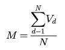

# Verordnung über die Inhalte der Prüfungsberichte für Kapitalanlagegesellschaften, Investmentaktiengesellschaften und Sondervermögen (InvPrüfbV)

Ausfertigungsdatum
:   2008-12-15

Fundstelle
:   BGBl I: 2008, 2467

Geändert durch
:   Art. 2 V v. 28.6.2011 I 1278

## Eingangsformel

Auf Grund des § 19f Absatz 3, des § 44 Absatz 7 Satz 1 zweite
Alternative und des § 110a Absatz 5 des Investmentgesetzes vom 15.
Dezember 2003 (BGBl. I S. 2676), von denen § 19f durch Artikel 1
Nummer 24 und § 110a durch Artikel 1 Nummer 92 eingefügt sowie § 44
Absatz 7 Satz 1 durch Artikel 1 Nummer 43 Buchstabe e des Gesetzes vom
21\. Dezember 2007 (BGBl. I S. 3089) geändert worden sind, in
Verbindung mit § 1 Nummer 3 der Verordnung zur Übertragung von
Befugnissen zum Erlass von Rechtsverordnungen auf die Bundesanstalt
für Finanzdienstleistungsaufsicht vom 13. Dezember 2002 (BGBl. 2003 I
S. 3), der zuletzt durch die Verordnung vom 21. April 2008 (BGBl. I S.
748) geändert worden ist, verordnet die Bundesanstalt für
Finanzdienstleistungsaufsicht im Einvernehmen mit dem
Bundesministerium der Justiz:

## Kapitel 1 - Allgemeine Vorschriften

### § 1 Anwendungsbereich

Diese Verordnung regelt insbesondere den Gegenstand der Prüfung von
Kapitalanlagegesellschaften, Investmentaktiengesellschaften und
Sondervermögen nach dem Investmentgesetz und den Inhalt der
Prüfungsberichte sowie die Art und den Umfang der Berichterstattung.

### § 2 Risikoorientierung und Wesentlichkeit

Den Grundsätzen der risikoorientierten Prüfung und der Wesentlichkeit
ist Rechnung zu tragen. Bei Kapitalanlagegesellschaften und
Investmentaktiengesellschaften (Gesellschaften) sind insbesondere die
Größe der Gesellschaft, der Geschäftsumfang und die Komplexität der
betriebenen Geschäfte sowie der Risikogehalt zu berücksichtigen.

### § 3 Allgemeine Prüfungs- und Berichtsgrundsätze

(1) Der Prüfungsbericht muss übersichtlich und vollständig sein. Bei
den im Prüfungsbericht vorgenommenen Beurteilungen sind die
aufsichtsrechtlichen Vorgaben zu beachten. Für die Beurteilung der
Tätigkeit der Gesellschaft bedeutsame Ereignisse, die nach dem
Bilanzstichtag der Gesellschaft eingetreten und dem Abschlussprüfer
bekannt geworden sind, sind im Prüfungsbericht darzulegen.

(2) Wurde im Berichtszeitraum eine Prüfung gemäß § 19g des
Investmentgesetzes in Verbindung mit § 44 Absatz 1 Satz 2 des
Kreditwesengesetzes durchgeführt, so hat der Abschlussprüfer diese
Prüfungsergebnisse bei der Prüfung der aufsichtlichen Sachverhalte zu
verwerten. Bei Sachverhalten, die Gegenstand der Prüfung gemäß § 19g
des Investmentgesetzes in Verbindung mit § 44 Absatz 1 Satz 2 des
Kreditwesengesetzes waren, kann sich die aufsichtsrechtliche
Berichterstattung auf Veränderungen bis zum Bilanzstichtag der
Gesellschaft beschränken.

(3) Soweit die Bundesanstalt für Finanzdienstleistungsaufsicht
(Bundesanstalt) im Einzelfall gegenüber der Gesellschaft Bestimmungen
über den Prüfungsinhalt getroffen oder Prüfungsschwerpunkte
festgesetzt hat, sind im Prüfungsbericht die insoweit vorgenommenen
Prüfungshandlungen im Überblick und Feststellungen im Einzelnen
darzustellen.

(4) Der Umfang der Berichterstattung unterliegt, vorbehaltlich der
nachfolgenden Bestimmungen, dem pflichtgemäßen Ermessen des
Abschlussprüfers und hat der Bedeutung der dargestellten Vorgänge zu
entsprechen. Über bemerkenswerte Veränderungen gegenüber dem
vorherigen Bericht ist stets zu berichten.

(5) Die Prüfungsberichte nach § 19d Satz 1, § 44 Absatz 5 Satz 6 und
Absatz 6 Satz 2 in Verbindung mit Absatz 5 Satz 6 sowie § 110a Absatz
3 Satz 3 des Investmentgesetzes sind der Bundesanstalt in dreifacher
Ausfertigung an den Dienstsitz in Frankfurt am Main einzureichen.
Mindestens ein Exemplar ist mit der Originalunterschrift des
Abschlussprüfers zu versehen und entsprechend zu kennzeichnen. Satz 1
gilt für Spezial-Sondervermögen und Spezial-
Investmentaktiengesellschaften nur auf Anforderung der Bundesanstalt.

### § 4 Anlagen und Verweisungen

(1) Die nach dieser Verordnung geforderten Angaben können zum Zwecke
der Verbesserung der Lesbarkeit in Form von ergänzenden Anlagen zum
Prüfungsbericht vorgelegt werden, wenn die Angaben im Prüfungsbericht
selbst hinreichend dargestellt sind und der Prüfungsbericht dadurch
nicht unübersichtlich wird. Inhalte von Anlagen können technische
Einzelheiten der Angabenermittlung, Übersichten zur
Angabendetaillierung sowie ergänzende Hinweise zur Angabenerläuterung
sein.

(2) Dem Prüfungsbericht ist als Anlage eine Kopie des der Prüfung
zugrunde liegenden Jahresabschlusses und Lageberichts beziehungsweise
des Jahres-, Zwischen- oder Auflösungsberichts beizufügen.

(3) Verweisungen auf den Inhalt früherer Prüfungsberichte sind
grundsätzlich nicht zulässig. Zur Vermeidung umfangreicher
Wiederholungen sind solche Verweisungen ausnahmsweise zulässig, wenn
der Abschlussprüfer auf die entsprechenden Feststellungen unter Angabe
der Fundstelle verweist oder die entsprechende Textstelle aus den
früheren Prüfungsberichten dem Prüfungsbericht als Zitat beifügt.
Verweisungen auf entsprechende Darstellungen in eigenständigen Teilen
des früheren Prüfungsberichts dürfen ausnahmsweise erfolgen.

## Kapitel 2 - Kapitalanlagegesellschaft

### Abschnitt 1 - Allgemeines

#### § 5 Zusammenfassung der Prüfungsergebnisse

In einer zusammenfassenden Schlussbemerkung ist, soweit dies nicht
bereits im Rahmen der dem Bericht vorangestellten Ausführungen nach §
321 Absatz 1 Satz 2 des Handelsgesetzbuchs erfolgt ist, auf alle
wesentlichen Fragen Bezug zu nehmen, so dass aus ihr selbst ein
Überblick über die wirtschaftliche Lage der Kapitalanlagegesellschaft
und die Einhaltung der aufsichtlichen Vorgaben gewonnen werden kann.
Hinsichtlich der Lage der Kapitalanlagegesellschaft ist insbesondere
auf die geschäftliche Entwicklung sowie die Vermögens-, Finanz- und
Ertragslage einzugehen. Der zusammenfassenden Schlussbemerkung muss
auch zu entnehmen sein, ob die Bilanzposten ordnungsgemäß bewertet,
insbesondere ob die gebildeten Wertberichtigungen und Rückstellungen
angemessen sind, ob die Rechnungsabgrenzungsposten richtig berechnet
sind und ob die Vorschriften des Geldwäschegesetzes und die Anzeige-
und Meldevorschriften beachtet wurden. Der Prüfungsbericht ist unter
Angabe von Ort und Datum zu unterzeichnen.

#### § 6 Berichtszeitraum

Der Zeitraum, auf den sich die Prüfung erstreckt (Berichtszeitraum),
ist in der Regel das am Stichtag des Jahresabschlusses
(Bilanzstichtag) endende Geschäftsjahr (Berichtsjahr). Bei vom
Geschäftsjahr abweichenden Berichtszeiträumen muss der Prüfungsbericht
mindestens das Geschäftsjahr umfassen, das am Bilanzstichtag endet.
Wurde die Prüfung unterbrochen, ist in dem Bericht darauf hinzuweisen
und die Dauer der Unterbrechung unter Darlegung der Gründe anzugeben.

#### § 7 Prüfungs- und Berichtsgrundsätze für Kapitalanlagegesellschaften

Der Bericht über die Prüfung der Kapitalanlagegesellschaft ist so zu
verfassen, dass er den für die Prüfung eines Sondervermögens
zuständigen Abschlussprüfer in die Lage versetzt, diesen im Rahmen
seiner Prüfung zu verwerten. Die für den Abschlussprüfer des
Sondervermögens relevanten Prüfungsergebnisse können in einem
gesonderten Berichtsteil zusammengefasst werden.

#### § 8 Darstellung der rechtlichen, wirtschaftlichen und organisatorischen Grundlagen

(1) Über die Ausschöpfung und Überschreitung der Erlaubnis zum
Betreiben des Geschäfts einer Kapitalanlagegesellschaft und zur
Erbringung von Dienst- und Nebendienstleistungen nach § 7 Absatz 2 des
Investmentgesetzes und die Erfüllung damit verbundener Auflagen im
Berichtszeitraum ist zu berichten.

(2) Die wesentlichen Änderungen der rechtlichen, wirtschaftlichen und
organisatorischen Grundlagen der Kapitalanlagegesellschaft im
Berichtszeitraum sind darzustellen, wobei insbesondere zu berichten
ist über:

1.  Änderungen der Rechtsform und der Satzung oder des
    Gesellschaftsvertrages,

2.  Änderungen der Kapitalverhältnisse und Gesellschafterverhältnisse,

3.  Änderungen der personellen Zusammensetzung der Geschäftsleitung sowie
    Änderungen der Zuständigkeit der einzelnen Geschäftsleiter,

4.  Änderungen der Struktur des Geschäftsbetriebs einer
    Kapitalanlagegesellschaft, der erbrachten Dienstleistungen und
    Nebendienstleistungen nach § 7 Absatz 2 des Investmentgesetzes,

5.  die bevorstehende Aufnahme neuer Geschäftszweige,

6.  Änderungen der rechtlichen und geschäftlichen Beziehungen zu
    verbundenen Unternehmen, über wirtschaftlich bedeutsame Verträge
    geschäftspolitischer Natur, die die zwischenbetriebliche
    Zusammenarbeit regeln, wobei insbesondere Angaben über Art und Umfang
    der vereinbarten Leistungen zu machen sind; die Berichterstattung kann
    insoweit entfallen, wenn für den Berichtszeitraum ein
    Abhängigkeitsbericht nach § 312 des Aktiengesetzes erstellt und der
    Bundesanstalt eingereicht worden ist,

7.  Änderungen im organisatorischen Aufbau der Kapitalanlagegesellschaft
    sowie der unter Risikoaspekten bedeutsamen Ablauforganisation; das
    aktuelle Organigramm ist dem Prüfungsbericht als Anlage beizufügen.

(3) Über wesentliche auf andere Unternehmen ausgelagerte Aufgaben ist
gesondert zu berichten, soweit die Berichterstattung nicht nach § 21
Absatz 3 zu erfolgen hat.

(4) Die Ordnungsmäßigkeit der Geschäftsorganisation, insbesondere die
Geeignetheit der Regelungen für die persönlichen Geschäfte der
Mitarbeiter sowie die Angemessenheit der Kontroll- und
Sicherheitsvorkehrungen für den Einsatz der elektronischen
Datenverarbeitung ist zu beurteilen, soweit dies nicht die Verwaltung
der Investmentvermögen betrifft.

(5) Soweit der Abschlussprüfer nur verpflichtet ist, über Änderungen
zu berichten, hat er in angemessenen Abständen über die Darstellung
der Änderungen hinausgehend vollständig zu berichten. Angemessene
Abstände im Sinn des Satzes 1 sind regelmäßig drei bis fünf Jahre.

#### § 9 Ausländische Zweigstellen und Zweigniederlassungen

Der Abschlussprüfer hat über die ausländischen Zweigstellen und
Zweigniederlassungen zu berichten und deren Einbindung in die
Geschäftsorganisation der Kapitalanlagegesellschaft zu beurteilen.
Dabei sind für diese Zweigniederlassungen deren Ergebniskomponenten,
deren Einfluss auf das Risikoprofil sowie die Risikolage und die
Risikovorsorge der Gesellschaft insgesamt sowie deren Einbindung in
das Risikomanagement zu beurteilen.

### Abschnitt 2 - Aufsichtliche Vorgaben

#### Unterabschnitt 1 - Kapitalanforderungen

##### § 10 Eigenmittel

(1) Darzustellen sind Höhe und Zusammensetzung der Eigenmittel der
Kapitalanlagegesellschaft nach dem Stand bei Geschäftsschluss am
Bilanzstichtag und unter der Annahme der Feststellung des geprüften
Abschlusses. Es ist zu berichten, ob die Anforderungen des § 11 Absatz
1 Satz 1 Nummer 2 des Investmentgesetzes im Berichtszeitraum
eingehalten wurden.

(2) Es ist zu beurteilen, ob die Eigenmittelrelation nach § 11 Absatz
3 des Investmentgesetzes in Verbindung mit § 10 Absatz 9 Satz 2 bis 5
des Kreditwesengesetzes im Berichtszeitraum sowie am Bilanzstichtag
eingehalten wurde.

(3) Im Fall des § 11 Absatz 4 des Investmentgesetzes ist zu
beurteilen, ob die von der Kapitalanlagegesellschaft getroffenen
Vorkehrungen zur Ermittlung von Anrechnungsbeträgen für Risiken aus
den in § 11 Absatz 4 des Investmentgesetzes genannten Geschäften
angemessen sind. Dabei ist insbesondere auf Änderungen gegenüber dem
letzten Berichtszeitraum einzugehen. Das Verhältnis zwischen den in
Satz 1 bezeichneten Anrechnungsbeträgen und den anrechenbaren
Eigenmitteln der Kapitalanlagegesellschaft zum Bilanzstichtag sowie
dessen Entwicklung im Berichtszeitraum sind darzustellen. Liegt bei
einer Kapitalanlagegesellschaft eine Mehrzahl unterschiedlicher in §
11 Absatz 4 des Investmentgesetzes genannter Geschäftsgestaltungen
vor, sind die gemäß Satz 3 darzustellenden Anrechnungsbeträge darüber
hinaus angemessen nach Geschäftsgestaltungen zu untergliedern.

#### Unterabschnitt 2 - Anzeigewesen

##### § 11 Anzeigewesen

Die Organisation des Anzeigewesens ist zu beurteilen. Auf die
Vollständigkeit und Richtigkeit der Anzeigen, insbesondere nach den §§
12 und 19c des Investmentgesetzes, ist einzugehen. Festgestellte
wesentliche Verstöße sind aufzuführen.

#### Unterabschnitt 3 - Vorkehrungen zur Verhinderung von Geldwäsche und Terrorismusfinanzierung

##### § 12 Prüfungszeitraum und Berichtszeitraum

(1) Die Prüfung gemäß § 19f Absatz 2 Satz 1 des Investmentgesetzes
findet in zweijährigem Turnus, beginnend mit dem ersten vollen
Geschäftsjahr der Aufnahme des erlaubnispflichtigen Geschäftsbetriebs
nach § 7 des Investmentgesetzes statt, es sei denn, die Risikolage der
Kapitalanlagegesellschaft erfordert ein kürzeres Prüfungsintervall.
Der Abschlussprüfer legt den Beginn der Prüfung und den
Berichtszeitraum vorbehaltlich der nachfolgenden Bestimmungen nach
pflichtgemäßem Ermessen fest.

(2) Der Berichtszeitraum der Prüfung ist jeweils der Zeitraum zwischen
dem Stichtag der letzten Prüfung und dem Stichtag der folgenden
Prüfung.

(3) Die Prüfung hat spätestens drei Monate nach dem Abschluss des für
sie maßgeblichen Berichtszeitraums zu beginnen.

##### § 13 Darstellung und Beurteilung der getroffenen Vorkehrungen zur Verhinderung von Geldwäsche und Terrorismusfinanzierung

(1) Der Abschlussprüfer hat zu beurteilen, ob die von der
Kapitalanlagegesellschaft erstellte Gefährdungsanalyse der
tatsächlichen Risikosituation der Kapitalanlagegesellschaft
entspricht. Darüber hinaus hat er von der Kapitalanlagegesellschaft
getroffene organisatorische Maßnahmen zur Verhinderung von Geldwäsche
und Terrorismusfinanzierung darzustellen und deren Angemessenheit zu
beurteilen. Dabei ist insbesondere einzugehen

1.  auf die von der Kapitalanlagegesellschaft entwickelten und
    aktualisierten internen Grundsätze, angemessenen geschäfts- und
    kundenbezogenen Sicherungssysteme und Kontrollen zur Verhinderung von
    Geldwäsche und Terrorismusfinanzierung,

2.  darauf, ob die mit der Durchführung von Transaktionen und mit der
    Anbahnung und Begründung von Geschäftsbeziehungen befassten
    Beschäftigten angemessen über die Methoden der Geldwäsche und
    Terrorismusfinanzierung und die insofern bestehenden Pflichten
    unterrichtet werden.

Die Prüfung nach den Sätzen 2 und 3 hat unter Berücksichtigung der von
der Kapitalanlagegesellschaft erstellten Gefährdungsanalyse sowie der
von der internen Revision im Berichtszeitraum durchgeführten Prüfung
und deren Ergebnis zu erfolgen.

(2) Der Abschlussprüfer hat darzustellen und zu beurteilen, inwieweit
die Kapitalanlagegesellschaft den kundenbezogenen Sorgfaltspflichten,
insbesondere auch den verstärkten Sorgfaltspflichten in Fällen eines
erhöhten Risikos, nachgekommen ist.

(3) Zu berichten ist ferner über die Erfüllung der Aufzeichnungs- und
Aufbewahrungspflichten sowie die Pflicht zur internen Erfassung und
Anzeige von Verdachtsfällen.

(4) Sofern die Durchführung von internen Sicherungsmaßnahmen oder die
Wahrnehmung von kundenbezogenen Sorgfaltspflichten von der
Kapitalanlagegesellschaft vertraglich auf eine dritte Person oder ein
anderes Unternehmen ausgelagert worden ist, ist hierüber zu berichten.

(5) In Bezug auf eine Kapitalanlagegesellschaft, die selbst nicht
Tochterunternehmen eines Instituts oder eines nach dem
Geldwäschegesetz verpflichteten Versicherungsunternehmens ist, aber
Tochterunternehmen oder ausländische Zweigstellen oder
Zweigniederlassungen besitzt, hat der Abschlussprüfer darzustellen und
zu beurteilen, inwieweit die Kapitalanlagegesellschaft für eine
einheitliche Schaffung von internen Sicherungsmaßnahmen und für eine
Einhaltung der Sorgfaltspflichten sowie der Aufzeichnungs- und
Aufbewahrungspflicht zur Verhinderung von Geldwäsche und
Terrorismusfinanzierung Maßnahmen getroffen hat, soweit dies jeweils
nach dem Recht des betroffenen Staates, in dem das Tochterunternehmen,
die Zweigstelle oder die Zweigniederlassungen ansässig ist, zulässig
ist. Soweit die nach Satz 1 zu treffenden Maßnahmen in einem
Drittstaat nicht zulässig sind, hat der Abschlussprüfer ferner
darzustellen und zu beurteilen, inwieweit die von der
Kapitalanlagegesellschaft ergriffenen anderweitigen zusätzlichen
Maßnahmen angemessen sind, um einem erhöhten Risiko der Geldwäsche und
Terrorismusfinanzierung wirksam zu begegnen. Absatz 1 Satz 4 und
Absatz 4 gelten entsprechend.

(6) Bei Kapitalanlagegesellschaften ist darzustellen, inwieweit diese
ihre Verpflichtungen nach § 6 Absatz 5 des Investmentgesetzes in
Verbindung mit § 24c Absatz 1 des Kreditwesengesetzes erfüllt haben.
Insbesondere ist zu prüfen, ob die hierzu eingesetzten Verfahren eine
zutreffende Erfassung der aufgenommenen Identifizierungsdaten mit
richtiger Zuordnung zum Depot im Abrufsystem gewährleisten.
Gegebenenfalls ist über die ordnungsgemäße Erfüllung der Anordnungen
der Bundesanstalt gemäß § 6a des Kreditwesengesetzes zu berichten.

### Abschnitt 3 - Abschlussorientierte Berichterstattung

#### Unterabschnitt 1 - Lage der Kapitalanlagegesellschaft

##### § 14 Geschäftliche Entwicklung im Berichtsjahr

Die geschäftliche Entwicklung ist unter Gegenüberstellung der für sie
kennzeichnenden Zahlen des Berichtsjahres und des Vorjahres
darzustellen und zu erläutern.

##### § 15 Beurteilung der Vermögens- und Finanzlage

(1) Die Entwicklung der Vermögens- und Finanzlage ist zu beurteilen.
Besonderheiten, die für die Beurteilung der Vermögens- und Finanzlage
von Bedeutung sind, insbesondere Art und Umfang bilanzunwirksamer
Ansprüche und Verpflichtungen, sind hervorzuheben.

(2) Die Berichterstattung hat sich auch zu erstrecken auf

1.  Art und Umfang stiller Reserven und stiller Lasten,

2.  bedeutende Verträge und schwebende Rechtsstreitigkeiten, soweit sich
    nachteilige Auswirkungen auf die Vermögenslage ergeben könnten, und
    die Bildung der notwendigen Rückstellungen,

3.  alle abgegebenen Patronatserklärungen unter Darstellung des Inhalts
    und Beurteilung ihrer Rechtsverbindlichkeit.

(3) Über die Anlage des eigenen Vermögens der
Kapitalanlagegesellschaft ist unter Berücksichtigung von § 9a Absatz 1
Satz 2 Nummer 3 des Investmentgesetzes zu berichten.

##### § 16 Beurteilung der Ertragslage

(1) Die Entwicklung der Ertragslage ist zu beurteilen.

(2) Zu berichten ist auf der Basis der Unterlagen der
Kapitalanlagegesellschaft auch über die Ertragslage der wesentlichen
Geschäftssparten; dabei sind jeweils die wichtigsten Erfolgsquellen
und Erfolgsfaktoren gesondert darzustellen. Soweit keine
Spartenkalkulation nach Satz 1 vorhanden ist, ist es ausreichend, auf
entsprechende vorhandene interne Informationen der Geschäftsleitung
zurückzugreifen.

##### § 17 Risikolage

Die Risikolage der Kapitalanlagegesellschaft ist zu beurteilen. Die
von der Kapitalanlagegesellschaft verwendeten Bewertungsverfahren sind
darzustellen. Die Angemessenheit der eingesetzten Systeme, Verfahren
und Regelungen zur Bestimmung der finanziellen Lage der
Kapitalanlagegesellschaft sind zu beurteilen. Ferner ist auf Anzahl
und Umfang von Kulanzzahlungen und Gerichtsverfahren im Zusammenhang
mit der Verwaltung von Investmentvermögen sowie auf die Anzahl von
Kundenbeschwerden einzugehen.

#### Unterabschnitt 2 - Erläuterungen zur Rechnungslegung

##### § 18 Erläuterungen

Ob und inwieweit die Bilanzposten einschließlich
Eventualverbindlichkeiten und andere Verbindlichkeiten, die Angaben
unter dem Bilanzstrich und die Posten der Gewinn- und Verlustrechnung
zu erläutern und mit den Vorjahreszahlen zu vergleichen sind,
unterliegt dem pflichtgemäßen Ermessen des Abschlussprüfers unter
Berücksichtigung des Grundsatzes der Wesentlichkeit.

##### § 19 Datenübersicht

Als Teil des Prüfungsberichts ist das Formblatt gemäß Anlage 1 unter
Angabe entsprechender Vorjahresdaten beizufügen.

### Abschnitt 4 - Verwaltung von Sondervermögen und fremdverwalteten Investmentaktiengesellschaften

#### § 20 Berichtszeitraum

(1) Die Berichterstattung nach diesem Abschnitt kann nach
pflichtgemäßem Ermessen des Abschlussprüfers in Abstimmung mit der
Kapitalanlagegesellschaft zu einem früheren Zeitpunkt erfolgen, der
nicht vor dem Ende der ersten Hälfte des Geschäftsjahres liegt. Dieser
Berichtsteil ist der Bundesanstalt unverzüglich nach Fertigstellung
einzureichen.

(2) Über wesentliche Änderungen der Ergebnisse eines Berichtsteils
nach Absatz 1 bis zum Ende des Berichtszeitraums ist zu berichten.

#### § 21 Allgemeine Verhaltensregeln und Organisationspflichten einschließlich Risikomanagement

(1) Der Abschlussprüfer hat die Einhaltung der allgemeinen
Verhaltensregeln nach § 9 des Investmentgesetzes, insbesondere die
Vorkehrungen der Kapitalanlagegesellschaft zur Vermeidung von
Interessenkonflikten, darzustellen und zu beurteilen.

(2) Der Abschlussprüfer hat die Ordnungsmäßigkeit der
Geschäftsorganisation gemäß § 9a des Investmentgesetzes zu beurteilen;
dabei ist insbesondere über die wesentlichen Geschäftsprozesse in den
Funktionen Portfolioverwaltung, Investmentkontrolle, Fondsbuchhaltung
und Anteilwertermittlung sowie der dort eingesetzten
Datenverarbeitungssysteme zu berichten. Die Angemessenheit des
Risikomanagements gemäß § 9a Absatz 1 Satz 2 Nummer 1 und § 80b des
Investmentgesetzes ist unter Berücksichtigung der Komplexität und des
Umfangs der für die verwalteten Investmentvermögen eingegangenen
Risiken zu beurteilen. Dabei ist insbesondere auf
Adressenausfallrisiken, Zinsänderungs-, Währungs- sowie sonstige
Marktpreisrisiken, operationelle Risiken und Liquiditätsrisiken sowie
auf die Anforderungen der Derivateverordnung einzugehen.

(3) Über die Übertragung der Portfolioverwaltung auf andere
Unternehmen ist gesondert unter Berücksichtigung des § 16 Absatz 2 des
Investmentgesetzes zu berichten.

(4) Die Angemessenheit der Kontrollverfahren und der internen Revision
der Kapitalanlagegesellschaft ist zu beurteilen.

### Abschnitt 5 - Dienstleistungen und Nebendienstleistungen

#### § 22 Besondere Anforderungen an die Prüfung von Dienstleistungen und Nebendienstleistungen

(1) Der Abschlussprüfer hat die Dienstleistungen und
Nebendienstleistungen im Sinn von § 7 Absatz 2 des Investmentgesetzes
zu prüfen und festzustellen, ob die Vorschriften des
Investmentgesetzes beachtet worden sind. Bei der Erbringung von
Dienstleistungen und Nebendienstleistungen im Sinn des § 7 Absatz 2
Nummer 1, 3 und 4 des Investmentgesetzes umfasst die Prüfung auch die
Einhaltung der in § 5 Absatz 3 des Investmentgesetzes genannten
Vorschriften des Wertpapierhandelsgesetzes; sie muss den gesamten
Berichtszeitraum erfassen und in einem angemessenen Verhältnis zum
Umfang der jeweiligen Geschäfte und Aufgaben stehen.

(2) Im Prüfungsbericht sind im Einzelnen, sofern nach der Art der
erbrachten Dienstleistungen und Nebendienstleistungen im Sinn des § 7
Absatz 2 Nummer 1, 3 und 4 des Investmentgesetzes einschlägig,
darzustellen:

1.  Art und Umfang der im Berichtszeitraum ausgeführten Dienstleistungen
    und Nebendienstleistungen, insbesondere Depotvolumina,
    Transaktionsvolumina, Kundenzahl und Anlageformen;

2.  die Einhaltung der allgemeinen Verhaltensregeln nach § 31 des
    Wertpapierhandelsgesetzes sowie nach § 9 Absatz 4 des
    Investmentgesetzes;

3.  die Zulässigkeit der Entgegennahme oder Gewährung von Zuwendungen und
    die Einhaltung der Offenlegungspflichten nach § 31d des
    Wertpapierhandelsgesetzes;

4.  die nach den §§ 31a und 33 des Wertpapierhandelsgesetzes
    erforderlichen Vorkehrungen und Maßnahmen sowie die Organisation der
    Kapitalanlagegesellschaft, insbesondere im Hinblick auf die
    Kundeneinstufung, und deren prüferische Beurteilung; der Aufbau und
    die Ablauforganisation der Kapitalanlagegesellschaft sowie
    Geschäftsbereiche mit besonderen Anforderungen an den Aufbau sind
    gesondert darzustellen;

5.  die Anzahl und der Umfang von Kulanzzahlungen und Gerichtsverfahren im
    Zusammenhang mit Dienstleistungen und Nebendienstleistungen sowie
    Anzahl und Art und Weise der Behandlung von Kundenbeschwerden und die
    damit zusammenhängenden personellen und organisatorischen
    Konsequenzen;

6.  die Vorkehrungen zur bestmöglichen Ausführung von Kundenaufträgen nach
    § 33a des Wertpapierhandelsgesetzes; die Vorkehrungen sind prüferisch
    zu beurteilen;

7.  die Mittel und Verfahren zur Einhaltung der Verpflichtungen nach § 33b
    des Wertpapierhandelsgesetzes für Mitarbeiter und
    Mitarbeitergeschäfte; die Mittel und Verfahren sind prüferisch zu
    beurteilen;

8.  die Einhaltung der Aufzeichnungs- und Aufbewahrungspflichten nach § 34
    des Wertpapierhandelsgesetzes und nach den Artikeln 7 und 8 der
    Verordnung (EG) Nr. 1287/2006 der Kommission vom 10. August 2006 zur
    Durchführung der Richtlinie 2004/39/EG des Europäischen Parlaments und
    des Rates betreffend die Aufzeichnungspflichten für Wertpapierfirmen,
    die Meldung von Geschäften, die Markttransparenz, die Zulassung von
    Finanzinstrumenten zum Handel und bestimmte Begriffe im Sinne dieser
    Richtlinie (ABl. L 241 vom 2.9.2006, S. 1);

9.  die Erfüllung der Pflichten nach § 34a des Wertpapierhandelsgesetzes;
    hierbei ist auch anzugeben,

    a)  inwieweit die Übereinstimmung der den Kunden ausgewiesenen Gelder oder
        Wertpapiere mit den Salden der Treuhandkonten oder Depots bei den
        verwahrenden Instituten oder Kapitalanlagegesellschaften geprüft
        wurde,

    b)  ob die verwahrenden Institute oder Kapitalanlagegesellschaften die
        Voraussetzungen des § 34a des Wertpapierhandelsgesetzes erfüllen.

Hierbei ist auch, sofern nach der Art der erbrachten Dienstleistungen
oder Nebendienstleistungen einschlägig, über die Erfüllung der
jeweiligen Pflichten zu berichten, die sich aus der
Wertpapierdienstleistungs-Verhaltens- und Organisationsverordnung und
aus der Verordnung (EG) Nr. 1287/2006 in ihren jeweils geltenden
Fassungen ergeben.

(3) Soweit in Bezug auf die Feststellungen nach Absatz 2 im Rahmen der
letzten Prüfung keine Mängel festgestellt wurden und sich bei der
laufenden Prüfung keine Änderungen der Prüfungsergebnisse ergeben
haben, kann auf die Einzeldarstellung verzichtet werden. Ist in
mindestens drei aufeinanderfolgenden Jahren eine Einzeldarstellung
einzelner Bereiche nicht erfolgt, kann die Bundesanstalt für die
folgende Prüfung eine Einzeldarstellung dieser Bereiche verlangen,
auch wenn insoweit keine Änderungen eingetreten sind.

(4) Bei der Prüfung der Nebendienstleistung nach § 7 Absatz 2 Nummer 4
des Investmentgesetzes hat der Prüfungsbericht zudem Angaben zu
enthalten:

1.  zur Ordnungsmäßigkeit der Verwahrung und Verwaltung von
    Investmentanteilen für andere, des Verwahrungsbuches, der Verfügungen
    über Kundenwertpapiere und Ermächtigungen sowie

2.  zur Beachtung der §§ 128 und 135 des Aktiengesetzes bei verwahrten
    Aktien von Investmentaktiengesellschaften.

(5) Im Prüfungsbericht sind, sofern nach der Art der erbrachten
Nebendienstleistungen im Sinn des § 7 Absatz 2 Nummer 6 und 6a des
Investmentgesetzes einschlägig, die Art der angebotenen
Altersvorsorgeverträge sowie abgegebene Mindestzahlungszusagen
darzustellen.

#### § 23 Prüfungszeitraum und Berichtszeitraum

(1) Der Zeitraum der Prüfung nach diesem Abschnitt beginnt mit dem Tag
der ersten und endet mit dem Tag der letzten Prüfungshandlung vor Ort.
Die Prüfung ist innerhalb eines angemessenen Zeitraums abzuschließen.
Der Abschlussprüfer legt den Stichtag der Prüfung nach pflichtgemäßem
Ermessen fest. Berichtszeitraum der ersten Prüfung ist der Zeitraum
zwischen dem Beginn der Tätigkeit als Kapitalanlagegesellschaft und
dem Stichtag der ersten Prüfung. Berichtszeitraum der sonstigen
Prüfungen ist der Zeitraum zwischen dem Stichtag der letzten Prüfung
und dem Stichtag der darauf folgenden Prüfung. Vorgänge von besonderer
Bedeutung im Zeitraum zwischen dem Stichtag einer Prüfung und dem Ende
des Prüfungszeitraums sind im Prüfungsbericht darzustellen.

(2) Die Prüfung hat spätestens drei Monate nach dem Abschluss des für
sie maßgeblichen Berichtszeitraums zu beginnen. Der Abschlussprüfer
hat den Bericht über die Prüfung unverzüglich nach Beendigung der
Prüfung der Bundesanstalt einzureichen. Die Bundesanstalt kann im
Einzelfall und aus wichtigem Grund eine andere als die in Satz 1
normierte Frist bestimmen.

## Kapitel 3 - Sondervermögen

### Abschnitt 1 - Allgemeines

#### § 24 Prüfungs- und Berichtsgrundsätze für Sondervermögen

(1) Der Abschlussprüfer des Sondervermögens hat den Jahres-, Zwischen-
und Auflösungsbericht zu prüfen und festzustellen, ob bei der
Verwaltung des Sondervermögens die Vorschriften des Investmentgesetzes
und die Vertragsbedingungen beachtet worden sind.

(2) In einer zusammenfassenden Schlussbemerkung ist zu allen
wesentlichen Aspekten der Prüfung Stellung zu nehmen, so dass aus ihr
selbst ein Überblick über die für die Rechnungslegung des
Sondervermögens bedeutsamen Feststellungen und die Einhaltung der
aufsichtlichen Vorgaben gewonnen werden kann. Der zusammenfassenden
Schlussbemerkung muss auch zu entnehmen sein, ob die
Vermögensgegenstände ordnungsgemäß bewertet wurden. Der
Prüfungsbericht ist unter Angabe von Ort und Datum zu unterzeichnen.

(3) Bei Spezial-Sondervermögen ist ferner festzustellen, ob die
Vertragsbedingungen den Vorschriften des Investmentgesetzes
entsprechen. Weitere, insbesondere die Anlagepolitik und
Anlagegrundsätze des Spezial-Sondervermögens betreffende
rechtswirksame Vereinbarungen mit der Kapitalanlagegesellschaft, sind
zu berücksichtigen.

(4) Der Abschlussprüfer des Sondervermögens hat die Ergebnisse der
Prüfung der Kapitalanlagegesellschaft insbesondere in Bezug auf die in
den §§ 9, 9a und 80b des Investmentgesetzes genannten Verhaltensregeln
und Organisationspflichten zu verwerten.

#### § 25 Angaben zum Sondervermögen

(1) Dem Prüfungsbericht für das Sondervermögen sind insbesondere
folgende Angaben voranzustellen:

1.  Name des Sondervermögens,

2.  WKN/ISIN (Wertpapierkennnummer/International Security Identification
    Number),

3.  Geschäftsjahr,

4.  Art des Sondervermögens,

5.  Fondsprofil, insbesondere Anlageschwerpunkt nach den
    Vertragsbedingungen, gegebenenfalls der Vergleichsmaßstab,

6.  Ausgestaltungsmerkmale der Anteilklassen nach § 34 Absatz 1 des
    Investmentgesetzes,

7.  Name und Sitz der Depotbank und gegebenenfalls des oder der Prime
    Broker,

8.  Name und Sitz der verwaltenden Kapitalanlagegesellschaft,

9.  Geschäftszeichen und Datum der Genehmigung der Allgemeinen und
    Besonderen Vertragsbedingungen sowie Datum der Auflegung,

10. Änderungen der Vertragsbedingungen während des Geschäftsjahres und
    Datum ihres Inkrafttretens,

11. Name und Sitz von Auslagerungsunternehmen für die Portfolioverwaltung,

12. Zuständigkeit für Anteilwertermittlung
    (Kapitalanlagegesellschaft/Depotbank),

13. Gesamtkostenquote sowie weitere Angaben nach § 41 Absatz 2 Satz 4 des
    Investmentgesetzes,

14. Portfolioumschlagsrate gemäß Anlage 2,

15. Daten mit besonderer Relevanz für das Sondervermögen, z. B. bei
    Übernahme des Rechts zur Verwaltung, Übernahme aller
    Vermögensgegenstände, Wechsel der Depotbank,

16. bei Einsatz von Derivaten, ob der einfache oder qualifizierte Ansatz
    angewandt wird.

(2) Absatz 1 ist nicht auf Spezial-Sondervermögen anzuwenden. Absatz 1
Nummer 14 ist nicht auf Immobilien- und Infrastruktur-Sondervermögen
anzuwenden.

### Abschnitt 2 - Jahres-, Zwischen- und Auflösungsbericht für Sondervermögen

#### § 26 Richtigkeit und Vollständigkeit des Jahres-, Zwischen- und Auflösungsberichts

(1) Der Abschlussprüfer hat die Richtigkeit und Vollständigkeit des
Jahres-, Zwischen- und Auflösungsberichts unter besonderer
Berücksichtigung der Vermögensaufstellung, der Ertrags- und
Aufwandsrechnung, der Entwicklungsrechnung sowie des
Tätigkeitsberichts zu prüfen.

(2) Der Prüfungsbericht hat eine Stellungnahme zur vertragsgemäßen
Belastung des Sondervermögens mit Aufwendungen zu enthalten.

(3) Bei der Übertragung des Rechts zur Verwaltung eines
Sondervermögens während eines Geschäftsjahres von der
Kapitalanlagegesellschaft auf eine andere Kapitalanlagegesellschaft
gemäß § 44 Absatz 3 des Investmentgesetzes unterliegen der Prüfung
neben dem Zwischenbericht auch die Saldenlisten und Skontren, die der
aufnehmenden Kapitalanlagegesellschaft zwecks Fortführung der
Buchhaltung übermittelt werden. Eine Aussage zu ihrer
Ordnungsmäßigkeit ist in den besonderen Vermerk aufzunehmen.

### Abschnitt 3 - Verwaltung der Sondervermögen

#### Unterabschnitt 1 - Allgemeine Vorschriften

##### § 27 Einhaltung von Gesetz und Vertragsbedingungen

(1) Der Abschlussprüfer hat über Verstöße gegen gesetzliche
Bestimmungen und Bestimmungen der Vertragsbedingungen und über die
Einhaltung der Nebenbestimmungen zur Genehmigung der
Vertragsbedingungen zu berichten.

(2) Die Berichterstattung umfasst bei Verstößen insbesondere:

1.  die Beschreibung des Verstoßes nach Art und Auswirkungen für das
    Sondervermögen, die Anteilinhaber und die Kapitalanlagegesellschaft,

2.  die Darstellung der eingeleiteten Maßnahmen zur Vermeidung zukünftiger
    Verstöße und die Beurteilung von deren Wirksamkeit.

(3) Bei geringfügigen Verstößen gegen gesetzliche und vertragliche
Bestimmungen mit Ausnahme der in § 28 Absatz 2 genannten, kann von der
Darstellung abgesehen werden, es sei denn, es handelt sich um
wiederholte Verstöße derselben Art.

(4) Besteht für den jeweiligen Verstoß eine Meldepflicht gegenüber der
Bundesanstalt, so ist deren Einhaltung beziehungsweise Verletzung
festzustellen.

##### § 28 Anlagevorschriften und Anlagegrenzverletzungen

(1) Wesentliche Verstöße gegen gesetzliche und vertragliche
Anlagegrundsätze und Anlagegrenzen sowie Erwerbsverbote sind unter
Angabe von Art, Umfang, Dauer und Ursache im Prüfungsbericht
darzustellen und zu erläutern. Die Art der Rückführung der Verstöße
gegen gesetzliche und vertragliche Anlagegrenzen ist darzustellen und
zu beurteilen. Eine Grenzverletzung ist für Berichtszwecke nur dann
als unwesentlich anzusehen, wenn die Über- oder Unterschreitung nicht
mehr als 0,5 Prozent des Fondsvermögens beträgt und innerhalb von drei
Börsentagen behoben worden ist. Bei unbeabsichtigten
Anlagegrenzverletzungen besteht die Berichtspflicht nur, wenn die
Über- oder Unterschreitung nicht innerhalb von zehn Börsentagen
behoben worden ist.

(2) Im Prüfungsbericht ist, soweit sich aus den Vorschriften des
Investmentgesetzes zu der Art des Sondervermögens nichts anderes
ergibt, insbesondere über die Einhaltung folgender gesetzlicher
Pflichten und Verstöße gegen folgende gesetzliche Regelungen zu
berichten:

1.  Verbot der Gewährung von Gelddarlehen und des Abschlusses von
    Bürgschafts- und Garantiegeschäften nach § 31 Absatz 4 des
    Investmentgesetzes;

2.  Verbot der Verpfändung, Belastung, Sicherheitsabtretung und
    Sicherheitsübereignung von Vermögensgegenständen, die zum
    Sondervermögen gehören, nach § 31 Absatz 5 des Investmentgesetzes;

3.  Aufrechnungsverbot nach § 31 Absatz 6 des Investmentgesetzes;

4.  Einhaltung der Kreditaufnahmegrenzen des Investmentgesetzes;

5.  Leerverkaufsverbot nach § 59 des Investmentgesetzes;

6.  Vergabe von Wertpapier-Darlehen nach den §§ 54 bis 56 des
    Investmentgesetzes;

7.  Pensionsgeschäfte nach § 57 des Investmentgesetzes.

##### § 29 Ordnungsgemäße Geschäftsorganisation

(1) Im Prüfungsbericht ist zu beurteilen, ob die von der
Kapitalanlagegesellschaft getroffenen organisatorischen Vorkehrungen
für das zu prüfende Sondervermögen die Zulässigkeit der getroffenen
Anlageentscheidungen nach dem Investmentgesetz und den
Vertragsbedingungen und die Einhaltung der Anlagegrenzen
gewährleisten. Ebenso ist zu beurteilen, ob für das Sondervermögen
geeignete Maßnahmen getroffen wurden, um sicherzustellen, dass die mit
den einzelnen Anlagepositionen verbundenen Risiken sowie die jeweilige
Wirkung auf das Gesamtrisikoprofil des Sondervermögens in angemessener
Weise und unter Verwendung von hinreichend fortgeschrittenen
Risikomanagementtechniken fortlaufend erfasst, gemessen, bewertet und
gesteuert werden.

(2) Ergeben die Prüfungen der internen Revision der das Sondervermögen
verwaltenden Kapitalanlagegesellschaft im Berichtszeitraum das
Sondervermögen direkt betreffende Feststellungen, so ist die
entsprechende Berichterstattung der internen Revision einschließlich
einer Darstellung der vorgeschlagenen Maßnahmen, der veranlassten
Maßnahmen sowie der Ergebnisse im Prüfungsbericht des Sondervermögens
wiederzugeben. Die Angemessenheit der Maßnahmen ist zu prüfen und zu
bewerten.

(3) Im Prüfungsbericht ist die Ordnungsmäßigkeit der Fondsbuchhaltung
und des rechnungslegungsbezogenen internen Kontrollsystems
zusammenfassend zu beurteilen. Weist die Fondsbuchhaltung des
Sondervermögens in Organisation oder Handhabung Besonderheiten
gegenüber anderen von der Kapitalanlagegesellschaft verwalteten
Sondervermögen auf, sind diese Besonderheiten darzustellen und zu
erläutern.

(4) Im Prüfungsbericht für ein Dach-Sondervermögen mit zusätzlichen
Risiken nach § 113 des Investmentgesetzes ist insbesondere auf die
Einhaltung der Sorgfaltspflichten im Rahmen der Auswahl der Zielfonds
sowie deren laufender Überwachung einzugehen.

##### § 30 Anteilwertermittlung

(1) Es ist darzulegen, ob die von der Kapitalanlagegesellschaft
getroffenen organisatorischen Vorkehrungen zur Anteilwertermittlung
für das zu prüfende Sondervermögen ordnungsgemäß und geeignet sind und
§ 36 des Investmentgesetzes eingehalten wurde. Dabei sind insbesondere
die nach § 36 Absatz 3 des Investmentgesetzes verwendeten
Bewertungsmodelle darzustellen und zu beurteilen. Sofern die Depotbank
die Anteilpreise ermittelt, beschränkt sich die Beurteilung auf die
Mitwirkung der Kapitalanlagegesellschaft.

(2) Werden fehlerhafte Anteilspreise festgestellt, sind die Gründe
hierfür darzustellen und zu erläutern. Die Berichterstattung kann
entfallen, soweit der Anteilpreisfehler unwesentlich im Verhältnis zur
Höhe des Anteilpreises ist.

(3) Der Abschlussprüfer hat über Maßnahmen und deren Ergebnisse zu
berichten, die von der Kapitalanlagegesellschaft zur Beseitigung der
Folgen von fehlerhaften Anteilwertberechnungen ergriffen wurden.

##### § 31 Einsatz von Derivaten

Beim Einsatz von Derivaten in einem Sondervermögen hat der
Abschlussprüfer im Prüfungsbericht zu beurteilen, ob

1.  das festgelegte Kontrollverfahren nach § 5 der Derivateverordnung
    angemessen und zweckdienlich ist (§ 5 Satz 3 der Derivateverordnung),

2.  das Vergleichsvermögen ordnungsgemäß zusammengesetzt ist (§ 9 Absatz 5
    Satz 4 der Derivateverordnung),

3.  die Risikomodelle nach § 10 Absatz 2 der Derivateverordnung geeignet
    sind (§ 10 Absatz 3 der Derivateverordnung),

4.  die Stresstests ordnungsgemäß gestaltet und durchgeführt wurden (§ 26
    Absatz 2 der Derivateverordnung) und

5.  das in der von der Kapitalanlagegesellschaft nach § 28 Absatz 1 der
    Derivateverordnung aufzustellenden Richtlinie festgelegte Verfahren
    ordnungsgemäß gestaltet und durchgeführt wurde (§ 28 Absatz 2 Satz 3
    und 4 der Derivateverordnung).

##### § 32 Fremdbezug von Dienstleistungen

(1) Nimmt die Kapitalanlagegesellschaft für die Verwaltung des
Sondervermögens nicht nur vorübergehend Anlageberatung in Anspruch, so
ist diese Leistung gegebenenfalls in einer Anlage zum Prüfungsbericht
nach Art und Umfang unter Angabe des Leistungserbringers, des
Vertragsdatums sowie des Vollzugsdatums und -zeitraums darzustellen.
Die Anlage hat auch Feststellungen darüber zu enthalten, wie eine
Anlageempfehlung von Dritten durch die Kapitalanlagegesellschaft
selbst geprüft worden ist und wer die Anlageentscheidung ausgeführt
hat.

(2) Haben festgestellte Mängel ihre Ursache in der Inanspruchnahme der
in Absatz 1 genannten Anlageberatung, so sind die Maßnahmen der
Kapitalanlagegesellschaft gegenüber dem Leistungserbringer und ihr
Ergebnis darzustellen.

#### Unterabschnitt 2 - Spezielle Vorschriften für Immobilien-Sondervermögen und Infrastruktur-Sondervermögen

##### § 33 Anwendbarkeit dieser Verordnung

Auf Prüfungsberichte über Immobilien-Sondervermögen und Infrastruktur-
Sondervermögen beziehungsweise bei Spezial-Sondervermögen mit Anlagen
in entsprechenden Vermögensgegenständen finden die Vorschriften des
Unterabschnitts 1 Anwendung, soweit sich aus den §§ 34 bis 40 nichts
anderes ergibt.

##### § 34 Erwerb und Veräußerung von Vermögensgegenständen

Werden im Berichtsjahr Vermögensgegenstände im Sinn des § 67 Absatz 1
bis 3, des § 68 Absatz 1 und des § 90b Absatz 1 Nummer 1 des
Investmentgesetzes für das Sondervermögen erworben oder für Rechnung
des Sondervermögens veräußert, so sind im Prüfungsbericht

1.  der vor Erwerb nach § 67 Absatz 5 und 7, § 68 Absatz 2 oder § 90b
    Absatz 2 des Investmentgesetzes ermittelte Wert sowie die vertraglich
    vereinbarte und die tatsächlich aus dem Sondervermögen erbrachte
    Gegenleistung und die Anschaffungsnebenkosten einander
    gegenüberzustellen sowie darzustellen, ob die Wirksamkeit der
    Verfügungsbeschränkung nach § 26 Absatz 1 Nummer 3 in Verbindung mit §
    76 Absatz 1 des Investmentgesetzes sichergestellt wurde;

2.  die bei der Veräußerung nach § 70 Absatz 2, § 79 Absatz 1 Satz 2 bis 5
    des Investmentgesetzes ermittelten Werte der vergangenen zwei Jahre
    einschließlich des Berichtsjahres sowie die vertraglich vereinbarte
    und die tatsächlich dem Sondervermögen zugeflossene Gegenleistung
    einander gegenüberzustellen.

##### § 35 Erwerb von Vermögensgegenständen im Ausland

Es ist darauf einzugehen, ob die Kapitalanlagegesellschaft beim Erwerb
von Vermögensgegenständen im Ausland sichergestellt hat, dass die
erworbene Rechtsposition mit deutschem Recht vergleichbar ist. Ferner
ist darzustellen, welche Kriterien die Kapitalanlagegesellschaft für
die Prüfung des § 67 Absatz 3 Nummer 2 bis 5 des Investmentgesetzes
verwendet hat.

##### § 36 Berichterstattung über das Bewertungsverfahren

(1) Im Prüfungsbericht sind die Sachverständigen namentlich anzugeben,
die für das Sondervermögen im Berichtszeitraum bestellt waren, und es
ist anzugeben, ob die neu bestellten Sachverständigen der
Bundesanstalt ordnungsgemäß angezeigt worden sind.

(2) Es ist anzugeben, ob sämtliche im Berichtszeitraum erstatteten
Gutachten den Abschlussprüfern vorliegen. Es ist zu beurteilen, ob die
erstatteten Gutachten einem sachverständigen Dritten in angemessener
Zeit ermöglichen, die Bewertung nachzuvollziehen.

(3) Es ist anzugeben, ob die Kapitalanlagegesellschaft den
Sachverständigen die für die Bewertung erforderlichen Unterlagen zur
Verfügung gestellt hat.

(4) Es ist anzugeben, ob der Sachverständigenausschuss die
Verkehrswerte sämtlicher Immobilien im gesetzlich vorgesehenen
Bewertungsintervall neu ermittelt hat und ob beim Eintreten von
wertverändernden Umständen, die von der Kapitalanlagegesellschaft als
wesentlich definiert wurden, neu bewertet wurde. Es ist anzugeben, ob
für alle Objekte entsprechende Gutachten vorlagen.

(5) Über Abweichungen von der mit der Bundesanstalt abgestimmten
Mustergeschäftsordnung gemäß § 77 Absatz 1a Satz 2 des
Investmentgesetzes ist zu berichten.

(6) Ferner ist anzugeben, ob der Wert der Beteiligung an einer
Immobilien-Gesellschaft oder der Wert einer Beteiligung an einer ÖPP-
Projektgesellschaft im gesetzlich vorgesehenen Bewertungsintervall von
einem Abschlussprüfer im Sinn des § 319 Absatz 1 Satz 1 und 2 des
Handelsgesetzbuchs gemäß § 70 Absatz 2 des Investmentgesetzes
ermittelt wurde.

##### § 37 Besondere Berichterstattung über Verkehrswerte

(1) Die Verkehrswerte oder Kaufpreise der für das Sondervermögen
direkt oder indirekt gehaltenen Immobilien sind für das Berichtsjahr
sowie das Vorjahr einzeln anzugeben.

(2) Es sind sämtliche Immobilien, deren Verkehrswert sich im Vergleich
zum Vorjahr um mehr als 5 Prozent oder 5 Millionen Euro verändert hat,
sowie die wesentlichen Parameter anzugeben, die zu dieser
Wertveränderung geführt haben. Soweit es sich dabei um Veränderungen
der nachhaltig erzielbaren Miete oder um Veränderungen des
Liegenschaftszinssatzes handelt, ist anzugeben, ob die im Gutachten
angegebenen Gründe dafür nachvollziehbar sind.

##### § 38 Berichterstattung hinsichtlich weiterer Anlagevorschriften und Anlagegrenzverletzungen

Es ist ergänzend zur Berichterstattung nach § 28 Absatz 2, ansonsten
gesondert insbesondere über die Einhaltung folgender gesetzlicher
Pflichten und Verstöße gegen folgende Regelungen zu berichten:

1.  die Einhaltung des Zustimmungserfordernisses nach § 68a Absatz 2 des
    Investmentgesetzes;

2.  die Gewährung von Darlehen an Immobilien-Gesellschaften gemäß § 69 des
    Investmentgesetzes;

3.  die Einhaltung der in § 82 Absatz 3, gegebenenfalls in Verbindung mit
    Absatz 4, des Investmentgesetzes genannten Grenze für die Belastung
    von Grundstückswerten;

4.  die Einhaltung der in § 80 Absatz 1 und 2 sowie § 90b Absatz 7 des
    Investmentgesetzes enthaltenen Grenzen über die Höchst- und
    Mindestliquidität.

Satz 1 Nummer 1 gilt nicht für Spezial-Sondervermögen.

##### § 39 Vergabeverfahren

Es ist zu beurteilen, ob die organisatorischen Vorkehrungen der
Kapitalanlagegesellschaft für die Vergabe von Leistungen an Dritte,
die zu Lasten des Sondervermögens abgerechnet werden, eingehalten
wurden.

##### § 40 Weitere Berichtspflichten

(1) Über die ordnungsgemäße Ertragsverwendung nach § 78 des
Investmentgesetzes ist zu berichten.

(2) Werden dem Sondervermögen eigene Aufwendungen der
Kapitalanlagegesellschaft nach den Vertragsbedingungen belastet, so
ist darzustellen, nach welchem Verfahren die Preise für die eigenen
Aufwendungen ermittelt wurden.

## Kapitel 4 - Investmentaktiengesellschaft

### Abschnitt 1 - Allgemeines

#### § 41 Prüfungs- und Berichtsgrundsätze für Investmentaktiengesellschaften

(1) Der Abschlussprüfer der Investmentaktiengesellschaft hat den
Jahresabschluss zu prüfen und festzustellen, ob bei der Verwaltung des
Vermögens der Investmentaktiengesellschaft die Vorschriften des
Investmentgesetzes und die Bestimmungen der Satzung und der
Anlagebedingungen beachtet worden sind.

(2) Die Berichterstattung ist bei mehreren Teilgesellschaftsvermögen
getrennt nach jedem Vermögen vorzunehmen. Über das für den Betrieb der
Investmentaktiengesellschaft notwendige Vermögen ist gesondert zu
berichten.

(3) Der Abschlussprüfer der fremdverwalteten
Investmentaktiengesellschaft hat die Ergebnisse der Prüfung der
Kapitalanlagegesellschaft zu verwerten.

#### § 42 Anwendbare Vorschriften

Auf die Prüfung der Investmentaktiengesellschaften sind die §§ 5, 6,
10 bis 13 Absatz 1 bis 5, § 24 Absatz 3 sowie die §§ 25 bis 31
entsprechend anzuwenden, soweit sich aus den Vorschriften dieses
Kapitels nichts anderes ergibt. Auf die selbstverwaltende
Investmentaktiengesellschaft sind darüber hinaus § 8 Absatz 4 sowie in
Bezug auf die für den Betrieb der Investmentaktiengesellschaft
notwendigen Vermögensgegenstände und Schulden
(Investmentbetriebsvermögen) die §§ 14 bis 19 entsprechend anzuwenden;
in Bezug auf die dem Sondervermögen vergleichbaren
Vermögensgegenstände und Schulden (Investmentanlagevermögen) sind die
§§ 20, 21 und 32 entsprechend anzuwenden. Die in den Sätzen 1 und 2
genannten Vorschriften sind nach folgenden Maßgaben entsprechend
anzuwenden:

1.  an die Stelle des Wortes „Kapitalanlagegesellschaft“ tritt das Wort
    „Investmentaktiengesellschaft“;

2.  an die Stelle des Wortes „Anteil“ tritt das Wort „Aktie“;

3.  an die Stelle des Wortes „Anteilinhaber“ tritt das Wort „Aktionär“;

4.  an die Stelle des Wortes „Vertragsbedingungen“ treten die Wörter
    „Satzung und Anlagebedingungen“;

5.  an die Stelle des Wortes „Sondervermögen“ tritt das Wort
    „Gesellschaftsvermögen“ oder das Wort „Teilgesellschaftsvermögen“;

6.  die Wörter „der wesentlichen Geschäftssparten“ bleiben außer Betracht;

7.  an die Stelle der Wörter „Spezial-Sondervermögen“ treten die Wörter
    „Spezial-Investmentaktiengesellschaft“.

### Abschnitt 2 - Angaben zur Investmentaktiengesellschaft

#### § 43 Darstellung der rechtlichen, wirtschaftlichen und organisatorischen Grundlagen

(1) Die wesentlichen Änderungen der rechtlichen, wirtschaftlichen und
organisatorischen Grundlagen der Investmentaktiengesellschaft im
Berichtszeitraum sind darzustellen, wobei insbesondere zu berichten
ist über:

1.  Änderungen der Satzung,

2.  Änderungen der Unternehmensaktionäre und ihrer Stimmverhältnisse
    zueinander,

3.  Änderungen der Geschäftsleitung sowie Änderungen ihrer personellen
    Zusammensetzung mit Angabe der jeweiligen Zuständigkeit der einzelnen
    Geschäftsleiter,

4.  Änderungen der rechtlichen und geschäftlichen Beziehungen zu
    verbundenen Unternehmen sowie über bemerkenswerte Beziehungen zu
    anderen Unternehmen und über wirtschaftlich bedeutsame Verträge
    geschäftspolitischer Natur, die die zwischenbetriebliche
    Zusammenarbeit regeln, wobei insbesondere Angaben über Art und Umfang
    der vereinbarten Leistungen zu machen sind, insbesondere zur
    Kapitalanlagegesellschaft im Fall einer Fremdverwaltung; die
    Berichterstattung kann insoweit entfallen, wenn für den
    Berichtszeitraum ein Abhängigkeitsbericht nach § 312 des
    Aktiengesetzes erstellt und der Bundesanstalt eingereicht worden ist,

5.  Änderungen im organisatorischen Aufbau der
    Investmentaktiengesellschaft sowie der unter Risikoaspekten
    bedeutsamen Ablauforganisation; das aktuelle Organigramm ist dem
    Prüfungsbericht als Anlage beizufügen,

6.  Übertragungen aller Vermögensgegenstände nach § 100 Absatz 5 des
    Investmentgesetzes im Berichtszeitraum.

(2) Soweit der Abschlussprüfer verpflichtet ist, nur über Änderungen
zu berichten, hat er in angemessenen Abständen über die Darstellung
der Änderungen hinausgehend vollständig zu berichten.

(3) Über wesentliche Aktivitäten und Prozesse, die auf andere
Unternehmen ausgelagert sind, ist gesondert zu berichten, soweit die
Berichterstattung nicht nach § 21 Absatz 3 zu erfolgen hat.

### Kapitel 5 - Schlussvorschrift

#### § 44 Inkrafttreten

Diese Verordnung tritt am Tag nach der Verkündung in Kraft.

#### Anlage 1 (zu § 19) Datenübersicht für Kapitalanlagegesellschaften und selbstverwaltende Investmentaktiengesellschaften

(Fundstelle: BGBl. I 2008, 2479 - 2481)
Die angegebenen Beträge (kaufmännische Rundung) lauten auf Tsd. Euro
(EUR); Prozentangaben sind mit einer Nachkommastelle anzugeben.

*    *   Position

    *   Berichtsjahr (1)

    *   Vorjahr (2)

*    *   (1)

    *   Daten zu den organisatorischen Grundlagen

    *
    *

*    *
    *   1.

    *   Investmentaktiengesellschaft: ja (= 0)/nein (= 1)

    *
    *

*    *
    *   2.

    *   Wurden Altersvorsorgeverträge abgeschlossen oder
        Mindestzahlungszusagen abgegeben (§ 11 Absatz 4 InvG):
        ja (= 0)/nein (= 1)

    *
    *

*    *
    *   3.

    *   Personalbestand gemäß § 267 Absatz 5 HGB

    *
    *

*    *   (2)

    *   Daten zur Vermögenslage

    *
    *

*    *
    *   1.

    *   Eigenmittel gemäß § 11 InvG

    *
    *

*    *
    *   2.

    *   Kursreserven bei Schuldverschreibungen und anderen
        festverzinslichen Wertpapieren

    *
    *

*    *
    *
    *   a)

    *   Bruttobetrag der Kursreserven

    *
    *

*    *
    *
    *   b)

    *   Nettobetrag der Kursreserven (unter Berücksichtigung
[^F1_771632_BJNR246700008BJNE004800000]
        von Sicherungsgeschäften)

    *
    *

*    *
    *   3.

    *   Kursreserven bei Aktien und anderen nicht festverzinslichen
        Wertpapieren sowie Beteiligungen und Anteilen an verbun-
        denen Unternehmen

    *
    *

*    *
    *
    *   a)

    *   Bruttobetrag der Kursreserven

    *
    *

*    *
    *
    *   b)

    *   Nettobetrag der Kursreserven (unter Berücksichtigung
        von Sicherungsgeschäften)

    *
    *

*    *
    *   4.

    *   Vermiedene Abschreibungen auf Schuldverschreibungen
        und andere festverzinsliche Wertpapiere durch Übernahme
        in das Anlagevermögen

    *
    *

*    *
    *   5.

    *   Vermiedene Abschreibungen auf Aktien und andere nicht
        festverzinsliche Wertpapiere durch Übernahme in das
        Anlagevermögen

    *
    *

*    *   (3)

    *   Daten zur Ertragslage

    *
    *

*    *
    *   1.

    *   Provisionsergebnis (Erträge und Aufwendungen)

    *
    *

*    *
    *
    *   a)

    *[^F2_771632_BJNR246700008BJNE004800000]
   Vergütung für die Verwaltung von Sondervermögen

    *
    *

*    *
    *
    *   b)

    *   Vergütung für individuelle Vermögensverwaltung
        im Sinn des § 7 Absatz 2 Nummer 1 InvG

    *
    *

*    *
    *
    *   c)

    *   Vereinnahmte Entgelte für Beratungsleistungen
        im Sinn des § 7 Absatz 2 Nummer 3 InvG in Bezug auf die

    *
    *

*    *
    *
    *
    *   aa)

    *   Portfolioverwaltung von Sondervermögen

    *
    *

*    *
    *
    *
    *   bb)

    *   durch andere erbrachte individuelle Vermögens-
        verwaltung

    *
    *

*    *
    *
    *   d)

    *   Provisionen für den Vertrieb von Investmentanteilen,
[^F3_771632_BJNR246700008BJNE004800000]
        § 7 Absatz 2 Nummer 5 InvG

    *
    *

*    *
    *
    *   e)

    *   Rückvergütungen nach § 41 Absatz 5 Alt. 1 InvG

    *
    *

*    *
    *
    *   f)

    *[^F4_771632_BJNR246700008BJNE004800000]
   Sonstige Provisionserträge

    *
    *

*    *
    *
    *   g)

    *   Für Rechnung der Gesellschaft gezahlte Vergütung
        für die durch andere erbrachte individuelle Vermögensverwaltung im
        Sinn des § 7 Absatz 2 Nummer 1 InvG

    *
    *

*    *
    *
    *   h)

    *   Für Rechnung der Gesellschaft gezahlte Entgelte
        für Beratungsleistungen in Bezug auf die

    *
    *

*    *
    *
    *
    *   aa)

    *   Portfolioverwaltung von Sondervermögen

    *
    *

*    *
    *
    *
    *   bb)

    *   individuelle Vermögensverwaltung
        im Sinn des § 7 Absatz 2 Nummer 1 InvG

    *
    *

*    *
    *
    *   i)

    *   Für die Vermittlung von Investmentanteilen, die von
        der Gesellschaft ausgegeben wurden, für Rechnung
        der Gesellschaft gezahlte Provisionen

    *
    *

*    *
    *
    *   j)

    *   Sonstige Provisionsaufwendungen

    *
    *

*    *
    *
    *   k)

    *   Provisionsergebnis (Saldo)

    *
    *

*    *
    *   2.

    *   Zinsergebnis

    *
    *

*    *
    *
    *   a)

    *[^F5_771632_BJNR246700008BJNE004800000]
   Zinserträge

    *
    *

*    *
    *
    *   b)

    *   Zinsaufwendungen

    *
    *

*    *
    *
    *   c)

    *   Zinsergebnis (Saldo)

    *
    *

*    *
    *   3.

    *   Ergebnis aus dem sonstigen nichtzinsabhängigen
[^F6_771632_BJNR246700008BJNE004800000]
        Geschäft

    *
    *

*    *
    *   4.

    *   Bewertungsergebnis Wertpapiere nach strengem
        Niederstwertprinzip

    *
    *

*    *
    *   5.

    *   Allgemeiner Verwaltungsaufwand

    *
    *

*    *
    *
    *   a)

    *[^F7_771632_BJNR246700008BJNE004800000]
   Personalaufwand

    *
    *

*    *
    *
    *   b)

    *[^F8_771632_BJNR246700008BJNE004800000]
   Andere Verwaltungsaufwendungen

    *
    *

*    *
    *   6.

    *   Sonstige und außerordentliche Erträge und Aufwendungen

    *
    *

*    *
    *   7.

    *   Steuern vom Einkommen und vom Ertrag

    *
    *

*    *
    *   8.

    *   Erträge aus Verlustübernahmen und
        baren bilanzunwirksamen Ansprüchen

    *
    *

*    *
    *   9.

    *   Aufgrund einer Gewinngemeinschaft, eines Gewinn-
        abführungs- oder eines Teilgewinnabführungsvertrages
        abgeführte Gewinne

    *
    *

*    *
    *   10.

    *   Gewinnvortrag aus dem Vorjahr

    *
    *

*    *
    *   11.

    *   Verlustvortrag aus dem Vorjahr

    *
    *

*    *
    *   12.

    *   Entnahmen aus Kapital- und Gewinnrücklagen

    *
    *

*    *
    *   13.

    *   Einstellungen in Kapital- und Gewinnrücklagen

    *
    *

*    *
    *   14.

    *   Entnahmen aus Genussrechtskapital

    *
    *

*    *
    *   15.

    *   Wiederauffüllung des Genussrechtskapitals

    *
    *

*    *   (4)

    *   Ergänzende Angaben

    *
    *

*    *
    *   1.

    *   Abweichungen im Sinn des § 284 Absatz 2 Nummer 3 HGB

    *
    *

*    *
    *
    *   a)

    *   Von Bilanzierungsmethoden ja (= 0)/nein (= 1)

    *
    *

*    *
    *
    *   b)

    *   Von Bewertungsmethoden ja (= 0)/nein (= 1)

    *
    *

*    *
    *   2.

    *   Buchwert der in Pension gegebenen Vermögens-
        gegenstände bei echten Pensionsgeschäften
        (§ 340b Absatz 4 Satz 4 HGB)

    *
    *

*    *
    *   3.

    *   Betrag der nicht mit dem Niederstwert bewerteten
        börsenfähigen Wertpapiere bei den folgenden Posten
        (§ 35 Absatz 1 Nummer 2 RechKredV)

    *
    *

*    *
    *
    *   a)

    *   Schuldverschreibungen und andere festverzinsliche
        Wertpapiere (Aktivposten Nummer 5)

    *
    *

*    *
    *
    *   b)

    *   Aktien und andere nicht festverzinsliche Wertpapiere
        (Aktivposten Nummer 6)

    *
    *

*    *
    *   4.

    *   Nachrangige Vermögensgegenstände

    *
    *

*    *
    *
    *   a)

    *   Nachrangige Forderungen an Kreditinstitute

    *
    *

*    *
    *
    *   b)

    *   Nachrangige Forderungen an Kunden

    *
    *

*    *
    *
    *   c)

    *   Sonstige nachrangige Vermögensgegenstände

    *
    *

   Hier sind negative Ergebnisbeiträge aus den Sicherungsgeschäften mit
    den Kursreserven der gesicherten Aktiva zu verrechnen.
[^F1_771632_BJNR246700008BJNE004800000]:     Einschließlich einmalig erhobener Vergütungen wie Kauf-, Verkaufs-
    oder Bauvergütungen bei Immobilien-Sondervermögen.
[^F2_771632_BJNR246700008BJNE004800000]:     Einschließlich Ausgabeaufschläge.
[^F3_771632_BJNR246700008BJNE004800000]:     Einschließlich Erträgen aus Wertpapier-Darlehensgeschäften und
    Wertpapier-Pensionsgeschäften.
[^F4_771632_BJNR246700008BJNE004800000]:     Einschließlich laufender Erträge aus Beteiligungen, Erträgen aus
    Ergebnisabführungsverträgen.
[^F5_771632_BJNR246700008BJNE004800000]:     Hier sind alle anderen ordentlichen Ergebnisse aus dem
    nichtzinsabhängigen Geschäft einzuordnen, die nicht unter Nummer (3) 1
    fallen.
[^F6_771632_BJNR246700008BJNE004800000]:     Einschließlich Aufwendungen für vertraglich vereinbarte feste
    Tätigkeitsvergütungen an die persönlich haftenden Gesellschafter.
    Aufwendungen für von fremden Arbeitgebern angemietete Arbeitskräfte
    sind dem anderen Verwaltungsaufwand zuzurechnen.
[^F7_771632_BJNR246700008BJNE004800000]:     Hierunter fallen unter anderem Abschreibungen und Wertberichtigungen
    auf Sachanlagen und immaterielle Anlagewerte, ausgenommen
    außerordentliche Abschreibungen. Zu erfassen sind hier alle Steuern
    außer Steuern vom Einkommen und vom Ertrag.
[^F8_771632_BJNR246700008BJNE004800000]: 

#### Anlage 2 (zu § 25 Absatz 1 Nummer 14) Berechnung der Portfolioumschlagsrate

(Fundstelle: BGBl. I 2008, 2482)
Die Portfolioumschlagsrate eines Sondervermögens oder einer
Investmentaktiengesellschaft wird ermittelt, indem der niedrigere
Betrag des Gegenwertes der Käufe und Verkäufe der Vermögensgegenstände
des betreffenden Berichtszeitraums durch das arithmetische Mittel der
ermittelten Nettoinventarwerte der Vermögensgegenstände
(durchschnittlicher Nettoinventarwert) dividiert wird.

Sie ist nach folgender Formel zu berechnen und ist in Prozent
anzugeben:

**Portfolioumschlagsrate = Min(X, Y)/M**

Der kleinere Wert von X oder Y = Min(X, Y)

Wertpapierkäufe = X

Wertpapierverkäufe = Y

durchschnittlicher Nettoinventarwert = M

    V
d   Vermögen des Fonds am Tag
    d

N   Anzahl der Tage im jeweiligen Kalenderjahr, an denen der
    Nettoinventarwert ermittelt wurde

